# 3D Target Shooter

**Kazi Rifat Al Muin — Roll: 2107042**

CSE 4102: Computer Graphics and Image Processing Laboratory, KUET.

**[Read the completed 20-page report](docs/report-revised.pdf)** · [LaTeX source](docs/report.tex) · [Download the game ZIP](TargetShooter-share.zip) · [Source repository](https://github.com/KaziRifatAlMuin/Graphics-Target-Shooter-Game)

## Download, setup and run

Download `TargetShooter-share.zip`, extract the complete folder, and launch the included executable. Keep its `assets` and `shaders` folders together with the executable. To build the current source, use **64-bit MinGW with C++17**, `g++`, `mingw32-make`, and an **OpenGL 3.3-capable graphics driver**. GLFW and GLAD are included. The archive is the existing portable distribution; rebuilding is the way to obtain an executable from the current checkout.

```powershell
git clone https://github.com/KaziRifatAlMuin/Graphics-Target-Shooter-Game.git
cd Graphics-Target-Shooter-Game
.\build.bat
.\main.exe
# Build and launch together:
.\run.bat
# The build also refreshes this portable executable:
.\build\release\TargetShooter.exe
```

Normal game builds also regenerate `objects/` and `lighting/`, including when the executable is up to date. This opens a hidden OpenGL context and writes the demonstration images, so allow additional build time. Playing does not regenerate them.

## Build the report PDF

Install and finish setting up **MiKTeX or TeX Live**, with pdfLaTeX and the packages listed in [report.tex](docs/report.tex). TeXstudio is an editor; it still needs a TeX distribution. From the repository root:

```powershell
powershell -NoProfile -ExecutionPolicy Bypass -File tools/build_report.ps1
# If pdfLaTeX is elsewhere:
powershell -NoProfile -ExecutionPolicy Bypass -File tools/build_report.ps1 -PdfLatex "C:\path\to\pdflatex.exe"
```

The script copies **176 selected repository images** into `docs/images/report/`, converts the nine original texture PPMs to lossless PNGs, extracts object coordinate tables, compiles twice, and checks that **docs/report-revised.pdf has exactly 20 physical pages, including the cover and references**, with no unresolved citations or overflowing boxes. It also refreshes `docs/report.pdf`, `docs/report-final.pdf`, `docs/report-formatted.pdf` and `docs/report-presentation.pdf` when those files are not locked by a viewer. The official KUET logo is stored separately at `docs/images/kuet_logo.png`. The cover preserves the supplied [template](docs/template.tex), author, teachers and institution.

The scripted build keeps temporary output in `.report-build/pdf/`. If a viewer locks a PDF, close that viewer before replacing its file. Manual PDF commands after preparing images (these produce `docs/report.pdf`):

```powershell
powershell -NoProfile -ExecutionPolicy Bypass -File tools/prepare_report.ps1
cd docs
pdflatex -interaction=nonstopmode -halt-on-error report.tex
pdflatex -interaction=nonstopmode -halt-on-error report.tex
```

Edit the report text in [report-sections.tex](docs/report-sections.tex); edit its cover/style in [report.tex](docs/report.tex). `report-data/` contains generated assembly grids and coordinate tables. [report-image-manifest.csv](docs/report-image-manifest.csv) maps every selected image back to its source and records its SHA-256 hash. To compile elsewhere, retain `docs/report.tex`, `docs/report-sections.tex`, `docs/report-data/`, and `docs/images/` together. No game build or OpenGL context is needed just to compile the already prepared report.


## Project introduction

**3D Target Shooter** has been developed as an interactive C++17/OpenGL 3.3 project in which a three-dimensional arena is explored, moving targets are engaged, and performance is evaluated through accuracy-based scoring. Seven progressive Challenge levels are provided, from stationary targets to combined translation, rotation, environmental cover and non-player characters. Five modes and three weapons are available, with camera selection, day/night lighting and persistent results.

All world objects are assembled from a shared cube primitive. The arena, weapons, target stands, projectiles and characters are constructed through scaling, shearing, rotation and translation. Circular target plates are approximated by 32 slices, while concentric rings are evaluated in the fragment shader. Complex forms are therefore obtained through explicit geometric composition, and the same model transforms are used for rendering and collision.

The project's educational value is established through the integration of computer graphics concepts with visible gameplay. Model/view/projection matrices are applied to object placement and perspective cameras; procedural textures are mapped to surfaces; and ambient, diffuse and specular terms are combined with directional, point and spot sources. Flat, Gouraud and Phong shading are compared under the same scene conditions. Animation, ray-based collision and input handling are connected to these calculations so that the graphics pipeline can be examined through a complete playable application. GLFW is used for windows/input, GLAD for OpenGL entry points, and GLSL for shading; matrix operations are implemented in the project.

## Released level progression

All seven levels are illustrated with `docs/images/release-level-1.png` through `release-level-7.png`. The elevated Challenge view is shown with the HUD, target layout, cover and recorded session feedback. These are gameplay captures; identical initial times and zero scores are not assumed. Increasing spatial and motion complexity is introduced across the sequence.

| Level 1: stationary targets | Level 2: horizontal movement | Level 3: separate motion axes |
| --- | --- | --- |
| 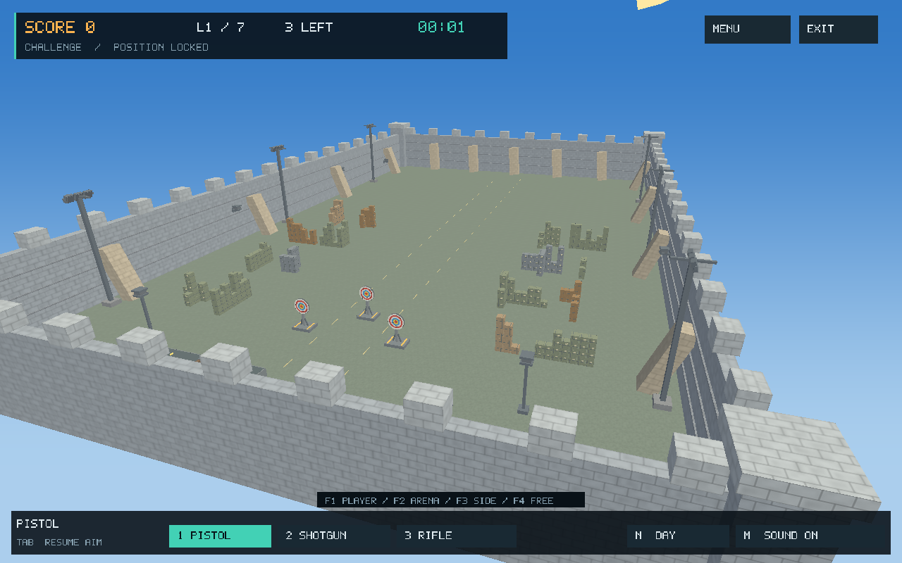 |  |  |
| **Level 4: movement and cover** | **Level 5: motion and birds** | **Level 6: increased speed and NPCs** |
| 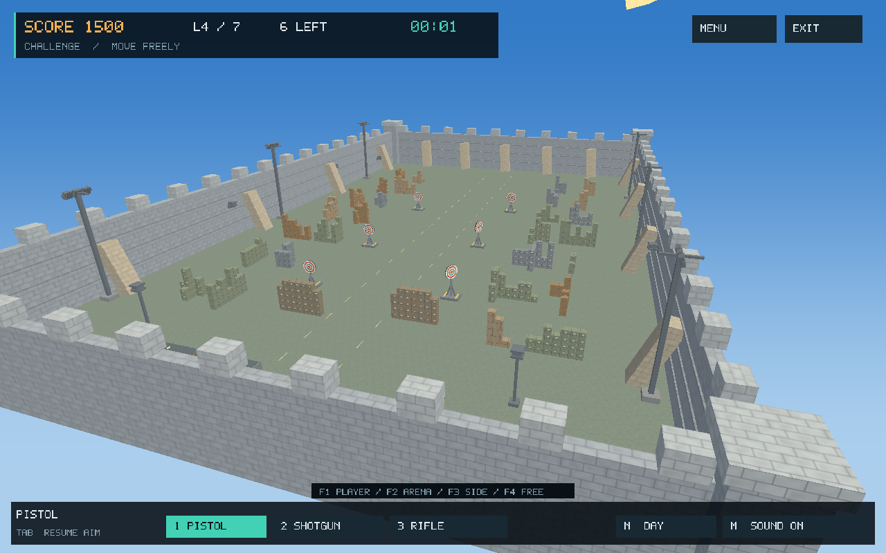 |  |  |
| **Level 7: bird and human penalties** | **Final-level results** | |
| 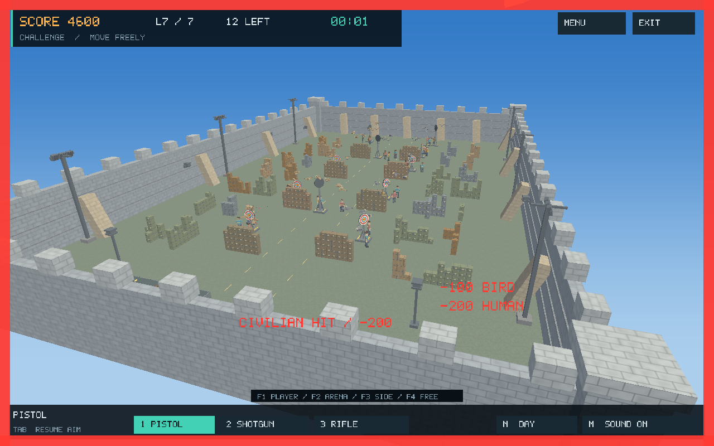 | 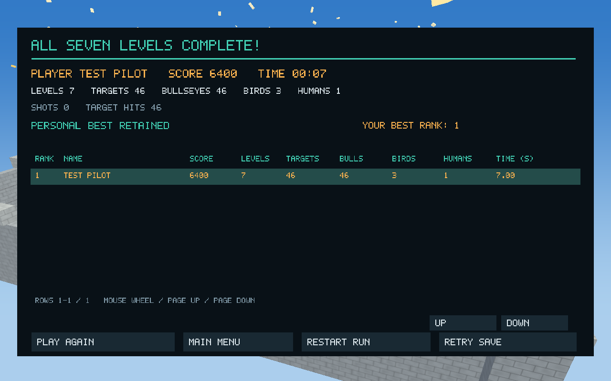 | |
## Report contents and implementation overview

The proposed arena, aiming system, target stands, bullets, scenery, hit effects and camera controls have been implemented. **Transformed cubes are used for every world object**: barrels and bullets are represented by cuboids, and target plates by **32 slices** with shader-generated rings. Multipart assemblies are rendered through separate draw calls. Geometric simplifications are distinguished from functional completion in the report. The report uses **11-point Times text, 0.6-inch margins on all four sides, one-and-a-half body spacing, nine numbered major sections and numbered subsections (1.1, 1.2, etc.)**, with no chapters or forced section-per-page breaks. Captions use 11-point text, and references use IEEE numbered citation format in order of first citation. The cover and references are included in its exact 20-page total.

| Section | Topic and evidence |
| --- | --- |
| Cover | Original template identity: course, title, author/roll, teachers and KUET |
| 1. Introduction and Objectives | Project purpose, educational value, graphics concepts and implementation scope |
| 2. Gameplay and Level Design | Five modes, scoring, all seven levels, seven release-level gameplay images and bounded motion |
| 3. Object Construction and 3D Transformations | Model matrices; arena; worked shear; crate; complete weapon coordinate tables; all pistol, shotgun, rifle and target assembly frames |
| 4. Animation, Shooting and Collision | All three projectile transformations, spread, ray/box collision, complete human/bird assemblies and effects |
| 5. Camera and User Interaction | View/projection matrices, controls-to-code table and ground picking |
| 6. Texture Techniques | Nine procedural maps, exact generation rules, face UVs, arrays and filtering |
| 7. Lighting and Shading | Source types, equations, attenuation, cone, gamma and flat/Gouraud/Phong comparisons |
| 8. Implementation, Advanced Features and Verification | Major functions, build commands, optimizations, adjustable parameters and checks |
| 9. Conclusion and Demonstration | Limits, demonstration sequence, key concepts and attribution |
| References | IEEE-style project, specification, library and original research citations |

The completed arena is presented below. Depth, material identity and spatial organization are established through transformed geometry, surface textures and illumination; gameplay information is provided through the HUD and results screens.

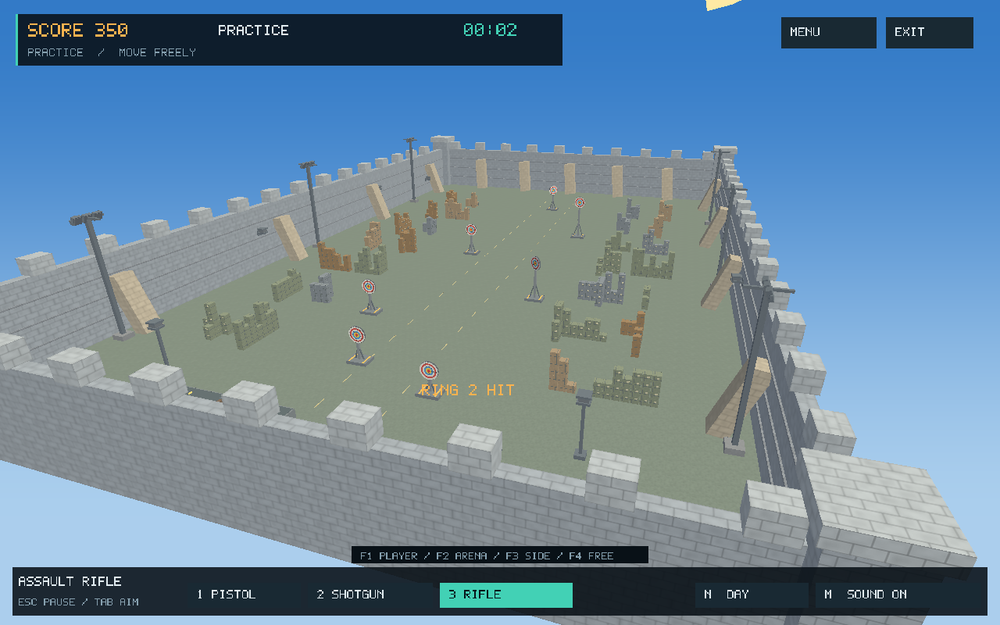

## Run and build

Run `build/release/TargetShooter.exe`. Keep its `shaders/` and `assets/` folders beside it. The Windows release needs OpenGL 3.3. It imports Windows system DLLs only: no separate GLFW DLL or MinGW runtime installation is needed.

For development, use 64-bit MinGW with C++17:

```powershell
./build.bat
./main.exe
# Rebuild and launch:
./run.bat
```

`build.bat` builds root `main.exe` with `-O2`, then [package_release.ps1](tools/package_release.ps1) packages it under `build/release/`. The root executable retains the root leaderboard. The portable package writes its own `leaderboard.csv` and `calc.csv` beside its assets. Packaging never copies test scores over player records.

[Makefile](Makefile) supports `mingw32-make`. [CMakeLists.txt](CMakeLists.txt) registers the same sources and tests:

```powershell
cmake -S . -B .work-cmake -G "MinGW Makefiles" -DCMAKE_BUILD_TYPE=Release
cmake --build .work-cmake -j 2
ctest --test-dir .work-cmake --output-on-failure
```

Textures are shipped assets, not generated during play. All models remain cubes; font and sound are generated in code.

## Generated demonstrations

Every standard game build (`build.bat`, `mingw32-make`, or CMake target `main`) regenerates [object guides](objects/README.md) and the [lighting guide](lighting/lighting.md), including when the game is already compiled. This requires OpenGL 3.3 and adds capture time to builds. Generation failures fail the build rather than silently leaving stale documentation.

[objects/demonstrateObject.cpp](objects/demonstrateObject.cpp) selects deterministic examples from the real scene builders, captures every cube transform and assembly step, and writes numeric matrices and all eight corner calculations. Each type has one directory; alternate states stay inside that directory. [lighting/demonstrateLighting.cpp](lighting/demonstrateLighting.cpp) captures day/night, all three shading modes, all 16 source-family masks, fixtures, materials, emission and target flash using the actual renderer and shaders. Diagnostic source combinations are labeled separately from actual game presets.

Regenerate without rebuilding the game using `mingw32-make demonstrations` (or `cmake --build .work-cmake --target generate_demonstrations`). Generated PNGs and Markdown stay in `objects/` and `lighting/`; the demo executable is not packaged with the game. Validate generated images and links with `powershell -NoProfile -ExecutionPolicy Bypass -File tests/verify_demonstrations.ps1`.

## Playing and modes

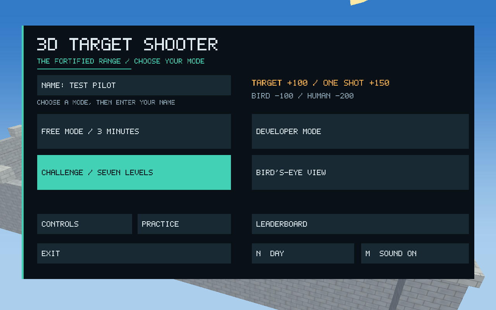

Choose a mode and enter a callsign where requested. Challenge starts with a 1.5-second countdown. Aim at the printed target front and select a weapon that reaches it. Targets can move, rotate or be obscured by cover/NPCs. Levels 1–3 lock player position; 4–7 allow walking around obstacles. Nearby cover must also leave the muzzle clear.

Clear every target, wait for the completion presentation, then choose Next Level or press Enter. Score and active time carry through Challenge. Level 7 leads to Victory and results. Pause, introductions and completion screens freeze active time. Focus loss pauses. Restarting an unfinished Challenge level restores its starting statistics.

| Mode | Behavior | Competitive record |
| --- | --- | --- |
| Challenge | Seven sequential levels; 46 targets across the run; no target respawn | After each completed level, for runs started at level 1 |
| Free | Level-7 arena, 180 active seconds; targets return after 30 seconds with full health and fresh first-shot eligibility | Only after the full session |
| Developer | Direct selection of the same seven levels, diagnostics, reload/select controls | None |
| Bird's-Eye | Level-7 overhead pan/zoom and click-to-observe ground camera | None; no shooting |
| Practice | Seven sandbox targets, unrestricted movement, rapid respawn and original practice scoring | None |

`Game::startMode`, level loading and restart are in [Challenge.cpp](src/gameplay/Challenge.cpp). [SessionController.cpp](src/gameplay/SessionController.cpp) handles menu/session flow and result submission.

| Free | Developer |
| --- | --- |
| 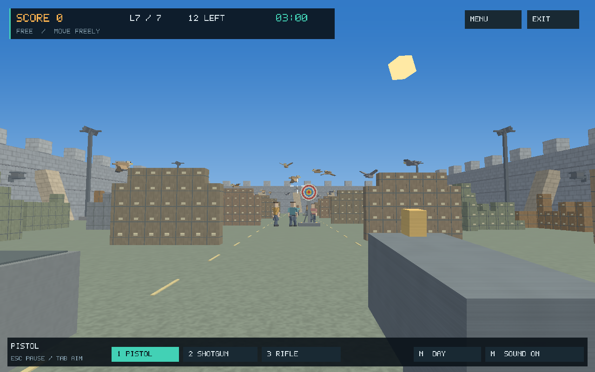 | 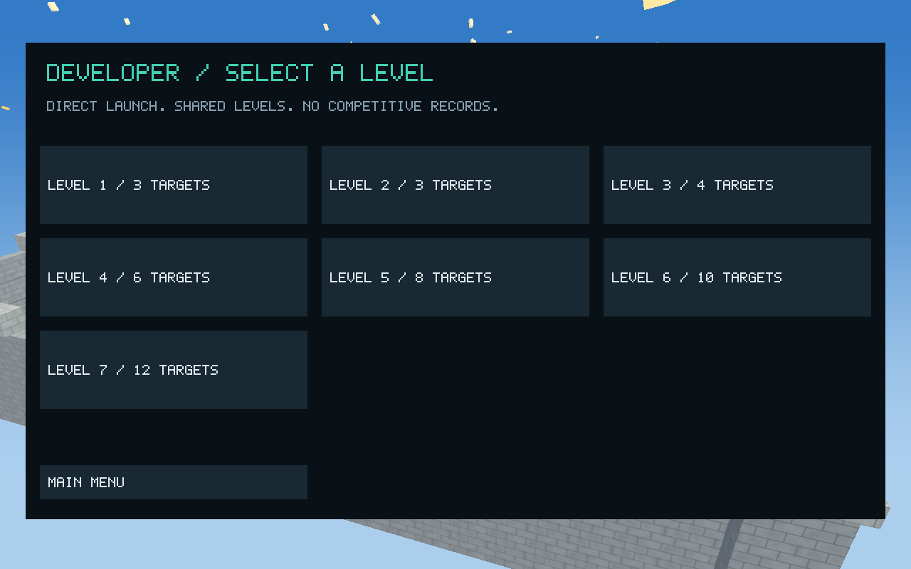 |
| Overhead | Ground observation |
| 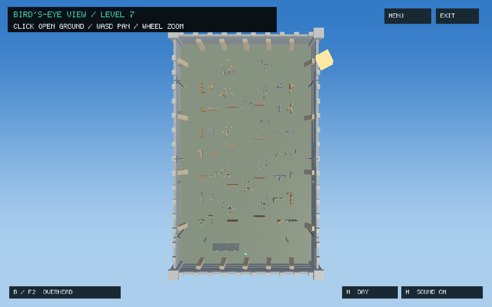 | 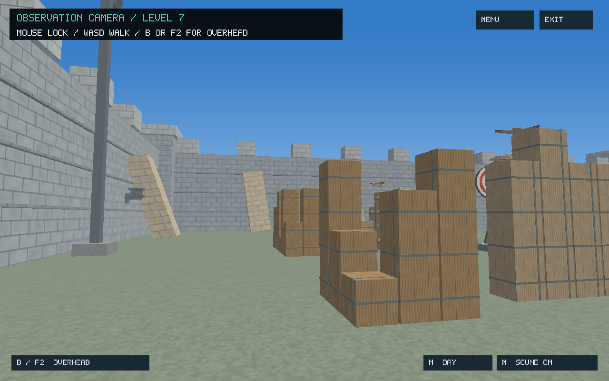 |

## Controls

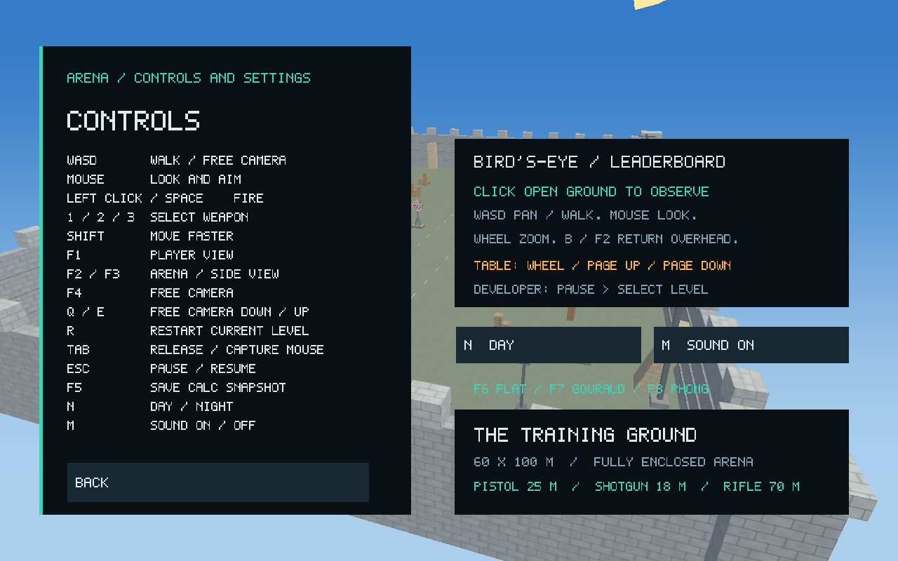

| Input | Action |
| --- | --- |
| WASD / Shift | Walk / faster movement when allowed; move in F4 |
| Mouse | Aim in player view; look in F4 and observation |
| Left click / Space | Fire in player view; hold for rifle, new press for pistol/shotgun |
| 1 / 2 / 3 | Pistol / shotgun / assault rifle |
| F1 / F2 / F3 / F4 | Player / elevated arena / side / free camera |
| Q / E | Free-camera down / up |
| Tab | Release/capture pointer for HUD controls |
| Esc | Pause/resume, back from subpages, exit main menu |
| Enter | Start/submit/confirm Challenge name, resume, advance completed level |
| R | Restart unfinished Challenge level, Developer level or Free session; reset Practice targets |
| N / M | Day-night / sound |
| F6 / F7 / F8 | Flat / Gouraud / Phong shading |
| F5 | Request calculation snapshot |
| B / F2 in Bird's-Eye | Return overhead |
| Wheel overhead / click ground | Zoom / observe from valid unobstructed ground |
| Wheel / Page Up / Page Down on tables | Scroll leaderboard |

`runScene` in [Application.cpp](src/core/Application.cpp) routes input. `screenButtons` and `clickedAction` in [Interface.cpp](src/ui/Interface.cpp) share drawing/hit-test bounds. UI clicks cannot also fire; release fire after resuming. F4 cannot move the grounded player or fire and can pass through geometry. Bird's-Eye observation is collision-aware.

## Levels and target variations

Configurations live in [Level1.cpp](src/levels/Level1.cpp) through [Level7.cpp](src/levels/Level7.cpp), selected by `levelConfiguration` in [LevelManager.cpp](src/gameplay/LevelManager.cpp). Levels 5–7 extend preceding configurations.

| Level | Targets | Differences | Initial NPCs | Final image |
| --- | --- | --- | --- | --- |
| 1: Basic Static Shooting | 3 | Fixed player, stationary targets at Z=-18/-22, pistol range | None | [Level 1](docs/images/release-level-1.png) |
| 2: First Moving Target | 3 | Fixed player, farther Z=-26/-31 targets; center moves on X | None | [Level 2](docs/images/release-level-2.png) |
| 3: Multi-Axis Introduction | 4 | Fixed player, separate X/Y/Z motion and varied speeds, rifle lanes | None | [Level 3](docs/images/release-level-3.png) |
| 4: Move Around Cover | 6 | Walking, single-axis movement, two spinners and cargo screens | None | [Level 4](docs/images/release-level-4.png) |
| 5: Birds and Compound Motion | 8 | Adds X+Z and Y+Z spinners | 8 birds | [Level 5](docs/images/release-level-5.png) |
| 6: Faster Three-Axis Targets | 10 | Adds two faster XYZ spinners and more cover | 16 birds | [Level 6](docs/images/release-level-6.png) |
| 7: Final Arena | 12 | Two more, still faster XYZ spinners; densest cover | 48 birds, 36 humans, initially 4/3 per target | [Level 7](docs/images/release-level-7.png) |


### Complete level gallery

Each level has an intro, active-play, completion and results capture. The active-play
images below show how the arena becomes progressively denser, more mobile and more
NPC-heavy across the progression; birds first appear in Level 5, and humans in Level 7.

| Level 1 | Level 2 | Level 3 |
| --- | --- | --- |
|  |  |  |
| [Intro](docs/images/release-level-1-intro.png) · [Complete](docs/images/release-level-1-complete.png) · [Results](docs/images/release-level-1-results.png) | [Intro](docs/images/release-level-2-intro.png) · [Complete](docs/images/release-level-2-complete.png) · [Results](docs/images/release-level-2-results.png) | [Intro](docs/images/release-level-3-intro.png) · [Complete](docs/images/release-level-3-complete.png) · [Results](docs/images/release-level-3-results.png) |

| Level 4 | Level 5 | Level 6 |
| --- | --- | --- |
|  |  |  |
| [Intro](docs/images/release-level-4-intro.png) · [Complete](docs/images/release-level-4-complete.png) · [Results](docs/images/release-level-4-results.png) | [Intro](docs/images/release-level-5-intro.png) · [Complete](docs/images/release-level-5-complete.png) · [Results](docs/images/release-level-5-results.png) | [Intro](docs/images/release-level-6-intro.png) · [Complete](docs/images/release-level-6-complete.png) · [Results](docs/images/release-level-6-results.png) |

| Level 7: final arena |
| --- |
|  |
| [Intro](docs/images/release-level-7-intro.png) · [Complete](docs/images/release-level-7-complete.png) · [Results](docs/images/release-level-7-results.png) |

`configuredTarget` in [LevelBase.cpp](src/levels/LevelBase.cpp) sets amplitude, frequency, phase and signed spin. `movementOffset` in [Movement.cpp](src/gameplay/Movement.cpp) computes each axis as `amplitude * sin(time * frequency + phase)`. `updateTarget` in [Target.cpp](src/gameplay/Target.cpp) adds it to the base position and updates yaw. Practice retains its horizontal, vertical, rotating and stationary variations.

`createTargetObjects` makes each face from 32 thin cube slices approximating a circle. Shared target-relative coordinates preserve the six-ring print; paper texture modulates it. Health, front-only hit rules, ring colors, flash, braces and warning stripes remain.

| Printed front | Rear |
| --- | --- |
| 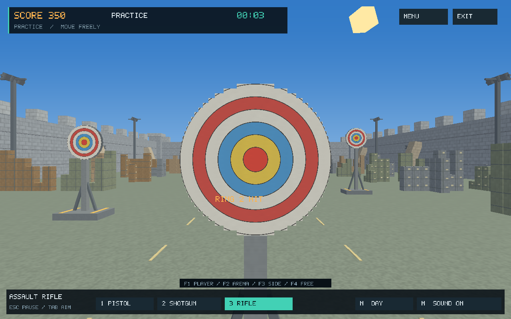 | 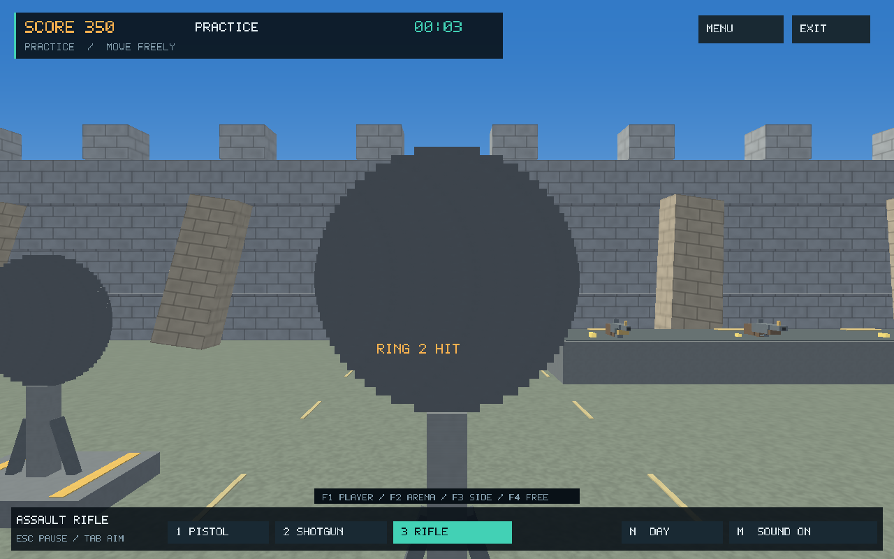 |

## Weapons, contacts and scoring

[Weapon.cpp](src/gameplay/Weapon.cpp) defines `weaponSpec`, `createWeapon` and `weaponMuzzle`. Bodies, barrels, grips, sights, guards, details and applicable stocks/magazines remain cube assemblies following aim and recoil. Metal parts use brushed metal; grips/stocks/fore-ends use rubber.

| Weapon | Range | Speed | Cooldown | Pellets | Spread |
| --- | --- | --- | --- | --- | --- |
| Pistol | 25 m | 42 m/s | 0.28 s | 1 | None |
| Shotgun | 18 m | 36 m/s | 0.80 s | 9 | Center plus eight directions at 0.075 |
| Rifle | 70 m | 65 m/s | 0.11 s | 1 | Deterministic 0.009 |

| Pistol | Shotgun | Rifle |
| --- | --- | --- |
| 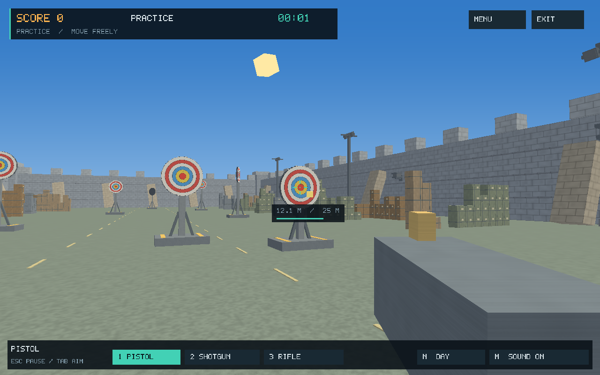 | 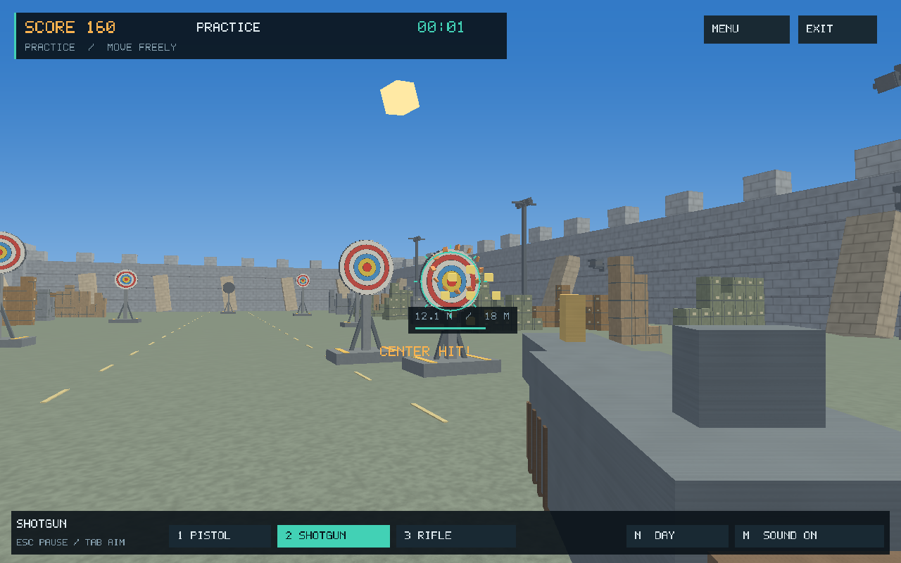 | 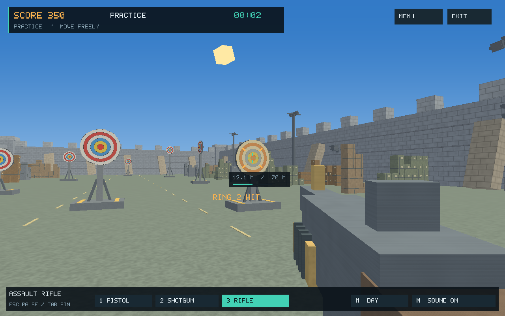 |

`Game::fire` in [Game.cpp](src/gameplay/Game.cpp) aims from the player then directs the muzzle toward that point, rejecting a muzzle beyond cover. `updateProjectiles` in [Projectile.cpp](src/gameplay/Projectile.cpp) sweeps travel segments against obstacles, target slices and live NPC parts; the nearest contact wins. Projectiles disappear on contact or at maximum range.

Targets have 60 health. `ringDamage` gives **60/30/20/15/12/10** damage from center outward. Back/edge hits stop shots without scoring. Shotgun pellets share a trigger ID: only the strongest damage applies, with better later pellets upgrading rather than stacking.

[ScoreSystem.cpp](src/gameplay/ScoreSystem.cpp) implements level-mode scoring:

- Destroy target: **+100**, or **+150 total** when destroyed by its first valid trigger. Damage alone scores nothing.
- Bird: **-100**. Human: **-200**. Negative scores are valid; dead NPCs cannot be repeatedly penalized.
- Practice retains `Game::applyTargetHit`'s damage-points-plus-100 rule and 1.8-second target respawn.

Crosshairs, hit markers, scores, red penalty feedback, sounds, recoil and fragments remain. Cumulative statistics remain on result pages.

### NPC hit and death effect

NPC hits are resolved before the projectile is removed. The live collider is
disabled immediately, the appropriate bird or human penalty is applied once,
and the presentation changes from a live animated assembly to a falling/tumbling
dead body. A short red particle burst is simulated as bounded debris: each
piece receives deterministic velocity, gravity and rotation, then settles on
the ground. The effect is cosmetic and does not become a new collider.

| Hit impact | Fallen body |
| --- | --- |
| 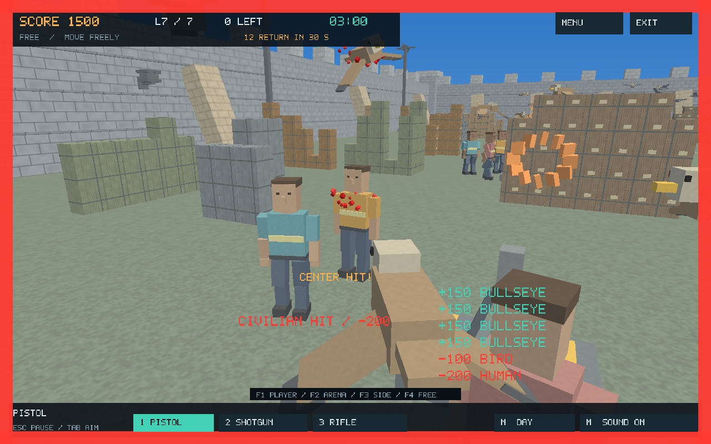 | 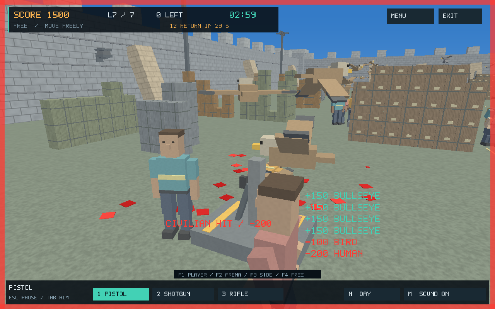 |

The flow is implemented by `updateProjectiles` in [Projectile.cpp](src/gameplay/Projectile.cpp),
the NPC lifecycle in [Npc.cpp](src/gameplay/Npc.cpp), and the debris simulation
in [Game.cpp](src/gameplay/Game.cpp). Birds tumble under gravity; humans keep
their connected cube parts and collapse onto the ground. Dead NPCs remain
visible, but they cannot be shot again, block movement, or redistribute to
another target zone.

## Internal mechanism

The game is organized as a deterministic simulation that produces a temporary
list of cube objects for the renderer every frame. The main runtime path is:

1. **Input and session state** — `runScene` in [Application.cpp](src/core/Application.cpp)
   collects keyboard, mouse and window-focus events. [SessionController.cpp](src/gameplay/SessionController.cpp)
   turns those events into menu, pause, intro, active, completion and results
   transitions.
2. **Fixed-size simulation steps** — [Game.cpp](src/gameplay/Game.cpp) splits
   each frame's elapsed time into steps of at most `1/120` second. This keeps
   movement, target animation, projectile travel and death falls stable when
   the display frame rate changes.
3. **Level construction** — `startMode` selects a `LevelConfig`; `loadCurrentLevel`
   creates the seeded world, target list, birds and humans. [LevelManager.cpp](src/gameplay/LevelManager.cpp)
   owns the 1.5-second intro, active timer, completion presentation and Level 7
   finish state.
4. **Target motion and hit state** — [Target.cpp](src/gameplay/Target.cpp)
   evaluates sinusoidal motion and rotation from the target's base transform.
   Each target is a 32-slice circular plate, so visible geometry and collision
   geometry are the same. A front hit becomes ring damage; rear and edge
   contacts are rejected.
5. **Weapon and projectile pipeline** — `Game::fire` finds the first visible
   aim point, checks that the muzzle is not inside cover, then creates one or
   more projectiles. [Projectile.cpp](src/gameplay/Projectile.cpp) sweeps each
   projectile over its travel segment against obstacles, target slices and
   live NPC parts. The nearest contact wins, preventing fast shots from
   tunneling through thin geometry.
6. **Scoring and lifecycle** — target damage is accumulated per shot ID so
   shotgun pellets cannot multiply-score one trigger. [ScoreSystem.cpp](src/gameplay/ScoreSystem.cpp)
   applies target rewards and NPC penalties, while `LevelManager::finishIfComplete`
   advances only after every target is permanently eliminated. Free mode instead
   expires at 180 active seconds and allows timed target respawns.
7. **Scene assembly** — [GameScene.cpp](src/gameplay/GameScene.cpp) copies
   static cubes, then appends current targets, NPC assemblies, player/weapon,
   projectiles, debris and celebration effects. This list is also what the
   calculation snapshot system observes; object IDs and notes are extended with
   mode, level and simulation time for traceability.
8. **Rendering** — [Renderer.cpp](src/rendering/Renderer.cpp) draws each cube
   from one shared 36-vertex cube buffer. The vertex shader builds the model
   transform and face UVs; the fragment shader samples the texture array and
   applies the selected flat, Gouraud or Phong lighting path. Day/night rigs
   are cached and switched without rebuilding scene geometry.
9. **Persistence** — completed eligible results are handed to
   [Leaderboard.cpp](src/persistence/Leaderboard.cpp), which reloads the CSV,
   compares the record, writes through a checked temporary file and atomically
   replaces the saved leaderboard. Calculation snapshots are coalesced and
   written outside the rendering hot path.

### Per-frame ordering

```text
poll input
  -> session/menu actions
  -> fixed simulation steps
       -> update effects and transitions
       -> update targets and NPC movement
       -> sweep projectiles and apply contacts
       -> apply score, penalties and level completion
  -> assemble Game::scene()
  -> render arena and HUD
  -> queue sound and coalesced calculation snapshot
```

The renderer does not decide gameplay outcomes: collision, health, score,
respawn and NPC state are resolved on the CPU first. Conversely, visual
effects do not silently change collision. Blood fragments, projectiles,
celebration confetti and emissive flashes are renderable objects with
lifetimes, but none are inserted into the obstacle or NPC collider lists.

## NPCs and spawning

`Game::loadCurrentLevel` creates configured birds/humans around target zones. [Bird.cpp](src/gameplay/Bird.cpp), [Human.cpp](src/gameplay/Human.cpp) and [Npc.cpp](src/gameplay/Npc.cpp) implement bounded destinations, animation and cube assemblies. Birds fly and flap; humans walk/pause on the ground, avoiding cargo, walls and stands. Human heights vary from 2.05–2.20 m, scaling the whole assembly.

A hit removes the live collider immediately, applies a penalty and plays a sound/red cube-particle effect. Birds tumble under gravity; humans collapse as connected assemblies. `groundNpcParts` uses transformed cube bounds for grounding. Bodies remain visible without becoming new live shot/movement obstacles.

Survivors redistribute when their target is permanently eliminated, using zones with room under separate ten-bird/ten-human caps. If destinations are full, survivors remain alive in the old zone. Dead NPCs never redistribute or respawn, even when Free targets return. Reloading a level/session creates a fresh initial population.

| Civilian | Fallen NPCs |
| --- | --- |
| 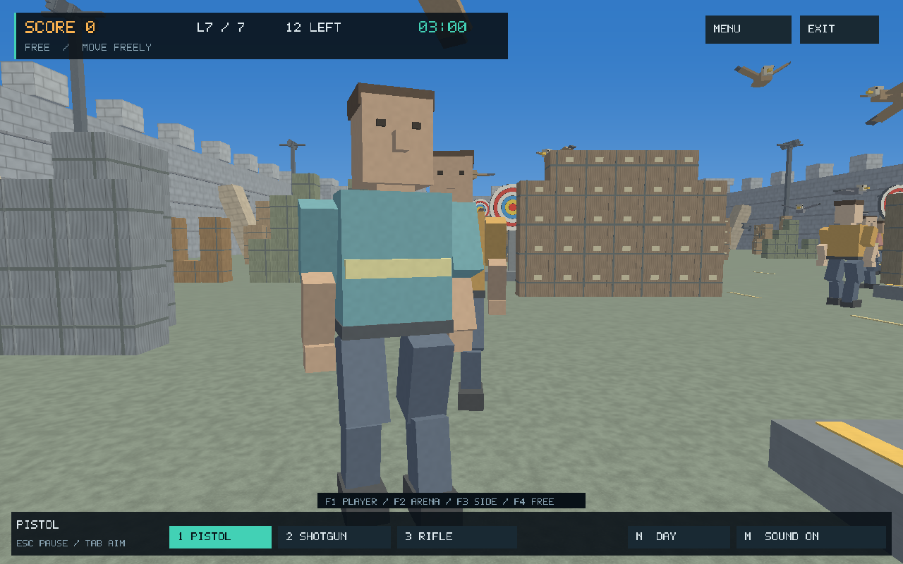 |  |

`generateCargoLayout` in [Cargo.cpp](src/world/Cargo.cpp) uses seeded side cells, 0.70 m crates, stacks of 1–5, runs of 3–7, and L/T formations. `addCrate` attaches two bands and an inventory plate. `generateChallengeCargo` adds `2 * (level - 3)` cover-screen groups from level 4 and removes whole assemblies conflicting with target motion corridors.

`createLevelWorld` and `validateLevelWorld` in [LevelWorld.cpp](src/world/LevelWorld.cpp) validate fixed-player range/sightlines or flood-fill movable levels and check reachable firing positions. Failed layouts can retry with changed seeds. Textures do not affect seeds, transforms, dimensions or collision.

## Leaderboard and results

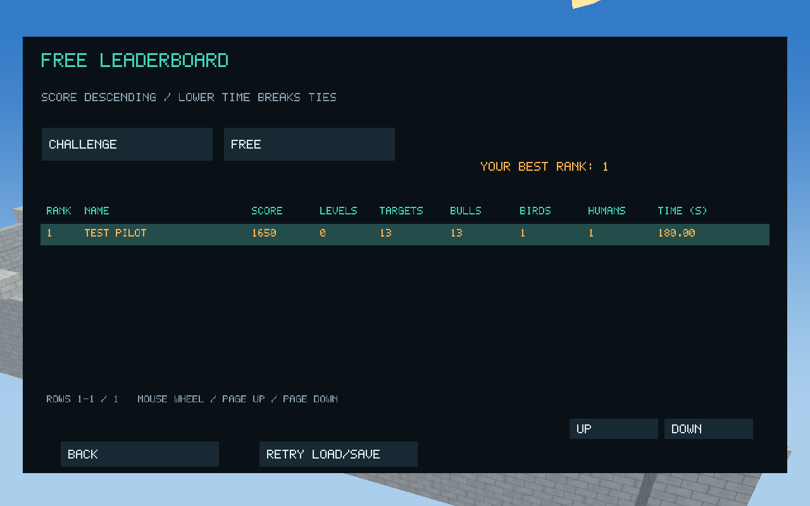

[Leaderboard.cpp](src/persistence/Leaderboard.cpp) stores one best record per `(Name, Mode)` in `leaderboard.csv`. Challenge and Free stay separate. Higher score wins; lower active time breaks ties; names break exact table-order ties. A saved row contains one coherent result, including counts and elapsed time.

Challenge submits completed-level results only from runs begun at level 1. Free submits only after 180 seconds. Developer, Bird's-Eye and Practice do not submit. Abandoning an unfinished level cannot replace its last eligible result. Existing names require confirmation or rewriting.

`Leaderboard::submit` reloads before merging and accepts only better eligible results. [CsvFile.cpp](src/persistence/CsvFile.cpp) provides checked temporary writes and atomic replacement. Invalid data rows produce warnings; malformed files/unsupported headers produce errors while preserving files. Failed results remain in memory for Retry Save during the session. Tables scroll and highlight the player.

| Challenge results | Free results |
| --- | --- |
|  | 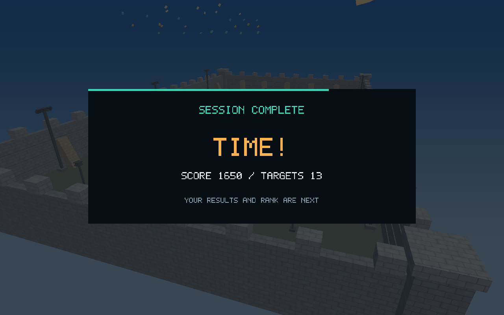 |

## Objects and cube geometry

The arena is 60 × 100 m, with Y=0 ground and forward along negative Z. Continuous walls have battlements, towers and sheared supports. Structures are the existing enclosure, fixtures, equipment display and stacked cover; there are no imported building meshes.

| Object | Creation code | Material |
| --- | --- | --- |
| Floor, route markers | `createArena`, [Arena.cpp](src/world/Arena.cpp) | Gravel, tinted concrete |
| Walls, towers, supports | `createArena` | Masonry |
| Crates, cover, bands, labels | `generateCargoLayout`, `generateChallengeCargo`, `addCrate`, [Cargo.cpp](src/world/Cargo.cpp) | Wood, metal, paper |
| Lamps/stadium towers | `createLightFixtures`, [Lighting.cpp](src/world/Lighting.cpp) | Metal, concrete footings; night-emissive lenses |
| Equipment table, mat, exhibits | `createEquipmentDisplay`, [Environment.cpp](src/world/Environment.cpp) | Metal, rubber, actual weapon builders |
| Target slices/stands | `createTargetObjects`, [Target.cpp](src/gameplay/Target.cpp) | Paper, metal |
| Weapons | `createWeapon`, [Weapon.cpp](src/gameplay/Weapon.cpp) | Metal, rubber |
| Birds/humans/player | NPC builders, `Game::scene`, [GameScene.cpp](src/gameplay/GameScene.cpp) | Subtle fabric modulation with existing colors |
| Sun/projectiles/flashes/effects | Environment, Projectile, Weapon and Effects builders | Plain/emissive where appropriate |

| Cargo and ground | Masonry |
| --- | --- |
| 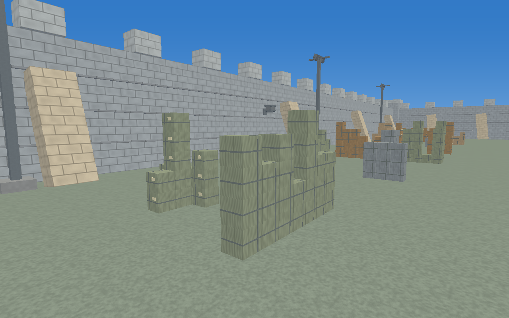 | 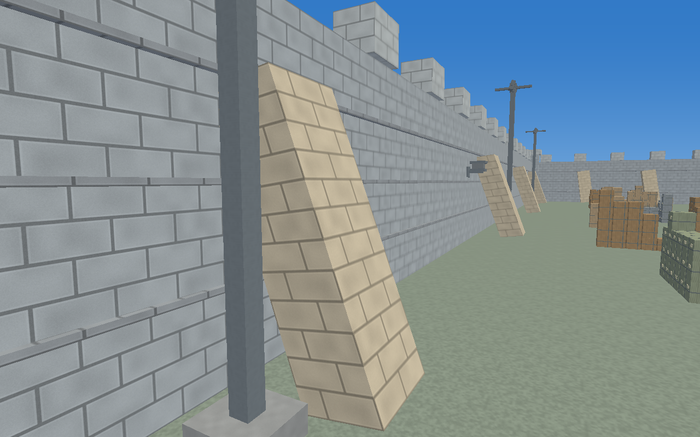 |

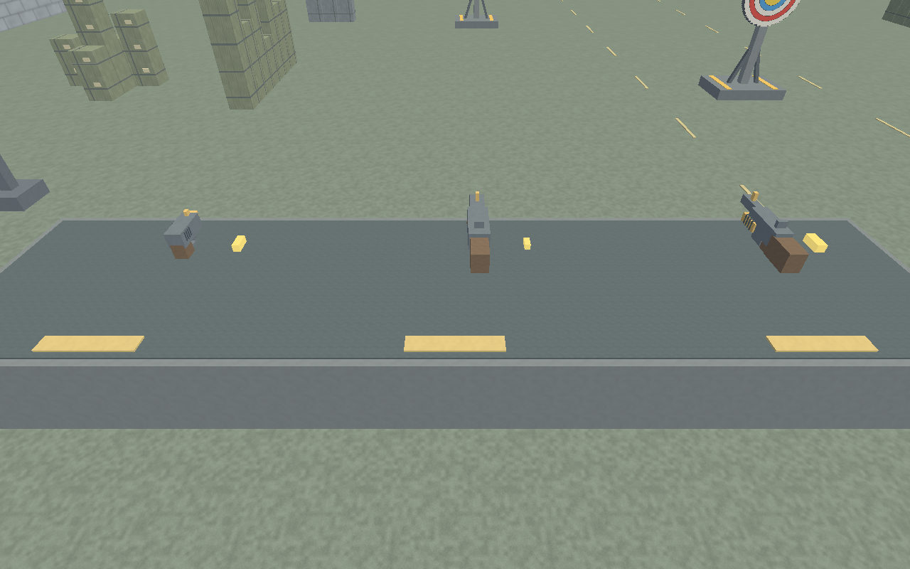

[SceneObject.h](src/core/SceneObject.h) retains ID/type/component, transform, color, notes, specular/shininess/emission, target pattern, parent and observation data. Two visual fields were appended: `material` and `textureScale`. Existing `makeCube` and aggregate constructors receive defaults; the object system is unchanged.

[Transform.h](src/core/Transform.h) composes `M = T * Rz * Ry * Rx * H * S` for scale, six shear terms, rotations and translation. `Renderer::initialize` expands eight cube corners into one shared 36-vertex VBO with position/normal. `drawTransformedCube` uploads model, inverse-transpose normal matrix, color and material uniforms, then draws those vertices. There is one draw per object; no new GPU instancing is claimed.

Modify an object in its builder by editing position, scale, rotation, shear, color or material. Assemblies use related IDs and shared `parent` values. Keep collision and visual transforms consistent; targets use the same slice transforms and NPC contacts use animated parts.

To add a static prop, use `makeCube` in a world builder and append it through `createLevelWorld` or the Practice setup. Static objects participate in obstacle tests, so preserve paths/sightlines. Multi-part props remain multiple cubes. Moving visuals can append builder output in `Game::scene`, with explicit collision behavior if required. Assigning a texture adds no gameplay behavior.

## Object construction: report examples and calculations

The following construction examples are evaluated from the object builders and illustrated with the `objects/` and `lighting/` captures. World units are expressed in meters, and displayed decimals are rounded. Full-precision transforms and all eight cube-corner traces are retained in the generated guides.

### Shared mathematical pipeline

```text
local cube corners = every combination of ±0.5 in X/Y/Z
worldPoint = T * Rz * Ry * Rx * H * S * localPoint
clipPoint = projection * view * worldPoint
NDC = clipPoint.xyz / clipPoint.w
normal = normalize(transpose(inverse(mat3(model))) * localNormal)
```

For `c=cos(angle*pi/180)` and `s=sin(angle*pi/180)`, rotations map `(x,y,z)` to `(x,c*y-s*z,s*y+c*z)` around X, `(c*x+s*z,y,-s*x+c*z)` around Y, and `(c*x-s*y,s*x+c*y,z)` around Z. Shear maps to `(x+hxy*y+hxz*z, hyx*x+y+hyz*z, hzx*x+hzy*y+z)`. Translation adds the object's world center. Vectors use `w=0`; points use `w=1`. The renderer does not apply a hidden parent transform: builders have already transformed component offsets into world positions.

### Arena and a fully worked sheared support

| Part | Center | Scale | Rotation |
| --- | --- | --- | --- |
| Floor | `(0,-0.1,-50)` | `(60,0.2,100)` | Identity |
| North/south walls | `(0,4,-100)` / `(0,4,0)` | `(60,8,1)` | Identity |
| East/west walls | `(±30,4,-50)` | `(100,8,1)` | Y = 90° |
| Corner tower | `(±30,4.75,-100 or 0)` | `(3.5,9.5,3.5)` | Identity |
| Corner cap | `(±30,10,-100 or 0)` | `(4.2,1,4.2)` | Identity |
| Equipment table | `(-9,0.55,-8)` | `(12,1.1,3)` | Identity |

The first eastern support uses scale `(1.5,6,2)`, XY shear `0.22`, Z rotation `-8°`, and translation `(28,2.98332977,-18)`. One corner follows:

```text
Local       (0.5, 0.5, 0.5)
Scaled      (0.75, 3, 1)
Sheared     (1.41, 3, 1)                  x = 0.75 + 0.22*3
Rotated     (1.8137973, 2.7745701, 1)     Rx and Ry are identity
Translated  (29.8137973, 5.7578999, -17)
```

The vertical half-extent is `0.5*(abs(M10)+abs(M11)+abs(M12)) ≈ 2.9833298`; translating upward by that amount anchors the lowest corner at ground level. The actual builder checks all eight corners. An east-wall corner follows `(0.5,0.5,0.5) → (50,4,0.5) → (0.5,4,-50) → (30.5,8,-100)`.

| Unit cube | Scale | Shear | Final world placement |
| --- | --- | --- | --- |
| 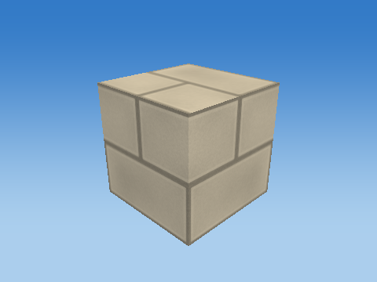 | 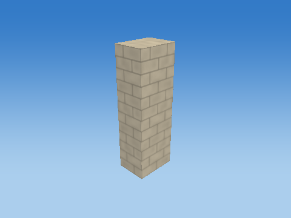 | 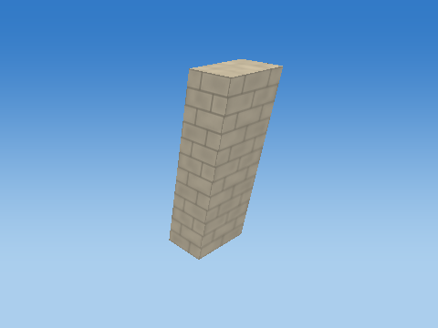 |  |

Final inspection cameras recenter on world coordinates to preserve visibility; this is not an additional object transformation. [Complete support trace](objects/boundary-sheared-stone-support/boundary-sheared-stone-support.md).

### Four-cube cargo assembly

Crate side `s=2.1/3=0.7`. The first seed-2107042 crate has yaw zero and body center `(-21.23,0.35,-20)`. Every detail uses `bodyCenter + Ry(yaw)*offset`.

| Step | Part | World center | Scale |
| --- | --- | --- | --- |
| 1 | Wood body | `(-21.23,.35,-20)` | `(.7,.7,.7)` |
| 2 | Vertical band | `(-21.426,.35,-20)` | `(.0385,.708,.708)` |
| 3 | Horizontal band | `(-21.23,.35,-20)` | `(.708,.0385,.708)` |
| 4 | Inventory plate | `(-21.125,.483,-19.644)` | `(.189,.112,.012)` |

| 1: body | 2: vertical band | 3: horizontal band | 4: plate |
| --- | --- | --- | --- |
|  |  |  |  |

The bands extend by `.008` m and the label sits `.006` m beyond the face. Layout spacing is `.735` m; seeded 90° rotations, bounded lane jitter, 1–5-crate stacks and nonoverlapping L/T formations produce variety while preserving corridors. [Full cargo guide](objects/cargo-crate/cargo-crate.md).

### Weapons: assembly, coordinates, aiming and recoil

| Weapon | Permanent parts | Construction order | Fixed display anchor |
| --- | ---: | --- | --- |
| Pistol | 11 | Body, grip, barrel, sight, muzzle inset, lower guard, front guard, four side details | `(-13,1.65,-8)` |
| Shotgun | 14 | Body, barrel, stock, grip, fore-end, front/rear sights, muzzle inset, two guard parts, four bands | `(-9,1.65,-8)` |
| Rifle | 15 | Shotgun sequence with rifle dimensions and an added magazine after the fore-end | `(-5,1.65,-8)` |

Display yaw is `-90°` and pitch is zero, so its orientation is identity. For example, the pistol body offset `(.32,-.25,-.68)` and size `(.22,.22,.56)` give world center `(-12.68,1.4,-8.68)`. Its grip center is `(-12.68,1.19,-8.5)`, size `(.18,.37,.20)`, and YZ shear `-.3`. Grip corner `(.5,.5,.5) → (.09,.185,.10) → (.09,.155,.10) → (-12.59,1.345,-8.4)`. Long-gun grips use YZ shear `-.4`; the rifle magazine uses `-.22`.

```text
Q = Ry(-playerYaw - 90) * Rx(playerPitch)
partCenter = playerPosition + Q * (offset + (0,0,recoil*0.20))
partModel = T(partCenter) * Ry(-playerYaw-90) * Rx(playerPitch) * H * S
```

At player startup `(0,1.7,-5)`, yaw `-90°`, pitch `3.8°`, the pistol body center is approximately `(.32,1.49562,-5.69507)`. Firing sets recoil to 1; it decays by `7*dt`. Recoil above `.65` adds one emissive muzzle-flash cube. Section 3 shows **every assembly frame and complete component coordinate tables for all three weapons**, with worked body, grip and magazine calculations. Individual transformation stages are also available in these guides:

- [Pistol: 11 steps and all numeric traces](objects/weapon-pistol/weapon-pistol.md)
- [Shotgun: 14 steps and all numeric traces](objects/weapon-shotgun/weapon-shotgun.md)
- [Rifle: 15 steps and all numeric traces](objects/weapon-rifle/weapon-rifle.md)

### Target and stand: all 38 steps

Steps 1–6 add the base, pole, left brace, left warning stripe, right brace and right stripe. Steps 7–38 add 32 plate slices from bottom to top. For the representative center `(0,2.7,-19)`, radius `.8` and thickness `.16`:

```text
sliceHeight = 2*0.8/32 = 0.05
sliceY(i) = -0.8 + (i+0.5)*0.05
sliceWidth(i) = 2*sqrt(0.8*0.8 - sliceY(i)*sliceY(i))
sliceCenter(i) = (0, 2.7+sliceY(i), -19)
sliceScale(i) = (sliceWidth(i), 0.05, 0.16)
```

Slice 0 has center `(0,1.925,-19)` and width `.396863`; slice 15 has center `(0,2.675,-19)` and width `1.599219`; slice 31 has center `(0,3.475,-19)` and width `.396863`. Pole height is `max(.3,2.7-.8)=1.9`; its center/size are `(0,.95,-19)` / `(.24,1.9,.24)`. The base uses `(0,.15,-19)` / `(2,.3,1.5)`. Braces are centered at `(±.28,.751,-19)`, size `(.10,1.064,.12)`, with Z rotation `±18°`; warning strips use `(±.7,.307,-19)` / `(.16,.012,1.36)`.

| Base | Support structure complete | Half of plate assembled | All 38 cubes |
| --- | --- | --- | --- |
| 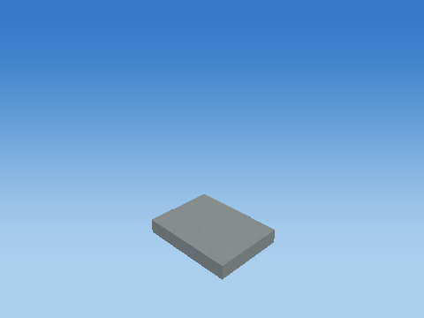 | 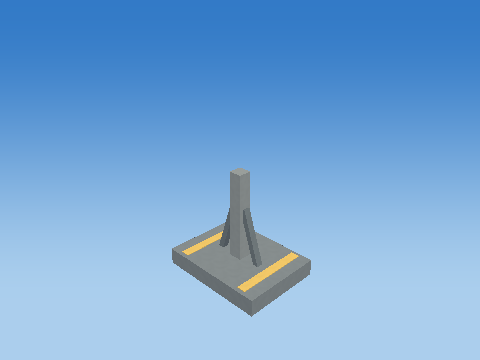 | 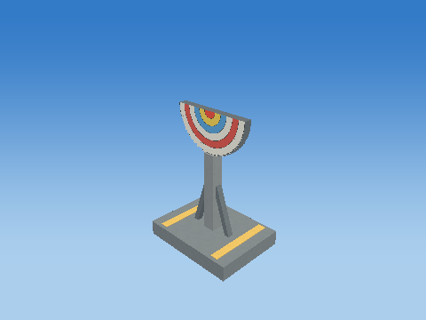 | 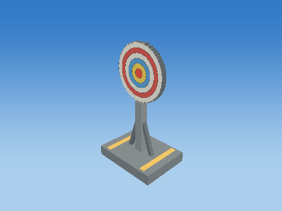 |

To keep rings continuous between slices, `patternScale=(width/1.6,.05/1.6,1)` and `patternOffset=(0,sliceY/1.6,0)`. The shader computes `q=localPosition*patternScale+patternOffset`, `radius=2*length(q.xy)`, `ring=clamp(int(radius*6),0,5)`. `fract(radius*6)>.95` draws separators; only local +Z faces print rings. [Every target assembly/transform step](objects/target/target.md).

### Projectiles, actors and effects

Pistol/shotgun/rifle projectile scales are `(.10,.10,.25)`, `(.08,.08,.18)`, `(.13,.13,.30)`. The display centers are `(-12,1.17,-8.7)`, `(-8,1.17,-8.7)`, `(-4,1.17,-8.7)`, all directed along -Z. Actual shots start at `playerPosition + Q*(.32,-.22,-1.02)` for pistol or Z offset `-1.52` for long guns. They aim at the camera ray's nearest contact, then move by `min(speed*dt, range-travelled)` shortened to the nearest collision. Projectile orientation is X=`asin(direction.y)` and Y=`atan2(-direction.x,-direction.z)` in degrees. The report explains deterministic spread, camera/muzzle parallax correction and inverse-model slab intersection in Section 4.

Humans have 21 cuboids and use `height/1.82` to scale reference dimensions to seeded heights of 2.05–2.20 m. Birds have 10 cuboids. Both place offsets using `npcPosition + Ry(heading)*Rx(fall)*offset`. Human walking swings limbs by `22*sin(animation)` degrees; bird wings flap by `35*side*sin(animation)` with sinusoidal center offsets. Human fall is `90*min(1,deathTime/.75)^2`; bird falling uses gravity 14 and pitch rate 260°/s. [Human construction](objects/human/human.md) and [bird construction](objects/bird/bird.md) show every part.

Hit flash blends ring color toward `(1,.76,.2)` by `(hitTime/.25)*.5`. Twelve break fragments use radial velocities `(2.4*cos(a),2+2*sin(a),1.5)`, `a=2*pi*i/12`, gravity 7, and lifetime `.75`. Seeded blood uses gravity 13.5, expires, and flattens at the floor. Celebration uses a fixed golden-angle distribution, delayed particle ages, ballistic Y movement and cube rotations; its complete formula appears in Section 4 and in [Effects.cpp](src/gameplay/Effects.cpp). These cosmetic particles do not score or create new light sources.


For horizontal floor offset `x` from the warm point lamp, `d=sqrt(x*x+4.7*4.7)` and `N·L=4.7/d`. Its diffuse contribution is `(2.2,1.65,.9)*4.7 / (d*(1+.09*d+.032*d*d))`. This combines angular and distance falloff. The spotlight transition `I=t*t*(3-2*t)` has derivative `6*t*(1-t)`, zero at both cone boundaries; `t=.5` gives half intensity in cosine space. Report Section 7 includes the corresponding distance and fixture images.

### Camera and lighting equations in the report

For yaw `y`, pitch `p`, camera forward is `normalize(cos(y)*cos(p),sin(p),sin(y)*cos(p))`. Right is `normalize(cross(forward,worldUp))`; corrected up is `cross(right,forward)`. The view matrix rows use right, up and minus-forward with their eye dot products. Perspective uses `f=1/tan(FOV/2)`, diagonal `f/aspect,f`, depth terms `(far+near)/(near-far),2*far*near/(near-far)`, and bottom row `(0,0,-1,0)`. Gameplay uses FOV 60°, near `.05`, far `400`; isolated construction captures use FOV 45° and fitted clip planes. Bird's-Eye unprojects cursor coordinates into a ray and intersects Y=0 at `eye-ray*(eye.y/ray.y)`, then validates the observation position.

Report Sections 6–7 and the following sections explain the nine texture-generation formulas, face-local UVs, texture arrays, filtering, normal matrix, Lambert diffuse, Phong reflection, point/spot falloff, smoothstep cone, emission, gamma, sky and all three shading modes. For an upward floor normal, the day sun's Lambert factor is about `.828449`. Under the warm lamp at `(-18,4.7,-12)`, distance `4.7` gives point attenuation `1/(1+.09*4.7+.032*4.7²)=.469510`. These values represent individual lighting terms before texture modulation and the final colour clamp.

## Texture system

Nine material maps are generated offline by [generate_textures.cpp](tools/generate_textures.cpp) and provided under [assets/textures](assets/textures). Grain, mortar, noise and weave are represented through deterministic procedural patterns. These images are loaded into GPU textures at startup; pattern generation is separated from per-fragment sampling.

| Layer / Material | File | Repeats per scaled local meter |
| --- | --- | --- |
| 0 Plain | `plain.ppm`, white neutral fallback | 1 |
| 1 Concrete | `concrete.ppm`, mottling/pores | 1 |
| 2 Masonry | `masonry.ppm`, staggered mortar | 0.5 |
| 3 Gravel | `gravel.ppm`, granular ground | 0.65 |
| 4 Wood | `wood.ppm`, planks/grain | 1 |
| 5 Metal | `metal.ppm`, brushed lines | 3 |
| 6 Fabric | `fabric.ppm`, fine weave | 6 |
| 7 Paper | `paper.ppm`, print substrate | 2 |
| 8 Rubber | `rubber.ppm`, grip pattern | 8 |

### Loading, caching and memory

`TextureCache::initialize` in [TextureCache.cpp](src/rendering/TextureCache.cpp) loads each P6 PPM once at startup and validates format, 256 × 256 dimensions, maximum value 255 and complete payload. Missing, malformed or truncated files report a named startup error. Reinitializing the cache does not reload.

One `GL_TEXTURE_2D_ARRAY` contains all maps as `GL_RGB8`. `TextureCache::bind` binds unit zero once per scene pass. Numeric layer uniforms select materials; no per-cube texture bind, path lookup or GPU allocation occurs. The cache deletes its texture before context teardown and releases CPU pixels after upload.

Images are **linear reflectance multipliers** using existing object colors. RGB8 does not automatically decode sRGB. Disk assets total about 1.69 MiB; nominal RGB storage including mipmaps is about 2.25 MiB, although drivers may pad RGB internally. No block compression is used: this small array avoids compression artifacts/extension dependencies. There are no normal, displacement or roughness maps.

`glGenerateMipmap` builds all levels once. `GL_LINEAR_MIPMAP_LINEAR` minification blends mip levels; `GL_LINEAR` magnification smooths texels; `GL_REPEAT` tiles U/V. Mipmaps reduce distant aliasing and bandwidth. There is no image generation, texture streaming or mip regeneration during play.

### Assignment, UVs and scaling

`defaultMaterial(type, component)` and `materialTiling` in [Material.h](src/core/Material.h) initialize object fields at construction, including existing aggregate and `makeCube` builders. Explicit override:

```cpp
auto prop = makeCube("PROP", "Environment", "Panel",
                    {0, 1, -10}, {2, 2, .2f}, {.5f, .55f, .6f});
prop.material = Material::Metal;
prop.textureScale = 2.0f;
```

Adjust scale after changing an existing material if needed. More repeats make detail smaller; fewer make it larger. Existing color multiplies the image, letting tinted crates reuse one wood map.

[object.vert](shaders/object.vert) projects local cube coordinates per face, using renderer-supplied `abs(transform.scale) * textureScale`. Top/bottom use XZ, side faces ZY, and front/back XY. Long walls/floors tile rather than stretching one image. UVs follow rotation/shear and moving objects without swimming; shear stretches the pattern with the surface. This is single-face projection, not triplanar blending.

[object.frag](shaders/object.frag) samples the array once and multiplies `surfaceColor()` **before lighting**. Target-ring math still uses `patternScale`/`patternOffset`; paper modulates the print. Emission above 0.5 selects Plain to retain bright sun, projectiles and flashes.

### Replace or add textures

Replace a named asset with tileable **256 × 256 binary P6 RGB PPM**, max value 255, simple header without comments. Header whitespace is supported, but PPM comments are not parsed. Use linear multipliers; convert photographic sRGB pixels first if using that workflow. Restart to reload; rebuild/package to refresh the portable copy.

To add a material, append its enum in `Material.h`, append its filename in `TextureCache::initialize`, increase `layers`, and supply a matching image. Enum order must match array order: it is the GPU layer. Add a default rule or explicit assignment, plus a tiling rate. Another layer needs no extra sampler or shader branch.

Regenerate original assets only when deliberately editing the generator:

```powershell
g++ -std=c++17 -O2 tools/generate_textures.cpp -o generate-textures.exe
./generate-textures.exe assets/textures
```

Normal builds do not regenerate textures, protecting replacements. Prefer small resolutions and shared layers before considering larger assets.
## Lighting

The light rig is defined by `createLighting` in [Lighting.cpp](src/world/Lighting.cpp), and reflection is evaluated in [lighting.glsl](shaders/lighting.glsl). Texture-modulated base colour is combined with diffuse and specular terms. Day/night rigs are cached, allowing source conditions to be switched without rebuilding their vectors each frame. Shadow mapping and PBR are outside the implemented lighting model.

| Source | Actual behavior |
| --- | --- |
| Ambient | Constant diffuse fill: day `(0.30,0.32,0.35)`, night `(0.012,0.016,0.025)`; no direction/occlusion |
| Directional sun | Toward-light vector `normalize(0.45,0.8,0.3)`; day `(0.95,0.88,0.73)`, zero at night; no attenuation |
| Eight point lamps | Night-only spherical distance attenuation; two near spawn, four boundary lamps, two rear accents |
| Six spotlights | X=±28, Y=12, Z=-16/-48/-80; direction `normalize(-x,-10,-4)`; night `(1.8,1.9,2.1)`; 32°/53° inner/outer cones |
| Emissive material | Blend toward unlit base color for sun, lenses, projectiles and flashes; does not light neighboring objects |

Point positions are `(-18,4.7,-12)`, `(18,4.7,-12)`, `(±28.8,5,-38)`, `(±28.8,5,-68)` and `(±28.8,3.2,-89)`. Colors in source order are `(2.2,1.65,.9)`, `(1.2,2,1.3)`, four `(1.7,1.6,1.4)`, `(2,.25,.15)` and `(.25,.65,2)`. Point/spot colors are zero by day; zero-color lights are skipped.

These documentation passes isolate each source using the final renderer, actual scene and rig values. Only the capture passes disable other groups. Normal play uses the complete day/night rig; sky remains a separate background.

| Ambient only | Directional only |
| --- | --- |
| 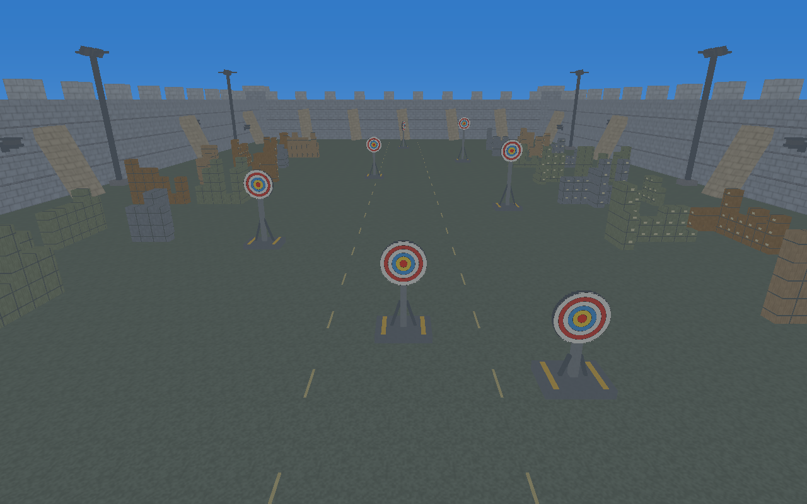 | 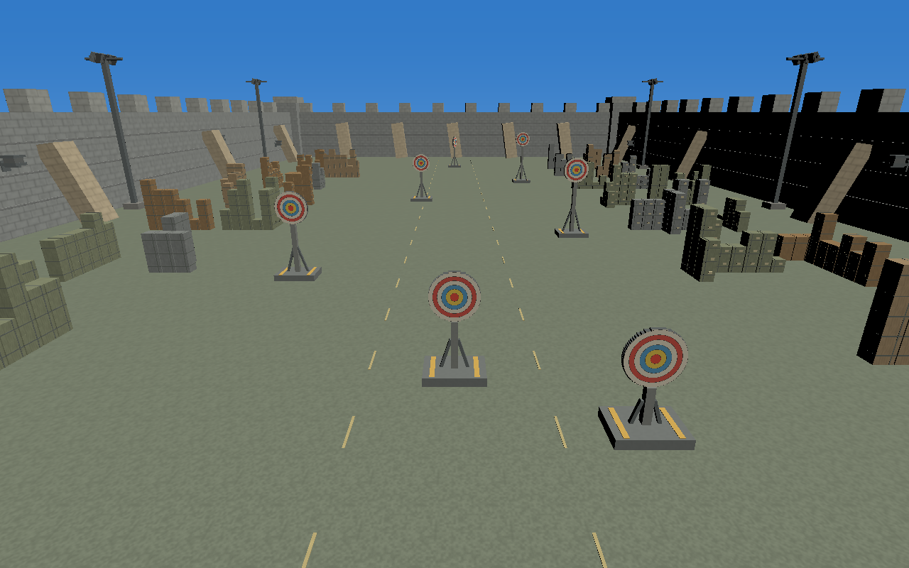 |
| Point lamps only | Spotlights only |
| 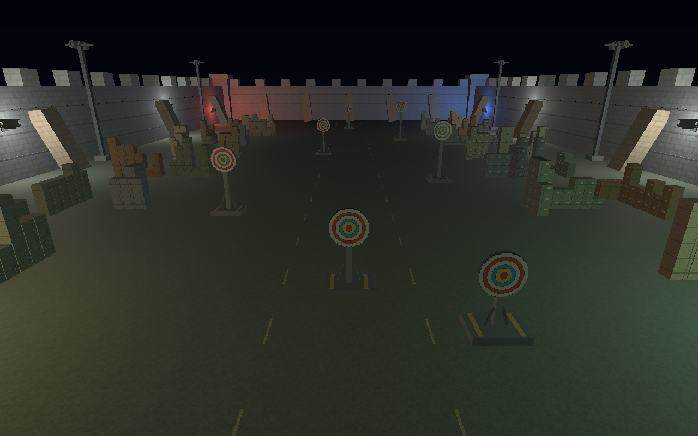 | 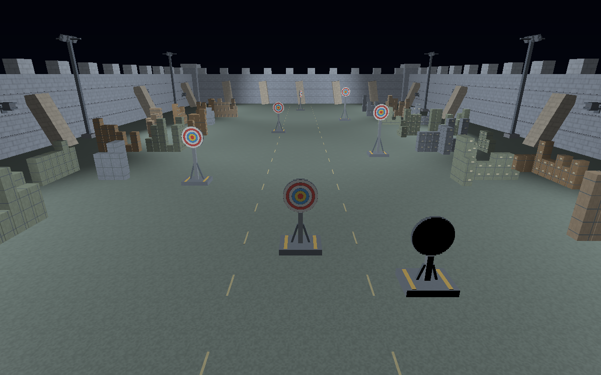 |

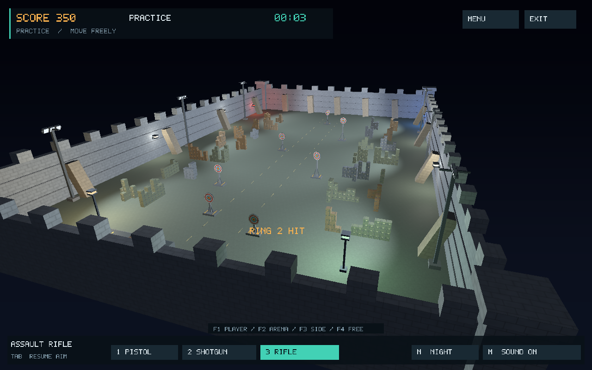

### Night lighting in context

Night mode keeps the same geometry and materials but swaps the daytime sun for
low ambient fill, eight point lamps and six cone-shaped stadium spotlights. The
following captures show the complete night arena and the normal night scene from
different presentation modes.

| Night player view | Night arena lighting |
| --- | --- |
| 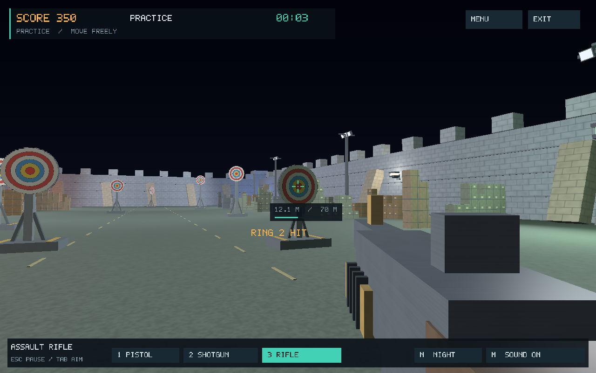 |  |

| Ambient contribution | Directional contribution |
| --- | --- |
|  |  |

| Point-lamp contribution | Spotlight contribution |
| --- | --- |
|  |  |

The isolated images are diagnostic passes, not separate gameplay rules: normal
night play combines low ambient, point lamps and spotlights; the sun is zero at night. Emissive lenses, projectiles and
hit effects are brightened in the material shader, but they do not illuminate
nearby objects or cast shadows.

### Formulas and materials

`addLight` uses normalized surface N, toward-eye V and toward-light L. Light color C is multiplied by attenuation and cone intensity where applicable:

```text
diffuse starts at ambientColor
diffuse += C * max(dot(N,L), 0)
R = reflect(-L,N)
specular += C * materialSpecular * pow(max(dot(R,V),0), shininess)
            only when dot(N,L) > 0
point attenuation = 1 / (1 + 0.09*d + 0.032*d*d)
spot attenuation  = 1 / (1 + 0.025*d + 0.002*d*d)
spot intensity = smoothstep(outerCos, innerCos, dot(-L,direction))
base = surfaceColor() * texture(materialTextures, vec3(UV,layer)).rgb
lit = base * diffuse + specular
lit = mix(lit,base,emission)
output = pow(clamp(lit,0,1), vec3(1/2.2))
```

Distance has a 0.001 lower bound; cone bounds are angle cosines. This is Phong reflection using `reflect`, not Blinn–Phong. The final power is the existing display gamma approximation, without HDR tone mapping.

Defaults are specular 0.12, shininess 24 and emission 0. Weapons use 0.75/80; target plates and fixtures use 0.45/48; crate bodies use specular 0.09. Inverse-transpose normal matrices are computed on the CPU so that nonuniform scale and shear are handled correctly.

| Key / shading | Implementation | Image |
| --- | --- | --- |
| F6 Flat | Vertex lighting; provoking-vertex diffuse/specular held across each triangle | [Flat](docs/images/release-shading-0.png) |
| F7 Gouraud | Vertex lighting with interpolated diffuse/specular | [Gouraud](docs/images/release-shading-1.png) |
| F8 Phong, default | Interpolated position/normal; per-fragment lighting | [Phong](docs/images/release-shading-2.png) |

All modes sample textures per fragment. Large wall/floor triangles make vertex-lit local sources visibly differ from Phong. These are interpolation modes, not separate light types. `compileShader` expands shared `lighting.glsl`; `shaders/sky.*` draws the gradient.

There are **no cast shadows, shadow maps, ambient occlusion, normal mapping or physically based roughness**. Dark faces result from direction/attenuation, not occlusion. Emissive flashes do not create dynamic lights.

Modify `createLighting`, reflection/attenuation in `lighting.glsl`, or per-object specular/shininess/emission. `createLightFixtures` uses the night rig to align visible sources. Three stadium lenses share one spotlight, not three lights.

To add a light beyond capacity, update the rig, GLSL array sizes/loop bounds, and cached location arrays/initialization loops in `Renderer.h/.cpp` together. Keep counts synchronized. Replacing an existing light is cheaper than expanding all-fragment loops. Check texture reflectance, base color and ambient fill before adding a light just to brighten materials. Benchmark any increase.

## Compact HUD


`buildInterface` in [Interface.cpp](src/ui/Interface.cpp) replaces stacked left panels with a **700 × 66** status strip in the 1280 × 800 UI coordinate system. Score, level/remaining targets, mode/movement status and time remain visible. A slim bottom bar retains clickable weapons, day/night and sound. Menu/Exit remain at top right.

Range and thin target health appear only when aimed at a target; out-of-range text turns amber. Free's timer turns red below 15 seconds, with conditional respawn countdown. Crosshairs, hit markers, floating scores and penalty edges remain. Detailed cumulative statistics are retained on results pages.

`drawModeHud` in [ModeUI.cpp](src/ui/ModeUI.cpp) retains narrower Developer-only diagnostics: FPS, shading, NPC counts, position and per-target health/motion. Bird's-Eye uses compact camera help and contextual invalid-position messages. Shading shortcuts moved to Controls. `UiPainter` remains the geometry font renderer, without a new UI framework/font texture.

## Performance and verification

One filtered texture-array sample is evaluated per fragment, with material selection controlled by object uniforms. Unchanged colour, material, texture and target-pattern uploads are skipped through a draw-state cache that is reset at each scene pass. Uniform locations are cached, normal matrices are computed on the CPU, and material defaults are assigned during construction. File loading, texture allocation and mipmap generation are performed outside the frame loop.

Repeated work is reduced by cached light rigs, skipped zero-colour sources, reserved scene capacity and cached aim queries. NPC shot colliders are constructed on demand. The UI is submitted as one streamed draw, while calculation snapshots are written through the background `SnapshotWriter`. Pending writes are combined and the final snapshot is flushed at normal exit. GPU instancing is not implemented, and some frame allocations remain.

`--benchmark` measures 200 frames after 40 warm-ups per day/night condition using the real level-7 scene, 1280 × 800, Phong, VSync off and `glFinish` for GPU completion. Timed regions exclude simulation, scene rebuilding, UI and disk work. This is a renderer comparison, not a whole-game FPS guarantee. See [release-verification.md](docs/release-verification.md) for hardware, measurements and test results.

CPU suites cover transforms, contacts, levels, movement locks, score/restart rules, NPC lifecycle, navigation, modes, storage, name flow and presentation. The updated HUD check tests button centers. OpenGL smoke covers all weapons/cameras, visible geometry, GL errors, day/night/shading, seven Challenge/Developer levels, full Free timing/respawn, overhead picking and leaderboard reload. Automated progression injects hit events; CPU tests cover normal projectile/muzzle contacts.

```powershell
New-Item -ItemType Directory -Force .release-work
mingw32-make core_tests.exe challenge_tests.exe mode_tests.exe release_tests.exe
./core_tests.exe
./challenge_tests.exe .release-work/challenge.csv
./mode_tests.exe .release-work/modes.csv
./release_tests.exe .release-work/release.csv
./mode_tests.exe .release-work/restart.csv --persist-write
./mode_tests.exe .release-work/restart.csv --persist-read
./main.exe --modes-smoke-test --calc .release-work/smoke.csv --leaderboard .release-work/board.csv --capture .release-work/release.ppm
./main.exe --benchmark --calc .release-work/benchmark.csv --leaderboard .release-work/benchmark-board.csv
powershell -File tools/convert_captures.ps1 -Source .release-work -Destination docs/images
powershell -File tests/verify_calc.ps1 -Path .release-work/smoke.csv -RequirePlayedCoverage -RequireChallengeCoverage -RequireModeCoverage
```

Snapshots retain the 29-column transform schema in [src/persistence](src/persistence), describing current/visited cubes rather than invented unvisited scenes. `--export-calc` runs without OpenGL; `--calc`/`--leaderboard` redirect output. Texture layer/scaling are runtime fields, not new CSV columns. Player records are stored separately from generated calculation and demonstration output.

## References and attribution

The report and README use the local source as the authority for game-specific equations, coordinates and behavior. The formal report bibliography includes:

- [Project repository](https://github.com/KaziRifatAlMuin/Graphics-Target-Shooter-Game), Kazi Rifat Al Muin, 2026.
- [OpenGL 3.3 Core Profile specification](https://registry.khronos.org/OpenGL/specs/gl/glspec33.core.pdf), Mark Segal and Kurt Akeley, Khronos Group, 2010: graphics pipeline and API semantics.
- [GLFW 3.3 Getting Started](https://www.glfw.org/docs/3.3/quick.html): context creation and event handling.
- Bui Tuong Phong, [“Illumination for Computer Generated Pictures”](https://doi.org/10.1145/360825.360839), *Communications of the ACM*, 18(6), 311–317, 1975: reflection and interpolated-normal shading foundations.
- Henri Gouraud, [“Continuous Shading of Curved Surfaces”](https://doi.org/10.1109/T-C.1971.223313), *IEEE Transactions on Computers*, C-20(6), 623–629, 1971: interpolated vertex-shading foundations.
- [KUET](https://www.kuet.ac.bd/): institutional identity on the supplied cover. [Report image credits](docs/images/REPORT-SOURCES.md) identify the official logo source separately from original game assets.

The game does not implement analytic sphere/cylinder meshes, Boolean unions, GPU instancing, skeletal skinning, shadow maps, ambient occlusion or PBR materials. Those are possible future extensions, not claims about the current project. Functional verification is not a universal FPS guarantee; comparisons use fixed scenes and a specified GPU context.
