# Exact game lighting demonstration

Generated by `lighting/demonstrateLighting.cpp` using the game's Renderer, shader files, textures, createLighting and Game::scene. No alternate lighting renderer is used for images. All source code listings below are read from the current checkout on each build.

## Coverage and interpretation

There are two actual lighting presets (day/night), three shading modes (flat/Gouraud/Phong), and four source families (ambient/directional/point/spot). The grid exhausts their 2 x 3 x 16 discrete combinations. Mask 15 is the unmodified game state. Other masks are diagnostic source removal, not additional gameplay presets. Day has zero point/spot intensity; night has zero sun intensity. Consequently some comparisons are intentionally identical. Positions, viewing angles and material values are continuous, so no finite image collection can cover every possible pixel/view. Additional close views, all fixtures, material examples, emission, flash, and spotlight edge cases follow. The sky and emissive objects remain visible even with mask 0; the mask only removes illumination terms.

## Implemented equations

M = T Rz Ry Rx H S; Pworld=M Plocal; N=normalize(transpose(inverse(mat3(M))) Nlocal); V=normalize(eye-Pworld). The renderer uploads the normal matrix using cofactor columns divided by det(M).

For each light, a=max(dot(N,L),0); R=reflect(-L,N)=2 dot(N,L) N-L. Diffuse increment = color*a. Specular increment = color*ks*max(dot(R,V),0)^shininess when a>0, otherwise zero. This is Phong reflection; there is no halfway vector. Ambient initializes the diffuse accumulator.

Directional: L=normalize(sunDirection), without distance attenuation. Point: delta=lightPosition-Pworld, d=max(length(delta),0.001), L=delta/d, A=1/(1+0.09d+0.032d²). Spot: A=1/(1+0.025d+0.002d²), c=dot(-L,spotDirection), t=clamp((c-cos(53°))/(cos(32°)-cos(53°)),0,1), I=t²(3-2t). Point color is multiplied by A; spot color by A*I. All 8 points and 6 spots add independently.

Texture base B=surfaceColor*texture(materialTextures,(UV,layer)). UV comes from (localPosition+0.5)*abs(scale)*textureScale, selecting XZ on Y faces, ZY on X faces, XY on Z faces. Layer=Plain for emission>0.5, else Paper for targetPattern, else the material layer. Llit=B*diffuse+specular; emission blends (1-e)*Llit+e*B; output RGB=pow(clamp(result,0,1),1/2.2). Emission changes the object's own appearance and does not illuminate neighboring objects. The implementation has no shadow mapping, occlusion, distance fog, bloom, physically based BRDF, or tone mapping beyond clamp/gamma.

Flat computes light at the triangle's provoking vertex and holds it constant; Gouraud interpolates vertex lighting; Phong computes lighting per fragment using interpolated world position and normal. The cube has separate face normals; Phong does not round cube edges. Texture and target-ring lookup stay per fragment in all modes.

Target rings: shapePosition=localPosition*patternScale+patternOffset; radius=2*length(shapePosition.xy); ring=clamp(int(radius*6),0,5); fract(radius*6)>0.95 draws a dark boundary. Only local +Z faces print rings; other faces return (0.15,0.18,0.21). Flash mixes the ring color toward (1,0.76,0.2) by hitTime/0.25*0.5. Exact ring colors appear in object.frag below.

## Complete source-family combinations

Overview eye=(0, 28, 8), center=(0, 0, -45); close eye=(-12, 7, -4), center=(-18, 2, -14). FOV 45°, aspect 4/3, near 0.05, far 250. All scene transforms stay at level 7 startup. Day/night also updates lens emission and celestial geometry through Game::scene.


## Day preset values

Ambient=(0.300000012, 0.319999993, 0.349999994), sun direction=(0.466002315, 0.828448594, 0.31066823), sun color=(0.949999988, 0.879999995, 0.730000019).

| Light | Position | Direction | Color | Inner cosine | Outer cosine |
| --- | --- | --- | --- | ---: | ---: |
| Point 0 | (-18, 4.69999981, -12) | omnidirectional | (0, 0, 0) | — | — |
| Point 1 | (18, 4.69999981, -12) | omnidirectional | (0, 0, 0) | — | — |
| Point 2 | (-28.7999992, 5, -38) | omnidirectional | (0, 0, 0) | — | — |
| Point 3 | (28.7999992, 5, -38) | omnidirectional | (0, 0, 0) | — | — |
| Point 4 | (-28.7999992, 5, -68) | omnidirectional | (0, 0, 0) | — | — |
| Point 5 | (28.7999992, 5, -68) | omnidirectional | (0, 0, 0) | — | — |
| Point 6 | (-28.7999992, 3.20000005, -89) | omnidirectional | (0, 0, 0) | — | — |
| Point 7 | (28.7999992, 3.20000005, -89) | omnidirectional | (0, 0, 0) | — | — |
| Spot 0 | (-28, 12, -16) | (0.933333397, -0.333333343, -0.13333334) | (0, 0, 0) | 0.848048091 | 0.601815045 |
| Spot 1 | (28, 12, -16) | (-0.933333397, -0.333333343, -0.13333334) | (0, 0, 0) | 0.848048091 | 0.601815045 |
| Spot 2 | (-28, 12, -48) | (0.933333397, -0.333333343, -0.13333334) | (0, 0, 0) | 0.848048091 | 0.601815045 |
| Spot 3 | (28, 12, -48) | (-0.933333397, -0.333333343, -0.13333334) | (0, 0, 0) | 0.848048091 | 0.601815045 |
| Spot 4 | (-28, 12, -80) | (0.933333397, -0.333333343, -0.13333334) | (0, 0, 0) | 0.848048091 | 0.601815045 |
| Spot 5 | (28, 12, -80) | (-0.933333397, -0.333333343, -0.13333334) | (0, 0, 0) | 0.848048091 | 0.601815045 |

### Day / Flat

Each row retains exactly the named terms of the equation. Compare the same column across rows to see their additive contribution.

| Mask / sources | Arena overview | Close view |
| --- | --- | --- |
| 0: no light sources |  |  |
| 1: ambient |  |  |
| 2: sun |  |  |
| 3: ambient + sun |  |  |
| 4: points |  |  |
| 5: ambient + points |  |  |
| 6: sun + points |  |  |
| 7: ambient + sun + points |  |  |
| 8: spots |  |  |
| 9: ambient + spots |  |  |
| 10: sun + spots | 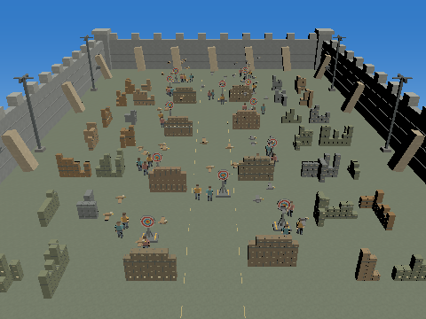 | 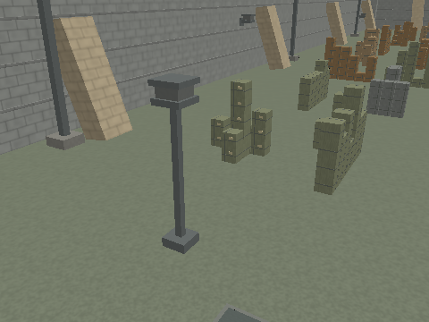 |
| 11: ambient + sun + spots |  |  |
| 12: points + spots |  |  |
| 13: ambient + points + spots |  |  |
| 14: sun + points + spots |  |  |
| 15: ambient + sun + points + spots (game preset) |  |  |

### Day / Gouraud

Each row retains exactly the named terms of the equation. Compare the same column across rows to see their additive contribution.

| Mask / sources | Arena overview | Close view |
| --- | --- | --- |
| 0: no light sources | 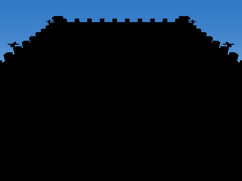 |  |
| 1: ambient |  |  |
| 2: sun |  |  |
| 3: ambient + sun |  |  |
| 4: points |  |  |
| 5: ambient + points |  |  |
| 6: sun + points |  |  |
| 7: ambient + sun + points | 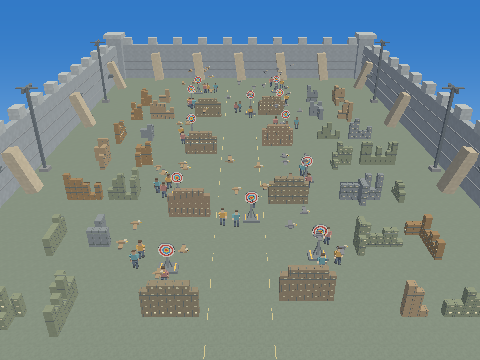 | 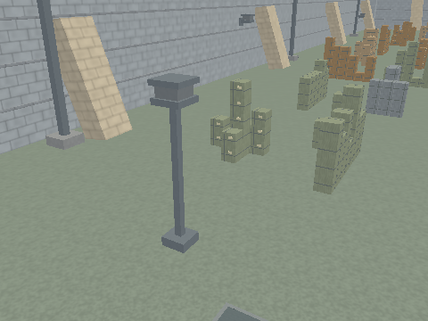 |
| 8: spots |  |  |
| 9: ambient + spots | 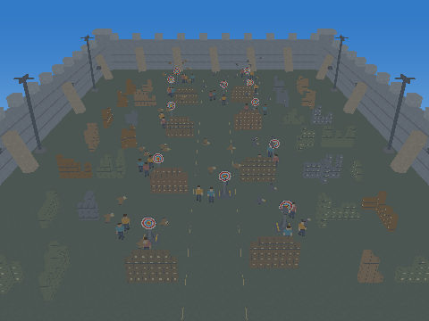 |  |
| 10: sun + spots |  |  |
| 11: ambient + sun + spots |  |  |
| 12: points + spots |  |  |
| 13: ambient + points + spots |  |  |
| 14: sun + points + spots |  |  |
| 15: ambient + sun + points + spots (game preset) |  |  |

### Day / Phong

Each row retains exactly the named terms of the equation. Compare the same column across rows to see their additive contribution.

| Mask / sources | Arena overview | Close view |
| --- | --- | --- |
| 0: no light sources |  |  |
| 1: ambient |  |  |
| 2: sun | 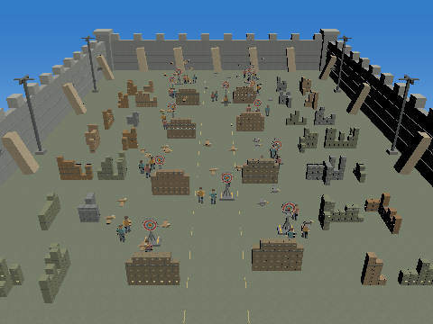 |  |
| 3: ambient + sun |  |  |
| 4: points |  |  |
| 5: ambient + points |  | 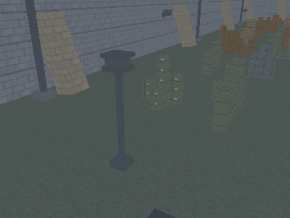 |
| 6: sun + points |  |  |
| 7: ambient + sun + points |  |  |
| 8: spots |  |  |
| 9: ambient + spots |  |  |
| 10: sun + spots |  |  |
| 11: ambient + sun + spots |  |  |
| 12: points + spots |  |  |
| 13: ambient + points + spots |  |  |
| 14: sun + points + spots |  |  |
| 15: ambient + sun + points + spots (game preset) |  |  |

### Worked calculation: floor below warm spawn lamp

At world surface P=(-18, 0, -12), N=(0, 1, 0), eye=(-12, 7, -4), V=normalize(eye-P)=(0.49153918, 0.573462367, 0.655385554), ks=0.119999997, shininess=24.

| Source | L | d | attenuation | cone dot | smoothstep | N dot L (clamped) | R dot V (clamped) | Diffuse RGB increment | Specular RGB increment |
| --- | --- | ---: | ---: | ---: | ---: | ---: | ---: | --- | --- |
| sun | (0.466002315, 0.828448594, 0.31066823) | 0 | 1 | 1 | 1 | 0.828448594 | 0.0424182266 | (0.787026167, 0.729034781, 0.604767501) | (1.31269853e-34, 1.21597337e-34, 1.00870525e-34) |
| point 0 | (0, 1, 0) | 4.69999981 | 0.469510019 | 1 | 1 | 1 | 0.573462367 | (0, 0, 0) | (0, 0, 0) |
| point 1 | (0.991585135, 0.129456937, 0) | 36.3055077 | 0.0215302072 | 1 | 1 | 0.129456937 | 0 | (0, 0, 0) | (0, 0, 0) |
| point 2 | (-0.377696216, 0.174859375, -0.909268737) | 28.5944061 | 0.0336270332 | 1 | 1 | 0.174859375 | 0.881849349 | (0, 0, 0) | (0, 0, 0) |
| point 3 | (0.870369732, 0.0929882228, -0.483538747) | 53.7702522 | 0.0101668369 | 1 | 1 | 0.0929882228 | 0 | (0, 0, 0) | (0, 0, 0) |
| point 4 | (-0.188644052, 0.087335214, -0.978154361) | 57.2506752 | 0.00900600292 | 1 | 1 | 0.087335214 | 0.783877611 | (0, 0, 0) | (0, 0, 0) |
| point 5 | (0.639762282, 0.0683506727, -0.765527546) | 73.1521683 | 0.00559211057 | 1 | 1 | 0.0683506727 | 0.226444036 | (0, 0, 0) | (0, 0, 0) |
| point 6 | (-0.13878262, 0.0411207788, -0.989468753) | 77.8195343 | 0.00495559955 | 1 | 1 | 0.0411207788 | 0.74028182 | (0, 0, 0) | (0, 0, 0) |
| point 7 | (0.519056261, 0.0354910307, -0.854002893) | 90.1636276 | 0.00371390884 | 1 | 1 | 0.0354910307 | 0.324917436 | (0, 0, 0) | (0, 0, 0) |
| spot 0 | (-0.620173693, 0.744208395, -0.248069465) | 16.1245155 | 0.519990265 | 0.793822348 | 0.875868142 | 0.744208395 | 0.894196332 | (0, 0, 0) | (0, 0, 0) |
| spot 1 | (0.964210093, 0.251533061, -0.0838443562) | 47.7074432 | 0.148264855 | 0.972594559 | 1 | 0.251533061 | 0 | (0, 0, 0) | (0, 0, 0) |
| spot 2 | (-0.254823595, 0.305788338, -0.917364955) | 39.2428322 | 0.197586656 | 0.217449501 | 0 | 0.305788338 | 0.90184164 | (0, 0, 0) | (0, 0, 0) |
| spot 3 | (0.771395206, 0.201233536, -0.603700638) | 59.632206 | 0.104136229 | 0.70655334 | 0.388875276 | 0.201233536 | 0.131885588 | (0, 0, 0) | (0, 0, 0) |
| spot 4 | (-0.14332591, 0.17199108, -0.97461617) | 69.7710571 | 0.0801264197 | 0.0611523986 | 0 | 0.17199108 | 0.807830095 | (0, 0, 0) | (0, 0, 0) |
| spot 5 | (0.554418087, 0.14463082, -0.819574594) | 82.9698715 | 0.0593745001 | 0.45639053 | 0 | 0.14463082 | 0.347559452 | (0, 0, 0) | (0, 0, 0) |

D (including ambient) = (1.08702612, 1.04903483, 0.954767466); S = (1.31269853e-34, 1.21597337e-34, 1.00870525e-34). For this surface's actual sampled texture RGB Q and tint C, base=B=C*Q, so the exact remaining expression is gamma(clamp((B*D+S)*(1-e)+B*e,0,1)). Texture filtering Q is performed by the GPU; the table does not invent a texture sample or claim to be a measured framebuffer pixel.

## Night preset values

Ambient=(0.0120000001, 0.0160000008, 0.0250000004), sun direction=(0.466002315, 0.828448594, 0.31066823), sun color=(0, 0, 0).

| Light | Position | Direction | Color | Inner cosine | Outer cosine |
| --- | --- | --- | --- | ---: | ---: |
| Point 0 | (-18, 4.69999981, -12) | omnidirectional | (2.20000005, 1.64999998, 0.899999976) | — | — |
| Point 1 | (18, 4.69999981, -12) | omnidirectional | (1.20000005, 2, 1.29999995) | — | — |
| Point 2 | (-28.7999992, 5, -38) | omnidirectional | (1.70000005, 1.60000002, 1.39999998) | — | — |
| Point 3 | (28.7999992, 5, -38) | omnidirectional | (1.70000005, 1.60000002, 1.39999998) | — | — |
| Point 4 | (-28.7999992, 5, -68) | omnidirectional | (1.70000005, 1.60000002, 1.39999998) | — | — |
| Point 5 | (28.7999992, 5, -68) | omnidirectional | (1.70000005, 1.60000002, 1.39999998) | — | — |
| Point 6 | (-28.7999992, 3.20000005, -89) | omnidirectional | (2, 0.25, 0.150000006) | — | — |
| Point 7 | (28.7999992, 3.20000005, -89) | omnidirectional | (0.25, 0.649999976, 2) | — | — |
| Spot 0 | (-28, 12, -16) | (0.933333397, -0.333333343, -0.13333334) | (1.79999995, 1.89999998, 2.0999999) | 0.848048091 | 0.601815045 |
| Spot 1 | (28, 12, -16) | (-0.933333397, -0.333333343, -0.13333334) | (1.79999995, 1.89999998, 2.0999999) | 0.848048091 | 0.601815045 |
| Spot 2 | (-28, 12, -48) | (0.933333397, -0.333333343, -0.13333334) | (1.79999995, 1.89999998, 2.0999999) | 0.848048091 | 0.601815045 |
| Spot 3 | (28, 12, -48) | (-0.933333397, -0.333333343, -0.13333334) | (1.79999995, 1.89999998, 2.0999999) | 0.848048091 | 0.601815045 |
| Spot 4 | (-28, 12, -80) | (0.933333397, -0.333333343, -0.13333334) | (1.79999995, 1.89999998, 2.0999999) | 0.848048091 | 0.601815045 |
| Spot 5 | (28, 12, -80) | (-0.933333397, -0.333333343, -0.13333334) | (1.79999995, 1.89999998, 2.0999999) | 0.848048091 | 0.601815045 |

### Night / Flat

Each row retains exactly the named terms of the equation. Compare the same column across rows to see their additive contribution.

| Mask / sources | Arena overview | Close view |
| --- | --- | --- |
| 0: no light sources |  |  |
| 1: ambient |  |  |
| 2: sun | 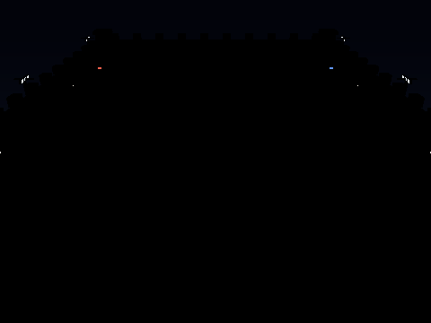 | 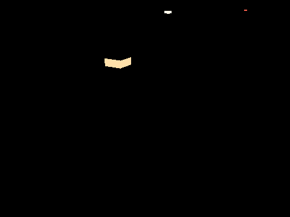 |
| 3: ambient + sun |  | 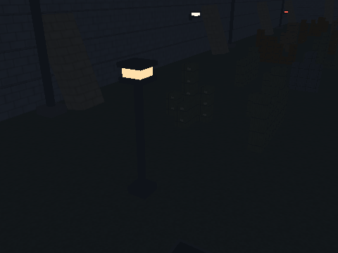 |
| 4: points |  | 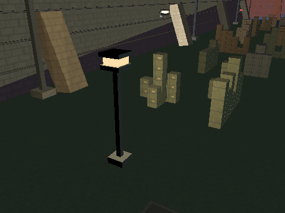 |
| 5: ambient + points |  | 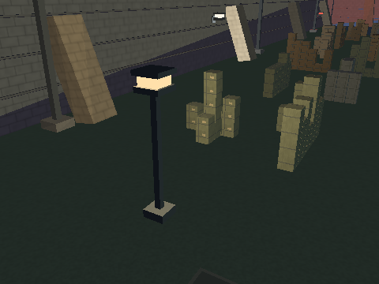 |
| 6: sun + points | 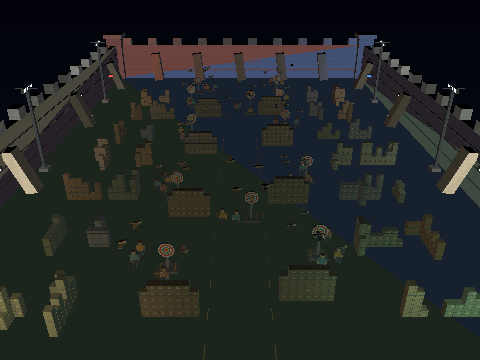 |  |
| 7: ambient + sun + points | 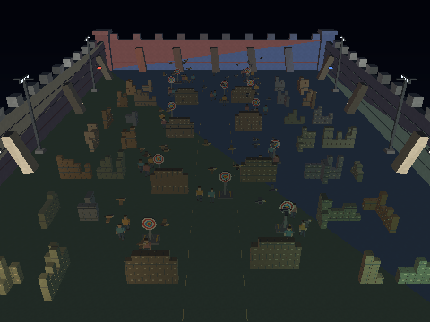 |  |
| 8: spots |  | 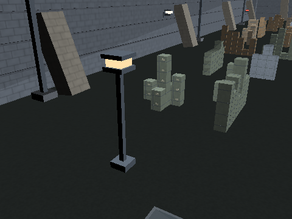 |
| 9: ambient + spots | 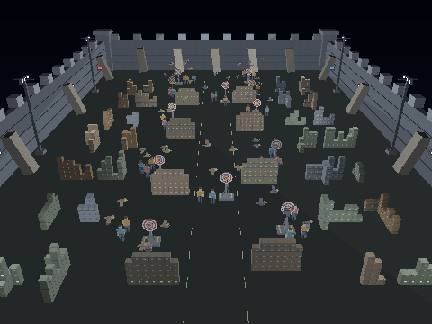 | 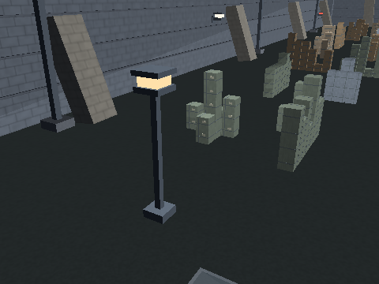 |
| 10: sun + spots | 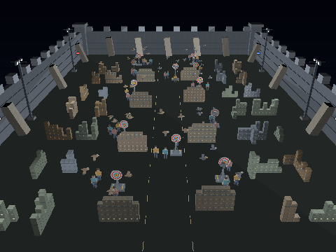 |  |
| 11: ambient + sun + spots |  |  |
| 12: points + spots |  | 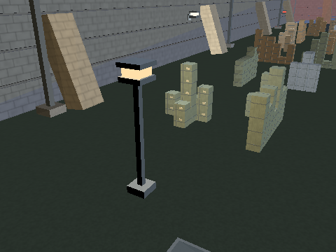 |
| 13: ambient + points + spots |  |  |
| 14: sun + points + spots | 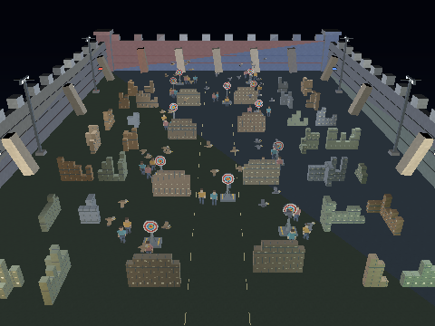 |  |
| 15: ambient + sun + points + spots (game preset) |  |  |

### Night / Gouraud

Each row retains exactly the named terms of the equation. Compare the same column across rows to see their additive contribution.

| Mask / sources | Arena overview | Close view |
| --- | --- | --- |
| 0: no light sources |  |  |
| 1: ambient |  |  |
| 2: sun |  |  |
| 3: ambient + sun |  |  |
| 4: points |  | 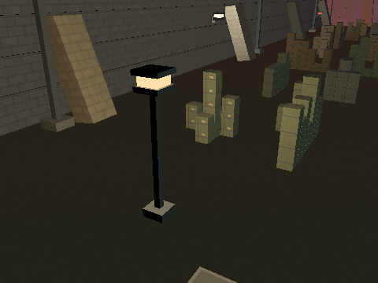 |
| 5: ambient + points |  |  |
| 6: sun + points | 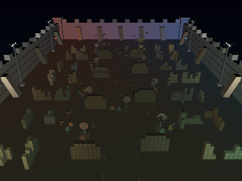 |  |
| 7: ambient + sun + points | 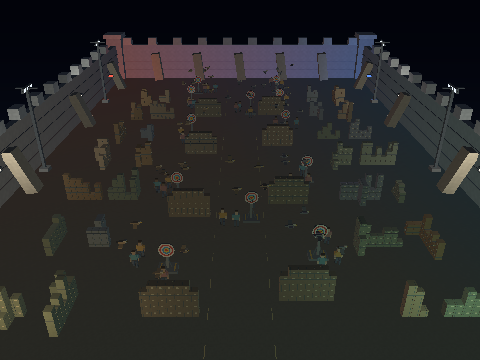 | 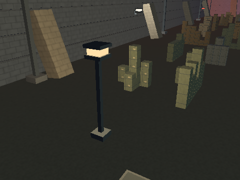 |
| 8: spots |  |  |
| 9: ambient + spots | 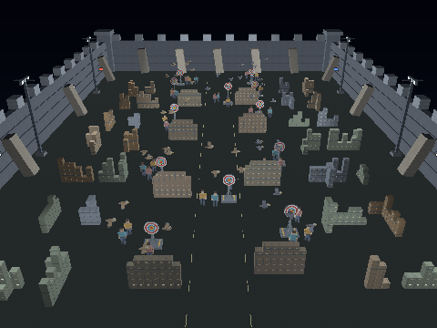 |  |
| 10: sun + spots | 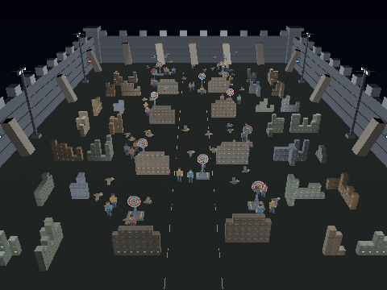 | 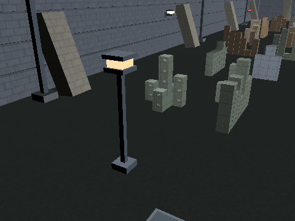 |
| 11: ambient + sun + spots |  | 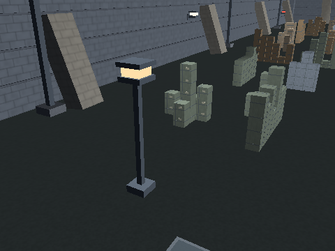 |
| 12: points + spots |  |  |
| 13: ambient + points + spots | 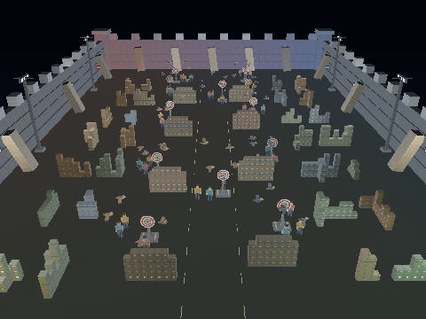 |  |
| 14: sun + points + spots | 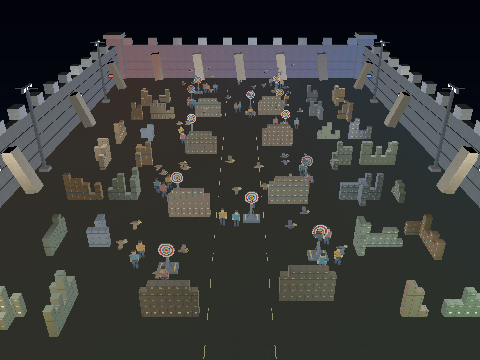 | 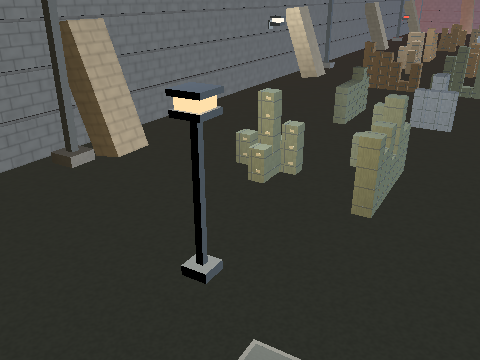 |
| 15: ambient + sun + points + spots (game preset) |  | 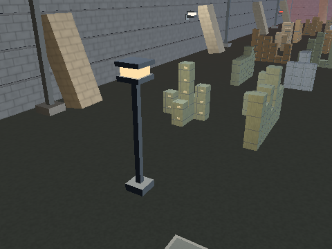 |

### Night / Phong

Each row retains exactly the named terms of the equation. Compare the same column across rows to see their additive contribution.

| Mask / sources | Arena overview | Close view |
| --- | --- | --- |
| 0: no light sources |  |  |
| 1: ambient |  |  |
| 2: sun |  |  |
| 3: ambient + sun | 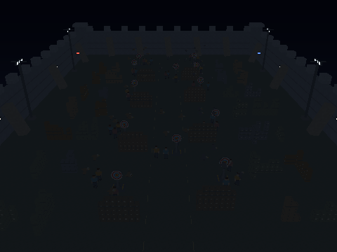 |  |
| 4: points | 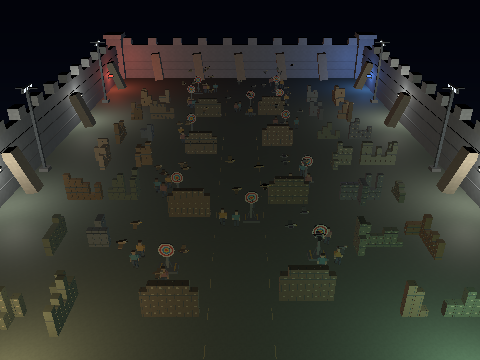 | 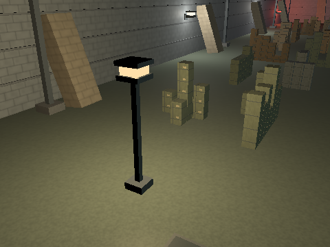 |
| 5: ambient + points | 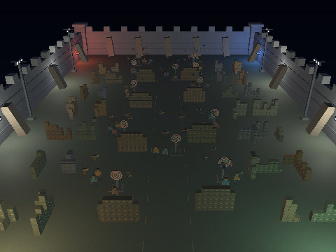 |  |
| 6: sun + points |  |  |
| 7: ambient + sun + points |  |  |
| 8: spots |  | 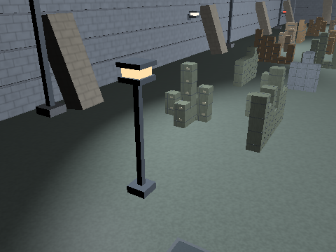 |
| 9: ambient + spots |  |  |
| 10: sun + spots | 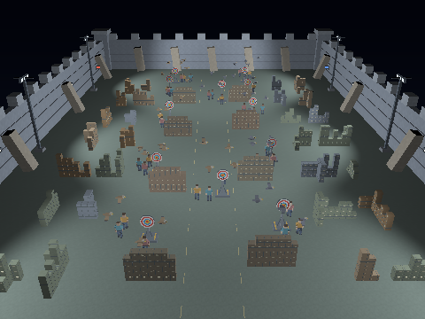 |  |
| 11: ambient + sun + spots | 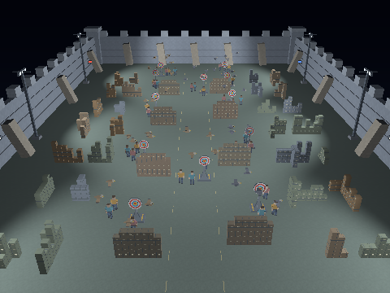 | 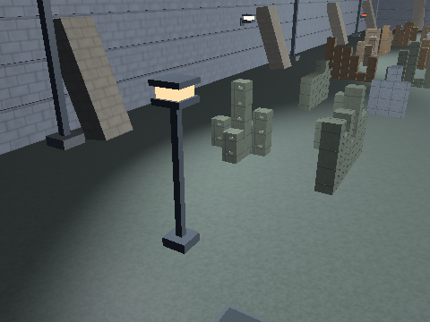 |
| 12: points + spots |  |  |
| 13: ambient + points + spots | 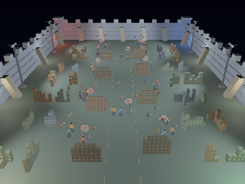 |  |
| 14: sun + points + spots | 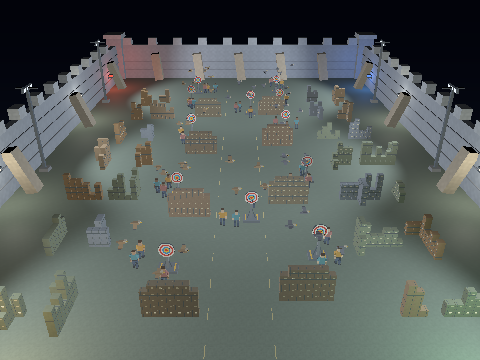 | 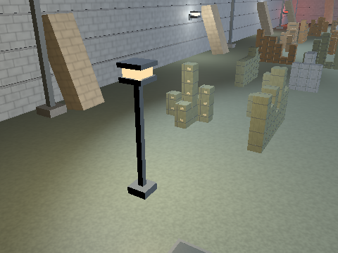 |
| 15: ambient + sun + points + spots (game preset) |  |  |

### Worked calculation: floor below warm spawn lamp

At world surface P=(-18, 0, -12), N=(0, 1, 0), eye=(-12, 7, -4), V=normalize(eye-P)=(0.49153918, 0.573462367, 0.655385554), ks=0.119999997, shininess=24.

| Source | L | d | attenuation | cone dot | smoothstep | N dot L (clamped) | R dot V (clamped) | Diffuse RGB increment | Specular RGB increment |
| --- | --- | ---: | ---: | ---: | ---: | ---: | ---: | --- | --- |
| sun | (0.466002315, 0.828448594, 0.31066823) | 0 | 1 | 1 | 1 | 0.828448594 | 0.0424182266 | (0, 0, 0) | (0, 0, 0) |
| point 0 | (0, 1, 0) | 4.69999981 | 0.469510019 | 1 | 1 | 1 | 0.573462367 | (1.03292203, 0.774691522, 0.422558993) | (1.98320194e-07, 1.48740142e-07, 8.11309846e-08) |
| point 1 | (0.991585135, 0.129456937, 0) | 36.3055077 | 0.0215302072 | 1 | 1 | 0.129456937 | 0 | (0.00334468181, 0.00557446945, 0.00362340501) | (0, 0, 0) |
| point 2 | (-0.377696216, 0.174859375, -0.909268737) | 28.5944061 | 0.0336270332 | 1 | 1 | 0.174859375 | 0.881849349 | (0.00999600347, 0.00940800365, 0.00823200215) | (0.00033557089, 0.000315831421, 0.000276352483) |
| point 3 | (0.870369732, 0.0929882228, -0.483538747) | 53.7702522 | 0.0101668369 | 1 | 1 | 0.0929882228 | 0 | (0.00160717336, 0.00151263375, 0.00132355455) | (0, 0, 0) |
| point 4 | (-0.188644052, 0.087335214, -0.978154361) | 57.2506752 | 0.00900600292 | 1 | 1 | 0.087335214 | 0.783877611 | (0.00133712008, 0.00125846593, 0.00110115763) | (5.32255945e-06, 5.00946771e-06, 4.38328425e-06) |
| point 5 | (0.639762282, 0.0683506727, -0.765527546) | 73.1521683 | 0.00559211057 | 1 | 1 | 0.0683506727 | 0.226444036 | (0.000649781665, 0.000611559197, 0.000535114319) | (3.76935607e-19, 3.54762927e-19, 3.10417542e-19) |
| point 6 | (-0.13878262, 0.0411207788, -0.989468753) | 77.8195343 | 0.00495559955 | 1 | 1 | 0.0411207788 | 0.74028182 | (0.000407556217, 5.09445272e-05, 3.05667163e-05) | (8.72644762e-07, 1.09080595e-07, 6.54483614e-08) |
| point 7 | (0.519056261, 0.0354910307, -0.854002893) | 90.1636276 | 0.00371390884 | 1 | 1 | 0.0354910307 | 0.324917436 | (3.29526119e-05, 8.56767874e-05, 0.000263620896) | (2.13552597e-16, 5.55236714e-16, 1.70842077e-15) |
| spot 0 | (-0.620173693, 0.744208395, -0.248069465) | 16.1245155 | 0.519990265 | 0.793822348 | 0.875868142 | 0.744208395 | 0.894196332 | (0.610099971, 0.643994391, 0.71178329) | (0.00671857083, 0.0070918249, 0.00783833209) |
| spot 1 | (0.964210093, 0.251533061, -0.0838443562) | 47.7074432 | 0.148264855 | 0.972594559 | 1 | 0.251533061 | 0 | (0.067128323, 0.0708576739, 0.0783163756) | (0, 0, 0) |
| spot 2 | (-0.254823595, 0.305788338, -0.917364955) | 39.2428322 | 0.197586656 | 0.217449501 | 0 | 0.305788338 | 0.90184164 | (0, 0, 0) | (0, 0, 0) |
| spot 3 | (0.771395206, 0.201233536, -0.603700638) | 59.632206 | 0.104136229 | 0.70655334 | 0.388875276 | 0.201233536 | 0.131885588 | (0.0146684758, 0.0154833915, 0.0171132218) | (6.70813945e-24, 7.08081391e-24, 7.82616203e-24) |
| spot 4 | (-0.14332591, 0.17199108, -0.97461617) | 69.7710571 | 0.0801264197 | 0.0611523986 | 0 | 0.17199108 | 0.807830095 | (0, 0, 0) | (0, 0, 0) |
| spot 5 | (0.554418087, 0.14463082, -0.819574594) | 82.9698715 | 0.0593745001 | 0.45639053 | 0 | 0.14463082 | 0.347559452 | (0, 0, 0) | (0, 0, 0) |

D (including ambient) = (1.75419414, 1.53952873, 1.26988125); S = (0.00706053525, 0.0074129235, 0.00811921433). For this surface's actual sampled texture RGB Q and tint C, base=B=C*Q, so the exact remaining expression is gamma(clamp((B*D+S)*(1-e)+B*e,0,1)). Texture filtering Q is performed by the GPU; the table does not invent a texture sample or claim to be a measured framebuffer pixel.

## Point falloff and spotlight cone samples

These views inspect actual floor positions using the unchanged night scene and Phong shader. The camera is moved for inspection; no lights are moved or recolored. The numeric evaluations use floor normal (0,1,0), ks=0.12 and exponent 24.

### Floor offset 1 m from lamp's ground projection

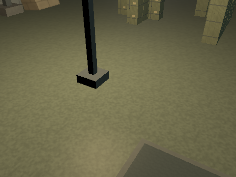

At world surface P=(-17, 0, -12), N=(0, 1, 0), eye=(-14, 4, -7), V=normalize(eye-P)=(0.424264073, 0.565685451, 0.707106829), ks=0.119999997, shininess=24.

| Source | L | d | attenuation | cone dot | smoothstep | N dot L (clamped) | R dot V (clamped) | Diffuse RGB increment | Specular RGB increment |
| --- | --- | ---: | ---: | ---: | ---: | ---: | ---: | --- | --- |
| sun | (0.466002315, 0.828448594, 0.31066823) | 0 | 1 | 1 | 1 | 0.828448594 | 0.0512576401 | (0, 0, 0) | (0, 0, 0) |
| point 0 | (-0.20810765, 0.978105903, 0) | 4.80520535 | 0.460543275 | 1 | 1 | 0.978105903 | 0.64159286 | (0.991012275, 0.743259192, 0.405414075) | (2.87808029e-06, 2.15856016e-06, 1.17739648e-06) |
| point 1 | (0.991103888, 0.133091092, 0) | 35.3141594 | 0.0226833746 | 1 | 1 | 0.133091092 | 0 | (0.0036227461, 0.00603791, 0.00392464129) | (0, 0, 0) |
| point 2 | (-0.407080531, 0.172491759, -0.896957159) | 28.9868927 | 0.0327906497 | 1 | 1 | 0.172491759 | 0.904530287 | (0.00961539894, 0.00904978719, 0.00791856274) | (0.000601914711, 0.000566507922, 0.000495694403) |
| point 3 | (0.865748942, 0.0945140794, -0.491473198) | 52.9021721 | 0.0104912352 | 1 | 1 | 0.0945140794 | 0.0336831212 | (0.00168566813, 0.00158651115, 0.0013881973) | (9.73537394e-39, 9.1627053e-39, 8.01736661e-39) |
| point 4 | (-0.205404148, 0.0870356634, -0.974799395) | 57.4477158 | 0.00894630514 | 1 | 1 | 0.0870356634 | 0.825667739 | (0.001323701, 0.00124583615, 0.00109010667) | (1.83908378e-05, 1.7309023e-05, 1.51453951e-05) |
| point 5 | (0.631580532, 0.068949841, -0.772238255) | 72.5164795 | 0.0056881858 | 1 | 1 | 0.068949841 | 0.317101955 | (0.000666739186, 0.000627519214, 0.000549079268) | (1.23987529e-15, 1.16694152e-15, 1.02107376e-15) |
| point 6 | (-0.151350722, 0.041044265, -0.987627625) | 77.9646072 | 0.00493758451 | 1 | 1 | 0.041044265 | 0.785789073 | (0.000405319064, 5.0664883e-05, 3.03989309e-05) | (3.63973186e-06, 4.54966482e-07, 2.72979889e-07) |
| point 7 | (0.510883331, 0.0356949084, -0.858908653) | 89.6486435 | 0.00375588913 | 1 | 1 | 0.0356949084 | 0.410782814 | (3.35165314e-05, 8.71429802e-05, 0.000268132251) | (6.00521287e-14, 1.56135535e-13, 4.8041703e-13) |
| spot 0 | (-0.656204998, 0.715860009, -0.238619998) | 16.7630539 | 0.50477612 | 0.819262028 | 0.962194622 | 0.715860009 | 0.85208565 | (0.625838578, 0.660607398, 0.730144978) | (0.00225119689, 0.00237626326, 0.00262639625) |
| spot 1 | (0.962690771, 0.256717533, -0.085572511) | 46.7439842 | 0.152937934 | 0.97267437 | 1 | 0.256717533 | 0 | (0.0706713274, 0.0745975077, 0.0824498758) | (0, 0, 0) |
| spot 2 | (-0.27841413, 0.303724498, -0.911173463) | 39.509491 | 0.195704773 | 0.23960492 | 0 | 0.303724498 | 0.934230685 | (0, 0, 0) | (0, 0, 0) |
| spot 3 | (0.764470816, 0.203858882, -0.611576676) | 58.8642502 | 0.106364802 | 0.699915528 | 0.349704742 | 0.203858882 | 0.223432541 | (0.0136490241, 0.0144073032, 0.0159238614) | (1.92516258e-18, 2.03211621e-18, 2.24602304e-18) |
| spot 4 | (-0.157319531, 0.171621308, -0.972520769) | 69.9213867 | 0.0798337236 | 0.0743692368 | 0 | 0.171621308 | 0.851504803 | (0, 0, 0) | (0, 0, 0) |
| spot 5 | (0.545986295, 0.14559634, -0.825045943) | 82.4196548 | 0.0600727238 | 0.448113233 | 0 | 0.14559634 | 0.434114963 | (0, 0, 0) | (0, 0, 0) |

D (including ambient) = (1.7305243, 1.52755666, 1.27410197); S = (0.00287802028, 0.0029626938, 0.00313868653). For this surface's actual sampled texture RGB Q and tint C, base=B=C*Q, so the exact remaining expression is gamma(clamp((B*D+S)*(1-e)+B*e,0,1)). Texture filtering Q is performed by the GPU; the table does not invent a texture sample or claim to be a measured framebuffer pixel.

### Floor offset 5 m from lamp's ground projection

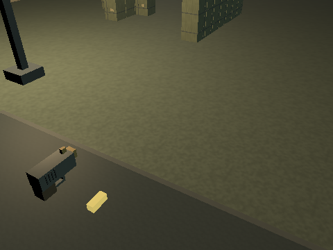

At world surface P=(-13, 0, -12), N=(0, 1, 0), eye=(-10, 4, -7), V=normalize(eye-P)=(0.424264073, 0.565685451, 0.707106829), ks=0.119999997, shininess=24.

| Source | L | d | attenuation | cone dot | smoothstep | N dot L (clamped) | R dot V (clamped) | Diffuse RGB increment | Specular RGB increment |
| --- | --- | ---: | ---: | ---: | ---: | ---: | ---: | --- | --- |
| sun | (0.466002315, 0.828448594, 0.31066823) | 0 | 1 | 1 | 1 | 0.828448594 | 0.0512576401 | (0, 0, 0) | (0, 0, 0) |
| point 0 | (-0.728627741, 0.684910059, 0) | 6.86221504 | 0.320053339 | 1 | 1 | 0.684910059 | 0.696574211 | (0.482257068, 0.361692786, 0.197286963) | (1.4389434e-05, 1.0792075e-05, 5.88658622e-06) |
| point 1 | (0.988701105, 0.14989984, 0) | 31.3542671 | 0.0283440556 | 1 | 1 | 0.14989984 | 0 | (0.00509852357, 0.00849753898, 0.00552339992) | (0, 0, 0) |
| point 2 | (-0.512447119, 0.162166819, -0.8432675) | 30.832449 | 0.0292436983 | 1 | 1 | 0.162166819 | 0.905428529 | (0.00806200784, 0.00758777186, 0.00663930038) | (0.000549746735, 0.000517408713, 0.000452732609) |
| point 3 | (0.844790995, 0.101051554, -0.525468111) | 49.4796944 | 0.011933621 | 1 | 1 | 0.101051554 | 0.0703110099 | (0.00205004867, 0.00192945753, 0.00168827525) | (5.18755249e-31, 4.88240215e-31, 4.27210194e-31) |
| point 4 | (-0.270544738, 0.0856154338, -0.958892822) | 58.4006844 | 0.00866577029 | 1 | 1 | 0.0856154338 | 0.841253519 | (0.00126127037, 0.00118707796, 0.00103869312) | (2.7905051e-05, 2.62635767e-05, 2.29806283e-05) |
| point 5 | (0.596641362, 0.0713685825, -0.799328148) | 70.0588379 | 0.00608387217 | 1 | 1 | 0.0713685825 | 0.352449059 | (0.000738135481, 0.000694715767, 0.000607876282) | (1.67541643e-14, 1.57686262e-14, 1.37975475e-14) |
| point 6 | (-0.200840384, 0.0406765342, -0.978779078) | 78.6694336 | 0.00485143904 | 1 | 1 | 0.0406765342 | 0.800320864 | (0.00039467946, 4.93349326e-05, 2.96009603e-05) | (5.55163842e-06, 6.93954803e-07, 4.16372899e-07) |
| point 7 | (0.476773977, 0.0364994444, -0.878267884) | 87.6725693 | 0.00392375514 | 1 | 1 | 0.0364994444 | 0.439398348 | (3.58037214e-05, 9.30896713e-05, 0.000286429771) | (3.15809526e-13, 8.2110474e-13, 2.52647621e-12) |
| spot 0 | (-0.764470816, 0.611576676, -0.203858882) | 19.6214161 | 0.442373097 | 0.890183866 | 1 | 0.611576676 | 0.814447522 | (0.486981094, 0.514035642, 0.568144619) | (0.000693357084, 0.000731876935, 0.000808916579) |
| spot 1 | (0.955557823, 0.279675454, -0.0932251513) | 42.9068756 | 0.173771843 | 0.972649157 | 1 | 0.279675454 | 0 | (0.0874794945, 0.0923394635, 0.102059409) | (0, 0, 0) |
| spot 2 | (-0.367607296, 0.29408586, -0.882257521) | 40.8044128 | 0.186912015 | 0.323494434 | 0 | 0.29408586 | 0.946173012 | (0, 0, 0) | (0, 0, 0) |
| spot 3 | (0.73390013, 0.21480003, -0.64440012) | 55.8659096 | 0.115758851 | 0.670653462 | 0.190771416 | 0.21480003 | 0.265801519 | (0.00853835791, 0.00901271123, 0.00996141694) | (7.37734727e-17, 7.78720005e-17, 8.60690493e-17) |
| spot 4 | (-0.212280676, 0.169824541, -0.962339103) | 70.6611633 | 0.0784158185 | 0.126424924 | 0 | 0.169824541 | 0.866606891 | (0, 0, 0) | (0, 0, 0) |
| spot 5 | (0.510549307, 0.149429053, -0.846764684) | 80.3056641 | 0.0628707707 | 0.413420469 | 0 | 0.149429053 | 0.466675192 | (0, 0, 0) | (0, 0, 0) |

D (including ambient) = (1.09489655, 1.01311958, 0.918265998); S = (0.00129094999, 0.00128703518, 0.00129093276). For this surface's actual sampled texture RGB Q and tint C, base=B=C*Q, so the exact remaining expression is gamma(clamp((B*D+S)*(1-e)+B*e,0,1)). Texture filtering Q is performed by the GPU; the table does not invent a texture sample or claim to be a measured framebuffer pixel.

### Floor offset 12 m from lamp's ground projection

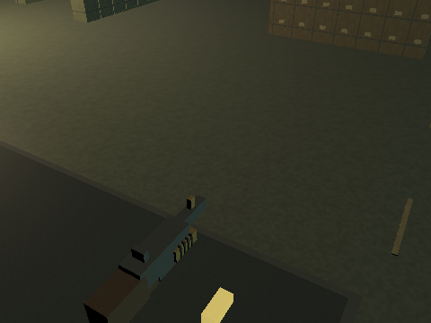

At world surface P=(-6, 0, -12), N=(0, 1, 0), eye=(-3, 4, -7), V=normalize(eye-P)=(0.424264073, 0.565685451, 0.707106829), ks=0.119999997, shininess=24.

| Source | L | d | attenuation | cone dot | smoothstep | N dot L (clamped) | R dot V (clamped) | Diffuse RGB increment | Specular RGB increment |
| --- | --- | ---: | ---: | ---: | ---: | ---: | ---: | --- | --- |
| sun | (0.466002315, 0.828448594, 0.31066823) | 0 | 1 | 1 | 1 | 0.828448594 | 0.0512576401 | (0, 0, 0) | (0, 0, 0) |
| point 0 | (-0.931128323, 0.364691913, 0) | 12.8875904 | 0.133783519 | 1 | 1 | 0.364691913 | 0.601345181 | (0.107337497, 0.080503121, 0.0439107902) | (1.7659508e-07, 1.32446303e-07, 7.22434379e-08) |
| point 1 | (0.981359124, 0.192182824, 0) | 24.4558792 | 0.0447629355 | 1 | 1 | 0.192182824 | 0 | (0.0103232013, 0.0172053352, 0.0111834677) | (0, 0, 0) |
| point 2 | (-0.652537465, 0.143100336, -0.74412173) | 34.9405212 | 0.0231419727 | 1 | 1 | 0.143100336 | 0.883971512 | (0.00562976114, 0.00529859867, 0.00463627372) | (0.000244652154, 0.000230260848, 0.000201478237) |
| point 3 | (0.795849144, 0.114346147, -0.594599962) | 43.7268791 | 0.0151238572 | 1 | 1 | 0.114346147 | 0.147479415 | (0.00293990341, 0.00276696775, 0.00242109667) | (3.45817152e-23, 3.25474953e-23, 2.84790588e-23) |
| point 4 | (-0.375803977, 0.0824131519, -0.923027337) | 60.6699257 | 0.00804847293 | 1 | 1 | 0.0824131519 | 0.858738959 | (0.0011276101, 0.00106128014, 0.000928620051) | (4.24630962e-05, 3.99652672e-05, 3.49696093e-05) |
| point 5 | (0.526304603, 0.0756184757, -0.846926928) | 66.1214066 | 0.0068093813 | 1 | 1 | 0.0756184757 | 0.418351978 | (0.000875355618, 0.000823864073, 0.000720881042) | (1.14747079e-12, 1.07997248e-12, 9.44975868e-13) |
| point 6 | (-0.283693582, 0.039816644, -0.95808804) | 80.3684006 | 0.00465281354 | 1 | 1 | 0.039816644 | 0.820355296 | (0.000370518828, 4.63148535e-05, 2.77889139e-05) | (9.63772618e-06, 1.20471577e-06, 7.22829498e-07) |
| point 7 | (0.411545366, 0.0378432535, -0.910603285) | 84.5593262 | 0.00421195757 | 1 | 1 | 0.0378432535 | 0.490697265 | (3.98485427e-05, 0.000103606209, 0.000318788341) | (4.79879851e-12, 1.24768754e-11, 3.83903881e-11) |
| spot 0 | (-0.866921484, 0.472866237, -0.157622084) | 25.3771553 | 0.342181087 | 0.945732594 | 1 | 0.472866237 | 0.746752858 | (0.291250587, 0.307431161, 0.339792341) | (6.68274879e-05, 7.05401326e-05, 7.79654074e-05) |
| spot 1 | (0.937240362, 0.330790699, -0.110263571) | 36.2767143 | 0.220316827 | 0.97031951 | 1 | 0.330790699 | 0 | (0.131181762, 0.138469636, 0.153045386) | (0, 0, 0) |
| spot 2 | (-0.501556814, 0.273576438, -0.820729315) | 43.8634262 | 0.168220297 | 0.449881285 | 0 | 0.273576438 | 0.947894037 | (0, 0, 0) | (0, 0, 0) |
| spot 3 | (0.667308331, 0.235520601, -0.706561804) | 50.9509583 | 0.133944571 | 0.607119799 | 0.00137238612 | 0.235520601 | 0.349730313 | (7.79296679e-05, 8.22590955e-05, 9.09179435e-05) | (4.45096067e-16, 4.69823606e-16, 5.19278736e-16) |
| spot 4 | (-0.303571045, 0.165584207, -0.938310504) | 72.4706802 | 0.0750989392 | 0.213419661 | 0 | 0.165584207 | 0.885948658 | (0, 0, 0) | (0, 0, 0) |
| spot 5 | (0.441744715, 0.155909896, -0.88348943) | 76.9675293 | 0.0676947683 | 0.346466482 | 0 | 0.155909896 | 0.525500953 | (0, 0, 0) | (0, 0, 0) |

D (including ambient) = (0.563153982, 0.569792151, 0.582076371); S = (0.000363757077, 0.00034210342, 0.000315208366). For this surface's actual sampled texture RGB Q and tint C, base=B=C*Q, so the exact remaining expression is gamma(clamp((B*D+S)*(1-e)+B*e,0,1)). Texture filtering Q is performed by the GPU; the table does not invent a texture sample or claim to be a measured framebuffer pixel.

### 0° from spot 0 axis

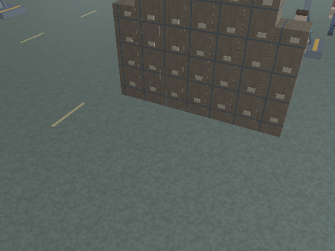

The center is the intersection of the angled ray with Y=0. 0°/32° are in the full cone, 42.5° is the smooth transition, and 53°/60° receive zero from spot 0. Other active spots can still illuminate this point; some ray intersections fall beyond the arena floor.

At world surface P=(5.60000229, 0, -20.7999992), N=(0, 1, 0), eye=(8.60000229, 5, -14.7999992), V=normalize(eye-P)=(0.358568579, 0.597614288, 0.717137158), ks=0.119999997, shininess=24.

| Source | L | d | attenuation | cone dot | smoothstep | N dot L (clamped) | R dot V (clamped) | Diffuse RGB increment | Specular RGB increment |
| --- | --- | ---: | ---: | ---: | ---: | ---: | ---: | --- | --- |
| sun | (0.466002315, 0.828448594, 0.31066823) | 0 | 1 | 1 | 1 | 0.828448594 | 0.105207205 | (0, 0, 0) | (0, 0, 0) |
| point 0 | (-0.921081305, 0.183435649, 0.343453974) | 25.6220627 | 0.0411291234 | 1 | 1 | 0.183435649 | 0.193590984 | (0.0165980048, 0.0124485027, 0.00679009221) | (8.33674368e-20, 6.25255744e-20, 3.4104857e-20) |
| point 1 | (0.779134929, 0.295317322, 0.552934527) | 15.9150848 | 0.0948979482 | 1 | 1 | 0.295317322 | 0 | (0.0336300135, 0.0560500175, 0.0364325084) | (0, 0, 0) |
| point 2 | (-0.886963308, 0.12891908, -0.443481654) | 38.7840195 | 0.0190023854 | 1 | 1 | 0.12891908 | 0.713118255 | (0.00416460913, 0.00391963217, 0.00342967804) | (1.15961973e-06, 1.09140672e-06, 9.54980919e-07) |
| point 3 | (0.791536927, 0.170589864, -0.586829185) | 29.3100643 | 0.0321249403 | 1 | 1 | 0.170589864 | 0.238963693 | (0.00931632239, 0.00876830332, 0.00767226517) | (7.87841143e-18, 7.41497522e-18, 6.48810322e-18) |
| point 4 | (-0.586839378, 0.0852964148, -0.805198193) | 58.6191101 | 0.00860332511 | 1 | 1 | 0.0852964148 | 0.838834047 | (0.00124751579, 0.00117413246, 0.00102736591) | (2.58536402e-05, 2.43328377e-05, 2.1291231e-05) |
| point 5 | (0.43913877, 0.0946419835, -0.893420398) | 52.8306732 | 0.0105186393 | 1 | 1 | 0.0946419835 | 0.539803028 | (0.0016923584, 0.00159280782, 0.00139370689) | (8.03965339e-10, 7.56673224e-10, 6.6208905e-10) |
| point 6 | (-0.449958175, 0.041856572, -0.892068148) | 76.4515533 | 0.00513042742 | 1 | 1 | 0.041856572 | 0.826090157 | (0.000429484207, 5.36855259e-05, 3.22113156e-05) | (1.25609804e-05, 1.57012255e-06, 9.42073541e-07) |
| point 7 | (0.321734726, 0.0443772115, -0.945789278) | 72.1090851 | 0.00575106358 | 1 | 1 | 0.0443772115 | 0.5894171 | (6.38040437e-05, 0.000165890509, 0.00051043235) | (5.33353306e-10, 1.38671852e-09, 4.26682645e-09) |
| spot 0 | (-0.933333278, 0.333333284, 0.133333296) | 36.0000038 | 0.222617954 | 1 | 1 | 0.333333284 | 0.438250482 | (0.133570746, 0.140991345, 0.155832529) | (1.21157862e-10, 1.27888852e-10, 1.41350834e-10) |
| spot 1 | (0.866163492, 0.464016199, 0.18560645) | 25.861166 | 0.335106164 | 0.987838924 | 1 | 0.464016199 | 0 | (0.279890448, 0.295439899, 0.326538831) | (0, 0, 0) |
| spot 2 | (-0.748926103, 0.267473578, -0.606273472) | 44.8642426 | 0.1626755 | 0.70731914 | 0.393440664 | 0.267473578 | 0.863168597 | (0.0308144744, 0.0325263888, 0.0359502174) | (0.000404529565, 0.000427003455, 0.000471951149) |
| spot 3 | (0.601767898, 0.322375715, -0.730718315) | 37.2236481 | 0.2126849 | 0.571679592 | 0 | 0.322375715 | 0.500906527 | (0, 0, 0) | (0, 0, 0) |
| spot 4 | (-0.486109823, 0.173610643, -0.856479168) | 69.1201859 | 0.0814119801 | 0.397375554 | 0 | 0.173610643 | 0.892268956 | (0, 0, 0) | (0, 0, 0) |
| spot 5 | (0.347698629, 0.186267138, -0.918917954) | 64.4235992 | 0.0916473418 | 0.264085412 | 0 | 0.186267138 | 0.645632327 | (0, 0, 0) | (0, 0, 0) |

D (including ambient) = (0.523417771, 0.569130599, 0.600609839); S = (0.000444105273, 0.000454000081, 0.000495144515). For this surface's actual sampled texture RGB Q and tint C, base=B=C*Q, so the exact remaining expression is gamma(clamp((B*D+S)*(1-e)+B*e,0,1)). Texture filtering Q is performed by the GPU; the table does not invent a texture sample or claim to be a measured framebuffer pixel.

### 32° from spot 0 axis


The center is the intersection of the angled ray with Y=0. 0°/32° are in the full cone, 42.5° is the smooth transition, and 53°/60° receive zero from spot 0. Other active spots can still illuminate this point; some ray intersections fall beyond the arena floor.

At world surface P=(8.78131485, 0, 1.46920776), N=(0, 1, 0), eye=(11.7813148, 5, 7.46920776), V=normalize(eye-P)=(0.358568579, 0.597614288, 0.717137158), ks=0.119999997, shininess=24.

| Source | L | d | attenuation | cone dot | smoothstep | N dot L (clamped) | R dot V (clamped) | Diffuse RGB increment | Specular RGB increment |
| --- | --- | ---: | ---: | ---: | ---: | ---: | ---: | --- | --- |
| sun | (0.466002315, 0.828448594, 0.31066823) | 0 | 1 | 1 | 1 | 0.828448594 | 0.105207205 | (0, 0, 0) | (0, 0, 0) |
| point 0 | (-0.882594943, 0.154891431, -0.443886161) | 30.3438358 | 0.0301251169 | 1 | 1 | 0.154891431 | 0.727363348 | (0.0102654696, 0.00769910216, 0.00419951044) | (3.8244284e-06, 2.86832119e-06, 1.56453882e-06) |
| point 1 | (0.542751193, 0.276713043, -0.793001175) | 16.9851036 | 0.0850306898 | 1 | 1 | 0.276713043 | 0.539444745 | (0.0282349233, 0.0470582023, 0.0305878296) | (4.51507987e-09, 7.52513252e-09, 4.89133578e-09) |
| point 2 | (-0.68669039, 0.0913606137, -0.721186221) | 54.7281799 | 0.00982597191 | 1 | 1 | 0.0913606137 | 0.81801343 | (0.00152610161, 0.00143633096, 0.00125678955) | (1.61531098e-05, 1.52029261e-05, 1.33025596e-05) |
| point 3 | (0.449481875, 0.112265587, -0.886206806) | 44.5372429 | 0.0146022774 | 1 | 1 | 0.112265587 | 0.541453302 | (0.00278686662, 0.00262293313, 0.00229506637) | (1.20092236e-09, 1.13027987e-09, 9.88994886e-10) |
| point 4 | (-0.474864185, 0.0631782338, -0.877788365) | 79.1411819 | 0.00479503209 | 1 | 1 | 0.0631782338 | 0.837522268 | (0.000515000836, 0.000484706659, 0.000424118305) | (1.38782407e-05, 1.30618737e-05, 1.14291388e-05) |
| point 5 | (0.276238889, 0.0689952672, -0.958609283) | 72.4687424 | 0.00569550088 | 1 | 1 | 0.0689952672 | 0.629636288 | (0.00066803646, 0.000628740177, 0.000550147612) | (1.75112085e-08, 1.64811365e-08, 1.44209942e-08) |
| point 6 | (-0.383417457, 0.032647498, -0.922997832) | 98.0167007 | 0.00315204589 | 1 | 1 | 0.032647498 | 0.818908095 | (0.00020581283, 2.57266038e-05, 1.54359623e-05) | (6.25817529e-06, 7.82271911e-07, 4.69363158e-07) |
| point 7 | (0.215921447, 0.0345151871, -0.975800514) | 92.7128067 | 0.00351610733 | 1 | 1 | 0.0345151871 | 0.642986894 | (3.03397755e-05, 7.8883415e-05, 0.000242718204) | (2.63047562e-09, 6.83923629e-09, 2.10438049e-08) |
| spot 0 | (-0.866453469, 0.282682717, -0.411520243) | 42.4504204 | 0.176512003 | 0.848048151 | 1 | 0.282682717 | 0.774734616 | (0.0898144022, 0.0948040932, 0.104783468) | (8.33487429e-05, 8.79792351e-05, 9.72402049e-05) |
| spot 1 | (0.671747565, 0.419434071, -0.610598385) | 28.6099815 | 0.298301637 | 0.685362697 | 0.267254263 | 0.419434071 | 0.44767499 | (0.0601889081, 0.0635327399, 0.0702203959) | (7.23006169e-11, 7.63173136e-11, 8.43507139e-11) |
| spot 2 | (-0.585672796, 0.191077292, -0.787703514) | 62.801815 | 0.0956189185 | 0.50529331 | 0 | 0.191077292 | 0.889085829 | (0, 0, 0) | (0, 0, 0) |
| spot 3 | (0.353213012, 0.220543504, -0.909175992) | 54.4110336 | 0.120752573 | 0.281956524 | 0 | 0.220543504 | 0.657152772 | (0, 0, 0) | (0, 0, 0) |
| spot 4 | (-0.407823801, 0.133053586, -0.903314173) | 90.1892319 | 0.0512218289 | 0.304544866 | 0 | 0.133053586 | 0.873547673 | (0, 0, 0) | (0, 0, 0) |
| spot 5 | (0.22727558, 0.141909122, -0.963435352) | 84.5611572 | 0.0574210808 | 0.130968869 | 0 | 0.141909122 | 0.694228292 | (0, 0, 0) | (0, 0, 0) |

D (including ambient) = (0.206235856, 0.234371454, 0.23957549); S = (0.000123488629, 0.00011992667, 0.000124047234). For this surface's actual sampled texture RGB Q and tint C, base=B=C*Q, so the exact remaining expression is gamma(clamp((B*D+S)*(1-e)+B*e,0,1)). Texture filtering Q is performed by the GPU; the table does not invent a texture sample or claim to be a measured framebuffer pixel.

### 42.5° from spot 0 axis


The center is the intersection of the angled ray with Y=0. 0°/32° are in the full cone, 42.5° is the smooth transition, and 53°/60° receive zero from spot 0. Other active spots can still illuminate this point; some ray intersections fall beyond the arena floor.

At world surface P=(10.2651978, 0, 11.8563766), N=(0, 1, 0), eye=(13.2651978, 5, 17.8563766), V=normalize(eye-P)=(0.358568579, 0.597614288, 0.717137158), ks=0.119999997, shininess=24.

| Source | L | d | attenuation | cone dot | smoothstep | N dot L (clamped) | R dot V (clamped) | Diffuse RGB increment | Specular RGB increment |
| --- | --- | ---: | ---: | ---: | ---: | ---: | ---: | --- | --- |
| sun | (0.466002315, 0.828448594, 0.31066823) | 0 | 1 | 1 | 1 | 0.828448594 | 0.105207205 | (0, 0, 0) | (0, 0, 0) |
| point 0 | (-0.758094013, 0.12605755, -0.639846087) | 37.2845573 | 0.0204750039 | 1 | 1 | 0.12605755 | 0.806019902 | (0.00567826349, 0.00425869739, 0.00232292572) | (3.05580943e-05, 2.29185716e-05, 1.25010383e-05) |
| point 1 | (0.303140581, 0.1842013, -0.934973598) | 25.5155621 | 0.0414425209 | 1 | 1 | 0.1842013 | 0.671888947 | (0.00916051958, 0.0152675323, 0.00992389582) | (4.27512276e-07, 7.12520432e-07, 4.63138264e-07) |
| point 2 | (-0.614857137, 0.0786962807, -0.784702301) | 63.5354042 | 0.00735867023 | 1 | 1 | 0.0786962807 | 0.830237627 | (0.000984470011, 0.000926559966, 0.000810739992) | (1.72698037e-05, 1.62539327e-05, 1.42221907e-05) |
| point 3 | (0.346933275, 0.0935896933, -0.933208644) | 53.4246864 | 0.0102941524 | 1 | 1 | 0.0935896933 | 0.600769758 | (0.00163782516, 0.00154148252, 0.00134879712) | (1.026158e-08, 9.65795799e-09, 8.45071302e-09) |
| point 4 | (-0.438737363, 0.0561545044, -0.89685905) | 89.0400543 | 0.0038064234 | 1 | 1 | 0.0561545044 | 0.834047079 | (0.000363371306, 0.000341996521, 0.000299246924) | (9.97058942e-06, 9.38408448e-06, 8.21107369e-06) |
| point 5 | (0.225672334, 0.0608780012, -0.972299278) | 82.1314774 | 0.00445930101 | 1 | 1 | 0.0608780012 | 0.652734518 | (0.000461504707, 0.000434357353, 0.000380062673) | (3.25517888e-08, 3.06369792e-08, 2.68073546e-08) |
| point 6 | (-0.361029267, 0.0295734759, -0.932085514) | 108.20507 | 0.00259467121 | 1 | 1 | 0.0295734759 | 0.8155604 | (0.000153466899, 1.91833624e-05, 1.15100183e-05) | (4.66918073e-06, 5.83647591e-07, 3.50188571e-07) |
| point 7 | (0.180659428, 0.0311905239, -0.983051002) | 102.595261 | 0.00288135628 | 1 | 1 | 0.0311905239 | 0.658843517 | (2.24677533e-05, 5.84161571e-05, 0.000179742026) | (3.86805654e-09, 1.00569464e-08, 3.09444523e-08) |
| spot 0 | (-0.783668399, 0.2457591, -0.5704965) | 48.8283043 | 0.143079638 | 0.737277448 | 0.574956417 | 0.2457591 | 0.836992264 | (0.0363910757, 0.0384128019, 0.0424562544) | (0.000248302531, 0.000262097135, 0.000289686286) |
| spot 1 | (0.50475502, 0.34153524, -0.792827845) | 35.1354675 | 0.230023116 | 0.479239404 | 0 | 0.34153524 | 0.591683388 | (0, 0, 0) | (0, 0, 0) |
| spot 2 | (-0.531102061, 0.166554064, -0.83077693) | 72.0486755 | 0.0758538842 | 0.440443069 | 0 | 0.166554064 | 0.885752618 | (0, 0, 0) | (0, 0, 0) |
| spot 3 | (0.27897501, 0.188764438, -0.941562951) | 63.5712929 | 0.093704015 | 0.197756425 | 0 | 0.188764438 | 0.688006461 | (0, 0, 0) | (0, 0, 0) |
| spot 4 | (-0.38177833, 0.119726017, -0.916466534) | 100.228836 | 0.0423776209 | 0.274039596 | 0 | 0.119726017 | 0.865675926 | (0, 0, 0) | (0, 0, 0) |
| spot 5 | (0.188029543, 0.1272275, -0.973888099) | 94.3192291 | 0.0472808443 | 0.0880516618 | 0 | 0.1272275 | 0.707022846 | (0, 0, 0) | (0, 0, 0) |

D (including ambient) = (0.0668529645, 0.0772610307, 0.0827331692); S = (0.000311244396, 0.000312000251, 0.000325500121). For this surface's actual sampled texture RGB Q and tint C, base=B=C*Q, so the exact remaining expression is gamma(clamp((B*D+S)*(1-e)+B*e,0,1)). Texture filtering Q is performed by the GPU; the table does not invent a texture sample or claim to be a measured framebuffer pixel.

### 53° from spot 0 axis


The center is the intersection of the angled ray with Y=0. 0°/32° are in the full cone, 42.5° is the smooth transition, and 53°/60° receive zero from spot 0. Other active spots can still illuminate this point; some ray intersections fall beyond the arena floor.

At world surface P=(12.3562126, 0, 26.4934654), N=(0, 1, 0), eye=(15.3562126, 5, 32.4934654), V=normalize(eye-P)=(0.358568579, 0.597614288, 0.717137158), ks=0.119999997, shininess=24.

| Source | L | d | attenuation | cone dot | smoothstep | N dot L (clamped) | R dot V (clamped) | Diffuse RGB increment | Specular RGB increment |
| --- | --- | ---: | ---: | ---: | ---: | ---: | ---: | --- | --- |
| sun | (0.466002315, 0.828448594, 0.31066823) | 0 | 1 | 1 | 1 | 0.828448594 | 0.105207205 | (0, 0, 0) | (0, 0, 0) |
| point 0 | (-0.616398573, 0.0954359248, -0.781629682) | 49.2477036 | 0.012041945 | 1 | 1 | 0.0954359248 | 0.838590741 | (0.00252831518, 0.00189623632, 0.00103431067) | (4.65052617e-05, 3.48789436e-05, 1.90248775e-05) |
| point 1 | (0.144018739, 0.119935066, -0.982280135) | 39.18787 | 0.0186327435 | 1 | 1 | 0.119935066 | 0.72446388 | (0.00268166326, 0.00446943846, 0.00290513481) | (1.17230604e-06, 1.95384337e-06, 1.26999817e-06) |
| point 2 | (-0.536799014, 0.0652148277, -0.841186047) | 76.6696854 | 0.00510193733 | 1 | 1 | 0.0652148277 | 0.834698379 | (0.000565627357, 0.00053235516, 0.000465810765) | (1.36167973e-05, 1.2815809e-05, 1.12138332e-05) |
| point 3 | (0.246369779, 0.0749127269, -0.966276348) | 66.7443314 | 0.00668624509 | 1 | 1 | 0.0749127269 | 0.649381161 | (0.000851504272, 0.000801415765, 0.00070123875) | (4.31325269e-08, 4.05953209e-08, 3.55209018e-08) |
| point 4 | (-0.398845255, 0.0484550521, -0.915737152) | 103.188416 | 0.00284885569 | 1 | 1 | 0.0484550521 | 0.828679919 | (0.000234670471, 0.000220866321, 0.00019325802) | (6.39122618e-06, 6.01527199e-06, 5.26336271e-06) |
| point 5 | (0.171211302, 0.0520595722, -0.98385793) | 96.0438156 | 0.0032805684 | 1 | 1 | 0.0520595722 | 0.675281644 | (0.000290334487, 0.000273255981, 0.000239098983) | (5.41025749e-08, 5.09200682e-08, 4.45550583e-08) |
| point 6 | (-0.335560501, 0.0260906816, -0.941657305) | 122.649155 | 0.00202671811 | 1 | 1 | 0.0260906816 | 0.81121105 | (0.000105756917, 1.32196146e-05, 7.93176878e-06) | (3.20787285e-06, 4.00984106e-07, 2.40590481e-07) |
| point 7 | (0.14090395, 0.0274202432, -0.989643455) | 116.702095 | 0.00223551923 | 1 | 1 | 0.0274202432 | 0.675573111 | (1.53246201e-05, 3.98440097e-05, 0.000122596961) | (5.47817836e-09, 1.42432635e-08, 4.38254268e-08) |
| spot 0 | (-0.674638212, 0.200605005, -0.710366845) | 59.819046 | 0.103604257 | 0.601815104 | 1.75787797e-13 | 0.200605005 | 0.87121892 | (6.57628376e-15, 6.94163321e-15, 7.67233126e-15) | (1.43838529e-16, 1.51829557e-16, 1.67811613e-16) |
| spot 1 | (0.333950251, 0.256165773, -0.907114327) | 46.8446655 | 0.152439907 | 0.276126951 | 0 | 0.256165773 | 0.68386966 | (0, 0, 0) | (0, 0, 0) |
| spot 2 | (-0.471626788, 0.140239164, -0.87057513) | 85.5681076 | 0.0562334619 | 0.370854735 | 0 | 0.140239164 | 0.877241254 | (0, 0, 0) | (0, 0, 0) |
| spot 3 | (0.203011975, 0.155725956, -0.966713846) | 77.0584488 | 0.0675562918 | 0.112491325 | 0 | 0.155725956 | 0.713536739 | (0, 0, 0) | (0, 0, 0) |
| spot 4 | (-0.352412522, 0.104790568, -0.929959238) | 114.514122 | 0.0332338288 | 0.239853993 | 0 | 0.104790568 | 0.855896711 | (0, 0, 0) | (0, 0, 0) |
| spot 5 | (0.144444346, 0.110800028, -0.983289957) | 108.303223 | 0.036809694 | 0.0406427532 | 0 | 0.110800028 | 0.71957624 | (0, 0, 0) | (0, 0, 0) |

D (including ambient) = (0.0192731973, 0.0242466312, 0.03066938); S = (7.09961751e-05, 5.61706111e-05, 3.71365641e-05). For this surface's actual sampled texture RGB Q and tint C, base=B=C*Q, so the exact remaining expression is gamma(clamp((B*D+S)*(1-e)+B*e,0,1)). Texture filtering Q is performed by the GPU; the table does not invent a texture sample or claim to be a measured framebuffer pixel.

### 60° from spot 0 axis


The center is the intersection of the angled ray with Y=0. 0°/32° are in the full cone, 42.5° is the smooth transition, and 53°/60° receive zero from spot 0. Other active spots can still illuminate this point; some ray intersections fall beyond the arena floor.

At world surface P=(14.4181709, -9.53674316e-07, 40.9271545), N=(0, 1, 0), eye=(17.4181709, 4.99999905, 46.9271545), V=normalize(eye-P)=(0.358568579, 0.597614288, 0.717137158), ks=0.119999997, shininess=24.

| Source | L | d | attenuation | cone dot | smoothstep | N dot L (clamped) | R dot V (clamped) | Diffuse RGB increment | Specular RGB increment |
| --- | --- | ---: | ---: | ---: | ---: | ---: | ---: | --- | --- |
| sun | (0.466002315, 0.828448594, 0.31066823) | 0 | 1 | 1 | 1 | 0.828448594 | 0.105207205 | (0, 0, 0) | (0, 0, 0) |
| point 0 | (-0.520824313, 0.0755093396, -0.850317776) | 62.243969 | 0.00765814399 | 1 | 1 | 0.0755093396 | 0.841671169 | (0.00127217511, 0.000954131305, 0.00052043522) | (3.22958149e-05, 2.42218612e-05, 1.32119239e-05) |
| point 1 | (0.0672568008, 0.0882529542, -0.993824899) | 53.2560158 | 0.0103571611 | 1 | 1 | 0.0882529542 | 0.741333842 | (0.00109686004, 0.00182810007, 0.00118826504) | (1.13223109e-06, 1.88705178e-06, 1.22658366e-06) |
| point 2 | (-0.479542077, 0.0554792322, -0.875763416) | 90.1238327 | 0.00371712749 | 1 | 1 | 0.0554792322 | 0.833146334 | (0.000350579765, 0.000329957431, 0.000288712734) | (9.48742945e-06, 8.92934531e-06, 7.81317613e-06) |
| point 3 | (0.178917587, 0.0622026697, -0.981895745) | 80.3824158 | 0.00465122564 | 1 | 1 | 0.0622026697 | 0.677172899 | (0.000491841696, 0.00046290984, 0.000405046099) | (8.20327415e-08, 7.72072823e-08, 6.75563712e-08) |
| point 4 | (-0.368459493, 0.0426278524, -0.928665996) | 117.294228 | 0.00221331744 | 1 | 1 | 0.0426278524 | 0.823573887 | (0.000160393261, 0.000150958353, 0.000132088564) | (4.28090425e-06, 4.02908654e-06, 3.52545044e-06) |
| point 5 | (0.130760312, 0.0454602614, -0.990371227) | 109.986191 | 0.00251255278 | 1 | 1 | 0.0454602614 | 0.690513194 | (0.000194176231, 0.000182754098, 0.000159909832) | (7.0773865e-08, 6.66106956e-08, 5.82843569e-08) |
| point 6 | (-0.315544158, 0.0233638231, -0.948623121) | 136.963928 | 0.00162967679 | 1 | 1 | 0.0233638231 | 0.80739969 | (7.61509582e-05, 9.51886977e-06, 5.71132205e-06) | (2.30376713e-06, 2.87970892e-07, 1.72782535e-07) |
| point 7 | (0.109986559, 0.0244723465, -0.993631721) | 130.759872 | 0.00178600452 | 1 | 1 | 0.0244723465 | 0.687757552 | (1.09269304e-05, 2.84100188e-05, 8.7415443e-05) | (6.72129019e-09, 1.74753545e-08, 5.37703215e-08) |
| spot 0 | (-0.58914113, 0.166666642, -0.790654778) | 72.0000153 | 0.0759416446 | 0.49999994 | 0 | 0.166666642 | 0.877857804 | (0, 0, 0) | (0, 0, 0) |
| spot 1 | (0.227339476, 0.20086205, -0.952875316) | 59.7425041 | 0.10382171 | 0.15208751 | 0 | 0.20086205 | 0.721863508 | (0, 0, 0) | (0, 0, 0) |
| spot 2 | (-0.42737028, 0.120902047, -0.895956159) | 99.2539139 | 0.0431331471 | 0.319718838 | 0 | 0.120902047 | 0.868017793 | (0, 0, 0) | (0, 0, 0) |
| spot 3 | (0.14965345, 0.132223845, -0.979857385) | 90.7551956 | 0.0506537035 | 0.0531035066 | 0 | 0.132223845 | 0.728049994 | (0, 0, 0) | (0, 0, 0) |
| spot 4 | (-0.329559803, 0.0932316929, -0.93952018) | 128.711609 | 0.0267729368 | 0.213397041 | 0 | 0.0932316929 | 0.847651243 | (0, 0, 0) | (0, 0, 0) |
| spot 5 | (0.111073621, 0.0981372669, -0.988954902) | 122.277725 | 0.0294458624 | 0.00452049077 | 0 | 0.0981372669 | 0.728037 | (0, 0, 0) | (0, 0, 0) |

D (including ambient) = (0.0156531036, 0.0199467409, 0.0277875848); S = (4.96596767e-05, 3.95166135e-05, 2.61295281e-05). For this surface's actual sampled texture RGB Q and tint C, base=B=C*Q, so the exact remaining expression is gamma(clamp((B*D+S)*(1-e)+B*e,0,1)). Texture filtering Q is performed by the GPU; the table does not invent a texture sample or claim to be a measured framebuffer pixel.

## Each physical fixture

Close night views retain all lighting. A bright lens is an emissive cube; the point/spot parameters above are the separate illumination source.

### Point 0

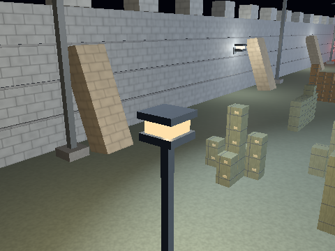

### Point 1

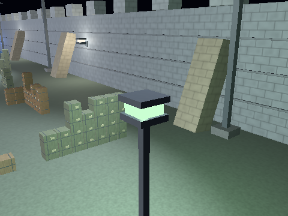

### Point 2


### Point 3


### Point 4


### Point 5


### Point 6


### Point 7


### Spot 0


### Spot 1


### Spot 2


### Spot 3


### Spot 4


### Spot 5


## Materials, emission and transient appearance

These use original object values and positions. Object-only captures omit surrounding geometry for inspection, but keep the complete day/night light rig. Without shadowing, removing neighboring geometry does not change a surface's illumination.

### arena-floor-slab / base

[Exact component material parameters and construction](../objects/arena-floor-slab/arena-floor-slab.md).

| Shading | Day | Night |
| --- | --- | --- |
| Flat |  |  | 
| Gouraud |  |  | 
| Phong |  |  | 
### arena-painted-route-marker / base

[Exact component material parameters and construction](../objects/arena-painted-route-marker/arena-painted-route-marker.md).

| Shading | Day | Night |
| --- | --- | --- |
| Flat |  |  | 
| Gouraud |  |  | 
| Phong |  |  | 
### bird / base

[Exact component material parameters and construction](../objects/bird/bird.md).

| Shading | Day | Night |
| --- | --- | --- |
| Flat |  |  | 
| Gouraud |  |  | 
| Phong |  |  | 
### blood-blood-droplet / base

[Exact component material parameters and construction](../objects/blood-blood-droplet/blood-blood-droplet.md).

| Shading | Day | Night |
| --- | --- | --- |
| Flat |  |  | 
| Gouraud |  |  | 
| Phong |  |  | 
### boundary-corner-cap / base

[Exact component material parameters and construction](../objects/boundary-corner-cap/boundary-corner-cap.md).

| Shading | Day | Night |
| --- | --- | --- |
| Flat |  |  | 
| Gouraud |  |  | 
| Phong |  |  | 
### boundary-east-wall / base

[Exact component material parameters and construction](../objects/boundary-east-wall/boundary-east-wall.md).

| Shading | Day | Night |
| --- | --- | --- |
| Flat |  |  | 
| Gouraud |  |  | 
| Phong |  |  | 
### boundary-masonry-string-course / base

[Exact component material parameters and construction](../objects/boundary-masonry-string-course/boundary-masonry-string-course.md).

| Shading | Day | Night |
| --- | --- | --- |
| Flat |  |  | 
| Gouraud |  |  | 
| Phong |  |  | 
### boundary-north-top-block / base

[Exact component material parameters and construction](../objects/boundary-north-top-block/boundary-north-top-block.md).

| Shading | Day | Night |
| --- | --- | --- |
| Flat |  |  | 
| Gouraud |  |  | 
| Phong |  |  | 
### boundary-north-wall / base

[Exact component material parameters and construction](../objects/boundary-north-wall/boundary-north-wall.md).

| Shading | Day | Night |
| --- | --- | --- |
| Flat |  |  | 
| Gouraud |  |  | 
| Phong |  |  | 
### boundary-sheared-stone-support / base

[Exact component material parameters and construction](../objects/boundary-sheared-stone-support/boundary-sheared-stone-support.md).

| Shading | Day | Night |
| --- | --- | --- |
| Flat |  |  | 
| Gouraud |  |  | 
| Phong |  |  | 
### boundary-side-top-block / base

[Exact component material parameters and construction](../objects/boundary-side-top-block/boundary-side-top-block.md).

| Shading | Day | Night |
| --- | --- | --- |
| Flat |  |  | 
| Gouraud |  |  | 
| Phong |  |  | 
### boundary-south-top-block / base

[Exact component material parameters and construction](../objects/boundary-south-top-block/boundary-south-top-block.md).

| Shading | Day | Night |
| --- | --- | --- |
| Flat |  |  | 
| Gouraud |  |  | 
| Phong |  |  | 
### boundary-south-wall / base

[Exact component material parameters and construction](../objects/boundary-south-wall/boundary-south-wall.md).

| Shading | Day | Night |
| --- | --- | --- |
| Flat |  |  | 
| Gouraud |  |  | 
| Phong |  |  | 
### boundary-thick-corner-tower / base

[Exact component material parameters and construction](../objects/boundary-thick-corner-tower/boundary-thick-corner-tower.md).

| Shading | Day | Night |
| --- | --- | --- |
| Flat |  |  | 
| Gouraud |  |  | 
| Phong |  |  | 
### boundary-west-wall / base

[Exact component material parameters and construction](../objects/boundary-west-wall/boundary-west-wall.md).

| Shading | Day | Night |
| --- | --- | --- |
| Flat |  |  | 
| Gouraud |  |  | 
| Phong |  |  | 
### camera-reference / base

[Exact component material parameters and construction](../objects/camera-reference/camera-reference.md).

| Shading | Day | Night |
| --- | --- | --- |
| Flat |  |  | 
| Gouraud |  |  | 
| Phong |  |  | 
### cargo-crate / base

[Exact component material parameters and construction](../objects/cargo-crate/cargo-crate.md).

| Shading | Day | Night |
| --- | --- | --- |
| Flat |  |  | 
| Gouraud |  |  | 
| Phong |  |  | 
### celebration-victory-confetti / base

[Exact component material parameters and construction](../objects/celebration-victory-confetti/celebration-victory-confetti.md).

| Shading | Day | Night |
| --- | --- | --- |
| Flat |  |  | 
| Gouraud |  |  | 
| Phong |  |  | 
### environment-sun-visual / base

[Exact component material parameters and construction](../objects/environment-sun-visual/environment-sun-visual.md).

| Shading | Day | Night |
| --- | --- | --- |
| Flat |  |  | 
| Gouraud |  |  | 
| Phong |  |  | 
### equipment-table / base

[Exact component material parameters and construction](../objects/equipment-table/equipment-table.md).

| Shading | Day | Night |
| --- | --- | --- |
| Flat |  |  | 
| Gouraud |  |  | 
| Phong |  |  | 
### hit-effect-break-fragment / base

[Exact component material parameters and construction](../objects/hit-effect-break-fragment/hit-effect-break-fragment.md).

| Shading | Day | Night |
| --- | --- | --- |
| Flat |  |  | 
| Gouraud |  |  | 
| Phong |  |  | 
### human / base

[Exact component material parameters and construction](../objects/human/human.md).

| Shading | Day | Night |
| --- | --- | --- |
| Flat |  |  | 
| Gouraud |  |  | 
| Phong |  |  | 
### lamp-post / base

[Exact component material parameters and construction](../objects/lamp-post/lamp-post.md).

| Shading | Day | Night |
| --- | --- | --- |
| Flat |  |  | 
| Gouraud |  |  | 
| Phong |  |  | 
### player / base

[Exact component material parameters and construction](../objects/player/player.md).

| Shading | Day | Night |
| --- | --- | --- |
| Flat |  |  | 
| Gouraud |  |  | 
| Phong |  |  | 
### projectile-assault-rifle / base

[Exact component material parameters and construction](../objects/projectile-assault-rifle/projectile-assault-rifle.md).

| Shading | Day | Night |
| --- | --- | --- |
| Flat |  |  | 
| Gouraud |  |  | 
| Phong |  |  | 
### projectile-pistol / base

[Exact component material parameters and construction](../objects/projectile-pistol/projectile-pistol.md).

| Shading | Day | Night |
| --- | --- | --- |
| Flat |  |  | 
| Gouraud |  |  | 
| Phong |  |  | 
### projectile-shotgun / base

[Exact component material parameters and construction](../objects/projectile-shotgun/projectile-shotgun.md).

| Shading | Day | Night |
| --- | --- | --- |
| Flat |  |  | 
| Gouraud |  |  | 
| Phong |  |  | 
### stadium-floodlight / base

[Exact component material parameters and construction](../objects/stadium-floodlight/stadium-floodlight.md).

| Shading | Day | Night |
| --- | --- | --- |
| Flat |  |  | 
| Gouraud |  |  | 
| Phong |  |  | 
### target / base

[Exact component material parameters and construction](../objects/target/target.md).

| Shading | Day | Night |
| --- | --- | --- |
| Flat |  |  | 
| Gouraud |  |  | 
| Phong |  |  | 
### target / hit-flash-0-25

[Exact component material parameters and construction](../objects/target/target.md).

| Shading | Day | Night |
| --- | --- | --- |
| Flat |  |  | 
| Gouraud |  |  | 
| Phong |  |  | 
### target / respawn-countdown-2

[Exact component material parameters and construction](../objects/target/target.md).

| Shading | Day | Night |
| --- | --- | --- |
| Flat |  |  | 
| Gouraud |  |  | 
| Phong |  |  | 
### wall-lamp / base

[Exact component material parameters and construction](../objects/wall-lamp/wall-lamp.md).

| Shading | Day | Night |
| --- | --- | --- |
| Flat |  |  | 
| Gouraud |  |  | 
| Phong |  |  | 
### weapon-pistol / base

[Exact component material parameters and construction](../objects/weapon-pistol/weapon-pistol.md).

| Shading | Day | Night |
| --- | --- | --- |
| Flat |  |  | 
| Gouraud |  |  | 
| Phong |  |  | 
### weapon-pistol / fired-recoil-1

[Exact component material parameters and construction](../objects/weapon-pistol/weapon-pistol.md).

| Shading | Day | Night |
| --- | --- | --- |
| Flat |  |  | 
| Gouraud |  |  | 
| Phong |  |  | 
### weapon-rifle / base

[Exact component material parameters and construction](../objects/weapon-rifle/weapon-rifle.md).

| Shading | Day | Night |
| --- | --- | --- |
| Flat |  |  | 
| Gouraud |  |  | 
| Phong |  |  | 
### weapon-rifle / fired-recoil-1

[Exact component material parameters and construction](../objects/weapon-rifle/weapon-rifle.md).

| Shading | Day | Night |
| --- | --- | --- |
| Flat |  |  | 
| Gouraud |  |  | 
| Phong |  |  | 
### weapon-shotgun / base

[Exact component material parameters and construction](../objects/weapon-shotgun/weapon-shotgun.md).

| Shading | Day | Night |
| --- | --- | --- |
| Flat |  |  | 
| Gouraud |  |  | 
| Phong |  |  | 
### weapon-shotgun / fired-recoil-1

[Exact component material parameters and construction](../objects/weapon-shotgun/weapon-shotgun.md).

| Shading | Day | Night |
| --- | --- | --- |
| Flat |  |  | 
| Gouraud |  |  | 
| Phong |  |  | 

## Procedural sky

The sky is a fullscreen triangle with depth writes/testing disabled. It does not use the scene's camera direction or lighting equation. RGB=mix(horizon,zenith,smoothstep(0.15,1,uv.y)); day horizon=(0.67,0.81,0.93), zenith=(0.20,0.48,0.78); night horizon=(0.045,0.065,0.12), zenith=(0.006,0.012,0.04). Sky output is not passed through object gamma.


## Exact source and how it connects

Lighting.cpp constructs the numeric rig and visible fixtures. Renderer.cpp selects day/night, applies the diagnostic mask, uploads uniforms, builds the inverse-transpose normal matrix, selects texture layers/repeats and draws the unit cube. object.vert transforms geometry and optionally computes vertex lighting. lighting.glsl accumulates the formulas above. object.frag selects flat/interpolated/per-fragment results, applies surface texture, emission, clamp and gamma. sky.frag is an independent background pass. TextureCache and Material define the actual image sampling and material assignments.

### Exact source: `src/world/Lighting.cpp`

```cpp
#include "world/Lighting.h"

namespace shooter {
LightingRig createLighting(bool night) {
    LightingRig rig;
    rig.ambient=night?Vec3{.012f,.016f,.025f}:Vec3{.30f,.32f,.35f};
    rig.sunDirection=normalize({.45f,.8f,.3f});
    rig.sunColor=night?Vec3{}:Vec3{.95f,.88f,.73f};
    // Two warm lamps near spawn, four boundary lamps, two wall-mounted accents.
    const Vec3 positions[]={{-18,4.7f,-12},{18,4.7f,-12},{-28.8f,5,-38},{28.8f,5,-38},
        {-28.8f,5,-68},{28.8f,5,-68},{-28.8f,3.2f,-89},{28.8f,3.2f,-89}};
    const Vec3 colors[]={{2.2f,1.65f,.9f},{1.2f,2.0f,1.3f},{1.7f,1.6f,1.4f},{1.7f,1.6f,1.4f},
        {1.7f,1.6f,1.4f},{1.7f,1.6f,1.4f},{2.0f,.25f,.15f},{.25f,.65f,2.0f}};
    for(int i=0;i<8;++i) rig.points.push_back({positions[i],night?colors[i]:Vec3{}});
    // Six stadium towers, all at the boundary, aimed down and across the arena.
    for(float z:{-16.f,-48.f,-80.f}) for(float x:{-28.f,28.f})
        rig.spots.push_back({{x,12,z},normalize({-x,-10,-4}),
            night?Vec3{1.8f,1.9f,2.1f}:Vec3{},std::cos(radians(32)),std::cos(radians(53))});
    return rig;
}
std::vector<SceneObject> createLightFixtures() {
    std::vector<SceneObject> objects;
    auto add=[&](std::string id,std::string component,Vec3 p,Vec3 scale,Vec3 color) -> SceneObject& {
        objects.push_back(makeCube(id,"Lighting",component,p,scale,color));
        auto& o=objects.back(); o.specular=.45f; o.shininess=48;
        o.notes="Mounted arena fixture; lens and illumination share the same rig position";
        return o;
    };
    const Vec3 metal{.19f,.23f,.27f};
    const auto rig=createLighting(true);
    int i=0;
    for(const auto& light:rig.points) {
        const auto id="LAMP_"+std::to_string(++i); const auto p=light.position;
        if(i<=2) {
            add(id+"_BASE","Footing",{p.x,.15f,p.z},{.8f,.3f,.8f},metal);
            add(id+"_POLE","Lamp post",{p.x,p.y/2,p.z},{.22f,p.y,.22f},metal);
        } else {
            const float wall=p.x<0?-29.5f:29.5f;
            add(id+"_MOUNT","Wall bracket",{(p.x+wall)/2,p.y-.35f,p.z},{1.3f,.18f,.25f},metal);
            add(id+"_PLATE","Wall mounting plate",{wall,p.y-.35f,p.z},{.2f,.7f,.6f},metal);
        }
        add(id+"_HOUSING","Lamp housing",p+Vec3{0,-.24f,0},{.9f,.18f,.9f},metal);
        const float peak=std::max(light.color.x,std::max(light.color.y,light.color.z));
        add(id+"_LENS","Lens",p,{.72f,.36f,.72f},light.color*(1/peak));
        add(id+"_CAP","Lamp cap",p+Vec3{0,.26f,0},{.95f,.16f,.95f},metal);
    }
    i=0;
    for(const auto& light:rig.spots) {
        const auto id="FLOOD_"+std::to_string(++i); const auto p=light.position;
        add(id+"_BASE","Concrete footing",{p.x,.25f,p.z},{1.3f,.5f,1.3f},{.35f,.37f,.39f});
        add(id+"_POLE","Stadium tower",{p.x,6,p.z},{.38f,12,.38f},metal);
        add(id+"_BAR","Floodlight crossbar",p,{2.9f,.18f,.25f},metal);
        const Vec3 rotation{-std::asin(light.direction.y)*180/pi,std::atan2(light.direction.x,light.direction.z)*180/pi,0};
        for(int panel=-1;panel<=1;++panel) {
            const Vec3 center=p+Vec3{0,0,float(panel)*.95f};
            add(id+"_BRACKET_"+std::to_string(panel),"Head support",(p+center)*.5f,{.18f,.22f,2.1f},metal);
            auto& head=add(id+"_HEAD_"+std::to_string(panel),"Floodlight housing",center,{.85f,.72f,.32f},metal);
            head.transform.rotation=rotation;
            auto& lens=add(id+"_LENS_"+std::to_string(panel),"Lens",center+light.direction*.18f,{.73f,.60f,.035f},{.86f,.93f,1});
            lens.transform.rotation=rotation;
        }
    }
    return objects;
}
}

```

### Exact source: `src/rendering/Renderer.cpp`

```cpp
#include "rendering/Renderer.h"
#include <fstream>
#include <sstream>
#include <stdexcept>

namespace shooter {
namespace {
GLuint compileShader(GLenum kind, const std::filesystem::path& path) {
    std::ifstream file(path);
    if (!file) throw std::runtime_error("Cannot read shader: " + path.string());
    std::ostringstream buffer;
    buffer << file.rdbuf();
    std::string source = buffer.str();
    const std::string directive="#include \"lighting.glsl\"";
    const auto include=source.find(directive);
    if (include!=std::string::npos) {
        std::ifstream shared(path.parent_path()/"lighting.glsl");
        if (!shared) throw std::runtime_error("Cannot read shared lighting shader.");
        std::ostringstream code; code<<shared.rdbuf();
        source.replace(include,directive.size(),code.str());
    }
    const char* text = source.c_str();
    const GLuint shader = glCreateShader(kind);
    glShaderSource(shader,1,&text,nullptr);
    glCompileShader(shader);
    GLint ok=0;
    glGetShaderiv(shader,GL_COMPILE_STATUS,&ok);
    if (!ok) {
        char log[4096]{};
        glGetShaderInfoLog(shader,sizeof(log),nullptr,log);
        glDeleteShader(shader);
        throw std::runtime_error("Shader compile failed (" + path.string() + "): " + log);
    }
    return shader;
}
}
Renderer::~Renderer() {
    if (skyProgram) glDeleteProgram(skyProgram);
    if (uiVbo) glDeleteBuffers(1,&uiVbo);
    if (uiVao) glDeleteVertexArrays(1,&uiVao);
    if (uiProgram) glDeleteProgram(uiProgram);
    if (vbo) glDeleteBuffers(1,&vbo);
    if (vao) glDeleteVertexArrays(1,&vao);
    if (program) glDeleteProgram(program);
}
void Renderer::initialize(const std::filesystem::path& directory) {
    textures.initialize(directory.parent_path()/"assets"/"textures");
    const GLuint vertex=compileShader(GL_VERTEX_SHADER,directory/"object.vert");
    GLuint fragment=0;
    try { fragment=compileShader(GL_FRAGMENT_SHADER,directory/"object.frag"); }
    catch (...) { glDeleteShader(vertex); throw; }
    program=glCreateProgram();
    glAttachShader(program,vertex); glAttachShader(program,fragment);
    glLinkProgram(program);
    glDeleteShader(vertex); glDeleteShader(fragment);
    GLint ok=0;
    glGetProgramiv(program,GL_LINK_STATUS,&ok);
    if (!ok) {
        char log[4096]{};
        glGetProgramInfoLog(program,sizeof(log),nullptr,log);
        throw std::runtime_error(std::string("Shader link failed: ")+log);
    }
    modelLocation=glGetUniformLocation(program,"model");
    viewLocation=glGetUniformLocation(program,"view");
    projectionLocation=glGetUniformLocation(program,"projection");
    colorLocation=glGetUniformLocation(program,"objectColor");
    textureLayerLocation=glGetUniformLocation(program,"textureLayer");
    textureRepeatLocation=glGetUniformLocation(program,"textureRepeat");
    glUseProgram(program);
    glUniform1i(glGetUniformLocation(program,"materialTextures"),0);
    shadingLocation=glGetUniformLocation(program,"shadingMode");
    specularLocation=glGetUniformLocation(program,"materialSpecular");
    shininessLocation=glGetUniformLocation(program,"shininess");
    emissionLocation=glGetUniformLocation(program,"emission");
    patternLocation=glGetUniformLocation(program,"targetPattern");
    flashLocation=glGetUniformLocation(program,"targetFlash");
    patternScaleLocation=glGetUniformLocation(program,"patternScale");
    patternOffsetLocation=glGetUniformLocation(program,"patternOffset");
    if (modelLocation<0 || viewLocation<0 || projectionLocation<0 || colorLocation<0)
        throw std::runtime_error("Required shader uniform missing.");
    normalMatrixLocation=glGetUniformLocation(program,"normalMatrix");
    eyePositionLocation=glGetUniformLocation(program,"eyePosition");
    ambientColorLocation=glGetUniformLocation(program,"ambientColor");
    sunDirectionLocation=glGetUniformLocation(program,"sunDirection");
    sunColorLocation=glGetUniformLocation(program,"sunColor");
    for (int i=0;i<8;++i) {
        const std::string prefix="points["+std::to_string(i)+"].";
        pointLocations[i]={glGetUniformLocation(program,(prefix+"position").c_str()),
                           glGetUniformLocation(program,(prefix+"color").c_str())};
    }
    for (int i=0;i<6;++i) {
        const std::string prefix="spots["+std::to_string(i)+"].";
        spotLocations[i]={glGetUniformLocation(program,(prefix+"position").c_str()),
                          glGetUniformLocation(program,(prefix+"direction").c_str()),
                          glGetUniformLocation(program,(prefix+"color").c_str()),
                          glGetUniformLocation(program,(prefix+"innerCos").c_str()),
                          glGetUniformLocation(program,(prefix+"outerCos").c_str())};
    }

    // Shared unit cube: 8 local corners, expanded to 36 triangle vertices.
    const Vec3 corners[] = {
        {-0.5f,-0.5f,-0.5f},{0.5f,-0.5f,-0.5f},{0.5f,0.5f,-0.5f},{-0.5f,0.5f,-0.5f},
        {-0.5f,-0.5f,0.5f},{0.5f,-0.5f,0.5f},{0.5f,0.5f,0.5f},{-0.5f,0.5f,0.5f}
    };
    const int faces[6][4] = {{4,5,6,7},{1,0,3,2},{0,4,7,3},{5,1,2,6},{3,7,6,2},{0,1,5,4}};
    const int triangles[] = {0,1,2,0,2,3};
    const Vec3 normals[]={{0,0,1},{0,0,-1},{-1,0,0},{1,0,0},{0,1,0},{0,-1,0}};
    std::vector<float> vertices;
    for (int face=0; face<6; ++face) for (int corner : triangles) {
        const Vec3 p=corners[faces[face][corner]];
        const Vec3 n=normals[face];
        vertices.insert(vertices.end(),{p.x,p.y,p.z,n.x,n.y,n.z});
    }
    glGenVertexArrays(1,&vao); glGenBuffers(1,&vbo);
    glBindVertexArray(vao); glBindBuffer(GL_ARRAY_BUFFER,vbo);
    glBufferData(GL_ARRAY_BUFFER,static_cast<GLsizeiptr>(vertices.size()*sizeof(float)),vertices.data(),GL_STATIC_DRAW);
    glVertexAttribPointer(0,3,GL_FLOAT,GL_FALSE,6*sizeof(float),nullptr);
    glEnableVertexAttribArray(0);
    glVertexAttribPointer(1,3,GL_FLOAT,GL_FALSE,6*sizeof(float),reinterpret_cast<void*>(3*sizeof(float)));
    glEnableVertexAttribArray(1);
    glBindVertexArray(0);
    const GLuint uiVertex=compileShader(GL_VERTEX_SHADER,directory/"ui.vert");
    GLuint uiFragment=0;
    try { uiFragment=compileShader(GL_FRAGMENT_SHADER,directory/"ui.frag"); }
    catch (...) { glDeleteShader(uiVertex); throw; }
    uiProgram=glCreateProgram();
    glAttachShader(uiProgram,uiVertex); glAttachShader(uiProgram,uiFragment); glLinkProgram(uiProgram);
    glDeleteShader(uiVertex); glDeleteShader(uiFragment);
    glGetProgramiv(uiProgram,GL_LINK_STATUS,&ok);
    if (!ok) throw std::runtime_error("UI shader link failed.");
    glGenVertexArrays(1,&uiVao); glGenBuffers(1,&uiVbo);
    glBindVertexArray(uiVao); glBindBuffer(GL_ARRAY_BUFFER,uiVbo);
    glVertexAttribPointer(0,2,GL_FLOAT,GL_FALSE,sizeof(UiVertex),nullptr); glEnableVertexAttribArray(0);
    glVertexAttribPointer(1,4,GL_FLOAT,GL_FALSE,sizeof(UiVertex),reinterpret_cast<void*>(2*sizeof(float)));
    glEnableVertexAttribArray(1); glBindVertexArray(0);
    const GLuint skyVertex=compileShader(GL_VERTEX_SHADER,directory/"sky.vert");
    GLuint skyFragment=0;
    try { skyFragment=compileShader(GL_FRAGMENT_SHADER,directory/"sky.frag"); }
    catch (...) { glDeleteShader(skyVertex); throw; }
    skyProgram=glCreateProgram();
    glAttachShader(skyProgram,skyVertex); glAttachShader(skyProgram,skyFragment); glLinkProgram(skyProgram);
    glDeleteShader(skyVertex); glDeleteShader(skyFragment);
    glGetProgramiv(skyProgram,GL_LINK_STATUS,&ok);
    if (!ok) throw std::runtime_error("Sky shader link failed.");
}
void Renderer::drawInterface(const std::vector<UiVertex>& vertices) {
    glDisable(GL_DEPTH_TEST);
    glEnable(GL_BLEND); glBlendFunc(GL_SRC_ALPHA,GL_ONE_MINUS_SRC_ALPHA);
    glUseProgram(uiProgram); glBindVertexArray(uiVao); glBindBuffer(GL_ARRAY_BUFFER,uiVbo);
    glBufferData(GL_ARRAY_BUFFER,static_cast<GLsizeiptr>(vertices.size()*sizeof(UiVertex)),vertices.data(),GL_STREAM_DRAW);
    glDrawArrays(GL_TRIANGLES,0,static_cast<GLsizei>(vertices.size()));
    glBindVertexArray(0); glDisable(GL_BLEND); glEnable(GL_DEPTH_TEST);
}
void Renderer::drawTransformedCube(const SceneObject& object) {
    const Mat4 model=composeModelMatrix(object.transform);
    glUniformMatrix4fv(modelLocation,1,GL_FALSE,model.data.data());
    // Compute normal matrix on CPU to avoid per-vertex transpose(inverse(mat3(model))) in the shader.
    if (normalMatrixLocation>=0) {
        const Vec3 a{model.at(0,0),model.at(1,0),model.at(2,0)}, b{model.at(0,1),model.at(1,1),model.at(2,1)},
                   c{model.at(0,2),model.at(1,2),model.at(2,2)};
        const float det=dot(a,cross(b,c));
        if (std::abs(det)>1e-8f) {
            const float invDet=1.0f/det;
            const Vec3 r0=cross(b,c)*invDet, r1=cross(c,a)*invDet, r2=cross(a,b)*invDet;
            // Column-major mat3: each column is one of the cofactor rows.
            const float nm[9]={r0.x,r0.y,r0.z, r1.x,r1.y,r1.z, r2.x,r2.y,r2.z};
            glUniformMatrix3fv(normalMatrixLocation,1,GL_FALSE,nm);
        }
    }
    auto vectorUniform=[&](GLint location,Vec3 value,Vec3& previous) {
        if(!drawStateValid || value.x!=previous.x || value.y!=previous.y || value.z!=previous.z) {
            glUniform3f(location,value.x,value.y,value.z); previous=value;
        }
    };
    auto floatUniform=[&](GLint location,float value,float& previous) {
        if(!drawStateValid || value!=previous) { glUniform1f(location,value); previous=value; }
    };
    vectorUniform(colorLocation,object.color,lastColor);
    const auto material=object.emission>.5f?Material::Plain:object.targetPattern?Material::Paper:object.material;
    floatUniform(textureLayerLocation,float(material),lastLayer);
    const auto scale=object.transform.scale;
    vectorUniform(textureRepeatLocation,{std::abs(scale.x)*object.textureScale,
        std::abs(scale.y)*object.textureScale,std::abs(scale.z)*object.textureScale},lastRepeat);
    floatUniform(specularLocation,object.specular,lastSpecular);
    floatUniform(shininessLocation,object.shininess,lastShininess);
    floatUniform(emissionLocation,object.emission,lastEmission);
    floatUniform(flashLocation,object.flash,lastFlash);
    if(!drawStateValid || object.targetPattern!=lastPattern) {
        glUniform1i(patternLocation,object.targetPattern); lastPattern=object.targetPattern;
    }
    vectorUniform(patternScaleLocation,object.patternScale,lastPatternScale);
    vectorUniform(patternOffsetLocation,object.patternOffset,lastPatternOffset);
    drawStateValid=true;
    glDrawArrays(GL_TRIANGLES,0,36);
}
void Renderer::drawArena(const std::vector<SceneObject>& objects, const Mat4& view, const Mat4& projection,Vec3 eye,bool night,int isolation,int lightMask) {
    glDisable(GL_DEPTH_TEST); glDepthMask(GL_FALSE);
    glUseProgram(skyProgram);
    if (skyNightLocation<0) skyNightLocation=glGetUniformLocation(skyProgram,"night");
    glUniform1i(skyNightLocation,night);
    glBindVertexArray(vao); glDrawArrays(GL_TRIANGLES,0,3);
    glEnable(GL_DEPTH_TEST); glDepthMask(GL_TRUE);
    glUseProgram(program);
    glUniform1i(shadingLocation,shadingMode);
    textures.bind();
    static const auto dayLighting=createLighting(false),nightLighting=createLighting(true);
    const auto& lighting=night?nightLighting:dayLighting;
    // Use cached uniform locations instead of per-frame string lookups.
    glUniform3f(eyePositionLocation,eye.x,eye.y,eye.z);
    const Vec3 ambient=(lightMask&1) && (isolation<0 || isolation==0)?lighting.ambient:Vec3{};
    const Vec3 sun=(lightMask&2) && (isolation<0 || isolation==1)?lighting.sunColor:Vec3{};
    glUniform3f(ambientColorLocation,ambient.x,ambient.y,ambient.z);
    glUniform3f(sunDirectionLocation,lighting.sunDirection.x,lighting.sunDirection.y,lighting.sunDirection.z);
    glUniform3f(sunColorLocation,sun.x,sun.y,sun.z);
    for (std::size_t i=0;i<lighting.points.size();++i) {
        glUniform3f(pointLocations[i].position,lighting.points[i].position.x,lighting.points[i].position.y,lighting.points[i].position.z);
        const Vec3 color=(lightMask&4) && (isolation<0 || isolation==2)?lighting.points[i].color:Vec3{};
        glUniform3f(pointLocations[i].color,color.x,color.y,color.z);
    }
    for (std::size_t i=0;i<lighting.spots.size();++i) {
        const auto& light=lighting.spots[i];
        glUniform3f(spotLocations[i].position,light.position.x,light.position.y,light.position.z);
        glUniform3f(spotLocations[i].direction,light.direction.x,light.direction.y,light.direction.z);
        const Vec3 color=(lightMask&8) && (isolation<0 || isolation==3)?light.color:Vec3{};
        glUniform3f(spotLocations[i].color,color.x,color.y,color.z);
        glUniform1f(spotLocations[i].innerCos,light.innerCos);
        glUniform1f(spotLocations[i].outerCos,light.outerCos);
    }
    glUniformMatrix4fv(viewLocation,1,GL_FALSE,view.data.data());
    glUniformMatrix4fv(projectionLocation,1,GL_FALSE,projection.data.data());
    glBindVertexArray(vao);
    drawStateValid=false;
    for (const auto& object : objects) drawTransformedCube(object);
    glBindVertexArray(0);
}
}

```

### Exact source: `shaders/lighting.glsl`

```glsl
// Shared by vertex and fragment shaders. Phong reflection, not Blinn-Phong.
uniform vec3 eyePosition, ambientColor, sunDirection, sunColor;
uniform float materialSpecular, shininess;
uniform int shadingMode; // 0 flat, 1 Gouraud, 2 Phong (default)
struct PointLight { vec3 position; vec3 color; };
struct SpotLight { vec3 position; vec3 direction; vec3 color; float innerCos; float outerCos; };
uniform PointLight points[8];
uniform SpotLight spots[6];
void addLight(vec3 N, vec3 V, vec3 L, vec3 color, inout vec3 diffuse, inout vec3 specular) {
    float ndotl=max(dot(N,L),0.0);
    diffuse+=color*ndotl;
    // R is the reflection of incoming light; V points toward the viewer.
    vec3 R=reflect(-L,N);
    if (ndotl>0.0) specular+=color*materialSpecular*pow(max(dot(R,V),0.0),shininess);
}
void lighting(vec3 position, vec3 normal, out vec3 diffuse, out vec3 specular) {
    vec3 N=normalize(normal), V=normalize(eyePosition-position);
    diffuse=ambientColor; specular=vec3(0);
    addLight(N,V,normalize(sunDirection),sunColor,diffuse,specular);
    for(int i=0;i<8;++i) {
        if(dot(points[i].color,points[i].color)==0.0) continue;
        vec3 delta=points[i].position-position;
        float d=max(length(delta),0.001);
        float attenuation=1.0/(1.0+0.09*d+0.032*d*d);
        addLight(N,V,delta/d,points[i].color*attenuation,diffuse,specular);
    }
    for(int i=0;i<6;++i) {
        if(dot(spots[i].color,spots[i].color)==0.0) continue;
        vec3 delta=spots[i].position-position;
        float d=max(length(delta),0.001);
        float cone=dot(-delta/d,spots[i].direction);
        float intensity=smoothstep(spots[i].outerCos,spots[i].innerCos,cone);
        float attenuation=1.0/(1.0+0.025*d+0.002*d*d);
        addLight(N,V,delta/d,spots[i].color*intensity*attenuation,diffuse,specular);
    }
}

```

### Exact source: `shaders/object.vert`

```glsl
#version 330 core
#include "lighting.glsl"
layout(location=0) in vec3 localPosition;
layout(location=1) in vec3 localNormal;
uniform mat4 model, view, projection;
uniform mat3 normalMatrix;
uniform vec3 patternScale, patternOffset;
uniform vec3 textureRepeat;
out vec2 materialUV;
out vec3 worldPosition, worldNormal, shapePosition, shapeNormal;
out vec3 vertexDiffuse, vertexSpecular;
flat out vec3 flatDiffuse, flatSpecular;
void main() {
    vec4 world=model*vec4(localPosition,1.0);
    worldPosition=world.xyz;
    worldNormal=normalMatrix*localNormal;
    shapePosition=localPosition*patternScale+patternOffset;
    shapeNormal=localNormal;
    // Face-local planar UVs, scaled in meters; follows rotation and shear without swimming.
    vec3 uvPosition=(localPosition+vec3(0.5))*textureRepeat;
    materialUV=abs(localNormal.y)>.5?uvPosition.xz:
        abs(localNormal.x)>.5?uvPosition.zy:uvPosition.xy;
    vertexDiffuse=vec3(0); vertexSpecular=vec3(0);
    if(shadingMode!=2) lighting(worldPosition,worldNormal,vertexDiffuse,vertexSpecular);
    // Flat uses one provoking vertex result for the entire triangle.
    flatDiffuse=vertexDiffuse; flatSpecular=vertexSpecular;
    gl_Position=projection*view*world;
}

```

### Exact source: `shaders/object.frag`

```glsl
#version 330 core
#include "lighting.glsl"
in vec3 worldPosition, worldNormal, shapePosition, shapeNormal;
uniform vec3 objectColor;
uniform float emission, targetFlash;
uniform sampler2DArray materialTextures;
uniform float textureLayer;
in vec2 materialUV;
in vec3 vertexDiffuse, vertexSpecular;
flat in vec3 flatDiffuse, flatSpecular;
uniform bool targetPattern;
out vec4 fragmentColor;
vec3 surfaceColor() {
    if (!targetPattern) return objectColor;
    if (shapeNormal.z<0.5) return vec3(0.15,0.18,0.21);
    float radius=length(shapePosition.xy)*2.0;
    int ring=clamp(int(radius*6.0),0,5);
    vec3 colors[6]=vec3[6](vec3(0.96,0.10,0.07),vec3(1.0,0.75,0.12),
        vec3(0.12,0.44,0.84),vec3(0.94,0.93,0.85),vec3(0.82,0.12,0.10),vec3(0.94,0.93,0.85));
    vec3 color=colors[ring];
    if (fract(radius*6.0)>0.95) color=vec3(0.08);
    return mix(color,vec3(1.0,0.76,0.2),targetFlash*0.5);
}
void main() {
    vec3 base=surfaceColor()*texture(materialTextures,vec3(materialUV,textureLayer)).rgb, diffuse, specular;
    if(shadingMode==0) { diffuse=flatDiffuse; specular=flatSpecular; }
    else if(shadingMode==1) { diffuse=vertexDiffuse; specular=vertexSpecular; }
    else lighting(worldPosition,worldNormal,diffuse,specular);
    vec3 lit=base*diffuse+specular;
    lit=mix(lit,base,emission);
    fragmentColor=vec4(pow(clamp(lit,0.0,1.0),vec3(1.0/2.2)),1.0);
}

```

### Exact source: `shaders/sky.vert`

```glsl
#version 330 core
out vec2 uv;
void main() {
    vec2 p=vec2((gl_VertexID<<1)&2,gl_VertexID&2);
    uv=p;
    gl_Position=vec4(p*2.0-1.0,1.0,1.0);
}

```

### Exact source: `shaders/sky.frag`

```glsl
#version 330 core
in vec2 uv;
uniform bool night;
out vec4 fragmentColor;
void main() {
    vec3 horizon=night?vec3(0.045,0.065,0.12):vec3(0.67,0.81,0.93);
    vec3 zenith=night?vec3(0.006,0.012,0.04):vec3(0.20,0.48,0.78);
    fragmentColor=vec4(mix(horizon,zenith,smoothstep(0.15,1.0,uv.y)),1.0);
}

```

### Exact source: `src/core/Material.h`

```cpp
#pragma once
#include <string>

namespace shooter {
// Layer order is shared with TextureCache and tools/generate_textures.cpp.
enum class Material { Plain, Concrete, Masonry, Gravel, Wood, Metal, Fabric, Paper, Rubber };
inline Material defaultMaterial(const std::string& type,const std::string& component) {
    if (type=="Boundary") return Material::Masonry;
    if (type=="Arena") return component=="Floor slab"?Material::Gravel:Material::Concrete;
    if (type=="Cargo") return component=="Crate"?Material::Wood:
        component=="Crate inventory plate"?Material::Paper:Material::Metal;
    if (type=="Weapon") return component=="GRIP"||component=="STOCK"||component=="FORE_END"?Material::Rubber:Material::Metal;
    if (type=="Target") return component=="Cube-built six-ring plate"?Material::Paper:Material::Metal;
    if (type=="Lighting") return component=="Concrete footing"?Material::Concrete:Material::Metal;
    if (type=="Human" || type=="Bird" || type=="Player") return Material::Fabric;
    if (type=="Environment") return component=="Equipment mat"?Material::Rubber:Material::Metal;
    return Material::Plain;
}
inline float materialTiling(Material material) {
    switch(material) {
        case Material::Masonry: return .5f;
        case Material::Gravel: return .65f;
        case Material::Wood: return 1.f;
        case Material::Metal: return 3.f;
        case Material::Fabric: return 6.f;
        case Material::Paper: return 2.f;
        case Material::Rubber: return 8.f;
        default: return 1.f;
    }
}
}

```

### Exact source: `src/rendering/TextureCache.cpp`

```cpp
#include "rendering/TextureCache.h"
#include <fstream>
#include <stdexcept>
#include <vector>

namespace shooter {
TextureCache::~TextureCache() { if(texture) glDeleteTextures(1,&texture); }
void TextureCache::initialize(const std::filesystem::path& directory) {
    if(texture) return;
    constexpr int size=256, layers=9;
    const char* names[]={"plain","concrete","masonry","gravel","wood","metal","fabric","paper","rubber"};
    // Validate every asset before allocating GPU storage. P6 linear RGB reflectance maps.
    std::vector<unsigned char> pixels(size*size*3*layers);
    for(int layer=0;layer<layers;++layer) {
        const auto path=directory/(std::string(names[layer])+".ppm");
        std::ifstream file(path,std::ios::binary);
        std::string magic; int width=0,height=0,maximum=0;
        file>>magic>>width>>height>>maximum;
        if(!file || magic!="P6" || width!=size || height!=size || maximum!=255)
            throw std::runtime_error("Expected 256x256 P6 texture: "+path.string());
        char separator=0; file.get(separator);
        if(separator=='\r' && file.peek()=='\n') file.get();
        else if(separator!='\n' && separator!=' ' && separator!='\t')
            throw std::runtime_error("Invalid texture header: "+path.string());
        file.read(reinterpret_cast<char*>(pixels.data()+layer*size*size*3),size*size*3);
        if(!file) throw std::runtime_error("Truncated texture: "+path.string());
    }
    glGenTextures(1,&texture); bind();
    glPixelStorei(GL_UNPACK_ALIGNMENT,1);
    glTexImage3D(GL_TEXTURE_2D_ARRAY,0,GL_RGB8,size,size,layers,0,GL_RGB,GL_UNSIGNED_BYTE,pixels.data());
    glTexParameteri(GL_TEXTURE_2D_ARRAY,GL_TEXTURE_WRAP_S,GL_REPEAT);
    glTexParameteri(GL_TEXTURE_2D_ARRAY,GL_TEXTURE_WRAP_T,GL_REPEAT);
    glTexParameteri(GL_TEXTURE_2D_ARRAY,GL_TEXTURE_MIN_FILTER,GL_LINEAR_MIPMAP_LINEAR);
    glTexParameteri(GL_TEXTURE_2D_ARRAY,GL_TEXTURE_MAG_FILTER,GL_LINEAR);
    glGenerateMipmap(GL_TEXTURE_2D_ARRAY);
    if(glGetError()!=GL_NO_ERROR) throw std::runtime_error("Material texture upload failed.");
}
void TextureCache::bind() const { glActiveTexture(GL_TEXTURE0); glBindTexture(GL_TEXTURE_2D_ARRAY,texture); }
}

```
