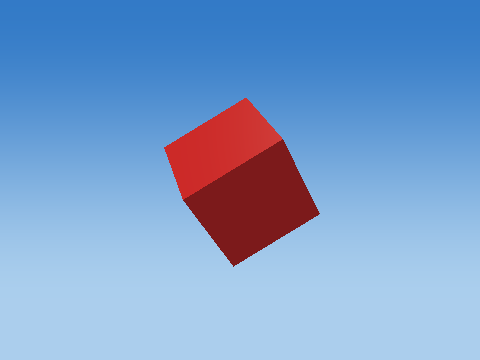
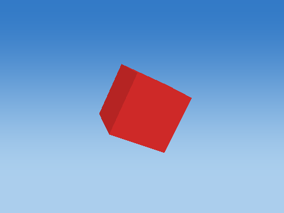
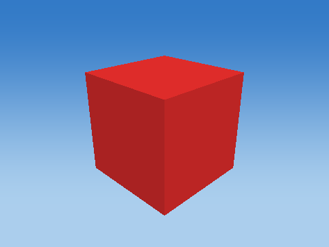
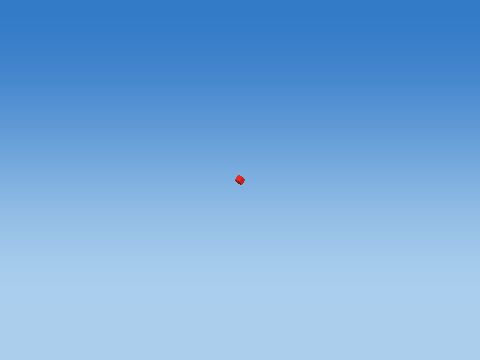
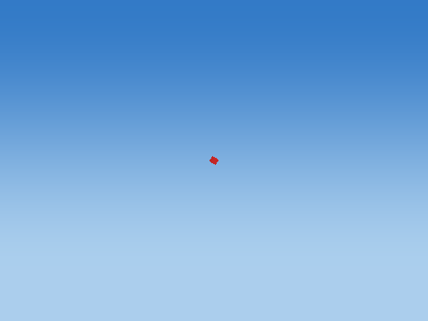
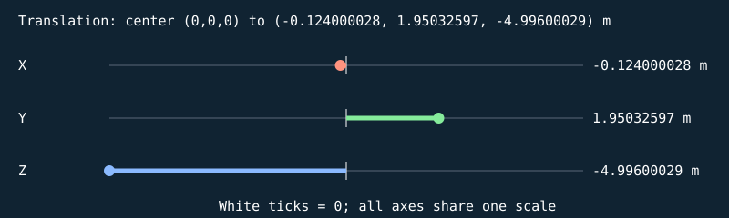
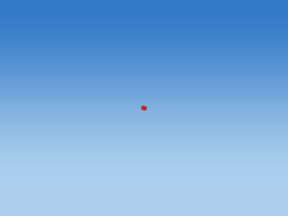
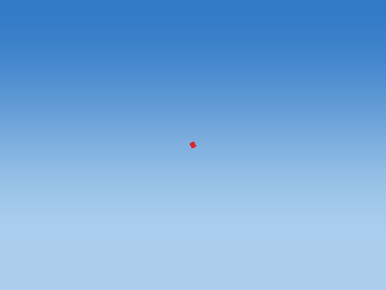
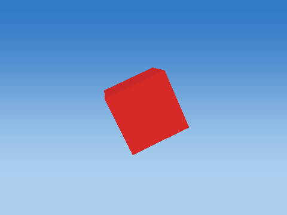
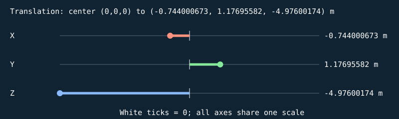

# blood-blood-droplet

Real Game::applyTargetHit and spawnBlood; fixed call order; update(0.1), integration step <= 1/120 s. Blood RNG follows the two NPC hits above.

All dimensions are meters; all rotations are degrees. Values below use nine significant digits (enough to recover float values). The renderer uses column vectors and column-major matrix storage. The mathematical application order is:

$$p_w=T R_z R_y R_x H S p_l,\qquad p_{clip}=P V p_w.$$

Scale: (sx*x, sy*y, sz*z). Shear: (x+hxy*y+hxz*z, hyx*x+y+hyz*z, hzx*x+hzy*y+z). For a=degrees*pi/180, c=cos(a), s=sin(a): Rx maps to (x, cy-sz, sy+cz); Ry to (cx+sz, y, -sx+cz); Rz to (cx-sy, sx+cy, z). Translation adds (tx,ty,tz). Each stage uses the previous stage's output. No parent transform is implicitly applied by Renderer: builders have already placed every part in world coordinates. Source listings at the end give exact construction, offset, animation and random-value formulas.

Assembly view eye=(-0.00918815285, 2.0249536, -4.88118839), center=(-0.124000028, 1.95032597, -4.99600029), FOV=45 degrees, aspect=4/3, near=0.00100000005, far=10.6498089.




## Cube assembly order

Each image adds one real component, preserving builder order and world transforms.

### Add 1: Blood droplet



## Every component transformation

### Blood droplet — `BLOOD_13`

1 unit = 1 m; shared cube transform pipeline

Position T = (-0.124000028, 1.95032597, -4.99600029) m; scale S = (0.0405555554, 0.0405555554, 0.0405555554); rotation (Rx,Ry,Rz) = (-57.647049, 152.941116, 8.11765766) degrees.

Shear (xy,xz,yx,yz,zx,zy) = (0, 0, 0, 0, 0, 0). Color = (0.680000007, 0.0199999996, 0.0199999996); specular = 0.119999997; shininess = 24; emission = 0; flash = 0; material layer = 0; texture scale = 1. Pattern enabled = 0, pattern scale = (1, 1, 1), offset = (0, 0, 0).

| Step | Actual renderer image |
| --- | --- |
| Unit cube |  |
| Scale |  |
| Shear |  |
| Rotate X |  |
| Rotate Y |  |
| Rotate Z |  |
| Translate to world |  |

Steps 1–5 share one camera; the unit cube has its own close view, and step 6 is reframed at the actual world location to keep small objects visible. Reframing changes the view, never the model coordinates. Identity steps deliberately remain visible. Intermediate shapes are instructional states, while step 6 uses the unmodified game object.

Each stage below gives its exact numeric matrix and all eight corner multiplications. For each output row r: p'[r] = A[r,0]p.x + A[r,1]p.y + A[r,2]p.z + A[r,3]p.w.




#### S

```text
[ 0.0405555554 0 0 0 ]
[ 0 0.0405555554 0 0 ]
[ 0 0 0.0405555554 0 ]
[ 0 0 0 1 ]
```

| Input corner (w=1) | Output corner (w=1) |
| --- | --- |
| (-0.5, -0.5, -0.5) | (-0.0202777777, -0.0202777777, -0.0202777777) |
| (-0.5, -0.5, 0.5) | (-0.0202777777, -0.0202777777, 0.0202777777) |
| (-0.5, 0.5, -0.5) | (-0.0202777777, 0.0202777777, -0.0202777777) |
| (-0.5, 0.5, 0.5) | (-0.0202777777, 0.0202777777, 0.0202777777) |
| (0.5, -0.5, -0.5) | (0.0202777777, -0.0202777777, -0.0202777777) |
| (0.5, -0.5, 0.5) | (0.0202777777, -0.0202777777, 0.0202777777) |
| (0.5, 0.5, -0.5) | (0.0202777777, 0.0202777777, -0.0202777777) |
| (0.5, 0.5, 0.5) | (0.0202777777, 0.0202777777, 0.0202777777) |

#### H

```text
[ 1 0 0 0 ]
[ 0 1 0 0 ]
[ 0 0 1 0 ]
[ 0 0 0 1 ]
```

| Input corner (w=1) | Output corner (w=1) |
| --- | --- |
| (-0.0202777777, -0.0202777777, -0.0202777777) | (-0.0202777777, -0.0202777777, -0.0202777777) |
| (-0.0202777777, -0.0202777777, 0.0202777777) | (-0.0202777777, -0.0202777777, 0.0202777777) |
| (-0.0202777777, 0.0202777777, -0.0202777777) | (-0.0202777777, 0.0202777777, -0.0202777777) |
| (-0.0202777777, 0.0202777777, 0.0202777777) | (-0.0202777777, 0.0202777777, 0.0202777777) |
| (0.0202777777, -0.0202777777, -0.0202777777) | (0.0202777777, -0.0202777777, -0.0202777777) |
| (0.0202777777, -0.0202777777, 0.0202777777) | (0.0202777777, -0.0202777777, 0.0202777777) |
| (0.0202777777, 0.0202777777, -0.0202777777) | (0.0202777777, 0.0202777777, -0.0202777777) |
| (0.0202777777, 0.0202777777, 0.0202777777) | (0.0202777777, 0.0202777777, 0.0202777777) |

#### Rx

```text
[ 1 0 0 0 ]
[ 0 0.535133302 0.84476763 0 ]
[ 0 -0.84476763 0.535133302 0 ]
[ 0 0 0 1 ]
```

| Input corner (w=1) | Output corner (w=1) |
| --- | --- |
| (-0.0202777777, -0.0202777777, -0.0202777777) | (-0.0202777777, -0.0279813241, 0.00627869554) |
| (-0.0202777777, -0.0202777777, 0.0202777777) | (-0.0202777777, 0.00627869554, 0.0279813241) |
| (-0.0202777777, 0.0202777777, -0.0202777777) | (-0.0202777777, -0.00627869554, -0.0279813241) |
| (-0.0202777777, 0.0202777777, 0.0202777777) | (-0.0202777777, 0.0279813241, -0.00627869554) |
| (0.0202777777, -0.0202777777, -0.0202777777) | (0.0202777777, -0.0279813241, 0.00627869554) |
| (0.0202777777, -0.0202777777, 0.0202777777) | (0.0202777777, 0.00627869554, 0.0279813241) |
| (0.0202777777, 0.0202777777, -0.0202777777) | (0.0202777777, -0.00627869554, -0.0279813241) |
| (0.0202777777, 0.0202777777, 0.0202777777) | (0.0202777777, 0.0279813241, -0.00627869554) |

#### Ry

```text
[ -0.890539467 0 0.454905927 0 ]
[ 0 1 0 0 ]
[ -0.454905927 0 -0.890539467 0 ]
[ 0 0 0 1 ]
```

| Input corner (w=1) | Output corner (w=1) |
| --- | --- |
| (-0.0202777777, -0.0279813241, 0.00627869554) | (0.0209143776, -0.0279813241, 0.0036330549) |
| (-0.0202777777, 0.00627869554, 0.0279813241) | (0.0307870321, 0.00627869554, -0.0156939924) |
| (-0.0202777777, -0.00627869554, -0.0279813241) | (0.00532929227, -0.00627869554, 0.0341429561) |
| (-0.0202777777, 0.0279813241, -0.00627869554) | (0.0152019467, 0.0279813241, 0.014815907) |
| (0.0202777777, -0.0279813241, 0.00627869554) | (-0.0152019467, -0.0279813241, -0.014815907) |
| (0.0202777777, 0.00627869554, 0.0279813241) | (-0.00532929227, 0.00627869554, -0.0341429561) |
| (0.0202777777, -0.00627869554, -0.0279813241) | (-0.0307870321, -0.00627869554, 0.0156939924) |
| (0.0202777777, 0.0279813241, -0.00627869554) | (-0.0209143776, 0.0279813241, -0.0036330549) |

#### Rz

```text
[ 0.989980161 -0.141206339 0 0 ]
[ 0.141206339 0.989980161 0 0 ]
[ 0 0 1 0 ]
[ 0 0 0 1 ]
```

| Input corner (w=1) | Output corner (w=1) |
| --- | --- |
| (0.0209143776, -0.0279813241, 0.0036330549) | (0.0246559586, -0.0247477125, 0.0036330549) |
| (0.0307870321, 0.00627869554, -0.0156939924) | (0.029591959, 0.0105631081, -0.0156939924) |
| (0.00532929227, -0.00627869554, 0.0341429561) | (0.00616248511, -0.00546325464, 0.0341429561) |
| (0.0152019467, 0.0279813241, 0.014815907) | (0.0110984854, 0.029847566, 0.014815907) |
| (-0.0152019467, -0.0279813241, -0.014815907) | (-0.0110984854, -0.029847566, -0.014815907) |
| (-0.00532929227, 0.00627869554, -0.0341429561) | (-0.00616248511, 0.00546325464, -0.0341429561) |
| (-0.0307870321, -0.00627869554, 0.0156939924) | (-0.029591959, -0.0105631081, 0.0156939924) |
| (-0.0209143776, 0.0279813241, -0.0036330549) | (-0.0246559586, 0.0247477125, -0.0036330549) |

#### T

```text
[ 1 0 0 -0.124000028 ]
[ 0 1 0 1.95032597 ]
[ 0 0 1 -4.99600029 ]
[ 0 0 0 1 ]
```

| Input corner (w=1) | Output corner (w=1) |
| --- | --- |
| (0.0246559586, -0.0247477125, 0.0036330549) | (-0.0993440673, 1.92557824, -4.99236727) |
| (0.029591959, 0.0105631081, -0.0156939924) | (-0.0944080651, 1.9608891, -5.01169443) |
| (0.00616248511, -0.00546325464, 0.0341429561) | (-0.117837541, 1.94486272, -4.96185732) |
| (0.0110984854, 0.029847566, 0.014815907) | (-0.112901539, 1.98017359, -4.98118448) |
| (-0.0110984854, -0.029847566, -0.014815907) | (-0.135098517, 1.92047834, -5.0108161) |
| (-0.00616248511, 0.00546325464, -0.0341429561) | (-0.130162507, 1.95578921, -5.03014326) |
| (-0.029591959, -0.0105631081, 0.0156939924) | (-0.15359199, 1.93976283, -4.98030615) |
| (-0.0246559586, 0.0247477125, -0.0036330549) | (-0.148655981, 1.9750737, -4.99963331) |

Final M = T Rz Ry Rx H S:

```text
[ -0.0357544459 -0.0184934754 0.00493600033 -0.124000028 ]
[ -0.00509985397 0.0192844588 0.0353108235 1.95032597 ]
[ -0.0184489619 0.0305099003 -0.0193270482 -4.99600029 ]
[ 0 0 0 1 ]
```

## Alternate state: time-0-6

Generated with the shared game builder at the named fixed time/condition. These are separate snapshots, not additional parts attached to the representative.


### Blood droplet — `BLOOD_13`

1 unit = 1 m; shared cube transform pipeline

Position T = (-0.744000673, 1.17695582, -4.97600174) m; scale S = (0.0405555554, 0.0405555554, 0.0405555554); rotation (Rx,Ry,Rz) = (-17.6470032, 232.940826, 38.1176643) degrees.

Shear (xy,xz,yx,yz,zx,zy) = (0, 0, 0, 0, 0, 0). Color = (0.680000007, 0.0199999996, 0.0199999996); specular = 0.119999997; shininess = 24; emission = 0; flash = 0; material layer = 0; texture scale = 1. Pattern enabled = 0, pattern scale = (1, 1, 1), offset = (0, 0, 0).

| Step | Actual renderer image |
| --- | --- |
| Unit cube |  |
| Scale |  |
| Shear |  |
| Rotate X |  |
| Rotate Y |  |
| Rotate Z |  |
| Translate to world |  |

Steps 1–5 share one camera; the unit cube has its own close view, and step 6 is reframed at the actual world location to keep small objects visible. Reframing changes the view, never the model coordinates. Identity steps deliberately remain visible. Intermediate shapes are instructional states, while step 6 uses the unmodified game object.

Each stage below gives its exact numeric matrix and all eight corner multiplications. For each output row r: p'[r] = A[r,0]p.x + A[r,1]p.y + A[r,2]p.z + A[r,3]p.w.




#### S

```text
[ 0.0405555554 0 0 0 ]
[ 0 0.0405555554 0 0 ]
[ 0 0 0.0405555554 0 ]
[ 0 0 0 1 ]
```

| Input corner (w=1) | Output corner (w=1) |
| --- | --- |
| (-0.5, -0.5, -0.5) | (-0.0202777777, -0.0202777777, -0.0202777777) |
| (-0.5, -0.5, 0.5) | (-0.0202777777, -0.0202777777, 0.0202777777) |
| (-0.5, 0.5, -0.5) | (-0.0202777777, 0.0202777777, -0.0202777777) |
| (-0.5, 0.5, 0.5) | (-0.0202777777, 0.0202777777, 0.0202777777) |
| (0.5, -0.5, -0.5) | (0.0202777777, -0.0202777777, -0.0202777777) |
| (0.5, -0.5, 0.5) | (0.0202777777, -0.0202777777, 0.0202777777) |
| (0.5, 0.5, -0.5) | (0.0202777777, 0.0202777777, -0.0202777777) |
| (0.5, 0.5, 0.5) | (0.0202777777, 0.0202777777, 0.0202777777) |

#### H

```text
[ 1 0 0 0 ]
[ 0 1 0 0 ]
[ 0 0 1 0 ]
[ 0 0 0 1 ]
```

| Input corner (w=1) | Output corner (w=1) |
| --- | --- |
| (-0.0202777777, -0.0202777777, -0.0202777777) | (-0.0202777777, -0.0202777777, -0.0202777777) |
| (-0.0202777777, -0.0202777777, 0.0202777777) | (-0.0202777777, -0.0202777777, 0.0202777777) |
| (-0.0202777777, 0.0202777777, -0.0202777777) | (-0.0202777777, 0.0202777777, -0.0202777777) |
| (-0.0202777777, 0.0202777777, 0.0202777777) | (-0.0202777777, 0.0202777777, 0.0202777777) |
| (0.0202777777, -0.0202777777, -0.0202777777) | (0.0202777777, -0.0202777777, -0.0202777777) |
| (0.0202777777, -0.0202777777, 0.0202777777) | (0.0202777777, -0.0202777777, 0.0202777777) |
| (0.0202777777, 0.0202777777, -0.0202777777) | (0.0202777777, 0.0202777777, -0.0202777777) |
| (0.0202777777, 0.0202777777, 0.0202777777) | (0.0202777777, 0.0202777777, 0.0202777777) |

#### Rx

```text
[ 1 0 0 0 ]
[ 0 0.952942312 0.303151757 0 ]
[ 0 -0.303151757 0.952942312 0 ]
[ 0 0 0 1 ]
```

| Input corner (w=1) | Output corner (w=1) |
| --- | --- |
| (-0.0202777777, -0.0202777777, -0.0202777777) | (-0.0202777777, -0.025470797, -0.013176308) |
| (-0.0202777777, -0.0202777777, 0.0202777777) | (-0.0202777777, -0.013176308, 0.025470797) |
| (-0.0202777777, 0.0202777777, -0.0202777777) | (-0.0202777777, 0.013176308, -0.025470797) |
| (-0.0202777777, 0.0202777777, 0.0202777777) | (-0.0202777777, 0.025470797, 0.013176308) |
| (0.0202777777, -0.0202777777, -0.0202777777) | (0.0202777777, -0.025470797, -0.013176308) |
| (0.0202777777, -0.0202777777, 0.0202777777) | (0.0202777777, -0.013176308, 0.025470797) |
| (0.0202777777, 0.0202777777, -0.0202777777) | (0.0202777777, 0.013176308, -0.025470797) |
| (0.0202777777, 0.0202777777, 0.0202777777) | (0.0202777777, 0.025470797, 0.013176308) |

#### Ry

```text
[ -0.602639318 0 -0.798013687 0 ]
[ 0 1 0 0 ]
[ 0.798013687 0 -0.602639318 0 ]
[ 0 0 0 1 ]
```

| Input corner (w=1) | Output corner (w=1) |
| --- | --- |
| (-0.0202777777, -0.025470797, -0.013176308) | (0.0227350593, -0.025470797, -0.00824138243) |
| (-0.0202777777, -0.013176308, 0.025470797) | (-0.00810585823, -0.013176308, -0.0315316468) |
| (-0.0202777777, 0.013176308, -0.025470797) | (0.0325462297, 0.013176308, -0.000832240097) |
| (-0.0202777777, 0.025470797, 0.013176308) | (0.00170531217, 0.025470797, -0.0241225064) |
| (0.0202777777, -0.025470797, -0.013176308) | (-0.00170531217, -0.025470797, 0.0241225064) |
| (0.0202777777, -0.013176308, 0.025470797) | (-0.0325462297, -0.013176308, 0.000832240097) |
| (0.0202777777, 0.013176308, -0.025470797) | (0.00810585823, 0.013176308, 0.0315316468) |
| (0.0202777777, 0.025470797, 0.013176308) | (-0.0227350593, 0.025470797, 0.00824138243) |

#### Rz

```text
[ 0.786744773 -0.617278457 0 0 ]
[ 0.617278457 0.786744773 0 0 ]
[ 0 0 1 0 ]
[ 0 0 0 1 ]
```

| Input corner (w=1) | Output corner (w=1) |
| --- | --- |
| (0.0227350593, -0.025470797, -0.00824138243) | (0.0336092636, -0.00600515399, -0.00824138243) |
| (-0.00810585823, -0.013176308, -0.0315316468) | (0.00175620988, -0.0153699629, -0.0315316468) |
| (0.0325462297, 0.013176308, -0.000832240097) | (0.0174721256, 0.0304564778, -0.000832240097) |
| (0.00170531217, 0.025470797, -0.0241225064) | (-0.0143809291, 0.0210916698, -0.0241225064) |
| (-0.00170531217, -0.025470797, 0.0241225064) | (0.0143809291, -0.0210916698, 0.0241225064) |
| (-0.0325462297, -0.013176308, 0.000832240097) | (-0.0174721256, -0.0304564778, 0.000832240097) |
| (0.00810585823, 0.013176308, 0.0315316468) | (-0.00175620988, 0.0153699629, 0.0315316468) |
| (-0.0227350593, 0.025470797, 0.00824138243) | (-0.0336092636, 0.00600515399, 0.00824138243) |

#### T

```text
[ 1 0 0 -0.744000673 ]
[ 0 1 0 1.17695582 ]
[ 0 0 1 -4.97600174 ]
[ 0 0 0 1 ]
```

| Input corner (w=1) | Output corner (w=1) |
| --- | --- |
| (0.0336092636, -0.00600515399, -0.00824138243) | (-0.710391402, 1.17095065, -4.98424292) |
| (0.00175620988, -0.0153699629, -0.0315316468) | (-0.742244482, 1.16158581, -5.00753355) |
| (0.0174721256, 0.0304564778, -0.000832240097) | (-0.726528525, 1.20741224, -4.97683382) |
| (-0.0143809291, 0.0210916698, -0.0241225064) | (-0.758381605, 1.19804752, -5.00012445) |
| (0.0143809291, -0.0210916698, 0.0241225064) | (-0.729619741, 1.15586412, -4.95187902) |
| (-0.0174721256, -0.0304564778, 0.000832240097) | (-0.761472821, 1.1464994, -4.97516966) |
| (-0.00175620988, 0.0153699629, 0.0315316468) | (-0.745756865, 1.19232583, -4.94446993) |
| (-0.0336092636, 0.00600515399, 0.00824138243) | (-0.777609944, 1.18296099, -4.96776056) |

Final M = T Rz Ry Rx H S:

```text
[ -0.0192283355 -0.016137138 -0.0318530537 -0.744000673 ]
[ -0.0150865149 0.0364616327 -0.00936481077 1.17695582 ]
[ 0.0323638879 0.00740914186 -0.0232902635 -4.97600174 ]
[ 0 0 0 1 ]
```

## Exact construction implementation

The following files are copied from this build's source, not hand-maintained snippets.

### Exact source: `src/gameplay/GameScene.cpp`

```cpp
#include "gameplay/Game.h"
#include "world/Environment.h"
#include "gameplay/Effects.h"
namespace shooter {
std::vector<SceneObject> Game::scene(bool includePlayer) const {
    // Reserve capacity to avoid repeated reallocations. Static objects go first as a
    // block copy, then dynamic objects are appended. This is much cheaper than the
    // previous approach of copying all statics and then modifying every one.
    std::vector<SceneObject> objects;
    const std::size_t estimatedDynamic=targets.size()*38+projectiles.size()+debris.size()+20+birds.size()*8+humans.size()*12;
    objects.reserve(staticObjects.size()+estimatedDynamic);

    // Copy static objects. The lighting note annotations are deferred to calculationObjects()
    // where they are actually needed, avoiding expensive string operations every frame.
    objects=staticObjects;

    // Update lamp emission state based on day/night without building annotation strings.
    for (auto& o:objects) {
        if (o.type=="Lighting" && o.component=="Lens") {
            o.emission=night?1:0;
            if(!night) o.color={.22f,.25f,.28f};
        }
    }

    auto celestial=createCelestialObjects(night);
    objects.insert(objects.end(),celestial.begin(),celestial.end());
    for (std::size_t i=0; i<targets.size(); ++i) {
        const auto parts=createTargetObjects(targets[i],i);
        objects.insert(objects.end(),parts.begin(),parts.end());
    }
    for (std::size_t i=0;i<birds.size();++i) if (birds[i].active || birds[i].dying || birds[i].dead) {
        const auto parts=createBirdObjects(birds[i],i); objects.insert(objects.end(),parts.begin(),parts.end());
    }
    for (std::size_t i=0;i<humans.size();++i) if (humans[i].active || humans[i].dying || humans[i].dead) {
        const auto parts=createHumanObjects(humans[i],i); objects.insert(objects.end(),parts.begin(),parts.end());
    }
    if (includePlayer) {
        objects.push_back(makeCube("PLAYER_BODY","Player","Shooter body",player.position+Vec3{0,-.8f,0},{.65f,.95f,.4f},{.18f,.40f,.45f},-player.yaw-90));
        objects.push_back(makeCube("PLAYER_HEAD","Player","Shooter head",player.position+Vec3{0,.05f,0},{.4f,.4f,.4f},{.75f,.62f,.46f}));
        for (int side:{-1,1}) objects.push_back(makeCube("PLAYER_LEG_"+std::to_string(side),"Player","Shooter leg",
            player.position+Vec3{side*.19f,-1.42f,0},{.22f,.56f,.3f},{.19f,.24f,.28f}));
    }
    const auto gun=createWeapon(weapon,player,recoil);
    objects.insert(objects.end(),gun.begin(),gun.end());
    for (const auto& p:projectiles) objects.push_back(projectileObject(p));
    for (const auto& p:debris) {
        auto o=makeCube(p.isBlood?("BLOOD_"+std::to_string(p.id)):("TARGET_FRAGMENT_"+std::to_string(p.id)),
                        p.isBlood?"Blood":"Hit effect",
                        p.isBlood?"Blood droplet":"Break fragment",
                        p.position,p.scale,p.color);
        o.transform.rotation=p.rotation; objects.push_back(o);
    }
    if (usesLevel() && levels.stage==LevelStage::Finished && mode!=GameMode::BirdsEye) {
        const auto effect=celebrationObjects(levels.transition,mode==GameMode::Challenge);
        objects.insert(objects.end(),effect.begin(),effect.end());
    }
    if (mode==GameMode::BirdsEye) {
        const auto reference=birdEye.referenceObjects(); objects.insert(objects.end(),reference.begin(),reference.end());
    }
    for (auto& object:objects) { object.mode=modeName(mode); object.observedTime=elapsed; }
    if (usesLevel()) for (auto& object:objects) {
        object.level=levels.config.number;
        const std::string prefix=mode==GameMode::Challenge?"":std::string(modeName(mode))+"_";
        const auto group=prefix+"L"+std::to_string(object.level)+"_";
        object.id=group+object.id;
        object.parent=group+(object.parent.empty()?object.type:object.parent);
        object.notes+="; mode="+object.mode+"; level="+std::to_string(object.level)+"; level time="+std::to_string(levels.levelTime);
    }
    return objects;
}
std::vector<SceneObject> Game::calculationObjects() const {
    auto objects=scene(true);
    // Full lighting annotation strings are only needed for CSV calculation exports,
    // not for real-time rendering. This keeps them out of the hot path.
    const auto rig=createLighting(night);
    auto vectorText=[](Vec3 v) { return "("+std::to_string(v.x)+","+std::to_string(v.y)+","+std::to_string(v.z)+")"; };
    std::size_t pointIndex=0,spotIndex=0;
    for (auto& o:objects) {
        o.notes+="; simulation time = "+std::to_string(elapsed)+" s; mode="+(night?"NIGHT":"DAY");
        if (o.component=="Lens" && o.id.find("LAMP_")!=std::string::npos) {
            o.notes+="; point intensity="+vectorText(rig.points[pointIndex++].color)+"; attenuation=1/(1+0.09*d+0.032*d*d)";
        }
        if (o.component=="Lens" && o.id.find("FLOOD_")!=std::string::npos) {
            const auto& light=rig.spots[spotIndex++/3];
            o.notes+="; spot intensity="+vectorText(light.color)+"; direction="+vectorText(light.direction)+
                "; cone inner/outer=32/53 degrees; attenuation=1/(1+0.025*d+0.002*d*d)";
        }
        if (o.id=="ARENA_FLOOR") o.notes+="; ambient="+vectorText(rig.ambient)+"; sunlight="+vectorText(rig.sunColor);
    }
    for (auto& o:objects) {
        if (o.type=="Environment" && (o.component=="Sun visual" || o.component=="Moon visual"))
            o.notes+="; directional intensity="+vectorText(rig.sunColor)+"; direction to light="+vectorText(rig.sunDirection);
    }
    return objects;
}
}

```

### Exact source: `src/gameplay/Game.cpp`

```cpp
#include "gameplay/Game.h"
#include <algorithm>
#include <limits>
#include "world/Environment.h"

namespace shooter {
namespace { constexpr float infinity=std::numeric_limits<float>::infinity(); }
Game::Game() {
    staticObjects=createArena();
    const auto cargo=generateCargoLayout(2107042);
    staticObjects.insert(staticObjects.end(),cargo.begin(),cargo.end());
    const auto fixtures=createLightFixtures();
    staticObjects.insert(staticObjects.end(),fixtures.begin(),fixtures.end());
    const auto equipment=createEquipmentDisplay();
    staticObjects.insert(staticObjects.end(),equipment.begin(),equipment.end());
    reset();
}
void Game::resetTargets() {
    cachedAimFrame=-1;
    if (usesLevel()) { restartLevel(); return; }
    targets.clear(); projectiles.clear(); debris.clear(); soundEvents.clear(); feedbackTime=0; lastRing=-1;
    targets=createSandboxTargets();
    elapsed=0; cooldown=0; recoil=0;
}
void Game::reset() {
    if (usesLevel()) {
        mode=GameMode::Practice; staticObjects=createArena();
        for (const auto& group:{generateCargoLayout(2107042),createLightFixtures(),createEquipmentDisplay()})
            staticObjects.insert(staticObjects.end(),group.begin(),group.end());
    }
    static_cast<RunStats&>(*this)=RunStats{}; birds.clear(); humans.clear(); scoreFeedback.clear(); dangerTime=0;
    pendingResult.reset(); freeRemaining=freeSessionSeconds;
    player.position={0,1.7f,-5}; player.yaw=-90; player.pitch=3.8f;
    freeCamera=Camera{}; cameraMode=1; weapon=WeaponType::Pistol;
    // Entity IDs stay unique for the process lifetime, including restarted sessions.
    // This keeps retained CSV observations distinct from new shots/fragments.
    shots=hits=destroyed=score=bullseyes=0; resetTargets();
}
bool Game::canStand(Vec3 p) const { return canStandAt(p,staticObjects); }
void Game::movePlayer(float forward, float right, float dt, bool fast) {
    if (mode==GameMode::BirdsEye || (usesLevel() && (!gameplayActive() || !levels.config.playerMovement))) return;
    Vec3 f=player.forward(); f.y=0; f=normalize(f);
    const Vec3 movement=normalize(f*forward+cross(f,{0,1,0})*right)*((fast?9.0f:5.0f)*dt);
    const int steps=std::max(1,int(std::ceil(length(movement)/.15f)));
    for (int i=0; i<steps; ++i) {
        Vec3 next=player.position; next.x+=movement.x/steps;
        if (canStand(next)) player.position=next;
        next=player.position; next.z+=movement.z/steps;
        if (canStand(next)) player.position=next;
    }
}
void Game::setCamera(int mode) {
    if (this->mode==GameMode::BirdsEye) { if (mode==2) birdEye.overview(); return; }
    if (mode==4 && cameraMode!=4) freeCamera=activeCamera();
    cameraMode=mode;
}
Camera Game::activeCamera() const {
    if (mode==GameMode::BirdsEye) return birdEye.activeCamera();
    if (cameraMode==1) return player;
    if (cameraMode==4) return freeCamera;
    Camera camera;
    if (cameraMode==2) return camera;
    camera.position={25,15,-42}; camera.yaw=-175; camera.pitch=-17;
    return camera;
}
int Game::aimedTarget(float& distance) const {
    // Return cached result if player aim hasn't changed since last query.
    const Vec3 fwd=player.forward();
    const Vec3 dp=player.position-cachedAimPos;
    const Vec3 dd={fwd.x-cachedAimDir.x,fwd.y-cachedAimDir.y,fwd.z-cachedAimDir.z};
    if (cachedAimFrame>=0 && dot(dp,dp)<1e-8f && dot(dd,dd)<1e-8f) {
        distance=cachedAimDistance;
        return cachedAimTarget;
    }
    float nearest=150;
    int result=-1;
    for (const auto& o:staticObjects) nearest=std::min(nearest,intersectCube(player.position,fwd,o.transform,nearest));
    for (std::size_t i=0; i<targets.size(); ++i) {
        if (targets[i].respawn>0 || targets[i].eliminated) continue;
        const auto hit=intersectTarget(player.position,fwd,targets[i],nearest);
        if (hit.distance<nearest) { nearest=hit.distance; result=hit.ring>=0?int(i):-1; }
    }
    if (intersectNpcs(player.position,fwd,nearest,npcColliders()).distance<nearest) result=-1;
    distance=result<0?0:length(targets[result].position-player.position);
    // Cache result.
    cachedAimTarget=result; cachedAimDistance=distance;
    cachedAimPos=player.position; cachedAimDir=fwd; cachedAimFrame=0;
    return result;
}
bool Game::fire() {
    if (mode==GameMode::BirdsEye || cooldown>0 || !gameplayActive()) return false;
    const auto& spec=weaponSpec(weapon);
    const Vec3 muzzle=weaponMuzzle(weapon,player);
    float aimDistance=100;
    for (const auto& object:staticObjects)
        aimDistance=std::min(aimDistance,intersectCube(player.position,player.forward(),object.transform,aimDistance));
    for (const auto& t:targets) if (t.respawn<=0 && !t.eliminated)
        aimDistance=std::min(aimDistance,intersectTarget(player.position,player.forward(),t,aimDistance).distance);
    aimDistance=std::min(aimDistance,intersectNpcs(player.position,player.forward(),aimDistance,npcColliders()).distance);
    const Vec3 direction=normalize(player.position+player.forward()*aimDistance-muzzle);
    const Vec3 right=normalize(cross(direction,{0,1,0})), up=normalize(cross(right,direction));
    // Reject a muzzle beyond nearby cover instead of shooting through the cover.
    const Vec3 toMuzzle=muzzle-player.position;
    for (const auto& object:staticObjects)
        if (intersectCube(player.position,normalize(toMuzzle),object.transform,length(toMuzzle))<infinity) return false;
    for (int i=0; i<spec.pellets; ++i) {
        float x=0,y=0;
        if (weapon==WeaponType::Shotgun && i>0) {
            const float angle=2*pi*(i-1)/8;
            x=std::cos(angle)*spec.spread; y=std::sin(angle)*spec.spread;
        } else if (weapon==WeaponType::Rifle) {
            x=std::sin(float(shots)*2.4f)*spec.spread; y=std::cos(float(shots)*1.7f)*spec.spread;
        }
        projectiles.push_back({nextProjectile++,weapon,muzzle,normalize(direction+right*x+up*y),0,nextShot});
    }
    ++shots; ++nextShot; cooldown=spec.cooldown; recoil=1;
    soundEvents.push_back(weapon==WeaponType::Pistol?SoundEvent::Pistol:weapon==WeaponType::Shotgun?SoundEvent::Shotgun:SoundEvent::Rifle);
    return true;
}
void Game::update(float dt) {
    cachedAimFrame=-1;
    // Small simulation steps avoid tunnelling and keep motion stable across frame rates.
    while (dt>0) { const float step=std::min(dt,1.0f/120); updateStep(step); dt-=step; }
}
void Game::spawnBlood(Vec3 position, int count) {
    constexpr std::size_t limit=250;
    count=std::clamp(count,0,int(limit));
    if (debris.size()+count>limit) debris.erase(debris.begin(),debris.begin()+(debris.size()+count-limit));
    static unsigned seed = 133742;
    for (int i=0; i<count; ++i) {
        seed = seed * 1664525u + 1013904223u;
        float rx = float((seed >> 8) & 255) / 127.5f - 1.0f;
        seed = seed * 1664525u + 1013904223u;
        float ry = float((seed >> 8) & 255) / 255.0f;
        seed = seed * 1664525u + 1013904223u;
        float rz = float((seed >> 8) & 255) / 127.5f - 1.0f;
        seed = seed * 1664525u + 1013904223u;
        float rl = 1.0f + float((seed >> 8) & 255) / 255.0f * .6f;

        Vec3 vel{ rx * 3.4f, 0.8f + ry * 3.2f, rz * 3.4f };
        float size = 0.035f + float((seed >> 8) & 63) / 63.0f * 0.035f;
        Vec3 bloodColor = (i % 3 == 0) ? Vec3{.68f, .02f, .02f} : (i % 3 == 1) ? Vec3{.88f, .06f, .05f} : Vec3{.52f, .01f, .01f};
        debris.push_back({nextDebris++, position, vel, {float(rx*180), float(ry*180), float(rz*180)}, rl, bloodColor, {size, size, size}, true});
    }
}
void Game::updateStep(float dt) {
    for (auto& piece:debris) {
        piece.life-=dt;
        if (piece.isBlood) {
            if (piece.position.y > 0.03f) {
                piece.velocity.y -= 13.5f * dt;
                piece.position = piece.position + piece.velocity * dt;
                piece.rotation = piece.rotation + Vec3{80, 160, 60} * dt;
            } else {
                piece.position.y = 0.02f;
                piece.velocity = {0, 0, 0};
                piece.rotation = {0,piece.rotation.y,0};
                piece.scale.y = 0.012f;
                piece.scale.x = piece.scale.z = std::min(0.28f, piece.scale.x * 1.35f);
            }
        } else {
            piece.velocity.y-=7*dt;
            piece.position=piece.position+piece.velocity*dt;
            piece.rotation=piece.rotation+Vec3{120,80,50}*dt;
        }
    }
    if (debris.size() > 250) {
        debris.erase(debris.begin(), debris.begin() + (debris.size() - 250));
    }
    debris.erase(std::remove_if(debris.begin(),debris.end(),[](const Debris& p) { return p.life<=0; }),debris.end());
    ScoreSystem::update(scoreFeedback,dt); dangerTime=std::max(0.0f,dangerTime-dt);
    if (usesLevel()) updateNpcDeaths(dt); // Cosmetic falls finish even after the final target/time-up.
    if (usesLevel() && !gameplayActive()) { levels.updateTransition(dt); return; }
    if (mode==GameMode::Free) dt=static_cast<float>(std::min(double(dt),freeRemaining));
    elapsed+=dt; if (usesLevel()) levels.levelTime+=dt;
    cooldown=std::max(0.0f,cooldown-dt); recoil=std::max(0.0f,recoil-dt*7);
    feedbackTime=std::max(0.0f,feedbackTime-dt);
    for (auto& t:targets) updateTarget(t,usesLevel()?levels.levelTime:float(elapsed),dt);
    if (usesLevel()) updateNpcs(dt);
    updateProjectiles(projectiles,targets,staticObjects,dt,
        [this](std::size_t index,int ring,std::uint64_t shot) { applyTargetHit(index,ring,shot); },
        projectiles.empty()?std::vector<NpcCollider>{}:npcColliders(),
        [this](bool human,std::size_t index,std::uint64_t shot) { applyNpcHit(human,index,shot); });
    if ((mode==GameMode::Challenge || mode==GameMode::Developer) && levels.finishIfComplete(targets,*this)) {
        projectiles.clear();
        soundEvents.push_back(levels.config.number==7?SoundEvent::Victory:SoundEvent::Complete);
        if (mode==GameMode::Challenge && challengeFromStart) pendingResult=EligibleResult{playerName,mode,*this};
    }
    if (mode==GameMode::Free) {
        freeRemaining=std::max(0.0,freeRemaining-dt);
        if (freeRemaining<1e-6) {
            soundEvents.push_back(SoundEvent::TimeUp);
            freeRemaining=0; elapsed=freeSessionSeconds; levels.stage=LevelStage::Finished; levels.transition=0;
            projectiles.clear(); levels.completedStats=*this; pendingResult=EligibleResult{playerName,mode,*this};
        }
    }

}
void Game::applyTargetHit(std::size_t index,int ring,std::uint64_t shotId) {
    auto& t=targets.at(index);
    if (mode==GameMode::BirdsEye || !gameplayActive() || t.eliminated || t.respawn>0 || ring<0 || ring>5) return;
    const int damage=ringDamage(ring);
    int& previous=t.damageByShot[shotId];
    if (damage<=previous) return;
    if (previous==0) { ++hits; soundEvents.push_back(SoundEvent::Hit); }
    // A shotgun trigger counts once: later pellets may upgrade to a better ring,
    // but their damage is never summed as if they were separate shots.
    t.health-=damage-previous; if (!usesLevel()) score+=damage-previous; previous=damage;
    t.hitTime=.25f; lastRing=ring; feedbackTime=.9f;
    if (t.health<=0) {
        t.health=0;
        if (usesLevel()) {
            if (mode==GameMode::Free) t.respawn=freeRespawnSeconds; else t.eliminated=true;
            ScoreSystem::target(*this,scoreFeedback,t.damageByShot.size()==1);
        }
        else { t.respawn=1.8f; ++destroyed; score+=100; if (ring==0) ++bullseyes; }
        soundEvents.push_back(SoundEvent::Break);
        for (int i=0;i<12;++i) {
            const float angle=i*2*pi/12;
            debris.push_back({nextDebris++,t.position,{std::cos(angle)*2.4f,2+std::sin(angle)*2,1.5f},
                              {0,float(i)*30,0},.75f});
        }
        if(debris.size()>250) debris.erase(debris.begin(),debris.begin()+(debris.size()-250));
    }
}
}

```

### Exact source: `src/core/Transform.h`

```cpp
#pragma once

#include <array>
#include <cmath>

namespace shooter {
constexpr float pi = 3.14159265358979323846f;
inline float radians(float degrees) { return degrees * pi / 180.0f; }

struct Vec3 { float x = 0, y = 0, z = 0; };
struct Vec4 { float x, y, z, w; };
inline Vec3 operator+(Vec3 a, Vec3 b) { return {a.x+b.x, a.y+b.y, a.z+b.z}; }
inline Vec3 operator-(Vec3 a, Vec3 b) { return {a.x-b.x, a.y-b.y, a.z-b.z}; }
inline Vec3 operator*(Vec3 a, float s) { return {a.x*s, a.y*s, a.z*s}; }
inline float dot(Vec3 a, Vec3 b) { return a.x*b.x + a.y*b.y + a.z*b.z; }
inline Vec3 cross(Vec3 a, Vec3 b) {
    return {a.y*b.z-a.z*b.y, a.z*b.x-a.x*b.z, a.x*b.y-a.y*b.x};
}
inline Vec3 normalize(Vec3 v) {
    const float length = std::sqrt(dot(v, v));
    return length > 0 ? v * (1.0f / length) : Vec3{};
}

// Column-major storage, column vectors: upload directly with GL_FALSE.
struct Mat4 {
    std::array<float, 16> data{};
    float& at(int row, int col) { return data[col*4+row]; }
    float at(int row, int col) const { return data[col*4+row]; }
    static Mat4 identity() {
        Mat4 result;
        for (int i = 0; i < 4; ++i) result.at(i, i) = 1;
        return result;
    }
};
inline Mat4 operator*(const Mat4& a, const Mat4& b) {
    Mat4 result;
    for (int row = 0; row < 4; ++row)
        for (int col = 0; col < 4; ++col)
            for (int k = 0; k < 4; ++k)
                result.at(row, col) += a.at(row, k) * b.at(k, col);
    return result;
}
inline Vec4 transformPoint(const Mat4& m, const Vec4& p) {
    return {
        m.at(0,0)*p.x + m.at(0,1)*p.y + m.at(0,2)*p.z + m.at(0,3)*p.w,
        m.at(1,0)*p.x + m.at(1,1)*p.y + m.at(1,2)*p.z + m.at(1,3)*p.w,
        m.at(2,0)*p.x + m.at(2,1)*p.y + m.at(2,2)*p.z + m.at(2,3)*p.w,
        m.at(3,0)*p.x + m.at(3,1)*p.y + m.at(3,2)*p.z + m.at(3,3)*p.w
    };
}
inline Mat4 makeTranslation(float x, float y, float z) {
    Mat4 m = Mat4::identity();
    m.at(0,3)=x; m.at(1,3)=y; m.at(2,3)=z;
    return m;
}
inline Mat4 makeScale(float x, float y, float z) {
    Mat4 m = Mat4::identity();
    m.at(0,0)=x; m.at(1,1)=y; m.at(2,2)=z;
    return m;
}
inline Mat4 makeRotationX(float degrees) {
    Mat4 m = Mat4::identity();
    const float c=std::cos(radians(degrees)), s=std::sin(radians(degrees));
    m.at(1,1)=c; m.at(1,2)=-s; m.at(2,1)=s; m.at(2,2)=c;
    return m;
}
inline Mat4 makeRotationY(float degrees) {
    Mat4 m = Mat4::identity();
    const float c=std::cos(radians(degrees)), s=std::sin(radians(degrees));
    m.at(0,0)=c; m.at(0,2)=s; m.at(2,0)=-s; m.at(2,2)=c;
    return m;
}
inline Mat4 makeRotationZ(float degrees) {
    Mat4 m = Mat4::identity();
    const float c=std::cos(radians(degrees)), s=std::sin(radians(degrees));
    m.at(0,0)=c; m.at(0,1)=-s; m.at(1,0)=s; m.at(1,1)=c;
    return m;
}
inline Mat4 makeShear(float xy, float xz, float yx, float yz, float zx, float zy) {
    Mat4 m = Mat4::identity();
    m.at(0,1)=xy; m.at(0,2)=xz; m.at(1,0)=yx;
    m.at(1,2)=yz; m.at(2,0)=zx; m.at(2,1)=zy;
    return m;
}
struct Transform {
    Vec3 position{};
    Vec3 rotation{}; // Degrees about X, Y, Z.
    Vec3 scale{1,1,1};
    std::array<float, 6> shear{}; // xy, xz, yx, yz, zx, zy.
};
inline constexpr const char* modelMatrixOrder = "T*Rz*Ry*Rx*H*S";
struct TransformStage {
    const char* name;
    Mat4 matrix;
};
inline std::array<TransformStage, 6> modelTransformStages(const Transform& t) {
    const auto& h = t.shear;
    // Application order; identity operations remain explicit for every object.
    return {{{"S", makeScale(t.scale.x,t.scale.y,t.scale.z)},
             {"H", makeShear(h[0],h[1],h[2],h[3],h[4],h[5])},
             {"Rx", makeRotationX(t.rotation.x)},
             {"Ry", makeRotationY(t.rotation.y)},
             {"Rz", makeRotationZ(t.rotation.z)},
             {"T", makeTranslation(t.position.x,t.position.y,t.position.z)}}};
}
inline Mat4 composeModelMatrix(const Transform& t) {
    Mat4 model = Mat4::identity();
    // Left-multiply each stage: the resulting matrix is T * Rz * Ry * Rx * H * S.
    for (const auto& stage : modelTransformStages(t)) model = stage.matrix * model;
    return model;
}
inline std::array<Vec4, 7> traceTransformPoint(const Transform& t, Vec4 localPoint) {
    std::array<Vec4, 7> points{};
    points[0] = localPoint;
    const auto stages = modelTransformStages(t);
    for (std::size_t i = 0; i < stages.size(); ++i)
        points[i+1] = transformPoint(stages[i].matrix, points[i]);
    return points; // local, scaled, sheared, rotated X/Y/Z, world.
}
inline Mat4 makePerspective(float fovDegrees, float aspect, float nearPlane, float farPlane) {
    Mat4 m;
    const float f = 1.0f / std::tan(radians(fovDegrees) / 2);
    m.at(0,0)=f/aspect; m.at(1,1)=f;
    m.at(2,2)=(farPlane+nearPlane)/(nearPlane-farPlane);
    m.at(2,3)=2*farPlane*nearPlane/(nearPlane-farPlane);
    m.at(3,2)=-1;
    return m;
}
inline Mat4 makeLookAt(Vec3 eye, Vec3 center, Vec3 up) {
    const Vec3 f=normalize(center-eye), s=normalize(cross(f,up)), u=cross(s,f);
    Mat4 m = Mat4::identity();
    m.at(0,0)=s.x; m.at(0,1)=s.y; m.at(0,2)=s.z; m.at(0,3)=-dot(s,eye);
    m.at(1,0)=u.x; m.at(1,1)=u.y; m.at(1,2)=u.z; m.at(1,3)=-dot(u,eye);
    m.at(2,0)=-f.x; m.at(2,1)=-f.y; m.at(2,2)=-f.z; m.at(2,3)=dot(f,eye);
    return m;
}
} // namespace shooter

```
