# cargo-crate

Practice startup, simulation time 0; cargo seed 2107042. First encountered instance per assembly type.

All dimensions are meters; all rotations are degrees. Values below use nine significant digits (enough to recover float values). The renderer uses column vectors and column-major matrix storage. The mathematical application order is:

$$p_w=T R_z R_y R_x H S p_l,\qquad p_{clip}=P V p_w.$$

Scale: (sx*x, sy*y, sz*z). Shear: (x+hxy*y+hxz*z, hyx*x+y+hyz*z, hzx*x+hzy*y+z). For a=degrees*pi/180, c=cos(a), s=sin(a): Rx maps to (x, cy-sz, sy+cz); Ry to (cx+sz, y, -sx+cz); Rz to (cx-sy, sx+cy, z). Translation adds (tx,ty,tz). Each stage uses the previous stage's output. No parent transform is implicitly applied by Renderer: builders have already placed every part in world coordinates. Source listings at the end give exact construction, offset, animation and random-value formulas.

Assembly view eye=(-19.9250755, 1.19820035, -18.6910744), center=(-21.2299995, 0.349999994, -19.9959984), FOV=45 degrees, aspect=4/3, near=0.00307732285, far=17.3855743.


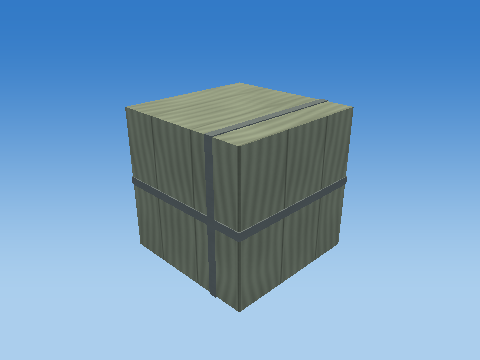

## Cube assembly order

Each image adds one real component, preserving builder order and world transforms.

### Add 1: Crate

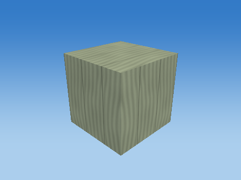

### Add 2: Crate band


### Add 3: Crate band


### Add 4: Crate inventory plate


## Every component transformation

### Crate — `CARGO_0_0`

Seed=2107042; human height/3; stack=CARGO_0; reserved navigation corridors

Position T = (-21.2299995, 0.349999994, -20) m; scale S = (0.699999988, 0.699999988, 0.699999988); rotation (Rx,Ry,Rz) = (0, 0, 0) degrees.

Shear (xy,xz,yx,yz,zx,zy) = (0, 0, 0, 0, 0, 0). Color = (0.360000014, 0.419999987, 0.300000012); specular = 0.0900000036; shininess = 24; emission = 0; flash = 0; material layer = 4; texture scale = 1. Pattern enabled = 0, pattern scale = (1, 1, 1), offset = (0, 0, 0).

| Step | Actual renderer image |
| --- | --- |
| Unit cube | 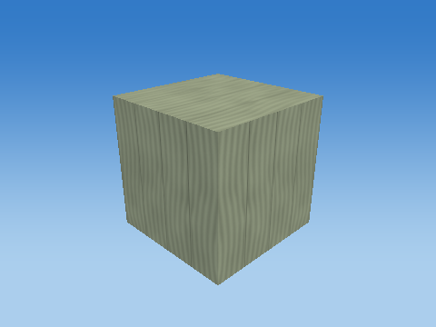 |
| Scale |  |
| Shear |  |
| Rotate X |  |
| Rotate Y | 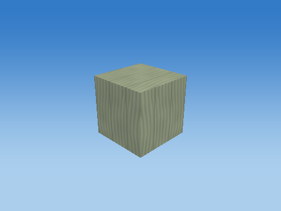 |
| Rotate Z |  |
| Translate to world | 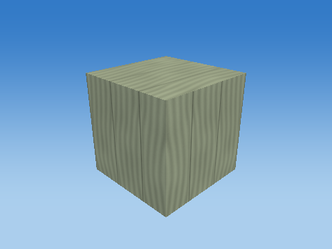 |

Steps 1–5 share one camera; the unit cube has its own close view, and step 6 is reframed at the actual world location to keep small objects visible. Reframing changes the view, never the model coordinates. Identity steps deliberately remain visible. Intermediate shapes are instructional states, while step 6 uses the unmodified game object.

Each stage below gives its exact numeric matrix and all eight corner multiplications. For each output row r: p'[r] = A[r,0]p.x + A[r,1]p.y + A[r,2]p.z + A[r,3]p.w.


#### S

```text
[ 0.699999988 0 0 0 ]
[ 0 0.699999988 0 0 ]
[ 0 0 0.699999988 0 ]
[ 0 0 0 1 ]
```

| Input corner (w=1) | Output corner (w=1) |
| --- | --- |
| (-0.5, -0.5, -0.5) | (-0.349999994, -0.349999994, -0.349999994) |
| (-0.5, -0.5, 0.5) | (-0.349999994, -0.349999994, 0.349999994) |
| (-0.5, 0.5, -0.5) | (-0.349999994, 0.349999994, -0.349999994) |
| (-0.5, 0.5, 0.5) | (-0.349999994, 0.349999994, 0.349999994) |
| (0.5, -0.5, -0.5) | (0.349999994, -0.349999994, -0.349999994) |
| (0.5, -0.5, 0.5) | (0.349999994, -0.349999994, 0.349999994) |
| (0.5, 0.5, -0.5) | (0.349999994, 0.349999994, -0.349999994) |
| (0.5, 0.5, 0.5) | (0.349999994, 0.349999994, 0.349999994) |

#### H

```text
[ 1 0 0 0 ]
[ 0 1 0 0 ]
[ 0 0 1 0 ]
[ 0 0 0 1 ]
```

| Input corner (w=1) | Output corner (w=1) |
| --- | --- |
| (-0.349999994, -0.349999994, -0.349999994) | (-0.349999994, -0.349999994, -0.349999994) |
| (-0.349999994, -0.349999994, 0.349999994) | (-0.349999994, -0.349999994, 0.349999994) |
| (-0.349999994, 0.349999994, -0.349999994) | (-0.349999994, 0.349999994, -0.349999994) |
| (-0.349999994, 0.349999994, 0.349999994) | (-0.349999994, 0.349999994, 0.349999994) |
| (0.349999994, -0.349999994, -0.349999994) | (0.349999994, -0.349999994, -0.349999994) |
| (0.349999994, -0.349999994, 0.349999994) | (0.349999994, -0.349999994, 0.349999994) |
| (0.349999994, 0.349999994, -0.349999994) | (0.349999994, 0.349999994, -0.349999994) |
| (0.349999994, 0.349999994, 0.349999994) | (0.349999994, 0.349999994, 0.349999994) |

#### Rx

```text
[ 1 0 0 0 ]
[ 0 1 -0 0 ]
[ 0 0 1 0 ]
[ 0 0 0 1 ]
```

| Input corner (w=1) | Output corner (w=1) |
| --- | --- |
| (-0.349999994, -0.349999994, -0.349999994) | (-0.349999994, -0.349999994, -0.349999994) |
| (-0.349999994, -0.349999994, 0.349999994) | (-0.349999994, -0.349999994, 0.349999994) |
| (-0.349999994, 0.349999994, -0.349999994) | (-0.349999994, 0.349999994, -0.349999994) |
| (-0.349999994, 0.349999994, 0.349999994) | (-0.349999994, 0.349999994, 0.349999994) |
| (0.349999994, -0.349999994, -0.349999994) | (0.349999994, -0.349999994, -0.349999994) |
| (0.349999994, -0.349999994, 0.349999994) | (0.349999994, -0.349999994, 0.349999994) |
| (0.349999994, 0.349999994, -0.349999994) | (0.349999994, 0.349999994, -0.349999994) |
| (0.349999994, 0.349999994, 0.349999994) | (0.349999994, 0.349999994, 0.349999994) |

#### Ry

```text
[ 1 0 0 0 ]
[ 0 1 0 0 ]
[ -0 0 1 0 ]
[ 0 0 0 1 ]
```

| Input corner (w=1) | Output corner (w=1) |
| --- | --- |
| (-0.349999994, -0.349999994, -0.349999994) | (-0.349999994, -0.349999994, -0.349999994) |
| (-0.349999994, -0.349999994, 0.349999994) | (-0.349999994, -0.349999994, 0.349999994) |
| (-0.349999994, 0.349999994, -0.349999994) | (-0.349999994, 0.349999994, -0.349999994) |
| (-0.349999994, 0.349999994, 0.349999994) | (-0.349999994, 0.349999994, 0.349999994) |
| (0.349999994, -0.349999994, -0.349999994) | (0.349999994, -0.349999994, -0.349999994) |
| (0.349999994, -0.349999994, 0.349999994) | (0.349999994, -0.349999994, 0.349999994) |
| (0.349999994, 0.349999994, -0.349999994) | (0.349999994, 0.349999994, -0.349999994) |
| (0.349999994, 0.349999994, 0.349999994) | (0.349999994, 0.349999994, 0.349999994) |

#### Rz

```text
[ 1 -0 0 0 ]
[ 0 1 0 0 ]
[ 0 0 1 0 ]
[ 0 0 0 1 ]
```

| Input corner (w=1) | Output corner (w=1) |
| --- | --- |
| (-0.349999994, -0.349999994, -0.349999994) | (-0.349999994, -0.349999994, -0.349999994) |
| (-0.349999994, -0.349999994, 0.349999994) | (-0.349999994, -0.349999994, 0.349999994) |
| (-0.349999994, 0.349999994, -0.349999994) | (-0.349999994, 0.349999994, -0.349999994) |
| (-0.349999994, 0.349999994, 0.349999994) | (-0.349999994, 0.349999994, 0.349999994) |
| (0.349999994, -0.349999994, -0.349999994) | (0.349999994, -0.349999994, -0.349999994) |
| (0.349999994, -0.349999994, 0.349999994) | (0.349999994, -0.349999994, 0.349999994) |
| (0.349999994, 0.349999994, -0.349999994) | (0.349999994, 0.349999994, -0.349999994) |
| (0.349999994, 0.349999994, 0.349999994) | (0.349999994, 0.349999994, 0.349999994) |

#### T

```text
[ 1 0 0 -21.2299995 ]
[ 0 1 0 0.349999994 ]
[ 0 0 1 -20 ]
[ 0 0 0 1 ]
```

| Input corner (w=1) | Output corner (w=1) |
| --- | --- |
| (-0.349999994, -0.349999994, -0.349999994) | (-21.5799999, 0, -20.3500004) |
| (-0.349999994, -0.349999994, 0.349999994) | (-21.5799999, 0, -19.6499996) |
| (-0.349999994, 0.349999994, -0.349999994) | (-21.5799999, 0.699999988, -20.3500004) |
| (-0.349999994, 0.349999994, 0.349999994) | (-21.5799999, 0.699999988, -19.6499996) |
| (0.349999994, -0.349999994, -0.349999994) | (-20.8799992, 0, -20.3500004) |
| (0.349999994, -0.349999994, 0.349999994) | (-20.8799992, 0, -19.6499996) |
| (0.349999994, 0.349999994, -0.349999994) | (-20.8799992, 0.699999988, -20.3500004) |
| (0.349999994, 0.349999994, 0.349999994) | (-20.8799992, 0.699999988, -19.6499996) |

Final M = T Rz Ry Rx H S:

```text
[ 0.699999988 0 0 -21.2299995 ]
[ 0 0.699999988 0 0.349999994 ]
[ 0 0 0.699999988 -20 ]
[ 0 0 0 1 ]
```

### Crate band — `CARGO_0_0_BAND_VERTICAL`

Seed=2107042; human height/3; stack=CARGO_0; reserved navigation corridors

Position T = (-21.4259987, 0.349999994, -20) m; scale S = (0.0384999998, 0.708000004, 0.708000004); rotation (Rx,Ry,Rz) = (0, 0, 0) degrees.

Shear (xy,xz,yx,yz,zx,zy) = (0, 0, 0, 0, 0, 0). Color = (0.189999998, 0.230000004, 0.230000004); specular = 0.119999997; shininess = 24; emission = 0; flash = 0; material layer = 5; texture scale = 3. Pattern enabled = 0, pattern scale = (1, 1, 1), offset = (0, 0, 0).

| Step | Actual renderer image |
| --- | --- |
| Unit cube |  |
| Scale |  |
| Shear |  |
| Rotate X |  |
| Rotate Y |  |
| Rotate Z | 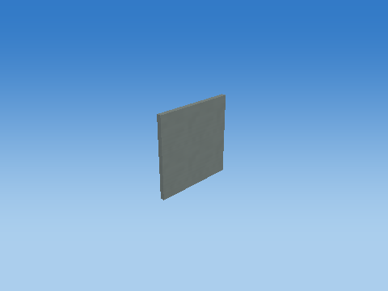 |
| Translate to world | 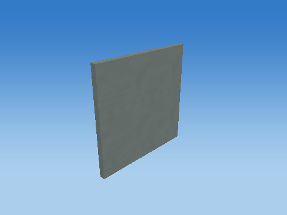 |

Steps 1–5 share one camera; the unit cube has its own close view, and step 6 is reframed at the actual world location to keep small objects visible. Reframing changes the view, never the model coordinates. Identity steps deliberately remain visible. Intermediate shapes are instructional states, while step 6 uses the unmodified game object.

Each stage below gives its exact numeric matrix and all eight corner multiplications. For each output row r: p'[r] = A[r,0]p.x + A[r,1]p.y + A[r,2]p.z + A[r,3]p.w.


#### S

```text
[ 0.0384999998 0 0 0 ]
[ 0 0.708000004 0 0 ]
[ 0 0 0.708000004 0 ]
[ 0 0 0 1 ]
```

| Input corner (w=1) | Output corner (w=1) |
| --- | --- |
| (-0.5, -0.5, -0.5) | (-0.0192499999, -0.354000002, -0.354000002) |
| (-0.5, -0.5, 0.5) | (-0.0192499999, -0.354000002, 0.354000002) |
| (-0.5, 0.5, -0.5) | (-0.0192499999, 0.354000002, -0.354000002) |
| (-0.5, 0.5, 0.5) | (-0.0192499999, 0.354000002, 0.354000002) |
| (0.5, -0.5, -0.5) | (0.0192499999, -0.354000002, -0.354000002) |
| (0.5, -0.5, 0.5) | (0.0192499999, -0.354000002, 0.354000002) |
| (0.5, 0.5, -0.5) | (0.0192499999, 0.354000002, -0.354000002) |
| (0.5, 0.5, 0.5) | (0.0192499999, 0.354000002, 0.354000002) |

#### H

```text
[ 1 0 0 0 ]
[ 0 1 0 0 ]
[ 0 0 1 0 ]
[ 0 0 0 1 ]
```

| Input corner (w=1) | Output corner (w=1) |
| --- | --- |
| (-0.0192499999, -0.354000002, -0.354000002) | (-0.0192499999, -0.354000002, -0.354000002) |
| (-0.0192499999, -0.354000002, 0.354000002) | (-0.0192499999, -0.354000002, 0.354000002) |
| (-0.0192499999, 0.354000002, -0.354000002) | (-0.0192499999, 0.354000002, -0.354000002) |
| (-0.0192499999, 0.354000002, 0.354000002) | (-0.0192499999, 0.354000002, 0.354000002) |
| (0.0192499999, -0.354000002, -0.354000002) | (0.0192499999, -0.354000002, -0.354000002) |
| (0.0192499999, -0.354000002, 0.354000002) | (0.0192499999, -0.354000002, 0.354000002) |
| (0.0192499999, 0.354000002, -0.354000002) | (0.0192499999, 0.354000002, -0.354000002) |
| (0.0192499999, 0.354000002, 0.354000002) | (0.0192499999, 0.354000002, 0.354000002) |

#### Rx

```text
[ 1 0 0 0 ]
[ 0 1 -0 0 ]
[ 0 0 1 0 ]
[ 0 0 0 1 ]
```

| Input corner (w=1) | Output corner (w=1) |
| --- | --- |
| (-0.0192499999, -0.354000002, -0.354000002) | (-0.0192499999, -0.354000002, -0.354000002) |
| (-0.0192499999, -0.354000002, 0.354000002) | (-0.0192499999, -0.354000002, 0.354000002) |
| (-0.0192499999, 0.354000002, -0.354000002) | (-0.0192499999, 0.354000002, -0.354000002) |
| (-0.0192499999, 0.354000002, 0.354000002) | (-0.0192499999, 0.354000002, 0.354000002) |
| (0.0192499999, -0.354000002, -0.354000002) | (0.0192499999, -0.354000002, -0.354000002) |
| (0.0192499999, -0.354000002, 0.354000002) | (0.0192499999, -0.354000002, 0.354000002) |
| (0.0192499999, 0.354000002, -0.354000002) | (0.0192499999, 0.354000002, -0.354000002) |
| (0.0192499999, 0.354000002, 0.354000002) | (0.0192499999, 0.354000002, 0.354000002) |

#### Ry

```text
[ 1 0 0 0 ]
[ 0 1 0 0 ]
[ -0 0 1 0 ]
[ 0 0 0 1 ]
```

| Input corner (w=1) | Output corner (w=1) |
| --- | --- |
| (-0.0192499999, -0.354000002, -0.354000002) | (-0.0192499999, -0.354000002, -0.354000002) |
| (-0.0192499999, -0.354000002, 0.354000002) | (-0.0192499999, -0.354000002, 0.354000002) |
| (-0.0192499999, 0.354000002, -0.354000002) | (-0.0192499999, 0.354000002, -0.354000002) |
| (-0.0192499999, 0.354000002, 0.354000002) | (-0.0192499999, 0.354000002, 0.354000002) |
| (0.0192499999, -0.354000002, -0.354000002) | (0.0192499999, -0.354000002, -0.354000002) |
| (0.0192499999, -0.354000002, 0.354000002) | (0.0192499999, -0.354000002, 0.354000002) |
| (0.0192499999, 0.354000002, -0.354000002) | (0.0192499999, 0.354000002, -0.354000002) |
| (0.0192499999, 0.354000002, 0.354000002) | (0.0192499999, 0.354000002, 0.354000002) |

#### Rz

```text
[ 1 -0 0 0 ]
[ 0 1 0 0 ]
[ 0 0 1 0 ]
[ 0 0 0 1 ]
```

| Input corner (w=1) | Output corner (w=1) |
| --- | --- |
| (-0.0192499999, -0.354000002, -0.354000002) | (-0.0192499999, -0.354000002, -0.354000002) |
| (-0.0192499999, -0.354000002, 0.354000002) | (-0.0192499999, -0.354000002, 0.354000002) |
| (-0.0192499999, 0.354000002, -0.354000002) | (-0.0192499999, 0.354000002, -0.354000002) |
| (-0.0192499999, 0.354000002, 0.354000002) | (-0.0192499999, 0.354000002, 0.354000002) |
| (0.0192499999, -0.354000002, -0.354000002) | (0.0192499999, -0.354000002, -0.354000002) |
| (0.0192499999, -0.354000002, 0.354000002) | (0.0192499999, -0.354000002, 0.354000002) |
| (0.0192499999, 0.354000002, -0.354000002) | (0.0192499999, 0.354000002, -0.354000002) |
| (0.0192499999, 0.354000002, 0.354000002) | (0.0192499999, 0.354000002, 0.354000002) |

#### T

```text
[ 1 0 0 -21.4259987 ]
[ 0 1 0 0.349999994 ]
[ 0 0 1 -20 ]
[ 0 0 0 1 ]
```

| Input corner (w=1) | Output corner (w=1) |
| --- | --- |
| (-0.0192499999, -0.354000002, -0.354000002) | (-21.4452496, -0.00400000811, -20.3540001) |
| (-0.0192499999, -0.354000002, 0.354000002) | (-21.4452496, -0.00400000811, -19.6459999) |
| (-0.0192499999, 0.354000002, -0.354000002) | (-21.4452496, 0.703999996, -20.3540001) |
| (-0.0192499999, 0.354000002, 0.354000002) | (-21.4452496, 0.703999996, -19.6459999) |
| (0.0192499999, -0.354000002, -0.354000002) | (-21.4067478, -0.00400000811, -20.3540001) |
| (0.0192499999, -0.354000002, 0.354000002) | (-21.4067478, -0.00400000811, -19.6459999) |
| (0.0192499999, 0.354000002, -0.354000002) | (-21.4067478, 0.703999996, -20.3540001) |
| (0.0192499999, 0.354000002, 0.354000002) | (-21.4067478, 0.703999996, -19.6459999) |

Final M = T Rz Ry Rx H S:

```text
[ 0.0384999998 0 0 -21.4259987 ]
[ 0 0.708000004 0 0.349999994 ]
[ 0 0 0.708000004 -20 ]
[ 0 0 0 1 ]
```

### Crate band — `CARGO_0_0_BAND_HORIZONTAL`

Seed=2107042; human height/3; stack=CARGO_0; reserved navigation corridors

Position T = (-21.2299995, 0.349999994, -20) m; scale S = (0.708000004, 0.0384999998, 0.708000004); rotation (Rx,Ry,Rz) = (0, 0, 0) degrees.

Shear (xy,xz,yx,yz,zx,zy) = (0, 0, 0, 0, 0, 0). Color = (0.189999998, 0.230000004, 0.230000004); specular = 0.119999997; shininess = 24; emission = 0; flash = 0; material layer = 5; texture scale = 3. Pattern enabled = 0, pattern scale = (1, 1, 1), offset = (0, 0, 0).

| Step | Actual renderer image |
| --- | --- |
| Unit cube | 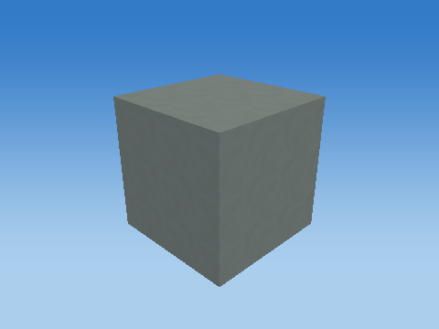 |
| Scale |  |
| Shear |  |
| Rotate X |  |
| Rotate Y |  |
| Rotate Z | 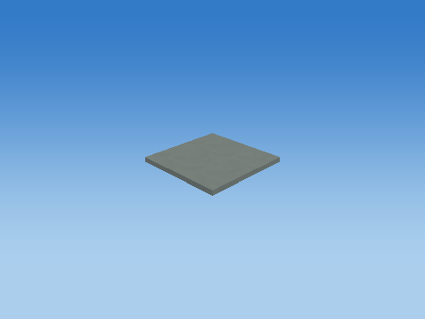 |
| Translate to world | 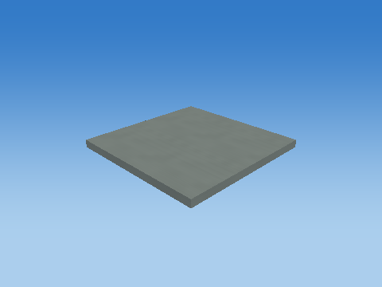 |

Steps 1–5 share one camera; the unit cube has its own close view, and step 6 is reframed at the actual world location to keep small objects visible. Reframing changes the view, never the model coordinates. Identity steps deliberately remain visible. Intermediate shapes are instructional states, while step 6 uses the unmodified game object.

Each stage below gives its exact numeric matrix and all eight corner multiplications. For each output row r: p'[r] = A[r,0]p.x + A[r,1]p.y + A[r,2]p.z + A[r,3]p.w.

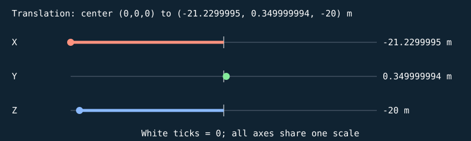


#### S

```text
[ 0.708000004 0 0 0 ]
[ 0 0.0384999998 0 0 ]
[ 0 0 0.708000004 0 ]
[ 0 0 0 1 ]
```

| Input corner (w=1) | Output corner (w=1) |
| --- | --- |
| (-0.5, -0.5, -0.5) | (-0.354000002, -0.0192499999, -0.354000002) |
| (-0.5, -0.5, 0.5) | (-0.354000002, -0.0192499999, 0.354000002) |
| (-0.5, 0.5, -0.5) | (-0.354000002, 0.0192499999, -0.354000002) |
| (-0.5, 0.5, 0.5) | (-0.354000002, 0.0192499999, 0.354000002) |
| (0.5, -0.5, -0.5) | (0.354000002, -0.0192499999, -0.354000002) |
| (0.5, -0.5, 0.5) | (0.354000002, -0.0192499999, 0.354000002) |
| (0.5, 0.5, -0.5) | (0.354000002, 0.0192499999, -0.354000002) |
| (0.5, 0.5, 0.5) | (0.354000002, 0.0192499999, 0.354000002) |

#### H

```text
[ 1 0 0 0 ]
[ 0 1 0 0 ]
[ 0 0 1 0 ]
[ 0 0 0 1 ]
```

| Input corner (w=1) | Output corner (w=1) |
| --- | --- |
| (-0.354000002, -0.0192499999, -0.354000002) | (-0.354000002, -0.0192499999, -0.354000002) |
| (-0.354000002, -0.0192499999, 0.354000002) | (-0.354000002, -0.0192499999, 0.354000002) |
| (-0.354000002, 0.0192499999, -0.354000002) | (-0.354000002, 0.0192499999, -0.354000002) |
| (-0.354000002, 0.0192499999, 0.354000002) | (-0.354000002, 0.0192499999, 0.354000002) |
| (0.354000002, -0.0192499999, -0.354000002) | (0.354000002, -0.0192499999, -0.354000002) |
| (0.354000002, -0.0192499999, 0.354000002) | (0.354000002, -0.0192499999, 0.354000002) |
| (0.354000002, 0.0192499999, -0.354000002) | (0.354000002, 0.0192499999, -0.354000002) |
| (0.354000002, 0.0192499999, 0.354000002) | (0.354000002, 0.0192499999, 0.354000002) |

#### Rx

```text
[ 1 0 0 0 ]
[ 0 1 -0 0 ]
[ 0 0 1 0 ]
[ 0 0 0 1 ]
```

| Input corner (w=1) | Output corner (w=1) |
| --- | --- |
| (-0.354000002, -0.0192499999, -0.354000002) | (-0.354000002, -0.0192499999, -0.354000002) |
| (-0.354000002, -0.0192499999, 0.354000002) | (-0.354000002, -0.0192499999, 0.354000002) |
| (-0.354000002, 0.0192499999, -0.354000002) | (-0.354000002, 0.0192499999, -0.354000002) |
| (-0.354000002, 0.0192499999, 0.354000002) | (-0.354000002, 0.0192499999, 0.354000002) |
| (0.354000002, -0.0192499999, -0.354000002) | (0.354000002, -0.0192499999, -0.354000002) |
| (0.354000002, -0.0192499999, 0.354000002) | (0.354000002, -0.0192499999, 0.354000002) |
| (0.354000002, 0.0192499999, -0.354000002) | (0.354000002, 0.0192499999, -0.354000002) |
| (0.354000002, 0.0192499999, 0.354000002) | (0.354000002, 0.0192499999, 0.354000002) |

#### Ry

```text
[ 1 0 0 0 ]
[ 0 1 0 0 ]
[ -0 0 1 0 ]
[ 0 0 0 1 ]
```

| Input corner (w=1) | Output corner (w=1) |
| --- | --- |
| (-0.354000002, -0.0192499999, -0.354000002) | (-0.354000002, -0.0192499999, -0.354000002) |
| (-0.354000002, -0.0192499999, 0.354000002) | (-0.354000002, -0.0192499999, 0.354000002) |
| (-0.354000002, 0.0192499999, -0.354000002) | (-0.354000002, 0.0192499999, -0.354000002) |
| (-0.354000002, 0.0192499999, 0.354000002) | (-0.354000002, 0.0192499999, 0.354000002) |
| (0.354000002, -0.0192499999, -0.354000002) | (0.354000002, -0.0192499999, -0.354000002) |
| (0.354000002, -0.0192499999, 0.354000002) | (0.354000002, -0.0192499999, 0.354000002) |
| (0.354000002, 0.0192499999, -0.354000002) | (0.354000002, 0.0192499999, -0.354000002) |
| (0.354000002, 0.0192499999, 0.354000002) | (0.354000002, 0.0192499999, 0.354000002) |

#### Rz

```text
[ 1 -0 0 0 ]
[ 0 1 0 0 ]
[ 0 0 1 0 ]
[ 0 0 0 1 ]
```

| Input corner (w=1) | Output corner (w=1) |
| --- | --- |
| (-0.354000002, -0.0192499999, -0.354000002) | (-0.354000002, -0.0192499999, -0.354000002) |
| (-0.354000002, -0.0192499999, 0.354000002) | (-0.354000002, -0.0192499999, 0.354000002) |
| (-0.354000002, 0.0192499999, -0.354000002) | (-0.354000002, 0.0192499999, -0.354000002) |
| (-0.354000002, 0.0192499999, 0.354000002) | (-0.354000002, 0.0192499999, 0.354000002) |
| (0.354000002, -0.0192499999, -0.354000002) | (0.354000002, -0.0192499999, -0.354000002) |
| (0.354000002, -0.0192499999, 0.354000002) | (0.354000002, -0.0192499999, 0.354000002) |
| (0.354000002, 0.0192499999, -0.354000002) | (0.354000002, 0.0192499999, -0.354000002) |
| (0.354000002, 0.0192499999, 0.354000002) | (0.354000002, 0.0192499999, 0.354000002) |

#### T

```text
[ 1 0 0 -21.2299995 ]
[ 0 1 0 0.349999994 ]
[ 0 0 1 -20 ]
[ 0 0 0 1 ]
```

| Input corner (w=1) | Output corner (w=1) |
| --- | --- |
| (-0.354000002, -0.0192499999, -0.354000002) | (-21.5839996, 0.330749989, -20.3540001) |
| (-0.354000002, -0.0192499999, 0.354000002) | (-21.5839996, 0.330749989, -19.6459999) |
| (-0.354000002, 0.0192499999, -0.354000002) | (-21.5839996, 0.36925, -20.3540001) |
| (-0.354000002, 0.0192499999, 0.354000002) | (-21.5839996, 0.36925, -19.6459999) |
| (0.354000002, -0.0192499999, -0.354000002) | (-20.8759995, 0.330749989, -20.3540001) |
| (0.354000002, -0.0192499999, 0.354000002) | (-20.8759995, 0.330749989, -19.6459999) |
| (0.354000002, 0.0192499999, -0.354000002) | (-20.8759995, 0.36925, -20.3540001) |
| (0.354000002, 0.0192499999, 0.354000002) | (-20.8759995, 0.36925, -19.6459999) |

Final M = T Rz Ry Rx H S:

```text
[ 0.708000004 0 0 -21.2299995 ]
[ 0 0.0384999998 0 0.349999994 ]
[ 0 0 0.708000004 -20 ]
[ 0 0 0 1 ]
```

### Crate inventory plate — `CARGO_0_0_LABEL`

Seed=2107042; human height/3; stack=CARGO_0; reserved navigation corridors

Position T = (-21.125, 0.48299998, -19.6439991) m; scale S = (0.18900001, 0.111999996, 0.0120000001); rotation (Rx,Ry,Rz) = (0, 0, 0) degrees.

Shear (xy,xz,yx,yz,zx,zy) = (0, 0, 0, 0, 0, 0). Color = (0.74000001, 0.699999988, 0.49000001); specular = 0.119999997; shininess = 24; emission = 0; flash = 0; material layer = 7; texture scale = 2. Pattern enabled = 0, pattern scale = (1, 1, 1), offset = (0, 0, 0).

| Step | Actual renderer image |
| --- | --- |
| Unit cube | 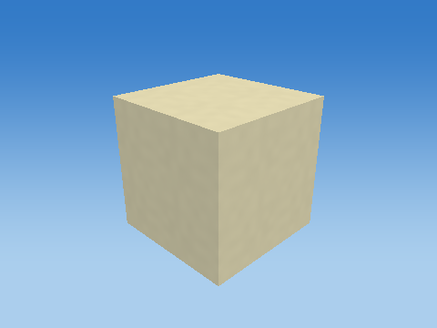 |
| Scale | 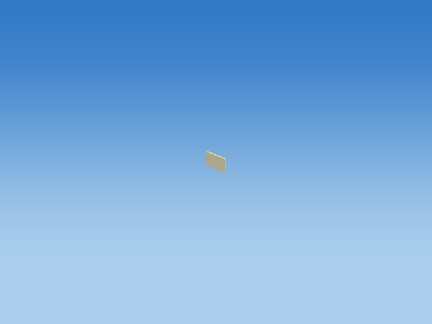 |
| Shear |  |
| Rotate X |  |
| Rotate Y |  |
| Rotate Z |  |
| Translate to world | 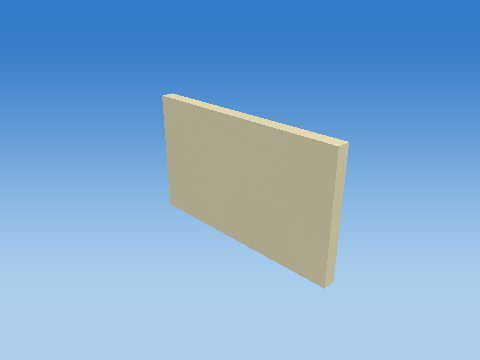 |

Steps 1–5 share one camera; the unit cube has its own close view, and step 6 is reframed at the actual world location to keep small objects visible. Reframing changes the view, never the model coordinates. Identity steps deliberately remain visible. Intermediate shapes are instructional states, while step 6 uses the unmodified game object.

Each stage below gives its exact numeric matrix and all eight corner multiplications. For each output row r: p'[r] = A[r,0]p.x + A[r,1]p.y + A[r,2]p.z + A[r,3]p.w.

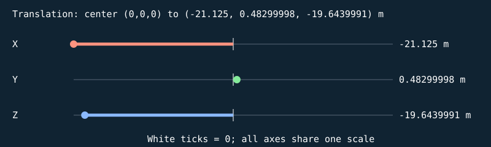


#### S

```text
[ 0.18900001 0 0 0 ]
[ 0 0.111999996 0 0 ]
[ 0 0 0.0120000001 0 ]
[ 0 0 0 1 ]
```

| Input corner (w=1) | Output corner (w=1) |
| --- | --- |
| (-0.5, -0.5, -0.5) | (-0.0945000052, -0.055999998, -0.00600000005) |
| (-0.5, -0.5, 0.5) | (-0.0945000052, -0.055999998, 0.00600000005) |
| (-0.5, 0.5, -0.5) | (-0.0945000052, 0.055999998, -0.00600000005) |
| (-0.5, 0.5, 0.5) | (-0.0945000052, 0.055999998, 0.00600000005) |
| (0.5, -0.5, -0.5) | (0.0945000052, -0.055999998, -0.00600000005) |
| (0.5, -0.5, 0.5) | (0.0945000052, -0.055999998, 0.00600000005) |
| (0.5, 0.5, -0.5) | (0.0945000052, 0.055999998, -0.00600000005) |
| (0.5, 0.5, 0.5) | (0.0945000052, 0.055999998, 0.00600000005) |

#### H

```text
[ 1 0 0 0 ]
[ 0 1 0 0 ]
[ 0 0 1 0 ]
[ 0 0 0 1 ]
```

| Input corner (w=1) | Output corner (w=1) |
| --- | --- |
| (-0.0945000052, -0.055999998, -0.00600000005) | (-0.0945000052, -0.055999998, -0.00600000005) |
| (-0.0945000052, -0.055999998, 0.00600000005) | (-0.0945000052, -0.055999998, 0.00600000005) |
| (-0.0945000052, 0.055999998, -0.00600000005) | (-0.0945000052, 0.055999998, -0.00600000005) |
| (-0.0945000052, 0.055999998, 0.00600000005) | (-0.0945000052, 0.055999998, 0.00600000005) |
| (0.0945000052, -0.055999998, -0.00600000005) | (0.0945000052, -0.055999998, -0.00600000005) |
| (0.0945000052, -0.055999998, 0.00600000005) | (0.0945000052, -0.055999998, 0.00600000005) |
| (0.0945000052, 0.055999998, -0.00600000005) | (0.0945000052, 0.055999998, -0.00600000005) |
| (0.0945000052, 0.055999998, 0.00600000005) | (0.0945000052, 0.055999998, 0.00600000005) |

#### Rx

```text
[ 1 0 0 0 ]
[ 0 1 -0 0 ]
[ 0 0 1 0 ]
[ 0 0 0 1 ]
```

| Input corner (w=1) | Output corner (w=1) |
| --- | --- |
| (-0.0945000052, -0.055999998, -0.00600000005) | (-0.0945000052, -0.055999998, -0.00600000005) |
| (-0.0945000052, -0.055999998, 0.00600000005) | (-0.0945000052, -0.055999998, 0.00600000005) |
| (-0.0945000052, 0.055999998, -0.00600000005) | (-0.0945000052, 0.055999998, -0.00600000005) |
| (-0.0945000052, 0.055999998, 0.00600000005) | (-0.0945000052, 0.055999998, 0.00600000005) |
| (0.0945000052, -0.055999998, -0.00600000005) | (0.0945000052, -0.055999998, -0.00600000005) |
| (0.0945000052, -0.055999998, 0.00600000005) | (0.0945000052, -0.055999998, 0.00600000005) |
| (0.0945000052, 0.055999998, -0.00600000005) | (0.0945000052, 0.055999998, -0.00600000005) |
| (0.0945000052, 0.055999998, 0.00600000005) | (0.0945000052, 0.055999998, 0.00600000005) |

#### Ry

```text
[ 1 0 0 0 ]
[ 0 1 0 0 ]
[ -0 0 1 0 ]
[ 0 0 0 1 ]
```

| Input corner (w=1) | Output corner (w=1) |
| --- | --- |
| (-0.0945000052, -0.055999998, -0.00600000005) | (-0.0945000052, -0.055999998, -0.00600000005) |
| (-0.0945000052, -0.055999998, 0.00600000005) | (-0.0945000052, -0.055999998, 0.00600000005) |
| (-0.0945000052, 0.055999998, -0.00600000005) | (-0.0945000052, 0.055999998, -0.00600000005) |
| (-0.0945000052, 0.055999998, 0.00600000005) | (-0.0945000052, 0.055999998, 0.00600000005) |
| (0.0945000052, -0.055999998, -0.00600000005) | (0.0945000052, -0.055999998, -0.00600000005) |
| (0.0945000052, -0.055999998, 0.00600000005) | (0.0945000052, -0.055999998, 0.00600000005) |
| (0.0945000052, 0.055999998, -0.00600000005) | (0.0945000052, 0.055999998, -0.00600000005) |
| (0.0945000052, 0.055999998, 0.00600000005) | (0.0945000052, 0.055999998, 0.00600000005) |

#### Rz

```text
[ 1 -0 0 0 ]
[ 0 1 0 0 ]
[ 0 0 1 0 ]
[ 0 0 0 1 ]
```

| Input corner (w=1) | Output corner (w=1) |
| --- | --- |
| (-0.0945000052, -0.055999998, -0.00600000005) | (-0.0945000052, -0.055999998, -0.00600000005) |
| (-0.0945000052, -0.055999998, 0.00600000005) | (-0.0945000052, -0.055999998, 0.00600000005) |
| (-0.0945000052, 0.055999998, -0.00600000005) | (-0.0945000052, 0.055999998, -0.00600000005) |
| (-0.0945000052, 0.055999998, 0.00600000005) | (-0.0945000052, 0.055999998, 0.00600000005) |
| (0.0945000052, -0.055999998, -0.00600000005) | (0.0945000052, -0.055999998, -0.00600000005) |
| (0.0945000052, -0.055999998, 0.00600000005) | (0.0945000052, -0.055999998, 0.00600000005) |
| (0.0945000052, 0.055999998, -0.00600000005) | (0.0945000052, 0.055999998, -0.00600000005) |
| (0.0945000052, 0.055999998, 0.00600000005) | (0.0945000052, 0.055999998, 0.00600000005) |

#### T

```text
[ 1 0 0 -21.125 ]
[ 0 1 0 0.48299998 ]
[ 0 0 1 -19.6439991 ]
[ 0 0 0 1 ]
```

| Input corner (w=1) | Output corner (w=1) |
| --- | --- |
| (-0.0945000052, -0.055999998, -0.00600000005) | (-21.2194996, 0.426999986, -19.6499996) |
| (-0.0945000052, -0.055999998, 0.00600000005) | (-21.2194996, 0.426999986, -19.6379986) |
| (-0.0945000052, 0.055999998, -0.00600000005) | (-21.2194996, 0.538999975, -19.6499996) |
| (-0.0945000052, 0.055999998, 0.00600000005) | (-21.2194996, 0.538999975, -19.6379986) |
| (0.0945000052, -0.055999998, -0.00600000005) | (-21.0305004, 0.426999986, -19.6499996) |
| (0.0945000052, -0.055999998, 0.00600000005) | (-21.0305004, 0.426999986, -19.6379986) |
| (0.0945000052, 0.055999998, -0.00600000005) | (-21.0305004, 0.538999975, -19.6499996) |
| (0.0945000052, 0.055999998, 0.00600000005) | (-21.0305004, 0.538999975, -19.6379986) |

Final M = T Rz Ry Rx H S:

```text
[ 0.18900001 0 0 -21.125 ]
[ 0 0.111999996 0 0.48299998 ]
[ 0 0 0.0120000001 -19.6439991 ]
[ 0 0 0 1 ]
```

## Exact construction implementation

The following files are copied from this build's source, not hand-maintained snippets.

### Exact source: `src/world/Cargo.cpp`

```cpp
#include "world/Cargo.h"
#include <algorithm>
#include <random>
#include <stdexcept>
#include <set>
#include "levels/LevelBase.h"

namespace shooter {
namespace {
void addCrate(std::vector<SceneObject>& objects,SceneObject crate) {
    const auto id=crate.id;
    crate.parent=id; crate.specular=.09f;
    objects.push_back(crate);
    const float size=crate.transform.scale.x;
    auto detail=[&](const std::string& suffix,const std::string& name,Vec3 offset,Vec3 scale,Vec3 color) {
        auto part=makeCube(id+suffix,"Cargo",name,crate.transform.position+
            asVec3(transformPoint(makeRotationY(crate.transform.rotation.y),{offset.x,offset.y,offset.z,0})),
            scale,color,crate.transform.rotation.y);
        part.parent=id; part.notes=crate.notes; objects.push_back(part);
    };
    detail("_BAND_VERTICAL","Crate band",{-size*.28f,0,0},{size*.055f,size+.008f,size+.008f},{.19f,.23f,.23f});
    detail("_BAND_HORIZONTAL","Crate band",{0,0,0},{size+.008f,size*.055f,size+.008f},{.19f,.23f,.23f});
    detail("_LABEL","Crate inventory plate",{size*.15f,size*.19f,size*.5f+.006f},{size*.27f,size*.16f,.012f},{.74f,.70f,.49f});
}
}

std::vector<SceneObject> generateChallengeCargo(const LevelConfig& level) {
    auto objects=generateCargoLayout(level.seed,{dimensions::humanHeight,level.number<4?4:7});
    constexpr float size=dimensions::crateSize;
    if (level.number<4) return objects;
    // Short warehouse screens block spawn sightlines but leave both ends walkable.
    // Additional screens appear as the target population expands.
    const int screens=2*(level.number-3);
    for (int group=0;group<screens;++group) {
        const auto& t=level.targets[group];
        const float x=t.base.x*.75f,z=t.base.z+6;
        for (int column=0;column<7;++column) {
            const int height=column==0||column==6?4:5;
            for (int layer=0;layer<height;++layer) {
                const auto id="COVER_"+std::to_string(group)+"_"+std::to_string(column)+"_"+std::to_string(layer);
                auto box=makeCube(id,"Cargo","Crate",{x+(column-3)*(size+.005f),size*(layer+.5f),z},
                    {size,size,size},{.39f+.025f*(group%3),.34f,.24f});
                box.notes="Human reference height/3="+std::to_string(size)+" m; cargo screen; navigable ends; group="+std::to_string(group);
                addCrate(objects,box);
            }
        }
    }
    // Remove entire generated stack columns conflicting with a target's swept area.
    // Includes stands and safety margin; deterministic filtering preserves the seed.
    std::set<std::string> blocked;
    for (const auto& o:objects) if (o.component=="Crate") {
        for (const auto& t:level.targets)
            if (std::abs(o.transform.position.x-t.base.x)<t.motion.amplitude.x+1.5f &&
                std::abs(o.transform.position.z-t.base.z)<t.motion.amplitude.z+1.2f) blocked.insert(o.id);
    }
    objects.erase(std::remove_if(objects.begin(),objects.end(),[&](const SceneObject& o) {
        return blocked.count(o.parent)!=0;
    }),objects.end());
    return objects;
}
std::vector<SceneObject> generateCargoLayout(unsigned seed, const CargoConfig& config) {
    if (config.humanHeight<1 || config.humanHeight>2.4f || config.rows<1 || config.rows>8)
        throw std::invalid_argument("Cargo configuration exceeds sandbox reserved zones.");
    std::mt19937 random(seed);
    std::vector<SceneObject> objects;
    const float size=config.humanHeight/3, spacing=size+.035f;
    const Vec3 colors[]={{.48f,.32f,.17f},{.36f,.42f,.30f},{.35f,.40f,.44f},{.56f,.43f,.28f}};
    int stack=0;
    // Fixed cells reserve central target corridors (|X| < 13 m), side walkways,
    // and cross aisles. Jitter stays inside each cell; clusters cannot join up.
    for (int row=0;row<config.rows;++row) for (float lane:{-20.0f,-15.0f,15.0f,20.0f}) {
        const Vec3 center{lane+(int(random()%7)-3)*.08f,0,-20-row*10.0f};
        const int run=3+random()%5;
        const float yaw=90.0f*(random()%4);
        const auto rotation=makeRotationY(yaw);
        const int style=random()%3;
        const Vec3 color=colors[random()%4];
        auto column=[&](int x,int z) {
            // Sum of small uniform draws favors middle heights; range is 1..5.
            const int levels=1+int(random()%3)+int(random()%3);
            const auto offset=asVec3(transformPoint(rotation,{x*spacing,0,z*spacing,0}));
            const std::string group="CARGO_"+std::to_string(stack++);
            for (int level=0;level<levels;++level) {
                const auto id=group+"_"+std::to_string(level);
                auto crate=makeCube(id,"Cargo","Crate",center+offset+Vec3{0,size*(level+.5f),0},
                    {size,size,size},color,yaw);
                crate.notes="Seed="+std::to_string(seed)+"; human height/3; stack="+group+"; reserved navigation corridors";
                addCrate(objects,crate);
            }
        };
        for (int i=0;i<run;++i) column(i-run/2,0);
        // L/T formations, with no duplicate column at the joint.
        if (style) for (int j=1;j<=2;++j) column(style==1?-run/2:0,j);
    }
    return objects;
}
}

```

### Exact source: `src/world/Dimensions.h`

```cpp
#pragma once
namespace shooter::dimensions {
// World meters. Keep people, cargo and camera references on one documented scale.
inline constexpr float humanHeight=2.1f;
inline constexpr float humanMinHeight=2.05f, humanMaxHeight=2.20f;
inline constexpr float crateSize=humanHeight/3;
inline constexpr float eyeHeight=1.7f;
}

```

### Exact source: `src/core/Transform.h`

```cpp
#pragma once

#include <array>
#include <cmath>

namespace shooter {
constexpr float pi = 3.14159265358979323846f;
inline float radians(float degrees) { return degrees * pi / 180.0f; }

struct Vec3 { float x = 0, y = 0, z = 0; };
struct Vec4 { float x, y, z, w; };
inline Vec3 operator+(Vec3 a, Vec3 b) { return {a.x+b.x, a.y+b.y, a.z+b.z}; }
inline Vec3 operator-(Vec3 a, Vec3 b) { return {a.x-b.x, a.y-b.y, a.z-b.z}; }
inline Vec3 operator*(Vec3 a, float s) { return {a.x*s, a.y*s, a.z*s}; }
inline float dot(Vec3 a, Vec3 b) { return a.x*b.x + a.y*b.y + a.z*b.z; }
inline Vec3 cross(Vec3 a, Vec3 b) {
    return {a.y*b.z-a.z*b.y, a.z*b.x-a.x*b.z, a.x*b.y-a.y*b.x};
}
inline Vec3 normalize(Vec3 v) {
    const float length = std::sqrt(dot(v, v));
    return length > 0 ? v * (1.0f / length) : Vec3{};
}

// Column-major storage, column vectors: upload directly with GL_FALSE.
struct Mat4 {
    std::array<float, 16> data{};
    float& at(int row, int col) { return data[col*4+row]; }
    float at(int row, int col) const { return data[col*4+row]; }
    static Mat4 identity() {
        Mat4 result;
        for (int i = 0; i < 4; ++i) result.at(i, i) = 1;
        return result;
    }
};
inline Mat4 operator*(const Mat4& a, const Mat4& b) {
    Mat4 result;
    for (int row = 0; row < 4; ++row)
        for (int col = 0; col < 4; ++col)
            for (int k = 0; k < 4; ++k)
                result.at(row, col) += a.at(row, k) * b.at(k, col);
    return result;
}
inline Vec4 transformPoint(const Mat4& m, const Vec4& p) {
    return {
        m.at(0,0)*p.x + m.at(0,1)*p.y + m.at(0,2)*p.z + m.at(0,3)*p.w,
        m.at(1,0)*p.x + m.at(1,1)*p.y + m.at(1,2)*p.z + m.at(1,3)*p.w,
        m.at(2,0)*p.x + m.at(2,1)*p.y + m.at(2,2)*p.z + m.at(2,3)*p.w,
        m.at(3,0)*p.x + m.at(3,1)*p.y + m.at(3,2)*p.z + m.at(3,3)*p.w
    };
}
inline Mat4 makeTranslation(float x, float y, float z) {
    Mat4 m = Mat4::identity();
    m.at(0,3)=x; m.at(1,3)=y; m.at(2,3)=z;
    return m;
}
inline Mat4 makeScale(float x, float y, float z) {
    Mat4 m = Mat4::identity();
    m.at(0,0)=x; m.at(1,1)=y; m.at(2,2)=z;
    return m;
}
inline Mat4 makeRotationX(float degrees) {
    Mat4 m = Mat4::identity();
    const float c=std::cos(radians(degrees)), s=std::sin(radians(degrees));
    m.at(1,1)=c; m.at(1,2)=-s; m.at(2,1)=s; m.at(2,2)=c;
    return m;
}
inline Mat4 makeRotationY(float degrees) {
    Mat4 m = Mat4::identity();
    const float c=std::cos(radians(degrees)), s=std::sin(radians(degrees));
    m.at(0,0)=c; m.at(0,2)=s; m.at(2,0)=-s; m.at(2,2)=c;
    return m;
}
inline Mat4 makeRotationZ(float degrees) {
    Mat4 m = Mat4::identity();
    const float c=std::cos(radians(degrees)), s=std::sin(radians(degrees));
    m.at(0,0)=c; m.at(0,1)=-s; m.at(1,0)=s; m.at(1,1)=c;
    return m;
}
inline Mat4 makeShear(float xy, float xz, float yx, float yz, float zx, float zy) {
    Mat4 m = Mat4::identity();
    m.at(0,1)=xy; m.at(0,2)=xz; m.at(1,0)=yx;
    m.at(1,2)=yz; m.at(2,0)=zx; m.at(2,1)=zy;
    return m;
}
struct Transform {
    Vec3 position{};
    Vec3 rotation{}; // Degrees about X, Y, Z.
    Vec3 scale{1,1,1};
    std::array<float, 6> shear{}; // xy, xz, yx, yz, zx, zy.
};
inline constexpr const char* modelMatrixOrder = "T*Rz*Ry*Rx*H*S";
struct TransformStage {
    const char* name;
    Mat4 matrix;
};
inline std::array<TransformStage, 6> modelTransformStages(const Transform& t) {
    const auto& h = t.shear;
    // Application order; identity operations remain explicit for every object.
    return {{{"S", makeScale(t.scale.x,t.scale.y,t.scale.z)},
             {"H", makeShear(h[0],h[1],h[2],h[3],h[4],h[5])},
             {"Rx", makeRotationX(t.rotation.x)},
             {"Ry", makeRotationY(t.rotation.y)},
             {"Rz", makeRotationZ(t.rotation.z)},
             {"T", makeTranslation(t.position.x,t.position.y,t.position.z)}}};
}
inline Mat4 composeModelMatrix(const Transform& t) {
    Mat4 model = Mat4::identity();
    // Left-multiply each stage: the resulting matrix is T * Rz * Ry * Rx * H * S.
    for (const auto& stage : modelTransformStages(t)) model = stage.matrix * model;
    return model;
}
inline std::array<Vec4, 7> traceTransformPoint(const Transform& t, Vec4 localPoint) {
    std::array<Vec4, 7> points{};
    points[0] = localPoint;
    const auto stages = modelTransformStages(t);
    for (std::size_t i = 0; i < stages.size(); ++i)
        points[i+1] = transformPoint(stages[i].matrix, points[i]);
    return points; // local, scaled, sheared, rotated X/Y/Z, world.
}
inline Mat4 makePerspective(float fovDegrees, float aspect, float nearPlane, float farPlane) {
    Mat4 m;
    const float f = 1.0f / std::tan(radians(fovDegrees) / 2);
    m.at(0,0)=f/aspect; m.at(1,1)=f;
    m.at(2,2)=(farPlane+nearPlane)/(nearPlane-farPlane);
    m.at(2,3)=2*farPlane*nearPlane/(nearPlane-farPlane);
    m.at(3,2)=-1;
    return m;
}
inline Mat4 makeLookAt(Vec3 eye, Vec3 center, Vec3 up) {
    const Vec3 f=normalize(center-eye), s=normalize(cross(f,up)), u=cross(s,f);
    Mat4 m = Mat4::identity();
    m.at(0,0)=s.x; m.at(0,1)=s.y; m.at(0,2)=s.z; m.at(0,3)=-dot(s,eye);
    m.at(1,0)=u.x; m.at(1,1)=u.y; m.at(1,2)=u.z; m.at(1,3)=-dot(u,eye);
    m.at(2,0)=-f.x; m.at(2,1)=-f.y; m.at(2,2)=-f.z; m.at(2,3)=dot(f,eye);
    return m;
}
} // namespace shooter

```
