# stadium-floodlight

Practice startup, simulation time 0; cargo seed 2107042. First encountered instance per assembly type.

All dimensions are meters; all rotations are degrees. Values below use nine significant digits (enough to recover float values). The renderer uses column vectors and column-major matrix storage. The mathematical application order is:

$$p_w=T R_z R_y R_x H S p_l,\qquad p_{clip}=P V p_w.$$

Scale: (sx*x, sy*y, sz*z). Shear: (x+hxy*y+hxz*z, hyx*x+y+hyz*z, hzx*x+hzy*y+z). For a=degrees*pi/180, c=cos(a), s=sin(a): Rx maps to (x, cy-sz, sy+cz); Ry to (cx+sz, y, -sx+cz); Rz to (cx-sy, sx+cy, z). Translation adds (tx,ty,tz). Each stage uses the previous stage's output. No parent transform is implicitly applied by Renderer: builders have already placed every part in world coordinates. Source listings at the end give exact construction, offset, animation and random-value formulas.

Assembly view eye=(-14.12537, 15.2148819, -2.12537003), center=(-28, 6.19637251, -16), FOV=45 degrees, aspect=4/3, near=0.0327197015, far=88.5272827.


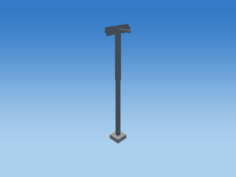

## Cube assembly order

Each image adds one real component, preserving builder order and world transforms.

### Add 1: Concrete footing

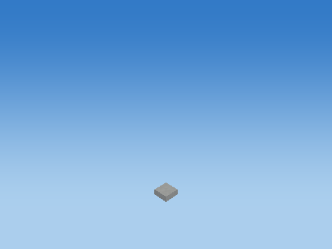

### Add 2: Stadium tower

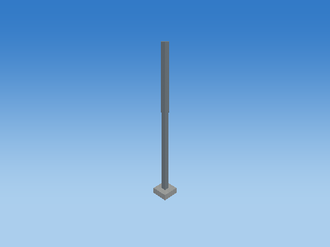

### Add 3: Floodlight crossbar

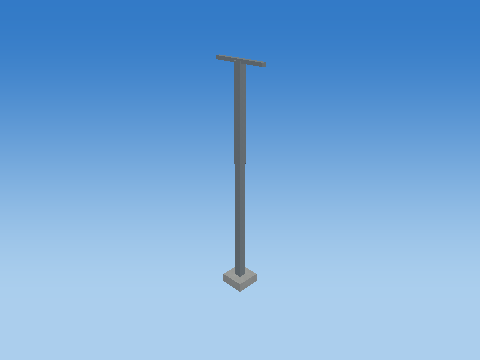

### Add 4: Head support

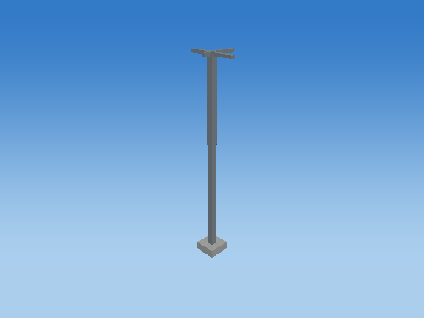

### Add 5: Floodlight housing

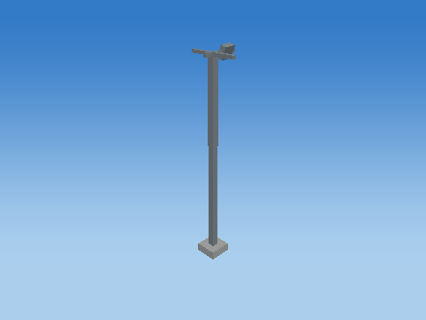

### Add 6: Lens

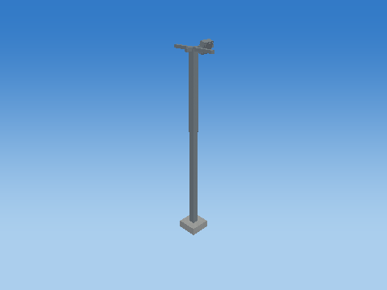

### Add 7: Head support


### Add 8: Floodlight housing

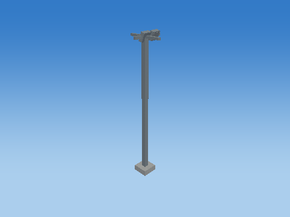

### Add 9: Lens

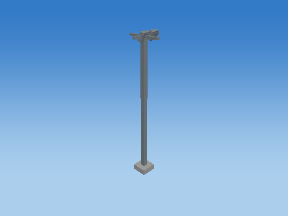

### Add 10: Head support

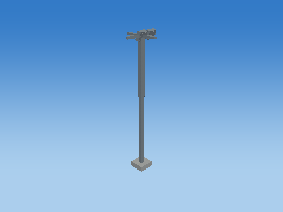

### Add 11: Floodlight housing

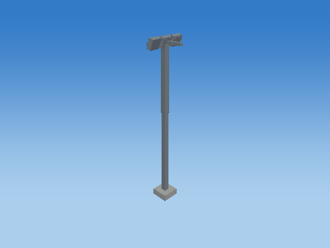

### Add 12: Lens


## Every component transformation

### Concrete footing — `FLOOD_1_BASE`

Mounted arena fixture; lens and illumination share the same rig position

Position T = (-28, 0.25, -16) m; scale S = (1.29999995, 0.5, 1.29999995); rotation (Rx,Ry,Rz) = (0, 0, 0) degrees.

Shear (xy,xz,yx,yz,zx,zy) = (0, 0, 0, 0, 0, 0). Color = (0.349999994, 0.370000005, 0.389999986); specular = 0.449999988; shininess = 48; emission = 0; flash = 0; material layer = 1; texture scale = 1. Pattern enabled = 0, pattern scale = (1, 1, 1), offset = (0, 0, 0).

| Step | Actual renderer image |
| --- | --- |
| Unit cube | 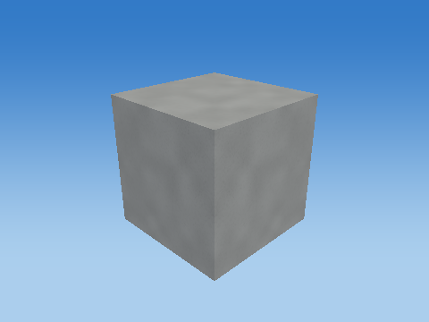 |
| Scale |  |
| Shear |  |
| Rotate X |  |
| Rotate Y |  |
| Rotate Z | 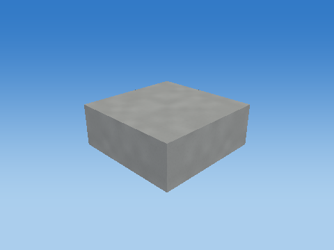 |
| Translate to world | 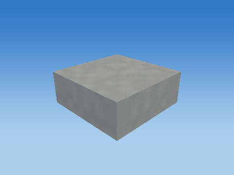 |

Steps 1–5 share one camera; the unit cube has its own close view, and step 6 is reframed at the actual world location to keep small objects visible. Reframing changes the view, never the model coordinates. Identity steps deliberately remain visible. Intermediate shapes are instructional states, while step 6 uses the unmodified game object.

Each stage below gives its exact numeric matrix and all eight corner multiplications. For each output row r: p'[r] = A[r,0]p.x + A[r,1]p.y + A[r,2]p.z + A[r,3]p.w.

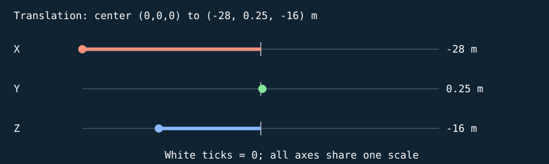


#### S

```text
[ 1.29999995 0 0 0 ]
[ 0 0.5 0 0 ]
[ 0 0 1.29999995 0 ]
[ 0 0 0 1 ]
```

| Input corner (w=1) | Output corner (w=1) |
| --- | --- |
| (-0.5, -0.5, -0.5) | (-0.649999976, -0.25, -0.649999976) |
| (-0.5, -0.5, 0.5) | (-0.649999976, -0.25, 0.649999976) |
| (-0.5, 0.5, -0.5) | (-0.649999976, 0.25, -0.649999976) |
| (-0.5, 0.5, 0.5) | (-0.649999976, 0.25, 0.649999976) |
| (0.5, -0.5, -0.5) | (0.649999976, -0.25, -0.649999976) |
| (0.5, -0.5, 0.5) | (0.649999976, -0.25, 0.649999976) |
| (0.5, 0.5, -0.5) | (0.649999976, 0.25, -0.649999976) |
| (0.5, 0.5, 0.5) | (0.649999976, 0.25, 0.649999976) |

#### H

```text
[ 1 0 0 0 ]
[ 0 1 0 0 ]
[ 0 0 1 0 ]
[ 0 0 0 1 ]
```

| Input corner (w=1) | Output corner (w=1) |
| --- | --- |
| (-0.649999976, -0.25, -0.649999976) | (-0.649999976, -0.25, -0.649999976) |
| (-0.649999976, -0.25, 0.649999976) | (-0.649999976, -0.25, 0.649999976) |
| (-0.649999976, 0.25, -0.649999976) | (-0.649999976, 0.25, -0.649999976) |
| (-0.649999976, 0.25, 0.649999976) | (-0.649999976, 0.25, 0.649999976) |
| (0.649999976, -0.25, -0.649999976) | (0.649999976, -0.25, -0.649999976) |
| (0.649999976, -0.25, 0.649999976) | (0.649999976, -0.25, 0.649999976) |
| (0.649999976, 0.25, -0.649999976) | (0.649999976, 0.25, -0.649999976) |
| (0.649999976, 0.25, 0.649999976) | (0.649999976, 0.25, 0.649999976) |

#### Rx

```text
[ 1 0 0 0 ]
[ 0 1 -0 0 ]
[ 0 0 1 0 ]
[ 0 0 0 1 ]
```

| Input corner (w=1) | Output corner (w=1) |
| --- | --- |
| (-0.649999976, -0.25, -0.649999976) | (-0.649999976, -0.25, -0.649999976) |
| (-0.649999976, -0.25, 0.649999976) | (-0.649999976, -0.25, 0.649999976) |
| (-0.649999976, 0.25, -0.649999976) | (-0.649999976, 0.25, -0.649999976) |
| (-0.649999976, 0.25, 0.649999976) | (-0.649999976, 0.25, 0.649999976) |
| (0.649999976, -0.25, -0.649999976) | (0.649999976, -0.25, -0.649999976) |
| (0.649999976, -0.25, 0.649999976) | (0.649999976, -0.25, 0.649999976) |
| (0.649999976, 0.25, -0.649999976) | (0.649999976, 0.25, -0.649999976) |
| (0.649999976, 0.25, 0.649999976) | (0.649999976, 0.25, 0.649999976) |

#### Ry

```text
[ 1 0 0 0 ]
[ 0 1 0 0 ]
[ -0 0 1 0 ]
[ 0 0 0 1 ]
```

| Input corner (w=1) | Output corner (w=1) |
| --- | --- |
| (-0.649999976, -0.25, -0.649999976) | (-0.649999976, -0.25, -0.649999976) |
| (-0.649999976, -0.25, 0.649999976) | (-0.649999976, -0.25, 0.649999976) |
| (-0.649999976, 0.25, -0.649999976) | (-0.649999976, 0.25, -0.649999976) |
| (-0.649999976, 0.25, 0.649999976) | (-0.649999976, 0.25, 0.649999976) |
| (0.649999976, -0.25, -0.649999976) | (0.649999976, -0.25, -0.649999976) |
| (0.649999976, -0.25, 0.649999976) | (0.649999976, -0.25, 0.649999976) |
| (0.649999976, 0.25, -0.649999976) | (0.649999976, 0.25, -0.649999976) |
| (0.649999976, 0.25, 0.649999976) | (0.649999976, 0.25, 0.649999976) |

#### Rz

```text
[ 1 -0 0 0 ]
[ 0 1 0 0 ]
[ 0 0 1 0 ]
[ 0 0 0 1 ]
```

| Input corner (w=1) | Output corner (w=1) |
| --- | --- |
| (-0.649999976, -0.25, -0.649999976) | (-0.649999976, -0.25, -0.649999976) |
| (-0.649999976, -0.25, 0.649999976) | (-0.649999976, -0.25, 0.649999976) |
| (-0.649999976, 0.25, -0.649999976) | (-0.649999976, 0.25, -0.649999976) |
| (-0.649999976, 0.25, 0.649999976) | (-0.649999976, 0.25, 0.649999976) |
| (0.649999976, -0.25, -0.649999976) | (0.649999976, -0.25, -0.649999976) |
| (0.649999976, -0.25, 0.649999976) | (0.649999976, -0.25, 0.649999976) |
| (0.649999976, 0.25, -0.649999976) | (0.649999976, 0.25, -0.649999976) |
| (0.649999976, 0.25, 0.649999976) | (0.649999976, 0.25, 0.649999976) |

#### T

```text
[ 1 0 0 -28 ]
[ 0 1 0 0.25 ]
[ 0 0 1 -16 ]
[ 0 0 0 1 ]
```

| Input corner (w=1) | Output corner (w=1) |
| --- | --- |
| (-0.649999976, -0.25, -0.649999976) | (-28.6499996, 0, -16.6499996) |
| (-0.649999976, -0.25, 0.649999976) | (-28.6499996, 0, -15.3500004) |
| (-0.649999976, 0.25, -0.649999976) | (-28.6499996, 0.5, -16.6499996) |
| (-0.649999976, 0.25, 0.649999976) | (-28.6499996, 0.5, -15.3500004) |
| (0.649999976, -0.25, -0.649999976) | (-27.3500004, 0, -16.6499996) |
| (0.649999976, -0.25, 0.649999976) | (-27.3500004, 0, -15.3500004) |
| (0.649999976, 0.25, -0.649999976) | (-27.3500004, 0.5, -16.6499996) |
| (0.649999976, 0.25, 0.649999976) | (-27.3500004, 0.5, -15.3500004) |

Final M = T Rz Ry Rx H S:

```text
[ 1.29999995 0 0 -28 ]
[ 0 0.5 0 0.25 ]
[ 0 0 1.29999995 -16 ]
[ 0 0 0 1 ]
```

### Stadium tower — `FLOOD_1_POLE`

Mounted arena fixture; lens and illumination share the same rig position

Position T = (-28, 6, -16) m; scale S = (0.379999995, 12, 0.379999995); rotation (Rx,Ry,Rz) = (0, 0, 0) degrees.

Shear (xy,xz,yx,yz,zx,zy) = (0, 0, 0, 0, 0, 0). Color = (0.189999998, 0.230000004, 0.270000011); specular = 0.449999988; shininess = 48; emission = 0; flash = 0; material layer = 5; texture scale = 3. Pattern enabled = 0, pattern scale = (1, 1, 1), offset = (0, 0, 0).

| Step | Actual renderer image |
| --- | --- |
| Unit cube |  |
| Scale |  |
| Shear |  |
| Rotate X |  |
| Rotate Y |  |
| Rotate Z |  |
| Translate to world | 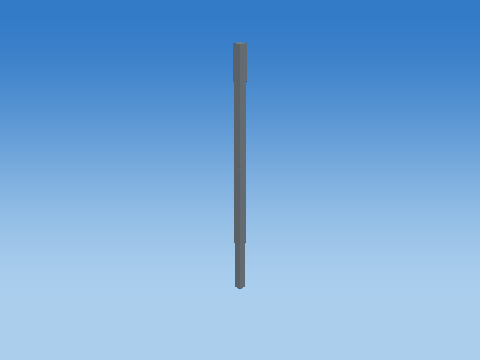 |

Steps 1–5 share one camera; the unit cube has its own close view, and step 6 is reframed at the actual world location to keep small objects visible. Reframing changes the view, never the model coordinates. Identity steps deliberately remain visible. Intermediate shapes are instructional states, while step 6 uses the unmodified game object.

Each stage below gives its exact numeric matrix and all eight corner multiplications. For each output row r: p'[r] = A[r,0]p.x + A[r,1]p.y + A[r,2]p.z + A[r,3]p.w.

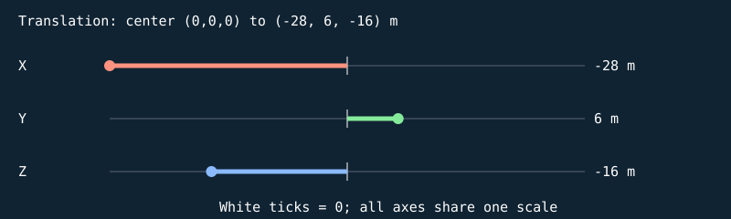


#### S

```text
[ 0.379999995 0 0 0 ]
[ 0 12 0 0 ]
[ 0 0 0.379999995 0 ]
[ 0 0 0 1 ]
```

| Input corner (w=1) | Output corner (w=1) |
| --- | --- |
| (-0.5, -0.5, -0.5) | (-0.189999998, -6, -0.189999998) |
| (-0.5, -0.5, 0.5) | (-0.189999998, -6, 0.189999998) |
| (-0.5, 0.5, -0.5) | (-0.189999998, 6, -0.189999998) |
| (-0.5, 0.5, 0.5) | (-0.189999998, 6, 0.189999998) |
| (0.5, -0.5, -0.5) | (0.189999998, -6, -0.189999998) |
| (0.5, -0.5, 0.5) | (0.189999998, -6, 0.189999998) |
| (0.5, 0.5, -0.5) | (0.189999998, 6, -0.189999998) |
| (0.5, 0.5, 0.5) | (0.189999998, 6, 0.189999998) |

#### H

```text
[ 1 0 0 0 ]
[ 0 1 0 0 ]
[ 0 0 1 0 ]
[ 0 0 0 1 ]
```

| Input corner (w=1) | Output corner (w=1) |
| --- | --- |
| (-0.189999998, -6, -0.189999998) | (-0.189999998, -6, -0.189999998) |
| (-0.189999998, -6, 0.189999998) | (-0.189999998, -6, 0.189999998) |
| (-0.189999998, 6, -0.189999998) | (-0.189999998, 6, -0.189999998) |
| (-0.189999998, 6, 0.189999998) | (-0.189999998, 6, 0.189999998) |
| (0.189999998, -6, -0.189999998) | (0.189999998, -6, -0.189999998) |
| (0.189999998, -6, 0.189999998) | (0.189999998, -6, 0.189999998) |
| (0.189999998, 6, -0.189999998) | (0.189999998, 6, -0.189999998) |
| (0.189999998, 6, 0.189999998) | (0.189999998, 6, 0.189999998) |

#### Rx

```text
[ 1 0 0 0 ]
[ 0 1 -0 0 ]
[ 0 0 1 0 ]
[ 0 0 0 1 ]
```

| Input corner (w=1) | Output corner (w=1) |
| --- | --- |
| (-0.189999998, -6, -0.189999998) | (-0.189999998, -6, -0.189999998) |
| (-0.189999998, -6, 0.189999998) | (-0.189999998, -6, 0.189999998) |
| (-0.189999998, 6, -0.189999998) | (-0.189999998, 6, -0.189999998) |
| (-0.189999998, 6, 0.189999998) | (-0.189999998, 6, 0.189999998) |
| (0.189999998, -6, -0.189999998) | (0.189999998, -6, -0.189999998) |
| (0.189999998, -6, 0.189999998) | (0.189999998, -6, 0.189999998) |
| (0.189999998, 6, -0.189999998) | (0.189999998, 6, -0.189999998) |
| (0.189999998, 6, 0.189999998) | (0.189999998, 6, 0.189999998) |

#### Ry

```text
[ 1 0 0 0 ]
[ 0 1 0 0 ]
[ -0 0 1 0 ]
[ 0 0 0 1 ]
```

| Input corner (w=1) | Output corner (w=1) |
| --- | --- |
| (-0.189999998, -6, -0.189999998) | (-0.189999998, -6, -0.189999998) |
| (-0.189999998, -6, 0.189999998) | (-0.189999998, -6, 0.189999998) |
| (-0.189999998, 6, -0.189999998) | (-0.189999998, 6, -0.189999998) |
| (-0.189999998, 6, 0.189999998) | (-0.189999998, 6, 0.189999998) |
| (0.189999998, -6, -0.189999998) | (0.189999998, -6, -0.189999998) |
| (0.189999998, -6, 0.189999998) | (0.189999998, -6, 0.189999998) |
| (0.189999998, 6, -0.189999998) | (0.189999998, 6, -0.189999998) |
| (0.189999998, 6, 0.189999998) | (0.189999998, 6, 0.189999998) |

#### Rz

```text
[ 1 -0 0 0 ]
[ 0 1 0 0 ]
[ 0 0 1 0 ]
[ 0 0 0 1 ]
```

| Input corner (w=1) | Output corner (w=1) |
| --- | --- |
| (-0.189999998, -6, -0.189999998) | (-0.189999998, -6, -0.189999998) |
| (-0.189999998, -6, 0.189999998) | (-0.189999998, -6, 0.189999998) |
| (-0.189999998, 6, -0.189999998) | (-0.189999998, 6, -0.189999998) |
| (-0.189999998, 6, 0.189999998) | (-0.189999998, 6, 0.189999998) |
| (0.189999998, -6, -0.189999998) | (0.189999998, -6, -0.189999998) |
| (0.189999998, -6, 0.189999998) | (0.189999998, -6, 0.189999998) |
| (0.189999998, 6, -0.189999998) | (0.189999998, 6, -0.189999998) |
| (0.189999998, 6, 0.189999998) | (0.189999998, 6, 0.189999998) |

#### T

```text
[ 1 0 0 -28 ]
[ 0 1 0 6 ]
[ 0 0 1 -16 ]
[ 0 0 0 1 ]
```

| Input corner (w=1) | Output corner (w=1) |
| --- | --- |
| (-0.189999998, -6, -0.189999998) | (-28.1900005, 0, -16.1900005) |
| (-0.189999998, -6, 0.189999998) | (-28.1900005, 0, -15.8100004) |
| (-0.189999998, 6, -0.189999998) | (-28.1900005, 12, -16.1900005) |
| (-0.189999998, 6, 0.189999998) | (-28.1900005, 12, -15.8100004) |
| (0.189999998, -6, -0.189999998) | (-27.8099995, 0, -16.1900005) |
| (0.189999998, -6, 0.189999998) | (-27.8099995, 0, -15.8100004) |
| (0.189999998, 6, -0.189999998) | (-27.8099995, 12, -16.1900005) |
| (0.189999998, 6, 0.189999998) | (-27.8099995, 12, -15.8100004) |

Final M = T Rz Ry Rx H S:

```text
[ 0.379999995 0 0 -28 ]
[ 0 12 0 6 ]
[ 0 0 0.379999995 -16 ]
[ 0 0 0 1 ]
```

### Floodlight crossbar — `FLOOD_1_BAR`

Mounted arena fixture; lens and illumination share the same rig position

Position T = (-28, 12, -16) m; scale S = (2.9000001, 0.180000007, 0.25); rotation (Rx,Ry,Rz) = (0, 0, 0) degrees.

Shear (xy,xz,yx,yz,zx,zy) = (0, 0, 0, 0, 0, 0). Color = (0.189999998, 0.230000004, 0.270000011); specular = 0.449999988; shininess = 48; emission = 0; flash = 0; material layer = 5; texture scale = 3. Pattern enabled = 0, pattern scale = (1, 1, 1), offset = (0, 0, 0).

| Step | Actual renderer image |
| --- | --- |
| Unit cube |  |
| Scale |  |
| Shear | 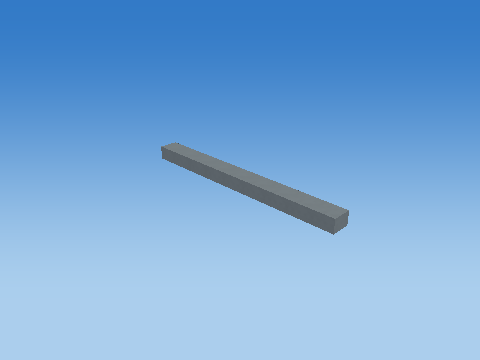 |
| Rotate X |  |
| Rotate Y |  |
| Rotate Z |  |
| Translate to world | 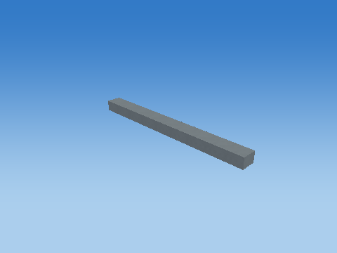 |

Steps 1–5 share one camera; the unit cube has its own close view, and step 6 is reframed at the actual world location to keep small objects visible. Reframing changes the view, never the model coordinates. Identity steps deliberately remain visible. Intermediate shapes are instructional states, while step 6 uses the unmodified game object.

Each stage below gives its exact numeric matrix and all eight corner multiplications. For each output row r: p'[r] = A[r,0]p.x + A[r,1]p.y + A[r,2]p.z + A[r,3]p.w.


#### S

```text
[ 2.9000001 0 0 0 ]
[ 0 0.180000007 0 0 ]
[ 0 0 0.25 0 ]
[ 0 0 0 1 ]
```

| Input corner (w=1) | Output corner (w=1) |
| --- | --- |
| (-0.5, -0.5, -0.5) | (-1.45000005, -0.0900000036, -0.125) |
| (-0.5, -0.5, 0.5) | (-1.45000005, -0.0900000036, 0.125) |
| (-0.5, 0.5, -0.5) | (-1.45000005, 0.0900000036, -0.125) |
| (-0.5, 0.5, 0.5) | (-1.45000005, 0.0900000036, 0.125) |
| (0.5, -0.5, -0.5) | (1.45000005, -0.0900000036, -0.125) |
| (0.5, -0.5, 0.5) | (1.45000005, -0.0900000036, 0.125) |
| (0.5, 0.5, -0.5) | (1.45000005, 0.0900000036, -0.125) |
| (0.5, 0.5, 0.5) | (1.45000005, 0.0900000036, 0.125) |

#### H

```text
[ 1 0 0 0 ]
[ 0 1 0 0 ]
[ 0 0 1 0 ]
[ 0 0 0 1 ]
```

| Input corner (w=1) | Output corner (w=1) |
| --- | --- |
| (-1.45000005, -0.0900000036, -0.125) | (-1.45000005, -0.0900000036, -0.125) |
| (-1.45000005, -0.0900000036, 0.125) | (-1.45000005, -0.0900000036, 0.125) |
| (-1.45000005, 0.0900000036, -0.125) | (-1.45000005, 0.0900000036, -0.125) |
| (-1.45000005, 0.0900000036, 0.125) | (-1.45000005, 0.0900000036, 0.125) |
| (1.45000005, -0.0900000036, -0.125) | (1.45000005, -0.0900000036, -0.125) |
| (1.45000005, -0.0900000036, 0.125) | (1.45000005, -0.0900000036, 0.125) |
| (1.45000005, 0.0900000036, -0.125) | (1.45000005, 0.0900000036, -0.125) |
| (1.45000005, 0.0900000036, 0.125) | (1.45000005, 0.0900000036, 0.125) |

#### Rx

```text
[ 1 0 0 0 ]
[ 0 1 -0 0 ]
[ 0 0 1 0 ]
[ 0 0 0 1 ]
```

| Input corner (w=1) | Output corner (w=1) |
| --- | --- |
| (-1.45000005, -0.0900000036, -0.125) | (-1.45000005, -0.0900000036, -0.125) |
| (-1.45000005, -0.0900000036, 0.125) | (-1.45000005, -0.0900000036, 0.125) |
| (-1.45000005, 0.0900000036, -0.125) | (-1.45000005, 0.0900000036, -0.125) |
| (-1.45000005, 0.0900000036, 0.125) | (-1.45000005, 0.0900000036, 0.125) |
| (1.45000005, -0.0900000036, -0.125) | (1.45000005, -0.0900000036, -0.125) |
| (1.45000005, -0.0900000036, 0.125) | (1.45000005, -0.0900000036, 0.125) |
| (1.45000005, 0.0900000036, -0.125) | (1.45000005, 0.0900000036, -0.125) |
| (1.45000005, 0.0900000036, 0.125) | (1.45000005, 0.0900000036, 0.125) |

#### Ry

```text
[ 1 0 0 0 ]
[ 0 1 0 0 ]
[ -0 0 1 0 ]
[ 0 0 0 1 ]
```

| Input corner (w=1) | Output corner (w=1) |
| --- | --- |
| (-1.45000005, -0.0900000036, -0.125) | (-1.45000005, -0.0900000036, -0.125) |
| (-1.45000005, -0.0900000036, 0.125) | (-1.45000005, -0.0900000036, 0.125) |
| (-1.45000005, 0.0900000036, -0.125) | (-1.45000005, 0.0900000036, -0.125) |
| (-1.45000005, 0.0900000036, 0.125) | (-1.45000005, 0.0900000036, 0.125) |
| (1.45000005, -0.0900000036, -0.125) | (1.45000005, -0.0900000036, -0.125) |
| (1.45000005, -0.0900000036, 0.125) | (1.45000005, -0.0900000036, 0.125) |
| (1.45000005, 0.0900000036, -0.125) | (1.45000005, 0.0900000036, -0.125) |
| (1.45000005, 0.0900000036, 0.125) | (1.45000005, 0.0900000036, 0.125) |

#### Rz

```text
[ 1 -0 0 0 ]
[ 0 1 0 0 ]
[ 0 0 1 0 ]
[ 0 0 0 1 ]
```

| Input corner (w=1) | Output corner (w=1) |
| --- | --- |
| (-1.45000005, -0.0900000036, -0.125) | (-1.45000005, -0.0900000036, -0.125) |
| (-1.45000005, -0.0900000036, 0.125) | (-1.45000005, -0.0900000036, 0.125) |
| (-1.45000005, 0.0900000036, -0.125) | (-1.45000005, 0.0900000036, -0.125) |
| (-1.45000005, 0.0900000036, 0.125) | (-1.45000005, 0.0900000036, 0.125) |
| (1.45000005, -0.0900000036, -0.125) | (1.45000005, -0.0900000036, -0.125) |
| (1.45000005, -0.0900000036, 0.125) | (1.45000005, -0.0900000036, 0.125) |
| (1.45000005, 0.0900000036, -0.125) | (1.45000005, 0.0900000036, -0.125) |
| (1.45000005, 0.0900000036, 0.125) | (1.45000005, 0.0900000036, 0.125) |

#### T

```text
[ 1 0 0 -28 ]
[ 0 1 0 12 ]
[ 0 0 1 -16 ]
[ 0 0 0 1 ]
```

| Input corner (w=1) | Output corner (w=1) |
| --- | --- |
| (-1.45000005, -0.0900000036, -0.125) | (-29.4500008, 11.9099998, -16.125) |
| (-1.45000005, -0.0900000036, 0.125) | (-29.4500008, 11.9099998, -15.875) |
| (-1.45000005, 0.0900000036, -0.125) | (-29.4500008, 12.0900002, -16.125) |
| (-1.45000005, 0.0900000036, 0.125) | (-29.4500008, 12.0900002, -15.875) |
| (1.45000005, -0.0900000036, -0.125) | (-26.5499992, 11.9099998, -16.125) |
| (1.45000005, -0.0900000036, 0.125) | (-26.5499992, 11.9099998, -15.875) |
| (1.45000005, 0.0900000036, -0.125) | (-26.5499992, 12.0900002, -16.125) |
| (1.45000005, 0.0900000036, 0.125) | (-26.5499992, 12.0900002, -15.875) |

Final M = T Rz Ry Rx H S:

```text
[ 2.9000001 0 0 -28 ]
[ 0 0.180000007 0 12 ]
[ 0 0 0.25 -16 ]
[ 0 0 0 1 ]
```

### Head support — `FLOOD_1_BRACKET_-1`

Mounted arena fixture; lens and illumination share the same rig position

Position T = (-28, 12, -16.4750004) m; scale S = (0.180000007, 0.219999999, 2.0999999); rotation (Rx,Ry,Rz) = (0, 0, 0) degrees.

Shear (xy,xz,yx,yz,zx,zy) = (0, 0, 0, 0, 0, 0). Color = (0.189999998, 0.230000004, 0.270000011); specular = 0.449999988; shininess = 48; emission = 0; flash = 0; material layer = 5; texture scale = 3. Pattern enabled = 0, pattern scale = (1, 1, 1), offset = (0, 0, 0).

| Step | Actual renderer image |
| --- | --- |
| Unit cube |  |
| Scale |  |
| Shear |  |
| Rotate X |  |
| Rotate Y |  |
| Rotate Z |  |
| Translate to world |  |

Steps 1–5 share one camera; the unit cube has its own close view, and step 6 is reframed at the actual world location to keep small objects visible. Reframing changes the view, never the model coordinates. Identity steps deliberately remain visible. Intermediate shapes are instructional states, while step 6 uses the unmodified game object.

Each stage below gives its exact numeric matrix and all eight corner multiplications. For each output row r: p'[r] = A[r,0]p.x + A[r,1]p.y + A[r,2]p.z + A[r,3]p.w.

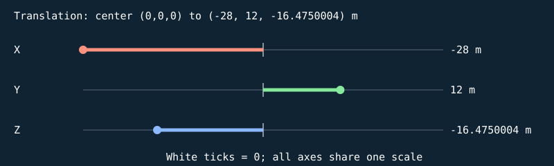


#### S

```text
[ 0.180000007 0 0 0 ]
[ 0 0.219999999 0 0 ]
[ 0 0 2.0999999 0 ]
[ 0 0 0 1 ]
```

| Input corner (w=1) | Output corner (w=1) |
| --- | --- |
| (-0.5, -0.5, -0.5) | (-0.0900000036, -0.109999999, -1.04999995) |
| (-0.5, -0.5, 0.5) | (-0.0900000036, -0.109999999, 1.04999995) |
| (-0.5, 0.5, -0.5) | (-0.0900000036, 0.109999999, -1.04999995) |
| (-0.5, 0.5, 0.5) | (-0.0900000036, 0.109999999, 1.04999995) |
| (0.5, -0.5, -0.5) | (0.0900000036, -0.109999999, -1.04999995) |
| (0.5, -0.5, 0.5) | (0.0900000036, -0.109999999, 1.04999995) |
| (0.5, 0.5, -0.5) | (0.0900000036, 0.109999999, -1.04999995) |
| (0.5, 0.5, 0.5) | (0.0900000036, 0.109999999, 1.04999995) |

#### H

```text
[ 1 0 0 0 ]
[ 0 1 0 0 ]
[ 0 0 1 0 ]
[ 0 0 0 1 ]
```

| Input corner (w=1) | Output corner (w=1) |
| --- | --- |
| (-0.0900000036, -0.109999999, -1.04999995) | (-0.0900000036, -0.109999999, -1.04999995) |
| (-0.0900000036, -0.109999999, 1.04999995) | (-0.0900000036, -0.109999999, 1.04999995) |
| (-0.0900000036, 0.109999999, -1.04999995) | (-0.0900000036, 0.109999999, -1.04999995) |
| (-0.0900000036, 0.109999999, 1.04999995) | (-0.0900000036, 0.109999999, 1.04999995) |
| (0.0900000036, -0.109999999, -1.04999995) | (0.0900000036, -0.109999999, -1.04999995) |
| (0.0900000036, -0.109999999, 1.04999995) | (0.0900000036, -0.109999999, 1.04999995) |
| (0.0900000036, 0.109999999, -1.04999995) | (0.0900000036, 0.109999999, -1.04999995) |
| (0.0900000036, 0.109999999, 1.04999995) | (0.0900000036, 0.109999999, 1.04999995) |

#### Rx

```text
[ 1 0 0 0 ]
[ 0 1 -0 0 ]
[ 0 0 1 0 ]
[ 0 0 0 1 ]
```

| Input corner (w=1) | Output corner (w=1) |
| --- | --- |
| (-0.0900000036, -0.109999999, -1.04999995) | (-0.0900000036, -0.109999999, -1.04999995) |
| (-0.0900000036, -0.109999999, 1.04999995) | (-0.0900000036, -0.109999999, 1.04999995) |
| (-0.0900000036, 0.109999999, -1.04999995) | (-0.0900000036, 0.109999999, -1.04999995) |
| (-0.0900000036, 0.109999999, 1.04999995) | (-0.0900000036, 0.109999999, 1.04999995) |
| (0.0900000036, -0.109999999, -1.04999995) | (0.0900000036, -0.109999999, -1.04999995) |
| (0.0900000036, -0.109999999, 1.04999995) | (0.0900000036, -0.109999999, 1.04999995) |
| (0.0900000036, 0.109999999, -1.04999995) | (0.0900000036, 0.109999999, -1.04999995) |
| (0.0900000036, 0.109999999, 1.04999995) | (0.0900000036, 0.109999999, 1.04999995) |

#### Ry

```text
[ 1 0 0 0 ]
[ 0 1 0 0 ]
[ -0 0 1 0 ]
[ 0 0 0 1 ]
```

| Input corner (w=1) | Output corner (w=1) |
| --- | --- |
| (-0.0900000036, -0.109999999, -1.04999995) | (-0.0900000036, -0.109999999, -1.04999995) |
| (-0.0900000036, -0.109999999, 1.04999995) | (-0.0900000036, -0.109999999, 1.04999995) |
| (-0.0900000036, 0.109999999, -1.04999995) | (-0.0900000036, 0.109999999, -1.04999995) |
| (-0.0900000036, 0.109999999, 1.04999995) | (-0.0900000036, 0.109999999, 1.04999995) |
| (0.0900000036, -0.109999999, -1.04999995) | (0.0900000036, -0.109999999, -1.04999995) |
| (0.0900000036, -0.109999999, 1.04999995) | (0.0900000036, -0.109999999, 1.04999995) |
| (0.0900000036, 0.109999999, -1.04999995) | (0.0900000036, 0.109999999, -1.04999995) |
| (0.0900000036, 0.109999999, 1.04999995) | (0.0900000036, 0.109999999, 1.04999995) |

#### Rz

```text
[ 1 -0 0 0 ]
[ 0 1 0 0 ]
[ 0 0 1 0 ]
[ 0 0 0 1 ]
```

| Input corner (w=1) | Output corner (w=1) |
| --- | --- |
| (-0.0900000036, -0.109999999, -1.04999995) | (-0.0900000036, -0.109999999, -1.04999995) |
| (-0.0900000036, -0.109999999, 1.04999995) | (-0.0900000036, -0.109999999, 1.04999995) |
| (-0.0900000036, 0.109999999, -1.04999995) | (-0.0900000036, 0.109999999, -1.04999995) |
| (-0.0900000036, 0.109999999, 1.04999995) | (-0.0900000036, 0.109999999, 1.04999995) |
| (0.0900000036, -0.109999999, -1.04999995) | (0.0900000036, -0.109999999, -1.04999995) |
| (0.0900000036, -0.109999999, 1.04999995) | (0.0900000036, -0.109999999, 1.04999995) |
| (0.0900000036, 0.109999999, -1.04999995) | (0.0900000036, 0.109999999, -1.04999995) |
| (0.0900000036, 0.109999999, 1.04999995) | (0.0900000036, 0.109999999, 1.04999995) |

#### T

```text
[ 1 0 0 -28 ]
[ 0 1 0 12 ]
[ 0 0 1 -16.4750004 ]
[ 0 0 0 1 ]
```

| Input corner (w=1) | Output corner (w=1) |
| --- | --- |
| (-0.0900000036, -0.109999999, -1.04999995) | (-28.0900002, 11.8900003, -17.5249996) |
| (-0.0900000036, -0.109999999, 1.04999995) | (-28.0900002, 11.8900003, -15.4250002) |
| (-0.0900000036, 0.109999999, -1.04999995) | (-28.0900002, 12.1099997, -17.5249996) |
| (-0.0900000036, 0.109999999, 1.04999995) | (-28.0900002, 12.1099997, -15.4250002) |
| (0.0900000036, -0.109999999, -1.04999995) | (-27.9099998, 11.8900003, -17.5249996) |
| (0.0900000036, -0.109999999, 1.04999995) | (-27.9099998, 11.8900003, -15.4250002) |
| (0.0900000036, 0.109999999, -1.04999995) | (-27.9099998, 12.1099997, -17.5249996) |
| (0.0900000036, 0.109999999, 1.04999995) | (-27.9099998, 12.1099997, -15.4250002) |

Final M = T Rz Ry Rx H S:

```text
[ 0.180000007 0 0 -28 ]
[ 0 0.219999999 0 12 ]
[ 0 0 2.0999999 -16.4750004 ]
[ 0 0 0 1 ]
```

### Floodlight housing — `FLOOD_1_HEAD_-1`

Mounted arena fixture; lens and illumination share the same rig position

Position T = (-28, 12, -16.9500008) m; scale S = (0.850000024, 0.720000029, 0.319999993); rotation (Rx,Ry,Rz) = (19.4712219, 98.1300964, 0) degrees.

Shear (xy,xz,yx,yz,zx,zy) = (0, 0, 0, 0, 0, 0). Color = (0.189999998, 0.230000004, 0.270000011); specular = 0.449999988; shininess = 48; emission = 0; flash = 0; material layer = 5; texture scale = 3. Pattern enabled = 0, pattern scale = (1, 1, 1), offset = (0, 0, 0).

| Step | Actual renderer image |
| --- | --- |
| Unit cube |  |
| Scale | 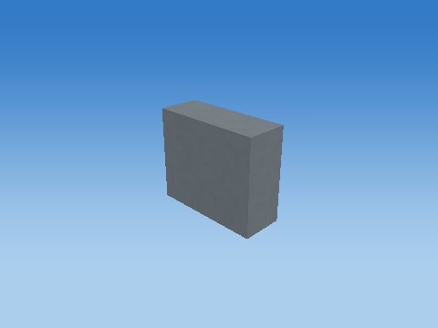 |
| Shear |  |
| Rotate X | 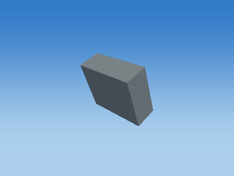 |
| Rotate Y |  |
| Rotate Z |  |
| Translate to world |  |

Steps 1–5 share one camera; the unit cube has its own close view, and step 6 is reframed at the actual world location to keep small objects visible. Reframing changes the view, never the model coordinates. Identity steps deliberately remain visible. Intermediate shapes are instructional states, while step 6 uses the unmodified game object.

Each stage below gives its exact numeric matrix and all eight corner multiplications. For each output row r: p'[r] = A[r,0]p.x + A[r,1]p.y + A[r,2]p.z + A[r,3]p.w.

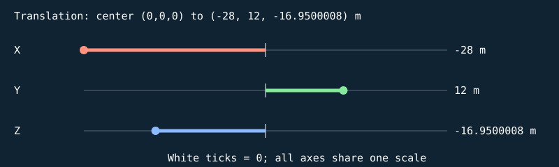


#### S

```text
[ 0.850000024 0 0 0 ]
[ 0 0.720000029 0 0 ]
[ 0 0 0.319999993 0 ]
[ 0 0 0 1 ]
```

| Input corner (w=1) | Output corner (w=1) |
| --- | --- |
| (-0.5, -0.5, -0.5) | (-0.425000012, -0.360000014, -0.159999996) |
| (-0.5, -0.5, 0.5) | (-0.425000012, -0.360000014, 0.159999996) |
| (-0.5, 0.5, -0.5) | (-0.425000012, 0.360000014, -0.159999996) |
| (-0.5, 0.5, 0.5) | (-0.425000012, 0.360000014, 0.159999996) |
| (0.5, -0.5, -0.5) | (0.425000012, -0.360000014, -0.159999996) |
| (0.5, -0.5, 0.5) | (0.425000012, -0.360000014, 0.159999996) |
| (0.5, 0.5, -0.5) | (0.425000012, 0.360000014, -0.159999996) |
| (0.5, 0.5, 0.5) | (0.425000012, 0.360000014, 0.159999996) |

#### H

```text
[ 1 0 0 0 ]
[ 0 1 0 0 ]
[ 0 0 1 0 ]
[ 0 0 0 1 ]
```

| Input corner (w=1) | Output corner (w=1) |
| --- | --- |
| (-0.425000012, -0.360000014, -0.159999996) | (-0.425000012, -0.360000014, -0.159999996) |
| (-0.425000012, -0.360000014, 0.159999996) | (-0.425000012, -0.360000014, 0.159999996) |
| (-0.425000012, 0.360000014, -0.159999996) | (-0.425000012, 0.360000014, -0.159999996) |
| (-0.425000012, 0.360000014, 0.159999996) | (-0.425000012, 0.360000014, 0.159999996) |
| (0.425000012, -0.360000014, -0.159999996) | (0.425000012, -0.360000014, -0.159999996) |
| (0.425000012, -0.360000014, 0.159999996) | (0.425000012, -0.360000014, 0.159999996) |
| (0.425000012, 0.360000014, -0.159999996) | (0.425000012, 0.360000014, -0.159999996) |
| (0.425000012, 0.360000014, 0.159999996) | (0.425000012, 0.360000014, 0.159999996) |

#### Rx

```text
[ 1 0 0 0 ]
[ 0 0.942809045 -0.333333373 0 ]
[ 0 0.333333373 0.942809045 0 ]
[ 0 0 0 1 ]
```

| Input corner (w=1) | Output corner (w=1) |
| --- | --- |
| (-0.425000012, -0.360000014, -0.159999996) | (-0.425000012, -0.286077917, -0.270849466) |
| (-0.425000012, -0.360000014, 0.159999996) | (-0.425000012, -0.392744601, 0.030849427) |
| (-0.425000012, 0.360000014, -0.159999996) | (-0.425000012, 0.392744601, -0.030849427) |
| (-0.425000012, 0.360000014, 0.159999996) | (-0.425000012, 0.286077917, 0.270849466) |
| (0.425000012, -0.360000014, -0.159999996) | (0.425000012, -0.286077917, -0.270849466) |
| (0.425000012, -0.360000014, 0.159999996) | (0.425000012, -0.392744601, 0.030849427) |
| (0.425000012, 0.360000014, -0.159999996) | (0.425000012, 0.392744601, -0.030849427) |
| (0.425000012, 0.360000014, 0.159999996) | (0.425000012, 0.286077917, 0.270849466) |

#### Ry

```text
[ -0.141421303 0 0.989949524 0 ]
[ 0 1 0 0 ]
[ -0.989949524 0 -0.141421303 0 ]
[ 0 0 0 1 ]
```

| Input corner (w=1) | Output corner (w=1) |
| --- | --- |
| (-0.425000012, -0.286077917, -0.270849466) | (-0.208023235, -0.286077917, 0.459032446) |
| (-0.425000012, -0.392744601, 0.030849427) | (0.0906434357, -0.392744601, 0.416365802) |
| (-0.425000012, 0.392744601, -0.030849427) | (0.0295646824, 0.392744601, 0.425091326) |
| (-0.425000012, 0.286077917, 0.270849466) | (0.328231335, 0.286077917, 0.382424682) |
| (0.425000012, -0.286077917, -0.270849466) | (-0.328231335, -0.286077917, -0.382424682) |
| (0.425000012, -0.392744601, 0.030849427) | (-0.0295646824, -0.392744601, -0.425091326) |
| (0.425000012, 0.392744601, -0.030849427) | (-0.0906434357, 0.392744601, -0.416365802) |
| (0.425000012, 0.286077917, 0.270849466) | (0.208023235, 0.286077917, -0.459032446) |

#### Rz

```text
[ 1 -0 0 0 ]
[ 0 1 0 0 ]
[ 0 0 1 0 ]
[ 0 0 0 1 ]
```

| Input corner (w=1) | Output corner (w=1) |
| --- | --- |
| (-0.208023235, -0.286077917, 0.459032446) | (-0.208023235, -0.286077917, 0.459032446) |
| (0.0906434357, -0.392744601, 0.416365802) | (0.0906434357, -0.392744601, 0.416365802) |
| (0.0295646824, 0.392744601, 0.425091326) | (0.0295646824, 0.392744601, 0.425091326) |
| (0.328231335, 0.286077917, 0.382424682) | (0.328231335, 0.286077917, 0.382424682) |
| (-0.328231335, -0.286077917, -0.382424682) | (-0.328231335, -0.286077917, -0.382424682) |
| (-0.0295646824, -0.392744601, -0.425091326) | (-0.0295646824, -0.392744601, -0.425091326) |
| (-0.0906434357, 0.392744601, -0.416365802) | (-0.0906434357, 0.392744601, -0.416365802) |
| (0.208023235, 0.286077917, -0.459032446) | (0.208023235, 0.286077917, -0.459032446) |

#### T

```text
[ 1 0 0 -28 ]
[ 0 1 0 12 ]
[ 0 0 1 -16.9500008 ]
[ 0 0 0 1 ]
```

| Input corner (w=1) | Output corner (w=1) |
| --- | --- |
| (-0.208023235, -0.286077917, 0.459032446) | (-28.2080231, 11.7139225, -16.4909687) |
| (0.0906434357, -0.392744601, 0.416365802) | (-27.9093571, 11.607255, -16.5336342) |
| (0.0295646824, 0.392744601, 0.425091326) | (-27.9704361, 12.392745, -16.52491) |
| (0.328231335, 0.286077917, 0.382424682) | (-27.6717682, 12.2860775, -16.5675755) |
| (-0.328231335, -0.286077917, -0.382424682) | (-28.3282318, 11.7139225, -17.3324261) |
| (-0.0295646824, -0.392744601, -0.425091326) | (-28.0295639, 11.607255, -17.3750916) |
| (-0.0906434357, 0.392744601, -0.416365802) | (-28.0906429, 12.392745, -17.3663673) |
| (0.208023235, 0.286077917, -0.459032446) | (-27.7919769, 12.2860775, -17.4090328) |

Final M = T Rz Ry Rx H S:

```text
[ -0.120208114 0.237587929 0.298666686 -28 ]
[ 0 0.678822517 -0.106666677 12 ]
[ -0.841457129 -0.0339411199 -0.0426666513 -16.9500008 ]
[ 0 0 0 1 ]
```

### Lens — `FLOOD_1_LENS_-1`

Mounted arena fixture; lens and illumination share the same rig position

Position T = (-27.8320007, 11.9399996, -16.9740009) m; scale S = (0.730000019, 0.600000024, 0.0350000001); rotation (Rx,Ry,Rz) = (19.4712219, 98.1300964, 0) degrees.

Shear (xy,xz,yx,yz,zx,zy) = (0, 0, 0, 0, 0, 0). Color = (0.219999999, 0.25, 0.280000001); specular = 0.449999988; shininess = 48; emission = 0; flash = 0; material layer = 5; texture scale = 3. Pattern enabled = 0, pattern scale = (1, 1, 1), offset = (0, 0, 0).

| Step | Actual renderer image |
| --- | --- |
| Unit cube | 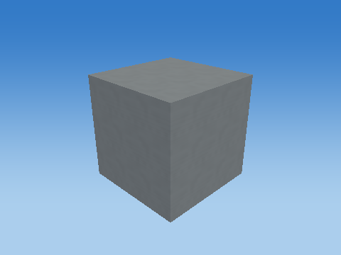 |
| Scale |  |
| Shear |  |
| Rotate X |  |
| Rotate Y | 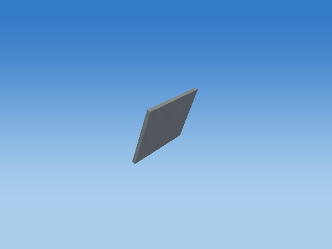 |
| Rotate Z |  |
| Translate to world | 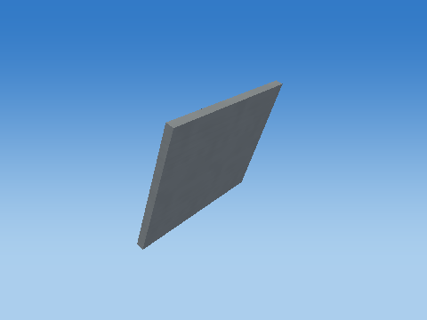 |

Steps 1–5 share one camera; the unit cube has its own close view, and step 6 is reframed at the actual world location to keep small objects visible. Reframing changes the view, never the model coordinates. Identity steps deliberately remain visible. Intermediate shapes are instructional states, while step 6 uses the unmodified game object.

Each stage below gives its exact numeric matrix and all eight corner multiplications. For each output row r: p'[r] = A[r,0]p.x + A[r,1]p.y + A[r,2]p.z + A[r,3]p.w.

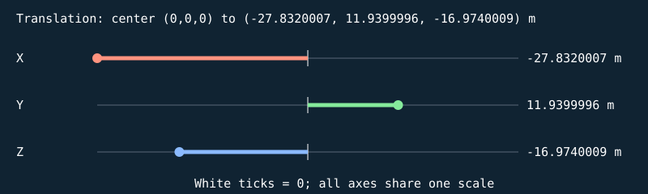


#### S

```text
[ 0.730000019 0 0 0 ]
[ 0 0.600000024 0 0 ]
[ 0 0 0.0350000001 0 ]
[ 0 0 0 1 ]
```

| Input corner (w=1) | Output corner (w=1) |
| --- | --- |
| (-0.5, -0.5, -0.5) | (-0.36500001, -0.300000012, -0.0175000001) |
| (-0.5, -0.5, 0.5) | (-0.36500001, -0.300000012, 0.0175000001) |
| (-0.5, 0.5, -0.5) | (-0.36500001, 0.300000012, -0.0175000001) |
| (-0.5, 0.5, 0.5) | (-0.36500001, 0.300000012, 0.0175000001) |
| (0.5, -0.5, -0.5) | (0.36500001, -0.300000012, -0.0175000001) |
| (0.5, -0.5, 0.5) | (0.36500001, -0.300000012, 0.0175000001) |
| (0.5, 0.5, -0.5) | (0.36500001, 0.300000012, -0.0175000001) |
| (0.5, 0.5, 0.5) | (0.36500001, 0.300000012, 0.0175000001) |

#### H

```text
[ 1 0 0 0 ]
[ 0 1 0 0 ]
[ 0 0 1 0 ]
[ 0 0 0 1 ]
```

| Input corner (w=1) | Output corner (w=1) |
| --- | --- |
| (-0.36500001, -0.300000012, -0.0175000001) | (-0.36500001, -0.300000012, -0.0175000001) |
| (-0.36500001, -0.300000012, 0.0175000001) | (-0.36500001, -0.300000012, 0.0175000001) |
| (-0.36500001, 0.300000012, -0.0175000001) | (-0.36500001, 0.300000012, -0.0175000001) |
| (-0.36500001, 0.300000012, 0.0175000001) | (-0.36500001, 0.300000012, 0.0175000001) |
| (0.36500001, -0.300000012, -0.0175000001) | (0.36500001, -0.300000012, -0.0175000001) |
| (0.36500001, -0.300000012, 0.0175000001) | (0.36500001, -0.300000012, 0.0175000001) |
| (0.36500001, 0.300000012, -0.0175000001) | (0.36500001, 0.300000012, -0.0175000001) |
| (0.36500001, 0.300000012, 0.0175000001) | (0.36500001, 0.300000012, 0.0175000001) |

#### Rx

```text
[ 1 0 0 0 ]
[ 0 0.942809045 -0.333333373 0 ]
[ 0 0.333333373 0.942809045 0 ]
[ 0 0 0 1 ]
```

| Input corner (w=1) | Output corner (w=1) |
| --- | --- |
| (-0.36500001, -0.300000012, -0.0175000001) | (-0.36500001, -0.277009398, -0.116499171) |
| (-0.36500001, -0.300000012, 0.0175000001) | (-0.36500001, -0.288676053, -0.0835008621) |
| (-0.36500001, 0.300000012, -0.0175000001) | (-0.36500001, 0.288676053, 0.0835008621) |
| (-0.36500001, 0.300000012, 0.0175000001) | (-0.36500001, 0.277009398, 0.116499171) |
| (0.36500001, -0.300000012, -0.0175000001) | (0.36500001, -0.277009398, -0.116499171) |
| (0.36500001, -0.300000012, 0.0175000001) | (0.36500001, -0.288676053, -0.0835008621) |
| (0.36500001, 0.300000012, -0.0175000001) | (0.36500001, 0.288676053, 0.0835008621) |
| (0.36500001, 0.300000012, 0.0175000001) | (0.36500001, 0.277009398, 0.116499171) |

#### Ry

```text
[ -0.141421303 0 0.989949524 0 ]
[ 0 1 0 0 ]
[ -0.989949524 0 -0.141421303 0 ]
[ 0 0 0 1 ]
```

| Input corner (w=1) | Output corner (w=1) |
| --- | --- |
| (-0.36500001, -0.277009398, -0.116499171) | (-0.0637095198, -0.277009398, 0.377807051) |
| (-0.36500001, -0.288676053, -0.0835008621) | (-0.031042859, -0.288676053, 0.373140395) |
| (-0.36500001, 0.288676053, 0.0835008621) | (0.134280413, 0.288676053, 0.349522769) |
| (-0.36500001, 0.277009398, 0.116499171) | (0.166947067, 0.277009398, 0.344856113) |
| (0.36500001, -0.277009398, -0.116499171) | (-0.166947067, -0.277009398, -0.344856113) |
| (0.36500001, -0.288676053, -0.0835008621) | (-0.134280413, -0.288676053, -0.349522769) |
| (0.36500001, 0.288676053, 0.0835008621) | (0.031042859, 0.288676053, -0.373140395) |
| (0.36500001, 0.277009398, 0.116499171) | (0.0637095198, 0.277009398, -0.377807051) |

#### Rz

```text
[ 1 -0 0 0 ]
[ 0 1 0 0 ]
[ 0 0 1 0 ]
[ 0 0 0 1 ]
```

| Input corner (w=1) | Output corner (w=1) |
| --- | --- |
| (-0.0637095198, -0.277009398, 0.377807051) | (-0.0637095198, -0.277009398, 0.377807051) |
| (-0.031042859, -0.288676053, 0.373140395) | (-0.031042859, -0.288676053, 0.373140395) |
| (0.134280413, 0.288676053, 0.349522769) | (0.134280413, 0.288676053, 0.349522769) |
| (0.166947067, 0.277009398, 0.344856113) | (0.166947067, 0.277009398, 0.344856113) |
| (-0.166947067, -0.277009398, -0.344856113) | (-0.166947067, -0.277009398, -0.344856113) |
| (-0.134280413, -0.288676053, -0.349522769) | (-0.134280413, -0.288676053, -0.349522769) |
| (0.031042859, 0.288676053, -0.373140395) | (0.031042859, 0.288676053, -0.373140395) |
| (0.0637095198, 0.277009398, -0.377807051) | (0.0637095198, 0.277009398, -0.377807051) |

#### T

```text
[ 1 0 0 -27.8320007 ]
[ 0 1 0 11.9399996 ]
[ 0 0 1 -16.9740009 ]
[ 0 0 0 1 ]
```

| Input corner (w=1) | Output corner (w=1) |
| --- | --- |
| (-0.0637095198, -0.277009398, 0.377807051) | (-27.89571, 11.6629906, -16.5961933) |
| (-0.031042859, -0.288676053, 0.373140395) | (-27.8630428, 11.6513233, -16.6008606) |
| (0.134280413, 0.288676053, 0.349522769) | (-27.6977196, 12.2286758, -16.6244774) |
| (0.166947067, 0.277009398, 0.344856113) | (-27.6650543, 12.2170086, -16.6291447) |
| (-0.166947067, -0.277009398, -0.344856113) | (-27.9989471, 11.6629906, -17.3188572) |
| (-0.134280413, -0.288676053, -0.349522769) | (-27.9662819, 11.6513233, -17.3235245) |
| (0.031042859, 0.288676053, -0.373140395) | (-27.8009586, 12.2286758, -17.3471413) |
| (0.0637095198, 0.277009398, -0.377807051) | (-27.7682915, 12.2170086, -17.3518085) |

Final M = T Rz Ry Rx H S:

```text
[ -0.103237554 0.197989941 0.0326666683 -27.8320007 ]
[ 0 0.565685451 -0.0116666676 11.9399996 ]
[ -0.722663164 -0.0282842647 -0.00466666464 -16.9740009 ]
[ 0 0 0 1 ]
```

### Head support — `FLOOD_1_BRACKET_0`

Mounted arena fixture; lens and illumination share the same rig position

Position T = (-28, 12, -16) m; scale S = (0.180000007, 0.219999999, 2.0999999); rotation (Rx,Ry,Rz) = (0, 0, 0) degrees.

Shear (xy,xz,yx,yz,zx,zy) = (0, 0, 0, 0, 0, 0). Color = (0.189999998, 0.230000004, 0.270000011); specular = 0.449999988; shininess = 48; emission = 0; flash = 0; material layer = 5; texture scale = 3. Pattern enabled = 0, pattern scale = (1, 1, 1), offset = (0, 0, 0).

| Step | Actual renderer image |
| --- | --- |
| Unit cube |  |
| Scale |  |
| Shear |  |
| Rotate X | 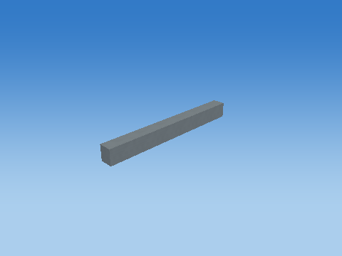 |
| Rotate Y |  |
| Rotate Z |  |
| Translate to world | 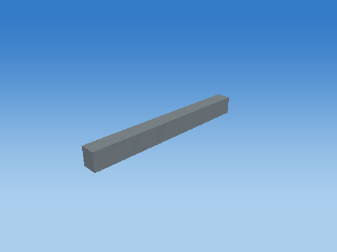 |

Steps 1–5 share one camera; the unit cube has its own close view, and step 6 is reframed at the actual world location to keep small objects visible. Reframing changes the view, never the model coordinates. Identity steps deliberately remain visible. Intermediate shapes are instructional states, while step 6 uses the unmodified game object.

Each stage below gives its exact numeric matrix and all eight corner multiplications. For each output row r: p'[r] = A[r,0]p.x + A[r,1]p.y + A[r,2]p.z + A[r,3]p.w.

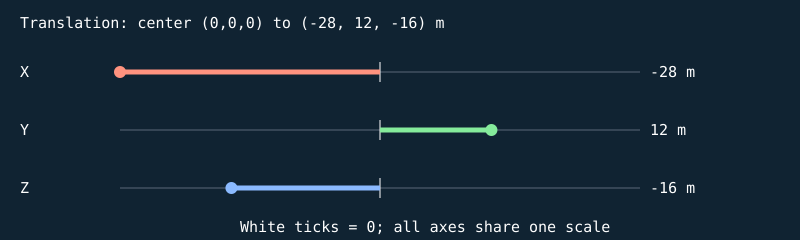


#### S

```text
[ 0.180000007 0 0 0 ]
[ 0 0.219999999 0 0 ]
[ 0 0 2.0999999 0 ]
[ 0 0 0 1 ]
```

| Input corner (w=1) | Output corner (w=1) |
| --- | --- |
| (-0.5, -0.5, -0.5) | (-0.0900000036, -0.109999999, -1.04999995) |
| (-0.5, -0.5, 0.5) | (-0.0900000036, -0.109999999, 1.04999995) |
| (-0.5, 0.5, -0.5) | (-0.0900000036, 0.109999999, -1.04999995) |
| (-0.5, 0.5, 0.5) | (-0.0900000036, 0.109999999, 1.04999995) |
| (0.5, -0.5, -0.5) | (0.0900000036, -0.109999999, -1.04999995) |
| (0.5, -0.5, 0.5) | (0.0900000036, -0.109999999, 1.04999995) |
| (0.5, 0.5, -0.5) | (0.0900000036, 0.109999999, -1.04999995) |
| (0.5, 0.5, 0.5) | (0.0900000036, 0.109999999, 1.04999995) |

#### H

```text
[ 1 0 0 0 ]
[ 0 1 0 0 ]
[ 0 0 1 0 ]
[ 0 0 0 1 ]
```

| Input corner (w=1) | Output corner (w=1) |
| --- | --- |
| (-0.0900000036, -0.109999999, -1.04999995) | (-0.0900000036, -0.109999999, -1.04999995) |
| (-0.0900000036, -0.109999999, 1.04999995) | (-0.0900000036, -0.109999999, 1.04999995) |
| (-0.0900000036, 0.109999999, -1.04999995) | (-0.0900000036, 0.109999999, -1.04999995) |
| (-0.0900000036, 0.109999999, 1.04999995) | (-0.0900000036, 0.109999999, 1.04999995) |
| (0.0900000036, -0.109999999, -1.04999995) | (0.0900000036, -0.109999999, -1.04999995) |
| (0.0900000036, -0.109999999, 1.04999995) | (0.0900000036, -0.109999999, 1.04999995) |
| (0.0900000036, 0.109999999, -1.04999995) | (0.0900000036, 0.109999999, -1.04999995) |
| (0.0900000036, 0.109999999, 1.04999995) | (0.0900000036, 0.109999999, 1.04999995) |

#### Rx

```text
[ 1 0 0 0 ]
[ 0 1 -0 0 ]
[ 0 0 1 0 ]
[ 0 0 0 1 ]
```

| Input corner (w=1) | Output corner (w=1) |
| --- | --- |
| (-0.0900000036, -0.109999999, -1.04999995) | (-0.0900000036, -0.109999999, -1.04999995) |
| (-0.0900000036, -0.109999999, 1.04999995) | (-0.0900000036, -0.109999999, 1.04999995) |
| (-0.0900000036, 0.109999999, -1.04999995) | (-0.0900000036, 0.109999999, -1.04999995) |
| (-0.0900000036, 0.109999999, 1.04999995) | (-0.0900000036, 0.109999999, 1.04999995) |
| (0.0900000036, -0.109999999, -1.04999995) | (0.0900000036, -0.109999999, -1.04999995) |
| (0.0900000036, -0.109999999, 1.04999995) | (0.0900000036, -0.109999999, 1.04999995) |
| (0.0900000036, 0.109999999, -1.04999995) | (0.0900000036, 0.109999999, -1.04999995) |
| (0.0900000036, 0.109999999, 1.04999995) | (0.0900000036, 0.109999999, 1.04999995) |

#### Ry

```text
[ 1 0 0 0 ]
[ 0 1 0 0 ]
[ -0 0 1 0 ]
[ 0 0 0 1 ]
```

| Input corner (w=1) | Output corner (w=1) |
| --- | --- |
| (-0.0900000036, -0.109999999, -1.04999995) | (-0.0900000036, -0.109999999, -1.04999995) |
| (-0.0900000036, -0.109999999, 1.04999995) | (-0.0900000036, -0.109999999, 1.04999995) |
| (-0.0900000036, 0.109999999, -1.04999995) | (-0.0900000036, 0.109999999, -1.04999995) |
| (-0.0900000036, 0.109999999, 1.04999995) | (-0.0900000036, 0.109999999, 1.04999995) |
| (0.0900000036, -0.109999999, -1.04999995) | (0.0900000036, -0.109999999, -1.04999995) |
| (0.0900000036, -0.109999999, 1.04999995) | (0.0900000036, -0.109999999, 1.04999995) |
| (0.0900000036, 0.109999999, -1.04999995) | (0.0900000036, 0.109999999, -1.04999995) |
| (0.0900000036, 0.109999999, 1.04999995) | (0.0900000036, 0.109999999, 1.04999995) |

#### Rz

```text
[ 1 -0 0 0 ]
[ 0 1 0 0 ]
[ 0 0 1 0 ]
[ 0 0 0 1 ]
```

| Input corner (w=1) | Output corner (w=1) |
| --- | --- |
| (-0.0900000036, -0.109999999, -1.04999995) | (-0.0900000036, -0.109999999, -1.04999995) |
| (-0.0900000036, -0.109999999, 1.04999995) | (-0.0900000036, -0.109999999, 1.04999995) |
| (-0.0900000036, 0.109999999, -1.04999995) | (-0.0900000036, 0.109999999, -1.04999995) |
| (-0.0900000036, 0.109999999, 1.04999995) | (-0.0900000036, 0.109999999, 1.04999995) |
| (0.0900000036, -0.109999999, -1.04999995) | (0.0900000036, -0.109999999, -1.04999995) |
| (0.0900000036, -0.109999999, 1.04999995) | (0.0900000036, -0.109999999, 1.04999995) |
| (0.0900000036, 0.109999999, -1.04999995) | (0.0900000036, 0.109999999, -1.04999995) |
| (0.0900000036, 0.109999999, 1.04999995) | (0.0900000036, 0.109999999, 1.04999995) |

#### T

```text
[ 1 0 0 -28 ]
[ 0 1 0 12 ]
[ 0 0 1 -16 ]
[ 0 0 0 1 ]
```

| Input corner (w=1) | Output corner (w=1) |
| --- | --- |
| (-0.0900000036, -0.109999999, -1.04999995) | (-28.0900002, 11.8900003, -17.0499992) |
| (-0.0900000036, -0.109999999, 1.04999995) | (-28.0900002, 11.8900003, -14.9499998) |
| (-0.0900000036, 0.109999999, -1.04999995) | (-28.0900002, 12.1099997, -17.0499992) |
| (-0.0900000036, 0.109999999, 1.04999995) | (-28.0900002, 12.1099997, -14.9499998) |
| (0.0900000036, -0.109999999, -1.04999995) | (-27.9099998, 11.8900003, -17.0499992) |
| (0.0900000036, -0.109999999, 1.04999995) | (-27.9099998, 11.8900003, -14.9499998) |
| (0.0900000036, 0.109999999, -1.04999995) | (-27.9099998, 12.1099997, -17.0499992) |
| (0.0900000036, 0.109999999, 1.04999995) | (-27.9099998, 12.1099997, -14.9499998) |

Final M = T Rz Ry Rx H S:

```text
[ 0.180000007 0 0 -28 ]
[ 0 0.219999999 0 12 ]
[ 0 0 2.0999999 -16 ]
[ 0 0 0 1 ]
```

### Floodlight housing — `FLOOD_1_HEAD_0`

Mounted arena fixture; lens and illumination share the same rig position

Position T = (-28, 12, -16) m; scale S = (0.850000024, 0.720000029, 0.319999993); rotation (Rx,Ry,Rz) = (19.4712219, 98.1300964, 0) degrees.

Shear (xy,xz,yx,yz,zx,zy) = (0, 0, 0, 0, 0, 0). Color = (0.189999998, 0.230000004, 0.270000011); specular = 0.449999988; shininess = 48; emission = 0; flash = 0; material layer = 5; texture scale = 3. Pattern enabled = 0, pattern scale = (1, 1, 1), offset = (0, 0, 0).

| Step | Actual renderer image |
| --- | --- |
| Unit cube |  |
| Scale |  |
| Shear |  |
| Rotate X |  |
| Rotate Y |  |
| Rotate Z | 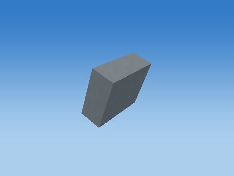 |
| Translate to world | 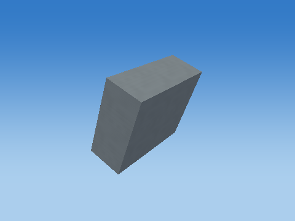 |

Steps 1–5 share one camera; the unit cube has its own close view, and step 6 is reframed at the actual world location to keep small objects visible. Reframing changes the view, never the model coordinates. Identity steps deliberately remain visible. Intermediate shapes are instructional states, while step 6 uses the unmodified game object.

Each stage below gives its exact numeric matrix and all eight corner multiplications. For each output row r: p'[r] = A[r,0]p.x + A[r,1]p.y + A[r,2]p.z + A[r,3]p.w.


#### S

```text
[ 0.850000024 0 0 0 ]
[ 0 0.720000029 0 0 ]
[ 0 0 0.319999993 0 ]
[ 0 0 0 1 ]
```

| Input corner (w=1) | Output corner (w=1) |
| --- | --- |
| (-0.5, -0.5, -0.5) | (-0.425000012, -0.360000014, -0.159999996) |
| (-0.5, -0.5, 0.5) | (-0.425000012, -0.360000014, 0.159999996) |
| (-0.5, 0.5, -0.5) | (-0.425000012, 0.360000014, -0.159999996) |
| (-0.5, 0.5, 0.5) | (-0.425000012, 0.360000014, 0.159999996) |
| (0.5, -0.5, -0.5) | (0.425000012, -0.360000014, -0.159999996) |
| (0.5, -0.5, 0.5) | (0.425000012, -0.360000014, 0.159999996) |
| (0.5, 0.5, -0.5) | (0.425000012, 0.360000014, -0.159999996) |
| (0.5, 0.5, 0.5) | (0.425000012, 0.360000014, 0.159999996) |

#### H

```text
[ 1 0 0 0 ]
[ 0 1 0 0 ]
[ 0 0 1 0 ]
[ 0 0 0 1 ]
```

| Input corner (w=1) | Output corner (w=1) |
| --- | --- |
| (-0.425000012, -0.360000014, -0.159999996) | (-0.425000012, -0.360000014, -0.159999996) |
| (-0.425000012, -0.360000014, 0.159999996) | (-0.425000012, -0.360000014, 0.159999996) |
| (-0.425000012, 0.360000014, -0.159999996) | (-0.425000012, 0.360000014, -0.159999996) |
| (-0.425000012, 0.360000014, 0.159999996) | (-0.425000012, 0.360000014, 0.159999996) |
| (0.425000012, -0.360000014, -0.159999996) | (0.425000012, -0.360000014, -0.159999996) |
| (0.425000012, -0.360000014, 0.159999996) | (0.425000012, -0.360000014, 0.159999996) |
| (0.425000012, 0.360000014, -0.159999996) | (0.425000012, 0.360000014, -0.159999996) |
| (0.425000012, 0.360000014, 0.159999996) | (0.425000012, 0.360000014, 0.159999996) |

#### Rx

```text
[ 1 0 0 0 ]
[ 0 0.942809045 -0.333333373 0 ]
[ 0 0.333333373 0.942809045 0 ]
[ 0 0 0 1 ]
```

| Input corner (w=1) | Output corner (w=1) |
| --- | --- |
| (-0.425000012, -0.360000014, -0.159999996) | (-0.425000012, -0.286077917, -0.270849466) |
| (-0.425000012, -0.360000014, 0.159999996) | (-0.425000012, -0.392744601, 0.030849427) |
| (-0.425000012, 0.360000014, -0.159999996) | (-0.425000012, 0.392744601, -0.030849427) |
| (-0.425000012, 0.360000014, 0.159999996) | (-0.425000012, 0.286077917, 0.270849466) |
| (0.425000012, -0.360000014, -0.159999996) | (0.425000012, -0.286077917, -0.270849466) |
| (0.425000012, -0.360000014, 0.159999996) | (0.425000012, -0.392744601, 0.030849427) |
| (0.425000012, 0.360000014, -0.159999996) | (0.425000012, 0.392744601, -0.030849427) |
| (0.425000012, 0.360000014, 0.159999996) | (0.425000012, 0.286077917, 0.270849466) |

#### Ry

```text
[ -0.141421303 0 0.989949524 0 ]
[ 0 1 0 0 ]
[ -0.989949524 0 -0.141421303 0 ]
[ 0 0 0 1 ]
```

| Input corner (w=1) | Output corner (w=1) |
| --- | --- |
| (-0.425000012, -0.286077917, -0.270849466) | (-0.208023235, -0.286077917, 0.459032446) |
| (-0.425000012, -0.392744601, 0.030849427) | (0.0906434357, -0.392744601, 0.416365802) |
| (-0.425000012, 0.392744601, -0.030849427) | (0.0295646824, 0.392744601, 0.425091326) |
| (-0.425000012, 0.286077917, 0.270849466) | (0.328231335, 0.286077917, 0.382424682) |
| (0.425000012, -0.286077917, -0.270849466) | (-0.328231335, -0.286077917, -0.382424682) |
| (0.425000012, -0.392744601, 0.030849427) | (-0.0295646824, -0.392744601, -0.425091326) |
| (0.425000012, 0.392744601, -0.030849427) | (-0.0906434357, 0.392744601, -0.416365802) |
| (0.425000012, 0.286077917, 0.270849466) | (0.208023235, 0.286077917, -0.459032446) |

#### Rz

```text
[ 1 -0 0 0 ]
[ 0 1 0 0 ]
[ 0 0 1 0 ]
[ 0 0 0 1 ]
```

| Input corner (w=1) | Output corner (w=1) |
| --- | --- |
| (-0.208023235, -0.286077917, 0.459032446) | (-0.208023235, -0.286077917, 0.459032446) |
| (0.0906434357, -0.392744601, 0.416365802) | (0.0906434357, -0.392744601, 0.416365802) |
| (0.0295646824, 0.392744601, 0.425091326) | (0.0295646824, 0.392744601, 0.425091326) |
| (0.328231335, 0.286077917, 0.382424682) | (0.328231335, 0.286077917, 0.382424682) |
| (-0.328231335, -0.286077917, -0.382424682) | (-0.328231335, -0.286077917, -0.382424682) |
| (-0.0295646824, -0.392744601, -0.425091326) | (-0.0295646824, -0.392744601, -0.425091326) |
| (-0.0906434357, 0.392744601, -0.416365802) | (-0.0906434357, 0.392744601, -0.416365802) |
| (0.208023235, 0.286077917, -0.459032446) | (0.208023235, 0.286077917, -0.459032446) |

#### T

```text
[ 1 0 0 -28 ]
[ 0 1 0 12 ]
[ 0 0 1 -16 ]
[ 0 0 0 1 ]
```

| Input corner (w=1) | Output corner (w=1) |
| --- | --- |
| (-0.208023235, -0.286077917, 0.459032446) | (-28.2080231, 11.7139225, -15.5409679) |
| (0.0906434357, -0.392744601, 0.416365802) | (-27.9093571, 11.607255, -15.5836344) |
| (0.0295646824, 0.392744601, 0.425091326) | (-27.9704361, 12.392745, -15.5749083) |
| (0.328231335, 0.286077917, 0.382424682) | (-27.6717682, 12.2860775, -15.6175756) |
| (-0.328231335, -0.286077917, -0.382424682) | (-28.3282318, 11.7139225, -16.3824253) |
| (-0.0295646824, -0.392744601, -0.425091326) | (-28.0295639, 11.607255, -16.4250908) |
| (-0.0906434357, 0.392744601, -0.416365802) | (-28.0906429, 12.392745, -16.4163666) |
| (0.208023235, 0.286077917, -0.459032446) | (-27.7919769, 12.2860775, -16.4590321) |

Final M = T Rz Ry Rx H S:

```text
[ -0.120208114 0.237587929 0.298666686 -28 ]
[ 0 0.678822517 -0.106666677 12 ]
[ -0.841457129 -0.0339411199 -0.0426666513 -16 ]
[ 0 0 0 1 ]
```

### Lens — `FLOOD_1_LENS_0`

Mounted arena fixture; lens and illumination share the same rig position

Position T = (-27.8320007, 11.9399996, -16.0240002) m; scale S = (0.730000019, 0.600000024, 0.0350000001); rotation (Rx,Ry,Rz) = (19.4712219, 98.1300964, 0) degrees.

Shear (xy,xz,yx,yz,zx,zy) = (0, 0, 0, 0, 0, 0). Color = (0.219999999, 0.25, 0.280000001); specular = 0.449999988; shininess = 48; emission = 0; flash = 0; material layer = 5; texture scale = 3. Pattern enabled = 0, pattern scale = (1, 1, 1), offset = (0, 0, 0).

| Step | Actual renderer image |
| --- | --- |
| Unit cube |  |
| Scale | 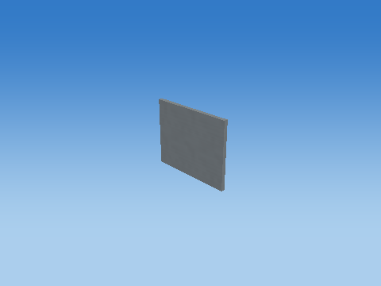 |
| Shear |  |
| Rotate X | 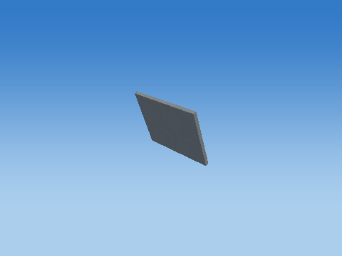 |
| Rotate Y |  |
| Rotate Z |  |
| Translate to world |  |

Steps 1–5 share one camera; the unit cube has its own close view, and step 6 is reframed at the actual world location to keep small objects visible. Reframing changes the view, never the model coordinates. Identity steps deliberately remain visible. Intermediate shapes are instructional states, while step 6 uses the unmodified game object.

Each stage below gives its exact numeric matrix and all eight corner multiplications. For each output row r: p'[r] = A[r,0]p.x + A[r,1]p.y + A[r,2]p.z + A[r,3]p.w.


#### S

```text
[ 0.730000019 0 0 0 ]
[ 0 0.600000024 0 0 ]
[ 0 0 0.0350000001 0 ]
[ 0 0 0 1 ]
```

| Input corner (w=1) | Output corner (w=1) |
| --- | --- |
| (-0.5, -0.5, -0.5) | (-0.36500001, -0.300000012, -0.0175000001) |
| (-0.5, -0.5, 0.5) | (-0.36500001, -0.300000012, 0.0175000001) |
| (-0.5, 0.5, -0.5) | (-0.36500001, 0.300000012, -0.0175000001) |
| (-0.5, 0.5, 0.5) | (-0.36500001, 0.300000012, 0.0175000001) |
| (0.5, -0.5, -0.5) | (0.36500001, -0.300000012, -0.0175000001) |
| (0.5, -0.5, 0.5) | (0.36500001, -0.300000012, 0.0175000001) |
| (0.5, 0.5, -0.5) | (0.36500001, 0.300000012, -0.0175000001) |
| (0.5, 0.5, 0.5) | (0.36500001, 0.300000012, 0.0175000001) |

#### H

```text
[ 1 0 0 0 ]
[ 0 1 0 0 ]
[ 0 0 1 0 ]
[ 0 0 0 1 ]
```

| Input corner (w=1) | Output corner (w=1) |
| --- | --- |
| (-0.36500001, -0.300000012, -0.0175000001) | (-0.36500001, -0.300000012, -0.0175000001) |
| (-0.36500001, -0.300000012, 0.0175000001) | (-0.36500001, -0.300000012, 0.0175000001) |
| (-0.36500001, 0.300000012, -0.0175000001) | (-0.36500001, 0.300000012, -0.0175000001) |
| (-0.36500001, 0.300000012, 0.0175000001) | (-0.36500001, 0.300000012, 0.0175000001) |
| (0.36500001, -0.300000012, -0.0175000001) | (0.36500001, -0.300000012, -0.0175000001) |
| (0.36500001, -0.300000012, 0.0175000001) | (0.36500001, -0.300000012, 0.0175000001) |
| (0.36500001, 0.300000012, -0.0175000001) | (0.36500001, 0.300000012, -0.0175000001) |
| (0.36500001, 0.300000012, 0.0175000001) | (0.36500001, 0.300000012, 0.0175000001) |

#### Rx

```text
[ 1 0 0 0 ]
[ 0 0.942809045 -0.333333373 0 ]
[ 0 0.333333373 0.942809045 0 ]
[ 0 0 0 1 ]
```

| Input corner (w=1) | Output corner (w=1) |
| --- | --- |
| (-0.36500001, -0.300000012, -0.0175000001) | (-0.36500001, -0.277009398, -0.116499171) |
| (-0.36500001, -0.300000012, 0.0175000001) | (-0.36500001, -0.288676053, -0.0835008621) |
| (-0.36500001, 0.300000012, -0.0175000001) | (-0.36500001, 0.288676053, 0.0835008621) |
| (-0.36500001, 0.300000012, 0.0175000001) | (-0.36500001, 0.277009398, 0.116499171) |
| (0.36500001, -0.300000012, -0.0175000001) | (0.36500001, -0.277009398, -0.116499171) |
| (0.36500001, -0.300000012, 0.0175000001) | (0.36500001, -0.288676053, -0.0835008621) |
| (0.36500001, 0.300000012, -0.0175000001) | (0.36500001, 0.288676053, 0.0835008621) |
| (0.36500001, 0.300000012, 0.0175000001) | (0.36500001, 0.277009398, 0.116499171) |

#### Ry

```text
[ -0.141421303 0 0.989949524 0 ]
[ 0 1 0 0 ]
[ -0.989949524 0 -0.141421303 0 ]
[ 0 0 0 1 ]
```

| Input corner (w=1) | Output corner (w=1) |
| --- | --- |
| (-0.36500001, -0.277009398, -0.116499171) | (-0.0637095198, -0.277009398, 0.377807051) |
| (-0.36500001, -0.288676053, -0.0835008621) | (-0.031042859, -0.288676053, 0.373140395) |
| (-0.36500001, 0.288676053, 0.0835008621) | (0.134280413, 0.288676053, 0.349522769) |
| (-0.36500001, 0.277009398, 0.116499171) | (0.166947067, 0.277009398, 0.344856113) |
| (0.36500001, -0.277009398, -0.116499171) | (-0.166947067, -0.277009398, -0.344856113) |
| (0.36500001, -0.288676053, -0.0835008621) | (-0.134280413, -0.288676053, -0.349522769) |
| (0.36500001, 0.288676053, 0.0835008621) | (0.031042859, 0.288676053, -0.373140395) |
| (0.36500001, 0.277009398, 0.116499171) | (0.0637095198, 0.277009398, -0.377807051) |

#### Rz

```text
[ 1 -0 0 0 ]
[ 0 1 0 0 ]
[ 0 0 1 0 ]
[ 0 0 0 1 ]
```

| Input corner (w=1) | Output corner (w=1) |
| --- | --- |
| (-0.0637095198, -0.277009398, 0.377807051) | (-0.0637095198, -0.277009398, 0.377807051) |
| (-0.031042859, -0.288676053, 0.373140395) | (-0.031042859, -0.288676053, 0.373140395) |
| (0.134280413, 0.288676053, 0.349522769) | (0.134280413, 0.288676053, 0.349522769) |
| (0.166947067, 0.277009398, 0.344856113) | (0.166947067, 0.277009398, 0.344856113) |
| (-0.166947067, -0.277009398, -0.344856113) | (-0.166947067, -0.277009398, -0.344856113) |
| (-0.134280413, -0.288676053, -0.349522769) | (-0.134280413, -0.288676053, -0.349522769) |
| (0.031042859, 0.288676053, -0.373140395) | (0.031042859, 0.288676053, -0.373140395) |
| (0.0637095198, 0.277009398, -0.377807051) | (0.0637095198, 0.277009398, -0.377807051) |

#### T

```text
[ 1 0 0 -27.8320007 ]
[ 0 1 0 11.9399996 ]
[ 0 0 1 -16.0240002 ]
[ 0 0 0 1 ]
```

| Input corner (w=1) | Output corner (w=1) |
| --- | --- |
| (-0.0637095198, -0.277009398, 0.377807051) | (-27.89571, 11.6629906, -15.6461935) |
| (-0.031042859, -0.288676053, 0.373140395) | (-27.8630428, 11.6513233, -15.6508598) |
| (0.134280413, 0.288676053, 0.349522769) | (-27.6977196, 12.2286758, -15.6744776) |
| (0.166947067, 0.277009398, 0.344856113) | (-27.6650543, 12.2170086, -15.6791439) |
| (-0.166947067, -0.277009398, -0.344856113) | (-27.9989471, 11.6629906, -16.3688564) |
| (-0.134280413, -0.288676053, -0.349522769) | (-27.9662819, 11.6513233, -16.3735237) |
| (0.031042859, 0.288676053, -0.373140395) | (-27.8009586, 12.2286758, -16.3971405) |
| (0.0637095198, 0.277009398, -0.377807051) | (-27.7682915, 12.2170086, -16.4018078) |

Final M = T Rz Ry Rx H S:

```text
[ -0.103237554 0.197989941 0.0326666683 -27.8320007 ]
[ 0 0.565685451 -0.0116666676 11.9399996 ]
[ -0.722663164 -0.0282842647 -0.00466666464 -16.0240002 ]
[ 0 0 0 1 ]
```

### Head support — `FLOOD_1_BRACKET_1`

Mounted arena fixture; lens and illumination share the same rig position

Position T = (-28, 12, -15.5249996) m; scale S = (0.180000007, 0.219999999, 2.0999999); rotation (Rx,Ry,Rz) = (0, 0, 0) degrees.

Shear (xy,xz,yx,yz,zx,zy) = (0, 0, 0, 0, 0, 0). Color = (0.189999998, 0.230000004, 0.270000011); specular = 0.449999988; shininess = 48; emission = 0; flash = 0; material layer = 5; texture scale = 3. Pattern enabled = 0, pattern scale = (1, 1, 1), offset = (0, 0, 0).

| Step | Actual renderer image |
| --- | --- |
| Unit cube |  |
| Scale |  |
| Shear |  |
| Rotate X |  |
| Rotate Y |  |
| Rotate Z |  |
| Translate to world |  |

Steps 1–5 share one camera; the unit cube has its own close view, and step 6 is reframed at the actual world location to keep small objects visible. Reframing changes the view, never the model coordinates. Identity steps deliberately remain visible. Intermediate shapes are instructional states, while step 6 uses the unmodified game object.

Each stage below gives its exact numeric matrix and all eight corner multiplications. For each output row r: p'[r] = A[r,0]p.x + A[r,1]p.y + A[r,2]p.z + A[r,3]p.w.


#### S

```text
[ 0.180000007 0 0 0 ]
[ 0 0.219999999 0 0 ]
[ 0 0 2.0999999 0 ]
[ 0 0 0 1 ]
```

| Input corner (w=1) | Output corner (w=1) |
| --- | --- |
| (-0.5, -0.5, -0.5) | (-0.0900000036, -0.109999999, -1.04999995) |
| (-0.5, -0.5, 0.5) | (-0.0900000036, -0.109999999, 1.04999995) |
| (-0.5, 0.5, -0.5) | (-0.0900000036, 0.109999999, -1.04999995) |
| (-0.5, 0.5, 0.5) | (-0.0900000036, 0.109999999, 1.04999995) |
| (0.5, -0.5, -0.5) | (0.0900000036, -0.109999999, -1.04999995) |
| (0.5, -0.5, 0.5) | (0.0900000036, -0.109999999, 1.04999995) |
| (0.5, 0.5, -0.5) | (0.0900000036, 0.109999999, -1.04999995) |
| (0.5, 0.5, 0.5) | (0.0900000036, 0.109999999, 1.04999995) |

#### H

```text
[ 1 0 0 0 ]
[ 0 1 0 0 ]
[ 0 0 1 0 ]
[ 0 0 0 1 ]
```

| Input corner (w=1) | Output corner (w=1) |
| --- | --- |
| (-0.0900000036, -0.109999999, -1.04999995) | (-0.0900000036, -0.109999999, -1.04999995) |
| (-0.0900000036, -0.109999999, 1.04999995) | (-0.0900000036, -0.109999999, 1.04999995) |
| (-0.0900000036, 0.109999999, -1.04999995) | (-0.0900000036, 0.109999999, -1.04999995) |
| (-0.0900000036, 0.109999999, 1.04999995) | (-0.0900000036, 0.109999999, 1.04999995) |
| (0.0900000036, -0.109999999, -1.04999995) | (0.0900000036, -0.109999999, -1.04999995) |
| (0.0900000036, -0.109999999, 1.04999995) | (0.0900000036, -0.109999999, 1.04999995) |
| (0.0900000036, 0.109999999, -1.04999995) | (0.0900000036, 0.109999999, -1.04999995) |
| (0.0900000036, 0.109999999, 1.04999995) | (0.0900000036, 0.109999999, 1.04999995) |

#### Rx

```text
[ 1 0 0 0 ]
[ 0 1 -0 0 ]
[ 0 0 1 0 ]
[ 0 0 0 1 ]
```

| Input corner (w=1) | Output corner (w=1) |
| --- | --- |
| (-0.0900000036, -0.109999999, -1.04999995) | (-0.0900000036, -0.109999999, -1.04999995) |
| (-0.0900000036, -0.109999999, 1.04999995) | (-0.0900000036, -0.109999999, 1.04999995) |
| (-0.0900000036, 0.109999999, -1.04999995) | (-0.0900000036, 0.109999999, -1.04999995) |
| (-0.0900000036, 0.109999999, 1.04999995) | (-0.0900000036, 0.109999999, 1.04999995) |
| (0.0900000036, -0.109999999, -1.04999995) | (0.0900000036, -0.109999999, -1.04999995) |
| (0.0900000036, -0.109999999, 1.04999995) | (0.0900000036, -0.109999999, 1.04999995) |
| (0.0900000036, 0.109999999, -1.04999995) | (0.0900000036, 0.109999999, -1.04999995) |
| (0.0900000036, 0.109999999, 1.04999995) | (0.0900000036, 0.109999999, 1.04999995) |

#### Ry

```text
[ 1 0 0 0 ]
[ 0 1 0 0 ]
[ -0 0 1 0 ]
[ 0 0 0 1 ]
```

| Input corner (w=1) | Output corner (w=1) |
| --- | --- |
| (-0.0900000036, -0.109999999, -1.04999995) | (-0.0900000036, -0.109999999, -1.04999995) |
| (-0.0900000036, -0.109999999, 1.04999995) | (-0.0900000036, -0.109999999, 1.04999995) |
| (-0.0900000036, 0.109999999, -1.04999995) | (-0.0900000036, 0.109999999, -1.04999995) |
| (-0.0900000036, 0.109999999, 1.04999995) | (-0.0900000036, 0.109999999, 1.04999995) |
| (0.0900000036, -0.109999999, -1.04999995) | (0.0900000036, -0.109999999, -1.04999995) |
| (0.0900000036, -0.109999999, 1.04999995) | (0.0900000036, -0.109999999, 1.04999995) |
| (0.0900000036, 0.109999999, -1.04999995) | (0.0900000036, 0.109999999, -1.04999995) |
| (0.0900000036, 0.109999999, 1.04999995) | (0.0900000036, 0.109999999, 1.04999995) |

#### Rz

```text
[ 1 -0 0 0 ]
[ 0 1 0 0 ]
[ 0 0 1 0 ]
[ 0 0 0 1 ]
```

| Input corner (w=1) | Output corner (w=1) |
| --- | --- |
| (-0.0900000036, -0.109999999, -1.04999995) | (-0.0900000036, -0.109999999, -1.04999995) |
| (-0.0900000036, -0.109999999, 1.04999995) | (-0.0900000036, -0.109999999, 1.04999995) |
| (-0.0900000036, 0.109999999, -1.04999995) | (-0.0900000036, 0.109999999, -1.04999995) |
| (-0.0900000036, 0.109999999, 1.04999995) | (-0.0900000036, 0.109999999, 1.04999995) |
| (0.0900000036, -0.109999999, -1.04999995) | (0.0900000036, -0.109999999, -1.04999995) |
| (0.0900000036, -0.109999999, 1.04999995) | (0.0900000036, -0.109999999, 1.04999995) |
| (0.0900000036, 0.109999999, -1.04999995) | (0.0900000036, 0.109999999, -1.04999995) |
| (0.0900000036, 0.109999999, 1.04999995) | (0.0900000036, 0.109999999, 1.04999995) |

#### T

```text
[ 1 0 0 -28 ]
[ 0 1 0 12 ]
[ 0 0 1 -15.5249996 ]
[ 0 0 0 1 ]
```

| Input corner (w=1) | Output corner (w=1) |
| --- | --- |
| (-0.0900000036, -0.109999999, -1.04999995) | (-28.0900002, 11.8900003, -16.5749989) |
| (-0.0900000036, -0.109999999, 1.04999995) | (-28.0900002, 11.8900003, -14.4749994) |
| (-0.0900000036, 0.109999999, -1.04999995) | (-28.0900002, 12.1099997, -16.5749989) |
| (-0.0900000036, 0.109999999, 1.04999995) | (-28.0900002, 12.1099997, -14.4749994) |
| (0.0900000036, -0.109999999, -1.04999995) | (-27.9099998, 11.8900003, -16.5749989) |
| (0.0900000036, -0.109999999, 1.04999995) | (-27.9099998, 11.8900003, -14.4749994) |
| (0.0900000036, 0.109999999, -1.04999995) | (-27.9099998, 12.1099997, -16.5749989) |
| (0.0900000036, 0.109999999, 1.04999995) | (-27.9099998, 12.1099997, -14.4749994) |

Final M = T Rz Ry Rx H S:

```text
[ 0.180000007 0 0 -28 ]
[ 0 0.219999999 0 12 ]
[ 0 0 2.0999999 -15.5249996 ]
[ 0 0 0 1 ]
```

### Floodlight housing — `FLOOD_1_HEAD_1`

Mounted arena fixture; lens and illumination share the same rig position

Position T = (-28, 12, -15.0500002) m; scale S = (0.850000024, 0.720000029, 0.319999993); rotation (Rx,Ry,Rz) = (19.4712219, 98.1300964, 0) degrees.

Shear (xy,xz,yx,yz,zx,zy) = (0, 0, 0, 0, 0, 0). Color = (0.189999998, 0.230000004, 0.270000011); specular = 0.449999988; shininess = 48; emission = 0; flash = 0; material layer = 5; texture scale = 3. Pattern enabled = 0, pattern scale = (1, 1, 1), offset = (0, 0, 0).

| Step | Actual renderer image |
| --- | --- |
| Unit cube |  |
| Scale |  |
| Shear |  |
| Rotate X |  |
| Rotate Y |  |
| Rotate Z |  |
| Translate to world |  |

Steps 1–5 share one camera; the unit cube has its own close view, and step 6 is reframed at the actual world location to keep small objects visible. Reframing changes the view, never the model coordinates. Identity steps deliberately remain visible. Intermediate shapes are instructional states, while step 6 uses the unmodified game object.

Each stage below gives its exact numeric matrix and all eight corner multiplications. For each output row r: p'[r] = A[r,0]p.x + A[r,1]p.y + A[r,2]p.z + A[r,3]p.w.

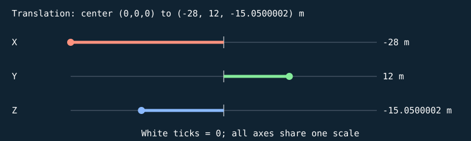


#### S

```text
[ 0.850000024 0 0 0 ]
[ 0 0.720000029 0 0 ]
[ 0 0 0.319999993 0 ]
[ 0 0 0 1 ]
```

| Input corner (w=1) | Output corner (w=1) |
| --- | --- |
| (-0.5, -0.5, -0.5) | (-0.425000012, -0.360000014, -0.159999996) |
| (-0.5, -0.5, 0.5) | (-0.425000012, -0.360000014, 0.159999996) |
| (-0.5, 0.5, -0.5) | (-0.425000012, 0.360000014, -0.159999996) |
| (-0.5, 0.5, 0.5) | (-0.425000012, 0.360000014, 0.159999996) |
| (0.5, -0.5, -0.5) | (0.425000012, -0.360000014, -0.159999996) |
| (0.5, -0.5, 0.5) | (0.425000012, -0.360000014, 0.159999996) |
| (0.5, 0.5, -0.5) | (0.425000012, 0.360000014, -0.159999996) |
| (0.5, 0.5, 0.5) | (0.425000012, 0.360000014, 0.159999996) |

#### H

```text
[ 1 0 0 0 ]
[ 0 1 0 0 ]
[ 0 0 1 0 ]
[ 0 0 0 1 ]
```

| Input corner (w=1) | Output corner (w=1) |
| --- | --- |
| (-0.425000012, -0.360000014, -0.159999996) | (-0.425000012, -0.360000014, -0.159999996) |
| (-0.425000012, -0.360000014, 0.159999996) | (-0.425000012, -0.360000014, 0.159999996) |
| (-0.425000012, 0.360000014, -0.159999996) | (-0.425000012, 0.360000014, -0.159999996) |
| (-0.425000012, 0.360000014, 0.159999996) | (-0.425000012, 0.360000014, 0.159999996) |
| (0.425000012, -0.360000014, -0.159999996) | (0.425000012, -0.360000014, -0.159999996) |
| (0.425000012, -0.360000014, 0.159999996) | (0.425000012, -0.360000014, 0.159999996) |
| (0.425000012, 0.360000014, -0.159999996) | (0.425000012, 0.360000014, -0.159999996) |
| (0.425000012, 0.360000014, 0.159999996) | (0.425000012, 0.360000014, 0.159999996) |

#### Rx

```text
[ 1 0 0 0 ]
[ 0 0.942809045 -0.333333373 0 ]
[ 0 0.333333373 0.942809045 0 ]
[ 0 0 0 1 ]
```

| Input corner (w=1) | Output corner (w=1) |
| --- | --- |
| (-0.425000012, -0.360000014, -0.159999996) | (-0.425000012, -0.286077917, -0.270849466) |
| (-0.425000012, -0.360000014, 0.159999996) | (-0.425000012, -0.392744601, 0.030849427) |
| (-0.425000012, 0.360000014, -0.159999996) | (-0.425000012, 0.392744601, -0.030849427) |
| (-0.425000012, 0.360000014, 0.159999996) | (-0.425000012, 0.286077917, 0.270849466) |
| (0.425000012, -0.360000014, -0.159999996) | (0.425000012, -0.286077917, -0.270849466) |
| (0.425000012, -0.360000014, 0.159999996) | (0.425000012, -0.392744601, 0.030849427) |
| (0.425000012, 0.360000014, -0.159999996) | (0.425000012, 0.392744601, -0.030849427) |
| (0.425000012, 0.360000014, 0.159999996) | (0.425000012, 0.286077917, 0.270849466) |

#### Ry

```text
[ -0.141421303 0 0.989949524 0 ]
[ 0 1 0 0 ]
[ -0.989949524 0 -0.141421303 0 ]
[ 0 0 0 1 ]
```

| Input corner (w=1) | Output corner (w=1) |
| --- | --- |
| (-0.425000012, -0.286077917, -0.270849466) | (-0.208023235, -0.286077917, 0.459032446) |
| (-0.425000012, -0.392744601, 0.030849427) | (0.0906434357, -0.392744601, 0.416365802) |
| (-0.425000012, 0.392744601, -0.030849427) | (0.0295646824, 0.392744601, 0.425091326) |
| (-0.425000012, 0.286077917, 0.270849466) | (0.328231335, 0.286077917, 0.382424682) |
| (0.425000012, -0.286077917, -0.270849466) | (-0.328231335, -0.286077917, -0.382424682) |
| (0.425000012, -0.392744601, 0.030849427) | (-0.0295646824, -0.392744601, -0.425091326) |
| (0.425000012, 0.392744601, -0.030849427) | (-0.0906434357, 0.392744601, -0.416365802) |
| (0.425000012, 0.286077917, 0.270849466) | (0.208023235, 0.286077917, -0.459032446) |

#### Rz

```text
[ 1 -0 0 0 ]
[ 0 1 0 0 ]
[ 0 0 1 0 ]
[ 0 0 0 1 ]
```

| Input corner (w=1) | Output corner (w=1) |
| --- | --- |
| (-0.208023235, -0.286077917, 0.459032446) | (-0.208023235, -0.286077917, 0.459032446) |
| (0.0906434357, -0.392744601, 0.416365802) | (0.0906434357, -0.392744601, 0.416365802) |
| (0.0295646824, 0.392744601, 0.425091326) | (0.0295646824, 0.392744601, 0.425091326) |
| (0.328231335, 0.286077917, 0.382424682) | (0.328231335, 0.286077917, 0.382424682) |
| (-0.328231335, -0.286077917, -0.382424682) | (-0.328231335, -0.286077917, -0.382424682) |
| (-0.0295646824, -0.392744601, -0.425091326) | (-0.0295646824, -0.392744601, -0.425091326) |
| (-0.0906434357, 0.392744601, -0.416365802) | (-0.0906434357, 0.392744601, -0.416365802) |
| (0.208023235, 0.286077917, -0.459032446) | (0.208023235, 0.286077917, -0.459032446) |

#### T

```text
[ 1 0 0 -28 ]
[ 0 1 0 12 ]
[ 0 0 1 -15.0500002 ]
[ 0 0 0 1 ]
```

| Input corner (w=1) | Output corner (w=1) |
| --- | --- |
| (-0.208023235, -0.286077917, 0.459032446) | (-28.2080231, 11.7139225, -14.5909681) |
| (0.0906434357, -0.392744601, 0.416365802) | (-27.9093571, 11.607255, -14.6336346) |
| (0.0295646824, 0.392744601, 0.425091326) | (-27.9704361, 12.392745, -14.6249084) |
| (0.328231335, 0.286077917, 0.382424682) | (-27.6717682, 12.2860775, -14.6675758) |
| (-0.328231335, -0.286077917, -0.382424682) | (-28.3282318, 11.7139225, -15.4324245) |
| (-0.0295646824, -0.392744601, -0.425091326) | (-28.0295639, 11.607255, -15.4750919) |
| (-0.0906434357, 0.392744601, -0.416365802) | (-28.0906429, 12.392745, -15.4663658) |
| (0.208023235, 0.286077917, -0.459032446) | (-27.7919769, 12.2860775, -15.5090322) |

Final M = T Rz Ry Rx H S:

```text
[ -0.120208114 0.237587929 0.298666686 -28 ]
[ 0 0.678822517 -0.106666677 12 ]
[ -0.841457129 -0.0339411199 -0.0426666513 -15.0500002 ]
[ 0 0 0 1 ]
```

### Lens — `FLOOD_1_LENS_1`

Mounted arena fixture; lens and illumination share the same rig position

Position T = (-27.8320007, 11.9399996, -15.0740004) m; scale S = (0.730000019, 0.600000024, 0.0350000001); rotation (Rx,Ry,Rz) = (19.4712219, 98.1300964, 0) degrees.

Shear (xy,xz,yx,yz,zx,zy) = (0, 0, 0, 0, 0, 0). Color = (0.219999999, 0.25, 0.280000001); specular = 0.449999988; shininess = 48; emission = 0; flash = 0; material layer = 5; texture scale = 3. Pattern enabled = 0, pattern scale = (1, 1, 1), offset = (0, 0, 0).

| Step | Actual renderer image |
| --- | --- |
| Unit cube |  |
| Scale |  |
| Shear |  |
| Rotate X |  |
| Rotate Y |  |
| Rotate Z |  |
| Translate to world |  |

Steps 1–5 share one camera; the unit cube has its own close view, and step 6 is reframed at the actual world location to keep small objects visible. Reframing changes the view, never the model coordinates. Identity steps deliberately remain visible. Intermediate shapes are instructional states, while step 6 uses the unmodified game object.

Each stage below gives its exact numeric matrix and all eight corner multiplications. For each output row r: p'[r] = A[r,0]p.x + A[r,1]p.y + A[r,2]p.z + A[r,3]p.w.

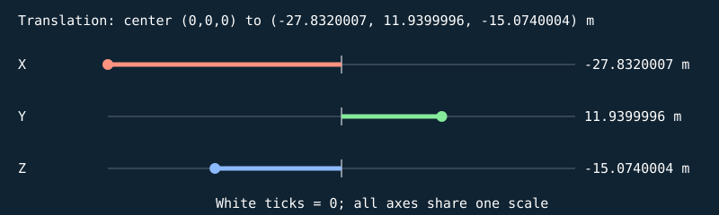


#### S

```text
[ 0.730000019 0 0 0 ]
[ 0 0.600000024 0 0 ]
[ 0 0 0.0350000001 0 ]
[ 0 0 0 1 ]
```

| Input corner (w=1) | Output corner (w=1) |
| --- | --- |
| (-0.5, -0.5, -0.5) | (-0.36500001, -0.300000012, -0.0175000001) |
| (-0.5, -0.5, 0.5) | (-0.36500001, -0.300000012, 0.0175000001) |
| (-0.5, 0.5, -0.5) | (-0.36500001, 0.300000012, -0.0175000001) |
| (-0.5, 0.5, 0.5) | (-0.36500001, 0.300000012, 0.0175000001) |
| (0.5, -0.5, -0.5) | (0.36500001, -0.300000012, -0.0175000001) |
| (0.5, -0.5, 0.5) | (0.36500001, -0.300000012, 0.0175000001) |
| (0.5, 0.5, -0.5) | (0.36500001, 0.300000012, -0.0175000001) |
| (0.5, 0.5, 0.5) | (0.36500001, 0.300000012, 0.0175000001) |

#### H

```text
[ 1 0 0 0 ]
[ 0 1 0 0 ]
[ 0 0 1 0 ]
[ 0 0 0 1 ]
```

| Input corner (w=1) | Output corner (w=1) |
| --- | --- |
| (-0.36500001, -0.300000012, -0.0175000001) | (-0.36500001, -0.300000012, -0.0175000001) |
| (-0.36500001, -0.300000012, 0.0175000001) | (-0.36500001, -0.300000012, 0.0175000001) |
| (-0.36500001, 0.300000012, -0.0175000001) | (-0.36500001, 0.300000012, -0.0175000001) |
| (-0.36500001, 0.300000012, 0.0175000001) | (-0.36500001, 0.300000012, 0.0175000001) |
| (0.36500001, -0.300000012, -0.0175000001) | (0.36500001, -0.300000012, -0.0175000001) |
| (0.36500001, -0.300000012, 0.0175000001) | (0.36500001, -0.300000012, 0.0175000001) |
| (0.36500001, 0.300000012, -0.0175000001) | (0.36500001, 0.300000012, -0.0175000001) |
| (0.36500001, 0.300000012, 0.0175000001) | (0.36500001, 0.300000012, 0.0175000001) |

#### Rx

```text
[ 1 0 0 0 ]
[ 0 0.942809045 -0.333333373 0 ]
[ 0 0.333333373 0.942809045 0 ]
[ 0 0 0 1 ]
```

| Input corner (w=1) | Output corner (w=1) |
| --- | --- |
| (-0.36500001, -0.300000012, -0.0175000001) | (-0.36500001, -0.277009398, -0.116499171) |
| (-0.36500001, -0.300000012, 0.0175000001) | (-0.36500001, -0.288676053, -0.0835008621) |
| (-0.36500001, 0.300000012, -0.0175000001) | (-0.36500001, 0.288676053, 0.0835008621) |
| (-0.36500001, 0.300000012, 0.0175000001) | (-0.36500001, 0.277009398, 0.116499171) |
| (0.36500001, -0.300000012, -0.0175000001) | (0.36500001, -0.277009398, -0.116499171) |
| (0.36500001, -0.300000012, 0.0175000001) | (0.36500001, -0.288676053, -0.0835008621) |
| (0.36500001, 0.300000012, -0.0175000001) | (0.36500001, 0.288676053, 0.0835008621) |
| (0.36500001, 0.300000012, 0.0175000001) | (0.36500001, 0.277009398, 0.116499171) |

#### Ry

```text
[ -0.141421303 0 0.989949524 0 ]
[ 0 1 0 0 ]
[ -0.989949524 0 -0.141421303 0 ]
[ 0 0 0 1 ]
```

| Input corner (w=1) | Output corner (w=1) |
| --- | --- |
| (-0.36500001, -0.277009398, -0.116499171) | (-0.0637095198, -0.277009398, 0.377807051) |
| (-0.36500001, -0.288676053, -0.0835008621) | (-0.031042859, -0.288676053, 0.373140395) |
| (-0.36500001, 0.288676053, 0.0835008621) | (0.134280413, 0.288676053, 0.349522769) |
| (-0.36500001, 0.277009398, 0.116499171) | (0.166947067, 0.277009398, 0.344856113) |
| (0.36500001, -0.277009398, -0.116499171) | (-0.166947067, -0.277009398, -0.344856113) |
| (0.36500001, -0.288676053, -0.0835008621) | (-0.134280413, -0.288676053, -0.349522769) |
| (0.36500001, 0.288676053, 0.0835008621) | (0.031042859, 0.288676053, -0.373140395) |
| (0.36500001, 0.277009398, 0.116499171) | (0.0637095198, 0.277009398, -0.377807051) |

#### Rz

```text
[ 1 -0 0 0 ]
[ 0 1 0 0 ]
[ 0 0 1 0 ]
[ 0 0 0 1 ]
```

| Input corner (w=1) | Output corner (w=1) |
| --- | --- |
| (-0.0637095198, -0.277009398, 0.377807051) | (-0.0637095198, -0.277009398, 0.377807051) |
| (-0.031042859, -0.288676053, 0.373140395) | (-0.031042859, -0.288676053, 0.373140395) |
| (0.134280413, 0.288676053, 0.349522769) | (0.134280413, 0.288676053, 0.349522769) |
| (0.166947067, 0.277009398, 0.344856113) | (0.166947067, 0.277009398, 0.344856113) |
| (-0.166947067, -0.277009398, -0.344856113) | (-0.166947067, -0.277009398, -0.344856113) |
| (-0.134280413, -0.288676053, -0.349522769) | (-0.134280413, -0.288676053, -0.349522769) |
| (0.031042859, 0.288676053, -0.373140395) | (0.031042859, 0.288676053, -0.373140395) |
| (0.0637095198, 0.277009398, -0.377807051) | (0.0637095198, 0.277009398, -0.377807051) |

#### T

```text
[ 1 0 0 -27.8320007 ]
[ 0 1 0 11.9399996 ]
[ 0 0 1 -15.0740004 ]
[ 0 0 0 1 ]
```

| Input corner (w=1) | Output corner (w=1) |
| --- | --- |
| (-0.0637095198, -0.277009398, 0.377807051) | (-27.89571, 11.6629906, -14.6961937) |
| (-0.031042859, -0.288676053, 0.373140395) | (-27.8630428, 11.6513233, -14.70086) |
| (0.134280413, 0.288676053, 0.349522769) | (-27.6977196, 12.2286758, -14.7244778) |
| (0.166947067, 0.277009398, 0.344856113) | (-27.6650543, 12.2170086, -14.7291441) |
| (-0.166947067, -0.277009398, -0.344856113) | (-27.9989471, 11.6629906, -15.4188566) |
| (-0.134280413, -0.288676053, -0.349522769) | (-27.9662819, 11.6513233, -15.4235229) |
| (0.031042859, 0.288676053, -0.373140395) | (-27.8009586, 12.2286758, -15.4471407) |
| (0.0637095198, 0.277009398, -0.377807051) | (-27.7682915, 12.2170086, -15.451807) |

Final M = T Rz Ry Rx H S:

```text
[ -0.103237554 0.197989941 0.0326666683 -27.8320007 ]
[ 0 0.565685451 -0.0116666676 11.9399996 ]
[ -0.722663164 -0.0282842647 -0.00466666464 -15.0740004 ]
[ 0 0 0 1 ]
```

## Exact construction implementation

The following files are copied from this build's source, not hand-maintained snippets.

### Exact source: `src/world/Lighting.cpp`

```cpp
#include "world/Lighting.h"

namespace shooter {
LightingRig createLighting(bool night) {
    LightingRig rig;
    rig.ambient=night?Vec3{.012f,.016f,.025f}:Vec3{.30f,.32f,.35f};
    rig.sunDirection=normalize({.45f,.8f,.3f});
    rig.sunColor=night?Vec3{}:Vec3{.95f,.88f,.73f};
    // Two warm lamps near spawn, four boundary lamps, two wall-mounted accents.
    const Vec3 positions[]={{-18,4.7f,-12},{18,4.7f,-12},{-28.8f,5,-38},{28.8f,5,-38},
        {-28.8f,5,-68},{28.8f,5,-68},{-28.8f,3.2f,-89},{28.8f,3.2f,-89}};
    const Vec3 colors[]={{2.2f,1.65f,.9f},{1.2f,2.0f,1.3f},{1.7f,1.6f,1.4f},{1.7f,1.6f,1.4f},
        {1.7f,1.6f,1.4f},{1.7f,1.6f,1.4f},{2.0f,.25f,.15f},{.25f,.65f,2.0f}};
    for(int i=0;i<8;++i) rig.points.push_back({positions[i],night?colors[i]:Vec3{}});
    // Six stadium towers, all at the boundary, aimed down and across the arena.
    for(float z:{-16.f,-48.f,-80.f}) for(float x:{-28.f,28.f})
        rig.spots.push_back({{x,12,z},normalize({-x,-10,-4}),
            night?Vec3{1.8f,1.9f,2.1f}:Vec3{},std::cos(radians(32)),std::cos(radians(53))});
    return rig;
}
std::vector<SceneObject> createLightFixtures() {
    std::vector<SceneObject> objects;
    auto add=[&](std::string id,std::string component,Vec3 p,Vec3 scale,Vec3 color) -> SceneObject& {
        objects.push_back(makeCube(id,"Lighting",component,p,scale,color));
        auto& o=objects.back(); o.specular=.45f; o.shininess=48;
        o.notes="Mounted arena fixture; lens and illumination share the same rig position";
        return o;
    };
    const Vec3 metal{.19f,.23f,.27f};
    const auto rig=createLighting(true);
    int i=0;
    for(const auto& light:rig.points) {
        const auto id="LAMP_"+std::to_string(++i); const auto p=light.position;
        if(i<=2) {
            add(id+"_BASE","Footing",{p.x,.15f,p.z},{.8f,.3f,.8f},metal);
            add(id+"_POLE","Lamp post",{p.x,p.y/2,p.z},{.22f,p.y,.22f},metal);
        } else {
            const float wall=p.x<0?-29.5f:29.5f;
            add(id+"_MOUNT","Wall bracket",{(p.x+wall)/2,p.y-.35f,p.z},{1.3f,.18f,.25f},metal);
            add(id+"_PLATE","Wall mounting plate",{wall,p.y-.35f,p.z},{.2f,.7f,.6f},metal);
        }
        add(id+"_HOUSING","Lamp housing",p+Vec3{0,-.24f,0},{.9f,.18f,.9f},metal);
        const float peak=std::max(light.color.x,std::max(light.color.y,light.color.z));
        add(id+"_LENS","Lens",p,{.72f,.36f,.72f},light.color*(1/peak));
        add(id+"_CAP","Lamp cap",p+Vec3{0,.26f,0},{.95f,.16f,.95f},metal);
    }
    i=0;
    for(const auto& light:rig.spots) {
        const auto id="FLOOD_"+std::to_string(++i); const auto p=light.position;
        add(id+"_BASE","Concrete footing",{p.x,.25f,p.z},{1.3f,.5f,1.3f},{.35f,.37f,.39f});
        add(id+"_POLE","Stadium tower",{p.x,6,p.z},{.38f,12,.38f},metal);
        add(id+"_BAR","Floodlight crossbar",p,{2.9f,.18f,.25f},metal);
        const Vec3 rotation{-std::asin(light.direction.y)*180/pi,std::atan2(light.direction.x,light.direction.z)*180/pi,0};
        for(int panel=-1;panel<=1;++panel) {
            const Vec3 center=p+Vec3{0,0,float(panel)*.95f};
            add(id+"_BRACKET_"+std::to_string(panel),"Head support",(p+center)*.5f,{.18f,.22f,2.1f},metal);
            auto& head=add(id+"_HEAD_"+std::to_string(panel),"Floodlight housing",center,{.85f,.72f,.32f},metal);
            head.transform.rotation=rotation;
            auto& lens=add(id+"_LENS_"+std::to_string(panel),"Lens",center+light.direction*.18f,{.73f,.60f,.035f},{.86f,.93f,1});
            lens.transform.rotation=rotation;
        }
    }
    return objects;
}
}

```

### Exact source: `src/core/Transform.h`

```cpp
#pragma once

#include <array>
#include <cmath>

namespace shooter {
constexpr float pi = 3.14159265358979323846f;
inline float radians(float degrees) { return degrees * pi / 180.0f; }

struct Vec3 { float x = 0, y = 0, z = 0; };
struct Vec4 { float x, y, z, w; };
inline Vec3 operator+(Vec3 a, Vec3 b) { return {a.x+b.x, a.y+b.y, a.z+b.z}; }
inline Vec3 operator-(Vec3 a, Vec3 b) { return {a.x-b.x, a.y-b.y, a.z-b.z}; }
inline Vec3 operator*(Vec3 a, float s) { return {a.x*s, a.y*s, a.z*s}; }
inline float dot(Vec3 a, Vec3 b) { return a.x*b.x + a.y*b.y + a.z*b.z; }
inline Vec3 cross(Vec3 a, Vec3 b) {
    return {a.y*b.z-a.z*b.y, a.z*b.x-a.x*b.z, a.x*b.y-a.y*b.x};
}
inline Vec3 normalize(Vec3 v) {
    const float length = std::sqrt(dot(v, v));
    return length > 0 ? v * (1.0f / length) : Vec3{};
}

// Column-major storage, column vectors: upload directly with GL_FALSE.
struct Mat4 {
    std::array<float, 16> data{};
    float& at(int row, int col) { return data[col*4+row]; }
    float at(int row, int col) const { return data[col*4+row]; }
    static Mat4 identity() {
        Mat4 result;
        for (int i = 0; i < 4; ++i) result.at(i, i) = 1;
        return result;
    }
};
inline Mat4 operator*(const Mat4& a, const Mat4& b) {
    Mat4 result;
    for (int row = 0; row < 4; ++row)
        for (int col = 0; col < 4; ++col)
            for (int k = 0; k < 4; ++k)
                result.at(row, col) += a.at(row, k) * b.at(k, col);
    return result;
}
inline Vec4 transformPoint(const Mat4& m, const Vec4& p) {
    return {
        m.at(0,0)*p.x + m.at(0,1)*p.y + m.at(0,2)*p.z + m.at(0,3)*p.w,
        m.at(1,0)*p.x + m.at(1,1)*p.y + m.at(1,2)*p.z + m.at(1,3)*p.w,
        m.at(2,0)*p.x + m.at(2,1)*p.y + m.at(2,2)*p.z + m.at(2,3)*p.w,
        m.at(3,0)*p.x + m.at(3,1)*p.y + m.at(3,2)*p.z + m.at(3,3)*p.w
    };
}
inline Mat4 makeTranslation(float x, float y, float z) {
    Mat4 m = Mat4::identity();
    m.at(0,3)=x; m.at(1,3)=y; m.at(2,3)=z;
    return m;
}
inline Mat4 makeScale(float x, float y, float z) {
    Mat4 m = Mat4::identity();
    m.at(0,0)=x; m.at(1,1)=y; m.at(2,2)=z;
    return m;
}
inline Mat4 makeRotationX(float degrees) {
    Mat4 m = Mat4::identity();
    const float c=std::cos(radians(degrees)), s=std::sin(radians(degrees));
    m.at(1,1)=c; m.at(1,2)=-s; m.at(2,1)=s; m.at(2,2)=c;
    return m;
}
inline Mat4 makeRotationY(float degrees) {
    Mat4 m = Mat4::identity();
    const float c=std::cos(radians(degrees)), s=std::sin(radians(degrees));
    m.at(0,0)=c; m.at(0,2)=s; m.at(2,0)=-s; m.at(2,2)=c;
    return m;
}
inline Mat4 makeRotationZ(float degrees) {
    Mat4 m = Mat4::identity();
    const float c=std::cos(radians(degrees)), s=std::sin(radians(degrees));
    m.at(0,0)=c; m.at(0,1)=-s; m.at(1,0)=s; m.at(1,1)=c;
    return m;
}
inline Mat4 makeShear(float xy, float xz, float yx, float yz, float zx, float zy) {
    Mat4 m = Mat4::identity();
    m.at(0,1)=xy; m.at(0,2)=xz; m.at(1,0)=yx;
    m.at(1,2)=yz; m.at(2,0)=zx; m.at(2,1)=zy;
    return m;
}
struct Transform {
    Vec3 position{};
    Vec3 rotation{}; // Degrees about X, Y, Z.
    Vec3 scale{1,1,1};
    std::array<float, 6> shear{}; // xy, xz, yx, yz, zx, zy.
};
inline constexpr const char* modelMatrixOrder = "T*Rz*Ry*Rx*H*S";
struct TransformStage {
    const char* name;
    Mat4 matrix;
};
inline std::array<TransformStage, 6> modelTransformStages(const Transform& t) {
    const auto& h = t.shear;
    // Application order; identity operations remain explicit for every object.
    return {{{"S", makeScale(t.scale.x,t.scale.y,t.scale.z)},
             {"H", makeShear(h[0],h[1],h[2],h[3],h[4],h[5])},
             {"Rx", makeRotationX(t.rotation.x)},
             {"Ry", makeRotationY(t.rotation.y)},
             {"Rz", makeRotationZ(t.rotation.z)},
             {"T", makeTranslation(t.position.x,t.position.y,t.position.z)}}};
}
inline Mat4 composeModelMatrix(const Transform& t) {
    Mat4 model = Mat4::identity();
    // Left-multiply each stage: the resulting matrix is T * Rz * Ry * Rx * H * S.
    for (const auto& stage : modelTransformStages(t)) model = stage.matrix * model;
    return model;
}
inline std::array<Vec4, 7> traceTransformPoint(const Transform& t, Vec4 localPoint) {
    std::array<Vec4, 7> points{};
    points[0] = localPoint;
    const auto stages = modelTransformStages(t);
    for (std::size_t i = 0; i < stages.size(); ++i)
        points[i+1] = transformPoint(stages[i].matrix, points[i]);
    return points; // local, scaled, sheared, rotated X/Y/Z, world.
}
inline Mat4 makePerspective(float fovDegrees, float aspect, float nearPlane, float farPlane) {
    Mat4 m;
    const float f = 1.0f / std::tan(radians(fovDegrees) / 2);
    m.at(0,0)=f/aspect; m.at(1,1)=f;
    m.at(2,2)=(farPlane+nearPlane)/(nearPlane-farPlane);
    m.at(2,3)=2*farPlane*nearPlane/(nearPlane-farPlane);
    m.at(3,2)=-1;
    return m;
}
inline Mat4 makeLookAt(Vec3 eye, Vec3 center, Vec3 up) {
    const Vec3 f=normalize(center-eye), s=normalize(cross(f,up)), u=cross(s,f);
    Mat4 m = Mat4::identity();
    m.at(0,0)=s.x; m.at(0,1)=s.y; m.at(0,2)=s.z; m.at(0,3)=-dot(s,eye);
    m.at(1,0)=u.x; m.at(1,1)=u.y; m.at(1,2)=u.z; m.at(1,3)=-dot(u,eye);
    m.at(2,0)=-f.x; m.at(2,1)=-f.y; m.at(2,2)=-f.z; m.at(2,3)=dot(f,eye);
    return m;
}
} // namespace shooter

```
