# target

Practice startup, simulation time 0; cargo seed 2107042. First encountered instance per assembly type.

All dimensions are meters; all rotations are degrees. Values below use nine significant digits (enough to recover float values). The renderer uses column vectors and column-major matrix storage. The mathematical application order is:

$$p_w=T R_z R_y R_x H S p_l,\qquad p_{clip}=P V p_w.$$

Scale: (sx*x, sy*y, sz*z). Shear: (x+hxy*y+hxz*z, hyx*x+y+hyz*z, hzx*x+hzy*y+z). For a=degrees*pi/180, c=cos(a), s=sin(a): Rx maps to (x, cy-sz, sy+cz); Ry to (cx+sz, y, -sx+cz); Rz to (cx-sy, sx+cy, z). Translation adds (tx,ty,tz). Each stage uses the previous stage's output. No parent transform is implicitly applied by Renderer: builders have already placed every part in world coordinates. Source listings at the end give exact construction, offset, animation and random-value formulas.

Assembly view eye=(4.55971766, 4.71381664, -14.4402828), center=(0, 1.75000012, -19), FOV=45 degrees, aspect=4/3, near=0.010752907, far=35.8069763.


## Cube assembly order

Each image adds one real component, preserving builder order and world transforms.

### Add 1: Stand base


### Add 2: Stand

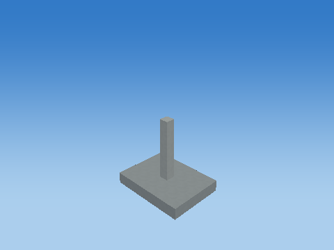

### Add 3: Stand brace


### Add 4: Base warning stripe

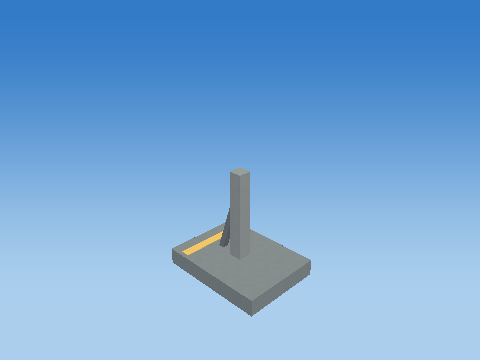

### Add 5: Stand brace

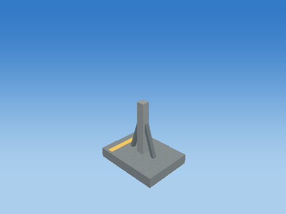

### Add 6: Base warning stripe


### Add 7: Cube-built six-ring plate

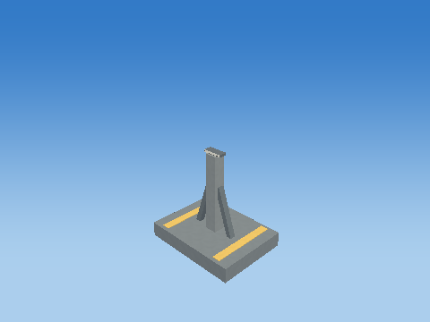

### Add 8: Cube-built six-ring plate


### Add 9: Cube-built six-ring plate

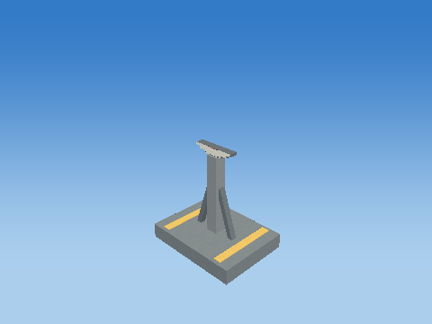

### Add 10: Cube-built six-ring plate

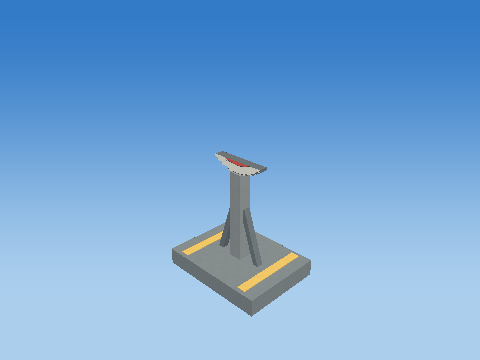

### Add 11: Cube-built six-ring plate


### Add 12: Cube-built six-ring plate


### Add 13: Cube-built six-ring plate


### Add 14: Cube-built six-ring plate


### Add 15: Cube-built six-ring plate


### Add 16: Cube-built six-ring plate

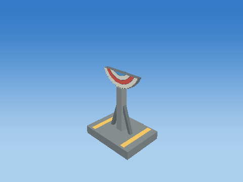

### Add 17: Cube-built six-ring plate

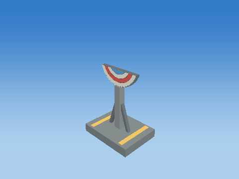

### Add 18: Cube-built six-ring plate


### Add 19: Cube-built six-ring plate


### Add 20: Cube-built six-ring plate


### Add 21: Cube-built six-ring plate


### Add 22: Cube-built six-ring plate


### Add 23: Cube-built six-ring plate

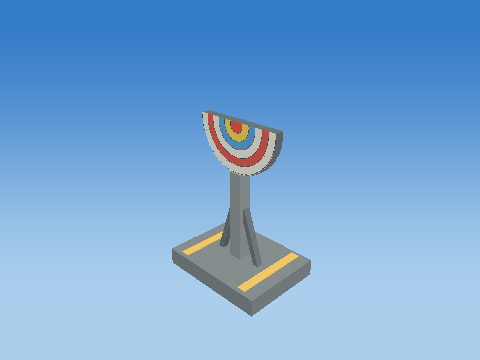

### Add 24: Cube-built six-ring plate


### Add 25: Cube-built six-ring plate

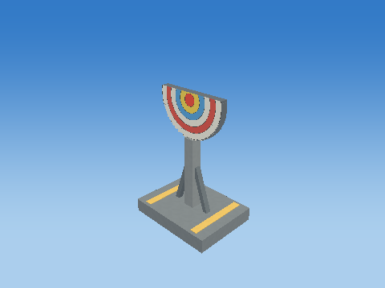

### Add 26: Cube-built six-ring plate


### Add 27: Cube-built six-ring plate


### Add 28: Cube-built six-ring plate


### Add 29: Cube-built six-ring plate


### Add 30: Cube-built six-ring plate


### Add 31: Cube-built six-ring plate


### Add 32: Cube-built six-ring plate


### Add 33: Cube-built six-ring plate

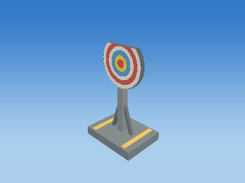

### Add 34: Cube-built six-ring plate


### Add 35: Cube-built six-ring plate

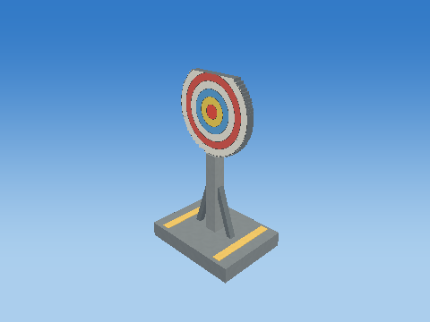

### Add 36: Cube-built six-ring plate


### Add 37: Cube-built six-ring plate


### Add 38: Cube-built six-ring plate


## Every component transformation

### Stand base — `TARGET_1_BASE`

1 unit = 1 m; shared cube transform pipeline

Position T = (0, 0.150000006, -19) m; scale S = (2, 0.300000012, 1.5); rotation (Rx,Ry,Rz) = (0, 0, 0) degrees.

Shear (xy,xz,yx,yz,zx,zy) = (0, 0, 0, 0, 0, 0). Color = (0.25, 0.289999992, 0.319999993); specular = 0.119999997; shininess = 24; emission = 0; flash = 0; material layer = 5; texture scale = 3. Pattern enabled = 0, pattern scale = (1, 1, 1), offset = (0, 0, 0).

| Step | Actual renderer image |
| --- | --- |
| Unit cube | 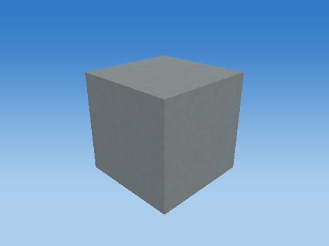 |
| Scale |  |
| Shear |  |
| Rotate X |  |
| Rotate Y |  |
| Rotate Z |  |
| Translate to world | 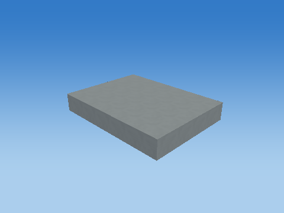 |

Steps 1–5 share one camera; the unit cube has its own close view, and step 6 is reframed at the actual world location to keep small objects visible. Reframing changes the view, never the model coordinates. Identity steps deliberately remain visible. Intermediate shapes are instructional states, while step 6 uses the unmodified game object.

Each stage below gives its exact numeric matrix and all eight corner multiplications. For each output row r: p'[r] = A[r,0]p.x + A[r,1]p.y + A[r,2]p.z + A[r,3]p.w.

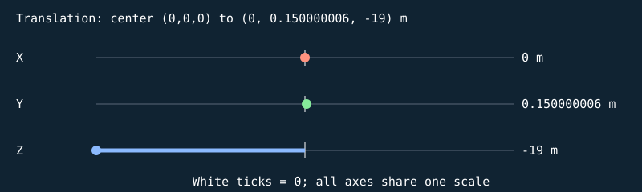


#### S

```text
[ 2 0 0 0 ]
[ 0 0.300000012 0 0 ]
[ 0 0 1.5 0 ]
[ 0 0 0 1 ]
```

| Input corner (w=1) | Output corner (w=1) |
| --- | --- |
| (-0.5, -0.5, -0.5) | (-1, -0.150000006, -0.75) |
| (-0.5, -0.5, 0.5) | (-1, -0.150000006, 0.75) |
| (-0.5, 0.5, -0.5) | (-1, 0.150000006, -0.75) |
| (-0.5, 0.5, 0.5) | (-1, 0.150000006, 0.75) |
| (0.5, -0.5, -0.5) | (1, -0.150000006, -0.75) |
| (0.5, -0.5, 0.5) | (1, -0.150000006, 0.75) |
| (0.5, 0.5, -0.5) | (1, 0.150000006, -0.75) |
| (0.5, 0.5, 0.5) | (1, 0.150000006, 0.75) |

#### H

```text
[ 1 0 0 0 ]
[ 0 1 0 0 ]
[ 0 0 1 0 ]
[ 0 0 0 1 ]
```

| Input corner (w=1) | Output corner (w=1) |
| --- | --- |
| (-1, -0.150000006, -0.75) | (-1, -0.150000006, -0.75) |
| (-1, -0.150000006, 0.75) | (-1, -0.150000006, 0.75) |
| (-1, 0.150000006, -0.75) | (-1, 0.150000006, -0.75) |
| (-1, 0.150000006, 0.75) | (-1, 0.150000006, 0.75) |
| (1, -0.150000006, -0.75) | (1, -0.150000006, -0.75) |
| (1, -0.150000006, 0.75) | (1, -0.150000006, 0.75) |
| (1, 0.150000006, -0.75) | (1, 0.150000006, -0.75) |
| (1, 0.150000006, 0.75) | (1, 0.150000006, 0.75) |

#### Rx

```text
[ 1 0 0 0 ]
[ 0 1 -0 0 ]
[ 0 0 1 0 ]
[ 0 0 0 1 ]
```

| Input corner (w=1) | Output corner (w=1) |
| --- | --- |
| (-1, -0.150000006, -0.75) | (-1, -0.150000006, -0.75) |
| (-1, -0.150000006, 0.75) | (-1, -0.150000006, 0.75) |
| (-1, 0.150000006, -0.75) | (-1, 0.150000006, -0.75) |
| (-1, 0.150000006, 0.75) | (-1, 0.150000006, 0.75) |
| (1, -0.150000006, -0.75) | (1, -0.150000006, -0.75) |
| (1, -0.150000006, 0.75) | (1, -0.150000006, 0.75) |
| (1, 0.150000006, -0.75) | (1, 0.150000006, -0.75) |
| (1, 0.150000006, 0.75) | (1, 0.150000006, 0.75) |

#### Ry

```text
[ 1 0 0 0 ]
[ 0 1 0 0 ]
[ -0 0 1 0 ]
[ 0 0 0 1 ]
```

| Input corner (w=1) | Output corner (w=1) |
| --- | --- |
| (-1, -0.150000006, -0.75) | (-1, -0.150000006, -0.75) |
| (-1, -0.150000006, 0.75) | (-1, -0.150000006, 0.75) |
| (-1, 0.150000006, -0.75) | (-1, 0.150000006, -0.75) |
| (-1, 0.150000006, 0.75) | (-1, 0.150000006, 0.75) |
| (1, -0.150000006, -0.75) | (1, -0.150000006, -0.75) |
| (1, -0.150000006, 0.75) | (1, -0.150000006, 0.75) |
| (1, 0.150000006, -0.75) | (1, 0.150000006, -0.75) |
| (1, 0.150000006, 0.75) | (1, 0.150000006, 0.75) |

#### Rz

```text
[ 1 -0 0 0 ]
[ 0 1 0 0 ]
[ 0 0 1 0 ]
[ 0 0 0 1 ]
```

| Input corner (w=1) | Output corner (w=1) |
| --- | --- |
| (-1, -0.150000006, -0.75) | (-1, -0.150000006, -0.75) |
| (-1, -0.150000006, 0.75) | (-1, -0.150000006, 0.75) |
| (-1, 0.150000006, -0.75) | (-1, 0.150000006, -0.75) |
| (-1, 0.150000006, 0.75) | (-1, 0.150000006, 0.75) |
| (1, -0.150000006, -0.75) | (1, -0.150000006, -0.75) |
| (1, -0.150000006, 0.75) | (1, -0.150000006, 0.75) |
| (1, 0.150000006, -0.75) | (1, 0.150000006, -0.75) |
| (1, 0.150000006, 0.75) | (1, 0.150000006, 0.75) |

#### T

```text
[ 1 0 0 0 ]
[ 0 1 0 0.150000006 ]
[ 0 0 1 -19 ]
[ 0 0 0 1 ]
```

| Input corner (w=1) | Output corner (w=1) |
| --- | --- |
| (-1, -0.150000006, -0.75) | (-1, 0, -19.75) |
| (-1, -0.150000006, 0.75) | (-1, 0, -18.25) |
| (-1, 0.150000006, -0.75) | (-1, 0.300000012, -19.75) |
| (-1, 0.150000006, 0.75) | (-1, 0.300000012, -18.25) |
| (1, -0.150000006, -0.75) | (1, 0, -19.75) |
| (1, -0.150000006, 0.75) | (1, 0, -18.25) |
| (1, 0.150000006, -0.75) | (1, 0.300000012, -19.75) |
| (1, 0.150000006, 0.75) | (1, 0.300000012, -18.25) |

Final M = T Rz Ry Rx H S:

```text
[ 2 0 0 0 ]
[ 0 0.300000012 0 0.150000006 ]
[ 0 0 1.5 -19 ]
[ 0 0 0 1 ]
```

### Stand — `TARGET_1_STAND`

1 unit = 1 m; shared cube transform pipeline

Position T = (0, 0.950000048, -19) m; scale S = (0.239999995, 1.9000001, 0.239999995); rotation (Rx,Ry,Rz) = (0, 0, 0) degrees.

Shear (xy,xz,yx,yz,zx,zy) = (0, 0, 0, 0, 0, 0). Color = (0.330000013, 0.370000005, 0.389999986); specular = 0.119999997; shininess = 24; emission = 0; flash = 0; material layer = 5; texture scale = 3. Pattern enabled = 0, pattern scale = (1, 1, 1), offset = (0, 0, 0).

| Step | Actual renderer image |
| --- | --- |
| Unit cube |  |
| Scale |  |
| Shear |  |
| Rotate X | 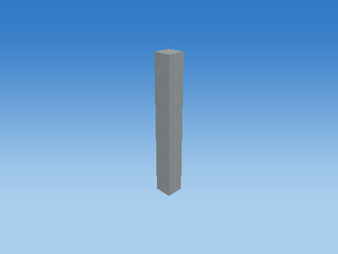 |
| Rotate Y |  |
| Rotate Z |  |
| Translate to world | 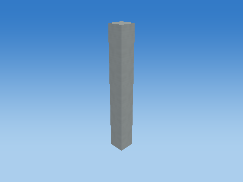 |

Steps 1–5 share one camera; the unit cube has its own close view, and step 6 is reframed at the actual world location to keep small objects visible. Reframing changes the view, never the model coordinates. Identity steps deliberately remain visible. Intermediate shapes are instructional states, while step 6 uses the unmodified game object.

Each stage below gives its exact numeric matrix and all eight corner multiplications. For each output row r: p'[r] = A[r,0]p.x + A[r,1]p.y + A[r,2]p.z + A[r,3]p.w.

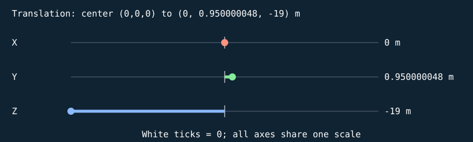


#### S

```text
[ 0.239999995 0 0 0 ]
[ 0 1.9000001 0 0 ]
[ 0 0 0.239999995 0 ]
[ 0 0 0 1 ]
```

| Input corner (w=1) | Output corner (w=1) |
| --- | --- |
| (-0.5, -0.5, -0.5) | (-0.119999997, -0.950000048, -0.119999997) |
| (-0.5, -0.5, 0.5) | (-0.119999997, -0.950000048, 0.119999997) |
| (-0.5, 0.5, -0.5) | (-0.119999997, 0.950000048, -0.119999997) |
| (-0.5, 0.5, 0.5) | (-0.119999997, 0.950000048, 0.119999997) |
| (0.5, -0.5, -0.5) | (0.119999997, -0.950000048, -0.119999997) |
| (0.5, -0.5, 0.5) | (0.119999997, -0.950000048, 0.119999997) |
| (0.5, 0.5, -0.5) | (0.119999997, 0.950000048, -0.119999997) |
| (0.5, 0.5, 0.5) | (0.119999997, 0.950000048, 0.119999997) |

#### H

```text
[ 1 0 0 0 ]
[ 0 1 0 0 ]
[ 0 0 1 0 ]
[ 0 0 0 1 ]
```

| Input corner (w=1) | Output corner (w=1) |
| --- | --- |
| (-0.119999997, -0.950000048, -0.119999997) | (-0.119999997, -0.950000048, -0.119999997) |
| (-0.119999997, -0.950000048, 0.119999997) | (-0.119999997, -0.950000048, 0.119999997) |
| (-0.119999997, 0.950000048, -0.119999997) | (-0.119999997, 0.950000048, -0.119999997) |
| (-0.119999997, 0.950000048, 0.119999997) | (-0.119999997, 0.950000048, 0.119999997) |
| (0.119999997, -0.950000048, -0.119999997) | (0.119999997, -0.950000048, -0.119999997) |
| (0.119999997, -0.950000048, 0.119999997) | (0.119999997, -0.950000048, 0.119999997) |
| (0.119999997, 0.950000048, -0.119999997) | (0.119999997, 0.950000048, -0.119999997) |
| (0.119999997, 0.950000048, 0.119999997) | (0.119999997, 0.950000048, 0.119999997) |

#### Rx

```text
[ 1 0 0 0 ]
[ 0 1 -0 0 ]
[ 0 0 1 0 ]
[ 0 0 0 1 ]
```

| Input corner (w=1) | Output corner (w=1) |
| --- | --- |
| (-0.119999997, -0.950000048, -0.119999997) | (-0.119999997, -0.950000048, -0.119999997) |
| (-0.119999997, -0.950000048, 0.119999997) | (-0.119999997, -0.950000048, 0.119999997) |
| (-0.119999997, 0.950000048, -0.119999997) | (-0.119999997, 0.950000048, -0.119999997) |
| (-0.119999997, 0.950000048, 0.119999997) | (-0.119999997, 0.950000048, 0.119999997) |
| (0.119999997, -0.950000048, -0.119999997) | (0.119999997, -0.950000048, -0.119999997) |
| (0.119999997, -0.950000048, 0.119999997) | (0.119999997, -0.950000048, 0.119999997) |
| (0.119999997, 0.950000048, -0.119999997) | (0.119999997, 0.950000048, -0.119999997) |
| (0.119999997, 0.950000048, 0.119999997) | (0.119999997, 0.950000048, 0.119999997) |

#### Ry

```text
[ 1 0 0 0 ]
[ 0 1 0 0 ]
[ -0 0 1 0 ]
[ 0 0 0 1 ]
```

| Input corner (w=1) | Output corner (w=1) |
| --- | --- |
| (-0.119999997, -0.950000048, -0.119999997) | (-0.119999997, -0.950000048, -0.119999997) |
| (-0.119999997, -0.950000048, 0.119999997) | (-0.119999997, -0.950000048, 0.119999997) |
| (-0.119999997, 0.950000048, -0.119999997) | (-0.119999997, 0.950000048, -0.119999997) |
| (-0.119999997, 0.950000048, 0.119999997) | (-0.119999997, 0.950000048, 0.119999997) |
| (0.119999997, -0.950000048, -0.119999997) | (0.119999997, -0.950000048, -0.119999997) |
| (0.119999997, -0.950000048, 0.119999997) | (0.119999997, -0.950000048, 0.119999997) |
| (0.119999997, 0.950000048, -0.119999997) | (0.119999997, 0.950000048, -0.119999997) |
| (0.119999997, 0.950000048, 0.119999997) | (0.119999997, 0.950000048, 0.119999997) |

#### Rz

```text
[ 1 -0 0 0 ]
[ 0 1 0 0 ]
[ 0 0 1 0 ]
[ 0 0 0 1 ]
```

| Input corner (w=1) | Output corner (w=1) |
| --- | --- |
| (-0.119999997, -0.950000048, -0.119999997) | (-0.119999997, -0.950000048, -0.119999997) |
| (-0.119999997, -0.950000048, 0.119999997) | (-0.119999997, -0.950000048, 0.119999997) |
| (-0.119999997, 0.950000048, -0.119999997) | (-0.119999997, 0.950000048, -0.119999997) |
| (-0.119999997, 0.950000048, 0.119999997) | (-0.119999997, 0.950000048, 0.119999997) |
| (0.119999997, -0.950000048, -0.119999997) | (0.119999997, -0.950000048, -0.119999997) |
| (0.119999997, -0.950000048, 0.119999997) | (0.119999997, -0.950000048, 0.119999997) |
| (0.119999997, 0.950000048, -0.119999997) | (0.119999997, 0.950000048, -0.119999997) |
| (0.119999997, 0.950000048, 0.119999997) | (0.119999997, 0.950000048, 0.119999997) |

#### T

```text
[ 1 0 0 0 ]
[ 0 1 0 0.950000048 ]
[ 0 0 1 -19 ]
[ 0 0 0 1 ]
```

| Input corner (w=1) | Output corner (w=1) |
| --- | --- |
| (-0.119999997, -0.950000048, -0.119999997) | (-0.119999997, 0, -19.1200008) |
| (-0.119999997, -0.950000048, 0.119999997) | (-0.119999997, 0, -18.8799992) |
| (-0.119999997, 0.950000048, -0.119999997) | (-0.119999997, 1.9000001, -19.1200008) |
| (-0.119999997, 0.950000048, 0.119999997) | (-0.119999997, 1.9000001, -18.8799992) |
| (0.119999997, -0.950000048, -0.119999997) | (0.119999997, 0, -19.1200008) |
| (0.119999997, -0.950000048, 0.119999997) | (0.119999997, 0, -18.8799992) |
| (0.119999997, 0.950000048, -0.119999997) | (0.119999997, 1.9000001, -19.1200008) |
| (0.119999997, 0.950000048, 0.119999997) | (0.119999997, 1.9000001, -18.8799992) |

Final M = T Rz Ry Rx H S:

```text
[ 0.239999995 0 0 0 ]
[ 0 1.9000001 0 0.950000048 ]
[ 0 0 0.239999995 -19 ]
[ 0 0 0 1 ]
```

### Stand brace — `TARGET_1_BRACE_-1`

1 unit = 1 m; shared cube transform pipeline

Position T = (-0.280000001, 0.750999987, -19) m; scale S = (0.100000001, 1.06400001, 0.119999997); rotation (Rx,Ry,Rz) = (0, 0, -18) degrees.

Shear (xy,xz,yx,yz,zx,zy) = (0, 0, 0, 0, 0, 0). Color = (0.180000007, 0.219999999, 0.25); specular = 0.119999997; shininess = 24; emission = 0; flash = 0; material layer = 5; texture scale = 3. Pattern enabled = 0, pattern scale = (1, 1, 1), offset = (0, 0, 0).

| Step | Actual renderer image |
| --- | --- |
| Unit cube |  |
| Scale |  |
| Shear |  |
| Rotate X |  |
| Rotate Y |  |
| Rotate Z |  |
| Translate to world |  |

Steps 1–5 share one camera; the unit cube has its own close view, and step 6 is reframed at the actual world location to keep small objects visible. Reframing changes the view, never the model coordinates. Identity steps deliberately remain visible. Intermediate shapes are instructional states, while step 6 uses the unmodified game object.

Each stage below gives its exact numeric matrix and all eight corner multiplications. For each output row r: p'[r] = A[r,0]p.x + A[r,1]p.y + A[r,2]p.z + A[r,3]p.w.


#### S

```text
[ 0.100000001 0 0 0 ]
[ 0 1.06400001 0 0 ]
[ 0 0 0.119999997 0 ]
[ 0 0 0 1 ]
```

| Input corner (w=1) | Output corner (w=1) |
| --- | --- |
| (-0.5, -0.5, -0.5) | (-0.0500000007, -0.532000005, -0.0599999987) |
| (-0.5, -0.5, 0.5) | (-0.0500000007, -0.532000005, 0.0599999987) |
| (-0.5, 0.5, -0.5) | (-0.0500000007, 0.532000005, -0.0599999987) |
| (-0.5, 0.5, 0.5) | (-0.0500000007, 0.532000005, 0.0599999987) |
| (0.5, -0.5, -0.5) | (0.0500000007, -0.532000005, -0.0599999987) |
| (0.5, -0.5, 0.5) | (0.0500000007, -0.532000005, 0.0599999987) |
| (0.5, 0.5, -0.5) | (0.0500000007, 0.532000005, -0.0599999987) |
| (0.5, 0.5, 0.5) | (0.0500000007, 0.532000005, 0.0599999987) |

#### H

```text
[ 1 0 0 0 ]
[ 0 1 0 0 ]
[ 0 0 1 0 ]
[ 0 0 0 1 ]
```

| Input corner (w=1) | Output corner (w=1) |
| --- | --- |
| (-0.0500000007, -0.532000005, -0.0599999987) | (-0.0500000007, -0.532000005, -0.0599999987) |
| (-0.0500000007, -0.532000005, 0.0599999987) | (-0.0500000007, -0.532000005, 0.0599999987) |
| (-0.0500000007, 0.532000005, -0.0599999987) | (-0.0500000007, 0.532000005, -0.0599999987) |
| (-0.0500000007, 0.532000005, 0.0599999987) | (-0.0500000007, 0.532000005, 0.0599999987) |
| (0.0500000007, -0.532000005, -0.0599999987) | (0.0500000007, -0.532000005, -0.0599999987) |
| (0.0500000007, -0.532000005, 0.0599999987) | (0.0500000007, -0.532000005, 0.0599999987) |
| (0.0500000007, 0.532000005, -0.0599999987) | (0.0500000007, 0.532000005, -0.0599999987) |
| (0.0500000007, 0.532000005, 0.0599999987) | (0.0500000007, 0.532000005, 0.0599999987) |

#### Rx

```text
[ 1 0 0 0 ]
[ 0 1 -0 0 ]
[ 0 0 1 0 ]
[ 0 0 0 1 ]
```

| Input corner (w=1) | Output corner (w=1) |
| --- | --- |
| (-0.0500000007, -0.532000005, -0.0599999987) | (-0.0500000007, -0.532000005, -0.0599999987) |
| (-0.0500000007, -0.532000005, 0.0599999987) | (-0.0500000007, -0.532000005, 0.0599999987) |
| (-0.0500000007, 0.532000005, -0.0599999987) | (-0.0500000007, 0.532000005, -0.0599999987) |
| (-0.0500000007, 0.532000005, 0.0599999987) | (-0.0500000007, 0.532000005, 0.0599999987) |
| (0.0500000007, -0.532000005, -0.0599999987) | (0.0500000007, -0.532000005, -0.0599999987) |
| (0.0500000007, -0.532000005, 0.0599999987) | (0.0500000007, -0.532000005, 0.0599999987) |
| (0.0500000007, 0.532000005, -0.0599999987) | (0.0500000007, 0.532000005, -0.0599999987) |
| (0.0500000007, 0.532000005, 0.0599999987) | (0.0500000007, 0.532000005, 0.0599999987) |

#### Ry

```text
[ 1 0 0 0 ]
[ 0 1 0 0 ]
[ -0 0 1 0 ]
[ 0 0 0 1 ]
```

| Input corner (w=1) | Output corner (w=1) |
| --- | --- |
| (-0.0500000007, -0.532000005, -0.0599999987) | (-0.0500000007, -0.532000005, -0.0599999987) |
| (-0.0500000007, -0.532000005, 0.0599999987) | (-0.0500000007, -0.532000005, 0.0599999987) |
| (-0.0500000007, 0.532000005, -0.0599999987) | (-0.0500000007, 0.532000005, -0.0599999987) |
| (-0.0500000007, 0.532000005, 0.0599999987) | (-0.0500000007, 0.532000005, 0.0599999987) |
| (0.0500000007, -0.532000005, -0.0599999987) | (0.0500000007, -0.532000005, -0.0599999987) |
| (0.0500000007, -0.532000005, 0.0599999987) | (0.0500000007, -0.532000005, 0.0599999987) |
| (0.0500000007, 0.532000005, -0.0599999987) | (0.0500000007, 0.532000005, -0.0599999987) |
| (0.0500000007, 0.532000005, 0.0599999987) | (0.0500000007, 0.532000005, 0.0599999987) |

#### Rz

```text
[ 0.95105654 0.309017003 0 0 ]
[ -0.309017003 0.95105654 0 0 ]
[ 0 0 1 0 ]
[ 0 0 0 1 ]
```

| Input corner (w=1) | Output corner (w=1) |
| --- | --- |
| (-0.0500000007, -0.532000005, -0.0599999987) | (-0.21194987, -0.490511239, -0.0599999987) |
| (-0.0500000007, -0.532000005, 0.0599999987) | (-0.21194987, -0.490511239, 0.0599999987) |
| (-0.0500000007, 0.532000005, -0.0599999987) | (0.116844222, 0.521412909, -0.0599999987) |
| (-0.0500000007, 0.532000005, 0.0599999987) | (0.116844222, 0.521412909, 0.0599999987) |
| (0.0500000007, -0.532000005, -0.0599999987) | (-0.116844222, -0.521412909, -0.0599999987) |
| (0.0500000007, -0.532000005, 0.0599999987) | (-0.116844222, -0.521412909, 0.0599999987) |
| (0.0500000007, 0.532000005, -0.0599999987) | (0.21194987, 0.490511239, -0.0599999987) |
| (0.0500000007, 0.532000005, 0.0599999987) | (0.21194987, 0.490511239, 0.0599999987) |

#### T

```text
[ 1 0 0 -0.280000001 ]
[ 0 1 0 0.750999987 ]
[ 0 0 1 -19 ]
[ 0 0 0 1 ]
```

| Input corner (w=1) | Output corner (w=1) |
| --- | --- |
| (-0.21194987, -0.490511239, -0.0599999987) | (-0.491949856, 0.260488749, -19.0599995) |
| (-0.21194987, -0.490511239, 0.0599999987) | (-0.491949856, 0.260488749, -18.9400005) |
| (0.116844222, 0.521412909, -0.0599999987) | (-0.163155779, 1.2724129, -19.0599995) |
| (0.116844222, 0.521412909, 0.0599999987) | (-0.163155779, 1.2724129, -18.9400005) |
| (-0.116844222, -0.521412909, -0.0599999987) | (-0.396844208, 0.229587078, -19.0599995) |
| (-0.116844222, -0.521412909, 0.0599999987) | (-0.396844208, 0.229587078, -18.9400005) |
| (0.21194987, 0.490511239, -0.0599999987) | (-0.0680501312, 1.24151123, -19.0599995) |
| (0.21194987, 0.490511239, 0.0599999987) | (-0.0680501312, 1.24151123, -18.9400005) |

Final M = T Rz Ry Rx H S:

```text
[ 0.0951056555 0.328794092 0 -0.280000001 ]
[ -0.0309017003 1.01192415 0 0.750999987 ]
[ 0 0 0.119999997 -19 ]
[ 0 0 0 1 ]
```

### Base warning stripe — `TARGET_1_FOOT_STRIPE_-1`

1 unit = 1 m; shared cube transform pipeline

Position T = (-0.699999988, 0.307000011, -19) m; scale S = (0.159999996, 0.0120000001, 1.36000001); rotation (Rx,Ry,Rz) = (0, 0, 0) degrees.

Shear (xy,xz,yx,yz,zx,zy) = (0, 0, 0, 0, 0, 0). Color = (0.910000026, 0.620000005, 0.159999996); specular = 0.119999997; shininess = 24; emission = 0; flash = 0; material layer = 5; texture scale = 3. Pattern enabled = 0, pattern scale = (1, 1, 1), offset = (0, 0, 0).

| Step | Actual renderer image |
| --- | --- |
| Unit cube |  |
| Scale |  |
| Shear |  |
| Rotate X |  |
| Rotate Y |  |
| Rotate Z |  |
| Translate to world |  |

Steps 1–5 share one camera; the unit cube has its own close view, and step 6 is reframed at the actual world location to keep small objects visible. Reframing changes the view, never the model coordinates. Identity steps deliberately remain visible. Intermediate shapes are instructional states, while step 6 uses the unmodified game object.

Each stage below gives its exact numeric matrix and all eight corner multiplications. For each output row r: p'[r] = A[r,0]p.x + A[r,1]p.y + A[r,2]p.z + A[r,3]p.w.

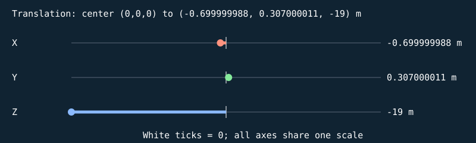


#### S

```text
[ 0.159999996 0 0 0 ]
[ 0 0.0120000001 0 0 ]
[ 0 0 1.36000001 0 ]
[ 0 0 0 1 ]
```

| Input corner (w=1) | Output corner (w=1) |
| --- | --- |
| (-0.5, -0.5, -0.5) | (-0.0799999982, -0.00600000005, -0.680000007) |
| (-0.5, -0.5, 0.5) | (-0.0799999982, -0.00600000005, 0.680000007) |
| (-0.5, 0.5, -0.5) | (-0.0799999982, 0.00600000005, -0.680000007) |
| (-0.5, 0.5, 0.5) | (-0.0799999982, 0.00600000005, 0.680000007) |
| (0.5, -0.5, -0.5) | (0.0799999982, -0.00600000005, -0.680000007) |
| (0.5, -0.5, 0.5) | (0.0799999982, -0.00600000005, 0.680000007) |
| (0.5, 0.5, -0.5) | (0.0799999982, 0.00600000005, -0.680000007) |
| (0.5, 0.5, 0.5) | (0.0799999982, 0.00600000005, 0.680000007) |

#### H

```text
[ 1 0 0 0 ]
[ 0 1 0 0 ]
[ 0 0 1 0 ]
[ 0 0 0 1 ]
```

| Input corner (w=1) | Output corner (w=1) |
| --- | --- |
| (-0.0799999982, -0.00600000005, -0.680000007) | (-0.0799999982, -0.00600000005, -0.680000007) |
| (-0.0799999982, -0.00600000005, 0.680000007) | (-0.0799999982, -0.00600000005, 0.680000007) |
| (-0.0799999982, 0.00600000005, -0.680000007) | (-0.0799999982, 0.00600000005, -0.680000007) |
| (-0.0799999982, 0.00600000005, 0.680000007) | (-0.0799999982, 0.00600000005, 0.680000007) |
| (0.0799999982, -0.00600000005, -0.680000007) | (0.0799999982, -0.00600000005, -0.680000007) |
| (0.0799999982, -0.00600000005, 0.680000007) | (0.0799999982, -0.00600000005, 0.680000007) |
| (0.0799999982, 0.00600000005, -0.680000007) | (0.0799999982, 0.00600000005, -0.680000007) |
| (0.0799999982, 0.00600000005, 0.680000007) | (0.0799999982, 0.00600000005, 0.680000007) |

#### Rx

```text
[ 1 0 0 0 ]
[ 0 1 -0 0 ]
[ 0 0 1 0 ]
[ 0 0 0 1 ]
```

| Input corner (w=1) | Output corner (w=1) |
| --- | --- |
| (-0.0799999982, -0.00600000005, -0.680000007) | (-0.0799999982, -0.00600000005, -0.680000007) |
| (-0.0799999982, -0.00600000005, 0.680000007) | (-0.0799999982, -0.00600000005, 0.680000007) |
| (-0.0799999982, 0.00600000005, -0.680000007) | (-0.0799999982, 0.00600000005, -0.680000007) |
| (-0.0799999982, 0.00600000005, 0.680000007) | (-0.0799999982, 0.00600000005, 0.680000007) |
| (0.0799999982, -0.00600000005, -0.680000007) | (0.0799999982, -0.00600000005, -0.680000007) |
| (0.0799999982, -0.00600000005, 0.680000007) | (0.0799999982, -0.00600000005, 0.680000007) |
| (0.0799999982, 0.00600000005, -0.680000007) | (0.0799999982, 0.00600000005, -0.680000007) |
| (0.0799999982, 0.00600000005, 0.680000007) | (0.0799999982, 0.00600000005, 0.680000007) |

#### Ry

```text
[ 1 0 0 0 ]
[ 0 1 0 0 ]
[ -0 0 1 0 ]
[ 0 0 0 1 ]
```

| Input corner (w=1) | Output corner (w=1) |
| --- | --- |
| (-0.0799999982, -0.00600000005, -0.680000007) | (-0.0799999982, -0.00600000005, -0.680000007) |
| (-0.0799999982, -0.00600000005, 0.680000007) | (-0.0799999982, -0.00600000005, 0.680000007) |
| (-0.0799999982, 0.00600000005, -0.680000007) | (-0.0799999982, 0.00600000005, -0.680000007) |
| (-0.0799999982, 0.00600000005, 0.680000007) | (-0.0799999982, 0.00600000005, 0.680000007) |
| (0.0799999982, -0.00600000005, -0.680000007) | (0.0799999982, -0.00600000005, -0.680000007) |
| (0.0799999982, -0.00600000005, 0.680000007) | (0.0799999982, -0.00600000005, 0.680000007) |
| (0.0799999982, 0.00600000005, -0.680000007) | (0.0799999982, 0.00600000005, -0.680000007) |
| (0.0799999982, 0.00600000005, 0.680000007) | (0.0799999982, 0.00600000005, 0.680000007) |

#### Rz

```text
[ 1 -0 0 0 ]
[ 0 1 0 0 ]
[ 0 0 1 0 ]
[ 0 0 0 1 ]
```

| Input corner (w=1) | Output corner (w=1) |
| --- | --- |
| (-0.0799999982, -0.00600000005, -0.680000007) | (-0.0799999982, -0.00600000005, -0.680000007) |
| (-0.0799999982, -0.00600000005, 0.680000007) | (-0.0799999982, -0.00600000005, 0.680000007) |
| (-0.0799999982, 0.00600000005, -0.680000007) | (-0.0799999982, 0.00600000005, -0.680000007) |
| (-0.0799999982, 0.00600000005, 0.680000007) | (-0.0799999982, 0.00600000005, 0.680000007) |
| (0.0799999982, -0.00600000005, -0.680000007) | (0.0799999982, -0.00600000005, -0.680000007) |
| (0.0799999982, -0.00600000005, 0.680000007) | (0.0799999982, -0.00600000005, 0.680000007) |
| (0.0799999982, 0.00600000005, -0.680000007) | (0.0799999982, 0.00600000005, -0.680000007) |
| (0.0799999982, 0.00600000005, 0.680000007) | (0.0799999982, 0.00600000005, 0.680000007) |

#### T

```text
[ 1 0 0 -0.699999988 ]
[ 0 1 0 0.307000011 ]
[ 0 0 1 -19 ]
[ 0 0 0 1 ]
```

| Input corner (w=1) | Output corner (w=1) |
| --- | --- |
| (-0.0799999982, -0.00600000005, -0.680000007) | (-0.779999971, 0.300999999, -19.6800003) |
| (-0.0799999982, -0.00600000005, 0.680000007) | (-0.779999971, 0.300999999, -18.3199997) |
| (-0.0799999982, 0.00600000005, -0.680000007) | (-0.779999971, 0.313000023, -19.6800003) |
| (-0.0799999982, 0.00600000005, 0.680000007) | (-0.779999971, 0.313000023, -18.3199997) |
| (0.0799999982, -0.00600000005, -0.680000007) | (-0.620000005, 0.300999999, -19.6800003) |
| (0.0799999982, -0.00600000005, 0.680000007) | (-0.620000005, 0.300999999, -18.3199997) |
| (0.0799999982, 0.00600000005, -0.680000007) | (-0.620000005, 0.313000023, -19.6800003) |
| (0.0799999982, 0.00600000005, 0.680000007) | (-0.620000005, 0.313000023, -18.3199997) |

Final M = T Rz Ry Rx H S:

```text
[ 0.159999996 0 0 -0.699999988 ]
[ 0 0.0120000001 0 0.307000011 ]
[ 0 0 1.36000001 -19 ]
[ 0 0 0 1 ]
```

### Stand brace — `TARGET_1_BRACE_1`

1 unit = 1 m; shared cube transform pipeline

Position T = (0.280000001, 0.750999987, -19) m; scale S = (0.100000001, 1.06400001, 0.119999997); rotation (Rx,Ry,Rz) = (0, 0, 18) degrees.

Shear (xy,xz,yx,yz,zx,zy) = (0, 0, 0, 0, 0, 0). Color = (0.180000007, 0.219999999, 0.25); specular = 0.119999997; shininess = 24; emission = 0; flash = 0; material layer = 5; texture scale = 3. Pattern enabled = 0, pattern scale = (1, 1, 1), offset = (0, 0, 0).

| Step | Actual renderer image |
| --- | --- |
| Unit cube |  |
| Scale |  |
| Shear |  |
| Rotate X |  |
| Rotate Y |  |
| Rotate Z |  |
| Translate to world |  |

Steps 1–5 share one camera; the unit cube has its own close view, and step 6 is reframed at the actual world location to keep small objects visible. Reframing changes the view, never the model coordinates. Identity steps deliberately remain visible. Intermediate shapes are instructional states, while step 6 uses the unmodified game object.

Each stage below gives its exact numeric matrix and all eight corner multiplications. For each output row r: p'[r] = A[r,0]p.x + A[r,1]p.y + A[r,2]p.z + A[r,3]p.w.


#### S

```text
[ 0.100000001 0 0 0 ]
[ 0 1.06400001 0 0 ]
[ 0 0 0.119999997 0 ]
[ 0 0 0 1 ]
```

| Input corner (w=1) | Output corner (w=1) |
| --- | --- |
| (-0.5, -0.5, -0.5) | (-0.0500000007, -0.532000005, -0.0599999987) |
| (-0.5, -0.5, 0.5) | (-0.0500000007, -0.532000005, 0.0599999987) |
| (-0.5, 0.5, -0.5) | (-0.0500000007, 0.532000005, -0.0599999987) |
| (-0.5, 0.5, 0.5) | (-0.0500000007, 0.532000005, 0.0599999987) |
| (0.5, -0.5, -0.5) | (0.0500000007, -0.532000005, -0.0599999987) |
| (0.5, -0.5, 0.5) | (0.0500000007, -0.532000005, 0.0599999987) |
| (0.5, 0.5, -0.5) | (0.0500000007, 0.532000005, -0.0599999987) |
| (0.5, 0.5, 0.5) | (0.0500000007, 0.532000005, 0.0599999987) |

#### H

```text
[ 1 0 0 0 ]
[ 0 1 0 0 ]
[ 0 0 1 0 ]
[ 0 0 0 1 ]
```

| Input corner (w=1) | Output corner (w=1) |
| --- | --- |
| (-0.0500000007, -0.532000005, -0.0599999987) | (-0.0500000007, -0.532000005, -0.0599999987) |
| (-0.0500000007, -0.532000005, 0.0599999987) | (-0.0500000007, -0.532000005, 0.0599999987) |
| (-0.0500000007, 0.532000005, -0.0599999987) | (-0.0500000007, 0.532000005, -0.0599999987) |
| (-0.0500000007, 0.532000005, 0.0599999987) | (-0.0500000007, 0.532000005, 0.0599999987) |
| (0.0500000007, -0.532000005, -0.0599999987) | (0.0500000007, -0.532000005, -0.0599999987) |
| (0.0500000007, -0.532000005, 0.0599999987) | (0.0500000007, -0.532000005, 0.0599999987) |
| (0.0500000007, 0.532000005, -0.0599999987) | (0.0500000007, 0.532000005, -0.0599999987) |
| (0.0500000007, 0.532000005, 0.0599999987) | (0.0500000007, 0.532000005, 0.0599999987) |

#### Rx

```text
[ 1 0 0 0 ]
[ 0 1 -0 0 ]
[ 0 0 1 0 ]
[ 0 0 0 1 ]
```

| Input corner (w=1) | Output corner (w=1) |
| --- | --- |
| (-0.0500000007, -0.532000005, -0.0599999987) | (-0.0500000007, -0.532000005, -0.0599999987) |
| (-0.0500000007, -0.532000005, 0.0599999987) | (-0.0500000007, -0.532000005, 0.0599999987) |
| (-0.0500000007, 0.532000005, -0.0599999987) | (-0.0500000007, 0.532000005, -0.0599999987) |
| (-0.0500000007, 0.532000005, 0.0599999987) | (-0.0500000007, 0.532000005, 0.0599999987) |
| (0.0500000007, -0.532000005, -0.0599999987) | (0.0500000007, -0.532000005, -0.0599999987) |
| (0.0500000007, -0.532000005, 0.0599999987) | (0.0500000007, -0.532000005, 0.0599999987) |
| (0.0500000007, 0.532000005, -0.0599999987) | (0.0500000007, 0.532000005, -0.0599999987) |
| (0.0500000007, 0.532000005, 0.0599999987) | (0.0500000007, 0.532000005, 0.0599999987) |

#### Ry

```text
[ 1 0 0 0 ]
[ 0 1 0 0 ]
[ -0 0 1 0 ]
[ 0 0 0 1 ]
```

| Input corner (w=1) | Output corner (w=1) |
| --- | --- |
| (-0.0500000007, -0.532000005, -0.0599999987) | (-0.0500000007, -0.532000005, -0.0599999987) |
| (-0.0500000007, -0.532000005, 0.0599999987) | (-0.0500000007, -0.532000005, 0.0599999987) |
| (-0.0500000007, 0.532000005, -0.0599999987) | (-0.0500000007, 0.532000005, -0.0599999987) |
| (-0.0500000007, 0.532000005, 0.0599999987) | (-0.0500000007, 0.532000005, 0.0599999987) |
| (0.0500000007, -0.532000005, -0.0599999987) | (0.0500000007, -0.532000005, -0.0599999987) |
| (0.0500000007, -0.532000005, 0.0599999987) | (0.0500000007, -0.532000005, 0.0599999987) |
| (0.0500000007, 0.532000005, -0.0599999987) | (0.0500000007, 0.532000005, -0.0599999987) |
| (0.0500000007, 0.532000005, 0.0599999987) | (0.0500000007, 0.532000005, 0.0599999987) |

#### Rz

```text
[ 0.95105654 -0.309017003 0 0 ]
[ 0.309017003 0.95105654 0 0 ]
[ 0 0 1 0 ]
[ 0 0 0 1 ]
```

| Input corner (w=1) | Output corner (w=1) |
| --- | --- |
| (-0.0500000007, -0.532000005, -0.0599999987) | (0.116844222, -0.521412909, -0.0599999987) |
| (-0.0500000007, -0.532000005, 0.0599999987) | (0.116844222, -0.521412909, 0.0599999987) |
| (-0.0500000007, 0.532000005, -0.0599999987) | (-0.21194987, 0.490511239, -0.0599999987) |
| (-0.0500000007, 0.532000005, 0.0599999987) | (-0.21194987, 0.490511239, 0.0599999987) |
| (0.0500000007, -0.532000005, -0.0599999987) | (0.21194987, -0.490511239, -0.0599999987) |
| (0.0500000007, -0.532000005, 0.0599999987) | (0.21194987, -0.490511239, 0.0599999987) |
| (0.0500000007, 0.532000005, -0.0599999987) | (-0.116844222, 0.521412909, -0.0599999987) |
| (0.0500000007, 0.532000005, 0.0599999987) | (-0.116844222, 0.521412909, 0.0599999987) |

#### T

```text
[ 1 0 0 0.280000001 ]
[ 0 1 0 0.750999987 ]
[ 0 0 1 -19 ]
[ 0 0 0 1 ]
```

| Input corner (w=1) | Output corner (w=1) |
| --- | --- |
| (0.116844222, -0.521412909, -0.0599999987) | (0.396844208, 0.229587078, -19.0599995) |
| (0.116844222, -0.521412909, 0.0599999987) | (0.396844208, 0.229587078, -18.9400005) |
| (-0.21194987, 0.490511239, -0.0599999987) | (0.0680501312, 1.24151123, -19.0599995) |
| (-0.21194987, 0.490511239, 0.0599999987) | (0.0680501312, 1.24151123, -18.9400005) |
| (0.21194987, -0.490511239, -0.0599999987) | (0.491949856, 0.260488749, -19.0599995) |
| (0.21194987, -0.490511239, 0.0599999987) | (0.491949856, 0.260488749, -18.9400005) |
| (-0.116844222, 0.521412909, -0.0599999987) | (0.163155779, 1.2724129, -19.0599995) |
| (-0.116844222, 0.521412909, 0.0599999987) | (0.163155779, 1.2724129, -18.9400005) |

Final M = T Rz Ry Rx H S:

```text
[ 0.0951056555 -0.328794092 0 0.280000001 ]
[ 0.0309017003 1.01192415 0 0.750999987 ]
[ 0 0 0.119999997 -19 ]
[ 0 0 0 1 ]
```

### Base warning stripe — `TARGET_1_FOOT_STRIPE_1`

1 unit = 1 m; shared cube transform pipeline

Position T = (0.699999988, 0.307000011, -19) m; scale S = (0.159999996, 0.0120000001, 1.36000001); rotation (Rx,Ry,Rz) = (0, 0, 0) degrees.

Shear (xy,xz,yx,yz,zx,zy) = (0, 0, 0, 0, 0, 0). Color = (0.910000026, 0.620000005, 0.159999996); specular = 0.119999997; shininess = 24; emission = 0; flash = 0; material layer = 5; texture scale = 3. Pattern enabled = 0, pattern scale = (1, 1, 1), offset = (0, 0, 0).

| Step | Actual renderer image |
| --- | --- |
| Unit cube |  |
| Scale |  |
| Shear |  |
| Rotate X |  |
| Rotate Y |  |
| Rotate Z |  |
| Translate to world | 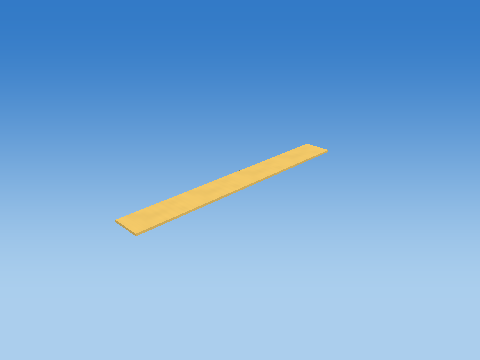 |

Steps 1–5 share one camera; the unit cube has its own close view, and step 6 is reframed at the actual world location to keep small objects visible. Reframing changes the view, never the model coordinates. Identity steps deliberately remain visible. Intermediate shapes are instructional states, while step 6 uses the unmodified game object.

Each stage below gives its exact numeric matrix and all eight corner multiplications. For each output row r: p'[r] = A[r,0]p.x + A[r,1]p.y + A[r,2]p.z + A[r,3]p.w.

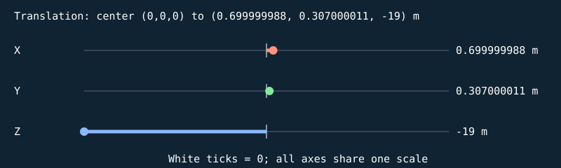


#### S

```text
[ 0.159999996 0 0 0 ]
[ 0 0.0120000001 0 0 ]
[ 0 0 1.36000001 0 ]
[ 0 0 0 1 ]
```

| Input corner (w=1) | Output corner (w=1) |
| --- | --- |
| (-0.5, -0.5, -0.5) | (-0.0799999982, -0.00600000005, -0.680000007) |
| (-0.5, -0.5, 0.5) | (-0.0799999982, -0.00600000005, 0.680000007) |
| (-0.5, 0.5, -0.5) | (-0.0799999982, 0.00600000005, -0.680000007) |
| (-0.5, 0.5, 0.5) | (-0.0799999982, 0.00600000005, 0.680000007) |
| (0.5, -0.5, -0.5) | (0.0799999982, -0.00600000005, -0.680000007) |
| (0.5, -0.5, 0.5) | (0.0799999982, -0.00600000005, 0.680000007) |
| (0.5, 0.5, -0.5) | (0.0799999982, 0.00600000005, -0.680000007) |
| (0.5, 0.5, 0.5) | (0.0799999982, 0.00600000005, 0.680000007) |

#### H

```text
[ 1 0 0 0 ]
[ 0 1 0 0 ]
[ 0 0 1 0 ]
[ 0 0 0 1 ]
```

| Input corner (w=1) | Output corner (w=1) |
| --- | --- |
| (-0.0799999982, -0.00600000005, -0.680000007) | (-0.0799999982, -0.00600000005, -0.680000007) |
| (-0.0799999982, -0.00600000005, 0.680000007) | (-0.0799999982, -0.00600000005, 0.680000007) |
| (-0.0799999982, 0.00600000005, -0.680000007) | (-0.0799999982, 0.00600000005, -0.680000007) |
| (-0.0799999982, 0.00600000005, 0.680000007) | (-0.0799999982, 0.00600000005, 0.680000007) |
| (0.0799999982, -0.00600000005, -0.680000007) | (0.0799999982, -0.00600000005, -0.680000007) |
| (0.0799999982, -0.00600000005, 0.680000007) | (0.0799999982, -0.00600000005, 0.680000007) |
| (0.0799999982, 0.00600000005, -0.680000007) | (0.0799999982, 0.00600000005, -0.680000007) |
| (0.0799999982, 0.00600000005, 0.680000007) | (0.0799999982, 0.00600000005, 0.680000007) |

#### Rx

```text
[ 1 0 0 0 ]
[ 0 1 -0 0 ]
[ 0 0 1 0 ]
[ 0 0 0 1 ]
```

| Input corner (w=1) | Output corner (w=1) |
| --- | --- |
| (-0.0799999982, -0.00600000005, -0.680000007) | (-0.0799999982, -0.00600000005, -0.680000007) |
| (-0.0799999982, -0.00600000005, 0.680000007) | (-0.0799999982, -0.00600000005, 0.680000007) |
| (-0.0799999982, 0.00600000005, -0.680000007) | (-0.0799999982, 0.00600000005, -0.680000007) |
| (-0.0799999982, 0.00600000005, 0.680000007) | (-0.0799999982, 0.00600000005, 0.680000007) |
| (0.0799999982, -0.00600000005, -0.680000007) | (0.0799999982, -0.00600000005, -0.680000007) |
| (0.0799999982, -0.00600000005, 0.680000007) | (0.0799999982, -0.00600000005, 0.680000007) |
| (0.0799999982, 0.00600000005, -0.680000007) | (0.0799999982, 0.00600000005, -0.680000007) |
| (0.0799999982, 0.00600000005, 0.680000007) | (0.0799999982, 0.00600000005, 0.680000007) |

#### Ry

```text
[ 1 0 0 0 ]
[ 0 1 0 0 ]
[ -0 0 1 0 ]
[ 0 0 0 1 ]
```

| Input corner (w=1) | Output corner (w=1) |
| --- | --- |
| (-0.0799999982, -0.00600000005, -0.680000007) | (-0.0799999982, -0.00600000005, -0.680000007) |
| (-0.0799999982, -0.00600000005, 0.680000007) | (-0.0799999982, -0.00600000005, 0.680000007) |
| (-0.0799999982, 0.00600000005, -0.680000007) | (-0.0799999982, 0.00600000005, -0.680000007) |
| (-0.0799999982, 0.00600000005, 0.680000007) | (-0.0799999982, 0.00600000005, 0.680000007) |
| (0.0799999982, -0.00600000005, -0.680000007) | (0.0799999982, -0.00600000005, -0.680000007) |
| (0.0799999982, -0.00600000005, 0.680000007) | (0.0799999982, -0.00600000005, 0.680000007) |
| (0.0799999982, 0.00600000005, -0.680000007) | (0.0799999982, 0.00600000005, -0.680000007) |
| (0.0799999982, 0.00600000005, 0.680000007) | (0.0799999982, 0.00600000005, 0.680000007) |

#### Rz

```text
[ 1 -0 0 0 ]
[ 0 1 0 0 ]
[ 0 0 1 0 ]
[ 0 0 0 1 ]
```

| Input corner (w=1) | Output corner (w=1) |
| --- | --- |
| (-0.0799999982, -0.00600000005, -0.680000007) | (-0.0799999982, -0.00600000005, -0.680000007) |
| (-0.0799999982, -0.00600000005, 0.680000007) | (-0.0799999982, -0.00600000005, 0.680000007) |
| (-0.0799999982, 0.00600000005, -0.680000007) | (-0.0799999982, 0.00600000005, -0.680000007) |
| (-0.0799999982, 0.00600000005, 0.680000007) | (-0.0799999982, 0.00600000005, 0.680000007) |
| (0.0799999982, -0.00600000005, -0.680000007) | (0.0799999982, -0.00600000005, -0.680000007) |
| (0.0799999982, -0.00600000005, 0.680000007) | (0.0799999982, -0.00600000005, 0.680000007) |
| (0.0799999982, 0.00600000005, -0.680000007) | (0.0799999982, 0.00600000005, -0.680000007) |
| (0.0799999982, 0.00600000005, 0.680000007) | (0.0799999982, 0.00600000005, 0.680000007) |

#### T

```text
[ 1 0 0 0.699999988 ]
[ 0 1 0 0.307000011 ]
[ 0 0 1 -19 ]
[ 0 0 0 1 ]
```

| Input corner (w=1) | Output corner (w=1) |
| --- | --- |
| (-0.0799999982, -0.00600000005, -0.680000007) | (0.620000005, 0.300999999, -19.6800003) |
| (-0.0799999982, -0.00600000005, 0.680000007) | (0.620000005, 0.300999999, -18.3199997) |
| (-0.0799999982, 0.00600000005, -0.680000007) | (0.620000005, 0.313000023, -19.6800003) |
| (-0.0799999982, 0.00600000005, 0.680000007) | (0.620000005, 0.313000023, -18.3199997) |
| (0.0799999982, -0.00600000005, -0.680000007) | (0.779999971, 0.300999999, -19.6800003) |
| (0.0799999982, -0.00600000005, 0.680000007) | (0.779999971, 0.300999999, -18.3199997) |
| (0.0799999982, 0.00600000005, -0.680000007) | (0.779999971, 0.313000023, -19.6800003) |
| (0.0799999982, 0.00600000005, 0.680000007) | (0.779999971, 0.313000023, -18.3199997) |

Final M = T Rz Ry Rx H S:

```text
[ 0.159999996 0 0 0.699999988 ]
[ 0 0.0120000001 0 0.307000011 ]
[ 0 0 1.36000001 -19 ]
[ 0 0 0 1 ]
```

### Cube-built six-ring plate — `TARGET_1_SLICE_0`

32 transformed cube slices; printed front +Z; health=60.000000/60; exact slice collider

Position T = (0, 1.92499995, -19) m; scale S = (0.396862745, 0.0500000007, 0.159999996); rotation (Rx,Ry,Rz) = (0, 0, 0) degrees.

Shear (xy,xz,yx,yz,zx,zy) = (0, 0, 0, 0, 0, 0). Color = (0.800000012, 0.800000012, 0.800000012); specular = 0.449999988; shininess = 48; emission = 0; flash = 0; material layer = 7; texture scale = 2. Pattern enabled = 1, pattern scale = (0.248039216, 0.03125, 1), offset = (0, -0.48437503, 0).

| Step | Actual renderer image |
| --- | --- |
| Unit cube | 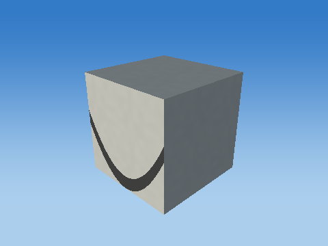 |
| Scale |  |
| Shear |  |
| Rotate X |  |
| Rotate Y |  |
| Rotate Z |  |
| Translate to world | 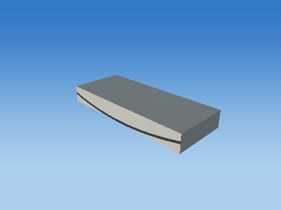 |

Steps 1–5 share one camera; the unit cube has its own close view, and step 6 is reframed at the actual world location to keep small objects visible. Reframing changes the view, never the model coordinates. Identity steps deliberately remain visible. Intermediate shapes are instructional states, while step 6 uses the unmodified game object.

Each stage below gives its exact numeric matrix and all eight corner multiplications. For each output row r: p'[r] = A[r,0]p.x + A[r,1]p.y + A[r,2]p.z + A[r,3]p.w.


#### S

```text
[ 0.396862745 0 0 0 ]
[ 0 0.0500000007 0 0 ]
[ 0 0 0.159999996 0 ]
[ 0 0 0 1 ]
```

| Input corner (w=1) | Output corner (w=1) |
| --- | --- |
| (-0.5, -0.5, -0.5) | (-0.198431373, -0.0250000004, -0.0799999982) |
| (-0.5, -0.5, 0.5) | (-0.198431373, -0.0250000004, 0.0799999982) |
| (-0.5, 0.5, -0.5) | (-0.198431373, 0.0250000004, -0.0799999982) |
| (-0.5, 0.5, 0.5) | (-0.198431373, 0.0250000004, 0.0799999982) |
| (0.5, -0.5, -0.5) | (0.198431373, -0.0250000004, -0.0799999982) |
| (0.5, -0.5, 0.5) | (0.198431373, -0.0250000004, 0.0799999982) |
| (0.5, 0.5, -0.5) | (0.198431373, 0.0250000004, -0.0799999982) |
| (0.5, 0.5, 0.5) | (0.198431373, 0.0250000004, 0.0799999982) |

#### H

```text
[ 1 0 0 0 ]
[ 0 1 0 0 ]
[ 0 0 1 0 ]
[ 0 0 0 1 ]
```

| Input corner (w=1) | Output corner (w=1) |
| --- | --- |
| (-0.198431373, -0.0250000004, -0.0799999982) | (-0.198431373, -0.0250000004, -0.0799999982) |
| (-0.198431373, -0.0250000004, 0.0799999982) | (-0.198431373, -0.0250000004, 0.0799999982) |
| (-0.198431373, 0.0250000004, -0.0799999982) | (-0.198431373, 0.0250000004, -0.0799999982) |
| (-0.198431373, 0.0250000004, 0.0799999982) | (-0.198431373, 0.0250000004, 0.0799999982) |
| (0.198431373, -0.0250000004, -0.0799999982) | (0.198431373, -0.0250000004, -0.0799999982) |
| (0.198431373, -0.0250000004, 0.0799999982) | (0.198431373, -0.0250000004, 0.0799999982) |
| (0.198431373, 0.0250000004, -0.0799999982) | (0.198431373, 0.0250000004, -0.0799999982) |
| (0.198431373, 0.0250000004, 0.0799999982) | (0.198431373, 0.0250000004, 0.0799999982) |

#### Rx

```text
[ 1 0 0 0 ]
[ 0 1 -0 0 ]
[ 0 0 1 0 ]
[ 0 0 0 1 ]
```

| Input corner (w=1) | Output corner (w=1) |
| --- | --- |
| (-0.198431373, -0.0250000004, -0.0799999982) | (-0.198431373, -0.0250000004, -0.0799999982) |
| (-0.198431373, -0.0250000004, 0.0799999982) | (-0.198431373, -0.0250000004, 0.0799999982) |
| (-0.198431373, 0.0250000004, -0.0799999982) | (-0.198431373, 0.0250000004, -0.0799999982) |
| (-0.198431373, 0.0250000004, 0.0799999982) | (-0.198431373, 0.0250000004, 0.0799999982) |
| (0.198431373, -0.0250000004, -0.0799999982) | (0.198431373, -0.0250000004, -0.0799999982) |
| (0.198431373, -0.0250000004, 0.0799999982) | (0.198431373, -0.0250000004, 0.0799999982) |
| (0.198431373, 0.0250000004, -0.0799999982) | (0.198431373, 0.0250000004, -0.0799999982) |
| (0.198431373, 0.0250000004, 0.0799999982) | (0.198431373, 0.0250000004, 0.0799999982) |

#### Ry

```text
[ 1 0 0 0 ]
[ 0 1 0 0 ]
[ -0 0 1 0 ]
[ 0 0 0 1 ]
```

| Input corner (w=1) | Output corner (w=1) |
| --- | --- |
| (-0.198431373, -0.0250000004, -0.0799999982) | (-0.198431373, -0.0250000004, -0.0799999982) |
| (-0.198431373, -0.0250000004, 0.0799999982) | (-0.198431373, -0.0250000004, 0.0799999982) |
| (-0.198431373, 0.0250000004, -0.0799999982) | (-0.198431373, 0.0250000004, -0.0799999982) |
| (-0.198431373, 0.0250000004, 0.0799999982) | (-0.198431373, 0.0250000004, 0.0799999982) |
| (0.198431373, -0.0250000004, -0.0799999982) | (0.198431373, -0.0250000004, -0.0799999982) |
| (0.198431373, -0.0250000004, 0.0799999982) | (0.198431373, -0.0250000004, 0.0799999982) |
| (0.198431373, 0.0250000004, -0.0799999982) | (0.198431373, 0.0250000004, -0.0799999982) |
| (0.198431373, 0.0250000004, 0.0799999982) | (0.198431373, 0.0250000004, 0.0799999982) |

#### Rz

```text
[ 1 -0 0 0 ]
[ 0 1 0 0 ]
[ 0 0 1 0 ]
[ 0 0 0 1 ]
```

| Input corner (w=1) | Output corner (w=1) |
| --- | --- |
| (-0.198431373, -0.0250000004, -0.0799999982) | (-0.198431373, -0.0250000004, -0.0799999982) |
| (-0.198431373, -0.0250000004, 0.0799999982) | (-0.198431373, -0.0250000004, 0.0799999982) |
| (-0.198431373, 0.0250000004, -0.0799999982) | (-0.198431373, 0.0250000004, -0.0799999982) |
| (-0.198431373, 0.0250000004, 0.0799999982) | (-0.198431373, 0.0250000004, 0.0799999982) |
| (0.198431373, -0.0250000004, -0.0799999982) | (0.198431373, -0.0250000004, -0.0799999982) |
| (0.198431373, -0.0250000004, 0.0799999982) | (0.198431373, -0.0250000004, 0.0799999982) |
| (0.198431373, 0.0250000004, -0.0799999982) | (0.198431373, 0.0250000004, -0.0799999982) |
| (0.198431373, 0.0250000004, 0.0799999982) | (0.198431373, 0.0250000004, 0.0799999982) |

#### T

```text
[ 1 0 0 0 ]
[ 0 1 0 1.92499995 ]
[ 0 0 1 -19 ]
[ 0 0 0 1 ]
```

| Input corner (w=1) | Output corner (w=1) |
| --- | --- |
| (-0.198431373, -0.0250000004, -0.0799999982) | (-0.198431373, 1.89999998, -19.0799999) |
| (-0.198431373, -0.0250000004, 0.0799999982) | (-0.198431373, 1.89999998, -18.9200001) |
| (-0.198431373, 0.0250000004, -0.0799999982) | (-0.198431373, 1.94999993, -19.0799999) |
| (-0.198431373, 0.0250000004, 0.0799999982) | (-0.198431373, 1.94999993, -18.9200001) |
| (0.198431373, -0.0250000004, -0.0799999982) | (0.198431373, 1.89999998, -19.0799999) |
| (0.198431373, -0.0250000004, 0.0799999982) | (0.198431373, 1.89999998, -18.9200001) |
| (0.198431373, 0.0250000004, -0.0799999982) | (0.198431373, 1.94999993, -19.0799999) |
| (0.198431373, 0.0250000004, 0.0799999982) | (0.198431373, 1.94999993, -18.9200001) |

Final M = T Rz Ry Rx H S:

```text
[ 0.396862745 0 0 0 ]
[ 0 0.0500000007 0 1.92499995 ]
[ 0 0 0.159999996 -19 ]
[ 0 0 0 1 ]
```

### Cube-built six-ring plate — `TARGET_1_SLICE_1`

32 transformed cube slices; printed front +Z; health=60.000000/60; exact slice collider

Position T = (0, 1.97500002, -19) m; scale S = (0.676387429, 0.0500000007, 0.159999996); rotation (Rx,Ry,Rz) = (0, 0, 0) degrees.

Shear (xy,xz,yx,yz,zx,zy) = (0, 0, 0, 0, 0, 0). Color = (0.800000012, 0.800000012, 0.800000012); specular = 0.449999988; shininess = 48; emission = 0; flash = 0; material layer = 7; texture scale = 2. Pattern enabled = 1, pattern scale = (0.422742128, 0.03125, 1), offset = (0, -0.453125, 0).

| Step | Actual renderer image |
| --- | --- |
| Unit cube |  |
| Scale |  |
| Shear |  |
| Rotate X |  |
| Rotate Y |  |
| Rotate Z |  |
| Translate to world |  |

Steps 1–5 share one camera; the unit cube has its own close view, and step 6 is reframed at the actual world location to keep small objects visible. Reframing changes the view, never the model coordinates. Identity steps deliberately remain visible. Intermediate shapes are instructional states, while step 6 uses the unmodified game object.

Each stage below gives its exact numeric matrix and all eight corner multiplications. For each output row r: p'[r] = A[r,0]p.x + A[r,1]p.y + A[r,2]p.z + A[r,3]p.w.


#### S

```text
[ 0.676387429 0 0 0 ]
[ 0 0.0500000007 0 0 ]
[ 0 0 0.159999996 0 ]
[ 0 0 0 1 ]
```

| Input corner (w=1) | Output corner (w=1) |
| --- | --- |
| (-0.5, -0.5, -0.5) | (-0.338193715, -0.0250000004, -0.0799999982) |
| (-0.5, -0.5, 0.5) | (-0.338193715, -0.0250000004, 0.0799999982) |
| (-0.5, 0.5, -0.5) | (-0.338193715, 0.0250000004, -0.0799999982) |
| (-0.5, 0.5, 0.5) | (-0.338193715, 0.0250000004, 0.0799999982) |
| (0.5, -0.5, -0.5) | (0.338193715, -0.0250000004, -0.0799999982) |
| (0.5, -0.5, 0.5) | (0.338193715, -0.0250000004, 0.0799999982) |
| (0.5, 0.5, -0.5) | (0.338193715, 0.0250000004, -0.0799999982) |
| (0.5, 0.5, 0.5) | (0.338193715, 0.0250000004, 0.0799999982) |

#### H

```text
[ 1 0 0 0 ]
[ 0 1 0 0 ]
[ 0 0 1 0 ]
[ 0 0 0 1 ]
```

| Input corner (w=1) | Output corner (w=1) |
| --- | --- |
| (-0.338193715, -0.0250000004, -0.0799999982) | (-0.338193715, -0.0250000004, -0.0799999982) |
| (-0.338193715, -0.0250000004, 0.0799999982) | (-0.338193715, -0.0250000004, 0.0799999982) |
| (-0.338193715, 0.0250000004, -0.0799999982) | (-0.338193715, 0.0250000004, -0.0799999982) |
| (-0.338193715, 0.0250000004, 0.0799999982) | (-0.338193715, 0.0250000004, 0.0799999982) |
| (0.338193715, -0.0250000004, -0.0799999982) | (0.338193715, -0.0250000004, -0.0799999982) |
| (0.338193715, -0.0250000004, 0.0799999982) | (0.338193715, -0.0250000004, 0.0799999982) |
| (0.338193715, 0.0250000004, -0.0799999982) | (0.338193715, 0.0250000004, -0.0799999982) |
| (0.338193715, 0.0250000004, 0.0799999982) | (0.338193715, 0.0250000004, 0.0799999982) |

#### Rx

```text
[ 1 0 0 0 ]
[ 0 1 -0 0 ]
[ 0 0 1 0 ]
[ 0 0 0 1 ]
```

| Input corner (w=1) | Output corner (w=1) |
| --- | --- |
| (-0.338193715, -0.0250000004, -0.0799999982) | (-0.338193715, -0.0250000004, -0.0799999982) |
| (-0.338193715, -0.0250000004, 0.0799999982) | (-0.338193715, -0.0250000004, 0.0799999982) |
| (-0.338193715, 0.0250000004, -0.0799999982) | (-0.338193715, 0.0250000004, -0.0799999982) |
| (-0.338193715, 0.0250000004, 0.0799999982) | (-0.338193715, 0.0250000004, 0.0799999982) |
| (0.338193715, -0.0250000004, -0.0799999982) | (0.338193715, -0.0250000004, -0.0799999982) |
| (0.338193715, -0.0250000004, 0.0799999982) | (0.338193715, -0.0250000004, 0.0799999982) |
| (0.338193715, 0.0250000004, -0.0799999982) | (0.338193715, 0.0250000004, -0.0799999982) |
| (0.338193715, 0.0250000004, 0.0799999982) | (0.338193715, 0.0250000004, 0.0799999982) |

#### Ry

```text
[ 1 0 0 0 ]
[ 0 1 0 0 ]
[ -0 0 1 0 ]
[ 0 0 0 1 ]
```

| Input corner (w=1) | Output corner (w=1) |
| --- | --- |
| (-0.338193715, -0.0250000004, -0.0799999982) | (-0.338193715, -0.0250000004, -0.0799999982) |
| (-0.338193715, -0.0250000004, 0.0799999982) | (-0.338193715, -0.0250000004, 0.0799999982) |
| (-0.338193715, 0.0250000004, -0.0799999982) | (-0.338193715, 0.0250000004, -0.0799999982) |
| (-0.338193715, 0.0250000004, 0.0799999982) | (-0.338193715, 0.0250000004, 0.0799999982) |
| (0.338193715, -0.0250000004, -0.0799999982) | (0.338193715, -0.0250000004, -0.0799999982) |
| (0.338193715, -0.0250000004, 0.0799999982) | (0.338193715, -0.0250000004, 0.0799999982) |
| (0.338193715, 0.0250000004, -0.0799999982) | (0.338193715, 0.0250000004, -0.0799999982) |
| (0.338193715, 0.0250000004, 0.0799999982) | (0.338193715, 0.0250000004, 0.0799999982) |

#### Rz

```text
[ 1 -0 0 0 ]
[ 0 1 0 0 ]
[ 0 0 1 0 ]
[ 0 0 0 1 ]
```

| Input corner (w=1) | Output corner (w=1) |
| --- | --- |
| (-0.338193715, -0.0250000004, -0.0799999982) | (-0.338193715, -0.0250000004, -0.0799999982) |
| (-0.338193715, -0.0250000004, 0.0799999982) | (-0.338193715, -0.0250000004, 0.0799999982) |
| (-0.338193715, 0.0250000004, -0.0799999982) | (-0.338193715, 0.0250000004, -0.0799999982) |
| (-0.338193715, 0.0250000004, 0.0799999982) | (-0.338193715, 0.0250000004, 0.0799999982) |
| (0.338193715, -0.0250000004, -0.0799999982) | (0.338193715, -0.0250000004, -0.0799999982) |
| (0.338193715, -0.0250000004, 0.0799999982) | (0.338193715, -0.0250000004, 0.0799999982) |
| (0.338193715, 0.0250000004, -0.0799999982) | (0.338193715, 0.0250000004, -0.0799999982) |
| (0.338193715, 0.0250000004, 0.0799999982) | (0.338193715, 0.0250000004, 0.0799999982) |

#### T

```text
[ 1 0 0 0 ]
[ 0 1 0 1.97500002 ]
[ 0 0 1 -19 ]
[ 0 0 0 1 ]
```

| Input corner (w=1) | Output corner (w=1) |
| --- | --- |
| (-0.338193715, -0.0250000004, -0.0799999982) | (-0.338193715, 1.95000005, -19.0799999) |
| (-0.338193715, -0.0250000004, 0.0799999982) | (-0.338193715, 1.95000005, -18.9200001) |
| (-0.338193715, 0.0250000004, -0.0799999982) | (-0.338193715, 2, -19.0799999) |
| (-0.338193715, 0.0250000004, 0.0799999982) | (-0.338193715, 2, -18.9200001) |
| (0.338193715, -0.0250000004, -0.0799999982) | (0.338193715, 1.95000005, -19.0799999) |
| (0.338193715, -0.0250000004, 0.0799999982) | (0.338193715, 1.95000005, -18.9200001) |
| (0.338193715, 0.0250000004, -0.0799999982) | (0.338193715, 2, -19.0799999) |
| (0.338193715, 0.0250000004, 0.0799999982) | (0.338193715, 2, -18.9200001) |

Final M = T Rz Ry Rx H S:

```text
[ 0.676387429 0 0 0 ]
[ 0 0.0500000007 0 1.97500002 ]
[ 0 0 0.159999996 -19 ]
[ 0 0 0 1 ]
```

### Cube-built six-ring plate — `TARGET_1_SLICE_2`

32 transformed cube slices; printed front +Z; health=60.000000/60; exact slice collider

Position T = (0, 2.0250001, -19) m; scale S = (0.858778238, 0.0500000007, 0.159999996); rotation (Rx,Ry,Rz) = (0, 0, 0) degrees.

Shear (xy,xz,yx,yz,zx,zy) = (0, 0, 0, 0, 0, 0). Color = (0.800000012, 0.800000012, 0.800000012); specular = 0.449999988; shininess = 48; emission = 0; flash = 0; material layer = 7; texture scale = 2. Pattern enabled = 1, pattern scale = (0.536736369, 0.03125, 1), offset = (0, -0.421875, 0).

| Step | Actual renderer image |
| --- | --- |
| Unit cube |  |
| Scale |  |
| Shear |  |
| Rotate X |  |
| Rotate Y |  |
| Rotate Z |  |
| Translate to world |  |

Steps 1–5 share one camera; the unit cube has its own close view, and step 6 is reframed at the actual world location to keep small objects visible. Reframing changes the view, never the model coordinates. Identity steps deliberately remain visible. Intermediate shapes are instructional states, while step 6 uses the unmodified game object.

Each stage below gives its exact numeric matrix and all eight corner multiplications. For each output row r: p'[r] = A[r,0]p.x + A[r,1]p.y + A[r,2]p.z + A[r,3]p.w.


#### S

```text
[ 0.858778238 0 0 0 ]
[ 0 0.0500000007 0 0 ]
[ 0 0 0.159999996 0 ]
[ 0 0 0 1 ]
```

| Input corner (w=1) | Output corner (w=1) |
| --- | --- |
| (-0.5, -0.5, -0.5) | (-0.429389119, -0.0250000004, -0.0799999982) |
| (-0.5, -0.5, 0.5) | (-0.429389119, -0.0250000004, 0.0799999982) |
| (-0.5, 0.5, -0.5) | (-0.429389119, 0.0250000004, -0.0799999982) |
| (-0.5, 0.5, 0.5) | (-0.429389119, 0.0250000004, 0.0799999982) |
| (0.5, -0.5, -0.5) | (0.429389119, -0.0250000004, -0.0799999982) |
| (0.5, -0.5, 0.5) | (0.429389119, -0.0250000004, 0.0799999982) |
| (0.5, 0.5, -0.5) | (0.429389119, 0.0250000004, -0.0799999982) |
| (0.5, 0.5, 0.5) | (0.429389119, 0.0250000004, 0.0799999982) |

#### H

```text
[ 1 0 0 0 ]
[ 0 1 0 0 ]
[ 0 0 1 0 ]
[ 0 0 0 1 ]
```

| Input corner (w=1) | Output corner (w=1) |
| --- | --- |
| (-0.429389119, -0.0250000004, -0.0799999982) | (-0.429389119, -0.0250000004, -0.0799999982) |
| (-0.429389119, -0.0250000004, 0.0799999982) | (-0.429389119, -0.0250000004, 0.0799999982) |
| (-0.429389119, 0.0250000004, -0.0799999982) | (-0.429389119, 0.0250000004, -0.0799999982) |
| (-0.429389119, 0.0250000004, 0.0799999982) | (-0.429389119, 0.0250000004, 0.0799999982) |
| (0.429389119, -0.0250000004, -0.0799999982) | (0.429389119, -0.0250000004, -0.0799999982) |
| (0.429389119, -0.0250000004, 0.0799999982) | (0.429389119, -0.0250000004, 0.0799999982) |
| (0.429389119, 0.0250000004, -0.0799999982) | (0.429389119, 0.0250000004, -0.0799999982) |
| (0.429389119, 0.0250000004, 0.0799999982) | (0.429389119, 0.0250000004, 0.0799999982) |

#### Rx

```text
[ 1 0 0 0 ]
[ 0 1 -0 0 ]
[ 0 0 1 0 ]
[ 0 0 0 1 ]
```

| Input corner (w=1) | Output corner (w=1) |
| --- | --- |
| (-0.429389119, -0.0250000004, -0.0799999982) | (-0.429389119, -0.0250000004, -0.0799999982) |
| (-0.429389119, -0.0250000004, 0.0799999982) | (-0.429389119, -0.0250000004, 0.0799999982) |
| (-0.429389119, 0.0250000004, -0.0799999982) | (-0.429389119, 0.0250000004, -0.0799999982) |
| (-0.429389119, 0.0250000004, 0.0799999982) | (-0.429389119, 0.0250000004, 0.0799999982) |
| (0.429389119, -0.0250000004, -0.0799999982) | (0.429389119, -0.0250000004, -0.0799999982) |
| (0.429389119, -0.0250000004, 0.0799999982) | (0.429389119, -0.0250000004, 0.0799999982) |
| (0.429389119, 0.0250000004, -0.0799999982) | (0.429389119, 0.0250000004, -0.0799999982) |
| (0.429389119, 0.0250000004, 0.0799999982) | (0.429389119, 0.0250000004, 0.0799999982) |

#### Ry

```text
[ 1 0 0 0 ]
[ 0 1 0 0 ]
[ -0 0 1 0 ]
[ 0 0 0 1 ]
```

| Input corner (w=1) | Output corner (w=1) |
| --- | --- |
| (-0.429389119, -0.0250000004, -0.0799999982) | (-0.429389119, -0.0250000004, -0.0799999982) |
| (-0.429389119, -0.0250000004, 0.0799999982) | (-0.429389119, -0.0250000004, 0.0799999982) |
| (-0.429389119, 0.0250000004, -0.0799999982) | (-0.429389119, 0.0250000004, -0.0799999982) |
| (-0.429389119, 0.0250000004, 0.0799999982) | (-0.429389119, 0.0250000004, 0.0799999982) |
| (0.429389119, -0.0250000004, -0.0799999982) | (0.429389119, -0.0250000004, -0.0799999982) |
| (0.429389119, -0.0250000004, 0.0799999982) | (0.429389119, -0.0250000004, 0.0799999982) |
| (0.429389119, 0.0250000004, -0.0799999982) | (0.429389119, 0.0250000004, -0.0799999982) |
| (0.429389119, 0.0250000004, 0.0799999982) | (0.429389119, 0.0250000004, 0.0799999982) |

#### Rz

```text
[ 1 -0 0 0 ]
[ 0 1 0 0 ]
[ 0 0 1 0 ]
[ 0 0 0 1 ]
```

| Input corner (w=1) | Output corner (w=1) |
| --- | --- |
| (-0.429389119, -0.0250000004, -0.0799999982) | (-0.429389119, -0.0250000004, -0.0799999982) |
| (-0.429389119, -0.0250000004, 0.0799999982) | (-0.429389119, -0.0250000004, 0.0799999982) |
| (-0.429389119, 0.0250000004, -0.0799999982) | (-0.429389119, 0.0250000004, -0.0799999982) |
| (-0.429389119, 0.0250000004, 0.0799999982) | (-0.429389119, 0.0250000004, 0.0799999982) |
| (0.429389119, -0.0250000004, -0.0799999982) | (0.429389119, -0.0250000004, -0.0799999982) |
| (0.429389119, -0.0250000004, 0.0799999982) | (0.429389119, -0.0250000004, 0.0799999982) |
| (0.429389119, 0.0250000004, -0.0799999982) | (0.429389119, 0.0250000004, -0.0799999982) |
| (0.429389119, 0.0250000004, 0.0799999982) | (0.429389119, 0.0250000004, 0.0799999982) |

#### T

```text
[ 1 0 0 0 ]
[ 0 1 0 2.0250001 ]
[ 0 0 1 -19 ]
[ 0 0 0 1 ]
```

| Input corner (w=1) | Output corner (w=1) |
| --- | --- |
| (-0.429389119, -0.0250000004, -0.0799999982) | (-0.429389119, 2, -19.0799999) |
| (-0.429389119, -0.0250000004, 0.0799999982) | (-0.429389119, 2, -18.9200001) |
| (-0.429389119, 0.0250000004, -0.0799999982) | (-0.429389119, 2.05000019, -19.0799999) |
| (-0.429389119, 0.0250000004, 0.0799999982) | (-0.429389119, 2.05000019, -18.9200001) |
| (0.429389119, -0.0250000004, -0.0799999982) | (0.429389119, 2, -19.0799999) |
| (0.429389119, -0.0250000004, 0.0799999982) | (0.429389119, 2, -18.9200001) |
| (0.429389119, 0.0250000004, -0.0799999982) | (0.429389119, 2.05000019, -19.0799999) |
| (0.429389119, 0.0250000004, 0.0799999982) | (0.429389119, 2.05000019, -18.9200001) |

Final M = T Rz Ry Rx H S:

```text
[ 0.858778238 0 0 0 ]
[ 0 0.0500000007 0 2.0250001 ]
[ 0 0 0.159999996 -19 ]
[ 0 0 0 1 ]
```

### Cube-built six-ring plate — `TARGET_1_SLICE_3`

32 transformed cube slices; printed front +Z; health=60.000000/60; exact slice collider

Position T = (0, 2.07500005, -19) m; scale S = (0.998749316, 0.0500000007, 0.159999996); rotation (Rx,Ry,Rz) = (0, 0, 0) degrees.

Shear (xy,xz,yx,yz,zx,zy) = (0, 0, 0, 0, 0, 0). Color = (0.800000012, 0.800000012, 0.800000012); specular = 0.449999988; shininess = 48; emission = 0; flash = 0; material layer = 7; texture scale = 2. Pattern enabled = 1, pattern scale = (0.624218285, 0.03125, 1), offset = (0, -0.390625, 0).

| Step | Actual renderer image |
| --- | --- |
| Unit cube |  |
| Scale |  |
| Shear |  |
| Rotate X |  |
| Rotate Y |  |
| Rotate Z |  |
| Translate to world |  |

Steps 1–5 share one camera; the unit cube has its own close view, and step 6 is reframed at the actual world location to keep small objects visible. Reframing changes the view, never the model coordinates. Identity steps deliberately remain visible. Intermediate shapes are instructional states, while step 6 uses the unmodified game object.

Each stage below gives its exact numeric matrix and all eight corner multiplications. For each output row r: p'[r] = A[r,0]p.x + A[r,1]p.y + A[r,2]p.z + A[r,3]p.w.


#### S

```text
[ 0.998749316 0 0 0 ]
[ 0 0.0500000007 0 0 ]
[ 0 0 0.159999996 0 ]
[ 0 0 0 1 ]
```

| Input corner (w=1) | Output corner (w=1) |
| --- | --- |
| (-0.5, -0.5, -0.5) | (-0.499374658, -0.0250000004, -0.0799999982) |
| (-0.5, -0.5, 0.5) | (-0.499374658, -0.0250000004, 0.0799999982) |
| (-0.5, 0.5, -0.5) | (-0.499374658, 0.0250000004, -0.0799999982) |
| (-0.5, 0.5, 0.5) | (-0.499374658, 0.0250000004, 0.0799999982) |
| (0.5, -0.5, -0.5) | (0.499374658, -0.0250000004, -0.0799999982) |
| (0.5, -0.5, 0.5) | (0.499374658, -0.0250000004, 0.0799999982) |
| (0.5, 0.5, -0.5) | (0.499374658, 0.0250000004, -0.0799999982) |
| (0.5, 0.5, 0.5) | (0.499374658, 0.0250000004, 0.0799999982) |

#### H

```text
[ 1 0 0 0 ]
[ 0 1 0 0 ]
[ 0 0 1 0 ]
[ 0 0 0 1 ]
```

| Input corner (w=1) | Output corner (w=1) |
| --- | --- |
| (-0.499374658, -0.0250000004, -0.0799999982) | (-0.499374658, -0.0250000004, -0.0799999982) |
| (-0.499374658, -0.0250000004, 0.0799999982) | (-0.499374658, -0.0250000004, 0.0799999982) |
| (-0.499374658, 0.0250000004, -0.0799999982) | (-0.499374658, 0.0250000004, -0.0799999982) |
| (-0.499374658, 0.0250000004, 0.0799999982) | (-0.499374658, 0.0250000004, 0.0799999982) |
| (0.499374658, -0.0250000004, -0.0799999982) | (0.499374658, -0.0250000004, -0.0799999982) |
| (0.499374658, -0.0250000004, 0.0799999982) | (0.499374658, -0.0250000004, 0.0799999982) |
| (0.499374658, 0.0250000004, -0.0799999982) | (0.499374658, 0.0250000004, -0.0799999982) |
| (0.499374658, 0.0250000004, 0.0799999982) | (0.499374658, 0.0250000004, 0.0799999982) |

#### Rx

```text
[ 1 0 0 0 ]
[ 0 1 -0 0 ]
[ 0 0 1 0 ]
[ 0 0 0 1 ]
```

| Input corner (w=1) | Output corner (w=1) |
| --- | --- |
| (-0.499374658, -0.0250000004, -0.0799999982) | (-0.499374658, -0.0250000004, -0.0799999982) |
| (-0.499374658, -0.0250000004, 0.0799999982) | (-0.499374658, -0.0250000004, 0.0799999982) |
| (-0.499374658, 0.0250000004, -0.0799999982) | (-0.499374658, 0.0250000004, -0.0799999982) |
| (-0.499374658, 0.0250000004, 0.0799999982) | (-0.499374658, 0.0250000004, 0.0799999982) |
| (0.499374658, -0.0250000004, -0.0799999982) | (0.499374658, -0.0250000004, -0.0799999982) |
| (0.499374658, -0.0250000004, 0.0799999982) | (0.499374658, -0.0250000004, 0.0799999982) |
| (0.499374658, 0.0250000004, -0.0799999982) | (0.499374658, 0.0250000004, -0.0799999982) |
| (0.499374658, 0.0250000004, 0.0799999982) | (0.499374658, 0.0250000004, 0.0799999982) |

#### Ry

```text
[ 1 0 0 0 ]
[ 0 1 0 0 ]
[ -0 0 1 0 ]
[ 0 0 0 1 ]
```

| Input corner (w=1) | Output corner (w=1) |
| --- | --- |
| (-0.499374658, -0.0250000004, -0.0799999982) | (-0.499374658, -0.0250000004, -0.0799999982) |
| (-0.499374658, -0.0250000004, 0.0799999982) | (-0.499374658, -0.0250000004, 0.0799999982) |
| (-0.499374658, 0.0250000004, -0.0799999982) | (-0.499374658, 0.0250000004, -0.0799999982) |
| (-0.499374658, 0.0250000004, 0.0799999982) | (-0.499374658, 0.0250000004, 0.0799999982) |
| (0.499374658, -0.0250000004, -0.0799999982) | (0.499374658, -0.0250000004, -0.0799999982) |
| (0.499374658, -0.0250000004, 0.0799999982) | (0.499374658, -0.0250000004, 0.0799999982) |
| (0.499374658, 0.0250000004, -0.0799999982) | (0.499374658, 0.0250000004, -0.0799999982) |
| (0.499374658, 0.0250000004, 0.0799999982) | (0.499374658, 0.0250000004, 0.0799999982) |

#### Rz

```text
[ 1 -0 0 0 ]
[ 0 1 0 0 ]
[ 0 0 1 0 ]
[ 0 0 0 1 ]
```

| Input corner (w=1) | Output corner (w=1) |
| --- | --- |
| (-0.499374658, -0.0250000004, -0.0799999982) | (-0.499374658, -0.0250000004, -0.0799999982) |
| (-0.499374658, -0.0250000004, 0.0799999982) | (-0.499374658, -0.0250000004, 0.0799999982) |
| (-0.499374658, 0.0250000004, -0.0799999982) | (-0.499374658, 0.0250000004, -0.0799999982) |
| (-0.499374658, 0.0250000004, 0.0799999982) | (-0.499374658, 0.0250000004, 0.0799999982) |
| (0.499374658, -0.0250000004, -0.0799999982) | (0.499374658, -0.0250000004, -0.0799999982) |
| (0.499374658, -0.0250000004, 0.0799999982) | (0.499374658, -0.0250000004, 0.0799999982) |
| (0.499374658, 0.0250000004, -0.0799999982) | (0.499374658, 0.0250000004, -0.0799999982) |
| (0.499374658, 0.0250000004, 0.0799999982) | (0.499374658, 0.0250000004, 0.0799999982) |

#### T

```text
[ 1 0 0 0 ]
[ 0 1 0 2.07500005 ]
[ 0 0 1 -19 ]
[ 0 0 0 1 ]
```

| Input corner (w=1) | Output corner (w=1) |
| --- | --- |
| (-0.499374658, -0.0250000004, -0.0799999982) | (-0.499374658, 2.04999995, -19.0799999) |
| (-0.499374658, -0.0250000004, 0.0799999982) | (-0.499374658, 2.04999995, -18.9200001) |
| (-0.499374658, 0.0250000004, -0.0799999982) | (-0.499374658, 2.10000014, -19.0799999) |
| (-0.499374658, 0.0250000004, 0.0799999982) | (-0.499374658, 2.10000014, -18.9200001) |
| (0.499374658, -0.0250000004, -0.0799999982) | (0.499374658, 2.04999995, -19.0799999) |
| (0.499374658, -0.0250000004, 0.0799999982) | (0.499374658, 2.04999995, -18.9200001) |
| (0.499374658, 0.0250000004, -0.0799999982) | (0.499374658, 2.10000014, -19.0799999) |
| (0.499374658, 0.0250000004, 0.0799999982) | (0.499374658, 2.10000014, -18.9200001) |

Final M = T Rz Ry Rx H S:

```text
[ 0.998749316 0 0 0 ]
[ 0 0.0500000007 0 2.07500005 ]
[ 0 0 0.159999996 -19 ]
[ 0 0 0 1 ]
```

### Cube-built six-ring plate — `TARGET_1_SLICE_4`

32 transformed cube slices; printed front +Z; health=60.000000/60; exact slice collider

Position T = (0, 2.125, -19) m; scale S = (1.11242986, 0.0500000007, 0.159999996); rotation (Rx,Ry,Rz) = (0, 0, 0) degrees.

Shear (xy,xz,yx,yz,zx,zy) = (0, 0, 0, 0, 0, 0). Color = (0.800000012, 0.800000012, 0.800000012); specular = 0.449999988; shininess = 48; emission = 0; flash = 0; material layer = 7; texture scale = 2. Pattern enabled = 1, pattern scale = (0.695268631, 0.03125, 1), offset = (0, -0.359375, 0).

| Step | Actual renderer image |
| --- | --- |
| Unit cube |  |
| Scale |  |
| Shear |  |
| Rotate X |  |
| Rotate Y |  |
| Rotate Z |  |
| Translate to world |  |

Steps 1–5 share one camera; the unit cube has its own close view, and step 6 is reframed at the actual world location to keep small objects visible. Reframing changes the view, never the model coordinates. Identity steps deliberately remain visible. Intermediate shapes are instructional states, while step 6 uses the unmodified game object.

Each stage below gives its exact numeric matrix and all eight corner multiplications. For each output row r: p'[r] = A[r,0]p.x + A[r,1]p.y + A[r,2]p.z + A[r,3]p.w.


#### S

```text
[ 1.11242986 0 0 0 ]
[ 0 0.0500000007 0 0 ]
[ 0 0 0.159999996 0 ]
[ 0 0 0 1 ]
```

| Input corner (w=1) | Output corner (w=1) |
| --- | --- |
| (-0.5, -0.5, -0.5) | (-0.556214929, -0.0250000004, -0.0799999982) |
| (-0.5, -0.5, 0.5) | (-0.556214929, -0.0250000004, 0.0799999982) |
| (-0.5, 0.5, -0.5) | (-0.556214929, 0.0250000004, -0.0799999982) |
| (-0.5, 0.5, 0.5) | (-0.556214929, 0.0250000004, 0.0799999982) |
| (0.5, -0.5, -0.5) | (0.556214929, -0.0250000004, -0.0799999982) |
| (0.5, -0.5, 0.5) | (0.556214929, -0.0250000004, 0.0799999982) |
| (0.5, 0.5, -0.5) | (0.556214929, 0.0250000004, -0.0799999982) |
| (0.5, 0.5, 0.5) | (0.556214929, 0.0250000004, 0.0799999982) |

#### H

```text
[ 1 0 0 0 ]
[ 0 1 0 0 ]
[ 0 0 1 0 ]
[ 0 0 0 1 ]
```

| Input corner (w=1) | Output corner (w=1) |
| --- | --- |
| (-0.556214929, -0.0250000004, -0.0799999982) | (-0.556214929, -0.0250000004, -0.0799999982) |
| (-0.556214929, -0.0250000004, 0.0799999982) | (-0.556214929, -0.0250000004, 0.0799999982) |
| (-0.556214929, 0.0250000004, -0.0799999982) | (-0.556214929, 0.0250000004, -0.0799999982) |
| (-0.556214929, 0.0250000004, 0.0799999982) | (-0.556214929, 0.0250000004, 0.0799999982) |
| (0.556214929, -0.0250000004, -0.0799999982) | (0.556214929, -0.0250000004, -0.0799999982) |
| (0.556214929, -0.0250000004, 0.0799999982) | (0.556214929, -0.0250000004, 0.0799999982) |
| (0.556214929, 0.0250000004, -0.0799999982) | (0.556214929, 0.0250000004, -0.0799999982) |
| (0.556214929, 0.0250000004, 0.0799999982) | (0.556214929, 0.0250000004, 0.0799999982) |

#### Rx

```text
[ 1 0 0 0 ]
[ 0 1 -0 0 ]
[ 0 0 1 0 ]
[ 0 0 0 1 ]
```

| Input corner (w=1) | Output corner (w=1) |
| --- | --- |
| (-0.556214929, -0.0250000004, -0.0799999982) | (-0.556214929, -0.0250000004, -0.0799999982) |
| (-0.556214929, -0.0250000004, 0.0799999982) | (-0.556214929, -0.0250000004, 0.0799999982) |
| (-0.556214929, 0.0250000004, -0.0799999982) | (-0.556214929, 0.0250000004, -0.0799999982) |
| (-0.556214929, 0.0250000004, 0.0799999982) | (-0.556214929, 0.0250000004, 0.0799999982) |
| (0.556214929, -0.0250000004, -0.0799999982) | (0.556214929, -0.0250000004, -0.0799999982) |
| (0.556214929, -0.0250000004, 0.0799999982) | (0.556214929, -0.0250000004, 0.0799999982) |
| (0.556214929, 0.0250000004, -0.0799999982) | (0.556214929, 0.0250000004, -0.0799999982) |
| (0.556214929, 0.0250000004, 0.0799999982) | (0.556214929, 0.0250000004, 0.0799999982) |

#### Ry

```text
[ 1 0 0 0 ]
[ 0 1 0 0 ]
[ -0 0 1 0 ]
[ 0 0 0 1 ]
```

| Input corner (w=1) | Output corner (w=1) |
| --- | --- |
| (-0.556214929, -0.0250000004, -0.0799999982) | (-0.556214929, -0.0250000004, -0.0799999982) |
| (-0.556214929, -0.0250000004, 0.0799999982) | (-0.556214929, -0.0250000004, 0.0799999982) |
| (-0.556214929, 0.0250000004, -0.0799999982) | (-0.556214929, 0.0250000004, -0.0799999982) |
| (-0.556214929, 0.0250000004, 0.0799999982) | (-0.556214929, 0.0250000004, 0.0799999982) |
| (0.556214929, -0.0250000004, -0.0799999982) | (0.556214929, -0.0250000004, -0.0799999982) |
| (0.556214929, -0.0250000004, 0.0799999982) | (0.556214929, -0.0250000004, 0.0799999982) |
| (0.556214929, 0.0250000004, -0.0799999982) | (0.556214929, 0.0250000004, -0.0799999982) |
| (0.556214929, 0.0250000004, 0.0799999982) | (0.556214929, 0.0250000004, 0.0799999982) |

#### Rz

```text
[ 1 -0 0 0 ]
[ 0 1 0 0 ]
[ 0 0 1 0 ]
[ 0 0 0 1 ]
```

| Input corner (w=1) | Output corner (w=1) |
| --- | --- |
| (-0.556214929, -0.0250000004, -0.0799999982) | (-0.556214929, -0.0250000004, -0.0799999982) |
| (-0.556214929, -0.0250000004, 0.0799999982) | (-0.556214929, -0.0250000004, 0.0799999982) |
| (-0.556214929, 0.0250000004, -0.0799999982) | (-0.556214929, 0.0250000004, -0.0799999982) |
| (-0.556214929, 0.0250000004, 0.0799999982) | (-0.556214929, 0.0250000004, 0.0799999982) |
| (0.556214929, -0.0250000004, -0.0799999982) | (0.556214929, -0.0250000004, -0.0799999982) |
| (0.556214929, -0.0250000004, 0.0799999982) | (0.556214929, -0.0250000004, 0.0799999982) |
| (0.556214929, 0.0250000004, -0.0799999982) | (0.556214929, 0.0250000004, -0.0799999982) |
| (0.556214929, 0.0250000004, 0.0799999982) | (0.556214929, 0.0250000004, 0.0799999982) |

#### T

```text
[ 1 0 0 0 ]
[ 0 1 0 2.125 ]
[ 0 0 1 -19 ]
[ 0 0 0 1 ]
```

| Input corner (w=1) | Output corner (w=1) |
| --- | --- |
| (-0.556214929, -0.0250000004, -0.0799999982) | (-0.556214929, 2.0999999, -19.0799999) |
| (-0.556214929, -0.0250000004, 0.0799999982) | (-0.556214929, 2.0999999, -18.9200001) |
| (-0.556214929, 0.0250000004, -0.0799999982) | (-0.556214929, 2.1500001, -19.0799999) |
| (-0.556214929, 0.0250000004, 0.0799999982) | (-0.556214929, 2.1500001, -18.9200001) |
| (0.556214929, -0.0250000004, -0.0799999982) | (0.556214929, 2.0999999, -19.0799999) |
| (0.556214929, -0.0250000004, 0.0799999982) | (0.556214929, 2.0999999, -18.9200001) |
| (0.556214929, 0.0250000004, -0.0799999982) | (0.556214929, 2.1500001, -19.0799999) |
| (0.556214929, 0.0250000004, 0.0799999982) | (0.556214929, 2.1500001, -18.9200001) |

Final M = T Rz Ry Rx H S:

```text
[ 1.11242986 0 0 0 ]
[ 0 0.0500000007 0 2.125 ]
[ 0 0 0.159999996 -19 ]
[ 0 0 0 1 ]
```

### Cube-built six-ring plate — `TARGET_1_SLICE_5`

32 transformed cube slices; printed front +Z; health=60.000000/60; exact slice collider

Position T = (0, 2.17500019, -19) m; scale S = (1.20726979, 0.0500000007, 0.159999996); rotation (Rx,Ry,Rz) = (0, 0, 0) degrees.

Shear (xy,xz,yx,yz,zx,zy) = (0, 0, 0, 0, 0, 0). Color = (0.800000012, 0.800000012, 0.800000012); specular = 0.449999988; shininess = 48; emission = 0; flash = 0; material layer = 7; texture scale = 2. Pattern enabled = 1, pattern scale = (0.754543602, 0.03125, 1), offset = (0, -0.32812497, 0).

| Step | Actual renderer image |
| --- | --- |
| Unit cube | 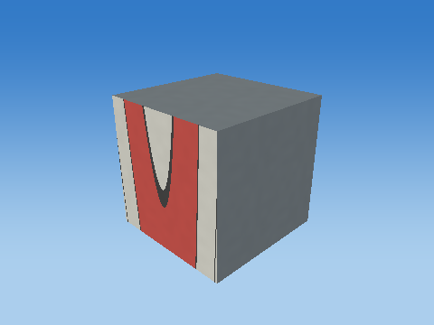 |
| Scale |  |
| Shear |  |
| Rotate X |  |
| Rotate Y |  |
| Rotate Z |  |
| Translate to world |  |

Steps 1–5 share one camera; the unit cube has its own close view, and step 6 is reframed at the actual world location to keep small objects visible. Reframing changes the view, never the model coordinates. Identity steps deliberately remain visible. Intermediate shapes are instructional states, while step 6 uses the unmodified game object.

Each stage below gives its exact numeric matrix and all eight corner multiplications. For each output row r: p'[r] = A[r,0]p.x + A[r,1]p.y + A[r,2]p.z + A[r,3]p.w.


#### S

```text
[ 1.20726979 0 0 0 ]
[ 0 0.0500000007 0 0 ]
[ 0 0 0.159999996 0 ]
[ 0 0 0 1 ]
```

| Input corner (w=1) | Output corner (w=1) |
| --- | --- |
| (-0.5, -0.5, -0.5) | (-0.603634894, -0.0250000004, -0.0799999982) |
| (-0.5, -0.5, 0.5) | (-0.603634894, -0.0250000004, 0.0799999982) |
| (-0.5, 0.5, -0.5) | (-0.603634894, 0.0250000004, -0.0799999982) |
| (-0.5, 0.5, 0.5) | (-0.603634894, 0.0250000004, 0.0799999982) |
| (0.5, -0.5, -0.5) | (0.603634894, -0.0250000004, -0.0799999982) |
| (0.5, -0.5, 0.5) | (0.603634894, -0.0250000004, 0.0799999982) |
| (0.5, 0.5, -0.5) | (0.603634894, 0.0250000004, -0.0799999982) |
| (0.5, 0.5, 0.5) | (0.603634894, 0.0250000004, 0.0799999982) |

#### H

```text
[ 1 0 0 0 ]
[ 0 1 0 0 ]
[ 0 0 1 0 ]
[ 0 0 0 1 ]
```

| Input corner (w=1) | Output corner (w=1) |
| --- | --- |
| (-0.603634894, -0.0250000004, -0.0799999982) | (-0.603634894, -0.0250000004, -0.0799999982) |
| (-0.603634894, -0.0250000004, 0.0799999982) | (-0.603634894, -0.0250000004, 0.0799999982) |
| (-0.603634894, 0.0250000004, -0.0799999982) | (-0.603634894, 0.0250000004, -0.0799999982) |
| (-0.603634894, 0.0250000004, 0.0799999982) | (-0.603634894, 0.0250000004, 0.0799999982) |
| (0.603634894, -0.0250000004, -0.0799999982) | (0.603634894, -0.0250000004, -0.0799999982) |
| (0.603634894, -0.0250000004, 0.0799999982) | (0.603634894, -0.0250000004, 0.0799999982) |
| (0.603634894, 0.0250000004, -0.0799999982) | (0.603634894, 0.0250000004, -0.0799999982) |
| (0.603634894, 0.0250000004, 0.0799999982) | (0.603634894, 0.0250000004, 0.0799999982) |

#### Rx

```text
[ 1 0 0 0 ]
[ 0 1 -0 0 ]
[ 0 0 1 0 ]
[ 0 0 0 1 ]
```

| Input corner (w=1) | Output corner (w=1) |
| --- | --- |
| (-0.603634894, -0.0250000004, -0.0799999982) | (-0.603634894, -0.0250000004, -0.0799999982) |
| (-0.603634894, -0.0250000004, 0.0799999982) | (-0.603634894, -0.0250000004, 0.0799999982) |
| (-0.603634894, 0.0250000004, -0.0799999982) | (-0.603634894, 0.0250000004, -0.0799999982) |
| (-0.603634894, 0.0250000004, 0.0799999982) | (-0.603634894, 0.0250000004, 0.0799999982) |
| (0.603634894, -0.0250000004, -0.0799999982) | (0.603634894, -0.0250000004, -0.0799999982) |
| (0.603634894, -0.0250000004, 0.0799999982) | (0.603634894, -0.0250000004, 0.0799999982) |
| (0.603634894, 0.0250000004, -0.0799999982) | (0.603634894, 0.0250000004, -0.0799999982) |
| (0.603634894, 0.0250000004, 0.0799999982) | (0.603634894, 0.0250000004, 0.0799999982) |

#### Ry

```text
[ 1 0 0 0 ]
[ 0 1 0 0 ]
[ -0 0 1 0 ]
[ 0 0 0 1 ]
```

| Input corner (w=1) | Output corner (w=1) |
| --- | --- |
| (-0.603634894, -0.0250000004, -0.0799999982) | (-0.603634894, -0.0250000004, -0.0799999982) |
| (-0.603634894, -0.0250000004, 0.0799999982) | (-0.603634894, -0.0250000004, 0.0799999982) |
| (-0.603634894, 0.0250000004, -0.0799999982) | (-0.603634894, 0.0250000004, -0.0799999982) |
| (-0.603634894, 0.0250000004, 0.0799999982) | (-0.603634894, 0.0250000004, 0.0799999982) |
| (0.603634894, -0.0250000004, -0.0799999982) | (0.603634894, -0.0250000004, -0.0799999982) |
| (0.603634894, -0.0250000004, 0.0799999982) | (0.603634894, -0.0250000004, 0.0799999982) |
| (0.603634894, 0.0250000004, -0.0799999982) | (0.603634894, 0.0250000004, -0.0799999982) |
| (0.603634894, 0.0250000004, 0.0799999982) | (0.603634894, 0.0250000004, 0.0799999982) |

#### Rz

```text
[ 1 -0 0 0 ]
[ 0 1 0 0 ]
[ 0 0 1 0 ]
[ 0 0 0 1 ]
```

| Input corner (w=1) | Output corner (w=1) |
| --- | --- |
| (-0.603634894, -0.0250000004, -0.0799999982) | (-0.603634894, -0.0250000004, -0.0799999982) |
| (-0.603634894, -0.0250000004, 0.0799999982) | (-0.603634894, -0.0250000004, 0.0799999982) |
| (-0.603634894, 0.0250000004, -0.0799999982) | (-0.603634894, 0.0250000004, -0.0799999982) |
| (-0.603634894, 0.0250000004, 0.0799999982) | (-0.603634894, 0.0250000004, 0.0799999982) |
| (0.603634894, -0.0250000004, -0.0799999982) | (0.603634894, -0.0250000004, -0.0799999982) |
| (0.603634894, -0.0250000004, 0.0799999982) | (0.603634894, -0.0250000004, 0.0799999982) |
| (0.603634894, 0.0250000004, -0.0799999982) | (0.603634894, 0.0250000004, -0.0799999982) |
| (0.603634894, 0.0250000004, 0.0799999982) | (0.603634894, 0.0250000004, 0.0799999982) |

#### T

```text
[ 1 0 0 0 ]
[ 0 1 0 2.17500019 ]
[ 0 0 1 -19 ]
[ 0 0 0 1 ]
```

| Input corner (w=1) | Output corner (w=1) |
| --- | --- |
| (-0.603634894, -0.0250000004, -0.0799999982) | (-0.603634894, 2.1500001, -19.0799999) |
| (-0.603634894, -0.0250000004, 0.0799999982) | (-0.603634894, 2.1500001, -18.9200001) |
| (-0.603634894, 0.0250000004, -0.0799999982) | (-0.603634894, 2.20000029, -19.0799999) |
| (-0.603634894, 0.0250000004, 0.0799999982) | (-0.603634894, 2.20000029, -18.9200001) |
| (0.603634894, -0.0250000004, -0.0799999982) | (0.603634894, 2.1500001, -19.0799999) |
| (0.603634894, -0.0250000004, 0.0799999982) | (0.603634894, 2.1500001, -18.9200001) |
| (0.603634894, 0.0250000004, -0.0799999982) | (0.603634894, 2.20000029, -19.0799999) |
| (0.603634894, 0.0250000004, 0.0799999982) | (0.603634894, 2.20000029, -18.9200001) |

Final M = T Rz Ry Rx H S:

```text
[ 1.20726979 0 0 0 ]
[ 0 0.0500000007 0 2.17500019 ]
[ 0 0 0.159999996 -19 ]
[ 0 0 0 1 ]
```

### Cube-built six-ring plate — `TARGET_1_SLICE_6`

32 transformed cube slices; printed front +Z; health=60.000000/60; exact slice collider

Position T = (0, 2.22500014, -19) m; scale S = (1.28743947, 0.0500000007, 0.159999996); rotation (Rx,Ry,Rz) = (0, 0, 0) degrees.

Shear (xy,xz,yx,yz,zx,zy) = (0, 0, 0, 0, 0, 0). Color = (0.800000012, 0.800000012, 0.800000012); specular = 0.449999988; shininess = 48; emission = 0; flash = 0; material layer = 7; texture scale = 2. Pattern enabled = 1, pattern scale = (0.804649651, 0.03125, 1), offset = (0, -0.296875, 0).

| Step | Actual renderer image |
| --- | --- |
| Unit cube |  |
| Scale |  |
| Shear |  |
| Rotate X |  |
| Rotate Y |  |
| Rotate Z |  |
| Translate to world |  |

Steps 1–5 share one camera; the unit cube has its own close view, and step 6 is reframed at the actual world location to keep small objects visible. Reframing changes the view, never the model coordinates. Identity steps deliberately remain visible. Intermediate shapes are instructional states, while step 6 uses the unmodified game object.

Each stage below gives its exact numeric matrix and all eight corner multiplications. For each output row r: p'[r] = A[r,0]p.x + A[r,1]p.y + A[r,2]p.z + A[r,3]p.w.


#### S

```text
[ 1.28743947 0 0 0 ]
[ 0 0.0500000007 0 0 ]
[ 0 0 0.159999996 0 ]
[ 0 0 0 1 ]
```

| Input corner (w=1) | Output corner (w=1) |
| --- | --- |
| (-0.5, -0.5, -0.5) | (-0.643719733, -0.0250000004, -0.0799999982) |
| (-0.5, -0.5, 0.5) | (-0.643719733, -0.0250000004, 0.0799999982) |
| (-0.5, 0.5, -0.5) | (-0.643719733, 0.0250000004, -0.0799999982) |
| (-0.5, 0.5, 0.5) | (-0.643719733, 0.0250000004, 0.0799999982) |
| (0.5, -0.5, -0.5) | (0.643719733, -0.0250000004, -0.0799999982) |
| (0.5, -0.5, 0.5) | (0.643719733, -0.0250000004, 0.0799999982) |
| (0.5, 0.5, -0.5) | (0.643719733, 0.0250000004, -0.0799999982) |
| (0.5, 0.5, 0.5) | (0.643719733, 0.0250000004, 0.0799999982) |

#### H

```text
[ 1 0 0 0 ]
[ 0 1 0 0 ]
[ 0 0 1 0 ]
[ 0 0 0 1 ]
```

| Input corner (w=1) | Output corner (w=1) |
| --- | --- |
| (-0.643719733, -0.0250000004, -0.0799999982) | (-0.643719733, -0.0250000004, -0.0799999982) |
| (-0.643719733, -0.0250000004, 0.0799999982) | (-0.643719733, -0.0250000004, 0.0799999982) |
| (-0.643719733, 0.0250000004, -0.0799999982) | (-0.643719733, 0.0250000004, -0.0799999982) |
| (-0.643719733, 0.0250000004, 0.0799999982) | (-0.643719733, 0.0250000004, 0.0799999982) |
| (0.643719733, -0.0250000004, -0.0799999982) | (0.643719733, -0.0250000004, -0.0799999982) |
| (0.643719733, -0.0250000004, 0.0799999982) | (0.643719733, -0.0250000004, 0.0799999982) |
| (0.643719733, 0.0250000004, -0.0799999982) | (0.643719733, 0.0250000004, -0.0799999982) |
| (0.643719733, 0.0250000004, 0.0799999982) | (0.643719733, 0.0250000004, 0.0799999982) |

#### Rx

```text
[ 1 0 0 0 ]
[ 0 1 -0 0 ]
[ 0 0 1 0 ]
[ 0 0 0 1 ]
```

| Input corner (w=1) | Output corner (w=1) |
| --- | --- |
| (-0.643719733, -0.0250000004, -0.0799999982) | (-0.643719733, -0.0250000004, -0.0799999982) |
| (-0.643719733, -0.0250000004, 0.0799999982) | (-0.643719733, -0.0250000004, 0.0799999982) |
| (-0.643719733, 0.0250000004, -0.0799999982) | (-0.643719733, 0.0250000004, -0.0799999982) |
| (-0.643719733, 0.0250000004, 0.0799999982) | (-0.643719733, 0.0250000004, 0.0799999982) |
| (0.643719733, -0.0250000004, -0.0799999982) | (0.643719733, -0.0250000004, -0.0799999982) |
| (0.643719733, -0.0250000004, 0.0799999982) | (0.643719733, -0.0250000004, 0.0799999982) |
| (0.643719733, 0.0250000004, -0.0799999982) | (0.643719733, 0.0250000004, -0.0799999982) |
| (0.643719733, 0.0250000004, 0.0799999982) | (0.643719733, 0.0250000004, 0.0799999982) |

#### Ry

```text
[ 1 0 0 0 ]
[ 0 1 0 0 ]
[ -0 0 1 0 ]
[ 0 0 0 1 ]
```

| Input corner (w=1) | Output corner (w=1) |
| --- | --- |
| (-0.643719733, -0.0250000004, -0.0799999982) | (-0.643719733, -0.0250000004, -0.0799999982) |
| (-0.643719733, -0.0250000004, 0.0799999982) | (-0.643719733, -0.0250000004, 0.0799999982) |
| (-0.643719733, 0.0250000004, -0.0799999982) | (-0.643719733, 0.0250000004, -0.0799999982) |
| (-0.643719733, 0.0250000004, 0.0799999982) | (-0.643719733, 0.0250000004, 0.0799999982) |
| (0.643719733, -0.0250000004, -0.0799999982) | (0.643719733, -0.0250000004, -0.0799999982) |
| (0.643719733, -0.0250000004, 0.0799999982) | (0.643719733, -0.0250000004, 0.0799999982) |
| (0.643719733, 0.0250000004, -0.0799999982) | (0.643719733, 0.0250000004, -0.0799999982) |
| (0.643719733, 0.0250000004, 0.0799999982) | (0.643719733, 0.0250000004, 0.0799999982) |

#### Rz

```text
[ 1 -0 0 0 ]
[ 0 1 0 0 ]
[ 0 0 1 0 ]
[ 0 0 0 1 ]
```

| Input corner (w=1) | Output corner (w=1) |
| --- | --- |
| (-0.643719733, -0.0250000004, -0.0799999982) | (-0.643719733, -0.0250000004, -0.0799999982) |
| (-0.643719733, -0.0250000004, 0.0799999982) | (-0.643719733, -0.0250000004, 0.0799999982) |
| (-0.643719733, 0.0250000004, -0.0799999982) | (-0.643719733, 0.0250000004, -0.0799999982) |
| (-0.643719733, 0.0250000004, 0.0799999982) | (-0.643719733, 0.0250000004, 0.0799999982) |
| (0.643719733, -0.0250000004, -0.0799999982) | (0.643719733, -0.0250000004, -0.0799999982) |
| (0.643719733, -0.0250000004, 0.0799999982) | (0.643719733, -0.0250000004, 0.0799999982) |
| (0.643719733, 0.0250000004, -0.0799999982) | (0.643719733, 0.0250000004, -0.0799999982) |
| (0.643719733, 0.0250000004, 0.0799999982) | (0.643719733, 0.0250000004, 0.0799999982) |

#### T

```text
[ 1 0 0 0 ]
[ 0 1 0 2.22500014 ]
[ 0 0 1 -19 ]
[ 0 0 0 1 ]
```

| Input corner (w=1) | Output corner (w=1) |
| --- | --- |
| (-0.643719733, -0.0250000004, -0.0799999982) | (-0.643719733, 2.20000005, -19.0799999) |
| (-0.643719733, -0.0250000004, 0.0799999982) | (-0.643719733, 2.20000005, -18.9200001) |
| (-0.643719733, 0.0250000004, -0.0799999982) | (-0.643719733, 2.25000024, -19.0799999) |
| (-0.643719733, 0.0250000004, 0.0799999982) | (-0.643719733, 2.25000024, -18.9200001) |
| (0.643719733, -0.0250000004, -0.0799999982) | (0.643719733, 2.20000005, -19.0799999) |
| (0.643719733, -0.0250000004, 0.0799999982) | (0.643719733, 2.20000005, -18.9200001) |
| (0.643719733, 0.0250000004, -0.0799999982) | (0.643719733, 2.25000024, -19.0799999) |
| (0.643719733, 0.0250000004, 0.0799999982) | (0.643719733, 2.25000024, -18.9200001) |

Final M = T Rz Ry Rx H S:

```text
[ 1.28743947 0 0 0 ]
[ 0 0.0500000007 0 2.22500014 ]
[ 0 0 0.159999996 -19 ]
[ 0 0 0 1 ]
```

### Cube-built six-ring plate — `TARGET_1_SLICE_7`

32 transformed cube slices; printed front +Z; health=60.000000/60; exact slice collider

Position T = (0, 2.2750001, -19) m; scale S = (1.35554421, 0.0500000007, 0.159999996); rotation (Rx,Ry,Rz) = (0, 0, 0) degrees.

Shear (xy,xz,yx,yz,zx,zy) = (0, 0, 0, 0, 0, 0). Color = (0.800000012, 0.800000012, 0.800000012); specular = 0.449999988; shininess = 48; emission = 0; flash = 0; material layer = 7; texture scale = 2. Pattern enabled = 1, pattern scale = (0.847215116, 0.03125, 1), offset = (0, -0.265625, 0).

| Step | Actual renderer image |
| --- | --- |
| Unit cube |  |
| Scale |  |
| Shear |  |
| Rotate X |  |
| Rotate Y |  |
| Rotate Z |  |
| Translate to world | 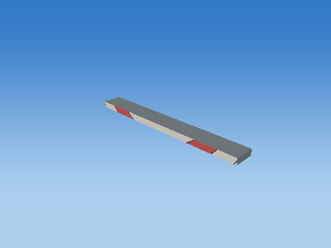 |

Steps 1–5 share one camera; the unit cube has its own close view, and step 6 is reframed at the actual world location to keep small objects visible. Reframing changes the view, never the model coordinates. Identity steps deliberately remain visible. Intermediate shapes are instructional states, while step 6 uses the unmodified game object.

Each stage below gives its exact numeric matrix and all eight corner multiplications. For each output row r: p'[r] = A[r,0]p.x + A[r,1]p.y + A[r,2]p.z + A[r,3]p.w.


#### S

```text
[ 1.35554421 0 0 0 ]
[ 0 0.0500000007 0 0 ]
[ 0 0 0.159999996 0 ]
[ 0 0 0 1 ]
```

| Input corner (w=1) | Output corner (w=1) |
| --- | --- |
| (-0.5, -0.5, -0.5) | (-0.677772105, -0.0250000004, -0.0799999982) |
| (-0.5, -0.5, 0.5) | (-0.677772105, -0.0250000004, 0.0799999982) |
| (-0.5, 0.5, -0.5) | (-0.677772105, 0.0250000004, -0.0799999982) |
| (-0.5, 0.5, 0.5) | (-0.677772105, 0.0250000004, 0.0799999982) |
| (0.5, -0.5, -0.5) | (0.677772105, -0.0250000004, -0.0799999982) |
| (0.5, -0.5, 0.5) | (0.677772105, -0.0250000004, 0.0799999982) |
| (0.5, 0.5, -0.5) | (0.677772105, 0.0250000004, -0.0799999982) |
| (0.5, 0.5, 0.5) | (0.677772105, 0.0250000004, 0.0799999982) |

#### H

```text
[ 1 0 0 0 ]
[ 0 1 0 0 ]
[ 0 0 1 0 ]
[ 0 0 0 1 ]
```

| Input corner (w=1) | Output corner (w=1) |
| --- | --- |
| (-0.677772105, -0.0250000004, -0.0799999982) | (-0.677772105, -0.0250000004, -0.0799999982) |
| (-0.677772105, -0.0250000004, 0.0799999982) | (-0.677772105, -0.0250000004, 0.0799999982) |
| (-0.677772105, 0.0250000004, -0.0799999982) | (-0.677772105, 0.0250000004, -0.0799999982) |
| (-0.677772105, 0.0250000004, 0.0799999982) | (-0.677772105, 0.0250000004, 0.0799999982) |
| (0.677772105, -0.0250000004, -0.0799999982) | (0.677772105, -0.0250000004, -0.0799999982) |
| (0.677772105, -0.0250000004, 0.0799999982) | (0.677772105, -0.0250000004, 0.0799999982) |
| (0.677772105, 0.0250000004, -0.0799999982) | (0.677772105, 0.0250000004, -0.0799999982) |
| (0.677772105, 0.0250000004, 0.0799999982) | (0.677772105, 0.0250000004, 0.0799999982) |

#### Rx

```text
[ 1 0 0 0 ]
[ 0 1 -0 0 ]
[ 0 0 1 0 ]
[ 0 0 0 1 ]
```

| Input corner (w=1) | Output corner (w=1) |
| --- | --- |
| (-0.677772105, -0.0250000004, -0.0799999982) | (-0.677772105, -0.0250000004, -0.0799999982) |
| (-0.677772105, -0.0250000004, 0.0799999982) | (-0.677772105, -0.0250000004, 0.0799999982) |
| (-0.677772105, 0.0250000004, -0.0799999982) | (-0.677772105, 0.0250000004, -0.0799999982) |
| (-0.677772105, 0.0250000004, 0.0799999982) | (-0.677772105, 0.0250000004, 0.0799999982) |
| (0.677772105, -0.0250000004, -0.0799999982) | (0.677772105, -0.0250000004, -0.0799999982) |
| (0.677772105, -0.0250000004, 0.0799999982) | (0.677772105, -0.0250000004, 0.0799999982) |
| (0.677772105, 0.0250000004, -0.0799999982) | (0.677772105, 0.0250000004, -0.0799999982) |
| (0.677772105, 0.0250000004, 0.0799999982) | (0.677772105, 0.0250000004, 0.0799999982) |

#### Ry

```text
[ 1 0 0 0 ]
[ 0 1 0 0 ]
[ -0 0 1 0 ]
[ 0 0 0 1 ]
```

| Input corner (w=1) | Output corner (w=1) |
| --- | --- |
| (-0.677772105, -0.0250000004, -0.0799999982) | (-0.677772105, -0.0250000004, -0.0799999982) |
| (-0.677772105, -0.0250000004, 0.0799999982) | (-0.677772105, -0.0250000004, 0.0799999982) |
| (-0.677772105, 0.0250000004, -0.0799999982) | (-0.677772105, 0.0250000004, -0.0799999982) |
| (-0.677772105, 0.0250000004, 0.0799999982) | (-0.677772105, 0.0250000004, 0.0799999982) |
| (0.677772105, -0.0250000004, -0.0799999982) | (0.677772105, -0.0250000004, -0.0799999982) |
| (0.677772105, -0.0250000004, 0.0799999982) | (0.677772105, -0.0250000004, 0.0799999982) |
| (0.677772105, 0.0250000004, -0.0799999982) | (0.677772105, 0.0250000004, -0.0799999982) |
| (0.677772105, 0.0250000004, 0.0799999982) | (0.677772105, 0.0250000004, 0.0799999982) |

#### Rz

```text
[ 1 -0 0 0 ]
[ 0 1 0 0 ]
[ 0 0 1 0 ]
[ 0 0 0 1 ]
```

| Input corner (w=1) | Output corner (w=1) |
| --- | --- |
| (-0.677772105, -0.0250000004, -0.0799999982) | (-0.677772105, -0.0250000004, -0.0799999982) |
| (-0.677772105, -0.0250000004, 0.0799999982) | (-0.677772105, -0.0250000004, 0.0799999982) |
| (-0.677772105, 0.0250000004, -0.0799999982) | (-0.677772105, 0.0250000004, -0.0799999982) |
| (-0.677772105, 0.0250000004, 0.0799999982) | (-0.677772105, 0.0250000004, 0.0799999982) |
| (0.677772105, -0.0250000004, -0.0799999982) | (0.677772105, -0.0250000004, -0.0799999982) |
| (0.677772105, -0.0250000004, 0.0799999982) | (0.677772105, -0.0250000004, 0.0799999982) |
| (0.677772105, 0.0250000004, -0.0799999982) | (0.677772105, 0.0250000004, -0.0799999982) |
| (0.677772105, 0.0250000004, 0.0799999982) | (0.677772105, 0.0250000004, 0.0799999982) |

#### T

```text
[ 1 0 0 0 ]
[ 0 1 0 2.2750001 ]
[ 0 0 1 -19 ]
[ 0 0 0 1 ]
```

| Input corner (w=1) | Output corner (w=1) |
| --- | --- |
| (-0.677772105, -0.0250000004, -0.0799999982) | (-0.677772105, 2.25, -19.0799999) |
| (-0.677772105, -0.0250000004, 0.0799999982) | (-0.677772105, 2.25, -18.9200001) |
| (-0.677772105, 0.0250000004, -0.0799999982) | (-0.677772105, 2.30000019, -19.0799999) |
| (-0.677772105, 0.0250000004, 0.0799999982) | (-0.677772105, 2.30000019, -18.9200001) |
| (0.677772105, -0.0250000004, -0.0799999982) | (0.677772105, 2.25, -19.0799999) |
| (0.677772105, -0.0250000004, 0.0799999982) | (0.677772105, 2.25, -18.9200001) |
| (0.677772105, 0.0250000004, -0.0799999982) | (0.677772105, 2.30000019, -19.0799999) |
| (0.677772105, 0.0250000004, 0.0799999982) | (0.677772105, 2.30000019, -18.9200001) |

Final M = T Rz Ry Rx H S:

```text
[ 1.35554421 0 0 0 ]
[ 0 0.0500000007 0 2.2750001 ]
[ 0 0 0.159999996 -19 ]
[ 0 0 0 1 ]
```

### Cube-built six-ring plate — `TARGET_1_SLICE_8`

32 transformed cube slices; printed front +Z; health=60.000000/60; exact slice collider

Position T = (0, 2.32500005, -19) m; scale S = (1.41332948, 0.0500000007, 0.159999996); rotation (Rx,Ry,Rz) = (0, 0, 0) degrees.

Shear (xy,xz,yx,yz,zx,zy) = (0, 0, 0, 0, 0, 0). Color = (0.800000012, 0.800000012, 0.800000012); specular = 0.449999988; shininess = 48; emission = 0; flash = 0; material layer = 7; texture scale = 2. Pattern enabled = 1, pattern scale = (0.883330941, 0.03125, 1), offset = (0, -0.234375, 0).

| Step | Actual renderer image |
| --- | --- |
| Unit cube |  |
| Scale |  |
| Shear |  |
| Rotate X |  |
| Rotate Y |  |
| Rotate Z |  |
| Translate to world |  |

Steps 1–5 share one camera; the unit cube has its own close view, and step 6 is reframed at the actual world location to keep small objects visible. Reframing changes the view, never the model coordinates. Identity steps deliberately remain visible. Intermediate shapes are instructional states, while step 6 uses the unmodified game object.

Each stage below gives its exact numeric matrix and all eight corner multiplications. For each output row r: p'[r] = A[r,0]p.x + A[r,1]p.y + A[r,2]p.z + A[r,3]p.w.


#### S

```text
[ 1.41332948 0 0 0 ]
[ 0 0.0500000007 0 0 ]
[ 0 0 0.159999996 0 ]
[ 0 0 0 1 ]
```

| Input corner (w=1) | Output corner (w=1) |
| --- | --- |
| (-0.5, -0.5, -0.5) | (-0.706664741, -0.0250000004, -0.0799999982) |
| (-0.5, -0.5, 0.5) | (-0.706664741, -0.0250000004, 0.0799999982) |
| (-0.5, 0.5, -0.5) | (-0.706664741, 0.0250000004, -0.0799999982) |
| (-0.5, 0.5, 0.5) | (-0.706664741, 0.0250000004, 0.0799999982) |
| (0.5, -0.5, -0.5) | (0.706664741, -0.0250000004, -0.0799999982) |
| (0.5, -0.5, 0.5) | (0.706664741, -0.0250000004, 0.0799999982) |
| (0.5, 0.5, -0.5) | (0.706664741, 0.0250000004, -0.0799999982) |
| (0.5, 0.5, 0.5) | (0.706664741, 0.0250000004, 0.0799999982) |

#### H

```text
[ 1 0 0 0 ]
[ 0 1 0 0 ]
[ 0 0 1 0 ]
[ 0 0 0 1 ]
```

| Input corner (w=1) | Output corner (w=1) |
| --- | --- |
| (-0.706664741, -0.0250000004, -0.0799999982) | (-0.706664741, -0.0250000004, -0.0799999982) |
| (-0.706664741, -0.0250000004, 0.0799999982) | (-0.706664741, -0.0250000004, 0.0799999982) |
| (-0.706664741, 0.0250000004, -0.0799999982) | (-0.706664741, 0.0250000004, -0.0799999982) |
| (-0.706664741, 0.0250000004, 0.0799999982) | (-0.706664741, 0.0250000004, 0.0799999982) |
| (0.706664741, -0.0250000004, -0.0799999982) | (0.706664741, -0.0250000004, -0.0799999982) |
| (0.706664741, -0.0250000004, 0.0799999982) | (0.706664741, -0.0250000004, 0.0799999982) |
| (0.706664741, 0.0250000004, -0.0799999982) | (0.706664741, 0.0250000004, -0.0799999982) |
| (0.706664741, 0.0250000004, 0.0799999982) | (0.706664741, 0.0250000004, 0.0799999982) |

#### Rx

```text
[ 1 0 0 0 ]
[ 0 1 -0 0 ]
[ 0 0 1 0 ]
[ 0 0 0 1 ]
```

| Input corner (w=1) | Output corner (w=1) |
| --- | --- |
| (-0.706664741, -0.0250000004, -0.0799999982) | (-0.706664741, -0.0250000004, -0.0799999982) |
| (-0.706664741, -0.0250000004, 0.0799999982) | (-0.706664741, -0.0250000004, 0.0799999982) |
| (-0.706664741, 0.0250000004, -0.0799999982) | (-0.706664741, 0.0250000004, -0.0799999982) |
| (-0.706664741, 0.0250000004, 0.0799999982) | (-0.706664741, 0.0250000004, 0.0799999982) |
| (0.706664741, -0.0250000004, -0.0799999982) | (0.706664741, -0.0250000004, -0.0799999982) |
| (0.706664741, -0.0250000004, 0.0799999982) | (0.706664741, -0.0250000004, 0.0799999982) |
| (0.706664741, 0.0250000004, -0.0799999982) | (0.706664741, 0.0250000004, -0.0799999982) |
| (0.706664741, 0.0250000004, 0.0799999982) | (0.706664741, 0.0250000004, 0.0799999982) |

#### Ry

```text
[ 1 0 0 0 ]
[ 0 1 0 0 ]
[ -0 0 1 0 ]
[ 0 0 0 1 ]
```

| Input corner (w=1) | Output corner (w=1) |
| --- | --- |
| (-0.706664741, -0.0250000004, -0.0799999982) | (-0.706664741, -0.0250000004, -0.0799999982) |
| (-0.706664741, -0.0250000004, 0.0799999982) | (-0.706664741, -0.0250000004, 0.0799999982) |
| (-0.706664741, 0.0250000004, -0.0799999982) | (-0.706664741, 0.0250000004, -0.0799999982) |
| (-0.706664741, 0.0250000004, 0.0799999982) | (-0.706664741, 0.0250000004, 0.0799999982) |
| (0.706664741, -0.0250000004, -0.0799999982) | (0.706664741, -0.0250000004, -0.0799999982) |
| (0.706664741, -0.0250000004, 0.0799999982) | (0.706664741, -0.0250000004, 0.0799999982) |
| (0.706664741, 0.0250000004, -0.0799999982) | (0.706664741, 0.0250000004, -0.0799999982) |
| (0.706664741, 0.0250000004, 0.0799999982) | (0.706664741, 0.0250000004, 0.0799999982) |

#### Rz

```text
[ 1 -0 0 0 ]
[ 0 1 0 0 ]
[ 0 0 1 0 ]
[ 0 0 0 1 ]
```

| Input corner (w=1) | Output corner (w=1) |
| --- | --- |
| (-0.706664741, -0.0250000004, -0.0799999982) | (-0.706664741, -0.0250000004, -0.0799999982) |
| (-0.706664741, -0.0250000004, 0.0799999982) | (-0.706664741, -0.0250000004, 0.0799999982) |
| (-0.706664741, 0.0250000004, -0.0799999982) | (-0.706664741, 0.0250000004, -0.0799999982) |
| (-0.706664741, 0.0250000004, 0.0799999982) | (-0.706664741, 0.0250000004, 0.0799999982) |
| (0.706664741, -0.0250000004, -0.0799999982) | (0.706664741, -0.0250000004, -0.0799999982) |
| (0.706664741, -0.0250000004, 0.0799999982) | (0.706664741, -0.0250000004, 0.0799999982) |
| (0.706664741, 0.0250000004, -0.0799999982) | (0.706664741, 0.0250000004, -0.0799999982) |
| (0.706664741, 0.0250000004, 0.0799999982) | (0.706664741, 0.0250000004, 0.0799999982) |

#### T

```text
[ 1 0 0 0 ]
[ 0 1 0 2.32500005 ]
[ 0 0 1 -19 ]
[ 0 0 0 1 ]
```

| Input corner (w=1) | Output corner (w=1) |
| --- | --- |
| (-0.706664741, -0.0250000004, -0.0799999982) | (-0.706664741, 2.29999995, -19.0799999) |
| (-0.706664741, -0.0250000004, 0.0799999982) | (-0.706664741, 2.29999995, -18.9200001) |
| (-0.706664741, 0.0250000004, -0.0799999982) | (-0.706664741, 2.35000014, -19.0799999) |
| (-0.706664741, 0.0250000004, 0.0799999982) | (-0.706664741, 2.35000014, -18.9200001) |
| (0.706664741, -0.0250000004, -0.0799999982) | (0.706664741, 2.29999995, -19.0799999) |
| (0.706664741, -0.0250000004, 0.0799999982) | (0.706664741, 2.29999995, -18.9200001) |
| (0.706664741, 0.0250000004, -0.0799999982) | (0.706664741, 2.35000014, -19.0799999) |
| (0.706664741, 0.0250000004, 0.0799999982) | (0.706664741, 2.35000014, -18.9200001) |

Final M = T Rz Ry Rx H S:

```text
[ 1.41332948 0 0 0 ]
[ 0 0.0500000007 0 2.32500005 ]
[ 0 0 0.159999996 -19 ]
[ 0 0 0 1 ]
```

### Cube-built six-ring plate — `TARGET_1_SLICE_9`

32 transformed cube slices; printed front +Z; health=60.000000/60; exact slice collider

Position T = (0, 2.375, -19) m; scale S = (1.46201921, 0.0500000007, 0.159999996); rotation (Rx,Ry,Rz) = (0, 0, 0) degrees.

Shear (xy,xz,yx,yz,zx,zy) = (0, 0, 0, 0, 0, 0). Color = (0.800000012, 0.800000012, 0.800000012); specular = 0.449999988; shininess = 48; emission = 0; flash = 0; material layer = 7; texture scale = 2. Pattern enabled = 1, pattern scale = (0.913761973, 0.03125, 1), offset = (0, -0.203125015, 0).

| Step | Actual renderer image |
| --- | --- |
| Unit cube |  |
| Scale |  |
| Shear |  |
| Rotate X |  |
| Rotate Y |  |
| Rotate Z |  |
| Translate to world |  |

Steps 1–5 share one camera; the unit cube has its own close view, and step 6 is reframed at the actual world location to keep small objects visible. Reframing changes the view, never the model coordinates. Identity steps deliberately remain visible. Intermediate shapes are instructional states, while step 6 uses the unmodified game object.

Each stage below gives its exact numeric matrix and all eight corner multiplications. For each output row r: p'[r] = A[r,0]p.x + A[r,1]p.y + A[r,2]p.z + A[r,3]p.w.


#### S

```text
[ 1.46201921 0 0 0 ]
[ 0 0.0500000007 0 0 ]
[ 0 0 0.159999996 0 ]
[ 0 0 0 1 ]
```

| Input corner (w=1) | Output corner (w=1) |
| --- | --- |
| (-0.5, -0.5, -0.5) | (-0.731009603, -0.0250000004, -0.0799999982) |
| (-0.5, -0.5, 0.5) | (-0.731009603, -0.0250000004, 0.0799999982) |
| (-0.5, 0.5, -0.5) | (-0.731009603, 0.0250000004, -0.0799999982) |
| (-0.5, 0.5, 0.5) | (-0.731009603, 0.0250000004, 0.0799999982) |
| (0.5, -0.5, -0.5) | (0.731009603, -0.0250000004, -0.0799999982) |
| (0.5, -0.5, 0.5) | (0.731009603, -0.0250000004, 0.0799999982) |
| (0.5, 0.5, -0.5) | (0.731009603, 0.0250000004, -0.0799999982) |
| (0.5, 0.5, 0.5) | (0.731009603, 0.0250000004, 0.0799999982) |

#### H

```text
[ 1 0 0 0 ]
[ 0 1 0 0 ]
[ 0 0 1 0 ]
[ 0 0 0 1 ]
```

| Input corner (w=1) | Output corner (w=1) |
| --- | --- |
| (-0.731009603, -0.0250000004, -0.0799999982) | (-0.731009603, -0.0250000004, -0.0799999982) |
| (-0.731009603, -0.0250000004, 0.0799999982) | (-0.731009603, -0.0250000004, 0.0799999982) |
| (-0.731009603, 0.0250000004, -0.0799999982) | (-0.731009603, 0.0250000004, -0.0799999982) |
| (-0.731009603, 0.0250000004, 0.0799999982) | (-0.731009603, 0.0250000004, 0.0799999982) |
| (0.731009603, -0.0250000004, -0.0799999982) | (0.731009603, -0.0250000004, -0.0799999982) |
| (0.731009603, -0.0250000004, 0.0799999982) | (0.731009603, -0.0250000004, 0.0799999982) |
| (0.731009603, 0.0250000004, -0.0799999982) | (0.731009603, 0.0250000004, -0.0799999982) |
| (0.731009603, 0.0250000004, 0.0799999982) | (0.731009603, 0.0250000004, 0.0799999982) |

#### Rx

```text
[ 1 0 0 0 ]
[ 0 1 -0 0 ]
[ 0 0 1 0 ]
[ 0 0 0 1 ]
```

| Input corner (w=1) | Output corner (w=1) |
| --- | --- |
| (-0.731009603, -0.0250000004, -0.0799999982) | (-0.731009603, -0.0250000004, -0.0799999982) |
| (-0.731009603, -0.0250000004, 0.0799999982) | (-0.731009603, -0.0250000004, 0.0799999982) |
| (-0.731009603, 0.0250000004, -0.0799999982) | (-0.731009603, 0.0250000004, -0.0799999982) |
| (-0.731009603, 0.0250000004, 0.0799999982) | (-0.731009603, 0.0250000004, 0.0799999982) |
| (0.731009603, -0.0250000004, -0.0799999982) | (0.731009603, -0.0250000004, -0.0799999982) |
| (0.731009603, -0.0250000004, 0.0799999982) | (0.731009603, -0.0250000004, 0.0799999982) |
| (0.731009603, 0.0250000004, -0.0799999982) | (0.731009603, 0.0250000004, -0.0799999982) |
| (0.731009603, 0.0250000004, 0.0799999982) | (0.731009603, 0.0250000004, 0.0799999982) |

#### Ry

```text
[ 1 0 0 0 ]
[ 0 1 0 0 ]
[ -0 0 1 0 ]
[ 0 0 0 1 ]
```

| Input corner (w=1) | Output corner (w=1) |
| --- | --- |
| (-0.731009603, -0.0250000004, -0.0799999982) | (-0.731009603, -0.0250000004, -0.0799999982) |
| (-0.731009603, -0.0250000004, 0.0799999982) | (-0.731009603, -0.0250000004, 0.0799999982) |
| (-0.731009603, 0.0250000004, -0.0799999982) | (-0.731009603, 0.0250000004, -0.0799999982) |
| (-0.731009603, 0.0250000004, 0.0799999982) | (-0.731009603, 0.0250000004, 0.0799999982) |
| (0.731009603, -0.0250000004, -0.0799999982) | (0.731009603, -0.0250000004, -0.0799999982) |
| (0.731009603, -0.0250000004, 0.0799999982) | (0.731009603, -0.0250000004, 0.0799999982) |
| (0.731009603, 0.0250000004, -0.0799999982) | (0.731009603, 0.0250000004, -0.0799999982) |
| (0.731009603, 0.0250000004, 0.0799999982) | (0.731009603, 0.0250000004, 0.0799999982) |

#### Rz

```text
[ 1 -0 0 0 ]
[ 0 1 0 0 ]
[ 0 0 1 0 ]
[ 0 0 0 1 ]
```

| Input corner (w=1) | Output corner (w=1) |
| --- | --- |
| (-0.731009603, -0.0250000004, -0.0799999982) | (-0.731009603, -0.0250000004, -0.0799999982) |
| (-0.731009603, -0.0250000004, 0.0799999982) | (-0.731009603, -0.0250000004, 0.0799999982) |
| (-0.731009603, 0.0250000004, -0.0799999982) | (-0.731009603, 0.0250000004, -0.0799999982) |
| (-0.731009603, 0.0250000004, 0.0799999982) | (-0.731009603, 0.0250000004, 0.0799999982) |
| (0.731009603, -0.0250000004, -0.0799999982) | (0.731009603, -0.0250000004, -0.0799999982) |
| (0.731009603, -0.0250000004, 0.0799999982) | (0.731009603, -0.0250000004, 0.0799999982) |
| (0.731009603, 0.0250000004, -0.0799999982) | (0.731009603, 0.0250000004, -0.0799999982) |
| (0.731009603, 0.0250000004, 0.0799999982) | (0.731009603, 0.0250000004, 0.0799999982) |

#### T

```text
[ 1 0 0 0 ]
[ 0 1 0 2.375 ]
[ 0 0 1 -19 ]
[ 0 0 0 1 ]
```

| Input corner (w=1) | Output corner (w=1) |
| --- | --- |
| (-0.731009603, -0.0250000004, -0.0799999982) | (-0.731009603, 2.3499999, -19.0799999) |
| (-0.731009603, -0.0250000004, 0.0799999982) | (-0.731009603, 2.3499999, -18.9200001) |
| (-0.731009603, 0.0250000004, -0.0799999982) | (-0.731009603, 2.4000001, -19.0799999) |
| (-0.731009603, 0.0250000004, 0.0799999982) | (-0.731009603, 2.4000001, -18.9200001) |
| (0.731009603, -0.0250000004, -0.0799999982) | (0.731009603, 2.3499999, -19.0799999) |
| (0.731009603, -0.0250000004, 0.0799999982) | (0.731009603, 2.3499999, -18.9200001) |
| (0.731009603, 0.0250000004, -0.0799999982) | (0.731009603, 2.4000001, -19.0799999) |
| (0.731009603, 0.0250000004, 0.0799999982) | (0.731009603, 2.4000001, -18.9200001) |

Final M = T Rz Ry Rx H S:

```text
[ 1.46201921 0 0 0 ]
[ 0 0.0500000007 0 2.375 ]
[ 0 0 0.159999996 -19 ]
[ 0 0 0 1 ]
```

### Cube-built six-ring plate — `TARGET_1_SLICE_10`

32 transformed cube slices; printed front +Z; health=60.000000/60; exact slice collider

Position T = (0, 2.42500019, -19) m; scale S = (1.50249803, 0.0500000007, 0.159999996); rotation (Rx,Ry,Rz) = (0, 0, 0) degrees.

Shear (xy,xz,yx,yz,zx,zy) = (0, 0, 0, 0, 0, 0). Color = (0.800000012, 0.800000012, 0.800000012); specular = 0.449999988; shininess = 48; emission = 0; flash = 0; material layer = 7; texture scale = 2. Pattern enabled = 1, pattern scale = (0.939061284, 0.03125, 1), offset = (0, -0.171874985, 0).

| Step | Actual renderer image |
| --- | --- |
| Unit cube |  |
| Scale |  |
| Shear |  |
| Rotate X |  |
| Rotate Y |  |
| Rotate Z |  |
| Translate to world |  |

Steps 1–5 share one camera; the unit cube has its own close view, and step 6 is reframed at the actual world location to keep small objects visible. Reframing changes the view, never the model coordinates. Identity steps deliberately remain visible. Intermediate shapes are instructional states, while step 6 uses the unmodified game object.

Each stage below gives its exact numeric matrix and all eight corner multiplications. For each output row r: p'[r] = A[r,0]p.x + A[r,1]p.y + A[r,2]p.z + A[r,3]p.w.


#### S

```text
[ 1.50249803 0 0 0 ]
[ 0 0.0500000007 0 0 ]
[ 0 0 0.159999996 0 ]
[ 0 0 0 1 ]
```

| Input corner (w=1) | Output corner (w=1) |
| --- | --- |
| (-0.5, -0.5, -0.5) | (-0.751249015, -0.0250000004, -0.0799999982) |
| (-0.5, -0.5, 0.5) | (-0.751249015, -0.0250000004, 0.0799999982) |
| (-0.5, 0.5, -0.5) | (-0.751249015, 0.0250000004, -0.0799999982) |
| (-0.5, 0.5, 0.5) | (-0.751249015, 0.0250000004, 0.0799999982) |
| (0.5, -0.5, -0.5) | (0.751249015, -0.0250000004, -0.0799999982) |
| (0.5, -0.5, 0.5) | (0.751249015, -0.0250000004, 0.0799999982) |
| (0.5, 0.5, -0.5) | (0.751249015, 0.0250000004, -0.0799999982) |
| (0.5, 0.5, 0.5) | (0.751249015, 0.0250000004, 0.0799999982) |

#### H

```text
[ 1 0 0 0 ]
[ 0 1 0 0 ]
[ 0 0 1 0 ]
[ 0 0 0 1 ]
```

| Input corner (w=1) | Output corner (w=1) |
| --- | --- |
| (-0.751249015, -0.0250000004, -0.0799999982) | (-0.751249015, -0.0250000004, -0.0799999982) |
| (-0.751249015, -0.0250000004, 0.0799999982) | (-0.751249015, -0.0250000004, 0.0799999982) |
| (-0.751249015, 0.0250000004, -0.0799999982) | (-0.751249015, 0.0250000004, -0.0799999982) |
| (-0.751249015, 0.0250000004, 0.0799999982) | (-0.751249015, 0.0250000004, 0.0799999982) |
| (0.751249015, -0.0250000004, -0.0799999982) | (0.751249015, -0.0250000004, -0.0799999982) |
| (0.751249015, -0.0250000004, 0.0799999982) | (0.751249015, -0.0250000004, 0.0799999982) |
| (0.751249015, 0.0250000004, -0.0799999982) | (0.751249015, 0.0250000004, -0.0799999982) |
| (0.751249015, 0.0250000004, 0.0799999982) | (0.751249015, 0.0250000004, 0.0799999982) |

#### Rx

```text
[ 1 0 0 0 ]
[ 0 1 -0 0 ]
[ 0 0 1 0 ]
[ 0 0 0 1 ]
```

| Input corner (w=1) | Output corner (w=1) |
| --- | --- |
| (-0.751249015, -0.0250000004, -0.0799999982) | (-0.751249015, -0.0250000004, -0.0799999982) |
| (-0.751249015, -0.0250000004, 0.0799999982) | (-0.751249015, -0.0250000004, 0.0799999982) |
| (-0.751249015, 0.0250000004, -0.0799999982) | (-0.751249015, 0.0250000004, -0.0799999982) |
| (-0.751249015, 0.0250000004, 0.0799999982) | (-0.751249015, 0.0250000004, 0.0799999982) |
| (0.751249015, -0.0250000004, -0.0799999982) | (0.751249015, -0.0250000004, -0.0799999982) |
| (0.751249015, -0.0250000004, 0.0799999982) | (0.751249015, -0.0250000004, 0.0799999982) |
| (0.751249015, 0.0250000004, -0.0799999982) | (0.751249015, 0.0250000004, -0.0799999982) |
| (0.751249015, 0.0250000004, 0.0799999982) | (0.751249015, 0.0250000004, 0.0799999982) |

#### Ry

```text
[ 1 0 0 0 ]
[ 0 1 0 0 ]
[ -0 0 1 0 ]
[ 0 0 0 1 ]
```

| Input corner (w=1) | Output corner (w=1) |
| --- | --- |
| (-0.751249015, -0.0250000004, -0.0799999982) | (-0.751249015, -0.0250000004, -0.0799999982) |
| (-0.751249015, -0.0250000004, 0.0799999982) | (-0.751249015, -0.0250000004, 0.0799999982) |
| (-0.751249015, 0.0250000004, -0.0799999982) | (-0.751249015, 0.0250000004, -0.0799999982) |
| (-0.751249015, 0.0250000004, 0.0799999982) | (-0.751249015, 0.0250000004, 0.0799999982) |
| (0.751249015, -0.0250000004, -0.0799999982) | (0.751249015, -0.0250000004, -0.0799999982) |
| (0.751249015, -0.0250000004, 0.0799999982) | (0.751249015, -0.0250000004, 0.0799999982) |
| (0.751249015, 0.0250000004, -0.0799999982) | (0.751249015, 0.0250000004, -0.0799999982) |
| (0.751249015, 0.0250000004, 0.0799999982) | (0.751249015, 0.0250000004, 0.0799999982) |

#### Rz

```text
[ 1 -0 0 0 ]
[ 0 1 0 0 ]
[ 0 0 1 0 ]
[ 0 0 0 1 ]
```

| Input corner (w=1) | Output corner (w=1) |
| --- | --- |
| (-0.751249015, -0.0250000004, -0.0799999982) | (-0.751249015, -0.0250000004, -0.0799999982) |
| (-0.751249015, -0.0250000004, 0.0799999982) | (-0.751249015, -0.0250000004, 0.0799999982) |
| (-0.751249015, 0.0250000004, -0.0799999982) | (-0.751249015, 0.0250000004, -0.0799999982) |
| (-0.751249015, 0.0250000004, 0.0799999982) | (-0.751249015, 0.0250000004, 0.0799999982) |
| (0.751249015, -0.0250000004, -0.0799999982) | (0.751249015, -0.0250000004, -0.0799999982) |
| (0.751249015, -0.0250000004, 0.0799999982) | (0.751249015, -0.0250000004, 0.0799999982) |
| (0.751249015, 0.0250000004, -0.0799999982) | (0.751249015, 0.0250000004, -0.0799999982) |
| (0.751249015, 0.0250000004, 0.0799999982) | (0.751249015, 0.0250000004, 0.0799999982) |

#### T

```text
[ 1 0 0 0 ]
[ 0 1 0 2.42500019 ]
[ 0 0 1 -19 ]
[ 0 0 0 1 ]
```

| Input corner (w=1) | Output corner (w=1) |
| --- | --- |
| (-0.751249015, -0.0250000004, -0.0799999982) | (-0.751249015, 2.4000001, -19.0799999) |
| (-0.751249015, -0.0250000004, 0.0799999982) | (-0.751249015, 2.4000001, -18.9200001) |
| (-0.751249015, 0.0250000004, -0.0799999982) | (-0.751249015, 2.45000029, -19.0799999) |
| (-0.751249015, 0.0250000004, 0.0799999982) | (-0.751249015, 2.45000029, -18.9200001) |
| (0.751249015, -0.0250000004, -0.0799999982) | (0.751249015, 2.4000001, -19.0799999) |
| (0.751249015, -0.0250000004, 0.0799999982) | (0.751249015, 2.4000001, -18.9200001) |
| (0.751249015, 0.0250000004, -0.0799999982) | (0.751249015, 2.45000029, -19.0799999) |
| (0.751249015, 0.0250000004, 0.0799999982) | (0.751249015, 2.45000029, -18.9200001) |

Final M = T Rz Ry Rx H S:

```text
[ 1.50249803 0 0 0 ]
[ 0 0.0500000007 0 2.42500019 ]
[ 0 0 0.159999996 -19 ]
[ 0 0 0 1 ]
```

### Cube-built six-ring plate — `TARGET_1_SLICE_11`

32 transformed cube slices; printed front +Z; health=60.000000/60; exact slice collider

Position T = (0, 2.4749999, -19) m; scale S = (1.53541529, 0.0500000007, 0.159999996); rotation (Rx,Ry,Rz) = (0, 0, 0) degrees.

Shear (xy,xz,yx,yz,zx,zy) = (0, 0, 0, 0, 0, 0). Color = (0.800000012, 0.800000012, 0.800000012); specular = 0.449999988; shininess = 48; emission = 0; flash = 0; material layer = 7; texture scale = 2. Pattern enabled = 1, pattern scale = (0.959634542, 0.03125, 1), offset = (0, -0.140625015, 0).

| Step | Actual renderer image |
| --- | --- |
| Unit cube |  |
| Scale |  |
| Shear |  |
| Rotate X |  |
| Rotate Y |  |
| Rotate Z |  |
| Translate to world |  |

Steps 1–5 share one camera; the unit cube has its own close view, and step 6 is reframed at the actual world location to keep small objects visible. Reframing changes the view, never the model coordinates. Identity steps deliberately remain visible. Intermediate shapes are instructional states, while step 6 uses the unmodified game object.

Each stage below gives its exact numeric matrix and all eight corner multiplications. For each output row r: p'[r] = A[r,0]p.x + A[r,1]p.y + A[r,2]p.z + A[r,3]p.w.


#### S

```text
[ 1.53541529 0 0 0 ]
[ 0 0.0500000007 0 0 ]
[ 0 0 0.159999996 0 ]
[ 0 0 0 1 ]
```

| Input corner (w=1) | Output corner (w=1) |
| --- | --- |
| (-0.5, -0.5, -0.5) | (-0.767707646, -0.0250000004, -0.0799999982) |
| (-0.5, -0.5, 0.5) | (-0.767707646, -0.0250000004, 0.0799999982) |
| (-0.5, 0.5, -0.5) | (-0.767707646, 0.0250000004, -0.0799999982) |
| (-0.5, 0.5, 0.5) | (-0.767707646, 0.0250000004, 0.0799999982) |
| (0.5, -0.5, -0.5) | (0.767707646, -0.0250000004, -0.0799999982) |
| (0.5, -0.5, 0.5) | (0.767707646, -0.0250000004, 0.0799999982) |
| (0.5, 0.5, -0.5) | (0.767707646, 0.0250000004, -0.0799999982) |
| (0.5, 0.5, 0.5) | (0.767707646, 0.0250000004, 0.0799999982) |

#### H

```text
[ 1 0 0 0 ]
[ 0 1 0 0 ]
[ 0 0 1 0 ]
[ 0 0 0 1 ]
```

| Input corner (w=1) | Output corner (w=1) |
| --- | --- |
| (-0.767707646, -0.0250000004, -0.0799999982) | (-0.767707646, -0.0250000004, -0.0799999982) |
| (-0.767707646, -0.0250000004, 0.0799999982) | (-0.767707646, -0.0250000004, 0.0799999982) |
| (-0.767707646, 0.0250000004, -0.0799999982) | (-0.767707646, 0.0250000004, -0.0799999982) |
| (-0.767707646, 0.0250000004, 0.0799999982) | (-0.767707646, 0.0250000004, 0.0799999982) |
| (0.767707646, -0.0250000004, -0.0799999982) | (0.767707646, -0.0250000004, -0.0799999982) |
| (0.767707646, -0.0250000004, 0.0799999982) | (0.767707646, -0.0250000004, 0.0799999982) |
| (0.767707646, 0.0250000004, -0.0799999982) | (0.767707646, 0.0250000004, -0.0799999982) |
| (0.767707646, 0.0250000004, 0.0799999982) | (0.767707646, 0.0250000004, 0.0799999982) |

#### Rx

```text
[ 1 0 0 0 ]
[ 0 1 -0 0 ]
[ 0 0 1 0 ]
[ 0 0 0 1 ]
```

| Input corner (w=1) | Output corner (w=1) |
| --- | --- |
| (-0.767707646, -0.0250000004, -0.0799999982) | (-0.767707646, -0.0250000004, -0.0799999982) |
| (-0.767707646, -0.0250000004, 0.0799999982) | (-0.767707646, -0.0250000004, 0.0799999982) |
| (-0.767707646, 0.0250000004, -0.0799999982) | (-0.767707646, 0.0250000004, -0.0799999982) |
| (-0.767707646, 0.0250000004, 0.0799999982) | (-0.767707646, 0.0250000004, 0.0799999982) |
| (0.767707646, -0.0250000004, -0.0799999982) | (0.767707646, -0.0250000004, -0.0799999982) |
| (0.767707646, -0.0250000004, 0.0799999982) | (0.767707646, -0.0250000004, 0.0799999982) |
| (0.767707646, 0.0250000004, -0.0799999982) | (0.767707646, 0.0250000004, -0.0799999982) |
| (0.767707646, 0.0250000004, 0.0799999982) | (0.767707646, 0.0250000004, 0.0799999982) |

#### Ry

```text
[ 1 0 0 0 ]
[ 0 1 0 0 ]
[ -0 0 1 0 ]
[ 0 0 0 1 ]
```

| Input corner (w=1) | Output corner (w=1) |
| --- | --- |
| (-0.767707646, -0.0250000004, -0.0799999982) | (-0.767707646, -0.0250000004, -0.0799999982) |
| (-0.767707646, -0.0250000004, 0.0799999982) | (-0.767707646, -0.0250000004, 0.0799999982) |
| (-0.767707646, 0.0250000004, -0.0799999982) | (-0.767707646, 0.0250000004, -0.0799999982) |
| (-0.767707646, 0.0250000004, 0.0799999982) | (-0.767707646, 0.0250000004, 0.0799999982) |
| (0.767707646, -0.0250000004, -0.0799999982) | (0.767707646, -0.0250000004, -0.0799999982) |
| (0.767707646, -0.0250000004, 0.0799999982) | (0.767707646, -0.0250000004, 0.0799999982) |
| (0.767707646, 0.0250000004, -0.0799999982) | (0.767707646, 0.0250000004, -0.0799999982) |
| (0.767707646, 0.0250000004, 0.0799999982) | (0.767707646, 0.0250000004, 0.0799999982) |

#### Rz

```text
[ 1 -0 0 0 ]
[ 0 1 0 0 ]
[ 0 0 1 0 ]
[ 0 0 0 1 ]
```

| Input corner (w=1) | Output corner (w=1) |
| --- | --- |
| (-0.767707646, -0.0250000004, -0.0799999982) | (-0.767707646, -0.0250000004, -0.0799999982) |
| (-0.767707646, -0.0250000004, 0.0799999982) | (-0.767707646, -0.0250000004, 0.0799999982) |
| (-0.767707646, 0.0250000004, -0.0799999982) | (-0.767707646, 0.0250000004, -0.0799999982) |
| (-0.767707646, 0.0250000004, 0.0799999982) | (-0.767707646, 0.0250000004, 0.0799999982) |
| (0.767707646, -0.0250000004, -0.0799999982) | (0.767707646, -0.0250000004, -0.0799999982) |
| (0.767707646, -0.0250000004, 0.0799999982) | (0.767707646, -0.0250000004, 0.0799999982) |
| (0.767707646, 0.0250000004, -0.0799999982) | (0.767707646, 0.0250000004, -0.0799999982) |
| (0.767707646, 0.0250000004, 0.0799999982) | (0.767707646, 0.0250000004, 0.0799999982) |

#### T

```text
[ 1 0 0 0 ]
[ 0 1 0 2.4749999 ]
[ 0 0 1 -19 ]
[ 0 0 0 1 ]
```

| Input corner (w=1) | Output corner (w=1) |
| --- | --- |
| (-0.767707646, -0.0250000004, -0.0799999982) | (-0.767707646, 2.44999981, -19.0799999) |
| (-0.767707646, -0.0250000004, 0.0799999982) | (-0.767707646, 2.44999981, -18.9200001) |
| (-0.767707646, 0.0250000004, -0.0799999982) | (-0.767707646, 2.5, -19.0799999) |
| (-0.767707646, 0.0250000004, 0.0799999982) | (-0.767707646, 2.5, -18.9200001) |
| (0.767707646, -0.0250000004, -0.0799999982) | (0.767707646, 2.44999981, -19.0799999) |
| (0.767707646, -0.0250000004, 0.0799999982) | (0.767707646, 2.44999981, -18.9200001) |
| (0.767707646, 0.0250000004, -0.0799999982) | (0.767707646, 2.5, -19.0799999) |
| (0.767707646, 0.0250000004, 0.0799999982) | (0.767707646, 2.5, -18.9200001) |

Final M = T Rz Ry Rx H S:

```text
[ 1.53541529 0 0 0 ]
[ 0 0.0500000007 0 2.4749999 ]
[ 0 0 0.159999996 -19 ]
[ 0 0 0 1 ]
```

### Cube-built six-ring plate — `TARGET_1_SLICE_12`

32 transformed cube slices; printed front +Z; health=60.000000/60; exact slice collider

Position T = (0, 2.5250001, -19) m; scale S = (1.56124961, 0.0500000007, 0.159999996); rotation (Rx,Ry,Rz) = (0, 0, 0) degrees.

Shear (xy,xz,yx,yz,zx,zy) = (0, 0, 0, 0, 0, 0). Color = (0.800000012, 0.800000012, 0.800000012); specular = 0.449999988; shininess = 48; emission = 0; flash = 0; material layer = 7; texture scale = 2. Pattern enabled = 1, pattern scale = (0.975781024, 0.03125, 1), offset = (0, -0.109375007, 0).

| Step | Actual renderer image |
| --- | --- |
| Unit cube |  |
| Scale |  |
| Shear |  |
| Rotate X |  |
| Rotate Y |  |
| Rotate Z |  |
| Translate to world |  |

Steps 1–5 share one camera; the unit cube has its own close view, and step 6 is reframed at the actual world location to keep small objects visible. Reframing changes the view, never the model coordinates. Identity steps deliberately remain visible. Intermediate shapes are instructional states, while step 6 uses the unmodified game object.

Each stage below gives its exact numeric matrix and all eight corner multiplications. For each output row r: p'[r] = A[r,0]p.x + A[r,1]p.y + A[r,2]p.z + A[r,3]p.w.

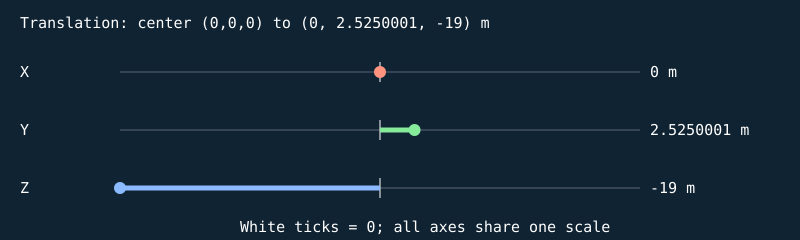


#### S

```text
[ 1.56124961 0 0 0 ]
[ 0 0.0500000007 0 0 ]
[ 0 0 0.159999996 0 ]
[ 0 0 0 1 ]
```

| Input corner (w=1) | Output corner (w=1) |
| --- | --- |
| (-0.5, -0.5, -0.5) | (-0.780624807, -0.0250000004, -0.0799999982) |
| (-0.5, -0.5, 0.5) | (-0.780624807, -0.0250000004, 0.0799999982) |
| (-0.5, 0.5, -0.5) | (-0.780624807, 0.0250000004, -0.0799999982) |
| (-0.5, 0.5, 0.5) | (-0.780624807, 0.0250000004, 0.0799999982) |
| (0.5, -0.5, -0.5) | (0.780624807, -0.0250000004, -0.0799999982) |
| (0.5, -0.5, 0.5) | (0.780624807, -0.0250000004, 0.0799999982) |
| (0.5, 0.5, -0.5) | (0.780624807, 0.0250000004, -0.0799999982) |
| (0.5, 0.5, 0.5) | (0.780624807, 0.0250000004, 0.0799999982) |

#### H

```text
[ 1 0 0 0 ]
[ 0 1 0 0 ]
[ 0 0 1 0 ]
[ 0 0 0 1 ]
```

| Input corner (w=1) | Output corner (w=1) |
| --- | --- |
| (-0.780624807, -0.0250000004, -0.0799999982) | (-0.780624807, -0.0250000004, -0.0799999982) |
| (-0.780624807, -0.0250000004, 0.0799999982) | (-0.780624807, -0.0250000004, 0.0799999982) |
| (-0.780624807, 0.0250000004, -0.0799999982) | (-0.780624807, 0.0250000004, -0.0799999982) |
| (-0.780624807, 0.0250000004, 0.0799999982) | (-0.780624807, 0.0250000004, 0.0799999982) |
| (0.780624807, -0.0250000004, -0.0799999982) | (0.780624807, -0.0250000004, -0.0799999982) |
| (0.780624807, -0.0250000004, 0.0799999982) | (0.780624807, -0.0250000004, 0.0799999982) |
| (0.780624807, 0.0250000004, -0.0799999982) | (0.780624807, 0.0250000004, -0.0799999982) |
| (0.780624807, 0.0250000004, 0.0799999982) | (0.780624807, 0.0250000004, 0.0799999982) |

#### Rx

```text
[ 1 0 0 0 ]
[ 0 1 -0 0 ]
[ 0 0 1 0 ]
[ 0 0 0 1 ]
```

| Input corner (w=1) | Output corner (w=1) |
| --- | --- |
| (-0.780624807, -0.0250000004, -0.0799999982) | (-0.780624807, -0.0250000004, -0.0799999982) |
| (-0.780624807, -0.0250000004, 0.0799999982) | (-0.780624807, -0.0250000004, 0.0799999982) |
| (-0.780624807, 0.0250000004, -0.0799999982) | (-0.780624807, 0.0250000004, -0.0799999982) |
| (-0.780624807, 0.0250000004, 0.0799999982) | (-0.780624807, 0.0250000004, 0.0799999982) |
| (0.780624807, -0.0250000004, -0.0799999982) | (0.780624807, -0.0250000004, -0.0799999982) |
| (0.780624807, -0.0250000004, 0.0799999982) | (0.780624807, -0.0250000004, 0.0799999982) |
| (0.780624807, 0.0250000004, -0.0799999982) | (0.780624807, 0.0250000004, -0.0799999982) |
| (0.780624807, 0.0250000004, 0.0799999982) | (0.780624807, 0.0250000004, 0.0799999982) |

#### Ry

```text
[ 1 0 0 0 ]
[ 0 1 0 0 ]
[ -0 0 1 0 ]
[ 0 0 0 1 ]
```

| Input corner (w=1) | Output corner (w=1) |
| --- | --- |
| (-0.780624807, -0.0250000004, -0.0799999982) | (-0.780624807, -0.0250000004, -0.0799999982) |
| (-0.780624807, -0.0250000004, 0.0799999982) | (-0.780624807, -0.0250000004, 0.0799999982) |
| (-0.780624807, 0.0250000004, -0.0799999982) | (-0.780624807, 0.0250000004, -0.0799999982) |
| (-0.780624807, 0.0250000004, 0.0799999982) | (-0.780624807, 0.0250000004, 0.0799999982) |
| (0.780624807, -0.0250000004, -0.0799999982) | (0.780624807, -0.0250000004, -0.0799999982) |
| (0.780624807, -0.0250000004, 0.0799999982) | (0.780624807, -0.0250000004, 0.0799999982) |
| (0.780624807, 0.0250000004, -0.0799999982) | (0.780624807, 0.0250000004, -0.0799999982) |
| (0.780624807, 0.0250000004, 0.0799999982) | (0.780624807, 0.0250000004, 0.0799999982) |

#### Rz

```text
[ 1 -0 0 0 ]
[ 0 1 0 0 ]
[ 0 0 1 0 ]
[ 0 0 0 1 ]
```

| Input corner (w=1) | Output corner (w=1) |
| --- | --- |
| (-0.780624807, -0.0250000004, -0.0799999982) | (-0.780624807, -0.0250000004, -0.0799999982) |
| (-0.780624807, -0.0250000004, 0.0799999982) | (-0.780624807, -0.0250000004, 0.0799999982) |
| (-0.780624807, 0.0250000004, -0.0799999982) | (-0.780624807, 0.0250000004, -0.0799999982) |
| (-0.780624807, 0.0250000004, 0.0799999982) | (-0.780624807, 0.0250000004, 0.0799999982) |
| (0.780624807, -0.0250000004, -0.0799999982) | (0.780624807, -0.0250000004, -0.0799999982) |
| (0.780624807, -0.0250000004, 0.0799999982) | (0.780624807, -0.0250000004, 0.0799999982) |
| (0.780624807, 0.0250000004, -0.0799999982) | (0.780624807, 0.0250000004, -0.0799999982) |
| (0.780624807, 0.0250000004, 0.0799999982) | (0.780624807, 0.0250000004, 0.0799999982) |

#### T

```text
[ 1 0 0 0 ]
[ 0 1 0 2.5250001 ]
[ 0 0 1 -19 ]
[ 0 0 0 1 ]
```

| Input corner (w=1) | Output corner (w=1) |
| --- | --- |
| (-0.780624807, -0.0250000004, -0.0799999982) | (-0.780624807, 2.5, -19.0799999) |
| (-0.780624807, -0.0250000004, 0.0799999982) | (-0.780624807, 2.5, -18.9200001) |
| (-0.780624807, 0.0250000004, -0.0799999982) | (-0.780624807, 2.55000019, -19.0799999) |
| (-0.780624807, 0.0250000004, 0.0799999982) | (-0.780624807, 2.55000019, -18.9200001) |
| (0.780624807, -0.0250000004, -0.0799999982) | (0.780624807, 2.5, -19.0799999) |
| (0.780624807, -0.0250000004, 0.0799999982) | (0.780624807, 2.5, -18.9200001) |
| (0.780624807, 0.0250000004, -0.0799999982) | (0.780624807, 2.55000019, -19.0799999) |
| (0.780624807, 0.0250000004, 0.0799999982) | (0.780624807, 2.55000019, -18.9200001) |

Final M = T Rz Ry Rx H S:

```text
[ 1.56124961 0 0 0 ]
[ 0 0.0500000007 0 2.5250001 ]
[ 0 0 0.159999996 -19 ]
[ 0 0 0 1 ]
```

### Cube-built six-ring plate — `TARGET_1_SLICE_13`

32 transformed cube slices; printed front +Z; health=60.000000/60; exact slice collider

Position T = (0, 2.57500005, -19) m; scale S = (1.58034813, 0.0500000007, 0.159999996); rotation (Rx,Ry,Rz) = (0, 0, 0) degrees.

Shear (xy,xz,yx,yz,zx,zy) = (0, 0, 0, 0, 0, 0). Color = (0.800000012, 0.800000012, 0.800000012); specular = 0.449999988; shininess = 48; emission = 0; flash = 0; material layer = 7; texture scale = 2. Pattern enabled = 1, pattern scale = (0.987717569, 0.03125, 1), offset = (0, -0.078125, 0).

| Step | Actual renderer image |
| --- | --- |
| Unit cube |  |
| Scale |  |
| Shear |  |
| Rotate X |  |
| Rotate Y |  |
| Rotate Z |  |
| Translate to world |  |

Steps 1–5 share one camera; the unit cube has its own close view, and step 6 is reframed at the actual world location to keep small objects visible. Reframing changes the view, never the model coordinates. Identity steps deliberately remain visible. Intermediate shapes are instructional states, while step 6 uses the unmodified game object.

Each stage below gives its exact numeric matrix and all eight corner multiplications. For each output row r: p'[r] = A[r,0]p.x + A[r,1]p.y + A[r,2]p.z + A[r,3]p.w.


#### S

```text
[ 1.58034813 0 0 0 ]
[ 0 0.0500000007 0 0 ]
[ 0 0 0.159999996 0 ]
[ 0 0 0 1 ]
```

| Input corner (w=1) | Output corner (w=1) |
| --- | --- |
| (-0.5, -0.5, -0.5) | (-0.790174067, -0.0250000004, -0.0799999982) |
| (-0.5, -0.5, 0.5) | (-0.790174067, -0.0250000004, 0.0799999982) |
| (-0.5, 0.5, -0.5) | (-0.790174067, 0.0250000004, -0.0799999982) |
| (-0.5, 0.5, 0.5) | (-0.790174067, 0.0250000004, 0.0799999982) |
| (0.5, -0.5, -0.5) | (0.790174067, -0.0250000004, -0.0799999982) |
| (0.5, -0.5, 0.5) | (0.790174067, -0.0250000004, 0.0799999982) |
| (0.5, 0.5, -0.5) | (0.790174067, 0.0250000004, -0.0799999982) |
| (0.5, 0.5, 0.5) | (0.790174067, 0.0250000004, 0.0799999982) |

#### H

```text
[ 1 0 0 0 ]
[ 0 1 0 0 ]
[ 0 0 1 0 ]
[ 0 0 0 1 ]
```

| Input corner (w=1) | Output corner (w=1) |
| --- | --- |
| (-0.790174067, -0.0250000004, -0.0799999982) | (-0.790174067, -0.0250000004, -0.0799999982) |
| (-0.790174067, -0.0250000004, 0.0799999982) | (-0.790174067, -0.0250000004, 0.0799999982) |
| (-0.790174067, 0.0250000004, -0.0799999982) | (-0.790174067, 0.0250000004, -0.0799999982) |
| (-0.790174067, 0.0250000004, 0.0799999982) | (-0.790174067, 0.0250000004, 0.0799999982) |
| (0.790174067, -0.0250000004, -0.0799999982) | (0.790174067, -0.0250000004, -0.0799999982) |
| (0.790174067, -0.0250000004, 0.0799999982) | (0.790174067, -0.0250000004, 0.0799999982) |
| (0.790174067, 0.0250000004, -0.0799999982) | (0.790174067, 0.0250000004, -0.0799999982) |
| (0.790174067, 0.0250000004, 0.0799999982) | (0.790174067, 0.0250000004, 0.0799999982) |

#### Rx

```text
[ 1 0 0 0 ]
[ 0 1 -0 0 ]
[ 0 0 1 0 ]
[ 0 0 0 1 ]
```

| Input corner (w=1) | Output corner (w=1) |
| --- | --- |
| (-0.790174067, -0.0250000004, -0.0799999982) | (-0.790174067, -0.0250000004, -0.0799999982) |
| (-0.790174067, -0.0250000004, 0.0799999982) | (-0.790174067, -0.0250000004, 0.0799999982) |
| (-0.790174067, 0.0250000004, -0.0799999982) | (-0.790174067, 0.0250000004, -0.0799999982) |
| (-0.790174067, 0.0250000004, 0.0799999982) | (-0.790174067, 0.0250000004, 0.0799999982) |
| (0.790174067, -0.0250000004, -0.0799999982) | (0.790174067, -0.0250000004, -0.0799999982) |
| (0.790174067, -0.0250000004, 0.0799999982) | (0.790174067, -0.0250000004, 0.0799999982) |
| (0.790174067, 0.0250000004, -0.0799999982) | (0.790174067, 0.0250000004, -0.0799999982) |
| (0.790174067, 0.0250000004, 0.0799999982) | (0.790174067, 0.0250000004, 0.0799999982) |

#### Ry

```text
[ 1 0 0 0 ]
[ 0 1 0 0 ]
[ -0 0 1 0 ]
[ 0 0 0 1 ]
```

| Input corner (w=1) | Output corner (w=1) |
| --- | --- |
| (-0.790174067, -0.0250000004, -0.0799999982) | (-0.790174067, -0.0250000004, -0.0799999982) |
| (-0.790174067, -0.0250000004, 0.0799999982) | (-0.790174067, -0.0250000004, 0.0799999982) |
| (-0.790174067, 0.0250000004, -0.0799999982) | (-0.790174067, 0.0250000004, -0.0799999982) |
| (-0.790174067, 0.0250000004, 0.0799999982) | (-0.790174067, 0.0250000004, 0.0799999982) |
| (0.790174067, -0.0250000004, -0.0799999982) | (0.790174067, -0.0250000004, -0.0799999982) |
| (0.790174067, -0.0250000004, 0.0799999982) | (0.790174067, -0.0250000004, 0.0799999982) |
| (0.790174067, 0.0250000004, -0.0799999982) | (0.790174067, 0.0250000004, -0.0799999982) |
| (0.790174067, 0.0250000004, 0.0799999982) | (0.790174067, 0.0250000004, 0.0799999982) |

#### Rz

```text
[ 1 -0 0 0 ]
[ 0 1 0 0 ]
[ 0 0 1 0 ]
[ 0 0 0 1 ]
```

| Input corner (w=1) | Output corner (w=1) |
| --- | --- |
| (-0.790174067, -0.0250000004, -0.0799999982) | (-0.790174067, -0.0250000004, -0.0799999982) |
| (-0.790174067, -0.0250000004, 0.0799999982) | (-0.790174067, -0.0250000004, 0.0799999982) |
| (-0.790174067, 0.0250000004, -0.0799999982) | (-0.790174067, 0.0250000004, -0.0799999982) |
| (-0.790174067, 0.0250000004, 0.0799999982) | (-0.790174067, 0.0250000004, 0.0799999982) |
| (0.790174067, -0.0250000004, -0.0799999982) | (0.790174067, -0.0250000004, -0.0799999982) |
| (0.790174067, -0.0250000004, 0.0799999982) | (0.790174067, -0.0250000004, 0.0799999982) |
| (0.790174067, 0.0250000004, -0.0799999982) | (0.790174067, 0.0250000004, -0.0799999982) |
| (0.790174067, 0.0250000004, 0.0799999982) | (0.790174067, 0.0250000004, 0.0799999982) |

#### T

```text
[ 1 0 0 0 ]
[ 0 1 0 2.57500005 ]
[ 0 0 1 -19 ]
[ 0 0 0 1 ]
```

| Input corner (w=1) | Output corner (w=1) |
| --- | --- |
| (-0.790174067, -0.0250000004, -0.0799999982) | (-0.790174067, 2.54999995, -19.0799999) |
| (-0.790174067, -0.0250000004, 0.0799999982) | (-0.790174067, 2.54999995, -18.9200001) |
| (-0.790174067, 0.0250000004, -0.0799999982) | (-0.790174067, 2.60000014, -19.0799999) |
| (-0.790174067, 0.0250000004, 0.0799999982) | (-0.790174067, 2.60000014, -18.9200001) |
| (0.790174067, -0.0250000004, -0.0799999982) | (0.790174067, 2.54999995, -19.0799999) |
| (0.790174067, -0.0250000004, 0.0799999982) | (0.790174067, 2.54999995, -18.9200001) |
| (0.790174067, 0.0250000004, -0.0799999982) | (0.790174067, 2.60000014, -19.0799999) |
| (0.790174067, 0.0250000004, 0.0799999982) | (0.790174067, 2.60000014, -18.9200001) |

Final M = T Rz Ry Rx H S:

```text
[ 1.58034813 0 0 0 ]
[ 0 0.0500000007 0 2.57500005 ]
[ 0 0 0.159999996 -19 ]
[ 0 0 0 1 ]
```

### Cube-built six-ring plate — `TARGET_1_SLICE_14`

32 transformed cube slices; printed front +Z; health=60.000000/60; exact slice collider

Position T = (0, 2.625, -19) m; scale S = (1.59295332, 0.0500000007, 0.159999996); rotation (Rx,Ry,Rz) = (0, 0, 0) degrees.

Shear (xy,xz,yx,yz,zx,zy) = (0, 0, 0, 0, 0, 0). Color = (0.800000012, 0.800000012, 0.800000012); specular = 0.449999988; shininess = 48; emission = 0; flash = 0; material layer = 7; texture scale = 2. Pattern enabled = 1, pattern scale = (0.995595813, 0.03125, 1), offset = (0, -0.0468749925, 0).

| Step | Actual renderer image |
| --- | --- |
| Unit cube |  |
| Scale |  |
| Shear |  |
| Rotate X |  |
| Rotate Y |  |
| Rotate Z |  |
| Translate to world |  |

Steps 1–5 share one camera; the unit cube has its own close view, and step 6 is reframed at the actual world location to keep small objects visible. Reframing changes the view, never the model coordinates. Identity steps deliberately remain visible. Intermediate shapes are instructional states, while step 6 uses the unmodified game object.

Each stage below gives its exact numeric matrix and all eight corner multiplications. For each output row r: p'[r] = A[r,0]p.x + A[r,1]p.y + A[r,2]p.z + A[r,3]p.w.


#### S

```text
[ 1.59295332 0 0 0 ]
[ 0 0.0500000007 0 0 ]
[ 0 0 0.159999996 0 ]
[ 0 0 0 1 ]
```

| Input corner (w=1) | Output corner (w=1) |
| --- | --- |
| (-0.5, -0.5, -0.5) | (-0.796476662, -0.0250000004, -0.0799999982) |
| (-0.5, -0.5, 0.5) | (-0.796476662, -0.0250000004, 0.0799999982) |
| (-0.5, 0.5, -0.5) | (-0.796476662, 0.0250000004, -0.0799999982) |
| (-0.5, 0.5, 0.5) | (-0.796476662, 0.0250000004, 0.0799999982) |
| (0.5, -0.5, -0.5) | (0.796476662, -0.0250000004, -0.0799999982) |
| (0.5, -0.5, 0.5) | (0.796476662, -0.0250000004, 0.0799999982) |
| (0.5, 0.5, -0.5) | (0.796476662, 0.0250000004, -0.0799999982) |
| (0.5, 0.5, 0.5) | (0.796476662, 0.0250000004, 0.0799999982) |

#### H

```text
[ 1 0 0 0 ]
[ 0 1 0 0 ]
[ 0 0 1 0 ]
[ 0 0 0 1 ]
```

| Input corner (w=1) | Output corner (w=1) |
| --- | --- |
| (-0.796476662, -0.0250000004, -0.0799999982) | (-0.796476662, -0.0250000004, -0.0799999982) |
| (-0.796476662, -0.0250000004, 0.0799999982) | (-0.796476662, -0.0250000004, 0.0799999982) |
| (-0.796476662, 0.0250000004, -0.0799999982) | (-0.796476662, 0.0250000004, -0.0799999982) |
| (-0.796476662, 0.0250000004, 0.0799999982) | (-0.796476662, 0.0250000004, 0.0799999982) |
| (0.796476662, -0.0250000004, -0.0799999982) | (0.796476662, -0.0250000004, -0.0799999982) |
| (0.796476662, -0.0250000004, 0.0799999982) | (0.796476662, -0.0250000004, 0.0799999982) |
| (0.796476662, 0.0250000004, -0.0799999982) | (0.796476662, 0.0250000004, -0.0799999982) |
| (0.796476662, 0.0250000004, 0.0799999982) | (0.796476662, 0.0250000004, 0.0799999982) |

#### Rx

```text
[ 1 0 0 0 ]
[ 0 1 -0 0 ]
[ 0 0 1 0 ]
[ 0 0 0 1 ]
```

| Input corner (w=1) | Output corner (w=1) |
| --- | --- |
| (-0.796476662, -0.0250000004, -0.0799999982) | (-0.796476662, -0.0250000004, -0.0799999982) |
| (-0.796476662, -0.0250000004, 0.0799999982) | (-0.796476662, -0.0250000004, 0.0799999982) |
| (-0.796476662, 0.0250000004, -0.0799999982) | (-0.796476662, 0.0250000004, -0.0799999982) |
| (-0.796476662, 0.0250000004, 0.0799999982) | (-0.796476662, 0.0250000004, 0.0799999982) |
| (0.796476662, -0.0250000004, -0.0799999982) | (0.796476662, -0.0250000004, -0.0799999982) |
| (0.796476662, -0.0250000004, 0.0799999982) | (0.796476662, -0.0250000004, 0.0799999982) |
| (0.796476662, 0.0250000004, -0.0799999982) | (0.796476662, 0.0250000004, -0.0799999982) |
| (0.796476662, 0.0250000004, 0.0799999982) | (0.796476662, 0.0250000004, 0.0799999982) |

#### Ry

```text
[ 1 0 0 0 ]
[ 0 1 0 0 ]
[ -0 0 1 0 ]
[ 0 0 0 1 ]
```

| Input corner (w=1) | Output corner (w=1) |
| --- | --- |
| (-0.796476662, -0.0250000004, -0.0799999982) | (-0.796476662, -0.0250000004, -0.0799999982) |
| (-0.796476662, -0.0250000004, 0.0799999982) | (-0.796476662, -0.0250000004, 0.0799999982) |
| (-0.796476662, 0.0250000004, -0.0799999982) | (-0.796476662, 0.0250000004, -0.0799999982) |
| (-0.796476662, 0.0250000004, 0.0799999982) | (-0.796476662, 0.0250000004, 0.0799999982) |
| (0.796476662, -0.0250000004, -0.0799999982) | (0.796476662, -0.0250000004, -0.0799999982) |
| (0.796476662, -0.0250000004, 0.0799999982) | (0.796476662, -0.0250000004, 0.0799999982) |
| (0.796476662, 0.0250000004, -0.0799999982) | (0.796476662, 0.0250000004, -0.0799999982) |
| (0.796476662, 0.0250000004, 0.0799999982) | (0.796476662, 0.0250000004, 0.0799999982) |

#### Rz

```text
[ 1 -0 0 0 ]
[ 0 1 0 0 ]
[ 0 0 1 0 ]
[ 0 0 0 1 ]
```

| Input corner (w=1) | Output corner (w=1) |
| --- | --- |
| (-0.796476662, -0.0250000004, -0.0799999982) | (-0.796476662, -0.0250000004, -0.0799999982) |
| (-0.796476662, -0.0250000004, 0.0799999982) | (-0.796476662, -0.0250000004, 0.0799999982) |
| (-0.796476662, 0.0250000004, -0.0799999982) | (-0.796476662, 0.0250000004, -0.0799999982) |
| (-0.796476662, 0.0250000004, 0.0799999982) | (-0.796476662, 0.0250000004, 0.0799999982) |
| (0.796476662, -0.0250000004, -0.0799999982) | (0.796476662, -0.0250000004, -0.0799999982) |
| (0.796476662, -0.0250000004, 0.0799999982) | (0.796476662, -0.0250000004, 0.0799999982) |
| (0.796476662, 0.0250000004, -0.0799999982) | (0.796476662, 0.0250000004, -0.0799999982) |
| (0.796476662, 0.0250000004, 0.0799999982) | (0.796476662, 0.0250000004, 0.0799999982) |

#### T

```text
[ 1 0 0 0 ]
[ 0 1 0 2.625 ]
[ 0 0 1 -19 ]
[ 0 0 0 1 ]
```

| Input corner (w=1) | Output corner (w=1) |
| --- | --- |
| (-0.796476662, -0.0250000004, -0.0799999982) | (-0.796476662, 2.5999999, -19.0799999) |
| (-0.796476662, -0.0250000004, 0.0799999982) | (-0.796476662, 2.5999999, -18.9200001) |
| (-0.796476662, 0.0250000004, -0.0799999982) | (-0.796476662, 2.6500001, -19.0799999) |
| (-0.796476662, 0.0250000004, 0.0799999982) | (-0.796476662, 2.6500001, -18.9200001) |
| (0.796476662, -0.0250000004, -0.0799999982) | (0.796476662, 2.5999999, -19.0799999) |
| (0.796476662, -0.0250000004, 0.0799999982) | (0.796476662, 2.5999999, -18.9200001) |
| (0.796476662, 0.0250000004, -0.0799999982) | (0.796476662, 2.6500001, -19.0799999) |
| (0.796476662, 0.0250000004, 0.0799999982) | (0.796476662, 2.6500001, -18.9200001) |

Final M = T Rz Ry Rx H S:

```text
[ 1.59295332 0 0 0 ]
[ 0 0.0500000007 0 2.625 ]
[ 0 0 0.159999996 -19 ]
[ 0 0 0 1 ]
```

### Cube-built six-ring plate — `TARGET_1_SLICE_15`

32 transformed cube slices; printed front +Z; health=60.000000/60; exact slice collider

Position T = (0, 2.67500019, -19) m; scale S = (1.59921861, 0.0500000007, 0.159999996); rotation (Rx,Ry,Rz) = (0, 0, 0) degrees.

Shear (xy,xz,yx,yz,zx,zy) = (0, 0, 0, 0, 0, 0). Color = (0.800000012, 0.800000012, 0.800000012); specular = 0.449999988; shininess = 48; emission = 0; flash = 0; material layer = 7; texture scale = 2. Pattern enabled = 1, pattern scale = (0.9995116, 0.03125, 1), offset = (0, -0.0156249851, 0).

| Step | Actual renderer image |
| --- | --- |
| Unit cube |  |
| Scale |  |
| Shear |  |
| Rotate X |  |
| Rotate Y |  |
| Rotate Z |  |
| Translate to world |  |

Steps 1–5 share one camera; the unit cube has its own close view, and step 6 is reframed at the actual world location to keep small objects visible. Reframing changes the view, never the model coordinates. Identity steps deliberately remain visible. Intermediate shapes are instructional states, while step 6 uses the unmodified game object.

Each stage below gives its exact numeric matrix and all eight corner multiplications. For each output row r: p'[r] = A[r,0]p.x + A[r,1]p.y + A[r,2]p.z + A[r,3]p.w.


#### S

```text
[ 1.59921861 0 0 0 ]
[ 0 0.0500000007 0 0 ]
[ 0 0 0.159999996 0 ]
[ 0 0 0 1 ]
```

| Input corner (w=1) | Output corner (w=1) |
| --- | --- |
| (-0.5, -0.5, -0.5) | (-0.799609303, -0.0250000004, -0.0799999982) |
| (-0.5, -0.5, 0.5) | (-0.799609303, -0.0250000004, 0.0799999982) |
| (-0.5, 0.5, -0.5) | (-0.799609303, 0.0250000004, -0.0799999982) |
| (-0.5, 0.5, 0.5) | (-0.799609303, 0.0250000004, 0.0799999982) |
| (0.5, -0.5, -0.5) | (0.799609303, -0.0250000004, -0.0799999982) |
| (0.5, -0.5, 0.5) | (0.799609303, -0.0250000004, 0.0799999982) |
| (0.5, 0.5, -0.5) | (0.799609303, 0.0250000004, -0.0799999982) |
| (0.5, 0.5, 0.5) | (0.799609303, 0.0250000004, 0.0799999982) |

#### H

```text
[ 1 0 0 0 ]
[ 0 1 0 0 ]
[ 0 0 1 0 ]
[ 0 0 0 1 ]
```

| Input corner (w=1) | Output corner (w=1) |
| --- | --- |
| (-0.799609303, -0.0250000004, -0.0799999982) | (-0.799609303, -0.0250000004, -0.0799999982) |
| (-0.799609303, -0.0250000004, 0.0799999982) | (-0.799609303, -0.0250000004, 0.0799999982) |
| (-0.799609303, 0.0250000004, -0.0799999982) | (-0.799609303, 0.0250000004, -0.0799999982) |
| (-0.799609303, 0.0250000004, 0.0799999982) | (-0.799609303, 0.0250000004, 0.0799999982) |
| (0.799609303, -0.0250000004, -0.0799999982) | (0.799609303, -0.0250000004, -0.0799999982) |
| (0.799609303, -0.0250000004, 0.0799999982) | (0.799609303, -0.0250000004, 0.0799999982) |
| (0.799609303, 0.0250000004, -0.0799999982) | (0.799609303, 0.0250000004, -0.0799999982) |
| (0.799609303, 0.0250000004, 0.0799999982) | (0.799609303, 0.0250000004, 0.0799999982) |

#### Rx

```text
[ 1 0 0 0 ]
[ 0 1 -0 0 ]
[ 0 0 1 0 ]
[ 0 0 0 1 ]
```

| Input corner (w=1) | Output corner (w=1) |
| --- | --- |
| (-0.799609303, -0.0250000004, -0.0799999982) | (-0.799609303, -0.0250000004, -0.0799999982) |
| (-0.799609303, -0.0250000004, 0.0799999982) | (-0.799609303, -0.0250000004, 0.0799999982) |
| (-0.799609303, 0.0250000004, -0.0799999982) | (-0.799609303, 0.0250000004, -0.0799999982) |
| (-0.799609303, 0.0250000004, 0.0799999982) | (-0.799609303, 0.0250000004, 0.0799999982) |
| (0.799609303, -0.0250000004, -0.0799999982) | (0.799609303, -0.0250000004, -0.0799999982) |
| (0.799609303, -0.0250000004, 0.0799999982) | (0.799609303, -0.0250000004, 0.0799999982) |
| (0.799609303, 0.0250000004, -0.0799999982) | (0.799609303, 0.0250000004, -0.0799999982) |
| (0.799609303, 0.0250000004, 0.0799999982) | (0.799609303, 0.0250000004, 0.0799999982) |

#### Ry

```text
[ 1 0 0 0 ]
[ 0 1 0 0 ]
[ -0 0 1 0 ]
[ 0 0 0 1 ]
```

| Input corner (w=1) | Output corner (w=1) |
| --- | --- |
| (-0.799609303, -0.0250000004, -0.0799999982) | (-0.799609303, -0.0250000004, -0.0799999982) |
| (-0.799609303, -0.0250000004, 0.0799999982) | (-0.799609303, -0.0250000004, 0.0799999982) |
| (-0.799609303, 0.0250000004, -0.0799999982) | (-0.799609303, 0.0250000004, -0.0799999982) |
| (-0.799609303, 0.0250000004, 0.0799999982) | (-0.799609303, 0.0250000004, 0.0799999982) |
| (0.799609303, -0.0250000004, -0.0799999982) | (0.799609303, -0.0250000004, -0.0799999982) |
| (0.799609303, -0.0250000004, 0.0799999982) | (0.799609303, -0.0250000004, 0.0799999982) |
| (0.799609303, 0.0250000004, -0.0799999982) | (0.799609303, 0.0250000004, -0.0799999982) |
| (0.799609303, 0.0250000004, 0.0799999982) | (0.799609303, 0.0250000004, 0.0799999982) |

#### Rz

```text
[ 1 -0 0 0 ]
[ 0 1 0 0 ]
[ 0 0 1 0 ]
[ 0 0 0 1 ]
```

| Input corner (w=1) | Output corner (w=1) |
| --- | --- |
| (-0.799609303, -0.0250000004, -0.0799999982) | (-0.799609303, -0.0250000004, -0.0799999982) |
| (-0.799609303, -0.0250000004, 0.0799999982) | (-0.799609303, -0.0250000004, 0.0799999982) |
| (-0.799609303, 0.0250000004, -0.0799999982) | (-0.799609303, 0.0250000004, -0.0799999982) |
| (-0.799609303, 0.0250000004, 0.0799999982) | (-0.799609303, 0.0250000004, 0.0799999982) |
| (0.799609303, -0.0250000004, -0.0799999982) | (0.799609303, -0.0250000004, -0.0799999982) |
| (0.799609303, -0.0250000004, 0.0799999982) | (0.799609303, -0.0250000004, 0.0799999982) |
| (0.799609303, 0.0250000004, -0.0799999982) | (0.799609303, 0.0250000004, -0.0799999982) |
| (0.799609303, 0.0250000004, 0.0799999982) | (0.799609303, 0.0250000004, 0.0799999982) |

#### T

```text
[ 1 0 0 0 ]
[ 0 1 0 2.67500019 ]
[ 0 0 1 -19 ]
[ 0 0 0 1 ]
```

| Input corner (w=1) | Output corner (w=1) |
| --- | --- |
| (-0.799609303, -0.0250000004, -0.0799999982) | (-0.799609303, 2.6500001, -19.0799999) |
| (-0.799609303, -0.0250000004, 0.0799999982) | (-0.799609303, 2.6500001, -18.9200001) |
| (-0.799609303, 0.0250000004, -0.0799999982) | (-0.799609303, 2.70000029, -19.0799999) |
| (-0.799609303, 0.0250000004, 0.0799999982) | (-0.799609303, 2.70000029, -18.9200001) |
| (0.799609303, -0.0250000004, -0.0799999982) | (0.799609303, 2.6500001, -19.0799999) |
| (0.799609303, -0.0250000004, 0.0799999982) | (0.799609303, 2.6500001, -18.9200001) |
| (0.799609303, 0.0250000004, -0.0799999982) | (0.799609303, 2.70000029, -19.0799999) |
| (0.799609303, 0.0250000004, 0.0799999982) | (0.799609303, 2.70000029, -18.9200001) |

Final M = T Rz Ry Rx H S:

```text
[ 1.59921861 0 0 0 ]
[ 0 0.0500000007 0 2.67500019 ]
[ 0 0 0.159999996 -19 ]
[ 0 0 0 1 ]
```

### Cube-built six-ring plate — `TARGET_1_SLICE_16`

32 transformed cube slices; printed front +Z; health=60.000000/60; exact slice collider

Position T = (0, 2.7249999, -19) m; scale S = (1.59921861, 0.0500000007, 0.159999996); rotation (Rx,Ry,Rz) = (0, 0, 0) degrees.

Shear (xy,xz,yx,yz,zx,zy) = (0, 0, 0, 0, 0, 0). Color = (0.800000012, 0.800000012, 0.800000012); specular = 0.449999988; shininess = 48; emission = 0; flash = 0; material layer = 7; texture scale = 2. Pattern enabled = 1, pattern scale = (0.9995116, 0.03125, 1), offset = (0, 0.0156249851, 0).

| Step | Actual renderer image |
| --- | --- |
| Unit cube |  |
| Scale |  |
| Shear |  |
| Rotate X |  |
| Rotate Y |  |
| Rotate Z |  |
| Translate to world |  |

Steps 1–5 share one camera; the unit cube has its own close view, and step 6 is reframed at the actual world location to keep small objects visible. Reframing changes the view, never the model coordinates. Identity steps deliberately remain visible. Intermediate shapes are instructional states, while step 6 uses the unmodified game object.

Each stage below gives its exact numeric matrix and all eight corner multiplications. For each output row r: p'[r] = A[r,0]p.x + A[r,1]p.y + A[r,2]p.z + A[r,3]p.w.


#### S

```text
[ 1.59921861 0 0 0 ]
[ 0 0.0500000007 0 0 ]
[ 0 0 0.159999996 0 ]
[ 0 0 0 1 ]
```

| Input corner (w=1) | Output corner (w=1) |
| --- | --- |
| (-0.5, -0.5, -0.5) | (-0.799609303, -0.0250000004, -0.0799999982) |
| (-0.5, -0.5, 0.5) | (-0.799609303, -0.0250000004, 0.0799999982) |
| (-0.5, 0.5, -0.5) | (-0.799609303, 0.0250000004, -0.0799999982) |
| (-0.5, 0.5, 0.5) | (-0.799609303, 0.0250000004, 0.0799999982) |
| (0.5, -0.5, -0.5) | (0.799609303, -0.0250000004, -0.0799999982) |
| (0.5, -0.5, 0.5) | (0.799609303, -0.0250000004, 0.0799999982) |
| (0.5, 0.5, -0.5) | (0.799609303, 0.0250000004, -0.0799999982) |
| (0.5, 0.5, 0.5) | (0.799609303, 0.0250000004, 0.0799999982) |

#### H

```text
[ 1 0 0 0 ]
[ 0 1 0 0 ]
[ 0 0 1 0 ]
[ 0 0 0 1 ]
```

| Input corner (w=1) | Output corner (w=1) |
| --- | --- |
| (-0.799609303, -0.0250000004, -0.0799999982) | (-0.799609303, -0.0250000004, -0.0799999982) |
| (-0.799609303, -0.0250000004, 0.0799999982) | (-0.799609303, -0.0250000004, 0.0799999982) |
| (-0.799609303, 0.0250000004, -0.0799999982) | (-0.799609303, 0.0250000004, -0.0799999982) |
| (-0.799609303, 0.0250000004, 0.0799999982) | (-0.799609303, 0.0250000004, 0.0799999982) |
| (0.799609303, -0.0250000004, -0.0799999982) | (0.799609303, -0.0250000004, -0.0799999982) |
| (0.799609303, -0.0250000004, 0.0799999982) | (0.799609303, -0.0250000004, 0.0799999982) |
| (0.799609303, 0.0250000004, -0.0799999982) | (0.799609303, 0.0250000004, -0.0799999982) |
| (0.799609303, 0.0250000004, 0.0799999982) | (0.799609303, 0.0250000004, 0.0799999982) |

#### Rx

```text
[ 1 0 0 0 ]
[ 0 1 -0 0 ]
[ 0 0 1 0 ]
[ 0 0 0 1 ]
```

| Input corner (w=1) | Output corner (w=1) |
| --- | --- |
| (-0.799609303, -0.0250000004, -0.0799999982) | (-0.799609303, -0.0250000004, -0.0799999982) |
| (-0.799609303, -0.0250000004, 0.0799999982) | (-0.799609303, -0.0250000004, 0.0799999982) |
| (-0.799609303, 0.0250000004, -0.0799999982) | (-0.799609303, 0.0250000004, -0.0799999982) |
| (-0.799609303, 0.0250000004, 0.0799999982) | (-0.799609303, 0.0250000004, 0.0799999982) |
| (0.799609303, -0.0250000004, -0.0799999982) | (0.799609303, -0.0250000004, -0.0799999982) |
| (0.799609303, -0.0250000004, 0.0799999982) | (0.799609303, -0.0250000004, 0.0799999982) |
| (0.799609303, 0.0250000004, -0.0799999982) | (0.799609303, 0.0250000004, -0.0799999982) |
| (0.799609303, 0.0250000004, 0.0799999982) | (0.799609303, 0.0250000004, 0.0799999982) |

#### Ry

```text
[ 1 0 0 0 ]
[ 0 1 0 0 ]
[ -0 0 1 0 ]
[ 0 0 0 1 ]
```

| Input corner (w=1) | Output corner (w=1) |
| --- | --- |
| (-0.799609303, -0.0250000004, -0.0799999982) | (-0.799609303, -0.0250000004, -0.0799999982) |
| (-0.799609303, -0.0250000004, 0.0799999982) | (-0.799609303, -0.0250000004, 0.0799999982) |
| (-0.799609303, 0.0250000004, -0.0799999982) | (-0.799609303, 0.0250000004, -0.0799999982) |
| (-0.799609303, 0.0250000004, 0.0799999982) | (-0.799609303, 0.0250000004, 0.0799999982) |
| (0.799609303, -0.0250000004, -0.0799999982) | (0.799609303, -0.0250000004, -0.0799999982) |
| (0.799609303, -0.0250000004, 0.0799999982) | (0.799609303, -0.0250000004, 0.0799999982) |
| (0.799609303, 0.0250000004, -0.0799999982) | (0.799609303, 0.0250000004, -0.0799999982) |
| (0.799609303, 0.0250000004, 0.0799999982) | (0.799609303, 0.0250000004, 0.0799999982) |

#### Rz

```text
[ 1 -0 0 0 ]
[ 0 1 0 0 ]
[ 0 0 1 0 ]
[ 0 0 0 1 ]
```

| Input corner (w=1) | Output corner (w=1) |
| --- | --- |
| (-0.799609303, -0.0250000004, -0.0799999982) | (-0.799609303, -0.0250000004, -0.0799999982) |
| (-0.799609303, -0.0250000004, 0.0799999982) | (-0.799609303, -0.0250000004, 0.0799999982) |
| (-0.799609303, 0.0250000004, -0.0799999982) | (-0.799609303, 0.0250000004, -0.0799999982) |
| (-0.799609303, 0.0250000004, 0.0799999982) | (-0.799609303, 0.0250000004, 0.0799999982) |
| (0.799609303, -0.0250000004, -0.0799999982) | (0.799609303, -0.0250000004, -0.0799999982) |
| (0.799609303, -0.0250000004, 0.0799999982) | (0.799609303, -0.0250000004, 0.0799999982) |
| (0.799609303, 0.0250000004, -0.0799999982) | (0.799609303, 0.0250000004, -0.0799999982) |
| (0.799609303, 0.0250000004, 0.0799999982) | (0.799609303, 0.0250000004, 0.0799999982) |

#### T

```text
[ 1 0 0 0 ]
[ 0 1 0 2.7249999 ]
[ 0 0 1 -19 ]
[ 0 0 0 1 ]
```

| Input corner (w=1) | Output corner (w=1) |
| --- | --- |
| (-0.799609303, -0.0250000004, -0.0799999982) | (-0.799609303, 2.69999981, -19.0799999) |
| (-0.799609303, -0.0250000004, 0.0799999982) | (-0.799609303, 2.69999981, -18.9200001) |
| (-0.799609303, 0.0250000004, -0.0799999982) | (-0.799609303, 2.75, -19.0799999) |
| (-0.799609303, 0.0250000004, 0.0799999982) | (-0.799609303, 2.75, -18.9200001) |
| (0.799609303, -0.0250000004, -0.0799999982) | (0.799609303, 2.69999981, -19.0799999) |
| (0.799609303, -0.0250000004, 0.0799999982) | (0.799609303, 2.69999981, -18.9200001) |
| (0.799609303, 0.0250000004, -0.0799999982) | (0.799609303, 2.75, -19.0799999) |
| (0.799609303, 0.0250000004, 0.0799999982) | (0.799609303, 2.75, -18.9200001) |

Final M = T Rz Ry Rx H S:

```text
[ 1.59921861 0 0 0 ]
[ 0 0.0500000007 0 2.7249999 ]
[ 0 0 0.159999996 -19 ]
[ 0 0 0 1 ]
```

### Cube-built six-ring plate — `TARGET_1_SLICE_17`

32 transformed cube slices; printed front +Z; health=60.000000/60; exact slice collider

Position T = (0, 2.7750001, -19) m; scale S = (1.59295332, 0.0500000007, 0.159999996); rotation (Rx,Ry,Rz) = (0, 0, 0) degrees.

Shear (xy,xz,yx,yz,zx,zy) = (0, 0, 0, 0, 0, 0). Color = (0.800000012, 0.800000012, 0.800000012); specular = 0.449999988; shininess = 48; emission = 0; flash = 0; material layer = 7; texture scale = 2. Pattern enabled = 1, pattern scale = (0.995595813, 0.03125, 1), offset = (0, 0.0468749925, 0).

| Step | Actual renderer image |
| --- | --- |
| Unit cube |  |
| Scale |  |
| Shear |  |
| Rotate X |  |
| Rotate Y |  |
| Rotate Z |  |
| Translate to world |  |

Steps 1–5 share one camera; the unit cube has its own close view, and step 6 is reframed at the actual world location to keep small objects visible. Reframing changes the view, never the model coordinates. Identity steps deliberately remain visible. Intermediate shapes are instructional states, while step 6 uses the unmodified game object.

Each stage below gives its exact numeric matrix and all eight corner multiplications. For each output row r: p'[r] = A[r,0]p.x + A[r,1]p.y + A[r,2]p.z + A[r,3]p.w.

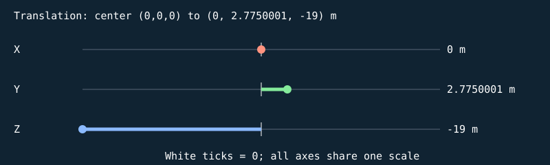


#### S

```text
[ 1.59295332 0 0 0 ]
[ 0 0.0500000007 0 0 ]
[ 0 0 0.159999996 0 ]
[ 0 0 0 1 ]
```

| Input corner (w=1) | Output corner (w=1) |
| --- | --- |
| (-0.5, -0.5, -0.5) | (-0.796476662, -0.0250000004, -0.0799999982) |
| (-0.5, -0.5, 0.5) | (-0.796476662, -0.0250000004, 0.0799999982) |
| (-0.5, 0.5, -0.5) | (-0.796476662, 0.0250000004, -0.0799999982) |
| (-0.5, 0.5, 0.5) | (-0.796476662, 0.0250000004, 0.0799999982) |
| (0.5, -0.5, -0.5) | (0.796476662, -0.0250000004, -0.0799999982) |
| (0.5, -0.5, 0.5) | (0.796476662, -0.0250000004, 0.0799999982) |
| (0.5, 0.5, -0.5) | (0.796476662, 0.0250000004, -0.0799999982) |
| (0.5, 0.5, 0.5) | (0.796476662, 0.0250000004, 0.0799999982) |

#### H

```text
[ 1 0 0 0 ]
[ 0 1 0 0 ]
[ 0 0 1 0 ]
[ 0 0 0 1 ]
```

| Input corner (w=1) | Output corner (w=1) |
| --- | --- |
| (-0.796476662, -0.0250000004, -0.0799999982) | (-0.796476662, -0.0250000004, -0.0799999982) |
| (-0.796476662, -0.0250000004, 0.0799999982) | (-0.796476662, -0.0250000004, 0.0799999982) |
| (-0.796476662, 0.0250000004, -0.0799999982) | (-0.796476662, 0.0250000004, -0.0799999982) |
| (-0.796476662, 0.0250000004, 0.0799999982) | (-0.796476662, 0.0250000004, 0.0799999982) |
| (0.796476662, -0.0250000004, -0.0799999982) | (0.796476662, -0.0250000004, -0.0799999982) |
| (0.796476662, -0.0250000004, 0.0799999982) | (0.796476662, -0.0250000004, 0.0799999982) |
| (0.796476662, 0.0250000004, -0.0799999982) | (0.796476662, 0.0250000004, -0.0799999982) |
| (0.796476662, 0.0250000004, 0.0799999982) | (0.796476662, 0.0250000004, 0.0799999982) |

#### Rx

```text
[ 1 0 0 0 ]
[ 0 1 -0 0 ]
[ 0 0 1 0 ]
[ 0 0 0 1 ]
```

| Input corner (w=1) | Output corner (w=1) |
| --- | --- |
| (-0.796476662, -0.0250000004, -0.0799999982) | (-0.796476662, -0.0250000004, -0.0799999982) |
| (-0.796476662, -0.0250000004, 0.0799999982) | (-0.796476662, -0.0250000004, 0.0799999982) |
| (-0.796476662, 0.0250000004, -0.0799999982) | (-0.796476662, 0.0250000004, -0.0799999982) |
| (-0.796476662, 0.0250000004, 0.0799999982) | (-0.796476662, 0.0250000004, 0.0799999982) |
| (0.796476662, -0.0250000004, -0.0799999982) | (0.796476662, -0.0250000004, -0.0799999982) |
| (0.796476662, -0.0250000004, 0.0799999982) | (0.796476662, -0.0250000004, 0.0799999982) |
| (0.796476662, 0.0250000004, -0.0799999982) | (0.796476662, 0.0250000004, -0.0799999982) |
| (0.796476662, 0.0250000004, 0.0799999982) | (0.796476662, 0.0250000004, 0.0799999982) |

#### Ry

```text
[ 1 0 0 0 ]
[ 0 1 0 0 ]
[ -0 0 1 0 ]
[ 0 0 0 1 ]
```

| Input corner (w=1) | Output corner (w=1) |
| --- | --- |
| (-0.796476662, -0.0250000004, -0.0799999982) | (-0.796476662, -0.0250000004, -0.0799999982) |
| (-0.796476662, -0.0250000004, 0.0799999982) | (-0.796476662, -0.0250000004, 0.0799999982) |
| (-0.796476662, 0.0250000004, -0.0799999982) | (-0.796476662, 0.0250000004, -0.0799999982) |
| (-0.796476662, 0.0250000004, 0.0799999982) | (-0.796476662, 0.0250000004, 0.0799999982) |
| (0.796476662, -0.0250000004, -0.0799999982) | (0.796476662, -0.0250000004, -0.0799999982) |
| (0.796476662, -0.0250000004, 0.0799999982) | (0.796476662, -0.0250000004, 0.0799999982) |
| (0.796476662, 0.0250000004, -0.0799999982) | (0.796476662, 0.0250000004, -0.0799999982) |
| (0.796476662, 0.0250000004, 0.0799999982) | (0.796476662, 0.0250000004, 0.0799999982) |

#### Rz

```text
[ 1 -0 0 0 ]
[ 0 1 0 0 ]
[ 0 0 1 0 ]
[ 0 0 0 1 ]
```

| Input corner (w=1) | Output corner (w=1) |
| --- | --- |
| (-0.796476662, -0.0250000004, -0.0799999982) | (-0.796476662, -0.0250000004, -0.0799999982) |
| (-0.796476662, -0.0250000004, 0.0799999982) | (-0.796476662, -0.0250000004, 0.0799999982) |
| (-0.796476662, 0.0250000004, -0.0799999982) | (-0.796476662, 0.0250000004, -0.0799999982) |
| (-0.796476662, 0.0250000004, 0.0799999982) | (-0.796476662, 0.0250000004, 0.0799999982) |
| (0.796476662, -0.0250000004, -0.0799999982) | (0.796476662, -0.0250000004, -0.0799999982) |
| (0.796476662, -0.0250000004, 0.0799999982) | (0.796476662, -0.0250000004, 0.0799999982) |
| (0.796476662, 0.0250000004, -0.0799999982) | (0.796476662, 0.0250000004, -0.0799999982) |
| (0.796476662, 0.0250000004, 0.0799999982) | (0.796476662, 0.0250000004, 0.0799999982) |

#### T

```text
[ 1 0 0 0 ]
[ 0 1 0 2.7750001 ]
[ 0 0 1 -19 ]
[ 0 0 0 1 ]
```

| Input corner (w=1) | Output corner (w=1) |
| --- | --- |
| (-0.796476662, -0.0250000004, -0.0799999982) | (-0.796476662, 2.75, -19.0799999) |
| (-0.796476662, -0.0250000004, 0.0799999982) | (-0.796476662, 2.75, -18.9200001) |
| (-0.796476662, 0.0250000004, -0.0799999982) | (-0.796476662, 2.80000019, -19.0799999) |
| (-0.796476662, 0.0250000004, 0.0799999982) | (-0.796476662, 2.80000019, -18.9200001) |
| (0.796476662, -0.0250000004, -0.0799999982) | (0.796476662, 2.75, -19.0799999) |
| (0.796476662, -0.0250000004, 0.0799999982) | (0.796476662, 2.75, -18.9200001) |
| (0.796476662, 0.0250000004, -0.0799999982) | (0.796476662, 2.80000019, -19.0799999) |
| (0.796476662, 0.0250000004, 0.0799999982) | (0.796476662, 2.80000019, -18.9200001) |

Final M = T Rz Ry Rx H S:

```text
[ 1.59295332 0 0 0 ]
[ 0 0.0500000007 0 2.7750001 ]
[ 0 0 0.159999996 -19 ]
[ 0 0 0 1 ]
```

### Cube-built six-ring plate — `TARGET_1_SLICE_18`

32 transformed cube slices; printed front +Z; health=60.000000/60; exact slice collider

Position T = (0, 2.82500005, -19) m; scale S = (1.58034813, 0.0500000007, 0.159999996); rotation (Rx,Ry,Rz) = (0, 0, 0) degrees.

Shear (xy,xz,yx,yz,zx,zy) = (0, 0, 0, 0, 0, 0). Color = (0.800000012, 0.800000012, 0.800000012); specular = 0.449999988; shininess = 48; emission = 0; flash = 0; material layer = 7; texture scale = 2. Pattern enabled = 1, pattern scale = (0.987717569, 0.03125, 1), offset = (0, 0.078125, 0).

| Step | Actual renderer image |
| --- | --- |
| Unit cube |  |
| Scale |  |
| Shear |  |
| Rotate X |  |
| Rotate Y |  |
| Rotate Z |  |
| Translate to world |  |

Steps 1–5 share one camera; the unit cube has its own close view, and step 6 is reframed at the actual world location to keep small objects visible. Reframing changes the view, never the model coordinates. Identity steps deliberately remain visible. Intermediate shapes are instructional states, while step 6 uses the unmodified game object.

Each stage below gives its exact numeric matrix and all eight corner multiplications. For each output row r: p'[r] = A[r,0]p.x + A[r,1]p.y + A[r,2]p.z + A[r,3]p.w.


#### S

```text
[ 1.58034813 0 0 0 ]
[ 0 0.0500000007 0 0 ]
[ 0 0 0.159999996 0 ]
[ 0 0 0 1 ]
```

| Input corner (w=1) | Output corner (w=1) |
| --- | --- |
| (-0.5, -0.5, -0.5) | (-0.790174067, -0.0250000004, -0.0799999982) |
| (-0.5, -0.5, 0.5) | (-0.790174067, -0.0250000004, 0.0799999982) |
| (-0.5, 0.5, -0.5) | (-0.790174067, 0.0250000004, -0.0799999982) |
| (-0.5, 0.5, 0.5) | (-0.790174067, 0.0250000004, 0.0799999982) |
| (0.5, -0.5, -0.5) | (0.790174067, -0.0250000004, -0.0799999982) |
| (0.5, -0.5, 0.5) | (0.790174067, -0.0250000004, 0.0799999982) |
| (0.5, 0.5, -0.5) | (0.790174067, 0.0250000004, -0.0799999982) |
| (0.5, 0.5, 0.5) | (0.790174067, 0.0250000004, 0.0799999982) |

#### H

```text
[ 1 0 0 0 ]
[ 0 1 0 0 ]
[ 0 0 1 0 ]
[ 0 0 0 1 ]
```

| Input corner (w=1) | Output corner (w=1) |
| --- | --- |
| (-0.790174067, -0.0250000004, -0.0799999982) | (-0.790174067, -0.0250000004, -0.0799999982) |
| (-0.790174067, -0.0250000004, 0.0799999982) | (-0.790174067, -0.0250000004, 0.0799999982) |
| (-0.790174067, 0.0250000004, -0.0799999982) | (-0.790174067, 0.0250000004, -0.0799999982) |
| (-0.790174067, 0.0250000004, 0.0799999982) | (-0.790174067, 0.0250000004, 0.0799999982) |
| (0.790174067, -0.0250000004, -0.0799999982) | (0.790174067, -0.0250000004, -0.0799999982) |
| (0.790174067, -0.0250000004, 0.0799999982) | (0.790174067, -0.0250000004, 0.0799999982) |
| (0.790174067, 0.0250000004, -0.0799999982) | (0.790174067, 0.0250000004, -0.0799999982) |
| (0.790174067, 0.0250000004, 0.0799999982) | (0.790174067, 0.0250000004, 0.0799999982) |

#### Rx

```text
[ 1 0 0 0 ]
[ 0 1 -0 0 ]
[ 0 0 1 0 ]
[ 0 0 0 1 ]
```

| Input corner (w=1) | Output corner (w=1) |
| --- | --- |
| (-0.790174067, -0.0250000004, -0.0799999982) | (-0.790174067, -0.0250000004, -0.0799999982) |
| (-0.790174067, -0.0250000004, 0.0799999982) | (-0.790174067, -0.0250000004, 0.0799999982) |
| (-0.790174067, 0.0250000004, -0.0799999982) | (-0.790174067, 0.0250000004, -0.0799999982) |
| (-0.790174067, 0.0250000004, 0.0799999982) | (-0.790174067, 0.0250000004, 0.0799999982) |
| (0.790174067, -0.0250000004, -0.0799999982) | (0.790174067, -0.0250000004, -0.0799999982) |
| (0.790174067, -0.0250000004, 0.0799999982) | (0.790174067, -0.0250000004, 0.0799999982) |
| (0.790174067, 0.0250000004, -0.0799999982) | (0.790174067, 0.0250000004, -0.0799999982) |
| (0.790174067, 0.0250000004, 0.0799999982) | (0.790174067, 0.0250000004, 0.0799999982) |

#### Ry

```text
[ 1 0 0 0 ]
[ 0 1 0 0 ]
[ -0 0 1 0 ]
[ 0 0 0 1 ]
```

| Input corner (w=1) | Output corner (w=1) |
| --- | --- |
| (-0.790174067, -0.0250000004, -0.0799999982) | (-0.790174067, -0.0250000004, -0.0799999982) |
| (-0.790174067, -0.0250000004, 0.0799999982) | (-0.790174067, -0.0250000004, 0.0799999982) |
| (-0.790174067, 0.0250000004, -0.0799999982) | (-0.790174067, 0.0250000004, -0.0799999982) |
| (-0.790174067, 0.0250000004, 0.0799999982) | (-0.790174067, 0.0250000004, 0.0799999982) |
| (0.790174067, -0.0250000004, -0.0799999982) | (0.790174067, -0.0250000004, -0.0799999982) |
| (0.790174067, -0.0250000004, 0.0799999982) | (0.790174067, -0.0250000004, 0.0799999982) |
| (0.790174067, 0.0250000004, -0.0799999982) | (0.790174067, 0.0250000004, -0.0799999982) |
| (0.790174067, 0.0250000004, 0.0799999982) | (0.790174067, 0.0250000004, 0.0799999982) |

#### Rz

```text
[ 1 -0 0 0 ]
[ 0 1 0 0 ]
[ 0 0 1 0 ]
[ 0 0 0 1 ]
```

| Input corner (w=1) | Output corner (w=1) |
| --- | --- |
| (-0.790174067, -0.0250000004, -0.0799999982) | (-0.790174067, -0.0250000004, -0.0799999982) |
| (-0.790174067, -0.0250000004, 0.0799999982) | (-0.790174067, -0.0250000004, 0.0799999982) |
| (-0.790174067, 0.0250000004, -0.0799999982) | (-0.790174067, 0.0250000004, -0.0799999982) |
| (-0.790174067, 0.0250000004, 0.0799999982) | (-0.790174067, 0.0250000004, 0.0799999982) |
| (0.790174067, -0.0250000004, -0.0799999982) | (0.790174067, -0.0250000004, -0.0799999982) |
| (0.790174067, -0.0250000004, 0.0799999982) | (0.790174067, -0.0250000004, 0.0799999982) |
| (0.790174067, 0.0250000004, -0.0799999982) | (0.790174067, 0.0250000004, -0.0799999982) |
| (0.790174067, 0.0250000004, 0.0799999982) | (0.790174067, 0.0250000004, 0.0799999982) |

#### T

```text
[ 1 0 0 0 ]
[ 0 1 0 2.82500005 ]
[ 0 0 1 -19 ]
[ 0 0 0 1 ]
```

| Input corner (w=1) | Output corner (w=1) |
| --- | --- |
| (-0.790174067, -0.0250000004, -0.0799999982) | (-0.790174067, 2.79999995, -19.0799999) |
| (-0.790174067, -0.0250000004, 0.0799999982) | (-0.790174067, 2.79999995, -18.9200001) |
| (-0.790174067, 0.0250000004, -0.0799999982) | (-0.790174067, 2.85000014, -19.0799999) |
| (-0.790174067, 0.0250000004, 0.0799999982) | (-0.790174067, 2.85000014, -18.9200001) |
| (0.790174067, -0.0250000004, -0.0799999982) | (0.790174067, 2.79999995, -19.0799999) |
| (0.790174067, -0.0250000004, 0.0799999982) | (0.790174067, 2.79999995, -18.9200001) |
| (0.790174067, 0.0250000004, -0.0799999982) | (0.790174067, 2.85000014, -19.0799999) |
| (0.790174067, 0.0250000004, 0.0799999982) | (0.790174067, 2.85000014, -18.9200001) |

Final M = T Rz Ry Rx H S:

```text
[ 1.58034813 0 0 0 ]
[ 0 0.0500000007 0 2.82500005 ]
[ 0 0 0.159999996 -19 ]
[ 0 0 0 1 ]
```

### Cube-built six-ring plate — `TARGET_1_SLICE_19`

32 transformed cube slices; printed front +Z; health=60.000000/60; exact slice collider

Position T = (0, 2.875, -19) m; scale S = (1.56124961, 0.0500000007, 0.159999996); rotation (Rx,Ry,Rz) = (0, 0, 0) degrees.

Shear (xy,xz,yx,yz,zx,zy) = (0, 0, 0, 0, 0, 0). Color = (0.800000012, 0.800000012, 0.800000012); specular = 0.449999988; shininess = 48; emission = 0; flash = 0; material layer = 7; texture scale = 2. Pattern enabled = 1, pattern scale = (0.975781024, 0.03125, 1), offset = (0, 0.109375007, 0).

| Step | Actual renderer image |
| --- | --- |
| Unit cube |  |
| Scale |  |
| Shear |  |
| Rotate X |  |
| Rotate Y |  |
| Rotate Z |  |
| Translate to world |  |

Steps 1–5 share one camera; the unit cube has its own close view, and step 6 is reframed at the actual world location to keep small objects visible. Reframing changes the view, never the model coordinates. Identity steps deliberately remain visible. Intermediate shapes are instructional states, while step 6 uses the unmodified game object.

Each stage below gives its exact numeric matrix and all eight corner multiplications. For each output row r: p'[r] = A[r,0]p.x + A[r,1]p.y + A[r,2]p.z + A[r,3]p.w.


#### S

```text
[ 1.56124961 0 0 0 ]
[ 0 0.0500000007 0 0 ]
[ 0 0 0.159999996 0 ]
[ 0 0 0 1 ]
```

| Input corner (w=1) | Output corner (w=1) |
| --- | --- |
| (-0.5, -0.5, -0.5) | (-0.780624807, -0.0250000004, -0.0799999982) |
| (-0.5, -0.5, 0.5) | (-0.780624807, -0.0250000004, 0.0799999982) |
| (-0.5, 0.5, -0.5) | (-0.780624807, 0.0250000004, -0.0799999982) |
| (-0.5, 0.5, 0.5) | (-0.780624807, 0.0250000004, 0.0799999982) |
| (0.5, -0.5, -0.5) | (0.780624807, -0.0250000004, -0.0799999982) |
| (0.5, -0.5, 0.5) | (0.780624807, -0.0250000004, 0.0799999982) |
| (0.5, 0.5, -0.5) | (0.780624807, 0.0250000004, -0.0799999982) |
| (0.5, 0.5, 0.5) | (0.780624807, 0.0250000004, 0.0799999982) |

#### H

```text
[ 1 0 0 0 ]
[ 0 1 0 0 ]
[ 0 0 1 0 ]
[ 0 0 0 1 ]
```

| Input corner (w=1) | Output corner (w=1) |
| --- | --- |
| (-0.780624807, -0.0250000004, -0.0799999982) | (-0.780624807, -0.0250000004, -0.0799999982) |
| (-0.780624807, -0.0250000004, 0.0799999982) | (-0.780624807, -0.0250000004, 0.0799999982) |
| (-0.780624807, 0.0250000004, -0.0799999982) | (-0.780624807, 0.0250000004, -0.0799999982) |
| (-0.780624807, 0.0250000004, 0.0799999982) | (-0.780624807, 0.0250000004, 0.0799999982) |
| (0.780624807, -0.0250000004, -0.0799999982) | (0.780624807, -0.0250000004, -0.0799999982) |
| (0.780624807, -0.0250000004, 0.0799999982) | (0.780624807, -0.0250000004, 0.0799999982) |
| (0.780624807, 0.0250000004, -0.0799999982) | (0.780624807, 0.0250000004, -0.0799999982) |
| (0.780624807, 0.0250000004, 0.0799999982) | (0.780624807, 0.0250000004, 0.0799999982) |

#### Rx

```text
[ 1 0 0 0 ]
[ 0 1 -0 0 ]
[ 0 0 1 0 ]
[ 0 0 0 1 ]
```

| Input corner (w=1) | Output corner (w=1) |
| --- | --- |
| (-0.780624807, -0.0250000004, -0.0799999982) | (-0.780624807, -0.0250000004, -0.0799999982) |
| (-0.780624807, -0.0250000004, 0.0799999982) | (-0.780624807, -0.0250000004, 0.0799999982) |
| (-0.780624807, 0.0250000004, -0.0799999982) | (-0.780624807, 0.0250000004, -0.0799999982) |
| (-0.780624807, 0.0250000004, 0.0799999982) | (-0.780624807, 0.0250000004, 0.0799999982) |
| (0.780624807, -0.0250000004, -0.0799999982) | (0.780624807, -0.0250000004, -0.0799999982) |
| (0.780624807, -0.0250000004, 0.0799999982) | (0.780624807, -0.0250000004, 0.0799999982) |
| (0.780624807, 0.0250000004, -0.0799999982) | (0.780624807, 0.0250000004, -0.0799999982) |
| (0.780624807, 0.0250000004, 0.0799999982) | (0.780624807, 0.0250000004, 0.0799999982) |

#### Ry

```text
[ 1 0 0 0 ]
[ 0 1 0 0 ]
[ -0 0 1 0 ]
[ 0 0 0 1 ]
```

| Input corner (w=1) | Output corner (w=1) |
| --- | --- |
| (-0.780624807, -0.0250000004, -0.0799999982) | (-0.780624807, -0.0250000004, -0.0799999982) |
| (-0.780624807, -0.0250000004, 0.0799999982) | (-0.780624807, -0.0250000004, 0.0799999982) |
| (-0.780624807, 0.0250000004, -0.0799999982) | (-0.780624807, 0.0250000004, -0.0799999982) |
| (-0.780624807, 0.0250000004, 0.0799999982) | (-0.780624807, 0.0250000004, 0.0799999982) |
| (0.780624807, -0.0250000004, -0.0799999982) | (0.780624807, -0.0250000004, -0.0799999982) |
| (0.780624807, -0.0250000004, 0.0799999982) | (0.780624807, -0.0250000004, 0.0799999982) |
| (0.780624807, 0.0250000004, -0.0799999982) | (0.780624807, 0.0250000004, -0.0799999982) |
| (0.780624807, 0.0250000004, 0.0799999982) | (0.780624807, 0.0250000004, 0.0799999982) |

#### Rz

```text
[ 1 -0 0 0 ]
[ 0 1 0 0 ]
[ 0 0 1 0 ]
[ 0 0 0 1 ]
```

| Input corner (w=1) | Output corner (w=1) |
| --- | --- |
| (-0.780624807, -0.0250000004, -0.0799999982) | (-0.780624807, -0.0250000004, -0.0799999982) |
| (-0.780624807, -0.0250000004, 0.0799999982) | (-0.780624807, -0.0250000004, 0.0799999982) |
| (-0.780624807, 0.0250000004, -0.0799999982) | (-0.780624807, 0.0250000004, -0.0799999982) |
| (-0.780624807, 0.0250000004, 0.0799999982) | (-0.780624807, 0.0250000004, 0.0799999982) |
| (0.780624807, -0.0250000004, -0.0799999982) | (0.780624807, -0.0250000004, -0.0799999982) |
| (0.780624807, -0.0250000004, 0.0799999982) | (0.780624807, -0.0250000004, 0.0799999982) |
| (0.780624807, 0.0250000004, -0.0799999982) | (0.780624807, 0.0250000004, -0.0799999982) |
| (0.780624807, 0.0250000004, 0.0799999982) | (0.780624807, 0.0250000004, 0.0799999982) |

#### T

```text
[ 1 0 0 0 ]
[ 0 1 0 2.875 ]
[ 0 0 1 -19 ]
[ 0 0 0 1 ]
```

| Input corner (w=1) | Output corner (w=1) |
| --- | --- |
| (-0.780624807, -0.0250000004, -0.0799999982) | (-0.780624807, 2.8499999, -19.0799999) |
| (-0.780624807, -0.0250000004, 0.0799999982) | (-0.780624807, 2.8499999, -18.9200001) |
| (-0.780624807, 0.0250000004, -0.0799999982) | (-0.780624807, 2.9000001, -19.0799999) |
| (-0.780624807, 0.0250000004, 0.0799999982) | (-0.780624807, 2.9000001, -18.9200001) |
| (0.780624807, -0.0250000004, -0.0799999982) | (0.780624807, 2.8499999, -19.0799999) |
| (0.780624807, -0.0250000004, 0.0799999982) | (0.780624807, 2.8499999, -18.9200001) |
| (0.780624807, 0.0250000004, -0.0799999982) | (0.780624807, 2.9000001, -19.0799999) |
| (0.780624807, 0.0250000004, 0.0799999982) | (0.780624807, 2.9000001, -18.9200001) |

Final M = T Rz Ry Rx H S:

```text
[ 1.56124961 0 0 0 ]
[ 0 0.0500000007 0 2.875 ]
[ 0 0 0.159999996 -19 ]
[ 0 0 0 1 ]
```

### Cube-built six-ring plate — `TARGET_1_SLICE_20`

32 transformed cube slices; printed front +Z; health=60.000000/60; exact slice collider

Position T = (0, 2.92499995, -19) m; scale S = (1.53541541, 0.0500000007, 0.159999996); rotation (Rx,Ry,Rz) = (0, 0, 0) degrees.

Shear (xy,xz,yx,yz,zx,zy) = (0, 0, 0, 0, 0, 0). Color = (0.800000012, 0.800000012, 0.800000012); specular = 0.449999988; shininess = 48; emission = 0; flash = 0; material layer = 7; texture scale = 2. Pattern enabled = 1, pattern scale = (0.959634602, 0.03125, 1), offset = (0, 0.14062497, 0).

| Step | Actual renderer image |
| --- | --- |
| Unit cube | 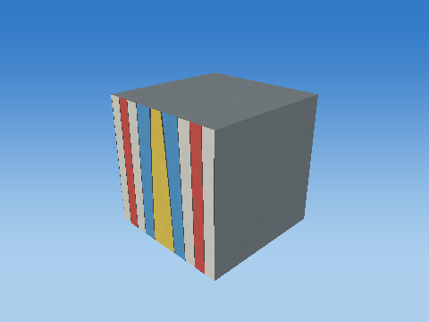 |
| Scale |  |
| Shear |  |
| Rotate X |  |
| Rotate Y |  |
| Rotate Z |  |
| Translate to world |  |

Steps 1–5 share one camera; the unit cube has its own close view, and step 6 is reframed at the actual world location to keep small objects visible. Reframing changes the view, never the model coordinates. Identity steps deliberately remain visible. Intermediate shapes are instructional states, while step 6 uses the unmodified game object.

Each stage below gives its exact numeric matrix and all eight corner multiplications. For each output row r: p'[r] = A[r,0]p.x + A[r,1]p.y + A[r,2]p.z + A[r,3]p.w.


#### S

```text
[ 1.53541541 0 0 0 ]
[ 0 0.0500000007 0 0 ]
[ 0 0 0.159999996 0 ]
[ 0 0 0 1 ]
```

| Input corner (w=1) | Output corner (w=1) |
| --- | --- |
| (-0.5, -0.5, -0.5) | (-0.767707705, -0.0250000004, -0.0799999982) |
| (-0.5, -0.5, 0.5) | (-0.767707705, -0.0250000004, 0.0799999982) |
| (-0.5, 0.5, -0.5) | (-0.767707705, 0.0250000004, -0.0799999982) |
| (-0.5, 0.5, 0.5) | (-0.767707705, 0.0250000004, 0.0799999982) |
| (0.5, -0.5, -0.5) | (0.767707705, -0.0250000004, -0.0799999982) |
| (0.5, -0.5, 0.5) | (0.767707705, -0.0250000004, 0.0799999982) |
| (0.5, 0.5, -0.5) | (0.767707705, 0.0250000004, -0.0799999982) |
| (0.5, 0.5, 0.5) | (0.767707705, 0.0250000004, 0.0799999982) |

#### H

```text
[ 1 0 0 0 ]
[ 0 1 0 0 ]
[ 0 0 1 0 ]
[ 0 0 0 1 ]
```

| Input corner (w=1) | Output corner (w=1) |
| --- | --- |
| (-0.767707705, -0.0250000004, -0.0799999982) | (-0.767707705, -0.0250000004, -0.0799999982) |
| (-0.767707705, -0.0250000004, 0.0799999982) | (-0.767707705, -0.0250000004, 0.0799999982) |
| (-0.767707705, 0.0250000004, -0.0799999982) | (-0.767707705, 0.0250000004, -0.0799999982) |
| (-0.767707705, 0.0250000004, 0.0799999982) | (-0.767707705, 0.0250000004, 0.0799999982) |
| (0.767707705, -0.0250000004, -0.0799999982) | (0.767707705, -0.0250000004, -0.0799999982) |
| (0.767707705, -0.0250000004, 0.0799999982) | (0.767707705, -0.0250000004, 0.0799999982) |
| (0.767707705, 0.0250000004, -0.0799999982) | (0.767707705, 0.0250000004, -0.0799999982) |
| (0.767707705, 0.0250000004, 0.0799999982) | (0.767707705, 0.0250000004, 0.0799999982) |

#### Rx

```text
[ 1 0 0 0 ]
[ 0 1 -0 0 ]
[ 0 0 1 0 ]
[ 0 0 0 1 ]
```

| Input corner (w=1) | Output corner (w=1) |
| --- | --- |
| (-0.767707705, -0.0250000004, -0.0799999982) | (-0.767707705, -0.0250000004, -0.0799999982) |
| (-0.767707705, -0.0250000004, 0.0799999982) | (-0.767707705, -0.0250000004, 0.0799999982) |
| (-0.767707705, 0.0250000004, -0.0799999982) | (-0.767707705, 0.0250000004, -0.0799999982) |
| (-0.767707705, 0.0250000004, 0.0799999982) | (-0.767707705, 0.0250000004, 0.0799999982) |
| (0.767707705, -0.0250000004, -0.0799999982) | (0.767707705, -0.0250000004, -0.0799999982) |
| (0.767707705, -0.0250000004, 0.0799999982) | (0.767707705, -0.0250000004, 0.0799999982) |
| (0.767707705, 0.0250000004, -0.0799999982) | (0.767707705, 0.0250000004, -0.0799999982) |
| (0.767707705, 0.0250000004, 0.0799999982) | (0.767707705, 0.0250000004, 0.0799999982) |

#### Ry

```text
[ 1 0 0 0 ]
[ 0 1 0 0 ]
[ -0 0 1 0 ]
[ 0 0 0 1 ]
```

| Input corner (w=1) | Output corner (w=1) |
| --- | --- |
| (-0.767707705, -0.0250000004, -0.0799999982) | (-0.767707705, -0.0250000004, -0.0799999982) |
| (-0.767707705, -0.0250000004, 0.0799999982) | (-0.767707705, -0.0250000004, 0.0799999982) |
| (-0.767707705, 0.0250000004, -0.0799999982) | (-0.767707705, 0.0250000004, -0.0799999982) |
| (-0.767707705, 0.0250000004, 0.0799999982) | (-0.767707705, 0.0250000004, 0.0799999982) |
| (0.767707705, -0.0250000004, -0.0799999982) | (0.767707705, -0.0250000004, -0.0799999982) |
| (0.767707705, -0.0250000004, 0.0799999982) | (0.767707705, -0.0250000004, 0.0799999982) |
| (0.767707705, 0.0250000004, -0.0799999982) | (0.767707705, 0.0250000004, -0.0799999982) |
| (0.767707705, 0.0250000004, 0.0799999982) | (0.767707705, 0.0250000004, 0.0799999982) |

#### Rz

```text
[ 1 -0 0 0 ]
[ 0 1 0 0 ]
[ 0 0 1 0 ]
[ 0 0 0 1 ]
```

| Input corner (w=1) | Output corner (w=1) |
| --- | --- |
| (-0.767707705, -0.0250000004, -0.0799999982) | (-0.767707705, -0.0250000004, -0.0799999982) |
| (-0.767707705, -0.0250000004, 0.0799999982) | (-0.767707705, -0.0250000004, 0.0799999982) |
| (-0.767707705, 0.0250000004, -0.0799999982) | (-0.767707705, 0.0250000004, -0.0799999982) |
| (-0.767707705, 0.0250000004, 0.0799999982) | (-0.767707705, 0.0250000004, 0.0799999982) |
| (0.767707705, -0.0250000004, -0.0799999982) | (0.767707705, -0.0250000004, -0.0799999982) |
| (0.767707705, -0.0250000004, 0.0799999982) | (0.767707705, -0.0250000004, 0.0799999982) |
| (0.767707705, 0.0250000004, -0.0799999982) | (0.767707705, 0.0250000004, -0.0799999982) |
| (0.767707705, 0.0250000004, 0.0799999982) | (0.767707705, 0.0250000004, 0.0799999982) |

#### T

```text
[ 1 0 0 0 ]
[ 0 1 0 2.92499995 ]
[ 0 0 1 -19 ]
[ 0 0 0 1 ]
```

| Input corner (w=1) | Output corner (w=1) |
| --- | --- |
| (-0.767707705, -0.0250000004, -0.0799999982) | (-0.767707705, 2.89999986, -19.0799999) |
| (-0.767707705, -0.0250000004, 0.0799999982) | (-0.767707705, 2.89999986, -18.9200001) |
| (-0.767707705, 0.0250000004, -0.0799999982) | (-0.767707705, 2.95000005, -19.0799999) |
| (-0.767707705, 0.0250000004, 0.0799999982) | (-0.767707705, 2.95000005, -18.9200001) |
| (0.767707705, -0.0250000004, -0.0799999982) | (0.767707705, 2.89999986, -19.0799999) |
| (0.767707705, -0.0250000004, 0.0799999982) | (0.767707705, 2.89999986, -18.9200001) |
| (0.767707705, 0.0250000004, -0.0799999982) | (0.767707705, 2.95000005, -19.0799999) |
| (0.767707705, 0.0250000004, 0.0799999982) | (0.767707705, 2.95000005, -18.9200001) |

Final M = T Rz Ry Rx H S:

```text
[ 1.53541541 0 0 0 ]
[ 0 0.0500000007 0 2.92499995 ]
[ 0 0 0.159999996 -19 ]
[ 0 0 0 1 ]
```

### Cube-built six-ring plate — `TARGET_1_SLICE_21`

32 transformed cube slices; printed front +Z; health=60.000000/60; exact slice collider

Position T = (0, 2.97500014, -19) m; scale S = (1.50249803, 0.0500000007, 0.159999996); rotation (Rx,Ry,Rz) = (0, 0, 0) degrees.

Shear (xy,xz,yx,yz,zx,zy) = (0, 0, 0, 0, 0, 0). Color = (0.800000012, 0.800000012, 0.800000012); specular = 0.449999988; shininess = 48; emission = 0; flash = 0; material layer = 7; texture scale = 2. Pattern enabled = 1, pattern scale = (0.939061284, 0.03125, 1), offset = (0, 0.171875015, 0).

| Step | Actual renderer image |
| --- | --- |
| Unit cube |  |
| Scale |  |
| Shear |  |
| Rotate X |  |
| Rotate Y |  |
| Rotate Z |  |
| Translate to world |  |

Steps 1–5 share one camera; the unit cube has its own close view, and step 6 is reframed at the actual world location to keep small objects visible. Reframing changes the view, never the model coordinates. Identity steps deliberately remain visible. Intermediate shapes are instructional states, while step 6 uses the unmodified game object.

Each stage below gives its exact numeric matrix and all eight corner multiplications. For each output row r: p'[r] = A[r,0]p.x + A[r,1]p.y + A[r,2]p.z + A[r,3]p.w.


#### S

```text
[ 1.50249803 0 0 0 ]
[ 0 0.0500000007 0 0 ]
[ 0 0 0.159999996 0 ]
[ 0 0 0 1 ]
```

| Input corner (w=1) | Output corner (w=1) |
| --- | --- |
| (-0.5, -0.5, -0.5) | (-0.751249015, -0.0250000004, -0.0799999982) |
| (-0.5, -0.5, 0.5) | (-0.751249015, -0.0250000004, 0.0799999982) |
| (-0.5, 0.5, -0.5) | (-0.751249015, 0.0250000004, -0.0799999982) |
| (-0.5, 0.5, 0.5) | (-0.751249015, 0.0250000004, 0.0799999982) |
| (0.5, -0.5, -0.5) | (0.751249015, -0.0250000004, -0.0799999982) |
| (0.5, -0.5, 0.5) | (0.751249015, -0.0250000004, 0.0799999982) |
| (0.5, 0.5, -0.5) | (0.751249015, 0.0250000004, -0.0799999982) |
| (0.5, 0.5, 0.5) | (0.751249015, 0.0250000004, 0.0799999982) |

#### H

```text
[ 1 0 0 0 ]
[ 0 1 0 0 ]
[ 0 0 1 0 ]
[ 0 0 0 1 ]
```

| Input corner (w=1) | Output corner (w=1) |
| --- | --- |
| (-0.751249015, -0.0250000004, -0.0799999982) | (-0.751249015, -0.0250000004, -0.0799999982) |
| (-0.751249015, -0.0250000004, 0.0799999982) | (-0.751249015, -0.0250000004, 0.0799999982) |
| (-0.751249015, 0.0250000004, -0.0799999982) | (-0.751249015, 0.0250000004, -0.0799999982) |
| (-0.751249015, 0.0250000004, 0.0799999982) | (-0.751249015, 0.0250000004, 0.0799999982) |
| (0.751249015, -0.0250000004, -0.0799999982) | (0.751249015, -0.0250000004, -0.0799999982) |
| (0.751249015, -0.0250000004, 0.0799999982) | (0.751249015, -0.0250000004, 0.0799999982) |
| (0.751249015, 0.0250000004, -0.0799999982) | (0.751249015, 0.0250000004, -0.0799999982) |
| (0.751249015, 0.0250000004, 0.0799999982) | (0.751249015, 0.0250000004, 0.0799999982) |

#### Rx

```text
[ 1 0 0 0 ]
[ 0 1 -0 0 ]
[ 0 0 1 0 ]
[ 0 0 0 1 ]
```

| Input corner (w=1) | Output corner (w=1) |
| --- | --- |
| (-0.751249015, -0.0250000004, -0.0799999982) | (-0.751249015, -0.0250000004, -0.0799999982) |
| (-0.751249015, -0.0250000004, 0.0799999982) | (-0.751249015, -0.0250000004, 0.0799999982) |
| (-0.751249015, 0.0250000004, -0.0799999982) | (-0.751249015, 0.0250000004, -0.0799999982) |
| (-0.751249015, 0.0250000004, 0.0799999982) | (-0.751249015, 0.0250000004, 0.0799999982) |
| (0.751249015, -0.0250000004, -0.0799999982) | (0.751249015, -0.0250000004, -0.0799999982) |
| (0.751249015, -0.0250000004, 0.0799999982) | (0.751249015, -0.0250000004, 0.0799999982) |
| (0.751249015, 0.0250000004, -0.0799999982) | (0.751249015, 0.0250000004, -0.0799999982) |
| (0.751249015, 0.0250000004, 0.0799999982) | (0.751249015, 0.0250000004, 0.0799999982) |

#### Ry

```text
[ 1 0 0 0 ]
[ 0 1 0 0 ]
[ -0 0 1 0 ]
[ 0 0 0 1 ]
```

| Input corner (w=1) | Output corner (w=1) |
| --- | --- |
| (-0.751249015, -0.0250000004, -0.0799999982) | (-0.751249015, -0.0250000004, -0.0799999982) |
| (-0.751249015, -0.0250000004, 0.0799999982) | (-0.751249015, -0.0250000004, 0.0799999982) |
| (-0.751249015, 0.0250000004, -0.0799999982) | (-0.751249015, 0.0250000004, -0.0799999982) |
| (-0.751249015, 0.0250000004, 0.0799999982) | (-0.751249015, 0.0250000004, 0.0799999982) |
| (0.751249015, -0.0250000004, -0.0799999982) | (0.751249015, -0.0250000004, -0.0799999982) |
| (0.751249015, -0.0250000004, 0.0799999982) | (0.751249015, -0.0250000004, 0.0799999982) |
| (0.751249015, 0.0250000004, -0.0799999982) | (0.751249015, 0.0250000004, -0.0799999982) |
| (0.751249015, 0.0250000004, 0.0799999982) | (0.751249015, 0.0250000004, 0.0799999982) |

#### Rz

```text
[ 1 -0 0 0 ]
[ 0 1 0 0 ]
[ 0 0 1 0 ]
[ 0 0 0 1 ]
```

| Input corner (w=1) | Output corner (w=1) |
| --- | --- |
| (-0.751249015, -0.0250000004, -0.0799999982) | (-0.751249015, -0.0250000004, -0.0799999982) |
| (-0.751249015, -0.0250000004, 0.0799999982) | (-0.751249015, -0.0250000004, 0.0799999982) |
| (-0.751249015, 0.0250000004, -0.0799999982) | (-0.751249015, 0.0250000004, -0.0799999982) |
| (-0.751249015, 0.0250000004, 0.0799999982) | (-0.751249015, 0.0250000004, 0.0799999982) |
| (0.751249015, -0.0250000004, -0.0799999982) | (0.751249015, -0.0250000004, -0.0799999982) |
| (0.751249015, -0.0250000004, 0.0799999982) | (0.751249015, -0.0250000004, 0.0799999982) |
| (0.751249015, 0.0250000004, -0.0799999982) | (0.751249015, 0.0250000004, -0.0799999982) |
| (0.751249015, 0.0250000004, 0.0799999982) | (0.751249015, 0.0250000004, 0.0799999982) |

#### T

```text
[ 1 0 0 0 ]
[ 0 1 0 2.97500014 ]
[ 0 0 1 -19 ]
[ 0 0 0 1 ]
```

| Input corner (w=1) | Output corner (w=1) |
| --- | --- |
| (-0.751249015, -0.0250000004, -0.0799999982) | (-0.751249015, 2.95000005, -19.0799999) |
| (-0.751249015, -0.0250000004, 0.0799999982) | (-0.751249015, 2.95000005, -18.9200001) |
| (-0.751249015, 0.0250000004, -0.0799999982) | (-0.751249015, 3.00000024, -19.0799999) |
| (-0.751249015, 0.0250000004, 0.0799999982) | (-0.751249015, 3.00000024, -18.9200001) |
| (0.751249015, -0.0250000004, -0.0799999982) | (0.751249015, 2.95000005, -19.0799999) |
| (0.751249015, -0.0250000004, 0.0799999982) | (0.751249015, 2.95000005, -18.9200001) |
| (0.751249015, 0.0250000004, -0.0799999982) | (0.751249015, 3.00000024, -19.0799999) |
| (0.751249015, 0.0250000004, 0.0799999982) | (0.751249015, 3.00000024, -18.9200001) |

Final M = T Rz Ry Rx H S:

```text
[ 1.50249803 0 0 0 ]
[ 0 0.0500000007 0 2.97500014 ]
[ 0 0 0.159999996 -19 ]
[ 0 0 0 1 ]
```

### Cube-built six-ring plate — `TARGET_1_SLICE_22`

32 transformed cube slices; printed front +Z; health=60.000000/60; exact slice collider

Position T = (0, 3.0250001, -19) m; scale S = (1.46201921, 0.0500000007, 0.159999996); rotation (Rx,Ry,Rz) = (0, 0, 0) degrees.

Shear (xy,xz,yx,yz,zx,zy) = (0, 0, 0, 0, 0, 0). Color = (0.800000012, 0.800000012, 0.800000012); specular = 0.449999988; shininess = 48; emission = 0; flash = 0; material layer = 7; texture scale = 2. Pattern enabled = 1, pattern scale = (0.913761973, 0.03125, 1), offset = (0, 0.203124985, 0).

| Step | Actual renderer image |
| --- | --- |
| Unit cube |  |
| Scale |  |
| Shear |  |
| Rotate X |  |
| Rotate Y |  |
| Rotate Z |  |
| Translate to world |  |

Steps 1–5 share one camera; the unit cube has its own close view, and step 6 is reframed at the actual world location to keep small objects visible. Reframing changes the view, never the model coordinates. Identity steps deliberately remain visible. Intermediate shapes are instructional states, while step 6 uses the unmodified game object.

Each stage below gives its exact numeric matrix and all eight corner multiplications. For each output row r: p'[r] = A[r,0]p.x + A[r,1]p.y + A[r,2]p.z + A[r,3]p.w.


#### S

```text
[ 1.46201921 0 0 0 ]
[ 0 0.0500000007 0 0 ]
[ 0 0 0.159999996 0 ]
[ 0 0 0 1 ]
```

| Input corner (w=1) | Output corner (w=1) |
| --- | --- |
| (-0.5, -0.5, -0.5) | (-0.731009603, -0.0250000004, -0.0799999982) |
| (-0.5, -0.5, 0.5) | (-0.731009603, -0.0250000004, 0.0799999982) |
| (-0.5, 0.5, -0.5) | (-0.731009603, 0.0250000004, -0.0799999982) |
| (-0.5, 0.5, 0.5) | (-0.731009603, 0.0250000004, 0.0799999982) |
| (0.5, -0.5, -0.5) | (0.731009603, -0.0250000004, -0.0799999982) |
| (0.5, -0.5, 0.5) | (0.731009603, -0.0250000004, 0.0799999982) |
| (0.5, 0.5, -0.5) | (0.731009603, 0.0250000004, -0.0799999982) |
| (0.5, 0.5, 0.5) | (0.731009603, 0.0250000004, 0.0799999982) |

#### H

```text
[ 1 0 0 0 ]
[ 0 1 0 0 ]
[ 0 0 1 0 ]
[ 0 0 0 1 ]
```

| Input corner (w=1) | Output corner (w=1) |
| --- | --- |
| (-0.731009603, -0.0250000004, -0.0799999982) | (-0.731009603, -0.0250000004, -0.0799999982) |
| (-0.731009603, -0.0250000004, 0.0799999982) | (-0.731009603, -0.0250000004, 0.0799999982) |
| (-0.731009603, 0.0250000004, -0.0799999982) | (-0.731009603, 0.0250000004, -0.0799999982) |
| (-0.731009603, 0.0250000004, 0.0799999982) | (-0.731009603, 0.0250000004, 0.0799999982) |
| (0.731009603, -0.0250000004, -0.0799999982) | (0.731009603, -0.0250000004, -0.0799999982) |
| (0.731009603, -0.0250000004, 0.0799999982) | (0.731009603, -0.0250000004, 0.0799999982) |
| (0.731009603, 0.0250000004, -0.0799999982) | (0.731009603, 0.0250000004, -0.0799999982) |
| (0.731009603, 0.0250000004, 0.0799999982) | (0.731009603, 0.0250000004, 0.0799999982) |

#### Rx

```text
[ 1 0 0 0 ]
[ 0 1 -0 0 ]
[ 0 0 1 0 ]
[ 0 0 0 1 ]
```

| Input corner (w=1) | Output corner (w=1) |
| --- | --- |
| (-0.731009603, -0.0250000004, -0.0799999982) | (-0.731009603, -0.0250000004, -0.0799999982) |
| (-0.731009603, -0.0250000004, 0.0799999982) | (-0.731009603, -0.0250000004, 0.0799999982) |
| (-0.731009603, 0.0250000004, -0.0799999982) | (-0.731009603, 0.0250000004, -0.0799999982) |
| (-0.731009603, 0.0250000004, 0.0799999982) | (-0.731009603, 0.0250000004, 0.0799999982) |
| (0.731009603, -0.0250000004, -0.0799999982) | (0.731009603, -0.0250000004, -0.0799999982) |
| (0.731009603, -0.0250000004, 0.0799999982) | (0.731009603, -0.0250000004, 0.0799999982) |
| (0.731009603, 0.0250000004, -0.0799999982) | (0.731009603, 0.0250000004, -0.0799999982) |
| (0.731009603, 0.0250000004, 0.0799999982) | (0.731009603, 0.0250000004, 0.0799999982) |

#### Ry

```text
[ 1 0 0 0 ]
[ 0 1 0 0 ]
[ -0 0 1 0 ]
[ 0 0 0 1 ]
```

| Input corner (w=1) | Output corner (w=1) |
| --- | --- |
| (-0.731009603, -0.0250000004, -0.0799999982) | (-0.731009603, -0.0250000004, -0.0799999982) |
| (-0.731009603, -0.0250000004, 0.0799999982) | (-0.731009603, -0.0250000004, 0.0799999982) |
| (-0.731009603, 0.0250000004, -0.0799999982) | (-0.731009603, 0.0250000004, -0.0799999982) |
| (-0.731009603, 0.0250000004, 0.0799999982) | (-0.731009603, 0.0250000004, 0.0799999982) |
| (0.731009603, -0.0250000004, -0.0799999982) | (0.731009603, -0.0250000004, -0.0799999982) |
| (0.731009603, -0.0250000004, 0.0799999982) | (0.731009603, -0.0250000004, 0.0799999982) |
| (0.731009603, 0.0250000004, -0.0799999982) | (0.731009603, 0.0250000004, -0.0799999982) |
| (0.731009603, 0.0250000004, 0.0799999982) | (0.731009603, 0.0250000004, 0.0799999982) |

#### Rz

```text
[ 1 -0 0 0 ]
[ 0 1 0 0 ]
[ 0 0 1 0 ]
[ 0 0 0 1 ]
```

| Input corner (w=1) | Output corner (w=1) |
| --- | --- |
| (-0.731009603, -0.0250000004, -0.0799999982) | (-0.731009603, -0.0250000004, -0.0799999982) |
| (-0.731009603, -0.0250000004, 0.0799999982) | (-0.731009603, -0.0250000004, 0.0799999982) |
| (-0.731009603, 0.0250000004, -0.0799999982) | (-0.731009603, 0.0250000004, -0.0799999982) |
| (-0.731009603, 0.0250000004, 0.0799999982) | (-0.731009603, 0.0250000004, 0.0799999982) |
| (0.731009603, -0.0250000004, -0.0799999982) | (0.731009603, -0.0250000004, -0.0799999982) |
| (0.731009603, -0.0250000004, 0.0799999982) | (0.731009603, -0.0250000004, 0.0799999982) |
| (0.731009603, 0.0250000004, -0.0799999982) | (0.731009603, 0.0250000004, -0.0799999982) |
| (0.731009603, 0.0250000004, 0.0799999982) | (0.731009603, 0.0250000004, 0.0799999982) |

#### T

```text
[ 1 0 0 0 ]
[ 0 1 0 3.0250001 ]
[ 0 0 1 -19 ]
[ 0 0 0 1 ]
```

| Input corner (w=1) | Output corner (w=1) |
| --- | --- |
| (-0.731009603, -0.0250000004, -0.0799999982) | (-0.731009603, 3, -19.0799999) |
| (-0.731009603, -0.0250000004, 0.0799999982) | (-0.731009603, 3, -18.9200001) |
| (-0.731009603, 0.0250000004, -0.0799999982) | (-0.731009603, 3.05000019, -19.0799999) |
| (-0.731009603, 0.0250000004, 0.0799999982) | (-0.731009603, 3.05000019, -18.9200001) |
| (0.731009603, -0.0250000004, -0.0799999982) | (0.731009603, 3, -19.0799999) |
| (0.731009603, -0.0250000004, 0.0799999982) | (0.731009603, 3, -18.9200001) |
| (0.731009603, 0.0250000004, -0.0799999982) | (0.731009603, 3.05000019, -19.0799999) |
| (0.731009603, 0.0250000004, 0.0799999982) | (0.731009603, 3.05000019, -18.9200001) |

Final M = T Rz Ry Rx H S:

```text
[ 1.46201921 0 0 0 ]
[ 0 0.0500000007 0 3.0250001 ]
[ 0 0 0.159999996 -19 ]
[ 0 0 0 1 ]
```

### Cube-built six-ring plate — `TARGET_1_SLICE_23`

32 transformed cube slices; printed front +Z; health=60.000000/60; exact slice collider

Position T = (0, 3.07500005, -19) m; scale S = (1.41332936, 0.0500000007, 0.159999996); rotation (Rx,Ry,Rz) = (0, 0, 0) degrees.

Shear (xy,xz,yx,yz,zx,zy) = (0, 0, 0, 0, 0, 0). Color = (0.800000012, 0.800000012, 0.800000012); specular = 0.449999988; shininess = 48; emission = 0; flash = 0; material layer = 7; texture scale = 2. Pattern enabled = 1, pattern scale = (0.883330822, 0.03125, 1), offset = (0, 0.23437503, 0).

| Step | Actual renderer image |
| --- | --- |
| Unit cube |  |
| Scale |  |
| Shear |  |
| Rotate X |  |
| Rotate Y |  |
| Rotate Z |  |
| Translate to world |  |

Steps 1–5 share one camera; the unit cube has its own close view, and step 6 is reframed at the actual world location to keep small objects visible. Reframing changes the view, never the model coordinates. Identity steps deliberately remain visible. Intermediate shapes are instructional states, while step 6 uses the unmodified game object.

Each stage below gives its exact numeric matrix and all eight corner multiplications. For each output row r: p'[r] = A[r,0]p.x + A[r,1]p.y + A[r,2]p.z + A[r,3]p.w.


#### S

```text
[ 1.41332936 0 0 0 ]
[ 0 0.0500000007 0 0 ]
[ 0 0 0.159999996 0 ]
[ 0 0 0 1 ]
```

| Input corner (w=1) | Output corner (w=1) |
| --- | --- |
| (-0.5, -0.5, -0.5) | (-0.706664681, -0.0250000004, -0.0799999982) |
| (-0.5, -0.5, 0.5) | (-0.706664681, -0.0250000004, 0.0799999982) |
| (-0.5, 0.5, -0.5) | (-0.706664681, 0.0250000004, -0.0799999982) |
| (-0.5, 0.5, 0.5) | (-0.706664681, 0.0250000004, 0.0799999982) |
| (0.5, -0.5, -0.5) | (0.706664681, -0.0250000004, -0.0799999982) |
| (0.5, -0.5, 0.5) | (0.706664681, -0.0250000004, 0.0799999982) |
| (0.5, 0.5, -0.5) | (0.706664681, 0.0250000004, -0.0799999982) |
| (0.5, 0.5, 0.5) | (0.706664681, 0.0250000004, 0.0799999982) |

#### H

```text
[ 1 0 0 0 ]
[ 0 1 0 0 ]
[ 0 0 1 0 ]
[ 0 0 0 1 ]
```

| Input corner (w=1) | Output corner (w=1) |
| --- | --- |
| (-0.706664681, -0.0250000004, -0.0799999982) | (-0.706664681, -0.0250000004, -0.0799999982) |
| (-0.706664681, -0.0250000004, 0.0799999982) | (-0.706664681, -0.0250000004, 0.0799999982) |
| (-0.706664681, 0.0250000004, -0.0799999982) | (-0.706664681, 0.0250000004, -0.0799999982) |
| (-0.706664681, 0.0250000004, 0.0799999982) | (-0.706664681, 0.0250000004, 0.0799999982) |
| (0.706664681, -0.0250000004, -0.0799999982) | (0.706664681, -0.0250000004, -0.0799999982) |
| (0.706664681, -0.0250000004, 0.0799999982) | (0.706664681, -0.0250000004, 0.0799999982) |
| (0.706664681, 0.0250000004, -0.0799999982) | (0.706664681, 0.0250000004, -0.0799999982) |
| (0.706664681, 0.0250000004, 0.0799999982) | (0.706664681, 0.0250000004, 0.0799999982) |

#### Rx

```text
[ 1 0 0 0 ]
[ 0 1 -0 0 ]
[ 0 0 1 0 ]
[ 0 0 0 1 ]
```

| Input corner (w=1) | Output corner (w=1) |
| --- | --- |
| (-0.706664681, -0.0250000004, -0.0799999982) | (-0.706664681, -0.0250000004, -0.0799999982) |
| (-0.706664681, -0.0250000004, 0.0799999982) | (-0.706664681, -0.0250000004, 0.0799999982) |
| (-0.706664681, 0.0250000004, -0.0799999982) | (-0.706664681, 0.0250000004, -0.0799999982) |
| (-0.706664681, 0.0250000004, 0.0799999982) | (-0.706664681, 0.0250000004, 0.0799999982) |
| (0.706664681, -0.0250000004, -0.0799999982) | (0.706664681, -0.0250000004, -0.0799999982) |
| (0.706664681, -0.0250000004, 0.0799999982) | (0.706664681, -0.0250000004, 0.0799999982) |
| (0.706664681, 0.0250000004, -0.0799999982) | (0.706664681, 0.0250000004, -0.0799999982) |
| (0.706664681, 0.0250000004, 0.0799999982) | (0.706664681, 0.0250000004, 0.0799999982) |

#### Ry

```text
[ 1 0 0 0 ]
[ 0 1 0 0 ]
[ -0 0 1 0 ]
[ 0 0 0 1 ]
```

| Input corner (w=1) | Output corner (w=1) |
| --- | --- |
| (-0.706664681, -0.0250000004, -0.0799999982) | (-0.706664681, -0.0250000004, -0.0799999982) |
| (-0.706664681, -0.0250000004, 0.0799999982) | (-0.706664681, -0.0250000004, 0.0799999982) |
| (-0.706664681, 0.0250000004, -0.0799999982) | (-0.706664681, 0.0250000004, -0.0799999982) |
| (-0.706664681, 0.0250000004, 0.0799999982) | (-0.706664681, 0.0250000004, 0.0799999982) |
| (0.706664681, -0.0250000004, -0.0799999982) | (0.706664681, -0.0250000004, -0.0799999982) |
| (0.706664681, -0.0250000004, 0.0799999982) | (0.706664681, -0.0250000004, 0.0799999982) |
| (0.706664681, 0.0250000004, -0.0799999982) | (0.706664681, 0.0250000004, -0.0799999982) |
| (0.706664681, 0.0250000004, 0.0799999982) | (0.706664681, 0.0250000004, 0.0799999982) |

#### Rz

```text
[ 1 -0 0 0 ]
[ 0 1 0 0 ]
[ 0 0 1 0 ]
[ 0 0 0 1 ]
```

| Input corner (w=1) | Output corner (w=1) |
| --- | --- |
| (-0.706664681, -0.0250000004, -0.0799999982) | (-0.706664681, -0.0250000004, -0.0799999982) |
| (-0.706664681, -0.0250000004, 0.0799999982) | (-0.706664681, -0.0250000004, 0.0799999982) |
| (-0.706664681, 0.0250000004, -0.0799999982) | (-0.706664681, 0.0250000004, -0.0799999982) |
| (-0.706664681, 0.0250000004, 0.0799999982) | (-0.706664681, 0.0250000004, 0.0799999982) |
| (0.706664681, -0.0250000004, -0.0799999982) | (0.706664681, -0.0250000004, -0.0799999982) |
| (0.706664681, -0.0250000004, 0.0799999982) | (0.706664681, -0.0250000004, 0.0799999982) |
| (0.706664681, 0.0250000004, -0.0799999982) | (0.706664681, 0.0250000004, -0.0799999982) |
| (0.706664681, 0.0250000004, 0.0799999982) | (0.706664681, 0.0250000004, 0.0799999982) |

#### T

```text
[ 1 0 0 0 ]
[ 0 1 0 3.07500005 ]
[ 0 0 1 -19 ]
[ 0 0 0 1 ]
```

| Input corner (w=1) | Output corner (w=1) |
| --- | --- |
| (-0.706664681, -0.0250000004, -0.0799999982) | (-0.706664681, 3.04999995, -19.0799999) |
| (-0.706664681, -0.0250000004, 0.0799999982) | (-0.706664681, 3.04999995, -18.9200001) |
| (-0.706664681, 0.0250000004, -0.0799999982) | (-0.706664681, 3.10000014, -19.0799999) |
| (-0.706664681, 0.0250000004, 0.0799999982) | (-0.706664681, 3.10000014, -18.9200001) |
| (0.706664681, -0.0250000004, -0.0799999982) | (0.706664681, 3.04999995, -19.0799999) |
| (0.706664681, -0.0250000004, 0.0799999982) | (0.706664681, 3.04999995, -18.9200001) |
| (0.706664681, 0.0250000004, -0.0799999982) | (0.706664681, 3.10000014, -19.0799999) |
| (0.706664681, 0.0250000004, 0.0799999982) | (0.706664681, 3.10000014, -18.9200001) |

Final M = T Rz Ry Rx H S:

```text
[ 1.41332936 0 0 0 ]
[ 0 0.0500000007 0 3.07500005 ]
[ 0 0 0.159999996 -19 ]
[ 0 0 0 1 ]
```

### Cube-built six-ring plate — `TARGET_1_SLICE_24`

32 transformed cube slices; printed front +Z; health=60.000000/60; exact slice collider

Position T = (0, 3.125, -19) m; scale S = (1.35554421, 0.0500000007, 0.159999996); rotation (Rx,Ry,Rz) = (0, 0, 0) degrees.

Shear (xy,xz,yx,yz,zx,zy) = (0, 0, 0, 0, 0, 0). Color = (0.800000012, 0.800000012, 0.800000012); specular = 0.449999988; shininess = 48; emission = 0; flash = 0; material layer = 7; texture scale = 2. Pattern enabled = 1, pattern scale = (0.847215116, 0.03125, 1), offset = (0, 0.265625, 0).

| Step | Actual renderer image |
| --- | --- |
| Unit cube |  |
| Scale |  |
| Shear |  |
| Rotate X |  |
| Rotate Y |  |
| Rotate Z |  |
| Translate to world |  |

Steps 1–5 share one camera; the unit cube has its own close view, and step 6 is reframed at the actual world location to keep small objects visible. Reframing changes the view, never the model coordinates. Identity steps deliberately remain visible. Intermediate shapes are instructional states, while step 6 uses the unmodified game object.

Each stage below gives its exact numeric matrix and all eight corner multiplications. For each output row r: p'[r] = A[r,0]p.x + A[r,1]p.y + A[r,2]p.z + A[r,3]p.w.

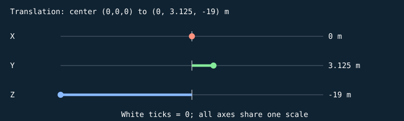


#### S

```text
[ 1.35554421 0 0 0 ]
[ 0 0.0500000007 0 0 ]
[ 0 0 0.159999996 0 ]
[ 0 0 0 1 ]
```

| Input corner (w=1) | Output corner (w=1) |
| --- | --- |
| (-0.5, -0.5, -0.5) | (-0.677772105, -0.0250000004, -0.0799999982) |
| (-0.5, -0.5, 0.5) | (-0.677772105, -0.0250000004, 0.0799999982) |
| (-0.5, 0.5, -0.5) | (-0.677772105, 0.0250000004, -0.0799999982) |
| (-0.5, 0.5, 0.5) | (-0.677772105, 0.0250000004, 0.0799999982) |
| (0.5, -0.5, -0.5) | (0.677772105, -0.0250000004, -0.0799999982) |
| (0.5, -0.5, 0.5) | (0.677772105, -0.0250000004, 0.0799999982) |
| (0.5, 0.5, -0.5) | (0.677772105, 0.0250000004, -0.0799999982) |
| (0.5, 0.5, 0.5) | (0.677772105, 0.0250000004, 0.0799999982) |

#### H

```text
[ 1 0 0 0 ]
[ 0 1 0 0 ]
[ 0 0 1 0 ]
[ 0 0 0 1 ]
```

| Input corner (w=1) | Output corner (w=1) |
| --- | --- |
| (-0.677772105, -0.0250000004, -0.0799999982) | (-0.677772105, -0.0250000004, -0.0799999982) |
| (-0.677772105, -0.0250000004, 0.0799999982) | (-0.677772105, -0.0250000004, 0.0799999982) |
| (-0.677772105, 0.0250000004, -0.0799999982) | (-0.677772105, 0.0250000004, -0.0799999982) |
| (-0.677772105, 0.0250000004, 0.0799999982) | (-0.677772105, 0.0250000004, 0.0799999982) |
| (0.677772105, -0.0250000004, -0.0799999982) | (0.677772105, -0.0250000004, -0.0799999982) |
| (0.677772105, -0.0250000004, 0.0799999982) | (0.677772105, -0.0250000004, 0.0799999982) |
| (0.677772105, 0.0250000004, -0.0799999982) | (0.677772105, 0.0250000004, -0.0799999982) |
| (0.677772105, 0.0250000004, 0.0799999982) | (0.677772105, 0.0250000004, 0.0799999982) |

#### Rx

```text
[ 1 0 0 0 ]
[ 0 1 -0 0 ]
[ 0 0 1 0 ]
[ 0 0 0 1 ]
```

| Input corner (w=1) | Output corner (w=1) |
| --- | --- |
| (-0.677772105, -0.0250000004, -0.0799999982) | (-0.677772105, -0.0250000004, -0.0799999982) |
| (-0.677772105, -0.0250000004, 0.0799999982) | (-0.677772105, -0.0250000004, 0.0799999982) |
| (-0.677772105, 0.0250000004, -0.0799999982) | (-0.677772105, 0.0250000004, -0.0799999982) |
| (-0.677772105, 0.0250000004, 0.0799999982) | (-0.677772105, 0.0250000004, 0.0799999982) |
| (0.677772105, -0.0250000004, -0.0799999982) | (0.677772105, -0.0250000004, -0.0799999982) |
| (0.677772105, -0.0250000004, 0.0799999982) | (0.677772105, -0.0250000004, 0.0799999982) |
| (0.677772105, 0.0250000004, -0.0799999982) | (0.677772105, 0.0250000004, -0.0799999982) |
| (0.677772105, 0.0250000004, 0.0799999982) | (0.677772105, 0.0250000004, 0.0799999982) |

#### Ry

```text
[ 1 0 0 0 ]
[ 0 1 0 0 ]
[ -0 0 1 0 ]
[ 0 0 0 1 ]
```

| Input corner (w=1) | Output corner (w=1) |
| --- | --- |
| (-0.677772105, -0.0250000004, -0.0799999982) | (-0.677772105, -0.0250000004, -0.0799999982) |
| (-0.677772105, -0.0250000004, 0.0799999982) | (-0.677772105, -0.0250000004, 0.0799999982) |
| (-0.677772105, 0.0250000004, -0.0799999982) | (-0.677772105, 0.0250000004, -0.0799999982) |
| (-0.677772105, 0.0250000004, 0.0799999982) | (-0.677772105, 0.0250000004, 0.0799999982) |
| (0.677772105, -0.0250000004, -0.0799999982) | (0.677772105, -0.0250000004, -0.0799999982) |
| (0.677772105, -0.0250000004, 0.0799999982) | (0.677772105, -0.0250000004, 0.0799999982) |
| (0.677772105, 0.0250000004, -0.0799999982) | (0.677772105, 0.0250000004, -0.0799999982) |
| (0.677772105, 0.0250000004, 0.0799999982) | (0.677772105, 0.0250000004, 0.0799999982) |

#### Rz

```text
[ 1 -0 0 0 ]
[ 0 1 0 0 ]
[ 0 0 1 0 ]
[ 0 0 0 1 ]
```

| Input corner (w=1) | Output corner (w=1) |
| --- | --- |
| (-0.677772105, -0.0250000004, -0.0799999982) | (-0.677772105, -0.0250000004, -0.0799999982) |
| (-0.677772105, -0.0250000004, 0.0799999982) | (-0.677772105, -0.0250000004, 0.0799999982) |
| (-0.677772105, 0.0250000004, -0.0799999982) | (-0.677772105, 0.0250000004, -0.0799999982) |
| (-0.677772105, 0.0250000004, 0.0799999982) | (-0.677772105, 0.0250000004, 0.0799999982) |
| (0.677772105, -0.0250000004, -0.0799999982) | (0.677772105, -0.0250000004, -0.0799999982) |
| (0.677772105, -0.0250000004, 0.0799999982) | (0.677772105, -0.0250000004, 0.0799999982) |
| (0.677772105, 0.0250000004, -0.0799999982) | (0.677772105, 0.0250000004, -0.0799999982) |
| (0.677772105, 0.0250000004, 0.0799999982) | (0.677772105, 0.0250000004, 0.0799999982) |

#### T

```text
[ 1 0 0 0 ]
[ 0 1 0 3.125 ]
[ 0 0 1 -19 ]
[ 0 0 0 1 ]
```

| Input corner (w=1) | Output corner (w=1) |
| --- | --- |
| (-0.677772105, -0.0250000004, -0.0799999982) | (-0.677772105, 3.0999999, -19.0799999) |
| (-0.677772105, -0.0250000004, 0.0799999982) | (-0.677772105, 3.0999999, -18.9200001) |
| (-0.677772105, 0.0250000004, -0.0799999982) | (-0.677772105, 3.1500001, -19.0799999) |
| (-0.677772105, 0.0250000004, 0.0799999982) | (-0.677772105, 3.1500001, -18.9200001) |
| (0.677772105, -0.0250000004, -0.0799999982) | (0.677772105, 3.0999999, -19.0799999) |
| (0.677772105, -0.0250000004, 0.0799999982) | (0.677772105, 3.0999999, -18.9200001) |
| (0.677772105, 0.0250000004, -0.0799999982) | (0.677772105, 3.1500001, -19.0799999) |
| (0.677772105, 0.0250000004, 0.0799999982) | (0.677772105, 3.1500001, -18.9200001) |

Final M = T Rz Ry Rx H S:

```text
[ 1.35554421 0 0 0 ]
[ 0 0.0500000007 0 3.125 ]
[ 0 0 0.159999996 -19 ]
[ 0 0 0 1 ]
```

### Cube-built six-ring plate — `TARGET_1_SLICE_25`

32 transformed cube slices; printed front +Z; health=60.000000/60; exact slice collider

Position T = (0, 3.17499995, -19) m; scale S = (1.28743947, 0.0500000007, 0.159999996); rotation (Rx,Ry,Rz) = (0, 0, 0) degrees.

Shear (xy,xz,yx,yz,zx,zy) = (0, 0, 0, 0, 0, 0). Color = (0.800000012, 0.800000012, 0.800000012); specular = 0.449999988; shininess = 48; emission = 0; flash = 0; material layer = 7; texture scale = 2. Pattern enabled = 1, pattern scale = (0.804649651, 0.03125, 1), offset = (0, 0.29687497, 0).

| Step | Actual renderer image |
| --- | --- |
| Unit cube |  |
| Scale |  |
| Shear |  |
| Rotate X |  |
| Rotate Y |  |
| Rotate Z |  |
| Translate to world |  |

Steps 1–5 share one camera; the unit cube has its own close view, and step 6 is reframed at the actual world location to keep small objects visible. Reframing changes the view, never the model coordinates. Identity steps deliberately remain visible. Intermediate shapes are instructional states, while step 6 uses the unmodified game object.

Each stage below gives its exact numeric matrix and all eight corner multiplications. For each output row r: p'[r] = A[r,0]p.x + A[r,1]p.y + A[r,2]p.z + A[r,3]p.w.


#### S

```text
[ 1.28743947 0 0 0 ]
[ 0 0.0500000007 0 0 ]
[ 0 0 0.159999996 0 ]
[ 0 0 0 1 ]
```

| Input corner (w=1) | Output corner (w=1) |
| --- | --- |
| (-0.5, -0.5, -0.5) | (-0.643719733, -0.0250000004, -0.0799999982) |
| (-0.5, -0.5, 0.5) | (-0.643719733, -0.0250000004, 0.0799999982) |
| (-0.5, 0.5, -0.5) | (-0.643719733, 0.0250000004, -0.0799999982) |
| (-0.5, 0.5, 0.5) | (-0.643719733, 0.0250000004, 0.0799999982) |
| (0.5, -0.5, -0.5) | (0.643719733, -0.0250000004, -0.0799999982) |
| (0.5, -0.5, 0.5) | (0.643719733, -0.0250000004, 0.0799999982) |
| (0.5, 0.5, -0.5) | (0.643719733, 0.0250000004, -0.0799999982) |
| (0.5, 0.5, 0.5) | (0.643719733, 0.0250000004, 0.0799999982) |

#### H

```text
[ 1 0 0 0 ]
[ 0 1 0 0 ]
[ 0 0 1 0 ]
[ 0 0 0 1 ]
```

| Input corner (w=1) | Output corner (w=1) |
| --- | --- |
| (-0.643719733, -0.0250000004, -0.0799999982) | (-0.643719733, -0.0250000004, -0.0799999982) |
| (-0.643719733, -0.0250000004, 0.0799999982) | (-0.643719733, -0.0250000004, 0.0799999982) |
| (-0.643719733, 0.0250000004, -0.0799999982) | (-0.643719733, 0.0250000004, -0.0799999982) |
| (-0.643719733, 0.0250000004, 0.0799999982) | (-0.643719733, 0.0250000004, 0.0799999982) |
| (0.643719733, -0.0250000004, -0.0799999982) | (0.643719733, -0.0250000004, -0.0799999982) |
| (0.643719733, -0.0250000004, 0.0799999982) | (0.643719733, -0.0250000004, 0.0799999982) |
| (0.643719733, 0.0250000004, -0.0799999982) | (0.643719733, 0.0250000004, -0.0799999982) |
| (0.643719733, 0.0250000004, 0.0799999982) | (0.643719733, 0.0250000004, 0.0799999982) |

#### Rx

```text
[ 1 0 0 0 ]
[ 0 1 -0 0 ]
[ 0 0 1 0 ]
[ 0 0 0 1 ]
```

| Input corner (w=1) | Output corner (w=1) |
| --- | --- |
| (-0.643719733, -0.0250000004, -0.0799999982) | (-0.643719733, -0.0250000004, -0.0799999982) |
| (-0.643719733, -0.0250000004, 0.0799999982) | (-0.643719733, -0.0250000004, 0.0799999982) |
| (-0.643719733, 0.0250000004, -0.0799999982) | (-0.643719733, 0.0250000004, -0.0799999982) |
| (-0.643719733, 0.0250000004, 0.0799999982) | (-0.643719733, 0.0250000004, 0.0799999982) |
| (0.643719733, -0.0250000004, -0.0799999982) | (0.643719733, -0.0250000004, -0.0799999982) |
| (0.643719733, -0.0250000004, 0.0799999982) | (0.643719733, -0.0250000004, 0.0799999982) |
| (0.643719733, 0.0250000004, -0.0799999982) | (0.643719733, 0.0250000004, -0.0799999982) |
| (0.643719733, 0.0250000004, 0.0799999982) | (0.643719733, 0.0250000004, 0.0799999982) |

#### Ry

```text
[ 1 0 0 0 ]
[ 0 1 0 0 ]
[ -0 0 1 0 ]
[ 0 0 0 1 ]
```

| Input corner (w=1) | Output corner (w=1) |
| --- | --- |
| (-0.643719733, -0.0250000004, -0.0799999982) | (-0.643719733, -0.0250000004, -0.0799999982) |
| (-0.643719733, -0.0250000004, 0.0799999982) | (-0.643719733, -0.0250000004, 0.0799999982) |
| (-0.643719733, 0.0250000004, -0.0799999982) | (-0.643719733, 0.0250000004, -0.0799999982) |
| (-0.643719733, 0.0250000004, 0.0799999982) | (-0.643719733, 0.0250000004, 0.0799999982) |
| (0.643719733, -0.0250000004, -0.0799999982) | (0.643719733, -0.0250000004, -0.0799999982) |
| (0.643719733, -0.0250000004, 0.0799999982) | (0.643719733, -0.0250000004, 0.0799999982) |
| (0.643719733, 0.0250000004, -0.0799999982) | (0.643719733, 0.0250000004, -0.0799999982) |
| (0.643719733, 0.0250000004, 0.0799999982) | (0.643719733, 0.0250000004, 0.0799999982) |

#### Rz

```text
[ 1 -0 0 0 ]
[ 0 1 0 0 ]
[ 0 0 1 0 ]
[ 0 0 0 1 ]
```

| Input corner (w=1) | Output corner (w=1) |
| --- | --- |
| (-0.643719733, -0.0250000004, -0.0799999982) | (-0.643719733, -0.0250000004, -0.0799999982) |
| (-0.643719733, -0.0250000004, 0.0799999982) | (-0.643719733, -0.0250000004, 0.0799999982) |
| (-0.643719733, 0.0250000004, -0.0799999982) | (-0.643719733, 0.0250000004, -0.0799999982) |
| (-0.643719733, 0.0250000004, 0.0799999982) | (-0.643719733, 0.0250000004, 0.0799999982) |
| (0.643719733, -0.0250000004, -0.0799999982) | (0.643719733, -0.0250000004, -0.0799999982) |
| (0.643719733, -0.0250000004, 0.0799999982) | (0.643719733, -0.0250000004, 0.0799999982) |
| (0.643719733, 0.0250000004, -0.0799999982) | (0.643719733, 0.0250000004, -0.0799999982) |
| (0.643719733, 0.0250000004, 0.0799999982) | (0.643719733, 0.0250000004, 0.0799999982) |

#### T

```text
[ 1 0 0 0 ]
[ 0 1 0 3.17499995 ]
[ 0 0 1 -19 ]
[ 0 0 0 1 ]
```

| Input corner (w=1) | Output corner (w=1) |
| --- | --- |
| (-0.643719733, -0.0250000004, -0.0799999982) | (-0.643719733, 3.14999986, -19.0799999) |
| (-0.643719733, -0.0250000004, 0.0799999982) | (-0.643719733, 3.14999986, -18.9200001) |
| (-0.643719733, 0.0250000004, -0.0799999982) | (-0.643719733, 3.20000005, -19.0799999) |
| (-0.643719733, 0.0250000004, 0.0799999982) | (-0.643719733, 3.20000005, -18.9200001) |
| (0.643719733, -0.0250000004, -0.0799999982) | (0.643719733, 3.14999986, -19.0799999) |
| (0.643719733, -0.0250000004, 0.0799999982) | (0.643719733, 3.14999986, -18.9200001) |
| (0.643719733, 0.0250000004, -0.0799999982) | (0.643719733, 3.20000005, -19.0799999) |
| (0.643719733, 0.0250000004, 0.0799999982) | (0.643719733, 3.20000005, -18.9200001) |

Final M = T Rz Ry Rx H S:

```text
[ 1.28743947 0 0 0 ]
[ 0 0.0500000007 0 3.17499995 ]
[ 0 0 0.159999996 -19 ]
[ 0 0 0 1 ]
```

### Cube-built six-ring plate — `TARGET_1_SLICE_26`

32 transformed cube slices; printed front +Z; health=60.000000/60; exact slice collider

Position T = (0, 3.22500014, -19) m; scale S = (1.20726967, 0.0500000007, 0.159999996); rotation (Rx,Ry,Rz) = (0, 0, 0) degrees.

Shear (xy,xz,yx,yz,zx,zy) = (0, 0, 0, 0, 0, 0). Color = (0.800000012, 0.800000012, 0.800000012); specular = 0.449999988; shininess = 48; emission = 0; flash = 0; material layer = 7; texture scale = 2. Pattern enabled = 1, pattern scale = (0.754543543, 0.03125, 1), offset = (0, 0.32812503, 0).

| Step | Actual renderer image |
| --- | --- |
| Unit cube |  |
| Scale |  |
| Shear |  |
| Rotate X |  |
| Rotate Y |  |
| Rotate Z |  |
| Translate to world |  |

Steps 1–5 share one camera; the unit cube has its own close view, and step 6 is reframed at the actual world location to keep small objects visible. Reframing changes the view, never the model coordinates. Identity steps deliberately remain visible. Intermediate shapes are instructional states, while step 6 uses the unmodified game object.

Each stage below gives its exact numeric matrix and all eight corner multiplications. For each output row r: p'[r] = A[r,0]p.x + A[r,1]p.y + A[r,2]p.z + A[r,3]p.w.


#### S

```text
[ 1.20726967 0 0 0 ]
[ 0 0.0500000007 0 0 ]
[ 0 0 0.159999996 0 ]
[ 0 0 0 1 ]
```

| Input corner (w=1) | Output corner (w=1) |
| --- | --- |
| (-0.5, -0.5, -0.5) | (-0.603634834, -0.0250000004, -0.0799999982) |
| (-0.5, -0.5, 0.5) | (-0.603634834, -0.0250000004, 0.0799999982) |
| (-0.5, 0.5, -0.5) | (-0.603634834, 0.0250000004, -0.0799999982) |
| (-0.5, 0.5, 0.5) | (-0.603634834, 0.0250000004, 0.0799999982) |
| (0.5, -0.5, -0.5) | (0.603634834, -0.0250000004, -0.0799999982) |
| (0.5, -0.5, 0.5) | (0.603634834, -0.0250000004, 0.0799999982) |
| (0.5, 0.5, -0.5) | (0.603634834, 0.0250000004, -0.0799999982) |
| (0.5, 0.5, 0.5) | (0.603634834, 0.0250000004, 0.0799999982) |

#### H

```text
[ 1 0 0 0 ]
[ 0 1 0 0 ]
[ 0 0 1 0 ]
[ 0 0 0 1 ]
```

| Input corner (w=1) | Output corner (w=1) |
| --- | --- |
| (-0.603634834, -0.0250000004, -0.0799999982) | (-0.603634834, -0.0250000004, -0.0799999982) |
| (-0.603634834, -0.0250000004, 0.0799999982) | (-0.603634834, -0.0250000004, 0.0799999982) |
| (-0.603634834, 0.0250000004, -0.0799999982) | (-0.603634834, 0.0250000004, -0.0799999982) |
| (-0.603634834, 0.0250000004, 0.0799999982) | (-0.603634834, 0.0250000004, 0.0799999982) |
| (0.603634834, -0.0250000004, -0.0799999982) | (0.603634834, -0.0250000004, -0.0799999982) |
| (0.603634834, -0.0250000004, 0.0799999982) | (0.603634834, -0.0250000004, 0.0799999982) |
| (0.603634834, 0.0250000004, -0.0799999982) | (0.603634834, 0.0250000004, -0.0799999982) |
| (0.603634834, 0.0250000004, 0.0799999982) | (0.603634834, 0.0250000004, 0.0799999982) |

#### Rx

```text
[ 1 0 0 0 ]
[ 0 1 -0 0 ]
[ 0 0 1 0 ]
[ 0 0 0 1 ]
```

| Input corner (w=1) | Output corner (w=1) |
| --- | --- |
| (-0.603634834, -0.0250000004, -0.0799999982) | (-0.603634834, -0.0250000004, -0.0799999982) |
| (-0.603634834, -0.0250000004, 0.0799999982) | (-0.603634834, -0.0250000004, 0.0799999982) |
| (-0.603634834, 0.0250000004, -0.0799999982) | (-0.603634834, 0.0250000004, -0.0799999982) |
| (-0.603634834, 0.0250000004, 0.0799999982) | (-0.603634834, 0.0250000004, 0.0799999982) |
| (0.603634834, -0.0250000004, -0.0799999982) | (0.603634834, -0.0250000004, -0.0799999982) |
| (0.603634834, -0.0250000004, 0.0799999982) | (0.603634834, -0.0250000004, 0.0799999982) |
| (0.603634834, 0.0250000004, -0.0799999982) | (0.603634834, 0.0250000004, -0.0799999982) |
| (0.603634834, 0.0250000004, 0.0799999982) | (0.603634834, 0.0250000004, 0.0799999982) |

#### Ry

```text
[ 1 0 0 0 ]
[ 0 1 0 0 ]
[ -0 0 1 0 ]
[ 0 0 0 1 ]
```

| Input corner (w=1) | Output corner (w=1) |
| --- | --- |
| (-0.603634834, -0.0250000004, -0.0799999982) | (-0.603634834, -0.0250000004, -0.0799999982) |
| (-0.603634834, -0.0250000004, 0.0799999982) | (-0.603634834, -0.0250000004, 0.0799999982) |
| (-0.603634834, 0.0250000004, -0.0799999982) | (-0.603634834, 0.0250000004, -0.0799999982) |
| (-0.603634834, 0.0250000004, 0.0799999982) | (-0.603634834, 0.0250000004, 0.0799999982) |
| (0.603634834, -0.0250000004, -0.0799999982) | (0.603634834, -0.0250000004, -0.0799999982) |
| (0.603634834, -0.0250000004, 0.0799999982) | (0.603634834, -0.0250000004, 0.0799999982) |
| (0.603634834, 0.0250000004, -0.0799999982) | (0.603634834, 0.0250000004, -0.0799999982) |
| (0.603634834, 0.0250000004, 0.0799999982) | (0.603634834, 0.0250000004, 0.0799999982) |

#### Rz

```text
[ 1 -0 0 0 ]
[ 0 1 0 0 ]
[ 0 0 1 0 ]
[ 0 0 0 1 ]
```

| Input corner (w=1) | Output corner (w=1) |
| --- | --- |
| (-0.603634834, -0.0250000004, -0.0799999982) | (-0.603634834, -0.0250000004, -0.0799999982) |
| (-0.603634834, -0.0250000004, 0.0799999982) | (-0.603634834, -0.0250000004, 0.0799999982) |
| (-0.603634834, 0.0250000004, -0.0799999982) | (-0.603634834, 0.0250000004, -0.0799999982) |
| (-0.603634834, 0.0250000004, 0.0799999982) | (-0.603634834, 0.0250000004, 0.0799999982) |
| (0.603634834, -0.0250000004, -0.0799999982) | (0.603634834, -0.0250000004, -0.0799999982) |
| (0.603634834, -0.0250000004, 0.0799999982) | (0.603634834, -0.0250000004, 0.0799999982) |
| (0.603634834, 0.0250000004, -0.0799999982) | (0.603634834, 0.0250000004, -0.0799999982) |
| (0.603634834, 0.0250000004, 0.0799999982) | (0.603634834, 0.0250000004, 0.0799999982) |

#### T

```text
[ 1 0 0 0 ]
[ 0 1 0 3.22500014 ]
[ 0 0 1 -19 ]
[ 0 0 0 1 ]
```

| Input corner (w=1) | Output corner (w=1) |
| --- | --- |
| (-0.603634834, -0.0250000004, -0.0799999982) | (-0.603634834, 3.20000005, -19.0799999) |
| (-0.603634834, -0.0250000004, 0.0799999982) | (-0.603634834, 3.20000005, -18.9200001) |
| (-0.603634834, 0.0250000004, -0.0799999982) | (-0.603634834, 3.25000024, -19.0799999) |
| (-0.603634834, 0.0250000004, 0.0799999982) | (-0.603634834, 3.25000024, -18.9200001) |
| (0.603634834, -0.0250000004, -0.0799999982) | (0.603634834, 3.20000005, -19.0799999) |
| (0.603634834, -0.0250000004, 0.0799999982) | (0.603634834, 3.20000005, -18.9200001) |
| (0.603634834, 0.0250000004, -0.0799999982) | (0.603634834, 3.25000024, -19.0799999) |
| (0.603634834, 0.0250000004, 0.0799999982) | (0.603634834, 3.25000024, -18.9200001) |

Final M = T Rz Ry Rx H S:

```text
[ 1.20726967 0 0 0 ]
[ 0 0.0500000007 0 3.22500014 ]
[ 0 0 0.159999996 -19 ]
[ 0 0 0 1 ]
```

### Cube-built six-ring plate — `TARGET_1_SLICE_27`

32 transformed cube slices; printed front +Z; health=60.000000/60; exact slice collider

Position T = (0, 3.2750001, -19) m; scale S = (1.11242986, 0.0500000007, 0.159999996); rotation (Rx,Ry,Rz) = (0, 0, 0) degrees.

Shear (xy,xz,yx,yz,zx,zy) = (0, 0, 0, 0, 0, 0). Color = (0.800000012, 0.800000012, 0.800000012); specular = 0.449999988; shininess = 48; emission = 0; flash = 0; material layer = 7; texture scale = 2. Pattern enabled = 1, pattern scale = (0.695268631, 0.03125, 1), offset = (0, 0.359375, 0).

| Step | Actual renderer image |
| --- | --- |
| Unit cube | 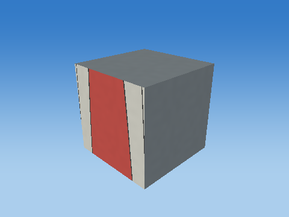 |
| Scale |  |
| Shear |  |
| Rotate X |  |
| Rotate Y |  |
| Rotate Z | 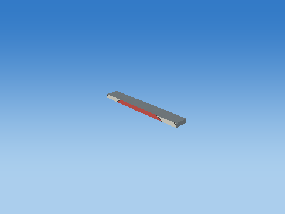 |
| Translate to world |  |

Steps 1–5 share one camera; the unit cube has its own close view, and step 6 is reframed at the actual world location to keep small objects visible. Reframing changes the view, never the model coordinates. Identity steps deliberately remain visible. Intermediate shapes are instructional states, while step 6 uses the unmodified game object.

Each stage below gives its exact numeric matrix and all eight corner multiplications. For each output row r: p'[r] = A[r,0]p.x + A[r,1]p.y + A[r,2]p.z + A[r,3]p.w.


#### S

```text
[ 1.11242986 0 0 0 ]
[ 0 0.0500000007 0 0 ]
[ 0 0 0.159999996 0 ]
[ 0 0 0 1 ]
```

| Input corner (w=1) | Output corner (w=1) |
| --- | --- |
| (-0.5, -0.5, -0.5) | (-0.556214929, -0.0250000004, -0.0799999982) |
| (-0.5, -0.5, 0.5) | (-0.556214929, -0.0250000004, 0.0799999982) |
| (-0.5, 0.5, -0.5) | (-0.556214929, 0.0250000004, -0.0799999982) |
| (-0.5, 0.5, 0.5) | (-0.556214929, 0.0250000004, 0.0799999982) |
| (0.5, -0.5, -0.5) | (0.556214929, -0.0250000004, -0.0799999982) |
| (0.5, -0.5, 0.5) | (0.556214929, -0.0250000004, 0.0799999982) |
| (0.5, 0.5, -0.5) | (0.556214929, 0.0250000004, -0.0799999982) |
| (0.5, 0.5, 0.5) | (0.556214929, 0.0250000004, 0.0799999982) |

#### H

```text
[ 1 0 0 0 ]
[ 0 1 0 0 ]
[ 0 0 1 0 ]
[ 0 0 0 1 ]
```

| Input corner (w=1) | Output corner (w=1) |
| --- | --- |
| (-0.556214929, -0.0250000004, -0.0799999982) | (-0.556214929, -0.0250000004, -0.0799999982) |
| (-0.556214929, -0.0250000004, 0.0799999982) | (-0.556214929, -0.0250000004, 0.0799999982) |
| (-0.556214929, 0.0250000004, -0.0799999982) | (-0.556214929, 0.0250000004, -0.0799999982) |
| (-0.556214929, 0.0250000004, 0.0799999982) | (-0.556214929, 0.0250000004, 0.0799999982) |
| (0.556214929, -0.0250000004, -0.0799999982) | (0.556214929, -0.0250000004, -0.0799999982) |
| (0.556214929, -0.0250000004, 0.0799999982) | (0.556214929, -0.0250000004, 0.0799999982) |
| (0.556214929, 0.0250000004, -0.0799999982) | (0.556214929, 0.0250000004, -0.0799999982) |
| (0.556214929, 0.0250000004, 0.0799999982) | (0.556214929, 0.0250000004, 0.0799999982) |

#### Rx

```text
[ 1 0 0 0 ]
[ 0 1 -0 0 ]
[ 0 0 1 0 ]
[ 0 0 0 1 ]
```

| Input corner (w=1) | Output corner (w=1) |
| --- | --- |
| (-0.556214929, -0.0250000004, -0.0799999982) | (-0.556214929, -0.0250000004, -0.0799999982) |
| (-0.556214929, -0.0250000004, 0.0799999982) | (-0.556214929, -0.0250000004, 0.0799999982) |
| (-0.556214929, 0.0250000004, -0.0799999982) | (-0.556214929, 0.0250000004, -0.0799999982) |
| (-0.556214929, 0.0250000004, 0.0799999982) | (-0.556214929, 0.0250000004, 0.0799999982) |
| (0.556214929, -0.0250000004, -0.0799999982) | (0.556214929, -0.0250000004, -0.0799999982) |
| (0.556214929, -0.0250000004, 0.0799999982) | (0.556214929, -0.0250000004, 0.0799999982) |
| (0.556214929, 0.0250000004, -0.0799999982) | (0.556214929, 0.0250000004, -0.0799999982) |
| (0.556214929, 0.0250000004, 0.0799999982) | (0.556214929, 0.0250000004, 0.0799999982) |

#### Ry

```text
[ 1 0 0 0 ]
[ 0 1 0 0 ]
[ -0 0 1 0 ]
[ 0 0 0 1 ]
```

| Input corner (w=1) | Output corner (w=1) |
| --- | --- |
| (-0.556214929, -0.0250000004, -0.0799999982) | (-0.556214929, -0.0250000004, -0.0799999982) |
| (-0.556214929, -0.0250000004, 0.0799999982) | (-0.556214929, -0.0250000004, 0.0799999982) |
| (-0.556214929, 0.0250000004, -0.0799999982) | (-0.556214929, 0.0250000004, -0.0799999982) |
| (-0.556214929, 0.0250000004, 0.0799999982) | (-0.556214929, 0.0250000004, 0.0799999982) |
| (0.556214929, -0.0250000004, -0.0799999982) | (0.556214929, -0.0250000004, -0.0799999982) |
| (0.556214929, -0.0250000004, 0.0799999982) | (0.556214929, -0.0250000004, 0.0799999982) |
| (0.556214929, 0.0250000004, -0.0799999982) | (0.556214929, 0.0250000004, -0.0799999982) |
| (0.556214929, 0.0250000004, 0.0799999982) | (0.556214929, 0.0250000004, 0.0799999982) |

#### Rz

```text
[ 1 -0 0 0 ]
[ 0 1 0 0 ]
[ 0 0 1 0 ]
[ 0 0 0 1 ]
```

| Input corner (w=1) | Output corner (w=1) |
| --- | --- |
| (-0.556214929, -0.0250000004, -0.0799999982) | (-0.556214929, -0.0250000004, -0.0799999982) |
| (-0.556214929, -0.0250000004, 0.0799999982) | (-0.556214929, -0.0250000004, 0.0799999982) |
| (-0.556214929, 0.0250000004, -0.0799999982) | (-0.556214929, 0.0250000004, -0.0799999982) |
| (-0.556214929, 0.0250000004, 0.0799999982) | (-0.556214929, 0.0250000004, 0.0799999982) |
| (0.556214929, -0.0250000004, -0.0799999982) | (0.556214929, -0.0250000004, -0.0799999982) |
| (0.556214929, -0.0250000004, 0.0799999982) | (0.556214929, -0.0250000004, 0.0799999982) |
| (0.556214929, 0.0250000004, -0.0799999982) | (0.556214929, 0.0250000004, -0.0799999982) |
| (0.556214929, 0.0250000004, 0.0799999982) | (0.556214929, 0.0250000004, 0.0799999982) |

#### T

```text
[ 1 0 0 0 ]
[ 0 1 0 3.2750001 ]
[ 0 0 1 -19 ]
[ 0 0 0 1 ]
```

| Input corner (w=1) | Output corner (w=1) |
| --- | --- |
| (-0.556214929, -0.0250000004, -0.0799999982) | (-0.556214929, 3.25, -19.0799999) |
| (-0.556214929, -0.0250000004, 0.0799999982) | (-0.556214929, 3.25, -18.9200001) |
| (-0.556214929, 0.0250000004, -0.0799999982) | (-0.556214929, 3.30000019, -19.0799999) |
| (-0.556214929, 0.0250000004, 0.0799999982) | (-0.556214929, 3.30000019, -18.9200001) |
| (0.556214929, -0.0250000004, -0.0799999982) | (0.556214929, 3.25, -19.0799999) |
| (0.556214929, -0.0250000004, 0.0799999982) | (0.556214929, 3.25, -18.9200001) |
| (0.556214929, 0.0250000004, -0.0799999982) | (0.556214929, 3.30000019, -19.0799999) |
| (0.556214929, 0.0250000004, 0.0799999982) | (0.556214929, 3.30000019, -18.9200001) |

Final M = T Rz Ry Rx H S:

```text
[ 1.11242986 0 0 0 ]
[ 0 0.0500000007 0 3.2750001 ]
[ 0 0 0.159999996 -19 ]
[ 0 0 0 1 ]
```

### Cube-built six-ring plate — `TARGET_1_SLICE_28`

32 transformed cube slices; printed front +Z; health=60.000000/60; exact slice collider

Position T = (0, 3.32500005, -19) m; scale S = (0.998749137, 0.0500000007, 0.159999996); rotation (Rx,Ry,Rz) = (0, 0, 0) degrees.

Shear (xy,xz,yx,yz,zx,zy) = (0, 0, 0, 0, 0, 0). Color = (0.800000012, 0.800000012, 0.800000012); specular = 0.449999988; shininess = 48; emission = 0; flash = 0; material layer = 7; texture scale = 2. Pattern enabled = 1, pattern scale = (0.624218225, 0.03125, 1), offset = (0, 0.39062503, 0).

| Step | Actual renderer image |
| --- | --- |
| Unit cube |  |
| Scale |  |
| Shear |  |
| Rotate X |  |
| Rotate Y |  |
| Rotate Z |  |
| Translate to world |  |

Steps 1–5 share one camera; the unit cube has its own close view, and step 6 is reframed at the actual world location to keep small objects visible. Reframing changes the view, never the model coordinates. Identity steps deliberately remain visible. Intermediate shapes are instructional states, while step 6 uses the unmodified game object.

Each stage below gives its exact numeric matrix and all eight corner multiplications. For each output row r: p'[r] = A[r,0]p.x + A[r,1]p.y + A[r,2]p.z + A[r,3]p.w.


#### S

```text
[ 0.998749137 0 0 0 ]
[ 0 0.0500000007 0 0 ]
[ 0 0 0.159999996 0 ]
[ 0 0 0 1 ]
```

| Input corner (w=1) | Output corner (w=1) |
| --- | --- |
| (-0.5, -0.5, -0.5) | (-0.499374568, -0.0250000004, -0.0799999982) |
| (-0.5, -0.5, 0.5) | (-0.499374568, -0.0250000004, 0.0799999982) |
| (-0.5, 0.5, -0.5) | (-0.499374568, 0.0250000004, -0.0799999982) |
| (-0.5, 0.5, 0.5) | (-0.499374568, 0.0250000004, 0.0799999982) |
| (0.5, -0.5, -0.5) | (0.499374568, -0.0250000004, -0.0799999982) |
| (0.5, -0.5, 0.5) | (0.499374568, -0.0250000004, 0.0799999982) |
| (0.5, 0.5, -0.5) | (0.499374568, 0.0250000004, -0.0799999982) |
| (0.5, 0.5, 0.5) | (0.499374568, 0.0250000004, 0.0799999982) |

#### H

```text
[ 1 0 0 0 ]
[ 0 1 0 0 ]
[ 0 0 1 0 ]
[ 0 0 0 1 ]
```

| Input corner (w=1) | Output corner (w=1) |
| --- | --- |
| (-0.499374568, -0.0250000004, -0.0799999982) | (-0.499374568, -0.0250000004, -0.0799999982) |
| (-0.499374568, -0.0250000004, 0.0799999982) | (-0.499374568, -0.0250000004, 0.0799999982) |
| (-0.499374568, 0.0250000004, -0.0799999982) | (-0.499374568, 0.0250000004, -0.0799999982) |
| (-0.499374568, 0.0250000004, 0.0799999982) | (-0.499374568, 0.0250000004, 0.0799999982) |
| (0.499374568, -0.0250000004, -0.0799999982) | (0.499374568, -0.0250000004, -0.0799999982) |
| (0.499374568, -0.0250000004, 0.0799999982) | (0.499374568, -0.0250000004, 0.0799999982) |
| (0.499374568, 0.0250000004, -0.0799999982) | (0.499374568, 0.0250000004, -0.0799999982) |
| (0.499374568, 0.0250000004, 0.0799999982) | (0.499374568, 0.0250000004, 0.0799999982) |

#### Rx

```text
[ 1 0 0 0 ]
[ 0 1 -0 0 ]
[ 0 0 1 0 ]
[ 0 0 0 1 ]
```

| Input corner (w=1) | Output corner (w=1) |
| --- | --- |
| (-0.499374568, -0.0250000004, -0.0799999982) | (-0.499374568, -0.0250000004, -0.0799999982) |
| (-0.499374568, -0.0250000004, 0.0799999982) | (-0.499374568, -0.0250000004, 0.0799999982) |
| (-0.499374568, 0.0250000004, -0.0799999982) | (-0.499374568, 0.0250000004, -0.0799999982) |
| (-0.499374568, 0.0250000004, 0.0799999982) | (-0.499374568, 0.0250000004, 0.0799999982) |
| (0.499374568, -0.0250000004, -0.0799999982) | (0.499374568, -0.0250000004, -0.0799999982) |
| (0.499374568, -0.0250000004, 0.0799999982) | (0.499374568, -0.0250000004, 0.0799999982) |
| (0.499374568, 0.0250000004, -0.0799999982) | (0.499374568, 0.0250000004, -0.0799999982) |
| (0.499374568, 0.0250000004, 0.0799999982) | (0.499374568, 0.0250000004, 0.0799999982) |

#### Ry

```text
[ 1 0 0 0 ]
[ 0 1 0 0 ]
[ -0 0 1 0 ]
[ 0 0 0 1 ]
```

| Input corner (w=1) | Output corner (w=1) |
| --- | --- |
| (-0.499374568, -0.0250000004, -0.0799999982) | (-0.499374568, -0.0250000004, -0.0799999982) |
| (-0.499374568, -0.0250000004, 0.0799999982) | (-0.499374568, -0.0250000004, 0.0799999982) |
| (-0.499374568, 0.0250000004, -0.0799999982) | (-0.499374568, 0.0250000004, -0.0799999982) |
| (-0.499374568, 0.0250000004, 0.0799999982) | (-0.499374568, 0.0250000004, 0.0799999982) |
| (0.499374568, -0.0250000004, -0.0799999982) | (0.499374568, -0.0250000004, -0.0799999982) |
| (0.499374568, -0.0250000004, 0.0799999982) | (0.499374568, -0.0250000004, 0.0799999982) |
| (0.499374568, 0.0250000004, -0.0799999982) | (0.499374568, 0.0250000004, -0.0799999982) |
| (0.499374568, 0.0250000004, 0.0799999982) | (0.499374568, 0.0250000004, 0.0799999982) |

#### Rz

```text
[ 1 -0 0 0 ]
[ 0 1 0 0 ]
[ 0 0 1 0 ]
[ 0 0 0 1 ]
```

| Input corner (w=1) | Output corner (w=1) |
| --- | --- |
| (-0.499374568, -0.0250000004, -0.0799999982) | (-0.499374568, -0.0250000004, -0.0799999982) |
| (-0.499374568, -0.0250000004, 0.0799999982) | (-0.499374568, -0.0250000004, 0.0799999982) |
| (-0.499374568, 0.0250000004, -0.0799999982) | (-0.499374568, 0.0250000004, -0.0799999982) |
| (-0.499374568, 0.0250000004, 0.0799999982) | (-0.499374568, 0.0250000004, 0.0799999982) |
| (0.499374568, -0.0250000004, -0.0799999982) | (0.499374568, -0.0250000004, -0.0799999982) |
| (0.499374568, -0.0250000004, 0.0799999982) | (0.499374568, -0.0250000004, 0.0799999982) |
| (0.499374568, 0.0250000004, -0.0799999982) | (0.499374568, 0.0250000004, -0.0799999982) |
| (0.499374568, 0.0250000004, 0.0799999982) | (0.499374568, 0.0250000004, 0.0799999982) |

#### T

```text
[ 1 0 0 0 ]
[ 0 1 0 3.32500005 ]
[ 0 0 1 -19 ]
[ 0 0 0 1 ]
```

| Input corner (w=1) | Output corner (w=1) |
| --- | --- |
| (-0.499374568, -0.0250000004, -0.0799999982) | (-0.499374568, 3.29999995, -19.0799999) |
| (-0.499374568, -0.0250000004, 0.0799999982) | (-0.499374568, 3.29999995, -18.9200001) |
| (-0.499374568, 0.0250000004, -0.0799999982) | (-0.499374568, 3.35000014, -19.0799999) |
| (-0.499374568, 0.0250000004, 0.0799999982) | (-0.499374568, 3.35000014, -18.9200001) |
| (0.499374568, -0.0250000004, -0.0799999982) | (0.499374568, 3.29999995, -19.0799999) |
| (0.499374568, -0.0250000004, 0.0799999982) | (0.499374568, 3.29999995, -18.9200001) |
| (0.499374568, 0.0250000004, -0.0799999982) | (0.499374568, 3.35000014, -19.0799999) |
| (0.499374568, 0.0250000004, 0.0799999982) | (0.499374568, 3.35000014, -18.9200001) |

Final M = T Rz Ry Rx H S:

```text
[ 0.998749137 0 0 0 ]
[ 0 0.0500000007 0 3.32500005 ]
[ 0 0 0.159999996 -19 ]
[ 0 0 0 1 ]
```

### Cube-built six-ring plate — `TARGET_1_SLICE_29`

32 transformed cube slices; printed front +Z; health=60.000000/60; exact slice collider

Position T = (0, 3.375, -19) m; scale S = (0.858778238, 0.0500000007, 0.159999996); rotation (Rx,Ry,Rz) = (0, 0, 0) degrees.

Shear (xy,xz,yx,yz,zx,zy) = (0, 0, 0, 0, 0, 0). Color = (0.800000012, 0.800000012, 0.800000012); specular = 0.449999988; shininess = 48; emission = 0; flash = 0; material layer = 7; texture scale = 2. Pattern enabled = 1, pattern scale = (0.536736369, 0.03125, 1), offset = (0, 0.421875, 0).

| Step | Actual renderer image |
| --- | --- |
| Unit cube |  |
| Scale |  |
| Shear |  |
| Rotate X |  |
| Rotate Y |  |
| Rotate Z |  |
| Translate to world |  |

Steps 1–5 share one camera; the unit cube has its own close view, and step 6 is reframed at the actual world location to keep small objects visible. Reframing changes the view, never the model coordinates. Identity steps deliberately remain visible. Intermediate shapes are instructional states, while step 6 uses the unmodified game object.

Each stage below gives its exact numeric matrix and all eight corner multiplications. For each output row r: p'[r] = A[r,0]p.x + A[r,1]p.y + A[r,2]p.z + A[r,3]p.w.

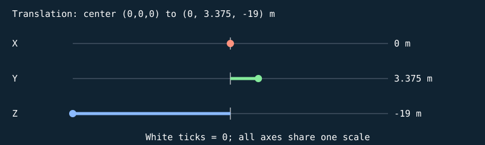


#### S

```text
[ 0.858778238 0 0 0 ]
[ 0 0.0500000007 0 0 ]
[ 0 0 0.159999996 0 ]
[ 0 0 0 1 ]
```

| Input corner (w=1) | Output corner (w=1) |
| --- | --- |
| (-0.5, -0.5, -0.5) | (-0.429389119, -0.0250000004, -0.0799999982) |
| (-0.5, -0.5, 0.5) | (-0.429389119, -0.0250000004, 0.0799999982) |
| (-0.5, 0.5, -0.5) | (-0.429389119, 0.0250000004, -0.0799999982) |
| (-0.5, 0.5, 0.5) | (-0.429389119, 0.0250000004, 0.0799999982) |
| (0.5, -0.5, -0.5) | (0.429389119, -0.0250000004, -0.0799999982) |
| (0.5, -0.5, 0.5) | (0.429389119, -0.0250000004, 0.0799999982) |
| (0.5, 0.5, -0.5) | (0.429389119, 0.0250000004, -0.0799999982) |
| (0.5, 0.5, 0.5) | (0.429389119, 0.0250000004, 0.0799999982) |

#### H

```text
[ 1 0 0 0 ]
[ 0 1 0 0 ]
[ 0 0 1 0 ]
[ 0 0 0 1 ]
```

| Input corner (w=1) | Output corner (w=1) |
| --- | --- |
| (-0.429389119, -0.0250000004, -0.0799999982) | (-0.429389119, -0.0250000004, -0.0799999982) |
| (-0.429389119, -0.0250000004, 0.0799999982) | (-0.429389119, -0.0250000004, 0.0799999982) |
| (-0.429389119, 0.0250000004, -0.0799999982) | (-0.429389119, 0.0250000004, -0.0799999982) |
| (-0.429389119, 0.0250000004, 0.0799999982) | (-0.429389119, 0.0250000004, 0.0799999982) |
| (0.429389119, -0.0250000004, -0.0799999982) | (0.429389119, -0.0250000004, -0.0799999982) |
| (0.429389119, -0.0250000004, 0.0799999982) | (0.429389119, -0.0250000004, 0.0799999982) |
| (0.429389119, 0.0250000004, -0.0799999982) | (0.429389119, 0.0250000004, -0.0799999982) |
| (0.429389119, 0.0250000004, 0.0799999982) | (0.429389119, 0.0250000004, 0.0799999982) |

#### Rx

```text
[ 1 0 0 0 ]
[ 0 1 -0 0 ]
[ 0 0 1 0 ]
[ 0 0 0 1 ]
```

| Input corner (w=1) | Output corner (w=1) |
| --- | --- |
| (-0.429389119, -0.0250000004, -0.0799999982) | (-0.429389119, -0.0250000004, -0.0799999982) |
| (-0.429389119, -0.0250000004, 0.0799999982) | (-0.429389119, -0.0250000004, 0.0799999982) |
| (-0.429389119, 0.0250000004, -0.0799999982) | (-0.429389119, 0.0250000004, -0.0799999982) |
| (-0.429389119, 0.0250000004, 0.0799999982) | (-0.429389119, 0.0250000004, 0.0799999982) |
| (0.429389119, -0.0250000004, -0.0799999982) | (0.429389119, -0.0250000004, -0.0799999982) |
| (0.429389119, -0.0250000004, 0.0799999982) | (0.429389119, -0.0250000004, 0.0799999982) |
| (0.429389119, 0.0250000004, -0.0799999982) | (0.429389119, 0.0250000004, -0.0799999982) |
| (0.429389119, 0.0250000004, 0.0799999982) | (0.429389119, 0.0250000004, 0.0799999982) |

#### Ry

```text
[ 1 0 0 0 ]
[ 0 1 0 0 ]
[ -0 0 1 0 ]
[ 0 0 0 1 ]
```

| Input corner (w=1) | Output corner (w=1) |
| --- | --- |
| (-0.429389119, -0.0250000004, -0.0799999982) | (-0.429389119, -0.0250000004, -0.0799999982) |
| (-0.429389119, -0.0250000004, 0.0799999982) | (-0.429389119, -0.0250000004, 0.0799999982) |
| (-0.429389119, 0.0250000004, -0.0799999982) | (-0.429389119, 0.0250000004, -0.0799999982) |
| (-0.429389119, 0.0250000004, 0.0799999982) | (-0.429389119, 0.0250000004, 0.0799999982) |
| (0.429389119, -0.0250000004, -0.0799999982) | (0.429389119, -0.0250000004, -0.0799999982) |
| (0.429389119, -0.0250000004, 0.0799999982) | (0.429389119, -0.0250000004, 0.0799999982) |
| (0.429389119, 0.0250000004, -0.0799999982) | (0.429389119, 0.0250000004, -0.0799999982) |
| (0.429389119, 0.0250000004, 0.0799999982) | (0.429389119, 0.0250000004, 0.0799999982) |

#### Rz

```text
[ 1 -0 0 0 ]
[ 0 1 0 0 ]
[ 0 0 1 0 ]
[ 0 0 0 1 ]
```

| Input corner (w=1) | Output corner (w=1) |
| --- | --- |
| (-0.429389119, -0.0250000004, -0.0799999982) | (-0.429389119, -0.0250000004, -0.0799999982) |
| (-0.429389119, -0.0250000004, 0.0799999982) | (-0.429389119, -0.0250000004, 0.0799999982) |
| (-0.429389119, 0.0250000004, -0.0799999982) | (-0.429389119, 0.0250000004, -0.0799999982) |
| (-0.429389119, 0.0250000004, 0.0799999982) | (-0.429389119, 0.0250000004, 0.0799999982) |
| (0.429389119, -0.0250000004, -0.0799999982) | (0.429389119, -0.0250000004, -0.0799999982) |
| (0.429389119, -0.0250000004, 0.0799999982) | (0.429389119, -0.0250000004, 0.0799999982) |
| (0.429389119, 0.0250000004, -0.0799999982) | (0.429389119, 0.0250000004, -0.0799999982) |
| (0.429389119, 0.0250000004, 0.0799999982) | (0.429389119, 0.0250000004, 0.0799999982) |

#### T

```text
[ 1 0 0 0 ]
[ 0 1 0 3.375 ]
[ 0 0 1 -19 ]
[ 0 0 0 1 ]
```

| Input corner (w=1) | Output corner (w=1) |
| --- | --- |
| (-0.429389119, -0.0250000004, -0.0799999982) | (-0.429389119, 3.3499999, -19.0799999) |
| (-0.429389119, -0.0250000004, 0.0799999982) | (-0.429389119, 3.3499999, -18.9200001) |
| (-0.429389119, 0.0250000004, -0.0799999982) | (-0.429389119, 3.4000001, -19.0799999) |
| (-0.429389119, 0.0250000004, 0.0799999982) | (-0.429389119, 3.4000001, -18.9200001) |
| (0.429389119, -0.0250000004, -0.0799999982) | (0.429389119, 3.3499999, -19.0799999) |
| (0.429389119, -0.0250000004, 0.0799999982) | (0.429389119, 3.3499999, -18.9200001) |
| (0.429389119, 0.0250000004, -0.0799999982) | (0.429389119, 3.4000001, -19.0799999) |
| (0.429389119, 0.0250000004, 0.0799999982) | (0.429389119, 3.4000001, -18.9200001) |

Final M = T Rz Ry Rx H S:

```text
[ 0.858778238 0 0 0 ]
[ 0 0.0500000007 0 3.375 ]
[ 0 0 0.159999996 -19 ]
[ 0 0 0 1 ]
```

### Cube-built six-ring plate — `TARGET_1_SLICE_30`

32 transformed cube slices; printed front +Z; health=60.000000/60; exact slice collider

Position T = (0, 3.42499995, -19) m; scale S = (0.676387787, 0.0500000007, 0.159999996); rotation (Rx,Ry,Rz) = (0, 0, 0) degrees.

Shear (xy,xz,yx,yz,zx,zy) = (0, 0, 0, 0, 0, 0). Color = (0.800000012, 0.800000012, 0.800000012); specular = 0.449999988; shininess = 48; emission = 0; flash = 0; material layer = 7; texture scale = 2. Pattern enabled = 1, pattern scale = (0.422742367, 0.03125, 1), offset = (0, 0.45312497, 0).

| Step | Actual renderer image |
| --- | --- |
| Unit cube |  |
| Scale |  |
| Shear |  |
| Rotate X |  |
| Rotate Y |  |
| Rotate Z |  |
| Translate to world |  |

Steps 1–5 share one camera; the unit cube has its own close view, and step 6 is reframed at the actual world location to keep small objects visible. Reframing changes the view, never the model coordinates. Identity steps deliberately remain visible. Intermediate shapes are instructional states, while step 6 uses the unmodified game object.

Each stage below gives its exact numeric matrix and all eight corner multiplications. For each output row r: p'[r] = A[r,0]p.x + A[r,1]p.y + A[r,2]p.z + A[r,3]p.w.


#### S

```text
[ 0.676387787 0 0 0 ]
[ 0 0.0500000007 0 0 ]
[ 0 0 0.159999996 0 ]
[ 0 0 0 1 ]
```

| Input corner (w=1) | Output corner (w=1) |
| --- | --- |
| (-0.5, -0.5, -0.5) | (-0.338193893, -0.0250000004, -0.0799999982) |
| (-0.5, -0.5, 0.5) | (-0.338193893, -0.0250000004, 0.0799999982) |
| (-0.5, 0.5, -0.5) | (-0.338193893, 0.0250000004, -0.0799999982) |
| (-0.5, 0.5, 0.5) | (-0.338193893, 0.0250000004, 0.0799999982) |
| (0.5, -0.5, -0.5) | (0.338193893, -0.0250000004, -0.0799999982) |
| (0.5, -0.5, 0.5) | (0.338193893, -0.0250000004, 0.0799999982) |
| (0.5, 0.5, -0.5) | (0.338193893, 0.0250000004, -0.0799999982) |
| (0.5, 0.5, 0.5) | (0.338193893, 0.0250000004, 0.0799999982) |

#### H

```text
[ 1 0 0 0 ]
[ 0 1 0 0 ]
[ 0 0 1 0 ]
[ 0 0 0 1 ]
```

| Input corner (w=1) | Output corner (w=1) |
| --- | --- |
| (-0.338193893, -0.0250000004, -0.0799999982) | (-0.338193893, -0.0250000004, -0.0799999982) |
| (-0.338193893, -0.0250000004, 0.0799999982) | (-0.338193893, -0.0250000004, 0.0799999982) |
| (-0.338193893, 0.0250000004, -0.0799999982) | (-0.338193893, 0.0250000004, -0.0799999982) |
| (-0.338193893, 0.0250000004, 0.0799999982) | (-0.338193893, 0.0250000004, 0.0799999982) |
| (0.338193893, -0.0250000004, -0.0799999982) | (0.338193893, -0.0250000004, -0.0799999982) |
| (0.338193893, -0.0250000004, 0.0799999982) | (0.338193893, -0.0250000004, 0.0799999982) |
| (0.338193893, 0.0250000004, -0.0799999982) | (0.338193893, 0.0250000004, -0.0799999982) |
| (0.338193893, 0.0250000004, 0.0799999982) | (0.338193893, 0.0250000004, 0.0799999982) |

#### Rx

```text
[ 1 0 0 0 ]
[ 0 1 -0 0 ]
[ 0 0 1 0 ]
[ 0 0 0 1 ]
```

| Input corner (w=1) | Output corner (w=1) |
| --- | --- |
| (-0.338193893, -0.0250000004, -0.0799999982) | (-0.338193893, -0.0250000004, -0.0799999982) |
| (-0.338193893, -0.0250000004, 0.0799999982) | (-0.338193893, -0.0250000004, 0.0799999982) |
| (-0.338193893, 0.0250000004, -0.0799999982) | (-0.338193893, 0.0250000004, -0.0799999982) |
| (-0.338193893, 0.0250000004, 0.0799999982) | (-0.338193893, 0.0250000004, 0.0799999982) |
| (0.338193893, -0.0250000004, -0.0799999982) | (0.338193893, -0.0250000004, -0.0799999982) |
| (0.338193893, -0.0250000004, 0.0799999982) | (0.338193893, -0.0250000004, 0.0799999982) |
| (0.338193893, 0.0250000004, -0.0799999982) | (0.338193893, 0.0250000004, -0.0799999982) |
| (0.338193893, 0.0250000004, 0.0799999982) | (0.338193893, 0.0250000004, 0.0799999982) |

#### Ry

```text
[ 1 0 0 0 ]
[ 0 1 0 0 ]
[ -0 0 1 0 ]
[ 0 0 0 1 ]
```

| Input corner (w=1) | Output corner (w=1) |
| --- | --- |
| (-0.338193893, -0.0250000004, -0.0799999982) | (-0.338193893, -0.0250000004, -0.0799999982) |
| (-0.338193893, -0.0250000004, 0.0799999982) | (-0.338193893, -0.0250000004, 0.0799999982) |
| (-0.338193893, 0.0250000004, -0.0799999982) | (-0.338193893, 0.0250000004, -0.0799999982) |
| (-0.338193893, 0.0250000004, 0.0799999982) | (-0.338193893, 0.0250000004, 0.0799999982) |
| (0.338193893, -0.0250000004, -0.0799999982) | (0.338193893, -0.0250000004, -0.0799999982) |
| (0.338193893, -0.0250000004, 0.0799999982) | (0.338193893, -0.0250000004, 0.0799999982) |
| (0.338193893, 0.0250000004, -0.0799999982) | (0.338193893, 0.0250000004, -0.0799999982) |
| (0.338193893, 0.0250000004, 0.0799999982) | (0.338193893, 0.0250000004, 0.0799999982) |

#### Rz

```text
[ 1 -0 0 0 ]
[ 0 1 0 0 ]
[ 0 0 1 0 ]
[ 0 0 0 1 ]
```

| Input corner (w=1) | Output corner (w=1) |
| --- | --- |
| (-0.338193893, -0.0250000004, -0.0799999982) | (-0.338193893, -0.0250000004, -0.0799999982) |
| (-0.338193893, -0.0250000004, 0.0799999982) | (-0.338193893, -0.0250000004, 0.0799999982) |
| (-0.338193893, 0.0250000004, -0.0799999982) | (-0.338193893, 0.0250000004, -0.0799999982) |
| (-0.338193893, 0.0250000004, 0.0799999982) | (-0.338193893, 0.0250000004, 0.0799999982) |
| (0.338193893, -0.0250000004, -0.0799999982) | (0.338193893, -0.0250000004, -0.0799999982) |
| (0.338193893, -0.0250000004, 0.0799999982) | (0.338193893, -0.0250000004, 0.0799999982) |
| (0.338193893, 0.0250000004, -0.0799999982) | (0.338193893, 0.0250000004, -0.0799999982) |
| (0.338193893, 0.0250000004, 0.0799999982) | (0.338193893, 0.0250000004, 0.0799999982) |

#### T

```text
[ 1 0 0 0 ]
[ 0 1 0 3.42499995 ]
[ 0 0 1 -19 ]
[ 0 0 0 1 ]
```

| Input corner (w=1) | Output corner (w=1) |
| --- | --- |
| (-0.338193893, -0.0250000004, -0.0799999982) | (-0.338193893, 3.39999986, -19.0799999) |
| (-0.338193893, -0.0250000004, 0.0799999982) | (-0.338193893, 3.39999986, -18.9200001) |
| (-0.338193893, 0.0250000004, -0.0799999982) | (-0.338193893, 3.45000005, -19.0799999) |
| (-0.338193893, 0.0250000004, 0.0799999982) | (-0.338193893, 3.45000005, -18.9200001) |
| (0.338193893, -0.0250000004, -0.0799999982) | (0.338193893, 3.39999986, -19.0799999) |
| (0.338193893, -0.0250000004, 0.0799999982) | (0.338193893, 3.39999986, -18.9200001) |
| (0.338193893, 0.0250000004, -0.0799999982) | (0.338193893, 3.45000005, -19.0799999) |
| (0.338193893, 0.0250000004, 0.0799999982) | (0.338193893, 3.45000005, -18.9200001) |

Final M = T Rz Ry Rx H S:

```text
[ 0.676387787 0 0 0 ]
[ 0 0.0500000007 0 3.42499995 ]
[ 0 0 0.159999996 -19 ]
[ 0 0 0 1 ]
```

### Cube-built six-ring plate — `TARGET_1_SLICE_31`

32 transformed cube slices; printed front +Z; health=60.000000/60; exact slice collider

Position T = (0, 3.47500014, -19) m; scale S = (0.396862745, 0.0500000007, 0.159999996); rotation (Rx,Ry,Rz) = (0, 0, 0) degrees.

Shear (xy,xz,yx,yz,zx,zy) = (0, 0, 0, 0, 0, 0). Color = (0.800000012, 0.800000012, 0.800000012); specular = 0.449999988; shininess = 48; emission = 0; flash = 0; material layer = 7; texture scale = 2. Pattern enabled = 1, pattern scale = (0.248039216, 0.03125, 1), offset = (0, 0.48437503, 0).

| Step | Actual renderer image |
| --- | --- |
| Unit cube |  |
| Scale |  |
| Shear |  |
| Rotate X |  |
| Rotate Y |  |
| Rotate Z |  |
| Translate to world |  |

Steps 1–5 share one camera; the unit cube has its own close view, and step 6 is reframed at the actual world location to keep small objects visible. Reframing changes the view, never the model coordinates. Identity steps deliberately remain visible. Intermediate shapes are instructional states, while step 6 uses the unmodified game object.

Each stage below gives its exact numeric matrix and all eight corner multiplications. For each output row r: p'[r] = A[r,0]p.x + A[r,1]p.y + A[r,2]p.z + A[r,3]p.w.

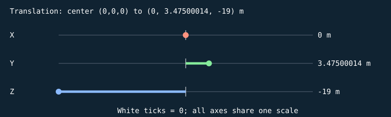


#### S

```text
[ 0.396862745 0 0 0 ]
[ 0 0.0500000007 0 0 ]
[ 0 0 0.159999996 0 ]
[ 0 0 0 1 ]
```

| Input corner (w=1) | Output corner (w=1) |
| --- | --- |
| (-0.5, -0.5, -0.5) | (-0.198431373, -0.0250000004, -0.0799999982) |
| (-0.5, -0.5, 0.5) | (-0.198431373, -0.0250000004, 0.0799999982) |
| (-0.5, 0.5, -0.5) | (-0.198431373, 0.0250000004, -0.0799999982) |
| (-0.5, 0.5, 0.5) | (-0.198431373, 0.0250000004, 0.0799999982) |
| (0.5, -0.5, -0.5) | (0.198431373, -0.0250000004, -0.0799999982) |
| (0.5, -0.5, 0.5) | (0.198431373, -0.0250000004, 0.0799999982) |
| (0.5, 0.5, -0.5) | (0.198431373, 0.0250000004, -0.0799999982) |
| (0.5, 0.5, 0.5) | (0.198431373, 0.0250000004, 0.0799999982) |

#### H

```text
[ 1 0 0 0 ]
[ 0 1 0 0 ]
[ 0 0 1 0 ]
[ 0 0 0 1 ]
```

| Input corner (w=1) | Output corner (w=1) |
| --- | --- |
| (-0.198431373, -0.0250000004, -0.0799999982) | (-0.198431373, -0.0250000004, -0.0799999982) |
| (-0.198431373, -0.0250000004, 0.0799999982) | (-0.198431373, -0.0250000004, 0.0799999982) |
| (-0.198431373, 0.0250000004, -0.0799999982) | (-0.198431373, 0.0250000004, -0.0799999982) |
| (-0.198431373, 0.0250000004, 0.0799999982) | (-0.198431373, 0.0250000004, 0.0799999982) |
| (0.198431373, -0.0250000004, -0.0799999982) | (0.198431373, -0.0250000004, -0.0799999982) |
| (0.198431373, -0.0250000004, 0.0799999982) | (0.198431373, -0.0250000004, 0.0799999982) |
| (0.198431373, 0.0250000004, -0.0799999982) | (0.198431373, 0.0250000004, -0.0799999982) |
| (0.198431373, 0.0250000004, 0.0799999982) | (0.198431373, 0.0250000004, 0.0799999982) |

#### Rx

```text
[ 1 0 0 0 ]
[ 0 1 -0 0 ]
[ 0 0 1 0 ]
[ 0 0 0 1 ]
```

| Input corner (w=1) | Output corner (w=1) |
| --- | --- |
| (-0.198431373, -0.0250000004, -0.0799999982) | (-0.198431373, -0.0250000004, -0.0799999982) |
| (-0.198431373, -0.0250000004, 0.0799999982) | (-0.198431373, -0.0250000004, 0.0799999982) |
| (-0.198431373, 0.0250000004, -0.0799999982) | (-0.198431373, 0.0250000004, -0.0799999982) |
| (-0.198431373, 0.0250000004, 0.0799999982) | (-0.198431373, 0.0250000004, 0.0799999982) |
| (0.198431373, -0.0250000004, -0.0799999982) | (0.198431373, -0.0250000004, -0.0799999982) |
| (0.198431373, -0.0250000004, 0.0799999982) | (0.198431373, -0.0250000004, 0.0799999982) |
| (0.198431373, 0.0250000004, -0.0799999982) | (0.198431373, 0.0250000004, -0.0799999982) |
| (0.198431373, 0.0250000004, 0.0799999982) | (0.198431373, 0.0250000004, 0.0799999982) |

#### Ry

```text
[ 1 0 0 0 ]
[ 0 1 0 0 ]
[ -0 0 1 0 ]
[ 0 0 0 1 ]
```

| Input corner (w=1) | Output corner (w=1) |
| --- | --- |
| (-0.198431373, -0.0250000004, -0.0799999982) | (-0.198431373, -0.0250000004, -0.0799999982) |
| (-0.198431373, -0.0250000004, 0.0799999982) | (-0.198431373, -0.0250000004, 0.0799999982) |
| (-0.198431373, 0.0250000004, -0.0799999982) | (-0.198431373, 0.0250000004, -0.0799999982) |
| (-0.198431373, 0.0250000004, 0.0799999982) | (-0.198431373, 0.0250000004, 0.0799999982) |
| (0.198431373, -0.0250000004, -0.0799999982) | (0.198431373, -0.0250000004, -0.0799999982) |
| (0.198431373, -0.0250000004, 0.0799999982) | (0.198431373, -0.0250000004, 0.0799999982) |
| (0.198431373, 0.0250000004, -0.0799999982) | (0.198431373, 0.0250000004, -0.0799999982) |
| (0.198431373, 0.0250000004, 0.0799999982) | (0.198431373, 0.0250000004, 0.0799999982) |

#### Rz

```text
[ 1 -0 0 0 ]
[ 0 1 0 0 ]
[ 0 0 1 0 ]
[ 0 0 0 1 ]
```

| Input corner (w=1) | Output corner (w=1) |
| --- | --- |
| (-0.198431373, -0.0250000004, -0.0799999982) | (-0.198431373, -0.0250000004, -0.0799999982) |
| (-0.198431373, -0.0250000004, 0.0799999982) | (-0.198431373, -0.0250000004, 0.0799999982) |
| (-0.198431373, 0.0250000004, -0.0799999982) | (-0.198431373, 0.0250000004, -0.0799999982) |
| (-0.198431373, 0.0250000004, 0.0799999982) | (-0.198431373, 0.0250000004, 0.0799999982) |
| (0.198431373, -0.0250000004, -0.0799999982) | (0.198431373, -0.0250000004, -0.0799999982) |
| (0.198431373, -0.0250000004, 0.0799999982) | (0.198431373, -0.0250000004, 0.0799999982) |
| (0.198431373, 0.0250000004, -0.0799999982) | (0.198431373, 0.0250000004, -0.0799999982) |
| (0.198431373, 0.0250000004, 0.0799999982) | (0.198431373, 0.0250000004, 0.0799999982) |

#### T

```text
[ 1 0 0 0 ]
[ 0 1 0 3.47500014 ]
[ 0 0 1 -19 ]
[ 0 0 0 1 ]
```

| Input corner (w=1) | Output corner (w=1) |
| --- | --- |
| (-0.198431373, -0.0250000004, -0.0799999982) | (-0.198431373, 3.45000005, -19.0799999) |
| (-0.198431373, -0.0250000004, 0.0799999982) | (-0.198431373, 3.45000005, -18.9200001) |
| (-0.198431373, 0.0250000004, -0.0799999982) | (-0.198431373, 3.50000024, -19.0799999) |
| (-0.198431373, 0.0250000004, 0.0799999982) | (-0.198431373, 3.50000024, -18.9200001) |
| (0.198431373, -0.0250000004, -0.0799999982) | (0.198431373, 3.45000005, -19.0799999) |
| (0.198431373, -0.0250000004, 0.0799999982) | (0.198431373, 3.45000005, -18.9200001) |
| (0.198431373, 0.0250000004, -0.0799999982) | (0.198431373, 3.50000024, -19.0799999) |
| (0.198431373, 0.0250000004, 0.0799999982) | (0.198431373, 3.50000024, -18.9200001) |

Final M = T Rz Ry Rx H S:

```text
[ 0.396862745 0 0 0 ]
[ 0 0.0500000007 0 3.47500014 ]
[ 0 0 0.159999996 -19 ]
[ 0 0 0 1 ]
```

## Alternate state: hit-flash-0-25

Generated with the shared game builder at the named fixed time/condition. These are separate snapshots, not additional parts attached to the representative.


### Stand base — `TARGET_1_BASE`

1 unit = 1 m; shared cube transform pipeline

Position T = (0, 0.150000006, -19) m; scale S = (2, 0.300000012, 1.5); rotation (Rx,Ry,Rz) = (0, 0, 0) degrees.

Shear (xy,xz,yx,yz,zx,zy) = (0, 0, 0, 0, 0, 0). Color = (0.25, 0.289999992, 0.319999993); specular = 0.119999997; shininess = 24; emission = 0; flash = 0; material layer = 5; texture scale = 3. Pattern enabled = 0, pattern scale = (1, 1, 1), offset = (0, 0, 0).

| Step | Actual renderer image |
| --- | --- |
| Unit cube |  |
| Scale |  |
| Shear |  |
| Rotate X |  |
| Rotate Y |  |
| Rotate Z |  |
| Translate to world |  |

Steps 1–5 share one camera; the unit cube has its own close view, and step 6 is reframed at the actual world location to keep small objects visible. Reframing changes the view, never the model coordinates. Identity steps deliberately remain visible. Intermediate shapes are instructional states, while step 6 uses the unmodified game object.

Each stage below gives its exact numeric matrix and all eight corner multiplications. For each output row r: p'[r] = A[r,0]p.x + A[r,1]p.y + A[r,2]p.z + A[r,3]p.w.


#### S

```text
[ 2 0 0 0 ]
[ 0 0.300000012 0 0 ]
[ 0 0 1.5 0 ]
[ 0 0 0 1 ]
```

| Input corner (w=1) | Output corner (w=1) |
| --- | --- |
| (-0.5, -0.5, -0.5) | (-1, -0.150000006, -0.75) |
| (-0.5, -0.5, 0.5) | (-1, -0.150000006, 0.75) |
| (-0.5, 0.5, -0.5) | (-1, 0.150000006, -0.75) |
| (-0.5, 0.5, 0.5) | (-1, 0.150000006, 0.75) |
| (0.5, -0.5, -0.5) | (1, -0.150000006, -0.75) |
| (0.5, -0.5, 0.5) | (1, -0.150000006, 0.75) |
| (0.5, 0.5, -0.5) | (1, 0.150000006, -0.75) |
| (0.5, 0.5, 0.5) | (1, 0.150000006, 0.75) |

#### H

```text
[ 1 0 0 0 ]
[ 0 1 0 0 ]
[ 0 0 1 0 ]
[ 0 0 0 1 ]
```

| Input corner (w=1) | Output corner (w=1) |
| --- | --- |
| (-1, -0.150000006, -0.75) | (-1, -0.150000006, -0.75) |
| (-1, -0.150000006, 0.75) | (-1, -0.150000006, 0.75) |
| (-1, 0.150000006, -0.75) | (-1, 0.150000006, -0.75) |
| (-1, 0.150000006, 0.75) | (-1, 0.150000006, 0.75) |
| (1, -0.150000006, -0.75) | (1, -0.150000006, -0.75) |
| (1, -0.150000006, 0.75) | (1, -0.150000006, 0.75) |
| (1, 0.150000006, -0.75) | (1, 0.150000006, -0.75) |
| (1, 0.150000006, 0.75) | (1, 0.150000006, 0.75) |

#### Rx

```text
[ 1 0 0 0 ]
[ 0 1 -0 0 ]
[ 0 0 1 0 ]
[ 0 0 0 1 ]
```

| Input corner (w=1) | Output corner (w=1) |
| --- | --- |
| (-1, -0.150000006, -0.75) | (-1, -0.150000006, -0.75) |
| (-1, -0.150000006, 0.75) | (-1, -0.150000006, 0.75) |
| (-1, 0.150000006, -0.75) | (-1, 0.150000006, -0.75) |
| (-1, 0.150000006, 0.75) | (-1, 0.150000006, 0.75) |
| (1, -0.150000006, -0.75) | (1, -0.150000006, -0.75) |
| (1, -0.150000006, 0.75) | (1, -0.150000006, 0.75) |
| (1, 0.150000006, -0.75) | (1, 0.150000006, -0.75) |
| (1, 0.150000006, 0.75) | (1, 0.150000006, 0.75) |

#### Ry

```text
[ 1 0 0 0 ]
[ 0 1 0 0 ]
[ -0 0 1 0 ]
[ 0 0 0 1 ]
```

| Input corner (w=1) | Output corner (w=1) |
| --- | --- |
| (-1, -0.150000006, -0.75) | (-1, -0.150000006, -0.75) |
| (-1, -0.150000006, 0.75) | (-1, -0.150000006, 0.75) |
| (-1, 0.150000006, -0.75) | (-1, 0.150000006, -0.75) |
| (-1, 0.150000006, 0.75) | (-1, 0.150000006, 0.75) |
| (1, -0.150000006, -0.75) | (1, -0.150000006, -0.75) |
| (1, -0.150000006, 0.75) | (1, -0.150000006, 0.75) |
| (1, 0.150000006, -0.75) | (1, 0.150000006, -0.75) |
| (1, 0.150000006, 0.75) | (1, 0.150000006, 0.75) |

#### Rz

```text
[ 1 -0 0 0 ]
[ 0 1 0 0 ]
[ 0 0 1 0 ]
[ 0 0 0 1 ]
```

| Input corner (w=1) | Output corner (w=1) |
| --- | --- |
| (-1, -0.150000006, -0.75) | (-1, -0.150000006, -0.75) |
| (-1, -0.150000006, 0.75) | (-1, -0.150000006, 0.75) |
| (-1, 0.150000006, -0.75) | (-1, 0.150000006, -0.75) |
| (-1, 0.150000006, 0.75) | (-1, 0.150000006, 0.75) |
| (1, -0.150000006, -0.75) | (1, -0.150000006, -0.75) |
| (1, -0.150000006, 0.75) | (1, -0.150000006, 0.75) |
| (1, 0.150000006, -0.75) | (1, 0.150000006, -0.75) |
| (1, 0.150000006, 0.75) | (1, 0.150000006, 0.75) |

#### T

```text
[ 1 0 0 0 ]
[ 0 1 0 0.150000006 ]
[ 0 0 1 -19 ]
[ 0 0 0 1 ]
```

| Input corner (w=1) | Output corner (w=1) |
| --- | --- |
| (-1, -0.150000006, -0.75) | (-1, 0, -19.75) |
| (-1, -0.150000006, 0.75) | (-1, 0, -18.25) |
| (-1, 0.150000006, -0.75) | (-1, 0.300000012, -19.75) |
| (-1, 0.150000006, 0.75) | (-1, 0.300000012, -18.25) |
| (1, -0.150000006, -0.75) | (1, 0, -19.75) |
| (1, -0.150000006, 0.75) | (1, 0, -18.25) |
| (1, 0.150000006, -0.75) | (1, 0.300000012, -19.75) |
| (1, 0.150000006, 0.75) | (1, 0.300000012, -18.25) |

Final M = T Rz Ry Rx H S:

```text
[ 2 0 0 0 ]
[ 0 0.300000012 0 0.150000006 ]
[ 0 0 1.5 -19 ]
[ 0 0 0 1 ]
```

### Stand — `TARGET_1_STAND`

1 unit = 1 m; shared cube transform pipeline

Position T = (0, 0.950000048, -19) m; scale S = (0.239999995, 1.9000001, 0.239999995); rotation (Rx,Ry,Rz) = (0, 0, 0) degrees.

Shear (xy,xz,yx,yz,zx,zy) = (0, 0, 0, 0, 0, 0). Color = (0.330000013, 0.370000005, 0.389999986); specular = 0.119999997; shininess = 24; emission = 0; flash = 0; material layer = 5; texture scale = 3. Pattern enabled = 0, pattern scale = (1, 1, 1), offset = (0, 0, 0).

| Step | Actual renderer image |
| --- | --- |
| Unit cube |  |
| Scale |  |
| Shear |  |
| Rotate X |  |
| Rotate Y |  |
| Rotate Z |  |
| Translate to world |  |

Steps 1–5 share one camera; the unit cube has its own close view, and step 6 is reframed at the actual world location to keep small objects visible. Reframing changes the view, never the model coordinates. Identity steps deliberately remain visible. Intermediate shapes are instructional states, while step 6 uses the unmodified game object.

Each stage below gives its exact numeric matrix and all eight corner multiplications. For each output row r: p'[r] = A[r,0]p.x + A[r,1]p.y + A[r,2]p.z + A[r,3]p.w.


#### S

```text
[ 0.239999995 0 0 0 ]
[ 0 1.9000001 0 0 ]
[ 0 0 0.239999995 0 ]
[ 0 0 0 1 ]
```

| Input corner (w=1) | Output corner (w=1) |
| --- | --- |
| (-0.5, -0.5, -0.5) | (-0.119999997, -0.950000048, -0.119999997) |
| (-0.5, -0.5, 0.5) | (-0.119999997, -0.950000048, 0.119999997) |
| (-0.5, 0.5, -0.5) | (-0.119999997, 0.950000048, -0.119999997) |
| (-0.5, 0.5, 0.5) | (-0.119999997, 0.950000048, 0.119999997) |
| (0.5, -0.5, -0.5) | (0.119999997, -0.950000048, -0.119999997) |
| (0.5, -0.5, 0.5) | (0.119999997, -0.950000048, 0.119999997) |
| (0.5, 0.5, -0.5) | (0.119999997, 0.950000048, -0.119999997) |
| (0.5, 0.5, 0.5) | (0.119999997, 0.950000048, 0.119999997) |

#### H

```text
[ 1 0 0 0 ]
[ 0 1 0 0 ]
[ 0 0 1 0 ]
[ 0 0 0 1 ]
```

| Input corner (w=1) | Output corner (w=1) |
| --- | --- |
| (-0.119999997, -0.950000048, -0.119999997) | (-0.119999997, -0.950000048, -0.119999997) |
| (-0.119999997, -0.950000048, 0.119999997) | (-0.119999997, -0.950000048, 0.119999997) |
| (-0.119999997, 0.950000048, -0.119999997) | (-0.119999997, 0.950000048, -0.119999997) |
| (-0.119999997, 0.950000048, 0.119999997) | (-0.119999997, 0.950000048, 0.119999997) |
| (0.119999997, -0.950000048, -0.119999997) | (0.119999997, -0.950000048, -0.119999997) |
| (0.119999997, -0.950000048, 0.119999997) | (0.119999997, -0.950000048, 0.119999997) |
| (0.119999997, 0.950000048, -0.119999997) | (0.119999997, 0.950000048, -0.119999997) |
| (0.119999997, 0.950000048, 0.119999997) | (0.119999997, 0.950000048, 0.119999997) |

#### Rx

```text
[ 1 0 0 0 ]
[ 0 1 -0 0 ]
[ 0 0 1 0 ]
[ 0 0 0 1 ]
```

| Input corner (w=1) | Output corner (w=1) |
| --- | --- |
| (-0.119999997, -0.950000048, -0.119999997) | (-0.119999997, -0.950000048, -0.119999997) |
| (-0.119999997, -0.950000048, 0.119999997) | (-0.119999997, -0.950000048, 0.119999997) |
| (-0.119999997, 0.950000048, -0.119999997) | (-0.119999997, 0.950000048, -0.119999997) |
| (-0.119999997, 0.950000048, 0.119999997) | (-0.119999997, 0.950000048, 0.119999997) |
| (0.119999997, -0.950000048, -0.119999997) | (0.119999997, -0.950000048, -0.119999997) |
| (0.119999997, -0.950000048, 0.119999997) | (0.119999997, -0.950000048, 0.119999997) |
| (0.119999997, 0.950000048, -0.119999997) | (0.119999997, 0.950000048, -0.119999997) |
| (0.119999997, 0.950000048, 0.119999997) | (0.119999997, 0.950000048, 0.119999997) |

#### Ry

```text
[ 1 0 0 0 ]
[ 0 1 0 0 ]
[ -0 0 1 0 ]
[ 0 0 0 1 ]
```

| Input corner (w=1) | Output corner (w=1) |
| --- | --- |
| (-0.119999997, -0.950000048, -0.119999997) | (-0.119999997, -0.950000048, -0.119999997) |
| (-0.119999997, -0.950000048, 0.119999997) | (-0.119999997, -0.950000048, 0.119999997) |
| (-0.119999997, 0.950000048, -0.119999997) | (-0.119999997, 0.950000048, -0.119999997) |
| (-0.119999997, 0.950000048, 0.119999997) | (-0.119999997, 0.950000048, 0.119999997) |
| (0.119999997, -0.950000048, -0.119999997) | (0.119999997, -0.950000048, -0.119999997) |
| (0.119999997, -0.950000048, 0.119999997) | (0.119999997, -0.950000048, 0.119999997) |
| (0.119999997, 0.950000048, -0.119999997) | (0.119999997, 0.950000048, -0.119999997) |
| (0.119999997, 0.950000048, 0.119999997) | (0.119999997, 0.950000048, 0.119999997) |

#### Rz

```text
[ 1 -0 0 0 ]
[ 0 1 0 0 ]
[ 0 0 1 0 ]
[ 0 0 0 1 ]
```

| Input corner (w=1) | Output corner (w=1) |
| --- | --- |
| (-0.119999997, -0.950000048, -0.119999997) | (-0.119999997, -0.950000048, -0.119999997) |
| (-0.119999997, -0.950000048, 0.119999997) | (-0.119999997, -0.950000048, 0.119999997) |
| (-0.119999997, 0.950000048, -0.119999997) | (-0.119999997, 0.950000048, -0.119999997) |
| (-0.119999997, 0.950000048, 0.119999997) | (-0.119999997, 0.950000048, 0.119999997) |
| (0.119999997, -0.950000048, -0.119999997) | (0.119999997, -0.950000048, -0.119999997) |
| (0.119999997, -0.950000048, 0.119999997) | (0.119999997, -0.950000048, 0.119999997) |
| (0.119999997, 0.950000048, -0.119999997) | (0.119999997, 0.950000048, -0.119999997) |
| (0.119999997, 0.950000048, 0.119999997) | (0.119999997, 0.950000048, 0.119999997) |

#### T

```text
[ 1 0 0 0 ]
[ 0 1 0 0.950000048 ]
[ 0 0 1 -19 ]
[ 0 0 0 1 ]
```

| Input corner (w=1) | Output corner (w=1) |
| --- | --- |
| (-0.119999997, -0.950000048, -0.119999997) | (-0.119999997, 0, -19.1200008) |
| (-0.119999997, -0.950000048, 0.119999997) | (-0.119999997, 0, -18.8799992) |
| (-0.119999997, 0.950000048, -0.119999997) | (-0.119999997, 1.9000001, -19.1200008) |
| (-0.119999997, 0.950000048, 0.119999997) | (-0.119999997, 1.9000001, -18.8799992) |
| (0.119999997, -0.950000048, -0.119999997) | (0.119999997, 0, -19.1200008) |
| (0.119999997, -0.950000048, 0.119999997) | (0.119999997, 0, -18.8799992) |
| (0.119999997, 0.950000048, -0.119999997) | (0.119999997, 1.9000001, -19.1200008) |
| (0.119999997, 0.950000048, 0.119999997) | (0.119999997, 1.9000001, -18.8799992) |

Final M = T Rz Ry Rx H S:

```text
[ 0.239999995 0 0 0 ]
[ 0 1.9000001 0 0.950000048 ]
[ 0 0 0.239999995 -19 ]
[ 0 0 0 1 ]
```

### Stand brace — `TARGET_1_BRACE_-1`

1 unit = 1 m; shared cube transform pipeline

Position T = (-0.280000001, 0.750999987, -19) m; scale S = (0.100000001, 1.06400001, 0.119999997); rotation (Rx,Ry,Rz) = (0, 0, -18) degrees.

Shear (xy,xz,yx,yz,zx,zy) = (0, 0, 0, 0, 0, 0). Color = (0.180000007, 0.219999999, 0.25); specular = 0.119999997; shininess = 24; emission = 0; flash = 0; material layer = 5; texture scale = 3. Pattern enabled = 0, pattern scale = (1, 1, 1), offset = (0, 0, 0).

| Step | Actual renderer image |
| --- | --- |
| Unit cube |  |
| Scale |  |
| Shear |  |
| Rotate X |  |
| Rotate Y |  |
| Rotate Z | 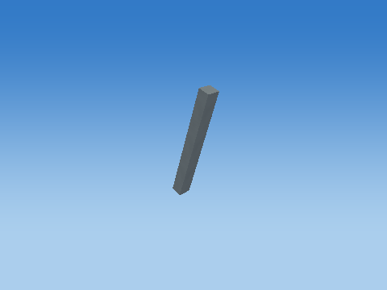 |
| Translate to world | 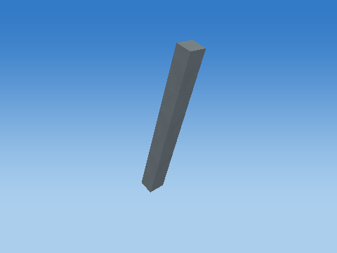 |

Steps 1–5 share one camera; the unit cube has its own close view, and step 6 is reframed at the actual world location to keep small objects visible. Reframing changes the view, never the model coordinates. Identity steps deliberately remain visible. Intermediate shapes are instructional states, while step 6 uses the unmodified game object.

Each stage below gives its exact numeric matrix and all eight corner multiplications. For each output row r: p'[r] = A[r,0]p.x + A[r,1]p.y + A[r,2]p.z + A[r,3]p.w.


#### S

```text
[ 0.100000001 0 0 0 ]
[ 0 1.06400001 0 0 ]
[ 0 0 0.119999997 0 ]
[ 0 0 0 1 ]
```

| Input corner (w=1) | Output corner (w=1) |
| --- | --- |
| (-0.5, -0.5, -0.5) | (-0.0500000007, -0.532000005, -0.0599999987) |
| (-0.5, -0.5, 0.5) | (-0.0500000007, -0.532000005, 0.0599999987) |
| (-0.5, 0.5, -0.5) | (-0.0500000007, 0.532000005, -0.0599999987) |
| (-0.5, 0.5, 0.5) | (-0.0500000007, 0.532000005, 0.0599999987) |
| (0.5, -0.5, -0.5) | (0.0500000007, -0.532000005, -0.0599999987) |
| (0.5, -0.5, 0.5) | (0.0500000007, -0.532000005, 0.0599999987) |
| (0.5, 0.5, -0.5) | (0.0500000007, 0.532000005, -0.0599999987) |
| (0.5, 0.5, 0.5) | (0.0500000007, 0.532000005, 0.0599999987) |

#### H

```text
[ 1 0 0 0 ]
[ 0 1 0 0 ]
[ 0 0 1 0 ]
[ 0 0 0 1 ]
```

| Input corner (w=1) | Output corner (w=1) |
| --- | --- |
| (-0.0500000007, -0.532000005, -0.0599999987) | (-0.0500000007, -0.532000005, -0.0599999987) |
| (-0.0500000007, -0.532000005, 0.0599999987) | (-0.0500000007, -0.532000005, 0.0599999987) |
| (-0.0500000007, 0.532000005, -0.0599999987) | (-0.0500000007, 0.532000005, -0.0599999987) |
| (-0.0500000007, 0.532000005, 0.0599999987) | (-0.0500000007, 0.532000005, 0.0599999987) |
| (0.0500000007, -0.532000005, -0.0599999987) | (0.0500000007, -0.532000005, -0.0599999987) |
| (0.0500000007, -0.532000005, 0.0599999987) | (0.0500000007, -0.532000005, 0.0599999987) |
| (0.0500000007, 0.532000005, -0.0599999987) | (0.0500000007, 0.532000005, -0.0599999987) |
| (0.0500000007, 0.532000005, 0.0599999987) | (0.0500000007, 0.532000005, 0.0599999987) |

#### Rx

```text
[ 1 0 0 0 ]
[ 0 1 -0 0 ]
[ 0 0 1 0 ]
[ 0 0 0 1 ]
```

| Input corner (w=1) | Output corner (w=1) |
| --- | --- |
| (-0.0500000007, -0.532000005, -0.0599999987) | (-0.0500000007, -0.532000005, -0.0599999987) |
| (-0.0500000007, -0.532000005, 0.0599999987) | (-0.0500000007, -0.532000005, 0.0599999987) |
| (-0.0500000007, 0.532000005, -0.0599999987) | (-0.0500000007, 0.532000005, -0.0599999987) |
| (-0.0500000007, 0.532000005, 0.0599999987) | (-0.0500000007, 0.532000005, 0.0599999987) |
| (0.0500000007, -0.532000005, -0.0599999987) | (0.0500000007, -0.532000005, -0.0599999987) |
| (0.0500000007, -0.532000005, 0.0599999987) | (0.0500000007, -0.532000005, 0.0599999987) |
| (0.0500000007, 0.532000005, -0.0599999987) | (0.0500000007, 0.532000005, -0.0599999987) |
| (0.0500000007, 0.532000005, 0.0599999987) | (0.0500000007, 0.532000005, 0.0599999987) |

#### Ry

```text
[ 1 0 0 0 ]
[ 0 1 0 0 ]
[ -0 0 1 0 ]
[ 0 0 0 1 ]
```

| Input corner (w=1) | Output corner (w=1) |
| --- | --- |
| (-0.0500000007, -0.532000005, -0.0599999987) | (-0.0500000007, -0.532000005, -0.0599999987) |
| (-0.0500000007, -0.532000005, 0.0599999987) | (-0.0500000007, -0.532000005, 0.0599999987) |
| (-0.0500000007, 0.532000005, -0.0599999987) | (-0.0500000007, 0.532000005, -0.0599999987) |
| (-0.0500000007, 0.532000005, 0.0599999987) | (-0.0500000007, 0.532000005, 0.0599999987) |
| (0.0500000007, -0.532000005, -0.0599999987) | (0.0500000007, -0.532000005, -0.0599999987) |
| (0.0500000007, -0.532000005, 0.0599999987) | (0.0500000007, -0.532000005, 0.0599999987) |
| (0.0500000007, 0.532000005, -0.0599999987) | (0.0500000007, 0.532000005, -0.0599999987) |
| (0.0500000007, 0.532000005, 0.0599999987) | (0.0500000007, 0.532000005, 0.0599999987) |

#### Rz

```text
[ 0.95105654 0.309017003 0 0 ]
[ -0.309017003 0.95105654 0 0 ]
[ 0 0 1 0 ]
[ 0 0 0 1 ]
```

| Input corner (w=1) | Output corner (w=1) |
| --- | --- |
| (-0.0500000007, -0.532000005, -0.0599999987) | (-0.21194987, -0.490511239, -0.0599999987) |
| (-0.0500000007, -0.532000005, 0.0599999987) | (-0.21194987, -0.490511239, 0.0599999987) |
| (-0.0500000007, 0.532000005, -0.0599999987) | (0.116844222, 0.521412909, -0.0599999987) |
| (-0.0500000007, 0.532000005, 0.0599999987) | (0.116844222, 0.521412909, 0.0599999987) |
| (0.0500000007, -0.532000005, -0.0599999987) | (-0.116844222, -0.521412909, -0.0599999987) |
| (0.0500000007, -0.532000005, 0.0599999987) | (-0.116844222, -0.521412909, 0.0599999987) |
| (0.0500000007, 0.532000005, -0.0599999987) | (0.21194987, 0.490511239, -0.0599999987) |
| (0.0500000007, 0.532000005, 0.0599999987) | (0.21194987, 0.490511239, 0.0599999987) |

#### T

```text
[ 1 0 0 -0.280000001 ]
[ 0 1 0 0.750999987 ]
[ 0 0 1 -19 ]
[ 0 0 0 1 ]
```

| Input corner (w=1) | Output corner (w=1) |
| --- | --- |
| (-0.21194987, -0.490511239, -0.0599999987) | (-0.491949856, 0.260488749, -19.0599995) |
| (-0.21194987, -0.490511239, 0.0599999987) | (-0.491949856, 0.260488749, -18.9400005) |
| (0.116844222, 0.521412909, -0.0599999987) | (-0.163155779, 1.2724129, -19.0599995) |
| (0.116844222, 0.521412909, 0.0599999987) | (-0.163155779, 1.2724129, -18.9400005) |
| (-0.116844222, -0.521412909, -0.0599999987) | (-0.396844208, 0.229587078, -19.0599995) |
| (-0.116844222, -0.521412909, 0.0599999987) | (-0.396844208, 0.229587078, -18.9400005) |
| (0.21194987, 0.490511239, -0.0599999987) | (-0.0680501312, 1.24151123, -19.0599995) |
| (0.21194987, 0.490511239, 0.0599999987) | (-0.0680501312, 1.24151123, -18.9400005) |

Final M = T Rz Ry Rx H S:

```text
[ 0.0951056555 0.328794092 0 -0.280000001 ]
[ -0.0309017003 1.01192415 0 0.750999987 ]
[ 0 0 0.119999997 -19 ]
[ 0 0 0 1 ]
```

### Base warning stripe — `TARGET_1_FOOT_STRIPE_-1`

1 unit = 1 m; shared cube transform pipeline

Position T = (-0.699999988, 0.307000011, -19) m; scale S = (0.159999996, 0.0120000001, 1.36000001); rotation (Rx,Ry,Rz) = (0, 0, 0) degrees.

Shear (xy,xz,yx,yz,zx,zy) = (0, 0, 0, 0, 0, 0). Color = (0.910000026, 0.620000005, 0.159999996); specular = 0.119999997; shininess = 24; emission = 0; flash = 0; material layer = 5; texture scale = 3. Pattern enabled = 0, pattern scale = (1, 1, 1), offset = (0, 0, 0).

| Step | Actual renderer image |
| --- | --- |
| Unit cube |  |
| Scale |  |
| Shear |  |
| Rotate X |  |
| Rotate Y |  |
| Rotate Z |  |
| Translate to world |  |

Steps 1–5 share one camera; the unit cube has its own close view, and step 6 is reframed at the actual world location to keep small objects visible. Reframing changes the view, never the model coordinates. Identity steps deliberately remain visible. Intermediate shapes are instructional states, while step 6 uses the unmodified game object.

Each stage below gives its exact numeric matrix and all eight corner multiplications. For each output row r: p'[r] = A[r,0]p.x + A[r,1]p.y + A[r,2]p.z + A[r,3]p.w.


#### S

```text
[ 0.159999996 0 0 0 ]
[ 0 0.0120000001 0 0 ]
[ 0 0 1.36000001 0 ]
[ 0 0 0 1 ]
```

| Input corner (w=1) | Output corner (w=1) |
| --- | --- |
| (-0.5, -0.5, -0.5) | (-0.0799999982, -0.00600000005, -0.680000007) |
| (-0.5, -0.5, 0.5) | (-0.0799999982, -0.00600000005, 0.680000007) |
| (-0.5, 0.5, -0.5) | (-0.0799999982, 0.00600000005, -0.680000007) |
| (-0.5, 0.5, 0.5) | (-0.0799999982, 0.00600000005, 0.680000007) |
| (0.5, -0.5, -0.5) | (0.0799999982, -0.00600000005, -0.680000007) |
| (0.5, -0.5, 0.5) | (0.0799999982, -0.00600000005, 0.680000007) |
| (0.5, 0.5, -0.5) | (0.0799999982, 0.00600000005, -0.680000007) |
| (0.5, 0.5, 0.5) | (0.0799999982, 0.00600000005, 0.680000007) |

#### H

```text
[ 1 0 0 0 ]
[ 0 1 0 0 ]
[ 0 0 1 0 ]
[ 0 0 0 1 ]
```

| Input corner (w=1) | Output corner (w=1) |
| --- | --- |
| (-0.0799999982, -0.00600000005, -0.680000007) | (-0.0799999982, -0.00600000005, -0.680000007) |
| (-0.0799999982, -0.00600000005, 0.680000007) | (-0.0799999982, -0.00600000005, 0.680000007) |
| (-0.0799999982, 0.00600000005, -0.680000007) | (-0.0799999982, 0.00600000005, -0.680000007) |
| (-0.0799999982, 0.00600000005, 0.680000007) | (-0.0799999982, 0.00600000005, 0.680000007) |
| (0.0799999982, -0.00600000005, -0.680000007) | (0.0799999982, -0.00600000005, -0.680000007) |
| (0.0799999982, -0.00600000005, 0.680000007) | (0.0799999982, -0.00600000005, 0.680000007) |
| (0.0799999982, 0.00600000005, -0.680000007) | (0.0799999982, 0.00600000005, -0.680000007) |
| (0.0799999982, 0.00600000005, 0.680000007) | (0.0799999982, 0.00600000005, 0.680000007) |

#### Rx

```text
[ 1 0 0 0 ]
[ 0 1 -0 0 ]
[ 0 0 1 0 ]
[ 0 0 0 1 ]
```

| Input corner (w=1) | Output corner (w=1) |
| --- | --- |
| (-0.0799999982, -0.00600000005, -0.680000007) | (-0.0799999982, -0.00600000005, -0.680000007) |
| (-0.0799999982, -0.00600000005, 0.680000007) | (-0.0799999982, -0.00600000005, 0.680000007) |
| (-0.0799999982, 0.00600000005, -0.680000007) | (-0.0799999982, 0.00600000005, -0.680000007) |
| (-0.0799999982, 0.00600000005, 0.680000007) | (-0.0799999982, 0.00600000005, 0.680000007) |
| (0.0799999982, -0.00600000005, -0.680000007) | (0.0799999982, -0.00600000005, -0.680000007) |
| (0.0799999982, -0.00600000005, 0.680000007) | (0.0799999982, -0.00600000005, 0.680000007) |
| (0.0799999982, 0.00600000005, -0.680000007) | (0.0799999982, 0.00600000005, -0.680000007) |
| (0.0799999982, 0.00600000005, 0.680000007) | (0.0799999982, 0.00600000005, 0.680000007) |

#### Ry

```text
[ 1 0 0 0 ]
[ 0 1 0 0 ]
[ -0 0 1 0 ]
[ 0 0 0 1 ]
```

| Input corner (w=1) | Output corner (w=1) |
| --- | --- |
| (-0.0799999982, -0.00600000005, -0.680000007) | (-0.0799999982, -0.00600000005, -0.680000007) |
| (-0.0799999982, -0.00600000005, 0.680000007) | (-0.0799999982, -0.00600000005, 0.680000007) |
| (-0.0799999982, 0.00600000005, -0.680000007) | (-0.0799999982, 0.00600000005, -0.680000007) |
| (-0.0799999982, 0.00600000005, 0.680000007) | (-0.0799999982, 0.00600000005, 0.680000007) |
| (0.0799999982, -0.00600000005, -0.680000007) | (0.0799999982, -0.00600000005, -0.680000007) |
| (0.0799999982, -0.00600000005, 0.680000007) | (0.0799999982, -0.00600000005, 0.680000007) |
| (0.0799999982, 0.00600000005, -0.680000007) | (0.0799999982, 0.00600000005, -0.680000007) |
| (0.0799999982, 0.00600000005, 0.680000007) | (0.0799999982, 0.00600000005, 0.680000007) |

#### Rz

```text
[ 1 -0 0 0 ]
[ 0 1 0 0 ]
[ 0 0 1 0 ]
[ 0 0 0 1 ]
```

| Input corner (w=1) | Output corner (w=1) |
| --- | --- |
| (-0.0799999982, -0.00600000005, -0.680000007) | (-0.0799999982, -0.00600000005, -0.680000007) |
| (-0.0799999982, -0.00600000005, 0.680000007) | (-0.0799999982, -0.00600000005, 0.680000007) |
| (-0.0799999982, 0.00600000005, -0.680000007) | (-0.0799999982, 0.00600000005, -0.680000007) |
| (-0.0799999982, 0.00600000005, 0.680000007) | (-0.0799999982, 0.00600000005, 0.680000007) |
| (0.0799999982, -0.00600000005, -0.680000007) | (0.0799999982, -0.00600000005, -0.680000007) |
| (0.0799999982, -0.00600000005, 0.680000007) | (0.0799999982, -0.00600000005, 0.680000007) |
| (0.0799999982, 0.00600000005, -0.680000007) | (0.0799999982, 0.00600000005, -0.680000007) |
| (0.0799999982, 0.00600000005, 0.680000007) | (0.0799999982, 0.00600000005, 0.680000007) |

#### T

```text
[ 1 0 0 -0.699999988 ]
[ 0 1 0 0.307000011 ]
[ 0 0 1 -19 ]
[ 0 0 0 1 ]
```

| Input corner (w=1) | Output corner (w=1) |
| --- | --- |
| (-0.0799999982, -0.00600000005, -0.680000007) | (-0.779999971, 0.300999999, -19.6800003) |
| (-0.0799999982, -0.00600000005, 0.680000007) | (-0.779999971, 0.300999999, -18.3199997) |
| (-0.0799999982, 0.00600000005, -0.680000007) | (-0.779999971, 0.313000023, -19.6800003) |
| (-0.0799999982, 0.00600000005, 0.680000007) | (-0.779999971, 0.313000023, -18.3199997) |
| (0.0799999982, -0.00600000005, -0.680000007) | (-0.620000005, 0.300999999, -19.6800003) |
| (0.0799999982, -0.00600000005, 0.680000007) | (-0.620000005, 0.300999999, -18.3199997) |
| (0.0799999982, 0.00600000005, -0.680000007) | (-0.620000005, 0.313000023, -19.6800003) |
| (0.0799999982, 0.00600000005, 0.680000007) | (-0.620000005, 0.313000023, -18.3199997) |

Final M = T Rz Ry Rx H S:

```text
[ 0.159999996 0 0 -0.699999988 ]
[ 0 0.0120000001 0 0.307000011 ]
[ 0 0 1.36000001 -19 ]
[ 0 0 0 1 ]
```

### Stand brace — `TARGET_1_BRACE_1`

1 unit = 1 m; shared cube transform pipeline

Position T = (0.280000001, 0.750999987, -19) m; scale S = (0.100000001, 1.06400001, 0.119999997); rotation (Rx,Ry,Rz) = (0, 0, 18) degrees.

Shear (xy,xz,yx,yz,zx,zy) = (0, 0, 0, 0, 0, 0). Color = (0.180000007, 0.219999999, 0.25); specular = 0.119999997; shininess = 24; emission = 0; flash = 0; material layer = 5; texture scale = 3. Pattern enabled = 0, pattern scale = (1, 1, 1), offset = (0, 0, 0).

| Step | Actual renderer image |
| --- | --- |
| Unit cube |  |
| Scale |  |
| Shear |  |
| Rotate X |  |
| Rotate Y | 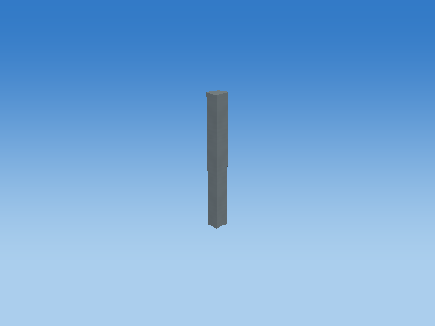 |
| Rotate Z | 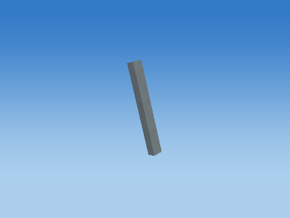 |
| Translate to world |  |

Steps 1–5 share one camera; the unit cube has its own close view, and step 6 is reframed at the actual world location to keep small objects visible. Reframing changes the view, never the model coordinates. Identity steps deliberately remain visible. Intermediate shapes are instructional states, while step 6 uses the unmodified game object.

Each stage below gives its exact numeric matrix and all eight corner multiplications. For each output row r: p'[r] = A[r,0]p.x + A[r,1]p.y + A[r,2]p.z + A[r,3]p.w.

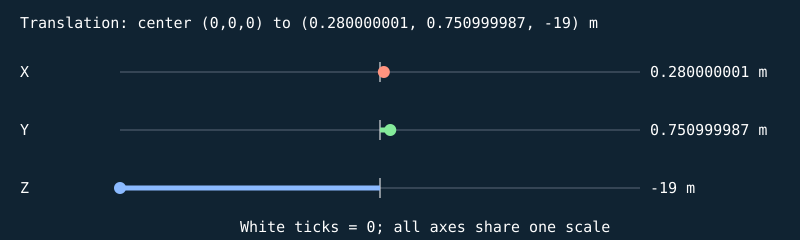


#### S

```text
[ 0.100000001 0 0 0 ]
[ 0 1.06400001 0 0 ]
[ 0 0 0.119999997 0 ]
[ 0 0 0 1 ]
```

| Input corner (w=1) | Output corner (w=1) |
| --- | --- |
| (-0.5, -0.5, -0.5) | (-0.0500000007, -0.532000005, -0.0599999987) |
| (-0.5, -0.5, 0.5) | (-0.0500000007, -0.532000005, 0.0599999987) |
| (-0.5, 0.5, -0.5) | (-0.0500000007, 0.532000005, -0.0599999987) |
| (-0.5, 0.5, 0.5) | (-0.0500000007, 0.532000005, 0.0599999987) |
| (0.5, -0.5, -0.5) | (0.0500000007, -0.532000005, -0.0599999987) |
| (0.5, -0.5, 0.5) | (0.0500000007, -0.532000005, 0.0599999987) |
| (0.5, 0.5, -0.5) | (0.0500000007, 0.532000005, -0.0599999987) |
| (0.5, 0.5, 0.5) | (0.0500000007, 0.532000005, 0.0599999987) |

#### H

```text
[ 1 0 0 0 ]
[ 0 1 0 0 ]
[ 0 0 1 0 ]
[ 0 0 0 1 ]
```

| Input corner (w=1) | Output corner (w=1) |
| --- | --- |
| (-0.0500000007, -0.532000005, -0.0599999987) | (-0.0500000007, -0.532000005, -0.0599999987) |
| (-0.0500000007, -0.532000005, 0.0599999987) | (-0.0500000007, -0.532000005, 0.0599999987) |
| (-0.0500000007, 0.532000005, -0.0599999987) | (-0.0500000007, 0.532000005, -0.0599999987) |
| (-0.0500000007, 0.532000005, 0.0599999987) | (-0.0500000007, 0.532000005, 0.0599999987) |
| (0.0500000007, -0.532000005, -0.0599999987) | (0.0500000007, -0.532000005, -0.0599999987) |
| (0.0500000007, -0.532000005, 0.0599999987) | (0.0500000007, -0.532000005, 0.0599999987) |
| (0.0500000007, 0.532000005, -0.0599999987) | (0.0500000007, 0.532000005, -0.0599999987) |
| (0.0500000007, 0.532000005, 0.0599999987) | (0.0500000007, 0.532000005, 0.0599999987) |

#### Rx

```text
[ 1 0 0 0 ]
[ 0 1 -0 0 ]
[ 0 0 1 0 ]
[ 0 0 0 1 ]
```

| Input corner (w=1) | Output corner (w=1) |
| --- | --- |
| (-0.0500000007, -0.532000005, -0.0599999987) | (-0.0500000007, -0.532000005, -0.0599999987) |
| (-0.0500000007, -0.532000005, 0.0599999987) | (-0.0500000007, -0.532000005, 0.0599999987) |
| (-0.0500000007, 0.532000005, -0.0599999987) | (-0.0500000007, 0.532000005, -0.0599999987) |
| (-0.0500000007, 0.532000005, 0.0599999987) | (-0.0500000007, 0.532000005, 0.0599999987) |
| (0.0500000007, -0.532000005, -0.0599999987) | (0.0500000007, -0.532000005, -0.0599999987) |
| (0.0500000007, -0.532000005, 0.0599999987) | (0.0500000007, -0.532000005, 0.0599999987) |
| (0.0500000007, 0.532000005, -0.0599999987) | (0.0500000007, 0.532000005, -0.0599999987) |
| (0.0500000007, 0.532000005, 0.0599999987) | (0.0500000007, 0.532000005, 0.0599999987) |

#### Ry

```text
[ 1 0 0 0 ]
[ 0 1 0 0 ]
[ -0 0 1 0 ]
[ 0 0 0 1 ]
```

| Input corner (w=1) | Output corner (w=1) |
| --- | --- |
| (-0.0500000007, -0.532000005, -0.0599999987) | (-0.0500000007, -0.532000005, -0.0599999987) |
| (-0.0500000007, -0.532000005, 0.0599999987) | (-0.0500000007, -0.532000005, 0.0599999987) |
| (-0.0500000007, 0.532000005, -0.0599999987) | (-0.0500000007, 0.532000005, -0.0599999987) |
| (-0.0500000007, 0.532000005, 0.0599999987) | (-0.0500000007, 0.532000005, 0.0599999987) |
| (0.0500000007, -0.532000005, -0.0599999987) | (0.0500000007, -0.532000005, -0.0599999987) |
| (0.0500000007, -0.532000005, 0.0599999987) | (0.0500000007, -0.532000005, 0.0599999987) |
| (0.0500000007, 0.532000005, -0.0599999987) | (0.0500000007, 0.532000005, -0.0599999987) |
| (0.0500000007, 0.532000005, 0.0599999987) | (0.0500000007, 0.532000005, 0.0599999987) |

#### Rz

```text
[ 0.95105654 -0.309017003 0 0 ]
[ 0.309017003 0.95105654 0 0 ]
[ 0 0 1 0 ]
[ 0 0 0 1 ]
```

| Input corner (w=1) | Output corner (w=1) |
| --- | --- |
| (-0.0500000007, -0.532000005, -0.0599999987) | (0.116844222, -0.521412909, -0.0599999987) |
| (-0.0500000007, -0.532000005, 0.0599999987) | (0.116844222, -0.521412909, 0.0599999987) |
| (-0.0500000007, 0.532000005, -0.0599999987) | (-0.21194987, 0.490511239, -0.0599999987) |
| (-0.0500000007, 0.532000005, 0.0599999987) | (-0.21194987, 0.490511239, 0.0599999987) |
| (0.0500000007, -0.532000005, -0.0599999987) | (0.21194987, -0.490511239, -0.0599999987) |
| (0.0500000007, -0.532000005, 0.0599999987) | (0.21194987, -0.490511239, 0.0599999987) |
| (0.0500000007, 0.532000005, -0.0599999987) | (-0.116844222, 0.521412909, -0.0599999987) |
| (0.0500000007, 0.532000005, 0.0599999987) | (-0.116844222, 0.521412909, 0.0599999987) |

#### T

```text
[ 1 0 0 0.280000001 ]
[ 0 1 0 0.750999987 ]
[ 0 0 1 -19 ]
[ 0 0 0 1 ]
```

| Input corner (w=1) | Output corner (w=1) |
| --- | --- |
| (0.116844222, -0.521412909, -0.0599999987) | (0.396844208, 0.229587078, -19.0599995) |
| (0.116844222, -0.521412909, 0.0599999987) | (0.396844208, 0.229587078, -18.9400005) |
| (-0.21194987, 0.490511239, -0.0599999987) | (0.0680501312, 1.24151123, -19.0599995) |
| (-0.21194987, 0.490511239, 0.0599999987) | (0.0680501312, 1.24151123, -18.9400005) |
| (0.21194987, -0.490511239, -0.0599999987) | (0.491949856, 0.260488749, -19.0599995) |
| (0.21194987, -0.490511239, 0.0599999987) | (0.491949856, 0.260488749, -18.9400005) |
| (-0.116844222, 0.521412909, -0.0599999987) | (0.163155779, 1.2724129, -19.0599995) |
| (-0.116844222, 0.521412909, 0.0599999987) | (0.163155779, 1.2724129, -18.9400005) |

Final M = T Rz Ry Rx H S:

```text
[ 0.0951056555 -0.328794092 0 0.280000001 ]
[ 0.0309017003 1.01192415 0 0.750999987 ]
[ 0 0 0.119999997 -19 ]
[ 0 0 0 1 ]
```

### Base warning stripe — `TARGET_1_FOOT_STRIPE_1`

1 unit = 1 m; shared cube transform pipeline

Position T = (0.699999988, 0.307000011, -19) m; scale S = (0.159999996, 0.0120000001, 1.36000001); rotation (Rx,Ry,Rz) = (0, 0, 0) degrees.

Shear (xy,xz,yx,yz,zx,zy) = (0, 0, 0, 0, 0, 0). Color = (0.910000026, 0.620000005, 0.159999996); specular = 0.119999997; shininess = 24; emission = 0; flash = 0; material layer = 5; texture scale = 3. Pattern enabled = 0, pattern scale = (1, 1, 1), offset = (0, 0, 0).

| Step | Actual renderer image |
| --- | --- |
| Unit cube |  |
| Scale |  |
| Shear |  |
| Rotate X |  |
| Rotate Y |  |
| Rotate Z |  |
| Translate to world |  |

Steps 1–5 share one camera; the unit cube has its own close view, and step 6 is reframed at the actual world location to keep small objects visible. Reframing changes the view, never the model coordinates. Identity steps deliberately remain visible. Intermediate shapes are instructional states, while step 6 uses the unmodified game object.

Each stage below gives its exact numeric matrix and all eight corner multiplications. For each output row r: p'[r] = A[r,0]p.x + A[r,1]p.y + A[r,2]p.z + A[r,3]p.w.


#### S

```text
[ 0.159999996 0 0 0 ]
[ 0 0.0120000001 0 0 ]
[ 0 0 1.36000001 0 ]
[ 0 0 0 1 ]
```

| Input corner (w=1) | Output corner (w=1) |
| --- | --- |
| (-0.5, -0.5, -0.5) | (-0.0799999982, -0.00600000005, -0.680000007) |
| (-0.5, -0.5, 0.5) | (-0.0799999982, -0.00600000005, 0.680000007) |
| (-0.5, 0.5, -0.5) | (-0.0799999982, 0.00600000005, -0.680000007) |
| (-0.5, 0.5, 0.5) | (-0.0799999982, 0.00600000005, 0.680000007) |
| (0.5, -0.5, -0.5) | (0.0799999982, -0.00600000005, -0.680000007) |
| (0.5, -0.5, 0.5) | (0.0799999982, -0.00600000005, 0.680000007) |
| (0.5, 0.5, -0.5) | (0.0799999982, 0.00600000005, -0.680000007) |
| (0.5, 0.5, 0.5) | (0.0799999982, 0.00600000005, 0.680000007) |

#### H

```text
[ 1 0 0 0 ]
[ 0 1 0 0 ]
[ 0 0 1 0 ]
[ 0 0 0 1 ]
```

| Input corner (w=1) | Output corner (w=1) |
| --- | --- |
| (-0.0799999982, -0.00600000005, -0.680000007) | (-0.0799999982, -0.00600000005, -0.680000007) |
| (-0.0799999982, -0.00600000005, 0.680000007) | (-0.0799999982, -0.00600000005, 0.680000007) |
| (-0.0799999982, 0.00600000005, -0.680000007) | (-0.0799999982, 0.00600000005, -0.680000007) |
| (-0.0799999982, 0.00600000005, 0.680000007) | (-0.0799999982, 0.00600000005, 0.680000007) |
| (0.0799999982, -0.00600000005, -0.680000007) | (0.0799999982, -0.00600000005, -0.680000007) |
| (0.0799999982, -0.00600000005, 0.680000007) | (0.0799999982, -0.00600000005, 0.680000007) |
| (0.0799999982, 0.00600000005, -0.680000007) | (0.0799999982, 0.00600000005, -0.680000007) |
| (0.0799999982, 0.00600000005, 0.680000007) | (0.0799999982, 0.00600000005, 0.680000007) |

#### Rx

```text
[ 1 0 0 0 ]
[ 0 1 -0 0 ]
[ 0 0 1 0 ]
[ 0 0 0 1 ]
```

| Input corner (w=1) | Output corner (w=1) |
| --- | --- |
| (-0.0799999982, -0.00600000005, -0.680000007) | (-0.0799999982, -0.00600000005, -0.680000007) |
| (-0.0799999982, -0.00600000005, 0.680000007) | (-0.0799999982, -0.00600000005, 0.680000007) |
| (-0.0799999982, 0.00600000005, -0.680000007) | (-0.0799999982, 0.00600000005, -0.680000007) |
| (-0.0799999982, 0.00600000005, 0.680000007) | (-0.0799999982, 0.00600000005, 0.680000007) |
| (0.0799999982, -0.00600000005, -0.680000007) | (0.0799999982, -0.00600000005, -0.680000007) |
| (0.0799999982, -0.00600000005, 0.680000007) | (0.0799999982, -0.00600000005, 0.680000007) |
| (0.0799999982, 0.00600000005, -0.680000007) | (0.0799999982, 0.00600000005, -0.680000007) |
| (0.0799999982, 0.00600000005, 0.680000007) | (0.0799999982, 0.00600000005, 0.680000007) |

#### Ry

```text
[ 1 0 0 0 ]
[ 0 1 0 0 ]
[ -0 0 1 0 ]
[ 0 0 0 1 ]
```

| Input corner (w=1) | Output corner (w=1) |
| --- | --- |
| (-0.0799999982, -0.00600000005, -0.680000007) | (-0.0799999982, -0.00600000005, -0.680000007) |
| (-0.0799999982, -0.00600000005, 0.680000007) | (-0.0799999982, -0.00600000005, 0.680000007) |
| (-0.0799999982, 0.00600000005, -0.680000007) | (-0.0799999982, 0.00600000005, -0.680000007) |
| (-0.0799999982, 0.00600000005, 0.680000007) | (-0.0799999982, 0.00600000005, 0.680000007) |
| (0.0799999982, -0.00600000005, -0.680000007) | (0.0799999982, -0.00600000005, -0.680000007) |
| (0.0799999982, -0.00600000005, 0.680000007) | (0.0799999982, -0.00600000005, 0.680000007) |
| (0.0799999982, 0.00600000005, -0.680000007) | (0.0799999982, 0.00600000005, -0.680000007) |
| (0.0799999982, 0.00600000005, 0.680000007) | (0.0799999982, 0.00600000005, 0.680000007) |

#### Rz

```text
[ 1 -0 0 0 ]
[ 0 1 0 0 ]
[ 0 0 1 0 ]
[ 0 0 0 1 ]
```

| Input corner (w=1) | Output corner (w=1) |
| --- | --- |
| (-0.0799999982, -0.00600000005, -0.680000007) | (-0.0799999982, -0.00600000005, -0.680000007) |
| (-0.0799999982, -0.00600000005, 0.680000007) | (-0.0799999982, -0.00600000005, 0.680000007) |
| (-0.0799999982, 0.00600000005, -0.680000007) | (-0.0799999982, 0.00600000005, -0.680000007) |
| (-0.0799999982, 0.00600000005, 0.680000007) | (-0.0799999982, 0.00600000005, 0.680000007) |
| (0.0799999982, -0.00600000005, -0.680000007) | (0.0799999982, -0.00600000005, -0.680000007) |
| (0.0799999982, -0.00600000005, 0.680000007) | (0.0799999982, -0.00600000005, 0.680000007) |
| (0.0799999982, 0.00600000005, -0.680000007) | (0.0799999982, 0.00600000005, -0.680000007) |
| (0.0799999982, 0.00600000005, 0.680000007) | (0.0799999982, 0.00600000005, 0.680000007) |

#### T

```text
[ 1 0 0 0.699999988 ]
[ 0 1 0 0.307000011 ]
[ 0 0 1 -19 ]
[ 0 0 0 1 ]
```

| Input corner (w=1) | Output corner (w=1) |
| --- | --- |
| (-0.0799999982, -0.00600000005, -0.680000007) | (0.620000005, 0.300999999, -19.6800003) |
| (-0.0799999982, -0.00600000005, 0.680000007) | (0.620000005, 0.300999999, -18.3199997) |
| (-0.0799999982, 0.00600000005, -0.680000007) | (0.620000005, 0.313000023, -19.6800003) |
| (-0.0799999982, 0.00600000005, 0.680000007) | (0.620000005, 0.313000023, -18.3199997) |
| (0.0799999982, -0.00600000005, -0.680000007) | (0.779999971, 0.300999999, -19.6800003) |
| (0.0799999982, -0.00600000005, 0.680000007) | (0.779999971, 0.300999999, -18.3199997) |
| (0.0799999982, 0.00600000005, -0.680000007) | (0.779999971, 0.313000023, -19.6800003) |
| (0.0799999982, 0.00600000005, 0.680000007) | (0.779999971, 0.313000023, -18.3199997) |

Final M = T Rz Ry Rx H S:

```text
[ 0.159999996 0 0 0.699999988 ]
[ 0 0.0120000001 0 0.307000011 ]
[ 0 0 1.36000001 -19 ]
[ 0 0 0 1 ]
```

### Cube-built six-ring plate — `TARGET_1_SLICE_0`

32 transformed cube slices; printed front +Z; health=60.000000/60; exact slice collider

Position T = (0, 1.92499995, -19) m; scale S = (0.396862745, 0.0500000007, 0.159999996); rotation (Rx,Ry,Rz) = (0, 0, 0) degrees.

Shear (xy,xz,yx,yz,zx,zy) = (0, 0, 0, 0, 0, 0). Color = (0.800000012, 0.800000012, 0.800000012); specular = 0.449999988; shininess = 48; emission = 0; flash = 1; material layer = 7; texture scale = 2. Pattern enabled = 1, pattern scale = (0.248039216, 0.03125, 1), offset = (0, -0.48437503, 0).

| Step | Actual renderer image |
| --- | --- |
| Unit cube | 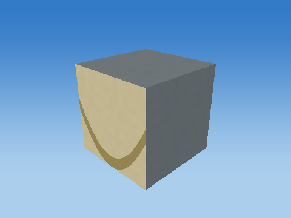 |
| Scale |  |
| Shear |  |
| Rotate X |  |
| Rotate Y |  |
| Rotate Z |  |
| Translate to world |  |

Steps 1–5 share one camera; the unit cube has its own close view, and step 6 is reframed at the actual world location to keep small objects visible. Reframing changes the view, never the model coordinates. Identity steps deliberately remain visible. Intermediate shapes are instructional states, while step 6 uses the unmodified game object.

Each stage below gives its exact numeric matrix and all eight corner multiplications. For each output row r: p'[r] = A[r,0]p.x + A[r,1]p.y + A[r,2]p.z + A[r,3]p.w.


#### S

```text
[ 0.396862745 0 0 0 ]
[ 0 0.0500000007 0 0 ]
[ 0 0 0.159999996 0 ]
[ 0 0 0 1 ]
```

| Input corner (w=1) | Output corner (w=1) |
| --- | --- |
| (-0.5, -0.5, -0.5) | (-0.198431373, -0.0250000004, -0.0799999982) |
| (-0.5, -0.5, 0.5) | (-0.198431373, -0.0250000004, 0.0799999982) |
| (-0.5, 0.5, -0.5) | (-0.198431373, 0.0250000004, -0.0799999982) |
| (-0.5, 0.5, 0.5) | (-0.198431373, 0.0250000004, 0.0799999982) |
| (0.5, -0.5, -0.5) | (0.198431373, -0.0250000004, -0.0799999982) |
| (0.5, -0.5, 0.5) | (0.198431373, -0.0250000004, 0.0799999982) |
| (0.5, 0.5, -0.5) | (0.198431373, 0.0250000004, -0.0799999982) |
| (0.5, 0.5, 0.5) | (0.198431373, 0.0250000004, 0.0799999982) |

#### H

```text
[ 1 0 0 0 ]
[ 0 1 0 0 ]
[ 0 0 1 0 ]
[ 0 0 0 1 ]
```

| Input corner (w=1) | Output corner (w=1) |
| --- | --- |
| (-0.198431373, -0.0250000004, -0.0799999982) | (-0.198431373, -0.0250000004, -0.0799999982) |
| (-0.198431373, -0.0250000004, 0.0799999982) | (-0.198431373, -0.0250000004, 0.0799999982) |
| (-0.198431373, 0.0250000004, -0.0799999982) | (-0.198431373, 0.0250000004, -0.0799999982) |
| (-0.198431373, 0.0250000004, 0.0799999982) | (-0.198431373, 0.0250000004, 0.0799999982) |
| (0.198431373, -0.0250000004, -0.0799999982) | (0.198431373, -0.0250000004, -0.0799999982) |
| (0.198431373, -0.0250000004, 0.0799999982) | (0.198431373, -0.0250000004, 0.0799999982) |
| (0.198431373, 0.0250000004, -0.0799999982) | (0.198431373, 0.0250000004, -0.0799999982) |
| (0.198431373, 0.0250000004, 0.0799999982) | (0.198431373, 0.0250000004, 0.0799999982) |

#### Rx

```text
[ 1 0 0 0 ]
[ 0 1 -0 0 ]
[ 0 0 1 0 ]
[ 0 0 0 1 ]
```

| Input corner (w=1) | Output corner (w=1) |
| --- | --- |
| (-0.198431373, -0.0250000004, -0.0799999982) | (-0.198431373, -0.0250000004, -0.0799999982) |
| (-0.198431373, -0.0250000004, 0.0799999982) | (-0.198431373, -0.0250000004, 0.0799999982) |
| (-0.198431373, 0.0250000004, -0.0799999982) | (-0.198431373, 0.0250000004, -0.0799999982) |
| (-0.198431373, 0.0250000004, 0.0799999982) | (-0.198431373, 0.0250000004, 0.0799999982) |
| (0.198431373, -0.0250000004, -0.0799999982) | (0.198431373, -0.0250000004, -0.0799999982) |
| (0.198431373, -0.0250000004, 0.0799999982) | (0.198431373, -0.0250000004, 0.0799999982) |
| (0.198431373, 0.0250000004, -0.0799999982) | (0.198431373, 0.0250000004, -0.0799999982) |
| (0.198431373, 0.0250000004, 0.0799999982) | (0.198431373, 0.0250000004, 0.0799999982) |

#### Ry

```text
[ 1 0 0 0 ]
[ 0 1 0 0 ]
[ -0 0 1 0 ]
[ 0 0 0 1 ]
```

| Input corner (w=1) | Output corner (w=1) |
| --- | --- |
| (-0.198431373, -0.0250000004, -0.0799999982) | (-0.198431373, -0.0250000004, -0.0799999982) |
| (-0.198431373, -0.0250000004, 0.0799999982) | (-0.198431373, -0.0250000004, 0.0799999982) |
| (-0.198431373, 0.0250000004, -0.0799999982) | (-0.198431373, 0.0250000004, -0.0799999982) |
| (-0.198431373, 0.0250000004, 0.0799999982) | (-0.198431373, 0.0250000004, 0.0799999982) |
| (0.198431373, -0.0250000004, -0.0799999982) | (0.198431373, -0.0250000004, -0.0799999982) |
| (0.198431373, -0.0250000004, 0.0799999982) | (0.198431373, -0.0250000004, 0.0799999982) |
| (0.198431373, 0.0250000004, -0.0799999982) | (0.198431373, 0.0250000004, -0.0799999982) |
| (0.198431373, 0.0250000004, 0.0799999982) | (0.198431373, 0.0250000004, 0.0799999982) |

#### Rz

```text
[ 1 -0 0 0 ]
[ 0 1 0 0 ]
[ 0 0 1 0 ]
[ 0 0 0 1 ]
```

| Input corner (w=1) | Output corner (w=1) |
| --- | --- |
| (-0.198431373, -0.0250000004, -0.0799999982) | (-0.198431373, -0.0250000004, -0.0799999982) |
| (-0.198431373, -0.0250000004, 0.0799999982) | (-0.198431373, -0.0250000004, 0.0799999982) |
| (-0.198431373, 0.0250000004, -0.0799999982) | (-0.198431373, 0.0250000004, -0.0799999982) |
| (-0.198431373, 0.0250000004, 0.0799999982) | (-0.198431373, 0.0250000004, 0.0799999982) |
| (0.198431373, -0.0250000004, -0.0799999982) | (0.198431373, -0.0250000004, -0.0799999982) |
| (0.198431373, -0.0250000004, 0.0799999982) | (0.198431373, -0.0250000004, 0.0799999982) |
| (0.198431373, 0.0250000004, -0.0799999982) | (0.198431373, 0.0250000004, -0.0799999982) |
| (0.198431373, 0.0250000004, 0.0799999982) | (0.198431373, 0.0250000004, 0.0799999982) |

#### T

```text
[ 1 0 0 0 ]
[ 0 1 0 1.92499995 ]
[ 0 0 1 -19 ]
[ 0 0 0 1 ]
```

| Input corner (w=1) | Output corner (w=1) |
| --- | --- |
| (-0.198431373, -0.0250000004, -0.0799999982) | (-0.198431373, 1.89999998, -19.0799999) |
| (-0.198431373, -0.0250000004, 0.0799999982) | (-0.198431373, 1.89999998, -18.9200001) |
| (-0.198431373, 0.0250000004, -0.0799999982) | (-0.198431373, 1.94999993, -19.0799999) |
| (-0.198431373, 0.0250000004, 0.0799999982) | (-0.198431373, 1.94999993, -18.9200001) |
| (0.198431373, -0.0250000004, -0.0799999982) | (0.198431373, 1.89999998, -19.0799999) |
| (0.198431373, -0.0250000004, 0.0799999982) | (0.198431373, 1.89999998, -18.9200001) |
| (0.198431373, 0.0250000004, -0.0799999982) | (0.198431373, 1.94999993, -19.0799999) |
| (0.198431373, 0.0250000004, 0.0799999982) | (0.198431373, 1.94999993, -18.9200001) |

Final M = T Rz Ry Rx H S:

```text
[ 0.396862745 0 0 0 ]
[ 0 0.0500000007 0 1.92499995 ]
[ 0 0 0.159999996 -19 ]
[ 0 0 0 1 ]
```

### Cube-built six-ring plate — `TARGET_1_SLICE_1`

32 transformed cube slices; printed front +Z; health=60.000000/60; exact slice collider

Position T = (0, 1.97500002, -19) m; scale S = (0.676387429, 0.0500000007, 0.159999996); rotation (Rx,Ry,Rz) = (0, 0, 0) degrees.

Shear (xy,xz,yx,yz,zx,zy) = (0, 0, 0, 0, 0, 0). Color = (0.800000012, 0.800000012, 0.800000012); specular = 0.449999988; shininess = 48; emission = 0; flash = 1; material layer = 7; texture scale = 2. Pattern enabled = 1, pattern scale = (0.422742128, 0.03125, 1), offset = (0, -0.453125, 0).

| Step | Actual renderer image |
| --- | --- |
| Unit cube |  |
| Scale |  |
| Shear |  |
| Rotate X |  |
| Rotate Y |  |
| Rotate Z |  |
| Translate to world | 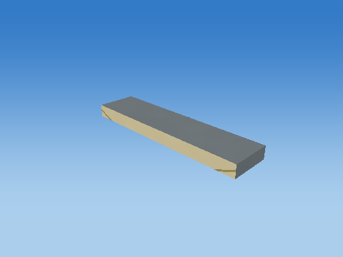 |

Steps 1–5 share one camera; the unit cube has its own close view, and step 6 is reframed at the actual world location to keep small objects visible. Reframing changes the view, never the model coordinates. Identity steps deliberately remain visible. Intermediate shapes are instructional states, while step 6 uses the unmodified game object.

Each stage below gives its exact numeric matrix and all eight corner multiplications. For each output row r: p'[r] = A[r,0]p.x + A[r,1]p.y + A[r,2]p.z + A[r,3]p.w.


#### S

```text
[ 0.676387429 0 0 0 ]
[ 0 0.0500000007 0 0 ]
[ 0 0 0.159999996 0 ]
[ 0 0 0 1 ]
```

| Input corner (w=1) | Output corner (w=1) |
| --- | --- |
| (-0.5, -0.5, -0.5) | (-0.338193715, -0.0250000004, -0.0799999982) |
| (-0.5, -0.5, 0.5) | (-0.338193715, -0.0250000004, 0.0799999982) |
| (-0.5, 0.5, -0.5) | (-0.338193715, 0.0250000004, -0.0799999982) |
| (-0.5, 0.5, 0.5) | (-0.338193715, 0.0250000004, 0.0799999982) |
| (0.5, -0.5, -0.5) | (0.338193715, -0.0250000004, -0.0799999982) |
| (0.5, -0.5, 0.5) | (0.338193715, -0.0250000004, 0.0799999982) |
| (0.5, 0.5, -0.5) | (0.338193715, 0.0250000004, -0.0799999982) |
| (0.5, 0.5, 0.5) | (0.338193715, 0.0250000004, 0.0799999982) |

#### H

```text
[ 1 0 0 0 ]
[ 0 1 0 0 ]
[ 0 0 1 0 ]
[ 0 0 0 1 ]
```

| Input corner (w=1) | Output corner (w=1) |
| --- | --- |
| (-0.338193715, -0.0250000004, -0.0799999982) | (-0.338193715, -0.0250000004, -0.0799999982) |
| (-0.338193715, -0.0250000004, 0.0799999982) | (-0.338193715, -0.0250000004, 0.0799999982) |
| (-0.338193715, 0.0250000004, -0.0799999982) | (-0.338193715, 0.0250000004, -0.0799999982) |
| (-0.338193715, 0.0250000004, 0.0799999982) | (-0.338193715, 0.0250000004, 0.0799999982) |
| (0.338193715, -0.0250000004, -0.0799999982) | (0.338193715, -0.0250000004, -0.0799999982) |
| (0.338193715, -0.0250000004, 0.0799999982) | (0.338193715, -0.0250000004, 0.0799999982) |
| (0.338193715, 0.0250000004, -0.0799999982) | (0.338193715, 0.0250000004, -0.0799999982) |
| (0.338193715, 0.0250000004, 0.0799999982) | (0.338193715, 0.0250000004, 0.0799999982) |

#### Rx

```text
[ 1 0 0 0 ]
[ 0 1 -0 0 ]
[ 0 0 1 0 ]
[ 0 0 0 1 ]
```

| Input corner (w=1) | Output corner (w=1) |
| --- | --- |
| (-0.338193715, -0.0250000004, -0.0799999982) | (-0.338193715, -0.0250000004, -0.0799999982) |
| (-0.338193715, -0.0250000004, 0.0799999982) | (-0.338193715, -0.0250000004, 0.0799999982) |
| (-0.338193715, 0.0250000004, -0.0799999982) | (-0.338193715, 0.0250000004, -0.0799999982) |
| (-0.338193715, 0.0250000004, 0.0799999982) | (-0.338193715, 0.0250000004, 0.0799999982) |
| (0.338193715, -0.0250000004, -0.0799999982) | (0.338193715, -0.0250000004, -0.0799999982) |
| (0.338193715, -0.0250000004, 0.0799999982) | (0.338193715, -0.0250000004, 0.0799999982) |
| (0.338193715, 0.0250000004, -0.0799999982) | (0.338193715, 0.0250000004, -0.0799999982) |
| (0.338193715, 0.0250000004, 0.0799999982) | (0.338193715, 0.0250000004, 0.0799999982) |

#### Ry

```text
[ 1 0 0 0 ]
[ 0 1 0 0 ]
[ -0 0 1 0 ]
[ 0 0 0 1 ]
```

| Input corner (w=1) | Output corner (w=1) |
| --- | --- |
| (-0.338193715, -0.0250000004, -0.0799999982) | (-0.338193715, -0.0250000004, -0.0799999982) |
| (-0.338193715, -0.0250000004, 0.0799999982) | (-0.338193715, -0.0250000004, 0.0799999982) |
| (-0.338193715, 0.0250000004, -0.0799999982) | (-0.338193715, 0.0250000004, -0.0799999982) |
| (-0.338193715, 0.0250000004, 0.0799999982) | (-0.338193715, 0.0250000004, 0.0799999982) |
| (0.338193715, -0.0250000004, -0.0799999982) | (0.338193715, -0.0250000004, -0.0799999982) |
| (0.338193715, -0.0250000004, 0.0799999982) | (0.338193715, -0.0250000004, 0.0799999982) |
| (0.338193715, 0.0250000004, -0.0799999982) | (0.338193715, 0.0250000004, -0.0799999982) |
| (0.338193715, 0.0250000004, 0.0799999982) | (0.338193715, 0.0250000004, 0.0799999982) |

#### Rz

```text
[ 1 -0 0 0 ]
[ 0 1 0 0 ]
[ 0 0 1 0 ]
[ 0 0 0 1 ]
```

| Input corner (w=1) | Output corner (w=1) |
| --- | --- |
| (-0.338193715, -0.0250000004, -0.0799999982) | (-0.338193715, -0.0250000004, -0.0799999982) |
| (-0.338193715, -0.0250000004, 0.0799999982) | (-0.338193715, -0.0250000004, 0.0799999982) |
| (-0.338193715, 0.0250000004, -0.0799999982) | (-0.338193715, 0.0250000004, -0.0799999982) |
| (-0.338193715, 0.0250000004, 0.0799999982) | (-0.338193715, 0.0250000004, 0.0799999982) |
| (0.338193715, -0.0250000004, -0.0799999982) | (0.338193715, -0.0250000004, -0.0799999982) |
| (0.338193715, -0.0250000004, 0.0799999982) | (0.338193715, -0.0250000004, 0.0799999982) |
| (0.338193715, 0.0250000004, -0.0799999982) | (0.338193715, 0.0250000004, -0.0799999982) |
| (0.338193715, 0.0250000004, 0.0799999982) | (0.338193715, 0.0250000004, 0.0799999982) |

#### T

```text
[ 1 0 0 0 ]
[ 0 1 0 1.97500002 ]
[ 0 0 1 -19 ]
[ 0 0 0 1 ]
```

| Input corner (w=1) | Output corner (w=1) |
| --- | --- |
| (-0.338193715, -0.0250000004, -0.0799999982) | (-0.338193715, 1.95000005, -19.0799999) |
| (-0.338193715, -0.0250000004, 0.0799999982) | (-0.338193715, 1.95000005, -18.9200001) |
| (-0.338193715, 0.0250000004, -0.0799999982) | (-0.338193715, 2, -19.0799999) |
| (-0.338193715, 0.0250000004, 0.0799999982) | (-0.338193715, 2, -18.9200001) |
| (0.338193715, -0.0250000004, -0.0799999982) | (0.338193715, 1.95000005, -19.0799999) |
| (0.338193715, -0.0250000004, 0.0799999982) | (0.338193715, 1.95000005, -18.9200001) |
| (0.338193715, 0.0250000004, -0.0799999982) | (0.338193715, 2, -19.0799999) |
| (0.338193715, 0.0250000004, 0.0799999982) | (0.338193715, 2, -18.9200001) |

Final M = T Rz Ry Rx H S:

```text
[ 0.676387429 0 0 0 ]
[ 0 0.0500000007 0 1.97500002 ]
[ 0 0 0.159999996 -19 ]
[ 0 0 0 1 ]
```

### Cube-built six-ring plate — `TARGET_1_SLICE_2`

32 transformed cube slices; printed front +Z; health=60.000000/60; exact slice collider

Position T = (0, 2.0250001, -19) m; scale S = (0.858778238, 0.0500000007, 0.159999996); rotation (Rx,Ry,Rz) = (0, 0, 0) degrees.

Shear (xy,xz,yx,yz,zx,zy) = (0, 0, 0, 0, 0, 0). Color = (0.800000012, 0.800000012, 0.800000012); specular = 0.449999988; shininess = 48; emission = 0; flash = 1; material layer = 7; texture scale = 2. Pattern enabled = 1, pattern scale = (0.536736369, 0.03125, 1), offset = (0, -0.421875, 0).

| Step | Actual renderer image |
| --- | --- |
| Unit cube |  |
| Scale |  |
| Shear |  |
| Rotate X |  |
| Rotate Y |  |
| Rotate Z |  |
| Translate to world |  |

Steps 1–5 share one camera; the unit cube has its own close view, and step 6 is reframed at the actual world location to keep small objects visible. Reframing changes the view, never the model coordinates. Identity steps deliberately remain visible. Intermediate shapes are instructional states, while step 6 uses the unmodified game object.

Each stage below gives its exact numeric matrix and all eight corner multiplications. For each output row r: p'[r] = A[r,0]p.x + A[r,1]p.y + A[r,2]p.z + A[r,3]p.w.


#### S

```text
[ 0.858778238 0 0 0 ]
[ 0 0.0500000007 0 0 ]
[ 0 0 0.159999996 0 ]
[ 0 0 0 1 ]
```

| Input corner (w=1) | Output corner (w=1) |
| --- | --- |
| (-0.5, -0.5, -0.5) | (-0.429389119, -0.0250000004, -0.0799999982) |
| (-0.5, -0.5, 0.5) | (-0.429389119, -0.0250000004, 0.0799999982) |
| (-0.5, 0.5, -0.5) | (-0.429389119, 0.0250000004, -0.0799999982) |
| (-0.5, 0.5, 0.5) | (-0.429389119, 0.0250000004, 0.0799999982) |
| (0.5, -0.5, -0.5) | (0.429389119, -0.0250000004, -0.0799999982) |
| (0.5, -0.5, 0.5) | (0.429389119, -0.0250000004, 0.0799999982) |
| (0.5, 0.5, -0.5) | (0.429389119, 0.0250000004, -0.0799999982) |
| (0.5, 0.5, 0.5) | (0.429389119, 0.0250000004, 0.0799999982) |

#### H

```text
[ 1 0 0 0 ]
[ 0 1 0 0 ]
[ 0 0 1 0 ]
[ 0 0 0 1 ]
```

| Input corner (w=1) | Output corner (w=1) |
| --- | --- |
| (-0.429389119, -0.0250000004, -0.0799999982) | (-0.429389119, -0.0250000004, -0.0799999982) |
| (-0.429389119, -0.0250000004, 0.0799999982) | (-0.429389119, -0.0250000004, 0.0799999982) |
| (-0.429389119, 0.0250000004, -0.0799999982) | (-0.429389119, 0.0250000004, -0.0799999982) |
| (-0.429389119, 0.0250000004, 0.0799999982) | (-0.429389119, 0.0250000004, 0.0799999982) |
| (0.429389119, -0.0250000004, -0.0799999982) | (0.429389119, -0.0250000004, -0.0799999982) |
| (0.429389119, -0.0250000004, 0.0799999982) | (0.429389119, -0.0250000004, 0.0799999982) |
| (0.429389119, 0.0250000004, -0.0799999982) | (0.429389119, 0.0250000004, -0.0799999982) |
| (0.429389119, 0.0250000004, 0.0799999982) | (0.429389119, 0.0250000004, 0.0799999982) |

#### Rx

```text
[ 1 0 0 0 ]
[ 0 1 -0 0 ]
[ 0 0 1 0 ]
[ 0 0 0 1 ]
```

| Input corner (w=1) | Output corner (w=1) |
| --- | --- |
| (-0.429389119, -0.0250000004, -0.0799999982) | (-0.429389119, -0.0250000004, -0.0799999982) |
| (-0.429389119, -0.0250000004, 0.0799999982) | (-0.429389119, -0.0250000004, 0.0799999982) |
| (-0.429389119, 0.0250000004, -0.0799999982) | (-0.429389119, 0.0250000004, -0.0799999982) |
| (-0.429389119, 0.0250000004, 0.0799999982) | (-0.429389119, 0.0250000004, 0.0799999982) |
| (0.429389119, -0.0250000004, -0.0799999982) | (0.429389119, -0.0250000004, -0.0799999982) |
| (0.429389119, -0.0250000004, 0.0799999982) | (0.429389119, -0.0250000004, 0.0799999982) |
| (0.429389119, 0.0250000004, -0.0799999982) | (0.429389119, 0.0250000004, -0.0799999982) |
| (0.429389119, 0.0250000004, 0.0799999982) | (0.429389119, 0.0250000004, 0.0799999982) |

#### Ry

```text
[ 1 0 0 0 ]
[ 0 1 0 0 ]
[ -0 0 1 0 ]
[ 0 0 0 1 ]
```

| Input corner (w=1) | Output corner (w=1) |
| --- | --- |
| (-0.429389119, -0.0250000004, -0.0799999982) | (-0.429389119, -0.0250000004, -0.0799999982) |
| (-0.429389119, -0.0250000004, 0.0799999982) | (-0.429389119, -0.0250000004, 0.0799999982) |
| (-0.429389119, 0.0250000004, -0.0799999982) | (-0.429389119, 0.0250000004, -0.0799999982) |
| (-0.429389119, 0.0250000004, 0.0799999982) | (-0.429389119, 0.0250000004, 0.0799999982) |
| (0.429389119, -0.0250000004, -0.0799999982) | (0.429389119, -0.0250000004, -0.0799999982) |
| (0.429389119, -0.0250000004, 0.0799999982) | (0.429389119, -0.0250000004, 0.0799999982) |
| (0.429389119, 0.0250000004, -0.0799999982) | (0.429389119, 0.0250000004, -0.0799999982) |
| (0.429389119, 0.0250000004, 0.0799999982) | (0.429389119, 0.0250000004, 0.0799999982) |

#### Rz

```text
[ 1 -0 0 0 ]
[ 0 1 0 0 ]
[ 0 0 1 0 ]
[ 0 0 0 1 ]
```

| Input corner (w=1) | Output corner (w=1) |
| --- | --- |
| (-0.429389119, -0.0250000004, -0.0799999982) | (-0.429389119, -0.0250000004, -0.0799999982) |
| (-0.429389119, -0.0250000004, 0.0799999982) | (-0.429389119, -0.0250000004, 0.0799999982) |
| (-0.429389119, 0.0250000004, -0.0799999982) | (-0.429389119, 0.0250000004, -0.0799999982) |
| (-0.429389119, 0.0250000004, 0.0799999982) | (-0.429389119, 0.0250000004, 0.0799999982) |
| (0.429389119, -0.0250000004, -0.0799999982) | (0.429389119, -0.0250000004, -0.0799999982) |
| (0.429389119, -0.0250000004, 0.0799999982) | (0.429389119, -0.0250000004, 0.0799999982) |
| (0.429389119, 0.0250000004, -0.0799999982) | (0.429389119, 0.0250000004, -0.0799999982) |
| (0.429389119, 0.0250000004, 0.0799999982) | (0.429389119, 0.0250000004, 0.0799999982) |

#### T

```text
[ 1 0 0 0 ]
[ 0 1 0 2.0250001 ]
[ 0 0 1 -19 ]
[ 0 0 0 1 ]
```

| Input corner (w=1) | Output corner (w=1) |
| --- | --- |
| (-0.429389119, -0.0250000004, -0.0799999982) | (-0.429389119, 2, -19.0799999) |
| (-0.429389119, -0.0250000004, 0.0799999982) | (-0.429389119, 2, -18.9200001) |
| (-0.429389119, 0.0250000004, -0.0799999982) | (-0.429389119, 2.05000019, -19.0799999) |
| (-0.429389119, 0.0250000004, 0.0799999982) | (-0.429389119, 2.05000019, -18.9200001) |
| (0.429389119, -0.0250000004, -0.0799999982) | (0.429389119, 2, -19.0799999) |
| (0.429389119, -0.0250000004, 0.0799999982) | (0.429389119, 2, -18.9200001) |
| (0.429389119, 0.0250000004, -0.0799999982) | (0.429389119, 2.05000019, -19.0799999) |
| (0.429389119, 0.0250000004, 0.0799999982) | (0.429389119, 2.05000019, -18.9200001) |

Final M = T Rz Ry Rx H S:

```text
[ 0.858778238 0 0 0 ]
[ 0 0.0500000007 0 2.0250001 ]
[ 0 0 0.159999996 -19 ]
[ 0 0 0 1 ]
```

### Cube-built six-ring plate — `TARGET_1_SLICE_3`

32 transformed cube slices; printed front +Z; health=60.000000/60; exact slice collider

Position T = (0, 2.07500005, -19) m; scale S = (0.998749316, 0.0500000007, 0.159999996); rotation (Rx,Ry,Rz) = (0, 0, 0) degrees.

Shear (xy,xz,yx,yz,zx,zy) = (0, 0, 0, 0, 0, 0). Color = (0.800000012, 0.800000012, 0.800000012); specular = 0.449999988; shininess = 48; emission = 0; flash = 1; material layer = 7; texture scale = 2. Pattern enabled = 1, pattern scale = (0.624218285, 0.03125, 1), offset = (0, -0.390625, 0).

| Step | Actual renderer image |
| --- | --- |
| Unit cube |  |
| Scale |  |
| Shear |  |
| Rotate X |  |
| Rotate Y |  |
| Rotate Z |  |
| Translate to world |  |

Steps 1–5 share one camera; the unit cube has its own close view, and step 6 is reframed at the actual world location to keep small objects visible. Reframing changes the view, never the model coordinates. Identity steps deliberately remain visible. Intermediate shapes are instructional states, while step 6 uses the unmodified game object.

Each stage below gives its exact numeric matrix and all eight corner multiplications. For each output row r: p'[r] = A[r,0]p.x + A[r,1]p.y + A[r,2]p.z + A[r,3]p.w.


#### S

```text
[ 0.998749316 0 0 0 ]
[ 0 0.0500000007 0 0 ]
[ 0 0 0.159999996 0 ]
[ 0 0 0 1 ]
```

| Input corner (w=1) | Output corner (w=1) |
| --- | --- |
| (-0.5, -0.5, -0.5) | (-0.499374658, -0.0250000004, -0.0799999982) |
| (-0.5, -0.5, 0.5) | (-0.499374658, -0.0250000004, 0.0799999982) |
| (-0.5, 0.5, -0.5) | (-0.499374658, 0.0250000004, -0.0799999982) |
| (-0.5, 0.5, 0.5) | (-0.499374658, 0.0250000004, 0.0799999982) |
| (0.5, -0.5, -0.5) | (0.499374658, -0.0250000004, -0.0799999982) |
| (0.5, -0.5, 0.5) | (0.499374658, -0.0250000004, 0.0799999982) |
| (0.5, 0.5, -0.5) | (0.499374658, 0.0250000004, -0.0799999982) |
| (0.5, 0.5, 0.5) | (0.499374658, 0.0250000004, 0.0799999982) |

#### H

```text
[ 1 0 0 0 ]
[ 0 1 0 0 ]
[ 0 0 1 0 ]
[ 0 0 0 1 ]
```

| Input corner (w=1) | Output corner (w=1) |
| --- | --- |
| (-0.499374658, -0.0250000004, -0.0799999982) | (-0.499374658, -0.0250000004, -0.0799999982) |
| (-0.499374658, -0.0250000004, 0.0799999982) | (-0.499374658, -0.0250000004, 0.0799999982) |
| (-0.499374658, 0.0250000004, -0.0799999982) | (-0.499374658, 0.0250000004, -0.0799999982) |
| (-0.499374658, 0.0250000004, 0.0799999982) | (-0.499374658, 0.0250000004, 0.0799999982) |
| (0.499374658, -0.0250000004, -0.0799999982) | (0.499374658, -0.0250000004, -0.0799999982) |
| (0.499374658, -0.0250000004, 0.0799999982) | (0.499374658, -0.0250000004, 0.0799999982) |
| (0.499374658, 0.0250000004, -0.0799999982) | (0.499374658, 0.0250000004, -0.0799999982) |
| (0.499374658, 0.0250000004, 0.0799999982) | (0.499374658, 0.0250000004, 0.0799999982) |

#### Rx

```text
[ 1 0 0 0 ]
[ 0 1 -0 0 ]
[ 0 0 1 0 ]
[ 0 0 0 1 ]
```

| Input corner (w=1) | Output corner (w=1) |
| --- | --- |
| (-0.499374658, -0.0250000004, -0.0799999982) | (-0.499374658, -0.0250000004, -0.0799999982) |
| (-0.499374658, -0.0250000004, 0.0799999982) | (-0.499374658, -0.0250000004, 0.0799999982) |
| (-0.499374658, 0.0250000004, -0.0799999982) | (-0.499374658, 0.0250000004, -0.0799999982) |
| (-0.499374658, 0.0250000004, 0.0799999982) | (-0.499374658, 0.0250000004, 0.0799999982) |
| (0.499374658, -0.0250000004, -0.0799999982) | (0.499374658, -0.0250000004, -0.0799999982) |
| (0.499374658, -0.0250000004, 0.0799999982) | (0.499374658, -0.0250000004, 0.0799999982) |
| (0.499374658, 0.0250000004, -0.0799999982) | (0.499374658, 0.0250000004, -0.0799999982) |
| (0.499374658, 0.0250000004, 0.0799999982) | (0.499374658, 0.0250000004, 0.0799999982) |

#### Ry

```text
[ 1 0 0 0 ]
[ 0 1 0 0 ]
[ -0 0 1 0 ]
[ 0 0 0 1 ]
```

| Input corner (w=1) | Output corner (w=1) |
| --- | --- |
| (-0.499374658, -0.0250000004, -0.0799999982) | (-0.499374658, -0.0250000004, -0.0799999982) |
| (-0.499374658, -0.0250000004, 0.0799999982) | (-0.499374658, -0.0250000004, 0.0799999982) |
| (-0.499374658, 0.0250000004, -0.0799999982) | (-0.499374658, 0.0250000004, -0.0799999982) |
| (-0.499374658, 0.0250000004, 0.0799999982) | (-0.499374658, 0.0250000004, 0.0799999982) |
| (0.499374658, -0.0250000004, -0.0799999982) | (0.499374658, -0.0250000004, -0.0799999982) |
| (0.499374658, -0.0250000004, 0.0799999982) | (0.499374658, -0.0250000004, 0.0799999982) |
| (0.499374658, 0.0250000004, -0.0799999982) | (0.499374658, 0.0250000004, -0.0799999982) |
| (0.499374658, 0.0250000004, 0.0799999982) | (0.499374658, 0.0250000004, 0.0799999982) |

#### Rz

```text
[ 1 -0 0 0 ]
[ 0 1 0 0 ]
[ 0 0 1 0 ]
[ 0 0 0 1 ]
```

| Input corner (w=1) | Output corner (w=1) |
| --- | --- |
| (-0.499374658, -0.0250000004, -0.0799999982) | (-0.499374658, -0.0250000004, -0.0799999982) |
| (-0.499374658, -0.0250000004, 0.0799999982) | (-0.499374658, -0.0250000004, 0.0799999982) |
| (-0.499374658, 0.0250000004, -0.0799999982) | (-0.499374658, 0.0250000004, -0.0799999982) |
| (-0.499374658, 0.0250000004, 0.0799999982) | (-0.499374658, 0.0250000004, 0.0799999982) |
| (0.499374658, -0.0250000004, -0.0799999982) | (0.499374658, -0.0250000004, -0.0799999982) |
| (0.499374658, -0.0250000004, 0.0799999982) | (0.499374658, -0.0250000004, 0.0799999982) |
| (0.499374658, 0.0250000004, -0.0799999982) | (0.499374658, 0.0250000004, -0.0799999982) |
| (0.499374658, 0.0250000004, 0.0799999982) | (0.499374658, 0.0250000004, 0.0799999982) |

#### T

```text
[ 1 0 0 0 ]
[ 0 1 0 2.07500005 ]
[ 0 0 1 -19 ]
[ 0 0 0 1 ]
```

| Input corner (w=1) | Output corner (w=1) |
| --- | --- |
| (-0.499374658, -0.0250000004, -0.0799999982) | (-0.499374658, 2.04999995, -19.0799999) |
| (-0.499374658, -0.0250000004, 0.0799999982) | (-0.499374658, 2.04999995, -18.9200001) |
| (-0.499374658, 0.0250000004, -0.0799999982) | (-0.499374658, 2.10000014, -19.0799999) |
| (-0.499374658, 0.0250000004, 0.0799999982) | (-0.499374658, 2.10000014, -18.9200001) |
| (0.499374658, -0.0250000004, -0.0799999982) | (0.499374658, 2.04999995, -19.0799999) |
| (0.499374658, -0.0250000004, 0.0799999982) | (0.499374658, 2.04999995, -18.9200001) |
| (0.499374658, 0.0250000004, -0.0799999982) | (0.499374658, 2.10000014, -19.0799999) |
| (0.499374658, 0.0250000004, 0.0799999982) | (0.499374658, 2.10000014, -18.9200001) |

Final M = T Rz Ry Rx H S:

```text
[ 0.998749316 0 0 0 ]
[ 0 0.0500000007 0 2.07500005 ]
[ 0 0 0.159999996 -19 ]
[ 0 0 0 1 ]
```

### Cube-built six-ring plate — `TARGET_1_SLICE_4`

32 transformed cube slices; printed front +Z; health=60.000000/60; exact slice collider

Position T = (0, 2.125, -19) m; scale S = (1.11242986, 0.0500000007, 0.159999996); rotation (Rx,Ry,Rz) = (0, 0, 0) degrees.

Shear (xy,xz,yx,yz,zx,zy) = (0, 0, 0, 0, 0, 0). Color = (0.800000012, 0.800000012, 0.800000012); specular = 0.449999988; shininess = 48; emission = 0; flash = 1; material layer = 7; texture scale = 2. Pattern enabled = 1, pattern scale = (0.695268631, 0.03125, 1), offset = (0, -0.359375, 0).

| Step | Actual renderer image |
| --- | --- |
| Unit cube |  |
| Scale |  |
| Shear |  |
| Rotate X |  |
| Rotate Y |  |
| Rotate Z |  |
| Translate to world | 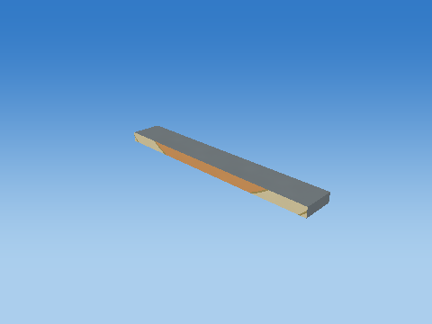 |

Steps 1–5 share one camera; the unit cube has its own close view, and step 6 is reframed at the actual world location to keep small objects visible. Reframing changes the view, never the model coordinates. Identity steps deliberately remain visible. Intermediate shapes are instructional states, while step 6 uses the unmodified game object.

Each stage below gives its exact numeric matrix and all eight corner multiplications. For each output row r: p'[r] = A[r,0]p.x + A[r,1]p.y + A[r,2]p.z + A[r,3]p.w.


#### S

```text
[ 1.11242986 0 0 0 ]
[ 0 0.0500000007 0 0 ]
[ 0 0 0.159999996 0 ]
[ 0 0 0 1 ]
```

| Input corner (w=1) | Output corner (w=1) |
| --- | --- |
| (-0.5, -0.5, -0.5) | (-0.556214929, -0.0250000004, -0.0799999982) |
| (-0.5, -0.5, 0.5) | (-0.556214929, -0.0250000004, 0.0799999982) |
| (-0.5, 0.5, -0.5) | (-0.556214929, 0.0250000004, -0.0799999982) |
| (-0.5, 0.5, 0.5) | (-0.556214929, 0.0250000004, 0.0799999982) |
| (0.5, -0.5, -0.5) | (0.556214929, -0.0250000004, -0.0799999982) |
| (0.5, -0.5, 0.5) | (0.556214929, -0.0250000004, 0.0799999982) |
| (0.5, 0.5, -0.5) | (0.556214929, 0.0250000004, -0.0799999982) |
| (0.5, 0.5, 0.5) | (0.556214929, 0.0250000004, 0.0799999982) |

#### H

```text
[ 1 0 0 0 ]
[ 0 1 0 0 ]
[ 0 0 1 0 ]
[ 0 0 0 1 ]
```

| Input corner (w=1) | Output corner (w=1) |
| --- | --- |
| (-0.556214929, -0.0250000004, -0.0799999982) | (-0.556214929, -0.0250000004, -0.0799999982) |
| (-0.556214929, -0.0250000004, 0.0799999982) | (-0.556214929, -0.0250000004, 0.0799999982) |
| (-0.556214929, 0.0250000004, -0.0799999982) | (-0.556214929, 0.0250000004, -0.0799999982) |
| (-0.556214929, 0.0250000004, 0.0799999982) | (-0.556214929, 0.0250000004, 0.0799999982) |
| (0.556214929, -0.0250000004, -0.0799999982) | (0.556214929, -0.0250000004, -0.0799999982) |
| (0.556214929, -0.0250000004, 0.0799999982) | (0.556214929, -0.0250000004, 0.0799999982) |
| (0.556214929, 0.0250000004, -0.0799999982) | (0.556214929, 0.0250000004, -0.0799999982) |
| (0.556214929, 0.0250000004, 0.0799999982) | (0.556214929, 0.0250000004, 0.0799999982) |

#### Rx

```text
[ 1 0 0 0 ]
[ 0 1 -0 0 ]
[ 0 0 1 0 ]
[ 0 0 0 1 ]
```

| Input corner (w=1) | Output corner (w=1) |
| --- | --- |
| (-0.556214929, -0.0250000004, -0.0799999982) | (-0.556214929, -0.0250000004, -0.0799999982) |
| (-0.556214929, -0.0250000004, 0.0799999982) | (-0.556214929, -0.0250000004, 0.0799999982) |
| (-0.556214929, 0.0250000004, -0.0799999982) | (-0.556214929, 0.0250000004, -0.0799999982) |
| (-0.556214929, 0.0250000004, 0.0799999982) | (-0.556214929, 0.0250000004, 0.0799999982) |
| (0.556214929, -0.0250000004, -0.0799999982) | (0.556214929, -0.0250000004, -0.0799999982) |
| (0.556214929, -0.0250000004, 0.0799999982) | (0.556214929, -0.0250000004, 0.0799999982) |
| (0.556214929, 0.0250000004, -0.0799999982) | (0.556214929, 0.0250000004, -0.0799999982) |
| (0.556214929, 0.0250000004, 0.0799999982) | (0.556214929, 0.0250000004, 0.0799999982) |

#### Ry

```text
[ 1 0 0 0 ]
[ 0 1 0 0 ]
[ -0 0 1 0 ]
[ 0 0 0 1 ]
```

| Input corner (w=1) | Output corner (w=1) |
| --- | --- |
| (-0.556214929, -0.0250000004, -0.0799999982) | (-0.556214929, -0.0250000004, -0.0799999982) |
| (-0.556214929, -0.0250000004, 0.0799999982) | (-0.556214929, -0.0250000004, 0.0799999982) |
| (-0.556214929, 0.0250000004, -0.0799999982) | (-0.556214929, 0.0250000004, -0.0799999982) |
| (-0.556214929, 0.0250000004, 0.0799999982) | (-0.556214929, 0.0250000004, 0.0799999982) |
| (0.556214929, -0.0250000004, -0.0799999982) | (0.556214929, -0.0250000004, -0.0799999982) |
| (0.556214929, -0.0250000004, 0.0799999982) | (0.556214929, -0.0250000004, 0.0799999982) |
| (0.556214929, 0.0250000004, -0.0799999982) | (0.556214929, 0.0250000004, -0.0799999982) |
| (0.556214929, 0.0250000004, 0.0799999982) | (0.556214929, 0.0250000004, 0.0799999982) |

#### Rz

```text
[ 1 -0 0 0 ]
[ 0 1 0 0 ]
[ 0 0 1 0 ]
[ 0 0 0 1 ]
```

| Input corner (w=1) | Output corner (w=1) |
| --- | --- |
| (-0.556214929, -0.0250000004, -0.0799999982) | (-0.556214929, -0.0250000004, -0.0799999982) |
| (-0.556214929, -0.0250000004, 0.0799999982) | (-0.556214929, -0.0250000004, 0.0799999982) |
| (-0.556214929, 0.0250000004, -0.0799999982) | (-0.556214929, 0.0250000004, -0.0799999982) |
| (-0.556214929, 0.0250000004, 0.0799999982) | (-0.556214929, 0.0250000004, 0.0799999982) |
| (0.556214929, -0.0250000004, -0.0799999982) | (0.556214929, -0.0250000004, -0.0799999982) |
| (0.556214929, -0.0250000004, 0.0799999982) | (0.556214929, -0.0250000004, 0.0799999982) |
| (0.556214929, 0.0250000004, -0.0799999982) | (0.556214929, 0.0250000004, -0.0799999982) |
| (0.556214929, 0.0250000004, 0.0799999982) | (0.556214929, 0.0250000004, 0.0799999982) |

#### T

```text
[ 1 0 0 0 ]
[ 0 1 0 2.125 ]
[ 0 0 1 -19 ]
[ 0 0 0 1 ]
```

| Input corner (w=1) | Output corner (w=1) |
| --- | --- |
| (-0.556214929, -0.0250000004, -0.0799999982) | (-0.556214929, 2.0999999, -19.0799999) |
| (-0.556214929, -0.0250000004, 0.0799999982) | (-0.556214929, 2.0999999, -18.9200001) |
| (-0.556214929, 0.0250000004, -0.0799999982) | (-0.556214929, 2.1500001, -19.0799999) |
| (-0.556214929, 0.0250000004, 0.0799999982) | (-0.556214929, 2.1500001, -18.9200001) |
| (0.556214929, -0.0250000004, -0.0799999982) | (0.556214929, 2.0999999, -19.0799999) |
| (0.556214929, -0.0250000004, 0.0799999982) | (0.556214929, 2.0999999, -18.9200001) |
| (0.556214929, 0.0250000004, -0.0799999982) | (0.556214929, 2.1500001, -19.0799999) |
| (0.556214929, 0.0250000004, 0.0799999982) | (0.556214929, 2.1500001, -18.9200001) |

Final M = T Rz Ry Rx H S:

```text
[ 1.11242986 0 0 0 ]
[ 0 0.0500000007 0 2.125 ]
[ 0 0 0.159999996 -19 ]
[ 0 0 0 1 ]
```

### Cube-built six-ring plate — `TARGET_1_SLICE_5`

32 transformed cube slices; printed front +Z; health=60.000000/60; exact slice collider

Position T = (0, 2.17500019, -19) m; scale S = (1.20726979, 0.0500000007, 0.159999996); rotation (Rx,Ry,Rz) = (0, 0, 0) degrees.

Shear (xy,xz,yx,yz,zx,zy) = (0, 0, 0, 0, 0, 0). Color = (0.800000012, 0.800000012, 0.800000012); specular = 0.449999988; shininess = 48; emission = 0; flash = 1; material layer = 7; texture scale = 2. Pattern enabled = 1, pattern scale = (0.754543602, 0.03125, 1), offset = (0, -0.32812497, 0).

| Step | Actual renderer image |
| --- | --- |
| Unit cube |  |
| Scale |  |
| Shear |  |
| Rotate X |  |
| Rotate Y |  |
| Rotate Z |  |
| Translate to world |  |

Steps 1–5 share one camera; the unit cube has its own close view, and step 6 is reframed at the actual world location to keep small objects visible. Reframing changes the view, never the model coordinates. Identity steps deliberately remain visible. Intermediate shapes are instructional states, while step 6 uses the unmodified game object.

Each stage below gives its exact numeric matrix and all eight corner multiplications. For each output row r: p'[r] = A[r,0]p.x + A[r,1]p.y + A[r,2]p.z + A[r,3]p.w.

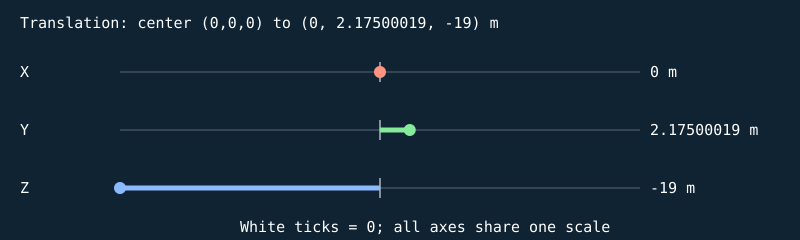


#### S

```text
[ 1.20726979 0 0 0 ]
[ 0 0.0500000007 0 0 ]
[ 0 0 0.159999996 0 ]
[ 0 0 0 1 ]
```

| Input corner (w=1) | Output corner (w=1) |
| --- | --- |
| (-0.5, -0.5, -0.5) | (-0.603634894, -0.0250000004, -0.0799999982) |
| (-0.5, -0.5, 0.5) | (-0.603634894, -0.0250000004, 0.0799999982) |
| (-0.5, 0.5, -0.5) | (-0.603634894, 0.0250000004, -0.0799999982) |
| (-0.5, 0.5, 0.5) | (-0.603634894, 0.0250000004, 0.0799999982) |
| (0.5, -0.5, -0.5) | (0.603634894, -0.0250000004, -0.0799999982) |
| (0.5, -0.5, 0.5) | (0.603634894, -0.0250000004, 0.0799999982) |
| (0.5, 0.5, -0.5) | (0.603634894, 0.0250000004, -0.0799999982) |
| (0.5, 0.5, 0.5) | (0.603634894, 0.0250000004, 0.0799999982) |

#### H

```text
[ 1 0 0 0 ]
[ 0 1 0 0 ]
[ 0 0 1 0 ]
[ 0 0 0 1 ]
```

| Input corner (w=1) | Output corner (w=1) |
| --- | --- |
| (-0.603634894, -0.0250000004, -0.0799999982) | (-0.603634894, -0.0250000004, -0.0799999982) |
| (-0.603634894, -0.0250000004, 0.0799999982) | (-0.603634894, -0.0250000004, 0.0799999982) |
| (-0.603634894, 0.0250000004, -0.0799999982) | (-0.603634894, 0.0250000004, -0.0799999982) |
| (-0.603634894, 0.0250000004, 0.0799999982) | (-0.603634894, 0.0250000004, 0.0799999982) |
| (0.603634894, -0.0250000004, -0.0799999982) | (0.603634894, -0.0250000004, -0.0799999982) |
| (0.603634894, -0.0250000004, 0.0799999982) | (0.603634894, -0.0250000004, 0.0799999982) |
| (0.603634894, 0.0250000004, -0.0799999982) | (0.603634894, 0.0250000004, -0.0799999982) |
| (0.603634894, 0.0250000004, 0.0799999982) | (0.603634894, 0.0250000004, 0.0799999982) |

#### Rx

```text
[ 1 0 0 0 ]
[ 0 1 -0 0 ]
[ 0 0 1 0 ]
[ 0 0 0 1 ]
```

| Input corner (w=1) | Output corner (w=1) |
| --- | --- |
| (-0.603634894, -0.0250000004, -0.0799999982) | (-0.603634894, -0.0250000004, -0.0799999982) |
| (-0.603634894, -0.0250000004, 0.0799999982) | (-0.603634894, -0.0250000004, 0.0799999982) |
| (-0.603634894, 0.0250000004, -0.0799999982) | (-0.603634894, 0.0250000004, -0.0799999982) |
| (-0.603634894, 0.0250000004, 0.0799999982) | (-0.603634894, 0.0250000004, 0.0799999982) |
| (0.603634894, -0.0250000004, -0.0799999982) | (0.603634894, -0.0250000004, -0.0799999982) |
| (0.603634894, -0.0250000004, 0.0799999982) | (0.603634894, -0.0250000004, 0.0799999982) |
| (0.603634894, 0.0250000004, -0.0799999982) | (0.603634894, 0.0250000004, -0.0799999982) |
| (0.603634894, 0.0250000004, 0.0799999982) | (0.603634894, 0.0250000004, 0.0799999982) |

#### Ry

```text
[ 1 0 0 0 ]
[ 0 1 0 0 ]
[ -0 0 1 0 ]
[ 0 0 0 1 ]
```

| Input corner (w=1) | Output corner (w=1) |
| --- | --- |
| (-0.603634894, -0.0250000004, -0.0799999982) | (-0.603634894, -0.0250000004, -0.0799999982) |
| (-0.603634894, -0.0250000004, 0.0799999982) | (-0.603634894, -0.0250000004, 0.0799999982) |
| (-0.603634894, 0.0250000004, -0.0799999982) | (-0.603634894, 0.0250000004, -0.0799999982) |
| (-0.603634894, 0.0250000004, 0.0799999982) | (-0.603634894, 0.0250000004, 0.0799999982) |
| (0.603634894, -0.0250000004, -0.0799999982) | (0.603634894, -0.0250000004, -0.0799999982) |
| (0.603634894, -0.0250000004, 0.0799999982) | (0.603634894, -0.0250000004, 0.0799999982) |
| (0.603634894, 0.0250000004, -0.0799999982) | (0.603634894, 0.0250000004, -0.0799999982) |
| (0.603634894, 0.0250000004, 0.0799999982) | (0.603634894, 0.0250000004, 0.0799999982) |

#### Rz

```text
[ 1 -0 0 0 ]
[ 0 1 0 0 ]
[ 0 0 1 0 ]
[ 0 0 0 1 ]
```

| Input corner (w=1) | Output corner (w=1) |
| --- | --- |
| (-0.603634894, -0.0250000004, -0.0799999982) | (-0.603634894, -0.0250000004, -0.0799999982) |
| (-0.603634894, -0.0250000004, 0.0799999982) | (-0.603634894, -0.0250000004, 0.0799999982) |
| (-0.603634894, 0.0250000004, -0.0799999982) | (-0.603634894, 0.0250000004, -0.0799999982) |
| (-0.603634894, 0.0250000004, 0.0799999982) | (-0.603634894, 0.0250000004, 0.0799999982) |
| (0.603634894, -0.0250000004, -0.0799999982) | (0.603634894, -0.0250000004, -0.0799999982) |
| (0.603634894, -0.0250000004, 0.0799999982) | (0.603634894, -0.0250000004, 0.0799999982) |
| (0.603634894, 0.0250000004, -0.0799999982) | (0.603634894, 0.0250000004, -0.0799999982) |
| (0.603634894, 0.0250000004, 0.0799999982) | (0.603634894, 0.0250000004, 0.0799999982) |

#### T

```text
[ 1 0 0 0 ]
[ 0 1 0 2.17500019 ]
[ 0 0 1 -19 ]
[ 0 0 0 1 ]
```

| Input corner (w=1) | Output corner (w=1) |
| --- | --- |
| (-0.603634894, -0.0250000004, -0.0799999982) | (-0.603634894, 2.1500001, -19.0799999) |
| (-0.603634894, -0.0250000004, 0.0799999982) | (-0.603634894, 2.1500001, -18.9200001) |
| (-0.603634894, 0.0250000004, -0.0799999982) | (-0.603634894, 2.20000029, -19.0799999) |
| (-0.603634894, 0.0250000004, 0.0799999982) | (-0.603634894, 2.20000029, -18.9200001) |
| (0.603634894, -0.0250000004, -0.0799999982) | (0.603634894, 2.1500001, -19.0799999) |
| (0.603634894, -0.0250000004, 0.0799999982) | (0.603634894, 2.1500001, -18.9200001) |
| (0.603634894, 0.0250000004, -0.0799999982) | (0.603634894, 2.20000029, -19.0799999) |
| (0.603634894, 0.0250000004, 0.0799999982) | (0.603634894, 2.20000029, -18.9200001) |

Final M = T Rz Ry Rx H S:

```text
[ 1.20726979 0 0 0 ]
[ 0 0.0500000007 0 2.17500019 ]
[ 0 0 0.159999996 -19 ]
[ 0 0 0 1 ]
```

### Cube-built six-ring plate — `TARGET_1_SLICE_6`

32 transformed cube slices; printed front +Z; health=60.000000/60; exact slice collider

Position T = (0, 2.22500014, -19) m; scale S = (1.28743947, 0.0500000007, 0.159999996); rotation (Rx,Ry,Rz) = (0, 0, 0) degrees.

Shear (xy,xz,yx,yz,zx,zy) = (0, 0, 0, 0, 0, 0). Color = (0.800000012, 0.800000012, 0.800000012); specular = 0.449999988; shininess = 48; emission = 0; flash = 1; material layer = 7; texture scale = 2. Pattern enabled = 1, pattern scale = (0.804649651, 0.03125, 1), offset = (0, -0.296875, 0).

| Step | Actual renderer image |
| --- | --- |
| Unit cube |  |
| Scale |  |
| Shear |  |
| Rotate X |  |
| Rotate Y | 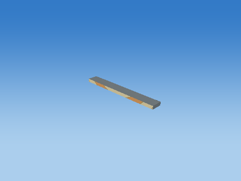 |
| Rotate Z |  |
| Translate to world |  |

Steps 1–5 share one camera; the unit cube has its own close view, and step 6 is reframed at the actual world location to keep small objects visible. Reframing changes the view, never the model coordinates. Identity steps deliberately remain visible. Intermediate shapes are instructional states, while step 6 uses the unmodified game object.

Each stage below gives its exact numeric matrix and all eight corner multiplications. For each output row r: p'[r] = A[r,0]p.x + A[r,1]p.y + A[r,2]p.z + A[r,3]p.w.


#### S

```text
[ 1.28743947 0 0 0 ]
[ 0 0.0500000007 0 0 ]
[ 0 0 0.159999996 0 ]
[ 0 0 0 1 ]
```

| Input corner (w=1) | Output corner (w=1) |
| --- | --- |
| (-0.5, -0.5, -0.5) | (-0.643719733, -0.0250000004, -0.0799999982) |
| (-0.5, -0.5, 0.5) | (-0.643719733, -0.0250000004, 0.0799999982) |
| (-0.5, 0.5, -0.5) | (-0.643719733, 0.0250000004, -0.0799999982) |
| (-0.5, 0.5, 0.5) | (-0.643719733, 0.0250000004, 0.0799999982) |
| (0.5, -0.5, -0.5) | (0.643719733, -0.0250000004, -0.0799999982) |
| (0.5, -0.5, 0.5) | (0.643719733, -0.0250000004, 0.0799999982) |
| (0.5, 0.5, -0.5) | (0.643719733, 0.0250000004, -0.0799999982) |
| (0.5, 0.5, 0.5) | (0.643719733, 0.0250000004, 0.0799999982) |

#### H

```text
[ 1 0 0 0 ]
[ 0 1 0 0 ]
[ 0 0 1 0 ]
[ 0 0 0 1 ]
```

| Input corner (w=1) | Output corner (w=1) |
| --- | --- |
| (-0.643719733, -0.0250000004, -0.0799999982) | (-0.643719733, -0.0250000004, -0.0799999982) |
| (-0.643719733, -0.0250000004, 0.0799999982) | (-0.643719733, -0.0250000004, 0.0799999982) |
| (-0.643719733, 0.0250000004, -0.0799999982) | (-0.643719733, 0.0250000004, -0.0799999982) |
| (-0.643719733, 0.0250000004, 0.0799999982) | (-0.643719733, 0.0250000004, 0.0799999982) |
| (0.643719733, -0.0250000004, -0.0799999982) | (0.643719733, -0.0250000004, -0.0799999982) |
| (0.643719733, -0.0250000004, 0.0799999982) | (0.643719733, -0.0250000004, 0.0799999982) |
| (0.643719733, 0.0250000004, -0.0799999982) | (0.643719733, 0.0250000004, -0.0799999982) |
| (0.643719733, 0.0250000004, 0.0799999982) | (0.643719733, 0.0250000004, 0.0799999982) |

#### Rx

```text
[ 1 0 0 0 ]
[ 0 1 -0 0 ]
[ 0 0 1 0 ]
[ 0 0 0 1 ]
```

| Input corner (w=1) | Output corner (w=1) |
| --- | --- |
| (-0.643719733, -0.0250000004, -0.0799999982) | (-0.643719733, -0.0250000004, -0.0799999982) |
| (-0.643719733, -0.0250000004, 0.0799999982) | (-0.643719733, -0.0250000004, 0.0799999982) |
| (-0.643719733, 0.0250000004, -0.0799999982) | (-0.643719733, 0.0250000004, -0.0799999982) |
| (-0.643719733, 0.0250000004, 0.0799999982) | (-0.643719733, 0.0250000004, 0.0799999982) |
| (0.643719733, -0.0250000004, -0.0799999982) | (0.643719733, -0.0250000004, -0.0799999982) |
| (0.643719733, -0.0250000004, 0.0799999982) | (0.643719733, -0.0250000004, 0.0799999982) |
| (0.643719733, 0.0250000004, -0.0799999982) | (0.643719733, 0.0250000004, -0.0799999982) |
| (0.643719733, 0.0250000004, 0.0799999982) | (0.643719733, 0.0250000004, 0.0799999982) |

#### Ry

```text
[ 1 0 0 0 ]
[ 0 1 0 0 ]
[ -0 0 1 0 ]
[ 0 0 0 1 ]
```

| Input corner (w=1) | Output corner (w=1) |
| --- | --- |
| (-0.643719733, -0.0250000004, -0.0799999982) | (-0.643719733, -0.0250000004, -0.0799999982) |
| (-0.643719733, -0.0250000004, 0.0799999982) | (-0.643719733, -0.0250000004, 0.0799999982) |
| (-0.643719733, 0.0250000004, -0.0799999982) | (-0.643719733, 0.0250000004, -0.0799999982) |
| (-0.643719733, 0.0250000004, 0.0799999982) | (-0.643719733, 0.0250000004, 0.0799999982) |
| (0.643719733, -0.0250000004, -0.0799999982) | (0.643719733, -0.0250000004, -0.0799999982) |
| (0.643719733, -0.0250000004, 0.0799999982) | (0.643719733, -0.0250000004, 0.0799999982) |
| (0.643719733, 0.0250000004, -0.0799999982) | (0.643719733, 0.0250000004, -0.0799999982) |
| (0.643719733, 0.0250000004, 0.0799999982) | (0.643719733, 0.0250000004, 0.0799999982) |

#### Rz

```text
[ 1 -0 0 0 ]
[ 0 1 0 0 ]
[ 0 0 1 0 ]
[ 0 0 0 1 ]
```

| Input corner (w=1) | Output corner (w=1) |
| --- | --- |
| (-0.643719733, -0.0250000004, -0.0799999982) | (-0.643719733, -0.0250000004, -0.0799999982) |
| (-0.643719733, -0.0250000004, 0.0799999982) | (-0.643719733, -0.0250000004, 0.0799999982) |
| (-0.643719733, 0.0250000004, -0.0799999982) | (-0.643719733, 0.0250000004, -0.0799999982) |
| (-0.643719733, 0.0250000004, 0.0799999982) | (-0.643719733, 0.0250000004, 0.0799999982) |
| (0.643719733, -0.0250000004, -0.0799999982) | (0.643719733, -0.0250000004, -0.0799999982) |
| (0.643719733, -0.0250000004, 0.0799999982) | (0.643719733, -0.0250000004, 0.0799999982) |
| (0.643719733, 0.0250000004, -0.0799999982) | (0.643719733, 0.0250000004, -0.0799999982) |
| (0.643719733, 0.0250000004, 0.0799999982) | (0.643719733, 0.0250000004, 0.0799999982) |

#### T

```text
[ 1 0 0 0 ]
[ 0 1 0 2.22500014 ]
[ 0 0 1 -19 ]
[ 0 0 0 1 ]
```

| Input corner (w=1) | Output corner (w=1) |
| --- | --- |
| (-0.643719733, -0.0250000004, -0.0799999982) | (-0.643719733, 2.20000005, -19.0799999) |
| (-0.643719733, -0.0250000004, 0.0799999982) | (-0.643719733, 2.20000005, -18.9200001) |
| (-0.643719733, 0.0250000004, -0.0799999982) | (-0.643719733, 2.25000024, -19.0799999) |
| (-0.643719733, 0.0250000004, 0.0799999982) | (-0.643719733, 2.25000024, -18.9200001) |
| (0.643719733, -0.0250000004, -0.0799999982) | (0.643719733, 2.20000005, -19.0799999) |
| (0.643719733, -0.0250000004, 0.0799999982) | (0.643719733, 2.20000005, -18.9200001) |
| (0.643719733, 0.0250000004, -0.0799999982) | (0.643719733, 2.25000024, -19.0799999) |
| (0.643719733, 0.0250000004, 0.0799999982) | (0.643719733, 2.25000024, -18.9200001) |

Final M = T Rz Ry Rx H S:

```text
[ 1.28743947 0 0 0 ]
[ 0 0.0500000007 0 2.22500014 ]
[ 0 0 0.159999996 -19 ]
[ 0 0 0 1 ]
```

### Cube-built six-ring plate — `TARGET_1_SLICE_7`

32 transformed cube slices; printed front +Z; health=60.000000/60; exact slice collider

Position T = (0, 2.2750001, -19) m; scale S = (1.35554421, 0.0500000007, 0.159999996); rotation (Rx,Ry,Rz) = (0, 0, 0) degrees.

Shear (xy,xz,yx,yz,zx,zy) = (0, 0, 0, 0, 0, 0). Color = (0.800000012, 0.800000012, 0.800000012); specular = 0.449999988; shininess = 48; emission = 0; flash = 1; material layer = 7; texture scale = 2. Pattern enabled = 1, pattern scale = (0.847215116, 0.03125, 1), offset = (0, -0.265625, 0).

| Step | Actual renderer image |
| --- | --- |
| Unit cube |  |
| Scale |  |
| Shear |  |
| Rotate X |  |
| Rotate Y |  |
| Rotate Z |  |
| Translate to world | 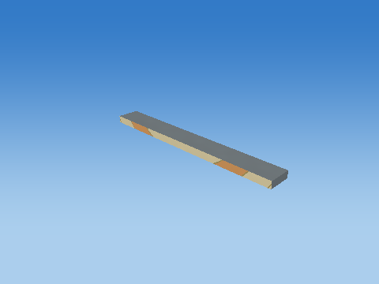 |

Steps 1–5 share one camera; the unit cube has its own close view, and step 6 is reframed at the actual world location to keep small objects visible. Reframing changes the view, never the model coordinates. Identity steps deliberately remain visible. Intermediate shapes are instructional states, while step 6 uses the unmodified game object.

Each stage below gives its exact numeric matrix and all eight corner multiplications. For each output row r: p'[r] = A[r,0]p.x + A[r,1]p.y + A[r,2]p.z + A[r,3]p.w.

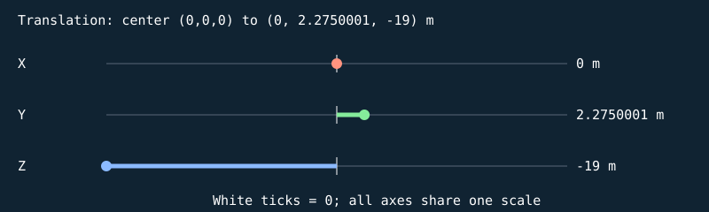


#### S

```text
[ 1.35554421 0 0 0 ]
[ 0 0.0500000007 0 0 ]
[ 0 0 0.159999996 0 ]
[ 0 0 0 1 ]
```

| Input corner (w=1) | Output corner (w=1) |
| --- | --- |
| (-0.5, -0.5, -0.5) | (-0.677772105, -0.0250000004, -0.0799999982) |
| (-0.5, -0.5, 0.5) | (-0.677772105, -0.0250000004, 0.0799999982) |
| (-0.5, 0.5, -0.5) | (-0.677772105, 0.0250000004, -0.0799999982) |
| (-0.5, 0.5, 0.5) | (-0.677772105, 0.0250000004, 0.0799999982) |
| (0.5, -0.5, -0.5) | (0.677772105, -0.0250000004, -0.0799999982) |
| (0.5, -0.5, 0.5) | (0.677772105, -0.0250000004, 0.0799999982) |
| (0.5, 0.5, -0.5) | (0.677772105, 0.0250000004, -0.0799999982) |
| (0.5, 0.5, 0.5) | (0.677772105, 0.0250000004, 0.0799999982) |

#### H

```text
[ 1 0 0 0 ]
[ 0 1 0 0 ]
[ 0 0 1 0 ]
[ 0 0 0 1 ]
```

| Input corner (w=1) | Output corner (w=1) |
| --- | --- |
| (-0.677772105, -0.0250000004, -0.0799999982) | (-0.677772105, -0.0250000004, -0.0799999982) |
| (-0.677772105, -0.0250000004, 0.0799999982) | (-0.677772105, -0.0250000004, 0.0799999982) |
| (-0.677772105, 0.0250000004, -0.0799999982) | (-0.677772105, 0.0250000004, -0.0799999982) |
| (-0.677772105, 0.0250000004, 0.0799999982) | (-0.677772105, 0.0250000004, 0.0799999982) |
| (0.677772105, -0.0250000004, -0.0799999982) | (0.677772105, -0.0250000004, -0.0799999982) |
| (0.677772105, -0.0250000004, 0.0799999982) | (0.677772105, -0.0250000004, 0.0799999982) |
| (0.677772105, 0.0250000004, -0.0799999982) | (0.677772105, 0.0250000004, -0.0799999982) |
| (0.677772105, 0.0250000004, 0.0799999982) | (0.677772105, 0.0250000004, 0.0799999982) |

#### Rx

```text
[ 1 0 0 0 ]
[ 0 1 -0 0 ]
[ 0 0 1 0 ]
[ 0 0 0 1 ]
```

| Input corner (w=1) | Output corner (w=1) |
| --- | --- |
| (-0.677772105, -0.0250000004, -0.0799999982) | (-0.677772105, -0.0250000004, -0.0799999982) |
| (-0.677772105, -0.0250000004, 0.0799999982) | (-0.677772105, -0.0250000004, 0.0799999982) |
| (-0.677772105, 0.0250000004, -0.0799999982) | (-0.677772105, 0.0250000004, -0.0799999982) |
| (-0.677772105, 0.0250000004, 0.0799999982) | (-0.677772105, 0.0250000004, 0.0799999982) |
| (0.677772105, -0.0250000004, -0.0799999982) | (0.677772105, -0.0250000004, -0.0799999982) |
| (0.677772105, -0.0250000004, 0.0799999982) | (0.677772105, -0.0250000004, 0.0799999982) |
| (0.677772105, 0.0250000004, -0.0799999982) | (0.677772105, 0.0250000004, -0.0799999982) |
| (0.677772105, 0.0250000004, 0.0799999982) | (0.677772105, 0.0250000004, 0.0799999982) |

#### Ry

```text
[ 1 0 0 0 ]
[ 0 1 0 0 ]
[ -0 0 1 0 ]
[ 0 0 0 1 ]
```

| Input corner (w=1) | Output corner (w=1) |
| --- | --- |
| (-0.677772105, -0.0250000004, -0.0799999982) | (-0.677772105, -0.0250000004, -0.0799999982) |
| (-0.677772105, -0.0250000004, 0.0799999982) | (-0.677772105, -0.0250000004, 0.0799999982) |
| (-0.677772105, 0.0250000004, -0.0799999982) | (-0.677772105, 0.0250000004, -0.0799999982) |
| (-0.677772105, 0.0250000004, 0.0799999982) | (-0.677772105, 0.0250000004, 0.0799999982) |
| (0.677772105, -0.0250000004, -0.0799999982) | (0.677772105, -0.0250000004, -0.0799999982) |
| (0.677772105, -0.0250000004, 0.0799999982) | (0.677772105, -0.0250000004, 0.0799999982) |
| (0.677772105, 0.0250000004, -0.0799999982) | (0.677772105, 0.0250000004, -0.0799999982) |
| (0.677772105, 0.0250000004, 0.0799999982) | (0.677772105, 0.0250000004, 0.0799999982) |

#### Rz

```text
[ 1 -0 0 0 ]
[ 0 1 0 0 ]
[ 0 0 1 0 ]
[ 0 0 0 1 ]
```

| Input corner (w=1) | Output corner (w=1) |
| --- | --- |
| (-0.677772105, -0.0250000004, -0.0799999982) | (-0.677772105, -0.0250000004, -0.0799999982) |
| (-0.677772105, -0.0250000004, 0.0799999982) | (-0.677772105, -0.0250000004, 0.0799999982) |
| (-0.677772105, 0.0250000004, -0.0799999982) | (-0.677772105, 0.0250000004, -0.0799999982) |
| (-0.677772105, 0.0250000004, 0.0799999982) | (-0.677772105, 0.0250000004, 0.0799999982) |
| (0.677772105, -0.0250000004, -0.0799999982) | (0.677772105, -0.0250000004, -0.0799999982) |
| (0.677772105, -0.0250000004, 0.0799999982) | (0.677772105, -0.0250000004, 0.0799999982) |
| (0.677772105, 0.0250000004, -0.0799999982) | (0.677772105, 0.0250000004, -0.0799999982) |
| (0.677772105, 0.0250000004, 0.0799999982) | (0.677772105, 0.0250000004, 0.0799999982) |

#### T

```text
[ 1 0 0 0 ]
[ 0 1 0 2.2750001 ]
[ 0 0 1 -19 ]
[ 0 0 0 1 ]
```

| Input corner (w=1) | Output corner (w=1) |
| --- | --- |
| (-0.677772105, -0.0250000004, -0.0799999982) | (-0.677772105, 2.25, -19.0799999) |
| (-0.677772105, -0.0250000004, 0.0799999982) | (-0.677772105, 2.25, -18.9200001) |
| (-0.677772105, 0.0250000004, -0.0799999982) | (-0.677772105, 2.30000019, -19.0799999) |
| (-0.677772105, 0.0250000004, 0.0799999982) | (-0.677772105, 2.30000019, -18.9200001) |
| (0.677772105, -0.0250000004, -0.0799999982) | (0.677772105, 2.25, -19.0799999) |
| (0.677772105, -0.0250000004, 0.0799999982) | (0.677772105, 2.25, -18.9200001) |
| (0.677772105, 0.0250000004, -0.0799999982) | (0.677772105, 2.30000019, -19.0799999) |
| (0.677772105, 0.0250000004, 0.0799999982) | (0.677772105, 2.30000019, -18.9200001) |

Final M = T Rz Ry Rx H S:

```text
[ 1.35554421 0 0 0 ]
[ 0 0.0500000007 0 2.2750001 ]
[ 0 0 0.159999996 -19 ]
[ 0 0 0 1 ]
```

### Cube-built six-ring plate — `TARGET_1_SLICE_8`

32 transformed cube slices; printed front +Z; health=60.000000/60; exact slice collider

Position T = (0, 2.32500005, -19) m; scale S = (1.41332948, 0.0500000007, 0.159999996); rotation (Rx,Ry,Rz) = (0, 0, 0) degrees.

Shear (xy,xz,yx,yz,zx,zy) = (0, 0, 0, 0, 0, 0). Color = (0.800000012, 0.800000012, 0.800000012); specular = 0.449999988; shininess = 48; emission = 0; flash = 1; material layer = 7; texture scale = 2. Pattern enabled = 1, pattern scale = (0.883330941, 0.03125, 1), offset = (0, -0.234375, 0).

| Step | Actual renderer image |
| --- | --- |
| Unit cube |  |
| Scale |  |
| Shear |  |
| Rotate X |  |
| Rotate Y |  |
| Rotate Z |  |
| Translate to world |  |

Steps 1–5 share one camera; the unit cube has its own close view, and step 6 is reframed at the actual world location to keep small objects visible. Reframing changes the view, never the model coordinates. Identity steps deliberately remain visible. Intermediate shapes are instructional states, while step 6 uses the unmodified game object.

Each stage below gives its exact numeric matrix and all eight corner multiplications. For each output row r: p'[r] = A[r,0]p.x + A[r,1]p.y + A[r,2]p.z + A[r,3]p.w.

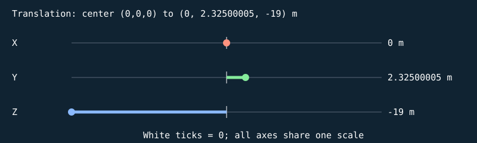


#### S

```text
[ 1.41332948 0 0 0 ]
[ 0 0.0500000007 0 0 ]
[ 0 0 0.159999996 0 ]
[ 0 0 0 1 ]
```

| Input corner (w=1) | Output corner (w=1) |
| --- | --- |
| (-0.5, -0.5, -0.5) | (-0.706664741, -0.0250000004, -0.0799999982) |
| (-0.5, -0.5, 0.5) | (-0.706664741, -0.0250000004, 0.0799999982) |
| (-0.5, 0.5, -0.5) | (-0.706664741, 0.0250000004, -0.0799999982) |
| (-0.5, 0.5, 0.5) | (-0.706664741, 0.0250000004, 0.0799999982) |
| (0.5, -0.5, -0.5) | (0.706664741, -0.0250000004, -0.0799999982) |
| (0.5, -0.5, 0.5) | (0.706664741, -0.0250000004, 0.0799999982) |
| (0.5, 0.5, -0.5) | (0.706664741, 0.0250000004, -0.0799999982) |
| (0.5, 0.5, 0.5) | (0.706664741, 0.0250000004, 0.0799999982) |

#### H

```text
[ 1 0 0 0 ]
[ 0 1 0 0 ]
[ 0 0 1 0 ]
[ 0 0 0 1 ]
```

| Input corner (w=1) | Output corner (w=1) |
| --- | --- |
| (-0.706664741, -0.0250000004, -0.0799999982) | (-0.706664741, -0.0250000004, -0.0799999982) |
| (-0.706664741, -0.0250000004, 0.0799999982) | (-0.706664741, -0.0250000004, 0.0799999982) |
| (-0.706664741, 0.0250000004, -0.0799999982) | (-0.706664741, 0.0250000004, -0.0799999982) |
| (-0.706664741, 0.0250000004, 0.0799999982) | (-0.706664741, 0.0250000004, 0.0799999982) |
| (0.706664741, -0.0250000004, -0.0799999982) | (0.706664741, -0.0250000004, -0.0799999982) |
| (0.706664741, -0.0250000004, 0.0799999982) | (0.706664741, -0.0250000004, 0.0799999982) |
| (0.706664741, 0.0250000004, -0.0799999982) | (0.706664741, 0.0250000004, -0.0799999982) |
| (0.706664741, 0.0250000004, 0.0799999982) | (0.706664741, 0.0250000004, 0.0799999982) |

#### Rx

```text
[ 1 0 0 0 ]
[ 0 1 -0 0 ]
[ 0 0 1 0 ]
[ 0 0 0 1 ]
```

| Input corner (w=1) | Output corner (w=1) |
| --- | --- |
| (-0.706664741, -0.0250000004, -0.0799999982) | (-0.706664741, -0.0250000004, -0.0799999982) |
| (-0.706664741, -0.0250000004, 0.0799999982) | (-0.706664741, -0.0250000004, 0.0799999982) |
| (-0.706664741, 0.0250000004, -0.0799999982) | (-0.706664741, 0.0250000004, -0.0799999982) |
| (-0.706664741, 0.0250000004, 0.0799999982) | (-0.706664741, 0.0250000004, 0.0799999982) |
| (0.706664741, -0.0250000004, -0.0799999982) | (0.706664741, -0.0250000004, -0.0799999982) |
| (0.706664741, -0.0250000004, 0.0799999982) | (0.706664741, -0.0250000004, 0.0799999982) |
| (0.706664741, 0.0250000004, -0.0799999982) | (0.706664741, 0.0250000004, -0.0799999982) |
| (0.706664741, 0.0250000004, 0.0799999982) | (0.706664741, 0.0250000004, 0.0799999982) |

#### Ry

```text
[ 1 0 0 0 ]
[ 0 1 0 0 ]
[ -0 0 1 0 ]
[ 0 0 0 1 ]
```

| Input corner (w=1) | Output corner (w=1) |
| --- | --- |
| (-0.706664741, -0.0250000004, -0.0799999982) | (-0.706664741, -0.0250000004, -0.0799999982) |
| (-0.706664741, -0.0250000004, 0.0799999982) | (-0.706664741, -0.0250000004, 0.0799999982) |
| (-0.706664741, 0.0250000004, -0.0799999982) | (-0.706664741, 0.0250000004, -0.0799999982) |
| (-0.706664741, 0.0250000004, 0.0799999982) | (-0.706664741, 0.0250000004, 0.0799999982) |
| (0.706664741, -0.0250000004, -0.0799999982) | (0.706664741, -0.0250000004, -0.0799999982) |
| (0.706664741, -0.0250000004, 0.0799999982) | (0.706664741, -0.0250000004, 0.0799999982) |
| (0.706664741, 0.0250000004, -0.0799999982) | (0.706664741, 0.0250000004, -0.0799999982) |
| (0.706664741, 0.0250000004, 0.0799999982) | (0.706664741, 0.0250000004, 0.0799999982) |

#### Rz

```text
[ 1 -0 0 0 ]
[ 0 1 0 0 ]
[ 0 0 1 0 ]
[ 0 0 0 1 ]
```

| Input corner (w=1) | Output corner (w=1) |
| --- | --- |
| (-0.706664741, -0.0250000004, -0.0799999982) | (-0.706664741, -0.0250000004, -0.0799999982) |
| (-0.706664741, -0.0250000004, 0.0799999982) | (-0.706664741, -0.0250000004, 0.0799999982) |
| (-0.706664741, 0.0250000004, -0.0799999982) | (-0.706664741, 0.0250000004, -0.0799999982) |
| (-0.706664741, 0.0250000004, 0.0799999982) | (-0.706664741, 0.0250000004, 0.0799999982) |
| (0.706664741, -0.0250000004, -0.0799999982) | (0.706664741, -0.0250000004, -0.0799999982) |
| (0.706664741, -0.0250000004, 0.0799999982) | (0.706664741, -0.0250000004, 0.0799999982) |
| (0.706664741, 0.0250000004, -0.0799999982) | (0.706664741, 0.0250000004, -0.0799999982) |
| (0.706664741, 0.0250000004, 0.0799999982) | (0.706664741, 0.0250000004, 0.0799999982) |

#### T

```text
[ 1 0 0 0 ]
[ 0 1 0 2.32500005 ]
[ 0 0 1 -19 ]
[ 0 0 0 1 ]
```

| Input corner (w=1) | Output corner (w=1) |
| --- | --- |
| (-0.706664741, -0.0250000004, -0.0799999982) | (-0.706664741, 2.29999995, -19.0799999) |
| (-0.706664741, -0.0250000004, 0.0799999982) | (-0.706664741, 2.29999995, -18.9200001) |
| (-0.706664741, 0.0250000004, -0.0799999982) | (-0.706664741, 2.35000014, -19.0799999) |
| (-0.706664741, 0.0250000004, 0.0799999982) | (-0.706664741, 2.35000014, -18.9200001) |
| (0.706664741, -0.0250000004, -0.0799999982) | (0.706664741, 2.29999995, -19.0799999) |
| (0.706664741, -0.0250000004, 0.0799999982) | (0.706664741, 2.29999995, -18.9200001) |
| (0.706664741, 0.0250000004, -0.0799999982) | (0.706664741, 2.35000014, -19.0799999) |
| (0.706664741, 0.0250000004, 0.0799999982) | (0.706664741, 2.35000014, -18.9200001) |

Final M = T Rz Ry Rx H S:

```text
[ 1.41332948 0 0 0 ]
[ 0 0.0500000007 0 2.32500005 ]
[ 0 0 0.159999996 -19 ]
[ 0 0 0 1 ]
```

### Cube-built six-ring plate — `TARGET_1_SLICE_9`

32 transformed cube slices; printed front +Z; health=60.000000/60; exact slice collider

Position T = (0, 2.375, -19) m; scale S = (1.46201921, 0.0500000007, 0.159999996); rotation (Rx,Ry,Rz) = (0, 0, 0) degrees.

Shear (xy,xz,yx,yz,zx,zy) = (0, 0, 0, 0, 0, 0). Color = (0.800000012, 0.800000012, 0.800000012); specular = 0.449999988; shininess = 48; emission = 0; flash = 1; material layer = 7; texture scale = 2. Pattern enabled = 1, pattern scale = (0.913761973, 0.03125, 1), offset = (0, -0.203125015, 0).

| Step | Actual renderer image |
| --- | --- |
| Unit cube |  |
| Scale |  |
| Shear |  |
| Rotate X |  |
| Rotate Y |  |
| Rotate Z |  |
| Translate to world |  |

Steps 1–5 share one camera; the unit cube has its own close view, and step 6 is reframed at the actual world location to keep small objects visible. Reframing changes the view, never the model coordinates. Identity steps deliberately remain visible. Intermediate shapes are instructional states, while step 6 uses the unmodified game object.

Each stage below gives its exact numeric matrix and all eight corner multiplications. For each output row r: p'[r] = A[r,0]p.x + A[r,1]p.y + A[r,2]p.z + A[r,3]p.w.


#### S

```text
[ 1.46201921 0 0 0 ]
[ 0 0.0500000007 0 0 ]
[ 0 0 0.159999996 0 ]
[ 0 0 0 1 ]
```

| Input corner (w=1) | Output corner (w=1) |
| --- | --- |
| (-0.5, -0.5, -0.5) | (-0.731009603, -0.0250000004, -0.0799999982) |
| (-0.5, -0.5, 0.5) | (-0.731009603, -0.0250000004, 0.0799999982) |
| (-0.5, 0.5, -0.5) | (-0.731009603, 0.0250000004, -0.0799999982) |
| (-0.5, 0.5, 0.5) | (-0.731009603, 0.0250000004, 0.0799999982) |
| (0.5, -0.5, -0.5) | (0.731009603, -0.0250000004, -0.0799999982) |
| (0.5, -0.5, 0.5) | (0.731009603, -0.0250000004, 0.0799999982) |
| (0.5, 0.5, -0.5) | (0.731009603, 0.0250000004, -0.0799999982) |
| (0.5, 0.5, 0.5) | (0.731009603, 0.0250000004, 0.0799999982) |

#### H

```text
[ 1 0 0 0 ]
[ 0 1 0 0 ]
[ 0 0 1 0 ]
[ 0 0 0 1 ]
```

| Input corner (w=1) | Output corner (w=1) |
| --- | --- |
| (-0.731009603, -0.0250000004, -0.0799999982) | (-0.731009603, -0.0250000004, -0.0799999982) |
| (-0.731009603, -0.0250000004, 0.0799999982) | (-0.731009603, -0.0250000004, 0.0799999982) |
| (-0.731009603, 0.0250000004, -0.0799999982) | (-0.731009603, 0.0250000004, -0.0799999982) |
| (-0.731009603, 0.0250000004, 0.0799999982) | (-0.731009603, 0.0250000004, 0.0799999982) |
| (0.731009603, -0.0250000004, -0.0799999982) | (0.731009603, -0.0250000004, -0.0799999982) |
| (0.731009603, -0.0250000004, 0.0799999982) | (0.731009603, -0.0250000004, 0.0799999982) |
| (0.731009603, 0.0250000004, -0.0799999982) | (0.731009603, 0.0250000004, -0.0799999982) |
| (0.731009603, 0.0250000004, 0.0799999982) | (0.731009603, 0.0250000004, 0.0799999982) |

#### Rx

```text
[ 1 0 0 0 ]
[ 0 1 -0 0 ]
[ 0 0 1 0 ]
[ 0 0 0 1 ]
```

| Input corner (w=1) | Output corner (w=1) |
| --- | --- |
| (-0.731009603, -0.0250000004, -0.0799999982) | (-0.731009603, -0.0250000004, -0.0799999982) |
| (-0.731009603, -0.0250000004, 0.0799999982) | (-0.731009603, -0.0250000004, 0.0799999982) |
| (-0.731009603, 0.0250000004, -0.0799999982) | (-0.731009603, 0.0250000004, -0.0799999982) |
| (-0.731009603, 0.0250000004, 0.0799999982) | (-0.731009603, 0.0250000004, 0.0799999982) |
| (0.731009603, -0.0250000004, -0.0799999982) | (0.731009603, -0.0250000004, -0.0799999982) |
| (0.731009603, -0.0250000004, 0.0799999982) | (0.731009603, -0.0250000004, 0.0799999982) |
| (0.731009603, 0.0250000004, -0.0799999982) | (0.731009603, 0.0250000004, -0.0799999982) |
| (0.731009603, 0.0250000004, 0.0799999982) | (0.731009603, 0.0250000004, 0.0799999982) |

#### Ry

```text
[ 1 0 0 0 ]
[ 0 1 0 0 ]
[ -0 0 1 0 ]
[ 0 0 0 1 ]
```

| Input corner (w=1) | Output corner (w=1) |
| --- | --- |
| (-0.731009603, -0.0250000004, -0.0799999982) | (-0.731009603, -0.0250000004, -0.0799999982) |
| (-0.731009603, -0.0250000004, 0.0799999982) | (-0.731009603, -0.0250000004, 0.0799999982) |
| (-0.731009603, 0.0250000004, -0.0799999982) | (-0.731009603, 0.0250000004, -0.0799999982) |
| (-0.731009603, 0.0250000004, 0.0799999982) | (-0.731009603, 0.0250000004, 0.0799999982) |
| (0.731009603, -0.0250000004, -0.0799999982) | (0.731009603, -0.0250000004, -0.0799999982) |
| (0.731009603, -0.0250000004, 0.0799999982) | (0.731009603, -0.0250000004, 0.0799999982) |
| (0.731009603, 0.0250000004, -0.0799999982) | (0.731009603, 0.0250000004, -0.0799999982) |
| (0.731009603, 0.0250000004, 0.0799999982) | (0.731009603, 0.0250000004, 0.0799999982) |

#### Rz

```text
[ 1 -0 0 0 ]
[ 0 1 0 0 ]
[ 0 0 1 0 ]
[ 0 0 0 1 ]
```

| Input corner (w=1) | Output corner (w=1) |
| --- | --- |
| (-0.731009603, -0.0250000004, -0.0799999982) | (-0.731009603, -0.0250000004, -0.0799999982) |
| (-0.731009603, -0.0250000004, 0.0799999982) | (-0.731009603, -0.0250000004, 0.0799999982) |
| (-0.731009603, 0.0250000004, -0.0799999982) | (-0.731009603, 0.0250000004, -0.0799999982) |
| (-0.731009603, 0.0250000004, 0.0799999982) | (-0.731009603, 0.0250000004, 0.0799999982) |
| (0.731009603, -0.0250000004, -0.0799999982) | (0.731009603, -0.0250000004, -0.0799999982) |
| (0.731009603, -0.0250000004, 0.0799999982) | (0.731009603, -0.0250000004, 0.0799999982) |
| (0.731009603, 0.0250000004, -0.0799999982) | (0.731009603, 0.0250000004, -0.0799999982) |
| (0.731009603, 0.0250000004, 0.0799999982) | (0.731009603, 0.0250000004, 0.0799999982) |

#### T

```text
[ 1 0 0 0 ]
[ 0 1 0 2.375 ]
[ 0 0 1 -19 ]
[ 0 0 0 1 ]
```

| Input corner (w=1) | Output corner (w=1) |
| --- | --- |
| (-0.731009603, -0.0250000004, -0.0799999982) | (-0.731009603, 2.3499999, -19.0799999) |
| (-0.731009603, -0.0250000004, 0.0799999982) | (-0.731009603, 2.3499999, -18.9200001) |
| (-0.731009603, 0.0250000004, -0.0799999982) | (-0.731009603, 2.4000001, -19.0799999) |
| (-0.731009603, 0.0250000004, 0.0799999982) | (-0.731009603, 2.4000001, -18.9200001) |
| (0.731009603, -0.0250000004, -0.0799999982) | (0.731009603, 2.3499999, -19.0799999) |
| (0.731009603, -0.0250000004, 0.0799999982) | (0.731009603, 2.3499999, -18.9200001) |
| (0.731009603, 0.0250000004, -0.0799999982) | (0.731009603, 2.4000001, -19.0799999) |
| (0.731009603, 0.0250000004, 0.0799999982) | (0.731009603, 2.4000001, -18.9200001) |

Final M = T Rz Ry Rx H S:

```text
[ 1.46201921 0 0 0 ]
[ 0 0.0500000007 0 2.375 ]
[ 0 0 0.159999996 -19 ]
[ 0 0 0 1 ]
```

### Cube-built six-ring plate — `TARGET_1_SLICE_10`

32 transformed cube slices; printed front +Z; health=60.000000/60; exact slice collider

Position T = (0, 2.42500019, -19) m; scale S = (1.50249803, 0.0500000007, 0.159999996); rotation (Rx,Ry,Rz) = (0, 0, 0) degrees.

Shear (xy,xz,yx,yz,zx,zy) = (0, 0, 0, 0, 0, 0). Color = (0.800000012, 0.800000012, 0.800000012); specular = 0.449999988; shininess = 48; emission = 0; flash = 1; material layer = 7; texture scale = 2. Pattern enabled = 1, pattern scale = (0.939061284, 0.03125, 1), offset = (0, -0.171874985, 0).

| Step | Actual renderer image |
| --- | --- |
| Unit cube |  |
| Scale |  |
| Shear |  |
| Rotate X |  |
| Rotate Y |  |
| Rotate Z |  |
| Translate to world |  |

Steps 1–5 share one camera; the unit cube has its own close view, and step 6 is reframed at the actual world location to keep small objects visible. Reframing changes the view, never the model coordinates. Identity steps deliberately remain visible. Intermediate shapes are instructional states, while step 6 uses the unmodified game object.

Each stage below gives its exact numeric matrix and all eight corner multiplications. For each output row r: p'[r] = A[r,0]p.x + A[r,1]p.y + A[r,2]p.z + A[r,3]p.w.


#### S

```text
[ 1.50249803 0 0 0 ]
[ 0 0.0500000007 0 0 ]
[ 0 0 0.159999996 0 ]
[ 0 0 0 1 ]
```

| Input corner (w=1) | Output corner (w=1) |
| --- | --- |
| (-0.5, -0.5, -0.5) | (-0.751249015, -0.0250000004, -0.0799999982) |
| (-0.5, -0.5, 0.5) | (-0.751249015, -0.0250000004, 0.0799999982) |
| (-0.5, 0.5, -0.5) | (-0.751249015, 0.0250000004, -0.0799999982) |
| (-0.5, 0.5, 0.5) | (-0.751249015, 0.0250000004, 0.0799999982) |
| (0.5, -0.5, -0.5) | (0.751249015, -0.0250000004, -0.0799999982) |
| (0.5, -0.5, 0.5) | (0.751249015, -0.0250000004, 0.0799999982) |
| (0.5, 0.5, -0.5) | (0.751249015, 0.0250000004, -0.0799999982) |
| (0.5, 0.5, 0.5) | (0.751249015, 0.0250000004, 0.0799999982) |

#### H

```text
[ 1 0 0 0 ]
[ 0 1 0 0 ]
[ 0 0 1 0 ]
[ 0 0 0 1 ]
```

| Input corner (w=1) | Output corner (w=1) |
| --- | --- |
| (-0.751249015, -0.0250000004, -0.0799999982) | (-0.751249015, -0.0250000004, -0.0799999982) |
| (-0.751249015, -0.0250000004, 0.0799999982) | (-0.751249015, -0.0250000004, 0.0799999982) |
| (-0.751249015, 0.0250000004, -0.0799999982) | (-0.751249015, 0.0250000004, -0.0799999982) |
| (-0.751249015, 0.0250000004, 0.0799999982) | (-0.751249015, 0.0250000004, 0.0799999982) |
| (0.751249015, -0.0250000004, -0.0799999982) | (0.751249015, -0.0250000004, -0.0799999982) |
| (0.751249015, -0.0250000004, 0.0799999982) | (0.751249015, -0.0250000004, 0.0799999982) |
| (0.751249015, 0.0250000004, -0.0799999982) | (0.751249015, 0.0250000004, -0.0799999982) |
| (0.751249015, 0.0250000004, 0.0799999982) | (0.751249015, 0.0250000004, 0.0799999982) |

#### Rx

```text
[ 1 0 0 0 ]
[ 0 1 -0 0 ]
[ 0 0 1 0 ]
[ 0 0 0 1 ]
```

| Input corner (w=1) | Output corner (w=1) |
| --- | --- |
| (-0.751249015, -0.0250000004, -0.0799999982) | (-0.751249015, -0.0250000004, -0.0799999982) |
| (-0.751249015, -0.0250000004, 0.0799999982) | (-0.751249015, -0.0250000004, 0.0799999982) |
| (-0.751249015, 0.0250000004, -0.0799999982) | (-0.751249015, 0.0250000004, -0.0799999982) |
| (-0.751249015, 0.0250000004, 0.0799999982) | (-0.751249015, 0.0250000004, 0.0799999982) |
| (0.751249015, -0.0250000004, -0.0799999982) | (0.751249015, -0.0250000004, -0.0799999982) |
| (0.751249015, -0.0250000004, 0.0799999982) | (0.751249015, -0.0250000004, 0.0799999982) |
| (0.751249015, 0.0250000004, -0.0799999982) | (0.751249015, 0.0250000004, -0.0799999982) |
| (0.751249015, 0.0250000004, 0.0799999982) | (0.751249015, 0.0250000004, 0.0799999982) |

#### Ry

```text
[ 1 0 0 0 ]
[ 0 1 0 0 ]
[ -0 0 1 0 ]
[ 0 0 0 1 ]
```

| Input corner (w=1) | Output corner (w=1) |
| --- | --- |
| (-0.751249015, -0.0250000004, -0.0799999982) | (-0.751249015, -0.0250000004, -0.0799999982) |
| (-0.751249015, -0.0250000004, 0.0799999982) | (-0.751249015, -0.0250000004, 0.0799999982) |
| (-0.751249015, 0.0250000004, -0.0799999982) | (-0.751249015, 0.0250000004, -0.0799999982) |
| (-0.751249015, 0.0250000004, 0.0799999982) | (-0.751249015, 0.0250000004, 0.0799999982) |
| (0.751249015, -0.0250000004, -0.0799999982) | (0.751249015, -0.0250000004, -0.0799999982) |
| (0.751249015, -0.0250000004, 0.0799999982) | (0.751249015, -0.0250000004, 0.0799999982) |
| (0.751249015, 0.0250000004, -0.0799999982) | (0.751249015, 0.0250000004, -0.0799999982) |
| (0.751249015, 0.0250000004, 0.0799999982) | (0.751249015, 0.0250000004, 0.0799999982) |

#### Rz

```text
[ 1 -0 0 0 ]
[ 0 1 0 0 ]
[ 0 0 1 0 ]
[ 0 0 0 1 ]
```

| Input corner (w=1) | Output corner (w=1) |
| --- | --- |
| (-0.751249015, -0.0250000004, -0.0799999982) | (-0.751249015, -0.0250000004, -0.0799999982) |
| (-0.751249015, -0.0250000004, 0.0799999982) | (-0.751249015, -0.0250000004, 0.0799999982) |
| (-0.751249015, 0.0250000004, -0.0799999982) | (-0.751249015, 0.0250000004, -0.0799999982) |
| (-0.751249015, 0.0250000004, 0.0799999982) | (-0.751249015, 0.0250000004, 0.0799999982) |
| (0.751249015, -0.0250000004, -0.0799999982) | (0.751249015, -0.0250000004, -0.0799999982) |
| (0.751249015, -0.0250000004, 0.0799999982) | (0.751249015, -0.0250000004, 0.0799999982) |
| (0.751249015, 0.0250000004, -0.0799999982) | (0.751249015, 0.0250000004, -0.0799999982) |
| (0.751249015, 0.0250000004, 0.0799999982) | (0.751249015, 0.0250000004, 0.0799999982) |

#### T

```text
[ 1 0 0 0 ]
[ 0 1 0 2.42500019 ]
[ 0 0 1 -19 ]
[ 0 0 0 1 ]
```

| Input corner (w=1) | Output corner (w=1) |
| --- | --- |
| (-0.751249015, -0.0250000004, -0.0799999982) | (-0.751249015, 2.4000001, -19.0799999) |
| (-0.751249015, -0.0250000004, 0.0799999982) | (-0.751249015, 2.4000001, -18.9200001) |
| (-0.751249015, 0.0250000004, -0.0799999982) | (-0.751249015, 2.45000029, -19.0799999) |
| (-0.751249015, 0.0250000004, 0.0799999982) | (-0.751249015, 2.45000029, -18.9200001) |
| (0.751249015, -0.0250000004, -0.0799999982) | (0.751249015, 2.4000001, -19.0799999) |
| (0.751249015, -0.0250000004, 0.0799999982) | (0.751249015, 2.4000001, -18.9200001) |
| (0.751249015, 0.0250000004, -0.0799999982) | (0.751249015, 2.45000029, -19.0799999) |
| (0.751249015, 0.0250000004, 0.0799999982) | (0.751249015, 2.45000029, -18.9200001) |

Final M = T Rz Ry Rx H S:

```text
[ 1.50249803 0 0 0 ]
[ 0 0.0500000007 0 2.42500019 ]
[ 0 0 0.159999996 -19 ]
[ 0 0 0 1 ]
```

### Cube-built six-ring plate — `TARGET_1_SLICE_11`

32 transformed cube slices; printed front +Z; health=60.000000/60; exact slice collider

Position T = (0, 2.4749999, -19) m; scale S = (1.53541529, 0.0500000007, 0.159999996); rotation (Rx,Ry,Rz) = (0, 0, 0) degrees.

Shear (xy,xz,yx,yz,zx,zy) = (0, 0, 0, 0, 0, 0). Color = (0.800000012, 0.800000012, 0.800000012); specular = 0.449999988; shininess = 48; emission = 0; flash = 1; material layer = 7; texture scale = 2. Pattern enabled = 1, pattern scale = (0.959634542, 0.03125, 1), offset = (0, -0.140625015, 0).

| Step | Actual renderer image |
| --- | --- |
| Unit cube |  |
| Scale |  |
| Shear |  |
| Rotate X |  |
| Rotate Y |  |
| Rotate Z |  |
| Translate to world |  |

Steps 1–5 share one camera; the unit cube has its own close view, and step 6 is reframed at the actual world location to keep small objects visible. Reframing changes the view, never the model coordinates. Identity steps deliberately remain visible. Intermediate shapes are instructional states, while step 6 uses the unmodified game object.

Each stage below gives its exact numeric matrix and all eight corner multiplications. For each output row r: p'[r] = A[r,0]p.x + A[r,1]p.y + A[r,2]p.z + A[r,3]p.w.


#### S

```text
[ 1.53541529 0 0 0 ]
[ 0 0.0500000007 0 0 ]
[ 0 0 0.159999996 0 ]
[ 0 0 0 1 ]
```

| Input corner (w=1) | Output corner (w=1) |
| --- | --- |
| (-0.5, -0.5, -0.5) | (-0.767707646, -0.0250000004, -0.0799999982) |
| (-0.5, -0.5, 0.5) | (-0.767707646, -0.0250000004, 0.0799999982) |
| (-0.5, 0.5, -0.5) | (-0.767707646, 0.0250000004, -0.0799999982) |
| (-0.5, 0.5, 0.5) | (-0.767707646, 0.0250000004, 0.0799999982) |
| (0.5, -0.5, -0.5) | (0.767707646, -0.0250000004, -0.0799999982) |
| (0.5, -0.5, 0.5) | (0.767707646, -0.0250000004, 0.0799999982) |
| (0.5, 0.5, -0.5) | (0.767707646, 0.0250000004, -0.0799999982) |
| (0.5, 0.5, 0.5) | (0.767707646, 0.0250000004, 0.0799999982) |

#### H

```text
[ 1 0 0 0 ]
[ 0 1 0 0 ]
[ 0 0 1 0 ]
[ 0 0 0 1 ]
```

| Input corner (w=1) | Output corner (w=1) |
| --- | --- |
| (-0.767707646, -0.0250000004, -0.0799999982) | (-0.767707646, -0.0250000004, -0.0799999982) |
| (-0.767707646, -0.0250000004, 0.0799999982) | (-0.767707646, -0.0250000004, 0.0799999982) |
| (-0.767707646, 0.0250000004, -0.0799999982) | (-0.767707646, 0.0250000004, -0.0799999982) |
| (-0.767707646, 0.0250000004, 0.0799999982) | (-0.767707646, 0.0250000004, 0.0799999982) |
| (0.767707646, -0.0250000004, -0.0799999982) | (0.767707646, -0.0250000004, -0.0799999982) |
| (0.767707646, -0.0250000004, 0.0799999982) | (0.767707646, -0.0250000004, 0.0799999982) |
| (0.767707646, 0.0250000004, -0.0799999982) | (0.767707646, 0.0250000004, -0.0799999982) |
| (0.767707646, 0.0250000004, 0.0799999982) | (0.767707646, 0.0250000004, 0.0799999982) |

#### Rx

```text
[ 1 0 0 0 ]
[ 0 1 -0 0 ]
[ 0 0 1 0 ]
[ 0 0 0 1 ]
```

| Input corner (w=1) | Output corner (w=1) |
| --- | --- |
| (-0.767707646, -0.0250000004, -0.0799999982) | (-0.767707646, -0.0250000004, -0.0799999982) |
| (-0.767707646, -0.0250000004, 0.0799999982) | (-0.767707646, -0.0250000004, 0.0799999982) |
| (-0.767707646, 0.0250000004, -0.0799999982) | (-0.767707646, 0.0250000004, -0.0799999982) |
| (-0.767707646, 0.0250000004, 0.0799999982) | (-0.767707646, 0.0250000004, 0.0799999982) |
| (0.767707646, -0.0250000004, -0.0799999982) | (0.767707646, -0.0250000004, -0.0799999982) |
| (0.767707646, -0.0250000004, 0.0799999982) | (0.767707646, -0.0250000004, 0.0799999982) |
| (0.767707646, 0.0250000004, -0.0799999982) | (0.767707646, 0.0250000004, -0.0799999982) |
| (0.767707646, 0.0250000004, 0.0799999982) | (0.767707646, 0.0250000004, 0.0799999982) |

#### Ry

```text
[ 1 0 0 0 ]
[ 0 1 0 0 ]
[ -0 0 1 0 ]
[ 0 0 0 1 ]
```

| Input corner (w=1) | Output corner (w=1) |
| --- | --- |
| (-0.767707646, -0.0250000004, -0.0799999982) | (-0.767707646, -0.0250000004, -0.0799999982) |
| (-0.767707646, -0.0250000004, 0.0799999982) | (-0.767707646, -0.0250000004, 0.0799999982) |
| (-0.767707646, 0.0250000004, -0.0799999982) | (-0.767707646, 0.0250000004, -0.0799999982) |
| (-0.767707646, 0.0250000004, 0.0799999982) | (-0.767707646, 0.0250000004, 0.0799999982) |
| (0.767707646, -0.0250000004, -0.0799999982) | (0.767707646, -0.0250000004, -0.0799999982) |
| (0.767707646, -0.0250000004, 0.0799999982) | (0.767707646, -0.0250000004, 0.0799999982) |
| (0.767707646, 0.0250000004, -0.0799999982) | (0.767707646, 0.0250000004, -0.0799999982) |
| (0.767707646, 0.0250000004, 0.0799999982) | (0.767707646, 0.0250000004, 0.0799999982) |

#### Rz

```text
[ 1 -0 0 0 ]
[ 0 1 0 0 ]
[ 0 0 1 0 ]
[ 0 0 0 1 ]
```

| Input corner (w=1) | Output corner (w=1) |
| --- | --- |
| (-0.767707646, -0.0250000004, -0.0799999982) | (-0.767707646, -0.0250000004, -0.0799999982) |
| (-0.767707646, -0.0250000004, 0.0799999982) | (-0.767707646, -0.0250000004, 0.0799999982) |
| (-0.767707646, 0.0250000004, -0.0799999982) | (-0.767707646, 0.0250000004, -0.0799999982) |
| (-0.767707646, 0.0250000004, 0.0799999982) | (-0.767707646, 0.0250000004, 0.0799999982) |
| (0.767707646, -0.0250000004, -0.0799999982) | (0.767707646, -0.0250000004, -0.0799999982) |
| (0.767707646, -0.0250000004, 0.0799999982) | (0.767707646, -0.0250000004, 0.0799999982) |
| (0.767707646, 0.0250000004, -0.0799999982) | (0.767707646, 0.0250000004, -0.0799999982) |
| (0.767707646, 0.0250000004, 0.0799999982) | (0.767707646, 0.0250000004, 0.0799999982) |

#### T

```text
[ 1 0 0 0 ]
[ 0 1 0 2.4749999 ]
[ 0 0 1 -19 ]
[ 0 0 0 1 ]
```

| Input corner (w=1) | Output corner (w=1) |
| --- | --- |
| (-0.767707646, -0.0250000004, -0.0799999982) | (-0.767707646, 2.44999981, -19.0799999) |
| (-0.767707646, -0.0250000004, 0.0799999982) | (-0.767707646, 2.44999981, -18.9200001) |
| (-0.767707646, 0.0250000004, -0.0799999982) | (-0.767707646, 2.5, -19.0799999) |
| (-0.767707646, 0.0250000004, 0.0799999982) | (-0.767707646, 2.5, -18.9200001) |
| (0.767707646, -0.0250000004, -0.0799999982) | (0.767707646, 2.44999981, -19.0799999) |
| (0.767707646, -0.0250000004, 0.0799999982) | (0.767707646, 2.44999981, -18.9200001) |
| (0.767707646, 0.0250000004, -0.0799999982) | (0.767707646, 2.5, -19.0799999) |
| (0.767707646, 0.0250000004, 0.0799999982) | (0.767707646, 2.5, -18.9200001) |

Final M = T Rz Ry Rx H S:

```text
[ 1.53541529 0 0 0 ]
[ 0 0.0500000007 0 2.4749999 ]
[ 0 0 0.159999996 -19 ]
[ 0 0 0 1 ]
```

### Cube-built six-ring plate — `TARGET_1_SLICE_12`

32 transformed cube slices; printed front +Z; health=60.000000/60; exact slice collider

Position T = (0, 2.5250001, -19) m; scale S = (1.56124961, 0.0500000007, 0.159999996); rotation (Rx,Ry,Rz) = (0, 0, 0) degrees.

Shear (xy,xz,yx,yz,zx,zy) = (0, 0, 0, 0, 0, 0). Color = (0.800000012, 0.800000012, 0.800000012); specular = 0.449999988; shininess = 48; emission = 0; flash = 1; material layer = 7; texture scale = 2. Pattern enabled = 1, pattern scale = (0.975781024, 0.03125, 1), offset = (0, -0.109375007, 0).

| Step | Actual renderer image |
| --- | --- |
| Unit cube |  |
| Scale |  |
| Shear |  |
| Rotate X |  |
| Rotate Y |  |
| Rotate Z |  |
| Translate to world |  |

Steps 1–5 share one camera; the unit cube has its own close view, and step 6 is reframed at the actual world location to keep small objects visible. Reframing changes the view, never the model coordinates. Identity steps deliberately remain visible. Intermediate shapes are instructional states, while step 6 uses the unmodified game object.

Each stage below gives its exact numeric matrix and all eight corner multiplications. For each output row r: p'[r] = A[r,0]p.x + A[r,1]p.y + A[r,2]p.z + A[r,3]p.w.


#### S

```text
[ 1.56124961 0 0 0 ]
[ 0 0.0500000007 0 0 ]
[ 0 0 0.159999996 0 ]
[ 0 0 0 1 ]
```

| Input corner (w=1) | Output corner (w=1) |
| --- | --- |
| (-0.5, -0.5, -0.5) | (-0.780624807, -0.0250000004, -0.0799999982) |
| (-0.5, -0.5, 0.5) | (-0.780624807, -0.0250000004, 0.0799999982) |
| (-0.5, 0.5, -0.5) | (-0.780624807, 0.0250000004, -0.0799999982) |
| (-0.5, 0.5, 0.5) | (-0.780624807, 0.0250000004, 0.0799999982) |
| (0.5, -0.5, -0.5) | (0.780624807, -0.0250000004, -0.0799999982) |
| (0.5, -0.5, 0.5) | (0.780624807, -0.0250000004, 0.0799999982) |
| (0.5, 0.5, -0.5) | (0.780624807, 0.0250000004, -0.0799999982) |
| (0.5, 0.5, 0.5) | (0.780624807, 0.0250000004, 0.0799999982) |

#### H

```text
[ 1 0 0 0 ]
[ 0 1 0 0 ]
[ 0 0 1 0 ]
[ 0 0 0 1 ]
```

| Input corner (w=1) | Output corner (w=1) |
| --- | --- |
| (-0.780624807, -0.0250000004, -0.0799999982) | (-0.780624807, -0.0250000004, -0.0799999982) |
| (-0.780624807, -0.0250000004, 0.0799999982) | (-0.780624807, -0.0250000004, 0.0799999982) |
| (-0.780624807, 0.0250000004, -0.0799999982) | (-0.780624807, 0.0250000004, -0.0799999982) |
| (-0.780624807, 0.0250000004, 0.0799999982) | (-0.780624807, 0.0250000004, 0.0799999982) |
| (0.780624807, -0.0250000004, -0.0799999982) | (0.780624807, -0.0250000004, -0.0799999982) |
| (0.780624807, -0.0250000004, 0.0799999982) | (0.780624807, -0.0250000004, 0.0799999982) |
| (0.780624807, 0.0250000004, -0.0799999982) | (0.780624807, 0.0250000004, -0.0799999982) |
| (0.780624807, 0.0250000004, 0.0799999982) | (0.780624807, 0.0250000004, 0.0799999982) |

#### Rx

```text
[ 1 0 0 0 ]
[ 0 1 -0 0 ]
[ 0 0 1 0 ]
[ 0 0 0 1 ]
```

| Input corner (w=1) | Output corner (w=1) |
| --- | --- |
| (-0.780624807, -0.0250000004, -0.0799999982) | (-0.780624807, -0.0250000004, -0.0799999982) |
| (-0.780624807, -0.0250000004, 0.0799999982) | (-0.780624807, -0.0250000004, 0.0799999982) |
| (-0.780624807, 0.0250000004, -0.0799999982) | (-0.780624807, 0.0250000004, -0.0799999982) |
| (-0.780624807, 0.0250000004, 0.0799999982) | (-0.780624807, 0.0250000004, 0.0799999982) |
| (0.780624807, -0.0250000004, -0.0799999982) | (0.780624807, -0.0250000004, -0.0799999982) |
| (0.780624807, -0.0250000004, 0.0799999982) | (0.780624807, -0.0250000004, 0.0799999982) |
| (0.780624807, 0.0250000004, -0.0799999982) | (0.780624807, 0.0250000004, -0.0799999982) |
| (0.780624807, 0.0250000004, 0.0799999982) | (0.780624807, 0.0250000004, 0.0799999982) |

#### Ry

```text
[ 1 0 0 0 ]
[ 0 1 0 0 ]
[ -0 0 1 0 ]
[ 0 0 0 1 ]
```

| Input corner (w=1) | Output corner (w=1) |
| --- | --- |
| (-0.780624807, -0.0250000004, -0.0799999982) | (-0.780624807, -0.0250000004, -0.0799999982) |
| (-0.780624807, -0.0250000004, 0.0799999982) | (-0.780624807, -0.0250000004, 0.0799999982) |
| (-0.780624807, 0.0250000004, -0.0799999982) | (-0.780624807, 0.0250000004, -0.0799999982) |
| (-0.780624807, 0.0250000004, 0.0799999982) | (-0.780624807, 0.0250000004, 0.0799999982) |
| (0.780624807, -0.0250000004, -0.0799999982) | (0.780624807, -0.0250000004, -0.0799999982) |
| (0.780624807, -0.0250000004, 0.0799999982) | (0.780624807, -0.0250000004, 0.0799999982) |
| (0.780624807, 0.0250000004, -0.0799999982) | (0.780624807, 0.0250000004, -0.0799999982) |
| (0.780624807, 0.0250000004, 0.0799999982) | (0.780624807, 0.0250000004, 0.0799999982) |

#### Rz

```text
[ 1 -0 0 0 ]
[ 0 1 0 0 ]
[ 0 0 1 0 ]
[ 0 0 0 1 ]
```

| Input corner (w=1) | Output corner (w=1) |
| --- | --- |
| (-0.780624807, -0.0250000004, -0.0799999982) | (-0.780624807, -0.0250000004, -0.0799999982) |
| (-0.780624807, -0.0250000004, 0.0799999982) | (-0.780624807, -0.0250000004, 0.0799999982) |
| (-0.780624807, 0.0250000004, -0.0799999982) | (-0.780624807, 0.0250000004, -0.0799999982) |
| (-0.780624807, 0.0250000004, 0.0799999982) | (-0.780624807, 0.0250000004, 0.0799999982) |
| (0.780624807, -0.0250000004, -0.0799999982) | (0.780624807, -0.0250000004, -0.0799999982) |
| (0.780624807, -0.0250000004, 0.0799999982) | (0.780624807, -0.0250000004, 0.0799999982) |
| (0.780624807, 0.0250000004, -0.0799999982) | (0.780624807, 0.0250000004, -0.0799999982) |
| (0.780624807, 0.0250000004, 0.0799999982) | (0.780624807, 0.0250000004, 0.0799999982) |

#### T

```text
[ 1 0 0 0 ]
[ 0 1 0 2.5250001 ]
[ 0 0 1 -19 ]
[ 0 0 0 1 ]
```

| Input corner (w=1) | Output corner (w=1) |
| --- | --- |
| (-0.780624807, -0.0250000004, -0.0799999982) | (-0.780624807, 2.5, -19.0799999) |
| (-0.780624807, -0.0250000004, 0.0799999982) | (-0.780624807, 2.5, -18.9200001) |
| (-0.780624807, 0.0250000004, -0.0799999982) | (-0.780624807, 2.55000019, -19.0799999) |
| (-0.780624807, 0.0250000004, 0.0799999982) | (-0.780624807, 2.55000019, -18.9200001) |
| (0.780624807, -0.0250000004, -0.0799999982) | (0.780624807, 2.5, -19.0799999) |
| (0.780624807, -0.0250000004, 0.0799999982) | (0.780624807, 2.5, -18.9200001) |
| (0.780624807, 0.0250000004, -0.0799999982) | (0.780624807, 2.55000019, -19.0799999) |
| (0.780624807, 0.0250000004, 0.0799999982) | (0.780624807, 2.55000019, -18.9200001) |

Final M = T Rz Ry Rx H S:

```text
[ 1.56124961 0 0 0 ]
[ 0 0.0500000007 0 2.5250001 ]
[ 0 0 0.159999996 -19 ]
[ 0 0 0 1 ]
```

### Cube-built six-ring plate — `TARGET_1_SLICE_13`

32 transformed cube slices; printed front +Z; health=60.000000/60; exact slice collider

Position T = (0, 2.57500005, -19) m; scale S = (1.58034813, 0.0500000007, 0.159999996); rotation (Rx,Ry,Rz) = (0, 0, 0) degrees.

Shear (xy,xz,yx,yz,zx,zy) = (0, 0, 0, 0, 0, 0). Color = (0.800000012, 0.800000012, 0.800000012); specular = 0.449999988; shininess = 48; emission = 0; flash = 1; material layer = 7; texture scale = 2. Pattern enabled = 1, pattern scale = (0.987717569, 0.03125, 1), offset = (0, -0.078125, 0).

| Step | Actual renderer image |
| --- | --- |
| Unit cube |  |
| Scale |  |
| Shear |  |
| Rotate X |  |
| Rotate Y |  |
| Rotate Z |  |
| Translate to world |  |

Steps 1–5 share one camera; the unit cube has its own close view, and step 6 is reframed at the actual world location to keep small objects visible. Reframing changes the view, never the model coordinates. Identity steps deliberately remain visible. Intermediate shapes are instructional states, while step 6 uses the unmodified game object.

Each stage below gives its exact numeric matrix and all eight corner multiplications. For each output row r: p'[r] = A[r,0]p.x + A[r,1]p.y + A[r,2]p.z + A[r,3]p.w.


#### S

```text
[ 1.58034813 0 0 0 ]
[ 0 0.0500000007 0 0 ]
[ 0 0 0.159999996 0 ]
[ 0 0 0 1 ]
```

| Input corner (w=1) | Output corner (w=1) |
| --- | --- |
| (-0.5, -0.5, -0.5) | (-0.790174067, -0.0250000004, -0.0799999982) |
| (-0.5, -0.5, 0.5) | (-0.790174067, -0.0250000004, 0.0799999982) |
| (-0.5, 0.5, -0.5) | (-0.790174067, 0.0250000004, -0.0799999982) |
| (-0.5, 0.5, 0.5) | (-0.790174067, 0.0250000004, 0.0799999982) |
| (0.5, -0.5, -0.5) | (0.790174067, -0.0250000004, -0.0799999982) |
| (0.5, -0.5, 0.5) | (0.790174067, -0.0250000004, 0.0799999982) |
| (0.5, 0.5, -0.5) | (0.790174067, 0.0250000004, -0.0799999982) |
| (0.5, 0.5, 0.5) | (0.790174067, 0.0250000004, 0.0799999982) |

#### H

```text
[ 1 0 0 0 ]
[ 0 1 0 0 ]
[ 0 0 1 0 ]
[ 0 0 0 1 ]
```

| Input corner (w=1) | Output corner (w=1) |
| --- | --- |
| (-0.790174067, -0.0250000004, -0.0799999982) | (-0.790174067, -0.0250000004, -0.0799999982) |
| (-0.790174067, -0.0250000004, 0.0799999982) | (-0.790174067, -0.0250000004, 0.0799999982) |
| (-0.790174067, 0.0250000004, -0.0799999982) | (-0.790174067, 0.0250000004, -0.0799999982) |
| (-0.790174067, 0.0250000004, 0.0799999982) | (-0.790174067, 0.0250000004, 0.0799999982) |
| (0.790174067, -0.0250000004, -0.0799999982) | (0.790174067, -0.0250000004, -0.0799999982) |
| (0.790174067, -0.0250000004, 0.0799999982) | (0.790174067, -0.0250000004, 0.0799999982) |
| (0.790174067, 0.0250000004, -0.0799999982) | (0.790174067, 0.0250000004, -0.0799999982) |
| (0.790174067, 0.0250000004, 0.0799999982) | (0.790174067, 0.0250000004, 0.0799999982) |

#### Rx

```text
[ 1 0 0 0 ]
[ 0 1 -0 0 ]
[ 0 0 1 0 ]
[ 0 0 0 1 ]
```

| Input corner (w=1) | Output corner (w=1) |
| --- | --- |
| (-0.790174067, -0.0250000004, -0.0799999982) | (-0.790174067, -0.0250000004, -0.0799999982) |
| (-0.790174067, -0.0250000004, 0.0799999982) | (-0.790174067, -0.0250000004, 0.0799999982) |
| (-0.790174067, 0.0250000004, -0.0799999982) | (-0.790174067, 0.0250000004, -0.0799999982) |
| (-0.790174067, 0.0250000004, 0.0799999982) | (-0.790174067, 0.0250000004, 0.0799999982) |
| (0.790174067, -0.0250000004, -0.0799999982) | (0.790174067, -0.0250000004, -0.0799999982) |
| (0.790174067, -0.0250000004, 0.0799999982) | (0.790174067, -0.0250000004, 0.0799999982) |
| (0.790174067, 0.0250000004, -0.0799999982) | (0.790174067, 0.0250000004, -0.0799999982) |
| (0.790174067, 0.0250000004, 0.0799999982) | (0.790174067, 0.0250000004, 0.0799999982) |

#### Ry

```text
[ 1 0 0 0 ]
[ 0 1 0 0 ]
[ -0 0 1 0 ]
[ 0 0 0 1 ]
```

| Input corner (w=1) | Output corner (w=1) |
| --- | --- |
| (-0.790174067, -0.0250000004, -0.0799999982) | (-0.790174067, -0.0250000004, -0.0799999982) |
| (-0.790174067, -0.0250000004, 0.0799999982) | (-0.790174067, -0.0250000004, 0.0799999982) |
| (-0.790174067, 0.0250000004, -0.0799999982) | (-0.790174067, 0.0250000004, -0.0799999982) |
| (-0.790174067, 0.0250000004, 0.0799999982) | (-0.790174067, 0.0250000004, 0.0799999982) |
| (0.790174067, -0.0250000004, -0.0799999982) | (0.790174067, -0.0250000004, -0.0799999982) |
| (0.790174067, -0.0250000004, 0.0799999982) | (0.790174067, -0.0250000004, 0.0799999982) |
| (0.790174067, 0.0250000004, -0.0799999982) | (0.790174067, 0.0250000004, -0.0799999982) |
| (0.790174067, 0.0250000004, 0.0799999982) | (0.790174067, 0.0250000004, 0.0799999982) |

#### Rz

```text
[ 1 -0 0 0 ]
[ 0 1 0 0 ]
[ 0 0 1 0 ]
[ 0 0 0 1 ]
```

| Input corner (w=1) | Output corner (w=1) |
| --- | --- |
| (-0.790174067, -0.0250000004, -0.0799999982) | (-0.790174067, -0.0250000004, -0.0799999982) |
| (-0.790174067, -0.0250000004, 0.0799999982) | (-0.790174067, -0.0250000004, 0.0799999982) |
| (-0.790174067, 0.0250000004, -0.0799999982) | (-0.790174067, 0.0250000004, -0.0799999982) |
| (-0.790174067, 0.0250000004, 0.0799999982) | (-0.790174067, 0.0250000004, 0.0799999982) |
| (0.790174067, -0.0250000004, -0.0799999982) | (0.790174067, -0.0250000004, -0.0799999982) |
| (0.790174067, -0.0250000004, 0.0799999982) | (0.790174067, -0.0250000004, 0.0799999982) |
| (0.790174067, 0.0250000004, -0.0799999982) | (0.790174067, 0.0250000004, -0.0799999982) |
| (0.790174067, 0.0250000004, 0.0799999982) | (0.790174067, 0.0250000004, 0.0799999982) |

#### T

```text
[ 1 0 0 0 ]
[ 0 1 0 2.57500005 ]
[ 0 0 1 -19 ]
[ 0 0 0 1 ]
```

| Input corner (w=1) | Output corner (w=1) |
| --- | --- |
| (-0.790174067, -0.0250000004, -0.0799999982) | (-0.790174067, 2.54999995, -19.0799999) |
| (-0.790174067, -0.0250000004, 0.0799999982) | (-0.790174067, 2.54999995, -18.9200001) |
| (-0.790174067, 0.0250000004, -0.0799999982) | (-0.790174067, 2.60000014, -19.0799999) |
| (-0.790174067, 0.0250000004, 0.0799999982) | (-0.790174067, 2.60000014, -18.9200001) |
| (0.790174067, -0.0250000004, -0.0799999982) | (0.790174067, 2.54999995, -19.0799999) |
| (0.790174067, -0.0250000004, 0.0799999982) | (0.790174067, 2.54999995, -18.9200001) |
| (0.790174067, 0.0250000004, -0.0799999982) | (0.790174067, 2.60000014, -19.0799999) |
| (0.790174067, 0.0250000004, 0.0799999982) | (0.790174067, 2.60000014, -18.9200001) |

Final M = T Rz Ry Rx H S:

```text
[ 1.58034813 0 0 0 ]
[ 0 0.0500000007 0 2.57500005 ]
[ 0 0 0.159999996 -19 ]
[ 0 0 0 1 ]
```

### Cube-built six-ring plate — `TARGET_1_SLICE_14`

32 transformed cube slices; printed front +Z; health=60.000000/60; exact slice collider

Position T = (0, 2.625, -19) m; scale S = (1.59295332, 0.0500000007, 0.159999996); rotation (Rx,Ry,Rz) = (0, 0, 0) degrees.

Shear (xy,xz,yx,yz,zx,zy) = (0, 0, 0, 0, 0, 0). Color = (0.800000012, 0.800000012, 0.800000012); specular = 0.449999988; shininess = 48; emission = 0; flash = 1; material layer = 7; texture scale = 2. Pattern enabled = 1, pattern scale = (0.995595813, 0.03125, 1), offset = (0, -0.0468749925, 0).

| Step | Actual renderer image |
| --- | --- |
| Unit cube |  |
| Scale |  |
| Shear |  |
| Rotate X |  |
| Rotate Y |  |
| Rotate Z |  |
| Translate to world |  |

Steps 1–5 share one camera; the unit cube has its own close view, and step 6 is reframed at the actual world location to keep small objects visible. Reframing changes the view, never the model coordinates. Identity steps deliberately remain visible. Intermediate shapes are instructional states, while step 6 uses the unmodified game object.

Each stage below gives its exact numeric matrix and all eight corner multiplications. For each output row r: p'[r] = A[r,0]p.x + A[r,1]p.y + A[r,2]p.z + A[r,3]p.w.


#### S

```text
[ 1.59295332 0 0 0 ]
[ 0 0.0500000007 0 0 ]
[ 0 0 0.159999996 0 ]
[ 0 0 0 1 ]
```

| Input corner (w=1) | Output corner (w=1) |
| --- | --- |
| (-0.5, -0.5, -0.5) | (-0.796476662, -0.0250000004, -0.0799999982) |
| (-0.5, -0.5, 0.5) | (-0.796476662, -0.0250000004, 0.0799999982) |
| (-0.5, 0.5, -0.5) | (-0.796476662, 0.0250000004, -0.0799999982) |
| (-0.5, 0.5, 0.5) | (-0.796476662, 0.0250000004, 0.0799999982) |
| (0.5, -0.5, -0.5) | (0.796476662, -0.0250000004, -0.0799999982) |
| (0.5, -0.5, 0.5) | (0.796476662, -0.0250000004, 0.0799999982) |
| (0.5, 0.5, -0.5) | (0.796476662, 0.0250000004, -0.0799999982) |
| (0.5, 0.5, 0.5) | (0.796476662, 0.0250000004, 0.0799999982) |

#### H

```text
[ 1 0 0 0 ]
[ 0 1 0 0 ]
[ 0 0 1 0 ]
[ 0 0 0 1 ]
```

| Input corner (w=1) | Output corner (w=1) |
| --- | --- |
| (-0.796476662, -0.0250000004, -0.0799999982) | (-0.796476662, -0.0250000004, -0.0799999982) |
| (-0.796476662, -0.0250000004, 0.0799999982) | (-0.796476662, -0.0250000004, 0.0799999982) |
| (-0.796476662, 0.0250000004, -0.0799999982) | (-0.796476662, 0.0250000004, -0.0799999982) |
| (-0.796476662, 0.0250000004, 0.0799999982) | (-0.796476662, 0.0250000004, 0.0799999982) |
| (0.796476662, -0.0250000004, -0.0799999982) | (0.796476662, -0.0250000004, -0.0799999982) |
| (0.796476662, -0.0250000004, 0.0799999982) | (0.796476662, -0.0250000004, 0.0799999982) |
| (0.796476662, 0.0250000004, -0.0799999982) | (0.796476662, 0.0250000004, -0.0799999982) |
| (0.796476662, 0.0250000004, 0.0799999982) | (0.796476662, 0.0250000004, 0.0799999982) |

#### Rx

```text
[ 1 0 0 0 ]
[ 0 1 -0 0 ]
[ 0 0 1 0 ]
[ 0 0 0 1 ]
```

| Input corner (w=1) | Output corner (w=1) |
| --- | --- |
| (-0.796476662, -0.0250000004, -0.0799999982) | (-0.796476662, -0.0250000004, -0.0799999982) |
| (-0.796476662, -0.0250000004, 0.0799999982) | (-0.796476662, -0.0250000004, 0.0799999982) |
| (-0.796476662, 0.0250000004, -0.0799999982) | (-0.796476662, 0.0250000004, -0.0799999982) |
| (-0.796476662, 0.0250000004, 0.0799999982) | (-0.796476662, 0.0250000004, 0.0799999982) |
| (0.796476662, -0.0250000004, -0.0799999982) | (0.796476662, -0.0250000004, -0.0799999982) |
| (0.796476662, -0.0250000004, 0.0799999982) | (0.796476662, -0.0250000004, 0.0799999982) |
| (0.796476662, 0.0250000004, -0.0799999982) | (0.796476662, 0.0250000004, -0.0799999982) |
| (0.796476662, 0.0250000004, 0.0799999982) | (0.796476662, 0.0250000004, 0.0799999982) |

#### Ry

```text
[ 1 0 0 0 ]
[ 0 1 0 0 ]
[ -0 0 1 0 ]
[ 0 0 0 1 ]
```

| Input corner (w=1) | Output corner (w=1) |
| --- | --- |
| (-0.796476662, -0.0250000004, -0.0799999982) | (-0.796476662, -0.0250000004, -0.0799999982) |
| (-0.796476662, -0.0250000004, 0.0799999982) | (-0.796476662, -0.0250000004, 0.0799999982) |
| (-0.796476662, 0.0250000004, -0.0799999982) | (-0.796476662, 0.0250000004, -0.0799999982) |
| (-0.796476662, 0.0250000004, 0.0799999982) | (-0.796476662, 0.0250000004, 0.0799999982) |
| (0.796476662, -0.0250000004, -0.0799999982) | (0.796476662, -0.0250000004, -0.0799999982) |
| (0.796476662, -0.0250000004, 0.0799999982) | (0.796476662, -0.0250000004, 0.0799999982) |
| (0.796476662, 0.0250000004, -0.0799999982) | (0.796476662, 0.0250000004, -0.0799999982) |
| (0.796476662, 0.0250000004, 0.0799999982) | (0.796476662, 0.0250000004, 0.0799999982) |

#### Rz

```text
[ 1 -0 0 0 ]
[ 0 1 0 0 ]
[ 0 0 1 0 ]
[ 0 0 0 1 ]
```

| Input corner (w=1) | Output corner (w=1) |
| --- | --- |
| (-0.796476662, -0.0250000004, -0.0799999982) | (-0.796476662, -0.0250000004, -0.0799999982) |
| (-0.796476662, -0.0250000004, 0.0799999982) | (-0.796476662, -0.0250000004, 0.0799999982) |
| (-0.796476662, 0.0250000004, -0.0799999982) | (-0.796476662, 0.0250000004, -0.0799999982) |
| (-0.796476662, 0.0250000004, 0.0799999982) | (-0.796476662, 0.0250000004, 0.0799999982) |
| (0.796476662, -0.0250000004, -0.0799999982) | (0.796476662, -0.0250000004, -0.0799999982) |
| (0.796476662, -0.0250000004, 0.0799999982) | (0.796476662, -0.0250000004, 0.0799999982) |
| (0.796476662, 0.0250000004, -0.0799999982) | (0.796476662, 0.0250000004, -0.0799999982) |
| (0.796476662, 0.0250000004, 0.0799999982) | (0.796476662, 0.0250000004, 0.0799999982) |

#### T

```text
[ 1 0 0 0 ]
[ 0 1 0 2.625 ]
[ 0 0 1 -19 ]
[ 0 0 0 1 ]
```

| Input corner (w=1) | Output corner (w=1) |
| --- | --- |
| (-0.796476662, -0.0250000004, -0.0799999982) | (-0.796476662, 2.5999999, -19.0799999) |
| (-0.796476662, -0.0250000004, 0.0799999982) | (-0.796476662, 2.5999999, -18.9200001) |
| (-0.796476662, 0.0250000004, -0.0799999982) | (-0.796476662, 2.6500001, -19.0799999) |
| (-0.796476662, 0.0250000004, 0.0799999982) | (-0.796476662, 2.6500001, -18.9200001) |
| (0.796476662, -0.0250000004, -0.0799999982) | (0.796476662, 2.5999999, -19.0799999) |
| (0.796476662, -0.0250000004, 0.0799999982) | (0.796476662, 2.5999999, -18.9200001) |
| (0.796476662, 0.0250000004, -0.0799999982) | (0.796476662, 2.6500001, -19.0799999) |
| (0.796476662, 0.0250000004, 0.0799999982) | (0.796476662, 2.6500001, -18.9200001) |

Final M = T Rz Ry Rx H S:

```text
[ 1.59295332 0 0 0 ]
[ 0 0.0500000007 0 2.625 ]
[ 0 0 0.159999996 -19 ]
[ 0 0 0 1 ]
```

### Cube-built six-ring plate — `TARGET_1_SLICE_15`

32 transformed cube slices; printed front +Z; health=60.000000/60; exact slice collider

Position T = (0, 2.67500019, -19) m; scale S = (1.59921861, 0.0500000007, 0.159999996); rotation (Rx,Ry,Rz) = (0, 0, 0) degrees.

Shear (xy,xz,yx,yz,zx,zy) = (0, 0, 0, 0, 0, 0). Color = (0.800000012, 0.800000012, 0.800000012); specular = 0.449999988; shininess = 48; emission = 0; flash = 1; material layer = 7; texture scale = 2. Pattern enabled = 1, pattern scale = (0.9995116, 0.03125, 1), offset = (0, -0.0156249851, 0).

| Step | Actual renderer image |
| --- | --- |
| Unit cube |  |
| Scale |  |
| Shear |  |
| Rotate X |  |
| Rotate Y |  |
| Rotate Z |  |
| Translate to world |  |

Steps 1–5 share one camera; the unit cube has its own close view, and step 6 is reframed at the actual world location to keep small objects visible. Reframing changes the view, never the model coordinates. Identity steps deliberately remain visible. Intermediate shapes are instructional states, while step 6 uses the unmodified game object.

Each stage below gives its exact numeric matrix and all eight corner multiplications. For each output row r: p'[r] = A[r,0]p.x + A[r,1]p.y + A[r,2]p.z + A[r,3]p.w.


#### S

```text
[ 1.59921861 0 0 0 ]
[ 0 0.0500000007 0 0 ]
[ 0 0 0.159999996 0 ]
[ 0 0 0 1 ]
```

| Input corner (w=1) | Output corner (w=1) |
| --- | --- |
| (-0.5, -0.5, -0.5) | (-0.799609303, -0.0250000004, -0.0799999982) |
| (-0.5, -0.5, 0.5) | (-0.799609303, -0.0250000004, 0.0799999982) |
| (-0.5, 0.5, -0.5) | (-0.799609303, 0.0250000004, -0.0799999982) |
| (-0.5, 0.5, 0.5) | (-0.799609303, 0.0250000004, 0.0799999982) |
| (0.5, -0.5, -0.5) | (0.799609303, -0.0250000004, -0.0799999982) |
| (0.5, -0.5, 0.5) | (0.799609303, -0.0250000004, 0.0799999982) |
| (0.5, 0.5, -0.5) | (0.799609303, 0.0250000004, -0.0799999982) |
| (0.5, 0.5, 0.5) | (0.799609303, 0.0250000004, 0.0799999982) |

#### H

```text
[ 1 0 0 0 ]
[ 0 1 0 0 ]
[ 0 0 1 0 ]
[ 0 0 0 1 ]
```

| Input corner (w=1) | Output corner (w=1) |
| --- | --- |
| (-0.799609303, -0.0250000004, -0.0799999982) | (-0.799609303, -0.0250000004, -0.0799999982) |
| (-0.799609303, -0.0250000004, 0.0799999982) | (-0.799609303, -0.0250000004, 0.0799999982) |
| (-0.799609303, 0.0250000004, -0.0799999982) | (-0.799609303, 0.0250000004, -0.0799999982) |
| (-0.799609303, 0.0250000004, 0.0799999982) | (-0.799609303, 0.0250000004, 0.0799999982) |
| (0.799609303, -0.0250000004, -0.0799999982) | (0.799609303, -0.0250000004, -0.0799999982) |
| (0.799609303, -0.0250000004, 0.0799999982) | (0.799609303, -0.0250000004, 0.0799999982) |
| (0.799609303, 0.0250000004, -0.0799999982) | (0.799609303, 0.0250000004, -0.0799999982) |
| (0.799609303, 0.0250000004, 0.0799999982) | (0.799609303, 0.0250000004, 0.0799999982) |

#### Rx

```text
[ 1 0 0 0 ]
[ 0 1 -0 0 ]
[ 0 0 1 0 ]
[ 0 0 0 1 ]
```

| Input corner (w=1) | Output corner (w=1) |
| --- | --- |
| (-0.799609303, -0.0250000004, -0.0799999982) | (-0.799609303, -0.0250000004, -0.0799999982) |
| (-0.799609303, -0.0250000004, 0.0799999982) | (-0.799609303, -0.0250000004, 0.0799999982) |
| (-0.799609303, 0.0250000004, -0.0799999982) | (-0.799609303, 0.0250000004, -0.0799999982) |
| (-0.799609303, 0.0250000004, 0.0799999982) | (-0.799609303, 0.0250000004, 0.0799999982) |
| (0.799609303, -0.0250000004, -0.0799999982) | (0.799609303, -0.0250000004, -0.0799999982) |
| (0.799609303, -0.0250000004, 0.0799999982) | (0.799609303, -0.0250000004, 0.0799999982) |
| (0.799609303, 0.0250000004, -0.0799999982) | (0.799609303, 0.0250000004, -0.0799999982) |
| (0.799609303, 0.0250000004, 0.0799999982) | (0.799609303, 0.0250000004, 0.0799999982) |

#### Ry

```text
[ 1 0 0 0 ]
[ 0 1 0 0 ]
[ -0 0 1 0 ]
[ 0 0 0 1 ]
```

| Input corner (w=1) | Output corner (w=1) |
| --- | --- |
| (-0.799609303, -0.0250000004, -0.0799999982) | (-0.799609303, -0.0250000004, -0.0799999982) |
| (-0.799609303, -0.0250000004, 0.0799999982) | (-0.799609303, -0.0250000004, 0.0799999982) |
| (-0.799609303, 0.0250000004, -0.0799999982) | (-0.799609303, 0.0250000004, -0.0799999982) |
| (-0.799609303, 0.0250000004, 0.0799999982) | (-0.799609303, 0.0250000004, 0.0799999982) |
| (0.799609303, -0.0250000004, -0.0799999982) | (0.799609303, -0.0250000004, -0.0799999982) |
| (0.799609303, -0.0250000004, 0.0799999982) | (0.799609303, -0.0250000004, 0.0799999982) |
| (0.799609303, 0.0250000004, -0.0799999982) | (0.799609303, 0.0250000004, -0.0799999982) |
| (0.799609303, 0.0250000004, 0.0799999982) | (0.799609303, 0.0250000004, 0.0799999982) |

#### Rz

```text
[ 1 -0 0 0 ]
[ 0 1 0 0 ]
[ 0 0 1 0 ]
[ 0 0 0 1 ]
```

| Input corner (w=1) | Output corner (w=1) |
| --- | --- |
| (-0.799609303, -0.0250000004, -0.0799999982) | (-0.799609303, -0.0250000004, -0.0799999982) |
| (-0.799609303, -0.0250000004, 0.0799999982) | (-0.799609303, -0.0250000004, 0.0799999982) |
| (-0.799609303, 0.0250000004, -0.0799999982) | (-0.799609303, 0.0250000004, -0.0799999982) |
| (-0.799609303, 0.0250000004, 0.0799999982) | (-0.799609303, 0.0250000004, 0.0799999982) |
| (0.799609303, -0.0250000004, -0.0799999982) | (0.799609303, -0.0250000004, -0.0799999982) |
| (0.799609303, -0.0250000004, 0.0799999982) | (0.799609303, -0.0250000004, 0.0799999982) |
| (0.799609303, 0.0250000004, -0.0799999982) | (0.799609303, 0.0250000004, -0.0799999982) |
| (0.799609303, 0.0250000004, 0.0799999982) | (0.799609303, 0.0250000004, 0.0799999982) |

#### T

```text
[ 1 0 0 0 ]
[ 0 1 0 2.67500019 ]
[ 0 0 1 -19 ]
[ 0 0 0 1 ]
```

| Input corner (w=1) | Output corner (w=1) |
| --- | --- |
| (-0.799609303, -0.0250000004, -0.0799999982) | (-0.799609303, 2.6500001, -19.0799999) |
| (-0.799609303, -0.0250000004, 0.0799999982) | (-0.799609303, 2.6500001, -18.9200001) |
| (-0.799609303, 0.0250000004, -0.0799999982) | (-0.799609303, 2.70000029, -19.0799999) |
| (-0.799609303, 0.0250000004, 0.0799999982) | (-0.799609303, 2.70000029, -18.9200001) |
| (0.799609303, -0.0250000004, -0.0799999982) | (0.799609303, 2.6500001, -19.0799999) |
| (0.799609303, -0.0250000004, 0.0799999982) | (0.799609303, 2.6500001, -18.9200001) |
| (0.799609303, 0.0250000004, -0.0799999982) | (0.799609303, 2.70000029, -19.0799999) |
| (0.799609303, 0.0250000004, 0.0799999982) | (0.799609303, 2.70000029, -18.9200001) |

Final M = T Rz Ry Rx H S:

```text
[ 1.59921861 0 0 0 ]
[ 0 0.0500000007 0 2.67500019 ]
[ 0 0 0.159999996 -19 ]
[ 0 0 0 1 ]
```

### Cube-built six-ring plate — `TARGET_1_SLICE_16`

32 transformed cube slices; printed front +Z; health=60.000000/60; exact slice collider

Position T = (0, 2.7249999, -19) m; scale S = (1.59921861, 0.0500000007, 0.159999996); rotation (Rx,Ry,Rz) = (0, 0, 0) degrees.

Shear (xy,xz,yx,yz,zx,zy) = (0, 0, 0, 0, 0, 0). Color = (0.800000012, 0.800000012, 0.800000012); specular = 0.449999988; shininess = 48; emission = 0; flash = 1; material layer = 7; texture scale = 2. Pattern enabled = 1, pattern scale = (0.9995116, 0.03125, 1), offset = (0, 0.0156249851, 0).

| Step | Actual renderer image |
| --- | --- |
| Unit cube |  |
| Scale |  |
| Shear |  |
| Rotate X |  |
| Rotate Y |  |
| Rotate Z |  |
| Translate to world |  |

Steps 1–5 share one camera; the unit cube has its own close view, and step 6 is reframed at the actual world location to keep small objects visible. Reframing changes the view, never the model coordinates. Identity steps deliberately remain visible. Intermediate shapes are instructional states, while step 6 uses the unmodified game object.

Each stage below gives its exact numeric matrix and all eight corner multiplications. For each output row r: p'[r] = A[r,0]p.x + A[r,1]p.y + A[r,2]p.z + A[r,3]p.w.


#### S

```text
[ 1.59921861 0 0 0 ]
[ 0 0.0500000007 0 0 ]
[ 0 0 0.159999996 0 ]
[ 0 0 0 1 ]
```

| Input corner (w=1) | Output corner (w=1) |
| --- | --- |
| (-0.5, -0.5, -0.5) | (-0.799609303, -0.0250000004, -0.0799999982) |
| (-0.5, -0.5, 0.5) | (-0.799609303, -0.0250000004, 0.0799999982) |
| (-0.5, 0.5, -0.5) | (-0.799609303, 0.0250000004, -0.0799999982) |
| (-0.5, 0.5, 0.5) | (-0.799609303, 0.0250000004, 0.0799999982) |
| (0.5, -0.5, -0.5) | (0.799609303, -0.0250000004, -0.0799999982) |
| (0.5, -0.5, 0.5) | (0.799609303, -0.0250000004, 0.0799999982) |
| (0.5, 0.5, -0.5) | (0.799609303, 0.0250000004, -0.0799999982) |
| (0.5, 0.5, 0.5) | (0.799609303, 0.0250000004, 0.0799999982) |

#### H

```text
[ 1 0 0 0 ]
[ 0 1 0 0 ]
[ 0 0 1 0 ]
[ 0 0 0 1 ]
```

| Input corner (w=1) | Output corner (w=1) |
| --- | --- |
| (-0.799609303, -0.0250000004, -0.0799999982) | (-0.799609303, -0.0250000004, -0.0799999982) |
| (-0.799609303, -0.0250000004, 0.0799999982) | (-0.799609303, -0.0250000004, 0.0799999982) |
| (-0.799609303, 0.0250000004, -0.0799999982) | (-0.799609303, 0.0250000004, -0.0799999982) |
| (-0.799609303, 0.0250000004, 0.0799999982) | (-0.799609303, 0.0250000004, 0.0799999982) |
| (0.799609303, -0.0250000004, -0.0799999982) | (0.799609303, -0.0250000004, -0.0799999982) |
| (0.799609303, -0.0250000004, 0.0799999982) | (0.799609303, -0.0250000004, 0.0799999982) |
| (0.799609303, 0.0250000004, -0.0799999982) | (0.799609303, 0.0250000004, -0.0799999982) |
| (0.799609303, 0.0250000004, 0.0799999982) | (0.799609303, 0.0250000004, 0.0799999982) |

#### Rx

```text
[ 1 0 0 0 ]
[ 0 1 -0 0 ]
[ 0 0 1 0 ]
[ 0 0 0 1 ]
```

| Input corner (w=1) | Output corner (w=1) |
| --- | --- |
| (-0.799609303, -0.0250000004, -0.0799999982) | (-0.799609303, -0.0250000004, -0.0799999982) |
| (-0.799609303, -0.0250000004, 0.0799999982) | (-0.799609303, -0.0250000004, 0.0799999982) |
| (-0.799609303, 0.0250000004, -0.0799999982) | (-0.799609303, 0.0250000004, -0.0799999982) |
| (-0.799609303, 0.0250000004, 0.0799999982) | (-0.799609303, 0.0250000004, 0.0799999982) |
| (0.799609303, -0.0250000004, -0.0799999982) | (0.799609303, -0.0250000004, -0.0799999982) |
| (0.799609303, -0.0250000004, 0.0799999982) | (0.799609303, -0.0250000004, 0.0799999982) |
| (0.799609303, 0.0250000004, -0.0799999982) | (0.799609303, 0.0250000004, -0.0799999982) |
| (0.799609303, 0.0250000004, 0.0799999982) | (0.799609303, 0.0250000004, 0.0799999982) |

#### Ry

```text
[ 1 0 0 0 ]
[ 0 1 0 0 ]
[ -0 0 1 0 ]
[ 0 0 0 1 ]
```

| Input corner (w=1) | Output corner (w=1) |
| --- | --- |
| (-0.799609303, -0.0250000004, -0.0799999982) | (-0.799609303, -0.0250000004, -0.0799999982) |
| (-0.799609303, -0.0250000004, 0.0799999982) | (-0.799609303, -0.0250000004, 0.0799999982) |
| (-0.799609303, 0.0250000004, -0.0799999982) | (-0.799609303, 0.0250000004, -0.0799999982) |
| (-0.799609303, 0.0250000004, 0.0799999982) | (-0.799609303, 0.0250000004, 0.0799999982) |
| (0.799609303, -0.0250000004, -0.0799999982) | (0.799609303, -0.0250000004, -0.0799999982) |
| (0.799609303, -0.0250000004, 0.0799999982) | (0.799609303, -0.0250000004, 0.0799999982) |
| (0.799609303, 0.0250000004, -0.0799999982) | (0.799609303, 0.0250000004, -0.0799999982) |
| (0.799609303, 0.0250000004, 0.0799999982) | (0.799609303, 0.0250000004, 0.0799999982) |

#### Rz

```text
[ 1 -0 0 0 ]
[ 0 1 0 0 ]
[ 0 0 1 0 ]
[ 0 0 0 1 ]
```

| Input corner (w=1) | Output corner (w=1) |
| --- | --- |
| (-0.799609303, -0.0250000004, -0.0799999982) | (-0.799609303, -0.0250000004, -0.0799999982) |
| (-0.799609303, -0.0250000004, 0.0799999982) | (-0.799609303, -0.0250000004, 0.0799999982) |
| (-0.799609303, 0.0250000004, -0.0799999982) | (-0.799609303, 0.0250000004, -0.0799999982) |
| (-0.799609303, 0.0250000004, 0.0799999982) | (-0.799609303, 0.0250000004, 0.0799999982) |
| (0.799609303, -0.0250000004, -0.0799999982) | (0.799609303, -0.0250000004, -0.0799999982) |
| (0.799609303, -0.0250000004, 0.0799999982) | (0.799609303, -0.0250000004, 0.0799999982) |
| (0.799609303, 0.0250000004, -0.0799999982) | (0.799609303, 0.0250000004, -0.0799999982) |
| (0.799609303, 0.0250000004, 0.0799999982) | (0.799609303, 0.0250000004, 0.0799999982) |

#### T

```text
[ 1 0 0 0 ]
[ 0 1 0 2.7249999 ]
[ 0 0 1 -19 ]
[ 0 0 0 1 ]
```

| Input corner (w=1) | Output corner (w=1) |
| --- | --- |
| (-0.799609303, -0.0250000004, -0.0799999982) | (-0.799609303, 2.69999981, -19.0799999) |
| (-0.799609303, -0.0250000004, 0.0799999982) | (-0.799609303, 2.69999981, -18.9200001) |
| (-0.799609303, 0.0250000004, -0.0799999982) | (-0.799609303, 2.75, -19.0799999) |
| (-0.799609303, 0.0250000004, 0.0799999982) | (-0.799609303, 2.75, -18.9200001) |
| (0.799609303, -0.0250000004, -0.0799999982) | (0.799609303, 2.69999981, -19.0799999) |
| (0.799609303, -0.0250000004, 0.0799999982) | (0.799609303, 2.69999981, -18.9200001) |
| (0.799609303, 0.0250000004, -0.0799999982) | (0.799609303, 2.75, -19.0799999) |
| (0.799609303, 0.0250000004, 0.0799999982) | (0.799609303, 2.75, -18.9200001) |

Final M = T Rz Ry Rx H S:

```text
[ 1.59921861 0 0 0 ]
[ 0 0.0500000007 0 2.7249999 ]
[ 0 0 0.159999996 -19 ]
[ 0 0 0 1 ]
```

### Cube-built six-ring plate — `TARGET_1_SLICE_17`

32 transformed cube slices; printed front +Z; health=60.000000/60; exact slice collider

Position T = (0, 2.7750001, -19) m; scale S = (1.59295332, 0.0500000007, 0.159999996); rotation (Rx,Ry,Rz) = (0, 0, 0) degrees.

Shear (xy,xz,yx,yz,zx,zy) = (0, 0, 0, 0, 0, 0). Color = (0.800000012, 0.800000012, 0.800000012); specular = 0.449999988; shininess = 48; emission = 0; flash = 1; material layer = 7; texture scale = 2. Pattern enabled = 1, pattern scale = (0.995595813, 0.03125, 1), offset = (0, 0.0468749925, 0).

| Step | Actual renderer image |
| --- | --- |
| Unit cube |  |
| Scale |  |
| Shear |  |
| Rotate X |  |
| Rotate Y |  |
| Rotate Z |  |
| Translate to world |  |

Steps 1–5 share one camera; the unit cube has its own close view, and step 6 is reframed at the actual world location to keep small objects visible. Reframing changes the view, never the model coordinates. Identity steps deliberately remain visible. Intermediate shapes are instructional states, while step 6 uses the unmodified game object.

Each stage below gives its exact numeric matrix and all eight corner multiplications. For each output row r: p'[r] = A[r,0]p.x + A[r,1]p.y + A[r,2]p.z + A[r,3]p.w.


#### S

```text
[ 1.59295332 0 0 0 ]
[ 0 0.0500000007 0 0 ]
[ 0 0 0.159999996 0 ]
[ 0 0 0 1 ]
```

| Input corner (w=1) | Output corner (w=1) |
| --- | --- |
| (-0.5, -0.5, -0.5) | (-0.796476662, -0.0250000004, -0.0799999982) |
| (-0.5, -0.5, 0.5) | (-0.796476662, -0.0250000004, 0.0799999982) |
| (-0.5, 0.5, -0.5) | (-0.796476662, 0.0250000004, -0.0799999982) |
| (-0.5, 0.5, 0.5) | (-0.796476662, 0.0250000004, 0.0799999982) |
| (0.5, -0.5, -0.5) | (0.796476662, -0.0250000004, -0.0799999982) |
| (0.5, -0.5, 0.5) | (0.796476662, -0.0250000004, 0.0799999982) |
| (0.5, 0.5, -0.5) | (0.796476662, 0.0250000004, -0.0799999982) |
| (0.5, 0.5, 0.5) | (0.796476662, 0.0250000004, 0.0799999982) |

#### H

```text
[ 1 0 0 0 ]
[ 0 1 0 0 ]
[ 0 0 1 0 ]
[ 0 0 0 1 ]
```

| Input corner (w=1) | Output corner (w=1) |
| --- | --- |
| (-0.796476662, -0.0250000004, -0.0799999982) | (-0.796476662, -0.0250000004, -0.0799999982) |
| (-0.796476662, -0.0250000004, 0.0799999982) | (-0.796476662, -0.0250000004, 0.0799999982) |
| (-0.796476662, 0.0250000004, -0.0799999982) | (-0.796476662, 0.0250000004, -0.0799999982) |
| (-0.796476662, 0.0250000004, 0.0799999982) | (-0.796476662, 0.0250000004, 0.0799999982) |
| (0.796476662, -0.0250000004, -0.0799999982) | (0.796476662, -0.0250000004, -0.0799999982) |
| (0.796476662, -0.0250000004, 0.0799999982) | (0.796476662, -0.0250000004, 0.0799999982) |
| (0.796476662, 0.0250000004, -0.0799999982) | (0.796476662, 0.0250000004, -0.0799999982) |
| (0.796476662, 0.0250000004, 0.0799999982) | (0.796476662, 0.0250000004, 0.0799999982) |

#### Rx

```text
[ 1 0 0 0 ]
[ 0 1 -0 0 ]
[ 0 0 1 0 ]
[ 0 0 0 1 ]
```

| Input corner (w=1) | Output corner (w=1) |
| --- | --- |
| (-0.796476662, -0.0250000004, -0.0799999982) | (-0.796476662, -0.0250000004, -0.0799999982) |
| (-0.796476662, -0.0250000004, 0.0799999982) | (-0.796476662, -0.0250000004, 0.0799999982) |
| (-0.796476662, 0.0250000004, -0.0799999982) | (-0.796476662, 0.0250000004, -0.0799999982) |
| (-0.796476662, 0.0250000004, 0.0799999982) | (-0.796476662, 0.0250000004, 0.0799999982) |
| (0.796476662, -0.0250000004, -0.0799999982) | (0.796476662, -0.0250000004, -0.0799999982) |
| (0.796476662, -0.0250000004, 0.0799999982) | (0.796476662, -0.0250000004, 0.0799999982) |
| (0.796476662, 0.0250000004, -0.0799999982) | (0.796476662, 0.0250000004, -0.0799999982) |
| (0.796476662, 0.0250000004, 0.0799999982) | (0.796476662, 0.0250000004, 0.0799999982) |

#### Ry

```text
[ 1 0 0 0 ]
[ 0 1 0 0 ]
[ -0 0 1 0 ]
[ 0 0 0 1 ]
```

| Input corner (w=1) | Output corner (w=1) |
| --- | --- |
| (-0.796476662, -0.0250000004, -0.0799999982) | (-0.796476662, -0.0250000004, -0.0799999982) |
| (-0.796476662, -0.0250000004, 0.0799999982) | (-0.796476662, -0.0250000004, 0.0799999982) |
| (-0.796476662, 0.0250000004, -0.0799999982) | (-0.796476662, 0.0250000004, -0.0799999982) |
| (-0.796476662, 0.0250000004, 0.0799999982) | (-0.796476662, 0.0250000004, 0.0799999982) |
| (0.796476662, -0.0250000004, -0.0799999982) | (0.796476662, -0.0250000004, -0.0799999982) |
| (0.796476662, -0.0250000004, 0.0799999982) | (0.796476662, -0.0250000004, 0.0799999982) |
| (0.796476662, 0.0250000004, -0.0799999982) | (0.796476662, 0.0250000004, -0.0799999982) |
| (0.796476662, 0.0250000004, 0.0799999982) | (0.796476662, 0.0250000004, 0.0799999982) |

#### Rz

```text
[ 1 -0 0 0 ]
[ 0 1 0 0 ]
[ 0 0 1 0 ]
[ 0 0 0 1 ]
```

| Input corner (w=1) | Output corner (w=1) |
| --- | --- |
| (-0.796476662, -0.0250000004, -0.0799999982) | (-0.796476662, -0.0250000004, -0.0799999982) |
| (-0.796476662, -0.0250000004, 0.0799999982) | (-0.796476662, -0.0250000004, 0.0799999982) |
| (-0.796476662, 0.0250000004, -0.0799999982) | (-0.796476662, 0.0250000004, -0.0799999982) |
| (-0.796476662, 0.0250000004, 0.0799999982) | (-0.796476662, 0.0250000004, 0.0799999982) |
| (0.796476662, -0.0250000004, -0.0799999982) | (0.796476662, -0.0250000004, -0.0799999982) |
| (0.796476662, -0.0250000004, 0.0799999982) | (0.796476662, -0.0250000004, 0.0799999982) |
| (0.796476662, 0.0250000004, -0.0799999982) | (0.796476662, 0.0250000004, -0.0799999982) |
| (0.796476662, 0.0250000004, 0.0799999982) | (0.796476662, 0.0250000004, 0.0799999982) |

#### T

```text
[ 1 0 0 0 ]
[ 0 1 0 2.7750001 ]
[ 0 0 1 -19 ]
[ 0 0 0 1 ]
```

| Input corner (w=1) | Output corner (w=1) |
| --- | --- |
| (-0.796476662, -0.0250000004, -0.0799999982) | (-0.796476662, 2.75, -19.0799999) |
| (-0.796476662, -0.0250000004, 0.0799999982) | (-0.796476662, 2.75, -18.9200001) |
| (-0.796476662, 0.0250000004, -0.0799999982) | (-0.796476662, 2.80000019, -19.0799999) |
| (-0.796476662, 0.0250000004, 0.0799999982) | (-0.796476662, 2.80000019, -18.9200001) |
| (0.796476662, -0.0250000004, -0.0799999982) | (0.796476662, 2.75, -19.0799999) |
| (0.796476662, -0.0250000004, 0.0799999982) | (0.796476662, 2.75, -18.9200001) |
| (0.796476662, 0.0250000004, -0.0799999982) | (0.796476662, 2.80000019, -19.0799999) |
| (0.796476662, 0.0250000004, 0.0799999982) | (0.796476662, 2.80000019, -18.9200001) |

Final M = T Rz Ry Rx H S:

```text
[ 1.59295332 0 0 0 ]
[ 0 0.0500000007 0 2.7750001 ]
[ 0 0 0.159999996 -19 ]
[ 0 0 0 1 ]
```

### Cube-built six-ring plate — `TARGET_1_SLICE_18`

32 transformed cube slices; printed front +Z; health=60.000000/60; exact slice collider

Position T = (0, 2.82500005, -19) m; scale S = (1.58034813, 0.0500000007, 0.159999996); rotation (Rx,Ry,Rz) = (0, 0, 0) degrees.

Shear (xy,xz,yx,yz,zx,zy) = (0, 0, 0, 0, 0, 0). Color = (0.800000012, 0.800000012, 0.800000012); specular = 0.449999988; shininess = 48; emission = 0; flash = 1; material layer = 7; texture scale = 2. Pattern enabled = 1, pattern scale = (0.987717569, 0.03125, 1), offset = (0, 0.078125, 0).

| Step | Actual renderer image |
| --- | --- |
| Unit cube |  |
| Scale |  |
| Shear |  |
| Rotate X |  |
| Rotate Y |  |
| Rotate Z |  |
| Translate to world |  |

Steps 1–5 share one camera; the unit cube has its own close view, and step 6 is reframed at the actual world location to keep small objects visible. Reframing changes the view, never the model coordinates. Identity steps deliberately remain visible. Intermediate shapes are instructional states, while step 6 uses the unmodified game object.

Each stage below gives its exact numeric matrix and all eight corner multiplications. For each output row r: p'[r] = A[r,0]p.x + A[r,1]p.y + A[r,2]p.z + A[r,3]p.w.


#### S

```text
[ 1.58034813 0 0 0 ]
[ 0 0.0500000007 0 0 ]
[ 0 0 0.159999996 0 ]
[ 0 0 0 1 ]
```

| Input corner (w=1) | Output corner (w=1) |
| --- | --- |
| (-0.5, -0.5, -0.5) | (-0.790174067, -0.0250000004, -0.0799999982) |
| (-0.5, -0.5, 0.5) | (-0.790174067, -0.0250000004, 0.0799999982) |
| (-0.5, 0.5, -0.5) | (-0.790174067, 0.0250000004, -0.0799999982) |
| (-0.5, 0.5, 0.5) | (-0.790174067, 0.0250000004, 0.0799999982) |
| (0.5, -0.5, -0.5) | (0.790174067, -0.0250000004, -0.0799999982) |
| (0.5, -0.5, 0.5) | (0.790174067, -0.0250000004, 0.0799999982) |
| (0.5, 0.5, -0.5) | (0.790174067, 0.0250000004, -0.0799999982) |
| (0.5, 0.5, 0.5) | (0.790174067, 0.0250000004, 0.0799999982) |

#### H

```text
[ 1 0 0 0 ]
[ 0 1 0 0 ]
[ 0 0 1 0 ]
[ 0 0 0 1 ]
```

| Input corner (w=1) | Output corner (w=1) |
| --- | --- |
| (-0.790174067, -0.0250000004, -0.0799999982) | (-0.790174067, -0.0250000004, -0.0799999982) |
| (-0.790174067, -0.0250000004, 0.0799999982) | (-0.790174067, -0.0250000004, 0.0799999982) |
| (-0.790174067, 0.0250000004, -0.0799999982) | (-0.790174067, 0.0250000004, -0.0799999982) |
| (-0.790174067, 0.0250000004, 0.0799999982) | (-0.790174067, 0.0250000004, 0.0799999982) |
| (0.790174067, -0.0250000004, -0.0799999982) | (0.790174067, -0.0250000004, -0.0799999982) |
| (0.790174067, -0.0250000004, 0.0799999982) | (0.790174067, -0.0250000004, 0.0799999982) |
| (0.790174067, 0.0250000004, -0.0799999982) | (0.790174067, 0.0250000004, -0.0799999982) |
| (0.790174067, 0.0250000004, 0.0799999982) | (0.790174067, 0.0250000004, 0.0799999982) |

#### Rx

```text
[ 1 0 0 0 ]
[ 0 1 -0 0 ]
[ 0 0 1 0 ]
[ 0 0 0 1 ]
```

| Input corner (w=1) | Output corner (w=1) |
| --- | --- |
| (-0.790174067, -0.0250000004, -0.0799999982) | (-0.790174067, -0.0250000004, -0.0799999982) |
| (-0.790174067, -0.0250000004, 0.0799999982) | (-0.790174067, -0.0250000004, 0.0799999982) |
| (-0.790174067, 0.0250000004, -0.0799999982) | (-0.790174067, 0.0250000004, -0.0799999982) |
| (-0.790174067, 0.0250000004, 0.0799999982) | (-0.790174067, 0.0250000004, 0.0799999982) |
| (0.790174067, -0.0250000004, -0.0799999982) | (0.790174067, -0.0250000004, -0.0799999982) |
| (0.790174067, -0.0250000004, 0.0799999982) | (0.790174067, -0.0250000004, 0.0799999982) |
| (0.790174067, 0.0250000004, -0.0799999982) | (0.790174067, 0.0250000004, -0.0799999982) |
| (0.790174067, 0.0250000004, 0.0799999982) | (0.790174067, 0.0250000004, 0.0799999982) |

#### Ry

```text
[ 1 0 0 0 ]
[ 0 1 0 0 ]
[ -0 0 1 0 ]
[ 0 0 0 1 ]
```

| Input corner (w=1) | Output corner (w=1) |
| --- | --- |
| (-0.790174067, -0.0250000004, -0.0799999982) | (-0.790174067, -0.0250000004, -0.0799999982) |
| (-0.790174067, -0.0250000004, 0.0799999982) | (-0.790174067, -0.0250000004, 0.0799999982) |
| (-0.790174067, 0.0250000004, -0.0799999982) | (-0.790174067, 0.0250000004, -0.0799999982) |
| (-0.790174067, 0.0250000004, 0.0799999982) | (-0.790174067, 0.0250000004, 0.0799999982) |
| (0.790174067, -0.0250000004, -0.0799999982) | (0.790174067, -0.0250000004, -0.0799999982) |
| (0.790174067, -0.0250000004, 0.0799999982) | (0.790174067, -0.0250000004, 0.0799999982) |
| (0.790174067, 0.0250000004, -0.0799999982) | (0.790174067, 0.0250000004, -0.0799999982) |
| (0.790174067, 0.0250000004, 0.0799999982) | (0.790174067, 0.0250000004, 0.0799999982) |

#### Rz

```text
[ 1 -0 0 0 ]
[ 0 1 0 0 ]
[ 0 0 1 0 ]
[ 0 0 0 1 ]
```

| Input corner (w=1) | Output corner (w=1) |
| --- | --- |
| (-0.790174067, -0.0250000004, -0.0799999982) | (-0.790174067, -0.0250000004, -0.0799999982) |
| (-0.790174067, -0.0250000004, 0.0799999982) | (-0.790174067, -0.0250000004, 0.0799999982) |
| (-0.790174067, 0.0250000004, -0.0799999982) | (-0.790174067, 0.0250000004, -0.0799999982) |
| (-0.790174067, 0.0250000004, 0.0799999982) | (-0.790174067, 0.0250000004, 0.0799999982) |
| (0.790174067, -0.0250000004, -0.0799999982) | (0.790174067, -0.0250000004, -0.0799999982) |
| (0.790174067, -0.0250000004, 0.0799999982) | (0.790174067, -0.0250000004, 0.0799999982) |
| (0.790174067, 0.0250000004, -0.0799999982) | (0.790174067, 0.0250000004, -0.0799999982) |
| (0.790174067, 0.0250000004, 0.0799999982) | (0.790174067, 0.0250000004, 0.0799999982) |

#### T

```text
[ 1 0 0 0 ]
[ 0 1 0 2.82500005 ]
[ 0 0 1 -19 ]
[ 0 0 0 1 ]
```

| Input corner (w=1) | Output corner (w=1) |
| --- | --- |
| (-0.790174067, -0.0250000004, -0.0799999982) | (-0.790174067, 2.79999995, -19.0799999) |
| (-0.790174067, -0.0250000004, 0.0799999982) | (-0.790174067, 2.79999995, -18.9200001) |
| (-0.790174067, 0.0250000004, -0.0799999982) | (-0.790174067, 2.85000014, -19.0799999) |
| (-0.790174067, 0.0250000004, 0.0799999982) | (-0.790174067, 2.85000014, -18.9200001) |
| (0.790174067, -0.0250000004, -0.0799999982) | (0.790174067, 2.79999995, -19.0799999) |
| (0.790174067, -0.0250000004, 0.0799999982) | (0.790174067, 2.79999995, -18.9200001) |
| (0.790174067, 0.0250000004, -0.0799999982) | (0.790174067, 2.85000014, -19.0799999) |
| (0.790174067, 0.0250000004, 0.0799999982) | (0.790174067, 2.85000014, -18.9200001) |

Final M = T Rz Ry Rx H S:

```text
[ 1.58034813 0 0 0 ]
[ 0 0.0500000007 0 2.82500005 ]
[ 0 0 0.159999996 -19 ]
[ 0 0 0 1 ]
```

### Cube-built six-ring plate — `TARGET_1_SLICE_19`

32 transformed cube slices; printed front +Z; health=60.000000/60; exact slice collider

Position T = (0, 2.875, -19) m; scale S = (1.56124961, 0.0500000007, 0.159999996); rotation (Rx,Ry,Rz) = (0, 0, 0) degrees.

Shear (xy,xz,yx,yz,zx,zy) = (0, 0, 0, 0, 0, 0). Color = (0.800000012, 0.800000012, 0.800000012); specular = 0.449999988; shininess = 48; emission = 0; flash = 1; material layer = 7; texture scale = 2. Pattern enabled = 1, pattern scale = (0.975781024, 0.03125, 1), offset = (0, 0.109375007, 0).

| Step | Actual renderer image |
| --- | --- |
| Unit cube |  |
| Scale |  |
| Shear |  |
| Rotate X |  |
| Rotate Y |  |
| Rotate Z |  |
| Translate to world |  |

Steps 1–5 share one camera; the unit cube has its own close view, and step 6 is reframed at the actual world location to keep small objects visible. Reframing changes the view, never the model coordinates. Identity steps deliberately remain visible. Intermediate shapes are instructional states, while step 6 uses the unmodified game object.

Each stage below gives its exact numeric matrix and all eight corner multiplications. For each output row r: p'[r] = A[r,0]p.x + A[r,1]p.y + A[r,2]p.z + A[r,3]p.w.


#### S

```text
[ 1.56124961 0 0 0 ]
[ 0 0.0500000007 0 0 ]
[ 0 0 0.159999996 0 ]
[ 0 0 0 1 ]
```

| Input corner (w=1) | Output corner (w=1) |
| --- | --- |
| (-0.5, -0.5, -0.5) | (-0.780624807, -0.0250000004, -0.0799999982) |
| (-0.5, -0.5, 0.5) | (-0.780624807, -0.0250000004, 0.0799999982) |
| (-0.5, 0.5, -0.5) | (-0.780624807, 0.0250000004, -0.0799999982) |
| (-0.5, 0.5, 0.5) | (-0.780624807, 0.0250000004, 0.0799999982) |
| (0.5, -0.5, -0.5) | (0.780624807, -0.0250000004, -0.0799999982) |
| (0.5, -0.5, 0.5) | (0.780624807, -0.0250000004, 0.0799999982) |
| (0.5, 0.5, -0.5) | (0.780624807, 0.0250000004, -0.0799999982) |
| (0.5, 0.5, 0.5) | (0.780624807, 0.0250000004, 0.0799999982) |

#### H

```text
[ 1 0 0 0 ]
[ 0 1 0 0 ]
[ 0 0 1 0 ]
[ 0 0 0 1 ]
```

| Input corner (w=1) | Output corner (w=1) |
| --- | --- |
| (-0.780624807, -0.0250000004, -0.0799999982) | (-0.780624807, -0.0250000004, -0.0799999982) |
| (-0.780624807, -0.0250000004, 0.0799999982) | (-0.780624807, -0.0250000004, 0.0799999982) |
| (-0.780624807, 0.0250000004, -0.0799999982) | (-0.780624807, 0.0250000004, -0.0799999982) |
| (-0.780624807, 0.0250000004, 0.0799999982) | (-0.780624807, 0.0250000004, 0.0799999982) |
| (0.780624807, -0.0250000004, -0.0799999982) | (0.780624807, -0.0250000004, -0.0799999982) |
| (0.780624807, -0.0250000004, 0.0799999982) | (0.780624807, -0.0250000004, 0.0799999982) |
| (0.780624807, 0.0250000004, -0.0799999982) | (0.780624807, 0.0250000004, -0.0799999982) |
| (0.780624807, 0.0250000004, 0.0799999982) | (0.780624807, 0.0250000004, 0.0799999982) |

#### Rx

```text
[ 1 0 0 0 ]
[ 0 1 -0 0 ]
[ 0 0 1 0 ]
[ 0 0 0 1 ]
```

| Input corner (w=1) | Output corner (w=1) |
| --- | --- |
| (-0.780624807, -0.0250000004, -0.0799999982) | (-0.780624807, -0.0250000004, -0.0799999982) |
| (-0.780624807, -0.0250000004, 0.0799999982) | (-0.780624807, -0.0250000004, 0.0799999982) |
| (-0.780624807, 0.0250000004, -0.0799999982) | (-0.780624807, 0.0250000004, -0.0799999982) |
| (-0.780624807, 0.0250000004, 0.0799999982) | (-0.780624807, 0.0250000004, 0.0799999982) |
| (0.780624807, -0.0250000004, -0.0799999982) | (0.780624807, -0.0250000004, -0.0799999982) |
| (0.780624807, -0.0250000004, 0.0799999982) | (0.780624807, -0.0250000004, 0.0799999982) |
| (0.780624807, 0.0250000004, -0.0799999982) | (0.780624807, 0.0250000004, -0.0799999982) |
| (0.780624807, 0.0250000004, 0.0799999982) | (0.780624807, 0.0250000004, 0.0799999982) |

#### Ry

```text
[ 1 0 0 0 ]
[ 0 1 0 0 ]
[ -0 0 1 0 ]
[ 0 0 0 1 ]
```

| Input corner (w=1) | Output corner (w=1) |
| --- | --- |
| (-0.780624807, -0.0250000004, -0.0799999982) | (-0.780624807, -0.0250000004, -0.0799999982) |
| (-0.780624807, -0.0250000004, 0.0799999982) | (-0.780624807, -0.0250000004, 0.0799999982) |
| (-0.780624807, 0.0250000004, -0.0799999982) | (-0.780624807, 0.0250000004, -0.0799999982) |
| (-0.780624807, 0.0250000004, 0.0799999982) | (-0.780624807, 0.0250000004, 0.0799999982) |
| (0.780624807, -0.0250000004, -0.0799999982) | (0.780624807, -0.0250000004, -0.0799999982) |
| (0.780624807, -0.0250000004, 0.0799999982) | (0.780624807, -0.0250000004, 0.0799999982) |
| (0.780624807, 0.0250000004, -0.0799999982) | (0.780624807, 0.0250000004, -0.0799999982) |
| (0.780624807, 0.0250000004, 0.0799999982) | (0.780624807, 0.0250000004, 0.0799999982) |

#### Rz

```text
[ 1 -0 0 0 ]
[ 0 1 0 0 ]
[ 0 0 1 0 ]
[ 0 0 0 1 ]
```

| Input corner (w=1) | Output corner (w=1) |
| --- | --- |
| (-0.780624807, -0.0250000004, -0.0799999982) | (-0.780624807, -0.0250000004, -0.0799999982) |
| (-0.780624807, -0.0250000004, 0.0799999982) | (-0.780624807, -0.0250000004, 0.0799999982) |
| (-0.780624807, 0.0250000004, -0.0799999982) | (-0.780624807, 0.0250000004, -0.0799999982) |
| (-0.780624807, 0.0250000004, 0.0799999982) | (-0.780624807, 0.0250000004, 0.0799999982) |
| (0.780624807, -0.0250000004, -0.0799999982) | (0.780624807, -0.0250000004, -0.0799999982) |
| (0.780624807, -0.0250000004, 0.0799999982) | (0.780624807, -0.0250000004, 0.0799999982) |
| (0.780624807, 0.0250000004, -0.0799999982) | (0.780624807, 0.0250000004, -0.0799999982) |
| (0.780624807, 0.0250000004, 0.0799999982) | (0.780624807, 0.0250000004, 0.0799999982) |

#### T

```text
[ 1 0 0 0 ]
[ 0 1 0 2.875 ]
[ 0 0 1 -19 ]
[ 0 0 0 1 ]
```

| Input corner (w=1) | Output corner (w=1) |
| --- | --- |
| (-0.780624807, -0.0250000004, -0.0799999982) | (-0.780624807, 2.8499999, -19.0799999) |
| (-0.780624807, -0.0250000004, 0.0799999982) | (-0.780624807, 2.8499999, -18.9200001) |
| (-0.780624807, 0.0250000004, -0.0799999982) | (-0.780624807, 2.9000001, -19.0799999) |
| (-0.780624807, 0.0250000004, 0.0799999982) | (-0.780624807, 2.9000001, -18.9200001) |
| (0.780624807, -0.0250000004, -0.0799999982) | (0.780624807, 2.8499999, -19.0799999) |
| (0.780624807, -0.0250000004, 0.0799999982) | (0.780624807, 2.8499999, -18.9200001) |
| (0.780624807, 0.0250000004, -0.0799999982) | (0.780624807, 2.9000001, -19.0799999) |
| (0.780624807, 0.0250000004, 0.0799999982) | (0.780624807, 2.9000001, -18.9200001) |

Final M = T Rz Ry Rx H S:

```text
[ 1.56124961 0 0 0 ]
[ 0 0.0500000007 0 2.875 ]
[ 0 0 0.159999996 -19 ]
[ 0 0 0 1 ]
```

### Cube-built six-ring plate — `TARGET_1_SLICE_20`

32 transformed cube slices; printed front +Z; health=60.000000/60; exact slice collider

Position T = (0, 2.92499995, -19) m; scale S = (1.53541541, 0.0500000007, 0.159999996); rotation (Rx,Ry,Rz) = (0, 0, 0) degrees.

Shear (xy,xz,yx,yz,zx,zy) = (0, 0, 0, 0, 0, 0). Color = (0.800000012, 0.800000012, 0.800000012); specular = 0.449999988; shininess = 48; emission = 0; flash = 1; material layer = 7; texture scale = 2. Pattern enabled = 1, pattern scale = (0.959634602, 0.03125, 1), offset = (0, 0.14062497, 0).

| Step | Actual renderer image |
| --- | --- |
| Unit cube |  |
| Scale |  |
| Shear |  |
| Rotate X |  |
| Rotate Y |  |
| Rotate Z |  |
| Translate to world |  |

Steps 1–5 share one camera; the unit cube has its own close view, and step 6 is reframed at the actual world location to keep small objects visible. Reframing changes the view, never the model coordinates. Identity steps deliberately remain visible. Intermediate shapes are instructional states, while step 6 uses the unmodified game object.

Each stage below gives its exact numeric matrix and all eight corner multiplications. For each output row r: p'[r] = A[r,0]p.x + A[r,1]p.y + A[r,2]p.z + A[r,3]p.w.


#### S

```text
[ 1.53541541 0 0 0 ]
[ 0 0.0500000007 0 0 ]
[ 0 0 0.159999996 0 ]
[ 0 0 0 1 ]
```

| Input corner (w=1) | Output corner (w=1) |
| --- | --- |
| (-0.5, -0.5, -0.5) | (-0.767707705, -0.0250000004, -0.0799999982) |
| (-0.5, -0.5, 0.5) | (-0.767707705, -0.0250000004, 0.0799999982) |
| (-0.5, 0.5, -0.5) | (-0.767707705, 0.0250000004, -0.0799999982) |
| (-0.5, 0.5, 0.5) | (-0.767707705, 0.0250000004, 0.0799999982) |
| (0.5, -0.5, -0.5) | (0.767707705, -0.0250000004, -0.0799999982) |
| (0.5, -0.5, 0.5) | (0.767707705, -0.0250000004, 0.0799999982) |
| (0.5, 0.5, -0.5) | (0.767707705, 0.0250000004, -0.0799999982) |
| (0.5, 0.5, 0.5) | (0.767707705, 0.0250000004, 0.0799999982) |

#### H

```text
[ 1 0 0 0 ]
[ 0 1 0 0 ]
[ 0 0 1 0 ]
[ 0 0 0 1 ]
```

| Input corner (w=1) | Output corner (w=1) |
| --- | --- |
| (-0.767707705, -0.0250000004, -0.0799999982) | (-0.767707705, -0.0250000004, -0.0799999982) |
| (-0.767707705, -0.0250000004, 0.0799999982) | (-0.767707705, -0.0250000004, 0.0799999982) |
| (-0.767707705, 0.0250000004, -0.0799999982) | (-0.767707705, 0.0250000004, -0.0799999982) |
| (-0.767707705, 0.0250000004, 0.0799999982) | (-0.767707705, 0.0250000004, 0.0799999982) |
| (0.767707705, -0.0250000004, -0.0799999982) | (0.767707705, -0.0250000004, -0.0799999982) |
| (0.767707705, -0.0250000004, 0.0799999982) | (0.767707705, -0.0250000004, 0.0799999982) |
| (0.767707705, 0.0250000004, -0.0799999982) | (0.767707705, 0.0250000004, -0.0799999982) |
| (0.767707705, 0.0250000004, 0.0799999982) | (0.767707705, 0.0250000004, 0.0799999982) |

#### Rx

```text
[ 1 0 0 0 ]
[ 0 1 -0 0 ]
[ 0 0 1 0 ]
[ 0 0 0 1 ]
```

| Input corner (w=1) | Output corner (w=1) |
| --- | --- |
| (-0.767707705, -0.0250000004, -0.0799999982) | (-0.767707705, -0.0250000004, -0.0799999982) |
| (-0.767707705, -0.0250000004, 0.0799999982) | (-0.767707705, -0.0250000004, 0.0799999982) |
| (-0.767707705, 0.0250000004, -0.0799999982) | (-0.767707705, 0.0250000004, -0.0799999982) |
| (-0.767707705, 0.0250000004, 0.0799999982) | (-0.767707705, 0.0250000004, 0.0799999982) |
| (0.767707705, -0.0250000004, -0.0799999982) | (0.767707705, -0.0250000004, -0.0799999982) |
| (0.767707705, -0.0250000004, 0.0799999982) | (0.767707705, -0.0250000004, 0.0799999982) |
| (0.767707705, 0.0250000004, -0.0799999982) | (0.767707705, 0.0250000004, -0.0799999982) |
| (0.767707705, 0.0250000004, 0.0799999982) | (0.767707705, 0.0250000004, 0.0799999982) |

#### Ry

```text
[ 1 0 0 0 ]
[ 0 1 0 0 ]
[ -0 0 1 0 ]
[ 0 0 0 1 ]
```

| Input corner (w=1) | Output corner (w=1) |
| --- | --- |
| (-0.767707705, -0.0250000004, -0.0799999982) | (-0.767707705, -0.0250000004, -0.0799999982) |
| (-0.767707705, -0.0250000004, 0.0799999982) | (-0.767707705, -0.0250000004, 0.0799999982) |
| (-0.767707705, 0.0250000004, -0.0799999982) | (-0.767707705, 0.0250000004, -0.0799999982) |
| (-0.767707705, 0.0250000004, 0.0799999982) | (-0.767707705, 0.0250000004, 0.0799999982) |
| (0.767707705, -0.0250000004, -0.0799999982) | (0.767707705, -0.0250000004, -0.0799999982) |
| (0.767707705, -0.0250000004, 0.0799999982) | (0.767707705, -0.0250000004, 0.0799999982) |
| (0.767707705, 0.0250000004, -0.0799999982) | (0.767707705, 0.0250000004, -0.0799999982) |
| (0.767707705, 0.0250000004, 0.0799999982) | (0.767707705, 0.0250000004, 0.0799999982) |

#### Rz

```text
[ 1 -0 0 0 ]
[ 0 1 0 0 ]
[ 0 0 1 0 ]
[ 0 0 0 1 ]
```

| Input corner (w=1) | Output corner (w=1) |
| --- | --- |
| (-0.767707705, -0.0250000004, -0.0799999982) | (-0.767707705, -0.0250000004, -0.0799999982) |
| (-0.767707705, -0.0250000004, 0.0799999982) | (-0.767707705, -0.0250000004, 0.0799999982) |
| (-0.767707705, 0.0250000004, -0.0799999982) | (-0.767707705, 0.0250000004, -0.0799999982) |
| (-0.767707705, 0.0250000004, 0.0799999982) | (-0.767707705, 0.0250000004, 0.0799999982) |
| (0.767707705, -0.0250000004, -0.0799999982) | (0.767707705, -0.0250000004, -0.0799999982) |
| (0.767707705, -0.0250000004, 0.0799999982) | (0.767707705, -0.0250000004, 0.0799999982) |
| (0.767707705, 0.0250000004, -0.0799999982) | (0.767707705, 0.0250000004, -0.0799999982) |
| (0.767707705, 0.0250000004, 0.0799999982) | (0.767707705, 0.0250000004, 0.0799999982) |

#### T

```text
[ 1 0 0 0 ]
[ 0 1 0 2.92499995 ]
[ 0 0 1 -19 ]
[ 0 0 0 1 ]
```

| Input corner (w=1) | Output corner (w=1) |
| --- | --- |
| (-0.767707705, -0.0250000004, -0.0799999982) | (-0.767707705, 2.89999986, -19.0799999) |
| (-0.767707705, -0.0250000004, 0.0799999982) | (-0.767707705, 2.89999986, -18.9200001) |
| (-0.767707705, 0.0250000004, -0.0799999982) | (-0.767707705, 2.95000005, -19.0799999) |
| (-0.767707705, 0.0250000004, 0.0799999982) | (-0.767707705, 2.95000005, -18.9200001) |
| (0.767707705, -0.0250000004, -0.0799999982) | (0.767707705, 2.89999986, -19.0799999) |
| (0.767707705, -0.0250000004, 0.0799999982) | (0.767707705, 2.89999986, -18.9200001) |
| (0.767707705, 0.0250000004, -0.0799999982) | (0.767707705, 2.95000005, -19.0799999) |
| (0.767707705, 0.0250000004, 0.0799999982) | (0.767707705, 2.95000005, -18.9200001) |

Final M = T Rz Ry Rx H S:

```text
[ 1.53541541 0 0 0 ]
[ 0 0.0500000007 0 2.92499995 ]
[ 0 0 0.159999996 -19 ]
[ 0 0 0 1 ]
```

### Cube-built six-ring plate — `TARGET_1_SLICE_21`

32 transformed cube slices; printed front +Z; health=60.000000/60; exact slice collider

Position T = (0, 2.97500014, -19) m; scale S = (1.50249803, 0.0500000007, 0.159999996); rotation (Rx,Ry,Rz) = (0, 0, 0) degrees.

Shear (xy,xz,yx,yz,zx,zy) = (0, 0, 0, 0, 0, 0). Color = (0.800000012, 0.800000012, 0.800000012); specular = 0.449999988; shininess = 48; emission = 0; flash = 1; material layer = 7; texture scale = 2. Pattern enabled = 1, pattern scale = (0.939061284, 0.03125, 1), offset = (0, 0.171875015, 0).

| Step | Actual renderer image |
| --- | --- |
| Unit cube |  |
| Scale |  |
| Shear |  |
| Rotate X |  |
| Rotate Y |  |
| Rotate Z |  |
| Translate to world |  |

Steps 1–5 share one camera; the unit cube has its own close view, and step 6 is reframed at the actual world location to keep small objects visible. Reframing changes the view, never the model coordinates. Identity steps deliberately remain visible. Intermediate shapes are instructional states, while step 6 uses the unmodified game object.

Each stage below gives its exact numeric matrix and all eight corner multiplications. For each output row r: p'[r] = A[r,0]p.x + A[r,1]p.y + A[r,2]p.z + A[r,3]p.w.


#### S

```text
[ 1.50249803 0 0 0 ]
[ 0 0.0500000007 0 0 ]
[ 0 0 0.159999996 0 ]
[ 0 0 0 1 ]
```

| Input corner (w=1) | Output corner (w=1) |
| --- | --- |
| (-0.5, -0.5, -0.5) | (-0.751249015, -0.0250000004, -0.0799999982) |
| (-0.5, -0.5, 0.5) | (-0.751249015, -0.0250000004, 0.0799999982) |
| (-0.5, 0.5, -0.5) | (-0.751249015, 0.0250000004, -0.0799999982) |
| (-0.5, 0.5, 0.5) | (-0.751249015, 0.0250000004, 0.0799999982) |
| (0.5, -0.5, -0.5) | (0.751249015, -0.0250000004, -0.0799999982) |
| (0.5, -0.5, 0.5) | (0.751249015, -0.0250000004, 0.0799999982) |
| (0.5, 0.5, -0.5) | (0.751249015, 0.0250000004, -0.0799999982) |
| (0.5, 0.5, 0.5) | (0.751249015, 0.0250000004, 0.0799999982) |

#### H

```text
[ 1 0 0 0 ]
[ 0 1 0 0 ]
[ 0 0 1 0 ]
[ 0 0 0 1 ]
```

| Input corner (w=1) | Output corner (w=1) |
| --- | --- |
| (-0.751249015, -0.0250000004, -0.0799999982) | (-0.751249015, -0.0250000004, -0.0799999982) |
| (-0.751249015, -0.0250000004, 0.0799999982) | (-0.751249015, -0.0250000004, 0.0799999982) |
| (-0.751249015, 0.0250000004, -0.0799999982) | (-0.751249015, 0.0250000004, -0.0799999982) |
| (-0.751249015, 0.0250000004, 0.0799999982) | (-0.751249015, 0.0250000004, 0.0799999982) |
| (0.751249015, -0.0250000004, -0.0799999982) | (0.751249015, -0.0250000004, -0.0799999982) |
| (0.751249015, -0.0250000004, 0.0799999982) | (0.751249015, -0.0250000004, 0.0799999982) |
| (0.751249015, 0.0250000004, -0.0799999982) | (0.751249015, 0.0250000004, -0.0799999982) |
| (0.751249015, 0.0250000004, 0.0799999982) | (0.751249015, 0.0250000004, 0.0799999982) |

#### Rx

```text
[ 1 0 0 0 ]
[ 0 1 -0 0 ]
[ 0 0 1 0 ]
[ 0 0 0 1 ]
```

| Input corner (w=1) | Output corner (w=1) |
| --- | --- |
| (-0.751249015, -0.0250000004, -0.0799999982) | (-0.751249015, -0.0250000004, -0.0799999982) |
| (-0.751249015, -0.0250000004, 0.0799999982) | (-0.751249015, -0.0250000004, 0.0799999982) |
| (-0.751249015, 0.0250000004, -0.0799999982) | (-0.751249015, 0.0250000004, -0.0799999982) |
| (-0.751249015, 0.0250000004, 0.0799999982) | (-0.751249015, 0.0250000004, 0.0799999982) |
| (0.751249015, -0.0250000004, -0.0799999982) | (0.751249015, -0.0250000004, -0.0799999982) |
| (0.751249015, -0.0250000004, 0.0799999982) | (0.751249015, -0.0250000004, 0.0799999982) |
| (0.751249015, 0.0250000004, -0.0799999982) | (0.751249015, 0.0250000004, -0.0799999982) |
| (0.751249015, 0.0250000004, 0.0799999982) | (0.751249015, 0.0250000004, 0.0799999982) |

#### Ry

```text
[ 1 0 0 0 ]
[ 0 1 0 0 ]
[ -0 0 1 0 ]
[ 0 0 0 1 ]
```

| Input corner (w=1) | Output corner (w=1) |
| --- | --- |
| (-0.751249015, -0.0250000004, -0.0799999982) | (-0.751249015, -0.0250000004, -0.0799999982) |
| (-0.751249015, -0.0250000004, 0.0799999982) | (-0.751249015, -0.0250000004, 0.0799999982) |
| (-0.751249015, 0.0250000004, -0.0799999982) | (-0.751249015, 0.0250000004, -0.0799999982) |
| (-0.751249015, 0.0250000004, 0.0799999982) | (-0.751249015, 0.0250000004, 0.0799999982) |
| (0.751249015, -0.0250000004, -0.0799999982) | (0.751249015, -0.0250000004, -0.0799999982) |
| (0.751249015, -0.0250000004, 0.0799999982) | (0.751249015, -0.0250000004, 0.0799999982) |
| (0.751249015, 0.0250000004, -0.0799999982) | (0.751249015, 0.0250000004, -0.0799999982) |
| (0.751249015, 0.0250000004, 0.0799999982) | (0.751249015, 0.0250000004, 0.0799999982) |

#### Rz

```text
[ 1 -0 0 0 ]
[ 0 1 0 0 ]
[ 0 0 1 0 ]
[ 0 0 0 1 ]
```

| Input corner (w=1) | Output corner (w=1) |
| --- | --- |
| (-0.751249015, -0.0250000004, -0.0799999982) | (-0.751249015, -0.0250000004, -0.0799999982) |
| (-0.751249015, -0.0250000004, 0.0799999982) | (-0.751249015, -0.0250000004, 0.0799999982) |
| (-0.751249015, 0.0250000004, -0.0799999982) | (-0.751249015, 0.0250000004, -0.0799999982) |
| (-0.751249015, 0.0250000004, 0.0799999982) | (-0.751249015, 0.0250000004, 0.0799999982) |
| (0.751249015, -0.0250000004, -0.0799999982) | (0.751249015, -0.0250000004, -0.0799999982) |
| (0.751249015, -0.0250000004, 0.0799999982) | (0.751249015, -0.0250000004, 0.0799999982) |
| (0.751249015, 0.0250000004, -0.0799999982) | (0.751249015, 0.0250000004, -0.0799999982) |
| (0.751249015, 0.0250000004, 0.0799999982) | (0.751249015, 0.0250000004, 0.0799999982) |

#### T

```text
[ 1 0 0 0 ]
[ 0 1 0 2.97500014 ]
[ 0 0 1 -19 ]
[ 0 0 0 1 ]
```

| Input corner (w=1) | Output corner (w=1) |
| --- | --- |
| (-0.751249015, -0.0250000004, -0.0799999982) | (-0.751249015, 2.95000005, -19.0799999) |
| (-0.751249015, -0.0250000004, 0.0799999982) | (-0.751249015, 2.95000005, -18.9200001) |
| (-0.751249015, 0.0250000004, -0.0799999982) | (-0.751249015, 3.00000024, -19.0799999) |
| (-0.751249015, 0.0250000004, 0.0799999982) | (-0.751249015, 3.00000024, -18.9200001) |
| (0.751249015, -0.0250000004, -0.0799999982) | (0.751249015, 2.95000005, -19.0799999) |
| (0.751249015, -0.0250000004, 0.0799999982) | (0.751249015, 2.95000005, -18.9200001) |
| (0.751249015, 0.0250000004, -0.0799999982) | (0.751249015, 3.00000024, -19.0799999) |
| (0.751249015, 0.0250000004, 0.0799999982) | (0.751249015, 3.00000024, -18.9200001) |

Final M = T Rz Ry Rx H S:

```text
[ 1.50249803 0 0 0 ]
[ 0 0.0500000007 0 2.97500014 ]
[ 0 0 0.159999996 -19 ]
[ 0 0 0 1 ]
```

### Cube-built six-ring plate — `TARGET_1_SLICE_22`

32 transformed cube slices; printed front +Z; health=60.000000/60; exact slice collider

Position T = (0, 3.0250001, -19) m; scale S = (1.46201921, 0.0500000007, 0.159999996); rotation (Rx,Ry,Rz) = (0, 0, 0) degrees.

Shear (xy,xz,yx,yz,zx,zy) = (0, 0, 0, 0, 0, 0). Color = (0.800000012, 0.800000012, 0.800000012); specular = 0.449999988; shininess = 48; emission = 0; flash = 1; material layer = 7; texture scale = 2. Pattern enabled = 1, pattern scale = (0.913761973, 0.03125, 1), offset = (0, 0.203124985, 0).

| Step | Actual renderer image |
| --- | --- |
| Unit cube |  |
| Scale |  |
| Shear |  |
| Rotate X |  |
| Rotate Y |  |
| Rotate Z |  |
| Translate to world |  |

Steps 1–5 share one camera; the unit cube has its own close view, and step 6 is reframed at the actual world location to keep small objects visible. Reframing changes the view, never the model coordinates. Identity steps deliberately remain visible. Intermediate shapes are instructional states, while step 6 uses the unmodified game object.

Each stage below gives its exact numeric matrix and all eight corner multiplications. For each output row r: p'[r] = A[r,0]p.x + A[r,1]p.y + A[r,2]p.z + A[r,3]p.w.


#### S

```text
[ 1.46201921 0 0 0 ]
[ 0 0.0500000007 0 0 ]
[ 0 0 0.159999996 0 ]
[ 0 0 0 1 ]
```

| Input corner (w=1) | Output corner (w=1) |
| --- | --- |
| (-0.5, -0.5, -0.5) | (-0.731009603, -0.0250000004, -0.0799999982) |
| (-0.5, -0.5, 0.5) | (-0.731009603, -0.0250000004, 0.0799999982) |
| (-0.5, 0.5, -0.5) | (-0.731009603, 0.0250000004, -0.0799999982) |
| (-0.5, 0.5, 0.5) | (-0.731009603, 0.0250000004, 0.0799999982) |
| (0.5, -0.5, -0.5) | (0.731009603, -0.0250000004, -0.0799999982) |
| (0.5, -0.5, 0.5) | (0.731009603, -0.0250000004, 0.0799999982) |
| (0.5, 0.5, -0.5) | (0.731009603, 0.0250000004, -0.0799999982) |
| (0.5, 0.5, 0.5) | (0.731009603, 0.0250000004, 0.0799999982) |

#### H

```text
[ 1 0 0 0 ]
[ 0 1 0 0 ]
[ 0 0 1 0 ]
[ 0 0 0 1 ]
```

| Input corner (w=1) | Output corner (w=1) |
| --- | --- |
| (-0.731009603, -0.0250000004, -0.0799999982) | (-0.731009603, -0.0250000004, -0.0799999982) |
| (-0.731009603, -0.0250000004, 0.0799999982) | (-0.731009603, -0.0250000004, 0.0799999982) |
| (-0.731009603, 0.0250000004, -0.0799999982) | (-0.731009603, 0.0250000004, -0.0799999982) |
| (-0.731009603, 0.0250000004, 0.0799999982) | (-0.731009603, 0.0250000004, 0.0799999982) |
| (0.731009603, -0.0250000004, -0.0799999982) | (0.731009603, -0.0250000004, -0.0799999982) |
| (0.731009603, -0.0250000004, 0.0799999982) | (0.731009603, -0.0250000004, 0.0799999982) |
| (0.731009603, 0.0250000004, -0.0799999982) | (0.731009603, 0.0250000004, -0.0799999982) |
| (0.731009603, 0.0250000004, 0.0799999982) | (0.731009603, 0.0250000004, 0.0799999982) |

#### Rx

```text
[ 1 0 0 0 ]
[ 0 1 -0 0 ]
[ 0 0 1 0 ]
[ 0 0 0 1 ]
```

| Input corner (w=1) | Output corner (w=1) |
| --- | --- |
| (-0.731009603, -0.0250000004, -0.0799999982) | (-0.731009603, -0.0250000004, -0.0799999982) |
| (-0.731009603, -0.0250000004, 0.0799999982) | (-0.731009603, -0.0250000004, 0.0799999982) |
| (-0.731009603, 0.0250000004, -0.0799999982) | (-0.731009603, 0.0250000004, -0.0799999982) |
| (-0.731009603, 0.0250000004, 0.0799999982) | (-0.731009603, 0.0250000004, 0.0799999982) |
| (0.731009603, -0.0250000004, -0.0799999982) | (0.731009603, -0.0250000004, -0.0799999982) |
| (0.731009603, -0.0250000004, 0.0799999982) | (0.731009603, -0.0250000004, 0.0799999982) |
| (0.731009603, 0.0250000004, -0.0799999982) | (0.731009603, 0.0250000004, -0.0799999982) |
| (0.731009603, 0.0250000004, 0.0799999982) | (0.731009603, 0.0250000004, 0.0799999982) |

#### Ry

```text
[ 1 0 0 0 ]
[ 0 1 0 0 ]
[ -0 0 1 0 ]
[ 0 0 0 1 ]
```

| Input corner (w=1) | Output corner (w=1) |
| --- | --- |
| (-0.731009603, -0.0250000004, -0.0799999982) | (-0.731009603, -0.0250000004, -0.0799999982) |
| (-0.731009603, -0.0250000004, 0.0799999982) | (-0.731009603, -0.0250000004, 0.0799999982) |
| (-0.731009603, 0.0250000004, -0.0799999982) | (-0.731009603, 0.0250000004, -0.0799999982) |
| (-0.731009603, 0.0250000004, 0.0799999982) | (-0.731009603, 0.0250000004, 0.0799999982) |
| (0.731009603, -0.0250000004, -0.0799999982) | (0.731009603, -0.0250000004, -0.0799999982) |
| (0.731009603, -0.0250000004, 0.0799999982) | (0.731009603, -0.0250000004, 0.0799999982) |
| (0.731009603, 0.0250000004, -0.0799999982) | (0.731009603, 0.0250000004, -0.0799999982) |
| (0.731009603, 0.0250000004, 0.0799999982) | (0.731009603, 0.0250000004, 0.0799999982) |

#### Rz

```text
[ 1 -0 0 0 ]
[ 0 1 0 0 ]
[ 0 0 1 0 ]
[ 0 0 0 1 ]
```

| Input corner (w=1) | Output corner (w=1) |
| --- | --- |
| (-0.731009603, -0.0250000004, -0.0799999982) | (-0.731009603, -0.0250000004, -0.0799999982) |
| (-0.731009603, -0.0250000004, 0.0799999982) | (-0.731009603, -0.0250000004, 0.0799999982) |
| (-0.731009603, 0.0250000004, -0.0799999982) | (-0.731009603, 0.0250000004, -0.0799999982) |
| (-0.731009603, 0.0250000004, 0.0799999982) | (-0.731009603, 0.0250000004, 0.0799999982) |
| (0.731009603, -0.0250000004, -0.0799999982) | (0.731009603, -0.0250000004, -0.0799999982) |
| (0.731009603, -0.0250000004, 0.0799999982) | (0.731009603, -0.0250000004, 0.0799999982) |
| (0.731009603, 0.0250000004, -0.0799999982) | (0.731009603, 0.0250000004, -0.0799999982) |
| (0.731009603, 0.0250000004, 0.0799999982) | (0.731009603, 0.0250000004, 0.0799999982) |

#### T

```text
[ 1 0 0 0 ]
[ 0 1 0 3.0250001 ]
[ 0 0 1 -19 ]
[ 0 0 0 1 ]
```

| Input corner (w=1) | Output corner (w=1) |
| --- | --- |
| (-0.731009603, -0.0250000004, -0.0799999982) | (-0.731009603, 3, -19.0799999) |
| (-0.731009603, -0.0250000004, 0.0799999982) | (-0.731009603, 3, -18.9200001) |
| (-0.731009603, 0.0250000004, -0.0799999982) | (-0.731009603, 3.05000019, -19.0799999) |
| (-0.731009603, 0.0250000004, 0.0799999982) | (-0.731009603, 3.05000019, -18.9200001) |
| (0.731009603, -0.0250000004, -0.0799999982) | (0.731009603, 3, -19.0799999) |
| (0.731009603, -0.0250000004, 0.0799999982) | (0.731009603, 3, -18.9200001) |
| (0.731009603, 0.0250000004, -0.0799999982) | (0.731009603, 3.05000019, -19.0799999) |
| (0.731009603, 0.0250000004, 0.0799999982) | (0.731009603, 3.05000019, -18.9200001) |

Final M = T Rz Ry Rx H S:

```text
[ 1.46201921 0 0 0 ]
[ 0 0.0500000007 0 3.0250001 ]
[ 0 0 0.159999996 -19 ]
[ 0 0 0 1 ]
```

### Cube-built six-ring plate — `TARGET_1_SLICE_23`

32 transformed cube slices; printed front +Z; health=60.000000/60; exact slice collider

Position T = (0, 3.07500005, -19) m; scale S = (1.41332936, 0.0500000007, 0.159999996); rotation (Rx,Ry,Rz) = (0, 0, 0) degrees.

Shear (xy,xz,yx,yz,zx,zy) = (0, 0, 0, 0, 0, 0). Color = (0.800000012, 0.800000012, 0.800000012); specular = 0.449999988; shininess = 48; emission = 0; flash = 1; material layer = 7; texture scale = 2. Pattern enabled = 1, pattern scale = (0.883330822, 0.03125, 1), offset = (0, 0.23437503, 0).

| Step | Actual renderer image |
| --- | --- |
| Unit cube |  |
| Scale |  |
| Shear |  |
| Rotate X |  |
| Rotate Y |  |
| Rotate Z |  |
| Translate to world |  |

Steps 1–5 share one camera; the unit cube has its own close view, and step 6 is reframed at the actual world location to keep small objects visible. Reframing changes the view, never the model coordinates. Identity steps deliberately remain visible. Intermediate shapes are instructional states, while step 6 uses the unmodified game object.

Each stage below gives its exact numeric matrix and all eight corner multiplications. For each output row r: p'[r] = A[r,0]p.x + A[r,1]p.y + A[r,2]p.z + A[r,3]p.w.


#### S

```text
[ 1.41332936 0 0 0 ]
[ 0 0.0500000007 0 0 ]
[ 0 0 0.159999996 0 ]
[ 0 0 0 1 ]
```

| Input corner (w=1) | Output corner (w=1) |
| --- | --- |
| (-0.5, -0.5, -0.5) | (-0.706664681, -0.0250000004, -0.0799999982) |
| (-0.5, -0.5, 0.5) | (-0.706664681, -0.0250000004, 0.0799999982) |
| (-0.5, 0.5, -0.5) | (-0.706664681, 0.0250000004, -0.0799999982) |
| (-0.5, 0.5, 0.5) | (-0.706664681, 0.0250000004, 0.0799999982) |
| (0.5, -0.5, -0.5) | (0.706664681, -0.0250000004, -0.0799999982) |
| (0.5, -0.5, 0.5) | (0.706664681, -0.0250000004, 0.0799999982) |
| (0.5, 0.5, -0.5) | (0.706664681, 0.0250000004, -0.0799999982) |
| (0.5, 0.5, 0.5) | (0.706664681, 0.0250000004, 0.0799999982) |

#### H

```text
[ 1 0 0 0 ]
[ 0 1 0 0 ]
[ 0 0 1 0 ]
[ 0 0 0 1 ]
```

| Input corner (w=1) | Output corner (w=1) |
| --- | --- |
| (-0.706664681, -0.0250000004, -0.0799999982) | (-0.706664681, -0.0250000004, -0.0799999982) |
| (-0.706664681, -0.0250000004, 0.0799999982) | (-0.706664681, -0.0250000004, 0.0799999982) |
| (-0.706664681, 0.0250000004, -0.0799999982) | (-0.706664681, 0.0250000004, -0.0799999982) |
| (-0.706664681, 0.0250000004, 0.0799999982) | (-0.706664681, 0.0250000004, 0.0799999982) |
| (0.706664681, -0.0250000004, -0.0799999982) | (0.706664681, -0.0250000004, -0.0799999982) |
| (0.706664681, -0.0250000004, 0.0799999982) | (0.706664681, -0.0250000004, 0.0799999982) |
| (0.706664681, 0.0250000004, -0.0799999982) | (0.706664681, 0.0250000004, -0.0799999982) |
| (0.706664681, 0.0250000004, 0.0799999982) | (0.706664681, 0.0250000004, 0.0799999982) |

#### Rx

```text
[ 1 0 0 0 ]
[ 0 1 -0 0 ]
[ 0 0 1 0 ]
[ 0 0 0 1 ]
```

| Input corner (w=1) | Output corner (w=1) |
| --- | --- |
| (-0.706664681, -0.0250000004, -0.0799999982) | (-0.706664681, -0.0250000004, -0.0799999982) |
| (-0.706664681, -0.0250000004, 0.0799999982) | (-0.706664681, -0.0250000004, 0.0799999982) |
| (-0.706664681, 0.0250000004, -0.0799999982) | (-0.706664681, 0.0250000004, -0.0799999982) |
| (-0.706664681, 0.0250000004, 0.0799999982) | (-0.706664681, 0.0250000004, 0.0799999982) |
| (0.706664681, -0.0250000004, -0.0799999982) | (0.706664681, -0.0250000004, -0.0799999982) |
| (0.706664681, -0.0250000004, 0.0799999982) | (0.706664681, -0.0250000004, 0.0799999982) |
| (0.706664681, 0.0250000004, -0.0799999982) | (0.706664681, 0.0250000004, -0.0799999982) |
| (0.706664681, 0.0250000004, 0.0799999982) | (0.706664681, 0.0250000004, 0.0799999982) |

#### Ry

```text
[ 1 0 0 0 ]
[ 0 1 0 0 ]
[ -0 0 1 0 ]
[ 0 0 0 1 ]
```

| Input corner (w=1) | Output corner (w=1) |
| --- | --- |
| (-0.706664681, -0.0250000004, -0.0799999982) | (-0.706664681, -0.0250000004, -0.0799999982) |
| (-0.706664681, -0.0250000004, 0.0799999982) | (-0.706664681, -0.0250000004, 0.0799999982) |
| (-0.706664681, 0.0250000004, -0.0799999982) | (-0.706664681, 0.0250000004, -0.0799999982) |
| (-0.706664681, 0.0250000004, 0.0799999982) | (-0.706664681, 0.0250000004, 0.0799999982) |
| (0.706664681, -0.0250000004, -0.0799999982) | (0.706664681, -0.0250000004, -0.0799999982) |
| (0.706664681, -0.0250000004, 0.0799999982) | (0.706664681, -0.0250000004, 0.0799999982) |
| (0.706664681, 0.0250000004, -0.0799999982) | (0.706664681, 0.0250000004, -0.0799999982) |
| (0.706664681, 0.0250000004, 0.0799999982) | (0.706664681, 0.0250000004, 0.0799999982) |

#### Rz

```text
[ 1 -0 0 0 ]
[ 0 1 0 0 ]
[ 0 0 1 0 ]
[ 0 0 0 1 ]
```

| Input corner (w=1) | Output corner (w=1) |
| --- | --- |
| (-0.706664681, -0.0250000004, -0.0799999982) | (-0.706664681, -0.0250000004, -0.0799999982) |
| (-0.706664681, -0.0250000004, 0.0799999982) | (-0.706664681, -0.0250000004, 0.0799999982) |
| (-0.706664681, 0.0250000004, -0.0799999982) | (-0.706664681, 0.0250000004, -0.0799999982) |
| (-0.706664681, 0.0250000004, 0.0799999982) | (-0.706664681, 0.0250000004, 0.0799999982) |
| (0.706664681, -0.0250000004, -0.0799999982) | (0.706664681, -0.0250000004, -0.0799999982) |
| (0.706664681, -0.0250000004, 0.0799999982) | (0.706664681, -0.0250000004, 0.0799999982) |
| (0.706664681, 0.0250000004, -0.0799999982) | (0.706664681, 0.0250000004, -0.0799999982) |
| (0.706664681, 0.0250000004, 0.0799999982) | (0.706664681, 0.0250000004, 0.0799999982) |

#### T

```text
[ 1 0 0 0 ]
[ 0 1 0 3.07500005 ]
[ 0 0 1 -19 ]
[ 0 0 0 1 ]
```

| Input corner (w=1) | Output corner (w=1) |
| --- | --- |
| (-0.706664681, -0.0250000004, -0.0799999982) | (-0.706664681, 3.04999995, -19.0799999) |
| (-0.706664681, -0.0250000004, 0.0799999982) | (-0.706664681, 3.04999995, -18.9200001) |
| (-0.706664681, 0.0250000004, -0.0799999982) | (-0.706664681, 3.10000014, -19.0799999) |
| (-0.706664681, 0.0250000004, 0.0799999982) | (-0.706664681, 3.10000014, -18.9200001) |
| (0.706664681, -0.0250000004, -0.0799999982) | (0.706664681, 3.04999995, -19.0799999) |
| (0.706664681, -0.0250000004, 0.0799999982) | (0.706664681, 3.04999995, -18.9200001) |
| (0.706664681, 0.0250000004, -0.0799999982) | (0.706664681, 3.10000014, -19.0799999) |
| (0.706664681, 0.0250000004, 0.0799999982) | (0.706664681, 3.10000014, -18.9200001) |

Final M = T Rz Ry Rx H S:

```text
[ 1.41332936 0 0 0 ]
[ 0 0.0500000007 0 3.07500005 ]
[ 0 0 0.159999996 -19 ]
[ 0 0 0 1 ]
```

### Cube-built six-ring plate — `TARGET_1_SLICE_24`

32 transformed cube slices; printed front +Z; health=60.000000/60; exact slice collider

Position T = (0, 3.125, -19) m; scale S = (1.35554421, 0.0500000007, 0.159999996); rotation (Rx,Ry,Rz) = (0, 0, 0) degrees.

Shear (xy,xz,yx,yz,zx,zy) = (0, 0, 0, 0, 0, 0). Color = (0.800000012, 0.800000012, 0.800000012); specular = 0.449999988; shininess = 48; emission = 0; flash = 1; material layer = 7; texture scale = 2. Pattern enabled = 1, pattern scale = (0.847215116, 0.03125, 1), offset = (0, 0.265625, 0).

| Step | Actual renderer image |
| --- | --- |
| Unit cube |  |
| Scale |  |
| Shear |  |
| Rotate X |  |
| Rotate Y |  |
| Rotate Z |  |
| Translate to world | 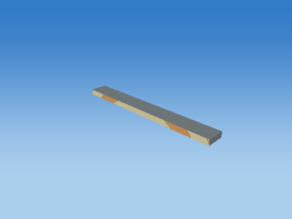 |

Steps 1–5 share one camera; the unit cube has its own close view, and step 6 is reframed at the actual world location to keep small objects visible. Reframing changes the view, never the model coordinates. Identity steps deliberately remain visible. Intermediate shapes are instructional states, while step 6 uses the unmodified game object.

Each stage below gives its exact numeric matrix and all eight corner multiplications. For each output row r: p'[r] = A[r,0]p.x + A[r,1]p.y + A[r,2]p.z + A[r,3]p.w.


#### S

```text
[ 1.35554421 0 0 0 ]
[ 0 0.0500000007 0 0 ]
[ 0 0 0.159999996 0 ]
[ 0 0 0 1 ]
```

| Input corner (w=1) | Output corner (w=1) |
| --- | --- |
| (-0.5, -0.5, -0.5) | (-0.677772105, -0.0250000004, -0.0799999982) |
| (-0.5, -0.5, 0.5) | (-0.677772105, -0.0250000004, 0.0799999982) |
| (-0.5, 0.5, -0.5) | (-0.677772105, 0.0250000004, -0.0799999982) |
| (-0.5, 0.5, 0.5) | (-0.677772105, 0.0250000004, 0.0799999982) |
| (0.5, -0.5, -0.5) | (0.677772105, -0.0250000004, -0.0799999982) |
| (0.5, -0.5, 0.5) | (0.677772105, -0.0250000004, 0.0799999982) |
| (0.5, 0.5, -0.5) | (0.677772105, 0.0250000004, -0.0799999982) |
| (0.5, 0.5, 0.5) | (0.677772105, 0.0250000004, 0.0799999982) |

#### H

```text
[ 1 0 0 0 ]
[ 0 1 0 0 ]
[ 0 0 1 0 ]
[ 0 0 0 1 ]
```

| Input corner (w=1) | Output corner (w=1) |
| --- | --- |
| (-0.677772105, -0.0250000004, -0.0799999982) | (-0.677772105, -0.0250000004, -0.0799999982) |
| (-0.677772105, -0.0250000004, 0.0799999982) | (-0.677772105, -0.0250000004, 0.0799999982) |
| (-0.677772105, 0.0250000004, -0.0799999982) | (-0.677772105, 0.0250000004, -0.0799999982) |
| (-0.677772105, 0.0250000004, 0.0799999982) | (-0.677772105, 0.0250000004, 0.0799999982) |
| (0.677772105, -0.0250000004, -0.0799999982) | (0.677772105, -0.0250000004, -0.0799999982) |
| (0.677772105, -0.0250000004, 0.0799999982) | (0.677772105, -0.0250000004, 0.0799999982) |
| (0.677772105, 0.0250000004, -0.0799999982) | (0.677772105, 0.0250000004, -0.0799999982) |
| (0.677772105, 0.0250000004, 0.0799999982) | (0.677772105, 0.0250000004, 0.0799999982) |

#### Rx

```text
[ 1 0 0 0 ]
[ 0 1 -0 0 ]
[ 0 0 1 0 ]
[ 0 0 0 1 ]
```

| Input corner (w=1) | Output corner (w=1) |
| --- | --- |
| (-0.677772105, -0.0250000004, -0.0799999982) | (-0.677772105, -0.0250000004, -0.0799999982) |
| (-0.677772105, -0.0250000004, 0.0799999982) | (-0.677772105, -0.0250000004, 0.0799999982) |
| (-0.677772105, 0.0250000004, -0.0799999982) | (-0.677772105, 0.0250000004, -0.0799999982) |
| (-0.677772105, 0.0250000004, 0.0799999982) | (-0.677772105, 0.0250000004, 0.0799999982) |
| (0.677772105, -0.0250000004, -0.0799999982) | (0.677772105, -0.0250000004, -0.0799999982) |
| (0.677772105, -0.0250000004, 0.0799999982) | (0.677772105, -0.0250000004, 0.0799999982) |
| (0.677772105, 0.0250000004, -0.0799999982) | (0.677772105, 0.0250000004, -0.0799999982) |
| (0.677772105, 0.0250000004, 0.0799999982) | (0.677772105, 0.0250000004, 0.0799999982) |

#### Ry

```text
[ 1 0 0 0 ]
[ 0 1 0 0 ]
[ -0 0 1 0 ]
[ 0 0 0 1 ]
```

| Input corner (w=1) | Output corner (w=1) |
| --- | --- |
| (-0.677772105, -0.0250000004, -0.0799999982) | (-0.677772105, -0.0250000004, -0.0799999982) |
| (-0.677772105, -0.0250000004, 0.0799999982) | (-0.677772105, -0.0250000004, 0.0799999982) |
| (-0.677772105, 0.0250000004, -0.0799999982) | (-0.677772105, 0.0250000004, -0.0799999982) |
| (-0.677772105, 0.0250000004, 0.0799999982) | (-0.677772105, 0.0250000004, 0.0799999982) |
| (0.677772105, -0.0250000004, -0.0799999982) | (0.677772105, -0.0250000004, -0.0799999982) |
| (0.677772105, -0.0250000004, 0.0799999982) | (0.677772105, -0.0250000004, 0.0799999982) |
| (0.677772105, 0.0250000004, -0.0799999982) | (0.677772105, 0.0250000004, -0.0799999982) |
| (0.677772105, 0.0250000004, 0.0799999982) | (0.677772105, 0.0250000004, 0.0799999982) |

#### Rz

```text
[ 1 -0 0 0 ]
[ 0 1 0 0 ]
[ 0 0 1 0 ]
[ 0 0 0 1 ]
```

| Input corner (w=1) | Output corner (w=1) |
| --- | --- |
| (-0.677772105, -0.0250000004, -0.0799999982) | (-0.677772105, -0.0250000004, -0.0799999982) |
| (-0.677772105, -0.0250000004, 0.0799999982) | (-0.677772105, -0.0250000004, 0.0799999982) |
| (-0.677772105, 0.0250000004, -0.0799999982) | (-0.677772105, 0.0250000004, -0.0799999982) |
| (-0.677772105, 0.0250000004, 0.0799999982) | (-0.677772105, 0.0250000004, 0.0799999982) |
| (0.677772105, -0.0250000004, -0.0799999982) | (0.677772105, -0.0250000004, -0.0799999982) |
| (0.677772105, -0.0250000004, 0.0799999982) | (0.677772105, -0.0250000004, 0.0799999982) |
| (0.677772105, 0.0250000004, -0.0799999982) | (0.677772105, 0.0250000004, -0.0799999982) |
| (0.677772105, 0.0250000004, 0.0799999982) | (0.677772105, 0.0250000004, 0.0799999982) |

#### T

```text
[ 1 0 0 0 ]
[ 0 1 0 3.125 ]
[ 0 0 1 -19 ]
[ 0 0 0 1 ]
```

| Input corner (w=1) | Output corner (w=1) |
| --- | --- |
| (-0.677772105, -0.0250000004, -0.0799999982) | (-0.677772105, 3.0999999, -19.0799999) |
| (-0.677772105, -0.0250000004, 0.0799999982) | (-0.677772105, 3.0999999, -18.9200001) |
| (-0.677772105, 0.0250000004, -0.0799999982) | (-0.677772105, 3.1500001, -19.0799999) |
| (-0.677772105, 0.0250000004, 0.0799999982) | (-0.677772105, 3.1500001, -18.9200001) |
| (0.677772105, -0.0250000004, -0.0799999982) | (0.677772105, 3.0999999, -19.0799999) |
| (0.677772105, -0.0250000004, 0.0799999982) | (0.677772105, 3.0999999, -18.9200001) |
| (0.677772105, 0.0250000004, -0.0799999982) | (0.677772105, 3.1500001, -19.0799999) |
| (0.677772105, 0.0250000004, 0.0799999982) | (0.677772105, 3.1500001, -18.9200001) |

Final M = T Rz Ry Rx H S:

```text
[ 1.35554421 0 0 0 ]
[ 0 0.0500000007 0 3.125 ]
[ 0 0 0.159999996 -19 ]
[ 0 0 0 1 ]
```

### Cube-built six-ring plate — `TARGET_1_SLICE_25`

32 transformed cube slices; printed front +Z; health=60.000000/60; exact slice collider

Position T = (0, 3.17499995, -19) m; scale S = (1.28743947, 0.0500000007, 0.159999996); rotation (Rx,Ry,Rz) = (0, 0, 0) degrees.

Shear (xy,xz,yx,yz,zx,zy) = (0, 0, 0, 0, 0, 0). Color = (0.800000012, 0.800000012, 0.800000012); specular = 0.449999988; shininess = 48; emission = 0; flash = 1; material layer = 7; texture scale = 2. Pattern enabled = 1, pattern scale = (0.804649651, 0.03125, 1), offset = (0, 0.29687497, 0).

| Step | Actual renderer image |
| --- | --- |
| Unit cube |  |
| Scale |  |
| Shear |  |
| Rotate X |  |
| Rotate Y |  |
| Rotate Z |  |
| Translate to world | 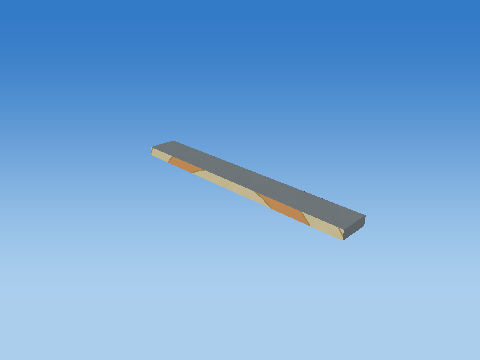 |

Steps 1–5 share one camera; the unit cube has its own close view, and step 6 is reframed at the actual world location to keep small objects visible. Reframing changes the view, never the model coordinates. Identity steps deliberately remain visible. Intermediate shapes are instructional states, while step 6 uses the unmodified game object.

Each stage below gives its exact numeric matrix and all eight corner multiplications. For each output row r: p'[r] = A[r,0]p.x + A[r,1]p.y + A[r,2]p.z + A[r,3]p.w.


#### S

```text
[ 1.28743947 0 0 0 ]
[ 0 0.0500000007 0 0 ]
[ 0 0 0.159999996 0 ]
[ 0 0 0 1 ]
```

| Input corner (w=1) | Output corner (w=1) |
| --- | --- |
| (-0.5, -0.5, -0.5) | (-0.643719733, -0.0250000004, -0.0799999982) |
| (-0.5, -0.5, 0.5) | (-0.643719733, -0.0250000004, 0.0799999982) |
| (-0.5, 0.5, -0.5) | (-0.643719733, 0.0250000004, -0.0799999982) |
| (-0.5, 0.5, 0.5) | (-0.643719733, 0.0250000004, 0.0799999982) |
| (0.5, -0.5, -0.5) | (0.643719733, -0.0250000004, -0.0799999982) |
| (0.5, -0.5, 0.5) | (0.643719733, -0.0250000004, 0.0799999982) |
| (0.5, 0.5, -0.5) | (0.643719733, 0.0250000004, -0.0799999982) |
| (0.5, 0.5, 0.5) | (0.643719733, 0.0250000004, 0.0799999982) |

#### H

```text
[ 1 0 0 0 ]
[ 0 1 0 0 ]
[ 0 0 1 0 ]
[ 0 0 0 1 ]
```

| Input corner (w=1) | Output corner (w=1) |
| --- | --- |
| (-0.643719733, -0.0250000004, -0.0799999982) | (-0.643719733, -0.0250000004, -0.0799999982) |
| (-0.643719733, -0.0250000004, 0.0799999982) | (-0.643719733, -0.0250000004, 0.0799999982) |
| (-0.643719733, 0.0250000004, -0.0799999982) | (-0.643719733, 0.0250000004, -0.0799999982) |
| (-0.643719733, 0.0250000004, 0.0799999982) | (-0.643719733, 0.0250000004, 0.0799999982) |
| (0.643719733, -0.0250000004, -0.0799999982) | (0.643719733, -0.0250000004, -0.0799999982) |
| (0.643719733, -0.0250000004, 0.0799999982) | (0.643719733, -0.0250000004, 0.0799999982) |
| (0.643719733, 0.0250000004, -0.0799999982) | (0.643719733, 0.0250000004, -0.0799999982) |
| (0.643719733, 0.0250000004, 0.0799999982) | (0.643719733, 0.0250000004, 0.0799999982) |

#### Rx

```text
[ 1 0 0 0 ]
[ 0 1 -0 0 ]
[ 0 0 1 0 ]
[ 0 0 0 1 ]
```

| Input corner (w=1) | Output corner (w=1) |
| --- | --- |
| (-0.643719733, -0.0250000004, -0.0799999982) | (-0.643719733, -0.0250000004, -0.0799999982) |
| (-0.643719733, -0.0250000004, 0.0799999982) | (-0.643719733, -0.0250000004, 0.0799999982) |
| (-0.643719733, 0.0250000004, -0.0799999982) | (-0.643719733, 0.0250000004, -0.0799999982) |
| (-0.643719733, 0.0250000004, 0.0799999982) | (-0.643719733, 0.0250000004, 0.0799999982) |
| (0.643719733, -0.0250000004, -0.0799999982) | (0.643719733, -0.0250000004, -0.0799999982) |
| (0.643719733, -0.0250000004, 0.0799999982) | (0.643719733, -0.0250000004, 0.0799999982) |
| (0.643719733, 0.0250000004, -0.0799999982) | (0.643719733, 0.0250000004, -0.0799999982) |
| (0.643719733, 0.0250000004, 0.0799999982) | (0.643719733, 0.0250000004, 0.0799999982) |

#### Ry

```text
[ 1 0 0 0 ]
[ 0 1 0 0 ]
[ -0 0 1 0 ]
[ 0 0 0 1 ]
```

| Input corner (w=1) | Output corner (w=1) |
| --- | --- |
| (-0.643719733, -0.0250000004, -0.0799999982) | (-0.643719733, -0.0250000004, -0.0799999982) |
| (-0.643719733, -0.0250000004, 0.0799999982) | (-0.643719733, -0.0250000004, 0.0799999982) |
| (-0.643719733, 0.0250000004, -0.0799999982) | (-0.643719733, 0.0250000004, -0.0799999982) |
| (-0.643719733, 0.0250000004, 0.0799999982) | (-0.643719733, 0.0250000004, 0.0799999982) |
| (0.643719733, -0.0250000004, -0.0799999982) | (0.643719733, -0.0250000004, -0.0799999982) |
| (0.643719733, -0.0250000004, 0.0799999982) | (0.643719733, -0.0250000004, 0.0799999982) |
| (0.643719733, 0.0250000004, -0.0799999982) | (0.643719733, 0.0250000004, -0.0799999982) |
| (0.643719733, 0.0250000004, 0.0799999982) | (0.643719733, 0.0250000004, 0.0799999982) |

#### Rz

```text
[ 1 -0 0 0 ]
[ 0 1 0 0 ]
[ 0 0 1 0 ]
[ 0 0 0 1 ]
```

| Input corner (w=1) | Output corner (w=1) |
| --- | --- |
| (-0.643719733, -0.0250000004, -0.0799999982) | (-0.643719733, -0.0250000004, -0.0799999982) |
| (-0.643719733, -0.0250000004, 0.0799999982) | (-0.643719733, -0.0250000004, 0.0799999982) |
| (-0.643719733, 0.0250000004, -0.0799999982) | (-0.643719733, 0.0250000004, -0.0799999982) |
| (-0.643719733, 0.0250000004, 0.0799999982) | (-0.643719733, 0.0250000004, 0.0799999982) |
| (0.643719733, -0.0250000004, -0.0799999982) | (0.643719733, -0.0250000004, -0.0799999982) |
| (0.643719733, -0.0250000004, 0.0799999982) | (0.643719733, -0.0250000004, 0.0799999982) |
| (0.643719733, 0.0250000004, -0.0799999982) | (0.643719733, 0.0250000004, -0.0799999982) |
| (0.643719733, 0.0250000004, 0.0799999982) | (0.643719733, 0.0250000004, 0.0799999982) |

#### T

```text
[ 1 0 0 0 ]
[ 0 1 0 3.17499995 ]
[ 0 0 1 -19 ]
[ 0 0 0 1 ]
```

| Input corner (w=1) | Output corner (w=1) |
| --- | --- |
| (-0.643719733, -0.0250000004, -0.0799999982) | (-0.643719733, 3.14999986, -19.0799999) |
| (-0.643719733, -0.0250000004, 0.0799999982) | (-0.643719733, 3.14999986, -18.9200001) |
| (-0.643719733, 0.0250000004, -0.0799999982) | (-0.643719733, 3.20000005, -19.0799999) |
| (-0.643719733, 0.0250000004, 0.0799999982) | (-0.643719733, 3.20000005, -18.9200001) |
| (0.643719733, -0.0250000004, -0.0799999982) | (0.643719733, 3.14999986, -19.0799999) |
| (0.643719733, -0.0250000004, 0.0799999982) | (0.643719733, 3.14999986, -18.9200001) |
| (0.643719733, 0.0250000004, -0.0799999982) | (0.643719733, 3.20000005, -19.0799999) |
| (0.643719733, 0.0250000004, 0.0799999982) | (0.643719733, 3.20000005, -18.9200001) |

Final M = T Rz Ry Rx H S:

```text
[ 1.28743947 0 0 0 ]
[ 0 0.0500000007 0 3.17499995 ]
[ 0 0 0.159999996 -19 ]
[ 0 0 0 1 ]
```

### Cube-built six-ring plate — `TARGET_1_SLICE_26`

32 transformed cube slices; printed front +Z; health=60.000000/60; exact slice collider

Position T = (0, 3.22500014, -19) m; scale S = (1.20726967, 0.0500000007, 0.159999996); rotation (Rx,Ry,Rz) = (0, 0, 0) degrees.

Shear (xy,xz,yx,yz,zx,zy) = (0, 0, 0, 0, 0, 0). Color = (0.800000012, 0.800000012, 0.800000012); specular = 0.449999988; shininess = 48; emission = 0; flash = 1; material layer = 7; texture scale = 2. Pattern enabled = 1, pattern scale = (0.754543543, 0.03125, 1), offset = (0, 0.32812503, 0).

| Step | Actual renderer image |
| --- | --- |
| Unit cube |  |
| Scale |  |
| Shear |  |
| Rotate X |  |
| Rotate Y |  |
| Rotate Z |  |
| Translate to world | 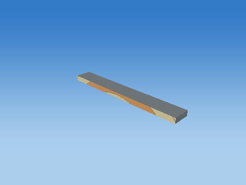 |

Steps 1–5 share one camera; the unit cube has its own close view, and step 6 is reframed at the actual world location to keep small objects visible. Reframing changes the view, never the model coordinates. Identity steps deliberately remain visible. Intermediate shapes are instructional states, while step 6 uses the unmodified game object.

Each stage below gives its exact numeric matrix and all eight corner multiplications. For each output row r: p'[r] = A[r,0]p.x + A[r,1]p.y + A[r,2]p.z + A[r,3]p.w.


#### S

```text
[ 1.20726967 0 0 0 ]
[ 0 0.0500000007 0 0 ]
[ 0 0 0.159999996 0 ]
[ 0 0 0 1 ]
```

| Input corner (w=1) | Output corner (w=1) |
| --- | --- |
| (-0.5, -0.5, -0.5) | (-0.603634834, -0.0250000004, -0.0799999982) |
| (-0.5, -0.5, 0.5) | (-0.603634834, -0.0250000004, 0.0799999982) |
| (-0.5, 0.5, -0.5) | (-0.603634834, 0.0250000004, -0.0799999982) |
| (-0.5, 0.5, 0.5) | (-0.603634834, 0.0250000004, 0.0799999982) |
| (0.5, -0.5, -0.5) | (0.603634834, -0.0250000004, -0.0799999982) |
| (0.5, -0.5, 0.5) | (0.603634834, -0.0250000004, 0.0799999982) |
| (0.5, 0.5, -0.5) | (0.603634834, 0.0250000004, -0.0799999982) |
| (0.5, 0.5, 0.5) | (0.603634834, 0.0250000004, 0.0799999982) |

#### H

```text
[ 1 0 0 0 ]
[ 0 1 0 0 ]
[ 0 0 1 0 ]
[ 0 0 0 1 ]
```

| Input corner (w=1) | Output corner (w=1) |
| --- | --- |
| (-0.603634834, -0.0250000004, -0.0799999982) | (-0.603634834, -0.0250000004, -0.0799999982) |
| (-0.603634834, -0.0250000004, 0.0799999982) | (-0.603634834, -0.0250000004, 0.0799999982) |
| (-0.603634834, 0.0250000004, -0.0799999982) | (-0.603634834, 0.0250000004, -0.0799999982) |
| (-0.603634834, 0.0250000004, 0.0799999982) | (-0.603634834, 0.0250000004, 0.0799999982) |
| (0.603634834, -0.0250000004, -0.0799999982) | (0.603634834, -0.0250000004, -0.0799999982) |
| (0.603634834, -0.0250000004, 0.0799999982) | (0.603634834, -0.0250000004, 0.0799999982) |
| (0.603634834, 0.0250000004, -0.0799999982) | (0.603634834, 0.0250000004, -0.0799999982) |
| (0.603634834, 0.0250000004, 0.0799999982) | (0.603634834, 0.0250000004, 0.0799999982) |

#### Rx

```text
[ 1 0 0 0 ]
[ 0 1 -0 0 ]
[ 0 0 1 0 ]
[ 0 0 0 1 ]
```

| Input corner (w=1) | Output corner (w=1) |
| --- | --- |
| (-0.603634834, -0.0250000004, -0.0799999982) | (-0.603634834, -0.0250000004, -0.0799999982) |
| (-0.603634834, -0.0250000004, 0.0799999982) | (-0.603634834, -0.0250000004, 0.0799999982) |
| (-0.603634834, 0.0250000004, -0.0799999982) | (-0.603634834, 0.0250000004, -0.0799999982) |
| (-0.603634834, 0.0250000004, 0.0799999982) | (-0.603634834, 0.0250000004, 0.0799999982) |
| (0.603634834, -0.0250000004, -0.0799999982) | (0.603634834, -0.0250000004, -0.0799999982) |
| (0.603634834, -0.0250000004, 0.0799999982) | (0.603634834, -0.0250000004, 0.0799999982) |
| (0.603634834, 0.0250000004, -0.0799999982) | (0.603634834, 0.0250000004, -0.0799999982) |
| (0.603634834, 0.0250000004, 0.0799999982) | (0.603634834, 0.0250000004, 0.0799999982) |

#### Ry

```text
[ 1 0 0 0 ]
[ 0 1 0 0 ]
[ -0 0 1 0 ]
[ 0 0 0 1 ]
```

| Input corner (w=1) | Output corner (w=1) |
| --- | --- |
| (-0.603634834, -0.0250000004, -0.0799999982) | (-0.603634834, -0.0250000004, -0.0799999982) |
| (-0.603634834, -0.0250000004, 0.0799999982) | (-0.603634834, -0.0250000004, 0.0799999982) |
| (-0.603634834, 0.0250000004, -0.0799999982) | (-0.603634834, 0.0250000004, -0.0799999982) |
| (-0.603634834, 0.0250000004, 0.0799999982) | (-0.603634834, 0.0250000004, 0.0799999982) |
| (0.603634834, -0.0250000004, -0.0799999982) | (0.603634834, -0.0250000004, -0.0799999982) |
| (0.603634834, -0.0250000004, 0.0799999982) | (0.603634834, -0.0250000004, 0.0799999982) |
| (0.603634834, 0.0250000004, -0.0799999982) | (0.603634834, 0.0250000004, -0.0799999982) |
| (0.603634834, 0.0250000004, 0.0799999982) | (0.603634834, 0.0250000004, 0.0799999982) |

#### Rz

```text
[ 1 -0 0 0 ]
[ 0 1 0 0 ]
[ 0 0 1 0 ]
[ 0 0 0 1 ]
```

| Input corner (w=1) | Output corner (w=1) |
| --- | --- |
| (-0.603634834, -0.0250000004, -0.0799999982) | (-0.603634834, -0.0250000004, -0.0799999982) |
| (-0.603634834, -0.0250000004, 0.0799999982) | (-0.603634834, -0.0250000004, 0.0799999982) |
| (-0.603634834, 0.0250000004, -0.0799999982) | (-0.603634834, 0.0250000004, -0.0799999982) |
| (-0.603634834, 0.0250000004, 0.0799999982) | (-0.603634834, 0.0250000004, 0.0799999982) |
| (0.603634834, -0.0250000004, -0.0799999982) | (0.603634834, -0.0250000004, -0.0799999982) |
| (0.603634834, -0.0250000004, 0.0799999982) | (0.603634834, -0.0250000004, 0.0799999982) |
| (0.603634834, 0.0250000004, -0.0799999982) | (0.603634834, 0.0250000004, -0.0799999982) |
| (0.603634834, 0.0250000004, 0.0799999982) | (0.603634834, 0.0250000004, 0.0799999982) |

#### T

```text
[ 1 0 0 0 ]
[ 0 1 0 3.22500014 ]
[ 0 0 1 -19 ]
[ 0 0 0 1 ]
```

| Input corner (w=1) | Output corner (w=1) |
| --- | --- |
| (-0.603634834, -0.0250000004, -0.0799999982) | (-0.603634834, 3.20000005, -19.0799999) |
| (-0.603634834, -0.0250000004, 0.0799999982) | (-0.603634834, 3.20000005, -18.9200001) |
| (-0.603634834, 0.0250000004, -0.0799999982) | (-0.603634834, 3.25000024, -19.0799999) |
| (-0.603634834, 0.0250000004, 0.0799999982) | (-0.603634834, 3.25000024, -18.9200001) |
| (0.603634834, -0.0250000004, -0.0799999982) | (0.603634834, 3.20000005, -19.0799999) |
| (0.603634834, -0.0250000004, 0.0799999982) | (0.603634834, 3.20000005, -18.9200001) |
| (0.603634834, 0.0250000004, -0.0799999982) | (0.603634834, 3.25000024, -19.0799999) |
| (0.603634834, 0.0250000004, 0.0799999982) | (0.603634834, 3.25000024, -18.9200001) |

Final M = T Rz Ry Rx H S:

```text
[ 1.20726967 0 0 0 ]
[ 0 0.0500000007 0 3.22500014 ]
[ 0 0 0.159999996 -19 ]
[ 0 0 0 1 ]
```

### Cube-built six-ring plate — `TARGET_1_SLICE_27`

32 transformed cube slices; printed front +Z; health=60.000000/60; exact slice collider

Position T = (0, 3.2750001, -19) m; scale S = (1.11242986, 0.0500000007, 0.159999996); rotation (Rx,Ry,Rz) = (0, 0, 0) degrees.

Shear (xy,xz,yx,yz,zx,zy) = (0, 0, 0, 0, 0, 0). Color = (0.800000012, 0.800000012, 0.800000012); specular = 0.449999988; shininess = 48; emission = 0; flash = 1; material layer = 7; texture scale = 2. Pattern enabled = 1, pattern scale = (0.695268631, 0.03125, 1), offset = (0, 0.359375, 0).

| Step | Actual renderer image |
| --- | --- |
| Unit cube | 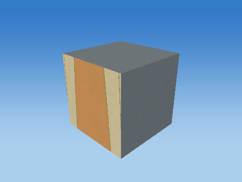 |
| Scale |  |
| Shear |  |
| Rotate X |  |
| Rotate Y |  |
| Rotate Z |  |
| Translate to world |  |

Steps 1–5 share one camera; the unit cube has its own close view, and step 6 is reframed at the actual world location to keep small objects visible. Reframing changes the view, never the model coordinates. Identity steps deliberately remain visible. Intermediate shapes are instructional states, while step 6 uses the unmodified game object.

Each stage below gives its exact numeric matrix and all eight corner multiplications. For each output row r: p'[r] = A[r,0]p.x + A[r,1]p.y + A[r,2]p.z + A[r,3]p.w.


#### S

```text
[ 1.11242986 0 0 0 ]
[ 0 0.0500000007 0 0 ]
[ 0 0 0.159999996 0 ]
[ 0 0 0 1 ]
```

| Input corner (w=1) | Output corner (w=1) |
| --- | --- |
| (-0.5, -0.5, -0.5) | (-0.556214929, -0.0250000004, -0.0799999982) |
| (-0.5, -0.5, 0.5) | (-0.556214929, -0.0250000004, 0.0799999982) |
| (-0.5, 0.5, -0.5) | (-0.556214929, 0.0250000004, -0.0799999982) |
| (-0.5, 0.5, 0.5) | (-0.556214929, 0.0250000004, 0.0799999982) |
| (0.5, -0.5, -0.5) | (0.556214929, -0.0250000004, -0.0799999982) |
| (0.5, -0.5, 0.5) | (0.556214929, -0.0250000004, 0.0799999982) |
| (0.5, 0.5, -0.5) | (0.556214929, 0.0250000004, -0.0799999982) |
| (0.5, 0.5, 0.5) | (0.556214929, 0.0250000004, 0.0799999982) |

#### H

```text
[ 1 0 0 0 ]
[ 0 1 0 0 ]
[ 0 0 1 0 ]
[ 0 0 0 1 ]
```

| Input corner (w=1) | Output corner (w=1) |
| --- | --- |
| (-0.556214929, -0.0250000004, -0.0799999982) | (-0.556214929, -0.0250000004, -0.0799999982) |
| (-0.556214929, -0.0250000004, 0.0799999982) | (-0.556214929, -0.0250000004, 0.0799999982) |
| (-0.556214929, 0.0250000004, -0.0799999982) | (-0.556214929, 0.0250000004, -0.0799999982) |
| (-0.556214929, 0.0250000004, 0.0799999982) | (-0.556214929, 0.0250000004, 0.0799999982) |
| (0.556214929, -0.0250000004, -0.0799999982) | (0.556214929, -0.0250000004, -0.0799999982) |
| (0.556214929, -0.0250000004, 0.0799999982) | (0.556214929, -0.0250000004, 0.0799999982) |
| (0.556214929, 0.0250000004, -0.0799999982) | (0.556214929, 0.0250000004, -0.0799999982) |
| (0.556214929, 0.0250000004, 0.0799999982) | (0.556214929, 0.0250000004, 0.0799999982) |

#### Rx

```text
[ 1 0 0 0 ]
[ 0 1 -0 0 ]
[ 0 0 1 0 ]
[ 0 0 0 1 ]
```

| Input corner (w=1) | Output corner (w=1) |
| --- | --- |
| (-0.556214929, -0.0250000004, -0.0799999982) | (-0.556214929, -0.0250000004, -0.0799999982) |
| (-0.556214929, -0.0250000004, 0.0799999982) | (-0.556214929, -0.0250000004, 0.0799999982) |
| (-0.556214929, 0.0250000004, -0.0799999982) | (-0.556214929, 0.0250000004, -0.0799999982) |
| (-0.556214929, 0.0250000004, 0.0799999982) | (-0.556214929, 0.0250000004, 0.0799999982) |
| (0.556214929, -0.0250000004, -0.0799999982) | (0.556214929, -0.0250000004, -0.0799999982) |
| (0.556214929, -0.0250000004, 0.0799999982) | (0.556214929, -0.0250000004, 0.0799999982) |
| (0.556214929, 0.0250000004, -0.0799999982) | (0.556214929, 0.0250000004, -0.0799999982) |
| (0.556214929, 0.0250000004, 0.0799999982) | (0.556214929, 0.0250000004, 0.0799999982) |

#### Ry

```text
[ 1 0 0 0 ]
[ 0 1 0 0 ]
[ -0 0 1 0 ]
[ 0 0 0 1 ]
```

| Input corner (w=1) | Output corner (w=1) |
| --- | --- |
| (-0.556214929, -0.0250000004, -0.0799999982) | (-0.556214929, -0.0250000004, -0.0799999982) |
| (-0.556214929, -0.0250000004, 0.0799999982) | (-0.556214929, -0.0250000004, 0.0799999982) |
| (-0.556214929, 0.0250000004, -0.0799999982) | (-0.556214929, 0.0250000004, -0.0799999982) |
| (-0.556214929, 0.0250000004, 0.0799999982) | (-0.556214929, 0.0250000004, 0.0799999982) |
| (0.556214929, -0.0250000004, -0.0799999982) | (0.556214929, -0.0250000004, -0.0799999982) |
| (0.556214929, -0.0250000004, 0.0799999982) | (0.556214929, -0.0250000004, 0.0799999982) |
| (0.556214929, 0.0250000004, -0.0799999982) | (0.556214929, 0.0250000004, -0.0799999982) |
| (0.556214929, 0.0250000004, 0.0799999982) | (0.556214929, 0.0250000004, 0.0799999982) |

#### Rz

```text
[ 1 -0 0 0 ]
[ 0 1 0 0 ]
[ 0 0 1 0 ]
[ 0 0 0 1 ]
```

| Input corner (w=1) | Output corner (w=1) |
| --- | --- |
| (-0.556214929, -0.0250000004, -0.0799999982) | (-0.556214929, -0.0250000004, -0.0799999982) |
| (-0.556214929, -0.0250000004, 0.0799999982) | (-0.556214929, -0.0250000004, 0.0799999982) |
| (-0.556214929, 0.0250000004, -0.0799999982) | (-0.556214929, 0.0250000004, -0.0799999982) |
| (-0.556214929, 0.0250000004, 0.0799999982) | (-0.556214929, 0.0250000004, 0.0799999982) |
| (0.556214929, -0.0250000004, -0.0799999982) | (0.556214929, -0.0250000004, -0.0799999982) |
| (0.556214929, -0.0250000004, 0.0799999982) | (0.556214929, -0.0250000004, 0.0799999982) |
| (0.556214929, 0.0250000004, -0.0799999982) | (0.556214929, 0.0250000004, -0.0799999982) |
| (0.556214929, 0.0250000004, 0.0799999982) | (0.556214929, 0.0250000004, 0.0799999982) |

#### T

```text
[ 1 0 0 0 ]
[ 0 1 0 3.2750001 ]
[ 0 0 1 -19 ]
[ 0 0 0 1 ]
```

| Input corner (w=1) | Output corner (w=1) |
| --- | --- |
| (-0.556214929, -0.0250000004, -0.0799999982) | (-0.556214929, 3.25, -19.0799999) |
| (-0.556214929, -0.0250000004, 0.0799999982) | (-0.556214929, 3.25, -18.9200001) |
| (-0.556214929, 0.0250000004, -0.0799999982) | (-0.556214929, 3.30000019, -19.0799999) |
| (-0.556214929, 0.0250000004, 0.0799999982) | (-0.556214929, 3.30000019, -18.9200001) |
| (0.556214929, -0.0250000004, -0.0799999982) | (0.556214929, 3.25, -19.0799999) |
| (0.556214929, -0.0250000004, 0.0799999982) | (0.556214929, 3.25, -18.9200001) |
| (0.556214929, 0.0250000004, -0.0799999982) | (0.556214929, 3.30000019, -19.0799999) |
| (0.556214929, 0.0250000004, 0.0799999982) | (0.556214929, 3.30000019, -18.9200001) |

Final M = T Rz Ry Rx H S:

```text
[ 1.11242986 0 0 0 ]
[ 0 0.0500000007 0 3.2750001 ]
[ 0 0 0.159999996 -19 ]
[ 0 0 0 1 ]
```

### Cube-built six-ring plate — `TARGET_1_SLICE_28`

32 transformed cube slices; printed front +Z; health=60.000000/60; exact slice collider

Position T = (0, 3.32500005, -19) m; scale S = (0.998749137, 0.0500000007, 0.159999996); rotation (Rx,Ry,Rz) = (0, 0, 0) degrees.

Shear (xy,xz,yx,yz,zx,zy) = (0, 0, 0, 0, 0, 0). Color = (0.800000012, 0.800000012, 0.800000012); specular = 0.449999988; shininess = 48; emission = 0; flash = 1; material layer = 7; texture scale = 2. Pattern enabled = 1, pattern scale = (0.624218225, 0.03125, 1), offset = (0, 0.39062503, 0).

| Step | Actual renderer image |
| --- | --- |
| Unit cube |  |
| Scale |  |
| Shear |  |
| Rotate X |  |
| Rotate Y |  |
| Rotate Z |  |
| Translate to world |  |

Steps 1–5 share one camera; the unit cube has its own close view, and step 6 is reframed at the actual world location to keep small objects visible. Reframing changes the view, never the model coordinates. Identity steps deliberately remain visible. Intermediate shapes are instructional states, while step 6 uses the unmodified game object.

Each stage below gives its exact numeric matrix and all eight corner multiplications. For each output row r: p'[r] = A[r,0]p.x + A[r,1]p.y + A[r,2]p.z + A[r,3]p.w.


#### S

```text
[ 0.998749137 0 0 0 ]
[ 0 0.0500000007 0 0 ]
[ 0 0 0.159999996 0 ]
[ 0 0 0 1 ]
```

| Input corner (w=1) | Output corner (w=1) |
| --- | --- |
| (-0.5, -0.5, -0.5) | (-0.499374568, -0.0250000004, -0.0799999982) |
| (-0.5, -0.5, 0.5) | (-0.499374568, -0.0250000004, 0.0799999982) |
| (-0.5, 0.5, -0.5) | (-0.499374568, 0.0250000004, -0.0799999982) |
| (-0.5, 0.5, 0.5) | (-0.499374568, 0.0250000004, 0.0799999982) |
| (0.5, -0.5, -0.5) | (0.499374568, -0.0250000004, -0.0799999982) |
| (0.5, -0.5, 0.5) | (0.499374568, -0.0250000004, 0.0799999982) |
| (0.5, 0.5, -0.5) | (0.499374568, 0.0250000004, -0.0799999982) |
| (0.5, 0.5, 0.5) | (0.499374568, 0.0250000004, 0.0799999982) |

#### H

```text
[ 1 0 0 0 ]
[ 0 1 0 0 ]
[ 0 0 1 0 ]
[ 0 0 0 1 ]
```

| Input corner (w=1) | Output corner (w=1) |
| --- | --- |
| (-0.499374568, -0.0250000004, -0.0799999982) | (-0.499374568, -0.0250000004, -0.0799999982) |
| (-0.499374568, -0.0250000004, 0.0799999982) | (-0.499374568, -0.0250000004, 0.0799999982) |
| (-0.499374568, 0.0250000004, -0.0799999982) | (-0.499374568, 0.0250000004, -0.0799999982) |
| (-0.499374568, 0.0250000004, 0.0799999982) | (-0.499374568, 0.0250000004, 0.0799999982) |
| (0.499374568, -0.0250000004, -0.0799999982) | (0.499374568, -0.0250000004, -0.0799999982) |
| (0.499374568, -0.0250000004, 0.0799999982) | (0.499374568, -0.0250000004, 0.0799999982) |
| (0.499374568, 0.0250000004, -0.0799999982) | (0.499374568, 0.0250000004, -0.0799999982) |
| (0.499374568, 0.0250000004, 0.0799999982) | (0.499374568, 0.0250000004, 0.0799999982) |

#### Rx

```text
[ 1 0 0 0 ]
[ 0 1 -0 0 ]
[ 0 0 1 0 ]
[ 0 0 0 1 ]
```

| Input corner (w=1) | Output corner (w=1) |
| --- | --- |
| (-0.499374568, -0.0250000004, -0.0799999982) | (-0.499374568, -0.0250000004, -0.0799999982) |
| (-0.499374568, -0.0250000004, 0.0799999982) | (-0.499374568, -0.0250000004, 0.0799999982) |
| (-0.499374568, 0.0250000004, -0.0799999982) | (-0.499374568, 0.0250000004, -0.0799999982) |
| (-0.499374568, 0.0250000004, 0.0799999982) | (-0.499374568, 0.0250000004, 0.0799999982) |
| (0.499374568, -0.0250000004, -0.0799999982) | (0.499374568, -0.0250000004, -0.0799999982) |
| (0.499374568, -0.0250000004, 0.0799999982) | (0.499374568, -0.0250000004, 0.0799999982) |
| (0.499374568, 0.0250000004, -0.0799999982) | (0.499374568, 0.0250000004, -0.0799999982) |
| (0.499374568, 0.0250000004, 0.0799999982) | (0.499374568, 0.0250000004, 0.0799999982) |

#### Ry

```text
[ 1 0 0 0 ]
[ 0 1 0 0 ]
[ -0 0 1 0 ]
[ 0 0 0 1 ]
```

| Input corner (w=1) | Output corner (w=1) |
| --- | --- |
| (-0.499374568, -0.0250000004, -0.0799999982) | (-0.499374568, -0.0250000004, -0.0799999982) |
| (-0.499374568, -0.0250000004, 0.0799999982) | (-0.499374568, -0.0250000004, 0.0799999982) |
| (-0.499374568, 0.0250000004, -0.0799999982) | (-0.499374568, 0.0250000004, -0.0799999982) |
| (-0.499374568, 0.0250000004, 0.0799999982) | (-0.499374568, 0.0250000004, 0.0799999982) |
| (0.499374568, -0.0250000004, -0.0799999982) | (0.499374568, -0.0250000004, -0.0799999982) |
| (0.499374568, -0.0250000004, 0.0799999982) | (0.499374568, -0.0250000004, 0.0799999982) |
| (0.499374568, 0.0250000004, -0.0799999982) | (0.499374568, 0.0250000004, -0.0799999982) |
| (0.499374568, 0.0250000004, 0.0799999982) | (0.499374568, 0.0250000004, 0.0799999982) |

#### Rz

```text
[ 1 -0 0 0 ]
[ 0 1 0 0 ]
[ 0 0 1 0 ]
[ 0 0 0 1 ]
```

| Input corner (w=1) | Output corner (w=1) |
| --- | --- |
| (-0.499374568, -0.0250000004, -0.0799999982) | (-0.499374568, -0.0250000004, -0.0799999982) |
| (-0.499374568, -0.0250000004, 0.0799999982) | (-0.499374568, -0.0250000004, 0.0799999982) |
| (-0.499374568, 0.0250000004, -0.0799999982) | (-0.499374568, 0.0250000004, -0.0799999982) |
| (-0.499374568, 0.0250000004, 0.0799999982) | (-0.499374568, 0.0250000004, 0.0799999982) |
| (0.499374568, -0.0250000004, -0.0799999982) | (0.499374568, -0.0250000004, -0.0799999982) |
| (0.499374568, -0.0250000004, 0.0799999982) | (0.499374568, -0.0250000004, 0.0799999982) |
| (0.499374568, 0.0250000004, -0.0799999982) | (0.499374568, 0.0250000004, -0.0799999982) |
| (0.499374568, 0.0250000004, 0.0799999982) | (0.499374568, 0.0250000004, 0.0799999982) |

#### T

```text
[ 1 0 0 0 ]
[ 0 1 0 3.32500005 ]
[ 0 0 1 -19 ]
[ 0 0 0 1 ]
```

| Input corner (w=1) | Output corner (w=1) |
| --- | --- |
| (-0.499374568, -0.0250000004, -0.0799999982) | (-0.499374568, 3.29999995, -19.0799999) |
| (-0.499374568, -0.0250000004, 0.0799999982) | (-0.499374568, 3.29999995, -18.9200001) |
| (-0.499374568, 0.0250000004, -0.0799999982) | (-0.499374568, 3.35000014, -19.0799999) |
| (-0.499374568, 0.0250000004, 0.0799999982) | (-0.499374568, 3.35000014, -18.9200001) |
| (0.499374568, -0.0250000004, -0.0799999982) | (0.499374568, 3.29999995, -19.0799999) |
| (0.499374568, -0.0250000004, 0.0799999982) | (0.499374568, 3.29999995, -18.9200001) |
| (0.499374568, 0.0250000004, -0.0799999982) | (0.499374568, 3.35000014, -19.0799999) |
| (0.499374568, 0.0250000004, 0.0799999982) | (0.499374568, 3.35000014, -18.9200001) |

Final M = T Rz Ry Rx H S:

```text
[ 0.998749137 0 0 0 ]
[ 0 0.0500000007 0 3.32500005 ]
[ 0 0 0.159999996 -19 ]
[ 0 0 0 1 ]
```

### Cube-built six-ring plate — `TARGET_1_SLICE_29`

32 transformed cube slices; printed front +Z; health=60.000000/60; exact slice collider

Position T = (0, 3.375, -19) m; scale S = (0.858778238, 0.0500000007, 0.159999996); rotation (Rx,Ry,Rz) = (0, 0, 0) degrees.

Shear (xy,xz,yx,yz,zx,zy) = (0, 0, 0, 0, 0, 0). Color = (0.800000012, 0.800000012, 0.800000012); specular = 0.449999988; shininess = 48; emission = 0; flash = 1; material layer = 7; texture scale = 2. Pattern enabled = 1, pattern scale = (0.536736369, 0.03125, 1), offset = (0, 0.421875, 0).

| Step | Actual renderer image |
| --- | --- |
| Unit cube |  |
| Scale |  |
| Shear |  |
| Rotate X |  |
| Rotate Y |  |
| Rotate Z |  |
| Translate to world |  |

Steps 1–5 share one camera; the unit cube has its own close view, and step 6 is reframed at the actual world location to keep small objects visible. Reframing changes the view, never the model coordinates. Identity steps deliberately remain visible. Intermediate shapes are instructional states, while step 6 uses the unmodified game object.

Each stage below gives its exact numeric matrix and all eight corner multiplications. For each output row r: p'[r] = A[r,0]p.x + A[r,1]p.y + A[r,2]p.z + A[r,3]p.w.


#### S

```text
[ 0.858778238 0 0 0 ]
[ 0 0.0500000007 0 0 ]
[ 0 0 0.159999996 0 ]
[ 0 0 0 1 ]
```

| Input corner (w=1) | Output corner (w=1) |
| --- | --- |
| (-0.5, -0.5, -0.5) | (-0.429389119, -0.0250000004, -0.0799999982) |
| (-0.5, -0.5, 0.5) | (-0.429389119, -0.0250000004, 0.0799999982) |
| (-0.5, 0.5, -0.5) | (-0.429389119, 0.0250000004, -0.0799999982) |
| (-0.5, 0.5, 0.5) | (-0.429389119, 0.0250000004, 0.0799999982) |
| (0.5, -0.5, -0.5) | (0.429389119, -0.0250000004, -0.0799999982) |
| (0.5, -0.5, 0.5) | (0.429389119, -0.0250000004, 0.0799999982) |
| (0.5, 0.5, -0.5) | (0.429389119, 0.0250000004, -0.0799999982) |
| (0.5, 0.5, 0.5) | (0.429389119, 0.0250000004, 0.0799999982) |

#### H

```text
[ 1 0 0 0 ]
[ 0 1 0 0 ]
[ 0 0 1 0 ]
[ 0 0 0 1 ]
```

| Input corner (w=1) | Output corner (w=1) |
| --- | --- |
| (-0.429389119, -0.0250000004, -0.0799999982) | (-0.429389119, -0.0250000004, -0.0799999982) |
| (-0.429389119, -0.0250000004, 0.0799999982) | (-0.429389119, -0.0250000004, 0.0799999982) |
| (-0.429389119, 0.0250000004, -0.0799999982) | (-0.429389119, 0.0250000004, -0.0799999982) |
| (-0.429389119, 0.0250000004, 0.0799999982) | (-0.429389119, 0.0250000004, 0.0799999982) |
| (0.429389119, -0.0250000004, -0.0799999982) | (0.429389119, -0.0250000004, -0.0799999982) |
| (0.429389119, -0.0250000004, 0.0799999982) | (0.429389119, -0.0250000004, 0.0799999982) |
| (0.429389119, 0.0250000004, -0.0799999982) | (0.429389119, 0.0250000004, -0.0799999982) |
| (0.429389119, 0.0250000004, 0.0799999982) | (0.429389119, 0.0250000004, 0.0799999982) |

#### Rx

```text
[ 1 0 0 0 ]
[ 0 1 -0 0 ]
[ 0 0 1 0 ]
[ 0 0 0 1 ]
```

| Input corner (w=1) | Output corner (w=1) |
| --- | --- |
| (-0.429389119, -0.0250000004, -0.0799999982) | (-0.429389119, -0.0250000004, -0.0799999982) |
| (-0.429389119, -0.0250000004, 0.0799999982) | (-0.429389119, -0.0250000004, 0.0799999982) |
| (-0.429389119, 0.0250000004, -0.0799999982) | (-0.429389119, 0.0250000004, -0.0799999982) |
| (-0.429389119, 0.0250000004, 0.0799999982) | (-0.429389119, 0.0250000004, 0.0799999982) |
| (0.429389119, -0.0250000004, -0.0799999982) | (0.429389119, -0.0250000004, -0.0799999982) |
| (0.429389119, -0.0250000004, 0.0799999982) | (0.429389119, -0.0250000004, 0.0799999982) |
| (0.429389119, 0.0250000004, -0.0799999982) | (0.429389119, 0.0250000004, -0.0799999982) |
| (0.429389119, 0.0250000004, 0.0799999982) | (0.429389119, 0.0250000004, 0.0799999982) |

#### Ry

```text
[ 1 0 0 0 ]
[ 0 1 0 0 ]
[ -0 0 1 0 ]
[ 0 0 0 1 ]
```

| Input corner (w=1) | Output corner (w=1) |
| --- | --- |
| (-0.429389119, -0.0250000004, -0.0799999982) | (-0.429389119, -0.0250000004, -0.0799999982) |
| (-0.429389119, -0.0250000004, 0.0799999982) | (-0.429389119, -0.0250000004, 0.0799999982) |
| (-0.429389119, 0.0250000004, -0.0799999982) | (-0.429389119, 0.0250000004, -0.0799999982) |
| (-0.429389119, 0.0250000004, 0.0799999982) | (-0.429389119, 0.0250000004, 0.0799999982) |
| (0.429389119, -0.0250000004, -0.0799999982) | (0.429389119, -0.0250000004, -0.0799999982) |
| (0.429389119, -0.0250000004, 0.0799999982) | (0.429389119, -0.0250000004, 0.0799999982) |
| (0.429389119, 0.0250000004, -0.0799999982) | (0.429389119, 0.0250000004, -0.0799999982) |
| (0.429389119, 0.0250000004, 0.0799999982) | (0.429389119, 0.0250000004, 0.0799999982) |

#### Rz

```text
[ 1 -0 0 0 ]
[ 0 1 0 0 ]
[ 0 0 1 0 ]
[ 0 0 0 1 ]
```

| Input corner (w=1) | Output corner (w=1) |
| --- | --- |
| (-0.429389119, -0.0250000004, -0.0799999982) | (-0.429389119, -0.0250000004, -0.0799999982) |
| (-0.429389119, -0.0250000004, 0.0799999982) | (-0.429389119, -0.0250000004, 0.0799999982) |
| (-0.429389119, 0.0250000004, -0.0799999982) | (-0.429389119, 0.0250000004, -0.0799999982) |
| (-0.429389119, 0.0250000004, 0.0799999982) | (-0.429389119, 0.0250000004, 0.0799999982) |
| (0.429389119, -0.0250000004, -0.0799999982) | (0.429389119, -0.0250000004, -0.0799999982) |
| (0.429389119, -0.0250000004, 0.0799999982) | (0.429389119, -0.0250000004, 0.0799999982) |
| (0.429389119, 0.0250000004, -0.0799999982) | (0.429389119, 0.0250000004, -0.0799999982) |
| (0.429389119, 0.0250000004, 0.0799999982) | (0.429389119, 0.0250000004, 0.0799999982) |

#### T

```text
[ 1 0 0 0 ]
[ 0 1 0 3.375 ]
[ 0 0 1 -19 ]
[ 0 0 0 1 ]
```

| Input corner (w=1) | Output corner (w=1) |
| --- | --- |
| (-0.429389119, -0.0250000004, -0.0799999982) | (-0.429389119, 3.3499999, -19.0799999) |
| (-0.429389119, -0.0250000004, 0.0799999982) | (-0.429389119, 3.3499999, -18.9200001) |
| (-0.429389119, 0.0250000004, -0.0799999982) | (-0.429389119, 3.4000001, -19.0799999) |
| (-0.429389119, 0.0250000004, 0.0799999982) | (-0.429389119, 3.4000001, -18.9200001) |
| (0.429389119, -0.0250000004, -0.0799999982) | (0.429389119, 3.3499999, -19.0799999) |
| (0.429389119, -0.0250000004, 0.0799999982) | (0.429389119, 3.3499999, -18.9200001) |
| (0.429389119, 0.0250000004, -0.0799999982) | (0.429389119, 3.4000001, -19.0799999) |
| (0.429389119, 0.0250000004, 0.0799999982) | (0.429389119, 3.4000001, -18.9200001) |

Final M = T Rz Ry Rx H S:

```text
[ 0.858778238 0 0 0 ]
[ 0 0.0500000007 0 3.375 ]
[ 0 0 0.159999996 -19 ]
[ 0 0 0 1 ]
```

### Cube-built six-ring plate — `TARGET_1_SLICE_30`

32 transformed cube slices; printed front +Z; health=60.000000/60; exact slice collider

Position T = (0, 3.42499995, -19) m; scale S = (0.676387787, 0.0500000007, 0.159999996); rotation (Rx,Ry,Rz) = (0, 0, 0) degrees.

Shear (xy,xz,yx,yz,zx,zy) = (0, 0, 0, 0, 0, 0). Color = (0.800000012, 0.800000012, 0.800000012); specular = 0.449999988; shininess = 48; emission = 0; flash = 1; material layer = 7; texture scale = 2. Pattern enabled = 1, pattern scale = (0.422742367, 0.03125, 1), offset = (0, 0.45312497, 0).

| Step | Actual renderer image |
| --- | --- |
| Unit cube |  |
| Scale |  |
| Shear |  |
| Rotate X |  |
| Rotate Y |  |
| Rotate Z |  |
| Translate to world |  |

Steps 1–5 share one camera; the unit cube has its own close view, and step 6 is reframed at the actual world location to keep small objects visible. Reframing changes the view, never the model coordinates. Identity steps deliberately remain visible. Intermediate shapes are instructional states, while step 6 uses the unmodified game object.

Each stage below gives its exact numeric matrix and all eight corner multiplications. For each output row r: p'[r] = A[r,0]p.x + A[r,1]p.y + A[r,2]p.z + A[r,3]p.w.


#### S

```text
[ 0.676387787 0 0 0 ]
[ 0 0.0500000007 0 0 ]
[ 0 0 0.159999996 0 ]
[ 0 0 0 1 ]
```

| Input corner (w=1) | Output corner (w=1) |
| --- | --- |
| (-0.5, -0.5, -0.5) | (-0.338193893, -0.0250000004, -0.0799999982) |
| (-0.5, -0.5, 0.5) | (-0.338193893, -0.0250000004, 0.0799999982) |
| (-0.5, 0.5, -0.5) | (-0.338193893, 0.0250000004, -0.0799999982) |
| (-0.5, 0.5, 0.5) | (-0.338193893, 0.0250000004, 0.0799999982) |
| (0.5, -0.5, -0.5) | (0.338193893, -0.0250000004, -0.0799999982) |
| (0.5, -0.5, 0.5) | (0.338193893, -0.0250000004, 0.0799999982) |
| (0.5, 0.5, -0.5) | (0.338193893, 0.0250000004, -0.0799999982) |
| (0.5, 0.5, 0.5) | (0.338193893, 0.0250000004, 0.0799999982) |

#### H

```text
[ 1 0 0 0 ]
[ 0 1 0 0 ]
[ 0 0 1 0 ]
[ 0 0 0 1 ]
```

| Input corner (w=1) | Output corner (w=1) |
| --- | --- |
| (-0.338193893, -0.0250000004, -0.0799999982) | (-0.338193893, -0.0250000004, -0.0799999982) |
| (-0.338193893, -0.0250000004, 0.0799999982) | (-0.338193893, -0.0250000004, 0.0799999982) |
| (-0.338193893, 0.0250000004, -0.0799999982) | (-0.338193893, 0.0250000004, -0.0799999982) |
| (-0.338193893, 0.0250000004, 0.0799999982) | (-0.338193893, 0.0250000004, 0.0799999982) |
| (0.338193893, -0.0250000004, -0.0799999982) | (0.338193893, -0.0250000004, -0.0799999982) |
| (0.338193893, -0.0250000004, 0.0799999982) | (0.338193893, -0.0250000004, 0.0799999982) |
| (0.338193893, 0.0250000004, -0.0799999982) | (0.338193893, 0.0250000004, -0.0799999982) |
| (0.338193893, 0.0250000004, 0.0799999982) | (0.338193893, 0.0250000004, 0.0799999982) |

#### Rx

```text
[ 1 0 0 0 ]
[ 0 1 -0 0 ]
[ 0 0 1 0 ]
[ 0 0 0 1 ]
```

| Input corner (w=1) | Output corner (w=1) |
| --- | --- |
| (-0.338193893, -0.0250000004, -0.0799999982) | (-0.338193893, -0.0250000004, -0.0799999982) |
| (-0.338193893, -0.0250000004, 0.0799999982) | (-0.338193893, -0.0250000004, 0.0799999982) |
| (-0.338193893, 0.0250000004, -0.0799999982) | (-0.338193893, 0.0250000004, -0.0799999982) |
| (-0.338193893, 0.0250000004, 0.0799999982) | (-0.338193893, 0.0250000004, 0.0799999982) |
| (0.338193893, -0.0250000004, -0.0799999982) | (0.338193893, -0.0250000004, -0.0799999982) |
| (0.338193893, -0.0250000004, 0.0799999982) | (0.338193893, -0.0250000004, 0.0799999982) |
| (0.338193893, 0.0250000004, -0.0799999982) | (0.338193893, 0.0250000004, -0.0799999982) |
| (0.338193893, 0.0250000004, 0.0799999982) | (0.338193893, 0.0250000004, 0.0799999982) |

#### Ry

```text
[ 1 0 0 0 ]
[ 0 1 0 0 ]
[ -0 0 1 0 ]
[ 0 0 0 1 ]
```

| Input corner (w=1) | Output corner (w=1) |
| --- | --- |
| (-0.338193893, -0.0250000004, -0.0799999982) | (-0.338193893, -0.0250000004, -0.0799999982) |
| (-0.338193893, -0.0250000004, 0.0799999982) | (-0.338193893, -0.0250000004, 0.0799999982) |
| (-0.338193893, 0.0250000004, -0.0799999982) | (-0.338193893, 0.0250000004, -0.0799999982) |
| (-0.338193893, 0.0250000004, 0.0799999982) | (-0.338193893, 0.0250000004, 0.0799999982) |
| (0.338193893, -0.0250000004, -0.0799999982) | (0.338193893, -0.0250000004, -0.0799999982) |
| (0.338193893, -0.0250000004, 0.0799999982) | (0.338193893, -0.0250000004, 0.0799999982) |
| (0.338193893, 0.0250000004, -0.0799999982) | (0.338193893, 0.0250000004, -0.0799999982) |
| (0.338193893, 0.0250000004, 0.0799999982) | (0.338193893, 0.0250000004, 0.0799999982) |

#### Rz

```text
[ 1 -0 0 0 ]
[ 0 1 0 0 ]
[ 0 0 1 0 ]
[ 0 0 0 1 ]
```

| Input corner (w=1) | Output corner (w=1) |
| --- | --- |
| (-0.338193893, -0.0250000004, -0.0799999982) | (-0.338193893, -0.0250000004, -0.0799999982) |
| (-0.338193893, -0.0250000004, 0.0799999982) | (-0.338193893, -0.0250000004, 0.0799999982) |
| (-0.338193893, 0.0250000004, -0.0799999982) | (-0.338193893, 0.0250000004, -0.0799999982) |
| (-0.338193893, 0.0250000004, 0.0799999982) | (-0.338193893, 0.0250000004, 0.0799999982) |
| (0.338193893, -0.0250000004, -0.0799999982) | (0.338193893, -0.0250000004, -0.0799999982) |
| (0.338193893, -0.0250000004, 0.0799999982) | (0.338193893, -0.0250000004, 0.0799999982) |
| (0.338193893, 0.0250000004, -0.0799999982) | (0.338193893, 0.0250000004, -0.0799999982) |
| (0.338193893, 0.0250000004, 0.0799999982) | (0.338193893, 0.0250000004, 0.0799999982) |

#### T

```text
[ 1 0 0 0 ]
[ 0 1 0 3.42499995 ]
[ 0 0 1 -19 ]
[ 0 0 0 1 ]
```

| Input corner (w=1) | Output corner (w=1) |
| --- | --- |
| (-0.338193893, -0.0250000004, -0.0799999982) | (-0.338193893, 3.39999986, -19.0799999) |
| (-0.338193893, -0.0250000004, 0.0799999982) | (-0.338193893, 3.39999986, -18.9200001) |
| (-0.338193893, 0.0250000004, -0.0799999982) | (-0.338193893, 3.45000005, -19.0799999) |
| (-0.338193893, 0.0250000004, 0.0799999982) | (-0.338193893, 3.45000005, -18.9200001) |
| (0.338193893, -0.0250000004, -0.0799999982) | (0.338193893, 3.39999986, -19.0799999) |
| (0.338193893, -0.0250000004, 0.0799999982) | (0.338193893, 3.39999986, -18.9200001) |
| (0.338193893, 0.0250000004, -0.0799999982) | (0.338193893, 3.45000005, -19.0799999) |
| (0.338193893, 0.0250000004, 0.0799999982) | (0.338193893, 3.45000005, -18.9200001) |

Final M = T Rz Ry Rx H S:

```text
[ 0.676387787 0 0 0 ]
[ 0 0.0500000007 0 3.42499995 ]
[ 0 0 0.159999996 -19 ]
[ 0 0 0 1 ]
```

### Cube-built six-ring plate — `TARGET_1_SLICE_31`

32 transformed cube slices; printed front +Z; health=60.000000/60; exact slice collider

Position T = (0, 3.47500014, -19) m; scale S = (0.396862745, 0.0500000007, 0.159999996); rotation (Rx,Ry,Rz) = (0, 0, 0) degrees.

Shear (xy,xz,yx,yz,zx,zy) = (0, 0, 0, 0, 0, 0). Color = (0.800000012, 0.800000012, 0.800000012); specular = 0.449999988; shininess = 48; emission = 0; flash = 1; material layer = 7; texture scale = 2. Pattern enabled = 1, pattern scale = (0.248039216, 0.03125, 1), offset = (0, 0.48437503, 0).

| Step | Actual renderer image |
| --- | --- |
| Unit cube |  |
| Scale |  |
| Shear |  |
| Rotate X |  |
| Rotate Y |  |
| Rotate Z |  |
| Translate to world |  |

Steps 1–5 share one camera; the unit cube has its own close view, and step 6 is reframed at the actual world location to keep small objects visible. Reframing changes the view, never the model coordinates. Identity steps deliberately remain visible. Intermediate shapes are instructional states, while step 6 uses the unmodified game object.

Each stage below gives its exact numeric matrix and all eight corner multiplications. For each output row r: p'[r] = A[r,0]p.x + A[r,1]p.y + A[r,2]p.z + A[r,3]p.w.


#### S

```text
[ 0.396862745 0 0 0 ]
[ 0 0.0500000007 0 0 ]
[ 0 0 0.159999996 0 ]
[ 0 0 0 1 ]
```

| Input corner (w=1) | Output corner (w=1) |
| --- | --- |
| (-0.5, -0.5, -0.5) | (-0.198431373, -0.0250000004, -0.0799999982) |
| (-0.5, -0.5, 0.5) | (-0.198431373, -0.0250000004, 0.0799999982) |
| (-0.5, 0.5, -0.5) | (-0.198431373, 0.0250000004, -0.0799999982) |
| (-0.5, 0.5, 0.5) | (-0.198431373, 0.0250000004, 0.0799999982) |
| (0.5, -0.5, -0.5) | (0.198431373, -0.0250000004, -0.0799999982) |
| (0.5, -0.5, 0.5) | (0.198431373, -0.0250000004, 0.0799999982) |
| (0.5, 0.5, -0.5) | (0.198431373, 0.0250000004, -0.0799999982) |
| (0.5, 0.5, 0.5) | (0.198431373, 0.0250000004, 0.0799999982) |

#### H

```text
[ 1 0 0 0 ]
[ 0 1 0 0 ]
[ 0 0 1 0 ]
[ 0 0 0 1 ]
```

| Input corner (w=1) | Output corner (w=1) |
| --- | --- |
| (-0.198431373, -0.0250000004, -0.0799999982) | (-0.198431373, -0.0250000004, -0.0799999982) |
| (-0.198431373, -0.0250000004, 0.0799999982) | (-0.198431373, -0.0250000004, 0.0799999982) |
| (-0.198431373, 0.0250000004, -0.0799999982) | (-0.198431373, 0.0250000004, -0.0799999982) |
| (-0.198431373, 0.0250000004, 0.0799999982) | (-0.198431373, 0.0250000004, 0.0799999982) |
| (0.198431373, -0.0250000004, -0.0799999982) | (0.198431373, -0.0250000004, -0.0799999982) |
| (0.198431373, -0.0250000004, 0.0799999982) | (0.198431373, -0.0250000004, 0.0799999982) |
| (0.198431373, 0.0250000004, -0.0799999982) | (0.198431373, 0.0250000004, -0.0799999982) |
| (0.198431373, 0.0250000004, 0.0799999982) | (0.198431373, 0.0250000004, 0.0799999982) |

#### Rx

```text
[ 1 0 0 0 ]
[ 0 1 -0 0 ]
[ 0 0 1 0 ]
[ 0 0 0 1 ]
```

| Input corner (w=1) | Output corner (w=1) |
| --- | --- |
| (-0.198431373, -0.0250000004, -0.0799999982) | (-0.198431373, -0.0250000004, -0.0799999982) |
| (-0.198431373, -0.0250000004, 0.0799999982) | (-0.198431373, -0.0250000004, 0.0799999982) |
| (-0.198431373, 0.0250000004, -0.0799999982) | (-0.198431373, 0.0250000004, -0.0799999982) |
| (-0.198431373, 0.0250000004, 0.0799999982) | (-0.198431373, 0.0250000004, 0.0799999982) |
| (0.198431373, -0.0250000004, -0.0799999982) | (0.198431373, -0.0250000004, -0.0799999982) |
| (0.198431373, -0.0250000004, 0.0799999982) | (0.198431373, -0.0250000004, 0.0799999982) |
| (0.198431373, 0.0250000004, -0.0799999982) | (0.198431373, 0.0250000004, -0.0799999982) |
| (0.198431373, 0.0250000004, 0.0799999982) | (0.198431373, 0.0250000004, 0.0799999982) |

#### Ry

```text
[ 1 0 0 0 ]
[ 0 1 0 0 ]
[ -0 0 1 0 ]
[ 0 0 0 1 ]
```

| Input corner (w=1) | Output corner (w=1) |
| --- | --- |
| (-0.198431373, -0.0250000004, -0.0799999982) | (-0.198431373, -0.0250000004, -0.0799999982) |
| (-0.198431373, -0.0250000004, 0.0799999982) | (-0.198431373, -0.0250000004, 0.0799999982) |
| (-0.198431373, 0.0250000004, -0.0799999982) | (-0.198431373, 0.0250000004, -0.0799999982) |
| (-0.198431373, 0.0250000004, 0.0799999982) | (-0.198431373, 0.0250000004, 0.0799999982) |
| (0.198431373, -0.0250000004, -0.0799999982) | (0.198431373, -0.0250000004, -0.0799999982) |
| (0.198431373, -0.0250000004, 0.0799999982) | (0.198431373, -0.0250000004, 0.0799999982) |
| (0.198431373, 0.0250000004, -0.0799999982) | (0.198431373, 0.0250000004, -0.0799999982) |
| (0.198431373, 0.0250000004, 0.0799999982) | (0.198431373, 0.0250000004, 0.0799999982) |

#### Rz

```text
[ 1 -0 0 0 ]
[ 0 1 0 0 ]
[ 0 0 1 0 ]
[ 0 0 0 1 ]
```

| Input corner (w=1) | Output corner (w=1) |
| --- | --- |
| (-0.198431373, -0.0250000004, -0.0799999982) | (-0.198431373, -0.0250000004, -0.0799999982) |
| (-0.198431373, -0.0250000004, 0.0799999982) | (-0.198431373, -0.0250000004, 0.0799999982) |
| (-0.198431373, 0.0250000004, -0.0799999982) | (-0.198431373, 0.0250000004, -0.0799999982) |
| (-0.198431373, 0.0250000004, 0.0799999982) | (-0.198431373, 0.0250000004, 0.0799999982) |
| (0.198431373, -0.0250000004, -0.0799999982) | (0.198431373, -0.0250000004, -0.0799999982) |
| (0.198431373, -0.0250000004, 0.0799999982) | (0.198431373, -0.0250000004, 0.0799999982) |
| (0.198431373, 0.0250000004, -0.0799999982) | (0.198431373, 0.0250000004, -0.0799999982) |
| (0.198431373, 0.0250000004, 0.0799999982) | (0.198431373, 0.0250000004, 0.0799999982) |

#### T

```text
[ 1 0 0 0 ]
[ 0 1 0 3.47500014 ]
[ 0 0 1 -19 ]
[ 0 0 0 1 ]
```

| Input corner (w=1) | Output corner (w=1) |
| --- | --- |
| (-0.198431373, -0.0250000004, -0.0799999982) | (-0.198431373, 3.45000005, -19.0799999) |
| (-0.198431373, -0.0250000004, 0.0799999982) | (-0.198431373, 3.45000005, -18.9200001) |
| (-0.198431373, 0.0250000004, -0.0799999982) | (-0.198431373, 3.50000024, -19.0799999) |
| (-0.198431373, 0.0250000004, 0.0799999982) | (-0.198431373, 3.50000024, -18.9200001) |
| (0.198431373, -0.0250000004, -0.0799999982) | (0.198431373, 3.45000005, -19.0799999) |
| (0.198431373, -0.0250000004, 0.0799999982) | (0.198431373, 3.45000005, -18.9200001) |
| (0.198431373, 0.0250000004, -0.0799999982) | (0.198431373, 3.50000024, -19.0799999) |
| (0.198431373, 0.0250000004, 0.0799999982) | (0.198431373, 3.50000024, -18.9200001) |

Final M = T Rz Ry Rx H S:

```text
[ 0.396862745 0 0 0 ]
[ 0 0.0500000007 0 3.47500014 ]
[ 0 0 0.159999996 -19 ]
[ 0 0 0 1 ]
```

## Alternate state: level-1-time-1

Generated with the shared game builder at the named fixed time/condition. These are separate snapshots, not additional parts attached to the representative.


### Stand base — `TARGET_1_BASE`

1 unit = 1 m; shared cube transform pipeline

Position T = (-5, 0.150000006, -18) m; scale S = (2, 0.300000012, 1.5); rotation (Rx,Ry,Rz) = (0, 0, 0) degrees.

Shear (xy,xz,yx,yz,zx,zy) = (0, 0, 0, 0, 0, 0). Color = (0.25, 0.289999992, 0.319999993); specular = 0.119999997; shininess = 24; emission = 0; flash = 0; material layer = 5; texture scale = 3. Pattern enabled = 0, pattern scale = (1, 1, 1), offset = (0, 0, 0).

| Step | Actual renderer image |
| --- | --- |
| Unit cube |  |
| Scale |  |
| Shear |  |
| Rotate X |  |
| Rotate Y |  |
| Rotate Z |  |
| Translate to world |  |

Steps 1–5 share one camera; the unit cube has its own close view, and step 6 is reframed at the actual world location to keep small objects visible. Reframing changes the view, never the model coordinates. Identity steps deliberately remain visible. Intermediate shapes are instructional states, while step 6 uses the unmodified game object.

Each stage below gives its exact numeric matrix and all eight corner multiplications. For each output row r: p'[r] = A[r,0]p.x + A[r,1]p.y + A[r,2]p.z + A[r,3]p.w.


#### S

```text
[ 2 0 0 0 ]
[ 0 0.300000012 0 0 ]
[ 0 0 1.5 0 ]
[ 0 0 0 1 ]
```

| Input corner (w=1) | Output corner (w=1) |
| --- | --- |
| (-0.5, -0.5, -0.5) | (-1, -0.150000006, -0.75) |
| (-0.5, -0.5, 0.5) | (-1, -0.150000006, 0.75) |
| (-0.5, 0.5, -0.5) | (-1, 0.150000006, -0.75) |
| (-0.5, 0.5, 0.5) | (-1, 0.150000006, 0.75) |
| (0.5, -0.5, -0.5) | (1, -0.150000006, -0.75) |
| (0.5, -0.5, 0.5) | (1, -0.150000006, 0.75) |
| (0.5, 0.5, -0.5) | (1, 0.150000006, -0.75) |
| (0.5, 0.5, 0.5) | (1, 0.150000006, 0.75) |

#### H

```text
[ 1 0 0 0 ]
[ 0 1 0 0 ]
[ 0 0 1 0 ]
[ 0 0 0 1 ]
```

| Input corner (w=1) | Output corner (w=1) |
| --- | --- |
| (-1, -0.150000006, -0.75) | (-1, -0.150000006, -0.75) |
| (-1, -0.150000006, 0.75) | (-1, -0.150000006, 0.75) |
| (-1, 0.150000006, -0.75) | (-1, 0.150000006, -0.75) |
| (-1, 0.150000006, 0.75) | (-1, 0.150000006, 0.75) |
| (1, -0.150000006, -0.75) | (1, -0.150000006, -0.75) |
| (1, -0.150000006, 0.75) | (1, -0.150000006, 0.75) |
| (1, 0.150000006, -0.75) | (1, 0.150000006, -0.75) |
| (1, 0.150000006, 0.75) | (1, 0.150000006, 0.75) |

#### Rx

```text
[ 1 0 0 0 ]
[ 0 1 -0 0 ]
[ 0 0 1 0 ]
[ 0 0 0 1 ]
```

| Input corner (w=1) | Output corner (w=1) |
| --- | --- |
| (-1, -0.150000006, -0.75) | (-1, -0.150000006, -0.75) |
| (-1, -0.150000006, 0.75) | (-1, -0.150000006, 0.75) |
| (-1, 0.150000006, -0.75) | (-1, 0.150000006, -0.75) |
| (-1, 0.150000006, 0.75) | (-1, 0.150000006, 0.75) |
| (1, -0.150000006, -0.75) | (1, -0.150000006, -0.75) |
| (1, -0.150000006, 0.75) | (1, -0.150000006, 0.75) |
| (1, 0.150000006, -0.75) | (1, 0.150000006, -0.75) |
| (1, 0.150000006, 0.75) | (1, 0.150000006, 0.75) |

#### Ry

```text
[ 1 0 0 0 ]
[ 0 1 0 0 ]
[ -0 0 1 0 ]
[ 0 0 0 1 ]
```

| Input corner (w=1) | Output corner (w=1) |
| --- | --- |
| (-1, -0.150000006, -0.75) | (-1, -0.150000006, -0.75) |
| (-1, -0.150000006, 0.75) | (-1, -0.150000006, 0.75) |
| (-1, 0.150000006, -0.75) | (-1, 0.150000006, -0.75) |
| (-1, 0.150000006, 0.75) | (-1, 0.150000006, 0.75) |
| (1, -0.150000006, -0.75) | (1, -0.150000006, -0.75) |
| (1, -0.150000006, 0.75) | (1, -0.150000006, 0.75) |
| (1, 0.150000006, -0.75) | (1, 0.150000006, -0.75) |
| (1, 0.150000006, 0.75) | (1, 0.150000006, 0.75) |

#### Rz

```text
[ 1 -0 0 0 ]
[ 0 1 0 0 ]
[ 0 0 1 0 ]
[ 0 0 0 1 ]
```

| Input corner (w=1) | Output corner (w=1) |
| --- | --- |
| (-1, -0.150000006, -0.75) | (-1, -0.150000006, -0.75) |
| (-1, -0.150000006, 0.75) | (-1, -0.150000006, 0.75) |
| (-1, 0.150000006, -0.75) | (-1, 0.150000006, -0.75) |
| (-1, 0.150000006, 0.75) | (-1, 0.150000006, 0.75) |
| (1, -0.150000006, -0.75) | (1, -0.150000006, -0.75) |
| (1, -0.150000006, 0.75) | (1, -0.150000006, 0.75) |
| (1, 0.150000006, -0.75) | (1, 0.150000006, -0.75) |
| (1, 0.150000006, 0.75) | (1, 0.150000006, 0.75) |

#### T

```text
[ 1 0 0 -5 ]
[ 0 1 0 0.150000006 ]
[ 0 0 1 -18 ]
[ 0 0 0 1 ]
```

| Input corner (w=1) | Output corner (w=1) |
| --- | --- |
| (-1, -0.150000006, -0.75) | (-6, 0, -18.75) |
| (-1, -0.150000006, 0.75) | (-6, 0, -17.25) |
| (-1, 0.150000006, -0.75) | (-6, 0.300000012, -18.75) |
| (-1, 0.150000006, 0.75) | (-6, 0.300000012, -17.25) |
| (1, -0.150000006, -0.75) | (-4, 0, -18.75) |
| (1, -0.150000006, 0.75) | (-4, 0, -17.25) |
| (1, 0.150000006, -0.75) | (-4, 0.300000012, -18.75) |
| (1, 0.150000006, 0.75) | (-4, 0.300000012, -17.25) |

Final M = T Rz Ry Rx H S:

```text
[ 2 0 0 -5 ]
[ 0 0.300000012 0 0.150000006 ]
[ 0 0 1.5 -18 ]
[ 0 0 0 1 ]
```

### Stand — `TARGET_1_STAND`

1 unit = 1 m; shared cube transform pipeline

Position T = (-5, 0.800000072, -18) m; scale S = (0.239999995, 1.60000014, 0.239999995); rotation (Rx,Ry,Rz) = (0, 0, 0) degrees.

Shear (xy,xz,yx,yz,zx,zy) = (0, 0, 0, 0, 0, 0). Color = (0.330000013, 0.370000005, 0.389999986); specular = 0.119999997; shininess = 24; emission = 0; flash = 0; material layer = 5; texture scale = 3. Pattern enabled = 0, pattern scale = (1, 1, 1), offset = (0, 0, 0).

| Step | Actual renderer image |
| --- | --- |
| Unit cube |  |
| Scale |  |
| Shear |  |
| Rotate X |  |
| Rotate Y |  |
| Rotate Z |  |
| Translate to world |  |

Steps 1–5 share one camera; the unit cube has its own close view, and step 6 is reframed at the actual world location to keep small objects visible. Reframing changes the view, never the model coordinates. Identity steps deliberately remain visible. Intermediate shapes are instructional states, while step 6 uses the unmodified game object.

Each stage below gives its exact numeric matrix and all eight corner multiplications. For each output row r: p'[r] = A[r,0]p.x + A[r,1]p.y + A[r,2]p.z + A[r,3]p.w.


#### S

```text
[ 0.239999995 0 0 0 ]
[ 0 1.60000014 0 0 ]
[ 0 0 0.239999995 0 ]
[ 0 0 0 1 ]
```

| Input corner (w=1) | Output corner (w=1) |
| --- | --- |
| (-0.5, -0.5, -0.5) | (-0.119999997, -0.800000072, -0.119999997) |
| (-0.5, -0.5, 0.5) | (-0.119999997, -0.800000072, 0.119999997) |
| (-0.5, 0.5, -0.5) | (-0.119999997, 0.800000072, -0.119999997) |
| (-0.5, 0.5, 0.5) | (-0.119999997, 0.800000072, 0.119999997) |
| (0.5, -0.5, -0.5) | (0.119999997, -0.800000072, -0.119999997) |
| (0.5, -0.5, 0.5) | (0.119999997, -0.800000072, 0.119999997) |
| (0.5, 0.5, -0.5) | (0.119999997, 0.800000072, -0.119999997) |
| (0.5, 0.5, 0.5) | (0.119999997, 0.800000072, 0.119999997) |

#### H

```text
[ 1 0 0 0 ]
[ 0 1 0 0 ]
[ 0 0 1 0 ]
[ 0 0 0 1 ]
```

| Input corner (w=1) | Output corner (w=1) |
| --- | --- |
| (-0.119999997, -0.800000072, -0.119999997) | (-0.119999997, -0.800000072, -0.119999997) |
| (-0.119999997, -0.800000072, 0.119999997) | (-0.119999997, -0.800000072, 0.119999997) |
| (-0.119999997, 0.800000072, -0.119999997) | (-0.119999997, 0.800000072, -0.119999997) |
| (-0.119999997, 0.800000072, 0.119999997) | (-0.119999997, 0.800000072, 0.119999997) |
| (0.119999997, -0.800000072, -0.119999997) | (0.119999997, -0.800000072, -0.119999997) |
| (0.119999997, -0.800000072, 0.119999997) | (0.119999997, -0.800000072, 0.119999997) |
| (0.119999997, 0.800000072, -0.119999997) | (0.119999997, 0.800000072, -0.119999997) |
| (0.119999997, 0.800000072, 0.119999997) | (0.119999997, 0.800000072, 0.119999997) |

#### Rx

```text
[ 1 0 0 0 ]
[ 0 1 -0 0 ]
[ 0 0 1 0 ]
[ 0 0 0 1 ]
```

| Input corner (w=1) | Output corner (w=1) |
| --- | --- |
| (-0.119999997, -0.800000072, -0.119999997) | (-0.119999997, -0.800000072, -0.119999997) |
| (-0.119999997, -0.800000072, 0.119999997) | (-0.119999997, -0.800000072, 0.119999997) |
| (-0.119999997, 0.800000072, -0.119999997) | (-0.119999997, 0.800000072, -0.119999997) |
| (-0.119999997, 0.800000072, 0.119999997) | (-0.119999997, 0.800000072, 0.119999997) |
| (0.119999997, -0.800000072, -0.119999997) | (0.119999997, -0.800000072, -0.119999997) |
| (0.119999997, -0.800000072, 0.119999997) | (0.119999997, -0.800000072, 0.119999997) |
| (0.119999997, 0.800000072, -0.119999997) | (0.119999997, 0.800000072, -0.119999997) |
| (0.119999997, 0.800000072, 0.119999997) | (0.119999997, 0.800000072, 0.119999997) |

#### Ry

```text
[ 1 0 0 0 ]
[ 0 1 0 0 ]
[ -0 0 1 0 ]
[ 0 0 0 1 ]
```

| Input corner (w=1) | Output corner (w=1) |
| --- | --- |
| (-0.119999997, -0.800000072, -0.119999997) | (-0.119999997, -0.800000072, -0.119999997) |
| (-0.119999997, -0.800000072, 0.119999997) | (-0.119999997, -0.800000072, 0.119999997) |
| (-0.119999997, 0.800000072, -0.119999997) | (-0.119999997, 0.800000072, -0.119999997) |
| (-0.119999997, 0.800000072, 0.119999997) | (-0.119999997, 0.800000072, 0.119999997) |
| (0.119999997, -0.800000072, -0.119999997) | (0.119999997, -0.800000072, -0.119999997) |
| (0.119999997, -0.800000072, 0.119999997) | (0.119999997, -0.800000072, 0.119999997) |
| (0.119999997, 0.800000072, -0.119999997) | (0.119999997, 0.800000072, -0.119999997) |
| (0.119999997, 0.800000072, 0.119999997) | (0.119999997, 0.800000072, 0.119999997) |

#### Rz

```text
[ 1 -0 0 0 ]
[ 0 1 0 0 ]
[ 0 0 1 0 ]
[ 0 0 0 1 ]
```

| Input corner (w=1) | Output corner (w=1) |
| --- | --- |
| (-0.119999997, -0.800000072, -0.119999997) | (-0.119999997, -0.800000072, -0.119999997) |
| (-0.119999997, -0.800000072, 0.119999997) | (-0.119999997, -0.800000072, 0.119999997) |
| (-0.119999997, 0.800000072, -0.119999997) | (-0.119999997, 0.800000072, -0.119999997) |
| (-0.119999997, 0.800000072, 0.119999997) | (-0.119999997, 0.800000072, 0.119999997) |
| (0.119999997, -0.800000072, -0.119999997) | (0.119999997, -0.800000072, -0.119999997) |
| (0.119999997, -0.800000072, 0.119999997) | (0.119999997, -0.800000072, 0.119999997) |
| (0.119999997, 0.800000072, -0.119999997) | (0.119999997, 0.800000072, -0.119999997) |
| (0.119999997, 0.800000072, 0.119999997) | (0.119999997, 0.800000072, 0.119999997) |

#### T

```text
[ 1 0 0 -5 ]
[ 0 1 0 0.800000072 ]
[ 0 0 1 -18 ]
[ 0 0 0 1 ]
```

| Input corner (w=1) | Output corner (w=1) |
| --- | --- |
| (-0.119999997, -0.800000072, -0.119999997) | (-5.11999989, 0, -18.1200008) |
| (-0.119999997, -0.800000072, 0.119999997) | (-5.11999989, 0, -17.8799992) |
| (-0.119999997, 0.800000072, -0.119999997) | (-5.11999989, 1.60000014, -18.1200008) |
| (-0.119999997, 0.800000072, 0.119999997) | (-5.11999989, 1.60000014, -17.8799992) |
| (0.119999997, -0.800000072, -0.119999997) | (-4.88000011, 0, -18.1200008) |
| (0.119999997, -0.800000072, 0.119999997) | (-4.88000011, 0, -17.8799992) |
| (0.119999997, 0.800000072, -0.119999997) | (-4.88000011, 1.60000014, -18.1200008) |
| (0.119999997, 0.800000072, 0.119999997) | (-4.88000011, 1.60000014, -17.8799992) |

Final M = T Rz Ry Rx H S:

```text
[ 0.239999995 0 0 -5 ]
[ 0 1.60000014 0 0.800000072 ]
[ 0 0 0.239999995 -18 ]
[ 0 0 0 1 ]
```

### Stand brace — `TARGET_1_BRACE_-1`

1 unit = 1 m; shared cube transform pipeline

Position T = (-5.28000021, 0.664000034, -18) m; scale S = (0.100000001, 0.896000087, 0.119999997); rotation (Rx,Ry,Rz) = (0, 0, -18) degrees.

Shear (xy,xz,yx,yz,zx,zy) = (0, 0, 0, 0, 0, 0). Color = (0.180000007, 0.219999999, 0.25); specular = 0.119999997; shininess = 24; emission = 0; flash = 0; material layer = 5; texture scale = 3. Pattern enabled = 0, pattern scale = (1, 1, 1), offset = (0, 0, 0).

| Step | Actual renderer image |
| --- | --- |
| Unit cube |  |
| Scale |  |
| Shear |  |
| Rotate X |  |
| Rotate Y |  |
| Rotate Z |  |
| Translate to world |  |

Steps 1–5 share one camera; the unit cube has its own close view, and step 6 is reframed at the actual world location to keep small objects visible. Reframing changes the view, never the model coordinates. Identity steps deliberately remain visible. Intermediate shapes are instructional states, while step 6 uses the unmodified game object.

Each stage below gives its exact numeric matrix and all eight corner multiplications. For each output row r: p'[r] = A[r,0]p.x + A[r,1]p.y + A[r,2]p.z + A[r,3]p.w.


#### S

```text
[ 0.100000001 0 0 0 ]
[ 0 0.896000087 0 0 ]
[ 0 0 0.119999997 0 ]
[ 0 0 0 1 ]
```

| Input corner (w=1) | Output corner (w=1) |
| --- | --- |
| (-0.5, -0.5, -0.5) | (-0.0500000007, -0.448000044, -0.0599999987) |
| (-0.5, -0.5, 0.5) | (-0.0500000007, -0.448000044, 0.0599999987) |
| (-0.5, 0.5, -0.5) | (-0.0500000007, 0.448000044, -0.0599999987) |
| (-0.5, 0.5, 0.5) | (-0.0500000007, 0.448000044, 0.0599999987) |
| (0.5, -0.5, -0.5) | (0.0500000007, -0.448000044, -0.0599999987) |
| (0.5, -0.5, 0.5) | (0.0500000007, -0.448000044, 0.0599999987) |
| (0.5, 0.5, -0.5) | (0.0500000007, 0.448000044, -0.0599999987) |
| (0.5, 0.5, 0.5) | (0.0500000007, 0.448000044, 0.0599999987) |

#### H

```text
[ 1 0 0 0 ]
[ 0 1 0 0 ]
[ 0 0 1 0 ]
[ 0 0 0 1 ]
```

| Input corner (w=1) | Output corner (w=1) |
| --- | --- |
| (-0.0500000007, -0.448000044, -0.0599999987) | (-0.0500000007, -0.448000044, -0.0599999987) |
| (-0.0500000007, -0.448000044, 0.0599999987) | (-0.0500000007, -0.448000044, 0.0599999987) |
| (-0.0500000007, 0.448000044, -0.0599999987) | (-0.0500000007, 0.448000044, -0.0599999987) |
| (-0.0500000007, 0.448000044, 0.0599999987) | (-0.0500000007, 0.448000044, 0.0599999987) |
| (0.0500000007, -0.448000044, -0.0599999987) | (0.0500000007, -0.448000044, -0.0599999987) |
| (0.0500000007, -0.448000044, 0.0599999987) | (0.0500000007, -0.448000044, 0.0599999987) |
| (0.0500000007, 0.448000044, -0.0599999987) | (0.0500000007, 0.448000044, -0.0599999987) |
| (0.0500000007, 0.448000044, 0.0599999987) | (0.0500000007, 0.448000044, 0.0599999987) |

#### Rx

```text
[ 1 0 0 0 ]
[ 0 1 -0 0 ]
[ 0 0 1 0 ]
[ 0 0 0 1 ]
```

| Input corner (w=1) | Output corner (w=1) |
| --- | --- |
| (-0.0500000007, -0.448000044, -0.0599999987) | (-0.0500000007, -0.448000044, -0.0599999987) |
| (-0.0500000007, -0.448000044, 0.0599999987) | (-0.0500000007, -0.448000044, 0.0599999987) |
| (-0.0500000007, 0.448000044, -0.0599999987) | (-0.0500000007, 0.448000044, -0.0599999987) |
| (-0.0500000007, 0.448000044, 0.0599999987) | (-0.0500000007, 0.448000044, 0.0599999987) |
| (0.0500000007, -0.448000044, -0.0599999987) | (0.0500000007, -0.448000044, -0.0599999987) |
| (0.0500000007, -0.448000044, 0.0599999987) | (0.0500000007, -0.448000044, 0.0599999987) |
| (0.0500000007, 0.448000044, -0.0599999987) | (0.0500000007, 0.448000044, -0.0599999987) |
| (0.0500000007, 0.448000044, 0.0599999987) | (0.0500000007, 0.448000044, 0.0599999987) |

#### Ry

```text
[ 1 0 0 0 ]
[ 0 1 0 0 ]
[ -0 0 1 0 ]
[ 0 0 0 1 ]
```

| Input corner (w=1) | Output corner (w=1) |
| --- | --- |
| (-0.0500000007, -0.448000044, -0.0599999987) | (-0.0500000007, -0.448000044, -0.0599999987) |
| (-0.0500000007, -0.448000044, 0.0599999987) | (-0.0500000007, -0.448000044, 0.0599999987) |
| (-0.0500000007, 0.448000044, -0.0599999987) | (-0.0500000007, 0.448000044, -0.0599999987) |
| (-0.0500000007, 0.448000044, 0.0599999987) | (-0.0500000007, 0.448000044, 0.0599999987) |
| (0.0500000007, -0.448000044, -0.0599999987) | (0.0500000007, -0.448000044, -0.0599999987) |
| (0.0500000007, -0.448000044, 0.0599999987) | (0.0500000007, -0.448000044, 0.0599999987) |
| (0.0500000007, 0.448000044, -0.0599999987) | (0.0500000007, 0.448000044, -0.0599999987) |
| (0.0500000007, 0.448000044, 0.0599999987) | (0.0500000007, 0.448000044, 0.0599999987) |

#### Rz

```text
[ 0.95105654 0.309017003 0 0 ]
[ -0.309017003 0.95105654 0 0 ]
[ 0 0 1 0 ]
[ 0 0 0 1 ]
```

| Input corner (w=1) | Output corner (w=1) |
| --- | --- |
| (-0.0500000007, -0.448000044, -0.0599999987) | (-0.18599245, -0.410622537, -0.0599999987) |
| (-0.0500000007, -0.448000044, 0.0599999987) | (-0.18599245, -0.410622537, 0.0599999987) |
| (-0.0500000007, 0.448000044, -0.0599999987) | (0.0908868015, 0.441524208, -0.0599999987) |
| (-0.0500000007, 0.448000044, 0.0599999987) | (0.0908868015, 0.441524208, 0.0599999987) |
| (0.0500000007, -0.448000044, -0.0599999987) | (-0.0908868015, -0.441524208, -0.0599999987) |
| (0.0500000007, -0.448000044, 0.0599999987) | (-0.0908868015, -0.441524208, 0.0599999987) |
| (0.0500000007, 0.448000044, -0.0599999987) | (0.18599245, 0.410622537, -0.0599999987) |
| (0.0500000007, 0.448000044, 0.0599999987) | (0.18599245, 0.410622537, 0.0599999987) |

#### T

```text
[ 1 0 0 -5.28000021 ]
[ 0 1 0 0.664000034 ]
[ 0 0 1 -18 ]
[ 0 0 0 1 ]
```

| Input corner (w=1) | Output corner (w=1) |
| --- | --- |
| (-0.18599245, -0.410622537, -0.0599999987) | (-5.46599245, 0.253377497, -18.0599995) |
| (-0.18599245, -0.410622537, 0.0599999987) | (-5.46599245, 0.253377497, -17.9400005) |
| (0.0908868015, 0.441524208, -0.0599999987) | (-5.18911362, 1.1055243, -18.0599995) |
| (0.0908868015, 0.441524208, 0.0599999987) | (-5.18911362, 1.1055243, -17.9400005) |
| (-0.0908868015, -0.441524208, -0.0599999987) | (-5.3708868, 0.222475827, -18.0599995) |
| (-0.0908868015, -0.441524208, 0.0599999987) | (-5.3708868, 0.222475827, -17.9400005) |
| (0.18599245, 0.410622537, -0.0599999987) | (-5.09400797, 1.07462263, -18.0599995) |
| (0.18599245, 0.410622537, 0.0599999987) | (-5.09400797, 1.07462263, -17.9400005) |

Final M = T Rz Ry Rx H S:

```text
[ 0.0951056555 0.276879251 0 -5.28000021 ]
[ -0.0309017003 0.852146745 0 0.664000034 ]
[ 0 0 0.119999997 -18 ]
[ 0 0 0 1 ]
```

### Base warning stripe — `TARGET_1_FOOT_STRIPE_-1`

1 unit = 1 m; shared cube transform pipeline

Position T = (-5.69999981, 0.307000011, -18) m; scale S = (0.159999996, 0.0120000001, 1.36000001); rotation (Rx,Ry,Rz) = (0, 0, 0) degrees.

Shear (xy,xz,yx,yz,zx,zy) = (0, 0, 0, 0, 0, 0). Color = (0.910000026, 0.620000005, 0.159999996); specular = 0.119999997; shininess = 24; emission = 0; flash = 0; material layer = 5; texture scale = 3. Pattern enabled = 0, pattern scale = (1, 1, 1), offset = (0, 0, 0).

| Step | Actual renderer image |
| --- | --- |
| Unit cube |  |
| Scale |  |
| Shear |  |
| Rotate X |  |
| Rotate Y |  |
| Rotate Z |  |
| Translate to world |  |

Steps 1–5 share one camera; the unit cube has its own close view, and step 6 is reframed at the actual world location to keep small objects visible. Reframing changes the view, never the model coordinates. Identity steps deliberately remain visible. Intermediate shapes are instructional states, while step 6 uses the unmodified game object.

Each stage below gives its exact numeric matrix and all eight corner multiplications. For each output row r: p'[r] = A[r,0]p.x + A[r,1]p.y + A[r,2]p.z + A[r,3]p.w.


#### S

```text
[ 0.159999996 0 0 0 ]
[ 0 0.0120000001 0 0 ]
[ 0 0 1.36000001 0 ]
[ 0 0 0 1 ]
```

| Input corner (w=1) | Output corner (w=1) |
| --- | --- |
| (-0.5, -0.5, -0.5) | (-0.0799999982, -0.00600000005, -0.680000007) |
| (-0.5, -0.5, 0.5) | (-0.0799999982, -0.00600000005, 0.680000007) |
| (-0.5, 0.5, -0.5) | (-0.0799999982, 0.00600000005, -0.680000007) |
| (-0.5, 0.5, 0.5) | (-0.0799999982, 0.00600000005, 0.680000007) |
| (0.5, -0.5, -0.5) | (0.0799999982, -0.00600000005, -0.680000007) |
| (0.5, -0.5, 0.5) | (0.0799999982, -0.00600000005, 0.680000007) |
| (0.5, 0.5, -0.5) | (0.0799999982, 0.00600000005, -0.680000007) |
| (0.5, 0.5, 0.5) | (0.0799999982, 0.00600000005, 0.680000007) |

#### H

```text
[ 1 0 0 0 ]
[ 0 1 0 0 ]
[ 0 0 1 0 ]
[ 0 0 0 1 ]
```

| Input corner (w=1) | Output corner (w=1) |
| --- | --- |
| (-0.0799999982, -0.00600000005, -0.680000007) | (-0.0799999982, -0.00600000005, -0.680000007) |
| (-0.0799999982, -0.00600000005, 0.680000007) | (-0.0799999982, -0.00600000005, 0.680000007) |
| (-0.0799999982, 0.00600000005, -0.680000007) | (-0.0799999982, 0.00600000005, -0.680000007) |
| (-0.0799999982, 0.00600000005, 0.680000007) | (-0.0799999982, 0.00600000005, 0.680000007) |
| (0.0799999982, -0.00600000005, -0.680000007) | (0.0799999982, -0.00600000005, -0.680000007) |
| (0.0799999982, -0.00600000005, 0.680000007) | (0.0799999982, -0.00600000005, 0.680000007) |
| (0.0799999982, 0.00600000005, -0.680000007) | (0.0799999982, 0.00600000005, -0.680000007) |
| (0.0799999982, 0.00600000005, 0.680000007) | (0.0799999982, 0.00600000005, 0.680000007) |

#### Rx

```text
[ 1 0 0 0 ]
[ 0 1 -0 0 ]
[ 0 0 1 0 ]
[ 0 0 0 1 ]
```

| Input corner (w=1) | Output corner (w=1) |
| --- | --- |
| (-0.0799999982, -0.00600000005, -0.680000007) | (-0.0799999982, -0.00600000005, -0.680000007) |
| (-0.0799999982, -0.00600000005, 0.680000007) | (-0.0799999982, -0.00600000005, 0.680000007) |
| (-0.0799999982, 0.00600000005, -0.680000007) | (-0.0799999982, 0.00600000005, -0.680000007) |
| (-0.0799999982, 0.00600000005, 0.680000007) | (-0.0799999982, 0.00600000005, 0.680000007) |
| (0.0799999982, -0.00600000005, -0.680000007) | (0.0799999982, -0.00600000005, -0.680000007) |
| (0.0799999982, -0.00600000005, 0.680000007) | (0.0799999982, -0.00600000005, 0.680000007) |
| (0.0799999982, 0.00600000005, -0.680000007) | (0.0799999982, 0.00600000005, -0.680000007) |
| (0.0799999982, 0.00600000005, 0.680000007) | (0.0799999982, 0.00600000005, 0.680000007) |

#### Ry

```text
[ 1 0 0 0 ]
[ 0 1 0 0 ]
[ -0 0 1 0 ]
[ 0 0 0 1 ]
```

| Input corner (w=1) | Output corner (w=1) |
| --- | --- |
| (-0.0799999982, -0.00600000005, -0.680000007) | (-0.0799999982, -0.00600000005, -0.680000007) |
| (-0.0799999982, -0.00600000005, 0.680000007) | (-0.0799999982, -0.00600000005, 0.680000007) |
| (-0.0799999982, 0.00600000005, -0.680000007) | (-0.0799999982, 0.00600000005, -0.680000007) |
| (-0.0799999982, 0.00600000005, 0.680000007) | (-0.0799999982, 0.00600000005, 0.680000007) |
| (0.0799999982, -0.00600000005, -0.680000007) | (0.0799999982, -0.00600000005, -0.680000007) |
| (0.0799999982, -0.00600000005, 0.680000007) | (0.0799999982, -0.00600000005, 0.680000007) |
| (0.0799999982, 0.00600000005, -0.680000007) | (0.0799999982, 0.00600000005, -0.680000007) |
| (0.0799999982, 0.00600000005, 0.680000007) | (0.0799999982, 0.00600000005, 0.680000007) |

#### Rz

```text
[ 1 -0 0 0 ]
[ 0 1 0 0 ]
[ 0 0 1 0 ]
[ 0 0 0 1 ]
```

| Input corner (w=1) | Output corner (w=1) |
| --- | --- |
| (-0.0799999982, -0.00600000005, -0.680000007) | (-0.0799999982, -0.00600000005, -0.680000007) |
| (-0.0799999982, -0.00600000005, 0.680000007) | (-0.0799999982, -0.00600000005, 0.680000007) |
| (-0.0799999982, 0.00600000005, -0.680000007) | (-0.0799999982, 0.00600000005, -0.680000007) |
| (-0.0799999982, 0.00600000005, 0.680000007) | (-0.0799999982, 0.00600000005, 0.680000007) |
| (0.0799999982, -0.00600000005, -0.680000007) | (0.0799999982, -0.00600000005, -0.680000007) |
| (0.0799999982, -0.00600000005, 0.680000007) | (0.0799999982, -0.00600000005, 0.680000007) |
| (0.0799999982, 0.00600000005, -0.680000007) | (0.0799999982, 0.00600000005, -0.680000007) |
| (0.0799999982, 0.00600000005, 0.680000007) | (0.0799999982, 0.00600000005, 0.680000007) |

#### T

```text
[ 1 0 0 -5.69999981 ]
[ 0 1 0 0.307000011 ]
[ 0 0 1 -18 ]
[ 0 0 0 1 ]
```

| Input corner (w=1) | Output corner (w=1) |
| --- | --- |
| (-0.0799999982, -0.00600000005, -0.680000007) | (-5.77999973, 0.300999999, -18.6800003) |
| (-0.0799999982, -0.00600000005, 0.680000007) | (-5.77999973, 0.300999999, -17.3199997) |
| (-0.0799999982, 0.00600000005, -0.680000007) | (-5.77999973, 0.313000023, -18.6800003) |
| (-0.0799999982, 0.00600000005, 0.680000007) | (-5.77999973, 0.313000023, -17.3199997) |
| (0.0799999982, -0.00600000005, -0.680000007) | (-5.61999989, 0.300999999, -18.6800003) |
| (0.0799999982, -0.00600000005, 0.680000007) | (-5.61999989, 0.300999999, -17.3199997) |
| (0.0799999982, 0.00600000005, -0.680000007) | (-5.61999989, 0.313000023, -18.6800003) |
| (0.0799999982, 0.00600000005, 0.680000007) | (-5.61999989, 0.313000023, -17.3199997) |

Final M = T Rz Ry Rx H S:

```text
[ 0.159999996 0 0 -5.69999981 ]
[ 0 0.0120000001 0 0.307000011 ]
[ 0 0 1.36000001 -18 ]
[ 0 0 0 1 ]
```

### Stand brace — `TARGET_1_BRACE_1`

1 unit = 1 m; shared cube transform pipeline

Position T = (-4.71999979, 0.664000034, -18) m; scale S = (0.100000001, 0.896000087, 0.119999997); rotation (Rx,Ry,Rz) = (0, 0, 18) degrees.

Shear (xy,xz,yx,yz,zx,zy) = (0, 0, 0, 0, 0, 0). Color = (0.180000007, 0.219999999, 0.25); specular = 0.119999997; shininess = 24; emission = 0; flash = 0; material layer = 5; texture scale = 3. Pattern enabled = 0, pattern scale = (1, 1, 1), offset = (0, 0, 0).

| Step | Actual renderer image |
| --- | --- |
| Unit cube |  |
| Scale |  |
| Shear |  |
| Rotate X |  |
| Rotate Y |  |
| Rotate Z |  |
| Translate to world |  |

Steps 1–5 share one camera; the unit cube has its own close view, and step 6 is reframed at the actual world location to keep small objects visible. Reframing changes the view, never the model coordinates. Identity steps deliberately remain visible. Intermediate shapes are instructional states, while step 6 uses the unmodified game object.

Each stage below gives its exact numeric matrix and all eight corner multiplications. For each output row r: p'[r] = A[r,0]p.x + A[r,1]p.y + A[r,2]p.z + A[r,3]p.w.


#### S

```text
[ 0.100000001 0 0 0 ]
[ 0 0.896000087 0 0 ]
[ 0 0 0.119999997 0 ]
[ 0 0 0 1 ]
```

| Input corner (w=1) | Output corner (w=1) |
| --- | --- |
| (-0.5, -0.5, -0.5) | (-0.0500000007, -0.448000044, -0.0599999987) |
| (-0.5, -0.5, 0.5) | (-0.0500000007, -0.448000044, 0.0599999987) |
| (-0.5, 0.5, -0.5) | (-0.0500000007, 0.448000044, -0.0599999987) |
| (-0.5, 0.5, 0.5) | (-0.0500000007, 0.448000044, 0.0599999987) |
| (0.5, -0.5, -0.5) | (0.0500000007, -0.448000044, -0.0599999987) |
| (0.5, -0.5, 0.5) | (0.0500000007, -0.448000044, 0.0599999987) |
| (0.5, 0.5, -0.5) | (0.0500000007, 0.448000044, -0.0599999987) |
| (0.5, 0.5, 0.5) | (0.0500000007, 0.448000044, 0.0599999987) |

#### H

```text
[ 1 0 0 0 ]
[ 0 1 0 0 ]
[ 0 0 1 0 ]
[ 0 0 0 1 ]
```

| Input corner (w=1) | Output corner (w=1) |
| --- | --- |
| (-0.0500000007, -0.448000044, -0.0599999987) | (-0.0500000007, -0.448000044, -0.0599999987) |
| (-0.0500000007, -0.448000044, 0.0599999987) | (-0.0500000007, -0.448000044, 0.0599999987) |
| (-0.0500000007, 0.448000044, -0.0599999987) | (-0.0500000007, 0.448000044, -0.0599999987) |
| (-0.0500000007, 0.448000044, 0.0599999987) | (-0.0500000007, 0.448000044, 0.0599999987) |
| (0.0500000007, -0.448000044, -0.0599999987) | (0.0500000007, -0.448000044, -0.0599999987) |
| (0.0500000007, -0.448000044, 0.0599999987) | (0.0500000007, -0.448000044, 0.0599999987) |
| (0.0500000007, 0.448000044, -0.0599999987) | (0.0500000007, 0.448000044, -0.0599999987) |
| (0.0500000007, 0.448000044, 0.0599999987) | (0.0500000007, 0.448000044, 0.0599999987) |

#### Rx

```text
[ 1 0 0 0 ]
[ 0 1 -0 0 ]
[ 0 0 1 0 ]
[ 0 0 0 1 ]
```

| Input corner (w=1) | Output corner (w=1) |
| --- | --- |
| (-0.0500000007, -0.448000044, -0.0599999987) | (-0.0500000007, -0.448000044, -0.0599999987) |
| (-0.0500000007, -0.448000044, 0.0599999987) | (-0.0500000007, -0.448000044, 0.0599999987) |
| (-0.0500000007, 0.448000044, -0.0599999987) | (-0.0500000007, 0.448000044, -0.0599999987) |
| (-0.0500000007, 0.448000044, 0.0599999987) | (-0.0500000007, 0.448000044, 0.0599999987) |
| (0.0500000007, -0.448000044, -0.0599999987) | (0.0500000007, -0.448000044, -0.0599999987) |
| (0.0500000007, -0.448000044, 0.0599999987) | (0.0500000007, -0.448000044, 0.0599999987) |
| (0.0500000007, 0.448000044, -0.0599999987) | (0.0500000007, 0.448000044, -0.0599999987) |
| (0.0500000007, 0.448000044, 0.0599999987) | (0.0500000007, 0.448000044, 0.0599999987) |

#### Ry

```text
[ 1 0 0 0 ]
[ 0 1 0 0 ]
[ -0 0 1 0 ]
[ 0 0 0 1 ]
```

| Input corner (w=1) | Output corner (w=1) |
| --- | --- |
| (-0.0500000007, -0.448000044, -0.0599999987) | (-0.0500000007, -0.448000044, -0.0599999987) |
| (-0.0500000007, -0.448000044, 0.0599999987) | (-0.0500000007, -0.448000044, 0.0599999987) |
| (-0.0500000007, 0.448000044, -0.0599999987) | (-0.0500000007, 0.448000044, -0.0599999987) |
| (-0.0500000007, 0.448000044, 0.0599999987) | (-0.0500000007, 0.448000044, 0.0599999987) |
| (0.0500000007, -0.448000044, -0.0599999987) | (0.0500000007, -0.448000044, -0.0599999987) |
| (0.0500000007, -0.448000044, 0.0599999987) | (0.0500000007, -0.448000044, 0.0599999987) |
| (0.0500000007, 0.448000044, -0.0599999987) | (0.0500000007, 0.448000044, -0.0599999987) |
| (0.0500000007, 0.448000044, 0.0599999987) | (0.0500000007, 0.448000044, 0.0599999987) |

#### Rz

```text
[ 0.95105654 -0.309017003 0 0 ]
[ 0.309017003 0.95105654 0 0 ]
[ 0 0 1 0 ]
[ 0 0 0 1 ]
```

| Input corner (w=1) | Output corner (w=1) |
| --- | --- |
| (-0.0500000007, -0.448000044, -0.0599999987) | (0.0908868015, -0.441524208, -0.0599999987) |
| (-0.0500000007, -0.448000044, 0.0599999987) | (0.0908868015, -0.441524208, 0.0599999987) |
| (-0.0500000007, 0.448000044, -0.0599999987) | (-0.18599245, 0.410622537, -0.0599999987) |
| (-0.0500000007, 0.448000044, 0.0599999987) | (-0.18599245, 0.410622537, 0.0599999987) |
| (0.0500000007, -0.448000044, -0.0599999987) | (0.18599245, -0.410622537, -0.0599999987) |
| (0.0500000007, -0.448000044, 0.0599999987) | (0.18599245, -0.410622537, 0.0599999987) |
| (0.0500000007, 0.448000044, -0.0599999987) | (-0.0908868015, 0.441524208, -0.0599999987) |
| (0.0500000007, 0.448000044, 0.0599999987) | (-0.0908868015, 0.441524208, 0.0599999987) |

#### T

```text
[ 1 0 0 -4.71999979 ]
[ 0 1 0 0.664000034 ]
[ 0 0 1 -18 ]
[ 0 0 0 1 ]
```

| Input corner (w=1) | Output corner (w=1) |
| --- | --- |
| (0.0908868015, -0.441524208, -0.0599999987) | (-4.6291132, 0.222475827, -18.0599995) |
| (0.0908868015, -0.441524208, 0.0599999987) | (-4.6291132, 0.222475827, -17.9400005) |
| (-0.18599245, 0.410622537, -0.0599999987) | (-4.90599203, 1.07462263, -18.0599995) |
| (-0.18599245, 0.410622537, 0.0599999987) | (-4.90599203, 1.07462263, -17.9400005) |
| (0.18599245, -0.410622537, -0.0599999987) | (-4.53400755, 0.253377497, -18.0599995) |
| (0.18599245, -0.410622537, 0.0599999987) | (-4.53400755, 0.253377497, -17.9400005) |
| (-0.0908868015, 0.441524208, -0.0599999987) | (-4.81088638, 1.1055243, -18.0599995) |
| (-0.0908868015, 0.441524208, 0.0599999987) | (-4.81088638, 1.1055243, -17.9400005) |

Final M = T Rz Ry Rx H S:

```text
[ 0.0951056555 -0.276879251 0 -4.71999979 ]
[ 0.0309017003 0.852146745 0 0.664000034 ]
[ 0 0 0.119999997 -18 ]
[ 0 0 0 1 ]
```

### Base warning stripe — `TARGET_1_FOOT_STRIPE_1`

1 unit = 1 m; shared cube transform pipeline

Position T = (-4.30000019, 0.307000011, -18) m; scale S = (0.159999996, 0.0120000001, 1.36000001); rotation (Rx,Ry,Rz) = (0, 0, 0) degrees.

Shear (xy,xz,yx,yz,zx,zy) = (0, 0, 0, 0, 0, 0). Color = (0.910000026, 0.620000005, 0.159999996); specular = 0.119999997; shininess = 24; emission = 0; flash = 0; material layer = 5; texture scale = 3. Pattern enabled = 0, pattern scale = (1, 1, 1), offset = (0, 0, 0).

| Step | Actual renderer image |
| --- | --- |
| Unit cube |  |
| Scale |  |
| Shear |  |
| Rotate X |  |
| Rotate Y |  |
| Rotate Z |  |
| Translate to world |  |

Steps 1–5 share one camera; the unit cube has its own close view, and step 6 is reframed at the actual world location to keep small objects visible. Reframing changes the view, never the model coordinates. Identity steps deliberately remain visible. Intermediate shapes are instructional states, while step 6 uses the unmodified game object.

Each stage below gives its exact numeric matrix and all eight corner multiplications. For each output row r: p'[r] = A[r,0]p.x + A[r,1]p.y + A[r,2]p.z + A[r,3]p.w.


#### S

```text
[ 0.159999996 0 0 0 ]
[ 0 0.0120000001 0 0 ]
[ 0 0 1.36000001 0 ]
[ 0 0 0 1 ]
```

| Input corner (w=1) | Output corner (w=1) |
| --- | --- |
| (-0.5, -0.5, -0.5) | (-0.0799999982, -0.00600000005, -0.680000007) |
| (-0.5, -0.5, 0.5) | (-0.0799999982, -0.00600000005, 0.680000007) |
| (-0.5, 0.5, -0.5) | (-0.0799999982, 0.00600000005, -0.680000007) |
| (-0.5, 0.5, 0.5) | (-0.0799999982, 0.00600000005, 0.680000007) |
| (0.5, -0.5, -0.5) | (0.0799999982, -0.00600000005, -0.680000007) |
| (0.5, -0.5, 0.5) | (0.0799999982, -0.00600000005, 0.680000007) |
| (0.5, 0.5, -0.5) | (0.0799999982, 0.00600000005, -0.680000007) |
| (0.5, 0.5, 0.5) | (0.0799999982, 0.00600000005, 0.680000007) |

#### H

```text
[ 1 0 0 0 ]
[ 0 1 0 0 ]
[ 0 0 1 0 ]
[ 0 0 0 1 ]
```

| Input corner (w=1) | Output corner (w=1) |
| --- | --- |
| (-0.0799999982, -0.00600000005, -0.680000007) | (-0.0799999982, -0.00600000005, -0.680000007) |
| (-0.0799999982, -0.00600000005, 0.680000007) | (-0.0799999982, -0.00600000005, 0.680000007) |
| (-0.0799999982, 0.00600000005, -0.680000007) | (-0.0799999982, 0.00600000005, -0.680000007) |
| (-0.0799999982, 0.00600000005, 0.680000007) | (-0.0799999982, 0.00600000005, 0.680000007) |
| (0.0799999982, -0.00600000005, -0.680000007) | (0.0799999982, -0.00600000005, -0.680000007) |
| (0.0799999982, -0.00600000005, 0.680000007) | (0.0799999982, -0.00600000005, 0.680000007) |
| (0.0799999982, 0.00600000005, -0.680000007) | (0.0799999982, 0.00600000005, -0.680000007) |
| (0.0799999982, 0.00600000005, 0.680000007) | (0.0799999982, 0.00600000005, 0.680000007) |

#### Rx

```text
[ 1 0 0 0 ]
[ 0 1 -0 0 ]
[ 0 0 1 0 ]
[ 0 0 0 1 ]
```

| Input corner (w=1) | Output corner (w=1) |
| --- | --- |
| (-0.0799999982, -0.00600000005, -0.680000007) | (-0.0799999982, -0.00600000005, -0.680000007) |
| (-0.0799999982, -0.00600000005, 0.680000007) | (-0.0799999982, -0.00600000005, 0.680000007) |
| (-0.0799999982, 0.00600000005, -0.680000007) | (-0.0799999982, 0.00600000005, -0.680000007) |
| (-0.0799999982, 0.00600000005, 0.680000007) | (-0.0799999982, 0.00600000005, 0.680000007) |
| (0.0799999982, -0.00600000005, -0.680000007) | (0.0799999982, -0.00600000005, -0.680000007) |
| (0.0799999982, -0.00600000005, 0.680000007) | (0.0799999982, -0.00600000005, 0.680000007) |
| (0.0799999982, 0.00600000005, -0.680000007) | (0.0799999982, 0.00600000005, -0.680000007) |
| (0.0799999982, 0.00600000005, 0.680000007) | (0.0799999982, 0.00600000005, 0.680000007) |

#### Ry

```text
[ 1 0 0 0 ]
[ 0 1 0 0 ]
[ -0 0 1 0 ]
[ 0 0 0 1 ]
```

| Input corner (w=1) | Output corner (w=1) |
| --- | --- |
| (-0.0799999982, -0.00600000005, -0.680000007) | (-0.0799999982, -0.00600000005, -0.680000007) |
| (-0.0799999982, -0.00600000005, 0.680000007) | (-0.0799999982, -0.00600000005, 0.680000007) |
| (-0.0799999982, 0.00600000005, -0.680000007) | (-0.0799999982, 0.00600000005, -0.680000007) |
| (-0.0799999982, 0.00600000005, 0.680000007) | (-0.0799999982, 0.00600000005, 0.680000007) |
| (0.0799999982, -0.00600000005, -0.680000007) | (0.0799999982, -0.00600000005, -0.680000007) |
| (0.0799999982, -0.00600000005, 0.680000007) | (0.0799999982, -0.00600000005, 0.680000007) |
| (0.0799999982, 0.00600000005, -0.680000007) | (0.0799999982, 0.00600000005, -0.680000007) |
| (0.0799999982, 0.00600000005, 0.680000007) | (0.0799999982, 0.00600000005, 0.680000007) |

#### Rz

```text
[ 1 -0 0 0 ]
[ 0 1 0 0 ]
[ 0 0 1 0 ]
[ 0 0 0 1 ]
```

| Input corner (w=1) | Output corner (w=1) |
| --- | --- |
| (-0.0799999982, -0.00600000005, -0.680000007) | (-0.0799999982, -0.00600000005, -0.680000007) |
| (-0.0799999982, -0.00600000005, 0.680000007) | (-0.0799999982, -0.00600000005, 0.680000007) |
| (-0.0799999982, 0.00600000005, -0.680000007) | (-0.0799999982, 0.00600000005, -0.680000007) |
| (-0.0799999982, 0.00600000005, 0.680000007) | (-0.0799999982, 0.00600000005, 0.680000007) |
| (0.0799999982, -0.00600000005, -0.680000007) | (0.0799999982, -0.00600000005, -0.680000007) |
| (0.0799999982, -0.00600000005, 0.680000007) | (0.0799999982, -0.00600000005, 0.680000007) |
| (0.0799999982, 0.00600000005, -0.680000007) | (0.0799999982, 0.00600000005, -0.680000007) |
| (0.0799999982, 0.00600000005, 0.680000007) | (0.0799999982, 0.00600000005, 0.680000007) |

#### T

```text
[ 1 0 0 -4.30000019 ]
[ 0 1 0 0.307000011 ]
[ 0 0 1 -18 ]
[ 0 0 0 1 ]
```

| Input corner (w=1) | Output corner (w=1) |
| --- | --- |
| (-0.0799999982, -0.00600000005, -0.680000007) | (-4.38000011, 0.300999999, -18.6800003) |
| (-0.0799999982, -0.00600000005, 0.680000007) | (-4.38000011, 0.300999999, -17.3199997) |
| (-0.0799999982, 0.00600000005, -0.680000007) | (-4.38000011, 0.313000023, -18.6800003) |
| (-0.0799999982, 0.00600000005, 0.680000007) | (-4.38000011, 0.313000023, -17.3199997) |
| (0.0799999982, -0.00600000005, -0.680000007) | (-4.22000027, 0.300999999, -18.6800003) |
| (0.0799999982, -0.00600000005, 0.680000007) | (-4.22000027, 0.300999999, -17.3199997) |
| (0.0799999982, 0.00600000005, -0.680000007) | (-4.22000027, 0.313000023, -18.6800003) |
| (0.0799999982, 0.00600000005, 0.680000007) | (-4.22000027, 0.313000023, -17.3199997) |

Final M = T Rz Ry Rx H S:

```text
[ 0.159999996 0 0 -4.30000019 ]
[ 0 0.0120000001 0 0.307000011 ]
[ 0 0 1.36000001 -18 ]
[ 0 0 0 1 ]
```

### Cube-built six-ring plate — `TARGET_1_SLICE_0`

32 transformed cube slices; printed front +Z; health=60.000000/60; exact slice collider; configured bounded sinusoidal X/Y/Z movement; spin degrees/sec=0.000000

Position T = (-5, 1.625, -18) m; scale S = (0.396862745, 0.0500000007, 0.159999996); rotation (Rx,Ry,Rz) = (0, 0, 0) degrees.

Shear (xy,xz,yx,yz,zx,zy) = (0, 0, 0, 0, 0, 0). Color = (0.800000012, 0.800000012, 0.800000012); specular = 0.449999988; shininess = 48; emission = 0; flash = 0; material layer = 7; texture scale = 2. Pattern enabled = 1, pattern scale = (0.248039216, 0.03125, 1), offset = (0, -0.48437503, 0).

| Step | Actual renderer image |
| --- | --- |
| Unit cube |  |
| Scale |  |
| Shear |  |
| Rotate X |  |
| Rotate Y |  |
| Rotate Z |  |
| Translate to world |  |

Steps 1–5 share one camera; the unit cube has its own close view, and step 6 is reframed at the actual world location to keep small objects visible. Reframing changes the view, never the model coordinates. Identity steps deliberately remain visible. Intermediate shapes are instructional states, while step 6 uses the unmodified game object.

Each stage below gives its exact numeric matrix and all eight corner multiplications. For each output row r: p'[r] = A[r,0]p.x + A[r,1]p.y + A[r,2]p.z + A[r,3]p.w.


#### S

```text
[ 0.396862745 0 0 0 ]
[ 0 0.0500000007 0 0 ]
[ 0 0 0.159999996 0 ]
[ 0 0 0 1 ]
```

| Input corner (w=1) | Output corner (w=1) |
| --- | --- |
| (-0.5, -0.5, -0.5) | (-0.198431373, -0.0250000004, -0.0799999982) |
| (-0.5, -0.5, 0.5) | (-0.198431373, -0.0250000004, 0.0799999982) |
| (-0.5, 0.5, -0.5) | (-0.198431373, 0.0250000004, -0.0799999982) |
| (-0.5, 0.5, 0.5) | (-0.198431373, 0.0250000004, 0.0799999982) |
| (0.5, -0.5, -0.5) | (0.198431373, -0.0250000004, -0.0799999982) |
| (0.5, -0.5, 0.5) | (0.198431373, -0.0250000004, 0.0799999982) |
| (0.5, 0.5, -0.5) | (0.198431373, 0.0250000004, -0.0799999982) |
| (0.5, 0.5, 0.5) | (0.198431373, 0.0250000004, 0.0799999982) |

#### H

```text
[ 1 0 0 0 ]
[ 0 1 0 0 ]
[ 0 0 1 0 ]
[ 0 0 0 1 ]
```

| Input corner (w=1) | Output corner (w=1) |
| --- | --- |
| (-0.198431373, -0.0250000004, -0.0799999982) | (-0.198431373, -0.0250000004, -0.0799999982) |
| (-0.198431373, -0.0250000004, 0.0799999982) | (-0.198431373, -0.0250000004, 0.0799999982) |
| (-0.198431373, 0.0250000004, -0.0799999982) | (-0.198431373, 0.0250000004, -0.0799999982) |
| (-0.198431373, 0.0250000004, 0.0799999982) | (-0.198431373, 0.0250000004, 0.0799999982) |
| (0.198431373, -0.0250000004, -0.0799999982) | (0.198431373, -0.0250000004, -0.0799999982) |
| (0.198431373, -0.0250000004, 0.0799999982) | (0.198431373, -0.0250000004, 0.0799999982) |
| (0.198431373, 0.0250000004, -0.0799999982) | (0.198431373, 0.0250000004, -0.0799999982) |
| (0.198431373, 0.0250000004, 0.0799999982) | (0.198431373, 0.0250000004, 0.0799999982) |

#### Rx

```text
[ 1 0 0 0 ]
[ 0 1 -0 0 ]
[ 0 0 1 0 ]
[ 0 0 0 1 ]
```

| Input corner (w=1) | Output corner (w=1) |
| --- | --- |
| (-0.198431373, -0.0250000004, -0.0799999982) | (-0.198431373, -0.0250000004, -0.0799999982) |
| (-0.198431373, -0.0250000004, 0.0799999982) | (-0.198431373, -0.0250000004, 0.0799999982) |
| (-0.198431373, 0.0250000004, -0.0799999982) | (-0.198431373, 0.0250000004, -0.0799999982) |
| (-0.198431373, 0.0250000004, 0.0799999982) | (-0.198431373, 0.0250000004, 0.0799999982) |
| (0.198431373, -0.0250000004, -0.0799999982) | (0.198431373, -0.0250000004, -0.0799999982) |
| (0.198431373, -0.0250000004, 0.0799999982) | (0.198431373, -0.0250000004, 0.0799999982) |
| (0.198431373, 0.0250000004, -0.0799999982) | (0.198431373, 0.0250000004, -0.0799999982) |
| (0.198431373, 0.0250000004, 0.0799999982) | (0.198431373, 0.0250000004, 0.0799999982) |

#### Ry

```text
[ 1 0 0 0 ]
[ 0 1 0 0 ]
[ -0 0 1 0 ]
[ 0 0 0 1 ]
```

| Input corner (w=1) | Output corner (w=1) |
| --- | --- |
| (-0.198431373, -0.0250000004, -0.0799999982) | (-0.198431373, -0.0250000004, -0.0799999982) |
| (-0.198431373, -0.0250000004, 0.0799999982) | (-0.198431373, -0.0250000004, 0.0799999982) |
| (-0.198431373, 0.0250000004, -0.0799999982) | (-0.198431373, 0.0250000004, -0.0799999982) |
| (-0.198431373, 0.0250000004, 0.0799999982) | (-0.198431373, 0.0250000004, 0.0799999982) |
| (0.198431373, -0.0250000004, -0.0799999982) | (0.198431373, -0.0250000004, -0.0799999982) |
| (0.198431373, -0.0250000004, 0.0799999982) | (0.198431373, -0.0250000004, 0.0799999982) |
| (0.198431373, 0.0250000004, -0.0799999982) | (0.198431373, 0.0250000004, -0.0799999982) |
| (0.198431373, 0.0250000004, 0.0799999982) | (0.198431373, 0.0250000004, 0.0799999982) |

#### Rz

```text
[ 1 -0 0 0 ]
[ 0 1 0 0 ]
[ 0 0 1 0 ]
[ 0 0 0 1 ]
```

| Input corner (w=1) | Output corner (w=1) |
| --- | --- |
| (-0.198431373, -0.0250000004, -0.0799999982) | (-0.198431373, -0.0250000004, -0.0799999982) |
| (-0.198431373, -0.0250000004, 0.0799999982) | (-0.198431373, -0.0250000004, 0.0799999982) |
| (-0.198431373, 0.0250000004, -0.0799999982) | (-0.198431373, 0.0250000004, -0.0799999982) |
| (-0.198431373, 0.0250000004, 0.0799999982) | (-0.198431373, 0.0250000004, 0.0799999982) |
| (0.198431373, -0.0250000004, -0.0799999982) | (0.198431373, -0.0250000004, -0.0799999982) |
| (0.198431373, -0.0250000004, 0.0799999982) | (0.198431373, -0.0250000004, 0.0799999982) |
| (0.198431373, 0.0250000004, -0.0799999982) | (0.198431373, 0.0250000004, -0.0799999982) |
| (0.198431373, 0.0250000004, 0.0799999982) | (0.198431373, 0.0250000004, 0.0799999982) |

#### T

```text
[ 1 0 0 -5 ]
[ 0 1 0 1.625 ]
[ 0 0 1 -18 ]
[ 0 0 0 1 ]
```

| Input corner (w=1) | Output corner (w=1) |
| --- | --- |
| (-0.198431373, -0.0250000004, -0.0799999982) | (-5.19843149, 1.60000002, -18.0799999) |
| (-0.198431373, -0.0250000004, 0.0799999982) | (-5.19843149, 1.60000002, -17.9200001) |
| (-0.198431373, 0.0250000004, -0.0799999982) | (-5.19843149, 1.64999998, -18.0799999) |
| (-0.198431373, 0.0250000004, 0.0799999982) | (-5.19843149, 1.64999998, -17.9200001) |
| (0.198431373, -0.0250000004, -0.0799999982) | (-4.80156851, 1.60000002, -18.0799999) |
| (0.198431373, -0.0250000004, 0.0799999982) | (-4.80156851, 1.60000002, -17.9200001) |
| (0.198431373, 0.0250000004, -0.0799999982) | (-4.80156851, 1.64999998, -18.0799999) |
| (0.198431373, 0.0250000004, 0.0799999982) | (-4.80156851, 1.64999998, -17.9200001) |

Final M = T Rz Ry Rx H S:

```text
[ 0.396862745 0 0 -5 ]
[ 0 0.0500000007 0 1.625 ]
[ 0 0 0.159999996 -18 ]
[ 0 0 0 1 ]
```

### Cube-built six-ring plate — `TARGET_1_SLICE_1`

32 transformed cube slices; printed front +Z; health=60.000000/60; exact slice collider; configured bounded sinusoidal X/Y/Z movement; spin degrees/sec=0.000000

Position T = (-5, 1.67500007, -18) m; scale S = (0.676387429, 0.0500000007, 0.159999996); rotation (Rx,Ry,Rz) = (0, 0, 0) degrees.

Shear (xy,xz,yx,yz,zx,zy) = (0, 0, 0, 0, 0, 0). Color = (0.800000012, 0.800000012, 0.800000012); specular = 0.449999988; shininess = 48; emission = 0; flash = 0; material layer = 7; texture scale = 2. Pattern enabled = 1, pattern scale = (0.422742128, 0.03125, 1), offset = (0, -0.453125, 0).

| Step | Actual renderer image |
| --- | --- |
| Unit cube |  |
| Scale |  |
| Shear |  |
| Rotate X |  |
| Rotate Y |  |
| Rotate Z |  |
| Translate to world |  |

Steps 1–5 share one camera; the unit cube has its own close view, and step 6 is reframed at the actual world location to keep small objects visible. Reframing changes the view, never the model coordinates. Identity steps deliberately remain visible. Intermediate shapes are instructional states, while step 6 uses the unmodified game object.

Each stage below gives its exact numeric matrix and all eight corner multiplications. For each output row r: p'[r] = A[r,0]p.x + A[r,1]p.y + A[r,2]p.z + A[r,3]p.w.


#### S

```text
[ 0.676387429 0 0 0 ]
[ 0 0.0500000007 0 0 ]
[ 0 0 0.159999996 0 ]
[ 0 0 0 1 ]
```

| Input corner (w=1) | Output corner (w=1) |
| --- | --- |
| (-0.5, -0.5, -0.5) | (-0.338193715, -0.0250000004, -0.0799999982) |
| (-0.5, -0.5, 0.5) | (-0.338193715, -0.0250000004, 0.0799999982) |
| (-0.5, 0.5, -0.5) | (-0.338193715, 0.0250000004, -0.0799999982) |
| (-0.5, 0.5, 0.5) | (-0.338193715, 0.0250000004, 0.0799999982) |
| (0.5, -0.5, -0.5) | (0.338193715, -0.0250000004, -0.0799999982) |
| (0.5, -0.5, 0.5) | (0.338193715, -0.0250000004, 0.0799999982) |
| (0.5, 0.5, -0.5) | (0.338193715, 0.0250000004, -0.0799999982) |
| (0.5, 0.5, 0.5) | (0.338193715, 0.0250000004, 0.0799999982) |

#### H

```text
[ 1 0 0 0 ]
[ 0 1 0 0 ]
[ 0 0 1 0 ]
[ 0 0 0 1 ]
```

| Input corner (w=1) | Output corner (w=1) |
| --- | --- |
| (-0.338193715, -0.0250000004, -0.0799999982) | (-0.338193715, -0.0250000004, -0.0799999982) |
| (-0.338193715, -0.0250000004, 0.0799999982) | (-0.338193715, -0.0250000004, 0.0799999982) |
| (-0.338193715, 0.0250000004, -0.0799999982) | (-0.338193715, 0.0250000004, -0.0799999982) |
| (-0.338193715, 0.0250000004, 0.0799999982) | (-0.338193715, 0.0250000004, 0.0799999982) |
| (0.338193715, -0.0250000004, -0.0799999982) | (0.338193715, -0.0250000004, -0.0799999982) |
| (0.338193715, -0.0250000004, 0.0799999982) | (0.338193715, -0.0250000004, 0.0799999982) |
| (0.338193715, 0.0250000004, -0.0799999982) | (0.338193715, 0.0250000004, -0.0799999982) |
| (0.338193715, 0.0250000004, 0.0799999982) | (0.338193715, 0.0250000004, 0.0799999982) |

#### Rx

```text
[ 1 0 0 0 ]
[ 0 1 -0 0 ]
[ 0 0 1 0 ]
[ 0 0 0 1 ]
```

| Input corner (w=1) | Output corner (w=1) |
| --- | --- |
| (-0.338193715, -0.0250000004, -0.0799999982) | (-0.338193715, -0.0250000004, -0.0799999982) |
| (-0.338193715, -0.0250000004, 0.0799999982) | (-0.338193715, -0.0250000004, 0.0799999982) |
| (-0.338193715, 0.0250000004, -0.0799999982) | (-0.338193715, 0.0250000004, -0.0799999982) |
| (-0.338193715, 0.0250000004, 0.0799999982) | (-0.338193715, 0.0250000004, 0.0799999982) |
| (0.338193715, -0.0250000004, -0.0799999982) | (0.338193715, -0.0250000004, -0.0799999982) |
| (0.338193715, -0.0250000004, 0.0799999982) | (0.338193715, -0.0250000004, 0.0799999982) |
| (0.338193715, 0.0250000004, -0.0799999982) | (0.338193715, 0.0250000004, -0.0799999982) |
| (0.338193715, 0.0250000004, 0.0799999982) | (0.338193715, 0.0250000004, 0.0799999982) |

#### Ry

```text
[ 1 0 0 0 ]
[ 0 1 0 0 ]
[ -0 0 1 0 ]
[ 0 0 0 1 ]
```

| Input corner (w=1) | Output corner (w=1) |
| --- | --- |
| (-0.338193715, -0.0250000004, -0.0799999982) | (-0.338193715, -0.0250000004, -0.0799999982) |
| (-0.338193715, -0.0250000004, 0.0799999982) | (-0.338193715, -0.0250000004, 0.0799999982) |
| (-0.338193715, 0.0250000004, -0.0799999982) | (-0.338193715, 0.0250000004, -0.0799999982) |
| (-0.338193715, 0.0250000004, 0.0799999982) | (-0.338193715, 0.0250000004, 0.0799999982) |
| (0.338193715, -0.0250000004, -0.0799999982) | (0.338193715, -0.0250000004, -0.0799999982) |
| (0.338193715, -0.0250000004, 0.0799999982) | (0.338193715, -0.0250000004, 0.0799999982) |
| (0.338193715, 0.0250000004, -0.0799999982) | (0.338193715, 0.0250000004, -0.0799999982) |
| (0.338193715, 0.0250000004, 0.0799999982) | (0.338193715, 0.0250000004, 0.0799999982) |

#### Rz

```text
[ 1 -0 0 0 ]
[ 0 1 0 0 ]
[ 0 0 1 0 ]
[ 0 0 0 1 ]
```

| Input corner (w=1) | Output corner (w=1) |
| --- | --- |
| (-0.338193715, -0.0250000004, -0.0799999982) | (-0.338193715, -0.0250000004, -0.0799999982) |
| (-0.338193715, -0.0250000004, 0.0799999982) | (-0.338193715, -0.0250000004, 0.0799999982) |
| (-0.338193715, 0.0250000004, -0.0799999982) | (-0.338193715, 0.0250000004, -0.0799999982) |
| (-0.338193715, 0.0250000004, 0.0799999982) | (-0.338193715, 0.0250000004, 0.0799999982) |
| (0.338193715, -0.0250000004, -0.0799999982) | (0.338193715, -0.0250000004, -0.0799999982) |
| (0.338193715, -0.0250000004, 0.0799999982) | (0.338193715, -0.0250000004, 0.0799999982) |
| (0.338193715, 0.0250000004, -0.0799999982) | (0.338193715, 0.0250000004, -0.0799999982) |
| (0.338193715, 0.0250000004, 0.0799999982) | (0.338193715, 0.0250000004, 0.0799999982) |

#### T

```text
[ 1 0 0 -5 ]
[ 0 1 0 1.67500007 ]
[ 0 0 1 -18 ]
[ 0 0 0 1 ]
```

| Input corner (w=1) | Output corner (w=1) |
| --- | --- |
| (-0.338193715, -0.0250000004, -0.0799999982) | (-5.33819389, 1.6500001, -18.0799999) |
| (-0.338193715, -0.0250000004, 0.0799999982) | (-5.33819389, 1.6500001, -17.9200001) |
| (-0.338193715, 0.0250000004, -0.0799999982) | (-5.33819389, 1.70000005, -18.0799999) |
| (-0.338193715, 0.0250000004, 0.0799999982) | (-5.33819389, 1.70000005, -17.9200001) |
| (0.338193715, -0.0250000004, -0.0799999982) | (-4.66180611, 1.6500001, -18.0799999) |
| (0.338193715, -0.0250000004, 0.0799999982) | (-4.66180611, 1.6500001, -17.9200001) |
| (0.338193715, 0.0250000004, -0.0799999982) | (-4.66180611, 1.70000005, -18.0799999) |
| (0.338193715, 0.0250000004, 0.0799999982) | (-4.66180611, 1.70000005, -17.9200001) |

Final M = T Rz Ry Rx H S:

```text
[ 0.676387429 0 0 -5 ]
[ 0 0.0500000007 0 1.67500007 ]
[ 0 0 0.159999996 -18 ]
[ 0 0 0 1 ]
```

### Cube-built six-ring plate — `TARGET_1_SLICE_2`

32 transformed cube slices; printed front +Z; health=60.000000/60; exact slice collider; configured bounded sinusoidal X/Y/Z movement; spin degrees/sec=0.000000

Position T = (-5, 1.72500014, -18) m; scale S = (0.858778238, 0.0500000007, 0.159999996); rotation (Rx,Ry,Rz) = (0, 0, 0) degrees.

Shear (xy,xz,yx,yz,zx,zy) = (0, 0, 0, 0, 0, 0). Color = (0.800000012, 0.800000012, 0.800000012); specular = 0.449999988; shininess = 48; emission = 0; flash = 0; material layer = 7; texture scale = 2. Pattern enabled = 1, pattern scale = (0.536736369, 0.03125, 1), offset = (0, -0.421875, 0).

| Step | Actual renderer image |
| --- | --- |
| Unit cube |  |
| Scale |  |
| Shear |  |
| Rotate X |  |
| Rotate Y |  |
| Rotate Z |  |
| Translate to world |  |

Steps 1–5 share one camera; the unit cube has its own close view, and step 6 is reframed at the actual world location to keep small objects visible. Reframing changes the view, never the model coordinates. Identity steps deliberately remain visible. Intermediate shapes are instructional states, while step 6 uses the unmodified game object.

Each stage below gives its exact numeric matrix and all eight corner multiplications. For each output row r: p'[r] = A[r,0]p.x + A[r,1]p.y + A[r,2]p.z + A[r,3]p.w.


#### S

```text
[ 0.858778238 0 0 0 ]
[ 0 0.0500000007 0 0 ]
[ 0 0 0.159999996 0 ]
[ 0 0 0 1 ]
```

| Input corner (w=1) | Output corner (w=1) |
| --- | --- |
| (-0.5, -0.5, -0.5) | (-0.429389119, -0.0250000004, -0.0799999982) |
| (-0.5, -0.5, 0.5) | (-0.429389119, -0.0250000004, 0.0799999982) |
| (-0.5, 0.5, -0.5) | (-0.429389119, 0.0250000004, -0.0799999982) |
| (-0.5, 0.5, 0.5) | (-0.429389119, 0.0250000004, 0.0799999982) |
| (0.5, -0.5, -0.5) | (0.429389119, -0.0250000004, -0.0799999982) |
| (0.5, -0.5, 0.5) | (0.429389119, -0.0250000004, 0.0799999982) |
| (0.5, 0.5, -0.5) | (0.429389119, 0.0250000004, -0.0799999982) |
| (0.5, 0.5, 0.5) | (0.429389119, 0.0250000004, 0.0799999982) |

#### H

```text
[ 1 0 0 0 ]
[ 0 1 0 0 ]
[ 0 0 1 0 ]
[ 0 0 0 1 ]
```

| Input corner (w=1) | Output corner (w=1) |
| --- | --- |
| (-0.429389119, -0.0250000004, -0.0799999982) | (-0.429389119, -0.0250000004, -0.0799999982) |
| (-0.429389119, -0.0250000004, 0.0799999982) | (-0.429389119, -0.0250000004, 0.0799999982) |
| (-0.429389119, 0.0250000004, -0.0799999982) | (-0.429389119, 0.0250000004, -0.0799999982) |
| (-0.429389119, 0.0250000004, 0.0799999982) | (-0.429389119, 0.0250000004, 0.0799999982) |
| (0.429389119, -0.0250000004, -0.0799999982) | (0.429389119, -0.0250000004, -0.0799999982) |
| (0.429389119, -0.0250000004, 0.0799999982) | (0.429389119, -0.0250000004, 0.0799999982) |
| (0.429389119, 0.0250000004, -0.0799999982) | (0.429389119, 0.0250000004, -0.0799999982) |
| (0.429389119, 0.0250000004, 0.0799999982) | (0.429389119, 0.0250000004, 0.0799999982) |

#### Rx

```text
[ 1 0 0 0 ]
[ 0 1 -0 0 ]
[ 0 0 1 0 ]
[ 0 0 0 1 ]
```

| Input corner (w=1) | Output corner (w=1) |
| --- | --- |
| (-0.429389119, -0.0250000004, -0.0799999982) | (-0.429389119, -0.0250000004, -0.0799999982) |
| (-0.429389119, -0.0250000004, 0.0799999982) | (-0.429389119, -0.0250000004, 0.0799999982) |
| (-0.429389119, 0.0250000004, -0.0799999982) | (-0.429389119, 0.0250000004, -0.0799999982) |
| (-0.429389119, 0.0250000004, 0.0799999982) | (-0.429389119, 0.0250000004, 0.0799999982) |
| (0.429389119, -0.0250000004, -0.0799999982) | (0.429389119, -0.0250000004, -0.0799999982) |
| (0.429389119, -0.0250000004, 0.0799999982) | (0.429389119, -0.0250000004, 0.0799999982) |
| (0.429389119, 0.0250000004, -0.0799999982) | (0.429389119, 0.0250000004, -0.0799999982) |
| (0.429389119, 0.0250000004, 0.0799999982) | (0.429389119, 0.0250000004, 0.0799999982) |

#### Ry

```text
[ 1 0 0 0 ]
[ 0 1 0 0 ]
[ -0 0 1 0 ]
[ 0 0 0 1 ]
```

| Input corner (w=1) | Output corner (w=1) |
| --- | --- |
| (-0.429389119, -0.0250000004, -0.0799999982) | (-0.429389119, -0.0250000004, -0.0799999982) |
| (-0.429389119, -0.0250000004, 0.0799999982) | (-0.429389119, -0.0250000004, 0.0799999982) |
| (-0.429389119, 0.0250000004, -0.0799999982) | (-0.429389119, 0.0250000004, -0.0799999982) |
| (-0.429389119, 0.0250000004, 0.0799999982) | (-0.429389119, 0.0250000004, 0.0799999982) |
| (0.429389119, -0.0250000004, -0.0799999982) | (0.429389119, -0.0250000004, -0.0799999982) |
| (0.429389119, -0.0250000004, 0.0799999982) | (0.429389119, -0.0250000004, 0.0799999982) |
| (0.429389119, 0.0250000004, -0.0799999982) | (0.429389119, 0.0250000004, -0.0799999982) |
| (0.429389119, 0.0250000004, 0.0799999982) | (0.429389119, 0.0250000004, 0.0799999982) |

#### Rz

```text
[ 1 -0 0 0 ]
[ 0 1 0 0 ]
[ 0 0 1 0 ]
[ 0 0 0 1 ]
```

| Input corner (w=1) | Output corner (w=1) |
| --- | --- |
| (-0.429389119, -0.0250000004, -0.0799999982) | (-0.429389119, -0.0250000004, -0.0799999982) |
| (-0.429389119, -0.0250000004, 0.0799999982) | (-0.429389119, -0.0250000004, 0.0799999982) |
| (-0.429389119, 0.0250000004, -0.0799999982) | (-0.429389119, 0.0250000004, -0.0799999982) |
| (-0.429389119, 0.0250000004, 0.0799999982) | (-0.429389119, 0.0250000004, 0.0799999982) |
| (0.429389119, -0.0250000004, -0.0799999982) | (0.429389119, -0.0250000004, -0.0799999982) |
| (0.429389119, -0.0250000004, 0.0799999982) | (0.429389119, -0.0250000004, 0.0799999982) |
| (0.429389119, 0.0250000004, -0.0799999982) | (0.429389119, 0.0250000004, -0.0799999982) |
| (0.429389119, 0.0250000004, 0.0799999982) | (0.429389119, 0.0250000004, 0.0799999982) |

#### T

```text
[ 1 0 0 -5 ]
[ 0 1 0 1.72500014 ]
[ 0 0 1 -18 ]
[ 0 0 0 1 ]
```

| Input corner (w=1) | Output corner (w=1) |
| --- | --- |
| (-0.429389119, -0.0250000004, -0.0799999982) | (-5.429389, 1.70000017, -18.0799999) |
| (-0.429389119, -0.0250000004, 0.0799999982) | (-5.429389, 1.70000017, -17.9200001) |
| (-0.429389119, 0.0250000004, -0.0799999982) | (-5.429389, 1.75000012, -18.0799999) |
| (-0.429389119, 0.0250000004, 0.0799999982) | (-5.429389, 1.75000012, -17.9200001) |
| (0.429389119, -0.0250000004, -0.0799999982) | (-4.570611, 1.70000017, -18.0799999) |
| (0.429389119, -0.0250000004, 0.0799999982) | (-4.570611, 1.70000017, -17.9200001) |
| (0.429389119, 0.0250000004, -0.0799999982) | (-4.570611, 1.75000012, -18.0799999) |
| (0.429389119, 0.0250000004, 0.0799999982) | (-4.570611, 1.75000012, -17.9200001) |

Final M = T Rz Ry Rx H S:

```text
[ 0.858778238 0 0 -5 ]
[ 0 0.0500000007 0 1.72500014 ]
[ 0 0 0.159999996 -18 ]
[ 0 0 0 1 ]
```

### Cube-built six-ring plate — `TARGET_1_SLICE_3`

32 transformed cube slices; printed front +Z; health=60.000000/60; exact slice collider; configured bounded sinusoidal X/Y/Z movement; spin degrees/sec=0.000000

Position T = (-5, 1.7750001, -18) m; scale S = (0.998749316, 0.0500000007, 0.159999996); rotation (Rx,Ry,Rz) = (0, 0, 0) degrees.

Shear (xy,xz,yx,yz,zx,zy) = (0, 0, 0, 0, 0, 0). Color = (0.800000012, 0.800000012, 0.800000012); specular = 0.449999988; shininess = 48; emission = 0; flash = 0; material layer = 7; texture scale = 2. Pattern enabled = 1, pattern scale = (0.624218285, 0.03125, 1), offset = (0, -0.390625, 0).

| Step | Actual renderer image |
| --- | --- |
| Unit cube |  |
| Scale |  |
| Shear |  |
| Rotate X |  |
| Rotate Y |  |
| Rotate Z |  |
| Translate to world |  |

Steps 1–5 share one camera; the unit cube has its own close view, and step 6 is reframed at the actual world location to keep small objects visible. Reframing changes the view, never the model coordinates. Identity steps deliberately remain visible. Intermediate shapes are instructional states, while step 6 uses the unmodified game object.

Each stage below gives its exact numeric matrix and all eight corner multiplications. For each output row r: p'[r] = A[r,0]p.x + A[r,1]p.y + A[r,2]p.z + A[r,3]p.w.


#### S

```text
[ 0.998749316 0 0 0 ]
[ 0 0.0500000007 0 0 ]
[ 0 0 0.159999996 0 ]
[ 0 0 0 1 ]
```

| Input corner (w=1) | Output corner (w=1) |
| --- | --- |
| (-0.5, -0.5, -0.5) | (-0.499374658, -0.0250000004, -0.0799999982) |
| (-0.5, -0.5, 0.5) | (-0.499374658, -0.0250000004, 0.0799999982) |
| (-0.5, 0.5, -0.5) | (-0.499374658, 0.0250000004, -0.0799999982) |
| (-0.5, 0.5, 0.5) | (-0.499374658, 0.0250000004, 0.0799999982) |
| (0.5, -0.5, -0.5) | (0.499374658, -0.0250000004, -0.0799999982) |
| (0.5, -0.5, 0.5) | (0.499374658, -0.0250000004, 0.0799999982) |
| (0.5, 0.5, -0.5) | (0.499374658, 0.0250000004, -0.0799999982) |
| (0.5, 0.5, 0.5) | (0.499374658, 0.0250000004, 0.0799999982) |

#### H

```text
[ 1 0 0 0 ]
[ 0 1 0 0 ]
[ 0 0 1 0 ]
[ 0 0 0 1 ]
```

| Input corner (w=1) | Output corner (w=1) |
| --- | --- |
| (-0.499374658, -0.0250000004, -0.0799999982) | (-0.499374658, -0.0250000004, -0.0799999982) |
| (-0.499374658, -0.0250000004, 0.0799999982) | (-0.499374658, -0.0250000004, 0.0799999982) |
| (-0.499374658, 0.0250000004, -0.0799999982) | (-0.499374658, 0.0250000004, -0.0799999982) |
| (-0.499374658, 0.0250000004, 0.0799999982) | (-0.499374658, 0.0250000004, 0.0799999982) |
| (0.499374658, -0.0250000004, -0.0799999982) | (0.499374658, -0.0250000004, -0.0799999982) |
| (0.499374658, -0.0250000004, 0.0799999982) | (0.499374658, -0.0250000004, 0.0799999982) |
| (0.499374658, 0.0250000004, -0.0799999982) | (0.499374658, 0.0250000004, -0.0799999982) |
| (0.499374658, 0.0250000004, 0.0799999982) | (0.499374658, 0.0250000004, 0.0799999982) |

#### Rx

```text
[ 1 0 0 0 ]
[ 0 1 -0 0 ]
[ 0 0 1 0 ]
[ 0 0 0 1 ]
```

| Input corner (w=1) | Output corner (w=1) |
| --- | --- |
| (-0.499374658, -0.0250000004, -0.0799999982) | (-0.499374658, -0.0250000004, -0.0799999982) |
| (-0.499374658, -0.0250000004, 0.0799999982) | (-0.499374658, -0.0250000004, 0.0799999982) |
| (-0.499374658, 0.0250000004, -0.0799999982) | (-0.499374658, 0.0250000004, -0.0799999982) |
| (-0.499374658, 0.0250000004, 0.0799999982) | (-0.499374658, 0.0250000004, 0.0799999982) |
| (0.499374658, -0.0250000004, -0.0799999982) | (0.499374658, -0.0250000004, -0.0799999982) |
| (0.499374658, -0.0250000004, 0.0799999982) | (0.499374658, -0.0250000004, 0.0799999982) |
| (0.499374658, 0.0250000004, -0.0799999982) | (0.499374658, 0.0250000004, -0.0799999982) |
| (0.499374658, 0.0250000004, 0.0799999982) | (0.499374658, 0.0250000004, 0.0799999982) |

#### Ry

```text
[ 1 0 0 0 ]
[ 0 1 0 0 ]
[ -0 0 1 0 ]
[ 0 0 0 1 ]
```

| Input corner (w=1) | Output corner (w=1) |
| --- | --- |
| (-0.499374658, -0.0250000004, -0.0799999982) | (-0.499374658, -0.0250000004, -0.0799999982) |
| (-0.499374658, -0.0250000004, 0.0799999982) | (-0.499374658, -0.0250000004, 0.0799999982) |
| (-0.499374658, 0.0250000004, -0.0799999982) | (-0.499374658, 0.0250000004, -0.0799999982) |
| (-0.499374658, 0.0250000004, 0.0799999982) | (-0.499374658, 0.0250000004, 0.0799999982) |
| (0.499374658, -0.0250000004, -0.0799999982) | (0.499374658, -0.0250000004, -0.0799999982) |
| (0.499374658, -0.0250000004, 0.0799999982) | (0.499374658, -0.0250000004, 0.0799999982) |
| (0.499374658, 0.0250000004, -0.0799999982) | (0.499374658, 0.0250000004, -0.0799999982) |
| (0.499374658, 0.0250000004, 0.0799999982) | (0.499374658, 0.0250000004, 0.0799999982) |

#### Rz

```text
[ 1 -0 0 0 ]
[ 0 1 0 0 ]
[ 0 0 1 0 ]
[ 0 0 0 1 ]
```

| Input corner (w=1) | Output corner (w=1) |
| --- | --- |
| (-0.499374658, -0.0250000004, -0.0799999982) | (-0.499374658, -0.0250000004, -0.0799999982) |
| (-0.499374658, -0.0250000004, 0.0799999982) | (-0.499374658, -0.0250000004, 0.0799999982) |
| (-0.499374658, 0.0250000004, -0.0799999982) | (-0.499374658, 0.0250000004, -0.0799999982) |
| (-0.499374658, 0.0250000004, 0.0799999982) | (-0.499374658, 0.0250000004, 0.0799999982) |
| (0.499374658, -0.0250000004, -0.0799999982) | (0.499374658, -0.0250000004, -0.0799999982) |
| (0.499374658, -0.0250000004, 0.0799999982) | (0.499374658, -0.0250000004, 0.0799999982) |
| (0.499374658, 0.0250000004, -0.0799999982) | (0.499374658, 0.0250000004, -0.0799999982) |
| (0.499374658, 0.0250000004, 0.0799999982) | (0.499374658, 0.0250000004, 0.0799999982) |

#### T

```text
[ 1 0 0 -5 ]
[ 0 1 0 1.7750001 ]
[ 0 0 1 -18 ]
[ 0 0 0 1 ]
```

| Input corner (w=1) | Output corner (w=1) |
| --- | --- |
| (-0.499374658, -0.0250000004, -0.0799999982) | (-5.49937487, 1.75000012, -18.0799999) |
| (-0.499374658, -0.0250000004, 0.0799999982) | (-5.49937487, 1.75000012, -17.9200001) |
| (-0.499374658, 0.0250000004, -0.0799999982) | (-5.49937487, 1.80000007, -18.0799999) |
| (-0.499374658, 0.0250000004, 0.0799999982) | (-5.49937487, 1.80000007, -17.9200001) |
| (0.499374658, -0.0250000004, -0.0799999982) | (-4.50062513, 1.75000012, -18.0799999) |
| (0.499374658, -0.0250000004, 0.0799999982) | (-4.50062513, 1.75000012, -17.9200001) |
| (0.499374658, 0.0250000004, -0.0799999982) | (-4.50062513, 1.80000007, -18.0799999) |
| (0.499374658, 0.0250000004, 0.0799999982) | (-4.50062513, 1.80000007, -17.9200001) |

Final M = T Rz Ry Rx H S:

```text
[ 0.998749316 0 0 -5 ]
[ 0 0.0500000007 0 1.7750001 ]
[ 0 0 0.159999996 -18 ]
[ 0 0 0 1 ]
```

### Cube-built six-ring plate — `TARGET_1_SLICE_4`

32 transformed cube slices; printed front +Z; health=60.000000/60; exact slice collider; configured bounded sinusoidal X/Y/Z movement; spin degrees/sec=0.000000

Position T = (-5, 1.82500005, -18) m; scale S = (1.11242986, 0.0500000007, 0.159999996); rotation (Rx,Ry,Rz) = (0, 0, 0) degrees.

Shear (xy,xz,yx,yz,zx,zy) = (0, 0, 0, 0, 0, 0). Color = (0.800000012, 0.800000012, 0.800000012); specular = 0.449999988; shininess = 48; emission = 0; flash = 0; material layer = 7; texture scale = 2. Pattern enabled = 1, pattern scale = (0.695268631, 0.03125, 1), offset = (0, -0.359375, 0).

| Step | Actual renderer image |
| --- | --- |
| Unit cube |  |
| Scale |  |
| Shear |  |
| Rotate X |  |
| Rotate Y |  |
| Rotate Z |  |
| Translate to world |  |

Steps 1–5 share one camera; the unit cube has its own close view, and step 6 is reframed at the actual world location to keep small objects visible. Reframing changes the view, never the model coordinates. Identity steps deliberately remain visible. Intermediate shapes are instructional states, while step 6 uses the unmodified game object.

Each stage below gives its exact numeric matrix and all eight corner multiplications. For each output row r: p'[r] = A[r,0]p.x + A[r,1]p.y + A[r,2]p.z + A[r,3]p.w.


#### S

```text
[ 1.11242986 0 0 0 ]
[ 0 0.0500000007 0 0 ]
[ 0 0 0.159999996 0 ]
[ 0 0 0 1 ]
```

| Input corner (w=1) | Output corner (w=1) |
| --- | --- |
| (-0.5, -0.5, -0.5) | (-0.556214929, -0.0250000004, -0.0799999982) |
| (-0.5, -0.5, 0.5) | (-0.556214929, -0.0250000004, 0.0799999982) |
| (-0.5, 0.5, -0.5) | (-0.556214929, 0.0250000004, -0.0799999982) |
| (-0.5, 0.5, 0.5) | (-0.556214929, 0.0250000004, 0.0799999982) |
| (0.5, -0.5, -0.5) | (0.556214929, -0.0250000004, -0.0799999982) |
| (0.5, -0.5, 0.5) | (0.556214929, -0.0250000004, 0.0799999982) |
| (0.5, 0.5, -0.5) | (0.556214929, 0.0250000004, -0.0799999982) |
| (0.5, 0.5, 0.5) | (0.556214929, 0.0250000004, 0.0799999982) |

#### H

```text
[ 1 0 0 0 ]
[ 0 1 0 0 ]
[ 0 0 1 0 ]
[ 0 0 0 1 ]
```

| Input corner (w=1) | Output corner (w=1) |
| --- | --- |
| (-0.556214929, -0.0250000004, -0.0799999982) | (-0.556214929, -0.0250000004, -0.0799999982) |
| (-0.556214929, -0.0250000004, 0.0799999982) | (-0.556214929, -0.0250000004, 0.0799999982) |
| (-0.556214929, 0.0250000004, -0.0799999982) | (-0.556214929, 0.0250000004, -0.0799999982) |
| (-0.556214929, 0.0250000004, 0.0799999982) | (-0.556214929, 0.0250000004, 0.0799999982) |
| (0.556214929, -0.0250000004, -0.0799999982) | (0.556214929, -0.0250000004, -0.0799999982) |
| (0.556214929, -0.0250000004, 0.0799999982) | (0.556214929, -0.0250000004, 0.0799999982) |
| (0.556214929, 0.0250000004, -0.0799999982) | (0.556214929, 0.0250000004, -0.0799999982) |
| (0.556214929, 0.0250000004, 0.0799999982) | (0.556214929, 0.0250000004, 0.0799999982) |

#### Rx

```text
[ 1 0 0 0 ]
[ 0 1 -0 0 ]
[ 0 0 1 0 ]
[ 0 0 0 1 ]
```

| Input corner (w=1) | Output corner (w=1) |
| --- | --- |
| (-0.556214929, -0.0250000004, -0.0799999982) | (-0.556214929, -0.0250000004, -0.0799999982) |
| (-0.556214929, -0.0250000004, 0.0799999982) | (-0.556214929, -0.0250000004, 0.0799999982) |
| (-0.556214929, 0.0250000004, -0.0799999982) | (-0.556214929, 0.0250000004, -0.0799999982) |
| (-0.556214929, 0.0250000004, 0.0799999982) | (-0.556214929, 0.0250000004, 0.0799999982) |
| (0.556214929, -0.0250000004, -0.0799999982) | (0.556214929, -0.0250000004, -0.0799999982) |
| (0.556214929, -0.0250000004, 0.0799999982) | (0.556214929, -0.0250000004, 0.0799999982) |
| (0.556214929, 0.0250000004, -0.0799999982) | (0.556214929, 0.0250000004, -0.0799999982) |
| (0.556214929, 0.0250000004, 0.0799999982) | (0.556214929, 0.0250000004, 0.0799999982) |

#### Ry

```text
[ 1 0 0 0 ]
[ 0 1 0 0 ]
[ -0 0 1 0 ]
[ 0 0 0 1 ]
```

| Input corner (w=1) | Output corner (w=1) |
| --- | --- |
| (-0.556214929, -0.0250000004, -0.0799999982) | (-0.556214929, -0.0250000004, -0.0799999982) |
| (-0.556214929, -0.0250000004, 0.0799999982) | (-0.556214929, -0.0250000004, 0.0799999982) |
| (-0.556214929, 0.0250000004, -0.0799999982) | (-0.556214929, 0.0250000004, -0.0799999982) |
| (-0.556214929, 0.0250000004, 0.0799999982) | (-0.556214929, 0.0250000004, 0.0799999982) |
| (0.556214929, -0.0250000004, -0.0799999982) | (0.556214929, -0.0250000004, -0.0799999982) |
| (0.556214929, -0.0250000004, 0.0799999982) | (0.556214929, -0.0250000004, 0.0799999982) |
| (0.556214929, 0.0250000004, -0.0799999982) | (0.556214929, 0.0250000004, -0.0799999982) |
| (0.556214929, 0.0250000004, 0.0799999982) | (0.556214929, 0.0250000004, 0.0799999982) |

#### Rz

```text
[ 1 -0 0 0 ]
[ 0 1 0 0 ]
[ 0 0 1 0 ]
[ 0 0 0 1 ]
```

| Input corner (w=1) | Output corner (w=1) |
| --- | --- |
| (-0.556214929, -0.0250000004, -0.0799999982) | (-0.556214929, -0.0250000004, -0.0799999982) |
| (-0.556214929, -0.0250000004, 0.0799999982) | (-0.556214929, -0.0250000004, 0.0799999982) |
| (-0.556214929, 0.0250000004, -0.0799999982) | (-0.556214929, 0.0250000004, -0.0799999982) |
| (-0.556214929, 0.0250000004, 0.0799999982) | (-0.556214929, 0.0250000004, 0.0799999982) |
| (0.556214929, -0.0250000004, -0.0799999982) | (0.556214929, -0.0250000004, -0.0799999982) |
| (0.556214929, -0.0250000004, 0.0799999982) | (0.556214929, -0.0250000004, 0.0799999982) |
| (0.556214929, 0.0250000004, -0.0799999982) | (0.556214929, 0.0250000004, -0.0799999982) |
| (0.556214929, 0.0250000004, 0.0799999982) | (0.556214929, 0.0250000004, 0.0799999982) |

#### T

```text
[ 1 0 0 -5 ]
[ 0 1 0 1.82500005 ]
[ 0 0 1 -18 ]
[ 0 0 0 1 ]
```

| Input corner (w=1) | Output corner (w=1) |
| --- | --- |
| (-0.556214929, -0.0250000004, -0.0799999982) | (-5.55621481, 1.80000007, -18.0799999) |
| (-0.556214929, -0.0250000004, 0.0799999982) | (-5.55621481, 1.80000007, -17.9200001) |
| (-0.556214929, 0.0250000004, -0.0799999982) | (-5.55621481, 1.85000002, -18.0799999) |
| (-0.556214929, 0.0250000004, 0.0799999982) | (-5.55621481, 1.85000002, -17.9200001) |
| (0.556214929, -0.0250000004, -0.0799999982) | (-4.44378519, 1.80000007, -18.0799999) |
| (0.556214929, -0.0250000004, 0.0799999982) | (-4.44378519, 1.80000007, -17.9200001) |
| (0.556214929, 0.0250000004, -0.0799999982) | (-4.44378519, 1.85000002, -18.0799999) |
| (0.556214929, 0.0250000004, 0.0799999982) | (-4.44378519, 1.85000002, -17.9200001) |

Final M = T Rz Ry Rx H S:

```text
[ 1.11242986 0 0 -5 ]
[ 0 0.0500000007 0 1.82500005 ]
[ 0 0 0.159999996 -18 ]
[ 0 0 0 1 ]
```

### Cube-built six-ring plate — `TARGET_1_SLICE_5`

32 transformed cube slices; printed front +Z; health=60.000000/60; exact slice collider; configured bounded sinusoidal X/Y/Z movement; spin degrees/sec=0.000000

Position T = (-5, 1.87500012, -18) m; scale S = (1.20726979, 0.0500000007, 0.159999996); rotation (Rx,Ry,Rz) = (0, 0, 0) degrees.

Shear (xy,xz,yx,yz,zx,zy) = (0, 0, 0, 0, 0, 0). Color = (0.800000012, 0.800000012, 0.800000012); specular = 0.449999988; shininess = 48; emission = 0; flash = 0; material layer = 7; texture scale = 2. Pattern enabled = 1, pattern scale = (0.754543602, 0.03125, 1), offset = (0, -0.32812497, 0).

| Step | Actual renderer image |
| --- | --- |
| Unit cube |  |
| Scale |  |
| Shear |  |
| Rotate X |  |
| Rotate Y |  |
| Rotate Z |  |
| Translate to world |  |

Steps 1–5 share one camera; the unit cube has its own close view, and step 6 is reframed at the actual world location to keep small objects visible. Reframing changes the view, never the model coordinates. Identity steps deliberately remain visible. Intermediate shapes are instructional states, while step 6 uses the unmodified game object.

Each stage below gives its exact numeric matrix and all eight corner multiplications. For each output row r: p'[r] = A[r,0]p.x + A[r,1]p.y + A[r,2]p.z + A[r,3]p.w.


#### S

```text
[ 1.20726979 0 0 0 ]
[ 0 0.0500000007 0 0 ]
[ 0 0 0.159999996 0 ]
[ 0 0 0 1 ]
```

| Input corner (w=1) | Output corner (w=1) |
| --- | --- |
| (-0.5, -0.5, -0.5) | (-0.603634894, -0.0250000004, -0.0799999982) |
| (-0.5, -0.5, 0.5) | (-0.603634894, -0.0250000004, 0.0799999982) |
| (-0.5, 0.5, -0.5) | (-0.603634894, 0.0250000004, -0.0799999982) |
| (-0.5, 0.5, 0.5) | (-0.603634894, 0.0250000004, 0.0799999982) |
| (0.5, -0.5, -0.5) | (0.603634894, -0.0250000004, -0.0799999982) |
| (0.5, -0.5, 0.5) | (0.603634894, -0.0250000004, 0.0799999982) |
| (0.5, 0.5, -0.5) | (0.603634894, 0.0250000004, -0.0799999982) |
| (0.5, 0.5, 0.5) | (0.603634894, 0.0250000004, 0.0799999982) |

#### H

```text
[ 1 0 0 0 ]
[ 0 1 0 0 ]
[ 0 0 1 0 ]
[ 0 0 0 1 ]
```

| Input corner (w=1) | Output corner (w=1) |
| --- | --- |
| (-0.603634894, -0.0250000004, -0.0799999982) | (-0.603634894, -0.0250000004, -0.0799999982) |
| (-0.603634894, -0.0250000004, 0.0799999982) | (-0.603634894, -0.0250000004, 0.0799999982) |
| (-0.603634894, 0.0250000004, -0.0799999982) | (-0.603634894, 0.0250000004, -0.0799999982) |
| (-0.603634894, 0.0250000004, 0.0799999982) | (-0.603634894, 0.0250000004, 0.0799999982) |
| (0.603634894, -0.0250000004, -0.0799999982) | (0.603634894, -0.0250000004, -0.0799999982) |
| (0.603634894, -0.0250000004, 0.0799999982) | (0.603634894, -0.0250000004, 0.0799999982) |
| (0.603634894, 0.0250000004, -0.0799999982) | (0.603634894, 0.0250000004, -0.0799999982) |
| (0.603634894, 0.0250000004, 0.0799999982) | (0.603634894, 0.0250000004, 0.0799999982) |

#### Rx

```text
[ 1 0 0 0 ]
[ 0 1 -0 0 ]
[ 0 0 1 0 ]
[ 0 0 0 1 ]
```

| Input corner (w=1) | Output corner (w=1) |
| --- | --- |
| (-0.603634894, -0.0250000004, -0.0799999982) | (-0.603634894, -0.0250000004, -0.0799999982) |
| (-0.603634894, -0.0250000004, 0.0799999982) | (-0.603634894, -0.0250000004, 0.0799999982) |
| (-0.603634894, 0.0250000004, -0.0799999982) | (-0.603634894, 0.0250000004, -0.0799999982) |
| (-0.603634894, 0.0250000004, 0.0799999982) | (-0.603634894, 0.0250000004, 0.0799999982) |
| (0.603634894, -0.0250000004, -0.0799999982) | (0.603634894, -0.0250000004, -0.0799999982) |
| (0.603634894, -0.0250000004, 0.0799999982) | (0.603634894, -0.0250000004, 0.0799999982) |
| (0.603634894, 0.0250000004, -0.0799999982) | (0.603634894, 0.0250000004, -0.0799999982) |
| (0.603634894, 0.0250000004, 0.0799999982) | (0.603634894, 0.0250000004, 0.0799999982) |

#### Ry

```text
[ 1 0 0 0 ]
[ 0 1 0 0 ]
[ -0 0 1 0 ]
[ 0 0 0 1 ]
```

| Input corner (w=1) | Output corner (w=1) |
| --- | --- |
| (-0.603634894, -0.0250000004, -0.0799999982) | (-0.603634894, -0.0250000004, -0.0799999982) |
| (-0.603634894, -0.0250000004, 0.0799999982) | (-0.603634894, -0.0250000004, 0.0799999982) |
| (-0.603634894, 0.0250000004, -0.0799999982) | (-0.603634894, 0.0250000004, -0.0799999982) |
| (-0.603634894, 0.0250000004, 0.0799999982) | (-0.603634894, 0.0250000004, 0.0799999982) |
| (0.603634894, -0.0250000004, -0.0799999982) | (0.603634894, -0.0250000004, -0.0799999982) |
| (0.603634894, -0.0250000004, 0.0799999982) | (0.603634894, -0.0250000004, 0.0799999982) |
| (0.603634894, 0.0250000004, -0.0799999982) | (0.603634894, 0.0250000004, -0.0799999982) |
| (0.603634894, 0.0250000004, 0.0799999982) | (0.603634894, 0.0250000004, 0.0799999982) |

#### Rz

```text
[ 1 -0 0 0 ]
[ 0 1 0 0 ]
[ 0 0 1 0 ]
[ 0 0 0 1 ]
```

| Input corner (w=1) | Output corner (w=1) |
| --- | --- |
| (-0.603634894, -0.0250000004, -0.0799999982) | (-0.603634894, -0.0250000004, -0.0799999982) |
| (-0.603634894, -0.0250000004, 0.0799999982) | (-0.603634894, -0.0250000004, 0.0799999982) |
| (-0.603634894, 0.0250000004, -0.0799999982) | (-0.603634894, 0.0250000004, -0.0799999982) |
| (-0.603634894, 0.0250000004, 0.0799999982) | (-0.603634894, 0.0250000004, 0.0799999982) |
| (0.603634894, -0.0250000004, -0.0799999982) | (0.603634894, -0.0250000004, -0.0799999982) |
| (0.603634894, -0.0250000004, 0.0799999982) | (0.603634894, -0.0250000004, 0.0799999982) |
| (0.603634894, 0.0250000004, -0.0799999982) | (0.603634894, 0.0250000004, -0.0799999982) |
| (0.603634894, 0.0250000004, 0.0799999982) | (0.603634894, 0.0250000004, 0.0799999982) |

#### T

```text
[ 1 0 0 -5 ]
[ 0 1 0 1.87500012 ]
[ 0 0 1 -18 ]
[ 0 0 0 1 ]
```

| Input corner (w=1) | Output corner (w=1) |
| --- | --- |
| (-0.603634894, -0.0250000004, -0.0799999982) | (-5.60363483, 1.85000014, -18.0799999) |
| (-0.603634894, -0.0250000004, 0.0799999982) | (-5.60363483, 1.85000014, -17.9200001) |
| (-0.603634894, 0.0250000004, -0.0799999982) | (-5.60363483, 1.9000001, -18.0799999) |
| (-0.603634894, 0.0250000004, 0.0799999982) | (-5.60363483, 1.9000001, -17.9200001) |
| (0.603634894, -0.0250000004, -0.0799999982) | (-4.39636517, 1.85000014, -18.0799999) |
| (0.603634894, -0.0250000004, 0.0799999982) | (-4.39636517, 1.85000014, -17.9200001) |
| (0.603634894, 0.0250000004, -0.0799999982) | (-4.39636517, 1.9000001, -18.0799999) |
| (0.603634894, 0.0250000004, 0.0799999982) | (-4.39636517, 1.9000001, -17.9200001) |

Final M = T Rz Ry Rx H S:

```text
[ 1.20726979 0 0 -5 ]
[ 0 0.0500000007 0 1.87500012 ]
[ 0 0 0.159999996 -18 ]
[ 0 0 0 1 ]
```

### Cube-built six-ring plate — `TARGET_1_SLICE_6`

32 transformed cube slices; printed front +Z; health=60.000000/60; exact slice collider; configured bounded sinusoidal X/Y/Z movement; spin degrees/sec=0.000000

Position T = (-5, 1.92500007, -18) m; scale S = (1.28743947, 0.0500000007, 0.159999996); rotation (Rx,Ry,Rz) = (0, 0, 0) degrees.

Shear (xy,xz,yx,yz,zx,zy) = (0, 0, 0, 0, 0, 0). Color = (0.800000012, 0.800000012, 0.800000012); specular = 0.449999988; shininess = 48; emission = 0; flash = 0; material layer = 7; texture scale = 2. Pattern enabled = 1, pattern scale = (0.804649651, 0.03125, 1), offset = (0, -0.296875, 0).

| Step | Actual renderer image |
| --- | --- |
| Unit cube |  |
| Scale |  |
| Shear |  |
| Rotate X |  |
| Rotate Y |  |
| Rotate Z |  |
| Translate to world |  |

Steps 1–5 share one camera; the unit cube has its own close view, and step 6 is reframed at the actual world location to keep small objects visible. Reframing changes the view, never the model coordinates. Identity steps deliberately remain visible. Intermediate shapes are instructional states, while step 6 uses the unmodified game object.

Each stage below gives its exact numeric matrix and all eight corner multiplications. For each output row r: p'[r] = A[r,0]p.x + A[r,1]p.y + A[r,2]p.z + A[r,3]p.w.


#### S

```text
[ 1.28743947 0 0 0 ]
[ 0 0.0500000007 0 0 ]
[ 0 0 0.159999996 0 ]
[ 0 0 0 1 ]
```

| Input corner (w=1) | Output corner (w=1) |
| --- | --- |
| (-0.5, -0.5, -0.5) | (-0.643719733, -0.0250000004, -0.0799999982) |
| (-0.5, -0.5, 0.5) | (-0.643719733, -0.0250000004, 0.0799999982) |
| (-0.5, 0.5, -0.5) | (-0.643719733, 0.0250000004, -0.0799999982) |
| (-0.5, 0.5, 0.5) | (-0.643719733, 0.0250000004, 0.0799999982) |
| (0.5, -0.5, -0.5) | (0.643719733, -0.0250000004, -0.0799999982) |
| (0.5, -0.5, 0.5) | (0.643719733, -0.0250000004, 0.0799999982) |
| (0.5, 0.5, -0.5) | (0.643719733, 0.0250000004, -0.0799999982) |
| (0.5, 0.5, 0.5) | (0.643719733, 0.0250000004, 0.0799999982) |

#### H

```text
[ 1 0 0 0 ]
[ 0 1 0 0 ]
[ 0 0 1 0 ]
[ 0 0 0 1 ]
```

| Input corner (w=1) | Output corner (w=1) |
| --- | --- |
| (-0.643719733, -0.0250000004, -0.0799999982) | (-0.643719733, -0.0250000004, -0.0799999982) |
| (-0.643719733, -0.0250000004, 0.0799999982) | (-0.643719733, -0.0250000004, 0.0799999982) |
| (-0.643719733, 0.0250000004, -0.0799999982) | (-0.643719733, 0.0250000004, -0.0799999982) |
| (-0.643719733, 0.0250000004, 0.0799999982) | (-0.643719733, 0.0250000004, 0.0799999982) |
| (0.643719733, -0.0250000004, -0.0799999982) | (0.643719733, -0.0250000004, -0.0799999982) |
| (0.643719733, -0.0250000004, 0.0799999982) | (0.643719733, -0.0250000004, 0.0799999982) |
| (0.643719733, 0.0250000004, -0.0799999982) | (0.643719733, 0.0250000004, -0.0799999982) |
| (0.643719733, 0.0250000004, 0.0799999982) | (0.643719733, 0.0250000004, 0.0799999982) |

#### Rx

```text
[ 1 0 0 0 ]
[ 0 1 -0 0 ]
[ 0 0 1 0 ]
[ 0 0 0 1 ]
```

| Input corner (w=1) | Output corner (w=1) |
| --- | --- |
| (-0.643719733, -0.0250000004, -0.0799999982) | (-0.643719733, -0.0250000004, -0.0799999982) |
| (-0.643719733, -0.0250000004, 0.0799999982) | (-0.643719733, -0.0250000004, 0.0799999982) |
| (-0.643719733, 0.0250000004, -0.0799999982) | (-0.643719733, 0.0250000004, -0.0799999982) |
| (-0.643719733, 0.0250000004, 0.0799999982) | (-0.643719733, 0.0250000004, 0.0799999982) |
| (0.643719733, -0.0250000004, -0.0799999982) | (0.643719733, -0.0250000004, -0.0799999982) |
| (0.643719733, -0.0250000004, 0.0799999982) | (0.643719733, -0.0250000004, 0.0799999982) |
| (0.643719733, 0.0250000004, -0.0799999982) | (0.643719733, 0.0250000004, -0.0799999982) |
| (0.643719733, 0.0250000004, 0.0799999982) | (0.643719733, 0.0250000004, 0.0799999982) |

#### Ry

```text
[ 1 0 0 0 ]
[ 0 1 0 0 ]
[ -0 0 1 0 ]
[ 0 0 0 1 ]
```

| Input corner (w=1) | Output corner (w=1) |
| --- | --- |
| (-0.643719733, -0.0250000004, -0.0799999982) | (-0.643719733, -0.0250000004, -0.0799999982) |
| (-0.643719733, -0.0250000004, 0.0799999982) | (-0.643719733, -0.0250000004, 0.0799999982) |
| (-0.643719733, 0.0250000004, -0.0799999982) | (-0.643719733, 0.0250000004, -0.0799999982) |
| (-0.643719733, 0.0250000004, 0.0799999982) | (-0.643719733, 0.0250000004, 0.0799999982) |
| (0.643719733, -0.0250000004, -0.0799999982) | (0.643719733, -0.0250000004, -0.0799999982) |
| (0.643719733, -0.0250000004, 0.0799999982) | (0.643719733, -0.0250000004, 0.0799999982) |
| (0.643719733, 0.0250000004, -0.0799999982) | (0.643719733, 0.0250000004, -0.0799999982) |
| (0.643719733, 0.0250000004, 0.0799999982) | (0.643719733, 0.0250000004, 0.0799999982) |

#### Rz

```text
[ 1 -0 0 0 ]
[ 0 1 0 0 ]
[ 0 0 1 0 ]
[ 0 0 0 1 ]
```

| Input corner (w=1) | Output corner (w=1) |
| --- | --- |
| (-0.643719733, -0.0250000004, -0.0799999982) | (-0.643719733, -0.0250000004, -0.0799999982) |
| (-0.643719733, -0.0250000004, 0.0799999982) | (-0.643719733, -0.0250000004, 0.0799999982) |
| (-0.643719733, 0.0250000004, -0.0799999982) | (-0.643719733, 0.0250000004, -0.0799999982) |
| (-0.643719733, 0.0250000004, 0.0799999982) | (-0.643719733, 0.0250000004, 0.0799999982) |
| (0.643719733, -0.0250000004, -0.0799999982) | (0.643719733, -0.0250000004, -0.0799999982) |
| (0.643719733, -0.0250000004, 0.0799999982) | (0.643719733, -0.0250000004, 0.0799999982) |
| (0.643719733, 0.0250000004, -0.0799999982) | (0.643719733, 0.0250000004, -0.0799999982) |
| (0.643719733, 0.0250000004, 0.0799999982) | (0.643719733, 0.0250000004, 0.0799999982) |

#### T

```text
[ 1 0 0 -5 ]
[ 0 1 0 1.92500007 ]
[ 0 0 1 -18 ]
[ 0 0 0 1 ]
```

| Input corner (w=1) | Output corner (w=1) |
| --- | --- |
| (-0.643719733, -0.0250000004, -0.0799999982) | (-5.64371967, 1.9000001, -18.0799999) |
| (-0.643719733, -0.0250000004, 0.0799999982) | (-5.64371967, 1.9000001, -17.9200001) |
| (-0.643719733, 0.0250000004, -0.0799999982) | (-5.64371967, 1.95000005, -18.0799999) |
| (-0.643719733, 0.0250000004, 0.0799999982) | (-5.64371967, 1.95000005, -17.9200001) |
| (0.643719733, -0.0250000004, -0.0799999982) | (-4.35628033, 1.9000001, -18.0799999) |
| (0.643719733, -0.0250000004, 0.0799999982) | (-4.35628033, 1.9000001, -17.9200001) |
| (0.643719733, 0.0250000004, -0.0799999982) | (-4.35628033, 1.95000005, -18.0799999) |
| (0.643719733, 0.0250000004, 0.0799999982) | (-4.35628033, 1.95000005, -17.9200001) |

Final M = T Rz Ry Rx H S:

```text
[ 1.28743947 0 0 -5 ]
[ 0 0.0500000007 0 1.92500007 ]
[ 0 0 0.159999996 -18 ]
[ 0 0 0 1 ]
```

### Cube-built six-ring plate — `TARGET_1_SLICE_7`

32 transformed cube slices; printed front +Z; health=60.000000/60; exact slice collider; configured bounded sinusoidal X/Y/Z movement; spin degrees/sec=0.000000

Position T = (-5, 1.97500014, -18) m; scale S = (1.35554421, 0.0500000007, 0.159999996); rotation (Rx,Ry,Rz) = (0, 0, 0) degrees.

Shear (xy,xz,yx,yz,zx,zy) = (0, 0, 0, 0, 0, 0). Color = (0.800000012, 0.800000012, 0.800000012); specular = 0.449999988; shininess = 48; emission = 0; flash = 0; material layer = 7; texture scale = 2. Pattern enabled = 1, pattern scale = (0.847215116, 0.03125, 1), offset = (0, -0.265625, 0).

| Step | Actual renderer image |
| --- | --- |
| Unit cube |  |
| Scale |  |
| Shear |  |
| Rotate X |  |
| Rotate Y |  |
| Rotate Z |  |
| Translate to world |  |

Steps 1–5 share one camera; the unit cube has its own close view, and step 6 is reframed at the actual world location to keep small objects visible. Reframing changes the view, never the model coordinates. Identity steps deliberately remain visible. Intermediate shapes are instructional states, while step 6 uses the unmodified game object.

Each stage below gives its exact numeric matrix and all eight corner multiplications. For each output row r: p'[r] = A[r,0]p.x + A[r,1]p.y + A[r,2]p.z + A[r,3]p.w.


#### S

```text
[ 1.35554421 0 0 0 ]
[ 0 0.0500000007 0 0 ]
[ 0 0 0.159999996 0 ]
[ 0 0 0 1 ]
```

| Input corner (w=1) | Output corner (w=1) |
| --- | --- |
| (-0.5, -0.5, -0.5) | (-0.677772105, -0.0250000004, -0.0799999982) |
| (-0.5, -0.5, 0.5) | (-0.677772105, -0.0250000004, 0.0799999982) |
| (-0.5, 0.5, -0.5) | (-0.677772105, 0.0250000004, -0.0799999982) |
| (-0.5, 0.5, 0.5) | (-0.677772105, 0.0250000004, 0.0799999982) |
| (0.5, -0.5, -0.5) | (0.677772105, -0.0250000004, -0.0799999982) |
| (0.5, -0.5, 0.5) | (0.677772105, -0.0250000004, 0.0799999982) |
| (0.5, 0.5, -0.5) | (0.677772105, 0.0250000004, -0.0799999982) |
| (0.5, 0.5, 0.5) | (0.677772105, 0.0250000004, 0.0799999982) |

#### H

```text
[ 1 0 0 0 ]
[ 0 1 0 0 ]
[ 0 0 1 0 ]
[ 0 0 0 1 ]
```

| Input corner (w=1) | Output corner (w=1) |
| --- | --- |
| (-0.677772105, -0.0250000004, -0.0799999982) | (-0.677772105, -0.0250000004, -0.0799999982) |
| (-0.677772105, -0.0250000004, 0.0799999982) | (-0.677772105, -0.0250000004, 0.0799999982) |
| (-0.677772105, 0.0250000004, -0.0799999982) | (-0.677772105, 0.0250000004, -0.0799999982) |
| (-0.677772105, 0.0250000004, 0.0799999982) | (-0.677772105, 0.0250000004, 0.0799999982) |
| (0.677772105, -0.0250000004, -0.0799999982) | (0.677772105, -0.0250000004, -0.0799999982) |
| (0.677772105, -0.0250000004, 0.0799999982) | (0.677772105, -0.0250000004, 0.0799999982) |
| (0.677772105, 0.0250000004, -0.0799999982) | (0.677772105, 0.0250000004, -0.0799999982) |
| (0.677772105, 0.0250000004, 0.0799999982) | (0.677772105, 0.0250000004, 0.0799999982) |

#### Rx

```text
[ 1 0 0 0 ]
[ 0 1 -0 0 ]
[ 0 0 1 0 ]
[ 0 0 0 1 ]
```

| Input corner (w=1) | Output corner (w=1) |
| --- | --- |
| (-0.677772105, -0.0250000004, -0.0799999982) | (-0.677772105, -0.0250000004, -0.0799999982) |
| (-0.677772105, -0.0250000004, 0.0799999982) | (-0.677772105, -0.0250000004, 0.0799999982) |
| (-0.677772105, 0.0250000004, -0.0799999982) | (-0.677772105, 0.0250000004, -0.0799999982) |
| (-0.677772105, 0.0250000004, 0.0799999982) | (-0.677772105, 0.0250000004, 0.0799999982) |
| (0.677772105, -0.0250000004, -0.0799999982) | (0.677772105, -0.0250000004, -0.0799999982) |
| (0.677772105, -0.0250000004, 0.0799999982) | (0.677772105, -0.0250000004, 0.0799999982) |
| (0.677772105, 0.0250000004, -0.0799999982) | (0.677772105, 0.0250000004, -0.0799999982) |
| (0.677772105, 0.0250000004, 0.0799999982) | (0.677772105, 0.0250000004, 0.0799999982) |

#### Ry

```text
[ 1 0 0 0 ]
[ 0 1 0 0 ]
[ -0 0 1 0 ]
[ 0 0 0 1 ]
```

| Input corner (w=1) | Output corner (w=1) |
| --- | --- |
| (-0.677772105, -0.0250000004, -0.0799999982) | (-0.677772105, -0.0250000004, -0.0799999982) |
| (-0.677772105, -0.0250000004, 0.0799999982) | (-0.677772105, -0.0250000004, 0.0799999982) |
| (-0.677772105, 0.0250000004, -0.0799999982) | (-0.677772105, 0.0250000004, -0.0799999982) |
| (-0.677772105, 0.0250000004, 0.0799999982) | (-0.677772105, 0.0250000004, 0.0799999982) |
| (0.677772105, -0.0250000004, -0.0799999982) | (0.677772105, -0.0250000004, -0.0799999982) |
| (0.677772105, -0.0250000004, 0.0799999982) | (0.677772105, -0.0250000004, 0.0799999982) |
| (0.677772105, 0.0250000004, -0.0799999982) | (0.677772105, 0.0250000004, -0.0799999982) |
| (0.677772105, 0.0250000004, 0.0799999982) | (0.677772105, 0.0250000004, 0.0799999982) |

#### Rz

```text
[ 1 -0 0 0 ]
[ 0 1 0 0 ]
[ 0 0 1 0 ]
[ 0 0 0 1 ]
```

| Input corner (w=1) | Output corner (w=1) |
| --- | --- |
| (-0.677772105, -0.0250000004, -0.0799999982) | (-0.677772105, -0.0250000004, -0.0799999982) |
| (-0.677772105, -0.0250000004, 0.0799999982) | (-0.677772105, -0.0250000004, 0.0799999982) |
| (-0.677772105, 0.0250000004, -0.0799999982) | (-0.677772105, 0.0250000004, -0.0799999982) |
| (-0.677772105, 0.0250000004, 0.0799999982) | (-0.677772105, 0.0250000004, 0.0799999982) |
| (0.677772105, -0.0250000004, -0.0799999982) | (0.677772105, -0.0250000004, -0.0799999982) |
| (0.677772105, -0.0250000004, 0.0799999982) | (0.677772105, -0.0250000004, 0.0799999982) |
| (0.677772105, 0.0250000004, -0.0799999982) | (0.677772105, 0.0250000004, -0.0799999982) |
| (0.677772105, 0.0250000004, 0.0799999982) | (0.677772105, 0.0250000004, 0.0799999982) |

#### T

```text
[ 1 0 0 -5 ]
[ 0 1 0 1.97500014 ]
[ 0 0 1 -18 ]
[ 0 0 0 1 ]
```

| Input corner (w=1) | Output corner (w=1) |
| --- | --- |
| (-0.677772105, -0.0250000004, -0.0799999982) | (-5.67777205, 1.95000017, -18.0799999) |
| (-0.677772105, -0.0250000004, 0.0799999982) | (-5.67777205, 1.95000017, -17.9200001) |
| (-0.677772105, 0.0250000004, -0.0799999982) | (-5.67777205, 2.00000024, -18.0799999) |
| (-0.677772105, 0.0250000004, 0.0799999982) | (-5.67777205, 2.00000024, -17.9200001) |
| (0.677772105, -0.0250000004, -0.0799999982) | (-4.32222795, 1.95000017, -18.0799999) |
| (0.677772105, -0.0250000004, 0.0799999982) | (-4.32222795, 1.95000017, -17.9200001) |
| (0.677772105, 0.0250000004, -0.0799999982) | (-4.32222795, 2.00000024, -18.0799999) |
| (0.677772105, 0.0250000004, 0.0799999982) | (-4.32222795, 2.00000024, -17.9200001) |

Final M = T Rz Ry Rx H S:

```text
[ 1.35554421 0 0 -5 ]
[ 0 0.0500000007 0 1.97500014 ]
[ 0 0 0.159999996 -18 ]
[ 0 0 0 1 ]
```

### Cube-built six-ring plate — `TARGET_1_SLICE_8`

32 transformed cube slices; printed front +Z; health=60.000000/60; exact slice collider; configured bounded sinusoidal X/Y/Z movement; spin degrees/sec=0.000000

Position T = (-5, 2.0250001, -18) m; scale S = (1.41332948, 0.0500000007, 0.159999996); rotation (Rx,Ry,Rz) = (0, 0, 0) degrees.

Shear (xy,xz,yx,yz,zx,zy) = (0, 0, 0, 0, 0, 0). Color = (0.800000012, 0.800000012, 0.800000012); specular = 0.449999988; shininess = 48; emission = 0; flash = 0; material layer = 7; texture scale = 2. Pattern enabled = 1, pattern scale = (0.883330941, 0.03125, 1), offset = (0, -0.234375, 0).

| Step | Actual renderer image |
| --- | --- |
| Unit cube |  |
| Scale |  |
| Shear |  |
| Rotate X |  |
| Rotate Y |  |
| Rotate Z |  |
| Translate to world |  |

Steps 1–5 share one camera; the unit cube has its own close view, and step 6 is reframed at the actual world location to keep small objects visible. Reframing changes the view, never the model coordinates. Identity steps deliberately remain visible. Intermediate shapes are instructional states, while step 6 uses the unmodified game object.

Each stage below gives its exact numeric matrix and all eight corner multiplications. For each output row r: p'[r] = A[r,0]p.x + A[r,1]p.y + A[r,2]p.z + A[r,3]p.w.


#### S

```text
[ 1.41332948 0 0 0 ]
[ 0 0.0500000007 0 0 ]
[ 0 0 0.159999996 0 ]
[ 0 0 0 1 ]
```

| Input corner (w=1) | Output corner (w=1) |
| --- | --- |
| (-0.5, -0.5, -0.5) | (-0.706664741, -0.0250000004, -0.0799999982) |
| (-0.5, -0.5, 0.5) | (-0.706664741, -0.0250000004, 0.0799999982) |
| (-0.5, 0.5, -0.5) | (-0.706664741, 0.0250000004, -0.0799999982) |
| (-0.5, 0.5, 0.5) | (-0.706664741, 0.0250000004, 0.0799999982) |
| (0.5, -0.5, -0.5) | (0.706664741, -0.0250000004, -0.0799999982) |
| (0.5, -0.5, 0.5) | (0.706664741, -0.0250000004, 0.0799999982) |
| (0.5, 0.5, -0.5) | (0.706664741, 0.0250000004, -0.0799999982) |
| (0.5, 0.5, 0.5) | (0.706664741, 0.0250000004, 0.0799999982) |

#### H

```text
[ 1 0 0 0 ]
[ 0 1 0 0 ]
[ 0 0 1 0 ]
[ 0 0 0 1 ]
```

| Input corner (w=1) | Output corner (w=1) |
| --- | --- |
| (-0.706664741, -0.0250000004, -0.0799999982) | (-0.706664741, -0.0250000004, -0.0799999982) |
| (-0.706664741, -0.0250000004, 0.0799999982) | (-0.706664741, -0.0250000004, 0.0799999982) |
| (-0.706664741, 0.0250000004, -0.0799999982) | (-0.706664741, 0.0250000004, -0.0799999982) |
| (-0.706664741, 0.0250000004, 0.0799999982) | (-0.706664741, 0.0250000004, 0.0799999982) |
| (0.706664741, -0.0250000004, -0.0799999982) | (0.706664741, -0.0250000004, -0.0799999982) |
| (0.706664741, -0.0250000004, 0.0799999982) | (0.706664741, -0.0250000004, 0.0799999982) |
| (0.706664741, 0.0250000004, -0.0799999982) | (0.706664741, 0.0250000004, -0.0799999982) |
| (0.706664741, 0.0250000004, 0.0799999982) | (0.706664741, 0.0250000004, 0.0799999982) |

#### Rx

```text
[ 1 0 0 0 ]
[ 0 1 -0 0 ]
[ 0 0 1 0 ]
[ 0 0 0 1 ]
```

| Input corner (w=1) | Output corner (w=1) |
| --- | --- |
| (-0.706664741, -0.0250000004, -0.0799999982) | (-0.706664741, -0.0250000004, -0.0799999982) |
| (-0.706664741, -0.0250000004, 0.0799999982) | (-0.706664741, -0.0250000004, 0.0799999982) |
| (-0.706664741, 0.0250000004, -0.0799999982) | (-0.706664741, 0.0250000004, -0.0799999982) |
| (-0.706664741, 0.0250000004, 0.0799999982) | (-0.706664741, 0.0250000004, 0.0799999982) |
| (0.706664741, -0.0250000004, -0.0799999982) | (0.706664741, -0.0250000004, -0.0799999982) |
| (0.706664741, -0.0250000004, 0.0799999982) | (0.706664741, -0.0250000004, 0.0799999982) |
| (0.706664741, 0.0250000004, -0.0799999982) | (0.706664741, 0.0250000004, -0.0799999982) |
| (0.706664741, 0.0250000004, 0.0799999982) | (0.706664741, 0.0250000004, 0.0799999982) |

#### Ry

```text
[ 1 0 0 0 ]
[ 0 1 0 0 ]
[ -0 0 1 0 ]
[ 0 0 0 1 ]
```

| Input corner (w=1) | Output corner (w=1) |
| --- | --- |
| (-0.706664741, -0.0250000004, -0.0799999982) | (-0.706664741, -0.0250000004, -0.0799999982) |
| (-0.706664741, -0.0250000004, 0.0799999982) | (-0.706664741, -0.0250000004, 0.0799999982) |
| (-0.706664741, 0.0250000004, -0.0799999982) | (-0.706664741, 0.0250000004, -0.0799999982) |
| (-0.706664741, 0.0250000004, 0.0799999982) | (-0.706664741, 0.0250000004, 0.0799999982) |
| (0.706664741, -0.0250000004, -0.0799999982) | (0.706664741, -0.0250000004, -0.0799999982) |
| (0.706664741, -0.0250000004, 0.0799999982) | (0.706664741, -0.0250000004, 0.0799999982) |
| (0.706664741, 0.0250000004, -0.0799999982) | (0.706664741, 0.0250000004, -0.0799999982) |
| (0.706664741, 0.0250000004, 0.0799999982) | (0.706664741, 0.0250000004, 0.0799999982) |

#### Rz

```text
[ 1 -0 0 0 ]
[ 0 1 0 0 ]
[ 0 0 1 0 ]
[ 0 0 0 1 ]
```

| Input corner (w=1) | Output corner (w=1) |
| --- | --- |
| (-0.706664741, -0.0250000004, -0.0799999982) | (-0.706664741, -0.0250000004, -0.0799999982) |
| (-0.706664741, -0.0250000004, 0.0799999982) | (-0.706664741, -0.0250000004, 0.0799999982) |
| (-0.706664741, 0.0250000004, -0.0799999982) | (-0.706664741, 0.0250000004, -0.0799999982) |
| (-0.706664741, 0.0250000004, 0.0799999982) | (-0.706664741, 0.0250000004, 0.0799999982) |
| (0.706664741, -0.0250000004, -0.0799999982) | (0.706664741, -0.0250000004, -0.0799999982) |
| (0.706664741, -0.0250000004, 0.0799999982) | (0.706664741, -0.0250000004, 0.0799999982) |
| (0.706664741, 0.0250000004, -0.0799999982) | (0.706664741, 0.0250000004, -0.0799999982) |
| (0.706664741, 0.0250000004, 0.0799999982) | (0.706664741, 0.0250000004, 0.0799999982) |

#### T

```text
[ 1 0 0 -5 ]
[ 0 1 0 2.0250001 ]
[ 0 0 1 -18 ]
[ 0 0 0 1 ]
```

| Input corner (w=1) | Output corner (w=1) |
| --- | --- |
| (-0.706664741, -0.0250000004, -0.0799999982) | (-5.70666456, 2, -18.0799999) |
| (-0.706664741, -0.0250000004, 0.0799999982) | (-5.70666456, 2, -17.9200001) |
| (-0.706664741, 0.0250000004, -0.0799999982) | (-5.70666456, 2.05000019, -18.0799999) |
| (-0.706664741, 0.0250000004, 0.0799999982) | (-5.70666456, 2.05000019, -17.9200001) |
| (0.706664741, -0.0250000004, -0.0799999982) | (-4.29333544, 2, -18.0799999) |
| (0.706664741, -0.0250000004, 0.0799999982) | (-4.29333544, 2, -17.9200001) |
| (0.706664741, 0.0250000004, -0.0799999982) | (-4.29333544, 2.05000019, -18.0799999) |
| (0.706664741, 0.0250000004, 0.0799999982) | (-4.29333544, 2.05000019, -17.9200001) |

Final M = T Rz Ry Rx H S:

```text
[ 1.41332948 0 0 -5 ]
[ 0 0.0500000007 0 2.0250001 ]
[ 0 0 0.159999996 -18 ]
[ 0 0 0 1 ]
```

### Cube-built six-ring plate — `TARGET_1_SLICE_9`

32 transformed cube slices; printed front +Z; health=60.000000/60; exact slice collider; configured bounded sinusoidal X/Y/Z movement; spin degrees/sec=0.000000

Position T = (-5, 2.07500005, -18) m; scale S = (1.46201921, 0.0500000007, 0.159999996); rotation (Rx,Ry,Rz) = (0, 0, 0) degrees.

Shear (xy,xz,yx,yz,zx,zy) = (0, 0, 0, 0, 0, 0). Color = (0.800000012, 0.800000012, 0.800000012); specular = 0.449999988; shininess = 48; emission = 0; flash = 0; material layer = 7; texture scale = 2. Pattern enabled = 1, pattern scale = (0.913761973, 0.03125, 1), offset = (0, -0.203125015, 0).

| Step | Actual renderer image |
| --- | --- |
| Unit cube |  |
| Scale |  |
| Shear |  |
| Rotate X |  |
| Rotate Y |  |
| Rotate Z |  |
| Translate to world |  |

Steps 1–5 share one camera; the unit cube has its own close view, and step 6 is reframed at the actual world location to keep small objects visible. Reframing changes the view, never the model coordinates. Identity steps deliberately remain visible. Intermediate shapes are instructional states, while step 6 uses the unmodified game object.

Each stage below gives its exact numeric matrix and all eight corner multiplications. For each output row r: p'[r] = A[r,0]p.x + A[r,1]p.y + A[r,2]p.z + A[r,3]p.w.


#### S

```text
[ 1.46201921 0 0 0 ]
[ 0 0.0500000007 0 0 ]
[ 0 0 0.159999996 0 ]
[ 0 0 0 1 ]
```

| Input corner (w=1) | Output corner (w=1) |
| --- | --- |
| (-0.5, -0.5, -0.5) | (-0.731009603, -0.0250000004, -0.0799999982) |
| (-0.5, -0.5, 0.5) | (-0.731009603, -0.0250000004, 0.0799999982) |
| (-0.5, 0.5, -0.5) | (-0.731009603, 0.0250000004, -0.0799999982) |
| (-0.5, 0.5, 0.5) | (-0.731009603, 0.0250000004, 0.0799999982) |
| (0.5, -0.5, -0.5) | (0.731009603, -0.0250000004, -0.0799999982) |
| (0.5, -0.5, 0.5) | (0.731009603, -0.0250000004, 0.0799999982) |
| (0.5, 0.5, -0.5) | (0.731009603, 0.0250000004, -0.0799999982) |
| (0.5, 0.5, 0.5) | (0.731009603, 0.0250000004, 0.0799999982) |

#### H

```text
[ 1 0 0 0 ]
[ 0 1 0 0 ]
[ 0 0 1 0 ]
[ 0 0 0 1 ]
```

| Input corner (w=1) | Output corner (w=1) |
| --- | --- |
| (-0.731009603, -0.0250000004, -0.0799999982) | (-0.731009603, -0.0250000004, -0.0799999982) |
| (-0.731009603, -0.0250000004, 0.0799999982) | (-0.731009603, -0.0250000004, 0.0799999982) |
| (-0.731009603, 0.0250000004, -0.0799999982) | (-0.731009603, 0.0250000004, -0.0799999982) |
| (-0.731009603, 0.0250000004, 0.0799999982) | (-0.731009603, 0.0250000004, 0.0799999982) |
| (0.731009603, -0.0250000004, -0.0799999982) | (0.731009603, -0.0250000004, -0.0799999982) |
| (0.731009603, -0.0250000004, 0.0799999982) | (0.731009603, -0.0250000004, 0.0799999982) |
| (0.731009603, 0.0250000004, -0.0799999982) | (0.731009603, 0.0250000004, -0.0799999982) |
| (0.731009603, 0.0250000004, 0.0799999982) | (0.731009603, 0.0250000004, 0.0799999982) |

#### Rx

```text
[ 1 0 0 0 ]
[ 0 1 -0 0 ]
[ 0 0 1 0 ]
[ 0 0 0 1 ]
```

| Input corner (w=1) | Output corner (w=1) |
| --- | --- |
| (-0.731009603, -0.0250000004, -0.0799999982) | (-0.731009603, -0.0250000004, -0.0799999982) |
| (-0.731009603, -0.0250000004, 0.0799999982) | (-0.731009603, -0.0250000004, 0.0799999982) |
| (-0.731009603, 0.0250000004, -0.0799999982) | (-0.731009603, 0.0250000004, -0.0799999982) |
| (-0.731009603, 0.0250000004, 0.0799999982) | (-0.731009603, 0.0250000004, 0.0799999982) |
| (0.731009603, -0.0250000004, -0.0799999982) | (0.731009603, -0.0250000004, -0.0799999982) |
| (0.731009603, -0.0250000004, 0.0799999982) | (0.731009603, -0.0250000004, 0.0799999982) |
| (0.731009603, 0.0250000004, -0.0799999982) | (0.731009603, 0.0250000004, -0.0799999982) |
| (0.731009603, 0.0250000004, 0.0799999982) | (0.731009603, 0.0250000004, 0.0799999982) |

#### Ry

```text
[ 1 0 0 0 ]
[ 0 1 0 0 ]
[ -0 0 1 0 ]
[ 0 0 0 1 ]
```

| Input corner (w=1) | Output corner (w=1) |
| --- | --- |
| (-0.731009603, -0.0250000004, -0.0799999982) | (-0.731009603, -0.0250000004, -0.0799999982) |
| (-0.731009603, -0.0250000004, 0.0799999982) | (-0.731009603, -0.0250000004, 0.0799999982) |
| (-0.731009603, 0.0250000004, -0.0799999982) | (-0.731009603, 0.0250000004, -0.0799999982) |
| (-0.731009603, 0.0250000004, 0.0799999982) | (-0.731009603, 0.0250000004, 0.0799999982) |
| (0.731009603, -0.0250000004, -0.0799999982) | (0.731009603, -0.0250000004, -0.0799999982) |
| (0.731009603, -0.0250000004, 0.0799999982) | (0.731009603, -0.0250000004, 0.0799999982) |
| (0.731009603, 0.0250000004, -0.0799999982) | (0.731009603, 0.0250000004, -0.0799999982) |
| (0.731009603, 0.0250000004, 0.0799999982) | (0.731009603, 0.0250000004, 0.0799999982) |

#### Rz

```text
[ 1 -0 0 0 ]
[ 0 1 0 0 ]
[ 0 0 1 0 ]
[ 0 0 0 1 ]
```

| Input corner (w=1) | Output corner (w=1) |
| --- | --- |
| (-0.731009603, -0.0250000004, -0.0799999982) | (-0.731009603, -0.0250000004, -0.0799999982) |
| (-0.731009603, -0.0250000004, 0.0799999982) | (-0.731009603, -0.0250000004, 0.0799999982) |
| (-0.731009603, 0.0250000004, -0.0799999982) | (-0.731009603, 0.0250000004, -0.0799999982) |
| (-0.731009603, 0.0250000004, 0.0799999982) | (-0.731009603, 0.0250000004, 0.0799999982) |
| (0.731009603, -0.0250000004, -0.0799999982) | (0.731009603, -0.0250000004, -0.0799999982) |
| (0.731009603, -0.0250000004, 0.0799999982) | (0.731009603, -0.0250000004, 0.0799999982) |
| (0.731009603, 0.0250000004, -0.0799999982) | (0.731009603, 0.0250000004, -0.0799999982) |
| (0.731009603, 0.0250000004, 0.0799999982) | (0.731009603, 0.0250000004, 0.0799999982) |

#### T

```text
[ 1 0 0 -5 ]
[ 0 1 0 2.07500005 ]
[ 0 0 1 -18 ]
[ 0 0 0 1 ]
```

| Input corner (w=1) | Output corner (w=1) |
| --- | --- |
| (-0.731009603, -0.0250000004, -0.0799999982) | (-5.73100948, 2.04999995, -18.0799999) |
| (-0.731009603, -0.0250000004, 0.0799999982) | (-5.73100948, 2.04999995, -17.9200001) |
| (-0.731009603, 0.0250000004, -0.0799999982) | (-5.73100948, 2.10000014, -18.0799999) |
| (-0.731009603, 0.0250000004, 0.0799999982) | (-5.73100948, 2.10000014, -17.9200001) |
| (0.731009603, -0.0250000004, -0.0799999982) | (-4.26899052, 2.04999995, -18.0799999) |
| (0.731009603, -0.0250000004, 0.0799999982) | (-4.26899052, 2.04999995, -17.9200001) |
| (0.731009603, 0.0250000004, -0.0799999982) | (-4.26899052, 2.10000014, -18.0799999) |
| (0.731009603, 0.0250000004, 0.0799999982) | (-4.26899052, 2.10000014, -17.9200001) |

Final M = T Rz Ry Rx H S:

```text
[ 1.46201921 0 0 -5 ]
[ 0 0.0500000007 0 2.07500005 ]
[ 0 0 0.159999996 -18 ]
[ 0 0 0 1 ]
```

### Cube-built six-ring plate — `TARGET_1_SLICE_10`

32 transformed cube slices; printed front +Z; health=60.000000/60; exact slice collider; configured bounded sinusoidal X/Y/Z movement; spin degrees/sec=0.000000

Position T = (-5, 2.125, -18) m; scale S = (1.50249803, 0.0500000007, 0.159999996); rotation (Rx,Ry,Rz) = (0, 0, 0) degrees.

Shear (xy,xz,yx,yz,zx,zy) = (0, 0, 0, 0, 0, 0). Color = (0.800000012, 0.800000012, 0.800000012); specular = 0.449999988; shininess = 48; emission = 0; flash = 0; material layer = 7; texture scale = 2. Pattern enabled = 1, pattern scale = (0.939061284, 0.03125, 1), offset = (0, -0.171874985, 0).

| Step | Actual renderer image |
| --- | --- |
| Unit cube |  |
| Scale |  |
| Shear |  |
| Rotate X |  |
| Rotate Y |  |
| Rotate Z |  |
| Translate to world |  |

Steps 1–5 share one camera; the unit cube has its own close view, and step 6 is reframed at the actual world location to keep small objects visible. Reframing changes the view, never the model coordinates. Identity steps deliberately remain visible. Intermediate shapes are instructional states, while step 6 uses the unmodified game object.

Each stage below gives its exact numeric matrix and all eight corner multiplications. For each output row r: p'[r] = A[r,0]p.x + A[r,1]p.y + A[r,2]p.z + A[r,3]p.w.


#### S

```text
[ 1.50249803 0 0 0 ]
[ 0 0.0500000007 0 0 ]
[ 0 0 0.159999996 0 ]
[ 0 0 0 1 ]
```

| Input corner (w=1) | Output corner (w=1) |
| --- | --- |
| (-0.5, -0.5, -0.5) | (-0.751249015, -0.0250000004, -0.0799999982) |
| (-0.5, -0.5, 0.5) | (-0.751249015, -0.0250000004, 0.0799999982) |
| (-0.5, 0.5, -0.5) | (-0.751249015, 0.0250000004, -0.0799999982) |
| (-0.5, 0.5, 0.5) | (-0.751249015, 0.0250000004, 0.0799999982) |
| (0.5, -0.5, -0.5) | (0.751249015, -0.0250000004, -0.0799999982) |
| (0.5, -0.5, 0.5) | (0.751249015, -0.0250000004, 0.0799999982) |
| (0.5, 0.5, -0.5) | (0.751249015, 0.0250000004, -0.0799999982) |
| (0.5, 0.5, 0.5) | (0.751249015, 0.0250000004, 0.0799999982) |

#### H

```text
[ 1 0 0 0 ]
[ 0 1 0 0 ]
[ 0 0 1 0 ]
[ 0 0 0 1 ]
```

| Input corner (w=1) | Output corner (w=1) |
| --- | --- |
| (-0.751249015, -0.0250000004, -0.0799999982) | (-0.751249015, -0.0250000004, -0.0799999982) |
| (-0.751249015, -0.0250000004, 0.0799999982) | (-0.751249015, -0.0250000004, 0.0799999982) |
| (-0.751249015, 0.0250000004, -0.0799999982) | (-0.751249015, 0.0250000004, -0.0799999982) |
| (-0.751249015, 0.0250000004, 0.0799999982) | (-0.751249015, 0.0250000004, 0.0799999982) |
| (0.751249015, -0.0250000004, -0.0799999982) | (0.751249015, -0.0250000004, -0.0799999982) |
| (0.751249015, -0.0250000004, 0.0799999982) | (0.751249015, -0.0250000004, 0.0799999982) |
| (0.751249015, 0.0250000004, -0.0799999982) | (0.751249015, 0.0250000004, -0.0799999982) |
| (0.751249015, 0.0250000004, 0.0799999982) | (0.751249015, 0.0250000004, 0.0799999982) |

#### Rx

```text
[ 1 0 0 0 ]
[ 0 1 -0 0 ]
[ 0 0 1 0 ]
[ 0 0 0 1 ]
```

| Input corner (w=1) | Output corner (w=1) |
| --- | --- |
| (-0.751249015, -0.0250000004, -0.0799999982) | (-0.751249015, -0.0250000004, -0.0799999982) |
| (-0.751249015, -0.0250000004, 0.0799999982) | (-0.751249015, -0.0250000004, 0.0799999982) |
| (-0.751249015, 0.0250000004, -0.0799999982) | (-0.751249015, 0.0250000004, -0.0799999982) |
| (-0.751249015, 0.0250000004, 0.0799999982) | (-0.751249015, 0.0250000004, 0.0799999982) |
| (0.751249015, -0.0250000004, -0.0799999982) | (0.751249015, -0.0250000004, -0.0799999982) |
| (0.751249015, -0.0250000004, 0.0799999982) | (0.751249015, -0.0250000004, 0.0799999982) |
| (0.751249015, 0.0250000004, -0.0799999982) | (0.751249015, 0.0250000004, -0.0799999982) |
| (0.751249015, 0.0250000004, 0.0799999982) | (0.751249015, 0.0250000004, 0.0799999982) |

#### Ry

```text
[ 1 0 0 0 ]
[ 0 1 0 0 ]
[ -0 0 1 0 ]
[ 0 0 0 1 ]
```

| Input corner (w=1) | Output corner (w=1) |
| --- | --- |
| (-0.751249015, -0.0250000004, -0.0799999982) | (-0.751249015, -0.0250000004, -0.0799999982) |
| (-0.751249015, -0.0250000004, 0.0799999982) | (-0.751249015, -0.0250000004, 0.0799999982) |
| (-0.751249015, 0.0250000004, -0.0799999982) | (-0.751249015, 0.0250000004, -0.0799999982) |
| (-0.751249015, 0.0250000004, 0.0799999982) | (-0.751249015, 0.0250000004, 0.0799999982) |
| (0.751249015, -0.0250000004, -0.0799999982) | (0.751249015, -0.0250000004, -0.0799999982) |
| (0.751249015, -0.0250000004, 0.0799999982) | (0.751249015, -0.0250000004, 0.0799999982) |
| (0.751249015, 0.0250000004, -0.0799999982) | (0.751249015, 0.0250000004, -0.0799999982) |
| (0.751249015, 0.0250000004, 0.0799999982) | (0.751249015, 0.0250000004, 0.0799999982) |

#### Rz

```text
[ 1 -0 0 0 ]
[ 0 1 0 0 ]
[ 0 0 1 0 ]
[ 0 0 0 1 ]
```

| Input corner (w=1) | Output corner (w=1) |
| --- | --- |
| (-0.751249015, -0.0250000004, -0.0799999982) | (-0.751249015, -0.0250000004, -0.0799999982) |
| (-0.751249015, -0.0250000004, 0.0799999982) | (-0.751249015, -0.0250000004, 0.0799999982) |
| (-0.751249015, 0.0250000004, -0.0799999982) | (-0.751249015, 0.0250000004, -0.0799999982) |
| (-0.751249015, 0.0250000004, 0.0799999982) | (-0.751249015, 0.0250000004, 0.0799999982) |
| (0.751249015, -0.0250000004, -0.0799999982) | (0.751249015, -0.0250000004, -0.0799999982) |
| (0.751249015, -0.0250000004, 0.0799999982) | (0.751249015, -0.0250000004, 0.0799999982) |
| (0.751249015, 0.0250000004, -0.0799999982) | (0.751249015, 0.0250000004, -0.0799999982) |
| (0.751249015, 0.0250000004, 0.0799999982) | (0.751249015, 0.0250000004, 0.0799999982) |

#### T

```text
[ 1 0 0 -5 ]
[ 0 1 0 2.125 ]
[ 0 0 1 -18 ]
[ 0 0 0 1 ]
```

| Input corner (w=1) | Output corner (w=1) |
| --- | --- |
| (-0.751249015, -0.0250000004, -0.0799999982) | (-5.75124884, 2.0999999, -18.0799999) |
| (-0.751249015, -0.0250000004, 0.0799999982) | (-5.75124884, 2.0999999, -17.9200001) |
| (-0.751249015, 0.0250000004, -0.0799999982) | (-5.75124884, 2.1500001, -18.0799999) |
| (-0.751249015, 0.0250000004, 0.0799999982) | (-5.75124884, 2.1500001, -17.9200001) |
| (0.751249015, -0.0250000004, -0.0799999982) | (-4.24875116, 2.0999999, -18.0799999) |
| (0.751249015, -0.0250000004, 0.0799999982) | (-4.24875116, 2.0999999, -17.9200001) |
| (0.751249015, 0.0250000004, -0.0799999982) | (-4.24875116, 2.1500001, -18.0799999) |
| (0.751249015, 0.0250000004, 0.0799999982) | (-4.24875116, 2.1500001, -17.9200001) |

Final M = T Rz Ry Rx H S:

```text
[ 1.50249803 0 0 -5 ]
[ 0 0.0500000007 0 2.125 ]
[ 0 0 0.159999996 -18 ]
[ 0 0 0 1 ]
```

### Cube-built six-ring plate — `TARGET_1_SLICE_11`

32 transformed cube slices; printed front +Z; health=60.000000/60; exact slice collider; configured bounded sinusoidal X/Y/Z movement; spin degrees/sec=0.000000

Position T = (-5, 2.17500019, -18) m; scale S = (1.53541529, 0.0500000007, 0.159999996); rotation (Rx,Ry,Rz) = (0, 0, 0) degrees.

Shear (xy,xz,yx,yz,zx,zy) = (0, 0, 0, 0, 0, 0). Color = (0.800000012, 0.800000012, 0.800000012); specular = 0.449999988; shininess = 48; emission = 0; flash = 0; material layer = 7; texture scale = 2. Pattern enabled = 1, pattern scale = (0.959634542, 0.03125, 1), offset = (0, -0.140625015, 0).

| Step | Actual renderer image |
| --- | --- |
| Unit cube |  |
| Scale |  |
| Shear |  |
| Rotate X |  |
| Rotate Y |  |
| Rotate Z |  |
| Translate to world |  |

Steps 1–5 share one camera; the unit cube has its own close view, and step 6 is reframed at the actual world location to keep small objects visible. Reframing changes the view, never the model coordinates. Identity steps deliberately remain visible. Intermediate shapes are instructional states, while step 6 uses the unmodified game object.

Each stage below gives its exact numeric matrix and all eight corner multiplications. For each output row r: p'[r] = A[r,0]p.x + A[r,1]p.y + A[r,2]p.z + A[r,3]p.w.


#### S

```text
[ 1.53541529 0 0 0 ]
[ 0 0.0500000007 0 0 ]
[ 0 0 0.159999996 0 ]
[ 0 0 0 1 ]
```

| Input corner (w=1) | Output corner (w=1) |
| --- | --- |
| (-0.5, -0.5, -0.5) | (-0.767707646, -0.0250000004, -0.0799999982) |
| (-0.5, -0.5, 0.5) | (-0.767707646, -0.0250000004, 0.0799999982) |
| (-0.5, 0.5, -0.5) | (-0.767707646, 0.0250000004, -0.0799999982) |
| (-0.5, 0.5, 0.5) | (-0.767707646, 0.0250000004, 0.0799999982) |
| (0.5, -0.5, -0.5) | (0.767707646, -0.0250000004, -0.0799999982) |
| (0.5, -0.5, 0.5) | (0.767707646, -0.0250000004, 0.0799999982) |
| (0.5, 0.5, -0.5) | (0.767707646, 0.0250000004, -0.0799999982) |
| (0.5, 0.5, 0.5) | (0.767707646, 0.0250000004, 0.0799999982) |

#### H

```text
[ 1 0 0 0 ]
[ 0 1 0 0 ]
[ 0 0 1 0 ]
[ 0 0 0 1 ]
```

| Input corner (w=1) | Output corner (w=1) |
| --- | --- |
| (-0.767707646, -0.0250000004, -0.0799999982) | (-0.767707646, -0.0250000004, -0.0799999982) |
| (-0.767707646, -0.0250000004, 0.0799999982) | (-0.767707646, -0.0250000004, 0.0799999982) |
| (-0.767707646, 0.0250000004, -0.0799999982) | (-0.767707646, 0.0250000004, -0.0799999982) |
| (-0.767707646, 0.0250000004, 0.0799999982) | (-0.767707646, 0.0250000004, 0.0799999982) |
| (0.767707646, -0.0250000004, -0.0799999982) | (0.767707646, -0.0250000004, -0.0799999982) |
| (0.767707646, -0.0250000004, 0.0799999982) | (0.767707646, -0.0250000004, 0.0799999982) |
| (0.767707646, 0.0250000004, -0.0799999982) | (0.767707646, 0.0250000004, -0.0799999982) |
| (0.767707646, 0.0250000004, 0.0799999982) | (0.767707646, 0.0250000004, 0.0799999982) |

#### Rx

```text
[ 1 0 0 0 ]
[ 0 1 -0 0 ]
[ 0 0 1 0 ]
[ 0 0 0 1 ]
```

| Input corner (w=1) | Output corner (w=1) |
| --- | --- |
| (-0.767707646, -0.0250000004, -0.0799999982) | (-0.767707646, -0.0250000004, -0.0799999982) |
| (-0.767707646, -0.0250000004, 0.0799999982) | (-0.767707646, -0.0250000004, 0.0799999982) |
| (-0.767707646, 0.0250000004, -0.0799999982) | (-0.767707646, 0.0250000004, -0.0799999982) |
| (-0.767707646, 0.0250000004, 0.0799999982) | (-0.767707646, 0.0250000004, 0.0799999982) |
| (0.767707646, -0.0250000004, -0.0799999982) | (0.767707646, -0.0250000004, -0.0799999982) |
| (0.767707646, -0.0250000004, 0.0799999982) | (0.767707646, -0.0250000004, 0.0799999982) |
| (0.767707646, 0.0250000004, -0.0799999982) | (0.767707646, 0.0250000004, -0.0799999982) |
| (0.767707646, 0.0250000004, 0.0799999982) | (0.767707646, 0.0250000004, 0.0799999982) |

#### Ry

```text
[ 1 0 0 0 ]
[ 0 1 0 0 ]
[ -0 0 1 0 ]
[ 0 0 0 1 ]
```

| Input corner (w=1) | Output corner (w=1) |
| --- | --- |
| (-0.767707646, -0.0250000004, -0.0799999982) | (-0.767707646, -0.0250000004, -0.0799999982) |
| (-0.767707646, -0.0250000004, 0.0799999982) | (-0.767707646, -0.0250000004, 0.0799999982) |
| (-0.767707646, 0.0250000004, -0.0799999982) | (-0.767707646, 0.0250000004, -0.0799999982) |
| (-0.767707646, 0.0250000004, 0.0799999982) | (-0.767707646, 0.0250000004, 0.0799999982) |
| (0.767707646, -0.0250000004, -0.0799999982) | (0.767707646, -0.0250000004, -0.0799999982) |
| (0.767707646, -0.0250000004, 0.0799999982) | (0.767707646, -0.0250000004, 0.0799999982) |
| (0.767707646, 0.0250000004, -0.0799999982) | (0.767707646, 0.0250000004, -0.0799999982) |
| (0.767707646, 0.0250000004, 0.0799999982) | (0.767707646, 0.0250000004, 0.0799999982) |

#### Rz

```text
[ 1 -0 0 0 ]
[ 0 1 0 0 ]
[ 0 0 1 0 ]
[ 0 0 0 1 ]
```

| Input corner (w=1) | Output corner (w=1) |
| --- | --- |
| (-0.767707646, -0.0250000004, -0.0799999982) | (-0.767707646, -0.0250000004, -0.0799999982) |
| (-0.767707646, -0.0250000004, 0.0799999982) | (-0.767707646, -0.0250000004, 0.0799999982) |
| (-0.767707646, 0.0250000004, -0.0799999982) | (-0.767707646, 0.0250000004, -0.0799999982) |
| (-0.767707646, 0.0250000004, 0.0799999982) | (-0.767707646, 0.0250000004, 0.0799999982) |
| (0.767707646, -0.0250000004, -0.0799999982) | (0.767707646, -0.0250000004, -0.0799999982) |
| (0.767707646, -0.0250000004, 0.0799999982) | (0.767707646, -0.0250000004, 0.0799999982) |
| (0.767707646, 0.0250000004, -0.0799999982) | (0.767707646, 0.0250000004, -0.0799999982) |
| (0.767707646, 0.0250000004, 0.0799999982) | (0.767707646, 0.0250000004, 0.0799999982) |

#### T

```text
[ 1 0 0 -5 ]
[ 0 1 0 2.17500019 ]
[ 0 0 1 -18 ]
[ 0 0 0 1 ]
```

| Input corner (w=1) | Output corner (w=1) |
| --- | --- |
| (-0.767707646, -0.0250000004, -0.0799999982) | (-5.76770782, 2.1500001, -18.0799999) |
| (-0.767707646, -0.0250000004, 0.0799999982) | (-5.76770782, 2.1500001, -17.9200001) |
| (-0.767707646, 0.0250000004, -0.0799999982) | (-5.76770782, 2.20000029, -18.0799999) |
| (-0.767707646, 0.0250000004, 0.0799999982) | (-5.76770782, 2.20000029, -17.9200001) |
| (0.767707646, -0.0250000004, -0.0799999982) | (-4.23229218, 2.1500001, -18.0799999) |
| (0.767707646, -0.0250000004, 0.0799999982) | (-4.23229218, 2.1500001, -17.9200001) |
| (0.767707646, 0.0250000004, -0.0799999982) | (-4.23229218, 2.20000029, -18.0799999) |
| (0.767707646, 0.0250000004, 0.0799999982) | (-4.23229218, 2.20000029, -17.9200001) |

Final M = T Rz Ry Rx H S:

```text
[ 1.53541529 0 0 -5 ]
[ 0 0.0500000007 0 2.17500019 ]
[ 0 0 0.159999996 -18 ]
[ 0 0 0 1 ]
```

### Cube-built six-ring plate — `TARGET_1_SLICE_12`

32 transformed cube slices; printed front +Z; health=60.000000/60; exact slice collider; configured bounded sinusoidal X/Y/Z movement; spin degrees/sec=0.000000

Position T = (-5, 2.22500014, -18) m; scale S = (1.56124961, 0.0500000007, 0.159999996); rotation (Rx,Ry,Rz) = (0, 0, 0) degrees.

Shear (xy,xz,yx,yz,zx,zy) = (0, 0, 0, 0, 0, 0). Color = (0.800000012, 0.800000012, 0.800000012); specular = 0.449999988; shininess = 48; emission = 0; flash = 0; material layer = 7; texture scale = 2. Pattern enabled = 1, pattern scale = (0.975781024, 0.03125, 1), offset = (0, -0.109375007, 0).

| Step | Actual renderer image |
| --- | --- |
| Unit cube |  |
| Scale |  |
| Shear |  |
| Rotate X |  |
| Rotate Y |  |
| Rotate Z |  |
| Translate to world |  |

Steps 1–5 share one camera; the unit cube has its own close view, and step 6 is reframed at the actual world location to keep small objects visible. Reframing changes the view, never the model coordinates. Identity steps deliberately remain visible. Intermediate shapes are instructional states, while step 6 uses the unmodified game object.

Each stage below gives its exact numeric matrix and all eight corner multiplications. For each output row r: p'[r] = A[r,0]p.x + A[r,1]p.y + A[r,2]p.z + A[r,3]p.w.


#### S

```text
[ 1.56124961 0 0 0 ]
[ 0 0.0500000007 0 0 ]
[ 0 0 0.159999996 0 ]
[ 0 0 0 1 ]
```

| Input corner (w=1) | Output corner (w=1) |
| --- | --- |
| (-0.5, -0.5, -0.5) | (-0.780624807, -0.0250000004, -0.0799999982) |
| (-0.5, -0.5, 0.5) | (-0.780624807, -0.0250000004, 0.0799999982) |
| (-0.5, 0.5, -0.5) | (-0.780624807, 0.0250000004, -0.0799999982) |
| (-0.5, 0.5, 0.5) | (-0.780624807, 0.0250000004, 0.0799999982) |
| (0.5, -0.5, -0.5) | (0.780624807, -0.0250000004, -0.0799999982) |
| (0.5, -0.5, 0.5) | (0.780624807, -0.0250000004, 0.0799999982) |
| (0.5, 0.5, -0.5) | (0.780624807, 0.0250000004, -0.0799999982) |
| (0.5, 0.5, 0.5) | (0.780624807, 0.0250000004, 0.0799999982) |

#### H

```text
[ 1 0 0 0 ]
[ 0 1 0 0 ]
[ 0 0 1 0 ]
[ 0 0 0 1 ]
```

| Input corner (w=1) | Output corner (w=1) |
| --- | --- |
| (-0.780624807, -0.0250000004, -0.0799999982) | (-0.780624807, -0.0250000004, -0.0799999982) |
| (-0.780624807, -0.0250000004, 0.0799999982) | (-0.780624807, -0.0250000004, 0.0799999982) |
| (-0.780624807, 0.0250000004, -0.0799999982) | (-0.780624807, 0.0250000004, -0.0799999982) |
| (-0.780624807, 0.0250000004, 0.0799999982) | (-0.780624807, 0.0250000004, 0.0799999982) |
| (0.780624807, -0.0250000004, -0.0799999982) | (0.780624807, -0.0250000004, -0.0799999982) |
| (0.780624807, -0.0250000004, 0.0799999982) | (0.780624807, -0.0250000004, 0.0799999982) |
| (0.780624807, 0.0250000004, -0.0799999982) | (0.780624807, 0.0250000004, -0.0799999982) |
| (0.780624807, 0.0250000004, 0.0799999982) | (0.780624807, 0.0250000004, 0.0799999982) |

#### Rx

```text
[ 1 0 0 0 ]
[ 0 1 -0 0 ]
[ 0 0 1 0 ]
[ 0 0 0 1 ]
```

| Input corner (w=1) | Output corner (w=1) |
| --- | --- |
| (-0.780624807, -0.0250000004, -0.0799999982) | (-0.780624807, -0.0250000004, -0.0799999982) |
| (-0.780624807, -0.0250000004, 0.0799999982) | (-0.780624807, -0.0250000004, 0.0799999982) |
| (-0.780624807, 0.0250000004, -0.0799999982) | (-0.780624807, 0.0250000004, -0.0799999982) |
| (-0.780624807, 0.0250000004, 0.0799999982) | (-0.780624807, 0.0250000004, 0.0799999982) |
| (0.780624807, -0.0250000004, -0.0799999982) | (0.780624807, -0.0250000004, -0.0799999982) |
| (0.780624807, -0.0250000004, 0.0799999982) | (0.780624807, -0.0250000004, 0.0799999982) |
| (0.780624807, 0.0250000004, -0.0799999982) | (0.780624807, 0.0250000004, -0.0799999982) |
| (0.780624807, 0.0250000004, 0.0799999982) | (0.780624807, 0.0250000004, 0.0799999982) |

#### Ry

```text
[ 1 0 0 0 ]
[ 0 1 0 0 ]
[ -0 0 1 0 ]
[ 0 0 0 1 ]
```

| Input corner (w=1) | Output corner (w=1) |
| --- | --- |
| (-0.780624807, -0.0250000004, -0.0799999982) | (-0.780624807, -0.0250000004, -0.0799999982) |
| (-0.780624807, -0.0250000004, 0.0799999982) | (-0.780624807, -0.0250000004, 0.0799999982) |
| (-0.780624807, 0.0250000004, -0.0799999982) | (-0.780624807, 0.0250000004, -0.0799999982) |
| (-0.780624807, 0.0250000004, 0.0799999982) | (-0.780624807, 0.0250000004, 0.0799999982) |
| (0.780624807, -0.0250000004, -0.0799999982) | (0.780624807, -0.0250000004, -0.0799999982) |
| (0.780624807, -0.0250000004, 0.0799999982) | (0.780624807, -0.0250000004, 0.0799999982) |
| (0.780624807, 0.0250000004, -0.0799999982) | (0.780624807, 0.0250000004, -0.0799999982) |
| (0.780624807, 0.0250000004, 0.0799999982) | (0.780624807, 0.0250000004, 0.0799999982) |

#### Rz

```text
[ 1 -0 0 0 ]
[ 0 1 0 0 ]
[ 0 0 1 0 ]
[ 0 0 0 1 ]
```

| Input corner (w=1) | Output corner (w=1) |
| --- | --- |
| (-0.780624807, -0.0250000004, -0.0799999982) | (-0.780624807, -0.0250000004, -0.0799999982) |
| (-0.780624807, -0.0250000004, 0.0799999982) | (-0.780624807, -0.0250000004, 0.0799999982) |
| (-0.780624807, 0.0250000004, -0.0799999982) | (-0.780624807, 0.0250000004, -0.0799999982) |
| (-0.780624807, 0.0250000004, 0.0799999982) | (-0.780624807, 0.0250000004, 0.0799999982) |
| (0.780624807, -0.0250000004, -0.0799999982) | (0.780624807, -0.0250000004, -0.0799999982) |
| (0.780624807, -0.0250000004, 0.0799999982) | (0.780624807, -0.0250000004, 0.0799999982) |
| (0.780624807, 0.0250000004, -0.0799999982) | (0.780624807, 0.0250000004, -0.0799999982) |
| (0.780624807, 0.0250000004, 0.0799999982) | (0.780624807, 0.0250000004, 0.0799999982) |

#### T

```text
[ 1 0 0 -5 ]
[ 0 1 0 2.22500014 ]
[ 0 0 1 -18 ]
[ 0 0 0 1 ]
```

| Input corner (w=1) | Output corner (w=1) |
| --- | --- |
| (-0.780624807, -0.0250000004, -0.0799999982) | (-5.78062487, 2.20000005, -18.0799999) |
| (-0.780624807, -0.0250000004, 0.0799999982) | (-5.78062487, 2.20000005, -17.9200001) |
| (-0.780624807, 0.0250000004, -0.0799999982) | (-5.78062487, 2.25000024, -18.0799999) |
| (-0.780624807, 0.0250000004, 0.0799999982) | (-5.78062487, 2.25000024, -17.9200001) |
| (0.780624807, -0.0250000004, -0.0799999982) | (-4.21937513, 2.20000005, -18.0799999) |
| (0.780624807, -0.0250000004, 0.0799999982) | (-4.21937513, 2.20000005, -17.9200001) |
| (0.780624807, 0.0250000004, -0.0799999982) | (-4.21937513, 2.25000024, -18.0799999) |
| (0.780624807, 0.0250000004, 0.0799999982) | (-4.21937513, 2.25000024, -17.9200001) |

Final M = T Rz Ry Rx H S:

```text
[ 1.56124961 0 0 -5 ]
[ 0 0.0500000007 0 2.22500014 ]
[ 0 0 0.159999996 -18 ]
[ 0 0 0 1 ]
```

### Cube-built six-ring plate — `TARGET_1_SLICE_13`

32 transformed cube slices; printed front +Z; health=60.000000/60; exact slice collider; configured bounded sinusoidal X/Y/Z movement; spin degrees/sec=0.000000

Position T = (-5, 2.2750001, -18) m; scale S = (1.58034813, 0.0500000007, 0.159999996); rotation (Rx,Ry,Rz) = (0, 0, 0) degrees.

Shear (xy,xz,yx,yz,zx,zy) = (0, 0, 0, 0, 0, 0). Color = (0.800000012, 0.800000012, 0.800000012); specular = 0.449999988; shininess = 48; emission = 0; flash = 0; material layer = 7; texture scale = 2. Pattern enabled = 1, pattern scale = (0.987717569, 0.03125, 1), offset = (0, -0.078125, 0).

| Step | Actual renderer image |
| --- | --- |
| Unit cube |  |
| Scale |  |
| Shear |  |
| Rotate X |  |
| Rotate Y |  |
| Rotate Z |  |
| Translate to world |  |

Steps 1–5 share one camera; the unit cube has its own close view, and step 6 is reframed at the actual world location to keep small objects visible. Reframing changes the view, never the model coordinates. Identity steps deliberately remain visible. Intermediate shapes are instructional states, while step 6 uses the unmodified game object.

Each stage below gives its exact numeric matrix and all eight corner multiplications. For each output row r: p'[r] = A[r,0]p.x + A[r,1]p.y + A[r,2]p.z + A[r,3]p.w.


#### S

```text
[ 1.58034813 0 0 0 ]
[ 0 0.0500000007 0 0 ]
[ 0 0 0.159999996 0 ]
[ 0 0 0 1 ]
```

| Input corner (w=1) | Output corner (w=1) |
| --- | --- |
| (-0.5, -0.5, -0.5) | (-0.790174067, -0.0250000004, -0.0799999982) |
| (-0.5, -0.5, 0.5) | (-0.790174067, -0.0250000004, 0.0799999982) |
| (-0.5, 0.5, -0.5) | (-0.790174067, 0.0250000004, -0.0799999982) |
| (-0.5, 0.5, 0.5) | (-0.790174067, 0.0250000004, 0.0799999982) |
| (0.5, -0.5, -0.5) | (0.790174067, -0.0250000004, -0.0799999982) |
| (0.5, -0.5, 0.5) | (0.790174067, -0.0250000004, 0.0799999982) |
| (0.5, 0.5, -0.5) | (0.790174067, 0.0250000004, -0.0799999982) |
| (0.5, 0.5, 0.5) | (0.790174067, 0.0250000004, 0.0799999982) |

#### H

```text
[ 1 0 0 0 ]
[ 0 1 0 0 ]
[ 0 0 1 0 ]
[ 0 0 0 1 ]
```

| Input corner (w=1) | Output corner (w=1) |
| --- | --- |
| (-0.790174067, -0.0250000004, -0.0799999982) | (-0.790174067, -0.0250000004, -0.0799999982) |
| (-0.790174067, -0.0250000004, 0.0799999982) | (-0.790174067, -0.0250000004, 0.0799999982) |
| (-0.790174067, 0.0250000004, -0.0799999982) | (-0.790174067, 0.0250000004, -0.0799999982) |
| (-0.790174067, 0.0250000004, 0.0799999982) | (-0.790174067, 0.0250000004, 0.0799999982) |
| (0.790174067, -0.0250000004, -0.0799999982) | (0.790174067, -0.0250000004, -0.0799999982) |
| (0.790174067, -0.0250000004, 0.0799999982) | (0.790174067, -0.0250000004, 0.0799999982) |
| (0.790174067, 0.0250000004, -0.0799999982) | (0.790174067, 0.0250000004, -0.0799999982) |
| (0.790174067, 0.0250000004, 0.0799999982) | (0.790174067, 0.0250000004, 0.0799999982) |

#### Rx

```text
[ 1 0 0 0 ]
[ 0 1 -0 0 ]
[ 0 0 1 0 ]
[ 0 0 0 1 ]
```

| Input corner (w=1) | Output corner (w=1) |
| --- | --- |
| (-0.790174067, -0.0250000004, -0.0799999982) | (-0.790174067, -0.0250000004, -0.0799999982) |
| (-0.790174067, -0.0250000004, 0.0799999982) | (-0.790174067, -0.0250000004, 0.0799999982) |
| (-0.790174067, 0.0250000004, -0.0799999982) | (-0.790174067, 0.0250000004, -0.0799999982) |
| (-0.790174067, 0.0250000004, 0.0799999982) | (-0.790174067, 0.0250000004, 0.0799999982) |
| (0.790174067, -0.0250000004, -0.0799999982) | (0.790174067, -0.0250000004, -0.0799999982) |
| (0.790174067, -0.0250000004, 0.0799999982) | (0.790174067, -0.0250000004, 0.0799999982) |
| (0.790174067, 0.0250000004, -0.0799999982) | (0.790174067, 0.0250000004, -0.0799999982) |
| (0.790174067, 0.0250000004, 0.0799999982) | (0.790174067, 0.0250000004, 0.0799999982) |

#### Ry

```text
[ 1 0 0 0 ]
[ 0 1 0 0 ]
[ -0 0 1 0 ]
[ 0 0 0 1 ]
```

| Input corner (w=1) | Output corner (w=1) |
| --- | --- |
| (-0.790174067, -0.0250000004, -0.0799999982) | (-0.790174067, -0.0250000004, -0.0799999982) |
| (-0.790174067, -0.0250000004, 0.0799999982) | (-0.790174067, -0.0250000004, 0.0799999982) |
| (-0.790174067, 0.0250000004, -0.0799999982) | (-0.790174067, 0.0250000004, -0.0799999982) |
| (-0.790174067, 0.0250000004, 0.0799999982) | (-0.790174067, 0.0250000004, 0.0799999982) |
| (0.790174067, -0.0250000004, -0.0799999982) | (0.790174067, -0.0250000004, -0.0799999982) |
| (0.790174067, -0.0250000004, 0.0799999982) | (0.790174067, -0.0250000004, 0.0799999982) |
| (0.790174067, 0.0250000004, -0.0799999982) | (0.790174067, 0.0250000004, -0.0799999982) |
| (0.790174067, 0.0250000004, 0.0799999982) | (0.790174067, 0.0250000004, 0.0799999982) |

#### Rz

```text
[ 1 -0 0 0 ]
[ 0 1 0 0 ]
[ 0 0 1 0 ]
[ 0 0 0 1 ]
```

| Input corner (w=1) | Output corner (w=1) |
| --- | --- |
| (-0.790174067, -0.0250000004, -0.0799999982) | (-0.790174067, -0.0250000004, -0.0799999982) |
| (-0.790174067, -0.0250000004, 0.0799999982) | (-0.790174067, -0.0250000004, 0.0799999982) |
| (-0.790174067, 0.0250000004, -0.0799999982) | (-0.790174067, 0.0250000004, -0.0799999982) |
| (-0.790174067, 0.0250000004, 0.0799999982) | (-0.790174067, 0.0250000004, 0.0799999982) |
| (0.790174067, -0.0250000004, -0.0799999982) | (0.790174067, -0.0250000004, -0.0799999982) |
| (0.790174067, -0.0250000004, 0.0799999982) | (0.790174067, -0.0250000004, 0.0799999982) |
| (0.790174067, 0.0250000004, -0.0799999982) | (0.790174067, 0.0250000004, -0.0799999982) |
| (0.790174067, 0.0250000004, 0.0799999982) | (0.790174067, 0.0250000004, 0.0799999982) |

#### T

```text
[ 1 0 0 -5 ]
[ 0 1 0 2.2750001 ]
[ 0 0 1 -18 ]
[ 0 0 0 1 ]
```

| Input corner (w=1) | Output corner (w=1) |
| --- | --- |
| (-0.790174067, -0.0250000004, -0.0799999982) | (-5.79017401, 2.25, -18.0799999) |
| (-0.790174067, -0.0250000004, 0.0799999982) | (-5.79017401, 2.25, -17.9200001) |
| (-0.790174067, 0.0250000004, -0.0799999982) | (-5.79017401, 2.30000019, -18.0799999) |
| (-0.790174067, 0.0250000004, 0.0799999982) | (-5.79017401, 2.30000019, -17.9200001) |
| (0.790174067, -0.0250000004, -0.0799999982) | (-4.20982599, 2.25, -18.0799999) |
| (0.790174067, -0.0250000004, 0.0799999982) | (-4.20982599, 2.25, -17.9200001) |
| (0.790174067, 0.0250000004, -0.0799999982) | (-4.20982599, 2.30000019, -18.0799999) |
| (0.790174067, 0.0250000004, 0.0799999982) | (-4.20982599, 2.30000019, -17.9200001) |

Final M = T Rz Ry Rx H S:

```text
[ 1.58034813 0 0 -5 ]
[ 0 0.0500000007 0 2.2750001 ]
[ 0 0 0.159999996 -18 ]
[ 0 0 0 1 ]
```

### Cube-built six-ring plate — `TARGET_1_SLICE_14`

32 transformed cube slices; printed front +Z; health=60.000000/60; exact slice collider; configured bounded sinusoidal X/Y/Z movement; spin degrees/sec=0.000000

Position T = (-5, 2.32500005, -18) m; scale S = (1.59295332, 0.0500000007, 0.159999996); rotation (Rx,Ry,Rz) = (0, 0, 0) degrees.

Shear (xy,xz,yx,yz,zx,zy) = (0, 0, 0, 0, 0, 0). Color = (0.800000012, 0.800000012, 0.800000012); specular = 0.449999988; shininess = 48; emission = 0; flash = 0; material layer = 7; texture scale = 2. Pattern enabled = 1, pattern scale = (0.995595813, 0.03125, 1), offset = (0, -0.0468749925, 0).

| Step | Actual renderer image |
| --- | --- |
| Unit cube |  |
| Scale |  |
| Shear |  |
| Rotate X |  |
| Rotate Y |  |
| Rotate Z |  |
| Translate to world |  |

Steps 1–5 share one camera; the unit cube has its own close view, and step 6 is reframed at the actual world location to keep small objects visible. Reframing changes the view, never the model coordinates. Identity steps deliberately remain visible. Intermediate shapes are instructional states, while step 6 uses the unmodified game object.

Each stage below gives its exact numeric matrix and all eight corner multiplications. For each output row r: p'[r] = A[r,0]p.x + A[r,1]p.y + A[r,2]p.z + A[r,3]p.w.


#### S

```text
[ 1.59295332 0 0 0 ]
[ 0 0.0500000007 0 0 ]
[ 0 0 0.159999996 0 ]
[ 0 0 0 1 ]
```

| Input corner (w=1) | Output corner (w=1) |
| --- | --- |
| (-0.5, -0.5, -0.5) | (-0.796476662, -0.0250000004, -0.0799999982) |
| (-0.5, -0.5, 0.5) | (-0.796476662, -0.0250000004, 0.0799999982) |
| (-0.5, 0.5, -0.5) | (-0.796476662, 0.0250000004, -0.0799999982) |
| (-0.5, 0.5, 0.5) | (-0.796476662, 0.0250000004, 0.0799999982) |
| (0.5, -0.5, -0.5) | (0.796476662, -0.0250000004, -0.0799999982) |
| (0.5, -0.5, 0.5) | (0.796476662, -0.0250000004, 0.0799999982) |
| (0.5, 0.5, -0.5) | (0.796476662, 0.0250000004, -0.0799999982) |
| (0.5, 0.5, 0.5) | (0.796476662, 0.0250000004, 0.0799999982) |

#### H

```text
[ 1 0 0 0 ]
[ 0 1 0 0 ]
[ 0 0 1 0 ]
[ 0 0 0 1 ]
```

| Input corner (w=1) | Output corner (w=1) |
| --- | --- |
| (-0.796476662, -0.0250000004, -0.0799999982) | (-0.796476662, -0.0250000004, -0.0799999982) |
| (-0.796476662, -0.0250000004, 0.0799999982) | (-0.796476662, -0.0250000004, 0.0799999982) |
| (-0.796476662, 0.0250000004, -0.0799999982) | (-0.796476662, 0.0250000004, -0.0799999982) |
| (-0.796476662, 0.0250000004, 0.0799999982) | (-0.796476662, 0.0250000004, 0.0799999982) |
| (0.796476662, -0.0250000004, -0.0799999982) | (0.796476662, -0.0250000004, -0.0799999982) |
| (0.796476662, -0.0250000004, 0.0799999982) | (0.796476662, -0.0250000004, 0.0799999982) |
| (0.796476662, 0.0250000004, -0.0799999982) | (0.796476662, 0.0250000004, -0.0799999982) |
| (0.796476662, 0.0250000004, 0.0799999982) | (0.796476662, 0.0250000004, 0.0799999982) |

#### Rx

```text
[ 1 0 0 0 ]
[ 0 1 -0 0 ]
[ 0 0 1 0 ]
[ 0 0 0 1 ]
```

| Input corner (w=1) | Output corner (w=1) |
| --- | --- |
| (-0.796476662, -0.0250000004, -0.0799999982) | (-0.796476662, -0.0250000004, -0.0799999982) |
| (-0.796476662, -0.0250000004, 0.0799999982) | (-0.796476662, -0.0250000004, 0.0799999982) |
| (-0.796476662, 0.0250000004, -0.0799999982) | (-0.796476662, 0.0250000004, -0.0799999982) |
| (-0.796476662, 0.0250000004, 0.0799999982) | (-0.796476662, 0.0250000004, 0.0799999982) |
| (0.796476662, -0.0250000004, -0.0799999982) | (0.796476662, -0.0250000004, -0.0799999982) |
| (0.796476662, -0.0250000004, 0.0799999982) | (0.796476662, -0.0250000004, 0.0799999982) |
| (0.796476662, 0.0250000004, -0.0799999982) | (0.796476662, 0.0250000004, -0.0799999982) |
| (0.796476662, 0.0250000004, 0.0799999982) | (0.796476662, 0.0250000004, 0.0799999982) |

#### Ry

```text
[ 1 0 0 0 ]
[ 0 1 0 0 ]
[ -0 0 1 0 ]
[ 0 0 0 1 ]
```

| Input corner (w=1) | Output corner (w=1) |
| --- | --- |
| (-0.796476662, -0.0250000004, -0.0799999982) | (-0.796476662, -0.0250000004, -0.0799999982) |
| (-0.796476662, -0.0250000004, 0.0799999982) | (-0.796476662, -0.0250000004, 0.0799999982) |
| (-0.796476662, 0.0250000004, -0.0799999982) | (-0.796476662, 0.0250000004, -0.0799999982) |
| (-0.796476662, 0.0250000004, 0.0799999982) | (-0.796476662, 0.0250000004, 0.0799999982) |
| (0.796476662, -0.0250000004, -0.0799999982) | (0.796476662, -0.0250000004, -0.0799999982) |
| (0.796476662, -0.0250000004, 0.0799999982) | (0.796476662, -0.0250000004, 0.0799999982) |
| (0.796476662, 0.0250000004, -0.0799999982) | (0.796476662, 0.0250000004, -0.0799999982) |
| (0.796476662, 0.0250000004, 0.0799999982) | (0.796476662, 0.0250000004, 0.0799999982) |

#### Rz

```text
[ 1 -0 0 0 ]
[ 0 1 0 0 ]
[ 0 0 1 0 ]
[ 0 0 0 1 ]
```

| Input corner (w=1) | Output corner (w=1) |
| --- | --- |
| (-0.796476662, -0.0250000004, -0.0799999982) | (-0.796476662, -0.0250000004, -0.0799999982) |
| (-0.796476662, -0.0250000004, 0.0799999982) | (-0.796476662, -0.0250000004, 0.0799999982) |
| (-0.796476662, 0.0250000004, -0.0799999982) | (-0.796476662, 0.0250000004, -0.0799999982) |
| (-0.796476662, 0.0250000004, 0.0799999982) | (-0.796476662, 0.0250000004, 0.0799999982) |
| (0.796476662, -0.0250000004, -0.0799999982) | (0.796476662, -0.0250000004, -0.0799999982) |
| (0.796476662, -0.0250000004, 0.0799999982) | (0.796476662, -0.0250000004, 0.0799999982) |
| (0.796476662, 0.0250000004, -0.0799999982) | (0.796476662, 0.0250000004, -0.0799999982) |
| (0.796476662, 0.0250000004, 0.0799999982) | (0.796476662, 0.0250000004, 0.0799999982) |

#### T

```text
[ 1 0 0 -5 ]
[ 0 1 0 2.32500005 ]
[ 0 0 1 -18 ]
[ 0 0 0 1 ]
```

| Input corner (w=1) | Output corner (w=1) |
| --- | --- |
| (-0.796476662, -0.0250000004, -0.0799999982) | (-5.79647684, 2.29999995, -18.0799999) |
| (-0.796476662, -0.0250000004, 0.0799999982) | (-5.79647684, 2.29999995, -17.9200001) |
| (-0.796476662, 0.0250000004, -0.0799999982) | (-5.79647684, 2.35000014, -18.0799999) |
| (-0.796476662, 0.0250000004, 0.0799999982) | (-5.79647684, 2.35000014, -17.9200001) |
| (0.796476662, -0.0250000004, -0.0799999982) | (-4.20352316, 2.29999995, -18.0799999) |
| (0.796476662, -0.0250000004, 0.0799999982) | (-4.20352316, 2.29999995, -17.9200001) |
| (0.796476662, 0.0250000004, -0.0799999982) | (-4.20352316, 2.35000014, -18.0799999) |
| (0.796476662, 0.0250000004, 0.0799999982) | (-4.20352316, 2.35000014, -17.9200001) |

Final M = T Rz Ry Rx H S:

```text
[ 1.59295332 0 0 -5 ]
[ 0 0.0500000007 0 2.32500005 ]
[ 0 0 0.159999996 -18 ]
[ 0 0 0 1 ]
```

### Cube-built six-ring plate — `TARGET_1_SLICE_15`

32 transformed cube slices; printed front +Z; health=60.000000/60; exact slice collider; configured bounded sinusoidal X/Y/Z movement; spin degrees/sec=0.000000

Position T = (-5, 2.375, -18) m; scale S = (1.59921861, 0.0500000007, 0.159999996); rotation (Rx,Ry,Rz) = (0, 0, 0) degrees.

Shear (xy,xz,yx,yz,zx,zy) = (0, 0, 0, 0, 0, 0). Color = (0.800000012, 0.800000012, 0.800000012); specular = 0.449999988; shininess = 48; emission = 0; flash = 0; material layer = 7; texture scale = 2. Pattern enabled = 1, pattern scale = (0.9995116, 0.03125, 1), offset = (0, -0.0156249851, 0).

| Step | Actual renderer image |
| --- | --- |
| Unit cube |  |
| Scale |  |
| Shear |  |
| Rotate X |  |
| Rotate Y |  |
| Rotate Z |  |
| Translate to world |  |

Steps 1–5 share one camera; the unit cube has its own close view, and step 6 is reframed at the actual world location to keep small objects visible. Reframing changes the view, never the model coordinates. Identity steps deliberately remain visible. Intermediate shapes are instructional states, while step 6 uses the unmodified game object.

Each stage below gives its exact numeric matrix and all eight corner multiplications. For each output row r: p'[r] = A[r,0]p.x + A[r,1]p.y + A[r,2]p.z + A[r,3]p.w.


#### S

```text
[ 1.59921861 0 0 0 ]
[ 0 0.0500000007 0 0 ]
[ 0 0 0.159999996 0 ]
[ 0 0 0 1 ]
```

| Input corner (w=1) | Output corner (w=1) |
| --- | --- |
| (-0.5, -0.5, -0.5) | (-0.799609303, -0.0250000004, -0.0799999982) |
| (-0.5, -0.5, 0.5) | (-0.799609303, -0.0250000004, 0.0799999982) |
| (-0.5, 0.5, -0.5) | (-0.799609303, 0.0250000004, -0.0799999982) |
| (-0.5, 0.5, 0.5) | (-0.799609303, 0.0250000004, 0.0799999982) |
| (0.5, -0.5, -0.5) | (0.799609303, -0.0250000004, -0.0799999982) |
| (0.5, -0.5, 0.5) | (0.799609303, -0.0250000004, 0.0799999982) |
| (0.5, 0.5, -0.5) | (0.799609303, 0.0250000004, -0.0799999982) |
| (0.5, 0.5, 0.5) | (0.799609303, 0.0250000004, 0.0799999982) |

#### H

```text
[ 1 0 0 0 ]
[ 0 1 0 0 ]
[ 0 0 1 0 ]
[ 0 0 0 1 ]
```

| Input corner (w=1) | Output corner (w=1) |
| --- | --- |
| (-0.799609303, -0.0250000004, -0.0799999982) | (-0.799609303, -0.0250000004, -0.0799999982) |
| (-0.799609303, -0.0250000004, 0.0799999982) | (-0.799609303, -0.0250000004, 0.0799999982) |
| (-0.799609303, 0.0250000004, -0.0799999982) | (-0.799609303, 0.0250000004, -0.0799999982) |
| (-0.799609303, 0.0250000004, 0.0799999982) | (-0.799609303, 0.0250000004, 0.0799999982) |
| (0.799609303, -0.0250000004, -0.0799999982) | (0.799609303, -0.0250000004, -0.0799999982) |
| (0.799609303, -0.0250000004, 0.0799999982) | (0.799609303, -0.0250000004, 0.0799999982) |
| (0.799609303, 0.0250000004, -0.0799999982) | (0.799609303, 0.0250000004, -0.0799999982) |
| (0.799609303, 0.0250000004, 0.0799999982) | (0.799609303, 0.0250000004, 0.0799999982) |

#### Rx

```text
[ 1 0 0 0 ]
[ 0 1 -0 0 ]
[ 0 0 1 0 ]
[ 0 0 0 1 ]
```

| Input corner (w=1) | Output corner (w=1) |
| --- | --- |
| (-0.799609303, -0.0250000004, -0.0799999982) | (-0.799609303, -0.0250000004, -0.0799999982) |
| (-0.799609303, -0.0250000004, 0.0799999982) | (-0.799609303, -0.0250000004, 0.0799999982) |
| (-0.799609303, 0.0250000004, -0.0799999982) | (-0.799609303, 0.0250000004, -0.0799999982) |
| (-0.799609303, 0.0250000004, 0.0799999982) | (-0.799609303, 0.0250000004, 0.0799999982) |
| (0.799609303, -0.0250000004, -0.0799999982) | (0.799609303, -0.0250000004, -0.0799999982) |
| (0.799609303, -0.0250000004, 0.0799999982) | (0.799609303, -0.0250000004, 0.0799999982) |
| (0.799609303, 0.0250000004, -0.0799999982) | (0.799609303, 0.0250000004, -0.0799999982) |
| (0.799609303, 0.0250000004, 0.0799999982) | (0.799609303, 0.0250000004, 0.0799999982) |

#### Ry

```text
[ 1 0 0 0 ]
[ 0 1 0 0 ]
[ -0 0 1 0 ]
[ 0 0 0 1 ]
```

| Input corner (w=1) | Output corner (w=1) |
| --- | --- |
| (-0.799609303, -0.0250000004, -0.0799999982) | (-0.799609303, -0.0250000004, -0.0799999982) |
| (-0.799609303, -0.0250000004, 0.0799999982) | (-0.799609303, -0.0250000004, 0.0799999982) |
| (-0.799609303, 0.0250000004, -0.0799999982) | (-0.799609303, 0.0250000004, -0.0799999982) |
| (-0.799609303, 0.0250000004, 0.0799999982) | (-0.799609303, 0.0250000004, 0.0799999982) |
| (0.799609303, -0.0250000004, -0.0799999982) | (0.799609303, -0.0250000004, -0.0799999982) |
| (0.799609303, -0.0250000004, 0.0799999982) | (0.799609303, -0.0250000004, 0.0799999982) |
| (0.799609303, 0.0250000004, -0.0799999982) | (0.799609303, 0.0250000004, -0.0799999982) |
| (0.799609303, 0.0250000004, 0.0799999982) | (0.799609303, 0.0250000004, 0.0799999982) |

#### Rz

```text
[ 1 -0 0 0 ]
[ 0 1 0 0 ]
[ 0 0 1 0 ]
[ 0 0 0 1 ]
```

| Input corner (w=1) | Output corner (w=1) |
| --- | --- |
| (-0.799609303, -0.0250000004, -0.0799999982) | (-0.799609303, -0.0250000004, -0.0799999982) |
| (-0.799609303, -0.0250000004, 0.0799999982) | (-0.799609303, -0.0250000004, 0.0799999982) |
| (-0.799609303, 0.0250000004, -0.0799999982) | (-0.799609303, 0.0250000004, -0.0799999982) |
| (-0.799609303, 0.0250000004, 0.0799999982) | (-0.799609303, 0.0250000004, 0.0799999982) |
| (0.799609303, -0.0250000004, -0.0799999982) | (0.799609303, -0.0250000004, -0.0799999982) |
| (0.799609303, -0.0250000004, 0.0799999982) | (0.799609303, -0.0250000004, 0.0799999982) |
| (0.799609303, 0.0250000004, -0.0799999982) | (0.799609303, 0.0250000004, -0.0799999982) |
| (0.799609303, 0.0250000004, 0.0799999982) | (0.799609303, 0.0250000004, 0.0799999982) |

#### T

```text
[ 1 0 0 -5 ]
[ 0 1 0 2.375 ]
[ 0 0 1 -18 ]
[ 0 0 0 1 ]
```

| Input corner (w=1) | Output corner (w=1) |
| --- | --- |
| (-0.799609303, -0.0250000004, -0.0799999982) | (-5.79960918, 2.3499999, -18.0799999) |
| (-0.799609303, -0.0250000004, 0.0799999982) | (-5.79960918, 2.3499999, -17.9200001) |
| (-0.799609303, 0.0250000004, -0.0799999982) | (-5.79960918, 2.4000001, -18.0799999) |
| (-0.799609303, 0.0250000004, 0.0799999982) | (-5.79960918, 2.4000001, -17.9200001) |
| (0.799609303, -0.0250000004, -0.0799999982) | (-4.20039082, 2.3499999, -18.0799999) |
| (0.799609303, -0.0250000004, 0.0799999982) | (-4.20039082, 2.3499999, -17.9200001) |
| (0.799609303, 0.0250000004, -0.0799999982) | (-4.20039082, 2.4000001, -18.0799999) |
| (0.799609303, 0.0250000004, 0.0799999982) | (-4.20039082, 2.4000001, -17.9200001) |

Final M = T Rz Ry Rx H S:

```text
[ 1.59921861 0 0 -5 ]
[ 0 0.0500000007 0 2.375 ]
[ 0 0 0.159999996 -18 ]
[ 0 0 0 1 ]
```

### Cube-built six-ring plate — `TARGET_1_SLICE_16`

32 transformed cube slices; printed front +Z; health=60.000000/60; exact slice collider; configured bounded sinusoidal X/Y/Z movement; spin degrees/sec=0.000000

Position T = (-5, 2.42500019, -18) m; scale S = (1.59921861, 0.0500000007, 0.159999996); rotation (Rx,Ry,Rz) = (0, 0, 0) degrees.

Shear (xy,xz,yx,yz,zx,zy) = (0, 0, 0, 0, 0, 0). Color = (0.800000012, 0.800000012, 0.800000012); specular = 0.449999988; shininess = 48; emission = 0; flash = 0; material layer = 7; texture scale = 2. Pattern enabled = 1, pattern scale = (0.9995116, 0.03125, 1), offset = (0, 0.0156249851, 0).

| Step | Actual renderer image |
| --- | --- |
| Unit cube |  |
| Scale |  |
| Shear |  |
| Rotate X |  |
| Rotate Y |  |
| Rotate Z |  |
| Translate to world |  |

Steps 1–5 share one camera; the unit cube has its own close view, and step 6 is reframed at the actual world location to keep small objects visible. Reframing changes the view, never the model coordinates. Identity steps deliberately remain visible. Intermediate shapes are instructional states, while step 6 uses the unmodified game object.

Each stage below gives its exact numeric matrix and all eight corner multiplications. For each output row r: p'[r] = A[r,0]p.x + A[r,1]p.y + A[r,2]p.z + A[r,3]p.w.


#### S

```text
[ 1.59921861 0 0 0 ]
[ 0 0.0500000007 0 0 ]
[ 0 0 0.159999996 0 ]
[ 0 0 0 1 ]
```

| Input corner (w=1) | Output corner (w=1) |
| --- | --- |
| (-0.5, -0.5, -0.5) | (-0.799609303, -0.0250000004, -0.0799999982) |
| (-0.5, -0.5, 0.5) | (-0.799609303, -0.0250000004, 0.0799999982) |
| (-0.5, 0.5, -0.5) | (-0.799609303, 0.0250000004, -0.0799999982) |
| (-0.5, 0.5, 0.5) | (-0.799609303, 0.0250000004, 0.0799999982) |
| (0.5, -0.5, -0.5) | (0.799609303, -0.0250000004, -0.0799999982) |
| (0.5, -0.5, 0.5) | (0.799609303, -0.0250000004, 0.0799999982) |
| (0.5, 0.5, -0.5) | (0.799609303, 0.0250000004, -0.0799999982) |
| (0.5, 0.5, 0.5) | (0.799609303, 0.0250000004, 0.0799999982) |

#### H

```text
[ 1 0 0 0 ]
[ 0 1 0 0 ]
[ 0 0 1 0 ]
[ 0 0 0 1 ]
```

| Input corner (w=1) | Output corner (w=1) |
| --- | --- |
| (-0.799609303, -0.0250000004, -0.0799999982) | (-0.799609303, -0.0250000004, -0.0799999982) |
| (-0.799609303, -0.0250000004, 0.0799999982) | (-0.799609303, -0.0250000004, 0.0799999982) |
| (-0.799609303, 0.0250000004, -0.0799999982) | (-0.799609303, 0.0250000004, -0.0799999982) |
| (-0.799609303, 0.0250000004, 0.0799999982) | (-0.799609303, 0.0250000004, 0.0799999982) |
| (0.799609303, -0.0250000004, -0.0799999982) | (0.799609303, -0.0250000004, -0.0799999982) |
| (0.799609303, -0.0250000004, 0.0799999982) | (0.799609303, -0.0250000004, 0.0799999982) |
| (0.799609303, 0.0250000004, -0.0799999982) | (0.799609303, 0.0250000004, -0.0799999982) |
| (0.799609303, 0.0250000004, 0.0799999982) | (0.799609303, 0.0250000004, 0.0799999982) |

#### Rx

```text
[ 1 0 0 0 ]
[ 0 1 -0 0 ]
[ 0 0 1 0 ]
[ 0 0 0 1 ]
```

| Input corner (w=1) | Output corner (w=1) |
| --- | --- |
| (-0.799609303, -0.0250000004, -0.0799999982) | (-0.799609303, -0.0250000004, -0.0799999982) |
| (-0.799609303, -0.0250000004, 0.0799999982) | (-0.799609303, -0.0250000004, 0.0799999982) |
| (-0.799609303, 0.0250000004, -0.0799999982) | (-0.799609303, 0.0250000004, -0.0799999982) |
| (-0.799609303, 0.0250000004, 0.0799999982) | (-0.799609303, 0.0250000004, 0.0799999982) |
| (0.799609303, -0.0250000004, -0.0799999982) | (0.799609303, -0.0250000004, -0.0799999982) |
| (0.799609303, -0.0250000004, 0.0799999982) | (0.799609303, -0.0250000004, 0.0799999982) |
| (0.799609303, 0.0250000004, -0.0799999982) | (0.799609303, 0.0250000004, -0.0799999982) |
| (0.799609303, 0.0250000004, 0.0799999982) | (0.799609303, 0.0250000004, 0.0799999982) |

#### Ry

```text
[ 1 0 0 0 ]
[ 0 1 0 0 ]
[ -0 0 1 0 ]
[ 0 0 0 1 ]
```

| Input corner (w=1) | Output corner (w=1) |
| --- | --- |
| (-0.799609303, -0.0250000004, -0.0799999982) | (-0.799609303, -0.0250000004, -0.0799999982) |
| (-0.799609303, -0.0250000004, 0.0799999982) | (-0.799609303, -0.0250000004, 0.0799999982) |
| (-0.799609303, 0.0250000004, -0.0799999982) | (-0.799609303, 0.0250000004, -0.0799999982) |
| (-0.799609303, 0.0250000004, 0.0799999982) | (-0.799609303, 0.0250000004, 0.0799999982) |
| (0.799609303, -0.0250000004, -0.0799999982) | (0.799609303, -0.0250000004, -0.0799999982) |
| (0.799609303, -0.0250000004, 0.0799999982) | (0.799609303, -0.0250000004, 0.0799999982) |
| (0.799609303, 0.0250000004, -0.0799999982) | (0.799609303, 0.0250000004, -0.0799999982) |
| (0.799609303, 0.0250000004, 0.0799999982) | (0.799609303, 0.0250000004, 0.0799999982) |

#### Rz

```text
[ 1 -0 0 0 ]
[ 0 1 0 0 ]
[ 0 0 1 0 ]
[ 0 0 0 1 ]
```

| Input corner (w=1) | Output corner (w=1) |
| --- | --- |
| (-0.799609303, -0.0250000004, -0.0799999982) | (-0.799609303, -0.0250000004, -0.0799999982) |
| (-0.799609303, -0.0250000004, 0.0799999982) | (-0.799609303, -0.0250000004, 0.0799999982) |
| (-0.799609303, 0.0250000004, -0.0799999982) | (-0.799609303, 0.0250000004, -0.0799999982) |
| (-0.799609303, 0.0250000004, 0.0799999982) | (-0.799609303, 0.0250000004, 0.0799999982) |
| (0.799609303, -0.0250000004, -0.0799999982) | (0.799609303, -0.0250000004, -0.0799999982) |
| (0.799609303, -0.0250000004, 0.0799999982) | (0.799609303, -0.0250000004, 0.0799999982) |
| (0.799609303, 0.0250000004, -0.0799999982) | (0.799609303, 0.0250000004, -0.0799999982) |
| (0.799609303, 0.0250000004, 0.0799999982) | (0.799609303, 0.0250000004, 0.0799999982) |

#### T

```text
[ 1 0 0 -5 ]
[ 0 1 0 2.42500019 ]
[ 0 0 1 -18 ]
[ 0 0 0 1 ]
```

| Input corner (w=1) | Output corner (w=1) |
| --- | --- |
| (-0.799609303, -0.0250000004, -0.0799999982) | (-5.79960918, 2.4000001, -18.0799999) |
| (-0.799609303, -0.0250000004, 0.0799999982) | (-5.79960918, 2.4000001, -17.9200001) |
| (-0.799609303, 0.0250000004, -0.0799999982) | (-5.79960918, 2.45000029, -18.0799999) |
| (-0.799609303, 0.0250000004, 0.0799999982) | (-5.79960918, 2.45000029, -17.9200001) |
| (0.799609303, -0.0250000004, -0.0799999982) | (-4.20039082, 2.4000001, -18.0799999) |
| (0.799609303, -0.0250000004, 0.0799999982) | (-4.20039082, 2.4000001, -17.9200001) |
| (0.799609303, 0.0250000004, -0.0799999982) | (-4.20039082, 2.45000029, -18.0799999) |
| (0.799609303, 0.0250000004, 0.0799999982) | (-4.20039082, 2.45000029, -17.9200001) |

Final M = T Rz Ry Rx H S:

```text
[ 1.59921861 0 0 -5 ]
[ 0 0.0500000007 0 2.42500019 ]
[ 0 0 0.159999996 -18 ]
[ 0 0 0 1 ]
```

### Cube-built six-ring plate — `TARGET_1_SLICE_17`

32 transformed cube slices; printed front +Z; health=60.000000/60; exact slice collider; configured bounded sinusoidal X/Y/Z movement; spin degrees/sec=0.000000

Position T = (-5, 2.47500014, -18) m; scale S = (1.59295332, 0.0500000007, 0.159999996); rotation (Rx,Ry,Rz) = (0, 0, 0) degrees.

Shear (xy,xz,yx,yz,zx,zy) = (0, 0, 0, 0, 0, 0). Color = (0.800000012, 0.800000012, 0.800000012); specular = 0.449999988; shininess = 48; emission = 0; flash = 0; material layer = 7; texture scale = 2. Pattern enabled = 1, pattern scale = (0.995595813, 0.03125, 1), offset = (0, 0.0468749925, 0).

| Step | Actual renderer image |
| --- | --- |
| Unit cube |  |
| Scale |  |
| Shear |  |
| Rotate X |  |
| Rotate Y |  |
| Rotate Z |  |
| Translate to world |  |

Steps 1–5 share one camera; the unit cube has its own close view, and step 6 is reframed at the actual world location to keep small objects visible. Reframing changes the view, never the model coordinates. Identity steps deliberately remain visible. Intermediate shapes are instructional states, while step 6 uses the unmodified game object.

Each stage below gives its exact numeric matrix and all eight corner multiplications. For each output row r: p'[r] = A[r,0]p.x + A[r,1]p.y + A[r,2]p.z + A[r,3]p.w.


#### S

```text
[ 1.59295332 0 0 0 ]
[ 0 0.0500000007 0 0 ]
[ 0 0 0.159999996 0 ]
[ 0 0 0 1 ]
```

| Input corner (w=1) | Output corner (w=1) |
| --- | --- |
| (-0.5, -0.5, -0.5) | (-0.796476662, -0.0250000004, -0.0799999982) |
| (-0.5, -0.5, 0.5) | (-0.796476662, -0.0250000004, 0.0799999982) |
| (-0.5, 0.5, -0.5) | (-0.796476662, 0.0250000004, -0.0799999982) |
| (-0.5, 0.5, 0.5) | (-0.796476662, 0.0250000004, 0.0799999982) |
| (0.5, -0.5, -0.5) | (0.796476662, -0.0250000004, -0.0799999982) |
| (0.5, -0.5, 0.5) | (0.796476662, -0.0250000004, 0.0799999982) |
| (0.5, 0.5, -0.5) | (0.796476662, 0.0250000004, -0.0799999982) |
| (0.5, 0.5, 0.5) | (0.796476662, 0.0250000004, 0.0799999982) |

#### H

```text
[ 1 0 0 0 ]
[ 0 1 0 0 ]
[ 0 0 1 0 ]
[ 0 0 0 1 ]
```

| Input corner (w=1) | Output corner (w=1) |
| --- | --- |
| (-0.796476662, -0.0250000004, -0.0799999982) | (-0.796476662, -0.0250000004, -0.0799999982) |
| (-0.796476662, -0.0250000004, 0.0799999982) | (-0.796476662, -0.0250000004, 0.0799999982) |
| (-0.796476662, 0.0250000004, -0.0799999982) | (-0.796476662, 0.0250000004, -0.0799999982) |
| (-0.796476662, 0.0250000004, 0.0799999982) | (-0.796476662, 0.0250000004, 0.0799999982) |
| (0.796476662, -0.0250000004, -0.0799999982) | (0.796476662, -0.0250000004, -0.0799999982) |
| (0.796476662, -0.0250000004, 0.0799999982) | (0.796476662, -0.0250000004, 0.0799999982) |
| (0.796476662, 0.0250000004, -0.0799999982) | (0.796476662, 0.0250000004, -0.0799999982) |
| (0.796476662, 0.0250000004, 0.0799999982) | (0.796476662, 0.0250000004, 0.0799999982) |

#### Rx

```text
[ 1 0 0 0 ]
[ 0 1 -0 0 ]
[ 0 0 1 0 ]
[ 0 0 0 1 ]
```

| Input corner (w=1) | Output corner (w=1) |
| --- | --- |
| (-0.796476662, -0.0250000004, -0.0799999982) | (-0.796476662, -0.0250000004, -0.0799999982) |
| (-0.796476662, -0.0250000004, 0.0799999982) | (-0.796476662, -0.0250000004, 0.0799999982) |
| (-0.796476662, 0.0250000004, -0.0799999982) | (-0.796476662, 0.0250000004, -0.0799999982) |
| (-0.796476662, 0.0250000004, 0.0799999982) | (-0.796476662, 0.0250000004, 0.0799999982) |
| (0.796476662, -0.0250000004, -0.0799999982) | (0.796476662, -0.0250000004, -0.0799999982) |
| (0.796476662, -0.0250000004, 0.0799999982) | (0.796476662, -0.0250000004, 0.0799999982) |
| (0.796476662, 0.0250000004, -0.0799999982) | (0.796476662, 0.0250000004, -0.0799999982) |
| (0.796476662, 0.0250000004, 0.0799999982) | (0.796476662, 0.0250000004, 0.0799999982) |

#### Ry

```text
[ 1 0 0 0 ]
[ 0 1 0 0 ]
[ -0 0 1 0 ]
[ 0 0 0 1 ]
```

| Input corner (w=1) | Output corner (w=1) |
| --- | --- |
| (-0.796476662, -0.0250000004, -0.0799999982) | (-0.796476662, -0.0250000004, -0.0799999982) |
| (-0.796476662, -0.0250000004, 0.0799999982) | (-0.796476662, -0.0250000004, 0.0799999982) |
| (-0.796476662, 0.0250000004, -0.0799999982) | (-0.796476662, 0.0250000004, -0.0799999982) |
| (-0.796476662, 0.0250000004, 0.0799999982) | (-0.796476662, 0.0250000004, 0.0799999982) |
| (0.796476662, -0.0250000004, -0.0799999982) | (0.796476662, -0.0250000004, -0.0799999982) |
| (0.796476662, -0.0250000004, 0.0799999982) | (0.796476662, -0.0250000004, 0.0799999982) |
| (0.796476662, 0.0250000004, -0.0799999982) | (0.796476662, 0.0250000004, -0.0799999982) |
| (0.796476662, 0.0250000004, 0.0799999982) | (0.796476662, 0.0250000004, 0.0799999982) |

#### Rz

```text
[ 1 -0 0 0 ]
[ 0 1 0 0 ]
[ 0 0 1 0 ]
[ 0 0 0 1 ]
```

| Input corner (w=1) | Output corner (w=1) |
| --- | --- |
| (-0.796476662, -0.0250000004, -0.0799999982) | (-0.796476662, -0.0250000004, -0.0799999982) |
| (-0.796476662, -0.0250000004, 0.0799999982) | (-0.796476662, -0.0250000004, 0.0799999982) |
| (-0.796476662, 0.0250000004, -0.0799999982) | (-0.796476662, 0.0250000004, -0.0799999982) |
| (-0.796476662, 0.0250000004, 0.0799999982) | (-0.796476662, 0.0250000004, 0.0799999982) |
| (0.796476662, -0.0250000004, -0.0799999982) | (0.796476662, -0.0250000004, -0.0799999982) |
| (0.796476662, -0.0250000004, 0.0799999982) | (0.796476662, -0.0250000004, 0.0799999982) |
| (0.796476662, 0.0250000004, -0.0799999982) | (0.796476662, 0.0250000004, -0.0799999982) |
| (0.796476662, 0.0250000004, 0.0799999982) | (0.796476662, 0.0250000004, 0.0799999982) |

#### T

```text
[ 1 0 0 -5 ]
[ 0 1 0 2.47500014 ]
[ 0 0 1 -18 ]
[ 0 0 0 1 ]
```

| Input corner (w=1) | Output corner (w=1) |
| --- | --- |
| (-0.796476662, -0.0250000004, -0.0799999982) | (-5.79647684, 2.45000005, -18.0799999) |
| (-0.796476662, -0.0250000004, 0.0799999982) | (-5.79647684, 2.45000005, -17.9200001) |
| (-0.796476662, 0.0250000004, -0.0799999982) | (-5.79647684, 2.50000024, -18.0799999) |
| (-0.796476662, 0.0250000004, 0.0799999982) | (-5.79647684, 2.50000024, -17.9200001) |
| (0.796476662, -0.0250000004, -0.0799999982) | (-4.20352316, 2.45000005, -18.0799999) |
| (0.796476662, -0.0250000004, 0.0799999982) | (-4.20352316, 2.45000005, -17.9200001) |
| (0.796476662, 0.0250000004, -0.0799999982) | (-4.20352316, 2.50000024, -18.0799999) |
| (0.796476662, 0.0250000004, 0.0799999982) | (-4.20352316, 2.50000024, -17.9200001) |

Final M = T Rz Ry Rx H S:

```text
[ 1.59295332 0 0 -5 ]
[ 0 0.0500000007 0 2.47500014 ]
[ 0 0 0.159999996 -18 ]
[ 0 0 0 1 ]
```

### Cube-built six-ring plate — `TARGET_1_SLICE_18`

32 transformed cube slices; printed front +Z; health=60.000000/60; exact slice collider; configured bounded sinusoidal X/Y/Z movement; spin degrees/sec=0.000000

Position T = (-5, 2.5250001, -18) m; scale S = (1.58034813, 0.0500000007, 0.159999996); rotation (Rx,Ry,Rz) = (0, 0, 0) degrees.

Shear (xy,xz,yx,yz,zx,zy) = (0, 0, 0, 0, 0, 0). Color = (0.800000012, 0.800000012, 0.800000012); specular = 0.449999988; shininess = 48; emission = 0; flash = 0; material layer = 7; texture scale = 2. Pattern enabled = 1, pattern scale = (0.987717569, 0.03125, 1), offset = (0, 0.078125, 0).

| Step | Actual renderer image |
| --- | --- |
| Unit cube |  |
| Scale |  |
| Shear |  |
| Rotate X |  |
| Rotate Y |  |
| Rotate Z |  |
| Translate to world |  |

Steps 1–5 share one camera; the unit cube has its own close view, and step 6 is reframed at the actual world location to keep small objects visible. Reframing changes the view, never the model coordinates. Identity steps deliberately remain visible. Intermediate shapes are instructional states, while step 6 uses the unmodified game object.

Each stage below gives its exact numeric matrix and all eight corner multiplications. For each output row r: p'[r] = A[r,0]p.x + A[r,1]p.y + A[r,2]p.z + A[r,3]p.w.


#### S

```text
[ 1.58034813 0 0 0 ]
[ 0 0.0500000007 0 0 ]
[ 0 0 0.159999996 0 ]
[ 0 0 0 1 ]
```

| Input corner (w=1) | Output corner (w=1) |
| --- | --- |
| (-0.5, -0.5, -0.5) | (-0.790174067, -0.0250000004, -0.0799999982) |
| (-0.5, -0.5, 0.5) | (-0.790174067, -0.0250000004, 0.0799999982) |
| (-0.5, 0.5, -0.5) | (-0.790174067, 0.0250000004, -0.0799999982) |
| (-0.5, 0.5, 0.5) | (-0.790174067, 0.0250000004, 0.0799999982) |
| (0.5, -0.5, -0.5) | (0.790174067, -0.0250000004, -0.0799999982) |
| (0.5, -0.5, 0.5) | (0.790174067, -0.0250000004, 0.0799999982) |
| (0.5, 0.5, -0.5) | (0.790174067, 0.0250000004, -0.0799999982) |
| (0.5, 0.5, 0.5) | (0.790174067, 0.0250000004, 0.0799999982) |

#### H

```text
[ 1 0 0 0 ]
[ 0 1 0 0 ]
[ 0 0 1 0 ]
[ 0 0 0 1 ]
```

| Input corner (w=1) | Output corner (w=1) |
| --- | --- |
| (-0.790174067, -0.0250000004, -0.0799999982) | (-0.790174067, -0.0250000004, -0.0799999982) |
| (-0.790174067, -0.0250000004, 0.0799999982) | (-0.790174067, -0.0250000004, 0.0799999982) |
| (-0.790174067, 0.0250000004, -0.0799999982) | (-0.790174067, 0.0250000004, -0.0799999982) |
| (-0.790174067, 0.0250000004, 0.0799999982) | (-0.790174067, 0.0250000004, 0.0799999982) |
| (0.790174067, -0.0250000004, -0.0799999982) | (0.790174067, -0.0250000004, -0.0799999982) |
| (0.790174067, -0.0250000004, 0.0799999982) | (0.790174067, -0.0250000004, 0.0799999982) |
| (0.790174067, 0.0250000004, -0.0799999982) | (0.790174067, 0.0250000004, -0.0799999982) |
| (0.790174067, 0.0250000004, 0.0799999982) | (0.790174067, 0.0250000004, 0.0799999982) |

#### Rx

```text
[ 1 0 0 0 ]
[ 0 1 -0 0 ]
[ 0 0 1 0 ]
[ 0 0 0 1 ]
```

| Input corner (w=1) | Output corner (w=1) |
| --- | --- |
| (-0.790174067, -0.0250000004, -0.0799999982) | (-0.790174067, -0.0250000004, -0.0799999982) |
| (-0.790174067, -0.0250000004, 0.0799999982) | (-0.790174067, -0.0250000004, 0.0799999982) |
| (-0.790174067, 0.0250000004, -0.0799999982) | (-0.790174067, 0.0250000004, -0.0799999982) |
| (-0.790174067, 0.0250000004, 0.0799999982) | (-0.790174067, 0.0250000004, 0.0799999982) |
| (0.790174067, -0.0250000004, -0.0799999982) | (0.790174067, -0.0250000004, -0.0799999982) |
| (0.790174067, -0.0250000004, 0.0799999982) | (0.790174067, -0.0250000004, 0.0799999982) |
| (0.790174067, 0.0250000004, -0.0799999982) | (0.790174067, 0.0250000004, -0.0799999982) |
| (0.790174067, 0.0250000004, 0.0799999982) | (0.790174067, 0.0250000004, 0.0799999982) |

#### Ry

```text
[ 1 0 0 0 ]
[ 0 1 0 0 ]
[ -0 0 1 0 ]
[ 0 0 0 1 ]
```

| Input corner (w=1) | Output corner (w=1) |
| --- | --- |
| (-0.790174067, -0.0250000004, -0.0799999982) | (-0.790174067, -0.0250000004, -0.0799999982) |
| (-0.790174067, -0.0250000004, 0.0799999982) | (-0.790174067, -0.0250000004, 0.0799999982) |
| (-0.790174067, 0.0250000004, -0.0799999982) | (-0.790174067, 0.0250000004, -0.0799999982) |
| (-0.790174067, 0.0250000004, 0.0799999982) | (-0.790174067, 0.0250000004, 0.0799999982) |
| (0.790174067, -0.0250000004, -0.0799999982) | (0.790174067, -0.0250000004, -0.0799999982) |
| (0.790174067, -0.0250000004, 0.0799999982) | (0.790174067, -0.0250000004, 0.0799999982) |
| (0.790174067, 0.0250000004, -0.0799999982) | (0.790174067, 0.0250000004, -0.0799999982) |
| (0.790174067, 0.0250000004, 0.0799999982) | (0.790174067, 0.0250000004, 0.0799999982) |

#### Rz

```text
[ 1 -0 0 0 ]
[ 0 1 0 0 ]
[ 0 0 1 0 ]
[ 0 0 0 1 ]
```

| Input corner (w=1) | Output corner (w=1) |
| --- | --- |
| (-0.790174067, -0.0250000004, -0.0799999982) | (-0.790174067, -0.0250000004, -0.0799999982) |
| (-0.790174067, -0.0250000004, 0.0799999982) | (-0.790174067, -0.0250000004, 0.0799999982) |
| (-0.790174067, 0.0250000004, -0.0799999982) | (-0.790174067, 0.0250000004, -0.0799999982) |
| (-0.790174067, 0.0250000004, 0.0799999982) | (-0.790174067, 0.0250000004, 0.0799999982) |
| (0.790174067, -0.0250000004, -0.0799999982) | (0.790174067, -0.0250000004, -0.0799999982) |
| (0.790174067, -0.0250000004, 0.0799999982) | (0.790174067, -0.0250000004, 0.0799999982) |
| (0.790174067, 0.0250000004, -0.0799999982) | (0.790174067, 0.0250000004, -0.0799999982) |
| (0.790174067, 0.0250000004, 0.0799999982) | (0.790174067, 0.0250000004, 0.0799999982) |

#### T

```text
[ 1 0 0 -5 ]
[ 0 1 0 2.5250001 ]
[ 0 0 1 -18 ]
[ 0 0 0 1 ]
```

| Input corner (w=1) | Output corner (w=1) |
| --- | --- |
| (-0.790174067, -0.0250000004, -0.0799999982) | (-5.79017401, 2.5, -18.0799999) |
| (-0.790174067, -0.0250000004, 0.0799999982) | (-5.79017401, 2.5, -17.9200001) |
| (-0.790174067, 0.0250000004, -0.0799999982) | (-5.79017401, 2.55000019, -18.0799999) |
| (-0.790174067, 0.0250000004, 0.0799999982) | (-5.79017401, 2.55000019, -17.9200001) |
| (0.790174067, -0.0250000004, -0.0799999982) | (-4.20982599, 2.5, -18.0799999) |
| (0.790174067, -0.0250000004, 0.0799999982) | (-4.20982599, 2.5, -17.9200001) |
| (0.790174067, 0.0250000004, -0.0799999982) | (-4.20982599, 2.55000019, -18.0799999) |
| (0.790174067, 0.0250000004, 0.0799999982) | (-4.20982599, 2.55000019, -17.9200001) |

Final M = T Rz Ry Rx H S:

```text
[ 1.58034813 0 0 -5 ]
[ 0 0.0500000007 0 2.5250001 ]
[ 0 0 0.159999996 -18 ]
[ 0 0 0 1 ]
```

### Cube-built six-ring plate — `TARGET_1_SLICE_19`

32 transformed cube slices; printed front +Z; health=60.000000/60; exact slice collider; configured bounded sinusoidal X/Y/Z movement; spin degrees/sec=0.000000

Position T = (-5, 2.57500005, -18) m; scale S = (1.56124961, 0.0500000007, 0.159999996); rotation (Rx,Ry,Rz) = (0, 0, 0) degrees.

Shear (xy,xz,yx,yz,zx,zy) = (0, 0, 0, 0, 0, 0). Color = (0.800000012, 0.800000012, 0.800000012); specular = 0.449999988; shininess = 48; emission = 0; flash = 0; material layer = 7; texture scale = 2. Pattern enabled = 1, pattern scale = (0.975781024, 0.03125, 1), offset = (0, 0.109375007, 0).

| Step | Actual renderer image |
| --- | --- |
| Unit cube |  |
| Scale |  |
| Shear |  |
| Rotate X |  |
| Rotate Y |  |
| Rotate Z |  |
| Translate to world |  |

Steps 1–5 share one camera; the unit cube has its own close view, and step 6 is reframed at the actual world location to keep small objects visible. Reframing changes the view, never the model coordinates. Identity steps deliberately remain visible. Intermediate shapes are instructional states, while step 6 uses the unmodified game object.

Each stage below gives its exact numeric matrix and all eight corner multiplications. For each output row r: p'[r] = A[r,0]p.x + A[r,1]p.y + A[r,2]p.z + A[r,3]p.w.


#### S

```text
[ 1.56124961 0 0 0 ]
[ 0 0.0500000007 0 0 ]
[ 0 0 0.159999996 0 ]
[ 0 0 0 1 ]
```

| Input corner (w=1) | Output corner (w=1) |
| --- | --- |
| (-0.5, -0.5, -0.5) | (-0.780624807, -0.0250000004, -0.0799999982) |
| (-0.5, -0.5, 0.5) | (-0.780624807, -0.0250000004, 0.0799999982) |
| (-0.5, 0.5, -0.5) | (-0.780624807, 0.0250000004, -0.0799999982) |
| (-0.5, 0.5, 0.5) | (-0.780624807, 0.0250000004, 0.0799999982) |
| (0.5, -0.5, -0.5) | (0.780624807, -0.0250000004, -0.0799999982) |
| (0.5, -0.5, 0.5) | (0.780624807, -0.0250000004, 0.0799999982) |
| (0.5, 0.5, -0.5) | (0.780624807, 0.0250000004, -0.0799999982) |
| (0.5, 0.5, 0.5) | (0.780624807, 0.0250000004, 0.0799999982) |

#### H

```text
[ 1 0 0 0 ]
[ 0 1 0 0 ]
[ 0 0 1 0 ]
[ 0 0 0 1 ]
```

| Input corner (w=1) | Output corner (w=1) |
| --- | --- |
| (-0.780624807, -0.0250000004, -0.0799999982) | (-0.780624807, -0.0250000004, -0.0799999982) |
| (-0.780624807, -0.0250000004, 0.0799999982) | (-0.780624807, -0.0250000004, 0.0799999982) |
| (-0.780624807, 0.0250000004, -0.0799999982) | (-0.780624807, 0.0250000004, -0.0799999982) |
| (-0.780624807, 0.0250000004, 0.0799999982) | (-0.780624807, 0.0250000004, 0.0799999982) |
| (0.780624807, -0.0250000004, -0.0799999982) | (0.780624807, -0.0250000004, -0.0799999982) |
| (0.780624807, -0.0250000004, 0.0799999982) | (0.780624807, -0.0250000004, 0.0799999982) |
| (0.780624807, 0.0250000004, -0.0799999982) | (0.780624807, 0.0250000004, -0.0799999982) |
| (0.780624807, 0.0250000004, 0.0799999982) | (0.780624807, 0.0250000004, 0.0799999982) |

#### Rx

```text
[ 1 0 0 0 ]
[ 0 1 -0 0 ]
[ 0 0 1 0 ]
[ 0 0 0 1 ]
```

| Input corner (w=1) | Output corner (w=1) |
| --- | --- |
| (-0.780624807, -0.0250000004, -0.0799999982) | (-0.780624807, -0.0250000004, -0.0799999982) |
| (-0.780624807, -0.0250000004, 0.0799999982) | (-0.780624807, -0.0250000004, 0.0799999982) |
| (-0.780624807, 0.0250000004, -0.0799999982) | (-0.780624807, 0.0250000004, -0.0799999982) |
| (-0.780624807, 0.0250000004, 0.0799999982) | (-0.780624807, 0.0250000004, 0.0799999982) |
| (0.780624807, -0.0250000004, -0.0799999982) | (0.780624807, -0.0250000004, -0.0799999982) |
| (0.780624807, -0.0250000004, 0.0799999982) | (0.780624807, -0.0250000004, 0.0799999982) |
| (0.780624807, 0.0250000004, -0.0799999982) | (0.780624807, 0.0250000004, -0.0799999982) |
| (0.780624807, 0.0250000004, 0.0799999982) | (0.780624807, 0.0250000004, 0.0799999982) |

#### Ry

```text
[ 1 0 0 0 ]
[ 0 1 0 0 ]
[ -0 0 1 0 ]
[ 0 0 0 1 ]
```

| Input corner (w=1) | Output corner (w=1) |
| --- | --- |
| (-0.780624807, -0.0250000004, -0.0799999982) | (-0.780624807, -0.0250000004, -0.0799999982) |
| (-0.780624807, -0.0250000004, 0.0799999982) | (-0.780624807, -0.0250000004, 0.0799999982) |
| (-0.780624807, 0.0250000004, -0.0799999982) | (-0.780624807, 0.0250000004, -0.0799999982) |
| (-0.780624807, 0.0250000004, 0.0799999982) | (-0.780624807, 0.0250000004, 0.0799999982) |
| (0.780624807, -0.0250000004, -0.0799999982) | (0.780624807, -0.0250000004, -0.0799999982) |
| (0.780624807, -0.0250000004, 0.0799999982) | (0.780624807, -0.0250000004, 0.0799999982) |
| (0.780624807, 0.0250000004, -0.0799999982) | (0.780624807, 0.0250000004, -0.0799999982) |
| (0.780624807, 0.0250000004, 0.0799999982) | (0.780624807, 0.0250000004, 0.0799999982) |

#### Rz

```text
[ 1 -0 0 0 ]
[ 0 1 0 0 ]
[ 0 0 1 0 ]
[ 0 0 0 1 ]
```

| Input corner (w=1) | Output corner (w=1) |
| --- | --- |
| (-0.780624807, -0.0250000004, -0.0799999982) | (-0.780624807, -0.0250000004, -0.0799999982) |
| (-0.780624807, -0.0250000004, 0.0799999982) | (-0.780624807, -0.0250000004, 0.0799999982) |
| (-0.780624807, 0.0250000004, -0.0799999982) | (-0.780624807, 0.0250000004, -0.0799999982) |
| (-0.780624807, 0.0250000004, 0.0799999982) | (-0.780624807, 0.0250000004, 0.0799999982) |
| (0.780624807, -0.0250000004, -0.0799999982) | (0.780624807, -0.0250000004, -0.0799999982) |
| (0.780624807, -0.0250000004, 0.0799999982) | (0.780624807, -0.0250000004, 0.0799999982) |
| (0.780624807, 0.0250000004, -0.0799999982) | (0.780624807, 0.0250000004, -0.0799999982) |
| (0.780624807, 0.0250000004, 0.0799999982) | (0.780624807, 0.0250000004, 0.0799999982) |

#### T

```text
[ 1 0 0 -5 ]
[ 0 1 0 2.57500005 ]
[ 0 0 1 -18 ]
[ 0 0 0 1 ]
```

| Input corner (w=1) | Output corner (w=1) |
| --- | --- |
| (-0.780624807, -0.0250000004, -0.0799999982) | (-5.78062487, 2.54999995, -18.0799999) |
| (-0.780624807, -0.0250000004, 0.0799999982) | (-5.78062487, 2.54999995, -17.9200001) |
| (-0.780624807, 0.0250000004, -0.0799999982) | (-5.78062487, 2.60000014, -18.0799999) |
| (-0.780624807, 0.0250000004, 0.0799999982) | (-5.78062487, 2.60000014, -17.9200001) |
| (0.780624807, -0.0250000004, -0.0799999982) | (-4.21937513, 2.54999995, -18.0799999) |
| (0.780624807, -0.0250000004, 0.0799999982) | (-4.21937513, 2.54999995, -17.9200001) |
| (0.780624807, 0.0250000004, -0.0799999982) | (-4.21937513, 2.60000014, -18.0799999) |
| (0.780624807, 0.0250000004, 0.0799999982) | (-4.21937513, 2.60000014, -17.9200001) |

Final M = T Rz Ry Rx H S:

```text
[ 1.56124961 0 0 -5 ]
[ 0 0.0500000007 0 2.57500005 ]
[ 0 0 0.159999996 -18 ]
[ 0 0 0 1 ]
```

### Cube-built six-ring plate — `TARGET_1_SLICE_20`

32 transformed cube slices; printed front +Z; health=60.000000/60; exact slice collider; configured bounded sinusoidal X/Y/Z movement; spin degrees/sec=0.000000

Position T = (-5, 2.625, -18) m; scale S = (1.53541541, 0.0500000007, 0.159999996); rotation (Rx,Ry,Rz) = (0, 0, 0) degrees.

Shear (xy,xz,yx,yz,zx,zy) = (0, 0, 0, 0, 0, 0). Color = (0.800000012, 0.800000012, 0.800000012); specular = 0.449999988; shininess = 48; emission = 0; flash = 0; material layer = 7; texture scale = 2. Pattern enabled = 1, pattern scale = (0.959634602, 0.03125, 1), offset = (0, 0.14062497, 0).

| Step | Actual renderer image |
| --- | --- |
| Unit cube |  |
| Scale |  |
| Shear |  |
| Rotate X |  |
| Rotate Y |  |
| Rotate Z |  |
| Translate to world |  |

Steps 1–5 share one camera; the unit cube has its own close view, and step 6 is reframed at the actual world location to keep small objects visible. Reframing changes the view, never the model coordinates. Identity steps deliberately remain visible. Intermediate shapes are instructional states, while step 6 uses the unmodified game object.

Each stage below gives its exact numeric matrix and all eight corner multiplications. For each output row r: p'[r] = A[r,0]p.x + A[r,1]p.y + A[r,2]p.z + A[r,3]p.w.


#### S

```text
[ 1.53541541 0 0 0 ]
[ 0 0.0500000007 0 0 ]
[ 0 0 0.159999996 0 ]
[ 0 0 0 1 ]
```

| Input corner (w=1) | Output corner (w=1) |
| --- | --- |
| (-0.5, -0.5, -0.5) | (-0.767707705, -0.0250000004, -0.0799999982) |
| (-0.5, -0.5, 0.5) | (-0.767707705, -0.0250000004, 0.0799999982) |
| (-0.5, 0.5, -0.5) | (-0.767707705, 0.0250000004, -0.0799999982) |
| (-0.5, 0.5, 0.5) | (-0.767707705, 0.0250000004, 0.0799999982) |
| (0.5, -0.5, -0.5) | (0.767707705, -0.0250000004, -0.0799999982) |
| (0.5, -0.5, 0.5) | (0.767707705, -0.0250000004, 0.0799999982) |
| (0.5, 0.5, -0.5) | (0.767707705, 0.0250000004, -0.0799999982) |
| (0.5, 0.5, 0.5) | (0.767707705, 0.0250000004, 0.0799999982) |

#### H

```text
[ 1 0 0 0 ]
[ 0 1 0 0 ]
[ 0 0 1 0 ]
[ 0 0 0 1 ]
```

| Input corner (w=1) | Output corner (w=1) |
| --- | --- |
| (-0.767707705, -0.0250000004, -0.0799999982) | (-0.767707705, -0.0250000004, -0.0799999982) |
| (-0.767707705, -0.0250000004, 0.0799999982) | (-0.767707705, -0.0250000004, 0.0799999982) |
| (-0.767707705, 0.0250000004, -0.0799999982) | (-0.767707705, 0.0250000004, -0.0799999982) |
| (-0.767707705, 0.0250000004, 0.0799999982) | (-0.767707705, 0.0250000004, 0.0799999982) |
| (0.767707705, -0.0250000004, -0.0799999982) | (0.767707705, -0.0250000004, -0.0799999982) |
| (0.767707705, -0.0250000004, 0.0799999982) | (0.767707705, -0.0250000004, 0.0799999982) |
| (0.767707705, 0.0250000004, -0.0799999982) | (0.767707705, 0.0250000004, -0.0799999982) |
| (0.767707705, 0.0250000004, 0.0799999982) | (0.767707705, 0.0250000004, 0.0799999982) |

#### Rx

```text
[ 1 0 0 0 ]
[ 0 1 -0 0 ]
[ 0 0 1 0 ]
[ 0 0 0 1 ]
```

| Input corner (w=1) | Output corner (w=1) |
| --- | --- |
| (-0.767707705, -0.0250000004, -0.0799999982) | (-0.767707705, -0.0250000004, -0.0799999982) |
| (-0.767707705, -0.0250000004, 0.0799999982) | (-0.767707705, -0.0250000004, 0.0799999982) |
| (-0.767707705, 0.0250000004, -0.0799999982) | (-0.767707705, 0.0250000004, -0.0799999982) |
| (-0.767707705, 0.0250000004, 0.0799999982) | (-0.767707705, 0.0250000004, 0.0799999982) |
| (0.767707705, -0.0250000004, -0.0799999982) | (0.767707705, -0.0250000004, -0.0799999982) |
| (0.767707705, -0.0250000004, 0.0799999982) | (0.767707705, -0.0250000004, 0.0799999982) |
| (0.767707705, 0.0250000004, -0.0799999982) | (0.767707705, 0.0250000004, -0.0799999982) |
| (0.767707705, 0.0250000004, 0.0799999982) | (0.767707705, 0.0250000004, 0.0799999982) |

#### Ry

```text
[ 1 0 0 0 ]
[ 0 1 0 0 ]
[ -0 0 1 0 ]
[ 0 0 0 1 ]
```

| Input corner (w=1) | Output corner (w=1) |
| --- | --- |
| (-0.767707705, -0.0250000004, -0.0799999982) | (-0.767707705, -0.0250000004, -0.0799999982) |
| (-0.767707705, -0.0250000004, 0.0799999982) | (-0.767707705, -0.0250000004, 0.0799999982) |
| (-0.767707705, 0.0250000004, -0.0799999982) | (-0.767707705, 0.0250000004, -0.0799999982) |
| (-0.767707705, 0.0250000004, 0.0799999982) | (-0.767707705, 0.0250000004, 0.0799999982) |
| (0.767707705, -0.0250000004, -0.0799999982) | (0.767707705, -0.0250000004, -0.0799999982) |
| (0.767707705, -0.0250000004, 0.0799999982) | (0.767707705, -0.0250000004, 0.0799999982) |
| (0.767707705, 0.0250000004, -0.0799999982) | (0.767707705, 0.0250000004, -0.0799999982) |
| (0.767707705, 0.0250000004, 0.0799999982) | (0.767707705, 0.0250000004, 0.0799999982) |

#### Rz

```text
[ 1 -0 0 0 ]
[ 0 1 0 0 ]
[ 0 0 1 0 ]
[ 0 0 0 1 ]
```

| Input corner (w=1) | Output corner (w=1) |
| --- | --- |
| (-0.767707705, -0.0250000004, -0.0799999982) | (-0.767707705, -0.0250000004, -0.0799999982) |
| (-0.767707705, -0.0250000004, 0.0799999982) | (-0.767707705, -0.0250000004, 0.0799999982) |
| (-0.767707705, 0.0250000004, -0.0799999982) | (-0.767707705, 0.0250000004, -0.0799999982) |
| (-0.767707705, 0.0250000004, 0.0799999982) | (-0.767707705, 0.0250000004, 0.0799999982) |
| (0.767707705, -0.0250000004, -0.0799999982) | (0.767707705, -0.0250000004, -0.0799999982) |
| (0.767707705, -0.0250000004, 0.0799999982) | (0.767707705, -0.0250000004, 0.0799999982) |
| (0.767707705, 0.0250000004, -0.0799999982) | (0.767707705, 0.0250000004, -0.0799999982) |
| (0.767707705, 0.0250000004, 0.0799999982) | (0.767707705, 0.0250000004, 0.0799999982) |

#### T

```text
[ 1 0 0 -5 ]
[ 0 1 0 2.625 ]
[ 0 0 1 -18 ]
[ 0 0 0 1 ]
```

| Input corner (w=1) | Output corner (w=1) |
| --- | --- |
| (-0.767707705, -0.0250000004, -0.0799999982) | (-5.76770782, 2.5999999, -18.0799999) |
| (-0.767707705, -0.0250000004, 0.0799999982) | (-5.76770782, 2.5999999, -17.9200001) |
| (-0.767707705, 0.0250000004, -0.0799999982) | (-5.76770782, 2.6500001, -18.0799999) |
| (-0.767707705, 0.0250000004, 0.0799999982) | (-5.76770782, 2.6500001, -17.9200001) |
| (0.767707705, -0.0250000004, -0.0799999982) | (-4.23229218, 2.5999999, -18.0799999) |
| (0.767707705, -0.0250000004, 0.0799999982) | (-4.23229218, 2.5999999, -17.9200001) |
| (0.767707705, 0.0250000004, -0.0799999982) | (-4.23229218, 2.6500001, -18.0799999) |
| (0.767707705, 0.0250000004, 0.0799999982) | (-4.23229218, 2.6500001, -17.9200001) |

Final M = T Rz Ry Rx H S:

```text
[ 1.53541541 0 0 -5 ]
[ 0 0.0500000007 0 2.625 ]
[ 0 0 0.159999996 -18 ]
[ 0 0 0 1 ]
```

### Cube-built six-ring plate — `TARGET_1_SLICE_21`

32 transformed cube slices; printed front +Z; health=60.000000/60; exact slice collider; configured bounded sinusoidal X/Y/Z movement; spin degrees/sec=0.000000

Position T = (-5, 2.67500019, -18) m; scale S = (1.50249803, 0.0500000007, 0.159999996); rotation (Rx,Ry,Rz) = (0, 0, 0) degrees.

Shear (xy,xz,yx,yz,zx,zy) = (0, 0, 0, 0, 0, 0). Color = (0.800000012, 0.800000012, 0.800000012); specular = 0.449999988; shininess = 48; emission = 0; flash = 0; material layer = 7; texture scale = 2. Pattern enabled = 1, pattern scale = (0.939061284, 0.03125, 1), offset = (0, 0.171875015, 0).

| Step | Actual renderer image |
| --- | --- |
| Unit cube |  |
| Scale |  |
| Shear |  |
| Rotate X |  |
| Rotate Y |  |
| Rotate Z |  |
| Translate to world |  |

Steps 1–5 share one camera; the unit cube has its own close view, and step 6 is reframed at the actual world location to keep small objects visible. Reframing changes the view, never the model coordinates. Identity steps deliberately remain visible. Intermediate shapes are instructional states, while step 6 uses the unmodified game object.

Each stage below gives its exact numeric matrix and all eight corner multiplications. For each output row r: p'[r] = A[r,0]p.x + A[r,1]p.y + A[r,2]p.z + A[r,3]p.w.


#### S

```text
[ 1.50249803 0 0 0 ]
[ 0 0.0500000007 0 0 ]
[ 0 0 0.159999996 0 ]
[ 0 0 0 1 ]
```

| Input corner (w=1) | Output corner (w=1) |
| --- | --- |
| (-0.5, -0.5, -0.5) | (-0.751249015, -0.0250000004, -0.0799999982) |
| (-0.5, -0.5, 0.5) | (-0.751249015, -0.0250000004, 0.0799999982) |
| (-0.5, 0.5, -0.5) | (-0.751249015, 0.0250000004, -0.0799999982) |
| (-0.5, 0.5, 0.5) | (-0.751249015, 0.0250000004, 0.0799999982) |
| (0.5, -0.5, -0.5) | (0.751249015, -0.0250000004, -0.0799999982) |
| (0.5, -0.5, 0.5) | (0.751249015, -0.0250000004, 0.0799999982) |
| (0.5, 0.5, -0.5) | (0.751249015, 0.0250000004, -0.0799999982) |
| (0.5, 0.5, 0.5) | (0.751249015, 0.0250000004, 0.0799999982) |

#### H

```text
[ 1 0 0 0 ]
[ 0 1 0 0 ]
[ 0 0 1 0 ]
[ 0 0 0 1 ]
```

| Input corner (w=1) | Output corner (w=1) |
| --- | --- |
| (-0.751249015, -0.0250000004, -0.0799999982) | (-0.751249015, -0.0250000004, -0.0799999982) |
| (-0.751249015, -0.0250000004, 0.0799999982) | (-0.751249015, -0.0250000004, 0.0799999982) |
| (-0.751249015, 0.0250000004, -0.0799999982) | (-0.751249015, 0.0250000004, -0.0799999982) |
| (-0.751249015, 0.0250000004, 0.0799999982) | (-0.751249015, 0.0250000004, 0.0799999982) |
| (0.751249015, -0.0250000004, -0.0799999982) | (0.751249015, -0.0250000004, -0.0799999982) |
| (0.751249015, -0.0250000004, 0.0799999982) | (0.751249015, -0.0250000004, 0.0799999982) |
| (0.751249015, 0.0250000004, -0.0799999982) | (0.751249015, 0.0250000004, -0.0799999982) |
| (0.751249015, 0.0250000004, 0.0799999982) | (0.751249015, 0.0250000004, 0.0799999982) |

#### Rx

```text
[ 1 0 0 0 ]
[ 0 1 -0 0 ]
[ 0 0 1 0 ]
[ 0 0 0 1 ]
```

| Input corner (w=1) | Output corner (w=1) |
| --- | --- |
| (-0.751249015, -0.0250000004, -0.0799999982) | (-0.751249015, -0.0250000004, -0.0799999982) |
| (-0.751249015, -0.0250000004, 0.0799999982) | (-0.751249015, -0.0250000004, 0.0799999982) |
| (-0.751249015, 0.0250000004, -0.0799999982) | (-0.751249015, 0.0250000004, -0.0799999982) |
| (-0.751249015, 0.0250000004, 0.0799999982) | (-0.751249015, 0.0250000004, 0.0799999982) |
| (0.751249015, -0.0250000004, -0.0799999982) | (0.751249015, -0.0250000004, -0.0799999982) |
| (0.751249015, -0.0250000004, 0.0799999982) | (0.751249015, -0.0250000004, 0.0799999982) |
| (0.751249015, 0.0250000004, -0.0799999982) | (0.751249015, 0.0250000004, -0.0799999982) |
| (0.751249015, 0.0250000004, 0.0799999982) | (0.751249015, 0.0250000004, 0.0799999982) |

#### Ry

```text
[ 1 0 0 0 ]
[ 0 1 0 0 ]
[ -0 0 1 0 ]
[ 0 0 0 1 ]
```

| Input corner (w=1) | Output corner (w=1) |
| --- | --- |
| (-0.751249015, -0.0250000004, -0.0799999982) | (-0.751249015, -0.0250000004, -0.0799999982) |
| (-0.751249015, -0.0250000004, 0.0799999982) | (-0.751249015, -0.0250000004, 0.0799999982) |
| (-0.751249015, 0.0250000004, -0.0799999982) | (-0.751249015, 0.0250000004, -0.0799999982) |
| (-0.751249015, 0.0250000004, 0.0799999982) | (-0.751249015, 0.0250000004, 0.0799999982) |
| (0.751249015, -0.0250000004, -0.0799999982) | (0.751249015, -0.0250000004, -0.0799999982) |
| (0.751249015, -0.0250000004, 0.0799999982) | (0.751249015, -0.0250000004, 0.0799999982) |
| (0.751249015, 0.0250000004, -0.0799999982) | (0.751249015, 0.0250000004, -0.0799999982) |
| (0.751249015, 0.0250000004, 0.0799999982) | (0.751249015, 0.0250000004, 0.0799999982) |

#### Rz

```text
[ 1 -0 0 0 ]
[ 0 1 0 0 ]
[ 0 0 1 0 ]
[ 0 0 0 1 ]
```

| Input corner (w=1) | Output corner (w=1) |
| --- | --- |
| (-0.751249015, -0.0250000004, -0.0799999982) | (-0.751249015, -0.0250000004, -0.0799999982) |
| (-0.751249015, -0.0250000004, 0.0799999982) | (-0.751249015, -0.0250000004, 0.0799999982) |
| (-0.751249015, 0.0250000004, -0.0799999982) | (-0.751249015, 0.0250000004, -0.0799999982) |
| (-0.751249015, 0.0250000004, 0.0799999982) | (-0.751249015, 0.0250000004, 0.0799999982) |
| (0.751249015, -0.0250000004, -0.0799999982) | (0.751249015, -0.0250000004, -0.0799999982) |
| (0.751249015, -0.0250000004, 0.0799999982) | (0.751249015, -0.0250000004, 0.0799999982) |
| (0.751249015, 0.0250000004, -0.0799999982) | (0.751249015, 0.0250000004, -0.0799999982) |
| (0.751249015, 0.0250000004, 0.0799999982) | (0.751249015, 0.0250000004, 0.0799999982) |

#### T

```text
[ 1 0 0 -5 ]
[ 0 1 0 2.67500019 ]
[ 0 0 1 -18 ]
[ 0 0 0 1 ]
```

| Input corner (w=1) | Output corner (w=1) |
| --- | --- |
| (-0.751249015, -0.0250000004, -0.0799999982) | (-5.75124884, 2.6500001, -18.0799999) |
| (-0.751249015, -0.0250000004, 0.0799999982) | (-5.75124884, 2.6500001, -17.9200001) |
| (-0.751249015, 0.0250000004, -0.0799999982) | (-5.75124884, 2.70000029, -18.0799999) |
| (-0.751249015, 0.0250000004, 0.0799999982) | (-5.75124884, 2.70000029, -17.9200001) |
| (0.751249015, -0.0250000004, -0.0799999982) | (-4.24875116, 2.6500001, -18.0799999) |
| (0.751249015, -0.0250000004, 0.0799999982) | (-4.24875116, 2.6500001, -17.9200001) |
| (0.751249015, 0.0250000004, -0.0799999982) | (-4.24875116, 2.70000029, -18.0799999) |
| (0.751249015, 0.0250000004, 0.0799999982) | (-4.24875116, 2.70000029, -17.9200001) |

Final M = T Rz Ry Rx H S:

```text
[ 1.50249803 0 0 -5 ]
[ 0 0.0500000007 0 2.67500019 ]
[ 0 0 0.159999996 -18 ]
[ 0 0 0 1 ]
```

### Cube-built six-ring plate — `TARGET_1_SLICE_22`

32 transformed cube slices; printed front +Z; health=60.000000/60; exact slice collider; configured bounded sinusoidal X/Y/Z movement; spin degrees/sec=0.000000

Position T = (-5, 2.72500014, -18) m; scale S = (1.46201921, 0.0500000007, 0.159999996); rotation (Rx,Ry,Rz) = (0, 0, 0) degrees.

Shear (xy,xz,yx,yz,zx,zy) = (0, 0, 0, 0, 0, 0). Color = (0.800000012, 0.800000012, 0.800000012); specular = 0.449999988; shininess = 48; emission = 0; flash = 0; material layer = 7; texture scale = 2. Pattern enabled = 1, pattern scale = (0.913761973, 0.03125, 1), offset = (0, 0.203124985, 0).

| Step | Actual renderer image |
| --- | --- |
| Unit cube |  |
| Scale |  |
| Shear |  |
| Rotate X |  |
| Rotate Y |  |
| Rotate Z |  |
| Translate to world |  |

Steps 1–5 share one camera; the unit cube has its own close view, and step 6 is reframed at the actual world location to keep small objects visible. Reframing changes the view, never the model coordinates. Identity steps deliberately remain visible. Intermediate shapes are instructional states, while step 6 uses the unmodified game object.

Each stage below gives its exact numeric matrix and all eight corner multiplications. For each output row r: p'[r] = A[r,0]p.x + A[r,1]p.y + A[r,2]p.z + A[r,3]p.w.


#### S

```text
[ 1.46201921 0 0 0 ]
[ 0 0.0500000007 0 0 ]
[ 0 0 0.159999996 0 ]
[ 0 0 0 1 ]
```

| Input corner (w=1) | Output corner (w=1) |
| --- | --- |
| (-0.5, -0.5, -0.5) | (-0.731009603, -0.0250000004, -0.0799999982) |
| (-0.5, -0.5, 0.5) | (-0.731009603, -0.0250000004, 0.0799999982) |
| (-0.5, 0.5, -0.5) | (-0.731009603, 0.0250000004, -0.0799999982) |
| (-0.5, 0.5, 0.5) | (-0.731009603, 0.0250000004, 0.0799999982) |
| (0.5, -0.5, -0.5) | (0.731009603, -0.0250000004, -0.0799999982) |
| (0.5, -0.5, 0.5) | (0.731009603, -0.0250000004, 0.0799999982) |
| (0.5, 0.5, -0.5) | (0.731009603, 0.0250000004, -0.0799999982) |
| (0.5, 0.5, 0.5) | (0.731009603, 0.0250000004, 0.0799999982) |

#### H

```text
[ 1 0 0 0 ]
[ 0 1 0 0 ]
[ 0 0 1 0 ]
[ 0 0 0 1 ]
```

| Input corner (w=1) | Output corner (w=1) |
| --- | --- |
| (-0.731009603, -0.0250000004, -0.0799999982) | (-0.731009603, -0.0250000004, -0.0799999982) |
| (-0.731009603, -0.0250000004, 0.0799999982) | (-0.731009603, -0.0250000004, 0.0799999982) |
| (-0.731009603, 0.0250000004, -0.0799999982) | (-0.731009603, 0.0250000004, -0.0799999982) |
| (-0.731009603, 0.0250000004, 0.0799999982) | (-0.731009603, 0.0250000004, 0.0799999982) |
| (0.731009603, -0.0250000004, -0.0799999982) | (0.731009603, -0.0250000004, -0.0799999982) |
| (0.731009603, -0.0250000004, 0.0799999982) | (0.731009603, -0.0250000004, 0.0799999982) |
| (0.731009603, 0.0250000004, -0.0799999982) | (0.731009603, 0.0250000004, -0.0799999982) |
| (0.731009603, 0.0250000004, 0.0799999982) | (0.731009603, 0.0250000004, 0.0799999982) |

#### Rx

```text
[ 1 0 0 0 ]
[ 0 1 -0 0 ]
[ 0 0 1 0 ]
[ 0 0 0 1 ]
```

| Input corner (w=1) | Output corner (w=1) |
| --- | --- |
| (-0.731009603, -0.0250000004, -0.0799999982) | (-0.731009603, -0.0250000004, -0.0799999982) |
| (-0.731009603, -0.0250000004, 0.0799999982) | (-0.731009603, -0.0250000004, 0.0799999982) |
| (-0.731009603, 0.0250000004, -0.0799999982) | (-0.731009603, 0.0250000004, -0.0799999982) |
| (-0.731009603, 0.0250000004, 0.0799999982) | (-0.731009603, 0.0250000004, 0.0799999982) |
| (0.731009603, -0.0250000004, -0.0799999982) | (0.731009603, -0.0250000004, -0.0799999982) |
| (0.731009603, -0.0250000004, 0.0799999982) | (0.731009603, -0.0250000004, 0.0799999982) |
| (0.731009603, 0.0250000004, -0.0799999982) | (0.731009603, 0.0250000004, -0.0799999982) |
| (0.731009603, 0.0250000004, 0.0799999982) | (0.731009603, 0.0250000004, 0.0799999982) |

#### Ry

```text
[ 1 0 0 0 ]
[ 0 1 0 0 ]
[ -0 0 1 0 ]
[ 0 0 0 1 ]
```

| Input corner (w=1) | Output corner (w=1) |
| --- | --- |
| (-0.731009603, -0.0250000004, -0.0799999982) | (-0.731009603, -0.0250000004, -0.0799999982) |
| (-0.731009603, -0.0250000004, 0.0799999982) | (-0.731009603, -0.0250000004, 0.0799999982) |
| (-0.731009603, 0.0250000004, -0.0799999982) | (-0.731009603, 0.0250000004, -0.0799999982) |
| (-0.731009603, 0.0250000004, 0.0799999982) | (-0.731009603, 0.0250000004, 0.0799999982) |
| (0.731009603, -0.0250000004, -0.0799999982) | (0.731009603, -0.0250000004, -0.0799999982) |
| (0.731009603, -0.0250000004, 0.0799999982) | (0.731009603, -0.0250000004, 0.0799999982) |
| (0.731009603, 0.0250000004, -0.0799999982) | (0.731009603, 0.0250000004, -0.0799999982) |
| (0.731009603, 0.0250000004, 0.0799999982) | (0.731009603, 0.0250000004, 0.0799999982) |

#### Rz

```text
[ 1 -0 0 0 ]
[ 0 1 0 0 ]
[ 0 0 1 0 ]
[ 0 0 0 1 ]
```

| Input corner (w=1) | Output corner (w=1) |
| --- | --- |
| (-0.731009603, -0.0250000004, -0.0799999982) | (-0.731009603, -0.0250000004, -0.0799999982) |
| (-0.731009603, -0.0250000004, 0.0799999982) | (-0.731009603, -0.0250000004, 0.0799999982) |
| (-0.731009603, 0.0250000004, -0.0799999982) | (-0.731009603, 0.0250000004, -0.0799999982) |
| (-0.731009603, 0.0250000004, 0.0799999982) | (-0.731009603, 0.0250000004, 0.0799999982) |
| (0.731009603, -0.0250000004, -0.0799999982) | (0.731009603, -0.0250000004, -0.0799999982) |
| (0.731009603, -0.0250000004, 0.0799999982) | (0.731009603, -0.0250000004, 0.0799999982) |
| (0.731009603, 0.0250000004, -0.0799999982) | (0.731009603, 0.0250000004, -0.0799999982) |
| (0.731009603, 0.0250000004, 0.0799999982) | (0.731009603, 0.0250000004, 0.0799999982) |

#### T

```text
[ 1 0 0 -5 ]
[ 0 1 0 2.72500014 ]
[ 0 0 1 -18 ]
[ 0 0 0 1 ]
```

| Input corner (w=1) | Output corner (w=1) |
| --- | --- |
| (-0.731009603, -0.0250000004, -0.0799999982) | (-5.73100948, 2.70000005, -18.0799999) |
| (-0.731009603, -0.0250000004, 0.0799999982) | (-5.73100948, 2.70000005, -17.9200001) |
| (-0.731009603, 0.0250000004, -0.0799999982) | (-5.73100948, 2.75000024, -18.0799999) |
| (-0.731009603, 0.0250000004, 0.0799999982) | (-5.73100948, 2.75000024, -17.9200001) |
| (0.731009603, -0.0250000004, -0.0799999982) | (-4.26899052, 2.70000005, -18.0799999) |
| (0.731009603, -0.0250000004, 0.0799999982) | (-4.26899052, 2.70000005, -17.9200001) |
| (0.731009603, 0.0250000004, -0.0799999982) | (-4.26899052, 2.75000024, -18.0799999) |
| (0.731009603, 0.0250000004, 0.0799999982) | (-4.26899052, 2.75000024, -17.9200001) |

Final M = T Rz Ry Rx H S:

```text
[ 1.46201921 0 0 -5 ]
[ 0 0.0500000007 0 2.72500014 ]
[ 0 0 0.159999996 -18 ]
[ 0 0 0 1 ]
```

### Cube-built six-ring plate — `TARGET_1_SLICE_23`

32 transformed cube slices; printed front +Z; health=60.000000/60; exact slice collider; configured bounded sinusoidal X/Y/Z movement; spin degrees/sec=0.000000

Position T = (-5, 2.7750001, -18) m; scale S = (1.41332936, 0.0500000007, 0.159999996); rotation (Rx,Ry,Rz) = (0, 0, 0) degrees.

Shear (xy,xz,yx,yz,zx,zy) = (0, 0, 0, 0, 0, 0). Color = (0.800000012, 0.800000012, 0.800000012); specular = 0.449999988; shininess = 48; emission = 0; flash = 0; material layer = 7; texture scale = 2. Pattern enabled = 1, pattern scale = (0.883330822, 0.03125, 1), offset = (0, 0.23437503, 0).

| Step | Actual renderer image |
| --- | --- |
| Unit cube |  |
| Scale |  |
| Shear |  |
| Rotate X |  |
| Rotate Y |  |
| Rotate Z |  |
| Translate to world |  |

Steps 1–5 share one camera; the unit cube has its own close view, and step 6 is reframed at the actual world location to keep small objects visible. Reframing changes the view, never the model coordinates. Identity steps deliberately remain visible. Intermediate shapes are instructional states, while step 6 uses the unmodified game object.

Each stage below gives its exact numeric matrix and all eight corner multiplications. For each output row r: p'[r] = A[r,0]p.x + A[r,1]p.y + A[r,2]p.z + A[r,3]p.w.


#### S

```text
[ 1.41332936 0 0 0 ]
[ 0 0.0500000007 0 0 ]
[ 0 0 0.159999996 0 ]
[ 0 0 0 1 ]
```

| Input corner (w=1) | Output corner (w=1) |
| --- | --- |
| (-0.5, -0.5, -0.5) | (-0.706664681, -0.0250000004, -0.0799999982) |
| (-0.5, -0.5, 0.5) | (-0.706664681, -0.0250000004, 0.0799999982) |
| (-0.5, 0.5, -0.5) | (-0.706664681, 0.0250000004, -0.0799999982) |
| (-0.5, 0.5, 0.5) | (-0.706664681, 0.0250000004, 0.0799999982) |
| (0.5, -0.5, -0.5) | (0.706664681, -0.0250000004, -0.0799999982) |
| (0.5, -0.5, 0.5) | (0.706664681, -0.0250000004, 0.0799999982) |
| (0.5, 0.5, -0.5) | (0.706664681, 0.0250000004, -0.0799999982) |
| (0.5, 0.5, 0.5) | (0.706664681, 0.0250000004, 0.0799999982) |

#### H

```text
[ 1 0 0 0 ]
[ 0 1 0 0 ]
[ 0 0 1 0 ]
[ 0 0 0 1 ]
```

| Input corner (w=1) | Output corner (w=1) |
| --- | --- |
| (-0.706664681, -0.0250000004, -0.0799999982) | (-0.706664681, -0.0250000004, -0.0799999982) |
| (-0.706664681, -0.0250000004, 0.0799999982) | (-0.706664681, -0.0250000004, 0.0799999982) |
| (-0.706664681, 0.0250000004, -0.0799999982) | (-0.706664681, 0.0250000004, -0.0799999982) |
| (-0.706664681, 0.0250000004, 0.0799999982) | (-0.706664681, 0.0250000004, 0.0799999982) |
| (0.706664681, -0.0250000004, -0.0799999982) | (0.706664681, -0.0250000004, -0.0799999982) |
| (0.706664681, -0.0250000004, 0.0799999982) | (0.706664681, -0.0250000004, 0.0799999982) |
| (0.706664681, 0.0250000004, -0.0799999982) | (0.706664681, 0.0250000004, -0.0799999982) |
| (0.706664681, 0.0250000004, 0.0799999982) | (0.706664681, 0.0250000004, 0.0799999982) |

#### Rx

```text
[ 1 0 0 0 ]
[ 0 1 -0 0 ]
[ 0 0 1 0 ]
[ 0 0 0 1 ]
```

| Input corner (w=1) | Output corner (w=1) |
| --- | --- |
| (-0.706664681, -0.0250000004, -0.0799999982) | (-0.706664681, -0.0250000004, -0.0799999982) |
| (-0.706664681, -0.0250000004, 0.0799999982) | (-0.706664681, -0.0250000004, 0.0799999982) |
| (-0.706664681, 0.0250000004, -0.0799999982) | (-0.706664681, 0.0250000004, -0.0799999982) |
| (-0.706664681, 0.0250000004, 0.0799999982) | (-0.706664681, 0.0250000004, 0.0799999982) |
| (0.706664681, -0.0250000004, -0.0799999982) | (0.706664681, -0.0250000004, -0.0799999982) |
| (0.706664681, -0.0250000004, 0.0799999982) | (0.706664681, -0.0250000004, 0.0799999982) |
| (0.706664681, 0.0250000004, -0.0799999982) | (0.706664681, 0.0250000004, -0.0799999982) |
| (0.706664681, 0.0250000004, 0.0799999982) | (0.706664681, 0.0250000004, 0.0799999982) |

#### Ry

```text
[ 1 0 0 0 ]
[ 0 1 0 0 ]
[ -0 0 1 0 ]
[ 0 0 0 1 ]
```

| Input corner (w=1) | Output corner (w=1) |
| --- | --- |
| (-0.706664681, -0.0250000004, -0.0799999982) | (-0.706664681, -0.0250000004, -0.0799999982) |
| (-0.706664681, -0.0250000004, 0.0799999982) | (-0.706664681, -0.0250000004, 0.0799999982) |
| (-0.706664681, 0.0250000004, -0.0799999982) | (-0.706664681, 0.0250000004, -0.0799999982) |
| (-0.706664681, 0.0250000004, 0.0799999982) | (-0.706664681, 0.0250000004, 0.0799999982) |
| (0.706664681, -0.0250000004, -0.0799999982) | (0.706664681, -0.0250000004, -0.0799999982) |
| (0.706664681, -0.0250000004, 0.0799999982) | (0.706664681, -0.0250000004, 0.0799999982) |
| (0.706664681, 0.0250000004, -0.0799999982) | (0.706664681, 0.0250000004, -0.0799999982) |
| (0.706664681, 0.0250000004, 0.0799999982) | (0.706664681, 0.0250000004, 0.0799999982) |

#### Rz

```text
[ 1 -0 0 0 ]
[ 0 1 0 0 ]
[ 0 0 1 0 ]
[ 0 0 0 1 ]
```

| Input corner (w=1) | Output corner (w=1) |
| --- | --- |
| (-0.706664681, -0.0250000004, -0.0799999982) | (-0.706664681, -0.0250000004, -0.0799999982) |
| (-0.706664681, -0.0250000004, 0.0799999982) | (-0.706664681, -0.0250000004, 0.0799999982) |
| (-0.706664681, 0.0250000004, -0.0799999982) | (-0.706664681, 0.0250000004, -0.0799999982) |
| (-0.706664681, 0.0250000004, 0.0799999982) | (-0.706664681, 0.0250000004, 0.0799999982) |
| (0.706664681, -0.0250000004, -0.0799999982) | (0.706664681, -0.0250000004, -0.0799999982) |
| (0.706664681, -0.0250000004, 0.0799999982) | (0.706664681, -0.0250000004, 0.0799999982) |
| (0.706664681, 0.0250000004, -0.0799999982) | (0.706664681, 0.0250000004, -0.0799999982) |
| (0.706664681, 0.0250000004, 0.0799999982) | (0.706664681, 0.0250000004, 0.0799999982) |

#### T

```text
[ 1 0 0 -5 ]
[ 0 1 0 2.7750001 ]
[ 0 0 1 -18 ]
[ 0 0 0 1 ]
```

| Input corner (w=1) | Output corner (w=1) |
| --- | --- |
| (-0.706664681, -0.0250000004, -0.0799999982) | (-5.70666456, 2.75, -18.0799999) |
| (-0.706664681, -0.0250000004, 0.0799999982) | (-5.70666456, 2.75, -17.9200001) |
| (-0.706664681, 0.0250000004, -0.0799999982) | (-5.70666456, 2.80000019, -18.0799999) |
| (-0.706664681, 0.0250000004, 0.0799999982) | (-5.70666456, 2.80000019, -17.9200001) |
| (0.706664681, -0.0250000004, -0.0799999982) | (-4.29333544, 2.75, -18.0799999) |
| (0.706664681, -0.0250000004, 0.0799999982) | (-4.29333544, 2.75, -17.9200001) |
| (0.706664681, 0.0250000004, -0.0799999982) | (-4.29333544, 2.80000019, -18.0799999) |
| (0.706664681, 0.0250000004, 0.0799999982) | (-4.29333544, 2.80000019, -17.9200001) |

Final M = T Rz Ry Rx H S:

```text
[ 1.41332936 0 0 -5 ]
[ 0 0.0500000007 0 2.7750001 ]
[ 0 0 0.159999996 -18 ]
[ 0 0 0 1 ]
```

### Cube-built six-ring plate — `TARGET_1_SLICE_24`

32 transformed cube slices; printed front +Z; health=60.000000/60; exact slice collider; configured bounded sinusoidal X/Y/Z movement; spin degrees/sec=0.000000

Position T = (-5, 2.82500005, -18) m; scale S = (1.35554421, 0.0500000007, 0.159999996); rotation (Rx,Ry,Rz) = (0, 0, 0) degrees.

Shear (xy,xz,yx,yz,zx,zy) = (0, 0, 0, 0, 0, 0). Color = (0.800000012, 0.800000012, 0.800000012); specular = 0.449999988; shininess = 48; emission = 0; flash = 0; material layer = 7; texture scale = 2. Pattern enabled = 1, pattern scale = (0.847215116, 0.03125, 1), offset = (0, 0.265625, 0).

| Step | Actual renderer image |
| --- | --- |
| Unit cube |  |
| Scale |  |
| Shear |  |
| Rotate X |  |
| Rotate Y |  |
| Rotate Z |  |
| Translate to world |  |

Steps 1–5 share one camera; the unit cube has its own close view, and step 6 is reframed at the actual world location to keep small objects visible. Reframing changes the view, never the model coordinates. Identity steps deliberately remain visible. Intermediate shapes are instructional states, while step 6 uses the unmodified game object.

Each stage below gives its exact numeric matrix and all eight corner multiplications. For each output row r: p'[r] = A[r,0]p.x + A[r,1]p.y + A[r,2]p.z + A[r,3]p.w.


#### S

```text
[ 1.35554421 0 0 0 ]
[ 0 0.0500000007 0 0 ]
[ 0 0 0.159999996 0 ]
[ 0 0 0 1 ]
```

| Input corner (w=1) | Output corner (w=1) |
| --- | --- |
| (-0.5, -0.5, -0.5) | (-0.677772105, -0.0250000004, -0.0799999982) |
| (-0.5, -0.5, 0.5) | (-0.677772105, -0.0250000004, 0.0799999982) |
| (-0.5, 0.5, -0.5) | (-0.677772105, 0.0250000004, -0.0799999982) |
| (-0.5, 0.5, 0.5) | (-0.677772105, 0.0250000004, 0.0799999982) |
| (0.5, -0.5, -0.5) | (0.677772105, -0.0250000004, -0.0799999982) |
| (0.5, -0.5, 0.5) | (0.677772105, -0.0250000004, 0.0799999982) |
| (0.5, 0.5, -0.5) | (0.677772105, 0.0250000004, -0.0799999982) |
| (0.5, 0.5, 0.5) | (0.677772105, 0.0250000004, 0.0799999982) |

#### H

```text
[ 1 0 0 0 ]
[ 0 1 0 0 ]
[ 0 0 1 0 ]
[ 0 0 0 1 ]
```

| Input corner (w=1) | Output corner (w=1) |
| --- | --- |
| (-0.677772105, -0.0250000004, -0.0799999982) | (-0.677772105, -0.0250000004, -0.0799999982) |
| (-0.677772105, -0.0250000004, 0.0799999982) | (-0.677772105, -0.0250000004, 0.0799999982) |
| (-0.677772105, 0.0250000004, -0.0799999982) | (-0.677772105, 0.0250000004, -0.0799999982) |
| (-0.677772105, 0.0250000004, 0.0799999982) | (-0.677772105, 0.0250000004, 0.0799999982) |
| (0.677772105, -0.0250000004, -0.0799999982) | (0.677772105, -0.0250000004, -0.0799999982) |
| (0.677772105, -0.0250000004, 0.0799999982) | (0.677772105, -0.0250000004, 0.0799999982) |
| (0.677772105, 0.0250000004, -0.0799999982) | (0.677772105, 0.0250000004, -0.0799999982) |
| (0.677772105, 0.0250000004, 0.0799999982) | (0.677772105, 0.0250000004, 0.0799999982) |

#### Rx

```text
[ 1 0 0 0 ]
[ 0 1 -0 0 ]
[ 0 0 1 0 ]
[ 0 0 0 1 ]
```

| Input corner (w=1) | Output corner (w=1) |
| --- | --- |
| (-0.677772105, -0.0250000004, -0.0799999982) | (-0.677772105, -0.0250000004, -0.0799999982) |
| (-0.677772105, -0.0250000004, 0.0799999982) | (-0.677772105, -0.0250000004, 0.0799999982) |
| (-0.677772105, 0.0250000004, -0.0799999982) | (-0.677772105, 0.0250000004, -0.0799999982) |
| (-0.677772105, 0.0250000004, 0.0799999982) | (-0.677772105, 0.0250000004, 0.0799999982) |
| (0.677772105, -0.0250000004, -0.0799999982) | (0.677772105, -0.0250000004, -0.0799999982) |
| (0.677772105, -0.0250000004, 0.0799999982) | (0.677772105, -0.0250000004, 0.0799999982) |
| (0.677772105, 0.0250000004, -0.0799999982) | (0.677772105, 0.0250000004, -0.0799999982) |
| (0.677772105, 0.0250000004, 0.0799999982) | (0.677772105, 0.0250000004, 0.0799999982) |

#### Ry

```text
[ 1 0 0 0 ]
[ 0 1 0 0 ]
[ -0 0 1 0 ]
[ 0 0 0 1 ]
```

| Input corner (w=1) | Output corner (w=1) |
| --- | --- |
| (-0.677772105, -0.0250000004, -0.0799999982) | (-0.677772105, -0.0250000004, -0.0799999982) |
| (-0.677772105, -0.0250000004, 0.0799999982) | (-0.677772105, -0.0250000004, 0.0799999982) |
| (-0.677772105, 0.0250000004, -0.0799999982) | (-0.677772105, 0.0250000004, -0.0799999982) |
| (-0.677772105, 0.0250000004, 0.0799999982) | (-0.677772105, 0.0250000004, 0.0799999982) |
| (0.677772105, -0.0250000004, -0.0799999982) | (0.677772105, -0.0250000004, -0.0799999982) |
| (0.677772105, -0.0250000004, 0.0799999982) | (0.677772105, -0.0250000004, 0.0799999982) |
| (0.677772105, 0.0250000004, -0.0799999982) | (0.677772105, 0.0250000004, -0.0799999982) |
| (0.677772105, 0.0250000004, 0.0799999982) | (0.677772105, 0.0250000004, 0.0799999982) |

#### Rz

```text
[ 1 -0 0 0 ]
[ 0 1 0 0 ]
[ 0 0 1 0 ]
[ 0 0 0 1 ]
```

| Input corner (w=1) | Output corner (w=1) |
| --- | --- |
| (-0.677772105, -0.0250000004, -0.0799999982) | (-0.677772105, -0.0250000004, -0.0799999982) |
| (-0.677772105, -0.0250000004, 0.0799999982) | (-0.677772105, -0.0250000004, 0.0799999982) |
| (-0.677772105, 0.0250000004, -0.0799999982) | (-0.677772105, 0.0250000004, -0.0799999982) |
| (-0.677772105, 0.0250000004, 0.0799999982) | (-0.677772105, 0.0250000004, 0.0799999982) |
| (0.677772105, -0.0250000004, -0.0799999982) | (0.677772105, -0.0250000004, -0.0799999982) |
| (0.677772105, -0.0250000004, 0.0799999982) | (0.677772105, -0.0250000004, 0.0799999982) |
| (0.677772105, 0.0250000004, -0.0799999982) | (0.677772105, 0.0250000004, -0.0799999982) |
| (0.677772105, 0.0250000004, 0.0799999982) | (0.677772105, 0.0250000004, 0.0799999982) |

#### T

```text
[ 1 0 0 -5 ]
[ 0 1 0 2.82500005 ]
[ 0 0 1 -18 ]
[ 0 0 0 1 ]
```

| Input corner (w=1) | Output corner (w=1) |
| --- | --- |
| (-0.677772105, -0.0250000004, -0.0799999982) | (-5.67777205, 2.79999995, -18.0799999) |
| (-0.677772105, -0.0250000004, 0.0799999982) | (-5.67777205, 2.79999995, -17.9200001) |
| (-0.677772105, 0.0250000004, -0.0799999982) | (-5.67777205, 2.85000014, -18.0799999) |
| (-0.677772105, 0.0250000004, 0.0799999982) | (-5.67777205, 2.85000014, -17.9200001) |
| (0.677772105, -0.0250000004, -0.0799999982) | (-4.32222795, 2.79999995, -18.0799999) |
| (0.677772105, -0.0250000004, 0.0799999982) | (-4.32222795, 2.79999995, -17.9200001) |
| (0.677772105, 0.0250000004, -0.0799999982) | (-4.32222795, 2.85000014, -18.0799999) |
| (0.677772105, 0.0250000004, 0.0799999982) | (-4.32222795, 2.85000014, -17.9200001) |

Final M = T Rz Ry Rx H S:

```text
[ 1.35554421 0 0 -5 ]
[ 0 0.0500000007 0 2.82500005 ]
[ 0 0 0.159999996 -18 ]
[ 0 0 0 1 ]
```

### Cube-built six-ring plate — `TARGET_1_SLICE_25`

32 transformed cube slices; printed front +Z; health=60.000000/60; exact slice collider; configured bounded sinusoidal X/Y/Z movement; spin degrees/sec=0.000000

Position T = (-5, 2.875, -18) m; scale S = (1.28743947, 0.0500000007, 0.159999996); rotation (Rx,Ry,Rz) = (0, 0, 0) degrees.

Shear (xy,xz,yx,yz,zx,zy) = (0, 0, 0, 0, 0, 0). Color = (0.800000012, 0.800000012, 0.800000012); specular = 0.449999988; shininess = 48; emission = 0; flash = 0; material layer = 7; texture scale = 2. Pattern enabled = 1, pattern scale = (0.804649651, 0.03125, 1), offset = (0, 0.29687497, 0).

| Step | Actual renderer image |
| --- | --- |
| Unit cube |  |
| Scale |  |
| Shear |  |
| Rotate X |  |
| Rotate Y |  |
| Rotate Z |  |
| Translate to world |  |

Steps 1–5 share one camera; the unit cube has its own close view, and step 6 is reframed at the actual world location to keep small objects visible. Reframing changes the view, never the model coordinates. Identity steps deliberately remain visible. Intermediate shapes are instructional states, while step 6 uses the unmodified game object.

Each stage below gives its exact numeric matrix and all eight corner multiplications. For each output row r: p'[r] = A[r,0]p.x + A[r,1]p.y + A[r,2]p.z + A[r,3]p.w.


#### S

```text
[ 1.28743947 0 0 0 ]
[ 0 0.0500000007 0 0 ]
[ 0 0 0.159999996 0 ]
[ 0 0 0 1 ]
```

| Input corner (w=1) | Output corner (w=1) |
| --- | --- |
| (-0.5, -0.5, -0.5) | (-0.643719733, -0.0250000004, -0.0799999982) |
| (-0.5, -0.5, 0.5) | (-0.643719733, -0.0250000004, 0.0799999982) |
| (-0.5, 0.5, -0.5) | (-0.643719733, 0.0250000004, -0.0799999982) |
| (-0.5, 0.5, 0.5) | (-0.643719733, 0.0250000004, 0.0799999982) |
| (0.5, -0.5, -0.5) | (0.643719733, -0.0250000004, -0.0799999982) |
| (0.5, -0.5, 0.5) | (0.643719733, -0.0250000004, 0.0799999982) |
| (0.5, 0.5, -0.5) | (0.643719733, 0.0250000004, -0.0799999982) |
| (0.5, 0.5, 0.5) | (0.643719733, 0.0250000004, 0.0799999982) |

#### H

```text
[ 1 0 0 0 ]
[ 0 1 0 0 ]
[ 0 0 1 0 ]
[ 0 0 0 1 ]
```

| Input corner (w=1) | Output corner (w=1) |
| --- | --- |
| (-0.643719733, -0.0250000004, -0.0799999982) | (-0.643719733, -0.0250000004, -0.0799999982) |
| (-0.643719733, -0.0250000004, 0.0799999982) | (-0.643719733, -0.0250000004, 0.0799999982) |
| (-0.643719733, 0.0250000004, -0.0799999982) | (-0.643719733, 0.0250000004, -0.0799999982) |
| (-0.643719733, 0.0250000004, 0.0799999982) | (-0.643719733, 0.0250000004, 0.0799999982) |
| (0.643719733, -0.0250000004, -0.0799999982) | (0.643719733, -0.0250000004, -0.0799999982) |
| (0.643719733, -0.0250000004, 0.0799999982) | (0.643719733, -0.0250000004, 0.0799999982) |
| (0.643719733, 0.0250000004, -0.0799999982) | (0.643719733, 0.0250000004, -0.0799999982) |
| (0.643719733, 0.0250000004, 0.0799999982) | (0.643719733, 0.0250000004, 0.0799999982) |

#### Rx

```text
[ 1 0 0 0 ]
[ 0 1 -0 0 ]
[ 0 0 1 0 ]
[ 0 0 0 1 ]
```

| Input corner (w=1) | Output corner (w=1) |
| --- | --- |
| (-0.643719733, -0.0250000004, -0.0799999982) | (-0.643719733, -0.0250000004, -0.0799999982) |
| (-0.643719733, -0.0250000004, 0.0799999982) | (-0.643719733, -0.0250000004, 0.0799999982) |
| (-0.643719733, 0.0250000004, -0.0799999982) | (-0.643719733, 0.0250000004, -0.0799999982) |
| (-0.643719733, 0.0250000004, 0.0799999982) | (-0.643719733, 0.0250000004, 0.0799999982) |
| (0.643719733, -0.0250000004, -0.0799999982) | (0.643719733, -0.0250000004, -0.0799999982) |
| (0.643719733, -0.0250000004, 0.0799999982) | (0.643719733, -0.0250000004, 0.0799999982) |
| (0.643719733, 0.0250000004, -0.0799999982) | (0.643719733, 0.0250000004, -0.0799999982) |
| (0.643719733, 0.0250000004, 0.0799999982) | (0.643719733, 0.0250000004, 0.0799999982) |

#### Ry

```text
[ 1 0 0 0 ]
[ 0 1 0 0 ]
[ -0 0 1 0 ]
[ 0 0 0 1 ]
```

| Input corner (w=1) | Output corner (w=1) |
| --- | --- |
| (-0.643719733, -0.0250000004, -0.0799999982) | (-0.643719733, -0.0250000004, -0.0799999982) |
| (-0.643719733, -0.0250000004, 0.0799999982) | (-0.643719733, -0.0250000004, 0.0799999982) |
| (-0.643719733, 0.0250000004, -0.0799999982) | (-0.643719733, 0.0250000004, -0.0799999982) |
| (-0.643719733, 0.0250000004, 0.0799999982) | (-0.643719733, 0.0250000004, 0.0799999982) |
| (0.643719733, -0.0250000004, -0.0799999982) | (0.643719733, -0.0250000004, -0.0799999982) |
| (0.643719733, -0.0250000004, 0.0799999982) | (0.643719733, -0.0250000004, 0.0799999982) |
| (0.643719733, 0.0250000004, -0.0799999982) | (0.643719733, 0.0250000004, -0.0799999982) |
| (0.643719733, 0.0250000004, 0.0799999982) | (0.643719733, 0.0250000004, 0.0799999982) |

#### Rz

```text
[ 1 -0 0 0 ]
[ 0 1 0 0 ]
[ 0 0 1 0 ]
[ 0 0 0 1 ]
```

| Input corner (w=1) | Output corner (w=1) |
| --- | --- |
| (-0.643719733, -0.0250000004, -0.0799999982) | (-0.643719733, -0.0250000004, -0.0799999982) |
| (-0.643719733, -0.0250000004, 0.0799999982) | (-0.643719733, -0.0250000004, 0.0799999982) |
| (-0.643719733, 0.0250000004, -0.0799999982) | (-0.643719733, 0.0250000004, -0.0799999982) |
| (-0.643719733, 0.0250000004, 0.0799999982) | (-0.643719733, 0.0250000004, 0.0799999982) |
| (0.643719733, -0.0250000004, -0.0799999982) | (0.643719733, -0.0250000004, -0.0799999982) |
| (0.643719733, -0.0250000004, 0.0799999982) | (0.643719733, -0.0250000004, 0.0799999982) |
| (0.643719733, 0.0250000004, -0.0799999982) | (0.643719733, 0.0250000004, -0.0799999982) |
| (0.643719733, 0.0250000004, 0.0799999982) | (0.643719733, 0.0250000004, 0.0799999982) |

#### T

```text
[ 1 0 0 -5 ]
[ 0 1 0 2.875 ]
[ 0 0 1 -18 ]
[ 0 0 0 1 ]
```

| Input corner (w=1) | Output corner (w=1) |
| --- | --- |
| (-0.643719733, -0.0250000004, -0.0799999982) | (-5.64371967, 2.8499999, -18.0799999) |
| (-0.643719733, -0.0250000004, 0.0799999982) | (-5.64371967, 2.8499999, -17.9200001) |
| (-0.643719733, 0.0250000004, -0.0799999982) | (-5.64371967, 2.9000001, -18.0799999) |
| (-0.643719733, 0.0250000004, 0.0799999982) | (-5.64371967, 2.9000001, -17.9200001) |
| (0.643719733, -0.0250000004, -0.0799999982) | (-4.35628033, 2.8499999, -18.0799999) |
| (0.643719733, -0.0250000004, 0.0799999982) | (-4.35628033, 2.8499999, -17.9200001) |
| (0.643719733, 0.0250000004, -0.0799999982) | (-4.35628033, 2.9000001, -18.0799999) |
| (0.643719733, 0.0250000004, 0.0799999982) | (-4.35628033, 2.9000001, -17.9200001) |

Final M = T Rz Ry Rx H S:

```text
[ 1.28743947 0 0 -5 ]
[ 0 0.0500000007 0 2.875 ]
[ 0 0 0.159999996 -18 ]
[ 0 0 0 1 ]
```

### Cube-built six-ring plate — `TARGET_1_SLICE_26`

32 transformed cube slices; printed front +Z; health=60.000000/60; exact slice collider; configured bounded sinusoidal X/Y/Z movement; spin degrees/sec=0.000000

Position T = (-5, 2.92500019, -18) m; scale S = (1.20726967, 0.0500000007, 0.159999996); rotation (Rx,Ry,Rz) = (0, 0, 0) degrees.

Shear (xy,xz,yx,yz,zx,zy) = (0, 0, 0, 0, 0, 0). Color = (0.800000012, 0.800000012, 0.800000012); specular = 0.449999988; shininess = 48; emission = 0; flash = 0; material layer = 7; texture scale = 2. Pattern enabled = 1, pattern scale = (0.754543543, 0.03125, 1), offset = (0, 0.32812503, 0).

| Step | Actual renderer image |
| --- | --- |
| Unit cube |  |
| Scale |  |
| Shear |  |
| Rotate X |  |
| Rotate Y |  |
| Rotate Z |  |
| Translate to world |  |

Steps 1–5 share one camera; the unit cube has its own close view, and step 6 is reframed at the actual world location to keep small objects visible. Reframing changes the view, never the model coordinates. Identity steps deliberately remain visible. Intermediate shapes are instructional states, while step 6 uses the unmodified game object.

Each stage below gives its exact numeric matrix and all eight corner multiplications. For each output row r: p'[r] = A[r,0]p.x + A[r,1]p.y + A[r,2]p.z + A[r,3]p.w.


#### S

```text
[ 1.20726967 0 0 0 ]
[ 0 0.0500000007 0 0 ]
[ 0 0 0.159999996 0 ]
[ 0 0 0 1 ]
```

| Input corner (w=1) | Output corner (w=1) |
| --- | --- |
| (-0.5, -0.5, -0.5) | (-0.603634834, -0.0250000004, -0.0799999982) |
| (-0.5, -0.5, 0.5) | (-0.603634834, -0.0250000004, 0.0799999982) |
| (-0.5, 0.5, -0.5) | (-0.603634834, 0.0250000004, -0.0799999982) |
| (-0.5, 0.5, 0.5) | (-0.603634834, 0.0250000004, 0.0799999982) |
| (0.5, -0.5, -0.5) | (0.603634834, -0.0250000004, -0.0799999982) |
| (0.5, -0.5, 0.5) | (0.603634834, -0.0250000004, 0.0799999982) |
| (0.5, 0.5, -0.5) | (0.603634834, 0.0250000004, -0.0799999982) |
| (0.5, 0.5, 0.5) | (0.603634834, 0.0250000004, 0.0799999982) |

#### H

```text
[ 1 0 0 0 ]
[ 0 1 0 0 ]
[ 0 0 1 0 ]
[ 0 0 0 1 ]
```

| Input corner (w=1) | Output corner (w=1) |
| --- | --- |
| (-0.603634834, -0.0250000004, -0.0799999982) | (-0.603634834, -0.0250000004, -0.0799999982) |
| (-0.603634834, -0.0250000004, 0.0799999982) | (-0.603634834, -0.0250000004, 0.0799999982) |
| (-0.603634834, 0.0250000004, -0.0799999982) | (-0.603634834, 0.0250000004, -0.0799999982) |
| (-0.603634834, 0.0250000004, 0.0799999982) | (-0.603634834, 0.0250000004, 0.0799999982) |
| (0.603634834, -0.0250000004, -0.0799999982) | (0.603634834, -0.0250000004, -0.0799999982) |
| (0.603634834, -0.0250000004, 0.0799999982) | (0.603634834, -0.0250000004, 0.0799999982) |
| (0.603634834, 0.0250000004, -0.0799999982) | (0.603634834, 0.0250000004, -0.0799999982) |
| (0.603634834, 0.0250000004, 0.0799999982) | (0.603634834, 0.0250000004, 0.0799999982) |

#### Rx

```text
[ 1 0 0 0 ]
[ 0 1 -0 0 ]
[ 0 0 1 0 ]
[ 0 0 0 1 ]
```

| Input corner (w=1) | Output corner (w=1) |
| --- | --- |
| (-0.603634834, -0.0250000004, -0.0799999982) | (-0.603634834, -0.0250000004, -0.0799999982) |
| (-0.603634834, -0.0250000004, 0.0799999982) | (-0.603634834, -0.0250000004, 0.0799999982) |
| (-0.603634834, 0.0250000004, -0.0799999982) | (-0.603634834, 0.0250000004, -0.0799999982) |
| (-0.603634834, 0.0250000004, 0.0799999982) | (-0.603634834, 0.0250000004, 0.0799999982) |
| (0.603634834, -0.0250000004, -0.0799999982) | (0.603634834, -0.0250000004, -0.0799999982) |
| (0.603634834, -0.0250000004, 0.0799999982) | (0.603634834, -0.0250000004, 0.0799999982) |
| (0.603634834, 0.0250000004, -0.0799999982) | (0.603634834, 0.0250000004, -0.0799999982) |
| (0.603634834, 0.0250000004, 0.0799999982) | (0.603634834, 0.0250000004, 0.0799999982) |

#### Ry

```text
[ 1 0 0 0 ]
[ 0 1 0 0 ]
[ -0 0 1 0 ]
[ 0 0 0 1 ]
```

| Input corner (w=1) | Output corner (w=1) |
| --- | --- |
| (-0.603634834, -0.0250000004, -0.0799999982) | (-0.603634834, -0.0250000004, -0.0799999982) |
| (-0.603634834, -0.0250000004, 0.0799999982) | (-0.603634834, -0.0250000004, 0.0799999982) |
| (-0.603634834, 0.0250000004, -0.0799999982) | (-0.603634834, 0.0250000004, -0.0799999982) |
| (-0.603634834, 0.0250000004, 0.0799999982) | (-0.603634834, 0.0250000004, 0.0799999982) |
| (0.603634834, -0.0250000004, -0.0799999982) | (0.603634834, -0.0250000004, -0.0799999982) |
| (0.603634834, -0.0250000004, 0.0799999982) | (0.603634834, -0.0250000004, 0.0799999982) |
| (0.603634834, 0.0250000004, -0.0799999982) | (0.603634834, 0.0250000004, -0.0799999982) |
| (0.603634834, 0.0250000004, 0.0799999982) | (0.603634834, 0.0250000004, 0.0799999982) |

#### Rz

```text
[ 1 -0 0 0 ]
[ 0 1 0 0 ]
[ 0 0 1 0 ]
[ 0 0 0 1 ]
```

| Input corner (w=1) | Output corner (w=1) |
| --- | --- |
| (-0.603634834, -0.0250000004, -0.0799999982) | (-0.603634834, -0.0250000004, -0.0799999982) |
| (-0.603634834, -0.0250000004, 0.0799999982) | (-0.603634834, -0.0250000004, 0.0799999982) |
| (-0.603634834, 0.0250000004, -0.0799999982) | (-0.603634834, 0.0250000004, -0.0799999982) |
| (-0.603634834, 0.0250000004, 0.0799999982) | (-0.603634834, 0.0250000004, 0.0799999982) |
| (0.603634834, -0.0250000004, -0.0799999982) | (0.603634834, -0.0250000004, -0.0799999982) |
| (0.603634834, -0.0250000004, 0.0799999982) | (0.603634834, -0.0250000004, 0.0799999982) |
| (0.603634834, 0.0250000004, -0.0799999982) | (0.603634834, 0.0250000004, -0.0799999982) |
| (0.603634834, 0.0250000004, 0.0799999982) | (0.603634834, 0.0250000004, 0.0799999982) |

#### T

```text
[ 1 0 0 -5 ]
[ 0 1 0 2.92500019 ]
[ 0 0 1 -18 ]
[ 0 0 0 1 ]
```

| Input corner (w=1) | Output corner (w=1) |
| --- | --- |
| (-0.603634834, -0.0250000004, -0.0799999982) | (-5.60363483, 2.9000001, -18.0799999) |
| (-0.603634834, -0.0250000004, 0.0799999982) | (-5.60363483, 2.9000001, -17.9200001) |
| (-0.603634834, 0.0250000004, -0.0799999982) | (-5.60363483, 2.95000029, -18.0799999) |
| (-0.603634834, 0.0250000004, 0.0799999982) | (-5.60363483, 2.95000029, -17.9200001) |
| (0.603634834, -0.0250000004, -0.0799999982) | (-4.39636517, 2.9000001, -18.0799999) |
| (0.603634834, -0.0250000004, 0.0799999982) | (-4.39636517, 2.9000001, -17.9200001) |
| (0.603634834, 0.0250000004, -0.0799999982) | (-4.39636517, 2.95000029, -18.0799999) |
| (0.603634834, 0.0250000004, 0.0799999982) | (-4.39636517, 2.95000029, -17.9200001) |

Final M = T Rz Ry Rx H S:

```text
[ 1.20726967 0 0 -5 ]
[ 0 0.0500000007 0 2.92500019 ]
[ 0 0 0.159999996 -18 ]
[ 0 0 0 1 ]
```

### Cube-built six-ring plate — `TARGET_1_SLICE_27`

32 transformed cube slices; printed front +Z; health=60.000000/60; exact slice collider; configured bounded sinusoidal X/Y/Z movement; spin degrees/sec=0.000000

Position T = (-5, 2.97500014, -18) m; scale S = (1.11242986, 0.0500000007, 0.159999996); rotation (Rx,Ry,Rz) = (0, 0, 0) degrees.

Shear (xy,xz,yx,yz,zx,zy) = (0, 0, 0, 0, 0, 0). Color = (0.800000012, 0.800000012, 0.800000012); specular = 0.449999988; shininess = 48; emission = 0; flash = 0; material layer = 7; texture scale = 2. Pattern enabled = 1, pattern scale = (0.695268631, 0.03125, 1), offset = (0, 0.359375, 0).

| Step | Actual renderer image |
| --- | --- |
| Unit cube |  |
| Scale |  |
| Shear |  |
| Rotate X |  |
| Rotate Y |  |
| Rotate Z |  |
| Translate to world |  |

Steps 1–5 share one camera; the unit cube has its own close view, and step 6 is reframed at the actual world location to keep small objects visible. Reframing changes the view, never the model coordinates. Identity steps deliberately remain visible. Intermediate shapes are instructional states, while step 6 uses the unmodified game object.

Each stage below gives its exact numeric matrix and all eight corner multiplications. For each output row r: p'[r] = A[r,0]p.x + A[r,1]p.y + A[r,2]p.z + A[r,3]p.w.


#### S

```text
[ 1.11242986 0 0 0 ]
[ 0 0.0500000007 0 0 ]
[ 0 0 0.159999996 0 ]
[ 0 0 0 1 ]
```

| Input corner (w=1) | Output corner (w=1) |
| --- | --- |
| (-0.5, -0.5, -0.5) | (-0.556214929, -0.0250000004, -0.0799999982) |
| (-0.5, -0.5, 0.5) | (-0.556214929, -0.0250000004, 0.0799999982) |
| (-0.5, 0.5, -0.5) | (-0.556214929, 0.0250000004, -0.0799999982) |
| (-0.5, 0.5, 0.5) | (-0.556214929, 0.0250000004, 0.0799999982) |
| (0.5, -0.5, -0.5) | (0.556214929, -0.0250000004, -0.0799999982) |
| (0.5, -0.5, 0.5) | (0.556214929, -0.0250000004, 0.0799999982) |
| (0.5, 0.5, -0.5) | (0.556214929, 0.0250000004, -0.0799999982) |
| (0.5, 0.5, 0.5) | (0.556214929, 0.0250000004, 0.0799999982) |

#### H

```text
[ 1 0 0 0 ]
[ 0 1 0 0 ]
[ 0 0 1 0 ]
[ 0 0 0 1 ]
```

| Input corner (w=1) | Output corner (w=1) |
| --- | --- |
| (-0.556214929, -0.0250000004, -0.0799999982) | (-0.556214929, -0.0250000004, -0.0799999982) |
| (-0.556214929, -0.0250000004, 0.0799999982) | (-0.556214929, -0.0250000004, 0.0799999982) |
| (-0.556214929, 0.0250000004, -0.0799999982) | (-0.556214929, 0.0250000004, -0.0799999982) |
| (-0.556214929, 0.0250000004, 0.0799999982) | (-0.556214929, 0.0250000004, 0.0799999982) |
| (0.556214929, -0.0250000004, -0.0799999982) | (0.556214929, -0.0250000004, -0.0799999982) |
| (0.556214929, -0.0250000004, 0.0799999982) | (0.556214929, -0.0250000004, 0.0799999982) |
| (0.556214929, 0.0250000004, -0.0799999982) | (0.556214929, 0.0250000004, -0.0799999982) |
| (0.556214929, 0.0250000004, 0.0799999982) | (0.556214929, 0.0250000004, 0.0799999982) |

#### Rx

```text
[ 1 0 0 0 ]
[ 0 1 -0 0 ]
[ 0 0 1 0 ]
[ 0 0 0 1 ]
```

| Input corner (w=1) | Output corner (w=1) |
| --- | --- |
| (-0.556214929, -0.0250000004, -0.0799999982) | (-0.556214929, -0.0250000004, -0.0799999982) |
| (-0.556214929, -0.0250000004, 0.0799999982) | (-0.556214929, -0.0250000004, 0.0799999982) |
| (-0.556214929, 0.0250000004, -0.0799999982) | (-0.556214929, 0.0250000004, -0.0799999982) |
| (-0.556214929, 0.0250000004, 0.0799999982) | (-0.556214929, 0.0250000004, 0.0799999982) |
| (0.556214929, -0.0250000004, -0.0799999982) | (0.556214929, -0.0250000004, -0.0799999982) |
| (0.556214929, -0.0250000004, 0.0799999982) | (0.556214929, -0.0250000004, 0.0799999982) |
| (0.556214929, 0.0250000004, -0.0799999982) | (0.556214929, 0.0250000004, -0.0799999982) |
| (0.556214929, 0.0250000004, 0.0799999982) | (0.556214929, 0.0250000004, 0.0799999982) |

#### Ry

```text
[ 1 0 0 0 ]
[ 0 1 0 0 ]
[ -0 0 1 0 ]
[ 0 0 0 1 ]
```

| Input corner (w=1) | Output corner (w=1) |
| --- | --- |
| (-0.556214929, -0.0250000004, -0.0799999982) | (-0.556214929, -0.0250000004, -0.0799999982) |
| (-0.556214929, -0.0250000004, 0.0799999982) | (-0.556214929, -0.0250000004, 0.0799999982) |
| (-0.556214929, 0.0250000004, -0.0799999982) | (-0.556214929, 0.0250000004, -0.0799999982) |
| (-0.556214929, 0.0250000004, 0.0799999982) | (-0.556214929, 0.0250000004, 0.0799999982) |
| (0.556214929, -0.0250000004, -0.0799999982) | (0.556214929, -0.0250000004, -0.0799999982) |
| (0.556214929, -0.0250000004, 0.0799999982) | (0.556214929, -0.0250000004, 0.0799999982) |
| (0.556214929, 0.0250000004, -0.0799999982) | (0.556214929, 0.0250000004, -0.0799999982) |
| (0.556214929, 0.0250000004, 0.0799999982) | (0.556214929, 0.0250000004, 0.0799999982) |

#### Rz

```text
[ 1 -0 0 0 ]
[ 0 1 0 0 ]
[ 0 0 1 0 ]
[ 0 0 0 1 ]
```

| Input corner (w=1) | Output corner (w=1) |
| --- | --- |
| (-0.556214929, -0.0250000004, -0.0799999982) | (-0.556214929, -0.0250000004, -0.0799999982) |
| (-0.556214929, -0.0250000004, 0.0799999982) | (-0.556214929, -0.0250000004, 0.0799999982) |
| (-0.556214929, 0.0250000004, -0.0799999982) | (-0.556214929, 0.0250000004, -0.0799999982) |
| (-0.556214929, 0.0250000004, 0.0799999982) | (-0.556214929, 0.0250000004, 0.0799999982) |
| (0.556214929, -0.0250000004, -0.0799999982) | (0.556214929, -0.0250000004, -0.0799999982) |
| (0.556214929, -0.0250000004, 0.0799999982) | (0.556214929, -0.0250000004, 0.0799999982) |
| (0.556214929, 0.0250000004, -0.0799999982) | (0.556214929, 0.0250000004, -0.0799999982) |
| (0.556214929, 0.0250000004, 0.0799999982) | (0.556214929, 0.0250000004, 0.0799999982) |

#### T

```text
[ 1 0 0 -5 ]
[ 0 1 0 2.97500014 ]
[ 0 0 1 -18 ]
[ 0 0 0 1 ]
```

| Input corner (w=1) | Output corner (w=1) |
| --- | --- |
| (-0.556214929, -0.0250000004, -0.0799999982) | (-5.55621481, 2.95000005, -18.0799999) |
| (-0.556214929, -0.0250000004, 0.0799999982) | (-5.55621481, 2.95000005, -17.9200001) |
| (-0.556214929, 0.0250000004, -0.0799999982) | (-5.55621481, 3.00000024, -18.0799999) |
| (-0.556214929, 0.0250000004, 0.0799999982) | (-5.55621481, 3.00000024, -17.9200001) |
| (0.556214929, -0.0250000004, -0.0799999982) | (-4.44378519, 2.95000005, -18.0799999) |
| (0.556214929, -0.0250000004, 0.0799999982) | (-4.44378519, 2.95000005, -17.9200001) |
| (0.556214929, 0.0250000004, -0.0799999982) | (-4.44378519, 3.00000024, -18.0799999) |
| (0.556214929, 0.0250000004, 0.0799999982) | (-4.44378519, 3.00000024, -17.9200001) |

Final M = T Rz Ry Rx H S:

```text
[ 1.11242986 0 0 -5 ]
[ 0 0.0500000007 0 2.97500014 ]
[ 0 0 0.159999996 -18 ]
[ 0 0 0 1 ]
```

### Cube-built six-ring plate — `TARGET_1_SLICE_28`

32 transformed cube slices; printed front +Z; health=60.000000/60; exact slice collider; configured bounded sinusoidal X/Y/Z movement; spin degrees/sec=0.000000

Position T = (-5, 3.0250001, -18) m; scale S = (0.998749137, 0.0500000007, 0.159999996); rotation (Rx,Ry,Rz) = (0, 0, 0) degrees.

Shear (xy,xz,yx,yz,zx,zy) = (0, 0, 0, 0, 0, 0). Color = (0.800000012, 0.800000012, 0.800000012); specular = 0.449999988; shininess = 48; emission = 0; flash = 0; material layer = 7; texture scale = 2. Pattern enabled = 1, pattern scale = (0.624218225, 0.03125, 1), offset = (0, 0.39062503, 0).

| Step | Actual renderer image |
| --- | --- |
| Unit cube |  |
| Scale |  |
| Shear |  |
| Rotate X |  |
| Rotate Y |  |
| Rotate Z |  |
| Translate to world |  |

Steps 1–5 share one camera; the unit cube has its own close view, and step 6 is reframed at the actual world location to keep small objects visible. Reframing changes the view, never the model coordinates. Identity steps deliberately remain visible. Intermediate shapes are instructional states, while step 6 uses the unmodified game object.

Each stage below gives its exact numeric matrix and all eight corner multiplications. For each output row r: p'[r] = A[r,0]p.x + A[r,1]p.y + A[r,2]p.z + A[r,3]p.w.


#### S

```text
[ 0.998749137 0 0 0 ]
[ 0 0.0500000007 0 0 ]
[ 0 0 0.159999996 0 ]
[ 0 0 0 1 ]
```

| Input corner (w=1) | Output corner (w=1) |
| --- | --- |
| (-0.5, -0.5, -0.5) | (-0.499374568, -0.0250000004, -0.0799999982) |
| (-0.5, -0.5, 0.5) | (-0.499374568, -0.0250000004, 0.0799999982) |
| (-0.5, 0.5, -0.5) | (-0.499374568, 0.0250000004, -0.0799999982) |
| (-0.5, 0.5, 0.5) | (-0.499374568, 0.0250000004, 0.0799999982) |
| (0.5, -0.5, -0.5) | (0.499374568, -0.0250000004, -0.0799999982) |
| (0.5, -0.5, 0.5) | (0.499374568, -0.0250000004, 0.0799999982) |
| (0.5, 0.5, -0.5) | (0.499374568, 0.0250000004, -0.0799999982) |
| (0.5, 0.5, 0.5) | (0.499374568, 0.0250000004, 0.0799999982) |

#### H

```text
[ 1 0 0 0 ]
[ 0 1 0 0 ]
[ 0 0 1 0 ]
[ 0 0 0 1 ]
```

| Input corner (w=1) | Output corner (w=1) |
| --- | --- |
| (-0.499374568, -0.0250000004, -0.0799999982) | (-0.499374568, -0.0250000004, -0.0799999982) |
| (-0.499374568, -0.0250000004, 0.0799999982) | (-0.499374568, -0.0250000004, 0.0799999982) |
| (-0.499374568, 0.0250000004, -0.0799999982) | (-0.499374568, 0.0250000004, -0.0799999982) |
| (-0.499374568, 0.0250000004, 0.0799999982) | (-0.499374568, 0.0250000004, 0.0799999982) |
| (0.499374568, -0.0250000004, -0.0799999982) | (0.499374568, -0.0250000004, -0.0799999982) |
| (0.499374568, -0.0250000004, 0.0799999982) | (0.499374568, -0.0250000004, 0.0799999982) |
| (0.499374568, 0.0250000004, -0.0799999982) | (0.499374568, 0.0250000004, -0.0799999982) |
| (0.499374568, 0.0250000004, 0.0799999982) | (0.499374568, 0.0250000004, 0.0799999982) |

#### Rx

```text
[ 1 0 0 0 ]
[ 0 1 -0 0 ]
[ 0 0 1 0 ]
[ 0 0 0 1 ]
```

| Input corner (w=1) | Output corner (w=1) |
| --- | --- |
| (-0.499374568, -0.0250000004, -0.0799999982) | (-0.499374568, -0.0250000004, -0.0799999982) |
| (-0.499374568, -0.0250000004, 0.0799999982) | (-0.499374568, -0.0250000004, 0.0799999982) |
| (-0.499374568, 0.0250000004, -0.0799999982) | (-0.499374568, 0.0250000004, -0.0799999982) |
| (-0.499374568, 0.0250000004, 0.0799999982) | (-0.499374568, 0.0250000004, 0.0799999982) |
| (0.499374568, -0.0250000004, -0.0799999982) | (0.499374568, -0.0250000004, -0.0799999982) |
| (0.499374568, -0.0250000004, 0.0799999982) | (0.499374568, -0.0250000004, 0.0799999982) |
| (0.499374568, 0.0250000004, -0.0799999982) | (0.499374568, 0.0250000004, -0.0799999982) |
| (0.499374568, 0.0250000004, 0.0799999982) | (0.499374568, 0.0250000004, 0.0799999982) |

#### Ry

```text
[ 1 0 0 0 ]
[ 0 1 0 0 ]
[ -0 0 1 0 ]
[ 0 0 0 1 ]
```

| Input corner (w=1) | Output corner (w=1) |
| --- | --- |
| (-0.499374568, -0.0250000004, -0.0799999982) | (-0.499374568, -0.0250000004, -0.0799999982) |
| (-0.499374568, -0.0250000004, 0.0799999982) | (-0.499374568, -0.0250000004, 0.0799999982) |
| (-0.499374568, 0.0250000004, -0.0799999982) | (-0.499374568, 0.0250000004, -0.0799999982) |
| (-0.499374568, 0.0250000004, 0.0799999982) | (-0.499374568, 0.0250000004, 0.0799999982) |
| (0.499374568, -0.0250000004, -0.0799999982) | (0.499374568, -0.0250000004, -0.0799999982) |
| (0.499374568, -0.0250000004, 0.0799999982) | (0.499374568, -0.0250000004, 0.0799999982) |
| (0.499374568, 0.0250000004, -0.0799999982) | (0.499374568, 0.0250000004, -0.0799999982) |
| (0.499374568, 0.0250000004, 0.0799999982) | (0.499374568, 0.0250000004, 0.0799999982) |

#### Rz

```text
[ 1 -0 0 0 ]
[ 0 1 0 0 ]
[ 0 0 1 0 ]
[ 0 0 0 1 ]
```

| Input corner (w=1) | Output corner (w=1) |
| --- | --- |
| (-0.499374568, -0.0250000004, -0.0799999982) | (-0.499374568, -0.0250000004, -0.0799999982) |
| (-0.499374568, -0.0250000004, 0.0799999982) | (-0.499374568, -0.0250000004, 0.0799999982) |
| (-0.499374568, 0.0250000004, -0.0799999982) | (-0.499374568, 0.0250000004, -0.0799999982) |
| (-0.499374568, 0.0250000004, 0.0799999982) | (-0.499374568, 0.0250000004, 0.0799999982) |
| (0.499374568, -0.0250000004, -0.0799999982) | (0.499374568, -0.0250000004, -0.0799999982) |
| (0.499374568, -0.0250000004, 0.0799999982) | (0.499374568, -0.0250000004, 0.0799999982) |
| (0.499374568, 0.0250000004, -0.0799999982) | (0.499374568, 0.0250000004, -0.0799999982) |
| (0.499374568, 0.0250000004, 0.0799999982) | (0.499374568, 0.0250000004, 0.0799999982) |

#### T

```text
[ 1 0 0 -5 ]
[ 0 1 0 3.0250001 ]
[ 0 0 1 -18 ]
[ 0 0 0 1 ]
```

| Input corner (w=1) | Output corner (w=1) |
| --- | --- |
| (-0.499374568, -0.0250000004, -0.0799999982) | (-5.49937439, 3, -18.0799999) |
| (-0.499374568, -0.0250000004, 0.0799999982) | (-5.49937439, 3, -17.9200001) |
| (-0.499374568, 0.0250000004, -0.0799999982) | (-5.49937439, 3.05000019, -18.0799999) |
| (-0.499374568, 0.0250000004, 0.0799999982) | (-5.49937439, 3.05000019, -17.9200001) |
| (0.499374568, -0.0250000004, -0.0799999982) | (-4.50062561, 3, -18.0799999) |
| (0.499374568, -0.0250000004, 0.0799999982) | (-4.50062561, 3, -17.9200001) |
| (0.499374568, 0.0250000004, -0.0799999982) | (-4.50062561, 3.05000019, -18.0799999) |
| (0.499374568, 0.0250000004, 0.0799999982) | (-4.50062561, 3.05000019, -17.9200001) |

Final M = T Rz Ry Rx H S:

```text
[ 0.998749137 0 0 -5 ]
[ 0 0.0500000007 0 3.0250001 ]
[ 0 0 0.159999996 -18 ]
[ 0 0 0 1 ]
```

### Cube-built six-ring plate — `TARGET_1_SLICE_29`

32 transformed cube slices; printed front +Z; health=60.000000/60; exact slice collider; configured bounded sinusoidal X/Y/Z movement; spin degrees/sec=0.000000

Position T = (-5, 3.07500005, -18) m; scale S = (0.858778238, 0.0500000007, 0.159999996); rotation (Rx,Ry,Rz) = (0, 0, 0) degrees.

Shear (xy,xz,yx,yz,zx,zy) = (0, 0, 0, 0, 0, 0). Color = (0.800000012, 0.800000012, 0.800000012); specular = 0.449999988; shininess = 48; emission = 0; flash = 0; material layer = 7; texture scale = 2. Pattern enabled = 1, pattern scale = (0.536736369, 0.03125, 1), offset = (0, 0.421875, 0).

| Step | Actual renderer image |
| --- | --- |
| Unit cube |  |
| Scale |  |
| Shear |  |
| Rotate X |  |
| Rotate Y |  |
| Rotate Z |  |
| Translate to world |  |

Steps 1–5 share one camera; the unit cube has its own close view, and step 6 is reframed at the actual world location to keep small objects visible. Reframing changes the view, never the model coordinates. Identity steps deliberately remain visible. Intermediate shapes are instructional states, while step 6 uses the unmodified game object.

Each stage below gives its exact numeric matrix and all eight corner multiplications. For each output row r: p'[r] = A[r,0]p.x + A[r,1]p.y + A[r,2]p.z + A[r,3]p.w.


#### S

```text
[ 0.858778238 0 0 0 ]
[ 0 0.0500000007 0 0 ]
[ 0 0 0.159999996 0 ]
[ 0 0 0 1 ]
```

| Input corner (w=1) | Output corner (w=1) |
| --- | --- |
| (-0.5, -0.5, -0.5) | (-0.429389119, -0.0250000004, -0.0799999982) |
| (-0.5, -0.5, 0.5) | (-0.429389119, -0.0250000004, 0.0799999982) |
| (-0.5, 0.5, -0.5) | (-0.429389119, 0.0250000004, -0.0799999982) |
| (-0.5, 0.5, 0.5) | (-0.429389119, 0.0250000004, 0.0799999982) |
| (0.5, -0.5, -0.5) | (0.429389119, -0.0250000004, -0.0799999982) |
| (0.5, -0.5, 0.5) | (0.429389119, -0.0250000004, 0.0799999982) |
| (0.5, 0.5, -0.5) | (0.429389119, 0.0250000004, -0.0799999982) |
| (0.5, 0.5, 0.5) | (0.429389119, 0.0250000004, 0.0799999982) |

#### H

```text
[ 1 0 0 0 ]
[ 0 1 0 0 ]
[ 0 0 1 0 ]
[ 0 0 0 1 ]
```

| Input corner (w=1) | Output corner (w=1) |
| --- | --- |
| (-0.429389119, -0.0250000004, -0.0799999982) | (-0.429389119, -0.0250000004, -0.0799999982) |
| (-0.429389119, -0.0250000004, 0.0799999982) | (-0.429389119, -0.0250000004, 0.0799999982) |
| (-0.429389119, 0.0250000004, -0.0799999982) | (-0.429389119, 0.0250000004, -0.0799999982) |
| (-0.429389119, 0.0250000004, 0.0799999982) | (-0.429389119, 0.0250000004, 0.0799999982) |
| (0.429389119, -0.0250000004, -0.0799999982) | (0.429389119, -0.0250000004, -0.0799999982) |
| (0.429389119, -0.0250000004, 0.0799999982) | (0.429389119, -0.0250000004, 0.0799999982) |
| (0.429389119, 0.0250000004, -0.0799999982) | (0.429389119, 0.0250000004, -0.0799999982) |
| (0.429389119, 0.0250000004, 0.0799999982) | (0.429389119, 0.0250000004, 0.0799999982) |

#### Rx

```text
[ 1 0 0 0 ]
[ 0 1 -0 0 ]
[ 0 0 1 0 ]
[ 0 0 0 1 ]
```

| Input corner (w=1) | Output corner (w=1) |
| --- | --- |
| (-0.429389119, -0.0250000004, -0.0799999982) | (-0.429389119, -0.0250000004, -0.0799999982) |
| (-0.429389119, -0.0250000004, 0.0799999982) | (-0.429389119, -0.0250000004, 0.0799999982) |
| (-0.429389119, 0.0250000004, -0.0799999982) | (-0.429389119, 0.0250000004, -0.0799999982) |
| (-0.429389119, 0.0250000004, 0.0799999982) | (-0.429389119, 0.0250000004, 0.0799999982) |
| (0.429389119, -0.0250000004, -0.0799999982) | (0.429389119, -0.0250000004, -0.0799999982) |
| (0.429389119, -0.0250000004, 0.0799999982) | (0.429389119, -0.0250000004, 0.0799999982) |
| (0.429389119, 0.0250000004, -0.0799999982) | (0.429389119, 0.0250000004, -0.0799999982) |
| (0.429389119, 0.0250000004, 0.0799999982) | (0.429389119, 0.0250000004, 0.0799999982) |

#### Ry

```text
[ 1 0 0 0 ]
[ 0 1 0 0 ]
[ -0 0 1 0 ]
[ 0 0 0 1 ]
```

| Input corner (w=1) | Output corner (w=1) |
| --- | --- |
| (-0.429389119, -0.0250000004, -0.0799999982) | (-0.429389119, -0.0250000004, -0.0799999982) |
| (-0.429389119, -0.0250000004, 0.0799999982) | (-0.429389119, -0.0250000004, 0.0799999982) |
| (-0.429389119, 0.0250000004, -0.0799999982) | (-0.429389119, 0.0250000004, -0.0799999982) |
| (-0.429389119, 0.0250000004, 0.0799999982) | (-0.429389119, 0.0250000004, 0.0799999982) |
| (0.429389119, -0.0250000004, -0.0799999982) | (0.429389119, -0.0250000004, -0.0799999982) |
| (0.429389119, -0.0250000004, 0.0799999982) | (0.429389119, -0.0250000004, 0.0799999982) |
| (0.429389119, 0.0250000004, -0.0799999982) | (0.429389119, 0.0250000004, -0.0799999982) |
| (0.429389119, 0.0250000004, 0.0799999982) | (0.429389119, 0.0250000004, 0.0799999982) |

#### Rz

```text
[ 1 -0 0 0 ]
[ 0 1 0 0 ]
[ 0 0 1 0 ]
[ 0 0 0 1 ]
```

| Input corner (w=1) | Output corner (w=1) |
| --- | --- |
| (-0.429389119, -0.0250000004, -0.0799999982) | (-0.429389119, -0.0250000004, -0.0799999982) |
| (-0.429389119, -0.0250000004, 0.0799999982) | (-0.429389119, -0.0250000004, 0.0799999982) |
| (-0.429389119, 0.0250000004, -0.0799999982) | (-0.429389119, 0.0250000004, -0.0799999982) |
| (-0.429389119, 0.0250000004, 0.0799999982) | (-0.429389119, 0.0250000004, 0.0799999982) |
| (0.429389119, -0.0250000004, -0.0799999982) | (0.429389119, -0.0250000004, -0.0799999982) |
| (0.429389119, -0.0250000004, 0.0799999982) | (0.429389119, -0.0250000004, 0.0799999982) |
| (0.429389119, 0.0250000004, -0.0799999982) | (0.429389119, 0.0250000004, -0.0799999982) |
| (0.429389119, 0.0250000004, 0.0799999982) | (0.429389119, 0.0250000004, 0.0799999982) |

#### T

```text
[ 1 0 0 -5 ]
[ 0 1 0 3.07500005 ]
[ 0 0 1 -18 ]
[ 0 0 0 1 ]
```

| Input corner (w=1) | Output corner (w=1) |
| --- | --- |
| (-0.429389119, -0.0250000004, -0.0799999982) | (-5.429389, 3.04999995, -18.0799999) |
| (-0.429389119, -0.0250000004, 0.0799999982) | (-5.429389, 3.04999995, -17.9200001) |
| (-0.429389119, 0.0250000004, -0.0799999982) | (-5.429389, 3.10000014, -18.0799999) |
| (-0.429389119, 0.0250000004, 0.0799999982) | (-5.429389, 3.10000014, -17.9200001) |
| (0.429389119, -0.0250000004, -0.0799999982) | (-4.570611, 3.04999995, -18.0799999) |
| (0.429389119, -0.0250000004, 0.0799999982) | (-4.570611, 3.04999995, -17.9200001) |
| (0.429389119, 0.0250000004, -0.0799999982) | (-4.570611, 3.10000014, -18.0799999) |
| (0.429389119, 0.0250000004, 0.0799999982) | (-4.570611, 3.10000014, -17.9200001) |

Final M = T Rz Ry Rx H S:

```text
[ 0.858778238 0 0 -5 ]
[ 0 0.0500000007 0 3.07500005 ]
[ 0 0 0.159999996 -18 ]
[ 0 0 0 1 ]
```

### Cube-built six-ring plate — `TARGET_1_SLICE_30`

32 transformed cube slices; printed front +Z; health=60.000000/60; exact slice collider; configured bounded sinusoidal X/Y/Z movement; spin degrees/sec=0.000000

Position T = (-5, 3.125, -18) m; scale S = (0.676387787, 0.0500000007, 0.159999996); rotation (Rx,Ry,Rz) = (0, 0, 0) degrees.

Shear (xy,xz,yx,yz,zx,zy) = (0, 0, 0, 0, 0, 0). Color = (0.800000012, 0.800000012, 0.800000012); specular = 0.449999988; shininess = 48; emission = 0; flash = 0; material layer = 7; texture scale = 2. Pattern enabled = 1, pattern scale = (0.422742367, 0.03125, 1), offset = (0, 0.45312497, 0).

| Step | Actual renderer image |
| --- | --- |
| Unit cube |  |
| Scale |  |
| Shear |  |
| Rotate X |  |
| Rotate Y |  |
| Rotate Z |  |
| Translate to world |  |

Steps 1–5 share one camera; the unit cube has its own close view, and step 6 is reframed at the actual world location to keep small objects visible. Reframing changes the view, never the model coordinates. Identity steps deliberately remain visible. Intermediate shapes are instructional states, while step 6 uses the unmodified game object.

Each stage below gives its exact numeric matrix and all eight corner multiplications. For each output row r: p'[r] = A[r,0]p.x + A[r,1]p.y + A[r,2]p.z + A[r,3]p.w.


#### S

```text
[ 0.676387787 0 0 0 ]
[ 0 0.0500000007 0 0 ]
[ 0 0 0.159999996 0 ]
[ 0 0 0 1 ]
```

| Input corner (w=1) | Output corner (w=1) |
| --- | --- |
| (-0.5, -0.5, -0.5) | (-0.338193893, -0.0250000004, -0.0799999982) |
| (-0.5, -0.5, 0.5) | (-0.338193893, -0.0250000004, 0.0799999982) |
| (-0.5, 0.5, -0.5) | (-0.338193893, 0.0250000004, -0.0799999982) |
| (-0.5, 0.5, 0.5) | (-0.338193893, 0.0250000004, 0.0799999982) |
| (0.5, -0.5, -0.5) | (0.338193893, -0.0250000004, -0.0799999982) |
| (0.5, -0.5, 0.5) | (0.338193893, -0.0250000004, 0.0799999982) |
| (0.5, 0.5, -0.5) | (0.338193893, 0.0250000004, -0.0799999982) |
| (0.5, 0.5, 0.5) | (0.338193893, 0.0250000004, 0.0799999982) |

#### H

```text
[ 1 0 0 0 ]
[ 0 1 0 0 ]
[ 0 0 1 0 ]
[ 0 0 0 1 ]
```

| Input corner (w=1) | Output corner (w=1) |
| --- | --- |
| (-0.338193893, -0.0250000004, -0.0799999982) | (-0.338193893, -0.0250000004, -0.0799999982) |
| (-0.338193893, -0.0250000004, 0.0799999982) | (-0.338193893, -0.0250000004, 0.0799999982) |
| (-0.338193893, 0.0250000004, -0.0799999982) | (-0.338193893, 0.0250000004, -0.0799999982) |
| (-0.338193893, 0.0250000004, 0.0799999982) | (-0.338193893, 0.0250000004, 0.0799999982) |
| (0.338193893, -0.0250000004, -0.0799999982) | (0.338193893, -0.0250000004, -0.0799999982) |
| (0.338193893, -0.0250000004, 0.0799999982) | (0.338193893, -0.0250000004, 0.0799999982) |
| (0.338193893, 0.0250000004, -0.0799999982) | (0.338193893, 0.0250000004, -0.0799999982) |
| (0.338193893, 0.0250000004, 0.0799999982) | (0.338193893, 0.0250000004, 0.0799999982) |

#### Rx

```text
[ 1 0 0 0 ]
[ 0 1 -0 0 ]
[ 0 0 1 0 ]
[ 0 0 0 1 ]
```

| Input corner (w=1) | Output corner (w=1) |
| --- | --- |
| (-0.338193893, -0.0250000004, -0.0799999982) | (-0.338193893, -0.0250000004, -0.0799999982) |
| (-0.338193893, -0.0250000004, 0.0799999982) | (-0.338193893, -0.0250000004, 0.0799999982) |
| (-0.338193893, 0.0250000004, -0.0799999982) | (-0.338193893, 0.0250000004, -0.0799999982) |
| (-0.338193893, 0.0250000004, 0.0799999982) | (-0.338193893, 0.0250000004, 0.0799999982) |
| (0.338193893, -0.0250000004, -0.0799999982) | (0.338193893, -0.0250000004, -0.0799999982) |
| (0.338193893, -0.0250000004, 0.0799999982) | (0.338193893, -0.0250000004, 0.0799999982) |
| (0.338193893, 0.0250000004, -0.0799999982) | (0.338193893, 0.0250000004, -0.0799999982) |
| (0.338193893, 0.0250000004, 0.0799999982) | (0.338193893, 0.0250000004, 0.0799999982) |

#### Ry

```text
[ 1 0 0 0 ]
[ 0 1 0 0 ]
[ -0 0 1 0 ]
[ 0 0 0 1 ]
```

| Input corner (w=1) | Output corner (w=1) |
| --- | --- |
| (-0.338193893, -0.0250000004, -0.0799999982) | (-0.338193893, -0.0250000004, -0.0799999982) |
| (-0.338193893, -0.0250000004, 0.0799999982) | (-0.338193893, -0.0250000004, 0.0799999982) |
| (-0.338193893, 0.0250000004, -0.0799999982) | (-0.338193893, 0.0250000004, -0.0799999982) |
| (-0.338193893, 0.0250000004, 0.0799999982) | (-0.338193893, 0.0250000004, 0.0799999982) |
| (0.338193893, -0.0250000004, -0.0799999982) | (0.338193893, -0.0250000004, -0.0799999982) |
| (0.338193893, -0.0250000004, 0.0799999982) | (0.338193893, -0.0250000004, 0.0799999982) |
| (0.338193893, 0.0250000004, -0.0799999982) | (0.338193893, 0.0250000004, -0.0799999982) |
| (0.338193893, 0.0250000004, 0.0799999982) | (0.338193893, 0.0250000004, 0.0799999982) |

#### Rz

```text
[ 1 -0 0 0 ]
[ 0 1 0 0 ]
[ 0 0 1 0 ]
[ 0 0 0 1 ]
```

| Input corner (w=1) | Output corner (w=1) |
| --- | --- |
| (-0.338193893, -0.0250000004, -0.0799999982) | (-0.338193893, -0.0250000004, -0.0799999982) |
| (-0.338193893, -0.0250000004, 0.0799999982) | (-0.338193893, -0.0250000004, 0.0799999982) |
| (-0.338193893, 0.0250000004, -0.0799999982) | (-0.338193893, 0.0250000004, -0.0799999982) |
| (-0.338193893, 0.0250000004, 0.0799999982) | (-0.338193893, 0.0250000004, 0.0799999982) |
| (0.338193893, -0.0250000004, -0.0799999982) | (0.338193893, -0.0250000004, -0.0799999982) |
| (0.338193893, -0.0250000004, 0.0799999982) | (0.338193893, -0.0250000004, 0.0799999982) |
| (0.338193893, 0.0250000004, -0.0799999982) | (0.338193893, 0.0250000004, -0.0799999982) |
| (0.338193893, 0.0250000004, 0.0799999982) | (0.338193893, 0.0250000004, 0.0799999982) |

#### T

```text
[ 1 0 0 -5 ]
[ 0 1 0 3.125 ]
[ 0 0 1 -18 ]
[ 0 0 0 1 ]
```

| Input corner (w=1) | Output corner (w=1) |
| --- | --- |
| (-0.338193893, -0.0250000004, -0.0799999982) | (-5.33819389, 3.0999999, -18.0799999) |
| (-0.338193893, -0.0250000004, 0.0799999982) | (-5.33819389, 3.0999999, -17.9200001) |
| (-0.338193893, 0.0250000004, -0.0799999982) | (-5.33819389, 3.1500001, -18.0799999) |
| (-0.338193893, 0.0250000004, 0.0799999982) | (-5.33819389, 3.1500001, -17.9200001) |
| (0.338193893, -0.0250000004, -0.0799999982) | (-4.66180611, 3.0999999, -18.0799999) |
| (0.338193893, -0.0250000004, 0.0799999982) | (-4.66180611, 3.0999999, -17.9200001) |
| (0.338193893, 0.0250000004, -0.0799999982) | (-4.66180611, 3.1500001, -18.0799999) |
| (0.338193893, 0.0250000004, 0.0799999982) | (-4.66180611, 3.1500001, -17.9200001) |

Final M = T Rz Ry Rx H S:

```text
[ 0.676387787 0 0 -5 ]
[ 0 0.0500000007 0 3.125 ]
[ 0 0 0.159999996 -18 ]
[ 0 0 0 1 ]
```

### Cube-built six-ring plate — `TARGET_1_SLICE_31`

32 transformed cube slices; printed front +Z; health=60.000000/60; exact slice collider; configured bounded sinusoidal X/Y/Z movement; spin degrees/sec=0.000000

Position T = (-5, 3.17500019, -18) m; scale S = (0.396862745, 0.0500000007, 0.159999996); rotation (Rx,Ry,Rz) = (0, 0, 0) degrees.

Shear (xy,xz,yx,yz,zx,zy) = (0, 0, 0, 0, 0, 0). Color = (0.800000012, 0.800000012, 0.800000012); specular = 0.449999988; shininess = 48; emission = 0; flash = 0; material layer = 7; texture scale = 2. Pattern enabled = 1, pattern scale = (0.248039216, 0.03125, 1), offset = (0, 0.48437503, 0).

| Step | Actual renderer image |
| --- | --- |
| Unit cube |  |
| Scale |  |
| Shear |  |
| Rotate X |  |
| Rotate Y |  |
| Rotate Z |  |
| Translate to world |  |

Steps 1–5 share one camera; the unit cube has its own close view, and step 6 is reframed at the actual world location to keep small objects visible. Reframing changes the view, never the model coordinates. Identity steps deliberately remain visible. Intermediate shapes are instructional states, while step 6 uses the unmodified game object.

Each stage below gives its exact numeric matrix and all eight corner multiplications. For each output row r: p'[r] = A[r,0]p.x + A[r,1]p.y + A[r,2]p.z + A[r,3]p.w.


#### S

```text
[ 0.396862745 0 0 0 ]
[ 0 0.0500000007 0 0 ]
[ 0 0 0.159999996 0 ]
[ 0 0 0 1 ]
```

| Input corner (w=1) | Output corner (w=1) |
| --- | --- |
| (-0.5, -0.5, -0.5) | (-0.198431373, -0.0250000004, -0.0799999982) |
| (-0.5, -0.5, 0.5) | (-0.198431373, -0.0250000004, 0.0799999982) |
| (-0.5, 0.5, -0.5) | (-0.198431373, 0.0250000004, -0.0799999982) |
| (-0.5, 0.5, 0.5) | (-0.198431373, 0.0250000004, 0.0799999982) |
| (0.5, -0.5, -0.5) | (0.198431373, -0.0250000004, -0.0799999982) |
| (0.5, -0.5, 0.5) | (0.198431373, -0.0250000004, 0.0799999982) |
| (0.5, 0.5, -0.5) | (0.198431373, 0.0250000004, -0.0799999982) |
| (0.5, 0.5, 0.5) | (0.198431373, 0.0250000004, 0.0799999982) |

#### H

```text
[ 1 0 0 0 ]
[ 0 1 0 0 ]
[ 0 0 1 0 ]
[ 0 0 0 1 ]
```

| Input corner (w=1) | Output corner (w=1) |
| --- | --- |
| (-0.198431373, -0.0250000004, -0.0799999982) | (-0.198431373, -0.0250000004, -0.0799999982) |
| (-0.198431373, -0.0250000004, 0.0799999982) | (-0.198431373, -0.0250000004, 0.0799999982) |
| (-0.198431373, 0.0250000004, -0.0799999982) | (-0.198431373, 0.0250000004, -0.0799999982) |
| (-0.198431373, 0.0250000004, 0.0799999982) | (-0.198431373, 0.0250000004, 0.0799999982) |
| (0.198431373, -0.0250000004, -0.0799999982) | (0.198431373, -0.0250000004, -0.0799999982) |
| (0.198431373, -0.0250000004, 0.0799999982) | (0.198431373, -0.0250000004, 0.0799999982) |
| (0.198431373, 0.0250000004, -0.0799999982) | (0.198431373, 0.0250000004, -0.0799999982) |
| (0.198431373, 0.0250000004, 0.0799999982) | (0.198431373, 0.0250000004, 0.0799999982) |

#### Rx

```text
[ 1 0 0 0 ]
[ 0 1 -0 0 ]
[ 0 0 1 0 ]
[ 0 0 0 1 ]
```

| Input corner (w=1) | Output corner (w=1) |
| --- | --- |
| (-0.198431373, -0.0250000004, -0.0799999982) | (-0.198431373, -0.0250000004, -0.0799999982) |
| (-0.198431373, -0.0250000004, 0.0799999982) | (-0.198431373, -0.0250000004, 0.0799999982) |
| (-0.198431373, 0.0250000004, -0.0799999982) | (-0.198431373, 0.0250000004, -0.0799999982) |
| (-0.198431373, 0.0250000004, 0.0799999982) | (-0.198431373, 0.0250000004, 0.0799999982) |
| (0.198431373, -0.0250000004, -0.0799999982) | (0.198431373, -0.0250000004, -0.0799999982) |
| (0.198431373, -0.0250000004, 0.0799999982) | (0.198431373, -0.0250000004, 0.0799999982) |
| (0.198431373, 0.0250000004, -0.0799999982) | (0.198431373, 0.0250000004, -0.0799999982) |
| (0.198431373, 0.0250000004, 0.0799999982) | (0.198431373, 0.0250000004, 0.0799999982) |

#### Ry

```text
[ 1 0 0 0 ]
[ 0 1 0 0 ]
[ -0 0 1 0 ]
[ 0 0 0 1 ]
```

| Input corner (w=1) | Output corner (w=1) |
| --- | --- |
| (-0.198431373, -0.0250000004, -0.0799999982) | (-0.198431373, -0.0250000004, -0.0799999982) |
| (-0.198431373, -0.0250000004, 0.0799999982) | (-0.198431373, -0.0250000004, 0.0799999982) |
| (-0.198431373, 0.0250000004, -0.0799999982) | (-0.198431373, 0.0250000004, -0.0799999982) |
| (-0.198431373, 0.0250000004, 0.0799999982) | (-0.198431373, 0.0250000004, 0.0799999982) |
| (0.198431373, -0.0250000004, -0.0799999982) | (0.198431373, -0.0250000004, -0.0799999982) |
| (0.198431373, -0.0250000004, 0.0799999982) | (0.198431373, -0.0250000004, 0.0799999982) |
| (0.198431373, 0.0250000004, -0.0799999982) | (0.198431373, 0.0250000004, -0.0799999982) |
| (0.198431373, 0.0250000004, 0.0799999982) | (0.198431373, 0.0250000004, 0.0799999982) |

#### Rz

```text
[ 1 -0 0 0 ]
[ 0 1 0 0 ]
[ 0 0 1 0 ]
[ 0 0 0 1 ]
```

| Input corner (w=1) | Output corner (w=1) |
| --- | --- |
| (-0.198431373, -0.0250000004, -0.0799999982) | (-0.198431373, -0.0250000004, -0.0799999982) |
| (-0.198431373, -0.0250000004, 0.0799999982) | (-0.198431373, -0.0250000004, 0.0799999982) |
| (-0.198431373, 0.0250000004, -0.0799999982) | (-0.198431373, 0.0250000004, -0.0799999982) |
| (-0.198431373, 0.0250000004, 0.0799999982) | (-0.198431373, 0.0250000004, 0.0799999982) |
| (0.198431373, -0.0250000004, -0.0799999982) | (0.198431373, -0.0250000004, -0.0799999982) |
| (0.198431373, -0.0250000004, 0.0799999982) | (0.198431373, -0.0250000004, 0.0799999982) |
| (0.198431373, 0.0250000004, -0.0799999982) | (0.198431373, 0.0250000004, -0.0799999982) |
| (0.198431373, 0.0250000004, 0.0799999982) | (0.198431373, 0.0250000004, 0.0799999982) |

#### T

```text
[ 1 0 0 -5 ]
[ 0 1 0 3.17500019 ]
[ 0 0 1 -18 ]
[ 0 0 0 1 ]
```

| Input corner (w=1) | Output corner (w=1) |
| --- | --- |
| (-0.198431373, -0.0250000004, -0.0799999982) | (-5.19843149, 3.1500001, -18.0799999) |
| (-0.198431373, -0.0250000004, 0.0799999982) | (-5.19843149, 3.1500001, -17.9200001) |
| (-0.198431373, 0.0250000004, -0.0799999982) | (-5.19843149, 3.20000029, -18.0799999) |
| (-0.198431373, 0.0250000004, 0.0799999982) | (-5.19843149, 3.20000029, -17.9200001) |
| (0.198431373, -0.0250000004, -0.0799999982) | (-4.80156851, 3.1500001, -18.0799999) |
| (0.198431373, -0.0250000004, 0.0799999982) | (-4.80156851, 3.1500001, -17.9200001) |
| (0.198431373, 0.0250000004, -0.0799999982) | (-4.80156851, 3.20000029, -18.0799999) |
| (0.198431373, 0.0250000004, 0.0799999982) | (-4.80156851, 3.20000029, -17.9200001) |

Final M = T Rz Ry Rx H S:

```text
[ 0.396862745 0 0 -5 ]
[ 0 0.0500000007 0 3.17500019 ]
[ 0 0 0.159999996 -18 ]
[ 0 0 0 1 ]
```

## Alternate state: level-2-time-1

Generated with the shared game builder at the named fixed time/condition. These are separate snapshots, not additional parts attached to the representative.


### Stand base — `TARGET_1_BASE`

1 unit = 1 m; shared cube transform pipeline

Position T = (-6, 0.150000006, -26) m; scale S = (2, 0.300000012, 1.5); rotation (Rx,Ry,Rz) = (0, 0, 0) degrees.

Shear (xy,xz,yx,yz,zx,zy) = (0, 0, 0, 0, 0, 0). Color = (0.25, 0.289999992, 0.319999993); specular = 0.119999997; shininess = 24; emission = 0; flash = 0; material layer = 5; texture scale = 3. Pattern enabled = 0, pattern scale = (1, 1, 1), offset = (0, 0, 0).

| Step | Actual renderer image |
| --- | --- |
| Unit cube |  |
| Scale |  |
| Shear |  |
| Rotate X |  |
| Rotate Y |  |
| Rotate Z |  |
| Translate to world |  |

Steps 1–5 share one camera; the unit cube has its own close view, and step 6 is reframed at the actual world location to keep small objects visible. Reframing changes the view, never the model coordinates. Identity steps deliberately remain visible. Intermediate shapes are instructional states, while step 6 uses the unmodified game object.

Each stage below gives its exact numeric matrix and all eight corner multiplications. For each output row r: p'[r] = A[r,0]p.x + A[r,1]p.y + A[r,2]p.z + A[r,3]p.w.


#### S

```text
[ 2 0 0 0 ]
[ 0 0.300000012 0 0 ]
[ 0 0 1.5 0 ]
[ 0 0 0 1 ]
```

| Input corner (w=1) | Output corner (w=1) |
| --- | --- |
| (-0.5, -0.5, -0.5) | (-1, -0.150000006, -0.75) |
| (-0.5, -0.5, 0.5) | (-1, -0.150000006, 0.75) |
| (-0.5, 0.5, -0.5) | (-1, 0.150000006, -0.75) |
| (-0.5, 0.5, 0.5) | (-1, 0.150000006, 0.75) |
| (0.5, -0.5, -0.5) | (1, -0.150000006, -0.75) |
| (0.5, -0.5, 0.5) | (1, -0.150000006, 0.75) |
| (0.5, 0.5, -0.5) | (1, 0.150000006, -0.75) |
| (0.5, 0.5, 0.5) | (1, 0.150000006, 0.75) |

#### H

```text
[ 1 0 0 0 ]
[ 0 1 0 0 ]
[ 0 0 1 0 ]
[ 0 0 0 1 ]
```

| Input corner (w=1) | Output corner (w=1) |
| --- | --- |
| (-1, -0.150000006, -0.75) | (-1, -0.150000006, -0.75) |
| (-1, -0.150000006, 0.75) | (-1, -0.150000006, 0.75) |
| (-1, 0.150000006, -0.75) | (-1, 0.150000006, -0.75) |
| (-1, 0.150000006, 0.75) | (-1, 0.150000006, 0.75) |
| (1, -0.150000006, -0.75) | (1, -0.150000006, -0.75) |
| (1, -0.150000006, 0.75) | (1, -0.150000006, 0.75) |
| (1, 0.150000006, -0.75) | (1, 0.150000006, -0.75) |
| (1, 0.150000006, 0.75) | (1, 0.150000006, 0.75) |

#### Rx

```text
[ 1 0 0 0 ]
[ 0 1 -0 0 ]
[ 0 0 1 0 ]
[ 0 0 0 1 ]
```

| Input corner (w=1) | Output corner (w=1) |
| --- | --- |
| (-1, -0.150000006, -0.75) | (-1, -0.150000006, -0.75) |
| (-1, -0.150000006, 0.75) | (-1, -0.150000006, 0.75) |
| (-1, 0.150000006, -0.75) | (-1, 0.150000006, -0.75) |
| (-1, 0.150000006, 0.75) | (-1, 0.150000006, 0.75) |
| (1, -0.150000006, -0.75) | (1, -0.150000006, -0.75) |
| (1, -0.150000006, 0.75) | (1, -0.150000006, 0.75) |
| (1, 0.150000006, -0.75) | (1, 0.150000006, -0.75) |
| (1, 0.150000006, 0.75) | (1, 0.150000006, 0.75) |

#### Ry

```text
[ 1 0 0 0 ]
[ 0 1 0 0 ]
[ -0 0 1 0 ]
[ 0 0 0 1 ]
```

| Input corner (w=1) | Output corner (w=1) |
| --- | --- |
| (-1, -0.150000006, -0.75) | (-1, -0.150000006, -0.75) |
| (-1, -0.150000006, 0.75) | (-1, -0.150000006, 0.75) |
| (-1, 0.150000006, -0.75) | (-1, 0.150000006, -0.75) |
| (-1, 0.150000006, 0.75) | (-1, 0.150000006, 0.75) |
| (1, -0.150000006, -0.75) | (1, -0.150000006, -0.75) |
| (1, -0.150000006, 0.75) | (1, -0.150000006, 0.75) |
| (1, 0.150000006, -0.75) | (1, 0.150000006, -0.75) |
| (1, 0.150000006, 0.75) | (1, 0.150000006, 0.75) |

#### Rz

```text
[ 1 -0 0 0 ]
[ 0 1 0 0 ]
[ 0 0 1 0 ]
[ 0 0 0 1 ]
```

| Input corner (w=1) | Output corner (w=1) |
| --- | --- |
| (-1, -0.150000006, -0.75) | (-1, -0.150000006, -0.75) |
| (-1, -0.150000006, 0.75) | (-1, -0.150000006, 0.75) |
| (-1, 0.150000006, -0.75) | (-1, 0.150000006, -0.75) |
| (-1, 0.150000006, 0.75) | (-1, 0.150000006, 0.75) |
| (1, -0.150000006, -0.75) | (1, -0.150000006, -0.75) |
| (1, -0.150000006, 0.75) | (1, -0.150000006, 0.75) |
| (1, 0.150000006, -0.75) | (1, 0.150000006, -0.75) |
| (1, 0.150000006, 0.75) | (1, 0.150000006, 0.75) |

#### T

```text
[ 1 0 0 -6 ]
[ 0 1 0 0.150000006 ]
[ 0 0 1 -26 ]
[ 0 0 0 1 ]
```

| Input corner (w=1) | Output corner (w=1) |
| --- | --- |
| (-1, -0.150000006, -0.75) | (-7, 0, -26.75) |
| (-1, -0.150000006, 0.75) | (-7, 0, -25.25) |
| (-1, 0.150000006, -0.75) | (-7, 0.300000012, -26.75) |
| (-1, 0.150000006, 0.75) | (-7, 0.300000012, -25.25) |
| (1, -0.150000006, -0.75) | (-5, 0, -26.75) |
| (1, -0.150000006, 0.75) | (-5, 0, -25.25) |
| (1, 0.150000006, -0.75) | (-5, 0.300000012, -26.75) |
| (1, 0.150000006, 0.75) | (-5, 0.300000012, -25.25) |

Final M = T Rz Ry Rx H S:

```text
[ 2 0 0 -6 ]
[ 0 0.300000012 0 0.150000006 ]
[ 0 0 1.5 -26 ]
[ 0 0 0 1 ]
```

### Stand — `TARGET_1_STAND`

1 unit = 1 m; shared cube transform pipeline

Position T = (-6, 0.850000024, -26) m; scale S = (0.239999995, 1.70000005, 0.239999995); rotation (Rx,Ry,Rz) = (0, 0, 0) degrees.

Shear (xy,xz,yx,yz,zx,zy) = (0, 0, 0, 0, 0, 0). Color = (0.330000013, 0.370000005, 0.389999986); specular = 0.119999997; shininess = 24; emission = 0; flash = 0; material layer = 5; texture scale = 3. Pattern enabled = 0, pattern scale = (1, 1, 1), offset = (0, 0, 0).

| Step | Actual renderer image |
| --- | --- |
| Unit cube |  |
| Scale |  |
| Shear |  |
| Rotate X |  |
| Rotate Y |  |
| Rotate Z |  |
| Translate to world |  |

Steps 1–5 share one camera; the unit cube has its own close view, and step 6 is reframed at the actual world location to keep small objects visible. Reframing changes the view, never the model coordinates. Identity steps deliberately remain visible. Intermediate shapes are instructional states, while step 6 uses the unmodified game object.

Each stage below gives its exact numeric matrix and all eight corner multiplications. For each output row r: p'[r] = A[r,0]p.x + A[r,1]p.y + A[r,2]p.z + A[r,3]p.w.


#### S

```text
[ 0.239999995 0 0 0 ]
[ 0 1.70000005 0 0 ]
[ 0 0 0.239999995 0 ]
[ 0 0 0 1 ]
```

| Input corner (w=1) | Output corner (w=1) |
| --- | --- |
| (-0.5, -0.5, -0.5) | (-0.119999997, -0.850000024, -0.119999997) |
| (-0.5, -0.5, 0.5) | (-0.119999997, -0.850000024, 0.119999997) |
| (-0.5, 0.5, -0.5) | (-0.119999997, 0.850000024, -0.119999997) |
| (-0.5, 0.5, 0.5) | (-0.119999997, 0.850000024, 0.119999997) |
| (0.5, -0.5, -0.5) | (0.119999997, -0.850000024, -0.119999997) |
| (0.5, -0.5, 0.5) | (0.119999997, -0.850000024, 0.119999997) |
| (0.5, 0.5, -0.5) | (0.119999997, 0.850000024, -0.119999997) |
| (0.5, 0.5, 0.5) | (0.119999997, 0.850000024, 0.119999997) |

#### H

```text
[ 1 0 0 0 ]
[ 0 1 0 0 ]
[ 0 0 1 0 ]
[ 0 0 0 1 ]
```

| Input corner (w=1) | Output corner (w=1) |
| --- | --- |
| (-0.119999997, -0.850000024, -0.119999997) | (-0.119999997, -0.850000024, -0.119999997) |
| (-0.119999997, -0.850000024, 0.119999997) | (-0.119999997, -0.850000024, 0.119999997) |
| (-0.119999997, 0.850000024, -0.119999997) | (-0.119999997, 0.850000024, -0.119999997) |
| (-0.119999997, 0.850000024, 0.119999997) | (-0.119999997, 0.850000024, 0.119999997) |
| (0.119999997, -0.850000024, -0.119999997) | (0.119999997, -0.850000024, -0.119999997) |
| (0.119999997, -0.850000024, 0.119999997) | (0.119999997, -0.850000024, 0.119999997) |
| (0.119999997, 0.850000024, -0.119999997) | (0.119999997, 0.850000024, -0.119999997) |
| (0.119999997, 0.850000024, 0.119999997) | (0.119999997, 0.850000024, 0.119999997) |

#### Rx

```text
[ 1 0 0 0 ]
[ 0 1 -0 0 ]
[ 0 0 1 0 ]
[ 0 0 0 1 ]
```

| Input corner (w=1) | Output corner (w=1) |
| --- | --- |
| (-0.119999997, -0.850000024, -0.119999997) | (-0.119999997, -0.850000024, -0.119999997) |
| (-0.119999997, -0.850000024, 0.119999997) | (-0.119999997, -0.850000024, 0.119999997) |
| (-0.119999997, 0.850000024, -0.119999997) | (-0.119999997, 0.850000024, -0.119999997) |
| (-0.119999997, 0.850000024, 0.119999997) | (-0.119999997, 0.850000024, 0.119999997) |
| (0.119999997, -0.850000024, -0.119999997) | (0.119999997, -0.850000024, -0.119999997) |
| (0.119999997, -0.850000024, 0.119999997) | (0.119999997, -0.850000024, 0.119999997) |
| (0.119999997, 0.850000024, -0.119999997) | (0.119999997, 0.850000024, -0.119999997) |
| (0.119999997, 0.850000024, 0.119999997) | (0.119999997, 0.850000024, 0.119999997) |

#### Ry

```text
[ 1 0 0 0 ]
[ 0 1 0 0 ]
[ -0 0 1 0 ]
[ 0 0 0 1 ]
```

| Input corner (w=1) | Output corner (w=1) |
| --- | --- |
| (-0.119999997, -0.850000024, -0.119999997) | (-0.119999997, -0.850000024, -0.119999997) |
| (-0.119999997, -0.850000024, 0.119999997) | (-0.119999997, -0.850000024, 0.119999997) |
| (-0.119999997, 0.850000024, -0.119999997) | (-0.119999997, 0.850000024, -0.119999997) |
| (-0.119999997, 0.850000024, 0.119999997) | (-0.119999997, 0.850000024, 0.119999997) |
| (0.119999997, -0.850000024, -0.119999997) | (0.119999997, -0.850000024, -0.119999997) |
| (0.119999997, -0.850000024, 0.119999997) | (0.119999997, -0.850000024, 0.119999997) |
| (0.119999997, 0.850000024, -0.119999997) | (0.119999997, 0.850000024, -0.119999997) |
| (0.119999997, 0.850000024, 0.119999997) | (0.119999997, 0.850000024, 0.119999997) |

#### Rz

```text
[ 1 -0 0 0 ]
[ 0 1 0 0 ]
[ 0 0 1 0 ]
[ 0 0 0 1 ]
```

| Input corner (w=1) | Output corner (w=1) |
| --- | --- |
| (-0.119999997, -0.850000024, -0.119999997) | (-0.119999997, -0.850000024, -0.119999997) |
| (-0.119999997, -0.850000024, 0.119999997) | (-0.119999997, -0.850000024, 0.119999997) |
| (-0.119999997, 0.850000024, -0.119999997) | (-0.119999997, 0.850000024, -0.119999997) |
| (-0.119999997, 0.850000024, 0.119999997) | (-0.119999997, 0.850000024, 0.119999997) |
| (0.119999997, -0.850000024, -0.119999997) | (0.119999997, -0.850000024, -0.119999997) |
| (0.119999997, -0.850000024, 0.119999997) | (0.119999997, -0.850000024, 0.119999997) |
| (0.119999997, 0.850000024, -0.119999997) | (0.119999997, 0.850000024, -0.119999997) |
| (0.119999997, 0.850000024, 0.119999997) | (0.119999997, 0.850000024, 0.119999997) |

#### T

```text
[ 1 0 0 -6 ]
[ 0 1 0 0.850000024 ]
[ 0 0 1 -26 ]
[ 0 0 0 1 ]
```

| Input corner (w=1) | Output corner (w=1) |
| --- | --- |
| (-0.119999997, -0.850000024, -0.119999997) | (-6.11999989, 0, -26.1200008) |
| (-0.119999997, -0.850000024, 0.119999997) | (-6.11999989, 0, -25.8799992) |
| (-0.119999997, 0.850000024, -0.119999997) | (-6.11999989, 1.70000005, -26.1200008) |
| (-0.119999997, 0.850000024, 0.119999997) | (-6.11999989, 1.70000005, -25.8799992) |
| (0.119999997, -0.850000024, -0.119999997) | (-5.88000011, 0, -26.1200008) |
| (0.119999997, -0.850000024, 0.119999997) | (-5.88000011, 0, -25.8799992) |
| (0.119999997, 0.850000024, -0.119999997) | (-5.88000011, 1.70000005, -26.1200008) |
| (0.119999997, 0.850000024, 0.119999997) | (-5.88000011, 1.70000005, -25.8799992) |

Final M = T Rz Ry Rx H S:

```text
[ 0.239999995 0 0 -6 ]
[ 0 1.70000005 0 0.850000024 ]
[ 0 0 0.239999995 -26 ]
[ 0 0 0 1 ]
```

### Stand brace — `TARGET_1_BRACE_-1`

1 unit = 1 m; shared cube transform pipeline

Position T = (-6.28000021, 0.693000019, -26) m; scale S = (0.100000001, 0.952000022, 0.119999997); rotation (Rx,Ry,Rz) = (0, 0, -18) degrees.

Shear (xy,xz,yx,yz,zx,zy) = (0, 0, 0, 0, 0, 0). Color = (0.180000007, 0.219999999, 0.25); specular = 0.119999997; shininess = 24; emission = 0; flash = 0; material layer = 5; texture scale = 3. Pattern enabled = 0, pattern scale = (1, 1, 1), offset = (0, 0, 0).

| Step | Actual renderer image |
| --- | --- |
| Unit cube |  |
| Scale |  |
| Shear |  |
| Rotate X |  |
| Rotate Y |  |
| Rotate Z |  |
| Translate to world |  |

Steps 1–5 share one camera; the unit cube has its own close view, and step 6 is reframed at the actual world location to keep small objects visible. Reframing changes the view, never the model coordinates. Identity steps deliberately remain visible. Intermediate shapes are instructional states, while step 6 uses the unmodified game object.

Each stage below gives its exact numeric matrix and all eight corner multiplications. For each output row r: p'[r] = A[r,0]p.x + A[r,1]p.y + A[r,2]p.z + A[r,3]p.w.


#### S

```text
[ 0.100000001 0 0 0 ]
[ 0 0.952000022 0 0 ]
[ 0 0 0.119999997 0 ]
[ 0 0 0 1 ]
```

| Input corner (w=1) | Output corner (w=1) |
| --- | --- |
| (-0.5, -0.5, -0.5) | (-0.0500000007, -0.476000011, -0.0599999987) |
| (-0.5, -0.5, 0.5) | (-0.0500000007, -0.476000011, 0.0599999987) |
| (-0.5, 0.5, -0.5) | (-0.0500000007, 0.476000011, -0.0599999987) |
| (-0.5, 0.5, 0.5) | (-0.0500000007, 0.476000011, 0.0599999987) |
| (0.5, -0.5, -0.5) | (0.0500000007, -0.476000011, -0.0599999987) |
| (0.5, -0.5, 0.5) | (0.0500000007, -0.476000011, 0.0599999987) |
| (0.5, 0.5, -0.5) | (0.0500000007, 0.476000011, -0.0599999987) |
| (0.5, 0.5, 0.5) | (0.0500000007, 0.476000011, 0.0599999987) |

#### H

```text
[ 1 0 0 0 ]
[ 0 1 0 0 ]
[ 0 0 1 0 ]
[ 0 0 0 1 ]
```

| Input corner (w=1) | Output corner (w=1) |
| --- | --- |
| (-0.0500000007, -0.476000011, -0.0599999987) | (-0.0500000007, -0.476000011, -0.0599999987) |
| (-0.0500000007, -0.476000011, 0.0599999987) | (-0.0500000007, -0.476000011, 0.0599999987) |
| (-0.0500000007, 0.476000011, -0.0599999987) | (-0.0500000007, 0.476000011, -0.0599999987) |
| (-0.0500000007, 0.476000011, 0.0599999987) | (-0.0500000007, 0.476000011, 0.0599999987) |
| (0.0500000007, -0.476000011, -0.0599999987) | (0.0500000007, -0.476000011, -0.0599999987) |
| (0.0500000007, -0.476000011, 0.0599999987) | (0.0500000007, -0.476000011, 0.0599999987) |
| (0.0500000007, 0.476000011, -0.0599999987) | (0.0500000007, 0.476000011, -0.0599999987) |
| (0.0500000007, 0.476000011, 0.0599999987) | (0.0500000007, 0.476000011, 0.0599999987) |

#### Rx

```text
[ 1 0 0 0 ]
[ 0 1 -0 0 ]
[ 0 0 1 0 ]
[ 0 0 0 1 ]
```

| Input corner (w=1) | Output corner (w=1) |
| --- | --- |
| (-0.0500000007, -0.476000011, -0.0599999987) | (-0.0500000007, -0.476000011, -0.0599999987) |
| (-0.0500000007, -0.476000011, 0.0599999987) | (-0.0500000007, -0.476000011, 0.0599999987) |
| (-0.0500000007, 0.476000011, -0.0599999987) | (-0.0500000007, 0.476000011, -0.0599999987) |
| (-0.0500000007, 0.476000011, 0.0599999987) | (-0.0500000007, 0.476000011, 0.0599999987) |
| (0.0500000007, -0.476000011, -0.0599999987) | (0.0500000007, -0.476000011, -0.0599999987) |
| (0.0500000007, -0.476000011, 0.0599999987) | (0.0500000007, -0.476000011, 0.0599999987) |
| (0.0500000007, 0.476000011, -0.0599999987) | (0.0500000007, 0.476000011, -0.0599999987) |
| (0.0500000007, 0.476000011, 0.0599999987) | (0.0500000007, 0.476000011, 0.0599999987) |

#### Ry

```text
[ 1 0 0 0 ]
[ 0 1 0 0 ]
[ -0 0 1 0 ]
[ 0 0 0 1 ]
```

| Input corner (w=1) | Output corner (w=1) |
| --- | --- |
| (-0.0500000007, -0.476000011, -0.0599999987) | (-0.0500000007, -0.476000011, -0.0599999987) |
| (-0.0500000007, -0.476000011, 0.0599999987) | (-0.0500000007, -0.476000011, 0.0599999987) |
| (-0.0500000007, 0.476000011, -0.0599999987) | (-0.0500000007, 0.476000011, -0.0599999987) |
| (-0.0500000007, 0.476000011, 0.0599999987) | (-0.0500000007, 0.476000011, 0.0599999987) |
| (0.0500000007, -0.476000011, -0.0599999987) | (0.0500000007, -0.476000011, -0.0599999987) |
| (0.0500000007, -0.476000011, 0.0599999987) | (0.0500000007, -0.476000011, 0.0599999987) |
| (0.0500000007, 0.476000011, -0.0599999987) | (0.0500000007, 0.476000011, -0.0599999987) |
| (0.0500000007, 0.476000011, 0.0599999987) | (0.0500000007, 0.476000011, 0.0599999987) |

#### Rz

```text
[ 0.95105654 0.309017003 0 0 ]
[ -0.309017003 0.95105654 0 0 ]
[ 0 0 1 0 ]
[ 0 0 0 1 ]
```

| Input corner (w=1) | Output corner (w=1) |
| --- | --- |
| (-0.0500000007, -0.476000011, -0.0599999987) | (-0.194644928, -0.437252045, -0.0599999987) |
| (-0.0500000007, -0.476000011, 0.0599999987) | (-0.194644928, -0.437252045, 0.0599999987) |
| (-0.0500000007, 0.476000011, -0.0599999987) | (0.0995392799, 0.468153775, -0.0599999987) |
| (-0.0500000007, 0.476000011, 0.0599999987) | (0.0995392799, 0.468153775, 0.0599999987) |
| (0.0500000007, -0.476000011, -0.0599999987) | (-0.0995392799, -0.468153775, -0.0599999987) |
| (0.0500000007, -0.476000011, 0.0599999987) | (-0.0995392799, -0.468153775, 0.0599999987) |
| (0.0500000007, 0.476000011, -0.0599999987) | (0.194644928, 0.437252045, -0.0599999987) |
| (0.0500000007, 0.476000011, 0.0599999987) | (0.194644928, 0.437252045, 0.0599999987) |

#### T

```text
[ 1 0 0 -6.28000021 ]
[ 0 1 0 0.693000019 ]
[ 0 0 1 -26 ]
[ 0 0 0 1 ]
```

| Input corner (w=1) | Output corner (w=1) |
| --- | --- |
| (-0.194644928, -0.437252045, -0.0599999987) | (-6.47464514, 0.255747974, -26.0599995) |
| (-0.194644928, -0.437252045, 0.0599999987) | (-6.47464514, 0.255747974, -25.9400005) |
| (0.0995392799, 0.468153775, -0.0599999987) | (-6.18046093, 1.16115379, -26.0599995) |
| (0.0995392799, 0.468153775, 0.0599999987) | (-6.18046093, 1.16115379, -25.9400005) |
| (-0.0995392799, -0.468153775, -0.0599999987) | (-6.37953949, 0.224846244, -26.0599995) |
| (-0.0995392799, -0.468153775, 0.0599999987) | (-6.37953949, 0.224846244, -25.9400005) |
| (0.194644928, 0.437252045, -0.0599999987) | (-6.08535528, 1.13025212, -26.0599995) |
| (0.194644928, 0.437252045, 0.0599999987) | (-6.08535528, 1.13025212, -25.9400005) |

Final M = T Rz Ry Rx H S:

```text
[ 0.0951056555 0.294184208 0 -6.28000021 ]
[ -0.0309017003 0.905405819 0 0.693000019 ]
[ 0 0 0.119999997 -26 ]
[ 0 0 0 1 ]
```

### Base warning stripe — `TARGET_1_FOOT_STRIPE_-1`

1 unit = 1 m; shared cube transform pipeline

Position T = (-6.69999981, 0.307000011, -26) m; scale S = (0.159999996, 0.0120000001, 1.36000001); rotation (Rx,Ry,Rz) = (0, 0, 0) degrees.

Shear (xy,xz,yx,yz,zx,zy) = (0, 0, 0, 0, 0, 0). Color = (0.910000026, 0.620000005, 0.159999996); specular = 0.119999997; shininess = 24; emission = 0; flash = 0; material layer = 5; texture scale = 3. Pattern enabled = 0, pattern scale = (1, 1, 1), offset = (0, 0, 0).

| Step | Actual renderer image |
| --- | --- |
| Unit cube |  |
| Scale |  |
| Shear |  |
| Rotate X |  |
| Rotate Y |  |
| Rotate Z |  |
| Translate to world |  |

Steps 1–5 share one camera; the unit cube has its own close view, and step 6 is reframed at the actual world location to keep small objects visible. Reframing changes the view, never the model coordinates. Identity steps deliberately remain visible. Intermediate shapes are instructional states, while step 6 uses the unmodified game object.

Each stage below gives its exact numeric matrix and all eight corner multiplications. For each output row r: p'[r] = A[r,0]p.x + A[r,1]p.y + A[r,2]p.z + A[r,3]p.w.


#### S

```text
[ 0.159999996 0 0 0 ]
[ 0 0.0120000001 0 0 ]
[ 0 0 1.36000001 0 ]
[ 0 0 0 1 ]
```

| Input corner (w=1) | Output corner (w=1) |
| --- | --- |
| (-0.5, -0.5, -0.5) | (-0.0799999982, -0.00600000005, -0.680000007) |
| (-0.5, -0.5, 0.5) | (-0.0799999982, -0.00600000005, 0.680000007) |
| (-0.5, 0.5, -0.5) | (-0.0799999982, 0.00600000005, -0.680000007) |
| (-0.5, 0.5, 0.5) | (-0.0799999982, 0.00600000005, 0.680000007) |
| (0.5, -0.5, -0.5) | (0.0799999982, -0.00600000005, -0.680000007) |
| (0.5, -0.5, 0.5) | (0.0799999982, -0.00600000005, 0.680000007) |
| (0.5, 0.5, -0.5) | (0.0799999982, 0.00600000005, -0.680000007) |
| (0.5, 0.5, 0.5) | (0.0799999982, 0.00600000005, 0.680000007) |

#### H

```text
[ 1 0 0 0 ]
[ 0 1 0 0 ]
[ 0 0 1 0 ]
[ 0 0 0 1 ]
```

| Input corner (w=1) | Output corner (w=1) |
| --- | --- |
| (-0.0799999982, -0.00600000005, -0.680000007) | (-0.0799999982, -0.00600000005, -0.680000007) |
| (-0.0799999982, -0.00600000005, 0.680000007) | (-0.0799999982, -0.00600000005, 0.680000007) |
| (-0.0799999982, 0.00600000005, -0.680000007) | (-0.0799999982, 0.00600000005, -0.680000007) |
| (-0.0799999982, 0.00600000005, 0.680000007) | (-0.0799999982, 0.00600000005, 0.680000007) |
| (0.0799999982, -0.00600000005, -0.680000007) | (0.0799999982, -0.00600000005, -0.680000007) |
| (0.0799999982, -0.00600000005, 0.680000007) | (0.0799999982, -0.00600000005, 0.680000007) |
| (0.0799999982, 0.00600000005, -0.680000007) | (0.0799999982, 0.00600000005, -0.680000007) |
| (0.0799999982, 0.00600000005, 0.680000007) | (0.0799999982, 0.00600000005, 0.680000007) |

#### Rx

```text
[ 1 0 0 0 ]
[ 0 1 -0 0 ]
[ 0 0 1 0 ]
[ 0 0 0 1 ]
```

| Input corner (w=1) | Output corner (w=1) |
| --- | --- |
| (-0.0799999982, -0.00600000005, -0.680000007) | (-0.0799999982, -0.00600000005, -0.680000007) |
| (-0.0799999982, -0.00600000005, 0.680000007) | (-0.0799999982, -0.00600000005, 0.680000007) |
| (-0.0799999982, 0.00600000005, -0.680000007) | (-0.0799999982, 0.00600000005, -0.680000007) |
| (-0.0799999982, 0.00600000005, 0.680000007) | (-0.0799999982, 0.00600000005, 0.680000007) |
| (0.0799999982, -0.00600000005, -0.680000007) | (0.0799999982, -0.00600000005, -0.680000007) |
| (0.0799999982, -0.00600000005, 0.680000007) | (0.0799999982, -0.00600000005, 0.680000007) |
| (0.0799999982, 0.00600000005, -0.680000007) | (0.0799999982, 0.00600000005, -0.680000007) |
| (0.0799999982, 0.00600000005, 0.680000007) | (0.0799999982, 0.00600000005, 0.680000007) |

#### Ry

```text
[ 1 0 0 0 ]
[ 0 1 0 0 ]
[ -0 0 1 0 ]
[ 0 0 0 1 ]
```

| Input corner (w=1) | Output corner (w=1) |
| --- | --- |
| (-0.0799999982, -0.00600000005, -0.680000007) | (-0.0799999982, -0.00600000005, -0.680000007) |
| (-0.0799999982, -0.00600000005, 0.680000007) | (-0.0799999982, -0.00600000005, 0.680000007) |
| (-0.0799999982, 0.00600000005, -0.680000007) | (-0.0799999982, 0.00600000005, -0.680000007) |
| (-0.0799999982, 0.00600000005, 0.680000007) | (-0.0799999982, 0.00600000005, 0.680000007) |
| (0.0799999982, -0.00600000005, -0.680000007) | (0.0799999982, -0.00600000005, -0.680000007) |
| (0.0799999982, -0.00600000005, 0.680000007) | (0.0799999982, -0.00600000005, 0.680000007) |
| (0.0799999982, 0.00600000005, -0.680000007) | (0.0799999982, 0.00600000005, -0.680000007) |
| (0.0799999982, 0.00600000005, 0.680000007) | (0.0799999982, 0.00600000005, 0.680000007) |

#### Rz

```text
[ 1 -0 0 0 ]
[ 0 1 0 0 ]
[ 0 0 1 0 ]
[ 0 0 0 1 ]
```

| Input corner (w=1) | Output corner (w=1) |
| --- | --- |
| (-0.0799999982, -0.00600000005, -0.680000007) | (-0.0799999982, -0.00600000005, -0.680000007) |
| (-0.0799999982, -0.00600000005, 0.680000007) | (-0.0799999982, -0.00600000005, 0.680000007) |
| (-0.0799999982, 0.00600000005, -0.680000007) | (-0.0799999982, 0.00600000005, -0.680000007) |
| (-0.0799999982, 0.00600000005, 0.680000007) | (-0.0799999982, 0.00600000005, 0.680000007) |
| (0.0799999982, -0.00600000005, -0.680000007) | (0.0799999982, -0.00600000005, -0.680000007) |
| (0.0799999982, -0.00600000005, 0.680000007) | (0.0799999982, -0.00600000005, 0.680000007) |
| (0.0799999982, 0.00600000005, -0.680000007) | (0.0799999982, 0.00600000005, -0.680000007) |
| (0.0799999982, 0.00600000005, 0.680000007) | (0.0799999982, 0.00600000005, 0.680000007) |

#### T

```text
[ 1 0 0 -6.69999981 ]
[ 0 1 0 0.307000011 ]
[ 0 0 1 -26 ]
[ 0 0 0 1 ]
```

| Input corner (w=1) | Output corner (w=1) |
| --- | --- |
| (-0.0799999982, -0.00600000005, -0.680000007) | (-6.77999973, 0.300999999, -26.6800003) |
| (-0.0799999982, -0.00600000005, 0.680000007) | (-6.77999973, 0.300999999, -25.3199997) |
| (-0.0799999982, 0.00600000005, -0.680000007) | (-6.77999973, 0.313000023, -26.6800003) |
| (-0.0799999982, 0.00600000005, 0.680000007) | (-6.77999973, 0.313000023, -25.3199997) |
| (0.0799999982, -0.00600000005, -0.680000007) | (-6.61999989, 0.300999999, -26.6800003) |
| (0.0799999982, -0.00600000005, 0.680000007) | (-6.61999989, 0.300999999, -25.3199997) |
| (0.0799999982, 0.00600000005, -0.680000007) | (-6.61999989, 0.313000023, -26.6800003) |
| (0.0799999982, 0.00600000005, 0.680000007) | (-6.61999989, 0.313000023, -25.3199997) |

Final M = T Rz Ry Rx H S:

```text
[ 0.159999996 0 0 -6.69999981 ]
[ 0 0.0120000001 0 0.307000011 ]
[ 0 0 1.36000001 -26 ]
[ 0 0 0 1 ]
```

### Stand brace — `TARGET_1_BRACE_1`

1 unit = 1 m; shared cube transform pipeline

Position T = (-5.71999979, 0.693000019, -26) m; scale S = (0.100000001, 0.952000022, 0.119999997); rotation (Rx,Ry,Rz) = (0, 0, 18) degrees.

Shear (xy,xz,yx,yz,zx,zy) = (0, 0, 0, 0, 0, 0). Color = (0.180000007, 0.219999999, 0.25); specular = 0.119999997; shininess = 24; emission = 0; flash = 0; material layer = 5; texture scale = 3. Pattern enabled = 0, pattern scale = (1, 1, 1), offset = (0, 0, 0).

| Step | Actual renderer image |
| --- | --- |
| Unit cube |  |
| Scale |  |
| Shear |  |
| Rotate X |  |
| Rotate Y |  |
| Rotate Z |  |
| Translate to world |  |

Steps 1–5 share one camera; the unit cube has its own close view, and step 6 is reframed at the actual world location to keep small objects visible. Reframing changes the view, never the model coordinates. Identity steps deliberately remain visible. Intermediate shapes are instructional states, while step 6 uses the unmodified game object.

Each stage below gives its exact numeric matrix and all eight corner multiplications. For each output row r: p'[r] = A[r,0]p.x + A[r,1]p.y + A[r,2]p.z + A[r,3]p.w.


#### S

```text
[ 0.100000001 0 0 0 ]
[ 0 0.952000022 0 0 ]
[ 0 0 0.119999997 0 ]
[ 0 0 0 1 ]
```

| Input corner (w=1) | Output corner (w=1) |
| --- | --- |
| (-0.5, -0.5, -0.5) | (-0.0500000007, -0.476000011, -0.0599999987) |
| (-0.5, -0.5, 0.5) | (-0.0500000007, -0.476000011, 0.0599999987) |
| (-0.5, 0.5, -0.5) | (-0.0500000007, 0.476000011, -0.0599999987) |
| (-0.5, 0.5, 0.5) | (-0.0500000007, 0.476000011, 0.0599999987) |
| (0.5, -0.5, -0.5) | (0.0500000007, -0.476000011, -0.0599999987) |
| (0.5, -0.5, 0.5) | (0.0500000007, -0.476000011, 0.0599999987) |
| (0.5, 0.5, -0.5) | (0.0500000007, 0.476000011, -0.0599999987) |
| (0.5, 0.5, 0.5) | (0.0500000007, 0.476000011, 0.0599999987) |

#### H

```text
[ 1 0 0 0 ]
[ 0 1 0 0 ]
[ 0 0 1 0 ]
[ 0 0 0 1 ]
```

| Input corner (w=1) | Output corner (w=1) |
| --- | --- |
| (-0.0500000007, -0.476000011, -0.0599999987) | (-0.0500000007, -0.476000011, -0.0599999987) |
| (-0.0500000007, -0.476000011, 0.0599999987) | (-0.0500000007, -0.476000011, 0.0599999987) |
| (-0.0500000007, 0.476000011, -0.0599999987) | (-0.0500000007, 0.476000011, -0.0599999987) |
| (-0.0500000007, 0.476000011, 0.0599999987) | (-0.0500000007, 0.476000011, 0.0599999987) |
| (0.0500000007, -0.476000011, -0.0599999987) | (0.0500000007, -0.476000011, -0.0599999987) |
| (0.0500000007, -0.476000011, 0.0599999987) | (0.0500000007, -0.476000011, 0.0599999987) |
| (0.0500000007, 0.476000011, -0.0599999987) | (0.0500000007, 0.476000011, -0.0599999987) |
| (0.0500000007, 0.476000011, 0.0599999987) | (0.0500000007, 0.476000011, 0.0599999987) |

#### Rx

```text
[ 1 0 0 0 ]
[ 0 1 -0 0 ]
[ 0 0 1 0 ]
[ 0 0 0 1 ]
```

| Input corner (w=1) | Output corner (w=1) |
| --- | --- |
| (-0.0500000007, -0.476000011, -0.0599999987) | (-0.0500000007, -0.476000011, -0.0599999987) |
| (-0.0500000007, -0.476000011, 0.0599999987) | (-0.0500000007, -0.476000011, 0.0599999987) |
| (-0.0500000007, 0.476000011, -0.0599999987) | (-0.0500000007, 0.476000011, -0.0599999987) |
| (-0.0500000007, 0.476000011, 0.0599999987) | (-0.0500000007, 0.476000011, 0.0599999987) |
| (0.0500000007, -0.476000011, -0.0599999987) | (0.0500000007, -0.476000011, -0.0599999987) |
| (0.0500000007, -0.476000011, 0.0599999987) | (0.0500000007, -0.476000011, 0.0599999987) |
| (0.0500000007, 0.476000011, -0.0599999987) | (0.0500000007, 0.476000011, -0.0599999987) |
| (0.0500000007, 0.476000011, 0.0599999987) | (0.0500000007, 0.476000011, 0.0599999987) |

#### Ry

```text
[ 1 0 0 0 ]
[ 0 1 0 0 ]
[ -0 0 1 0 ]
[ 0 0 0 1 ]
```

| Input corner (w=1) | Output corner (w=1) |
| --- | --- |
| (-0.0500000007, -0.476000011, -0.0599999987) | (-0.0500000007, -0.476000011, -0.0599999987) |
| (-0.0500000007, -0.476000011, 0.0599999987) | (-0.0500000007, -0.476000011, 0.0599999987) |
| (-0.0500000007, 0.476000011, -0.0599999987) | (-0.0500000007, 0.476000011, -0.0599999987) |
| (-0.0500000007, 0.476000011, 0.0599999987) | (-0.0500000007, 0.476000011, 0.0599999987) |
| (0.0500000007, -0.476000011, -0.0599999987) | (0.0500000007, -0.476000011, -0.0599999987) |
| (0.0500000007, -0.476000011, 0.0599999987) | (0.0500000007, -0.476000011, 0.0599999987) |
| (0.0500000007, 0.476000011, -0.0599999987) | (0.0500000007, 0.476000011, -0.0599999987) |
| (0.0500000007, 0.476000011, 0.0599999987) | (0.0500000007, 0.476000011, 0.0599999987) |

#### Rz

```text
[ 0.95105654 -0.309017003 0 0 ]
[ 0.309017003 0.95105654 0 0 ]
[ 0 0 1 0 ]
[ 0 0 0 1 ]
```

| Input corner (w=1) | Output corner (w=1) |
| --- | --- |
| (-0.0500000007, -0.476000011, -0.0599999987) | (0.0995392799, -0.468153775, -0.0599999987) |
| (-0.0500000007, -0.476000011, 0.0599999987) | (0.0995392799, -0.468153775, 0.0599999987) |
| (-0.0500000007, 0.476000011, -0.0599999987) | (-0.194644928, 0.437252045, -0.0599999987) |
| (-0.0500000007, 0.476000011, 0.0599999987) | (-0.194644928, 0.437252045, 0.0599999987) |
| (0.0500000007, -0.476000011, -0.0599999987) | (0.194644928, -0.437252045, -0.0599999987) |
| (0.0500000007, -0.476000011, 0.0599999987) | (0.194644928, -0.437252045, 0.0599999987) |
| (0.0500000007, 0.476000011, -0.0599999987) | (-0.0995392799, 0.468153775, -0.0599999987) |
| (0.0500000007, 0.476000011, 0.0599999987) | (-0.0995392799, 0.468153775, 0.0599999987) |

#### T

```text
[ 1 0 0 -5.71999979 ]
[ 0 1 0 0.693000019 ]
[ 0 0 1 -26 ]
[ 0 0 0 1 ]
```

| Input corner (w=1) | Output corner (w=1) |
| --- | --- |
| (0.0995392799, -0.468153775, -0.0599999987) | (-5.62046051, 0.224846244, -26.0599995) |
| (0.0995392799, -0.468153775, 0.0599999987) | (-5.62046051, 0.224846244, -25.9400005) |
| (-0.194644928, 0.437252045, -0.0599999987) | (-5.91464472, 1.13025212, -26.0599995) |
| (-0.194644928, 0.437252045, 0.0599999987) | (-5.91464472, 1.13025212, -25.9400005) |
| (0.194644928, -0.437252045, -0.0599999987) | (-5.52535486, 0.255747974, -26.0599995) |
| (0.194644928, -0.437252045, 0.0599999987) | (-5.52535486, 0.255747974, -25.9400005) |
| (-0.0995392799, 0.468153775, -0.0599999987) | (-5.81953907, 1.16115379, -26.0599995) |
| (-0.0995392799, 0.468153775, 0.0599999987) | (-5.81953907, 1.16115379, -25.9400005) |

Final M = T Rz Ry Rx H S:

```text
[ 0.0951056555 -0.294184208 0 -5.71999979 ]
[ 0.0309017003 0.905405819 0 0.693000019 ]
[ 0 0 0.119999997 -26 ]
[ 0 0 0 1 ]
```

### Base warning stripe — `TARGET_1_FOOT_STRIPE_1`

1 unit = 1 m; shared cube transform pipeline

Position T = (-5.30000019, 0.307000011, -26) m; scale S = (0.159999996, 0.0120000001, 1.36000001); rotation (Rx,Ry,Rz) = (0, 0, 0) degrees.

Shear (xy,xz,yx,yz,zx,zy) = (0, 0, 0, 0, 0, 0). Color = (0.910000026, 0.620000005, 0.159999996); specular = 0.119999997; shininess = 24; emission = 0; flash = 0; material layer = 5; texture scale = 3. Pattern enabled = 0, pattern scale = (1, 1, 1), offset = (0, 0, 0).

| Step | Actual renderer image |
| --- | --- |
| Unit cube |  |
| Scale |  |
| Shear |  |
| Rotate X |  |
| Rotate Y |  |
| Rotate Z |  |
| Translate to world |  |

Steps 1–5 share one camera; the unit cube has its own close view, and step 6 is reframed at the actual world location to keep small objects visible. Reframing changes the view, never the model coordinates. Identity steps deliberately remain visible. Intermediate shapes are instructional states, while step 6 uses the unmodified game object.

Each stage below gives its exact numeric matrix and all eight corner multiplications. For each output row r: p'[r] = A[r,0]p.x + A[r,1]p.y + A[r,2]p.z + A[r,3]p.w.


#### S

```text
[ 0.159999996 0 0 0 ]
[ 0 0.0120000001 0 0 ]
[ 0 0 1.36000001 0 ]
[ 0 0 0 1 ]
```

| Input corner (w=1) | Output corner (w=1) |
| --- | --- |
| (-0.5, -0.5, -0.5) | (-0.0799999982, -0.00600000005, -0.680000007) |
| (-0.5, -0.5, 0.5) | (-0.0799999982, -0.00600000005, 0.680000007) |
| (-0.5, 0.5, -0.5) | (-0.0799999982, 0.00600000005, -0.680000007) |
| (-0.5, 0.5, 0.5) | (-0.0799999982, 0.00600000005, 0.680000007) |
| (0.5, -0.5, -0.5) | (0.0799999982, -0.00600000005, -0.680000007) |
| (0.5, -0.5, 0.5) | (0.0799999982, -0.00600000005, 0.680000007) |
| (0.5, 0.5, -0.5) | (0.0799999982, 0.00600000005, -0.680000007) |
| (0.5, 0.5, 0.5) | (0.0799999982, 0.00600000005, 0.680000007) |

#### H

```text
[ 1 0 0 0 ]
[ 0 1 0 0 ]
[ 0 0 1 0 ]
[ 0 0 0 1 ]
```

| Input corner (w=1) | Output corner (w=1) |
| --- | --- |
| (-0.0799999982, -0.00600000005, -0.680000007) | (-0.0799999982, -0.00600000005, -0.680000007) |
| (-0.0799999982, -0.00600000005, 0.680000007) | (-0.0799999982, -0.00600000005, 0.680000007) |
| (-0.0799999982, 0.00600000005, -0.680000007) | (-0.0799999982, 0.00600000005, -0.680000007) |
| (-0.0799999982, 0.00600000005, 0.680000007) | (-0.0799999982, 0.00600000005, 0.680000007) |
| (0.0799999982, -0.00600000005, -0.680000007) | (0.0799999982, -0.00600000005, -0.680000007) |
| (0.0799999982, -0.00600000005, 0.680000007) | (0.0799999982, -0.00600000005, 0.680000007) |
| (0.0799999982, 0.00600000005, -0.680000007) | (0.0799999982, 0.00600000005, -0.680000007) |
| (0.0799999982, 0.00600000005, 0.680000007) | (0.0799999982, 0.00600000005, 0.680000007) |

#### Rx

```text
[ 1 0 0 0 ]
[ 0 1 -0 0 ]
[ 0 0 1 0 ]
[ 0 0 0 1 ]
```

| Input corner (w=1) | Output corner (w=1) |
| --- | --- |
| (-0.0799999982, -0.00600000005, -0.680000007) | (-0.0799999982, -0.00600000005, -0.680000007) |
| (-0.0799999982, -0.00600000005, 0.680000007) | (-0.0799999982, -0.00600000005, 0.680000007) |
| (-0.0799999982, 0.00600000005, -0.680000007) | (-0.0799999982, 0.00600000005, -0.680000007) |
| (-0.0799999982, 0.00600000005, 0.680000007) | (-0.0799999982, 0.00600000005, 0.680000007) |
| (0.0799999982, -0.00600000005, -0.680000007) | (0.0799999982, -0.00600000005, -0.680000007) |
| (0.0799999982, -0.00600000005, 0.680000007) | (0.0799999982, -0.00600000005, 0.680000007) |
| (0.0799999982, 0.00600000005, -0.680000007) | (0.0799999982, 0.00600000005, -0.680000007) |
| (0.0799999982, 0.00600000005, 0.680000007) | (0.0799999982, 0.00600000005, 0.680000007) |

#### Ry

```text
[ 1 0 0 0 ]
[ 0 1 0 0 ]
[ -0 0 1 0 ]
[ 0 0 0 1 ]
```

| Input corner (w=1) | Output corner (w=1) |
| --- | --- |
| (-0.0799999982, -0.00600000005, -0.680000007) | (-0.0799999982, -0.00600000005, -0.680000007) |
| (-0.0799999982, -0.00600000005, 0.680000007) | (-0.0799999982, -0.00600000005, 0.680000007) |
| (-0.0799999982, 0.00600000005, -0.680000007) | (-0.0799999982, 0.00600000005, -0.680000007) |
| (-0.0799999982, 0.00600000005, 0.680000007) | (-0.0799999982, 0.00600000005, 0.680000007) |
| (0.0799999982, -0.00600000005, -0.680000007) | (0.0799999982, -0.00600000005, -0.680000007) |
| (0.0799999982, -0.00600000005, 0.680000007) | (0.0799999982, -0.00600000005, 0.680000007) |
| (0.0799999982, 0.00600000005, -0.680000007) | (0.0799999982, 0.00600000005, -0.680000007) |
| (0.0799999982, 0.00600000005, 0.680000007) | (0.0799999982, 0.00600000005, 0.680000007) |

#### Rz

```text
[ 1 -0 0 0 ]
[ 0 1 0 0 ]
[ 0 0 1 0 ]
[ 0 0 0 1 ]
```

| Input corner (w=1) | Output corner (w=1) |
| --- | --- |
| (-0.0799999982, -0.00600000005, -0.680000007) | (-0.0799999982, -0.00600000005, -0.680000007) |
| (-0.0799999982, -0.00600000005, 0.680000007) | (-0.0799999982, -0.00600000005, 0.680000007) |
| (-0.0799999982, 0.00600000005, -0.680000007) | (-0.0799999982, 0.00600000005, -0.680000007) |
| (-0.0799999982, 0.00600000005, 0.680000007) | (-0.0799999982, 0.00600000005, 0.680000007) |
| (0.0799999982, -0.00600000005, -0.680000007) | (0.0799999982, -0.00600000005, -0.680000007) |
| (0.0799999982, -0.00600000005, 0.680000007) | (0.0799999982, -0.00600000005, 0.680000007) |
| (0.0799999982, 0.00600000005, -0.680000007) | (0.0799999982, 0.00600000005, -0.680000007) |
| (0.0799999982, 0.00600000005, 0.680000007) | (0.0799999982, 0.00600000005, 0.680000007) |

#### T

```text
[ 1 0 0 -5.30000019 ]
[ 0 1 0 0.307000011 ]
[ 0 0 1 -26 ]
[ 0 0 0 1 ]
```

| Input corner (w=1) | Output corner (w=1) |
| --- | --- |
| (-0.0799999982, -0.00600000005, -0.680000007) | (-5.38000011, 0.300999999, -26.6800003) |
| (-0.0799999982, -0.00600000005, 0.680000007) | (-5.38000011, 0.300999999, -25.3199997) |
| (-0.0799999982, 0.00600000005, -0.680000007) | (-5.38000011, 0.313000023, -26.6800003) |
| (-0.0799999982, 0.00600000005, 0.680000007) | (-5.38000011, 0.313000023, -25.3199997) |
| (0.0799999982, -0.00600000005, -0.680000007) | (-5.22000027, 0.300999999, -26.6800003) |
| (0.0799999982, -0.00600000005, 0.680000007) | (-5.22000027, 0.300999999, -25.3199997) |
| (0.0799999982, 0.00600000005, -0.680000007) | (-5.22000027, 0.313000023, -26.6800003) |
| (0.0799999982, 0.00600000005, 0.680000007) | (-5.22000027, 0.313000023, -25.3199997) |

Final M = T Rz Ry Rx H S:

```text
[ 0.159999996 0 0 -5.30000019 ]
[ 0 0.0120000001 0 0.307000011 ]
[ 0 0 1.36000001 -26 ]
[ 0 0 0 1 ]
```

### Cube-built six-ring plate — `TARGET_1_SLICE_0`

32 transformed cube slices; printed front +Z; health=60.000000/60; exact slice collider; configured bounded sinusoidal X/Y/Z movement; spin degrees/sec=0.000000

Position T = (-6, 1.7249999, -26) m; scale S = (0.396862745, 0.0500000007, 0.159999996); rotation (Rx,Ry,Rz) = (0, 0, 0) degrees.

Shear (xy,xz,yx,yz,zx,zy) = (0, 0, 0, 0, 0, 0). Color = (0.800000012, 0.800000012, 0.800000012); specular = 0.449999988; shininess = 48; emission = 0; flash = 0; material layer = 7; texture scale = 2. Pattern enabled = 1, pattern scale = (0.248039216, 0.03125, 1), offset = (0, -0.48437503, 0).

| Step | Actual renderer image |
| --- | --- |
| Unit cube |  |
| Scale |  |
| Shear |  |
| Rotate X |  |
| Rotate Y |  |
| Rotate Z |  |
| Translate to world |  |

Steps 1–5 share one camera; the unit cube has its own close view, and step 6 is reframed at the actual world location to keep small objects visible. Reframing changes the view, never the model coordinates. Identity steps deliberately remain visible. Intermediate shapes are instructional states, while step 6 uses the unmodified game object.

Each stage below gives its exact numeric matrix and all eight corner multiplications. For each output row r: p'[r] = A[r,0]p.x + A[r,1]p.y + A[r,2]p.z + A[r,3]p.w.


#### S

```text
[ 0.396862745 0 0 0 ]
[ 0 0.0500000007 0 0 ]
[ 0 0 0.159999996 0 ]
[ 0 0 0 1 ]
```

| Input corner (w=1) | Output corner (w=1) |
| --- | --- |
| (-0.5, -0.5, -0.5) | (-0.198431373, -0.0250000004, -0.0799999982) |
| (-0.5, -0.5, 0.5) | (-0.198431373, -0.0250000004, 0.0799999982) |
| (-0.5, 0.5, -0.5) | (-0.198431373, 0.0250000004, -0.0799999982) |
| (-0.5, 0.5, 0.5) | (-0.198431373, 0.0250000004, 0.0799999982) |
| (0.5, -0.5, -0.5) | (0.198431373, -0.0250000004, -0.0799999982) |
| (0.5, -0.5, 0.5) | (0.198431373, -0.0250000004, 0.0799999982) |
| (0.5, 0.5, -0.5) | (0.198431373, 0.0250000004, -0.0799999982) |
| (0.5, 0.5, 0.5) | (0.198431373, 0.0250000004, 0.0799999982) |

#### H

```text
[ 1 0 0 0 ]
[ 0 1 0 0 ]
[ 0 0 1 0 ]
[ 0 0 0 1 ]
```

| Input corner (w=1) | Output corner (w=1) |
| --- | --- |
| (-0.198431373, -0.0250000004, -0.0799999982) | (-0.198431373, -0.0250000004, -0.0799999982) |
| (-0.198431373, -0.0250000004, 0.0799999982) | (-0.198431373, -0.0250000004, 0.0799999982) |
| (-0.198431373, 0.0250000004, -0.0799999982) | (-0.198431373, 0.0250000004, -0.0799999982) |
| (-0.198431373, 0.0250000004, 0.0799999982) | (-0.198431373, 0.0250000004, 0.0799999982) |
| (0.198431373, -0.0250000004, -0.0799999982) | (0.198431373, -0.0250000004, -0.0799999982) |
| (0.198431373, -0.0250000004, 0.0799999982) | (0.198431373, -0.0250000004, 0.0799999982) |
| (0.198431373, 0.0250000004, -0.0799999982) | (0.198431373, 0.0250000004, -0.0799999982) |
| (0.198431373, 0.0250000004, 0.0799999982) | (0.198431373, 0.0250000004, 0.0799999982) |

#### Rx

```text
[ 1 0 0 0 ]
[ 0 1 -0 0 ]
[ 0 0 1 0 ]
[ 0 0 0 1 ]
```

| Input corner (w=1) | Output corner (w=1) |
| --- | --- |
| (-0.198431373, -0.0250000004, -0.0799999982) | (-0.198431373, -0.0250000004, -0.0799999982) |
| (-0.198431373, -0.0250000004, 0.0799999982) | (-0.198431373, -0.0250000004, 0.0799999982) |
| (-0.198431373, 0.0250000004, -0.0799999982) | (-0.198431373, 0.0250000004, -0.0799999982) |
| (-0.198431373, 0.0250000004, 0.0799999982) | (-0.198431373, 0.0250000004, 0.0799999982) |
| (0.198431373, -0.0250000004, -0.0799999982) | (0.198431373, -0.0250000004, -0.0799999982) |
| (0.198431373, -0.0250000004, 0.0799999982) | (0.198431373, -0.0250000004, 0.0799999982) |
| (0.198431373, 0.0250000004, -0.0799999982) | (0.198431373, 0.0250000004, -0.0799999982) |
| (0.198431373, 0.0250000004, 0.0799999982) | (0.198431373, 0.0250000004, 0.0799999982) |

#### Ry

```text
[ 1 0 0 0 ]
[ 0 1 0 0 ]
[ -0 0 1 0 ]
[ 0 0 0 1 ]
```

| Input corner (w=1) | Output corner (w=1) |
| --- | --- |
| (-0.198431373, -0.0250000004, -0.0799999982) | (-0.198431373, -0.0250000004, -0.0799999982) |
| (-0.198431373, -0.0250000004, 0.0799999982) | (-0.198431373, -0.0250000004, 0.0799999982) |
| (-0.198431373, 0.0250000004, -0.0799999982) | (-0.198431373, 0.0250000004, -0.0799999982) |
| (-0.198431373, 0.0250000004, 0.0799999982) | (-0.198431373, 0.0250000004, 0.0799999982) |
| (0.198431373, -0.0250000004, -0.0799999982) | (0.198431373, -0.0250000004, -0.0799999982) |
| (0.198431373, -0.0250000004, 0.0799999982) | (0.198431373, -0.0250000004, 0.0799999982) |
| (0.198431373, 0.0250000004, -0.0799999982) | (0.198431373, 0.0250000004, -0.0799999982) |
| (0.198431373, 0.0250000004, 0.0799999982) | (0.198431373, 0.0250000004, 0.0799999982) |

#### Rz

```text
[ 1 -0 0 0 ]
[ 0 1 0 0 ]
[ 0 0 1 0 ]
[ 0 0 0 1 ]
```

| Input corner (w=1) | Output corner (w=1) |
| --- | --- |
| (-0.198431373, -0.0250000004, -0.0799999982) | (-0.198431373, -0.0250000004, -0.0799999982) |
| (-0.198431373, -0.0250000004, 0.0799999982) | (-0.198431373, -0.0250000004, 0.0799999982) |
| (-0.198431373, 0.0250000004, -0.0799999982) | (-0.198431373, 0.0250000004, -0.0799999982) |
| (-0.198431373, 0.0250000004, 0.0799999982) | (-0.198431373, 0.0250000004, 0.0799999982) |
| (0.198431373, -0.0250000004, -0.0799999982) | (0.198431373, -0.0250000004, -0.0799999982) |
| (0.198431373, -0.0250000004, 0.0799999982) | (0.198431373, -0.0250000004, 0.0799999982) |
| (0.198431373, 0.0250000004, -0.0799999982) | (0.198431373, 0.0250000004, -0.0799999982) |
| (0.198431373, 0.0250000004, 0.0799999982) | (0.198431373, 0.0250000004, 0.0799999982) |

#### T

```text
[ 1 0 0 -6 ]
[ 0 1 0 1.7249999 ]
[ 0 0 1 -26 ]
[ 0 0 0 1 ]
```

| Input corner (w=1) | Output corner (w=1) |
| --- | --- |
| (-0.198431373, -0.0250000004, -0.0799999982) | (-6.19843149, 1.69999993, -26.0799999) |
| (-0.198431373, -0.0250000004, 0.0799999982) | (-6.19843149, 1.69999993, -25.9200001) |
| (-0.198431373, 0.0250000004, -0.0799999982) | (-6.19843149, 1.74999988, -26.0799999) |
| (-0.198431373, 0.0250000004, 0.0799999982) | (-6.19843149, 1.74999988, -25.9200001) |
| (0.198431373, -0.0250000004, -0.0799999982) | (-5.80156851, 1.69999993, -26.0799999) |
| (0.198431373, -0.0250000004, 0.0799999982) | (-5.80156851, 1.69999993, -25.9200001) |
| (0.198431373, 0.0250000004, -0.0799999982) | (-5.80156851, 1.74999988, -26.0799999) |
| (0.198431373, 0.0250000004, 0.0799999982) | (-5.80156851, 1.74999988, -25.9200001) |

Final M = T Rz Ry Rx H S:

```text
[ 0.396862745 0 0 -6 ]
[ 0 0.0500000007 0 1.7249999 ]
[ 0 0 0.159999996 -26 ]
[ 0 0 0 1 ]
```

### Cube-built six-ring plate — `TARGET_1_SLICE_1`

32 transformed cube slices; printed front +Z; health=60.000000/60; exact slice collider; configured bounded sinusoidal X/Y/Z movement; spin degrees/sec=0.000000

Position T = (-6, 1.77499998, -26) m; scale S = (0.676387429, 0.0500000007, 0.159999996); rotation (Rx,Ry,Rz) = (0, 0, 0) degrees.

Shear (xy,xz,yx,yz,zx,zy) = (0, 0, 0, 0, 0, 0). Color = (0.800000012, 0.800000012, 0.800000012); specular = 0.449999988; shininess = 48; emission = 0; flash = 0; material layer = 7; texture scale = 2. Pattern enabled = 1, pattern scale = (0.422742128, 0.03125, 1), offset = (0, -0.453125, 0).

| Step | Actual renderer image |
| --- | --- |
| Unit cube |  |
| Scale |  |
| Shear |  |
| Rotate X |  |
| Rotate Y |  |
| Rotate Z |  |
| Translate to world |  |

Steps 1–5 share one camera; the unit cube has its own close view, and step 6 is reframed at the actual world location to keep small objects visible. Reframing changes the view, never the model coordinates. Identity steps deliberately remain visible. Intermediate shapes are instructional states, while step 6 uses the unmodified game object.

Each stage below gives its exact numeric matrix and all eight corner multiplications. For each output row r: p'[r] = A[r,0]p.x + A[r,1]p.y + A[r,2]p.z + A[r,3]p.w.


#### S

```text
[ 0.676387429 0 0 0 ]
[ 0 0.0500000007 0 0 ]
[ 0 0 0.159999996 0 ]
[ 0 0 0 1 ]
```

| Input corner (w=1) | Output corner (w=1) |
| --- | --- |
| (-0.5, -0.5, -0.5) | (-0.338193715, -0.0250000004, -0.0799999982) |
| (-0.5, -0.5, 0.5) | (-0.338193715, -0.0250000004, 0.0799999982) |
| (-0.5, 0.5, -0.5) | (-0.338193715, 0.0250000004, -0.0799999982) |
| (-0.5, 0.5, 0.5) | (-0.338193715, 0.0250000004, 0.0799999982) |
| (0.5, -0.5, -0.5) | (0.338193715, -0.0250000004, -0.0799999982) |
| (0.5, -0.5, 0.5) | (0.338193715, -0.0250000004, 0.0799999982) |
| (0.5, 0.5, -0.5) | (0.338193715, 0.0250000004, -0.0799999982) |
| (0.5, 0.5, 0.5) | (0.338193715, 0.0250000004, 0.0799999982) |

#### H

```text
[ 1 0 0 0 ]
[ 0 1 0 0 ]
[ 0 0 1 0 ]
[ 0 0 0 1 ]
```

| Input corner (w=1) | Output corner (w=1) |
| --- | --- |
| (-0.338193715, -0.0250000004, -0.0799999982) | (-0.338193715, -0.0250000004, -0.0799999982) |
| (-0.338193715, -0.0250000004, 0.0799999982) | (-0.338193715, -0.0250000004, 0.0799999982) |
| (-0.338193715, 0.0250000004, -0.0799999982) | (-0.338193715, 0.0250000004, -0.0799999982) |
| (-0.338193715, 0.0250000004, 0.0799999982) | (-0.338193715, 0.0250000004, 0.0799999982) |
| (0.338193715, -0.0250000004, -0.0799999982) | (0.338193715, -0.0250000004, -0.0799999982) |
| (0.338193715, -0.0250000004, 0.0799999982) | (0.338193715, -0.0250000004, 0.0799999982) |
| (0.338193715, 0.0250000004, -0.0799999982) | (0.338193715, 0.0250000004, -0.0799999982) |
| (0.338193715, 0.0250000004, 0.0799999982) | (0.338193715, 0.0250000004, 0.0799999982) |

#### Rx

```text
[ 1 0 0 0 ]
[ 0 1 -0 0 ]
[ 0 0 1 0 ]
[ 0 0 0 1 ]
```

| Input corner (w=1) | Output corner (w=1) |
| --- | --- |
| (-0.338193715, -0.0250000004, -0.0799999982) | (-0.338193715, -0.0250000004, -0.0799999982) |
| (-0.338193715, -0.0250000004, 0.0799999982) | (-0.338193715, -0.0250000004, 0.0799999982) |
| (-0.338193715, 0.0250000004, -0.0799999982) | (-0.338193715, 0.0250000004, -0.0799999982) |
| (-0.338193715, 0.0250000004, 0.0799999982) | (-0.338193715, 0.0250000004, 0.0799999982) |
| (0.338193715, -0.0250000004, -0.0799999982) | (0.338193715, -0.0250000004, -0.0799999982) |
| (0.338193715, -0.0250000004, 0.0799999982) | (0.338193715, -0.0250000004, 0.0799999982) |
| (0.338193715, 0.0250000004, -0.0799999982) | (0.338193715, 0.0250000004, -0.0799999982) |
| (0.338193715, 0.0250000004, 0.0799999982) | (0.338193715, 0.0250000004, 0.0799999982) |

#### Ry

```text
[ 1 0 0 0 ]
[ 0 1 0 0 ]
[ -0 0 1 0 ]
[ 0 0 0 1 ]
```

| Input corner (w=1) | Output corner (w=1) |
| --- | --- |
| (-0.338193715, -0.0250000004, -0.0799999982) | (-0.338193715, -0.0250000004, -0.0799999982) |
| (-0.338193715, -0.0250000004, 0.0799999982) | (-0.338193715, -0.0250000004, 0.0799999982) |
| (-0.338193715, 0.0250000004, -0.0799999982) | (-0.338193715, 0.0250000004, -0.0799999982) |
| (-0.338193715, 0.0250000004, 0.0799999982) | (-0.338193715, 0.0250000004, 0.0799999982) |
| (0.338193715, -0.0250000004, -0.0799999982) | (0.338193715, -0.0250000004, -0.0799999982) |
| (0.338193715, -0.0250000004, 0.0799999982) | (0.338193715, -0.0250000004, 0.0799999982) |
| (0.338193715, 0.0250000004, -0.0799999982) | (0.338193715, 0.0250000004, -0.0799999982) |
| (0.338193715, 0.0250000004, 0.0799999982) | (0.338193715, 0.0250000004, 0.0799999982) |

#### Rz

```text
[ 1 -0 0 0 ]
[ 0 1 0 0 ]
[ 0 0 1 0 ]
[ 0 0 0 1 ]
```

| Input corner (w=1) | Output corner (w=1) |
| --- | --- |
| (-0.338193715, -0.0250000004, -0.0799999982) | (-0.338193715, -0.0250000004, -0.0799999982) |
| (-0.338193715, -0.0250000004, 0.0799999982) | (-0.338193715, -0.0250000004, 0.0799999982) |
| (-0.338193715, 0.0250000004, -0.0799999982) | (-0.338193715, 0.0250000004, -0.0799999982) |
| (-0.338193715, 0.0250000004, 0.0799999982) | (-0.338193715, 0.0250000004, 0.0799999982) |
| (0.338193715, -0.0250000004, -0.0799999982) | (0.338193715, -0.0250000004, -0.0799999982) |
| (0.338193715, -0.0250000004, 0.0799999982) | (0.338193715, -0.0250000004, 0.0799999982) |
| (0.338193715, 0.0250000004, -0.0799999982) | (0.338193715, 0.0250000004, -0.0799999982) |
| (0.338193715, 0.0250000004, 0.0799999982) | (0.338193715, 0.0250000004, 0.0799999982) |

#### T

```text
[ 1 0 0 -6 ]
[ 0 1 0 1.77499998 ]
[ 0 0 1 -26 ]
[ 0 0 0 1 ]
```

| Input corner (w=1) | Output corner (w=1) |
| --- | --- |
| (-0.338193715, -0.0250000004, -0.0799999982) | (-6.33819389, 1.75, -26.0799999) |
| (-0.338193715, -0.0250000004, 0.0799999982) | (-6.33819389, 1.75, -25.9200001) |
| (-0.338193715, 0.0250000004, -0.0799999982) | (-6.33819389, 1.79999995, -26.0799999) |
| (-0.338193715, 0.0250000004, 0.0799999982) | (-6.33819389, 1.79999995, -25.9200001) |
| (0.338193715, -0.0250000004, -0.0799999982) | (-5.66180611, 1.75, -26.0799999) |
| (0.338193715, -0.0250000004, 0.0799999982) | (-5.66180611, 1.75, -25.9200001) |
| (0.338193715, 0.0250000004, -0.0799999982) | (-5.66180611, 1.79999995, -26.0799999) |
| (0.338193715, 0.0250000004, 0.0799999982) | (-5.66180611, 1.79999995, -25.9200001) |

Final M = T Rz Ry Rx H S:

```text
[ 0.676387429 0 0 -6 ]
[ 0 0.0500000007 0 1.77499998 ]
[ 0 0 0.159999996 -26 ]
[ 0 0 0 1 ]
```

### Cube-built six-ring plate — `TARGET_1_SLICE_2`

32 transformed cube slices; printed front +Z; health=60.000000/60; exact slice collider; configured bounded sinusoidal X/Y/Z movement; spin degrees/sec=0.000000

Position T = (-6, 1.82500005, -26) m; scale S = (0.858778238, 0.0500000007, 0.159999996); rotation (Rx,Ry,Rz) = (0, 0, 0) degrees.

Shear (xy,xz,yx,yz,zx,zy) = (0, 0, 0, 0, 0, 0). Color = (0.800000012, 0.800000012, 0.800000012); specular = 0.449999988; shininess = 48; emission = 0; flash = 0; material layer = 7; texture scale = 2. Pattern enabled = 1, pattern scale = (0.536736369, 0.03125, 1), offset = (0, -0.421875, 0).

| Step | Actual renderer image |
| --- | --- |
| Unit cube |  |
| Scale |  |
| Shear |  |
| Rotate X |  |
| Rotate Y |  |
| Rotate Z |  |
| Translate to world |  |

Steps 1–5 share one camera; the unit cube has its own close view, and step 6 is reframed at the actual world location to keep small objects visible. Reframing changes the view, never the model coordinates. Identity steps deliberately remain visible. Intermediate shapes are instructional states, while step 6 uses the unmodified game object.

Each stage below gives its exact numeric matrix and all eight corner multiplications. For each output row r: p'[r] = A[r,0]p.x + A[r,1]p.y + A[r,2]p.z + A[r,3]p.w.


#### S

```text
[ 0.858778238 0 0 0 ]
[ 0 0.0500000007 0 0 ]
[ 0 0 0.159999996 0 ]
[ 0 0 0 1 ]
```

| Input corner (w=1) | Output corner (w=1) |
| --- | --- |
| (-0.5, -0.5, -0.5) | (-0.429389119, -0.0250000004, -0.0799999982) |
| (-0.5, -0.5, 0.5) | (-0.429389119, -0.0250000004, 0.0799999982) |
| (-0.5, 0.5, -0.5) | (-0.429389119, 0.0250000004, -0.0799999982) |
| (-0.5, 0.5, 0.5) | (-0.429389119, 0.0250000004, 0.0799999982) |
| (0.5, -0.5, -0.5) | (0.429389119, -0.0250000004, -0.0799999982) |
| (0.5, -0.5, 0.5) | (0.429389119, -0.0250000004, 0.0799999982) |
| (0.5, 0.5, -0.5) | (0.429389119, 0.0250000004, -0.0799999982) |
| (0.5, 0.5, 0.5) | (0.429389119, 0.0250000004, 0.0799999982) |

#### H

```text
[ 1 0 0 0 ]
[ 0 1 0 0 ]
[ 0 0 1 0 ]
[ 0 0 0 1 ]
```

| Input corner (w=1) | Output corner (w=1) |
| --- | --- |
| (-0.429389119, -0.0250000004, -0.0799999982) | (-0.429389119, -0.0250000004, -0.0799999982) |
| (-0.429389119, -0.0250000004, 0.0799999982) | (-0.429389119, -0.0250000004, 0.0799999982) |
| (-0.429389119, 0.0250000004, -0.0799999982) | (-0.429389119, 0.0250000004, -0.0799999982) |
| (-0.429389119, 0.0250000004, 0.0799999982) | (-0.429389119, 0.0250000004, 0.0799999982) |
| (0.429389119, -0.0250000004, -0.0799999982) | (0.429389119, -0.0250000004, -0.0799999982) |
| (0.429389119, -0.0250000004, 0.0799999982) | (0.429389119, -0.0250000004, 0.0799999982) |
| (0.429389119, 0.0250000004, -0.0799999982) | (0.429389119, 0.0250000004, -0.0799999982) |
| (0.429389119, 0.0250000004, 0.0799999982) | (0.429389119, 0.0250000004, 0.0799999982) |

#### Rx

```text
[ 1 0 0 0 ]
[ 0 1 -0 0 ]
[ 0 0 1 0 ]
[ 0 0 0 1 ]
```

| Input corner (w=1) | Output corner (w=1) |
| --- | --- |
| (-0.429389119, -0.0250000004, -0.0799999982) | (-0.429389119, -0.0250000004, -0.0799999982) |
| (-0.429389119, -0.0250000004, 0.0799999982) | (-0.429389119, -0.0250000004, 0.0799999982) |
| (-0.429389119, 0.0250000004, -0.0799999982) | (-0.429389119, 0.0250000004, -0.0799999982) |
| (-0.429389119, 0.0250000004, 0.0799999982) | (-0.429389119, 0.0250000004, 0.0799999982) |
| (0.429389119, -0.0250000004, -0.0799999982) | (0.429389119, -0.0250000004, -0.0799999982) |
| (0.429389119, -0.0250000004, 0.0799999982) | (0.429389119, -0.0250000004, 0.0799999982) |
| (0.429389119, 0.0250000004, -0.0799999982) | (0.429389119, 0.0250000004, -0.0799999982) |
| (0.429389119, 0.0250000004, 0.0799999982) | (0.429389119, 0.0250000004, 0.0799999982) |

#### Ry

```text
[ 1 0 0 0 ]
[ 0 1 0 0 ]
[ -0 0 1 0 ]
[ 0 0 0 1 ]
```

| Input corner (w=1) | Output corner (w=1) |
| --- | --- |
| (-0.429389119, -0.0250000004, -0.0799999982) | (-0.429389119, -0.0250000004, -0.0799999982) |
| (-0.429389119, -0.0250000004, 0.0799999982) | (-0.429389119, -0.0250000004, 0.0799999982) |
| (-0.429389119, 0.0250000004, -0.0799999982) | (-0.429389119, 0.0250000004, -0.0799999982) |
| (-0.429389119, 0.0250000004, 0.0799999982) | (-0.429389119, 0.0250000004, 0.0799999982) |
| (0.429389119, -0.0250000004, -0.0799999982) | (0.429389119, -0.0250000004, -0.0799999982) |
| (0.429389119, -0.0250000004, 0.0799999982) | (0.429389119, -0.0250000004, 0.0799999982) |
| (0.429389119, 0.0250000004, -0.0799999982) | (0.429389119, 0.0250000004, -0.0799999982) |
| (0.429389119, 0.0250000004, 0.0799999982) | (0.429389119, 0.0250000004, 0.0799999982) |

#### Rz

```text
[ 1 -0 0 0 ]
[ 0 1 0 0 ]
[ 0 0 1 0 ]
[ 0 0 0 1 ]
```

| Input corner (w=1) | Output corner (w=1) |
| --- | --- |
| (-0.429389119, -0.0250000004, -0.0799999982) | (-0.429389119, -0.0250000004, -0.0799999982) |
| (-0.429389119, -0.0250000004, 0.0799999982) | (-0.429389119, -0.0250000004, 0.0799999982) |
| (-0.429389119, 0.0250000004, -0.0799999982) | (-0.429389119, 0.0250000004, -0.0799999982) |
| (-0.429389119, 0.0250000004, 0.0799999982) | (-0.429389119, 0.0250000004, 0.0799999982) |
| (0.429389119, -0.0250000004, -0.0799999982) | (0.429389119, -0.0250000004, -0.0799999982) |
| (0.429389119, -0.0250000004, 0.0799999982) | (0.429389119, -0.0250000004, 0.0799999982) |
| (0.429389119, 0.0250000004, -0.0799999982) | (0.429389119, 0.0250000004, -0.0799999982) |
| (0.429389119, 0.0250000004, 0.0799999982) | (0.429389119, 0.0250000004, 0.0799999982) |

#### T

```text
[ 1 0 0 -6 ]
[ 0 1 0 1.82500005 ]
[ 0 0 1 -26 ]
[ 0 0 0 1 ]
```

| Input corner (w=1) | Output corner (w=1) |
| --- | --- |
| (-0.429389119, -0.0250000004, -0.0799999982) | (-6.429389, 1.80000007, -26.0799999) |
| (-0.429389119, -0.0250000004, 0.0799999982) | (-6.429389, 1.80000007, -25.9200001) |
| (-0.429389119, 0.0250000004, -0.0799999982) | (-6.429389, 1.85000002, -26.0799999) |
| (-0.429389119, 0.0250000004, 0.0799999982) | (-6.429389, 1.85000002, -25.9200001) |
| (0.429389119, -0.0250000004, -0.0799999982) | (-5.570611, 1.80000007, -26.0799999) |
| (0.429389119, -0.0250000004, 0.0799999982) | (-5.570611, 1.80000007, -25.9200001) |
| (0.429389119, 0.0250000004, -0.0799999982) | (-5.570611, 1.85000002, -26.0799999) |
| (0.429389119, 0.0250000004, 0.0799999982) | (-5.570611, 1.85000002, -25.9200001) |

Final M = T Rz Ry Rx H S:

```text
[ 0.858778238 0 0 -6 ]
[ 0 0.0500000007 0 1.82500005 ]
[ 0 0 0.159999996 -26 ]
[ 0 0 0 1 ]
```

### Cube-built six-ring plate — `TARGET_1_SLICE_3`

32 transformed cube slices; printed front +Z; health=60.000000/60; exact slice collider; configured bounded sinusoidal X/Y/Z movement; spin degrees/sec=0.000000

Position T = (-6, 1.875, -26) m; scale S = (0.998749316, 0.0500000007, 0.159999996); rotation (Rx,Ry,Rz) = (0, 0, 0) degrees.

Shear (xy,xz,yx,yz,zx,zy) = (0, 0, 0, 0, 0, 0). Color = (0.800000012, 0.800000012, 0.800000012); specular = 0.449999988; shininess = 48; emission = 0; flash = 0; material layer = 7; texture scale = 2. Pattern enabled = 1, pattern scale = (0.624218285, 0.03125, 1), offset = (0, -0.390625, 0).

| Step | Actual renderer image |
| --- | --- |
| Unit cube |  |
| Scale |  |
| Shear |  |
| Rotate X |  |
| Rotate Y |  |
| Rotate Z |  |
| Translate to world |  |

Steps 1–5 share one camera; the unit cube has its own close view, and step 6 is reframed at the actual world location to keep small objects visible. Reframing changes the view, never the model coordinates. Identity steps deliberately remain visible. Intermediate shapes are instructional states, while step 6 uses the unmodified game object.

Each stage below gives its exact numeric matrix and all eight corner multiplications. For each output row r: p'[r] = A[r,0]p.x + A[r,1]p.y + A[r,2]p.z + A[r,3]p.w.


#### S

```text
[ 0.998749316 0 0 0 ]
[ 0 0.0500000007 0 0 ]
[ 0 0 0.159999996 0 ]
[ 0 0 0 1 ]
```

| Input corner (w=1) | Output corner (w=1) |
| --- | --- |
| (-0.5, -0.5, -0.5) | (-0.499374658, -0.0250000004, -0.0799999982) |
| (-0.5, -0.5, 0.5) | (-0.499374658, -0.0250000004, 0.0799999982) |
| (-0.5, 0.5, -0.5) | (-0.499374658, 0.0250000004, -0.0799999982) |
| (-0.5, 0.5, 0.5) | (-0.499374658, 0.0250000004, 0.0799999982) |
| (0.5, -0.5, -0.5) | (0.499374658, -0.0250000004, -0.0799999982) |
| (0.5, -0.5, 0.5) | (0.499374658, -0.0250000004, 0.0799999982) |
| (0.5, 0.5, -0.5) | (0.499374658, 0.0250000004, -0.0799999982) |
| (0.5, 0.5, 0.5) | (0.499374658, 0.0250000004, 0.0799999982) |

#### H

```text
[ 1 0 0 0 ]
[ 0 1 0 0 ]
[ 0 0 1 0 ]
[ 0 0 0 1 ]
```

| Input corner (w=1) | Output corner (w=1) |
| --- | --- |
| (-0.499374658, -0.0250000004, -0.0799999982) | (-0.499374658, -0.0250000004, -0.0799999982) |
| (-0.499374658, -0.0250000004, 0.0799999982) | (-0.499374658, -0.0250000004, 0.0799999982) |
| (-0.499374658, 0.0250000004, -0.0799999982) | (-0.499374658, 0.0250000004, -0.0799999982) |
| (-0.499374658, 0.0250000004, 0.0799999982) | (-0.499374658, 0.0250000004, 0.0799999982) |
| (0.499374658, -0.0250000004, -0.0799999982) | (0.499374658, -0.0250000004, -0.0799999982) |
| (0.499374658, -0.0250000004, 0.0799999982) | (0.499374658, -0.0250000004, 0.0799999982) |
| (0.499374658, 0.0250000004, -0.0799999982) | (0.499374658, 0.0250000004, -0.0799999982) |
| (0.499374658, 0.0250000004, 0.0799999982) | (0.499374658, 0.0250000004, 0.0799999982) |

#### Rx

```text
[ 1 0 0 0 ]
[ 0 1 -0 0 ]
[ 0 0 1 0 ]
[ 0 0 0 1 ]
```

| Input corner (w=1) | Output corner (w=1) |
| --- | --- |
| (-0.499374658, -0.0250000004, -0.0799999982) | (-0.499374658, -0.0250000004, -0.0799999982) |
| (-0.499374658, -0.0250000004, 0.0799999982) | (-0.499374658, -0.0250000004, 0.0799999982) |
| (-0.499374658, 0.0250000004, -0.0799999982) | (-0.499374658, 0.0250000004, -0.0799999982) |
| (-0.499374658, 0.0250000004, 0.0799999982) | (-0.499374658, 0.0250000004, 0.0799999982) |
| (0.499374658, -0.0250000004, -0.0799999982) | (0.499374658, -0.0250000004, -0.0799999982) |
| (0.499374658, -0.0250000004, 0.0799999982) | (0.499374658, -0.0250000004, 0.0799999982) |
| (0.499374658, 0.0250000004, -0.0799999982) | (0.499374658, 0.0250000004, -0.0799999982) |
| (0.499374658, 0.0250000004, 0.0799999982) | (0.499374658, 0.0250000004, 0.0799999982) |

#### Ry

```text
[ 1 0 0 0 ]
[ 0 1 0 0 ]
[ -0 0 1 0 ]
[ 0 0 0 1 ]
```

| Input corner (w=1) | Output corner (w=1) |
| --- | --- |
| (-0.499374658, -0.0250000004, -0.0799999982) | (-0.499374658, -0.0250000004, -0.0799999982) |
| (-0.499374658, -0.0250000004, 0.0799999982) | (-0.499374658, -0.0250000004, 0.0799999982) |
| (-0.499374658, 0.0250000004, -0.0799999982) | (-0.499374658, 0.0250000004, -0.0799999982) |
| (-0.499374658, 0.0250000004, 0.0799999982) | (-0.499374658, 0.0250000004, 0.0799999982) |
| (0.499374658, -0.0250000004, -0.0799999982) | (0.499374658, -0.0250000004, -0.0799999982) |
| (0.499374658, -0.0250000004, 0.0799999982) | (0.499374658, -0.0250000004, 0.0799999982) |
| (0.499374658, 0.0250000004, -0.0799999982) | (0.499374658, 0.0250000004, -0.0799999982) |
| (0.499374658, 0.0250000004, 0.0799999982) | (0.499374658, 0.0250000004, 0.0799999982) |

#### Rz

```text
[ 1 -0 0 0 ]
[ 0 1 0 0 ]
[ 0 0 1 0 ]
[ 0 0 0 1 ]
```

| Input corner (w=1) | Output corner (w=1) |
| --- | --- |
| (-0.499374658, -0.0250000004, -0.0799999982) | (-0.499374658, -0.0250000004, -0.0799999982) |
| (-0.499374658, -0.0250000004, 0.0799999982) | (-0.499374658, -0.0250000004, 0.0799999982) |
| (-0.499374658, 0.0250000004, -0.0799999982) | (-0.499374658, 0.0250000004, -0.0799999982) |
| (-0.499374658, 0.0250000004, 0.0799999982) | (-0.499374658, 0.0250000004, 0.0799999982) |
| (0.499374658, -0.0250000004, -0.0799999982) | (0.499374658, -0.0250000004, -0.0799999982) |
| (0.499374658, -0.0250000004, 0.0799999982) | (0.499374658, -0.0250000004, 0.0799999982) |
| (0.499374658, 0.0250000004, -0.0799999982) | (0.499374658, 0.0250000004, -0.0799999982) |
| (0.499374658, 0.0250000004, 0.0799999982) | (0.499374658, 0.0250000004, 0.0799999982) |

#### T

```text
[ 1 0 0 -6 ]
[ 0 1 0 1.875 ]
[ 0 0 1 -26 ]
[ 0 0 0 1 ]
```

| Input corner (w=1) | Output corner (w=1) |
| --- | --- |
| (-0.499374658, -0.0250000004, -0.0799999982) | (-6.49937487, 1.85000002, -26.0799999) |
| (-0.499374658, -0.0250000004, 0.0799999982) | (-6.49937487, 1.85000002, -25.9200001) |
| (-0.499374658, 0.0250000004, -0.0799999982) | (-6.49937487, 1.89999998, -26.0799999) |
| (-0.499374658, 0.0250000004, 0.0799999982) | (-6.49937487, 1.89999998, -25.9200001) |
| (0.499374658, -0.0250000004, -0.0799999982) | (-5.50062513, 1.85000002, -26.0799999) |
| (0.499374658, -0.0250000004, 0.0799999982) | (-5.50062513, 1.85000002, -25.9200001) |
| (0.499374658, 0.0250000004, -0.0799999982) | (-5.50062513, 1.89999998, -26.0799999) |
| (0.499374658, 0.0250000004, 0.0799999982) | (-5.50062513, 1.89999998, -25.9200001) |

Final M = T Rz Ry Rx H S:

```text
[ 0.998749316 0 0 -6 ]
[ 0 0.0500000007 0 1.875 ]
[ 0 0 0.159999996 -26 ]
[ 0 0 0 1 ]
```

### Cube-built six-ring plate — `TARGET_1_SLICE_4`

32 transformed cube slices; printed front +Z; health=60.000000/60; exact slice collider; configured bounded sinusoidal X/Y/Z movement; spin degrees/sec=0.000000

Position T = (-6, 1.92499995, -26) m; scale S = (1.11242986, 0.0500000007, 0.159999996); rotation (Rx,Ry,Rz) = (0, 0, 0) degrees.

Shear (xy,xz,yx,yz,zx,zy) = (0, 0, 0, 0, 0, 0). Color = (0.800000012, 0.800000012, 0.800000012); specular = 0.449999988; shininess = 48; emission = 0; flash = 0; material layer = 7; texture scale = 2. Pattern enabled = 1, pattern scale = (0.695268631, 0.03125, 1), offset = (0, -0.359375, 0).

| Step | Actual renderer image |
| --- | --- |
| Unit cube |  |
| Scale |  |
| Shear |  |
| Rotate X |  |
| Rotate Y |  |
| Rotate Z |  |
| Translate to world |  |

Steps 1–5 share one camera; the unit cube has its own close view, and step 6 is reframed at the actual world location to keep small objects visible. Reframing changes the view, never the model coordinates. Identity steps deliberately remain visible. Intermediate shapes are instructional states, while step 6 uses the unmodified game object.

Each stage below gives its exact numeric matrix and all eight corner multiplications. For each output row r: p'[r] = A[r,0]p.x + A[r,1]p.y + A[r,2]p.z + A[r,3]p.w.


#### S

```text
[ 1.11242986 0 0 0 ]
[ 0 0.0500000007 0 0 ]
[ 0 0 0.159999996 0 ]
[ 0 0 0 1 ]
```

| Input corner (w=1) | Output corner (w=1) |
| --- | --- |
| (-0.5, -0.5, -0.5) | (-0.556214929, -0.0250000004, -0.0799999982) |
| (-0.5, -0.5, 0.5) | (-0.556214929, -0.0250000004, 0.0799999982) |
| (-0.5, 0.5, -0.5) | (-0.556214929, 0.0250000004, -0.0799999982) |
| (-0.5, 0.5, 0.5) | (-0.556214929, 0.0250000004, 0.0799999982) |
| (0.5, -0.5, -0.5) | (0.556214929, -0.0250000004, -0.0799999982) |
| (0.5, -0.5, 0.5) | (0.556214929, -0.0250000004, 0.0799999982) |
| (0.5, 0.5, -0.5) | (0.556214929, 0.0250000004, -0.0799999982) |
| (0.5, 0.5, 0.5) | (0.556214929, 0.0250000004, 0.0799999982) |

#### H

```text
[ 1 0 0 0 ]
[ 0 1 0 0 ]
[ 0 0 1 0 ]
[ 0 0 0 1 ]
```

| Input corner (w=1) | Output corner (w=1) |
| --- | --- |
| (-0.556214929, -0.0250000004, -0.0799999982) | (-0.556214929, -0.0250000004, -0.0799999982) |
| (-0.556214929, -0.0250000004, 0.0799999982) | (-0.556214929, -0.0250000004, 0.0799999982) |
| (-0.556214929, 0.0250000004, -0.0799999982) | (-0.556214929, 0.0250000004, -0.0799999982) |
| (-0.556214929, 0.0250000004, 0.0799999982) | (-0.556214929, 0.0250000004, 0.0799999982) |
| (0.556214929, -0.0250000004, -0.0799999982) | (0.556214929, -0.0250000004, -0.0799999982) |
| (0.556214929, -0.0250000004, 0.0799999982) | (0.556214929, -0.0250000004, 0.0799999982) |
| (0.556214929, 0.0250000004, -0.0799999982) | (0.556214929, 0.0250000004, -0.0799999982) |
| (0.556214929, 0.0250000004, 0.0799999982) | (0.556214929, 0.0250000004, 0.0799999982) |

#### Rx

```text
[ 1 0 0 0 ]
[ 0 1 -0 0 ]
[ 0 0 1 0 ]
[ 0 0 0 1 ]
```

| Input corner (w=1) | Output corner (w=1) |
| --- | --- |
| (-0.556214929, -0.0250000004, -0.0799999982) | (-0.556214929, -0.0250000004, -0.0799999982) |
| (-0.556214929, -0.0250000004, 0.0799999982) | (-0.556214929, -0.0250000004, 0.0799999982) |
| (-0.556214929, 0.0250000004, -0.0799999982) | (-0.556214929, 0.0250000004, -0.0799999982) |
| (-0.556214929, 0.0250000004, 0.0799999982) | (-0.556214929, 0.0250000004, 0.0799999982) |
| (0.556214929, -0.0250000004, -0.0799999982) | (0.556214929, -0.0250000004, -0.0799999982) |
| (0.556214929, -0.0250000004, 0.0799999982) | (0.556214929, -0.0250000004, 0.0799999982) |
| (0.556214929, 0.0250000004, -0.0799999982) | (0.556214929, 0.0250000004, -0.0799999982) |
| (0.556214929, 0.0250000004, 0.0799999982) | (0.556214929, 0.0250000004, 0.0799999982) |

#### Ry

```text
[ 1 0 0 0 ]
[ 0 1 0 0 ]
[ -0 0 1 0 ]
[ 0 0 0 1 ]
```

| Input corner (w=1) | Output corner (w=1) |
| --- | --- |
| (-0.556214929, -0.0250000004, -0.0799999982) | (-0.556214929, -0.0250000004, -0.0799999982) |
| (-0.556214929, -0.0250000004, 0.0799999982) | (-0.556214929, -0.0250000004, 0.0799999982) |
| (-0.556214929, 0.0250000004, -0.0799999982) | (-0.556214929, 0.0250000004, -0.0799999982) |
| (-0.556214929, 0.0250000004, 0.0799999982) | (-0.556214929, 0.0250000004, 0.0799999982) |
| (0.556214929, -0.0250000004, -0.0799999982) | (0.556214929, -0.0250000004, -0.0799999982) |
| (0.556214929, -0.0250000004, 0.0799999982) | (0.556214929, -0.0250000004, 0.0799999982) |
| (0.556214929, 0.0250000004, -0.0799999982) | (0.556214929, 0.0250000004, -0.0799999982) |
| (0.556214929, 0.0250000004, 0.0799999982) | (0.556214929, 0.0250000004, 0.0799999982) |

#### Rz

```text
[ 1 -0 0 0 ]
[ 0 1 0 0 ]
[ 0 0 1 0 ]
[ 0 0 0 1 ]
```

| Input corner (w=1) | Output corner (w=1) |
| --- | --- |
| (-0.556214929, -0.0250000004, -0.0799999982) | (-0.556214929, -0.0250000004, -0.0799999982) |
| (-0.556214929, -0.0250000004, 0.0799999982) | (-0.556214929, -0.0250000004, 0.0799999982) |
| (-0.556214929, 0.0250000004, -0.0799999982) | (-0.556214929, 0.0250000004, -0.0799999982) |
| (-0.556214929, 0.0250000004, 0.0799999982) | (-0.556214929, 0.0250000004, 0.0799999982) |
| (0.556214929, -0.0250000004, -0.0799999982) | (0.556214929, -0.0250000004, -0.0799999982) |
| (0.556214929, -0.0250000004, 0.0799999982) | (0.556214929, -0.0250000004, 0.0799999982) |
| (0.556214929, 0.0250000004, -0.0799999982) | (0.556214929, 0.0250000004, -0.0799999982) |
| (0.556214929, 0.0250000004, 0.0799999982) | (0.556214929, 0.0250000004, 0.0799999982) |

#### T

```text
[ 1 0 0 -6 ]
[ 0 1 0 1.92499995 ]
[ 0 0 1 -26 ]
[ 0 0 0 1 ]
```

| Input corner (w=1) | Output corner (w=1) |
| --- | --- |
| (-0.556214929, -0.0250000004, -0.0799999982) | (-6.55621481, 1.89999998, -26.0799999) |
| (-0.556214929, -0.0250000004, 0.0799999982) | (-6.55621481, 1.89999998, -25.9200001) |
| (-0.556214929, 0.0250000004, -0.0799999982) | (-6.55621481, 1.94999993, -26.0799999) |
| (-0.556214929, 0.0250000004, 0.0799999982) | (-6.55621481, 1.94999993, -25.9200001) |
| (0.556214929, -0.0250000004, -0.0799999982) | (-5.44378519, 1.89999998, -26.0799999) |
| (0.556214929, -0.0250000004, 0.0799999982) | (-5.44378519, 1.89999998, -25.9200001) |
| (0.556214929, 0.0250000004, -0.0799999982) | (-5.44378519, 1.94999993, -26.0799999) |
| (0.556214929, 0.0250000004, 0.0799999982) | (-5.44378519, 1.94999993, -25.9200001) |

Final M = T Rz Ry Rx H S:

```text
[ 1.11242986 0 0 -6 ]
[ 0 0.0500000007 0 1.92499995 ]
[ 0 0 0.159999996 -26 ]
[ 0 0 0 1 ]
```

### Cube-built six-ring plate — `TARGET_1_SLICE_5`

32 transformed cube slices; printed front +Z; health=60.000000/60; exact slice collider; configured bounded sinusoidal X/Y/Z movement; spin degrees/sec=0.000000

Position T = (-6, 1.97500002, -26) m; scale S = (1.20726979, 0.0500000007, 0.159999996); rotation (Rx,Ry,Rz) = (0, 0, 0) degrees.

Shear (xy,xz,yx,yz,zx,zy) = (0, 0, 0, 0, 0, 0). Color = (0.800000012, 0.800000012, 0.800000012); specular = 0.449999988; shininess = 48; emission = 0; flash = 0; material layer = 7; texture scale = 2. Pattern enabled = 1, pattern scale = (0.754543602, 0.03125, 1), offset = (0, -0.32812497, 0).

| Step | Actual renderer image |
| --- | --- |
| Unit cube |  |
| Scale |  |
| Shear |  |
| Rotate X |  |
| Rotate Y |  |
| Rotate Z |  |
| Translate to world |  |

Steps 1–5 share one camera; the unit cube has its own close view, and step 6 is reframed at the actual world location to keep small objects visible. Reframing changes the view, never the model coordinates. Identity steps deliberately remain visible. Intermediate shapes are instructional states, while step 6 uses the unmodified game object.

Each stage below gives its exact numeric matrix and all eight corner multiplications. For each output row r: p'[r] = A[r,0]p.x + A[r,1]p.y + A[r,2]p.z + A[r,3]p.w.


#### S

```text
[ 1.20726979 0 0 0 ]
[ 0 0.0500000007 0 0 ]
[ 0 0 0.159999996 0 ]
[ 0 0 0 1 ]
```

| Input corner (w=1) | Output corner (w=1) |
| --- | --- |
| (-0.5, -0.5, -0.5) | (-0.603634894, -0.0250000004, -0.0799999982) |
| (-0.5, -0.5, 0.5) | (-0.603634894, -0.0250000004, 0.0799999982) |
| (-0.5, 0.5, -0.5) | (-0.603634894, 0.0250000004, -0.0799999982) |
| (-0.5, 0.5, 0.5) | (-0.603634894, 0.0250000004, 0.0799999982) |
| (0.5, -0.5, -0.5) | (0.603634894, -0.0250000004, -0.0799999982) |
| (0.5, -0.5, 0.5) | (0.603634894, -0.0250000004, 0.0799999982) |
| (0.5, 0.5, -0.5) | (0.603634894, 0.0250000004, -0.0799999982) |
| (0.5, 0.5, 0.5) | (0.603634894, 0.0250000004, 0.0799999982) |

#### H

```text
[ 1 0 0 0 ]
[ 0 1 0 0 ]
[ 0 0 1 0 ]
[ 0 0 0 1 ]
```

| Input corner (w=1) | Output corner (w=1) |
| --- | --- |
| (-0.603634894, -0.0250000004, -0.0799999982) | (-0.603634894, -0.0250000004, -0.0799999982) |
| (-0.603634894, -0.0250000004, 0.0799999982) | (-0.603634894, -0.0250000004, 0.0799999982) |
| (-0.603634894, 0.0250000004, -0.0799999982) | (-0.603634894, 0.0250000004, -0.0799999982) |
| (-0.603634894, 0.0250000004, 0.0799999982) | (-0.603634894, 0.0250000004, 0.0799999982) |
| (0.603634894, -0.0250000004, -0.0799999982) | (0.603634894, -0.0250000004, -0.0799999982) |
| (0.603634894, -0.0250000004, 0.0799999982) | (0.603634894, -0.0250000004, 0.0799999982) |
| (0.603634894, 0.0250000004, -0.0799999982) | (0.603634894, 0.0250000004, -0.0799999982) |
| (0.603634894, 0.0250000004, 0.0799999982) | (0.603634894, 0.0250000004, 0.0799999982) |

#### Rx

```text
[ 1 0 0 0 ]
[ 0 1 -0 0 ]
[ 0 0 1 0 ]
[ 0 0 0 1 ]
```

| Input corner (w=1) | Output corner (w=1) |
| --- | --- |
| (-0.603634894, -0.0250000004, -0.0799999982) | (-0.603634894, -0.0250000004, -0.0799999982) |
| (-0.603634894, -0.0250000004, 0.0799999982) | (-0.603634894, -0.0250000004, 0.0799999982) |
| (-0.603634894, 0.0250000004, -0.0799999982) | (-0.603634894, 0.0250000004, -0.0799999982) |
| (-0.603634894, 0.0250000004, 0.0799999982) | (-0.603634894, 0.0250000004, 0.0799999982) |
| (0.603634894, -0.0250000004, -0.0799999982) | (0.603634894, -0.0250000004, -0.0799999982) |
| (0.603634894, -0.0250000004, 0.0799999982) | (0.603634894, -0.0250000004, 0.0799999982) |
| (0.603634894, 0.0250000004, -0.0799999982) | (0.603634894, 0.0250000004, -0.0799999982) |
| (0.603634894, 0.0250000004, 0.0799999982) | (0.603634894, 0.0250000004, 0.0799999982) |

#### Ry

```text
[ 1 0 0 0 ]
[ 0 1 0 0 ]
[ -0 0 1 0 ]
[ 0 0 0 1 ]
```

| Input corner (w=1) | Output corner (w=1) |
| --- | --- |
| (-0.603634894, -0.0250000004, -0.0799999982) | (-0.603634894, -0.0250000004, -0.0799999982) |
| (-0.603634894, -0.0250000004, 0.0799999982) | (-0.603634894, -0.0250000004, 0.0799999982) |
| (-0.603634894, 0.0250000004, -0.0799999982) | (-0.603634894, 0.0250000004, -0.0799999982) |
| (-0.603634894, 0.0250000004, 0.0799999982) | (-0.603634894, 0.0250000004, 0.0799999982) |
| (0.603634894, -0.0250000004, -0.0799999982) | (0.603634894, -0.0250000004, -0.0799999982) |
| (0.603634894, -0.0250000004, 0.0799999982) | (0.603634894, -0.0250000004, 0.0799999982) |
| (0.603634894, 0.0250000004, -0.0799999982) | (0.603634894, 0.0250000004, -0.0799999982) |
| (0.603634894, 0.0250000004, 0.0799999982) | (0.603634894, 0.0250000004, 0.0799999982) |

#### Rz

```text
[ 1 -0 0 0 ]
[ 0 1 0 0 ]
[ 0 0 1 0 ]
[ 0 0 0 1 ]
```

| Input corner (w=1) | Output corner (w=1) |
| --- | --- |
| (-0.603634894, -0.0250000004, -0.0799999982) | (-0.603634894, -0.0250000004, -0.0799999982) |
| (-0.603634894, -0.0250000004, 0.0799999982) | (-0.603634894, -0.0250000004, 0.0799999982) |
| (-0.603634894, 0.0250000004, -0.0799999982) | (-0.603634894, 0.0250000004, -0.0799999982) |
| (-0.603634894, 0.0250000004, 0.0799999982) | (-0.603634894, 0.0250000004, 0.0799999982) |
| (0.603634894, -0.0250000004, -0.0799999982) | (0.603634894, -0.0250000004, -0.0799999982) |
| (0.603634894, -0.0250000004, 0.0799999982) | (0.603634894, -0.0250000004, 0.0799999982) |
| (0.603634894, 0.0250000004, -0.0799999982) | (0.603634894, 0.0250000004, -0.0799999982) |
| (0.603634894, 0.0250000004, 0.0799999982) | (0.603634894, 0.0250000004, 0.0799999982) |

#### T

```text
[ 1 0 0 -6 ]
[ 0 1 0 1.97500002 ]
[ 0 0 1 -26 ]
[ 0 0 0 1 ]
```

| Input corner (w=1) | Output corner (w=1) |
| --- | --- |
| (-0.603634894, -0.0250000004, -0.0799999982) | (-6.60363483, 1.95000005, -26.0799999) |
| (-0.603634894, -0.0250000004, 0.0799999982) | (-6.60363483, 1.95000005, -25.9200001) |
| (-0.603634894, 0.0250000004, -0.0799999982) | (-6.60363483, 2, -26.0799999) |
| (-0.603634894, 0.0250000004, 0.0799999982) | (-6.60363483, 2, -25.9200001) |
| (0.603634894, -0.0250000004, -0.0799999982) | (-5.39636517, 1.95000005, -26.0799999) |
| (0.603634894, -0.0250000004, 0.0799999982) | (-5.39636517, 1.95000005, -25.9200001) |
| (0.603634894, 0.0250000004, -0.0799999982) | (-5.39636517, 2, -26.0799999) |
| (0.603634894, 0.0250000004, 0.0799999982) | (-5.39636517, 2, -25.9200001) |

Final M = T Rz Ry Rx H S:

```text
[ 1.20726979 0 0 -6 ]
[ 0 0.0500000007 0 1.97500002 ]
[ 0 0 0.159999996 -26 ]
[ 0 0 0 1 ]
```

### Cube-built six-ring plate — `TARGET_1_SLICE_6`

32 transformed cube slices; printed front +Z; health=60.000000/60; exact slice collider; configured bounded sinusoidal X/Y/Z movement; spin degrees/sec=0.000000

Position T = (-6, 2.0250001, -26) m; scale S = (1.28743947, 0.0500000007, 0.159999996); rotation (Rx,Ry,Rz) = (0, 0, 0) degrees.

Shear (xy,xz,yx,yz,zx,zy) = (0, 0, 0, 0, 0, 0). Color = (0.800000012, 0.800000012, 0.800000012); specular = 0.449999988; shininess = 48; emission = 0; flash = 0; material layer = 7; texture scale = 2. Pattern enabled = 1, pattern scale = (0.804649651, 0.03125, 1), offset = (0, -0.296875, 0).

| Step | Actual renderer image |
| --- | --- |
| Unit cube |  |
| Scale |  |
| Shear |  |
| Rotate X |  |
| Rotate Y |  |
| Rotate Z |  |
| Translate to world |  |

Steps 1–5 share one camera; the unit cube has its own close view, and step 6 is reframed at the actual world location to keep small objects visible. Reframing changes the view, never the model coordinates. Identity steps deliberately remain visible. Intermediate shapes are instructional states, while step 6 uses the unmodified game object.

Each stage below gives its exact numeric matrix and all eight corner multiplications. For each output row r: p'[r] = A[r,0]p.x + A[r,1]p.y + A[r,2]p.z + A[r,3]p.w.


#### S

```text
[ 1.28743947 0 0 0 ]
[ 0 0.0500000007 0 0 ]
[ 0 0 0.159999996 0 ]
[ 0 0 0 1 ]
```

| Input corner (w=1) | Output corner (w=1) |
| --- | --- |
| (-0.5, -0.5, -0.5) | (-0.643719733, -0.0250000004, -0.0799999982) |
| (-0.5, -0.5, 0.5) | (-0.643719733, -0.0250000004, 0.0799999982) |
| (-0.5, 0.5, -0.5) | (-0.643719733, 0.0250000004, -0.0799999982) |
| (-0.5, 0.5, 0.5) | (-0.643719733, 0.0250000004, 0.0799999982) |
| (0.5, -0.5, -0.5) | (0.643719733, -0.0250000004, -0.0799999982) |
| (0.5, -0.5, 0.5) | (0.643719733, -0.0250000004, 0.0799999982) |
| (0.5, 0.5, -0.5) | (0.643719733, 0.0250000004, -0.0799999982) |
| (0.5, 0.5, 0.5) | (0.643719733, 0.0250000004, 0.0799999982) |

#### H

```text
[ 1 0 0 0 ]
[ 0 1 0 0 ]
[ 0 0 1 0 ]
[ 0 0 0 1 ]
```

| Input corner (w=1) | Output corner (w=1) |
| --- | --- |
| (-0.643719733, -0.0250000004, -0.0799999982) | (-0.643719733, -0.0250000004, -0.0799999982) |
| (-0.643719733, -0.0250000004, 0.0799999982) | (-0.643719733, -0.0250000004, 0.0799999982) |
| (-0.643719733, 0.0250000004, -0.0799999982) | (-0.643719733, 0.0250000004, -0.0799999982) |
| (-0.643719733, 0.0250000004, 0.0799999982) | (-0.643719733, 0.0250000004, 0.0799999982) |
| (0.643719733, -0.0250000004, -0.0799999982) | (0.643719733, -0.0250000004, -0.0799999982) |
| (0.643719733, -0.0250000004, 0.0799999982) | (0.643719733, -0.0250000004, 0.0799999982) |
| (0.643719733, 0.0250000004, -0.0799999982) | (0.643719733, 0.0250000004, -0.0799999982) |
| (0.643719733, 0.0250000004, 0.0799999982) | (0.643719733, 0.0250000004, 0.0799999982) |

#### Rx

```text
[ 1 0 0 0 ]
[ 0 1 -0 0 ]
[ 0 0 1 0 ]
[ 0 0 0 1 ]
```

| Input corner (w=1) | Output corner (w=1) |
| --- | --- |
| (-0.643719733, -0.0250000004, -0.0799999982) | (-0.643719733, -0.0250000004, -0.0799999982) |
| (-0.643719733, -0.0250000004, 0.0799999982) | (-0.643719733, -0.0250000004, 0.0799999982) |
| (-0.643719733, 0.0250000004, -0.0799999982) | (-0.643719733, 0.0250000004, -0.0799999982) |
| (-0.643719733, 0.0250000004, 0.0799999982) | (-0.643719733, 0.0250000004, 0.0799999982) |
| (0.643719733, -0.0250000004, -0.0799999982) | (0.643719733, -0.0250000004, -0.0799999982) |
| (0.643719733, -0.0250000004, 0.0799999982) | (0.643719733, -0.0250000004, 0.0799999982) |
| (0.643719733, 0.0250000004, -0.0799999982) | (0.643719733, 0.0250000004, -0.0799999982) |
| (0.643719733, 0.0250000004, 0.0799999982) | (0.643719733, 0.0250000004, 0.0799999982) |

#### Ry

```text
[ 1 0 0 0 ]
[ 0 1 0 0 ]
[ -0 0 1 0 ]
[ 0 0 0 1 ]
```

| Input corner (w=1) | Output corner (w=1) |
| --- | --- |
| (-0.643719733, -0.0250000004, -0.0799999982) | (-0.643719733, -0.0250000004, -0.0799999982) |
| (-0.643719733, -0.0250000004, 0.0799999982) | (-0.643719733, -0.0250000004, 0.0799999982) |
| (-0.643719733, 0.0250000004, -0.0799999982) | (-0.643719733, 0.0250000004, -0.0799999982) |
| (-0.643719733, 0.0250000004, 0.0799999982) | (-0.643719733, 0.0250000004, 0.0799999982) |
| (0.643719733, -0.0250000004, -0.0799999982) | (0.643719733, -0.0250000004, -0.0799999982) |
| (0.643719733, -0.0250000004, 0.0799999982) | (0.643719733, -0.0250000004, 0.0799999982) |
| (0.643719733, 0.0250000004, -0.0799999982) | (0.643719733, 0.0250000004, -0.0799999982) |
| (0.643719733, 0.0250000004, 0.0799999982) | (0.643719733, 0.0250000004, 0.0799999982) |

#### Rz

```text
[ 1 -0 0 0 ]
[ 0 1 0 0 ]
[ 0 0 1 0 ]
[ 0 0 0 1 ]
```

| Input corner (w=1) | Output corner (w=1) |
| --- | --- |
| (-0.643719733, -0.0250000004, -0.0799999982) | (-0.643719733, -0.0250000004, -0.0799999982) |
| (-0.643719733, -0.0250000004, 0.0799999982) | (-0.643719733, -0.0250000004, 0.0799999982) |
| (-0.643719733, 0.0250000004, -0.0799999982) | (-0.643719733, 0.0250000004, -0.0799999982) |
| (-0.643719733, 0.0250000004, 0.0799999982) | (-0.643719733, 0.0250000004, 0.0799999982) |
| (0.643719733, -0.0250000004, -0.0799999982) | (0.643719733, -0.0250000004, -0.0799999982) |
| (0.643719733, -0.0250000004, 0.0799999982) | (0.643719733, -0.0250000004, 0.0799999982) |
| (0.643719733, 0.0250000004, -0.0799999982) | (0.643719733, 0.0250000004, -0.0799999982) |
| (0.643719733, 0.0250000004, 0.0799999982) | (0.643719733, 0.0250000004, 0.0799999982) |

#### T

```text
[ 1 0 0 -6 ]
[ 0 1 0 2.0250001 ]
[ 0 0 1 -26 ]
[ 0 0 0 1 ]
```

| Input corner (w=1) | Output corner (w=1) |
| --- | --- |
| (-0.643719733, -0.0250000004, -0.0799999982) | (-6.64371967, 2, -26.0799999) |
| (-0.643719733, -0.0250000004, 0.0799999982) | (-6.64371967, 2, -25.9200001) |
| (-0.643719733, 0.0250000004, -0.0799999982) | (-6.64371967, 2.05000019, -26.0799999) |
| (-0.643719733, 0.0250000004, 0.0799999982) | (-6.64371967, 2.05000019, -25.9200001) |
| (0.643719733, -0.0250000004, -0.0799999982) | (-5.35628033, 2, -26.0799999) |
| (0.643719733, -0.0250000004, 0.0799999982) | (-5.35628033, 2, -25.9200001) |
| (0.643719733, 0.0250000004, -0.0799999982) | (-5.35628033, 2.05000019, -26.0799999) |
| (0.643719733, 0.0250000004, 0.0799999982) | (-5.35628033, 2.05000019, -25.9200001) |

Final M = T Rz Ry Rx H S:

```text
[ 1.28743947 0 0 -6 ]
[ 0 0.0500000007 0 2.0250001 ]
[ 0 0 0.159999996 -26 ]
[ 0 0 0 1 ]
```

### Cube-built six-ring plate — `TARGET_1_SLICE_7`

32 transformed cube slices; printed front +Z; health=60.000000/60; exact slice collider; configured bounded sinusoidal X/Y/Z movement; spin degrees/sec=0.000000

Position T = (-6, 2.07500005, -26) m; scale S = (1.35554421, 0.0500000007, 0.159999996); rotation (Rx,Ry,Rz) = (0, 0, 0) degrees.

Shear (xy,xz,yx,yz,zx,zy) = (0, 0, 0, 0, 0, 0). Color = (0.800000012, 0.800000012, 0.800000012); specular = 0.449999988; shininess = 48; emission = 0; flash = 0; material layer = 7; texture scale = 2. Pattern enabled = 1, pattern scale = (0.847215116, 0.03125, 1), offset = (0, -0.265625, 0).

| Step | Actual renderer image |
| --- | --- |
| Unit cube |  |
| Scale |  |
| Shear |  |
| Rotate X |  |
| Rotate Y |  |
| Rotate Z |  |
| Translate to world |  |

Steps 1–5 share one camera; the unit cube has its own close view, and step 6 is reframed at the actual world location to keep small objects visible. Reframing changes the view, never the model coordinates. Identity steps deliberately remain visible. Intermediate shapes are instructional states, while step 6 uses the unmodified game object.

Each stage below gives its exact numeric matrix and all eight corner multiplications. For each output row r: p'[r] = A[r,0]p.x + A[r,1]p.y + A[r,2]p.z + A[r,3]p.w.


#### S

```text
[ 1.35554421 0 0 0 ]
[ 0 0.0500000007 0 0 ]
[ 0 0 0.159999996 0 ]
[ 0 0 0 1 ]
```

| Input corner (w=1) | Output corner (w=1) |
| --- | --- |
| (-0.5, -0.5, -0.5) | (-0.677772105, -0.0250000004, -0.0799999982) |
| (-0.5, -0.5, 0.5) | (-0.677772105, -0.0250000004, 0.0799999982) |
| (-0.5, 0.5, -0.5) | (-0.677772105, 0.0250000004, -0.0799999982) |
| (-0.5, 0.5, 0.5) | (-0.677772105, 0.0250000004, 0.0799999982) |
| (0.5, -0.5, -0.5) | (0.677772105, -0.0250000004, -0.0799999982) |
| (0.5, -0.5, 0.5) | (0.677772105, -0.0250000004, 0.0799999982) |
| (0.5, 0.5, -0.5) | (0.677772105, 0.0250000004, -0.0799999982) |
| (0.5, 0.5, 0.5) | (0.677772105, 0.0250000004, 0.0799999982) |

#### H

```text
[ 1 0 0 0 ]
[ 0 1 0 0 ]
[ 0 0 1 0 ]
[ 0 0 0 1 ]
```

| Input corner (w=1) | Output corner (w=1) |
| --- | --- |
| (-0.677772105, -0.0250000004, -0.0799999982) | (-0.677772105, -0.0250000004, -0.0799999982) |
| (-0.677772105, -0.0250000004, 0.0799999982) | (-0.677772105, -0.0250000004, 0.0799999982) |
| (-0.677772105, 0.0250000004, -0.0799999982) | (-0.677772105, 0.0250000004, -0.0799999982) |
| (-0.677772105, 0.0250000004, 0.0799999982) | (-0.677772105, 0.0250000004, 0.0799999982) |
| (0.677772105, -0.0250000004, -0.0799999982) | (0.677772105, -0.0250000004, -0.0799999982) |
| (0.677772105, -0.0250000004, 0.0799999982) | (0.677772105, -0.0250000004, 0.0799999982) |
| (0.677772105, 0.0250000004, -0.0799999982) | (0.677772105, 0.0250000004, -0.0799999982) |
| (0.677772105, 0.0250000004, 0.0799999982) | (0.677772105, 0.0250000004, 0.0799999982) |

#### Rx

```text
[ 1 0 0 0 ]
[ 0 1 -0 0 ]
[ 0 0 1 0 ]
[ 0 0 0 1 ]
```

| Input corner (w=1) | Output corner (w=1) |
| --- | --- |
| (-0.677772105, -0.0250000004, -0.0799999982) | (-0.677772105, -0.0250000004, -0.0799999982) |
| (-0.677772105, -0.0250000004, 0.0799999982) | (-0.677772105, -0.0250000004, 0.0799999982) |
| (-0.677772105, 0.0250000004, -0.0799999982) | (-0.677772105, 0.0250000004, -0.0799999982) |
| (-0.677772105, 0.0250000004, 0.0799999982) | (-0.677772105, 0.0250000004, 0.0799999982) |
| (0.677772105, -0.0250000004, -0.0799999982) | (0.677772105, -0.0250000004, -0.0799999982) |
| (0.677772105, -0.0250000004, 0.0799999982) | (0.677772105, -0.0250000004, 0.0799999982) |
| (0.677772105, 0.0250000004, -0.0799999982) | (0.677772105, 0.0250000004, -0.0799999982) |
| (0.677772105, 0.0250000004, 0.0799999982) | (0.677772105, 0.0250000004, 0.0799999982) |

#### Ry

```text
[ 1 0 0 0 ]
[ 0 1 0 0 ]
[ -0 0 1 0 ]
[ 0 0 0 1 ]
```

| Input corner (w=1) | Output corner (w=1) |
| --- | --- |
| (-0.677772105, -0.0250000004, -0.0799999982) | (-0.677772105, -0.0250000004, -0.0799999982) |
| (-0.677772105, -0.0250000004, 0.0799999982) | (-0.677772105, -0.0250000004, 0.0799999982) |
| (-0.677772105, 0.0250000004, -0.0799999982) | (-0.677772105, 0.0250000004, -0.0799999982) |
| (-0.677772105, 0.0250000004, 0.0799999982) | (-0.677772105, 0.0250000004, 0.0799999982) |
| (0.677772105, -0.0250000004, -0.0799999982) | (0.677772105, -0.0250000004, -0.0799999982) |
| (0.677772105, -0.0250000004, 0.0799999982) | (0.677772105, -0.0250000004, 0.0799999982) |
| (0.677772105, 0.0250000004, -0.0799999982) | (0.677772105, 0.0250000004, -0.0799999982) |
| (0.677772105, 0.0250000004, 0.0799999982) | (0.677772105, 0.0250000004, 0.0799999982) |

#### Rz

```text
[ 1 -0 0 0 ]
[ 0 1 0 0 ]
[ 0 0 1 0 ]
[ 0 0 0 1 ]
```

| Input corner (w=1) | Output corner (w=1) |
| --- | --- |
| (-0.677772105, -0.0250000004, -0.0799999982) | (-0.677772105, -0.0250000004, -0.0799999982) |
| (-0.677772105, -0.0250000004, 0.0799999982) | (-0.677772105, -0.0250000004, 0.0799999982) |
| (-0.677772105, 0.0250000004, -0.0799999982) | (-0.677772105, 0.0250000004, -0.0799999982) |
| (-0.677772105, 0.0250000004, 0.0799999982) | (-0.677772105, 0.0250000004, 0.0799999982) |
| (0.677772105, -0.0250000004, -0.0799999982) | (0.677772105, -0.0250000004, -0.0799999982) |
| (0.677772105, -0.0250000004, 0.0799999982) | (0.677772105, -0.0250000004, 0.0799999982) |
| (0.677772105, 0.0250000004, -0.0799999982) | (0.677772105, 0.0250000004, -0.0799999982) |
| (0.677772105, 0.0250000004, 0.0799999982) | (0.677772105, 0.0250000004, 0.0799999982) |

#### T

```text
[ 1 0 0 -6 ]
[ 0 1 0 2.07500005 ]
[ 0 0 1 -26 ]
[ 0 0 0 1 ]
```

| Input corner (w=1) | Output corner (w=1) |
| --- | --- |
| (-0.677772105, -0.0250000004, -0.0799999982) | (-6.67777205, 2.04999995, -26.0799999) |
| (-0.677772105, -0.0250000004, 0.0799999982) | (-6.67777205, 2.04999995, -25.9200001) |
| (-0.677772105, 0.0250000004, -0.0799999982) | (-6.67777205, 2.10000014, -26.0799999) |
| (-0.677772105, 0.0250000004, 0.0799999982) | (-6.67777205, 2.10000014, -25.9200001) |
| (0.677772105, -0.0250000004, -0.0799999982) | (-5.32222795, 2.04999995, -26.0799999) |
| (0.677772105, -0.0250000004, 0.0799999982) | (-5.32222795, 2.04999995, -25.9200001) |
| (0.677772105, 0.0250000004, -0.0799999982) | (-5.32222795, 2.10000014, -26.0799999) |
| (0.677772105, 0.0250000004, 0.0799999982) | (-5.32222795, 2.10000014, -25.9200001) |

Final M = T Rz Ry Rx H S:

```text
[ 1.35554421 0 0 -6 ]
[ 0 0.0500000007 0 2.07500005 ]
[ 0 0 0.159999996 -26 ]
[ 0 0 0 1 ]
```

### Cube-built six-ring plate — `TARGET_1_SLICE_8`

32 transformed cube slices; printed front +Z; health=60.000000/60; exact slice collider; configured bounded sinusoidal X/Y/Z movement; spin degrees/sec=0.000000

Position T = (-6, 2.125, -26) m; scale S = (1.41332948, 0.0500000007, 0.159999996); rotation (Rx,Ry,Rz) = (0, 0, 0) degrees.

Shear (xy,xz,yx,yz,zx,zy) = (0, 0, 0, 0, 0, 0). Color = (0.800000012, 0.800000012, 0.800000012); specular = 0.449999988; shininess = 48; emission = 0; flash = 0; material layer = 7; texture scale = 2. Pattern enabled = 1, pattern scale = (0.883330941, 0.03125, 1), offset = (0, -0.234375, 0).

| Step | Actual renderer image |
| --- | --- |
| Unit cube |  |
| Scale |  |
| Shear |  |
| Rotate X |  |
| Rotate Y |  |
| Rotate Z |  |
| Translate to world |  |

Steps 1–5 share one camera; the unit cube has its own close view, and step 6 is reframed at the actual world location to keep small objects visible. Reframing changes the view, never the model coordinates. Identity steps deliberately remain visible. Intermediate shapes are instructional states, while step 6 uses the unmodified game object.

Each stage below gives its exact numeric matrix and all eight corner multiplications. For each output row r: p'[r] = A[r,0]p.x + A[r,1]p.y + A[r,2]p.z + A[r,3]p.w.


#### S

```text
[ 1.41332948 0 0 0 ]
[ 0 0.0500000007 0 0 ]
[ 0 0 0.159999996 0 ]
[ 0 0 0 1 ]
```

| Input corner (w=1) | Output corner (w=1) |
| --- | --- |
| (-0.5, -0.5, -0.5) | (-0.706664741, -0.0250000004, -0.0799999982) |
| (-0.5, -0.5, 0.5) | (-0.706664741, -0.0250000004, 0.0799999982) |
| (-0.5, 0.5, -0.5) | (-0.706664741, 0.0250000004, -0.0799999982) |
| (-0.5, 0.5, 0.5) | (-0.706664741, 0.0250000004, 0.0799999982) |
| (0.5, -0.5, -0.5) | (0.706664741, -0.0250000004, -0.0799999982) |
| (0.5, -0.5, 0.5) | (0.706664741, -0.0250000004, 0.0799999982) |
| (0.5, 0.5, -0.5) | (0.706664741, 0.0250000004, -0.0799999982) |
| (0.5, 0.5, 0.5) | (0.706664741, 0.0250000004, 0.0799999982) |

#### H

```text
[ 1 0 0 0 ]
[ 0 1 0 0 ]
[ 0 0 1 0 ]
[ 0 0 0 1 ]
```

| Input corner (w=1) | Output corner (w=1) |
| --- | --- |
| (-0.706664741, -0.0250000004, -0.0799999982) | (-0.706664741, -0.0250000004, -0.0799999982) |
| (-0.706664741, -0.0250000004, 0.0799999982) | (-0.706664741, -0.0250000004, 0.0799999982) |
| (-0.706664741, 0.0250000004, -0.0799999982) | (-0.706664741, 0.0250000004, -0.0799999982) |
| (-0.706664741, 0.0250000004, 0.0799999982) | (-0.706664741, 0.0250000004, 0.0799999982) |
| (0.706664741, -0.0250000004, -0.0799999982) | (0.706664741, -0.0250000004, -0.0799999982) |
| (0.706664741, -0.0250000004, 0.0799999982) | (0.706664741, -0.0250000004, 0.0799999982) |
| (0.706664741, 0.0250000004, -0.0799999982) | (0.706664741, 0.0250000004, -0.0799999982) |
| (0.706664741, 0.0250000004, 0.0799999982) | (0.706664741, 0.0250000004, 0.0799999982) |

#### Rx

```text
[ 1 0 0 0 ]
[ 0 1 -0 0 ]
[ 0 0 1 0 ]
[ 0 0 0 1 ]
```

| Input corner (w=1) | Output corner (w=1) |
| --- | --- |
| (-0.706664741, -0.0250000004, -0.0799999982) | (-0.706664741, -0.0250000004, -0.0799999982) |
| (-0.706664741, -0.0250000004, 0.0799999982) | (-0.706664741, -0.0250000004, 0.0799999982) |
| (-0.706664741, 0.0250000004, -0.0799999982) | (-0.706664741, 0.0250000004, -0.0799999982) |
| (-0.706664741, 0.0250000004, 0.0799999982) | (-0.706664741, 0.0250000004, 0.0799999982) |
| (0.706664741, -0.0250000004, -0.0799999982) | (0.706664741, -0.0250000004, -0.0799999982) |
| (0.706664741, -0.0250000004, 0.0799999982) | (0.706664741, -0.0250000004, 0.0799999982) |
| (0.706664741, 0.0250000004, -0.0799999982) | (0.706664741, 0.0250000004, -0.0799999982) |
| (0.706664741, 0.0250000004, 0.0799999982) | (0.706664741, 0.0250000004, 0.0799999982) |

#### Ry

```text
[ 1 0 0 0 ]
[ 0 1 0 0 ]
[ -0 0 1 0 ]
[ 0 0 0 1 ]
```

| Input corner (w=1) | Output corner (w=1) |
| --- | --- |
| (-0.706664741, -0.0250000004, -0.0799999982) | (-0.706664741, -0.0250000004, -0.0799999982) |
| (-0.706664741, -0.0250000004, 0.0799999982) | (-0.706664741, -0.0250000004, 0.0799999982) |
| (-0.706664741, 0.0250000004, -0.0799999982) | (-0.706664741, 0.0250000004, -0.0799999982) |
| (-0.706664741, 0.0250000004, 0.0799999982) | (-0.706664741, 0.0250000004, 0.0799999982) |
| (0.706664741, -0.0250000004, -0.0799999982) | (0.706664741, -0.0250000004, -0.0799999982) |
| (0.706664741, -0.0250000004, 0.0799999982) | (0.706664741, -0.0250000004, 0.0799999982) |
| (0.706664741, 0.0250000004, -0.0799999982) | (0.706664741, 0.0250000004, -0.0799999982) |
| (0.706664741, 0.0250000004, 0.0799999982) | (0.706664741, 0.0250000004, 0.0799999982) |

#### Rz

```text
[ 1 -0 0 0 ]
[ 0 1 0 0 ]
[ 0 0 1 0 ]
[ 0 0 0 1 ]
```

| Input corner (w=1) | Output corner (w=1) |
| --- | --- |
| (-0.706664741, -0.0250000004, -0.0799999982) | (-0.706664741, -0.0250000004, -0.0799999982) |
| (-0.706664741, -0.0250000004, 0.0799999982) | (-0.706664741, -0.0250000004, 0.0799999982) |
| (-0.706664741, 0.0250000004, -0.0799999982) | (-0.706664741, 0.0250000004, -0.0799999982) |
| (-0.706664741, 0.0250000004, 0.0799999982) | (-0.706664741, 0.0250000004, 0.0799999982) |
| (0.706664741, -0.0250000004, -0.0799999982) | (0.706664741, -0.0250000004, -0.0799999982) |
| (0.706664741, -0.0250000004, 0.0799999982) | (0.706664741, -0.0250000004, 0.0799999982) |
| (0.706664741, 0.0250000004, -0.0799999982) | (0.706664741, 0.0250000004, -0.0799999982) |
| (0.706664741, 0.0250000004, 0.0799999982) | (0.706664741, 0.0250000004, 0.0799999982) |

#### T

```text
[ 1 0 0 -6 ]
[ 0 1 0 2.125 ]
[ 0 0 1 -26 ]
[ 0 0 0 1 ]
```

| Input corner (w=1) | Output corner (w=1) |
| --- | --- |
| (-0.706664741, -0.0250000004, -0.0799999982) | (-6.70666456, 2.0999999, -26.0799999) |
| (-0.706664741, -0.0250000004, 0.0799999982) | (-6.70666456, 2.0999999, -25.9200001) |
| (-0.706664741, 0.0250000004, -0.0799999982) | (-6.70666456, 2.1500001, -26.0799999) |
| (-0.706664741, 0.0250000004, 0.0799999982) | (-6.70666456, 2.1500001, -25.9200001) |
| (0.706664741, -0.0250000004, -0.0799999982) | (-5.29333544, 2.0999999, -26.0799999) |
| (0.706664741, -0.0250000004, 0.0799999982) | (-5.29333544, 2.0999999, -25.9200001) |
| (0.706664741, 0.0250000004, -0.0799999982) | (-5.29333544, 2.1500001, -26.0799999) |
| (0.706664741, 0.0250000004, 0.0799999982) | (-5.29333544, 2.1500001, -25.9200001) |

Final M = T Rz Ry Rx H S:

```text
[ 1.41332948 0 0 -6 ]
[ 0 0.0500000007 0 2.125 ]
[ 0 0 0.159999996 -26 ]
[ 0 0 0 1 ]
```

### Cube-built six-ring plate — `TARGET_1_SLICE_9`

32 transformed cube slices; printed front +Z; health=60.000000/60; exact slice collider; configured bounded sinusoidal X/Y/Z movement; spin degrees/sec=0.000000

Position T = (-6, 2.17499995, -26) m; scale S = (1.46201921, 0.0500000007, 0.159999996); rotation (Rx,Ry,Rz) = (0, 0, 0) degrees.

Shear (xy,xz,yx,yz,zx,zy) = (0, 0, 0, 0, 0, 0). Color = (0.800000012, 0.800000012, 0.800000012); specular = 0.449999988; shininess = 48; emission = 0; flash = 0; material layer = 7; texture scale = 2. Pattern enabled = 1, pattern scale = (0.913761973, 0.03125, 1), offset = (0, -0.203125015, 0).

| Step | Actual renderer image |
| --- | --- |
| Unit cube |  |
| Scale |  |
| Shear |  |
| Rotate X |  |
| Rotate Y |  |
| Rotate Z |  |
| Translate to world |  |

Steps 1–5 share one camera; the unit cube has its own close view, and step 6 is reframed at the actual world location to keep small objects visible. Reframing changes the view, never the model coordinates. Identity steps deliberately remain visible. Intermediate shapes are instructional states, while step 6 uses the unmodified game object.

Each stage below gives its exact numeric matrix and all eight corner multiplications. For each output row r: p'[r] = A[r,0]p.x + A[r,1]p.y + A[r,2]p.z + A[r,3]p.w.


#### S

```text
[ 1.46201921 0 0 0 ]
[ 0 0.0500000007 0 0 ]
[ 0 0 0.159999996 0 ]
[ 0 0 0 1 ]
```

| Input corner (w=1) | Output corner (w=1) |
| --- | --- |
| (-0.5, -0.5, -0.5) | (-0.731009603, -0.0250000004, -0.0799999982) |
| (-0.5, -0.5, 0.5) | (-0.731009603, -0.0250000004, 0.0799999982) |
| (-0.5, 0.5, -0.5) | (-0.731009603, 0.0250000004, -0.0799999982) |
| (-0.5, 0.5, 0.5) | (-0.731009603, 0.0250000004, 0.0799999982) |
| (0.5, -0.5, -0.5) | (0.731009603, -0.0250000004, -0.0799999982) |
| (0.5, -0.5, 0.5) | (0.731009603, -0.0250000004, 0.0799999982) |
| (0.5, 0.5, -0.5) | (0.731009603, 0.0250000004, -0.0799999982) |
| (0.5, 0.5, 0.5) | (0.731009603, 0.0250000004, 0.0799999982) |

#### H

```text
[ 1 0 0 0 ]
[ 0 1 0 0 ]
[ 0 0 1 0 ]
[ 0 0 0 1 ]
```

| Input corner (w=1) | Output corner (w=1) |
| --- | --- |
| (-0.731009603, -0.0250000004, -0.0799999982) | (-0.731009603, -0.0250000004, -0.0799999982) |
| (-0.731009603, -0.0250000004, 0.0799999982) | (-0.731009603, -0.0250000004, 0.0799999982) |
| (-0.731009603, 0.0250000004, -0.0799999982) | (-0.731009603, 0.0250000004, -0.0799999982) |
| (-0.731009603, 0.0250000004, 0.0799999982) | (-0.731009603, 0.0250000004, 0.0799999982) |
| (0.731009603, -0.0250000004, -0.0799999982) | (0.731009603, -0.0250000004, -0.0799999982) |
| (0.731009603, -0.0250000004, 0.0799999982) | (0.731009603, -0.0250000004, 0.0799999982) |
| (0.731009603, 0.0250000004, -0.0799999982) | (0.731009603, 0.0250000004, -0.0799999982) |
| (0.731009603, 0.0250000004, 0.0799999982) | (0.731009603, 0.0250000004, 0.0799999982) |

#### Rx

```text
[ 1 0 0 0 ]
[ 0 1 -0 0 ]
[ 0 0 1 0 ]
[ 0 0 0 1 ]
```

| Input corner (w=1) | Output corner (w=1) |
| --- | --- |
| (-0.731009603, -0.0250000004, -0.0799999982) | (-0.731009603, -0.0250000004, -0.0799999982) |
| (-0.731009603, -0.0250000004, 0.0799999982) | (-0.731009603, -0.0250000004, 0.0799999982) |
| (-0.731009603, 0.0250000004, -0.0799999982) | (-0.731009603, 0.0250000004, -0.0799999982) |
| (-0.731009603, 0.0250000004, 0.0799999982) | (-0.731009603, 0.0250000004, 0.0799999982) |
| (0.731009603, -0.0250000004, -0.0799999982) | (0.731009603, -0.0250000004, -0.0799999982) |
| (0.731009603, -0.0250000004, 0.0799999982) | (0.731009603, -0.0250000004, 0.0799999982) |
| (0.731009603, 0.0250000004, -0.0799999982) | (0.731009603, 0.0250000004, -0.0799999982) |
| (0.731009603, 0.0250000004, 0.0799999982) | (0.731009603, 0.0250000004, 0.0799999982) |

#### Ry

```text
[ 1 0 0 0 ]
[ 0 1 0 0 ]
[ -0 0 1 0 ]
[ 0 0 0 1 ]
```

| Input corner (w=1) | Output corner (w=1) |
| --- | --- |
| (-0.731009603, -0.0250000004, -0.0799999982) | (-0.731009603, -0.0250000004, -0.0799999982) |
| (-0.731009603, -0.0250000004, 0.0799999982) | (-0.731009603, -0.0250000004, 0.0799999982) |
| (-0.731009603, 0.0250000004, -0.0799999982) | (-0.731009603, 0.0250000004, -0.0799999982) |
| (-0.731009603, 0.0250000004, 0.0799999982) | (-0.731009603, 0.0250000004, 0.0799999982) |
| (0.731009603, -0.0250000004, -0.0799999982) | (0.731009603, -0.0250000004, -0.0799999982) |
| (0.731009603, -0.0250000004, 0.0799999982) | (0.731009603, -0.0250000004, 0.0799999982) |
| (0.731009603, 0.0250000004, -0.0799999982) | (0.731009603, 0.0250000004, -0.0799999982) |
| (0.731009603, 0.0250000004, 0.0799999982) | (0.731009603, 0.0250000004, 0.0799999982) |

#### Rz

```text
[ 1 -0 0 0 ]
[ 0 1 0 0 ]
[ 0 0 1 0 ]
[ 0 0 0 1 ]
```

| Input corner (w=1) | Output corner (w=1) |
| --- | --- |
| (-0.731009603, -0.0250000004, -0.0799999982) | (-0.731009603, -0.0250000004, -0.0799999982) |
| (-0.731009603, -0.0250000004, 0.0799999982) | (-0.731009603, -0.0250000004, 0.0799999982) |
| (-0.731009603, 0.0250000004, -0.0799999982) | (-0.731009603, 0.0250000004, -0.0799999982) |
| (-0.731009603, 0.0250000004, 0.0799999982) | (-0.731009603, 0.0250000004, 0.0799999982) |
| (0.731009603, -0.0250000004, -0.0799999982) | (0.731009603, -0.0250000004, -0.0799999982) |
| (0.731009603, -0.0250000004, 0.0799999982) | (0.731009603, -0.0250000004, 0.0799999982) |
| (0.731009603, 0.0250000004, -0.0799999982) | (0.731009603, 0.0250000004, -0.0799999982) |
| (0.731009603, 0.0250000004, 0.0799999982) | (0.731009603, 0.0250000004, 0.0799999982) |

#### T

```text
[ 1 0 0 -6 ]
[ 0 1 0 2.17499995 ]
[ 0 0 1 -26 ]
[ 0 0 0 1 ]
```

| Input corner (w=1) | Output corner (w=1) |
| --- | --- |
| (-0.731009603, -0.0250000004, -0.0799999982) | (-6.73100948, 2.14999986, -26.0799999) |
| (-0.731009603, -0.0250000004, 0.0799999982) | (-6.73100948, 2.14999986, -25.9200001) |
| (-0.731009603, 0.0250000004, -0.0799999982) | (-6.73100948, 2.20000005, -26.0799999) |
| (-0.731009603, 0.0250000004, 0.0799999982) | (-6.73100948, 2.20000005, -25.9200001) |
| (0.731009603, -0.0250000004, -0.0799999982) | (-5.26899052, 2.14999986, -26.0799999) |
| (0.731009603, -0.0250000004, 0.0799999982) | (-5.26899052, 2.14999986, -25.9200001) |
| (0.731009603, 0.0250000004, -0.0799999982) | (-5.26899052, 2.20000005, -26.0799999) |
| (0.731009603, 0.0250000004, 0.0799999982) | (-5.26899052, 2.20000005, -25.9200001) |

Final M = T Rz Ry Rx H S:

```text
[ 1.46201921 0 0 -6 ]
[ 0 0.0500000007 0 2.17499995 ]
[ 0 0 0.159999996 -26 ]
[ 0 0 0 1 ]
```

### Cube-built six-ring plate — `TARGET_1_SLICE_10`

32 transformed cube slices; printed front +Z; health=60.000000/60; exact slice collider; configured bounded sinusoidal X/Y/Z movement; spin degrees/sec=0.000000

Position T = (-6, 2.2249999, -26) m; scale S = (1.50249803, 0.0500000007, 0.159999996); rotation (Rx,Ry,Rz) = (0, 0, 0) degrees.

Shear (xy,xz,yx,yz,zx,zy) = (0, 0, 0, 0, 0, 0). Color = (0.800000012, 0.800000012, 0.800000012); specular = 0.449999988; shininess = 48; emission = 0; flash = 0; material layer = 7; texture scale = 2. Pattern enabled = 1, pattern scale = (0.939061284, 0.03125, 1), offset = (0, -0.171874985, 0).

| Step | Actual renderer image |
| --- | --- |
| Unit cube |  |
| Scale |  |
| Shear |  |
| Rotate X |  |
| Rotate Y |  |
| Rotate Z |  |
| Translate to world |  |

Steps 1–5 share one camera; the unit cube has its own close view, and step 6 is reframed at the actual world location to keep small objects visible. Reframing changes the view, never the model coordinates. Identity steps deliberately remain visible. Intermediate shapes are instructional states, while step 6 uses the unmodified game object.

Each stage below gives its exact numeric matrix and all eight corner multiplications. For each output row r: p'[r] = A[r,0]p.x + A[r,1]p.y + A[r,2]p.z + A[r,3]p.w.


#### S

```text
[ 1.50249803 0 0 0 ]
[ 0 0.0500000007 0 0 ]
[ 0 0 0.159999996 0 ]
[ 0 0 0 1 ]
```

| Input corner (w=1) | Output corner (w=1) |
| --- | --- |
| (-0.5, -0.5, -0.5) | (-0.751249015, -0.0250000004, -0.0799999982) |
| (-0.5, -0.5, 0.5) | (-0.751249015, -0.0250000004, 0.0799999982) |
| (-0.5, 0.5, -0.5) | (-0.751249015, 0.0250000004, -0.0799999982) |
| (-0.5, 0.5, 0.5) | (-0.751249015, 0.0250000004, 0.0799999982) |
| (0.5, -0.5, -0.5) | (0.751249015, -0.0250000004, -0.0799999982) |
| (0.5, -0.5, 0.5) | (0.751249015, -0.0250000004, 0.0799999982) |
| (0.5, 0.5, -0.5) | (0.751249015, 0.0250000004, -0.0799999982) |
| (0.5, 0.5, 0.5) | (0.751249015, 0.0250000004, 0.0799999982) |

#### H

```text
[ 1 0 0 0 ]
[ 0 1 0 0 ]
[ 0 0 1 0 ]
[ 0 0 0 1 ]
```

| Input corner (w=1) | Output corner (w=1) |
| --- | --- |
| (-0.751249015, -0.0250000004, -0.0799999982) | (-0.751249015, -0.0250000004, -0.0799999982) |
| (-0.751249015, -0.0250000004, 0.0799999982) | (-0.751249015, -0.0250000004, 0.0799999982) |
| (-0.751249015, 0.0250000004, -0.0799999982) | (-0.751249015, 0.0250000004, -0.0799999982) |
| (-0.751249015, 0.0250000004, 0.0799999982) | (-0.751249015, 0.0250000004, 0.0799999982) |
| (0.751249015, -0.0250000004, -0.0799999982) | (0.751249015, -0.0250000004, -0.0799999982) |
| (0.751249015, -0.0250000004, 0.0799999982) | (0.751249015, -0.0250000004, 0.0799999982) |
| (0.751249015, 0.0250000004, -0.0799999982) | (0.751249015, 0.0250000004, -0.0799999982) |
| (0.751249015, 0.0250000004, 0.0799999982) | (0.751249015, 0.0250000004, 0.0799999982) |

#### Rx

```text
[ 1 0 0 0 ]
[ 0 1 -0 0 ]
[ 0 0 1 0 ]
[ 0 0 0 1 ]
```

| Input corner (w=1) | Output corner (w=1) |
| --- | --- |
| (-0.751249015, -0.0250000004, -0.0799999982) | (-0.751249015, -0.0250000004, -0.0799999982) |
| (-0.751249015, -0.0250000004, 0.0799999982) | (-0.751249015, -0.0250000004, 0.0799999982) |
| (-0.751249015, 0.0250000004, -0.0799999982) | (-0.751249015, 0.0250000004, -0.0799999982) |
| (-0.751249015, 0.0250000004, 0.0799999982) | (-0.751249015, 0.0250000004, 0.0799999982) |
| (0.751249015, -0.0250000004, -0.0799999982) | (0.751249015, -0.0250000004, -0.0799999982) |
| (0.751249015, -0.0250000004, 0.0799999982) | (0.751249015, -0.0250000004, 0.0799999982) |
| (0.751249015, 0.0250000004, -0.0799999982) | (0.751249015, 0.0250000004, -0.0799999982) |
| (0.751249015, 0.0250000004, 0.0799999982) | (0.751249015, 0.0250000004, 0.0799999982) |

#### Ry

```text
[ 1 0 0 0 ]
[ 0 1 0 0 ]
[ -0 0 1 0 ]
[ 0 0 0 1 ]
```

| Input corner (w=1) | Output corner (w=1) |
| --- | --- |
| (-0.751249015, -0.0250000004, -0.0799999982) | (-0.751249015, -0.0250000004, -0.0799999982) |
| (-0.751249015, -0.0250000004, 0.0799999982) | (-0.751249015, -0.0250000004, 0.0799999982) |
| (-0.751249015, 0.0250000004, -0.0799999982) | (-0.751249015, 0.0250000004, -0.0799999982) |
| (-0.751249015, 0.0250000004, 0.0799999982) | (-0.751249015, 0.0250000004, 0.0799999982) |
| (0.751249015, -0.0250000004, -0.0799999982) | (0.751249015, -0.0250000004, -0.0799999982) |
| (0.751249015, -0.0250000004, 0.0799999982) | (0.751249015, -0.0250000004, 0.0799999982) |
| (0.751249015, 0.0250000004, -0.0799999982) | (0.751249015, 0.0250000004, -0.0799999982) |
| (0.751249015, 0.0250000004, 0.0799999982) | (0.751249015, 0.0250000004, 0.0799999982) |

#### Rz

```text
[ 1 -0 0 0 ]
[ 0 1 0 0 ]
[ 0 0 1 0 ]
[ 0 0 0 1 ]
```

| Input corner (w=1) | Output corner (w=1) |
| --- | --- |
| (-0.751249015, -0.0250000004, -0.0799999982) | (-0.751249015, -0.0250000004, -0.0799999982) |
| (-0.751249015, -0.0250000004, 0.0799999982) | (-0.751249015, -0.0250000004, 0.0799999982) |
| (-0.751249015, 0.0250000004, -0.0799999982) | (-0.751249015, 0.0250000004, -0.0799999982) |
| (-0.751249015, 0.0250000004, 0.0799999982) | (-0.751249015, 0.0250000004, 0.0799999982) |
| (0.751249015, -0.0250000004, -0.0799999982) | (0.751249015, -0.0250000004, -0.0799999982) |
| (0.751249015, -0.0250000004, 0.0799999982) | (0.751249015, -0.0250000004, 0.0799999982) |
| (0.751249015, 0.0250000004, -0.0799999982) | (0.751249015, 0.0250000004, -0.0799999982) |
| (0.751249015, 0.0250000004, 0.0799999982) | (0.751249015, 0.0250000004, 0.0799999982) |

#### T

```text
[ 1 0 0 -6 ]
[ 0 1 0 2.2249999 ]
[ 0 0 1 -26 ]
[ 0 0 0 1 ]
```

| Input corner (w=1) | Output corner (w=1) |
| --- | --- |
| (-0.751249015, -0.0250000004, -0.0799999982) | (-6.75124884, 2.19999981, -26.0799999) |
| (-0.751249015, -0.0250000004, 0.0799999982) | (-6.75124884, 2.19999981, -25.9200001) |
| (-0.751249015, 0.0250000004, -0.0799999982) | (-6.75124884, 2.25, -26.0799999) |
| (-0.751249015, 0.0250000004, 0.0799999982) | (-6.75124884, 2.25, -25.9200001) |
| (0.751249015, -0.0250000004, -0.0799999982) | (-5.24875116, 2.19999981, -26.0799999) |
| (0.751249015, -0.0250000004, 0.0799999982) | (-5.24875116, 2.19999981, -25.9200001) |
| (0.751249015, 0.0250000004, -0.0799999982) | (-5.24875116, 2.25, -26.0799999) |
| (0.751249015, 0.0250000004, 0.0799999982) | (-5.24875116, 2.25, -25.9200001) |

Final M = T Rz Ry Rx H S:

```text
[ 1.50249803 0 0 -6 ]
[ 0 0.0500000007 0 2.2249999 ]
[ 0 0 0.159999996 -26 ]
[ 0 0 0 1 ]
```

### Cube-built six-ring plate — `TARGET_1_SLICE_11`

32 transformed cube slices; printed front +Z; health=60.000000/60; exact slice collider; configured bounded sinusoidal X/Y/Z movement; spin degrees/sec=0.000000

Position T = (-6, 2.2750001, -26) m; scale S = (1.53541529, 0.0500000007, 0.159999996); rotation (Rx,Ry,Rz) = (0, 0, 0) degrees.

Shear (xy,xz,yx,yz,zx,zy) = (0, 0, 0, 0, 0, 0). Color = (0.800000012, 0.800000012, 0.800000012); specular = 0.449999988; shininess = 48; emission = 0; flash = 0; material layer = 7; texture scale = 2. Pattern enabled = 1, pattern scale = (0.959634542, 0.03125, 1), offset = (0, -0.140625015, 0).

| Step | Actual renderer image |
| --- | --- |
| Unit cube |  |
| Scale |  |
| Shear |  |
| Rotate X |  |
| Rotate Y |  |
| Rotate Z |  |
| Translate to world |  |

Steps 1–5 share one camera; the unit cube has its own close view, and step 6 is reframed at the actual world location to keep small objects visible. Reframing changes the view, never the model coordinates. Identity steps deliberately remain visible. Intermediate shapes are instructional states, while step 6 uses the unmodified game object.

Each stage below gives its exact numeric matrix and all eight corner multiplications. For each output row r: p'[r] = A[r,0]p.x + A[r,1]p.y + A[r,2]p.z + A[r,3]p.w.


#### S

```text
[ 1.53541529 0 0 0 ]
[ 0 0.0500000007 0 0 ]
[ 0 0 0.159999996 0 ]
[ 0 0 0 1 ]
```

| Input corner (w=1) | Output corner (w=1) |
| --- | --- |
| (-0.5, -0.5, -0.5) | (-0.767707646, -0.0250000004, -0.0799999982) |
| (-0.5, -0.5, 0.5) | (-0.767707646, -0.0250000004, 0.0799999982) |
| (-0.5, 0.5, -0.5) | (-0.767707646, 0.0250000004, -0.0799999982) |
| (-0.5, 0.5, 0.5) | (-0.767707646, 0.0250000004, 0.0799999982) |
| (0.5, -0.5, -0.5) | (0.767707646, -0.0250000004, -0.0799999982) |
| (0.5, -0.5, 0.5) | (0.767707646, -0.0250000004, 0.0799999982) |
| (0.5, 0.5, -0.5) | (0.767707646, 0.0250000004, -0.0799999982) |
| (0.5, 0.5, 0.5) | (0.767707646, 0.0250000004, 0.0799999982) |

#### H

```text
[ 1 0 0 0 ]
[ 0 1 0 0 ]
[ 0 0 1 0 ]
[ 0 0 0 1 ]
```

| Input corner (w=1) | Output corner (w=1) |
| --- | --- |
| (-0.767707646, -0.0250000004, -0.0799999982) | (-0.767707646, -0.0250000004, -0.0799999982) |
| (-0.767707646, -0.0250000004, 0.0799999982) | (-0.767707646, -0.0250000004, 0.0799999982) |
| (-0.767707646, 0.0250000004, -0.0799999982) | (-0.767707646, 0.0250000004, -0.0799999982) |
| (-0.767707646, 0.0250000004, 0.0799999982) | (-0.767707646, 0.0250000004, 0.0799999982) |
| (0.767707646, -0.0250000004, -0.0799999982) | (0.767707646, -0.0250000004, -0.0799999982) |
| (0.767707646, -0.0250000004, 0.0799999982) | (0.767707646, -0.0250000004, 0.0799999982) |
| (0.767707646, 0.0250000004, -0.0799999982) | (0.767707646, 0.0250000004, -0.0799999982) |
| (0.767707646, 0.0250000004, 0.0799999982) | (0.767707646, 0.0250000004, 0.0799999982) |

#### Rx

```text
[ 1 0 0 0 ]
[ 0 1 -0 0 ]
[ 0 0 1 0 ]
[ 0 0 0 1 ]
```

| Input corner (w=1) | Output corner (w=1) |
| --- | --- |
| (-0.767707646, -0.0250000004, -0.0799999982) | (-0.767707646, -0.0250000004, -0.0799999982) |
| (-0.767707646, -0.0250000004, 0.0799999982) | (-0.767707646, -0.0250000004, 0.0799999982) |
| (-0.767707646, 0.0250000004, -0.0799999982) | (-0.767707646, 0.0250000004, -0.0799999982) |
| (-0.767707646, 0.0250000004, 0.0799999982) | (-0.767707646, 0.0250000004, 0.0799999982) |
| (0.767707646, -0.0250000004, -0.0799999982) | (0.767707646, -0.0250000004, -0.0799999982) |
| (0.767707646, -0.0250000004, 0.0799999982) | (0.767707646, -0.0250000004, 0.0799999982) |
| (0.767707646, 0.0250000004, -0.0799999982) | (0.767707646, 0.0250000004, -0.0799999982) |
| (0.767707646, 0.0250000004, 0.0799999982) | (0.767707646, 0.0250000004, 0.0799999982) |

#### Ry

```text
[ 1 0 0 0 ]
[ 0 1 0 0 ]
[ -0 0 1 0 ]
[ 0 0 0 1 ]
```

| Input corner (w=1) | Output corner (w=1) |
| --- | --- |
| (-0.767707646, -0.0250000004, -0.0799999982) | (-0.767707646, -0.0250000004, -0.0799999982) |
| (-0.767707646, -0.0250000004, 0.0799999982) | (-0.767707646, -0.0250000004, 0.0799999982) |
| (-0.767707646, 0.0250000004, -0.0799999982) | (-0.767707646, 0.0250000004, -0.0799999982) |
| (-0.767707646, 0.0250000004, 0.0799999982) | (-0.767707646, 0.0250000004, 0.0799999982) |
| (0.767707646, -0.0250000004, -0.0799999982) | (0.767707646, -0.0250000004, -0.0799999982) |
| (0.767707646, -0.0250000004, 0.0799999982) | (0.767707646, -0.0250000004, 0.0799999982) |
| (0.767707646, 0.0250000004, -0.0799999982) | (0.767707646, 0.0250000004, -0.0799999982) |
| (0.767707646, 0.0250000004, 0.0799999982) | (0.767707646, 0.0250000004, 0.0799999982) |

#### Rz

```text
[ 1 -0 0 0 ]
[ 0 1 0 0 ]
[ 0 0 1 0 ]
[ 0 0 0 1 ]
```

| Input corner (w=1) | Output corner (w=1) |
| --- | --- |
| (-0.767707646, -0.0250000004, -0.0799999982) | (-0.767707646, -0.0250000004, -0.0799999982) |
| (-0.767707646, -0.0250000004, 0.0799999982) | (-0.767707646, -0.0250000004, 0.0799999982) |
| (-0.767707646, 0.0250000004, -0.0799999982) | (-0.767707646, 0.0250000004, -0.0799999982) |
| (-0.767707646, 0.0250000004, 0.0799999982) | (-0.767707646, 0.0250000004, 0.0799999982) |
| (0.767707646, -0.0250000004, -0.0799999982) | (0.767707646, -0.0250000004, -0.0799999982) |
| (0.767707646, -0.0250000004, 0.0799999982) | (0.767707646, -0.0250000004, 0.0799999982) |
| (0.767707646, 0.0250000004, -0.0799999982) | (0.767707646, 0.0250000004, -0.0799999982) |
| (0.767707646, 0.0250000004, 0.0799999982) | (0.767707646, 0.0250000004, 0.0799999982) |

#### T

```text
[ 1 0 0 -6 ]
[ 0 1 0 2.2750001 ]
[ 0 0 1 -26 ]
[ 0 0 0 1 ]
```

| Input corner (w=1) | Output corner (w=1) |
| --- | --- |
| (-0.767707646, -0.0250000004, -0.0799999982) | (-6.76770782, 2.25, -26.0799999) |
| (-0.767707646, -0.0250000004, 0.0799999982) | (-6.76770782, 2.25, -25.9200001) |
| (-0.767707646, 0.0250000004, -0.0799999982) | (-6.76770782, 2.30000019, -26.0799999) |
| (-0.767707646, 0.0250000004, 0.0799999982) | (-6.76770782, 2.30000019, -25.9200001) |
| (0.767707646, -0.0250000004, -0.0799999982) | (-5.23229218, 2.25, -26.0799999) |
| (0.767707646, -0.0250000004, 0.0799999982) | (-5.23229218, 2.25, -25.9200001) |
| (0.767707646, 0.0250000004, -0.0799999982) | (-5.23229218, 2.30000019, -26.0799999) |
| (0.767707646, 0.0250000004, 0.0799999982) | (-5.23229218, 2.30000019, -25.9200001) |

Final M = T Rz Ry Rx H S:

```text
[ 1.53541529 0 0 -6 ]
[ 0 0.0500000007 0 2.2750001 ]
[ 0 0 0.159999996 -26 ]
[ 0 0 0 1 ]
```

### Cube-built six-ring plate — `TARGET_1_SLICE_12`

32 transformed cube slices; printed front +Z; health=60.000000/60; exact slice collider; configured bounded sinusoidal X/Y/Z movement; spin degrees/sec=0.000000

Position T = (-6, 2.32500005, -26) m; scale S = (1.56124961, 0.0500000007, 0.159999996); rotation (Rx,Ry,Rz) = (0, 0, 0) degrees.

Shear (xy,xz,yx,yz,zx,zy) = (0, 0, 0, 0, 0, 0). Color = (0.800000012, 0.800000012, 0.800000012); specular = 0.449999988; shininess = 48; emission = 0; flash = 0; material layer = 7; texture scale = 2. Pattern enabled = 1, pattern scale = (0.975781024, 0.03125, 1), offset = (0, -0.109375007, 0).

| Step | Actual renderer image |
| --- | --- |
| Unit cube |  |
| Scale |  |
| Shear |  |
| Rotate X |  |
| Rotate Y |  |
| Rotate Z |  |
| Translate to world |  |

Steps 1–5 share one camera; the unit cube has its own close view, and step 6 is reframed at the actual world location to keep small objects visible. Reframing changes the view, never the model coordinates. Identity steps deliberately remain visible. Intermediate shapes are instructional states, while step 6 uses the unmodified game object.

Each stage below gives its exact numeric matrix and all eight corner multiplications. For each output row r: p'[r] = A[r,0]p.x + A[r,1]p.y + A[r,2]p.z + A[r,3]p.w.


#### S

```text
[ 1.56124961 0 0 0 ]
[ 0 0.0500000007 0 0 ]
[ 0 0 0.159999996 0 ]
[ 0 0 0 1 ]
```

| Input corner (w=1) | Output corner (w=1) |
| --- | --- |
| (-0.5, -0.5, -0.5) | (-0.780624807, -0.0250000004, -0.0799999982) |
| (-0.5, -0.5, 0.5) | (-0.780624807, -0.0250000004, 0.0799999982) |
| (-0.5, 0.5, -0.5) | (-0.780624807, 0.0250000004, -0.0799999982) |
| (-0.5, 0.5, 0.5) | (-0.780624807, 0.0250000004, 0.0799999982) |
| (0.5, -0.5, -0.5) | (0.780624807, -0.0250000004, -0.0799999982) |
| (0.5, -0.5, 0.5) | (0.780624807, -0.0250000004, 0.0799999982) |
| (0.5, 0.5, -0.5) | (0.780624807, 0.0250000004, -0.0799999982) |
| (0.5, 0.5, 0.5) | (0.780624807, 0.0250000004, 0.0799999982) |

#### H

```text
[ 1 0 0 0 ]
[ 0 1 0 0 ]
[ 0 0 1 0 ]
[ 0 0 0 1 ]
```

| Input corner (w=1) | Output corner (w=1) |
| --- | --- |
| (-0.780624807, -0.0250000004, -0.0799999982) | (-0.780624807, -0.0250000004, -0.0799999982) |
| (-0.780624807, -0.0250000004, 0.0799999982) | (-0.780624807, -0.0250000004, 0.0799999982) |
| (-0.780624807, 0.0250000004, -0.0799999982) | (-0.780624807, 0.0250000004, -0.0799999982) |
| (-0.780624807, 0.0250000004, 0.0799999982) | (-0.780624807, 0.0250000004, 0.0799999982) |
| (0.780624807, -0.0250000004, -0.0799999982) | (0.780624807, -0.0250000004, -0.0799999982) |
| (0.780624807, -0.0250000004, 0.0799999982) | (0.780624807, -0.0250000004, 0.0799999982) |
| (0.780624807, 0.0250000004, -0.0799999982) | (0.780624807, 0.0250000004, -0.0799999982) |
| (0.780624807, 0.0250000004, 0.0799999982) | (0.780624807, 0.0250000004, 0.0799999982) |

#### Rx

```text
[ 1 0 0 0 ]
[ 0 1 -0 0 ]
[ 0 0 1 0 ]
[ 0 0 0 1 ]
```

| Input corner (w=1) | Output corner (w=1) |
| --- | --- |
| (-0.780624807, -0.0250000004, -0.0799999982) | (-0.780624807, -0.0250000004, -0.0799999982) |
| (-0.780624807, -0.0250000004, 0.0799999982) | (-0.780624807, -0.0250000004, 0.0799999982) |
| (-0.780624807, 0.0250000004, -0.0799999982) | (-0.780624807, 0.0250000004, -0.0799999982) |
| (-0.780624807, 0.0250000004, 0.0799999982) | (-0.780624807, 0.0250000004, 0.0799999982) |
| (0.780624807, -0.0250000004, -0.0799999982) | (0.780624807, -0.0250000004, -0.0799999982) |
| (0.780624807, -0.0250000004, 0.0799999982) | (0.780624807, -0.0250000004, 0.0799999982) |
| (0.780624807, 0.0250000004, -0.0799999982) | (0.780624807, 0.0250000004, -0.0799999982) |
| (0.780624807, 0.0250000004, 0.0799999982) | (0.780624807, 0.0250000004, 0.0799999982) |

#### Ry

```text
[ 1 0 0 0 ]
[ 0 1 0 0 ]
[ -0 0 1 0 ]
[ 0 0 0 1 ]
```

| Input corner (w=1) | Output corner (w=1) |
| --- | --- |
| (-0.780624807, -0.0250000004, -0.0799999982) | (-0.780624807, -0.0250000004, -0.0799999982) |
| (-0.780624807, -0.0250000004, 0.0799999982) | (-0.780624807, -0.0250000004, 0.0799999982) |
| (-0.780624807, 0.0250000004, -0.0799999982) | (-0.780624807, 0.0250000004, -0.0799999982) |
| (-0.780624807, 0.0250000004, 0.0799999982) | (-0.780624807, 0.0250000004, 0.0799999982) |
| (0.780624807, -0.0250000004, -0.0799999982) | (0.780624807, -0.0250000004, -0.0799999982) |
| (0.780624807, -0.0250000004, 0.0799999982) | (0.780624807, -0.0250000004, 0.0799999982) |
| (0.780624807, 0.0250000004, -0.0799999982) | (0.780624807, 0.0250000004, -0.0799999982) |
| (0.780624807, 0.0250000004, 0.0799999982) | (0.780624807, 0.0250000004, 0.0799999982) |

#### Rz

```text
[ 1 -0 0 0 ]
[ 0 1 0 0 ]
[ 0 0 1 0 ]
[ 0 0 0 1 ]
```

| Input corner (w=1) | Output corner (w=1) |
| --- | --- |
| (-0.780624807, -0.0250000004, -0.0799999982) | (-0.780624807, -0.0250000004, -0.0799999982) |
| (-0.780624807, -0.0250000004, 0.0799999982) | (-0.780624807, -0.0250000004, 0.0799999982) |
| (-0.780624807, 0.0250000004, -0.0799999982) | (-0.780624807, 0.0250000004, -0.0799999982) |
| (-0.780624807, 0.0250000004, 0.0799999982) | (-0.780624807, 0.0250000004, 0.0799999982) |
| (0.780624807, -0.0250000004, -0.0799999982) | (0.780624807, -0.0250000004, -0.0799999982) |
| (0.780624807, -0.0250000004, 0.0799999982) | (0.780624807, -0.0250000004, 0.0799999982) |
| (0.780624807, 0.0250000004, -0.0799999982) | (0.780624807, 0.0250000004, -0.0799999982) |
| (0.780624807, 0.0250000004, 0.0799999982) | (0.780624807, 0.0250000004, 0.0799999982) |

#### T

```text
[ 1 0 0 -6 ]
[ 0 1 0 2.32500005 ]
[ 0 0 1 -26 ]
[ 0 0 0 1 ]
```

| Input corner (w=1) | Output corner (w=1) |
| --- | --- |
| (-0.780624807, -0.0250000004, -0.0799999982) | (-6.78062487, 2.29999995, -26.0799999) |
| (-0.780624807, -0.0250000004, 0.0799999982) | (-6.78062487, 2.29999995, -25.9200001) |
| (-0.780624807, 0.0250000004, -0.0799999982) | (-6.78062487, 2.35000014, -26.0799999) |
| (-0.780624807, 0.0250000004, 0.0799999982) | (-6.78062487, 2.35000014, -25.9200001) |
| (0.780624807, -0.0250000004, -0.0799999982) | (-5.21937513, 2.29999995, -26.0799999) |
| (0.780624807, -0.0250000004, 0.0799999982) | (-5.21937513, 2.29999995, -25.9200001) |
| (0.780624807, 0.0250000004, -0.0799999982) | (-5.21937513, 2.35000014, -26.0799999) |
| (0.780624807, 0.0250000004, 0.0799999982) | (-5.21937513, 2.35000014, -25.9200001) |

Final M = T Rz Ry Rx H S:

```text
[ 1.56124961 0 0 -6 ]
[ 0 0.0500000007 0 2.32500005 ]
[ 0 0 0.159999996 -26 ]
[ 0 0 0 1 ]
```

### Cube-built six-ring plate — `TARGET_1_SLICE_13`

32 transformed cube slices; printed front +Z; health=60.000000/60; exact slice collider; configured bounded sinusoidal X/Y/Z movement; spin degrees/sec=0.000000

Position T = (-6, 2.375, -26) m; scale S = (1.58034813, 0.0500000007, 0.159999996); rotation (Rx,Ry,Rz) = (0, 0, 0) degrees.

Shear (xy,xz,yx,yz,zx,zy) = (0, 0, 0, 0, 0, 0). Color = (0.800000012, 0.800000012, 0.800000012); specular = 0.449999988; shininess = 48; emission = 0; flash = 0; material layer = 7; texture scale = 2. Pattern enabled = 1, pattern scale = (0.987717569, 0.03125, 1), offset = (0, -0.078125, 0).

| Step | Actual renderer image |
| --- | --- |
| Unit cube |  |
| Scale |  |
| Shear |  |
| Rotate X |  |
| Rotate Y |  |
| Rotate Z |  |
| Translate to world |  |

Steps 1–5 share one camera; the unit cube has its own close view, and step 6 is reframed at the actual world location to keep small objects visible. Reframing changes the view, never the model coordinates. Identity steps deliberately remain visible. Intermediate shapes are instructional states, while step 6 uses the unmodified game object.

Each stage below gives its exact numeric matrix and all eight corner multiplications. For each output row r: p'[r] = A[r,0]p.x + A[r,1]p.y + A[r,2]p.z + A[r,3]p.w.


#### S

```text
[ 1.58034813 0 0 0 ]
[ 0 0.0500000007 0 0 ]
[ 0 0 0.159999996 0 ]
[ 0 0 0 1 ]
```

| Input corner (w=1) | Output corner (w=1) |
| --- | --- |
| (-0.5, -0.5, -0.5) | (-0.790174067, -0.0250000004, -0.0799999982) |
| (-0.5, -0.5, 0.5) | (-0.790174067, -0.0250000004, 0.0799999982) |
| (-0.5, 0.5, -0.5) | (-0.790174067, 0.0250000004, -0.0799999982) |
| (-0.5, 0.5, 0.5) | (-0.790174067, 0.0250000004, 0.0799999982) |
| (0.5, -0.5, -0.5) | (0.790174067, -0.0250000004, -0.0799999982) |
| (0.5, -0.5, 0.5) | (0.790174067, -0.0250000004, 0.0799999982) |
| (0.5, 0.5, -0.5) | (0.790174067, 0.0250000004, -0.0799999982) |
| (0.5, 0.5, 0.5) | (0.790174067, 0.0250000004, 0.0799999982) |

#### H

```text
[ 1 0 0 0 ]
[ 0 1 0 0 ]
[ 0 0 1 0 ]
[ 0 0 0 1 ]
```

| Input corner (w=1) | Output corner (w=1) |
| --- | --- |
| (-0.790174067, -0.0250000004, -0.0799999982) | (-0.790174067, -0.0250000004, -0.0799999982) |
| (-0.790174067, -0.0250000004, 0.0799999982) | (-0.790174067, -0.0250000004, 0.0799999982) |
| (-0.790174067, 0.0250000004, -0.0799999982) | (-0.790174067, 0.0250000004, -0.0799999982) |
| (-0.790174067, 0.0250000004, 0.0799999982) | (-0.790174067, 0.0250000004, 0.0799999982) |
| (0.790174067, -0.0250000004, -0.0799999982) | (0.790174067, -0.0250000004, -0.0799999982) |
| (0.790174067, -0.0250000004, 0.0799999982) | (0.790174067, -0.0250000004, 0.0799999982) |
| (0.790174067, 0.0250000004, -0.0799999982) | (0.790174067, 0.0250000004, -0.0799999982) |
| (0.790174067, 0.0250000004, 0.0799999982) | (0.790174067, 0.0250000004, 0.0799999982) |

#### Rx

```text
[ 1 0 0 0 ]
[ 0 1 -0 0 ]
[ 0 0 1 0 ]
[ 0 0 0 1 ]
```

| Input corner (w=1) | Output corner (w=1) |
| --- | --- |
| (-0.790174067, -0.0250000004, -0.0799999982) | (-0.790174067, -0.0250000004, -0.0799999982) |
| (-0.790174067, -0.0250000004, 0.0799999982) | (-0.790174067, -0.0250000004, 0.0799999982) |
| (-0.790174067, 0.0250000004, -0.0799999982) | (-0.790174067, 0.0250000004, -0.0799999982) |
| (-0.790174067, 0.0250000004, 0.0799999982) | (-0.790174067, 0.0250000004, 0.0799999982) |
| (0.790174067, -0.0250000004, -0.0799999982) | (0.790174067, -0.0250000004, -0.0799999982) |
| (0.790174067, -0.0250000004, 0.0799999982) | (0.790174067, -0.0250000004, 0.0799999982) |
| (0.790174067, 0.0250000004, -0.0799999982) | (0.790174067, 0.0250000004, -0.0799999982) |
| (0.790174067, 0.0250000004, 0.0799999982) | (0.790174067, 0.0250000004, 0.0799999982) |

#### Ry

```text
[ 1 0 0 0 ]
[ 0 1 0 0 ]
[ -0 0 1 0 ]
[ 0 0 0 1 ]
```

| Input corner (w=1) | Output corner (w=1) |
| --- | --- |
| (-0.790174067, -0.0250000004, -0.0799999982) | (-0.790174067, -0.0250000004, -0.0799999982) |
| (-0.790174067, -0.0250000004, 0.0799999982) | (-0.790174067, -0.0250000004, 0.0799999982) |
| (-0.790174067, 0.0250000004, -0.0799999982) | (-0.790174067, 0.0250000004, -0.0799999982) |
| (-0.790174067, 0.0250000004, 0.0799999982) | (-0.790174067, 0.0250000004, 0.0799999982) |
| (0.790174067, -0.0250000004, -0.0799999982) | (0.790174067, -0.0250000004, -0.0799999982) |
| (0.790174067, -0.0250000004, 0.0799999982) | (0.790174067, -0.0250000004, 0.0799999982) |
| (0.790174067, 0.0250000004, -0.0799999982) | (0.790174067, 0.0250000004, -0.0799999982) |
| (0.790174067, 0.0250000004, 0.0799999982) | (0.790174067, 0.0250000004, 0.0799999982) |

#### Rz

```text
[ 1 -0 0 0 ]
[ 0 1 0 0 ]
[ 0 0 1 0 ]
[ 0 0 0 1 ]
```

| Input corner (w=1) | Output corner (w=1) |
| --- | --- |
| (-0.790174067, -0.0250000004, -0.0799999982) | (-0.790174067, -0.0250000004, -0.0799999982) |
| (-0.790174067, -0.0250000004, 0.0799999982) | (-0.790174067, -0.0250000004, 0.0799999982) |
| (-0.790174067, 0.0250000004, -0.0799999982) | (-0.790174067, 0.0250000004, -0.0799999982) |
| (-0.790174067, 0.0250000004, 0.0799999982) | (-0.790174067, 0.0250000004, 0.0799999982) |
| (0.790174067, -0.0250000004, -0.0799999982) | (0.790174067, -0.0250000004, -0.0799999982) |
| (0.790174067, -0.0250000004, 0.0799999982) | (0.790174067, -0.0250000004, 0.0799999982) |
| (0.790174067, 0.0250000004, -0.0799999982) | (0.790174067, 0.0250000004, -0.0799999982) |
| (0.790174067, 0.0250000004, 0.0799999982) | (0.790174067, 0.0250000004, 0.0799999982) |

#### T

```text
[ 1 0 0 -6 ]
[ 0 1 0 2.375 ]
[ 0 0 1 -26 ]
[ 0 0 0 1 ]
```

| Input corner (w=1) | Output corner (w=1) |
| --- | --- |
| (-0.790174067, -0.0250000004, -0.0799999982) | (-6.79017401, 2.3499999, -26.0799999) |
| (-0.790174067, -0.0250000004, 0.0799999982) | (-6.79017401, 2.3499999, -25.9200001) |
| (-0.790174067, 0.0250000004, -0.0799999982) | (-6.79017401, 2.4000001, -26.0799999) |
| (-0.790174067, 0.0250000004, 0.0799999982) | (-6.79017401, 2.4000001, -25.9200001) |
| (0.790174067, -0.0250000004, -0.0799999982) | (-5.20982599, 2.3499999, -26.0799999) |
| (0.790174067, -0.0250000004, 0.0799999982) | (-5.20982599, 2.3499999, -25.9200001) |
| (0.790174067, 0.0250000004, -0.0799999982) | (-5.20982599, 2.4000001, -26.0799999) |
| (0.790174067, 0.0250000004, 0.0799999982) | (-5.20982599, 2.4000001, -25.9200001) |

Final M = T Rz Ry Rx H S:

```text
[ 1.58034813 0 0 -6 ]
[ 0 0.0500000007 0 2.375 ]
[ 0 0 0.159999996 -26 ]
[ 0 0 0 1 ]
```

### Cube-built six-ring plate — `TARGET_1_SLICE_14`

32 transformed cube slices; printed front +Z; health=60.000000/60; exact slice collider; configured bounded sinusoidal X/Y/Z movement; spin degrees/sec=0.000000

Position T = (-6, 2.42499995, -26) m; scale S = (1.59295332, 0.0500000007, 0.159999996); rotation (Rx,Ry,Rz) = (0, 0, 0) degrees.

Shear (xy,xz,yx,yz,zx,zy) = (0, 0, 0, 0, 0, 0). Color = (0.800000012, 0.800000012, 0.800000012); specular = 0.449999988; shininess = 48; emission = 0; flash = 0; material layer = 7; texture scale = 2. Pattern enabled = 1, pattern scale = (0.995595813, 0.03125, 1), offset = (0, -0.0468749925, 0).

| Step | Actual renderer image |
| --- | --- |
| Unit cube |  |
| Scale |  |
| Shear |  |
| Rotate X |  |
| Rotate Y |  |
| Rotate Z |  |
| Translate to world |  |

Steps 1–5 share one camera; the unit cube has its own close view, and step 6 is reframed at the actual world location to keep small objects visible. Reframing changes the view, never the model coordinates. Identity steps deliberately remain visible. Intermediate shapes are instructional states, while step 6 uses the unmodified game object.

Each stage below gives its exact numeric matrix and all eight corner multiplications. For each output row r: p'[r] = A[r,0]p.x + A[r,1]p.y + A[r,2]p.z + A[r,3]p.w.


#### S

```text
[ 1.59295332 0 0 0 ]
[ 0 0.0500000007 0 0 ]
[ 0 0 0.159999996 0 ]
[ 0 0 0 1 ]
```

| Input corner (w=1) | Output corner (w=1) |
| --- | --- |
| (-0.5, -0.5, -0.5) | (-0.796476662, -0.0250000004, -0.0799999982) |
| (-0.5, -0.5, 0.5) | (-0.796476662, -0.0250000004, 0.0799999982) |
| (-0.5, 0.5, -0.5) | (-0.796476662, 0.0250000004, -0.0799999982) |
| (-0.5, 0.5, 0.5) | (-0.796476662, 0.0250000004, 0.0799999982) |
| (0.5, -0.5, -0.5) | (0.796476662, -0.0250000004, -0.0799999982) |
| (0.5, -0.5, 0.5) | (0.796476662, -0.0250000004, 0.0799999982) |
| (0.5, 0.5, -0.5) | (0.796476662, 0.0250000004, -0.0799999982) |
| (0.5, 0.5, 0.5) | (0.796476662, 0.0250000004, 0.0799999982) |

#### H

```text
[ 1 0 0 0 ]
[ 0 1 0 0 ]
[ 0 0 1 0 ]
[ 0 0 0 1 ]
```

| Input corner (w=1) | Output corner (w=1) |
| --- | --- |
| (-0.796476662, -0.0250000004, -0.0799999982) | (-0.796476662, -0.0250000004, -0.0799999982) |
| (-0.796476662, -0.0250000004, 0.0799999982) | (-0.796476662, -0.0250000004, 0.0799999982) |
| (-0.796476662, 0.0250000004, -0.0799999982) | (-0.796476662, 0.0250000004, -0.0799999982) |
| (-0.796476662, 0.0250000004, 0.0799999982) | (-0.796476662, 0.0250000004, 0.0799999982) |
| (0.796476662, -0.0250000004, -0.0799999982) | (0.796476662, -0.0250000004, -0.0799999982) |
| (0.796476662, -0.0250000004, 0.0799999982) | (0.796476662, -0.0250000004, 0.0799999982) |
| (0.796476662, 0.0250000004, -0.0799999982) | (0.796476662, 0.0250000004, -0.0799999982) |
| (0.796476662, 0.0250000004, 0.0799999982) | (0.796476662, 0.0250000004, 0.0799999982) |

#### Rx

```text
[ 1 0 0 0 ]
[ 0 1 -0 0 ]
[ 0 0 1 0 ]
[ 0 0 0 1 ]
```

| Input corner (w=1) | Output corner (w=1) |
| --- | --- |
| (-0.796476662, -0.0250000004, -0.0799999982) | (-0.796476662, -0.0250000004, -0.0799999982) |
| (-0.796476662, -0.0250000004, 0.0799999982) | (-0.796476662, -0.0250000004, 0.0799999982) |
| (-0.796476662, 0.0250000004, -0.0799999982) | (-0.796476662, 0.0250000004, -0.0799999982) |
| (-0.796476662, 0.0250000004, 0.0799999982) | (-0.796476662, 0.0250000004, 0.0799999982) |
| (0.796476662, -0.0250000004, -0.0799999982) | (0.796476662, -0.0250000004, -0.0799999982) |
| (0.796476662, -0.0250000004, 0.0799999982) | (0.796476662, -0.0250000004, 0.0799999982) |
| (0.796476662, 0.0250000004, -0.0799999982) | (0.796476662, 0.0250000004, -0.0799999982) |
| (0.796476662, 0.0250000004, 0.0799999982) | (0.796476662, 0.0250000004, 0.0799999982) |

#### Ry

```text
[ 1 0 0 0 ]
[ 0 1 0 0 ]
[ -0 0 1 0 ]
[ 0 0 0 1 ]
```

| Input corner (w=1) | Output corner (w=1) |
| --- | --- |
| (-0.796476662, -0.0250000004, -0.0799999982) | (-0.796476662, -0.0250000004, -0.0799999982) |
| (-0.796476662, -0.0250000004, 0.0799999982) | (-0.796476662, -0.0250000004, 0.0799999982) |
| (-0.796476662, 0.0250000004, -0.0799999982) | (-0.796476662, 0.0250000004, -0.0799999982) |
| (-0.796476662, 0.0250000004, 0.0799999982) | (-0.796476662, 0.0250000004, 0.0799999982) |
| (0.796476662, -0.0250000004, -0.0799999982) | (0.796476662, -0.0250000004, -0.0799999982) |
| (0.796476662, -0.0250000004, 0.0799999982) | (0.796476662, -0.0250000004, 0.0799999982) |
| (0.796476662, 0.0250000004, -0.0799999982) | (0.796476662, 0.0250000004, -0.0799999982) |
| (0.796476662, 0.0250000004, 0.0799999982) | (0.796476662, 0.0250000004, 0.0799999982) |

#### Rz

```text
[ 1 -0 0 0 ]
[ 0 1 0 0 ]
[ 0 0 1 0 ]
[ 0 0 0 1 ]
```

| Input corner (w=1) | Output corner (w=1) |
| --- | --- |
| (-0.796476662, -0.0250000004, -0.0799999982) | (-0.796476662, -0.0250000004, -0.0799999982) |
| (-0.796476662, -0.0250000004, 0.0799999982) | (-0.796476662, -0.0250000004, 0.0799999982) |
| (-0.796476662, 0.0250000004, -0.0799999982) | (-0.796476662, 0.0250000004, -0.0799999982) |
| (-0.796476662, 0.0250000004, 0.0799999982) | (-0.796476662, 0.0250000004, 0.0799999982) |
| (0.796476662, -0.0250000004, -0.0799999982) | (0.796476662, -0.0250000004, -0.0799999982) |
| (0.796476662, -0.0250000004, 0.0799999982) | (0.796476662, -0.0250000004, 0.0799999982) |
| (0.796476662, 0.0250000004, -0.0799999982) | (0.796476662, 0.0250000004, -0.0799999982) |
| (0.796476662, 0.0250000004, 0.0799999982) | (0.796476662, 0.0250000004, 0.0799999982) |

#### T

```text
[ 1 0 0 -6 ]
[ 0 1 0 2.42499995 ]
[ 0 0 1 -26 ]
[ 0 0 0 1 ]
```

| Input corner (w=1) | Output corner (w=1) |
| --- | --- |
| (-0.796476662, -0.0250000004, -0.0799999982) | (-6.79647684, 2.39999986, -26.0799999) |
| (-0.796476662, -0.0250000004, 0.0799999982) | (-6.79647684, 2.39999986, -25.9200001) |
| (-0.796476662, 0.0250000004, -0.0799999982) | (-6.79647684, 2.45000005, -26.0799999) |
| (-0.796476662, 0.0250000004, 0.0799999982) | (-6.79647684, 2.45000005, -25.9200001) |
| (0.796476662, -0.0250000004, -0.0799999982) | (-5.20352316, 2.39999986, -26.0799999) |
| (0.796476662, -0.0250000004, 0.0799999982) | (-5.20352316, 2.39999986, -25.9200001) |
| (0.796476662, 0.0250000004, -0.0799999982) | (-5.20352316, 2.45000005, -26.0799999) |
| (0.796476662, 0.0250000004, 0.0799999982) | (-5.20352316, 2.45000005, -25.9200001) |

Final M = T Rz Ry Rx H S:

```text
[ 1.59295332 0 0 -6 ]
[ 0 0.0500000007 0 2.42499995 ]
[ 0 0 0.159999996 -26 ]
[ 0 0 0 1 ]
```

### Cube-built six-ring plate — `TARGET_1_SLICE_15`

32 transformed cube slices; printed front +Z; health=60.000000/60; exact slice collider; configured bounded sinusoidal X/Y/Z movement; spin degrees/sec=0.000000

Position T = (-6, 2.4749999, -26) m; scale S = (1.59921861, 0.0500000007, 0.159999996); rotation (Rx,Ry,Rz) = (0, 0, 0) degrees.

Shear (xy,xz,yx,yz,zx,zy) = (0, 0, 0, 0, 0, 0). Color = (0.800000012, 0.800000012, 0.800000012); specular = 0.449999988; shininess = 48; emission = 0; flash = 0; material layer = 7; texture scale = 2. Pattern enabled = 1, pattern scale = (0.9995116, 0.03125, 1), offset = (0, -0.0156249851, 0).

| Step | Actual renderer image |
| --- | --- |
| Unit cube |  |
| Scale |  |
| Shear |  |
| Rotate X |  |
| Rotate Y |  |
| Rotate Z |  |
| Translate to world |  |

Steps 1–5 share one camera; the unit cube has its own close view, and step 6 is reframed at the actual world location to keep small objects visible. Reframing changes the view, never the model coordinates. Identity steps deliberately remain visible. Intermediate shapes are instructional states, while step 6 uses the unmodified game object.

Each stage below gives its exact numeric matrix and all eight corner multiplications. For each output row r: p'[r] = A[r,0]p.x + A[r,1]p.y + A[r,2]p.z + A[r,3]p.w.


#### S

```text
[ 1.59921861 0 0 0 ]
[ 0 0.0500000007 0 0 ]
[ 0 0 0.159999996 0 ]
[ 0 0 0 1 ]
```

| Input corner (w=1) | Output corner (w=1) |
| --- | --- |
| (-0.5, -0.5, -0.5) | (-0.799609303, -0.0250000004, -0.0799999982) |
| (-0.5, -0.5, 0.5) | (-0.799609303, -0.0250000004, 0.0799999982) |
| (-0.5, 0.5, -0.5) | (-0.799609303, 0.0250000004, -0.0799999982) |
| (-0.5, 0.5, 0.5) | (-0.799609303, 0.0250000004, 0.0799999982) |
| (0.5, -0.5, -0.5) | (0.799609303, -0.0250000004, -0.0799999982) |
| (0.5, -0.5, 0.5) | (0.799609303, -0.0250000004, 0.0799999982) |
| (0.5, 0.5, -0.5) | (0.799609303, 0.0250000004, -0.0799999982) |
| (0.5, 0.5, 0.5) | (0.799609303, 0.0250000004, 0.0799999982) |

#### H

```text
[ 1 0 0 0 ]
[ 0 1 0 0 ]
[ 0 0 1 0 ]
[ 0 0 0 1 ]
```

| Input corner (w=1) | Output corner (w=1) |
| --- | --- |
| (-0.799609303, -0.0250000004, -0.0799999982) | (-0.799609303, -0.0250000004, -0.0799999982) |
| (-0.799609303, -0.0250000004, 0.0799999982) | (-0.799609303, -0.0250000004, 0.0799999982) |
| (-0.799609303, 0.0250000004, -0.0799999982) | (-0.799609303, 0.0250000004, -0.0799999982) |
| (-0.799609303, 0.0250000004, 0.0799999982) | (-0.799609303, 0.0250000004, 0.0799999982) |
| (0.799609303, -0.0250000004, -0.0799999982) | (0.799609303, -0.0250000004, -0.0799999982) |
| (0.799609303, -0.0250000004, 0.0799999982) | (0.799609303, -0.0250000004, 0.0799999982) |
| (0.799609303, 0.0250000004, -0.0799999982) | (0.799609303, 0.0250000004, -0.0799999982) |
| (0.799609303, 0.0250000004, 0.0799999982) | (0.799609303, 0.0250000004, 0.0799999982) |

#### Rx

```text
[ 1 0 0 0 ]
[ 0 1 -0 0 ]
[ 0 0 1 0 ]
[ 0 0 0 1 ]
```

| Input corner (w=1) | Output corner (w=1) |
| --- | --- |
| (-0.799609303, -0.0250000004, -0.0799999982) | (-0.799609303, -0.0250000004, -0.0799999982) |
| (-0.799609303, -0.0250000004, 0.0799999982) | (-0.799609303, -0.0250000004, 0.0799999982) |
| (-0.799609303, 0.0250000004, -0.0799999982) | (-0.799609303, 0.0250000004, -0.0799999982) |
| (-0.799609303, 0.0250000004, 0.0799999982) | (-0.799609303, 0.0250000004, 0.0799999982) |
| (0.799609303, -0.0250000004, -0.0799999982) | (0.799609303, -0.0250000004, -0.0799999982) |
| (0.799609303, -0.0250000004, 0.0799999982) | (0.799609303, -0.0250000004, 0.0799999982) |
| (0.799609303, 0.0250000004, -0.0799999982) | (0.799609303, 0.0250000004, -0.0799999982) |
| (0.799609303, 0.0250000004, 0.0799999982) | (0.799609303, 0.0250000004, 0.0799999982) |

#### Ry

```text
[ 1 0 0 0 ]
[ 0 1 0 0 ]
[ -0 0 1 0 ]
[ 0 0 0 1 ]
```

| Input corner (w=1) | Output corner (w=1) |
| --- | --- |
| (-0.799609303, -0.0250000004, -0.0799999982) | (-0.799609303, -0.0250000004, -0.0799999982) |
| (-0.799609303, -0.0250000004, 0.0799999982) | (-0.799609303, -0.0250000004, 0.0799999982) |
| (-0.799609303, 0.0250000004, -0.0799999982) | (-0.799609303, 0.0250000004, -0.0799999982) |
| (-0.799609303, 0.0250000004, 0.0799999982) | (-0.799609303, 0.0250000004, 0.0799999982) |
| (0.799609303, -0.0250000004, -0.0799999982) | (0.799609303, -0.0250000004, -0.0799999982) |
| (0.799609303, -0.0250000004, 0.0799999982) | (0.799609303, -0.0250000004, 0.0799999982) |
| (0.799609303, 0.0250000004, -0.0799999982) | (0.799609303, 0.0250000004, -0.0799999982) |
| (0.799609303, 0.0250000004, 0.0799999982) | (0.799609303, 0.0250000004, 0.0799999982) |

#### Rz

```text
[ 1 -0 0 0 ]
[ 0 1 0 0 ]
[ 0 0 1 0 ]
[ 0 0 0 1 ]
```

| Input corner (w=1) | Output corner (w=1) |
| --- | --- |
| (-0.799609303, -0.0250000004, -0.0799999982) | (-0.799609303, -0.0250000004, -0.0799999982) |
| (-0.799609303, -0.0250000004, 0.0799999982) | (-0.799609303, -0.0250000004, 0.0799999982) |
| (-0.799609303, 0.0250000004, -0.0799999982) | (-0.799609303, 0.0250000004, -0.0799999982) |
| (-0.799609303, 0.0250000004, 0.0799999982) | (-0.799609303, 0.0250000004, 0.0799999982) |
| (0.799609303, -0.0250000004, -0.0799999982) | (0.799609303, -0.0250000004, -0.0799999982) |
| (0.799609303, -0.0250000004, 0.0799999982) | (0.799609303, -0.0250000004, 0.0799999982) |
| (0.799609303, 0.0250000004, -0.0799999982) | (0.799609303, 0.0250000004, -0.0799999982) |
| (0.799609303, 0.0250000004, 0.0799999982) | (0.799609303, 0.0250000004, 0.0799999982) |

#### T

```text
[ 1 0 0 -6 ]
[ 0 1 0 2.4749999 ]
[ 0 0 1 -26 ]
[ 0 0 0 1 ]
```

| Input corner (w=1) | Output corner (w=1) |
| --- | --- |
| (-0.799609303, -0.0250000004, -0.0799999982) | (-6.79960918, 2.44999981, -26.0799999) |
| (-0.799609303, -0.0250000004, 0.0799999982) | (-6.79960918, 2.44999981, -25.9200001) |
| (-0.799609303, 0.0250000004, -0.0799999982) | (-6.79960918, 2.5, -26.0799999) |
| (-0.799609303, 0.0250000004, 0.0799999982) | (-6.79960918, 2.5, -25.9200001) |
| (0.799609303, -0.0250000004, -0.0799999982) | (-5.20039082, 2.44999981, -26.0799999) |
| (0.799609303, -0.0250000004, 0.0799999982) | (-5.20039082, 2.44999981, -25.9200001) |
| (0.799609303, 0.0250000004, -0.0799999982) | (-5.20039082, 2.5, -26.0799999) |
| (0.799609303, 0.0250000004, 0.0799999982) | (-5.20039082, 2.5, -25.9200001) |

Final M = T Rz Ry Rx H S:

```text
[ 1.59921861 0 0 -6 ]
[ 0 0.0500000007 0 2.4749999 ]
[ 0 0 0.159999996 -26 ]
[ 0 0 0 1 ]
```

### Cube-built six-ring plate — `TARGET_1_SLICE_16`

32 transformed cube slices; printed front +Z; health=60.000000/60; exact slice collider; configured bounded sinusoidal X/Y/Z movement; spin degrees/sec=0.000000

Position T = (-6, 2.5250001, -26) m; scale S = (1.59921861, 0.0500000007, 0.159999996); rotation (Rx,Ry,Rz) = (0, 0, 0) degrees.

Shear (xy,xz,yx,yz,zx,zy) = (0, 0, 0, 0, 0, 0). Color = (0.800000012, 0.800000012, 0.800000012); specular = 0.449999988; shininess = 48; emission = 0; flash = 0; material layer = 7; texture scale = 2. Pattern enabled = 1, pattern scale = (0.9995116, 0.03125, 1), offset = (0, 0.0156249851, 0).

| Step | Actual renderer image |
| --- | --- |
| Unit cube |  |
| Scale |  |
| Shear |  |
| Rotate X |  |
| Rotate Y |  |
| Rotate Z |  |
| Translate to world |  |

Steps 1–5 share one camera; the unit cube has its own close view, and step 6 is reframed at the actual world location to keep small objects visible. Reframing changes the view, never the model coordinates. Identity steps deliberately remain visible. Intermediate shapes are instructional states, while step 6 uses the unmodified game object.

Each stage below gives its exact numeric matrix and all eight corner multiplications. For each output row r: p'[r] = A[r,0]p.x + A[r,1]p.y + A[r,2]p.z + A[r,3]p.w.


#### S

```text
[ 1.59921861 0 0 0 ]
[ 0 0.0500000007 0 0 ]
[ 0 0 0.159999996 0 ]
[ 0 0 0 1 ]
```

| Input corner (w=1) | Output corner (w=1) |
| --- | --- |
| (-0.5, -0.5, -0.5) | (-0.799609303, -0.0250000004, -0.0799999982) |
| (-0.5, -0.5, 0.5) | (-0.799609303, -0.0250000004, 0.0799999982) |
| (-0.5, 0.5, -0.5) | (-0.799609303, 0.0250000004, -0.0799999982) |
| (-0.5, 0.5, 0.5) | (-0.799609303, 0.0250000004, 0.0799999982) |
| (0.5, -0.5, -0.5) | (0.799609303, -0.0250000004, -0.0799999982) |
| (0.5, -0.5, 0.5) | (0.799609303, -0.0250000004, 0.0799999982) |
| (0.5, 0.5, -0.5) | (0.799609303, 0.0250000004, -0.0799999982) |
| (0.5, 0.5, 0.5) | (0.799609303, 0.0250000004, 0.0799999982) |

#### H

```text
[ 1 0 0 0 ]
[ 0 1 0 0 ]
[ 0 0 1 0 ]
[ 0 0 0 1 ]
```

| Input corner (w=1) | Output corner (w=1) |
| --- | --- |
| (-0.799609303, -0.0250000004, -0.0799999982) | (-0.799609303, -0.0250000004, -0.0799999982) |
| (-0.799609303, -0.0250000004, 0.0799999982) | (-0.799609303, -0.0250000004, 0.0799999982) |
| (-0.799609303, 0.0250000004, -0.0799999982) | (-0.799609303, 0.0250000004, -0.0799999982) |
| (-0.799609303, 0.0250000004, 0.0799999982) | (-0.799609303, 0.0250000004, 0.0799999982) |
| (0.799609303, -0.0250000004, -0.0799999982) | (0.799609303, -0.0250000004, -0.0799999982) |
| (0.799609303, -0.0250000004, 0.0799999982) | (0.799609303, -0.0250000004, 0.0799999982) |
| (0.799609303, 0.0250000004, -0.0799999982) | (0.799609303, 0.0250000004, -0.0799999982) |
| (0.799609303, 0.0250000004, 0.0799999982) | (0.799609303, 0.0250000004, 0.0799999982) |

#### Rx

```text
[ 1 0 0 0 ]
[ 0 1 -0 0 ]
[ 0 0 1 0 ]
[ 0 0 0 1 ]
```

| Input corner (w=1) | Output corner (w=1) |
| --- | --- |
| (-0.799609303, -0.0250000004, -0.0799999982) | (-0.799609303, -0.0250000004, -0.0799999982) |
| (-0.799609303, -0.0250000004, 0.0799999982) | (-0.799609303, -0.0250000004, 0.0799999982) |
| (-0.799609303, 0.0250000004, -0.0799999982) | (-0.799609303, 0.0250000004, -0.0799999982) |
| (-0.799609303, 0.0250000004, 0.0799999982) | (-0.799609303, 0.0250000004, 0.0799999982) |
| (0.799609303, -0.0250000004, -0.0799999982) | (0.799609303, -0.0250000004, -0.0799999982) |
| (0.799609303, -0.0250000004, 0.0799999982) | (0.799609303, -0.0250000004, 0.0799999982) |
| (0.799609303, 0.0250000004, -0.0799999982) | (0.799609303, 0.0250000004, -0.0799999982) |
| (0.799609303, 0.0250000004, 0.0799999982) | (0.799609303, 0.0250000004, 0.0799999982) |

#### Ry

```text
[ 1 0 0 0 ]
[ 0 1 0 0 ]
[ -0 0 1 0 ]
[ 0 0 0 1 ]
```

| Input corner (w=1) | Output corner (w=1) |
| --- | --- |
| (-0.799609303, -0.0250000004, -0.0799999982) | (-0.799609303, -0.0250000004, -0.0799999982) |
| (-0.799609303, -0.0250000004, 0.0799999982) | (-0.799609303, -0.0250000004, 0.0799999982) |
| (-0.799609303, 0.0250000004, -0.0799999982) | (-0.799609303, 0.0250000004, -0.0799999982) |
| (-0.799609303, 0.0250000004, 0.0799999982) | (-0.799609303, 0.0250000004, 0.0799999982) |
| (0.799609303, -0.0250000004, -0.0799999982) | (0.799609303, -0.0250000004, -0.0799999982) |
| (0.799609303, -0.0250000004, 0.0799999982) | (0.799609303, -0.0250000004, 0.0799999982) |
| (0.799609303, 0.0250000004, -0.0799999982) | (0.799609303, 0.0250000004, -0.0799999982) |
| (0.799609303, 0.0250000004, 0.0799999982) | (0.799609303, 0.0250000004, 0.0799999982) |

#### Rz

```text
[ 1 -0 0 0 ]
[ 0 1 0 0 ]
[ 0 0 1 0 ]
[ 0 0 0 1 ]
```

| Input corner (w=1) | Output corner (w=1) |
| --- | --- |
| (-0.799609303, -0.0250000004, -0.0799999982) | (-0.799609303, -0.0250000004, -0.0799999982) |
| (-0.799609303, -0.0250000004, 0.0799999982) | (-0.799609303, -0.0250000004, 0.0799999982) |
| (-0.799609303, 0.0250000004, -0.0799999982) | (-0.799609303, 0.0250000004, -0.0799999982) |
| (-0.799609303, 0.0250000004, 0.0799999982) | (-0.799609303, 0.0250000004, 0.0799999982) |
| (0.799609303, -0.0250000004, -0.0799999982) | (0.799609303, -0.0250000004, -0.0799999982) |
| (0.799609303, -0.0250000004, 0.0799999982) | (0.799609303, -0.0250000004, 0.0799999982) |
| (0.799609303, 0.0250000004, -0.0799999982) | (0.799609303, 0.0250000004, -0.0799999982) |
| (0.799609303, 0.0250000004, 0.0799999982) | (0.799609303, 0.0250000004, 0.0799999982) |

#### T

```text
[ 1 0 0 -6 ]
[ 0 1 0 2.5250001 ]
[ 0 0 1 -26 ]
[ 0 0 0 1 ]
```

| Input corner (w=1) | Output corner (w=1) |
| --- | --- |
| (-0.799609303, -0.0250000004, -0.0799999982) | (-6.79960918, 2.5, -26.0799999) |
| (-0.799609303, -0.0250000004, 0.0799999982) | (-6.79960918, 2.5, -25.9200001) |
| (-0.799609303, 0.0250000004, -0.0799999982) | (-6.79960918, 2.55000019, -26.0799999) |
| (-0.799609303, 0.0250000004, 0.0799999982) | (-6.79960918, 2.55000019, -25.9200001) |
| (0.799609303, -0.0250000004, -0.0799999982) | (-5.20039082, 2.5, -26.0799999) |
| (0.799609303, -0.0250000004, 0.0799999982) | (-5.20039082, 2.5, -25.9200001) |
| (0.799609303, 0.0250000004, -0.0799999982) | (-5.20039082, 2.55000019, -26.0799999) |
| (0.799609303, 0.0250000004, 0.0799999982) | (-5.20039082, 2.55000019, -25.9200001) |

Final M = T Rz Ry Rx H S:

```text
[ 1.59921861 0 0 -6 ]
[ 0 0.0500000007 0 2.5250001 ]
[ 0 0 0.159999996 -26 ]
[ 0 0 0 1 ]
```

### Cube-built six-ring plate — `TARGET_1_SLICE_17`

32 transformed cube slices; printed front +Z; health=60.000000/60; exact slice collider; configured bounded sinusoidal X/Y/Z movement; spin degrees/sec=0.000000

Position T = (-6, 2.57500005, -26) m; scale S = (1.59295332, 0.0500000007, 0.159999996); rotation (Rx,Ry,Rz) = (0, 0, 0) degrees.

Shear (xy,xz,yx,yz,zx,zy) = (0, 0, 0, 0, 0, 0). Color = (0.800000012, 0.800000012, 0.800000012); specular = 0.449999988; shininess = 48; emission = 0; flash = 0; material layer = 7; texture scale = 2. Pattern enabled = 1, pattern scale = (0.995595813, 0.03125, 1), offset = (0, 0.0468749925, 0).

| Step | Actual renderer image |
| --- | --- |
| Unit cube |  |
| Scale |  |
| Shear |  |
| Rotate X |  |
| Rotate Y |  |
| Rotate Z |  |
| Translate to world |  |

Steps 1–5 share one camera; the unit cube has its own close view, and step 6 is reframed at the actual world location to keep small objects visible. Reframing changes the view, never the model coordinates. Identity steps deliberately remain visible. Intermediate shapes are instructional states, while step 6 uses the unmodified game object.

Each stage below gives its exact numeric matrix and all eight corner multiplications. For each output row r: p'[r] = A[r,0]p.x + A[r,1]p.y + A[r,2]p.z + A[r,3]p.w.


#### S

```text
[ 1.59295332 0 0 0 ]
[ 0 0.0500000007 0 0 ]
[ 0 0 0.159999996 0 ]
[ 0 0 0 1 ]
```

| Input corner (w=1) | Output corner (w=1) |
| --- | --- |
| (-0.5, -0.5, -0.5) | (-0.796476662, -0.0250000004, -0.0799999982) |
| (-0.5, -0.5, 0.5) | (-0.796476662, -0.0250000004, 0.0799999982) |
| (-0.5, 0.5, -0.5) | (-0.796476662, 0.0250000004, -0.0799999982) |
| (-0.5, 0.5, 0.5) | (-0.796476662, 0.0250000004, 0.0799999982) |
| (0.5, -0.5, -0.5) | (0.796476662, -0.0250000004, -0.0799999982) |
| (0.5, -0.5, 0.5) | (0.796476662, -0.0250000004, 0.0799999982) |
| (0.5, 0.5, -0.5) | (0.796476662, 0.0250000004, -0.0799999982) |
| (0.5, 0.5, 0.5) | (0.796476662, 0.0250000004, 0.0799999982) |

#### H

```text
[ 1 0 0 0 ]
[ 0 1 0 0 ]
[ 0 0 1 0 ]
[ 0 0 0 1 ]
```

| Input corner (w=1) | Output corner (w=1) |
| --- | --- |
| (-0.796476662, -0.0250000004, -0.0799999982) | (-0.796476662, -0.0250000004, -0.0799999982) |
| (-0.796476662, -0.0250000004, 0.0799999982) | (-0.796476662, -0.0250000004, 0.0799999982) |
| (-0.796476662, 0.0250000004, -0.0799999982) | (-0.796476662, 0.0250000004, -0.0799999982) |
| (-0.796476662, 0.0250000004, 0.0799999982) | (-0.796476662, 0.0250000004, 0.0799999982) |
| (0.796476662, -0.0250000004, -0.0799999982) | (0.796476662, -0.0250000004, -0.0799999982) |
| (0.796476662, -0.0250000004, 0.0799999982) | (0.796476662, -0.0250000004, 0.0799999982) |
| (0.796476662, 0.0250000004, -0.0799999982) | (0.796476662, 0.0250000004, -0.0799999982) |
| (0.796476662, 0.0250000004, 0.0799999982) | (0.796476662, 0.0250000004, 0.0799999982) |

#### Rx

```text
[ 1 0 0 0 ]
[ 0 1 -0 0 ]
[ 0 0 1 0 ]
[ 0 0 0 1 ]
```

| Input corner (w=1) | Output corner (w=1) |
| --- | --- |
| (-0.796476662, -0.0250000004, -0.0799999982) | (-0.796476662, -0.0250000004, -0.0799999982) |
| (-0.796476662, -0.0250000004, 0.0799999982) | (-0.796476662, -0.0250000004, 0.0799999982) |
| (-0.796476662, 0.0250000004, -0.0799999982) | (-0.796476662, 0.0250000004, -0.0799999982) |
| (-0.796476662, 0.0250000004, 0.0799999982) | (-0.796476662, 0.0250000004, 0.0799999982) |
| (0.796476662, -0.0250000004, -0.0799999982) | (0.796476662, -0.0250000004, -0.0799999982) |
| (0.796476662, -0.0250000004, 0.0799999982) | (0.796476662, -0.0250000004, 0.0799999982) |
| (0.796476662, 0.0250000004, -0.0799999982) | (0.796476662, 0.0250000004, -0.0799999982) |
| (0.796476662, 0.0250000004, 0.0799999982) | (0.796476662, 0.0250000004, 0.0799999982) |

#### Ry

```text
[ 1 0 0 0 ]
[ 0 1 0 0 ]
[ -0 0 1 0 ]
[ 0 0 0 1 ]
```

| Input corner (w=1) | Output corner (w=1) |
| --- | --- |
| (-0.796476662, -0.0250000004, -0.0799999982) | (-0.796476662, -0.0250000004, -0.0799999982) |
| (-0.796476662, -0.0250000004, 0.0799999982) | (-0.796476662, -0.0250000004, 0.0799999982) |
| (-0.796476662, 0.0250000004, -0.0799999982) | (-0.796476662, 0.0250000004, -0.0799999982) |
| (-0.796476662, 0.0250000004, 0.0799999982) | (-0.796476662, 0.0250000004, 0.0799999982) |
| (0.796476662, -0.0250000004, -0.0799999982) | (0.796476662, -0.0250000004, -0.0799999982) |
| (0.796476662, -0.0250000004, 0.0799999982) | (0.796476662, -0.0250000004, 0.0799999982) |
| (0.796476662, 0.0250000004, -0.0799999982) | (0.796476662, 0.0250000004, -0.0799999982) |
| (0.796476662, 0.0250000004, 0.0799999982) | (0.796476662, 0.0250000004, 0.0799999982) |

#### Rz

```text
[ 1 -0 0 0 ]
[ 0 1 0 0 ]
[ 0 0 1 0 ]
[ 0 0 0 1 ]
```

| Input corner (w=1) | Output corner (w=1) |
| --- | --- |
| (-0.796476662, -0.0250000004, -0.0799999982) | (-0.796476662, -0.0250000004, -0.0799999982) |
| (-0.796476662, -0.0250000004, 0.0799999982) | (-0.796476662, -0.0250000004, 0.0799999982) |
| (-0.796476662, 0.0250000004, -0.0799999982) | (-0.796476662, 0.0250000004, -0.0799999982) |
| (-0.796476662, 0.0250000004, 0.0799999982) | (-0.796476662, 0.0250000004, 0.0799999982) |
| (0.796476662, -0.0250000004, -0.0799999982) | (0.796476662, -0.0250000004, -0.0799999982) |
| (0.796476662, -0.0250000004, 0.0799999982) | (0.796476662, -0.0250000004, 0.0799999982) |
| (0.796476662, 0.0250000004, -0.0799999982) | (0.796476662, 0.0250000004, -0.0799999982) |
| (0.796476662, 0.0250000004, 0.0799999982) | (0.796476662, 0.0250000004, 0.0799999982) |

#### T

```text
[ 1 0 0 -6 ]
[ 0 1 0 2.57500005 ]
[ 0 0 1 -26 ]
[ 0 0 0 1 ]
```

| Input corner (w=1) | Output corner (w=1) |
| --- | --- |
| (-0.796476662, -0.0250000004, -0.0799999982) | (-6.79647684, 2.54999995, -26.0799999) |
| (-0.796476662, -0.0250000004, 0.0799999982) | (-6.79647684, 2.54999995, -25.9200001) |
| (-0.796476662, 0.0250000004, -0.0799999982) | (-6.79647684, 2.60000014, -26.0799999) |
| (-0.796476662, 0.0250000004, 0.0799999982) | (-6.79647684, 2.60000014, -25.9200001) |
| (0.796476662, -0.0250000004, -0.0799999982) | (-5.20352316, 2.54999995, -26.0799999) |
| (0.796476662, -0.0250000004, 0.0799999982) | (-5.20352316, 2.54999995, -25.9200001) |
| (0.796476662, 0.0250000004, -0.0799999982) | (-5.20352316, 2.60000014, -26.0799999) |
| (0.796476662, 0.0250000004, 0.0799999982) | (-5.20352316, 2.60000014, -25.9200001) |

Final M = T Rz Ry Rx H S:

```text
[ 1.59295332 0 0 -6 ]
[ 0 0.0500000007 0 2.57500005 ]
[ 0 0 0.159999996 -26 ]
[ 0 0 0 1 ]
```

### Cube-built six-ring plate — `TARGET_1_SLICE_18`

32 transformed cube slices; printed front +Z; health=60.000000/60; exact slice collider; configured bounded sinusoidal X/Y/Z movement; spin degrees/sec=0.000000

Position T = (-6, 2.625, -26) m; scale S = (1.58034813, 0.0500000007, 0.159999996); rotation (Rx,Ry,Rz) = (0, 0, 0) degrees.

Shear (xy,xz,yx,yz,zx,zy) = (0, 0, 0, 0, 0, 0). Color = (0.800000012, 0.800000012, 0.800000012); specular = 0.449999988; shininess = 48; emission = 0; flash = 0; material layer = 7; texture scale = 2. Pattern enabled = 1, pattern scale = (0.987717569, 0.03125, 1), offset = (0, 0.078125, 0).

| Step | Actual renderer image |
| --- | --- |
| Unit cube |  |
| Scale |  |
| Shear |  |
| Rotate X |  |
| Rotate Y |  |
| Rotate Z |  |
| Translate to world |  |

Steps 1–5 share one camera; the unit cube has its own close view, and step 6 is reframed at the actual world location to keep small objects visible. Reframing changes the view, never the model coordinates. Identity steps deliberately remain visible. Intermediate shapes are instructional states, while step 6 uses the unmodified game object.

Each stage below gives its exact numeric matrix and all eight corner multiplications. For each output row r: p'[r] = A[r,0]p.x + A[r,1]p.y + A[r,2]p.z + A[r,3]p.w.


#### S

```text
[ 1.58034813 0 0 0 ]
[ 0 0.0500000007 0 0 ]
[ 0 0 0.159999996 0 ]
[ 0 0 0 1 ]
```

| Input corner (w=1) | Output corner (w=1) |
| --- | --- |
| (-0.5, -0.5, -0.5) | (-0.790174067, -0.0250000004, -0.0799999982) |
| (-0.5, -0.5, 0.5) | (-0.790174067, -0.0250000004, 0.0799999982) |
| (-0.5, 0.5, -0.5) | (-0.790174067, 0.0250000004, -0.0799999982) |
| (-0.5, 0.5, 0.5) | (-0.790174067, 0.0250000004, 0.0799999982) |
| (0.5, -0.5, -0.5) | (0.790174067, -0.0250000004, -0.0799999982) |
| (0.5, -0.5, 0.5) | (0.790174067, -0.0250000004, 0.0799999982) |
| (0.5, 0.5, -0.5) | (0.790174067, 0.0250000004, -0.0799999982) |
| (0.5, 0.5, 0.5) | (0.790174067, 0.0250000004, 0.0799999982) |

#### H

```text
[ 1 0 0 0 ]
[ 0 1 0 0 ]
[ 0 0 1 0 ]
[ 0 0 0 1 ]
```

| Input corner (w=1) | Output corner (w=1) |
| --- | --- |
| (-0.790174067, -0.0250000004, -0.0799999982) | (-0.790174067, -0.0250000004, -0.0799999982) |
| (-0.790174067, -0.0250000004, 0.0799999982) | (-0.790174067, -0.0250000004, 0.0799999982) |
| (-0.790174067, 0.0250000004, -0.0799999982) | (-0.790174067, 0.0250000004, -0.0799999982) |
| (-0.790174067, 0.0250000004, 0.0799999982) | (-0.790174067, 0.0250000004, 0.0799999982) |
| (0.790174067, -0.0250000004, -0.0799999982) | (0.790174067, -0.0250000004, -0.0799999982) |
| (0.790174067, -0.0250000004, 0.0799999982) | (0.790174067, -0.0250000004, 0.0799999982) |
| (0.790174067, 0.0250000004, -0.0799999982) | (0.790174067, 0.0250000004, -0.0799999982) |
| (0.790174067, 0.0250000004, 0.0799999982) | (0.790174067, 0.0250000004, 0.0799999982) |

#### Rx

```text
[ 1 0 0 0 ]
[ 0 1 -0 0 ]
[ 0 0 1 0 ]
[ 0 0 0 1 ]
```

| Input corner (w=1) | Output corner (w=1) |
| --- | --- |
| (-0.790174067, -0.0250000004, -0.0799999982) | (-0.790174067, -0.0250000004, -0.0799999982) |
| (-0.790174067, -0.0250000004, 0.0799999982) | (-0.790174067, -0.0250000004, 0.0799999982) |
| (-0.790174067, 0.0250000004, -0.0799999982) | (-0.790174067, 0.0250000004, -0.0799999982) |
| (-0.790174067, 0.0250000004, 0.0799999982) | (-0.790174067, 0.0250000004, 0.0799999982) |
| (0.790174067, -0.0250000004, -0.0799999982) | (0.790174067, -0.0250000004, -0.0799999982) |
| (0.790174067, -0.0250000004, 0.0799999982) | (0.790174067, -0.0250000004, 0.0799999982) |
| (0.790174067, 0.0250000004, -0.0799999982) | (0.790174067, 0.0250000004, -0.0799999982) |
| (0.790174067, 0.0250000004, 0.0799999982) | (0.790174067, 0.0250000004, 0.0799999982) |

#### Ry

```text
[ 1 0 0 0 ]
[ 0 1 0 0 ]
[ -0 0 1 0 ]
[ 0 0 0 1 ]
```

| Input corner (w=1) | Output corner (w=1) |
| --- | --- |
| (-0.790174067, -0.0250000004, -0.0799999982) | (-0.790174067, -0.0250000004, -0.0799999982) |
| (-0.790174067, -0.0250000004, 0.0799999982) | (-0.790174067, -0.0250000004, 0.0799999982) |
| (-0.790174067, 0.0250000004, -0.0799999982) | (-0.790174067, 0.0250000004, -0.0799999982) |
| (-0.790174067, 0.0250000004, 0.0799999982) | (-0.790174067, 0.0250000004, 0.0799999982) |
| (0.790174067, -0.0250000004, -0.0799999982) | (0.790174067, -0.0250000004, -0.0799999982) |
| (0.790174067, -0.0250000004, 0.0799999982) | (0.790174067, -0.0250000004, 0.0799999982) |
| (0.790174067, 0.0250000004, -0.0799999982) | (0.790174067, 0.0250000004, -0.0799999982) |
| (0.790174067, 0.0250000004, 0.0799999982) | (0.790174067, 0.0250000004, 0.0799999982) |

#### Rz

```text
[ 1 -0 0 0 ]
[ 0 1 0 0 ]
[ 0 0 1 0 ]
[ 0 0 0 1 ]
```

| Input corner (w=1) | Output corner (w=1) |
| --- | --- |
| (-0.790174067, -0.0250000004, -0.0799999982) | (-0.790174067, -0.0250000004, -0.0799999982) |
| (-0.790174067, -0.0250000004, 0.0799999982) | (-0.790174067, -0.0250000004, 0.0799999982) |
| (-0.790174067, 0.0250000004, -0.0799999982) | (-0.790174067, 0.0250000004, -0.0799999982) |
| (-0.790174067, 0.0250000004, 0.0799999982) | (-0.790174067, 0.0250000004, 0.0799999982) |
| (0.790174067, -0.0250000004, -0.0799999982) | (0.790174067, -0.0250000004, -0.0799999982) |
| (0.790174067, -0.0250000004, 0.0799999982) | (0.790174067, -0.0250000004, 0.0799999982) |
| (0.790174067, 0.0250000004, -0.0799999982) | (0.790174067, 0.0250000004, -0.0799999982) |
| (0.790174067, 0.0250000004, 0.0799999982) | (0.790174067, 0.0250000004, 0.0799999982) |

#### T

```text
[ 1 0 0 -6 ]
[ 0 1 0 2.625 ]
[ 0 0 1 -26 ]
[ 0 0 0 1 ]
```

| Input corner (w=1) | Output corner (w=1) |
| --- | --- |
| (-0.790174067, -0.0250000004, -0.0799999982) | (-6.79017401, 2.5999999, -26.0799999) |
| (-0.790174067, -0.0250000004, 0.0799999982) | (-6.79017401, 2.5999999, -25.9200001) |
| (-0.790174067, 0.0250000004, -0.0799999982) | (-6.79017401, 2.6500001, -26.0799999) |
| (-0.790174067, 0.0250000004, 0.0799999982) | (-6.79017401, 2.6500001, -25.9200001) |
| (0.790174067, -0.0250000004, -0.0799999982) | (-5.20982599, 2.5999999, -26.0799999) |
| (0.790174067, -0.0250000004, 0.0799999982) | (-5.20982599, 2.5999999, -25.9200001) |
| (0.790174067, 0.0250000004, -0.0799999982) | (-5.20982599, 2.6500001, -26.0799999) |
| (0.790174067, 0.0250000004, 0.0799999982) | (-5.20982599, 2.6500001, -25.9200001) |

Final M = T Rz Ry Rx H S:

```text
[ 1.58034813 0 0 -6 ]
[ 0 0.0500000007 0 2.625 ]
[ 0 0 0.159999996 -26 ]
[ 0 0 0 1 ]
```

### Cube-built six-ring plate — `TARGET_1_SLICE_19`

32 transformed cube slices; printed front +Z; health=60.000000/60; exact slice collider; configured bounded sinusoidal X/Y/Z movement; spin degrees/sec=0.000000

Position T = (-6, 2.67499995, -26) m; scale S = (1.56124961, 0.0500000007, 0.159999996); rotation (Rx,Ry,Rz) = (0, 0, 0) degrees.

Shear (xy,xz,yx,yz,zx,zy) = (0, 0, 0, 0, 0, 0). Color = (0.800000012, 0.800000012, 0.800000012); specular = 0.449999988; shininess = 48; emission = 0; flash = 0; material layer = 7; texture scale = 2. Pattern enabled = 1, pattern scale = (0.975781024, 0.03125, 1), offset = (0, 0.109375007, 0).

| Step | Actual renderer image |
| --- | --- |
| Unit cube |  |
| Scale |  |
| Shear |  |
| Rotate X |  |
| Rotate Y |  |
| Rotate Z |  |
| Translate to world |  |

Steps 1–5 share one camera; the unit cube has its own close view, and step 6 is reframed at the actual world location to keep small objects visible. Reframing changes the view, never the model coordinates. Identity steps deliberately remain visible. Intermediate shapes are instructional states, while step 6 uses the unmodified game object.

Each stage below gives its exact numeric matrix and all eight corner multiplications. For each output row r: p'[r] = A[r,0]p.x + A[r,1]p.y + A[r,2]p.z + A[r,3]p.w.


#### S

```text
[ 1.56124961 0 0 0 ]
[ 0 0.0500000007 0 0 ]
[ 0 0 0.159999996 0 ]
[ 0 0 0 1 ]
```

| Input corner (w=1) | Output corner (w=1) |
| --- | --- |
| (-0.5, -0.5, -0.5) | (-0.780624807, -0.0250000004, -0.0799999982) |
| (-0.5, -0.5, 0.5) | (-0.780624807, -0.0250000004, 0.0799999982) |
| (-0.5, 0.5, -0.5) | (-0.780624807, 0.0250000004, -0.0799999982) |
| (-0.5, 0.5, 0.5) | (-0.780624807, 0.0250000004, 0.0799999982) |
| (0.5, -0.5, -0.5) | (0.780624807, -0.0250000004, -0.0799999982) |
| (0.5, -0.5, 0.5) | (0.780624807, -0.0250000004, 0.0799999982) |
| (0.5, 0.5, -0.5) | (0.780624807, 0.0250000004, -0.0799999982) |
| (0.5, 0.5, 0.5) | (0.780624807, 0.0250000004, 0.0799999982) |

#### H

```text
[ 1 0 0 0 ]
[ 0 1 0 0 ]
[ 0 0 1 0 ]
[ 0 0 0 1 ]
```

| Input corner (w=1) | Output corner (w=1) |
| --- | --- |
| (-0.780624807, -0.0250000004, -0.0799999982) | (-0.780624807, -0.0250000004, -0.0799999982) |
| (-0.780624807, -0.0250000004, 0.0799999982) | (-0.780624807, -0.0250000004, 0.0799999982) |
| (-0.780624807, 0.0250000004, -0.0799999982) | (-0.780624807, 0.0250000004, -0.0799999982) |
| (-0.780624807, 0.0250000004, 0.0799999982) | (-0.780624807, 0.0250000004, 0.0799999982) |
| (0.780624807, -0.0250000004, -0.0799999982) | (0.780624807, -0.0250000004, -0.0799999982) |
| (0.780624807, -0.0250000004, 0.0799999982) | (0.780624807, -0.0250000004, 0.0799999982) |
| (0.780624807, 0.0250000004, -0.0799999982) | (0.780624807, 0.0250000004, -0.0799999982) |
| (0.780624807, 0.0250000004, 0.0799999982) | (0.780624807, 0.0250000004, 0.0799999982) |

#### Rx

```text
[ 1 0 0 0 ]
[ 0 1 -0 0 ]
[ 0 0 1 0 ]
[ 0 0 0 1 ]
```

| Input corner (w=1) | Output corner (w=1) |
| --- | --- |
| (-0.780624807, -0.0250000004, -0.0799999982) | (-0.780624807, -0.0250000004, -0.0799999982) |
| (-0.780624807, -0.0250000004, 0.0799999982) | (-0.780624807, -0.0250000004, 0.0799999982) |
| (-0.780624807, 0.0250000004, -0.0799999982) | (-0.780624807, 0.0250000004, -0.0799999982) |
| (-0.780624807, 0.0250000004, 0.0799999982) | (-0.780624807, 0.0250000004, 0.0799999982) |
| (0.780624807, -0.0250000004, -0.0799999982) | (0.780624807, -0.0250000004, -0.0799999982) |
| (0.780624807, -0.0250000004, 0.0799999982) | (0.780624807, -0.0250000004, 0.0799999982) |
| (0.780624807, 0.0250000004, -0.0799999982) | (0.780624807, 0.0250000004, -0.0799999982) |
| (0.780624807, 0.0250000004, 0.0799999982) | (0.780624807, 0.0250000004, 0.0799999982) |

#### Ry

```text
[ 1 0 0 0 ]
[ 0 1 0 0 ]
[ -0 0 1 0 ]
[ 0 0 0 1 ]
```

| Input corner (w=1) | Output corner (w=1) |
| --- | --- |
| (-0.780624807, -0.0250000004, -0.0799999982) | (-0.780624807, -0.0250000004, -0.0799999982) |
| (-0.780624807, -0.0250000004, 0.0799999982) | (-0.780624807, -0.0250000004, 0.0799999982) |
| (-0.780624807, 0.0250000004, -0.0799999982) | (-0.780624807, 0.0250000004, -0.0799999982) |
| (-0.780624807, 0.0250000004, 0.0799999982) | (-0.780624807, 0.0250000004, 0.0799999982) |
| (0.780624807, -0.0250000004, -0.0799999982) | (0.780624807, -0.0250000004, -0.0799999982) |
| (0.780624807, -0.0250000004, 0.0799999982) | (0.780624807, -0.0250000004, 0.0799999982) |
| (0.780624807, 0.0250000004, -0.0799999982) | (0.780624807, 0.0250000004, -0.0799999982) |
| (0.780624807, 0.0250000004, 0.0799999982) | (0.780624807, 0.0250000004, 0.0799999982) |

#### Rz

```text
[ 1 -0 0 0 ]
[ 0 1 0 0 ]
[ 0 0 1 0 ]
[ 0 0 0 1 ]
```

| Input corner (w=1) | Output corner (w=1) |
| --- | --- |
| (-0.780624807, -0.0250000004, -0.0799999982) | (-0.780624807, -0.0250000004, -0.0799999982) |
| (-0.780624807, -0.0250000004, 0.0799999982) | (-0.780624807, -0.0250000004, 0.0799999982) |
| (-0.780624807, 0.0250000004, -0.0799999982) | (-0.780624807, 0.0250000004, -0.0799999982) |
| (-0.780624807, 0.0250000004, 0.0799999982) | (-0.780624807, 0.0250000004, 0.0799999982) |
| (0.780624807, -0.0250000004, -0.0799999982) | (0.780624807, -0.0250000004, -0.0799999982) |
| (0.780624807, -0.0250000004, 0.0799999982) | (0.780624807, -0.0250000004, 0.0799999982) |
| (0.780624807, 0.0250000004, -0.0799999982) | (0.780624807, 0.0250000004, -0.0799999982) |
| (0.780624807, 0.0250000004, 0.0799999982) | (0.780624807, 0.0250000004, 0.0799999982) |

#### T

```text
[ 1 0 0 -6 ]
[ 0 1 0 2.67499995 ]
[ 0 0 1 -26 ]
[ 0 0 0 1 ]
```

| Input corner (w=1) | Output corner (w=1) |
| --- | --- |
| (-0.780624807, -0.0250000004, -0.0799999982) | (-6.78062487, 2.64999986, -26.0799999) |
| (-0.780624807, -0.0250000004, 0.0799999982) | (-6.78062487, 2.64999986, -25.9200001) |
| (-0.780624807, 0.0250000004, -0.0799999982) | (-6.78062487, 2.70000005, -26.0799999) |
| (-0.780624807, 0.0250000004, 0.0799999982) | (-6.78062487, 2.70000005, -25.9200001) |
| (0.780624807, -0.0250000004, -0.0799999982) | (-5.21937513, 2.64999986, -26.0799999) |
| (0.780624807, -0.0250000004, 0.0799999982) | (-5.21937513, 2.64999986, -25.9200001) |
| (0.780624807, 0.0250000004, -0.0799999982) | (-5.21937513, 2.70000005, -26.0799999) |
| (0.780624807, 0.0250000004, 0.0799999982) | (-5.21937513, 2.70000005, -25.9200001) |

Final M = T Rz Ry Rx H S:

```text
[ 1.56124961 0 0 -6 ]
[ 0 0.0500000007 0 2.67499995 ]
[ 0 0 0.159999996 -26 ]
[ 0 0 0 1 ]
```

### Cube-built six-ring plate — `TARGET_1_SLICE_20`

32 transformed cube slices; printed front +Z; health=60.000000/60; exact slice collider; configured bounded sinusoidal X/Y/Z movement; spin degrees/sec=0.000000

Position T = (-6, 2.7249999, -26) m; scale S = (1.53541541, 0.0500000007, 0.159999996); rotation (Rx,Ry,Rz) = (0, 0, 0) degrees.

Shear (xy,xz,yx,yz,zx,zy) = (0, 0, 0, 0, 0, 0). Color = (0.800000012, 0.800000012, 0.800000012); specular = 0.449999988; shininess = 48; emission = 0; flash = 0; material layer = 7; texture scale = 2. Pattern enabled = 1, pattern scale = (0.959634602, 0.03125, 1), offset = (0, 0.14062497, 0).

| Step | Actual renderer image |
| --- | --- |
| Unit cube |  |
| Scale |  |
| Shear |  |
| Rotate X |  |
| Rotate Y |  |
| Rotate Z |  |
| Translate to world |  |

Steps 1–5 share one camera; the unit cube has its own close view, and step 6 is reframed at the actual world location to keep small objects visible. Reframing changes the view, never the model coordinates. Identity steps deliberately remain visible. Intermediate shapes are instructional states, while step 6 uses the unmodified game object.

Each stage below gives its exact numeric matrix and all eight corner multiplications. For each output row r: p'[r] = A[r,0]p.x + A[r,1]p.y + A[r,2]p.z + A[r,3]p.w.


#### S

```text
[ 1.53541541 0 0 0 ]
[ 0 0.0500000007 0 0 ]
[ 0 0 0.159999996 0 ]
[ 0 0 0 1 ]
```

| Input corner (w=1) | Output corner (w=1) |
| --- | --- |
| (-0.5, -0.5, -0.5) | (-0.767707705, -0.0250000004, -0.0799999982) |
| (-0.5, -0.5, 0.5) | (-0.767707705, -0.0250000004, 0.0799999982) |
| (-0.5, 0.5, -0.5) | (-0.767707705, 0.0250000004, -0.0799999982) |
| (-0.5, 0.5, 0.5) | (-0.767707705, 0.0250000004, 0.0799999982) |
| (0.5, -0.5, -0.5) | (0.767707705, -0.0250000004, -0.0799999982) |
| (0.5, -0.5, 0.5) | (0.767707705, -0.0250000004, 0.0799999982) |
| (0.5, 0.5, -0.5) | (0.767707705, 0.0250000004, -0.0799999982) |
| (0.5, 0.5, 0.5) | (0.767707705, 0.0250000004, 0.0799999982) |

#### H

```text
[ 1 0 0 0 ]
[ 0 1 0 0 ]
[ 0 0 1 0 ]
[ 0 0 0 1 ]
```

| Input corner (w=1) | Output corner (w=1) |
| --- | --- |
| (-0.767707705, -0.0250000004, -0.0799999982) | (-0.767707705, -0.0250000004, -0.0799999982) |
| (-0.767707705, -0.0250000004, 0.0799999982) | (-0.767707705, -0.0250000004, 0.0799999982) |
| (-0.767707705, 0.0250000004, -0.0799999982) | (-0.767707705, 0.0250000004, -0.0799999982) |
| (-0.767707705, 0.0250000004, 0.0799999982) | (-0.767707705, 0.0250000004, 0.0799999982) |
| (0.767707705, -0.0250000004, -0.0799999982) | (0.767707705, -0.0250000004, -0.0799999982) |
| (0.767707705, -0.0250000004, 0.0799999982) | (0.767707705, -0.0250000004, 0.0799999982) |
| (0.767707705, 0.0250000004, -0.0799999982) | (0.767707705, 0.0250000004, -0.0799999982) |
| (0.767707705, 0.0250000004, 0.0799999982) | (0.767707705, 0.0250000004, 0.0799999982) |

#### Rx

```text
[ 1 0 0 0 ]
[ 0 1 -0 0 ]
[ 0 0 1 0 ]
[ 0 0 0 1 ]
```

| Input corner (w=1) | Output corner (w=1) |
| --- | --- |
| (-0.767707705, -0.0250000004, -0.0799999982) | (-0.767707705, -0.0250000004, -0.0799999982) |
| (-0.767707705, -0.0250000004, 0.0799999982) | (-0.767707705, -0.0250000004, 0.0799999982) |
| (-0.767707705, 0.0250000004, -0.0799999982) | (-0.767707705, 0.0250000004, -0.0799999982) |
| (-0.767707705, 0.0250000004, 0.0799999982) | (-0.767707705, 0.0250000004, 0.0799999982) |
| (0.767707705, -0.0250000004, -0.0799999982) | (0.767707705, -0.0250000004, -0.0799999982) |
| (0.767707705, -0.0250000004, 0.0799999982) | (0.767707705, -0.0250000004, 0.0799999982) |
| (0.767707705, 0.0250000004, -0.0799999982) | (0.767707705, 0.0250000004, -0.0799999982) |
| (0.767707705, 0.0250000004, 0.0799999982) | (0.767707705, 0.0250000004, 0.0799999982) |

#### Ry

```text
[ 1 0 0 0 ]
[ 0 1 0 0 ]
[ -0 0 1 0 ]
[ 0 0 0 1 ]
```

| Input corner (w=1) | Output corner (w=1) |
| --- | --- |
| (-0.767707705, -0.0250000004, -0.0799999982) | (-0.767707705, -0.0250000004, -0.0799999982) |
| (-0.767707705, -0.0250000004, 0.0799999982) | (-0.767707705, -0.0250000004, 0.0799999982) |
| (-0.767707705, 0.0250000004, -0.0799999982) | (-0.767707705, 0.0250000004, -0.0799999982) |
| (-0.767707705, 0.0250000004, 0.0799999982) | (-0.767707705, 0.0250000004, 0.0799999982) |
| (0.767707705, -0.0250000004, -0.0799999982) | (0.767707705, -0.0250000004, -0.0799999982) |
| (0.767707705, -0.0250000004, 0.0799999982) | (0.767707705, -0.0250000004, 0.0799999982) |
| (0.767707705, 0.0250000004, -0.0799999982) | (0.767707705, 0.0250000004, -0.0799999982) |
| (0.767707705, 0.0250000004, 0.0799999982) | (0.767707705, 0.0250000004, 0.0799999982) |

#### Rz

```text
[ 1 -0 0 0 ]
[ 0 1 0 0 ]
[ 0 0 1 0 ]
[ 0 0 0 1 ]
```

| Input corner (w=1) | Output corner (w=1) |
| --- | --- |
| (-0.767707705, -0.0250000004, -0.0799999982) | (-0.767707705, -0.0250000004, -0.0799999982) |
| (-0.767707705, -0.0250000004, 0.0799999982) | (-0.767707705, -0.0250000004, 0.0799999982) |
| (-0.767707705, 0.0250000004, -0.0799999982) | (-0.767707705, 0.0250000004, -0.0799999982) |
| (-0.767707705, 0.0250000004, 0.0799999982) | (-0.767707705, 0.0250000004, 0.0799999982) |
| (0.767707705, -0.0250000004, -0.0799999982) | (0.767707705, -0.0250000004, -0.0799999982) |
| (0.767707705, -0.0250000004, 0.0799999982) | (0.767707705, -0.0250000004, 0.0799999982) |
| (0.767707705, 0.0250000004, -0.0799999982) | (0.767707705, 0.0250000004, -0.0799999982) |
| (0.767707705, 0.0250000004, 0.0799999982) | (0.767707705, 0.0250000004, 0.0799999982) |

#### T

```text
[ 1 0 0 -6 ]
[ 0 1 0 2.7249999 ]
[ 0 0 1 -26 ]
[ 0 0 0 1 ]
```

| Input corner (w=1) | Output corner (w=1) |
| --- | --- |
| (-0.767707705, -0.0250000004, -0.0799999982) | (-6.76770782, 2.69999981, -26.0799999) |
| (-0.767707705, -0.0250000004, 0.0799999982) | (-6.76770782, 2.69999981, -25.9200001) |
| (-0.767707705, 0.0250000004, -0.0799999982) | (-6.76770782, 2.75, -26.0799999) |
| (-0.767707705, 0.0250000004, 0.0799999982) | (-6.76770782, 2.75, -25.9200001) |
| (0.767707705, -0.0250000004, -0.0799999982) | (-5.23229218, 2.69999981, -26.0799999) |
| (0.767707705, -0.0250000004, 0.0799999982) | (-5.23229218, 2.69999981, -25.9200001) |
| (0.767707705, 0.0250000004, -0.0799999982) | (-5.23229218, 2.75, -26.0799999) |
| (0.767707705, 0.0250000004, 0.0799999982) | (-5.23229218, 2.75, -25.9200001) |

Final M = T Rz Ry Rx H S:

```text
[ 1.53541541 0 0 -6 ]
[ 0 0.0500000007 0 2.7249999 ]
[ 0 0 0.159999996 -26 ]
[ 0 0 0 1 ]
```

### Cube-built six-ring plate — `TARGET_1_SLICE_21`

32 transformed cube slices; printed front +Z; health=60.000000/60; exact slice collider; configured bounded sinusoidal X/Y/Z movement; spin degrees/sec=0.000000

Position T = (-6, 2.7750001, -26) m; scale S = (1.50249803, 0.0500000007, 0.159999996); rotation (Rx,Ry,Rz) = (0, 0, 0) degrees.

Shear (xy,xz,yx,yz,zx,zy) = (0, 0, 0, 0, 0, 0). Color = (0.800000012, 0.800000012, 0.800000012); specular = 0.449999988; shininess = 48; emission = 0; flash = 0; material layer = 7; texture scale = 2. Pattern enabled = 1, pattern scale = (0.939061284, 0.03125, 1), offset = (0, 0.171875015, 0).

| Step | Actual renderer image |
| --- | --- |
| Unit cube |  |
| Scale |  |
| Shear |  |
| Rotate X |  |
| Rotate Y |  |
| Rotate Z |  |
| Translate to world |  |

Steps 1–5 share one camera; the unit cube has its own close view, and step 6 is reframed at the actual world location to keep small objects visible. Reframing changes the view, never the model coordinates. Identity steps deliberately remain visible. Intermediate shapes are instructional states, while step 6 uses the unmodified game object.

Each stage below gives its exact numeric matrix and all eight corner multiplications. For each output row r: p'[r] = A[r,0]p.x + A[r,1]p.y + A[r,2]p.z + A[r,3]p.w.


#### S

```text
[ 1.50249803 0 0 0 ]
[ 0 0.0500000007 0 0 ]
[ 0 0 0.159999996 0 ]
[ 0 0 0 1 ]
```

| Input corner (w=1) | Output corner (w=1) |
| --- | --- |
| (-0.5, -0.5, -0.5) | (-0.751249015, -0.0250000004, -0.0799999982) |
| (-0.5, -0.5, 0.5) | (-0.751249015, -0.0250000004, 0.0799999982) |
| (-0.5, 0.5, -0.5) | (-0.751249015, 0.0250000004, -0.0799999982) |
| (-0.5, 0.5, 0.5) | (-0.751249015, 0.0250000004, 0.0799999982) |
| (0.5, -0.5, -0.5) | (0.751249015, -0.0250000004, -0.0799999982) |
| (0.5, -0.5, 0.5) | (0.751249015, -0.0250000004, 0.0799999982) |
| (0.5, 0.5, -0.5) | (0.751249015, 0.0250000004, -0.0799999982) |
| (0.5, 0.5, 0.5) | (0.751249015, 0.0250000004, 0.0799999982) |

#### H

```text
[ 1 0 0 0 ]
[ 0 1 0 0 ]
[ 0 0 1 0 ]
[ 0 0 0 1 ]
```

| Input corner (w=1) | Output corner (w=1) |
| --- | --- |
| (-0.751249015, -0.0250000004, -0.0799999982) | (-0.751249015, -0.0250000004, -0.0799999982) |
| (-0.751249015, -0.0250000004, 0.0799999982) | (-0.751249015, -0.0250000004, 0.0799999982) |
| (-0.751249015, 0.0250000004, -0.0799999982) | (-0.751249015, 0.0250000004, -0.0799999982) |
| (-0.751249015, 0.0250000004, 0.0799999982) | (-0.751249015, 0.0250000004, 0.0799999982) |
| (0.751249015, -0.0250000004, -0.0799999982) | (0.751249015, -0.0250000004, -0.0799999982) |
| (0.751249015, -0.0250000004, 0.0799999982) | (0.751249015, -0.0250000004, 0.0799999982) |
| (0.751249015, 0.0250000004, -0.0799999982) | (0.751249015, 0.0250000004, -0.0799999982) |
| (0.751249015, 0.0250000004, 0.0799999982) | (0.751249015, 0.0250000004, 0.0799999982) |

#### Rx

```text
[ 1 0 0 0 ]
[ 0 1 -0 0 ]
[ 0 0 1 0 ]
[ 0 0 0 1 ]
```

| Input corner (w=1) | Output corner (w=1) |
| --- | --- |
| (-0.751249015, -0.0250000004, -0.0799999982) | (-0.751249015, -0.0250000004, -0.0799999982) |
| (-0.751249015, -0.0250000004, 0.0799999982) | (-0.751249015, -0.0250000004, 0.0799999982) |
| (-0.751249015, 0.0250000004, -0.0799999982) | (-0.751249015, 0.0250000004, -0.0799999982) |
| (-0.751249015, 0.0250000004, 0.0799999982) | (-0.751249015, 0.0250000004, 0.0799999982) |
| (0.751249015, -0.0250000004, -0.0799999982) | (0.751249015, -0.0250000004, -0.0799999982) |
| (0.751249015, -0.0250000004, 0.0799999982) | (0.751249015, -0.0250000004, 0.0799999982) |
| (0.751249015, 0.0250000004, -0.0799999982) | (0.751249015, 0.0250000004, -0.0799999982) |
| (0.751249015, 0.0250000004, 0.0799999982) | (0.751249015, 0.0250000004, 0.0799999982) |

#### Ry

```text
[ 1 0 0 0 ]
[ 0 1 0 0 ]
[ -0 0 1 0 ]
[ 0 0 0 1 ]
```

| Input corner (w=1) | Output corner (w=1) |
| --- | --- |
| (-0.751249015, -0.0250000004, -0.0799999982) | (-0.751249015, -0.0250000004, -0.0799999982) |
| (-0.751249015, -0.0250000004, 0.0799999982) | (-0.751249015, -0.0250000004, 0.0799999982) |
| (-0.751249015, 0.0250000004, -0.0799999982) | (-0.751249015, 0.0250000004, -0.0799999982) |
| (-0.751249015, 0.0250000004, 0.0799999982) | (-0.751249015, 0.0250000004, 0.0799999982) |
| (0.751249015, -0.0250000004, -0.0799999982) | (0.751249015, -0.0250000004, -0.0799999982) |
| (0.751249015, -0.0250000004, 0.0799999982) | (0.751249015, -0.0250000004, 0.0799999982) |
| (0.751249015, 0.0250000004, -0.0799999982) | (0.751249015, 0.0250000004, -0.0799999982) |
| (0.751249015, 0.0250000004, 0.0799999982) | (0.751249015, 0.0250000004, 0.0799999982) |

#### Rz

```text
[ 1 -0 0 0 ]
[ 0 1 0 0 ]
[ 0 0 1 0 ]
[ 0 0 0 1 ]
```

| Input corner (w=1) | Output corner (w=1) |
| --- | --- |
| (-0.751249015, -0.0250000004, -0.0799999982) | (-0.751249015, -0.0250000004, -0.0799999982) |
| (-0.751249015, -0.0250000004, 0.0799999982) | (-0.751249015, -0.0250000004, 0.0799999982) |
| (-0.751249015, 0.0250000004, -0.0799999982) | (-0.751249015, 0.0250000004, -0.0799999982) |
| (-0.751249015, 0.0250000004, 0.0799999982) | (-0.751249015, 0.0250000004, 0.0799999982) |
| (0.751249015, -0.0250000004, -0.0799999982) | (0.751249015, -0.0250000004, -0.0799999982) |
| (0.751249015, -0.0250000004, 0.0799999982) | (0.751249015, -0.0250000004, 0.0799999982) |
| (0.751249015, 0.0250000004, -0.0799999982) | (0.751249015, 0.0250000004, -0.0799999982) |
| (0.751249015, 0.0250000004, 0.0799999982) | (0.751249015, 0.0250000004, 0.0799999982) |

#### T

```text
[ 1 0 0 -6 ]
[ 0 1 0 2.7750001 ]
[ 0 0 1 -26 ]
[ 0 0 0 1 ]
```

| Input corner (w=1) | Output corner (w=1) |
| --- | --- |
| (-0.751249015, -0.0250000004, -0.0799999982) | (-6.75124884, 2.75, -26.0799999) |
| (-0.751249015, -0.0250000004, 0.0799999982) | (-6.75124884, 2.75, -25.9200001) |
| (-0.751249015, 0.0250000004, -0.0799999982) | (-6.75124884, 2.80000019, -26.0799999) |
| (-0.751249015, 0.0250000004, 0.0799999982) | (-6.75124884, 2.80000019, -25.9200001) |
| (0.751249015, -0.0250000004, -0.0799999982) | (-5.24875116, 2.75, -26.0799999) |
| (0.751249015, -0.0250000004, 0.0799999982) | (-5.24875116, 2.75, -25.9200001) |
| (0.751249015, 0.0250000004, -0.0799999982) | (-5.24875116, 2.80000019, -26.0799999) |
| (0.751249015, 0.0250000004, 0.0799999982) | (-5.24875116, 2.80000019, -25.9200001) |

Final M = T Rz Ry Rx H S:

```text
[ 1.50249803 0 0 -6 ]
[ 0 0.0500000007 0 2.7750001 ]
[ 0 0 0.159999996 -26 ]
[ 0 0 0 1 ]
```

### Cube-built six-ring plate — `TARGET_1_SLICE_22`

32 transformed cube slices; printed front +Z; health=60.000000/60; exact slice collider; configured bounded sinusoidal X/Y/Z movement; spin degrees/sec=0.000000

Position T = (-6, 2.82500005, -26) m; scale S = (1.46201921, 0.0500000007, 0.159999996); rotation (Rx,Ry,Rz) = (0, 0, 0) degrees.

Shear (xy,xz,yx,yz,zx,zy) = (0, 0, 0, 0, 0, 0). Color = (0.800000012, 0.800000012, 0.800000012); specular = 0.449999988; shininess = 48; emission = 0; flash = 0; material layer = 7; texture scale = 2. Pattern enabled = 1, pattern scale = (0.913761973, 0.03125, 1), offset = (0, 0.203124985, 0).

| Step | Actual renderer image |
| --- | --- |
| Unit cube |  |
| Scale |  |
| Shear |  |
| Rotate X |  |
| Rotate Y |  |
| Rotate Z |  |
| Translate to world |  |

Steps 1–5 share one camera; the unit cube has its own close view, and step 6 is reframed at the actual world location to keep small objects visible. Reframing changes the view, never the model coordinates. Identity steps deliberately remain visible. Intermediate shapes are instructional states, while step 6 uses the unmodified game object.

Each stage below gives its exact numeric matrix and all eight corner multiplications. For each output row r: p'[r] = A[r,0]p.x + A[r,1]p.y + A[r,2]p.z + A[r,3]p.w.


#### S

```text
[ 1.46201921 0 0 0 ]
[ 0 0.0500000007 0 0 ]
[ 0 0 0.159999996 0 ]
[ 0 0 0 1 ]
```

| Input corner (w=1) | Output corner (w=1) |
| --- | --- |
| (-0.5, -0.5, -0.5) | (-0.731009603, -0.0250000004, -0.0799999982) |
| (-0.5, -0.5, 0.5) | (-0.731009603, -0.0250000004, 0.0799999982) |
| (-0.5, 0.5, -0.5) | (-0.731009603, 0.0250000004, -0.0799999982) |
| (-0.5, 0.5, 0.5) | (-0.731009603, 0.0250000004, 0.0799999982) |
| (0.5, -0.5, -0.5) | (0.731009603, -0.0250000004, -0.0799999982) |
| (0.5, -0.5, 0.5) | (0.731009603, -0.0250000004, 0.0799999982) |
| (0.5, 0.5, -0.5) | (0.731009603, 0.0250000004, -0.0799999982) |
| (0.5, 0.5, 0.5) | (0.731009603, 0.0250000004, 0.0799999982) |

#### H

```text
[ 1 0 0 0 ]
[ 0 1 0 0 ]
[ 0 0 1 0 ]
[ 0 0 0 1 ]
```

| Input corner (w=1) | Output corner (w=1) |
| --- | --- |
| (-0.731009603, -0.0250000004, -0.0799999982) | (-0.731009603, -0.0250000004, -0.0799999982) |
| (-0.731009603, -0.0250000004, 0.0799999982) | (-0.731009603, -0.0250000004, 0.0799999982) |
| (-0.731009603, 0.0250000004, -0.0799999982) | (-0.731009603, 0.0250000004, -0.0799999982) |
| (-0.731009603, 0.0250000004, 0.0799999982) | (-0.731009603, 0.0250000004, 0.0799999982) |
| (0.731009603, -0.0250000004, -0.0799999982) | (0.731009603, -0.0250000004, -0.0799999982) |
| (0.731009603, -0.0250000004, 0.0799999982) | (0.731009603, -0.0250000004, 0.0799999982) |
| (0.731009603, 0.0250000004, -0.0799999982) | (0.731009603, 0.0250000004, -0.0799999982) |
| (0.731009603, 0.0250000004, 0.0799999982) | (0.731009603, 0.0250000004, 0.0799999982) |

#### Rx

```text
[ 1 0 0 0 ]
[ 0 1 -0 0 ]
[ 0 0 1 0 ]
[ 0 0 0 1 ]
```

| Input corner (w=1) | Output corner (w=1) |
| --- | --- |
| (-0.731009603, -0.0250000004, -0.0799999982) | (-0.731009603, -0.0250000004, -0.0799999982) |
| (-0.731009603, -0.0250000004, 0.0799999982) | (-0.731009603, -0.0250000004, 0.0799999982) |
| (-0.731009603, 0.0250000004, -0.0799999982) | (-0.731009603, 0.0250000004, -0.0799999982) |
| (-0.731009603, 0.0250000004, 0.0799999982) | (-0.731009603, 0.0250000004, 0.0799999982) |
| (0.731009603, -0.0250000004, -0.0799999982) | (0.731009603, -0.0250000004, -0.0799999982) |
| (0.731009603, -0.0250000004, 0.0799999982) | (0.731009603, -0.0250000004, 0.0799999982) |
| (0.731009603, 0.0250000004, -0.0799999982) | (0.731009603, 0.0250000004, -0.0799999982) |
| (0.731009603, 0.0250000004, 0.0799999982) | (0.731009603, 0.0250000004, 0.0799999982) |

#### Ry

```text
[ 1 0 0 0 ]
[ 0 1 0 0 ]
[ -0 0 1 0 ]
[ 0 0 0 1 ]
```

| Input corner (w=1) | Output corner (w=1) |
| --- | --- |
| (-0.731009603, -0.0250000004, -0.0799999982) | (-0.731009603, -0.0250000004, -0.0799999982) |
| (-0.731009603, -0.0250000004, 0.0799999982) | (-0.731009603, -0.0250000004, 0.0799999982) |
| (-0.731009603, 0.0250000004, -0.0799999982) | (-0.731009603, 0.0250000004, -0.0799999982) |
| (-0.731009603, 0.0250000004, 0.0799999982) | (-0.731009603, 0.0250000004, 0.0799999982) |
| (0.731009603, -0.0250000004, -0.0799999982) | (0.731009603, -0.0250000004, -0.0799999982) |
| (0.731009603, -0.0250000004, 0.0799999982) | (0.731009603, -0.0250000004, 0.0799999982) |
| (0.731009603, 0.0250000004, -0.0799999982) | (0.731009603, 0.0250000004, -0.0799999982) |
| (0.731009603, 0.0250000004, 0.0799999982) | (0.731009603, 0.0250000004, 0.0799999982) |

#### Rz

```text
[ 1 -0 0 0 ]
[ 0 1 0 0 ]
[ 0 0 1 0 ]
[ 0 0 0 1 ]
```

| Input corner (w=1) | Output corner (w=1) |
| --- | --- |
| (-0.731009603, -0.0250000004, -0.0799999982) | (-0.731009603, -0.0250000004, -0.0799999982) |
| (-0.731009603, -0.0250000004, 0.0799999982) | (-0.731009603, -0.0250000004, 0.0799999982) |
| (-0.731009603, 0.0250000004, -0.0799999982) | (-0.731009603, 0.0250000004, -0.0799999982) |
| (-0.731009603, 0.0250000004, 0.0799999982) | (-0.731009603, 0.0250000004, 0.0799999982) |
| (0.731009603, -0.0250000004, -0.0799999982) | (0.731009603, -0.0250000004, -0.0799999982) |
| (0.731009603, -0.0250000004, 0.0799999982) | (0.731009603, -0.0250000004, 0.0799999982) |
| (0.731009603, 0.0250000004, -0.0799999982) | (0.731009603, 0.0250000004, -0.0799999982) |
| (0.731009603, 0.0250000004, 0.0799999982) | (0.731009603, 0.0250000004, 0.0799999982) |

#### T

```text
[ 1 0 0 -6 ]
[ 0 1 0 2.82500005 ]
[ 0 0 1 -26 ]
[ 0 0 0 1 ]
```

| Input corner (w=1) | Output corner (w=1) |
| --- | --- |
| (-0.731009603, -0.0250000004, -0.0799999982) | (-6.73100948, 2.79999995, -26.0799999) |
| (-0.731009603, -0.0250000004, 0.0799999982) | (-6.73100948, 2.79999995, -25.9200001) |
| (-0.731009603, 0.0250000004, -0.0799999982) | (-6.73100948, 2.85000014, -26.0799999) |
| (-0.731009603, 0.0250000004, 0.0799999982) | (-6.73100948, 2.85000014, -25.9200001) |
| (0.731009603, -0.0250000004, -0.0799999982) | (-5.26899052, 2.79999995, -26.0799999) |
| (0.731009603, -0.0250000004, 0.0799999982) | (-5.26899052, 2.79999995, -25.9200001) |
| (0.731009603, 0.0250000004, -0.0799999982) | (-5.26899052, 2.85000014, -26.0799999) |
| (0.731009603, 0.0250000004, 0.0799999982) | (-5.26899052, 2.85000014, -25.9200001) |

Final M = T Rz Ry Rx H S:

```text
[ 1.46201921 0 0 -6 ]
[ 0 0.0500000007 0 2.82500005 ]
[ 0 0 0.159999996 -26 ]
[ 0 0 0 1 ]
```

### Cube-built six-ring plate — `TARGET_1_SLICE_23`

32 transformed cube slices; printed front +Z; health=60.000000/60; exact slice collider; configured bounded sinusoidal X/Y/Z movement; spin degrees/sec=0.000000

Position T = (-6, 2.875, -26) m; scale S = (1.41332936, 0.0500000007, 0.159999996); rotation (Rx,Ry,Rz) = (0, 0, 0) degrees.

Shear (xy,xz,yx,yz,zx,zy) = (0, 0, 0, 0, 0, 0). Color = (0.800000012, 0.800000012, 0.800000012); specular = 0.449999988; shininess = 48; emission = 0; flash = 0; material layer = 7; texture scale = 2. Pattern enabled = 1, pattern scale = (0.883330822, 0.03125, 1), offset = (0, 0.23437503, 0).

| Step | Actual renderer image |
| --- | --- |
| Unit cube |  |
| Scale |  |
| Shear |  |
| Rotate X |  |
| Rotate Y |  |
| Rotate Z |  |
| Translate to world |  |

Steps 1–5 share one camera; the unit cube has its own close view, and step 6 is reframed at the actual world location to keep small objects visible. Reframing changes the view, never the model coordinates. Identity steps deliberately remain visible. Intermediate shapes are instructional states, while step 6 uses the unmodified game object.

Each stage below gives its exact numeric matrix and all eight corner multiplications. For each output row r: p'[r] = A[r,0]p.x + A[r,1]p.y + A[r,2]p.z + A[r,3]p.w.


#### S

```text
[ 1.41332936 0 0 0 ]
[ 0 0.0500000007 0 0 ]
[ 0 0 0.159999996 0 ]
[ 0 0 0 1 ]
```

| Input corner (w=1) | Output corner (w=1) |
| --- | --- |
| (-0.5, -0.5, -0.5) | (-0.706664681, -0.0250000004, -0.0799999982) |
| (-0.5, -0.5, 0.5) | (-0.706664681, -0.0250000004, 0.0799999982) |
| (-0.5, 0.5, -0.5) | (-0.706664681, 0.0250000004, -0.0799999982) |
| (-0.5, 0.5, 0.5) | (-0.706664681, 0.0250000004, 0.0799999982) |
| (0.5, -0.5, -0.5) | (0.706664681, -0.0250000004, -0.0799999982) |
| (0.5, -0.5, 0.5) | (0.706664681, -0.0250000004, 0.0799999982) |
| (0.5, 0.5, -0.5) | (0.706664681, 0.0250000004, -0.0799999982) |
| (0.5, 0.5, 0.5) | (0.706664681, 0.0250000004, 0.0799999982) |

#### H

```text
[ 1 0 0 0 ]
[ 0 1 0 0 ]
[ 0 0 1 0 ]
[ 0 0 0 1 ]
```

| Input corner (w=1) | Output corner (w=1) |
| --- | --- |
| (-0.706664681, -0.0250000004, -0.0799999982) | (-0.706664681, -0.0250000004, -0.0799999982) |
| (-0.706664681, -0.0250000004, 0.0799999982) | (-0.706664681, -0.0250000004, 0.0799999982) |
| (-0.706664681, 0.0250000004, -0.0799999982) | (-0.706664681, 0.0250000004, -0.0799999982) |
| (-0.706664681, 0.0250000004, 0.0799999982) | (-0.706664681, 0.0250000004, 0.0799999982) |
| (0.706664681, -0.0250000004, -0.0799999982) | (0.706664681, -0.0250000004, -0.0799999982) |
| (0.706664681, -0.0250000004, 0.0799999982) | (0.706664681, -0.0250000004, 0.0799999982) |
| (0.706664681, 0.0250000004, -0.0799999982) | (0.706664681, 0.0250000004, -0.0799999982) |
| (0.706664681, 0.0250000004, 0.0799999982) | (0.706664681, 0.0250000004, 0.0799999982) |

#### Rx

```text
[ 1 0 0 0 ]
[ 0 1 -0 0 ]
[ 0 0 1 0 ]
[ 0 0 0 1 ]
```

| Input corner (w=1) | Output corner (w=1) |
| --- | --- |
| (-0.706664681, -0.0250000004, -0.0799999982) | (-0.706664681, -0.0250000004, -0.0799999982) |
| (-0.706664681, -0.0250000004, 0.0799999982) | (-0.706664681, -0.0250000004, 0.0799999982) |
| (-0.706664681, 0.0250000004, -0.0799999982) | (-0.706664681, 0.0250000004, -0.0799999982) |
| (-0.706664681, 0.0250000004, 0.0799999982) | (-0.706664681, 0.0250000004, 0.0799999982) |
| (0.706664681, -0.0250000004, -0.0799999982) | (0.706664681, -0.0250000004, -0.0799999982) |
| (0.706664681, -0.0250000004, 0.0799999982) | (0.706664681, -0.0250000004, 0.0799999982) |
| (0.706664681, 0.0250000004, -0.0799999982) | (0.706664681, 0.0250000004, -0.0799999982) |
| (0.706664681, 0.0250000004, 0.0799999982) | (0.706664681, 0.0250000004, 0.0799999982) |

#### Ry

```text
[ 1 0 0 0 ]
[ 0 1 0 0 ]
[ -0 0 1 0 ]
[ 0 0 0 1 ]
```

| Input corner (w=1) | Output corner (w=1) |
| --- | --- |
| (-0.706664681, -0.0250000004, -0.0799999982) | (-0.706664681, -0.0250000004, -0.0799999982) |
| (-0.706664681, -0.0250000004, 0.0799999982) | (-0.706664681, -0.0250000004, 0.0799999982) |
| (-0.706664681, 0.0250000004, -0.0799999982) | (-0.706664681, 0.0250000004, -0.0799999982) |
| (-0.706664681, 0.0250000004, 0.0799999982) | (-0.706664681, 0.0250000004, 0.0799999982) |
| (0.706664681, -0.0250000004, -0.0799999982) | (0.706664681, -0.0250000004, -0.0799999982) |
| (0.706664681, -0.0250000004, 0.0799999982) | (0.706664681, -0.0250000004, 0.0799999982) |
| (0.706664681, 0.0250000004, -0.0799999982) | (0.706664681, 0.0250000004, -0.0799999982) |
| (0.706664681, 0.0250000004, 0.0799999982) | (0.706664681, 0.0250000004, 0.0799999982) |

#### Rz

```text
[ 1 -0 0 0 ]
[ 0 1 0 0 ]
[ 0 0 1 0 ]
[ 0 0 0 1 ]
```

| Input corner (w=1) | Output corner (w=1) |
| --- | --- |
| (-0.706664681, -0.0250000004, -0.0799999982) | (-0.706664681, -0.0250000004, -0.0799999982) |
| (-0.706664681, -0.0250000004, 0.0799999982) | (-0.706664681, -0.0250000004, 0.0799999982) |
| (-0.706664681, 0.0250000004, -0.0799999982) | (-0.706664681, 0.0250000004, -0.0799999982) |
| (-0.706664681, 0.0250000004, 0.0799999982) | (-0.706664681, 0.0250000004, 0.0799999982) |
| (0.706664681, -0.0250000004, -0.0799999982) | (0.706664681, -0.0250000004, -0.0799999982) |
| (0.706664681, -0.0250000004, 0.0799999982) | (0.706664681, -0.0250000004, 0.0799999982) |
| (0.706664681, 0.0250000004, -0.0799999982) | (0.706664681, 0.0250000004, -0.0799999982) |
| (0.706664681, 0.0250000004, 0.0799999982) | (0.706664681, 0.0250000004, 0.0799999982) |

#### T

```text
[ 1 0 0 -6 ]
[ 0 1 0 2.875 ]
[ 0 0 1 -26 ]
[ 0 0 0 1 ]
```

| Input corner (w=1) | Output corner (w=1) |
| --- | --- |
| (-0.706664681, -0.0250000004, -0.0799999982) | (-6.70666456, 2.8499999, -26.0799999) |
| (-0.706664681, -0.0250000004, 0.0799999982) | (-6.70666456, 2.8499999, -25.9200001) |
| (-0.706664681, 0.0250000004, -0.0799999982) | (-6.70666456, 2.9000001, -26.0799999) |
| (-0.706664681, 0.0250000004, 0.0799999982) | (-6.70666456, 2.9000001, -25.9200001) |
| (0.706664681, -0.0250000004, -0.0799999982) | (-5.29333544, 2.8499999, -26.0799999) |
| (0.706664681, -0.0250000004, 0.0799999982) | (-5.29333544, 2.8499999, -25.9200001) |
| (0.706664681, 0.0250000004, -0.0799999982) | (-5.29333544, 2.9000001, -26.0799999) |
| (0.706664681, 0.0250000004, 0.0799999982) | (-5.29333544, 2.9000001, -25.9200001) |

Final M = T Rz Ry Rx H S:

```text
[ 1.41332936 0 0 -6 ]
[ 0 0.0500000007 0 2.875 ]
[ 0 0 0.159999996 -26 ]
[ 0 0 0 1 ]
```

### Cube-built six-ring plate — `TARGET_1_SLICE_24`

32 transformed cube slices; printed front +Z; health=60.000000/60; exact slice collider; configured bounded sinusoidal X/Y/Z movement; spin degrees/sec=0.000000

Position T = (-6, 2.92499995, -26) m; scale S = (1.35554421, 0.0500000007, 0.159999996); rotation (Rx,Ry,Rz) = (0, 0, 0) degrees.

Shear (xy,xz,yx,yz,zx,zy) = (0, 0, 0, 0, 0, 0). Color = (0.800000012, 0.800000012, 0.800000012); specular = 0.449999988; shininess = 48; emission = 0; flash = 0; material layer = 7; texture scale = 2. Pattern enabled = 1, pattern scale = (0.847215116, 0.03125, 1), offset = (0, 0.265625, 0).

| Step | Actual renderer image |
| --- | --- |
| Unit cube |  |
| Scale |  |
| Shear |  |
| Rotate X |  |
| Rotate Y |  |
| Rotate Z |  |
| Translate to world |  |

Steps 1–5 share one camera; the unit cube has its own close view, and step 6 is reframed at the actual world location to keep small objects visible. Reframing changes the view, never the model coordinates. Identity steps deliberately remain visible. Intermediate shapes are instructional states, while step 6 uses the unmodified game object.

Each stage below gives its exact numeric matrix and all eight corner multiplications. For each output row r: p'[r] = A[r,0]p.x + A[r,1]p.y + A[r,2]p.z + A[r,3]p.w.


#### S

```text
[ 1.35554421 0 0 0 ]
[ 0 0.0500000007 0 0 ]
[ 0 0 0.159999996 0 ]
[ 0 0 0 1 ]
```

| Input corner (w=1) | Output corner (w=1) |
| --- | --- |
| (-0.5, -0.5, -0.5) | (-0.677772105, -0.0250000004, -0.0799999982) |
| (-0.5, -0.5, 0.5) | (-0.677772105, -0.0250000004, 0.0799999982) |
| (-0.5, 0.5, -0.5) | (-0.677772105, 0.0250000004, -0.0799999982) |
| (-0.5, 0.5, 0.5) | (-0.677772105, 0.0250000004, 0.0799999982) |
| (0.5, -0.5, -0.5) | (0.677772105, -0.0250000004, -0.0799999982) |
| (0.5, -0.5, 0.5) | (0.677772105, -0.0250000004, 0.0799999982) |
| (0.5, 0.5, -0.5) | (0.677772105, 0.0250000004, -0.0799999982) |
| (0.5, 0.5, 0.5) | (0.677772105, 0.0250000004, 0.0799999982) |

#### H

```text
[ 1 0 0 0 ]
[ 0 1 0 0 ]
[ 0 0 1 0 ]
[ 0 0 0 1 ]
```

| Input corner (w=1) | Output corner (w=1) |
| --- | --- |
| (-0.677772105, -0.0250000004, -0.0799999982) | (-0.677772105, -0.0250000004, -0.0799999982) |
| (-0.677772105, -0.0250000004, 0.0799999982) | (-0.677772105, -0.0250000004, 0.0799999982) |
| (-0.677772105, 0.0250000004, -0.0799999982) | (-0.677772105, 0.0250000004, -0.0799999982) |
| (-0.677772105, 0.0250000004, 0.0799999982) | (-0.677772105, 0.0250000004, 0.0799999982) |
| (0.677772105, -0.0250000004, -0.0799999982) | (0.677772105, -0.0250000004, -0.0799999982) |
| (0.677772105, -0.0250000004, 0.0799999982) | (0.677772105, -0.0250000004, 0.0799999982) |
| (0.677772105, 0.0250000004, -0.0799999982) | (0.677772105, 0.0250000004, -0.0799999982) |
| (0.677772105, 0.0250000004, 0.0799999982) | (0.677772105, 0.0250000004, 0.0799999982) |

#### Rx

```text
[ 1 0 0 0 ]
[ 0 1 -0 0 ]
[ 0 0 1 0 ]
[ 0 0 0 1 ]
```

| Input corner (w=1) | Output corner (w=1) |
| --- | --- |
| (-0.677772105, -0.0250000004, -0.0799999982) | (-0.677772105, -0.0250000004, -0.0799999982) |
| (-0.677772105, -0.0250000004, 0.0799999982) | (-0.677772105, -0.0250000004, 0.0799999982) |
| (-0.677772105, 0.0250000004, -0.0799999982) | (-0.677772105, 0.0250000004, -0.0799999982) |
| (-0.677772105, 0.0250000004, 0.0799999982) | (-0.677772105, 0.0250000004, 0.0799999982) |
| (0.677772105, -0.0250000004, -0.0799999982) | (0.677772105, -0.0250000004, -0.0799999982) |
| (0.677772105, -0.0250000004, 0.0799999982) | (0.677772105, -0.0250000004, 0.0799999982) |
| (0.677772105, 0.0250000004, -0.0799999982) | (0.677772105, 0.0250000004, -0.0799999982) |
| (0.677772105, 0.0250000004, 0.0799999982) | (0.677772105, 0.0250000004, 0.0799999982) |

#### Ry

```text
[ 1 0 0 0 ]
[ 0 1 0 0 ]
[ -0 0 1 0 ]
[ 0 0 0 1 ]
```

| Input corner (w=1) | Output corner (w=1) |
| --- | --- |
| (-0.677772105, -0.0250000004, -0.0799999982) | (-0.677772105, -0.0250000004, -0.0799999982) |
| (-0.677772105, -0.0250000004, 0.0799999982) | (-0.677772105, -0.0250000004, 0.0799999982) |
| (-0.677772105, 0.0250000004, -0.0799999982) | (-0.677772105, 0.0250000004, -0.0799999982) |
| (-0.677772105, 0.0250000004, 0.0799999982) | (-0.677772105, 0.0250000004, 0.0799999982) |
| (0.677772105, -0.0250000004, -0.0799999982) | (0.677772105, -0.0250000004, -0.0799999982) |
| (0.677772105, -0.0250000004, 0.0799999982) | (0.677772105, -0.0250000004, 0.0799999982) |
| (0.677772105, 0.0250000004, -0.0799999982) | (0.677772105, 0.0250000004, -0.0799999982) |
| (0.677772105, 0.0250000004, 0.0799999982) | (0.677772105, 0.0250000004, 0.0799999982) |

#### Rz

```text
[ 1 -0 0 0 ]
[ 0 1 0 0 ]
[ 0 0 1 0 ]
[ 0 0 0 1 ]
```

| Input corner (w=1) | Output corner (w=1) |
| --- | --- |
| (-0.677772105, -0.0250000004, -0.0799999982) | (-0.677772105, -0.0250000004, -0.0799999982) |
| (-0.677772105, -0.0250000004, 0.0799999982) | (-0.677772105, -0.0250000004, 0.0799999982) |
| (-0.677772105, 0.0250000004, -0.0799999982) | (-0.677772105, 0.0250000004, -0.0799999982) |
| (-0.677772105, 0.0250000004, 0.0799999982) | (-0.677772105, 0.0250000004, 0.0799999982) |
| (0.677772105, -0.0250000004, -0.0799999982) | (0.677772105, -0.0250000004, -0.0799999982) |
| (0.677772105, -0.0250000004, 0.0799999982) | (0.677772105, -0.0250000004, 0.0799999982) |
| (0.677772105, 0.0250000004, -0.0799999982) | (0.677772105, 0.0250000004, -0.0799999982) |
| (0.677772105, 0.0250000004, 0.0799999982) | (0.677772105, 0.0250000004, 0.0799999982) |

#### T

```text
[ 1 0 0 -6 ]
[ 0 1 0 2.92499995 ]
[ 0 0 1 -26 ]
[ 0 0 0 1 ]
```

| Input corner (w=1) | Output corner (w=1) |
| --- | --- |
| (-0.677772105, -0.0250000004, -0.0799999982) | (-6.67777205, 2.89999986, -26.0799999) |
| (-0.677772105, -0.0250000004, 0.0799999982) | (-6.67777205, 2.89999986, -25.9200001) |
| (-0.677772105, 0.0250000004, -0.0799999982) | (-6.67777205, 2.95000005, -26.0799999) |
| (-0.677772105, 0.0250000004, 0.0799999982) | (-6.67777205, 2.95000005, -25.9200001) |
| (0.677772105, -0.0250000004, -0.0799999982) | (-5.32222795, 2.89999986, -26.0799999) |
| (0.677772105, -0.0250000004, 0.0799999982) | (-5.32222795, 2.89999986, -25.9200001) |
| (0.677772105, 0.0250000004, -0.0799999982) | (-5.32222795, 2.95000005, -26.0799999) |
| (0.677772105, 0.0250000004, 0.0799999982) | (-5.32222795, 2.95000005, -25.9200001) |

Final M = T Rz Ry Rx H S:

```text
[ 1.35554421 0 0 -6 ]
[ 0 0.0500000007 0 2.92499995 ]
[ 0 0 0.159999996 -26 ]
[ 0 0 0 1 ]
```

### Cube-built six-ring plate — `TARGET_1_SLICE_25`

32 transformed cube slices; printed front +Z; health=60.000000/60; exact slice collider; configured bounded sinusoidal X/Y/Z movement; spin degrees/sec=0.000000

Position T = (-6, 2.9749999, -26) m; scale S = (1.28743947, 0.0500000007, 0.159999996); rotation (Rx,Ry,Rz) = (0, 0, 0) degrees.

Shear (xy,xz,yx,yz,zx,zy) = (0, 0, 0, 0, 0, 0). Color = (0.800000012, 0.800000012, 0.800000012); specular = 0.449999988; shininess = 48; emission = 0; flash = 0; material layer = 7; texture scale = 2. Pattern enabled = 1, pattern scale = (0.804649651, 0.03125, 1), offset = (0, 0.29687497, 0).

| Step | Actual renderer image |
| --- | --- |
| Unit cube |  |
| Scale |  |
| Shear |  |
| Rotate X |  |
| Rotate Y |  |
| Rotate Z |  |
| Translate to world |  |

Steps 1–5 share one camera; the unit cube has its own close view, and step 6 is reframed at the actual world location to keep small objects visible. Reframing changes the view, never the model coordinates. Identity steps deliberately remain visible. Intermediate shapes are instructional states, while step 6 uses the unmodified game object.

Each stage below gives its exact numeric matrix and all eight corner multiplications. For each output row r: p'[r] = A[r,0]p.x + A[r,1]p.y + A[r,2]p.z + A[r,3]p.w.


#### S

```text
[ 1.28743947 0 0 0 ]
[ 0 0.0500000007 0 0 ]
[ 0 0 0.159999996 0 ]
[ 0 0 0 1 ]
```

| Input corner (w=1) | Output corner (w=1) |
| --- | --- |
| (-0.5, -0.5, -0.5) | (-0.643719733, -0.0250000004, -0.0799999982) |
| (-0.5, -0.5, 0.5) | (-0.643719733, -0.0250000004, 0.0799999982) |
| (-0.5, 0.5, -0.5) | (-0.643719733, 0.0250000004, -0.0799999982) |
| (-0.5, 0.5, 0.5) | (-0.643719733, 0.0250000004, 0.0799999982) |
| (0.5, -0.5, -0.5) | (0.643719733, -0.0250000004, -0.0799999982) |
| (0.5, -0.5, 0.5) | (0.643719733, -0.0250000004, 0.0799999982) |
| (0.5, 0.5, -0.5) | (0.643719733, 0.0250000004, -0.0799999982) |
| (0.5, 0.5, 0.5) | (0.643719733, 0.0250000004, 0.0799999982) |

#### H

```text
[ 1 0 0 0 ]
[ 0 1 0 0 ]
[ 0 0 1 0 ]
[ 0 0 0 1 ]
```

| Input corner (w=1) | Output corner (w=1) |
| --- | --- |
| (-0.643719733, -0.0250000004, -0.0799999982) | (-0.643719733, -0.0250000004, -0.0799999982) |
| (-0.643719733, -0.0250000004, 0.0799999982) | (-0.643719733, -0.0250000004, 0.0799999982) |
| (-0.643719733, 0.0250000004, -0.0799999982) | (-0.643719733, 0.0250000004, -0.0799999982) |
| (-0.643719733, 0.0250000004, 0.0799999982) | (-0.643719733, 0.0250000004, 0.0799999982) |
| (0.643719733, -0.0250000004, -0.0799999982) | (0.643719733, -0.0250000004, -0.0799999982) |
| (0.643719733, -0.0250000004, 0.0799999982) | (0.643719733, -0.0250000004, 0.0799999982) |
| (0.643719733, 0.0250000004, -0.0799999982) | (0.643719733, 0.0250000004, -0.0799999982) |
| (0.643719733, 0.0250000004, 0.0799999982) | (0.643719733, 0.0250000004, 0.0799999982) |

#### Rx

```text
[ 1 0 0 0 ]
[ 0 1 -0 0 ]
[ 0 0 1 0 ]
[ 0 0 0 1 ]
```

| Input corner (w=1) | Output corner (w=1) |
| --- | --- |
| (-0.643719733, -0.0250000004, -0.0799999982) | (-0.643719733, -0.0250000004, -0.0799999982) |
| (-0.643719733, -0.0250000004, 0.0799999982) | (-0.643719733, -0.0250000004, 0.0799999982) |
| (-0.643719733, 0.0250000004, -0.0799999982) | (-0.643719733, 0.0250000004, -0.0799999982) |
| (-0.643719733, 0.0250000004, 0.0799999982) | (-0.643719733, 0.0250000004, 0.0799999982) |
| (0.643719733, -0.0250000004, -0.0799999982) | (0.643719733, -0.0250000004, -0.0799999982) |
| (0.643719733, -0.0250000004, 0.0799999982) | (0.643719733, -0.0250000004, 0.0799999982) |
| (0.643719733, 0.0250000004, -0.0799999982) | (0.643719733, 0.0250000004, -0.0799999982) |
| (0.643719733, 0.0250000004, 0.0799999982) | (0.643719733, 0.0250000004, 0.0799999982) |

#### Ry

```text
[ 1 0 0 0 ]
[ 0 1 0 0 ]
[ -0 0 1 0 ]
[ 0 0 0 1 ]
```

| Input corner (w=1) | Output corner (w=1) |
| --- | --- |
| (-0.643719733, -0.0250000004, -0.0799999982) | (-0.643719733, -0.0250000004, -0.0799999982) |
| (-0.643719733, -0.0250000004, 0.0799999982) | (-0.643719733, -0.0250000004, 0.0799999982) |
| (-0.643719733, 0.0250000004, -0.0799999982) | (-0.643719733, 0.0250000004, -0.0799999982) |
| (-0.643719733, 0.0250000004, 0.0799999982) | (-0.643719733, 0.0250000004, 0.0799999982) |
| (0.643719733, -0.0250000004, -0.0799999982) | (0.643719733, -0.0250000004, -0.0799999982) |
| (0.643719733, -0.0250000004, 0.0799999982) | (0.643719733, -0.0250000004, 0.0799999982) |
| (0.643719733, 0.0250000004, -0.0799999982) | (0.643719733, 0.0250000004, -0.0799999982) |
| (0.643719733, 0.0250000004, 0.0799999982) | (0.643719733, 0.0250000004, 0.0799999982) |

#### Rz

```text
[ 1 -0 0 0 ]
[ 0 1 0 0 ]
[ 0 0 1 0 ]
[ 0 0 0 1 ]
```

| Input corner (w=1) | Output corner (w=1) |
| --- | --- |
| (-0.643719733, -0.0250000004, -0.0799999982) | (-0.643719733, -0.0250000004, -0.0799999982) |
| (-0.643719733, -0.0250000004, 0.0799999982) | (-0.643719733, -0.0250000004, 0.0799999982) |
| (-0.643719733, 0.0250000004, -0.0799999982) | (-0.643719733, 0.0250000004, -0.0799999982) |
| (-0.643719733, 0.0250000004, 0.0799999982) | (-0.643719733, 0.0250000004, 0.0799999982) |
| (0.643719733, -0.0250000004, -0.0799999982) | (0.643719733, -0.0250000004, -0.0799999982) |
| (0.643719733, -0.0250000004, 0.0799999982) | (0.643719733, -0.0250000004, 0.0799999982) |
| (0.643719733, 0.0250000004, -0.0799999982) | (0.643719733, 0.0250000004, -0.0799999982) |
| (0.643719733, 0.0250000004, 0.0799999982) | (0.643719733, 0.0250000004, 0.0799999982) |

#### T

```text
[ 1 0 0 -6 ]
[ 0 1 0 2.9749999 ]
[ 0 0 1 -26 ]
[ 0 0 0 1 ]
```

| Input corner (w=1) | Output corner (w=1) |
| --- | --- |
| (-0.643719733, -0.0250000004, -0.0799999982) | (-6.64371967, 2.94999981, -26.0799999) |
| (-0.643719733, -0.0250000004, 0.0799999982) | (-6.64371967, 2.94999981, -25.9200001) |
| (-0.643719733, 0.0250000004, -0.0799999982) | (-6.64371967, 3, -26.0799999) |
| (-0.643719733, 0.0250000004, 0.0799999982) | (-6.64371967, 3, -25.9200001) |
| (0.643719733, -0.0250000004, -0.0799999982) | (-5.35628033, 2.94999981, -26.0799999) |
| (0.643719733, -0.0250000004, 0.0799999982) | (-5.35628033, 2.94999981, -25.9200001) |
| (0.643719733, 0.0250000004, -0.0799999982) | (-5.35628033, 3, -26.0799999) |
| (0.643719733, 0.0250000004, 0.0799999982) | (-5.35628033, 3, -25.9200001) |

Final M = T Rz Ry Rx H S:

```text
[ 1.28743947 0 0 -6 ]
[ 0 0.0500000007 0 2.9749999 ]
[ 0 0 0.159999996 -26 ]
[ 0 0 0 1 ]
```

### Cube-built six-ring plate — `TARGET_1_SLICE_26`

32 transformed cube slices; printed front +Z; health=60.000000/60; exact slice collider; configured bounded sinusoidal X/Y/Z movement; spin degrees/sec=0.000000

Position T = (-6, 3.0250001, -26) m; scale S = (1.20726967, 0.0500000007, 0.159999996); rotation (Rx,Ry,Rz) = (0, 0, 0) degrees.

Shear (xy,xz,yx,yz,zx,zy) = (0, 0, 0, 0, 0, 0). Color = (0.800000012, 0.800000012, 0.800000012); specular = 0.449999988; shininess = 48; emission = 0; flash = 0; material layer = 7; texture scale = 2. Pattern enabled = 1, pattern scale = (0.754543543, 0.03125, 1), offset = (0, 0.32812503, 0).

| Step | Actual renderer image |
| --- | --- |
| Unit cube |  |
| Scale |  |
| Shear |  |
| Rotate X |  |
| Rotate Y |  |
| Rotate Z |  |
| Translate to world |  |

Steps 1–5 share one camera; the unit cube has its own close view, and step 6 is reframed at the actual world location to keep small objects visible. Reframing changes the view, never the model coordinates. Identity steps deliberately remain visible. Intermediate shapes are instructional states, while step 6 uses the unmodified game object.

Each stage below gives its exact numeric matrix and all eight corner multiplications. For each output row r: p'[r] = A[r,0]p.x + A[r,1]p.y + A[r,2]p.z + A[r,3]p.w.


#### S

```text
[ 1.20726967 0 0 0 ]
[ 0 0.0500000007 0 0 ]
[ 0 0 0.159999996 0 ]
[ 0 0 0 1 ]
```

| Input corner (w=1) | Output corner (w=1) |
| --- | --- |
| (-0.5, -0.5, -0.5) | (-0.603634834, -0.0250000004, -0.0799999982) |
| (-0.5, -0.5, 0.5) | (-0.603634834, -0.0250000004, 0.0799999982) |
| (-0.5, 0.5, -0.5) | (-0.603634834, 0.0250000004, -0.0799999982) |
| (-0.5, 0.5, 0.5) | (-0.603634834, 0.0250000004, 0.0799999982) |
| (0.5, -0.5, -0.5) | (0.603634834, -0.0250000004, -0.0799999982) |
| (0.5, -0.5, 0.5) | (0.603634834, -0.0250000004, 0.0799999982) |
| (0.5, 0.5, -0.5) | (0.603634834, 0.0250000004, -0.0799999982) |
| (0.5, 0.5, 0.5) | (0.603634834, 0.0250000004, 0.0799999982) |

#### H

```text
[ 1 0 0 0 ]
[ 0 1 0 0 ]
[ 0 0 1 0 ]
[ 0 0 0 1 ]
```

| Input corner (w=1) | Output corner (w=1) |
| --- | --- |
| (-0.603634834, -0.0250000004, -0.0799999982) | (-0.603634834, -0.0250000004, -0.0799999982) |
| (-0.603634834, -0.0250000004, 0.0799999982) | (-0.603634834, -0.0250000004, 0.0799999982) |
| (-0.603634834, 0.0250000004, -0.0799999982) | (-0.603634834, 0.0250000004, -0.0799999982) |
| (-0.603634834, 0.0250000004, 0.0799999982) | (-0.603634834, 0.0250000004, 0.0799999982) |
| (0.603634834, -0.0250000004, -0.0799999982) | (0.603634834, -0.0250000004, -0.0799999982) |
| (0.603634834, -0.0250000004, 0.0799999982) | (0.603634834, -0.0250000004, 0.0799999982) |
| (0.603634834, 0.0250000004, -0.0799999982) | (0.603634834, 0.0250000004, -0.0799999982) |
| (0.603634834, 0.0250000004, 0.0799999982) | (0.603634834, 0.0250000004, 0.0799999982) |

#### Rx

```text
[ 1 0 0 0 ]
[ 0 1 -0 0 ]
[ 0 0 1 0 ]
[ 0 0 0 1 ]
```

| Input corner (w=1) | Output corner (w=1) |
| --- | --- |
| (-0.603634834, -0.0250000004, -0.0799999982) | (-0.603634834, -0.0250000004, -0.0799999982) |
| (-0.603634834, -0.0250000004, 0.0799999982) | (-0.603634834, -0.0250000004, 0.0799999982) |
| (-0.603634834, 0.0250000004, -0.0799999982) | (-0.603634834, 0.0250000004, -0.0799999982) |
| (-0.603634834, 0.0250000004, 0.0799999982) | (-0.603634834, 0.0250000004, 0.0799999982) |
| (0.603634834, -0.0250000004, -0.0799999982) | (0.603634834, -0.0250000004, -0.0799999982) |
| (0.603634834, -0.0250000004, 0.0799999982) | (0.603634834, -0.0250000004, 0.0799999982) |
| (0.603634834, 0.0250000004, -0.0799999982) | (0.603634834, 0.0250000004, -0.0799999982) |
| (0.603634834, 0.0250000004, 0.0799999982) | (0.603634834, 0.0250000004, 0.0799999982) |

#### Ry

```text
[ 1 0 0 0 ]
[ 0 1 0 0 ]
[ -0 0 1 0 ]
[ 0 0 0 1 ]
```

| Input corner (w=1) | Output corner (w=1) |
| --- | --- |
| (-0.603634834, -0.0250000004, -0.0799999982) | (-0.603634834, -0.0250000004, -0.0799999982) |
| (-0.603634834, -0.0250000004, 0.0799999982) | (-0.603634834, -0.0250000004, 0.0799999982) |
| (-0.603634834, 0.0250000004, -0.0799999982) | (-0.603634834, 0.0250000004, -0.0799999982) |
| (-0.603634834, 0.0250000004, 0.0799999982) | (-0.603634834, 0.0250000004, 0.0799999982) |
| (0.603634834, -0.0250000004, -0.0799999982) | (0.603634834, -0.0250000004, -0.0799999982) |
| (0.603634834, -0.0250000004, 0.0799999982) | (0.603634834, -0.0250000004, 0.0799999982) |
| (0.603634834, 0.0250000004, -0.0799999982) | (0.603634834, 0.0250000004, -0.0799999982) |
| (0.603634834, 0.0250000004, 0.0799999982) | (0.603634834, 0.0250000004, 0.0799999982) |

#### Rz

```text
[ 1 -0 0 0 ]
[ 0 1 0 0 ]
[ 0 0 1 0 ]
[ 0 0 0 1 ]
```

| Input corner (w=1) | Output corner (w=1) |
| --- | --- |
| (-0.603634834, -0.0250000004, -0.0799999982) | (-0.603634834, -0.0250000004, -0.0799999982) |
| (-0.603634834, -0.0250000004, 0.0799999982) | (-0.603634834, -0.0250000004, 0.0799999982) |
| (-0.603634834, 0.0250000004, -0.0799999982) | (-0.603634834, 0.0250000004, -0.0799999982) |
| (-0.603634834, 0.0250000004, 0.0799999982) | (-0.603634834, 0.0250000004, 0.0799999982) |
| (0.603634834, -0.0250000004, -0.0799999982) | (0.603634834, -0.0250000004, -0.0799999982) |
| (0.603634834, -0.0250000004, 0.0799999982) | (0.603634834, -0.0250000004, 0.0799999982) |
| (0.603634834, 0.0250000004, -0.0799999982) | (0.603634834, 0.0250000004, -0.0799999982) |
| (0.603634834, 0.0250000004, 0.0799999982) | (0.603634834, 0.0250000004, 0.0799999982) |

#### T

```text
[ 1 0 0 -6 ]
[ 0 1 0 3.0250001 ]
[ 0 0 1 -26 ]
[ 0 0 0 1 ]
```

| Input corner (w=1) | Output corner (w=1) |
| --- | --- |
| (-0.603634834, -0.0250000004, -0.0799999982) | (-6.60363483, 3, -26.0799999) |
| (-0.603634834, -0.0250000004, 0.0799999982) | (-6.60363483, 3, -25.9200001) |
| (-0.603634834, 0.0250000004, -0.0799999982) | (-6.60363483, 3.05000019, -26.0799999) |
| (-0.603634834, 0.0250000004, 0.0799999982) | (-6.60363483, 3.05000019, -25.9200001) |
| (0.603634834, -0.0250000004, -0.0799999982) | (-5.39636517, 3, -26.0799999) |
| (0.603634834, -0.0250000004, 0.0799999982) | (-5.39636517, 3, -25.9200001) |
| (0.603634834, 0.0250000004, -0.0799999982) | (-5.39636517, 3.05000019, -26.0799999) |
| (0.603634834, 0.0250000004, 0.0799999982) | (-5.39636517, 3.05000019, -25.9200001) |

Final M = T Rz Ry Rx H S:

```text
[ 1.20726967 0 0 -6 ]
[ 0 0.0500000007 0 3.0250001 ]
[ 0 0 0.159999996 -26 ]
[ 0 0 0 1 ]
```

### Cube-built six-ring plate — `TARGET_1_SLICE_27`

32 transformed cube slices; printed front +Z; health=60.000000/60; exact slice collider; configured bounded sinusoidal X/Y/Z movement; spin degrees/sec=0.000000

Position T = (-6, 3.07500005, -26) m; scale S = (1.11242986, 0.0500000007, 0.159999996); rotation (Rx,Ry,Rz) = (0, 0, 0) degrees.

Shear (xy,xz,yx,yz,zx,zy) = (0, 0, 0, 0, 0, 0). Color = (0.800000012, 0.800000012, 0.800000012); specular = 0.449999988; shininess = 48; emission = 0; flash = 0; material layer = 7; texture scale = 2. Pattern enabled = 1, pattern scale = (0.695268631, 0.03125, 1), offset = (0, 0.359375, 0).

| Step | Actual renderer image |
| --- | --- |
| Unit cube |  |
| Scale |  |
| Shear |  |
| Rotate X |  |
| Rotate Y |  |
| Rotate Z |  |
| Translate to world |  |

Steps 1–5 share one camera; the unit cube has its own close view, and step 6 is reframed at the actual world location to keep small objects visible. Reframing changes the view, never the model coordinates. Identity steps deliberately remain visible. Intermediate shapes are instructional states, while step 6 uses the unmodified game object.

Each stage below gives its exact numeric matrix and all eight corner multiplications. For each output row r: p'[r] = A[r,0]p.x + A[r,1]p.y + A[r,2]p.z + A[r,3]p.w.


#### S

```text
[ 1.11242986 0 0 0 ]
[ 0 0.0500000007 0 0 ]
[ 0 0 0.159999996 0 ]
[ 0 0 0 1 ]
```

| Input corner (w=1) | Output corner (w=1) |
| --- | --- |
| (-0.5, -0.5, -0.5) | (-0.556214929, -0.0250000004, -0.0799999982) |
| (-0.5, -0.5, 0.5) | (-0.556214929, -0.0250000004, 0.0799999982) |
| (-0.5, 0.5, -0.5) | (-0.556214929, 0.0250000004, -0.0799999982) |
| (-0.5, 0.5, 0.5) | (-0.556214929, 0.0250000004, 0.0799999982) |
| (0.5, -0.5, -0.5) | (0.556214929, -0.0250000004, -0.0799999982) |
| (0.5, -0.5, 0.5) | (0.556214929, -0.0250000004, 0.0799999982) |
| (0.5, 0.5, -0.5) | (0.556214929, 0.0250000004, -0.0799999982) |
| (0.5, 0.5, 0.5) | (0.556214929, 0.0250000004, 0.0799999982) |

#### H

```text
[ 1 0 0 0 ]
[ 0 1 0 0 ]
[ 0 0 1 0 ]
[ 0 0 0 1 ]
```

| Input corner (w=1) | Output corner (w=1) |
| --- | --- |
| (-0.556214929, -0.0250000004, -0.0799999982) | (-0.556214929, -0.0250000004, -0.0799999982) |
| (-0.556214929, -0.0250000004, 0.0799999982) | (-0.556214929, -0.0250000004, 0.0799999982) |
| (-0.556214929, 0.0250000004, -0.0799999982) | (-0.556214929, 0.0250000004, -0.0799999982) |
| (-0.556214929, 0.0250000004, 0.0799999982) | (-0.556214929, 0.0250000004, 0.0799999982) |
| (0.556214929, -0.0250000004, -0.0799999982) | (0.556214929, -0.0250000004, -0.0799999982) |
| (0.556214929, -0.0250000004, 0.0799999982) | (0.556214929, -0.0250000004, 0.0799999982) |
| (0.556214929, 0.0250000004, -0.0799999982) | (0.556214929, 0.0250000004, -0.0799999982) |
| (0.556214929, 0.0250000004, 0.0799999982) | (0.556214929, 0.0250000004, 0.0799999982) |

#### Rx

```text
[ 1 0 0 0 ]
[ 0 1 -0 0 ]
[ 0 0 1 0 ]
[ 0 0 0 1 ]
```

| Input corner (w=1) | Output corner (w=1) |
| --- | --- |
| (-0.556214929, -0.0250000004, -0.0799999982) | (-0.556214929, -0.0250000004, -0.0799999982) |
| (-0.556214929, -0.0250000004, 0.0799999982) | (-0.556214929, -0.0250000004, 0.0799999982) |
| (-0.556214929, 0.0250000004, -0.0799999982) | (-0.556214929, 0.0250000004, -0.0799999982) |
| (-0.556214929, 0.0250000004, 0.0799999982) | (-0.556214929, 0.0250000004, 0.0799999982) |
| (0.556214929, -0.0250000004, -0.0799999982) | (0.556214929, -0.0250000004, -0.0799999982) |
| (0.556214929, -0.0250000004, 0.0799999982) | (0.556214929, -0.0250000004, 0.0799999982) |
| (0.556214929, 0.0250000004, -0.0799999982) | (0.556214929, 0.0250000004, -0.0799999982) |
| (0.556214929, 0.0250000004, 0.0799999982) | (0.556214929, 0.0250000004, 0.0799999982) |

#### Ry

```text
[ 1 0 0 0 ]
[ 0 1 0 0 ]
[ -0 0 1 0 ]
[ 0 0 0 1 ]
```

| Input corner (w=1) | Output corner (w=1) |
| --- | --- |
| (-0.556214929, -0.0250000004, -0.0799999982) | (-0.556214929, -0.0250000004, -0.0799999982) |
| (-0.556214929, -0.0250000004, 0.0799999982) | (-0.556214929, -0.0250000004, 0.0799999982) |
| (-0.556214929, 0.0250000004, -0.0799999982) | (-0.556214929, 0.0250000004, -0.0799999982) |
| (-0.556214929, 0.0250000004, 0.0799999982) | (-0.556214929, 0.0250000004, 0.0799999982) |
| (0.556214929, -0.0250000004, -0.0799999982) | (0.556214929, -0.0250000004, -0.0799999982) |
| (0.556214929, -0.0250000004, 0.0799999982) | (0.556214929, -0.0250000004, 0.0799999982) |
| (0.556214929, 0.0250000004, -0.0799999982) | (0.556214929, 0.0250000004, -0.0799999982) |
| (0.556214929, 0.0250000004, 0.0799999982) | (0.556214929, 0.0250000004, 0.0799999982) |

#### Rz

```text
[ 1 -0 0 0 ]
[ 0 1 0 0 ]
[ 0 0 1 0 ]
[ 0 0 0 1 ]
```

| Input corner (w=1) | Output corner (w=1) |
| --- | --- |
| (-0.556214929, -0.0250000004, -0.0799999982) | (-0.556214929, -0.0250000004, -0.0799999982) |
| (-0.556214929, -0.0250000004, 0.0799999982) | (-0.556214929, -0.0250000004, 0.0799999982) |
| (-0.556214929, 0.0250000004, -0.0799999982) | (-0.556214929, 0.0250000004, -0.0799999982) |
| (-0.556214929, 0.0250000004, 0.0799999982) | (-0.556214929, 0.0250000004, 0.0799999982) |
| (0.556214929, -0.0250000004, -0.0799999982) | (0.556214929, -0.0250000004, -0.0799999982) |
| (0.556214929, -0.0250000004, 0.0799999982) | (0.556214929, -0.0250000004, 0.0799999982) |
| (0.556214929, 0.0250000004, -0.0799999982) | (0.556214929, 0.0250000004, -0.0799999982) |
| (0.556214929, 0.0250000004, 0.0799999982) | (0.556214929, 0.0250000004, 0.0799999982) |

#### T

```text
[ 1 0 0 -6 ]
[ 0 1 0 3.07500005 ]
[ 0 0 1 -26 ]
[ 0 0 0 1 ]
```

| Input corner (w=1) | Output corner (w=1) |
| --- | --- |
| (-0.556214929, -0.0250000004, -0.0799999982) | (-6.55621481, 3.04999995, -26.0799999) |
| (-0.556214929, -0.0250000004, 0.0799999982) | (-6.55621481, 3.04999995, -25.9200001) |
| (-0.556214929, 0.0250000004, -0.0799999982) | (-6.55621481, 3.10000014, -26.0799999) |
| (-0.556214929, 0.0250000004, 0.0799999982) | (-6.55621481, 3.10000014, -25.9200001) |
| (0.556214929, -0.0250000004, -0.0799999982) | (-5.44378519, 3.04999995, -26.0799999) |
| (0.556214929, -0.0250000004, 0.0799999982) | (-5.44378519, 3.04999995, -25.9200001) |
| (0.556214929, 0.0250000004, -0.0799999982) | (-5.44378519, 3.10000014, -26.0799999) |
| (0.556214929, 0.0250000004, 0.0799999982) | (-5.44378519, 3.10000014, -25.9200001) |

Final M = T Rz Ry Rx H S:

```text
[ 1.11242986 0 0 -6 ]
[ 0 0.0500000007 0 3.07500005 ]
[ 0 0 0.159999996 -26 ]
[ 0 0 0 1 ]
```

### Cube-built six-ring plate — `TARGET_1_SLICE_28`

32 transformed cube slices; printed front +Z; health=60.000000/60; exact slice collider; configured bounded sinusoidal X/Y/Z movement; spin degrees/sec=0.000000

Position T = (-6, 3.125, -26) m; scale S = (0.998749137, 0.0500000007, 0.159999996); rotation (Rx,Ry,Rz) = (0, 0, 0) degrees.

Shear (xy,xz,yx,yz,zx,zy) = (0, 0, 0, 0, 0, 0). Color = (0.800000012, 0.800000012, 0.800000012); specular = 0.449999988; shininess = 48; emission = 0; flash = 0; material layer = 7; texture scale = 2. Pattern enabled = 1, pattern scale = (0.624218225, 0.03125, 1), offset = (0, 0.39062503, 0).

| Step | Actual renderer image |
| --- | --- |
| Unit cube |  |
| Scale |  |
| Shear |  |
| Rotate X |  |
| Rotate Y |  |
| Rotate Z |  |
| Translate to world |  |

Steps 1–5 share one camera; the unit cube has its own close view, and step 6 is reframed at the actual world location to keep small objects visible. Reframing changes the view, never the model coordinates. Identity steps deliberately remain visible. Intermediate shapes are instructional states, while step 6 uses the unmodified game object.

Each stage below gives its exact numeric matrix and all eight corner multiplications. For each output row r: p'[r] = A[r,0]p.x + A[r,1]p.y + A[r,2]p.z + A[r,3]p.w.


#### S

```text
[ 0.998749137 0 0 0 ]
[ 0 0.0500000007 0 0 ]
[ 0 0 0.159999996 0 ]
[ 0 0 0 1 ]
```

| Input corner (w=1) | Output corner (w=1) |
| --- | --- |
| (-0.5, -0.5, -0.5) | (-0.499374568, -0.0250000004, -0.0799999982) |
| (-0.5, -0.5, 0.5) | (-0.499374568, -0.0250000004, 0.0799999982) |
| (-0.5, 0.5, -0.5) | (-0.499374568, 0.0250000004, -0.0799999982) |
| (-0.5, 0.5, 0.5) | (-0.499374568, 0.0250000004, 0.0799999982) |
| (0.5, -0.5, -0.5) | (0.499374568, -0.0250000004, -0.0799999982) |
| (0.5, -0.5, 0.5) | (0.499374568, -0.0250000004, 0.0799999982) |
| (0.5, 0.5, -0.5) | (0.499374568, 0.0250000004, -0.0799999982) |
| (0.5, 0.5, 0.5) | (0.499374568, 0.0250000004, 0.0799999982) |

#### H

```text
[ 1 0 0 0 ]
[ 0 1 0 0 ]
[ 0 0 1 0 ]
[ 0 0 0 1 ]
```

| Input corner (w=1) | Output corner (w=1) |
| --- | --- |
| (-0.499374568, -0.0250000004, -0.0799999982) | (-0.499374568, -0.0250000004, -0.0799999982) |
| (-0.499374568, -0.0250000004, 0.0799999982) | (-0.499374568, -0.0250000004, 0.0799999982) |
| (-0.499374568, 0.0250000004, -0.0799999982) | (-0.499374568, 0.0250000004, -0.0799999982) |
| (-0.499374568, 0.0250000004, 0.0799999982) | (-0.499374568, 0.0250000004, 0.0799999982) |
| (0.499374568, -0.0250000004, -0.0799999982) | (0.499374568, -0.0250000004, -0.0799999982) |
| (0.499374568, -0.0250000004, 0.0799999982) | (0.499374568, -0.0250000004, 0.0799999982) |
| (0.499374568, 0.0250000004, -0.0799999982) | (0.499374568, 0.0250000004, -0.0799999982) |
| (0.499374568, 0.0250000004, 0.0799999982) | (0.499374568, 0.0250000004, 0.0799999982) |

#### Rx

```text
[ 1 0 0 0 ]
[ 0 1 -0 0 ]
[ 0 0 1 0 ]
[ 0 0 0 1 ]
```

| Input corner (w=1) | Output corner (w=1) |
| --- | --- |
| (-0.499374568, -0.0250000004, -0.0799999982) | (-0.499374568, -0.0250000004, -0.0799999982) |
| (-0.499374568, -0.0250000004, 0.0799999982) | (-0.499374568, -0.0250000004, 0.0799999982) |
| (-0.499374568, 0.0250000004, -0.0799999982) | (-0.499374568, 0.0250000004, -0.0799999982) |
| (-0.499374568, 0.0250000004, 0.0799999982) | (-0.499374568, 0.0250000004, 0.0799999982) |
| (0.499374568, -0.0250000004, -0.0799999982) | (0.499374568, -0.0250000004, -0.0799999982) |
| (0.499374568, -0.0250000004, 0.0799999982) | (0.499374568, -0.0250000004, 0.0799999982) |
| (0.499374568, 0.0250000004, -0.0799999982) | (0.499374568, 0.0250000004, -0.0799999982) |
| (0.499374568, 0.0250000004, 0.0799999982) | (0.499374568, 0.0250000004, 0.0799999982) |

#### Ry

```text
[ 1 0 0 0 ]
[ 0 1 0 0 ]
[ -0 0 1 0 ]
[ 0 0 0 1 ]
```

| Input corner (w=1) | Output corner (w=1) |
| --- | --- |
| (-0.499374568, -0.0250000004, -0.0799999982) | (-0.499374568, -0.0250000004, -0.0799999982) |
| (-0.499374568, -0.0250000004, 0.0799999982) | (-0.499374568, -0.0250000004, 0.0799999982) |
| (-0.499374568, 0.0250000004, -0.0799999982) | (-0.499374568, 0.0250000004, -0.0799999982) |
| (-0.499374568, 0.0250000004, 0.0799999982) | (-0.499374568, 0.0250000004, 0.0799999982) |
| (0.499374568, -0.0250000004, -0.0799999982) | (0.499374568, -0.0250000004, -0.0799999982) |
| (0.499374568, -0.0250000004, 0.0799999982) | (0.499374568, -0.0250000004, 0.0799999982) |
| (0.499374568, 0.0250000004, -0.0799999982) | (0.499374568, 0.0250000004, -0.0799999982) |
| (0.499374568, 0.0250000004, 0.0799999982) | (0.499374568, 0.0250000004, 0.0799999982) |

#### Rz

```text
[ 1 -0 0 0 ]
[ 0 1 0 0 ]
[ 0 0 1 0 ]
[ 0 0 0 1 ]
```

| Input corner (w=1) | Output corner (w=1) |
| --- | --- |
| (-0.499374568, -0.0250000004, -0.0799999982) | (-0.499374568, -0.0250000004, -0.0799999982) |
| (-0.499374568, -0.0250000004, 0.0799999982) | (-0.499374568, -0.0250000004, 0.0799999982) |
| (-0.499374568, 0.0250000004, -0.0799999982) | (-0.499374568, 0.0250000004, -0.0799999982) |
| (-0.499374568, 0.0250000004, 0.0799999982) | (-0.499374568, 0.0250000004, 0.0799999982) |
| (0.499374568, -0.0250000004, -0.0799999982) | (0.499374568, -0.0250000004, -0.0799999982) |
| (0.499374568, -0.0250000004, 0.0799999982) | (0.499374568, -0.0250000004, 0.0799999982) |
| (0.499374568, 0.0250000004, -0.0799999982) | (0.499374568, 0.0250000004, -0.0799999982) |
| (0.499374568, 0.0250000004, 0.0799999982) | (0.499374568, 0.0250000004, 0.0799999982) |

#### T

```text
[ 1 0 0 -6 ]
[ 0 1 0 3.125 ]
[ 0 0 1 -26 ]
[ 0 0 0 1 ]
```

| Input corner (w=1) | Output corner (w=1) |
| --- | --- |
| (-0.499374568, -0.0250000004, -0.0799999982) | (-6.49937439, 3.0999999, -26.0799999) |
| (-0.499374568, -0.0250000004, 0.0799999982) | (-6.49937439, 3.0999999, -25.9200001) |
| (-0.499374568, 0.0250000004, -0.0799999982) | (-6.49937439, 3.1500001, -26.0799999) |
| (-0.499374568, 0.0250000004, 0.0799999982) | (-6.49937439, 3.1500001, -25.9200001) |
| (0.499374568, -0.0250000004, -0.0799999982) | (-5.50062561, 3.0999999, -26.0799999) |
| (0.499374568, -0.0250000004, 0.0799999982) | (-5.50062561, 3.0999999, -25.9200001) |
| (0.499374568, 0.0250000004, -0.0799999982) | (-5.50062561, 3.1500001, -26.0799999) |
| (0.499374568, 0.0250000004, 0.0799999982) | (-5.50062561, 3.1500001, -25.9200001) |

Final M = T Rz Ry Rx H S:

```text
[ 0.998749137 0 0 -6 ]
[ 0 0.0500000007 0 3.125 ]
[ 0 0 0.159999996 -26 ]
[ 0 0 0 1 ]
```

### Cube-built six-ring plate — `TARGET_1_SLICE_29`

32 transformed cube slices; printed front +Z; health=60.000000/60; exact slice collider; configured bounded sinusoidal X/Y/Z movement; spin degrees/sec=0.000000

Position T = (-6, 3.17499995, -26) m; scale S = (0.858778238, 0.0500000007, 0.159999996); rotation (Rx,Ry,Rz) = (0, 0, 0) degrees.

Shear (xy,xz,yx,yz,zx,zy) = (0, 0, 0, 0, 0, 0). Color = (0.800000012, 0.800000012, 0.800000012); specular = 0.449999988; shininess = 48; emission = 0; flash = 0; material layer = 7; texture scale = 2. Pattern enabled = 1, pattern scale = (0.536736369, 0.03125, 1), offset = (0, 0.421875, 0).

| Step | Actual renderer image |
| --- | --- |
| Unit cube |  |
| Scale |  |
| Shear |  |
| Rotate X |  |
| Rotate Y |  |
| Rotate Z |  |
| Translate to world |  |

Steps 1–5 share one camera; the unit cube has its own close view, and step 6 is reframed at the actual world location to keep small objects visible. Reframing changes the view, never the model coordinates. Identity steps deliberately remain visible. Intermediate shapes are instructional states, while step 6 uses the unmodified game object.

Each stage below gives its exact numeric matrix and all eight corner multiplications. For each output row r: p'[r] = A[r,0]p.x + A[r,1]p.y + A[r,2]p.z + A[r,3]p.w.


#### S

```text
[ 0.858778238 0 0 0 ]
[ 0 0.0500000007 0 0 ]
[ 0 0 0.159999996 0 ]
[ 0 0 0 1 ]
```

| Input corner (w=1) | Output corner (w=1) |
| --- | --- |
| (-0.5, -0.5, -0.5) | (-0.429389119, -0.0250000004, -0.0799999982) |
| (-0.5, -0.5, 0.5) | (-0.429389119, -0.0250000004, 0.0799999982) |
| (-0.5, 0.5, -0.5) | (-0.429389119, 0.0250000004, -0.0799999982) |
| (-0.5, 0.5, 0.5) | (-0.429389119, 0.0250000004, 0.0799999982) |
| (0.5, -0.5, -0.5) | (0.429389119, -0.0250000004, -0.0799999982) |
| (0.5, -0.5, 0.5) | (0.429389119, -0.0250000004, 0.0799999982) |
| (0.5, 0.5, -0.5) | (0.429389119, 0.0250000004, -0.0799999982) |
| (0.5, 0.5, 0.5) | (0.429389119, 0.0250000004, 0.0799999982) |

#### H

```text
[ 1 0 0 0 ]
[ 0 1 0 0 ]
[ 0 0 1 0 ]
[ 0 0 0 1 ]
```

| Input corner (w=1) | Output corner (w=1) |
| --- | --- |
| (-0.429389119, -0.0250000004, -0.0799999982) | (-0.429389119, -0.0250000004, -0.0799999982) |
| (-0.429389119, -0.0250000004, 0.0799999982) | (-0.429389119, -0.0250000004, 0.0799999982) |
| (-0.429389119, 0.0250000004, -0.0799999982) | (-0.429389119, 0.0250000004, -0.0799999982) |
| (-0.429389119, 0.0250000004, 0.0799999982) | (-0.429389119, 0.0250000004, 0.0799999982) |
| (0.429389119, -0.0250000004, -0.0799999982) | (0.429389119, -0.0250000004, -0.0799999982) |
| (0.429389119, -0.0250000004, 0.0799999982) | (0.429389119, -0.0250000004, 0.0799999982) |
| (0.429389119, 0.0250000004, -0.0799999982) | (0.429389119, 0.0250000004, -0.0799999982) |
| (0.429389119, 0.0250000004, 0.0799999982) | (0.429389119, 0.0250000004, 0.0799999982) |

#### Rx

```text
[ 1 0 0 0 ]
[ 0 1 -0 0 ]
[ 0 0 1 0 ]
[ 0 0 0 1 ]
```

| Input corner (w=1) | Output corner (w=1) |
| --- | --- |
| (-0.429389119, -0.0250000004, -0.0799999982) | (-0.429389119, -0.0250000004, -0.0799999982) |
| (-0.429389119, -0.0250000004, 0.0799999982) | (-0.429389119, -0.0250000004, 0.0799999982) |
| (-0.429389119, 0.0250000004, -0.0799999982) | (-0.429389119, 0.0250000004, -0.0799999982) |
| (-0.429389119, 0.0250000004, 0.0799999982) | (-0.429389119, 0.0250000004, 0.0799999982) |
| (0.429389119, -0.0250000004, -0.0799999982) | (0.429389119, -0.0250000004, -0.0799999982) |
| (0.429389119, -0.0250000004, 0.0799999982) | (0.429389119, -0.0250000004, 0.0799999982) |
| (0.429389119, 0.0250000004, -0.0799999982) | (0.429389119, 0.0250000004, -0.0799999982) |
| (0.429389119, 0.0250000004, 0.0799999982) | (0.429389119, 0.0250000004, 0.0799999982) |

#### Ry

```text
[ 1 0 0 0 ]
[ 0 1 0 0 ]
[ -0 0 1 0 ]
[ 0 0 0 1 ]
```

| Input corner (w=1) | Output corner (w=1) |
| --- | --- |
| (-0.429389119, -0.0250000004, -0.0799999982) | (-0.429389119, -0.0250000004, -0.0799999982) |
| (-0.429389119, -0.0250000004, 0.0799999982) | (-0.429389119, -0.0250000004, 0.0799999982) |
| (-0.429389119, 0.0250000004, -0.0799999982) | (-0.429389119, 0.0250000004, -0.0799999982) |
| (-0.429389119, 0.0250000004, 0.0799999982) | (-0.429389119, 0.0250000004, 0.0799999982) |
| (0.429389119, -0.0250000004, -0.0799999982) | (0.429389119, -0.0250000004, -0.0799999982) |
| (0.429389119, -0.0250000004, 0.0799999982) | (0.429389119, -0.0250000004, 0.0799999982) |
| (0.429389119, 0.0250000004, -0.0799999982) | (0.429389119, 0.0250000004, -0.0799999982) |
| (0.429389119, 0.0250000004, 0.0799999982) | (0.429389119, 0.0250000004, 0.0799999982) |

#### Rz

```text
[ 1 -0 0 0 ]
[ 0 1 0 0 ]
[ 0 0 1 0 ]
[ 0 0 0 1 ]
```

| Input corner (w=1) | Output corner (w=1) |
| --- | --- |
| (-0.429389119, -0.0250000004, -0.0799999982) | (-0.429389119, -0.0250000004, -0.0799999982) |
| (-0.429389119, -0.0250000004, 0.0799999982) | (-0.429389119, -0.0250000004, 0.0799999982) |
| (-0.429389119, 0.0250000004, -0.0799999982) | (-0.429389119, 0.0250000004, -0.0799999982) |
| (-0.429389119, 0.0250000004, 0.0799999982) | (-0.429389119, 0.0250000004, 0.0799999982) |
| (0.429389119, -0.0250000004, -0.0799999982) | (0.429389119, -0.0250000004, -0.0799999982) |
| (0.429389119, -0.0250000004, 0.0799999982) | (0.429389119, -0.0250000004, 0.0799999982) |
| (0.429389119, 0.0250000004, -0.0799999982) | (0.429389119, 0.0250000004, -0.0799999982) |
| (0.429389119, 0.0250000004, 0.0799999982) | (0.429389119, 0.0250000004, 0.0799999982) |

#### T

```text
[ 1 0 0 -6 ]
[ 0 1 0 3.17499995 ]
[ 0 0 1 -26 ]
[ 0 0 0 1 ]
```

| Input corner (w=1) | Output corner (w=1) |
| --- | --- |
| (-0.429389119, -0.0250000004, -0.0799999982) | (-6.429389, 3.14999986, -26.0799999) |
| (-0.429389119, -0.0250000004, 0.0799999982) | (-6.429389, 3.14999986, -25.9200001) |
| (-0.429389119, 0.0250000004, -0.0799999982) | (-6.429389, 3.20000005, -26.0799999) |
| (-0.429389119, 0.0250000004, 0.0799999982) | (-6.429389, 3.20000005, -25.9200001) |
| (0.429389119, -0.0250000004, -0.0799999982) | (-5.570611, 3.14999986, -26.0799999) |
| (0.429389119, -0.0250000004, 0.0799999982) | (-5.570611, 3.14999986, -25.9200001) |
| (0.429389119, 0.0250000004, -0.0799999982) | (-5.570611, 3.20000005, -26.0799999) |
| (0.429389119, 0.0250000004, 0.0799999982) | (-5.570611, 3.20000005, -25.9200001) |

Final M = T Rz Ry Rx H S:

```text
[ 0.858778238 0 0 -6 ]
[ 0 0.0500000007 0 3.17499995 ]
[ 0 0 0.159999996 -26 ]
[ 0 0 0 1 ]
```

### Cube-built six-ring plate — `TARGET_1_SLICE_30`

32 transformed cube slices; printed front +Z; health=60.000000/60; exact slice collider; configured bounded sinusoidal X/Y/Z movement; spin degrees/sec=0.000000

Position T = (-6, 3.2249999, -26) m; scale S = (0.676387787, 0.0500000007, 0.159999996); rotation (Rx,Ry,Rz) = (0, 0, 0) degrees.

Shear (xy,xz,yx,yz,zx,zy) = (0, 0, 0, 0, 0, 0). Color = (0.800000012, 0.800000012, 0.800000012); specular = 0.449999988; shininess = 48; emission = 0; flash = 0; material layer = 7; texture scale = 2. Pattern enabled = 1, pattern scale = (0.422742367, 0.03125, 1), offset = (0, 0.45312497, 0).

| Step | Actual renderer image |
| --- | --- |
| Unit cube |  |
| Scale |  |
| Shear |  |
| Rotate X |  |
| Rotate Y |  |
| Rotate Z |  |
| Translate to world |  |

Steps 1–5 share one camera; the unit cube has its own close view, and step 6 is reframed at the actual world location to keep small objects visible. Reframing changes the view, never the model coordinates. Identity steps deliberately remain visible. Intermediate shapes are instructional states, while step 6 uses the unmodified game object.

Each stage below gives its exact numeric matrix and all eight corner multiplications. For each output row r: p'[r] = A[r,0]p.x + A[r,1]p.y + A[r,2]p.z + A[r,3]p.w.


#### S

```text
[ 0.676387787 0 0 0 ]
[ 0 0.0500000007 0 0 ]
[ 0 0 0.159999996 0 ]
[ 0 0 0 1 ]
```

| Input corner (w=1) | Output corner (w=1) |
| --- | --- |
| (-0.5, -0.5, -0.5) | (-0.338193893, -0.0250000004, -0.0799999982) |
| (-0.5, -0.5, 0.5) | (-0.338193893, -0.0250000004, 0.0799999982) |
| (-0.5, 0.5, -0.5) | (-0.338193893, 0.0250000004, -0.0799999982) |
| (-0.5, 0.5, 0.5) | (-0.338193893, 0.0250000004, 0.0799999982) |
| (0.5, -0.5, -0.5) | (0.338193893, -0.0250000004, -0.0799999982) |
| (0.5, -0.5, 0.5) | (0.338193893, -0.0250000004, 0.0799999982) |
| (0.5, 0.5, -0.5) | (0.338193893, 0.0250000004, -0.0799999982) |
| (0.5, 0.5, 0.5) | (0.338193893, 0.0250000004, 0.0799999982) |

#### H

```text
[ 1 0 0 0 ]
[ 0 1 0 0 ]
[ 0 0 1 0 ]
[ 0 0 0 1 ]
```

| Input corner (w=1) | Output corner (w=1) |
| --- | --- |
| (-0.338193893, -0.0250000004, -0.0799999982) | (-0.338193893, -0.0250000004, -0.0799999982) |
| (-0.338193893, -0.0250000004, 0.0799999982) | (-0.338193893, -0.0250000004, 0.0799999982) |
| (-0.338193893, 0.0250000004, -0.0799999982) | (-0.338193893, 0.0250000004, -0.0799999982) |
| (-0.338193893, 0.0250000004, 0.0799999982) | (-0.338193893, 0.0250000004, 0.0799999982) |
| (0.338193893, -0.0250000004, -0.0799999982) | (0.338193893, -0.0250000004, -0.0799999982) |
| (0.338193893, -0.0250000004, 0.0799999982) | (0.338193893, -0.0250000004, 0.0799999982) |
| (0.338193893, 0.0250000004, -0.0799999982) | (0.338193893, 0.0250000004, -0.0799999982) |
| (0.338193893, 0.0250000004, 0.0799999982) | (0.338193893, 0.0250000004, 0.0799999982) |

#### Rx

```text
[ 1 0 0 0 ]
[ 0 1 -0 0 ]
[ 0 0 1 0 ]
[ 0 0 0 1 ]
```

| Input corner (w=1) | Output corner (w=1) |
| --- | --- |
| (-0.338193893, -0.0250000004, -0.0799999982) | (-0.338193893, -0.0250000004, -0.0799999982) |
| (-0.338193893, -0.0250000004, 0.0799999982) | (-0.338193893, -0.0250000004, 0.0799999982) |
| (-0.338193893, 0.0250000004, -0.0799999982) | (-0.338193893, 0.0250000004, -0.0799999982) |
| (-0.338193893, 0.0250000004, 0.0799999982) | (-0.338193893, 0.0250000004, 0.0799999982) |
| (0.338193893, -0.0250000004, -0.0799999982) | (0.338193893, -0.0250000004, -0.0799999982) |
| (0.338193893, -0.0250000004, 0.0799999982) | (0.338193893, -0.0250000004, 0.0799999982) |
| (0.338193893, 0.0250000004, -0.0799999982) | (0.338193893, 0.0250000004, -0.0799999982) |
| (0.338193893, 0.0250000004, 0.0799999982) | (0.338193893, 0.0250000004, 0.0799999982) |

#### Ry

```text
[ 1 0 0 0 ]
[ 0 1 0 0 ]
[ -0 0 1 0 ]
[ 0 0 0 1 ]
```

| Input corner (w=1) | Output corner (w=1) |
| --- | --- |
| (-0.338193893, -0.0250000004, -0.0799999982) | (-0.338193893, -0.0250000004, -0.0799999982) |
| (-0.338193893, -0.0250000004, 0.0799999982) | (-0.338193893, -0.0250000004, 0.0799999982) |
| (-0.338193893, 0.0250000004, -0.0799999982) | (-0.338193893, 0.0250000004, -0.0799999982) |
| (-0.338193893, 0.0250000004, 0.0799999982) | (-0.338193893, 0.0250000004, 0.0799999982) |
| (0.338193893, -0.0250000004, -0.0799999982) | (0.338193893, -0.0250000004, -0.0799999982) |
| (0.338193893, -0.0250000004, 0.0799999982) | (0.338193893, -0.0250000004, 0.0799999982) |
| (0.338193893, 0.0250000004, -0.0799999982) | (0.338193893, 0.0250000004, -0.0799999982) |
| (0.338193893, 0.0250000004, 0.0799999982) | (0.338193893, 0.0250000004, 0.0799999982) |

#### Rz

```text
[ 1 -0 0 0 ]
[ 0 1 0 0 ]
[ 0 0 1 0 ]
[ 0 0 0 1 ]
```

| Input corner (w=1) | Output corner (w=1) |
| --- | --- |
| (-0.338193893, -0.0250000004, -0.0799999982) | (-0.338193893, -0.0250000004, -0.0799999982) |
| (-0.338193893, -0.0250000004, 0.0799999982) | (-0.338193893, -0.0250000004, 0.0799999982) |
| (-0.338193893, 0.0250000004, -0.0799999982) | (-0.338193893, 0.0250000004, -0.0799999982) |
| (-0.338193893, 0.0250000004, 0.0799999982) | (-0.338193893, 0.0250000004, 0.0799999982) |
| (0.338193893, -0.0250000004, -0.0799999982) | (0.338193893, -0.0250000004, -0.0799999982) |
| (0.338193893, -0.0250000004, 0.0799999982) | (0.338193893, -0.0250000004, 0.0799999982) |
| (0.338193893, 0.0250000004, -0.0799999982) | (0.338193893, 0.0250000004, -0.0799999982) |
| (0.338193893, 0.0250000004, 0.0799999982) | (0.338193893, 0.0250000004, 0.0799999982) |

#### T

```text
[ 1 0 0 -6 ]
[ 0 1 0 3.2249999 ]
[ 0 0 1 -26 ]
[ 0 0 0 1 ]
```

| Input corner (w=1) | Output corner (w=1) |
| --- | --- |
| (-0.338193893, -0.0250000004, -0.0799999982) | (-6.33819389, 3.19999981, -26.0799999) |
| (-0.338193893, -0.0250000004, 0.0799999982) | (-6.33819389, 3.19999981, -25.9200001) |
| (-0.338193893, 0.0250000004, -0.0799999982) | (-6.33819389, 3.25, -26.0799999) |
| (-0.338193893, 0.0250000004, 0.0799999982) | (-6.33819389, 3.25, -25.9200001) |
| (0.338193893, -0.0250000004, -0.0799999982) | (-5.66180611, 3.19999981, -26.0799999) |
| (0.338193893, -0.0250000004, 0.0799999982) | (-5.66180611, 3.19999981, -25.9200001) |
| (0.338193893, 0.0250000004, -0.0799999982) | (-5.66180611, 3.25, -26.0799999) |
| (0.338193893, 0.0250000004, 0.0799999982) | (-5.66180611, 3.25, -25.9200001) |

Final M = T Rz Ry Rx H S:

```text
[ 0.676387787 0 0 -6 ]
[ 0 0.0500000007 0 3.2249999 ]
[ 0 0 0.159999996 -26 ]
[ 0 0 0 1 ]
```

### Cube-built six-ring plate — `TARGET_1_SLICE_31`

32 transformed cube slices; printed front +Z; health=60.000000/60; exact slice collider; configured bounded sinusoidal X/Y/Z movement; spin degrees/sec=0.000000

Position T = (-6, 3.2750001, -26) m; scale S = (0.396862745, 0.0500000007, 0.159999996); rotation (Rx,Ry,Rz) = (0, 0, 0) degrees.

Shear (xy,xz,yx,yz,zx,zy) = (0, 0, 0, 0, 0, 0). Color = (0.800000012, 0.800000012, 0.800000012); specular = 0.449999988; shininess = 48; emission = 0; flash = 0; material layer = 7; texture scale = 2. Pattern enabled = 1, pattern scale = (0.248039216, 0.03125, 1), offset = (0, 0.48437503, 0).

| Step | Actual renderer image |
| --- | --- |
| Unit cube |  |
| Scale |  |
| Shear |  |
| Rotate X |  |
| Rotate Y |  |
| Rotate Z |  |
| Translate to world |  |

Steps 1–5 share one camera; the unit cube has its own close view, and step 6 is reframed at the actual world location to keep small objects visible. Reframing changes the view, never the model coordinates. Identity steps deliberately remain visible. Intermediate shapes are instructional states, while step 6 uses the unmodified game object.

Each stage below gives its exact numeric matrix and all eight corner multiplications. For each output row r: p'[r] = A[r,0]p.x + A[r,1]p.y + A[r,2]p.z + A[r,3]p.w.


#### S

```text
[ 0.396862745 0 0 0 ]
[ 0 0.0500000007 0 0 ]
[ 0 0 0.159999996 0 ]
[ 0 0 0 1 ]
```

| Input corner (w=1) | Output corner (w=1) |
| --- | --- |
| (-0.5, -0.5, -0.5) | (-0.198431373, -0.0250000004, -0.0799999982) |
| (-0.5, -0.5, 0.5) | (-0.198431373, -0.0250000004, 0.0799999982) |
| (-0.5, 0.5, -0.5) | (-0.198431373, 0.0250000004, -0.0799999982) |
| (-0.5, 0.5, 0.5) | (-0.198431373, 0.0250000004, 0.0799999982) |
| (0.5, -0.5, -0.5) | (0.198431373, -0.0250000004, -0.0799999982) |
| (0.5, -0.5, 0.5) | (0.198431373, -0.0250000004, 0.0799999982) |
| (0.5, 0.5, -0.5) | (0.198431373, 0.0250000004, -0.0799999982) |
| (0.5, 0.5, 0.5) | (0.198431373, 0.0250000004, 0.0799999982) |

#### H

```text
[ 1 0 0 0 ]
[ 0 1 0 0 ]
[ 0 0 1 0 ]
[ 0 0 0 1 ]
```

| Input corner (w=1) | Output corner (w=1) |
| --- | --- |
| (-0.198431373, -0.0250000004, -0.0799999982) | (-0.198431373, -0.0250000004, -0.0799999982) |
| (-0.198431373, -0.0250000004, 0.0799999982) | (-0.198431373, -0.0250000004, 0.0799999982) |
| (-0.198431373, 0.0250000004, -0.0799999982) | (-0.198431373, 0.0250000004, -0.0799999982) |
| (-0.198431373, 0.0250000004, 0.0799999982) | (-0.198431373, 0.0250000004, 0.0799999982) |
| (0.198431373, -0.0250000004, -0.0799999982) | (0.198431373, -0.0250000004, -0.0799999982) |
| (0.198431373, -0.0250000004, 0.0799999982) | (0.198431373, -0.0250000004, 0.0799999982) |
| (0.198431373, 0.0250000004, -0.0799999982) | (0.198431373, 0.0250000004, -0.0799999982) |
| (0.198431373, 0.0250000004, 0.0799999982) | (0.198431373, 0.0250000004, 0.0799999982) |

#### Rx

```text
[ 1 0 0 0 ]
[ 0 1 -0 0 ]
[ 0 0 1 0 ]
[ 0 0 0 1 ]
```

| Input corner (w=1) | Output corner (w=1) |
| --- | --- |
| (-0.198431373, -0.0250000004, -0.0799999982) | (-0.198431373, -0.0250000004, -0.0799999982) |
| (-0.198431373, -0.0250000004, 0.0799999982) | (-0.198431373, -0.0250000004, 0.0799999982) |
| (-0.198431373, 0.0250000004, -0.0799999982) | (-0.198431373, 0.0250000004, -0.0799999982) |
| (-0.198431373, 0.0250000004, 0.0799999982) | (-0.198431373, 0.0250000004, 0.0799999982) |
| (0.198431373, -0.0250000004, -0.0799999982) | (0.198431373, -0.0250000004, -0.0799999982) |
| (0.198431373, -0.0250000004, 0.0799999982) | (0.198431373, -0.0250000004, 0.0799999982) |
| (0.198431373, 0.0250000004, -0.0799999982) | (0.198431373, 0.0250000004, -0.0799999982) |
| (0.198431373, 0.0250000004, 0.0799999982) | (0.198431373, 0.0250000004, 0.0799999982) |

#### Ry

```text
[ 1 0 0 0 ]
[ 0 1 0 0 ]
[ -0 0 1 0 ]
[ 0 0 0 1 ]
```

| Input corner (w=1) | Output corner (w=1) |
| --- | --- |
| (-0.198431373, -0.0250000004, -0.0799999982) | (-0.198431373, -0.0250000004, -0.0799999982) |
| (-0.198431373, -0.0250000004, 0.0799999982) | (-0.198431373, -0.0250000004, 0.0799999982) |
| (-0.198431373, 0.0250000004, -0.0799999982) | (-0.198431373, 0.0250000004, -0.0799999982) |
| (-0.198431373, 0.0250000004, 0.0799999982) | (-0.198431373, 0.0250000004, 0.0799999982) |
| (0.198431373, -0.0250000004, -0.0799999982) | (0.198431373, -0.0250000004, -0.0799999982) |
| (0.198431373, -0.0250000004, 0.0799999982) | (0.198431373, -0.0250000004, 0.0799999982) |
| (0.198431373, 0.0250000004, -0.0799999982) | (0.198431373, 0.0250000004, -0.0799999982) |
| (0.198431373, 0.0250000004, 0.0799999982) | (0.198431373, 0.0250000004, 0.0799999982) |

#### Rz

```text
[ 1 -0 0 0 ]
[ 0 1 0 0 ]
[ 0 0 1 0 ]
[ 0 0 0 1 ]
```

| Input corner (w=1) | Output corner (w=1) |
| --- | --- |
| (-0.198431373, -0.0250000004, -0.0799999982) | (-0.198431373, -0.0250000004, -0.0799999982) |
| (-0.198431373, -0.0250000004, 0.0799999982) | (-0.198431373, -0.0250000004, 0.0799999982) |
| (-0.198431373, 0.0250000004, -0.0799999982) | (-0.198431373, 0.0250000004, -0.0799999982) |
| (-0.198431373, 0.0250000004, 0.0799999982) | (-0.198431373, 0.0250000004, 0.0799999982) |
| (0.198431373, -0.0250000004, -0.0799999982) | (0.198431373, -0.0250000004, -0.0799999982) |
| (0.198431373, -0.0250000004, 0.0799999982) | (0.198431373, -0.0250000004, 0.0799999982) |
| (0.198431373, 0.0250000004, -0.0799999982) | (0.198431373, 0.0250000004, -0.0799999982) |
| (0.198431373, 0.0250000004, 0.0799999982) | (0.198431373, 0.0250000004, 0.0799999982) |

#### T

```text
[ 1 0 0 -6 ]
[ 0 1 0 3.2750001 ]
[ 0 0 1 -26 ]
[ 0 0 0 1 ]
```

| Input corner (w=1) | Output corner (w=1) |
| --- | --- |
| (-0.198431373, -0.0250000004, -0.0799999982) | (-6.19843149, 3.25, -26.0799999) |
| (-0.198431373, -0.0250000004, 0.0799999982) | (-6.19843149, 3.25, -25.9200001) |
| (-0.198431373, 0.0250000004, -0.0799999982) | (-6.19843149, 3.30000019, -26.0799999) |
| (-0.198431373, 0.0250000004, 0.0799999982) | (-6.19843149, 3.30000019, -25.9200001) |
| (0.198431373, -0.0250000004, -0.0799999982) | (-5.80156851, 3.25, -26.0799999) |
| (0.198431373, -0.0250000004, 0.0799999982) | (-5.80156851, 3.25, -25.9200001) |
| (0.198431373, 0.0250000004, -0.0799999982) | (-5.80156851, 3.30000019, -26.0799999) |
| (0.198431373, 0.0250000004, 0.0799999982) | (-5.80156851, 3.30000019, -25.9200001) |

Final M = T Rz Ry Rx H S:

```text
[ 0.396862745 0 0 -6 ]
[ 0 0.0500000007 0 3.2750001 ]
[ 0 0 0.159999996 -26 ]
[ 0 0 0 1 ]
```

## Alternate state: level-3-time-1

Generated with the shared game builder at the named fixed time/condition. These are separate snapshots, not additional parts attached to the representative.


### Stand base — `TARGET_1_BASE`

1 unit = 1 m; shared cube transform pipeline

Position T = (-9.07926369, 0.150000006, -30) m; scale S = (2, 0.300000012, 1.5); rotation (Rx,Ry,Rz) = (0, 0, 0) degrees.

Shear (xy,xz,yx,yz,zx,zy) = (0, 0, 0, 0, 0, 0). Color = (0.25, 0.289999992, 0.319999993); specular = 0.119999997; shininess = 24; emission = 0; flash = 0; material layer = 5; texture scale = 3. Pattern enabled = 0, pattern scale = (1, 1, 1), offset = (0, 0, 0).

| Step | Actual renderer image |
| --- | --- |
| Unit cube |  |
| Scale |  |
| Shear |  |
| Rotate X |  |
| Rotate Y |  |
| Rotate Z |  |
| Translate to world |  |

Steps 1–5 share one camera; the unit cube has its own close view, and step 6 is reframed at the actual world location to keep small objects visible. Reframing changes the view, never the model coordinates. Identity steps deliberately remain visible. Intermediate shapes are instructional states, while step 6 uses the unmodified game object.

Each stage below gives its exact numeric matrix and all eight corner multiplications. For each output row r: p'[r] = A[r,0]p.x + A[r,1]p.y + A[r,2]p.z + A[r,3]p.w.


#### S

```text
[ 2 0 0 0 ]
[ 0 0.300000012 0 0 ]
[ 0 0 1.5 0 ]
[ 0 0 0 1 ]
```

| Input corner (w=1) | Output corner (w=1) |
| --- | --- |
| (-0.5, -0.5, -0.5) | (-1, -0.150000006, -0.75) |
| (-0.5, -0.5, 0.5) | (-1, -0.150000006, 0.75) |
| (-0.5, 0.5, -0.5) | (-1, 0.150000006, -0.75) |
| (-0.5, 0.5, 0.5) | (-1, 0.150000006, 0.75) |
| (0.5, -0.5, -0.5) | (1, -0.150000006, -0.75) |
| (0.5, -0.5, 0.5) | (1, -0.150000006, 0.75) |
| (0.5, 0.5, -0.5) | (1, 0.150000006, -0.75) |
| (0.5, 0.5, 0.5) | (1, 0.150000006, 0.75) |

#### H

```text
[ 1 0 0 0 ]
[ 0 1 0 0 ]
[ 0 0 1 0 ]
[ 0 0 0 1 ]
```

| Input corner (w=1) | Output corner (w=1) |
| --- | --- |
| (-1, -0.150000006, -0.75) | (-1, -0.150000006, -0.75) |
| (-1, -0.150000006, 0.75) | (-1, -0.150000006, 0.75) |
| (-1, 0.150000006, -0.75) | (-1, 0.150000006, -0.75) |
| (-1, 0.150000006, 0.75) | (-1, 0.150000006, 0.75) |
| (1, -0.150000006, -0.75) | (1, -0.150000006, -0.75) |
| (1, -0.150000006, 0.75) | (1, -0.150000006, 0.75) |
| (1, 0.150000006, -0.75) | (1, 0.150000006, -0.75) |
| (1, 0.150000006, 0.75) | (1, 0.150000006, 0.75) |

#### Rx

```text
[ 1 0 0 0 ]
[ 0 1 -0 0 ]
[ 0 0 1 0 ]
[ 0 0 0 1 ]
```

| Input corner (w=1) | Output corner (w=1) |
| --- | --- |
| (-1, -0.150000006, -0.75) | (-1, -0.150000006, -0.75) |
| (-1, -0.150000006, 0.75) | (-1, -0.150000006, 0.75) |
| (-1, 0.150000006, -0.75) | (-1, 0.150000006, -0.75) |
| (-1, 0.150000006, 0.75) | (-1, 0.150000006, 0.75) |
| (1, -0.150000006, -0.75) | (1, -0.150000006, -0.75) |
| (1, -0.150000006, 0.75) | (1, -0.150000006, 0.75) |
| (1, 0.150000006, -0.75) | (1, 0.150000006, -0.75) |
| (1, 0.150000006, 0.75) | (1, 0.150000006, 0.75) |

#### Ry

```text
[ 1 0 0 0 ]
[ 0 1 0 0 ]
[ -0 0 1 0 ]
[ 0 0 0 1 ]
```

| Input corner (w=1) | Output corner (w=1) |
| --- | --- |
| (-1, -0.150000006, -0.75) | (-1, -0.150000006, -0.75) |
| (-1, -0.150000006, 0.75) | (-1, -0.150000006, 0.75) |
| (-1, 0.150000006, -0.75) | (-1, 0.150000006, -0.75) |
| (-1, 0.150000006, 0.75) | (-1, 0.150000006, 0.75) |
| (1, -0.150000006, -0.75) | (1, -0.150000006, -0.75) |
| (1, -0.150000006, 0.75) | (1, -0.150000006, 0.75) |
| (1, 0.150000006, -0.75) | (1, 0.150000006, -0.75) |
| (1, 0.150000006, 0.75) | (1, 0.150000006, 0.75) |

#### Rz

```text
[ 1 -0 0 0 ]
[ 0 1 0 0 ]
[ 0 0 1 0 ]
[ 0 0 0 1 ]
```

| Input corner (w=1) | Output corner (w=1) |
| --- | --- |
| (-1, -0.150000006, -0.75) | (-1, -0.150000006, -0.75) |
| (-1, -0.150000006, 0.75) | (-1, -0.150000006, 0.75) |
| (-1, 0.150000006, -0.75) | (-1, 0.150000006, -0.75) |
| (-1, 0.150000006, 0.75) | (-1, 0.150000006, 0.75) |
| (1, -0.150000006, -0.75) | (1, -0.150000006, -0.75) |
| (1, -0.150000006, 0.75) | (1, -0.150000006, 0.75) |
| (1, 0.150000006, -0.75) | (1, 0.150000006, -0.75) |
| (1, 0.150000006, 0.75) | (1, 0.150000006, 0.75) |

#### T

```text
[ 1 0 0 -9.07926369 ]
[ 0 1 0 0.150000006 ]
[ 0 0 1 -30 ]
[ 0 0 0 1 ]
```

| Input corner (w=1) | Output corner (w=1) |
| --- | --- |
| (-1, -0.150000006, -0.75) | (-10.0792637, 0, -30.75) |
| (-1, -0.150000006, 0.75) | (-10.0792637, 0, -29.25) |
| (-1, 0.150000006, -0.75) | (-10.0792637, 0.300000012, -30.75) |
| (-1, 0.150000006, 0.75) | (-10.0792637, 0.300000012, -29.25) |
| (1, -0.150000006, -0.75) | (-8.07926369, 0, -30.75) |
| (1, -0.150000006, 0.75) | (-8.07926369, 0, -29.25) |
| (1, 0.150000006, -0.75) | (-8.07926369, 0.300000012, -30.75) |
| (1, 0.150000006, 0.75) | (-8.07926369, 0.300000012, -29.25) |

Final M = T Rz Ry Rx H S:

```text
[ 2 0 0 -9.07926369 ]
[ 0 0.300000012 0 0.150000006 ]
[ 0 0 1.5 -30 ]
[ 0 0 0 1 ]
```

### Stand — `TARGET_1_STAND`

1 unit = 1 m; shared cube transform pipeline

Position T = (-9.07926369, 1, -30) m; scale S = (0.239999995, 2, 0.239999995); rotation (Rx,Ry,Rz) = (0, 0, 0) degrees.

Shear (xy,xz,yx,yz,zx,zy) = (0, 0, 0, 0, 0, 0). Color = (0.330000013, 0.370000005, 0.389999986); specular = 0.119999997; shininess = 24; emission = 0; flash = 0; material layer = 5; texture scale = 3. Pattern enabled = 0, pattern scale = (1, 1, 1), offset = (0, 0, 0).

| Step | Actual renderer image |
| --- | --- |
| Unit cube |  |
| Scale |  |
| Shear |  |
| Rotate X |  |
| Rotate Y |  |
| Rotate Z |  |
| Translate to world |  |

Steps 1–5 share one camera; the unit cube has its own close view, and step 6 is reframed at the actual world location to keep small objects visible. Reframing changes the view, never the model coordinates. Identity steps deliberately remain visible. Intermediate shapes are instructional states, while step 6 uses the unmodified game object.

Each stage below gives its exact numeric matrix and all eight corner multiplications. For each output row r: p'[r] = A[r,0]p.x + A[r,1]p.y + A[r,2]p.z + A[r,3]p.w.


#### S

```text
[ 0.239999995 0 0 0 ]
[ 0 2 0 0 ]
[ 0 0 0.239999995 0 ]
[ 0 0 0 1 ]
```

| Input corner (w=1) | Output corner (w=1) |
| --- | --- |
| (-0.5, -0.5, -0.5) | (-0.119999997, -1, -0.119999997) |
| (-0.5, -0.5, 0.5) | (-0.119999997, -1, 0.119999997) |
| (-0.5, 0.5, -0.5) | (-0.119999997, 1, -0.119999997) |
| (-0.5, 0.5, 0.5) | (-0.119999997, 1, 0.119999997) |
| (0.5, -0.5, -0.5) | (0.119999997, -1, -0.119999997) |
| (0.5, -0.5, 0.5) | (0.119999997, -1, 0.119999997) |
| (0.5, 0.5, -0.5) | (0.119999997, 1, -0.119999997) |
| (0.5, 0.5, 0.5) | (0.119999997, 1, 0.119999997) |

#### H

```text
[ 1 0 0 0 ]
[ 0 1 0 0 ]
[ 0 0 1 0 ]
[ 0 0 0 1 ]
```

| Input corner (w=1) | Output corner (w=1) |
| --- | --- |
| (-0.119999997, -1, -0.119999997) | (-0.119999997, -1, -0.119999997) |
| (-0.119999997, -1, 0.119999997) | (-0.119999997, -1, 0.119999997) |
| (-0.119999997, 1, -0.119999997) | (-0.119999997, 1, -0.119999997) |
| (-0.119999997, 1, 0.119999997) | (-0.119999997, 1, 0.119999997) |
| (0.119999997, -1, -0.119999997) | (0.119999997, -1, -0.119999997) |
| (0.119999997, -1, 0.119999997) | (0.119999997, -1, 0.119999997) |
| (0.119999997, 1, -0.119999997) | (0.119999997, 1, -0.119999997) |
| (0.119999997, 1, 0.119999997) | (0.119999997, 1, 0.119999997) |

#### Rx

```text
[ 1 0 0 0 ]
[ 0 1 -0 0 ]
[ 0 0 1 0 ]
[ 0 0 0 1 ]
```

| Input corner (w=1) | Output corner (w=1) |
| --- | --- |
| (-0.119999997, -1, -0.119999997) | (-0.119999997, -1, -0.119999997) |
| (-0.119999997, -1, 0.119999997) | (-0.119999997, -1, 0.119999997) |
| (-0.119999997, 1, -0.119999997) | (-0.119999997, 1, -0.119999997) |
| (-0.119999997, 1, 0.119999997) | (-0.119999997, 1, 0.119999997) |
| (0.119999997, -1, -0.119999997) | (0.119999997, -1, -0.119999997) |
| (0.119999997, -1, 0.119999997) | (0.119999997, -1, 0.119999997) |
| (0.119999997, 1, -0.119999997) | (0.119999997, 1, -0.119999997) |
| (0.119999997, 1, 0.119999997) | (0.119999997, 1, 0.119999997) |

#### Ry

```text
[ 1 0 0 0 ]
[ 0 1 0 0 ]
[ -0 0 1 0 ]
[ 0 0 0 1 ]
```

| Input corner (w=1) | Output corner (w=1) |
| --- | --- |
| (-0.119999997, -1, -0.119999997) | (-0.119999997, -1, -0.119999997) |
| (-0.119999997, -1, 0.119999997) | (-0.119999997, -1, 0.119999997) |
| (-0.119999997, 1, -0.119999997) | (-0.119999997, 1, -0.119999997) |
| (-0.119999997, 1, 0.119999997) | (-0.119999997, 1, 0.119999997) |
| (0.119999997, -1, -0.119999997) | (0.119999997, -1, -0.119999997) |
| (0.119999997, -1, 0.119999997) | (0.119999997, -1, 0.119999997) |
| (0.119999997, 1, -0.119999997) | (0.119999997, 1, -0.119999997) |
| (0.119999997, 1, 0.119999997) | (0.119999997, 1, 0.119999997) |

#### Rz

```text
[ 1 -0 0 0 ]
[ 0 1 0 0 ]
[ 0 0 1 0 ]
[ 0 0 0 1 ]
```

| Input corner (w=1) | Output corner (w=1) |
| --- | --- |
| (-0.119999997, -1, -0.119999997) | (-0.119999997, -1, -0.119999997) |
| (-0.119999997, -1, 0.119999997) | (-0.119999997, -1, 0.119999997) |
| (-0.119999997, 1, -0.119999997) | (-0.119999997, 1, -0.119999997) |
| (-0.119999997, 1, 0.119999997) | (-0.119999997, 1, 0.119999997) |
| (0.119999997, -1, -0.119999997) | (0.119999997, -1, -0.119999997) |
| (0.119999997, -1, 0.119999997) | (0.119999997, -1, 0.119999997) |
| (0.119999997, 1, -0.119999997) | (0.119999997, 1, -0.119999997) |
| (0.119999997, 1, 0.119999997) | (0.119999997, 1, 0.119999997) |

#### T

```text
[ 1 0 0 -9.07926369 ]
[ 0 1 0 1 ]
[ 0 0 1 -30 ]
[ 0 0 0 1 ]
```

| Input corner (w=1) | Output corner (w=1) |
| --- | --- |
| (-0.119999997, -1, -0.119999997) | (-9.19926357, 0, -30.1200008) |
| (-0.119999997, -1, 0.119999997) | (-9.19926357, 0, -29.8799992) |
| (-0.119999997, 1, -0.119999997) | (-9.19926357, 2, -30.1200008) |
| (-0.119999997, 1, 0.119999997) | (-9.19926357, 2, -29.8799992) |
| (0.119999997, -1, -0.119999997) | (-8.9592638, 0, -30.1200008) |
| (0.119999997, -1, 0.119999997) | (-8.9592638, 0, -29.8799992) |
| (0.119999997, 1, -0.119999997) | (-8.9592638, 2, -30.1200008) |
| (0.119999997, 1, 0.119999997) | (-8.9592638, 2, -29.8799992) |

Final M = T Rz Ry Rx H S:

```text
[ 0.239999995 0 0 -9.07926369 ]
[ 0 2 0 1 ]
[ 0 0 0.239999995 -30 ]
[ 0 0 0 1 ]
```

### Stand brace — `TARGET_1_BRACE_-1`

1 unit = 1 m; shared cube transform pipeline

Position T = (-9.35926342, 0.779999971, -30) m; scale S = (0.100000001, 1.12, 0.119999997); rotation (Rx,Ry,Rz) = (0, 0, -18) degrees.

Shear (xy,xz,yx,yz,zx,zy) = (0, 0, 0, 0, 0, 0). Color = (0.180000007, 0.219999999, 0.25); specular = 0.119999997; shininess = 24; emission = 0; flash = 0; material layer = 5; texture scale = 3. Pattern enabled = 0, pattern scale = (1, 1, 1), offset = (0, 0, 0).

| Step | Actual renderer image |
| --- | --- |
| Unit cube |  |
| Scale |  |
| Shear |  |
| Rotate X |  |
| Rotate Y |  |
| Rotate Z |  |
| Translate to world |  |

Steps 1–5 share one camera; the unit cube has its own close view, and step 6 is reframed at the actual world location to keep small objects visible. Reframing changes the view, never the model coordinates. Identity steps deliberately remain visible. Intermediate shapes are instructional states, while step 6 uses the unmodified game object.

Each stage below gives its exact numeric matrix and all eight corner multiplications. For each output row r: p'[r] = A[r,0]p.x + A[r,1]p.y + A[r,2]p.z + A[r,3]p.w.


#### S

```text
[ 0.100000001 0 0 0 ]
[ 0 1.12 0 0 ]
[ 0 0 0.119999997 0 ]
[ 0 0 0 1 ]
```

| Input corner (w=1) | Output corner (w=1) |
| --- | --- |
| (-0.5, -0.5, -0.5) | (-0.0500000007, -0.560000002, -0.0599999987) |
| (-0.5, -0.5, 0.5) | (-0.0500000007, -0.560000002, 0.0599999987) |
| (-0.5, 0.5, -0.5) | (-0.0500000007, 0.560000002, -0.0599999987) |
| (-0.5, 0.5, 0.5) | (-0.0500000007, 0.560000002, 0.0599999987) |
| (0.5, -0.5, -0.5) | (0.0500000007, -0.560000002, -0.0599999987) |
| (0.5, -0.5, 0.5) | (0.0500000007, -0.560000002, 0.0599999987) |
| (0.5, 0.5, -0.5) | (0.0500000007, 0.560000002, -0.0599999987) |
| (0.5, 0.5, 0.5) | (0.0500000007, 0.560000002, 0.0599999987) |

#### H

```text
[ 1 0 0 0 ]
[ 0 1 0 0 ]
[ 0 0 1 0 ]
[ 0 0 0 1 ]
```

| Input corner (w=1) | Output corner (w=1) |
| --- | --- |
| (-0.0500000007, -0.560000002, -0.0599999987) | (-0.0500000007, -0.560000002, -0.0599999987) |
| (-0.0500000007, -0.560000002, 0.0599999987) | (-0.0500000007, -0.560000002, 0.0599999987) |
| (-0.0500000007, 0.560000002, -0.0599999987) | (-0.0500000007, 0.560000002, -0.0599999987) |
| (-0.0500000007, 0.560000002, 0.0599999987) | (-0.0500000007, 0.560000002, 0.0599999987) |
| (0.0500000007, -0.560000002, -0.0599999987) | (0.0500000007, -0.560000002, -0.0599999987) |
| (0.0500000007, -0.560000002, 0.0599999987) | (0.0500000007, -0.560000002, 0.0599999987) |
| (0.0500000007, 0.560000002, -0.0599999987) | (0.0500000007, 0.560000002, -0.0599999987) |
| (0.0500000007, 0.560000002, 0.0599999987) | (0.0500000007, 0.560000002, 0.0599999987) |

#### Rx

```text
[ 1 0 0 0 ]
[ 0 1 -0 0 ]
[ 0 0 1 0 ]
[ 0 0 0 1 ]
```

| Input corner (w=1) | Output corner (w=1) |
| --- | --- |
| (-0.0500000007, -0.560000002, -0.0599999987) | (-0.0500000007, -0.560000002, -0.0599999987) |
| (-0.0500000007, -0.560000002, 0.0599999987) | (-0.0500000007, -0.560000002, 0.0599999987) |
| (-0.0500000007, 0.560000002, -0.0599999987) | (-0.0500000007, 0.560000002, -0.0599999987) |
| (-0.0500000007, 0.560000002, 0.0599999987) | (-0.0500000007, 0.560000002, 0.0599999987) |
| (0.0500000007, -0.560000002, -0.0599999987) | (0.0500000007, -0.560000002, -0.0599999987) |
| (0.0500000007, -0.560000002, 0.0599999987) | (0.0500000007, -0.560000002, 0.0599999987) |
| (0.0500000007, 0.560000002, -0.0599999987) | (0.0500000007, 0.560000002, -0.0599999987) |
| (0.0500000007, 0.560000002, 0.0599999987) | (0.0500000007, 0.560000002, 0.0599999987) |

#### Ry

```text
[ 1 0 0 0 ]
[ 0 1 0 0 ]
[ -0 0 1 0 ]
[ 0 0 0 1 ]
```

| Input corner (w=1) | Output corner (w=1) |
| --- | --- |
| (-0.0500000007, -0.560000002, -0.0599999987) | (-0.0500000007, -0.560000002, -0.0599999987) |
| (-0.0500000007, -0.560000002, 0.0599999987) | (-0.0500000007, -0.560000002, 0.0599999987) |
| (-0.0500000007, 0.560000002, -0.0599999987) | (-0.0500000007, 0.560000002, -0.0599999987) |
| (-0.0500000007, 0.560000002, 0.0599999987) | (-0.0500000007, 0.560000002, 0.0599999987) |
| (0.0500000007, -0.560000002, -0.0599999987) | (0.0500000007, -0.560000002, -0.0599999987) |
| (0.0500000007, -0.560000002, 0.0599999987) | (0.0500000007, -0.560000002, 0.0599999987) |
| (0.0500000007, 0.560000002, -0.0599999987) | (0.0500000007, 0.560000002, -0.0599999987) |
| (0.0500000007, 0.560000002, 0.0599999987) | (0.0500000007, 0.560000002, 0.0599999987) |

#### Rz

```text
[ 0.95105654 0.309017003 0 0 ]
[ -0.309017003 0.95105654 0 0 ]
[ 0 0 1 0 ]
[ 0 0 0 1 ]
```

| Input corner (w=1) | Output corner (w=1) |
| --- | --- |
| (-0.0500000007, -0.560000002, -0.0599999987) | (-0.220602348, -0.517140806, -0.0599999987) |
| (-0.0500000007, -0.560000002, 0.0599999987) | (-0.220602348, -0.517140806, 0.0599999987) |
| (-0.0500000007, 0.560000002, -0.0599999987) | (0.1254967, 0.548042476, -0.0599999987) |
| (-0.0500000007, 0.560000002, 0.0599999987) | (0.1254967, 0.548042476, 0.0599999987) |
| (0.0500000007, -0.560000002, -0.0599999987) | (-0.1254967, -0.548042476, -0.0599999987) |
| (0.0500000007, -0.560000002, 0.0599999987) | (-0.1254967, -0.548042476, 0.0599999987) |
| (0.0500000007, 0.560000002, -0.0599999987) | (0.220602348, 0.517140806, -0.0599999987) |
| (0.0500000007, 0.560000002, 0.0599999987) | (0.220602348, 0.517140806, 0.0599999987) |

#### T

```text
[ 1 0 0 -9.35926342 ]
[ 0 1 0 0.779999971 ]
[ 0 0 1 -30 ]
[ 0 0 0 1 ]
```

| Input corner (w=1) | Output corner (w=1) |
| --- | --- |
| (-0.220602348, -0.517140806, -0.0599999987) | (-9.57986546, 0.262859166, -30.0599995) |
| (-0.220602348, -0.517140806, 0.0599999987) | (-9.57986546, 0.262859166, -29.9400005) |
| (0.1254967, 0.548042476, -0.0599999987) | (-9.23376656, 1.32804251, -30.0599995) |
| (0.1254967, 0.548042476, 0.0599999987) | (-9.23376656, 1.32804251, -29.9400005) |
| (-0.1254967, -0.548042476, -0.0599999987) | (-9.48476028, 0.231957495, -30.0599995) |
| (-0.1254967, -0.548042476, 0.0599999987) | (-9.48476028, 0.231957495, -29.9400005) |
| (0.220602348, 0.517140806, -0.0599999987) | (-9.13866138, 1.29714084, -30.0599995) |
| (0.220602348, 0.517140806, 0.0599999987) | (-9.13866138, 1.29714084, -29.9400005) |

Final M = T Rz Ry Rx H S:

```text
[ 0.0951056555 0.346099049 0 -9.35926342 ]
[ -0.0309017003 1.06518328 0 0.779999971 ]
[ 0 0 0.119999997 -30 ]
[ 0 0 0 1 ]
```

### Base warning stripe — `TARGET_1_FOOT_STRIPE_-1`

1 unit = 1 m; shared cube transform pipeline

Position T = (-9.7792635, 0.307000011, -30) m; scale S = (0.159999996, 0.0120000001, 1.36000001); rotation (Rx,Ry,Rz) = (0, 0, 0) degrees.

Shear (xy,xz,yx,yz,zx,zy) = (0, 0, 0, 0, 0, 0). Color = (0.910000026, 0.620000005, 0.159999996); specular = 0.119999997; shininess = 24; emission = 0; flash = 0; material layer = 5; texture scale = 3. Pattern enabled = 0, pattern scale = (1, 1, 1), offset = (0, 0, 0).

| Step | Actual renderer image |
| --- | --- |
| Unit cube |  |
| Scale |  |
| Shear |  |
| Rotate X |  |
| Rotate Y |  |
| Rotate Z |  |
| Translate to world |  |

Steps 1–5 share one camera; the unit cube has its own close view, and step 6 is reframed at the actual world location to keep small objects visible. Reframing changes the view, never the model coordinates. Identity steps deliberately remain visible. Intermediate shapes are instructional states, while step 6 uses the unmodified game object.

Each stage below gives its exact numeric matrix and all eight corner multiplications. For each output row r: p'[r] = A[r,0]p.x + A[r,1]p.y + A[r,2]p.z + A[r,3]p.w.


#### S

```text
[ 0.159999996 0 0 0 ]
[ 0 0.0120000001 0 0 ]
[ 0 0 1.36000001 0 ]
[ 0 0 0 1 ]
```

| Input corner (w=1) | Output corner (w=1) |
| --- | --- |
| (-0.5, -0.5, -0.5) | (-0.0799999982, -0.00600000005, -0.680000007) |
| (-0.5, -0.5, 0.5) | (-0.0799999982, -0.00600000005, 0.680000007) |
| (-0.5, 0.5, -0.5) | (-0.0799999982, 0.00600000005, -0.680000007) |
| (-0.5, 0.5, 0.5) | (-0.0799999982, 0.00600000005, 0.680000007) |
| (0.5, -0.5, -0.5) | (0.0799999982, -0.00600000005, -0.680000007) |
| (0.5, -0.5, 0.5) | (0.0799999982, -0.00600000005, 0.680000007) |
| (0.5, 0.5, -0.5) | (0.0799999982, 0.00600000005, -0.680000007) |
| (0.5, 0.5, 0.5) | (0.0799999982, 0.00600000005, 0.680000007) |

#### H

```text
[ 1 0 0 0 ]
[ 0 1 0 0 ]
[ 0 0 1 0 ]
[ 0 0 0 1 ]
```

| Input corner (w=1) | Output corner (w=1) |
| --- | --- |
| (-0.0799999982, -0.00600000005, -0.680000007) | (-0.0799999982, -0.00600000005, -0.680000007) |
| (-0.0799999982, -0.00600000005, 0.680000007) | (-0.0799999982, -0.00600000005, 0.680000007) |
| (-0.0799999982, 0.00600000005, -0.680000007) | (-0.0799999982, 0.00600000005, -0.680000007) |
| (-0.0799999982, 0.00600000005, 0.680000007) | (-0.0799999982, 0.00600000005, 0.680000007) |
| (0.0799999982, -0.00600000005, -0.680000007) | (0.0799999982, -0.00600000005, -0.680000007) |
| (0.0799999982, -0.00600000005, 0.680000007) | (0.0799999982, -0.00600000005, 0.680000007) |
| (0.0799999982, 0.00600000005, -0.680000007) | (0.0799999982, 0.00600000005, -0.680000007) |
| (0.0799999982, 0.00600000005, 0.680000007) | (0.0799999982, 0.00600000005, 0.680000007) |

#### Rx

```text
[ 1 0 0 0 ]
[ 0 1 -0 0 ]
[ 0 0 1 0 ]
[ 0 0 0 1 ]
```

| Input corner (w=1) | Output corner (w=1) |
| --- | --- |
| (-0.0799999982, -0.00600000005, -0.680000007) | (-0.0799999982, -0.00600000005, -0.680000007) |
| (-0.0799999982, -0.00600000005, 0.680000007) | (-0.0799999982, -0.00600000005, 0.680000007) |
| (-0.0799999982, 0.00600000005, -0.680000007) | (-0.0799999982, 0.00600000005, -0.680000007) |
| (-0.0799999982, 0.00600000005, 0.680000007) | (-0.0799999982, 0.00600000005, 0.680000007) |
| (0.0799999982, -0.00600000005, -0.680000007) | (0.0799999982, -0.00600000005, -0.680000007) |
| (0.0799999982, -0.00600000005, 0.680000007) | (0.0799999982, -0.00600000005, 0.680000007) |
| (0.0799999982, 0.00600000005, -0.680000007) | (0.0799999982, 0.00600000005, -0.680000007) |
| (0.0799999982, 0.00600000005, 0.680000007) | (0.0799999982, 0.00600000005, 0.680000007) |

#### Ry

```text
[ 1 0 0 0 ]
[ 0 1 0 0 ]
[ -0 0 1 0 ]
[ 0 0 0 1 ]
```

| Input corner (w=1) | Output corner (w=1) |
| --- | --- |
| (-0.0799999982, -0.00600000005, -0.680000007) | (-0.0799999982, -0.00600000005, -0.680000007) |
| (-0.0799999982, -0.00600000005, 0.680000007) | (-0.0799999982, -0.00600000005, 0.680000007) |
| (-0.0799999982, 0.00600000005, -0.680000007) | (-0.0799999982, 0.00600000005, -0.680000007) |
| (-0.0799999982, 0.00600000005, 0.680000007) | (-0.0799999982, 0.00600000005, 0.680000007) |
| (0.0799999982, -0.00600000005, -0.680000007) | (0.0799999982, -0.00600000005, -0.680000007) |
| (0.0799999982, -0.00600000005, 0.680000007) | (0.0799999982, -0.00600000005, 0.680000007) |
| (0.0799999982, 0.00600000005, -0.680000007) | (0.0799999982, 0.00600000005, -0.680000007) |
| (0.0799999982, 0.00600000005, 0.680000007) | (0.0799999982, 0.00600000005, 0.680000007) |

#### Rz

```text
[ 1 -0 0 0 ]
[ 0 1 0 0 ]
[ 0 0 1 0 ]
[ 0 0 0 1 ]
```

| Input corner (w=1) | Output corner (w=1) |
| --- | --- |
| (-0.0799999982, -0.00600000005, -0.680000007) | (-0.0799999982, -0.00600000005, -0.680000007) |
| (-0.0799999982, -0.00600000005, 0.680000007) | (-0.0799999982, -0.00600000005, 0.680000007) |
| (-0.0799999982, 0.00600000005, -0.680000007) | (-0.0799999982, 0.00600000005, -0.680000007) |
| (-0.0799999982, 0.00600000005, 0.680000007) | (-0.0799999982, 0.00600000005, 0.680000007) |
| (0.0799999982, -0.00600000005, -0.680000007) | (0.0799999982, -0.00600000005, -0.680000007) |
| (0.0799999982, -0.00600000005, 0.680000007) | (0.0799999982, -0.00600000005, 0.680000007) |
| (0.0799999982, 0.00600000005, -0.680000007) | (0.0799999982, 0.00600000005, -0.680000007) |
| (0.0799999982, 0.00600000005, 0.680000007) | (0.0799999982, 0.00600000005, 0.680000007) |

#### T

```text
[ 1 0 0 -9.7792635 ]
[ 0 1 0 0.307000011 ]
[ 0 0 1 -30 ]
[ 0 0 0 1 ]
```

| Input corner (w=1) | Output corner (w=1) |
| --- | --- |
| (-0.0799999982, -0.00600000005, -0.680000007) | (-9.85926342, 0.300999999, -30.6800003) |
| (-0.0799999982, -0.00600000005, 0.680000007) | (-9.85926342, 0.300999999, -29.3199997) |
| (-0.0799999982, 0.00600000005, -0.680000007) | (-9.85926342, 0.313000023, -30.6800003) |
| (-0.0799999982, 0.00600000005, 0.680000007) | (-9.85926342, 0.313000023, -29.3199997) |
| (0.0799999982, -0.00600000005, -0.680000007) | (-9.69926357, 0.300999999, -30.6800003) |
| (0.0799999982, -0.00600000005, 0.680000007) | (-9.69926357, 0.300999999, -29.3199997) |
| (0.0799999982, 0.00600000005, -0.680000007) | (-9.69926357, 0.313000023, -30.6800003) |
| (0.0799999982, 0.00600000005, 0.680000007) | (-9.69926357, 0.313000023, -29.3199997) |

Final M = T Rz Ry Rx H S:

```text
[ 0.159999996 0 0 -9.7792635 ]
[ 0 0.0120000001 0 0.307000011 ]
[ 0 0 1.36000001 -30 ]
[ 0 0 0 1 ]
```

### Stand brace — `TARGET_1_BRACE_1`

1 unit = 1 m; shared cube transform pipeline

Position T = (-8.79926395, 0.779999971, -30) m; scale S = (0.100000001, 1.12, 0.119999997); rotation (Rx,Ry,Rz) = (0, 0, 18) degrees.

Shear (xy,xz,yx,yz,zx,zy) = (0, 0, 0, 0, 0, 0). Color = (0.180000007, 0.219999999, 0.25); specular = 0.119999997; shininess = 24; emission = 0; flash = 0; material layer = 5; texture scale = 3. Pattern enabled = 0, pattern scale = (1, 1, 1), offset = (0, 0, 0).

| Step | Actual renderer image |
| --- | --- |
| Unit cube |  |
| Scale |  |
| Shear |  |
| Rotate X |  |
| Rotate Y |  |
| Rotate Z |  |
| Translate to world |  |

Steps 1–5 share one camera; the unit cube has its own close view, and step 6 is reframed at the actual world location to keep small objects visible. Reframing changes the view, never the model coordinates. Identity steps deliberately remain visible. Intermediate shapes are instructional states, while step 6 uses the unmodified game object.

Each stage below gives its exact numeric matrix and all eight corner multiplications. For each output row r: p'[r] = A[r,0]p.x + A[r,1]p.y + A[r,2]p.z + A[r,3]p.w.


#### S

```text
[ 0.100000001 0 0 0 ]
[ 0 1.12 0 0 ]
[ 0 0 0.119999997 0 ]
[ 0 0 0 1 ]
```

| Input corner (w=1) | Output corner (w=1) |
| --- | --- |
| (-0.5, -0.5, -0.5) | (-0.0500000007, -0.560000002, -0.0599999987) |
| (-0.5, -0.5, 0.5) | (-0.0500000007, -0.560000002, 0.0599999987) |
| (-0.5, 0.5, -0.5) | (-0.0500000007, 0.560000002, -0.0599999987) |
| (-0.5, 0.5, 0.5) | (-0.0500000007, 0.560000002, 0.0599999987) |
| (0.5, -0.5, -0.5) | (0.0500000007, -0.560000002, -0.0599999987) |
| (0.5, -0.5, 0.5) | (0.0500000007, -0.560000002, 0.0599999987) |
| (0.5, 0.5, -0.5) | (0.0500000007, 0.560000002, -0.0599999987) |
| (0.5, 0.5, 0.5) | (0.0500000007, 0.560000002, 0.0599999987) |

#### H

```text
[ 1 0 0 0 ]
[ 0 1 0 0 ]
[ 0 0 1 0 ]
[ 0 0 0 1 ]
```

| Input corner (w=1) | Output corner (w=1) |
| --- | --- |
| (-0.0500000007, -0.560000002, -0.0599999987) | (-0.0500000007, -0.560000002, -0.0599999987) |
| (-0.0500000007, -0.560000002, 0.0599999987) | (-0.0500000007, -0.560000002, 0.0599999987) |
| (-0.0500000007, 0.560000002, -0.0599999987) | (-0.0500000007, 0.560000002, -0.0599999987) |
| (-0.0500000007, 0.560000002, 0.0599999987) | (-0.0500000007, 0.560000002, 0.0599999987) |
| (0.0500000007, -0.560000002, -0.0599999987) | (0.0500000007, -0.560000002, -0.0599999987) |
| (0.0500000007, -0.560000002, 0.0599999987) | (0.0500000007, -0.560000002, 0.0599999987) |
| (0.0500000007, 0.560000002, -0.0599999987) | (0.0500000007, 0.560000002, -0.0599999987) |
| (0.0500000007, 0.560000002, 0.0599999987) | (0.0500000007, 0.560000002, 0.0599999987) |

#### Rx

```text
[ 1 0 0 0 ]
[ 0 1 -0 0 ]
[ 0 0 1 0 ]
[ 0 0 0 1 ]
```

| Input corner (w=1) | Output corner (w=1) |
| --- | --- |
| (-0.0500000007, -0.560000002, -0.0599999987) | (-0.0500000007, -0.560000002, -0.0599999987) |
| (-0.0500000007, -0.560000002, 0.0599999987) | (-0.0500000007, -0.560000002, 0.0599999987) |
| (-0.0500000007, 0.560000002, -0.0599999987) | (-0.0500000007, 0.560000002, -0.0599999987) |
| (-0.0500000007, 0.560000002, 0.0599999987) | (-0.0500000007, 0.560000002, 0.0599999987) |
| (0.0500000007, -0.560000002, -0.0599999987) | (0.0500000007, -0.560000002, -0.0599999987) |
| (0.0500000007, -0.560000002, 0.0599999987) | (0.0500000007, -0.560000002, 0.0599999987) |
| (0.0500000007, 0.560000002, -0.0599999987) | (0.0500000007, 0.560000002, -0.0599999987) |
| (0.0500000007, 0.560000002, 0.0599999987) | (0.0500000007, 0.560000002, 0.0599999987) |

#### Ry

```text
[ 1 0 0 0 ]
[ 0 1 0 0 ]
[ -0 0 1 0 ]
[ 0 0 0 1 ]
```

| Input corner (w=1) | Output corner (w=1) |
| --- | --- |
| (-0.0500000007, -0.560000002, -0.0599999987) | (-0.0500000007, -0.560000002, -0.0599999987) |
| (-0.0500000007, -0.560000002, 0.0599999987) | (-0.0500000007, -0.560000002, 0.0599999987) |
| (-0.0500000007, 0.560000002, -0.0599999987) | (-0.0500000007, 0.560000002, -0.0599999987) |
| (-0.0500000007, 0.560000002, 0.0599999987) | (-0.0500000007, 0.560000002, 0.0599999987) |
| (0.0500000007, -0.560000002, -0.0599999987) | (0.0500000007, -0.560000002, -0.0599999987) |
| (0.0500000007, -0.560000002, 0.0599999987) | (0.0500000007, -0.560000002, 0.0599999987) |
| (0.0500000007, 0.560000002, -0.0599999987) | (0.0500000007, 0.560000002, -0.0599999987) |
| (0.0500000007, 0.560000002, 0.0599999987) | (0.0500000007, 0.560000002, 0.0599999987) |

#### Rz

```text
[ 0.95105654 -0.309017003 0 0 ]
[ 0.309017003 0.95105654 0 0 ]
[ 0 0 1 0 ]
[ 0 0 0 1 ]
```

| Input corner (w=1) | Output corner (w=1) |
| --- | --- |
| (-0.0500000007, -0.560000002, -0.0599999987) | (0.1254967, -0.548042476, -0.0599999987) |
| (-0.0500000007, -0.560000002, 0.0599999987) | (0.1254967, -0.548042476, 0.0599999987) |
| (-0.0500000007, 0.560000002, -0.0599999987) | (-0.220602348, 0.517140806, -0.0599999987) |
| (-0.0500000007, 0.560000002, 0.0599999987) | (-0.220602348, 0.517140806, 0.0599999987) |
| (0.0500000007, -0.560000002, -0.0599999987) | (0.220602348, -0.517140806, -0.0599999987) |
| (0.0500000007, -0.560000002, 0.0599999987) | (0.220602348, -0.517140806, 0.0599999987) |
| (0.0500000007, 0.560000002, -0.0599999987) | (-0.1254967, 0.548042476, -0.0599999987) |
| (0.0500000007, 0.560000002, 0.0599999987) | (-0.1254967, 0.548042476, 0.0599999987) |

#### T

```text
[ 1 0 0 -8.79926395 ]
[ 0 1 0 0.779999971 ]
[ 0 0 1 -30 ]
[ 0 0 0 1 ]
```

| Input corner (w=1) | Output corner (w=1) |
| --- | --- |
| (0.1254967, -0.548042476, -0.0599999987) | (-8.67376709, 0.231957495, -30.0599995) |
| (0.1254967, -0.548042476, 0.0599999987) | (-8.67376709, 0.231957495, -29.9400005) |
| (-0.220602348, 0.517140806, -0.0599999987) | (-9.01986599, 1.29714084, -30.0599995) |
| (-0.220602348, 0.517140806, 0.0599999987) | (-9.01986599, 1.29714084, -29.9400005) |
| (0.220602348, -0.517140806, -0.0599999987) | (-8.57866192, 0.262859166, -30.0599995) |
| (0.220602348, -0.517140806, 0.0599999987) | (-8.57866192, 0.262859166, -29.9400005) |
| (-0.1254967, 0.548042476, -0.0599999987) | (-8.92476082, 1.32804251, -30.0599995) |
| (-0.1254967, 0.548042476, 0.0599999987) | (-8.92476082, 1.32804251, -29.9400005) |

Final M = T Rz Ry Rx H S:

```text
[ 0.0951056555 -0.346099049 0 -8.79926395 ]
[ 0.0309017003 1.06518328 0 0.779999971 ]
[ 0 0 0.119999997 -30 ]
[ 0 0 0 1 ]
```

### Base warning stripe — `TARGET_1_FOOT_STRIPE_1`

1 unit = 1 m; shared cube transform pipeline

Position T = (-8.37926388, 0.307000011, -30) m; scale S = (0.159999996, 0.0120000001, 1.36000001); rotation (Rx,Ry,Rz) = (0, 0, 0) degrees.

Shear (xy,xz,yx,yz,zx,zy) = (0, 0, 0, 0, 0, 0). Color = (0.910000026, 0.620000005, 0.159999996); specular = 0.119999997; shininess = 24; emission = 0; flash = 0; material layer = 5; texture scale = 3. Pattern enabled = 0, pattern scale = (1, 1, 1), offset = (0, 0, 0).

| Step | Actual renderer image |
| --- | --- |
| Unit cube |  |
| Scale |  |
| Shear |  |
| Rotate X |  |
| Rotate Y |  |
| Rotate Z |  |
| Translate to world |  |

Steps 1–5 share one camera; the unit cube has its own close view, and step 6 is reframed at the actual world location to keep small objects visible. Reframing changes the view, never the model coordinates. Identity steps deliberately remain visible. Intermediate shapes are instructional states, while step 6 uses the unmodified game object.

Each stage below gives its exact numeric matrix and all eight corner multiplications. For each output row r: p'[r] = A[r,0]p.x + A[r,1]p.y + A[r,2]p.z + A[r,3]p.w.


#### S

```text
[ 0.159999996 0 0 0 ]
[ 0 0.0120000001 0 0 ]
[ 0 0 1.36000001 0 ]
[ 0 0 0 1 ]
```

| Input corner (w=1) | Output corner (w=1) |
| --- | --- |
| (-0.5, -0.5, -0.5) | (-0.0799999982, -0.00600000005, -0.680000007) |
| (-0.5, -0.5, 0.5) | (-0.0799999982, -0.00600000005, 0.680000007) |
| (-0.5, 0.5, -0.5) | (-0.0799999982, 0.00600000005, -0.680000007) |
| (-0.5, 0.5, 0.5) | (-0.0799999982, 0.00600000005, 0.680000007) |
| (0.5, -0.5, -0.5) | (0.0799999982, -0.00600000005, -0.680000007) |
| (0.5, -0.5, 0.5) | (0.0799999982, -0.00600000005, 0.680000007) |
| (0.5, 0.5, -0.5) | (0.0799999982, 0.00600000005, -0.680000007) |
| (0.5, 0.5, 0.5) | (0.0799999982, 0.00600000005, 0.680000007) |

#### H

```text
[ 1 0 0 0 ]
[ 0 1 0 0 ]
[ 0 0 1 0 ]
[ 0 0 0 1 ]
```

| Input corner (w=1) | Output corner (w=1) |
| --- | --- |
| (-0.0799999982, -0.00600000005, -0.680000007) | (-0.0799999982, -0.00600000005, -0.680000007) |
| (-0.0799999982, -0.00600000005, 0.680000007) | (-0.0799999982, -0.00600000005, 0.680000007) |
| (-0.0799999982, 0.00600000005, -0.680000007) | (-0.0799999982, 0.00600000005, -0.680000007) |
| (-0.0799999982, 0.00600000005, 0.680000007) | (-0.0799999982, 0.00600000005, 0.680000007) |
| (0.0799999982, -0.00600000005, -0.680000007) | (0.0799999982, -0.00600000005, -0.680000007) |
| (0.0799999982, -0.00600000005, 0.680000007) | (0.0799999982, -0.00600000005, 0.680000007) |
| (0.0799999982, 0.00600000005, -0.680000007) | (0.0799999982, 0.00600000005, -0.680000007) |
| (0.0799999982, 0.00600000005, 0.680000007) | (0.0799999982, 0.00600000005, 0.680000007) |

#### Rx

```text
[ 1 0 0 0 ]
[ 0 1 -0 0 ]
[ 0 0 1 0 ]
[ 0 0 0 1 ]
```

| Input corner (w=1) | Output corner (w=1) |
| --- | --- |
| (-0.0799999982, -0.00600000005, -0.680000007) | (-0.0799999982, -0.00600000005, -0.680000007) |
| (-0.0799999982, -0.00600000005, 0.680000007) | (-0.0799999982, -0.00600000005, 0.680000007) |
| (-0.0799999982, 0.00600000005, -0.680000007) | (-0.0799999982, 0.00600000005, -0.680000007) |
| (-0.0799999982, 0.00600000005, 0.680000007) | (-0.0799999982, 0.00600000005, 0.680000007) |
| (0.0799999982, -0.00600000005, -0.680000007) | (0.0799999982, -0.00600000005, -0.680000007) |
| (0.0799999982, -0.00600000005, 0.680000007) | (0.0799999982, -0.00600000005, 0.680000007) |
| (0.0799999982, 0.00600000005, -0.680000007) | (0.0799999982, 0.00600000005, -0.680000007) |
| (0.0799999982, 0.00600000005, 0.680000007) | (0.0799999982, 0.00600000005, 0.680000007) |

#### Ry

```text
[ 1 0 0 0 ]
[ 0 1 0 0 ]
[ -0 0 1 0 ]
[ 0 0 0 1 ]
```

| Input corner (w=1) | Output corner (w=1) |
| --- | --- |
| (-0.0799999982, -0.00600000005, -0.680000007) | (-0.0799999982, -0.00600000005, -0.680000007) |
| (-0.0799999982, -0.00600000005, 0.680000007) | (-0.0799999982, -0.00600000005, 0.680000007) |
| (-0.0799999982, 0.00600000005, -0.680000007) | (-0.0799999982, 0.00600000005, -0.680000007) |
| (-0.0799999982, 0.00600000005, 0.680000007) | (-0.0799999982, 0.00600000005, 0.680000007) |
| (0.0799999982, -0.00600000005, -0.680000007) | (0.0799999982, -0.00600000005, -0.680000007) |
| (0.0799999982, -0.00600000005, 0.680000007) | (0.0799999982, -0.00600000005, 0.680000007) |
| (0.0799999982, 0.00600000005, -0.680000007) | (0.0799999982, 0.00600000005, -0.680000007) |
| (0.0799999982, 0.00600000005, 0.680000007) | (0.0799999982, 0.00600000005, 0.680000007) |

#### Rz

```text
[ 1 -0 0 0 ]
[ 0 1 0 0 ]
[ 0 0 1 0 ]
[ 0 0 0 1 ]
```

| Input corner (w=1) | Output corner (w=1) |
| --- | --- |
| (-0.0799999982, -0.00600000005, -0.680000007) | (-0.0799999982, -0.00600000005, -0.680000007) |
| (-0.0799999982, -0.00600000005, 0.680000007) | (-0.0799999982, -0.00600000005, 0.680000007) |
| (-0.0799999982, 0.00600000005, -0.680000007) | (-0.0799999982, 0.00600000005, -0.680000007) |
| (-0.0799999982, 0.00600000005, 0.680000007) | (-0.0799999982, 0.00600000005, 0.680000007) |
| (0.0799999982, -0.00600000005, -0.680000007) | (0.0799999982, -0.00600000005, -0.680000007) |
| (0.0799999982, -0.00600000005, 0.680000007) | (0.0799999982, -0.00600000005, 0.680000007) |
| (0.0799999982, 0.00600000005, -0.680000007) | (0.0799999982, 0.00600000005, -0.680000007) |
| (0.0799999982, 0.00600000005, 0.680000007) | (0.0799999982, 0.00600000005, 0.680000007) |

#### T

```text
[ 1 0 0 -8.37926388 ]
[ 0 1 0 0.307000011 ]
[ 0 0 1 -30 ]
[ 0 0 0 1 ]
```

| Input corner (w=1) | Output corner (w=1) |
| --- | --- |
| (-0.0799999982, -0.00600000005, -0.680000007) | (-8.4592638, 0.300999999, -30.6800003) |
| (-0.0799999982, -0.00600000005, 0.680000007) | (-8.4592638, 0.300999999, -29.3199997) |
| (-0.0799999982, 0.00600000005, -0.680000007) | (-8.4592638, 0.313000023, -30.6800003) |
| (-0.0799999982, 0.00600000005, 0.680000007) | (-8.4592638, 0.313000023, -29.3199997) |
| (0.0799999982, -0.00600000005, -0.680000007) | (-8.29926395, 0.300999999, -30.6800003) |
| (0.0799999982, -0.00600000005, 0.680000007) | (-8.29926395, 0.300999999, -29.3199997) |
| (0.0799999982, 0.00600000005, -0.680000007) | (-8.29926395, 0.313000023, -30.6800003) |
| (0.0799999982, 0.00600000005, 0.680000007) | (-8.29926395, 0.313000023, -29.3199997) |

Final M = T Rz Ry Rx H S:

```text
[ 0.159999996 0 0 -8.37926388 ]
[ 0 0.0120000001 0 0.307000011 ]
[ 0 0 1.36000001 -30 ]
[ 0 0 0 1 ]
```

### Cube-built six-ring plate — `TARGET_1_SLICE_0`

32 transformed cube slices; printed front +Z; health=60.000000/60; exact slice collider; configured bounded sinusoidal X/Y/Z movement; spin degrees/sec=-0.000000

Position T = (-9.07926369, 2.02499986, -30) m; scale S = (0.396862745, 0.0500000007, 0.159999996); rotation (Rx,Ry,Rz) = (0, -0, 0) degrees.

Shear (xy,xz,yx,yz,zx,zy) = (0, 0, 0, 0, 0, 0). Color = (0.800000012, 0.800000012, 0.800000012); specular = 0.449999988; shininess = 48; emission = 0; flash = 0; material layer = 7; texture scale = 2. Pattern enabled = 1, pattern scale = (0.248039216, 0.03125, 1), offset = (0, -0.48437503, 0).

| Step | Actual renderer image |
| --- | --- |
| Unit cube |  |
| Scale |  |
| Shear |  |
| Rotate X |  |
| Rotate Y |  |
| Rotate Z |  |
| Translate to world |  |

Steps 1–5 share one camera; the unit cube has its own close view, and step 6 is reframed at the actual world location to keep small objects visible. Reframing changes the view, never the model coordinates. Identity steps deliberately remain visible. Intermediate shapes are instructional states, while step 6 uses the unmodified game object.

Each stage below gives its exact numeric matrix and all eight corner multiplications. For each output row r: p'[r] = A[r,0]p.x + A[r,1]p.y + A[r,2]p.z + A[r,3]p.w.


#### S

```text
[ 0.396862745 0 0 0 ]
[ 0 0.0500000007 0 0 ]
[ 0 0 0.159999996 0 ]
[ 0 0 0 1 ]
```

| Input corner (w=1) | Output corner (w=1) |
| --- | --- |
| (-0.5, -0.5, -0.5) | (-0.198431373, -0.0250000004, -0.0799999982) |
| (-0.5, -0.5, 0.5) | (-0.198431373, -0.0250000004, 0.0799999982) |
| (-0.5, 0.5, -0.5) | (-0.198431373, 0.0250000004, -0.0799999982) |
| (-0.5, 0.5, 0.5) | (-0.198431373, 0.0250000004, 0.0799999982) |
| (0.5, -0.5, -0.5) | (0.198431373, -0.0250000004, -0.0799999982) |
| (0.5, -0.5, 0.5) | (0.198431373, -0.0250000004, 0.0799999982) |
| (0.5, 0.5, -0.5) | (0.198431373, 0.0250000004, -0.0799999982) |
| (0.5, 0.5, 0.5) | (0.198431373, 0.0250000004, 0.0799999982) |

#### H

```text
[ 1 0 0 0 ]
[ 0 1 0 0 ]
[ 0 0 1 0 ]
[ 0 0 0 1 ]
```

| Input corner (w=1) | Output corner (w=1) |
| --- | --- |
| (-0.198431373, -0.0250000004, -0.0799999982) | (-0.198431373, -0.0250000004, -0.0799999982) |
| (-0.198431373, -0.0250000004, 0.0799999982) | (-0.198431373, -0.0250000004, 0.0799999982) |
| (-0.198431373, 0.0250000004, -0.0799999982) | (-0.198431373, 0.0250000004, -0.0799999982) |
| (-0.198431373, 0.0250000004, 0.0799999982) | (-0.198431373, 0.0250000004, 0.0799999982) |
| (0.198431373, -0.0250000004, -0.0799999982) | (0.198431373, -0.0250000004, -0.0799999982) |
| (0.198431373, -0.0250000004, 0.0799999982) | (0.198431373, -0.0250000004, 0.0799999982) |
| (0.198431373, 0.0250000004, -0.0799999982) | (0.198431373, 0.0250000004, -0.0799999982) |
| (0.198431373, 0.0250000004, 0.0799999982) | (0.198431373, 0.0250000004, 0.0799999982) |

#### Rx

```text
[ 1 0 0 0 ]
[ 0 1 -0 0 ]
[ 0 0 1 0 ]
[ 0 0 0 1 ]
```

| Input corner (w=1) | Output corner (w=1) |
| --- | --- |
| (-0.198431373, -0.0250000004, -0.0799999982) | (-0.198431373, -0.0250000004, -0.0799999982) |
| (-0.198431373, -0.0250000004, 0.0799999982) | (-0.198431373, -0.0250000004, 0.0799999982) |
| (-0.198431373, 0.0250000004, -0.0799999982) | (-0.198431373, 0.0250000004, -0.0799999982) |
| (-0.198431373, 0.0250000004, 0.0799999982) | (-0.198431373, 0.0250000004, 0.0799999982) |
| (0.198431373, -0.0250000004, -0.0799999982) | (0.198431373, -0.0250000004, -0.0799999982) |
| (0.198431373, -0.0250000004, 0.0799999982) | (0.198431373, -0.0250000004, 0.0799999982) |
| (0.198431373, 0.0250000004, -0.0799999982) | (0.198431373, 0.0250000004, -0.0799999982) |
| (0.198431373, 0.0250000004, 0.0799999982) | (0.198431373, 0.0250000004, 0.0799999982) |

#### Ry

```text
[ 1 0 -0 0 ]
[ 0 1 0 0 ]
[ 0 0 1 0 ]
[ 0 0 0 1 ]
```

| Input corner (w=1) | Output corner (w=1) |
| --- | --- |
| (-0.198431373, -0.0250000004, -0.0799999982) | (-0.198431373, -0.0250000004, -0.0799999982) |
| (-0.198431373, -0.0250000004, 0.0799999982) | (-0.198431373, -0.0250000004, 0.0799999982) |
| (-0.198431373, 0.0250000004, -0.0799999982) | (-0.198431373, 0.0250000004, -0.0799999982) |
| (-0.198431373, 0.0250000004, 0.0799999982) | (-0.198431373, 0.0250000004, 0.0799999982) |
| (0.198431373, -0.0250000004, -0.0799999982) | (0.198431373, -0.0250000004, -0.0799999982) |
| (0.198431373, -0.0250000004, 0.0799999982) | (0.198431373, -0.0250000004, 0.0799999982) |
| (0.198431373, 0.0250000004, -0.0799999982) | (0.198431373, 0.0250000004, -0.0799999982) |
| (0.198431373, 0.0250000004, 0.0799999982) | (0.198431373, 0.0250000004, 0.0799999982) |

#### Rz

```text
[ 1 -0 0 0 ]
[ 0 1 0 0 ]
[ 0 0 1 0 ]
[ 0 0 0 1 ]
```

| Input corner (w=1) | Output corner (w=1) |
| --- | --- |
| (-0.198431373, -0.0250000004, -0.0799999982) | (-0.198431373, -0.0250000004, -0.0799999982) |
| (-0.198431373, -0.0250000004, 0.0799999982) | (-0.198431373, -0.0250000004, 0.0799999982) |
| (-0.198431373, 0.0250000004, -0.0799999982) | (-0.198431373, 0.0250000004, -0.0799999982) |
| (-0.198431373, 0.0250000004, 0.0799999982) | (-0.198431373, 0.0250000004, 0.0799999982) |
| (0.198431373, -0.0250000004, -0.0799999982) | (0.198431373, -0.0250000004, -0.0799999982) |
| (0.198431373, -0.0250000004, 0.0799999982) | (0.198431373, -0.0250000004, 0.0799999982) |
| (0.198431373, 0.0250000004, -0.0799999982) | (0.198431373, 0.0250000004, -0.0799999982) |
| (0.198431373, 0.0250000004, 0.0799999982) | (0.198431373, 0.0250000004, 0.0799999982) |

#### T

```text
[ 1 0 0 -9.07926369 ]
[ 0 1 0 2.02499986 ]
[ 0 0 1 -30 ]
[ 0 0 0 1 ]
```

| Input corner (w=1) | Output corner (w=1) |
| --- | --- |
| (-0.198431373, -0.0250000004, -0.0799999982) | (-9.2776947, 1.99999988, -30.0799999) |
| (-0.198431373, -0.0250000004, 0.0799999982) | (-9.2776947, 1.99999988, -29.9200001) |
| (-0.198431373, 0.0250000004, -0.0799999982) | (-9.2776947, 2.04999995, -30.0799999) |
| (-0.198431373, 0.0250000004, 0.0799999982) | (-9.2776947, 2.04999995, -29.9200001) |
| (0.198431373, -0.0250000004, -0.0799999982) | (-8.88083267, 1.99999988, -30.0799999) |
| (0.198431373, -0.0250000004, 0.0799999982) | (-8.88083267, 1.99999988, -29.9200001) |
| (0.198431373, 0.0250000004, -0.0799999982) | (-8.88083267, 2.04999995, -30.0799999) |
| (0.198431373, 0.0250000004, 0.0799999982) | (-8.88083267, 2.04999995, -29.9200001) |

Final M = T Rz Ry Rx H S:

```text
[ 0.396862745 0 0 -9.07926369 ]
[ 0 0.0500000007 0 2.02499986 ]
[ 0 0 0.159999996 -30 ]
[ 0 0 0 1 ]
```

### Cube-built six-ring plate — `TARGET_1_SLICE_1`

32 transformed cube slices; printed front +Z; health=60.000000/60; exact slice collider; configured bounded sinusoidal X/Y/Z movement; spin degrees/sec=-0.000000

Position T = (-9.07926369, 2.07499981, -30) m; scale S = (0.676387429, 0.0500000007, 0.159999996); rotation (Rx,Ry,Rz) = (0, -0, 0) degrees.

Shear (xy,xz,yx,yz,zx,zy) = (0, 0, 0, 0, 0, 0). Color = (0.800000012, 0.800000012, 0.800000012); specular = 0.449999988; shininess = 48; emission = 0; flash = 0; material layer = 7; texture scale = 2. Pattern enabled = 1, pattern scale = (0.422742128, 0.03125, 1), offset = (0, -0.453125, 0).

| Step | Actual renderer image |
| --- | --- |
| Unit cube |  |
| Scale |  |
| Shear |  |
| Rotate X |  |
| Rotate Y |  |
| Rotate Z |  |
| Translate to world |  |

Steps 1–5 share one camera; the unit cube has its own close view, and step 6 is reframed at the actual world location to keep small objects visible. Reframing changes the view, never the model coordinates. Identity steps deliberately remain visible. Intermediate shapes are instructional states, while step 6 uses the unmodified game object.

Each stage below gives its exact numeric matrix and all eight corner multiplications. For each output row r: p'[r] = A[r,0]p.x + A[r,1]p.y + A[r,2]p.z + A[r,3]p.w.


#### S

```text
[ 0.676387429 0 0 0 ]
[ 0 0.0500000007 0 0 ]
[ 0 0 0.159999996 0 ]
[ 0 0 0 1 ]
```

| Input corner (w=1) | Output corner (w=1) |
| --- | --- |
| (-0.5, -0.5, -0.5) | (-0.338193715, -0.0250000004, -0.0799999982) |
| (-0.5, -0.5, 0.5) | (-0.338193715, -0.0250000004, 0.0799999982) |
| (-0.5, 0.5, -0.5) | (-0.338193715, 0.0250000004, -0.0799999982) |
| (-0.5, 0.5, 0.5) | (-0.338193715, 0.0250000004, 0.0799999982) |
| (0.5, -0.5, -0.5) | (0.338193715, -0.0250000004, -0.0799999982) |
| (0.5, -0.5, 0.5) | (0.338193715, -0.0250000004, 0.0799999982) |
| (0.5, 0.5, -0.5) | (0.338193715, 0.0250000004, -0.0799999982) |
| (0.5, 0.5, 0.5) | (0.338193715, 0.0250000004, 0.0799999982) |

#### H

```text
[ 1 0 0 0 ]
[ 0 1 0 0 ]
[ 0 0 1 0 ]
[ 0 0 0 1 ]
```

| Input corner (w=1) | Output corner (w=1) |
| --- | --- |
| (-0.338193715, -0.0250000004, -0.0799999982) | (-0.338193715, -0.0250000004, -0.0799999982) |
| (-0.338193715, -0.0250000004, 0.0799999982) | (-0.338193715, -0.0250000004, 0.0799999982) |
| (-0.338193715, 0.0250000004, -0.0799999982) | (-0.338193715, 0.0250000004, -0.0799999982) |
| (-0.338193715, 0.0250000004, 0.0799999982) | (-0.338193715, 0.0250000004, 0.0799999982) |
| (0.338193715, -0.0250000004, -0.0799999982) | (0.338193715, -0.0250000004, -0.0799999982) |
| (0.338193715, -0.0250000004, 0.0799999982) | (0.338193715, -0.0250000004, 0.0799999982) |
| (0.338193715, 0.0250000004, -0.0799999982) | (0.338193715, 0.0250000004, -0.0799999982) |
| (0.338193715, 0.0250000004, 0.0799999982) | (0.338193715, 0.0250000004, 0.0799999982) |

#### Rx

```text
[ 1 0 0 0 ]
[ 0 1 -0 0 ]
[ 0 0 1 0 ]
[ 0 0 0 1 ]
```

| Input corner (w=1) | Output corner (w=1) |
| --- | --- |
| (-0.338193715, -0.0250000004, -0.0799999982) | (-0.338193715, -0.0250000004, -0.0799999982) |
| (-0.338193715, -0.0250000004, 0.0799999982) | (-0.338193715, -0.0250000004, 0.0799999982) |
| (-0.338193715, 0.0250000004, -0.0799999982) | (-0.338193715, 0.0250000004, -0.0799999982) |
| (-0.338193715, 0.0250000004, 0.0799999982) | (-0.338193715, 0.0250000004, 0.0799999982) |
| (0.338193715, -0.0250000004, -0.0799999982) | (0.338193715, -0.0250000004, -0.0799999982) |
| (0.338193715, -0.0250000004, 0.0799999982) | (0.338193715, -0.0250000004, 0.0799999982) |
| (0.338193715, 0.0250000004, -0.0799999982) | (0.338193715, 0.0250000004, -0.0799999982) |
| (0.338193715, 0.0250000004, 0.0799999982) | (0.338193715, 0.0250000004, 0.0799999982) |

#### Ry

```text
[ 1 0 -0 0 ]
[ 0 1 0 0 ]
[ 0 0 1 0 ]
[ 0 0 0 1 ]
```

| Input corner (w=1) | Output corner (w=1) |
| --- | --- |
| (-0.338193715, -0.0250000004, -0.0799999982) | (-0.338193715, -0.0250000004, -0.0799999982) |
| (-0.338193715, -0.0250000004, 0.0799999982) | (-0.338193715, -0.0250000004, 0.0799999982) |
| (-0.338193715, 0.0250000004, -0.0799999982) | (-0.338193715, 0.0250000004, -0.0799999982) |
| (-0.338193715, 0.0250000004, 0.0799999982) | (-0.338193715, 0.0250000004, 0.0799999982) |
| (0.338193715, -0.0250000004, -0.0799999982) | (0.338193715, -0.0250000004, -0.0799999982) |
| (0.338193715, -0.0250000004, 0.0799999982) | (0.338193715, -0.0250000004, 0.0799999982) |
| (0.338193715, 0.0250000004, -0.0799999982) | (0.338193715, 0.0250000004, -0.0799999982) |
| (0.338193715, 0.0250000004, 0.0799999982) | (0.338193715, 0.0250000004, 0.0799999982) |

#### Rz

```text
[ 1 -0 0 0 ]
[ 0 1 0 0 ]
[ 0 0 1 0 ]
[ 0 0 0 1 ]
```

| Input corner (w=1) | Output corner (w=1) |
| --- | --- |
| (-0.338193715, -0.0250000004, -0.0799999982) | (-0.338193715, -0.0250000004, -0.0799999982) |
| (-0.338193715, -0.0250000004, 0.0799999982) | (-0.338193715, -0.0250000004, 0.0799999982) |
| (-0.338193715, 0.0250000004, -0.0799999982) | (-0.338193715, 0.0250000004, -0.0799999982) |
| (-0.338193715, 0.0250000004, 0.0799999982) | (-0.338193715, 0.0250000004, 0.0799999982) |
| (0.338193715, -0.0250000004, -0.0799999982) | (0.338193715, -0.0250000004, -0.0799999982) |
| (0.338193715, -0.0250000004, 0.0799999982) | (0.338193715, -0.0250000004, 0.0799999982) |
| (0.338193715, 0.0250000004, -0.0799999982) | (0.338193715, 0.0250000004, -0.0799999982) |
| (0.338193715, 0.0250000004, 0.0799999982) | (0.338193715, 0.0250000004, 0.0799999982) |

#### T

```text
[ 1 0 0 -9.07926369 ]
[ 0 1 0 2.07499981 ]
[ 0 0 1 -30 ]
[ 0 0 0 1 ]
```

| Input corner (w=1) | Output corner (w=1) |
| --- | --- |
| (-0.338193715, -0.0250000004, -0.0799999982) | (-9.41745758, 2.04999971, -30.0799999) |
| (-0.338193715, -0.0250000004, 0.0799999982) | (-9.41745758, 2.04999971, -29.9200001) |
| (-0.338193715, 0.0250000004, -0.0799999982) | (-9.41745758, 2.0999999, -30.0799999) |
| (-0.338193715, 0.0250000004, 0.0799999982) | (-9.41745758, 2.0999999, -29.9200001) |
| (0.338193715, -0.0250000004, -0.0799999982) | (-8.74106979, 2.04999971, -30.0799999) |
| (0.338193715, -0.0250000004, 0.0799999982) | (-8.74106979, 2.04999971, -29.9200001) |
| (0.338193715, 0.0250000004, -0.0799999982) | (-8.74106979, 2.0999999, -30.0799999) |
| (0.338193715, 0.0250000004, 0.0799999982) | (-8.74106979, 2.0999999, -29.9200001) |

Final M = T Rz Ry Rx H S:

```text
[ 0.676387429 0 0 -9.07926369 ]
[ 0 0.0500000007 0 2.07499981 ]
[ 0 0 0.159999996 -30 ]
[ 0 0 0 1 ]
```

### Cube-built six-ring plate — `TARGET_1_SLICE_2`

32 transformed cube slices; printed front +Z; health=60.000000/60; exact slice collider; configured bounded sinusoidal X/Y/Z movement; spin degrees/sec=-0.000000

Position T = (-9.07926369, 2.125, -30) m; scale S = (0.858778238, 0.0500000007, 0.159999996); rotation (Rx,Ry,Rz) = (0, -0, 0) degrees.

Shear (xy,xz,yx,yz,zx,zy) = (0, 0, 0, 0, 0, 0). Color = (0.800000012, 0.800000012, 0.800000012); specular = 0.449999988; shininess = 48; emission = 0; flash = 0; material layer = 7; texture scale = 2. Pattern enabled = 1, pattern scale = (0.536736369, 0.03125, 1), offset = (0, -0.421875, 0).

| Step | Actual renderer image |
| --- | --- |
| Unit cube |  |
| Scale |  |
| Shear |  |
| Rotate X |  |
| Rotate Y |  |
| Rotate Z |  |
| Translate to world |  |

Steps 1–5 share one camera; the unit cube has its own close view, and step 6 is reframed at the actual world location to keep small objects visible. Reframing changes the view, never the model coordinates. Identity steps deliberately remain visible. Intermediate shapes are instructional states, while step 6 uses the unmodified game object.

Each stage below gives its exact numeric matrix and all eight corner multiplications. For each output row r: p'[r] = A[r,0]p.x + A[r,1]p.y + A[r,2]p.z + A[r,3]p.w.


#### S

```text
[ 0.858778238 0 0 0 ]
[ 0 0.0500000007 0 0 ]
[ 0 0 0.159999996 0 ]
[ 0 0 0 1 ]
```

| Input corner (w=1) | Output corner (w=1) |
| --- | --- |
| (-0.5, -0.5, -0.5) | (-0.429389119, -0.0250000004, -0.0799999982) |
| (-0.5, -0.5, 0.5) | (-0.429389119, -0.0250000004, 0.0799999982) |
| (-0.5, 0.5, -0.5) | (-0.429389119, 0.0250000004, -0.0799999982) |
| (-0.5, 0.5, 0.5) | (-0.429389119, 0.0250000004, 0.0799999982) |
| (0.5, -0.5, -0.5) | (0.429389119, -0.0250000004, -0.0799999982) |
| (0.5, -0.5, 0.5) | (0.429389119, -0.0250000004, 0.0799999982) |
| (0.5, 0.5, -0.5) | (0.429389119, 0.0250000004, -0.0799999982) |
| (0.5, 0.5, 0.5) | (0.429389119, 0.0250000004, 0.0799999982) |

#### H

```text
[ 1 0 0 0 ]
[ 0 1 0 0 ]
[ 0 0 1 0 ]
[ 0 0 0 1 ]
```

| Input corner (w=1) | Output corner (w=1) |
| --- | --- |
| (-0.429389119, -0.0250000004, -0.0799999982) | (-0.429389119, -0.0250000004, -0.0799999982) |
| (-0.429389119, -0.0250000004, 0.0799999982) | (-0.429389119, -0.0250000004, 0.0799999982) |
| (-0.429389119, 0.0250000004, -0.0799999982) | (-0.429389119, 0.0250000004, -0.0799999982) |
| (-0.429389119, 0.0250000004, 0.0799999982) | (-0.429389119, 0.0250000004, 0.0799999982) |
| (0.429389119, -0.0250000004, -0.0799999982) | (0.429389119, -0.0250000004, -0.0799999982) |
| (0.429389119, -0.0250000004, 0.0799999982) | (0.429389119, -0.0250000004, 0.0799999982) |
| (0.429389119, 0.0250000004, -0.0799999982) | (0.429389119, 0.0250000004, -0.0799999982) |
| (0.429389119, 0.0250000004, 0.0799999982) | (0.429389119, 0.0250000004, 0.0799999982) |

#### Rx

```text
[ 1 0 0 0 ]
[ 0 1 -0 0 ]
[ 0 0 1 0 ]
[ 0 0 0 1 ]
```

| Input corner (w=1) | Output corner (w=1) |
| --- | --- |
| (-0.429389119, -0.0250000004, -0.0799999982) | (-0.429389119, -0.0250000004, -0.0799999982) |
| (-0.429389119, -0.0250000004, 0.0799999982) | (-0.429389119, -0.0250000004, 0.0799999982) |
| (-0.429389119, 0.0250000004, -0.0799999982) | (-0.429389119, 0.0250000004, -0.0799999982) |
| (-0.429389119, 0.0250000004, 0.0799999982) | (-0.429389119, 0.0250000004, 0.0799999982) |
| (0.429389119, -0.0250000004, -0.0799999982) | (0.429389119, -0.0250000004, -0.0799999982) |
| (0.429389119, -0.0250000004, 0.0799999982) | (0.429389119, -0.0250000004, 0.0799999982) |
| (0.429389119, 0.0250000004, -0.0799999982) | (0.429389119, 0.0250000004, -0.0799999982) |
| (0.429389119, 0.0250000004, 0.0799999982) | (0.429389119, 0.0250000004, 0.0799999982) |

#### Ry

```text
[ 1 0 -0 0 ]
[ 0 1 0 0 ]
[ 0 0 1 0 ]
[ 0 0 0 1 ]
```

| Input corner (w=1) | Output corner (w=1) |
| --- | --- |
| (-0.429389119, -0.0250000004, -0.0799999982) | (-0.429389119, -0.0250000004, -0.0799999982) |
| (-0.429389119, -0.0250000004, 0.0799999982) | (-0.429389119, -0.0250000004, 0.0799999982) |
| (-0.429389119, 0.0250000004, -0.0799999982) | (-0.429389119, 0.0250000004, -0.0799999982) |
| (-0.429389119, 0.0250000004, 0.0799999982) | (-0.429389119, 0.0250000004, 0.0799999982) |
| (0.429389119, -0.0250000004, -0.0799999982) | (0.429389119, -0.0250000004, -0.0799999982) |
| (0.429389119, -0.0250000004, 0.0799999982) | (0.429389119, -0.0250000004, 0.0799999982) |
| (0.429389119, 0.0250000004, -0.0799999982) | (0.429389119, 0.0250000004, -0.0799999982) |
| (0.429389119, 0.0250000004, 0.0799999982) | (0.429389119, 0.0250000004, 0.0799999982) |

#### Rz

```text
[ 1 -0 0 0 ]
[ 0 1 0 0 ]
[ 0 0 1 0 ]
[ 0 0 0 1 ]
```

| Input corner (w=1) | Output corner (w=1) |
| --- | --- |
| (-0.429389119, -0.0250000004, -0.0799999982) | (-0.429389119, -0.0250000004, -0.0799999982) |
| (-0.429389119, -0.0250000004, 0.0799999982) | (-0.429389119, -0.0250000004, 0.0799999982) |
| (-0.429389119, 0.0250000004, -0.0799999982) | (-0.429389119, 0.0250000004, -0.0799999982) |
| (-0.429389119, 0.0250000004, 0.0799999982) | (-0.429389119, 0.0250000004, 0.0799999982) |
| (0.429389119, -0.0250000004, -0.0799999982) | (0.429389119, -0.0250000004, -0.0799999982) |
| (0.429389119, -0.0250000004, 0.0799999982) | (0.429389119, -0.0250000004, 0.0799999982) |
| (0.429389119, 0.0250000004, -0.0799999982) | (0.429389119, 0.0250000004, -0.0799999982) |
| (0.429389119, 0.0250000004, 0.0799999982) | (0.429389119, 0.0250000004, 0.0799999982) |

#### T

```text
[ 1 0 0 -9.07926369 ]
[ 0 1 0 2.125 ]
[ 0 0 1 -30 ]
[ 0 0 0 1 ]
```

| Input corner (w=1) | Output corner (w=1) |
| --- | --- |
| (-0.429389119, -0.0250000004, -0.0799999982) | (-9.50865269, 2.0999999, -30.0799999) |
| (-0.429389119, -0.0250000004, 0.0799999982) | (-9.50865269, 2.0999999, -29.9200001) |
| (-0.429389119, 0.0250000004, -0.0799999982) | (-9.50865269, 2.1500001, -30.0799999) |
| (-0.429389119, 0.0250000004, 0.0799999982) | (-9.50865269, 2.1500001, -29.9200001) |
| (0.429389119, -0.0250000004, -0.0799999982) | (-8.64987469, 2.0999999, -30.0799999) |
| (0.429389119, -0.0250000004, 0.0799999982) | (-8.64987469, 2.0999999, -29.9200001) |
| (0.429389119, 0.0250000004, -0.0799999982) | (-8.64987469, 2.1500001, -30.0799999) |
| (0.429389119, 0.0250000004, 0.0799999982) | (-8.64987469, 2.1500001, -29.9200001) |

Final M = T Rz Ry Rx H S:

```text
[ 0.858778238 0 0 -9.07926369 ]
[ 0 0.0500000007 0 2.125 ]
[ 0 0 0.159999996 -30 ]
[ 0 0 0 1 ]
```

### Cube-built six-ring plate — `TARGET_1_SLICE_3`

32 transformed cube slices; printed front +Z; health=60.000000/60; exact slice collider; configured bounded sinusoidal X/Y/Z movement; spin degrees/sec=-0.000000

Position T = (-9.07926369, 2.17499995, -30) m; scale S = (0.998749316, 0.0500000007, 0.159999996); rotation (Rx,Ry,Rz) = (0, -0, 0) degrees.

Shear (xy,xz,yx,yz,zx,zy) = (0, 0, 0, 0, 0, 0). Color = (0.800000012, 0.800000012, 0.800000012); specular = 0.449999988; shininess = 48; emission = 0; flash = 0; material layer = 7; texture scale = 2. Pattern enabled = 1, pattern scale = (0.624218285, 0.03125, 1), offset = (0, -0.390625, 0).

| Step | Actual renderer image |
| --- | --- |
| Unit cube |  |
| Scale |  |
| Shear |  |
| Rotate X |  |
| Rotate Y |  |
| Rotate Z |  |
| Translate to world |  |

Steps 1–5 share one camera; the unit cube has its own close view, and step 6 is reframed at the actual world location to keep small objects visible. Reframing changes the view, never the model coordinates. Identity steps deliberately remain visible. Intermediate shapes are instructional states, while step 6 uses the unmodified game object.

Each stage below gives its exact numeric matrix and all eight corner multiplications. For each output row r: p'[r] = A[r,0]p.x + A[r,1]p.y + A[r,2]p.z + A[r,3]p.w.


#### S

```text
[ 0.998749316 0 0 0 ]
[ 0 0.0500000007 0 0 ]
[ 0 0 0.159999996 0 ]
[ 0 0 0 1 ]
```

| Input corner (w=1) | Output corner (w=1) |
| --- | --- |
| (-0.5, -0.5, -0.5) | (-0.499374658, -0.0250000004, -0.0799999982) |
| (-0.5, -0.5, 0.5) | (-0.499374658, -0.0250000004, 0.0799999982) |
| (-0.5, 0.5, -0.5) | (-0.499374658, 0.0250000004, -0.0799999982) |
| (-0.5, 0.5, 0.5) | (-0.499374658, 0.0250000004, 0.0799999982) |
| (0.5, -0.5, -0.5) | (0.499374658, -0.0250000004, -0.0799999982) |
| (0.5, -0.5, 0.5) | (0.499374658, -0.0250000004, 0.0799999982) |
| (0.5, 0.5, -0.5) | (0.499374658, 0.0250000004, -0.0799999982) |
| (0.5, 0.5, 0.5) | (0.499374658, 0.0250000004, 0.0799999982) |

#### H

```text
[ 1 0 0 0 ]
[ 0 1 0 0 ]
[ 0 0 1 0 ]
[ 0 0 0 1 ]
```

| Input corner (w=1) | Output corner (w=1) |
| --- | --- |
| (-0.499374658, -0.0250000004, -0.0799999982) | (-0.499374658, -0.0250000004, -0.0799999982) |
| (-0.499374658, -0.0250000004, 0.0799999982) | (-0.499374658, -0.0250000004, 0.0799999982) |
| (-0.499374658, 0.0250000004, -0.0799999982) | (-0.499374658, 0.0250000004, -0.0799999982) |
| (-0.499374658, 0.0250000004, 0.0799999982) | (-0.499374658, 0.0250000004, 0.0799999982) |
| (0.499374658, -0.0250000004, -0.0799999982) | (0.499374658, -0.0250000004, -0.0799999982) |
| (0.499374658, -0.0250000004, 0.0799999982) | (0.499374658, -0.0250000004, 0.0799999982) |
| (0.499374658, 0.0250000004, -0.0799999982) | (0.499374658, 0.0250000004, -0.0799999982) |
| (0.499374658, 0.0250000004, 0.0799999982) | (0.499374658, 0.0250000004, 0.0799999982) |

#### Rx

```text
[ 1 0 0 0 ]
[ 0 1 -0 0 ]
[ 0 0 1 0 ]
[ 0 0 0 1 ]
```

| Input corner (w=1) | Output corner (w=1) |
| --- | --- |
| (-0.499374658, -0.0250000004, -0.0799999982) | (-0.499374658, -0.0250000004, -0.0799999982) |
| (-0.499374658, -0.0250000004, 0.0799999982) | (-0.499374658, -0.0250000004, 0.0799999982) |
| (-0.499374658, 0.0250000004, -0.0799999982) | (-0.499374658, 0.0250000004, -0.0799999982) |
| (-0.499374658, 0.0250000004, 0.0799999982) | (-0.499374658, 0.0250000004, 0.0799999982) |
| (0.499374658, -0.0250000004, -0.0799999982) | (0.499374658, -0.0250000004, -0.0799999982) |
| (0.499374658, -0.0250000004, 0.0799999982) | (0.499374658, -0.0250000004, 0.0799999982) |
| (0.499374658, 0.0250000004, -0.0799999982) | (0.499374658, 0.0250000004, -0.0799999982) |
| (0.499374658, 0.0250000004, 0.0799999982) | (0.499374658, 0.0250000004, 0.0799999982) |

#### Ry

```text
[ 1 0 -0 0 ]
[ 0 1 0 0 ]
[ 0 0 1 0 ]
[ 0 0 0 1 ]
```

| Input corner (w=1) | Output corner (w=1) |
| --- | --- |
| (-0.499374658, -0.0250000004, -0.0799999982) | (-0.499374658, -0.0250000004, -0.0799999982) |
| (-0.499374658, -0.0250000004, 0.0799999982) | (-0.499374658, -0.0250000004, 0.0799999982) |
| (-0.499374658, 0.0250000004, -0.0799999982) | (-0.499374658, 0.0250000004, -0.0799999982) |
| (-0.499374658, 0.0250000004, 0.0799999982) | (-0.499374658, 0.0250000004, 0.0799999982) |
| (0.499374658, -0.0250000004, -0.0799999982) | (0.499374658, -0.0250000004, -0.0799999982) |
| (0.499374658, -0.0250000004, 0.0799999982) | (0.499374658, -0.0250000004, 0.0799999982) |
| (0.499374658, 0.0250000004, -0.0799999982) | (0.499374658, 0.0250000004, -0.0799999982) |
| (0.499374658, 0.0250000004, 0.0799999982) | (0.499374658, 0.0250000004, 0.0799999982) |

#### Rz

```text
[ 1 -0 0 0 ]
[ 0 1 0 0 ]
[ 0 0 1 0 ]
[ 0 0 0 1 ]
```

| Input corner (w=1) | Output corner (w=1) |
| --- | --- |
| (-0.499374658, -0.0250000004, -0.0799999982) | (-0.499374658, -0.0250000004, -0.0799999982) |
| (-0.499374658, -0.0250000004, 0.0799999982) | (-0.499374658, -0.0250000004, 0.0799999982) |
| (-0.499374658, 0.0250000004, -0.0799999982) | (-0.499374658, 0.0250000004, -0.0799999982) |
| (-0.499374658, 0.0250000004, 0.0799999982) | (-0.499374658, 0.0250000004, 0.0799999982) |
| (0.499374658, -0.0250000004, -0.0799999982) | (0.499374658, -0.0250000004, -0.0799999982) |
| (0.499374658, -0.0250000004, 0.0799999982) | (0.499374658, -0.0250000004, 0.0799999982) |
| (0.499374658, 0.0250000004, -0.0799999982) | (0.499374658, 0.0250000004, -0.0799999982) |
| (0.499374658, 0.0250000004, 0.0799999982) | (0.499374658, 0.0250000004, 0.0799999982) |

#### T

```text
[ 1 0 0 -9.07926369 ]
[ 0 1 0 2.17499995 ]
[ 0 0 1 -30 ]
[ 0 0 0 1 ]
```

| Input corner (w=1) | Output corner (w=1) |
| --- | --- |
| (-0.499374658, -0.0250000004, -0.0799999982) | (-9.57863808, 2.14999986, -30.0799999) |
| (-0.499374658, -0.0250000004, 0.0799999982) | (-9.57863808, 2.14999986, -29.9200001) |
| (-0.499374658, 0.0250000004, -0.0799999982) | (-9.57863808, 2.20000005, -30.0799999) |
| (-0.499374658, 0.0250000004, 0.0799999982) | (-9.57863808, 2.20000005, -29.9200001) |
| (0.499374658, -0.0250000004, -0.0799999982) | (-8.5798893, 2.14999986, -30.0799999) |
| (0.499374658, -0.0250000004, 0.0799999982) | (-8.5798893, 2.14999986, -29.9200001) |
| (0.499374658, 0.0250000004, -0.0799999982) | (-8.5798893, 2.20000005, -30.0799999) |
| (0.499374658, 0.0250000004, 0.0799999982) | (-8.5798893, 2.20000005, -29.9200001) |

Final M = T Rz Ry Rx H S:

```text
[ 0.998749316 0 0 -9.07926369 ]
[ 0 0.0500000007 0 2.17499995 ]
[ 0 0 0.159999996 -30 ]
[ 0 0 0 1 ]
```

### Cube-built six-ring plate — `TARGET_1_SLICE_4`

32 transformed cube slices; printed front +Z; health=60.000000/60; exact slice collider; configured bounded sinusoidal X/Y/Z movement; spin degrees/sec=-0.000000

Position T = (-9.07926369, 2.2249999, -30) m; scale S = (1.11242986, 0.0500000007, 0.159999996); rotation (Rx,Ry,Rz) = (0, -0, 0) degrees.

Shear (xy,xz,yx,yz,zx,zy) = (0, 0, 0, 0, 0, 0). Color = (0.800000012, 0.800000012, 0.800000012); specular = 0.449999988; shininess = 48; emission = 0; flash = 0; material layer = 7; texture scale = 2. Pattern enabled = 1, pattern scale = (0.695268631, 0.03125, 1), offset = (0, -0.359375, 0).

| Step | Actual renderer image |
| --- | --- |
| Unit cube |  |
| Scale |  |
| Shear |  |
| Rotate X |  |
| Rotate Y |  |
| Rotate Z |  |
| Translate to world |  |

Steps 1–5 share one camera; the unit cube has its own close view, and step 6 is reframed at the actual world location to keep small objects visible. Reframing changes the view, never the model coordinates. Identity steps deliberately remain visible. Intermediate shapes are instructional states, while step 6 uses the unmodified game object.

Each stage below gives its exact numeric matrix and all eight corner multiplications. For each output row r: p'[r] = A[r,0]p.x + A[r,1]p.y + A[r,2]p.z + A[r,3]p.w.


#### S

```text
[ 1.11242986 0 0 0 ]
[ 0 0.0500000007 0 0 ]
[ 0 0 0.159999996 0 ]
[ 0 0 0 1 ]
```

| Input corner (w=1) | Output corner (w=1) |
| --- | --- |
| (-0.5, -0.5, -0.5) | (-0.556214929, -0.0250000004, -0.0799999982) |
| (-0.5, -0.5, 0.5) | (-0.556214929, -0.0250000004, 0.0799999982) |
| (-0.5, 0.5, -0.5) | (-0.556214929, 0.0250000004, -0.0799999982) |
| (-0.5, 0.5, 0.5) | (-0.556214929, 0.0250000004, 0.0799999982) |
| (0.5, -0.5, -0.5) | (0.556214929, -0.0250000004, -0.0799999982) |
| (0.5, -0.5, 0.5) | (0.556214929, -0.0250000004, 0.0799999982) |
| (0.5, 0.5, -0.5) | (0.556214929, 0.0250000004, -0.0799999982) |
| (0.5, 0.5, 0.5) | (0.556214929, 0.0250000004, 0.0799999982) |

#### H

```text
[ 1 0 0 0 ]
[ 0 1 0 0 ]
[ 0 0 1 0 ]
[ 0 0 0 1 ]
```

| Input corner (w=1) | Output corner (w=1) |
| --- | --- |
| (-0.556214929, -0.0250000004, -0.0799999982) | (-0.556214929, -0.0250000004, -0.0799999982) |
| (-0.556214929, -0.0250000004, 0.0799999982) | (-0.556214929, -0.0250000004, 0.0799999982) |
| (-0.556214929, 0.0250000004, -0.0799999982) | (-0.556214929, 0.0250000004, -0.0799999982) |
| (-0.556214929, 0.0250000004, 0.0799999982) | (-0.556214929, 0.0250000004, 0.0799999982) |
| (0.556214929, -0.0250000004, -0.0799999982) | (0.556214929, -0.0250000004, -0.0799999982) |
| (0.556214929, -0.0250000004, 0.0799999982) | (0.556214929, -0.0250000004, 0.0799999982) |
| (0.556214929, 0.0250000004, -0.0799999982) | (0.556214929, 0.0250000004, -0.0799999982) |
| (0.556214929, 0.0250000004, 0.0799999982) | (0.556214929, 0.0250000004, 0.0799999982) |

#### Rx

```text
[ 1 0 0 0 ]
[ 0 1 -0 0 ]
[ 0 0 1 0 ]
[ 0 0 0 1 ]
```

| Input corner (w=1) | Output corner (w=1) |
| --- | --- |
| (-0.556214929, -0.0250000004, -0.0799999982) | (-0.556214929, -0.0250000004, -0.0799999982) |
| (-0.556214929, -0.0250000004, 0.0799999982) | (-0.556214929, -0.0250000004, 0.0799999982) |
| (-0.556214929, 0.0250000004, -0.0799999982) | (-0.556214929, 0.0250000004, -0.0799999982) |
| (-0.556214929, 0.0250000004, 0.0799999982) | (-0.556214929, 0.0250000004, 0.0799999982) |
| (0.556214929, -0.0250000004, -0.0799999982) | (0.556214929, -0.0250000004, -0.0799999982) |
| (0.556214929, -0.0250000004, 0.0799999982) | (0.556214929, -0.0250000004, 0.0799999982) |
| (0.556214929, 0.0250000004, -0.0799999982) | (0.556214929, 0.0250000004, -0.0799999982) |
| (0.556214929, 0.0250000004, 0.0799999982) | (0.556214929, 0.0250000004, 0.0799999982) |

#### Ry

```text
[ 1 0 -0 0 ]
[ 0 1 0 0 ]
[ 0 0 1 0 ]
[ 0 0 0 1 ]
```

| Input corner (w=1) | Output corner (w=1) |
| --- | --- |
| (-0.556214929, -0.0250000004, -0.0799999982) | (-0.556214929, -0.0250000004, -0.0799999982) |
| (-0.556214929, -0.0250000004, 0.0799999982) | (-0.556214929, -0.0250000004, 0.0799999982) |
| (-0.556214929, 0.0250000004, -0.0799999982) | (-0.556214929, 0.0250000004, -0.0799999982) |
| (-0.556214929, 0.0250000004, 0.0799999982) | (-0.556214929, 0.0250000004, 0.0799999982) |
| (0.556214929, -0.0250000004, -0.0799999982) | (0.556214929, -0.0250000004, -0.0799999982) |
| (0.556214929, -0.0250000004, 0.0799999982) | (0.556214929, -0.0250000004, 0.0799999982) |
| (0.556214929, 0.0250000004, -0.0799999982) | (0.556214929, 0.0250000004, -0.0799999982) |
| (0.556214929, 0.0250000004, 0.0799999982) | (0.556214929, 0.0250000004, 0.0799999982) |

#### Rz

```text
[ 1 -0 0 0 ]
[ 0 1 0 0 ]
[ 0 0 1 0 ]
[ 0 0 0 1 ]
```

| Input corner (w=1) | Output corner (w=1) |
| --- | --- |
| (-0.556214929, -0.0250000004, -0.0799999982) | (-0.556214929, -0.0250000004, -0.0799999982) |
| (-0.556214929, -0.0250000004, 0.0799999982) | (-0.556214929, -0.0250000004, 0.0799999982) |
| (-0.556214929, 0.0250000004, -0.0799999982) | (-0.556214929, 0.0250000004, -0.0799999982) |
| (-0.556214929, 0.0250000004, 0.0799999982) | (-0.556214929, 0.0250000004, 0.0799999982) |
| (0.556214929, -0.0250000004, -0.0799999982) | (0.556214929, -0.0250000004, -0.0799999982) |
| (0.556214929, -0.0250000004, 0.0799999982) | (0.556214929, -0.0250000004, 0.0799999982) |
| (0.556214929, 0.0250000004, -0.0799999982) | (0.556214929, 0.0250000004, -0.0799999982) |
| (0.556214929, 0.0250000004, 0.0799999982) | (0.556214929, 0.0250000004, 0.0799999982) |

#### T

```text
[ 1 0 0 -9.07926369 ]
[ 0 1 0 2.2249999 ]
[ 0 0 1 -30 ]
[ 0 0 0 1 ]
```

| Input corner (w=1) | Output corner (w=1) |
| --- | --- |
| (-0.556214929, -0.0250000004, -0.0799999982) | (-9.63547897, 2.19999981, -30.0799999) |
| (-0.556214929, -0.0250000004, 0.0799999982) | (-9.63547897, 2.19999981, -29.9200001) |
| (-0.556214929, 0.0250000004, -0.0799999982) | (-9.63547897, 2.25, -30.0799999) |
| (-0.556214929, 0.0250000004, 0.0799999982) | (-9.63547897, 2.25, -29.9200001) |
| (0.556214929, -0.0250000004, -0.0799999982) | (-8.5230484, 2.19999981, -30.0799999) |
| (0.556214929, -0.0250000004, 0.0799999982) | (-8.5230484, 2.19999981, -29.9200001) |
| (0.556214929, 0.0250000004, -0.0799999982) | (-8.5230484, 2.25, -30.0799999) |
| (0.556214929, 0.0250000004, 0.0799999982) | (-8.5230484, 2.25, -29.9200001) |

Final M = T Rz Ry Rx H S:

```text
[ 1.11242986 0 0 -9.07926369 ]
[ 0 0.0500000007 0 2.2249999 ]
[ 0 0 0.159999996 -30 ]
[ 0 0 0 1 ]
```

### Cube-built six-ring plate — `TARGET_1_SLICE_5`

32 transformed cube slices; printed front +Z; health=60.000000/60; exact slice collider; configured bounded sinusoidal X/Y/Z movement; spin degrees/sec=-0.000000

Position T = (-9.07926369, 2.2750001, -30) m; scale S = (1.20726979, 0.0500000007, 0.159999996); rotation (Rx,Ry,Rz) = (0, -0, 0) degrees.

Shear (xy,xz,yx,yz,zx,zy) = (0, 0, 0, 0, 0, 0). Color = (0.800000012, 0.800000012, 0.800000012); specular = 0.449999988; shininess = 48; emission = 0; flash = 0; material layer = 7; texture scale = 2. Pattern enabled = 1, pattern scale = (0.754543602, 0.03125, 1), offset = (0, -0.32812497, 0).

| Step | Actual renderer image |
| --- | --- |
| Unit cube |  |
| Scale |  |
| Shear |  |
| Rotate X |  |
| Rotate Y |  |
| Rotate Z |  |
| Translate to world |  |

Steps 1–5 share one camera; the unit cube has its own close view, and step 6 is reframed at the actual world location to keep small objects visible. Reframing changes the view, never the model coordinates. Identity steps deliberately remain visible. Intermediate shapes are instructional states, while step 6 uses the unmodified game object.

Each stage below gives its exact numeric matrix and all eight corner multiplications. For each output row r: p'[r] = A[r,0]p.x + A[r,1]p.y + A[r,2]p.z + A[r,3]p.w.


#### S

```text
[ 1.20726979 0 0 0 ]
[ 0 0.0500000007 0 0 ]
[ 0 0 0.159999996 0 ]
[ 0 0 0 1 ]
```

| Input corner (w=1) | Output corner (w=1) |
| --- | --- |
| (-0.5, -0.5, -0.5) | (-0.603634894, -0.0250000004, -0.0799999982) |
| (-0.5, -0.5, 0.5) | (-0.603634894, -0.0250000004, 0.0799999982) |
| (-0.5, 0.5, -0.5) | (-0.603634894, 0.0250000004, -0.0799999982) |
| (-0.5, 0.5, 0.5) | (-0.603634894, 0.0250000004, 0.0799999982) |
| (0.5, -0.5, -0.5) | (0.603634894, -0.0250000004, -0.0799999982) |
| (0.5, -0.5, 0.5) | (0.603634894, -0.0250000004, 0.0799999982) |
| (0.5, 0.5, -0.5) | (0.603634894, 0.0250000004, -0.0799999982) |
| (0.5, 0.5, 0.5) | (0.603634894, 0.0250000004, 0.0799999982) |

#### H

```text
[ 1 0 0 0 ]
[ 0 1 0 0 ]
[ 0 0 1 0 ]
[ 0 0 0 1 ]
```

| Input corner (w=1) | Output corner (w=1) |
| --- | --- |
| (-0.603634894, -0.0250000004, -0.0799999982) | (-0.603634894, -0.0250000004, -0.0799999982) |
| (-0.603634894, -0.0250000004, 0.0799999982) | (-0.603634894, -0.0250000004, 0.0799999982) |
| (-0.603634894, 0.0250000004, -0.0799999982) | (-0.603634894, 0.0250000004, -0.0799999982) |
| (-0.603634894, 0.0250000004, 0.0799999982) | (-0.603634894, 0.0250000004, 0.0799999982) |
| (0.603634894, -0.0250000004, -0.0799999982) | (0.603634894, -0.0250000004, -0.0799999982) |
| (0.603634894, -0.0250000004, 0.0799999982) | (0.603634894, -0.0250000004, 0.0799999982) |
| (0.603634894, 0.0250000004, -0.0799999982) | (0.603634894, 0.0250000004, -0.0799999982) |
| (0.603634894, 0.0250000004, 0.0799999982) | (0.603634894, 0.0250000004, 0.0799999982) |

#### Rx

```text
[ 1 0 0 0 ]
[ 0 1 -0 0 ]
[ 0 0 1 0 ]
[ 0 0 0 1 ]
```

| Input corner (w=1) | Output corner (w=1) |
| --- | --- |
| (-0.603634894, -0.0250000004, -0.0799999982) | (-0.603634894, -0.0250000004, -0.0799999982) |
| (-0.603634894, -0.0250000004, 0.0799999982) | (-0.603634894, -0.0250000004, 0.0799999982) |
| (-0.603634894, 0.0250000004, -0.0799999982) | (-0.603634894, 0.0250000004, -0.0799999982) |
| (-0.603634894, 0.0250000004, 0.0799999982) | (-0.603634894, 0.0250000004, 0.0799999982) |
| (0.603634894, -0.0250000004, -0.0799999982) | (0.603634894, -0.0250000004, -0.0799999982) |
| (0.603634894, -0.0250000004, 0.0799999982) | (0.603634894, -0.0250000004, 0.0799999982) |
| (0.603634894, 0.0250000004, -0.0799999982) | (0.603634894, 0.0250000004, -0.0799999982) |
| (0.603634894, 0.0250000004, 0.0799999982) | (0.603634894, 0.0250000004, 0.0799999982) |

#### Ry

```text
[ 1 0 -0 0 ]
[ 0 1 0 0 ]
[ 0 0 1 0 ]
[ 0 0 0 1 ]
```

| Input corner (w=1) | Output corner (w=1) |
| --- | --- |
| (-0.603634894, -0.0250000004, -0.0799999982) | (-0.603634894, -0.0250000004, -0.0799999982) |
| (-0.603634894, -0.0250000004, 0.0799999982) | (-0.603634894, -0.0250000004, 0.0799999982) |
| (-0.603634894, 0.0250000004, -0.0799999982) | (-0.603634894, 0.0250000004, -0.0799999982) |
| (-0.603634894, 0.0250000004, 0.0799999982) | (-0.603634894, 0.0250000004, 0.0799999982) |
| (0.603634894, -0.0250000004, -0.0799999982) | (0.603634894, -0.0250000004, -0.0799999982) |
| (0.603634894, -0.0250000004, 0.0799999982) | (0.603634894, -0.0250000004, 0.0799999982) |
| (0.603634894, 0.0250000004, -0.0799999982) | (0.603634894, 0.0250000004, -0.0799999982) |
| (0.603634894, 0.0250000004, 0.0799999982) | (0.603634894, 0.0250000004, 0.0799999982) |

#### Rz

```text
[ 1 -0 0 0 ]
[ 0 1 0 0 ]
[ 0 0 1 0 ]
[ 0 0 0 1 ]
```

| Input corner (w=1) | Output corner (w=1) |
| --- | --- |
| (-0.603634894, -0.0250000004, -0.0799999982) | (-0.603634894, -0.0250000004, -0.0799999982) |
| (-0.603634894, -0.0250000004, 0.0799999982) | (-0.603634894, -0.0250000004, 0.0799999982) |
| (-0.603634894, 0.0250000004, -0.0799999982) | (-0.603634894, 0.0250000004, -0.0799999982) |
| (-0.603634894, 0.0250000004, 0.0799999982) | (-0.603634894, 0.0250000004, 0.0799999982) |
| (0.603634894, -0.0250000004, -0.0799999982) | (0.603634894, -0.0250000004, -0.0799999982) |
| (0.603634894, -0.0250000004, 0.0799999982) | (0.603634894, -0.0250000004, 0.0799999982) |
| (0.603634894, 0.0250000004, -0.0799999982) | (0.603634894, 0.0250000004, -0.0799999982) |
| (0.603634894, 0.0250000004, 0.0799999982) | (0.603634894, 0.0250000004, 0.0799999982) |

#### T

```text
[ 1 0 0 -9.07926369 ]
[ 0 1 0 2.2750001 ]
[ 0 0 1 -30 ]
[ 0 0 0 1 ]
```

| Input corner (w=1) | Output corner (w=1) |
| --- | --- |
| (-0.603634894, -0.0250000004, -0.0799999982) | (-9.68289852, 2.25, -30.0799999) |
| (-0.603634894, -0.0250000004, 0.0799999982) | (-9.68289852, 2.25, -29.9200001) |
| (-0.603634894, 0.0250000004, -0.0799999982) | (-9.68289852, 2.30000019, -30.0799999) |
| (-0.603634894, 0.0250000004, 0.0799999982) | (-9.68289852, 2.30000019, -29.9200001) |
| (0.603634894, -0.0250000004, -0.0799999982) | (-8.47562885, 2.25, -30.0799999) |
| (0.603634894, -0.0250000004, 0.0799999982) | (-8.47562885, 2.25, -29.9200001) |
| (0.603634894, 0.0250000004, -0.0799999982) | (-8.47562885, 2.30000019, -30.0799999) |
| (0.603634894, 0.0250000004, 0.0799999982) | (-8.47562885, 2.30000019, -29.9200001) |

Final M = T Rz Ry Rx H S:

```text
[ 1.20726979 0 0 -9.07926369 ]
[ 0 0.0500000007 0 2.2750001 ]
[ 0 0 0.159999996 -30 ]
[ 0 0 0 1 ]
```

### Cube-built six-ring plate — `TARGET_1_SLICE_6`

32 transformed cube slices; printed front +Z; health=60.000000/60; exact slice collider; configured bounded sinusoidal X/Y/Z movement; spin degrees/sec=-0.000000

Position T = (-9.07926369, 2.32500005, -30) m; scale S = (1.28743947, 0.0500000007, 0.159999996); rotation (Rx,Ry,Rz) = (0, -0, 0) degrees.

Shear (xy,xz,yx,yz,zx,zy) = (0, 0, 0, 0, 0, 0). Color = (0.800000012, 0.800000012, 0.800000012); specular = 0.449999988; shininess = 48; emission = 0; flash = 0; material layer = 7; texture scale = 2. Pattern enabled = 1, pattern scale = (0.804649651, 0.03125, 1), offset = (0, -0.296875, 0).

| Step | Actual renderer image |
| --- | --- |
| Unit cube |  |
| Scale |  |
| Shear |  |
| Rotate X |  |
| Rotate Y |  |
| Rotate Z |  |
| Translate to world |  |

Steps 1–5 share one camera; the unit cube has its own close view, and step 6 is reframed at the actual world location to keep small objects visible. Reframing changes the view, never the model coordinates. Identity steps deliberately remain visible. Intermediate shapes are instructional states, while step 6 uses the unmodified game object.

Each stage below gives its exact numeric matrix and all eight corner multiplications. For each output row r: p'[r] = A[r,0]p.x + A[r,1]p.y + A[r,2]p.z + A[r,3]p.w.


#### S

```text
[ 1.28743947 0 0 0 ]
[ 0 0.0500000007 0 0 ]
[ 0 0 0.159999996 0 ]
[ 0 0 0 1 ]
```

| Input corner (w=1) | Output corner (w=1) |
| --- | --- |
| (-0.5, -0.5, -0.5) | (-0.643719733, -0.0250000004, -0.0799999982) |
| (-0.5, -0.5, 0.5) | (-0.643719733, -0.0250000004, 0.0799999982) |
| (-0.5, 0.5, -0.5) | (-0.643719733, 0.0250000004, -0.0799999982) |
| (-0.5, 0.5, 0.5) | (-0.643719733, 0.0250000004, 0.0799999982) |
| (0.5, -0.5, -0.5) | (0.643719733, -0.0250000004, -0.0799999982) |
| (0.5, -0.5, 0.5) | (0.643719733, -0.0250000004, 0.0799999982) |
| (0.5, 0.5, -0.5) | (0.643719733, 0.0250000004, -0.0799999982) |
| (0.5, 0.5, 0.5) | (0.643719733, 0.0250000004, 0.0799999982) |

#### H

```text
[ 1 0 0 0 ]
[ 0 1 0 0 ]
[ 0 0 1 0 ]
[ 0 0 0 1 ]
```

| Input corner (w=1) | Output corner (w=1) |
| --- | --- |
| (-0.643719733, -0.0250000004, -0.0799999982) | (-0.643719733, -0.0250000004, -0.0799999982) |
| (-0.643719733, -0.0250000004, 0.0799999982) | (-0.643719733, -0.0250000004, 0.0799999982) |
| (-0.643719733, 0.0250000004, -0.0799999982) | (-0.643719733, 0.0250000004, -0.0799999982) |
| (-0.643719733, 0.0250000004, 0.0799999982) | (-0.643719733, 0.0250000004, 0.0799999982) |
| (0.643719733, -0.0250000004, -0.0799999982) | (0.643719733, -0.0250000004, -0.0799999982) |
| (0.643719733, -0.0250000004, 0.0799999982) | (0.643719733, -0.0250000004, 0.0799999982) |
| (0.643719733, 0.0250000004, -0.0799999982) | (0.643719733, 0.0250000004, -0.0799999982) |
| (0.643719733, 0.0250000004, 0.0799999982) | (0.643719733, 0.0250000004, 0.0799999982) |

#### Rx

```text
[ 1 0 0 0 ]
[ 0 1 -0 0 ]
[ 0 0 1 0 ]
[ 0 0 0 1 ]
```

| Input corner (w=1) | Output corner (w=1) |
| --- | --- |
| (-0.643719733, -0.0250000004, -0.0799999982) | (-0.643719733, -0.0250000004, -0.0799999982) |
| (-0.643719733, -0.0250000004, 0.0799999982) | (-0.643719733, -0.0250000004, 0.0799999982) |
| (-0.643719733, 0.0250000004, -0.0799999982) | (-0.643719733, 0.0250000004, -0.0799999982) |
| (-0.643719733, 0.0250000004, 0.0799999982) | (-0.643719733, 0.0250000004, 0.0799999982) |
| (0.643719733, -0.0250000004, -0.0799999982) | (0.643719733, -0.0250000004, -0.0799999982) |
| (0.643719733, -0.0250000004, 0.0799999982) | (0.643719733, -0.0250000004, 0.0799999982) |
| (0.643719733, 0.0250000004, -0.0799999982) | (0.643719733, 0.0250000004, -0.0799999982) |
| (0.643719733, 0.0250000004, 0.0799999982) | (0.643719733, 0.0250000004, 0.0799999982) |

#### Ry

```text
[ 1 0 -0 0 ]
[ 0 1 0 0 ]
[ 0 0 1 0 ]
[ 0 0 0 1 ]
```

| Input corner (w=1) | Output corner (w=1) |
| --- | --- |
| (-0.643719733, -0.0250000004, -0.0799999982) | (-0.643719733, -0.0250000004, -0.0799999982) |
| (-0.643719733, -0.0250000004, 0.0799999982) | (-0.643719733, -0.0250000004, 0.0799999982) |
| (-0.643719733, 0.0250000004, -0.0799999982) | (-0.643719733, 0.0250000004, -0.0799999982) |
| (-0.643719733, 0.0250000004, 0.0799999982) | (-0.643719733, 0.0250000004, 0.0799999982) |
| (0.643719733, -0.0250000004, -0.0799999982) | (0.643719733, -0.0250000004, -0.0799999982) |
| (0.643719733, -0.0250000004, 0.0799999982) | (0.643719733, -0.0250000004, 0.0799999982) |
| (0.643719733, 0.0250000004, -0.0799999982) | (0.643719733, 0.0250000004, -0.0799999982) |
| (0.643719733, 0.0250000004, 0.0799999982) | (0.643719733, 0.0250000004, 0.0799999982) |

#### Rz

```text
[ 1 -0 0 0 ]
[ 0 1 0 0 ]
[ 0 0 1 0 ]
[ 0 0 0 1 ]
```

| Input corner (w=1) | Output corner (w=1) |
| --- | --- |
| (-0.643719733, -0.0250000004, -0.0799999982) | (-0.643719733, -0.0250000004, -0.0799999982) |
| (-0.643719733, -0.0250000004, 0.0799999982) | (-0.643719733, -0.0250000004, 0.0799999982) |
| (-0.643719733, 0.0250000004, -0.0799999982) | (-0.643719733, 0.0250000004, -0.0799999982) |
| (-0.643719733, 0.0250000004, 0.0799999982) | (-0.643719733, 0.0250000004, 0.0799999982) |
| (0.643719733, -0.0250000004, -0.0799999982) | (0.643719733, -0.0250000004, -0.0799999982) |
| (0.643719733, -0.0250000004, 0.0799999982) | (0.643719733, -0.0250000004, 0.0799999982) |
| (0.643719733, 0.0250000004, -0.0799999982) | (0.643719733, 0.0250000004, -0.0799999982) |
| (0.643719733, 0.0250000004, 0.0799999982) | (0.643719733, 0.0250000004, 0.0799999982) |

#### T

```text
[ 1 0 0 -9.07926369 ]
[ 0 1 0 2.32500005 ]
[ 0 0 1 -30 ]
[ 0 0 0 1 ]
```

| Input corner (w=1) | Output corner (w=1) |
| --- | --- |
| (-0.643719733, -0.0250000004, -0.0799999982) | (-9.72298336, 2.29999995, -30.0799999) |
| (-0.643719733, -0.0250000004, 0.0799999982) | (-9.72298336, 2.29999995, -29.9200001) |
| (-0.643719733, 0.0250000004, -0.0799999982) | (-9.72298336, 2.35000014, -30.0799999) |
| (-0.643719733, 0.0250000004, 0.0799999982) | (-9.72298336, 2.35000014, -29.9200001) |
| (0.643719733, -0.0250000004, -0.0799999982) | (-8.43554401, 2.29999995, -30.0799999) |
| (0.643719733, -0.0250000004, 0.0799999982) | (-8.43554401, 2.29999995, -29.9200001) |
| (0.643719733, 0.0250000004, -0.0799999982) | (-8.43554401, 2.35000014, -30.0799999) |
| (0.643719733, 0.0250000004, 0.0799999982) | (-8.43554401, 2.35000014, -29.9200001) |

Final M = T Rz Ry Rx H S:

```text
[ 1.28743947 0 0 -9.07926369 ]
[ 0 0.0500000007 0 2.32500005 ]
[ 0 0 0.159999996 -30 ]
[ 0 0 0 1 ]
```

### Cube-built six-ring plate — `TARGET_1_SLICE_7`

32 transformed cube slices; printed front +Z; health=60.000000/60; exact slice collider; configured bounded sinusoidal X/Y/Z movement; spin degrees/sec=-0.000000

Position T = (-9.07926369, 2.375, -30) m; scale S = (1.35554421, 0.0500000007, 0.159999996); rotation (Rx,Ry,Rz) = (0, -0, 0) degrees.

Shear (xy,xz,yx,yz,zx,zy) = (0, 0, 0, 0, 0, 0). Color = (0.800000012, 0.800000012, 0.800000012); specular = 0.449999988; shininess = 48; emission = 0; flash = 0; material layer = 7; texture scale = 2. Pattern enabled = 1, pattern scale = (0.847215116, 0.03125, 1), offset = (0, -0.265625, 0).

| Step | Actual renderer image |
| --- | --- |
| Unit cube |  |
| Scale |  |
| Shear |  |
| Rotate X |  |
| Rotate Y |  |
| Rotate Z |  |
| Translate to world |  |

Steps 1–5 share one camera; the unit cube has its own close view, and step 6 is reframed at the actual world location to keep small objects visible. Reframing changes the view, never the model coordinates. Identity steps deliberately remain visible. Intermediate shapes are instructional states, while step 6 uses the unmodified game object.

Each stage below gives its exact numeric matrix and all eight corner multiplications. For each output row r: p'[r] = A[r,0]p.x + A[r,1]p.y + A[r,2]p.z + A[r,3]p.w.


#### S

```text
[ 1.35554421 0 0 0 ]
[ 0 0.0500000007 0 0 ]
[ 0 0 0.159999996 0 ]
[ 0 0 0 1 ]
```

| Input corner (w=1) | Output corner (w=1) |
| --- | --- |
| (-0.5, -0.5, -0.5) | (-0.677772105, -0.0250000004, -0.0799999982) |
| (-0.5, -0.5, 0.5) | (-0.677772105, -0.0250000004, 0.0799999982) |
| (-0.5, 0.5, -0.5) | (-0.677772105, 0.0250000004, -0.0799999982) |
| (-0.5, 0.5, 0.5) | (-0.677772105, 0.0250000004, 0.0799999982) |
| (0.5, -0.5, -0.5) | (0.677772105, -0.0250000004, -0.0799999982) |
| (0.5, -0.5, 0.5) | (0.677772105, -0.0250000004, 0.0799999982) |
| (0.5, 0.5, -0.5) | (0.677772105, 0.0250000004, -0.0799999982) |
| (0.5, 0.5, 0.5) | (0.677772105, 0.0250000004, 0.0799999982) |

#### H

```text
[ 1 0 0 0 ]
[ 0 1 0 0 ]
[ 0 0 1 0 ]
[ 0 0 0 1 ]
```

| Input corner (w=1) | Output corner (w=1) |
| --- | --- |
| (-0.677772105, -0.0250000004, -0.0799999982) | (-0.677772105, -0.0250000004, -0.0799999982) |
| (-0.677772105, -0.0250000004, 0.0799999982) | (-0.677772105, -0.0250000004, 0.0799999982) |
| (-0.677772105, 0.0250000004, -0.0799999982) | (-0.677772105, 0.0250000004, -0.0799999982) |
| (-0.677772105, 0.0250000004, 0.0799999982) | (-0.677772105, 0.0250000004, 0.0799999982) |
| (0.677772105, -0.0250000004, -0.0799999982) | (0.677772105, -0.0250000004, -0.0799999982) |
| (0.677772105, -0.0250000004, 0.0799999982) | (0.677772105, -0.0250000004, 0.0799999982) |
| (0.677772105, 0.0250000004, -0.0799999982) | (0.677772105, 0.0250000004, -0.0799999982) |
| (0.677772105, 0.0250000004, 0.0799999982) | (0.677772105, 0.0250000004, 0.0799999982) |

#### Rx

```text
[ 1 0 0 0 ]
[ 0 1 -0 0 ]
[ 0 0 1 0 ]
[ 0 0 0 1 ]
```

| Input corner (w=1) | Output corner (w=1) |
| --- | --- |
| (-0.677772105, -0.0250000004, -0.0799999982) | (-0.677772105, -0.0250000004, -0.0799999982) |
| (-0.677772105, -0.0250000004, 0.0799999982) | (-0.677772105, -0.0250000004, 0.0799999982) |
| (-0.677772105, 0.0250000004, -0.0799999982) | (-0.677772105, 0.0250000004, -0.0799999982) |
| (-0.677772105, 0.0250000004, 0.0799999982) | (-0.677772105, 0.0250000004, 0.0799999982) |
| (0.677772105, -0.0250000004, -0.0799999982) | (0.677772105, -0.0250000004, -0.0799999982) |
| (0.677772105, -0.0250000004, 0.0799999982) | (0.677772105, -0.0250000004, 0.0799999982) |
| (0.677772105, 0.0250000004, -0.0799999982) | (0.677772105, 0.0250000004, -0.0799999982) |
| (0.677772105, 0.0250000004, 0.0799999982) | (0.677772105, 0.0250000004, 0.0799999982) |

#### Ry

```text
[ 1 0 -0 0 ]
[ 0 1 0 0 ]
[ 0 0 1 0 ]
[ 0 0 0 1 ]
```

| Input corner (w=1) | Output corner (w=1) |
| --- | --- |
| (-0.677772105, -0.0250000004, -0.0799999982) | (-0.677772105, -0.0250000004, -0.0799999982) |
| (-0.677772105, -0.0250000004, 0.0799999982) | (-0.677772105, -0.0250000004, 0.0799999982) |
| (-0.677772105, 0.0250000004, -0.0799999982) | (-0.677772105, 0.0250000004, -0.0799999982) |
| (-0.677772105, 0.0250000004, 0.0799999982) | (-0.677772105, 0.0250000004, 0.0799999982) |
| (0.677772105, -0.0250000004, -0.0799999982) | (0.677772105, -0.0250000004, -0.0799999982) |
| (0.677772105, -0.0250000004, 0.0799999982) | (0.677772105, -0.0250000004, 0.0799999982) |
| (0.677772105, 0.0250000004, -0.0799999982) | (0.677772105, 0.0250000004, -0.0799999982) |
| (0.677772105, 0.0250000004, 0.0799999982) | (0.677772105, 0.0250000004, 0.0799999982) |

#### Rz

```text
[ 1 -0 0 0 ]
[ 0 1 0 0 ]
[ 0 0 1 0 ]
[ 0 0 0 1 ]
```

| Input corner (w=1) | Output corner (w=1) |
| --- | --- |
| (-0.677772105, -0.0250000004, -0.0799999982) | (-0.677772105, -0.0250000004, -0.0799999982) |
| (-0.677772105, -0.0250000004, 0.0799999982) | (-0.677772105, -0.0250000004, 0.0799999982) |
| (-0.677772105, 0.0250000004, -0.0799999982) | (-0.677772105, 0.0250000004, -0.0799999982) |
| (-0.677772105, 0.0250000004, 0.0799999982) | (-0.677772105, 0.0250000004, 0.0799999982) |
| (0.677772105, -0.0250000004, -0.0799999982) | (0.677772105, -0.0250000004, -0.0799999982) |
| (0.677772105, -0.0250000004, 0.0799999982) | (0.677772105, -0.0250000004, 0.0799999982) |
| (0.677772105, 0.0250000004, -0.0799999982) | (0.677772105, 0.0250000004, -0.0799999982) |
| (0.677772105, 0.0250000004, 0.0799999982) | (0.677772105, 0.0250000004, 0.0799999982) |

#### T

```text
[ 1 0 0 -9.07926369 ]
[ 0 1 0 2.375 ]
[ 0 0 1 -30 ]
[ 0 0 0 1 ]
```

| Input corner (w=1) | Output corner (w=1) |
| --- | --- |
| (-0.677772105, -0.0250000004, -0.0799999982) | (-9.75703621, 2.3499999, -30.0799999) |
| (-0.677772105, -0.0250000004, 0.0799999982) | (-9.75703621, 2.3499999, -29.9200001) |
| (-0.677772105, 0.0250000004, -0.0799999982) | (-9.75703621, 2.4000001, -30.0799999) |
| (-0.677772105, 0.0250000004, 0.0799999982) | (-9.75703621, 2.4000001, -29.9200001) |
| (0.677772105, -0.0250000004, -0.0799999982) | (-8.40149117, 2.3499999, -30.0799999) |
| (0.677772105, -0.0250000004, 0.0799999982) | (-8.40149117, 2.3499999, -29.9200001) |
| (0.677772105, 0.0250000004, -0.0799999982) | (-8.40149117, 2.4000001, -30.0799999) |
| (0.677772105, 0.0250000004, 0.0799999982) | (-8.40149117, 2.4000001, -29.9200001) |

Final M = T Rz Ry Rx H S:

```text
[ 1.35554421 0 0 -9.07926369 ]
[ 0 0.0500000007 0 2.375 ]
[ 0 0 0.159999996 -30 ]
[ 0 0 0 1 ]
```

### Cube-built six-ring plate — `TARGET_1_SLICE_8`

32 transformed cube slices; printed front +Z; health=60.000000/60; exact slice collider; configured bounded sinusoidal X/Y/Z movement; spin degrees/sec=-0.000000

Position T = (-9.07926369, 2.42499995, -30) m; scale S = (1.41332948, 0.0500000007, 0.159999996); rotation (Rx,Ry,Rz) = (0, -0, 0) degrees.

Shear (xy,xz,yx,yz,zx,zy) = (0, 0, 0, 0, 0, 0). Color = (0.800000012, 0.800000012, 0.800000012); specular = 0.449999988; shininess = 48; emission = 0; flash = 0; material layer = 7; texture scale = 2. Pattern enabled = 1, pattern scale = (0.883330941, 0.03125, 1), offset = (0, -0.234375, 0).

| Step | Actual renderer image |
| --- | --- |
| Unit cube |  |
| Scale |  |
| Shear |  |
| Rotate X |  |
| Rotate Y |  |
| Rotate Z |  |
| Translate to world |  |

Steps 1–5 share one camera; the unit cube has its own close view, and step 6 is reframed at the actual world location to keep small objects visible. Reframing changes the view, never the model coordinates. Identity steps deliberately remain visible. Intermediate shapes are instructional states, while step 6 uses the unmodified game object.

Each stage below gives its exact numeric matrix and all eight corner multiplications. For each output row r: p'[r] = A[r,0]p.x + A[r,1]p.y + A[r,2]p.z + A[r,3]p.w.


#### S

```text
[ 1.41332948 0 0 0 ]
[ 0 0.0500000007 0 0 ]
[ 0 0 0.159999996 0 ]
[ 0 0 0 1 ]
```

| Input corner (w=1) | Output corner (w=1) |
| --- | --- |
| (-0.5, -0.5, -0.5) | (-0.706664741, -0.0250000004, -0.0799999982) |
| (-0.5, -0.5, 0.5) | (-0.706664741, -0.0250000004, 0.0799999982) |
| (-0.5, 0.5, -0.5) | (-0.706664741, 0.0250000004, -0.0799999982) |
| (-0.5, 0.5, 0.5) | (-0.706664741, 0.0250000004, 0.0799999982) |
| (0.5, -0.5, -0.5) | (0.706664741, -0.0250000004, -0.0799999982) |
| (0.5, -0.5, 0.5) | (0.706664741, -0.0250000004, 0.0799999982) |
| (0.5, 0.5, -0.5) | (0.706664741, 0.0250000004, -0.0799999982) |
| (0.5, 0.5, 0.5) | (0.706664741, 0.0250000004, 0.0799999982) |

#### H

```text
[ 1 0 0 0 ]
[ 0 1 0 0 ]
[ 0 0 1 0 ]
[ 0 0 0 1 ]
```

| Input corner (w=1) | Output corner (w=1) |
| --- | --- |
| (-0.706664741, -0.0250000004, -0.0799999982) | (-0.706664741, -0.0250000004, -0.0799999982) |
| (-0.706664741, -0.0250000004, 0.0799999982) | (-0.706664741, -0.0250000004, 0.0799999982) |
| (-0.706664741, 0.0250000004, -0.0799999982) | (-0.706664741, 0.0250000004, -0.0799999982) |
| (-0.706664741, 0.0250000004, 0.0799999982) | (-0.706664741, 0.0250000004, 0.0799999982) |
| (0.706664741, -0.0250000004, -0.0799999982) | (0.706664741, -0.0250000004, -0.0799999982) |
| (0.706664741, -0.0250000004, 0.0799999982) | (0.706664741, -0.0250000004, 0.0799999982) |
| (0.706664741, 0.0250000004, -0.0799999982) | (0.706664741, 0.0250000004, -0.0799999982) |
| (0.706664741, 0.0250000004, 0.0799999982) | (0.706664741, 0.0250000004, 0.0799999982) |

#### Rx

```text
[ 1 0 0 0 ]
[ 0 1 -0 0 ]
[ 0 0 1 0 ]
[ 0 0 0 1 ]
```

| Input corner (w=1) | Output corner (w=1) |
| --- | --- |
| (-0.706664741, -0.0250000004, -0.0799999982) | (-0.706664741, -0.0250000004, -0.0799999982) |
| (-0.706664741, -0.0250000004, 0.0799999982) | (-0.706664741, -0.0250000004, 0.0799999982) |
| (-0.706664741, 0.0250000004, -0.0799999982) | (-0.706664741, 0.0250000004, -0.0799999982) |
| (-0.706664741, 0.0250000004, 0.0799999982) | (-0.706664741, 0.0250000004, 0.0799999982) |
| (0.706664741, -0.0250000004, -0.0799999982) | (0.706664741, -0.0250000004, -0.0799999982) |
| (0.706664741, -0.0250000004, 0.0799999982) | (0.706664741, -0.0250000004, 0.0799999982) |
| (0.706664741, 0.0250000004, -0.0799999982) | (0.706664741, 0.0250000004, -0.0799999982) |
| (0.706664741, 0.0250000004, 0.0799999982) | (0.706664741, 0.0250000004, 0.0799999982) |

#### Ry

```text
[ 1 0 -0 0 ]
[ 0 1 0 0 ]
[ 0 0 1 0 ]
[ 0 0 0 1 ]
```

| Input corner (w=1) | Output corner (w=1) |
| --- | --- |
| (-0.706664741, -0.0250000004, -0.0799999982) | (-0.706664741, -0.0250000004, -0.0799999982) |
| (-0.706664741, -0.0250000004, 0.0799999982) | (-0.706664741, -0.0250000004, 0.0799999982) |
| (-0.706664741, 0.0250000004, -0.0799999982) | (-0.706664741, 0.0250000004, -0.0799999982) |
| (-0.706664741, 0.0250000004, 0.0799999982) | (-0.706664741, 0.0250000004, 0.0799999982) |
| (0.706664741, -0.0250000004, -0.0799999982) | (0.706664741, -0.0250000004, -0.0799999982) |
| (0.706664741, -0.0250000004, 0.0799999982) | (0.706664741, -0.0250000004, 0.0799999982) |
| (0.706664741, 0.0250000004, -0.0799999982) | (0.706664741, 0.0250000004, -0.0799999982) |
| (0.706664741, 0.0250000004, 0.0799999982) | (0.706664741, 0.0250000004, 0.0799999982) |

#### Rz

```text
[ 1 -0 0 0 ]
[ 0 1 0 0 ]
[ 0 0 1 0 ]
[ 0 0 0 1 ]
```

| Input corner (w=1) | Output corner (w=1) |
| --- | --- |
| (-0.706664741, -0.0250000004, -0.0799999982) | (-0.706664741, -0.0250000004, -0.0799999982) |
| (-0.706664741, -0.0250000004, 0.0799999982) | (-0.706664741, -0.0250000004, 0.0799999982) |
| (-0.706664741, 0.0250000004, -0.0799999982) | (-0.706664741, 0.0250000004, -0.0799999982) |
| (-0.706664741, 0.0250000004, 0.0799999982) | (-0.706664741, 0.0250000004, 0.0799999982) |
| (0.706664741, -0.0250000004, -0.0799999982) | (0.706664741, -0.0250000004, -0.0799999982) |
| (0.706664741, -0.0250000004, 0.0799999982) | (0.706664741, -0.0250000004, 0.0799999982) |
| (0.706664741, 0.0250000004, -0.0799999982) | (0.706664741, 0.0250000004, -0.0799999982) |
| (0.706664741, 0.0250000004, 0.0799999982) | (0.706664741, 0.0250000004, 0.0799999982) |

#### T

```text
[ 1 0 0 -9.07926369 ]
[ 0 1 0 2.42499995 ]
[ 0 0 1 -30 ]
[ 0 0 0 1 ]
```

| Input corner (w=1) | Output corner (w=1) |
| --- | --- |
| (-0.706664741, -0.0250000004, -0.0799999982) | (-9.78592873, 2.39999986, -30.0799999) |
| (-0.706664741, -0.0250000004, 0.0799999982) | (-9.78592873, 2.39999986, -29.9200001) |
| (-0.706664741, 0.0250000004, -0.0799999982) | (-9.78592873, 2.45000005, -30.0799999) |
| (-0.706664741, 0.0250000004, 0.0799999982) | (-9.78592873, 2.45000005, -29.9200001) |
| (0.706664741, -0.0250000004, -0.0799999982) | (-8.37259865, 2.39999986, -30.0799999) |
| (0.706664741, -0.0250000004, 0.0799999982) | (-8.37259865, 2.39999986, -29.9200001) |
| (0.706664741, 0.0250000004, -0.0799999982) | (-8.37259865, 2.45000005, -30.0799999) |
| (0.706664741, 0.0250000004, 0.0799999982) | (-8.37259865, 2.45000005, -29.9200001) |

Final M = T Rz Ry Rx H S:

```text
[ 1.41332948 0 0 -9.07926369 ]
[ 0 0.0500000007 0 2.42499995 ]
[ 0 0 0.159999996 -30 ]
[ 0 0 0 1 ]
```

### Cube-built six-ring plate — `TARGET_1_SLICE_9`

32 transformed cube slices; printed front +Z; health=60.000000/60; exact slice collider; configured bounded sinusoidal X/Y/Z movement; spin degrees/sec=-0.000000

Position T = (-9.07926369, 2.4749999, -30) m; scale S = (1.46201921, 0.0500000007, 0.159999996); rotation (Rx,Ry,Rz) = (0, -0, 0) degrees.

Shear (xy,xz,yx,yz,zx,zy) = (0, 0, 0, 0, 0, 0). Color = (0.800000012, 0.800000012, 0.800000012); specular = 0.449999988; shininess = 48; emission = 0; flash = 0; material layer = 7; texture scale = 2. Pattern enabled = 1, pattern scale = (0.913761973, 0.03125, 1), offset = (0, -0.203125015, 0).

| Step | Actual renderer image |
| --- | --- |
| Unit cube |  |
| Scale |  |
| Shear |  |
| Rotate X |  |
| Rotate Y |  |
| Rotate Z |  |
| Translate to world |  |

Steps 1–5 share one camera; the unit cube has its own close view, and step 6 is reframed at the actual world location to keep small objects visible. Reframing changes the view, never the model coordinates. Identity steps deliberately remain visible. Intermediate shapes are instructional states, while step 6 uses the unmodified game object.

Each stage below gives its exact numeric matrix and all eight corner multiplications. For each output row r: p'[r] = A[r,0]p.x + A[r,1]p.y + A[r,2]p.z + A[r,3]p.w.


#### S

```text
[ 1.46201921 0 0 0 ]
[ 0 0.0500000007 0 0 ]
[ 0 0 0.159999996 0 ]
[ 0 0 0 1 ]
```

| Input corner (w=1) | Output corner (w=1) |
| --- | --- |
| (-0.5, -0.5, -0.5) | (-0.731009603, -0.0250000004, -0.0799999982) |
| (-0.5, -0.5, 0.5) | (-0.731009603, -0.0250000004, 0.0799999982) |
| (-0.5, 0.5, -0.5) | (-0.731009603, 0.0250000004, -0.0799999982) |
| (-0.5, 0.5, 0.5) | (-0.731009603, 0.0250000004, 0.0799999982) |
| (0.5, -0.5, -0.5) | (0.731009603, -0.0250000004, -0.0799999982) |
| (0.5, -0.5, 0.5) | (0.731009603, -0.0250000004, 0.0799999982) |
| (0.5, 0.5, -0.5) | (0.731009603, 0.0250000004, -0.0799999982) |
| (0.5, 0.5, 0.5) | (0.731009603, 0.0250000004, 0.0799999982) |

#### H

```text
[ 1 0 0 0 ]
[ 0 1 0 0 ]
[ 0 0 1 0 ]
[ 0 0 0 1 ]
```

| Input corner (w=1) | Output corner (w=1) |
| --- | --- |
| (-0.731009603, -0.0250000004, -0.0799999982) | (-0.731009603, -0.0250000004, -0.0799999982) |
| (-0.731009603, -0.0250000004, 0.0799999982) | (-0.731009603, -0.0250000004, 0.0799999982) |
| (-0.731009603, 0.0250000004, -0.0799999982) | (-0.731009603, 0.0250000004, -0.0799999982) |
| (-0.731009603, 0.0250000004, 0.0799999982) | (-0.731009603, 0.0250000004, 0.0799999982) |
| (0.731009603, -0.0250000004, -0.0799999982) | (0.731009603, -0.0250000004, -0.0799999982) |
| (0.731009603, -0.0250000004, 0.0799999982) | (0.731009603, -0.0250000004, 0.0799999982) |
| (0.731009603, 0.0250000004, -0.0799999982) | (0.731009603, 0.0250000004, -0.0799999982) |
| (0.731009603, 0.0250000004, 0.0799999982) | (0.731009603, 0.0250000004, 0.0799999982) |

#### Rx

```text
[ 1 0 0 0 ]
[ 0 1 -0 0 ]
[ 0 0 1 0 ]
[ 0 0 0 1 ]
```

| Input corner (w=1) | Output corner (w=1) |
| --- | --- |
| (-0.731009603, -0.0250000004, -0.0799999982) | (-0.731009603, -0.0250000004, -0.0799999982) |
| (-0.731009603, -0.0250000004, 0.0799999982) | (-0.731009603, -0.0250000004, 0.0799999982) |
| (-0.731009603, 0.0250000004, -0.0799999982) | (-0.731009603, 0.0250000004, -0.0799999982) |
| (-0.731009603, 0.0250000004, 0.0799999982) | (-0.731009603, 0.0250000004, 0.0799999982) |
| (0.731009603, -0.0250000004, -0.0799999982) | (0.731009603, -0.0250000004, -0.0799999982) |
| (0.731009603, -0.0250000004, 0.0799999982) | (0.731009603, -0.0250000004, 0.0799999982) |
| (0.731009603, 0.0250000004, -0.0799999982) | (0.731009603, 0.0250000004, -0.0799999982) |
| (0.731009603, 0.0250000004, 0.0799999982) | (0.731009603, 0.0250000004, 0.0799999982) |

#### Ry

```text
[ 1 0 -0 0 ]
[ 0 1 0 0 ]
[ 0 0 1 0 ]
[ 0 0 0 1 ]
```

| Input corner (w=1) | Output corner (w=1) |
| --- | --- |
| (-0.731009603, -0.0250000004, -0.0799999982) | (-0.731009603, -0.0250000004, -0.0799999982) |
| (-0.731009603, -0.0250000004, 0.0799999982) | (-0.731009603, -0.0250000004, 0.0799999982) |
| (-0.731009603, 0.0250000004, -0.0799999982) | (-0.731009603, 0.0250000004, -0.0799999982) |
| (-0.731009603, 0.0250000004, 0.0799999982) | (-0.731009603, 0.0250000004, 0.0799999982) |
| (0.731009603, -0.0250000004, -0.0799999982) | (0.731009603, -0.0250000004, -0.0799999982) |
| (0.731009603, -0.0250000004, 0.0799999982) | (0.731009603, -0.0250000004, 0.0799999982) |
| (0.731009603, 0.0250000004, -0.0799999982) | (0.731009603, 0.0250000004, -0.0799999982) |
| (0.731009603, 0.0250000004, 0.0799999982) | (0.731009603, 0.0250000004, 0.0799999982) |

#### Rz

```text
[ 1 -0 0 0 ]
[ 0 1 0 0 ]
[ 0 0 1 0 ]
[ 0 0 0 1 ]
```

| Input corner (w=1) | Output corner (w=1) |
| --- | --- |
| (-0.731009603, -0.0250000004, -0.0799999982) | (-0.731009603, -0.0250000004, -0.0799999982) |
| (-0.731009603, -0.0250000004, 0.0799999982) | (-0.731009603, -0.0250000004, 0.0799999982) |
| (-0.731009603, 0.0250000004, -0.0799999982) | (-0.731009603, 0.0250000004, -0.0799999982) |
| (-0.731009603, 0.0250000004, 0.0799999982) | (-0.731009603, 0.0250000004, 0.0799999982) |
| (0.731009603, -0.0250000004, -0.0799999982) | (0.731009603, -0.0250000004, -0.0799999982) |
| (0.731009603, -0.0250000004, 0.0799999982) | (0.731009603, -0.0250000004, 0.0799999982) |
| (0.731009603, 0.0250000004, -0.0799999982) | (0.731009603, 0.0250000004, -0.0799999982) |
| (0.731009603, 0.0250000004, 0.0799999982) | (0.731009603, 0.0250000004, 0.0799999982) |

#### T

```text
[ 1 0 0 -9.07926369 ]
[ 0 1 0 2.4749999 ]
[ 0 0 1 -30 ]
[ 0 0 0 1 ]
```

| Input corner (w=1) | Output corner (w=1) |
| --- | --- |
| (-0.731009603, -0.0250000004, -0.0799999982) | (-9.81027317, 2.44999981, -30.0799999) |
| (-0.731009603, -0.0250000004, 0.0799999982) | (-9.81027317, 2.44999981, -29.9200001) |
| (-0.731009603, 0.0250000004, -0.0799999982) | (-9.81027317, 2.5, -30.0799999) |
| (-0.731009603, 0.0250000004, 0.0799999982) | (-9.81027317, 2.5, -29.9200001) |
| (0.731009603, -0.0250000004, -0.0799999982) | (-8.3482542, 2.44999981, -30.0799999) |
| (0.731009603, -0.0250000004, 0.0799999982) | (-8.3482542, 2.44999981, -29.9200001) |
| (0.731009603, 0.0250000004, -0.0799999982) | (-8.3482542, 2.5, -30.0799999) |
| (0.731009603, 0.0250000004, 0.0799999982) | (-8.3482542, 2.5, -29.9200001) |

Final M = T Rz Ry Rx H S:

```text
[ 1.46201921 0 0 -9.07926369 ]
[ 0 0.0500000007 0 2.4749999 ]
[ 0 0 0.159999996 -30 ]
[ 0 0 0 1 ]
```

### Cube-built six-ring plate — `TARGET_1_SLICE_10`

32 transformed cube slices; printed front +Z; health=60.000000/60; exact slice collider; configured bounded sinusoidal X/Y/Z movement; spin degrees/sec=-0.000000

Position T = (-9.07926369, 2.5250001, -30) m; scale S = (1.50249803, 0.0500000007, 0.159999996); rotation (Rx,Ry,Rz) = (0, -0, 0) degrees.

Shear (xy,xz,yx,yz,zx,zy) = (0, 0, 0, 0, 0, 0). Color = (0.800000012, 0.800000012, 0.800000012); specular = 0.449999988; shininess = 48; emission = 0; flash = 0; material layer = 7; texture scale = 2. Pattern enabled = 1, pattern scale = (0.939061284, 0.03125, 1), offset = (0, -0.171874985, 0).

| Step | Actual renderer image |
| --- | --- |
| Unit cube |  |
| Scale |  |
| Shear |  |
| Rotate X |  |
| Rotate Y |  |
| Rotate Z |  |
| Translate to world |  |

Steps 1–5 share one camera; the unit cube has its own close view, and step 6 is reframed at the actual world location to keep small objects visible. Reframing changes the view, never the model coordinates. Identity steps deliberately remain visible. Intermediate shapes are instructional states, while step 6 uses the unmodified game object.

Each stage below gives its exact numeric matrix and all eight corner multiplications. For each output row r: p'[r] = A[r,0]p.x + A[r,1]p.y + A[r,2]p.z + A[r,3]p.w.


#### S

```text
[ 1.50249803 0 0 0 ]
[ 0 0.0500000007 0 0 ]
[ 0 0 0.159999996 0 ]
[ 0 0 0 1 ]
```

| Input corner (w=1) | Output corner (w=1) |
| --- | --- |
| (-0.5, -0.5, -0.5) | (-0.751249015, -0.0250000004, -0.0799999982) |
| (-0.5, -0.5, 0.5) | (-0.751249015, -0.0250000004, 0.0799999982) |
| (-0.5, 0.5, -0.5) | (-0.751249015, 0.0250000004, -0.0799999982) |
| (-0.5, 0.5, 0.5) | (-0.751249015, 0.0250000004, 0.0799999982) |
| (0.5, -0.5, -0.5) | (0.751249015, -0.0250000004, -0.0799999982) |
| (0.5, -0.5, 0.5) | (0.751249015, -0.0250000004, 0.0799999982) |
| (0.5, 0.5, -0.5) | (0.751249015, 0.0250000004, -0.0799999982) |
| (0.5, 0.5, 0.5) | (0.751249015, 0.0250000004, 0.0799999982) |

#### H

```text
[ 1 0 0 0 ]
[ 0 1 0 0 ]
[ 0 0 1 0 ]
[ 0 0 0 1 ]
```

| Input corner (w=1) | Output corner (w=1) |
| --- | --- |
| (-0.751249015, -0.0250000004, -0.0799999982) | (-0.751249015, -0.0250000004, -0.0799999982) |
| (-0.751249015, -0.0250000004, 0.0799999982) | (-0.751249015, -0.0250000004, 0.0799999982) |
| (-0.751249015, 0.0250000004, -0.0799999982) | (-0.751249015, 0.0250000004, -0.0799999982) |
| (-0.751249015, 0.0250000004, 0.0799999982) | (-0.751249015, 0.0250000004, 0.0799999982) |
| (0.751249015, -0.0250000004, -0.0799999982) | (0.751249015, -0.0250000004, -0.0799999982) |
| (0.751249015, -0.0250000004, 0.0799999982) | (0.751249015, -0.0250000004, 0.0799999982) |
| (0.751249015, 0.0250000004, -0.0799999982) | (0.751249015, 0.0250000004, -0.0799999982) |
| (0.751249015, 0.0250000004, 0.0799999982) | (0.751249015, 0.0250000004, 0.0799999982) |

#### Rx

```text
[ 1 0 0 0 ]
[ 0 1 -0 0 ]
[ 0 0 1 0 ]
[ 0 0 0 1 ]
```

| Input corner (w=1) | Output corner (w=1) |
| --- | --- |
| (-0.751249015, -0.0250000004, -0.0799999982) | (-0.751249015, -0.0250000004, -0.0799999982) |
| (-0.751249015, -0.0250000004, 0.0799999982) | (-0.751249015, -0.0250000004, 0.0799999982) |
| (-0.751249015, 0.0250000004, -0.0799999982) | (-0.751249015, 0.0250000004, -0.0799999982) |
| (-0.751249015, 0.0250000004, 0.0799999982) | (-0.751249015, 0.0250000004, 0.0799999982) |
| (0.751249015, -0.0250000004, -0.0799999982) | (0.751249015, -0.0250000004, -0.0799999982) |
| (0.751249015, -0.0250000004, 0.0799999982) | (0.751249015, -0.0250000004, 0.0799999982) |
| (0.751249015, 0.0250000004, -0.0799999982) | (0.751249015, 0.0250000004, -0.0799999982) |
| (0.751249015, 0.0250000004, 0.0799999982) | (0.751249015, 0.0250000004, 0.0799999982) |

#### Ry

```text
[ 1 0 -0 0 ]
[ 0 1 0 0 ]
[ 0 0 1 0 ]
[ 0 0 0 1 ]
```

| Input corner (w=1) | Output corner (w=1) |
| --- | --- |
| (-0.751249015, -0.0250000004, -0.0799999982) | (-0.751249015, -0.0250000004, -0.0799999982) |
| (-0.751249015, -0.0250000004, 0.0799999982) | (-0.751249015, -0.0250000004, 0.0799999982) |
| (-0.751249015, 0.0250000004, -0.0799999982) | (-0.751249015, 0.0250000004, -0.0799999982) |
| (-0.751249015, 0.0250000004, 0.0799999982) | (-0.751249015, 0.0250000004, 0.0799999982) |
| (0.751249015, -0.0250000004, -0.0799999982) | (0.751249015, -0.0250000004, -0.0799999982) |
| (0.751249015, -0.0250000004, 0.0799999982) | (0.751249015, -0.0250000004, 0.0799999982) |
| (0.751249015, 0.0250000004, -0.0799999982) | (0.751249015, 0.0250000004, -0.0799999982) |
| (0.751249015, 0.0250000004, 0.0799999982) | (0.751249015, 0.0250000004, 0.0799999982) |

#### Rz

```text
[ 1 -0 0 0 ]
[ 0 1 0 0 ]
[ 0 0 1 0 ]
[ 0 0 0 1 ]
```

| Input corner (w=1) | Output corner (w=1) |
| --- | --- |
| (-0.751249015, -0.0250000004, -0.0799999982) | (-0.751249015, -0.0250000004, -0.0799999982) |
| (-0.751249015, -0.0250000004, 0.0799999982) | (-0.751249015, -0.0250000004, 0.0799999982) |
| (-0.751249015, 0.0250000004, -0.0799999982) | (-0.751249015, 0.0250000004, -0.0799999982) |
| (-0.751249015, 0.0250000004, 0.0799999982) | (-0.751249015, 0.0250000004, 0.0799999982) |
| (0.751249015, -0.0250000004, -0.0799999982) | (0.751249015, -0.0250000004, -0.0799999982) |
| (0.751249015, -0.0250000004, 0.0799999982) | (0.751249015, -0.0250000004, 0.0799999982) |
| (0.751249015, 0.0250000004, -0.0799999982) | (0.751249015, 0.0250000004, -0.0799999982) |
| (0.751249015, 0.0250000004, 0.0799999982) | (0.751249015, 0.0250000004, 0.0799999982) |

#### T

```text
[ 1 0 0 -9.07926369 ]
[ 0 1 0 2.5250001 ]
[ 0 0 1 -30 ]
[ 0 0 0 1 ]
```

| Input corner (w=1) | Output corner (w=1) |
| --- | --- |
| (-0.751249015, -0.0250000004, -0.0799999982) | (-9.830513, 2.5, -30.0799999) |
| (-0.751249015, -0.0250000004, 0.0799999982) | (-9.830513, 2.5, -29.9200001) |
| (-0.751249015, 0.0250000004, -0.0799999982) | (-9.830513, 2.55000019, -30.0799999) |
| (-0.751249015, 0.0250000004, 0.0799999982) | (-9.830513, 2.55000019, -29.9200001) |
| (0.751249015, -0.0250000004, -0.0799999982) | (-8.32801437, 2.5, -30.0799999) |
| (0.751249015, -0.0250000004, 0.0799999982) | (-8.32801437, 2.5, -29.9200001) |
| (0.751249015, 0.0250000004, -0.0799999982) | (-8.32801437, 2.55000019, -30.0799999) |
| (0.751249015, 0.0250000004, 0.0799999982) | (-8.32801437, 2.55000019, -29.9200001) |

Final M = T Rz Ry Rx H S:

```text
[ 1.50249803 0 0 -9.07926369 ]
[ 0 0.0500000007 0 2.5250001 ]
[ 0 0 0.159999996 -30 ]
[ 0 0 0 1 ]
```

### Cube-built six-ring plate — `TARGET_1_SLICE_11`

32 transformed cube slices; printed front +Z; health=60.000000/60; exact slice collider; configured bounded sinusoidal X/Y/Z movement; spin degrees/sec=-0.000000

Position T = (-9.07926369, 2.57499981, -30) m; scale S = (1.53541529, 0.0500000007, 0.159999996); rotation (Rx,Ry,Rz) = (0, -0, 0) degrees.

Shear (xy,xz,yx,yz,zx,zy) = (0, 0, 0, 0, 0, 0). Color = (0.800000012, 0.800000012, 0.800000012); specular = 0.449999988; shininess = 48; emission = 0; flash = 0; material layer = 7; texture scale = 2. Pattern enabled = 1, pattern scale = (0.959634542, 0.03125, 1), offset = (0, -0.140625015, 0).

| Step | Actual renderer image |
| --- | --- |
| Unit cube |  |
| Scale |  |
| Shear |  |
| Rotate X |  |
| Rotate Y |  |
| Rotate Z |  |
| Translate to world |  |

Steps 1–5 share one camera; the unit cube has its own close view, and step 6 is reframed at the actual world location to keep small objects visible. Reframing changes the view, never the model coordinates. Identity steps deliberately remain visible. Intermediate shapes are instructional states, while step 6 uses the unmodified game object.

Each stage below gives its exact numeric matrix and all eight corner multiplications. For each output row r: p'[r] = A[r,0]p.x + A[r,1]p.y + A[r,2]p.z + A[r,3]p.w.


#### S

```text
[ 1.53541529 0 0 0 ]
[ 0 0.0500000007 0 0 ]
[ 0 0 0.159999996 0 ]
[ 0 0 0 1 ]
```

| Input corner (w=1) | Output corner (w=1) |
| --- | --- |
| (-0.5, -0.5, -0.5) | (-0.767707646, -0.0250000004, -0.0799999982) |
| (-0.5, -0.5, 0.5) | (-0.767707646, -0.0250000004, 0.0799999982) |
| (-0.5, 0.5, -0.5) | (-0.767707646, 0.0250000004, -0.0799999982) |
| (-0.5, 0.5, 0.5) | (-0.767707646, 0.0250000004, 0.0799999982) |
| (0.5, -0.5, -0.5) | (0.767707646, -0.0250000004, -0.0799999982) |
| (0.5, -0.5, 0.5) | (0.767707646, -0.0250000004, 0.0799999982) |
| (0.5, 0.5, -0.5) | (0.767707646, 0.0250000004, -0.0799999982) |
| (0.5, 0.5, 0.5) | (0.767707646, 0.0250000004, 0.0799999982) |

#### H

```text
[ 1 0 0 0 ]
[ 0 1 0 0 ]
[ 0 0 1 0 ]
[ 0 0 0 1 ]
```

| Input corner (w=1) | Output corner (w=1) |
| --- | --- |
| (-0.767707646, -0.0250000004, -0.0799999982) | (-0.767707646, -0.0250000004, -0.0799999982) |
| (-0.767707646, -0.0250000004, 0.0799999982) | (-0.767707646, -0.0250000004, 0.0799999982) |
| (-0.767707646, 0.0250000004, -0.0799999982) | (-0.767707646, 0.0250000004, -0.0799999982) |
| (-0.767707646, 0.0250000004, 0.0799999982) | (-0.767707646, 0.0250000004, 0.0799999982) |
| (0.767707646, -0.0250000004, -0.0799999982) | (0.767707646, -0.0250000004, -0.0799999982) |
| (0.767707646, -0.0250000004, 0.0799999982) | (0.767707646, -0.0250000004, 0.0799999982) |
| (0.767707646, 0.0250000004, -0.0799999982) | (0.767707646, 0.0250000004, -0.0799999982) |
| (0.767707646, 0.0250000004, 0.0799999982) | (0.767707646, 0.0250000004, 0.0799999982) |

#### Rx

```text
[ 1 0 0 0 ]
[ 0 1 -0 0 ]
[ 0 0 1 0 ]
[ 0 0 0 1 ]
```

| Input corner (w=1) | Output corner (w=1) |
| --- | --- |
| (-0.767707646, -0.0250000004, -0.0799999982) | (-0.767707646, -0.0250000004, -0.0799999982) |
| (-0.767707646, -0.0250000004, 0.0799999982) | (-0.767707646, -0.0250000004, 0.0799999982) |
| (-0.767707646, 0.0250000004, -0.0799999982) | (-0.767707646, 0.0250000004, -0.0799999982) |
| (-0.767707646, 0.0250000004, 0.0799999982) | (-0.767707646, 0.0250000004, 0.0799999982) |
| (0.767707646, -0.0250000004, -0.0799999982) | (0.767707646, -0.0250000004, -0.0799999982) |
| (0.767707646, -0.0250000004, 0.0799999982) | (0.767707646, -0.0250000004, 0.0799999982) |
| (0.767707646, 0.0250000004, -0.0799999982) | (0.767707646, 0.0250000004, -0.0799999982) |
| (0.767707646, 0.0250000004, 0.0799999982) | (0.767707646, 0.0250000004, 0.0799999982) |

#### Ry

```text
[ 1 0 -0 0 ]
[ 0 1 0 0 ]
[ 0 0 1 0 ]
[ 0 0 0 1 ]
```

| Input corner (w=1) | Output corner (w=1) |
| --- | --- |
| (-0.767707646, -0.0250000004, -0.0799999982) | (-0.767707646, -0.0250000004, -0.0799999982) |
| (-0.767707646, -0.0250000004, 0.0799999982) | (-0.767707646, -0.0250000004, 0.0799999982) |
| (-0.767707646, 0.0250000004, -0.0799999982) | (-0.767707646, 0.0250000004, -0.0799999982) |
| (-0.767707646, 0.0250000004, 0.0799999982) | (-0.767707646, 0.0250000004, 0.0799999982) |
| (0.767707646, -0.0250000004, -0.0799999982) | (0.767707646, -0.0250000004, -0.0799999982) |
| (0.767707646, -0.0250000004, 0.0799999982) | (0.767707646, -0.0250000004, 0.0799999982) |
| (0.767707646, 0.0250000004, -0.0799999982) | (0.767707646, 0.0250000004, -0.0799999982) |
| (0.767707646, 0.0250000004, 0.0799999982) | (0.767707646, 0.0250000004, 0.0799999982) |

#### Rz

```text
[ 1 -0 0 0 ]
[ 0 1 0 0 ]
[ 0 0 1 0 ]
[ 0 0 0 1 ]
```

| Input corner (w=1) | Output corner (w=1) |
| --- | --- |
| (-0.767707646, -0.0250000004, -0.0799999982) | (-0.767707646, -0.0250000004, -0.0799999982) |
| (-0.767707646, -0.0250000004, 0.0799999982) | (-0.767707646, -0.0250000004, 0.0799999982) |
| (-0.767707646, 0.0250000004, -0.0799999982) | (-0.767707646, 0.0250000004, -0.0799999982) |
| (-0.767707646, 0.0250000004, 0.0799999982) | (-0.767707646, 0.0250000004, 0.0799999982) |
| (0.767707646, -0.0250000004, -0.0799999982) | (0.767707646, -0.0250000004, -0.0799999982) |
| (0.767707646, -0.0250000004, 0.0799999982) | (0.767707646, -0.0250000004, 0.0799999982) |
| (0.767707646, 0.0250000004, -0.0799999982) | (0.767707646, 0.0250000004, -0.0799999982) |
| (0.767707646, 0.0250000004, 0.0799999982) | (0.767707646, 0.0250000004, 0.0799999982) |

#### T

```text
[ 1 0 0 -9.07926369 ]
[ 0 1 0 2.57499981 ]
[ 0 0 1 -30 ]
[ 0 0 0 1 ]
```

| Input corner (w=1) | Output corner (w=1) |
| --- | --- |
| (-0.767707646, -0.0250000004, -0.0799999982) | (-9.84697151, 2.54999971, -30.0799999) |
| (-0.767707646, -0.0250000004, 0.0799999982) | (-9.84697151, 2.54999971, -29.9200001) |
| (-0.767707646, 0.0250000004, -0.0799999982) | (-9.84697151, 2.5999999, -30.0799999) |
| (-0.767707646, 0.0250000004, 0.0799999982) | (-9.84697151, 2.5999999, -29.9200001) |
| (0.767707646, -0.0250000004, -0.0799999982) | (-8.31155586, 2.54999971, -30.0799999) |
| (0.767707646, -0.0250000004, 0.0799999982) | (-8.31155586, 2.54999971, -29.9200001) |
| (0.767707646, 0.0250000004, -0.0799999982) | (-8.31155586, 2.5999999, -30.0799999) |
| (0.767707646, 0.0250000004, 0.0799999982) | (-8.31155586, 2.5999999, -29.9200001) |

Final M = T Rz Ry Rx H S:

```text
[ 1.53541529 0 0 -9.07926369 ]
[ 0 0.0500000007 0 2.57499981 ]
[ 0 0 0.159999996 -30 ]
[ 0 0 0 1 ]
```

### Cube-built six-ring plate — `TARGET_1_SLICE_12`

32 transformed cube slices; printed front +Z; health=60.000000/60; exact slice collider; configured bounded sinusoidal X/Y/Z movement; spin degrees/sec=-0.000000

Position T = (-9.07926369, 2.625, -30) m; scale S = (1.56124961, 0.0500000007, 0.159999996); rotation (Rx,Ry,Rz) = (0, -0, 0) degrees.

Shear (xy,xz,yx,yz,zx,zy) = (0, 0, 0, 0, 0, 0). Color = (0.800000012, 0.800000012, 0.800000012); specular = 0.449999988; shininess = 48; emission = 0; flash = 0; material layer = 7; texture scale = 2. Pattern enabled = 1, pattern scale = (0.975781024, 0.03125, 1), offset = (0, -0.109375007, 0).

| Step | Actual renderer image |
| --- | --- |
| Unit cube |  |
| Scale |  |
| Shear |  |
| Rotate X |  |
| Rotate Y |  |
| Rotate Z |  |
| Translate to world |  |

Steps 1–5 share one camera; the unit cube has its own close view, and step 6 is reframed at the actual world location to keep small objects visible. Reframing changes the view, never the model coordinates. Identity steps deliberately remain visible. Intermediate shapes are instructional states, while step 6 uses the unmodified game object.

Each stage below gives its exact numeric matrix and all eight corner multiplications. For each output row r: p'[r] = A[r,0]p.x + A[r,1]p.y + A[r,2]p.z + A[r,3]p.w.


#### S

```text
[ 1.56124961 0 0 0 ]
[ 0 0.0500000007 0 0 ]
[ 0 0 0.159999996 0 ]
[ 0 0 0 1 ]
```

| Input corner (w=1) | Output corner (w=1) |
| --- | --- |
| (-0.5, -0.5, -0.5) | (-0.780624807, -0.0250000004, -0.0799999982) |
| (-0.5, -0.5, 0.5) | (-0.780624807, -0.0250000004, 0.0799999982) |
| (-0.5, 0.5, -0.5) | (-0.780624807, 0.0250000004, -0.0799999982) |
| (-0.5, 0.5, 0.5) | (-0.780624807, 0.0250000004, 0.0799999982) |
| (0.5, -0.5, -0.5) | (0.780624807, -0.0250000004, -0.0799999982) |
| (0.5, -0.5, 0.5) | (0.780624807, -0.0250000004, 0.0799999982) |
| (0.5, 0.5, -0.5) | (0.780624807, 0.0250000004, -0.0799999982) |
| (0.5, 0.5, 0.5) | (0.780624807, 0.0250000004, 0.0799999982) |

#### H

```text
[ 1 0 0 0 ]
[ 0 1 0 0 ]
[ 0 0 1 0 ]
[ 0 0 0 1 ]
```

| Input corner (w=1) | Output corner (w=1) |
| --- | --- |
| (-0.780624807, -0.0250000004, -0.0799999982) | (-0.780624807, -0.0250000004, -0.0799999982) |
| (-0.780624807, -0.0250000004, 0.0799999982) | (-0.780624807, -0.0250000004, 0.0799999982) |
| (-0.780624807, 0.0250000004, -0.0799999982) | (-0.780624807, 0.0250000004, -0.0799999982) |
| (-0.780624807, 0.0250000004, 0.0799999982) | (-0.780624807, 0.0250000004, 0.0799999982) |
| (0.780624807, -0.0250000004, -0.0799999982) | (0.780624807, -0.0250000004, -0.0799999982) |
| (0.780624807, -0.0250000004, 0.0799999982) | (0.780624807, -0.0250000004, 0.0799999982) |
| (0.780624807, 0.0250000004, -0.0799999982) | (0.780624807, 0.0250000004, -0.0799999982) |
| (0.780624807, 0.0250000004, 0.0799999982) | (0.780624807, 0.0250000004, 0.0799999982) |

#### Rx

```text
[ 1 0 0 0 ]
[ 0 1 -0 0 ]
[ 0 0 1 0 ]
[ 0 0 0 1 ]
```

| Input corner (w=1) | Output corner (w=1) |
| --- | --- |
| (-0.780624807, -0.0250000004, -0.0799999982) | (-0.780624807, -0.0250000004, -0.0799999982) |
| (-0.780624807, -0.0250000004, 0.0799999982) | (-0.780624807, -0.0250000004, 0.0799999982) |
| (-0.780624807, 0.0250000004, -0.0799999982) | (-0.780624807, 0.0250000004, -0.0799999982) |
| (-0.780624807, 0.0250000004, 0.0799999982) | (-0.780624807, 0.0250000004, 0.0799999982) |
| (0.780624807, -0.0250000004, -0.0799999982) | (0.780624807, -0.0250000004, -0.0799999982) |
| (0.780624807, -0.0250000004, 0.0799999982) | (0.780624807, -0.0250000004, 0.0799999982) |
| (0.780624807, 0.0250000004, -0.0799999982) | (0.780624807, 0.0250000004, -0.0799999982) |
| (0.780624807, 0.0250000004, 0.0799999982) | (0.780624807, 0.0250000004, 0.0799999982) |

#### Ry

```text
[ 1 0 -0 0 ]
[ 0 1 0 0 ]
[ 0 0 1 0 ]
[ 0 0 0 1 ]
```

| Input corner (w=1) | Output corner (w=1) |
| --- | --- |
| (-0.780624807, -0.0250000004, -0.0799999982) | (-0.780624807, -0.0250000004, -0.0799999982) |
| (-0.780624807, -0.0250000004, 0.0799999982) | (-0.780624807, -0.0250000004, 0.0799999982) |
| (-0.780624807, 0.0250000004, -0.0799999982) | (-0.780624807, 0.0250000004, -0.0799999982) |
| (-0.780624807, 0.0250000004, 0.0799999982) | (-0.780624807, 0.0250000004, 0.0799999982) |
| (0.780624807, -0.0250000004, -0.0799999982) | (0.780624807, -0.0250000004, -0.0799999982) |
| (0.780624807, -0.0250000004, 0.0799999982) | (0.780624807, -0.0250000004, 0.0799999982) |
| (0.780624807, 0.0250000004, -0.0799999982) | (0.780624807, 0.0250000004, -0.0799999982) |
| (0.780624807, 0.0250000004, 0.0799999982) | (0.780624807, 0.0250000004, 0.0799999982) |

#### Rz

```text
[ 1 -0 0 0 ]
[ 0 1 0 0 ]
[ 0 0 1 0 ]
[ 0 0 0 1 ]
```

| Input corner (w=1) | Output corner (w=1) |
| --- | --- |
| (-0.780624807, -0.0250000004, -0.0799999982) | (-0.780624807, -0.0250000004, -0.0799999982) |
| (-0.780624807, -0.0250000004, 0.0799999982) | (-0.780624807, -0.0250000004, 0.0799999982) |
| (-0.780624807, 0.0250000004, -0.0799999982) | (-0.780624807, 0.0250000004, -0.0799999982) |
| (-0.780624807, 0.0250000004, 0.0799999982) | (-0.780624807, 0.0250000004, 0.0799999982) |
| (0.780624807, -0.0250000004, -0.0799999982) | (0.780624807, -0.0250000004, -0.0799999982) |
| (0.780624807, -0.0250000004, 0.0799999982) | (0.780624807, -0.0250000004, 0.0799999982) |
| (0.780624807, 0.0250000004, -0.0799999982) | (0.780624807, 0.0250000004, -0.0799999982) |
| (0.780624807, 0.0250000004, 0.0799999982) | (0.780624807, 0.0250000004, 0.0799999982) |

#### T

```text
[ 1 0 0 -9.07926369 ]
[ 0 1 0 2.625 ]
[ 0 0 1 -30 ]
[ 0 0 0 1 ]
```

| Input corner (w=1) | Output corner (w=1) |
| --- | --- |
| (-0.780624807, -0.0250000004, -0.0799999982) | (-9.85988808, 2.5999999, -30.0799999) |
| (-0.780624807, -0.0250000004, 0.0799999982) | (-9.85988808, 2.5999999, -29.9200001) |
| (-0.780624807, 0.0250000004, -0.0799999982) | (-9.85988808, 2.6500001, -30.0799999) |
| (-0.780624807, 0.0250000004, 0.0799999982) | (-9.85988808, 2.6500001, -29.9200001) |
| (0.780624807, -0.0250000004, -0.0799999982) | (-8.2986393, 2.5999999, -30.0799999) |
| (0.780624807, -0.0250000004, 0.0799999982) | (-8.2986393, 2.5999999, -29.9200001) |
| (0.780624807, 0.0250000004, -0.0799999982) | (-8.2986393, 2.6500001, -30.0799999) |
| (0.780624807, 0.0250000004, 0.0799999982) | (-8.2986393, 2.6500001, -29.9200001) |

Final M = T Rz Ry Rx H S:

```text
[ 1.56124961 0 0 -9.07926369 ]
[ 0 0.0500000007 0 2.625 ]
[ 0 0 0.159999996 -30 ]
[ 0 0 0 1 ]
```

### Cube-built six-ring plate — `TARGET_1_SLICE_13`

32 transformed cube slices; printed front +Z; health=60.000000/60; exact slice collider; configured bounded sinusoidal X/Y/Z movement; spin degrees/sec=-0.000000

Position T = (-9.07926369, 2.67499995, -30) m; scale S = (1.58034813, 0.0500000007, 0.159999996); rotation (Rx,Ry,Rz) = (0, -0, 0) degrees.

Shear (xy,xz,yx,yz,zx,zy) = (0, 0, 0, 0, 0, 0). Color = (0.800000012, 0.800000012, 0.800000012); specular = 0.449999988; shininess = 48; emission = 0; flash = 0; material layer = 7; texture scale = 2. Pattern enabled = 1, pattern scale = (0.987717569, 0.03125, 1), offset = (0, -0.078125, 0).

| Step | Actual renderer image |
| --- | --- |
| Unit cube |  |
| Scale |  |
| Shear |  |
| Rotate X |  |
| Rotate Y |  |
| Rotate Z |  |
| Translate to world |  |

Steps 1–5 share one camera; the unit cube has its own close view, and step 6 is reframed at the actual world location to keep small objects visible. Reframing changes the view, never the model coordinates. Identity steps deliberately remain visible. Intermediate shapes are instructional states, while step 6 uses the unmodified game object.

Each stage below gives its exact numeric matrix and all eight corner multiplications. For each output row r: p'[r] = A[r,0]p.x + A[r,1]p.y + A[r,2]p.z + A[r,3]p.w.


#### S

```text
[ 1.58034813 0 0 0 ]
[ 0 0.0500000007 0 0 ]
[ 0 0 0.159999996 0 ]
[ 0 0 0 1 ]
```

| Input corner (w=1) | Output corner (w=1) |
| --- | --- |
| (-0.5, -0.5, -0.5) | (-0.790174067, -0.0250000004, -0.0799999982) |
| (-0.5, -0.5, 0.5) | (-0.790174067, -0.0250000004, 0.0799999982) |
| (-0.5, 0.5, -0.5) | (-0.790174067, 0.0250000004, -0.0799999982) |
| (-0.5, 0.5, 0.5) | (-0.790174067, 0.0250000004, 0.0799999982) |
| (0.5, -0.5, -0.5) | (0.790174067, -0.0250000004, -0.0799999982) |
| (0.5, -0.5, 0.5) | (0.790174067, -0.0250000004, 0.0799999982) |
| (0.5, 0.5, -0.5) | (0.790174067, 0.0250000004, -0.0799999982) |
| (0.5, 0.5, 0.5) | (0.790174067, 0.0250000004, 0.0799999982) |

#### H

```text
[ 1 0 0 0 ]
[ 0 1 0 0 ]
[ 0 0 1 0 ]
[ 0 0 0 1 ]
```

| Input corner (w=1) | Output corner (w=1) |
| --- | --- |
| (-0.790174067, -0.0250000004, -0.0799999982) | (-0.790174067, -0.0250000004, -0.0799999982) |
| (-0.790174067, -0.0250000004, 0.0799999982) | (-0.790174067, -0.0250000004, 0.0799999982) |
| (-0.790174067, 0.0250000004, -0.0799999982) | (-0.790174067, 0.0250000004, -0.0799999982) |
| (-0.790174067, 0.0250000004, 0.0799999982) | (-0.790174067, 0.0250000004, 0.0799999982) |
| (0.790174067, -0.0250000004, -0.0799999982) | (0.790174067, -0.0250000004, -0.0799999982) |
| (0.790174067, -0.0250000004, 0.0799999982) | (0.790174067, -0.0250000004, 0.0799999982) |
| (0.790174067, 0.0250000004, -0.0799999982) | (0.790174067, 0.0250000004, -0.0799999982) |
| (0.790174067, 0.0250000004, 0.0799999982) | (0.790174067, 0.0250000004, 0.0799999982) |

#### Rx

```text
[ 1 0 0 0 ]
[ 0 1 -0 0 ]
[ 0 0 1 0 ]
[ 0 0 0 1 ]
```

| Input corner (w=1) | Output corner (w=1) |
| --- | --- |
| (-0.790174067, -0.0250000004, -0.0799999982) | (-0.790174067, -0.0250000004, -0.0799999982) |
| (-0.790174067, -0.0250000004, 0.0799999982) | (-0.790174067, -0.0250000004, 0.0799999982) |
| (-0.790174067, 0.0250000004, -0.0799999982) | (-0.790174067, 0.0250000004, -0.0799999982) |
| (-0.790174067, 0.0250000004, 0.0799999982) | (-0.790174067, 0.0250000004, 0.0799999982) |
| (0.790174067, -0.0250000004, -0.0799999982) | (0.790174067, -0.0250000004, -0.0799999982) |
| (0.790174067, -0.0250000004, 0.0799999982) | (0.790174067, -0.0250000004, 0.0799999982) |
| (0.790174067, 0.0250000004, -0.0799999982) | (0.790174067, 0.0250000004, -0.0799999982) |
| (0.790174067, 0.0250000004, 0.0799999982) | (0.790174067, 0.0250000004, 0.0799999982) |

#### Ry

```text
[ 1 0 -0 0 ]
[ 0 1 0 0 ]
[ 0 0 1 0 ]
[ 0 0 0 1 ]
```

| Input corner (w=1) | Output corner (w=1) |
| --- | --- |
| (-0.790174067, -0.0250000004, -0.0799999982) | (-0.790174067, -0.0250000004, -0.0799999982) |
| (-0.790174067, -0.0250000004, 0.0799999982) | (-0.790174067, -0.0250000004, 0.0799999982) |
| (-0.790174067, 0.0250000004, -0.0799999982) | (-0.790174067, 0.0250000004, -0.0799999982) |
| (-0.790174067, 0.0250000004, 0.0799999982) | (-0.790174067, 0.0250000004, 0.0799999982) |
| (0.790174067, -0.0250000004, -0.0799999982) | (0.790174067, -0.0250000004, -0.0799999982) |
| (0.790174067, -0.0250000004, 0.0799999982) | (0.790174067, -0.0250000004, 0.0799999982) |
| (0.790174067, 0.0250000004, -0.0799999982) | (0.790174067, 0.0250000004, -0.0799999982) |
| (0.790174067, 0.0250000004, 0.0799999982) | (0.790174067, 0.0250000004, 0.0799999982) |

#### Rz

```text
[ 1 -0 0 0 ]
[ 0 1 0 0 ]
[ 0 0 1 0 ]
[ 0 0 0 1 ]
```

| Input corner (w=1) | Output corner (w=1) |
| --- | --- |
| (-0.790174067, -0.0250000004, -0.0799999982) | (-0.790174067, -0.0250000004, -0.0799999982) |
| (-0.790174067, -0.0250000004, 0.0799999982) | (-0.790174067, -0.0250000004, 0.0799999982) |
| (-0.790174067, 0.0250000004, -0.0799999982) | (-0.790174067, 0.0250000004, -0.0799999982) |
| (-0.790174067, 0.0250000004, 0.0799999982) | (-0.790174067, 0.0250000004, 0.0799999982) |
| (0.790174067, -0.0250000004, -0.0799999982) | (0.790174067, -0.0250000004, -0.0799999982) |
| (0.790174067, -0.0250000004, 0.0799999982) | (0.790174067, -0.0250000004, 0.0799999982) |
| (0.790174067, 0.0250000004, -0.0799999982) | (0.790174067, 0.0250000004, -0.0799999982) |
| (0.790174067, 0.0250000004, 0.0799999982) | (0.790174067, 0.0250000004, 0.0799999982) |

#### T

```text
[ 1 0 0 -9.07926369 ]
[ 0 1 0 2.67499995 ]
[ 0 0 1 -30 ]
[ 0 0 0 1 ]
```

| Input corner (w=1) | Output corner (w=1) |
| --- | --- |
| (-0.790174067, -0.0250000004, -0.0799999982) | (-9.86943817, 2.64999986, -30.0799999) |
| (-0.790174067, -0.0250000004, 0.0799999982) | (-9.86943817, 2.64999986, -29.9200001) |
| (-0.790174067, 0.0250000004, -0.0799999982) | (-9.86943817, 2.70000005, -30.0799999) |
| (-0.790174067, 0.0250000004, 0.0799999982) | (-9.86943817, 2.70000005, -29.9200001) |
| (0.790174067, -0.0250000004, -0.0799999982) | (-8.2890892, 2.64999986, -30.0799999) |
| (0.790174067, -0.0250000004, 0.0799999982) | (-8.2890892, 2.64999986, -29.9200001) |
| (0.790174067, 0.0250000004, -0.0799999982) | (-8.2890892, 2.70000005, -30.0799999) |
| (0.790174067, 0.0250000004, 0.0799999982) | (-8.2890892, 2.70000005, -29.9200001) |

Final M = T Rz Ry Rx H S:

```text
[ 1.58034813 0 0 -9.07926369 ]
[ 0 0.0500000007 0 2.67499995 ]
[ 0 0 0.159999996 -30 ]
[ 0 0 0 1 ]
```

### Cube-built six-ring plate — `TARGET_1_SLICE_14`

32 transformed cube slices; printed front +Z; health=60.000000/60; exact slice collider; configured bounded sinusoidal X/Y/Z movement; spin degrees/sec=-0.000000

Position T = (-9.07926369, 2.7249999, -30) m; scale S = (1.59295332, 0.0500000007, 0.159999996); rotation (Rx,Ry,Rz) = (0, -0, 0) degrees.

Shear (xy,xz,yx,yz,zx,zy) = (0, 0, 0, 0, 0, 0). Color = (0.800000012, 0.800000012, 0.800000012); specular = 0.449999988; shininess = 48; emission = 0; flash = 0; material layer = 7; texture scale = 2. Pattern enabled = 1, pattern scale = (0.995595813, 0.03125, 1), offset = (0, -0.0468749925, 0).

| Step | Actual renderer image |
| --- | --- |
| Unit cube |  |
| Scale |  |
| Shear |  |
| Rotate X |  |
| Rotate Y |  |
| Rotate Z |  |
| Translate to world |  |

Steps 1–5 share one camera; the unit cube has its own close view, and step 6 is reframed at the actual world location to keep small objects visible. Reframing changes the view, never the model coordinates. Identity steps deliberately remain visible. Intermediate shapes are instructional states, while step 6 uses the unmodified game object.

Each stage below gives its exact numeric matrix and all eight corner multiplications. For each output row r: p'[r] = A[r,0]p.x + A[r,1]p.y + A[r,2]p.z + A[r,3]p.w.


#### S

```text
[ 1.59295332 0 0 0 ]
[ 0 0.0500000007 0 0 ]
[ 0 0 0.159999996 0 ]
[ 0 0 0 1 ]
```

| Input corner (w=1) | Output corner (w=1) |
| --- | --- |
| (-0.5, -0.5, -0.5) | (-0.796476662, -0.0250000004, -0.0799999982) |
| (-0.5, -0.5, 0.5) | (-0.796476662, -0.0250000004, 0.0799999982) |
| (-0.5, 0.5, -0.5) | (-0.796476662, 0.0250000004, -0.0799999982) |
| (-0.5, 0.5, 0.5) | (-0.796476662, 0.0250000004, 0.0799999982) |
| (0.5, -0.5, -0.5) | (0.796476662, -0.0250000004, -0.0799999982) |
| (0.5, -0.5, 0.5) | (0.796476662, -0.0250000004, 0.0799999982) |
| (0.5, 0.5, -0.5) | (0.796476662, 0.0250000004, -0.0799999982) |
| (0.5, 0.5, 0.5) | (0.796476662, 0.0250000004, 0.0799999982) |

#### H

```text
[ 1 0 0 0 ]
[ 0 1 0 0 ]
[ 0 0 1 0 ]
[ 0 0 0 1 ]
```

| Input corner (w=1) | Output corner (w=1) |
| --- | --- |
| (-0.796476662, -0.0250000004, -0.0799999982) | (-0.796476662, -0.0250000004, -0.0799999982) |
| (-0.796476662, -0.0250000004, 0.0799999982) | (-0.796476662, -0.0250000004, 0.0799999982) |
| (-0.796476662, 0.0250000004, -0.0799999982) | (-0.796476662, 0.0250000004, -0.0799999982) |
| (-0.796476662, 0.0250000004, 0.0799999982) | (-0.796476662, 0.0250000004, 0.0799999982) |
| (0.796476662, -0.0250000004, -0.0799999982) | (0.796476662, -0.0250000004, -0.0799999982) |
| (0.796476662, -0.0250000004, 0.0799999982) | (0.796476662, -0.0250000004, 0.0799999982) |
| (0.796476662, 0.0250000004, -0.0799999982) | (0.796476662, 0.0250000004, -0.0799999982) |
| (0.796476662, 0.0250000004, 0.0799999982) | (0.796476662, 0.0250000004, 0.0799999982) |

#### Rx

```text
[ 1 0 0 0 ]
[ 0 1 -0 0 ]
[ 0 0 1 0 ]
[ 0 0 0 1 ]
```

| Input corner (w=1) | Output corner (w=1) |
| --- | --- |
| (-0.796476662, -0.0250000004, -0.0799999982) | (-0.796476662, -0.0250000004, -0.0799999982) |
| (-0.796476662, -0.0250000004, 0.0799999982) | (-0.796476662, -0.0250000004, 0.0799999982) |
| (-0.796476662, 0.0250000004, -0.0799999982) | (-0.796476662, 0.0250000004, -0.0799999982) |
| (-0.796476662, 0.0250000004, 0.0799999982) | (-0.796476662, 0.0250000004, 0.0799999982) |
| (0.796476662, -0.0250000004, -0.0799999982) | (0.796476662, -0.0250000004, -0.0799999982) |
| (0.796476662, -0.0250000004, 0.0799999982) | (0.796476662, -0.0250000004, 0.0799999982) |
| (0.796476662, 0.0250000004, -0.0799999982) | (0.796476662, 0.0250000004, -0.0799999982) |
| (0.796476662, 0.0250000004, 0.0799999982) | (0.796476662, 0.0250000004, 0.0799999982) |

#### Ry

```text
[ 1 0 -0 0 ]
[ 0 1 0 0 ]
[ 0 0 1 0 ]
[ 0 0 0 1 ]
```

| Input corner (w=1) | Output corner (w=1) |
| --- | --- |
| (-0.796476662, -0.0250000004, -0.0799999982) | (-0.796476662, -0.0250000004, -0.0799999982) |
| (-0.796476662, -0.0250000004, 0.0799999982) | (-0.796476662, -0.0250000004, 0.0799999982) |
| (-0.796476662, 0.0250000004, -0.0799999982) | (-0.796476662, 0.0250000004, -0.0799999982) |
| (-0.796476662, 0.0250000004, 0.0799999982) | (-0.796476662, 0.0250000004, 0.0799999982) |
| (0.796476662, -0.0250000004, -0.0799999982) | (0.796476662, -0.0250000004, -0.0799999982) |
| (0.796476662, -0.0250000004, 0.0799999982) | (0.796476662, -0.0250000004, 0.0799999982) |
| (0.796476662, 0.0250000004, -0.0799999982) | (0.796476662, 0.0250000004, -0.0799999982) |
| (0.796476662, 0.0250000004, 0.0799999982) | (0.796476662, 0.0250000004, 0.0799999982) |

#### Rz

```text
[ 1 -0 0 0 ]
[ 0 1 0 0 ]
[ 0 0 1 0 ]
[ 0 0 0 1 ]
```

| Input corner (w=1) | Output corner (w=1) |
| --- | --- |
| (-0.796476662, -0.0250000004, -0.0799999982) | (-0.796476662, -0.0250000004, -0.0799999982) |
| (-0.796476662, -0.0250000004, 0.0799999982) | (-0.796476662, -0.0250000004, 0.0799999982) |
| (-0.796476662, 0.0250000004, -0.0799999982) | (-0.796476662, 0.0250000004, -0.0799999982) |
| (-0.796476662, 0.0250000004, 0.0799999982) | (-0.796476662, 0.0250000004, 0.0799999982) |
| (0.796476662, -0.0250000004, -0.0799999982) | (0.796476662, -0.0250000004, -0.0799999982) |
| (0.796476662, -0.0250000004, 0.0799999982) | (0.796476662, -0.0250000004, 0.0799999982) |
| (0.796476662, 0.0250000004, -0.0799999982) | (0.796476662, 0.0250000004, -0.0799999982) |
| (0.796476662, 0.0250000004, 0.0799999982) | (0.796476662, 0.0250000004, 0.0799999982) |

#### T

```text
[ 1 0 0 -9.07926369 ]
[ 0 1 0 2.7249999 ]
[ 0 0 1 -30 ]
[ 0 0 0 1 ]
```

| Input corner (w=1) | Output corner (w=1) |
| --- | --- |
| (-0.796476662, -0.0250000004, -0.0799999982) | (-9.87574005, 2.69999981, -30.0799999) |
| (-0.796476662, -0.0250000004, 0.0799999982) | (-9.87574005, 2.69999981, -29.9200001) |
| (-0.796476662, 0.0250000004, -0.0799999982) | (-9.87574005, 2.75, -30.0799999) |
| (-0.796476662, 0.0250000004, 0.0799999982) | (-9.87574005, 2.75, -29.9200001) |
| (0.796476662, -0.0250000004, -0.0799999982) | (-8.28278732, 2.69999981, -30.0799999) |
| (0.796476662, -0.0250000004, 0.0799999982) | (-8.28278732, 2.69999981, -29.9200001) |
| (0.796476662, 0.0250000004, -0.0799999982) | (-8.28278732, 2.75, -30.0799999) |
| (0.796476662, 0.0250000004, 0.0799999982) | (-8.28278732, 2.75, -29.9200001) |

Final M = T Rz Ry Rx H S:

```text
[ 1.59295332 0 0 -9.07926369 ]
[ 0 0.0500000007 0 2.7249999 ]
[ 0 0 0.159999996 -30 ]
[ 0 0 0 1 ]
```

### Cube-built six-ring plate — `TARGET_1_SLICE_15`

32 transformed cube slices; printed front +Z; health=60.000000/60; exact slice collider; configured bounded sinusoidal X/Y/Z movement; spin degrees/sec=-0.000000

Position T = (-9.07926369, 2.7750001, -30) m; scale S = (1.59921861, 0.0500000007, 0.159999996); rotation (Rx,Ry,Rz) = (0, -0, 0) degrees.

Shear (xy,xz,yx,yz,zx,zy) = (0, 0, 0, 0, 0, 0). Color = (0.800000012, 0.800000012, 0.800000012); specular = 0.449999988; shininess = 48; emission = 0; flash = 0; material layer = 7; texture scale = 2. Pattern enabled = 1, pattern scale = (0.9995116, 0.03125, 1), offset = (0, -0.0156249851, 0).

| Step | Actual renderer image |
| --- | --- |
| Unit cube |  |
| Scale |  |
| Shear |  |
| Rotate X |  |
| Rotate Y |  |
| Rotate Z |  |
| Translate to world |  |

Steps 1–5 share one camera; the unit cube has its own close view, and step 6 is reframed at the actual world location to keep small objects visible. Reframing changes the view, never the model coordinates. Identity steps deliberately remain visible. Intermediate shapes are instructional states, while step 6 uses the unmodified game object.

Each stage below gives its exact numeric matrix and all eight corner multiplications. For each output row r: p'[r] = A[r,0]p.x + A[r,1]p.y + A[r,2]p.z + A[r,3]p.w.


#### S

```text
[ 1.59921861 0 0 0 ]
[ 0 0.0500000007 0 0 ]
[ 0 0 0.159999996 0 ]
[ 0 0 0 1 ]
```

| Input corner (w=1) | Output corner (w=1) |
| --- | --- |
| (-0.5, -0.5, -0.5) | (-0.799609303, -0.0250000004, -0.0799999982) |
| (-0.5, -0.5, 0.5) | (-0.799609303, -0.0250000004, 0.0799999982) |
| (-0.5, 0.5, -0.5) | (-0.799609303, 0.0250000004, -0.0799999982) |
| (-0.5, 0.5, 0.5) | (-0.799609303, 0.0250000004, 0.0799999982) |
| (0.5, -0.5, -0.5) | (0.799609303, -0.0250000004, -0.0799999982) |
| (0.5, -0.5, 0.5) | (0.799609303, -0.0250000004, 0.0799999982) |
| (0.5, 0.5, -0.5) | (0.799609303, 0.0250000004, -0.0799999982) |
| (0.5, 0.5, 0.5) | (0.799609303, 0.0250000004, 0.0799999982) |

#### H

```text
[ 1 0 0 0 ]
[ 0 1 0 0 ]
[ 0 0 1 0 ]
[ 0 0 0 1 ]
```

| Input corner (w=1) | Output corner (w=1) |
| --- | --- |
| (-0.799609303, -0.0250000004, -0.0799999982) | (-0.799609303, -0.0250000004, -0.0799999982) |
| (-0.799609303, -0.0250000004, 0.0799999982) | (-0.799609303, -0.0250000004, 0.0799999982) |
| (-0.799609303, 0.0250000004, -0.0799999982) | (-0.799609303, 0.0250000004, -0.0799999982) |
| (-0.799609303, 0.0250000004, 0.0799999982) | (-0.799609303, 0.0250000004, 0.0799999982) |
| (0.799609303, -0.0250000004, -0.0799999982) | (0.799609303, -0.0250000004, -0.0799999982) |
| (0.799609303, -0.0250000004, 0.0799999982) | (0.799609303, -0.0250000004, 0.0799999982) |
| (0.799609303, 0.0250000004, -0.0799999982) | (0.799609303, 0.0250000004, -0.0799999982) |
| (0.799609303, 0.0250000004, 0.0799999982) | (0.799609303, 0.0250000004, 0.0799999982) |

#### Rx

```text
[ 1 0 0 0 ]
[ 0 1 -0 0 ]
[ 0 0 1 0 ]
[ 0 0 0 1 ]
```

| Input corner (w=1) | Output corner (w=1) |
| --- | --- |
| (-0.799609303, -0.0250000004, -0.0799999982) | (-0.799609303, -0.0250000004, -0.0799999982) |
| (-0.799609303, -0.0250000004, 0.0799999982) | (-0.799609303, -0.0250000004, 0.0799999982) |
| (-0.799609303, 0.0250000004, -0.0799999982) | (-0.799609303, 0.0250000004, -0.0799999982) |
| (-0.799609303, 0.0250000004, 0.0799999982) | (-0.799609303, 0.0250000004, 0.0799999982) |
| (0.799609303, -0.0250000004, -0.0799999982) | (0.799609303, -0.0250000004, -0.0799999982) |
| (0.799609303, -0.0250000004, 0.0799999982) | (0.799609303, -0.0250000004, 0.0799999982) |
| (0.799609303, 0.0250000004, -0.0799999982) | (0.799609303, 0.0250000004, -0.0799999982) |
| (0.799609303, 0.0250000004, 0.0799999982) | (0.799609303, 0.0250000004, 0.0799999982) |

#### Ry

```text
[ 1 0 -0 0 ]
[ 0 1 0 0 ]
[ 0 0 1 0 ]
[ 0 0 0 1 ]
```

| Input corner (w=1) | Output corner (w=1) |
| --- | --- |
| (-0.799609303, -0.0250000004, -0.0799999982) | (-0.799609303, -0.0250000004, -0.0799999982) |
| (-0.799609303, -0.0250000004, 0.0799999982) | (-0.799609303, -0.0250000004, 0.0799999982) |
| (-0.799609303, 0.0250000004, -0.0799999982) | (-0.799609303, 0.0250000004, -0.0799999982) |
| (-0.799609303, 0.0250000004, 0.0799999982) | (-0.799609303, 0.0250000004, 0.0799999982) |
| (0.799609303, -0.0250000004, -0.0799999982) | (0.799609303, -0.0250000004, -0.0799999982) |
| (0.799609303, -0.0250000004, 0.0799999982) | (0.799609303, -0.0250000004, 0.0799999982) |
| (0.799609303, 0.0250000004, -0.0799999982) | (0.799609303, 0.0250000004, -0.0799999982) |
| (0.799609303, 0.0250000004, 0.0799999982) | (0.799609303, 0.0250000004, 0.0799999982) |

#### Rz

```text
[ 1 -0 0 0 ]
[ 0 1 0 0 ]
[ 0 0 1 0 ]
[ 0 0 0 1 ]
```

| Input corner (w=1) | Output corner (w=1) |
| --- | --- |
| (-0.799609303, -0.0250000004, -0.0799999982) | (-0.799609303, -0.0250000004, -0.0799999982) |
| (-0.799609303, -0.0250000004, 0.0799999982) | (-0.799609303, -0.0250000004, 0.0799999982) |
| (-0.799609303, 0.0250000004, -0.0799999982) | (-0.799609303, 0.0250000004, -0.0799999982) |
| (-0.799609303, 0.0250000004, 0.0799999982) | (-0.799609303, 0.0250000004, 0.0799999982) |
| (0.799609303, -0.0250000004, -0.0799999982) | (0.799609303, -0.0250000004, -0.0799999982) |
| (0.799609303, -0.0250000004, 0.0799999982) | (0.799609303, -0.0250000004, 0.0799999982) |
| (0.799609303, 0.0250000004, -0.0799999982) | (0.799609303, 0.0250000004, -0.0799999982) |
| (0.799609303, 0.0250000004, 0.0799999982) | (0.799609303, 0.0250000004, 0.0799999982) |

#### T

```text
[ 1 0 0 -9.07926369 ]
[ 0 1 0 2.7750001 ]
[ 0 0 1 -30 ]
[ 0 0 0 1 ]
```

| Input corner (w=1) | Output corner (w=1) |
| --- | --- |
| (-0.799609303, -0.0250000004, -0.0799999982) | (-9.87887287, 2.75, -30.0799999) |
| (-0.799609303, -0.0250000004, 0.0799999982) | (-9.87887287, 2.75, -29.9200001) |
| (-0.799609303, 0.0250000004, -0.0799999982) | (-9.87887287, 2.80000019, -30.0799999) |
| (-0.799609303, 0.0250000004, 0.0799999982) | (-9.87887287, 2.80000019, -29.9200001) |
| (0.799609303, -0.0250000004, -0.0799999982) | (-8.2796545, 2.75, -30.0799999) |
| (0.799609303, -0.0250000004, 0.0799999982) | (-8.2796545, 2.75, -29.9200001) |
| (0.799609303, 0.0250000004, -0.0799999982) | (-8.2796545, 2.80000019, -30.0799999) |
| (0.799609303, 0.0250000004, 0.0799999982) | (-8.2796545, 2.80000019, -29.9200001) |

Final M = T Rz Ry Rx H S:

```text
[ 1.59921861 0 0 -9.07926369 ]
[ 0 0.0500000007 0 2.7750001 ]
[ 0 0 0.159999996 -30 ]
[ 0 0 0 1 ]
```

### Cube-built six-ring plate — `TARGET_1_SLICE_16`

32 transformed cube slices; printed front +Z; health=60.000000/60; exact slice collider; configured bounded sinusoidal X/Y/Z movement; spin degrees/sec=-0.000000

Position T = (-9.07926369, 2.82499981, -30) m; scale S = (1.59921861, 0.0500000007, 0.159999996); rotation (Rx,Ry,Rz) = (0, -0, 0) degrees.

Shear (xy,xz,yx,yz,zx,zy) = (0, 0, 0, 0, 0, 0). Color = (0.800000012, 0.800000012, 0.800000012); specular = 0.449999988; shininess = 48; emission = 0; flash = 0; material layer = 7; texture scale = 2. Pattern enabled = 1, pattern scale = (0.9995116, 0.03125, 1), offset = (0, 0.0156249851, 0).

| Step | Actual renderer image |
| --- | --- |
| Unit cube |  |
| Scale |  |
| Shear |  |
| Rotate X |  |
| Rotate Y |  |
| Rotate Z |  |
| Translate to world |  |

Steps 1–5 share one camera; the unit cube has its own close view, and step 6 is reframed at the actual world location to keep small objects visible. Reframing changes the view, never the model coordinates. Identity steps deliberately remain visible. Intermediate shapes are instructional states, while step 6 uses the unmodified game object.

Each stage below gives its exact numeric matrix and all eight corner multiplications. For each output row r: p'[r] = A[r,0]p.x + A[r,1]p.y + A[r,2]p.z + A[r,3]p.w.


#### S

```text
[ 1.59921861 0 0 0 ]
[ 0 0.0500000007 0 0 ]
[ 0 0 0.159999996 0 ]
[ 0 0 0 1 ]
```

| Input corner (w=1) | Output corner (w=1) |
| --- | --- |
| (-0.5, -0.5, -0.5) | (-0.799609303, -0.0250000004, -0.0799999982) |
| (-0.5, -0.5, 0.5) | (-0.799609303, -0.0250000004, 0.0799999982) |
| (-0.5, 0.5, -0.5) | (-0.799609303, 0.0250000004, -0.0799999982) |
| (-0.5, 0.5, 0.5) | (-0.799609303, 0.0250000004, 0.0799999982) |
| (0.5, -0.5, -0.5) | (0.799609303, -0.0250000004, -0.0799999982) |
| (0.5, -0.5, 0.5) | (0.799609303, -0.0250000004, 0.0799999982) |
| (0.5, 0.5, -0.5) | (0.799609303, 0.0250000004, -0.0799999982) |
| (0.5, 0.5, 0.5) | (0.799609303, 0.0250000004, 0.0799999982) |

#### H

```text
[ 1 0 0 0 ]
[ 0 1 0 0 ]
[ 0 0 1 0 ]
[ 0 0 0 1 ]
```

| Input corner (w=1) | Output corner (w=1) |
| --- | --- |
| (-0.799609303, -0.0250000004, -0.0799999982) | (-0.799609303, -0.0250000004, -0.0799999982) |
| (-0.799609303, -0.0250000004, 0.0799999982) | (-0.799609303, -0.0250000004, 0.0799999982) |
| (-0.799609303, 0.0250000004, -0.0799999982) | (-0.799609303, 0.0250000004, -0.0799999982) |
| (-0.799609303, 0.0250000004, 0.0799999982) | (-0.799609303, 0.0250000004, 0.0799999982) |
| (0.799609303, -0.0250000004, -0.0799999982) | (0.799609303, -0.0250000004, -0.0799999982) |
| (0.799609303, -0.0250000004, 0.0799999982) | (0.799609303, -0.0250000004, 0.0799999982) |
| (0.799609303, 0.0250000004, -0.0799999982) | (0.799609303, 0.0250000004, -0.0799999982) |
| (0.799609303, 0.0250000004, 0.0799999982) | (0.799609303, 0.0250000004, 0.0799999982) |

#### Rx

```text
[ 1 0 0 0 ]
[ 0 1 -0 0 ]
[ 0 0 1 0 ]
[ 0 0 0 1 ]
```

| Input corner (w=1) | Output corner (w=1) |
| --- | --- |
| (-0.799609303, -0.0250000004, -0.0799999982) | (-0.799609303, -0.0250000004, -0.0799999982) |
| (-0.799609303, -0.0250000004, 0.0799999982) | (-0.799609303, -0.0250000004, 0.0799999982) |
| (-0.799609303, 0.0250000004, -0.0799999982) | (-0.799609303, 0.0250000004, -0.0799999982) |
| (-0.799609303, 0.0250000004, 0.0799999982) | (-0.799609303, 0.0250000004, 0.0799999982) |
| (0.799609303, -0.0250000004, -0.0799999982) | (0.799609303, -0.0250000004, -0.0799999982) |
| (0.799609303, -0.0250000004, 0.0799999982) | (0.799609303, -0.0250000004, 0.0799999982) |
| (0.799609303, 0.0250000004, -0.0799999982) | (0.799609303, 0.0250000004, -0.0799999982) |
| (0.799609303, 0.0250000004, 0.0799999982) | (0.799609303, 0.0250000004, 0.0799999982) |

#### Ry

```text
[ 1 0 -0 0 ]
[ 0 1 0 0 ]
[ 0 0 1 0 ]
[ 0 0 0 1 ]
```

| Input corner (w=1) | Output corner (w=1) |
| --- | --- |
| (-0.799609303, -0.0250000004, -0.0799999982) | (-0.799609303, -0.0250000004, -0.0799999982) |
| (-0.799609303, -0.0250000004, 0.0799999982) | (-0.799609303, -0.0250000004, 0.0799999982) |
| (-0.799609303, 0.0250000004, -0.0799999982) | (-0.799609303, 0.0250000004, -0.0799999982) |
| (-0.799609303, 0.0250000004, 0.0799999982) | (-0.799609303, 0.0250000004, 0.0799999982) |
| (0.799609303, -0.0250000004, -0.0799999982) | (0.799609303, -0.0250000004, -0.0799999982) |
| (0.799609303, -0.0250000004, 0.0799999982) | (0.799609303, -0.0250000004, 0.0799999982) |
| (0.799609303, 0.0250000004, -0.0799999982) | (0.799609303, 0.0250000004, -0.0799999982) |
| (0.799609303, 0.0250000004, 0.0799999982) | (0.799609303, 0.0250000004, 0.0799999982) |

#### Rz

```text
[ 1 -0 0 0 ]
[ 0 1 0 0 ]
[ 0 0 1 0 ]
[ 0 0 0 1 ]
```

| Input corner (w=1) | Output corner (w=1) |
| --- | --- |
| (-0.799609303, -0.0250000004, -0.0799999982) | (-0.799609303, -0.0250000004, -0.0799999982) |
| (-0.799609303, -0.0250000004, 0.0799999982) | (-0.799609303, -0.0250000004, 0.0799999982) |
| (-0.799609303, 0.0250000004, -0.0799999982) | (-0.799609303, 0.0250000004, -0.0799999982) |
| (-0.799609303, 0.0250000004, 0.0799999982) | (-0.799609303, 0.0250000004, 0.0799999982) |
| (0.799609303, -0.0250000004, -0.0799999982) | (0.799609303, -0.0250000004, -0.0799999982) |
| (0.799609303, -0.0250000004, 0.0799999982) | (0.799609303, -0.0250000004, 0.0799999982) |
| (0.799609303, 0.0250000004, -0.0799999982) | (0.799609303, 0.0250000004, -0.0799999982) |
| (0.799609303, 0.0250000004, 0.0799999982) | (0.799609303, 0.0250000004, 0.0799999982) |

#### T

```text
[ 1 0 0 -9.07926369 ]
[ 0 1 0 2.82499981 ]
[ 0 0 1 -30 ]
[ 0 0 0 1 ]
```

| Input corner (w=1) | Output corner (w=1) |
| --- | --- |
| (-0.799609303, -0.0250000004, -0.0799999982) | (-9.87887287, 2.79999971, -30.0799999) |
| (-0.799609303, -0.0250000004, 0.0799999982) | (-9.87887287, 2.79999971, -29.9200001) |
| (-0.799609303, 0.0250000004, -0.0799999982) | (-9.87887287, 2.8499999, -30.0799999) |
| (-0.799609303, 0.0250000004, 0.0799999982) | (-9.87887287, 2.8499999, -29.9200001) |
| (0.799609303, -0.0250000004, -0.0799999982) | (-8.2796545, 2.79999971, -30.0799999) |
| (0.799609303, -0.0250000004, 0.0799999982) | (-8.2796545, 2.79999971, -29.9200001) |
| (0.799609303, 0.0250000004, -0.0799999982) | (-8.2796545, 2.8499999, -30.0799999) |
| (0.799609303, 0.0250000004, 0.0799999982) | (-8.2796545, 2.8499999, -29.9200001) |

Final M = T Rz Ry Rx H S:

```text
[ 1.59921861 0 0 -9.07926369 ]
[ 0 0.0500000007 0 2.82499981 ]
[ 0 0 0.159999996 -30 ]
[ 0 0 0 1 ]
```

### Cube-built six-ring plate — `TARGET_1_SLICE_17`

32 transformed cube slices; printed front +Z; health=60.000000/60; exact slice collider; configured bounded sinusoidal X/Y/Z movement; spin degrees/sec=-0.000000

Position T = (-9.07926369, 2.875, -30) m; scale S = (1.59295332, 0.0500000007, 0.159999996); rotation (Rx,Ry,Rz) = (0, -0, 0) degrees.

Shear (xy,xz,yx,yz,zx,zy) = (0, 0, 0, 0, 0, 0). Color = (0.800000012, 0.800000012, 0.800000012); specular = 0.449999988; shininess = 48; emission = 0; flash = 0; material layer = 7; texture scale = 2. Pattern enabled = 1, pattern scale = (0.995595813, 0.03125, 1), offset = (0, 0.0468749925, 0).

| Step | Actual renderer image |
| --- | --- |
| Unit cube |  |
| Scale |  |
| Shear |  |
| Rotate X |  |
| Rotate Y |  |
| Rotate Z |  |
| Translate to world |  |

Steps 1–5 share one camera; the unit cube has its own close view, and step 6 is reframed at the actual world location to keep small objects visible. Reframing changes the view, never the model coordinates. Identity steps deliberately remain visible. Intermediate shapes are instructional states, while step 6 uses the unmodified game object.

Each stage below gives its exact numeric matrix and all eight corner multiplications. For each output row r: p'[r] = A[r,0]p.x + A[r,1]p.y + A[r,2]p.z + A[r,3]p.w.


#### S

```text
[ 1.59295332 0 0 0 ]
[ 0 0.0500000007 0 0 ]
[ 0 0 0.159999996 0 ]
[ 0 0 0 1 ]
```

| Input corner (w=1) | Output corner (w=1) |
| --- | --- |
| (-0.5, -0.5, -0.5) | (-0.796476662, -0.0250000004, -0.0799999982) |
| (-0.5, -0.5, 0.5) | (-0.796476662, -0.0250000004, 0.0799999982) |
| (-0.5, 0.5, -0.5) | (-0.796476662, 0.0250000004, -0.0799999982) |
| (-0.5, 0.5, 0.5) | (-0.796476662, 0.0250000004, 0.0799999982) |
| (0.5, -0.5, -0.5) | (0.796476662, -0.0250000004, -0.0799999982) |
| (0.5, -0.5, 0.5) | (0.796476662, -0.0250000004, 0.0799999982) |
| (0.5, 0.5, -0.5) | (0.796476662, 0.0250000004, -0.0799999982) |
| (0.5, 0.5, 0.5) | (0.796476662, 0.0250000004, 0.0799999982) |

#### H

```text
[ 1 0 0 0 ]
[ 0 1 0 0 ]
[ 0 0 1 0 ]
[ 0 0 0 1 ]
```

| Input corner (w=1) | Output corner (w=1) |
| --- | --- |
| (-0.796476662, -0.0250000004, -0.0799999982) | (-0.796476662, -0.0250000004, -0.0799999982) |
| (-0.796476662, -0.0250000004, 0.0799999982) | (-0.796476662, -0.0250000004, 0.0799999982) |
| (-0.796476662, 0.0250000004, -0.0799999982) | (-0.796476662, 0.0250000004, -0.0799999982) |
| (-0.796476662, 0.0250000004, 0.0799999982) | (-0.796476662, 0.0250000004, 0.0799999982) |
| (0.796476662, -0.0250000004, -0.0799999982) | (0.796476662, -0.0250000004, -0.0799999982) |
| (0.796476662, -0.0250000004, 0.0799999982) | (0.796476662, -0.0250000004, 0.0799999982) |
| (0.796476662, 0.0250000004, -0.0799999982) | (0.796476662, 0.0250000004, -0.0799999982) |
| (0.796476662, 0.0250000004, 0.0799999982) | (0.796476662, 0.0250000004, 0.0799999982) |

#### Rx

```text
[ 1 0 0 0 ]
[ 0 1 -0 0 ]
[ 0 0 1 0 ]
[ 0 0 0 1 ]
```

| Input corner (w=1) | Output corner (w=1) |
| --- | --- |
| (-0.796476662, -0.0250000004, -0.0799999982) | (-0.796476662, -0.0250000004, -0.0799999982) |
| (-0.796476662, -0.0250000004, 0.0799999982) | (-0.796476662, -0.0250000004, 0.0799999982) |
| (-0.796476662, 0.0250000004, -0.0799999982) | (-0.796476662, 0.0250000004, -0.0799999982) |
| (-0.796476662, 0.0250000004, 0.0799999982) | (-0.796476662, 0.0250000004, 0.0799999982) |
| (0.796476662, -0.0250000004, -0.0799999982) | (0.796476662, -0.0250000004, -0.0799999982) |
| (0.796476662, -0.0250000004, 0.0799999982) | (0.796476662, -0.0250000004, 0.0799999982) |
| (0.796476662, 0.0250000004, -0.0799999982) | (0.796476662, 0.0250000004, -0.0799999982) |
| (0.796476662, 0.0250000004, 0.0799999982) | (0.796476662, 0.0250000004, 0.0799999982) |

#### Ry

```text
[ 1 0 -0 0 ]
[ 0 1 0 0 ]
[ 0 0 1 0 ]
[ 0 0 0 1 ]
```

| Input corner (w=1) | Output corner (w=1) |
| --- | --- |
| (-0.796476662, -0.0250000004, -0.0799999982) | (-0.796476662, -0.0250000004, -0.0799999982) |
| (-0.796476662, -0.0250000004, 0.0799999982) | (-0.796476662, -0.0250000004, 0.0799999982) |
| (-0.796476662, 0.0250000004, -0.0799999982) | (-0.796476662, 0.0250000004, -0.0799999982) |
| (-0.796476662, 0.0250000004, 0.0799999982) | (-0.796476662, 0.0250000004, 0.0799999982) |
| (0.796476662, -0.0250000004, -0.0799999982) | (0.796476662, -0.0250000004, -0.0799999982) |
| (0.796476662, -0.0250000004, 0.0799999982) | (0.796476662, -0.0250000004, 0.0799999982) |
| (0.796476662, 0.0250000004, -0.0799999982) | (0.796476662, 0.0250000004, -0.0799999982) |
| (0.796476662, 0.0250000004, 0.0799999982) | (0.796476662, 0.0250000004, 0.0799999982) |

#### Rz

```text
[ 1 -0 0 0 ]
[ 0 1 0 0 ]
[ 0 0 1 0 ]
[ 0 0 0 1 ]
```

| Input corner (w=1) | Output corner (w=1) |
| --- | --- |
| (-0.796476662, -0.0250000004, -0.0799999982) | (-0.796476662, -0.0250000004, -0.0799999982) |
| (-0.796476662, -0.0250000004, 0.0799999982) | (-0.796476662, -0.0250000004, 0.0799999982) |
| (-0.796476662, 0.0250000004, -0.0799999982) | (-0.796476662, 0.0250000004, -0.0799999982) |
| (-0.796476662, 0.0250000004, 0.0799999982) | (-0.796476662, 0.0250000004, 0.0799999982) |
| (0.796476662, -0.0250000004, -0.0799999982) | (0.796476662, -0.0250000004, -0.0799999982) |
| (0.796476662, -0.0250000004, 0.0799999982) | (0.796476662, -0.0250000004, 0.0799999982) |
| (0.796476662, 0.0250000004, -0.0799999982) | (0.796476662, 0.0250000004, -0.0799999982) |
| (0.796476662, 0.0250000004, 0.0799999982) | (0.796476662, 0.0250000004, 0.0799999982) |

#### T

```text
[ 1 0 0 -9.07926369 ]
[ 0 1 0 2.875 ]
[ 0 0 1 -30 ]
[ 0 0 0 1 ]
```

| Input corner (w=1) | Output corner (w=1) |
| --- | --- |
| (-0.796476662, -0.0250000004, -0.0799999982) | (-9.87574005, 2.8499999, -30.0799999) |
| (-0.796476662, -0.0250000004, 0.0799999982) | (-9.87574005, 2.8499999, -29.9200001) |
| (-0.796476662, 0.0250000004, -0.0799999982) | (-9.87574005, 2.9000001, -30.0799999) |
| (-0.796476662, 0.0250000004, 0.0799999982) | (-9.87574005, 2.9000001, -29.9200001) |
| (0.796476662, -0.0250000004, -0.0799999982) | (-8.28278732, 2.8499999, -30.0799999) |
| (0.796476662, -0.0250000004, 0.0799999982) | (-8.28278732, 2.8499999, -29.9200001) |
| (0.796476662, 0.0250000004, -0.0799999982) | (-8.28278732, 2.9000001, -30.0799999) |
| (0.796476662, 0.0250000004, 0.0799999982) | (-8.28278732, 2.9000001, -29.9200001) |

Final M = T Rz Ry Rx H S:

```text
[ 1.59295332 0 0 -9.07926369 ]
[ 0 0.0500000007 0 2.875 ]
[ 0 0 0.159999996 -30 ]
[ 0 0 0 1 ]
```

### Cube-built six-ring plate — `TARGET_1_SLICE_18`

32 transformed cube slices; printed front +Z; health=60.000000/60; exact slice collider; configured bounded sinusoidal X/Y/Z movement; spin degrees/sec=-0.000000

Position T = (-9.07926369, 2.92499995, -30) m; scale S = (1.58034813, 0.0500000007, 0.159999996); rotation (Rx,Ry,Rz) = (0, -0, 0) degrees.

Shear (xy,xz,yx,yz,zx,zy) = (0, 0, 0, 0, 0, 0). Color = (0.800000012, 0.800000012, 0.800000012); specular = 0.449999988; shininess = 48; emission = 0; flash = 0; material layer = 7; texture scale = 2. Pattern enabled = 1, pattern scale = (0.987717569, 0.03125, 1), offset = (0, 0.078125, 0).

| Step | Actual renderer image |
| --- | --- |
| Unit cube |  |
| Scale |  |
| Shear |  |
| Rotate X |  |
| Rotate Y |  |
| Rotate Z |  |
| Translate to world |  |

Steps 1–5 share one camera; the unit cube has its own close view, and step 6 is reframed at the actual world location to keep small objects visible. Reframing changes the view, never the model coordinates. Identity steps deliberately remain visible. Intermediate shapes are instructional states, while step 6 uses the unmodified game object.

Each stage below gives its exact numeric matrix and all eight corner multiplications. For each output row r: p'[r] = A[r,0]p.x + A[r,1]p.y + A[r,2]p.z + A[r,3]p.w.


#### S

```text
[ 1.58034813 0 0 0 ]
[ 0 0.0500000007 0 0 ]
[ 0 0 0.159999996 0 ]
[ 0 0 0 1 ]
```

| Input corner (w=1) | Output corner (w=1) |
| --- | --- |
| (-0.5, -0.5, -0.5) | (-0.790174067, -0.0250000004, -0.0799999982) |
| (-0.5, -0.5, 0.5) | (-0.790174067, -0.0250000004, 0.0799999982) |
| (-0.5, 0.5, -0.5) | (-0.790174067, 0.0250000004, -0.0799999982) |
| (-0.5, 0.5, 0.5) | (-0.790174067, 0.0250000004, 0.0799999982) |
| (0.5, -0.5, -0.5) | (0.790174067, -0.0250000004, -0.0799999982) |
| (0.5, -0.5, 0.5) | (0.790174067, -0.0250000004, 0.0799999982) |
| (0.5, 0.5, -0.5) | (0.790174067, 0.0250000004, -0.0799999982) |
| (0.5, 0.5, 0.5) | (0.790174067, 0.0250000004, 0.0799999982) |

#### H

```text
[ 1 0 0 0 ]
[ 0 1 0 0 ]
[ 0 0 1 0 ]
[ 0 0 0 1 ]
```

| Input corner (w=1) | Output corner (w=1) |
| --- | --- |
| (-0.790174067, -0.0250000004, -0.0799999982) | (-0.790174067, -0.0250000004, -0.0799999982) |
| (-0.790174067, -0.0250000004, 0.0799999982) | (-0.790174067, -0.0250000004, 0.0799999982) |
| (-0.790174067, 0.0250000004, -0.0799999982) | (-0.790174067, 0.0250000004, -0.0799999982) |
| (-0.790174067, 0.0250000004, 0.0799999982) | (-0.790174067, 0.0250000004, 0.0799999982) |
| (0.790174067, -0.0250000004, -0.0799999982) | (0.790174067, -0.0250000004, -0.0799999982) |
| (0.790174067, -0.0250000004, 0.0799999982) | (0.790174067, -0.0250000004, 0.0799999982) |
| (0.790174067, 0.0250000004, -0.0799999982) | (0.790174067, 0.0250000004, -0.0799999982) |
| (0.790174067, 0.0250000004, 0.0799999982) | (0.790174067, 0.0250000004, 0.0799999982) |

#### Rx

```text
[ 1 0 0 0 ]
[ 0 1 -0 0 ]
[ 0 0 1 0 ]
[ 0 0 0 1 ]
```

| Input corner (w=1) | Output corner (w=1) |
| --- | --- |
| (-0.790174067, -0.0250000004, -0.0799999982) | (-0.790174067, -0.0250000004, -0.0799999982) |
| (-0.790174067, -0.0250000004, 0.0799999982) | (-0.790174067, -0.0250000004, 0.0799999982) |
| (-0.790174067, 0.0250000004, -0.0799999982) | (-0.790174067, 0.0250000004, -0.0799999982) |
| (-0.790174067, 0.0250000004, 0.0799999982) | (-0.790174067, 0.0250000004, 0.0799999982) |
| (0.790174067, -0.0250000004, -0.0799999982) | (0.790174067, -0.0250000004, -0.0799999982) |
| (0.790174067, -0.0250000004, 0.0799999982) | (0.790174067, -0.0250000004, 0.0799999982) |
| (0.790174067, 0.0250000004, -0.0799999982) | (0.790174067, 0.0250000004, -0.0799999982) |
| (0.790174067, 0.0250000004, 0.0799999982) | (0.790174067, 0.0250000004, 0.0799999982) |

#### Ry

```text
[ 1 0 -0 0 ]
[ 0 1 0 0 ]
[ 0 0 1 0 ]
[ 0 0 0 1 ]
```

| Input corner (w=1) | Output corner (w=1) |
| --- | --- |
| (-0.790174067, -0.0250000004, -0.0799999982) | (-0.790174067, -0.0250000004, -0.0799999982) |
| (-0.790174067, -0.0250000004, 0.0799999982) | (-0.790174067, -0.0250000004, 0.0799999982) |
| (-0.790174067, 0.0250000004, -0.0799999982) | (-0.790174067, 0.0250000004, -0.0799999982) |
| (-0.790174067, 0.0250000004, 0.0799999982) | (-0.790174067, 0.0250000004, 0.0799999982) |
| (0.790174067, -0.0250000004, -0.0799999982) | (0.790174067, -0.0250000004, -0.0799999982) |
| (0.790174067, -0.0250000004, 0.0799999982) | (0.790174067, -0.0250000004, 0.0799999982) |
| (0.790174067, 0.0250000004, -0.0799999982) | (0.790174067, 0.0250000004, -0.0799999982) |
| (0.790174067, 0.0250000004, 0.0799999982) | (0.790174067, 0.0250000004, 0.0799999982) |

#### Rz

```text
[ 1 -0 0 0 ]
[ 0 1 0 0 ]
[ 0 0 1 0 ]
[ 0 0 0 1 ]
```

| Input corner (w=1) | Output corner (w=1) |
| --- | --- |
| (-0.790174067, -0.0250000004, -0.0799999982) | (-0.790174067, -0.0250000004, -0.0799999982) |
| (-0.790174067, -0.0250000004, 0.0799999982) | (-0.790174067, -0.0250000004, 0.0799999982) |
| (-0.790174067, 0.0250000004, -0.0799999982) | (-0.790174067, 0.0250000004, -0.0799999982) |
| (-0.790174067, 0.0250000004, 0.0799999982) | (-0.790174067, 0.0250000004, 0.0799999982) |
| (0.790174067, -0.0250000004, -0.0799999982) | (0.790174067, -0.0250000004, -0.0799999982) |
| (0.790174067, -0.0250000004, 0.0799999982) | (0.790174067, -0.0250000004, 0.0799999982) |
| (0.790174067, 0.0250000004, -0.0799999982) | (0.790174067, 0.0250000004, -0.0799999982) |
| (0.790174067, 0.0250000004, 0.0799999982) | (0.790174067, 0.0250000004, 0.0799999982) |

#### T

```text
[ 1 0 0 -9.07926369 ]
[ 0 1 0 2.92499995 ]
[ 0 0 1 -30 ]
[ 0 0 0 1 ]
```

| Input corner (w=1) | Output corner (w=1) |
| --- | --- |
| (-0.790174067, -0.0250000004, -0.0799999982) | (-9.86943817, 2.89999986, -30.0799999) |
| (-0.790174067, -0.0250000004, 0.0799999982) | (-9.86943817, 2.89999986, -29.9200001) |
| (-0.790174067, 0.0250000004, -0.0799999982) | (-9.86943817, 2.95000005, -30.0799999) |
| (-0.790174067, 0.0250000004, 0.0799999982) | (-9.86943817, 2.95000005, -29.9200001) |
| (0.790174067, -0.0250000004, -0.0799999982) | (-8.2890892, 2.89999986, -30.0799999) |
| (0.790174067, -0.0250000004, 0.0799999982) | (-8.2890892, 2.89999986, -29.9200001) |
| (0.790174067, 0.0250000004, -0.0799999982) | (-8.2890892, 2.95000005, -30.0799999) |
| (0.790174067, 0.0250000004, 0.0799999982) | (-8.2890892, 2.95000005, -29.9200001) |

Final M = T Rz Ry Rx H S:

```text
[ 1.58034813 0 0 -9.07926369 ]
[ 0 0.0500000007 0 2.92499995 ]
[ 0 0 0.159999996 -30 ]
[ 0 0 0 1 ]
```

### Cube-built six-ring plate — `TARGET_1_SLICE_19`

32 transformed cube slices; printed front +Z; health=60.000000/60; exact slice collider; configured bounded sinusoidal X/Y/Z movement; spin degrees/sec=-0.000000

Position T = (-9.07926369, 2.9749999, -30) m; scale S = (1.56124961, 0.0500000007, 0.159999996); rotation (Rx,Ry,Rz) = (0, -0, 0) degrees.

Shear (xy,xz,yx,yz,zx,zy) = (0, 0, 0, 0, 0, 0). Color = (0.800000012, 0.800000012, 0.800000012); specular = 0.449999988; shininess = 48; emission = 0; flash = 0; material layer = 7; texture scale = 2. Pattern enabled = 1, pattern scale = (0.975781024, 0.03125, 1), offset = (0, 0.109375007, 0).

| Step | Actual renderer image |
| --- | --- |
| Unit cube |  |
| Scale |  |
| Shear |  |
| Rotate X |  |
| Rotate Y |  |
| Rotate Z |  |
| Translate to world |  |

Steps 1–5 share one camera; the unit cube has its own close view, and step 6 is reframed at the actual world location to keep small objects visible. Reframing changes the view, never the model coordinates. Identity steps deliberately remain visible. Intermediate shapes are instructional states, while step 6 uses the unmodified game object.

Each stage below gives its exact numeric matrix and all eight corner multiplications. For each output row r: p'[r] = A[r,0]p.x + A[r,1]p.y + A[r,2]p.z + A[r,3]p.w.


#### S

```text
[ 1.56124961 0 0 0 ]
[ 0 0.0500000007 0 0 ]
[ 0 0 0.159999996 0 ]
[ 0 0 0 1 ]
```

| Input corner (w=1) | Output corner (w=1) |
| --- | --- |
| (-0.5, -0.5, -0.5) | (-0.780624807, -0.0250000004, -0.0799999982) |
| (-0.5, -0.5, 0.5) | (-0.780624807, -0.0250000004, 0.0799999982) |
| (-0.5, 0.5, -0.5) | (-0.780624807, 0.0250000004, -0.0799999982) |
| (-0.5, 0.5, 0.5) | (-0.780624807, 0.0250000004, 0.0799999982) |
| (0.5, -0.5, -0.5) | (0.780624807, -0.0250000004, -0.0799999982) |
| (0.5, -0.5, 0.5) | (0.780624807, -0.0250000004, 0.0799999982) |
| (0.5, 0.5, -0.5) | (0.780624807, 0.0250000004, -0.0799999982) |
| (0.5, 0.5, 0.5) | (0.780624807, 0.0250000004, 0.0799999982) |

#### H

```text
[ 1 0 0 0 ]
[ 0 1 0 0 ]
[ 0 0 1 0 ]
[ 0 0 0 1 ]
```

| Input corner (w=1) | Output corner (w=1) |
| --- | --- |
| (-0.780624807, -0.0250000004, -0.0799999982) | (-0.780624807, -0.0250000004, -0.0799999982) |
| (-0.780624807, -0.0250000004, 0.0799999982) | (-0.780624807, -0.0250000004, 0.0799999982) |
| (-0.780624807, 0.0250000004, -0.0799999982) | (-0.780624807, 0.0250000004, -0.0799999982) |
| (-0.780624807, 0.0250000004, 0.0799999982) | (-0.780624807, 0.0250000004, 0.0799999982) |
| (0.780624807, -0.0250000004, -0.0799999982) | (0.780624807, -0.0250000004, -0.0799999982) |
| (0.780624807, -0.0250000004, 0.0799999982) | (0.780624807, -0.0250000004, 0.0799999982) |
| (0.780624807, 0.0250000004, -0.0799999982) | (0.780624807, 0.0250000004, -0.0799999982) |
| (0.780624807, 0.0250000004, 0.0799999982) | (0.780624807, 0.0250000004, 0.0799999982) |

#### Rx

```text
[ 1 0 0 0 ]
[ 0 1 -0 0 ]
[ 0 0 1 0 ]
[ 0 0 0 1 ]
```

| Input corner (w=1) | Output corner (w=1) |
| --- | --- |
| (-0.780624807, -0.0250000004, -0.0799999982) | (-0.780624807, -0.0250000004, -0.0799999982) |
| (-0.780624807, -0.0250000004, 0.0799999982) | (-0.780624807, -0.0250000004, 0.0799999982) |
| (-0.780624807, 0.0250000004, -0.0799999982) | (-0.780624807, 0.0250000004, -0.0799999982) |
| (-0.780624807, 0.0250000004, 0.0799999982) | (-0.780624807, 0.0250000004, 0.0799999982) |
| (0.780624807, -0.0250000004, -0.0799999982) | (0.780624807, -0.0250000004, -0.0799999982) |
| (0.780624807, -0.0250000004, 0.0799999982) | (0.780624807, -0.0250000004, 0.0799999982) |
| (0.780624807, 0.0250000004, -0.0799999982) | (0.780624807, 0.0250000004, -0.0799999982) |
| (0.780624807, 0.0250000004, 0.0799999982) | (0.780624807, 0.0250000004, 0.0799999982) |

#### Ry

```text
[ 1 0 -0 0 ]
[ 0 1 0 0 ]
[ 0 0 1 0 ]
[ 0 0 0 1 ]
```

| Input corner (w=1) | Output corner (w=1) |
| --- | --- |
| (-0.780624807, -0.0250000004, -0.0799999982) | (-0.780624807, -0.0250000004, -0.0799999982) |
| (-0.780624807, -0.0250000004, 0.0799999982) | (-0.780624807, -0.0250000004, 0.0799999982) |
| (-0.780624807, 0.0250000004, -0.0799999982) | (-0.780624807, 0.0250000004, -0.0799999982) |
| (-0.780624807, 0.0250000004, 0.0799999982) | (-0.780624807, 0.0250000004, 0.0799999982) |
| (0.780624807, -0.0250000004, -0.0799999982) | (0.780624807, -0.0250000004, -0.0799999982) |
| (0.780624807, -0.0250000004, 0.0799999982) | (0.780624807, -0.0250000004, 0.0799999982) |
| (0.780624807, 0.0250000004, -0.0799999982) | (0.780624807, 0.0250000004, -0.0799999982) |
| (0.780624807, 0.0250000004, 0.0799999982) | (0.780624807, 0.0250000004, 0.0799999982) |

#### Rz

```text
[ 1 -0 0 0 ]
[ 0 1 0 0 ]
[ 0 0 1 0 ]
[ 0 0 0 1 ]
```

| Input corner (w=1) | Output corner (w=1) |
| --- | --- |
| (-0.780624807, -0.0250000004, -0.0799999982) | (-0.780624807, -0.0250000004, -0.0799999982) |
| (-0.780624807, -0.0250000004, 0.0799999982) | (-0.780624807, -0.0250000004, 0.0799999982) |
| (-0.780624807, 0.0250000004, -0.0799999982) | (-0.780624807, 0.0250000004, -0.0799999982) |
| (-0.780624807, 0.0250000004, 0.0799999982) | (-0.780624807, 0.0250000004, 0.0799999982) |
| (0.780624807, -0.0250000004, -0.0799999982) | (0.780624807, -0.0250000004, -0.0799999982) |
| (0.780624807, -0.0250000004, 0.0799999982) | (0.780624807, -0.0250000004, 0.0799999982) |
| (0.780624807, 0.0250000004, -0.0799999982) | (0.780624807, 0.0250000004, -0.0799999982) |
| (0.780624807, 0.0250000004, 0.0799999982) | (0.780624807, 0.0250000004, 0.0799999982) |

#### T

```text
[ 1 0 0 -9.07926369 ]
[ 0 1 0 2.9749999 ]
[ 0 0 1 -30 ]
[ 0 0 0 1 ]
```

| Input corner (w=1) | Output corner (w=1) |
| --- | --- |
| (-0.780624807, -0.0250000004, -0.0799999982) | (-9.85988808, 2.94999981, -30.0799999) |
| (-0.780624807, -0.0250000004, 0.0799999982) | (-9.85988808, 2.94999981, -29.9200001) |
| (-0.780624807, 0.0250000004, -0.0799999982) | (-9.85988808, 3, -30.0799999) |
| (-0.780624807, 0.0250000004, 0.0799999982) | (-9.85988808, 3, -29.9200001) |
| (0.780624807, -0.0250000004, -0.0799999982) | (-8.2986393, 2.94999981, -30.0799999) |
| (0.780624807, -0.0250000004, 0.0799999982) | (-8.2986393, 2.94999981, -29.9200001) |
| (0.780624807, 0.0250000004, -0.0799999982) | (-8.2986393, 3, -30.0799999) |
| (0.780624807, 0.0250000004, 0.0799999982) | (-8.2986393, 3, -29.9200001) |

Final M = T Rz Ry Rx H S:

```text
[ 1.56124961 0 0 -9.07926369 ]
[ 0 0.0500000007 0 2.9749999 ]
[ 0 0 0.159999996 -30 ]
[ 0 0 0 1 ]
```

### Cube-built six-ring plate — `TARGET_1_SLICE_20`

32 transformed cube slices; printed front +Z; health=60.000000/60; exact slice collider; configured bounded sinusoidal X/Y/Z movement; spin degrees/sec=-0.000000

Position T = (-9.07926369, 3.02499986, -30) m; scale S = (1.53541541, 0.0500000007, 0.159999996); rotation (Rx,Ry,Rz) = (0, -0, 0) degrees.

Shear (xy,xz,yx,yz,zx,zy) = (0, 0, 0, 0, 0, 0). Color = (0.800000012, 0.800000012, 0.800000012); specular = 0.449999988; shininess = 48; emission = 0; flash = 0; material layer = 7; texture scale = 2. Pattern enabled = 1, pattern scale = (0.959634602, 0.03125, 1), offset = (0, 0.14062497, 0).

| Step | Actual renderer image |
| --- | --- |
| Unit cube |  |
| Scale |  |
| Shear |  |
| Rotate X |  |
| Rotate Y |  |
| Rotate Z |  |
| Translate to world |  |

Steps 1–5 share one camera; the unit cube has its own close view, and step 6 is reframed at the actual world location to keep small objects visible. Reframing changes the view, never the model coordinates. Identity steps deliberately remain visible. Intermediate shapes are instructional states, while step 6 uses the unmodified game object.

Each stage below gives its exact numeric matrix and all eight corner multiplications. For each output row r: p'[r] = A[r,0]p.x + A[r,1]p.y + A[r,2]p.z + A[r,3]p.w.


#### S

```text
[ 1.53541541 0 0 0 ]
[ 0 0.0500000007 0 0 ]
[ 0 0 0.159999996 0 ]
[ 0 0 0 1 ]
```

| Input corner (w=1) | Output corner (w=1) |
| --- | --- |
| (-0.5, -0.5, -0.5) | (-0.767707705, -0.0250000004, -0.0799999982) |
| (-0.5, -0.5, 0.5) | (-0.767707705, -0.0250000004, 0.0799999982) |
| (-0.5, 0.5, -0.5) | (-0.767707705, 0.0250000004, -0.0799999982) |
| (-0.5, 0.5, 0.5) | (-0.767707705, 0.0250000004, 0.0799999982) |
| (0.5, -0.5, -0.5) | (0.767707705, -0.0250000004, -0.0799999982) |
| (0.5, -0.5, 0.5) | (0.767707705, -0.0250000004, 0.0799999982) |
| (0.5, 0.5, -0.5) | (0.767707705, 0.0250000004, -0.0799999982) |
| (0.5, 0.5, 0.5) | (0.767707705, 0.0250000004, 0.0799999982) |

#### H

```text
[ 1 0 0 0 ]
[ 0 1 0 0 ]
[ 0 0 1 0 ]
[ 0 0 0 1 ]
```

| Input corner (w=1) | Output corner (w=1) |
| --- | --- |
| (-0.767707705, -0.0250000004, -0.0799999982) | (-0.767707705, -0.0250000004, -0.0799999982) |
| (-0.767707705, -0.0250000004, 0.0799999982) | (-0.767707705, -0.0250000004, 0.0799999982) |
| (-0.767707705, 0.0250000004, -0.0799999982) | (-0.767707705, 0.0250000004, -0.0799999982) |
| (-0.767707705, 0.0250000004, 0.0799999982) | (-0.767707705, 0.0250000004, 0.0799999982) |
| (0.767707705, -0.0250000004, -0.0799999982) | (0.767707705, -0.0250000004, -0.0799999982) |
| (0.767707705, -0.0250000004, 0.0799999982) | (0.767707705, -0.0250000004, 0.0799999982) |
| (0.767707705, 0.0250000004, -0.0799999982) | (0.767707705, 0.0250000004, -0.0799999982) |
| (0.767707705, 0.0250000004, 0.0799999982) | (0.767707705, 0.0250000004, 0.0799999982) |

#### Rx

```text
[ 1 0 0 0 ]
[ 0 1 -0 0 ]
[ 0 0 1 0 ]
[ 0 0 0 1 ]
```

| Input corner (w=1) | Output corner (w=1) |
| --- | --- |
| (-0.767707705, -0.0250000004, -0.0799999982) | (-0.767707705, -0.0250000004, -0.0799999982) |
| (-0.767707705, -0.0250000004, 0.0799999982) | (-0.767707705, -0.0250000004, 0.0799999982) |
| (-0.767707705, 0.0250000004, -0.0799999982) | (-0.767707705, 0.0250000004, -0.0799999982) |
| (-0.767707705, 0.0250000004, 0.0799999982) | (-0.767707705, 0.0250000004, 0.0799999982) |
| (0.767707705, -0.0250000004, -0.0799999982) | (0.767707705, -0.0250000004, -0.0799999982) |
| (0.767707705, -0.0250000004, 0.0799999982) | (0.767707705, -0.0250000004, 0.0799999982) |
| (0.767707705, 0.0250000004, -0.0799999982) | (0.767707705, 0.0250000004, -0.0799999982) |
| (0.767707705, 0.0250000004, 0.0799999982) | (0.767707705, 0.0250000004, 0.0799999982) |

#### Ry

```text
[ 1 0 -0 0 ]
[ 0 1 0 0 ]
[ 0 0 1 0 ]
[ 0 0 0 1 ]
```

| Input corner (w=1) | Output corner (w=1) |
| --- | --- |
| (-0.767707705, -0.0250000004, -0.0799999982) | (-0.767707705, -0.0250000004, -0.0799999982) |
| (-0.767707705, -0.0250000004, 0.0799999982) | (-0.767707705, -0.0250000004, 0.0799999982) |
| (-0.767707705, 0.0250000004, -0.0799999982) | (-0.767707705, 0.0250000004, -0.0799999982) |
| (-0.767707705, 0.0250000004, 0.0799999982) | (-0.767707705, 0.0250000004, 0.0799999982) |
| (0.767707705, -0.0250000004, -0.0799999982) | (0.767707705, -0.0250000004, -0.0799999982) |
| (0.767707705, -0.0250000004, 0.0799999982) | (0.767707705, -0.0250000004, 0.0799999982) |
| (0.767707705, 0.0250000004, -0.0799999982) | (0.767707705, 0.0250000004, -0.0799999982) |
| (0.767707705, 0.0250000004, 0.0799999982) | (0.767707705, 0.0250000004, 0.0799999982) |

#### Rz

```text
[ 1 -0 0 0 ]
[ 0 1 0 0 ]
[ 0 0 1 0 ]
[ 0 0 0 1 ]
```

| Input corner (w=1) | Output corner (w=1) |
| --- | --- |
| (-0.767707705, -0.0250000004, -0.0799999982) | (-0.767707705, -0.0250000004, -0.0799999982) |
| (-0.767707705, -0.0250000004, 0.0799999982) | (-0.767707705, -0.0250000004, 0.0799999982) |
| (-0.767707705, 0.0250000004, -0.0799999982) | (-0.767707705, 0.0250000004, -0.0799999982) |
| (-0.767707705, 0.0250000004, 0.0799999982) | (-0.767707705, 0.0250000004, 0.0799999982) |
| (0.767707705, -0.0250000004, -0.0799999982) | (0.767707705, -0.0250000004, -0.0799999982) |
| (0.767707705, -0.0250000004, 0.0799999982) | (0.767707705, -0.0250000004, 0.0799999982) |
| (0.767707705, 0.0250000004, -0.0799999982) | (0.767707705, 0.0250000004, -0.0799999982) |
| (0.767707705, 0.0250000004, 0.0799999982) | (0.767707705, 0.0250000004, 0.0799999982) |

#### T

```text
[ 1 0 0 -9.07926369 ]
[ 0 1 0 3.02499986 ]
[ 0 0 1 -30 ]
[ 0 0 0 1 ]
```

| Input corner (w=1) | Output corner (w=1) |
| --- | --- |
| (-0.767707705, -0.0250000004, -0.0799999982) | (-9.84697151, 2.99999976, -30.0799999) |
| (-0.767707705, -0.0250000004, 0.0799999982) | (-9.84697151, 2.99999976, -29.9200001) |
| (-0.767707705, 0.0250000004, -0.0799999982) | (-9.84697151, 3.04999995, -30.0799999) |
| (-0.767707705, 0.0250000004, 0.0799999982) | (-9.84697151, 3.04999995, -29.9200001) |
| (0.767707705, -0.0250000004, -0.0799999982) | (-8.31155586, 2.99999976, -30.0799999) |
| (0.767707705, -0.0250000004, 0.0799999982) | (-8.31155586, 2.99999976, -29.9200001) |
| (0.767707705, 0.0250000004, -0.0799999982) | (-8.31155586, 3.04999995, -30.0799999) |
| (0.767707705, 0.0250000004, 0.0799999982) | (-8.31155586, 3.04999995, -29.9200001) |

Final M = T Rz Ry Rx H S:

```text
[ 1.53541541 0 0 -9.07926369 ]
[ 0 0.0500000007 0 3.02499986 ]
[ 0 0 0.159999996 -30 ]
[ 0 0 0 1 ]
```

### Cube-built six-ring plate — `TARGET_1_SLICE_21`

32 transformed cube slices; printed front +Z; health=60.000000/60; exact slice collider; configured bounded sinusoidal X/Y/Z movement; spin degrees/sec=-0.000000

Position T = (-9.07926369, 3.07500005, -30) m; scale S = (1.50249803, 0.0500000007, 0.159999996); rotation (Rx,Ry,Rz) = (0, -0, 0) degrees.

Shear (xy,xz,yx,yz,zx,zy) = (0, 0, 0, 0, 0, 0). Color = (0.800000012, 0.800000012, 0.800000012); specular = 0.449999988; shininess = 48; emission = 0; flash = 0; material layer = 7; texture scale = 2. Pattern enabled = 1, pattern scale = (0.939061284, 0.03125, 1), offset = (0, 0.171875015, 0).

| Step | Actual renderer image |
| --- | --- |
| Unit cube |  |
| Scale |  |
| Shear |  |
| Rotate X |  |
| Rotate Y |  |
| Rotate Z |  |
| Translate to world |  |

Steps 1–5 share one camera; the unit cube has its own close view, and step 6 is reframed at the actual world location to keep small objects visible. Reframing changes the view, never the model coordinates. Identity steps deliberately remain visible. Intermediate shapes are instructional states, while step 6 uses the unmodified game object.

Each stage below gives its exact numeric matrix and all eight corner multiplications. For each output row r: p'[r] = A[r,0]p.x + A[r,1]p.y + A[r,2]p.z + A[r,3]p.w.


#### S

```text
[ 1.50249803 0 0 0 ]
[ 0 0.0500000007 0 0 ]
[ 0 0 0.159999996 0 ]
[ 0 0 0 1 ]
```

| Input corner (w=1) | Output corner (w=1) |
| --- | --- |
| (-0.5, -0.5, -0.5) | (-0.751249015, -0.0250000004, -0.0799999982) |
| (-0.5, -0.5, 0.5) | (-0.751249015, -0.0250000004, 0.0799999982) |
| (-0.5, 0.5, -0.5) | (-0.751249015, 0.0250000004, -0.0799999982) |
| (-0.5, 0.5, 0.5) | (-0.751249015, 0.0250000004, 0.0799999982) |
| (0.5, -0.5, -0.5) | (0.751249015, -0.0250000004, -0.0799999982) |
| (0.5, -0.5, 0.5) | (0.751249015, -0.0250000004, 0.0799999982) |
| (0.5, 0.5, -0.5) | (0.751249015, 0.0250000004, -0.0799999982) |
| (0.5, 0.5, 0.5) | (0.751249015, 0.0250000004, 0.0799999982) |

#### H

```text
[ 1 0 0 0 ]
[ 0 1 0 0 ]
[ 0 0 1 0 ]
[ 0 0 0 1 ]
```

| Input corner (w=1) | Output corner (w=1) |
| --- | --- |
| (-0.751249015, -0.0250000004, -0.0799999982) | (-0.751249015, -0.0250000004, -0.0799999982) |
| (-0.751249015, -0.0250000004, 0.0799999982) | (-0.751249015, -0.0250000004, 0.0799999982) |
| (-0.751249015, 0.0250000004, -0.0799999982) | (-0.751249015, 0.0250000004, -0.0799999982) |
| (-0.751249015, 0.0250000004, 0.0799999982) | (-0.751249015, 0.0250000004, 0.0799999982) |
| (0.751249015, -0.0250000004, -0.0799999982) | (0.751249015, -0.0250000004, -0.0799999982) |
| (0.751249015, -0.0250000004, 0.0799999982) | (0.751249015, -0.0250000004, 0.0799999982) |
| (0.751249015, 0.0250000004, -0.0799999982) | (0.751249015, 0.0250000004, -0.0799999982) |
| (0.751249015, 0.0250000004, 0.0799999982) | (0.751249015, 0.0250000004, 0.0799999982) |

#### Rx

```text
[ 1 0 0 0 ]
[ 0 1 -0 0 ]
[ 0 0 1 0 ]
[ 0 0 0 1 ]
```

| Input corner (w=1) | Output corner (w=1) |
| --- | --- |
| (-0.751249015, -0.0250000004, -0.0799999982) | (-0.751249015, -0.0250000004, -0.0799999982) |
| (-0.751249015, -0.0250000004, 0.0799999982) | (-0.751249015, -0.0250000004, 0.0799999982) |
| (-0.751249015, 0.0250000004, -0.0799999982) | (-0.751249015, 0.0250000004, -0.0799999982) |
| (-0.751249015, 0.0250000004, 0.0799999982) | (-0.751249015, 0.0250000004, 0.0799999982) |
| (0.751249015, -0.0250000004, -0.0799999982) | (0.751249015, -0.0250000004, -0.0799999982) |
| (0.751249015, -0.0250000004, 0.0799999982) | (0.751249015, -0.0250000004, 0.0799999982) |
| (0.751249015, 0.0250000004, -0.0799999982) | (0.751249015, 0.0250000004, -0.0799999982) |
| (0.751249015, 0.0250000004, 0.0799999982) | (0.751249015, 0.0250000004, 0.0799999982) |

#### Ry

```text
[ 1 0 -0 0 ]
[ 0 1 0 0 ]
[ 0 0 1 0 ]
[ 0 0 0 1 ]
```

| Input corner (w=1) | Output corner (w=1) |
| --- | --- |
| (-0.751249015, -0.0250000004, -0.0799999982) | (-0.751249015, -0.0250000004, -0.0799999982) |
| (-0.751249015, -0.0250000004, 0.0799999982) | (-0.751249015, -0.0250000004, 0.0799999982) |
| (-0.751249015, 0.0250000004, -0.0799999982) | (-0.751249015, 0.0250000004, -0.0799999982) |
| (-0.751249015, 0.0250000004, 0.0799999982) | (-0.751249015, 0.0250000004, 0.0799999982) |
| (0.751249015, -0.0250000004, -0.0799999982) | (0.751249015, -0.0250000004, -0.0799999982) |
| (0.751249015, -0.0250000004, 0.0799999982) | (0.751249015, -0.0250000004, 0.0799999982) |
| (0.751249015, 0.0250000004, -0.0799999982) | (0.751249015, 0.0250000004, -0.0799999982) |
| (0.751249015, 0.0250000004, 0.0799999982) | (0.751249015, 0.0250000004, 0.0799999982) |

#### Rz

```text
[ 1 -0 0 0 ]
[ 0 1 0 0 ]
[ 0 0 1 0 ]
[ 0 0 0 1 ]
```

| Input corner (w=1) | Output corner (w=1) |
| --- | --- |
| (-0.751249015, -0.0250000004, -0.0799999982) | (-0.751249015, -0.0250000004, -0.0799999982) |
| (-0.751249015, -0.0250000004, 0.0799999982) | (-0.751249015, -0.0250000004, 0.0799999982) |
| (-0.751249015, 0.0250000004, -0.0799999982) | (-0.751249015, 0.0250000004, -0.0799999982) |
| (-0.751249015, 0.0250000004, 0.0799999982) | (-0.751249015, 0.0250000004, 0.0799999982) |
| (0.751249015, -0.0250000004, -0.0799999982) | (0.751249015, -0.0250000004, -0.0799999982) |
| (0.751249015, -0.0250000004, 0.0799999982) | (0.751249015, -0.0250000004, 0.0799999982) |
| (0.751249015, 0.0250000004, -0.0799999982) | (0.751249015, 0.0250000004, -0.0799999982) |
| (0.751249015, 0.0250000004, 0.0799999982) | (0.751249015, 0.0250000004, 0.0799999982) |

#### T

```text
[ 1 0 0 -9.07926369 ]
[ 0 1 0 3.07500005 ]
[ 0 0 1 -30 ]
[ 0 0 0 1 ]
```

| Input corner (w=1) | Output corner (w=1) |
| --- | --- |
| (-0.751249015, -0.0250000004, -0.0799999982) | (-9.830513, 3.04999995, -30.0799999) |
| (-0.751249015, -0.0250000004, 0.0799999982) | (-9.830513, 3.04999995, -29.9200001) |
| (-0.751249015, 0.0250000004, -0.0799999982) | (-9.830513, 3.10000014, -30.0799999) |
| (-0.751249015, 0.0250000004, 0.0799999982) | (-9.830513, 3.10000014, -29.9200001) |
| (0.751249015, -0.0250000004, -0.0799999982) | (-8.32801437, 3.04999995, -30.0799999) |
| (0.751249015, -0.0250000004, 0.0799999982) | (-8.32801437, 3.04999995, -29.9200001) |
| (0.751249015, 0.0250000004, -0.0799999982) | (-8.32801437, 3.10000014, -30.0799999) |
| (0.751249015, 0.0250000004, 0.0799999982) | (-8.32801437, 3.10000014, -29.9200001) |

Final M = T Rz Ry Rx H S:

```text
[ 1.50249803 0 0 -9.07926369 ]
[ 0 0.0500000007 0 3.07500005 ]
[ 0 0 0.159999996 -30 ]
[ 0 0 0 1 ]
```

### Cube-built six-ring plate — `TARGET_1_SLICE_22`

32 transformed cube slices; printed front +Z; health=60.000000/60; exact slice collider; configured bounded sinusoidal X/Y/Z movement; spin degrees/sec=-0.000000

Position T = (-9.07926369, 3.125, -30) m; scale S = (1.46201921, 0.0500000007, 0.159999996); rotation (Rx,Ry,Rz) = (0, -0, 0) degrees.

Shear (xy,xz,yx,yz,zx,zy) = (0, 0, 0, 0, 0, 0). Color = (0.800000012, 0.800000012, 0.800000012); specular = 0.449999988; shininess = 48; emission = 0; flash = 0; material layer = 7; texture scale = 2. Pattern enabled = 1, pattern scale = (0.913761973, 0.03125, 1), offset = (0, 0.203124985, 0).

| Step | Actual renderer image |
| --- | --- |
| Unit cube |  |
| Scale |  |
| Shear |  |
| Rotate X |  |
| Rotate Y |  |
| Rotate Z |  |
| Translate to world |  |

Steps 1–5 share one camera; the unit cube has its own close view, and step 6 is reframed at the actual world location to keep small objects visible. Reframing changes the view, never the model coordinates. Identity steps deliberately remain visible. Intermediate shapes are instructional states, while step 6 uses the unmodified game object.

Each stage below gives its exact numeric matrix and all eight corner multiplications. For each output row r: p'[r] = A[r,0]p.x + A[r,1]p.y + A[r,2]p.z + A[r,3]p.w.


#### S

```text
[ 1.46201921 0 0 0 ]
[ 0 0.0500000007 0 0 ]
[ 0 0 0.159999996 0 ]
[ 0 0 0 1 ]
```

| Input corner (w=1) | Output corner (w=1) |
| --- | --- |
| (-0.5, -0.5, -0.5) | (-0.731009603, -0.0250000004, -0.0799999982) |
| (-0.5, -0.5, 0.5) | (-0.731009603, -0.0250000004, 0.0799999982) |
| (-0.5, 0.5, -0.5) | (-0.731009603, 0.0250000004, -0.0799999982) |
| (-0.5, 0.5, 0.5) | (-0.731009603, 0.0250000004, 0.0799999982) |
| (0.5, -0.5, -0.5) | (0.731009603, -0.0250000004, -0.0799999982) |
| (0.5, -0.5, 0.5) | (0.731009603, -0.0250000004, 0.0799999982) |
| (0.5, 0.5, -0.5) | (0.731009603, 0.0250000004, -0.0799999982) |
| (0.5, 0.5, 0.5) | (0.731009603, 0.0250000004, 0.0799999982) |

#### H

```text
[ 1 0 0 0 ]
[ 0 1 0 0 ]
[ 0 0 1 0 ]
[ 0 0 0 1 ]
```

| Input corner (w=1) | Output corner (w=1) |
| --- | --- |
| (-0.731009603, -0.0250000004, -0.0799999982) | (-0.731009603, -0.0250000004, -0.0799999982) |
| (-0.731009603, -0.0250000004, 0.0799999982) | (-0.731009603, -0.0250000004, 0.0799999982) |
| (-0.731009603, 0.0250000004, -0.0799999982) | (-0.731009603, 0.0250000004, -0.0799999982) |
| (-0.731009603, 0.0250000004, 0.0799999982) | (-0.731009603, 0.0250000004, 0.0799999982) |
| (0.731009603, -0.0250000004, -0.0799999982) | (0.731009603, -0.0250000004, -0.0799999982) |
| (0.731009603, -0.0250000004, 0.0799999982) | (0.731009603, -0.0250000004, 0.0799999982) |
| (0.731009603, 0.0250000004, -0.0799999982) | (0.731009603, 0.0250000004, -0.0799999982) |
| (0.731009603, 0.0250000004, 0.0799999982) | (0.731009603, 0.0250000004, 0.0799999982) |

#### Rx

```text
[ 1 0 0 0 ]
[ 0 1 -0 0 ]
[ 0 0 1 0 ]
[ 0 0 0 1 ]
```

| Input corner (w=1) | Output corner (w=1) |
| --- | --- |
| (-0.731009603, -0.0250000004, -0.0799999982) | (-0.731009603, -0.0250000004, -0.0799999982) |
| (-0.731009603, -0.0250000004, 0.0799999982) | (-0.731009603, -0.0250000004, 0.0799999982) |
| (-0.731009603, 0.0250000004, -0.0799999982) | (-0.731009603, 0.0250000004, -0.0799999982) |
| (-0.731009603, 0.0250000004, 0.0799999982) | (-0.731009603, 0.0250000004, 0.0799999982) |
| (0.731009603, -0.0250000004, -0.0799999982) | (0.731009603, -0.0250000004, -0.0799999982) |
| (0.731009603, -0.0250000004, 0.0799999982) | (0.731009603, -0.0250000004, 0.0799999982) |
| (0.731009603, 0.0250000004, -0.0799999982) | (0.731009603, 0.0250000004, -0.0799999982) |
| (0.731009603, 0.0250000004, 0.0799999982) | (0.731009603, 0.0250000004, 0.0799999982) |

#### Ry

```text
[ 1 0 -0 0 ]
[ 0 1 0 0 ]
[ 0 0 1 0 ]
[ 0 0 0 1 ]
```

| Input corner (w=1) | Output corner (w=1) |
| --- | --- |
| (-0.731009603, -0.0250000004, -0.0799999982) | (-0.731009603, -0.0250000004, -0.0799999982) |
| (-0.731009603, -0.0250000004, 0.0799999982) | (-0.731009603, -0.0250000004, 0.0799999982) |
| (-0.731009603, 0.0250000004, -0.0799999982) | (-0.731009603, 0.0250000004, -0.0799999982) |
| (-0.731009603, 0.0250000004, 0.0799999982) | (-0.731009603, 0.0250000004, 0.0799999982) |
| (0.731009603, -0.0250000004, -0.0799999982) | (0.731009603, -0.0250000004, -0.0799999982) |
| (0.731009603, -0.0250000004, 0.0799999982) | (0.731009603, -0.0250000004, 0.0799999982) |
| (0.731009603, 0.0250000004, -0.0799999982) | (0.731009603, 0.0250000004, -0.0799999982) |
| (0.731009603, 0.0250000004, 0.0799999982) | (0.731009603, 0.0250000004, 0.0799999982) |

#### Rz

```text
[ 1 -0 0 0 ]
[ 0 1 0 0 ]
[ 0 0 1 0 ]
[ 0 0 0 1 ]
```

| Input corner (w=1) | Output corner (w=1) |
| --- | --- |
| (-0.731009603, -0.0250000004, -0.0799999982) | (-0.731009603, -0.0250000004, -0.0799999982) |
| (-0.731009603, -0.0250000004, 0.0799999982) | (-0.731009603, -0.0250000004, 0.0799999982) |
| (-0.731009603, 0.0250000004, -0.0799999982) | (-0.731009603, 0.0250000004, -0.0799999982) |
| (-0.731009603, 0.0250000004, 0.0799999982) | (-0.731009603, 0.0250000004, 0.0799999982) |
| (0.731009603, -0.0250000004, -0.0799999982) | (0.731009603, -0.0250000004, -0.0799999982) |
| (0.731009603, -0.0250000004, 0.0799999982) | (0.731009603, -0.0250000004, 0.0799999982) |
| (0.731009603, 0.0250000004, -0.0799999982) | (0.731009603, 0.0250000004, -0.0799999982) |
| (0.731009603, 0.0250000004, 0.0799999982) | (0.731009603, 0.0250000004, 0.0799999982) |

#### T

```text
[ 1 0 0 -9.07926369 ]
[ 0 1 0 3.125 ]
[ 0 0 1 -30 ]
[ 0 0 0 1 ]
```

| Input corner (w=1) | Output corner (w=1) |
| --- | --- |
| (-0.731009603, -0.0250000004, -0.0799999982) | (-9.81027317, 3.0999999, -30.0799999) |
| (-0.731009603, -0.0250000004, 0.0799999982) | (-9.81027317, 3.0999999, -29.9200001) |
| (-0.731009603, 0.0250000004, -0.0799999982) | (-9.81027317, 3.1500001, -30.0799999) |
| (-0.731009603, 0.0250000004, 0.0799999982) | (-9.81027317, 3.1500001, -29.9200001) |
| (0.731009603, -0.0250000004, -0.0799999982) | (-8.3482542, 3.0999999, -30.0799999) |
| (0.731009603, -0.0250000004, 0.0799999982) | (-8.3482542, 3.0999999, -29.9200001) |
| (0.731009603, 0.0250000004, -0.0799999982) | (-8.3482542, 3.1500001, -30.0799999) |
| (0.731009603, 0.0250000004, 0.0799999982) | (-8.3482542, 3.1500001, -29.9200001) |

Final M = T Rz Ry Rx H S:

```text
[ 1.46201921 0 0 -9.07926369 ]
[ 0 0.0500000007 0 3.125 ]
[ 0 0 0.159999996 -30 ]
[ 0 0 0 1 ]
```

### Cube-built six-ring plate — `TARGET_1_SLICE_23`

32 transformed cube slices; printed front +Z; health=60.000000/60; exact slice collider; configured bounded sinusoidal X/Y/Z movement; spin degrees/sec=-0.000000

Position T = (-9.07926369, 3.17499995, -30) m; scale S = (1.41332936, 0.0500000007, 0.159999996); rotation (Rx,Ry,Rz) = (0, -0, 0) degrees.

Shear (xy,xz,yx,yz,zx,zy) = (0, 0, 0, 0, 0, 0). Color = (0.800000012, 0.800000012, 0.800000012); specular = 0.449999988; shininess = 48; emission = 0; flash = 0; material layer = 7; texture scale = 2. Pattern enabled = 1, pattern scale = (0.883330822, 0.03125, 1), offset = (0, 0.23437503, 0).

| Step | Actual renderer image |
| --- | --- |
| Unit cube |  |
| Scale |  |
| Shear |  |
| Rotate X |  |
| Rotate Y |  |
| Rotate Z |  |
| Translate to world |  |

Steps 1–5 share one camera; the unit cube has its own close view, and step 6 is reframed at the actual world location to keep small objects visible. Reframing changes the view, never the model coordinates. Identity steps deliberately remain visible. Intermediate shapes are instructional states, while step 6 uses the unmodified game object.

Each stage below gives its exact numeric matrix and all eight corner multiplications. For each output row r: p'[r] = A[r,0]p.x + A[r,1]p.y + A[r,2]p.z + A[r,3]p.w.


#### S

```text
[ 1.41332936 0 0 0 ]
[ 0 0.0500000007 0 0 ]
[ 0 0 0.159999996 0 ]
[ 0 0 0 1 ]
```

| Input corner (w=1) | Output corner (w=1) |
| --- | --- |
| (-0.5, -0.5, -0.5) | (-0.706664681, -0.0250000004, -0.0799999982) |
| (-0.5, -0.5, 0.5) | (-0.706664681, -0.0250000004, 0.0799999982) |
| (-0.5, 0.5, -0.5) | (-0.706664681, 0.0250000004, -0.0799999982) |
| (-0.5, 0.5, 0.5) | (-0.706664681, 0.0250000004, 0.0799999982) |
| (0.5, -0.5, -0.5) | (0.706664681, -0.0250000004, -0.0799999982) |
| (0.5, -0.5, 0.5) | (0.706664681, -0.0250000004, 0.0799999982) |
| (0.5, 0.5, -0.5) | (0.706664681, 0.0250000004, -0.0799999982) |
| (0.5, 0.5, 0.5) | (0.706664681, 0.0250000004, 0.0799999982) |

#### H

```text
[ 1 0 0 0 ]
[ 0 1 0 0 ]
[ 0 0 1 0 ]
[ 0 0 0 1 ]
```

| Input corner (w=1) | Output corner (w=1) |
| --- | --- |
| (-0.706664681, -0.0250000004, -0.0799999982) | (-0.706664681, -0.0250000004, -0.0799999982) |
| (-0.706664681, -0.0250000004, 0.0799999982) | (-0.706664681, -0.0250000004, 0.0799999982) |
| (-0.706664681, 0.0250000004, -0.0799999982) | (-0.706664681, 0.0250000004, -0.0799999982) |
| (-0.706664681, 0.0250000004, 0.0799999982) | (-0.706664681, 0.0250000004, 0.0799999982) |
| (0.706664681, -0.0250000004, -0.0799999982) | (0.706664681, -0.0250000004, -0.0799999982) |
| (0.706664681, -0.0250000004, 0.0799999982) | (0.706664681, -0.0250000004, 0.0799999982) |
| (0.706664681, 0.0250000004, -0.0799999982) | (0.706664681, 0.0250000004, -0.0799999982) |
| (0.706664681, 0.0250000004, 0.0799999982) | (0.706664681, 0.0250000004, 0.0799999982) |

#### Rx

```text
[ 1 0 0 0 ]
[ 0 1 -0 0 ]
[ 0 0 1 0 ]
[ 0 0 0 1 ]
```

| Input corner (w=1) | Output corner (w=1) |
| --- | --- |
| (-0.706664681, -0.0250000004, -0.0799999982) | (-0.706664681, -0.0250000004, -0.0799999982) |
| (-0.706664681, -0.0250000004, 0.0799999982) | (-0.706664681, -0.0250000004, 0.0799999982) |
| (-0.706664681, 0.0250000004, -0.0799999982) | (-0.706664681, 0.0250000004, -0.0799999982) |
| (-0.706664681, 0.0250000004, 0.0799999982) | (-0.706664681, 0.0250000004, 0.0799999982) |
| (0.706664681, -0.0250000004, -0.0799999982) | (0.706664681, -0.0250000004, -0.0799999982) |
| (0.706664681, -0.0250000004, 0.0799999982) | (0.706664681, -0.0250000004, 0.0799999982) |
| (0.706664681, 0.0250000004, -0.0799999982) | (0.706664681, 0.0250000004, -0.0799999982) |
| (0.706664681, 0.0250000004, 0.0799999982) | (0.706664681, 0.0250000004, 0.0799999982) |

#### Ry

```text
[ 1 0 -0 0 ]
[ 0 1 0 0 ]
[ 0 0 1 0 ]
[ 0 0 0 1 ]
```

| Input corner (w=1) | Output corner (w=1) |
| --- | --- |
| (-0.706664681, -0.0250000004, -0.0799999982) | (-0.706664681, -0.0250000004, -0.0799999982) |
| (-0.706664681, -0.0250000004, 0.0799999982) | (-0.706664681, -0.0250000004, 0.0799999982) |
| (-0.706664681, 0.0250000004, -0.0799999982) | (-0.706664681, 0.0250000004, -0.0799999982) |
| (-0.706664681, 0.0250000004, 0.0799999982) | (-0.706664681, 0.0250000004, 0.0799999982) |
| (0.706664681, -0.0250000004, -0.0799999982) | (0.706664681, -0.0250000004, -0.0799999982) |
| (0.706664681, -0.0250000004, 0.0799999982) | (0.706664681, -0.0250000004, 0.0799999982) |
| (0.706664681, 0.0250000004, -0.0799999982) | (0.706664681, 0.0250000004, -0.0799999982) |
| (0.706664681, 0.0250000004, 0.0799999982) | (0.706664681, 0.0250000004, 0.0799999982) |

#### Rz

```text
[ 1 -0 0 0 ]
[ 0 1 0 0 ]
[ 0 0 1 0 ]
[ 0 0 0 1 ]
```

| Input corner (w=1) | Output corner (w=1) |
| --- | --- |
| (-0.706664681, -0.0250000004, -0.0799999982) | (-0.706664681, -0.0250000004, -0.0799999982) |
| (-0.706664681, -0.0250000004, 0.0799999982) | (-0.706664681, -0.0250000004, 0.0799999982) |
| (-0.706664681, 0.0250000004, -0.0799999982) | (-0.706664681, 0.0250000004, -0.0799999982) |
| (-0.706664681, 0.0250000004, 0.0799999982) | (-0.706664681, 0.0250000004, 0.0799999982) |
| (0.706664681, -0.0250000004, -0.0799999982) | (0.706664681, -0.0250000004, -0.0799999982) |
| (0.706664681, -0.0250000004, 0.0799999982) | (0.706664681, -0.0250000004, 0.0799999982) |
| (0.706664681, 0.0250000004, -0.0799999982) | (0.706664681, 0.0250000004, -0.0799999982) |
| (0.706664681, 0.0250000004, 0.0799999982) | (0.706664681, 0.0250000004, 0.0799999982) |

#### T

```text
[ 1 0 0 -9.07926369 ]
[ 0 1 0 3.17499995 ]
[ 0 0 1 -30 ]
[ 0 0 0 1 ]
```

| Input corner (w=1) | Output corner (w=1) |
| --- | --- |
| (-0.706664681, -0.0250000004, -0.0799999982) | (-9.78592873, 3.14999986, -30.0799999) |
| (-0.706664681, -0.0250000004, 0.0799999982) | (-9.78592873, 3.14999986, -29.9200001) |
| (-0.706664681, 0.0250000004, -0.0799999982) | (-9.78592873, 3.20000005, -30.0799999) |
| (-0.706664681, 0.0250000004, 0.0799999982) | (-9.78592873, 3.20000005, -29.9200001) |
| (0.706664681, -0.0250000004, -0.0799999982) | (-8.37259865, 3.14999986, -30.0799999) |
| (0.706664681, -0.0250000004, 0.0799999982) | (-8.37259865, 3.14999986, -29.9200001) |
| (0.706664681, 0.0250000004, -0.0799999982) | (-8.37259865, 3.20000005, -30.0799999) |
| (0.706664681, 0.0250000004, 0.0799999982) | (-8.37259865, 3.20000005, -29.9200001) |

Final M = T Rz Ry Rx H S:

```text
[ 1.41332936 0 0 -9.07926369 ]
[ 0 0.0500000007 0 3.17499995 ]
[ 0 0 0.159999996 -30 ]
[ 0 0 0 1 ]
```

### Cube-built six-ring plate — `TARGET_1_SLICE_24`

32 transformed cube slices; printed front +Z; health=60.000000/60; exact slice collider; configured bounded sinusoidal X/Y/Z movement; spin degrees/sec=-0.000000

Position T = (-9.07926369, 3.2249999, -30) m; scale S = (1.35554421, 0.0500000007, 0.159999996); rotation (Rx,Ry,Rz) = (0, -0, 0) degrees.

Shear (xy,xz,yx,yz,zx,zy) = (0, 0, 0, 0, 0, 0). Color = (0.800000012, 0.800000012, 0.800000012); specular = 0.449999988; shininess = 48; emission = 0; flash = 0; material layer = 7; texture scale = 2. Pattern enabled = 1, pattern scale = (0.847215116, 0.03125, 1), offset = (0, 0.265625, 0).

| Step | Actual renderer image |
| --- | --- |
| Unit cube |  |
| Scale |  |
| Shear |  |
| Rotate X |  |
| Rotate Y |  |
| Rotate Z |  |
| Translate to world |  |

Steps 1–5 share one camera; the unit cube has its own close view, and step 6 is reframed at the actual world location to keep small objects visible. Reframing changes the view, never the model coordinates. Identity steps deliberately remain visible. Intermediate shapes are instructional states, while step 6 uses the unmodified game object.

Each stage below gives its exact numeric matrix and all eight corner multiplications. For each output row r: p'[r] = A[r,0]p.x + A[r,1]p.y + A[r,2]p.z + A[r,3]p.w.


#### S

```text
[ 1.35554421 0 0 0 ]
[ 0 0.0500000007 0 0 ]
[ 0 0 0.159999996 0 ]
[ 0 0 0 1 ]
```

| Input corner (w=1) | Output corner (w=1) |
| --- | --- |
| (-0.5, -0.5, -0.5) | (-0.677772105, -0.0250000004, -0.0799999982) |
| (-0.5, -0.5, 0.5) | (-0.677772105, -0.0250000004, 0.0799999982) |
| (-0.5, 0.5, -0.5) | (-0.677772105, 0.0250000004, -0.0799999982) |
| (-0.5, 0.5, 0.5) | (-0.677772105, 0.0250000004, 0.0799999982) |
| (0.5, -0.5, -0.5) | (0.677772105, -0.0250000004, -0.0799999982) |
| (0.5, -0.5, 0.5) | (0.677772105, -0.0250000004, 0.0799999982) |
| (0.5, 0.5, -0.5) | (0.677772105, 0.0250000004, -0.0799999982) |
| (0.5, 0.5, 0.5) | (0.677772105, 0.0250000004, 0.0799999982) |

#### H

```text
[ 1 0 0 0 ]
[ 0 1 0 0 ]
[ 0 0 1 0 ]
[ 0 0 0 1 ]
```

| Input corner (w=1) | Output corner (w=1) |
| --- | --- |
| (-0.677772105, -0.0250000004, -0.0799999982) | (-0.677772105, -0.0250000004, -0.0799999982) |
| (-0.677772105, -0.0250000004, 0.0799999982) | (-0.677772105, -0.0250000004, 0.0799999982) |
| (-0.677772105, 0.0250000004, -0.0799999982) | (-0.677772105, 0.0250000004, -0.0799999982) |
| (-0.677772105, 0.0250000004, 0.0799999982) | (-0.677772105, 0.0250000004, 0.0799999982) |
| (0.677772105, -0.0250000004, -0.0799999982) | (0.677772105, -0.0250000004, -0.0799999982) |
| (0.677772105, -0.0250000004, 0.0799999982) | (0.677772105, -0.0250000004, 0.0799999982) |
| (0.677772105, 0.0250000004, -0.0799999982) | (0.677772105, 0.0250000004, -0.0799999982) |
| (0.677772105, 0.0250000004, 0.0799999982) | (0.677772105, 0.0250000004, 0.0799999982) |

#### Rx

```text
[ 1 0 0 0 ]
[ 0 1 -0 0 ]
[ 0 0 1 0 ]
[ 0 0 0 1 ]
```

| Input corner (w=1) | Output corner (w=1) |
| --- | --- |
| (-0.677772105, -0.0250000004, -0.0799999982) | (-0.677772105, -0.0250000004, -0.0799999982) |
| (-0.677772105, -0.0250000004, 0.0799999982) | (-0.677772105, -0.0250000004, 0.0799999982) |
| (-0.677772105, 0.0250000004, -0.0799999982) | (-0.677772105, 0.0250000004, -0.0799999982) |
| (-0.677772105, 0.0250000004, 0.0799999982) | (-0.677772105, 0.0250000004, 0.0799999982) |
| (0.677772105, -0.0250000004, -0.0799999982) | (0.677772105, -0.0250000004, -0.0799999982) |
| (0.677772105, -0.0250000004, 0.0799999982) | (0.677772105, -0.0250000004, 0.0799999982) |
| (0.677772105, 0.0250000004, -0.0799999982) | (0.677772105, 0.0250000004, -0.0799999982) |
| (0.677772105, 0.0250000004, 0.0799999982) | (0.677772105, 0.0250000004, 0.0799999982) |

#### Ry

```text
[ 1 0 -0 0 ]
[ 0 1 0 0 ]
[ 0 0 1 0 ]
[ 0 0 0 1 ]
```

| Input corner (w=1) | Output corner (w=1) |
| --- | --- |
| (-0.677772105, -0.0250000004, -0.0799999982) | (-0.677772105, -0.0250000004, -0.0799999982) |
| (-0.677772105, -0.0250000004, 0.0799999982) | (-0.677772105, -0.0250000004, 0.0799999982) |
| (-0.677772105, 0.0250000004, -0.0799999982) | (-0.677772105, 0.0250000004, -0.0799999982) |
| (-0.677772105, 0.0250000004, 0.0799999982) | (-0.677772105, 0.0250000004, 0.0799999982) |
| (0.677772105, -0.0250000004, -0.0799999982) | (0.677772105, -0.0250000004, -0.0799999982) |
| (0.677772105, -0.0250000004, 0.0799999982) | (0.677772105, -0.0250000004, 0.0799999982) |
| (0.677772105, 0.0250000004, -0.0799999982) | (0.677772105, 0.0250000004, -0.0799999982) |
| (0.677772105, 0.0250000004, 0.0799999982) | (0.677772105, 0.0250000004, 0.0799999982) |

#### Rz

```text
[ 1 -0 0 0 ]
[ 0 1 0 0 ]
[ 0 0 1 0 ]
[ 0 0 0 1 ]
```

| Input corner (w=1) | Output corner (w=1) |
| --- | --- |
| (-0.677772105, -0.0250000004, -0.0799999982) | (-0.677772105, -0.0250000004, -0.0799999982) |
| (-0.677772105, -0.0250000004, 0.0799999982) | (-0.677772105, -0.0250000004, 0.0799999982) |
| (-0.677772105, 0.0250000004, -0.0799999982) | (-0.677772105, 0.0250000004, -0.0799999982) |
| (-0.677772105, 0.0250000004, 0.0799999982) | (-0.677772105, 0.0250000004, 0.0799999982) |
| (0.677772105, -0.0250000004, -0.0799999982) | (0.677772105, -0.0250000004, -0.0799999982) |
| (0.677772105, -0.0250000004, 0.0799999982) | (0.677772105, -0.0250000004, 0.0799999982) |
| (0.677772105, 0.0250000004, -0.0799999982) | (0.677772105, 0.0250000004, -0.0799999982) |
| (0.677772105, 0.0250000004, 0.0799999982) | (0.677772105, 0.0250000004, 0.0799999982) |

#### T

```text
[ 1 0 0 -9.07926369 ]
[ 0 1 0 3.2249999 ]
[ 0 0 1 -30 ]
[ 0 0 0 1 ]
```

| Input corner (w=1) | Output corner (w=1) |
| --- | --- |
| (-0.677772105, -0.0250000004, -0.0799999982) | (-9.75703621, 3.19999981, -30.0799999) |
| (-0.677772105, -0.0250000004, 0.0799999982) | (-9.75703621, 3.19999981, -29.9200001) |
| (-0.677772105, 0.0250000004, -0.0799999982) | (-9.75703621, 3.25, -30.0799999) |
| (-0.677772105, 0.0250000004, 0.0799999982) | (-9.75703621, 3.25, -29.9200001) |
| (0.677772105, -0.0250000004, -0.0799999982) | (-8.40149117, 3.19999981, -30.0799999) |
| (0.677772105, -0.0250000004, 0.0799999982) | (-8.40149117, 3.19999981, -29.9200001) |
| (0.677772105, 0.0250000004, -0.0799999982) | (-8.40149117, 3.25, -30.0799999) |
| (0.677772105, 0.0250000004, 0.0799999982) | (-8.40149117, 3.25, -29.9200001) |

Final M = T Rz Ry Rx H S:

```text
[ 1.35554421 0 0 -9.07926369 ]
[ 0 0.0500000007 0 3.2249999 ]
[ 0 0 0.159999996 -30 ]
[ 0 0 0 1 ]
```

### Cube-built six-ring plate — `TARGET_1_SLICE_25`

32 transformed cube slices; printed front +Z; health=60.000000/60; exact slice collider; configured bounded sinusoidal X/Y/Z movement; spin degrees/sec=-0.000000

Position T = (-9.07926369, 3.27499986, -30) m; scale S = (1.28743947, 0.0500000007, 0.159999996); rotation (Rx,Ry,Rz) = (0, -0, 0) degrees.

Shear (xy,xz,yx,yz,zx,zy) = (0, 0, 0, 0, 0, 0). Color = (0.800000012, 0.800000012, 0.800000012); specular = 0.449999988; shininess = 48; emission = 0; flash = 0; material layer = 7; texture scale = 2. Pattern enabled = 1, pattern scale = (0.804649651, 0.03125, 1), offset = (0, 0.29687497, 0).

| Step | Actual renderer image |
| --- | --- |
| Unit cube |  |
| Scale |  |
| Shear |  |
| Rotate X |  |
| Rotate Y |  |
| Rotate Z |  |
| Translate to world |  |

Steps 1–5 share one camera; the unit cube has its own close view, and step 6 is reframed at the actual world location to keep small objects visible. Reframing changes the view, never the model coordinates. Identity steps deliberately remain visible. Intermediate shapes are instructional states, while step 6 uses the unmodified game object.

Each stage below gives its exact numeric matrix and all eight corner multiplications. For each output row r: p'[r] = A[r,0]p.x + A[r,1]p.y + A[r,2]p.z + A[r,3]p.w.


#### S

```text
[ 1.28743947 0 0 0 ]
[ 0 0.0500000007 0 0 ]
[ 0 0 0.159999996 0 ]
[ 0 0 0 1 ]
```

| Input corner (w=1) | Output corner (w=1) |
| --- | --- |
| (-0.5, -0.5, -0.5) | (-0.643719733, -0.0250000004, -0.0799999982) |
| (-0.5, -0.5, 0.5) | (-0.643719733, -0.0250000004, 0.0799999982) |
| (-0.5, 0.5, -0.5) | (-0.643719733, 0.0250000004, -0.0799999982) |
| (-0.5, 0.5, 0.5) | (-0.643719733, 0.0250000004, 0.0799999982) |
| (0.5, -0.5, -0.5) | (0.643719733, -0.0250000004, -0.0799999982) |
| (0.5, -0.5, 0.5) | (0.643719733, -0.0250000004, 0.0799999982) |
| (0.5, 0.5, -0.5) | (0.643719733, 0.0250000004, -0.0799999982) |
| (0.5, 0.5, 0.5) | (0.643719733, 0.0250000004, 0.0799999982) |

#### H

```text
[ 1 0 0 0 ]
[ 0 1 0 0 ]
[ 0 0 1 0 ]
[ 0 0 0 1 ]
```

| Input corner (w=1) | Output corner (w=1) |
| --- | --- |
| (-0.643719733, -0.0250000004, -0.0799999982) | (-0.643719733, -0.0250000004, -0.0799999982) |
| (-0.643719733, -0.0250000004, 0.0799999982) | (-0.643719733, -0.0250000004, 0.0799999982) |
| (-0.643719733, 0.0250000004, -0.0799999982) | (-0.643719733, 0.0250000004, -0.0799999982) |
| (-0.643719733, 0.0250000004, 0.0799999982) | (-0.643719733, 0.0250000004, 0.0799999982) |
| (0.643719733, -0.0250000004, -0.0799999982) | (0.643719733, -0.0250000004, -0.0799999982) |
| (0.643719733, -0.0250000004, 0.0799999982) | (0.643719733, -0.0250000004, 0.0799999982) |
| (0.643719733, 0.0250000004, -0.0799999982) | (0.643719733, 0.0250000004, -0.0799999982) |
| (0.643719733, 0.0250000004, 0.0799999982) | (0.643719733, 0.0250000004, 0.0799999982) |

#### Rx

```text
[ 1 0 0 0 ]
[ 0 1 -0 0 ]
[ 0 0 1 0 ]
[ 0 0 0 1 ]
```

| Input corner (w=1) | Output corner (w=1) |
| --- | --- |
| (-0.643719733, -0.0250000004, -0.0799999982) | (-0.643719733, -0.0250000004, -0.0799999982) |
| (-0.643719733, -0.0250000004, 0.0799999982) | (-0.643719733, -0.0250000004, 0.0799999982) |
| (-0.643719733, 0.0250000004, -0.0799999982) | (-0.643719733, 0.0250000004, -0.0799999982) |
| (-0.643719733, 0.0250000004, 0.0799999982) | (-0.643719733, 0.0250000004, 0.0799999982) |
| (0.643719733, -0.0250000004, -0.0799999982) | (0.643719733, -0.0250000004, -0.0799999982) |
| (0.643719733, -0.0250000004, 0.0799999982) | (0.643719733, -0.0250000004, 0.0799999982) |
| (0.643719733, 0.0250000004, -0.0799999982) | (0.643719733, 0.0250000004, -0.0799999982) |
| (0.643719733, 0.0250000004, 0.0799999982) | (0.643719733, 0.0250000004, 0.0799999982) |

#### Ry

```text
[ 1 0 -0 0 ]
[ 0 1 0 0 ]
[ 0 0 1 0 ]
[ 0 0 0 1 ]
```

| Input corner (w=1) | Output corner (w=1) |
| --- | --- |
| (-0.643719733, -0.0250000004, -0.0799999982) | (-0.643719733, -0.0250000004, -0.0799999982) |
| (-0.643719733, -0.0250000004, 0.0799999982) | (-0.643719733, -0.0250000004, 0.0799999982) |
| (-0.643719733, 0.0250000004, -0.0799999982) | (-0.643719733, 0.0250000004, -0.0799999982) |
| (-0.643719733, 0.0250000004, 0.0799999982) | (-0.643719733, 0.0250000004, 0.0799999982) |
| (0.643719733, -0.0250000004, -0.0799999982) | (0.643719733, -0.0250000004, -0.0799999982) |
| (0.643719733, -0.0250000004, 0.0799999982) | (0.643719733, -0.0250000004, 0.0799999982) |
| (0.643719733, 0.0250000004, -0.0799999982) | (0.643719733, 0.0250000004, -0.0799999982) |
| (0.643719733, 0.0250000004, 0.0799999982) | (0.643719733, 0.0250000004, 0.0799999982) |

#### Rz

```text
[ 1 -0 0 0 ]
[ 0 1 0 0 ]
[ 0 0 1 0 ]
[ 0 0 0 1 ]
```

| Input corner (w=1) | Output corner (w=1) |
| --- | --- |
| (-0.643719733, -0.0250000004, -0.0799999982) | (-0.643719733, -0.0250000004, -0.0799999982) |
| (-0.643719733, -0.0250000004, 0.0799999982) | (-0.643719733, -0.0250000004, 0.0799999982) |
| (-0.643719733, 0.0250000004, -0.0799999982) | (-0.643719733, 0.0250000004, -0.0799999982) |
| (-0.643719733, 0.0250000004, 0.0799999982) | (-0.643719733, 0.0250000004, 0.0799999982) |
| (0.643719733, -0.0250000004, -0.0799999982) | (0.643719733, -0.0250000004, -0.0799999982) |
| (0.643719733, -0.0250000004, 0.0799999982) | (0.643719733, -0.0250000004, 0.0799999982) |
| (0.643719733, 0.0250000004, -0.0799999982) | (0.643719733, 0.0250000004, -0.0799999982) |
| (0.643719733, 0.0250000004, 0.0799999982) | (0.643719733, 0.0250000004, 0.0799999982) |

#### T

```text
[ 1 0 0 -9.07926369 ]
[ 0 1 0 3.27499986 ]
[ 0 0 1 -30 ]
[ 0 0 0 1 ]
```

| Input corner (w=1) | Output corner (w=1) |
| --- | --- |
| (-0.643719733, -0.0250000004, -0.0799999982) | (-9.72298336, 3.24999976, -30.0799999) |
| (-0.643719733, -0.0250000004, 0.0799999982) | (-9.72298336, 3.24999976, -29.9200001) |
| (-0.643719733, 0.0250000004, -0.0799999982) | (-9.72298336, 3.29999995, -30.0799999) |
| (-0.643719733, 0.0250000004, 0.0799999982) | (-9.72298336, 3.29999995, -29.9200001) |
| (0.643719733, -0.0250000004, -0.0799999982) | (-8.43554401, 3.24999976, -30.0799999) |
| (0.643719733, -0.0250000004, 0.0799999982) | (-8.43554401, 3.24999976, -29.9200001) |
| (0.643719733, 0.0250000004, -0.0799999982) | (-8.43554401, 3.29999995, -30.0799999) |
| (0.643719733, 0.0250000004, 0.0799999982) | (-8.43554401, 3.29999995, -29.9200001) |

Final M = T Rz Ry Rx H S:

```text
[ 1.28743947 0 0 -9.07926369 ]
[ 0 0.0500000007 0 3.27499986 ]
[ 0 0 0.159999996 -30 ]
[ 0 0 0 1 ]
```

### Cube-built six-ring plate — `TARGET_1_SLICE_26`

32 transformed cube slices; printed front +Z; health=60.000000/60; exact slice collider; configured bounded sinusoidal X/Y/Z movement; spin degrees/sec=-0.000000

Position T = (-9.07926369, 3.32500005, -30) m; scale S = (1.20726967, 0.0500000007, 0.159999996); rotation (Rx,Ry,Rz) = (0, -0, 0) degrees.

Shear (xy,xz,yx,yz,zx,zy) = (0, 0, 0, 0, 0, 0). Color = (0.800000012, 0.800000012, 0.800000012); specular = 0.449999988; shininess = 48; emission = 0; flash = 0; material layer = 7; texture scale = 2. Pattern enabled = 1, pattern scale = (0.754543543, 0.03125, 1), offset = (0, 0.32812503, 0).

| Step | Actual renderer image |
| --- | --- |
| Unit cube |  |
| Scale |  |
| Shear |  |
| Rotate X |  |
| Rotate Y |  |
| Rotate Z |  |
| Translate to world |  |

Steps 1–5 share one camera; the unit cube has its own close view, and step 6 is reframed at the actual world location to keep small objects visible. Reframing changes the view, never the model coordinates. Identity steps deliberately remain visible. Intermediate shapes are instructional states, while step 6 uses the unmodified game object.

Each stage below gives its exact numeric matrix and all eight corner multiplications. For each output row r: p'[r] = A[r,0]p.x + A[r,1]p.y + A[r,2]p.z + A[r,3]p.w.


#### S

```text
[ 1.20726967 0 0 0 ]
[ 0 0.0500000007 0 0 ]
[ 0 0 0.159999996 0 ]
[ 0 0 0 1 ]
```

| Input corner (w=1) | Output corner (w=1) |
| --- | --- |
| (-0.5, -0.5, -0.5) | (-0.603634834, -0.0250000004, -0.0799999982) |
| (-0.5, -0.5, 0.5) | (-0.603634834, -0.0250000004, 0.0799999982) |
| (-0.5, 0.5, -0.5) | (-0.603634834, 0.0250000004, -0.0799999982) |
| (-0.5, 0.5, 0.5) | (-0.603634834, 0.0250000004, 0.0799999982) |
| (0.5, -0.5, -0.5) | (0.603634834, -0.0250000004, -0.0799999982) |
| (0.5, -0.5, 0.5) | (0.603634834, -0.0250000004, 0.0799999982) |
| (0.5, 0.5, -0.5) | (0.603634834, 0.0250000004, -0.0799999982) |
| (0.5, 0.5, 0.5) | (0.603634834, 0.0250000004, 0.0799999982) |

#### H

```text
[ 1 0 0 0 ]
[ 0 1 0 0 ]
[ 0 0 1 0 ]
[ 0 0 0 1 ]
```

| Input corner (w=1) | Output corner (w=1) |
| --- | --- |
| (-0.603634834, -0.0250000004, -0.0799999982) | (-0.603634834, -0.0250000004, -0.0799999982) |
| (-0.603634834, -0.0250000004, 0.0799999982) | (-0.603634834, -0.0250000004, 0.0799999982) |
| (-0.603634834, 0.0250000004, -0.0799999982) | (-0.603634834, 0.0250000004, -0.0799999982) |
| (-0.603634834, 0.0250000004, 0.0799999982) | (-0.603634834, 0.0250000004, 0.0799999982) |
| (0.603634834, -0.0250000004, -0.0799999982) | (0.603634834, -0.0250000004, -0.0799999982) |
| (0.603634834, -0.0250000004, 0.0799999982) | (0.603634834, -0.0250000004, 0.0799999982) |
| (0.603634834, 0.0250000004, -0.0799999982) | (0.603634834, 0.0250000004, -0.0799999982) |
| (0.603634834, 0.0250000004, 0.0799999982) | (0.603634834, 0.0250000004, 0.0799999982) |

#### Rx

```text
[ 1 0 0 0 ]
[ 0 1 -0 0 ]
[ 0 0 1 0 ]
[ 0 0 0 1 ]
```

| Input corner (w=1) | Output corner (w=1) |
| --- | --- |
| (-0.603634834, -0.0250000004, -0.0799999982) | (-0.603634834, -0.0250000004, -0.0799999982) |
| (-0.603634834, -0.0250000004, 0.0799999982) | (-0.603634834, -0.0250000004, 0.0799999982) |
| (-0.603634834, 0.0250000004, -0.0799999982) | (-0.603634834, 0.0250000004, -0.0799999982) |
| (-0.603634834, 0.0250000004, 0.0799999982) | (-0.603634834, 0.0250000004, 0.0799999982) |
| (0.603634834, -0.0250000004, -0.0799999982) | (0.603634834, -0.0250000004, -0.0799999982) |
| (0.603634834, -0.0250000004, 0.0799999982) | (0.603634834, -0.0250000004, 0.0799999982) |
| (0.603634834, 0.0250000004, -0.0799999982) | (0.603634834, 0.0250000004, -0.0799999982) |
| (0.603634834, 0.0250000004, 0.0799999982) | (0.603634834, 0.0250000004, 0.0799999982) |

#### Ry

```text
[ 1 0 -0 0 ]
[ 0 1 0 0 ]
[ 0 0 1 0 ]
[ 0 0 0 1 ]
```

| Input corner (w=1) | Output corner (w=1) |
| --- | --- |
| (-0.603634834, -0.0250000004, -0.0799999982) | (-0.603634834, -0.0250000004, -0.0799999982) |
| (-0.603634834, -0.0250000004, 0.0799999982) | (-0.603634834, -0.0250000004, 0.0799999982) |
| (-0.603634834, 0.0250000004, -0.0799999982) | (-0.603634834, 0.0250000004, -0.0799999982) |
| (-0.603634834, 0.0250000004, 0.0799999982) | (-0.603634834, 0.0250000004, 0.0799999982) |
| (0.603634834, -0.0250000004, -0.0799999982) | (0.603634834, -0.0250000004, -0.0799999982) |
| (0.603634834, -0.0250000004, 0.0799999982) | (0.603634834, -0.0250000004, 0.0799999982) |
| (0.603634834, 0.0250000004, -0.0799999982) | (0.603634834, 0.0250000004, -0.0799999982) |
| (0.603634834, 0.0250000004, 0.0799999982) | (0.603634834, 0.0250000004, 0.0799999982) |

#### Rz

```text
[ 1 -0 0 0 ]
[ 0 1 0 0 ]
[ 0 0 1 0 ]
[ 0 0 0 1 ]
```

| Input corner (w=1) | Output corner (w=1) |
| --- | --- |
| (-0.603634834, -0.0250000004, -0.0799999982) | (-0.603634834, -0.0250000004, -0.0799999982) |
| (-0.603634834, -0.0250000004, 0.0799999982) | (-0.603634834, -0.0250000004, 0.0799999982) |
| (-0.603634834, 0.0250000004, -0.0799999982) | (-0.603634834, 0.0250000004, -0.0799999982) |
| (-0.603634834, 0.0250000004, 0.0799999982) | (-0.603634834, 0.0250000004, 0.0799999982) |
| (0.603634834, -0.0250000004, -0.0799999982) | (0.603634834, -0.0250000004, -0.0799999982) |
| (0.603634834, -0.0250000004, 0.0799999982) | (0.603634834, -0.0250000004, 0.0799999982) |
| (0.603634834, 0.0250000004, -0.0799999982) | (0.603634834, 0.0250000004, -0.0799999982) |
| (0.603634834, 0.0250000004, 0.0799999982) | (0.603634834, 0.0250000004, 0.0799999982) |

#### T

```text
[ 1 0 0 -9.07926369 ]
[ 0 1 0 3.32500005 ]
[ 0 0 1 -30 ]
[ 0 0 0 1 ]
```

| Input corner (w=1) | Output corner (w=1) |
| --- | --- |
| (-0.603634834, -0.0250000004, -0.0799999982) | (-9.68289852, 3.29999995, -30.0799999) |
| (-0.603634834, -0.0250000004, 0.0799999982) | (-9.68289852, 3.29999995, -29.9200001) |
| (-0.603634834, 0.0250000004, -0.0799999982) | (-9.68289852, 3.35000014, -30.0799999) |
| (-0.603634834, 0.0250000004, 0.0799999982) | (-9.68289852, 3.35000014, -29.9200001) |
| (0.603634834, -0.0250000004, -0.0799999982) | (-8.47562885, 3.29999995, -30.0799999) |
| (0.603634834, -0.0250000004, 0.0799999982) | (-8.47562885, 3.29999995, -29.9200001) |
| (0.603634834, 0.0250000004, -0.0799999982) | (-8.47562885, 3.35000014, -30.0799999) |
| (0.603634834, 0.0250000004, 0.0799999982) | (-8.47562885, 3.35000014, -29.9200001) |

Final M = T Rz Ry Rx H S:

```text
[ 1.20726967 0 0 -9.07926369 ]
[ 0 0.0500000007 0 3.32500005 ]
[ 0 0 0.159999996 -30 ]
[ 0 0 0 1 ]
```

### Cube-built six-ring plate — `TARGET_1_SLICE_27`

32 transformed cube slices; printed front +Z; health=60.000000/60; exact slice collider; configured bounded sinusoidal X/Y/Z movement; spin degrees/sec=-0.000000

Position T = (-9.07926369, 3.375, -30) m; scale S = (1.11242986, 0.0500000007, 0.159999996); rotation (Rx,Ry,Rz) = (0, -0, 0) degrees.

Shear (xy,xz,yx,yz,zx,zy) = (0, 0, 0, 0, 0, 0). Color = (0.800000012, 0.800000012, 0.800000012); specular = 0.449999988; shininess = 48; emission = 0; flash = 0; material layer = 7; texture scale = 2. Pattern enabled = 1, pattern scale = (0.695268631, 0.03125, 1), offset = (0, 0.359375, 0).

| Step | Actual renderer image |
| --- | --- |
| Unit cube |  |
| Scale |  |
| Shear |  |
| Rotate X |  |
| Rotate Y |  |
| Rotate Z |  |
| Translate to world |  |

Steps 1–5 share one camera; the unit cube has its own close view, and step 6 is reframed at the actual world location to keep small objects visible. Reframing changes the view, never the model coordinates. Identity steps deliberately remain visible. Intermediate shapes are instructional states, while step 6 uses the unmodified game object.

Each stage below gives its exact numeric matrix and all eight corner multiplications. For each output row r: p'[r] = A[r,0]p.x + A[r,1]p.y + A[r,2]p.z + A[r,3]p.w.


#### S

```text
[ 1.11242986 0 0 0 ]
[ 0 0.0500000007 0 0 ]
[ 0 0 0.159999996 0 ]
[ 0 0 0 1 ]
```

| Input corner (w=1) | Output corner (w=1) |
| --- | --- |
| (-0.5, -0.5, -0.5) | (-0.556214929, -0.0250000004, -0.0799999982) |
| (-0.5, -0.5, 0.5) | (-0.556214929, -0.0250000004, 0.0799999982) |
| (-0.5, 0.5, -0.5) | (-0.556214929, 0.0250000004, -0.0799999982) |
| (-0.5, 0.5, 0.5) | (-0.556214929, 0.0250000004, 0.0799999982) |
| (0.5, -0.5, -0.5) | (0.556214929, -0.0250000004, -0.0799999982) |
| (0.5, -0.5, 0.5) | (0.556214929, -0.0250000004, 0.0799999982) |
| (0.5, 0.5, -0.5) | (0.556214929, 0.0250000004, -0.0799999982) |
| (0.5, 0.5, 0.5) | (0.556214929, 0.0250000004, 0.0799999982) |

#### H

```text
[ 1 0 0 0 ]
[ 0 1 0 0 ]
[ 0 0 1 0 ]
[ 0 0 0 1 ]
```

| Input corner (w=1) | Output corner (w=1) |
| --- | --- |
| (-0.556214929, -0.0250000004, -0.0799999982) | (-0.556214929, -0.0250000004, -0.0799999982) |
| (-0.556214929, -0.0250000004, 0.0799999982) | (-0.556214929, -0.0250000004, 0.0799999982) |
| (-0.556214929, 0.0250000004, -0.0799999982) | (-0.556214929, 0.0250000004, -0.0799999982) |
| (-0.556214929, 0.0250000004, 0.0799999982) | (-0.556214929, 0.0250000004, 0.0799999982) |
| (0.556214929, -0.0250000004, -0.0799999982) | (0.556214929, -0.0250000004, -0.0799999982) |
| (0.556214929, -0.0250000004, 0.0799999982) | (0.556214929, -0.0250000004, 0.0799999982) |
| (0.556214929, 0.0250000004, -0.0799999982) | (0.556214929, 0.0250000004, -0.0799999982) |
| (0.556214929, 0.0250000004, 0.0799999982) | (0.556214929, 0.0250000004, 0.0799999982) |

#### Rx

```text
[ 1 0 0 0 ]
[ 0 1 -0 0 ]
[ 0 0 1 0 ]
[ 0 0 0 1 ]
```

| Input corner (w=1) | Output corner (w=1) |
| --- | --- |
| (-0.556214929, -0.0250000004, -0.0799999982) | (-0.556214929, -0.0250000004, -0.0799999982) |
| (-0.556214929, -0.0250000004, 0.0799999982) | (-0.556214929, -0.0250000004, 0.0799999982) |
| (-0.556214929, 0.0250000004, -0.0799999982) | (-0.556214929, 0.0250000004, -0.0799999982) |
| (-0.556214929, 0.0250000004, 0.0799999982) | (-0.556214929, 0.0250000004, 0.0799999982) |
| (0.556214929, -0.0250000004, -0.0799999982) | (0.556214929, -0.0250000004, -0.0799999982) |
| (0.556214929, -0.0250000004, 0.0799999982) | (0.556214929, -0.0250000004, 0.0799999982) |
| (0.556214929, 0.0250000004, -0.0799999982) | (0.556214929, 0.0250000004, -0.0799999982) |
| (0.556214929, 0.0250000004, 0.0799999982) | (0.556214929, 0.0250000004, 0.0799999982) |

#### Ry

```text
[ 1 0 -0 0 ]
[ 0 1 0 0 ]
[ 0 0 1 0 ]
[ 0 0 0 1 ]
```

| Input corner (w=1) | Output corner (w=1) |
| --- | --- |
| (-0.556214929, -0.0250000004, -0.0799999982) | (-0.556214929, -0.0250000004, -0.0799999982) |
| (-0.556214929, -0.0250000004, 0.0799999982) | (-0.556214929, -0.0250000004, 0.0799999982) |
| (-0.556214929, 0.0250000004, -0.0799999982) | (-0.556214929, 0.0250000004, -0.0799999982) |
| (-0.556214929, 0.0250000004, 0.0799999982) | (-0.556214929, 0.0250000004, 0.0799999982) |
| (0.556214929, -0.0250000004, -0.0799999982) | (0.556214929, -0.0250000004, -0.0799999982) |
| (0.556214929, -0.0250000004, 0.0799999982) | (0.556214929, -0.0250000004, 0.0799999982) |
| (0.556214929, 0.0250000004, -0.0799999982) | (0.556214929, 0.0250000004, -0.0799999982) |
| (0.556214929, 0.0250000004, 0.0799999982) | (0.556214929, 0.0250000004, 0.0799999982) |

#### Rz

```text
[ 1 -0 0 0 ]
[ 0 1 0 0 ]
[ 0 0 1 0 ]
[ 0 0 0 1 ]
```

| Input corner (w=1) | Output corner (w=1) |
| --- | --- |
| (-0.556214929, -0.0250000004, -0.0799999982) | (-0.556214929, -0.0250000004, -0.0799999982) |
| (-0.556214929, -0.0250000004, 0.0799999982) | (-0.556214929, -0.0250000004, 0.0799999982) |
| (-0.556214929, 0.0250000004, -0.0799999982) | (-0.556214929, 0.0250000004, -0.0799999982) |
| (-0.556214929, 0.0250000004, 0.0799999982) | (-0.556214929, 0.0250000004, 0.0799999982) |
| (0.556214929, -0.0250000004, -0.0799999982) | (0.556214929, -0.0250000004, -0.0799999982) |
| (0.556214929, -0.0250000004, 0.0799999982) | (0.556214929, -0.0250000004, 0.0799999982) |
| (0.556214929, 0.0250000004, -0.0799999982) | (0.556214929, 0.0250000004, -0.0799999982) |
| (0.556214929, 0.0250000004, 0.0799999982) | (0.556214929, 0.0250000004, 0.0799999982) |

#### T

```text
[ 1 0 0 -9.07926369 ]
[ 0 1 0 3.375 ]
[ 0 0 1 -30 ]
[ 0 0 0 1 ]
```

| Input corner (w=1) | Output corner (w=1) |
| --- | --- |
| (-0.556214929, -0.0250000004, -0.0799999982) | (-9.63547897, 3.3499999, -30.0799999) |
| (-0.556214929, -0.0250000004, 0.0799999982) | (-9.63547897, 3.3499999, -29.9200001) |
| (-0.556214929, 0.0250000004, -0.0799999982) | (-9.63547897, 3.4000001, -30.0799999) |
| (-0.556214929, 0.0250000004, 0.0799999982) | (-9.63547897, 3.4000001, -29.9200001) |
| (0.556214929, -0.0250000004, -0.0799999982) | (-8.5230484, 3.3499999, -30.0799999) |
| (0.556214929, -0.0250000004, 0.0799999982) | (-8.5230484, 3.3499999, -29.9200001) |
| (0.556214929, 0.0250000004, -0.0799999982) | (-8.5230484, 3.4000001, -30.0799999) |
| (0.556214929, 0.0250000004, 0.0799999982) | (-8.5230484, 3.4000001, -29.9200001) |

Final M = T Rz Ry Rx H S:

```text
[ 1.11242986 0 0 -9.07926369 ]
[ 0 0.0500000007 0 3.375 ]
[ 0 0 0.159999996 -30 ]
[ 0 0 0 1 ]
```

### Cube-built six-ring plate — `TARGET_1_SLICE_28`

32 transformed cube slices; printed front +Z; health=60.000000/60; exact slice collider; configured bounded sinusoidal X/Y/Z movement; spin degrees/sec=-0.000000

Position T = (-9.07926369, 3.42499995, -30) m; scale S = (0.998749137, 0.0500000007, 0.159999996); rotation (Rx,Ry,Rz) = (0, -0, 0) degrees.

Shear (xy,xz,yx,yz,zx,zy) = (0, 0, 0, 0, 0, 0). Color = (0.800000012, 0.800000012, 0.800000012); specular = 0.449999988; shininess = 48; emission = 0; flash = 0; material layer = 7; texture scale = 2. Pattern enabled = 1, pattern scale = (0.624218225, 0.03125, 1), offset = (0, 0.39062503, 0).

| Step | Actual renderer image |
| --- | --- |
| Unit cube |  |
| Scale |  |
| Shear |  |
| Rotate X |  |
| Rotate Y |  |
| Rotate Z |  |
| Translate to world |  |

Steps 1–5 share one camera; the unit cube has its own close view, and step 6 is reframed at the actual world location to keep small objects visible. Reframing changes the view, never the model coordinates. Identity steps deliberately remain visible. Intermediate shapes are instructional states, while step 6 uses the unmodified game object.

Each stage below gives its exact numeric matrix and all eight corner multiplications. For each output row r: p'[r] = A[r,0]p.x + A[r,1]p.y + A[r,2]p.z + A[r,3]p.w.


#### S

```text
[ 0.998749137 0 0 0 ]
[ 0 0.0500000007 0 0 ]
[ 0 0 0.159999996 0 ]
[ 0 0 0 1 ]
```

| Input corner (w=1) | Output corner (w=1) |
| --- | --- |
| (-0.5, -0.5, -0.5) | (-0.499374568, -0.0250000004, -0.0799999982) |
| (-0.5, -0.5, 0.5) | (-0.499374568, -0.0250000004, 0.0799999982) |
| (-0.5, 0.5, -0.5) | (-0.499374568, 0.0250000004, -0.0799999982) |
| (-0.5, 0.5, 0.5) | (-0.499374568, 0.0250000004, 0.0799999982) |
| (0.5, -0.5, -0.5) | (0.499374568, -0.0250000004, -0.0799999982) |
| (0.5, -0.5, 0.5) | (0.499374568, -0.0250000004, 0.0799999982) |
| (0.5, 0.5, -0.5) | (0.499374568, 0.0250000004, -0.0799999982) |
| (0.5, 0.5, 0.5) | (0.499374568, 0.0250000004, 0.0799999982) |

#### H

```text
[ 1 0 0 0 ]
[ 0 1 0 0 ]
[ 0 0 1 0 ]
[ 0 0 0 1 ]
```

| Input corner (w=1) | Output corner (w=1) |
| --- | --- |
| (-0.499374568, -0.0250000004, -0.0799999982) | (-0.499374568, -0.0250000004, -0.0799999982) |
| (-0.499374568, -0.0250000004, 0.0799999982) | (-0.499374568, -0.0250000004, 0.0799999982) |
| (-0.499374568, 0.0250000004, -0.0799999982) | (-0.499374568, 0.0250000004, -0.0799999982) |
| (-0.499374568, 0.0250000004, 0.0799999982) | (-0.499374568, 0.0250000004, 0.0799999982) |
| (0.499374568, -0.0250000004, -0.0799999982) | (0.499374568, -0.0250000004, -0.0799999982) |
| (0.499374568, -0.0250000004, 0.0799999982) | (0.499374568, -0.0250000004, 0.0799999982) |
| (0.499374568, 0.0250000004, -0.0799999982) | (0.499374568, 0.0250000004, -0.0799999982) |
| (0.499374568, 0.0250000004, 0.0799999982) | (0.499374568, 0.0250000004, 0.0799999982) |

#### Rx

```text
[ 1 0 0 0 ]
[ 0 1 -0 0 ]
[ 0 0 1 0 ]
[ 0 0 0 1 ]
```

| Input corner (w=1) | Output corner (w=1) |
| --- | --- |
| (-0.499374568, -0.0250000004, -0.0799999982) | (-0.499374568, -0.0250000004, -0.0799999982) |
| (-0.499374568, -0.0250000004, 0.0799999982) | (-0.499374568, -0.0250000004, 0.0799999982) |
| (-0.499374568, 0.0250000004, -0.0799999982) | (-0.499374568, 0.0250000004, -0.0799999982) |
| (-0.499374568, 0.0250000004, 0.0799999982) | (-0.499374568, 0.0250000004, 0.0799999982) |
| (0.499374568, -0.0250000004, -0.0799999982) | (0.499374568, -0.0250000004, -0.0799999982) |
| (0.499374568, -0.0250000004, 0.0799999982) | (0.499374568, -0.0250000004, 0.0799999982) |
| (0.499374568, 0.0250000004, -0.0799999982) | (0.499374568, 0.0250000004, -0.0799999982) |
| (0.499374568, 0.0250000004, 0.0799999982) | (0.499374568, 0.0250000004, 0.0799999982) |

#### Ry

```text
[ 1 0 -0 0 ]
[ 0 1 0 0 ]
[ 0 0 1 0 ]
[ 0 0 0 1 ]
```

| Input corner (w=1) | Output corner (w=1) |
| --- | --- |
| (-0.499374568, -0.0250000004, -0.0799999982) | (-0.499374568, -0.0250000004, -0.0799999982) |
| (-0.499374568, -0.0250000004, 0.0799999982) | (-0.499374568, -0.0250000004, 0.0799999982) |
| (-0.499374568, 0.0250000004, -0.0799999982) | (-0.499374568, 0.0250000004, -0.0799999982) |
| (-0.499374568, 0.0250000004, 0.0799999982) | (-0.499374568, 0.0250000004, 0.0799999982) |
| (0.499374568, -0.0250000004, -0.0799999982) | (0.499374568, -0.0250000004, -0.0799999982) |
| (0.499374568, -0.0250000004, 0.0799999982) | (0.499374568, -0.0250000004, 0.0799999982) |
| (0.499374568, 0.0250000004, -0.0799999982) | (0.499374568, 0.0250000004, -0.0799999982) |
| (0.499374568, 0.0250000004, 0.0799999982) | (0.499374568, 0.0250000004, 0.0799999982) |

#### Rz

```text
[ 1 -0 0 0 ]
[ 0 1 0 0 ]
[ 0 0 1 0 ]
[ 0 0 0 1 ]
```

| Input corner (w=1) | Output corner (w=1) |
| --- | --- |
| (-0.499374568, -0.0250000004, -0.0799999982) | (-0.499374568, -0.0250000004, -0.0799999982) |
| (-0.499374568, -0.0250000004, 0.0799999982) | (-0.499374568, -0.0250000004, 0.0799999982) |
| (-0.499374568, 0.0250000004, -0.0799999982) | (-0.499374568, 0.0250000004, -0.0799999982) |
| (-0.499374568, 0.0250000004, 0.0799999982) | (-0.499374568, 0.0250000004, 0.0799999982) |
| (0.499374568, -0.0250000004, -0.0799999982) | (0.499374568, -0.0250000004, -0.0799999982) |
| (0.499374568, -0.0250000004, 0.0799999982) | (0.499374568, -0.0250000004, 0.0799999982) |
| (0.499374568, 0.0250000004, -0.0799999982) | (0.499374568, 0.0250000004, -0.0799999982) |
| (0.499374568, 0.0250000004, 0.0799999982) | (0.499374568, 0.0250000004, 0.0799999982) |

#### T

```text
[ 1 0 0 -9.07926369 ]
[ 0 1 0 3.42499995 ]
[ 0 0 1 -30 ]
[ 0 0 0 1 ]
```

| Input corner (w=1) | Output corner (w=1) |
| --- | --- |
| (-0.499374568, -0.0250000004, -0.0799999982) | (-9.57863808, 3.39999986, -30.0799999) |
| (-0.499374568, -0.0250000004, 0.0799999982) | (-9.57863808, 3.39999986, -29.9200001) |
| (-0.499374568, 0.0250000004, -0.0799999982) | (-9.57863808, 3.45000005, -30.0799999) |
| (-0.499374568, 0.0250000004, 0.0799999982) | (-9.57863808, 3.45000005, -29.9200001) |
| (0.499374568, -0.0250000004, -0.0799999982) | (-8.5798893, 3.39999986, -30.0799999) |
| (0.499374568, -0.0250000004, 0.0799999982) | (-8.5798893, 3.39999986, -29.9200001) |
| (0.499374568, 0.0250000004, -0.0799999982) | (-8.5798893, 3.45000005, -30.0799999) |
| (0.499374568, 0.0250000004, 0.0799999982) | (-8.5798893, 3.45000005, -29.9200001) |

Final M = T Rz Ry Rx H S:

```text
[ 0.998749137 0 0 -9.07926369 ]
[ 0 0.0500000007 0 3.42499995 ]
[ 0 0 0.159999996 -30 ]
[ 0 0 0 1 ]
```

### Cube-built six-ring plate — `TARGET_1_SLICE_29`

32 transformed cube slices; printed front +Z; health=60.000000/60; exact slice collider; configured bounded sinusoidal X/Y/Z movement; spin degrees/sec=-0.000000

Position T = (-9.07926369, 3.4749999, -30) m; scale S = (0.858778238, 0.0500000007, 0.159999996); rotation (Rx,Ry,Rz) = (0, -0, 0) degrees.

Shear (xy,xz,yx,yz,zx,zy) = (0, 0, 0, 0, 0, 0). Color = (0.800000012, 0.800000012, 0.800000012); specular = 0.449999988; shininess = 48; emission = 0; flash = 0; material layer = 7; texture scale = 2. Pattern enabled = 1, pattern scale = (0.536736369, 0.03125, 1), offset = (0, 0.421875, 0).

| Step | Actual renderer image |
| --- | --- |
| Unit cube |  |
| Scale |  |
| Shear |  |
| Rotate X |  |
| Rotate Y |  |
| Rotate Z |  |
| Translate to world |  |

Steps 1–5 share one camera; the unit cube has its own close view, and step 6 is reframed at the actual world location to keep small objects visible. Reframing changes the view, never the model coordinates. Identity steps deliberately remain visible. Intermediate shapes are instructional states, while step 6 uses the unmodified game object.

Each stage below gives its exact numeric matrix and all eight corner multiplications. For each output row r: p'[r] = A[r,0]p.x + A[r,1]p.y + A[r,2]p.z + A[r,3]p.w.


#### S

```text
[ 0.858778238 0 0 0 ]
[ 0 0.0500000007 0 0 ]
[ 0 0 0.159999996 0 ]
[ 0 0 0 1 ]
```

| Input corner (w=1) | Output corner (w=1) |
| --- | --- |
| (-0.5, -0.5, -0.5) | (-0.429389119, -0.0250000004, -0.0799999982) |
| (-0.5, -0.5, 0.5) | (-0.429389119, -0.0250000004, 0.0799999982) |
| (-0.5, 0.5, -0.5) | (-0.429389119, 0.0250000004, -0.0799999982) |
| (-0.5, 0.5, 0.5) | (-0.429389119, 0.0250000004, 0.0799999982) |
| (0.5, -0.5, -0.5) | (0.429389119, -0.0250000004, -0.0799999982) |
| (0.5, -0.5, 0.5) | (0.429389119, -0.0250000004, 0.0799999982) |
| (0.5, 0.5, -0.5) | (0.429389119, 0.0250000004, -0.0799999982) |
| (0.5, 0.5, 0.5) | (0.429389119, 0.0250000004, 0.0799999982) |

#### H

```text
[ 1 0 0 0 ]
[ 0 1 0 0 ]
[ 0 0 1 0 ]
[ 0 0 0 1 ]
```

| Input corner (w=1) | Output corner (w=1) |
| --- | --- |
| (-0.429389119, -0.0250000004, -0.0799999982) | (-0.429389119, -0.0250000004, -0.0799999982) |
| (-0.429389119, -0.0250000004, 0.0799999982) | (-0.429389119, -0.0250000004, 0.0799999982) |
| (-0.429389119, 0.0250000004, -0.0799999982) | (-0.429389119, 0.0250000004, -0.0799999982) |
| (-0.429389119, 0.0250000004, 0.0799999982) | (-0.429389119, 0.0250000004, 0.0799999982) |
| (0.429389119, -0.0250000004, -0.0799999982) | (0.429389119, -0.0250000004, -0.0799999982) |
| (0.429389119, -0.0250000004, 0.0799999982) | (0.429389119, -0.0250000004, 0.0799999982) |
| (0.429389119, 0.0250000004, -0.0799999982) | (0.429389119, 0.0250000004, -0.0799999982) |
| (0.429389119, 0.0250000004, 0.0799999982) | (0.429389119, 0.0250000004, 0.0799999982) |

#### Rx

```text
[ 1 0 0 0 ]
[ 0 1 -0 0 ]
[ 0 0 1 0 ]
[ 0 0 0 1 ]
```

| Input corner (w=1) | Output corner (w=1) |
| --- | --- |
| (-0.429389119, -0.0250000004, -0.0799999982) | (-0.429389119, -0.0250000004, -0.0799999982) |
| (-0.429389119, -0.0250000004, 0.0799999982) | (-0.429389119, -0.0250000004, 0.0799999982) |
| (-0.429389119, 0.0250000004, -0.0799999982) | (-0.429389119, 0.0250000004, -0.0799999982) |
| (-0.429389119, 0.0250000004, 0.0799999982) | (-0.429389119, 0.0250000004, 0.0799999982) |
| (0.429389119, -0.0250000004, -0.0799999982) | (0.429389119, -0.0250000004, -0.0799999982) |
| (0.429389119, -0.0250000004, 0.0799999982) | (0.429389119, -0.0250000004, 0.0799999982) |
| (0.429389119, 0.0250000004, -0.0799999982) | (0.429389119, 0.0250000004, -0.0799999982) |
| (0.429389119, 0.0250000004, 0.0799999982) | (0.429389119, 0.0250000004, 0.0799999982) |

#### Ry

```text
[ 1 0 -0 0 ]
[ 0 1 0 0 ]
[ 0 0 1 0 ]
[ 0 0 0 1 ]
```

| Input corner (w=1) | Output corner (w=1) |
| --- | --- |
| (-0.429389119, -0.0250000004, -0.0799999982) | (-0.429389119, -0.0250000004, -0.0799999982) |
| (-0.429389119, -0.0250000004, 0.0799999982) | (-0.429389119, -0.0250000004, 0.0799999982) |
| (-0.429389119, 0.0250000004, -0.0799999982) | (-0.429389119, 0.0250000004, -0.0799999982) |
| (-0.429389119, 0.0250000004, 0.0799999982) | (-0.429389119, 0.0250000004, 0.0799999982) |
| (0.429389119, -0.0250000004, -0.0799999982) | (0.429389119, -0.0250000004, -0.0799999982) |
| (0.429389119, -0.0250000004, 0.0799999982) | (0.429389119, -0.0250000004, 0.0799999982) |
| (0.429389119, 0.0250000004, -0.0799999982) | (0.429389119, 0.0250000004, -0.0799999982) |
| (0.429389119, 0.0250000004, 0.0799999982) | (0.429389119, 0.0250000004, 0.0799999982) |

#### Rz

```text
[ 1 -0 0 0 ]
[ 0 1 0 0 ]
[ 0 0 1 0 ]
[ 0 0 0 1 ]
```

| Input corner (w=1) | Output corner (w=1) |
| --- | --- |
| (-0.429389119, -0.0250000004, -0.0799999982) | (-0.429389119, -0.0250000004, -0.0799999982) |
| (-0.429389119, -0.0250000004, 0.0799999982) | (-0.429389119, -0.0250000004, 0.0799999982) |
| (-0.429389119, 0.0250000004, -0.0799999982) | (-0.429389119, 0.0250000004, -0.0799999982) |
| (-0.429389119, 0.0250000004, 0.0799999982) | (-0.429389119, 0.0250000004, 0.0799999982) |
| (0.429389119, -0.0250000004, -0.0799999982) | (0.429389119, -0.0250000004, -0.0799999982) |
| (0.429389119, -0.0250000004, 0.0799999982) | (0.429389119, -0.0250000004, 0.0799999982) |
| (0.429389119, 0.0250000004, -0.0799999982) | (0.429389119, 0.0250000004, -0.0799999982) |
| (0.429389119, 0.0250000004, 0.0799999982) | (0.429389119, 0.0250000004, 0.0799999982) |

#### T

```text
[ 1 0 0 -9.07926369 ]
[ 0 1 0 3.4749999 ]
[ 0 0 1 -30 ]
[ 0 0 0 1 ]
```

| Input corner (w=1) | Output corner (w=1) |
| --- | --- |
| (-0.429389119, -0.0250000004, -0.0799999982) | (-9.50865269, 3.44999981, -30.0799999) |
| (-0.429389119, -0.0250000004, 0.0799999982) | (-9.50865269, 3.44999981, -29.9200001) |
| (-0.429389119, 0.0250000004, -0.0799999982) | (-9.50865269, 3.5, -30.0799999) |
| (-0.429389119, 0.0250000004, 0.0799999982) | (-9.50865269, 3.5, -29.9200001) |
| (0.429389119, -0.0250000004, -0.0799999982) | (-8.64987469, 3.44999981, -30.0799999) |
| (0.429389119, -0.0250000004, 0.0799999982) | (-8.64987469, 3.44999981, -29.9200001) |
| (0.429389119, 0.0250000004, -0.0799999982) | (-8.64987469, 3.5, -30.0799999) |
| (0.429389119, 0.0250000004, 0.0799999982) | (-8.64987469, 3.5, -29.9200001) |

Final M = T Rz Ry Rx H S:

```text
[ 0.858778238 0 0 -9.07926369 ]
[ 0 0.0500000007 0 3.4749999 ]
[ 0 0 0.159999996 -30 ]
[ 0 0 0 1 ]
```

### Cube-built six-ring plate — `TARGET_1_SLICE_30`

32 transformed cube slices; printed front +Z; health=60.000000/60; exact slice collider; configured bounded sinusoidal X/Y/Z movement; spin degrees/sec=-0.000000

Position T = (-9.07926369, 3.52499986, -30) m; scale S = (0.676387787, 0.0500000007, 0.159999996); rotation (Rx,Ry,Rz) = (0, -0, 0) degrees.

Shear (xy,xz,yx,yz,zx,zy) = (0, 0, 0, 0, 0, 0). Color = (0.800000012, 0.800000012, 0.800000012); specular = 0.449999988; shininess = 48; emission = 0; flash = 0; material layer = 7; texture scale = 2. Pattern enabled = 1, pattern scale = (0.422742367, 0.03125, 1), offset = (0, 0.45312497, 0).

| Step | Actual renderer image |
| --- | --- |
| Unit cube |  |
| Scale |  |
| Shear |  |
| Rotate X |  |
| Rotate Y |  |
| Rotate Z |  |
| Translate to world |  |

Steps 1–5 share one camera; the unit cube has its own close view, and step 6 is reframed at the actual world location to keep small objects visible. Reframing changes the view, never the model coordinates. Identity steps deliberately remain visible. Intermediate shapes are instructional states, while step 6 uses the unmodified game object.

Each stage below gives its exact numeric matrix and all eight corner multiplications. For each output row r: p'[r] = A[r,0]p.x + A[r,1]p.y + A[r,2]p.z + A[r,3]p.w.


#### S

```text
[ 0.676387787 0 0 0 ]
[ 0 0.0500000007 0 0 ]
[ 0 0 0.159999996 0 ]
[ 0 0 0 1 ]
```

| Input corner (w=1) | Output corner (w=1) |
| --- | --- |
| (-0.5, -0.5, -0.5) | (-0.338193893, -0.0250000004, -0.0799999982) |
| (-0.5, -0.5, 0.5) | (-0.338193893, -0.0250000004, 0.0799999982) |
| (-0.5, 0.5, -0.5) | (-0.338193893, 0.0250000004, -0.0799999982) |
| (-0.5, 0.5, 0.5) | (-0.338193893, 0.0250000004, 0.0799999982) |
| (0.5, -0.5, -0.5) | (0.338193893, -0.0250000004, -0.0799999982) |
| (0.5, -0.5, 0.5) | (0.338193893, -0.0250000004, 0.0799999982) |
| (0.5, 0.5, -0.5) | (0.338193893, 0.0250000004, -0.0799999982) |
| (0.5, 0.5, 0.5) | (0.338193893, 0.0250000004, 0.0799999982) |

#### H

```text
[ 1 0 0 0 ]
[ 0 1 0 0 ]
[ 0 0 1 0 ]
[ 0 0 0 1 ]
```

| Input corner (w=1) | Output corner (w=1) |
| --- | --- |
| (-0.338193893, -0.0250000004, -0.0799999982) | (-0.338193893, -0.0250000004, -0.0799999982) |
| (-0.338193893, -0.0250000004, 0.0799999982) | (-0.338193893, -0.0250000004, 0.0799999982) |
| (-0.338193893, 0.0250000004, -0.0799999982) | (-0.338193893, 0.0250000004, -0.0799999982) |
| (-0.338193893, 0.0250000004, 0.0799999982) | (-0.338193893, 0.0250000004, 0.0799999982) |
| (0.338193893, -0.0250000004, -0.0799999982) | (0.338193893, -0.0250000004, -0.0799999982) |
| (0.338193893, -0.0250000004, 0.0799999982) | (0.338193893, -0.0250000004, 0.0799999982) |
| (0.338193893, 0.0250000004, -0.0799999982) | (0.338193893, 0.0250000004, -0.0799999982) |
| (0.338193893, 0.0250000004, 0.0799999982) | (0.338193893, 0.0250000004, 0.0799999982) |

#### Rx

```text
[ 1 0 0 0 ]
[ 0 1 -0 0 ]
[ 0 0 1 0 ]
[ 0 0 0 1 ]
```

| Input corner (w=1) | Output corner (w=1) |
| --- | --- |
| (-0.338193893, -0.0250000004, -0.0799999982) | (-0.338193893, -0.0250000004, -0.0799999982) |
| (-0.338193893, -0.0250000004, 0.0799999982) | (-0.338193893, -0.0250000004, 0.0799999982) |
| (-0.338193893, 0.0250000004, -0.0799999982) | (-0.338193893, 0.0250000004, -0.0799999982) |
| (-0.338193893, 0.0250000004, 0.0799999982) | (-0.338193893, 0.0250000004, 0.0799999982) |
| (0.338193893, -0.0250000004, -0.0799999982) | (0.338193893, -0.0250000004, -0.0799999982) |
| (0.338193893, -0.0250000004, 0.0799999982) | (0.338193893, -0.0250000004, 0.0799999982) |
| (0.338193893, 0.0250000004, -0.0799999982) | (0.338193893, 0.0250000004, -0.0799999982) |
| (0.338193893, 0.0250000004, 0.0799999982) | (0.338193893, 0.0250000004, 0.0799999982) |

#### Ry

```text
[ 1 0 -0 0 ]
[ 0 1 0 0 ]
[ 0 0 1 0 ]
[ 0 0 0 1 ]
```

| Input corner (w=1) | Output corner (w=1) |
| --- | --- |
| (-0.338193893, -0.0250000004, -0.0799999982) | (-0.338193893, -0.0250000004, -0.0799999982) |
| (-0.338193893, -0.0250000004, 0.0799999982) | (-0.338193893, -0.0250000004, 0.0799999982) |
| (-0.338193893, 0.0250000004, -0.0799999982) | (-0.338193893, 0.0250000004, -0.0799999982) |
| (-0.338193893, 0.0250000004, 0.0799999982) | (-0.338193893, 0.0250000004, 0.0799999982) |
| (0.338193893, -0.0250000004, -0.0799999982) | (0.338193893, -0.0250000004, -0.0799999982) |
| (0.338193893, -0.0250000004, 0.0799999982) | (0.338193893, -0.0250000004, 0.0799999982) |
| (0.338193893, 0.0250000004, -0.0799999982) | (0.338193893, 0.0250000004, -0.0799999982) |
| (0.338193893, 0.0250000004, 0.0799999982) | (0.338193893, 0.0250000004, 0.0799999982) |

#### Rz

```text
[ 1 -0 0 0 ]
[ 0 1 0 0 ]
[ 0 0 1 0 ]
[ 0 0 0 1 ]
```

| Input corner (w=1) | Output corner (w=1) |
| --- | --- |
| (-0.338193893, -0.0250000004, -0.0799999982) | (-0.338193893, -0.0250000004, -0.0799999982) |
| (-0.338193893, -0.0250000004, 0.0799999982) | (-0.338193893, -0.0250000004, 0.0799999982) |
| (-0.338193893, 0.0250000004, -0.0799999982) | (-0.338193893, 0.0250000004, -0.0799999982) |
| (-0.338193893, 0.0250000004, 0.0799999982) | (-0.338193893, 0.0250000004, 0.0799999982) |
| (0.338193893, -0.0250000004, -0.0799999982) | (0.338193893, -0.0250000004, -0.0799999982) |
| (0.338193893, -0.0250000004, 0.0799999982) | (0.338193893, -0.0250000004, 0.0799999982) |
| (0.338193893, 0.0250000004, -0.0799999982) | (0.338193893, 0.0250000004, -0.0799999982) |
| (0.338193893, 0.0250000004, 0.0799999982) | (0.338193893, 0.0250000004, 0.0799999982) |

#### T

```text
[ 1 0 0 -9.07926369 ]
[ 0 1 0 3.52499986 ]
[ 0 0 1 -30 ]
[ 0 0 0 1 ]
```

| Input corner (w=1) | Output corner (w=1) |
| --- | --- |
| (-0.338193893, -0.0250000004, -0.0799999982) | (-9.41745758, 3.49999976, -30.0799999) |
| (-0.338193893, -0.0250000004, 0.0799999982) | (-9.41745758, 3.49999976, -29.9200001) |
| (-0.338193893, 0.0250000004, -0.0799999982) | (-9.41745758, 3.54999995, -30.0799999) |
| (-0.338193893, 0.0250000004, 0.0799999982) | (-9.41745758, 3.54999995, -29.9200001) |
| (0.338193893, -0.0250000004, -0.0799999982) | (-8.74106979, 3.49999976, -30.0799999) |
| (0.338193893, -0.0250000004, 0.0799999982) | (-8.74106979, 3.49999976, -29.9200001) |
| (0.338193893, 0.0250000004, -0.0799999982) | (-8.74106979, 3.54999995, -30.0799999) |
| (0.338193893, 0.0250000004, 0.0799999982) | (-8.74106979, 3.54999995, -29.9200001) |

Final M = T Rz Ry Rx H S:

```text
[ 0.676387787 0 0 -9.07926369 ]
[ 0 0.0500000007 0 3.52499986 ]
[ 0 0 0.159999996 -30 ]
[ 0 0 0 1 ]
```

### Cube-built six-ring plate — `TARGET_1_SLICE_31`

32 transformed cube slices; printed front +Z; health=60.000000/60; exact slice collider; configured bounded sinusoidal X/Y/Z movement; spin degrees/sec=-0.000000

Position T = (-9.07926369, 3.57500005, -30) m; scale S = (0.396862745, 0.0500000007, 0.159999996); rotation (Rx,Ry,Rz) = (0, -0, 0) degrees.

Shear (xy,xz,yx,yz,zx,zy) = (0, 0, 0, 0, 0, 0). Color = (0.800000012, 0.800000012, 0.800000012); specular = 0.449999988; shininess = 48; emission = 0; flash = 0; material layer = 7; texture scale = 2. Pattern enabled = 1, pattern scale = (0.248039216, 0.03125, 1), offset = (0, 0.48437503, 0).

| Step | Actual renderer image |
| --- | --- |
| Unit cube |  |
| Scale |  |
| Shear |  |
| Rotate X |  |
| Rotate Y |  |
| Rotate Z |  |
| Translate to world |  |

Steps 1–5 share one camera; the unit cube has its own close view, and step 6 is reframed at the actual world location to keep small objects visible. Reframing changes the view, never the model coordinates. Identity steps deliberately remain visible. Intermediate shapes are instructional states, while step 6 uses the unmodified game object.

Each stage below gives its exact numeric matrix and all eight corner multiplications. For each output row r: p'[r] = A[r,0]p.x + A[r,1]p.y + A[r,2]p.z + A[r,3]p.w.


#### S

```text
[ 0.396862745 0 0 0 ]
[ 0 0.0500000007 0 0 ]
[ 0 0 0.159999996 0 ]
[ 0 0 0 1 ]
```

| Input corner (w=1) | Output corner (w=1) |
| --- | --- |
| (-0.5, -0.5, -0.5) | (-0.198431373, -0.0250000004, -0.0799999982) |
| (-0.5, -0.5, 0.5) | (-0.198431373, -0.0250000004, 0.0799999982) |
| (-0.5, 0.5, -0.5) | (-0.198431373, 0.0250000004, -0.0799999982) |
| (-0.5, 0.5, 0.5) | (-0.198431373, 0.0250000004, 0.0799999982) |
| (0.5, -0.5, -0.5) | (0.198431373, -0.0250000004, -0.0799999982) |
| (0.5, -0.5, 0.5) | (0.198431373, -0.0250000004, 0.0799999982) |
| (0.5, 0.5, -0.5) | (0.198431373, 0.0250000004, -0.0799999982) |
| (0.5, 0.5, 0.5) | (0.198431373, 0.0250000004, 0.0799999982) |

#### H

```text
[ 1 0 0 0 ]
[ 0 1 0 0 ]
[ 0 0 1 0 ]
[ 0 0 0 1 ]
```

| Input corner (w=1) | Output corner (w=1) |
| --- | --- |
| (-0.198431373, -0.0250000004, -0.0799999982) | (-0.198431373, -0.0250000004, -0.0799999982) |
| (-0.198431373, -0.0250000004, 0.0799999982) | (-0.198431373, -0.0250000004, 0.0799999982) |
| (-0.198431373, 0.0250000004, -0.0799999982) | (-0.198431373, 0.0250000004, -0.0799999982) |
| (-0.198431373, 0.0250000004, 0.0799999982) | (-0.198431373, 0.0250000004, 0.0799999982) |
| (0.198431373, -0.0250000004, -0.0799999982) | (0.198431373, -0.0250000004, -0.0799999982) |
| (0.198431373, -0.0250000004, 0.0799999982) | (0.198431373, -0.0250000004, 0.0799999982) |
| (0.198431373, 0.0250000004, -0.0799999982) | (0.198431373, 0.0250000004, -0.0799999982) |
| (0.198431373, 0.0250000004, 0.0799999982) | (0.198431373, 0.0250000004, 0.0799999982) |

#### Rx

```text
[ 1 0 0 0 ]
[ 0 1 -0 0 ]
[ 0 0 1 0 ]
[ 0 0 0 1 ]
```

| Input corner (w=1) | Output corner (w=1) |
| --- | --- |
| (-0.198431373, -0.0250000004, -0.0799999982) | (-0.198431373, -0.0250000004, -0.0799999982) |
| (-0.198431373, -0.0250000004, 0.0799999982) | (-0.198431373, -0.0250000004, 0.0799999982) |
| (-0.198431373, 0.0250000004, -0.0799999982) | (-0.198431373, 0.0250000004, -0.0799999982) |
| (-0.198431373, 0.0250000004, 0.0799999982) | (-0.198431373, 0.0250000004, 0.0799999982) |
| (0.198431373, -0.0250000004, -0.0799999982) | (0.198431373, -0.0250000004, -0.0799999982) |
| (0.198431373, -0.0250000004, 0.0799999982) | (0.198431373, -0.0250000004, 0.0799999982) |
| (0.198431373, 0.0250000004, -0.0799999982) | (0.198431373, 0.0250000004, -0.0799999982) |
| (0.198431373, 0.0250000004, 0.0799999982) | (0.198431373, 0.0250000004, 0.0799999982) |

#### Ry

```text
[ 1 0 -0 0 ]
[ 0 1 0 0 ]
[ 0 0 1 0 ]
[ 0 0 0 1 ]
```

| Input corner (w=1) | Output corner (w=1) |
| --- | --- |
| (-0.198431373, -0.0250000004, -0.0799999982) | (-0.198431373, -0.0250000004, -0.0799999982) |
| (-0.198431373, -0.0250000004, 0.0799999982) | (-0.198431373, -0.0250000004, 0.0799999982) |
| (-0.198431373, 0.0250000004, -0.0799999982) | (-0.198431373, 0.0250000004, -0.0799999982) |
| (-0.198431373, 0.0250000004, 0.0799999982) | (-0.198431373, 0.0250000004, 0.0799999982) |
| (0.198431373, -0.0250000004, -0.0799999982) | (0.198431373, -0.0250000004, -0.0799999982) |
| (0.198431373, -0.0250000004, 0.0799999982) | (0.198431373, -0.0250000004, 0.0799999982) |
| (0.198431373, 0.0250000004, -0.0799999982) | (0.198431373, 0.0250000004, -0.0799999982) |
| (0.198431373, 0.0250000004, 0.0799999982) | (0.198431373, 0.0250000004, 0.0799999982) |

#### Rz

```text
[ 1 -0 0 0 ]
[ 0 1 0 0 ]
[ 0 0 1 0 ]
[ 0 0 0 1 ]
```

| Input corner (w=1) | Output corner (w=1) |
| --- | --- |
| (-0.198431373, -0.0250000004, -0.0799999982) | (-0.198431373, -0.0250000004, -0.0799999982) |
| (-0.198431373, -0.0250000004, 0.0799999982) | (-0.198431373, -0.0250000004, 0.0799999982) |
| (-0.198431373, 0.0250000004, -0.0799999982) | (-0.198431373, 0.0250000004, -0.0799999982) |
| (-0.198431373, 0.0250000004, 0.0799999982) | (-0.198431373, 0.0250000004, 0.0799999982) |
| (0.198431373, -0.0250000004, -0.0799999982) | (0.198431373, -0.0250000004, -0.0799999982) |
| (0.198431373, -0.0250000004, 0.0799999982) | (0.198431373, -0.0250000004, 0.0799999982) |
| (0.198431373, 0.0250000004, -0.0799999982) | (0.198431373, 0.0250000004, -0.0799999982) |
| (0.198431373, 0.0250000004, 0.0799999982) | (0.198431373, 0.0250000004, 0.0799999982) |

#### T

```text
[ 1 0 0 -9.07926369 ]
[ 0 1 0 3.57500005 ]
[ 0 0 1 -30 ]
[ 0 0 0 1 ]
```

| Input corner (w=1) | Output corner (w=1) |
| --- | --- |
| (-0.198431373, -0.0250000004, -0.0799999982) | (-9.2776947, 3.54999995, -30.0799999) |
| (-0.198431373, -0.0250000004, 0.0799999982) | (-9.2776947, 3.54999995, -29.9200001) |
| (-0.198431373, 0.0250000004, -0.0799999982) | (-9.2776947, 3.60000014, -30.0799999) |
| (-0.198431373, 0.0250000004, 0.0799999982) | (-9.2776947, 3.60000014, -29.9200001) |
| (0.198431373, -0.0250000004, -0.0799999982) | (-8.88083267, 3.54999995, -30.0799999) |
| (0.198431373, -0.0250000004, 0.0799999982) | (-8.88083267, 3.54999995, -29.9200001) |
| (0.198431373, 0.0250000004, -0.0799999982) | (-8.88083267, 3.60000014, -30.0799999) |
| (0.198431373, 0.0250000004, 0.0799999982) | (-8.88083267, 3.60000014, -29.9200001) |

Final M = T Rz Ry Rx H S:

```text
[ 0.396862745 0 0 -9.07926369 ]
[ 0 0.0500000007 0 3.57500005 ]
[ 0 0 0.159999996 -30 ]
[ 0 0 0 1 ]
```

## Alternate state: level-4-time-1

Generated with the shared game builder at the named fixed time/condition. These are separate snapshots, not additional parts attached to the representative.


### Stand base — `TARGET_1_BASE`

1 unit = 1 m; shared cube transform pipeline

Position T = (-8.80944824, 0.150000006, -26) m; scale S = (2, 0.300000012, 1.5); rotation (Rx,Ry,Rz) = (0, 0, 0) degrees.

Shear (xy,xz,yx,yz,zx,zy) = (0, 0, 0, 0, 0, 0). Color = (0.25, 0.289999992, 0.319999993); specular = 0.119999997; shininess = 24; emission = 0; flash = 0; material layer = 5; texture scale = 3. Pattern enabled = 0, pattern scale = (1, 1, 1), offset = (0, 0, 0).

| Step | Actual renderer image |
| --- | --- |
| Unit cube |  |
| Scale |  |
| Shear |  |
| Rotate X |  |
| Rotate Y |  |
| Rotate Z |  |
| Translate to world |  |

Steps 1–5 share one camera; the unit cube has its own close view, and step 6 is reframed at the actual world location to keep small objects visible. Reframing changes the view, never the model coordinates. Identity steps deliberately remain visible. Intermediate shapes are instructional states, while step 6 uses the unmodified game object.

Each stage below gives its exact numeric matrix and all eight corner multiplications. For each output row r: p'[r] = A[r,0]p.x + A[r,1]p.y + A[r,2]p.z + A[r,3]p.w.


#### S

```text
[ 2 0 0 0 ]
[ 0 0.300000012 0 0 ]
[ 0 0 1.5 0 ]
[ 0 0 0 1 ]
```

| Input corner (w=1) | Output corner (w=1) |
| --- | --- |
| (-0.5, -0.5, -0.5) | (-1, -0.150000006, -0.75) |
| (-0.5, -0.5, 0.5) | (-1, -0.150000006, 0.75) |
| (-0.5, 0.5, -0.5) | (-1, 0.150000006, -0.75) |
| (-0.5, 0.5, 0.5) | (-1, 0.150000006, 0.75) |
| (0.5, -0.5, -0.5) | (1, -0.150000006, -0.75) |
| (0.5, -0.5, 0.5) | (1, -0.150000006, 0.75) |
| (0.5, 0.5, -0.5) | (1, 0.150000006, -0.75) |
| (0.5, 0.5, 0.5) | (1, 0.150000006, 0.75) |

#### H

```text
[ 1 0 0 0 ]
[ 0 1 0 0 ]
[ 0 0 1 0 ]
[ 0 0 0 1 ]
```

| Input corner (w=1) | Output corner (w=1) |
| --- | --- |
| (-1, -0.150000006, -0.75) | (-1, -0.150000006, -0.75) |
| (-1, -0.150000006, 0.75) | (-1, -0.150000006, 0.75) |
| (-1, 0.150000006, -0.75) | (-1, 0.150000006, -0.75) |
| (-1, 0.150000006, 0.75) | (-1, 0.150000006, 0.75) |
| (1, -0.150000006, -0.75) | (1, -0.150000006, -0.75) |
| (1, -0.150000006, 0.75) | (1, -0.150000006, 0.75) |
| (1, 0.150000006, -0.75) | (1, 0.150000006, -0.75) |
| (1, 0.150000006, 0.75) | (1, 0.150000006, 0.75) |

#### Rx

```text
[ 1 0 0 0 ]
[ 0 1 -0 0 ]
[ 0 0 1 0 ]
[ 0 0 0 1 ]
```

| Input corner (w=1) | Output corner (w=1) |
| --- | --- |
| (-1, -0.150000006, -0.75) | (-1, -0.150000006, -0.75) |
| (-1, -0.150000006, 0.75) | (-1, -0.150000006, 0.75) |
| (-1, 0.150000006, -0.75) | (-1, 0.150000006, -0.75) |
| (-1, 0.150000006, 0.75) | (-1, 0.150000006, 0.75) |
| (1, -0.150000006, -0.75) | (1, -0.150000006, -0.75) |
| (1, -0.150000006, 0.75) | (1, -0.150000006, 0.75) |
| (1, 0.150000006, -0.75) | (1, 0.150000006, -0.75) |
| (1, 0.150000006, 0.75) | (1, 0.150000006, 0.75) |

#### Ry

```text
[ 1 0 0 0 ]
[ 0 1 0 0 ]
[ -0 0 1 0 ]
[ 0 0 0 1 ]
```

| Input corner (w=1) | Output corner (w=1) |
| --- | --- |
| (-1, -0.150000006, -0.75) | (-1, -0.150000006, -0.75) |
| (-1, -0.150000006, 0.75) | (-1, -0.150000006, 0.75) |
| (-1, 0.150000006, -0.75) | (-1, 0.150000006, -0.75) |
| (-1, 0.150000006, 0.75) | (-1, 0.150000006, 0.75) |
| (1, -0.150000006, -0.75) | (1, -0.150000006, -0.75) |
| (1, -0.150000006, 0.75) | (1, -0.150000006, 0.75) |
| (1, 0.150000006, -0.75) | (1, 0.150000006, -0.75) |
| (1, 0.150000006, 0.75) | (1, 0.150000006, 0.75) |

#### Rz

```text
[ 1 -0 0 0 ]
[ 0 1 0 0 ]
[ 0 0 1 0 ]
[ 0 0 0 1 ]
```

| Input corner (w=1) | Output corner (w=1) |
| --- | --- |
| (-1, -0.150000006, -0.75) | (-1, -0.150000006, -0.75) |
| (-1, -0.150000006, 0.75) | (-1, -0.150000006, 0.75) |
| (-1, 0.150000006, -0.75) | (-1, 0.150000006, -0.75) |
| (-1, 0.150000006, 0.75) | (-1, 0.150000006, 0.75) |
| (1, -0.150000006, -0.75) | (1, -0.150000006, -0.75) |
| (1, -0.150000006, 0.75) | (1, -0.150000006, 0.75) |
| (1, 0.150000006, -0.75) | (1, 0.150000006, -0.75) |
| (1, 0.150000006, 0.75) | (1, 0.150000006, 0.75) |

#### T

```text
[ 1 0 0 -8.80944824 ]
[ 0 1 0 0.150000006 ]
[ 0 0 1 -26 ]
[ 0 0 0 1 ]
```

| Input corner (w=1) | Output corner (w=1) |
| --- | --- |
| (-1, -0.150000006, -0.75) | (-9.80944824, 0, -26.75) |
| (-1, -0.150000006, 0.75) | (-9.80944824, 0, -25.25) |
| (-1, 0.150000006, -0.75) | (-9.80944824, 0.300000012, -26.75) |
| (-1, 0.150000006, 0.75) | (-9.80944824, 0.300000012, -25.25) |
| (1, -0.150000006, -0.75) | (-7.80944824, 0, -26.75) |
| (1, -0.150000006, 0.75) | (-7.80944824, 0, -25.25) |
| (1, 0.150000006, -0.75) | (-7.80944824, 0.300000012, -26.75) |
| (1, 0.150000006, 0.75) | (-7.80944824, 0.300000012, -25.25) |

Final M = T Rz Ry Rx H S:

```text
[ 2 0 0 -8.80944824 ]
[ 0 0.300000012 0 0.150000006 ]
[ 0 0 1.5 -26 ]
[ 0 0 0 1 ]
```

### Stand — `TARGET_1_STAND`

1 unit = 1 m; shared cube transform pipeline

Position T = (-8.80944824, 0.800000072, -26) m; scale S = (0.239999995, 1.60000014, 0.239999995); rotation (Rx,Ry,Rz) = (0, 0, 0) degrees.

Shear (xy,xz,yx,yz,zx,zy) = (0, 0, 0, 0, 0, 0). Color = (0.330000013, 0.370000005, 0.389999986); specular = 0.119999997; shininess = 24; emission = 0; flash = 0; material layer = 5; texture scale = 3. Pattern enabled = 0, pattern scale = (1, 1, 1), offset = (0, 0, 0).

| Step | Actual renderer image |
| --- | --- |
| Unit cube |  |
| Scale |  |
| Shear |  |
| Rotate X |  |
| Rotate Y |  |
| Rotate Z |  |
| Translate to world |  |

Steps 1–5 share one camera; the unit cube has its own close view, and step 6 is reframed at the actual world location to keep small objects visible. Reframing changes the view, never the model coordinates. Identity steps deliberately remain visible. Intermediate shapes are instructional states, while step 6 uses the unmodified game object.

Each stage below gives its exact numeric matrix and all eight corner multiplications. For each output row r: p'[r] = A[r,0]p.x + A[r,1]p.y + A[r,2]p.z + A[r,3]p.w.


#### S

```text
[ 0.239999995 0 0 0 ]
[ 0 1.60000014 0 0 ]
[ 0 0 0.239999995 0 ]
[ 0 0 0 1 ]
```

| Input corner (w=1) | Output corner (w=1) |
| --- | --- |
| (-0.5, -0.5, -0.5) | (-0.119999997, -0.800000072, -0.119999997) |
| (-0.5, -0.5, 0.5) | (-0.119999997, -0.800000072, 0.119999997) |
| (-0.5, 0.5, -0.5) | (-0.119999997, 0.800000072, -0.119999997) |
| (-0.5, 0.5, 0.5) | (-0.119999997, 0.800000072, 0.119999997) |
| (0.5, -0.5, -0.5) | (0.119999997, -0.800000072, -0.119999997) |
| (0.5, -0.5, 0.5) | (0.119999997, -0.800000072, 0.119999997) |
| (0.5, 0.5, -0.5) | (0.119999997, 0.800000072, -0.119999997) |
| (0.5, 0.5, 0.5) | (0.119999997, 0.800000072, 0.119999997) |

#### H

```text
[ 1 0 0 0 ]
[ 0 1 0 0 ]
[ 0 0 1 0 ]
[ 0 0 0 1 ]
```

| Input corner (w=1) | Output corner (w=1) |
| --- | --- |
| (-0.119999997, -0.800000072, -0.119999997) | (-0.119999997, -0.800000072, -0.119999997) |
| (-0.119999997, -0.800000072, 0.119999997) | (-0.119999997, -0.800000072, 0.119999997) |
| (-0.119999997, 0.800000072, -0.119999997) | (-0.119999997, 0.800000072, -0.119999997) |
| (-0.119999997, 0.800000072, 0.119999997) | (-0.119999997, 0.800000072, 0.119999997) |
| (0.119999997, -0.800000072, -0.119999997) | (0.119999997, -0.800000072, -0.119999997) |
| (0.119999997, -0.800000072, 0.119999997) | (0.119999997, -0.800000072, 0.119999997) |
| (0.119999997, 0.800000072, -0.119999997) | (0.119999997, 0.800000072, -0.119999997) |
| (0.119999997, 0.800000072, 0.119999997) | (0.119999997, 0.800000072, 0.119999997) |

#### Rx

```text
[ 1 0 0 0 ]
[ 0 1 -0 0 ]
[ 0 0 1 0 ]
[ 0 0 0 1 ]
```

| Input corner (w=1) | Output corner (w=1) |
| --- | --- |
| (-0.119999997, -0.800000072, -0.119999997) | (-0.119999997, -0.800000072, -0.119999997) |
| (-0.119999997, -0.800000072, 0.119999997) | (-0.119999997, -0.800000072, 0.119999997) |
| (-0.119999997, 0.800000072, -0.119999997) | (-0.119999997, 0.800000072, -0.119999997) |
| (-0.119999997, 0.800000072, 0.119999997) | (-0.119999997, 0.800000072, 0.119999997) |
| (0.119999997, -0.800000072, -0.119999997) | (0.119999997, -0.800000072, -0.119999997) |
| (0.119999997, -0.800000072, 0.119999997) | (0.119999997, -0.800000072, 0.119999997) |
| (0.119999997, 0.800000072, -0.119999997) | (0.119999997, 0.800000072, -0.119999997) |
| (0.119999997, 0.800000072, 0.119999997) | (0.119999997, 0.800000072, 0.119999997) |

#### Ry

```text
[ 1 0 0 0 ]
[ 0 1 0 0 ]
[ -0 0 1 0 ]
[ 0 0 0 1 ]
```

| Input corner (w=1) | Output corner (w=1) |
| --- | --- |
| (-0.119999997, -0.800000072, -0.119999997) | (-0.119999997, -0.800000072, -0.119999997) |
| (-0.119999997, -0.800000072, 0.119999997) | (-0.119999997, -0.800000072, 0.119999997) |
| (-0.119999997, 0.800000072, -0.119999997) | (-0.119999997, 0.800000072, -0.119999997) |
| (-0.119999997, 0.800000072, 0.119999997) | (-0.119999997, 0.800000072, 0.119999997) |
| (0.119999997, -0.800000072, -0.119999997) | (0.119999997, -0.800000072, -0.119999997) |
| (0.119999997, -0.800000072, 0.119999997) | (0.119999997, -0.800000072, 0.119999997) |
| (0.119999997, 0.800000072, -0.119999997) | (0.119999997, 0.800000072, -0.119999997) |
| (0.119999997, 0.800000072, 0.119999997) | (0.119999997, 0.800000072, 0.119999997) |

#### Rz

```text
[ 1 -0 0 0 ]
[ 0 1 0 0 ]
[ 0 0 1 0 ]
[ 0 0 0 1 ]
```

| Input corner (w=1) | Output corner (w=1) |
| --- | --- |
| (-0.119999997, -0.800000072, -0.119999997) | (-0.119999997, -0.800000072, -0.119999997) |
| (-0.119999997, -0.800000072, 0.119999997) | (-0.119999997, -0.800000072, 0.119999997) |
| (-0.119999997, 0.800000072, -0.119999997) | (-0.119999997, 0.800000072, -0.119999997) |
| (-0.119999997, 0.800000072, 0.119999997) | (-0.119999997, 0.800000072, 0.119999997) |
| (0.119999997, -0.800000072, -0.119999997) | (0.119999997, -0.800000072, -0.119999997) |
| (0.119999997, -0.800000072, 0.119999997) | (0.119999997, -0.800000072, 0.119999997) |
| (0.119999997, 0.800000072, -0.119999997) | (0.119999997, 0.800000072, -0.119999997) |
| (0.119999997, 0.800000072, 0.119999997) | (0.119999997, 0.800000072, 0.119999997) |

#### T

```text
[ 1 0 0 -8.80944824 ]
[ 0 1 0 0.800000072 ]
[ 0 0 1 -26 ]
[ 0 0 0 1 ]
```

| Input corner (w=1) | Output corner (w=1) |
| --- | --- |
| (-0.119999997, -0.800000072, -0.119999997) | (-8.92944813, 0, -26.1200008) |
| (-0.119999997, -0.800000072, 0.119999997) | (-8.92944813, 0, -25.8799992) |
| (-0.119999997, 0.800000072, -0.119999997) | (-8.92944813, 1.60000014, -26.1200008) |
| (-0.119999997, 0.800000072, 0.119999997) | (-8.92944813, 1.60000014, -25.8799992) |
| (0.119999997, -0.800000072, -0.119999997) | (-8.68944836, 0, -26.1200008) |
| (0.119999997, -0.800000072, 0.119999997) | (-8.68944836, 0, -25.8799992) |
| (0.119999997, 0.800000072, -0.119999997) | (-8.68944836, 1.60000014, -26.1200008) |
| (0.119999997, 0.800000072, 0.119999997) | (-8.68944836, 1.60000014, -25.8799992) |

Final M = T Rz Ry Rx H S:

```text
[ 0.239999995 0 0 -8.80944824 ]
[ 0 1.60000014 0 0.800000072 ]
[ 0 0 0.239999995 -26 ]
[ 0 0 0 1 ]
```

### Stand brace — `TARGET_1_BRACE_-1`

1 unit = 1 m; shared cube transform pipeline

Position T = (-9.08944798, 0.664000034, -26) m; scale S = (0.100000001, 0.896000087, 0.119999997); rotation (Rx,Ry,Rz) = (0, 0, -18) degrees.

Shear (xy,xz,yx,yz,zx,zy) = (0, 0, 0, 0, 0, 0). Color = (0.180000007, 0.219999999, 0.25); specular = 0.119999997; shininess = 24; emission = 0; flash = 0; material layer = 5; texture scale = 3. Pattern enabled = 0, pattern scale = (1, 1, 1), offset = (0, 0, 0).

| Step | Actual renderer image |
| --- | --- |
| Unit cube |  |
| Scale |  |
| Shear |  |
| Rotate X |  |
| Rotate Y |  |
| Rotate Z |  |
| Translate to world |  |

Steps 1–5 share one camera; the unit cube has its own close view, and step 6 is reframed at the actual world location to keep small objects visible. Reframing changes the view, never the model coordinates. Identity steps deliberately remain visible. Intermediate shapes are instructional states, while step 6 uses the unmodified game object.

Each stage below gives its exact numeric matrix and all eight corner multiplications. For each output row r: p'[r] = A[r,0]p.x + A[r,1]p.y + A[r,2]p.z + A[r,3]p.w.


#### S

```text
[ 0.100000001 0 0 0 ]
[ 0 0.896000087 0 0 ]
[ 0 0 0.119999997 0 ]
[ 0 0 0 1 ]
```

| Input corner (w=1) | Output corner (w=1) |
| --- | --- |
| (-0.5, -0.5, -0.5) | (-0.0500000007, -0.448000044, -0.0599999987) |
| (-0.5, -0.5, 0.5) | (-0.0500000007, -0.448000044, 0.0599999987) |
| (-0.5, 0.5, -0.5) | (-0.0500000007, 0.448000044, -0.0599999987) |
| (-0.5, 0.5, 0.5) | (-0.0500000007, 0.448000044, 0.0599999987) |
| (0.5, -0.5, -0.5) | (0.0500000007, -0.448000044, -0.0599999987) |
| (0.5, -0.5, 0.5) | (0.0500000007, -0.448000044, 0.0599999987) |
| (0.5, 0.5, -0.5) | (0.0500000007, 0.448000044, -0.0599999987) |
| (0.5, 0.5, 0.5) | (0.0500000007, 0.448000044, 0.0599999987) |

#### H

```text
[ 1 0 0 0 ]
[ 0 1 0 0 ]
[ 0 0 1 0 ]
[ 0 0 0 1 ]
```

| Input corner (w=1) | Output corner (w=1) |
| --- | --- |
| (-0.0500000007, -0.448000044, -0.0599999987) | (-0.0500000007, -0.448000044, -0.0599999987) |
| (-0.0500000007, -0.448000044, 0.0599999987) | (-0.0500000007, -0.448000044, 0.0599999987) |
| (-0.0500000007, 0.448000044, -0.0599999987) | (-0.0500000007, 0.448000044, -0.0599999987) |
| (-0.0500000007, 0.448000044, 0.0599999987) | (-0.0500000007, 0.448000044, 0.0599999987) |
| (0.0500000007, -0.448000044, -0.0599999987) | (0.0500000007, -0.448000044, -0.0599999987) |
| (0.0500000007, -0.448000044, 0.0599999987) | (0.0500000007, -0.448000044, 0.0599999987) |
| (0.0500000007, 0.448000044, -0.0599999987) | (0.0500000007, 0.448000044, -0.0599999987) |
| (0.0500000007, 0.448000044, 0.0599999987) | (0.0500000007, 0.448000044, 0.0599999987) |

#### Rx

```text
[ 1 0 0 0 ]
[ 0 1 -0 0 ]
[ 0 0 1 0 ]
[ 0 0 0 1 ]
```

| Input corner (w=1) | Output corner (w=1) |
| --- | --- |
| (-0.0500000007, -0.448000044, -0.0599999987) | (-0.0500000007, -0.448000044, -0.0599999987) |
| (-0.0500000007, -0.448000044, 0.0599999987) | (-0.0500000007, -0.448000044, 0.0599999987) |
| (-0.0500000007, 0.448000044, -0.0599999987) | (-0.0500000007, 0.448000044, -0.0599999987) |
| (-0.0500000007, 0.448000044, 0.0599999987) | (-0.0500000007, 0.448000044, 0.0599999987) |
| (0.0500000007, -0.448000044, -0.0599999987) | (0.0500000007, -0.448000044, -0.0599999987) |
| (0.0500000007, -0.448000044, 0.0599999987) | (0.0500000007, -0.448000044, 0.0599999987) |
| (0.0500000007, 0.448000044, -0.0599999987) | (0.0500000007, 0.448000044, -0.0599999987) |
| (0.0500000007, 0.448000044, 0.0599999987) | (0.0500000007, 0.448000044, 0.0599999987) |

#### Ry

```text
[ 1 0 0 0 ]
[ 0 1 0 0 ]
[ -0 0 1 0 ]
[ 0 0 0 1 ]
```

| Input corner (w=1) | Output corner (w=1) |
| --- | --- |
| (-0.0500000007, -0.448000044, -0.0599999987) | (-0.0500000007, -0.448000044, -0.0599999987) |
| (-0.0500000007, -0.448000044, 0.0599999987) | (-0.0500000007, -0.448000044, 0.0599999987) |
| (-0.0500000007, 0.448000044, -0.0599999987) | (-0.0500000007, 0.448000044, -0.0599999987) |
| (-0.0500000007, 0.448000044, 0.0599999987) | (-0.0500000007, 0.448000044, 0.0599999987) |
| (0.0500000007, -0.448000044, -0.0599999987) | (0.0500000007, -0.448000044, -0.0599999987) |
| (0.0500000007, -0.448000044, 0.0599999987) | (0.0500000007, -0.448000044, 0.0599999987) |
| (0.0500000007, 0.448000044, -0.0599999987) | (0.0500000007, 0.448000044, -0.0599999987) |
| (0.0500000007, 0.448000044, 0.0599999987) | (0.0500000007, 0.448000044, 0.0599999987) |

#### Rz

```text
[ 0.95105654 0.309017003 0 0 ]
[ -0.309017003 0.95105654 0 0 ]
[ 0 0 1 0 ]
[ 0 0 0 1 ]
```

| Input corner (w=1) | Output corner (w=1) |
| --- | --- |
| (-0.0500000007, -0.448000044, -0.0599999987) | (-0.18599245, -0.410622537, -0.0599999987) |
| (-0.0500000007, -0.448000044, 0.0599999987) | (-0.18599245, -0.410622537, 0.0599999987) |
| (-0.0500000007, 0.448000044, -0.0599999987) | (0.0908868015, 0.441524208, -0.0599999987) |
| (-0.0500000007, 0.448000044, 0.0599999987) | (0.0908868015, 0.441524208, 0.0599999987) |
| (0.0500000007, -0.448000044, -0.0599999987) | (-0.0908868015, -0.441524208, -0.0599999987) |
| (0.0500000007, -0.448000044, 0.0599999987) | (-0.0908868015, -0.441524208, 0.0599999987) |
| (0.0500000007, 0.448000044, -0.0599999987) | (0.18599245, 0.410622537, -0.0599999987) |
| (0.0500000007, 0.448000044, 0.0599999987) | (0.18599245, 0.410622537, 0.0599999987) |

#### T

```text
[ 1 0 0 -9.08944798 ]
[ 0 1 0 0.664000034 ]
[ 0 0 1 -26 ]
[ 0 0 0 1 ]
```

| Input corner (w=1) | Output corner (w=1) |
| --- | --- |
| (-0.18599245, -0.410622537, -0.0599999987) | (-9.27544022, 0.253377497, -26.0599995) |
| (-0.18599245, -0.410622537, 0.0599999987) | (-9.27544022, 0.253377497, -25.9400005) |
| (0.0908868015, 0.441524208, -0.0599999987) | (-8.99856091, 1.1055243, -26.0599995) |
| (0.0908868015, 0.441524208, 0.0599999987) | (-8.99856091, 1.1055243, -25.9400005) |
| (-0.0908868015, -0.441524208, -0.0599999987) | (-9.18033504, 0.222475827, -26.0599995) |
| (-0.0908868015, -0.441524208, 0.0599999987) | (-9.18033504, 0.222475827, -25.9400005) |
| (0.18599245, 0.410622537, -0.0599999987) | (-8.90345573, 1.07462263, -26.0599995) |
| (0.18599245, 0.410622537, 0.0599999987) | (-8.90345573, 1.07462263, -25.9400005) |

Final M = T Rz Ry Rx H S:

```text
[ 0.0951056555 0.276879251 0 -9.08944798 ]
[ -0.0309017003 0.852146745 0 0.664000034 ]
[ 0 0 0.119999997 -26 ]
[ 0 0 0 1 ]
```

### Base warning stripe — `TARGET_1_FOOT_STRIPE_-1`

1 unit = 1 m; shared cube transform pipeline

Position T = (-9.50944805, 0.307000011, -26) m; scale S = (0.159999996, 0.0120000001, 1.36000001); rotation (Rx,Ry,Rz) = (0, 0, 0) degrees.

Shear (xy,xz,yx,yz,zx,zy) = (0, 0, 0, 0, 0, 0). Color = (0.910000026, 0.620000005, 0.159999996); specular = 0.119999997; shininess = 24; emission = 0; flash = 0; material layer = 5; texture scale = 3. Pattern enabled = 0, pattern scale = (1, 1, 1), offset = (0, 0, 0).

| Step | Actual renderer image |
| --- | --- |
| Unit cube |  |
| Scale |  |
| Shear |  |
| Rotate X |  |
| Rotate Y |  |
| Rotate Z |  |
| Translate to world |  |

Steps 1–5 share one camera; the unit cube has its own close view, and step 6 is reframed at the actual world location to keep small objects visible. Reframing changes the view, never the model coordinates. Identity steps deliberately remain visible. Intermediate shapes are instructional states, while step 6 uses the unmodified game object.

Each stage below gives its exact numeric matrix and all eight corner multiplications. For each output row r: p'[r] = A[r,0]p.x + A[r,1]p.y + A[r,2]p.z + A[r,3]p.w.


#### S

```text
[ 0.159999996 0 0 0 ]
[ 0 0.0120000001 0 0 ]
[ 0 0 1.36000001 0 ]
[ 0 0 0 1 ]
```

| Input corner (w=1) | Output corner (w=1) |
| --- | --- |
| (-0.5, -0.5, -0.5) | (-0.0799999982, -0.00600000005, -0.680000007) |
| (-0.5, -0.5, 0.5) | (-0.0799999982, -0.00600000005, 0.680000007) |
| (-0.5, 0.5, -0.5) | (-0.0799999982, 0.00600000005, -0.680000007) |
| (-0.5, 0.5, 0.5) | (-0.0799999982, 0.00600000005, 0.680000007) |
| (0.5, -0.5, -0.5) | (0.0799999982, -0.00600000005, -0.680000007) |
| (0.5, -0.5, 0.5) | (0.0799999982, -0.00600000005, 0.680000007) |
| (0.5, 0.5, -0.5) | (0.0799999982, 0.00600000005, -0.680000007) |
| (0.5, 0.5, 0.5) | (0.0799999982, 0.00600000005, 0.680000007) |

#### H

```text
[ 1 0 0 0 ]
[ 0 1 0 0 ]
[ 0 0 1 0 ]
[ 0 0 0 1 ]
```

| Input corner (w=1) | Output corner (w=1) |
| --- | --- |
| (-0.0799999982, -0.00600000005, -0.680000007) | (-0.0799999982, -0.00600000005, -0.680000007) |
| (-0.0799999982, -0.00600000005, 0.680000007) | (-0.0799999982, -0.00600000005, 0.680000007) |
| (-0.0799999982, 0.00600000005, -0.680000007) | (-0.0799999982, 0.00600000005, -0.680000007) |
| (-0.0799999982, 0.00600000005, 0.680000007) | (-0.0799999982, 0.00600000005, 0.680000007) |
| (0.0799999982, -0.00600000005, -0.680000007) | (0.0799999982, -0.00600000005, -0.680000007) |
| (0.0799999982, -0.00600000005, 0.680000007) | (0.0799999982, -0.00600000005, 0.680000007) |
| (0.0799999982, 0.00600000005, -0.680000007) | (0.0799999982, 0.00600000005, -0.680000007) |
| (0.0799999982, 0.00600000005, 0.680000007) | (0.0799999982, 0.00600000005, 0.680000007) |

#### Rx

```text
[ 1 0 0 0 ]
[ 0 1 -0 0 ]
[ 0 0 1 0 ]
[ 0 0 0 1 ]
```

| Input corner (w=1) | Output corner (w=1) |
| --- | --- |
| (-0.0799999982, -0.00600000005, -0.680000007) | (-0.0799999982, -0.00600000005, -0.680000007) |
| (-0.0799999982, -0.00600000005, 0.680000007) | (-0.0799999982, -0.00600000005, 0.680000007) |
| (-0.0799999982, 0.00600000005, -0.680000007) | (-0.0799999982, 0.00600000005, -0.680000007) |
| (-0.0799999982, 0.00600000005, 0.680000007) | (-0.0799999982, 0.00600000005, 0.680000007) |
| (0.0799999982, -0.00600000005, -0.680000007) | (0.0799999982, -0.00600000005, -0.680000007) |
| (0.0799999982, -0.00600000005, 0.680000007) | (0.0799999982, -0.00600000005, 0.680000007) |
| (0.0799999982, 0.00600000005, -0.680000007) | (0.0799999982, 0.00600000005, -0.680000007) |
| (0.0799999982, 0.00600000005, 0.680000007) | (0.0799999982, 0.00600000005, 0.680000007) |

#### Ry

```text
[ 1 0 0 0 ]
[ 0 1 0 0 ]
[ -0 0 1 0 ]
[ 0 0 0 1 ]
```

| Input corner (w=1) | Output corner (w=1) |
| --- | --- |
| (-0.0799999982, -0.00600000005, -0.680000007) | (-0.0799999982, -0.00600000005, -0.680000007) |
| (-0.0799999982, -0.00600000005, 0.680000007) | (-0.0799999982, -0.00600000005, 0.680000007) |
| (-0.0799999982, 0.00600000005, -0.680000007) | (-0.0799999982, 0.00600000005, -0.680000007) |
| (-0.0799999982, 0.00600000005, 0.680000007) | (-0.0799999982, 0.00600000005, 0.680000007) |
| (0.0799999982, -0.00600000005, -0.680000007) | (0.0799999982, -0.00600000005, -0.680000007) |
| (0.0799999982, -0.00600000005, 0.680000007) | (0.0799999982, -0.00600000005, 0.680000007) |
| (0.0799999982, 0.00600000005, -0.680000007) | (0.0799999982, 0.00600000005, -0.680000007) |
| (0.0799999982, 0.00600000005, 0.680000007) | (0.0799999982, 0.00600000005, 0.680000007) |

#### Rz

```text
[ 1 -0 0 0 ]
[ 0 1 0 0 ]
[ 0 0 1 0 ]
[ 0 0 0 1 ]
```

| Input corner (w=1) | Output corner (w=1) |
| --- | --- |
| (-0.0799999982, -0.00600000005, -0.680000007) | (-0.0799999982, -0.00600000005, -0.680000007) |
| (-0.0799999982, -0.00600000005, 0.680000007) | (-0.0799999982, -0.00600000005, 0.680000007) |
| (-0.0799999982, 0.00600000005, -0.680000007) | (-0.0799999982, 0.00600000005, -0.680000007) |
| (-0.0799999982, 0.00600000005, 0.680000007) | (-0.0799999982, 0.00600000005, 0.680000007) |
| (0.0799999982, -0.00600000005, -0.680000007) | (0.0799999982, -0.00600000005, -0.680000007) |
| (0.0799999982, -0.00600000005, 0.680000007) | (0.0799999982, -0.00600000005, 0.680000007) |
| (0.0799999982, 0.00600000005, -0.680000007) | (0.0799999982, 0.00600000005, -0.680000007) |
| (0.0799999982, 0.00600000005, 0.680000007) | (0.0799999982, 0.00600000005, 0.680000007) |

#### T

```text
[ 1 0 0 -9.50944805 ]
[ 0 1 0 0.307000011 ]
[ 0 0 1 -26 ]
[ 0 0 0 1 ]
```

| Input corner (w=1) | Output corner (w=1) |
| --- | --- |
| (-0.0799999982, -0.00600000005, -0.680000007) | (-9.58944798, 0.300999999, -26.6800003) |
| (-0.0799999982, -0.00600000005, 0.680000007) | (-9.58944798, 0.300999999, -25.3199997) |
| (-0.0799999982, 0.00600000005, -0.680000007) | (-9.58944798, 0.313000023, -26.6800003) |
| (-0.0799999982, 0.00600000005, 0.680000007) | (-9.58944798, 0.313000023, -25.3199997) |
| (0.0799999982, -0.00600000005, -0.680000007) | (-9.42944813, 0.300999999, -26.6800003) |
| (0.0799999982, -0.00600000005, 0.680000007) | (-9.42944813, 0.300999999, -25.3199997) |
| (0.0799999982, 0.00600000005, -0.680000007) | (-9.42944813, 0.313000023, -26.6800003) |
| (0.0799999982, 0.00600000005, 0.680000007) | (-9.42944813, 0.313000023, -25.3199997) |

Final M = T Rz Ry Rx H S:

```text
[ 0.159999996 0 0 -9.50944805 ]
[ 0 0.0120000001 0 0.307000011 ]
[ 0 0 1.36000001 -26 ]
[ 0 0 0 1 ]
```

### Stand brace — `TARGET_1_BRACE_1`

1 unit = 1 m; shared cube transform pipeline

Position T = (-8.52944851, 0.664000034, -26) m; scale S = (0.100000001, 0.896000087, 0.119999997); rotation (Rx,Ry,Rz) = (0, 0, 18) degrees.

Shear (xy,xz,yx,yz,zx,zy) = (0, 0, 0, 0, 0, 0). Color = (0.180000007, 0.219999999, 0.25); specular = 0.119999997; shininess = 24; emission = 0; flash = 0; material layer = 5; texture scale = 3. Pattern enabled = 0, pattern scale = (1, 1, 1), offset = (0, 0, 0).

| Step | Actual renderer image |
| --- | --- |
| Unit cube |  |
| Scale |  |
| Shear |  |
| Rotate X |  |
| Rotate Y |  |
| Rotate Z |  |
| Translate to world |  |

Steps 1–5 share one camera; the unit cube has its own close view, and step 6 is reframed at the actual world location to keep small objects visible. Reframing changes the view, never the model coordinates. Identity steps deliberately remain visible. Intermediate shapes are instructional states, while step 6 uses the unmodified game object.

Each stage below gives its exact numeric matrix and all eight corner multiplications. For each output row r: p'[r] = A[r,0]p.x + A[r,1]p.y + A[r,2]p.z + A[r,3]p.w.


#### S

```text
[ 0.100000001 0 0 0 ]
[ 0 0.896000087 0 0 ]
[ 0 0 0.119999997 0 ]
[ 0 0 0 1 ]
```

| Input corner (w=1) | Output corner (w=1) |
| --- | --- |
| (-0.5, -0.5, -0.5) | (-0.0500000007, -0.448000044, -0.0599999987) |
| (-0.5, -0.5, 0.5) | (-0.0500000007, -0.448000044, 0.0599999987) |
| (-0.5, 0.5, -0.5) | (-0.0500000007, 0.448000044, -0.0599999987) |
| (-0.5, 0.5, 0.5) | (-0.0500000007, 0.448000044, 0.0599999987) |
| (0.5, -0.5, -0.5) | (0.0500000007, -0.448000044, -0.0599999987) |
| (0.5, -0.5, 0.5) | (0.0500000007, -0.448000044, 0.0599999987) |
| (0.5, 0.5, -0.5) | (0.0500000007, 0.448000044, -0.0599999987) |
| (0.5, 0.5, 0.5) | (0.0500000007, 0.448000044, 0.0599999987) |

#### H

```text
[ 1 0 0 0 ]
[ 0 1 0 0 ]
[ 0 0 1 0 ]
[ 0 0 0 1 ]
```

| Input corner (w=1) | Output corner (w=1) |
| --- | --- |
| (-0.0500000007, -0.448000044, -0.0599999987) | (-0.0500000007, -0.448000044, -0.0599999987) |
| (-0.0500000007, -0.448000044, 0.0599999987) | (-0.0500000007, -0.448000044, 0.0599999987) |
| (-0.0500000007, 0.448000044, -0.0599999987) | (-0.0500000007, 0.448000044, -0.0599999987) |
| (-0.0500000007, 0.448000044, 0.0599999987) | (-0.0500000007, 0.448000044, 0.0599999987) |
| (0.0500000007, -0.448000044, -0.0599999987) | (0.0500000007, -0.448000044, -0.0599999987) |
| (0.0500000007, -0.448000044, 0.0599999987) | (0.0500000007, -0.448000044, 0.0599999987) |
| (0.0500000007, 0.448000044, -0.0599999987) | (0.0500000007, 0.448000044, -0.0599999987) |
| (0.0500000007, 0.448000044, 0.0599999987) | (0.0500000007, 0.448000044, 0.0599999987) |

#### Rx

```text
[ 1 0 0 0 ]
[ 0 1 -0 0 ]
[ 0 0 1 0 ]
[ 0 0 0 1 ]
```

| Input corner (w=1) | Output corner (w=1) |
| --- | --- |
| (-0.0500000007, -0.448000044, -0.0599999987) | (-0.0500000007, -0.448000044, -0.0599999987) |
| (-0.0500000007, -0.448000044, 0.0599999987) | (-0.0500000007, -0.448000044, 0.0599999987) |
| (-0.0500000007, 0.448000044, -0.0599999987) | (-0.0500000007, 0.448000044, -0.0599999987) |
| (-0.0500000007, 0.448000044, 0.0599999987) | (-0.0500000007, 0.448000044, 0.0599999987) |
| (0.0500000007, -0.448000044, -0.0599999987) | (0.0500000007, -0.448000044, -0.0599999987) |
| (0.0500000007, -0.448000044, 0.0599999987) | (0.0500000007, -0.448000044, 0.0599999987) |
| (0.0500000007, 0.448000044, -0.0599999987) | (0.0500000007, 0.448000044, -0.0599999987) |
| (0.0500000007, 0.448000044, 0.0599999987) | (0.0500000007, 0.448000044, 0.0599999987) |

#### Ry

```text
[ 1 0 0 0 ]
[ 0 1 0 0 ]
[ -0 0 1 0 ]
[ 0 0 0 1 ]
```

| Input corner (w=1) | Output corner (w=1) |
| --- | --- |
| (-0.0500000007, -0.448000044, -0.0599999987) | (-0.0500000007, -0.448000044, -0.0599999987) |
| (-0.0500000007, -0.448000044, 0.0599999987) | (-0.0500000007, -0.448000044, 0.0599999987) |
| (-0.0500000007, 0.448000044, -0.0599999987) | (-0.0500000007, 0.448000044, -0.0599999987) |
| (-0.0500000007, 0.448000044, 0.0599999987) | (-0.0500000007, 0.448000044, 0.0599999987) |
| (0.0500000007, -0.448000044, -0.0599999987) | (0.0500000007, -0.448000044, -0.0599999987) |
| (0.0500000007, -0.448000044, 0.0599999987) | (0.0500000007, -0.448000044, 0.0599999987) |
| (0.0500000007, 0.448000044, -0.0599999987) | (0.0500000007, 0.448000044, -0.0599999987) |
| (0.0500000007, 0.448000044, 0.0599999987) | (0.0500000007, 0.448000044, 0.0599999987) |

#### Rz

```text
[ 0.95105654 -0.309017003 0 0 ]
[ 0.309017003 0.95105654 0 0 ]
[ 0 0 1 0 ]
[ 0 0 0 1 ]
```

| Input corner (w=1) | Output corner (w=1) |
| --- | --- |
| (-0.0500000007, -0.448000044, -0.0599999987) | (0.0908868015, -0.441524208, -0.0599999987) |
| (-0.0500000007, -0.448000044, 0.0599999987) | (0.0908868015, -0.441524208, 0.0599999987) |
| (-0.0500000007, 0.448000044, -0.0599999987) | (-0.18599245, 0.410622537, -0.0599999987) |
| (-0.0500000007, 0.448000044, 0.0599999987) | (-0.18599245, 0.410622537, 0.0599999987) |
| (0.0500000007, -0.448000044, -0.0599999987) | (0.18599245, -0.410622537, -0.0599999987) |
| (0.0500000007, -0.448000044, 0.0599999987) | (0.18599245, -0.410622537, 0.0599999987) |
| (0.0500000007, 0.448000044, -0.0599999987) | (-0.0908868015, 0.441524208, -0.0599999987) |
| (0.0500000007, 0.448000044, 0.0599999987) | (-0.0908868015, 0.441524208, 0.0599999987) |

#### T

```text
[ 1 0 0 -8.52944851 ]
[ 0 1 0 0.664000034 ]
[ 0 0 1 -26 ]
[ 0 0 0 1 ]
```

| Input corner (w=1) | Output corner (w=1) |
| --- | --- |
| (0.0908868015, -0.441524208, -0.0599999987) | (-8.43856144, 0.222475827, -26.0599995) |
| (0.0908868015, -0.441524208, 0.0599999987) | (-8.43856144, 0.222475827, -25.9400005) |
| (-0.18599245, 0.410622537, -0.0599999987) | (-8.71544075, 1.07462263, -26.0599995) |
| (-0.18599245, 0.410622537, 0.0599999987) | (-8.71544075, 1.07462263, -25.9400005) |
| (0.18599245, -0.410622537, -0.0599999987) | (-8.34345627, 0.253377497, -26.0599995) |
| (0.18599245, -0.410622537, 0.0599999987) | (-8.34345627, 0.253377497, -25.9400005) |
| (-0.0908868015, 0.441524208, -0.0599999987) | (-8.62033558, 1.1055243, -26.0599995) |
| (-0.0908868015, 0.441524208, 0.0599999987) | (-8.62033558, 1.1055243, -25.9400005) |

Final M = T Rz Ry Rx H S:

```text
[ 0.0951056555 -0.276879251 0 -8.52944851 ]
[ 0.0309017003 0.852146745 0 0.664000034 ]
[ 0 0 0.119999997 -26 ]
[ 0 0 0 1 ]
```

### Base warning stripe — `TARGET_1_FOOT_STRIPE_1`

1 unit = 1 m; shared cube transform pipeline

Position T = (-8.10944843, 0.307000011, -26) m; scale S = (0.159999996, 0.0120000001, 1.36000001); rotation (Rx,Ry,Rz) = (0, 0, 0) degrees.

Shear (xy,xz,yx,yz,zx,zy) = (0, 0, 0, 0, 0, 0). Color = (0.910000026, 0.620000005, 0.159999996); specular = 0.119999997; shininess = 24; emission = 0; flash = 0; material layer = 5; texture scale = 3. Pattern enabled = 0, pattern scale = (1, 1, 1), offset = (0, 0, 0).

| Step | Actual renderer image |
| --- | --- |
| Unit cube |  |
| Scale |  |
| Shear |  |
| Rotate X |  |
| Rotate Y |  |
| Rotate Z |  |
| Translate to world |  |

Steps 1–5 share one camera; the unit cube has its own close view, and step 6 is reframed at the actual world location to keep small objects visible. Reframing changes the view, never the model coordinates. Identity steps deliberately remain visible. Intermediate shapes are instructional states, while step 6 uses the unmodified game object.

Each stage below gives its exact numeric matrix and all eight corner multiplications. For each output row r: p'[r] = A[r,0]p.x + A[r,1]p.y + A[r,2]p.z + A[r,3]p.w.


#### S

```text
[ 0.159999996 0 0 0 ]
[ 0 0.0120000001 0 0 ]
[ 0 0 1.36000001 0 ]
[ 0 0 0 1 ]
```

| Input corner (w=1) | Output corner (w=1) |
| --- | --- |
| (-0.5, -0.5, -0.5) | (-0.0799999982, -0.00600000005, -0.680000007) |
| (-0.5, -0.5, 0.5) | (-0.0799999982, -0.00600000005, 0.680000007) |
| (-0.5, 0.5, -0.5) | (-0.0799999982, 0.00600000005, -0.680000007) |
| (-0.5, 0.5, 0.5) | (-0.0799999982, 0.00600000005, 0.680000007) |
| (0.5, -0.5, -0.5) | (0.0799999982, -0.00600000005, -0.680000007) |
| (0.5, -0.5, 0.5) | (0.0799999982, -0.00600000005, 0.680000007) |
| (0.5, 0.5, -0.5) | (0.0799999982, 0.00600000005, -0.680000007) |
| (0.5, 0.5, 0.5) | (0.0799999982, 0.00600000005, 0.680000007) |

#### H

```text
[ 1 0 0 0 ]
[ 0 1 0 0 ]
[ 0 0 1 0 ]
[ 0 0 0 1 ]
```

| Input corner (w=1) | Output corner (w=1) |
| --- | --- |
| (-0.0799999982, -0.00600000005, -0.680000007) | (-0.0799999982, -0.00600000005, -0.680000007) |
| (-0.0799999982, -0.00600000005, 0.680000007) | (-0.0799999982, -0.00600000005, 0.680000007) |
| (-0.0799999982, 0.00600000005, -0.680000007) | (-0.0799999982, 0.00600000005, -0.680000007) |
| (-0.0799999982, 0.00600000005, 0.680000007) | (-0.0799999982, 0.00600000005, 0.680000007) |
| (0.0799999982, -0.00600000005, -0.680000007) | (0.0799999982, -0.00600000005, -0.680000007) |
| (0.0799999982, -0.00600000005, 0.680000007) | (0.0799999982, -0.00600000005, 0.680000007) |
| (0.0799999982, 0.00600000005, -0.680000007) | (0.0799999982, 0.00600000005, -0.680000007) |
| (0.0799999982, 0.00600000005, 0.680000007) | (0.0799999982, 0.00600000005, 0.680000007) |

#### Rx

```text
[ 1 0 0 0 ]
[ 0 1 -0 0 ]
[ 0 0 1 0 ]
[ 0 0 0 1 ]
```

| Input corner (w=1) | Output corner (w=1) |
| --- | --- |
| (-0.0799999982, -0.00600000005, -0.680000007) | (-0.0799999982, -0.00600000005, -0.680000007) |
| (-0.0799999982, -0.00600000005, 0.680000007) | (-0.0799999982, -0.00600000005, 0.680000007) |
| (-0.0799999982, 0.00600000005, -0.680000007) | (-0.0799999982, 0.00600000005, -0.680000007) |
| (-0.0799999982, 0.00600000005, 0.680000007) | (-0.0799999982, 0.00600000005, 0.680000007) |
| (0.0799999982, -0.00600000005, -0.680000007) | (0.0799999982, -0.00600000005, -0.680000007) |
| (0.0799999982, -0.00600000005, 0.680000007) | (0.0799999982, -0.00600000005, 0.680000007) |
| (0.0799999982, 0.00600000005, -0.680000007) | (0.0799999982, 0.00600000005, -0.680000007) |
| (0.0799999982, 0.00600000005, 0.680000007) | (0.0799999982, 0.00600000005, 0.680000007) |

#### Ry

```text
[ 1 0 0 0 ]
[ 0 1 0 0 ]
[ -0 0 1 0 ]
[ 0 0 0 1 ]
```

| Input corner (w=1) | Output corner (w=1) |
| --- | --- |
| (-0.0799999982, -0.00600000005, -0.680000007) | (-0.0799999982, -0.00600000005, -0.680000007) |
| (-0.0799999982, -0.00600000005, 0.680000007) | (-0.0799999982, -0.00600000005, 0.680000007) |
| (-0.0799999982, 0.00600000005, -0.680000007) | (-0.0799999982, 0.00600000005, -0.680000007) |
| (-0.0799999982, 0.00600000005, 0.680000007) | (-0.0799999982, 0.00600000005, 0.680000007) |
| (0.0799999982, -0.00600000005, -0.680000007) | (0.0799999982, -0.00600000005, -0.680000007) |
| (0.0799999982, -0.00600000005, 0.680000007) | (0.0799999982, -0.00600000005, 0.680000007) |
| (0.0799999982, 0.00600000005, -0.680000007) | (0.0799999982, 0.00600000005, -0.680000007) |
| (0.0799999982, 0.00600000005, 0.680000007) | (0.0799999982, 0.00600000005, 0.680000007) |

#### Rz

```text
[ 1 -0 0 0 ]
[ 0 1 0 0 ]
[ 0 0 1 0 ]
[ 0 0 0 1 ]
```

| Input corner (w=1) | Output corner (w=1) |
| --- | --- |
| (-0.0799999982, -0.00600000005, -0.680000007) | (-0.0799999982, -0.00600000005, -0.680000007) |
| (-0.0799999982, -0.00600000005, 0.680000007) | (-0.0799999982, -0.00600000005, 0.680000007) |
| (-0.0799999982, 0.00600000005, -0.680000007) | (-0.0799999982, 0.00600000005, -0.680000007) |
| (-0.0799999982, 0.00600000005, 0.680000007) | (-0.0799999982, 0.00600000005, 0.680000007) |
| (0.0799999982, -0.00600000005, -0.680000007) | (0.0799999982, -0.00600000005, -0.680000007) |
| (0.0799999982, -0.00600000005, 0.680000007) | (0.0799999982, -0.00600000005, 0.680000007) |
| (0.0799999982, 0.00600000005, -0.680000007) | (0.0799999982, 0.00600000005, -0.680000007) |
| (0.0799999982, 0.00600000005, 0.680000007) | (0.0799999982, 0.00600000005, 0.680000007) |

#### T

```text
[ 1 0 0 -8.10944843 ]
[ 0 1 0 0.307000011 ]
[ 0 0 1 -26 ]
[ 0 0 0 1 ]
```

| Input corner (w=1) | Output corner (w=1) |
| --- | --- |
| (-0.0799999982, -0.00600000005, -0.680000007) | (-8.18944836, 0.300999999, -26.6800003) |
| (-0.0799999982, -0.00600000005, 0.680000007) | (-8.18944836, 0.300999999, -25.3199997) |
| (-0.0799999982, 0.00600000005, -0.680000007) | (-8.18944836, 0.313000023, -26.6800003) |
| (-0.0799999982, 0.00600000005, 0.680000007) | (-8.18944836, 0.313000023, -25.3199997) |
| (0.0799999982, -0.00600000005, -0.680000007) | (-8.02944851, 0.300999999, -26.6800003) |
| (0.0799999982, -0.00600000005, 0.680000007) | (-8.02944851, 0.300999999, -25.3199997) |
| (0.0799999982, 0.00600000005, -0.680000007) | (-8.02944851, 0.313000023, -26.6800003) |
| (0.0799999982, 0.00600000005, 0.680000007) | (-8.02944851, 0.313000023, -25.3199997) |

Final M = T Rz Ry Rx H S:

```text
[ 0.159999996 0 0 -8.10944843 ]
[ 0 0.0120000001 0 0.307000011 ]
[ 0 0 1.36000001 -26 ]
[ 0 0 0 1 ]
```

### Cube-built six-ring plate — `TARGET_1_SLICE_0`

32 transformed cube slices; printed front +Z; health=60.000000/60; exact slice collider; configured bounded sinusoidal X/Y/Z movement; spin degrees/sec=-0.000000

Position T = (-8.80944824, 1.625, -26) m; scale S = (0.396862745, 0.0500000007, 0.159999996); rotation (Rx,Ry,Rz) = (0, -0, 0) degrees.

Shear (xy,xz,yx,yz,zx,zy) = (0, 0, 0, 0, 0, 0). Color = (0.800000012, 0.800000012, 0.800000012); specular = 0.449999988; shininess = 48; emission = 0; flash = 0; material layer = 7; texture scale = 2. Pattern enabled = 1, pattern scale = (0.248039216, 0.03125, 1), offset = (0, -0.48437503, 0).

| Step | Actual renderer image |
| --- | --- |
| Unit cube |  |
| Scale |  |
| Shear |  |
| Rotate X |  |
| Rotate Y |  |
| Rotate Z |  |
| Translate to world |  |

Steps 1–5 share one camera; the unit cube has its own close view, and step 6 is reframed at the actual world location to keep small objects visible. Reframing changes the view, never the model coordinates. Identity steps deliberately remain visible. Intermediate shapes are instructional states, while step 6 uses the unmodified game object.

Each stage below gives its exact numeric matrix and all eight corner multiplications. For each output row r: p'[r] = A[r,0]p.x + A[r,1]p.y + A[r,2]p.z + A[r,3]p.w.


#### S

```text
[ 0.396862745 0 0 0 ]
[ 0 0.0500000007 0 0 ]
[ 0 0 0.159999996 0 ]
[ 0 0 0 1 ]
```

| Input corner (w=1) | Output corner (w=1) |
| --- | --- |
| (-0.5, -0.5, -0.5) | (-0.198431373, -0.0250000004, -0.0799999982) |
| (-0.5, -0.5, 0.5) | (-0.198431373, -0.0250000004, 0.0799999982) |
| (-0.5, 0.5, -0.5) | (-0.198431373, 0.0250000004, -0.0799999982) |
| (-0.5, 0.5, 0.5) | (-0.198431373, 0.0250000004, 0.0799999982) |
| (0.5, -0.5, -0.5) | (0.198431373, -0.0250000004, -0.0799999982) |
| (0.5, -0.5, 0.5) | (0.198431373, -0.0250000004, 0.0799999982) |
| (0.5, 0.5, -0.5) | (0.198431373, 0.0250000004, -0.0799999982) |
| (0.5, 0.5, 0.5) | (0.198431373, 0.0250000004, 0.0799999982) |

#### H

```text
[ 1 0 0 0 ]
[ 0 1 0 0 ]
[ 0 0 1 0 ]
[ 0 0 0 1 ]
```

| Input corner (w=1) | Output corner (w=1) |
| --- | --- |
| (-0.198431373, -0.0250000004, -0.0799999982) | (-0.198431373, -0.0250000004, -0.0799999982) |
| (-0.198431373, -0.0250000004, 0.0799999982) | (-0.198431373, -0.0250000004, 0.0799999982) |
| (-0.198431373, 0.0250000004, -0.0799999982) | (-0.198431373, 0.0250000004, -0.0799999982) |
| (-0.198431373, 0.0250000004, 0.0799999982) | (-0.198431373, 0.0250000004, 0.0799999982) |
| (0.198431373, -0.0250000004, -0.0799999982) | (0.198431373, -0.0250000004, -0.0799999982) |
| (0.198431373, -0.0250000004, 0.0799999982) | (0.198431373, -0.0250000004, 0.0799999982) |
| (0.198431373, 0.0250000004, -0.0799999982) | (0.198431373, 0.0250000004, -0.0799999982) |
| (0.198431373, 0.0250000004, 0.0799999982) | (0.198431373, 0.0250000004, 0.0799999982) |

#### Rx

```text
[ 1 0 0 0 ]
[ 0 1 -0 0 ]
[ 0 0 1 0 ]
[ 0 0 0 1 ]
```

| Input corner (w=1) | Output corner (w=1) |
| --- | --- |
| (-0.198431373, -0.0250000004, -0.0799999982) | (-0.198431373, -0.0250000004, -0.0799999982) |
| (-0.198431373, -0.0250000004, 0.0799999982) | (-0.198431373, -0.0250000004, 0.0799999982) |
| (-0.198431373, 0.0250000004, -0.0799999982) | (-0.198431373, 0.0250000004, -0.0799999982) |
| (-0.198431373, 0.0250000004, 0.0799999982) | (-0.198431373, 0.0250000004, 0.0799999982) |
| (0.198431373, -0.0250000004, -0.0799999982) | (0.198431373, -0.0250000004, -0.0799999982) |
| (0.198431373, -0.0250000004, 0.0799999982) | (0.198431373, -0.0250000004, 0.0799999982) |
| (0.198431373, 0.0250000004, -0.0799999982) | (0.198431373, 0.0250000004, -0.0799999982) |
| (0.198431373, 0.0250000004, 0.0799999982) | (0.198431373, 0.0250000004, 0.0799999982) |

#### Ry

```text
[ 1 0 -0 0 ]
[ 0 1 0 0 ]
[ 0 0 1 0 ]
[ 0 0 0 1 ]
```

| Input corner (w=1) | Output corner (w=1) |
| --- | --- |
| (-0.198431373, -0.0250000004, -0.0799999982) | (-0.198431373, -0.0250000004, -0.0799999982) |
| (-0.198431373, -0.0250000004, 0.0799999982) | (-0.198431373, -0.0250000004, 0.0799999982) |
| (-0.198431373, 0.0250000004, -0.0799999982) | (-0.198431373, 0.0250000004, -0.0799999982) |
| (-0.198431373, 0.0250000004, 0.0799999982) | (-0.198431373, 0.0250000004, 0.0799999982) |
| (0.198431373, -0.0250000004, -0.0799999982) | (0.198431373, -0.0250000004, -0.0799999982) |
| (0.198431373, -0.0250000004, 0.0799999982) | (0.198431373, -0.0250000004, 0.0799999982) |
| (0.198431373, 0.0250000004, -0.0799999982) | (0.198431373, 0.0250000004, -0.0799999982) |
| (0.198431373, 0.0250000004, 0.0799999982) | (0.198431373, 0.0250000004, 0.0799999982) |

#### Rz

```text
[ 1 -0 0 0 ]
[ 0 1 0 0 ]
[ 0 0 1 0 ]
[ 0 0 0 1 ]
```

| Input corner (w=1) | Output corner (w=1) |
| --- | --- |
| (-0.198431373, -0.0250000004, -0.0799999982) | (-0.198431373, -0.0250000004, -0.0799999982) |
| (-0.198431373, -0.0250000004, 0.0799999982) | (-0.198431373, -0.0250000004, 0.0799999982) |
| (-0.198431373, 0.0250000004, -0.0799999982) | (-0.198431373, 0.0250000004, -0.0799999982) |
| (-0.198431373, 0.0250000004, 0.0799999982) | (-0.198431373, 0.0250000004, 0.0799999982) |
| (0.198431373, -0.0250000004, -0.0799999982) | (0.198431373, -0.0250000004, -0.0799999982) |
| (0.198431373, -0.0250000004, 0.0799999982) | (0.198431373, -0.0250000004, 0.0799999982) |
| (0.198431373, 0.0250000004, -0.0799999982) | (0.198431373, 0.0250000004, -0.0799999982) |
| (0.198431373, 0.0250000004, 0.0799999982) | (0.198431373, 0.0250000004, 0.0799999982) |

#### T

```text
[ 1 0 0 -8.80944824 ]
[ 0 1 0 1.625 ]
[ 0 0 1 -26 ]
[ 0 0 0 1 ]
```

| Input corner (w=1) | Output corner (w=1) |
| --- | --- |
| (-0.198431373, -0.0250000004, -0.0799999982) | (-9.00787926, 1.60000002, -26.0799999) |
| (-0.198431373, -0.0250000004, 0.0799999982) | (-9.00787926, 1.60000002, -25.9200001) |
| (-0.198431373, 0.0250000004, -0.0799999982) | (-9.00787926, 1.64999998, -26.0799999) |
| (-0.198431373, 0.0250000004, 0.0799999982) | (-9.00787926, 1.64999998, -25.9200001) |
| (0.198431373, -0.0250000004, -0.0799999982) | (-8.61101723, 1.60000002, -26.0799999) |
| (0.198431373, -0.0250000004, 0.0799999982) | (-8.61101723, 1.60000002, -25.9200001) |
| (0.198431373, 0.0250000004, -0.0799999982) | (-8.61101723, 1.64999998, -26.0799999) |
| (0.198431373, 0.0250000004, 0.0799999982) | (-8.61101723, 1.64999998, -25.9200001) |

Final M = T Rz Ry Rx H S:

```text
[ 0.396862745 0 0 -8.80944824 ]
[ 0 0.0500000007 0 1.625 ]
[ 0 0 0.159999996 -26 ]
[ 0 0 0 1 ]
```

### Cube-built six-ring plate — `TARGET_1_SLICE_1`

32 transformed cube slices; printed front +Z; health=60.000000/60; exact slice collider; configured bounded sinusoidal X/Y/Z movement; spin degrees/sec=-0.000000

Position T = (-8.80944824, 1.67500007, -26) m; scale S = (0.676387429, 0.0500000007, 0.159999996); rotation (Rx,Ry,Rz) = (0, -0, 0) degrees.

Shear (xy,xz,yx,yz,zx,zy) = (0, 0, 0, 0, 0, 0). Color = (0.800000012, 0.800000012, 0.800000012); specular = 0.449999988; shininess = 48; emission = 0; flash = 0; material layer = 7; texture scale = 2. Pattern enabled = 1, pattern scale = (0.422742128, 0.03125, 1), offset = (0, -0.453125, 0).

| Step | Actual renderer image |
| --- | --- |
| Unit cube |  |
| Scale |  |
| Shear |  |
| Rotate X |  |
| Rotate Y |  |
| Rotate Z |  |
| Translate to world |  |

Steps 1–5 share one camera; the unit cube has its own close view, and step 6 is reframed at the actual world location to keep small objects visible. Reframing changes the view, never the model coordinates. Identity steps deliberately remain visible. Intermediate shapes are instructional states, while step 6 uses the unmodified game object.

Each stage below gives its exact numeric matrix and all eight corner multiplications. For each output row r: p'[r] = A[r,0]p.x + A[r,1]p.y + A[r,2]p.z + A[r,3]p.w.


#### S

```text
[ 0.676387429 0 0 0 ]
[ 0 0.0500000007 0 0 ]
[ 0 0 0.159999996 0 ]
[ 0 0 0 1 ]
```

| Input corner (w=1) | Output corner (w=1) |
| --- | --- |
| (-0.5, -0.5, -0.5) | (-0.338193715, -0.0250000004, -0.0799999982) |
| (-0.5, -0.5, 0.5) | (-0.338193715, -0.0250000004, 0.0799999982) |
| (-0.5, 0.5, -0.5) | (-0.338193715, 0.0250000004, -0.0799999982) |
| (-0.5, 0.5, 0.5) | (-0.338193715, 0.0250000004, 0.0799999982) |
| (0.5, -0.5, -0.5) | (0.338193715, -0.0250000004, -0.0799999982) |
| (0.5, -0.5, 0.5) | (0.338193715, -0.0250000004, 0.0799999982) |
| (0.5, 0.5, -0.5) | (0.338193715, 0.0250000004, -0.0799999982) |
| (0.5, 0.5, 0.5) | (0.338193715, 0.0250000004, 0.0799999982) |

#### H

```text
[ 1 0 0 0 ]
[ 0 1 0 0 ]
[ 0 0 1 0 ]
[ 0 0 0 1 ]
```

| Input corner (w=1) | Output corner (w=1) |
| --- | --- |
| (-0.338193715, -0.0250000004, -0.0799999982) | (-0.338193715, -0.0250000004, -0.0799999982) |
| (-0.338193715, -0.0250000004, 0.0799999982) | (-0.338193715, -0.0250000004, 0.0799999982) |
| (-0.338193715, 0.0250000004, -0.0799999982) | (-0.338193715, 0.0250000004, -0.0799999982) |
| (-0.338193715, 0.0250000004, 0.0799999982) | (-0.338193715, 0.0250000004, 0.0799999982) |
| (0.338193715, -0.0250000004, -0.0799999982) | (0.338193715, -0.0250000004, -0.0799999982) |
| (0.338193715, -0.0250000004, 0.0799999982) | (0.338193715, -0.0250000004, 0.0799999982) |
| (0.338193715, 0.0250000004, -0.0799999982) | (0.338193715, 0.0250000004, -0.0799999982) |
| (0.338193715, 0.0250000004, 0.0799999982) | (0.338193715, 0.0250000004, 0.0799999982) |

#### Rx

```text
[ 1 0 0 0 ]
[ 0 1 -0 0 ]
[ 0 0 1 0 ]
[ 0 0 0 1 ]
```

| Input corner (w=1) | Output corner (w=1) |
| --- | --- |
| (-0.338193715, -0.0250000004, -0.0799999982) | (-0.338193715, -0.0250000004, -0.0799999982) |
| (-0.338193715, -0.0250000004, 0.0799999982) | (-0.338193715, -0.0250000004, 0.0799999982) |
| (-0.338193715, 0.0250000004, -0.0799999982) | (-0.338193715, 0.0250000004, -0.0799999982) |
| (-0.338193715, 0.0250000004, 0.0799999982) | (-0.338193715, 0.0250000004, 0.0799999982) |
| (0.338193715, -0.0250000004, -0.0799999982) | (0.338193715, -0.0250000004, -0.0799999982) |
| (0.338193715, -0.0250000004, 0.0799999982) | (0.338193715, -0.0250000004, 0.0799999982) |
| (0.338193715, 0.0250000004, -0.0799999982) | (0.338193715, 0.0250000004, -0.0799999982) |
| (0.338193715, 0.0250000004, 0.0799999982) | (0.338193715, 0.0250000004, 0.0799999982) |

#### Ry

```text
[ 1 0 -0 0 ]
[ 0 1 0 0 ]
[ 0 0 1 0 ]
[ 0 0 0 1 ]
```

| Input corner (w=1) | Output corner (w=1) |
| --- | --- |
| (-0.338193715, -0.0250000004, -0.0799999982) | (-0.338193715, -0.0250000004, -0.0799999982) |
| (-0.338193715, -0.0250000004, 0.0799999982) | (-0.338193715, -0.0250000004, 0.0799999982) |
| (-0.338193715, 0.0250000004, -0.0799999982) | (-0.338193715, 0.0250000004, -0.0799999982) |
| (-0.338193715, 0.0250000004, 0.0799999982) | (-0.338193715, 0.0250000004, 0.0799999982) |
| (0.338193715, -0.0250000004, -0.0799999982) | (0.338193715, -0.0250000004, -0.0799999982) |
| (0.338193715, -0.0250000004, 0.0799999982) | (0.338193715, -0.0250000004, 0.0799999982) |
| (0.338193715, 0.0250000004, -0.0799999982) | (0.338193715, 0.0250000004, -0.0799999982) |
| (0.338193715, 0.0250000004, 0.0799999982) | (0.338193715, 0.0250000004, 0.0799999982) |

#### Rz

```text
[ 1 -0 0 0 ]
[ 0 1 0 0 ]
[ 0 0 1 0 ]
[ 0 0 0 1 ]
```

| Input corner (w=1) | Output corner (w=1) |
| --- | --- |
| (-0.338193715, -0.0250000004, -0.0799999982) | (-0.338193715, -0.0250000004, -0.0799999982) |
| (-0.338193715, -0.0250000004, 0.0799999982) | (-0.338193715, -0.0250000004, 0.0799999982) |
| (-0.338193715, 0.0250000004, -0.0799999982) | (-0.338193715, 0.0250000004, -0.0799999982) |
| (-0.338193715, 0.0250000004, 0.0799999982) | (-0.338193715, 0.0250000004, 0.0799999982) |
| (0.338193715, -0.0250000004, -0.0799999982) | (0.338193715, -0.0250000004, -0.0799999982) |
| (0.338193715, -0.0250000004, 0.0799999982) | (0.338193715, -0.0250000004, 0.0799999982) |
| (0.338193715, 0.0250000004, -0.0799999982) | (0.338193715, 0.0250000004, -0.0799999982) |
| (0.338193715, 0.0250000004, 0.0799999982) | (0.338193715, 0.0250000004, 0.0799999982) |

#### T

```text
[ 1 0 0 -8.80944824 ]
[ 0 1 0 1.67500007 ]
[ 0 0 1 -26 ]
[ 0 0 0 1 ]
```

| Input corner (w=1) | Output corner (w=1) |
| --- | --- |
| (-0.338193715, -0.0250000004, -0.0799999982) | (-9.14764214, 1.6500001, -26.0799999) |
| (-0.338193715, -0.0250000004, 0.0799999982) | (-9.14764214, 1.6500001, -25.9200001) |
| (-0.338193715, 0.0250000004, -0.0799999982) | (-9.14764214, 1.70000005, -26.0799999) |
| (-0.338193715, 0.0250000004, 0.0799999982) | (-9.14764214, 1.70000005, -25.9200001) |
| (0.338193715, -0.0250000004, -0.0799999982) | (-8.47125435, 1.6500001, -26.0799999) |
| (0.338193715, -0.0250000004, 0.0799999982) | (-8.47125435, 1.6500001, -25.9200001) |
| (0.338193715, 0.0250000004, -0.0799999982) | (-8.47125435, 1.70000005, -26.0799999) |
| (0.338193715, 0.0250000004, 0.0799999982) | (-8.47125435, 1.70000005, -25.9200001) |

Final M = T Rz Ry Rx H S:

```text
[ 0.676387429 0 0 -8.80944824 ]
[ 0 0.0500000007 0 1.67500007 ]
[ 0 0 0.159999996 -26 ]
[ 0 0 0 1 ]
```

### Cube-built six-ring plate — `TARGET_1_SLICE_2`

32 transformed cube slices; printed front +Z; health=60.000000/60; exact slice collider; configured bounded sinusoidal X/Y/Z movement; spin degrees/sec=-0.000000

Position T = (-8.80944824, 1.72500014, -26) m; scale S = (0.858778238, 0.0500000007, 0.159999996); rotation (Rx,Ry,Rz) = (0, -0, 0) degrees.

Shear (xy,xz,yx,yz,zx,zy) = (0, 0, 0, 0, 0, 0). Color = (0.800000012, 0.800000012, 0.800000012); specular = 0.449999988; shininess = 48; emission = 0; flash = 0; material layer = 7; texture scale = 2. Pattern enabled = 1, pattern scale = (0.536736369, 0.03125, 1), offset = (0, -0.421875, 0).

| Step | Actual renderer image |
| --- | --- |
| Unit cube |  |
| Scale |  |
| Shear |  |
| Rotate X |  |
| Rotate Y |  |
| Rotate Z |  |
| Translate to world |  |

Steps 1–5 share one camera; the unit cube has its own close view, and step 6 is reframed at the actual world location to keep small objects visible. Reframing changes the view, never the model coordinates. Identity steps deliberately remain visible. Intermediate shapes are instructional states, while step 6 uses the unmodified game object.

Each stage below gives its exact numeric matrix and all eight corner multiplications. For each output row r: p'[r] = A[r,0]p.x + A[r,1]p.y + A[r,2]p.z + A[r,3]p.w.


#### S

```text
[ 0.858778238 0 0 0 ]
[ 0 0.0500000007 0 0 ]
[ 0 0 0.159999996 0 ]
[ 0 0 0 1 ]
```

| Input corner (w=1) | Output corner (w=1) |
| --- | --- |
| (-0.5, -0.5, -0.5) | (-0.429389119, -0.0250000004, -0.0799999982) |
| (-0.5, -0.5, 0.5) | (-0.429389119, -0.0250000004, 0.0799999982) |
| (-0.5, 0.5, -0.5) | (-0.429389119, 0.0250000004, -0.0799999982) |
| (-0.5, 0.5, 0.5) | (-0.429389119, 0.0250000004, 0.0799999982) |
| (0.5, -0.5, -0.5) | (0.429389119, -0.0250000004, -0.0799999982) |
| (0.5, -0.5, 0.5) | (0.429389119, -0.0250000004, 0.0799999982) |
| (0.5, 0.5, -0.5) | (0.429389119, 0.0250000004, -0.0799999982) |
| (0.5, 0.5, 0.5) | (0.429389119, 0.0250000004, 0.0799999982) |

#### H

```text
[ 1 0 0 0 ]
[ 0 1 0 0 ]
[ 0 0 1 0 ]
[ 0 0 0 1 ]
```

| Input corner (w=1) | Output corner (w=1) |
| --- | --- |
| (-0.429389119, -0.0250000004, -0.0799999982) | (-0.429389119, -0.0250000004, -0.0799999982) |
| (-0.429389119, -0.0250000004, 0.0799999982) | (-0.429389119, -0.0250000004, 0.0799999982) |
| (-0.429389119, 0.0250000004, -0.0799999982) | (-0.429389119, 0.0250000004, -0.0799999982) |
| (-0.429389119, 0.0250000004, 0.0799999982) | (-0.429389119, 0.0250000004, 0.0799999982) |
| (0.429389119, -0.0250000004, -0.0799999982) | (0.429389119, -0.0250000004, -0.0799999982) |
| (0.429389119, -0.0250000004, 0.0799999982) | (0.429389119, -0.0250000004, 0.0799999982) |
| (0.429389119, 0.0250000004, -0.0799999982) | (0.429389119, 0.0250000004, -0.0799999982) |
| (0.429389119, 0.0250000004, 0.0799999982) | (0.429389119, 0.0250000004, 0.0799999982) |

#### Rx

```text
[ 1 0 0 0 ]
[ 0 1 -0 0 ]
[ 0 0 1 0 ]
[ 0 0 0 1 ]
```

| Input corner (w=1) | Output corner (w=1) |
| --- | --- |
| (-0.429389119, -0.0250000004, -0.0799999982) | (-0.429389119, -0.0250000004, -0.0799999982) |
| (-0.429389119, -0.0250000004, 0.0799999982) | (-0.429389119, -0.0250000004, 0.0799999982) |
| (-0.429389119, 0.0250000004, -0.0799999982) | (-0.429389119, 0.0250000004, -0.0799999982) |
| (-0.429389119, 0.0250000004, 0.0799999982) | (-0.429389119, 0.0250000004, 0.0799999982) |
| (0.429389119, -0.0250000004, -0.0799999982) | (0.429389119, -0.0250000004, -0.0799999982) |
| (0.429389119, -0.0250000004, 0.0799999982) | (0.429389119, -0.0250000004, 0.0799999982) |
| (0.429389119, 0.0250000004, -0.0799999982) | (0.429389119, 0.0250000004, -0.0799999982) |
| (0.429389119, 0.0250000004, 0.0799999982) | (0.429389119, 0.0250000004, 0.0799999982) |

#### Ry

```text
[ 1 0 -0 0 ]
[ 0 1 0 0 ]
[ 0 0 1 0 ]
[ 0 0 0 1 ]
```

| Input corner (w=1) | Output corner (w=1) |
| --- | --- |
| (-0.429389119, -0.0250000004, -0.0799999982) | (-0.429389119, -0.0250000004, -0.0799999982) |
| (-0.429389119, -0.0250000004, 0.0799999982) | (-0.429389119, -0.0250000004, 0.0799999982) |
| (-0.429389119, 0.0250000004, -0.0799999982) | (-0.429389119, 0.0250000004, -0.0799999982) |
| (-0.429389119, 0.0250000004, 0.0799999982) | (-0.429389119, 0.0250000004, 0.0799999982) |
| (0.429389119, -0.0250000004, -0.0799999982) | (0.429389119, -0.0250000004, -0.0799999982) |
| (0.429389119, -0.0250000004, 0.0799999982) | (0.429389119, -0.0250000004, 0.0799999982) |
| (0.429389119, 0.0250000004, -0.0799999982) | (0.429389119, 0.0250000004, -0.0799999982) |
| (0.429389119, 0.0250000004, 0.0799999982) | (0.429389119, 0.0250000004, 0.0799999982) |

#### Rz

```text
[ 1 -0 0 0 ]
[ 0 1 0 0 ]
[ 0 0 1 0 ]
[ 0 0 0 1 ]
```

| Input corner (w=1) | Output corner (w=1) |
| --- | --- |
| (-0.429389119, -0.0250000004, -0.0799999982) | (-0.429389119, -0.0250000004, -0.0799999982) |
| (-0.429389119, -0.0250000004, 0.0799999982) | (-0.429389119, -0.0250000004, 0.0799999982) |
| (-0.429389119, 0.0250000004, -0.0799999982) | (-0.429389119, 0.0250000004, -0.0799999982) |
| (-0.429389119, 0.0250000004, 0.0799999982) | (-0.429389119, 0.0250000004, 0.0799999982) |
| (0.429389119, -0.0250000004, -0.0799999982) | (0.429389119, -0.0250000004, -0.0799999982) |
| (0.429389119, -0.0250000004, 0.0799999982) | (0.429389119, -0.0250000004, 0.0799999982) |
| (0.429389119, 0.0250000004, -0.0799999982) | (0.429389119, 0.0250000004, -0.0799999982) |
| (0.429389119, 0.0250000004, 0.0799999982) | (0.429389119, 0.0250000004, 0.0799999982) |

#### T

```text
[ 1 0 0 -8.80944824 ]
[ 0 1 0 1.72500014 ]
[ 0 0 1 -26 ]
[ 0 0 0 1 ]
```

| Input corner (w=1) | Output corner (w=1) |
| --- | --- |
| (-0.429389119, -0.0250000004, -0.0799999982) | (-9.23883724, 1.70000017, -26.0799999) |
| (-0.429389119, -0.0250000004, 0.0799999982) | (-9.23883724, 1.70000017, -25.9200001) |
| (-0.429389119, 0.0250000004, -0.0799999982) | (-9.23883724, 1.75000012, -26.0799999) |
| (-0.429389119, 0.0250000004, 0.0799999982) | (-9.23883724, 1.75000012, -25.9200001) |
| (0.429389119, -0.0250000004, -0.0799999982) | (-8.38005924, 1.70000017, -26.0799999) |
| (0.429389119, -0.0250000004, 0.0799999982) | (-8.38005924, 1.70000017, -25.9200001) |
| (0.429389119, 0.0250000004, -0.0799999982) | (-8.38005924, 1.75000012, -26.0799999) |
| (0.429389119, 0.0250000004, 0.0799999982) | (-8.38005924, 1.75000012, -25.9200001) |

Final M = T Rz Ry Rx H S:

```text
[ 0.858778238 0 0 -8.80944824 ]
[ 0 0.0500000007 0 1.72500014 ]
[ 0 0 0.159999996 -26 ]
[ 0 0 0 1 ]
```

### Cube-built six-ring plate — `TARGET_1_SLICE_3`

32 transformed cube slices; printed front +Z; health=60.000000/60; exact slice collider; configured bounded sinusoidal X/Y/Z movement; spin degrees/sec=-0.000000

Position T = (-8.80944824, 1.7750001, -26) m; scale S = (0.998749316, 0.0500000007, 0.159999996); rotation (Rx,Ry,Rz) = (0, -0, 0) degrees.

Shear (xy,xz,yx,yz,zx,zy) = (0, 0, 0, 0, 0, 0). Color = (0.800000012, 0.800000012, 0.800000012); specular = 0.449999988; shininess = 48; emission = 0; flash = 0; material layer = 7; texture scale = 2. Pattern enabled = 1, pattern scale = (0.624218285, 0.03125, 1), offset = (0, -0.390625, 0).

| Step | Actual renderer image |
| --- | --- |
| Unit cube |  |
| Scale |  |
| Shear |  |
| Rotate X |  |
| Rotate Y |  |
| Rotate Z |  |
| Translate to world |  |

Steps 1–5 share one camera; the unit cube has its own close view, and step 6 is reframed at the actual world location to keep small objects visible. Reframing changes the view, never the model coordinates. Identity steps deliberately remain visible. Intermediate shapes are instructional states, while step 6 uses the unmodified game object.

Each stage below gives its exact numeric matrix and all eight corner multiplications. For each output row r: p'[r] = A[r,0]p.x + A[r,1]p.y + A[r,2]p.z + A[r,3]p.w.


#### S

```text
[ 0.998749316 0 0 0 ]
[ 0 0.0500000007 0 0 ]
[ 0 0 0.159999996 0 ]
[ 0 0 0 1 ]
```

| Input corner (w=1) | Output corner (w=1) |
| --- | --- |
| (-0.5, -0.5, -0.5) | (-0.499374658, -0.0250000004, -0.0799999982) |
| (-0.5, -0.5, 0.5) | (-0.499374658, -0.0250000004, 0.0799999982) |
| (-0.5, 0.5, -0.5) | (-0.499374658, 0.0250000004, -0.0799999982) |
| (-0.5, 0.5, 0.5) | (-0.499374658, 0.0250000004, 0.0799999982) |
| (0.5, -0.5, -0.5) | (0.499374658, -0.0250000004, -0.0799999982) |
| (0.5, -0.5, 0.5) | (0.499374658, -0.0250000004, 0.0799999982) |
| (0.5, 0.5, -0.5) | (0.499374658, 0.0250000004, -0.0799999982) |
| (0.5, 0.5, 0.5) | (0.499374658, 0.0250000004, 0.0799999982) |

#### H

```text
[ 1 0 0 0 ]
[ 0 1 0 0 ]
[ 0 0 1 0 ]
[ 0 0 0 1 ]
```

| Input corner (w=1) | Output corner (w=1) |
| --- | --- |
| (-0.499374658, -0.0250000004, -0.0799999982) | (-0.499374658, -0.0250000004, -0.0799999982) |
| (-0.499374658, -0.0250000004, 0.0799999982) | (-0.499374658, -0.0250000004, 0.0799999982) |
| (-0.499374658, 0.0250000004, -0.0799999982) | (-0.499374658, 0.0250000004, -0.0799999982) |
| (-0.499374658, 0.0250000004, 0.0799999982) | (-0.499374658, 0.0250000004, 0.0799999982) |
| (0.499374658, -0.0250000004, -0.0799999982) | (0.499374658, -0.0250000004, -0.0799999982) |
| (0.499374658, -0.0250000004, 0.0799999982) | (0.499374658, -0.0250000004, 0.0799999982) |
| (0.499374658, 0.0250000004, -0.0799999982) | (0.499374658, 0.0250000004, -0.0799999982) |
| (0.499374658, 0.0250000004, 0.0799999982) | (0.499374658, 0.0250000004, 0.0799999982) |

#### Rx

```text
[ 1 0 0 0 ]
[ 0 1 -0 0 ]
[ 0 0 1 0 ]
[ 0 0 0 1 ]
```

| Input corner (w=1) | Output corner (w=1) |
| --- | --- |
| (-0.499374658, -0.0250000004, -0.0799999982) | (-0.499374658, -0.0250000004, -0.0799999982) |
| (-0.499374658, -0.0250000004, 0.0799999982) | (-0.499374658, -0.0250000004, 0.0799999982) |
| (-0.499374658, 0.0250000004, -0.0799999982) | (-0.499374658, 0.0250000004, -0.0799999982) |
| (-0.499374658, 0.0250000004, 0.0799999982) | (-0.499374658, 0.0250000004, 0.0799999982) |
| (0.499374658, -0.0250000004, -0.0799999982) | (0.499374658, -0.0250000004, -0.0799999982) |
| (0.499374658, -0.0250000004, 0.0799999982) | (0.499374658, -0.0250000004, 0.0799999982) |
| (0.499374658, 0.0250000004, -0.0799999982) | (0.499374658, 0.0250000004, -0.0799999982) |
| (0.499374658, 0.0250000004, 0.0799999982) | (0.499374658, 0.0250000004, 0.0799999982) |

#### Ry

```text
[ 1 0 -0 0 ]
[ 0 1 0 0 ]
[ 0 0 1 0 ]
[ 0 0 0 1 ]
```

| Input corner (w=1) | Output corner (w=1) |
| --- | --- |
| (-0.499374658, -0.0250000004, -0.0799999982) | (-0.499374658, -0.0250000004, -0.0799999982) |
| (-0.499374658, -0.0250000004, 0.0799999982) | (-0.499374658, -0.0250000004, 0.0799999982) |
| (-0.499374658, 0.0250000004, -0.0799999982) | (-0.499374658, 0.0250000004, -0.0799999982) |
| (-0.499374658, 0.0250000004, 0.0799999982) | (-0.499374658, 0.0250000004, 0.0799999982) |
| (0.499374658, -0.0250000004, -0.0799999982) | (0.499374658, -0.0250000004, -0.0799999982) |
| (0.499374658, -0.0250000004, 0.0799999982) | (0.499374658, -0.0250000004, 0.0799999982) |
| (0.499374658, 0.0250000004, -0.0799999982) | (0.499374658, 0.0250000004, -0.0799999982) |
| (0.499374658, 0.0250000004, 0.0799999982) | (0.499374658, 0.0250000004, 0.0799999982) |

#### Rz

```text
[ 1 -0 0 0 ]
[ 0 1 0 0 ]
[ 0 0 1 0 ]
[ 0 0 0 1 ]
```

| Input corner (w=1) | Output corner (w=1) |
| --- | --- |
| (-0.499374658, -0.0250000004, -0.0799999982) | (-0.499374658, -0.0250000004, -0.0799999982) |
| (-0.499374658, -0.0250000004, 0.0799999982) | (-0.499374658, -0.0250000004, 0.0799999982) |
| (-0.499374658, 0.0250000004, -0.0799999982) | (-0.499374658, 0.0250000004, -0.0799999982) |
| (-0.499374658, 0.0250000004, 0.0799999982) | (-0.499374658, 0.0250000004, 0.0799999982) |
| (0.499374658, -0.0250000004, -0.0799999982) | (0.499374658, -0.0250000004, -0.0799999982) |
| (0.499374658, -0.0250000004, 0.0799999982) | (0.499374658, -0.0250000004, 0.0799999982) |
| (0.499374658, 0.0250000004, -0.0799999982) | (0.499374658, 0.0250000004, -0.0799999982) |
| (0.499374658, 0.0250000004, 0.0799999982) | (0.499374658, 0.0250000004, 0.0799999982) |

#### T

```text
[ 1 0 0 -8.80944824 ]
[ 0 1 0 1.7750001 ]
[ 0 0 1 -26 ]
[ 0 0 0 1 ]
```

| Input corner (w=1) | Output corner (w=1) |
| --- | --- |
| (-0.499374658, -0.0250000004, -0.0799999982) | (-9.30882263, 1.75000012, -26.0799999) |
| (-0.499374658, -0.0250000004, 0.0799999982) | (-9.30882263, 1.75000012, -25.9200001) |
| (-0.499374658, 0.0250000004, -0.0799999982) | (-9.30882263, 1.80000007, -26.0799999) |
| (-0.499374658, 0.0250000004, 0.0799999982) | (-9.30882263, 1.80000007, -25.9200001) |
| (0.499374658, -0.0250000004, -0.0799999982) | (-8.31007385, 1.75000012, -26.0799999) |
| (0.499374658, -0.0250000004, 0.0799999982) | (-8.31007385, 1.75000012, -25.9200001) |
| (0.499374658, 0.0250000004, -0.0799999982) | (-8.31007385, 1.80000007, -26.0799999) |
| (0.499374658, 0.0250000004, 0.0799999982) | (-8.31007385, 1.80000007, -25.9200001) |

Final M = T Rz Ry Rx H S:

```text
[ 0.998749316 0 0 -8.80944824 ]
[ 0 0.0500000007 0 1.7750001 ]
[ 0 0 0.159999996 -26 ]
[ 0 0 0 1 ]
```

### Cube-built six-ring plate — `TARGET_1_SLICE_4`

32 transformed cube slices; printed front +Z; health=60.000000/60; exact slice collider; configured bounded sinusoidal X/Y/Z movement; spin degrees/sec=-0.000000

Position T = (-8.80944824, 1.82500005, -26) m; scale S = (1.11242986, 0.0500000007, 0.159999996); rotation (Rx,Ry,Rz) = (0, -0, 0) degrees.

Shear (xy,xz,yx,yz,zx,zy) = (0, 0, 0, 0, 0, 0). Color = (0.800000012, 0.800000012, 0.800000012); specular = 0.449999988; shininess = 48; emission = 0; flash = 0; material layer = 7; texture scale = 2. Pattern enabled = 1, pattern scale = (0.695268631, 0.03125, 1), offset = (0, -0.359375, 0).

| Step | Actual renderer image |
| --- | --- |
| Unit cube |  |
| Scale |  |
| Shear |  |
| Rotate X |  |
| Rotate Y |  |
| Rotate Z |  |
| Translate to world |  |

Steps 1–5 share one camera; the unit cube has its own close view, and step 6 is reframed at the actual world location to keep small objects visible. Reframing changes the view, never the model coordinates. Identity steps deliberately remain visible. Intermediate shapes are instructional states, while step 6 uses the unmodified game object.

Each stage below gives its exact numeric matrix and all eight corner multiplications. For each output row r: p'[r] = A[r,0]p.x + A[r,1]p.y + A[r,2]p.z + A[r,3]p.w.


#### S

```text
[ 1.11242986 0 0 0 ]
[ 0 0.0500000007 0 0 ]
[ 0 0 0.159999996 0 ]
[ 0 0 0 1 ]
```

| Input corner (w=1) | Output corner (w=1) |
| --- | --- |
| (-0.5, -0.5, -0.5) | (-0.556214929, -0.0250000004, -0.0799999982) |
| (-0.5, -0.5, 0.5) | (-0.556214929, -0.0250000004, 0.0799999982) |
| (-0.5, 0.5, -0.5) | (-0.556214929, 0.0250000004, -0.0799999982) |
| (-0.5, 0.5, 0.5) | (-0.556214929, 0.0250000004, 0.0799999982) |
| (0.5, -0.5, -0.5) | (0.556214929, -0.0250000004, -0.0799999982) |
| (0.5, -0.5, 0.5) | (0.556214929, -0.0250000004, 0.0799999982) |
| (0.5, 0.5, -0.5) | (0.556214929, 0.0250000004, -0.0799999982) |
| (0.5, 0.5, 0.5) | (0.556214929, 0.0250000004, 0.0799999982) |

#### H

```text
[ 1 0 0 0 ]
[ 0 1 0 0 ]
[ 0 0 1 0 ]
[ 0 0 0 1 ]
```

| Input corner (w=1) | Output corner (w=1) |
| --- | --- |
| (-0.556214929, -0.0250000004, -0.0799999982) | (-0.556214929, -0.0250000004, -0.0799999982) |
| (-0.556214929, -0.0250000004, 0.0799999982) | (-0.556214929, -0.0250000004, 0.0799999982) |
| (-0.556214929, 0.0250000004, -0.0799999982) | (-0.556214929, 0.0250000004, -0.0799999982) |
| (-0.556214929, 0.0250000004, 0.0799999982) | (-0.556214929, 0.0250000004, 0.0799999982) |
| (0.556214929, -0.0250000004, -0.0799999982) | (0.556214929, -0.0250000004, -0.0799999982) |
| (0.556214929, -0.0250000004, 0.0799999982) | (0.556214929, -0.0250000004, 0.0799999982) |
| (0.556214929, 0.0250000004, -0.0799999982) | (0.556214929, 0.0250000004, -0.0799999982) |
| (0.556214929, 0.0250000004, 0.0799999982) | (0.556214929, 0.0250000004, 0.0799999982) |

#### Rx

```text
[ 1 0 0 0 ]
[ 0 1 -0 0 ]
[ 0 0 1 0 ]
[ 0 0 0 1 ]
```

| Input corner (w=1) | Output corner (w=1) |
| --- | --- |
| (-0.556214929, -0.0250000004, -0.0799999982) | (-0.556214929, -0.0250000004, -0.0799999982) |
| (-0.556214929, -0.0250000004, 0.0799999982) | (-0.556214929, -0.0250000004, 0.0799999982) |
| (-0.556214929, 0.0250000004, -0.0799999982) | (-0.556214929, 0.0250000004, -0.0799999982) |
| (-0.556214929, 0.0250000004, 0.0799999982) | (-0.556214929, 0.0250000004, 0.0799999982) |
| (0.556214929, -0.0250000004, -0.0799999982) | (0.556214929, -0.0250000004, -0.0799999982) |
| (0.556214929, -0.0250000004, 0.0799999982) | (0.556214929, -0.0250000004, 0.0799999982) |
| (0.556214929, 0.0250000004, -0.0799999982) | (0.556214929, 0.0250000004, -0.0799999982) |
| (0.556214929, 0.0250000004, 0.0799999982) | (0.556214929, 0.0250000004, 0.0799999982) |

#### Ry

```text
[ 1 0 -0 0 ]
[ 0 1 0 0 ]
[ 0 0 1 0 ]
[ 0 0 0 1 ]
```

| Input corner (w=1) | Output corner (w=1) |
| --- | --- |
| (-0.556214929, -0.0250000004, -0.0799999982) | (-0.556214929, -0.0250000004, -0.0799999982) |
| (-0.556214929, -0.0250000004, 0.0799999982) | (-0.556214929, -0.0250000004, 0.0799999982) |
| (-0.556214929, 0.0250000004, -0.0799999982) | (-0.556214929, 0.0250000004, -0.0799999982) |
| (-0.556214929, 0.0250000004, 0.0799999982) | (-0.556214929, 0.0250000004, 0.0799999982) |
| (0.556214929, -0.0250000004, -0.0799999982) | (0.556214929, -0.0250000004, -0.0799999982) |
| (0.556214929, -0.0250000004, 0.0799999982) | (0.556214929, -0.0250000004, 0.0799999982) |
| (0.556214929, 0.0250000004, -0.0799999982) | (0.556214929, 0.0250000004, -0.0799999982) |
| (0.556214929, 0.0250000004, 0.0799999982) | (0.556214929, 0.0250000004, 0.0799999982) |

#### Rz

```text
[ 1 -0 0 0 ]
[ 0 1 0 0 ]
[ 0 0 1 0 ]
[ 0 0 0 1 ]
```

| Input corner (w=1) | Output corner (w=1) |
| --- | --- |
| (-0.556214929, -0.0250000004, -0.0799999982) | (-0.556214929, -0.0250000004, -0.0799999982) |
| (-0.556214929, -0.0250000004, 0.0799999982) | (-0.556214929, -0.0250000004, 0.0799999982) |
| (-0.556214929, 0.0250000004, -0.0799999982) | (-0.556214929, 0.0250000004, -0.0799999982) |
| (-0.556214929, 0.0250000004, 0.0799999982) | (-0.556214929, 0.0250000004, 0.0799999982) |
| (0.556214929, -0.0250000004, -0.0799999982) | (0.556214929, -0.0250000004, -0.0799999982) |
| (0.556214929, -0.0250000004, 0.0799999982) | (0.556214929, -0.0250000004, 0.0799999982) |
| (0.556214929, 0.0250000004, -0.0799999982) | (0.556214929, 0.0250000004, -0.0799999982) |
| (0.556214929, 0.0250000004, 0.0799999982) | (0.556214929, 0.0250000004, 0.0799999982) |

#### T

```text
[ 1 0 0 -8.80944824 ]
[ 0 1 0 1.82500005 ]
[ 0 0 1 -26 ]
[ 0 0 0 1 ]
```

| Input corner (w=1) | Output corner (w=1) |
| --- | --- |
| (-0.556214929, -0.0250000004, -0.0799999982) | (-9.36566353, 1.80000007, -26.0799999) |
| (-0.556214929, -0.0250000004, 0.0799999982) | (-9.36566353, 1.80000007, -25.9200001) |
| (-0.556214929, 0.0250000004, -0.0799999982) | (-9.36566353, 1.85000002, -26.0799999) |
| (-0.556214929, 0.0250000004, 0.0799999982) | (-9.36566353, 1.85000002, -25.9200001) |
| (0.556214929, -0.0250000004, -0.0799999982) | (-8.25323296, 1.80000007, -26.0799999) |
| (0.556214929, -0.0250000004, 0.0799999982) | (-8.25323296, 1.80000007, -25.9200001) |
| (0.556214929, 0.0250000004, -0.0799999982) | (-8.25323296, 1.85000002, -26.0799999) |
| (0.556214929, 0.0250000004, 0.0799999982) | (-8.25323296, 1.85000002, -25.9200001) |

Final M = T Rz Ry Rx H S:

```text
[ 1.11242986 0 0 -8.80944824 ]
[ 0 0.0500000007 0 1.82500005 ]
[ 0 0 0.159999996 -26 ]
[ 0 0 0 1 ]
```

### Cube-built six-ring plate — `TARGET_1_SLICE_5`

32 transformed cube slices; printed front +Z; health=60.000000/60; exact slice collider; configured bounded sinusoidal X/Y/Z movement; spin degrees/sec=-0.000000

Position T = (-8.80944824, 1.87500012, -26) m; scale S = (1.20726979, 0.0500000007, 0.159999996); rotation (Rx,Ry,Rz) = (0, -0, 0) degrees.

Shear (xy,xz,yx,yz,zx,zy) = (0, 0, 0, 0, 0, 0). Color = (0.800000012, 0.800000012, 0.800000012); specular = 0.449999988; shininess = 48; emission = 0; flash = 0; material layer = 7; texture scale = 2. Pattern enabled = 1, pattern scale = (0.754543602, 0.03125, 1), offset = (0, -0.32812497, 0).

| Step | Actual renderer image |
| --- | --- |
| Unit cube |  |
| Scale |  |
| Shear |  |
| Rotate X |  |
| Rotate Y |  |
| Rotate Z |  |
| Translate to world |  |

Steps 1–5 share one camera; the unit cube has its own close view, and step 6 is reframed at the actual world location to keep small objects visible. Reframing changes the view, never the model coordinates. Identity steps deliberately remain visible. Intermediate shapes are instructional states, while step 6 uses the unmodified game object.

Each stage below gives its exact numeric matrix and all eight corner multiplications. For each output row r: p'[r] = A[r,0]p.x + A[r,1]p.y + A[r,2]p.z + A[r,3]p.w.


#### S

```text
[ 1.20726979 0 0 0 ]
[ 0 0.0500000007 0 0 ]
[ 0 0 0.159999996 0 ]
[ 0 0 0 1 ]
```

| Input corner (w=1) | Output corner (w=1) |
| --- | --- |
| (-0.5, -0.5, -0.5) | (-0.603634894, -0.0250000004, -0.0799999982) |
| (-0.5, -0.5, 0.5) | (-0.603634894, -0.0250000004, 0.0799999982) |
| (-0.5, 0.5, -0.5) | (-0.603634894, 0.0250000004, -0.0799999982) |
| (-0.5, 0.5, 0.5) | (-0.603634894, 0.0250000004, 0.0799999982) |
| (0.5, -0.5, -0.5) | (0.603634894, -0.0250000004, -0.0799999982) |
| (0.5, -0.5, 0.5) | (0.603634894, -0.0250000004, 0.0799999982) |
| (0.5, 0.5, -0.5) | (0.603634894, 0.0250000004, -0.0799999982) |
| (0.5, 0.5, 0.5) | (0.603634894, 0.0250000004, 0.0799999982) |

#### H

```text
[ 1 0 0 0 ]
[ 0 1 0 0 ]
[ 0 0 1 0 ]
[ 0 0 0 1 ]
```

| Input corner (w=1) | Output corner (w=1) |
| --- | --- |
| (-0.603634894, -0.0250000004, -0.0799999982) | (-0.603634894, -0.0250000004, -0.0799999982) |
| (-0.603634894, -0.0250000004, 0.0799999982) | (-0.603634894, -0.0250000004, 0.0799999982) |
| (-0.603634894, 0.0250000004, -0.0799999982) | (-0.603634894, 0.0250000004, -0.0799999982) |
| (-0.603634894, 0.0250000004, 0.0799999982) | (-0.603634894, 0.0250000004, 0.0799999982) |
| (0.603634894, -0.0250000004, -0.0799999982) | (0.603634894, -0.0250000004, -0.0799999982) |
| (0.603634894, -0.0250000004, 0.0799999982) | (0.603634894, -0.0250000004, 0.0799999982) |
| (0.603634894, 0.0250000004, -0.0799999982) | (0.603634894, 0.0250000004, -0.0799999982) |
| (0.603634894, 0.0250000004, 0.0799999982) | (0.603634894, 0.0250000004, 0.0799999982) |

#### Rx

```text
[ 1 0 0 0 ]
[ 0 1 -0 0 ]
[ 0 0 1 0 ]
[ 0 0 0 1 ]
```

| Input corner (w=1) | Output corner (w=1) |
| --- | --- |
| (-0.603634894, -0.0250000004, -0.0799999982) | (-0.603634894, -0.0250000004, -0.0799999982) |
| (-0.603634894, -0.0250000004, 0.0799999982) | (-0.603634894, -0.0250000004, 0.0799999982) |
| (-0.603634894, 0.0250000004, -0.0799999982) | (-0.603634894, 0.0250000004, -0.0799999982) |
| (-0.603634894, 0.0250000004, 0.0799999982) | (-0.603634894, 0.0250000004, 0.0799999982) |
| (0.603634894, -0.0250000004, -0.0799999982) | (0.603634894, -0.0250000004, -0.0799999982) |
| (0.603634894, -0.0250000004, 0.0799999982) | (0.603634894, -0.0250000004, 0.0799999982) |
| (0.603634894, 0.0250000004, -0.0799999982) | (0.603634894, 0.0250000004, -0.0799999982) |
| (0.603634894, 0.0250000004, 0.0799999982) | (0.603634894, 0.0250000004, 0.0799999982) |

#### Ry

```text
[ 1 0 -0 0 ]
[ 0 1 0 0 ]
[ 0 0 1 0 ]
[ 0 0 0 1 ]
```

| Input corner (w=1) | Output corner (w=1) |
| --- | --- |
| (-0.603634894, -0.0250000004, -0.0799999982) | (-0.603634894, -0.0250000004, -0.0799999982) |
| (-0.603634894, -0.0250000004, 0.0799999982) | (-0.603634894, -0.0250000004, 0.0799999982) |
| (-0.603634894, 0.0250000004, -0.0799999982) | (-0.603634894, 0.0250000004, -0.0799999982) |
| (-0.603634894, 0.0250000004, 0.0799999982) | (-0.603634894, 0.0250000004, 0.0799999982) |
| (0.603634894, -0.0250000004, -0.0799999982) | (0.603634894, -0.0250000004, -0.0799999982) |
| (0.603634894, -0.0250000004, 0.0799999982) | (0.603634894, -0.0250000004, 0.0799999982) |
| (0.603634894, 0.0250000004, -0.0799999982) | (0.603634894, 0.0250000004, -0.0799999982) |
| (0.603634894, 0.0250000004, 0.0799999982) | (0.603634894, 0.0250000004, 0.0799999982) |

#### Rz

```text
[ 1 -0 0 0 ]
[ 0 1 0 0 ]
[ 0 0 1 0 ]
[ 0 0 0 1 ]
```

| Input corner (w=1) | Output corner (w=1) |
| --- | --- |
| (-0.603634894, -0.0250000004, -0.0799999982) | (-0.603634894, -0.0250000004, -0.0799999982) |
| (-0.603634894, -0.0250000004, 0.0799999982) | (-0.603634894, -0.0250000004, 0.0799999982) |
| (-0.603634894, 0.0250000004, -0.0799999982) | (-0.603634894, 0.0250000004, -0.0799999982) |
| (-0.603634894, 0.0250000004, 0.0799999982) | (-0.603634894, 0.0250000004, 0.0799999982) |
| (0.603634894, -0.0250000004, -0.0799999982) | (0.603634894, -0.0250000004, -0.0799999982) |
| (0.603634894, -0.0250000004, 0.0799999982) | (0.603634894, -0.0250000004, 0.0799999982) |
| (0.603634894, 0.0250000004, -0.0799999982) | (0.603634894, 0.0250000004, -0.0799999982) |
| (0.603634894, 0.0250000004, 0.0799999982) | (0.603634894, 0.0250000004, 0.0799999982) |

#### T

```text
[ 1 0 0 -8.80944824 ]
[ 0 1 0 1.87500012 ]
[ 0 0 1 -26 ]
[ 0 0 0 1 ]
```

| Input corner (w=1) | Output corner (w=1) |
| --- | --- |
| (-0.603634894, -0.0250000004, -0.0799999982) | (-9.41308308, 1.85000014, -26.0799999) |
| (-0.603634894, -0.0250000004, 0.0799999982) | (-9.41308308, 1.85000014, -25.9200001) |
| (-0.603634894, 0.0250000004, -0.0799999982) | (-9.41308308, 1.9000001, -26.0799999) |
| (-0.603634894, 0.0250000004, 0.0799999982) | (-9.41308308, 1.9000001, -25.9200001) |
| (0.603634894, -0.0250000004, -0.0799999982) | (-8.20581341, 1.85000014, -26.0799999) |
| (0.603634894, -0.0250000004, 0.0799999982) | (-8.20581341, 1.85000014, -25.9200001) |
| (0.603634894, 0.0250000004, -0.0799999982) | (-8.20581341, 1.9000001, -26.0799999) |
| (0.603634894, 0.0250000004, 0.0799999982) | (-8.20581341, 1.9000001, -25.9200001) |

Final M = T Rz Ry Rx H S:

```text
[ 1.20726979 0 0 -8.80944824 ]
[ 0 0.0500000007 0 1.87500012 ]
[ 0 0 0.159999996 -26 ]
[ 0 0 0 1 ]
```

### Cube-built six-ring plate — `TARGET_1_SLICE_6`

32 transformed cube slices; printed front +Z; health=60.000000/60; exact slice collider; configured bounded sinusoidal X/Y/Z movement; spin degrees/sec=-0.000000

Position T = (-8.80944824, 1.92500007, -26) m; scale S = (1.28743947, 0.0500000007, 0.159999996); rotation (Rx,Ry,Rz) = (0, -0, 0) degrees.

Shear (xy,xz,yx,yz,zx,zy) = (0, 0, 0, 0, 0, 0). Color = (0.800000012, 0.800000012, 0.800000012); specular = 0.449999988; shininess = 48; emission = 0; flash = 0; material layer = 7; texture scale = 2. Pattern enabled = 1, pattern scale = (0.804649651, 0.03125, 1), offset = (0, -0.296875, 0).

| Step | Actual renderer image |
| --- | --- |
| Unit cube |  |
| Scale |  |
| Shear |  |
| Rotate X |  |
| Rotate Y |  |
| Rotate Z |  |
| Translate to world |  |

Steps 1–5 share one camera; the unit cube has its own close view, and step 6 is reframed at the actual world location to keep small objects visible. Reframing changes the view, never the model coordinates. Identity steps deliberately remain visible. Intermediate shapes are instructional states, while step 6 uses the unmodified game object.

Each stage below gives its exact numeric matrix and all eight corner multiplications. For each output row r: p'[r] = A[r,0]p.x + A[r,1]p.y + A[r,2]p.z + A[r,3]p.w.


#### S

```text
[ 1.28743947 0 0 0 ]
[ 0 0.0500000007 0 0 ]
[ 0 0 0.159999996 0 ]
[ 0 0 0 1 ]
```

| Input corner (w=1) | Output corner (w=1) |
| --- | --- |
| (-0.5, -0.5, -0.5) | (-0.643719733, -0.0250000004, -0.0799999982) |
| (-0.5, -0.5, 0.5) | (-0.643719733, -0.0250000004, 0.0799999982) |
| (-0.5, 0.5, -0.5) | (-0.643719733, 0.0250000004, -0.0799999982) |
| (-0.5, 0.5, 0.5) | (-0.643719733, 0.0250000004, 0.0799999982) |
| (0.5, -0.5, -0.5) | (0.643719733, -0.0250000004, -0.0799999982) |
| (0.5, -0.5, 0.5) | (0.643719733, -0.0250000004, 0.0799999982) |
| (0.5, 0.5, -0.5) | (0.643719733, 0.0250000004, -0.0799999982) |
| (0.5, 0.5, 0.5) | (0.643719733, 0.0250000004, 0.0799999982) |

#### H

```text
[ 1 0 0 0 ]
[ 0 1 0 0 ]
[ 0 0 1 0 ]
[ 0 0 0 1 ]
```

| Input corner (w=1) | Output corner (w=1) |
| --- | --- |
| (-0.643719733, -0.0250000004, -0.0799999982) | (-0.643719733, -0.0250000004, -0.0799999982) |
| (-0.643719733, -0.0250000004, 0.0799999982) | (-0.643719733, -0.0250000004, 0.0799999982) |
| (-0.643719733, 0.0250000004, -0.0799999982) | (-0.643719733, 0.0250000004, -0.0799999982) |
| (-0.643719733, 0.0250000004, 0.0799999982) | (-0.643719733, 0.0250000004, 0.0799999982) |
| (0.643719733, -0.0250000004, -0.0799999982) | (0.643719733, -0.0250000004, -0.0799999982) |
| (0.643719733, -0.0250000004, 0.0799999982) | (0.643719733, -0.0250000004, 0.0799999982) |
| (0.643719733, 0.0250000004, -0.0799999982) | (0.643719733, 0.0250000004, -0.0799999982) |
| (0.643719733, 0.0250000004, 0.0799999982) | (0.643719733, 0.0250000004, 0.0799999982) |

#### Rx

```text
[ 1 0 0 0 ]
[ 0 1 -0 0 ]
[ 0 0 1 0 ]
[ 0 0 0 1 ]
```

| Input corner (w=1) | Output corner (w=1) |
| --- | --- |
| (-0.643719733, -0.0250000004, -0.0799999982) | (-0.643719733, -0.0250000004, -0.0799999982) |
| (-0.643719733, -0.0250000004, 0.0799999982) | (-0.643719733, -0.0250000004, 0.0799999982) |
| (-0.643719733, 0.0250000004, -0.0799999982) | (-0.643719733, 0.0250000004, -0.0799999982) |
| (-0.643719733, 0.0250000004, 0.0799999982) | (-0.643719733, 0.0250000004, 0.0799999982) |
| (0.643719733, -0.0250000004, -0.0799999982) | (0.643719733, -0.0250000004, -0.0799999982) |
| (0.643719733, -0.0250000004, 0.0799999982) | (0.643719733, -0.0250000004, 0.0799999982) |
| (0.643719733, 0.0250000004, -0.0799999982) | (0.643719733, 0.0250000004, -0.0799999982) |
| (0.643719733, 0.0250000004, 0.0799999982) | (0.643719733, 0.0250000004, 0.0799999982) |

#### Ry

```text
[ 1 0 -0 0 ]
[ 0 1 0 0 ]
[ 0 0 1 0 ]
[ 0 0 0 1 ]
```

| Input corner (w=1) | Output corner (w=1) |
| --- | --- |
| (-0.643719733, -0.0250000004, -0.0799999982) | (-0.643719733, -0.0250000004, -0.0799999982) |
| (-0.643719733, -0.0250000004, 0.0799999982) | (-0.643719733, -0.0250000004, 0.0799999982) |
| (-0.643719733, 0.0250000004, -0.0799999982) | (-0.643719733, 0.0250000004, -0.0799999982) |
| (-0.643719733, 0.0250000004, 0.0799999982) | (-0.643719733, 0.0250000004, 0.0799999982) |
| (0.643719733, -0.0250000004, -0.0799999982) | (0.643719733, -0.0250000004, -0.0799999982) |
| (0.643719733, -0.0250000004, 0.0799999982) | (0.643719733, -0.0250000004, 0.0799999982) |
| (0.643719733, 0.0250000004, -0.0799999982) | (0.643719733, 0.0250000004, -0.0799999982) |
| (0.643719733, 0.0250000004, 0.0799999982) | (0.643719733, 0.0250000004, 0.0799999982) |

#### Rz

```text
[ 1 -0 0 0 ]
[ 0 1 0 0 ]
[ 0 0 1 0 ]
[ 0 0 0 1 ]
```

| Input corner (w=1) | Output corner (w=1) |
| --- | --- |
| (-0.643719733, -0.0250000004, -0.0799999982) | (-0.643719733, -0.0250000004, -0.0799999982) |
| (-0.643719733, -0.0250000004, 0.0799999982) | (-0.643719733, -0.0250000004, 0.0799999982) |
| (-0.643719733, 0.0250000004, -0.0799999982) | (-0.643719733, 0.0250000004, -0.0799999982) |
| (-0.643719733, 0.0250000004, 0.0799999982) | (-0.643719733, 0.0250000004, 0.0799999982) |
| (0.643719733, -0.0250000004, -0.0799999982) | (0.643719733, -0.0250000004, -0.0799999982) |
| (0.643719733, -0.0250000004, 0.0799999982) | (0.643719733, -0.0250000004, 0.0799999982) |
| (0.643719733, 0.0250000004, -0.0799999982) | (0.643719733, 0.0250000004, -0.0799999982) |
| (0.643719733, 0.0250000004, 0.0799999982) | (0.643719733, 0.0250000004, 0.0799999982) |

#### T

```text
[ 1 0 0 -8.80944824 ]
[ 0 1 0 1.92500007 ]
[ 0 0 1 -26 ]
[ 0 0 0 1 ]
```

| Input corner (w=1) | Output corner (w=1) |
| --- | --- |
| (-0.643719733, -0.0250000004, -0.0799999982) | (-9.45316792, 1.9000001, -26.0799999) |
| (-0.643719733, -0.0250000004, 0.0799999982) | (-9.45316792, 1.9000001, -25.9200001) |
| (-0.643719733, 0.0250000004, -0.0799999982) | (-9.45316792, 1.95000005, -26.0799999) |
| (-0.643719733, 0.0250000004, 0.0799999982) | (-9.45316792, 1.95000005, -25.9200001) |
| (0.643719733, -0.0250000004, -0.0799999982) | (-8.16572857, 1.9000001, -26.0799999) |
| (0.643719733, -0.0250000004, 0.0799999982) | (-8.16572857, 1.9000001, -25.9200001) |
| (0.643719733, 0.0250000004, -0.0799999982) | (-8.16572857, 1.95000005, -26.0799999) |
| (0.643719733, 0.0250000004, 0.0799999982) | (-8.16572857, 1.95000005, -25.9200001) |

Final M = T Rz Ry Rx H S:

```text
[ 1.28743947 0 0 -8.80944824 ]
[ 0 0.0500000007 0 1.92500007 ]
[ 0 0 0.159999996 -26 ]
[ 0 0 0 1 ]
```

### Cube-built six-ring plate — `TARGET_1_SLICE_7`

32 transformed cube slices; printed front +Z; health=60.000000/60; exact slice collider; configured bounded sinusoidal X/Y/Z movement; spin degrees/sec=-0.000000

Position T = (-8.80944824, 1.97500014, -26) m; scale S = (1.35554421, 0.0500000007, 0.159999996); rotation (Rx,Ry,Rz) = (0, -0, 0) degrees.

Shear (xy,xz,yx,yz,zx,zy) = (0, 0, 0, 0, 0, 0). Color = (0.800000012, 0.800000012, 0.800000012); specular = 0.449999988; shininess = 48; emission = 0; flash = 0; material layer = 7; texture scale = 2. Pattern enabled = 1, pattern scale = (0.847215116, 0.03125, 1), offset = (0, -0.265625, 0).

| Step | Actual renderer image |
| --- | --- |
| Unit cube |  |
| Scale |  |
| Shear |  |
| Rotate X |  |
| Rotate Y |  |
| Rotate Z |  |
| Translate to world |  |

Steps 1–5 share one camera; the unit cube has its own close view, and step 6 is reframed at the actual world location to keep small objects visible. Reframing changes the view, never the model coordinates. Identity steps deliberately remain visible. Intermediate shapes are instructional states, while step 6 uses the unmodified game object.

Each stage below gives its exact numeric matrix and all eight corner multiplications. For each output row r: p'[r] = A[r,0]p.x + A[r,1]p.y + A[r,2]p.z + A[r,3]p.w.


#### S

```text
[ 1.35554421 0 0 0 ]
[ 0 0.0500000007 0 0 ]
[ 0 0 0.159999996 0 ]
[ 0 0 0 1 ]
```

| Input corner (w=1) | Output corner (w=1) |
| --- | --- |
| (-0.5, -0.5, -0.5) | (-0.677772105, -0.0250000004, -0.0799999982) |
| (-0.5, -0.5, 0.5) | (-0.677772105, -0.0250000004, 0.0799999982) |
| (-0.5, 0.5, -0.5) | (-0.677772105, 0.0250000004, -0.0799999982) |
| (-0.5, 0.5, 0.5) | (-0.677772105, 0.0250000004, 0.0799999982) |
| (0.5, -0.5, -0.5) | (0.677772105, -0.0250000004, -0.0799999982) |
| (0.5, -0.5, 0.5) | (0.677772105, -0.0250000004, 0.0799999982) |
| (0.5, 0.5, -0.5) | (0.677772105, 0.0250000004, -0.0799999982) |
| (0.5, 0.5, 0.5) | (0.677772105, 0.0250000004, 0.0799999982) |

#### H

```text
[ 1 0 0 0 ]
[ 0 1 0 0 ]
[ 0 0 1 0 ]
[ 0 0 0 1 ]
```

| Input corner (w=1) | Output corner (w=1) |
| --- | --- |
| (-0.677772105, -0.0250000004, -0.0799999982) | (-0.677772105, -0.0250000004, -0.0799999982) |
| (-0.677772105, -0.0250000004, 0.0799999982) | (-0.677772105, -0.0250000004, 0.0799999982) |
| (-0.677772105, 0.0250000004, -0.0799999982) | (-0.677772105, 0.0250000004, -0.0799999982) |
| (-0.677772105, 0.0250000004, 0.0799999982) | (-0.677772105, 0.0250000004, 0.0799999982) |
| (0.677772105, -0.0250000004, -0.0799999982) | (0.677772105, -0.0250000004, -0.0799999982) |
| (0.677772105, -0.0250000004, 0.0799999982) | (0.677772105, -0.0250000004, 0.0799999982) |
| (0.677772105, 0.0250000004, -0.0799999982) | (0.677772105, 0.0250000004, -0.0799999982) |
| (0.677772105, 0.0250000004, 0.0799999982) | (0.677772105, 0.0250000004, 0.0799999982) |

#### Rx

```text
[ 1 0 0 0 ]
[ 0 1 -0 0 ]
[ 0 0 1 0 ]
[ 0 0 0 1 ]
```

| Input corner (w=1) | Output corner (w=1) |
| --- | --- |
| (-0.677772105, -0.0250000004, -0.0799999982) | (-0.677772105, -0.0250000004, -0.0799999982) |
| (-0.677772105, -0.0250000004, 0.0799999982) | (-0.677772105, -0.0250000004, 0.0799999982) |
| (-0.677772105, 0.0250000004, -0.0799999982) | (-0.677772105, 0.0250000004, -0.0799999982) |
| (-0.677772105, 0.0250000004, 0.0799999982) | (-0.677772105, 0.0250000004, 0.0799999982) |
| (0.677772105, -0.0250000004, -0.0799999982) | (0.677772105, -0.0250000004, -0.0799999982) |
| (0.677772105, -0.0250000004, 0.0799999982) | (0.677772105, -0.0250000004, 0.0799999982) |
| (0.677772105, 0.0250000004, -0.0799999982) | (0.677772105, 0.0250000004, -0.0799999982) |
| (0.677772105, 0.0250000004, 0.0799999982) | (0.677772105, 0.0250000004, 0.0799999982) |

#### Ry

```text
[ 1 0 -0 0 ]
[ 0 1 0 0 ]
[ 0 0 1 0 ]
[ 0 0 0 1 ]
```

| Input corner (w=1) | Output corner (w=1) |
| --- | --- |
| (-0.677772105, -0.0250000004, -0.0799999982) | (-0.677772105, -0.0250000004, -0.0799999982) |
| (-0.677772105, -0.0250000004, 0.0799999982) | (-0.677772105, -0.0250000004, 0.0799999982) |
| (-0.677772105, 0.0250000004, -0.0799999982) | (-0.677772105, 0.0250000004, -0.0799999982) |
| (-0.677772105, 0.0250000004, 0.0799999982) | (-0.677772105, 0.0250000004, 0.0799999982) |
| (0.677772105, -0.0250000004, -0.0799999982) | (0.677772105, -0.0250000004, -0.0799999982) |
| (0.677772105, -0.0250000004, 0.0799999982) | (0.677772105, -0.0250000004, 0.0799999982) |
| (0.677772105, 0.0250000004, -0.0799999982) | (0.677772105, 0.0250000004, -0.0799999982) |
| (0.677772105, 0.0250000004, 0.0799999982) | (0.677772105, 0.0250000004, 0.0799999982) |

#### Rz

```text
[ 1 -0 0 0 ]
[ 0 1 0 0 ]
[ 0 0 1 0 ]
[ 0 0 0 1 ]
```

| Input corner (w=1) | Output corner (w=1) |
| --- | --- |
| (-0.677772105, -0.0250000004, -0.0799999982) | (-0.677772105, -0.0250000004, -0.0799999982) |
| (-0.677772105, -0.0250000004, 0.0799999982) | (-0.677772105, -0.0250000004, 0.0799999982) |
| (-0.677772105, 0.0250000004, -0.0799999982) | (-0.677772105, 0.0250000004, -0.0799999982) |
| (-0.677772105, 0.0250000004, 0.0799999982) | (-0.677772105, 0.0250000004, 0.0799999982) |
| (0.677772105, -0.0250000004, -0.0799999982) | (0.677772105, -0.0250000004, -0.0799999982) |
| (0.677772105, -0.0250000004, 0.0799999982) | (0.677772105, -0.0250000004, 0.0799999982) |
| (0.677772105, 0.0250000004, -0.0799999982) | (0.677772105, 0.0250000004, -0.0799999982) |
| (0.677772105, 0.0250000004, 0.0799999982) | (0.677772105, 0.0250000004, 0.0799999982) |

#### T

```text
[ 1 0 0 -8.80944824 ]
[ 0 1 0 1.97500014 ]
[ 0 0 1 -26 ]
[ 0 0 0 1 ]
```

| Input corner (w=1) | Output corner (w=1) |
| --- | --- |
| (-0.677772105, -0.0250000004, -0.0799999982) | (-9.48722076, 1.95000017, -26.0799999) |
| (-0.677772105, -0.0250000004, 0.0799999982) | (-9.48722076, 1.95000017, -25.9200001) |
| (-0.677772105, 0.0250000004, -0.0799999982) | (-9.48722076, 2.00000024, -26.0799999) |
| (-0.677772105, 0.0250000004, 0.0799999982) | (-9.48722076, 2.00000024, -25.9200001) |
| (0.677772105, -0.0250000004, -0.0799999982) | (-8.13167572, 1.95000017, -26.0799999) |
| (0.677772105, -0.0250000004, 0.0799999982) | (-8.13167572, 1.95000017, -25.9200001) |
| (0.677772105, 0.0250000004, -0.0799999982) | (-8.13167572, 2.00000024, -26.0799999) |
| (0.677772105, 0.0250000004, 0.0799999982) | (-8.13167572, 2.00000024, -25.9200001) |

Final M = T Rz Ry Rx H S:

```text
[ 1.35554421 0 0 -8.80944824 ]
[ 0 0.0500000007 0 1.97500014 ]
[ 0 0 0.159999996 -26 ]
[ 0 0 0 1 ]
```

### Cube-built six-ring plate — `TARGET_1_SLICE_8`

32 transformed cube slices; printed front +Z; health=60.000000/60; exact slice collider; configured bounded sinusoidal X/Y/Z movement; spin degrees/sec=-0.000000

Position T = (-8.80944824, 2.0250001, -26) m; scale S = (1.41332948, 0.0500000007, 0.159999996); rotation (Rx,Ry,Rz) = (0, -0, 0) degrees.

Shear (xy,xz,yx,yz,zx,zy) = (0, 0, 0, 0, 0, 0). Color = (0.800000012, 0.800000012, 0.800000012); specular = 0.449999988; shininess = 48; emission = 0; flash = 0; material layer = 7; texture scale = 2. Pattern enabled = 1, pattern scale = (0.883330941, 0.03125, 1), offset = (0, -0.234375, 0).

| Step | Actual renderer image |
| --- | --- |
| Unit cube |  |
| Scale |  |
| Shear |  |
| Rotate X |  |
| Rotate Y |  |
| Rotate Z |  |
| Translate to world |  |

Steps 1–5 share one camera; the unit cube has its own close view, and step 6 is reframed at the actual world location to keep small objects visible. Reframing changes the view, never the model coordinates. Identity steps deliberately remain visible. Intermediate shapes are instructional states, while step 6 uses the unmodified game object.

Each stage below gives its exact numeric matrix and all eight corner multiplications. For each output row r: p'[r] = A[r,0]p.x + A[r,1]p.y + A[r,2]p.z + A[r,3]p.w.


#### S

```text
[ 1.41332948 0 0 0 ]
[ 0 0.0500000007 0 0 ]
[ 0 0 0.159999996 0 ]
[ 0 0 0 1 ]
```

| Input corner (w=1) | Output corner (w=1) |
| --- | --- |
| (-0.5, -0.5, -0.5) | (-0.706664741, -0.0250000004, -0.0799999982) |
| (-0.5, -0.5, 0.5) | (-0.706664741, -0.0250000004, 0.0799999982) |
| (-0.5, 0.5, -0.5) | (-0.706664741, 0.0250000004, -0.0799999982) |
| (-0.5, 0.5, 0.5) | (-0.706664741, 0.0250000004, 0.0799999982) |
| (0.5, -0.5, -0.5) | (0.706664741, -0.0250000004, -0.0799999982) |
| (0.5, -0.5, 0.5) | (0.706664741, -0.0250000004, 0.0799999982) |
| (0.5, 0.5, -0.5) | (0.706664741, 0.0250000004, -0.0799999982) |
| (0.5, 0.5, 0.5) | (0.706664741, 0.0250000004, 0.0799999982) |

#### H

```text
[ 1 0 0 0 ]
[ 0 1 0 0 ]
[ 0 0 1 0 ]
[ 0 0 0 1 ]
```

| Input corner (w=1) | Output corner (w=1) |
| --- | --- |
| (-0.706664741, -0.0250000004, -0.0799999982) | (-0.706664741, -0.0250000004, -0.0799999982) |
| (-0.706664741, -0.0250000004, 0.0799999982) | (-0.706664741, -0.0250000004, 0.0799999982) |
| (-0.706664741, 0.0250000004, -0.0799999982) | (-0.706664741, 0.0250000004, -0.0799999982) |
| (-0.706664741, 0.0250000004, 0.0799999982) | (-0.706664741, 0.0250000004, 0.0799999982) |
| (0.706664741, -0.0250000004, -0.0799999982) | (0.706664741, -0.0250000004, -0.0799999982) |
| (0.706664741, -0.0250000004, 0.0799999982) | (0.706664741, -0.0250000004, 0.0799999982) |
| (0.706664741, 0.0250000004, -0.0799999982) | (0.706664741, 0.0250000004, -0.0799999982) |
| (0.706664741, 0.0250000004, 0.0799999982) | (0.706664741, 0.0250000004, 0.0799999982) |

#### Rx

```text
[ 1 0 0 0 ]
[ 0 1 -0 0 ]
[ 0 0 1 0 ]
[ 0 0 0 1 ]
```

| Input corner (w=1) | Output corner (w=1) |
| --- | --- |
| (-0.706664741, -0.0250000004, -0.0799999982) | (-0.706664741, -0.0250000004, -0.0799999982) |
| (-0.706664741, -0.0250000004, 0.0799999982) | (-0.706664741, -0.0250000004, 0.0799999982) |
| (-0.706664741, 0.0250000004, -0.0799999982) | (-0.706664741, 0.0250000004, -0.0799999982) |
| (-0.706664741, 0.0250000004, 0.0799999982) | (-0.706664741, 0.0250000004, 0.0799999982) |
| (0.706664741, -0.0250000004, -0.0799999982) | (0.706664741, -0.0250000004, -0.0799999982) |
| (0.706664741, -0.0250000004, 0.0799999982) | (0.706664741, -0.0250000004, 0.0799999982) |
| (0.706664741, 0.0250000004, -0.0799999982) | (0.706664741, 0.0250000004, -0.0799999982) |
| (0.706664741, 0.0250000004, 0.0799999982) | (0.706664741, 0.0250000004, 0.0799999982) |

#### Ry

```text
[ 1 0 -0 0 ]
[ 0 1 0 0 ]
[ 0 0 1 0 ]
[ 0 0 0 1 ]
```

| Input corner (w=1) | Output corner (w=1) |
| --- | --- |
| (-0.706664741, -0.0250000004, -0.0799999982) | (-0.706664741, -0.0250000004, -0.0799999982) |
| (-0.706664741, -0.0250000004, 0.0799999982) | (-0.706664741, -0.0250000004, 0.0799999982) |
| (-0.706664741, 0.0250000004, -0.0799999982) | (-0.706664741, 0.0250000004, -0.0799999982) |
| (-0.706664741, 0.0250000004, 0.0799999982) | (-0.706664741, 0.0250000004, 0.0799999982) |
| (0.706664741, -0.0250000004, -0.0799999982) | (0.706664741, -0.0250000004, -0.0799999982) |
| (0.706664741, -0.0250000004, 0.0799999982) | (0.706664741, -0.0250000004, 0.0799999982) |
| (0.706664741, 0.0250000004, -0.0799999982) | (0.706664741, 0.0250000004, -0.0799999982) |
| (0.706664741, 0.0250000004, 0.0799999982) | (0.706664741, 0.0250000004, 0.0799999982) |

#### Rz

```text
[ 1 -0 0 0 ]
[ 0 1 0 0 ]
[ 0 0 1 0 ]
[ 0 0 0 1 ]
```

| Input corner (w=1) | Output corner (w=1) |
| --- | --- |
| (-0.706664741, -0.0250000004, -0.0799999982) | (-0.706664741, -0.0250000004, -0.0799999982) |
| (-0.706664741, -0.0250000004, 0.0799999982) | (-0.706664741, -0.0250000004, 0.0799999982) |
| (-0.706664741, 0.0250000004, -0.0799999982) | (-0.706664741, 0.0250000004, -0.0799999982) |
| (-0.706664741, 0.0250000004, 0.0799999982) | (-0.706664741, 0.0250000004, 0.0799999982) |
| (0.706664741, -0.0250000004, -0.0799999982) | (0.706664741, -0.0250000004, -0.0799999982) |
| (0.706664741, -0.0250000004, 0.0799999982) | (0.706664741, -0.0250000004, 0.0799999982) |
| (0.706664741, 0.0250000004, -0.0799999982) | (0.706664741, 0.0250000004, -0.0799999982) |
| (0.706664741, 0.0250000004, 0.0799999982) | (0.706664741, 0.0250000004, 0.0799999982) |

#### T

```text
[ 1 0 0 -8.80944824 ]
[ 0 1 0 2.0250001 ]
[ 0 0 1 -26 ]
[ 0 0 0 1 ]
```

| Input corner (w=1) | Output corner (w=1) |
| --- | --- |
| (-0.706664741, -0.0250000004, -0.0799999982) | (-9.51611328, 2, -26.0799999) |
| (-0.706664741, -0.0250000004, 0.0799999982) | (-9.51611328, 2, -25.9200001) |
| (-0.706664741, 0.0250000004, -0.0799999982) | (-9.51611328, 2.05000019, -26.0799999) |
| (-0.706664741, 0.0250000004, 0.0799999982) | (-9.51611328, 2.05000019, -25.9200001) |
| (0.706664741, -0.0250000004, -0.0799999982) | (-8.1027832, 2, -26.0799999) |
| (0.706664741, -0.0250000004, 0.0799999982) | (-8.1027832, 2, -25.9200001) |
| (0.706664741, 0.0250000004, -0.0799999982) | (-8.1027832, 2.05000019, -26.0799999) |
| (0.706664741, 0.0250000004, 0.0799999982) | (-8.1027832, 2.05000019, -25.9200001) |

Final M = T Rz Ry Rx H S:

```text
[ 1.41332948 0 0 -8.80944824 ]
[ 0 0.0500000007 0 2.0250001 ]
[ 0 0 0.159999996 -26 ]
[ 0 0 0 1 ]
```

### Cube-built six-ring plate — `TARGET_1_SLICE_9`

32 transformed cube slices; printed front +Z; health=60.000000/60; exact slice collider; configured bounded sinusoidal X/Y/Z movement; spin degrees/sec=-0.000000

Position T = (-8.80944824, 2.07500005, -26) m; scale S = (1.46201921, 0.0500000007, 0.159999996); rotation (Rx,Ry,Rz) = (0, -0, 0) degrees.

Shear (xy,xz,yx,yz,zx,zy) = (0, 0, 0, 0, 0, 0). Color = (0.800000012, 0.800000012, 0.800000012); specular = 0.449999988; shininess = 48; emission = 0; flash = 0; material layer = 7; texture scale = 2. Pattern enabled = 1, pattern scale = (0.913761973, 0.03125, 1), offset = (0, -0.203125015, 0).

| Step | Actual renderer image |
| --- | --- |
| Unit cube |  |
| Scale |  |
| Shear |  |
| Rotate X |  |
| Rotate Y |  |
| Rotate Z |  |
| Translate to world |  |

Steps 1–5 share one camera; the unit cube has its own close view, and step 6 is reframed at the actual world location to keep small objects visible. Reframing changes the view, never the model coordinates. Identity steps deliberately remain visible. Intermediate shapes are instructional states, while step 6 uses the unmodified game object.

Each stage below gives its exact numeric matrix and all eight corner multiplications. For each output row r: p'[r] = A[r,0]p.x + A[r,1]p.y + A[r,2]p.z + A[r,3]p.w.


#### S

```text
[ 1.46201921 0 0 0 ]
[ 0 0.0500000007 0 0 ]
[ 0 0 0.159999996 0 ]
[ 0 0 0 1 ]
```

| Input corner (w=1) | Output corner (w=1) |
| --- | --- |
| (-0.5, -0.5, -0.5) | (-0.731009603, -0.0250000004, -0.0799999982) |
| (-0.5, -0.5, 0.5) | (-0.731009603, -0.0250000004, 0.0799999982) |
| (-0.5, 0.5, -0.5) | (-0.731009603, 0.0250000004, -0.0799999982) |
| (-0.5, 0.5, 0.5) | (-0.731009603, 0.0250000004, 0.0799999982) |
| (0.5, -0.5, -0.5) | (0.731009603, -0.0250000004, -0.0799999982) |
| (0.5, -0.5, 0.5) | (0.731009603, -0.0250000004, 0.0799999982) |
| (0.5, 0.5, -0.5) | (0.731009603, 0.0250000004, -0.0799999982) |
| (0.5, 0.5, 0.5) | (0.731009603, 0.0250000004, 0.0799999982) |

#### H

```text
[ 1 0 0 0 ]
[ 0 1 0 0 ]
[ 0 0 1 0 ]
[ 0 0 0 1 ]
```

| Input corner (w=1) | Output corner (w=1) |
| --- | --- |
| (-0.731009603, -0.0250000004, -0.0799999982) | (-0.731009603, -0.0250000004, -0.0799999982) |
| (-0.731009603, -0.0250000004, 0.0799999982) | (-0.731009603, -0.0250000004, 0.0799999982) |
| (-0.731009603, 0.0250000004, -0.0799999982) | (-0.731009603, 0.0250000004, -0.0799999982) |
| (-0.731009603, 0.0250000004, 0.0799999982) | (-0.731009603, 0.0250000004, 0.0799999982) |
| (0.731009603, -0.0250000004, -0.0799999982) | (0.731009603, -0.0250000004, -0.0799999982) |
| (0.731009603, -0.0250000004, 0.0799999982) | (0.731009603, -0.0250000004, 0.0799999982) |
| (0.731009603, 0.0250000004, -0.0799999982) | (0.731009603, 0.0250000004, -0.0799999982) |
| (0.731009603, 0.0250000004, 0.0799999982) | (0.731009603, 0.0250000004, 0.0799999982) |

#### Rx

```text
[ 1 0 0 0 ]
[ 0 1 -0 0 ]
[ 0 0 1 0 ]
[ 0 0 0 1 ]
```

| Input corner (w=1) | Output corner (w=1) |
| --- | --- |
| (-0.731009603, -0.0250000004, -0.0799999982) | (-0.731009603, -0.0250000004, -0.0799999982) |
| (-0.731009603, -0.0250000004, 0.0799999982) | (-0.731009603, -0.0250000004, 0.0799999982) |
| (-0.731009603, 0.0250000004, -0.0799999982) | (-0.731009603, 0.0250000004, -0.0799999982) |
| (-0.731009603, 0.0250000004, 0.0799999982) | (-0.731009603, 0.0250000004, 0.0799999982) |
| (0.731009603, -0.0250000004, -0.0799999982) | (0.731009603, -0.0250000004, -0.0799999982) |
| (0.731009603, -0.0250000004, 0.0799999982) | (0.731009603, -0.0250000004, 0.0799999982) |
| (0.731009603, 0.0250000004, -0.0799999982) | (0.731009603, 0.0250000004, -0.0799999982) |
| (0.731009603, 0.0250000004, 0.0799999982) | (0.731009603, 0.0250000004, 0.0799999982) |

#### Ry

```text
[ 1 0 -0 0 ]
[ 0 1 0 0 ]
[ 0 0 1 0 ]
[ 0 0 0 1 ]
```

| Input corner (w=1) | Output corner (w=1) |
| --- | --- |
| (-0.731009603, -0.0250000004, -0.0799999982) | (-0.731009603, -0.0250000004, -0.0799999982) |
| (-0.731009603, -0.0250000004, 0.0799999982) | (-0.731009603, -0.0250000004, 0.0799999982) |
| (-0.731009603, 0.0250000004, -0.0799999982) | (-0.731009603, 0.0250000004, -0.0799999982) |
| (-0.731009603, 0.0250000004, 0.0799999982) | (-0.731009603, 0.0250000004, 0.0799999982) |
| (0.731009603, -0.0250000004, -0.0799999982) | (0.731009603, -0.0250000004, -0.0799999982) |
| (0.731009603, -0.0250000004, 0.0799999982) | (0.731009603, -0.0250000004, 0.0799999982) |
| (0.731009603, 0.0250000004, -0.0799999982) | (0.731009603, 0.0250000004, -0.0799999982) |
| (0.731009603, 0.0250000004, 0.0799999982) | (0.731009603, 0.0250000004, 0.0799999982) |

#### Rz

```text
[ 1 -0 0 0 ]
[ 0 1 0 0 ]
[ 0 0 1 0 ]
[ 0 0 0 1 ]
```

| Input corner (w=1) | Output corner (w=1) |
| --- | --- |
| (-0.731009603, -0.0250000004, -0.0799999982) | (-0.731009603, -0.0250000004, -0.0799999982) |
| (-0.731009603, -0.0250000004, 0.0799999982) | (-0.731009603, -0.0250000004, 0.0799999982) |
| (-0.731009603, 0.0250000004, -0.0799999982) | (-0.731009603, 0.0250000004, -0.0799999982) |
| (-0.731009603, 0.0250000004, 0.0799999982) | (-0.731009603, 0.0250000004, 0.0799999982) |
| (0.731009603, -0.0250000004, -0.0799999982) | (0.731009603, -0.0250000004, -0.0799999982) |
| (0.731009603, -0.0250000004, 0.0799999982) | (0.731009603, -0.0250000004, 0.0799999982) |
| (0.731009603, 0.0250000004, -0.0799999982) | (0.731009603, 0.0250000004, -0.0799999982) |
| (0.731009603, 0.0250000004, 0.0799999982) | (0.731009603, 0.0250000004, 0.0799999982) |

#### T

```text
[ 1 0 0 -8.80944824 ]
[ 0 1 0 2.07500005 ]
[ 0 0 1 -26 ]
[ 0 0 0 1 ]
```

| Input corner (w=1) | Output corner (w=1) |
| --- | --- |
| (-0.731009603, -0.0250000004, -0.0799999982) | (-9.54045773, 2.04999995, -26.0799999) |
| (-0.731009603, -0.0250000004, 0.0799999982) | (-9.54045773, 2.04999995, -25.9200001) |
| (-0.731009603, 0.0250000004, -0.0799999982) | (-9.54045773, 2.10000014, -26.0799999) |
| (-0.731009603, 0.0250000004, 0.0799999982) | (-9.54045773, 2.10000014, -25.9200001) |
| (0.731009603, -0.0250000004, -0.0799999982) | (-8.07843876, 2.04999995, -26.0799999) |
| (0.731009603, -0.0250000004, 0.0799999982) | (-8.07843876, 2.04999995, -25.9200001) |
| (0.731009603, 0.0250000004, -0.0799999982) | (-8.07843876, 2.10000014, -26.0799999) |
| (0.731009603, 0.0250000004, 0.0799999982) | (-8.07843876, 2.10000014, -25.9200001) |

Final M = T Rz Ry Rx H S:

```text
[ 1.46201921 0 0 -8.80944824 ]
[ 0 0.0500000007 0 2.07500005 ]
[ 0 0 0.159999996 -26 ]
[ 0 0 0 1 ]
```

### Cube-built six-ring plate — `TARGET_1_SLICE_10`

32 transformed cube slices; printed front +Z; health=60.000000/60; exact slice collider; configured bounded sinusoidal X/Y/Z movement; spin degrees/sec=-0.000000

Position T = (-8.80944824, 2.125, -26) m; scale S = (1.50249803, 0.0500000007, 0.159999996); rotation (Rx,Ry,Rz) = (0, -0, 0) degrees.

Shear (xy,xz,yx,yz,zx,zy) = (0, 0, 0, 0, 0, 0). Color = (0.800000012, 0.800000012, 0.800000012); specular = 0.449999988; shininess = 48; emission = 0; flash = 0; material layer = 7; texture scale = 2. Pattern enabled = 1, pattern scale = (0.939061284, 0.03125, 1), offset = (0, -0.171874985, 0).

| Step | Actual renderer image |
| --- | --- |
| Unit cube |  |
| Scale |  |
| Shear |  |
| Rotate X |  |
| Rotate Y |  |
| Rotate Z |  |
| Translate to world |  |

Steps 1–5 share one camera; the unit cube has its own close view, and step 6 is reframed at the actual world location to keep small objects visible. Reframing changes the view, never the model coordinates. Identity steps deliberately remain visible. Intermediate shapes are instructional states, while step 6 uses the unmodified game object.

Each stage below gives its exact numeric matrix and all eight corner multiplications. For each output row r: p'[r] = A[r,0]p.x + A[r,1]p.y + A[r,2]p.z + A[r,3]p.w.


#### S

```text
[ 1.50249803 0 0 0 ]
[ 0 0.0500000007 0 0 ]
[ 0 0 0.159999996 0 ]
[ 0 0 0 1 ]
```

| Input corner (w=1) | Output corner (w=1) |
| --- | --- |
| (-0.5, -0.5, -0.5) | (-0.751249015, -0.0250000004, -0.0799999982) |
| (-0.5, -0.5, 0.5) | (-0.751249015, -0.0250000004, 0.0799999982) |
| (-0.5, 0.5, -0.5) | (-0.751249015, 0.0250000004, -0.0799999982) |
| (-0.5, 0.5, 0.5) | (-0.751249015, 0.0250000004, 0.0799999982) |
| (0.5, -0.5, -0.5) | (0.751249015, -0.0250000004, -0.0799999982) |
| (0.5, -0.5, 0.5) | (0.751249015, -0.0250000004, 0.0799999982) |
| (0.5, 0.5, -0.5) | (0.751249015, 0.0250000004, -0.0799999982) |
| (0.5, 0.5, 0.5) | (0.751249015, 0.0250000004, 0.0799999982) |

#### H

```text
[ 1 0 0 0 ]
[ 0 1 0 0 ]
[ 0 0 1 0 ]
[ 0 0 0 1 ]
```

| Input corner (w=1) | Output corner (w=1) |
| --- | --- |
| (-0.751249015, -0.0250000004, -0.0799999982) | (-0.751249015, -0.0250000004, -0.0799999982) |
| (-0.751249015, -0.0250000004, 0.0799999982) | (-0.751249015, -0.0250000004, 0.0799999982) |
| (-0.751249015, 0.0250000004, -0.0799999982) | (-0.751249015, 0.0250000004, -0.0799999982) |
| (-0.751249015, 0.0250000004, 0.0799999982) | (-0.751249015, 0.0250000004, 0.0799999982) |
| (0.751249015, -0.0250000004, -0.0799999982) | (0.751249015, -0.0250000004, -0.0799999982) |
| (0.751249015, -0.0250000004, 0.0799999982) | (0.751249015, -0.0250000004, 0.0799999982) |
| (0.751249015, 0.0250000004, -0.0799999982) | (0.751249015, 0.0250000004, -0.0799999982) |
| (0.751249015, 0.0250000004, 0.0799999982) | (0.751249015, 0.0250000004, 0.0799999982) |

#### Rx

```text
[ 1 0 0 0 ]
[ 0 1 -0 0 ]
[ 0 0 1 0 ]
[ 0 0 0 1 ]
```

| Input corner (w=1) | Output corner (w=1) |
| --- | --- |
| (-0.751249015, -0.0250000004, -0.0799999982) | (-0.751249015, -0.0250000004, -0.0799999982) |
| (-0.751249015, -0.0250000004, 0.0799999982) | (-0.751249015, -0.0250000004, 0.0799999982) |
| (-0.751249015, 0.0250000004, -0.0799999982) | (-0.751249015, 0.0250000004, -0.0799999982) |
| (-0.751249015, 0.0250000004, 0.0799999982) | (-0.751249015, 0.0250000004, 0.0799999982) |
| (0.751249015, -0.0250000004, -0.0799999982) | (0.751249015, -0.0250000004, -0.0799999982) |
| (0.751249015, -0.0250000004, 0.0799999982) | (0.751249015, -0.0250000004, 0.0799999982) |
| (0.751249015, 0.0250000004, -0.0799999982) | (0.751249015, 0.0250000004, -0.0799999982) |
| (0.751249015, 0.0250000004, 0.0799999982) | (0.751249015, 0.0250000004, 0.0799999982) |

#### Ry

```text
[ 1 0 -0 0 ]
[ 0 1 0 0 ]
[ 0 0 1 0 ]
[ 0 0 0 1 ]
```

| Input corner (w=1) | Output corner (w=1) |
| --- | --- |
| (-0.751249015, -0.0250000004, -0.0799999982) | (-0.751249015, -0.0250000004, -0.0799999982) |
| (-0.751249015, -0.0250000004, 0.0799999982) | (-0.751249015, -0.0250000004, 0.0799999982) |
| (-0.751249015, 0.0250000004, -0.0799999982) | (-0.751249015, 0.0250000004, -0.0799999982) |
| (-0.751249015, 0.0250000004, 0.0799999982) | (-0.751249015, 0.0250000004, 0.0799999982) |
| (0.751249015, -0.0250000004, -0.0799999982) | (0.751249015, -0.0250000004, -0.0799999982) |
| (0.751249015, -0.0250000004, 0.0799999982) | (0.751249015, -0.0250000004, 0.0799999982) |
| (0.751249015, 0.0250000004, -0.0799999982) | (0.751249015, 0.0250000004, -0.0799999982) |
| (0.751249015, 0.0250000004, 0.0799999982) | (0.751249015, 0.0250000004, 0.0799999982) |

#### Rz

```text
[ 1 -0 0 0 ]
[ 0 1 0 0 ]
[ 0 0 1 0 ]
[ 0 0 0 1 ]
```

| Input corner (w=1) | Output corner (w=1) |
| --- | --- |
| (-0.751249015, -0.0250000004, -0.0799999982) | (-0.751249015, -0.0250000004, -0.0799999982) |
| (-0.751249015, -0.0250000004, 0.0799999982) | (-0.751249015, -0.0250000004, 0.0799999982) |
| (-0.751249015, 0.0250000004, -0.0799999982) | (-0.751249015, 0.0250000004, -0.0799999982) |
| (-0.751249015, 0.0250000004, 0.0799999982) | (-0.751249015, 0.0250000004, 0.0799999982) |
| (0.751249015, -0.0250000004, -0.0799999982) | (0.751249015, -0.0250000004, -0.0799999982) |
| (0.751249015, -0.0250000004, 0.0799999982) | (0.751249015, -0.0250000004, 0.0799999982) |
| (0.751249015, 0.0250000004, -0.0799999982) | (0.751249015, 0.0250000004, -0.0799999982) |
| (0.751249015, 0.0250000004, 0.0799999982) | (0.751249015, 0.0250000004, 0.0799999982) |

#### T

```text
[ 1 0 0 -8.80944824 ]
[ 0 1 0 2.125 ]
[ 0 0 1 -26 ]
[ 0 0 0 1 ]
```

| Input corner (w=1) | Output corner (w=1) |
| --- | --- |
| (-0.751249015, -0.0250000004, -0.0799999982) | (-9.56069756, 2.0999999, -26.0799999) |
| (-0.751249015, -0.0250000004, 0.0799999982) | (-9.56069756, 2.0999999, -25.9200001) |
| (-0.751249015, 0.0250000004, -0.0799999982) | (-9.56069756, 2.1500001, -26.0799999) |
| (-0.751249015, 0.0250000004, 0.0799999982) | (-9.56069756, 2.1500001, -25.9200001) |
| (0.751249015, -0.0250000004, -0.0799999982) | (-8.05819893, 2.0999999, -26.0799999) |
| (0.751249015, -0.0250000004, 0.0799999982) | (-8.05819893, 2.0999999, -25.9200001) |
| (0.751249015, 0.0250000004, -0.0799999982) | (-8.05819893, 2.1500001, -26.0799999) |
| (0.751249015, 0.0250000004, 0.0799999982) | (-8.05819893, 2.1500001, -25.9200001) |

Final M = T Rz Ry Rx H S:

```text
[ 1.50249803 0 0 -8.80944824 ]
[ 0 0.0500000007 0 2.125 ]
[ 0 0 0.159999996 -26 ]
[ 0 0 0 1 ]
```

### Cube-built six-ring plate — `TARGET_1_SLICE_11`

32 transformed cube slices; printed front +Z; health=60.000000/60; exact slice collider; configured bounded sinusoidal X/Y/Z movement; spin degrees/sec=-0.000000

Position T = (-8.80944824, 2.17500019, -26) m; scale S = (1.53541529, 0.0500000007, 0.159999996); rotation (Rx,Ry,Rz) = (0, -0, 0) degrees.

Shear (xy,xz,yx,yz,zx,zy) = (0, 0, 0, 0, 0, 0). Color = (0.800000012, 0.800000012, 0.800000012); specular = 0.449999988; shininess = 48; emission = 0; flash = 0; material layer = 7; texture scale = 2. Pattern enabled = 1, pattern scale = (0.959634542, 0.03125, 1), offset = (0, -0.140625015, 0).

| Step | Actual renderer image |
| --- | --- |
| Unit cube |  |
| Scale |  |
| Shear |  |
| Rotate X |  |
| Rotate Y |  |
| Rotate Z |  |
| Translate to world |  |

Steps 1–5 share one camera; the unit cube has its own close view, and step 6 is reframed at the actual world location to keep small objects visible. Reframing changes the view, never the model coordinates. Identity steps deliberately remain visible. Intermediate shapes are instructional states, while step 6 uses the unmodified game object.

Each stage below gives its exact numeric matrix and all eight corner multiplications. For each output row r: p'[r] = A[r,0]p.x + A[r,1]p.y + A[r,2]p.z + A[r,3]p.w.


#### S

```text
[ 1.53541529 0 0 0 ]
[ 0 0.0500000007 0 0 ]
[ 0 0 0.159999996 0 ]
[ 0 0 0 1 ]
```

| Input corner (w=1) | Output corner (w=1) |
| --- | --- |
| (-0.5, -0.5, -0.5) | (-0.767707646, -0.0250000004, -0.0799999982) |
| (-0.5, -0.5, 0.5) | (-0.767707646, -0.0250000004, 0.0799999982) |
| (-0.5, 0.5, -0.5) | (-0.767707646, 0.0250000004, -0.0799999982) |
| (-0.5, 0.5, 0.5) | (-0.767707646, 0.0250000004, 0.0799999982) |
| (0.5, -0.5, -0.5) | (0.767707646, -0.0250000004, -0.0799999982) |
| (0.5, -0.5, 0.5) | (0.767707646, -0.0250000004, 0.0799999982) |
| (0.5, 0.5, -0.5) | (0.767707646, 0.0250000004, -0.0799999982) |
| (0.5, 0.5, 0.5) | (0.767707646, 0.0250000004, 0.0799999982) |

#### H

```text
[ 1 0 0 0 ]
[ 0 1 0 0 ]
[ 0 0 1 0 ]
[ 0 0 0 1 ]
```

| Input corner (w=1) | Output corner (w=1) |
| --- | --- |
| (-0.767707646, -0.0250000004, -0.0799999982) | (-0.767707646, -0.0250000004, -0.0799999982) |
| (-0.767707646, -0.0250000004, 0.0799999982) | (-0.767707646, -0.0250000004, 0.0799999982) |
| (-0.767707646, 0.0250000004, -0.0799999982) | (-0.767707646, 0.0250000004, -0.0799999982) |
| (-0.767707646, 0.0250000004, 0.0799999982) | (-0.767707646, 0.0250000004, 0.0799999982) |
| (0.767707646, -0.0250000004, -0.0799999982) | (0.767707646, -0.0250000004, -0.0799999982) |
| (0.767707646, -0.0250000004, 0.0799999982) | (0.767707646, -0.0250000004, 0.0799999982) |
| (0.767707646, 0.0250000004, -0.0799999982) | (0.767707646, 0.0250000004, -0.0799999982) |
| (0.767707646, 0.0250000004, 0.0799999982) | (0.767707646, 0.0250000004, 0.0799999982) |

#### Rx

```text
[ 1 0 0 0 ]
[ 0 1 -0 0 ]
[ 0 0 1 0 ]
[ 0 0 0 1 ]
```

| Input corner (w=1) | Output corner (w=1) |
| --- | --- |
| (-0.767707646, -0.0250000004, -0.0799999982) | (-0.767707646, -0.0250000004, -0.0799999982) |
| (-0.767707646, -0.0250000004, 0.0799999982) | (-0.767707646, -0.0250000004, 0.0799999982) |
| (-0.767707646, 0.0250000004, -0.0799999982) | (-0.767707646, 0.0250000004, -0.0799999982) |
| (-0.767707646, 0.0250000004, 0.0799999982) | (-0.767707646, 0.0250000004, 0.0799999982) |
| (0.767707646, -0.0250000004, -0.0799999982) | (0.767707646, -0.0250000004, -0.0799999982) |
| (0.767707646, -0.0250000004, 0.0799999982) | (0.767707646, -0.0250000004, 0.0799999982) |
| (0.767707646, 0.0250000004, -0.0799999982) | (0.767707646, 0.0250000004, -0.0799999982) |
| (0.767707646, 0.0250000004, 0.0799999982) | (0.767707646, 0.0250000004, 0.0799999982) |

#### Ry

```text
[ 1 0 -0 0 ]
[ 0 1 0 0 ]
[ 0 0 1 0 ]
[ 0 0 0 1 ]
```

| Input corner (w=1) | Output corner (w=1) |
| --- | --- |
| (-0.767707646, -0.0250000004, -0.0799999982) | (-0.767707646, -0.0250000004, -0.0799999982) |
| (-0.767707646, -0.0250000004, 0.0799999982) | (-0.767707646, -0.0250000004, 0.0799999982) |
| (-0.767707646, 0.0250000004, -0.0799999982) | (-0.767707646, 0.0250000004, -0.0799999982) |
| (-0.767707646, 0.0250000004, 0.0799999982) | (-0.767707646, 0.0250000004, 0.0799999982) |
| (0.767707646, -0.0250000004, -0.0799999982) | (0.767707646, -0.0250000004, -0.0799999982) |
| (0.767707646, -0.0250000004, 0.0799999982) | (0.767707646, -0.0250000004, 0.0799999982) |
| (0.767707646, 0.0250000004, -0.0799999982) | (0.767707646, 0.0250000004, -0.0799999982) |
| (0.767707646, 0.0250000004, 0.0799999982) | (0.767707646, 0.0250000004, 0.0799999982) |

#### Rz

```text
[ 1 -0 0 0 ]
[ 0 1 0 0 ]
[ 0 0 1 0 ]
[ 0 0 0 1 ]
```

| Input corner (w=1) | Output corner (w=1) |
| --- | --- |
| (-0.767707646, -0.0250000004, -0.0799999982) | (-0.767707646, -0.0250000004, -0.0799999982) |
| (-0.767707646, -0.0250000004, 0.0799999982) | (-0.767707646, -0.0250000004, 0.0799999982) |
| (-0.767707646, 0.0250000004, -0.0799999982) | (-0.767707646, 0.0250000004, -0.0799999982) |
| (-0.767707646, 0.0250000004, 0.0799999982) | (-0.767707646, 0.0250000004, 0.0799999982) |
| (0.767707646, -0.0250000004, -0.0799999982) | (0.767707646, -0.0250000004, -0.0799999982) |
| (0.767707646, -0.0250000004, 0.0799999982) | (0.767707646, -0.0250000004, 0.0799999982) |
| (0.767707646, 0.0250000004, -0.0799999982) | (0.767707646, 0.0250000004, -0.0799999982) |
| (0.767707646, 0.0250000004, 0.0799999982) | (0.767707646, 0.0250000004, 0.0799999982) |

#### T

```text
[ 1 0 0 -8.80944824 ]
[ 0 1 0 2.17500019 ]
[ 0 0 1 -26 ]
[ 0 0 0 1 ]
```

| Input corner (w=1) | Output corner (w=1) |
| --- | --- |
| (-0.767707646, -0.0250000004, -0.0799999982) | (-9.57715607, 2.1500001, -26.0799999) |
| (-0.767707646, -0.0250000004, 0.0799999982) | (-9.57715607, 2.1500001, -25.9200001) |
| (-0.767707646, 0.0250000004, -0.0799999982) | (-9.57715607, 2.20000029, -26.0799999) |
| (-0.767707646, 0.0250000004, 0.0799999982) | (-9.57715607, 2.20000029, -25.9200001) |
| (0.767707646, -0.0250000004, -0.0799999982) | (-8.04174042, 2.1500001, -26.0799999) |
| (0.767707646, -0.0250000004, 0.0799999982) | (-8.04174042, 2.1500001, -25.9200001) |
| (0.767707646, 0.0250000004, -0.0799999982) | (-8.04174042, 2.20000029, -26.0799999) |
| (0.767707646, 0.0250000004, 0.0799999982) | (-8.04174042, 2.20000029, -25.9200001) |

Final M = T Rz Ry Rx H S:

```text
[ 1.53541529 0 0 -8.80944824 ]
[ 0 0.0500000007 0 2.17500019 ]
[ 0 0 0.159999996 -26 ]
[ 0 0 0 1 ]
```

### Cube-built six-ring plate — `TARGET_1_SLICE_12`

32 transformed cube slices; printed front +Z; health=60.000000/60; exact slice collider; configured bounded sinusoidal X/Y/Z movement; spin degrees/sec=-0.000000

Position T = (-8.80944824, 2.22500014, -26) m; scale S = (1.56124961, 0.0500000007, 0.159999996); rotation (Rx,Ry,Rz) = (0, -0, 0) degrees.

Shear (xy,xz,yx,yz,zx,zy) = (0, 0, 0, 0, 0, 0). Color = (0.800000012, 0.800000012, 0.800000012); specular = 0.449999988; shininess = 48; emission = 0; flash = 0; material layer = 7; texture scale = 2. Pattern enabled = 1, pattern scale = (0.975781024, 0.03125, 1), offset = (0, -0.109375007, 0).

| Step | Actual renderer image |
| --- | --- |
| Unit cube |  |
| Scale |  |
| Shear |  |
| Rotate X |  |
| Rotate Y |  |
| Rotate Z |  |
| Translate to world |  |

Steps 1–5 share one camera; the unit cube has its own close view, and step 6 is reframed at the actual world location to keep small objects visible. Reframing changes the view, never the model coordinates. Identity steps deliberately remain visible. Intermediate shapes are instructional states, while step 6 uses the unmodified game object.

Each stage below gives its exact numeric matrix and all eight corner multiplications. For each output row r: p'[r] = A[r,0]p.x + A[r,1]p.y + A[r,2]p.z + A[r,3]p.w.


#### S

```text
[ 1.56124961 0 0 0 ]
[ 0 0.0500000007 0 0 ]
[ 0 0 0.159999996 0 ]
[ 0 0 0 1 ]
```

| Input corner (w=1) | Output corner (w=1) |
| --- | --- |
| (-0.5, -0.5, -0.5) | (-0.780624807, -0.0250000004, -0.0799999982) |
| (-0.5, -0.5, 0.5) | (-0.780624807, -0.0250000004, 0.0799999982) |
| (-0.5, 0.5, -0.5) | (-0.780624807, 0.0250000004, -0.0799999982) |
| (-0.5, 0.5, 0.5) | (-0.780624807, 0.0250000004, 0.0799999982) |
| (0.5, -0.5, -0.5) | (0.780624807, -0.0250000004, -0.0799999982) |
| (0.5, -0.5, 0.5) | (0.780624807, -0.0250000004, 0.0799999982) |
| (0.5, 0.5, -0.5) | (0.780624807, 0.0250000004, -0.0799999982) |
| (0.5, 0.5, 0.5) | (0.780624807, 0.0250000004, 0.0799999982) |

#### H

```text
[ 1 0 0 0 ]
[ 0 1 0 0 ]
[ 0 0 1 0 ]
[ 0 0 0 1 ]
```

| Input corner (w=1) | Output corner (w=1) |
| --- | --- |
| (-0.780624807, -0.0250000004, -0.0799999982) | (-0.780624807, -0.0250000004, -0.0799999982) |
| (-0.780624807, -0.0250000004, 0.0799999982) | (-0.780624807, -0.0250000004, 0.0799999982) |
| (-0.780624807, 0.0250000004, -0.0799999982) | (-0.780624807, 0.0250000004, -0.0799999982) |
| (-0.780624807, 0.0250000004, 0.0799999982) | (-0.780624807, 0.0250000004, 0.0799999982) |
| (0.780624807, -0.0250000004, -0.0799999982) | (0.780624807, -0.0250000004, -0.0799999982) |
| (0.780624807, -0.0250000004, 0.0799999982) | (0.780624807, -0.0250000004, 0.0799999982) |
| (0.780624807, 0.0250000004, -0.0799999982) | (0.780624807, 0.0250000004, -0.0799999982) |
| (0.780624807, 0.0250000004, 0.0799999982) | (0.780624807, 0.0250000004, 0.0799999982) |

#### Rx

```text
[ 1 0 0 0 ]
[ 0 1 -0 0 ]
[ 0 0 1 0 ]
[ 0 0 0 1 ]
```

| Input corner (w=1) | Output corner (w=1) |
| --- | --- |
| (-0.780624807, -0.0250000004, -0.0799999982) | (-0.780624807, -0.0250000004, -0.0799999982) |
| (-0.780624807, -0.0250000004, 0.0799999982) | (-0.780624807, -0.0250000004, 0.0799999982) |
| (-0.780624807, 0.0250000004, -0.0799999982) | (-0.780624807, 0.0250000004, -0.0799999982) |
| (-0.780624807, 0.0250000004, 0.0799999982) | (-0.780624807, 0.0250000004, 0.0799999982) |
| (0.780624807, -0.0250000004, -0.0799999982) | (0.780624807, -0.0250000004, -0.0799999982) |
| (0.780624807, -0.0250000004, 0.0799999982) | (0.780624807, -0.0250000004, 0.0799999982) |
| (0.780624807, 0.0250000004, -0.0799999982) | (0.780624807, 0.0250000004, -0.0799999982) |
| (0.780624807, 0.0250000004, 0.0799999982) | (0.780624807, 0.0250000004, 0.0799999982) |

#### Ry

```text
[ 1 0 -0 0 ]
[ 0 1 0 0 ]
[ 0 0 1 0 ]
[ 0 0 0 1 ]
```

| Input corner (w=1) | Output corner (w=1) |
| --- | --- |
| (-0.780624807, -0.0250000004, -0.0799999982) | (-0.780624807, -0.0250000004, -0.0799999982) |
| (-0.780624807, -0.0250000004, 0.0799999982) | (-0.780624807, -0.0250000004, 0.0799999982) |
| (-0.780624807, 0.0250000004, -0.0799999982) | (-0.780624807, 0.0250000004, -0.0799999982) |
| (-0.780624807, 0.0250000004, 0.0799999982) | (-0.780624807, 0.0250000004, 0.0799999982) |
| (0.780624807, -0.0250000004, -0.0799999982) | (0.780624807, -0.0250000004, -0.0799999982) |
| (0.780624807, -0.0250000004, 0.0799999982) | (0.780624807, -0.0250000004, 0.0799999982) |
| (0.780624807, 0.0250000004, -0.0799999982) | (0.780624807, 0.0250000004, -0.0799999982) |
| (0.780624807, 0.0250000004, 0.0799999982) | (0.780624807, 0.0250000004, 0.0799999982) |

#### Rz

```text
[ 1 -0 0 0 ]
[ 0 1 0 0 ]
[ 0 0 1 0 ]
[ 0 0 0 1 ]
```

| Input corner (w=1) | Output corner (w=1) |
| --- | --- |
| (-0.780624807, -0.0250000004, -0.0799999982) | (-0.780624807, -0.0250000004, -0.0799999982) |
| (-0.780624807, -0.0250000004, 0.0799999982) | (-0.780624807, -0.0250000004, 0.0799999982) |
| (-0.780624807, 0.0250000004, -0.0799999982) | (-0.780624807, 0.0250000004, -0.0799999982) |
| (-0.780624807, 0.0250000004, 0.0799999982) | (-0.780624807, 0.0250000004, 0.0799999982) |
| (0.780624807, -0.0250000004, -0.0799999982) | (0.780624807, -0.0250000004, -0.0799999982) |
| (0.780624807, -0.0250000004, 0.0799999982) | (0.780624807, -0.0250000004, 0.0799999982) |
| (0.780624807, 0.0250000004, -0.0799999982) | (0.780624807, 0.0250000004, -0.0799999982) |
| (0.780624807, 0.0250000004, 0.0799999982) | (0.780624807, 0.0250000004, 0.0799999982) |

#### T

```text
[ 1 0 0 -8.80944824 ]
[ 0 1 0 2.22500014 ]
[ 0 0 1 -26 ]
[ 0 0 0 1 ]
```

| Input corner (w=1) | Output corner (w=1) |
| --- | --- |
| (-0.780624807, -0.0250000004, -0.0799999982) | (-9.59007263, 2.20000005, -26.0799999) |
| (-0.780624807, -0.0250000004, 0.0799999982) | (-9.59007263, 2.20000005, -25.9200001) |
| (-0.780624807, 0.0250000004, -0.0799999982) | (-9.59007263, 2.25000024, -26.0799999) |
| (-0.780624807, 0.0250000004, 0.0799999982) | (-9.59007263, 2.25000024, -25.9200001) |
| (0.780624807, -0.0250000004, -0.0799999982) | (-8.02882385, 2.20000005, -26.0799999) |
| (0.780624807, -0.0250000004, 0.0799999982) | (-8.02882385, 2.20000005, -25.9200001) |
| (0.780624807, 0.0250000004, -0.0799999982) | (-8.02882385, 2.25000024, -26.0799999) |
| (0.780624807, 0.0250000004, 0.0799999982) | (-8.02882385, 2.25000024, -25.9200001) |

Final M = T Rz Ry Rx H S:

```text
[ 1.56124961 0 0 -8.80944824 ]
[ 0 0.0500000007 0 2.22500014 ]
[ 0 0 0.159999996 -26 ]
[ 0 0 0 1 ]
```

### Cube-built six-ring plate — `TARGET_1_SLICE_13`

32 transformed cube slices; printed front +Z; health=60.000000/60; exact slice collider; configured bounded sinusoidal X/Y/Z movement; spin degrees/sec=-0.000000

Position T = (-8.80944824, 2.2750001, -26) m; scale S = (1.58034813, 0.0500000007, 0.159999996); rotation (Rx,Ry,Rz) = (0, -0, 0) degrees.

Shear (xy,xz,yx,yz,zx,zy) = (0, 0, 0, 0, 0, 0). Color = (0.800000012, 0.800000012, 0.800000012); specular = 0.449999988; shininess = 48; emission = 0; flash = 0; material layer = 7; texture scale = 2. Pattern enabled = 1, pattern scale = (0.987717569, 0.03125, 1), offset = (0, -0.078125, 0).

| Step | Actual renderer image |
| --- | --- |
| Unit cube |  |
| Scale |  |
| Shear |  |
| Rotate X |  |
| Rotate Y |  |
| Rotate Z |  |
| Translate to world |  |

Steps 1–5 share one camera; the unit cube has its own close view, and step 6 is reframed at the actual world location to keep small objects visible. Reframing changes the view, never the model coordinates. Identity steps deliberately remain visible. Intermediate shapes are instructional states, while step 6 uses the unmodified game object.

Each stage below gives its exact numeric matrix and all eight corner multiplications. For each output row r: p'[r] = A[r,0]p.x + A[r,1]p.y + A[r,2]p.z + A[r,3]p.w.


#### S

```text
[ 1.58034813 0 0 0 ]
[ 0 0.0500000007 0 0 ]
[ 0 0 0.159999996 0 ]
[ 0 0 0 1 ]
```

| Input corner (w=1) | Output corner (w=1) |
| --- | --- |
| (-0.5, -0.5, -0.5) | (-0.790174067, -0.0250000004, -0.0799999982) |
| (-0.5, -0.5, 0.5) | (-0.790174067, -0.0250000004, 0.0799999982) |
| (-0.5, 0.5, -0.5) | (-0.790174067, 0.0250000004, -0.0799999982) |
| (-0.5, 0.5, 0.5) | (-0.790174067, 0.0250000004, 0.0799999982) |
| (0.5, -0.5, -0.5) | (0.790174067, -0.0250000004, -0.0799999982) |
| (0.5, -0.5, 0.5) | (0.790174067, -0.0250000004, 0.0799999982) |
| (0.5, 0.5, -0.5) | (0.790174067, 0.0250000004, -0.0799999982) |
| (0.5, 0.5, 0.5) | (0.790174067, 0.0250000004, 0.0799999982) |

#### H

```text
[ 1 0 0 0 ]
[ 0 1 0 0 ]
[ 0 0 1 0 ]
[ 0 0 0 1 ]
```

| Input corner (w=1) | Output corner (w=1) |
| --- | --- |
| (-0.790174067, -0.0250000004, -0.0799999982) | (-0.790174067, -0.0250000004, -0.0799999982) |
| (-0.790174067, -0.0250000004, 0.0799999982) | (-0.790174067, -0.0250000004, 0.0799999982) |
| (-0.790174067, 0.0250000004, -0.0799999982) | (-0.790174067, 0.0250000004, -0.0799999982) |
| (-0.790174067, 0.0250000004, 0.0799999982) | (-0.790174067, 0.0250000004, 0.0799999982) |
| (0.790174067, -0.0250000004, -0.0799999982) | (0.790174067, -0.0250000004, -0.0799999982) |
| (0.790174067, -0.0250000004, 0.0799999982) | (0.790174067, -0.0250000004, 0.0799999982) |
| (0.790174067, 0.0250000004, -0.0799999982) | (0.790174067, 0.0250000004, -0.0799999982) |
| (0.790174067, 0.0250000004, 0.0799999982) | (0.790174067, 0.0250000004, 0.0799999982) |

#### Rx

```text
[ 1 0 0 0 ]
[ 0 1 -0 0 ]
[ 0 0 1 0 ]
[ 0 0 0 1 ]
```

| Input corner (w=1) | Output corner (w=1) |
| --- | --- |
| (-0.790174067, -0.0250000004, -0.0799999982) | (-0.790174067, -0.0250000004, -0.0799999982) |
| (-0.790174067, -0.0250000004, 0.0799999982) | (-0.790174067, -0.0250000004, 0.0799999982) |
| (-0.790174067, 0.0250000004, -0.0799999982) | (-0.790174067, 0.0250000004, -0.0799999982) |
| (-0.790174067, 0.0250000004, 0.0799999982) | (-0.790174067, 0.0250000004, 0.0799999982) |
| (0.790174067, -0.0250000004, -0.0799999982) | (0.790174067, -0.0250000004, -0.0799999982) |
| (0.790174067, -0.0250000004, 0.0799999982) | (0.790174067, -0.0250000004, 0.0799999982) |
| (0.790174067, 0.0250000004, -0.0799999982) | (0.790174067, 0.0250000004, -0.0799999982) |
| (0.790174067, 0.0250000004, 0.0799999982) | (0.790174067, 0.0250000004, 0.0799999982) |

#### Ry

```text
[ 1 0 -0 0 ]
[ 0 1 0 0 ]
[ 0 0 1 0 ]
[ 0 0 0 1 ]
```

| Input corner (w=1) | Output corner (w=1) |
| --- | --- |
| (-0.790174067, -0.0250000004, -0.0799999982) | (-0.790174067, -0.0250000004, -0.0799999982) |
| (-0.790174067, -0.0250000004, 0.0799999982) | (-0.790174067, -0.0250000004, 0.0799999982) |
| (-0.790174067, 0.0250000004, -0.0799999982) | (-0.790174067, 0.0250000004, -0.0799999982) |
| (-0.790174067, 0.0250000004, 0.0799999982) | (-0.790174067, 0.0250000004, 0.0799999982) |
| (0.790174067, -0.0250000004, -0.0799999982) | (0.790174067, -0.0250000004, -0.0799999982) |
| (0.790174067, -0.0250000004, 0.0799999982) | (0.790174067, -0.0250000004, 0.0799999982) |
| (0.790174067, 0.0250000004, -0.0799999982) | (0.790174067, 0.0250000004, -0.0799999982) |
| (0.790174067, 0.0250000004, 0.0799999982) | (0.790174067, 0.0250000004, 0.0799999982) |

#### Rz

```text
[ 1 -0 0 0 ]
[ 0 1 0 0 ]
[ 0 0 1 0 ]
[ 0 0 0 1 ]
```

| Input corner (w=1) | Output corner (w=1) |
| --- | --- |
| (-0.790174067, -0.0250000004, -0.0799999982) | (-0.790174067, -0.0250000004, -0.0799999982) |
| (-0.790174067, -0.0250000004, 0.0799999982) | (-0.790174067, -0.0250000004, 0.0799999982) |
| (-0.790174067, 0.0250000004, -0.0799999982) | (-0.790174067, 0.0250000004, -0.0799999982) |
| (-0.790174067, 0.0250000004, 0.0799999982) | (-0.790174067, 0.0250000004, 0.0799999982) |
| (0.790174067, -0.0250000004, -0.0799999982) | (0.790174067, -0.0250000004, -0.0799999982) |
| (0.790174067, -0.0250000004, 0.0799999982) | (0.790174067, -0.0250000004, 0.0799999982) |
| (0.790174067, 0.0250000004, -0.0799999982) | (0.790174067, 0.0250000004, -0.0799999982) |
| (0.790174067, 0.0250000004, 0.0799999982) | (0.790174067, 0.0250000004, 0.0799999982) |

#### T

```text
[ 1 0 0 -8.80944824 ]
[ 0 1 0 2.2750001 ]
[ 0 0 1 -26 ]
[ 0 0 0 1 ]
```

| Input corner (w=1) | Output corner (w=1) |
| --- | --- |
| (-0.790174067, -0.0250000004, -0.0799999982) | (-9.59962273, 2.25, -26.0799999) |
| (-0.790174067, -0.0250000004, 0.0799999982) | (-9.59962273, 2.25, -25.9200001) |
| (-0.790174067, 0.0250000004, -0.0799999982) | (-9.59962273, 2.30000019, -26.0799999) |
| (-0.790174067, 0.0250000004, 0.0799999982) | (-9.59962273, 2.30000019, -25.9200001) |
| (0.790174067, -0.0250000004, -0.0799999982) | (-8.01927376, 2.25, -26.0799999) |
| (0.790174067, -0.0250000004, 0.0799999982) | (-8.01927376, 2.25, -25.9200001) |
| (0.790174067, 0.0250000004, -0.0799999982) | (-8.01927376, 2.30000019, -26.0799999) |
| (0.790174067, 0.0250000004, 0.0799999982) | (-8.01927376, 2.30000019, -25.9200001) |

Final M = T Rz Ry Rx H S:

```text
[ 1.58034813 0 0 -8.80944824 ]
[ 0 0.0500000007 0 2.2750001 ]
[ 0 0 0.159999996 -26 ]
[ 0 0 0 1 ]
```

### Cube-built six-ring plate — `TARGET_1_SLICE_14`

32 transformed cube slices; printed front +Z; health=60.000000/60; exact slice collider; configured bounded sinusoidal X/Y/Z movement; spin degrees/sec=-0.000000

Position T = (-8.80944824, 2.32500005, -26) m; scale S = (1.59295332, 0.0500000007, 0.159999996); rotation (Rx,Ry,Rz) = (0, -0, 0) degrees.

Shear (xy,xz,yx,yz,zx,zy) = (0, 0, 0, 0, 0, 0). Color = (0.800000012, 0.800000012, 0.800000012); specular = 0.449999988; shininess = 48; emission = 0; flash = 0; material layer = 7; texture scale = 2. Pattern enabled = 1, pattern scale = (0.995595813, 0.03125, 1), offset = (0, -0.0468749925, 0).

| Step | Actual renderer image |
| --- | --- |
| Unit cube |  |
| Scale |  |
| Shear |  |
| Rotate X |  |
| Rotate Y |  |
| Rotate Z |  |
| Translate to world |  |

Steps 1–5 share one camera; the unit cube has its own close view, and step 6 is reframed at the actual world location to keep small objects visible. Reframing changes the view, never the model coordinates. Identity steps deliberately remain visible. Intermediate shapes are instructional states, while step 6 uses the unmodified game object.

Each stage below gives its exact numeric matrix and all eight corner multiplications. For each output row r: p'[r] = A[r,0]p.x + A[r,1]p.y + A[r,2]p.z + A[r,3]p.w.


#### S

```text
[ 1.59295332 0 0 0 ]
[ 0 0.0500000007 0 0 ]
[ 0 0 0.159999996 0 ]
[ 0 0 0 1 ]
```

| Input corner (w=1) | Output corner (w=1) |
| --- | --- |
| (-0.5, -0.5, -0.5) | (-0.796476662, -0.0250000004, -0.0799999982) |
| (-0.5, -0.5, 0.5) | (-0.796476662, -0.0250000004, 0.0799999982) |
| (-0.5, 0.5, -0.5) | (-0.796476662, 0.0250000004, -0.0799999982) |
| (-0.5, 0.5, 0.5) | (-0.796476662, 0.0250000004, 0.0799999982) |
| (0.5, -0.5, -0.5) | (0.796476662, -0.0250000004, -0.0799999982) |
| (0.5, -0.5, 0.5) | (0.796476662, -0.0250000004, 0.0799999982) |
| (0.5, 0.5, -0.5) | (0.796476662, 0.0250000004, -0.0799999982) |
| (0.5, 0.5, 0.5) | (0.796476662, 0.0250000004, 0.0799999982) |

#### H

```text
[ 1 0 0 0 ]
[ 0 1 0 0 ]
[ 0 0 1 0 ]
[ 0 0 0 1 ]
```

| Input corner (w=1) | Output corner (w=1) |
| --- | --- |
| (-0.796476662, -0.0250000004, -0.0799999982) | (-0.796476662, -0.0250000004, -0.0799999982) |
| (-0.796476662, -0.0250000004, 0.0799999982) | (-0.796476662, -0.0250000004, 0.0799999982) |
| (-0.796476662, 0.0250000004, -0.0799999982) | (-0.796476662, 0.0250000004, -0.0799999982) |
| (-0.796476662, 0.0250000004, 0.0799999982) | (-0.796476662, 0.0250000004, 0.0799999982) |
| (0.796476662, -0.0250000004, -0.0799999982) | (0.796476662, -0.0250000004, -0.0799999982) |
| (0.796476662, -0.0250000004, 0.0799999982) | (0.796476662, -0.0250000004, 0.0799999982) |
| (0.796476662, 0.0250000004, -0.0799999982) | (0.796476662, 0.0250000004, -0.0799999982) |
| (0.796476662, 0.0250000004, 0.0799999982) | (0.796476662, 0.0250000004, 0.0799999982) |

#### Rx

```text
[ 1 0 0 0 ]
[ 0 1 -0 0 ]
[ 0 0 1 0 ]
[ 0 0 0 1 ]
```

| Input corner (w=1) | Output corner (w=1) |
| --- | --- |
| (-0.796476662, -0.0250000004, -0.0799999982) | (-0.796476662, -0.0250000004, -0.0799999982) |
| (-0.796476662, -0.0250000004, 0.0799999982) | (-0.796476662, -0.0250000004, 0.0799999982) |
| (-0.796476662, 0.0250000004, -0.0799999982) | (-0.796476662, 0.0250000004, -0.0799999982) |
| (-0.796476662, 0.0250000004, 0.0799999982) | (-0.796476662, 0.0250000004, 0.0799999982) |
| (0.796476662, -0.0250000004, -0.0799999982) | (0.796476662, -0.0250000004, -0.0799999982) |
| (0.796476662, -0.0250000004, 0.0799999982) | (0.796476662, -0.0250000004, 0.0799999982) |
| (0.796476662, 0.0250000004, -0.0799999982) | (0.796476662, 0.0250000004, -0.0799999982) |
| (0.796476662, 0.0250000004, 0.0799999982) | (0.796476662, 0.0250000004, 0.0799999982) |

#### Ry

```text
[ 1 0 -0 0 ]
[ 0 1 0 0 ]
[ 0 0 1 0 ]
[ 0 0 0 1 ]
```

| Input corner (w=1) | Output corner (w=1) |
| --- | --- |
| (-0.796476662, -0.0250000004, -0.0799999982) | (-0.796476662, -0.0250000004, -0.0799999982) |
| (-0.796476662, -0.0250000004, 0.0799999982) | (-0.796476662, -0.0250000004, 0.0799999982) |
| (-0.796476662, 0.0250000004, -0.0799999982) | (-0.796476662, 0.0250000004, -0.0799999982) |
| (-0.796476662, 0.0250000004, 0.0799999982) | (-0.796476662, 0.0250000004, 0.0799999982) |
| (0.796476662, -0.0250000004, -0.0799999982) | (0.796476662, -0.0250000004, -0.0799999982) |
| (0.796476662, -0.0250000004, 0.0799999982) | (0.796476662, -0.0250000004, 0.0799999982) |
| (0.796476662, 0.0250000004, -0.0799999982) | (0.796476662, 0.0250000004, -0.0799999982) |
| (0.796476662, 0.0250000004, 0.0799999982) | (0.796476662, 0.0250000004, 0.0799999982) |

#### Rz

```text
[ 1 -0 0 0 ]
[ 0 1 0 0 ]
[ 0 0 1 0 ]
[ 0 0 0 1 ]
```

| Input corner (w=1) | Output corner (w=1) |
| --- | --- |
| (-0.796476662, -0.0250000004, -0.0799999982) | (-0.796476662, -0.0250000004, -0.0799999982) |
| (-0.796476662, -0.0250000004, 0.0799999982) | (-0.796476662, -0.0250000004, 0.0799999982) |
| (-0.796476662, 0.0250000004, -0.0799999982) | (-0.796476662, 0.0250000004, -0.0799999982) |
| (-0.796476662, 0.0250000004, 0.0799999982) | (-0.796476662, 0.0250000004, 0.0799999982) |
| (0.796476662, -0.0250000004, -0.0799999982) | (0.796476662, -0.0250000004, -0.0799999982) |
| (0.796476662, -0.0250000004, 0.0799999982) | (0.796476662, -0.0250000004, 0.0799999982) |
| (0.796476662, 0.0250000004, -0.0799999982) | (0.796476662, 0.0250000004, -0.0799999982) |
| (0.796476662, 0.0250000004, 0.0799999982) | (0.796476662, 0.0250000004, 0.0799999982) |

#### T

```text
[ 1 0 0 -8.80944824 ]
[ 0 1 0 2.32500005 ]
[ 0 0 1 -26 ]
[ 0 0 0 1 ]
```

| Input corner (w=1) | Output corner (w=1) |
| --- | --- |
| (-0.796476662, -0.0250000004, -0.0799999982) | (-9.60592461, 2.29999995, -26.0799999) |
| (-0.796476662, -0.0250000004, 0.0799999982) | (-9.60592461, 2.29999995, -25.9200001) |
| (-0.796476662, 0.0250000004, -0.0799999982) | (-9.60592461, 2.35000014, -26.0799999) |
| (-0.796476662, 0.0250000004, 0.0799999982) | (-9.60592461, 2.35000014, -25.9200001) |
| (0.796476662, -0.0250000004, -0.0799999982) | (-8.01297188, 2.29999995, -26.0799999) |
| (0.796476662, -0.0250000004, 0.0799999982) | (-8.01297188, 2.29999995, -25.9200001) |
| (0.796476662, 0.0250000004, -0.0799999982) | (-8.01297188, 2.35000014, -26.0799999) |
| (0.796476662, 0.0250000004, 0.0799999982) | (-8.01297188, 2.35000014, -25.9200001) |

Final M = T Rz Ry Rx H S:

```text
[ 1.59295332 0 0 -8.80944824 ]
[ 0 0.0500000007 0 2.32500005 ]
[ 0 0 0.159999996 -26 ]
[ 0 0 0 1 ]
```

### Cube-built six-ring plate — `TARGET_1_SLICE_15`

32 transformed cube slices; printed front +Z; health=60.000000/60; exact slice collider; configured bounded sinusoidal X/Y/Z movement; spin degrees/sec=-0.000000

Position T = (-8.80944824, 2.375, -26) m; scale S = (1.59921861, 0.0500000007, 0.159999996); rotation (Rx,Ry,Rz) = (0, -0, 0) degrees.

Shear (xy,xz,yx,yz,zx,zy) = (0, 0, 0, 0, 0, 0). Color = (0.800000012, 0.800000012, 0.800000012); specular = 0.449999988; shininess = 48; emission = 0; flash = 0; material layer = 7; texture scale = 2. Pattern enabled = 1, pattern scale = (0.9995116, 0.03125, 1), offset = (0, -0.0156249851, 0).

| Step | Actual renderer image |
| --- | --- |
| Unit cube |  |
| Scale |  |
| Shear |  |
| Rotate X |  |
| Rotate Y |  |
| Rotate Z |  |
| Translate to world |  |

Steps 1–5 share one camera; the unit cube has its own close view, and step 6 is reframed at the actual world location to keep small objects visible. Reframing changes the view, never the model coordinates. Identity steps deliberately remain visible. Intermediate shapes are instructional states, while step 6 uses the unmodified game object.

Each stage below gives its exact numeric matrix and all eight corner multiplications. For each output row r: p'[r] = A[r,0]p.x + A[r,1]p.y + A[r,2]p.z + A[r,3]p.w.


#### S

```text
[ 1.59921861 0 0 0 ]
[ 0 0.0500000007 0 0 ]
[ 0 0 0.159999996 0 ]
[ 0 0 0 1 ]
```

| Input corner (w=1) | Output corner (w=1) |
| --- | --- |
| (-0.5, -0.5, -0.5) | (-0.799609303, -0.0250000004, -0.0799999982) |
| (-0.5, -0.5, 0.5) | (-0.799609303, -0.0250000004, 0.0799999982) |
| (-0.5, 0.5, -0.5) | (-0.799609303, 0.0250000004, -0.0799999982) |
| (-0.5, 0.5, 0.5) | (-0.799609303, 0.0250000004, 0.0799999982) |
| (0.5, -0.5, -0.5) | (0.799609303, -0.0250000004, -0.0799999982) |
| (0.5, -0.5, 0.5) | (0.799609303, -0.0250000004, 0.0799999982) |
| (0.5, 0.5, -0.5) | (0.799609303, 0.0250000004, -0.0799999982) |
| (0.5, 0.5, 0.5) | (0.799609303, 0.0250000004, 0.0799999982) |

#### H

```text
[ 1 0 0 0 ]
[ 0 1 0 0 ]
[ 0 0 1 0 ]
[ 0 0 0 1 ]
```

| Input corner (w=1) | Output corner (w=1) |
| --- | --- |
| (-0.799609303, -0.0250000004, -0.0799999982) | (-0.799609303, -0.0250000004, -0.0799999982) |
| (-0.799609303, -0.0250000004, 0.0799999982) | (-0.799609303, -0.0250000004, 0.0799999982) |
| (-0.799609303, 0.0250000004, -0.0799999982) | (-0.799609303, 0.0250000004, -0.0799999982) |
| (-0.799609303, 0.0250000004, 0.0799999982) | (-0.799609303, 0.0250000004, 0.0799999982) |
| (0.799609303, -0.0250000004, -0.0799999982) | (0.799609303, -0.0250000004, -0.0799999982) |
| (0.799609303, -0.0250000004, 0.0799999982) | (0.799609303, -0.0250000004, 0.0799999982) |
| (0.799609303, 0.0250000004, -0.0799999982) | (0.799609303, 0.0250000004, -0.0799999982) |
| (0.799609303, 0.0250000004, 0.0799999982) | (0.799609303, 0.0250000004, 0.0799999982) |

#### Rx

```text
[ 1 0 0 0 ]
[ 0 1 -0 0 ]
[ 0 0 1 0 ]
[ 0 0 0 1 ]
```

| Input corner (w=1) | Output corner (w=1) |
| --- | --- |
| (-0.799609303, -0.0250000004, -0.0799999982) | (-0.799609303, -0.0250000004, -0.0799999982) |
| (-0.799609303, -0.0250000004, 0.0799999982) | (-0.799609303, -0.0250000004, 0.0799999982) |
| (-0.799609303, 0.0250000004, -0.0799999982) | (-0.799609303, 0.0250000004, -0.0799999982) |
| (-0.799609303, 0.0250000004, 0.0799999982) | (-0.799609303, 0.0250000004, 0.0799999982) |
| (0.799609303, -0.0250000004, -0.0799999982) | (0.799609303, -0.0250000004, -0.0799999982) |
| (0.799609303, -0.0250000004, 0.0799999982) | (0.799609303, -0.0250000004, 0.0799999982) |
| (0.799609303, 0.0250000004, -0.0799999982) | (0.799609303, 0.0250000004, -0.0799999982) |
| (0.799609303, 0.0250000004, 0.0799999982) | (0.799609303, 0.0250000004, 0.0799999982) |

#### Ry

```text
[ 1 0 -0 0 ]
[ 0 1 0 0 ]
[ 0 0 1 0 ]
[ 0 0 0 1 ]
```

| Input corner (w=1) | Output corner (w=1) |
| --- | --- |
| (-0.799609303, -0.0250000004, -0.0799999982) | (-0.799609303, -0.0250000004, -0.0799999982) |
| (-0.799609303, -0.0250000004, 0.0799999982) | (-0.799609303, -0.0250000004, 0.0799999982) |
| (-0.799609303, 0.0250000004, -0.0799999982) | (-0.799609303, 0.0250000004, -0.0799999982) |
| (-0.799609303, 0.0250000004, 0.0799999982) | (-0.799609303, 0.0250000004, 0.0799999982) |
| (0.799609303, -0.0250000004, -0.0799999982) | (0.799609303, -0.0250000004, -0.0799999982) |
| (0.799609303, -0.0250000004, 0.0799999982) | (0.799609303, -0.0250000004, 0.0799999982) |
| (0.799609303, 0.0250000004, -0.0799999982) | (0.799609303, 0.0250000004, -0.0799999982) |
| (0.799609303, 0.0250000004, 0.0799999982) | (0.799609303, 0.0250000004, 0.0799999982) |

#### Rz

```text
[ 1 -0 0 0 ]
[ 0 1 0 0 ]
[ 0 0 1 0 ]
[ 0 0 0 1 ]
```

| Input corner (w=1) | Output corner (w=1) |
| --- | --- |
| (-0.799609303, -0.0250000004, -0.0799999982) | (-0.799609303, -0.0250000004, -0.0799999982) |
| (-0.799609303, -0.0250000004, 0.0799999982) | (-0.799609303, -0.0250000004, 0.0799999982) |
| (-0.799609303, 0.0250000004, -0.0799999982) | (-0.799609303, 0.0250000004, -0.0799999982) |
| (-0.799609303, 0.0250000004, 0.0799999982) | (-0.799609303, 0.0250000004, 0.0799999982) |
| (0.799609303, -0.0250000004, -0.0799999982) | (0.799609303, -0.0250000004, -0.0799999982) |
| (0.799609303, -0.0250000004, 0.0799999982) | (0.799609303, -0.0250000004, 0.0799999982) |
| (0.799609303, 0.0250000004, -0.0799999982) | (0.799609303, 0.0250000004, -0.0799999982) |
| (0.799609303, 0.0250000004, 0.0799999982) | (0.799609303, 0.0250000004, 0.0799999982) |

#### T

```text
[ 1 0 0 -8.80944824 ]
[ 0 1 0 2.375 ]
[ 0 0 1 -26 ]
[ 0 0 0 1 ]
```

| Input corner (w=1) | Output corner (w=1) |
| --- | --- |
| (-0.799609303, -0.0250000004, -0.0799999982) | (-9.60905743, 2.3499999, -26.0799999) |
| (-0.799609303, -0.0250000004, 0.0799999982) | (-9.60905743, 2.3499999, -25.9200001) |
| (-0.799609303, 0.0250000004, -0.0799999982) | (-9.60905743, 2.4000001, -26.0799999) |
| (-0.799609303, 0.0250000004, 0.0799999982) | (-9.60905743, 2.4000001, -25.9200001) |
| (0.799609303, -0.0250000004, -0.0799999982) | (-8.00983906, 2.3499999, -26.0799999) |
| (0.799609303, -0.0250000004, 0.0799999982) | (-8.00983906, 2.3499999, -25.9200001) |
| (0.799609303, 0.0250000004, -0.0799999982) | (-8.00983906, 2.4000001, -26.0799999) |
| (0.799609303, 0.0250000004, 0.0799999982) | (-8.00983906, 2.4000001, -25.9200001) |

Final M = T Rz Ry Rx H S:

```text
[ 1.59921861 0 0 -8.80944824 ]
[ 0 0.0500000007 0 2.375 ]
[ 0 0 0.159999996 -26 ]
[ 0 0 0 1 ]
```

### Cube-built six-ring plate — `TARGET_1_SLICE_16`

32 transformed cube slices; printed front +Z; health=60.000000/60; exact slice collider; configured bounded sinusoidal X/Y/Z movement; spin degrees/sec=-0.000000

Position T = (-8.80944824, 2.42500019, -26) m; scale S = (1.59921861, 0.0500000007, 0.159999996); rotation (Rx,Ry,Rz) = (0, -0, 0) degrees.

Shear (xy,xz,yx,yz,zx,zy) = (0, 0, 0, 0, 0, 0). Color = (0.800000012, 0.800000012, 0.800000012); specular = 0.449999988; shininess = 48; emission = 0; flash = 0; material layer = 7; texture scale = 2. Pattern enabled = 1, pattern scale = (0.9995116, 0.03125, 1), offset = (0, 0.0156249851, 0).

| Step | Actual renderer image |
| --- | --- |
| Unit cube |  |
| Scale |  |
| Shear |  |
| Rotate X |  |
| Rotate Y |  |
| Rotate Z |  |
| Translate to world |  |

Steps 1–5 share one camera; the unit cube has its own close view, and step 6 is reframed at the actual world location to keep small objects visible. Reframing changes the view, never the model coordinates. Identity steps deliberately remain visible. Intermediate shapes are instructional states, while step 6 uses the unmodified game object.

Each stage below gives its exact numeric matrix and all eight corner multiplications. For each output row r: p'[r] = A[r,0]p.x + A[r,1]p.y + A[r,2]p.z + A[r,3]p.w.


#### S

```text
[ 1.59921861 0 0 0 ]
[ 0 0.0500000007 0 0 ]
[ 0 0 0.159999996 0 ]
[ 0 0 0 1 ]
```

| Input corner (w=1) | Output corner (w=1) |
| --- | --- |
| (-0.5, -0.5, -0.5) | (-0.799609303, -0.0250000004, -0.0799999982) |
| (-0.5, -0.5, 0.5) | (-0.799609303, -0.0250000004, 0.0799999982) |
| (-0.5, 0.5, -0.5) | (-0.799609303, 0.0250000004, -0.0799999982) |
| (-0.5, 0.5, 0.5) | (-0.799609303, 0.0250000004, 0.0799999982) |
| (0.5, -0.5, -0.5) | (0.799609303, -0.0250000004, -0.0799999982) |
| (0.5, -0.5, 0.5) | (0.799609303, -0.0250000004, 0.0799999982) |
| (0.5, 0.5, -0.5) | (0.799609303, 0.0250000004, -0.0799999982) |
| (0.5, 0.5, 0.5) | (0.799609303, 0.0250000004, 0.0799999982) |

#### H

```text
[ 1 0 0 0 ]
[ 0 1 0 0 ]
[ 0 0 1 0 ]
[ 0 0 0 1 ]
```

| Input corner (w=1) | Output corner (w=1) |
| --- | --- |
| (-0.799609303, -0.0250000004, -0.0799999982) | (-0.799609303, -0.0250000004, -0.0799999982) |
| (-0.799609303, -0.0250000004, 0.0799999982) | (-0.799609303, -0.0250000004, 0.0799999982) |
| (-0.799609303, 0.0250000004, -0.0799999982) | (-0.799609303, 0.0250000004, -0.0799999982) |
| (-0.799609303, 0.0250000004, 0.0799999982) | (-0.799609303, 0.0250000004, 0.0799999982) |
| (0.799609303, -0.0250000004, -0.0799999982) | (0.799609303, -0.0250000004, -0.0799999982) |
| (0.799609303, -0.0250000004, 0.0799999982) | (0.799609303, -0.0250000004, 0.0799999982) |
| (0.799609303, 0.0250000004, -0.0799999982) | (0.799609303, 0.0250000004, -0.0799999982) |
| (0.799609303, 0.0250000004, 0.0799999982) | (0.799609303, 0.0250000004, 0.0799999982) |

#### Rx

```text
[ 1 0 0 0 ]
[ 0 1 -0 0 ]
[ 0 0 1 0 ]
[ 0 0 0 1 ]
```

| Input corner (w=1) | Output corner (w=1) |
| --- | --- |
| (-0.799609303, -0.0250000004, -0.0799999982) | (-0.799609303, -0.0250000004, -0.0799999982) |
| (-0.799609303, -0.0250000004, 0.0799999982) | (-0.799609303, -0.0250000004, 0.0799999982) |
| (-0.799609303, 0.0250000004, -0.0799999982) | (-0.799609303, 0.0250000004, -0.0799999982) |
| (-0.799609303, 0.0250000004, 0.0799999982) | (-0.799609303, 0.0250000004, 0.0799999982) |
| (0.799609303, -0.0250000004, -0.0799999982) | (0.799609303, -0.0250000004, -0.0799999982) |
| (0.799609303, -0.0250000004, 0.0799999982) | (0.799609303, -0.0250000004, 0.0799999982) |
| (0.799609303, 0.0250000004, -0.0799999982) | (0.799609303, 0.0250000004, -0.0799999982) |
| (0.799609303, 0.0250000004, 0.0799999982) | (0.799609303, 0.0250000004, 0.0799999982) |

#### Ry

```text
[ 1 0 -0 0 ]
[ 0 1 0 0 ]
[ 0 0 1 0 ]
[ 0 0 0 1 ]
```

| Input corner (w=1) | Output corner (w=1) |
| --- | --- |
| (-0.799609303, -0.0250000004, -0.0799999982) | (-0.799609303, -0.0250000004, -0.0799999982) |
| (-0.799609303, -0.0250000004, 0.0799999982) | (-0.799609303, -0.0250000004, 0.0799999982) |
| (-0.799609303, 0.0250000004, -0.0799999982) | (-0.799609303, 0.0250000004, -0.0799999982) |
| (-0.799609303, 0.0250000004, 0.0799999982) | (-0.799609303, 0.0250000004, 0.0799999982) |
| (0.799609303, -0.0250000004, -0.0799999982) | (0.799609303, -0.0250000004, -0.0799999982) |
| (0.799609303, -0.0250000004, 0.0799999982) | (0.799609303, -0.0250000004, 0.0799999982) |
| (0.799609303, 0.0250000004, -0.0799999982) | (0.799609303, 0.0250000004, -0.0799999982) |
| (0.799609303, 0.0250000004, 0.0799999982) | (0.799609303, 0.0250000004, 0.0799999982) |

#### Rz

```text
[ 1 -0 0 0 ]
[ 0 1 0 0 ]
[ 0 0 1 0 ]
[ 0 0 0 1 ]
```

| Input corner (w=1) | Output corner (w=1) |
| --- | --- |
| (-0.799609303, -0.0250000004, -0.0799999982) | (-0.799609303, -0.0250000004, -0.0799999982) |
| (-0.799609303, -0.0250000004, 0.0799999982) | (-0.799609303, -0.0250000004, 0.0799999982) |
| (-0.799609303, 0.0250000004, -0.0799999982) | (-0.799609303, 0.0250000004, -0.0799999982) |
| (-0.799609303, 0.0250000004, 0.0799999982) | (-0.799609303, 0.0250000004, 0.0799999982) |
| (0.799609303, -0.0250000004, -0.0799999982) | (0.799609303, -0.0250000004, -0.0799999982) |
| (0.799609303, -0.0250000004, 0.0799999982) | (0.799609303, -0.0250000004, 0.0799999982) |
| (0.799609303, 0.0250000004, -0.0799999982) | (0.799609303, 0.0250000004, -0.0799999982) |
| (0.799609303, 0.0250000004, 0.0799999982) | (0.799609303, 0.0250000004, 0.0799999982) |

#### T

```text
[ 1 0 0 -8.80944824 ]
[ 0 1 0 2.42500019 ]
[ 0 0 1 -26 ]
[ 0 0 0 1 ]
```

| Input corner (w=1) | Output corner (w=1) |
| --- | --- |
| (-0.799609303, -0.0250000004, -0.0799999982) | (-9.60905743, 2.4000001, -26.0799999) |
| (-0.799609303, -0.0250000004, 0.0799999982) | (-9.60905743, 2.4000001, -25.9200001) |
| (-0.799609303, 0.0250000004, -0.0799999982) | (-9.60905743, 2.45000029, -26.0799999) |
| (-0.799609303, 0.0250000004, 0.0799999982) | (-9.60905743, 2.45000029, -25.9200001) |
| (0.799609303, -0.0250000004, -0.0799999982) | (-8.00983906, 2.4000001, -26.0799999) |
| (0.799609303, -0.0250000004, 0.0799999982) | (-8.00983906, 2.4000001, -25.9200001) |
| (0.799609303, 0.0250000004, -0.0799999982) | (-8.00983906, 2.45000029, -26.0799999) |
| (0.799609303, 0.0250000004, 0.0799999982) | (-8.00983906, 2.45000029, -25.9200001) |

Final M = T Rz Ry Rx H S:

```text
[ 1.59921861 0 0 -8.80944824 ]
[ 0 0.0500000007 0 2.42500019 ]
[ 0 0 0.159999996 -26 ]
[ 0 0 0 1 ]
```

### Cube-built six-ring plate — `TARGET_1_SLICE_17`

32 transformed cube slices; printed front +Z; health=60.000000/60; exact slice collider; configured bounded sinusoidal X/Y/Z movement; spin degrees/sec=-0.000000

Position T = (-8.80944824, 2.47500014, -26) m; scale S = (1.59295332, 0.0500000007, 0.159999996); rotation (Rx,Ry,Rz) = (0, -0, 0) degrees.

Shear (xy,xz,yx,yz,zx,zy) = (0, 0, 0, 0, 0, 0). Color = (0.800000012, 0.800000012, 0.800000012); specular = 0.449999988; shininess = 48; emission = 0; flash = 0; material layer = 7; texture scale = 2. Pattern enabled = 1, pattern scale = (0.995595813, 0.03125, 1), offset = (0, 0.0468749925, 0).

| Step | Actual renderer image |
| --- | --- |
| Unit cube |  |
| Scale |  |
| Shear |  |
| Rotate X |  |
| Rotate Y |  |
| Rotate Z |  |
| Translate to world |  |

Steps 1–5 share one camera; the unit cube has its own close view, and step 6 is reframed at the actual world location to keep small objects visible. Reframing changes the view, never the model coordinates. Identity steps deliberately remain visible. Intermediate shapes are instructional states, while step 6 uses the unmodified game object.

Each stage below gives its exact numeric matrix and all eight corner multiplications. For each output row r: p'[r] = A[r,0]p.x + A[r,1]p.y + A[r,2]p.z + A[r,3]p.w.


#### S

```text
[ 1.59295332 0 0 0 ]
[ 0 0.0500000007 0 0 ]
[ 0 0 0.159999996 0 ]
[ 0 0 0 1 ]
```

| Input corner (w=1) | Output corner (w=1) |
| --- | --- |
| (-0.5, -0.5, -0.5) | (-0.796476662, -0.0250000004, -0.0799999982) |
| (-0.5, -0.5, 0.5) | (-0.796476662, -0.0250000004, 0.0799999982) |
| (-0.5, 0.5, -0.5) | (-0.796476662, 0.0250000004, -0.0799999982) |
| (-0.5, 0.5, 0.5) | (-0.796476662, 0.0250000004, 0.0799999982) |
| (0.5, -0.5, -0.5) | (0.796476662, -0.0250000004, -0.0799999982) |
| (0.5, -0.5, 0.5) | (0.796476662, -0.0250000004, 0.0799999982) |
| (0.5, 0.5, -0.5) | (0.796476662, 0.0250000004, -0.0799999982) |
| (0.5, 0.5, 0.5) | (0.796476662, 0.0250000004, 0.0799999982) |

#### H

```text
[ 1 0 0 0 ]
[ 0 1 0 0 ]
[ 0 0 1 0 ]
[ 0 0 0 1 ]
```

| Input corner (w=1) | Output corner (w=1) |
| --- | --- |
| (-0.796476662, -0.0250000004, -0.0799999982) | (-0.796476662, -0.0250000004, -0.0799999982) |
| (-0.796476662, -0.0250000004, 0.0799999982) | (-0.796476662, -0.0250000004, 0.0799999982) |
| (-0.796476662, 0.0250000004, -0.0799999982) | (-0.796476662, 0.0250000004, -0.0799999982) |
| (-0.796476662, 0.0250000004, 0.0799999982) | (-0.796476662, 0.0250000004, 0.0799999982) |
| (0.796476662, -0.0250000004, -0.0799999982) | (0.796476662, -0.0250000004, -0.0799999982) |
| (0.796476662, -0.0250000004, 0.0799999982) | (0.796476662, -0.0250000004, 0.0799999982) |
| (0.796476662, 0.0250000004, -0.0799999982) | (0.796476662, 0.0250000004, -0.0799999982) |
| (0.796476662, 0.0250000004, 0.0799999982) | (0.796476662, 0.0250000004, 0.0799999982) |

#### Rx

```text
[ 1 0 0 0 ]
[ 0 1 -0 0 ]
[ 0 0 1 0 ]
[ 0 0 0 1 ]
```

| Input corner (w=1) | Output corner (w=1) |
| --- | --- |
| (-0.796476662, -0.0250000004, -0.0799999982) | (-0.796476662, -0.0250000004, -0.0799999982) |
| (-0.796476662, -0.0250000004, 0.0799999982) | (-0.796476662, -0.0250000004, 0.0799999982) |
| (-0.796476662, 0.0250000004, -0.0799999982) | (-0.796476662, 0.0250000004, -0.0799999982) |
| (-0.796476662, 0.0250000004, 0.0799999982) | (-0.796476662, 0.0250000004, 0.0799999982) |
| (0.796476662, -0.0250000004, -0.0799999982) | (0.796476662, -0.0250000004, -0.0799999982) |
| (0.796476662, -0.0250000004, 0.0799999982) | (0.796476662, -0.0250000004, 0.0799999982) |
| (0.796476662, 0.0250000004, -0.0799999982) | (0.796476662, 0.0250000004, -0.0799999982) |
| (0.796476662, 0.0250000004, 0.0799999982) | (0.796476662, 0.0250000004, 0.0799999982) |

#### Ry

```text
[ 1 0 -0 0 ]
[ 0 1 0 0 ]
[ 0 0 1 0 ]
[ 0 0 0 1 ]
```

| Input corner (w=1) | Output corner (w=1) |
| --- | --- |
| (-0.796476662, -0.0250000004, -0.0799999982) | (-0.796476662, -0.0250000004, -0.0799999982) |
| (-0.796476662, -0.0250000004, 0.0799999982) | (-0.796476662, -0.0250000004, 0.0799999982) |
| (-0.796476662, 0.0250000004, -0.0799999982) | (-0.796476662, 0.0250000004, -0.0799999982) |
| (-0.796476662, 0.0250000004, 0.0799999982) | (-0.796476662, 0.0250000004, 0.0799999982) |
| (0.796476662, -0.0250000004, -0.0799999982) | (0.796476662, -0.0250000004, -0.0799999982) |
| (0.796476662, -0.0250000004, 0.0799999982) | (0.796476662, -0.0250000004, 0.0799999982) |
| (0.796476662, 0.0250000004, -0.0799999982) | (0.796476662, 0.0250000004, -0.0799999982) |
| (0.796476662, 0.0250000004, 0.0799999982) | (0.796476662, 0.0250000004, 0.0799999982) |

#### Rz

```text
[ 1 -0 0 0 ]
[ 0 1 0 0 ]
[ 0 0 1 0 ]
[ 0 0 0 1 ]
```

| Input corner (w=1) | Output corner (w=1) |
| --- | --- |
| (-0.796476662, -0.0250000004, -0.0799999982) | (-0.796476662, -0.0250000004, -0.0799999982) |
| (-0.796476662, -0.0250000004, 0.0799999982) | (-0.796476662, -0.0250000004, 0.0799999982) |
| (-0.796476662, 0.0250000004, -0.0799999982) | (-0.796476662, 0.0250000004, -0.0799999982) |
| (-0.796476662, 0.0250000004, 0.0799999982) | (-0.796476662, 0.0250000004, 0.0799999982) |
| (0.796476662, -0.0250000004, -0.0799999982) | (0.796476662, -0.0250000004, -0.0799999982) |
| (0.796476662, -0.0250000004, 0.0799999982) | (0.796476662, -0.0250000004, 0.0799999982) |
| (0.796476662, 0.0250000004, -0.0799999982) | (0.796476662, 0.0250000004, -0.0799999982) |
| (0.796476662, 0.0250000004, 0.0799999982) | (0.796476662, 0.0250000004, 0.0799999982) |

#### T

```text
[ 1 0 0 -8.80944824 ]
[ 0 1 0 2.47500014 ]
[ 0 0 1 -26 ]
[ 0 0 0 1 ]
```

| Input corner (w=1) | Output corner (w=1) |
| --- | --- |
| (-0.796476662, -0.0250000004, -0.0799999982) | (-9.60592461, 2.45000005, -26.0799999) |
| (-0.796476662, -0.0250000004, 0.0799999982) | (-9.60592461, 2.45000005, -25.9200001) |
| (-0.796476662, 0.0250000004, -0.0799999982) | (-9.60592461, 2.50000024, -26.0799999) |
| (-0.796476662, 0.0250000004, 0.0799999982) | (-9.60592461, 2.50000024, -25.9200001) |
| (0.796476662, -0.0250000004, -0.0799999982) | (-8.01297188, 2.45000005, -26.0799999) |
| (0.796476662, -0.0250000004, 0.0799999982) | (-8.01297188, 2.45000005, -25.9200001) |
| (0.796476662, 0.0250000004, -0.0799999982) | (-8.01297188, 2.50000024, -26.0799999) |
| (0.796476662, 0.0250000004, 0.0799999982) | (-8.01297188, 2.50000024, -25.9200001) |

Final M = T Rz Ry Rx H S:

```text
[ 1.59295332 0 0 -8.80944824 ]
[ 0 0.0500000007 0 2.47500014 ]
[ 0 0 0.159999996 -26 ]
[ 0 0 0 1 ]
```

### Cube-built six-ring plate — `TARGET_1_SLICE_18`

32 transformed cube slices; printed front +Z; health=60.000000/60; exact slice collider; configured bounded sinusoidal X/Y/Z movement; spin degrees/sec=-0.000000

Position T = (-8.80944824, 2.5250001, -26) m; scale S = (1.58034813, 0.0500000007, 0.159999996); rotation (Rx,Ry,Rz) = (0, -0, 0) degrees.

Shear (xy,xz,yx,yz,zx,zy) = (0, 0, 0, 0, 0, 0). Color = (0.800000012, 0.800000012, 0.800000012); specular = 0.449999988; shininess = 48; emission = 0; flash = 0; material layer = 7; texture scale = 2. Pattern enabled = 1, pattern scale = (0.987717569, 0.03125, 1), offset = (0, 0.078125, 0).

| Step | Actual renderer image |
| --- | --- |
| Unit cube |  |
| Scale |  |
| Shear |  |
| Rotate X |  |
| Rotate Y |  |
| Rotate Z |  |
| Translate to world |  |

Steps 1–5 share one camera; the unit cube has its own close view, and step 6 is reframed at the actual world location to keep small objects visible. Reframing changes the view, never the model coordinates. Identity steps deliberately remain visible. Intermediate shapes are instructional states, while step 6 uses the unmodified game object.

Each stage below gives its exact numeric matrix and all eight corner multiplications. For each output row r: p'[r] = A[r,0]p.x + A[r,1]p.y + A[r,2]p.z + A[r,3]p.w.


#### S

```text
[ 1.58034813 0 0 0 ]
[ 0 0.0500000007 0 0 ]
[ 0 0 0.159999996 0 ]
[ 0 0 0 1 ]
```

| Input corner (w=1) | Output corner (w=1) |
| --- | --- |
| (-0.5, -0.5, -0.5) | (-0.790174067, -0.0250000004, -0.0799999982) |
| (-0.5, -0.5, 0.5) | (-0.790174067, -0.0250000004, 0.0799999982) |
| (-0.5, 0.5, -0.5) | (-0.790174067, 0.0250000004, -0.0799999982) |
| (-0.5, 0.5, 0.5) | (-0.790174067, 0.0250000004, 0.0799999982) |
| (0.5, -0.5, -0.5) | (0.790174067, -0.0250000004, -0.0799999982) |
| (0.5, -0.5, 0.5) | (0.790174067, -0.0250000004, 0.0799999982) |
| (0.5, 0.5, -0.5) | (0.790174067, 0.0250000004, -0.0799999982) |
| (0.5, 0.5, 0.5) | (0.790174067, 0.0250000004, 0.0799999982) |

#### H

```text
[ 1 0 0 0 ]
[ 0 1 0 0 ]
[ 0 0 1 0 ]
[ 0 0 0 1 ]
```

| Input corner (w=1) | Output corner (w=1) |
| --- | --- |
| (-0.790174067, -0.0250000004, -0.0799999982) | (-0.790174067, -0.0250000004, -0.0799999982) |
| (-0.790174067, -0.0250000004, 0.0799999982) | (-0.790174067, -0.0250000004, 0.0799999982) |
| (-0.790174067, 0.0250000004, -0.0799999982) | (-0.790174067, 0.0250000004, -0.0799999982) |
| (-0.790174067, 0.0250000004, 0.0799999982) | (-0.790174067, 0.0250000004, 0.0799999982) |
| (0.790174067, -0.0250000004, -0.0799999982) | (0.790174067, -0.0250000004, -0.0799999982) |
| (0.790174067, -0.0250000004, 0.0799999982) | (0.790174067, -0.0250000004, 0.0799999982) |
| (0.790174067, 0.0250000004, -0.0799999982) | (0.790174067, 0.0250000004, -0.0799999982) |
| (0.790174067, 0.0250000004, 0.0799999982) | (0.790174067, 0.0250000004, 0.0799999982) |

#### Rx

```text
[ 1 0 0 0 ]
[ 0 1 -0 0 ]
[ 0 0 1 0 ]
[ 0 0 0 1 ]
```

| Input corner (w=1) | Output corner (w=1) |
| --- | --- |
| (-0.790174067, -0.0250000004, -0.0799999982) | (-0.790174067, -0.0250000004, -0.0799999982) |
| (-0.790174067, -0.0250000004, 0.0799999982) | (-0.790174067, -0.0250000004, 0.0799999982) |
| (-0.790174067, 0.0250000004, -0.0799999982) | (-0.790174067, 0.0250000004, -0.0799999982) |
| (-0.790174067, 0.0250000004, 0.0799999982) | (-0.790174067, 0.0250000004, 0.0799999982) |
| (0.790174067, -0.0250000004, -0.0799999982) | (0.790174067, -0.0250000004, -0.0799999982) |
| (0.790174067, -0.0250000004, 0.0799999982) | (0.790174067, -0.0250000004, 0.0799999982) |
| (0.790174067, 0.0250000004, -0.0799999982) | (0.790174067, 0.0250000004, -0.0799999982) |
| (0.790174067, 0.0250000004, 0.0799999982) | (0.790174067, 0.0250000004, 0.0799999982) |

#### Ry

```text
[ 1 0 -0 0 ]
[ 0 1 0 0 ]
[ 0 0 1 0 ]
[ 0 0 0 1 ]
```

| Input corner (w=1) | Output corner (w=1) |
| --- | --- |
| (-0.790174067, -0.0250000004, -0.0799999982) | (-0.790174067, -0.0250000004, -0.0799999982) |
| (-0.790174067, -0.0250000004, 0.0799999982) | (-0.790174067, -0.0250000004, 0.0799999982) |
| (-0.790174067, 0.0250000004, -0.0799999982) | (-0.790174067, 0.0250000004, -0.0799999982) |
| (-0.790174067, 0.0250000004, 0.0799999982) | (-0.790174067, 0.0250000004, 0.0799999982) |
| (0.790174067, -0.0250000004, -0.0799999982) | (0.790174067, -0.0250000004, -0.0799999982) |
| (0.790174067, -0.0250000004, 0.0799999982) | (0.790174067, -0.0250000004, 0.0799999982) |
| (0.790174067, 0.0250000004, -0.0799999982) | (0.790174067, 0.0250000004, -0.0799999982) |
| (0.790174067, 0.0250000004, 0.0799999982) | (0.790174067, 0.0250000004, 0.0799999982) |

#### Rz

```text
[ 1 -0 0 0 ]
[ 0 1 0 0 ]
[ 0 0 1 0 ]
[ 0 0 0 1 ]
```

| Input corner (w=1) | Output corner (w=1) |
| --- | --- |
| (-0.790174067, -0.0250000004, -0.0799999982) | (-0.790174067, -0.0250000004, -0.0799999982) |
| (-0.790174067, -0.0250000004, 0.0799999982) | (-0.790174067, -0.0250000004, 0.0799999982) |
| (-0.790174067, 0.0250000004, -0.0799999982) | (-0.790174067, 0.0250000004, -0.0799999982) |
| (-0.790174067, 0.0250000004, 0.0799999982) | (-0.790174067, 0.0250000004, 0.0799999982) |
| (0.790174067, -0.0250000004, -0.0799999982) | (0.790174067, -0.0250000004, -0.0799999982) |
| (0.790174067, -0.0250000004, 0.0799999982) | (0.790174067, -0.0250000004, 0.0799999982) |
| (0.790174067, 0.0250000004, -0.0799999982) | (0.790174067, 0.0250000004, -0.0799999982) |
| (0.790174067, 0.0250000004, 0.0799999982) | (0.790174067, 0.0250000004, 0.0799999982) |

#### T

```text
[ 1 0 0 -8.80944824 ]
[ 0 1 0 2.5250001 ]
[ 0 0 1 -26 ]
[ 0 0 0 1 ]
```

| Input corner (w=1) | Output corner (w=1) |
| --- | --- |
| (-0.790174067, -0.0250000004, -0.0799999982) | (-9.59962273, 2.5, -26.0799999) |
| (-0.790174067, -0.0250000004, 0.0799999982) | (-9.59962273, 2.5, -25.9200001) |
| (-0.790174067, 0.0250000004, -0.0799999982) | (-9.59962273, 2.55000019, -26.0799999) |
| (-0.790174067, 0.0250000004, 0.0799999982) | (-9.59962273, 2.55000019, -25.9200001) |
| (0.790174067, -0.0250000004, -0.0799999982) | (-8.01927376, 2.5, -26.0799999) |
| (0.790174067, -0.0250000004, 0.0799999982) | (-8.01927376, 2.5, -25.9200001) |
| (0.790174067, 0.0250000004, -0.0799999982) | (-8.01927376, 2.55000019, -26.0799999) |
| (0.790174067, 0.0250000004, 0.0799999982) | (-8.01927376, 2.55000019, -25.9200001) |

Final M = T Rz Ry Rx H S:

```text
[ 1.58034813 0 0 -8.80944824 ]
[ 0 0.0500000007 0 2.5250001 ]
[ 0 0 0.159999996 -26 ]
[ 0 0 0 1 ]
```

### Cube-built six-ring plate — `TARGET_1_SLICE_19`

32 transformed cube slices; printed front +Z; health=60.000000/60; exact slice collider; configured bounded sinusoidal X/Y/Z movement; spin degrees/sec=-0.000000

Position T = (-8.80944824, 2.57500005, -26) m; scale S = (1.56124961, 0.0500000007, 0.159999996); rotation (Rx,Ry,Rz) = (0, -0, 0) degrees.

Shear (xy,xz,yx,yz,zx,zy) = (0, 0, 0, 0, 0, 0). Color = (0.800000012, 0.800000012, 0.800000012); specular = 0.449999988; shininess = 48; emission = 0; flash = 0; material layer = 7; texture scale = 2. Pattern enabled = 1, pattern scale = (0.975781024, 0.03125, 1), offset = (0, 0.109375007, 0).

| Step | Actual renderer image |
| --- | --- |
| Unit cube |  |
| Scale |  |
| Shear |  |
| Rotate X |  |
| Rotate Y |  |
| Rotate Z |  |
| Translate to world |  |

Steps 1–5 share one camera; the unit cube has its own close view, and step 6 is reframed at the actual world location to keep small objects visible. Reframing changes the view, never the model coordinates. Identity steps deliberately remain visible. Intermediate shapes are instructional states, while step 6 uses the unmodified game object.

Each stage below gives its exact numeric matrix and all eight corner multiplications. For each output row r: p'[r] = A[r,0]p.x + A[r,1]p.y + A[r,2]p.z + A[r,3]p.w.


#### S

```text
[ 1.56124961 0 0 0 ]
[ 0 0.0500000007 0 0 ]
[ 0 0 0.159999996 0 ]
[ 0 0 0 1 ]
```

| Input corner (w=1) | Output corner (w=1) |
| --- | --- |
| (-0.5, -0.5, -0.5) | (-0.780624807, -0.0250000004, -0.0799999982) |
| (-0.5, -0.5, 0.5) | (-0.780624807, -0.0250000004, 0.0799999982) |
| (-0.5, 0.5, -0.5) | (-0.780624807, 0.0250000004, -0.0799999982) |
| (-0.5, 0.5, 0.5) | (-0.780624807, 0.0250000004, 0.0799999982) |
| (0.5, -0.5, -0.5) | (0.780624807, -0.0250000004, -0.0799999982) |
| (0.5, -0.5, 0.5) | (0.780624807, -0.0250000004, 0.0799999982) |
| (0.5, 0.5, -0.5) | (0.780624807, 0.0250000004, -0.0799999982) |
| (0.5, 0.5, 0.5) | (0.780624807, 0.0250000004, 0.0799999982) |

#### H

```text
[ 1 0 0 0 ]
[ 0 1 0 0 ]
[ 0 0 1 0 ]
[ 0 0 0 1 ]
```

| Input corner (w=1) | Output corner (w=1) |
| --- | --- |
| (-0.780624807, -0.0250000004, -0.0799999982) | (-0.780624807, -0.0250000004, -0.0799999982) |
| (-0.780624807, -0.0250000004, 0.0799999982) | (-0.780624807, -0.0250000004, 0.0799999982) |
| (-0.780624807, 0.0250000004, -0.0799999982) | (-0.780624807, 0.0250000004, -0.0799999982) |
| (-0.780624807, 0.0250000004, 0.0799999982) | (-0.780624807, 0.0250000004, 0.0799999982) |
| (0.780624807, -0.0250000004, -0.0799999982) | (0.780624807, -0.0250000004, -0.0799999982) |
| (0.780624807, -0.0250000004, 0.0799999982) | (0.780624807, -0.0250000004, 0.0799999982) |
| (0.780624807, 0.0250000004, -0.0799999982) | (0.780624807, 0.0250000004, -0.0799999982) |
| (0.780624807, 0.0250000004, 0.0799999982) | (0.780624807, 0.0250000004, 0.0799999982) |

#### Rx

```text
[ 1 0 0 0 ]
[ 0 1 -0 0 ]
[ 0 0 1 0 ]
[ 0 0 0 1 ]
```

| Input corner (w=1) | Output corner (w=1) |
| --- | --- |
| (-0.780624807, -0.0250000004, -0.0799999982) | (-0.780624807, -0.0250000004, -0.0799999982) |
| (-0.780624807, -0.0250000004, 0.0799999982) | (-0.780624807, -0.0250000004, 0.0799999982) |
| (-0.780624807, 0.0250000004, -0.0799999982) | (-0.780624807, 0.0250000004, -0.0799999982) |
| (-0.780624807, 0.0250000004, 0.0799999982) | (-0.780624807, 0.0250000004, 0.0799999982) |
| (0.780624807, -0.0250000004, -0.0799999982) | (0.780624807, -0.0250000004, -0.0799999982) |
| (0.780624807, -0.0250000004, 0.0799999982) | (0.780624807, -0.0250000004, 0.0799999982) |
| (0.780624807, 0.0250000004, -0.0799999982) | (0.780624807, 0.0250000004, -0.0799999982) |
| (0.780624807, 0.0250000004, 0.0799999982) | (0.780624807, 0.0250000004, 0.0799999982) |

#### Ry

```text
[ 1 0 -0 0 ]
[ 0 1 0 0 ]
[ 0 0 1 0 ]
[ 0 0 0 1 ]
```

| Input corner (w=1) | Output corner (w=1) |
| --- | --- |
| (-0.780624807, -0.0250000004, -0.0799999982) | (-0.780624807, -0.0250000004, -0.0799999982) |
| (-0.780624807, -0.0250000004, 0.0799999982) | (-0.780624807, -0.0250000004, 0.0799999982) |
| (-0.780624807, 0.0250000004, -0.0799999982) | (-0.780624807, 0.0250000004, -0.0799999982) |
| (-0.780624807, 0.0250000004, 0.0799999982) | (-0.780624807, 0.0250000004, 0.0799999982) |
| (0.780624807, -0.0250000004, -0.0799999982) | (0.780624807, -0.0250000004, -0.0799999982) |
| (0.780624807, -0.0250000004, 0.0799999982) | (0.780624807, -0.0250000004, 0.0799999982) |
| (0.780624807, 0.0250000004, -0.0799999982) | (0.780624807, 0.0250000004, -0.0799999982) |
| (0.780624807, 0.0250000004, 0.0799999982) | (0.780624807, 0.0250000004, 0.0799999982) |

#### Rz

```text
[ 1 -0 0 0 ]
[ 0 1 0 0 ]
[ 0 0 1 0 ]
[ 0 0 0 1 ]
```

| Input corner (w=1) | Output corner (w=1) |
| --- | --- |
| (-0.780624807, -0.0250000004, -0.0799999982) | (-0.780624807, -0.0250000004, -0.0799999982) |
| (-0.780624807, -0.0250000004, 0.0799999982) | (-0.780624807, -0.0250000004, 0.0799999982) |
| (-0.780624807, 0.0250000004, -0.0799999982) | (-0.780624807, 0.0250000004, -0.0799999982) |
| (-0.780624807, 0.0250000004, 0.0799999982) | (-0.780624807, 0.0250000004, 0.0799999982) |
| (0.780624807, -0.0250000004, -0.0799999982) | (0.780624807, -0.0250000004, -0.0799999982) |
| (0.780624807, -0.0250000004, 0.0799999982) | (0.780624807, -0.0250000004, 0.0799999982) |
| (0.780624807, 0.0250000004, -0.0799999982) | (0.780624807, 0.0250000004, -0.0799999982) |
| (0.780624807, 0.0250000004, 0.0799999982) | (0.780624807, 0.0250000004, 0.0799999982) |

#### T

```text
[ 1 0 0 -8.80944824 ]
[ 0 1 0 2.57500005 ]
[ 0 0 1 -26 ]
[ 0 0 0 1 ]
```

| Input corner (w=1) | Output corner (w=1) |
| --- | --- |
| (-0.780624807, -0.0250000004, -0.0799999982) | (-9.59007263, 2.54999995, -26.0799999) |
| (-0.780624807, -0.0250000004, 0.0799999982) | (-9.59007263, 2.54999995, -25.9200001) |
| (-0.780624807, 0.0250000004, -0.0799999982) | (-9.59007263, 2.60000014, -26.0799999) |
| (-0.780624807, 0.0250000004, 0.0799999982) | (-9.59007263, 2.60000014, -25.9200001) |
| (0.780624807, -0.0250000004, -0.0799999982) | (-8.02882385, 2.54999995, -26.0799999) |
| (0.780624807, -0.0250000004, 0.0799999982) | (-8.02882385, 2.54999995, -25.9200001) |
| (0.780624807, 0.0250000004, -0.0799999982) | (-8.02882385, 2.60000014, -26.0799999) |
| (0.780624807, 0.0250000004, 0.0799999982) | (-8.02882385, 2.60000014, -25.9200001) |

Final M = T Rz Ry Rx H S:

```text
[ 1.56124961 0 0 -8.80944824 ]
[ 0 0.0500000007 0 2.57500005 ]
[ 0 0 0.159999996 -26 ]
[ 0 0 0 1 ]
```

### Cube-built six-ring plate — `TARGET_1_SLICE_20`

32 transformed cube slices; printed front +Z; health=60.000000/60; exact slice collider; configured bounded sinusoidal X/Y/Z movement; spin degrees/sec=-0.000000

Position T = (-8.80944824, 2.625, -26) m; scale S = (1.53541541, 0.0500000007, 0.159999996); rotation (Rx,Ry,Rz) = (0, -0, 0) degrees.

Shear (xy,xz,yx,yz,zx,zy) = (0, 0, 0, 0, 0, 0). Color = (0.800000012, 0.800000012, 0.800000012); specular = 0.449999988; shininess = 48; emission = 0; flash = 0; material layer = 7; texture scale = 2. Pattern enabled = 1, pattern scale = (0.959634602, 0.03125, 1), offset = (0, 0.14062497, 0).

| Step | Actual renderer image |
| --- | --- |
| Unit cube |  |
| Scale |  |
| Shear |  |
| Rotate X |  |
| Rotate Y |  |
| Rotate Z |  |
| Translate to world |  |

Steps 1–5 share one camera; the unit cube has its own close view, and step 6 is reframed at the actual world location to keep small objects visible. Reframing changes the view, never the model coordinates. Identity steps deliberately remain visible. Intermediate shapes are instructional states, while step 6 uses the unmodified game object.

Each stage below gives its exact numeric matrix and all eight corner multiplications. For each output row r: p'[r] = A[r,0]p.x + A[r,1]p.y + A[r,2]p.z + A[r,3]p.w.


#### S

```text
[ 1.53541541 0 0 0 ]
[ 0 0.0500000007 0 0 ]
[ 0 0 0.159999996 0 ]
[ 0 0 0 1 ]
```

| Input corner (w=1) | Output corner (w=1) |
| --- | --- |
| (-0.5, -0.5, -0.5) | (-0.767707705, -0.0250000004, -0.0799999982) |
| (-0.5, -0.5, 0.5) | (-0.767707705, -0.0250000004, 0.0799999982) |
| (-0.5, 0.5, -0.5) | (-0.767707705, 0.0250000004, -0.0799999982) |
| (-0.5, 0.5, 0.5) | (-0.767707705, 0.0250000004, 0.0799999982) |
| (0.5, -0.5, -0.5) | (0.767707705, -0.0250000004, -0.0799999982) |
| (0.5, -0.5, 0.5) | (0.767707705, -0.0250000004, 0.0799999982) |
| (0.5, 0.5, -0.5) | (0.767707705, 0.0250000004, -0.0799999982) |
| (0.5, 0.5, 0.5) | (0.767707705, 0.0250000004, 0.0799999982) |

#### H

```text
[ 1 0 0 0 ]
[ 0 1 0 0 ]
[ 0 0 1 0 ]
[ 0 0 0 1 ]
```

| Input corner (w=1) | Output corner (w=1) |
| --- | --- |
| (-0.767707705, -0.0250000004, -0.0799999982) | (-0.767707705, -0.0250000004, -0.0799999982) |
| (-0.767707705, -0.0250000004, 0.0799999982) | (-0.767707705, -0.0250000004, 0.0799999982) |
| (-0.767707705, 0.0250000004, -0.0799999982) | (-0.767707705, 0.0250000004, -0.0799999982) |
| (-0.767707705, 0.0250000004, 0.0799999982) | (-0.767707705, 0.0250000004, 0.0799999982) |
| (0.767707705, -0.0250000004, -0.0799999982) | (0.767707705, -0.0250000004, -0.0799999982) |
| (0.767707705, -0.0250000004, 0.0799999982) | (0.767707705, -0.0250000004, 0.0799999982) |
| (0.767707705, 0.0250000004, -0.0799999982) | (0.767707705, 0.0250000004, -0.0799999982) |
| (0.767707705, 0.0250000004, 0.0799999982) | (0.767707705, 0.0250000004, 0.0799999982) |

#### Rx

```text
[ 1 0 0 0 ]
[ 0 1 -0 0 ]
[ 0 0 1 0 ]
[ 0 0 0 1 ]
```

| Input corner (w=1) | Output corner (w=1) |
| --- | --- |
| (-0.767707705, -0.0250000004, -0.0799999982) | (-0.767707705, -0.0250000004, -0.0799999982) |
| (-0.767707705, -0.0250000004, 0.0799999982) | (-0.767707705, -0.0250000004, 0.0799999982) |
| (-0.767707705, 0.0250000004, -0.0799999982) | (-0.767707705, 0.0250000004, -0.0799999982) |
| (-0.767707705, 0.0250000004, 0.0799999982) | (-0.767707705, 0.0250000004, 0.0799999982) |
| (0.767707705, -0.0250000004, -0.0799999982) | (0.767707705, -0.0250000004, -0.0799999982) |
| (0.767707705, -0.0250000004, 0.0799999982) | (0.767707705, -0.0250000004, 0.0799999982) |
| (0.767707705, 0.0250000004, -0.0799999982) | (0.767707705, 0.0250000004, -0.0799999982) |
| (0.767707705, 0.0250000004, 0.0799999982) | (0.767707705, 0.0250000004, 0.0799999982) |

#### Ry

```text
[ 1 0 -0 0 ]
[ 0 1 0 0 ]
[ 0 0 1 0 ]
[ 0 0 0 1 ]
```

| Input corner (w=1) | Output corner (w=1) |
| --- | --- |
| (-0.767707705, -0.0250000004, -0.0799999982) | (-0.767707705, -0.0250000004, -0.0799999982) |
| (-0.767707705, -0.0250000004, 0.0799999982) | (-0.767707705, -0.0250000004, 0.0799999982) |
| (-0.767707705, 0.0250000004, -0.0799999982) | (-0.767707705, 0.0250000004, -0.0799999982) |
| (-0.767707705, 0.0250000004, 0.0799999982) | (-0.767707705, 0.0250000004, 0.0799999982) |
| (0.767707705, -0.0250000004, -0.0799999982) | (0.767707705, -0.0250000004, -0.0799999982) |
| (0.767707705, -0.0250000004, 0.0799999982) | (0.767707705, -0.0250000004, 0.0799999982) |
| (0.767707705, 0.0250000004, -0.0799999982) | (0.767707705, 0.0250000004, -0.0799999982) |
| (0.767707705, 0.0250000004, 0.0799999982) | (0.767707705, 0.0250000004, 0.0799999982) |

#### Rz

```text
[ 1 -0 0 0 ]
[ 0 1 0 0 ]
[ 0 0 1 0 ]
[ 0 0 0 1 ]
```

| Input corner (w=1) | Output corner (w=1) |
| --- | --- |
| (-0.767707705, -0.0250000004, -0.0799999982) | (-0.767707705, -0.0250000004, -0.0799999982) |
| (-0.767707705, -0.0250000004, 0.0799999982) | (-0.767707705, -0.0250000004, 0.0799999982) |
| (-0.767707705, 0.0250000004, -0.0799999982) | (-0.767707705, 0.0250000004, -0.0799999982) |
| (-0.767707705, 0.0250000004, 0.0799999982) | (-0.767707705, 0.0250000004, 0.0799999982) |
| (0.767707705, -0.0250000004, -0.0799999982) | (0.767707705, -0.0250000004, -0.0799999982) |
| (0.767707705, -0.0250000004, 0.0799999982) | (0.767707705, -0.0250000004, 0.0799999982) |
| (0.767707705, 0.0250000004, -0.0799999982) | (0.767707705, 0.0250000004, -0.0799999982) |
| (0.767707705, 0.0250000004, 0.0799999982) | (0.767707705, 0.0250000004, 0.0799999982) |

#### T

```text
[ 1 0 0 -8.80944824 ]
[ 0 1 0 2.625 ]
[ 0 0 1 -26 ]
[ 0 0 0 1 ]
```

| Input corner (w=1) | Output corner (w=1) |
| --- | --- |
| (-0.767707705, -0.0250000004, -0.0799999982) | (-9.57715607, 2.5999999, -26.0799999) |
| (-0.767707705, -0.0250000004, 0.0799999982) | (-9.57715607, 2.5999999, -25.9200001) |
| (-0.767707705, 0.0250000004, -0.0799999982) | (-9.57715607, 2.6500001, -26.0799999) |
| (-0.767707705, 0.0250000004, 0.0799999982) | (-9.57715607, 2.6500001, -25.9200001) |
| (0.767707705, -0.0250000004, -0.0799999982) | (-8.04174042, 2.5999999, -26.0799999) |
| (0.767707705, -0.0250000004, 0.0799999982) | (-8.04174042, 2.5999999, -25.9200001) |
| (0.767707705, 0.0250000004, -0.0799999982) | (-8.04174042, 2.6500001, -26.0799999) |
| (0.767707705, 0.0250000004, 0.0799999982) | (-8.04174042, 2.6500001, -25.9200001) |

Final M = T Rz Ry Rx H S:

```text
[ 1.53541541 0 0 -8.80944824 ]
[ 0 0.0500000007 0 2.625 ]
[ 0 0 0.159999996 -26 ]
[ 0 0 0 1 ]
```

### Cube-built six-ring plate — `TARGET_1_SLICE_21`

32 transformed cube slices; printed front +Z; health=60.000000/60; exact slice collider; configured bounded sinusoidal X/Y/Z movement; spin degrees/sec=-0.000000

Position T = (-8.80944824, 2.67500019, -26) m; scale S = (1.50249803, 0.0500000007, 0.159999996); rotation (Rx,Ry,Rz) = (0, -0, 0) degrees.

Shear (xy,xz,yx,yz,zx,zy) = (0, 0, 0, 0, 0, 0). Color = (0.800000012, 0.800000012, 0.800000012); specular = 0.449999988; shininess = 48; emission = 0; flash = 0; material layer = 7; texture scale = 2. Pattern enabled = 1, pattern scale = (0.939061284, 0.03125, 1), offset = (0, 0.171875015, 0).

| Step | Actual renderer image |
| --- | --- |
| Unit cube |  |
| Scale |  |
| Shear |  |
| Rotate X |  |
| Rotate Y |  |
| Rotate Z |  |
| Translate to world |  |

Steps 1–5 share one camera; the unit cube has its own close view, and step 6 is reframed at the actual world location to keep small objects visible. Reframing changes the view, never the model coordinates. Identity steps deliberately remain visible. Intermediate shapes are instructional states, while step 6 uses the unmodified game object.

Each stage below gives its exact numeric matrix and all eight corner multiplications. For each output row r: p'[r] = A[r,0]p.x + A[r,1]p.y + A[r,2]p.z + A[r,3]p.w.


#### S

```text
[ 1.50249803 0 0 0 ]
[ 0 0.0500000007 0 0 ]
[ 0 0 0.159999996 0 ]
[ 0 0 0 1 ]
```

| Input corner (w=1) | Output corner (w=1) |
| --- | --- |
| (-0.5, -0.5, -0.5) | (-0.751249015, -0.0250000004, -0.0799999982) |
| (-0.5, -0.5, 0.5) | (-0.751249015, -0.0250000004, 0.0799999982) |
| (-0.5, 0.5, -0.5) | (-0.751249015, 0.0250000004, -0.0799999982) |
| (-0.5, 0.5, 0.5) | (-0.751249015, 0.0250000004, 0.0799999982) |
| (0.5, -0.5, -0.5) | (0.751249015, -0.0250000004, -0.0799999982) |
| (0.5, -0.5, 0.5) | (0.751249015, -0.0250000004, 0.0799999982) |
| (0.5, 0.5, -0.5) | (0.751249015, 0.0250000004, -0.0799999982) |
| (0.5, 0.5, 0.5) | (0.751249015, 0.0250000004, 0.0799999982) |

#### H

```text
[ 1 0 0 0 ]
[ 0 1 0 0 ]
[ 0 0 1 0 ]
[ 0 0 0 1 ]
```

| Input corner (w=1) | Output corner (w=1) |
| --- | --- |
| (-0.751249015, -0.0250000004, -0.0799999982) | (-0.751249015, -0.0250000004, -0.0799999982) |
| (-0.751249015, -0.0250000004, 0.0799999982) | (-0.751249015, -0.0250000004, 0.0799999982) |
| (-0.751249015, 0.0250000004, -0.0799999982) | (-0.751249015, 0.0250000004, -0.0799999982) |
| (-0.751249015, 0.0250000004, 0.0799999982) | (-0.751249015, 0.0250000004, 0.0799999982) |
| (0.751249015, -0.0250000004, -0.0799999982) | (0.751249015, -0.0250000004, -0.0799999982) |
| (0.751249015, -0.0250000004, 0.0799999982) | (0.751249015, -0.0250000004, 0.0799999982) |
| (0.751249015, 0.0250000004, -0.0799999982) | (0.751249015, 0.0250000004, -0.0799999982) |
| (0.751249015, 0.0250000004, 0.0799999982) | (0.751249015, 0.0250000004, 0.0799999982) |

#### Rx

```text
[ 1 0 0 0 ]
[ 0 1 -0 0 ]
[ 0 0 1 0 ]
[ 0 0 0 1 ]
```

| Input corner (w=1) | Output corner (w=1) |
| --- | --- |
| (-0.751249015, -0.0250000004, -0.0799999982) | (-0.751249015, -0.0250000004, -0.0799999982) |
| (-0.751249015, -0.0250000004, 0.0799999982) | (-0.751249015, -0.0250000004, 0.0799999982) |
| (-0.751249015, 0.0250000004, -0.0799999982) | (-0.751249015, 0.0250000004, -0.0799999982) |
| (-0.751249015, 0.0250000004, 0.0799999982) | (-0.751249015, 0.0250000004, 0.0799999982) |
| (0.751249015, -0.0250000004, -0.0799999982) | (0.751249015, -0.0250000004, -0.0799999982) |
| (0.751249015, -0.0250000004, 0.0799999982) | (0.751249015, -0.0250000004, 0.0799999982) |
| (0.751249015, 0.0250000004, -0.0799999982) | (0.751249015, 0.0250000004, -0.0799999982) |
| (0.751249015, 0.0250000004, 0.0799999982) | (0.751249015, 0.0250000004, 0.0799999982) |

#### Ry

```text
[ 1 0 -0 0 ]
[ 0 1 0 0 ]
[ 0 0 1 0 ]
[ 0 0 0 1 ]
```

| Input corner (w=1) | Output corner (w=1) |
| --- | --- |
| (-0.751249015, -0.0250000004, -0.0799999982) | (-0.751249015, -0.0250000004, -0.0799999982) |
| (-0.751249015, -0.0250000004, 0.0799999982) | (-0.751249015, -0.0250000004, 0.0799999982) |
| (-0.751249015, 0.0250000004, -0.0799999982) | (-0.751249015, 0.0250000004, -0.0799999982) |
| (-0.751249015, 0.0250000004, 0.0799999982) | (-0.751249015, 0.0250000004, 0.0799999982) |
| (0.751249015, -0.0250000004, -0.0799999982) | (0.751249015, -0.0250000004, -0.0799999982) |
| (0.751249015, -0.0250000004, 0.0799999982) | (0.751249015, -0.0250000004, 0.0799999982) |
| (0.751249015, 0.0250000004, -0.0799999982) | (0.751249015, 0.0250000004, -0.0799999982) |
| (0.751249015, 0.0250000004, 0.0799999982) | (0.751249015, 0.0250000004, 0.0799999982) |

#### Rz

```text
[ 1 -0 0 0 ]
[ 0 1 0 0 ]
[ 0 0 1 0 ]
[ 0 0 0 1 ]
```

| Input corner (w=1) | Output corner (w=1) |
| --- | --- |
| (-0.751249015, -0.0250000004, -0.0799999982) | (-0.751249015, -0.0250000004, -0.0799999982) |
| (-0.751249015, -0.0250000004, 0.0799999982) | (-0.751249015, -0.0250000004, 0.0799999982) |
| (-0.751249015, 0.0250000004, -0.0799999982) | (-0.751249015, 0.0250000004, -0.0799999982) |
| (-0.751249015, 0.0250000004, 0.0799999982) | (-0.751249015, 0.0250000004, 0.0799999982) |
| (0.751249015, -0.0250000004, -0.0799999982) | (0.751249015, -0.0250000004, -0.0799999982) |
| (0.751249015, -0.0250000004, 0.0799999982) | (0.751249015, -0.0250000004, 0.0799999982) |
| (0.751249015, 0.0250000004, -0.0799999982) | (0.751249015, 0.0250000004, -0.0799999982) |
| (0.751249015, 0.0250000004, 0.0799999982) | (0.751249015, 0.0250000004, 0.0799999982) |

#### T

```text
[ 1 0 0 -8.80944824 ]
[ 0 1 0 2.67500019 ]
[ 0 0 1 -26 ]
[ 0 0 0 1 ]
```

| Input corner (w=1) | Output corner (w=1) |
| --- | --- |
| (-0.751249015, -0.0250000004, -0.0799999982) | (-9.56069756, 2.6500001, -26.0799999) |
| (-0.751249015, -0.0250000004, 0.0799999982) | (-9.56069756, 2.6500001, -25.9200001) |
| (-0.751249015, 0.0250000004, -0.0799999982) | (-9.56069756, 2.70000029, -26.0799999) |
| (-0.751249015, 0.0250000004, 0.0799999982) | (-9.56069756, 2.70000029, -25.9200001) |
| (0.751249015, -0.0250000004, -0.0799999982) | (-8.05819893, 2.6500001, -26.0799999) |
| (0.751249015, -0.0250000004, 0.0799999982) | (-8.05819893, 2.6500001, -25.9200001) |
| (0.751249015, 0.0250000004, -0.0799999982) | (-8.05819893, 2.70000029, -26.0799999) |
| (0.751249015, 0.0250000004, 0.0799999982) | (-8.05819893, 2.70000029, -25.9200001) |

Final M = T Rz Ry Rx H S:

```text
[ 1.50249803 0 0 -8.80944824 ]
[ 0 0.0500000007 0 2.67500019 ]
[ 0 0 0.159999996 -26 ]
[ 0 0 0 1 ]
```

### Cube-built six-ring plate — `TARGET_1_SLICE_22`

32 transformed cube slices; printed front +Z; health=60.000000/60; exact slice collider; configured bounded sinusoidal X/Y/Z movement; spin degrees/sec=-0.000000

Position T = (-8.80944824, 2.72500014, -26) m; scale S = (1.46201921, 0.0500000007, 0.159999996); rotation (Rx,Ry,Rz) = (0, -0, 0) degrees.

Shear (xy,xz,yx,yz,zx,zy) = (0, 0, 0, 0, 0, 0). Color = (0.800000012, 0.800000012, 0.800000012); specular = 0.449999988; shininess = 48; emission = 0; flash = 0; material layer = 7; texture scale = 2. Pattern enabled = 1, pattern scale = (0.913761973, 0.03125, 1), offset = (0, 0.203124985, 0).

| Step | Actual renderer image |
| --- | --- |
| Unit cube |  |
| Scale |  |
| Shear |  |
| Rotate X |  |
| Rotate Y |  |
| Rotate Z |  |
| Translate to world |  |

Steps 1–5 share one camera; the unit cube has its own close view, and step 6 is reframed at the actual world location to keep small objects visible. Reframing changes the view, never the model coordinates. Identity steps deliberately remain visible. Intermediate shapes are instructional states, while step 6 uses the unmodified game object.

Each stage below gives its exact numeric matrix and all eight corner multiplications. For each output row r: p'[r] = A[r,0]p.x + A[r,1]p.y + A[r,2]p.z + A[r,3]p.w.


#### S

```text
[ 1.46201921 0 0 0 ]
[ 0 0.0500000007 0 0 ]
[ 0 0 0.159999996 0 ]
[ 0 0 0 1 ]
```

| Input corner (w=1) | Output corner (w=1) |
| --- | --- |
| (-0.5, -0.5, -0.5) | (-0.731009603, -0.0250000004, -0.0799999982) |
| (-0.5, -0.5, 0.5) | (-0.731009603, -0.0250000004, 0.0799999982) |
| (-0.5, 0.5, -0.5) | (-0.731009603, 0.0250000004, -0.0799999982) |
| (-0.5, 0.5, 0.5) | (-0.731009603, 0.0250000004, 0.0799999982) |
| (0.5, -0.5, -0.5) | (0.731009603, -0.0250000004, -0.0799999982) |
| (0.5, -0.5, 0.5) | (0.731009603, -0.0250000004, 0.0799999982) |
| (0.5, 0.5, -0.5) | (0.731009603, 0.0250000004, -0.0799999982) |
| (0.5, 0.5, 0.5) | (0.731009603, 0.0250000004, 0.0799999982) |

#### H

```text
[ 1 0 0 0 ]
[ 0 1 0 0 ]
[ 0 0 1 0 ]
[ 0 0 0 1 ]
```

| Input corner (w=1) | Output corner (w=1) |
| --- | --- |
| (-0.731009603, -0.0250000004, -0.0799999982) | (-0.731009603, -0.0250000004, -0.0799999982) |
| (-0.731009603, -0.0250000004, 0.0799999982) | (-0.731009603, -0.0250000004, 0.0799999982) |
| (-0.731009603, 0.0250000004, -0.0799999982) | (-0.731009603, 0.0250000004, -0.0799999982) |
| (-0.731009603, 0.0250000004, 0.0799999982) | (-0.731009603, 0.0250000004, 0.0799999982) |
| (0.731009603, -0.0250000004, -0.0799999982) | (0.731009603, -0.0250000004, -0.0799999982) |
| (0.731009603, -0.0250000004, 0.0799999982) | (0.731009603, -0.0250000004, 0.0799999982) |
| (0.731009603, 0.0250000004, -0.0799999982) | (0.731009603, 0.0250000004, -0.0799999982) |
| (0.731009603, 0.0250000004, 0.0799999982) | (0.731009603, 0.0250000004, 0.0799999982) |

#### Rx

```text
[ 1 0 0 0 ]
[ 0 1 -0 0 ]
[ 0 0 1 0 ]
[ 0 0 0 1 ]
```

| Input corner (w=1) | Output corner (w=1) |
| --- | --- |
| (-0.731009603, -0.0250000004, -0.0799999982) | (-0.731009603, -0.0250000004, -0.0799999982) |
| (-0.731009603, -0.0250000004, 0.0799999982) | (-0.731009603, -0.0250000004, 0.0799999982) |
| (-0.731009603, 0.0250000004, -0.0799999982) | (-0.731009603, 0.0250000004, -0.0799999982) |
| (-0.731009603, 0.0250000004, 0.0799999982) | (-0.731009603, 0.0250000004, 0.0799999982) |
| (0.731009603, -0.0250000004, -0.0799999982) | (0.731009603, -0.0250000004, -0.0799999982) |
| (0.731009603, -0.0250000004, 0.0799999982) | (0.731009603, -0.0250000004, 0.0799999982) |
| (0.731009603, 0.0250000004, -0.0799999982) | (0.731009603, 0.0250000004, -0.0799999982) |
| (0.731009603, 0.0250000004, 0.0799999982) | (0.731009603, 0.0250000004, 0.0799999982) |

#### Ry

```text
[ 1 0 -0 0 ]
[ 0 1 0 0 ]
[ 0 0 1 0 ]
[ 0 0 0 1 ]
```

| Input corner (w=1) | Output corner (w=1) |
| --- | --- |
| (-0.731009603, -0.0250000004, -0.0799999982) | (-0.731009603, -0.0250000004, -0.0799999982) |
| (-0.731009603, -0.0250000004, 0.0799999982) | (-0.731009603, -0.0250000004, 0.0799999982) |
| (-0.731009603, 0.0250000004, -0.0799999982) | (-0.731009603, 0.0250000004, -0.0799999982) |
| (-0.731009603, 0.0250000004, 0.0799999982) | (-0.731009603, 0.0250000004, 0.0799999982) |
| (0.731009603, -0.0250000004, -0.0799999982) | (0.731009603, -0.0250000004, -0.0799999982) |
| (0.731009603, -0.0250000004, 0.0799999982) | (0.731009603, -0.0250000004, 0.0799999982) |
| (0.731009603, 0.0250000004, -0.0799999982) | (0.731009603, 0.0250000004, -0.0799999982) |
| (0.731009603, 0.0250000004, 0.0799999982) | (0.731009603, 0.0250000004, 0.0799999982) |

#### Rz

```text
[ 1 -0 0 0 ]
[ 0 1 0 0 ]
[ 0 0 1 0 ]
[ 0 0 0 1 ]
```

| Input corner (w=1) | Output corner (w=1) |
| --- | --- |
| (-0.731009603, -0.0250000004, -0.0799999982) | (-0.731009603, -0.0250000004, -0.0799999982) |
| (-0.731009603, -0.0250000004, 0.0799999982) | (-0.731009603, -0.0250000004, 0.0799999982) |
| (-0.731009603, 0.0250000004, -0.0799999982) | (-0.731009603, 0.0250000004, -0.0799999982) |
| (-0.731009603, 0.0250000004, 0.0799999982) | (-0.731009603, 0.0250000004, 0.0799999982) |
| (0.731009603, -0.0250000004, -0.0799999982) | (0.731009603, -0.0250000004, -0.0799999982) |
| (0.731009603, -0.0250000004, 0.0799999982) | (0.731009603, -0.0250000004, 0.0799999982) |
| (0.731009603, 0.0250000004, -0.0799999982) | (0.731009603, 0.0250000004, -0.0799999982) |
| (0.731009603, 0.0250000004, 0.0799999982) | (0.731009603, 0.0250000004, 0.0799999982) |

#### T

```text
[ 1 0 0 -8.80944824 ]
[ 0 1 0 2.72500014 ]
[ 0 0 1 -26 ]
[ 0 0 0 1 ]
```

| Input corner (w=1) | Output corner (w=1) |
| --- | --- |
| (-0.731009603, -0.0250000004, -0.0799999982) | (-9.54045773, 2.70000005, -26.0799999) |
| (-0.731009603, -0.0250000004, 0.0799999982) | (-9.54045773, 2.70000005, -25.9200001) |
| (-0.731009603, 0.0250000004, -0.0799999982) | (-9.54045773, 2.75000024, -26.0799999) |
| (-0.731009603, 0.0250000004, 0.0799999982) | (-9.54045773, 2.75000024, -25.9200001) |
| (0.731009603, -0.0250000004, -0.0799999982) | (-8.07843876, 2.70000005, -26.0799999) |
| (0.731009603, -0.0250000004, 0.0799999982) | (-8.07843876, 2.70000005, -25.9200001) |
| (0.731009603, 0.0250000004, -0.0799999982) | (-8.07843876, 2.75000024, -26.0799999) |
| (0.731009603, 0.0250000004, 0.0799999982) | (-8.07843876, 2.75000024, -25.9200001) |

Final M = T Rz Ry Rx H S:

```text
[ 1.46201921 0 0 -8.80944824 ]
[ 0 0.0500000007 0 2.72500014 ]
[ 0 0 0.159999996 -26 ]
[ 0 0 0 1 ]
```

### Cube-built six-ring plate — `TARGET_1_SLICE_23`

32 transformed cube slices; printed front +Z; health=60.000000/60; exact slice collider; configured bounded sinusoidal X/Y/Z movement; spin degrees/sec=-0.000000

Position T = (-8.80944824, 2.7750001, -26) m; scale S = (1.41332936, 0.0500000007, 0.159999996); rotation (Rx,Ry,Rz) = (0, -0, 0) degrees.

Shear (xy,xz,yx,yz,zx,zy) = (0, 0, 0, 0, 0, 0). Color = (0.800000012, 0.800000012, 0.800000012); specular = 0.449999988; shininess = 48; emission = 0; flash = 0; material layer = 7; texture scale = 2. Pattern enabled = 1, pattern scale = (0.883330822, 0.03125, 1), offset = (0, 0.23437503, 0).

| Step | Actual renderer image |
| --- | --- |
| Unit cube |  |
| Scale |  |
| Shear |  |
| Rotate X |  |
| Rotate Y |  |
| Rotate Z |  |
| Translate to world |  |

Steps 1–5 share one camera; the unit cube has its own close view, and step 6 is reframed at the actual world location to keep small objects visible. Reframing changes the view, never the model coordinates. Identity steps deliberately remain visible. Intermediate shapes are instructional states, while step 6 uses the unmodified game object.

Each stage below gives its exact numeric matrix and all eight corner multiplications. For each output row r: p'[r] = A[r,0]p.x + A[r,1]p.y + A[r,2]p.z + A[r,3]p.w.


#### S

```text
[ 1.41332936 0 0 0 ]
[ 0 0.0500000007 0 0 ]
[ 0 0 0.159999996 0 ]
[ 0 0 0 1 ]
```

| Input corner (w=1) | Output corner (w=1) |
| --- | --- |
| (-0.5, -0.5, -0.5) | (-0.706664681, -0.0250000004, -0.0799999982) |
| (-0.5, -0.5, 0.5) | (-0.706664681, -0.0250000004, 0.0799999982) |
| (-0.5, 0.5, -0.5) | (-0.706664681, 0.0250000004, -0.0799999982) |
| (-0.5, 0.5, 0.5) | (-0.706664681, 0.0250000004, 0.0799999982) |
| (0.5, -0.5, -0.5) | (0.706664681, -0.0250000004, -0.0799999982) |
| (0.5, -0.5, 0.5) | (0.706664681, -0.0250000004, 0.0799999982) |
| (0.5, 0.5, -0.5) | (0.706664681, 0.0250000004, -0.0799999982) |
| (0.5, 0.5, 0.5) | (0.706664681, 0.0250000004, 0.0799999982) |

#### H

```text
[ 1 0 0 0 ]
[ 0 1 0 0 ]
[ 0 0 1 0 ]
[ 0 0 0 1 ]
```

| Input corner (w=1) | Output corner (w=1) |
| --- | --- |
| (-0.706664681, -0.0250000004, -0.0799999982) | (-0.706664681, -0.0250000004, -0.0799999982) |
| (-0.706664681, -0.0250000004, 0.0799999982) | (-0.706664681, -0.0250000004, 0.0799999982) |
| (-0.706664681, 0.0250000004, -0.0799999982) | (-0.706664681, 0.0250000004, -0.0799999982) |
| (-0.706664681, 0.0250000004, 0.0799999982) | (-0.706664681, 0.0250000004, 0.0799999982) |
| (0.706664681, -0.0250000004, -0.0799999982) | (0.706664681, -0.0250000004, -0.0799999982) |
| (0.706664681, -0.0250000004, 0.0799999982) | (0.706664681, -0.0250000004, 0.0799999982) |
| (0.706664681, 0.0250000004, -0.0799999982) | (0.706664681, 0.0250000004, -0.0799999982) |
| (0.706664681, 0.0250000004, 0.0799999982) | (0.706664681, 0.0250000004, 0.0799999982) |

#### Rx

```text
[ 1 0 0 0 ]
[ 0 1 -0 0 ]
[ 0 0 1 0 ]
[ 0 0 0 1 ]
```

| Input corner (w=1) | Output corner (w=1) |
| --- | --- |
| (-0.706664681, -0.0250000004, -0.0799999982) | (-0.706664681, -0.0250000004, -0.0799999982) |
| (-0.706664681, -0.0250000004, 0.0799999982) | (-0.706664681, -0.0250000004, 0.0799999982) |
| (-0.706664681, 0.0250000004, -0.0799999982) | (-0.706664681, 0.0250000004, -0.0799999982) |
| (-0.706664681, 0.0250000004, 0.0799999982) | (-0.706664681, 0.0250000004, 0.0799999982) |
| (0.706664681, -0.0250000004, -0.0799999982) | (0.706664681, -0.0250000004, -0.0799999982) |
| (0.706664681, -0.0250000004, 0.0799999982) | (0.706664681, -0.0250000004, 0.0799999982) |
| (0.706664681, 0.0250000004, -0.0799999982) | (0.706664681, 0.0250000004, -0.0799999982) |
| (0.706664681, 0.0250000004, 0.0799999982) | (0.706664681, 0.0250000004, 0.0799999982) |

#### Ry

```text
[ 1 0 -0 0 ]
[ 0 1 0 0 ]
[ 0 0 1 0 ]
[ 0 0 0 1 ]
```

| Input corner (w=1) | Output corner (w=1) |
| --- | --- |
| (-0.706664681, -0.0250000004, -0.0799999982) | (-0.706664681, -0.0250000004, -0.0799999982) |
| (-0.706664681, -0.0250000004, 0.0799999982) | (-0.706664681, -0.0250000004, 0.0799999982) |
| (-0.706664681, 0.0250000004, -0.0799999982) | (-0.706664681, 0.0250000004, -0.0799999982) |
| (-0.706664681, 0.0250000004, 0.0799999982) | (-0.706664681, 0.0250000004, 0.0799999982) |
| (0.706664681, -0.0250000004, -0.0799999982) | (0.706664681, -0.0250000004, -0.0799999982) |
| (0.706664681, -0.0250000004, 0.0799999982) | (0.706664681, -0.0250000004, 0.0799999982) |
| (0.706664681, 0.0250000004, -0.0799999982) | (0.706664681, 0.0250000004, -0.0799999982) |
| (0.706664681, 0.0250000004, 0.0799999982) | (0.706664681, 0.0250000004, 0.0799999982) |

#### Rz

```text
[ 1 -0 0 0 ]
[ 0 1 0 0 ]
[ 0 0 1 0 ]
[ 0 0 0 1 ]
```

| Input corner (w=1) | Output corner (w=1) |
| --- | --- |
| (-0.706664681, -0.0250000004, -0.0799999982) | (-0.706664681, -0.0250000004, -0.0799999982) |
| (-0.706664681, -0.0250000004, 0.0799999982) | (-0.706664681, -0.0250000004, 0.0799999982) |
| (-0.706664681, 0.0250000004, -0.0799999982) | (-0.706664681, 0.0250000004, -0.0799999982) |
| (-0.706664681, 0.0250000004, 0.0799999982) | (-0.706664681, 0.0250000004, 0.0799999982) |
| (0.706664681, -0.0250000004, -0.0799999982) | (0.706664681, -0.0250000004, -0.0799999982) |
| (0.706664681, -0.0250000004, 0.0799999982) | (0.706664681, -0.0250000004, 0.0799999982) |
| (0.706664681, 0.0250000004, -0.0799999982) | (0.706664681, 0.0250000004, -0.0799999982) |
| (0.706664681, 0.0250000004, 0.0799999982) | (0.706664681, 0.0250000004, 0.0799999982) |

#### T

```text
[ 1 0 0 -8.80944824 ]
[ 0 1 0 2.7750001 ]
[ 0 0 1 -26 ]
[ 0 0 0 1 ]
```

| Input corner (w=1) | Output corner (w=1) |
| --- | --- |
| (-0.706664681, -0.0250000004, -0.0799999982) | (-9.51611328, 2.75, -26.0799999) |
| (-0.706664681, -0.0250000004, 0.0799999982) | (-9.51611328, 2.75, -25.9200001) |
| (-0.706664681, 0.0250000004, -0.0799999982) | (-9.51611328, 2.80000019, -26.0799999) |
| (-0.706664681, 0.0250000004, 0.0799999982) | (-9.51611328, 2.80000019, -25.9200001) |
| (0.706664681, -0.0250000004, -0.0799999982) | (-8.1027832, 2.75, -26.0799999) |
| (0.706664681, -0.0250000004, 0.0799999982) | (-8.1027832, 2.75, -25.9200001) |
| (0.706664681, 0.0250000004, -0.0799999982) | (-8.1027832, 2.80000019, -26.0799999) |
| (0.706664681, 0.0250000004, 0.0799999982) | (-8.1027832, 2.80000019, -25.9200001) |

Final M = T Rz Ry Rx H S:

```text
[ 1.41332936 0 0 -8.80944824 ]
[ 0 0.0500000007 0 2.7750001 ]
[ 0 0 0.159999996 -26 ]
[ 0 0 0 1 ]
```

### Cube-built six-ring plate — `TARGET_1_SLICE_24`

32 transformed cube slices; printed front +Z; health=60.000000/60; exact slice collider; configured bounded sinusoidal X/Y/Z movement; spin degrees/sec=-0.000000

Position T = (-8.80944824, 2.82500005, -26) m; scale S = (1.35554421, 0.0500000007, 0.159999996); rotation (Rx,Ry,Rz) = (0, -0, 0) degrees.

Shear (xy,xz,yx,yz,zx,zy) = (0, 0, 0, 0, 0, 0). Color = (0.800000012, 0.800000012, 0.800000012); specular = 0.449999988; shininess = 48; emission = 0; flash = 0; material layer = 7; texture scale = 2. Pattern enabled = 1, pattern scale = (0.847215116, 0.03125, 1), offset = (0, 0.265625, 0).

| Step | Actual renderer image |
| --- | --- |
| Unit cube |  |
| Scale |  |
| Shear |  |
| Rotate X |  |
| Rotate Y |  |
| Rotate Z |  |
| Translate to world |  |

Steps 1–5 share one camera; the unit cube has its own close view, and step 6 is reframed at the actual world location to keep small objects visible. Reframing changes the view, never the model coordinates. Identity steps deliberately remain visible. Intermediate shapes are instructional states, while step 6 uses the unmodified game object.

Each stage below gives its exact numeric matrix and all eight corner multiplications. For each output row r: p'[r] = A[r,0]p.x + A[r,1]p.y + A[r,2]p.z + A[r,3]p.w.


#### S

```text
[ 1.35554421 0 0 0 ]
[ 0 0.0500000007 0 0 ]
[ 0 0 0.159999996 0 ]
[ 0 0 0 1 ]
```

| Input corner (w=1) | Output corner (w=1) |
| --- | --- |
| (-0.5, -0.5, -0.5) | (-0.677772105, -0.0250000004, -0.0799999982) |
| (-0.5, -0.5, 0.5) | (-0.677772105, -0.0250000004, 0.0799999982) |
| (-0.5, 0.5, -0.5) | (-0.677772105, 0.0250000004, -0.0799999982) |
| (-0.5, 0.5, 0.5) | (-0.677772105, 0.0250000004, 0.0799999982) |
| (0.5, -0.5, -0.5) | (0.677772105, -0.0250000004, -0.0799999982) |
| (0.5, -0.5, 0.5) | (0.677772105, -0.0250000004, 0.0799999982) |
| (0.5, 0.5, -0.5) | (0.677772105, 0.0250000004, -0.0799999982) |
| (0.5, 0.5, 0.5) | (0.677772105, 0.0250000004, 0.0799999982) |

#### H

```text
[ 1 0 0 0 ]
[ 0 1 0 0 ]
[ 0 0 1 0 ]
[ 0 0 0 1 ]
```

| Input corner (w=1) | Output corner (w=1) |
| --- | --- |
| (-0.677772105, -0.0250000004, -0.0799999982) | (-0.677772105, -0.0250000004, -0.0799999982) |
| (-0.677772105, -0.0250000004, 0.0799999982) | (-0.677772105, -0.0250000004, 0.0799999982) |
| (-0.677772105, 0.0250000004, -0.0799999982) | (-0.677772105, 0.0250000004, -0.0799999982) |
| (-0.677772105, 0.0250000004, 0.0799999982) | (-0.677772105, 0.0250000004, 0.0799999982) |
| (0.677772105, -0.0250000004, -0.0799999982) | (0.677772105, -0.0250000004, -0.0799999982) |
| (0.677772105, -0.0250000004, 0.0799999982) | (0.677772105, -0.0250000004, 0.0799999982) |
| (0.677772105, 0.0250000004, -0.0799999982) | (0.677772105, 0.0250000004, -0.0799999982) |
| (0.677772105, 0.0250000004, 0.0799999982) | (0.677772105, 0.0250000004, 0.0799999982) |

#### Rx

```text
[ 1 0 0 0 ]
[ 0 1 -0 0 ]
[ 0 0 1 0 ]
[ 0 0 0 1 ]
```

| Input corner (w=1) | Output corner (w=1) |
| --- | --- |
| (-0.677772105, -0.0250000004, -0.0799999982) | (-0.677772105, -0.0250000004, -0.0799999982) |
| (-0.677772105, -0.0250000004, 0.0799999982) | (-0.677772105, -0.0250000004, 0.0799999982) |
| (-0.677772105, 0.0250000004, -0.0799999982) | (-0.677772105, 0.0250000004, -0.0799999982) |
| (-0.677772105, 0.0250000004, 0.0799999982) | (-0.677772105, 0.0250000004, 0.0799999982) |
| (0.677772105, -0.0250000004, -0.0799999982) | (0.677772105, -0.0250000004, -0.0799999982) |
| (0.677772105, -0.0250000004, 0.0799999982) | (0.677772105, -0.0250000004, 0.0799999982) |
| (0.677772105, 0.0250000004, -0.0799999982) | (0.677772105, 0.0250000004, -0.0799999982) |
| (0.677772105, 0.0250000004, 0.0799999982) | (0.677772105, 0.0250000004, 0.0799999982) |

#### Ry

```text
[ 1 0 -0 0 ]
[ 0 1 0 0 ]
[ 0 0 1 0 ]
[ 0 0 0 1 ]
```

| Input corner (w=1) | Output corner (w=1) |
| --- | --- |
| (-0.677772105, -0.0250000004, -0.0799999982) | (-0.677772105, -0.0250000004, -0.0799999982) |
| (-0.677772105, -0.0250000004, 0.0799999982) | (-0.677772105, -0.0250000004, 0.0799999982) |
| (-0.677772105, 0.0250000004, -0.0799999982) | (-0.677772105, 0.0250000004, -0.0799999982) |
| (-0.677772105, 0.0250000004, 0.0799999982) | (-0.677772105, 0.0250000004, 0.0799999982) |
| (0.677772105, -0.0250000004, -0.0799999982) | (0.677772105, -0.0250000004, -0.0799999982) |
| (0.677772105, -0.0250000004, 0.0799999982) | (0.677772105, -0.0250000004, 0.0799999982) |
| (0.677772105, 0.0250000004, -0.0799999982) | (0.677772105, 0.0250000004, -0.0799999982) |
| (0.677772105, 0.0250000004, 0.0799999982) | (0.677772105, 0.0250000004, 0.0799999982) |

#### Rz

```text
[ 1 -0 0 0 ]
[ 0 1 0 0 ]
[ 0 0 1 0 ]
[ 0 0 0 1 ]
```

| Input corner (w=1) | Output corner (w=1) |
| --- | --- |
| (-0.677772105, -0.0250000004, -0.0799999982) | (-0.677772105, -0.0250000004, -0.0799999982) |
| (-0.677772105, -0.0250000004, 0.0799999982) | (-0.677772105, -0.0250000004, 0.0799999982) |
| (-0.677772105, 0.0250000004, -0.0799999982) | (-0.677772105, 0.0250000004, -0.0799999982) |
| (-0.677772105, 0.0250000004, 0.0799999982) | (-0.677772105, 0.0250000004, 0.0799999982) |
| (0.677772105, -0.0250000004, -0.0799999982) | (0.677772105, -0.0250000004, -0.0799999982) |
| (0.677772105, -0.0250000004, 0.0799999982) | (0.677772105, -0.0250000004, 0.0799999982) |
| (0.677772105, 0.0250000004, -0.0799999982) | (0.677772105, 0.0250000004, -0.0799999982) |
| (0.677772105, 0.0250000004, 0.0799999982) | (0.677772105, 0.0250000004, 0.0799999982) |

#### T

```text
[ 1 0 0 -8.80944824 ]
[ 0 1 0 2.82500005 ]
[ 0 0 1 -26 ]
[ 0 0 0 1 ]
```

| Input corner (w=1) | Output corner (w=1) |
| --- | --- |
| (-0.677772105, -0.0250000004, -0.0799999982) | (-9.48722076, 2.79999995, -26.0799999) |
| (-0.677772105, -0.0250000004, 0.0799999982) | (-9.48722076, 2.79999995, -25.9200001) |
| (-0.677772105, 0.0250000004, -0.0799999982) | (-9.48722076, 2.85000014, -26.0799999) |
| (-0.677772105, 0.0250000004, 0.0799999982) | (-9.48722076, 2.85000014, -25.9200001) |
| (0.677772105, -0.0250000004, -0.0799999982) | (-8.13167572, 2.79999995, -26.0799999) |
| (0.677772105, -0.0250000004, 0.0799999982) | (-8.13167572, 2.79999995, -25.9200001) |
| (0.677772105, 0.0250000004, -0.0799999982) | (-8.13167572, 2.85000014, -26.0799999) |
| (0.677772105, 0.0250000004, 0.0799999982) | (-8.13167572, 2.85000014, -25.9200001) |

Final M = T Rz Ry Rx H S:

```text
[ 1.35554421 0 0 -8.80944824 ]
[ 0 0.0500000007 0 2.82500005 ]
[ 0 0 0.159999996 -26 ]
[ 0 0 0 1 ]
```

### Cube-built six-ring plate — `TARGET_1_SLICE_25`

32 transformed cube slices; printed front +Z; health=60.000000/60; exact slice collider; configured bounded sinusoidal X/Y/Z movement; spin degrees/sec=-0.000000

Position T = (-8.80944824, 2.875, -26) m; scale S = (1.28743947, 0.0500000007, 0.159999996); rotation (Rx,Ry,Rz) = (0, -0, 0) degrees.

Shear (xy,xz,yx,yz,zx,zy) = (0, 0, 0, 0, 0, 0). Color = (0.800000012, 0.800000012, 0.800000012); specular = 0.449999988; shininess = 48; emission = 0; flash = 0; material layer = 7; texture scale = 2. Pattern enabled = 1, pattern scale = (0.804649651, 0.03125, 1), offset = (0, 0.29687497, 0).

| Step | Actual renderer image |
| --- | --- |
| Unit cube |  |
| Scale |  |
| Shear |  |
| Rotate X |  |
| Rotate Y |  |
| Rotate Z |  |
| Translate to world |  |

Steps 1–5 share one camera; the unit cube has its own close view, and step 6 is reframed at the actual world location to keep small objects visible. Reframing changes the view, never the model coordinates. Identity steps deliberately remain visible. Intermediate shapes are instructional states, while step 6 uses the unmodified game object.

Each stage below gives its exact numeric matrix and all eight corner multiplications. For each output row r: p'[r] = A[r,0]p.x + A[r,1]p.y + A[r,2]p.z + A[r,3]p.w.


#### S

```text
[ 1.28743947 0 0 0 ]
[ 0 0.0500000007 0 0 ]
[ 0 0 0.159999996 0 ]
[ 0 0 0 1 ]
```

| Input corner (w=1) | Output corner (w=1) |
| --- | --- |
| (-0.5, -0.5, -0.5) | (-0.643719733, -0.0250000004, -0.0799999982) |
| (-0.5, -0.5, 0.5) | (-0.643719733, -0.0250000004, 0.0799999982) |
| (-0.5, 0.5, -0.5) | (-0.643719733, 0.0250000004, -0.0799999982) |
| (-0.5, 0.5, 0.5) | (-0.643719733, 0.0250000004, 0.0799999982) |
| (0.5, -0.5, -0.5) | (0.643719733, -0.0250000004, -0.0799999982) |
| (0.5, -0.5, 0.5) | (0.643719733, -0.0250000004, 0.0799999982) |
| (0.5, 0.5, -0.5) | (0.643719733, 0.0250000004, -0.0799999982) |
| (0.5, 0.5, 0.5) | (0.643719733, 0.0250000004, 0.0799999982) |

#### H

```text
[ 1 0 0 0 ]
[ 0 1 0 0 ]
[ 0 0 1 0 ]
[ 0 0 0 1 ]
```

| Input corner (w=1) | Output corner (w=1) |
| --- | --- |
| (-0.643719733, -0.0250000004, -0.0799999982) | (-0.643719733, -0.0250000004, -0.0799999982) |
| (-0.643719733, -0.0250000004, 0.0799999982) | (-0.643719733, -0.0250000004, 0.0799999982) |
| (-0.643719733, 0.0250000004, -0.0799999982) | (-0.643719733, 0.0250000004, -0.0799999982) |
| (-0.643719733, 0.0250000004, 0.0799999982) | (-0.643719733, 0.0250000004, 0.0799999982) |
| (0.643719733, -0.0250000004, -0.0799999982) | (0.643719733, -0.0250000004, -0.0799999982) |
| (0.643719733, -0.0250000004, 0.0799999982) | (0.643719733, -0.0250000004, 0.0799999982) |
| (0.643719733, 0.0250000004, -0.0799999982) | (0.643719733, 0.0250000004, -0.0799999982) |
| (0.643719733, 0.0250000004, 0.0799999982) | (0.643719733, 0.0250000004, 0.0799999982) |

#### Rx

```text
[ 1 0 0 0 ]
[ 0 1 -0 0 ]
[ 0 0 1 0 ]
[ 0 0 0 1 ]
```

| Input corner (w=1) | Output corner (w=1) |
| --- | --- |
| (-0.643719733, -0.0250000004, -0.0799999982) | (-0.643719733, -0.0250000004, -0.0799999982) |
| (-0.643719733, -0.0250000004, 0.0799999982) | (-0.643719733, -0.0250000004, 0.0799999982) |
| (-0.643719733, 0.0250000004, -0.0799999982) | (-0.643719733, 0.0250000004, -0.0799999982) |
| (-0.643719733, 0.0250000004, 0.0799999982) | (-0.643719733, 0.0250000004, 0.0799999982) |
| (0.643719733, -0.0250000004, -0.0799999982) | (0.643719733, -0.0250000004, -0.0799999982) |
| (0.643719733, -0.0250000004, 0.0799999982) | (0.643719733, -0.0250000004, 0.0799999982) |
| (0.643719733, 0.0250000004, -0.0799999982) | (0.643719733, 0.0250000004, -0.0799999982) |
| (0.643719733, 0.0250000004, 0.0799999982) | (0.643719733, 0.0250000004, 0.0799999982) |

#### Ry

```text
[ 1 0 -0 0 ]
[ 0 1 0 0 ]
[ 0 0 1 0 ]
[ 0 0 0 1 ]
```

| Input corner (w=1) | Output corner (w=1) |
| --- | --- |
| (-0.643719733, -0.0250000004, -0.0799999982) | (-0.643719733, -0.0250000004, -0.0799999982) |
| (-0.643719733, -0.0250000004, 0.0799999982) | (-0.643719733, -0.0250000004, 0.0799999982) |
| (-0.643719733, 0.0250000004, -0.0799999982) | (-0.643719733, 0.0250000004, -0.0799999982) |
| (-0.643719733, 0.0250000004, 0.0799999982) | (-0.643719733, 0.0250000004, 0.0799999982) |
| (0.643719733, -0.0250000004, -0.0799999982) | (0.643719733, -0.0250000004, -0.0799999982) |
| (0.643719733, -0.0250000004, 0.0799999982) | (0.643719733, -0.0250000004, 0.0799999982) |
| (0.643719733, 0.0250000004, -0.0799999982) | (0.643719733, 0.0250000004, -0.0799999982) |
| (0.643719733, 0.0250000004, 0.0799999982) | (0.643719733, 0.0250000004, 0.0799999982) |

#### Rz

```text
[ 1 -0 0 0 ]
[ 0 1 0 0 ]
[ 0 0 1 0 ]
[ 0 0 0 1 ]
```

| Input corner (w=1) | Output corner (w=1) |
| --- | --- |
| (-0.643719733, -0.0250000004, -0.0799999982) | (-0.643719733, -0.0250000004, -0.0799999982) |
| (-0.643719733, -0.0250000004, 0.0799999982) | (-0.643719733, -0.0250000004, 0.0799999982) |
| (-0.643719733, 0.0250000004, -0.0799999982) | (-0.643719733, 0.0250000004, -0.0799999982) |
| (-0.643719733, 0.0250000004, 0.0799999982) | (-0.643719733, 0.0250000004, 0.0799999982) |
| (0.643719733, -0.0250000004, -0.0799999982) | (0.643719733, -0.0250000004, -0.0799999982) |
| (0.643719733, -0.0250000004, 0.0799999982) | (0.643719733, -0.0250000004, 0.0799999982) |
| (0.643719733, 0.0250000004, -0.0799999982) | (0.643719733, 0.0250000004, -0.0799999982) |
| (0.643719733, 0.0250000004, 0.0799999982) | (0.643719733, 0.0250000004, 0.0799999982) |

#### T

```text
[ 1 0 0 -8.80944824 ]
[ 0 1 0 2.875 ]
[ 0 0 1 -26 ]
[ 0 0 0 1 ]
```

| Input corner (w=1) | Output corner (w=1) |
| --- | --- |
| (-0.643719733, -0.0250000004, -0.0799999982) | (-9.45316792, 2.8499999, -26.0799999) |
| (-0.643719733, -0.0250000004, 0.0799999982) | (-9.45316792, 2.8499999, -25.9200001) |
| (-0.643719733, 0.0250000004, -0.0799999982) | (-9.45316792, 2.9000001, -26.0799999) |
| (-0.643719733, 0.0250000004, 0.0799999982) | (-9.45316792, 2.9000001, -25.9200001) |
| (0.643719733, -0.0250000004, -0.0799999982) | (-8.16572857, 2.8499999, -26.0799999) |
| (0.643719733, -0.0250000004, 0.0799999982) | (-8.16572857, 2.8499999, -25.9200001) |
| (0.643719733, 0.0250000004, -0.0799999982) | (-8.16572857, 2.9000001, -26.0799999) |
| (0.643719733, 0.0250000004, 0.0799999982) | (-8.16572857, 2.9000001, -25.9200001) |

Final M = T Rz Ry Rx H S:

```text
[ 1.28743947 0 0 -8.80944824 ]
[ 0 0.0500000007 0 2.875 ]
[ 0 0 0.159999996 -26 ]
[ 0 0 0 1 ]
```

### Cube-built six-ring plate — `TARGET_1_SLICE_26`

32 transformed cube slices; printed front +Z; health=60.000000/60; exact slice collider; configured bounded sinusoidal X/Y/Z movement; spin degrees/sec=-0.000000

Position T = (-8.80944824, 2.92500019, -26) m; scale S = (1.20726967, 0.0500000007, 0.159999996); rotation (Rx,Ry,Rz) = (0, -0, 0) degrees.

Shear (xy,xz,yx,yz,zx,zy) = (0, 0, 0, 0, 0, 0). Color = (0.800000012, 0.800000012, 0.800000012); specular = 0.449999988; shininess = 48; emission = 0; flash = 0; material layer = 7; texture scale = 2. Pattern enabled = 1, pattern scale = (0.754543543, 0.03125, 1), offset = (0, 0.32812503, 0).

| Step | Actual renderer image |
| --- | --- |
| Unit cube |  |
| Scale |  |
| Shear |  |
| Rotate X |  |
| Rotate Y |  |
| Rotate Z |  |
| Translate to world |  |

Steps 1–5 share one camera; the unit cube has its own close view, and step 6 is reframed at the actual world location to keep small objects visible. Reframing changes the view, never the model coordinates. Identity steps deliberately remain visible. Intermediate shapes are instructional states, while step 6 uses the unmodified game object.

Each stage below gives its exact numeric matrix and all eight corner multiplications. For each output row r: p'[r] = A[r,0]p.x + A[r,1]p.y + A[r,2]p.z + A[r,3]p.w.


#### S

```text
[ 1.20726967 0 0 0 ]
[ 0 0.0500000007 0 0 ]
[ 0 0 0.159999996 0 ]
[ 0 0 0 1 ]
```

| Input corner (w=1) | Output corner (w=1) |
| --- | --- |
| (-0.5, -0.5, -0.5) | (-0.603634834, -0.0250000004, -0.0799999982) |
| (-0.5, -0.5, 0.5) | (-0.603634834, -0.0250000004, 0.0799999982) |
| (-0.5, 0.5, -0.5) | (-0.603634834, 0.0250000004, -0.0799999982) |
| (-0.5, 0.5, 0.5) | (-0.603634834, 0.0250000004, 0.0799999982) |
| (0.5, -0.5, -0.5) | (0.603634834, -0.0250000004, -0.0799999982) |
| (0.5, -0.5, 0.5) | (0.603634834, -0.0250000004, 0.0799999982) |
| (0.5, 0.5, -0.5) | (0.603634834, 0.0250000004, -0.0799999982) |
| (0.5, 0.5, 0.5) | (0.603634834, 0.0250000004, 0.0799999982) |

#### H

```text
[ 1 0 0 0 ]
[ 0 1 0 0 ]
[ 0 0 1 0 ]
[ 0 0 0 1 ]
```

| Input corner (w=1) | Output corner (w=1) |
| --- | --- |
| (-0.603634834, -0.0250000004, -0.0799999982) | (-0.603634834, -0.0250000004, -0.0799999982) |
| (-0.603634834, -0.0250000004, 0.0799999982) | (-0.603634834, -0.0250000004, 0.0799999982) |
| (-0.603634834, 0.0250000004, -0.0799999982) | (-0.603634834, 0.0250000004, -0.0799999982) |
| (-0.603634834, 0.0250000004, 0.0799999982) | (-0.603634834, 0.0250000004, 0.0799999982) |
| (0.603634834, -0.0250000004, -0.0799999982) | (0.603634834, -0.0250000004, -0.0799999982) |
| (0.603634834, -0.0250000004, 0.0799999982) | (0.603634834, -0.0250000004, 0.0799999982) |
| (0.603634834, 0.0250000004, -0.0799999982) | (0.603634834, 0.0250000004, -0.0799999982) |
| (0.603634834, 0.0250000004, 0.0799999982) | (0.603634834, 0.0250000004, 0.0799999982) |

#### Rx

```text
[ 1 0 0 0 ]
[ 0 1 -0 0 ]
[ 0 0 1 0 ]
[ 0 0 0 1 ]
```

| Input corner (w=1) | Output corner (w=1) |
| --- | --- |
| (-0.603634834, -0.0250000004, -0.0799999982) | (-0.603634834, -0.0250000004, -0.0799999982) |
| (-0.603634834, -0.0250000004, 0.0799999982) | (-0.603634834, -0.0250000004, 0.0799999982) |
| (-0.603634834, 0.0250000004, -0.0799999982) | (-0.603634834, 0.0250000004, -0.0799999982) |
| (-0.603634834, 0.0250000004, 0.0799999982) | (-0.603634834, 0.0250000004, 0.0799999982) |
| (0.603634834, -0.0250000004, -0.0799999982) | (0.603634834, -0.0250000004, -0.0799999982) |
| (0.603634834, -0.0250000004, 0.0799999982) | (0.603634834, -0.0250000004, 0.0799999982) |
| (0.603634834, 0.0250000004, -0.0799999982) | (0.603634834, 0.0250000004, -0.0799999982) |
| (0.603634834, 0.0250000004, 0.0799999982) | (0.603634834, 0.0250000004, 0.0799999982) |

#### Ry

```text
[ 1 0 -0 0 ]
[ 0 1 0 0 ]
[ 0 0 1 0 ]
[ 0 0 0 1 ]
```

| Input corner (w=1) | Output corner (w=1) |
| --- | --- |
| (-0.603634834, -0.0250000004, -0.0799999982) | (-0.603634834, -0.0250000004, -0.0799999982) |
| (-0.603634834, -0.0250000004, 0.0799999982) | (-0.603634834, -0.0250000004, 0.0799999982) |
| (-0.603634834, 0.0250000004, -0.0799999982) | (-0.603634834, 0.0250000004, -0.0799999982) |
| (-0.603634834, 0.0250000004, 0.0799999982) | (-0.603634834, 0.0250000004, 0.0799999982) |
| (0.603634834, -0.0250000004, -0.0799999982) | (0.603634834, -0.0250000004, -0.0799999982) |
| (0.603634834, -0.0250000004, 0.0799999982) | (0.603634834, -0.0250000004, 0.0799999982) |
| (0.603634834, 0.0250000004, -0.0799999982) | (0.603634834, 0.0250000004, -0.0799999982) |
| (0.603634834, 0.0250000004, 0.0799999982) | (0.603634834, 0.0250000004, 0.0799999982) |

#### Rz

```text
[ 1 -0 0 0 ]
[ 0 1 0 0 ]
[ 0 0 1 0 ]
[ 0 0 0 1 ]
```

| Input corner (w=1) | Output corner (w=1) |
| --- | --- |
| (-0.603634834, -0.0250000004, -0.0799999982) | (-0.603634834, -0.0250000004, -0.0799999982) |
| (-0.603634834, -0.0250000004, 0.0799999982) | (-0.603634834, -0.0250000004, 0.0799999982) |
| (-0.603634834, 0.0250000004, -0.0799999982) | (-0.603634834, 0.0250000004, -0.0799999982) |
| (-0.603634834, 0.0250000004, 0.0799999982) | (-0.603634834, 0.0250000004, 0.0799999982) |
| (0.603634834, -0.0250000004, -0.0799999982) | (0.603634834, -0.0250000004, -0.0799999982) |
| (0.603634834, -0.0250000004, 0.0799999982) | (0.603634834, -0.0250000004, 0.0799999982) |
| (0.603634834, 0.0250000004, -0.0799999982) | (0.603634834, 0.0250000004, -0.0799999982) |
| (0.603634834, 0.0250000004, 0.0799999982) | (0.603634834, 0.0250000004, 0.0799999982) |

#### T

```text
[ 1 0 0 -8.80944824 ]
[ 0 1 0 2.92500019 ]
[ 0 0 1 -26 ]
[ 0 0 0 1 ]
```

| Input corner (w=1) | Output corner (w=1) |
| --- | --- |
| (-0.603634834, -0.0250000004, -0.0799999982) | (-9.41308308, 2.9000001, -26.0799999) |
| (-0.603634834, -0.0250000004, 0.0799999982) | (-9.41308308, 2.9000001, -25.9200001) |
| (-0.603634834, 0.0250000004, -0.0799999982) | (-9.41308308, 2.95000029, -26.0799999) |
| (-0.603634834, 0.0250000004, 0.0799999982) | (-9.41308308, 2.95000029, -25.9200001) |
| (0.603634834, -0.0250000004, -0.0799999982) | (-8.20581341, 2.9000001, -26.0799999) |
| (0.603634834, -0.0250000004, 0.0799999982) | (-8.20581341, 2.9000001, -25.9200001) |
| (0.603634834, 0.0250000004, -0.0799999982) | (-8.20581341, 2.95000029, -26.0799999) |
| (0.603634834, 0.0250000004, 0.0799999982) | (-8.20581341, 2.95000029, -25.9200001) |

Final M = T Rz Ry Rx H S:

```text
[ 1.20726967 0 0 -8.80944824 ]
[ 0 0.0500000007 0 2.92500019 ]
[ 0 0 0.159999996 -26 ]
[ 0 0 0 1 ]
```

### Cube-built six-ring plate — `TARGET_1_SLICE_27`

32 transformed cube slices; printed front +Z; health=60.000000/60; exact slice collider; configured bounded sinusoidal X/Y/Z movement; spin degrees/sec=-0.000000

Position T = (-8.80944824, 2.97500014, -26) m; scale S = (1.11242986, 0.0500000007, 0.159999996); rotation (Rx,Ry,Rz) = (0, -0, 0) degrees.

Shear (xy,xz,yx,yz,zx,zy) = (0, 0, 0, 0, 0, 0). Color = (0.800000012, 0.800000012, 0.800000012); specular = 0.449999988; shininess = 48; emission = 0; flash = 0; material layer = 7; texture scale = 2. Pattern enabled = 1, pattern scale = (0.695268631, 0.03125, 1), offset = (0, 0.359375, 0).

| Step | Actual renderer image |
| --- | --- |
| Unit cube |  |
| Scale |  |
| Shear |  |
| Rotate X |  |
| Rotate Y |  |
| Rotate Z |  |
| Translate to world |  |

Steps 1–5 share one camera; the unit cube has its own close view, and step 6 is reframed at the actual world location to keep small objects visible. Reframing changes the view, never the model coordinates. Identity steps deliberately remain visible. Intermediate shapes are instructional states, while step 6 uses the unmodified game object.

Each stage below gives its exact numeric matrix and all eight corner multiplications. For each output row r: p'[r] = A[r,0]p.x + A[r,1]p.y + A[r,2]p.z + A[r,3]p.w.


#### S

```text
[ 1.11242986 0 0 0 ]
[ 0 0.0500000007 0 0 ]
[ 0 0 0.159999996 0 ]
[ 0 0 0 1 ]
```

| Input corner (w=1) | Output corner (w=1) |
| --- | --- |
| (-0.5, -0.5, -0.5) | (-0.556214929, -0.0250000004, -0.0799999982) |
| (-0.5, -0.5, 0.5) | (-0.556214929, -0.0250000004, 0.0799999982) |
| (-0.5, 0.5, -0.5) | (-0.556214929, 0.0250000004, -0.0799999982) |
| (-0.5, 0.5, 0.5) | (-0.556214929, 0.0250000004, 0.0799999982) |
| (0.5, -0.5, -0.5) | (0.556214929, -0.0250000004, -0.0799999982) |
| (0.5, -0.5, 0.5) | (0.556214929, -0.0250000004, 0.0799999982) |
| (0.5, 0.5, -0.5) | (0.556214929, 0.0250000004, -0.0799999982) |
| (0.5, 0.5, 0.5) | (0.556214929, 0.0250000004, 0.0799999982) |

#### H

```text
[ 1 0 0 0 ]
[ 0 1 0 0 ]
[ 0 0 1 0 ]
[ 0 0 0 1 ]
```

| Input corner (w=1) | Output corner (w=1) |
| --- | --- |
| (-0.556214929, -0.0250000004, -0.0799999982) | (-0.556214929, -0.0250000004, -0.0799999982) |
| (-0.556214929, -0.0250000004, 0.0799999982) | (-0.556214929, -0.0250000004, 0.0799999982) |
| (-0.556214929, 0.0250000004, -0.0799999982) | (-0.556214929, 0.0250000004, -0.0799999982) |
| (-0.556214929, 0.0250000004, 0.0799999982) | (-0.556214929, 0.0250000004, 0.0799999982) |
| (0.556214929, -0.0250000004, -0.0799999982) | (0.556214929, -0.0250000004, -0.0799999982) |
| (0.556214929, -0.0250000004, 0.0799999982) | (0.556214929, -0.0250000004, 0.0799999982) |
| (0.556214929, 0.0250000004, -0.0799999982) | (0.556214929, 0.0250000004, -0.0799999982) |
| (0.556214929, 0.0250000004, 0.0799999982) | (0.556214929, 0.0250000004, 0.0799999982) |

#### Rx

```text
[ 1 0 0 0 ]
[ 0 1 -0 0 ]
[ 0 0 1 0 ]
[ 0 0 0 1 ]
```

| Input corner (w=1) | Output corner (w=1) |
| --- | --- |
| (-0.556214929, -0.0250000004, -0.0799999982) | (-0.556214929, -0.0250000004, -0.0799999982) |
| (-0.556214929, -0.0250000004, 0.0799999982) | (-0.556214929, -0.0250000004, 0.0799999982) |
| (-0.556214929, 0.0250000004, -0.0799999982) | (-0.556214929, 0.0250000004, -0.0799999982) |
| (-0.556214929, 0.0250000004, 0.0799999982) | (-0.556214929, 0.0250000004, 0.0799999982) |
| (0.556214929, -0.0250000004, -0.0799999982) | (0.556214929, -0.0250000004, -0.0799999982) |
| (0.556214929, -0.0250000004, 0.0799999982) | (0.556214929, -0.0250000004, 0.0799999982) |
| (0.556214929, 0.0250000004, -0.0799999982) | (0.556214929, 0.0250000004, -0.0799999982) |
| (0.556214929, 0.0250000004, 0.0799999982) | (0.556214929, 0.0250000004, 0.0799999982) |

#### Ry

```text
[ 1 0 -0 0 ]
[ 0 1 0 0 ]
[ 0 0 1 0 ]
[ 0 0 0 1 ]
```

| Input corner (w=1) | Output corner (w=1) |
| --- | --- |
| (-0.556214929, -0.0250000004, -0.0799999982) | (-0.556214929, -0.0250000004, -0.0799999982) |
| (-0.556214929, -0.0250000004, 0.0799999982) | (-0.556214929, -0.0250000004, 0.0799999982) |
| (-0.556214929, 0.0250000004, -0.0799999982) | (-0.556214929, 0.0250000004, -0.0799999982) |
| (-0.556214929, 0.0250000004, 0.0799999982) | (-0.556214929, 0.0250000004, 0.0799999982) |
| (0.556214929, -0.0250000004, -0.0799999982) | (0.556214929, -0.0250000004, -0.0799999982) |
| (0.556214929, -0.0250000004, 0.0799999982) | (0.556214929, -0.0250000004, 0.0799999982) |
| (0.556214929, 0.0250000004, -0.0799999982) | (0.556214929, 0.0250000004, -0.0799999982) |
| (0.556214929, 0.0250000004, 0.0799999982) | (0.556214929, 0.0250000004, 0.0799999982) |

#### Rz

```text
[ 1 -0 0 0 ]
[ 0 1 0 0 ]
[ 0 0 1 0 ]
[ 0 0 0 1 ]
```

| Input corner (w=1) | Output corner (w=1) |
| --- | --- |
| (-0.556214929, -0.0250000004, -0.0799999982) | (-0.556214929, -0.0250000004, -0.0799999982) |
| (-0.556214929, -0.0250000004, 0.0799999982) | (-0.556214929, -0.0250000004, 0.0799999982) |
| (-0.556214929, 0.0250000004, -0.0799999982) | (-0.556214929, 0.0250000004, -0.0799999982) |
| (-0.556214929, 0.0250000004, 0.0799999982) | (-0.556214929, 0.0250000004, 0.0799999982) |
| (0.556214929, -0.0250000004, -0.0799999982) | (0.556214929, -0.0250000004, -0.0799999982) |
| (0.556214929, -0.0250000004, 0.0799999982) | (0.556214929, -0.0250000004, 0.0799999982) |
| (0.556214929, 0.0250000004, -0.0799999982) | (0.556214929, 0.0250000004, -0.0799999982) |
| (0.556214929, 0.0250000004, 0.0799999982) | (0.556214929, 0.0250000004, 0.0799999982) |

#### T

```text
[ 1 0 0 -8.80944824 ]
[ 0 1 0 2.97500014 ]
[ 0 0 1 -26 ]
[ 0 0 0 1 ]
```

| Input corner (w=1) | Output corner (w=1) |
| --- | --- |
| (-0.556214929, -0.0250000004, -0.0799999982) | (-9.36566353, 2.95000005, -26.0799999) |
| (-0.556214929, -0.0250000004, 0.0799999982) | (-9.36566353, 2.95000005, -25.9200001) |
| (-0.556214929, 0.0250000004, -0.0799999982) | (-9.36566353, 3.00000024, -26.0799999) |
| (-0.556214929, 0.0250000004, 0.0799999982) | (-9.36566353, 3.00000024, -25.9200001) |
| (0.556214929, -0.0250000004, -0.0799999982) | (-8.25323296, 2.95000005, -26.0799999) |
| (0.556214929, -0.0250000004, 0.0799999982) | (-8.25323296, 2.95000005, -25.9200001) |
| (0.556214929, 0.0250000004, -0.0799999982) | (-8.25323296, 3.00000024, -26.0799999) |
| (0.556214929, 0.0250000004, 0.0799999982) | (-8.25323296, 3.00000024, -25.9200001) |

Final M = T Rz Ry Rx H S:

```text
[ 1.11242986 0 0 -8.80944824 ]
[ 0 0.0500000007 0 2.97500014 ]
[ 0 0 0.159999996 -26 ]
[ 0 0 0 1 ]
```

### Cube-built six-ring plate — `TARGET_1_SLICE_28`

32 transformed cube slices; printed front +Z; health=60.000000/60; exact slice collider; configured bounded sinusoidal X/Y/Z movement; spin degrees/sec=-0.000000

Position T = (-8.80944824, 3.0250001, -26) m; scale S = (0.998749137, 0.0500000007, 0.159999996); rotation (Rx,Ry,Rz) = (0, -0, 0) degrees.

Shear (xy,xz,yx,yz,zx,zy) = (0, 0, 0, 0, 0, 0). Color = (0.800000012, 0.800000012, 0.800000012); specular = 0.449999988; shininess = 48; emission = 0; flash = 0; material layer = 7; texture scale = 2. Pattern enabled = 1, pattern scale = (0.624218225, 0.03125, 1), offset = (0, 0.39062503, 0).

| Step | Actual renderer image |
| --- | --- |
| Unit cube |  |
| Scale |  |
| Shear |  |
| Rotate X |  |
| Rotate Y |  |
| Rotate Z |  |
| Translate to world |  |

Steps 1–5 share one camera; the unit cube has its own close view, and step 6 is reframed at the actual world location to keep small objects visible. Reframing changes the view, never the model coordinates. Identity steps deliberately remain visible. Intermediate shapes are instructional states, while step 6 uses the unmodified game object.

Each stage below gives its exact numeric matrix and all eight corner multiplications. For each output row r: p'[r] = A[r,0]p.x + A[r,1]p.y + A[r,2]p.z + A[r,3]p.w.


#### S

```text
[ 0.998749137 0 0 0 ]
[ 0 0.0500000007 0 0 ]
[ 0 0 0.159999996 0 ]
[ 0 0 0 1 ]
```

| Input corner (w=1) | Output corner (w=1) |
| --- | --- |
| (-0.5, -0.5, -0.5) | (-0.499374568, -0.0250000004, -0.0799999982) |
| (-0.5, -0.5, 0.5) | (-0.499374568, -0.0250000004, 0.0799999982) |
| (-0.5, 0.5, -0.5) | (-0.499374568, 0.0250000004, -0.0799999982) |
| (-0.5, 0.5, 0.5) | (-0.499374568, 0.0250000004, 0.0799999982) |
| (0.5, -0.5, -0.5) | (0.499374568, -0.0250000004, -0.0799999982) |
| (0.5, -0.5, 0.5) | (0.499374568, -0.0250000004, 0.0799999982) |
| (0.5, 0.5, -0.5) | (0.499374568, 0.0250000004, -0.0799999982) |
| (0.5, 0.5, 0.5) | (0.499374568, 0.0250000004, 0.0799999982) |

#### H

```text
[ 1 0 0 0 ]
[ 0 1 0 0 ]
[ 0 0 1 0 ]
[ 0 0 0 1 ]
```

| Input corner (w=1) | Output corner (w=1) |
| --- | --- |
| (-0.499374568, -0.0250000004, -0.0799999982) | (-0.499374568, -0.0250000004, -0.0799999982) |
| (-0.499374568, -0.0250000004, 0.0799999982) | (-0.499374568, -0.0250000004, 0.0799999982) |
| (-0.499374568, 0.0250000004, -0.0799999982) | (-0.499374568, 0.0250000004, -0.0799999982) |
| (-0.499374568, 0.0250000004, 0.0799999982) | (-0.499374568, 0.0250000004, 0.0799999982) |
| (0.499374568, -0.0250000004, -0.0799999982) | (0.499374568, -0.0250000004, -0.0799999982) |
| (0.499374568, -0.0250000004, 0.0799999982) | (0.499374568, -0.0250000004, 0.0799999982) |
| (0.499374568, 0.0250000004, -0.0799999982) | (0.499374568, 0.0250000004, -0.0799999982) |
| (0.499374568, 0.0250000004, 0.0799999982) | (0.499374568, 0.0250000004, 0.0799999982) |

#### Rx

```text
[ 1 0 0 0 ]
[ 0 1 -0 0 ]
[ 0 0 1 0 ]
[ 0 0 0 1 ]
```

| Input corner (w=1) | Output corner (w=1) |
| --- | --- |
| (-0.499374568, -0.0250000004, -0.0799999982) | (-0.499374568, -0.0250000004, -0.0799999982) |
| (-0.499374568, -0.0250000004, 0.0799999982) | (-0.499374568, -0.0250000004, 0.0799999982) |
| (-0.499374568, 0.0250000004, -0.0799999982) | (-0.499374568, 0.0250000004, -0.0799999982) |
| (-0.499374568, 0.0250000004, 0.0799999982) | (-0.499374568, 0.0250000004, 0.0799999982) |
| (0.499374568, -0.0250000004, -0.0799999982) | (0.499374568, -0.0250000004, -0.0799999982) |
| (0.499374568, -0.0250000004, 0.0799999982) | (0.499374568, -0.0250000004, 0.0799999982) |
| (0.499374568, 0.0250000004, -0.0799999982) | (0.499374568, 0.0250000004, -0.0799999982) |
| (0.499374568, 0.0250000004, 0.0799999982) | (0.499374568, 0.0250000004, 0.0799999982) |

#### Ry

```text
[ 1 0 -0 0 ]
[ 0 1 0 0 ]
[ 0 0 1 0 ]
[ 0 0 0 1 ]
```

| Input corner (w=1) | Output corner (w=1) |
| --- | --- |
| (-0.499374568, -0.0250000004, -0.0799999982) | (-0.499374568, -0.0250000004, -0.0799999982) |
| (-0.499374568, -0.0250000004, 0.0799999982) | (-0.499374568, -0.0250000004, 0.0799999982) |
| (-0.499374568, 0.0250000004, -0.0799999982) | (-0.499374568, 0.0250000004, -0.0799999982) |
| (-0.499374568, 0.0250000004, 0.0799999982) | (-0.499374568, 0.0250000004, 0.0799999982) |
| (0.499374568, -0.0250000004, -0.0799999982) | (0.499374568, -0.0250000004, -0.0799999982) |
| (0.499374568, -0.0250000004, 0.0799999982) | (0.499374568, -0.0250000004, 0.0799999982) |
| (0.499374568, 0.0250000004, -0.0799999982) | (0.499374568, 0.0250000004, -0.0799999982) |
| (0.499374568, 0.0250000004, 0.0799999982) | (0.499374568, 0.0250000004, 0.0799999982) |

#### Rz

```text
[ 1 -0 0 0 ]
[ 0 1 0 0 ]
[ 0 0 1 0 ]
[ 0 0 0 1 ]
```

| Input corner (w=1) | Output corner (w=1) |
| --- | --- |
| (-0.499374568, -0.0250000004, -0.0799999982) | (-0.499374568, -0.0250000004, -0.0799999982) |
| (-0.499374568, -0.0250000004, 0.0799999982) | (-0.499374568, -0.0250000004, 0.0799999982) |
| (-0.499374568, 0.0250000004, -0.0799999982) | (-0.499374568, 0.0250000004, -0.0799999982) |
| (-0.499374568, 0.0250000004, 0.0799999982) | (-0.499374568, 0.0250000004, 0.0799999982) |
| (0.499374568, -0.0250000004, -0.0799999982) | (0.499374568, -0.0250000004, -0.0799999982) |
| (0.499374568, -0.0250000004, 0.0799999982) | (0.499374568, -0.0250000004, 0.0799999982) |
| (0.499374568, 0.0250000004, -0.0799999982) | (0.499374568, 0.0250000004, -0.0799999982) |
| (0.499374568, 0.0250000004, 0.0799999982) | (0.499374568, 0.0250000004, 0.0799999982) |

#### T

```text
[ 1 0 0 -8.80944824 ]
[ 0 1 0 3.0250001 ]
[ 0 0 1 -26 ]
[ 0 0 0 1 ]
```

| Input corner (w=1) | Output corner (w=1) |
| --- | --- |
| (-0.499374568, -0.0250000004, -0.0799999982) | (-9.30882263, 3, -26.0799999) |
| (-0.499374568, -0.0250000004, 0.0799999982) | (-9.30882263, 3, -25.9200001) |
| (-0.499374568, 0.0250000004, -0.0799999982) | (-9.30882263, 3.05000019, -26.0799999) |
| (-0.499374568, 0.0250000004, 0.0799999982) | (-9.30882263, 3.05000019, -25.9200001) |
| (0.499374568, -0.0250000004, -0.0799999982) | (-8.31007385, 3, -26.0799999) |
| (0.499374568, -0.0250000004, 0.0799999982) | (-8.31007385, 3, -25.9200001) |
| (0.499374568, 0.0250000004, -0.0799999982) | (-8.31007385, 3.05000019, -26.0799999) |
| (0.499374568, 0.0250000004, 0.0799999982) | (-8.31007385, 3.05000019, -25.9200001) |

Final M = T Rz Ry Rx H S:

```text
[ 0.998749137 0 0 -8.80944824 ]
[ 0 0.0500000007 0 3.0250001 ]
[ 0 0 0.159999996 -26 ]
[ 0 0 0 1 ]
```

### Cube-built six-ring plate — `TARGET_1_SLICE_29`

32 transformed cube slices; printed front +Z; health=60.000000/60; exact slice collider; configured bounded sinusoidal X/Y/Z movement; spin degrees/sec=-0.000000

Position T = (-8.80944824, 3.07500005, -26) m; scale S = (0.858778238, 0.0500000007, 0.159999996); rotation (Rx,Ry,Rz) = (0, -0, 0) degrees.

Shear (xy,xz,yx,yz,zx,zy) = (0, 0, 0, 0, 0, 0). Color = (0.800000012, 0.800000012, 0.800000012); specular = 0.449999988; shininess = 48; emission = 0; flash = 0; material layer = 7; texture scale = 2. Pattern enabled = 1, pattern scale = (0.536736369, 0.03125, 1), offset = (0, 0.421875, 0).

| Step | Actual renderer image |
| --- | --- |
| Unit cube |  |
| Scale |  |
| Shear |  |
| Rotate X |  |
| Rotate Y |  |
| Rotate Z |  |
| Translate to world |  |

Steps 1–5 share one camera; the unit cube has its own close view, and step 6 is reframed at the actual world location to keep small objects visible. Reframing changes the view, never the model coordinates. Identity steps deliberately remain visible. Intermediate shapes are instructional states, while step 6 uses the unmodified game object.

Each stage below gives its exact numeric matrix and all eight corner multiplications. For each output row r: p'[r] = A[r,0]p.x + A[r,1]p.y + A[r,2]p.z + A[r,3]p.w.


#### S

```text
[ 0.858778238 0 0 0 ]
[ 0 0.0500000007 0 0 ]
[ 0 0 0.159999996 0 ]
[ 0 0 0 1 ]
```

| Input corner (w=1) | Output corner (w=1) |
| --- | --- |
| (-0.5, -0.5, -0.5) | (-0.429389119, -0.0250000004, -0.0799999982) |
| (-0.5, -0.5, 0.5) | (-0.429389119, -0.0250000004, 0.0799999982) |
| (-0.5, 0.5, -0.5) | (-0.429389119, 0.0250000004, -0.0799999982) |
| (-0.5, 0.5, 0.5) | (-0.429389119, 0.0250000004, 0.0799999982) |
| (0.5, -0.5, -0.5) | (0.429389119, -0.0250000004, -0.0799999982) |
| (0.5, -0.5, 0.5) | (0.429389119, -0.0250000004, 0.0799999982) |
| (0.5, 0.5, -0.5) | (0.429389119, 0.0250000004, -0.0799999982) |
| (0.5, 0.5, 0.5) | (0.429389119, 0.0250000004, 0.0799999982) |

#### H

```text
[ 1 0 0 0 ]
[ 0 1 0 0 ]
[ 0 0 1 0 ]
[ 0 0 0 1 ]
```

| Input corner (w=1) | Output corner (w=1) |
| --- | --- |
| (-0.429389119, -0.0250000004, -0.0799999982) | (-0.429389119, -0.0250000004, -0.0799999982) |
| (-0.429389119, -0.0250000004, 0.0799999982) | (-0.429389119, -0.0250000004, 0.0799999982) |
| (-0.429389119, 0.0250000004, -0.0799999982) | (-0.429389119, 0.0250000004, -0.0799999982) |
| (-0.429389119, 0.0250000004, 0.0799999982) | (-0.429389119, 0.0250000004, 0.0799999982) |
| (0.429389119, -0.0250000004, -0.0799999982) | (0.429389119, -0.0250000004, -0.0799999982) |
| (0.429389119, -0.0250000004, 0.0799999982) | (0.429389119, -0.0250000004, 0.0799999982) |
| (0.429389119, 0.0250000004, -0.0799999982) | (0.429389119, 0.0250000004, -0.0799999982) |
| (0.429389119, 0.0250000004, 0.0799999982) | (0.429389119, 0.0250000004, 0.0799999982) |

#### Rx

```text
[ 1 0 0 0 ]
[ 0 1 -0 0 ]
[ 0 0 1 0 ]
[ 0 0 0 1 ]
```

| Input corner (w=1) | Output corner (w=1) |
| --- | --- |
| (-0.429389119, -0.0250000004, -0.0799999982) | (-0.429389119, -0.0250000004, -0.0799999982) |
| (-0.429389119, -0.0250000004, 0.0799999982) | (-0.429389119, -0.0250000004, 0.0799999982) |
| (-0.429389119, 0.0250000004, -0.0799999982) | (-0.429389119, 0.0250000004, -0.0799999982) |
| (-0.429389119, 0.0250000004, 0.0799999982) | (-0.429389119, 0.0250000004, 0.0799999982) |
| (0.429389119, -0.0250000004, -0.0799999982) | (0.429389119, -0.0250000004, -0.0799999982) |
| (0.429389119, -0.0250000004, 0.0799999982) | (0.429389119, -0.0250000004, 0.0799999982) |
| (0.429389119, 0.0250000004, -0.0799999982) | (0.429389119, 0.0250000004, -0.0799999982) |
| (0.429389119, 0.0250000004, 0.0799999982) | (0.429389119, 0.0250000004, 0.0799999982) |

#### Ry

```text
[ 1 0 -0 0 ]
[ 0 1 0 0 ]
[ 0 0 1 0 ]
[ 0 0 0 1 ]
```

| Input corner (w=1) | Output corner (w=1) |
| --- | --- |
| (-0.429389119, -0.0250000004, -0.0799999982) | (-0.429389119, -0.0250000004, -0.0799999982) |
| (-0.429389119, -0.0250000004, 0.0799999982) | (-0.429389119, -0.0250000004, 0.0799999982) |
| (-0.429389119, 0.0250000004, -0.0799999982) | (-0.429389119, 0.0250000004, -0.0799999982) |
| (-0.429389119, 0.0250000004, 0.0799999982) | (-0.429389119, 0.0250000004, 0.0799999982) |
| (0.429389119, -0.0250000004, -0.0799999982) | (0.429389119, -0.0250000004, -0.0799999982) |
| (0.429389119, -0.0250000004, 0.0799999982) | (0.429389119, -0.0250000004, 0.0799999982) |
| (0.429389119, 0.0250000004, -0.0799999982) | (0.429389119, 0.0250000004, -0.0799999982) |
| (0.429389119, 0.0250000004, 0.0799999982) | (0.429389119, 0.0250000004, 0.0799999982) |

#### Rz

```text
[ 1 -0 0 0 ]
[ 0 1 0 0 ]
[ 0 0 1 0 ]
[ 0 0 0 1 ]
```

| Input corner (w=1) | Output corner (w=1) |
| --- | --- |
| (-0.429389119, -0.0250000004, -0.0799999982) | (-0.429389119, -0.0250000004, -0.0799999982) |
| (-0.429389119, -0.0250000004, 0.0799999982) | (-0.429389119, -0.0250000004, 0.0799999982) |
| (-0.429389119, 0.0250000004, -0.0799999982) | (-0.429389119, 0.0250000004, -0.0799999982) |
| (-0.429389119, 0.0250000004, 0.0799999982) | (-0.429389119, 0.0250000004, 0.0799999982) |
| (0.429389119, -0.0250000004, -0.0799999982) | (0.429389119, -0.0250000004, -0.0799999982) |
| (0.429389119, -0.0250000004, 0.0799999982) | (0.429389119, -0.0250000004, 0.0799999982) |
| (0.429389119, 0.0250000004, -0.0799999982) | (0.429389119, 0.0250000004, -0.0799999982) |
| (0.429389119, 0.0250000004, 0.0799999982) | (0.429389119, 0.0250000004, 0.0799999982) |

#### T

```text
[ 1 0 0 -8.80944824 ]
[ 0 1 0 3.07500005 ]
[ 0 0 1 -26 ]
[ 0 0 0 1 ]
```

| Input corner (w=1) | Output corner (w=1) |
| --- | --- |
| (-0.429389119, -0.0250000004, -0.0799999982) | (-9.23883724, 3.04999995, -26.0799999) |
| (-0.429389119, -0.0250000004, 0.0799999982) | (-9.23883724, 3.04999995, -25.9200001) |
| (-0.429389119, 0.0250000004, -0.0799999982) | (-9.23883724, 3.10000014, -26.0799999) |
| (-0.429389119, 0.0250000004, 0.0799999982) | (-9.23883724, 3.10000014, -25.9200001) |
| (0.429389119, -0.0250000004, -0.0799999982) | (-8.38005924, 3.04999995, -26.0799999) |
| (0.429389119, -0.0250000004, 0.0799999982) | (-8.38005924, 3.04999995, -25.9200001) |
| (0.429389119, 0.0250000004, -0.0799999982) | (-8.38005924, 3.10000014, -26.0799999) |
| (0.429389119, 0.0250000004, 0.0799999982) | (-8.38005924, 3.10000014, -25.9200001) |

Final M = T Rz Ry Rx H S:

```text
[ 0.858778238 0 0 -8.80944824 ]
[ 0 0.0500000007 0 3.07500005 ]
[ 0 0 0.159999996 -26 ]
[ 0 0 0 1 ]
```

### Cube-built six-ring plate — `TARGET_1_SLICE_30`

32 transformed cube slices; printed front +Z; health=60.000000/60; exact slice collider; configured bounded sinusoidal X/Y/Z movement; spin degrees/sec=-0.000000

Position T = (-8.80944824, 3.125, -26) m; scale S = (0.676387787, 0.0500000007, 0.159999996); rotation (Rx,Ry,Rz) = (0, -0, 0) degrees.

Shear (xy,xz,yx,yz,zx,zy) = (0, 0, 0, 0, 0, 0). Color = (0.800000012, 0.800000012, 0.800000012); specular = 0.449999988; shininess = 48; emission = 0; flash = 0; material layer = 7; texture scale = 2. Pattern enabled = 1, pattern scale = (0.422742367, 0.03125, 1), offset = (0, 0.45312497, 0).

| Step | Actual renderer image |
| --- | --- |
| Unit cube |  |
| Scale |  |
| Shear |  |
| Rotate X |  |
| Rotate Y |  |
| Rotate Z |  |
| Translate to world |  |

Steps 1–5 share one camera; the unit cube has its own close view, and step 6 is reframed at the actual world location to keep small objects visible. Reframing changes the view, never the model coordinates. Identity steps deliberately remain visible. Intermediate shapes are instructional states, while step 6 uses the unmodified game object.

Each stage below gives its exact numeric matrix and all eight corner multiplications. For each output row r: p'[r] = A[r,0]p.x + A[r,1]p.y + A[r,2]p.z + A[r,3]p.w.


#### S

```text
[ 0.676387787 0 0 0 ]
[ 0 0.0500000007 0 0 ]
[ 0 0 0.159999996 0 ]
[ 0 0 0 1 ]
```

| Input corner (w=1) | Output corner (w=1) |
| --- | --- |
| (-0.5, -0.5, -0.5) | (-0.338193893, -0.0250000004, -0.0799999982) |
| (-0.5, -0.5, 0.5) | (-0.338193893, -0.0250000004, 0.0799999982) |
| (-0.5, 0.5, -0.5) | (-0.338193893, 0.0250000004, -0.0799999982) |
| (-0.5, 0.5, 0.5) | (-0.338193893, 0.0250000004, 0.0799999982) |
| (0.5, -0.5, -0.5) | (0.338193893, -0.0250000004, -0.0799999982) |
| (0.5, -0.5, 0.5) | (0.338193893, -0.0250000004, 0.0799999982) |
| (0.5, 0.5, -0.5) | (0.338193893, 0.0250000004, -0.0799999982) |
| (0.5, 0.5, 0.5) | (0.338193893, 0.0250000004, 0.0799999982) |

#### H

```text
[ 1 0 0 0 ]
[ 0 1 0 0 ]
[ 0 0 1 0 ]
[ 0 0 0 1 ]
```

| Input corner (w=1) | Output corner (w=1) |
| --- | --- |
| (-0.338193893, -0.0250000004, -0.0799999982) | (-0.338193893, -0.0250000004, -0.0799999982) |
| (-0.338193893, -0.0250000004, 0.0799999982) | (-0.338193893, -0.0250000004, 0.0799999982) |
| (-0.338193893, 0.0250000004, -0.0799999982) | (-0.338193893, 0.0250000004, -0.0799999982) |
| (-0.338193893, 0.0250000004, 0.0799999982) | (-0.338193893, 0.0250000004, 0.0799999982) |
| (0.338193893, -0.0250000004, -0.0799999982) | (0.338193893, -0.0250000004, -0.0799999982) |
| (0.338193893, -0.0250000004, 0.0799999982) | (0.338193893, -0.0250000004, 0.0799999982) |
| (0.338193893, 0.0250000004, -0.0799999982) | (0.338193893, 0.0250000004, -0.0799999982) |
| (0.338193893, 0.0250000004, 0.0799999982) | (0.338193893, 0.0250000004, 0.0799999982) |

#### Rx

```text
[ 1 0 0 0 ]
[ 0 1 -0 0 ]
[ 0 0 1 0 ]
[ 0 0 0 1 ]
```

| Input corner (w=1) | Output corner (w=1) |
| --- | --- |
| (-0.338193893, -0.0250000004, -0.0799999982) | (-0.338193893, -0.0250000004, -0.0799999982) |
| (-0.338193893, -0.0250000004, 0.0799999982) | (-0.338193893, -0.0250000004, 0.0799999982) |
| (-0.338193893, 0.0250000004, -0.0799999982) | (-0.338193893, 0.0250000004, -0.0799999982) |
| (-0.338193893, 0.0250000004, 0.0799999982) | (-0.338193893, 0.0250000004, 0.0799999982) |
| (0.338193893, -0.0250000004, -0.0799999982) | (0.338193893, -0.0250000004, -0.0799999982) |
| (0.338193893, -0.0250000004, 0.0799999982) | (0.338193893, -0.0250000004, 0.0799999982) |
| (0.338193893, 0.0250000004, -0.0799999982) | (0.338193893, 0.0250000004, -0.0799999982) |
| (0.338193893, 0.0250000004, 0.0799999982) | (0.338193893, 0.0250000004, 0.0799999982) |

#### Ry

```text
[ 1 0 -0 0 ]
[ 0 1 0 0 ]
[ 0 0 1 0 ]
[ 0 0 0 1 ]
```

| Input corner (w=1) | Output corner (w=1) |
| --- | --- |
| (-0.338193893, -0.0250000004, -0.0799999982) | (-0.338193893, -0.0250000004, -0.0799999982) |
| (-0.338193893, -0.0250000004, 0.0799999982) | (-0.338193893, -0.0250000004, 0.0799999982) |
| (-0.338193893, 0.0250000004, -0.0799999982) | (-0.338193893, 0.0250000004, -0.0799999982) |
| (-0.338193893, 0.0250000004, 0.0799999982) | (-0.338193893, 0.0250000004, 0.0799999982) |
| (0.338193893, -0.0250000004, -0.0799999982) | (0.338193893, -0.0250000004, -0.0799999982) |
| (0.338193893, -0.0250000004, 0.0799999982) | (0.338193893, -0.0250000004, 0.0799999982) |
| (0.338193893, 0.0250000004, -0.0799999982) | (0.338193893, 0.0250000004, -0.0799999982) |
| (0.338193893, 0.0250000004, 0.0799999982) | (0.338193893, 0.0250000004, 0.0799999982) |

#### Rz

```text
[ 1 -0 0 0 ]
[ 0 1 0 0 ]
[ 0 0 1 0 ]
[ 0 0 0 1 ]
```

| Input corner (w=1) | Output corner (w=1) |
| --- | --- |
| (-0.338193893, -0.0250000004, -0.0799999982) | (-0.338193893, -0.0250000004, -0.0799999982) |
| (-0.338193893, -0.0250000004, 0.0799999982) | (-0.338193893, -0.0250000004, 0.0799999982) |
| (-0.338193893, 0.0250000004, -0.0799999982) | (-0.338193893, 0.0250000004, -0.0799999982) |
| (-0.338193893, 0.0250000004, 0.0799999982) | (-0.338193893, 0.0250000004, 0.0799999982) |
| (0.338193893, -0.0250000004, -0.0799999982) | (0.338193893, -0.0250000004, -0.0799999982) |
| (0.338193893, -0.0250000004, 0.0799999982) | (0.338193893, -0.0250000004, 0.0799999982) |
| (0.338193893, 0.0250000004, -0.0799999982) | (0.338193893, 0.0250000004, -0.0799999982) |
| (0.338193893, 0.0250000004, 0.0799999982) | (0.338193893, 0.0250000004, 0.0799999982) |

#### T

```text
[ 1 0 0 -8.80944824 ]
[ 0 1 0 3.125 ]
[ 0 0 1 -26 ]
[ 0 0 0 1 ]
```

| Input corner (w=1) | Output corner (w=1) |
| --- | --- |
| (-0.338193893, -0.0250000004, -0.0799999982) | (-9.14764214, 3.0999999, -26.0799999) |
| (-0.338193893, -0.0250000004, 0.0799999982) | (-9.14764214, 3.0999999, -25.9200001) |
| (-0.338193893, 0.0250000004, -0.0799999982) | (-9.14764214, 3.1500001, -26.0799999) |
| (-0.338193893, 0.0250000004, 0.0799999982) | (-9.14764214, 3.1500001, -25.9200001) |
| (0.338193893, -0.0250000004, -0.0799999982) | (-8.47125435, 3.0999999, -26.0799999) |
| (0.338193893, -0.0250000004, 0.0799999982) | (-8.47125435, 3.0999999, -25.9200001) |
| (0.338193893, 0.0250000004, -0.0799999982) | (-8.47125435, 3.1500001, -26.0799999) |
| (0.338193893, 0.0250000004, 0.0799999982) | (-8.47125435, 3.1500001, -25.9200001) |

Final M = T Rz Ry Rx H S:

```text
[ 0.676387787 0 0 -8.80944824 ]
[ 0 0.0500000007 0 3.125 ]
[ 0 0 0.159999996 -26 ]
[ 0 0 0 1 ]
```

### Cube-built six-ring plate — `TARGET_1_SLICE_31`

32 transformed cube slices; printed front +Z; health=60.000000/60; exact slice collider; configured bounded sinusoidal X/Y/Z movement; spin degrees/sec=-0.000000

Position T = (-8.80944824, 3.17500019, -26) m; scale S = (0.396862745, 0.0500000007, 0.159999996); rotation (Rx,Ry,Rz) = (0, -0, 0) degrees.

Shear (xy,xz,yx,yz,zx,zy) = (0, 0, 0, 0, 0, 0). Color = (0.800000012, 0.800000012, 0.800000012); specular = 0.449999988; shininess = 48; emission = 0; flash = 0; material layer = 7; texture scale = 2. Pattern enabled = 1, pattern scale = (0.248039216, 0.03125, 1), offset = (0, 0.48437503, 0).

| Step | Actual renderer image |
| --- | --- |
| Unit cube |  |
| Scale |  |
| Shear |  |
| Rotate X |  |
| Rotate Y |  |
| Rotate Z |  |
| Translate to world |  |

Steps 1–5 share one camera; the unit cube has its own close view, and step 6 is reframed at the actual world location to keep small objects visible. Reframing changes the view, never the model coordinates. Identity steps deliberately remain visible. Intermediate shapes are instructional states, while step 6 uses the unmodified game object.

Each stage below gives its exact numeric matrix and all eight corner multiplications. For each output row r: p'[r] = A[r,0]p.x + A[r,1]p.y + A[r,2]p.z + A[r,3]p.w.


#### S

```text
[ 0.396862745 0 0 0 ]
[ 0 0.0500000007 0 0 ]
[ 0 0 0.159999996 0 ]
[ 0 0 0 1 ]
```

| Input corner (w=1) | Output corner (w=1) |
| --- | --- |
| (-0.5, -0.5, -0.5) | (-0.198431373, -0.0250000004, -0.0799999982) |
| (-0.5, -0.5, 0.5) | (-0.198431373, -0.0250000004, 0.0799999982) |
| (-0.5, 0.5, -0.5) | (-0.198431373, 0.0250000004, -0.0799999982) |
| (-0.5, 0.5, 0.5) | (-0.198431373, 0.0250000004, 0.0799999982) |
| (0.5, -0.5, -0.5) | (0.198431373, -0.0250000004, -0.0799999982) |
| (0.5, -0.5, 0.5) | (0.198431373, -0.0250000004, 0.0799999982) |
| (0.5, 0.5, -0.5) | (0.198431373, 0.0250000004, -0.0799999982) |
| (0.5, 0.5, 0.5) | (0.198431373, 0.0250000004, 0.0799999982) |

#### H

```text
[ 1 0 0 0 ]
[ 0 1 0 0 ]
[ 0 0 1 0 ]
[ 0 0 0 1 ]
```

| Input corner (w=1) | Output corner (w=1) |
| --- | --- |
| (-0.198431373, -0.0250000004, -0.0799999982) | (-0.198431373, -0.0250000004, -0.0799999982) |
| (-0.198431373, -0.0250000004, 0.0799999982) | (-0.198431373, -0.0250000004, 0.0799999982) |
| (-0.198431373, 0.0250000004, -0.0799999982) | (-0.198431373, 0.0250000004, -0.0799999982) |
| (-0.198431373, 0.0250000004, 0.0799999982) | (-0.198431373, 0.0250000004, 0.0799999982) |
| (0.198431373, -0.0250000004, -0.0799999982) | (0.198431373, -0.0250000004, -0.0799999982) |
| (0.198431373, -0.0250000004, 0.0799999982) | (0.198431373, -0.0250000004, 0.0799999982) |
| (0.198431373, 0.0250000004, -0.0799999982) | (0.198431373, 0.0250000004, -0.0799999982) |
| (0.198431373, 0.0250000004, 0.0799999982) | (0.198431373, 0.0250000004, 0.0799999982) |

#### Rx

```text
[ 1 0 0 0 ]
[ 0 1 -0 0 ]
[ 0 0 1 0 ]
[ 0 0 0 1 ]
```

| Input corner (w=1) | Output corner (w=1) |
| --- | --- |
| (-0.198431373, -0.0250000004, -0.0799999982) | (-0.198431373, -0.0250000004, -0.0799999982) |
| (-0.198431373, -0.0250000004, 0.0799999982) | (-0.198431373, -0.0250000004, 0.0799999982) |
| (-0.198431373, 0.0250000004, -0.0799999982) | (-0.198431373, 0.0250000004, -0.0799999982) |
| (-0.198431373, 0.0250000004, 0.0799999982) | (-0.198431373, 0.0250000004, 0.0799999982) |
| (0.198431373, -0.0250000004, -0.0799999982) | (0.198431373, -0.0250000004, -0.0799999982) |
| (0.198431373, -0.0250000004, 0.0799999982) | (0.198431373, -0.0250000004, 0.0799999982) |
| (0.198431373, 0.0250000004, -0.0799999982) | (0.198431373, 0.0250000004, -0.0799999982) |
| (0.198431373, 0.0250000004, 0.0799999982) | (0.198431373, 0.0250000004, 0.0799999982) |

#### Ry

```text
[ 1 0 -0 0 ]
[ 0 1 0 0 ]
[ 0 0 1 0 ]
[ 0 0 0 1 ]
```

| Input corner (w=1) | Output corner (w=1) |
| --- | --- |
| (-0.198431373, -0.0250000004, -0.0799999982) | (-0.198431373, -0.0250000004, -0.0799999982) |
| (-0.198431373, -0.0250000004, 0.0799999982) | (-0.198431373, -0.0250000004, 0.0799999982) |
| (-0.198431373, 0.0250000004, -0.0799999982) | (-0.198431373, 0.0250000004, -0.0799999982) |
| (-0.198431373, 0.0250000004, 0.0799999982) | (-0.198431373, 0.0250000004, 0.0799999982) |
| (0.198431373, -0.0250000004, -0.0799999982) | (0.198431373, -0.0250000004, -0.0799999982) |
| (0.198431373, -0.0250000004, 0.0799999982) | (0.198431373, -0.0250000004, 0.0799999982) |
| (0.198431373, 0.0250000004, -0.0799999982) | (0.198431373, 0.0250000004, -0.0799999982) |
| (0.198431373, 0.0250000004, 0.0799999982) | (0.198431373, 0.0250000004, 0.0799999982) |

#### Rz

```text
[ 1 -0 0 0 ]
[ 0 1 0 0 ]
[ 0 0 1 0 ]
[ 0 0 0 1 ]
```

| Input corner (w=1) | Output corner (w=1) |
| --- | --- |
| (-0.198431373, -0.0250000004, -0.0799999982) | (-0.198431373, -0.0250000004, -0.0799999982) |
| (-0.198431373, -0.0250000004, 0.0799999982) | (-0.198431373, -0.0250000004, 0.0799999982) |
| (-0.198431373, 0.0250000004, -0.0799999982) | (-0.198431373, 0.0250000004, -0.0799999982) |
| (-0.198431373, 0.0250000004, 0.0799999982) | (-0.198431373, 0.0250000004, 0.0799999982) |
| (0.198431373, -0.0250000004, -0.0799999982) | (0.198431373, -0.0250000004, -0.0799999982) |
| (0.198431373, -0.0250000004, 0.0799999982) | (0.198431373, -0.0250000004, 0.0799999982) |
| (0.198431373, 0.0250000004, -0.0799999982) | (0.198431373, 0.0250000004, -0.0799999982) |
| (0.198431373, 0.0250000004, 0.0799999982) | (0.198431373, 0.0250000004, 0.0799999982) |

#### T

```text
[ 1 0 0 -8.80944824 ]
[ 0 1 0 3.17500019 ]
[ 0 0 1 -26 ]
[ 0 0 0 1 ]
```

| Input corner (w=1) | Output corner (w=1) |
| --- | --- |
| (-0.198431373, -0.0250000004, -0.0799999982) | (-9.00787926, 3.1500001, -26.0799999) |
| (-0.198431373, -0.0250000004, 0.0799999982) | (-9.00787926, 3.1500001, -25.9200001) |
| (-0.198431373, 0.0250000004, -0.0799999982) | (-9.00787926, 3.20000029, -26.0799999) |
| (-0.198431373, 0.0250000004, 0.0799999982) | (-9.00787926, 3.20000029, -25.9200001) |
| (0.198431373, -0.0250000004, -0.0799999982) | (-8.61101723, 3.1500001, -26.0799999) |
| (0.198431373, -0.0250000004, 0.0799999982) | (-8.61101723, 3.1500001, -25.9200001) |
| (0.198431373, 0.0250000004, -0.0799999982) | (-8.61101723, 3.20000029, -26.0799999) |
| (0.198431373, 0.0250000004, 0.0799999982) | (-8.61101723, 3.20000029, -25.9200001) |

Final M = T Rz Ry Rx H S:

```text
[ 0.396862745 0 0 -8.80944824 ]
[ 0 0.0500000007 0 3.17500019 ]
[ 0 0 0.159999996 -26 ]
[ 0 0 0 1 ]
```

## Alternate state: level-5-time-1

Generated with the shared game builder at the named fixed time/condition. These are separate snapshots, not additional parts attached to the representative.


### Stand base — `TARGET_1_BASE`

1 unit = 1 m; shared cube transform pipeline

Position T = (-8.80944824, 0.150000006, -26) m; scale S = (2, 0.300000012, 1.5); rotation (Rx,Ry,Rz) = (0, 0, 0) degrees.

Shear (xy,xz,yx,yz,zx,zy) = (0, 0, 0, 0, 0, 0). Color = (0.25, 0.289999992, 0.319999993); specular = 0.119999997; shininess = 24; emission = 0; flash = 0; material layer = 5; texture scale = 3. Pattern enabled = 0, pattern scale = (1, 1, 1), offset = (0, 0, 0).

| Step | Actual renderer image |
| --- | --- |
| Unit cube |  |
| Scale |  |
| Shear |  |
| Rotate X |  |
| Rotate Y |  |
| Rotate Z |  |
| Translate to world |  |

Steps 1–5 share one camera; the unit cube has its own close view, and step 6 is reframed at the actual world location to keep small objects visible. Reframing changes the view, never the model coordinates. Identity steps deliberately remain visible. Intermediate shapes are instructional states, while step 6 uses the unmodified game object.

Each stage below gives its exact numeric matrix and all eight corner multiplications. For each output row r: p'[r] = A[r,0]p.x + A[r,1]p.y + A[r,2]p.z + A[r,3]p.w.


#### S

```text
[ 2 0 0 0 ]
[ 0 0.300000012 0 0 ]
[ 0 0 1.5 0 ]
[ 0 0 0 1 ]
```

| Input corner (w=1) | Output corner (w=1) |
| --- | --- |
| (-0.5, -0.5, -0.5) | (-1, -0.150000006, -0.75) |
| (-0.5, -0.5, 0.5) | (-1, -0.150000006, 0.75) |
| (-0.5, 0.5, -0.5) | (-1, 0.150000006, -0.75) |
| (-0.5, 0.5, 0.5) | (-1, 0.150000006, 0.75) |
| (0.5, -0.5, -0.5) | (1, -0.150000006, -0.75) |
| (0.5, -0.5, 0.5) | (1, -0.150000006, 0.75) |
| (0.5, 0.5, -0.5) | (1, 0.150000006, -0.75) |
| (0.5, 0.5, 0.5) | (1, 0.150000006, 0.75) |

#### H

```text
[ 1 0 0 0 ]
[ 0 1 0 0 ]
[ 0 0 1 0 ]
[ 0 0 0 1 ]
```

| Input corner (w=1) | Output corner (w=1) |
| --- | --- |
| (-1, -0.150000006, -0.75) | (-1, -0.150000006, -0.75) |
| (-1, -0.150000006, 0.75) | (-1, -0.150000006, 0.75) |
| (-1, 0.150000006, -0.75) | (-1, 0.150000006, -0.75) |
| (-1, 0.150000006, 0.75) | (-1, 0.150000006, 0.75) |
| (1, -0.150000006, -0.75) | (1, -0.150000006, -0.75) |
| (1, -0.150000006, 0.75) | (1, -0.150000006, 0.75) |
| (1, 0.150000006, -0.75) | (1, 0.150000006, -0.75) |
| (1, 0.150000006, 0.75) | (1, 0.150000006, 0.75) |

#### Rx

```text
[ 1 0 0 0 ]
[ 0 1 -0 0 ]
[ 0 0 1 0 ]
[ 0 0 0 1 ]
```

| Input corner (w=1) | Output corner (w=1) |
| --- | --- |
| (-1, -0.150000006, -0.75) | (-1, -0.150000006, -0.75) |
| (-1, -0.150000006, 0.75) | (-1, -0.150000006, 0.75) |
| (-1, 0.150000006, -0.75) | (-1, 0.150000006, -0.75) |
| (-1, 0.150000006, 0.75) | (-1, 0.150000006, 0.75) |
| (1, -0.150000006, -0.75) | (1, -0.150000006, -0.75) |
| (1, -0.150000006, 0.75) | (1, -0.150000006, 0.75) |
| (1, 0.150000006, -0.75) | (1, 0.150000006, -0.75) |
| (1, 0.150000006, 0.75) | (1, 0.150000006, 0.75) |

#### Ry

```text
[ 1 0 0 0 ]
[ 0 1 0 0 ]
[ -0 0 1 0 ]
[ 0 0 0 1 ]
```

| Input corner (w=1) | Output corner (w=1) |
| --- | --- |
| (-1, -0.150000006, -0.75) | (-1, -0.150000006, -0.75) |
| (-1, -0.150000006, 0.75) | (-1, -0.150000006, 0.75) |
| (-1, 0.150000006, -0.75) | (-1, 0.150000006, -0.75) |
| (-1, 0.150000006, 0.75) | (-1, 0.150000006, 0.75) |
| (1, -0.150000006, -0.75) | (1, -0.150000006, -0.75) |
| (1, -0.150000006, 0.75) | (1, -0.150000006, 0.75) |
| (1, 0.150000006, -0.75) | (1, 0.150000006, -0.75) |
| (1, 0.150000006, 0.75) | (1, 0.150000006, 0.75) |

#### Rz

```text
[ 1 -0 0 0 ]
[ 0 1 0 0 ]
[ 0 0 1 0 ]
[ 0 0 0 1 ]
```

| Input corner (w=1) | Output corner (w=1) |
| --- | --- |
| (-1, -0.150000006, -0.75) | (-1, -0.150000006, -0.75) |
| (-1, -0.150000006, 0.75) | (-1, -0.150000006, 0.75) |
| (-1, 0.150000006, -0.75) | (-1, 0.150000006, -0.75) |
| (-1, 0.150000006, 0.75) | (-1, 0.150000006, 0.75) |
| (1, -0.150000006, -0.75) | (1, -0.150000006, -0.75) |
| (1, -0.150000006, 0.75) | (1, -0.150000006, 0.75) |
| (1, 0.150000006, -0.75) | (1, 0.150000006, -0.75) |
| (1, 0.150000006, 0.75) | (1, 0.150000006, 0.75) |

#### T

```text
[ 1 0 0 -8.80944824 ]
[ 0 1 0 0.150000006 ]
[ 0 0 1 -26 ]
[ 0 0 0 1 ]
```

| Input corner (w=1) | Output corner (w=1) |
| --- | --- |
| (-1, -0.150000006, -0.75) | (-9.80944824, 0, -26.75) |
| (-1, -0.150000006, 0.75) | (-9.80944824, 0, -25.25) |
| (-1, 0.150000006, -0.75) | (-9.80944824, 0.300000012, -26.75) |
| (-1, 0.150000006, 0.75) | (-9.80944824, 0.300000012, -25.25) |
| (1, -0.150000006, -0.75) | (-7.80944824, 0, -26.75) |
| (1, -0.150000006, 0.75) | (-7.80944824, 0, -25.25) |
| (1, 0.150000006, -0.75) | (-7.80944824, 0.300000012, -26.75) |
| (1, 0.150000006, 0.75) | (-7.80944824, 0.300000012, -25.25) |

Final M = T Rz Ry Rx H S:

```text
[ 2 0 0 -8.80944824 ]
[ 0 0.300000012 0 0.150000006 ]
[ 0 0 1.5 -26 ]
[ 0 0 0 1 ]
```

### Stand — `TARGET_1_STAND`

1 unit = 1 m; shared cube transform pipeline

Position T = (-8.80944824, 0.800000072, -26) m; scale S = (0.239999995, 1.60000014, 0.239999995); rotation (Rx,Ry,Rz) = (0, 0, 0) degrees.

Shear (xy,xz,yx,yz,zx,zy) = (0, 0, 0, 0, 0, 0). Color = (0.330000013, 0.370000005, 0.389999986); specular = 0.119999997; shininess = 24; emission = 0; flash = 0; material layer = 5; texture scale = 3. Pattern enabled = 0, pattern scale = (1, 1, 1), offset = (0, 0, 0).

| Step | Actual renderer image |
| --- | --- |
| Unit cube |  |
| Scale |  |
| Shear |  |
| Rotate X |  |
| Rotate Y |  |
| Rotate Z |  |
| Translate to world |  |

Steps 1–5 share one camera; the unit cube has its own close view, and step 6 is reframed at the actual world location to keep small objects visible. Reframing changes the view, never the model coordinates. Identity steps deliberately remain visible. Intermediate shapes are instructional states, while step 6 uses the unmodified game object.

Each stage below gives its exact numeric matrix and all eight corner multiplications. For each output row r: p'[r] = A[r,0]p.x + A[r,1]p.y + A[r,2]p.z + A[r,3]p.w.


#### S

```text
[ 0.239999995 0 0 0 ]
[ 0 1.60000014 0 0 ]
[ 0 0 0.239999995 0 ]
[ 0 0 0 1 ]
```

| Input corner (w=1) | Output corner (w=1) |
| --- | --- |
| (-0.5, -0.5, -0.5) | (-0.119999997, -0.800000072, -0.119999997) |
| (-0.5, -0.5, 0.5) | (-0.119999997, -0.800000072, 0.119999997) |
| (-0.5, 0.5, -0.5) | (-0.119999997, 0.800000072, -0.119999997) |
| (-0.5, 0.5, 0.5) | (-0.119999997, 0.800000072, 0.119999997) |
| (0.5, -0.5, -0.5) | (0.119999997, -0.800000072, -0.119999997) |
| (0.5, -0.5, 0.5) | (0.119999997, -0.800000072, 0.119999997) |
| (0.5, 0.5, -0.5) | (0.119999997, 0.800000072, -0.119999997) |
| (0.5, 0.5, 0.5) | (0.119999997, 0.800000072, 0.119999997) |

#### H

```text
[ 1 0 0 0 ]
[ 0 1 0 0 ]
[ 0 0 1 0 ]
[ 0 0 0 1 ]
```

| Input corner (w=1) | Output corner (w=1) |
| --- | --- |
| (-0.119999997, -0.800000072, -0.119999997) | (-0.119999997, -0.800000072, -0.119999997) |
| (-0.119999997, -0.800000072, 0.119999997) | (-0.119999997, -0.800000072, 0.119999997) |
| (-0.119999997, 0.800000072, -0.119999997) | (-0.119999997, 0.800000072, -0.119999997) |
| (-0.119999997, 0.800000072, 0.119999997) | (-0.119999997, 0.800000072, 0.119999997) |
| (0.119999997, -0.800000072, -0.119999997) | (0.119999997, -0.800000072, -0.119999997) |
| (0.119999997, -0.800000072, 0.119999997) | (0.119999997, -0.800000072, 0.119999997) |
| (0.119999997, 0.800000072, -0.119999997) | (0.119999997, 0.800000072, -0.119999997) |
| (0.119999997, 0.800000072, 0.119999997) | (0.119999997, 0.800000072, 0.119999997) |

#### Rx

```text
[ 1 0 0 0 ]
[ 0 1 -0 0 ]
[ 0 0 1 0 ]
[ 0 0 0 1 ]
```

| Input corner (w=1) | Output corner (w=1) |
| --- | --- |
| (-0.119999997, -0.800000072, -0.119999997) | (-0.119999997, -0.800000072, -0.119999997) |
| (-0.119999997, -0.800000072, 0.119999997) | (-0.119999997, -0.800000072, 0.119999997) |
| (-0.119999997, 0.800000072, -0.119999997) | (-0.119999997, 0.800000072, -0.119999997) |
| (-0.119999997, 0.800000072, 0.119999997) | (-0.119999997, 0.800000072, 0.119999997) |
| (0.119999997, -0.800000072, -0.119999997) | (0.119999997, -0.800000072, -0.119999997) |
| (0.119999997, -0.800000072, 0.119999997) | (0.119999997, -0.800000072, 0.119999997) |
| (0.119999997, 0.800000072, -0.119999997) | (0.119999997, 0.800000072, -0.119999997) |
| (0.119999997, 0.800000072, 0.119999997) | (0.119999997, 0.800000072, 0.119999997) |

#### Ry

```text
[ 1 0 0 0 ]
[ 0 1 0 0 ]
[ -0 0 1 0 ]
[ 0 0 0 1 ]
```

| Input corner (w=1) | Output corner (w=1) |
| --- | --- |
| (-0.119999997, -0.800000072, -0.119999997) | (-0.119999997, -0.800000072, -0.119999997) |
| (-0.119999997, -0.800000072, 0.119999997) | (-0.119999997, -0.800000072, 0.119999997) |
| (-0.119999997, 0.800000072, -0.119999997) | (-0.119999997, 0.800000072, -0.119999997) |
| (-0.119999997, 0.800000072, 0.119999997) | (-0.119999997, 0.800000072, 0.119999997) |
| (0.119999997, -0.800000072, -0.119999997) | (0.119999997, -0.800000072, -0.119999997) |
| (0.119999997, -0.800000072, 0.119999997) | (0.119999997, -0.800000072, 0.119999997) |
| (0.119999997, 0.800000072, -0.119999997) | (0.119999997, 0.800000072, -0.119999997) |
| (0.119999997, 0.800000072, 0.119999997) | (0.119999997, 0.800000072, 0.119999997) |

#### Rz

```text
[ 1 -0 0 0 ]
[ 0 1 0 0 ]
[ 0 0 1 0 ]
[ 0 0 0 1 ]
```

| Input corner (w=1) | Output corner (w=1) |
| --- | --- |
| (-0.119999997, -0.800000072, -0.119999997) | (-0.119999997, -0.800000072, -0.119999997) |
| (-0.119999997, -0.800000072, 0.119999997) | (-0.119999997, -0.800000072, 0.119999997) |
| (-0.119999997, 0.800000072, -0.119999997) | (-0.119999997, 0.800000072, -0.119999997) |
| (-0.119999997, 0.800000072, 0.119999997) | (-0.119999997, 0.800000072, 0.119999997) |
| (0.119999997, -0.800000072, -0.119999997) | (0.119999997, -0.800000072, -0.119999997) |
| (0.119999997, -0.800000072, 0.119999997) | (0.119999997, -0.800000072, 0.119999997) |
| (0.119999997, 0.800000072, -0.119999997) | (0.119999997, 0.800000072, -0.119999997) |
| (0.119999997, 0.800000072, 0.119999997) | (0.119999997, 0.800000072, 0.119999997) |

#### T

```text
[ 1 0 0 -8.80944824 ]
[ 0 1 0 0.800000072 ]
[ 0 0 1 -26 ]
[ 0 0 0 1 ]
```

| Input corner (w=1) | Output corner (w=1) |
| --- | --- |
| (-0.119999997, -0.800000072, -0.119999997) | (-8.92944813, 0, -26.1200008) |
| (-0.119999997, -0.800000072, 0.119999997) | (-8.92944813, 0, -25.8799992) |
| (-0.119999997, 0.800000072, -0.119999997) | (-8.92944813, 1.60000014, -26.1200008) |
| (-0.119999997, 0.800000072, 0.119999997) | (-8.92944813, 1.60000014, -25.8799992) |
| (0.119999997, -0.800000072, -0.119999997) | (-8.68944836, 0, -26.1200008) |
| (0.119999997, -0.800000072, 0.119999997) | (-8.68944836, 0, -25.8799992) |
| (0.119999997, 0.800000072, -0.119999997) | (-8.68944836, 1.60000014, -26.1200008) |
| (0.119999997, 0.800000072, 0.119999997) | (-8.68944836, 1.60000014, -25.8799992) |

Final M = T Rz Ry Rx H S:

```text
[ 0.239999995 0 0 -8.80944824 ]
[ 0 1.60000014 0 0.800000072 ]
[ 0 0 0.239999995 -26 ]
[ 0 0 0 1 ]
```

### Stand brace — `TARGET_1_BRACE_-1`

1 unit = 1 m; shared cube transform pipeline

Position T = (-9.08944798, 0.664000034, -26) m; scale S = (0.100000001, 0.896000087, 0.119999997); rotation (Rx,Ry,Rz) = (0, 0, -18) degrees.

Shear (xy,xz,yx,yz,zx,zy) = (0, 0, 0, 0, 0, 0). Color = (0.180000007, 0.219999999, 0.25); specular = 0.119999997; shininess = 24; emission = 0; flash = 0; material layer = 5; texture scale = 3. Pattern enabled = 0, pattern scale = (1, 1, 1), offset = (0, 0, 0).

| Step | Actual renderer image |
| --- | --- |
| Unit cube |  |
| Scale |  |
| Shear |  |
| Rotate X |  |
| Rotate Y |  |
| Rotate Z |  |
| Translate to world |  |

Steps 1–5 share one camera; the unit cube has its own close view, and step 6 is reframed at the actual world location to keep small objects visible. Reframing changes the view, never the model coordinates. Identity steps deliberately remain visible. Intermediate shapes are instructional states, while step 6 uses the unmodified game object.

Each stage below gives its exact numeric matrix and all eight corner multiplications. For each output row r: p'[r] = A[r,0]p.x + A[r,1]p.y + A[r,2]p.z + A[r,3]p.w.


#### S

```text
[ 0.100000001 0 0 0 ]
[ 0 0.896000087 0 0 ]
[ 0 0 0.119999997 0 ]
[ 0 0 0 1 ]
```

| Input corner (w=1) | Output corner (w=1) |
| --- | --- |
| (-0.5, -0.5, -0.5) | (-0.0500000007, -0.448000044, -0.0599999987) |
| (-0.5, -0.5, 0.5) | (-0.0500000007, -0.448000044, 0.0599999987) |
| (-0.5, 0.5, -0.5) | (-0.0500000007, 0.448000044, -0.0599999987) |
| (-0.5, 0.5, 0.5) | (-0.0500000007, 0.448000044, 0.0599999987) |
| (0.5, -0.5, -0.5) | (0.0500000007, -0.448000044, -0.0599999987) |
| (0.5, -0.5, 0.5) | (0.0500000007, -0.448000044, 0.0599999987) |
| (0.5, 0.5, -0.5) | (0.0500000007, 0.448000044, -0.0599999987) |
| (0.5, 0.5, 0.5) | (0.0500000007, 0.448000044, 0.0599999987) |

#### H

```text
[ 1 0 0 0 ]
[ 0 1 0 0 ]
[ 0 0 1 0 ]
[ 0 0 0 1 ]
```

| Input corner (w=1) | Output corner (w=1) |
| --- | --- |
| (-0.0500000007, -0.448000044, -0.0599999987) | (-0.0500000007, -0.448000044, -0.0599999987) |
| (-0.0500000007, -0.448000044, 0.0599999987) | (-0.0500000007, -0.448000044, 0.0599999987) |
| (-0.0500000007, 0.448000044, -0.0599999987) | (-0.0500000007, 0.448000044, -0.0599999987) |
| (-0.0500000007, 0.448000044, 0.0599999987) | (-0.0500000007, 0.448000044, 0.0599999987) |
| (0.0500000007, -0.448000044, -0.0599999987) | (0.0500000007, -0.448000044, -0.0599999987) |
| (0.0500000007, -0.448000044, 0.0599999987) | (0.0500000007, -0.448000044, 0.0599999987) |
| (0.0500000007, 0.448000044, -0.0599999987) | (0.0500000007, 0.448000044, -0.0599999987) |
| (0.0500000007, 0.448000044, 0.0599999987) | (0.0500000007, 0.448000044, 0.0599999987) |

#### Rx

```text
[ 1 0 0 0 ]
[ 0 1 -0 0 ]
[ 0 0 1 0 ]
[ 0 0 0 1 ]
```

| Input corner (w=1) | Output corner (w=1) |
| --- | --- |
| (-0.0500000007, -0.448000044, -0.0599999987) | (-0.0500000007, -0.448000044, -0.0599999987) |
| (-0.0500000007, -0.448000044, 0.0599999987) | (-0.0500000007, -0.448000044, 0.0599999987) |
| (-0.0500000007, 0.448000044, -0.0599999987) | (-0.0500000007, 0.448000044, -0.0599999987) |
| (-0.0500000007, 0.448000044, 0.0599999987) | (-0.0500000007, 0.448000044, 0.0599999987) |
| (0.0500000007, -0.448000044, -0.0599999987) | (0.0500000007, -0.448000044, -0.0599999987) |
| (0.0500000007, -0.448000044, 0.0599999987) | (0.0500000007, -0.448000044, 0.0599999987) |
| (0.0500000007, 0.448000044, -0.0599999987) | (0.0500000007, 0.448000044, -0.0599999987) |
| (0.0500000007, 0.448000044, 0.0599999987) | (0.0500000007, 0.448000044, 0.0599999987) |

#### Ry

```text
[ 1 0 0 0 ]
[ 0 1 0 0 ]
[ -0 0 1 0 ]
[ 0 0 0 1 ]
```

| Input corner (w=1) | Output corner (w=1) |
| --- | --- |
| (-0.0500000007, -0.448000044, -0.0599999987) | (-0.0500000007, -0.448000044, -0.0599999987) |
| (-0.0500000007, -0.448000044, 0.0599999987) | (-0.0500000007, -0.448000044, 0.0599999987) |
| (-0.0500000007, 0.448000044, -0.0599999987) | (-0.0500000007, 0.448000044, -0.0599999987) |
| (-0.0500000007, 0.448000044, 0.0599999987) | (-0.0500000007, 0.448000044, 0.0599999987) |
| (0.0500000007, -0.448000044, -0.0599999987) | (0.0500000007, -0.448000044, -0.0599999987) |
| (0.0500000007, -0.448000044, 0.0599999987) | (0.0500000007, -0.448000044, 0.0599999987) |
| (0.0500000007, 0.448000044, -0.0599999987) | (0.0500000007, 0.448000044, -0.0599999987) |
| (0.0500000007, 0.448000044, 0.0599999987) | (0.0500000007, 0.448000044, 0.0599999987) |

#### Rz

```text
[ 0.95105654 0.309017003 0 0 ]
[ -0.309017003 0.95105654 0 0 ]
[ 0 0 1 0 ]
[ 0 0 0 1 ]
```

| Input corner (w=1) | Output corner (w=1) |
| --- | --- |
| (-0.0500000007, -0.448000044, -0.0599999987) | (-0.18599245, -0.410622537, -0.0599999987) |
| (-0.0500000007, -0.448000044, 0.0599999987) | (-0.18599245, -0.410622537, 0.0599999987) |
| (-0.0500000007, 0.448000044, -0.0599999987) | (0.0908868015, 0.441524208, -0.0599999987) |
| (-0.0500000007, 0.448000044, 0.0599999987) | (0.0908868015, 0.441524208, 0.0599999987) |
| (0.0500000007, -0.448000044, -0.0599999987) | (-0.0908868015, -0.441524208, -0.0599999987) |
| (0.0500000007, -0.448000044, 0.0599999987) | (-0.0908868015, -0.441524208, 0.0599999987) |
| (0.0500000007, 0.448000044, -0.0599999987) | (0.18599245, 0.410622537, -0.0599999987) |
| (0.0500000007, 0.448000044, 0.0599999987) | (0.18599245, 0.410622537, 0.0599999987) |

#### T

```text
[ 1 0 0 -9.08944798 ]
[ 0 1 0 0.664000034 ]
[ 0 0 1 -26 ]
[ 0 0 0 1 ]
```

| Input corner (w=1) | Output corner (w=1) |
| --- | --- |
| (-0.18599245, -0.410622537, -0.0599999987) | (-9.27544022, 0.253377497, -26.0599995) |
| (-0.18599245, -0.410622537, 0.0599999987) | (-9.27544022, 0.253377497, -25.9400005) |
| (0.0908868015, 0.441524208, -0.0599999987) | (-8.99856091, 1.1055243, -26.0599995) |
| (0.0908868015, 0.441524208, 0.0599999987) | (-8.99856091, 1.1055243, -25.9400005) |
| (-0.0908868015, -0.441524208, -0.0599999987) | (-9.18033504, 0.222475827, -26.0599995) |
| (-0.0908868015, -0.441524208, 0.0599999987) | (-9.18033504, 0.222475827, -25.9400005) |
| (0.18599245, 0.410622537, -0.0599999987) | (-8.90345573, 1.07462263, -26.0599995) |
| (0.18599245, 0.410622537, 0.0599999987) | (-8.90345573, 1.07462263, -25.9400005) |

Final M = T Rz Ry Rx H S:

```text
[ 0.0951056555 0.276879251 0 -9.08944798 ]
[ -0.0309017003 0.852146745 0 0.664000034 ]
[ 0 0 0.119999997 -26 ]
[ 0 0 0 1 ]
```

### Base warning stripe — `TARGET_1_FOOT_STRIPE_-1`

1 unit = 1 m; shared cube transform pipeline

Position T = (-9.50944805, 0.307000011, -26) m; scale S = (0.159999996, 0.0120000001, 1.36000001); rotation (Rx,Ry,Rz) = (0, 0, 0) degrees.

Shear (xy,xz,yx,yz,zx,zy) = (0, 0, 0, 0, 0, 0). Color = (0.910000026, 0.620000005, 0.159999996); specular = 0.119999997; shininess = 24; emission = 0; flash = 0; material layer = 5; texture scale = 3. Pattern enabled = 0, pattern scale = (1, 1, 1), offset = (0, 0, 0).

| Step | Actual renderer image |
| --- | --- |
| Unit cube |  |
| Scale |  |
| Shear |  |
| Rotate X |  |
| Rotate Y |  |
| Rotate Z |  |
| Translate to world |  |

Steps 1–5 share one camera; the unit cube has its own close view, and step 6 is reframed at the actual world location to keep small objects visible. Reframing changes the view, never the model coordinates. Identity steps deliberately remain visible. Intermediate shapes are instructional states, while step 6 uses the unmodified game object.

Each stage below gives its exact numeric matrix and all eight corner multiplications. For each output row r: p'[r] = A[r,0]p.x + A[r,1]p.y + A[r,2]p.z + A[r,3]p.w.


#### S

```text
[ 0.159999996 0 0 0 ]
[ 0 0.0120000001 0 0 ]
[ 0 0 1.36000001 0 ]
[ 0 0 0 1 ]
```

| Input corner (w=1) | Output corner (w=1) |
| --- | --- |
| (-0.5, -0.5, -0.5) | (-0.0799999982, -0.00600000005, -0.680000007) |
| (-0.5, -0.5, 0.5) | (-0.0799999982, -0.00600000005, 0.680000007) |
| (-0.5, 0.5, -0.5) | (-0.0799999982, 0.00600000005, -0.680000007) |
| (-0.5, 0.5, 0.5) | (-0.0799999982, 0.00600000005, 0.680000007) |
| (0.5, -0.5, -0.5) | (0.0799999982, -0.00600000005, -0.680000007) |
| (0.5, -0.5, 0.5) | (0.0799999982, -0.00600000005, 0.680000007) |
| (0.5, 0.5, -0.5) | (0.0799999982, 0.00600000005, -0.680000007) |
| (0.5, 0.5, 0.5) | (0.0799999982, 0.00600000005, 0.680000007) |

#### H

```text
[ 1 0 0 0 ]
[ 0 1 0 0 ]
[ 0 0 1 0 ]
[ 0 0 0 1 ]
```

| Input corner (w=1) | Output corner (w=1) |
| --- | --- |
| (-0.0799999982, -0.00600000005, -0.680000007) | (-0.0799999982, -0.00600000005, -0.680000007) |
| (-0.0799999982, -0.00600000005, 0.680000007) | (-0.0799999982, -0.00600000005, 0.680000007) |
| (-0.0799999982, 0.00600000005, -0.680000007) | (-0.0799999982, 0.00600000005, -0.680000007) |
| (-0.0799999982, 0.00600000005, 0.680000007) | (-0.0799999982, 0.00600000005, 0.680000007) |
| (0.0799999982, -0.00600000005, -0.680000007) | (0.0799999982, -0.00600000005, -0.680000007) |
| (0.0799999982, -0.00600000005, 0.680000007) | (0.0799999982, -0.00600000005, 0.680000007) |
| (0.0799999982, 0.00600000005, -0.680000007) | (0.0799999982, 0.00600000005, -0.680000007) |
| (0.0799999982, 0.00600000005, 0.680000007) | (0.0799999982, 0.00600000005, 0.680000007) |

#### Rx

```text
[ 1 0 0 0 ]
[ 0 1 -0 0 ]
[ 0 0 1 0 ]
[ 0 0 0 1 ]
```

| Input corner (w=1) | Output corner (w=1) |
| --- | --- |
| (-0.0799999982, -0.00600000005, -0.680000007) | (-0.0799999982, -0.00600000005, -0.680000007) |
| (-0.0799999982, -0.00600000005, 0.680000007) | (-0.0799999982, -0.00600000005, 0.680000007) |
| (-0.0799999982, 0.00600000005, -0.680000007) | (-0.0799999982, 0.00600000005, -0.680000007) |
| (-0.0799999982, 0.00600000005, 0.680000007) | (-0.0799999982, 0.00600000005, 0.680000007) |
| (0.0799999982, -0.00600000005, -0.680000007) | (0.0799999982, -0.00600000005, -0.680000007) |
| (0.0799999982, -0.00600000005, 0.680000007) | (0.0799999982, -0.00600000005, 0.680000007) |
| (0.0799999982, 0.00600000005, -0.680000007) | (0.0799999982, 0.00600000005, -0.680000007) |
| (0.0799999982, 0.00600000005, 0.680000007) | (0.0799999982, 0.00600000005, 0.680000007) |

#### Ry

```text
[ 1 0 0 0 ]
[ 0 1 0 0 ]
[ -0 0 1 0 ]
[ 0 0 0 1 ]
```

| Input corner (w=1) | Output corner (w=1) |
| --- | --- |
| (-0.0799999982, -0.00600000005, -0.680000007) | (-0.0799999982, -0.00600000005, -0.680000007) |
| (-0.0799999982, -0.00600000005, 0.680000007) | (-0.0799999982, -0.00600000005, 0.680000007) |
| (-0.0799999982, 0.00600000005, -0.680000007) | (-0.0799999982, 0.00600000005, -0.680000007) |
| (-0.0799999982, 0.00600000005, 0.680000007) | (-0.0799999982, 0.00600000005, 0.680000007) |
| (0.0799999982, -0.00600000005, -0.680000007) | (0.0799999982, -0.00600000005, -0.680000007) |
| (0.0799999982, -0.00600000005, 0.680000007) | (0.0799999982, -0.00600000005, 0.680000007) |
| (0.0799999982, 0.00600000005, -0.680000007) | (0.0799999982, 0.00600000005, -0.680000007) |
| (0.0799999982, 0.00600000005, 0.680000007) | (0.0799999982, 0.00600000005, 0.680000007) |

#### Rz

```text
[ 1 -0 0 0 ]
[ 0 1 0 0 ]
[ 0 0 1 0 ]
[ 0 0 0 1 ]
```

| Input corner (w=1) | Output corner (w=1) |
| --- | --- |
| (-0.0799999982, -0.00600000005, -0.680000007) | (-0.0799999982, -0.00600000005, -0.680000007) |
| (-0.0799999982, -0.00600000005, 0.680000007) | (-0.0799999982, -0.00600000005, 0.680000007) |
| (-0.0799999982, 0.00600000005, -0.680000007) | (-0.0799999982, 0.00600000005, -0.680000007) |
| (-0.0799999982, 0.00600000005, 0.680000007) | (-0.0799999982, 0.00600000005, 0.680000007) |
| (0.0799999982, -0.00600000005, -0.680000007) | (0.0799999982, -0.00600000005, -0.680000007) |
| (0.0799999982, -0.00600000005, 0.680000007) | (0.0799999982, -0.00600000005, 0.680000007) |
| (0.0799999982, 0.00600000005, -0.680000007) | (0.0799999982, 0.00600000005, -0.680000007) |
| (0.0799999982, 0.00600000005, 0.680000007) | (0.0799999982, 0.00600000005, 0.680000007) |

#### T

```text
[ 1 0 0 -9.50944805 ]
[ 0 1 0 0.307000011 ]
[ 0 0 1 -26 ]
[ 0 0 0 1 ]
```

| Input corner (w=1) | Output corner (w=1) |
| --- | --- |
| (-0.0799999982, -0.00600000005, -0.680000007) | (-9.58944798, 0.300999999, -26.6800003) |
| (-0.0799999982, -0.00600000005, 0.680000007) | (-9.58944798, 0.300999999, -25.3199997) |
| (-0.0799999982, 0.00600000005, -0.680000007) | (-9.58944798, 0.313000023, -26.6800003) |
| (-0.0799999982, 0.00600000005, 0.680000007) | (-9.58944798, 0.313000023, -25.3199997) |
| (0.0799999982, -0.00600000005, -0.680000007) | (-9.42944813, 0.300999999, -26.6800003) |
| (0.0799999982, -0.00600000005, 0.680000007) | (-9.42944813, 0.300999999, -25.3199997) |
| (0.0799999982, 0.00600000005, -0.680000007) | (-9.42944813, 0.313000023, -26.6800003) |
| (0.0799999982, 0.00600000005, 0.680000007) | (-9.42944813, 0.313000023, -25.3199997) |

Final M = T Rz Ry Rx H S:

```text
[ 0.159999996 0 0 -9.50944805 ]
[ 0 0.0120000001 0 0.307000011 ]
[ 0 0 1.36000001 -26 ]
[ 0 0 0 1 ]
```

### Stand brace — `TARGET_1_BRACE_1`

1 unit = 1 m; shared cube transform pipeline

Position T = (-8.52944851, 0.664000034, -26) m; scale S = (0.100000001, 0.896000087, 0.119999997); rotation (Rx,Ry,Rz) = (0, 0, 18) degrees.

Shear (xy,xz,yx,yz,zx,zy) = (0, 0, 0, 0, 0, 0). Color = (0.180000007, 0.219999999, 0.25); specular = 0.119999997; shininess = 24; emission = 0; flash = 0; material layer = 5; texture scale = 3. Pattern enabled = 0, pattern scale = (1, 1, 1), offset = (0, 0, 0).

| Step | Actual renderer image |
| --- | --- |
| Unit cube |  |
| Scale |  |
| Shear |  |
| Rotate X |  |
| Rotate Y |  |
| Rotate Z |  |
| Translate to world |  |

Steps 1–5 share one camera; the unit cube has its own close view, and step 6 is reframed at the actual world location to keep small objects visible. Reframing changes the view, never the model coordinates. Identity steps deliberately remain visible. Intermediate shapes are instructional states, while step 6 uses the unmodified game object.

Each stage below gives its exact numeric matrix and all eight corner multiplications. For each output row r: p'[r] = A[r,0]p.x + A[r,1]p.y + A[r,2]p.z + A[r,3]p.w.


#### S

```text
[ 0.100000001 0 0 0 ]
[ 0 0.896000087 0 0 ]
[ 0 0 0.119999997 0 ]
[ 0 0 0 1 ]
```

| Input corner (w=1) | Output corner (w=1) |
| --- | --- |
| (-0.5, -0.5, -0.5) | (-0.0500000007, -0.448000044, -0.0599999987) |
| (-0.5, -0.5, 0.5) | (-0.0500000007, -0.448000044, 0.0599999987) |
| (-0.5, 0.5, -0.5) | (-0.0500000007, 0.448000044, -0.0599999987) |
| (-0.5, 0.5, 0.5) | (-0.0500000007, 0.448000044, 0.0599999987) |
| (0.5, -0.5, -0.5) | (0.0500000007, -0.448000044, -0.0599999987) |
| (0.5, -0.5, 0.5) | (0.0500000007, -0.448000044, 0.0599999987) |
| (0.5, 0.5, -0.5) | (0.0500000007, 0.448000044, -0.0599999987) |
| (0.5, 0.5, 0.5) | (0.0500000007, 0.448000044, 0.0599999987) |

#### H

```text
[ 1 0 0 0 ]
[ 0 1 0 0 ]
[ 0 0 1 0 ]
[ 0 0 0 1 ]
```

| Input corner (w=1) | Output corner (w=1) |
| --- | --- |
| (-0.0500000007, -0.448000044, -0.0599999987) | (-0.0500000007, -0.448000044, -0.0599999987) |
| (-0.0500000007, -0.448000044, 0.0599999987) | (-0.0500000007, -0.448000044, 0.0599999987) |
| (-0.0500000007, 0.448000044, -0.0599999987) | (-0.0500000007, 0.448000044, -0.0599999987) |
| (-0.0500000007, 0.448000044, 0.0599999987) | (-0.0500000007, 0.448000044, 0.0599999987) |
| (0.0500000007, -0.448000044, -0.0599999987) | (0.0500000007, -0.448000044, -0.0599999987) |
| (0.0500000007, -0.448000044, 0.0599999987) | (0.0500000007, -0.448000044, 0.0599999987) |
| (0.0500000007, 0.448000044, -0.0599999987) | (0.0500000007, 0.448000044, -0.0599999987) |
| (0.0500000007, 0.448000044, 0.0599999987) | (0.0500000007, 0.448000044, 0.0599999987) |

#### Rx

```text
[ 1 0 0 0 ]
[ 0 1 -0 0 ]
[ 0 0 1 0 ]
[ 0 0 0 1 ]
```

| Input corner (w=1) | Output corner (w=1) |
| --- | --- |
| (-0.0500000007, -0.448000044, -0.0599999987) | (-0.0500000007, -0.448000044, -0.0599999987) |
| (-0.0500000007, -0.448000044, 0.0599999987) | (-0.0500000007, -0.448000044, 0.0599999987) |
| (-0.0500000007, 0.448000044, -0.0599999987) | (-0.0500000007, 0.448000044, -0.0599999987) |
| (-0.0500000007, 0.448000044, 0.0599999987) | (-0.0500000007, 0.448000044, 0.0599999987) |
| (0.0500000007, -0.448000044, -0.0599999987) | (0.0500000007, -0.448000044, -0.0599999987) |
| (0.0500000007, -0.448000044, 0.0599999987) | (0.0500000007, -0.448000044, 0.0599999987) |
| (0.0500000007, 0.448000044, -0.0599999987) | (0.0500000007, 0.448000044, -0.0599999987) |
| (0.0500000007, 0.448000044, 0.0599999987) | (0.0500000007, 0.448000044, 0.0599999987) |

#### Ry

```text
[ 1 0 0 0 ]
[ 0 1 0 0 ]
[ -0 0 1 0 ]
[ 0 0 0 1 ]
```

| Input corner (w=1) | Output corner (w=1) |
| --- | --- |
| (-0.0500000007, -0.448000044, -0.0599999987) | (-0.0500000007, -0.448000044, -0.0599999987) |
| (-0.0500000007, -0.448000044, 0.0599999987) | (-0.0500000007, -0.448000044, 0.0599999987) |
| (-0.0500000007, 0.448000044, -0.0599999987) | (-0.0500000007, 0.448000044, -0.0599999987) |
| (-0.0500000007, 0.448000044, 0.0599999987) | (-0.0500000007, 0.448000044, 0.0599999987) |
| (0.0500000007, -0.448000044, -0.0599999987) | (0.0500000007, -0.448000044, -0.0599999987) |
| (0.0500000007, -0.448000044, 0.0599999987) | (0.0500000007, -0.448000044, 0.0599999987) |
| (0.0500000007, 0.448000044, -0.0599999987) | (0.0500000007, 0.448000044, -0.0599999987) |
| (0.0500000007, 0.448000044, 0.0599999987) | (0.0500000007, 0.448000044, 0.0599999987) |

#### Rz

```text
[ 0.95105654 -0.309017003 0 0 ]
[ 0.309017003 0.95105654 0 0 ]
[ 0 0 1 0 ]
[ 0 0 0 1 ]
```

| Input corner (w=1) | Output corner (w=1) |
| --- | --- |
| (-0.0500000007, -0.448000044, -0.0599999987) | (0.0908868015, -0.441524208, -0.0599999987) |
| (-0.0500000007, -0.448000044, 0.0599999987) | (0.0908868015, -0.441524208, 0.0599999987) |
| (-0.0500000007, 0.448000044, -0.0599999987) | (-0.18599245, 0.410622537, -0.0599999987) |
| (-0.0500000007, 0.448000044, 0.0599999987) | (-0.18599245, 0.410622537, 0.0599999987) |
| (0.0500000007, -0.448000044, -0.0599999987) | (0.18599245, -0.410622537, -0.0599999987) |
| (0.0500000007, -0.448000044, 0.0599999987) | (0.18599245, -0.410622537, 0.0599999987) |
| (0.0500000007, 0.448000044, -0.0599999987) | (-0.0908868015, 0.441524208, -0.0599999987) |
| (0.0500000007, 0.448000044, 0.0599999987) | (-0.0908868015, 0.441524208, 0.0599999987) |

#### T

```text
[ 1 0 0 -8.52944851 ]
[ 0 1 0 0.664000034 ]
[ 0 0 1 -26 ]
[ 0 0 0 1 ]
```

| Input corner (w=1) | Output corner (w=1) |
| --- | --- |
| (0.0908868015, -0.441524208, -0.0599999987) | (-8.43856144, 0.222475827, -26.0599995) |
| (0.0908868015, -0.441524208, 0.0599999987) | (-8.43856144, 0.222475827, -25.9400005) |
| (-0.18599245, 0.410622537, -0.0599999987) | (-8.71544075, 1.07462263, -26.0599995) |
| (-0.18599245, 0.410622537, 0.0599999987) | (-8.71544075, 1.07462263, -25.9400005) |
| (0.18599245, -0.410622537, -0.0599999987) | (-8.34345627, 0.253377497, -26.0599995) |
| (0.18599245, -0.410622537, 0.0599999987) | (-8.34345627, 0.253377497, -25.9400005) |
| (-0.0908868015, 0.441524208, -0.0599999987) | (-8.62033558, 1.1055243, -26.0599995) |
| (-0.0908868015, 0.441524208, 0.0599999987) | (-8.62033558, 1.1055243, -25.9400005) |

Final M = T Rz Ry Rx H S:

```text
[ 0.0951056555 -0.276879251 0 -8.52944851 ]
[ 0.0309017003 0.852146745 0 0.664000034 ]
[ 0 0 0.119999997 -26 ]
[ 0 0 0 1 ]
```

### Base warning stripe — `TARGET_1_FOOT_STRIPE_1`

1 unit = 1 m; shared cube transform pipeline

Position T = (-8.10944843, 0.307000011, -26) m; scale S = (0.159999996, 0.0120000001, 1.36000001); rotation (Rx,Ry,Rz) = (0, 0, 0) degrees.

Shear (xy,xz,yx,yz,zx,zy) = (0, 0, 0, 0, 0, 0). Color = (0.910000026, 0.620000005, 0.159999996); specular = 0.119999997; shininess = 24; emission = 0; flash = 0; material layer = 5; texture scale = 3. Pattern enabled = 0, pattern scale = (1, 1, 1), offset = (0, 0, 0).

| Step | Actual renderer image |
| --- | --- |
| Unit cube |  |
| Scale |  |
| Shear |  |
| Rotate X |  |
| Rotate Y |  |
| Rotate Z |  |
| Translate to world |  |

Steps 1–5 share one camera; the unit cube has its own close view, and step 6 is reframed at the actual world location to keep small objects visible. Reframing changes the view, never the model coordinates. Identity steps deliberately remain visible. Intermediate shapes are instructional states, while step 6 uses the unmodified game object.

Each stage below gives its exact numeric matrix and all eight corner multiplications. For each output row r: p'[r] = A[r,0]p.x + A[r,1]p.y + A[r,2]p.z + A[r,3]p.w.


#### S

```text
[ 0.159999996 0 0 0 ]
[ 0 0.0120000001 0 0 ]
[ 0 0 1.36000001 0 ]
[ 0 0 0 1 ]
```

| Input corner (w=1) | Output corner (w=1) |
| --- | --- |
| (-0.5, -0.5, -0.5) | (-0.0799999982, -0.00600000005, -0.680000007) |
| (-0.5, -0.5, 0.5) | (-0.0799999982, -0.00600000005, 0.680000007) |
| (-0.5, 0.5, -0.5) | (-0.0799999982, 0.00600000005, -0.680000007) |
| (-0.5, 0.5, 0.5) | (-0.0799999982, 0.00600000005, 0.680000007) |
| (0.5, -0.5, -0.5) | (0.0799999982, -0.00600000005, -0.680000007) |
| (0.5, -0.5, 0.5) | (0.0799999982, -0.00600000005, 0.680000007) |
| (0.5, 0.5, -0.5) | (0.0799999982, 0.00600000005, -0.680000007) |
| (0.5, 0.5, 0.5) | (0.0799999982, 0.00600000005, 0.680000007) |

#### H

```text
[ 1 0 0 0 ]
[ 0 1 0 0 ]
[ 0 0 1 0 ]
[ 0 0 0 1 ]
```

| Input corner (w=1) | Output corner (w=1) |
| --- | --- |
| (-0.0799999982, -0.00600000005, -0.680000007) | (-0.0799999982, -0.00600000005, -0.680000007) |
| (-0.0799999982, -0.00600000005, 0.680000007) | (-0.0799999982, -0.00600000005, 0.680000007) |
| (-0.0799999982, 0.00600000005, -0.680000007) | (-0.0799999982, 0.00600000005, -0.680000007) |
| (-0.0799999982, 0.00600000005, 0.680000007) | (-0.0799999982, 0.00600000005, 0.680000007) |
| (0.0799999982, -0.00600000005, -0.680000007) | (0.0799999982, -0.00600000005, -0.680000007) |
| (0.0799999982, -0.00600000005, 0.680000007) | (0.0799999982, -0.00600000005, 0.680000007) |
| (0.0799999982, 0.00600000005, -0.680000007) | (0.0799999982, 0.00600000005, -0.680000007) |
| (0.0799999982, 0.00600000005, 0.680000007) | (0.0799999982, 0.00600000005, 0.680000007) |

#### Rx

```text
[ 1 0 0 0 ]
[ 0 1 -0 0 ]
[ 0 0 1 0 ]
[ 0 0 0 1 ]
```

| Input corner (w=1) | Output corner (w=1) |
| --- | --- |
| (-0.0799999982, -0.00600000005, -0.680000007) | (-0.0799999982, -0.00600000005, -0.680000007) |
| (-0.0799999982, -0.00600000005, 0.680000007) | (-0.0799999982, -0.00600000005, 0.680000007) |
| (-0.0799999982, 0.00600000005, -0.680000007) | (-0.0799999982, 0.00600000005, -0.680000007) |
| (-0.0799999982, 0.00600000005, 0.680000007) | (-0.0799999982, 0.00600000005, 0.680000007) |
| (0.0799999982, -0.00600000005, -0.680000007) | (0.0799999982, -0.00600000005, -0.680000007) |
| (0.0799999982, -0.00600000005, 0.680000007) | (0.0799999982, -0.00600000005, 0.680000007) |
| (0.0799999982, 0.00600000005, -0.680000007) | (0.0799999982, 0.00600000005, -0.680000007) |
| (0.0799999982, 0.00600000005, 0.680000007) | (0.0799999982, 0.00600000005, 0.680000007) |

#### Ry

```text
[ 1 0 0 0 ]
[ 0 1 0 0 ]
[ -0 0 1 0 ]
[ 0 0 0 1 ]
```

| Input corner (w=1) | Output corner (w=1) |
| --- | --- |
| (-0.0799999982, -0.00600000005, -0.680000007) | (-0.0799999982, -0.00600000005, -0.680000007) |
| (-0.0799999982, -0.00600000005, 0.680000007) | (-0.0799999982, -0.00600000005, 0.680000007) |
| (-0.0799999982, 0.00600000005, -0.680000007) | (-0.0799999982, 0.00600000005, -0.680000007) |
| (-0.0799999982, 0.00600000005, 0.680000007) | (-0.0799999982, 0.00600000005, 0.680000007) |
| (0.0799999982, -0.00600000005, -0.680000007) | (0.0799999982, -0.00600000005, -0.680000007) |
| (0.0799999982, -0.00600000005, 0.680000007) | (0.0799999982, -0.00600000005, 0.680000007) |
| (0.0799999982, 0.00600000005, -0.680000007) | (0.0799999982, 0.00600000005, -0.680000007) |
| (0.0799999982, 0.00600000005, 0.680000007) | (0.0799999982, 0.00600000005, 0.680000007) |

#### Rz

```text
[ 1 -0 0 0 ]
[ 0 1 0 0 ]
[ 0 0 1 0 ]
[ 0 0 0 1 ]
```

| Input corner (w=1) | Output corner (w=1) |
| --- | --- |
| (-0.0799999982, -0.00600000005, -0.680000007) | (-0.0799999982, -0.00600000005, -0.680000007) |
| (-0.0799999982, -0.00600000005, 0.680000007) | (-0.0799999982, -0.00600000005, 0.680000007) |
| (-0.0799999982, 0.00600000005, -0.680000007) | (-0.0799999982, 0.00600000005, -0.680000007) |
| (-0.0799999982, 0.00600000005, 0.680000007) | (-0.0799999982, 0.00600000005, 0.680000007) |
| (0.0799999982, -0.00600000005, -0.680000007) | (0.0799999982, -0.00600000005, -0.680000007) |
| (0.0799999982, -0.00600000005, 0.680000007) | (0.0799999982, -0.00600000005, 0.680000007) |
| (0.0799999982, 0.00600000005, -0.680000007) | (0.0799999982, 0.00600000005, -0.680000007) |
| (0.0799999982, 0.00600000005, 0.680000007) | (0.0799999982, 0.00600000005, 0.680000007) |

#### T

```text
[ 1 0 0 -8.10944843 ]
[ 0 1 0 0.307000011 ]
[ 0 0 1 -26 ]
[ 0 0 0 1 ]
```

| Input corner (w=1) | Output corner (w=1) |
| --- | --- |
| (-0.0799999982, -0.00600000005, -0.680000007) | (-8.18944836, 0.300999999, -26.6800003) |
| (-0.0799999982, -0.00600000005, 0.680000007) | (-8.18944836, 0.300999999, -25.3199997) |
| (-0.0799999982, 0.00600000005, -0.680000007) | (-8.18944836, 0.313000023, -26.6800003) |
| (-0.0799999982, 0.00600000005, 0.680000007) | (-8.18944836, 0.313000023, -25.3199997) |
| (0.0799999982, -0.00600000005, -0.680000007) | (-8.02944851, 0.300999999, -26.6800003) |
| (0.0799999982, -0.00600000005, 0.680000007) | (-8.02944851, 0.300999999, -25.3199997) |
| (0.0799999982, 0.00600000005, -0.680000007) | (-8.02944851, 0.313000023, -26.6800003) |
| (0.0799999982, 0.00600000005, 0.680000007) | (-8.02944851, 0.313000023, -25.3199997) |

Final M = T Rz Ry Rx H S:

```text
[ 0.159999996 0 0 -8.10944843 ]
[ 0 0.0120000001 0 0.307000011 ]
[ 0 0 1.36000001 -26 ]
[ 0 0 0 1 ]
```

### Cube-built six-ring plate — `TARGET_1_SLICE_0`

32 transformed cube slices; printed front +Z; health=60.000000/60; exact slice collider; configured bounded sinusoidal X/Y/Z movement; spin degrees/sec=-0.000000

Position T = (-8.80944824, 1.625, -26) m; scale S = (0.396862745, 0.0500000007, 0.159999996); rotation (Rx,Ry,Rz) = (0, -0, 0) degrees.

Shear (xy,xz,yx,yz,zx,zy) = (0, 0, 0, 0, 0, 0). Color = (0.800000012, 0.800000012, 0.800000012); specular = 0.449999988; shininess = 48; emission = 0; flash = 0; material layer = 7; texture scale = 2. Pattern enabled = 1, pattern scale = (0.248039216, 0.03125, 1), offset = (0, -0.48437503, 0).

| Step | Actual renderer image |
| --- | --- |
| Unit cube |  |
| Scale |  |
| Shear |  |
| Rotate X |  |
| Rotate Y |  |
| Rotate Z |  |
| Translate to world |  |

Steps 1–5 share one camera; the unit cube has its own close view, and step 6 is reframed at the actual world location to keep small objects visible. Reframing changes the view, never the model coordinates. Identity steps deliberately remain visible. Intermediate shapes are instructional states, while step 6 uses the unmodified game object.

Each stage below gives its exact numeric matrix and all eight corner multiplications. For each output row r: p'[r] = A[r,0]p.x + A[r,1]p.y + A[r,2]p.z + A[r,3]p.w.


#### S

```text
[ 0.396862745 0 0 0 ]
[ 0 0.0500000007 0 0 ]
[ 0 0 0.159999996 0 ]
[ 0 0 0 1 ]
```

| Input corner (w=1) | Output corner (w=1) |
| --- | --- |
| (-0.5, -0.5, -0.5) | (-0.198431373, -0.0250000004, -0.0799999982) |
| (-0.5, -0.5, 0.5) | (-0.198431373, -0.0250000004, 0.0799999982) |
| (-0.5, 0.5, -0.5) | (-0.198431373, 0.0250000004, -0.0799999982) |
| (-0.5, 0.5, 0.5) | (-0.198431373, 0.0250000004, 0.0799999982) |
| (0.5, -0.5, -0.5) | (0.198431373, -0.0250000004, -0.0799999982) |
| (0.5, -0.5, 0.5) | (0.198431373, -0.0250000004, 0.0799999982) |
| (0.5, 0.5, -0.5) | (0.198431373, 0.0250000004, -0.0799999982) |
| (0.5, 0.5, 0.5) | (0.198431373, 0.0250000004, 0.0799999982) |

#### H

```text
[ 1 0 0 0 ]
[ 0 1 0 0 ]
[ 0 0 1 0 ]
[ 0 0 0 1 ]
```

| Input corner (w=1) | Output corner (w=1) |
| --- | --- |
| (-0.198431373, -0.0250000004, -0.0799999982) | (-0.198431373, -0.0250000004, -0.0799999982) |
| (-0.198431373, -0.0250000004, 0.0799999982) | (-0.198431373, -0.0250000004, 0.0799999982) |
| (-0.198431373, 0.0250000004, -0.0799999982) | (-0.198431373, 0.0250000004, -0.0799999982) |
| (-0.198431373, 0.0250000004, 0.0799999982) | (-0.198431373, 0.0250000004, 0.0799999982) |
| (0.198431373, -0.0250000004, -0.0799999982) | (0.198431373, -0.0250000004, -0.0799999982) |
| (0.198431373, -0.0250000004, 0.0799999982) | (0.198431373, -0.0250000004, 0.0799999982) |
| (0.198431373, 0.0250000004, -0.0799999982) | (0.198431373, 0.0250000004, -0.0799999982) |
| (0.198431373, 0.0250000004, 0.0799999982) | (0.198431373, 0.0250000004, 0.0799999982) |

#### Rx

```text
[ 1 0 0 0 ]
[ 0 1 -0 0 ]
[ 0 0 1 0 ]
[ 0 0 0 1 ]
```

| Input corner (w=1) | Output corner (w=1) |
| --- | --- |
| (-0.198431373, -0.0250000004, -0.0799999982) | (-0.198431373, -0.0250000004, -0.0799999982) |
| (-0.198431373, -0.0250000004, 0.0799999982) | (-0.198431373, -0.0250000004, 0.0799999982) |
| (-0.198431373, 0.0250000004, -0.0799999982) | (-0.198431373, 0.0250000004, -0.0799999982) |
| (-0.198431373, 0.0250000004, 0.0799999982) | (-0.198431373, 0.0250000004, 0.0799999982) |
| (0.198431373, -0.0250000004, -0.0799999982) | (0.198431373, -0.0250000004, -0.0799999982) |
| (0.198431373, -0.0250000004, 0.0799999982) | (0.198431373, -0.0250000004, 0.0799999982) |
| (0.198431373, 0.0250000004, -0.0799999982) | (0.198431373, 0.0250000004, -0.0799999982) |
| (0.198431373, 0.0250000004, 0.0799999982) | (0.198431373, 0.0250000004, 0.0799999982) |

#### Ry

```text
[ 1 0 -0 0 ]
[ 0 1 0 0 ]
[ 0 0 1 0 ]
[ 0 0 0 1 ]
```

| Input corner (w=1) | Output corner (w=1) |
| --- | --- |
| (-0.198431373, -0.0250000004, -0.0799999982) | (-0.198431373, -0.0250000004, -0.0799999982) |
| (-0.198431373, -0.0250000004, 0.0799999982) | (-0.198431373, -0.0250000004, 0.0799999982) |
| (-0.198431373, 0.0250000004, -0.0799999982) | (-0.198431373, 0.0250000004, -0.0799999982) |
| (-0.198431373, 0.0250000004, 0.0799999982) | (-0.198431373, 0.0250000004, 0.0799999982) |
| (0.198431373, -0.0250000004, -0.0799999982) | (0.198431373, -0.0250000004, -0.0799999982) |
| (0.198431373, -0.0250000004, 0.0799999982) | (0.198431373, -0.0250000004, 0.0799999982) |
| (0.198431373, 0.0250000004, -0.0799999982) | (0.198431373, 0.0250000004, -0.0799999982) |
| (0.198431373, 0.0250000004, 0.0799999982) | (0.198431373, 0.0250000004, 0.0799999982) |

#### Rz

```text
[ 1 -0 0 0 ]
[ 0 1 0 0 ]
[ 0 0 1 0 ]
[ 0 0 0 1 ]
```

| Input corner (w=1) | Output corner (w=1) |
| --- | --- |
| (-0.198431373, -0.0250000004, -0.0799999982) | (-0.198431373, -0.0250000004, -0.0799999982) |
| (-0.198431373, -0.0250000004, 0.0799999982) | (-0.198431373, -0.0250000004, 0.0799999982) |
| (-0.198431373, 0.0250000004, -0.0799999982) | (-0.198431373, 0.0250000004, -0.0799999982) |
| (-0.198431373, 0.0250000004, 0.0799999982) | (-0.198431373, 0.0250000004, 0.0799999982) |
| (0.198431373, -0.0250000004, -0.0799999982) | (0.198431373, -0.0250000004, -0.0799999982) |
| (0.198431373, -0.0250000004, 0.0799999982) | (0.198431373, -0.0250000004, 0.0799999982) |
| (0.198431373, 0.0250000004, -0.0799999982) | (0.198431373, 0.0250000004, -0.0799999982) |
| (0.198431373, 0.0250000004, 0.0799999982) | (0.198431373, 0.0250000004, 0.0799999982) |

#### T

```text
[ 1 0 0 -8.80944824 ]
[ 0 1 0 1.625 ]
[ 0 0 1 -26 ]
[ 0 0 0 1 ]
```

| Input corner (w=1) | Output corner (w=1) |
| --- | --- |
| (-0.198431373, -0.0250000004, -0.0799999982) | (-9.00787926, 1.60000002, -26.0799999) |
| (-0.198431373, -0.0250000004, 0.0799999982) | (-9.00787926, 1.60000002, -25.9200001) |
| (-0.198431373, 0.0250000004, -0.0799999982) | (-9.00787926, 1.64999998, -26.0799999) |
| (-0.198431373, 0.0250000004, 0.0799999982) | (-9.00787926, 1.64999998, -25.9200001) |
| (0.198431373, -0.0250000004, -0.0799999982) | (-8.61101723, 1.60000002, -26.0799999) |
| (0.198431373, -0.0250000004, 0.0799999982) | (-8.61101723, 1.60000002, -25.9200001) |
| (0.198431373, 0.0250000004, -0.0799999982) | (-8.61101723, 1.64999998, -26.0799999) |
| (0.198431373, 0.0250000004, 0.0799999982) | (-8.61101723, 1.64999998, -25.9200001) |

Final M = T Rz Ry Rx H S:

```text
[ 0.396862745 0 0 -8.80944824 ]
[ 0 0.0500000007 0 1.625 ]
[ 0 0 0.159999996 -26 ]
[ 0 0 0 1 ]
```

### Cube-built six-ring plate — `TARGET_1_SLICE_1`

32 transformed cube slices; printed front +Z; health=60.000000/60; exact slice collider; configured bounded sinusoidal X/Y/Z movement; spin degrees/sec=-0.000000

Position T = (-8.80944824, 1.67500007, -26) m; scale S = (0.676387429, 0.0500000007, 0.159999996); rotation (Rx,Ry,Rz) = (0, -0, 0) degrees.

Shear (xy,xz,yx,yz,zx,zy) = (0, 0, 0, 0, 0, 0). Color = (0.800000012, 0.800000012, 0.800000012); specular = 0.449999988; shininess = 48; emission = 0; flash = 0; material layer = 7; texture scale = 2. Pattern enabled = 1, pattern scale = (0.422742128, 0.03125, 1), offset = (0, -0.453125, 0).

| Step | Actual renderer image |
| --- | --- |
| Unit cube |  |
| Scale |  |
| Shear |  |
| Rotate X |  |
| Rotate Y |  |
| Rotate Z |  |
| Translate to world |  |

Steps 1–5 share one camera; the unit cube has its own close view, and step 6 is reframed at the actual world location to keep small objects visible. Reframing changes the view, never the model coordinates. Identity steps deliberately remain visible. Intermediate shapes are instructional states, while step 6 uses the unmodified game object.

Each stage below gives its exact numeric matrix and all eight corner multiplications. For each output row r: p'[r] = A[r,0]p.x + A[r,1]p.y + A[r,2]p.z + A[r,3]p.w.


#### S

```text
[ 0.676387429 0 0 0 ]
[ 0 0.0500000007 0 0 ]
[ 0 0 0.159999996 0 ]
[ 0 0 0 1 ]
```

| Input corner (w=1) | Output corner (w=1) |
| --- | --- |
| (-0.5, -0.5, -0.5) | (-0.338193715, -0.0250000004, -0.0799999982) |
| (-0.5, -0.5, 0.5) | (-0.338193715, -0.0250000004, 0.0799999982) |
| (-0.5, 0.5, -0.5) | (-0.338193715, 0.0250000004, -0.0799999982) |
| (-0.5, 0.5, 0.5) | (-0.338193715, 0.0250000004, 0.0799999982) |
| (0.5, -0.5, -0.5) | (0.338193715, -0.0250000004, -0.0799999982) |
| (0.5, -0.5, 0.5) | (0.338193715, -0.0250000004, 0.0799999982) |
| (0.5, 0.5, -0.5) | (0.338193715, 0.0250000004, -0.0799999982) |
| (0.5, 0.5, 0.5) | (0.338193715, 0.0250000004, 0.0799999982) |

#### H

```text
[ 1 0 0 0 ]
[ 0 1 0 0 ]
[ 0 0 1 0 ]
[ 0 0 0 1 ]
```

| Input corner (w=1) | Output corner (w=1) |
| --- | --- |
| (-0.338193715, -0.0250000004, -0.0799999982) | (-0.338193715, -0.0250000004, -0.0799999982) |
| (-0.338193715, -0.0250000004, 0.0799999982) | (-0.338193715, -0.0250000004, 0.0799999982) |
| (-0.338193715, 0.0250000004, -0.0799999982) | (-0.338193715, 0.0250000004, -0.0799999982) |
| (-0.338193715, 0.0250000004, 0.0799999982) | (-0.338193715, 0.0250000004, 0.0799999982) |
| (0.338193715, -0.0250000004, -0.0799999982) | (0.338193715, -0.0250000004, -0.0799999982) |
| (0.338193715, -0.0250000004, 0.0799999982) | (0.338193715, -0.0250000004, 0.0799999982) |
| (0.338193715, 0.0250000004, -0.0799999982) | (0.338193715, 0.0250000004, -0.0799999982) |
| (0.338193715, 0.0250000004, 0.0799999982) | (0.338193715, 0.0250000004, 0.0799999982) |

#### Rx

```text
[ 1 0 0 0 ]
[ 0 1 -0 0 ]
[ 0 0 1 0 ]
[ 0 0 0 1 ]
```

| Input corner (w=1) | Output corner (w=1) |
| --- | --- |
| (-0.338193715, -0.0250000004, -0.0799999982) | (-0.338193715, -0.0250000004, -0.0799999982) |
| (-0.338193715, -0.0250000004, 0.0799999982) | (-0.338193715, -0.0250000004, 0.0799999982) |
| (-0.338193715, 0.0250000004, -0.0799999982) | (-0.338193715, 0.0250000004, -0.0799999982) |
| (-0.338193715, 0.0250000004, 0.0799999982) | (-0.338193715, 0.0250000004, 0.0799999982) |
| (0.338193715, -0.0250000004, -0.0799999982) | (0.338193715, -0.0250000004, -0.0799999982) |
| (0.338193715, -0.0250000004, 0.0799999982) | (0.338193715, -0.0250000004, 0.0799999982) |
| (0.338193715, 0.0250000004, -0.0799999982) | (0.338193715, 0.0250000004, -0.0799999982) |
| (0.338193715, 0.0250000004, 0.0799999982) | (0.338193715, 0.0250000004, 0.0799999982) |

#### Ry

```text
[ 1 0 -0 0 ]
[ 0 1 0 0 ]
[ 0 0 1 0 ]
[ 0 0 0 1 ]
```

| Input corner (w=1) | Output corner (w=1) |
| --- | --- |
| (-0.338193715, -0.0250000004, -0.0799999982) | (-0.338193715, -0.0250000004, -0.0799999982) |
| (-0.338193715, -0.0250000004, 0.0799999982) | (-0.338193715, -0.0250000004, 0.0799999982) |
| (-0.338193715, 0.0250000004, -0.0799999982) | (-0.338193715, 0.0250000004, -0.0799999982) |
| (-0.338193715, 0.0250000004, 0.0799999982) | (-0.338193715, 0.0250000004, 0.0799999982) |
| (0.338193715, -0.0250000004, -0.0799999982) | (0.338193715, -0.0250000004, -0.0799999982) |
| (0.338193715, -0.0250000004, 0.0799999982) | (0.338193715, -0.0250000004, 0.0799999982) |
| (0.338193715, 0.0250000004, -0.0799999982) | (0.338193715, 0.0250000004, -0.0799999982) |
| (0.338193715, 0.0250000004, 0.0799999982) | (0.338193715, 0.0250000004, 0.0799999982) |

#### Rz

```text
[ 1 -0 0 0 ]
[ 0 1 0 0 ]
[ 0 0 1 0 ]
[ 0 0 0 1 ]
```

| Input corner (w=1) | Output corner (w=1) |
| --- | --- |
| (-0.338193715, -0.0250000004, -0.0799999982) | (-0.338193715, -0.0250000004, -0.0799999982) |
| (-0.338193715, -0.0250000004, 0.0799999982) | (-0.338193715, -0.0250000004, 0.0799999982) |
| (-0.338193715, 0.0250000004, -0.0799999982) | (-0.338193715, 0.0250000004, -0.0799999982) |
| (-0.338193715, 0.0250000004, 0.0799999982) | (-0.338193715, 0.0250000004, 0.0799999982) |
| (0.338193715, -0.0250000004, -0.0799999982) | (0.338193715, -0.0250000004, -0.0799999982) |
| (0.338193715, -0.0250000004, 0.0799999982) | (0.338193715, -0.0250000004, 0.0799999982) |
| (0.338193715, 0.0250000004, -0.0799999982) | (0.338193715, 0.0250000004, -0.0799999982) |
| (0.338193715, 0.0250000004, 0.0799999982) | (0.338193715, 0.0250000004, 0.0799999982) |

#### T

```text
[ 1 0 0 -8.80944824 ]
[ 0 1 0 1.67500007 ]
[ 0 0 1 -26 ]
[ 0 0 0 1 ]
```

| Input corner (w=1) | Output corner (w=1) |
| --- | --- |
| (-0.338193715, -0.0250000004, -0.0799999982) | (-9.14764214, 1.6500001, -26.0799999) |
| (-0.338193715, -0.0250000004, 0.0799999982) | (-9.14764214, 1.6500001, -25.9200001) |
| (-0.338193715, 0.0250000004, -0.0799999982) | (-9.14764214, 1.70000005, -26.0799999) |
| (-0.338193715, 0.0250000004, 0.0799999982) | (-9.14764214, 1.70000005, -25.9200001) |
| (0.338193715, -0.0250000004, -0.0799999982) | (-8.47125435, 1.6500001, -26.0799999) |
| (0.338193715, -0.0250000004, 0.0799999982) | (-8.47125435, 1.6500001, -25.9200001) |
| (0.338193715, 0.0250000004, -0.0799999982) | (-8.47125435, 1.70000005, -26.0799999) |
| (0.338193715, 0.0250000004, 0.0799999982) | (-8.47125435, 1.70000005, -25.9200001) |

Final M = T Rz Ry Rx H S:

```text
[ 0.676387429 0 0 -8.80944824 ]
[ 0 0.0500000007 0 1.67500007 ]
[ 0 0 0.159999996 -26 ]
[ 0 0 0 1 ]
```

### Cube-built six-ring plate — `TARGET_1_SLICE_2`

32 transformed cube slices; printed front +Z; health=60.000000/60; exact slice collider; configured bounded sinusoidal X/Y/Z movement; spin degrees/sec=-0.000000

Position T = (-8.80944824, 1.72500014, -26) m; scale S = (0.858778238, 0.0500000007, 0.159999996); rotation (Rx,Ry,Rz) = (0, -0, 0) degrees.

Shear (xy,xz,yx,yz,zx,zy) = (0, 0, 0, 0, 0, 0). Color = (0.800000012, 0.800000012, 0.800000012); specular = 0.449999988; shininess = 48; emission = 0; flash = 0; material layer = 7; texture scale = 2. Pattern enabled = 1, pattern scale = (0.536736369, 0.03125, 1), offset = (0, -0.421875, 0).

| Step | Actual renderer image |
| --- | --- |
| Unit cube |  |
| Scale |  |
| Shear |  |
| Rotate X |  |
| Rotate Y |  |
| Rotate Z |  |
| Translate to world |  |

Steps 1–5 share one camera; the unit cube has its own close view, and step 6 is reframed at the actual world location to keep small objects visible. Reframing changes the view, never the model coordinates. Identity steps deliberately remain visible. Intermediate shapes are instructional states, while step 6 uses the unmodified game object.

Each stage below gives its exact numeric matrix and all eight corner multiplications. For each output row r: p'[r] = A[r,0]p.x + A[r,1]p.y + A[r,2]p.z + A[r,3]p.w.


#### S

```text
[ 0.858778238 0 0 0 ]
[ 0 0.0500000007 0 0 ]
[ 0 0 0.159999996 0 ]
[ 0 0 0 1 ]
```

| Input corner (w=1) | Output corner (w=1) |
| --- | --- |
| (-0.5, -0.5, -0.5) | (-0.429389119, -0.0250000004, -0.0799999982) |
| (-0.5, -0.5, 0.5) | (-0.429389119, -0.0250000004, 0.0799999982) |
| (-0.5, 0.5, -0.5) | (-0.429389119, 0.0250000004, -0.0799999982) |
| (-0.5, 0.5, 0.5) | (-0.429389119, 0.0250000004, 0.0799999982) |
| (0.5, -0.5, -0.5) | (0.429389119, -0.0250000004, -0.0799999982) |
| (0.5, -0.5, 0.5) | (0.429389119, -0.0250000004, 0.0799999982) |
| (0.5, 0.5, -0.5) | (0.429389119, 0.0250000004, -0.0799999982) |
| (0.5, 0.5, 0.5) | (0.429389119, 0.0250000004, 0.0799999982) |

#### H

```text
[ 1 0 0 0 ]
[ 0 1 0 0 ]
[ 0 0 1 0 ]
[ 0 0 0 1 ]
```

| Input corner (w=1) | Output corner (w=1) |
| --- | --- |
| (-0.429389119, -0.0250000004, -0.0799999982) | (-0.429389119, -0.0250000004, -0.0799999982) |
| (-0.429389119, -0.0250000004, 0.0799999982) | (-0.429389119, -0.0250000004, 0.0799999982) |
| (-0.429389119, 0.0250000004, -0.0799999982) | (-0.429389119, 0.0250000004, -0.0799999982) |
| (-0.429389119, 0.0250000004, 0.0799999982) | (-0.429389119, 0.0250000004, 0.0799999982) |
| (0.429389119, -0.0250000004, -0.0799999982) | (0.429389119, -0.0250000004, -0.0799999982) |
| (0.429389119, -0.0250000004, 0.0799999982) | (0.429389119, -0.0250000004, 0.0799999982) |
| (0.429389119, 0.0250000004, -0.0799999982) | (0.429389119, 0.0250000004, -0.0799999982) |
| (0.429389119, 0.0250000004, 0.0799999982) | (0.429389119, 0.0250000004, 0.0799999982) |

#### Rx

```text
[ 1 0 0 0 ]
[ 0 1 -0 0 ]
[ 0 0 1 0 ]
[ 0 0 0 1 ]
```

| Input corner (w=1) | Output corner (w=1) |
| --- | --- |
| (-0.429389119, -0.0250000004, -0.0799999982) | (-0.429389119, -0.0250000004, -0.0799999982) |
| (-0.429389119, -0.0250000004, 0.0799999982) | (-0.429389119, -0.0250000004, 0.0799999982) |
| (-0.429389119, 0.0250000004, -0.0799999982) | (-0.429389119, 0.0250000004, -0.0799999982) |
| (-0.429389119, 0.0250000004, 0.0799999982) | (-0.429389119, 0.0250000004, 0.0799999982) |
| (0.429389119, -0.0250000004, -0.0799999982) | (0.429389119, -0.0250000004, -0.0799999982) |
| (0.429389119, -0.0250000004, 0.0799999982) | (0.429389119, -0.0250000004, 0.0799999982) |
| (0.429389119, 0.0250000004, -0.0799999982) | (0.429389119, 0.0250000004, -0.0799999982) |
| (0.429389119, 0.0250000004, 0.0799999982) | (0.429389119, 0.0250000004, 0.0799999982) |

#### Ry

```text
[ 1 0 -0 0 ]
[ 0 1 0 0 ]
[ 0 0 1 0 ]
[ 0 0 0 1 ]
```

| Input corner (w=1) | Output corner (w=1) |
| --- | --- |
| (-0.429389119, -0.0250000004, -0.0799999982) | (-0.429389119, -0.0250000004, -0.0799999982) |
| (-0.429389119, -0.0250000004, 0.0799999982) | (-0.429389119, -0.0250000004, 0.0799999982) |
| (-0.429389119, 0.0250000004, -0.0799999982) | (-0.429389119, 0.0250000004, -0.0799999982) |
| (-0.429389119, 0.0250000004, 0.0799999982) | (-0.429389119, 0.0250000004, 0.0799999982) |
| (0.429389119, -0.0250000004, -0.0799999982) | (0.429389119, -0.0250000004, -0.0799999982) |
| (0.429389119, -0.0250000004, 0.0799999982) | (0.429389119, -0.0250000004, 0.0799999982) |
| (0.429389119, 0.0250000004, -0.0799999982) | (0.429389119, 0.0250000004, -0.0799999982) |
| (0.429389119, 0.0250000004, 0.0799999982) | (0.429389119, 0.0250000004, 0.0799999982) |

#### Rz

```text
[ 1 -0 0 0 ]
[ 0 1 0 0 ]
[ 0 0 1 0 ]
[ 0 0 0 1 ]
```

| Input corner (w=1) | Output corner (w=1) |
| --- | --- |
| (-0.429389119, -0.0250000004, -0.0799999982) | (-0.429389119, -0.0250000004, -0.0799999982) |
| (-0.429389119, -0.0250000004, 0.0799999982) | (-0.429389119, -0.0250000004, 0.0799999982) |
| (-0.429389119, 0.0250000004, -0.0799999982) | (-0.429389119, 0.0250000004, -0.0799999982) |
| (-0.429389119, 0.0250000004, 0.0799999982) | (-0.429389119, 0.0250000004, 0.0799999982) |
| (0.429389119, -0.0250000004, -0.0799999982) | (0.429389119, -0.0250000004, -0.0799999982) |
| (0.429389119, -0.0250000004, 0.0799999982) | (0.429389119, -0.0250000004, 0.0799999982) |
| (0.429389119, 0.0250000004, -0.0799999982) | (0.429389119, 0.0250000004, -0.0799999982) |
| (0.429389119, 0.0250000004, 0.0799999982) | (0.429389119, 0.0250000004, 0.0799999982) |

#### T

```text
[ 1 0 0 -8.80944824 ]
[ 0 1 0 1.72500014 ]
[ 0 0 1 -26 ]
[ 0 0 0 1 ]
```

| Input corner (w=1) | Output corner (w=1) |
| --- | --- |
| (-0.429389119, -0.0250000004, -0.0799999982) | (-9.23883724, 1.70000017, -26.0799999) |
| (-0.429389119, -0.0250000004, 0.0799999982) | (-9.23883724, 1.70000017, -25.9200001) |
| (-0.429389119, 0.0250000004, -0.0799999982) | (-9.23883724, 1.75000012, -26.0799999) |
| (-0.429389119, 0.0250000004, 0.0799999982) | (-9.23883724, 1.75000012, -25.9200001) |
| (0.429389119, -0.0250000004, -0.0799999982) | (-8.38005924, 1.70000017, -26.0799999) |
| (0.429389119, -0.0250000004, 0.0799999982) | (-8.38005924, 1.70000017, -25.9200001) |
| (0.429389119, 0.0250000004, -0.0799999982) | (-8.38005924, 1.75000012, -26.0799999) |
| (0.429389119, 0.0250000004, 0.0799999982) | (-8.38005924, 1.75000012, -25.9200001) |

Final M = T Rz Ry Rx H S:

```text
[ 0.858778238 0 0 -8.80944824 ]
[ 0 0.0500000007 0 1.72500014 ]
[ 0 0 0.159999996 -26 ]
[ 0 0 0 1 ]
```

### Cube-built six-ring plate — `TARGET_1_SLICE_3`

32 transformed cube slices; printed front +Z; health=60.000000/60; exact slice collider; configured bounded sinusoidal X/Y/Z movement; spin degrees/sec=-0.000000

Position T = (-8.80944824, 1.7750001, -26) m; scale S = (0.998749316, 0.0500000007, 0.159999996); rotation (Rx,Ry,Rz) = (0, -0, 0) degrees.

Shear (xy,xz,yx,yz,zx,zy) = (0, 0, 0, 0, 0, 0). Color = (0.800000012, 0.800000012, 0.800000012); specular = 0.449999988; shininess = 48; emission = 0; flash = 0; material layer = 7; texture scale = 2. Pattern enabled = 1, pattern scale = (0.624218285, 0.03125, 1), offset = (0, -0.390625, 0).

| Step | Actual renderer image |
| --- | --- |
| Unit cube |  |
| Scale |  |
| Shear |  |
| Rotate X |  |
| Rotate Y |  |
| Rotate Z |  |
| Translate to world |  |

Steps 1–5 share one camera; the unit cube has its own close view, and step 6 is reframed at the actual world location to keep small objects visible. Reframing changes the view, never the model coordinates. Identity steps deliberately remain visible. Intermediate shapes are instructional states, while step 6 uses the unmodified game object.

Each stage below gives its exact numeric matrix and all eight corner multiplications. For each output row r: p'[r] = A[r,0]p.x + A[r,1]p.y + A[r,2]p.z + A[r,3]p.w.


#### S

```text
[ 0.998749316 0 0 0 ]
[ 0 0.0500000007 0 0 ]
[ 0 0 0.159999996 0 ]
[ 0 0 0 1 ]
```

| Input corner (w=1) | Output corner (w=1) |
| --- | --- |
| (-0.5, -0.5, -0.5) | (-0.499374658, -0.0250000004, -0.0799999982) |
| (-0.5, -0.5, 0.5) | (-0.499374658, -0.0250000004, 0.0799999982) |
| (-0.5, 0.5, -0.5) | (-0.499374658, 0.0250000004, -0.0799999982) |
| (-0.5, 0.5, 0.5) | (-0.499374658, 0.0250000004, 0.0799999982) |
| (0.5, -0.5, -0.5) | (0.499374658, -0.0250000004, -0.0799999982) |
| (0.5, -0.5, 0.5) | (0.499374658, -0.0250000004, 0.0799999982) |
| (0.5, 0.5, -0.5) | (0.499374658, 0.0250000004, -0.0799999982) |
| (0.5, 0.5, 0.5) | (0.499374658, 0.0250000004, 0.0799999982) |

#### H

```text
[ 1 0 0 0 ]
[ 0 1 0 0 ]
[ 0 0 1 0 ]
[ 0 0 0 1 ]
```

| Input corner (w=1) | Output corner (w=1) |
| --- | --- |
| (-0.499374658, -0.0250000004, -0.0799999982) | (-0.499374658, -0.0250000004, -0.0799999982) |
| (-0.499374658, -0.0250000004, 0.0799999982) | (-0.499374658, -0.0250000004, 0.0799999982) |
| (-0.499374658, 0.0250000004, -0.0799999982) | (-0.499374658, 0.0250000004, -0.0799999982) |
| (-0.499374658, 0.0250000004, 0.0799999982) | (-0.499374658, 0.0250000004, 0.0799999982) |
| (0.499374658, -0.0250000004, -0.0799999982) | (0.499374658, -0.0250000004, -0.0799999982) |
| (0.499374658, -0.0250000004, 0.0799999982) | (0.499374658, -0.0250000004, 0.0799999982) |
| (0.499374658, 0.0250000004, -0.0799999982) | (0.499374658, 0.0250000004, -0.0799999982) |
| (0.499374658, 0.0250000004, 0.0799999982) | (0.499374658, 0.0250000004, 0.0799999982) |

#### Rx

```text
[ 1 0 0 0 ]
[ 0 1 -0 0 ]
[ 0 0 1 0 ]
[ 0 0 0 1 ]
```

| Input corner (w=1) | Output corner (w=1) |
| --- | --- |
| (-0.499374658, -0.0250000004, -0.0799999982) | (-0.499374658, -0.0250000004, -0.0799999982) |
| (-0.499374658, -0.0250000004, 0.0799999982) | (-0.499374658, -0.0250000004, 0.0799999982) |
| (-0.499374658, 0.0250000004, -0.0799999982) | (-0.499374658, 0.0250000004, -0.0799999982) |
| (-0.499374658, 0.0250000004, 0.0799999982) | (-0.499374658, 0.0250000004, 0.0799999982) |
| (0.499374658, -0.0250000004, -0.0799999982) | (0.499374658, -0.0250000004, -0.0799999982) |
| (0.499374658, -0.0250000004, 0.0799999982) | (0.499374658, -0.0250000004, 0.0799999982) |
| (0.499374658, 0.0250000004, -0.0799999982) | (0.499374658, 0.0250000004, -0.0799999982) |
| (0.499374658, 0.0250000004, 0.0799999982) | (0.499374658, 0.0250000004, 0.0799999982) |

#### Ry

```text
[ 1 0 -0 0 ]
[ 0 1 0 0 ]
[ 0 0 1 0 ]
[ 0 0 0 1 ]
```

| Input corner (w=1) | Output corner (w=1) |
| --- | --- |
| (-0.499374658, -0.0250000004, -0.0799999982) | (-0.499374658, -0.0250000004, -0.0799999982) |
| (-0.499374658, -0.0250000004, 0.0799999982) | (-0.499374658, -0.0250000004, 0.0799999982) |
| (-0.499374658, 0.0250000004, -0.0799999982) | (-0.499374658, 0.0250000004, -0.0799999982) |
| (-0.499374658, 0.0250000004, 0.0799999982) | (-0.499374658, 0.0250000004, 0.0799999982) |
| (0.499374658, -0.0250000004, -0.0799999982) | (0.499374658, -0.0250000004, -0.0799999982) |
| (0.499374658, -0.0250000004, 0.0799999982) | (0.499374658, -0.0250000004, 0.0799999982) |
| (0.499374658, 0.0250000004, -0.0799999982) | (0.499374658, 0.0250000004, -0.0799999982) |
| (0.499374658, 0.0250000004, 0.0799999982) | (0.499374658, 0.0250000004, 0.0799999982) |

#### Rz

```text
[ 1 -0 0 0 ]
[ 0 1 0 0 ]
[ 0 0 1 0 ]
[ 0 0 0 1 ]
```

| Input corner (w=1) | Output corner (w=1) |
| --- | --- |
| (-0.499374658, -0.0250000004, -0.0799999982) | (-0.499374658, -0.0250000004, -0.0799999982) |
| (-0.499374658, -0.0250000004, 0.0799999982) | (-0.499374658, -0.0250000004, 0.0799999982) |
| (-0.499374658, 0.0250000004, -0.0799999982) | (-0.499374658, 0.0250000004, -0.0799999982) |
| (-0.499374658, 0.0250000004, 0.0799999982) | (-0.499374658, 0.0250000004, 0.0799999982) |
| (0.499374658, -0.0250000004, -0.0799999982) | (0.499374658, -0.0250000004, -0.0799999982) |
| (0.499374658, -0.0250000004, 0.0799999982) | (0.499374658, -0.0250000004, 0.0799999982) |
| (0.499374658, 0.0250000004, -0.0799999982) | (0.499374658, 0.0250000004, -0.0799999982) |
| (0.499374658, 0.0250000004, 0.0799999982) | (0.499374658, 0.0250000004, 0.0799999982) |

#### T

```text
[ 1 0 0 -8.80944824 ]
[ 0 1 0 1.7750001 ]
[ 0 0 1 -26 ]
[ 0 0 0 1 ]
```

| Input corner (w=1) | Output corner (w=1) |
| --- | --- |
| (-0.499374658, -0.0250000004, -0.0799999982) | (-9.30882263, 1.75000012, -26.0799999) |
| (-0.499374658, -0.0250000004, 0.0799999982) | (-9.30882263, 1.75000012, -25.9200001) |
| (-0.499374658, 0.0250000004, -0.0799999982) | (-9.30882263, 1.80000007, -26.0799999) |
| (-0.499374658, 0.0250000004, 0.0799999982) | (-9.30882263, 1.80000007, -25.9200001) |
| (0.499374658, -0.0250000004, -0.0799999982) | (-8.31007385, 1.75000012, -26.0799999) |
| (0.499374658, -0.0250000004, 0.0799999982) | (-8.31007385, 1.75000012, -25.9200001) |
| (0.499374658, 0.0250000004, -0.0799999982) | (-8.31007385, 1.80000007, -26.0799999) |
| (0.499374658, 0.0250000004, 0.0799999982) | (-8.31007385, 1.80000007, -25.9200001) |

Final M = T Rz Ry Rx H S:

```text
[ 0.998749316 0 0 -8.80944824 ]
[ 0 0.0500000007 0 1.7750001 ]
[ 0 0 0.159999996 -26 ]
[ 0 0 0 1 ]
```

### Cube-built six-ring plate — `TARGET_1_SLICE_4`

32 transformed cube slices; printed front +Z; health=60.000000/60; exact slice collider; configured bounded sinusoidal X/Y/Z movement; spin degrees/sec=-0.000000

Position T = (-8.80944824, 1.82500005, -26) m; scale S = (1.11242986, 0.0500000007, 0.159999996); rotation (Rx,Ry,Rz) = (0, -0, 0) degrees.

Shear (xy,xz,yx,yz,zx,zy) = (0, 0, 0, 0, 0, 0). Color = (0.800000012, 0.800000012, 0.800000012); specular = 0.449999988; shininess = 48; emission = 0; flash = 0; material layer = 7; texture scale = 2. Pattern enabled = 1, pattern scale = (0.695268631, 0.03125, 1), offset = (0, -0.359375, 0).

| Step | Actual renderer image |
| --- | --- |
| Unit cube |  |
| Scale |  |
| Shear |  |
| Rotate X |  |
| Rotate Y |  |
| Rotate Z |  |
| Translate to world |  |

Steps 1–5 share one camera; the unit cube has its own close view, and step 6 is reframed at the actual world location to keep small objects visible. Reframing changes the view, never the model coordinates. Identity steps deliberately remain visible. Intermediate shapes are instructional states, while step 6 uses the unmodified game object.

Each stage below gives its exact numeric matrix and all eight corner multiplications. For each output row r: p'[r] = A[r,0]p.x + A[r,1]p.y + A[r,2]p.z + A[r,3]p.w.


#### S

```text
[ 1.11242986 0 0 0 ]
[ 0 0.0500000007 0 0 ]
[ 0 0 0.159999996 0 ]
[ 0 0 0 1 ]
```

| Input corner (w=1) | Output corner (w=1) |
| --- | --- |
| (-0.5, -0.5, -0.5) | (-0.556214929, -0.0250000004, -0.0799999982) |
| (-0.5, -0.5, 0.5) | (-0.556214929, -0.0250000004, 0.0799999982) |
| (-0.5, 0.5, -0.5) | (-0.556214929, 0.0250000004, -0.0799999982) |
| (-0.5, 0.5, 0.5) | (-0.556214929, 0.0250000004, 0.0799999982) |
| (0.5, -0.5, -0.5) | (0.556214929, -0.0250000004, -0.0799999982) |
| (0.5, -0.5, 0.5) | (0.556214929, -0.0250000004, 0.0799999982) |
| (0.5, 0.5, -0.5) | (0.556214929, 0.0250000004, -0.0799999982) |
| (0.5, 0.5, 0.5) | (0.556214929, 0.0250000004, 0.0799999982) |

#### H

```text
[ 1 0 0 0 ]
[ 0 1 0 0 ]
[ 0 0 1 0 ]
[ 0 0 0 1 ]
```

| Input corner (w=1) | Output corner (w=1) |
| --- | --- |
| (-0.556214929, -0.0250000004, -0.0799999982) | (-0.556214929, -0.0250000004, -0.0799999982) |
| (-0.556214929, -0.0250000004, 0.0799999982) | (-0.556214929, -0.0250000004, 0.0799999982) |
| (-0.556214929, 0.0250000004, -0.0799999982) | (-0.556214929, 0.0250000004, -0.0799999982) |
| (-0.556214929, 0.0250000004, 0.0799999982) | (-0.556214929, 0.0250000004, 0.0799999982) |
| (0.556214929, -0.0250000004, -0.0799999982) | (0.556214929, -0.0250000004, -0.0799999982) |
| (0.556214929, -0.0250000004, 0.0799999982) | (0.556214929, -0.0250000004, 0.0799999982) |
| (0.556214929, 0.0250000004, -0.0799999982) | (0.556214929, 0.0250000004, -0.0799999982) |
| (0.556214929, 0.0250000004, 0.0799999982) | (0.556214929, 0.0250000004, 0.0799999982) |

#### Rx

```text
[ 1 0 0 0 ]
[ 0 1 -0 0 ]
[ 0 0 1 0 ]
[ 0 0 0 1 ]
```

| Input corner (w=1) | Output corner (w=1) |
| --- | --- |
| (-0.556214929, -0.0250000004, -0.0799999982) | (-0.556214929, -0.0250000004, -0.0799999982) |
| (-0.556214929, -0.0250000004, 0.0799999982) | (-0.556214929, -0.0250000004, 0.0799999982) |
| (-0.556214929, 0.0250000004, -0.0799999982) | (-0.556214929, 0.0250000004, -0.0799999982) |
| (-0.556214929, 0.0250000004, 0.0799999982) | (-0.556214929, 0.0250000004, 0.0799999982) |
| (0.556214929, -0.0250000004, -0.0799999982) | (0.556214929, -0.0250000004, -0.0799999982) |
| (0.556214929, -0.0250000004, 0.0799999982) | (0.556214929, -0.0250000004, 0.0799999982) |
| (0.556214929, 0.0250000004, -0.0799999982) | (0.556214929, 0.0250000004, -0.0799999982) |
| (0.556214929, 0.0250000004, 0.0799999982) | (0.556214929, 0.0250000004, 0.0799999982) |

#### Ry

```text
[ 1 0 -0 0 ]
[ 0 1 0 0 ]
[ 0 0 1 0 ]
[ 0 0 0 1 ]
```

| Input corner (w=1) | Output corner (w=1) |
| --- | --- |
| (-0.556214929, -0.0250000004, -0.0799999982) | (-0.556214929, -0.0250000004, -0.0799999982) |
| (-0.556214929, -0.0250000004, 0.0799999982) | (-0.556214929, -0.0250000004, 0.0799999982) |
| (-0.556214929, 0.0250000004, -0.0799999982) | (-0.556214929, 0.0250000004, -0.0799999982) |
| (-0.556214929, 0.0250000004, 0.0799999982) | (-0.556214929, 0.0250000004, 0.0799999982) |
| (0.556214929, -0.0250000004, -0.0799999982) | (0.556214929, -0.0250000004, -0.0799999982) |
| (0.556214929, -0.0250000004, 0.0799999982) | (0.556214929, -0.0250000004, 0.0799999982) |
| (0.556214929, 0.0250000004, -0.0799999982) | (0.556214929, 0.0250000004, -0.0799999982) |
| (0.556214929, 0.0250000004, 0.0799999982) | (0.556214929, 0.0250000004, 0.0799999982) |

#### Rz

```text
[ 1 -0 0 0 ]
[ 0 1 0 0 ]
[ 0 0 1 0 ]
[ 0 0 0 1 ]
```

| Input corner (w=1) | Output corner (w=1) |
| --- | --- |
| (-0.556214929, -0.0250000004, -0.0799999982) | (-0.556214929, -0.0250000004, -0.0799999982) |
| (-0.556214929, -0.0250000004, 0.0799999982) | (-0.556214929, -0.0250000004, 0.0799999982) |
| (-0.556214929, 0.0250000004, -0.0799999982) | (-0.556214929, 0.0250000004, -0.0799999982) |
| (-0.556214929, 0.0250000004, 0.0799999982) | (-0.556214929, 0.0250000004, 0.0799999982) |
| (0.556214929, -0.0250000004, -0.0799999982) | (0.556214929, -0.0250000004, -0.0799999982) |
| (0.556214929, -0.0250000004, 0.0799999982) | (0.556214929, -0.0250000004, 0.0799999982) |
| (0.556214929, 0.0250000004, -0.0799999982) | (0.556214929, 0.0250000004, -0.0799999982) |
| (0.556214929, 0.0250000004, 0.0799999982) | (0.556214929, 0.0250000004, 0.0799999982) |

#### T

```text
[ 1 0 0 -8.80944824 ]
[ 0 1 0 1.82500005 ]
[ 0 0 1 -26 ]
[ 0 0 0 1 ]
```

| Input corner (w=1) | Output corner (w=1) |
| --- | --- |
| (-0.556214929, -0.0250000004, -0.0799999982) | (-9.36566353, 1.80000007, -26.0799999) |
| (-0.556214929, -0.0250000004, 0.0799999982) | (-9.36566353, 1.80000007, -25.9200001) |
| (-0.556214929, 0.0250000004, -0.0799999982) | (-9.36566353, 1.85000002, -26.0799999) |
| (-0.556214929, 0.0250000004, 0.0799999982) | (-9.36566353, 1.85000002, -25.9200001) |
| (0.556214929, -0.0250000004, -0.0799999982) | (-8.25323296, 1.80000007, -26.0799999) |
| (0.556214929, -0.0250000004, 0.0799999982) | (-8.25323296, 1.80000007, -25.9200001) |
| (0.556214929, 0.0250000004, -0.0799999982) | (-8.25323296, 1.85000002, -26.0799999) |
| (0.556214929, 0.0250000004, 0.0799999982) | (-8.25323296, 1.85000002, -25.9200001) |

Final M = T Rz Ry Rx H S:

```text
[ 1.11242986 0 0 -8.80944824 ]
[ 0 0.0500000007 0 1.82500005 ]
[ 0 0 0.159999996 -26 ]
[ 0 0 0 1 ]
```

### Cube-built six-ring plate — `TARGET_1_SLICE_5`

32 transformed cube slices; printed front +Z; health=60.000000/60; exact slice collider; configured bounded sinusoidal X/Y/Z movement; spin degrees/sec=-0.000000

Position T = (-8.80944824, 1.87500012, -26) m; scale S = (1.20726979, 0.0500000007, 0.159999996); rotation (Rx,Ry,Rz) = (0, -0, 0) degrees.

Shear (xy,xz,yx,yz,zx,zy) = (0, 0, 0, 0, 0, 0). Color = (0.800000012, 0.800000012, 0.800000012); specular = 0.449999988; shininess = 48; emission = 0; flash = 0; material layer = 7; texture scale = 2. Pattern enabled = 1, pattern scale = (0.754543602, 0.03125, 1), offset = (0, -0.32812497, 0).

| Step | Actual renderer image |
| --- | --- |
| Unit cube |  |
| Scale |  |
| Shear |  |
| Rotate X |  |
| Rotate Y |  |
| Rotate Z |  |
| Translate to world |  |

Steps 1–5 share one camera; the unit cube has its own close view, and step 6 is reframed at the actual world location to keep small objects visible. Reframing changes the view, never the model coordinates. Identity steps deliberately remain visible. Intermediate shapes are instructional states, while step 6 uses the unmodified game object.

Each stage below gives its exact numeric matrix and all eight corner multiplications. For each output row r: p'[r] = A[r,0]p.x + A[r,1]p.y + A[r,2]p.z + A[r,3]p.w.


#### S

```text
[ 1.20726979 0 0 0 ]
[ 0 0.0500000007 0 0 ]
[ 0 0 0.159999996 0 ]
[ 0 0 0 1 ]
```

| Input corner (w=1) | Output corner (w=1) |
| --- | --- |
| (-0.5, -0.5, -0.5) | (-0.603634894, -0.0250000004, -0.0799999982) |
| (-0.5, -0.5, 0.5) | (-0.603634894, -0.0250000004, 0.0799999982) |
| (-0.5, 0.5, -0.5) | (-0.603634894, 0.0250000004, -0.0799999982) |
| (-0.5, 0.5, 0.5) | (-0.603634894, 0.0250000004, 0.0799999982) |
| (0.5, -0.5, -0.5) | (0.603634894, -0.0250000004, -0.0799999982) |
| (0.5, -0.5, 0.5) | (0.603634894, -0.0250000004, 0.0799999982) |
| (0.5, 0.5, -0.5) | (0.603634894, 0.0250000004, -0.0799999982) |
| (0.5, 0.5, 0.5) | (0.603634894, 0.0250000004, 0.0799999982) |

#### H

```text
[ 1 0 0 0 ]
[ 0 1 0 0 ]
[ 0 0 1 0 ]
[ 0 0 0 1 ]
```

| Input corner (w=1) | Output corner (w=1) |
| --- | --- |
| (-0.603634894, -0.0250000004, -0.0799999982) | (-0.603634894, -0.0250000004, -0.0799999982) |
| (-0.603634894, -0.0250000004, 0.0799999982) | (-0.603634894, -0.0250000004, 0.0799999982) |
| (-0.603634894, 0.0250000004, -0.0799999982) | (-0.603634894, 0.0250000004, -0.0799999982) |
| (-0.603634894, 0.0250000004, 0.0799999982) | (-0.603634894, 0.0250000004, 0.0799999982) |
| (0.603634894, -0.0250000004, -0.0799999982) | (0.603634894, -0.0250000004, -0.0799999982) |
| (0.603634894, -0.0250000004, 0.0799999982) | (0.603634894, -0.0250000004, 0.0799999982) |
| (0.603634894, 0.0250000004, -0.0799999982) | (0.603634894, 0.0250000004, -0.0799999982) |
| (0.603634894, 0.0250000004, 0.0799999982) | (0.603634894, 0.0250000004, 0.0799999982) |

#### Rx

```text
[ 1 0 0 0 ]
[ 0 1 -0 0 ]
[ 0 0 1 0 ]
[ 0 0 0 1 ]
```

| Input corner (w=1) | Output corner (w=1) |
| --- | --- |
| (-0.603634894, -0.0250000004, -0.0799999982) | (-0.603634894, -0.0250000004, -0.0799999982) |
| (-0.603634894, -0.0250000004, 0.0799999982) | (-0.603634894, -0.0250000004, 0.0799999982) |
| (-0.603634894, 0.0250000004, -0.0799999982) | (-0.603634894, 0.0250000004, -0.0799999982) |
| (-0.603634894, 0.0250000004, 0.0799999982) | (-0.603634894, 0.0250000004, 0.0799999982) |
| (0.603634894, -0.0250000004, -0.0799999982) | (0.603634894, -0.0250000004, -0.0799999982) |
| (0.603634894, -0.0250000004, 0.0799999982) | (0.603634894, -0.0250000004, 0.0799999982) |
| (0.603634894, 0.0250000004, -0.0799999982) | (0.603634894, 0.0250000004, -0.0799999982) |
| (0.603634894, 0.0250000004, 0.0799999982) | (0.603634894, 0.0250000004, 0.0799999982) |

#### Ry

```text
[ 1 0 -0 0 ]
[ 0 1 0 0 ]
[ 0 0 1 0 ]
[ 0 0 0 1 ]
```

| Input corner (w=1) | Output corner (w=1) |
| --- | --- |
| (-0.603634894, -0.0250000004, -0.0799999982) | (-0.603634894, -0.0250000004, -0.0799999982) |
| (-0.603634894, -0.0250000004, 0.0799999982) | (-0.603634894, -0.0250000004, 0.0799999982) |
| (-0.603634894, 0.0250000004, -0.0799999982) | (-0.603634894, 0.0250000004, -0.0799999982) |
| (-0.603634894, 0.0250000004, 0.0799999982) | (-0.603634894, 0.0250000004, 0.0799999982) |
| (0.603634894, -0.0250000004, -0.0799999982) | (0.603634894, -0.0250000004, -0.0799999982) |
| (0.603634894, -0.0250000004, 0.0799999982) | (0.603634894, -0.0250000004, 0.0799999982) |
| (0.603634894, 0.0250000004, -0.0799999982) | (0.603634894, 0.0250000004, -0.0799999982) |
| (0.603634894, 0.0250000004, 0.0799999982) | (0.603634894, 0.0250000004, 0.0799999982) |

#### Rz

```text
[ 1 -0 0 0 ]
[ 0 1 0 0 ]
[ 0 0 1 0 ]
[ 0 0 0 1 ]
```

| Input corner (w=1) | Output corner (w=1) |
| --- | --- |
| (-0.603634894, -0.0250000004, -0.0799999982) | (-0.603634894, -0.0250000004, -0.0799999982) |
| (-0.603634894, -0.0250000004, 0.0799999982) | (-0.603634894, -0.0250000004, 0.0799999982) |
| (-0.603634894, 0.0250000004, -0.0799999982) | (-0.603634894, 0.0250000004, -0.0799999982) |
| (-0.603634894, 0.0250000004, 0.0799999982) | (-0.603634894, 0.0250000004, 0.0799999982) |
| (0.603634894, -0.0250000004, -0.0799999982) | (0.603634894, -0.0250000004, -0.0799999982) |
| (0.603634894, -0.0250000004, 0.0799999982) | (0.603634894, -0.0250000004, 0.0799999982) |
| (0.603634894, 0.0250000004, -0.0799999982) | (0.603634894, 0.0250000004, -0.0799999982) |
| (0.603634894, 0.0250000004, 0.0799999982) | (0.603634894, 0.0250000004, 0.0799999982) |

#### T

```text
[ 1 0 0 -8.80944824 ]
[ 0 1 0 1.87500012 ]
[ 0 0 1 -26 ]
[ 0 0 0 1 ]
```

| Input corner (w=1) | Output corner (w=1) |
| --- | --- |
| (-0.603634894, -0.0250000004, -0.0799999982) | (-9.41308308, 1.85000014, -26.0799999) |
| (-0.603634894, -0.0250000004, 0.0799999982) | (-9.41308308, 1.85000014, -25.9200001) |
| (-0.603634894, 0.0250000004, -0.0799999982) | (-9.41308308, 1.9000001, -26.0799999) |
| (-0.603634894, 0.0250000004, 0.0799999982) | (-9.41308308, 1.9000001, -25.9200001) |
| (0.603634894, -0.0250000004, -0.0799999982) | (-8.20581341, 1.85000014, -26.0799999) |
| (0.603634894, -0.0250000004, 0.0799999982) | (-8.20581341, 1.85000014, -25.9200001) |
| (0.603634894, 0.0250000004, -0.0799999982) | (-8.20581341, 1.9000001, -26.0799999) |
| (0.603634894, 0.0250000004, 0.0799999982) | (-8.20581341, 1.9000001, -25.9200001) |

Final M = T Rz Ry Rx H S:

```text
[ 1.20726979 0 0 -8.80944824 ]
[ 0 0.0500000007 0 1.87500012 ]
[ 0 0 0.159999996 -26 ]
[ 0 0 0 1 ]
```

### Cube-built six-ring plate — `TARGET_1_SLICE_6`

32 transformed cube slices; printed front +Z; health=60.000000/60; exact slice collider; configured bounded sinusoidal X/Y/Z movement; spin degrees/sec=-0.000000

Position T = (-8.80944824, 1.92500007, -26) m; scale S = (1.28743947, 0.0500000007, 0.159999996); rotation (Rx,Ry,Rz) = (0, -0, 0) degrees.

Shear (xy,xz,yx,yz,zx,zy) = (0, 0, 0, 0, 0, 0). Color = (0.800000012, 0.800000012, 0.800000012); specular = 0.449999988; shininess = 48; emission = 0; flash = 0; material layer = 7; texture scale = 2. Pattern enabled = 1, pattern scale = (0.804649651, 0.03125, 1), offset = (0, -0.296875, 0).

| Step | Actual renderer image |
| --- | --- |
| Unit cube |  |
| Scale |  |
| Shear |  |
| Rotate X |  |
| Rotate Y |  |
| Rotate Z |  |
| Translate to world |  |

Steps 1–5 share one camera; the unit cube has its own close view, and step 6 is reframed at the actual world location to keep small objects visible. Reframing changes the view, never the model coordinates. Identity steps deliberately remain visible. Intermediate shapes are instructional states, while step 6 uses the unmodified game object.

Each stage below gives its exact numeric matrix and all eight corner multiplications. For each output row r: p'[r] = A[r,0]p.x + A[r,1]p.y + A[r,2]p.z + A[r,3]p.w.


#### S

```text
[ 1.28743947 0 0 0 ]
[ 0 0.0500000007 0 0 ]
[ 0 0 0.159999996 0 ]
[ 0 0 0 1 ]
```

| Input corner (w=1) | Output corner (w=1) |
| --- | --- |
| (-0.5, -0.5, -0.5) | (-0.643719733, -0.0250000004, -0.0799999982) |
| (-0.5, -0.5, 0.5) | (-0.643719733, -0.0250000004, 0.0799999982) |
| (-0.5, 0.5, -0.5) | (-0.643719733, 0.0250000004, -0.0799999982) |
| (-0.5, 0.5, 0.5) | (-0.643719733, 0.0250000004, 0.0799999982) |
| (0.5, -0.5, -0.5) | (0.643719733, -0.0250000004, -0.0799999982) |
| (0.5, -0.5, 0.5) | (0.643719733, -0.0250000004, 0.0799999982) |
| (0.5, 0.5, -0.5) | (0.643719733, 0.0250000004, -0.0799999982) |
| (0.5, 0.5, 0.5) | (0.643719733, 0.0250000004, 0.0799999982) |

#### H

```text
[ 1 0 0 0 ]
[ 0 1 0 0 ]
[ 0 0 1 0 ]
[ 0 0 0 1 ]
```

| Input corner (w=1) | Output corner (w=1) |
| --- | --- |
| (-0.643719733, -0.0250000004, -0.0799999982) | (-0.643719733, -0.0250000004, -0.0799999982) |
| (-0.643719733, -0.0250000004, 0.0799999982) | (-0.643719733, -0.0250000004, 0.0799999982) |
| (-0.643719733, 0.0250000004, -0.0799999982) | (-0.643719733, 0.0250000004, -0.0799999982) |
| (-0.643719733, 0.0250000004, 0.0799999982) | (-0.643719733, 0.0250000004, 0.0799999982) |
| (0.643719733, -0.0250000004, -0.0799999982) | (0.643719733, -0.0250000004, -0.0799999982) |
| (0.643719733, -0.0250000004, 0.0799999982) | (0.643719733, -0.0250000004, 0.0799999982) |
| (0.643719733, 0.0250000004, -0.0799999982) | (0.643719733, 0.0250000004, -0.0799999982) |
| (0.643719733, 0.0250000004, 0.0799999982) | (0.643719733, 0.0250000004, 0.0799999982) |

#### Rx

```text
[ 1 0 0 0 ]
[ 0 1 -0 0 ]
[ 0 0 1 0 ]
[ 0 0 0 1 ]
```

| Input corner (w=1) | Output corner (w=1) |
| --- | --- |
| (-0.643719733, -0.0250000004, -0.0799999982) | (-0.643719733, -0.0250000004, -0.0799999982) |
| (-0.643719733, -0.0250000004, 0.0799999982) | (-0.643719733, -0.0250000004, 0.0799999982) |
| (-0.643719733, 0.0250000004, -0.0799999982) | (-0.643719733, 0.0250000004, -0.0799999982) |
| (-0.643719733, 0.0250000004, 0.0799999982) | (-0.643719733, 0.0250000004, 0.0799999982) |
| (0.643719733, -0.0250000004, -0.0799999982) | (0.643719733, -0.0250000004, -0.0799999982) |
| (0.643719733, -0.0250000004, 0.0799999982) | (0.643719733, -0.0250000004, 0.0799999982) |
| (0.643719733, 0.0250000004, -0.0799999982) | (0.643719733, 0.0250000004, -0.0799999982) |
| (0.643719733, 0.0250000004, 0.0799999982) | (0.643719733, 0.0250000004, 0.0799999982) |

#### Ry

```text
[ 1 0 -0 0 ]
[ 0 1 0 0 ]
[ 0 0 1 0 ]
[ 0 0 0 1 ]
```

| Input corner (w=1) | Output corner (w=1) |
| --- | --- |
| (-0.643719733, -0.0250000004, -0.0799999982) | (-0.643719733, -0.0250000004, -0.0799999982) |
| (-0.643719733, -0.0250000004, 0.0799999982) | (-0.643719733, -0.0250000004, 0.0799999982) |
| (-0.643719733, 0.0250000004, -0.0799999982) | (-0.643719733, 0.0250000004, -0.0799999982) |
| (-0.643719733, 0.0250000004, 0.0799999982) | (-0.643719733, 0.0250000004, 0.0799999982) |
| (0.643719733, -0.0250000004, -0.0799999982) | (0.643719733, -0.0250000004, -0.0799999982) |
| (0.643719733, -0.0250000004, 0.0799999982) | (0.643719733, -0.0250000004, 0.0799999982) |
| (0.643719733, 0.0250000004, -0.0799999982) | (0.643719733, 0.0250000004, -0.0799999982) |
| (0.643719733, 0.0250000004, 0.0799999982) | (0.643719733, 0.0250000004, 0.0799999982) |

#### Rz

```text
[ 1 -0 0 0 ]
[ 0 1 0 0 ]
[ 0 0 1 0 ]
[ 0 0 0 1 ]
```

| Input corner (w=1) | Output corner (w=1) |
| --- | --- |
| (-0.643719733, -0.0250000004, -0.0799999982) | (-0.643719733, -0.0250000004, -0.0799999982) |
| (-0.643719733, -0.0250000004, 0.0799999982) | (-0.643719733, -0.0250000004, 0.0799999982) |
| (-0.643719733, 0.0250000004, -0.0799999982) | (-0.643719733, 0.0250000004, -0.0799999982) |
| (-0.643719733, 0.0250000004, 0.0799999982) | (-0.643719733, 0.0250000004, 0.0799999982) |
| (0.643719733, -0.0250000004, -0.0799999982) | (0.643719733, -0.0250000004, -0.0799999982) |
| (0.643719733, -0.0250000004, 0.0799999982) | (0.643719733, -0.0250000004, 0.0799999982) |
| (0.643719733, 0.0250000004, -0.0799999982) | (0.643719733, 0.0250000004, -0.0799999982) |
| (0.643719733, 0.0250000004, 0.0799999982) | (0.643719733, 0.0250000004, 0.0799999982) |

#### T

```text
[ 1 0 0 -8.80944824 ]
[ 0 1 0 1.92500007 ]
[ 0 0 1 -26 ]
[ 0 0 0 1 ]
```

| Input corner (w=1) | Output corner (w=1) |
| --- | --- |
| (-0.643719733, -0.0250000004, -0.0799999982) | (-9.45316792, 1.9000001, -26.0799999) |
| (-0.643719733, -0.0250000004, 0.0799999982) | (-9.45316792, 1.9000001, -25.9200001) |
| (-0.643719733, 0.0250000004, -0.0799999982) | (-9.45316792, 1.95000005, -26.0799999) |
| (-0.643719733, 0.0250000004, 0.0799999982) | (-9.45316792, 1.95000005, -25.9200001) |
| (0.643719733, -0.0250000004, -0.0799999982) | (-8.16572857, 1.9000001, -26.0799999) |
| (0.643719733, -0.0250000004, 0.0799999982) | (-8.16572857, 1.9000001, -25.9200001) |
| (0.643719733, 0.0250000004, -0.0799999982) | (-8.16572857, 1.95000005, -26.0799999) |
| (0.643719733, 0.0250000004, 0.0799999982) | (-8.16572857, 1.95000005, -25.9200001) |

Final M = T Rz Ry Rx H S:

```text
[ 1.28743947 0 0 -8.80944824 ]
[ 0 0.0500000007 0 1.92500007 ]
[ 0 0 0.159999996 -26 ]
[ 0 0 0 1 ]
```

### Cube-built six-ring plate — `TARGET_1_SLICE_7`

32 transformed cube slices; printed front +Z; health=60.000000/60; exact slice collider; configured bounded sinusoidal X/Y/Z movement; spin degrees/sec=-0.000000

Position T = (-8.80944824, 1.97500014, -26) m; scale S = (1.35554421, 0.0500000007, 0.159999996); rotation (Rx,Ry,Rz) = (0, -0, 0) degrees.

Shear (xy,xz,yx,yz,zx,zy) = (0, 0, 0, 0, 0, 0). Color = (0.800000012, 0.800000012, 0.800000012); specular = 0.449999988; shininess = 48; emission = 0; flash = 0; material layer = 7; texture scale = 2. Pattern enabled = 1, pattern scale = (0.847215116, 0.03125, 1), offset = (0, -0.265625, 0).

| Step | Actual renderer image |
| --- | --- |
| Unit cube |  |
| Scale |  |
| Shear |  |
| Rotate X |  |
| Rotate Y |  |
| Rotate Z |  |
| Translate to world |  |

Steps 1–5 share one camera; the unit cube has its own close view, and step 6 is reframed at the actual world location to keep small objects visible. Reframing changes the view, never the model coordinates. Identity steps deliberately remain visible. Intermediate shapes are instructional states, while step 6 uses the unmodified game object.

Each stage below gives its exact numeric matrix and all eight corner multiplications. For each output row r: p'[r] = A[r,0]p.x + A[r,1]p.y + A[r,2]p.z + A[r,3]p.w.


#### S

```text
[ 1.35554421 0 0 0 ]
[ 0 0.0500000007 0 0 ]
[ 0 0 0.159999996 0 ]
[ 0 0 0 1 ]
```

| Input corner (w=1) | Output corner (w=1) |
| --- | --- |
| (-0.5, -0.5, -0.5) | (-0.677772105, -0.0250000004, -0.0799999982) |
| (-0.5, -0.5, 0.5) | (-0.677772105, -0.0250000004, 0.0799999982) |
| (-0.5, 0.5, -0.5) | (-0.677772105, 0.0250000004, -0.0799999982) |
| (-0.5, 0.5, 0.5) | (-0.677772105, 0.0250000004, 0.0799999982) |
| (0.5, -0.5, -0.5) | (0.677772105, -0.0250000004, -0.0799999982) |
| (0.5, -0.5, 0.5) | (0.677772105, -0.0250000004, 0.0799999982) |
| (0.5, 0.5, -0.5) | (0.677772105, 0.0250000004, -0.0799999982) |
| (0.5, 0.5, 0.5) | (0.677772105, 0.0250000004, 0.0799999982) |

#### H

```text
[ 1 0 0 0 ]
[ 0 1 0 0 ]
[ 0 0 1 0 ]
[ 0 0 0 1 ]
```

| Input corner (w=1) | Output corner (w=1) |
| --- | --- |
| (-0.677772105, -0.0250000004, -0.0799999982) | (-0.677772105, -0.0250000004, -0.0799999982) |
| (-0.677772105, -0.0250000004, 0.0799999982) | (-0.677772105, -0.0250000004, 0.0799999982) |
| (-0.677772105, 0.0250000004, -0.0799999982) | (-0.677772105, 0.0250000004, -0.0799999982) |
| (-0.677772105, 0.0250000004, 0.0799999982) | (-0.677772105, 0.0250000004, 0.0799999982) |
| (0.677772105, -0.0250000004, -0.0799999982) | (0.677772105, -0.0250000004, -0.0799999982) |
| (0.677772105, -0.0250000004, 0.0799999982) | (0.677772105, -0.0250000004, 0.0799999982) |
| (0.677772105, 0.0250000004, -0.0799999982) | (0.677772105, 0.0250000004, -0.0799999982) |
| (0.677772105, 0.0250000004, 0.0799999982) | (0.677772105, 0.0250000004, 0.0799999982) |

#### Rx

```text
[ 1 0 0 0 ]
[ 0 1 -0 0 ]
[ 0 0 1 0 ]
[ 0 0 0 1 ]
```

| Input corner (w=1) | Output corner (w=1) |
| --- | --- |
| (-0.677772105, -0.0250000004, -0.0799999982) | (-0.677772105, -0.0250000004, -0.0799999982) |
| (-0.677772105, -0.0250000004, 0.0799999982) | (-0.677772105, -0.0250000004, 0.0799999982) |
| (-0.677772105, 0.0250000004, -0.0799999982) | (-0.677772105, 0.0250000004, -0.0799999982) |
| (-0.677772105, 0.0250000004, 0.0799999982) | (-0.677772105, 0.0250000004, 0.0799999982) |
| (0.677772105, -0.0250000004, -0.0799999982) | (0.677772105, -0.0250000004, -0.0799999982) |
| (0.677772105, -0.0250000004, 0.0799999982) | (0.677772105, -0.0250000004, 0.0799999982) |
| (0.677772105, 0.0250000004, -0.0799999982) | (0.677772105, 0.0250000004, -0.0799999982) |
| (0.677772105, 0.0250000004, 0.0799999982) | (0.677772105, 0.0250000004, 0.0799999982) |

#### Ry

```text
[ 1 0 -0 0 ]
[ 0 1 0 0 ]
[ 0 0 1 0 ]
[ 0 0 0 1 ]
```

| Input corner (w=1) | Output corner (w=1) |
| --- | --- |
| (-0.677772105, -0.0250000004, -0.0799999982) | (-0.677772105, -0.0250000004, -0.0799999982) |
| (-0.677772105, -0.0250000004, 0.0799999982) | (-0.677772105, -0.0250000004, 0.0799999982) |
| (-0.677772105, 0.0250000004, -0.0799999982) | (-0.677772105, 0.0250000004, -0.0799999982) |
| (-0.677772105, 0.0250000004, 0.0799999982) | (-0.677772105, 0.0250000004, 0.0799999982) |
| (0.677772105, -0.0250000004, -0.0799999982) | (0.677772105, -0.0250000004, -0.0799999982) |
| (0.677772105, -0.0250000004, 0.0799999982) | (0.677772105, -0.0250000004, 0.0799999982) |
| (0.677772105, 0.0250000004, -0.0799999982) | (0.677772105, 0.0250000004, -0.0799999982) |
| (0.677772105, 0.0250000004, 0.0799999982) | (0.677772105, 0.0250000004, 0.0799999982) |

#### Rz

```text
[ 1 -0 0 0 ]
[ 0 1 0 0 ]
[ 0 0 1 0 ]
[ 0 0 0 1 ]
```

| Input corner (w=1) | Output corner (w=1) |
| --- | --- |
| (-0.677772105, -0.0250000004, -0.0799999982) | (-0.677772105, -0.0250000004, -0.0799999982) |
| (-0.677772105, -0.0250000004, 0.0799999982) | (-0.677772105, -0.0250000004, 0.0799999982) |
| (-0.677772105, 0.0250000004, -0.0799999982) | (-0.677772105, 0.0250000004, -0.0799999982) |
| (-0.677772105, 0.0250000004, 0.0799999982) | (-0.677772105, 0.0250000004, 0.0799999982) |
| (0.677772105, -0.0250000004, -0.0799999982) | (0.677772105, -0.0250000004, -0.0799999982) |
| (0.677772105, -0.0250000004, 0.0799999982) | (0.677772105, -0.0250000004, 0.0799999982) |
| (0.677772105, 0.0250000004, -0.0799999982) | (0.677772105, 0.0250000004, -0.0799999982) |
| (0.677772105, 0.0250000004, 0.0799999982) | (0.677772105, 0.0250000004, 0.0799999982) |

#### T

```text
[ 1 0 0 -8.80944824 ]
[ 0 1 0 1.97500014 ]
[ 0 0 1 -26 ]
[ 0 0 0 1 ]
```

| Input corner (w=1) | Output corner (w=1) |
| --- | --- |
| (-0.677772105, -0.0250000004, -0.0799999982) | (-9.48722076, 1.95000017, -26.0799999) |
| (-0.677772105, -0.0250000004, 0.0799999982) | (-9.48722076, 1.95000017, -25.9200001) |
| (-0.677772105, 0.0250000004, -0.0799999982) | (-9.48722076, 2.00000024, -26.0799999) |
| (-0.677772105, 0.0250000004, 0.0799999982) | (-9.48722076, 2.00000024, -25.9200001) |
| (0.677772105, -0.0250000004, -0.0799999982) | (-8.13167572, 1.95000017, -26.0799999) |
| (0.677772105, -0.0250000004, 0.0799999982) | (-8.13167572, 1.95000017, -25.9200001) |
| (0.677772105, 0.0250000004, -0.0799999982) | (-8.13167572, 2.00000024, -26.0799999) |
| (0.677772105, 0.0250000004, 0.0799999982) | (-8.13167572, 2.00000024, -25.9200001) |

Final M = T Rz Ry Rx H S:

```text
[ 1.35554421 0 0 -8.80944824 ]
[ 0 0.0500000007 0 1.97500014 ]
[ 0 0 0.159999996 -26 ]
[ 0 0 0 1 ]
```

### Cube-built six-ring plate — `TARGET_1_SLICE_8`

32 transformed cube slices; printed front +Z; health=60.000000/60; exact slice collider; configured bounded sinusoidal X/Y/Z movement; spin degrees/sec=-0.000000

Position T = (-8.80944824, 2.0250001, -26) m; scale S = (1.41332948, 0.0500000007, 0.159999996); rotation (Rx,Ry,Rz) = (0, -0, 0) degrees.

Shear (xy,xz,yx,yz,zx,zy) = (0, 0, 0, 0, 0, 0). Color = (0.800000012, 0.800000012, 0.800000012); specular = 0.449999988; shininess = 48; emission = 0; flash = 0; material layer = 7; texture scale = 2. Pattern enabled = 1, pattern scale = (0.883330941, 0.03125, 1), offset = (0, -0.234375, 0).

| Step | Actual renderer image |
| --- | --- |
| Unit cube |  |
| Scale |  |
| Shear |  |
| Rotate X |  |
| Rotate Y |  |
| Rotate Z |  |
| Translate to world |  |

Steps 1–5 share one camera; the unit cube has its own close view, and step 6 is reframed at the actual world location to keep small objects visible. Reframing changes the view, never the model coordinates. Identity steps deliberately remain visible. Intermediate shapes are instructional states, while step 6 uses the unmodified game object.

Each stage below gives its exact numeric matrix and all eight corner multiplications. For each output row r: p'[r] = A[r,0]p.x + A[r,1]p.y + A[r,2]p.z + A[r,3]p.w.


#### S

```text
[ 1.41332948 0 0 0 ]
[ 0 0.0500000007 0 0 ]
[ 0 0 0.159999996 0 ]
[ 0 0 0 1 ]
```

| Input corner (w=1) | Output corner (w=1) |
| --- | --- |
| (-0.5, -0.5, -0.5) | (-0.706664741, -0.0250000004, -0.0799999982) |
| (-0.5, -0.5, 0.5) | (-0.706664741, -0.0250000004, 0.0799999982) |
| (-0.5, 0.5, -0.5) | (-0.706664741, 0.0250000004, -0.0799999982) |
| (-0.5, 0.5, 0.5) | (-0.706664741, 0.0250000004, 0.0799999982) |
| (0.5, -0.5, -0.5) | (0.706664741, -0.0250000004, -0.0799999982) |
| (0.5, -0.5, 0.5) | (0.706664741, -0.0250000004, 0.0799999982) |
| (0.5, 0.5, -0.5) | (0.706664741, 0.0250000004, -0.0799999982) |
| (0.5, 0.5, 0.5) | (0.706664741, 0.0250000004, 0.0799999982) |

#### H

```text
[ 1 0 0 0 ]
[ 0 1 0 0 ]
[ 0 0 1 0 ]
[ 0 0 0 1 ]
```

| Input corner (w=1) | Output corner (w=1) |
| --- | --- |
| (-0.706664741, -0.0250000004, -0.0799999982) | (-0.706664741, -0.0250000004, -0.0799999982) |
| (-0.706664741, -0.0250000004, 0.0799999982) | (-0.706664741, -0.0250000004, 0.0799999982) |
| (-0.706664741, 0.0250000004, -0.0799999982) | (-0.706664741, 0.0250000004, -0.0799999982) |
| (-0.706664741, 0.0250000004, 0.0799999982) | (-0.706664741, 0.0250000004, 0.0799999982) |
| (0.706664741, -0.0250000004, -0.0799999982) | (0.706664741, -0.0250000004, -0.0799999982) |
| (0.706664741, -0.0250000004, 0.0799999982) | (0.706664741, -0.0250000004, 0.0799999982) |
| (0.706664741, 0.0250000004, -0.0799999982) | (0.706664741, 0.0250000004, -0.0799999982) |
| (0.706664741, 0.0250000004, 0.0799999982) | (0.706664741, 0.0250000004, 0.0799999982) |

#### Rx

```text
[ 1 0 0 0 ]
[ 0 1 -0 0 ]
[ 0 0 1 0 ]
[ 0 0 0 1 ]
```

| Input corner (w=1) | Output corner (w=1) |
| --- | --- |
| (-0.706664741, -0.0250000004, -0.0799999982) | (-0.706664741, -0.0250000004, -0.0799999982) |
| (-0.706664741, -0.0250000004, 0.0799999982) | (-0.706664741, -0.0250000004, 0.0799999982) |
| (-0.706664741, 0.0250000004, -0.0799999982) | (-0.706664741, 0.0250000004, -0.0799999982) |
| (-0.706664741, 0.0250000004, 0.0799999982) | (-0.706664741, 0.0250000004, 0.0799999982) |
| (0.706664741, -0.0250000004, -0.0799999982) | (0.706664741, -0.0250000004, -0.0799999982) |
| (0.706664741, -0.0250000004, 0.0799999982) | (0.706664741, -0.0250000004, 0.0799999982) |
| (0.706664741, 0.0250000004, -0.0799999982) | (0.706664741, 0.0250000004, -0.0799999982) |
| (0.706664741, 0.0250000004, 0.0799999982) | (0.706664741, 0.0250000004, 0.0799999982) |

#### Ry

```text
[ 1 0 -0 0 ]
[ 0 1 0 0 ]
[ 0 0 1 0 ]
[ 0 0 0 1 ]
```

| Input corner (w=1) | Output corner (w=1) |
| --- | --- |
| (-0.706664741, -0.0250000004, -0.0799999982) | (-0.706664741, -0.0250000004, -0.0799999982) |
| (-0.706664741, -0.0250000004, 0.0799999982) | (-0.706664741, -0.0250000004, 0.0799999982) |
| (-0.706664741, 0.0250000004, -0.0799999982) | (-0.706664741, 0.0250000004, -0.0799999982) |
| (-0.706664741, 0.0250000004, 0.0799999982) | (-0.706664741, 0.0250000004, 0.0799999982) |
| (0.706664741, -0.0250000004, -0.0799999982) | (0.706664741, -0.0250000004, -0.0799999982) |
| (0.706664741, -0.0250000004, 0.0799999982) | (0.706664741, -0.0250000004, 0.0799999982) |
| (0.706664741, 0.0250000004, -0.0799999982) | (0.706664741, 0.0250000004, -0.0799999982) |
| (0.706664741, 0.0250000004, 0.0799999982) | (0.706664741, 0.0250000004, 0.0799999982) |

#### Rz

```text
[ 1 -0 0 0 ]
[ 0 1 0 0 ]
[ 0 0 1 0 ]
[ 0 0 0 1 ]
```

| Input corner (w=1) | Output corner (w=1) |
| --- | --- |
| (-0.706664741, -0.0250000004, -0.0799999982) | (-0.706664741, -0.0250000004, -0.0799999982) |
| (-0.706664741, -0.0250000004, 0.0799999982) | (-0.706664741, -0.0250000004, 0.0799999982) |
| (-0.706664741, 0.0250000004, -0.0799999982) | (-0.706664741, 0.0250000004, -0.0799999982) |
| (-0.706664741, 0.0250000004, 0.0799999982) | (-0.706664741, 0.0250000004, 0.0799999982) |
| (0.706664741, -0.0250000004, -0.0799999982) | (0.706664741, -0.0250000004, -0.0799999982) |
| (0.706664741, -0.0250000004, 0.0799999982) | (0.706664741, -0.0250000004, 0.0799999982) |
| (0.706664741, 0.0250000004, -0.0799999982) | (0.706664741, 0.0250000004, -0.0799999982) |
| (0.706664741, 0.0250000004, 0.0799999982) | (0.706664741, 0.0250000004, 0.0799999982) |

#### T

```text
[ 1 0 0 -8.80944824 ]
[ 0 1 0 2.0250001 ]
[ 0 0 1 -26 ]
[ 0 0 0 1 ]
```

| Input corner (w=1) | Output corner (w=1) |
| --- | --- |
| (-0.706664741, -0.0250000004, -0.0799999982) | (-9.51611328, 2, -26.0799999) |
| (-0.706664741, -0.0250000004, 0.0799999982) | (-9.51611328, 2, -25.9200001) |
| (-0.706664741, 0.0250000004, -0.0799999982) | (-9.51611328, 2.05000019, -26.0799999) |
| (-0.706664741, 0.0250000004, 0.0799999982) | (-9.51611328, 2.05000019, -25.9200001) |
| (0.706664741, -0.0250000004, -0.0799999982) | (-8.1027832, 2, -26.0799999) |
| (0.706664741, -0.0250000004, 0.0799999982) | (-8.1027832, 2, -25.9200001) |
| (0.706664741, 0.0250000004, -0.0799999982) | (-8.1027832, 2.05000019, -26.0799999) |
| (0.706664741, 0.0250000004, 0.0799999982) | (-8.1027832, 2.05000019, -25.9200001) |

Final M = T Rz Ry Rx H S:

```text
[ 1.41332948 0 0 -8.80944824 ]
[ 0 0.0500000007 0 2.0250001 ]
[ 0 0 0.159999996 -26 ]
[ 0 0 0 1 ]
```

### Cube-built six-ring plate — `TARGET_1_SLICE_9`

32 transformed cube slices; printed front +Z; health=60.000000/60; exact slice collider; configured bounded sinusoidal X/Y/Z movement; spin degrees/sec=-0.000000

Position T = (-8.80944824, 2.07500005, -26) m; scale S = (1.46201921, 0.0500000007, 0.159999996); rotation (Rx,Ry,Rz) = (0, -0, 0) degrees.

Shear (xy,xz,yx,yz,zx,zy) = (0, 0, 0, 0, 0, 0). Color = (0.800000012, 0.800000012, 0.800000012); specular = 0.449999988; shininess = 48; emission = 0; flash = 0; material layer = 7; texture scale = 2. Pattern enabled = 1, pattern scale = (0.913761973, 0.03125, 1), offset = (0, -0.203125015, 0).

| Step | Actual renderer image |
| --- | --- |
| Unit cube |  |
| Scale |  |
| Shear |  |
| Rotate X |  |
| Rotate Y |  |
| Rotate Z |  |
| Translate to world |  |

Steps 1–5 share one camera; the unit cube has its own close view, and step 6 is reframed at the actual world location to keep small objects visible. Reframing changes the view, never the model coordinates. Identity steps deliberately remain visible. Intermediate shapes are instructional states, while step 6 uses the unmodified game object.

Each stage below gives its exact numeric matrix and all eight corner multiplications. For each output row r: p'[r] = A[r,0]p.x + A[r,1]p.y + A[r,2]p.z + A[r,3]p.w.


#### S

```text
[ 1.46201921 0 0 0 ]
[ 0 0.0500000007 0 0 ]
[ 0 0 0.159999996 0 ]
[ 0 0 0 1 ]
```

| Input corner (w=1) | Output corner (w=1) |
| --- | --- |
| (-0.5, -0.5, -0.5) | (-0.731009603, -0.0250000004, -0.0799999982) |
| (-0.5, -0.5, 0.5) | (-0.731009603, -0.0250000004, 0.0799999982) |
| (-0.5, 0.5, -0.5) | (-0.731009603, 0.0250000004, -0.0799999982) |
| (-0.5, 0.5, 0.5) | (-0.731009603, 0.0250000004, 0.0799999982) |
| (0.5, -0.5, -0.5) | (0.731009603, -0.0250000004, -0.0799999982) |
| (0.5, -0.5, 0.5) | (0.731009603, -0.0250000004, 0.0799999982) |
| (0.5, 0.5, -0.5) | (0.731009603, 0.0250000004, -0.0799999982) |
| (0.5, 0.5, 0.5) | (0.731009603, 0.0250000004, 0.0799999982) |

#### H

```text
[ 1 0 0 0 ]
[ 0 1 0 0 ]
[ 0 0 1 0 ]
[ 0 0 0 1 ]
```

| Input corner (w=1) | Output corner (w=1) |
| --- | --- |
| (-0.731009603, -0.0250000004, -0.0799999982) | (-0.731009603, -0.0250000004, -0.0799999982) |
| (-0.731009603, -0.0250000004, 0.0799999982) | (-0.731009603, -0.0250000004, 0.0799999982) |
| (-0.731009603, 0.0250000004, -0.0799999982) | (-0.731009603, 0.0250000004, -0.0799999982) |
| (-0.731009603, 0.0250000004, 0.0799999982) | (-0.731009603, 0.0250000004, 0.0799999982) |
| (0.731009603, -0.0250000004, -0.0799999982) | (0.731009603, -0.0250000004, -0.0799999982) |
| (0.731009603, -0.0250000004, 0.0799999982) | (0.731009603, -0.0250000004, 0.0799999982) |
| (0.731009603, 0.0250000004, -0.0799999982) | (0.731009603, 0.0250000004, -0.0799999982) |
| (0.731009603, 0.0250000004, 0.0799999982) | (0.731009603, 0.0250000004, 0.0799999982) |

#### Rx

```text
[ 1 0 0 0 ]
[ 0 1 -0 0 ]
[ 0 0 1 0 ]
[ 0 0 0 1 ]
```

| Input corner (w=1) | Output corner (w=1) |
| --- | --- |
| (-0.731009603, -0.0250000004, -0.0799999982) | (-0.731009603, -0.0250000004, -0.0799999982) |
| (-0.731009603, -0.0250000004, 0.0799999982) | (-0.731009603, -0.0250000004, 0.0799999982) |
| (-0.731009603, 0.0250000004, -0.0799999982) | (-0.731009603, 0.0250000004, -0.0799999982) |
| (-0.731009603, 0.0250000004, 0.0799999982) | (-0.731009603, 0.0250000004, 0.0799999982) |
| (0.731009603, -0.0250000004, -0.0799999982) | (0.731009603, -0.0250000004, -0.0799999982) |
| (0.731009603, -0.0250000004, 0.0799999982) | (0.731009603, -0.0250000004, 0.0799999982) |
| (0.731009603, 0.0250000004, -0.0799999982) | (0.731009603, 0.0250000004, -0.0799999982) |
| (0.731009603, 0.0250000004, 0.0799999982) | (0.731009603, 0.0250000004, 0.0799999982) |

#### Ry

```text
[ 1 0 -0 0 ]
[ 0 1 0 0 ]
[ 0 0 1 0 ]
[ 0 0 0 1 ]
```

| Input corner (w=1) | Output corner (w=1) |
| --- | --- |
| (-0.731009603, -0.0250000004, -0.0799999982) | (-0.731009603, -0.0250000004, -0.0799999982) |
| (-0.731009603, -0.0250000004, 0.0799999982) | (-0.731009603, -0.0250000004, 0.0799999982) |
| (-0.731009603, 0.0250000004, -0.0799999982) | (-0.731009603, 0.0250000004, -0.0799999982) |
| (-0.731009603, 0.0250000004, 0.0799999982) | (-0.731009603, 0.0250000004, 0.0799999982) |
| (0.731009603, -0.0250000004, -0.0799999982) | (0.731009603, -0.0250000004, -0.0799999982) |
| (0.731009603, -0.0250000004, 0.0799999982) | (0.731009603, -0.0250000004, 0.0799999982) |
| (0.731009603, 0.0250000004, -0.0799999982) | (0.731009603, 0.0250000004, -0.0799999982) |
| (0.731009603, 0.0250000004, 0.0799999982) | (0.731009603, 0.0250000004, 0.0799999982) |

#### Rz

```text
[ 1 -0 0 0 ]
[ 0 1 0 0 ]
[ 0 0 1 0 ]
[ 0 0 0 1 ]
```

| Input corner (w=1) | Output corner (w=1) |
| --- | --- |
| (-0.731009603, -0.0250000004, -0.0799999982) | (-0.731009603, -0.0250000004, -0.0799999982) |
| (-0.731009603, -0.0250000004, 0.0799999982) | (-0.731009603, -0.0250000004, 0.0799999982) |
| (-0.731009603, 0.0250000004, -0.0799999982) | (-0.731009603, 0.0250000004, -0.0799999982) |
| (-0.731009603, 0.0250000004, 0.0799999982) | (-0.731009603, 0.0250000004, 0.0799999982) |
| (0.731009603, -0.0250000004, -0.0799999982) | (0.731009603, -0.0250000004, -0.0799999982) |
| (0.731009603, -0.0250000004, 0.0799999982) | (0.731009603, -0.0250000004, 0.0799999982) |
| (0.731009603, 0.0250000004, -0.0799999982) | (0.731009603, 0.0250000004, -0.0799999982) |
| (0.731009603, 0.0250000004, 0.0799999982) | (0.731009603, 0.0250000004, 0.0799999982) |

#### T

```text
[ 1 0 0 -8.80944824 ]
[ 0 1 0 2.07500005 ]
[ 0 0 1 -26 ]
[ 0 0 0 1 ]
```

| Input corner (w=1) | Output corner (w=1) |
| --- | --- |
| (-0.731009603, -0.0250000004, -0.0799999982) | (-9.54045773, 2.04999995, -26.0799999) |
| (-0.731009603, -0.0250000004, 0.0799999982) | (-9.54045773, 2.04999995, -25.9200001) |
| (-0.731009603, 0.0250000004, -0.0799999982) | (-9.54045773, 2.10000014, -26.0799999) |
| (-0.731009603, 0.0250000004, 0.0799999982) | (-9.54045773, 2.10000014, -25.9200001) |
| (0.731009603, -0.0250000004, -0.0799999982) | (-8.07843876, 2.04999995, -26.0799999) |
| (0.731009603, -0.0250000004, 0.0799999982) | (-8.07843876, 2.04999995, -25.9200001) |
| (0.731009603, 0.0250000004, -0.0799999982) | (-8.07843876, 2.10000014, -26.0799999) |
| (0.731009603, 0.0250000004, 0.0799999982) | (-8.07843876, 2.10000014, -25.9200001) |

Final M = T Rz Ry Rx H S:

```text
[ 1.46201921 0 0 -8.80944824 ]
[ 0 0.0500000007 0 2.07500005 ]
[ 0 0 0.159999996 -26 ]
[ 0 0 0 1 ]
```

### Cube-built six-ring plate — `TARGET_1_SLICE_10`

32 transformed cube slices; printed front +Z; health=60.000000/60; exact slice collider; configured bounded sinusoidal X/Y/Z movement; spin degrees/sec=-0.000000

Position T = (-8.80944824, 2.125, -26) m; scale S = (1.50249803, 0.0500000007, 0.159999996); rotation (Rx,Ry,Rz) = (0, -0, 0) degrees.

Shear (xy,xz,yx,yz,zx,zy) = (0, 0, 0, 0, 0, 0). Color = (0.800000012, 0.800000012, 0.800000012); specular = 0.449999988; shininess = 48; emission = 0; flash = 0; material layer = 7; texture scale = 2. Pattern enabled = 1, pattern scale = (0.939061284, 0.03125, 1), offset = (0, -0.171874985, 0).

| Step | Actual renderer image |
| --- | --- |
| Unit cube |  |
| Scale |  |
| Shear |  |
| Rotate X |  |
| Rotate Y |  |
| Rotate Z |  |
| Translate to world |  |

Steps 1–5 share one camera; the unit cube has its own close view, and step 6 is reframed at the actual world location to keep small objects visible. Reframing changes the view, never the model coordinates. Identity steps deliberately remain visible. Intermediate shapes are instructional states, while step 6 uses the unmodified game object.

Each stage below gives its exact numeric matrix and all eight corner multiplications. For each output row r: p'[r] = A[r,0]p.x + A[r,1]p.y + A[r,2]p.z + A[r,3]p.w.


#### S

```text
[ 1.50249803 0 0 0 ]
[ 0 0.0500000007 0 0 ]
[ 0 0 0.159999996 0 ]
[ 0 0 0 1 ]
```

| Input corner (w=1) | Output corner (w=1) |
| --- | --- |
| (-0.5, -0.5, -0.5) | (-0.751249015, -0.0250000004, -0.0799999982) |
| (-0.5, -0.5, 0.5) | (-0.751249015, -0.0250000004, 0.0799999982) |
| (-0.5, 0.5, -0.5) | (-0.751249015, 0.0250000004, -0.0799999982) |
| (-0.5, 0.5, 0.5) | (-0.751249015, 0.0250000004, 0.0799999982) |
| (0.5, -0.5, -0.5) | (0.751249015, -0.0250000004, -0.0799999982) |
| (0.5, -0.5, 0.5) | (0.751249015, -0.0250000004, 0.0799999982) |
| (0.5, 0.5, -0.5) | (0.751249015, 0.0250000004, -0.0799999982) |
| (0.5, 0.5, 0.5) | (0.751249015, 0.0250000004, 0.0799999982) |

#### H

```text
[ 1 0 0 0 ]
[ 0 1 0 0 ]
[ 0 0 1 0 ]
[ 0 0 0 1 ]
```

| Input corner (w=1) | Output corner (w=1) |
| --- | --- |
| (-0.751249015, -0.0250000004, -0.0799999982) | (-0.751249015, -0.0250000004, -0.0799999982) |
| (-0.751249015, -0.0250000004, 0.0799999982) | (-0.751249015, -0.0250000004, 0.0799999982) |
| (-0.751249015, 0.0250000004, -0.0799999982) | (-0.751249015, 0.0250000004, -0.0799999982) |
| (-0.751249015, 0.0250000004, 0.0799999982) | (-0.751249015, 0.0250000004, 0.0799999982) |
| (0.751249015, -0.0250000004, -0.0799999982) | (0.751249015, -0.0250000004, -0.0799999982) |
| (0.751249015, -0.0250000004, 0.0799999982) | (0.751249015, -0.0250000004, 0.0799999982) |
| (0.751249015, 0.0250000004, -0.0799999982) | (0.751249015, 0.0250000004, -0.0799999982) |
| (0.751249015, 0.0250000004, 0.0799999982) | (0.751249015, 0.0250000004, 0.0799999982) |

#### Rx

```text
[ 1 0 0 0 ]
[ 0 1 -0 0 ]
[ 0 0 1 0 ]
[ 0 0 0 1 ]
```

| Input corner (w=1) | Output corner (w=1) |
| --- | --- |
| (-0.751249015, -0.0250000004, -0.0799999982) | (-0.751249015, -0.0250000004, -0.0799999982) |
| (-0.751249015, -0.0250000004, 0.0799999982) | (-0.751249015, -0.0250000004, 0.0799999982) |
| (-0.751249015, 0.0250000004, -0.0799999982) | (-0.751249015, 0.0250000004, -0.0799999982) |
| (-0.751249015, 0.0250000004, 0.0799999982) | (-0.751249015, 0.0250000004, 0.0799999982) |
| (0.751249015, -0.0250000004, -0.0799999982) | (0.751249015, -0.0250000004, -0.0799999982) |
| (0.751249015, -0.0250000004, 0.0799999982) | (0.751249015, -0.0250000004, 0.0799999982) |
| (0.751249015, 0.0250000004, -0.0799999982) | (0.751249015, 0.0250000004, -0.0799999982) |
| (0.751249015, 0.0250000004, 0.0799999982) | (0.751249015, 0.0250000004, 0.0799999982) |

#### Ry

```text
[ 1 0 -0 0 ]
[ 0 1 0 0 ]
[ 0 0 1 0 ]
[ 0 0 0 1 ]
```

| Input corner (w=1) | Output corner (w=1) |
| --- | --- |
| (-0.751249015, -0.0250000004, -0.0799999982) | (-0.751249015, -0.0250000004, -0.0799999982) |
| (-0.751249015, -0.0250000004, 0.0799999982) | (-0.751249015, -0.0250000004, 0.0799999982) |
| (-0.751249015, 0.0250000004, -0.0799999982) | (-0.751249015, 0.0250000004, -0.0799999982) |
| (-0.751249015, 0.0250000004, 0.0799999982) | (-0.751249015, 0.0250000004, 0.0799999982) |
| (0.751249015, -0.0250000004, -0.0799999982) | (0.751249015, -0.0250000004, -0.0799999982) |
| (0.751249015, -0.0250000004, 0.0799999982) | (0.751249015, -0.0250000004, 0.0799999982) |
| (0.751249015, 0.0250000004, -0.0799999982) | (0.751249015, 0.0250000004, -0.0799999982) |
| (0.751249015, 0.0250000004, 0.0799999982) | (0.751249015, 0.0250000004, 0.0799999982) |

#### Rz

```text
[ 1 -0 0 0 ]
[ 0 1 0 0 ]
[ 0 0 1 0 ]
[ 0 0 0 1 ]
```

| Input corner (w=1) | Output corner (w=1) |
| --- | --- |
| (-0.751249015, -0.0250000004, -0.0799999982) | (-0.751249015, -0.0250000004, -0.0799999982) |
| (-0.751249015, -0.0250000004, 0.0799999982) | (-0.751249015, -0.0250000004, 0.0799999982) |
| (-0.751249015, 0.0250000004, -0.0799999982) | (-0.751249015, 0.0250000004, -0.0799999982) |
| (-0.751249015, 0.0250000004, 0.0799999982) | (-0.751249015, 0.0250000004, 0.0799999982) |
| (0.751249015, -0.0250000004, -0.0799999982) | (0.751249015, -0.0250000004, -0.0799999982) |
| (0.751249015, -0.0250000004, 0.0799999982) | (0.751249015, -0.0250000004, 0.0799999982) |
| (0.751249015, 0.0250000004, -0.0799999982) | (0.751249015, 0.0250000004, -0.0799999982) |
| (0.751249015, 0.0250000004, 0.0799999982) | (0.751249015, 0.0250000004, 0.0799999982) |

#### T

```text
[ 1 0 0 -8.80944824 ]
[ 0 1 0 2.125 ]
[ 0 0 1 -26 ]
[ 0 0 0 1 ]
```

| Input corner (w=1) | Output corner (w=1) |
| --- | --- |
| (-0.751249015, -0.0250000004, -0.0799999982) | (-9.56069756, 2.0999999, -26.0799999) |
| (-0.751249015, -0.0250000004, 0.0799999982) | (-9.56069756, 2.0999999, -25.9200001) |
| (-0.751249015, 0.0250000004, -0.0799999982) | (-9.56069756, 2.1500001, -26.0799999) |
| (-0.751249015, 0.0250000004, 0.0799999982) | (-9.56069756, 2.1500001, -25.9200001) |
| (0.751249015, -0.0250000004, -0.0799999982) | (-8.05819893, 2.0999999, -26.0799999) |
| (0.751249015, -0.0250000004, 0.0799999982) | (-8.05819893, 2.0999999, -25.9200001) |
| (0.751249015, 0.0250000004, -0.0799999982) | (-8.05819893, 2.1500001, -26.0799999) |
| (0.751249015, 0.0250000004, 0.0799999982) | (-8.05819893, 2.1500001, -25.9200001) |

Final M = T Rz Ry Rx H S:

```text
[ 1.50249803 0 0 -8.80944824 ]
[ 0 0.0500000007 0 2.125 ]
[ 0 0 0.159999996 -26 ]
[ 0 0 0 1 ]
```

### Cube-built six-ring plate — `TARGET_1_SLICE_11`

32 transformed cube slices; printed front +Z; health=60.000000/60; exact slice collider; configured bounded sinusoidal X/Y/Z movement; spin degrees/sec=-0.000000

Position T = (-8.80944824, 2.17500019, -26) m; scale S = (1.53541529, 0.0500000007, 0.159999996); rotation (Rx,Ry,Rz) = (0, -0, 0) degrees.

Shear (xy,xz,yx,yz,zx,zy) = (0, 0, 0, 0, 0, 0). Color = (0.800000012, 0.800000012, 0.800000012); specular = 0.449999988; shininess = 48; emission = 0; flash = 0; material layer = 7; texture scale = 2. Pattern enabled = 1, pattern scale = (0.959634542, 0.03125, 1), offset = (0, -0.140625015, 0).

| Step | Actual renderer image |
| --- | --- |
| Unit cube |  |
| Scale |  |
| Shear |  |
| Rotate X |  |
| Rotate Y |  |
| Rotate Z |  |
| Translate to world |  |

Steps 1–5 share one camera; the unit cube has its own close view, and step 6 is reframed at the actual world location to keep small objects visible. Reframing changes the view, never the model coordinates. Identity steps deliberately remain visible. Intermediate shapes are instructional states, while step 6 uses the unmodified game object.

Each stage below gives its exact numeric matrix and all eight corner multiplications. For each output row r: p'[r] = A[r,0]p.x + A[r,1]p.y + A[r,2]p.z + A[r,3]p.w.


#### S

```text
[ 1.53541529 0 0 0 ]
[ 0 0.0500000007 0 0 ]
[ 0 0 0.159999996 0 ]
[ 0 0 0 1 ]
```

| Input corner (w=1) | Output corner (w=1) |
| --- | --- |
| (-0.5, -0.5, -0.5) | (-0.767707646, -0.0250000004, -0.0799999982) |
| (-0.5, -0.5, 0.5) | (-0.767707646, -0.0250000004, 0.0799999982) |
| (-0.5, 0.5, -0.5) | (-0.767707646, 0.0250000004, -0.0799999982) |
| (-0.5, 0.5, 0.5) | (-0.767707646, 0.0250000004, 0.0799999982) |
| (0.5, -0.5, -0.5) | (0.767707646, -0.0250000004, -0.0799999982) |
| (0.5, -0.5, 0.5) | (0.767707646, -0.0250000004, 0.0799999982) |
| (0.5, 0.5, -0.5) | (0.767707646, 0.0250000004, -0.0799999982) |
| (0.5, 0.5, 0.5) | (0.767707646, 0.0250000004, 0.0799999982) |

#### H

```text
[ 1 0 0 0 ]
[ 0 1 0 0 ]
[ 0 0 1 0 ]
[ 0 0 0 1 ]
```

| Input corner (w=1) | Output corner (w=1) |
| --- | --- |
| (-0.767707646, -0.0250000004, -0.0799999982) | (-0.767707646, -0.0250000004, -0.0799999982) |
| (-0.767707646, -0.0250000004, 0.0799999982) | (-0.767707646, -0.0250000004, 0.0799999982) |
| (-0.767707646, 0.0250000004, -0.0799999982) | (-0.767707646, 0.0250000004, -0.0799999982) |
| (-0.767707646, 0.0250000004, 0.0799999982) | (-0.767707646, 0.0250000004, 0.0799999982) |
| (0.767707646, -0.0250000004, -0.0799999982) | (0.767707646, -0.0250000004, -0.0799999982) |
| (0.767707646, -0.0250000004, 0.0799999982) | (0.767707646, -0.0250000004, 0.0799999982) |
| (0.767707646, 0.0250000004, -0.0799999982) | (0.767707646, 0.0250000004, -0.0799999982) |
| (0.767707646, 0.0250000004, 0.0799999982) | (0.767707646, 0.0250000004, 0.0799999982) |

#### Rx

```text
[ 1 0 0 0 ]
[ 0 1 -0 0 ]
[ 0 0 1 0 ]
[ 0 0 0 1 ]
```

| Input corner (w=1) | Output corner (w=1) |
| --- | --- |
| (-0.767707646, -0.0250000004, -0.0799999982) | (-0.767707646, -0.0250000004, -0.0799999982) |
| (-0.767707646, -0.0250000004, 0.0799999982) | (-0.767707646, -0.0250000004, 0.0799999982) |
| (-0.767707646, 0.0250000004, -0.0799999982) | (-0.767707646, 0.0250000004, -0.0799999982) |
| (-0.767707646, 0.0250000004, 0.0799999982) | (-0.767707646, 0.0250000004, 0.0799999982) |
| (0.767707646, -0.0250000004, -0.0799999982) | (0.767707646, -0.0250000004, -0.0799999982) |
| (0.767707646, -0.0250000004, 0.0799999982) | (0.767707646, -0.0250000004, 0.0799999982) |
| (0.767707646, 0.0250000004, -0.0799999982) | (0.767707646, 0.0250000004, -0.0799999982) |
| (0.767707646, 0.0250000004, 0.0799999982) | (0.767707646, 0.0250000004, 0.0799999982) |

#### Ry

```text
[ 1 0 -0 0 ]
[ 0 1 0 0 ]
[ 0 0 1 0 ]
[ 0 0 0 1 ]
```

| Input corner (w=1) | Output corner (w=1) |
| --- | --- |
| (-0.767707646, -0.0250000004, -0.0799999982) | (-0.767707646, -0.0250000004, -0.0799999982) |
| (-0.767707646, -0.0250000004, 0.0799999982) | (-0.767707646, -0.0250000004, 0.0799999982) |
| (-0.767707646, 0.0250000004, -0.0799999982) | (-0.767707646, 0.0250000004, -0.0799999982) |
| (-0.767707646, 0.0250000004, 0.0799999982) | (-0.767707646, 0.0250000004, 0.0799999982) |
| (0.767707646, -0.0250000004, -0.0799999982) | (0.767707646, -0.0250000004, -0.0799999982) |
| (0.767707646, -0.0250000004, 0.0799999982) | (0.767707646, -0.0250000004, 0.0799999982) |
| (0.767707646, 0.0250000004, -0.0799999982) | (0.767707646, 0.0250000004, -0.0799999982) |
| (0.767707646, 0.0250000004, 0.0799999982) | (0.767707646, 0.0250000004, 0.0799999982) |

#### Rz

```text
[ 1 -0 0 0 ]
[ 0 1 0 0 ]
[ 0 0 1 0 ]
[ 0 0 0 1 ]
```

| Input corner (w=1) | Output corner (w=1) |
| --- | --- |
| (-0.767707646, -0.0250000004, -0.0799999982) | (-0.767707646, -0.0250000004, -0.0799999982) |
| (-0.767707646, -0.0250000004, 0.0799999982) | (-0.767707646, -0.0250000004, 0.0799999982) |
| (-0.767707646, 0.0250000004, -0.0799999982) | (-0.767707646, 0.0250000004, -0.0799999982) |
| (-0.767707646, 0.0250000004, 0.0799999982) | (-0.767707646, 0.0250000004, 0.0799999982) |
| (0.767707646, -0.0250000004, -0.0799999982) | (0.767707646, -0.0250000004, -0.0799999982) |
| (0.767707646, -0.0250000004, 0.0799999982) | (0.767707646, -0.0250000004, 0.0799999982) |
| (0.767707646, 0.0250000004, -0.0799999982) | (0.767707646, 0.0250000004, -0.0799999982) |
| (0.767707646, 0.0250000004, 0.0799999982) | (0.767707646, 0.0250000004, 0.0799999982) |

#### T

```text
[ 1 0 0 -8.80944824 ]
[ 0 1 0 2.17500019 ]
[ 0 0 1 -26 ]
[ 0 0 0 1 ]
```

| Input corner (w=1) | Output corner (w=1) |
| --- | --- |
| (-0.767707646, -0.0250000004, -0.0799999982) | (-9.57715607, 2.1500001, -26.0799999) |
| (-0.767707646, -0.0250000004, 0.0799999982) | (-9.57715607, 2.1500001, -25.9200001) |
| (-0.767707646, 0.0250000004, -0.0799999982) | (-9.57715607, 2.20000029, -26.0799999) |
| (-0.767707646, 0.0250000004, 0.0799999982) | (-9.57715607, 2.20000029, -25.9200001) |
| (0.767707646, -0.0250000004, -0.0799999982) | (-8.04174042, 2.1500001, -26.0799999) |
| (0.767707646, -0.0250000004, 0.0799999982) | (-8.04174042, 2.1500001, -25.9200001) |
| (0.767707646, 0.0250000004, -0.0799999982) | (-8.04174042, 2.20000029, -26.0799999) |
| (0.767707646, 0.0250000004, 0.0799999982) | (-8.04174042, 2.20000029, -25.9200001) |

Final M = T Rz Ry Rx H S:

```text
[ 1.53541529 0 0 -8.80944824 ]
[ 0 0.0500000007 0 2.17500019 ]
[ 0 0 0.159999996 -26 ]
[ 0 0 0 1 ]
```

### Cube-built six-ring plate — `TARGET_1_SLICE_12`

32 transformed cube slices; printed front +Z; health=60.000000/60; exact slice collider; configured bounded sinusoidal X/Y/Z movement; spin degrees/sec=-0.000000

Position T = (-8.80944824, 2.22500014, -26) m; scale S = (1.56124961, 0.0500000007, 0.159999996); rotation (Rx,Ry,Rz) = (0, -0, 0) degrees.

Shear (xy,xz,yx,yz,zx,zy) = (0, 0, 0, 0, 0, 0). Color = (0.800000012, 0.800000012, 0.800000012); specular = 0.449999988; shininess = 48; emission = 0; flash = 0; material layer = 7; texture scale = 2. Pattern enabled = 1, pattern scale = (0.975781024, 0.03125, 1), offset = (0, -0.109375007, 0).

| Step | Actual renderer image |
| --- | --- |
| Unit cube |  |
| Scale |  |
| Shear |  |
| Rotate X |  |
| Rotate Y |  |
| Rotate Z |  |
| Translate to world |  |

Steps 1–5 share one camera; the unit cube has its own close view, and step 6 is reframed at the actual world location to keep small objects visible. Reframing changes the view, never the model coordinates. Identity steps deliberately remain visible. Intermediate shapes are instructional states, while step 6 uses the unmodified game object.

Each stage below gives its exact numeric matrix and all eight corner multiplications. For each output row r: p'[r] = A[r,0]p.x + A[r,1]p.y + A[r,2]p.z + A[r,3]p.w.


#### S

```text
[ 1.56124961 0 0 0 ]
[ 0 0.0500000007 0 0 ]
[ 0 0 0.159999996 0 ]
[ 0 0 0 1 ]
```

| Input corner (w=1) | Output corner (w=1) |
| --- | --- |
| (-0.5, -0.5, -0.5) | (-0.780624807, -0.0250000004, -0.0799999982) |
| (-0.5, -0.5, 0.5) | (-0.780624807, -0.0250000004, 0.0799999982) |
| (-0.5, 0.5, -0.5) | (-0.780624807, 0.0250000004, -0.0799999982) |
| (-0.5, 0.5, 0.5) | (-0.780624807, 0.0250000004, 0.0799999982) |
| (0.5, -0.5, -0.5) | (0.780624807, -0.0250000004, -0.0799999982) |
| (0.5, -0.5, 0.5) | (0.780624807, -0.0250000004, 0.0799999982) |
| (0.5, 0.5, -0.5) | (0.780624807, 0.0250000004, -0.0799999982) |
| (0.5, 0.5, 0.5) | (0.780624807, 0.0250000004, 0.0799999982) |

#### H

```text
[ 1 0 0 0 ]
[ 0 1 0 0 ]
[ 0 0 1 0 ]
[ 0 0 0 1 ]
```

| Input corner (w=1) | Output corner (w=1) |
| --- | --- |
| (-0.780624807, -0.0250000004, -0.0799999982) | (-0.780624807, -0.0250000004, -0.0799999982) |
| (-0.780624807, -0.0250000004, 0.0799999982) | (-0.780624807, -0.0250000004, 0.0799999982) |
| (-0.780624807, 0.0250000004, -0.0799999982) | (-0.780624807, 0.0250000004, -0.0799999982) |
| (-0.780624807, 0.0250000004, 0.0799999982) | (-0.780624807, 0.0250000004, 0.0799999982) |
| (0.780624807, -0.0250000004, -0.0799999982) | (0.780624807, -0.0250000004, -0.0799999982) |
| (0.780624807, -0.0250000004, 0.0799999982) | (0.780624807, -0.0250000004, 0.0799999982) |
| (0.780624807, 0.0250000004, -0.0799999982) | (0.780624807, 0.0250000004, -0.0799999982) |
| (0.780624807, 0.0250000004, 0.0799999982) | (0.780624807, 0.0250000004, 0.0799999982) |

#### Rx

```text
[ 1 0 0 0 ]
[ 0 1 -0 0 ]
[ 0 0 1 0 ]
[ 0 0 0 1 ]
```

| Input corner (w=1) | Output corner (w=1) |
| --- | --- |
| (-0.780624807, -0.0250000004, -0.0799999982) | (-0.780624807, -0.0250000004, -0.0799999982) |
| (-0.780624807, -0.0250000004, 0.0799999982) | (-0.780624807, -0.0250000004, 0.0799999982) |
| (-0.780624807, 0.0250000004, -0.0799999982) | (-0.780624807, 0.0250000004, -0.0799999982) |
| (-0.780624807, 0.0250000004, 0.0799999982) | (-0.780624807, 0.0250000004, 0.0799999982) |
| (0.780624807, -0.0250000004, -0.0799999982) | (0.780624807, -0.0250000004, -0.0799999982) |
| (0.780624807, -0.0250000004, 0.0799999982) | (0.780624807, -0.0250000004, 0.0799999982) |
| (0.780624807, 0.0250000004, -0.0799999982) | (0.780624807, 0.0250000004, -0.0799999982) |
| (0.780624807, 0.0250000004, 0.0799999982) | (0.780624807, 0.0250000004, 0.0799999982) |

#### Ry

```text
[ 1 0 -0 0 ]
[ 0 1 0 0 ]
[ 0 0 1 0 ]
[ 0 0 0 1 ]
```

| Input corner (w=1) | Output corner (w=1) |
| --- | --- |
| (-0.780624807, -0.0250000004, -0.0799999982) | (-0.780624807, -0.0250000004, -0.0799999982) |
| (-0.780624807, -0.0250000004, 0.0799999982) | (-0.780624807, -0.0250000004, 0.0799999982) |
| (-0.780624807, 0.0250000004, -0.0799999982) | (-0.780624807, 0.0250000004, -0.0799999982) |
| (-0.780624807, 0.0250000004, 0.0799999982) | (-0.780624807, 0.0250000004, 0.0799999982) |
| (0.780624807, -0.0250000004, -0.0799999982) | (0.780624807, -0.0250000004, -0.0799999982) |
| (0.780624807, -0.0250000004, 0.0799999982) | (0.780624807, -0.0250000004, 0.0799999982) |
| (0.780624807, 0.0250000004, -0.0799999982) | (0.780624807, 0.0250000004, -0.0799999982) |
| (0.780624807, 0.0250000004, 0.0799999982) | (0.780624807, 0.0250000004, 0.0799999982) |

#### Rz

```text
[ 1 -0 0 0 ]
[ 0 1 0 0 ]
[ 0 0 1 0 ]
[ 0 0 0 1 ]
```

| Input corner (w=1) | Output corner (w=1) |
| --- | --- |
| (-0.780624807, -0.0250000004, -0.0799999982) | (-0.780624807, -0.0250000004, -0.0799999982) |
| (-0.780624807, -0.0250000004, 0.0799999982) | (-0.780624807, -0.0250000004, 0.0799999982) |
| (-0.780624807, 0.0250000004, -0.0799999982) | (-0.780624807, 0.0250000004, -0.0799999982) |
| (-0.780624807, 0.0250000004, 0.0799999982) | (-0.780624807, 0.0250000004, 0.0799999982) |
| (0.780624807, -0.0250000004, -0.0799999982) | (0.780624807, -0.0250000004, -0.0799999982) |
| (0.780624807, -0.0250000004, 0.0799999982) | (0.780624807, -0.0250000004, 0.0799999982) |
| (0.780624807, 0.0250000004, -0.0799999982) | (0.780624807, 0.0250000004, -0.0799999982) |
| (0.780624807, 0.0250000004, 0.0799999982) | (0.780624807, 0.0250000004, 0.0799999982) |

#### T

```text
[ 1 0 0 -8.80944824 ]
[ 0 1 0 2.22500014 ]
[ 0 0 1 -26 ]
[ 0 0 0 1 ]
```

| Input corner (w=1) | Output corner (w=1) |
| --- | --- |
| (-0.780624807, -0.0250000004, -0.0799999982) | (-9.59007263, 2.20000005, -26.0799999) |
| (-0.780624807, -0.0250000004, 0.0799999982) | (-9.59007263, 2.20000005, -25.9200001) |
| (-0.780624807, 0.0250000004, -0.0799999982) | (-9.59007263, 2.25000024, -26.0799999) |
| (-0.780624807, 0.0250000004, 0.0799999982) | (-9.59007263, 2.25000024, -25.9200001) |
| (0.780624807, -0.0250000004, -0.0799999982) | (-8.02882385, 2.20000005, -26.0799999) |
| (0.780624807, -0.0250000004, 0.0799999982) | (-8.02882385, 2.20000005, -25.9200001) |
| (0.780624807, 0.0250000004, -0.0799999982) | (-8.02882385, 2.25000024, -26.0799999) |
| (0.780624807, 0.0250000004, 0.0799999982) | (-8.02882385, 2.25000024, -25.9200001) |

Final M = T Rz Ry Rx H S:

```text
[ 1.56124961 0 0 -8.80944824 ]
[ 0 0.0500000007 0 2.22500014 ]
[ 0 0 0.159999996 -26 ]
[ 0 0 0 1 ]
```

### Cube-built six-ring plate — `TARGET_1_SLICE_13`

32 transformed cube slices; printed front +Z; health=60.000000/60; exact slice collider; configured bounded sinusoidal X/Y/Z movement; spin degrees/sec=-0.000000

Position T = (-8.80944824, 2.2750001, -26) m; scale S = (1.58034813, 0.0500000007, 0.159999996); rotation (Rx,Ry,Rz) = (0, -0, 0) degrees.

Shear (xy,xz,yx,yz,zx,zy) = (0, 0, 0, 0, 0, 0). Color = (0.800000012, 0.800000012, 0.800000012); specular = 0.449999988; shininess = 48; emission = 0; flash = 0; material layer = 7; texture scale = 2. Pattern enabled = 1, pattern scale = (0.987717569, 0.03125, 1), offset = (0, -0.078125, 0).

| Step | Actual renderer image |
| --- | --- |
| Unit cube |  |
| Scale |  |
| Shear |  |
| Rotate X |  |
| Rotate Y |  |
| Rotate Z |  |
| Translate to world |  |

Steps 1–5 share one camera; the unit cube has its own close view, and step 6 is reframed at the actual world location to keep small objects visible. Reframing changes the view, never the model coordinates. Identity steps deliberately remain visible. Intermediate shapes are instructional states, while step 6 uses the unmodified game object.

Each stage below gives its exact numeric matrix and all eight corner multiplications. For each output row r: p'[r] = A[r,0]p.x + A[r,1]p.y + A[r,2]p.z + A[r,3]p.w.


#### S

```text
[ 1.58034813 0 0 0 ]
[ 0 0.0500000007 0 0 ]
[ 0 0 0.159999996 0 ]
[ 0 0 0 1 ]
```

| Input corner (w=1) | Output corner (w=1) |
| --- | --- |
| (-0.5, -0.5, -0.5) | (-0.790174067, -0.0250000004, -0.0799999982) |
| (-0.5, -0.5, 0.5) | (-0.790174067, -0.0250000004, 0.0799999982) |
| (-0.5, 0.5, -0.5) | (-0.790174067, 0.0250000004, -0.0799999982) |
| (-0.5, 0.5, 0.5) | (-0.790174067, 0.0250000004, 0.0799999982) |
| (0.5, -0.5, -0.5) | (0.790174067, -0.0250000004, -0.0799999982) |
| (0.5, -0.5, 0.5) | (0.790174067, -0.0250000004, 0.0799999982) |
| (0.5, 0.5, -0.5) | (0.790174067, 0.0250000004, -0.0799999982) |
| (0.5, 0.5, 0.5) | (0.790174067, 0.0250000004, 0.0799999982) |

#### H

```text
[ 1 0 0 0 ]
[ 0 1 0 0 ]
[ 0 0 1 0 ]
[ 0 0 0 1 ]
```

| Input corner (w=1) | Output corner (w=1) |
| --- | --- |
| (-0.790174067, -0.0250000004, -0.0799999982) | (-0.790174067, -0.0250000004, -0.0799999982) |
| (-0.790174067, -0.0250000004, 0.0799999982) | (-0.790174067, -0.0250000004, 0.0799999982) |
| (-0.790174067, 0.0250000004, -0.0799999982) | (-0.790174067, 0.0250000004, -0.0799999982) |
| (-0.790174067, 0.0250000004, 0.0799999982) | (-0.790174067, 0.0250000004, 0.0799999982) |
| (0.790174067, -0.0250000004, -0.0799999982) | (0.790174067, -0.0250000004, -0.0799999982) |
| (0.790174067, -0.0250000004, 0.0799999982) | (0.790174067, -0.0250000004, 0.0799999982) |
| (0.790174067, 0.0250000004, -0.0799999982) | (0.790174067, 0.0250000004, -0.0799999982) |
| (0.790174067, 0.0250000004, 0.0799999982) | (0.790174067, 0.0250000004, 0.0799999982) |

#### Rx

```text
[ 1 0 0 0 ]
[ 0 1 -0 0 ]
[ 0 0 1 0 ]
[ 0 0 0 1 ]
```

| Input corner (w=1) | Output corner (w=1) |
| --- | --- |
| (-0.790174067, -0.0250000004, -0.0799999982) | (-0.790174067, -0.0250000004, -0.0799999982) |
| (-0.790174067, -0.0250000004, 0.0799999982) | (-0.790174067, -0.0250000004, 0.0799999982) |
| (-0.790174067, 0.0250000004, -0.0799999982) | (-0.790174067, 0.0250000004, -0.0799999982) |
| (-0.790174067, 0.0250000004, 0.0799999982) | (-0.790174067, 0.0250000004, 0.0799999982) |
| (0.790174067, -0.0250000004, -0.0799999982) | (0.790174067, -0.0250000004, -0.0799999982) |
| (0.790174067, -0.0250000004, 0.0799999982) | (0.790174067, -0.0250000004, 0.0799999982) |
| (0.790174067, 0.0250000004, -0.0799999982) | (0.790174067, 0.0250000004, -0.0799999982) |
| (0.790174067, 0.0250000004, 0.0799999982) | (0.790174067, 0.0250000004, 0.0799999982) |

#### Ry

```text
[ 1 0 -0 0 ]
[ 0 1 0 0 ]
[ 0 0 1 0 ]
[ 0 0 0 1 ]
```

| Input corner (w=1) | Output corner (w=1) |
| --- | --- |
| (-0.790174067, -0.0250000004, -0.0799999982) | (-0.790174067, -0.0250000004, -0.0799999982) |
| (-0.790174067, -0.0250000004, 0.0799999982) | (-0.790174067, -0.0250000004, 0.0799999982) |
| (-0.790174067, 0.0250000004, -0.0799999982) | (-0.790174067, 0.0250000004, -0.0799999982) |
| (-0.790174067, 0.0250000004, 0.0799999982) | (-0.790174067, 0.0250000004, 0.0799999982) |
| (0.790174067, -0.0250000004, -0.0799999982) | (0.790174067, -0.0250000004, -0.0799999982) |
| (0.790174067, -0.0250000004, 0.0799999982) | (0.790174067, -0.0250000004, 0.0799999982) |
| (0.790174067, 0.0250000004, -0.0799999982) | (0.790174067, 0.0250000004, -0.0799999982) |
| (0.790174067, 0.0250000004, 0.0799999982) | (0.790174067, 0.0250000004, 0.0799999982) |

#### Rz

```text
[ 1 -0 0 0 ]
[ 0 1 0 0 ]
[ 0 0 1 0 ]
[ 0 0 0 1 ]
```

| Input corner (w=1) | Output corner (w=1) |
| --- | --- |
| (-0.790174067, -0.0250000004, -0.0799999982) | (-0.790174067, -0.0250000004, -0.0799999982) |
| (-0.790174067, -0.0250000004, 0.0799999982) | (-0.790174067, -0.0250000004, 0.0799999982) |
| (-0.790174067, 0.0250000004, -0.0799999982) | (-0.790174067, 0.0250000004, -0.0799999982) |
| (-0.790174067, 0.0250000004, 0.0799999982) | (-0.790174067, 0.0250000004, 0.0799999982) |
| (0.790174067, -0.0250000004, -0.0799999982) | (0.790174067, -0.0250000004, -0.0799999982) |
| (0.790174067, -0.0250000004, 0.0799999982) | (0.790174067, -0.0250000004, 0.0799999982) |
| (0.790174067, 0.0250000004, -0.0799999982) | (0.790174067, 0.0250000004, -0.0799999982) |
| (0.790174067, 0.0250000004, 0.0799999982) | (0.790174067, 0.0250000004, 0.0799999982) |

#### T

```text
[ 1 0 0 -8.80944824 ]
[ 0 1 0 2.2750001 ]
[ 0 0 1 -26 ]
[ 0 0 0 1 ]
```

| Input corner (w=1) | Output corner (w=1) |
| --- | --- |
| (-0.790174067, -0.0250000004, -0.0799999982) | (-9.59962273, 2.25, -26.0799999) |
| (-0.790174067, -0.0250000004, 0.0799999982) | (-9.59962273, 2.25, -25.9200001) |
| (-0.790174067, 0.0250000004, -0.0799999982) | (-9.59962273, 2.30000019, -26.0799999) |
| (-0.790174067, 0.0250000004, 0.0799999982) | (-9.59962273, 2.30000019, -25.9200001) |
| (0.790174067, -0.0250000004, -0.0799999982) | (-8.01927376, 2.25, -26.0799999) |
| (0.790174067, -0.0250000004, 0.0799999982) | (-8.01927376, 2.25, -25.9200001) |
| (0.790174067, 0.0250000004, -0.0799999982) | (-8.01927376, 2.30000019, -26.0799999) |
| (0.790174067, 0.0250000004, 0.0799999982) | (-8.01927376, 2.30000019, -25.9200001) |

Final M = T Rz Ry Rx H S:

```text
[ 1.58034813 0 0 -8.80944824 ]
[ 0 0.0500000007 0 2.2750001 ]
[ 0 0 0.159999996 -26 ]
[ 0 0 0 1 ]
```

### Cube-built six-ring plate — `TARGET_1_SLICE_14`

32 transformed cube slices; printed front +Z; health=60.000000/60; exact slice collider; configured bounded sinusoidal X/Y/Z movement; spin degrees/sec=-0.000000

Position T = (-8.80944824, 2.32500005, -26) m; scale S = (1.59295332, 0.0500000007, 0.159999996); rotation (Rx,Ry,Rz) = (0, -0, 0) degrees.

Shear (xy,xz,yx,yz,zx,zy) = (0, 0, 0, 0, 0, 0). Color = (0.800000012, 0.800000012, 0.800000012); specular = 0.449999988; shininess = 48; emission = 0; flash = 0; material layer = 7; texture scale = 2. Pattern enabled = 1, pattern scale = (0.995595813, 0.03125, 1), offset = (0, -0.0468749925, 0).

| Step | Actual renderer image |
| --- | --- |
| Unit cube |  |
| Scale |  |
| Shear |  |
| Rotate X |  |
| Rotate Y |  |
| Rotate Z |  |
| Translate to world |  |

Steps 1–5 share one camera; the unit cube has its own close view, and step 6 is reframed at the actual world location to keep small objects visible. Reframing changes the view, never the model coordinates. Identity steps deliberately remain visible. Intermediate shapes are instructional states, while step 6 uses the unmodified game object.

Each stage below gives its exact numeric matrix and all eight corner multiplications. For each output row r: p'[r] = A[r,0]p.x + A[r,1]p.y + A[r,2]p.z + A[r,3]p.w.


#### S

```text
[ 1.59295332 0 0 0 ]
[ 0 0.0500000007 0 0 ]
[ 0 0 0.159999996 0 ]
[ 0 0 0 1 ]
```

| Input corner (w=1) | Output corner (w=1) |
| --- | --- |
| (-0.5, -0.5, -0.5) | (-0.796476662, -0.0250000004, -0.0799999982) |
| (-0.5, -0.5, 0.5) | (-0.796476662, -0.0250000004, 0.0799999982) |
| (-0.5, 0.5, -0.5) | (-0.796476662, 0.0250000004, -0.0799999982) |
| (-0.5, 0.5, 0.5) | (-0.796476662, 0.0250000004, 0.0799999982) |
| (0.5, -0.5, -0.5) | (0.796476662, -0.0250000004, -0.0799999982) |
| (0.5, -0.5, 0.5) | (0.796476662, -0.0250000004, 0.0799999982) |
| (0.5, 0.5, -0.5) | (0.796476662, 0.0250000004, -0.0799999982) |
| (0.5, 0.5, 0.5) | (0.796476662, 0.0250000004, 0.0799999982) |

#### H

```text
[ 1 0 0 0 ]
[ 0 1 0 0 ]
[ 0 0 1 0 ]
[ 0 0 0 1 ]
```

| Input corner (w=1) | Output corner (w=1) |
| --- | --- |
| (-0.796476662, -0.0250000004, -0.0799999982) | (-0.796476662, -0.0250000004, -0.0799999982) |
| (-0.796476662, -0.0250000004, 0.0799999982) | (-0.796476662, -0.0250000004, 0.0799999982) |
| (-0.796476662, 0.0250000004, -0.0799999982) | (-0.796476662, 0.0250000004, -0.0799999982) |
| (-0.796476662, 0.0250000004, 0.0799999982) | (-0.796476662, 0.0250000004, 0.0799999982) |
| (0.796476662, -0.0250000004, -0.0799999982) | (0.796476662, -0.0250000004, -0.0799999982) |
| (0.796476662, -0.0250000004, 0.0799999982) | (0.796476662, -0.0250000004, 0.0799999982) |
| (0.796476662, 0.0250000004, -0.0799999982) | (0.796476662, 0.0250000004, -0.0799999982) |
| (0.796476662, 0.0250000004, 0.0799999982) | (0.796476662, 0.0250000004, 0.0799999982) |

#### Rx

```text
[ 1 0 0 0 ]
[ 0 1 -0 0 ]
[ 0 0 1 0 ]
[ 0 0 0 1 ]
```

| Input corner (w=1) | Output corner (w=1) |
| --- | --- |
| (-0.796476662, -0.0250000004, -0.0799999982) | (-0.796476662, -0.0250000004, -0.0799999982) |
| (-0.796476662, -0.0250000004, 0.0799999982) | (-0.796476662, -0.0250000004, 0.0799999982) |
| (-0.796476662, 0.0250000004, -0.0799999982) | (-0.796476662, 0.0250000004, -0.0799999982) |
| (-0.796476662, 0.0250000004, 0.0799999982) | (-0.796476662, 0.0250000004, 0.0799999982) |
| (0.796476662, -0.0250000004, -0.0799999982) | (0.796476662, -0.0250000004, -0.0799999982) |
| (0.796476662, -0.0250000004, 0.0799999982) | (0.796476662, -0.0250000004, 0.0799999982) |
| (0.796476662, 0.0250000004, -0.0799999982) | (0.796476662, 0.0250000004, -0.0799999982) |
| (0.796476662, 0.0250000004, 0.0799999982) | (0.796476662, 0.0250000004, 0.0799999982) |

#### Ry

```text
[ 1 0 -0 0 ]
[ 0 1 0 0 ]
[ 0 0 1 0 ]
[ 0 0 0 1 ]
```

| Input corner (w=1) | Output corner (w=1) |
| --- | --- |
| (-0.796476662, -0.0250000004, -0.0799999982) | (-0.796476662, -0.0250000004, -0.0799999982) |
| (-0.796476662, -0.0250000004, 0.0799999982) | (-0.796476662, -0.0250000004, 0.0799999982) |
| (-0.796476662, 0.0250000004, -0.0799999982) | (-0.796476662, 0.0250000004, -0.0799999982) |
| (-0.796476662, 0.0250000004, 0.0799999982) | (-0.796476662, 0.0250000004, 0.0799999982) |
| (0.796476662, -0.0250000004, -0.0799999982) | (0.796476662, -0.0250000004, -0.0799999982) |
| (0.796476662, -0.0250000004, 0.0799999982) | (0.796476662, -0.0250000004, 0.0799999982) |
| (0.796476662, 0.0250000004, -0.0799999982) | (0.796476662, 0.0250000004, -0.0799999982) |
| (0.796476662, 0.0250000004, 0.0799999982) | (0.796476662, 0.0250000004, 0.0799999982) |

#### Rz

```text
[ 1 -0 0 0 ]
[ 0 1 0 0 ]
[ 0 0 1 0 ]
[ 0 0 0 1 ]
```

| Input corner (w=1) | Output corner (w=1) |
| --- | --- |
| (-0.796476662, -0.0250000004, -0.0799999982) | (-0.796476662, -0.0250000004, -0.0799999982) |
| (-0.796476662, -0.0250000004, 0.0799999982) | (-0.796476662, -0.0250000004, 0.0799999982) |
| (-0.796476662, 0.0250000004, -0.0799999982) | (-0.796476662, 0.0250000004, -0.0799999982) |
| (-0.796476662, 0.0250000004, 0.0799999982) | (-0.796476662, 0.0250000004, 0.0799999982) |
| (0.796476662, -0.0250000004, -0.0799999982) | (0.796476662, -0.0250000004, -0.0799999982) |
| (0.796476662, -0.0250000004, 0.0799999982) | (0.796476662, -0.0250000004, 0.0799999982) |
| (0.796476662, 0.0250000004, -0.0799999982) | (0.796476662, 0.0250000004, -0.0799999982) |
| (0.796476662, 0.0250000004, 0.0799999982) | (0.796476662, 0.0250000004, 0.0799999982) |

#### T

```text
[ 1 0 0 -8.80944824 ]
[ 0 1 0 2.32500005 ]
[ 0 0 1 -26 ]
[ 0 0 0 1 ]
```

| Input corner (w=1) | Output corner (w=1) |
| --- | --- |
| (-0.796476662, -0.0250000004, -0.0799999982) | (-9.60592461, 2.29999995, -26.0799999) |
| (-0.796476662, -0.0250000004, 0.0799999982) | (-9.60592461, 2.29999995, -25.9200001) |
| (-0.796476662, 0.0250000004, -0.0799999982) | (-9.60592461, 2.35000014, -26.0799999) |
| (-0.796476662, 0.0250000004, 0.0799999982) | (-9.60592461, 2.35000014, -25.9200001) |
| (0.796476662, -0.0250000004, -0.0799999982) | (-8.01297188, 2.29999995, -26.0799999) |
| (0.796476662, -0.0250000004, 0.0799999982) | (-8.01297188, 2.29999995, -25.9200001) |
| (0.796476662, 0.0250000004, -0.0799999982) | (-8.01297188, 2.35000014, -26.0799999) |
| (0.796476662, 0.0250000004, 0.0799999982) | (-8.01297188, 2.35000014, -25.9200001) |

Final M = T Rz Ry Rx H S:

```text
[ 1.59295332 0 0 -8.80944824 ]
[ 0 0.0500000007 0 2.32500005 ]
[ 0 0 0.159999996 -26 ]
[ 0 0 0 1 ]
```

### Cube-built six-ring plate — `TARGET_1_SLICE_15`

32 transformed cube slices; printed front +Z; health=60.000000/60; exact slice collider; configured bounded sinusoidal X/Y/Z movement; spin degrees/sec=-0.000000

Position T = (-8.80944824, 2.375, -26) m; scale S = (1.59921861, 0.0500000007, 0.159999996); rotation (Rx,Ry,Rz) = (0, -0, 0) degrees.

Shear (xy,xz,yx,yz,zx,zy) = (0, 0, 0, 0, 0, 0). Color = (0.800000012, 0.800000012, 0.800000012); specular = 0.449999988; shininess = 48; emission = 0; flash = 0; material layer = 7; texture scale = 2. Pattern enabled = 1, pattern scale = (0.9995116, 0.03125, 1), offset = (0, -0.0156249851, 0).

| Step | Actual renderer image |
| --- | --- |
| Unit cube |  |
| Scale |  |
| Shear |  |
| Rotate X |  |
| Rotate Y |  |
| Rotate Z |  |
| Translate to world |  |

Steps 1–5 share one camera; the unit cube has its own close view, and step 6 is reframed at the actual world location to keep small objects visible. Reframing changes the view, never the model coordinates. Identity steps deliberately remain visible. Intermediate shapes are instructional states, while step 6 uses the unmodified game object.

Each stage below gives its exact numeric matrix and all eight corner multiplications. For each output row r: p'[r] = A[r,0]p.x + A[r,1]p.y + A[r,2]p.z + A[r,3]p.w.


#### S

```text
[ 1.59921861 0 0 0 ]
[ 0 0.0500000007 0 0 ]
[ 0 0 0.159999996 0 ]
[ 0 0 0 1 ]
```

| Input corner (w=1) | Output corner (w=1) |
| --- | --- |
| (-0.5, -0.5, -0.5) | (-0.799609303, -0.0250000004, -0.0799999982) |
| (-0.5, -0.5, 0.5) | (-0.799609303, -0.0250000004, 0.0799999982) |
| (-0.5, 0.5, -0.5) | (-0.799609303, 0.0250000004, -0.0799999982) |
| (-0.5, 0.5, 0.5) | (-0.799609303, 0.0250000004, 0.0799999982) |
| (0.5, -0.5, -0.5) | (0.799609303, -0.0250000004, -0.0799999982) |
| (0.5, -0.5, 0.5) | (0.799609303, -0.0250000004, 0.0799999982) |
| (0.5, 0.5, -0.5) | (0.799609303, 0.0250000004, -0.0799999982) |
| (0.5, 0.5, 0.5) | (0.799609303, 0.0250000004, 0.0799999982) |

#### H

```text
[ 1 0 0 0 ]
[ 0 1 0 0 ]
[ 0 0 1 0 ]
[ 0 0 0 1 ]
```

| Input corner (w=1) | Output corner (w=1) |
| --- | --- |
| (-0.799609303, -0.0250000004, -0.0799999982) | (-0.799609303, -0.0250000004, -0.0799999982) |
| (-0.799609303, -0.0250000004, 0.0799999982) | (-0.799609303, -0.0250000004, 0.0799999982) |
| (-0.799609303, 0.0250000004, -0.0799999982) | (-0.799609303, 0.0250000004, -0.0799999982) |
| (-0.799609303, 0.0250000004, 0.0799999982) | (-0.799609303, 0.0250000004, 0.0799999982) |
| (0.799609303, -0.0250000004, -0.0799999982) | (0.799609303, -0.0250000004, -0.0799999982) |
| (0.799609303, -0.0250000004, 0.0799999982) | (0.799609303, -0.0250000004, 0.0799999982) |
| (0.799609303, 0.0250000004, -0.0799999982) | (0.799609303, 0.0250000004, -0.0799999982) |
| (0.799609303, 0.0250000004, 0.0799999982) | (0.799609303, 0.0250000004, 0.0799999982) |

#### Rx

```text
[ 1 0 0 0 ]
[ 0 1 -0 0 ]
[ 0 0 1 0 ]
[ 0 0 0 1 ]
```

| Input corner (w=1) | Output corner (w=1) |
| --- | --- |
| (-0.799609303, -0.0250000004, -0.0799999982) | (-0.799609303, -0.0250000004, -0.0799999982) |
| (-0.799609303, -0.0250000004, 0.0799999982) | (-0.799609303, -0.0250000004, 0.0799999982) |
| (-0.799609303, 0.0250000004, -0.0799999982) | (-0.799609303, 0.0250000004, -0.0799999982) |
| (-0.799609303, 0.0250000004, 0.0799999982) | (-0.799609303, 0.0250000004, 0.0799999982) |
| (0.799609303, -0.0250000004, -0.0799999982) | (0.799609303, -0.0250000004, -0.0799999982) |
| (0.799609303, -0.0250000004, 0.0799999982) | (0.799609303, -0.0250000004, 0.0799999982) |
| (0.799609303, 0.0250000004, -0.0799999982) | (0.799609303, 0.0250000004, -0.0799999982) |
| (0.799609303, 0.0250000004, 0.0799999982) | (0.799609303, 0.0250000004, 0.0799999982) |

#### Ry

```text
[ 1 0 -0 0 ]
[ 0 1 0 0 ]
[ 0 0 1 0 ]
[ 0 0 0 1 ]
```

| Input corner (w=1) | Output corner (w=1) |
| --- | --- |
| (-0.799609303, -0.0250000004, -0.0799999982) | (-0.799609303, -0.0250000004, -0.0799999982) |
| (-0.799609303, -0.0250000004, 0.0799999982) | (-0.799609303, -0.0250000004, 0.0799999982) |
| (-0.799609303, 0.0250000004, -0.0799999982) | (-0.799609303, 0.0250000004, -0.0799999982) |
| (-0.799609303, 0.0250000004, 0.0799999982) | (-0.799609303, 0.0250000004, 0.0799999982) |
| (0.799609303, -0.0250000004, -0.0799999982) | (0.799609303, -0.0250000004, -0.0799999982) |
| (0.799609303, -0.0250000004, 0.0799999982) | (0.799609303, -0.0250000004, 0.0799999982) |
| (0.799609303, 0.0250000004, -0.0799999982) | (0.799609303, 0.0250000004, -0.0799999982) |
| (0.799609303, 0.0250000004, 0.0799999982) | (0.799609303, 0.0250000004, 0.0799999982) |

#### Rz

```text
[ 1 -0 0 0 ]
[ 0 1 0 0 ]
[ 0 0 1 0 ]
[ 0 0 0 1 ]
```

| Input corner (w=1) | Output corner (w=1) |
| --- | --- |
| (-0.799609303, -0.0250000004, -0.0799999982) | (-0.799609303, -0.0250000004, -0.0799999982) |
| (-0.799609303, -0.0250000004, 0.0799999982) | (-0.799609303, -0.0250000004, 0.0799999982) |
| (-0.799609303, 0.0250000004, -0.0799999982) | (-0.799609303, 0.0250000004, -0.0799999982) |
| (-0.799609303, 0.0250000004, 0.0799999982) | (-0.799609303, 0.0250000004, 0.0799999982) |
| (0.799609303, -0.0250000004, -0.0799999982) | (0.799609303, -0.0250000004, -0.0799999982) |
| (0.799609303, -0.0250000004, 0.0799999982) | (0.799609303, -0.0250000004, 0.0799999982) |
| (0.799609303, 0.0250000004, -0.0799999982) | (0.799609303, 0.0250000004, -0.0799999982) |
| (0.799609303, 0.0250000004, 0.0799999982) | (0.799609303, 0.0250000004, 0.0799999982) |

#### T

```text
[ 1 0 0 -8.80944824 ]
[ 0 1 0 2.375 ]
[ 0 0 1 -26 ]
[ 0 0 0 1 ]
```

| Input corner (w=1) | Output corner (w=1) |
| --- | --- |
| (-0.799609303, -0.0250000004, -0.0799999982) | (-9.60905743, 2.3499999, -26.0799999) |
| (-0.799609303, -0.0250000004, 0.0799999982) | (-9.60905743, 2.3499999, -25.9200001) |
| (-0.799609303, 0.0250000004, -0.0799999982) | (-9.60905743, 2.4000001, -26.0799999) |
| (-0.799609303, 0.0250000004, 0.0799999982) | (-9.60905743, 2.4000001, -25.9200001) |
| (0.799609303, -0.0250000004, -0.0799999982) | (-8.00983906, 2.3499999, -26.0799999) |
| (0.799609303, -0.0250000004, 0.0799999982) | (-8.00983906, 2.3499999, -25.9200001) |
| (0.799609303, 0.0250000004, -0.0799999982) | (-8.00983906, 2.4000001, -26.0799999) |
| (0.799609303, 0.0250000004, 0.0799999982) | (-8.00983906, 2.4000001, -25.9200001) |

Final M = T Rz Ry Rx H S:

```text
[ 1.59921861 0 0 -8.80944824 ]
[ 0 0.0500000007 0 2.375 ]
[ 0 0 0.159999996 -26 ]
[ 0 0 0 1 ]
```

### Cube-built six-ring plate — `TARGET_1_SLICE_16`

32 transformed cube slices; printed front +Z; health=60.000000/60; exact slice collider; configured bounded sinusoidal X/Y/Z movement; spin degrees/sec=-0.000000

Position T = (-8.80944824, 2.42500019, -26) m; scale S = (1.59921861, 0.0500000007, 0.159999996); rotation (Rx,Ry,Rz) = (0, -0, 0) degrees.

Shear (xy,xz,yx,yz,zx,zy) = (0, 0, 0, 0, 0, 0). Color = (0.800000012, 0.800000012, 0.800000012); specular = 0.449999988; shininess = 48; emission = 0; flash = 0; material layer = 7; texture scale = 2. Pattern enabled = 1, pattern scale = (0.9995116, 0.03125, 1), offset = (0, 0.0156249851, 0).

| Step | Actual renderer image |
| --- | --- |
| Unit cube |  |
| Scale |  |
| Shear |  |
| Rotate X |  |
| Rotate Y |  |
| Rotate Z |  |
| Translate to world |  |

Steps 1–5 share one camera; the unit cube has its own close view, and step 6 is reframed at the actual world location to keep small objects visible. Reframing changes the view, never the model coordinates. Identity steps deliberately remain visible. Intermediate shapes are instructional states, while step 6 uses the unmodified game object.

Each stage below gives its exact numeric matrix and all eight corner multiplications. For each output row r: p'[r] = A[r,0]p.x + A[r,1]p.y + A[r,2]p.z + A[r,3]p.w.


#### S

```text
[ 1.59921861 0 0 0 ]
[ 0 0.0500000007 0 0 ]
[ 0 0 0.159999996 0 ]
[ 0 0 0 1 ]
```

| Input corner (w=1) | Output corner (w=1) |
| --- | --- |
| (-0.5, -0.5, -0.5) | (-0.799609303, -0.0250000004, -0.0799999982) |
| (-0.5, -0.5, 0.5) | (-0.799609303, -0.0250000004, 0.0799999982) |
| (-0.5, 0.5, -0.5) | (-0.799609303, 0.0250000004, -0.0799999982) |
| (-0.5, 0.5, 0.5) | (-0.799609303, 0.0250000004, 0.0799999982) |
| (0.5, -0.5, -0.5) | (0.799609303, -0.0250000004, -0.0799999982) |
| (0.5, -0.5, 0.5) | (0.799609303, -0.0250000004, 0.0799999982) |
| (0.5, 0.5, -0.5) | (0.799609303, 0.0250000004, -0.0799999982) |
| (0.5, 0.5, 0.5) | (0.799609303, 0.0250000004, 0.0799999982) |

#### H

```text
[ 1 0 0 0 ]
[ 0 1 0 0 ]
[ 0 0 1 0 ]
[ 0 0 0 1 ]
```

| Input corner (w=1) | Output corner (w=1) |
| --- | --- |
| (-0.799609303, -0.0250000004, -0.0799999982) | (-0.799609303, -0.0250000004, -0.0799999982) |
| (-0.799609303, -0.0250000004, 0.0799999982) | (-0.799609303, -0.0250000004, 0.0799999982) |
| (-0.799609303, 0.0250000004, -0.0799999982) | (-0.799609303, 0.0250000004, -0.0799999982) |
| (-0.799609303, 0.0250000004, 0.0799999982) | (-0.799609303, 0.0250000004, 0.0799999982) |
| (0.799609303, -0.0250000004, -0.0799999982) | (0.799609303, -0.0250000004, -0.0799999982) |
| (0.799609303, -0.0250000004, 0.0799999982) | (0.799609303, -0.0250000004, 0.0799999982) |
| (0.799609303, 0.0250000004, -0.0799999982) | (0.799609303, 0.0250000004, -0.0799999982) |
| (0.799609303, 0.0250000004, 0.0799999982) | (0.799609303, 0.0250000004, 0.0799999982) |

#### Rx

```text
[ 1 0 0 0 ]
[ 0 1 -0 0 ]
[ 0 0 1 0 ]
[ 0 0 0 1 ]
```

| Input corner (w=1) | Output corner (w=1) |
| --- | --- |
| (-0.799609303, -0.0250000004, -0.0799999982) | (-0.799609303, -0.0250000004, -0.0799999982) |
| (-0.799609303, -0.0250000004, 0.0799999982) | (-0.799609303, -0.0250000004, 0.0799999982) |
| (-0.799609303, 0.0250000004, -0.0799999982) | (-0.799609303, 0.0250000004, -0.0799999982) |
| (-0.799609303, 0.0250000004, 0.0799999982) | (-0.799609303, 0.0250000004, 0.0799999982) |
| (0.799609303, -0.0250000004, -0.0799999982) | (0.799609303, -0.0250000004, -0.0799999982) |
| (0.799609303, -0.0250000004, 0.0799999982) | (0.799609303, -0.0250000004, 0.0799999982) |
| (0.799609303, 0.0250000004, -0.0799999982) | (0.799609303, 0.0250000004, -0.0799999982) |
| (0.799609303, 0.0250000004, 0.0799999982) | (0.799609303, 0.0250000004, 0.0799999982) |

#### Ry

```text
[ 1 0 -0 0 ]
[ 0 1 0 0 ]
[ 0 0 1 0 ]
[ 0 0 0 1 ]
```

| Input corner (w=1) | Output corner (w=1) |
| --- | --- |
| (-0.799609303, -0.0250000004, -0.0799999982) | (-0.799609303, -0.0250000004, -0.0799999982) |
| (-0.799609303, -0.0250000004, 0.0799999982) | (-0.799609303, -0.0250000004, 0.0799999982) |
| (-0.799609303, 0.0250000004, -0.0799999982) | (-0.799609303, 0.0250000004, -0.0799999982) |
| (-0.799609303, 0.0250000004, 0.0799999982) | (-0.799609303, 0.0250000004, 0.0799999982) |
| (0.799609303, -0.0250000004, -0.0799999982) | (0.799609303, -0.0250000004, -0.0799999982) |
| (0.799609303, -0.0250000004, 0.0799999982) | (0.799609303, -0.0250000004, 0.0799999982) |
| (0.799609303, 0.0250000004, -0.0799999982) | (0.799609303, 0.0250000004, -0.0799999982) |
| (0.799609303, 0.0250000004, 0.0799999982) | (0.799609303, 0.0250000004, 0.0799999982) |

#### Rz

```text
[ 1 -0 0 0 ]
[ 0 1 0 0 ]
[ 0 0 1 0 ]
[ 0 0 0 1 ]
```

| Input corner (w=1) | Output corner (w=1) |
| --- | --- |
| (-0.799609303, -0.0250000004, -0.0799999982) | (-0.799609303, -0.0250000004, -0.0799999982) |
| (-0.799609303, -0.0250000004, 0.0799999982) | (-0.799609303, -0.0250000004, 0.0799999982) |
| (-0.799609303, 0.0250000004, -0.0799999982) | (-0.799609303, 0.0250000004, -0.0799999982) |
| (-0.799609303, 0.0250000004, 0.0799999982) | (-0.799609303, 0.0250000004, 0.0799999982) |
| (0.799609303, -0.0250000004, -0.0799999982) | (0.799609303, -0.0250000004, -0.0799999982) |
| (0.799609303, -0.0250000004, 0.0799999982) | (0.799609303, -0.0250000004, 0.0799999982) |
| (0.799609303, 0.0250000004, -0.0799999982) | (0.799609303, 0.0250000004, -0.0799999982) |
| (0.799609303, 0.0250000004, 0.0799999982) | (0.799609303, 0.0250000004, 0.0799999982) |

#### T

```text
[ 1 0 0 -8.80944824 ]
[ 0 1 0 2.42500019 ]
[ 0 0 1 -26 ]
[ 0 0 0 1 ]
```

| Input corner (w=1) | Output corner (w=1) |
| --- | --- |
| (-0.799609303, -0.0250000004, -0.0799999982) | (-9.60905743, 2.4000001, -26.0799999) |
| (-0.799609303, -0.0250000004, 0.0799999982) | (-9.60905743, 2.4000001, -25.9200001) |
| (-0.799609303, 0.0250000004, -0.0799999982) | (-9.60905743, 2.45000029, -26.0799999) |
| (-0.799609303, 0.0250000004, 0.0799999982) | (-9.60905743, 2.45000029, -25.9200001) |
| (0.799609303, -0.0250000004, -0.0799999982) | (-8.00983906, 2.4000001, -26.0799999) |
| (0.799609303, -0.0250000004, 0.0799999982) | (-8.00983906, 2.4000001, -25.9200001) |
| (0.799609303, 0.0250000004, -0.0799999982) | (-8.00983906, 2.45000029, -26.0799999) |
| (0.799609303, 0.0250000004, 0.0799999982) | (-8.00983906, 2.45000029, -25.9200001) |

Final M = T Rz Ry Rx H S:

```text
[ 1.59921861 0 0 -8.80944824 ]
[ 0 0.0500000007 0 2.42500019 ]
[ 0 0 0.159999996 -26 ]
[ 0 0 0 1 ]
```

### Cube-built six-ring plate — `TARGET_1_SLICE_17`

32 transformed cube slices; printed front +Z; health=60.000000/60; exact slice collider; configured bounded sinusoidal X/Y/Z movement; spin degrees/sec=-0.000000

Position T = (-8.80944824, 2.47500014, -26) m; scale S = (1.59295332, 0.0500000007, 0.159999996); rotation (Rx,Ry,Rz) = (0, -0, 0) degrees.

Shear (xy,xz,yx,yz,zx,zy) = (0, 0, 0, 0, 0, 0). Color = (0.800000012, 0.800000012, 0.800000012); specular = 0.449999988; shininess = 48; emission = 0; flash = 0; material layer = 7; texture scale = 2. Pattern enabled = 1, pattern scale = (0.995595813, 0.03125, 1), offset = (0, 0.0468749925, 0).

| Step | Actual renderer image |
| --- | --- |
| Unit cube |  |
| Scale |  |
| Shear |  |
| Rotate X |  |
| Rotate Y |  |
| Rotate Z |  |
| Translate to world |  |

Steps 1–5 share one camera; the unit cube has its own close view, and step 6 is reframed at the actual world location to keep small objects visible. Reframing changes the view, never the model coordinates. Identity steps deliberately remain visible. Intermediate shapes are instructional states, while step 6 uses the unmodified game object.

Each stage below gives its exact numeric matrix and all eight corner multiplications. For each output row r: p'[r] = A[r,0]p.x + A[r,1]p.y + A[r,2]p.z + A[r,3]p.w.


#### S

```text
[ 1.59295332 0 0 0 ]
[ 0 0.0500000007 0 0 ]
[ 0 0 0.159999996 0 ]
[ 0 0 0 1 ]
```

| Input corner (w=1) | Output corner (w=1) |
| --- | --- |
| (-0.5, -0.5, -0.5) | (-0.796476662, -0.0250000004, -0.0799999982) |
| (-0.5, -0.5, 0.5) | (-0.796476662, -0.0250000004, 0.0799999982) |
| (-0.5, 0.5, -0.5) | (-0.796476662, 0.0250000004, -0.0799999982) |
| (-0.5, 0.5, 0.5) | (-0.796476662, 0.0250000004, 0.0799999982) |
| (0.5, -0.5, -0.5) | (0.796476662, -0.0250000004, -0.0799999982) |
| (0.5, -0.5, 0.5) | (0.796476662, -0.0250000004, 0.0799999982) |
| (0.5, 0.5, -0.5) | (0.796476662, 0.0250000004, -0.0799999982) |
| (0.5, 0.5, 0.5) | (0.796476662, 0.0250000004, 0.0799999982) |

#### H

```text
[ 1 0 0 0 ]
[ 0 1 0 0 ]
[ 0 0 1 0 ]
[ 0 0 0 1 ]
```

| Input corner (w=1) | Output corner (w=1) |
| --- | --- |
| (-0.796476662, -0.0250000004, -0.0799999982) | (-0.796476662, -0.0250000004, -0.0799999982) |
| (-0.796476662, -0.0250000004, 0.0799999982) | (-0.796476662, -0.0250000004, 0.0799999982) |
| (-0.796476662, 0.0250000004, -0.0799999982) | (-0.796476662, 0.0250000004, -0.0799999982) |
| (-0.796476662, 0.0250000004, 0.0799999982) | (-0.796476662, 0.0250000004, 0.0799999982) |
| (0.796476662, -0.0250000004, -0.0799999982) | (0.796476662, -0.0250000004, -0.0799999982) |
| (0.796476662, -0.0250000004, 0.0799999982) | (0.796476662, -0.0250000004, 0.0799999982) |
| (0.796476662, 0.0250000004, -0.0799999982) | (0.796476662, 0.0250000004, -0.0799999982) |
| (0.796476662, 0.0250000004, 0.0799999982) | (0.796476662, 0.0250000004, 0.0799999982) |

#### Rx

```text
[ 1 0 0 0 ]
[ 0 1 -0 0 ]
[ 0 0 1 0 ]
[ 0 0 0 1 ]
```

| Input corner (w=1) | Output corner (w=1) |
| --- | --- |
| (-0.796476662, -0.0250000004, -0.0799999982) | (-0.796476662, -0.0250000004, -0.0799999982) |
| (-0.796476662, -0.0250000004, 0.0799999982) | (-0.796476662, -0.0250000004, 0.0799999982) |
| (-0.796476662, 0.0250000004, -0.0799999982) | (-0.796476662, 0.0250000004, -0.0799999982) |
| (-0.796476662, 0.0250000004, 0.0799999982) | (-0.796476662, 0.0250000004, 0.0799999982) |
| (0.796476662, -0.0250000004, -0.0799999982) | (0.796476662, -0.0250000004, -0.0799999982) |
| (0.796476662, -0.0250000004, 0.0799999982) | (0.796476662, -0.0250000004, 0.0799999982) |
| (0.796476662, 0.0250000004, -0.0799999982) | (0.796476662, 0.0250000004, -0.0799999982) |
| (0.796476662, 0.0250000004, 0.0799999982) | (0.796476662, 0.0250000004, 0.0799999982) |

#### Ry

```text
[ 1 0 -0 0 ]
[ 0 1 0 0 ]
[ 0 0 1 0 ]
[ 0 0 0 1 ]
```

| Input corner (w=1) | Output corner (w=1) |
| --- | --- |
| (-0.796476662, -0.0250000004, -0.0799999982) | (-0.796476662, -0.0250000004, -0.0799999982) |
| (-0.796476662, -0.0250000004, 0.0799999982) | (-0.796476662, -0.0250000004, 0.0799999982) |
| (-0.796476662, 0.0250000004, -0.0799999982) | (-0.796476662, 0.0250000004, -0.0799999982) |
| (-0.796476662, 0.0250000004, 0.0799999982) | (-0.796476662, 0.0250000004, 0.0799999982) |
| (0.796476662, -0.0250000004, -0.0799999982) | (0.796476662, -0.0250000004, -0.0799999982) |
| (0.796476662, -0.0250000004, 0.0799999982) | (0.796476662, -0.0250000004, 0.0799999982) |
| (0.796476662, 0.0250000004, -0.0799999982) | (0.796476662, 0.0250000004, -0.0799999982) |
| (0.796476662, 0.0250000004, 0.0799999982) | (0.796476662, 0.0250000004, 0.0799999982) |

#### Rz

```text
[ 1 -0 0 0 ]
[ 0 1 0 0 ]
[ 0 0 1 0 ]
[ 0 0 0 1 ]
```

| Input corner (w=1) | Output corner (w=1) |
| --- | --- |
| (-0.796476662, -0.0250000004, -0.0799999982) | (-0.796476662, -0.0250000004, -0.0799999982) |
| (-0.796476662, -0.0250000004, 0.0799999982) | (-0.796476662, -0.0250000004, 0.0799999982) |
| (-0.796476662, 0.0250000004, -0.0799999982) | (-0.796476662, 0.0250000004, -0.0799999982) |
| (-0.796476662, 0.0250000004, 0.0799999982) | (-0.796476662, 0.0250000004, 0.0799999982) |
| (0.796476662, -0.0250000004, -0.0799999982) | (0.796476662, -0.0250000004, -0.0799999982) |
| (0.796476662, -0.0250000004, 0.0799999982) | (0.796476662, -0.0250000004, 0.0799999982) |
| (0.796476662, 0.0250000004, -0.0799999982) | (0.796476662, 0.0250000004, -0.0799999982) |
| (0.796476662, 0.0250000004, 0.0799999982) | (0.796476662, 0.0250000004, 0.0799999982) |

#### T

```text
[ 1 0 0 -8.80944824 ]
[ 0 1 0 2.47500014 ]
[ 0 0 1 -26 ]
[ 0 0 0 1 ]
```

| Input corner (w=1) | Output corner (w=1) |
| --- | --- |
| (-0.796476662, -0.0250000004, -0.0799999982) | (-9.60592461, 2.45000005, -26.0799999) |
| (-0.796476662, -0.0250000004, 0.0799999982) | (-9.60592461, 2.45000005, -25.9200001) |
| (-0.796476662, 0.0250000004, -0.0799999982) | (-9.60592461, 2.50000024, -26.0799999) |
| (-0.796476662, 0.0250000004, 0.0799999982) | (-9.60592461, 2.50000024, -25.9200001) |
| (0.796476662, -0.0250000004, -0.0799999982) | (-8.01297188, 2.45000005, -26.0799999) |
| (0.796476662, -0.0250000004, 0.0799999982) | (-8.01297188, 2.45000005, -25.9200001) |
| (0.796476662, 0.0250000004, -0.0799999982) | (-8.01297188, 2.50000024, -26.0799999) |
| (0.796476662, 0.0250000004, 0.0799999982) | (-8.01297188, 2.50000024, -25.9200001) |

Final M = T Rz Ry Rx H S:

```text
[ 1.59295332 0 0 -8.80944824 ]
[ 0 0.0500000007 0 2.47500014 ]
[ 0 0 0.159999996 -26 ]
[ 0 0 0 1 ]
```

### Cube-built six-ring plate — `TARGET_1_SLICE_18`

32 transformed cube slices; printed front +Z; health=60.000000/60; exact slice collider; configured bounded sinusoidal X/Y/Z movement; spin degrees/sec=-0.000000

Position T = (-8.80944824, 2.5250001, -26) m; scale S = (1.58034813, 0.0500000007, 0.159999996); rotation (Rx,Ry,Rz) = (0, -0, 0) degrees.

Shear (xy,xz,yx,yz,zx,zy) = (0, 0, 0, 0, 0, 0). Color = (0.800000012, 0.800000012, 0.800000012); specular = 0.449999988; shininess = 48; emission = 0; flash = 0; material layer = 7; texture scale = 2. Pattern enabled = 1, pattern scale = (0.987717569, 0.03125, 1), offset = (0, 0.078125, 0).

| Step | Actual renderer image |
| --- | --- |
| Unit cube |  |
| Scale |  |
| Shear |  |
| Rotate X |  |
| Rotate Y |  |
| Rotate Z |  |
| Translate to world |  |

Steps 1–5 share one camera; the unit cube has its own close view, and step 6 is reframed at the actual world location to keep small objects visible. Reframing changes the view, never the model coordinates. Identity steps deliberately remain visible. Intermediate shapes are instructional states, while step 6 uses the unmodified game object.

Each stage below gives its exact numeric matrix and all eight corner multiplications. For each output row r: p'[r] = A[r,0]p.x + A[r,1]p.y + A[r,2]p.z + A[r,3]p.w.


#### S

```text
[ 1.58034813 0 0 0 ]
[ 0 0.0500000007 0 0 ]
[ 0 0 0.159999996 0 ]
[ 0 0 0 1 ]
```

| Input corner (w=1) | Output corner (w=1) |
| --- | --- |
| (-0.5, -0.5, -0.5) | (-0.790174067, -0.0250000004, -0.0799999982) |
| (-0.5, -0.5, 0.5) | (-0.790174067, -0.0250000004, 0.0799999982) |
| (-0.5, 0.5, -0.5) | (-0.790174067, 0.0250000004, -0.0799999982) |
| (-0.5, 0.5, 0.5) | (-0.790174067, 0.0250000004, 0.0799999982) |
| (0.5, -0.5, -0.5) | (0.790174067, -0.0250000004, -0.0799999982) |
| (0.5, -0.5, 0.5) | (0.790174067, -0.0250000004, 0.0799999982) |
| (0.5, 0.5, -0.5) | (0.790174067, 0.0250000004, -0.0799999982) |
| (0.5, 0.5, 0.5) | (0.790174067, 0.0250000004, 0.0799999982) |

#### H

```text
[ 1 0 0 0 ]
[ 0 1 0 0 ]
[ 0 0 1 0 ]
[ 0 0 0 1 ]
```

| Input corner (w=1) | Output corner (w=1) |
| --- | --- |
| (-0.790174067, -0.0250000004, -0.0799999982) | (-0.790174067, -0.0250000004, -0.0799999982) |
| (-0.790174067, -0.0250000004, 0.0799999982) | (-0.790174067, -0.0250000004, 0.0799999982) |
| (-0.790174067, 0.0250000004, -0.0799999982) | (-0.790174067, 0.0250000004, -0.0799999982) |
| (-0.790174067, 0.0250000004, 0.0799999982) | (-0.790174067, 0.0250000004, 0.0799999982) |
| (0.790174067, -0.0250000004, -0.0799999982) | (0.790174067, -0.0250000004, -0.0799999982) |
| (0.790174067, -0.0250000004, 0.0799999982) | (0.790174067, -0.0250000004, 0.0799999982) |
| (0.790174067, 0.0250000004, -0.0799999982) | (0.790174067, 0.0250000004, -0.0799999982) |
| (0.790174067, 0.0250000004, 0.0799999982) | (0.790174067, 0.0250000004, 0.0799999982) |

#### Rx

```text
[ 1 0 0 0 ]
[ 0 1 -0 0 ]
[ 0 0 1 0 ]
[ 0 0 0 1 ]
```

| Input corner (w=1) | Output corner (w=1) |
| --- | --- |
| (-0.790174067, -0.0250000004, -0.0799999982) | (-0.790174067, -0.0250000004, -0.0799999982) |
| (-0.790174067, -0.0250000004, 0.0799999982) | (-0.790174067, -0.0250000004, 0.0799999982) |
| (-0.790174067, 0.0250000004, -0.0799999982) | (-0.790174067, 0.0250000004, -0.0799999982) |
| (-0.790174067, 0.0250000004, 0.0799999982) | (-0.790174067, 0.0250000004, 0.0799999982) |
| (0.790174067, -0.0250000004, -0.0799999982) | (0.790174067, -0.0250000004, -0.0799999982) |
| (0.790174067, -0.0250000004, 0.0799999982) | (0.790174067, -0.0250000004, 0.0799999982) |
| (0.790174067, 0.0250000004, -0.0799999982) | (0.790174067, 0.0250000004, -0.0799999982) |
| (0.790174067, 0.0250000004, 0.0799999982) | (0.790174067, 0.0250000004, 0.0799999982) |

#### Ry

```text
[ 1 0 -0 0 ]
[ 0 1 0 0 ]
[ 0 0 1 0 ]
[ 0 0 0 1 ]
```

| Input corner (w=1) | Output corner (w=1) |
| --- | --- |
| (-0.790174067, -0.0250000004, -0.0799999982) | (-0.790174067, -0.0250000004, -0.0799999982) |
| (-0.790174067, -0.0250000004, 0.0799999982) | (-0.790174067, -0.0250000004, 0.0799999982) |
| (-0.790174067, 0.0250000004, -0.0799999982) | (-0.790174067, 0.0250000004, -0.0799999982) |
| (-0.790174067, 0.0250000004, 0.0799999982) | (-0.790174067, 0.0250000004, 0.0799999982) |
| (0.790174067, -0.0250000004, -0.0799999982) | (0.790174067, -0.0250000004, -0.0799999982) |
| (0.790174067, -0.0250000004, 0.0799999982) | (0.790174067, -0.0250000004, 0.0799999982) |
| (0.790174067, 0.0250000004, -0.0799999982) | (0.790174067, 0.0250000004, -0.0799999982) |
| (0.790174067, 0.0250000004, 0.0799999982) | (0.790174067, 0.0250000004, 0.0799999982) |

#### Rz

```text
[ 1 -0 0 0 ]
[ 0 1 0 0 ]
[ 0 0 1 0 ]
[ 0 0 0 1 ]
```

| Input corner (w=1) | Output corner (w=1) |
| --- | --- |
| (-0.790174067, -0.0250000004, -0.0799999982) | (-0.790174067, -0.0250000004, -0.0799999982) |
| (-0.790174067, -0.0250000004, 0.0799999982) | (-0.790174067, -0.0250000004, 0.0799999982) |
| (-0.790174067, 0.0250000004, -0.0799999982) | (-0.790174067, 0.0250000004, -0.0799999982) |
| (-0.790174067, 0.0250000004, 0.0799999982) | (-0.790174067, 0.0250000004, 0.0799999982) |
| (0.790174067, -0.0250000004, -0.0799999982) | (0.790174067, -0.0250000004, -0.0799999982) |
| (0.790174067, -0.0250000004, 0.0799999982) | (0.790174067, -0.0250000004, 0.0799999982) |
| (0.790174067, 0.0250000004, -0.0799999982) | (0.790174067, 0.0250000004, -0.0799999982) |
| (0.790174067, 0.0250000004, 0.0799999982) | (0.790174067, 0.0250000004, 0.0799999982) |

#### T

```text
[ 1 0 0 -8.80944824 ]
[ 0 1 0 2.5250001 ]
[ 0 0 1 -26 ]
[ 0 0 0 1 ]
```

| Input corner (w=1) | Output corner (w=1) |
| --- | --- |
| (-0.790174067, -0.0250000004, -0.0799999982) | (-9.59962273, 2.5, -26.0799999) |
| (-0.790174067, -0.0250000004, 0.0799999982) | (-9.59962273, 2.5, -25.9200001) |
| (-0.790174067, 0.0250000004, -0.0799999982) | (-9.59962273, 2.55000019, -26.0799999) |
| (-0.790174067, 0.0250000004, 0.0799999982) | (-9.59962273, 2.55000019, -25.9200001) |
| (0.790174067, -0.0250000004, -0.0799999982) | (-8.01927376, 2.5, -26.0799999) |
| (0.790174067, -0.0250000004, 0.0799999982) | (-8.01927376, 2.5, -25.9200001) |
| (0.790174067, 0.0250000004, -0.0799999982) | (-8.01927376, 2.55000019, -26.0799999) |
| (0.790174067, 0.0250000004, 0.0799999982) | (-8.01927376, 2.55000019, -25.9200001) |

Final M = T Rz Ry Rx H S:

```text
[ 1.58034813 0 0 -8.80944824 ]
[ 0 0.0500000007 0 2.5250001 ]
[ 0 0 0.159999996 -26 ]
[ 0 0 0 1 ]
```

### Cube-built six-ring plate — `TARGET_1_SLICE_19`

32 transformed cube slices; printed front +Z; health=60.000000/60; exact slice collider; configured bounded sinusoidal X/Y/Z movement; spin degrees/sec=-0.000000

Position T = (-8.80944824, 2.57500005, -26) m; scale S = (1.56124961, 0.0500000007, 0.159999996); rotation (Rx,Ry,Rz) = (0, -0, 0) degrees.

Shear (xy,xz,yx,yz,zx,zy) = (0, 0, 0, 0, 0, 0). Color = (0.800000012, 0.800000012, 0.800000012); specular = 0.449999988; shininess = 48; emission = 0; flash = 0; material layer = 7; texture scale = 2. Pattern enabled = 1, pattern scale = (0.975781024, 0.03125, 1), offset = (0, 0.109375007, 0).

| Step | Actual renderer image |
| --- | --- |
| Unit cube |  |
| Scale |  |
| Shear |  |
| Rotate X |  |
| Rotate Y |  |
| Rotate Z |  |
| Translate to world |  |

Steps 1–5 share one camera; the unit cube has its own close view, and step 6 is reframed at the actual world location to keep small objects visible. Reframing changes the view, never the model coordinates. Identity steps deliberately remain visible. Intermediate shapes are instructional states, while step 6 uses the unmodified game object.

Each stage below gives its exact numeric matrix and all eight corner multiplications. For each output row r: p'[r] = A[r,0]p.x + A[r,1]p.y + A[r,2]p.z + A[r,3]p.w.


#### S

```text
[ 1.56124961 0 0 0 ]
[ 0 0.0500000007 0 0 ]
[ 0 0 0.159999996 0 ]
[ 0 0 0 1 ]
```

| Input corner (w=1) | Output corner (w=1) |
| --- | --- |
| (-0.5, -0.5, -0.5) | (-0.780624807, -0.0250000004, -0.0799999982) |
| (-0.5, -0.5, 0.5) | (-0.780624807, -0.0250000004, 0.0799999982) |
| (-0.5, 0.5, -0.5) | (-0.780624807, 0.0250000004, -0.0799999982) |
| (-0.5, 0.5, 0.5) | (-0.780624807, 0.0250000004, 0.0799999982) |
| (0.5, -0.5, -0.5) | (0.780624807, -0.0250000004, -0.0799999982) |
| (0.5, -0.5, 0.5) | (0.780624807, -0.0250000004, 0.0799999982) |
| (0.5, 0.5, -0.5) | (0.780624807, 0.0250000004, -0.0799999982) |
| (0.5, 0.5, 0.5) | (0.780624807, 0.0250000004, 0.0799999982) |

#### H

```text
[ 1 0 0 0 ]
[ 0 1 0 0 ]
[ 0 0 1 0 ]
[ 0 0 0 1 ]
```

| Input corner (w=1) | Output corner (w=1) |
| --- | --- |
| (-0.780624807, -0.0250000004, -0.0799999982) | (-0.780624807, -0.0250000004, -0.0799999982) |
| (-0.780624807, -0.0250000004, 0.0799999982) | (-0.780624807, -0.0250000004, 0.0799999982) |
| (-0.780624807, 0.0250000004, -0.0799999982) | (-0.780624807, 0.0250000004, -0.0799999982) |
| (-0.780624807, 0.0250000004, 0.0799999982) | (-0.780624807, 0.0250000004, 0.0799999982) |
| (0.780624807, -0.0250000004, -0.0799999982) | (0.780624807, -0.0250000004, -0.0799999982) |
| (0.780624807, -0.0250000004, 0.0799999982) | (0.780624807, -0.0250000004, 0.0799999982) |
| (0.780624807, 0.0250000004, -0.0799999982) | (0.780624807, 0.0250000004, -0.0799999982) |
| (0.780624807, 0.0250000004, 0.0799999982) | (0.780624807, 0.0250000004, 0.0799999982) |

#### Rx

```text
[ 1 0 0 0 ]
[ 0 1 -0 0 ]
[ 0 0 1 0 ]
[ 0 0 0 1 ]
```

| Input corner (w=1) | Output corner (w=1) |
| --- | --- |
| (-0.780624807, -0.0250000004, -0.0799999982) | (-0.780624807, -0.0250000004, -0.0799999982) |
| (-0.780624807, -0.0250000004, 0.0799999982) | (-0.780624807, -0.0250000004, 0.0799999982) |
| (-0.780624807, 0.0250000004, -0.0799999982) | (-0.780624807, 0.0250000004, -0.0799999982) |
| (-0.780624807, 0.0250000004, 0.0799999982) | (-0.780624807, 0.0250000004, 0.0799999982) |
| (0.780624807, -0.0250000004, -0.0799999982) | (0.780624807, -0.0250000004, -0.0799999982) |
| (0.780624807, -0.0250000004, 0.0799999982) | (0.780624807, -0.0250000004, 0.0799999982) |
| (0.780624807, 0.0250000004, -0.0799999982) | (0.780624807, 0.0250000004, -0.0799999982) |
| (0.780624807, 0.0250000004, 0.0799999982) | (0.780624807, 0.0250000004, 0.0799999982) |

#### Ry

```text
[ 1 0 -0 0 ]
[ 0 1 0 0 ]
[ 0 0 1 0 ]
[ 0 0 0 1 ]
```

| Input corner (w=1) | Output corner (w=1) |
| --- | --- |
| (-0.780624807, -0.0250000004, -0.0799999982) | (-0.780624807, -0.0250000004, -0.0799999982) |
| (-0.780624807, -0.0250000004, 0.0799999982) | (-0.780624807, -0.0250000004, 0.0799999982) |
| (-0.780624807, 0.0250000004, -0.0799999982) | (-0.780624807, 0.0250000004, -0.0799999982) |
| (-0.780624807, 0.0250000004, 0.0799999982) | (-0.780624807, 0.0250000004, 0.0799999982) |
| (0.780624807, -0.0250000004, -0.0799999982) | (0.780624807, -0.0250000004, -0.0799999982) |
| (0.780624807, -0.0250000004, 0.0799999982) | (0.780624807, -0.0250000004, 0.0799999982) |
| (0.780624807, 0.0250000004, -0.0799999982) | (0.780624807, 0.0250000004, -0.0799999982) |
| (0.780624807, 0.0250000004, 0.0799999982) | (0.780624807, 0.0250000004, 0.0799999982) |

#### Rz

```text
[ 1 -0 0 0 ]
[ 0 1 0 0 ]
[ 0 0 1 0 ]
[ 0 0 0 1 ]
```

| Input corner (w=1) | Output corner (w=1) |
| --- | --- |
| (-0.780624807, -0.0250000004, -0.0799999982) | (-0.780624807, -0.0250000004, -0.0799999982) |
| (-0.780624807, -0.0250000004, 0.0799999982) | (-0.780624807, -0.0250000004, 0.0799999982) |
| (-0.780624807, 0.0250000004, -0.0799999982) | (-0.780624807, 0.0250000004, -0.0799999982) |
| (-0.780624807, 0.0250000004, 0.0799999982) | (-0.780624807, 0.0250000004, 0.0799999982) |
| (0.780624807, -0.0250000004, -0.0799999982) | (0.780624807, -0.0250000004, -0.0799999982) |
| (0.780624807, -0.0250000004, 0.0799999982) | (0.780624807, -0.0250000004, 0.0799999982) |
| (0.780624807, 0.0250000004, -0.0799999982) | (0.780624807, 0.0250000004, -0.0799999982) |
| (0.780624807, 0.0250000004, 0.0799999982) | (0.780624807, 0.0250000004, 0.0799999982) |

#### T

```text
[ 1 0 0 -8.80944824 ]
[ 0 1 0 2.57500005 ]
[ 0 0 1 -26 ]
[ 0 0 0 1 ]
```

| Input corner (w=1) | Output corner (w=1) |
| --- | --- |
| (-0.780624807, -0.0250000004, -0.0799999982) | (-9.59007263, 2.54999995, -26.0799999) |
| (-0.780624807, -0.0250000004, 0.0799999982) | (-9.59007263, 2.54999995, -25.9200001) |
| (-0.780624807, 0.0250000004, -0.0799999982) | (-9.59007263, 2.60000014, -26.0799999) |
| (-0.780624807, 0.0250000004, 0.0799999982) | (-9.59007263, 2.60000014, -25.9200001) |
| (0.780624807, -0.0250000004, -0.0799999982) | (-8.02882385, 2.54999995, -26.0799999) |
| (0.780624807, -0.0250000004, 0.0799999982) | (-8.02882385, 2.54999995, -25.9200001) |
| (0.780624807, 0.0250000004, -0.0799999982) | (-8.02882385, 2.60000014, -26.0799999) |
| (0.780624807, 0.0250000004, 0.0799999982) | (-8.02882385, 2.60000014, -25.9200001) |

Final M = T Rz Ry Rx H S:

```text
[ 1.56124961 0 0 -8.80944824 ]
[ 0 0.0500000007 0 2.57500005 ]
[ 0 0 0.159999996 -26 ]
[ 0 0 0 1 ]
```

### Cube-built six-ring plate — `TARGET_1_SLICE_20`

32 transformed cube slices; printed front +Z; health=60.000000/60; exact slice collider; configured bounded sinusoidal X/Y/Z movement; spin degrees/sec=-0.000000

Position T = (-8.80944824, 2.625, -26) m; scale S = (1.53541541, 0.0500000007, 0.159999996); rotation (Rx,Ry,Rz) = (0, -0, 0) degrees.

Shear (xy,xz,yx,yz,zx,zy) = (0, 0, 0, 0, 0, 0). Color = (0.800000012, 0.800000012, 0.800000012); specular = 0.449999988; shininess = 48; emission = 0; flash = 0; material layer = 7; texture scale = 2. Pattern enabled = 1, pattern scale = (0.959634602, 0.03125, 1), offset = (0, 0.14062497, 0).

| Step | Actual renderer image |
| --- | --- |
| Unit cube |  |
| Scale |  |
| Shear |  |
| Rotate X |  |
| Rotate Y |  |
| Rotate Z |  |
| Translate to world |  |

Steps 1–5 share one camera; the unit cube has its own close view, and step 6 is reframed at the actual world location to keep small objects visible. Reframing changes the view, never the model coordinates. Identity steps deliberately remain visible. Intermediate shapes are instructional states, while step 6 uses the unmodified game object.

Each stage below gives its exact numeric matrix and all eight corner multiplications. For each output row r: p'[r] = A[r,0]p.x + A[r,1]p.y + A[r,2]p.z + A[r,3]p.w.


#### S

```text
[ 1.53541541 0 0 0 ]
[ 0 0.0500000007 0 0 ]
[ 0 0 0.159999996 0 ]
[ 0 0 0 1 ]
```

| Input corner (w=1) | Output corner (w=1) |
| --- | --- |
| (-0.5, -0.5, -0.5) | (-0.767707705, -0.0250000004, -0.0799999982) |
| (-0.5, -0.5, 0.5) | (-0.767707705, -0.0250000004, 0.0799999982) |
| (-0.5, 0.5, -0.5) | (-0.767707705, 0.0250000004, -0.0799999982) |
| (-0.5, 0.5, 0.5) | (-0.767707705, 0.0250000004, 0.0799999982) |
| (0.5, -0.5, -0.5) | (0.767707705, -0.0250000004, -0.0799999982) |
| (0.5, -0.5, 0.5) | (0.767707705, -0.0250000004, 0.0799999982) |
| (0.5, 0.5, -0.5) | (0.767707705, 0.0250000004, -0.0799999982) |
| (0.5, 0.5, 0.5) | (0.767707705, 0.0250000004, 0.0799999982) |

#### H

```text
[ 1 0 0 0 ]
[ 0 1 0 0 ]
[ 0 0 1 0 ]
[ 0 0 0 1 ]
```

| Input corner (w=1) | Output corner (w=1) |
| --- | --- |
| (-0.767707705, -0.0250000004, -0.0799999982) | (-0.767707705, -0.0250000004, -0.0799999982) |
| (-0.767707705, -0.0250000004, 0.0799999982) | (-0.767707705, -0.0250000004, 0.0799999982) |
| (-0.767707705, 0.0250000004, -0.0799999982) | (-0.767707705, 0.0250000004, -0.0799999982) |
| (-0.767707705, 0.0250000004, 0.0799999982) | (-0.767707705, 0.0250000004, 0.0799999982) |
| (0.767707705, -0.0250000004, -0.0799999982) | (0.767707705, -0.0250000004, -0.0799999982) |
| (0.767707705, -0.0250000004, 0.0799999982) | (0.767707705, -0.0250000004, 0.0799999982) |
| (0.767707705, 0.0250000004, -0.0799999982) | (0.767707705, 0.0250000004, -0.0799999982) |
| (0.767707705, 0.0250000004, 0.0799999982) | (0.767707705, 0.0250000004, 0.0799999982) |

#### Rx

```text
[ 1 0 0 0 ]
[ 0 1 -0 0 ]
[ 0 0 1 0 ]
[ 0 0 0 1 ]
```

| Input corner (w=1) | Output corner (w=1) |
| --- | --- |
| (-0.767707705, -0.0250000004, -0.0799999982) | (-0.767707705, -0.0250000004, -0.0799999982) |
| (-0.767707705, -0.0250000004, 0.0799999982) | (-0.767707705, -0.0250000004, 0.0799999982) |
| (-0.767707705, 0.0250000004, -0.0799999982) | (-0.767707705, 0.0250000004, -0.0799999982) |
| (-0.767707705, 0.0250000004, 0.0799999982) | (-0.767707705, 0.0250000004, 0.0799999982) |
| (0.767707705, -0.0250000004, -0.0799999982) | (0.767707705, -0.0250000004, -0.0799999982) |
| (0.767707705, -0.0250000004, 0.0799999982) | (0.767707705, -0.0250000004, 0.0799999982) |
| (0.767707705, 0.0250000004, -0.0799999982) | (0.767707705, 0.0250000004, -0.0799999982) |
| (0.767707705, 0.0250000004, 0.0799999982) | (0.767707705, 0.0250000004, 0.0799999982) |

#### Ry

```text
[ 1 0 -0 0 ]
[ 0 1 0 0 ]
[ 0 0 1 0 ]
[ 0 0 0 1 ]
```

| Input corner (w=1) | Output corner (w=1) |
| --- | --- |
| (-0.767707705, -0.0250000004, -0.0799999982) | (-0.767707705, -0.0250000004, -0.0799999982) |
| (-0.767707705, -0.0250000004, 0.0799999982) | (-0.767707705, -0.0250000004, 0.0799999982) |
| (-0.767707705, 0.0250000004, -0.0799999982) | (-0.767707705, 0.0250000004, -0.0799999982) |
| (-0.767707705, 0.0250000004, 0.0799999982) | (-0.767707705, 0.0250000004, 0.0799999982) |
| (0.767707705, -0.0250000004, -0.0799999982) | (0.767707705, -0.0250000004, -0.0799999982) |
| (0.767707705, -0.0250000004, 0.0799999982) | (0.767707705, -0.0250000004, 0.0799999982) |
| (0.767707705, 0.0250000004, -0.0799999982) | (0.767707705, 0.0250000004, -0.0799999982) |
| (0.767707705, 0.0250000004, 0.0799999982) | (0.767707705, 0.0250000004, 0.0799999982) |

#### Rz

```text
[ 1 -0 0 0 ]
[ 0 1 0 0 ]
[ 0 0 1 0 ]
[ 0 0 0 1 ]
```

| Input corner (w=1) | Output corner (w=1) |
| --- | --- |
| (-0.767707705, -0.0250000004, -0.0799999982) | (-0.767707705, -0.0250000004, -0.0799999982) |
| (-0.767707705, -0.0250000004, 0.0799999982) | (-0.767707705, -0.0250000004, 0.0799999982) |
| (-0.767707705, 0.0250000004, -0.0799999982) | (-0.767707705, 0.0250000004, -0.0799999982) |
| (-0.767707705, 0.0250000004, 0.0799999982) | (-0.767707705, 0.0250000004, 0.0799999982) |
| (0.767707705, -0.0250000004, -0.0799999982) | (0.767707705, -0.0250000004, -0.0799999982) |
| (0.767707705, -0.0250000004, 0.0799999982) | (0.767707705, -0.0250000004, 0.0799999982) |
| (0.767707705, 0.0250000004, -0.0799999982) | (0.767707705, 0.0250000004, -0.0799999982) |
| (0.767707705, 0.0250000004, 0.0799999982) | (0.767707705, 0.0250000004, 0.0799999982) |

#### T

```text
[ 1 0 0 -8.80944824 ]
[ 0 1 0 2.625 ]
[ 0 0 1 -26 ]
[ 0 0 0 1 ]
```

| Input corner (w=1) | Output corner (w=1) |
| --- | --- |
| (-0.767707705, -0.0250000004, -0.0799999982) | (-9.57715607, 2.5999999, -26.0799999) |
| (-0.767707705, -0.0250000004, 0.0799999982) | (-9.57715607, 2.5999999, -25.9200001) |
| (-0.767707705, 0.0250000004, -0.0799999982) | (-9.57715607, 2.6500001, -26.0799999) |
| (-0.767707705, 0.0250000004, 0.0799999982) | (-9.57715607, 2.6500001, -25.9200001) |
| (0.767707705, -0.0250000004, -0.0799999982) | (-8.04174042, 2.5999999, -26.0799999) |
| (0.767707705, -0.0250000004, 0.0799999982) | (-8.04174042, 2.5999999, -25.9200001) |
| (0.767707705, 0.0250000004, -0.0799999982) | (-8.04174042, 2.6500001, -26.0799999) |
| (0.767707705, 0.0250000004, 0.0799999982) | (-8.04174042, 2.6500001, -25.9200001) |

Final M = T Rz Ry Rx H S:

```text
[ 1.53541541 0 0 -8.80944824 ]
[ 0 0.0500000007 0 2.625 ]
[ 0 0 0.159999996 -26 ]
[ 0 0 0 1 ]
```

### Cube-built six-ring plate — `TARGET_1_SLICE_21`

32 transformed cube slices; printed front +Z; health=60.000000/60; exact slice collider; configured bounded sinusoidal X/Y/Z movement; spin degrees/sec=-0.000000

Position T = (-8.80944824, 2.67500019, -26) m; scale S = (1.50249803, 0.0500000007, 0.159999996); rotation (Rx,Ry,Rz) = (0, -0, 0) degrees.

Shear (xy,xz,yx,yz,zx,zy) = (0, 0, 0, 0, 0, 0). Color = (0.800000012, 0.800000012, 0.800000012); specular = 0.449999988; shininess = 48; emission = 0; flash = 0; material layer = 7; texture scale = 2. Pattern enabled = 1, pattern scale = (0.939061284, 0.03125, 1), offset = (0, 0.171875015, 0).

| Step | Actual renderer image |
| --- | --- |
| Unit cube |  |
| Scale |  |
| Shear |  |
| Rotate X |  |
| Rotate Y |  |
| Rotate Z |  |
| Translate to world |  |

Steps 1–5 share one camera; the unit cube has its own close view, and step 6 is reframed at the actual world location to keep small objects visible. Reframing changes the view, never the model coordinates. Identity steps deliberately remain visible. Intermediate shapes are instructional states, while step 6 uses the unmodified game object.

Each stage below gives its exact numeric matrix and all eight corner multiplications. For each output row r: p'[r] = A[r,0]p.x + A[r,1]p.y + A[r,2]p.z + A[r,3]p.w.


#### S

```text
[ 1.50249803 0 0 0 ]
[ 0 0.0500000007 0 0 ]
[ 0 0 0.159999996 0 ]
[ 0 0 0 1 ]
```

| Input corner (w=1) | Output corner (w=1) |
| --- | --- |
| (-0.5, -0.5, -0.5) | (-0.751249015, -0.0250000004, -0.0799999982) |
| (-0.5, -0.5, 0.5) | (-0.751249015, -0.0250000004, 0.0799999982) |
| (-0.5, 0.5, -0.5) | (-0.751249015, 0.0250000004, -0.0799999982) |
| (-0.5, 0.5, 0.5) | (-0.751249015, 0.0250000004, 0.0799999982) |
| (0.5, -0.5, -0.5) | (0.751249015, -0.0250000004, -0.0799999982) |
| (0.5, -0.5, 0.5) | (0.751249015, -0.0250000004, 0.0799999982) |
| (0.5, 0.5, -0.5) | (0.751249015, 0.0250000004, -0.0799999982) |
| (0.5, 0.5, 0.5) | (0.751249015, 0.0250000004, 0.0799999982) |

#### H

```text
[ 1 0 0 0 ]
[ 0 1 0 0 ]
[ 0 0 1 0 ]
[ 0 0 0 1 ]
```

| Input corner (w=1) | Output corner (w=1) |
| --- | --- |
| (-0.751249015, -0.0250000004, -0.0799999982) | (-0.751249015, -0.0250000004, -0.0799999982) |
| (-0.751249015, -0.0250000004, 0.0799999982) | (-0.751249015, -0.0250000004, 0.0799999982) |
| (-0.751249015, 0.0250000004, -0.0799999982) | (-0.751249015, 0.0250000004, -0.0799999982) |
| (-0.751249015, 0.0250000004, 0.0799999982) | (-0.751249015, 0.0250000004, 0.0799999982) |
| (0.751249015, -0.0250000004, -0.0799999982) | (0.751249015, -0.0250000004, -0.0799999982) |
| (0.751249015, -0.0250000004, 0.0799999982) | (0.751249015, -0.0250000004, 0.0799999982) |
| (0.751249015, 0.0250000004, -0.0799999982) | (0.751249015, 0.0250000004, -0.0799999982) |
| (0.751249015, 0.0250000004, 0.0799999982) | (0.751249015, 0.0250000004, 0.0799999982) |

#### Rx

```text
[ 1 0 0 0 ]
[ 0 1 -0 0 ]
[ 0 0 1 0 ]
[ 0 0 0 1 ]
```

| Input corner (w=1) | Output corner (w=1) |
| --- | --- |
| (-0.751249015, -0.0250000004, -0.0799999982) | (-0.751249015, -0.0250000004, -0.0799999982) |
| (-0.751249015, -0.0250000004, 0.0799999982) | (-0.751249015, -0.0250000004, 0.0799999982) |
| (-0.751249015, 0.0250000004, -0.0799999982) | (-0.751249015, 0.0250000004, -0.0799999982) |
| (-0.751249015, 0.0250000004, 0.0799999982) | (-0.751249015, 0.0250000004, 0.0799999982) |
| (0.751249015, -0.0250000004, -0.0799999982) | (0.751249015, -0.0250000004, -0.0799999982) |
| (0.751249015, -0.0250000004, 0.0799999982) | (0.751249015, -0.0250000004, 0.0799999982) |
| (0.751249015, 0.0250000004, -0.0799999982) | (0.751249015, 0.0250000004, -0.0799999982) |
| (0.751249015, 0.0250000004, 0.0799999982) | (0.751249015, 0.0250000004, 0.0799999982) |

#### Ry

```text
[ 1 0 -0 0 ]
[ 0 1 0 0 ]
[ 0 0 1 0 ]
[ 0 0 0 1 ]
```

| Input corner (w=1) | Output corner (w=1) |
| --- | --- |
| (-0.751249015, -0.0250000004, -0.0799999982) | (-0.751249015, -0.0250000004, -0.0799999982) |
| (-0.751249015, -0.0250000004, 0.0799999982) | (-0.751249015, -0.0250000004, 0.0799999982) |
| (-0.751249015, 0.0250000004, -0.0799999982) | (-0.751249015, 0.0250000004, -0.0799999982) |
| (-0.751249015, 0.0250000004, 0.0799999982) | (-0.751249015, 0.0250000004, 0.0799999982) |
| (0.751249015, -0.0250000004, -0.0799999982) | (0.751249015, -0.0250000004, -0.0799999982) |
| (0.751249015, -0.0250000004, 0.0799999982) | (0.751249015, -0.0250000004, 0.0799999982) |
| (0.751249015, 0.0250000004, -0.0799999982) | (0.751249015, 0.0250000004, -0.0799999982) |
| (0.751249015, 0.0250000004, 0.0799999982) | (0.751249015, 0.0250000004, 0.0799999982) |

#### Rz

```text
[ 1 -0 0 0 ]
[ 0 1 0 0 ]
[ 0 0 1 0 ]
[ 0 0 0 1 ]
```

| Input corner (w=1) | Output corner (w=1) |
| --- | --- |
| (-0.751249015, -0.0250000004, -0.0799999982) | (-0.751249015, -0.0250000004, -0.0799999982) |
| (-0.751249015, -0.0250000004, 0.0799999982) | (-0.751249015, -0.0250000004, 0.0799999982) |
| (-0.751249015, 0.0250000004, -0.0799999982) | (-0.751249015, 0.0250000004, -0.0799999982) |
| (-0.751249015, 0.0250000004, 0.0799999982) | (-0.751249015, 0.0250000004, 0.0799999982) |
| (0.751249015, -0.0250000004, -0.0799999982) | (0.751249015, -0.0250000004, -0.0799999982) |
| (0.751249015, -0.0250000004, 0.0799999982) | (0.751249015, -0.0250000004, 0.0799999982) |
| (0.751249015, 0.0250000004, -0.0799999982) | (0.751249015, 0.0250000004, -0.0799999982) |
| (0.751249015, 0.0250000004, 0.0799999982) | (0.751249015, 0.0250000004, 0.0799999982) |

#### T

```text
[ 1 0 0 -8.80944824 ]
[ 0 1 0 2.67500019 ]
[ 0 0 1 -26 ]
[ 0 0 0 1 ]
```

| Input corner (w=1) | Output corner (w=1) |
| --- | --- |
| (-0.751249015, -0.0250000004, -0.0799999982) | (-9.56069756, 2.6500001, -26.0799999) |
| (-0.751249015, -0.0250000004, 0.0799999982) | (-9.56069756, 2.6500001, -25.9200001) |
| (-0.751249015, 0.0250000004, -0.0799999982) | (-9.56069756, 2.70000029, -26.0799999) |
| (-0.751249015, 0.0250000004, 0.0799999982) | (-9.56069756, 2.70000029, -25.9200001) |
| (0.751249015, -0.0250000004, -0.0799999982) | (-8.05819893, 2.6500001, -26.0799999) |
| (0.751249015, -0.0250000004, 0.0799999982) | (-8.05819893, 2.6500001, -25.9200001) |
| (0.751249015, 0.0250000004, -0.0799999982) | (-8.05819893, 2.70000029, -26.0799999) |
| (0.751249015, 0.0250000004, 0.0799999982) | (-8.05819893, 2.70000029, -25.9200001) |

Final M = T Rz Ry Rx H S:

```text
[ 1.50249803 0 0 -8.80944824 ]
[ 0 0.0500000007 0 2.67500019 ]
[ 0 0 0.159999996 -26 ]
[ 0 0 0 1 ]
```

### Cube-built six-ring plate — `TARGET_1_SLICE_22`

32 transformed cube slices; printed front +Z; health=60.000000/60; exact slice collider; configured bounded sinusoidal X/Y/Z movement; spin degrees/sec=-0.000000

Position T = (-8.80944824, 2.72500014, -26) m; scale S = (1.46201921, 0.0500000007, 0.159999996); rotation (Rx,Ry,Rz) = (0, -0, 0) degrees.

Shear (xy,xz,yx,yz,zx,zy) = (0, 0, 0, 0, 0, 0). Color = (0.800000012, 0.800000012, 0.800000012); specular = 0.449999988; shininess = 48; emission = 0; flash = 0; material layer = 7; texture scale = 2. Pattern enabled = 1, pattern scale = (0.913761973, 0.03125, 1), offset = (0, 0.203124985, 0).

| Step | Actual renderer image |
| --- | --- |
| Unit cube |  |
| Scale |  |
| Shear |  |
| Rotate X |  |
| Rotate Y |  |
| Rotate Z |  |
| Translate to world |  |

Steps 1–5 share one camera; the unit cube has its own close view, and step 6 is reframed at the actual world location to keep small objects visible. Reframing changes the view, never the model coordinates. Identity steps deliberately remain visible. Intermediate shapes are instructional states, while step 6 uses the unmodified game object.

Each stage below gives its exact numeric matrix and all eight corner multiplications. For each output row r: p'[r] = A[r,0]p.x + A[r,1]p.y + A[r,2]p.z + A[r,3]p.w.


#### S

```text
[ 1.46201921 0 0 0 ]
[ 0 0.0500000007 0 0 ]
[ 0 0 0.159999996 0 ]
[ 0 0 0 1 ]
```

| Input corner (w=1) | Output corner (w=1) |
| --- | --- |
| (-0.5, -0.5, -0.5) | (-0.731009603, -0.0250000004, -0.0799999982) |
| (-0.5, -0.5, 0.5) | (-0.731009603, -0.0250000004, 0.0799999982) |
| (-0.5, 0.5, -0.5) | (-0.731009603, 0.0250000004, -0.0799999982) |
| (-0.5, 0.5, 0.5) | (-0.731009603, 0.0250000004, 0.0799999982) |
| (0.5, -0.5, -0.5) | (0.731009603, -0.0250000004, -0.0799999982) |
| (0.5, -0.5, 0.5) | (0.731009603, -0.0250000004, 0.0799999982) |
| (0.5, 0.5, -0.5) | (0.731009603, 0.0250000004, -0.0799999982) |
| (0.5, 0.5, 0.5) | (0.731009603, 0.0250000004, 0.0799999982) |

#### H

```text
[ 1 0 0 0 ]
[ 0 1 0 0 ]
[ 0 0 1 0 ]
[ 0 0 0 1 ]
```

| Input corner (w=1) | Output corner (w=1) |
| --- | --- |
| (-0.731009603, -0.0250000004, -0.0799999982) | (-0.731009603, -0.0250000004, -0.0799999982) |
| (-0.731009603, -0.0250000004, 0.0799999982) | (-0.731009603, -0.0250000004, 0.0799999982) |
| (-0.731009603, 0.0250000004, -0.0799999982) | (-0.731009603, 0.0250000004, -0.0799999982) |
| (-0.731009603, 0.0250000004, 0.0799999982) | (-0.731009603, 0.0250000004, 0.0799999982) |
| (0.731009603, -0.0250000004, -0.0799999982) | (0.731009603, -0.0250000004, -0.0799999982) |
| (0.731009603, -0.0250000004, 0.0799999982) | (0.731009603, -0.0250000004, 0.0799999982) |
| (0.731009603, 0.0250000004, -0.0799999982) | (0.731009603, 0.0250000004, -0.0799999982) |
| (0.731009603, 0.0250000004, 0.0799999982) | (0.731009603, 0.0250000004, 0.0799999982) |

#### Rx

```text
[ 1 0 0 0 ]
[ 0 1 -0 0 ]
[ 0 0 1 0 ]
[ 0 0 0 1 ]
```

| Input corner (w=1) | Output corner (w=1) |
| --- | --- |
| (-0.731009603, -0.0250000004, -0.0799999982) | (-0.731009603, -0.0250000004, -0.0799999982) |
| (-0.731009603, -0.0250000004, 0.0799999982) | (-0.731009603, -0.0250000004, 0.0799999982) |
| (-0.731009603, 0.0250000004, -0.0799999982) | (-0.731009603, 0.0250000004, -0.0799999982) |
| (-0.731009603, 0.0250000004, 0.0799999982) | (-0.731009603, 0.0250000004, 0.0799999982) |
| (0.731009603, -0.0250000004, -0.0799999982) | (0.731009603, -0.0250000004, -0.0799999982) |
| (0.731009603, -0.0250000004, 0.0799999982) | (0.731009603, -0.0250000004, 0.0799999982) |
| (0.731009603, 0.0250000004, -0.0799999982) | (0.731009603, 0.0250000004, -0.0799999982) |
| (0.731009603, 0.0250000004, 0.0799999982) | (0.731009603, 0.0250000004, 0.0799999982) |

#### Ry

```text
[ 1 0 -0 0 ]
[ 0 1 0 0 ]
[ 0 0 1 0 ]
[ 0 0 0 1 ]
```

| Input corner (w=1) | Output corner (w=1) |
| --- | --- |
| (-0.731009603, -0.0250000004, -0.0799999982) | (-0.731009603, -0.0250000004, -0.0799999982) |
| (-0.731009603, -0.0250000004, 0.0799999982) | (-0.731009603, -0.0250000004, 0.0799999982) |
| (-0.731009603, 0.0250000004, -0.0799999982) | (-0.731009603, 0.0250000004, -0.0799999982) |
| (-0.731009603, 0.0250000004, 0.0799999982) | (-0.731009603, 0.0250000004, 0.0799999982) |
| (0.731009603, -0.0250000004, -0.0799999982) | (0.731009603, -0.0250000004, -0.0799999982) |
| (0.731009603, -0.0250000004, 0.0799999982) | (0.731009603, -0.0250000004, 0.0799999982) |
| (0.731009603, 0.0250000004, -0.0799999982) | (0.731009603, 0.0250000004, -0.0799999982) |
| (0.731009603, 0.0250000004, 0.0799999982) | (0.731009603, 0.0250000004, 0.0799999982) |

#### Rz

```text
[ 1 -0 0 0 ]
[ 0 1 0 0 ]
[ 0 0 1 0 ]
[ 0 0 0 1 ]
```

| Input corner (w=1) | Output corner (w=1) |
| --- | --- |
| (-0.731009603, -0.0250000004, -0.0799999982) | (-0.731009603, -0.0250000004, -0.0799999982) |
| (-0.731009603, -0.0250000004, 0.0799999982) | (-0.731009603, -0.0250000004, 0.0799999982) |
| (-0.731009603, 0.0250000004, -0.0799999982) | (-0.731009603, 0.0250000004, -0.0799999982) |
| (-0.731009603, 0.0250000004, 0.0799999982) | (-0.731009603, 0.0250000004, 0.0799999982) |
| (0.731009603, -0.0250000004, -0.0799999982) | (0.731009603, -0.0250000004, -0.0799999982) |
| (0.731009603, -0.0250000004, 0.0799999982) | (0.731009603, -0.0250000004, 0.0799999982) |
| (0.731009603, 0.0250000004, -0.0799999982) | (0.731009603, 0.0250000004, -0.0799999982) |
| (0.731009603, 0.0250000004, 0.0799999982) | (0.731009603, 0.0250000004, 0.0799999982) |

#### T

```text
[ 1 0 0 -8.80944824 ]
[ 0 1 0 2.72500014 ]
[ 0 0 1 -26 ]
[ 0 0 0 1 ]
```

| Input corner (w=1) | Output corner (w=1) |
| --- | --- |
| (-0.731009603, -0.0250000004, -0.0799999982) | (-9.54045773, 2.70000005, -26.0799999) |
| (-0.731009603, -0.0250000004, 0.0799999982) | (-9.54045773, 2.70000005, -25.9200001) |
| (-0.731009603, 0.0250000004, -0.0799999982) | (-9.54045773, 2.75000024, -26.0799999) |
| (-0.731009603, 0.0250000004, 0.0799999982) | (-9.54045773, 2.75000024, -25.9200001) |
| (0.731009603, -0.0250000004, -0.0799999982) | (-8.07843876, 2.70000005, -26.0799999) |
| (0.731009603, -0.0250000004, 0.0799999982) | (-8.07843876, 2.70000005, -25.9200001) |
| (0.731009603, 0.0250000004, -0.0799999982) | (-8.07843876, 2.75000024, -26.0799999) |
| (0.731009603, 0.0250000004, 0.0799999982) | (-8.07843876, 2.75000024, -25.9200001) |

Final M = T Rz Ry Rx H S:

```text
[ 1.46201921 0 0 -8.80944824 ]
[ 0 0.0500000007 0 2.72500014 ]
[ 0 0 0.159999996 -26 ]
[ 0 0 0 1 ]
```

### Cube-built six-ring plate — `TARGET_1_SLICE_23`

32 transformed cube slices; printed front +Z; health=60.000000/60; exact slice collider; configured bounded sinusoidal X/Y/Z movement; spin degrees/sec=-0.000000

Position T = (-8.80944824, 2.7750001, -26) m; scale S = (1.41332936, 0.0500000007, 0.159999996); rotation (Rx,Ry,Rz) = (0, -0, 0) degrees.

Shear (xy,xz,yx,yz,zx,zy) = (0, 0, 0, 0, 0, 0). Color = (0.800000012, 0.800000012, 0.800000012); specular = 0.449999988; shininess = 48; emission = 0; flash = 0; material layer = 7; texture scale = 2. Pattern enabled = 1, pattern scale = (0.883330822, 0.03125, 1), offset = (0, 0.23437503, 0).

| Step | Actual renderer image |
| --- | --- |
| Unit cube |  |
| Scale |  |
| Shear |  |
| Rotate X |  |
| Rotate Y |  |
| Rotate Z |  |
| Translate to world |  |

Steps 1–5 share one camera; the unit cube has its own close view, and step 6 is reframed at the actual world location to keep small objects visible. Reframing changes the view, never the model coordinates. Identity steps deliberately remain visible. Intermediate shapes are instructional states, while step 6 uses the unmodified game object.

Each stage below gives its exact numeric matrix and all eight corner multiplications. For each output row r: p'[r] = A[r,0]p.x + A[r,1]p.y + A[r,2]p.z + A[r,3]p.w.


#### S

```text
[ 1.41332936 0 0 0 ]
[ 0 0.0500000007 0 0 ]
[ 0 0 0.159999996 0 ]
[ 0 0 0 1 ]
```

| Input corner (w=1) | Output corner (w=1) |
| --- | --- |
| (-0.5, -0.5, -0.5) | (-0.706664681, -0.0250000004, -0.0799999982) |
| (-0.5, -0.5, 0.5) | (-0.706664681, -0.0250000004, 0.0799999982) |
| (-0.5, 0.5, -0.5) | (-0.706664681, 0.0250000004, -0.0799999982) |
| (-0.5, 0.5, 0.5) | (-0.706664681, 0.0250000004, 0.0799999982) |
| (0.5, -0.5, -0.5) | (0.706664681, -0.0250000004, -0.0799999982) |
| (0.5, -0.5, 0.5) | (0.706664681, -0.0250000004, 0.0799999982) |
| (0.5, 0.5, -0.5) | (0.706664681, 0.0250000004, -0.0799999982) |
| (0.5, 0.5, 0.5) | (0.706664681, 0.0250000004, 0.0799999982) |

#### H

```text
[ 1 0 0 0 ]
[ 0 1 0 0 ]
[ 0 0 1 0 ]
[ 0 0 0 1 ]
```

| Input corner (w=1) | Output corner (w=1) |
| --- | --- |
| (-0.706664681, -0.0250000004, -0.0799999982) | (-0.706664681, -0.0250000004, -0.0799999982) |
| (-0.706664681, -0.0250000004, 0.0799999982) | (-0.706664681, -0.0250000004, 0.0799999982) |
| (-0.706664681, 0.0250000004, -0.0799999982) | (-0.706664681, 0.0250000004, -0.0799999982) |
| (-0.706664681, 0.0250000004, 0.0799999982) | (-0.706664681, 0.0250000004, 0.0799999982) |
| (0.706664681, -0.0250000004, -0.0799999982) | (0.706664681, -0.0250000004, -0.0799999982) |
| (0.706664681, -0.0250000004, 0.0799999982) | (0.706664681, -0.0250000004, 0.0799999982) |
| (0.706664681, 0.0250000004, -0.0799999982) | (0.706664681, 0.0250000004, -0.0799999982) |
| (0.706664681, 0.0250000004, 0.0799999982) | (0.706664681, 0.0250000004, 0.0799999982) |

#### Rx

```text
[ 1 0 0 0 ]
[ 0 1 -0 0 ]
[ 0 0 1 0 ]
[ 0 0 0 1 ]
```

| Input corner (w=1) | Output corner (w=1) |
| --- | --- |
| (-0.706664681, -0.0250000004, -0.0799999982) | (-0.706664681, -0.0250000004, -0.0799999982) |
| (-0.706664681, -0.0250000004, 0.0799999982) | (-0.706664681, -0.0250000004, 0.0799999982) |
| (-0.706664681, 0.0250000004, -0.0799999982) | (-0.706664681, 0.0250000004, -0.0799999982) |
| (-0.706664681, 0.0250000004, 0.0799999982) | (-0.706664681, 0.0250000004, 0.0799999982) |
| (0.706664681, -0.0250000004, -0.0799999982) | (0.706664681, -0.0250000004, -0.0799999982) |
| (0.706664681, -0.0250000004, 0.0799999982) | (0.706664681, -0.0250000004, 0.0799999982) |
| (0.706664681, 0.0250000004, -0.0799999982) | (0.706664681, 0.0250000004, -0.0799999982) |
| (0.706664681, 0.0250000004, 0.0799999982) | (0.706664681, 0.0250000004, 0.0799999982) |

#### Ry

```text
[ 1 0 -0 0 ]
[ 0 1 0 0 ]
[ 0 0 1 0 ]
[ 0 0 0 1 ]
```

| Input corner (w=1) | Output corner (w=1) |
| --- | --- |
| (-0.706664681, -0.0250000004, -0.0799999982) | (-0.706664681, -0.0250000004, -0.0799999982) |
| (-0.706664681, -0.0250000004, 0.0799999982) | (-0.706664681, -0.0250000004, 0.0799999982) |
| (-0.706664681, 0.0250000004, -0.0799999982) | (-0.706664681, 0.0250000004, -0.0799999982) |
| (-0.706664681, 0.0250000004, 0.0799999982) | (-0.706664681, 0.0250000004, 0.0799999982) |
| (0.706664681, -0.0250000004, -0.0799999982) | (0.706664681, -0.0250000004, -0.0799999982) |
| (0.706664681, -0.0250000004, 0.0799999982) | (0.706664681, -0.0250000004, 0.0799999982) |
| (0.706664681, 0.0250000004, -0.0799999982) | (0.706664681, 0.0250000004, -0.0799999982) |
| (0.706664681, 0.0250000004, 0.0799999982) | (0.706664681, 0.0250000004, 0.0799999982) |

#### Rz

```text
[ 1 -0 0 0 ]
[ 0 1 0 0 ]
[ 0 0 1 0 ]
[ 0 0 0 1 ]
```

| Input corner (w=1) | Output corner (w=1) |
| --- | --- |
| (-0.706664681, -0.0250000004, -0.0799999982) | (-0.706664681, -0.0250000004, -0.0799999982) |
| (-0.706664681, -0.0250000004, 0.0799999982) | (-0.706664681, -0.0250000004, 0.0799999982) |
| (-0.706664681, 0.0250000004, -0.0799999982) | (-0.706664681, 0.0250000004, -0.0799999982) |
| (-0.706664681, 0.0250000004, 0.0799999982) | (-0.706664681, 0.0250000004, 0.0799999982) |
| (0.706664681, -0.0250000004, -0.0799999982) | (0.706664681, -0.0250000004, -0.0799999982) |
| (0.706664681, -0.0250000004, 0.0799999982) | (0.706664681, -0.0250000004, 0.0799999982) |
| (0.706664681, 0.0250000004, -0.0799999982) | (0.706664681, 0.0250000004, -0.0799999982) |
| (0.706664681, 0.0250000004, 0.0799999982) | (0.706664681, 0.0250000004, 0.0799999982) |

#### T

```text
[ 1 0 0 -8.80944824 ]
[ 0 1 0 2.7750001 ]
[ 0 0 1 -26 ]
[ 0 0 0 1 ]
```

| Input corner (w=1) | Output corner (w=1) |
| --- | --- |
| (-0.706664681, -0.0250000004, -0.0799999982) | (-9.51611328, 2.75, -26.0799999) |
| (-0.706664681, -0.0250000004, 0.0799999982) | (-9.51611328, 2.75, -25.9200001) |
| (-0.706664681, 0.0250000004, -0.0799999982) | (-9.51611328, 2.80000019, -26.0799999) |
| (-0.706664681, 0.0250000004, 0.0799999982) | (-9.51611328, 2.80000019, -25.9200001) |
| (0.706664681, -0.0250000004, -0.0799999982) | (-8.1027832, 2.75, -26.0799999) |
| (0.706664681, -0.0250000004, 0.0799999982) | (-8.1027832, 2.75, -25.9200001) |
| (0.706664681, 0.0250000004, -0.0799999982) | (-8.1027832, 2.80000019, -26.0799999) |
| (0.706664681, 0.0250000004, 0.0799999982) | (-8.1027832, 2.80000019, -25.9200001) |

Final M = T Rz Ry Rx H S:

```text
[ 1.41332936 0 0 -8.80944824 ]
[ 0 0.0500000007 0 2.7750001 ]
[ 0 0 0.159999996 -26 ]
[ 0 0 0 1 ]
```

### Cube-built six-ring plate — `TARGET_1_SLICE_24`

32 transformed cube slices; printed front +Z; health=60.000000/60; exact slice collider; configured bounded sinusoidal X/Y/Z movement; spin degrees/sec=-0.000000

Position T = (-8.80944824, 2.82500005, -26) m; scale S = (1.35554421, 0.0500000007, 0.159999996); rotation (Rx,Ry,Rz) = (0, -0, 0) degrees.

Shear (xy,xz,yx,yz,zx,zy) = (0, 0, 0, 0, 0, 0). Color = (0.800000012, 0.800000012, 0.800000012); specular = 0.449999988; shininess = 48; emission = 0; flash = 0; material layer = 7; texture scale = 2. Pattern enabled = 1, pattern scale = (0.847215116, 0.03125, 1), offset = (0, 0.265625, 0).

| Step | Actual renderer image |
| --- | --- |
| Unit cube |  |
| Scale |  |
| Shear |  |
| Rotate X |  |
| Rotate Y |  |
| Rotate Z |  |
| Translate to world |  |

Steps 1–5 share one camera; the unit cube has its own close view, and step 6 is reframed at the actual world location to keep small objects visible. Reframing changes the view, never the model coordinates. Identity steps deliberately remain visible. Intermediate shapes are instructional states, while step 6 uses the unmodified game object.

Each stage below gives its exact numeric matrix and all eight corner multiplications. For each output row r: p'[r] = A[r,0]p.x + A[r,1]p.y + A[r,2]p.z + A[r,3]p.w.


#### S

```text
[ 1.35554421 0 0 0 ]
[ 0 0.0500000007 0 0 ]
[ 0 0 0.159999996 0 ]
[ 0 0 0 1 ]
```

| Input corner (w=1) | Output corner (w=1) |
| --- | --- |
| (-0.5, -0.5, -0.5) | (-0.677772105, -0.0250000004, -0.0799999982) |
| (-0.5, -0.5, 0.5) | (-0.677772105, -0.0250000004, 0.0799999982) |
| (-0.5, 0.5, -0.5) | (-0.677772105, 0.0250000004, -0.0799999982) |
| (-0.5, 0.5, 0.5) | (-0.677772105, 0.0250000004, 0.0799999982) |
| (0.5, -0.5, -0.5) | (0.677772105, -0.0250000004, -0.0799999982) |
| (0.5, -0.5, 0.5) | (0.677772105, -0.0250000004, 0.0799999982) |
| (0.5, 0.5, -0.5) | (0.677772105, 0.0250000004, -0.0799999982) |
| (0.5, 0.5, 0.5) | (0.677772105, 0.0250000004, 0.0799999982) |

#### H

```text
[ 1 0 0 0 ]
[ 0 1 0 0 ]
[ 0 0 1 0 ]
[ 0 0 0 1 ]
```

| Input corner (w=1) | Output corner (w=1) |
| --- | --- |
| (-0.677772105, -0.0250000004, -0.0799999982) | (-0.677772105, -0.0250000004, -0.0799999982) |
| (-0.677772105, -0.0250000004, 0.0799999982) | (-0.677772105, -0.0250000004, 0.0799999982) |
| (-0.677772105, 0.0250000004, -0.0799999982) | (-0.677772105, 0.0250000004, -0.0799999982) |
| (-0.677772105, 0.0250000004, 0.0799999982) | (-0.677772105, 0.0250000004, 0.0799999982) |
| (0.677772105, -0.0250000004, -0.0799999982) | (0.677772105, -0.0250000004, -0.0799999982) |
| (0.677772105, -0.0250000004, 0.0799999982) | (0.677772105, -0.0250000004, 0.0799999982) |
| (0.677772105, 0.0250000004, -0.0799999982) | (0.677772105, 0.0250000004, -0.0799999982) |
| (0.677772105, 0.0250000004, 0.0799999982) | (0.677772105, 0.0250000004, 0.0799999982) |

#### Rx

```text
[ 1 0 0 0 ]
[ 0 1 -0 0 ]
[ 0 0 1 0 ]
[ 0 0 0 1 ]
```

| Input corner (w=1) | Output corner (w=1) |
| --- | --- |
| (-0.677772105, -0.0250000004, -0.0799999982) | (-0.677772105, -0.0250000004, -0.0799999982) |
| (-0.677772105, -0.0250000004, 0.0799999982) | (-0.677772105, -0.0250000004, 0.0799999982) |
| (-0.677772105, 0.0250000004, -0.0799999982) | (-0.677772105, 0.0250000004, -0.0799999982) |
| (-0.677772105, 0.0250000004, 0.0799999982) | (-0.677772105, 0.0250000004, 0.0799999982) |
| (0.677772105, -0.0250000004, -0.0799999982) | (0.677772105, -0.0250000004, -0.0799999982) |
| (0.677772105, -0.0250000004, 0.0799999982) | (0.677772105, -0.0250000004, 0.0799999982) |
| (0.677772105, 0.0250000004, -0.0799999982) | (0.677772105, 0.0250000004, -0.0799999982) |
| (0.677772105, 0.0250000004, 0.0799999982) | (0.677772105, 0.0250000004, 0.0799999982) |

#### Ry

```text
[ 1 0 -0 0 ]
[ 0 1 0 0 ]
[ 0 0 1 0 ]
[ 0 0 0 1 ]
```

| Input corner (w=1) | Output corner (w=1) |
| --- | --- |
| (-0.677772105, -0.0250000004, -0.0799999982) | (-0.677772105, -0.0250000004, -0.0799999982) |
| (-0.677772105, -0.0250000004, 0.0799999982) | (-0.677772105, -0.0250000004, 0.0799999982) |
| (-0.677772105, 0.0250000004, -0.0799999982) | (-0.677772105, 0.0250000004, -0.0799999982) |
| (-0.677772105, 0.0250000004, 0.0799999982) | (-0.677772105, 0.0250000004, 0.0799999982) |
| (0.677772105, -0.0250000004, -0.0799999982) | (0.677772105, -0.0250000004, -0.0799999982) |
| (0.677772105, -0.0250000004, 0.0799999982) | (0.677772105, -0.0250000004, 0.0799999982) |
| (0.677772105, 0.0250000004, -0.0799999982) | (0.677772105, 0.0250000004, -0.0799999982) |
| (0.677772105, 0.0250000004, 0.0799999982) | (0.677772105, 0.0250000004, 0.0799999982) |

#### Rz

```text
[ 1 -0 0 0 ]
[ 0 1 0 0 ]
[ 0 0 1 0 ]
[ 0 0 0 1 ]
```

| Input corner (w=1) | Output corner (w=1) |
| --- | --- |
| (-0.677772105, -0.0250000004, -0.0799999982) | (-0.677772105, -0.0250000004, -0.0799999982) |
| (-0.677772105, -0.0250000004, 0.0799999982) | (-0.677772105, -0.0250000004, 0.0799999982) |
| (-0.677772105, 0.0250000004, -0.0799999982) | (-0.677772105, 0.0250000004, -0.0799999982) |
| (-0.677772105, 0.0250000004, 0.0799999982) | (-0.677772105, 0.0250000004, 0.0799999982) |
| (0.677772105, -0.0250000004, -0.0799999982) | (0.677772105, -0.0250000004, -0.0799999982) |
| (0.677772105, -0.0250000004, 0.0799999982) | (0.677772105, -0.0250000004, 0.0799999982) |
| (0.677772105, 0.0250000004, -0.0799999982) | (0.677772105, 0.0250000004, -0.0799999982) |
| (0.677772105, 0.0250000004, 0.0799999982) | (0.677772105, 0.0250000004, 0.0799999982) |

#### T

```text
[ 1 0 0 -8.80944824 ]
[ 0 1 0 2.82500005 ]
[ 0 0 1 -26 ]
[ 0 0 0 1 ]
```

| Input corner (w=1) | Output corner (w=1) |
| --- | --- |
| (-0.677772105, -0.0250000004, -0.0799999982) | (-9.48722076, 2.79999995, -26.0799999) |
| (-0.677772105, -0.0250000004, 0.0799999982) | (-9.48722076, 2.79999995, -25.9200001) |
| (-0.677772105, 0.0250000004, -0.0799999982) | (-9.48722076, 2.85000014, -26.0799999) |
| (-0.677772105, 0.0250000004, 0.0799999982) | (-9.48722076, 2.85000014, -25.9200001) |
| (0.677772105, -0.0250000004, -0.0799999982) | (-8.13167572, 2.79999995, -26.0799999) |
| (0.677772105, -0.0250000004, 0.0799999982) | (-8.13167572, 2.79999995, -25.9200001) |
| (0.677772105, 0.0250000004, -0.0799999982) | (-8.13167572, 2.85000014, -26.0799999) |
| (0.677772105, 0.0250000004, 0.0799999982) | (-8.13167572, 2.85000014, -25.9200001) |

Final M = T Rz Ry Rx H S:

```text
[ 1.35554421 0 0 -8.80944824 ]
[ 0 0.0500000007 0 2.82500005 ]
[ 0 0 0.159999996 -26 ]
[ 0 0 0 1 ]
```

### Cube-built six-ring plate — `TARGET_1_SLICE_25`

32 transformed cube slices; printed front +Z; health=60.000000/60; exact slice collider; configured bounded sinusoidal X/Y/Z movement; spin degrees/sec=-0.000000

Position T = (-8.80944824, 2.875, -26) m; scale S = (1.28743947, 0.0500000007, 0.159999996); rotation (Rx,Ry,Rz) = (0, -0, 0) degrees.

Shear (xy,xz,yx,yz,zx,zy) = (0, 0, 0, 0, 0, 0). Color = (0.800000012, 0.800000012, 0.800000012); specular = 0.449999988; shininess = 48; emission = 0; flash = 0; material layer = 7; texture scale = 2. Pattern enabled = 1, pattern scale = (0.804649651, 0.03125, 1), offset = (0, 0.29687497, 0).

| Step | Actual renderer image |
| --- | --- |
| Unit cube |  |
| Scale |  |
| Shear |  |
| Rotate X |  |
| Rotate Y |  |
| Rotate Z |  |
| Translate to world |  |

Steps 1–5 share one camera; the unit cube has its own close view, and step 6 is reframed at the actual world location to keep small objects visible. Reframing changes the view, never the model coordinates. Identity steps deliberately remain visible. Intermediate shapes are instructional states, while step 6 uses the unmodified game object.

Each stage below gives its exact numeric matrix and all eight corner multiplications. For each output row r: p'[r] = A[r,0]p.x + A[r,1]p.y + A[r,2]p.z + A[r,3]p.w.


#### S

```text
[ 1.28743947 0 0 0 ]
[ 0 0.0500000007 0 0 ]
[ 0 0 0.159999996 0 ]
[ 0 0 0 1 ]
```

| Input corner (w=1) | Output corner (w=1) |
| --- | --- |
| (-0.5, -0.5, -0.5) | (-0.643719733, -0.0250000004, -0.0799999982) |
| (-0.5, -0.5, 0.5) | (-0.643719733, -0.0250000004, 0.0799999982) |
| (-0.5, 0.5, -0.5) | (-0.643719733, 0.0250000004, -0.0799999982) |
| (-0.5, 0.5, 0.5) | (-0.643719733, 0.0250000004, 0.0799999982) |
| (0.5, -0.5, -0.5) | (0.643719733, -0.0250000004, -0.0799999982) |
| (0.5, -0.5, 0.5) | (0.643719733, -0.0250000004, 0.0799999982) |
| (0.5, 0.5, -0.5) | (0.643719733, 0.0250000004, -0.0799999982) |
| (0.5, 0.5, 0.5) | (0.643719733, 0.0250000004, 0.0799999982) |

#### H

```text
[ 1 0 0 0 ]
[ 0 1 0 0 ]
[ 0 0 1 0 ]
[ 0 0 0 1 ]
```

| Input corner (w=1) | Output corner (w=1) |
| --- | --- |
| (-0.643719733, -0.0250000004, -0.0799999982) | (-0.643719733, -0.0250000004, -0.0799999982) |
| (-0.643719733, -0.0250000004, 0.0799999982) | (-0.643719733, -0.0250000004, 0.0799999982) |
| (-0.643719733, 0.0250000004, -0.0799999982) | (-0.643719733, 0.0250000004, -0.0799999982) |
| (-0.643719733, 0.0250000004, 0.0799999982) | (-0.643719733, 0.0250000004, 0.0799999982) |
| (0.643719733, -0.0250000004, -0.0799999982) | (0.643719733, -0.0250000004, -0.0799999982) |
| (0.643719733, -0.0250000004, 0.0799999982) | (0.643719733, -0.0250000004, 0.0799999982) |
| (0.643719733, 0.0250000004, -0.0799999982) | (0.643719733, 0.0250000004, -0.0799999982) |
| (0.643719733, 0.0250000004, 0.0799999982) | (0.643719733, 0.0250000004, 0.0799999982) |

#### Rx

```text
[ 1 0 0 0 ]
[ 0 1 -0 0 ]
[ 0 0 1 0 ]
[ 0 0 0 1 ]
```

| Input corner (w=1) | Output corner (w=1) |
| --- | --- |
| (-0.643719733, -0.0250000004, -0.0799999982) | (-0.643719733, -0.0250000004, -0.0799999982) |
| (-0.643719733, -0.0250000004, 0.0799999982) | (-0.643719733, -0.0250000004, 0.0799999982) |
| (-0.643719733, 0.0250000004, -0.0799999982) | (-0.643719733, 0.0250000004, -0.0799999982) |
| (-0.643719733, 0.0250000004, 0.0799999982) | (-0.643719733, 0.0250000004, 0.0799999982) |
| (0.643719733, -0.0250000004, -0.0799999982) | (0.643719733, -0.0250000004, -0.0799999982) |
| (0.643719733, -0.0250000004, 0.0799999982) | (0.643719733, -0.0250000004, 0.0799999982) |
| (0.643719733, 0.0250000004, -0.0799999982) | (0.643719733, 0.0250000004, -0.0799999982) |
| (0.643719733, 0.0250000004, 0.0799999982) | (0.643719733, 0.0250000004, 0.0799999982) |

#### Ry

```text
[ 1 0 -0 0 ]
[ 0 1 0 0 ]
[ 0 0 1 0 ]
[ 0 0 0 1 ]
```

| Input corner (w=1) | Output corner (w=1) |
| --- | --- |
| (-0.643719733, -0.0250000004, -0.0799999982) | (-0.643719733, -0.0250000004, -0.0799999982) |
| (-0.643719733, -0.0250000004, 0.0799999982) | (-0.643719733, -0.0250000004, 0.0799999982) |
| (-0.643719733, 0.0250000004, -0.0799999982) | (-0.643719733, 0.0250000004, -0.0799999982) |
| (-0.643719733, 0.0250000004, 0.0799999982) | (-0.643719733, 0.0250000004, 0.0799999982) |
| (0.643719733, -0.0250000004, -0.0799999982) | (0.643719733, -0.0250000004, -0.0799999982) |
| (0.643719733, -0.0250000004, 0.0799999982) | (0.643719733, -0.0250000004, 0.0799999982) |
| (0.643719733, 0.0250000004, -0.0799999982) | (0.643719733, 0.0250000004, -0.0799999982) |
| (0.643719733, 0.0250000004, 0.0799999982) | (0.643719733, 0.0250000004, 0.0799999982) |

#### Rz

```text
[ 1 -0 0 0 ]
[ 0 1 0 0 ]
[ 0 0 1 0 ]
[ 0 0 0 1 ]
```

| Input corner (w=1) | Output corner (w=1) |
| --- | --- |
| (-0.643719733, -0.0250000004, -0.0799999982) | (-0.643719733, -0.0250000004, -0.0799999982) |
| (-0.643719733, -0.0250000004, 0.0799999982) | (-0.643719733, -0.0250000004, 0.0799999982) |
| (-0.643719733, 0.0250000004, -0.0799999982) | (-0.643719733, 0.0250000004, -0.0799999982) |
| (-0.643719733, 0.0250000004, 0.0799999982) | (-0.643719733, 0.0250000004, 0.0799999982) |
| (0.643719733, -0.0250000004, -0.0799999982) | (0.643719733, -0.0250000004, -0.0799999982) |
| (0.643719733, -0.0250000004, 0.0799999982) | (0.643719733, -0.0250000004, 0.0799999982) |
| (0.643719733, 0.0250000004, -0.0799999982) | (0.643719733, 0.0250000004, -0.0799999982) |
| (0.643719733, 0.0250000004, 0.0799999982) | (0.643719733, 0.0250000004, 0.0799999982) |

#### T

```text
[ 1 0 0 -8.80944824 ]
[ 0 1 0 2.875 ]
[ 0 0 1 -26 ]
[ 0 0 0 1 ]
```

| Input corner (w=1) | Output corner (w=1) |
| --- | --- |
| (-0.643719733, -0.0250000004, -0.0799999982) | (-9.45316792, 2.8499999, -26.0799999) |
| (-0.643719733, -0.0250000004, 0.0799999982) | (-9.45316792, 2.8499999, -25.9200001) |
| (-0.643719733, 0.0250000004, -0.0799999982) | (-9.45316792, 2.9000001, -26.0799999) |
| (-0.643719733, 0.0250000004, 0.0799999982) | (-9.45316792, 2.9000001, -25.9200001) |
| (0.643719733, -0.0250000004, -0.0799999982) | (-8.16572857, 2.8499999, -26.0799999) |
| (0.643719733, -0.0250000004, 0.0799999982) | (-8.16572857, 2.8499999, -25.9200001) |
| (0.643719733, 0.0250000004, -0.0799999982) | (-8.16572857, 2.9000001, -26.0799999) |
| (0.643719733, 0.0250000004, 0.0799999982) | (-8.16572857, 2.9000001, -25.9200001) |

Final M = T Rz Ry Rx H S:

```text
[ 1.28743947 0 0 -8.80944824 ]
[ 0 0.0500000007 0 2.875 ]
[ 0 0 0.159999996 -26 ]
[ 0 0 0 1 ]
```

### Cube-built six-ring plate — `TARGET_1_SLICE_26`

32 transformed cube slices; printed front +Z; health=60.000000/60; exact slice collider; configured bounded sinusoidal X/Y/Z movement; spin degrees/sec=-0.000000

Position T = (-8.80944824, 2.92500019, -26) m; scale S = (1.20726967, 0.0500000007, 0.159999996); rotation (Rx,Ry,Rz) = (0, -0, 0) degrees.

Shear (xy,xz,yx,yz,zx,zy) = (0, 0, 0, 0, 0, 0). Color = (0.800000012, 0.800000012, 0.800000012); specular = 0.449999988; shininess = 48; emission = 0; flash = 0; material layer = 7; texture scale = 2. Pattern enabled = 1, pattern scale = (0.754543543, 0.03125, 1), offset = (0, 0.32812503, 0).

| Step | Actual renderer image |
| --- | --- |
| Unit cube |  |
| Scale |  |
| Shear |  |
| Rotate X |  |
| Rotate Y |  |
| Rotate Z |  |
| Translate to world |  |

Steps 1–5 share one camera; the unit cube has its own close view, and step 6 is reframed at the actual world location to keep small objects visible. Reframing changes the view, never the model coordinates. Identity steps deliberately remain visible. Intermediate shapes are instructional states, while step 6 uses the unmodified game object.

Each stage below gives its exact numeric matrix and all eight corner multiplications. For each output row r: p'[r] = A[r,0]p.x + A[r,1]p.y + A[r,2]p.z + A[r,3]p.w.


#### S

```text
[ 1.20726967 0 0 0 ]
[ 0 0.0500000007 0 0 ]
[ 0 0 0.159999996 0 ]
[ 0 0 0 1 ]
```

| Input corner (w=1) | Output corner (w=1) |
| --- | --- |
| (-0.5, -0.5, -0.5) | (-0.603634834, -0.0250000004, -0.0799999982) |
| (-0.5, -0.5, 0.5) | (-0.603634834, -0.0250000004, 0.0799999982) |
| (-0.5, 0.5, -0.5) | (-0.603634834, 0.0250000004, -0.0799999982) |
| (-0.5, 0.5, 0.5) | (-0.603634834, 0.0250000004, 0.0799999982) |
| (0.5, -0.5, -0.5) | (0.603634834, -0.0250000004, -0.0799999982) |
| (0.5, -0.5, 0.5) | (0.603634834, -0.0250000004, 0.0799999982) |
| (0.5, 0.5, -0.5) | (0.603634834, 0.0250000004, -0.0799999982) |
| (0.5, 0.5, 0.5) | (0.603634834, 0.0250000004, 0.0799999982) |

#### H

```text
[ 1 0 0 0 ]
[ 0 1 0 0 ]
[ 0 0 1 0 ]
[ 0 0 0 1 ]
```

| Input corner (w=1) | Output corner (w=1) |
| --- | --- |
| (-0.603634834, -0.0250000004, -0.0799999982) | (-0.603634834, -0.0250000004, -0.0799999982) |
| (-0.603634834, -0.0250000004, 0.0799999982) | (-0.603634834, -0.0250000004, 0.0799999982) |
| (-0.603634834, 0.0250000004, -0.0799999982) | (-0.603634834, 0.0250000004, -0.0799999982) |
| (-0.603634834, 0.0250000004, 0.0799999982) | (-0.603634834, 0.0250000004, 0.0799999982) |
| (0.603634834, -0.0250000004, -0.0799999982) | (0.603634834, -0.0250000004, -0.0799999982) |
| (0.603634834, -0.0250000004, 0.0799999982) | (0.603634834, -0.0250000004, 0.0799999982) |
| (0.603634834, 0.0250000004, -0.0799999982) | (0.603634834, 0.0250000004, -0.0799999982) |
| (0.603634834, 0.0250000004, 0.0799999982) | (0.603634834, 0.0250000004, 0.0799999982) |

#### Rx

```text
[ 1 0 0 0 ]
[ 0 1 -0 0 ]
[ 0 0 1 0 ]
[ 0 0 0 1 ]
```

| Input corner (w=1) | Output corner (w=1) |
| --- | --- |
| (-0.603634834, -0.0250000004, -0.0799999982) | (-0.603634834, -0.0250000004, -0.0799999982) |
| (-0.603634834, -0.0250000004, 0.0799999982) | (-0.603634834, -0.0250000004, 0.0799999982) |
| (-0.603634834, 0.0250000004, -0.0799999982) | (-0.603634834, 0.0250000004, -0.0799999982) |
| (-0.603634834, 0.0250000004, 0.0799999982) | (-0.603634834, 0.0250000004, 0.0799999982) |
| (0.603634834, -0.0250000004, -0.0799999982) | (0.603634834, -0.0250000004, -0.0799999982) |
| (0.603634834, -0.0250000004, 0.0799999982) | (0.603634834, -0.0250000004, 0.0799999982) |
| (0.603634834, 0.0250000004, -0.0799999982) | (0.603634834, 0.0250000004, -0.0799999982) |
| (0.603634834, 0.0250000004, 0.0799999982) | (0.603634834, 0.0250000004, 0.0799999982) |

#### Ry

```text
[ 1 0 -0 0 ]
[ 0 1 0 0 ]
[ 0 0 1 0 ]
[ 0 0 0 1 ]
```

| Input corner (w=1) | Output corner (w=1) |
| --- | --- |
| (-0.603634834, -0.0250000004, -0.0799999982) | (-0.603634834, -0.0250000004, -0.0799999982) |
| (-0.603634834, -0.0250000004, 0.0799999982) | (-0.603634834, -0.0250000004, 0.0799999982) |
| (-0.603634834, 0.0250000004, -0.0799999982) | (-0.603634834, 0.0250000004, -0.0799999982) |
| (-0.603634834, 0.0250000004, 0.0799999982) | (-0.603634834, 0.0250000004, 0.0799999982) |
| (0.603634834, -0.0250000004, -0.0799999982) | (0.603634834, -0.0250000004, -0.0799999982) |
| (0.603634834, -0.0250000004, 0.0799999982) | (0.603634834, -0.0250000004, 0.0799999982) |
| (0.603634834, 0.0250000004, -0.0799999982) | (0.603634834, 0.0250000004, -0.0799999982) |
| (0.603634834, 0.0250000004, 0.0799999982) | (0.603634834, 0.0250000004, 0.0799999982) |

#### Rz

```text
[ 1 -0 0 0 ]
[ 0 1 0 0 ]
[ 0 0 1 0 ]
[ 0 0 0 1 ]
```

| Input corner (w=1) | Output corner (w=1) |
| --- | --- |
| (-0.603634834, -0.0250000004, -0.0799999982) | (-0.603634834, -0.0250000004, -0.0799999982) |
| (-0.603634834, -0.0250000004, 0.0799999982) | (-0.603634834, -0.0250000004, 0.0799999982) |
| (-0.603634834, 0.0250000004, -0.0799999982) | (-0.603634834, 0.0250000004, -0.0799999982) |
| (-0.603634834, 0.0250000004, 0.0799999982) | (-0.603634834, 0.0250000004, 0.0799999982) |
| (0.603634834, -0.0250000004, -0.0799999982) | (0.603634834, -0.0250000004, -0.0799999982) |
| (0.603634834, -0.0250000004, 0.0799999982) | (0.603634834, -0.0250000004, 0.0799999982) |
| (0.603634834, 0.0250000004, -0.0799999982) | (0.603634834, 0.0250000004, -0.0799999982) |
| (0.603634834, 0.0250000004, 0.0799999982) | (0.603634834, 0.0250000004, 0.0799999982) |

#### T

```text
[ 1 0 0 -8.80944824 ]
[ 0 1 0 2.92500019 ]
[ 0 0 1 -26 ]
[ 0 0 0 1 ]
```

| Input corner (w=1) | Output corner (w=1) |
| --- | --- |
| (-0.603634834, -0.0250000004, -0.0799999982) | (-9.41308308, 2.9000001, -26.0799999) |
| (-0.603634834, -0.0250000004, 0.0799999982) | (-9.41308308, 2.9000001, -25.9200001) |
| (-0.603634834, 0.0250000004, -0.0799999982) | (-9.41308308, 2.95000029, -26.0799999) |
| (-0.603634834, 0.0250000004, 0.0799999982) | (-9.41308308, 2.95000029, -25.9200001) |
| (0.603634834, -0.0250000004, -0.0799999982) | (-8.20581341, 2.9000001, -26.0799999) |
| (0.603634834, -0.0250000004, 0.0799999982) | (-8.20581341, 2.9000001, -25.9200001) |
| (0.603634834, 0.0250000004, -0.0799999982) | (-8.20581341, 2.95000029, -26.0799999) |
| (0.603634834, 0.0250000004, 0.0799999982) | (-8.20581341, 2.95000029, -25.9200001) |

Final M = T Rz Ry Rx H S:

```text
[ 1.20726967 0 0 -8.80944824 ]
[ 0 0.0500000007 0 2.92500019 ]
[ 0 0 0.159999996 -26 ]
[ 0 0 0 1 ]
```

### Cube-built six-ring plate — `TARGET_1_SLICE_27`

32 transformed cube slices; printed front +Z; health=60.000000/60; exact slice collider; configured bounded sinusoidal X/Y/Z movement; spin degrees/sec=-0.000000

Position T = (-8.80944824, 2.97500014, -26) m; scale S = (1.11242986, 0.0500000007, 0.159999996); rotation (Rx,Ry,Rz) = (0, -0, 0) degrees.

Shear (xy,xz,yx,yz,zx,zy) = (0, 0, 0, 0, 0, 0). Color = (0.800000012, 0.800000012, 0.800000012); specular = 0.449999988; shininess = 48; emission = 0; flash = 0; material layer = 7; texture scale = 2. Pattern enabled = 1, pattern scale = (0.695268631, 0.03125, 1), offset = (0, 0.359375, 0).

| Step | Actual renderer image |
| --- | --- |
| Unit cube |  |
| Scale |  |
| Shear |  |
| Rotate X |  |
| Rotate Y |  |
| Rotate Z |  |
| Translate to world |  |

Steps 1–5 share one camera; the unit cube has its own close view, and step 6 is reframed at the actual world location to keep small objects visible. Reframing changes the view, never the model coordinates. Identity steps deliberately remain visible. Intermediate shapes are instructional states, while step 6 uses the unmodified game object.

Each stage below gives its exact numeric matrix and all eight corner multiplications. For each output row r: p'[r] = A[r,0]p.x + A[r,1]p.y + A[r,2]p.z + A[r,3]p.w.


#### S

```text
[ 1.11242986 0 0 0 ]
[ 0 0.0500000007 0 0 ]
[ 0 0 0.159999996 0 ]
[ 0 0 0 1 ]
```

| Input corner (w=1) | Output corner (w=1) |
| --- | --- |
| (-0.5, -0.5, -0.5) | (-0.556214929, -0.0250000004, -0.0799999982) |
| (-0.5, -0.5, 0.5) | (-0.556214929, -0.0250000004, 0.0799999982) |
| (-0.5, 0.5, -0.5) | (-0.556214929, 0.0250000004, -0.0799999982) |
| (-0.5, 0.5, 0.5) | (-0.556214929, 0.0250000004, 0.0799999982) |
| (0.5, -0.5, -0.5) | (0.556214929, -0.0250000004, -0.0799999982) |
| (0.5, -0.5, 0.5) | (0.556214929, -0.0250000004, 0.0799999982) |
| (0.5, 0.5, -0.5) | (0.556214929, 0.0250000004, -0.0799999982) |
| (0.5, 0.5, 0.5) | (0.556214929, 0.0250000004, 0.0799999982) |

#### H

```text
[ 1 0 0 0 ]
[ 0 1 0 0 ]
[ 0 0 1 0 ]
[ 0 0 0 1 ]
```

| Input corner (w=1) | Output corner (w=1) |
| --- | --- |
| (-0.556214929, -0.0250000004, -0.0799999982) | (-0.556214929, -0.0250000004, -0.0799999982) |
| (-0.556214929, -0.0250000004, 0.0799999982) | (-0.556214929, -0.0250000004, 0.0799999982) |
| (-0.556214929, 0.0250000004, -0.0799999982) | (-0.556214929, 0.0250000004, -0.0799999982) |
| (-0.556214929, 0.0250000004, 0.0799999982) | (-0.556214929, 0.0250000004, 0.0799999982) |
| (0.556214929, -0.0250000004, -0.0799999982) | (0.556214929, -0.0250000004, -0.0799999982) |
| (0.556214929, -0.0250000004, 0.0799999982) | (0.556214929, -0.0250000004, 0.0799999982) |
| (0.556214929, 0.0250000004, -0.0799999982) | (0.556214929, 0.0250000004, -0.0799999982) |
| (0.556214929, 0.0250000004, 0.0799999982) | (0.556214929, 0.0250000004, 0.0799999982) |

#### Rx

```text
[ 1 0 0 0 ]
[ 0 1 -0 0 ]
[ 0 0 1 0 ]
[ 0 0 0 1 ]
```

| Input corner (w=1) | Output corner (w=1) |
| --- | --- |
| (-0.556214929, -0.0250000004, -0.0799999982) | (-0.556214929, -0.0250000004, -0.0799999982) |
| (-0.556214929, -0.0250000004, 0.0799999982) | (-0.556214929, -0.0250000004, 0.0799999982) |
| (-0.556214929, 0.0250000004, -0.0799999982) | (-0.556214929, 0.0250000004, -0.0799999982) |
| (-0.556214929, 0.0250000004, 0.0799999982) | (-0.556214929, 0.0250000004, 0.0799999982) |
| (0.556214929, -0.0250000004, -0.0799999982) | (0.556214929, -0.0250000004, -0.0799999982) |
| (0.556214929, -0.0250000004, 0.0799999982) | (0.556214929, -0.0250000004, 0.0799999982) |
| (0.556214929, 0.0250000004, -0.0799999982) | (0.556214929, 0.0250000004, -0.0799999982) |
| (0.556214929, 0.0250000004, 0.0799999982) | (0.556214929, 0.0250000004, 0.0799999982) |

#### Ry

```text
[ 1 0 -0 0 ]
[ 0 1 0 0 ]
[ 0 0 1 0 ]
[ 0 0 0 1 ]
```

| Input corner (w=1) | Output corner (w=1) |
| --- | --- |
| (-0.556214929, -0.0250000004, -0.0799999982) | (-0.556214929, -0.0250000004, -0.0799999982) |
| (-0.556214929, -0.0250000004, 0.0799999982) | (-0.556214929, -0.0250000004, 0.0799999982) |
| (-0.556214929, 0.0250000004, -0.0799999982) | (-0.556214929, 0.0250000004, -0.0799999982) |
| (-0.556214929, 0.0250000004, 0.0799999982) | (-0.556214929, 0.0250000004, 0.0799999982) |
| (0.556214929, -0.0250000004, -0.0799999982) | (0.556214929, -0.0250000004, -0.0799999982) |
| (0.556214929, -0.0250000004, 0.0799999982) | (0.556214929, -0.0250000004, 0.0799999982) |
| (0.556214929, 0.0250000004, -0.0799999982) | (0.556214929, 0.0250000004, -0.0799999982) |
| (0.556214929, 0.0250000004, 0.0799999982) | (0.556214929, 0.0250000004, 0.0799999982) |

#### Rz

```text
[ 1 -0 0 0 ]
[ 0 1 0 0 ]
[ 0 0 1 0 ]
[ 0 0 0 1 ]
```

| Input corner (w=1) | Output corner (w=1) |
| --- | --- |
| (-0.556214929, -0.0250000004, -0.0799999982) | (-0.556214929, -0.0250000004, -0.0799999982) |
| (-0.556214929, -0.0250000004, 0.0799999982) | (-0.556214929, -0.0250000004, 0.0799999982) |
| (-0.556214929, 0.0250000004, -0.0799999982) | (-0.556214929, 0.0250000004, -0.0799999982) |
| (-0.556214929, 0.0250000004, 0.0799999982) | (-0.556214929, 0.0250000004, 0.0799999982) |
| (0.556214929, -0.0250000004, -0.0799999982) | (0.556214929, -0.0250000004, -0.0799999982) |
| (0.556214929, -0.0250000004, 0.0799999982) | (0.556214929, -0.0250000004, 0.0799999982) |
| (0.556214929, 0.0250000004, -0.0799999982) | (0.556214929, 0.0250000004, -0.0799999982) |
| (0.556214929, 0.0250000004, 0.0799999982) | (0.556214929, 0.0250000004, 0.0799999982) |

#### T

```text
[ 1 0 0 -8.80944824 ]
[ 0 1 0 2.97500014 ]
[ 0 0 1 -26 ]
[ 0 0 0 1 ]
```

| Input corner (w=1) | Output corner (w=1) |
| --- | --- |
| (-0.556214929, -0.0250000004, -0.0799999982) | (-9.36566353, 2.95000005, -26.0799999) |
| (-0.556214929, -0.0250000004, 0.0799999982) | (-9.36566353, 2.95000005, -25.9200001) |
| (-0.556214929, 0.0250000004, -0.0799999982) | (-9.36566353, 3.00000024, -26.0799999) |
| (-0.556214929, 0.0250000004, 0.0799999982) | (-9.36566353, 3.00000024, -25.9200001) |
| (0.556214929, -0.0250000004, -0.0799999982) | (-8.25323296, 2.95000005, -26.0799999) |
| (0.556214929, -0.0250000004, 0.0799999982) | (-8.25323296, 2.95000005, -25.9200001) |
| (0.556214929, 0.0250000004, -0.0799999982) | (-8.25323296, 3.00000024, -26.0799999) |
| (0.556214929, 0.0250000004, 0.0799999982) | (-8.25323296, 3.00000024, -25.9200001) |

Final M = T Rz Ry Rx H S:

```text
[ 1.11242986 0 0 -8.80944824 ]
[ 0 0.0500000007 0 2.97500014 ]
[ 0 0 0.159999996 -26 ]
[ 0 0 0 1 ]
```

### Cube-built six-ring plate — `TARGET_1_SLICE_28`

32 transformed cube slices; printed front +Z; health=60.000000/60; exact slice collider; configured bounded sinusoidal X/Y/Z movement; spin degrees/sec=-0.000000

Position T = (-8.80944824, 3.0250001, -26) m; scale S = (0.998749137, 0.0500000007, 0.159999996); rotation (Rx,Ry,Rz) = (0, -0, 0) degrees.

Shear (xy,xz,yx,yz,zx,zy) = (0, 0, 0, 0, 0, 0). Color = (0.800000012, 0.800000012, 0.800000012); specular = 0.449999988; shininess = 48; emission = 0; flash = 0; material layer = 7; texture scale = 2. Pattern enabled = 1, pattern scale = (0.624218225, 0.03125, 1), offset = (0, 0.39062503, 0).

| Step | Actual renderer image |
| --- | --- |
| Unit cube |  |
| Scale |  |
| Shear |  |
| Rotate X |  |
| Rotate Y |  |
| Rotate Z |  |
| Translate to world |  |

Steps 1–5 share one camera; the unit cube has its own close view, and step 6 is reframed at the actual world location to keep small objects visible. Reframing changes the view, never the model coordinates. Identity steps deliberately remain visible. Intermediate shapes are instructional states, while step 6 uses the unmodified game object.

Each stage below gives its exact numeric matrix and all eight corner multiplications. For each output row r: p'[r] = A[r,0]p.x + A[r,1]p.y + A[r,2]p.z + A[r,3]p.w.


#### S

```text
[ 0.998749137 0 0 0 ]
[ 0 0.0500000007 0 0 ]
[ 0 0 0.159999996 0 ]
[ 0 0 0 1 ]
```

| Input corner (w=1) | Output corner (w=1) |
| --- | --- |
| (-0.5, -0.5, -0.5) | (-0.499374568, -0.0250000004, -0.0799999982) |
| (-0.5, -0.5, 0.5) | (-0.499374568, -0.0250000004, 0.0799999982) |
| (-0.5, 0.5, -0.5) | (-0.499374568, 0.0250000004, -0.0799999982) |
| (-0.5, 0.5, 0.5) | (-0.499374568, 0.0250000004, 0.0799999982) |
| (0.5, -0.5, -0.5) | (0.499374568, -0.0250000004, -0.0799999982) |
| (0.5, -0.5, 0.5) | (0.499374568, -0.0250000004, 0.0799999982) |
| (0.5, 0.5, -0.5) | (0.499374568, 0.0250000004, -0.0799999982) |
| (0.5, 0.5, 0.5) | (0.499374568, 0.0250000004, 0.0799999982) |

#### H

```text
[ 1 0 0 0 ]
[ 0 1 0 0 ]
[ 0 0 1 0 ]
[ 0 0 0 1 ]
```

| Input corner (w=1) | Output corner (w=1) |
| --- | --- |
| (-0.499374568, -0.0250000004, -0.0799999982) | (-0.499374568, -0.0250000004, -0.0799999982) |
| (-0.499374568, -0.0250000004, 0.0799999982) | (-0.499374568, -0.0250000004, 0.0799999982) |
| (-0.499374568, 0.0250000004, -0.0799999982) | (-0.499374568, 0.0250000004, -0.0799999982) |
| (-0.499374568, 0.0250000004, 0.0799999982) | (-0.499374568, 0.0250000004, 0.0799999982) |
| (0.499374568, -0.0250000004, -0.0799999982) | (0.499374568, -0.0250000004, -0.0799999982) |
| (0.499374568, -0.0250000004, 0.0799999982) | (0.499374568, -0.0250000004, 0.0799999982) |
| (0.499374568, 0.0250000004, -0.0799999982) | (0.499374568, 0.0250000004, -0.0799999982) |
| (0.499374568, 0.0250000004, 0.0799999982) | (0.499374568, 0.0250000004, 0.0799999982) |

#### Rx

```text
[ 1 0 0 0 ]
[ 0 1 -0 0 ]
[ 0 0 1 0 ]
[ 0 0 0 1 ]
```

| Input corner (w=1) | Output corner (w=1) |
| --- | --- |
| (-0.499374568, -0.0250000004, -0.0799999982) | (-0.499374568, -0.0250000004, -0.0799999982) |
| (-0.499374568, -0.0250000004, 0.0799999982) | (-0.499374568, -0.0250000004, 0.0799999982) |
| (-0.499374568, 0.0250000004, -0.0799999982) | (-0.499374568, 0.0250000004, -0.0799999982) |
| (-0.499374568, 0.0250000004, 0.0799999982) | (-0.499374568, 0.0250000004, 0.0799999982) |
| (0.499374568, -0.0250000004, -0.0799999982) | (0.499374568, -0.0250000004, -0.0799999982) |
| (0.499374568, -0.0250000004, 0.0799999982) | (0.499374568, -0.0250000004, 0.0799999982) |
| (0.499374568, 0.0250000004, -0.0799999982) | (0.499374568, 0.0250000004, -0.0799999982) |
| (0.499374568, 0.0250000004, 0.0799999982) | (0.499374568, 0.0250000004, 0.0799999982) |

#### Ry

```text
[ 1 0 -0 0 ]
[ 0 1 0 0 ]
[ 0 0 1 0 ]
[ 0 0 0 1 ]
```

| Input corner (w=1) | Output corner (w=1) |
| --- | --- |
| (-0.499374568, -0.0250000004, -0.0799999982) | (-0.499374568, -0.0250000004, -0.0799999982) |
| (-0.499374568, -0.0250000004, 0.0799999982) | (-0.499374568, -0.0250000004, 0.0799999982) |
| (-0.499374568, 0.0250000004, -0.0799999982) | (-0.499374568, 0.0250000004, -0.0799999982) |
| (-0.499374568, 0.0250000004, 0.0799999982) | (-0.499374568, 0.0250000004, 0.0799999982) |
| (0.499374568, -0.0250000004, -0.0799999982) | (0.499374568, -0.0250000004, -0.0799999982) |
| (0.499374568, -0.0250000004, 0.0799999982) | (0.499374568, -0.0250000004, 0.0799999982) |
| (0.499374568, 0.0250000004, -0.0799999982) | (0.499374568, 0.0250000004, -0.0799999982) |
| (0.499374568, 0.0250000004, 0.0799999982) | (0.499374568, 0.0250000004, 0.0799999982) |

#### Rz

```text
[ 1 -0 0 0 ]
[ 0 1 0 0 ]
[ 0 0 1 0 ]
[ 0 0 0 1 ]
```

| Input corner (w=1) | Output corner (w=1) |
| --- | --- |
| (-0.499374568, -0.0250000004, -0.0799999982) | (-0.499374568, -0.0250000004, -0.0799999982) |
| (-0.499374568, -0.0250000004, 0.0799999982) | (-0.499374568, -0.0250000004, 0.0799999982) |
| (-0.499374568, 0.0250000004, -0.0799999982) | (-0.499374568, 0.0250000004, -0.0799999982) |
| (-0.499374568, 0.0250000004, 0.0799999982) | (-0.499374568, 0.0250000004, 0.0799999982) |
| (0.499374568, -0.0250000004, -0.0799999982) | (0.499374568, -0.0250000004, -0.0799999982) |
| (0.499374568, -0.0250000004, 0.0799999982) | (0.499374568, -0.0250000004, 0.0799999982) |
| (0.499374568, 0.0250000004, -0.0799999982) | (0.499374568, 0.0250000004, -0.0799999982) |
| (0.499374568, 0.0250000004, 0.0799999982) | (0.499374568, 0.0250000004, 0.0799999982) |

#### T

```text
[ 1 0 0 -8.80944824 ]
[ 0 1 0 3.0250001 ]
[ 0 0 1 -26 ]
[ 0 0 0 1 ]
```

| Input corner (w=1) | Output corner (w=1) |
| --- | --- |
| (-0.499374568, -0.0250000004, -0.0799999982) | (-9.30882263, 3, -26.0799999) |
| (-0.499374568, -0.0250000004, 0.0799999982) | (-9.30882263, 3, -25.9200001) |
| (-0.499374568, 0.0250000004, -0.0799999982) | (-9.30882263, 3.05000019, -26.0799999) |
| (-0.499374568, 0.0250000004, 0.0799999982) | (-9.30882263, 3.05000019, -25.9200001) |
| (0.499374568, -0.0250000004, -0.0799999982) | (-8.31007385, 3, -26.0799999) |
| (0.499374568, -0.0250000004, 0.0799999982) | (-8.31007385, 3, -25.9200001) |
| (0.499374568, 0.0250000004, -0.0799999982) | (-8.31007385, 3.05000019, -26.0799999) |
| (0.499374568, 0.0250000004, 0.0799999982) | (-8.31007385, 3.05000019, -25.9200001) |

Final M = T Rz Ry Rx H S:

```text
[ 0.998749137 0 0 -8.80944824 ]
[ 0 0.0500000007 0 3.0250001 ]
[ 0 0 0.159999996 -26 ]
[ 0 0 0 1 ]
```

### Cube-built six-ring plate — `TARGET_1_SLICE_29`

32 transformed cube slices; printed front +Z; health=60.000000/60; exact slice collider; configured bounded sinusoidal X/Y/Z movement; spin degrees/sec=-0.000000

Position T = (-8.80944824, 3.07500005, -26) m; scale S = (0.858778238, 0.0500000007, 0.159999996); rotation (Rx,Ry,Rz) = (0, -0, 0) degrees.

Shear (xy,xz,yx,yz,zx,zy) = (0, 0, 0, 0, 0, 0). Color = (0.800000012, 0.800000012, 0.800000012); specular = 0.449999988; shininess = 48; emission = 0; flash = 0; material layer = 7; texture scale = 2. Pattern enabled = 1, pattern scale = (0.536736369, 0.03125, 1), offset = (0, 0.421875, 0).

| Step | Actual renderer image |
| --- | --- |
| Unit cube |  |
| Scale |  |
| Shear |  |
| Rotate X |  |
| Rotate Y |  |
| Rotate Z |  |
| Translate to world |  |

Steps 1–5 share one camera; the unit cube has its own close view, and step 6 is reframed at the actual world location to keep small objects visible. Reframing changes the view, never the model coordinates. Identity steps deliberately remain visible. Intermediate shapes are instructional states, while step 6 uses the unmodified game object.

Each stage below gives its exact numeric matrix and all eight corner multiplications. For each output row r: p'[r] = A[r,0]p.x + A[r,1]p.y + A[r,2]p.z + A[r,3]p.w.


#### S

```text
[ 0.858778238 0 0 0 ]
[ 0 0.0500000007 0 0 ]
[ 0 0 0.159999996 0 ]
[ 0 0 0 1 ]
```

| Input corner (w=1) | Output corner (w=1) |
| --- | --- |
| (-0.5, -0.5, -0.5) | (-0.429389119, -0.0250000004, -0.0799999982) |
| (-0.5, -0.5, 0.5) | (-0.429389119, -0.0250000004, 0.0799999982) |
| (-0.5, 0.5, -0.5) | (-0.429389119, 0.0250000004, -0.0799999982) |
| (-0.5, 0.5, 0.5) | (-0.429389119, 0.0250000004, 0.0799999982) |
| (0.5, -0.5, -0.5) | (0.429389119, -0.0250000004, -0.0799999982) |
| (0.5, -0.5, 0.5) | (0.429389119, -0.0250000004, 0.0799999982) |
| (0.5, 0.5, -0.5) | (0.429389119, 0.0250000004, -0.0799999982) |
| (0.5, 0.5, 0.5) | (0.429389119, 0.0250000004, 0.0799999982) |

#### H

```text
[ 1 0 0 0 ]
[ 0 1 0 0 ]
[ 0 0 1 0 ]
[ 0 0 0 1 ]
```

| Input corner (w=1) | Output corner (w=1) |
| --- | --- |
| (-0.429389119, -0.0250000004, -0.0799999982) | (-0.429389119, -0.0250000004, -0.0799999982) |
| (-0.429389119, -0.0250000004, 0.0799999982) | (-0.429389119, -0.0250000004, 0.0799999982) |
| (-0.429389119, 0.0250000004, -0.0799999982) | (-0.429389119, 0.0250000004, -0.0799999982) |
| (-0.429389119, 0.0250000004, 0.0799999982) | (-0.429389119, 0.0250000004, 0.0799999982) |
| (0.429389119, -0.0250000004, -0.0799999982) | (0.429389119, -0.0250000004, -0.0799999982) |
| (0.429389119, -0.0250000004, 0.0799999982) | (0.429389119, -0.0250000004, 0.0799999982) |
| (0.429389119, 0.0250000004, -0.0799999982) | (0.429389119, 0.0250000004, -0.0799999982) |
| (0.429389119, 0.0250000004, 0.0799999982) | (0.429389119, 0.0250000004, 0.0799999982) |

#### Rx

```text
[ 1 0 0 0 ]
[ 0 1 -0 0 ]
[ 0 0 1 0 ]
[ 0 0 0 1 ]
```

| Input corner (w=1) | Output corner (w=1) |
| --- | --- |
| (-0.429389119, -0.0250000004, -0.0799999982) | (-0.429389119, -0.0250000004, -0.0799999982) |
| (-0.429389119, -0.0250000004, 0.0799999982) | (-0.429389119, -0.0250000004, 0.0799999982) |
| (-0.429389119, 0.0250000004, -0.0799999982) | (-0.429389119, 0.0250000004, -0.0799999982) |
| (-0.429389119, 0.0250000004, 0.0799999982) | (-0.429389119, 0.0250000004, 0.0799999982) |
| (0.429389119, -0.0250000004, -0.0799999982) | (0.429389119, -0.0250000004, -0.0799999982) |
| (0.429389119, -0.0250000004, 0.0799999982) | (0.429389119, -0.0250000004, 0.0799999982) |
| (0.429389119, 0.0250000004, -0.0799999982) | (0.429389119, 0.0250000004, -0.0799999982) |
| (0.429389119, 0.0250000004, 0.0799999982) | (0.429389119, 0.0250000004, 0.0799999982) |

#### Ry

```text
[ 1 0 -0 0 ]
[ 0 1 0 0 ]
[ 0 0 1 0 ]
[ 0 0 0 1 ]
```

| Input corner (w=1) | Output corner (w=1) |
| --- | --- |
| (-0.429389119, -0.0250000004, -0.0799999982) | (-0.429389119, -0.0250000004, -0.0799999982) |
| (-0.429389119, -0.0250000004, 0.0799999982) | (-0.429389119, -0.0250000004, 0.0799999982) |
| (-0.429389119, 0.0250000004, -0.0799999982) | (-0.429389119, 0.0250000004, -0.0799999982) |
| (-0.429389119, 0.0250000004, 0.0799999982) | (-0.429389119, 0.0250000004, 0.0799999982) |
| (0.429389119, -0.0250000004, -0.0799999982) | (0.429389119, -0.0250000004, -0.0799999982) |
| (0.429389119, -0.0250000004, 0.0799999982) | (0.429389119, -0.0250000004, 0.0799999982) |
| (0.429389119, 0.0250000004, -0.0799999982) | (0.429389119, 0.0250000004, -0.0799999982) |
| (0.429389119, 0.0250000004, 0.0799999982) | (0.429389119, 0.0250000004, 0.0799999982) |

#### Rz

```text
[ 1 -0 0 0 ]
[ 0 1 0 0 ]
[ 0 0 1 0 ]
[ 0 0 0 1 ]
```

| Input corner (w=1) | Output corner (w=1) |
| --- | --- |
| (-0.429389119, -0.0250000004, -0.0799999982) | (-0.429389119, -0.0250000004, -0.0799999982) |
| (-0.429389119, -0.0250000004, 0.0799999982) | (-0.429389119, -0.0250000004, 0.0799999982) |
| (-0.429389119, 0.0250000004, -0.0799999982) | (-0.429389119, 0.0250000004, -0.0799999982) |
| (-0.429389119, 0.0250000004, 0.0799999982) | (-0.429389119, 0.0250000004, 0.0799999982) |
| (0.429389119, -0.0250000004, -0.0799999982) | (0.429389119, -0.0250000004, -0.0799999982) |
| (0.429389119, -0.0250000004, 0.0799999982) | (0.429389119, -0.0250000004, 0.0799999982) |
| (0.429389119, 0.0250000004, -0.0799999982) | (0.429389119, 0.0250000004, -0.0799999982) |
| (0.429389119, 0.0250000004, 0.0799999982) | (0.429389119, 0.0250000004, 0.0799999982) |

#### T

```text
[ 1 0 0 -8.80944824 ]
[ 0 1 0 3.07500005 ]
[ 0 0 1 -26 ]
[ 0 0 0 1 ]
```

| Input corner (w=1) | Output corner (w=1) |
| --- | --- |
| (-0.429389119, -0.0250000004, -0.0799999982) | (-9.23883724, 3.04999995, -26.0799999) |
| (-0.429389119, -0.0250000004, 0.0799999982) | (-9.23883724, 3.04999995, -25.9200001) |
| (-0.429389119, 0.0250000004, -0.0799999982) | (-9.23883724, 3.10000014, -26.0799999) |
| (-0.429389119, 0.0250000004, 0.0799999982) | (-9.23883724, 3.10000014, -25.9200001) |
| (0.429389119, -0.0250000004, -0.0799999982) | (-8.38005924, 3.04999995, -26.0799999) |
| (0.429389119, -0.0250000004, 0.0799999982) | (-8.38005924, 3.04999995, -25.9200001) |
| (0.429389119, 0.0250000004, -0.0799999982) | (-8.38005924, 3.10000014, -26.0799999) |
| (0.429389119, 0.0250000004, 0.0799999982) | (-8.38005924, 3.10000014, -25.9200001) |

Final M = T Rz Ry Rx H S:

```text
[ 0.858778238 0 0 -8.80944824 ]
[ 0 0.0500000007 0 3.07500005 ]
[ 0 0 0.159999996 -26 ]
[ 0 0 0 1 ]
```

### Cube-built six-ring plate — `TARGET_1_SLICE_30`

32 transformed cube slices; printed front +Z; health=60.000000/60; exact slice collider; configured bounded sinusoidal X/Y/Z movement; spin degrees/sec=-0.000000

Position T = (-8.80944824, 3.125, -26) m; scale S = (0.676387787, 0.0500000007, 0.159999996); rotation (Rx,Ry,Rz) = (0, -0, 0) degrees.

Shear (xy,xz,yx,yz,zx,zy) = (0, 0, 0, 0, 0, 0). Color = (0.800000012, 0.800000012, 0.800000012); specular = 0.449999988; shininess = 48; emission = 0; flash = 0; material layer = 7; texture scale = 2. Pattern enabled = 1, pattern scale = (0.422742367, 0.03125, 1), offset = (0, 0.45312497, 0).

| Step | Actual renderer image |
| --- | --- |
| Unit cube |  |
| Scale |  |
| Shear |  |
| Rotate X |  |
| Rotate Y |  |
| Rotate Z |  |
| Translate to world |  |

Steps 1–5 share one camera; the unit cube has its own close view, and step 6 is reframed at the actual world location to keep small objects visible. Reframing changes the view, never the model coordinates. Identity steps deliberately remain visible. Intermediate shapes are instructional states, while step 6 uses the unmodified game object.

Each stage below gives its exact numeric matrix and all eight corner multiplications. For each output row r: p'[r] = A[r,0]p.x + A[r,1]p.y + A[r,2]p.z + A[r,3]p.w.


#### S

```text
[ 0.676387787 0 0 0 ]
[ 0 0.0500000007 0 0 ]
[ 0 0 0.159999996 0 ]
[ 0 0 0 1 ]
```

| Input corner (w=1) | Output corner (w=1) |
| --- | --- |
| (-0.5, -0.5, -0.5) | (-0.338193893, -0.0250000004, -0.0799999982) |
| (-0.5, -0.5, 0.5) | (-0.338193893, -0.0250000004, 0.0799999982) |
| (-0.5, 0.5, -0.5) | (-0.338193893, 0.0250000004, -0.0799999982) |
| (-0.5, 0.5, 0.5) | (-0.338193893, 0.0250000004, 0.0799999982) |
| (0.5, -0.5, -0.5) | (0.338193893, -0.0250000004, -0.0799999982) |
| (0.5, -0.5, 0.5) | (0.338193893, -0.0250000004, 0.0799999982) |
| (0.5, 0.5, -0.5) | (0.338193893, 0.0250000004, -0.0799999982) |
| (0.5, 0.5, 0.5) | (0.338193893, 0.0250000004, 0.0799999982) |

#### H

```text
[ 1 0 0 0 ]
[ 0 1 0 0 ]
[ 0 0 1 0 ]
[ 0 0 0 1 ]
```

| Input corner (w=1) | Output corner (w=1) |
| --- | --- |
| (-0.338193893, -0.0250000004, -0.0799999982) | (-0.338193893, -0.0250000004, -0.0799999982) |
| (-0.338193893, -0.0250000004, 0.0799999982) | (-0.338193893, -0.0250000004, 0.0799999982) |
| (-0.338193893, 0.0250000004, -0.0799999982) | (-0.338193893, 0.0250000004, -0.0799999982) |
| (-0.338193893, 0.0250000004, 0.0799999982) | (-0.338193893, 0.0250000004, 0.0799999982) |
| (0.338193893, -0.0250000004, -0.0799999982) | (0.338193893, -0.0250000004, -0.0799999982) |
| (0.338193893, -0.0250000004, 0.0799999982) | (0.338193893, -0.0250000004, 0.0799999982) |
| (0.338193893, 0.0250000004, -0.0799999982) | (0.338193893, 0.0250000004, -0.0799999982) |
| (0.338193893, 0.0250000004, 0.0799999982) | (0.338193893, 0.0250000004, 0.0799999982) |

#### Rx

```text
[ 1 0 0 0 ]
[ 0 1 -0 0 ]
[ 0 0 1 0 ]
[ 0 0 0 1 ]
```

| Input corner (w=1) | Output corner (w=1) |
| --- | --- |
| (-0.338193893, -0.0250000004, -0.0799999982) | (-0.338193893, -0.0250000004, -0.0799999982) |
| (-0.338193893, -0.0250000004, 0.0799999982) | (-0.338193893, -0.0250000004, 0.0799999982) |
| (-0.338193893, 0.0250000004, -0.0799999982) | (-0.338193893, 0.0250000004, -0.0799999982) |
| (-0.338193893, 0.0250000004, 0.0799999982) | (-0.338193893, 0.0250000004, 0.0799999982) |
| (0.338193893, -0.0250000004, -0.0799999982) | (0.338193893, -0.0250000004, -0.0799999982) |
| (0.338193893, -0.0250000004, 0.0799999982) | (0.338193893, -0.0250000004, 0.0799999982) |
| (0.338193893, 0.0250000004, -0.0799999982) | (0.338193893, 0.0250000004, -0.0799999982) |
| (0.338193893, 0.0250000004, 0.0799999982) | (0.338193893, 0.0250000004, 0.0799999982) |

#### Ry

```text
[ 1 0 -0 0 ]
[ 0 1 0 0 ]
[ 0 0 1 0 ]
[ 0 0 0 1 ]
```

| Input corner (w=1) | Output corner (w=1) |
| --- | --- |
| (-0.338193893, -0.0250000004, -0.0799999982) | (-0.338193893, -0.0250000004, -0.0799999982) |
| (-0.338193893, -0.0250000004, 0.0799999982) | (-0.338193893, -0.0250000004, 0.0799999982) |
| (-0.338193893, 0.0250000004, -0.0799999982) | (-0.338193893, 0.0250000004, -0.0799999982) |
| (-0.338193893, 0.0250000004, 0.0799999982) | (-0.338193893, 0.0250000004, 0.0799999982) |
| (0.338193893, -0.0250000004, -0.0799999982) | (0.338193893, -0.0250000004, -0.0799999982) |
| (0.338193893, -0.0250000004, 0.0799999982) | (0.338193893, -0.0250000004, 0.0799999982) |
| (0.338193893, 0.0250000004, -0.0799999982) | (0.338193893, 0.0250000004, -0.0799999982) |
| (0.338193893, 0.0250000004, 0.0799999982) | (0.338193893, 0.0250000004, 0.0799999982) |

#### Rz

```text
[ 1 -0 0 0 ]
[ 0 1 0 0 ]
[ 0 0 1 0 ]
[ 0 0 0 1 ]
```

| Input corner (w=1) | Output corner (w=1) |
| --- | --- |
| (-0.338193893, -0.0250000004, -0.0799999982) | (-0.338193893, -0.0250000004, -0.0799999982) |
| (-0.338193893, -0.0250000004, 0.0799999982) | (-0.338193893, -0.0250000004, 0.0799999982) |
| (-0.338193893, 0.0250000004, -0.0799999982) | (-0.338193893, 0.0250000004, -0.0799999982) |
| (-0.338193893, 0.0250000004, 0.0799999982) | (-0.338193893, 0.0250000004, 0.0799999982) |
| (0.338193893, -0.0250000004, -0.0799999982) | (0.338193893, -0.0250000004, -0.0799999982) |
| (0.338193893, -0.0250000004, 0.0799999982) | (0.338193893, -0.0250000004, 0.0799999982) |
| (0.338193893, 0.0250000004, -0.0799999982) | (0.338193893, 0.0250000004, -0.0799999982) |
| (0.338193893, 0.0250000004, 0.0799999982) | (0.338193893, 0.0250000004, 0.0799999982) |

#### T

```text
[ 1 0 0 -8.80944824 ]
[ 0 1 0 3.125 ]
[ 0 0 1 -26 ]
[ 0 0 0 1 ]
```

| Input corner (w=1) | Output corner (w=1) |
| --- | --- |
| (-0.338193893, -0.0250000004, -0.0799999982) | (-9.14764214, 3.0999999, -26.0799999) |
| (-0.338193893, -0.0250000004, 0.0799999982) | (-9.14764214, 3.0999999, -25.9200001) |
| (-0.338193893, 0.0250000004, -0.0799999982) | (-9.14764214, 3.1500001, -26.0799999) |
| (-0.338193893, 0.0250000004, 0.0799999982) | (-9.14764214, 3.1500001, -25.9200001) |
| (0.338193893, -0.0250000004, -0.0799999982) | (-8.47125435, 3.0999999, -26.0799999) |
| (0.338193893, -0.0250000004, 0.0799999982) | (-8.47125435, 3.0999999, -25.9200001) |
| (0.338193893, 0.0250000004, -0.0799999982) | (-8.47125435, 3.1500001, -26.0799999) |
| (0.338193893, 0.0250000004, 0.0799999982) | (-8.47125435, 3.1500001, -25.9200001) |

Final M = T Rz Ry Rx H S:

```text
[ 0.676387787 0 0 -8.80944824 ]
[ 0 0.0500000007 0 3.125 ]
[ 0 0 0.159999996 -26 ]
[ 0 0 0 1 ]
```

### Cube-built six-ring plate — `TARGET_1_SLICE_31`

32 transformed cube slices; printed front +Z; health=60.000000/60; exact slice collider; configured bounded sinusoidal X/Y/Z movement; spin degrees/sec=-0.000000

Position T = (-8.80944824, 3.17500019, -26) m; scale S = (0.396862745, 0.0500000007, 0.159999996); rotation (Rx,Ry,Rz) = (0, -0, 0) degrees.

Shear (xy,xz,yx,yz,zx,zy) = (0, 0, 0, 0, 0, 0). Color = (0.800000012, 0.800000012, 0.800000012); specular = 0.449999988; shininess = 48; emission = 0; flash = 0; material layer = 7; texture scale = 2. Pattern enabled = 1, pattern scale = (0.248039216, 0.03125, 1), offset = (0, 0.48437503, 0).

| Step | Actual renderer image |
| --- | --- |
| Unit cube |  |
| Scale |  |
| Shear |  |
| Rotate X |  |
| Rotate Y |  |
| Rotate Z |  |
| Translate to world |  |

Steps 1–5 share one camera; the unit cube has its own close view, and step 6 is reframed at the actual world location to keep small objects visible. Reframing changes the view, never the model coordinates. Identity steps deliberately remain visible. Intermediate shapes are instructional states, while step 6 uses the unmodified game object.

Each stage below gives its exact numeric matrix and all eight corner multiplications. For each output row r: p'[r] = A[r,0]p.x + A[r,1]p.y + A[r,2]p.z + A[r,3]p.w.


#### S

```text
[ 0.396862745 0 0 0 ]
[ 0 0.0500000007 0 0 ]
[ 0 0 0.159999996 0 ]
[ 0 0 0 1 ]
```

| Input corner (w=1) | Output corner (w=1) |
| --- | --- |
| (-0.5, -0.5, -0.5) | (-0.198431373, -0.0250000004, -0.0799999982) |
| (-0.5, -0.5, 0.5) | (-0.198431373, -0.0250000004, 0.0799999982) |
| (-0.5, 0.5, -0.5) | (-0.198431373, 0.0250000004, -0.0799999982) |
| (-0.5, 0.5, 0.5) | (-0.198431373, 0.0250000004, 0.0799999982) |
| (0.5, -0.5, -0.5) | (0.198431373, -0.0250000004, -0.0799999982) |
| (0.5, -0.5, 0.5) | (0.198431373, -0.0250000004, 0.0799999982) |
| (0.5, 0.5, -0.5) | (0.198431373, 0.0250000004, -0.0799999982) |
| (0.5, 0.5, 0.5) | (0.198431373, 0.0250000004, 0.0799999982) |

#### H

```text
[ 1 0 0 0 ]
[ 0 1 0 0 ]
[ 0 0 1 0 ]
[ 0 0 0 1 ]
```

| Input corner (w=1) | Output corner (w=1) |
| --- | --- |
| (-0.198431373, -0.0250000004, -0.0799999982) | (-0.198431373, -0.0250000004, -0.0799999982) |
| (-0.198431373, -0.0250000004, 0.0799999982) | (-0.198431373, -0.0250000004, 0.0799999982) |
| (-0.198431373, 0.0250000004, -0.0799999982) | (-0.198431373, 0.0250000004, -0.0799999982) |
| (-0.198431373, 0.0250000004, 0.0799999982) | (-0.198431373, 0.0250000004, 0.0799999982) |
| (0.198431373, -0.0250000004, -0.0799999982) | (0.198431373, -0.0250000004, -0.0799999982) |
| (0.198431373, -0.0250000004, 0.0799999982) | (0.198431373, -0.0250000004, 0.0799999982) |
| (0.198431373, 0.0250000004, -0.0799999982) | (0.198431373, 0.0250000004, -0.0799999982) |
| (0.198431373, 0.0250000004, 0.0799999982) | (0.198431373, 0.0250000004, 0.0799999982) |

#### Rx

```text
[ 1 0 0 0 ]
[ 0 1 -0 0 ]
[ 0 0 1 0 ]
[ 0 0 0 1 ]
```

| Input corner (w=1) | Output corner (w=1) |
| --- | --- |
| (-0.198431373, -0.0250000004, -0.0799999982) | (-0.198431373, -0.0250000004, -0.0799999982) |
| (-0.198431373, -0.0250000004, 0.0799999982) | (-0.198431373, -0.0250000004, 0.0799999982) |
| (-0.198431373, 0.0250000004, -0.0799999982) | (-0.198431373, 0.0250000004, -0.0799999982) |
| (-0.198431373, 0.0250000004, 0.0799999982) | (-0.198431373, 0.0250000004, 0.0799999982) |
| (0.198431373, -0.0250000004, -0.0799999982) | (0.198431373, -0.0250000004, -0.0799999982) |
| (0.198431373, -0.0250000004, 0.0799999982) | (0.198431373, -0.0250000004, 0.0799999982) |
| (0.198431373, 0.0250000004, -0.0799999982) | (0.198431373, 0.0250000004, -0.0799999982) |
| (0.198431373, 0.0250000004, 0.0799999982) | (0.198431373, 0.0250000004, 0.0799999982) |

#### Ry

```text
[ 1 0 -0 0 ]
[ 0 1 0 0 ]
[ 0 0 1 0 ]
[ 0 0 0 1 ]
```

| Input corner (w=1) | Output corner (w=1) |
| --- | --- |
| (-0.198431373, -0.0250000004, -0.0799999982) | (-0.198431373, -0.0250000004, -0.0799999982) |
| (-0.198431373, -0.0250000004, 0.0799999982) | (-0.198431373, -0.0250000004, 0.0799999982) |
| (-0.198431373, 0.0250000004, -0.0799999982) | (-0.198431373, 0.0250000004, -0.0799999982) |
| (-0.198431373, 0.0250000004, 0.0799999982) | (-0.198431373, 0.0250000004, 0.0799999982) |
| (0.198431373, -0.0250000004, -0.0799999982) | (0.198431373, -0.0250000004, -0.0799999982) |
| (0.198431373, -0.0250000004, 0.0799999982) | (0.198431373, -0.0250000004, 0.0799999982) |
| (0.198431373, 0.0250000004, -0.0799999982) | (0.198431373, 0.0250000004, -0.0799999982) |
| (0.198431373, 0.0250000004, 0.0799999982) | (0.198431373, 0.0250000004, 0.0799999982) |

#### Rz

```text
[ 1 -0 0 0 ]
[ 0 1 0 0 ]
[ 0 0 1 0 ]
[ 0 0 0 1 ]
```

| Input corner (w=1) | Output corner (w=1) |
| --- | --- |
| (-0.198431373, -0.0250000004, -0.0799999982) | (-0.198431373, -0.0250000004, -0.0799999982) |
| (-0.198431373, -0.0250000004, 0.0799999982) | (-0.198431373, -0.0250000004, 0.0799999982) |
| (-0.198431373, 0.0250000004, -0.0799999982) | (-0.198431373, 0.0250000004, -0.0799999982) |
| (-0.198431373, 0.0250000004, 0.0799999982) | (-0.198431373, 0.0250000004, 0.0799999982) |
| (0.198431373, -0.0250000004, -0.0799999982) | (0.198431373, -0.0250000004, -0.0799999982) |
| (0.198431373, -0.0250000004, 0.0799999982) | (0.198431373, -0.0250000004, 0.0799999982) |
| (0.198431373, 0.0250000004, -0.0799999982) | (0.198431373, 0.0250000004, -0.0799999982) |
| (0.198431373, 0.0250000004, 0.0799999982) | (0.198431373, 0.0250000004, 0.0799999982) |

#### T

```text
[ 1 0 0 -8.80944824 ]
[ 0 1 0 3.17500019 ]
[ 0 0 1 -26 ]
[ 0 0 0 1 ]
```

| Input corner (w=1) | Output corner (w=1) |
| --- | --- |
| (-0.198431373, -0.0250000004, -0.0799999982) | (-9.00787926, 3.1500001, -26.0799999) |
| (-0.198431373, -0.0250000004, 0.0799999982) | (-9.00787926, 3.1500001, -25.9200001) |
| (-0.198431373, 0.0250000004, -0.0799999982) | (-9.00787926, 3.20000029, -26.0799999) |
| (-0.198431373, 0.0250000004, 0.0799999982) | (-9.00787926, 3.20000029, -25.9200001) |
| (0.198431373, -0.0250000004, -0.0799999982) | (-8.61101723, 3.1500001, -26.0799999) |
| (0.198431373, -0.0250000004, 0.0799999982) | (-8.61101723, 3.1500001, -25.9200001) |
| (0.198431373, 0.0250000004, -0.0799999982) | (-8.61101723, 3.20000029, -26.0799999) |
| (0.198431373, 0.0250000004, 0.0799999982) | (-8.61101723, 3.20000029, -25.9200001) |

Final M = T Rz Ry Rx H S:

```text
[ 0.396862745 0 0 -8.80944824 ]
[ 0 0.0500000007 0 3.17500019 ]
[ 0 0 0.159999996 -26 ]
[ 0 0 0 1 ]
```

## Alternate state: level-6-time-1

Generated with the shared game builder at the named fixed time/condition. These are separate snapshots, not additional parts attached to the representative.


### Stand base — `TARGET_1_BASE`

1 unit = 1 m; shared cube transform pipeline

Position T = (-8.80944824, 0.150000006, -26) m; scale S = (2, 0.300000012, 1.5); rotation (Rx,Ry,Rz) = (0, 0, 0) degrees.

Shear (xy,xz,yx,yz,zx,zy) = (0, 0, 0, 0, 0, 0). Color = (0.25, 0.289999992, 0.319999993); specular = 0.119999997; shininess = 24; emission = 0; flash = 0; material layer = 5; texture scale = 3. Pattern enabled = 0, pattern scale = (1, 1, 1), offset = (0, 0, 0).

| Step | Actual renderer image |
| --- | --- |
| Unit cube |  |
| Scale |  |
| Shear |  |
| Rotate X |  |
| Rotate Y |  |
| Rotate Z |  |
| Translate to world |  |

Steps 1–5 share one camera; the unit cube has its own close view, and step 6 is reframed at the actual world location to keep small objects visible. Reframing changes the view, never the model coordinates. Identity steps deliberately remain visible. Intermediate shapes are instructional states, while step 6 uses the unmodified game object.

Each stage below gives its exact numeric matrix and all eight corner multiplications. For each output row r: p'[r] = A[r,0]p.x + A[r,1]p.y + A[r,2]p.z + A[r,3]p.w.


#### S

```text
[ 2 0 0 0 ]
[ 0 0.300000012 0 0 ]
[ 0 0 1.5 0 ]
[ 0 0 0 1 ]
```

| Input corner (w=1) | Output corner (w=1) |
| --- | --- |
| (-0.5, -0.5, -0.5) | (-1, -0.150000006, -0.75) |
| (-0.5, -0.5, 0.5) | (-1, -0.150000006, 0.75) |
| (-0.5, 0.5, -0.5) | (-1, 0.150000006, -0.75) |
| (-0.5, 0.5, 0.5) | (-1, 0.150000006, 0.75) |
| (0.5, -0.5, -0.5) | (1, -0.150000006, -0.75) |
| (0.5, -0.5, 0.5) | (1, -0.150000006, 0.75) |
| (0.5, 0.5, -0.5) | (1, 0.150000006, -0.75) |
| (0.5, 0.5, 0.5) | (1, 0.150000006, 0.75) |

#### H

```text
[ 1 0 0 0 ]
[ 0 1 0 0 ]
[ 0 0 1 0 ]
[ 0 0 0 1 ]
```

| Input corner (w=1) | Output corner (w=1) |
| --- | --- |
| (-1, -0.150000006, -0.75) | (-1, -0.150000006, -0.75) |
| (-1, -0.150000006, 0.75) | (-1, -0.150000006, 0.75) |
| (-1, 0.150000006, -0.75) | (-1, 0.150000006, -0.75) |
| (-1, 0.150000006, 0.75) | (-1, 0.150000006, 0.75) |
| (1, -0.150000006, -0.75) | (1, -0.150000006, -0.75) |
| (1, -0.150000006, 0.75) | (1, -0.150000006, 0.75) |
| (1, 0.150000006, -0.75) | (1, 0.150000006, -0.75) |
| (1, 0.150000006, 0.75) | (1, 0.150000006, 0.75) |

#### Rx

```text
[ 1 0 0 0 ]
[ 0 1 -0 0 ]
[ 0 0 1 0 ]
[ 0 0 0 1 ]
```

| Input corner (w=1) | Output corner (w=1) |
| --- | --- |
| (-1, -0.150000006, -0.75) | (-1, -0.150000006, -0.75) |
| (-1, -0.150000006, 0.75) | (-1, -0.150000006, 0.75) |
| (-1, 0.150000006, -0.75) | (-1, 0.150000006, -0.75) |
| (-1, 0.150000006, 0.75) | (-1, 0.150000006, 0.75) |
| (1, -0.150000006, -0.75) | (1, -0.150000006, -0.75) |
| (1, -0.150000006, 0.75) | (1, -0.150000006, 0.75) |
| (1, 0.150000006, -0.75) | (1, 0.150000006, -0.75) |
| (1, 0.150000006, 0.75) | (1, 0.150000006, 0.75) |

#### Ry

```text
[ 1 0 0 0 ]
[ 0 1 0 0 ]
[ -0 0 1 0 ]
[ 0 0 0 1 ]
```

| Input corner (w=1) | Output corner (w=1) |
| --- | --- |
| (-1, -0.150000006, -0.75) | (-1, -0.150000006, -0.75) |
| (-1, -0.150000006, 0.75) | (-1, -0.150000006, 0.75) |
| (-1, 0.150000006, -0.75) | (-1, 0.150000006, -0.75) |
| (-1, 0.150000006, 0.75) | (-1, 0.150000006, 0.75) |
| (1, -0.150000006, -0.75) | (1, -0.150000006, -0.75) |
| (1, -0.150000006, 0.75) | (1, -0.150000006, 0.75) |
| (1, 0.150000006, -0.75) | (1, 0.150000006, -0.75) |
| (1, 0.150000006, 0.75) | (1, 0.150000006, 0.75) |

#### Rz

```text
[ 1 -0 0 0 ]
[ 0 1 0 0 ]
[ 0 0 1 0 ]
[ 0 0 0 1 ]
```

| Input corner (w=1) | Output corner (w=1) |
| --- | --- |
| (-1, -0.150000006, -0.75) | (-1, -0.150000006, -0.75) |
| (-1, -0.150000006, 0.75) | (-1, -0.150000006, 0.75) |
| (-1, 0.150000006, -0.75) | (-1, 0.150000006, -0.75) |
| (-1, 0.150000006, 0.75) | (-1, 0.150000006, 0.75) |
| (1, -0.150000006, -0.75) | (1, -0.150000006, -0.75) |
| (1, -0.150000006, 0.75) | (1, -0.150000006, 0.75) |
| (1, 0.150000006, -0.75) | (1, 0.150000006, -0.75) |
| (1, 0.150000006, 0.75) | (1, 0.150000006, 0.75) |

#### T

```text
[ 1 0 0 -8.80944824 ]
[ 0 1 0 0.150000006 ]
[ 0 0 1 -26 ]
[ 0 0 0 1 ]
```

| Input corner (w=1) | Output corner (w=1) |
| --- | --- |
| (-1, -0.150000006, -0.75) | (-9.80944824, 0, -26.75) |
| (-1, -0.150000006, 0.75) | (-9.80944824, 0, -25.25) |
| (-1, 0.150000006, -0.75) | (-9.80944824, 0.300000012, -26.75) |
| (-1, 0.150000006, 0.75) | (-9.80944824, 0.300000012, -25.25) |
| (1, -0.150000006, -0.75) | (-7.80944824, 0, -26.75) |
| (1, -0.150000006, 0.75) | (-7.80944824, 0, -25.25) |
| (1, 0.150000006, -0.75) | (-7.80944824, 0.300000012, -26.75) |
| (1, 0.150000006, 0.75) | (-7.80944824, 0.300000012, -25.25) |

Final M = T Rz Ry Rx H S:

```text
[ 2 0 0 -8.80944824 ]
[ 0 0.300000012 0 0.150000006 ]
[ 0 0 1.5 -26 ]
[ 0 0 0 1 ]
```

### Stand — `TARGET_1_STAND`

1 unit = 1 m; shared cube transform pipeline

Position T = (-8.80944824, 0.800000072, -26) m; scale S = (0.239999995, 1.60000014, 0.239999995); rotation (Rx,Ry,Rz) = (0, 0, 0) degrees.

Shear (xy,xz,yx,yz,zx,zy) = (0, 0, 0, 0, 0, 0). Color = (0.330000013, 0.370000005, 0.389999986); specular = 0.119999997; shininess = 24; emission = 0; flash = 0; material layer = 5; texture scale = 3. Pattern enabled = 0, pattern scale = (1, 1, 1), offset = (0, 0, 0).

| Step | Actual renderer image |
| --- | --- |
| Unit cube |  |
| Scale |  |
| Shear |  |
| Rotate X |  |
| Rotate Y |  |
| Rotate Z |  |
| Translate to world |  |

Steps 1–5 share one camera; the unit cube has its own close view, and step 6 is reframed at the actual world location to keep small objects visible. Reframing changes the view, never the model coordinates. Identity steps deliberately remain visible. Intermediate shapes are instructional states, while step 6 uses the unmodified game object.

Each stage below gives its exact numeric matrix and all eight corner multiplications. For each output row r: p'[r] = A[r,0]p.x + A[r,1]p.y + A[r,2]p.z + A[r,3]p.w.


#### S

```text
[ 0.239999995 0 0 0 ]
[ 0 1.60000014 0 0 ]
[ 0 0 0.239999995 0 ]
[ 0 0 0 1 ]
```

| Input corner (w=1) | Output corner (w=1) |
| --- | --- |
| (-0.5, -0.5, -0.5) | (-0.119999997, -0.800000072, -0.119999997) |
| (-0.5, -0.5, 0.5) | (-0.119999997, -0.800000072, 0.119999997) |
| (-0.5, 0.5, -0.5) | (-0.119999997, 0.800000072, -0.119999997) |
| (-0.5, 0.5, 0.5) | (-0.119999997, 0.800000072, 0.119999997) |
| (0.5, -0.5, -0.5) | (0.119999997, -0.800000072, -0.119999997) |
| (0.5, -0.5, 0.5) | (0.119999997, -0.800000072, 0.119999997) |
| (0.5, 0.5, -0.5) | (0.119999997, 0.800000072, -0.119999997) |
| (0.5, 0.5, 0.5) | (0.119999997, 0.800000072, 0.119999997) |

#### H

```text
[ 1 0 0 0 ]
[ 0 1 0 0 ]
[ 0 0 1 0 ]
[ 0 0 0 1 ]
```

| Input corner (w=1) | Output corner (w=1) |
| --- | --- |
| (-0.119999997, -0.800000072, -0.119999997) | (-0.119999997, -0.800000072, -0.119999997) |
| (-0.119999997, -0.800000072, 0.119999997) | (-0.119999997, -0.800000072, 0.119999997) |
| (-0.119999997, 0.800000072, -0.119999997) | (-0.119999997, 0.800000072, -0.119999997) |
| (-0.119999997, 0.800000072, 0.119999997) | (-0.119999997, 0.800000072, 0.119999997) |
| (0.119999997, -0.800000072, -0.119999997) | (0.119999997, -0.800000072, -0.119999997) |
| (0.119999997, -0.800000072, 0.119999997) | (0.119999997, -0.800000072, 0.119999997) |
| (0.119999997, 0.800000072, -0.119999997) | (0.119999997, 0.800000072, -0.119999997) |
| (0.119999997, 0.800000072, 0.119999997) | (0.119999997, 0.800000072, 0.119999997) |

#### Rx

```text
[ 1 0 0 0 ]
[ 0 1 -0 0 ]
[ 0 0 1 0 ]
[ 0 0 0 1 ]
```

| Input corner (w=1) | Output corner (w=1) |
| --- | --- |
| (-0.119999997, -0.800000072, -0.119999997) | (-0.119999997, -0.800000072, -0.119999997) |
| (-0.119999997, -0.800000072, 0.119999997) | (-0.119999997, -0.800000072, 0.119999997) |
| (-0.119999997, 0.800000072, -0.119999997) | (-0.119999997, 0.800000072, -0.119999997) |
| (-0.119999997, 0.800000072, 0.119999997) | (-0.119999997, 0.800000072, 0.119999997) |
| (0.119999997, -0.800000072, -0.119999997) | (0.119999997, -0.800000072, -0.119999997) |
| (0.119999997, -0.800000072, 0.119999997) | (0.119999997, -0.800000072, 0.119999997) |
| (0.119999997, 0.800000072, -0.119999997) | (0.119999997, 0.800000072, -0.119999997) |
| (0.119999997, 0.800000072, 0.119999997) | (0.119999997, 0.800000072, 0.119999997) |

#### Ry

```text
[ 1 0 0 0 ]
[ 0 1 0 0 ]
[ -0 0 1 0 ]
[ 0 0 0 1 ]
```

| Input corner (w=1) | Output corner (w=1) |
| --- | --- |
| (-0.119999997, -0.800000072, -0.119999997) | (-0.119999997, -0.800000072, -0.119999997) |
| (-0.119999997, -0.800000072, 0.119999997) | (-0.119999997, -0.800000072, 0.119999997) |
| (-0.119999997, 0.800000072, -0.119999997) | (-0.119999997, 0.800000072, -0.119999997) |
| (-0.119999997, 0.800000072, 0.119999997) | (-0.119999997, 0.800000072, 0.119999997) |
| (0.119999997, -0.800000072, -0.119999997) | (0.119999997, -0.800000072, -0.119999997) |
| (0.119999997, -0.800000072, 0.119999997) | (0.119999997, -0.800000072, 0.119999997) |
| (0.119999997, 0.800000072, -0.119999997) | (0.119999997, 0.800000072, -0.119999997) |
| (0.119999997, 0.800000072, 0.119999997) | (0.119999997, 0.800000072, 0.119999997) |

#### Rz

```text
[ 1 -0 0 0 ]
[ 0 1 0 0 ]
[ 0 0 1 0 ]
[ 0 0 0 1 ]
```

| Input corner (w=1) | Output corner (w=1) |
| --- | --- |
| (-0.119999997, -0.800000072, -0.119999997) | (-0.119999997, -0.800000072, -0.119999997) |
| (-0.119999997, -0.800000072, 0.119999997) | (-0.119999997, -0.800000072, 0.119999997) |
| (-0.119999997, 0.800000072, -0.119999997) | (-0.119999997, 0.800000072, -0.119999997) |
| (-0.119999997, 0.800000072, 0.119999997) | (-0.119999997, 0.800000072, 0.119999997) |
| (0.119999997, -0.800000072, -0.119999997) | (0.119999997, -0.800000072, -0.119999997) |
| (0.119999997, -0.800000072, 0.119999997) | (0.119999997, -0.800000072, 0.119999997) |
| (0.119999997, 0.800000072, -0.119999997) | (0.119999997, 0.800000072, -0.119999997) |
| (0.119999997, 0.800000072, 0.119999997) | (0.119999997, 0.800000072, 0.119999997) |

#### T

```text
[ 1 0 0 -8.80944824 ]
[ 0 1 0 0.800000072 ]
[ 0 0 1 -26 ]
[ 0 0 0 1 ]
```

| Input corner (w=1) | Output corner (w=1) |
| --- | --- |
| (-0.119999997, -0.800000072, -0.119999997) | (-8.92944813, 0, -26.1200008) |
| (-0.119999997, -0.800000072, 0.119999997) | (-8.92944813, 0, -25.8799992) |
| (-0.119999997, 0.800000072, -0.119999997) | (-8.92944813, 1.60000014, -26.1200008) |
| (-0.119999997, 0.800000072, 0.119999997) | (-8.92944813, 1.60000014, -25.8799992) |
| (0.119999997, -0.800000072, -0.119999997) | (-8.68944836, 0, -26.1200008) |
| (0.119999997, -0.800000072, 0.119999997) | (-8.68944836, 0, -25.8799992) |
| (0.119999997, 0.800000072, -0.119999997) | (-8.68944836, 1.60000014, -26.1200008) |
| (0.119999997, 0.800000072, 0.119999997) | (-8.68944836, 1.60000014, -25.8799992) |

Final M = T Rz Ry Rx H S:

```text
[ 0.239999995 0 0 -8.80944824 ]
[ 0 1.60000014 0 0.800000072 ]
[ 0 0 0.239999995 -26 ]
[ 0 0 0 1 ]
```

### Stand brace — `TARGET_1_BRACE_-1`

1 unit = 1 m; shared cube transform pipeline

Position T = (-9.08944798, 0.664000034, -26) m; scale S = (0.100000001, 0.896000087, 0.119999997); rotation (Rx,Ry,Rz) = (0, 0, -18) degrees.

Shear (xy,xz,yx,yz,zx,zy) = (0, 0, 0, 0, 0, 0). Color = (0.180000007, 0.219999999, 0.25); specular = 0.119999997; shininess = 24; emission = 0; flash = 0; material layer = 5; texture scale = 3. Pattern enabled = 0, pattern scale = (1, 1, 1), offset = (0, 0, 0).

| Step | Actual renderer image |
| --- | --- |
| Unit cube |  |
| Scale |  |
| Shear |  |
| Rotate X |  |
| Rotate Y |  |
| Rotate Z |  |
| Translate to world |  |

Steps 1–5 share one camera; the unit cube has its own close view, and step 6 is reframed at the actual world location to keep small objects visible. Reframing changes the view, never the model coordinates. Identity steps deliberately remain visible. Intermediate shapes are instructional states, while step 6 uses the unmodified game object.

Each stage below gives its exact numeric matrix and all eight corner multiplications. For each output row r: p'[r] = A[r,0]p.x + A[r,1]p.y + A[r,2]p.z + A[r,3]p.w.


#### S

```text
[ 0.100000001 0 0 0 ]
[ 0 0.896000087 0 0 ]
[ 0 0 0.119999997 0 ]
[ 0 0 0 1 ]
```

| Input corner (w=1) | Output corner (w=1) |
| --- | --- |
| (-0.5, -0.5, -0.5) | (-0.0500000007, -0.448000044, -0.0599999987) |
| (-0.5, -0.5, 0.5) | (-0.0500000007, -0.448000044, 0.0599999987) |
| (-0.5, 0.5, -0.5) | (-0.0500000007, 0.448000044, -0.0599999987) |
| (-0.5, 0.5, 0.5) | (-0.0500000007, 0.448000044, 0.0599999987) |
| (0.5, -0.5, -0.5) | (0.0500000007, -0.448000044, -0.0599999987) |
| (0.5, -0.5, 0.5) | (0.0500000007, -0.448000044, 0.0599999987) |
| (0.5, 0.5, -0.5) | (0.0500000007, 0.448000044, -0.0599999987) |
| (0.5, 0.5, 0.5) | (0.0500000007, 0.448000044, 0.0599999987) |

#### H

```text
[ 1 0 0 0 ]
[ 0 1 0 0 ]
[ 0 0 1 0 ]
[ 0 0 0 1 ]
```

| Input corner (w=1) | Output corner (w=1) |
| --- | --- |
| (-0.0500000007, -0.448000044, -0.0599999987) | (-0.0500000007, -0.448000044, -0.0599999987) |
| (-0.0500000007, -0.448000044, 0.0599999987) | (-0.0500000007, -0.448000044, 0.0599999987) |
| (-0.0500000007, 0.448000044, -0.0599999987) | (-0.0500000007, 0.448000044, -0.0599999987) |
| (-0.0500000007, 0.448000044, 0.0599999987) | (-0.0500000007, 0.448000044, 0.0599999987) |
| (0.0500000007, -0.448000044, -0.0599999987) | (0.0500000007, -0.448000044, -0.0599999987) |
| (0.0500000007, -0.448000044, 0.0599999987) | (0.0500000007, -0.448000044, 0.0599999987) |
| (0.0500000007, 0.448000044, -0.0599999987) | (0.0500000007, 0.448000044, -0.0599999987) |
| (0.0500000007, 0.448000044, 0.0599999987) | (0.0500000007, 0.448000044, 0.0599999987) |

#### Rx

```text
[ 1 0 0 0 ]
[ 0 1 -0 0 ]
[ 0 0 1 0 ]
[ 0 0 0 1 ]
```

| Input corner (w=1) | Output corner (w=1) |
| --- | --- |
| (-0.0500000007, -0.448000044, -0.0599999987) | (-0.0500000007, -0.448000044, -0.0599999987) |
| (-0.0500000007, -0.448000044, 0.0599999987) | (-0.0500000007, -0.448000044, 0.0599999987) |
| (-0.0500000007, 0.448000044, -0.0599999987) | (-0.0500000007, 0.448000044, -0.0599999987) |
| (-0.0500000007, 0.448000044, 0.0599999987) | (-0.0500000007, 0.448000044, 0.0599999987) |
| (0.0500000007, -0.448000044, -0.0599999987) | (0.0500000007, -0.448000044, -0.0599999987) |
| (0.0500000007, -0.448000044, 0.0599999987) | (0.0500000007, -0.448000044, 0.0599999987) |
| (0.0500000007, 0.448000044, -0.0599999987) | (0.0500000007, 0.448000044, -0.0599999987) |
| (0.0500000007, 0.448000044, 0.0599999987) | (0.0500000007, 0.448000044, 0.0599999987) |

#### Ry

```text
[ 1 0 0 0 ]
[ 0 1 0 0 ]
[ -0 0 1 0 ]
[ 0 0 0 1 ]
```

| Input corner (w=1) | Output corner (w=1) |
| --- | --- |
| (-0.0500000007, -0.448000044, -0.0599999987) | (-0.0500000007, -0.448000044, -0.0599999987) |
| (-0.0500000007, -0.448000044, 0.0599999987) | (-0.0500000007, -0.448000044, 0.0599999987) |
| (-0.0500000007, 0.448000044, -0.0599999987) | (-0.0500000007, 0.448000044, -0.0599999987) |
| (-0.0500000007, 0.448000044, 0.0599999987) | (-0.0500000007, 0.448000044, 0.0599999987) |
| (0.0500000007, -0.448000044, -0.0599999987) | (0.0500000007, -0.448000044, -0.0599999987) |
| (0.0500000007, -0.448000044, 0.0599999987) | (0.0500000007, -0.448000044, 0.0599999987) |
| (0.0500000007, 0.448000044, -0.0599999987) | (0.0500000007, 0.448000044, -0.0599999987) |
| (0.0500000007, 0.448000044, 0.0599999987) | (0.0500000007, 0.448000044, 0.0599999987) |

#### Rz

```text
[ 0.95105654 0.309017003 0 0 ]
[ -0.309017003 0.95105654 0 0 ]
[ 0 0 1 0 ]
[ 0 0 0 1 ]
```

| Input corner (w=1) | Output corner (w=1) |
| --- | --- |
| (-0.0500000007, -0.448000044, -0.0599999987) | (-0.18599245, -0.410622537, -0.0599999987) |
| (-0.0500000007, -0.448000044, 0.0599999987) | (-0.18599245, -0.410622537, 0.0599999987) |
| (-0.0500000007, 0.448000044, -0.0599999987) | (0.0908868015, 0.441524208, -0.0599999987) |
| (-0.0500000007, 0.448000044, 0.0599999987) | (0.0908868015, 0.441524208, 0.0599999987) |
| (0.0500000007, -0.448000044, -0.0599999987) | (-0.0908868015, -0.441524208, -0.0599999987) |
| (0.0500000007, -0.448000044, 0.0599999987) | (-0.0908868015, -0.441524208, 0.0599999987) |
| (0.0500000007, 0.448000044, -0.0599999987) | (0.18599245, 0.410622537, -0.0599999987) |
| (0.0500000007, 0.448000044, 0.0599999987) | (0.18599245, 0.410622537, 0.0599999987) |

#### T

```text
[ 1 0 0 -9.08944798 ]
[ 0 1 0 0.664000034 ]
[ 0 0 1 -26 ]
[ 0 0 0 1 ]
```

| Input corner (w=1) | Output corner (w=1) |
| --- | --- |
| (-0.18599245, -0.410622537, -0.0599999987) | (-9.27544022, 0.253377497, -26.0599995) |
| (-0.18599245, -0.410622537, 0.0599999987) | (-9.27544022, 0.253377497, -25.9400005) |
| (0.0908868015, 0.441524208, -0.0599999987) | (-8.99856091, 1.1055243, -26.0599995) |
| (0.0908868015, 0.441524208, 0.0599999987) | (-8.99856091, 1.1055243, -25.9400005) |
| (-0.0908868015, -0.441524208, -0.0599999987) | (-9.18033504, 0.222475827, -26.0599995) |
| (-0.0908868015, -0.441524208, 0.0599999987) | (-9.18033504, 0.222475827, -25.9400005) |
| (0.18599245, 0.410622537, -0.0599999987) | (-8.90345573, 1.07462263, -26.0599995) |
| (0.18599245, 0.410622537, 0.0599999987) | (-8.90345573, 1.07462263, -25.9400005) |

Final M = T Rz Ry Rx H S:

```text
[ 0.0951056555 0.276879251 0 -9.08944798 ]
[ -0.0309017003 0.852146745 0 0.664000034 ]
[ 0 0 0.119999997 -26 ]
[ 0 0 0 1 ]
```

### Base warning stripe — `TARGET_1_FOOT_STRIPE_-1`

1 unit = 1 m; shared cube transform pipeline

Position T = (-9.50944805, 0.307000011, -26) m; scale S = (0.159999996, 0.0120000001, 1.36000001); rotation (Rx,Ry,Rz) = (0, 0, 0) degrees.

Shear (xy,xz,yx,yz,zx,zy) = (0, 0, 0, 0, 0, 0). Color = (0.910000026, 0.620000005, 0.159999996); specular = 0.119999997; shininess = 24; emission = 0; flash = 0; material layer = 5; texture scale = 3. Pattern enabled = 0, pattern scale = (1, 1, 1), offset = (0, 0, 0).

| Step | Actual renderer image |
| --- | --- |
| Unit cube |  |
| Scale |  |
| Shear |  |
| Rotate X |  |
| Rotate Y |  |
| Rotate Z |  |
| Translate to world |  |

Steps 1–5 share one camera; the unit cube has its own close view, and step 6 is reframed at the actual world location to keep small objects visible. Reframing changes the view, never the model coordinates. Identity steps deliberately remain visible. Intermediate shapes are instructional states, while step 6 uses the unmodified game object.

Each stage below gives its exact numeric matrix and all eight corner multiplications. For each output row r: p'[r] = A[r,0]p.x + A[r,1]p.y + A[r,2]p.z + A[r,3]p.w.


#### S

```text
[ 0.159999996 0 0 0 ]
[ 0 0.0120000001 0 0 ]
[ 0 0 1.36000001 0 ]
[ 0 0 0 1 ]
```

| Input corner (w=1) | Output corner (w=1) |
| --- | --- |
| (-0.5, -0.5, -0.5) | (-0.0799999982, -0.00600000005, -0.680000007) |
| (-0.5, -0.5, 0.5) | (-0.0799999982, -0.00600000005, 0.680000007) |
| (-0.5, 0.5, -0.5) | (-0.0799999982, 0.00600000005, -0.680000007) |
| (-0.5, 0.5, 0.5) | (-0.0799999982, 0.00600000005, 0.680000007) |
| (0.5, -0.5, -0.5) | (0.0799999982, -0.00600000005, -0.680000007) |
| (0.5, -0.5, 0.5) | (0.0799999982, -0.00600000005, 0.680000007) |
| (0.5, 0.5, -0.5) | (0.0799999982, 0.00600000005, -0.680000007) |
| (0.5, 0.5, 0.5) | (0.0799999982, 0.00600000005, 0.680000007) |

#### H

```text
[ 1 0 0 0 ]
[ 0 1 0 0 ]
[ 0 0 1 0 ]
[ 0 0 0 1 ]
```

| Input corner (w=1) | Output corner (w=1) |
| --- | --- |
| (-0.0799999982, -0.00600000005, -0.680000007) | (-0.0799999982, -0.00600000005, -0.680000007) |
| (-0.0799999982, -0.00600000005, 0.680000007) | (-0.0799999982, -0.00600000005, 0.680000007) |
| (-0.0799999982, 0.00600000005, -0.680000007) | (-0.0799999982, 0.00600000005, -0.680000007) |
| (-0.0799999982, 0.00600000005, 0.680000007) | (-0.0799999982, 0.00600000005, 0.680000007) |
| (0.0799999982, -0.00600000005, -0.680000007) | (0.0799999982, -0.00600000005, -0.680000007) |
| (0.0799999982, -0.00600000005, 0.680000007) | (0.0799999982, -0.00600000005, 0.680000007) |
| (0.0799999982, 0.00600000005, -0.680000007) | (0.0799999982, 0.00600000005, -0.680000007) |
| (0.0799999982, 0.00600000005, 0.680000007) | (0.0799999982, 0.00600000005, 0.680000007) |

#### Rx

```text
[ 1 0 0 0 ]
[ 0 1 -0 0 ]
[ 0 0 1 0 ]
[ 0 0 0 1 ]
```

| Input corner (w=1) | Output corner (w=1) |
| --- | --- |
| (-0.0799999982, -0.00600000005, -0.680000007) | (-0.0799999982, -0.00600000005, -0.680000007) |
| (-0.0799999982, -0.00600000005, 0.680000007) | (-0.0799999982, -0.00600000005, 0.680000007) |
| (-0.0799999982, 0.00600000005, -0.680000007) | (-0.0799999982, 0.00600000005, -0.680000007) |
| (-0.0799999982, 0.00600000005, 0.680000007) | (-0.0799999982, 0.00600000005, 0.680000007) |
| (0.0799999982, -0.00600000005, -0.680000007) | (0.0799999982, -0.00600000005, -0.680000007) |
| (0.0799999982, -0.00600000005, 0.680000007) | (0.0799999982, -0.00600000005, 0.680000007) |
| (0.0799999982, 0.00600000005, -0.680000007) | (0.0799999982, 0.00600000005, -0.680000007) |
| (0.0799999982, 0.00600000005, 0.680000007) | (0.0799999982, 0.00600000005, 0.680000007) |

#### Ry

```text
[ 1 0 0 0 ]
[ 0 1 0 0 ]
[ -0 0 1 0 ]
[ 0 0 0 1 ]
```

| Input corner (w=1) | Output corner (w=1) |
| --- | --- |
| (-0.0799999982, -0.00600000005, -0.680000007) | (-0.0799999982, -0.00600000005, -0.680000007) |
| (-0.0799999982, -0.00600000005, 0.680000007) | (-0.0799999982, -0.00600000005, 0.680000007) |
| (-0.0799999982, 0.00600000005, -0.680000007) | (-0.0799999982, 0.00600000005, -0.680000007) |
| (-0.0799999982, 0.00600000005, 0.680000007) | (-0.0799999982, 0.00600000005, 0.680000007) |
| (0.0799999982, -0.00600000005, -0.680000007) | (0.0799999982, -0.00600000005, -0.680000007) |
| (0.0799999982, -0.00600000005, 0.680000007) | (0.0799999982, -0.00600000005, 0.680000007) |
| (0.0799999982, 0.00600000005, -0.680000007) | (0.0799999982, 0.00600000005, -0.680000007) |
| (0.0799999982, 0.00600000005, 0.680000007) | (0.0799999982, 0.00600000005, 0.680000007) |

#### Rz

```text
[ 1 -0 0 0 ]
[ 0 1 0 0 ]
[ 0 0 1 0 ]
[ 0 0 0 1 ]
```

| Input corner (w=1) | Output corner (w=1) |
| --- | --- |
| (-0.0799999982, -0.00600000005, -0.680000007) | (-0.0799999982, -0.00600000005, -0.680000007) |
| (-0.0799999982, -0.00600000005, 0.680000007) | (-0.0799999982, -0.00600000005, 0.680000007) |
| (-0.0799999982, 0.00600000005, -0.680000007) | (-0.0799999982, 0.00600000005, -0.680000007) |
| (-0.0799999982, 0.00600000005, 0.680000007) | (-0.0799999982, 0.00600000005, 0.680000007) |
| (0.0799999982, -0.00600000005, -0.680000007) | (0.0799999982, -0.00600000005, -0.680000007) |
| (0.0799999982, -0.00600000005, 0.680000007) | (0.0799999982, -0.00600000005, 0.680000007) |
| (0.0799999982, 0.00600000005, -0.680000007) | (0.0799999982, 0.00600000005, -0.680000007) |
| (0.0799999982, 0.00600000005, 0.680000007) | (0.0799999982, 0.00600000005, 0.680000007) |

#### T

```text
[ 1 0 0 -9.50944805 ]
[ 0 1 0 0.307000011 ]
[ 0 0 1 -26 ]
[ 0 0 0 1 ]
```

| Input corner (w=1) | Output corner (w=1) |
| --- | --- |
| (-0.0799999982, -0.00600000005, -0.680000007) | (-9.58944798, 0.300999999, -26.6800003) |
| (-0.0799999982, -0.00600000005, 0.680000007) | (-9.58944798, 0.300999999, -25.3199997) |
| (-0.0799999982, 0.00600000005, -0.680000007) | (-9.58944798, 0.313000023, -26.6800003) |
| (-0.0799999982, 0.00600000005, 0.680000007) | (-9.58944798, 0.313000023, -25.3199997) |
| (0.0799999982, -0.00600000005, -0.680000007) | (-9.42944813, 0.300999999, -26.6800003) |
| (0.0799999982, -0.00600000005, 0.680000007) | (-9.42944813, 0.300999999, -25.3199997) |
| (0.0799999982, 0.00600000005, -0.680000007) | (-9.42944813, 0.313000023, -26.6800003) |
| (0.0799999982, 0.00600000005, 0.680000007) | (-9.42944813, 0.313000023, -25.3199997) |

Final M = T Rz Ry Rx H S:

```text
[ 0.159999996 0 0 -9.50944805 ]
[ 0 0.0120000001 0 0.307000011 ]
[ 0 0 1.36000001 -26 ]
[ 0 0 0 1 ]
```

### Stand brace — `TARGET_1_BRACE_1`

1 unit = 1 m; shared cube transform pipeline

Position T = (-8.52944851, 0.664000034, -26) m; scale S = (0.100000001, 0.896000087, 0.119999997); rotation (Rx,Ry,Rz) = (0, 0, 18) degrees.

Shear (xy,xz,yx,yz,zx,zy) = (0, 0, 0, 0, 0, 0). Color = (0.180000007, 0.219999999, 0.25); specular = 0.119999997; shininess = 24; emission = 0; flash = 0; material layer = 5; texture scale = 3. Pattern enabled = 0, pattern scale = (1, 1, 1), offset = (0, 0, 0).

| Step | Actual renderer image |
| --- | --- |
| Unit cube |  |
| Scale |  |
| Shear |  |
| Rotate X |  |
| Rotate Y |  |
| Rotate Z |  |
| Translate to world |  |

Steps 1–5 share one camera; the unit cube has its own close view, and step 6 is reframed at the actual world location to keep small objects visible. Reframing changes the view, never the model coordinates. Identity steps deliberately remain visible. Intermediate shapes are instructional states, while step 6 uses the unmodified game object.

Each stage below gives its exact numeric matrix and all eight corner multiplications. For each output row r: p'[r] = A[r,0]p.x + A[r,1]p.y + A[r,2]p.z + A[r,3]p.w.


#### S

```text
[ 0.100000001 0 0 0 ]
[ 0 0.896000087 0 0 ]
[ 0 0 0.119999997 0 ]
[ 0 0 0 1 ]
```

| Input corner (w=1) | Output corner (w=1) |
| --- | --- |
| (-0.5, -0.5, -0.5) | (-0.0500000007, -0.448000044, -0.0599999987) |
| (-0.5, -0.5, 0.5) | (-0.0500000007, -0.448000044, 0.0599999987) |
| (-0.5, 0.5, -0.5) | (-0.0500000007, 0.448000044, -0.0599999987) |
| (-0.5, 0.5, 0.5) | (-0.0500000007, 0.448000044, 0.0599999987) |
| (0.5, -0.5, -0.5) | (0.0500000007, -0.448000044, -0.0599999987) |
| (0.5, -0.5, 0.5) | (0.0500000007, -0.448000044, 0.0599999987) |
| (0.5, 0.5, -0.5) | (0.0500000007, 0.448000044, -0.0599999987) |
| (0.5, 0.5, 0.5) | (0.0500000007, 0.448000044, 0.0599999987) |

#### H

```text
[ 1 0 0 0 ]
[ 0 1 0 0 ]
[ 0 0 1 0 ]
[ 0 0 0 1 ]
```

| Input corner (w=1) | Output corner (w=1) |
| --- | --- |
| (-0.0500000007, -0.448000044, -0.0599999987) | (-0.0500000007, -0.448000044, -0.0599999987) |
| (-0.0500000007, -0.448000044, 0.0599999987) | (-0.0500000007, -0.448000044, 0.0599999987) |
| (-0.0500000007, 0.448000044, -0.0599999987) | (-0.0500000007, 0.448000044, -0.0599999987) |
| (-0.0500000007, 0.448000044, 0.0599999987) | (-0.0500000007, 0.448000044, 0.0599999987) |
| (0.0500000007, -0.448000044, -0.0599999987) | (0.0500000007, -0.448000044, -0.0599999987) |
| (0.0500000007, -0.448000044, 0.0599999987) | (0.0500000007, -0.448000044, 0.0599999987) |
| (0.0500000007, 0.448000044, -0.0599999987) | (0.0500000007, 0.448000044, -0.0599999987) |
| (0.0500000007, 0.448000044, 0.0599999987) | (0.0500000007, 0.448000044, 0.0599999987) |

#### Rx

```text
[ 1 0 0 0 ]
[ 0 1 -0 0 ]
[ 0 0 1 0 ]
[ 0 0 0 1 ]
```

| Input corner (w=1) | Output corner (w=1) |
| --- | --- |
| (-0.0500000007, -0.448000044, -0.0599999987) | (-0.0500000007, -0.448000044, -0.0599999987) |
| (-0.0500000007, -0.448000044, 0.0599999987) | (-0.0500000007, -0.448000044, 0.0599999987) |
| (-0.0500000007, 0.448000044, -0.0599999987) | (-0.0500000007, 0.448000044, -0.0599999987) |
| (-0.0500000007, 0.448000044, 0.0599999987) | (-0.0500000007, 0.448000044, 0.0599999987) |
| (0.0500000007, -0.448000044, -0.0599999987) | (0.0500000007, -0.448000044, -0.0599999987) |
| (0.0500000007, -0.448000044, 0.0599999987) | (0.0500000007, -0.448000044, 0.0599999987) |
| (0.0500000007, 0.448000044, -0.0599999987) | (0.0500000007, 0.448000044, -0.0599999987) |
| (0.0500000007, 0.448000044, 0.0599999987) | (0.0500000007, 0.448000044, 0.0599999987) |

#### Ry

```text
[ 1 0 0 0 ]
[ 0 1 0 0 ]
[ -0 0 1 0 ]
[ 0 0 0 1 ]
```

| Input corner (w=1) | Output corner (w=1) |
| --- | --- |
| (-0.0500000007, -0.448000044, -0.0599999987) | (-0.0500000007, -0.448000044, -0.0599999987) |
| (-0.0500000007, -0.448000044, 0.0599999987) | (-0.0500000007, -0.448000044, 0.0599999987) |
| (-0.0500000007, 0.448000044, -0.0599999987) | (-0.0500000007, 0.448000044, -0.0599999987) |
| (-0.0500000007, 0.448000044, 0.0599999987) | (-0.0500000007, 0.448000044, 0.0599999987) |
| (0.0500000007, -0.448000044, -0.0599999987) | (0.0500000007, -0.448000044, -0.0599999987) |
| (0.0500000007, -0.448000044, 0.0599999987) | (0.0500000007, -0.448000044, 0.0599999987) |
| (0.0500000007, 0.448000044, -0.0599999987) | (0.0500000007, 0.448000044, -0.0599999987) |
| (0.0500000007, 0.448000044, 0.0599999987) | (0.0500000007, 0.448000044, 0.0599999987) |

#### Rz

```text
[ 0.95105654 -0.309017003 0 0 ]
[ 0.309017003 0.95105654 0 0 ]
[ 0 0 1 0 ]
[ 0 0 0 1 ]
```

| Input corner (w=1) | Output corner (w=1) |
| --- | --- |
| (-0.0500000007, -0.448000044, -0.0599999987) | (0.0908868015, -0.441524208, -0.0599999987) |
| (-0.0500000007, -0.448000044, 0.0599999987) | (0.0908868015, -0.441524208, 0.0599999987) |
| (-0.0500000007, 0.448000044, -0.0599999987) | (-0.18599245, 0.410622537, -0.0599999987) |
| (-0.0500000007, 0.448000044, 0.0599999987) | (-0.18599245, 0.410622537, 0.0599999987) |
| (0.0500000007, -0.448000044, -0.0599999987) | (0.18599245, -0.410622537, -0.0599999987) |
| (0.0500000007, -0.448000044, 0.0599999987) | (0.18599245, -0.410622537, 0.0599999987) |
| (0.0500000007, 0.448000044, -0.0599999987) | (-0.0908868015, 0.441524208, -0.0599999987) |
| (0.0500000007, 0.448000044, 0.0599999987) | (-0.0908868015, 0.441524208, 0.0599999987) |

#### T

```text
[ 1 0 0 -8.52944851 ]
[ 0 1 0 0.664000034 ]
[ 0 0 1 -26 ]
[ 0 0 0 1 ]
```

| Input corner (w=1) | Output corner (w=1) |
| --- | --- |
| (0.0908868015, -0.441524208, -0.0599999987) | (-8.43856144, 0.222475827, -26.0599995) |
| (0.0908868015, -0.441524208, 0.0599999987) | (-8.43856144, 0.222475827, -25.9400005) |
| (-0.18599245, 0.410622537, -0.0599999987) | (-8.71544075, 1.07462263, -26.0599995) |
| (-0.18599245, 0.410622537, 0.0599999987) | (-8.71544075, 1.07462263, -25.9400005) |
| (0.18599245, -0.410622537, -0.0599999987) | (-8.34345627, 0.253377497, -26.0599995) |
| (0.18599245, -0.410622537, 0.0599999987) | (-8.34345627, 0.253377497, -25.9400005) |
| (-0.0908868015, 0.441524208, -0.0599999987) | (-8.62033558, 1.1055243, -26.0599995) |
| (-0.0908868015, 0.441524208, 0.0599999987) | (-8.62033558, 1.1055243, -25.9400005) |

Final M = T Rz Ry Rx H S:

```text
[ 0.0951056555 -0.276879251 0 -8.52944851 ]
[ 0.0309017003 0.852146745 0 0.664000034 ]
[ 0 0 0.119999997 -26 ]
[ 0 0 0 1 ]
```

### Base warning stripe — `TARGET_1_FOOT_STRIPE_1`

1 unit = 1 m; shared cube transform pipeline

Position T = (-8.10944843, 0.307000011, -26) m; scale S = (0.159999996, 0.0120000001, 1.36000001); rotation (Rx,Ry,Rz) = (0, 0, 0) degrees.

Shear (xy,xz,yx,yz,zx,zy) = (0, 0, 0, 0, 0, 0). Color = (0.910000026, 0.620000005, 0.159999996); specular = 0.119999997; shininess = 24; emission = 0; flash = 0; material layer = 5; texture scale = 3. Pattern enabled = 0, pattern scale = (1, 1, 1), offset = (0, 0, 0).

| Step | Actual renderer image |
| --- | --- |
| Unit cube |  |
| Scale |  |
| Shear |  |
| Rotate X |  |
| Rotate Y |  |
| Rotate Z |  |
| Translate to world |  |

Steps 1–5 share one camera; the unit cube has its own close view, and step 6 is reframed at the actual world location to keep small objects visible. Reframing changes the view, never the model coordinates. Identity steps deliberately remain visible. Intermediate shapes are instructional states, while step 6 uses the unmodified game object.

Each stage below gives its exact numeric matrix and all eight corner multiplications. For each output row r: p'[r] = A[r,0]p.x + A[r,1]p.y + A[r,2]p.z + A[r,3]p.w.


#### S

```text
[ 0.159999996 0 0 0 ]
[ 0 0.0120000001 0 0 ]
[ 0 0 1.36000001 0 ]
[ 0 0 0 1 ]
```

| Input corner (w=1) | Output corner (w=1) |
| --- | --- |
| (-0.5, -0.5, -0.5) | (-0.0799999982, -0.00600000005, -0.680000007) |
| (-0.5, -0.5, 0.5) | (-0.0799999982, -0.00600000005, 0.680000007) |
| (-0.5, 0.5, -0.5) | (-0.0799999982, 0.00600000005, -0.680000007) |
| (-0.5, 0.5, 0.5) | (-0.0799999982, 0.00600000005, 0.680000007) |
| (0.5, -0.5, -0.5) | (0.0799999982, -0.00600000005, -0.680000007) |
| (0.5, -0.5, 0.5) | (0.0799999982, -0.00600000005, 0.680000007) |
| (0.5, 0.5, -0.5) | (0.0799999982, 0.00600000005, -0.680000007) |
| (0.5, 0.5, 0.5) | (0.0799999982, 0.00600000005, 0.680000007) |

#### H

```text
[ 1 0 0 0 ]
[ 0 1 0 0 ]
[ 0 0 1 0 ]
[ 0 0 0 1 ]
```

| Input corner (w=1) | Output corner (w=1) |
| --- | --- |
| (-0.0799999982, -0.00600000005, -0.680000007) | (-0.0799999982, -0.00600000005, -0.680000007) |
| (-0.0799999982, -0.00600000005, 0.680000007) | (-0.0799999982, -0.00600000005, 0.680000007) |
| (-0.0799999982, 0.00600000005, -0.680000007) | (-0.0799999982, 0.00600000005, -0.680000007) |
| (-0.0799999982, 0.00600000005, 0.680000007) | (-0.0799999982, 0.00600000005, 0.680000007) |
| (0.0799999982, -0.00600000005, -0.680000007) | (0.0799999982, -0.00600000005, -0.680000007) |
| (0.0799999982, -0.00600000005, 0.680000007) | (0.0799999982, -0.00600000005, 0.680000007) |
| (0.0799999982, 0.00600000005, -0.680000007) | (0.0799999982, 0.00600000005, -0.680000007) |
| (0.0799999982, 0.00600000005, 0.680000007) | (0.0799999982, 0.00600000005, 0.680000007) |

#### Rx

```text
[ 1 0 0 0 ]
[ 0 1 -0 0 ]
[ 0 0 1 0 ]
[ 0 0 0 1 ]
```

| Input corner (w=1) | Output corner (w=1) |
| --- | --- |
| (-0.0799999982, -0.00600000005, -0.680000007) | (-0.0799999982, -0.00600000005, -0.680000007) |
| (-0.0799999982, -0.00600000005, 0.680000007) | (-0.0799999982, -0.00600000005, 0.680000007) |
| (-0.0799999982, 0.00600000005, -0.680000007) | (-0.0799999982, 0.00600000005, -0.680000007) |
| (-0.0799999982, 0.00600000005, 0.680000007) | (-0.0799999982, 0.00600000005, 0.680000007) |
| (0.0799999982, -0.00600000005, -0.680000007) | (0.0799999982, -0.00600000005, -0.680000007) |
| (0.0799999982, -0.00600000005, 0.680000007) | (0.0799999982, -0.00600000005, 0.680000007) |
| (0.0799999982, 0.00600000005, -0.680000007) | (0.0799999982, 0.00600000005, -0.680000007) |
| (0.0799999982, 0.00600000005, 0.680000007) | (0.0799999982, 0.00600000005, 0.680000007) |

#### Ry

```text
[ 1 0 0 0 ]
[ 0 1 0 0 ]
[ -0 0 1 0 ]
[ 0 0 0 1 ]
```

| Input corner (w=1) | Output corner (w=1) |
| --- | --- |
| (-0.0799999982, -0.00600000005, -0.680000007) | (-0.0799999982, -0.00600000005, -0.680000007) |
| (-0.0799999982, -0.00600000005, 0.680000007) | (-0.0799999982, -0.00600000005, 0.680000007) |
| (-0.0799999982, 0.00600000005, -0.680000007) | (-0.0799999982, 0.00600000005, -0.680000007) |
| (-0.0799999982, 0.00600000005, 0.680000007) | (-0.0799999982, 0.00600000005, 0.680000007) |
| (0.0799999982, -0.00600000005, -0.680000007) | (0.0799999982, -0.00600000005, -0.680000007) |
| (0.0799999982, -0.00600000005, 0.680000007) | (0.0799999982, -0.00600000005, 0.680000007) |
| (0.0799999982, 0.00600000005, -0.680000007) | (0.0799999982, 0.00600000005, -0.680000007) |
| (0.0799999982, 0.00600000005, 0.680000007) | (0.0799999982, 0.00600000005, 0.680000007) |

#### Rz

```text
[ 1 -0 0 0 ]
[ 0 1 0 0 ]
[ 0 0 1 0 ]
[ 0 0 0 1 ]
```

| Input corner (w=1) | Output corner (w=1) |
| --- | --- |
| (-0.0799999982, -0.00600000005, -0.680000007) | (-0.0799999982, -0.00600000005, -0.680000007) |
| (-0.0799999982, -0.00600000005, 0.680000007) | (-0.0799999982, -0.00600000005, 0.680000007) |
| (-0.0799999982, 0.00600000005, -0.680000007) | (-0.0799999982, 0.00600000005, -0.680000007) |
| (-0.0799999982, 0.00600000005, 0.680000007) | (-0.0799999982, 0.00600000005, 0.680000007) |
| (0.0799999982, -0.00600000005, -0.680000007) | (0.0799999982, -0.00600000005, -0.680000007) |
| (0.0799999982, -0.00600000005, 0.680000007) | (0.0799999982, -0.00600000005, 0.680000007) |
| (0.0799999982, 0.00600000005, -0.680000007) | (0.0799999982, 0.00600000005, -0.680000007) |
| (0.0799999982, 0.00600000005, 0.680000007) | (0.0799999982, 0.00600000005, 0.680000007) |

#### T

```text
[ 1 0 0 -8.10944843 ]
[ 0 1 0 0.307000011 ]
[ 0 0 1 -26 ]
[ 0 0 0 1 ]
```

| Input corner (w=1) | Output corner (w=1) |
| --- | --- |
| (-0.0799999982, -0.00600000005, -0.680000007) | (-8.18944836, 0.300999999, -26.6800003) |
| (-0.0799999982, -0.00600000005, 0.680000007) | (-8.18944836, 0.300999999, -25.3199997) |
| (-0.0799999982, 0.00600000005, -0.680000007) | (-8.18944836, 0.313000023, -26.6800003) |
| (-0.0799999982, 0.00600000005, 0.680000007) | (-8.18944836, 0.313000023, -25.3199997) |
| (0.0799999982, -0.00600000005, -0.680000007) | (-8.02944851, 0.300999999, -26.6800003) |
| (0.0799999982, -0.00600000005, 0.680000007) | (-8.02944851, 0.300999999, -25.3199997) |
| (0.0799999982, 0.00600000005, -0.680000007) | (-8.02944851, 0.313000023, -26.6800003) |
| (0.0799999982, 0.00600000005, 0.680000007) | (-8.02944851, 0.313000023, -25.3199997) |

Final M = T Rz Ry Rx H S:

```text
[ 0.159999996 0 0 -8.10944843 ]
[ 0 0.0120000001 0 0.307000011 ]
[ 0 0 1.36000001 -26 ]
[ 0 0 0 1 ]
```

### Cube-built six-ring plate — `TARGET_1_SLICE_0`

32 transformed cube slices; printed front +Z; health=60.000000/60; exact slice collider; configured bounded sinusoidal X/Y/Z movement; spin degrees/sec=-0.000000

Position T = (-8.80944824, 1.625, -26) m; scale S = (0.396862745, 0.0500000007, 0.159999996); rotation (Rx,Ry,Rz) = (0, -0, 0) degrees.

Shear (xy,xz,yx,yz,zx,zy) = (0, 0, 0, 0, 0, 0). Color = (0.800000012, 0.800000012, 0.800000012); specular = 0.449999988; shininess = 48; emission = 0; flash = 0; material layer = 7; texture scale = 2. Pattern enabled = 1, pattern scale = (0.248039216, 0.03125, 1), offset = (0, -0.48437503, 0).

| Step | Actual renderer image |
| --- | --- |
| Unit cube |  |
| Scale |  |
| Shear |  |
| Rotate X |  |
| Rotate Y |  |
| Rotate Z |  |
| Translate to world |  |

Steps 1–5 share one camera; the unit cube has its own close view, and step 6 is reframed at the actual world location to keep small objects visible. Reframing changes the view, never the model coordinates. Identity steps deliberately remain visible. Intermediate shapes are instructional states, while step 6 uses the unmodified game object.

Each stage below gives its exact numeric matrix and all eight corner multiplications. For each output row r: p'[r] = A[r,0]p.x + A[r,1]p.y + A[r,2]p.z + A[r,3]p.w.


#### S

```text
[ 0.396862745 0 0 0 ]
[ 0 0.0500000007 0 0 ]
[ 0 0 0.159999996 0 ]
[ 0 0 0 1 ]
```

| Input corner (w=1) | Output corner (w=1) |
| --- | --- |
| (-0.5, -0.5, -0.5) | (-0.198431373, -0.0250000004, -0.0799999982) |
| (-0.5, -0.5, 0.5) | (-0.198431373, -0.0250000004, 0.0799999982) |
| (-0.5, 0.5, -0.5) | (-0.198431373, 0.0250000004, -0.0799999982) |
| (-0.5, 0.5, 0.5) | (-0.198431373, 0.0250000004, 0.0799999982) |
| (0.5, -0.5, -0.5) | (0.198431373, -0.0250000004, -0.0799999982) |
| (0.5, -0.5, 0.5) | (0.198431373, -0.0250000004, 0.0799999982) |
| (0.5, 0.5, -0.5) | (0.198431373, 0.0250000004, -0.0799999982) |
| (0.5, 0.5, 0.5) | (0.198431373, 0.0250000004, 0.0799999982) |

#### H

```text
[ 1 0 0 0 ]
[ 0 1 0 0 ]
[ 0 0 1 0 ]
[ 0 0 0 1 ]
```

| Input corner (w=1) | Output corner (w=1) |
| --- | --- |
| (-0.198431373, -0.0250000004, -0.0799999982) | (-0.198431373, -0.0250000004, -0.0799999982) |
| (-0.198431373, -0.0250000004, 0.0799999982) | (-0.198431373, -0.0250000004, 0.0799999982) |
| (-0.198431373, 0.0250000004, -0.0799999982) | (-0.198431373, 0.0250000004, -0.0799999982) |
| (-0.198431373, 0.0250000004, 0.0799999982) | (-0.198431373, 0.0250000004, 0.0799999982) |
| (0.198431373, -0.0250000004, -0.0799999982) | (0.198431373, -0.0250000004, -0.0799999982) |
| (0.198431373, -0.0250000004, 0.0799999982) | (0.198431373, -0.0250000004, 0.0799999982) |
| (0.198431373, 0.0250000004, -0.0799999982) | (0.198431373, 0.0250000004, -0.0799999982) |
| (0.198431373, 0.0250000004, 0.0799999982) | (0.198431373, 0.0250000004, 0.0799999982) |

#### Rx

```text
[ 1 0 0 0 ]
[ 0 1 -0 0 ]
[ 0 0 1 0 ]
[ 0 0 0 1 ]
```

| Input corner (w=1) | Output corner (w=1) |
| --- | --- |
| (-0.198431373, -0.0250000004, -0.0799999982) | (-0.198431373, -0.0250000004, -0.0799999982) |
| (-0.198431373, -0.0250000004, 0.0799999982) | (-0.198431373, -0.0250000004, 0.0799999982) |
| (-0.198431373, 0.0250000004, -0.0799999982) | (-0.198431373, 0.0250000004, -0.0799999982) |
| (-0.198431373, 0.0250000004, 0.0799999982) | (-0.198431373, 0.0250000004, 0.0799999982) |
| (0.198431373, -0.0250000004, -0.0799999982) | (0.198431373, -0.0250000004, -0.0799999982) |
| (0.198431373, -0.0250000004, 0.0799999982) | (0.198431373, -0.0250000004, 0.0799999982) |
| (0.198431373, 0.0250000004, -0.0799999982) | (0.198431373, 0.0250000004, -0.0799999982) |
| (0.198431373, 0.0250000004, 0.0799999982) | (0.198431373, 0.0250000004, 0.0799999982) |

#### Ry

```text
[ 1 0 -0 0 ]
[ 0 1 0 0 ]
[ 0 0 1 0 ]
[ 0 0 0 1 ]
```

| Input corner (w=1) | Output corner (w=1) |
| --- | --- |
| (-0.198431373, -0.0250000004, -0.0799999982) | (-0.198431373, -0.0250000004, -0.0799999982) |
| (-0.198431373, -0.0250000004, 0.0799999982) | (-0.198431373, -0.0250000004, 0.0799999982) |
| (-0.198431373, 0.0250000004, -0.0799999982) | (-0.198431373, 0.0250000004, -0.0799999982) |
| (-0.198431373, 0.0250000004, 0.0799999982) | (-0.198431373, 0.0250000004, 0.0799999982) |
| (0.198431373, -0.0250000004, -0.0799999982) | (0.198431373, -0.0250000004, -0.0799999982) |
| (0.198431373, -0.0250000004, 0.0799999982) | (0.198431373, -0.0250000004, 0.0799999982) |
| (0.198431373, 0.0250000004, -0.0799999982) | (0.198431373, 0.0250000004, -0.0799999982) |
| (0.198431373, 0.0250000004, 0.0799999982) | (0.198431373, 0.0250000004, 0.0799999982) |

#### Rz

```text
[ 1 -0 0 0 ]
[ 0 1 0 0 ]
[ 0 0 1 0 ]
[ 0 0 0 1 ]
```

| Input corner (w=1) | Output corner (w=1) |
| --- | --- |
| (-0.198431373, -0.0250000004, -0.0799999982) | (-0.198431373, -0.0250000004, -0.0799999982) |
| (-0.198431373, -0.0250000004, 0.0799999982) | (-0.198431373, -0.0250000004, 0.0799999982) |
| (-0.198431373, 0.0250000004, -0.0799999982) | (-0.198431373, 0.0250000004, -0.0799999982) |
| (-0.198431373, 0.0250000004, 0.0799999982) | (-0.198431373, 0.0250000004, 0.0799999982) |
| (0.198431373, -0.0250000004, -0.0799999982) | (0.198431373, -0.0250000004, -0.0799999982) |
| (0.198431373, -0.0250000004, 0.0799999982) | (0.198431373, -0.0250000004, 0.0799999982) |
| (0.198431373, 0.0250000004, -0.0799999982) | (0.198431373, 0.0250000004, -0.0799999982) |
| (0.198431373, 0.0250000004, 0.0799999982) | (0.198431373, 0.0250000004, 0.0799999982) |

#### T

```text
[ 1 0 0 -8.80944824 ]
[ 0 1 0 1.625 ]
[ 0 0 1 -26 ]
[ 0 0 0 1 ]
```

| Input corner (w=1) | Output corner (w=1) |
| --- | --- |
| (-0.198431373, -0.0250000004, -0.0799999982) | (-9.00787926, 1.60000002, -26.0799999) |
| (-0.198431373, -0.0250000004, 0.0799999982) | (-9.00787926, 1.60000002, -25.9200001) |
| (-0.198431373, 0.0250000004, -0.0799999982) | (-9.00787926, 1.64999998, -26.0799999) |
| (-0.198431373, 0.0250000004, 0.0799999982) | (-9.00787926, 1.64999998, -25.9200001) |
| (0.198431373, -0.0250000004, -0.0799999982) | (-8.61101723, 1.60000002, -26.0799999) |
| (0.198431373, -0.0250000004, 0.0799999982) | (-8.61101723, 1.60000002, -25.9200001) |
| (0.198431373, 0.0250000004, -0.0799999982) | (-8.61101723, 1.64999998, -26.0799999) |
| (0.198431373, 0.0250000004, 0.0799999982) | (-8.61101723, 1.64999998, -25.9200001) |

Final M = T Rz Ry Rx H S:

```text
[ 0.396862745 0 0 -8.80944824 ]
[ 0 0.0500000007 0 1.625 ]
[ 0 0 0.159999996 -26 ]
[ 0 0 0 1 ]
```

### Cube-built six-ring plate — `TARGET_1_SLICE_1`

32 transformed cube slices; printed front +Z; health=60.000000/60; exact slice collider; configured bounded sinusoidal X/Y/Z movement; spin degrees/sec=-0.000000

Position T = (-8.80944824, 1.67500007, -26) m; scale S = (0.676387429, 0.0500000007, 0.159999996); rotation (Rx,Ry,Rz) = (0, -0, 0) degrees.

Shear (xy,xz,yx,yz,zx,zy) = (0, 0, 0, 0, 0, 0). Color = (0.800000012, 0.800000012, 0.800000012); specular = 0.449999988; shininess = 48; emission = 0; flash = 0; material layer = 7; texture scale = 2. Pattern enabled = 1, pattern scale = (0.422742128, 0.03125, 1), offset = (0, -0.453125, 0).

| Step | Actual renderer image |
| --- | --- |
| Unit cube |  |
| Scale |  |
| Shear |  |
| Rotate X |  |
| Rotate Y |  |
| Rotate Z |  |
| Translate to world |  |

Steps 1–5 share one camera; the unit cube has its own close view, and step 6 is reframed at the actual world location to keep small objects visible. Reframing changes the view, never the model coordinates. Identity steps deliberately remain visible. Intermediate shapes are instructional states, while step 6 uses the unmodified game object.

Each stage below gives its exact numeric matrix and all eight corner multiplications. For each output row r: p'[r] = A[r,0]p.x + A[r,1]p.y + A[r,2]p.z + A[r,3]p.w.


#### S

```text
[ 0.676387429 0 0 0 ]
[ 0 0.0500000007 0 0 ]
[ 0 0 0.159999996 0 ]
[ 0 0 0 1 ]
```

| Input corner (w=1) | Output corner (w=1) |
| --- | --- |
| (-0.5, -0.5, -0.5) | (-0.338193715, -0.0250000004, -0.0799999982) |
| (-0.5, -0.5, 0.5) | (-0.338193715, -0.0250000004, 0.0799999982) |
| (-0.5, 0.5, -0.5) | (-0.338193715, 0.0250000004, -0.0799999982) |
| (-0.5, 0.5, 0.5) | (-0.338193715, 0.0250000004, 0.0799999982) |
| (0.5, -0.5, -0.5) | (0.338193715, -0.0250000004, -0.0799999982) |
| (0.5, -0.5, 0.5) | (0.338193715, -0.0250000004, 0.0799999982) |
| (0.5, 0.5, -0.5) | (0.338193715, 0.0250000004, -0.0799999982) |
| (0.5, 0.5, 0.5) | (0.338193715, 0.0250000004, 0.0799999982) |

#### H

```text
[ 1 0 0 0 ]
[ 0 1 0 0 ]
[ 0 0 1 0 ]
[ 0 0 0 1 ]
```

| Input corner (w=1) | Output corner (w=1) |
| --- | --- |
| (-0.338193715, -0.0250000004, -0.0799999982) | (-0.338193715, -0.0250000004, -0.0799999982) |
| (-0.338193715, -0.0250000004, 0.0799999982) | (-0.338193715, -0.0250000004, 0.0799999982) |
| (-0.338193715, 0.0250000004, -0.0799999982) | (-0.338193715, 0.0250000004, -0.0799999982) |
| (-0.338193715, 0.0250000004, 0.0799999982) | (-0.338193715, 0.0250000004, 0.0799999982) |
| (0.338193715, -0.0250000004, -0.0799999982) | (0.338193715, -0.0250000004, -0.0799999982) |
| (0.338193715, -0.0250000004, 0.0799999982) | (0.338193715, -0.0250000004, 0.0799999982) |
| (0.338193715, 0.0250000004, -0.0799999982) | (0.338193715, 0.0250000004, -0.0799999982) |
| (0.338193715, 0.0250000004, 0.0799999982) | (0.338193715, 0.0250000004, 0.0799999982) |

#### Rx

```text
[ 1 0 0 0 ]
[ 0 1 -0 0 ]
[ 0 0 1 0 ]
[ 0 0 0 1 ]
```

| Input corner (w=1) | Output corner (w=1) |
| --- | --- |
| (-0.338193715, -0.0250000004, -0.0799999982) | (-0.338193715, -0.0250000004, -0.0799999982) |
| (-0.338193715, -0.0250000004, 0.0799999982) | (-0.338193715, -0.0250000004, 0.0799999982) |
| (-0.338193715, 0.0250000004, -0.0799999982) | (-0.338193715, 0.0250000004, -0.0799999982) |
| (-0.338193715, 0.0250000004, 0.0799999982) | (-0.338193715, 0.0250000004, 0.0799999982) |
| (0.338193715, -0.0250000004, -0.0799999982) | (0.338193715, -0.0250000004, -0.0799999982) |
| (0.338193715, -0.0250000004, 0.0799999982) | (0.338193715, -0.0250000004, 0.0799999982) |
| (0.338193715, 0.0250000004, -0.0799999982) | (0.338193715, 0.0250000004, -0.0799999982) |
| (0.338193715, 0.0250000004, 0.0799999982) | (0.338193715, 0.0250000004, 0.0799999982) |

#### Ry

```text
[ 1 0 -0 0 ]
[ 0 1 0 0 ]
[ 0 0 1 0 ]
[ 0 0 0 1 ]
```

| Input corner (w=1) | Output corner (w=1) |
| --- | --- |
| (-0.338193715, -0.0250000004, -0.0799999982) | (-0.338193715, -0.0250000004, -0.0799999982) |
| (-0.338193715, -0.0250000004, 0.0799999982) | (-0.338193715, -0.0250000004, 0.0799999982) |
| (-0.338193715, 0.0250000004, -0.0799999982) | (-0.338193715, 0.0250000004, -0.0799999982) |
| (-0.338193715, 0.0250000004, 0.0799999982) | (-0.338193715, 0.0250000004, 0.0799999982) |
| (0.338193715, -0.0250000004, -0.0799999982) | (0.338193715, -0.0250000004, -0.0799999982) |
| (0.338193715, -0.0250000004, 0.0799999982) | (0.338193715, -0.0250000004, 0.0799999982) |
| (0.338193715, 0.0250000004, -0.0799999982) | (0.338193715, 0.0250000004, -0.0799999982) |
| (0.338193715, 0.0250000004, 0.0799999982) | (0.338193715, 0.0250000004, 0.0799999982) |

#### Rz

```text
[ 1 -0 0 0 ]
[ 0 1 0 0 ]
[ 0 0 1 0 ]
[ 0 0 0 1 ]
```

| Input corner (w=1) | Output corner (w=1) |
| --- | --- |
| (-0.338193715, -0.0250000004, -0.0799999982) | (-0.338193715, -0.0250000004, -0.0799999982) |
| (-0.338193715, -0.0250000004, 0.0799999982) | (-0.338193715, -0.0250000004, 0.0799999982) |
| (-0.338193715, 0.0250000004, -0.0799999982) | (-0.338193715, 0.0250000004, -0.0799999982) |
| (-0.338193715, 0.0250000004, 0.0799999982) | (-0.338193715, 0.0250000004, 0.0799999982) |
| (0.338193715, -0.0250000004, -0.0799999982) | (0.338193715, -0.0250000004, -0.0799999982) |
| (0.338193715, -0.0250000004, 0.0799999982) | (0.338193715, -0.0250000004, 0.0799999982) |
| (0.338193715, 0.0250000004, -0.0799999982) | (0.338193715, 0.0250000004, -0.0799999982) |
| (0.338193715, 0.0250000004, 0.0799999982) | (0.338193715, 0.0250000004, 0.0799999982) |

#### T

```text
[ 1 0 0 -8.80944824 ]
[ 0 1 0 1.67500007 ]
[ 0 0 1 -26 ]
[ 0 0 0 1 ]
```

| Input corner (w=1) | Output corner (w=1) |
| --- | --- |
| (-0.338193715, -0.0250000004, -0.0799999982) | (-9.14764214, 1.6500001, -26.0799999) |
| (-0.338193715, -0.0250000004, 0.0799999982) | (-9.14764214, 1.6500001, -25.9200001) |
| (-0.338193715, 0.0250000004, -0.0799999982) | (-9.14764214, 1.70000005, -26.0799999) |
| (-0.338193715, 0.0250000004, 0.0799999982) | (-9.14764214, 1.70000005, -25.9200001) |
| (0.338193715, -0.0250000004, -0.0799999982) | (-8.47125435, 1.6500001, -26.0799999) |
| (0.338193715, -0.0250000004, 0.0799999982) | (-8.47125435, 1.6500001, -25.9200001) |
| (0.338193715, 0.0250000004, -0.0799999982) | (-8.47125435, 1.70000005, -26.0799999) |
| (0.338193715, 0.0250000004, 0.0799999982) | (-8.47125435, 1.70000005, -25.9200001) |

Final M = T Rz Ry Rx H S:

```text
[ 0.676387429 0 0 -8.80944824 ]
[ 0 0.0500000007 0 1.67500007 ]
[ 0 0 0.159999996 -26 ]
[ 0 0 0 1 ]
```

### Cube-built six-ring plate — `TARGET_1_SLICE_2`

32 transformed cube slices; printed front +Z; health=60.000000/60; exact slice collider; configured bounded sinusoidal X/Y/Z movement; spin degrees/sec=-0.000000

Position T = (-8.80944824, 1.72500014, -26) m; scale S = (0.858778238, 0.0500000007, 0.159999996); rotation (Rx,Ry,Rz) = (0, -0, 0) degrees.

Shear (xy,xz,yx,yz,zx,zy) = (0, 0, 0, 0, 0, 0). Color = (0.800000012, 0.800000012, 0.800000012); specular = 0.449999988; shininess = 48; emission = 0; flash = 0; material layer = 7; texture scale = 2. Pattern enabled = 1, pattern scale = (0.536736369, 0.03125, 1), offset = (0, -0.421875, 0).

| Step | Actual renderer image |
| --- | --- |
| Unit cube |  |
| Scale |  |
| Shear |  |
| Rotate X |  |
| Rotate Y |  |
| Rotate Z |  |
| Translate to world |  |

Steps 1–5 share one camera; the unit cube has its own close view, and step 6 is reframed at the actual world location to keep small objects visible. Reframing changes the view, never the model coordinates. Identity steps deliberately remain visible. Intermediate shapes are instructional states, while step 6 uses the unmodified game object.

Each stage below gives its exact numeric matrix and all eight corner multiplications. For each output row r: p'[r] = A[r,0]p.x + A[r,1]p.y + A[r,2]p.z + A[r,3]p.w.


#### S

```text
[ 0.858778238 0 0 0 ]
[ 0 0.0500000007 0 0 ]
[ 0 0 0.159999996 0 ]
[ 0 0 0 1 ]
```

| Input corner (w=1) | Output corner (w=1) |
| --- | --- |
| (-0.5, -0.5, -0.5) | (-0.429389119, -0.0250000004, -0.0799999982) |
| (-0.5, -0.5, 0.5) | (-0.429389119, -0.0250000004, 0.0799999982) |
| (-0.5, 0.5, -0.5) | (-0.429389119, 0.0250000004, -0.0799999982) |
| (-0.5, 0.5, 0.5) | (-0.429389119, 0.0250000004, 0.0799999982) |
| (0.5, -0.5, -0.5) | (0.429389119, -0.0250000004, -0.0799999982) |
| (0.5, -0.5, 0.5) | (0.429389119, -0.0250000004, 0.0799999982) |
| (0.5, 0.5, -0.5) | (0.429389119, 0.0250000004, -0.0799999982) |
| (0.5, 0.5, 0.5) | (0.429389119, 0.0250000004, 0.0799999982) |

#### H

```text
[ 1 0 0 0 ]
[ 0 1 0 0 ]
[ 0 0 1 0 ]
[ 0 0 0 1 ]
```

| Input corner (w=1) | Output corner (w=1) |
| --- | --- |
| (-0.429389119, -0.0250000004, -0.0799999982) | (-0.429389119, -0.0250000004, -0.0799999982) |
| (-0.429389119, -0.0250000004, 0.0799999982) | (-0.429389119, -0.0250000004, 0.0799999982) |
| (-0.429389119, 0.0250000004, -0.0799999982) | (-0.429389119, 0.0250000004, -0.0799999982) |
| (-0.429389119, 0.0250000004, 0.0799999982) | (-0.429389119, 0.0250000004, 0.0799999982) |
| (0.429389119, -0.0250000004, -0.0799999982) | (0.429389119, -0.0250000004, -0.0799999982) |
| (0.429389119, -0.0250000004, 0.0799999982) | (0.429389119, -0.0250000004, 0.0799999982) |
| (0.429389119, 0.0250000004, -0.0799999982) | (0.429389119, 0.0250000004, -0.0799999982) |
| (0.429389119, 0.0250000004, 0.0799999982) | (0.429389119, 0.0250000004, 0.0799999982) |

#### Rx

```text
[ 1 0 0 0 ]
[ 0 1 -0 0 ]
[ 0 0 1 0 ]
[ 0 0 0 1 ]
```

| Input corner (w=1) | Output corner (w=1) |
| --- | --- |
| (-0.429389119, -0.0250000004, -0.0799999982) | (-0.429389119, -0.0250000004, -0.0799999982) |
| (-0.429389119, -0.0250000004, 0.0799999982) | (-0.429389119, -0.0250000004, 0.0799999982) |
| (-0.429389119, 0.0250000004, -0.0799999982) | (-0.429389119, 0.0250000004, -0.0799999982) |
| (-0.429389119, 0.0250000004, 0.0799999982) | (-0.429389119, 0.0250000004, 0.0799999982) |
| (0.429389119, -0.0250000004, -0.0799999982) | (0.429389119, -0.0250000004, -0.0799999982) |
| (0.429389119, -0.0250000004, 0.0799999982) | (0.429389119, -0.0250000004, 0.0799999982) |
| (0.429389119, 0.0250000004, -0.0799999982) | (0.429389119, 0.0250000004, -0.0799999982) |
| (0.429389119, 0.0250000004, 0.0799999982) | (0.429389119, 0.0250000004, 0.0799999982) |

#### Ry

```text
[ 1 0 -0 0 ]
[ 0 1 0 0 ]
[ 0 0 1 0 ]
[ 0 0 0 1 ]
```

| Input corner (w=1) | Output corner (w=1) |
| --- | --- |
| (-0.429389119, -0.0250000004, -0.0799999982) | (-0.429389119, -0.0250000004, -0.0799999982) |
| (-0.429389119, -0.0250000004, 0.0799999982) | (-0.429389119, -0.0250000004, 0.0799999982) |
| (-0.429389119, 0.0250000004, -0.0799999982) | (-0.429389119, 0.0250000004, -0.0799999982) |
| (-0.429389119, 0.0250000004, 0.0799999982) | (-0.429389119, 0.0250000004, 0.0799999982) |
| (0.429389119, -0.0250000004, -0.0799999982) | (0.429389119, -0.0250000004, -0.0799999982) |
| (0.429389119, -0.0250000004, 0.0799999982) | (0.429389119, -0.0250000004, 0.0799999982) |
| (0.429389119, 0.0250000004, -0.0799999982) | (0.429389119, 0.0250000004, -0.0799999982) |
| (0.429389119, 0.0250000004, 0.0799999982) | (0.429389119, 0.0250000004, 0.0799999982) |

#### Rz

```text
[ 1 -0 0 0 ]
[ 0 1 0 0 ]
[ 0 0 1 0 ]
[ 0 0 0 1 ]
```

| Input corner (w=1) | Output corner (w=1) |
| --- | --- |
| (-0.429389119, -0.0250000004, -0.0799999982) | (-0.429389119, -0.0250000004, -0.0799999982) |
| (-0.429389119, -0.0250000004, 0.0799999982) | (-0.429389119, -0.0250000004, 0.0799999982) |
| (-0.429389119, 0.0250000004, -0.0799999982) | (-0.429389119, 0.0250000004, -0.0799999982) |
| (-0.429389119, 0.0250000004, 0.0799999982) | (-0.429389119, 0.0250000004, 0.0799999982) |
| (0.429389119, -0.0250000004, -0.0799999982) | (0.429389119, -0.0250000004, -0.0799999982) |
| (0.429389119, -0.0250000004, 0.0799999982) | (0.429389119, -0.0250000004, 0.0799999982) |
| (0.429389119, 0.0250000004, -0.0799999982) | (0.429389119, 0.0250000004, -0.0799999982) |
| (0.429389119, 0.0250000004, 0.0799999982) | (0.429389119, 0.0250000004, 0.0799999982) |

#### T

```text
[ 1 0 0 -8.80944824 ]
[ 0 1 0 1.72500014 ]
[ 0 0 1 -26 ]
[ 0 0 0 1 ]
```

| Input corner (w=1) | Output corner (w=1) |
| --- | --- |
| (-0.429389119, -0.0250000004, -0.0799999982) | (-9.23883724, 1.70000017, -26.0799999) |
| (-0.429389119, -0.0250000004, 0.0799999982) | (-9.23883724, 1.70000017, -25.9200001) |
| (-0.429389119, 0.0250000004, -0.0799999982) | (-9.23883724, 1.75000012, -26.0799999) |
| (-0.429389119, 0.0250000004, 0.0799999982) | (-9.23883724, 1.75000012, -25.9200001) |
| (0.429389119, -0.0250000004, -0.0799999982) | (-8.38005924, 1.70000017, -26.0799999) |
| (0.429389119, -0.0250000004, 0.0799999982) | (-8.38005924, 1.70000017, -25.9200001) |
| (0.429389119, 0.0250000004, -0.0799999982) | (-8.38005924, 1.75000012, -26.0799999) |
| (0.429389119, 0.0250000004, 0.0799999982) | (-8.38005924, 1.75000012, -25.9200001) |

Final M = T Rz Ry Rx H S:

```text
[ 0.858778238 0 0 -8.80944824 ]
[ 0 0.0500000007 0 1.72500014 ]
[ 0 0 0.159999996 -26 ]
[ 0 0 0 1 ]
```

### Cube-built six-ring plate — `TARGET_1_SLICE_3`

32 transformed cube slices; printed front +Z; health=60.000000/60; exact slice collider; configured bounded sinusoidal X/Y/Z movement; spin degrees/sec=-0.000000

Position T = (-8.80944824, 1.7750001, -26) m; scale S = (0.998749316, 0.0500000007, 0.159999996); rotation (Rx,Ry,Rz) = (0, -0, 0) degrees.

Shear (xy,xz,yx,yz,zx,zy) = (0, 0, 0, 0, 0, 0). Color = (0.800000012, 0.800000012, 0.800000012); specular = 0.449999988; shininess = 48; emission = 0; flash = 0; material layer = 7; texture scale = 2. Pattern enabled = 1, pattern scale = (0.624218285, 0.03125, 1), offset = (0, -0.390625, 0).

| Step | Actual renderer image |
| --- | --- |
| Unit cube |  |
| Scale |  |
| Shear |  |
| Rotate X |  |
| Rotate Y |  |
| Rotate Z |  |
| Translate to world |  |

Steps 1–5 share one camera; the unit cube has its own close view, and step 6 is reframed at the actual world location to keep small objects visible. Reframing changes the view, never the model coordinates. Identity steps deliberately remain visible. Intermediate shapes are instructional states, while step 6 uses the unmodified game object.

Each stage below gives its exact numeric matrix and all eight corner multiplications. For each output row r: p'[r] = A[r,0]p.x + A[r,1]p.y + A[r,2]p.z + A[r,3]p.w.


#### S

```text
[ 0.998749316 0 0 0 ]
[ 0 0.0500000007 0 0 ]
[ 0 0 0.159999996 0 ]
[ 0 0 0 1 ]
```

| Input corner (w=1) | Output corner (w=1) |
| --- | --- |
| (-0.5, -0.5, -0.5) | (-0.499374658, -0.0250000004, -0.0799999982) |
| (-0.5, -0.5, 0.5) | (-0.499374658, -0.0250000004, 0.0799999982) |
| (-0.5, 0.5, -0.5) | (-0.499374658, 0.0250000004, -0.0799999982) |
| (-0.5, 0.5, 0.5) | (-0.499374658, 0.0250000004, 0.0799999982) |
| (0.5, -0.5, -0.5) | (0.499374658, -0.0250000004, -0.0799999982) |
| (0.5, -0.5, 0.5) | (0.499374658, -0.0250000004, 0.0799999982) |
| (0.5, 0.5, -0.5) | (0.499374658, 0.0250000004, -0.0799999982) |
| (0.5, 0.5, 0.5) | (0.499374658, 0.0250000004, 0.0799999982) |

#### H

```text
[ 1 0 0 0 ]
[ 0 1 0 0 ]
[ 0 0 1 0 ]
[ 0 0 0 1 ]
```

| Input corner (w=1) | Output corner (w=1) |
| --- | --- |
| (-0.499374658, -0.0250000004, -0.0799999982) | (-0.499374658, -0.0250000004, -0.0799999982) |
| (-0.499374658, -0.0250000004, 0.0799999982) | (-0.499374658, -0.0250000004, 0.0799999982) |
| (-0.499374658, 0.0250000004, -0.0799999982) | (-0.499374658, 0.0250000004, -0.0799999982) |
| (-0.499374658, 0.0250000004, 0.0799999982) | (-0.499374658, 0.0250000004, 0.0799999982) |
| (0.499374658, -0.0250000004, -0.0799999982) | (0.499374658, -0.0250000004, -0.0799999982) |
| (0.499374658, -0.0250000004, 0.0799999982) | (0.499374658, -0.0250000004, 0.0799999982) |
| (0.499374658, 0.0250000004, -0.0799999982) | (0.499374658, 0.0250000004, -0.0799999982) |
| (0.499374658, 0.0250000004, 0.0799999982) | (0.499374658, 0.0250000004, 0.0799999982) |

#### Rx

```text
[ 1 0 0 0 ]
[ 0 1 -0 0 ]
[ 0 0 1 0 ]
[ 0 0 0 1 ]
```

| Input corner (w=1) | Output corner (w=1) |
| --- | --- |
| (-0.499374658, -0.0250000004, -0.0799999982) | (-0.499374658, -0.0250000004, -0.0799999982) |
| (-0.499374658, -0.0250000004, 0.0799999982) | (-0.499374658, -0.0250000004, 0.0799999982) |
| (-0.499374658, 0.0250000004, -0.0799999982) | (-0.499374658, 0.0250000004, -0.0799999982) |
| (-0.499374658, 0.0250000004, 0.0799999982) | (-0.499374658, 0.0250000004, 0.0799999982) |
| (0.499374658, -0.0250000004, -0.0799999982) | (0.499374658, -0.0250000004, -0.0799999982) |
| (0.499374658, -0.0250000004, 0.0799999982) | (0.499374658, -0.0250000004, 0.0799999982) |
| (0.499374658, 0.0250000004, -0.0799999982) | (0.499374658, 0.0250000004, -0.0799999982) |
| (0.499374658, 0.0250000004, 0.0799999982) | (0.499374658, 0.0250000004, 0.0799999982) |

#### Ry

```text
[ 1 0 -0 0 ]
[ 0 1 0 0 ]
[ 0 0 1 0 ]
[ 0 0 0 1 ]
```

| Input corner (w=1) | Output corner (w=1) |
| --- | --- |
| (-0.499374658, -0.0250000004, -0.0799999982) | (-0.499374658, -0.0250000004, -0.0799999982) |
| (-0.499374658, -0.0250000004, 0.0799999982) | (-0.499374658, -0.0250000004, 0.0799999982) |
| (-0.499374658, 0.0250000004, -0.0799999982) | (-0.499374658, 0.0250000004, -0.0799999982) |
| (-0.499374658, 0.0250000004, 0.0799999982) | (-0.499374658, 0.0250000004, 0.0799999982) |
| (0.499374658, -0.0250000004, -0.0799999982) | (0.499374658, -0.0250000004, -0.0799999982) |
| (0.499374658, -0.0250000004, 0.0799999982) | (0.499374658, -0.0250000004, 0.0799999982) |
| (0.499374658, 0.0250000004, -0.0799999982) | (0.499374658, 0.0250000004, -0.0799999982) |
| (0.499374658, 0.0250000004, 0.0799999982) | (0.499374658, 0.0250000004, 0.0799999982) |

#### Rz

```text
[ 1 -0 0 0 ]
[ 0 1 0 0 ]
[ 0 0 1 0 ]
[ 0 0 0 1 ]
```

| Input corner (w=1) | Output corner (w=1) |
| --- | --- |
| (-0.499374658, -0.0250000004, -0.0799999982) | (-0.499374658, -0.0250000004, -0.0799999982) |
| (-0.499374658, -0.0250000004, 0.0799999982) | (-0.499374658, -0.0250000004, 0.0799999982) |
| (-0.499374658, 0.0250000004, -0.0799999982) | (-0.499374658, 0.0250000004, -0.0799999982) |
| (-0.499374658, 0.0250000004, 0.0799999982) | (-0.499374658, 0.0250000004, 0.0799999982) |
| (0.499374658, -0.0250000004, -0.0799999982) | (0.499374658, -0.0250000004, -0.0799999982) |
| (0.499374658, -0.0250000004, 0.0799999982) | (0.499374658, -0.0250000004, 0.0799999982) |
| (0.499374658, 0.0250000004, -0.0799999982) | (0.499374658, 0.0250000004, -0.0799999982) |
| (0.499374658, 0.0250000004, 0.0799999982) | (0.499374658, 0.0250000004, 0.0799999982) |

#### T

```text
[ 1 0 0 -8.80944824 ]
[ 0 1 0 1.7750001 ]
[ 0 0 1 -26 ]
[ 0 0 0 1 ]
```

| Input corner (w=1) | Output corner (w=1) |
| --- | --- |
| (-0.499374658, -0.0250000004, -0.0799999982) | (-9.30882263, 1.75000012, -26.0799999) |
| (-0.499374658, -0.0250000004, 0.0799999982) | (-9.30882263, 1.75000012, -25.9200001) |
| (-0.499374658, 0.0250000004, -0.0799999982) | (-9.30882263, 1.80000007, -26.0799999) |
| (-0.499374658, 0.0250000004, 0.0799999982) | (-9.30882263, 1.80000007, -25.9200001) |
| (0.499374658, -0.0250000004, -0.0799999982) | (-8.31007385, 1.75000012, -26.0799999) |
| (0.499374658, -0.0250000004, 0.0799999982) | (-8.31007385, 1.75000012, -25.9200001) |
| (0.499374658, 0.0250000004, -0.0799999982) | (-8.31007385, 1.80000007, -26.0799999) |
| (0.499374658, 0.0250000004, 0.0799999982) | (-8.31007385, 1.80000007, -25.9200001) |

Final M = T Rz Ry Rx H S:

```text
[ 0.998749316 0 0 -8.80944824 ]
[ 0 0.0500000007 0 1.7750001 ]
[ 0 0 0.159999996 -26 ]
[ 0 0 0 1 ]
```

### Cube-built six-ring plate — `TARGET_1_SLICE_4`

32 transformed cube slices; printed front +Z; health=60.000000/60; exact slice collider; configured bounded sinusoidal X/Y/Z movement; spin degrees/sec=-0.000000

Position T = (-8.80944824, 1.82500005, -26) m; scale S = (1.11242986, 0.0500000007, 0.159999996); rotation (Rx,Ry,Rz) = (0, -0, 0) degrees.

Shear (xy,xz,yx,yz,zx,zy) = (0, 0, 0, 0, 0, 0). Color = (0.800000012, 0.800000012, 0.800000012); specular = 0.449999988; shininess = 48; emission = 0; flash = 0; material layer = 7; texture scale = 2. Pattern enabled = 1, pattern scale = (0.695268631, 0.03125, 1), offset = (0, -0.359375, 0).

| Step | Actual renderer image |
| --- | --- |
| Unit cube |  |
| Scale |  |
| Shear |  |
| Rotate X |  |
| Rotate Y |  |
| Rotate Z |  |
| Translate to world |  |

Steps 1–5 share one camera; the unit cube has its own close view, and step 6 is reframed at the actual world location to keep small objects visible. Reframing changes the view, never the model coordinates. Identity steps deliberately remain visible. Intermediate shapes are instructional states, while step 6 uses the unmodified game object.

Each stage below gives its exact numeric matrix and all eight corner multiplications. For each output row r: p'[r] = A[r,0]p.x + A[r,1]p.y + A[r,2]p.z + A[r,3]p.w.


#### S

```text
[ 1.11242986 0 0 0 ]
[ 0 0.0500000007 0 0 ]
[ 0 0 0.159999996 0 ]
[ 0 0 0 1 ]
```

| Input corner (w=1) | Output corner (w=1) |
| --- | --- |
| (-0.5, -0.5, -0.5) | (-0.556214929, -0.0250000004, -0.0799999982) |
| (-0.5, -0.5, 0.5) | (-0.556214929, -0.0250000004, 0.0799999982) |
| (-0.5, 0.5, -0.5) | (-0.556214929, 0.0250000004, -0.0799999982) |
| (-0.5, 0.5, 0.5) | (-0.556214929, 0.0250000004, 0.0799999982) |
| (0.5, -0.5, -0.5) | (0.556214929, -0.0250000004, -0.0799999982) |
| (0.5, -0.5, 0.5) | (0.556214929, -0.0250000004, 0.0799999982) |
| (0.5, 0.5, -0.5) | (0.556214929, 0.0250000004, -0.0799999982) |
| (0.5, 0.5, 0.5) | (0.556214929, 0.0250000004, 0.0799999982) |

#### H

```text
[ 1 0 0 0 ]
[ 0 1 0 0 ]
[ 0 0 1 0 ]
[ 0 0 0 1 ]
```

| Input corner (w=1) | Output corner (w=1) |
| --- | --- |
| (-0.556214929, -0.0250000004, -0.0799999982) | (-0.556214929, -0.0250000004, -0.0799999982) |
| (-0.556214929, -0.0250000004, 0.0799999982) | (-0.556214929, -0.0250000004, 0.0799999982) |
| (-0.556214929, 0.0250000004, -0.0799999982) | (-0.556214929, 0.0250000004, -0.0799999982) |
| (-0.556214929, 0.0250000004, 0.0799999982) | (-0.556214929, 0.0250000004, 0.0799999982) |
| (0.556214929, -0.0250000004, -0.0799999982) | (0.556214929, -0.0250000004, -0.0799999982) |
| (0.556214929, -0.0250000004, 0.0799999982) | (0.556214929, -0.0250000004, 0.0799999982) |
| (0.556214929, 0.0250000004, -0.0799999982) | (0.556214929, 0.0250000004, -0.0799999982) |
| (0.556214929, 0.0250000004, 0.0799999982) | (0.556214929, 0.0250000004, 0.0799999982) |

#### Rx

```text
[ 1 0 0 0 ]
[ 0 1 -0 0 ]
[ 0 0 1 0 ]
[ 0 0 0 1 ]
```

| Input corner (w=1) | Output corner (w=1) |
| --- | --- |
| (-0.556214929, -0.0250000004, -0.0799999982) | (-0.556214929, -0.0250000004, -0.0799999982) |
| (-0.556214929, -0.0250000004, 0.0799999982) | (-0.556214929, -0.0250000004, 0.0799999982) |
| (-0.556214929, 0.0250000004, -0.0799999982) | (-0.556214929, 0.0250000004, -0.0799999982) |
| (-0.556214929, 0.0250000004, 0.0799999982) | (-0.556214929, 0.0250000004, 0.0799999982) |
| (0.556214929, -0.0250000004, -0.0799999982) | (0.556214929, -0.0250000004, -0.0799999982) |
| (0.556214929, -0.0250000004, 0.0799999982) | (0.556214929, -0.0250000004, 0.0799999982) |
| (0.556214929, 0.0250000004, -0.0799999982) | (0.556214929, 0.0250000004, -0.0799999982) |
| (0.556214929, 0.0250000004, 0.0799999982) | (0.556214929, 0.0250000004, 0.0799999982) |

#### Ry

```text
[ 1 0 -0 0 ]
[ 0 1 0 0 ]
[ 0 0 1 0 ]
[ 0 0 0 1 ]
```

| Input corner (w=1) | Output corner (w=1) |
| --- | --- |
| (-0.556214929, -0.0250000004, -0.0799999982) | (-0.556214929, -0.0250000004, -0.0799999982) |
| (-0.556214929, -0.0250000004, 0.0799999982) | (-0.556214929, -0.0250000004, 0.0799999982) |
| (-0.556214929, 0.0250000004, -0.0799999982) | (-0.556214929, 0.0250000004, -0.0799999982) |
| (-0.556214929, 0.0250000004, 0.0799999982) | (-0.556214929, 0.0250000004, 0.0799999982) |
| (0.556214929, -0.0250000004, -0.0799999982) | (0.556214929, -0.0250000004, -0.0799999982) |
| (0.556214929, -0.0250000004, 0.0799999982) | (0.556214929, -0.0250000004, 0.0799999982) |
| (0.556214929, 0.0250000004, -0.0799999982) | (0.556214929, 0.0250000004, -0.0799999982) |
| (0.556214929, 0.0250000004, 0.0799999982) | (0.556214929, 0.0250000004, 0.0799999982) |

#### Rz

```text
[ 1 -0 0 0 ]
[ 0 1 0 0 ]
[ 0 0 1 0 ]
[ 0 0 0 1 ]
```

| Input corner (w=1) | Output corner (w=1) |
| --- | --- |
| (-0.556214929, -0.0250000004, -0.0799999982) | (-0.556214929, -0.0250000004, -0.0799999982) |
| (-0.556214929, -0.0250000004, 0.0799999982) | (-0.556214929, -0.0250000004, 0.0799999982) |
| (-0.556214929, 0.0250000004, -0.0799999982) | (-0.556214929, 0.0250000004, -0.0799999982) |
| (-0.556214929, 0.0250000004, 0.0799999982) | (-0.556214929, 0.0250000004, 0.0799999982) |
| (0.556214929, -0.0250000004, -0.0799999982) | (0.556214929, -0.0250000004, -0.0799999982) |
| (0.556214929, -0.0250000004, 0.0799999982) | (0.556214929, -0.0250000004, 0.0799999982) |
| (0.556214929, 0.0250000004, -0.0799999982) | (0.556214929, 0.0250000004, -0.0799999982) |
| (0.556214929, 0.0250000004, 0.0799999982) | (0.556214929, 0.0250000004, 0.0799999982) |

#### T

```text
[ 1 0 0 -8.80944824 ]
[ 0 1 0 1.82500005 ]
[ 0 0 1 -26 ]
[ 0 0 0 1 ]
```

| Input corner (w=1) | Output corner (w=1) |
| --- | --- |
| (-0.556214929, -0.0250000004, -0.0799999982) | (-9.36566353, 1.80000007, -26.0799999) |
| (-0.556214929, -0.0250000004, 0.0799999982) | (-9.36566353, 1.80000007, -25.9200001) |
| (-0.556214929, 0.0250000004, -0.0799999982) | (-9.36566353, 1.85000002, -26.0799999) |
| (-0.556214929, 0.0250000004, 0.0799999982) | (-9.36566353, 1.85000002, -25.9200001) |
| (0.556214929, -0.0250000004, -0.0799999982) | (-8.25323296, 1.80000007, -26.0799999) |
| (0.556214929, -0.0250000004, 0.0799999982) | (-8.25323296, 1.80000007, -25.9200001) |
| (0.556214929, 0.0250000004, -0.0799999982) | (-8.25323296, 1.85000002, -26.0799999) |
| (0.556214929, 0.0250000004, 0.0799999982) | (-8.25323296, 1.85000002, -25.9200001) |

Final M = T Rz Ry Rx H S:

```text
[ 1.11242986 0 0 -8.80944824 ]
[ 0 0.0500000007 0 1.82500005 ]
[ 0 0 0.159999996 -26 ]
[ 0 0 0 1 ]
```

### Cube-built six-ring plate — `TARGET_1_SLICE_5`

32 transformed cube slices; printed front +Z; health=60.000000/60; exact slice collider; configured bounded sinusoidal X/Y/Z movement; spin degrees/sec=-0.000000

Position T = (-8.80944824, 1.87500012, -26) m; scale S = (1.20726979, 0.0500000007, 0.159999996); rotation (Rx,Ry,Rz) = (0, -0, 0) degrees.

Shear (xy,xz,yx,yz,zx,zy) = (0, 0, 0, 0, 0, 0). Color = (0.800000012, 0.800000012, 0.800000012); specular = 0.449999988; shininess = 48; emission = 0; flash = 0; material layer = 7; texture scale = 2. Pattern enabled = 1, pattern scale = (0.754543602, 0.03125, 1), offset = (0, -0.32812497, 0).

| Step | Actual renderer image |
| --- | --- |
| Unit cube |  |
| Scale |  |
| Shear |  |
| Rotate X |  |
| Rotate Y |  |
| Rotate Z |  |
| Translate to world |  |

Steps 1–5 share one camera; the unit cube has its own close view, and step 6 is reframed at the actual world location to keep small objects visible. Reframing changes the view, never the model coordinates. Identity steps deliberately remain visible. Intermediate shapes are instructional states, while step 6 uses the unmodified game object.

Each stage below gives its exact numeric matrix and all eight corner multiplications. For each output row r: p'[r] = A[r,0]p.x + A[r,1]p.y + A[r,2]p.z + A[r,3]p.w.


#### S

```text
[ 1.20726979 0 0 0 ]
[ 0 0.0500000007 0 0 ]
[ 0 0 0.159999996 0 ]
[ 0 0 0 1 ]
```

| Input corner (w=1) | Output corner (w=1) |
| --- | --- |
| (-0.5, -0.5, -0.5) | (-0.603634894, -0.0250000004, -0.0799999982) |
| (-0.5, -0.5, 0.5) | (-0.603634894, -0.0250000004, 0.0799999982) |
| (-0.5, 0.5, -0.5) | (-0.603634894, 0.0250000004, -0.0799999982) |
| (-0.5, 0.5, 0.5) | (-0.603634894, 0.0250000004, 0.0799999982) |
| (0.5, -0.5, -0.5) | (0.603634894, -0.0250000004, -0.0799999982) |
| (0.5, -0.5, 0.5) | (0.603634894, -0.0250000004, 0.0799999982) |
| (0.5, 0.5, -0.5) | (0.603634894, 0.0250000004, -0.0799999982) |
| (0.5, 0.5, 0.5) | (0.603634894, 0.0250000004, 0.0799999982) |

#### H

```text
[ 1 0 0 0 ]
[ 0 1 0 0 ]
[ 0 0 1 0 ]
[ 0 0 0 1 ]
```

| Input corner (w=1) | Output corner (w=1) |
| --- | --- |
| (-0.603634894, -0.0250000004, -0.0799999982) | (-0.603634894, -0.0250000004, -0.0799999982) |
| (-0.603634894, -0.0250000004, 0.0799999982) | (-0.603634894, -0.0250000004, 0.0799999982) |
| (-0.603634894, 0.0250000004, -0.0799999982) | (-0.603634894, 0.0250000004, -0.0799999982) |
| (-0.603634894, 0.0250000004, 0.0799999982) | (-0.603634894, 0.0250000004, 0.0799999982) |
| (0.603634894, -0.0250000004, -0.0799999982) | (0.603634894, -0.0250000004, -0.0799999982) |
| (0.603634894, -0.0250000004, 0.0799999982) | (0.603634894, -0.0250000004, 0.0799999982) |
| (0.603634894, 0.0250000004, -0.0799999982) | (0.603634894, 0.0250000004, -0.0799999982) |
| (0.603634894, 0.0250000004, 0.0799999982) | (0.603634894, 0.0250000004, 0.0799999982) |

#### Rx

```text
[ 1 0 0 0 ]
[ 0 1 -0 0 ]
[ 0 0 1 0 ]
[ 0 0 0 1 ]
```

| Input corner (w=1) | Output corner (w=1) |
| --- | --- |
| (-0.603634894, -0.0250000004, -0.0799999982) | (-0.603634894, -0.0250000004, -0.0799999982) |
| (-0.603634894, -0.0250000004, 0.0799999982) | (-0.603634894, -0.0250000004, 0.0799999982) |
| (-0.603634894, 0.0250000004, -0.0799999982) | (-0.603634894, 0.0250000004, -0.0799999982) |
| (-0.603634894, 0.0250000004, 0.0799999982) | (-0.603634894, 0.0250000004, 0.0799999982) |
| (0.603634894, -0.0250000004, -0.0799999982) | (0.603634894, -0.0250000004, -0.0799999982) |
| (0.603634894, -0.0250000004, 0.0799999982) | (0.603634894, -0.0250000004, 0.0799999982) |
| (0.603634894, 0.0250000004, -0.0799999982) | (0.603634894, 0.0250000004, -0.0799999982) |
| (0.603634894, 0.0250000004, 0.0799999982) | (0.603634894, 0.0250000004, 0.0799999982) |

#### Ry

```text
[ 1 0 -0 0 ]
[ 0 1 0 0 ]
[ 0 0 1 0 ]
[ 0 0 0 1 ]
```

| Input corner (w=1) | Output corner (w=1) |
| --- | --- |
| (-0.603634894, -0.0250000004, -0.0799999982) | (-0.603634894, -0.0250000004, -0.0799999982) |
| (-0.603634894, -0.0250000004, 0.0799999982) | (-0.603634894, -0.0250000004, 0.0799999982) |
| (-0.603634894, 0.0250000004, -0.0799999982) | (-0.603634894, 0.0250000004, -0.0799999982) |
| (-0.603634894, 0.0250000004, 0.0799999982) | (-0.603634894, 0.0250000004, 0.0799999982) |
| (0.603634894, -0.0250000004, -0.0799999982) | (0.603634894, -0.0250000004, -0.0799999982) |
| (0.603634894, -0.0250000004, 0.0799999982) | (0.603634894, -0.0250000004, 0.0799999982) |
| (0.603634894, 0.0250000004, -0.0799999982) | (0.603634894, 0.0250000004, -0.0799999982) |
| (0.603634894, 0.0250000004, 0.0799999982) | (0.603634894, 0.0250000004, 0.0799999982) |

#### Rz

```text
[ 1 -0 0 0 ]
[ 0 1 0 0 ]
[ 0 0 1 0 ]
[ 0 0 0 1 ]
```

| Input corner (w=1) | Output corner (w=1) |
| --- | --- |
| (-0.603634894, -0.0250000004, -0.0799999982) | (-0.603634894, -0.0250000004, -0.0799999982) |
| (-0.603634894, -0.0250000004, 0.0799999982) | (-0.603634894, -0.0250000004, 0.0799999982) |
| (-0.603634894, 0.0250000004, -0.0799999982) | (-0.603634894, 0.0250000004, -0.0799999982) |
| (-0.603634894, 0.0250000004, 0.0799999982) | (-0.603634894, 0.0250000004, 0.0799999982) |
| (0.603634894, -0.0250000004, -0.0799999982) | (0.603634894, -0.0250000004, -0.0799999982) |
| (0.603634894, -0.0250000004, 0.0799999982) | (0.603634894, -0.0250000004, 0.0799999982) |
| (0.603634894, 0.0250000004, -0.0799999982) | (0.603634894, 0.0250000004, -0.0799999982) |
| (0.603634894, 0.0250000004, 0.0799999982) | (0.603634894, 0.0250000004, 0.0799999982) |

#### T

```text
[ 1 0 0 -8.80944824 ]
[ 0 1 0 1.87500012 ]
[ 0 0 1 -26 ]
[ 0 0 0 1 ]
```

| Input corner (w=1) | Output corner (w=1) |
| --- | --- |
| (-0.603634894, -0.0250000004, -0.0799999982) | (-9.41308308, 1.85000014, -26.0799999) |
| (-0.603634894, -0.0250000004, 0.0799999982) | (-9.41308308, 1.85000014, -25.9200001) |
| (-0.603634894, 0.0250000004, -0.0799999982) | (-9.41308308, 1.9000001, -26.0799999) |
| (-0.603634894, 0.0250000004, 0.0799999982) | (-9.41308308, 1.9000001, -25.9200001) |
| (0.603634894, -0.0250000004, -0.0799999982) | (-8.20581341, 1.85000014, -26.0799999) |
| (0.603634894, -0.0250000004, 0.0799999982) | (-8.20581341, 1.85000014, -25.9200001) |
| (0.603634894, 0.0250000004, -0.0799999982) | (-8.20581341, 1.9000001, -26.0799999) |
| (0.603634894, 0.0250000004, 0.0799999982) | (-8.20581341, 1.9000001, -25.9200001) |

Final M = T Rz Ry Rx H S:

```text
[ 1.20726979 0 0 -8.80944824 ]
[ 0 0.0500000007 0 1.87500012 ]
[ 0 0 0.159999996 -26 ]
[ 0 0 0 1 ]
```

### Cube-built six-ring plate — `TARGET_1_SLICE_6`

32 transformed cube slices; printed front +Z; health=60.000000/60; exact slice collider; configured bounded sinusoidal X/Y/Z movement; spin degrees/sec=-0.000000

Position T = (-8.80944824, 1.92500007, -26) m; scale S = (1.28743947, 0.0500000007, 0.159999996); rotation (Rx,Ry,Rz) = (0, -0, 0) degrees.

Shear (xy,xz,yx,yz,zx,zy) = (0, 0, 0, 0, 0, 0). Color = (0.800000012, 0.800000012, 0.800000012); specular = 0.449999988; shininess = 48; emission = 0; flash = 0; material layer = 7; texture scale = 2. Pattern enabled = 1, pattern scale = (0.804649651, 0.03125, 1), offset = (0, -0.296875, 0).

| Step | Actual renderer image |
| --- | --- |
| Unit cube |  |
| Scale |  |
| Shear |  |
| Rotate X |  |
| Rotate Y |  |
| Rotate Z |  |
| Translate to world |  |

Steps 1–5 share one camera; the unit cube has its own close view, and step 6 is reframed at the actual world location to keep small objects visible. Reframing changes the view, never the model coordinates. Identity steps deliberately remain visible. Intermediate shapes are instructional states, while step 6 uses the unmodified game object.

Each stage below gives its exact numeric matrix and all eight corner multiplications. For each output row r: p'[r] = A[r,0]p.x + A[r,1]p.y + A[r,2]p.z + A[r,3]p.w.


#### S

```text
[ 1.28743947 0 0 0 ]
[ 0 0.0500000007 0 0 ]
[ 0 0 0.159999996 0 ]
[ 0 0 0 1 ]
```

| Input corner (w=1) | Output corner (w=1) |
| --- | --- |
| (-0.5, -0.5, -0.5) | (-0.643719733, -0.0250000004, -0.0799999982) |
| (-0.5, -0.5, 0.5) | (-0.643719733, -0.0250000004, 0.0799999982) |
| (-0.5, 0.5, -0.5) | (-0.643719733, 0.0250000004, -0.0799999982) |
| (-0.5, 0.5, 0.5) | (-0.643719733, 0.0250000004, 0.0799999982) |
| (0.5, -0.5, -0.5) | (0.643719733, -0.0250000004, -0.0799999982) |
| (0.5, -0.5, 0.5) | (0.643719733, -0.0250000004, 0.0799999982) |
| (0.5, 0.5, -0.5) | (0.643719733, 0.0250000004, -0.0799999982) |
| (0.5, 0.5, 0.5) | (0.643719733, 0.0250000004, 0.0799999982) |

#### H

```text
[ 1 0 0 0 ]
[ 0 1 0 0 ]
[ 0 0 1 0 ]
[ 0 0 0 1 ]
```

| Input corner (w=1) | Output corner (w=1) |
| --- | --- |
| (-0.643719733, -0.0250000004, -0.0799999982) | (-0.643719733, -0.0250000004, -0.0799999982) |
| (-0.643719733, -0.0250000004, 0.0799999982) | (-0.643719733, -0.0250000004, 0.0799999982) |
| (-0.643719733, 0.0250000004, -0.0799999982) | (-0.643719733, 0.0250000004, -0.0799999982) |
| (-0.643719733, 0.0250000004, 0.0799999982) | (-0.643719733, 0.0250000004, 0.0799999982) |
| (0.643719733, -0.0250000004, -0.0799999982) | (0.643719733, -0.0250000004, -0.0799999982) |
| (0.643719733, -0.0250000004, 0.0799999982) | (0.643719733, -0.0250000004, 0.0799999982) |
| (0.643719733, 0.0250000004, -0.0799999982) | (0.643719733, 0.0250000004, -0.0799999982) |
| (0.643719733, 0.0250000004, 0.0799999982) | (0.643719733, 0.0250000004, 0.0799999982) |

#### Rx

```text
[ 1 0 0 0 ]
[ 0 1 -0 0 ]
[ 0 0 1 0 ]
[ 0 0 0 1 ]
```

| Input corner (w=1) | Output corner (w=1) |
| --- | --- |
| (-0.643719733, -0.0250000004, -0.0799999982) | (-0.643719733, -0.0250000004, -0.0799999982) |
| (-0.643719733, -0.0250000004, 0.0799999982) | (-0.643719733, -0.0250000004, 0.0799999982) |
| (-0.643719733, 0.0250000004, -0.0799999982) | (-0.643719733, 0.0250000004, -0.0799999982) |
| (-0.643719733, 0.0250000004, 0.0799999982) | (-0.643719733, 0.0250000004, 0.0799999982) |
| (0.643719733, -0.0250000004, -0.0799999982) | (0.643719733, -0.0250000004, -0.0799999982) |
| (0.643719733, -0.0250000004, 0.0799999982) | (0.643719733, -0.0250000004, 0.0799999982) |
| (0.643719733, 0.0250000004, -0.0799999982) | (0.643719733, 0.0250000004, -0.0799999982) |
| (0.643719733, 0.0250000004, 0.0799999982) | (0.643719733, 0.0250000004, 0.0799999982) |

#### Ry

```text
[ 1 0 -0 0 ]
[ 0 1 0 0 ]
[ 0 0 1 0 ]
[ 0 0 0 1 ]
```

| Input corner (w=1) | Output corner (w=1) |
| --- | --- |
| (-0.643719733, -0.0250000004, -0.0799999982) | (-0.643719733, -0.0250000004, -0.0799999982) |
| (-0.643719733, -0.0250000004, 0.0799999982) | (-0.643719733, -0.0250000004, 0.0799999982) |
| (-0.643719733, 0.0250000004, -0.0799999982) | (-0.643719733, 0.0250000004, -0.0799999982) |
| (-0.643719733, 0.0250000004, 0.0799999982) | (-0.643719733, 0.0250000004, 0.0799999982) |
| (0.643719733, -0.0250000004, -0.0799999982) | (0.643719733, -0.0250000004, -0.0799999982) |
| (0.643719733, -0.0250000004, 0.0799999982) | (0.643719733, -0.0250000004, 0.0799999982) |
| (0.643719733, 0.0250000004, -0.0799999982) | (0.643719733, 0.0250000004, -0.0799999982) |
| (0.643719733, 0.0250000004, 0.0799999982) | (0.643719733, 0.0250000004, 0.0799999982) |

#### Rz

```text
[ 1 -0 0 0 ]
[ 0 1 0 0 ]
[ 0 0 1 0 ]
[ 0 0 0 1 ]
```

| Input corner (w=1) | Output corner (w=1) |
| --- | --- |
| (-0.643719733, -0.0250000004, -0.0799999982) | (-0.643719733, -0.0250000004, -0.0799999982) |
| (-0.643719733, -0.0250000004, 0.0799999982) | (-0.643719733, -0.0250000004, 0.0799999982) |
| (-0.643719733, 0.0250000004, -0.0799999982) | (-0.643719733, 0.0250000004, -0.0799999982) |
| (-0.643719733, 0.0250000004, 0.0799999982) | (-0.643719733, 0.0250000004, 0.0799999982) |
| (0.643719733, -0.0250000004, -0.0799999982) | (0.643719733, -0.0250000004, -0.0799999982) |
| (0.643719733, -0.0250000004, 0.0799999982) | (0.643719733, -0.0250000004, 0.0799999982) |
| (0.643719733, 0.0250000004, -0.0799999982) | (0.643719733, 0.0250000004, -0.0799999982) |
| (0.643719733, 0.0250000004, 0.0799999982) | (0.643719733, 0.0250000004, 0.0799999982) |

#### T

```text
[ 1 0 0 -8.80944824 ]
[ 0 1 0 1.92500007 ]
[ 0 0 1 -26 ]
[ 0 0 0 1 ]
```

| Input corner (w=1) | Output corner (w=1) |
| --- | --- |
| (-0.643719733, -0.0250000004, -0.0799999982) | (-9.45316792, 1.9000001, -26.0799999) |
| (-0.643719733, -0.0250000004, 0.0799999982) | (-9.45316792, 1.9000001, -25.9200001) |
| (-0.643719733, 0.0250000004, -0.0799999982) | (-9.45316792, 1.95000005, -26.0799999) |
| (-0.643719733, 0.0250000004, 0.0799999982) | (-9.45316792, 1.95000005, -25.9200001) |
| (0.643719733, -0.0250000004, -0.0799999982) | (-8.16572857, 1.9000001, -26.0799999) |
| (0.643719733, -0.0250000004, 0.0799999982) | (-8.16572857, 1.9000001, -25.9200001) |
| (0.643719733, 0.0250000004, -0.0799999982) | (-8.16572857, 1.95000005, -26.0799999) |
| (0.643719733, 0.0250000004, 0.0799999982) | (-8.16572857, 1.95000005, -25.9200001) |

Final M = T Rz Ry Rx H S:

```text
[ 1.28743947 0 0 -8.80944824 ]
[ 0 0.0500000007 0 1.92500007 ]
[ 0 0 0.159999996 -26 ]
[ 0 0 0 1 ]
```

### Cube-built six-ring plate — `TARGET_1_SLICE_7`

32 transformed cube slices; printed front +Z; health=60.000000/60; exact slice collider; configured bounded sinusoidal X/Y/Z movement; spin degrees/sec=-0.000000

Position T = (-8.80944824, 1.97500014, -26) m; scale S = (1.35554421, 0.0500000007, 0.159999996); rotation (Rx,Ry,Rz) = (0, -0, 0) degrees.

Shear (xy,xz,yx,yz,zx,zy) = (0, 0, 0, 0, 0, 0). Color = (0.800000012, 0.800000012, 0.800000012); specular = 0.449999988; shininess = 48; emission = 0; flash = 0; material layer = 7; texture scale = 2. Pattern enabled = 1, pattern scale = (0.847215116, 0.03125, 1), offset = (0, -0.265625, 0).

| Step | Actual renderer image |
| --- | --- |
| Unit cube |  |
| Scale |  |
| Shear |  |
| Rotate X |  |
| Rotate Y |  |
| Rotate Z |  |
| Translate to world |  |

Steps 1–5 share one camera; the unit cube has its own close view, and step 6 is reframed at the actual world location to keep small objects visible. Reframing changes the view, never the model coordinates. Identity steps deliberately remain visible. Intermediate shapes are instructional states, while step 6 uses the unmodified game object.

Each stage below gives its exact numeric matrix and all eight corner multiplications. For each output row r: p'[r] = A[r,0]p.x + A[r,1]p.y + A[r,2]p.z + A[r,3]p.w.


#### S

```text
[ 1.35554421 0 0 0 ]
[ 0 0.0500000007 0 0 ]
[ 0 0 0.159999996 0 ]
[ 0 0 0 1 ]
```

| Input corner (w=1) | Output corner (w=1) |
| --- | --- |
| (-0.5, -0.5, -0.5) | (-0.677772105, -0.0250000004, -0.0799999982) |
| (-0.5, -0.5, 0.5) | (-0.677772105, -0.0250000004, 0.0799999982) |
| (-0.5, 0.5, -0.5) | (-0.677772105, 0.0250000004, -0.0799999982) |
| (-0.5, 0.5, 0.5) | (-0.677772105, 0.0250000004, 0.0799999982) |
| (0.5, -0.5, -0.5) | (0.677772105, -0.0250000004, -0.0799999982) |
| (0.5, -0.5, 0.5) | (0.677772105, -0.0250000004, 0.0799999982) |
| (0.5, 0.5, -0.5) | (0.677772105, 0.0250000004, -0.0799999982) |
| (0.5, 0.5, 0.5) | (0.677772105, 0.0250000004, 0.0799999982) |

#### H

```text
[ 1 0 0 0 ]
[ 0 1 0 0 ]
[ 0 0 1 0 ]
[ 0 0 0 1 ]
```

| Input corner (w=1) | Output corner (w=1) |
| --- | --- |
| (-0.677772105, -0.0250000004, -0.0799999982) | (-0.677772105, -0.0250000004, -0.0799999982) |
| (-0.677772105, -0.0250000004, 0.0799999982) | (-0.677772105, -0.0250000004, 0.0799999982) |
| (-0.677772105, 0.0250000004, -0.0799999982) | (-0.677772105, 0.0250000004, -0.0799999982) |
| (-0.677772105, 0.0250000004, 0.0799999982) | (-0.677772105, 0.0250000004, 0.0799999982) |
| (0.677772105, -0.0250000004, -0.0799999982) | (0.677772105, -0.0250000004, -0.0799999982) |
| (0.677772105, -0.0250000004, 0.0799999982) | (0.677772105, -0.0250000004, 0.0799999982) |
| (0.677772105, 0.0250000004, -0.0799999982) | (0.677772105, 0.0250000004, -0.0799999982) |
| (0.677772105, 0.0250000004, 0.0799999982) | (0.677772105, 0.0250000004, 0.0799999982) |

#### Rx

```text
[ 1 0 0 0 ]
[ 0 1 -0 0 ]
[ 0 0 1 0 ]
[ 0 0 0 1 ]
```

| Input corner (w=1) | Output corner (w=1) |
| --- | --- |
| (-0.677772105, -0.0250000004, -0.0799999982) | (-0.677772105, -0.0250000004, -0.0799999982) |
| (-0.677772105, -0.0250000004, 0.0799999982) | (-0.677772105, -0.0250000004, 0.0799999982) |
| (-0.677772105, 0.0250000004, -0.0799999982) | (-0.677772105, 0.0250000004, -0.0799999982) |
| (-0.677772105, 0.0250000004, 0.0799999982) | (-0.677772105, 0.0250000004, 0.0799999982) |
| (0.677772105, -0.0250000004, -0.0799999982) | (0.677772105, -0.0250000004, -0.0799999982) |
| (0.677772105, -0.0250000004, 0.0799999982) | (0.677772105, -0.0250000004, 0.0799999982) |
| (0.677772105, 0.0250000004, -0.0799999982) | (0.677772105, 0.0250000004, -0.0799999982) |
| (0.677772105, 0.0250000004, 0.0799999982) | (0.677772105, 0.0250000004, 0.0799999982) |

#### Ry

```text
[ 1 0 -0 0 ]
[ 0 1 0 0 ]
[ 0 0 1 0 ]
[ 0 0 0 1 ]
```

| Input corner (w=1) | Output corner (w=1) |
| --- | --- |
| (-0.677772105, -0.0250000004, -0.0799999982) | (-0.677772105, -0.0250000004, -0.0799999982) |
| (-0.677772105, -0.0250000004, 0.0799999982) | (-0.677772105, -0.0250000004, 0.0799999982) |
| (-0.677772105, 0.0250000004, -0.0799999982) | (-0.677772105, 0.0250000004, -0.0799999982) |
| (-0.677772105, 0.0250000004, 0.0799999982) | (-0.677772105, 0.0250000004, 0.0799999982) |
| (0.677772105, -0.0250000004, -0.0799999982) | (0.677772105, -0.0250000004, -0.0799999982) |
| (0.677772105, -0.0250000004, 0.0799999982) | (0.677772105, -0.0250000004, 0.0799999982) |
| (0.677772105, 0.0250000004, -0.0799999982) | (0.677772105, 0.0250000004, -0.0799999982) |
| (0.677772105, 0.0250000004, 0.0799999982) | (0.677772105, 0.0250000004, 0.0799999982) |

#### Rz

```text
[ 1 -0 0 0 ]
[ 0 1 0 0 ]
[ 0 0 1 0 ]
[ 0 0 0 1 ]
```

| Input corner (w=1) | Output corner (w=1) |
| --- | --- |
| (-0.677772105, -0.0250000004, -0.0799999982) | (-0.677772105, -0.0250000004, -0.0799999982) |
| (-0.677772105, -0.0250000004, 0.0799999982) | (-0.677772105, -0.0250000004, 0.0799999982) |
| (-0.677772105, 0.0250000004, -0.0799999982) | (-0.677772105, 0.0250000004, -0.0799999982) |
| (-0.677772105, 0.0250000004, 0.0799999982) | (-0.677772105, 0.0250000004, 0.0799999982) |
| (0.677772105, -0.0250000004, -0.0799999982) | (0.677772105, -0.0250000004, -0.0799999982) |
| (0.677772105, -0.0250000004, 0.0799999982) | (0.677772105, -0.0250000004, 0.0799999982) |
| (0.677772105, 0.0250000004, -0.0799999982) | (0.677772105, 0.0250000004, -0.0799999982) |
| (0.677772105, 0.0250000004, 0.0799999982) | (0.677772105, 0.0250000004, 0.0799999982) |

#### T

```text
[ 1 0 0 -8.80944824 ]
[ 0 1 0 1.97500014 ]
[ 0 0 1 -26 ]
[ 0 0 0 1 ]
```

| Input corner (w=1) | Output corner (w=1) |
| --- | --- |
| (-0.677772105, -0.0250000004, -0.0799999982) | (-9.48722076, 1.95000017, -26.0799999) |
| (-0.677772105, -0.0250000004, 0.0799999982) | (-9.48722076, 1.95000017, -25.9200001) |
| (-0.677772105, 0.0250000004, -0.0799999982) | (-9.48722076, 2.00000024, -26.0799999) |
| (-0.677772105, 0.0250000004, 0.0799999982) | (-9.48722076, 2.00000024, -25.9200001) |
| (0.677772105, -0.0250000004, -0.0799999982) | (-8.13167572, 1.95000017, -26.0799999) |
| (0.677772105, -0.0250000004, 0.0799999982) | (-8.13167572, 1.95000017, -25.9200001) |
| (0.677772105, 0.0250000004, -0.0799999982) | (-8.13167572, 2.00000024, -26.0799999) |
| (0.677772105, 0.0250000004, 0.0799999982) | (-8.13167572, 2.00000024, -25.9200001) |

Final M = T Rz Ry Rx H S:

```text
[ 1.35554421 0 0 -8.80944824 ]
[ 0 0.0500000007 0 1.97500014 ]
[ 0 0 0.159999996 -26 ]
[ 0 0 0 1 ]
```

### Cube-built six-ring plate — `TARGET_1_SLICE_8`

32 transformed cube slices; printed front +Z; health=60.000000/60; exact slice collider; configured bounded sinusoidal X/Y/Z movement; spin degrees/sec=-0.000000

Position T = (-8.80944824, 2.0250001, -26) m; scale S = (1.41332948, 0.0500000007, 0.159999996); rotation (Rx,Ry,Rz) = (0, -0, 0) degrees.

Shear (xy,xz,yx,yz,zx,zy) = (0, 0, 0, 0, 0, 0). Color = (0.800000012, 0.800000012, 0.800000012); specular = 0.449999988; shininess = 48; emission = 0; flash = 0; material layer = 7; texture scale = 2. Pattern enabled = 1, pattern scale = (0.883330941, 0.03125, 1), offset = (0, -0.234375, 0).

| Step | Actual renderer image |
| --- | --- |
| Unit cube |  |
| Scale |  |
| Shear |  |
| Rotate X |  |
| Rotate Y |  |
| Rotate Z |  |
| Translate to world |  |

Steps 1–5 share one camera; the unit cube has its own close view, and step 6 is reframed at the actual world location to keep small objects visible. Reframing changes the view, never the model coordinates. Identity steps deliberately remain visible. Intermediate shapes are instructional states, while step 6 uses the unmodified game object.

Each stage below gives its exact numeric matrix and all eight corner multiplications. For each output row r: p'[r] = A[r,0]p.x + A[r,1]p.y + A[r,2]p.z + A[r,3]p.w.


#### S

```text
[ 1.41332948 0 0 0 ]
[ 0 0.0500000007 0 0 ]
[ 0 0 0.159999996 0 ]
[ 0 0 0 1 ]
```

| Input corner (w=1) | Output corner (w=1) |
| --- | --- |
| (-0.5, -0.5, -0.5) | (-0.706664741, -0.0250000004, -0.0799999982) |
| (-0.5, -0.5, 0.5) | (-0.706664741, -0.0250000004, 0.0799999982) |
| (-0.5, 0.5, -0.5) | (-0.706664741, 0.0250000004, -0.0799999982) |
| (-0.5, 0.5, 0.5) | (-0.706664741, 0.0250000004, 0.0799999982) |
| (0.5, -0.5, -0.5) | (0.706664741, -0.0250000004, -0.0799999982) |
| (0.5, -0.5, 0.5) | (0.706664741, -0.0250000004, 0.0799999982) |
| (0.5, 0.5, -0.5) | (0.706664741, 0.0250000004, -0.0799999982) |
| (0.5, 0.5, 0.5) | (0.706664741, 0.0250000004, 0.0799999982) |

#### H

```text
[ 1 0 0 0 ]
[ 0 1 0 0 ]
[ 0 0 1 0 ]
[ 0 0 0 1 ]
```

| Input corner (w=1) | Output corner (w=1) |
| --- | --- |
| (-0.706664741, -0.0250000004, -0.0799999982) | (-0.706664741, -0.0250000004, -0.0799999982) |
| (-0.706664741, -0.0250000004, 0.0799999982) | (-0.706664741, -0.0250000004, 0.0799999982) |
| (-0.706664741, 0.0250000004, -0.0799999982) | (-0.706664741, 0.0250000004, -0.0799999982) |
| (-0.706664741, 0.0250000004, 0.0799999982) | (-0.706664741, 0.0250000004, 0.0799999982) |
| (0.706664741, -0.0250000004, -0.0799999982) | (0.706664741, -0.0250000004, -0.0799999982) |
| (0.706664741, -0.0250000004, 0.0799999982) | (0.706664741, -0.0250000004, 0.0799999982) |
| (0.706664741, 0.0250000004, -0.0799999982) | (0.706664741, 0.0250000004, -0.0799999982) |
| (0.706664741, 0.0250000004, 0.0799999982) | (0.706664741, 0.0250000004, 0.0799999982) |

#### Rx

```text
[ 1 0 0 0 ]
[ 0 1 -0 0 ]
[ 0 0 1 0 ]
[ 0 0 0 1 ]
```

| Input corner (w=1) | Output corner (w=1) |
| --- | --- |
| (-0.706664741, -0.0250000004, -0.0799999982) | (-0.706664741, -0.0250000004, -0.0799999982) |
| (-0.706664741, -0.0250000004, 0.0799999982) | (-0.706664741, -0.0250000004, 0.0799999982) |
| (-0.706664741, 0.0250000004, -0.0799999982) | (-0.706664741, 0.0250000004, -0.0799999982) |
| (-0.706664741, 0.0250000004, 0.0799999982) | (-0.706664741, 0.0250000004, 0.0799999982) |
| (0.706664741, -0.0250000004, -0.0799999982) | (0.706664741, -0.0250000004, -0.0799999982) |
| (0.706664741, -0.0250000004, 0.0799999982) | (0.706664741, -0.0250000004, 0.0799999982) |
| (0.706664741, 0.0250000004, -0.0799999982) | (0.706664741, 0.0250000004, -0.0799999982) |
| (0.706664741, 0.0250000004, 0.0799999982) | (0.706664741, 0.0250000004, 0.0799999982) |

#### Ry

```text
[ 1 0 -0 0 ]
[ 0 1 0 0 ]
[ 0 0 1 0 ]
[ 0 0 0 1 ]
```

| Input corner (w=1) | Output corner (w=1) |
| --- | --- |
| (-0.706664741, -0.0250000004, -0.0799999982) | (-0.706664741, -0.0250000004, -0.0799999982) |
| (-0.706664741, -0.0250000004, 0.0799999982) | (-0.706664741, -0.0250000004, 0.0799999982) |
| (-0.706664741, 0.0250000004, -0.0799999982) | (-0.706664741, 0.0250000004, -0.0799999982) |
| (-0.706664741, 0.0250000004, 0.0799999982) | (-0.706664741, 0.0250000004, 0.0799999982) |
| (0.706664741, -0.0250000004, -0.0799999982) | (0.706664741, -0.0250000004, -0.0799999982) |
| (0.706664741, -0.0250000004, 0.0799999982) | (0.706664741, -0.0250000004, 0.0799999982) |
| (0.706664741, 0.0250000004, -0.0799999982) | (0.706664741, 0.0250000004, -0.0799999982) |
| (0.706664741, 0.0250000004, 0.0799999982) | (0.706664741, 0.0250000004, 0.0799999982) |

#### Rz

```text
[ 1 -0 0 0 ]
[ 0 1 0 0 ]
[ 0 0 1 0 ]
[ 0 0 0 1 ]
```

| Input corner (w=1) | Output corner (w=1) |
| --- | --- |
| (-0.706664741, -0.0250000004, -0.0799999982) | (-0.706664741, -0.0250000004, -0.0799999982) |
| (-0.706664741, -0.0250000004, 0.0799999982) | (-0.706664741, -0.0250000004, 0.0799999982) |
| (-0.706664741, 0.0250000004, -0.0799999982) | (-0.706664741, 0.0250000004, -0.0799999982) |
| (-0.706664741, 0.0250000004, 0.0799999982) | (-0.706664741, 0.0250000004, 0.0799999982) |
| (0.706664741, -0.0250000004, -0.0799999982) | (0.706664741, -0.0250000004, -0.0799999982) |
| (0.706664741, -0.0250000004, 0.0799999982) | (0.706664741, -0.0250000004, 0.0799999982) |
| (0.706664741, 0.0250000004, -0.0799999982) | (0.706664741, 0.0250000004, -0.0799999982) |
| (0.706664741, 0.0250000004, 0.0799999982) | (0.706664741, 0.0250000004, 0.0799999982) |

#### T

```text
[ 1 0 0 -8.80944824 ]
[ 0 1 0 2.0250001 ]
[ 0 0 1 -26 ]
[ 0 0 0 1 ]
```

| Input corner (w=1) | Output corner (w=1) |
| --- | --- |
| (-0.706664741, -0.0250000004, -0.0799999982) | (-9.51611328, 2, -26.0799999) |
| (-0.706664741, -0.0250000004, 0.0799999982) | (-9.51611328, 2, -25.9200001) |
| (-0.706664741, 0.0250000004, -0.0799999982) | (-9.51611328, 2.05000019, -26.0799999) |
| (-0.706664741, 0.0250000004, 0.0799999982) | (-9.51611328, 2.05000019, -25.9200001) |
| (0.706664741, -0.0250000004, -0.0799999982) | (-8.1027832, 2, -26.0799999) |
| (0.706664741, -0.0250000004, 0.0799999982) | (-8.1027832, 2, -25.9200001) |
| (0.706664741, 0.0250000004, -0.0799999982) | (-8.1027832, 2.05000019, -26.0799999) |
| (0.706664741, 0.0250000004, 0.0799999982) | (-8.1027832, 2.05000019, -25.9200001) |

Final M = T Rz Ry Rx H S:

```text
[ 1.41332948 0 0 -8.80944824 ]
[ 0 0.0500000007 0 2.0250001 ]
[ 0 0 0.159999996 -26 ]
[ 0 0 0 1 ]
```

### Cube-built six-ring plate — `TARGET_1_SLICE_9`

32 transformed cube slices; printed front +Z; health=60.000000/60; exact slice collider; configured bounded sinusoidal X/Y/Z movement; spin degrees/sec=-0.000000

Position T = (-8.80944824, 2.07500005, -26) m; scale S = (1.46201921, 0.0500000007, 0.159999996); rotation (Rx,Ry,Rz) = (0, -0, 0) degrees.

Shear (xy,xz,yx,yz,zx,zy) = (0, 0, 0, 0, 0, 0). Color = (0.800000012, 0.800000012, 0.800000012); specular = 0.449999988; shininess = 48; emission = 0; flash = 0; material layer = 7; texture scale = 2. Pattern enabled = 1, pattern scale = (0.913761973, 0.03125, 1), offset = (0, -0.203125015, 0).

| Step | Actual renderer image |
| --- | --- |
| Unit cube |  |
| Scale |  |
| Shear |  |
| Rotate X |  |
| Rotate Y |  |
| Rotate Z |  |
| Translate to world |  |

Steps 1–5 share one camera; the unit cube has its own close view, and step 6 is reframed at the actual world location to keep small objects visible. Reframing changes the view, never the model coordinates. Identity steps deliberately remain visible. Intermediate shapes are instructional states, while step 6 uses the unmodified game object.

Each stage below gives its exact numeric matrix and all eight corner multiplications. For each output row r: p'[r] = A[r,0]p.x + A[r,1]p.y + A[r,2]p.z + A[r,3]p.w.


#### S

```text
[ 1.46201921 0 0 0 ]
[ 0 0.0500000007 0 0 ]
[ 0 0 0.159999996 0 ]
[ 0 0 0 1 ]
```

| Input corner (w=1) | Output corner (w=1) |
| --- | --- |
| (-0.5, -0.5, -0.5) | (-0.731009603, -0.0250000004, -0.0799999982) |
| (-0.5, -0.5, 0.5) | (-0.731009603, -0.0250000004, 0.0799999982) |
| (-0.5, 0.5, -0.5) | (-0.731009603, 0.0250000004, -0.0799999982) |
| (-0.5, 0.5, 0.5) | (-0.731009603, 0.0250000004, 0.0799999982) |
| (0.5, -0.5, -0.5) | (0.731009603, -0.0250000004, -0.0799999982) |
| (0.5, -0.5, 0.5) | (0.731009603, -0.0250000004, 0.0799999982) |
| (0.5, 0.5, -0.5) | (0.731009603, 0.0250000004, -0.0799999982) |
| (0.5, 0.5, 0.5) | (0.731009603, 0.0250000004, 0.0799999982) |

#### H

```text
[ 1 0 0 0 ]
[ 0 1 0 0 ]
[ 0 0 1 0 ]
[ 0 0 0 1 ]
```

| Input corner (w=1) | Output corner (w=1) |
| --- | --- |
| (-0.731009603, -0.0250000004, -0.0799999982) | (-0.731009603, -0.0250000004, -0.0799999982) |
| (-0.731009603, -0.0250000004, 0.0799999982) | (-0.731009603, -0.0250000004, 0.0799999982) |
| (-0.731009603, 0.0250000004, -0.0799999982) | (-0.731009603, 0.0250000004, -0.0799999982) |
| (-0.731009603, 0.0250000004, 0.0799999982) | (-0.731009603, 0.0250000004, 0.0799999982) |
| (0.731009603, -0.0250000004, -0.0799999982) | (0.731009603, -0.0250000004, -0.0799999982) |
| (0.731009603, -0.0250000004, 0.0799999982) | (0.731009603, -0.0250000004, 0.0799999982) |
| (0.731009603, 0.0250000004, -0.0799999982) | (0.731009603, 0.0250000004, -0.0799999982) |
| (0.731009603, 0.0250000004, 0.0799999982) | (0.731009603, 0.0250000004, 0.0799999982) |

#### Rx

```text
[ 1 0 0 0 ]
[ 0 1 -0 0 ]
[ 0 0 1 0 ]
[ 0 0 0 1 ]
```

| Input corner (w=1) | Output corner (w=1) |
| --- | --- |
| (-0.731009603, -0.0250000004, -0.0799999982) | (-0.731009603, -0.0250000004, -0.0799999982) |
| (-0.731009603, -0.0250000004, 0.0799999982) | (-0.731009603, -0.0250000004, 0.0799999982) |
| (-0.731009603, 0.0250000004, -0.0799999982) | (-0.731009603, 0.0250000004, -0.0799999982) |
| (-0.731009603, 0.0250000004, 0.0799999982) | (-0.731009603, 0.0250000004, 0.0799999982) |
| (0.731009603, -0.0250000004, -0.0799999982) | (0.731009603, -0.0250000004, -0.0799999982) |
| (0.731009603, -0.0250000004, 0.0799999982) | (0.731009603, -0.0250000004, 0.0799999982) |
| (0.731009603, 0.0250000004, -0.0799999982) | (0.731009603, 0.0250000004, -0.0799999982) |
| (0.731009603, 0.0250000004, 0.0799999982) | (0.731009603, 0.0250000004, 0.0799999982) |

#### Ry

```text
[ 1 0 -0 0 ]
[ 0 1 0 0 ]
[ 0 0 1 0 ]
[ 0 0 0 1 ]
```

| Input corner (w=1) | Output corner (w=1) |
| --- | --- |
| (-0.731009603, -0.0250000004, -0.0799999982) | (-0.731009603, -0.0250000004, -0.0799999982) |
| (-0.731009603, -0.0250000004, 0.0799999982) | (-0.731009603, -0.0250000004, 0.0799999982) |
| (-0.731009603, 0.0250000004, -0.0799999982) | (-0.731009603, 0.0250000004, -0.0799999982) |
| (-0.731009603, 0.0250000004, 0.0799999982) | (-0.731009603, 0.0250000004, 0.0799999982) |
| (0.731009603, -0.0250000004, -0.0799999982) | (0.731009603, -0.0250000004, -0.0799999982) |
| (0.731009603, -0.0250000004, 0.0799999982) | (0.731009603, -0.0250000004, 0.0799999982) |
| (0.731009603, 0.0250000004, -0.0799999982) | (0.731009603, 0.0250000004, -0.0799999982) |
| (0.731009603, 0.0250000004, 0.0799999982) | (0.731009603, 0.0250000004, 0.0799999982) |

#### Rz

```text
[ 1 -0 0 0 ]
[ 0 1 0 0 ]
[ 0 0 1 0 ]
[ 0 0 0 1 ]
```

| Input corner (w=1) | Output corner (w=1) |
| --- | --- |
| (-0.731009603, -0.0250000004, -0.0799999982) | (-0.731009603, -0.0250000004, -0.0799999982) |
| (-0.731009603, -0.0250000004, 0.0799999982) | (-0.731009603, -0.0250000004, 0.0799999982) |
| (-0.731009603, 0.0250000004, -0.0799999982) | (-0.731009603, 0.0250000004, -0.0799999982) |
| (-0.731009603, 0.0250000004, 0.0799999982) | (-0.731009603, 0.0250000004, 0.0799999982) |
| (0.731009603, -0.0250000004, -0.0799999982) | (0.731009603, -0.0250000004, -0.0799999982) |
| (0.731009603, -0.0250000004, 0.0799999982) | (0.731009603, -0.0250000004, 0.0799999982) |
| (0.731009603, 0.0250000004, -0.0799999982) | (0.731009603, 0.0250000004, -0.0799999982) |
| (0.731009603, 0.0250000004, 0.0799999982) | (0.731009603, 0.0250000004, 0.0799999982) |

#### T

```text
[ 1 0 0 -8.80944824 ]
[ 0 1 0 2.07500005 ]
[ 0 0 1 -26 ]
[ 0 0 0 1 ]
```

| Input corner (w=1) | Output corner (w=1) |
| --- | --- |
| (-0.731009603, -0.0250000004, -0.0799999982) | (-9.54045773, 2.04999995, -26.0799999) |
| (-0.731009603, -0.0250000004, 0.0799999982) | (-9.54045773, 2.04999995, -25.9200001) |
| (-0.731009603, 0.0250000004, -0.0799999982) | (-9.54045773, 2.10000014, -26.0799999) |
| (-0.731009603, 0.0250000004, 0.0799999982) | (-9.54045773, 2.10000014, -25.9200001) |
| (0.731009603, -0.0250000004, -0.0799999982) | (-8.07843876, 2.04999995, -26.0799999) |
| (0.731009603, -0.0250000004, 0.0799999982) | (-8.07843876, 2.04999995, -25.9200001) |
| (0.731009603, 0.0250000004, -0.0799999982) | (-8.07843876, 2.10000014, -26.0799999) |
| (0.731009603, 0.0250000004, 0.0799999982) | (-8.07843876, 2.10000014, -25.9200001) |

Final M = T Rz Ry Rx H S:

```text
[ 1.46201921 0 0 -8.80944824 ]
[ 0 0.0500000007 0 2.07500005 ]
[ 0 0 0.159999996 -26 ]
[ 0 0 0 1 ]
```

### Cube-built six-ring plate — `TARGET_1_SLICE_10`

32 transformed cube slices; printed front +Z; health=60.000000/60; exact slice collider; configured bounded sinusoidal X/Y/Z movement; spin degrees/sec=-0.000000

Position T = (-8.80944824, 2.125, -26) m; scale S = (1.50249803, 0.0500000007, 0.159999996); rotation (Rx,Ry,Rz) = (0, -0, 0) degrees.

Shear (xy,xz,yx,yz,zx,zy) = (0, 0, 0, 0, 0, 0). Color = (0.800000012, 0.800000012, 0.800000012); specular = 0.449999988; shininess = 48; emission = 0; flash = 0; material layer = 7; texture scale = 2. Pattern enabled = 1, pattern scale = (0.939061284, 0.03125, 1), offset = (0, -0.171874985, 0).

| Step | Actual renderer image |
| --- | --- |
| Unit cube |  |
| Scale |  |
| Shear |  |
| Rotate X |  |
| Rotate Y |  |
| Rotate Z |  |
| Translate to world |  |

Steps 1–5 share one camera; the unit cube has its own close view, and step 6 is reframed at the actual world location to keep small objects visible. Reframing changes the view, never the model coordinates. Identity steps deliberately remain visible. Intermediate shapes are instructional states, while step 6 uses the unmodified game object.

Each stage below gives its exact numeric matrix and all eight corner multiplications. For each output row r: p'[r] = A[r,0]p.x + A[r,1]p.y + A[r,2]p.z + A[r,3]p.w.


#### S

```text
[ 1.50249803 0 0 0 ]
[ 0 0.0500000007 0 0 ]
[ 0 0 0.159999996 0 ]
[ 0 0 0 1 ]
```

| Input corner (w=1) | Output corner (w=1) |
| --- | --- |
| (-0.5, -0.5, -0.5) | (-0.751249015, -0.0250000004, -0.0799999982) |
| (-0.5, -0.5, 0.5) | (-0.751249015, -0.0250000004, 0.0799999982) |
| (-0.5, 0.5, -0.5) | (-0.751249015, 0.0250000004, -0.0799999982) |
| (-0.5, 0.5, 0.5) | (-0.751249015, 0.0250000004, 0.0799999982) |
| (0.5, -0.5, -0.5) | (0.751249015, -0.0250000004, -0.0799999982) |
| (0.5, -0.5, 0.5) | (0.751249015, -0.0250000004, 0.0799999982) |
| (0.5, 0.5, -0.5) | (0.751249015, 0.0250000004, -0.0799999982) |
| (0.5, 0.5, 0.5) | (0.751249015, 0.0250000004, 0.0799999982) |

#### H

```text
[ 1 0 0 0 ]
[ 0 1 0 0 ]
[ 0 0 1 0 ]
[ 0 0 0 1 ]
```

| Input corner (w=1) | Output corner (w=1) |
| --- | --- |
| (-0.751249015, -0.0250000004, -0.0799999982) | (-0.751249015, -0.0250000004, -0.0799999982) |
| (-0.751249015, -0.0250000004, 0.0799999982) | (-0.751249015, -0.0250000004, 0.0799999982) |
| (-0.751249015, 0.0250000004, -0.0799999982) | (-0.751249015, 0.0250000004, -0.0799999982) |
| (-0.751249015, 0.0250000004, 0.0799999982) | (-0.751249015, 0.0250000004, 0.0799999982) |
| (0.751249015, -0.0250000004, -0.0799999982) | (0.751249015, -0.0250000004, -0.0799999982) |
| (0.751249015, -0.0250000004, 0.0799999982) | (0.751249015, -0.0250000004, 0.0799999982) |
| (0.751249015, 0.0250000004, -0.0799999982) | (0.751249015, 0.0250000004, -0.0799999982) |
| (0.751249015, 0.0250000004, 0.0799999982) | (0.751249015, 0.0250000004, 0.0799999982) |

#### Rx

```text
[ 1 0 0 0 ]
[ 0 1 -0 0 ]
[ 0 0 1 0 ]
[ 0 0 0 1 ]
```

| Input corner (w=1) | Output corner (w=1) |
| --- | --- |
| (-0.751249015, -0.0250000004, -0.0799999982) | (-0.751249015, -0.0250000004, -0.0799999982) |
| (-0.751249015, -0.0250000004, 0.0799999982) | (-0.751249015, -0.0250000004, 0.0799999982) |
| (-0.751249015, 0.0250000004, -0.0799999982) | (-0.751249015, 0.0250000004, -0.0799999982) |
| (-0.751249015, 0.0250000004, 0.0799999982) | (-0.751249015, 0.0250000004, 0.0799999982) |
| (0.751249015, -0.0250000004, -0.0799999982) | (0.751249015, -0.0250000004, -0.0799999982) |
| (0.751249015, -0.0250000004, 0.0799999982) | (0.751249015, -0.0250000004, 0.0799999982) |
| (0.751249015, 0.0250000004, -0.0799999982) | (0.751249015, 0.0250000004, -0.0799999982) |
| (0.751249015, 0.0250000004, 0.0799999982) | (0.751249015, 0.0250000004, 0.0799999982) |

#### Ry

```text
[ 1 0 -0 0 ]
[ 0 1 0 0 ]
[ 0 0 1 0 ]
[ 0 0 0 1 ]
```

| Input corner (w=1) | Output corner (w=1) |
| --- | --- |
| (-0.751249015, -0.0250000004, -0.0799999982) | (-0.751249015, -0.0250000004, -0.0799999982) |
| (-0.751249015, -0.0250000004, 0.0799999982) | (-0.751249015, -0.0250000004, 0.0799999982) |
| (-0.751249015, 0.0250000004, -0.0799999982) | (-0.751249015, 0.0250000004, -0.0799999982) |
| (-0.751249015, 0.0250000004, 0.0799999982) | (-0.751249015, 0.0250000004, 0.0799999982) |
| (0.751249015, -0.0250000004, -0.0799999982) | (0.751249015, -0.0250000004, -0.0799999982) |
| (0.751249015, -0.0250000004, 0.0799999982) | (0.751249015, -0.0250000004, 0.0799999982) |
| (0.751249015, 0.0250000004, -0.0799999982) | (0.751249015, 0.0250000004, -0.0799999982) |
| (0.751249015, 0.0250000004, 0.0799999982) | (0.751249015, 0.0250000004, 0.0799999982) |

#### Rz

```text
[ 1 -0 0 0 ]
[ 0 1 0 0 ]
[ 0 0 1 0 ]
[ 0 0 0 1 ]
```

| Input corner (w=1) | Output corner (w=1) |
| --- | --- |
| (-0.751249015, -0.0250000004, -0.0799999982) | (-0.751249015, -0.0250000004, -0.0799999982) |
| (-0.751249015, -0.0250000004, 0.0799999982) | (-0.751249015, -0.0250000004, 0.0799999982) |
| (-0.751249015, 0.0250000004, -0.0799999982) | (-0.751249015, 0.0250000004, -0.0799999982) |
| (-0.751249015, 0.0250000004, 0.0799999982) | (-0.751249015, 0.0250000004, 0.0799999982) |
| (0.751249015, -0.0250000004, -0.0799999982) | (0.751249015, -0.0250000004, -0.0799999982) |
| (0.751249015, -0.0250000004, 0.0799999982) | (0.751249015, -0.0250000004, 0.0799999982) |
| (0.751249015, 0.0250000004, -0.0799999982) | (0.751249015, 0.0250000004, -0.0799999982) |
| (0.751249015, 0.0250000004, 0.0799999982) | (0.751249015, 0.0250000004, 0.0799999982) |

#### T

```text
[ 1 0 0 -8.80944824 ]
[ 0 1 0 2.125 ]
[ 0 0 1 -26 ]
[ 0 0 0 1 ]
```

| Input corner (w=1) | Output corner (w=1) |
| --- | --- |
| (-0.751249015, -0.0250000004, -0.0799999982) | (-9.56069756, 2.0999999, -26.0799999) |
| (-0.751249015, -0.0250000004, 0.0799999982) | (-9.56069756, 2.0999999, -25.9200001) |
| (-0.751249015, 0.0250000004, -0.0799999982) | (-9.56069756, 2.1500001, -26.0799999) |
| (-0.751249015, 0.0250000004, 0.0799999982) | (-9.56069756, 2.1500001, -25.9200001) |
| (0.751249015, -0.0250000004, -0.0799999982) | (-8.05819893, 2.0999999, -26.0799999) |
| (0.751249015, -0.0250000004, 0.0799999982) | (-8.05819893, 2.0999999, -25.9200001) |
| (0.751249015, 0.0250000004, -0.0799999982) | (-8.05819893, 2.1500001, -26.0799999) |
| (0.751249015, 0.0250000004, 0.0799999982) | (-8.05819893, 2.1500001, -25.9200001) |

Final M = T Rz Ry Rx H S:

```text
[ 1.50249803 0 0 -8.80944824 ]
[ 0 0.0500000007 0 2.125 ]
[ 0 0 0.159999996 -26 ]
[ 0 0 0 1 ]
```

### Cube-built six-ring plate — `TARGET_1_SLICE_11`

32 transformed cube slices; printed front +Z; health=60.000000/60; exact slice collider; configured bounded sinusoidal X/Y/Z movement; spin degrees/sec=-0.000000

Position T = (-8.80944824, 2.17500019, -26) m; scale S = (1.53541529, 0.0500000007, 0.159999996); rotation (Rx,Ry,Rz) = (0, -0, 0) degrees.

Shear (xy,xz,yx,yz,zx,zy) = (0, 0, 0, 0, 0, 0). Color = (0.800000012, 0.800000012, 0.800000012); specular = 0.449999988; shininess = 48; emission = 0; flash = 0; material layer = 7; texture scale = 2. Pattern enabled = 1, pattern scale = (0.959634542, 0.03125, 1), offset = (0, -0.140625015, 0).

| Step | Actual renderer image |
| --- | --- |
| Unit cube |  |
| Scale |  |
| Shear |  |
| Rotate X |  |
| Rotate Y |  |
| Rotate Z |  |
| Translate to world |  |

Steps 1–5 share one camera; the unit cube has its own close view, and step 6 is reframed at the actual world location to keep small objects visible. Reframing changes the view, never the model coordinates. Identity steps deliberately remain visible. Intermediate shapes are instructional states, while step 6 uses the unmodified game object.

Each stage below gives its exact numeric matrix and all eight corner multiplications. For each output row r: p'[r] = A[r,0]p.x + A[r,1]p.y + A[r,2]p.z + A[r,3]p.w.


#### S

```text
[ 1.53541529 0 0 0 ]
[ 0 0.0500000007 0 0 ]
[ 0 0 0.159999996 0 ]
[ 0 0 0 1 ]
```

| Input corner (w=1) | Output corner (w=1) |
| --- | --- |
| (-0.5, -0.5, -0.5) | (-0.767707646, -0.0250000004, -0.0799999982) |
| (-0.5, -0.5, 0.5) | (-0.767707646, -0.0250000004, 0.0799999982) |
| (-0.5, 0.5, -0.5) | (-0.767707646, 0.0250000004, -0.0799999982) |
| (-0.5, 0.5, 0.5) | (-0.767707646, 0.0250000004, 0.0799999982) |
| (0.5, -0.5, -0.5) | (0.767707646, -0.0250000004, -0.0799999982) |
| (0.5, -0.5, 0.5) | (0.767707646, -0.0250000004, 0.0799999982) |
| (0.5, 0.5, -0.5) | (0.767707646, 0.0250000004, -0.0799999982) |
| (0.5, 0.5, 0.5) | (0.767707646, 0.0250000004, 0.0799999982) |

#### H

```text
[ 1 0 0 0 ]
[ 0 1 0 0 ]
[ 0 0 1 0 ]
[ 0 0 0 1 ]
```

| Input corner (w=1) | Output corner (w=1) |
| --- | --- |
| (-0.767707646, -0.0250000004, -0.0799999982) | (-0.767707646, -0.0250000004, -0.0799999982) |
| (-0.767707646, -0.0250000004, 0.0799999982) | (-0.767707646, -0.0250000004, 0.0799999982) |
| (-0.767707646, 0.0250000004, -0.0799999982) | (-0.767707646, 0.0250000004, -0.0799999982) |
| (-0.767707646, 0.0250000004, 0.0799999982) | (-0.767707646, 0.0250000004, 0.0799999982) |
| (0.767707646, -0.0250000004, -0.0799999982) | (0.767707646, -0.0250000004, -0.0799999982) |
| (0.767707646, -0.0250000004, 0.0799999982) | (0.767707646, -0.0250000004, 0.0799999982) |
| (0.767707646, 0.0250000004, -0.0799999982) | (0.767707646, 0.0250000004, -0.0799999982) |
| (0.767707646, 0.0250000004, 0.0799999982) | (0.767707646, 0.0250000004, 0.0799999982) |

#### Rx

```text
[ 1 0 0 0 ]
[ 0 1 -0 0 ]
[ 0 0 1 0 ]
[ 0 0 0 1 ]
```

| Input corner (w=1) | Output corner (w=1) |
| --- | --- |
| (-0.767707646, -0.0250000004, -0.0799999982) | (-0.767707646, -0.0250000004, -0.0799999982) |
| (-0.767707646, -0.0250000004, 0.0799999982) | (-0.767707646, -0.0250000004, 0.0799999982) |
| (-0.767707646, 0.0250000004, -0.0799999982) | (-0.767707646, 0.0250000004, -0.0799999982) |
| (-0.767707646, 0.0250000004, 0.0799999982) | (-0.767707646, 0.0250000004, 0.0799999982) |
| (0.767707646, -0.0250000004, -0.0799999982) | (0.767707646, -0.0250000004, -0.0799999982) |
| (0.767707646, -0.0250000004, 0.0799999982) | (0.767707646, -0.0250000004, 0.0799999982) |
| (0.767707646, 0.0250000004, -0.0799999982) | (0.767707646, 0.0250000004, -0.0799999982) |
| (0.767707646, 0.0250000004, 0.0799999982) | (0.767707646, 0.0250000004, 0.0799999982) |

#### Ry

```text
[ 1 0 -0 0 ]
[ 0 1 0 0 ]
[ 0 0 1 0 ]
[ 0 0 0 1 ]
```

| Input corner (w=1) | Output corner (w=1) |
| --- | --- |
| (-0.767707646, -0.0250000004, -0.0799999982) | (-0.767707646, -0.0250000004, -0.0799999982) |
| (-0.767707646, -0.0250000004, 0.0799999982) | (-0.767707646, -0.0250000004, 0.0799999982) |
| (-0.767707646, 0.0250000004, -0.0799999982) | (-0.767707646, 0.0250000004, -0.0799999982) |
| (-0.767707646, 0.0250000004, 0.0799999982) | (-0.767707646, 0.0250000004, 0.0799999982) |
| (0.767707646, -0.0250000004, -0.0799999982) | (0.767707646, -0.0250000004, -0.0799999982) |
| (0.767707646, -0.0250000004, 0.0799999982) | (0.767707646, -0.0250000004, 0.0799999982) |
| (0.767707646, 0.0250000004, -0.0799999982) | (0.767707646, 0.0250000004, -0.0799999982) |
| (0.767707646, 0.0250000004, 0.0799999982) | (0.767707646, 0.0250000004, 0.0799999982) |

#### Rz

```text
[ 1 -0 0 0 ]
[ 0 1 0 0 ]
[ 0 0 1 0 ]
[ 0 0 0 1 ]
```

| Input corner (w=1) | Output corner (w=1) |
| --- | --- |
| (-0.767707646, -0.0250000004, -0.0799999982) | (-0.767707646, -0.0250000004, -0.0799999982) |
| (-0.767707646, -0.0250000004, 0.0799999982) | (-0.767707646, -0.0250000004, 0.0799999982) |
| (-0.767707646, 0.0250000004, -0.0799999982) | (-0.767707646, 0.0250000004, -0.0799999982) |
| (-0.767707646, 0.0250000004, 0.0799999982) | (-0.767707646, 0.0250000004, 0.0799999982) |
| (0.767707646, -0.0250000004, -0.0799999982) | (0.767707646, -0.0250000004, -0.0799999982) |
| (0.767707646, -0.0250000004, 0.0799999982) | (0.767707646, -0.0250000004, 0.0799999982) |
| (0.767707646, 0.0250000004, -0.0799999982) | (0.767707646, 0.0250000004, -0.0799999982) |
| (0.767707646, 0.0250000004, 0.0799999982) | (0.767707646, 0.0250000004, 0.0799999982) |

#### T

```text
[ 1 0 0 -8.80944824 ]
[ 0 1 0 2.17500019 ]
[ 0 0 1 -26 ]
[ 0 0 0 1 ]
```

| Input corner (w=1) | Output corner (w=1) |
| --- | --- |
| (-0.767707646, -0.0250000004, -0.0799999982) | (-9.57715607, 2.1500001, -26.0799999) |
| (-0.767707646, -0.0250000004, 0.0799999982) | (-9.57715607, 2.1500001, -25.9200001) |
| (-0.767707646, 0.0250000004, -0.0799999982) | (-9.57715607, 2.20000029, -26.0799999) |
| (-0.767707646, 0.0250000004, 0.0799999982) | (-9.57715607, 2.20000029, -25.9200001) |
| (0.767707646, -0.0250000004, -0.0799999982) | (-8.04174042, 2.1500001, -26.0799999) |
| (0.767707646, -0.0250000004, 0.0799999982) | (-8.04174042, 2.1500001, -25.9200001) |
| (0.767707646, 0.0250000004, -0.0799999982) | (-8.04174042, 2.20000029, -26.0799999) |
| (0.767707646, 0.0250000004, 0.0799999982) | (-8.04174042, 2.20000029, -25.9200001) |

Final M = T Rz Ry Rx H S:

```text
[ 1.53541529 0 0 -8.80944824 ]
[ 0 0.0500000007 0 2.17500019 ]
[ 0 0 0.159999996 -26 ]
[ 0 0 0 1 ]
```

### Cube-built six-ring plate — `TARGET_1_SLICE_12`

32 transformed cube slices; printed front +Z; health=60.000000/60; exact slice collider; configured bounded sinusoidal X/Y/Z movement; spin degrees/sec=-0.000000

Position T = (-8.80944824, 2.22500014, -26) m; scale S = (1.56124961, 0.0500000007, 0.159999996); rotation (Rx,Ry,Rz) = (0, -0, 0) degrees.

Shear (xy,xz,yx,yz,zx,zy) = (0, 0, 0, 0, 0, 0). Color = (0.800000012, 0.800000012, 0.800000012); specular = 0.449999988; shininess = 48; emission = 0; flash = 0; material layer = 7; texture scale = 2. Pattern enabled = 1, pattern scale = (0.975781024, 0.03125, 1), offset = (0, -0.109375007, 0).

| Step | Actual renderer image |
| --- | --- |
| Unit cube |  |
| Scale |  |
| Shear |  |
| Rotate X |  |
| Rotate Y |  |
| Rotate Z |  |
| Translate to world |  |

Steps 1–5 share one camera; the unit cube has its own close view, and step 6 is reframed at the actual world location to keep small objects visible. Reframing changes the view, never the model coordinates. Identity steps deliberately remain visible. Intermediate shapes are instructional states, while step 6 uses the unmodified game object.

Each stage below gives its exact numeric matrix and all eight corner multiplications. For each output row r: p'[r] = A[r,0]p.x + A[r,1]p.y + A[r,2]p.z + A[r,3]p.w.


#### S

```text
[ 1.56124961 0 0 0 ]
[ 0 0.0500000007 0 0 ]
[ 0 0 0.159999996 0 ]
[ 0 0 0 1 ]
```

| Input corner (w=1) | Output corner (w=1) |
| --- | --- |
| (-0.5, -0.5, -0.5) | (-0.780624807, -0.0250000004, -0.0799999982) |
| (-0.5, -0.5, 0.5) | (-0.780624807, -0.0250000004, 0.0799999982) |
| (-0.5, 0.5, -0.5) | (-0.780624807, 0.0250000004, -0.0799999982) |
| (-0.5, 0.5, 0.5) | (-0.780624807, 0.0250000004, 0.0799999982) |
| (0.5, -0.5, -0.5) | (0.780624807, -0.0250000004, -0.0799999982) |
| (0.5, -0.5, 0.5) | (0.780624807, -0.0250000004, 0.0799999982) |
| (0.5, 0.5, -0.5) | (0.780624807, 0.0250000004, -0.0799999982) |
| (0.5, 0.5, 0.5) | (0.780624807, 0.0250000004, 0.0799999982) |

#### H

```text
[ 1 0 0 0 ]
[ 0 1 0 0 ]
[ 0 0 1 0 ]
[ 0 0 0 1 ]
```

| Input corner (w=1) | Output corner (w=1) |
| --- | --- |
| (-0.780624807, -0.0250000004, -0.0799999982) | (-0.780624807, -0.0250000004, -0.0799999982) |
| (-0.780624807, -0.0250000004, 0.0799999982) | (-0.780624807, -0.0250000004, 0.0799999982) |
| (-0.780624807, 0.0250000004, -0.0799999982) | (-0.780624807, 0.0250000004, -0.0799999982) |
| (-0.780624807, 0.0250000004, 0.0799999982) | (-0.780624807, 0.0250000004, 0.0799999982) |
| (0.780624807, -0.0250000004, -0.0799999982) | (0.780624807, -0.0250000004, -0.0799999982) |
| (0.780624807, -0.0250000004, 0.0799999982) | (0.780624807, -0.0250000004, 0.0799999982) |
| (0.780624807, 0.0250000004, -0.0799999982) | (0.780624807, 0.0250000004, -0.0799999982) |
| (0.780624807, 0.0250000004, 0.0799999982) | (0.780624807, 0.0250000004, 0.0799999982) |

#### Rx

```text
[ 1 0 0 0 ]
[ 0 1 -0 0 ]
[ 0 0 1 0 ]
[ 0 0 0 1 ]
```

| Input corner (w=1) | Output corner (w=1) |
| --- | --- |
| (-0.780624807, -0.0250000004, -0.0799999982) | (-0.780624807, -0.0250000004, -0.0799999982) |
| (-0.780624807, -0.0250000004, 0.0799999982) | (-0.780624807, -0.0250000004, 0.0799999982) |
| (-0.780624807, 0.0250000004, -0.0799999982) | (-0.780624807, 0.0250000004, -0.0799999982) |
| (-0.780624807, 0.0250000004, 0.0799999982) | (-0.780624807, 0.0250000004, 0.0799999982) |
| (0.780624807, -0.0250000004, -0.0799999982) | (0.780624807, -0.0250000004, -0.0799999982) |
| (0.780624807, -0.0250000004, 0.0799999982) | (0.780624807, -0.0250000004, 0.0799999982) |
| (0.780624807, 0.0250000004, -0.0799999982) | (0.780624807, 0.0250000004, -0.0799999982) |
| (0.780624807, 0.0250000004, 0.0799999982) | (0.780624807, 0.0250000004, 0.0799999982) |

#### Ry

```text
[ 1 0 -0 0 ]
[ 0 1 0 0 ]
[ 0 0 1 0 ]
[ 0 0 0 1 ]
```

| Input corner (w=1) | Output corner (w=1) |
| --- | --- |
| (-0.780624807, -0.0250000004, -0.0799999982) | (-0.780624807, -0.0250000004, -0.0799999982) |
| (-0.780624807, -0.0250000004, 0.0799999982) | (-0.780624807, -0.0250000004, 0.0799999982) |
| (-0.780624807, 0.0250000004, -0.0799999982) | (-0.780624807, 0.0250000004, -0.0799999982) |
| (-0.780624807, 0.0250000004, 0.0799999982) | (-0.780624807, 0.0250000004, 0.0799999982) |
| (0.780624807, -0.0250000004, -0.0799999982) | (0.780624807, -0.0250000004, -0.0799999982) |
| (0.780624807, -0.0250000004, 0.0799999982) | (0.780624807, -0.0250000004, 0.0799999982) |
| (0.780624807, 0.0250000004, -0.0799999982) | (0.780624807, 0.0250000004, -0.0799999982) |
| (0.780624807, 0.0250000004, 0.0799999982) | (0.780624807, 0.0250000004, 0.0799999982) |

#### Rz

```text
[ 1 -0 0 0 ]
[ 0 1 0 0 ]
[ 0 0 1 0 ]
[ 0 0 0 1 ]
```

| Input corner (w=1) | Output corner (w=1) |
| --- | --- |
| (-0.780624807, -0.0250000004, -0.0799999982) | (-0.780624807, -0.0250000004, -0.0799999982) |
| (-0.780624807, -0.0250000004, 0.0799999982) | (-0.780624807, -0.0250000004, 0.0799999982) |
| (-0.780624807, 0.0250000004, -0.0799999982) | (-0.780624807, 0.0250000004, -0.0799999982) |
| (-0.780624807, 0.0250000004, 0.0799999982) | (-0.780624807, 0.0250000004, 0.0799999982) |
| (0.780624807, -0.0250000004, -0.0799999982) | (0.780624807, -0.0250000004, -0.0799999982) |
| (0.780624807, -0.0250000004, 0.0799999982) | (0.780624807, -0.0250000004, 0.0799999982) |
| (0.780624807, 0.0250000004, -0.0799999982) | (0.780624807, 0.0250000004, -0.0799999982) |
| (0.780624807, 0.0250000004, 0.0799999982) | (0.780624807, 0.0250000004, 0.0799999982) |

#### T

```text
[ 1 0 0 -8.80944824 ]
[ 0 1 0 2.22500014 ]
[ 0 0 1 -26 ]
[ 0 0 0 1 ]
```

| Input corner (w=1) | Output corner (w=1) |
| --- | --- |
| (-0.780624807, -0.0250000004, -0.0799999982) | (-9.59007263, 2.20000005, -26.0799999) |
| (-0.780624807, -0.0250000004, 0.0799999982) | (-9.59007263, 2.20000005, -25.9200001) |
| (-0.780624807, 0.0250000004, -0.0799999982) | (-9.59007263, 2.25000024, -26.0799999) |
| (-0.780624807, 0.0250000004, 0.0799999982) | (-9.59007263, 2.25000024, -25.9200001) |
| (0.780624807, -0.0250000004, -0.0799999982) | (-8.02882385, 2.20000005, -26.0799999) |
| (0.780624807, -0.0250000004, 0.0799999982) | (-8.02882385, 2.20000005, -25.9200001) |
| (0.780624807, 0.0250000004, -0.0799999982) | (-8.02882385, 2.25000024, -26.0799999) |
| (0.780624807, 0.0250000004, 0.0799999982) | (-8.02882385, 2.25000024, -25.9200001) |

Final M = T Rz Ry Rx H S:

```text
[ 1.56124961 0 0 -8.80944824 ]
[ 0 0.0500000007 0 2.22500014 ]
[ 0 0 0.159999996 -26 ]
[ 0 0 0 1 ]
```

### Cube-built six-ring plate — `TARGET_1_SLICE_13`

32 transformed cube slices; printed front +Z; health=60.000000/60; exact slice collider; configured bounded sinusoidal X/Y/Z movement; spin degrees/sec=-0.000000

Position T = (-8.80944824, 2.2750001, -26) m; scale S = (1.58034813, 0.0500000007, 0.159999996); rotation (Rx,Ry,Rz) = (0, -0, 0) degrees.

Shear (xy,xz,yx,yz,zx,zy) = (0, 0, 0, 0, 0, 0). Color = (0.800000012, 0.800000012, 0.800000012); specular = 0.449999988; shininess = 48; emission = 0; flash = 0; material layer = 7; texture scale = 2. Pattern enabled = 1, pattern scale = (0.987717569, 0.03125, 1), offset = (0, -0.078125, 0).

| Step | Actual renderer image |
| --- | --- |
| Unit cube |  |
| Scale |  |
| Shear |  |
| Rotate X |  |
| Rotate Y |  |
| Rotate Z |  |
| Translate to world |  |

Steps 1–5 share one camera; the unit cube has its own close view, and step 6 is reframed at the actual world location to keep small objects visible. Reframing changes the view, never the model coordinates. Identity steps deliberately remain visible. Intermediate shapes are instructional states, while step 6 uses the unmodified game object.

Each stage below gives its exact numeric matrix and all eight corner multiplications. For each output row r: p'[r] = A[r,0]p.x + A[r,1]p.y + A[r,2]p.z + A[r,3]p.w.


#### S

```text
[ 1.58034813 0 0 0 ]
[ 0 0.0500000007 0 0 ]
[ 0 0 0.159999996 0 ]
[ 0 0 0 1 ]
```

| Input corner (w=1) | Output corner (w=1) |
| --- | --- |
| (-0.5, -0.5, -0.5) | (-0.790174067, -0.0250000004, -0.0799999982) |
| (-0.5, -0.5, 0.5) | (-0.790174067, -0.0250000004, 0.0799999982) |
| (-0.5, 0.5, -0.5) | (-0.790174067, 0.0250000004, -0.0799999982) |
| (-0.5, 0.5, 0.5) | (-0.790174067, 0.0250000004, 0.0799999982) |
| (0.5, -0.5, -0.5) | (0.790174067, -0.0250000004, -0.0799999982) |
| (0.5, -0.5, 0.5) | (0.790174067, -0.0250000004, 0.0799999982) |
| (0.5, 0.5, -0.5) | (0.790174067, 0.0250000004, -0.0799999982) |
| (0.5, 0.5, 0.5) | (0.790174067, 0.0250000004, 0.0799999982) |

#### H

```text
[ 1 0 0 0 ]
[ 0 1 0 0 ]
[ 0 0 1 0 ]
[ 0 0 0 1 ]
```

| Input corner (w=1) | Output corner (w=1) |
| --- | --- |
| (-0.790174067, -0.0250000004, -0.0799999982) | (-0.790174067, -0.0250000004, -0.0799999982) |
| (-0.790174067, -0.0250000004, 0.0799999982) | (-0.790174067, -0.0250000004, 0.0799999982) |
| (-0.790174067, 0.0250000004, -0.0799999982) | (-0.790174067, 0.0250000004, -0.0799999982) |
| (-0.790174067, 0.0250000004, 0.0799999982) | (-0.790174067, 0.0250000004, 0.0799999982) |
| (0.790174067, -0.0250000004, -0.0799999982) | (0.790174067, -0.0250000004, -0.0799999982) |
| (0.790174067, -0.0250000004, 0.0799999982) | (0.790174067, -0.0250000004, 0.0799999982) |
| (0.790174067, 0.0250000004, -0.0799999982) | (0.790174067, 0.0250000004, -0.0799999982) |
| (0.790174067, 0.0250000004, 0.0799999982) | (0.790174067, 0.0250000004, 0.0799999982) |

#### Rx

```text
[ 1 0 0 0 ]
[ 0 1 -0 0 ]
[ 0 0 1 0 ]
[ 0 0 0 1 ]
```

| Input corner (w=1) | Output corner (w=1) |
| --- | --- |
| (-0.790174067, -0.0250000004, -0.0799999982) | (-0.790174067, -0.0250000004, -0.0799999982) |
| (-0.790174067, -0.0250000004, 0.0799999982) | (-0.790174067, -0.0250000004, 0.0799999982) |
| (-0.790174067, 0.0250000004, -0.0799999982) | (-0.790174067, 0.0250000004, -0.0799999982) |
| (-0.790174067, 0.0250000004, 0.0799999982) | (-0.790174067, 0.0250000004, 0.0799999982) |
| (0.790174067, -0.0250000004, -0.0799999982) | (0.790174067, -0.0250000004, -0.0799999982) |
| (0.790174067, -0.0250000004, 0.0799999982) | (0.790174067, -0.0250000004, 0.0799999982) |
| (0.790174067, 0.0250000004, -0.0799999982) | (0.790174067, 0.0250000004, -0.0799999982) |
| (0.790174067, 0.0250000004, 0.0799999982) | (0.790174067, 0.0250000004, 0.0799999982) |

#### Ry

```text
[ 1 0 -0 0 ]
[ 0 1 0 0 ]
[ 0 0 1 0 ]
[ 0 0 0 1 ]
```

| Input corner (w=1) | Output corner (w=1) |
| --- | --- |
| (-0.790174067, -0.0250000004, -0.0799999982) | (-0.790174067, -0.0250000004, -0.0799999982) |
| (-0.790174067, -0.0250000004, 0.0799999982) | (-0.790174067, -0.0250000004, 0.0799999982) |
| (-0.790174067, 0.0250000004, -0.0799999982) | (-0.790174067, 0.0250000004, -0.0799999982) |
| (-0.790174067, 0.0250000004, 0.0799999982) | (-0.790174067, 0.0250000004, 0.0799999982) |
| (0.790174067, -0.0250000004, -0.0799999982) | (0.790174067, -0.0250000004, -0.0799999982) |
| (0.790174067, -0.0250000004, 0.0799999982) | (0.790174067, -0.0250000004, 0.0799999982) |
| (0.790174067, 0.0250000004, -0.0799999982) | (0.790174067, 0.0250000004, -0.0799999982) |
| (0.790174067, 0.0250000004, 0.0799999982) | (0.790174067, 0.0250000004, 0.0799999982) |

#### Rz

```text
[ 1 -0 0 0 ]
[ 0 1 0 0 ]
[ 0 0 1 0 ]
[ 0 0 0 1 ]
```

| Input corner (w=1) | Output corner (w=1) |
| --- | --- |
| (-0.790174067, -0.0250000004, -0.0799999982) | (-0.790174067, -0.0250000004, -0.0799999982) |
| (-0.790174067, -0.0250000004, 0.0799999982) | (-0.790174067, -0.0250000004, 0.0799999982) |
| (-0.790174067, 0.0250000004, -0.0799999982) | (-0.790174067, 0.0250000004, -0.0799999982) |
| (-0.790174067, 0.0250000004, 0.0799999982) | (-0.790174067, 0.0250000004, 0.0799999982) |
| (0.790174067, -0.0250000004, -0.0799999982) | (0.790174067, -0.0250000004, -0.0799999982) |
| (0.790174067, -0.0250000004, 0.0799999982) | (0.790174067, -0.0250000004, 0.0799999982) |
| (0.790174067, 0.0250000004, -0.0799999982) | (0.790174067, 0.0250000004, -0.0799999982) |
| (0.790174067, 0.0250000004, 0.0799999982) | (0.790174067, 0.0250000004, 0.0799999982) |

#### T

```text
[ 1 0 0 -8.80944824 ]
[ 0 1 0 2.2750001 ]
[ 0 0 1 -26 ]
[ 0 0 0 1 ]
```

| Input corner (w=1) | Output corner (w=1) |
| --- | --- |
| (-0.790174067, -0.0250000004, -0.0799999982) | (-9.59962273, 2.25, -26.0799999) |
| (-0.790174067, -0.0250000004, 0.0799999982) | (-9.59962273, 2.25, -25.9200001) |
| (-0.790174067, 0.0250000004, -0.0799999982) | (-9.59962273, 2.30000019, -26.0799999) |
| (-0.790174067, 0.0250000004, 0.0799999982) | (-9.59962273, 2.30000019, -25.9200001) |
| (0.790174067, -0.0250000004, -0.0799999982) | (-8.01927376, 2.25, -26.0799999) |
| (0.790174067, -0.0250000004, 0.0799999982) | (-8.01927376, 2.25, -25.9200001) |
| (0.790174067, 0.0250000004, -0.0799999982) | (-8.01927376, 2.30000019, -26.0799999) |
| (0.790174067, 0.0250000004, 0.0799999982) | (-8.01927376, 2.30000019, -25.9200001) |

Final M = T Rz Ry Rx H S:

```text
[ 1.58034813 0 0 -8.80944824 ]
[ 0 0.0500000007 0 2.2750001 ]
[ 0 0 0.159999996 -26 ]
[ 0 0 0 1 ]
```

### Cube-built six-ring plate — `TARGET_1_SLICE_14`

32 transformed cube slices; printed front +Z; health=60.000000/60; exact slice collider; configured bounded sinusoidal X/Y/Z movement; spin degrees/sec=-0.000000

Position T = (-8.80944824, 2.32500005, -26) m; scale S = (1.59295332, 0.0500000007, 0.159999996); rotation (Rx,Ry,Rz) = (0, -0, 0) degrees.

Shear (xy,xz,yx,yz,zx,zy) = (0, 0, 0, 0, 0, 0). Color = (0.800000012, 0.800000012, 0.800000012); specular = 0.449999988; shininess = 48; emission = 0; flash = 0; material layer = 7; texture scale = 2. Pattern enabled = 1, pattern scale = (0.995595813, 0.03125, 1), offset = (0, -0.0468749925, 0).

| Step | Actual renderer image |
| --- | --- |
| Unit cube |  |
| Scale |  |
| Shear |  |
| Rotate X |  |
| Rotate Y |  |
| Rotate Z |  |
| Translate to world |  |

Steps 1–5 share one camera; the unit cube has its own close view, and step 6 is reframed at the actual world location to keep small objects visible. Reframing changes the view, never the model coordinates. Identity steps deliberately remain visible. Intermediate shapes are instructional states, while step 6 uses the unmodified game object.

Each stage below gives its exact numeric matrix and all eight corner multiplications. For each output row r: p'[r] = A[r,0]p.x + A[r,1]p.y + A[r,2]p.z + A[r,3]p.w.


#### S

```text
[ 1.59295332 0 0 0 ]
[ 0 0.0500000007 0 0 ]
[ 0 0 0.159999996 0 ]
[ 0 0 0 1 ]
```

| Input corner (w=1) | Output corner (w=1) |
| --- | --- |
| (-0.5, -0.5, -0.5) | (-0.796476662, -0.0250000004, -0.0799999982) |
| (-0.5, -0.5, 0.5) | (-0.796476662, -0.0250000004, 0.0799999982) |
| (-0.5, 0.5, -0.5) | (-0.796476662, 0.0250000004, -0.0799999982) |
| (-0.5, 0.5, 0.5) | (-0.796476662, 0.0250000004, 0.0799999982) |
| (0.5, -0.5, -0.5) | (0.796476662, -0.0250000004, -0.0799999982) |
| (0.5, -0.5, 0.5) | (0.796476662, -0.0250000004, 0.0799999982) |
| (0.5, 0.5, -0.5) | (0.796476662, 0.0250000004, -0.0799999982) |
| (0.5, 0.5, 0.5) | (0.796476662, 0.0250000004, 0.0799999982) |

#### H

```text
[ 1 0 0 0 ]
[ 0 1 0 0 ]
[ 0 0 1 0 ]
[ 0 0 0 1 ]
```

| Input corner (w=1) | Output corner (w=1) |
| --- | --- |
| (-0.796476662, -0.0250000004, -0.0799999982) | (-0.796476662, -0.0250000004, -0.0799999982) |
| (-0.796476662, -0.0250000004, 0.0799999982) | (-0.796476662, -0.0250000004, 0.0799999982) |
| (-0.796476662, 0.0250000004, -0.0799999982) | (-0.796476662, 0.0250000004, -0.0799999982) |
| (-0.796476662, 0.0250000004, 0.0799999982) | (-0.796476662, 0.0250000004, 0.0799999982) |
| (0.796476662, -0.0250000004, -0.0799999982) | (0.796476662, -0.0250000004, -0.0799999982) |
| (0.796476662, -0.0250000004, 0.0799999982) | (0.796476662, -0.0250000004, 0.0799999982) |
| (0.796476662, 0.0250000004, -0.0799999982) | (0.796476662, 0.0250000004, -0.0799999982) |
| (0.796476662, 0.0250000004, 0.0799999982) | (0.796476662, 0.0250000004, 0.0799999982) |

#### Rx

```text
[ 1 0 0 0 ]
[ 0 1 -0 0 ]
[ 0 0 1 0 ]
[ 0 0 0 1 ]
```

| Input corner (w=1) | Output corner (w=1) |
| --- | --- |
| (-0.796476662, -0.0250000004, -0.0799999982) | (-0.796476662, -0.0250000004, -0.0799999982) |
| (-0.796476662, -0.0250000004, 0.0799999982) | (-0.796476662, -0.0250000004, 0.0799999982) |
| (-0.796476662, 0.0250000004, -0.0799999982) | (-0.796476662, 0.0250000004, -0.0799999982) |
| (-0.796476662, 0.0250000004, 0.0799999982) | (-0.796476662, 0.0250000004, 0.0799999982) |
| (0.796476662, -0.0250000004, -0.0799999982) | (0.796476662, -0.0250000004, -0.0799999982) |
| (0.796476662, -0.0250000004, 0.0799999982) | (0.796476662, -0.0250000004, 0.0799999982) |
| (0.796476662, 0.0250000004, -0.0799999982) | (0.796476662, 0.0250000004, -0.0799999982) |
| (0.796476662, 0.0250000004, 0.0799999982) | (0.796476662, 0.0250000004, 0.0799999982) |

#### Ry

```text
[ 1 0 -0 0 ]
[ 0 1 0 0 ]
[ 0 0 1 0 ]
[ 0 0 0 1 ]
```

| Input corner (w=1) | Output corner (w=1) |
| --- | --- |
| (-0.796476662, -0.0250000004, -0.0799999982) | (-0.796476662, -0.0250000004, -0.0799999982) |
| (-0.796476662, -0.0250000004, 0.0799999982) | (-0.796476662, -0.0250000004, 0.0799999982) |
| (-0.796476662, 0.0250000004, -0.0799999982) | (-0.796476662, 0.0250000004, -0.0799999982) |
| (-0.796476662, 0.0250000004, 0.0799999982) | (-0.796476662, 0.0250000004, 0.0799999982) |
| (0.796476662, -0.0250000004, -0.0799999982) | (0.796476662, -0.0250000004, -0.0799999982) |
| (0.796476662, -0.0250000004, 0.0799999982) | (0.796476662, -0.0250000004, 0.0799999982) |
| (0.796476662, 0.0250000004, -0.0799999982) | (0.796476662, 0.0250000004, -0.0799999982) |
| (0.796476662, 0.0250000004, 0.0799999982) | (0.796476662, 0.0250000004, 0.0799999982) |

#### Rz

```text
[ 1 -0 0 0 ]
[ 0 1 0 0 ]
[ 0 0 1 0 ]
[ 0 0 0 1 ]
```

| Input corner (w=1) | Output corner (w=1) |
| --- | --- |
| (-0.796476662, -0.0250000004, -0.0799999982) | (-0.796476662, -0.0250000004, -0.0799999982) |
| (-0.796476662, -0.0250000004, 0.0799999982) | (-0.796476662, -0.0250000004, 0.0799999982) |
| (-0.796476662, 0.0250000004, -0.0799999982) | (-0.796476662, 0.0250000004, -0.0799999982) |
| (-0.796476662, 0.0250000004, 0.0799999982) | (-0.796476662, 0.0250000004, 0.0799999982) |
| (0.796476662, -0.0250000004, -0.0799999982) | (0.796476662, -0.0250000004, -0.0799999982) |
| (0.796476662, -0.0250000004, 0.0799999982) | (0.796476662, -0.0250000004, 0.0799999982) |
| (0.796476662, 0.0250000004, -0.0799999982) | (0.796476662, 0.0250000004, -0.0799999982) |
| (0.796476662, 0.0250000004, 0.0799999982) | (0.796476662, 0.0250000004, 0.0799999982) |

#### T

```text
[ 1 0 0 -8.80944824 ]
[ 0 1 0 2.32500005 ]
[ 0 0 1 -26 ]
[ 0 0 0 1 ]
```

| Input corner (w=1) | Output corner (w=1) |
| --- | --- |
| (-0.796476662, -0.0250000004, -0.0799999982) | (-9.60592461, 2.29999995, -26.0799999) |
| (-0.796476662, -0.0250000004, 0.0799999982) | (-9.60592461, 2.29999995, -25.9200001) |
| (-0.796476662, 0.0250000004, -0.0799999982) | (-9.60592461, 2.35000014, -26.0799999) |
| (-0.796476662, 0.0250000004, 0.0799999982) | (-9.60592461, 2.35000014, -25.9200001) |
| (0.796476662, -0.0250000004, -0.0799999982) | (-8.01297188, 2.29999995, -26.0799999) |
| (0.796476662, -0.0250000004, 0.0799999982) | (-8.01297188, 2.29999995, -25.9200001) |
| (0.796476662, 0.0250000004, -0.0799999982) | (-8.01297188, 2.35000014, -26.0799999) |
| (0.796476662, 0.0250000004, 0.0799999982) | (-8.01297188, 2.35000014, -25.9200001) |

Final M = T Rz Ry Rx H S:

```text
[ 1.59295332 0 0 -8.80944824 ]
[ 0 0.0500000007 0 2.32500005 ]
[ 0 0 0.159999996 -26 ]
[ 0 0 0 1 ]
```

### Cube-built six-ring plate — `TARGET_1_SLICE_15`

32 transformed cube slices; printed front +Z; health=60.000000/60; exact slice collider; configured bounded sinusoidal X/Y/Z movement; spin degrees/sec=-0.000000

Position T = (-8.80944824, 2.375, -26) m; scale S = (1.59921861, 0.0500000007, 0.159999996); rotation (Rx,Ry,Rz) = (0, -0, 0) degrees.

Shear (xy,xz,yx,yz,zx,zy) = (0, 0, 0, 0, 0, 0). Color = (0.800000012, 0.800000012, 0.800000012); specular = 0.449999988; shininess = 48; emission = 0; flash = 0; material layer = 7; texture scale = 2. Pattern enabled = 1, pattern scale = (0.9995116, 0.03125, 1), offset = (0, -0.0156249851, 0).

| Step | Actual renderer image |
| --- | --- |
| Unit cube |  |
| Scale |  |
| Shear |  |
| Rotate X |  |
| Rotate Y |  |
| Rotate Z |  |
| Translate to world |  |

Steps 1–5 share one camera; the unit cube has its own close view, and step 6 is reframed at the actual world location to keep small objects visible. Reframing changes the view, never the model coordinates. Identity steps deliberately remain visible. Intermediate shapes are instructional states, while step 6 uses the unmodified game object.

Each stage below gives its exact numeric matrix and all eight corner multiplications. For each output row r: p'[r] = A[r,0]p.x + A[r,1]p.y + A[r,2]p.z + A[r,3]p.w.


#### S

```text
[ 1.59921861 0 0 0 ]
[ 0 0.0500000007 0 0 ]
[ 0 0 0.159999996 0 ]
[ 0 0 0 1 ]
```

| Input corner (w=1) | Output corner (w=1) |
| --- | --- |
| (-0.5, -0.5, -0.5) | (-0.799609303, -0.0250000004, -0.0799999982) |
| (-0.5, -0.5, 0.5) | (-0.799609303, -0.0250000004, 0.0799999982) |
| (-0.5, 0.5, -0.5) | (-0.799609303, 0.0250000004, -0.0799999982) |
| (-0.5, 0.5, 0.5) | (-0.799609303, 0.0250000004, 0.0799999982) |
| (0.5, -0.5, -0.5) | (0.799609303, -0.0250000004, -0.0799999982) |
| (0.5, -0.5, 0.5) | (0.799609303, -0.0250000004, 0.0799999982) |
| (0.5, 0.5, -0.5) | (0.799609303, 0.0250000004, -0.0799999982) |
| (0.5, 0.5, 0.5) | (0.799609303, 0.0250000004, 0.0799999982) |

#### H

```text
[ 1 0 0 0 ]
[ 0 1 0 0 ]
[ 0 0 1 0 ]
[ 0 0 0 1 ]
```

| Input corner (w=1) | Output corner (w=1) |
| --- | --- |
| (-0.799609303, -0.0250000004, -0.0799999982) | (-0.799609303, -0.0250000004, -0.0799999982) |
| (-0.799609303, -0.0250000004, 0.0799999982) | (-0.799609303, -0.0250000004, 0.0799999982) |
| (-0.799609303, 0.0250000004, -0.0799999982) | (-0.799609303, 0.0250000004, -0.0799999982) |
| (-0.799609303, 0.0250000004, 0.0799999982) | (-0.799609303, 0.0250000004, 0.0799999982) |
| (0.799609303, -0.0250000004, -0.0799999982) | (0.799609303, -0.0250000004, -0.0799999982) |
| (0.799609303, -0.0250000004, 0.0799999982) | (0.799609303, -0.0250000004, 0.0799999982) |
| (0.799609303, 0.0250000004, -0.0799999982) | (0.799609303, 0.0250000004, -0.0799999982) |
| (0.799609303, 0.0250000004, 0.0799999982) | (0.799609303, 0.0250000004, 0.0799999982) |

#### Rx

```text
[ 1 0 0 0 ]
[ 0 1 -0 0 ]
[ 0 0 1 0 ]
[ 0 0 0 1 ]
```

| Input corner (w=1) | Output corner (w=1) |
| --- | --- |
| (-0.799609303, -0.0250000004, -0.0799999982) | (-0.799609303, -0.0250000004, -0.0799999982) |
| (-0.799609303, -0.0250000004, 0.0799999982) | (-0.799609303, -0.0250000004, 0.0799999982) |
| (-0.799609303, 0.0250000004, -0.0799999982) | (-0.799609303, 0.0250000004, -0.0799999982) |
| (-0.799609303, 0.0250000004, 0.0799999982) | (-0.799609303, 0.0250000004, 0.0799999982) |
| (0.799609303, -0.0250000004, -0.0799999982) | (0.799609303, -0.0250000004, -0.0799999982) |
| (0.799609303, -0.0250000004, 0.0799999982) | (0.799609303, -0.0250000004, 0.0799999982) |
| (0.799609303, 0.0250000004, -0.0799999982) | (0.799609303, 0.0250000004, -0.0799999982) |
| (0.799609303, 0.0250000004, 0.0799999982) | (0.799609303, 0.0250000004, 0.0799999982) |

#### Ry

```text
[ 1 0 -0 0 ]
[ 0 1 0 0 ]
[ 0 0 1 0 ]
[ 0 0 0 1 ]
```

| Input corner (w=1) | Output corner (w=1) |
| --- | --- |
| (-0.799609303, -0.0250000004, -0.0799999982) | (-0.799609303, -0.0250000004, -0.0799999982) |
| (-0.799609303, -0.0250000004, 0.0799999982) | (-0.799609303, -0.0250000004, 0.0799999982) |
| (-0.799609303, 0.0250000004, -0.0799999982) | (-0.799609303, 0.0250000004, -0.0799999982) |
| (-0.799609303, 0.0250000004, 0.0799999982) | (-0.799609303, 0.0250000004, 0.0799999982) |
| (0.799609303, -0.0250000004, -0.0799999982) | (0.799609303, -0.0250000004, -0.0799999982) |
| (0.799609303, -0.0250000004, 0.0799999982) | (0.799609303, -0.0250000004, 0.0799999982) |
| (0.799609303, 0.0250000004, -0.0799999982) | (0.799609303, 0.0250000004, -0.0799999982) |
| (0.799609303, 0.0250000004, 0.0799999982) | (0.799609303, 0.0250000004, 0.0799999982) |

#### Rz

```text
[ 1 -0 0 0 ]
[ 0 1 0 0 ]
[ 0 0 1 0 ]
[ 0 0 0 1 ]
```

| Input corner (w=1) | Output corner (w=1) |
| --- | --- |
| (-0.799609303, -0.0250000004, -0.0799999982) | (-0.799609303, -0.0250000004, -0.0799999982) |
| (-0.799609303, -0.0250000004, 0.0799999982) | (-0.799609303, -0.0250000004, 0.0799999982) |
| (-0.799609303, 0.0250000004, -0.0799999982) | (-0.799609303, 0.0250000004, -0.0799999982) |
| (-0.799609303, 0.0250000004, 0.0799999982) | (-0.799609303, 0.0250000004, 0.0799999982) |
| (0.799609303, -0.0250000004, -0.0799999982) | (0.799609303, -0.0250000004, -0.0799999982) |
| (0.799609303, -0.0250000004, 0.0799999982) | (0.799609303, -0.0250000004, 0.0799999982) |
| (0.799609303, 0.0250000004, -0.0799999982) | (0.799609303, 0.0250000004, -0.0799999982) |
| (0.799609303, 0.0250000004, 0.0799999982) | (0.799609303, 0.0250000004, 0.0799999982) |

#### T

```text
[ 1 0 0 -8.80944824 ]
[ 0 1 0 2.375 ]
[ 0 0 1 -26 ]
[ 0 0 0 1 ]
```

| Input corner (w=1) | Output corner (w=1) |
| --- | --- |
| (-0.799609303, -0.0250000004, -0.0799999982) | (-9.60905743, 2.3499999, -26.0799999) |
| (-0.799609303, -0.0250000004, 0.0799999982) | (-9.60905743, 2.3499999, -25.9200001) |
| (-0.799609303, 0.0250000004, -0.0799999982) | (-9.60905743, 2.4000001, -26.0799999) |
| (-0.799609303, 0.0250000004, 0.0799999982) | (-9.60905743, 2.4000001, -25.9200001) |
| (0.799609303, -0.0250000004, -0.0799999982) | (-8.00983906, 2.3499999, -26.0799999) |
| (0.799609303, -0.0250000004, 0.0799999982) | (-8.00983906, 2.3499999, -25.9200001) |
| (0.799609303, 0.0250000004, -0.0799999982) | (-8.00983906, 2.4000001, -26.0799999) |
| (0.799609303, 0.0250000004, 0.0799999982) | (-8.00983906, 2.4000001, -25.9200001) |

Final M = T Rz Ry Rx H S:

```text
[ 1.59921861 0 0 -8.80944824 ]
[ 0 0.0500000007 0 2.375 ]
[ 0 0 0.159999996 -26 ]
[ 0 0 0 1 ]
```

### Cube-built six-ring plate — `TARGET_1_SLICE_16`

32 transformed cube slices; printed front +Z; health=60.000000/60; exact slice collider; configured bounded sinusoidal X/Y/Z movement; spin degrees/sec=-0.000000

Position T = (-8.80944824, 2.42500019, -26) m; scale S = (1.59921861, 0.0500000007, 0.159999996); rotation (Rx,Ry,Rz) = (0, -0, 0) degrees.

Shear (xy,xz,yx,yz,zx,zy) = (0, 0, 0, 0, 0, 0). Color = (0.800000012, 0.800000012, 0.800000012); specular = 0.449999988; shininess = 48; emission = 0; flash = 0; material layer = 7; texture scale = 2. Pattern enabled = 1, pattern scale = (0.9995116, 0.03125, 1), offset = (0, 0.0156249851, 0).

| Step | Actual renderer image |
| --- | --- |
| Unit cube |  |
| Scale |  |
| Shear |  |
| Rotate X |  |
| Rotate Y |  |
| Rotate Z |  |
| Translate to world |  |

Steps 1–5 share one camera; the unit cube has its own close view, and step 6 is reframed at the actual world location to keep small objects visible. Reframing changes the view, never the model coordinates. Identity steps deliberately remain visible. Intermediate shapes are instructional states, while step 6 uses the unmodified game object.

Each stage below gives its exact numeric matrix and all eight corner multiplications. For each output row r: p'[r] = A[r,0]p.x + A[r,1]p.y + A[r,2]p.z + A[r,3]p.w.


#### S

```text
[ 1.59921861 0 0 0 ]
[ 0 0.0500000007 0 0 ]
[ 0 0 0.159999996 0 ]
[ 0 0 0 1 ]
```

| Input corner (w=1) | Output corner (w=1) |
| --- | --- |
| (-0.5, -0.5, -0.5) | (-0.799609303, -0.0250000004, -0.0799999982) |
| (-0.5, -0.5, 0.5) | (-0.799609303, -0.0250000004, 0.0799999982) |
| (-0.5, 0.5, -0.5) | (-0.799609303, 0.0250000004, -0.0799999982) |
| (-0.5, 0.5, 0.5) | (-0.799609303, 0.0250000004, 0.0799999982) |
| (0.5, -0.5, -0.5) | (0.799609303, -0.0250000004, -0.0799999982) |
| (0.5, -0.5, 0.5) | (0.799609303, -0.0250000004, 0.0799999982) |
| (0.5, 0.5, -0.5) | (0.799609303, 0.0250000004, -0.0799999982) |
| (0.5, 0.5, 0.5) | (0.799609303, 0.0250000004, 0.0799999982) |

#### H

```text
[ 1 0 0 0 ]
[ 0 1 0 0 ]
[ 0 0 1 0 ]
[ 0 0 0 1 ]
```

| Input corner (w=1) | Output corner (w=1) |
| --- | --- |
| (-0.799609303, -0.0250000004, -0.0799999982) | (-0.799609303, -0.0250000004, -0.0799999982) |
| (-0.799609303, -0.0250000004, 0.0799999982) | (-0.799609303, -0.0250000004, 0.0799999982) |
| (-0.799609303, 0.0250000004, -0.0799999982) | (-0.799609303, 0.0250000004, -0.0799999982) |
| (-0.799609303, 0.0250000004, 0.0799999982) | (-0.799609303, 0.0250000004, 0.0799999982) |
| (0.799609303, -0.0250000004, -0.0799999982) | (0.799609303, -0.0250000004, -0.0799999982) |
| (0.799609303, -0.0250000004, 0.0799999982) | (0.799609303, -0.0250000004, 0.0799999982) |
| (0.799609303, 0.0250000004, -0.0799999982) | (0.799609303, 0.0250000004, -0.0799999982) |
| (0.799609303, 0.0250000004, 0.0799999982) | (0.799609303, 0.0250000004, 0.0799999982) |

#### Rx

```text
[ 1 0 0 0 ]
[ 0 1 -0 0 ]
[ 0 0 1 0 ]
[ 0 0 0 1 ]
```

| Input corner (w=1) | Output corner (w=1) |
| --- | --- |
| (-0.799609303, -0.0250000004, -0.0799999982) | (-0.799609303, -0.0250000004, -0.0799999982) |
| (-0.799609303, -0.0250000004, 0.0799999982) | (-0.799609303, -0.0250000004, 0.0799999982) |
| (-0.799609303, 0.0250000004, -0.0799999982) | (-0.799609303, 0.0250000004, -0.0799999982) |
| (-0.799609303, 0.0250000004, 0.0799999982) | (-0.799609303, 0.0250000004, 0.0799999982) |
| (0.799609303, -0.0250000004, -0.0799999982) | (0.799609303, -0.0250000004, -0.0799999982) |
| (0.799609303, -0.0250000004, 0.0799999982) | (0.799609303, -0.0250000004, 0.0799999982) |
| (0.799609303, 0.0250000004, -0.0799999982) | (0.799609303, 0.0250000004, -0.0799999982) |
| (0.799609303, 0.0250000004, 0.0799999982) | (0.799609303, 0.0250000004, 0.0799999982) |

#### Ry

```text
[ 1 0 -0 0 ]
[ 0 1 0 0 ]
[ 0 0 1 0 ]
[ 0 0 0 1 ]
```

| Input corner (w=1) | Output corner (w=1) |
| --- | --- |
| (-0.799609303, -0.0250000004, -0.0799999982) | (-0.799609303, -0.0250000004, -0.0799999982) |
| (-0.799609303, -0.0250000004, 0.0799999982) | (-0.799609303, -0.0250000004, 0.0799999982) |
| (-0.799609303, 0.0250000004, -0.0799999982) | (-0.799609303, 0.0250000004, -0.0799999982) |
| (-0.799609303, 0.0250000004, 0.0799999982) | (-0.799609303, 0.0250000004, 0.0799999982) |
| (0.799609303, -0.0250000004, -0.0799999982) | (0.799609303, -0.0250000004, -0.0799999982) |
| (0.799609303, -0.0250000004, 0.0799999982) | (0.799609303, -0.0250000004, 0.0799999982) |
| (0.799609303, 0.0250000004, -0.0799999982) | (0.799609303, 0.0250000004, -0.0799999982) |
| (0.799609303, 0.0250000004, 0.0799999982) | (0.799609303, 0.0250000004, 0.0799999982) |

#### Rz

```text
[ 1 -0 0 0 ]
[ 0 1 0 0 ]
[ 0 0 1 0 ]
[ 0 0 0 1 ]
```

| Input corner (w=1) | Output corner (w=1) |
| --- | --- |
| (-0.799609303, -0.0250000004, -0.0799999982) | (-0.799609303, -0.0250000004, -0.0799999982) |
| (-0.799609303, -0.0250000004, 0.0799999982) | (-0.799609303, -0.0250000004, 0.0799999982) |
| (-0.799609303, 0.0250000004, -0.0799999982) | (-0.799609303, 0.0250000004, -0.0799999982) |
| (-0.799609303, 0.0250000004, 0.0799999982) | (-0.799609303, 0.0250000004, 0.0799999982) |
| (0.799609303, -0.0250000004, -0.0799999982) | (0.799609303, -0.0250000004, -0.0799999982) |
| (0.799609303, -0.0250000004, 0.0799999982) | (0.799609303, -0.0250000004, 0.0799999982) |
| (0.799609303, 0.0250000004, -0.0799999982) | (0.799609303, 0.0250000004, -0.0799999982) |
| (0.799609303, 0.0250000004, 0.0799999982) | (0.799609303, 0.0250000004, 0.0799999982) |

#### T

```text
[ 1 0 0 -8.80944824 ]
[ 0 1 0 2.42500019 ]
[ 0 0 1 -26 ]
[ 0 0 0 1 ]
```

| Input corner (w=1) | Output corner (w=1) |
| --- | --- |
| (-0.799609303, -0.0250000004, -0.0799999982) | (-9.60905743, 2.4000001, -26.0799999) |
| (-0.799609303, -0.0250000004, 0.0799999982) | (-9.60905743, 2.4000001, -25.9200001) |
| (-0.799609303, 0.0250000004, -0.0799999982) | (-9.60905743, 2.45000029, -26.0799999) |
| (-0.799609303, 0.0250000004, 0.0799999982) | (-9.60905743, 2.45000029, -25.9200001) |
| (0.799609303, -0.0250000004, -0.0799999982) | (-8.00983906, 2.4000001, -26.0799999) |
| (0.799609303, -0.0250000004, 0.0799999982) | (-8.00983906, 2.4000001, -25.9200001) |
| (0.799609303, 0.0250000004, -0.0799999982) | (-8.00983906, 2.45000029, -26.0799999) |
| (0.799609303, 0.0250000004, 0.0799999982) | (-8.00983906, 2.45000029, -25.9200001) |

Final M = T Rz Ry Rx H S:

```text
[ 1.59921861 0 0 -8.80944824 ]
[ 0 0.0500000007 0 2.42500019 ]
[ 0 0 0.159999996 -26 ]
[ 0 0 0 1 ]
```

### Cube-built six-ring plate — `TARGET_1_SLICE_17`

32 transformed cube slices; printed front +Z; health=60.000000/60; exact slice collider; configured bounded sinusoidal X/Y/Z movement; spin degrees/sec=-0.000000

Position T = (-8.80944824, 2.47500014, -26) m; scale S = (1.59295332, 0.0500000007, 0.159999996); rotation (Rx,Ry,Rz) = (0, -0, 0) degrees.

Shear (xy,xz,yx,yz,zx,zy) = (0, 0, 0, 0, 0, 0). Color = (0.800000012, 0.800000012, 0.800000012); specular = 0.449999988; shininess = 48; emission = 0; flash = 0; material layer = 7; texture scale = 2. Pattern enabled = 1, pattern scale = (0.995595813, 0.03125, 1), offset = (0, 0.0468749925, 0).

| Step | Actual renderer image |
| --- | --- |
| Unit cube |  |
| Scale |  |
| Shear |  |
| Rotate X |  |
| Rotate Y |  |
| Rotate Z |  |
| Translate to world |  |

Steps 1–5 share one camera; the unit cube has its own close view, and step 6 is reframed at the actual world location to keep small objects visible. Reframing changes the view, never the model coordinates. Identity steps deliberately remain visible. Intermediate shapes are instructional states, while step 6 uses the unmodified game object.

Each stage below gives its exact numeric matrix and all eight corner multiplications. For each output row r: p'[r] = A[r,0]p.x + A[r,1]p.y + A[r,2]p.z + A[r,3]p.w.


#### S

```text
[ 1.59295332 0 0 0 ]
[ 0 0.0500000007 0 0 ]
[ 0 0 0.159999996 0 ]
[ 0 0 0 1 ]
```

| Input corner (w=1) | Output corner (w=1) |
| --- | --- |
| (-0.5, -0.5, -0.5) | (-0.796476662, -0.0250000004, -0.0799999982) |
| (-0.5, -0.5, 0.5) | (-0.796476662, -0.0250000004, 0.0799999982) |
| (-0.5, 0.5, -0.5) | (-0.796476662, 0.0250000004, -0.0799999982) |
| (-0.5, 0.5, 0.5) | (-0.796476662, 0.0250000004, 0.0799999982) |
| (0.5, -0.5, -0.5) | (0.796476662, -0.0250000004, -0.0799999982) |
| (0.5, -0.5, 0.5) | (0.796476662, -0.0250000004, 0.0799999982) |
| (0.5, 0.5, -0.5) | (0.796476662, 0.0250000004, -0.0799999982) |
| (0.5, 0.5, 0.5) | (0.796476662, 0.0250000004, 0.0799999982) |

#### H

```text
[ 1 0 0 0 ]
[ 0 1 0 0 ]
[ 0 0 1 0 ]
[ 0 0 0 1 ]
```

| Input corner (w=1) | Output corner (w=1) |
| --- | --- |
| (-0.796476662, -0.0250000004, -0.0799999982) | (-0.796476662, -0.0250000004, -0.0799999982) |
| (-0.796476662, -0.0250000004, 0.0799999982) | (-0.796476662, -0.0250000004, 0.0799999982) |
| (-0.796476662, 0.0250000004, -0.0799999982) | (-0.796476662, 0.0250000004, -0.0799999982) |
| (-0.796476662, 0.0250000004, 0.0799999982) | (-0.796476662, 0.0250000004, 0.0799999982) |
| (0.796476662, -0.0250000004, -0.0799999982) | (0.796476662, -0.0250000004, -0.0799999982) |
| (0.796476662, -0.0250000004, 0.0799999982) | (0.796476662, -0.0250000004, 0.0799999982) |
| (0.796476662, 0.0250000004, -0.0799999982) | (0.796476662, 0.0250000004, -0.0799999982) |
| (0.796476662, 0.0250000004, 0.0799999982) | (0.796476662, 0.0250000004, 0.0799999982) |

#### Rx

```text
[ 1 0 0 0 ]
[ 0 1 -0 0 ]
[ 0 0 1 0 ]
[ 0 0 0 1 ]
```

| Input corner (w=1) | Output corner (w=1) |
| --- | --- |
| (-0.796476662, -0.0250000004, -0.0799999982) | (-0.796476662, -0.0250000004, -0.0799999982) |
| (-0.796476662, -0.0250000004, 0.0799999982) | (-0.796476662, -0.0250000004, 0.0799999982) |
| (-0.796476662, 0.0250000004, -0.0799999982) | (-0.796476662, 0.0250000004, -0.0799999982) |
| (-0.796476662, 0.0250000004, 0.0799999982) | (-0.796476662, 0.0250000004, 0.0799999982) |
| (0.796476662, -0.0250000004, -0.0799999982) | (0.796476662, -0.0250000004, -0.0799999982) |
| (0.796476662, -0.0250000004, 0.0799999982) | (0.796476662, -0.0250000004, 0.0799999982) |
| (0.796476662, 0.0250000004, -0.0799999982) | (0.796476662, 0.0250000004, -0.0799999982) |
| (0.796476662, 0.0250000004, 0.0799999982) | (0.796476662, 0.0250000004, 0.0799999982) |

#### Ry

```text
[ 1 0 -0 0 ]
[ 0 1 0 0 ]
[ 0 0 1 0 ]
[ 0 0 0 1 ]
```

| Input corner (w=1) | Output corner (w=1) |
| --- | --- |
| (-0.796476662, -0.0250000004, -0.0799999982) | (-0.796476662, -0.0250000004, -0.0799999982) |
| (-0.796476662, -0.0250000004, 0.0799999982) | (-0.796476662, -0.0250000004, 0.0799999982) |
| (-0.796476662, 0.0250000004, -0.0799999982) | (-0.796476662, 0.0250000004, -0.0799999982) |
| (-0.796476662, 0.0250000004, 0.0799999982) | (-0.796476662, 0.0250000004, 0.0799999982) |
| (0.796476662, -0.0250000004, -0.0799999982) | (0.796476662, -0.0250000004, -0.0799999982) |
| (0.796476662, -0.0250000004, 0.0799999982) | (0.796476662, -0.0250000004, 0.0799999982) |
| (0.796476662, 0.0250000004, -0.0799999982) | (0.796476662, 0.0250000004, -0.0799999982) |
| (0.796476662, 0.0250000004, 0.0799999982) | (0.796476662, 0.0250000004, 0.0799999982) |

#### Rz

```text
[ 1 -0 0 0 ]
[ 0 1 0 0 ]
[ 0 0 1 0 ]
[ 0 0 0 1 ]
```

| Input corner (w=1) | Output corner (w=1) |
| --- | --- |
| (-0.796476662, -0.0250000004, -0.0799999982) | (-0.796476662, -0.0250000004, -0.0799999982) |
| (-0.796476662, -0.0250000004, 0.0799999982) | (-0.796476662, -0.0250000004, 0.0799999982) |
| (-0.796476662, 0.0250000004, -0.0799999982) | (-0.796476662, 0.0250000004, -0.0799999982) |
| (-0.796476662, 0.0250000004, 0.0799999982) | (-0.796476662, 0.0250000004, 0.0799999982) |
| (0.796476662, -0.0250000004, -0.0799999982) | (0.796476662, -0.0250000004, -0.0799999982) |
| (0.796476662, -0.0250000004, 0.0799999982) | (0.796476662, -0.0250000004, 0.0799999982) |
| (0.796476662, 0.0250000004, -0.0799999982) | (0.796476662, 0.0250000004, -0.0799999982) |
| (0.796476662, 0.0250000004, 0.0799999982) | (0.796476662, 0.0250000004, 0.0799999982) |

#### T

```text
[ 1 0 0 -8.80944824 ]
[ 0 1 0 2.47500014 ]
[ 0 0 1 -26 ]
[ 0 0 0 1 ]
```

| Input corner (w=1) | Output corner (w=1) |
| --- | --- |
| (-0.796476662, -0.0250000004, -0.0799999982) | (-9.60592461, 2.45000005, -26.0799999) |
| (-0.796476662, -0.0250000004, 0.0799999982) | (-9.60592461, 2.45000005, -25.9200001) |
| (-0.796476662, 0.0250000004, -0.0799999982) | (-9.60592461, 2.50000024, -26.0799999) |
| (-0.796476662, 0.0250000004, 0.0799999982) | (-9.60592461, 2.50000024, -25.9200001) |
| (0.796476662, -0.0250000004, -0.0799999982) | (-8.01297188, 2.45000005, -26.0799999) |
| (0.796476662, -0.0250000004, 0.0799999982) | (-8.01297188, 2.45000005, -25.9200001) |
| (0.796476662, 0.0250000004, -0.0799999982) | (-8.01297188, 2.50000024, -26.0799999) |
| (0.796476662, 0.0250000004, 0.0799999982) | (-8.01297188, 2.50000024, -25.9200001) |

Final M = T Rz Ry Rx H S:

```text
[ 1.59295332 0 0 -8.80944824 ]
[ 0 0.0500000007 0 2.47500014 ]
[ 0 0 0.159999996 -26 ]
[ 0 0 0 1 ]
```

### Cube-built six-ring plate — `TARGET_1_SLICE_18`

32 transformed cube slices; printed front +Z; health=60.000000/60; exact slice collider; configured bounded sinusoidal X/Y/Z movement; spin degrees/sec=-0.000000

Position T = (-8.80944824, 2.5250001, -26) m; scale S = (1.58034813, 0.0500000007, 0.159999996); rotation (Rx,Ry,Rz) = (0, -0, 0) degrees.

Shear (xy,xz,yx,yz,zx,zy) = (0, 0, 0, 0, 0, 0). Color = (0.800000012, 0.800000012, 0.800000012); specular = 0.449999988; shininess = 48; emission = 0; flash = 0; material layer = 7; texture scale = 2. Pattern enabled = 1, pattern scale = (0.987717569, 0.03125, 1), offset = (0, 0.078125, 0).

| Step | Actual renderer image |
| --- | --- |
| Unit cube |  |
| Scale |  |
| Shear |  |
| Rotate X |  |
| Rotate Y |  |
| Rotate Z |  |
| Translate to world |  |

Steps 1–5 share one camera; the unit cube has its own close view, and step 6 is reframed at the actual world location to keep small objects visible. Reframing changes the view, never the model coordinates. Identity steps deliberately remain visible. Intermediate shapes are instructional states, while step 6 uses the unmodified game object.

Each stage below gives its exact numeric matrix and all eight corner multiplications. For each output row r: p'[r] = A[r,0]p.x + A[r,1]p.y + A[r,2]p.z + A[r,3]p.w.


#### S

```text
[ 1.58034813 0 0 0 ]
[ 0 0.0500000007 0 0 ]
[ 0 0 0.159999996 0 ]
[ 0 0 0 1 ]
```

| Input corner (w=1) | Output corner (w=1) |
| --- | --- |
| (-0.5, -0.5, -0.5) | (-0.790174067, -0.0250000004, -0.0799999982) |
| (-0.5, -0.5, 0.5) | (-0.790174067, -0.0250000004, 0.0799999982) |
| (-0.5, 0.5, -0.5) | (-0.790174067, 0.0250000004, -0.0799999982) |
| (-0.5, 0.5, 0.5) | (-0.790174067, 0.0250000004, 0.0799999982) |
| (0.5, -0.5, -0.5) | (0.790174067, -0.0250000004, -0.0799999982) |
| (0.5, -0.5, 0.5) | (0.790174067, -0.0250000004, 0.0799999982) |
| (0.5, 0.5, -0.5) | (0.790174067, 0.0250000004, -0.0799999982) |
| (0.5, 0.5, 0.5) | (0.790174067, 0.0250000004, 0.0799999982) |

#### H

```text
[ 1 0 0 0 ]
[ 0 1 0 0 ]
[ 0 0 1 0 ]
[ 0 0 0 1 ]
```

| Input corner (w=1) | Output corner (w=1) |
| --- | --- |
| (-0.790174067, -0.0250000004, -0.0799999982) | (-0.790174067, -0.0250000004, -0.0799999982) |
| (-0.790174067, -0.0250000004, 0.0799999982) | (-0.790174067, -0.0250000004, 0.0799999982) |
| (-0.790174067, 0.0250000004, -0.0799999982) | (-0.790174067, 0.0250000004, -0.0799999982) |
| (-0.790174067, 0.0250000004, 0.0799999982) | (-0.790174067, 0.0250000004, 0.0799999982) |
| (0.790174067, -0.0250000004, -0.0799999982) | (0.790174067, -0.0250000004, -0.0799999982) |
| (0.790174067, -0.0250000004, 0.0799999982) | (0.790174067, -0.0250000004, 0.0799999982) |
| (0.790174067, 0.0250000004, -0.0799999982) | (0.790174067, 0.0250000004, -0.0799999982) |
| (0.790174067, 0.0250000004, 0.0799999982) | (0.790174067, 0.0250000004, 0.0799999982) |

#### Rx

```text
[ 1 0 0 0 ]
[ 0 1 -0 0 ]
[ 0 0 1 0 ]
[ 0 0 0 1 ]
```

| Input corner (w=1) | Output corner (w=1) |
| --- | --- |
| (-0.790174067, -0.0250000004, -0.0799999982) | (-0.790174067, -0.0250000004, -0.0799999982) |
| (-0.790174067, -0.0250000004, 0.0799999982) | (-0.790174067, -0.0250000004, 0.0799999982) |
| (-0.790174067, 0.0250000004, -0.0799999982) | (-0.790174067, 0.0250000004, -0.0799999982) |
| (-0.790174067, 0.0250000004, 0.0799999982) | (-0.790174067, 0.0250000004, 0.0799999982) |
| (0.790174067, -0.0250000004, -0.0799999982) | (0.790174067, -0.0250000004, -0.0799999982) |
| (0.790174067, -0.0250000004, 0.0799999982) | (0.790174067, -0.0250000004, 0.0799999982) |
| (0.790174067, 0.0250000004, -0.0799999982) | (0.790174067, 0.0250000004, -0.0799999982) |
| (0.790174067, 0.0250000004, 0.0799999982) | (0.790174067, 0.0250000004, 0.0799999982) |

#### Ry

```text
[ 1 0 -0 0 ]
[ 0 1 0 0 ]
[ 0 0 1 0 ]
[ 0 0 0 1 ]
```

| Input corner (w=1) | Output corner (w=1) |
| --- | --- |
| (-0.790174067, -0.0250000004, -0.0799999982) | (-0.790174067, -0.0250000004, -0.0799999982) |
| (-0.790174067, -0.0250000004, 0.0799999982) | (-0.790174067, -0.0250000004, 0.0799999982) |
| (-0.790174067, 0.0250000004, -0.0799999982) | (-0.790174067, 0.0250000004, -0.0799999982) |
| (-0.790174067, 0.0250000004, 0.0799999982) | (-0.790174067, 0.0250000004, 0.0799999982) |
| (0.790174067, -0.0250000004, -0.0799999982) | (0.790174067, -0.0250000004, -0.0799999982) |
| (0.790174067, -0.0250000004, 0.0799999982) | (0.790174067, -0.0250000004, 0.0799999982) |
| (0.790174067, 0.0250000004, -0.0799999982) | (0.790174067, 0.0250000004, -0.0799999982) |
| (0.790174067, 0.0250000004, 0.0799999982) | (0.790174067, 0.0250000004, 0.0799999982) |

#### Rz

```text
[ 1 -0 0 0 ]
[ 0 1 0 0 ]
[ 0 0 1 0 ]
[ 0 0 0 1 ]
```

| Input corner (w=1) | Output corner (w=1) |
| --- | --- |
| (-0.790174067, -0.0250000004, -0.0799999982) | (-0.790174067, -0.0250000004, -0.0799999982) |
| (-0.790174067, -0.0250000004, 0.0799999982) | (-0.790174067, -0.0250000004, 0.0799999982) |
| (-0.790174067, 0.0250000004, -0.0799999982) | (-0.790174067, 0.0250000004, -0.0799999982) |
| (-0.790174067, 0.0250000004, 0.0799999982) | (-0.790174067, 0.0250000004, 0.0799999982) |
| (0.790174067, -0.0250000004, -0.0799999982) | (0.790174067, -0.0250000004, -0.0799999982) |
| (0.790174067, -0.0250000004, 0.0799999982) | (0.790174067, -0.0250000004, 0.0799999982) |
| (0.790174067, 0.0250000004, -0.0799999982) | (0.790174067, 0.0250000004, -0.0799999982) |
| (0.790174067, 0.0250000004, 0.0799999982) | (0.790174067, 0.0250000004, 0.0799999982) |

#### T

```text
[ 1 0 0 -8.80944824 ]
[ 0 1 0 2.5250001 ]
[ 0 0 1 -26 ]
[ 0 0 0 1 ]
```

| Input corner (w=1) | Output corner (w=1) |
| --- | --- |
| (-0.790174067, -0.0250000004, -0.0799999982) | (-9.59962273, 2.5, -26.0799999) |
| (-0.790174067, -0.0250000004, 0.0799999982) | (-9.59962273, 2.5, -25.9200001) |
| (-0.790174067, 0.0250000004, -0.0799999982) | (-9.59962273, 2.55000019, -26.0799999) |
| (-0.790174067, 0.0250000004, 0.0799999982) | (-9.59962273, 2.55000019, -25.9200001) |
| (0.790174067, -0.0250000004, -0.0799999982) | (-8.01927376, 2.5, -26.0799999) |
| (0.790174067, -0.0250000004, 0.0799999982) | (-8.01927376, 2.5, -25.9200001) |
| (0.790174067, 0.0250000004, -0.0799999982) | (-8.01927376, 2.55000019, -26.0799999) |
| (0.790174067, 0.0250000004, 0.0799999982) | (-8.01927376, 2.55000019, -25.9200001) |

Final M = T Rz Ry Rx H S:

```text
[ 1.58034813 0 0 -8.80944824 ]
[ 0 0.0500000007 0 2.5250001 ]
[ 0 0 0.159999996 -26 ]
[ 0 0 0 1 ]
```

### Cube-built six-ring plate — `TARGET_1_SLICE_19`

32 transformed cube slices; printed front +Z; health=60.000000/60; exact slice collider; configured bounded sinusoidal X/Y/Z movement; spin degrees/sec=-0.000000

Position T = (-8.80944824, 2.57500005, -26) m; scale S = (1.56124961, 0.0500000007, 0.159999996); rotation (Rx,Ry,Rz) = (0, -0, 0) degrees.

Shear (xy,xz,yx,yz,zx,zy) = (0, 0, 0, 0, 0, 0). Color = (0.800000012, 0.800000012, 0.800000012); specular = 0.449999988; shininess = 48; emission = 0; flash = 0; material layer = 7; texture scale = 2. Pattern enabled = 1, pattern scale = (0.975781024, 0.03125, 1), offset = (0, 0.109375007, 0).

| Step | Actual renderer image |
| --- | --- |
| Unit cube |  |
| Scale |  |
| Shear |  |
| Rotate X |  |
| Rotate Y |  |
| Rotate Z |  |
| Translate to world |  |

Steps 1–5 share one camera; the unit cube has its own close view, and step 6 is reframed at the actual world location to keep small objects visible. Reframing changes the view, never the model coordinates. Identity steps deliberately remain visible. Intermediate shapes are instructional states, while step 6 uses the unmodified game object.

Each stage below gives its exact numeric matrix and all eight corner multiplications. For each output row r: p'[r] = A[r,0]p.x + A[r,1]p.y + A[r,2]p.z + A[r,3]p.w.


#### S

```text
[ 1.56124961 0 0 0 ]
[ 0 0.0500000007 0 0 ]
[ 0 0 0.159999996 0 ]
[ 0 0 0 1 ]
```

| Input corner (w=1) | Output corner (w=1) |
| --- | --- |
| (-0.5, -0.5, -0.5) | (-0.780624807, -0.0250000004, -0.0799999982) |
| (-0.5, -0.5, 0.5) | (-0.780624807, -0.0250000004, 0.0799999982) |
| (-0.5, 0.5, -0.5) | (-0.780624807, 0.0250000004, -0.0799999982) |
| (-0.5, 0.5, 0.5) | (-0.780624807, 0.0250000004, 0.0799999982) |
| (0.5, -0.5, -0.5) | (0.780624807, -0.0250000004, -0.0799999982) |
| (0.5, -0.5, 0.5) | (0.780624807, -0.0250000004, 0.0799999982) |
| (0.5, 0.5, -0.5) | (0.780624807, 0.0250000004, -0.0799999982) |
| (0.5, 0.5, 0.5) | (0.780624807, 0.0250000004, 0.0799999982) |

#### H

```text
[ 1 0 0 0 ]
[ 0 1 0 0 ]
[ 0 0 1 0 ]
[ 0 0 0 1 ]
```

| Input corner (w=1) | Output corner (w=1) |
| --- | --- |
| (-0.780624807, -0.0250000004, -0.0799999982) | (-0.780624807, -0.0250000004, -0.0799999982) |
| (-0.780624807, -0.0250000004, 0.0799999982) | (-0.780624807, -0.0250000004, 0.0799999982) |
| (-0.780624807, 0.0250000004, -0.0799999982) | (-0.780624807, 0.0250000004, -0.0799999982) |
| (-0.780624807, 0.0250000004, 0.0799999982) | (-0.780624807, 0.0250000004, 0.0799999982) |
| (0.780624807, -0.0250000004, -0.0799999982) | (0.780624807, -0.0250000004, -0.0799999982) |
| (0.780624807, -0.0250000004, 0.0799999982) | (0.780624807, -0.0250000004, 0.0799999982) |
| (0.780624807, 0.0250000004, -0.0799999982) | (0.780624807, 0.0250000004, -0.0799999982) |
| (0.780624807, 0.0250000004, 0.0799999982) | (0.780624807, 0.0250000004, 0.0799999982) |

#### Rx

```text
[ 1 0 0 0 ]
[ 0 1 -0 0 ]
[ 0 0 1 0 ]
[ 0 0 0 1 ]
```

| Input corner (w=1) | Output corner (w=1) |
| --- | --- |
| (-0.780624807, -0.0250000004, -0.0799999982) | (-0.780624807, -0.0250000004, -0.0799999982) |
| (-0.780624807, -0.0250000004, 0.0799999982) | (-0.780624807, -0.0250000004, 0.0799999982) |
| (-0.780624807, 0.0250000004, -0.0799999982) | (-0.780624807, 0.0250000004, -0.0799999982) |
| (-0.780624807, 0.0250000004, 0.0799999982) | (-0.780624807, 0.0250000004, 0.0799999982) |
| (0.780624807, -0.0250000004, -0.0799999982) | (0.780624807, -0.0250000004, -0.0799999982) |
| (0.780624807, -0.0250000004, 0.0799999982) | (0.780624807, -0.0250000004, 0.0799999982) |
| (0.780624807, 0.0250000004, -0.0799999982) | (0.780624807, 0.0250000004, -0.0799999982) |
| (0.780624807, 0.0250000004, 0.0799999982) | (0.780624807, 0.0250000004, 0.0799999982) |

#### Ry

```text
[ 1 0 -0 0 ]
[ 0 1 0 0 ]
[ 0 0 1 0 ]
[ 0 0 0 1 ]
```

| Input corner (w=1) | Output corner (w=1) |
| --- | --- |
| (-0.780624807, -0.0250000004, -0.0799999982) | (-0.780624807, -0.0250000004, -0.0799999982) |
| (-0.780624807, -0.0250000004, 0.0799999982) | (-0.780624807, -0.0250000004, 0.0799999982) |
| (-0.780624807, 0.0250000004, -0.0799999982) | (-0.780624807, 0.0250000004, -0.0799999982) |
| (-0.780624807, 0.0250000004, 0.0799999982) | (-0.780624807, 0.0250000004, 0.0799999982) |
| (0.780624807, -0.0250000004, -0.0799999982) | (0.780624807, -0.0250000004, -0.0799999982) |
| (0.780624807, -0.0250000004, 0.0799999982) | (0.780624807, -0.0250000004, 0.0799999982) |
| (0.780624807, 0.0250000004, -0.0799999982) | (0.780624807, 0.0250000004, -0.0799999982) |
| (0.780624807, 0.0250000004, 0.0799999982) | (0.780624807, 0.0250000004, 0.0799999982) |

#### Rz

```text
[ 1 -0 0 0 ]
[ 0 1 0 0 ]
[ 0 0 1 0 ]
[ 0 0 0 1 ]
```

| Input corner (w=1) | Output corner (w=1) |
| --- | --- |
| (-0.780624807, -0.0250000004, -0.0799999982) | (-0.780624807, -0.0250000004, -0.0799999982) |
| (-0.780624807, -0.0250000004, 0.0799999982) | (-0.780624807, -0.0250000004, 0.0799999982) |
| (-0.780624807, 0.0250000004, -0.0799999982) | (-0.780624807, 0.0250000004, -0.0799999982) |
| (-0.780624807, 0.0250000004, 0.0799999982) | (-0.780624807, 0.0250000004, 0.0799999982) |
| (0.780624807, -0.0250000004, -0.0799999982) | (0.780624807, -0.0250000004, -0.0799999982) |
| (0.780624807, -0.0250000004, 0.0799999982) | (0.780624807, -0.0250000004, 0.0799999982) |
| (0.780624807, 0.0250000004, -0.0799999982) | (0.780624807, 0.0250000004, -0.0799999982) |
| (0.780624807, 0.0250000004, 0.0799999982) | (0.780624807, 0.0250000004, 0.0799999982) |

#### T

```text
[ 1 0 0 -8.80944824 ]
[ 0 1 0 2.57500005 ]
[ 0 0 1 -26 ]
[ 0 0 0 1 ]
```

| Input corner (w=1) | Output corner (w=1) |
| --- | --- |
| (-0.780624807, -0.0250000004, -0.0799999982) | (-9.59007263, 2.54999995, -26.0799999) |
| (-0.780624807, -0.0250000004, 0.0799999982) | (-9.59007263, 2.54999995, -25.9200001) |
| (-0.780624807, 0.0250000004, -0.0799999982) | (-9.59007263, 2.60000014, -26.0799999) |
| (-0.780624807, 0.0250000004, 0.0799999982) | (-9.59007263, 2.60000014, -25.9200001) |
| (0.780624807, -0.0250000004, -0.0799999982) | (-8.02882385, 2.54999995, -26.0799999) |
| (0.780624807, -0.0250000004, 0.0799999982) | (-8.02882385, 2.54999995, -25.9200001) |
| (0.780624807, 0.0250000004, -0.0799999982) | (-8.02882385, 2.60000014, -26.0799999) |
| (0.780624807, 0.0250000004, 0.0799999982) | (-8.02882385, 2.60000014, -25.9200001) |

Final M = T Rz Ry Rx H S:

```text
[ 1.56124961 0 0 -8.80944824 ]
[ 0 0.0500000007 0 2.57500005 ]
[ 0 0 0.159999996 -26 ]
[ 0 0 0 1 ]
```

### Cube-built six-ring plate — `TARGET_1_SLICE_20`

32 transformed cube slices; printed front +Z; health=60.000000/60; exact slice collider; configured bounded sinusoidal X/Y/Z movement; spin degrees/sec=-0.000000

Position T = (-8.80944824, 2.625, -26) m; scale S = (1.53541541, 0.0500000007, 0.159999996); rotation (Rx,Ry,Rz) = (0, -0, 0) degrees.

Shear (xy,xz,yx,yz,zx,zy) = (0, 0, 0, 0, 0, 0). Color = (0.800000012, 0.800000012, 0.800000012); specular = 0.449999988; shininess = 48; emission = 0; flash = 0; material layer = 7; texture scale = 2. Pattern enabled = 1, pattern scale = (0.959634602, 0.03125, 1), offset = (0, 0.14062497, 0).

| Step | Actual renderer image |
| --- | --- |
| Unit cube |  |
| Scale |  |
| Shear |  |
| Rotate X |  |
| Rotate Y |  |
| Rotate Z |  |
| Translate to world |  |

Steps 1–5 share one camera; the unit cube has its own close view, and step 6 is reframed at the actual world location to keep small objects visible. Reframing changes the view, never the model coordinates. Identity steps deliberately remain visible. Intermediate shapes are instructional states, while step 6 uses the unmodified game object.

Each stage below gives its exact numeric matrix and all eight corner multiplications. For each output row r: p'[r] = A[r,0]p.x + A[r,1]p.y + A[r,2]p.z + A[r,3]p.w.


#### S

```text
[ 1.53541541 0 0 0 ]
[ 0 0.0500000007 0 0 ]
[ 0 0 0.159999996 0 ]
[ 0 0 0 1 ]
```

| Input corner (w=1) | Output corner (w=1) |
| --- | --- |
| (-0.5, -0.5, -0.5) | (-0.767707705, -0.0250000004, -0.0799999982) |
| (-0.5, -0.5, 0.5) | (-0.767707705, -0.0250000004, 0.0799999982) |
| (-0.5, 0.5, -0.5) | (-0.767707705, 0.0250000004, -0.0799999982) |
| (-0.5, 0.5, 0.5) | (-0.767707705, 0.0250000004, 0.0799999982) |
| (0.5, -0.5, -0.5) | (0.767707705, -0.0250000004, -0.0799999982) |
| (0.5, -0.5, 0.5) | (0.767707705, -0.0250000004, 0.0799999982) |
| (0.5, 0.5, -0.5) | (0.767707705, 0.0250000004, -0.0799999982) |
| (0.5, 0.5, 0.5) | (0.767707705, 0.0250000004, 0.0799999982) |

#### H

```text
[ 1 0 0 0 ]
[ 0 1 0 0 ]
[ 0 0 1 0 ]
[ 0 0 0 1 ]
```

| Input corner (w=1) | Output corner (w=1) |
| --- | --- |
| (-0.767707705, -0.0250000004, -0.0799999982) | (-0.767707705, -0.0250000004, -0.0799999982) |
| (-0.767707705, -0.0250000004, 0.0799999982) | (-0.767707705, -0.0250000004, 0.0799999982) |
| (-0.767707705, 0.0250000004, -0.0799999982) | (-0.767707705, 0.0250000004, -0.0799999982) |
| (-0.767707705, 0.0250000004, 0.0799999982) | (-0.767707705, 0.0250000004, 0.0799999982) |
| (0.767707705, -0.0250000004, -0.0799999982) | (0.767707705, -0.0250000004, -0.0799999982) |
| (0.767707705, -0.0250000004, 0.0799999982) | (0.767707705, -0.0250000004, 0.0799999982) |
| (0.767707705, 0.0250000004, -0.0799999982) | (0.767707705, 0.0250000004, -0.0799999982) |
| (0.767707705, 0.0250000004, 0.0799999982) | (0.767707705, 0.0250000004, 0.0799999982) |

#### Rx

```text
[ 1 0 0 0 ]
[ 0 1 -0 0 ]
[ 0 0 1 0 ]
[ 0 0 0 1 ]
```

| Input corner (w=1) | Output corner (w=1) |
| --- | --- |
| (-0.767707705, -0.0250000004, -0.0799999982) | (-0.767707705, -0.0250000004, -0.0799999982) |
| (-0.767707705, -0.0250000004, 0.0799999982) | (-0.767707705, -0.0250000004, 0.0799999982) |
| (-0.767707705, 0.0250000004, -0.0799999982) | (-0.767707705, 0.0250000004, -0.0799999982) |
| (-0.767707705, 0.0250000004, 0.0799999982) | (-0.767707705, 0.0250000004, 0.0799999982) |
| (0.767707705, -0.0250000004, -0.0799999982) | (0.767707705, -0.0250000004, -0.0799999982) |
| (0.767707705, -0.0250000004, 0.0799999982) | (0.767707705, -0.0250000004, 0.0799999982) |
| (0.767707705, 0.0250000004, -0.0799999982) | (0.767707705, 0.0250000004, -0.0799999982) |
| (0.767707705, 0.0250000004, 0.0799999982) | (0.767707705, 0.0250000004, 0.0799999982) |

#### Ry

```text
[ 1 0 -0 0 ]
[ 0 1 0 0 ]
[ 0 0 1 0 ]
[ 0 0 0 1 ]
```

| Input corner (w=1) | Output corner (w=1) |
| --- | --- |
| (-0.767707705, -0.0250000004, -0.0799999982) | (-0.767707705, -0.0250000004, -0.0799999982) |
| (-0.767707705, -0.0250000004, 0.0799999982) | (-0.767707705, -0.0250000004, 0.0799999982) |
| (-0.767707705, 0.0250000004, -0.0799999982) | (-0.767707705, 0.0250000004, -0.0799999982) |
| (-0.767707705, 0.0250000004, 0.0799999982) | (-0.767707705, 0.0250000004, 0.0799999982) |
| (0.767707705, -0.0250000004, -0.0799999982) | (0.767707705, -0.0250000004, -0.0799999982) |
| (0.767707705, -0.0250000004, 0.0799999982) | (0.767707705, -0.0250000004, 0.0799999982) |
| (0.767707705, 0.0250000004, -0.0799999982) | (0.767707705, 0.0250000004, -0.0799999982) |
| (0.767707705, 0.0250000004, 0.0799999982) | (0.767707705, 0.0250000004, 0.0799999982) |

#### Rz

```text
[ 1 -0 0 0 ]
[ 0 1 0 0 ]
[ 0 0 1 0 ]
[ 0 0 0 1 ]
```

| Input corner (w=1) | Output corner (w=1) |
| --- | --- |
| (-0.767707705, -0.0250000004, -0.0799999982) | (-0.767707705, -0.0250000004, -0.0799999982) |
| (-0.767707705, -0.0250000004, 0.0799999982) | (-0.767707705, -0.0250000004, 0.0799999982) |
| (-0.767707705, 0.0250000004, -0.0799999982) | (-0.767707705, 0.0250000004, -0.0799999982) |
| (-0.767707705, 0.0250000004, 0.0799999982) | (-0.767707705, 0.0250000004, 0.0799999982) |
| (0.767707705, -0.0250000004, -0.0799999982) | (0.767707705, -0.0250000004, -0.0799999982) |
| (0.767707705, -0.0250000004, 0.0799999982) | (0.767707705, -0.0250000004, 0.0799999982) |
| (0.767707705, 0.0250000004, -0.0799999982) | (0.767707705, 0.0250000004, -0.0799999982) |
| (0.767707705, 0.0250000004, 0.0799999982) | (0.767707705, 0.0250000004, 0.0799999982) |

#### T

```text
[ 1 0 0 -8.80944824 ]
[ 0 1 0 2.625 ]
[ 0 0 1 -26 ]
[ 0 0 0 1 ]
```

| Input corner (w=1) | Output corner (w=1) |
| --- | --- |
| (-0.767707705, -0.0250000004, -0.0799999982) | (-9.57715607, 2.5999999, -26.0799999) |
| (-0.767707705, -0.0250000004, 0.0799999982) | (-9.57715607, 2.5999999, -25.9200001) |
| (-0.767707705, 0.0250000004, -0.0799999982) | (-9.57715607, 2.6500001, -26.0799999) |
| (-0.767707705, 0.0250000004, 0.0799999982) | (-9.57715607, 2.6500001, -25.9200001) |
| (0.767707705, -0.0250000004, -0.0799999982) | (-8.04174042, 2.5999999, -26.0799999) |
| (0.767707705, -0.0250000004, 0.0799999982) | (-8.04174042, 2.5999999, -25.9200001) |
| (0.767707705, 0.0250000004, -0.0799999982) | (-8.04174042, 2.6500001, -26.0799999) |
| (0.767707705, 0.0250000004, 0.0799999982) | (-8.04174042, 2.6500001, -25.9200001) |

Final M = T Rz Ry Rx H S:

```text
[ 1.53541541 0 0 -8.80944824 ]
[ 0 0.0500000007 0 2.625 ]
[ 0 0 0.159999996 -26 ]
[ 0 0 0 1 ]
```

### Cube-built six-ring plate — `TARGET_1_SLICE_21`

32 transformed cube slices; printed front +Z; health=60.000000/60; exact slice collider; configured bounded sinusoidal X/Y/Z movement; spin degrees/sec=-0.000000

Position T = (-8.80944824, 2.67500019, -26) m; scale S = (1.50249803, 0.0500000007, 0.159999996); rotation (Rx,Ry,Rz) = (0, -0, 0) degrees.

Shear (xy,xz,yx,yz,zx,zy) = (0, 0, 0, 0, 0, 0). Color = (0.800000012, 0.800000012, 0.800000012); specular = 0.449999988; shininess = 48; emission = 0; flash = 0; material layer = 7; texture scale = 2. Pattern enabled = 1, pattern scale = (0.939061284, 0.03125, 1), offset = (0, 0.171875015, 0).

| Step | Actual renderer image |
| --- | --- |
| Unit cube |  |
| Scale |  |
| Shear |  |
| Rotate X |  |
| Rotate Y |  |
| Rotate Z |  |
| Translate to world |  |

Steps 1–5 share one camera; the unit cube has its own close view, and step 6 is reframed at the actual world location to keep small objects visible. Reframing changes the view, never the model coordinates. Identity steps deliberately remain visible. Intermediate shapes are instructional states, while step 6 uses the unmodified game object.

Each stage below gives its exact numeric matrix and all eight corner multiplications. For each output row r: p'[r] = A[r,0]p.x + A[r,1]p.y + A[r,2]p.z + A[r,3]p.w.


#### S

```text
[ 1.50249803 0 0 0 ]
[ 0 0.0500000007 0 0 ]
[ 0 0 0.159999996 0 ]
[ 0 0 0 1 ]
```

| Input corner (w=1) | Output corner (w=1) |
| --- | --- |
| (-0.5, -0.5, -0.5) | (-0.751249015, -0.0250000004, -0.0799999982) |
| (-0.5, -0.5, 0.5) | (-0.751249015, -0.0250000004, 0.0799999982) |
| (-0.5, 0.5, -0.5) | (-0.751249015, 0.0250000004, -0.0799999982) |
| (-0.5, 0.5, 0.5) | (-0.751249015, 0.0250000004, 0.0799999982) |
| (0.5, -0.5, -0.5) | (0.751249015, -0.0250000004, -0.0799999982) |
| (0.5, -0.5, 0.5) | (0.751249015, -0.0250000004, 0.0799999982) |
| (0.5, 0.5, -0.5) | (0.751249015, 0.0250000004, -0.0799999982) |
| (0.5, 0.5, 0.5) | (0.751249015, 0.0250000004, 0.0799999982) |

#### H

```text
[ 1 0 0 0 ]
[ 0 1 0 0 ]
[ 0 0 1 0 ]
[ 0 0 0 1 ]
```

| Input corner (w=1) | Output corner (w=1) |
| --- | --- |
| (-0.751249015, -0.0250000004, -0.0799999982) | (-0.751249015, -0.0250000004, -0.0799999982) |
| (-0.751249015, -0.0250000004, 0.0799999982) | (-0.751249015, -0.0250000004, 0.0799999982) |
| (-0.751249015, 0.0250000004, -0.0799999982) | (-0.751249015, 0.0250000004, -0.0799999982) |
| (-0.751249015, 0.0250000004, 0.0799999982) | (-0.751249015, 0.0250000004, 0.0799999982) |
| (0.751249015, -0.0250000004, -0.0799999982) | (0.751249015, -0.0250000004, -0.0799999982) |
| (0.751249015, -0.0250000004, 0.0799999982) | (0.751249015, -0.0250000004, 0.0799999982) |
| (0.751249015, 0.0250000004, -0.0799999982) | (0.751249015, 0.0250000004, -0.0799999982) |
| (0.751249015, 0.0250000004, 0.0799999982) | (0.751249015, 0.0250000004, 0.0799999982) |

#### Rx

```text
[ 1 0 0 0 ]
[ 0 1 -0 0 ]
[ 0 0 1 0 ]
[ 0 0 0 1 ]
```

| Input corner (w=1) | Output corner (w=1) |
| --- | --- |
| (-0.751249015, -0.0250000004, -0.0799999982) | (-0.751249015, -0.0250000004, -0.0799999982) |
| (-0.751249015, -0.0250000004, 0.0799999982) | (-0.751249015, -0.0250000004, 0.0799999982) |
| (-0.751249015, 0.0250000004, -0.0799999982) | (-0.751249015, 0.0250000004, -0.0799999982) |
| (-0.751249015, 0.0250000004, 0.0799999982) | (-0.751249015, 0.0250000004, 0.0799999982) |
| (0.751249015, -0.0250000004, -0.0799999982) | (0.751249015, -0.0250000004, -0.0799999982) |
| (0.751249015, -0.0250000004, 0.0799999982) | (0.751249015, -0.0250000004, 0.0799999982) |
| (0.751249015, 0.0250000004, -0.0799999982) | (0.751249015, 0.0250000004, -0.0799999982) |
| (0.751249015, 0.0250000004, 0.0799999982) | (0.751249015, 0.0250000004, 0.0799999982) |

#### Ry

```text
[ 1 0 -0 0 ]
[ 0 1 0 0 ]
[ 0 0 1 0 ]
[ 0 0 0 1 ]
```

| Input corner (w=1) | Output corner (w=1) |
| --- | --- |
| (-0.751249015, -0.0250000004, -0.0799999982) | (-0.751249015, -0.0250000004, -0.0799999982) |
| (-0.751249015, -0.0250000004, 0.0799999982) | (-0.751249015, -0.0250000004, 0.0799999982) |
| (-0.751249015, 0.0250000004, -0.0799999982) | (-0.751249015, 0.0250000004, -0.0799999982) |
| (-0.751249015, 0.0250000004, 0.0799999982) | (-0.751249015, 0.0250000004, 0.0799999982) |
| (0.751249015, -0.0250000004, -0.0799999982) | (0.751249015, -0.0250000004, -0.0799999982) |
| (0.751249015, -0.0250000004, 0.0799999982) | (0.751249015, -0.0250000004, 0.0799999982) |
| (0.751249015, 0.0250000004, -0.0799999982) | (0.751249015, 0.0250000004, -0.0799999982) |
| (0.751249015, 0.0250000004, 0.0799999982) | (0.751249015, 0.0250000004, 0.0799999982) |

#### Rz

```text
[ 1 -0 0 0 ]
[ 0 1 0 0 ]
[ 0 0 1 0 ]
[ 0 0 0 1 ]
```

| Input corner (w=1) | Output corner (w=1) |
| --- | --- |
| (-0.751249015, -0.0250000004, -0.0799999982) | (-0.751249015, -0.0250000004, -0.0799999982) |
| (-0.751249015, -0.0250000004, 0.0799999982) | (-0.751249015, -0.0250000004, 0.0799999982) |
| (-0.751249015, 0.0250000004, -0.0799999982) | (-0.751249015, 0.0250000004, -0.0799999982) |
| (-0.751249015, 0.0250000004, 0.0799999982) | (-0.751249015, 0.0250000004, 0.0799999982) |
| (0.751249015, -0.0250000004, -0.0799999982) | (0.751249015, -0.0250000004, -0.0799999982) |
| (0.751249015, -0.0250000004, 0.0799999982) | (0.751249015, -0.0250000004, 0.0799999982) |
| (0.751249015, 0.0250000004, -0.0799999982) | (0.751249015, 0.0250000004, -0.0799999982) |
| (0.751249015, 0.0250000004, 0.0799999982) | (0.751249015, 0.0250000004, 0.0799999982) |

#### T

```text
[ 1 0 0 -8.80944824 ]
[ 0 1 0 2.67500019 ]
[ 0 0 1 -26 ]
[ 0 0 0 1 ]
```

| Input corner (w=1) | Output corner (w=1) |
| --- | --- |
| (-0.751249015, -0.0250000004, -0.0799999982) | (-9.56069756, 2.6500001, -26.0799999) |
| (-0.751249015, -0.0250000004, 0.0799999982) | (-9.56069756, 2.6500001, -25.9200001) |
| (-0.751249015, 0.0250000004, -0.0799999982) | (-9.56069756, 2.70000029, -26.0799999) |
| (-0.751249015, 0.0250000004, 0.0799999982) | (-9.56069756, 2.70000029, -25.9200001) |
| (0.751249015, -0.0250000004, -0.0799999982) | (-8.05819893, 2.6500001, -26.0799999) |
| (0.751249015, -0.0250000004, 0.0799999982) | (-8.05819893, 2.6500001, -25.9200001) |
| (0.751249015, 0.0250000004, -0.0799999982) | (-8.05819893, 2.70000029, -26.0799999) |
| (0.751249015, 0.0250000004, 0.0799999982) | (-8.05819893, 2.70000029, -25.9200001) |

Final M = T Rz Ry Rx H S:

```text
[ 1.50249803 0 0 -8.80944824 ]
[ 0 0.0500000007 0 2.67500019 ]
[ 0 0 0.159999996 -26 ]
[ 0 0 0 1 ]
```

### Cube-built six-ring plate — `TARGET_1_SLICE_22`

32 transformed cube slices; printed front +Z; health=60.000000/60; exact slice collider; configured bounded sinusoidal X/Y/Z movement; spin degrees/sec=-0.000000

Position T = (-8.80944824, 2.72500014, -26) m; scale S = (1.46201921, 0.0500000007, 0.159999996); rotation (Rx,Ry,Rz) = (0, -0, 0) degrees.

Shear (xy,xz,yx,yz,zx,zy) = (0, 0, 0, 0, 0, 0). Color = (0.800000012, 0.800000012, 0.800000012); specular = 0.449999988; shininess = 48; emission = 0; flash = 0; material layer = 7; texture scale = 2. Pattern enabled = 1, pattern scale = (0.913761973, 0.03125, 1), offset = (0, 0.203124985, 0).

| Step | Actual renderer image |
| --- | --- |
| Unit cube |  |
| Scale |  |
| Shear |  |
| Rotate X |  |
| Rotate Y |  |
| Rotate Z |  |
| Translate to world |  |

Steps 1–5 share one camera; the unit cube has its own close view, and step 6 is reframed at the actual world location to keep small objects visible. Reframing changes the view, never the model coordinates. Identity steps deliberately remain visible. Intermediate shapes are instructional states, while step 6 uses the unmodified game object.

Each stage below gives its exact numeric matrix and all eight corner multiplications. For each output row r: p'[r] = A[r,0]p.x + A[r,1]p.y + A[r,2]p.z + A[r,3]p.w.


#### S

```text
[ 1.46201921 0 0 0 ]
[ 0 0.0500000007 0 0 ]
[ 0 0 0.159999996 0 ]
[ 0 0 0 1 ]
```

| Input corner (w=1) | Output corner (w=1) |
| --- | --- |
| (-0.5, -0.5, -0.5) | (-0.731009603, -0.0250000004, -0.0799999982) |
| (-0.5, -0.5, 0.5) | (-0.731009603, -0.0250000004, 0.0799999982) |
| (-0.5, 0.5, -0.5) | (-0.731009603, 0.0250000004, -0.0799999982) |
| (-0.5, 0.5, 0.5) | (-0.731009603, 0.0250000004, 0.0799999982) |
| (0.5, -0.5, -0.5) | (0.731009603, -0.0250000004, -0.0799999982) |
| (0.5, -0.5, 0.5) | (0.731009603, -0.0250000004, 0.0799999982) |
| (0.5, 0.5, -0.5) | (0.731009603, 0.0250000004, -0.0799999982) |
| (0.5, 0.5, 0.5) | (0.731009603, 0.0250000004, 0.0799999982) |

#### H

```text
[ 1 0 0 0 ]
[ 0 1 0 0 ]
[ 0 0 1 0 ]
[ 0 0 0 1 ]
```

| Input corner (w=1) | Output corner (w=1) |
| --- | --- |
| (-0.731009603, -0.0250000004, -0.0799999982) | (-0.731009603, -0.0250000004, -0.0799999982) |
| (-0.731009603, -0.0250000004, 0.0799999982) | (-0.731009603, -0.0250000004, 0.0799999982) |
| (-0.731009603, 0.0250000004, -0.0799999982) | (-0.731009603, 0.0250000004, -0.0799999982) |
| (-0.731009603, 0.0250000004, 0.0799999982) | (-0.731009603, 0.0250000004, 0.0799999982) |
| (0.731009603, -0.0250000004, -0.0799999982) | (0.731009603, -0.0250000004, -0.0799999982) |
| (0.731009603, -0.0250000004, 0.0799999982) | (0.731009603, -0.0250000004, 0.0799999982) |
| (0.731009603, 0.0250000004, -0.0799999982) | (0.731009603, 0.0250000004, -0.0799999982) |
| (0.731009603, 0.0250000004, 0.0799999982) | (0.731009603, 0.0250000004, 0.0799999982) |

#### Rx

```text
[ 1 0 0 0 ]
[ 0 1 -0 0 ]
[ 0 0 1 0 ]
[ 0 0 0 1 ]
```

| Input corner (w=1) | Output corner (w=1) |
| --- | --- |
| (-0.731009603, -0.0250000004, -0.0799999982) | (-0.731009603, -0.0250000004, -0.0799999982) |
| (-0.731009603, -0.0250000004, 0.0799999982) | (-0.731009603, -0.0250000004, 0.0799999982) |
| (-0.731009603, 0.0250000004, -0.0799999982) | (-0.731009603, 0.0250000004, -0.0799999982) |
| (-0.731009603, 0.0250000004, 0.0799999982) | (-0.731009603, 0.0250000004, 0.0799999982) |
| (0.731009603, -0.0250000004, -0.0799999982) | (0.731009603, -0.0250000004, -0.0799999982) |
| (0.731009603, -0.0250000004, 0.0799999982) | (0.731009603, -0.0250000004, 0.0799999982) |
| (0.731009603, 0.0250000004, -0.0799999982) | (0.731009603, 0.0250000004, -0.0799999982) |
| (0.731009603, 0.0250000004, 0.0799999982) | (0.731009603, 0.0250000004, 0.0799999982) |

#### Ry

```text
[ 1 0 -0 0 ]
[ 0 1 0 0 ]
[ 0 0 1 0 ]
[ 0 0 0 1 ]
```

| Input corner (w=1) | Output corner (w=1) |
| --- | --- |
| (-0.731009603, -0.0250000004, -0.0799999982) | (-0.731009603, -0.0250000004, -0.0799999982) |
| (-0.731009603, -0.0250000004, 0.0799999982) | (-0.731009603, -0.0250000004, 0.0799999982) |
| (-0.731009603, 0.0250000004, -0.0799999982) | (-0.731009603, 0.0250000004, -0.0799999982) |
| (-0.731009603, 0.0250000004, 0.0799999982) | (-0.731009603, 0.0250000004, 0.0799999982) |
| (0.731009603, -0.0250000004, -0.0799999982) | (0.731009603, -0.0250000004, -0.0799999982) |
| (0.731009603, -0.0250000004, 0.0799999982) | (0.731009603, -0.0250000004, 0.0799999982) |
| (0.731009603, 0.0250000004, -0.0799999982) | (0.731009603, 0.0250000004, -0.0799999982) |
| (0.731009603, 0.0250000004, 0.0799999982) | (0.731009603, 0.0250000004, 0.0799999982) |

#### Rz

```text
[ 1 -0 0 0 ]
[ 0 1 0 0 ]
[ 0 0 1 0 ]
[ 0 0 0 1 ]
```

| Input corner (w=1) | Output corner (w=1) |
| --- | --- |
| (-0.731009603, -0.0250000004, -0.0799999982) | (-0.731009603, -0.0250000004, -0.0799999982) |
| (-0.731009603, -0.0250000004, 0.0799999982) | (-0.731009603, -0.0250000004, 0.0799999982) |
| (-0.731009603, 0.0250000004, -0.0799999982) | (-0.731009603, 0.0250000004, -0.0799999982) |
| (-0.731009603, 0.0250000004, 0.0799999982) | (-0.731009603, 0.0250000004, 0.0799999982) |
| (0.731009603, -0.0250000004, -0.0799999982) | (0.731009603, -0.0250000004, -0.0799999982) |
| (0.731009603, -0.0250000004, 0.0799999982) | (0.731009603, -0.0250000004, 0.0799999982) |
| (0.731009603, 0.0250000004, -0.0799999982) | (0.731009603, 0.0250000004, -0.0799999982) |
| (0.731009603, 0.0250000004, 0.0799999982) | (0.731009603, 0.0250000004, 0.0799999982) |

#### T

```text
[ 1 0 0 -8.80944824 ]
[ 0 1 0 2.72500014 ]
[ 0 0 1 -26 ]
[ 0 0 0 1 ]
```

| Input corner (w=1) | Output corner (w=1) |
| --- | --- |
| (-0.731009603, -0.0250000004, -0.0799999982) | (-9.54045773, 2.70000005, -26.0799999) |
| (-0.731009603, -0.0250000004, 0.0799999982) | (-9.54045773, 2.70000005, -25.9200001) |
| (-0.731009603, 0.0250000004, -0.0799999982) | (-9.54045773, 2.75000024, -26.0799999) |
| (-0.731009603, 0.0250000004, 0.0799999982) | (-9.54045773, 2.75000024, -25.9200001) |
| (0.731009603, -0.0250000004, -0.0799999982) | (-8.07843876, 2.70000005, -26.0799999) |
| (0.731009603, -0.0250000004, 0.0799999982) | (-8.07843876, 2.70000005, -25.9200001) |
| (0.731009603, 0.0250000004, -0.0799999982) | (-8.07843876, 2.75000024, -26.0799999) |
| (0.731009603, 0.0250000004, 0.0799999982) | (-8.07843876, 2.75000024, -25.9200001) |

Final M = T Rz Ry Rx H S:

```text
[ 1.46201921 0 0 -8.80944824 ]
[ 0 0.0500000007 0 2.72500014 ]
[ 0 0 0.159999996 -26 ]
[ 0 0 0 1 ]
```

### Cube-built six-ring plate — `TARGET_1_SLICE_23`

32 transformed cube slices; printed front +Z; health=60.000000/60; exact slice collider; configured bounded sinusoidal X/Y/Z movement; spin degrees/sec=-0.000000

Position T = (-8.80944824, 2.7750001, -26) m; scale S = (1.41332936, 0.0500000007, 0.159999996); rotation (Rx,Ry,Rz) = (0, -0, 0) degrees.

Shear (xy,xz,yx,yz,zx,zy) = (0, 0, 0, 0, 0, 0). Color = (0.800000012, 0.800000012, 0.800000012); specular = 0.449999988; shininess = 48; emission = 0; flash = 0; material layer = 7; texture scale = 2. Pattern enabled = 1, pattern scale = (0.883330822, 0.03125, 1), offset = (0, 0.23437503, 0).

| Step | Actual renderer image |
| --- | --- |
| Unit cube |  |
| Scale |  |
| Shear |  |
| Rotate X |  |
| Rotate Y |  |
| Rotate Z |  |
| Translate to world |  |

Steps 1–5 share one camera; the unit cube has its own close view, and step 6 is reframed at the actual world location to keep small objects visible. Reframing changes the view, never the model coordinates. Identity steps deliberately remain visible. Intermediate shapes are instructional states, while step 6 uses the unmodified game object.

Each stage below gives its exact numeric matrix and all eight corner multiplications. For each output row r: p'[r] = A[r,0]p.x + A[r,1]p.y + A[r,2]p.z + A[r,3]p.w.


#### S

```text
[ 1.41332936 0 0 0 ]
[ 0 0.0500000007 0 0 ]
[ 0 0 0.159999996 0 ]
[ 0 0 0 1 ]
```

| Input corner (w=1) | Output corner (w=1) |
| --- | --- |
| (-0.5, -0.5, -0.5) | (-0.706664681, -0.0250000004, -0.0799999982) |
| (-0.5, -0.5, 0.5) | (-0.706664681, -0.0250000004, 0.0799999982) |
| (-0.5, 0.5, -0.5) | (-0.706664681, 0.0250000004, -0.0799999982) |
| (-0.5, 0.5, 0.5) | (-0.706664681, 0.0250000004, 0.0799999982) |
| (0.5, -0.5, -0.5) | (0.706664681, -0.0250000004, -0.0799999982) |
| (0.5, -0.5, 0.5) | (0.706664681, -0.0250000004, 0.0799999982) |
| (0.5, 0.5, -0.5) | (0.706664681, 0.0250000004, -0.0799999982) |
| (0.5, 0.5, 0.5) | (0.706664681, 0.0250000004, 0.0799999982) |

#### H

```text
[ 1 0 0 0 ]
[ 0 1 0 0 ]
[ 0 0 1 0 ]
[ 0 0 0 1 ]
```

| Input corner (w=1) | Output corner (w=1) |
| --- | --- |
| (-0.706664681, -0.0250000004, -0.0799999982) | (-0.706664681, -0.0250000004, -0.0799999982) |
| (-0.706664681, -0.0250000004, 0.0799999982) | (-0.706664681, -0.0250000004, 0.0799999982) |
| (-0.706664681, 0.0250000004, -0.0799999982) | (-0.706664681, 0.0250000004, -0.0799999982) |
| (-0.706664681, 0.0250000004, 0.0799999982) | (-0.706664681, 0.0250000004, 0.0799999982) |
| (0.706664681, -0.0250000004, -0.0799999982) | (0.706664681, -0.0250000004, -0.0799999982) |
| (0.706664681, -0.0250000004, 0.0799999982) | (0.706664681, -0.0250000004, 0.0799999982) |
| (0.706664681, 0.0250000004, -0.0799999982) | (0.706664681, 0.0250000004, -0.0799999982) |
| (0.706664681, 0.0250000004, 0.0799999982) | (0.706664681, 0.0250000004, 0.0799999982) |

#### Rx

```text
[ 1 0 0 0 ]
[ 0 1 -0 0 ]
[ 0 0 1 0 ]
[ 0 0 0 1 ]
```

| Input corner (w=1) | Output corner (w=1) |
| --- | --- |
| (-0.706664681, -0.0250000004, -0.0799999982) | (-0.706664681, -0.0250000004, -0.0799999982) |
| (-0.706664681, -0.0250000004, 0.0799999982) | (-0.706664681, -0.0250000004, 0.0799999982) |
| (-0.706664681, 0.0250000004, -0.0799999982) | (-0.706664681, 0.0250000004, -0.0799999982) |
| (-0.706664681, 0.0250000004, 0.0799999982) | (-0.706664681, 0.0250000004, 0.0799999982) |
| (0.706664681, -0.0250000004, -0.0799999982) | (0.706664681, -0.0250000004, -0.0799999982) |
| (0.706664681, -0.0250000004, 0.0799999982) | (0.706664681, -0.0250000004, 0.0799999982) |
| (0.706664681, 0.0250000004, -0.0799999982) | (0.706664681, 0.0250000004, -0.0799999982) |
| (0.706664681, 0.0250000004, 0.0799999982) | (0.706664681, 0.0250000004, 0.0799999982) |

#### Ry

```text
[ 1 0 -0 0 ]
[ 0 1 0 0 ]
[ 0 0 1 0 ]
[ 0 0 0 1 ]
```

| Input corner (w=1) | Output corner (w=1) |
| --- | --- |
| (-0.706664681, -0.0250000004, -0.0799999982) | (-0.706664681, -0.0250000004, -0.0799999982) |
| (-0.706664681, -0.0250000004, 0.0799999982) | (-0.706664681, -0.0250000004, 0.0799999982) |
| (-0.706664681, 0.0250000004, -0.0799999982) | (-0.706664681, 0.0250000004, -0.0799999982) |
| (-0.706664681, 0.0250000004, 0.0799999982) | (-0.706664681, 0.0250000004, 0.0799999982) |
| (0.706664681, -0.0250000004, -0.0799999982) | (0.706664681, -0.0250000004, -0.0799999982) |
| (0.706664681, -0.0250000004, 0.0799999982) | (0.706664681, -0.0250000004, 0.0799999982) |
| (0.706664681, 0.0250000004, -0.0799999982) | (0.706664681, 0.0250000004, -0.0799999982) |
| (0.706664681, 0.0250000004, 0.0799999982) | (0.706664681, 0.0250000004, 0.0799999982) |

#### Rz

```text
[ 1 -0 0 0 ]
[ 0 1 0 0 ]
[ 0 0 1 0 ]
[ 0 0 0 1 ]
```

| Input corner (w=1) | Output corner (w=1) |
| --- | --- |
| (-0.706664681, -0.0250000004, -0.0799999982) | (-0.706664681, -0.0250000004, -0.0799999982) |
| (-0.706664681, -0.0250000004, 0.0799999982) | (-0.706664681, -0.0250000004, 0.0799999982) |
| (-0.706664681, 0.0250000004, -0.0799999982) | (-0.706664681, 0.0250000004, -0.0799999982) |
| (-0.706664681, 0.0250000004, 0.0799999982) | (-0.706664681, 0.0250000004, 0.0799999982) |
| (0.706664681, -0.0250000004, -0.0799999982) | (0.706664681, -0.0250000004, -0.0799999982) |
| (0.706664681, -0.0250000004, 0.0799999982) | (0.706664681, -0.0250000004, 0.0799999982) |
| (0.706664681, 0.0250000004, -0.0799999982) | (0.706664681, 0.0250000004, -0.0799999982) |
| (0.706664681, 0.0250000004, 0.0799999982) | (0.706664681, 0.0250000004, 0.0799999982) |

#### T

```text
[ 1 0 0 -8.80944824 ]
[ 0 1 0 2.7750001 ]
[ 0 0 1 -26 ]
[ 0 0 0 1 ]
```

| Input corner (w=1) | Output corner (w=1) |
| --- | --- |
| (-0.706664681, -0.0250000004, -0.0799999982) | (-9.51611328, 2.75, -26.0799999) |
| (-0.706664681, -0.0250000004, 0.0799999982) | (-9.51611328, 2.75, -25.9200001) |
| (-0.706664681, 0.0250000004, -0.0799999982) | (-9.51611328, 2.80000019, -26.0799999) |
| (-0.706664681, 0.0250000004, 0.0799999982) | (-9.51611328, 2.80000019, -25.9200001) |
| (0.706664681, -0.0250000004, -0.0799999982) | (-8.1027832, 2.75, -26.0799999) |
| (0.706664681, -0.0250000004, 0.0799999982) | (-8.1027832, 2.75, -25.9200001) |
| (0.706664681, 0.0250000004, -0.0799999982) | (-8.1027832, 2.80000019, -26.0799999) |
| (0.706664681, 0.0250000004, 0.0799999982) | (-8.1027832, 2.80000019, -25.9200001) |

Final M = T Rz Ry Rx H S:

```text
[ 1.41332936 0 0 -8.80944824 ]
[ 0 0.0500000007 0 2.7750001 ]
[ 0 0 0.159999996 -26 ]
[ 0 0 0 1 ]
```

### Cube-built six-ring plate — `TARGET_1_SLICE_24`

32 transformed cube slices; printed front +Z; health=60.000000/60; exact slice collider; configured bounded sinusoidal X/Y/Z movement; spin degrees/sec=-0.000000

Position T = (-8.80944824, 2.82500005, -26) m; scale S = (1.35554421, 0.0500000007, 0.159999996); rotation (Rx,Ry,Rz) = (0, -0, 0) degrees.

Shear (xy,xz,yx,yz,zx,zy) = (0, 0, 0, 0, 0, 0). Color = (0.800000012, 0.800000012, 0.800000012); specular = 0.449999988; shininess = 48; emission = 0; flash = 0; material layer = 7; texture scale = 2. Pattern enabled = 1, pattern scale = (0.847215116, 0.03125, 1), offset = (0, 0.265625, 0).

| Step | Actual renderer image |
| --- | --- |
| Unit cube |  |
| Scale |  |
| Shear |  |
| Rotate X |  |
| Rotate Y |  |
| Rotate Z |  |
| Translate to world |  |

Steps 1–5 share one camera; the unit cube has its own close view, and step 6 is reframed at the actual world location to keep small objects visible. Reframing changes the view, never the model coordinates. Identity steps deliberately remain visible. Intermediate shapes are instructional states, while step 6 uses the unmodified game object.

Each stage below gives its exact numeric matrix and all eight corner multiplications. For each output row r: p'[r] = A[r,0]p.x + A[r,1]p.y + A[r,2]p.z + A[r,3]p.w.


#### S

```text
[ 1.35554421 0 0 0 ]
[ 0 0.0500000007 0 0 ]
[ 0 0 0.159999996 0 ]
[ 0 0 0 1 ]
```

| Input corner (w=1) | Output corner (w=1) |
| --- | --- |
| (-0.5, -0.5, -0.5) | (-0.677772105, -0.0250000004, -0.0799999982) |
| (-0.5, -0.5, 0.5) | (-0.677772105, -0.0250000004, 0.0799999982) |
| (-0.5, 0.5, -0.5) | (-0.677772105, 0.0250000004, -0.0799999982) |
| (-0.5, 0.5, 0.5) | (-0.677772105, 0.0250000004, 0.0799999982) |
| (0.5, -0.5, -0.5) | (0.677772105, -0.0250000004, -0.0799999982) |
| (0.5, -0.5, 0.5) | (0.677772105, -0.0250000004, 0.0799999982) |
| (0.5, 0.5, -0.5) | (0.677772105, 0.0250000004, -0.0799999982) |
| (0.5, 0.5, 0.5) | (0.677772105, 0.0250000004, 0.0799999982) |

#### H

```text
[ 1 0 0 0 ]
[ 0 1 0 0 ]
[ 0 0 1 0 ]
[ 0 0 0 1 ]
```

| Input corner (w=1) | Output corner (w=1) |
| --- | --- |
| (-0.677772105, -0.0250000004, -0.0799999982) | (-0.677772105, -0.0250000004, -0.0799999982) |
| (-0.677772105, -0.0250000004, 0.0799999982) | (-0.677772105, -0.0250000004, 0.0799999982) |
| (-0.677772105, 0.0250000004, -0.0799999982) | (-0.677772105, 0.0250000004, -0.0799999982) |
| (-0.677772105, 0.0250000004, 0.0799999982) | (-0.677772105, 0.0250000004, 0.0799999982) |
| (0.677772105, -0.0250000004, -0.0799999982) | (0.677772105, -0.0250000004, -0.0799999982) |
| (0.677772105, -0.0250000004, 0.0799999982) | (0.677772105, -0.0250000004, 0.0799999982) |
| (0.677772105, 0.0250000004, -0.0799999982) | (0.677772105, 0.0250000004, -0.0799999982) |
| (0.677772105, 0.0250000004, 0.0799999982) | (0.677772105, 0.0250000004, 0.0799999982) |

#### Rx

```text
[ 1 0 0 0 ]
[ 0 1 -0 0 ]
[ 0 0 1 0 ]
[ 0 0 0 1 ]
```

| Input corner (w=1) | Output corner (w=1) |
| --- | --- |
| (-0.677772105, -0.0250000004, -0.0799999982) | (-0.677772105, -0.0250000004, -0.0799999982) |
| (-0.677772105, -0.0250000004, 0.0799999982) | (-0.677772105, -0.0250000004, 0.0799999982) |
| (-0.677772105, 0.0250000004, -0.0799999982) | (-0.677772105, 0.0250000004, -0.0799999982) |
| (-0.677772105, 0.0250000004, 0.0799999982) | (-0.677772105, 0.0250000004, 0.0799999982) |
| (0.677772105, -0.0250000004, -0.0799999982) | (0.677772105, -0.0250000004, -0.0799999982) |
| (0.677772105, -0.0250000004, 0.0799999982) | (0.677772105, -0.0250000004, 0.0799999982) |
| (0.677772105, 0.0250000004, -0.0799999982) | (0.677772105, 0.0250000004, -0.0799999982) |
| (0.677772105, 0.0250000004, 0.0799999982) | (0.677772105, 0.0250000004, 0.0799999982) |

#### Ry

```text
[ 1 0 -0 0 ]
[ 0 1 0 0 ]
[ 0 0 1 0 ]
[ 0 0 0 1 ]
```

| Input corner (w=1) | Output corner (w=1) |
| --- | --- |
| (-0.677772105, -0.0250000004, -0.0799999982) | (-0.677772105, -0.0250000004, -0.0799999982) |
| (-0.677772105, -0.0250000004, 0.0799999982) | (-0.677772105, -0.0250000004, 0.0799999982) |
| (-0.677772105, 0.0250000004, -0.0799999982) | (-0.677772105, 0.0250000004, -0.0799999982) |
| (-0.677772105, 0.0250000004, 0.0799999982) | (-0.677772105, 0.0250000004, 0.0799999982) |
| (0.677772105, -0.0250000004, -0.0799999982) | (0.677772105, -0.0250000004, -0.0799999982) |
| (0.677772105, -0.0250000004, 0.0799999982) | (0.677772105, -0.0250000004, 0.0799999982) |
| (0.677772105, 0.0250000004, -0.0799999982) | (0.677772105, 0.0250000004, -0.0799999982) |
| (0.677772105, 0.0250000004, 0.0799999982) | (0.677772105, 0.0250000004, 0.0799999982) |

#### Rz

```text
[ 1 -0 0 0 ]
[ 0 1 0 0 ]
[ 0 0 1 0 ]
[ 0 0 0 1 ]
```

| Input corner (w=1) | Output corner (w=1) |
| --- | --- |
| (-0.677772105, -0.0250000004, -0.0799999982) | (-0.677772105, -0.0250000004, -0.0799999982) |
| (-0.677772105, -0.0250000004, 0.0799999982) | (-0.677772105, -0.0250000004, 0.0799999982) |
| (-0.677772105, 0.0250000004, -0.0799999982) | (-0.677772105, 0.0250000004, -0.0799999982) |
| (-0.677772105, 0.0250000004, 0.0799999982) | (-0.677772105, 0.0250000004, 0.0799999982) |
| (0.677772105, -0.0250000004, -0.0799999982) | (0.677772105, -0.0250000004, -0.0799999982) |
| (0.677772105, -0.0250000004, 0.0799999982) | (0.677772105, -0.0250000004, 0.0799999982) |
| (0.677772105, 0.0250000004, -0.0799999982) | (0.677772105, 0.0250000004, -0.0799999982) |
| (0.677772105, 0.0250000004, 0.0799999982) | (0.677772105, 0.0250000004, 0.0799999982) |

#### T

```text
[ 1 0 0 -8.80944824 ]
[ 0 1 0 2.82500005 ]
[ 0 0 1 -26 ]
[ 0 0 0 1 ]
```

| Input corner (w=1) | Output corner (w=1) |
| --- | --- |
| (-0.677772105, -0.0250000004, -0.0799999982) | (-9.48722076, 2.79999995, -26.0799999) |
| (-0.677772105, -0.0250000004, 0.0799999982) | (-9.48722076, 2.79999995, -25.9200001) |
| (-0.677772105, 0.0250000004, -0.0799999982) | (-9.48722076, 2.85000014, -26.0799999) |
| (-0.677772105, 0.0250000004, 0.0799999982) | (-9.48722076, 2.85000014, -25.9200001) |
| (0.677772105, -0.0250000004, -0.0799999982) | (-8.13167572, 2.79999995, -26.0799999) |
| (0.677772105, -0.0250000004, 0.0799999982) | (-8.13167572, 2.79999995, -25.9200001) |
| (0.677772105, 0.0250000004, -0.0799999982) | (-8.13167572, 2.85000014, -26.0799999) |
| (0.677772105, 0.0250000004, 0.0799999982) | (-8.13167572, 2.85000014, -25.9200001) |

Final M = T Rz Ry Rx H S:

```text
[ 1.35554421 0 0 -8.80944824 ]
[ 0 0.0500000007 0 2.82500005 ]
[ 0 0 0.159999996 -26 ]
[ 0 0 0 1 ]
```

### Cube-built six-ring plate — `TARGET_1_SLICE_25`

32 transformed cube slices; printed front +Z; health=60.000000/60; exact slice collider; configured bounded sinusoidal X/Y/Z movement; spin degrees/sec=-0.000000

Position T = (-8.80944824, 2.875, -26) m; scale S = (1.28743947, 0.0500000007, 0.159999996); rotation (Rx,Ry,Rz) = (0, -0, 0) degrees.

Shear (xy,xz,yx,yz,zx,zy) = (0, 0, 0, 0, 0, 0). Color = (0.800000012, 0.800000012, 0.800000012); specular = 0.449999988; shininess = 48; emission = 0; flash = 0; material layer = 7; texture scale = 2. Pattern enabled = 1, pattern scale = (0.804649651, 0.03125, 1), offset = (0, 0.29687497, 0).

| Step | Actual renderer image |
| --- | --- |
| Unit cube |  |
| Scale |  |
| Shear |  |
| Rotate X |  |
| Rotate Y |  |
| Rotate Z |  |
| Translate to world |  |

Steps 1–5 share one camera; the unit cube has its own close view, and step 6 is reframed at the actual world location to keep small objects visible. Reframing changes the view, never the model coordinates. Identity steps deliberately remain visible. Intermediate shapes are instructional states, while step 6 uses the unmodified game object.

Each stage below gives its exact numeric matrix and all eight corner multiplications. For each output row r: p'[r] = A[r,0]p.x + A[r,1]p.y + A[r,2]p.z + A[r,3]p.w.


#### S

```text
[ 1.28743947 0 0 0 ]
[ 0 0.0500000007 0 0 ]
[ 0 0 0.159999996 0 ]
[ 0 0 0 1 ]
```

| Input corner (w=1) | Output corner (w=1) |
| --- | --- |
| (-0.5, -0.5, -0.5) | (-0.643719733, -0.0250000004, -0.0799999982) |
| (-0.5, -0.5, 0.5) | (-0.643719733, -0.0250000004, 0.0799999982) |
| (-0.5, 0.5, -0.5) | (-0.643719733, 0.0250000004, -0.0799999982) |
| (-0.5, 0.5, 0.5) | (-0.643719733, 0.0250000004, 0.0799999982) |
| (0.5, -0.5, -0.5) | (0.643719733, -0.0250000004, -0.0799999982) |
| (0.5, -0.5, 0.5) | (0.643719733, -0.0250000004, 0.0799999982) |
| (0.5, 0.5, -0.5) | (0.643719733, 0.0250000004, -0.0799999982) |
| (0.5, 0.5, 0.5) | (0.643719733, 0.0250000004, 0.0799999982) |

#### H

```text
[ 1 0 0 0 ]
[ 0 1 0 0 ]
[ 0 0 1 0 ]
[ 0 0 0 1 ]
```

| Input corner (w=1) | Output corner (w=1) |
| --- | --- |
| (-0.643719733, -0.0250000004, -0.0799999982) | (-0.643719733, -0.0250000004, -0.0799999982) |
| (-0.643719733, -0.0250000004, 0.0799999982) | (-0.643719733, -0.0250000004, 0.0799999982) |
| (-0.643719733, 0.0250000004, -0.0799999982) | (-0.643719733, 0.0250000004, -0.0799999982) |
| (-0.643719733, 0.0250000004, 0.0799999982) | (-0.643719733, 0.0250000004, 0.0799999982) |
| (0.643719733, -0.0250000004, -0.0799999982) | (0.643719733, -0.0250000004, -0.0799999982) |
| (0.643719733, -0.0250000004, 0.0799999982) | (0.643719733, -0.0250000004, 0.0799999982) |
| (0.643719733, 0.0250000004, -0.0799999982) | (0.643719733, 0.0250000004, -0.0799999982) |
| (0.643719733, 0.0250000004, 0.0799999982) | (0.643719733, 0.0250000004, 0.0799999982) |

#### Rx

```text
[ 1 0 0 0 ]
[ 0 1 -0 0 ]
[ 0 0 1 0 ]
[ 0 0 0 1 ]
```

| Input corner (w=1) | Output corner (w=1) |
| --- | --- |
| (-0.643719733, -0.0250000004, -0.0799999982) | (-0.643719733, -0.0250000004, -0.0799999982) |
| (-0.643719733, -0.0250000004, 0.0799999982) | (-0.643719733, -0.0250000004, 0.0799999982) |
| (-0.643719733, 0.0250000004, -0.0799999982) | (-0.643719733, 0.0250000004, -0.0799999982) |
| (-0.643719733, 0.0250000004, 0.0799999982) | (-0.643719733, 0.0250000004, 0.0799999982) |
| (0.643719733, -0.0250000004, -0.0799999982) | (0.643719733, -0.0250000004, -0.0799999982) |
| (0.643719733, -0.0250000004, 0.0799999982) | (0.643719733, -0.0250000004, 0.0799999982) |
| (0.643719733, 0.0250000004, -0.0799999982) | (0.643719733, 0.0250000004, -0.0799999982) |
| (0.643719733, 0.0250000004, 0.0799999982) | (0.643719733, 0.0250000004, 0.0799999982) |

#### Ry

```text
[ 1 0 -0 0 ]
[ 0 1 0 0 ]
[ 0 0 1 0 ]
[ 0 0 0 1 ]
```

| Input corner (w=1) | Output corner (w=1) |
| --- | --- |
| (-0.643719733, -0.0250000004, -0.0799999982) | (-0.643719733, -0.0250000004, -0.0799999982) |
| (-0.643719733, -0.0250000004, 0.0799999982) | (-0.643719733, -0.0250000004, 0.0799999982) |
| (-0.643719733, 0.0250000004, -0.0799999982) | (-0.643719733, 0.0250000004, -0.0799999982) |
| (-0.643719733, 0.0250000004, 0.0799999982) | (-0.643719733, 0.0250000004, 0.0799999982) |
| (0.643719733, -0.0250000004, -0.0799999982) | (0.643719733, -0.0250000004, -0.0799999982) |
| (0.643719733, -0.0250000004, 0.0799999982) | (0.643719733, -0.0250000004, 0.0799999982) |
| (0.643719733, 0.0250000004, -0.0799999982) | (0.643719733, 0.0250000004, -0.0799999982) |
| (0.643719733, 0.0250000004, 0.0799999982) | (0.643719733, 0.0250000004, 0.0799999982) |

#### Rz

```text
[ 1 -0 0 0 ]
[ 0 1 0 0 ]
[ 0 0 1 0 ]
[ 0 0 0 1 ]
```

| Input corner (w=1) | Output corner (w=1) |
| --- | --- |
| (-0.643719733, -0.0250000004, -0.0799999982) | (-0.643719733, -0.0250000004, -0.0799999982) |
| (-0.643719733, -0.0250000004, 0.0799999982) | (-0.643719733, -0.0250000004, 0.0799999982) |
| (-0.643719733, 0.0250000004, -0.0799999982) | (-0.643719733, 0.0250000004, -0.0799999982) |
| (-0.643719733, 0.0250000004, 0.0799999982) | (-0.643719733, 0.0250000004, 0.0799999982) |
| (0.643719733, -0.0250000004, -0.0799999982) | (0.643719733, -0.0250000004, -0.0799999982) |
| (0.643719733, -0.0250000004, 0.0799999982) | (0.643719733, -0.0250000004, 0.0799999982) |
| (0.643719733, 0.0250000004, -0.0799999982) | (0.643719733, 0.0250000004, -0.0799999982) |
| (0.643719733, 0.0250000004, 0.0799999982) | (0.643719733, 0.0250000004, 0.0799999982) |

#### T

```text
[ 1 0 0 -8.80944824 ]
[ 0 1 0 2.875 ]
[ 0 0 1 -26 ]
[ 0 0 0 1 ]
```

| Input corner (w=1) | Output corner (w=1) |
| --- | --- |
| (-0.643719733, -0.0250000004, -0.0799999982) | (-9.45316792, 2.8499999, -26.0799999) |
| (-0.643719733, -0.0250000004, 0.0799999982) | (-9.45316792, 2.8499999, -25.9200001) |
| (-0.643719733, 0.0250000004, -0.0799999982) | (-9.45316792, 2.9000001, -26.0799999) |
| (-0.643719733, 0.0250000004, 0.0799999982) | (-9.45316792, 2.9000001, -25.9200001) |
| (0.643719733, -0.0250000004, -0.0799999982) | (-8.16572857, 2.8499999, -26.0799999) |
| (0.643719733, -0.0250000004, 0.0799999982) | (-8.16572857, 2.8499999, -25.9200001) |
| (0.643719733, 0.0250000004, -0.0799999982) | (-8.16572857, 2.9000001, -26.0799999) |
| (0.643719733, 0.0250000004, 0.0799999982) | (-8.16572857, 2.9000001, -25.9200001) |

Final M = T Rz Ry Rx H S:

```text
[ 1.28743947 0 0 -8.80944824 ]
[ 0 0.0500000007 0 2.875 ]
[ 0 0 0.159999996 -26 ]
[ 0 0 0 1 ]
```

### Cube-built six-ring plate — `TARGET_1_SLICE_26`

32 transformed cube slices; printed front +Z; health=60.000000/60; exact slice collider; configured bounded sinusoidal X/Y/Z movement; spin degrees/sec=-0.000000

Position T = (-8.80944824, 2.92500019, -26) m; scale S = (1.20726967, 0.0500000007, 0.159999996); rotation (Rx,Ry,Rz) = (0, -0, 0) degrees.

Shear (xy,xz,yx,yz,zx,zy) = (0, 0, 0, 0, 0, 0). Color = (0.800000012, 0.800000012, 0.800000012); specular = 0.449999988; shininess = 48; emission = 0; flash = 0; material layer = 7; texture scale = 2. Pattern enabled = 1, pattern scale = (0.754543543, 0.03125, 1), offset = (0, 0.32812503, 0).

| Step | Actual renderer image |
| --- | --- |
| Unit cube |  |
| Scale |  |
| Shear |  |
| Rotate X |  |
| Rotate Y |  |
| Rotate Z |  |
| Translate to world |  |

Steps 1–5 share one camera; the unit cube has its own close view, and step 6 is reframed at the actual world location to keep small objects visible. Reframing changes the view, never the model coordinates. Identity steps deliberately remain visible. Intermediate shapes are instructional states, while step 6 uses the unmodified game object.

Each stage below gives its exact numeric matrix and all eight corner multiplications. For each output row r: p'[r] = A[r,0]p.x + A[r,1]p.y + A[r,2]p.z + A[r,3]p.w.


#### S

```text
[ 1.20726967 0 0 0 ]
[ 0 0.0500000007 0 0 ]
[ 0 0 0.159999996 0 ]
[ 0 0 0 1 ]
```

| Input corner (w=1) | Output corner (w=1) |
| --- | --- |
| (-0.5, -0.5, -0.5) | (-0.603634834, -0.0250000004, -0.0799999982) |
| (-0.5, -0.5, 0.5) | (-0.603634834, -0.0250000004, 0.0799999982) |
| (-0.5, 0.5, -0.5) | (-0.603634834, 0.0250000004, -0.0799999982) |
| (-0.5, 0.5, 0.5) | (-0.603634834, 0.0250000004, 0.0799999982) |
| (0.5, -0.5, -0.5) | (0.603634834, -0.0250000004, -0.0799999982) |
| (0.5, -0.5, 0.5) | (0.603634834, -0.0250000004, 0.0799999982) |
| (0.5, 0.5, -0.5) | (0.603634834, 0.0250000004, -0.0799999982) |
| (0.5, 0.5, 0.5) | (0.603634834, 0.0250000004, 0.0799999982) |

#### H

```text
[ 1 0 0 0 ]
[ 0 1 0 0 ]
[ 0 0 1 0 ]
[ 0 0 0 1 ]
```

| Input corner (w=1) | Output corner (w=1) |
| --- | --- |
| (-0.603634834, -0.0250000004, -0.0799999982) | (-0.603634834, -0.0250000004, -0.0799999982) |
| (-0.603634834, -0.0250000004, 0.0799999982) | (-0.603634834, -0.0250000004, 0.0799999982) |
| (-0.603634834, 0.0250000004, -0.0799999982) | (-0.603634834, 0.0250000004, -0.0799999982) |
| (-0.603634834, 0.0250000004, 0.0799999982) | (-0.603634834, 0.0250000004, 0.0799999982) |
| (0.603634834, -0.0250000004, -0.0799999982) | (0.603634834, -0.0250000004, -0.0799999982) |
| (0.603634834, -0.0250000004, 0.0799999982) | (0.603634834, -0.0250000004, 0.0799999982) |
| (0.603634834, 0.0250000004, -0.0799999982) | (0.603634834, 0.0250000004, -0.0799999982) |
| (0.603634834, 0.0250000004, 0.0799999982) | (0.603634834, 0.0250000004, 0.0799999982) |

#### Rx

```text
[ 1 0 0 0 ]
[ 0 1 -0 0 ]
[ 0 0 1 0 ]
[ 0 0 0 1 ]
```

| Input corner (w=1) | Output corner (w=1) |
| --- | --- |
| (-0.603634834, -0.0250000004, -0.0799999982) | (-0.603634834, -0.0250000004, -0.0799999982) |
| (-0.603634834, -0.0250000004, 0.0799999982) | (-0.603634834, -0.0250000004, 0.0799999982) |
| (-0.603634834, 0.0250000004, -0.0799999982) | (-0.603634834, 0.0250000004, -0.0799999982) |
| (-0.603634834, 0.0250000004, 0.0799999982) | (-0.603634834, 0.0250000004, 0.0799999982) |
| (0.603634834, -0.0250000004, -0.0799999982) | (0.603634834, -0.0250000004, -0.0799999982) |
| (0.603634834, -0.0250000004, 0.0799999982) | (0.603634834, -0.0250000004, 0.0799999982) |
| (0.603634834, 0.0250000004, -0.0799999982) | (0.603634834, 0.0250000004, -0.0799999982) |
| (0.603634834, 0.0250000004, 0.0799999982) | (0.603634834, 0.0250000004, 0.0799999982) |

#### Ry

```text
[ 1 0 -0 0 ]
[ 0 1 0 0 ]
[ 0 0 1 0 ]
[ 0 0 0 1 ]
```

| Input corner (w=1) | Output corner (w=1) |
| --- | --- |
| (-0.603634834, -0.0250000004, -0.0799999982) | (-0.603634834, -0.0250000004, -0.0799999982) |
| (-0.603634834, -0.0250000004, 0.0799999982) | (-0.603634834, -0.0250000004, 0.0799999982) |
| (-0.603634834, 0.0250000004, -0.0799999982) | (-0.603634834, 0.0250000004, -0.0799999982) |
| (-0.603634834, 0.0250000004, 0.0799999982) | (-0.603634834, 0.0250000004, 0.0799999982) |
| (0.603634834, -0.0250000004, -0.0799999982) | (0.603634834, -0.0250000004, -0.0799999982) |
| (0.603634834, -0.0250000004, 0.0799999982) | (0.603634834, -0.0250000004, 0.0799999982) |
| (0.603634834, 0.0250000004, -0.0799999982) | (0.603634834, 0.0250000004, -0.0799999982) |
| (0.603634834, 0.0250000004, 0.0799999982) | (0.603634834, 0.0250000004, 0.0799999982) |

#### Rz

```text
[ 1 -0 0 0 ]
[ 0 1 0 0 ]
[ 0 0 1 0 ]
[ 0 0 0 1 ]
```

| Input corner (w=1) | Output corner (w=1) |
| --- | --- |
| (-0.603634834, -0.0250000004, -0.0799999982) | (-0.603634834, -0.0250000004, -0.0799999982) |
| (-0.603634834, -0.0250000004, 0.0799999982) | (-0.603634834, -0.0250000004, 0.0799999982) |
| (-0.603634834, 0.0250000004, -0.0799999982) | (-0.603634834, 0.0250000004, -0.0799999982) |
| (-0.603634834, 0.0250000004, 0.0799999982) | (-0.603634834, 0.0250000004, 0.0799999982) |
| (0.603634834, -0.0250000004, -0.0799999982) | (0.603634834, -0.0250000004, -0.0799999982) |
| (0.603634834, -0.0250000004, 0.0799999982) | (0.603634834, -0.0250000004, 0.0799999982) |
| (0.603634834, 0.0250000004, -0.0799999982) | (0.603634834, 0.0250000004, -0.0799999982) |
| (0.603634834, 0.0250000004, 0.0799999982) | (0.603634834, 0.0250000004, 0.0799999982) |

#### T

```text
[ 1 0 0 -8.80944824 ]
[ 0 1 0 2.92500019 ]
[ 0 0 1 -26 ]
[ 0 0 0 1 ]
```

| Input corner (w=1) | Output corner (w=1) |
| --- | --- |
| (-0.603634834, -0.0250000004, -0.0799999982) | (-9.41308308, 2.9000001, -26.0799999) |
| (-0.603634834, -0.0250000004, 0.0799999982) | (-9.41308308, 2.9000001, -25.9200001) |
| (-0.603634834, 0.0250000004, -0.0799999982) | (-9.41308308, 2.95000029, -26.0799999) |
| (-0.603634834, 0.0250000004, 0.0799999982) | (-9.41308308, 2.95000029, -25.9200001) |
| (0.603634834, -0.0250000004, -0.0799999982) | (-8.20581341, 2.9000001, -26.0799999) |
| (0.603634834, -0.0250000004, 0.0799999982) | (-8.20581341, 2.9000001, -25.9200001) |
| (0.603634834, 0.0250000004, -0.0799999982) | (-8.20581341, 2.95000029, -26.0799999) |
| (0.603634834, 0.0250000004, 0.0799999982) | (-8.20581341, 2.95000029, -25.9200001) |

Final M = T Rz Ry Rx H S:

```text
[ 1.20726967 0 0 -8.80944824 ]
[ 0 0.0500000007 0 2.92500019 ]
[ 0 0 0.159999996 -26 ]
[ 0 0 0 1 ]
```

### Cube-built six-ring plate — `TARGET_1_SLICE_27`

32 transformed cube slices; printed front +Z; health=60.000000/60; exact slice collider; configured bounded sinusoidal X/Y/Z movement; spin degrees/sec=-0.000000

Position T = (-8.80944824, 2.97500014, -26) m; scale S = (1.11242986, 0.0500000007, 0.159999996); rotation (Rx,Ry,Rz) = (0, -0, 0) degrees.

Shear (xy,xz,yx,yz,zx,zy) = (0, 0, 0, 0, 0, 0). Color = (0.800000012, 0.800000012, 0.800000012); specular = 0.449999988; shininess = 48; emission = 0; flash = 0; material layer = 7; texture scale = 2. Pattern enabled = 1, pattern scale = (0.695268631, 0.03125, 1), offset = (0, 0.359375, 0).

| Step | Actual renderer image |
| --- | --- |
| Unit cube |  |
| Scale |  |
| Shear |  |
| Rotate X |  |
| Rotate Y |  |
| Rotate Z |  |
| Translate to world |  |

Steps 1–5 share one camera; the unit cube has its own close view, and step 6 is reframed at the actual world location to keep small objects visible. Reframing changes the view, never the model coordinates. Identity steps deliberately remain visible. Intermediate shapes are instructional states, while step 6 uses the unmodified game object.

Each stage below gives its exact numeric matrix and all eight corner multiplications. For each output row r: p'[r] = A[r,0]p.x + A[r,1]p.y + A[r,2]p.z + A[r,3]p.w.


#### S

```text
[ 1.11242986 0 0 0 ]
[ 0 0.0500000007 0 0 ]
[ 0 0 0.159999996 0 ]
[ 0 0 0 1 ]
```

| Input corner (w=1) | Output corner (w=1) |
| --- | --- |
| (-0.5, -0.5, -0.5) | (-0.556214929, -0.0250000004, -0.0799999982) |
| (-0.5, -0.5, 0.5) | (-0.556214929, -0.0250000004, 0.0799999982) |
| (-0.5, 0.5, -0.5) | (-0.556214929, 0.0250000004, -0.0799999982) |
| (-0.5, 0.5, 0.5) | (-0.556214929, 0.0250000004, 0.0799999982) |
| (0.5, -0.5, -0.5) | (0.556214929, -0.0250000004, -0.0799999982) |
| (0.5, -0.5, 0.5) | (0.556214929, -0.0250000004, 0.0799999982) |
| (0.5, 0.5, -0.5) | (0.556214929, 0.0250000004, -0.0799999982) |
| (0.5, 0.5, 0.5) | (0.556214929, 0.0250000004, 0.0799999982) |

#### H

```text
[ 1 0 0 0 ]
[ 0 1 0 0 ]
[ 0 0 1 0 ]
[ 0 0 0 1 ]
```

| Input corner (w=1) | Output corner (w=1) |
| --- | --- |
| (-0.556214929, -0.0250000004, -0.0799999982) | (-0.556214929, -0.0250000004, -0.0799999982) |
| (-0.556214929, -0.0250000004, 0.0799999982) | (-0.556214929, -0.0250000004, 0.0799999982) |
| (-0.556214929, 0.0250000004, -0.0799999982) | (-0.556214929, 0.0250000004, -0.0799999982) |
| (-0.556214929, 0.0250000004, 0.0799999982) | (-0.556214929, 0.0250000004, 0.0799999982) |
| (0.556214929, -0.0250000004, -0.0799999982) | (0.556214929, -0.0250000004, -0.0799999982) |
| (0.556214929, -0.0250000004, 0.0799999982) | (0.556214929, -0.0250000004, 0.0799999982) |
| (0.556214929, 0.0250000004, -0.0799999982) | (0.556214929, 0.0250000004, -0.0799999982) |
| (0.556214929, 0.0250000004, 0.0799999982) | (0.556214929, 0.0250000004, 0.0799999982) |

#### Rx

```text
[ 1 0 0 0 ]
[ 0 1 -0 0 ]
[ 0 0 1 0 ]
[ 0 0 0 1 ]
```

| Input corner (w=1) | Output corner (w=1) |
| --- | --- |
| (-0.556214929, -0.0250000004, -0.0799999982) | (-0.556214929, -0.0250000004, -0.0799999982) |
| (-0.556214929, -0.0250000004, 0.0799999982) | (-0.556214929, -0.0250000004, 0.0799999982) |
| (-0.556214929, 0.0250000004, -0.0799999982) | (-0.556214929, 0.0250000004, -0.0799999982) |
| (-0.556214929, 0.0250000004, 0.0799999982) | (-0.556214929, 0.0250000004, 0.0799999982) |
| (0.556214929, -0.0250000004, -0.0799999982) | (0.556214929, -0.0250000004, -0.0799999982) |
| (0.556214929, -0.0250000004, 0.0799999982) | (0.556214929, -0.0250000004, 0.0799999982) |
| (0.556214929, 0.0250000004, -0.0799999982) | (0.556214929, 0.0250000004, -0.0799999982) |
| (0.556214929, 0.0250000004, 0.0799999982) | (0.556214929, 0.0250000004, 0.0799999982) |

#### Ry

```text
[ 1 0 -0 0 ]
[ 0 1 0 0 ]
[ 0 0 1 0 ]
[ 0 0 0 1 ]
```

| Input corner (w=1) | Output corner (w=1) |
| --- | --- |
| (-0.556214929, -0.0250000004, -0.0799999982) | (-0.556214929, -0.0250000004, -0.0799999982) |
| (-0.556214929, -0.0250000004, 0.0799999982) | (-0.556214929, -0.0250000004, 0.0799999982) |
| (-0.556214929, 0.0250000004, -0.0799999982) | (-0.556214929, 0.0250000004, -0.0799999982) |
| (-0.556214929, 0.0250000004, 0.0799999982) | (-0.556214929, 0.0250000004, 0.0799999982) |
| (0.556214929, -0.0250000004, -0.0799999982) | (0.556214929, -0.0250000004, -0.0799999982) |
| (0.556214929, -0.0250000004, 0.0799999982) | (0.556214929, -0.0250000004, 0.0799999982) |
| (0.556214929, 0.0250000004, -0.0799999982) | (0.556214929, 0.0250000004, -0.0799999982) |
| (0.556214929, 0.0250000004, 0.0799999982) | (0.556214929, 0.0250000004, 0.0799999982) |

#### Rz

```text
[ 1 -0 0 0 ]
[ 0 1 0 0 ]
[ 0 0 1 0 ]
[ 0 0 0 1 ]
```

| Input corner (w=1) | Output corner (w=1) |
| --- | --- |
| (-0.556214929, -0.0250000004, -0.0799999982) | (-0.556214929, -0.0250000004, -0.0799999982) |
| (-0.556214929, -0.0250000004, 0.0799999982) | (-0.556214929, -0.0250000004, 0.0799999982) |
| (-0.556214929, 0.0250000004, -0.0799999982) | (-0.556214929, 0.0250000004, -0.0799999982) |
| (-0.556214929, 0.0250000004, 0.0799999982) | (-0.556214929, 0.0250000004, 0.0799999982) |
| (0.556214929, -0.0250000004, -0.0799999982) | (0.556214929, -0.0250000004, -0.0799999982) |
| (0.556214929, -0.0250000004, 0.0799999982) | (0.556214929, -0.0250000004, 0.0799999982) |
| (0.556214929, 0.0250000004, -0.0799999982) | (0.556214929, 0.0250000004, -0.0799999982) |
| (0.556214929, 0.0250000004, 0.0799999982) | (0.556214929, 0.0250000004, 0.0799999982) |

#### T

```text
[ 1 0 0 -8.80944824 ]
[ 0 1 0 2.97500014 ]
[ 0 0 1 -26 ]
[ 0 0 0 1 ]
```

| Input corner (w=1) | Output corner (w=1) |
| --- | --- |
| (-0.556214929, -0.0250000004, -0.0799999982) | (-9.36566353, 2.95000005, -26.0799999) |
| (-0.556214929, -0.0250000004, 0.0799999982) | (-9.36566353, 2.95000005, -25.9200001) |
| (-0.556214929, 0.0250000004, -0.0799999982) | (-9.36566353, 3.00000024, -26.0799999) |
| (-0.556214929, 0.0250000004, 0.0799999982) | (-9.36566353, 3.00000024, -25.9200001) |
| (0.556214929, -0.0250000004, -0.0799999982) | (-8.25323296, 2.95000005, -26.0799999) |
| (0.556214929, -0.0250000004, 0.0799999982) | (-8.25323296, 2.95000005, -25.9200001) |
| (0.556214929, 0.0250000004, -0.0799999982) | (-8.25323296, 3.00000024, -26.0799999) |
| (0.556214929, 0.0250000004, 0.0799999982) | (-8.25323296, 3.00000024, -25.9200001) |

Final M = T Rz Ry Rx H S:

```text
[ 1.11242986 0 0 -8.80944824 ]
[ 0 0.0500000007 0 2.97500014 ]
[ 0 0 0.159999996 -26 ]
[ 0 0 0 1 ]
```

### Cube-built six-ring plate — `TARGET_1_SLICE_28`

32 transformed cube slices; printed front +Z; health=60.000000/60; exact slice collider; configured bounded sinusoidal X/Y/Z movement; spin degrees/sec=-0.000000

Position T = (-8.80944824, 3.0250001, -26) m; scale S = (0.998749137, 0.0500000007, 0.159999996); rotation (Rx,Ry,Rz) = (0, -0, 0) degrees.

Shear (xy,xz,yx,yz,zx,zy) = (0, 0, 0, 0, 0, 0). Color = (0.800000012, 0.800000012, 0.800000012); specular = 0.449999988; shininess = 48; emission = 0; flash = 0; material layer = 7; texture scale = 2. Pattern enabled = 1, pattern scale = (0.624218225, 0.03125, 1), offset = (0, 0.39062503, 0).

| Step | Actual renderer image |
| --- | --- |
| Unit cube |  |
| Scale |  |
| Shear |  |
| Rotate X |  |
| Rotate Y |  |
| Rotate Z |  |
| Translate to world |  |

Steps 1–5 share one camera; the unit cube has its own close view, and step 6 is reframed at the actual world location to keep small objects visible. Reframing changes the view, never the model coordinates. Identity steps deliberately remain visible. Intermediate shapes are instructional states, while step 6 uses the unmodified game object.

Each stage below gives its exact numeric matrix and all eight corner multiplications. For each output row r: p'[r] = A[r,0]p.x + A[r,1]p.y + A[r,2]p.z + A[r,3]p.w.


#### S

```text
[ 0.998749137 0 0 0 ]
[ 0 0.0500000007 0 0 ]
[ 0 0 0.159999996 0 ]
[ 0 0 0 1 ]
```

| Input corner (w=1) | Output corner (w=1) |
| --- | --- |
| (-0.5, -0.5, -0.5) | (-0.499374568, -0.0250000004, -0.0799999982) |
| (-0.5, -0.5, 0.5) | (-0.499374568, -0.0250000004, 0.0799999982) |
| (-0.5, 0.5, -0.5) | (-0.499374568, 0.0250000004, -0.0799999982) |
| (-0.5, 0.5, 0.5) | (-0.499374568, 0.0250000004, 0.0799999982) |
| (0.5, -0.5, -0.5) | (0.499374568, -0.0250000004, -0.0799999982) |
| (0.5, -0.5, 0.5) | (0.499374568, -0.0250000004, 0.0799999982) |
| (0.5, 0.5, -0.5) | (0.499374568, 0.0250000004, -0.0799999982) |
| (0.5, 0.5, 0.5) | (0.499374568, 0.0250000004, 0.0799999982) |

#### H

```text
[ 1 0 0 0 ]
[ 0 1 0 0 ]
[ 0 0 1 0 ]
[ 0 0 0 1 ]
```

| Input corner (w=1) | Output corner (w=1) |
| --- | --- |
| (-0.499374568, -0.0250000004, -0.0799999982) | (-0.499374568, -0.0250000004, -0.0799999982) |
| (-0.499374568, -0.0250000004, 0.0799999982) | (-0.499374568, -0.0250000004, 0.0799999982) |
| (-0.499374568, 0.0250000004, -0.0799999982) | (-0.499374568, 0.0250000004, -0.0799999982) |
| (-0.499374568, 0.0250000004, 0.0799999982) | (-0.499374568, 0.0250000004, 0.0799999982) |
| (0.499374568, -0.0250000004, -0.0799999982) | (0.499374568, -0.0250000004, -0.0799999982) |
| (0.499374568, -0.0250000004, 0.0799999982) | (0.499374568, -0.0250000004, 0.0799999982) |
| (0.499374568, 0.0250000004, -0.0799999982) | (0.499374568, 0.0250000004, -0.0799999982) |
| (0.499374568, 0.0250000004, 0.0799999982) | (0.499374568, 0.0250000004, 0.0799999982) |

#### Rx

```text
[ 1 0 0 0 ]
[ 0 1 -0 0 ]
[ 0 0 1 0 ]
[ 0 0 0 1 ]
```

| Input corner (w=1) | Output corner (w=1) |
| --- | --- |
| (-0.499374568, -0.0250000004, -0.0799999982) | (-0.499374568, -0.0250000004, -0.0799999982) |
| (-0.499374568, -0.0250000004, 0.0799999982) | (-0.499374568, -0.0250000004, 0.0799999982) |
| (-0.499374568, 0.0250000004, -0.0799999982) | (-0.499374568, 0.0250000004, -0.0799999982) |
| (-0.499374568, 0.0250000004, 0.0799999982) | (-0.499374568, 0.0250000004, 0.0799999982) |
| (0.499374568, -0.0250000004, -0.0799999982) | (0.499374568, -0.0250000004, -0.0799999982) |
| (0.499374568, -0.0250000004, 0.0799999982) | (0.499374568, -0.0250000004, 0.0799999982) |
| (0.499374568, 0.0250000004, -0.0799999982) | (0.499374568, 0.0250000004, -0.0799999982) |
| (0.499374568, 0.0250000004, 0.0799999982) | (0.499374568, 0.0250000004, 0.0799999982) |

#### Ry

```text
[ 1 0 -0 0 ]
[ 0 1 0 0 ]
[ 0 0 1 0 ]
[ 0 0 0 1 ]
```

| Input corner (w=1) | Output corner (w=1) |
| --- | --- |
| (-0.499374568, -0.0250000004, -0.0799999982) | (-0.499374568, -0.0250000004, -0.0799999982) |
| (-0.499374568, -0.0250000004, 0.0799999982) | (-0.499374568, -0.0250000004, 0.0799999982) |
| (-0.499374568, 0.0250000004, -0.0799999982) | (-0.499374568, 0.0250000004, -0.0799999982) |
| (-0.499374568, 0.0250000004, 0.0799999982) | (-0.499374568, 0.0250000004, 0.0799999982) |
| (0.499374568, -0.0250000004, -0.0799999982) | (0.499374568, -0.0250000004, -0.0799999982) |
| (0.499374568, -0.0250000004, 0.0799999982) | (0.499374568, -0.0250000004, 0.0799999982) |
| (0.499374568, 0.0250000004, -0.0799999982) | (0.499374568, 0.0250000004, -0.0799999982) |
| (0.499374568, 0.0250000004, 0.0799999982) | (0.499374568, 0.0250000004, 0.0799999982) |

#### Rz

```text
[ 1 -0 0 0 ]
[ 0 1 0 0 ]
[ 0 0 1 0 ]
[ 0 0 0 1 ]
```

| Input corner (w=1) | Output corner (w=1) |
| --- | --- |
| (-0.499374568, -0.0250000004, -0.0799999982) | (-0.499374568, -0.0250000004, -0.0799999982) |
| (-0.499374568, -0.0250000004, 0.0799999982) | (-0.499374568, -0.0250000004, 0.0799999982) |
| (-0.499374568, 0.0250000004, -0.0799999982) | (-0.499374568, 0.0250000004, -0.0799999982) |
| (-0.499374568, 0.0250000004, 0.0799999982) | (-0.499374568, 0.0250000004, 0.0799999982) |
| (0.499374568, -0.0250000004, -0.0799999982) | (0.499374568, -0.0250000004, -0.0799999982) |
| (0.499374568, -0.0250000004, 0.0799999982) | (0.499374568, -0.0250000004, 0.0799999982) |
| (0.499374568, 0.0250000004, -0.0799999982) | (0.499374568, 0.0250000004, -0.0799999982) |
| (0.499374568, 0.0250000004, 0.0799999982) | (0.499374568, 0.0250000004, 0.0799999982) |

#### T

```text
[ 1 0 0 -8.80944824 ]
[ 0 1 0 3.0250001 ]
[ 0 0 1 -26 ]
[ 0 0 0 1 ]
```

| Input corner (w=1) | Output corner (w=1) |
| --- | --- |
| (-0.499374568, -0.0250000004, -0.0799999982) | (-9.30882263, 3, -26.0799999) |
| (-0.499374568, -0.0250000004, 0.0799999982) | (-9.30882263, 3, -25.9200001) |
| (-0.499374568, 0.0250000004, -0.0799999982) | (-9.30882263, 3.05000019, -26.0799999) |
| (-0.499374568, 0.0250000004, 0.0799999982) | (-9.30882263, 3.05000019, -25.9200001) |
| (0.499374568, -0.0250000004, -0.0799999982) | (-8.31007385, 3, -26.0799999) |
| (0.499374568, -0.0250000004, 0.0799999982) | (-8.31007385, 3, -25.9200001) |
| (0.499374568, 0.0250000004, -0.0799999982) | (-8.31007385, 3.05000019, -26.0799999) |
| (0.499374568, 0.0250000004, 0.0799999982) | (-8.31007385, 3.05000019, -25.9200001) |

Final M = T Rz Ry Rx H S:

```text
[ 0.998749137 0 0 -8.80944824 ]
[ 0 0.0500000007 0 3.0250001 ]
[ 0 0 0.159999996 -26 ]
[ 0 0 0 1 ]
```

### Cube-built six-ring plate — `TARGET_1_SLICE_29`

32 transformed cube slices; printed front +Z; health=60.000000/60; exact slice collider; configured bounded sinusoidal X/Y/Z movement; spin degrees/sec=-0.000000

Position T = (-8.80944824, 3.07500005, -26) m; scale S = (0.858778238, 0.0500000007, 0.159999996); rotation (Rx,Ry,Rz) = (0, -0, 0) degrees.

Shear (xy,xz,yx,yz,zx,zy) = (0, 0, 0, 0, 0, 0). Color = (0.800000012, 0.800000012, 0.800000012); specular = 0.449999988; shininess = 48; emission = 0; flash = 0; material layer = 7; texture scale = 2. Pattern enabled = 1, pattern scale = (0.536736369, 0.03125, 1), offset = (0, 0.421875, 0).

| Step | Actual renderer image |
| --- | --- |
| Unit cube |  |
| Scale |  |
| Shear |  |
| Rotate X |  |
| Rotate Y |  |
| Rotate Z |  |
| Translate to world |  |

Steps 1–5 share one camera; the unit cube has its own close view, and step 6 is reframed at the actual world location to keep small objects visible. Reframing changes the view, never the model coordinates. Identity steps deliberately remain visible. Intermediate shapes are instructional states, while step 6 uses the unmodified game object.

Each stage below gives its exact numeric matrix and all eight corner multiplications. For each output row r: p'[r] = A[r,0]p.x + A[r,1]p.y + A[r,2]p.z + A[r,3]p.w.


#### S

```text
[ 0.858778238 0 0 0 ]
[ 0 0.0500000007 0 0 ]
[ 0 0 0.159999996 0 ]
[ 0 0 0 1 ]
```

| Input corner (w=1) | Output corner (w=1) |
| --- | --- |
| (-0.5, -0.5, -0.5) | (-0.429389119, -0.0250000004, -0.0799999982) |
| (-0.5, -0.5, 0.5) | (-0.429389119, -0.0250000004, 0.0799999982) |
| (-0.5, 0.5, -0.5) | (-0.429389119, 0.0250000004, -0.0799999982) |
| (-0.5, 0.5, 0.5) | (-0.429389119, 0.0250000004, 0.0799999982) |
| (0.5, -0.5, -0.5) | (0.429389119, -0.0250000004, -0.0799999982) |
| (0.5, -0.5, 0.5) | (0.429389119, -0.0250000004, 0.0799999982) |
| (0.5, 0.5, -0.5) | (0.429389119, 0.0250000004, -0.0799999982) |
| (0.5, 0.5, 0.5) | (0.429389119, 0.0250000004, 0.0799999982) |

#### H

```text
[ 1 0 0 0 ]
[ 0 1 0 0 ]
[ 0 0 1 0 ]
[ 0 0 0 1 ]
```

| Input corner (w=1) | Output corner (w=1) |
| --- | --- |
| (-0.429389119, -0.0250000004, -0.0799999982) | (-0.429389119, -0.0250000004, -0.0799999982) |
| (-0.429389119, -0.0250000004, 0.0799999982) | (-0.429389119, -0.0250000004, 0.0799999982) |
| (-0.429389119, 0.0250000004, -0.0799999982) | (-0.429389119, 0.0250000004, -0.0799999982) |
| (-0.429389119, 0.0250000004, 0.0799999982) | (-0.429389119, 0.0250000004, 0.0799999982) |
| (0.429389119, -0.0250000004, -0.0799999982) | (0.429389119, -0.0250000004, -0.0799999982) |
| (0.429389119, -0.0250000004, 0.0799999982) | (0.429389119, -0.0250000004, 0.0799999982) |
| (0.429389119, 0.0250000004, -0.0799999982) | (0.429389119, 0.0250000004, -0.0799999982) |
| (0.429389119, 0.0250000004, 0.0799999982) | (0.429389119, 0.0250000004, 0.0799999982) |

#### Rx

```text
[ 1 0 0 0 ]
[ 0 1 -0 0 ]
[ 0 0 1 0 ]
[ 0 0 0 1 ]
```

| Input corner (w=1) | Output corner (w=1) |
| --- | --- |
| (-0.429389119, -0.0250000004, -0.0799999982) | (-0.429389119, -0.0250000004, -0.0799999982) |
| (-0.429389119, -0.0250000004, 0.0799999982) | (-0.429389119, -0.0250000004, 0.0799999982) |
| (-0.429389119, 0.0250000004, -0.0799999982) | (-0.429389119, 0.0250000004, -0.0799999982) |
| (-0.429389119, 0.0250000004, 0.0799999982) | (-0.429389119, 0.0250000004, 0.0799999982) |
| (0.429389119, -0.0250000004, -0.0799999982) | (0.429389119, -0.0250000004, -0.0799999982) |
| (0.429389119, -0.0250000004, 0.0799999982) | (0.429389119, -0.0250000004, 0.0799999982) |
| (0.429389119, 0.0250000004, -0.0799999982) | (0.429389119, 0.0250000004, -0.0799999982) |
| (0.429389119, 0.0250000004, 0.0799999982) | (0.429389119, 0.0250000004, 0.0799999982) |

#### Ry

```text
[ 1 0 -0 0 ]
[ 0 1 0 0 ]
[ 0 0 1 0 ]
[ 0 0 0 1 ]
```

| Input corner (w=1) | Output corner (w=1) |
| --- | --- |
| (-0.429389119, -0.0250000004, -0.0799999982) | (-0.429389119, -0.0250000004, -0.0799999982) |
| (-0.429389119, -0.0250000004, 0.0799999982) | (-0.429389119, -0.0250000004, 0.0799999982) |
| (-0.429389119, 0.0250000004, -0.0799999982) | (-0.429389119, 0.0250000004, -0.0799999982) |
| (-0.429389119, 0.0250000004, 0.0799999982) | (-0.429389119, 0.0250000004, 0.0799999982) |
| (0.429389119, -0.0250000004, -0.0799999982) | (0.429389119, -0.0250000004, -0.0799999982) |
| (0.429389119, -0.0250000004, 0.0799999982) | (0.429389119, -0.0250000004, 0.0799999982) |
| (0.429389119, 0.0250000004, -0.0799999982) | (0.429389119, 0.0250000004, -0.0799999982) |
| (0.429389119, 0.0250000004, 0.0799999982) | (0.429389119, 0.0250000004, 0.0799999982) |

#### Rz

```text
[ 1 -0 0 0 ]
[ 0 1 0 0 ]
[ 0 0 1 0 ]
[ 0 0 0 1 ]
```

| Input corner (w=1) | Output corner (w=1) |
| --- | --- |
| (-0.429389119, -0.0250000004, -0.0799999982) | (-0.429389119, -0.0250000004, -0.0799999982) |
| (-0.429389119, -0.0250000004, 0.0799999982) | (-0.429389119, -0.0250000004, 0.0799999982) |
| (-0.429389119, 0.0250000004, -0.0799999982) | (-0.429389119, 0.0250000004, -0.0799999982) |
| (-0.429389119, 0.0250000004, 0.0799999982) | (-0.429389119, 0.0250000004, 0.0799999982) |
| (0.429389119, -0.0250000004, -0.0799999982) | (0.429389119, -0.0250000004, -0.0799999982) |
| (0.429389119, -0.0250000004, 0.0799999982) | (0.429389119, -0.0250000004, 0.0799999982) |
| (0.429389119, 0.0250000004, -0.0799999982) | (0.429389119, 0.0250000004, -0.0799999982) |
| (0.429389119, 0.0250000004, 0.0799999982) | (0.429389119, 0.0250000004, 0.0799999982) |

#### T

```text
[ 1 0 0 -8.80944824 ]
[ 0 1 0 3.07500005 ]
[ 0 0 1 -26 ]
[ 0 0 0 1 ]
```

| Input corner (w=1) | Output corner (w=1) |
| --- | --- |
| (-0.429389119, -0.0250000004, -0.0799999982) | (-9.23883724, 3.04999995, -26.0799999) |
| (-0.429389119, -0.0250000004, 0.0799999982) | (-9.23883724, 3.04999995, -25.9200001) |
| (-0.429389119, 0.0250000004, -0.0799999982) | (-9.23883724, 3.10000014, -26.0799999) |
| (-0.429389119, 0.0250000004, 0.0799999982) | (-9.23883724, 3.10000014, -25.9200001) |
| (0.429389119, -0.0250000004, -0.0799999982) | (-8.38005924, 3.04999995, -26.0799999) |
| (0.429389119, -0.0250000004, 0.0799999982) | (-8.38005924, 3.04999995, -25.9200001) |
| (0.429389119, 0.0250000004, -0.0799999982) | (-8.38005924, 3.10000014, -26.0799999) |
| (0.429389119, 0.0250000004, 0.0799999982) | (-8.38005924, 3.10000014, -25.9200001) |

Final M = T Rz Ry Rx H S:

```text
[ 0.858778238 0 0 -8.80944824 ]
[ 0 0.0500000007 0 3.07500005 ]
[ 0 0 0.159999996 -26 ]
[ 0 0 0 1 ]
```

### Cube-built six-ring plate — `TARGET_1_SLICE_30`

32 transformed cube slices; printed front +Z; health=60.000000/60; exact slice collider; configured bounded sinusoidal X/Y/Z movement; spin degrees/sec=-0.000000

Position T = (-8.80944824, 3.125, -26) m; scale S = (0.676387787, 0.0500000007, 0.159999996); rotation (Rx,Ry,Rz) = (0, -0, 0) degrees.

Shear (xy,xz,yx,yz,zx,zy) = (0, 0, 0, 0, 0, 0). Color = (0.800000012, 0.800000012, 0.800000012); specular = 0.449999988; shininess = 48; emission = 0; flash = 0; material layer = 7; texture scale = 2. Pattern enabled = 1, pattern scale = (0.422742367, 0.03125, 1), offset = (0, 0.45312497, 0).

| Step | Actual renderer image |
| --- | --- |
| Unit cube |  |
| Scale |  |
| Shear |  |
| Rotate X |  |
| Rotate Y |  |
| Rotate Z |  |
| Translate to world |  |

Steps 1–5 share one camera; the unit cube has its own close view, and step 6 is reframed at the actual world location to keep small objects visible. Reframing changes the view, never the model coordinates. Identity steps deliberately remain visible. Intermediate shapes are instructional states, while step 6 uses the unmodified game object.

Each stage below gives its exact numeric matrix and all eight corner multiplications. For each output row r: p'[r] = A[r,0]p.x + A[r,1]p.y + A[r,2]p.z + A[r,3]p.w.


#### S

```text
[ 0.676387787 0 0 0 ]
[ 0 0.0500000007 0 0 ]
[ 0 0 0.159999996 0 ]
[ 0 0 0 1 ]
```

| Input corner (w=1) | Output corner (w=1) |
| --- | --- |
| (-0.5, -0.5, -0.5) | (-0.338193893, -0.0250000004, -0.0799999982) |
| (-0.5, -0.5, 0.5) | (-0.338193893, -0.0250000004, 0.0799999982) |
| (-0.5, 0.5, -0.5) | (-0.338193893, 0.0250000004, -0.0799999982) |
| (-0.5, 0.5, 0.5) | (-0.338193893, 0.0250000004, 0.0799999982) |
| (0.5, -0.5, -0.5) | (0.338193893, -0.0250000004, -0.0799999982) |
| (0.5, -0.5, 0.5) | (0.338193893, -0.0250000004, 0.0799999982) |
| (0.5, 0.5, -0.5) | (0.338193893, 0.0250000004, -0.0799999982) |
| (0.5, 0.5, 0.5) | (0.338193893, 0.0250000004, 0.0799999982) |

#### H

```text
[ 1 0 0 0 ]
[ 0 1 0 0 ]
[ 0 0 1 0 ]
[ 0 0 0 1 ]
```

| Input corner (w=1) | Output corner (w=1) |
| --- | --- |
| (-0.338193893, -0.0250000004, -0.0799999982) | (-0.338193893, -0.0250000004, -0.0799999982) |
| (-0.338193893, -0.0250000004, 0.0799999982) | (-0.338193893, -0.0250000004, 0.0799999982) |
| (-0.338193893, 0.0250000004, -0.0799999982) | (-0.338193893, 0.0250000004, -0.0799999982) |
| (-0.338193893, 0.0250000004, 0.0799999982) | (-0.338193893, 0.0250000004, 0.0799999982) |
| (0.338193893, -0.0250000004, -0.0799999982) | (0.338193893, -0.0250000004, -0.0799999982) |
| (0.338193893, -0.0250000004, 0.0799999982) | (0.338193893, -0.0250000004, 0.0799999982) |
| (0.338193893, 0.0250000004, -0.0799999982) | (0.338193893, 0.0250000004, -0.0799999982) |
| (0.338193893, 0.0250000004, 0.0799999982) | (0.338193893, 0.0250000004, 0.0799999982) |

#### Rx

```text
[ 1 0 0 0 ]
[ 0 1 -0 0 ]
[ 0 0 1 0 ]
[ 0 0 0 1 ]
```

| Input corner (w=1) | Output corner (w=1) |
| --- | --- |
| (-0.338193893, -0.0250000004, -0.0799999982) | (-0.338193893, -0.0250000004, -0.0799999982) |
| (-0.338193893, -0.0250000004, 0.0799999982) | (-0.338193893, -0.0250000004, 0.0799999982) |
| (-0.338193893, 0.0250000004, -0.0799999982) | (-0.338193893, 0.0250000004, -0.0799999982) |
| (-0.338193893, 0.0250000004, 0.0799999982) | (-0.338193893, 0.0250000004, 0.0799999982) |
| (0.338193893, -0.0250000004, -0.0799999982) | (0.338193893, -0.0250000004, -0.0799999982) |
| (0.338193893, -0.0250000004, 0.0799999982) | (0.338193893, -0.0250000004, 0.0799999982) |
| (0.338193893, 0.0250000004, -0.0799999982) | (0.338193893, 0.0250000004, -0.0799999982) |
| (0.338193893, 0.0250000004, 0.0799999982) | (0.338193893, 0.0250000004, 0.0799999982) |

#### Ry

```text
[ 1 0 -0 0 ]
[ 0 1 0 0 ]
[ 0 0 1 0 ]
[ 0 0 0 1 ]
```

| Input corner (w=1) | Output corner (w=1) |
| --- | --- |
| (-0.338193893, -0.0250000004, -0.0799999982) | (-0.338193893, -0.0250000004, -0.0799999982) |
| (-0.338193893, -0.0250000004, 0.0799999982) | (-0.338193893, -0.0250000004, 0.0799999982) |
| (-0.338193893, 0.0250000004, -0.0799999982) | (-0.338193893, 0.0250000004, -0.0799999982) |
| (-0.338193893, 0.0250000004, 0.0799999982) | (-0.338193893, 0.0250000004, 0.0799999982) |
| (0.338193893, -0.0250000004, -0.0799999982) | (0.338193893, -0.0250000004, -0.0799999982) |
| (0.338193893, -0.0250000004, 0.0799999982) | (0.338193893, -0.0250000004, 0.0799999982) |
| (0.338193893, 0.0250000004, -0.0799999982) | (0.338193893, 0.0250000004, -0.0799999982) |
| (0.338193893, 0.0250000004, 0.0799999982) | (0.338193893, 0.0250000004, 0.0799999982) |

#### Rz

```text
[ 1 -0 0 0 ]
[ 0 1 0 0 ]
[ 0 0 1 0 ]
[ 0 0 0 1 ]
```

| Input corner (w=1) | Output corner (w=1) |
| --- | --- |
| (-0.338193893, -0.0250000004, -0.0799999982) | (-0.338193893, -0.0250000004, -0.0799999982) |
| (-0.338193893, -0.0250000004, 0.0799999982) | (-0.338193893, -0.0250000004, 0.0799999982) |
| (-0.338193893, 0.0250000004, -0.0799999982) | (-0.338193893, 0.0250000004, -0.0799999982) |
| (-0.338193893, 0.0250000004, 0.0799999982) | (-0.338193893, 0.0250000004, 0.0799999982) |
| (0.338193893, -0.0250000004, -0.0799999982) | (0.338193893, -0.0250000004, -0.0799999982) |
| (0.338193893, -0.0250000004, 0.0799999982) | (0.338193893, -0.0250000004, 0.0799999982) |
| (0.338193893, 0.0250000004, -0.0799999982) | (0.338193893, 0.0250000004, -0.0799999982) |
| (0.338193893, 0.0250000004, 0.0799999982) | (0.338193893, 0.0250000004, 0.0799999982) |

#### T

```text
[ 1 0 0 -8.80944824 ]
[ 0 1 0 3.125 ]
[ 0 0 1 -26 ]
[ 0 0 0 1 ]
```

| Input corner (w=1) | Output corner (w=1) |
| --- | --- |
| (-0.338193893, -0.0250000004, -0.0799999982) | (-9.14764214, 3.0999999, -26.0799999) |
| (-0.338193893, -0.0250000004, 0.0799999982) | (-9.14764214, 3.0999999, -25.9200001) |
| (-0.338193893, 0.0250000004, -0.0799999982) | (-9.14764214, 3.1500001, -26.0799999) |
| (-0.338193893, 0.0250000004, 0.0799999982) | (-9.14764214, 3.1500001, -25.9200001) |
| (0.338193893, -0.0250000004, -0.0799999982) | (-8.47125435, 3.0999999, -26.0799999) |
| (0.338193893, -0.0250000004, 0.0799999982) | (-8.47125435, 3.0999999, -25.9200001) |
| (0.338193893, 0.0250000004, -0.0799999982) | (-8.47125435, 3.1500001, -26.0799999) |
| (0.338193893, 0.0250000004, 0.0799999982) | (-8.47125435, 3.1500001, -25.9200001) |

Final M = T Rz Ry Rx H S:

```text
[ 0.676387787 0 0 -8.80944824 ]
[ 0 0.0500000007 0 3.125 ]
[ 0 0 0.159999996 -26 ]
[ 0 0 0 1 ]
```

### Cube-built six-ring plate — `TARGET_1_SLICE_31`

32 transformed cube slices; printed front +Z; health=60.000000/60; exact slice collider; configured bounded sinusoidal X/Y/Z movement; spin degrees/sec=-0.000000

Position T = (-8.80944824, 3.17500019, -26) m; scale S = (0.396862745, 0.0500000007, 0.159999996); rotation (Rx,Ry,Rz) = (0, -0, 0) degrees.

Shear (xy,xz,yx,yz,zx,zy) = (0, 0, 0, 0, 0, 0). Color = (0.800000012, 0.800000012, 0.800000012); specular = 0.449999988; shininess = 48; emission = 0; flash = 0; material layer = 7; texture scale = 2. Pattern enabled = 1, pattern scale = (0.248039216, 0.03125, 1), offset = (0, 0.48437503, 0).

| Step | Actual renderer image |
| --- | --- |
| Unit cube |  |
| Scale |  |
| Shear |  |
| Rotate X |  |
| Rotate Y |  |
| Rotate Z |  |
| Translate to world |  |

Steps 1–5 share one camera; the unit cube has its own close view, and step 6 is reframed at the actual world location to keep small objects visible. Reframing changes the view, never the model coordinates. Identity steps deliberately remain visible. Intermediate shapes are instructional states, while step 6 uses the unmodified game object.

Each stage below gives its exact numeric matrix and all eight corner multiplications. For each output row r: p'[r] = A[r,0]p.x + A[r,1]p.y + A[r,2]p.z + A[r,3]p.w.


#### S

```text
[ 0.396862745 0 0 0 ]
[ 0 0.0500000007 0 0 ]
[ 0 0 0.159999996 0 ]
[ 0 0 0 1 ]
```

| Input corner (w=1) | Output corner (w=1) |
| --- | --- |
| (-0.5, -0.5, -0.5) | (-0.198431373, -0.0250000004, -0.0799999982) |
| (-0.5, -0.5, 0.5) | (-0.198431373, -0.0250000004, 0.0799999982) |
| (-0.5, 0.5, -0.5) | (-0.198431373, 0.0250000004, -0.0799999982) |
| (-0.5, 0.5, 0.5) | (-0.198431373, 0.0250000004, 0.0799999982) |
| (0.5, -0.5, -0.5) | (0.198431373, -0.0250000004, -0.0799999982) |
| (0.5, -0.5, 0.5) | (0.198431373, -0.0250000004, 0.0799999982) |
| (0.5, 0.5, -0.5) | (0.198431373, 0.0250000004, -0.0799999982) |
| (0.5, 0.5, 0.5) | (0.198431373, 0.0250000004, 0.0799999982) |

#### H

```text
[ 1 0 0 0 ]
[ 0 1 0 0 ]
[ 0 0 1 0 ]
[ 0 0 0 1 ]
```

| Input corner (w=1) | Output corner (w=1) |
| --- | --- |
| (-0.198431373, -0.0250000004, -0.0799999982) | (-0.198431373, -0.0250000004, -0.0799999982) |
| (-0.198431373, -0.0250000004, 0.0799999982) | (-0.198431373, -0.0250000004, 0.0799999982) |
| (-0.198431373, 0.0250000004, -0.0799999982) | (-0.198431373, 0.0250000004, -0.0799999982) |
| (-0.198431373, 0.0250000004, 0.0799999982) | (-0.198431373, 0.0250000004, 0.0799999982) |
| (0.198431373, -0.0250000004, -0.0799999982) | (0.198431373, -0.0250000004, -0.0799999982) |
| (0.198431373, -0.0250000004, 0.0799999982) | (0.198431373, -0.0250000004, 0.0799999982) |
| (0.198431373, 0.0250000004, -0.0799999982) | (0.198431373, 0.0250000004, -0.0799999982) |
| (0.198431373, 0.0250000004, 0.0799999982) | (0.198431373, 0.0250000004, 0.0799999982) |

#### Rx

```text
[ 1 0 0 0 ]
[ 0 1 -0 0 ]
[ 0 0 1 0 ]
[ 0 0 0 1 ]
```

| Input corner (w=1) | Output corner (w=1) |
| --- | --- |
| (-0.198431373, -0.0250000004, -0.0799999982) | (-0.198431373, -0.0250000004, -0.0799999982) |
| (-0.198431373, -0.0250000004, 0.0799999982) | (-0.198431373, -0.0250000004, 0.0799999982) |
| (-0.198431373, 0.0250000004, -0.0799999982) | (-0.198431373, 0.0250000004, -0.0799999982) |
| (-0.198431373, 0.0250000004, 0.0799999982) | (-0.198431373, 0.0250000004, 0.0799999982) |
| (0.198431373, -0.0250000004, -0.0799999982) | (0.198431373, -0.0250000004, -0.0799999982) |
| (0.198431373, -0.0250000004, 0.0799999982) | (0.198431373, -0.0250000004, 0.0799999982) |
| (0.198431373, 0.0250000004, -0.0799999982) | (0.198431373, 0.0250000004, -0.0799999982) |
| (0.198431373, 0.0250000004, 0.0799999982) | (0.198431373, 0.0250000004, 0.0799999982) |

#### Ry

```text
[ 1 0 -0 0 ]
[ 0 1 0 0 ]
[ 0 0 1 0 ]
[ 0 0 0 1 ]
```

| Input corner (w=1) | Output corner (w=1) |
| --- | --- |
| (-0.198431373, -0.0250000004, -0.0799999982) | (-0.198431373, -0.0250000004, -0.0799999982) |
| (-0.198431373, -0.0250000004, 0.0799999982) | (-0.198431373, -0.0250000004, 0.0799999982) |
| (-0.198431373, 0.0250000004, -0.0799999982) | (-0.198431373, 0.0250000004, -0.0799999982) |
| (-0.198431373, 0.0250000004, 0.0799999982) | (-0.198431373, 0.0250000004, 0.0799999982) |
| (0.198431373, -0.0250000004, -0.0799999982) | (0.198431373, -0.0250000004, -0.0799999982) |
| (0.198431373, -0.0250000004, 0.0799999982) | (0.198431373, -0.0250000004, 0.0799999982) |
| (0.198431373, 0.0250000004, -0.0799999982) | (0.198431373, 0.0250000004, -0.0799999982) |
| (0.198431373, 0.0250000004, 0.0799999982) | (0.198431373, 0.0250000004, 0.0799999982) |

#### Rz

```text
[ 1 -0 0 0 ]
[ 0 1 0 0 ]
[ 0 0 1 0 ]
[ 0 0 0 1 ]
```

| Input corner (w=1) | Output corner (w=1) |
| --- | --- |
| (-0.198431373, -0.0250000004, -0.0799999982) | (-0.198431373, -0.0250000004, -0.0799999982) |
| (-0.198431373, -0.0250000004, 0.0799999982) | (-0.198431373, -0.0250000004, 0.0799999982) |
| (-0.198431373, 0.0250000004, -0.0799999982) | (-0.198431373, 0.0250000004, -0.0799999982) |
| (-0.198431373, 0.0250000004, 0.0799999982) | (-0.198431373, 0.0250000004, 0.0799999982) |
| (0.198431373, -0.0250000004, -0.0799999982) | (0.198431373, -0.0250000004, -0.0799999982) |
| (0.198431373, -0.0250000004, 0.0799999982) | (0.198431373, -0.0250000004, 0.0799999982) |
| (0.198431373, 0.0250000004, -0.0799999982) | (0.198431373, 0.0250000004, -0.0799999982) |
| (0.198431373, 0.0250000004, 0.0799999982) | (0.198431373, 0.0250000004, 0.0799999982) |

#### T

```text
[ 1 0 0 -8.80944824 ]
[ 0 1 0 3.17500019 ]
[ 0 0 1 -26 ]
[ 0 0 0 1 ]
```

| Input corner (w=1) | Output corner (w=1) |
| --- | --- |
| (-0.198431373, -0.0250000004, -0.0799999982) | (-9.00787926, 3.1500001, -26.0799999) |
| (-0.198431373, -0.0250000004, 0.0799999982) | (-9.00787926, 3.1500001, -25.9200001) |
| (-0.198431373, 0.0250000004, -0.0799999982) | (-9.00787926, 3.20000029, -26.0799999) |
| (-0.198431373, 0.0250000004, 0.0799999982) | (-9.00787926, 3.20000029, -25.9200001) |
| (0.198431373, -0.0250000004, -0.0799999982) | (-8.61101723, 3.1500001, -26.0799999) |
| (0.198431373, -0.0250000004, 0.0799999982) | (-8.61101723, 3.1500001, -25.9200001) |
| (0.198431373, 0.0250000004, -0.0799999982) | (-8.61101723, 3.20000029, -26.0799999) |
| (0.198431373, 0.0250000004, 0.0799999982) | (-8.61101723, 3.20000029, -25.9200001) |

Final M = T Rz Ry Rx H S:

```text
[ 0.396862745 0 0 -8.80944824 ]
[ 0 0.0500000007 0 3.17500019 ]
[ 0 0 0.159999996 -26 ]
[ 0 0 0 1 ]
```

## Alternate state: level-7-time-1

Generated with the shared game builder at the named fixed time/condition. These are separate snapshots, not additional parts attached to the representative.


### Stand base — `TARGET_1_BASE`

1 unit = 1 m; shared cube transform pipeline

Position T = (-8.80944824, 0.150000006, -26) m; scale S = (2, 0.300000012, 1.5); rotation (Rx,Ry,Rz) = (0, 0, 0) degrees.

Shear (xy,xz,yx,yz,zx,zy) = (0, 0, 0, 0, 0, 0). Color = (0.25, 0.289999992, 0.319999993); specular = 0.119999997; shininess = 24; emission = 0; flash = 0; material layer = 5; texture scale = 3. Pattern enabled = 0, pattern scale = (1, 1, 1), offset = (0, 0, 0).

| Step | Actual renderer image |
| --- | --- |
| Unit cube |  |
| Scale |  |
| Shear |  |
| Rotate X |  |
| Rotate Y |  |
| Rotate Z |  |
| Translate to world |  |

Steps 1–5 share one camera; the unit cube has its own close view, and step 6 is reframed at the actual world location to keep small objects visible. Reframing changes the view, never the model coordinates. Identity steps deliberately remain visible. Intermediate shapes are instructional states, while step 6 uses the unmodified game object.

Each stage below gives its exact numeric matrix and all eight corner multiplications. For each output row r: p'[r] = A[r,0]p.x + A[r,1]p.y + A[r,2]p.z + A[r,3]p.w.


#### S

```text
[ 2 0 0 0 ]
[ 0 0.300000012 0 0 ]
[ 0 0 1.5 0 ]
[ 0 0 0 1 ]
```

| Input corner (w=1) | Output corner (w=1) |
| --- | --- |
| (-0.5, -0.5, -0.5) | (-1, -0.150000006, -0.75) |
| (-0.5, -0.5, 0.5) | (-1, -0.150000006, 0.75) |
| (-0.5, 0.5, -0.5) | (-1, 0.150000006, -0.75) |
| (-0.5, 0.5, 0.5) | (-1, 0.150000006, 0.75) |
| (0.5, -0.5, -0.5) | (1, -0.150000006, -0.75) |
| (0.5, -0.5, 0.5) | (1, -0.150000006, 0.75) |
| (0.5, 0.5, -0.5) | (1, 0.150000006, -0.75) |
| (0.5, 0.5, 0.5) | (1, 0.150000006, 0.75) |

#### H

```text
[ 1 0 0 0 ]
[ 0 1 0 0 ]
[ 0 0 1 0 ]
[ 0 0 0 1 ]
```

| Input corner (w=1) | Output corner (w=1) |
| --- | --- |
| (-1, -0.150000006, -0.75) | (-1, -0.150000006, -0.75) |
| (-1, -0.150000006, 0.75) | (-1, -0.150000006, 0.75) |
| (-1, 0.150000006, -0.75) | (-1, 0.150000006, -0.75) |
| (-1, 0.150000006, 0.75) | (-1, 0.150000006, 0.75) |
| (1, -0.150000006, -0.75) | (1, -0.150000006, -0.75) |
| (1, -0.150000006, 0.75) | (1, -0.150000006, 0.75) |
| (1, 0.150000006, -0.75) | (1, 0.150000006, -0.75) |
| (1, 0.150000006, 0.75) | (1, 0.150000006, 0.75) |

#### Rx

```text
[ 1 0 0 0 ]
[ 0 1 -0 0 ]
[ 0 0 1 0 ]
[ 0 0 0 1 ]
```

| Input corner (w=1) | Output corner (w=1) |
| --- | --- |
| (-1, -0.150000006, -0.75) | (-1, -0.150000006, -0.75) |
| (-1, -0.150000006, 0.75) | (-1, -0.150000006, 0.75) |
| (-1, 0.150000006, -0.75) | (-1, 0.150000006, -0.75) |
| (-1, 0.150000006, 0.75) | (-1, 0.150000006, 0.75) |
| (1, -0.150000006, -0.75) | (1, -0.150000006, -0.75) |
| (1, -0.150000006, 0.75) | (1, -0.150000006, 0.75) |
| (1, 0.150000006, -0.75) | (1, 0.150000006, -0.75) |
| (1, 0.150000006, 0.75) | (1, 0.150000006, 0.75) |

#### Ry

```text
[ 1 0 0 0 ]
[ 0 1 0 0 ]
[ -0 0 1 0 ]
[ 0 0 0 1 ]
```

| Input corner (w=1) | Output corner (w=1) |
| --- | --- |
| (-1, -0.150000006, -0.75) | (-1, -0.150000006, -0.75) |
| (-1, -0.150000006, 0.75) | (-1, -0.150000006, 0.75) |
| (-1, 0.150000006, -0.75) | (-1, 0.150000006, -0.75) |
| (-1, 0.150000006, 0.75) | (-1, 0.150000006, 0.75) |
| (1, -0.150000006, -0.75) | (1, -0.150000006, -0.75) |
| (1, -0.150000006, 0.75) | (1, -0.150000006, 0.75) |
| (1, 0.150000006, -0.75) | (1, 0.150000006, -0.75) |
| (1, 0.150000006, 0.75) | (1, 0.150000006, 0.75) |

#### Rz

```text
[ 1 -0 0 0 ]
[ 0 1 0 0 ]
[ 0 0 1 0 ]
[ 0 0 0 1 ]
```

| Input corner (w=1) | Output corner (w=1) |
| --- | --- |
| (-1, -0.150000006, -0.75) | (-1, -0.150000006, -0.75) |
| (-1, -0.150000006, 0.75) | (-1, -0.150000006, 0.75) |
| (-1, 0.150000006, -0.75) | (-1, 0.150000006, -0.75) |
| (-1, 0.150000006, 0.75) | (-1, 0.150000006, 0.75) |
| (1, -0.150000006, -0.75) | (1, -0.150000006, -0.75) |
| (1, -0.150000006, 0.75) | (1, -0.150000006, 0.75) |
| (1, 0.150000006, -0.75) | (1, 0.150000006, -0.75) |
| (1, 0.150000006, 0.75) | (1, 0.150000006, 0.75) |

#### T

```text
[ 1 0 0 -8.80944824 ]
[ 0 1 0 0.150000006 ]
[ 0 0 1 -26 ]
[ 0 0 0 1 ]
```

| Input corner (w=1) | Output corner (w=1) |
| --- | --- |
| (-1, -0.150000006, -0.75) | (-9.80944824, 0, -26.75) |
| (-1, -0.150000006, 0.75) | (-9.80944824, 0, -25.25) |
| (-1, 0.150000006, -0.75) | (-9.80944824, 0.300000012, -26.75) |
| (-1, 0.150000006, 0.75) | (-9.80944824, 0.300000012, -25.25) |
| (1, -0.150000006, -0.75) | (-7.80944824, 0, -26.75) |
| (1, -0.150000006, 0.75) | (-7.80944824, 0, -25.25) |
| (1, 0.150000006, -0.75) | (-7.80944824, 0.300000012, -26.75) |
| (1, 0.150000006, 0.75) | (-7.80944824, 0.300000012, -25.25) |

Final M = T Rz Ry Rx H S:

```text
[ 2 0 0 -8.80944824 ]
[ 0 0.300000012 0 0.150000006 ]
[ 0 0 1.5 -26 ]
[ 0 0 0 1 ]
```

### Stand — `TARGET_1_STAND`

1 unit = 1 m; shared cube transform pipeline

Position T = (-8.80944824, 0.800000072, -26) m; scale S = (0.239999995, 1.60000014, 0.239999995); rotation (Rx,Ry,Rz) = (0, 0, 0) degrees.

Shear (xy,xz,yx,yz,zx,zy) = (0, 0, 0, 0, 0, 0). Color = (0.330000013, 0.370000005, 0.389999986); specular = 0.119999997; shininess = 24; emission = 0; flash = 0; material layer = 5; texture scale = 3. Pattern enabled = 0, pattern scale = (1, 1, 1), offset = (0, 0, 0).

| Step | Actual renderer image |
| --- | --- |
| Unit cube |  |
| Scale |  |
| Shear |  |
| Rotate X |  |
| Rotate Y |  |
| Rotate Z |  |
| Translate to world |  |

Steps 1–5 share one camera; the unit cube has its own close view, and step 6 is reframed at the actual world location to keep small objects visible. Reframing changes the view, never the model coordinates. Identity steps deliberately remain visible. Intermediate shapes are instructional states, while step 6 uses the unmodified game object.

Each stage below gives its exact numeric matrix and all eight corner multiplications. For each output row r: p'[r] = A[r,0]p.x + A[r,1]p.y + A[r,2]p.z + A[r,3]p.w.


#### S

```text
[ 0.239999995 0 0 0 ]
[ 0 1.60000014 0 0 ]
[ 0 0 0.239999995 0 ]
[ 0 0 0 1 ]
```

| Input corner (w=1) | Output corner (w=1) |
| --- | --- |
| (-0.5, -0.5, -0.5) | (-0.119999997, -0.800000072, -0.119999997) |
| (-0.5, -0.5, 0.5) | (-0.119999997, -0.800000072, 0.119999997) |
| (-0.5, 0.5, -0.5) | (-0.119999997, 0.800000072, -0.119999997) |
| (-0.5, 0.5, 0.5) | (-0.119999997, 0.800000072, 0.119999997) |
| (0.5, -0.5, -0.5) | (0.119999997, -0.800000072, -0.119999997) |
| (0.5, -0.5, 0.5) | (0.119999997, -0.800000072, 0.119999997) |
| (0.5, 0.5, -0.5) | (0.119999997, 0.800000072, -0.119999997) |
| (0.5, 0.5, 0.5) | (0.119999997, 0.800000072, 0.119999997) |

#### H

```text
[ 1 0 0 0 ]
[ 0 1 0 0 ]
[ 0 0 1 0 ]
[ 0 0 0 1 ]
```

| Input corner (w=1) | Output corner (w=1) |
| --- | --- |
| (-0.119999997, -0.800000072, -0.119999997) | (-0.119999997, -0.800000072, -0.119999997) |
| (-0.119999997, -0.800000072, 0.119999997) | (-0.119999997, -0.800000072, 0.119999997) |
| (-0.119999997, 0.800000072, -0.119999997) | (-0.119999997, 0.800000072, -0.119999997) |
| (-0.119999997, 0.800000072, 0.119999997) | (-0.119999997, 0.800000072, 0.119999997) |
| (0.119999997, -0.800000072, -0.119999997) | (0.119999997, -0.800000072, -0.119999997) |
| (0.119999997, -0.800000072, 0.119999997) | (0.119999997, -0.800000072, 0.119999997) |
| (0.119999997, 0.800000072, -0.119999997) | (0.119999997, 0.800000072, -0.119999997) |
| (0.119999997, 0.800000072, 0.119999997) | (0.119999997, 0.800000072, 0.119999997) |

#### Rx

```text
[ 1 0 0 0 ]
[ 0 1 -0 0 ]
[ 0 0 1 0 ]
[ 0 0 0 1 ]
```

| Input corner (w=1) | Output corner (w=1) |
| --- | --- |
| (-0.119999997, -0.800000072, -0.119999997) | (-0.119999997, -0.800000072, -0.119999997) |
| (-0.119999997, -0.800000072, 0.119999997) | (-0.119999997, -0.800000072, 0.119999997) |
| (-0.119999997, 0.800000072, -0.119999997) | (-0.119999997, 0.800000072, -0.119999997) |
| (-0.119999997, 0.800000072, 0.119999997) | (-0.119999997, 0.800000072, 0.119999997) |
| (0.119999997, -0.800000072, -0.119999997) | (0.119999997, -0.800000072, -0.119999997) |
| (0.119999997, -0.800000072, 0.119999997) | (0.119999997, -0.800000072, 0.119999997) |
| (0.119999997, 0.800000072, -0.119999997) | (0.119999997, 0.800000072, -0.119999997) |
| (0.119999997, 0.800000072, 0.119999997) | (0.119999997, 0.800000072, 0.119999997) |

#### Ry

```text
[ 1 0 0 0 ]
[ 0 1 0 0 ]
[ -0 0 1 0 ]
[ 0 0 0 1 ]
```

| Input corner (w=1) | Output corner (w=1) |
| --- | --- |
| (-0.119999997, -0.800000072, -0.119999997) | (-0.119999997, -0.800000072, -0.119999997) |
| (-0.119999997, -0.800000072, 0.119999997) | (-0.119999997, -0.800000072, 0.119999997) |
| (-0.119999997, 0.800000072, -0.119999997) | (-0.119999997, 0.800000072, -0.119999997) |
| (-0.119999997, 0.800000072, 0.119999997) | (-0.119999997, 0.800000072, 0.119999997) |
| (0.119999997, -0.800000072, -0.119999997) | (0.119999997, -0.800000072, -0.119999997) |
| (0.119999997, -0.800000072, 0.119999997) | (0.119999997, -0.800000072, 0.119999997) |
| (0.119999997, 0.800000072, -0.119999997) | (0.119999997, 0.800000072, -0.119999997) |
| (0.119999997, 0.800000072, 0.119999997) | (0.119999997, 0.800000072, 0.119999997) |

#### Rz

```text
[ 1 -0 0 0 ]
[ 0 1 0 0 ]
[ 0 0 1 0 ]
[ 0 0 0 1 ]
```

| Input corner (w=1) | Output corner (w=1) |
| --- | --- |
| (-0.119999997, -0.800000072, -0.119999997) | (-0.119999997, -0.800000072, -0.119999997) |
| (-0.119999997, -0.800000072, 0.119999997) | (-0.119999997, -0.800000072, 0.119999997) |
| (-0.119999997, 0.800000072, -0.119999997) | (-0.119999997, 0.800000072, -0.119999997) |
| (-0.119999997, 0.800000072, 0.119999997) | (-0.119999997, 0.800000072, 0.119999997) |
| (0.119999997, -0.800000072, -0.119999997) | (0.119999997, -0.800000072, -0.119999997) |
| (0.119999997, -0.800000072, 0.119999997) | (0.119999997, -0.800000072, 0.119999997) |
| (0.119999997, 0.800000072, -0.119999997) | (0.119999997, 0.800000072, -0.119999997) |
| (0.119999997, 0.800000072, 0.119999997) | (0.119999997, 0.800000072, 0.119999997) |

#### T

```text
[ 1 0 0 -8.80944824 ]
[ 0 1 0 0.800000072 ]
[ 0 0 1 -26 ]
[ 0 0 0 1 ]
```

| Input corner (w=1) | Output corner (w=1) |
| --- | --- |
| (-0.119999997, -0.800000072, -0.119999997) | (-8.92944813, 0, -26.1200008) |
| (-0.119999997, -0.800000072, 0.119999997) | (-8.92944813, 0, -25.8799992) |
| (-0.119999997, 0.800000072, -0.119999997) | (-8.92944813, 1.60000014, -26.1200008) |
| (-0.119999997, 0.800000072, 0.119999997) | (-8.92944813, 1.60000014, -25.8799992) |
| (0.119999997, -0.800000072, -0.119999997) | (-8.68944836, 0, -26.1200008) |
| (0.119999997, -0.800000072, 0.119999997) | (-8.68944836, 0, -25.8799992) |
| (0.119999997, 0.800000072, -0.119999997) | (-8.68944836, 1.60000014, -26.1200008) |
| (0.119999997, 0.800000072, 0.119999997) | (-8.68944836, 1.60000014, -25.8799992) |

Final M = T Rz Ry Rx H S:

```text
[ 0.239999995 0 0 -8.80944824 ]
[ 0 1.60000014 0 0.800000072 ]
[ 0 0 0.239999995 -26 ]
[ 0 0 0 1 ]
```

### Stand brace — `TARGET_1_BRACE_-1`

1 unit = 1 m; shared cube transform pipeline

Position T = (-9.08944798, 0.664000034, -26) m; scale S = (0.100000001, 0.896000087, 0.119999997); rotation (Rx,Ry,Rz) = (0, 0, -18) degrees.

Shear (xy,xz,yx,yz,zx,zy) = (0, 0, 0, 0, 0, 0). Color = (0.180000007, 0.219999999, 0.25); specular = 0.119999997; shininess = 24; emission = 0; flash = 0; material layer = 5; texture scale = 3. Pattern enabled = 0, pattern scale = (1, 1, 1), offset = (0, 0, 0).

| Step | Actual renderer image |
| --- | --- |
| Unit cube |  |
| Scale |  |
| Shear |  |
| Rotate X |  |
| Rotate Y |  |
| Rotate Z |  |
| Translate to world |  |

Steps 1–5 share one camera; the unit cube has its own close view, and step 6 is reframed at the actual world location to keep small objects visible. Reframing changes the view, never the model coordinates. Identity steps deliberately remain visible. Intermediate shapes are instructional states, while step 6 uses the unmodified game object.

Each stage below gives its exact numeric matrix and all eight corner multiplications. For each output row r: p'[r] = A[r,0]p.x + A[r,1]p.y + A[r,2]p.z + A[r,3]p.w.


#### S

```text
[ 0.100000001 0 0 0 ]
[ 0 0.896000087 0 0 ]
[ 0 0 0.119999997 0 ]
[ 0 0 0 1 ]
```

| Input corner (w=1) | Output corner (w=1) |
| --- | --- |
| (-0.5, -0.5, -0.5) | (-0.0500000007, -0.448000044, -0.0599999987) |
| (-0.5, -0.5, 0.5) | (-0.0500000007, -0.448000044, 0.0599999987) |
| (-0.5, 0.5, -0.5) | (-0.0500000007, 0.448000044, -0.0599999987) |
| (-0.5, 0.5, 0.5) | (-0.0500000007, 0.448000044, 0.0599999987) |
| (0.5, -0.5, -0.5) | (0.0500000007, -0.448000044, -0.0599999987) |
| (0.5, -0.5, 0.5) | (0.0500000007, -0.448000044, 0.0599999987) |
| (0.5, 0.5, -0.5) | (0.0500000007, 0.448000044, -0.0599999987) |
| (0.5, 0.5, 0.5) | (0.0500000007, 0.448000044, 0.0599999987) |

#### H

```text
[ 1 0 0 0 ]
[ 0 1 0 0 ]
[ 0 0 1 0 ]
[ 0 0 0 1 ]
```

| Input corner (w=1) | Output corner (w=1) |
| --- | --- |
| (-0.0500000007, -0.448000044, -0.0599999987) | (-0.0500000007, -0.448000044, -0.0599999987) |
| (-0.0500000007, -0.448000044, 0.0599999987) | (-0.0500000007, -0.448000044, 0.0599999987) |
| (-0.0500000007, 0.448000044, -0.0599999987) | (-0.0500000007, 0.448000044, -0.0599999987) |
| (-0.0500000007, 0.448000044, 0.0599999987) | (-0.0500000007, 0.448000044, 0.0599999987) |
| (0.0500000007, -0.448000044, -0.0599999987) | (0.0500000007, -0.448000044, -0.0599999987) |
| (0.0500000007, -0.448000044, 0.0599999987) | (0.0500000007, -0.448000044, 0.0599999987) |
| (0.0500000007, 0.448000044, -0.0599999987) | (0.0500000007, 0.448000044, -0.0599999987) |
| (0.0500000007, 0.448000044, 0.0599999987) | (0.0500000007, 0.448000044, 0.0599999987) |

#### Rx

```text
[ 1 0 0 0 ]
[ 0 1 -0 0 ]
[ 0 0 1 0 ]
[ 0 0 0 1 ]
```

| Input corner (w=1) | Output corner (w=1) |
| --- | --- |
| (-0.0500000007, -0.448000044, -0.0599999987) | (-0.0500000007, -0.448000044, -0.0599999987) |
| (-0.0500000007, -0.448000044, 0.0599999987) | (-0.0500000007, -0.448000044, 0.0599999987) |
| (-0.0500000007, 0.448000044, -0.0599999987) | (-0.0500000007, 0.448000044, -0.0599999987) |
| (-0.0500000007, 0.448000044, 0.0599999987) | (-0.0500000007, 0.448000044, 0.0599999987) |
| (0.0500000007, -0.448000044, -0.0599999987) | (0.0500000007, -0.448000044, -0.0599999987) |
| (0.0500000007, -0.448000044, 0.0599999987) | (0.0500000007, -0.448000044, 0.0599999987) |
| (0.0500000007, 0.448000044, -0.0599999987) | (0.0500000007, 0.448000044, -0.0599999987) |
| (0.0500000007, 0.448000044, 0.0599999987) | (0.0500000007, 0.448000044, 0.0599999987) |

#### Ry

```text
[ 1 0 0 0 ]
[ 0 1 0 0 ]
[ -0 0 1 0 ]
[ 0 0 0 1 ]
```

| Input corner (w=1) | Output corner (w=1) |
| --- | --- |
| (-0.0500000007, -0.448000044, -0.0599999987) | (-0.0500000007, -0.448000044, -0.0599999987) |
| (-0.0500000007, -0.448000044, 0.0599999987) | (-0.0500000007, -0.448000044, 0.0599999987) |
| (-0.0500000007, 0.448000044, -0.0599999987) | (-0.0500000007, 0.448000044, -0.0599999987) |
| (-0.0500000007, 0.448000044, 0.0599999987) | (-0.0500000007, 0.448000044, 0.0599999987) |
| (0.0500000007, -0.448000044, -0.0599999987) | (0.0500000007, -0.448000044, -0.0599999987) |
| (0.0500000007, -0.448000044, 0.0599999987) | (0.0500000007, -0.448000044, 0.0599999987) |
| (0.0500000007, 0.448000044, -0.0599999987) | (0.0500000007, 0.448000044, -0.0599999987) |
| (0.0500000007, 0.448000044, 0.0599999987) | (0.0500000007, 0.448000044, 0.0599999987) |

#### Rz

```text
[ 0.95105654 0.309017003 0 0 ]
[ -0.309017003 0.95105654 0 0 ]
[ 0 0 1 0 ]
[ 0 0 0 1 ]
```

| Input corner (w=1) | Output corner (w=1) |
| --- | --- |
| (-0.0500000007, -0.448000044, -0.0599999987) | (-0.18599245, -0.410622537, -0.0599999987) |
| (-0.0500000007, -0.448000044, 0.0599999987) | (-0.18599245, -0.410622537, 0.0599999987) |
| (-0.0500000007, 0.448000044, -0.0599999987) | (0.0908868015, 0.441524208, -0.0599999987) |
| (-0.0500000007, 0.448000044, 0.0599999987) | (0.0908868015, 0.441524208, 0.0599999987) |
| (0.0500000007, -0.448000044, -0.0599999987) | (-0.0908868015, -0.441524208, -0.0599999987) |
| (0.0500000007, -0.448000044, 0.0599999987) | (-0.0908868015, -0.441524208, 0.0599999987) |
| (0.0500000007, 0.448000044, -0.0599999987) | (0.18599245, 0.410622537, -0.0599999987) |
| (0.0500000007, 0.448000044, 0.0599999987) | (0.18599245, 0.410622537, 0.0599999987) |

#### T

```text
[ 1 0 0 -9.08944798 ]
[ 0 1 0 0.664000034 ]
[ 0 0 1 -26 ]
[ 0 0 0 1 ]
```

| Input corner (w=1) | Output corner (w=1) |
| --- | --- |
| (-0.18599245, -0.410622537, -0.0599999987) | (-9.27544022, 0.253377497, -26.0599995) |
| (-0.18599245, -0.410622537, 0.0599999987) | (-9.27544022, 0.253377497, -25.9400005) |
| (0.0908868015, 0.441524208, -0.0599999987) | (-8.99856091, 1.1055243, -26.0599995) |
| (0.0908868015, 0.441524208, 0.0599999987) | (-8.99856091, 1.1055243, -25.9400005) |
| (-0.0908868015, -0.441524208, -0.0599999987) | (-9.18033504, 0.222475827, -26.0599995) |
| (-0.0908868015, -0.441524208, 0.0599999987) | (-9.18033504, 0.222475827, -25.9400005) |
| (0.18599245, 0.410622537, -0.0599999987) | (-8.90345573, 1.07462263, -26.0599995) |
| (0.18599245, 0.410622537, 0.0599999987) | (-8.90345573, 1.07462263, -25.9400005) |

Final M = T Rz Ry Rx H S:

```text
[ 0.0951056555 0.276879251 0 -9.08944798 ]
[ -0.0309017003 0.852146745 0 0.664000034 ]
[ 0 0 0.119999997 -26 ]
[ 0 0 0 1 ]
```

### Base warning stripe — `TARGET_1_FOOT_STRIPE_-1`

1 unit = 1 m; shared cube transform pipeline

Position T = (-9.50944805, 0.307000011, -26) m; scale S = (0.159999996, 0.0120000001, 1.36000001); rotation (Rx,Ry,Rz) = (0, 0, 0) degrees.

Shear (xy,xz,yx,yz,zx,zy) = (0, 0, 0, 0, 0, 0). Color = (0.910000026, 0.620000005, 0.159999996); specular = 0.119999997; shininess = 24; emission = 0; flash = 0; material layer = 5; texture scale = 3. Pattern enabled = 0, pattern scale = (1, 1, 1), offset = (0, 0, 0).

| Step | Actual renderer image |
| --- | --- |
| Unit cube |  |
| Scale |  |
| Shear |  |
| Rotate X |  |
| Rotate Y |  |
| Rotate Z |  |
| Translate to world |  |

Steps 1–5 share one camera; the unit cube has its own close view, and step 6 is reframed at the actual world location to keep small objects visible. Reframing changes the view, never the model coordinates. Identity steps deliberately remain visible. Intermediate shapes are instructional states, while step 6 uses the unmodified game object.

Each stage below gives its exact numeric matrix and all eight corner multiplications. For each output row r: p'[r] = A[r,0]p.x + A[r,1]p.y + A[r,2]p.z + A[r,3]p.w.


#### S

```text
[ 0.159999996 0 0 0 ]
[ 0 0.0120000001 0 0 ]
[ 0 0 1.36000001 0 ]
[ 0 0 0 1 ]
```

| Input corner (w=1) | Output corner (w=1) |
| --- | --- |
| (-0.5, -0.5, -0.5) | (-0.0799999982, -0.00600000005, -0.680000007) |
| (-0.5, -0.5, 0.5) | (-0.0799999982, -0.00600000005, 0.680000007) |
| (-0.5, 0.5, -0.5) | (-0.0799999982, 0.00600000005, -0.680000007) |
| (-0.5, 0.5, 0.5) | (-0.0799999982, 0.00600000005, 0.680000007) |
| (0.5, -0.5, -0.5) | (0.0799999982, -0.00600000005, -0.680000007) |
| (0.5, -0.5, 0.5) | (0.0799999982, -0.00600000005, 0.680000007) |
| (0.5, 0.5, -0.5) | (0.0799999982, 0.00600000005, -0.680000007) |
| (0.5, 0.5, 0.5) | (0.0799999982, 0.00600000005, 0.680000007) |

#### H

```text
[ 1 0 0 0 ]
[ 0 1 0 0 ]
[ 0 0 1 0 ]
[ 0 0 0 1 ]
```

| Input corner (w=1) | Output corner (w=1) |
| --- | --- |
| (-0.0799999982, -0.00600000005, -0.680000007) | (-0.0799999982, -0.00600000005, -0.680000007) |
| (-0.0799999982, -0.00600000005, 0.680000007) | (-0.0799999982, -0.00600000005, 0.680000007) |
| (-0.0799999982, 0.00600000005, -0.680000007) | (-0.0799999982, 0.00600000005, -0.680000007) |
| (-0.0799999982, 0.00600000005, 0.680000007) | (-0.0799999982, 0.00600000005, 0.680000007) |
| (0.0799999982, -0.00600000005, -0.680000007) | (0.0799999982, -0.00600000005, -0.680000007) |
| (0.0799999982, -0.00600000005, 0.680000007) | (0.0799999982, -0.00600000005, 0.680000007) |
| (0.0799999982, 0.00600000005, -0.680000007) | (0.0799999982, 0.00600000005, -0.680000007) |
| (0.0799999982, 0.00600000005, 0.680000007) | (0.0799999982, 0.00600000005, 0.680000007) |

#### Rx

```text
[ 1 0 0 0 ]
[ 0 1 -0 0 ]
[ 0 0 1 0 ]
[ 0 0 0 1 ]
```

| Input corner (w=1) | Output corner (w=1) |
| --- | --- |
| (-0.0799999982, -0.00600000005, -0.680000007) | (-0.0799999982, -0.00600000005, -0.680000007) |
| (-0.0799999982, -0.00600000005, 0.680000007) | (-0.0799999982, -0.00600000005, 0.680000007) |
| (-0.0799999982, 0.00600000005, -0.680000007) | (-0.0799999982, 0.00600000005, -0.680000007) |
| (-0.0799999982, 0.00600000005, 0.680000007) | (-0.0799999982, 0.00600000005, 0.680000007) |
| (0.0799999982, -0.00600000005, -0.680000007) | (0.0799999982, -0.00600000005, -0.680000007) |
| (0.0799999982, -0.00600000005, 0.680000007) | (0.0799999982, -0.00600000005, 0.680000007) |
| (0.0799999982, 0.00600000005, -0.680000007) | (0.0799999982, 0.00600000005, -0.680000007) |
| (0.0799999982, 0.00600000005, 0.680000007) | (0.0799999982, 0.00600000005, 0.680000007) |

#### Ry

```text
[ 1 0 0 0 ]
[ 0 1 0 0 ]
[ -0 0 1 0 ]
[ 0 0 0 1 ]
```

| Input corner (w=1) | Output corner (w=1) |
| --- | --- |
| (-0.0799999982, -0.00600000005, -0.680000007) | (-0.0799999982, -0.00600000005, -0.680000007) |
| (-0.0799999982, -0.00600000005, 0.680000007) | (-0.0799999982, -0.00600000005, 0.680000007) |
| (-0.0799999982, 0.00600000005, -0.680000007) | (-0.0799999982, 0.00600000005, -0.680000007) |
| (-0.0799999982, 0.00600000005, 0.680000007) | (-0.0799999982, 0.00600000005, 0.680000007) |
| (0.0799999982, -0.00600000005, -0.680000007) | (0.0799999982, -0.00600000005, -0.680000007) |
| (0.0799999982, -0.00600000005, 0.680000007) | (0.0799999982, -0.00600000005, 0.680000007) |
| (0.0799999982, 0.00600000005, -0.680000007) | (0.0799999982, 0.00600000005, -0.680000007) |
| (0.0799999982, 0.00600000005, 0.680000007) | (0.0799999982, 0.00600000005, 0.680000007) |

#### Rz

```text
[ 1 -0 0 0 ]
[ 0 1 0 0 ]
[ 0 0 1 0 ]
[ 0 0 0 1 ]
```

| Input corner (w=1) | Output corner (w=1) |
| --- | --- |
| (-0.0799999982, -0.00600000005, -0.680000007) | (-0.0799999982, -0.00600000005, -0.680000007) |
| (-0.0799999982, -0.00600000005, 0.680000007) | (-0.0799999982, -0.00600000005, 0.680000007) |
| (-0.0799999982, 0.00600000005, -0.680000007) | (-0.0799999982, 0.00600000005, -0.680000007) |
| (-0.0799999982, 0.00600000005, 0.680000007) | (-0.0799999982, 0.00600000005, 0.680000007) |
| (0.0799999982, -0.00600000005, -0.680000007) | (0.0799999982, -0.00600000005, -0.680000007) |
| (0.0799999982, -0.00600000005, 0.680000007) | (0.0799999982, -0.00600000005, 0.680000007) |
| (0.0799999982, 0.00600000005, -0.680000007) | (0.0799999982, 0.00600000005, -0.680000007) |
| (0.0799999982, 0.00600000005, 0.680000007) | (0.0799999982, 0.00600000005, 0.680000007) |

#### T

```text
[ 1 0 0 -9.50944805 ]
[ 0 1 0 0.307000011 ]
[ 0 0 1 -26 ]
[ 0 0 0 1 ]
```

| Input corner (w=1) | Output corner (w=1) |
| --- | --- |
| (-0.0799999982, -0.00600000005, -0.680000007) | (-9.58944798, 0.300999999, -26.6800003) |
| (-0.0799999982, -0.00600000005, 0.680000007) | (-9.58944798, 0.300999999, -25.3199997) |
| (-0.0799999982, 0.00600000005, -0.680000007) | (-9.58944798, 0.313000023, -26.6800003) |
| (-0.0799999982, 0.00600000005, 0.680000007) | (-9.58944798, 0.313000023, -25.3199997) |
| (0.0799999982, -0.00600000005, -0.680000007) | (-9.42944813, 0.300999999, -26.6800003) |
| (0.0799999982, -0.00600000005, 0.680000007) | (-9.42944813, 0.300999999, -25.3199997) |
| (0.0799999982, 0.00600000005, -0.680000007) | (-9.42944813, 0.313000023, -26.6800003) |
| (0.0799999982, 0.00600000005, 0.680000007) | (-9.42944813, 0.313000023, -25.3199997) |

Final M = T Rz Ry Rx H S:

```text
[ 0.159999996 0 0 -9.50944805 ]
[ 0 0.0120000001 0 0.307000011 ]
[ 0 0 1.36000001 -26 ]
[ 0 0 0 1 ]
```

### Stand brace — `TARGET_1_BRACE_1`

1 unit = 1 m; shared cube transform pipeline

Position T = (-8.52944851, 0.664000034, -26) m; scale S = (0.100000001, 0.896000087, 0.119999997); rotation (Rx,Ry,Rz) = (0, 0, 18) degrees.

Shear (xy,xz,yx,yz,zx,zy) = (0, 0, 0, 0, 0, 0). Color = (0.180000007, 0.219999999, 0.25); specular = 0.119999997; shininess = 24; emission = 0; flash = 0; material layer = 5; texture scale = 3. Pattern enabled = 0, pattern scale = (1, 1, 1), offset = (0, 0, 0).

| Step | Actual renderer image |
| --- | --- |
| Unit cube |  |
| Scale |  |
| Shear |  |
| Rotate X |  |
| Rotate Y |  |
| Rotate Z |  |
| Translate to world |  |

Steps 1–5 share one camera; the unit cube has its own close view, and step 6 is reframed at the actual world location to keep small objects visible. Reframing changes the view, never the model coordinates. Identity steps deliberately remain visible. Intermediate shapes are instructional states, while step 6 uses the unmodified game object.

Each stage below gives its exact numeric matrix and all eight corner multiplications. For each output row r: p'[r] = A[r,0]p.x + A[r,1]p.y + A[r,2]p.z + A[r,3]p.w.


#### S

```text
[ 0.100000001 0 0 0 ]
[ 0 0.896000087 0 0 ]
[ 0 0 0.119999997 0 ]
[ 0 0 0 1 ]
```

| Input corner (w=1) | Output corner (w=1) |
| --- | --- |
| (-0.5, -0.5, -0.5) | (-0.0500000007, -0.448000044, -0.0599999987) |
| (-0.5, -0.5, 0.5) | (-0.0500000007, -0.448000044, 0.0599999987) |
| (-0.5, 0.5, -0.5) | (-0.0500000007, 0.448000044, -0.0599999987) |
| (-0.5, 0.5, 0.5) | (-0.0500000007, 0.448000044, 0.0599999987) |
| (0.5, -0.5, -0.5) | (0.0500000007, -0.448000044, -0.0599999987) |
| (0.5, -0.5, 0.5) | (0.0500000007, -0.448000044, 0.0599999987) |
| (0.5, 0.5, -0.5) | (0.0500000007, 0.448000044, -0.0599999987) |
| (0.5, 0.5, 0.5) | (0.0500000007, 0.448000044, 0.0599999987) |

#### H

```text
[ 1 0 0 0 ]
[ 0 1 0 0 ]
[ 0 0 1 0 ]
[ 0 0 0 1 ]
```

| Input corner (w=1) | Output corner (w=1) |
| --- | --- |
| (-0.0500000007, -0.448000044, -0.0599999987) | (-0.0500000007, -0.448000044, -0.0599999987) |
| (-0.0500000007, -0.448000044, 0.0599999987) | (-0.0500000007, -0.448000044, 0.0599999987) |
| (-0.0500000007, 0.448000044, -0.0599999987) | (-0.0500000007, 0.448000044, -0.0599999987) |
| (-0.0500000007, 0.448000044, 0.0599999987) | (-0.0500000007, 0.448000044, 0.0599999987) |
| (0.0500000007, -0.448000044, -0.0599999987) | (0.0500000007, -0.448000044, -0.0599999987) |
| (0.0500000007, -0.448000044, 0.0599999987) | (0.0500000007, -0.448000044, 0.0599999987) |
| (0.0500000007, 0.448000044, -0.0599999987) | (0.0500000007, 0.448000044, -0.0599999987) |
| (0.0500000007, 0.448000044, 0.0599999987) | (0.0500000007, 0.448000044, 0.0599999987) |

#### Rx

```text
[ 1 0 0 0 ]
[ 0 1 -0 0 ]
[ 0 0 1 0 ]
[ 0 0 0 1 ]
```

| Input corner (w=1) | Output corner (w=1) |
| --- | --- |
| (-0.0500000007, -0.448000044, -0.0599999987) | (-0.0500000007, -0.448000044, -0.0599999987) |
| (-0.0500000007, -0.448000044, 0.0599999987) | (-0.0500000007, -0.448000044, 0.0599999987) |
| (-0.0500000007, 0.448000044, -0.0599999987) | (-0.0500000007, 0.448000044, -0.0599999987) |
| (-0.0500000007, 0.448000044, 0.0599999987) | (-0.0500000007, 0.448000044, 0.0599999987) |
| (0.0500000007, -0.448000044, -0.0599999987) | (0.0500000007, -0.448000044, -0.0599999987) |
| (0.0500000007, -0.448000044, 0.0599999987) | (0.0500000007, -0.448000044, 0.0599999987) |
| (0.0500000007, 0.448000044, -0.0599999987) | (0.0500000007, 0.448000044, -0.0599999987) |
| (0.0500000007, 0.448000044, 0.0599999987) | (0.0500000007, 0.448000044, 0.0599999987) |

#### Ry

```text
[ 1 0 0 0 ]
[ 0 1 0 0 ]
[ -0 0 1 0 ]
[ 0 0 0 1 ]
```

| Input corner (w=1) | Output corner (w=1) |
| --- | --- |
| (-0.0500000007, -0.448000044, -0.0599999987) | (-0.0500000007, -0.448000044, -0.0599999987) |
| (-0.0500000007, -0.448000044, 0.0599999987) | (-0.0500000007, -0.448000044, 0.0599999987) |
| (-0.0500000007, 0.448000044, -0.0599999987) | (-0.0500000007, 0.448000044, -0.0599999987) |
| (-0.0500000007, 0.448000044, 0.0599999987) | (-0.0500000007, 0.448000044, 0.0599999987) |
| (0.0500000007, -0.448000044, -0.0599999987) | (0.0500000007, -0.448000044, -0.0599999987) |
| (0.0500000007, -0.448000044, 0.0599999987) | (0.0500000007, -0.448000044, 0.0599999987) |
| (0.0500000007, 0.448000044, -0.0599999987) | (0.0500000007, 0.448000044, -0.0599999987) |
| (0.0500000007, 0.448000044, 0.0599999987) | (0.0500000007, 0.448000044, 0.0599999987) |

#### Rz

```text
[ 0.95105654 -0.309017003 0 0 ]
[ 0.309017003 0.95105654 0 0 ]
[ 0 0 1 0 ]
[ 0 0 0 1 ]
```

| Input corner (w=1) | Output corner (w=1) |
| --- | --- |
| (-0.0500000007, -0.448000044, -0.0599999987) | (0.0908868015, -0.441524208, -0.0599999987) |
| (-0.0500000007, -0.448000044, 0.0599999987) | (0.0908868015, -0.441524208, 0.0599999987) |
| (-0.0500000007, 0.448000044, -0.0599999987) | (-0.18599245, 0.410622537, -0.0599999987) |
| (-0.0500000007, 0.448000044, 0.0599999987) | (-0.18599245, 0.410622537, 0.0599999987) |
| (0.0500000007, -0.448000044, -0.0599999987) | (0.18599245, -0.410622537, -0.0599999987) |
| (0.0500000007, -0.448000044, 0.0599999987) | (0.18599245, -0.410622537, 0.0599999987) |
| (0.0500000007, 0.448000044, -0.0599999987) | (-0.0908868015, 0.441524208, -0.0599999987) |
| (0.0500000007, 0.448000044, 0.0599999987) | (-0.0908868015, 0.441524208, 0.0599999987) |

#### T

```text
[ 1 0 0 -8.52944851 ]
[ 0 1 0 0.664000034 ]
[ 0 0 1 -26 ]
[ 0 0 0 1 ]
```

| Input corner (w=1) | Output corner (w=1) |
| --- | --- |
| (0.0908868015, -0.441524208, -0.0599999987) | (-8.43856144, 0.222475827, -26.0599995) |
| (0.0908868015, -0.441524208, 0.0599999987) | (-8.43856144, 0.222475827, -25.9400005) |
| (-0.18599245, 0.410622537, -0.0599999987) | (-8.71544075, 1.07462263, -26.0599995) |
| (-0.18599245, 0.410622537, 0.0599999987) | (-8.71544075, 1.07462263, -25.9400005) |
| (0.18599245, -0.410622537, -0.0599999987) | (-8.34345627, 0.253377497, -26.0599995) |
| (0.18599245, -0.410622537, 0.0599999987) | (-8.34345627, 0.253377497, -25.9400005) |
| (-0.0908868015, 0.441524208, -0.0599999987) | (-8.62033558, 1.1055243, -26.0599995) |
| (-0.0908868015, 0.441524208, 0.0599999987) | (-8.62033558, 1.1055243, -25.9400005) |

Final M = T Rz Ry Rx H S:

```text
[ 0.0951056555 -0.276879251 0 -8.52944851 ]
[ 0.0309017003 0.852146745 0 0.664000034 ]
[ 0 0 0.119999997 -26 ]
[ 0 0 0 1 ]
```

### Base warning stripe — `TARGET_1_FOOT_STRIPE_1`

1 unit = 1 m; shared cube transform pipeline

Position T = (-8.10944843, 0.307000011, -26) m; scale S = (0.159999996, 0.0120000001, 1.36000001); rotation (Rx,Ry,Rz) = (0, 0, 0) degrees.

Shear (xy,xz,yx,yz,zx,zy) = (0, 0, 0, 0, 0, 0). Color = (0.910000026, 0.620000005, 0.159999996); specular = 0.119999997; shininess = 24; emission = 0; flash = 0; material layer = 5; texture scale = 3. Pattern enabled = 0, pattern scale = (1, 1, 1), offset = (0, 0, 0).

| Step | Actual renderer image |
| --- | --- |
| Unit cube |  |
| Scale |  |
| Shear |  |
| Rotate X |  |
| Rotate Y |  |
| Rotate Z |  |
| Translate to world |  |

Steps 1–5 share one camera; the unit cube has its own close view, and step 6 is reframed at the actual world location to keep small objects visible. Reframing changes the view, never the model coordinates. Identity steps deliberately remain visible. Intermediate shapes are instructional states, while step 6 uses the unmodified game object.

Each stage below gives its exact numeric matrix and all eight corner multiplications. For each output row r: p'[r] = A[r,0]p.x + A[r,1]p.y + A[r,2]p.z + A[r,3]p.w.


#### S

```text
[ 0.159999996 0 0 0 ]
[ 0 0.0120000001 0 0 ]
[ 0 0 1.36000001 0 ]
[ 0 0 0 1 ]
```

| Input corner (w=1) | Output corner (w=1) |
| --- | --- |
| (-0.5, -0.5, -0.5) | (-0.0799999982, -0.00600000005, -0.680000007) |
| (-0.5, -0.5, 0.5) | (-0.0799999982, -0.00600000005, 0.680000007) |
| (-0.5, 0.5, -0.5) | (-0.0799999982, 0.00600000005, -0.680000007) |
| (-0.5, 0.5, 0.5) | (-0.0799999982, 0.00600000005, 0.680000007) |
| (0.5, -0.5, -0.5) | (0.0799999982, -0.00600000005, -0.680000007) |
| (0.5, -0.5, 0.5) | (0.0799999982, -0.00600000005, 0.680000007) |
| (0.5, 0.5, -0.5) | (0.0799999982, 0.00600000005, -0.680000007) |
| (0.5, 0.5, 0.5) | (0.0799999982, 0.00600000005, 0.680000007) |

#### H

```text
[ 1 0 0 0 ]
[ 0 1 0 0 ]
[ 0 0 1 0 ]
[ 0 0 0 1 ]
```

| Input corner (w=1) | Output corner (w=1) |
| --- | --- |
| (-0.0799999982, -0.00600000005, -0.680000007) | (-0.0799999982, -0.00600000005, -0.680000007) |
| (-0.0799999982, -0.00600000005, 0.680000007) | (-0.0799999982, -0.00600000005, 0.680000007) |
| (-0.0799999982, 0.00600000005, -0.680000007) | (-0.0799999982, 0.00600000005, -0.680000007) |
| (-0.0799999982, 0.00600000005, 0.680000007) | (-0.0799999982, 0.00600000005, 0.680000007) |
| (0.0799999982, -0.00600000005, -0.680000007) | (0.0799999982, -0.00600000005, -0.680000007) |
| (0.0799999982, -0.00600000005, 0.680000007) | (0.0799999982, -0.00600000005, 0.680000007) |
| (0.0799999982, 0.00600000005, -0.680000007) | (0.0799999982, 0.00600000005, -0.680000007) |
| (0.0799999982, 0.00600000005, 0.680000007) | (0.0799999982, 0.00600000005, 0.680000007) |

#### Rx

```text
[ 1 0 0 0 ]
[ 0 1 -0 0 ]
[ 0 0 1 0 ]
[ 0 0 0 1 ]
```

| Input corner (w=1) | Output corner (w=1) |
| --- | --- |
| (-0.0799999982, -0.00600000005, -0.680000007) | (-0.0799999982, -0.00600000005, -0.680000007) |
| (-0.0799999982, -0.00600000005, 0.680000007) | (-0.0799999982, -0.00600000005, 0.680000007) |
| (-0.0799999982, 0.00600000005, -0.680000007) | (-0.0799999982, 0.00600000005, -0.680000007) |
| (-0.0799999982, 0.00600000005, 0.680000007) | (-0.0799999982, 0.00600000005, 0.680000007) |
| (0.0799999982, -0.00600000005, -0.680000007) | (0.0799999982, -0.00600000005, -0.680000007) |
| (0.0799999982, -0.00600000005, 0.680000007) | (0.0799999982, -0.00600000005, 0.680000007) |
| (0.0799999982, 0.00600000005, -0.680000007) | (0.0799999982, 0.00600000005, -0.680000007) |
| (0.0799999982, 0.00600000005, 0.680000007) | (0.0799999982, 0.00600000005, 0.680000007) |

#### Ry

```text
[ 1 0 0 0 ]
[ 0 1 0 0 ]
[ -0 0 1 0 ]
[ 0 0 0 1 ]
```

| Input corner (w=1) | Output corner (w=1) |
| --- | --- |
| (-0.0799999982, -0.00600000005, -0.680000007) | (-0.0799999982, -0.00600000005, -0.680000007) |
| (-0.0799999982, -0.00600000005, 0.680000007) | (-0.0799999982, -0.00600000005, 0.680000007) |
| (-0.0799999982, 0.00600000005, -0.680000007) | (-0.0799999982, 0.00600000005, -0.680000007) |
| (-0.0799999982, 0.00600000005, 0.680000007) | (-0.0799999982, 0.00600000005, 0.680000007) |
| (0.0799999982, -0.00600000005, -0.680000007) | (0.0799999982, -0.00600000005, -0.680000007) |
| (0.0799999982, -0.00600000005, 0.680000007) | (0.0799999982, -0.00600000005, 0.680000007) |
| (0.0799999982, 0.00600000005, -0.680000007) | (0.0799999982, 0.00600000005, -0.680000007) |
| (0.0799999982, 0.00600000005, 0.680000007) | (0.0799999982, 0.00600000005, 0.680000007) |

#### Rz

```text
[ 1 -0 0 0 ]
[ 0 1 0 0 ]
[ 0 0 1 0 ]
[ 0 0 0 1 ]
```

| Input corner (w=1) | Output corner (w=1) |
| --- | --- |
| (-0.0799999982, -0.00600000005, -0.680000007) | (-0.0799999982, -0.00600000005, -0.680000007) |
| (-0.0799999982, -0.00600000005, 0.680000007) | (-0.0799999982, -0.00600000005, 0.680000007) |
| (-0.0799999982, 0.00600000005, -0.680000007) | (-0.0799999982, 0.00600000005, -0.680000007) |
| (-0.0799999982, 0.00600000005, 0.680000007) | (-0.0799999982, 0.00600000005, 0.680000007) |
| (0.0799999982, -0.00600000005, -0.680000007) | (0.0799999982, -0.00600000005, -0.680000007) |
| (0.0799999982, -0.00600000005, 0.680000007) | (0.0799999982, -0.00600000005, 0.680000007) |
| (0.0799999982, 0.00600000005, -0.680000007) | (0.0799999982, 0.00600000005, -0.680000007) |
| (0.0799999982, 0.00600000005, 0.680000007) | (0.0799999982, 0.00600000005, 0.680000007) |

#### T

```text
[ 1 0 0 -8.10944843 ]
[ 0 1 0 0.307000011 ]
[ 0 0 1 -26 ]
[ 0 0 0 1 ]
```

| Input corner (w=1) | Output corner (w=1) |
| --- | --- |
| (-0.0799999982, -0.00600000005, -0.680000007) | (-8.18944836, 0.300999999, -26.6800003) |
| (-0.0799999982, -0.00600000005, 0.680000007) | (-8.18944836, 0.300999999, -25.3199997) |
| (-0.0799999982, 0.00600000005, -0.680000007) | (-8.18944836, 0.313000023, -26.6800003) |
| (-0.0799999982, 0.00600000005, 0.680000007) | (-8.18944836, 0.313000023, -25.3199997) |
| (0.0799999982, -0.00600000005, -0.680000007) | (-8.02944851, 0.300999999, -26.6800003) |
| (0.0799999982, -0.00600000005, 0.680000007) | (-8.02944851, 0.300999999, -25.3199997) |
| (0.0799999982, 0.00600000005, -0.680000007) | (-8.02944851, 0.313000023, -26.6800003) |
| (0.0799999982, 0.00600000005, 0.680000007) | (-8.02944851, 0.313000023, -25.3199997) |

Final M = T Rz Ry Rx H S:

```text
[ 0.159999996 0 0 -8.10944843 ]
[ 0 0.0120000001 0 0.307000011 ]
[ 0 0 1.36000001 -26 ]
[ 0 0 0 1 ]
```

### Cube-built six-ring plate — `TARGET_1_SLICE_0`

32 transformed cube slices; printed front +Z; health=60.000000/60; exact slice collider; configured bounded sinusoidal X/Y/Z movement; spin degrees/sec=-0.000000

Position T = (-8.80944824, 1.625, -26) m; scale S = (0.396862745, 0.0500000007, 0.159999996); rotation (Rx,Ry,Rz) = (0, -0, 0) degrees.

Shear (xy,xz,yx,yz,zx,zy) = (0, 0, 0, 0, 0, 0). Color = (0.800000012, 0.800000012, 0.800000012); specular = 0.449999988; shininess = 48; emission = 0; flash = 0; material layer = 7; texture scale = 2. Pattern enabled = 1, pattern scale = (0.248039216, 0.03125, 1), offset = (0, -0.48437503, 0).

| Step | Actual renderer image |
| --- | --- |
| Unit cube |  |
| Scale |  |
| Shear |  |
| Rotate X |  |
| Rotate Y |  |
| Rotate Z |  |
| Translate to world |  |

Steps 1–5 share one camera; the unit cube has its own close view, and step 6 is reframed at the actual world location to keep small objects visible. Reframing changes the view, never the model coordinates. Identity steps deliberately remain visible. Intermediate shapes are instructional states, while step 6 uses the unmodified game object.

Each stage below gives its exact numeric matrix and all eight corner multiplications. For each output row r: p'[r] = A[r,0]p.x + A[r,1]p.y + A[r,2]p.z + A[r,3]p.w.


#### S

```text
[ 0.396862745 0 0 0 ]
[ 0 0.0500000007 0 0 ]
[ 0 0 0.159999996 0 ]
[ 0 0 0 1 ]
```

| Input corner (w=1) | Output corner (w=1) |
| --- | --- |
| (-0.5, -0.5, -0.5) | (-0.198431373, -0.0250000004, -0.0799999982) |
| (-0.5, -0.5, 0.5) | (-0.198431373, -0.0250000004, 0.0799999982) |
| (-0.5, 0.5, -0.5) | (-0.198431373, 0.0250000004, -0.0799999982) |
| (-0.5, 0.5, 0.5) | (-0.198431373, 0.0250000004, 0.0799999982) |
| (0.5, -0.5, -0.5) | (0.198431373, -0.0250000004, -0.0799999982) |
| (0.5, -0.5, 0.5) | (0.198431373, -0.0250000004, 0.0799999982) |
| (0.5, 0.5, -0.5) | (0.198431373, 0.0250000004, -0.0799999982) |
| (0.5, 0.5, 0.5) | (0.198431373, 0.0250000004, 0.0799999982) |

#### H

```text
[ 1 0 0 0 ]
[ 0 1 0 0 ]
[ 0 0 1 0 ]
[ 0 0 0 1 ]
```

| Input corner (w=1) | Output corner (w=1) |
| --- | --- |
| (-0.198431373, -0.0250000004, -0.0799999982) | (-0.198431373, -0.0250000004, -0.0799999982) |
| (-0.198431373, -0.0250000004, 0.0799999982) | (-0.198431373, -0.0250000004, 0.0799999982) |
| (-0.198431373, 0.0250000004, -0.0799999982) | (-0.198431373, 0.0250000004, -0.0799999982) |
| (-0.198431373, 0.0250000004, 0.0799999982) | (-0.198431373, 0.0250000004, 0.0799999982) |
| (0.198431373, -0.0250000004, -0.0799999982) | (0.198431373, -0.0250000004, -0.0799999982) |
| (0.198431373, -0.0250000004, 0.0799999982) | (0.198431373, -0.0250000004, 0.0799999982) |
| (0.198431373, 0.0250000004, -0.0799999982) | (0.198431373, 0.0250000004, -0.0799999982) |
| (0.198431373, 0.0250000004, 0.0799999982) | (0.198431373, 0.0250000004, 0.0799999982) |

#### Rx

```text
[ 1 0 0 0 ]
[ 0 1 -0 0 ]
[ 0 0 1 0 ]
[ 0 0 0 1 ]
```

| Input corner (w=1) | Output corner (w=1) |
| --- | --- |
| (-0.198431373, -0.0250000004, -0.0799999982) | (-0.198431373, -0.0250000004, -0.0799999982) |
| (-0.198431373, -0.0250000004, 0.0799999982) | (-0.198431373, -0.0250000004, 0.0799999982) |
| (-0.198431373, 0.0250000004, -0.0799999982) | (-0.198431373, 0.0250000004, -0.0799999982) |
| (-0.198431373, 0.0250000004, 0.0799999982) | (-0.198431373, 0.0250000004, 0.0799999982) |
| (0.198431373, -0.0250000004, -0.0799999982) | (0.198431373, -0.0250000004, -0.0799999982) |
| (0.198431373, -0.0250000004, 0.0799999982) | (0.198431373, -0.0250000004, 0.0799999982) |
| (0.198431373, 0.0250000004, -0.0799999982) | (0.198431373, 0.0250000004, -0.0799999982) |
| (0.198431373, 0.0250000004, 0.0799999982) | (0.198431373, 0.0250000004, 0.0799999982) |

#### Ry

```text
[ 1 0 -0 0 ]
[ 0 1 0 0 ]
[ 0 0 1 0 ]
[ 0 0 0 1 ]
```

| Input corner (w=1) | Output corner (w=1) |
| --- | --- |
| (-0.198431373, -0.0250000004, -0.0799999982) | (-0.198431373, -0.0250000004, -0.0799999982) |
| (-0.198431373, -0.0250000004, 0.0799999982) | (-0.198431373, -0.0250000004, 0.0799999982) |
| (-0.198431373, 0.0250000004, -0.0799999982) | (-0.198431373, 0.0250000004, -0.0799999982) |
| (-0.198431373, 0.0250000004, 0.0799999982) | (-0.198431373, 0.0250000004, 0.0799999982) |
| (0.198431373, -0.0250000004, -0.0799999982) | (0.198431373, -0.0250000004, -0.0799999982) |
| (0.198431373, -0.0250000004, 0.0799999982) | (0.198431373, -0.0250000004, 0.0799999982) |
| (0.198431373, 0.0250000004, -0.0799999982) | (0.198431373, 0.0250000004, -0.0799999982) |
| (0.198431373, 0.0250000004, 0.0799999982) | (0.198431373, 0.0250000004, 0.0799999982) |

#### Rz

```text
[ 1 -0 0 0 ]
[ 0 1 0 0 ]
[ 0 0 1 0 ]
[ 0 0 0 1 ]
```

| Input corner (w=1) | Output corner (w=1) |
| --- | --- |
| (-0.198431373, -0.0250000004, -0.0799999982) | (-0.198431373, -0.0250000004, -0.0799999982) |
| (-0.198431373, -0.0250000004, 0.0799999982) | (-0.198431373, -0.0250000004, 0.0799999982) |
| (-0.198431373, 0.0250000004, -0.0799999982) | (-0.198431373, 0.0250000004, -0.0799999982) |
| (-0.198431373, 0.0250000004, 0.0799999982) | (-0.198431373, 0.0250000004, 0.0799999982) |
| (0.198431373, -0.0250000004, -0.0799999982) | (0.198431373, -0.0250000004, -0.0799999982) |
| (0.198431373, -0.0250000004, 0.0799999982) | (0.198431373, -0.0250000004, 0.0799999982) |
| (0.198431373, 0.0250000004, -0.0799999982) | (0.198431373, 0.0250000004, -0.0799999982) |
| (0.198431373, 0.0250000004, 0.0799999982) | (0.198431373, 0.0250000004, 0.0799999982) |

#### T

```text
[ 1 0 0 -8.80944824 ]
[ 0 1 0 1.625 ]
[ 0 0 1 -26 ]
[ 0 0 0 1 ]
```

| Input corner (w=1) | Output corner (w=1) |
| --- | --- |
| (-0.198431373, -0.0250000004, -0.0799999982) | (-9.00787926, 1.60000002, -26.0799999) |
| (-0.198431373, -0.0250000004, 0.0799999982) | (-9.00787926, 1.60000002, -25.9200001) |
| (-0.198431373, 0.0250000004, -0.0799999982) | (-9.00787926, 1.64999998, -26.0799999) |
| (-0.198431373, 0.0250000004, 0.0799999982) | (-9.00787926, 1.64999998, -25.9200001) |
| (0.198431373, -0.0250000004, -0.0799999982) | (-8.61101723, 1.60000002, -26.0799999) |
| (0.198431373, -0.0250000004, 0.0799999982) | (-8.61101723, 1.60000002, -25.9200001) |
| (0.198431373, 0.0250000004, -0.0799999982) | (-8.61101723, 1.64999998, -26.0799999) |
| (0.198431373, 0.0250000004, 0.0799999982) | (-8.61101723, 1.64999998, -25.9200001) |

Final M = T Rz Ry Rx H S:

```text
[ 0.396862745 0 0 -8.80944824 ]
[ 0 0.0500000007 0 1.625 ]
[ 0 0 0.159999996 -26 ]
[ 0 0 0 1 ]
```

### Cube-built six-ring plate — `TARGET_1_SLICE_1`

32 transformed cube slices; printed front +Z; health=60.000000/60; exact slice collider; configured bounded sinusoidal X/Y/Z movement; spin degrees/sec=-0.000000

Position T = (-8.80944824, 1.67500007, -26) m; scale S = (0.676387429, 0.0500000007, 0.159999996); rotation (Rx,Ry,Rz) = (0, -0, 0) degrees.

Shear (xy,xz,yx,yz,zx,zy) = (0, 0, 0, 0, 0, 0). Color = (0.800000012, 0.800000012, 0.800000012); specular = 0.449999988; shininess = 48; emission = 0; flash = 0; material layer = 7; texture scale = 2. Pattern enabled = 1, pattern scale = (0.422742128, 0.03125, 1), offset = (0, -0.453125, 0).

| Step | Actual renderer image |
| --- | --- |
| Unit cube |  |
| Scale |  |
| Shear |  |
| Rotate X |  |
| Rotate Y |  |
| Rotate Z |  |
| Translate to world |  |

Steps 1–5 share one camera; the unit cube has its own close view, and step 6 is reframed at the actual world location to keep small objects visible. Reframing changes the view, never the model coordinates. Identity steps deliberately remain visible. Intermediate shapes are instructional states, while step 6 uses the unmodified game object.

Each stage below gives its exact numeric matrix and all eight corner multiplications. For each output row r: p'[r] = A[r,0]p.x + A[r,1]p.y + A[r,2]p.z + A[r,3]p.w.


#### S

```text
[ 0.676387429 0 0 0 ]
[ 0 0.0500000007 0 0 ]
[ 0 0 0.159999996 0 ]
[ 0 0 0 1 ]
```

| Input corner (w=1) | Output corner (w=1) |
| --- | --- |
| (-0.5, -0.5, -0.5) | (-0.338193715, -0.0250000004, -0.0799999982) |
| (-0.5, -0.5, 0.5) | (-0.338193715, -0.0250000004, 0.0799999982) |
| (-0.5, 0.5, -0.5) | (-0.338193715, 0.0250000004, -0.0799999982) |
| (-0.5, 0.5, 0.5) | (-0.338193715, 0.0250000004, 0.0799999982) |
| (0.5, -0.5, -0.5) | (0.338193715, -0.0250000004, -0.0799999982) |
| (0.5, -0.5, 0.5) | (0.338193715, -0.0250000004, 0.0799999982) |
| (0.5, 0.5, -0.5) | (0.338193715, 0.0250000004, -0.0799999982) |
| (0.5, 0.5, 0.5) | (0.338193715, 0.0250000004, 0.0799999982) |

#### H

```text
[ 1 0 0 0 ]
[ 0 1 0 0 ]
[ 0 0 1 0 ]
[ 0 0 0 1 ]
```

| Input corner (w=1) | Output corner (w=1) |
| --- | --- |
| (-0.338193715, -0.0250000004, -0.0799999982) | (-0.338193715, -0.0250000004, -0.0799999982) |
| (-0.338193715, -0.0250000004, 0.0799999982) | (-0.338193715, -0.0250000004, 0.0799999982) |
| (-0.338193715, 0.0250000004, -0.0799999982) | (-0.338193715, 0.0250000004, -0.0799999982) |
| (-0.338193715, 0.0250000004, 0.0799999982) | (-0.338193715, 0.0250000004, 0.0799999982) |
| (0.338193715, -0.0250000004, -0.0799999982) | (0.338193715, -0.0250000004, -0.0799999982) |
| (0.338193715, -0.0250000004, 0.0799999982) | (0.338193715, -0.0250000004, 0.0799999982) |
| (0.338193715, 0.0250000004, -0.0799999982) | (0.338193715, 0.0250000004, -0.0799999982) |
| (0.338193715, 0.0250000004, 0.0799999982) | (0.338193715, 0.0250000004, 0.0799999982) |

#### Rx

```text
[ 1 0 0 0 ]
[ 0 1 -0 0 ]
[ 0 0 1 0 ]
[ 0 0 0 1 ]
```

| Input corner (w=1) | Output corner (w=1) |
| --- | --- |
| (-0.338193715, -0.0250000004, -0.0799999982) | (-0.338193715, -0.0250000004, -0.0799999982) |
| (-0.338193715, -0.0250000004, 0.0799999982) | (-0.338193715, -0.0250000004, 0.0799999982) |
| (-0.338193715, 0.0250000004, -0.0799999982) | (-0.338193715, 0.0250000004, -0.0799999982) |
| (-0.338193715, 0.0250000004, 0.0799999982) | (-0.338193715, 0.0250000004, 0.0799999982) |
| (0.338193715, -0.0250000004, -0.0799999982) | (0.338193715, -0.0250000004, -0.0799999982) |
| (0.338193715, -0.0250000004, 0.0799999982) | (0.338193715, -0.0250000004, 0.0799999982) |
| (0.338193715, 0.0250000004, -0.0799999982) | (0.338193715, 0.0250000004, -0.0799999982) |
| (0.338193715, 0.0250000004, 0.0799999982) | (0.338193715, 0.0250000004, 0.0799999982) |

#### Ry

```text
[ 1 0 -0 0 ]
[ 0 1 0 0 ]
[ 0 0 1 0 ]
[ 0 0 0 1 ]
```

| Input corner (w=1) | Output corner (w=1) |
| --- | --- |
| (-0.338193715, -0.0250000004, -0.0799999982) | (-0.338193715, -0.0250000004, -0.0799999982) |
| (-0.338193715, -0.0250000004, 0.0799999982) | (-0.338193715, -0.0250000004, 0.0799999982) |
| (-0.338193715, 0.0250000004, -0.0799999982) | (-0.338193715, 0.0250000004, -0.0799999982) |
| (-0.338193715, 0.0250000004, 0.0799999982) | (-0.338193715, 0.0250000004, 0.0799999982) |
| (0.338193715, -0.0250000004, -0.0799999982) | (0.338193715, -0.0250000004, -0.0799999982) |
| (0.338193715, -0.0250000004, 0.0799999982) | (0.338193715, -0.0250000004, 0.0799999982) |
| (0.338193715, 0.0250000004, -0.0799999982) | (0.338193715, 0.0250000004, -0.0799999982) |
| (0.338193715, 0.0250000004, 0.0799999982) | (0.338193715, 0.0250000004, 0.0799999982) |

#### Rz

```text
[ 1 -0 0 0 ]
[ 0 1 0 0 ]
[ 0 0 1 0 ]
[ 0 0 0 1 ]
```

| Input corner (w=1) | Output corner (w=1) |
| --- | --- |
| (-0.338193715, -0.0250000004, -0.0799999982) | (-0.338193715, -0.0250000004, -0.0799999982) |
| (-0.338193715, -0.0250000004, 0.0799999982) | (-0.338193715, -0.0250000004, 0.0799999982) |
| (-0.338193715, 0.0250000004, -0.0799999982) | (-0.338193715, 0.0250000004, -0.0799999982) |
| (-0.338193715, 0.0250000004, 0.0799999982) | (-0.338193715, 0.0250000004, 0.0799999982) |
| (0.338193715, -0.0250000004, -0.0799999982) | (0.338193715, -0.0250000004, -0.0799999982) |
| (0.338193715, -0.0250000004, 0.0799999982) | (0.338193715, -0.0250000004, 0.0799999982) |
| (0.338193715, 0.0250000004, -0.0799999982) | (0.338193715, 0.0250000004, -0.0799999982) |
| (0.338193715, 0.0250000004, 0.0799999982) | (0.338193715, 0.0250000004, 0.0799999982) |

#### T

```text
[ 1 0 0 -8.80944824 ]
[ 0 1 0 1.67500007 ]
[ 0 0 1 -26 ]
[ 0 0 0 1 ]
```

| Input corner (w=1) | Output corner (w=1) |
| --- | --- |
| (-0.338193715, -0.0250000004, -0.0799999982) | (-9.14764214, 1.6500001, -26.0799999) |
| (-0.338193715, -0.0250000004, 0.0799999982) | (-9.14764214, 1.6500001, -25.9200001) |
| (-0.338193715, 0.0250000004, -0.0799999982) | (-9.14764214, 1.70000005, -26.0799999) |
| (-0.338193715, 0.0250000004, 0.0799999982) | (-9.14764214, 1.70000005, -25.9200001) |
| (0.338193715, -0.0250000004, -0.0799999982) | (-8.47125435, 1.6500001, -26.0799999) |
| (0.338193715, -0.0250000004, 0.0799999982) | (-8.47125435, 1.6500001, -25.9200001) |
| (0.338193715, 0.0250000004, -0.0799999982) | (-8.47125435, 1.70000005, -26.0799999) |
| (0.338193715, 0.0250000004, 0.0799999982) | (-8.47125435, 1.70000005, -25.9200001) |

Final M = T Rz Ry Rx H S:

```text
[ 0.676387429 0 0 -8.80944824 ]
[ 0 0.0500000007 0 1.67500007 ]
[ 0 0 0.159999996 -26 ]
[ 0 0 0 1 ]
```

### Cube-built six-ring plate — `TARGET_1_SLICE_2`

32 transformed cube slices; printed front +Z; health=60.000000/60; exact slice collider; configured bounded sinusoidal X/Y/Z movement; spin degrees/sec=-0.000000

Position T = (-8.80944824, 1.72500014, -26) m; scale S = (0.858778238, 0.0500000007, 0.159999996); rotation (Rx,Ry,Rz) = (0, -0, 0) degrees.

Shear (xy,xz,yx,yz,zx,zy) = (0, 0, 0, 0, 0, 0). Color = (0.800000012, 0.800000012, 0.800000012); specular = 0.449999988; shininess = 48; emission = 0; flash = 0; material layer = 7; texture scale = 2. Pattern enabled = 1, pattern scale = (0.536736369, 0.03125, 1), offset = (0, -0.421875, 0).

| Step | Actual renderer image |
| --- | --- |
| Unit cube |  |
| Scale |  |
| Shear |  |
| Rotate X |  |
| Rotate Y |  |
| Rotate Z |  |
| Translate to world |  |

Steps 1–5 share one camera; the unit cube has its own close view, and step 6 is reframed at the actual world location to keep small objects visible. Reframing changes the view, never the model coordinates. Identity steps deliberately remain visible. Intermediate shapes are instructional states, while step 6 uses the unmodified game object.

Each stage below gives its exact numeric matrix and all eight corner multiplications. For each output row r: p'[r] = A[r,0]p.x + A[r,1]p.y + A[r,2]p.z + A[r,3]p.w.


#### S

```text
[ 0.858778238 0 0 0 ]
[ 0 0.0500000007 0 0 ]
[ 0 0 0.159999996 0 ]
[ 0 0 0 1 ]
```

| Input corner (w=1) | Output corner (w=1) |
| --- | --- |
| (-0.5, -0.5, -0.5) | (-0.429389119, -0.0250000004, -0.0799999982) |
| (-0.5, -0.5, 0.5) | (-0.429389119, -0.0250000004, 0.0799999982) |
| (-0.5, 0.5, -0.5) | (-0.429389119, 0.0250000004, -0.0799999982) |
| (-0.5, 0.5, 0.5) | (-0.429389119, 0.0250000004, 0.0799999982) |
| (0.5, -0.5, -0.5) | (0.429389119, -0.0250000004, -0.0799999982) |
| (0.5, -0.5, 0.5) | (0.429389119, -0.0250000004, 0.0799999982) |
| (0.5, 0.5, -0.5) | (0.429389119, 0.0250000004, -0.0799999982) |
| (0.5, 0.5, 0.5) | (0.429389119, 0.0250000004, 0.0799999982) |

#### H

```text
[ 1 0 0 0 ]
[ 0 1 0 0 ]
[ 0 0 1 0 ]
[ 0 0 0 1 ]
```

| Input corner (w=1) | Output corner (w=1) |
| --- | --- |
| (-0.429389119, -0.0250000004, -0.0799999982) | (-0.429389119, -0.0250000004, -0.0799999982) |
| (-0.429389119, -0.0250000004, 0.0799999982) | (-0.429389119, -0.0250000004, 0.0799999982) |
| (-0.429389119, 0.0250000004, -0.0799999982) | (-0.429389119, 0.0250000004, -0.0799999982) |
| (-0.429389119, 0.0250000004, 0.0799999982) | (-0.429389119, 0.0250000004, 0.0799999982) |
| (0.429389119, -0.0250000004, -0.0799999982) | (0.429389119, -0.0250000004, -0.0799999982) |
| (0.429389119, -0.0250000004, 0.0799999982) | (0.429389119, -0.0250000004, 0.0799999982) |
| (0.429389119, 0.0250000004, -0.0799999982) | (0.429389119, 0.0250000004, -0.0799999982) |
| (0.429389119, 0.0250000004, 0.0799999982) | (0.429389119, 0.0250000004, 0.0799999982) |

#### Rx

```text
[ 1 0 0 0 ]
[ 0 1 -0 0 ]
[ 0 0 1 0 ]
[ 0 0 0 1 ]
```

| Input corner (w=1) | Output corner (w=1) |
| --- | --- |
| (-0.429389119, -0.0250000004, -0.0799999982) | (-0.429389119, -0.0250000004, -0.0799999982) |
| (-0.429389119, -0.0250000004, 0.0799999982) | (-0.429389119, -0.0250000004, 0.0799999982) |
| (-0.429389119, 0.0250000004, -0.0799999982) | (-0.429389119, 0.0250000004, -0.0799999982) |
| (-0.429389119, 0.0250000004, 0.0799999982) | (-0.429389119, 0.0250000004, 0.0799999982) |
| (0.429389119, -0.0250000004, -0.0799999982) | (0.429389119, -0.0250000004, -0.0799999982) |
| (0.429389119, -0.0250000004, 0.0799999982) | (0.429389119, -0.0250000004, 0.0799999982) |
| (0.429389119, 0.0250000004, -0.0799999982) | (0.429389119, 0.0250000004, -0.0799999982) |
| (0.429389119, 0.0250000004, 0.0799999982) | (0.429389119, 0.0250000004, 0.0799999982) |

#### Ry

```text
[ 1 0 -0 0 ]
[ 0 1 0 0 ]
[ 0 0 1 0 ]
[ 0 0 0 1 ]
```

| Input corner (w=1) | Output corner (w=1) |
| --- | --- |
| (-0.429389119, -0.0250000004, -0.0799999982) | (-0.429389119, -0.0250000004, -0.0799999982) |
| (-0.429389119, -0.0250000004, 0.0799999982) | (-0.429389119, -0.0250000004, 0.0799999982) |
| (-0.429389119, 0.0250000004, -0.0799999982) | (-0.429389119, 0.0250000004, -0.0799999982) |
| (-0.429389119, 0.0250000004, 0.0799999982) | (-0.429389119, 0.0250000004, 0.0799999982) |
| (0.429389119, -0.0250000004, -0.0799999982) | (0.429389119, -0.0250000004, -0.0799999982) |
| (0.429389119, -0.0250000004, 0.0799999982) | (0.429389119, -0.0250000004, 0.0799999982) |
| (0.429389119, 0.0250000004, -0.0799999982) | (0.429389119, 0.0250000004, -0.0799999982) |
| (0.429389119, 0.0250000004, 0.0799999982) | (0.429389119, 0.0250000004, 0.0799999982) |

#### Rz

```text
[ 1 -0 0 0 ]
[ 0 1 0 0 ]
[ 0 0 1 0 ]
[ 0 0 0 1 ]
```

| Input corner (w=1) | Output corner (w=1) |
| --- | --- |
| (-0.429389119, -0.0250000004, -0.0799999982) | (-0.429389119, -0.0250000004, -0.0799999982) |
| (-0.429389119, -0.0250000004, 0.0799999982) | (-0.429389119, -0.0250000004, 0.0799999982) |
| (-0.429389119, 0.0250000004, -0.0799999982) | (-0.429389119, 0.0250000004, -0.0799999982) |
| (-0.429389119, 0.0250000004, 0.0799999982) | (-0.429389119, 0.0250000004, 0.0799999982) |
| (0.429389119, -0.0250000004, -0.0799999982) | (0.429389119, -0.0250000004, -0.0799999982) |
| (0.429389119, -0.0250000004, 0.0799999982) | (0.429389119, -0.0250000004, 0.0799999982) |
| (0.429389119, 0.0250000004, -0.0799999982) | (0.429389119, 0.0250000004, -0.0799999982) |
| (0.429389119, 0.0250000004, 0.0799999982) | (0.429389119, 0.0250000004, 0.0799999982) |

#### T

```text
[ 1 0 0 -8.80944824 ]
[ 0 1 0 1.72500014 ]
[ 0 0 1 -26 ]
[ 0 0 0 1 ]
```

| Input corner (w=1) | Output corner (w=1) |
| --- | --- |
| (-0.429389119, -0.0250000004, -0.0799999982) | (-9.23883724, 1.70000017, -26.0799999) |
| (-0.429389119, -0.0250000004, 0.0799999982) | (-9.23883724, 1.70000017, -25.9200001) |
| (-0.429389119, 0.0250000004, -0.0799999982) | (-9.23883724, 1.75000012, -26.0799999) |
| (-0.429389119, 0.0250000004, 0.0799999982) | (-9.23883724, 1.75000012, -25.9200001) |
| (0.429389119, -0.0250000004, -0.0799999982) | (-8.38005924, 1.70000017, -26.0799999) |
| (0.429389119, -0.0250000004, 0.0799999982) | (-8.38005924, 1.70000017, -25.9200001) |
| (0.429389119, 0.0250000004, -0.0799999982) | (-8.38005924, 1.75000012, -26.0799999) |
| (0.429389119, 0.0250000004, 0.0799999982) | (-8.38005924, 1.75000012, -25.9200001) |

Final M = T Rz Ry Rx H S:

```text
[ 0.858778238 0 0 -8.80944824 ]
[ 0 0.0500000007 0 1.72500014 ]
[ 0 0 0.159999996 -26 ]
[ 0 0 0 1 ]
```

### Cube-built six-ring plate — `TARGET_1_SLICE_3`

32 transformed cube slices; printed front +Z; health=60.000000/60; exact slice collider; configured bounded sinusoidal X/Y/Z movement; spin degrees/sec=-0.000000

Position T = (-8.80944824, 1.7750001, -26) m; scale S = (0.998749316, 0.0500000007, 0.159999996); rotation (Rx,Ry,Rz) = (0, -0, 0) degrees.

Shear (xy,xz,yx,yz,zx,zy) = (0, 0, 0, 0, 0, 0). Color = (0.800000012, 0.800000012, 0.800000012); specular = 0.449999988; shininess = 48; emission = 0; flash = 0; material layer = 7; texture scale = 2. Pattern enabled = 1, pattern scale = (0.624218285, 0.03125, 1), offset = (0, -0.390625, 0).

| Step | Actual renderer image |
| --- | --- |
| Unit cube |  |
| Scale |  |
| Shear |  |
| Rotate X |  |
| Rotate Y |  |
| Rotate Z |  |
| Translate to world |  |

Steps 1–5 share one camera; the unit cube has its own close view, and step 6 is reframed at the actual world location to keep small objects visible. Reframing changes the view, never the model coordinates. Identity steps deliberately remain visible. Intermediate shapes are instructional states, while step 6 uses the unmodified game object.

Each stage below gives its exact numeric matrix and all eight corner multiplications. For each output row r: p'[r] = A[r,0]p.x + A[r,1]p.y + A[r,2]p.z + A[r,3]p.w.


#### S

```text
[ 0.998749316 0 0 0 ]
[ 0 0.0500000007 0 0 ]
[ 0 0 0.159999996 0 ]
[ 0 0 0 1 ]
```

| Input corner (w=1) | Output corner (w=1) |
| --- | --- |
| (-0.5, -0.5, -0.5) | (-0.499374658, -0.0250000004, -0.0799999982) |
| (-0.5, -0.5, 0.5) | (-0.499374658, -0.0250000004, 0.0799999982) |
| (-0.5, 0.5, -0.5) | (-0.499374658, 0.0250000004, -0.0799999982) |
| (-0.5, 0.5, 0.5) | (-0.499374658, 0.0250000004, 0.0799999982) |
| (0.5, -0.5, -0.5) | (0.499374658, -0.0250000004, -0.0799999982) |
| (0.5, -0.5, 0.5) | (0.499374658, -0.0250000004, 0.0799999982) |
| (0.5, 0.5, -0.5) | (0.499374658, 0.0250000004, -0.0799999982) |
| (0.5, 0.5, 0.5) | (0.499374658, 0.0250000004, 0.0799999982) |

#### H

```text
[ 1 0 0 0 ]
[ 0 1 0 0 ]
[ 0 0 1 0 ]
[ 0 0 0 1 ]
```

| Input corner (w=1) | Output corner (w=1) |
| --- | --- |
| (-0.499374658, -0.0250000004, -0.0799999982) | (-0.499374658, -0.0250000004, -0.0799999982) |
| (-0.499374658, -0.0250000004, 0.0799999982) | (-0.499374658, -0.0250000004, 0.0799999982) |
| (-0.499374658, 0.0250000004, -0.0799999982) | (-0.499374658, 0.0250000004, -0.0799999982) |
| (-0.499374658, 0.0250000004, 0.0799999982) | (-0.499374658, 0.0250000004, 0.0799999982) |
| (0.499374658, -0.0250000004, -0.0799999982) | (0.499374658, -0.0250000004, -0.0799999982) |
| (0.499374658, -0.0250000004, 0.0799999982) | (0.499374658, -0.0250000004, 0.0799999982) |
| (0.499374658, 0.0250000004, -0.0799999982) | (0.499374658, 0.0250000004, -0.0799999982) |
| (0.499374658, 0.0250000004, 0.0799999982) | (0.499374658, 0.0250000004, 0.0799999982) |

#### Rx

```text
[ 1 0 0 0 ]
[ 0 1 -0 0 ]
[ 0 0 1 0 ]
[ 0 0 0 1 ]
```

| Input corner (w=1) | Output corner (w=1) |
| --- | --- |
| (-0.499374658, -0.0250000004, -0.0799999982) | (-0.499374658, -0.0250000004, -0.0799999982) |
| (-0.499374658, -0.0250000004, 0.0799999982) | (-0.499374658, -0.0250000004, 0.0799999982) |
| (-0.499374658, 0.0250000004, -0.0799999982) | (-0.499374658, 0.0250000004, -0.0799999982) |
| (-0.499374658, 0.0250000004, 0.0799999982) | (-0.499374658, 0.0250000004, 0.0799999982) |
| (0.499374658, -0.0250000004, -0.0799999982) | (0.499374658, -0.0250000004, -0.0799999982) |
| (0.499374658, -0.0250000004, 0.0799999982) | (0.499374658, -0.0250000004, 0.0799999982) |
| (0.499374658, 0.0250000004, -0.0799999982) | (0.499374658, 0.0250000004, -0.0799999982) |
| (0.499374658, 0.0250000004, 0.0799999982) | (0.499374658, 0.0250000004, 0.0799999982) |

#### Ry

```text
[ 1 0 -0 0 ]
[ 0 1 0 0 ]
[ 0 0 1 0 ]
[ 0 0 0 1 ]
```

| Input corner (w=1) | Output corner (w=1) |
| --- | --- |
| (-0.499374658, -0.0250000004, -0.0799999982) | (-0.499374658, -0.0250000004, -0.0799999982) |
| (-0.499374658, -0.0250000004, 0.0799999982) | (-0.499374658, -0.0250000004, 0.0799999982) |
| (-0.499374658, 0.0250000004, -0.0799999982) | (-0.499374658, 0.0250000004, -0.0799999982) |
| (-0.499374658, 0.0250000004, 0.0799999982) | (-0.499374658, 0.0250000004, 0.0799999982) |
| (0.499374658, -0.0250000004, -0.0799999982) | (0.499374658, -0.0250000004, -0.0799999982) |
| (0.499374658, -0.0250000004, 0.0799999982) | (0.499374658, -0.0250000004, 0.0799999982) |
| (0.499374658, 0.0250000004, -0.0799999982) | (0.499374658, 0.0250000004, -0.0799999982) |
| (0.499374658, 0.0250000004, 0.0799999982) | (0.499374658, 0.0250000004, 0.0799999982) |

#### Rz

```text
[ 1 -0 0 0 ]
[ 0 1 0 0 ]
[ 0 0 1 0 ]
[ 0 0 0 1 ]
```

| Input corner (w=1) | Output corner (w=1) |
| --- | --- |
| (-0.499374658, -0.0250000004, -0.0799999982) | (-0.499374658, -0.0250000004, -0.0799999982) |
| (-0.499374658, -0.0250000004, 0.0799999982) | (-0.499374658, -0.0250000004, 0.0799999982) |
| (-0.499374658, 0.0250000004, -0.0799999982) | (-0.499374658, 0.0250000004, -0.0799999982) |
| (-0.499374658, 0.0250000004, 0.0799999982) | (-0.499374658, 0.0250000004, 0.0799999982) |
| (0.499374658, -0.0250000004, -0.0799999982) | (0.499374658, -0.0250000004, -0.0799999982) |
| (0.499374658, -0.0250000004, 0.0799999982) | (0.499374658, -0.0250000004, 0.0799999982) |
| (0.499374658, 0.0250000004, -0.0799999982) | (0.499374658, 0.0250000004, -0.0799999982) |
| (0.499374658, 0.0250000004, 0.0799999982) | (0.499374658, 0.0250000004, 0.0799999982) |

#### T

```text
[ 1 0 0 -8.80944824 ]
[ 0 1 0 1.7750001 ]
[ 0 0 1 -26 ]
[ 0 0 0 1 ]
```

| Input corner (w=1) | Output corner (w=1) |
| --- | --- |
| (-0.499374658, -0.0250000004, -0.0799999982) | (-9.30882263, 1.75000012, -26.0799999) |
| (-0.499374658, -0.0250000004, 0.0799999982) | (-9.30882263, 1.75000012, -25.9200001) |
| (-0.499374658, 0.0250000004, -0.0799999982) | (-9.30882263, 1.80000007, -26.0799999) |
| (-0.499374658, 0.0250000004, 0.0799999982) | (-9.30882263, 1.80000007, -25.9200001) |
| (0.499374658, -0.0250000004, -0.0799999982) | (-8.31007385, 1.75000012, -26.0799999) |
| (0.499374658, -0.0250000004, 0.0799999982) | (-8.31007385, 1.75000012, -25.9200001) |
| (0.499374658, 0.0250000004, -0.0799999982) | (-8.31007385, 1.80000007, -26.0799999) |
| (0.499374658, 0.0250000004, 0.0799999982) | (-8.31007385, 1.80000007, -25.9200001) |

Final M = T Rz Ry Rx H S:

```text
[ 0.998749316 0 0 -8.80944824 ]
[ 0 0.0500000007 0 1.7750001 ]
[ 0 0 0.159999996 -26 ]
[ 0 0 0 1 ]
```

### Cube-built six-ring plate — `TARGET_1_SLICE_4`

32 transformed cube slices; printed front +Z; health=60.000000/60; exact slice collider; configured bounded sinusoidal X/Y/Z movement; spin degrees/sec=-0.000000

Position T = (-8.80944824, 1.82500005, -26) m; scale S = (1.11242986, 0.0500000007, 0.159999996); rotation (Rx,Ry,Rz) = (0, -0, 0) degrees.

Shear (xy,xz,yx,yz,zx,zy) = (0, 0, 0, 0, 0, 0). Color = (0.800000012, 0.800000012, 0.800000012); specular = 0.449999988; shininess = 48; emission = 0; flash = 0; material layer = 7; texture scale = 2. Pattern enabled = 1, pattern scale = (0.695268631, 0.03125, 1), offset = (0, -0.359375, 0).

| Step | Actual renderer image |
| --- | --- |
| Unit cube |  |
| Scale |  |
| Shear |  |
| Rotate X |  |
| Rotate Y |  |
| Rotate Z |  |
| Translate to world |  |

Steps 1–5 share one camera; the unit cube has its own close view, and step 6 is reframed at the actual world location to keep small objects visible. Reframing changes the view, never the model coordinates. Identity steps deliberately remain visible. Intermediate shapes are instructional states, while step 6 uses the unmodified game object.

Each stage below gives its exact numeric matrix and all eight corner multiplications. For each output row r: p'[r] = A[r,0]p.x + A[r,1]p.y + A[r,2]p.z + A[r,3]p.w.


#### S

```text
[ 1.11242986 0 0 0 ]
[ 0 0.0500000007 0 0 ]
[ 0 0 0.159999996 0 ]
[ 0 0 0 1 ]
```

| Input corner (w=1) | Output corner (w=1) |
| --- | --- |
| (-0.5, -0.5, -0.5) | (-0.556214929, -0.0250000004, -0.0799999982) |
| (-0.5, -0.5, 0.5) | (-0.556214929, -0.0250000004, 0.0799999982) |
| (-0.5, 0.5, -0.5) | (-0.556214929, 0.0250000004, -0.0799999982) |
| (-0.5, 0.5, 0.5) | (-0.556214929, 0.0250000004, 0.0799999982) |
| (0.5, -0.5, -0.5) | (0.556214929, -0.0250000004, -0.0799999982) |
| (0.5, -0.5, 0.5) | (0.556214929, -0.0250000004, 0.0799999982) |
| (0.5, 0.5, -0.5) | (0.556214929, 0.0250000004, -0.0799999982) |
| (0.5, 0.5, 0.5) | (0.556214929, 0.0250000004, 0.0799999982) |

#### H

```text
[ 1 0 0 0 ]
[ 0 1 0 0 ]
[ 0 0 1 0 ]
[ 0 0 0 1 ]
```

| Input corner (w=1) | Output corner (w=1) |
| --- | --- |
| (-0.556214929, -0.0250000004, -0.0799999982) | (-0.556214929, -0.0250000004, -0.0799999982) |
| (-0.556214929, -0.0250000004, 0.0799999982) | (-0.556214929, -0.0250000004, 0.0799999982) |
| (-0.556214929, 0.0250000004, -0.0799999982) | (-0.556214929, 0.0250000004, -0.0799999982) |
| (-0.556214929, 0.0250000004, 0.0799999982) | (-0.556214929, 0.0250000004, 0.0799999982) |
| (0.556214929, -0.0250000004, -0.0799999982) | (0.556214929, -0.0250000004, -0.0799999982) |
| (0.556214929, -0.0250000004, 0.0799999982) | (0.556214929, -0.0250000004, 0.0799999982) |
| (0.556214929, 0.0250000004, -0.0799999982) | (0.556214929, 0.0250000004, -0.0799999982) |
| (0.556214929, 0.0250000004, 0.0799999982) | (0.556214929, 0.0250000004, 0.0799999982) |

#### Rx

```text
[ 1 0 0 0 ]
[ 0 1 -0 0 ]
[ 0 0 1 0 ]
[ 0 0 0 1 ]
```

| Input corner (w=1) | Output corner (w=1) |
| --- | --- |
| (-0.556214929, -0.0250000004, -0.0799999982) | (-0.556214929, -0.0250000004, -0.0799999982) |
| (-0.556214929, -0.0250000004, 0.0799999982) | (-0.556214929, -0.0250000004, 0.0799999982) |
| (-0.556214929, 0.0250000004, -0.0799999982) | (-0.556214929, 0.0250000004, -0.0799999982) |
| (-0.556214929, 0.0250000004, 0.0799999982) | (-0.556214929, 0.0250000004, 0.0799999982) |
| (0.556214929, -0.0250000004, -0.0799999982) | (0.556214929, -0.0250000004, -0.0799999982) |
| (0.556214929, -0.0250000004, 0.0799999982) | (0.556214929, -0.0250000004, 0.0799999982) |
| (0.556214929, 0.0250000004, -0.0799999982) | (0.556214929, 0.0250000004, -0.0799999982) |
| (0.556214929, 0.0250000004, 0.0799999982) | (0.556214929, 0.0250000004, 0.0799999982) |

#### Ry

```text
[ 1 0 -0 0 ]
[ 0 1 0 0 ]
[ 0 0 1 0 ]
[ 0 0 0 1 ]
```

| Input corner (w=1) | Output corner (w=1) |
| --- | --- |
| (-0.556214929, -0.0250000004, -0.0799999982) | (-0.556214929, -0.0250000004, -0.0799999982) |
| (-0.556214929, -0.0250000004, 0.0799999982) | (-0.556214929, -0.0250000004, 0.0799999982) |
| (-0.556214929, 0.0250000004, -0.0799999982) | (-0.556214929, 0.0250000004, -0.0799999982) |
| (-0.556214929, 0.0250000004, 0.0799999982) | (-0.556214929, 0.0250000004, 0.0799999982) |
| (0.556214929, -0.0250000004, -0.0799999982) | (0.556214929, -0.0250000004, -0.0799999982) |
| (0.556214929, -0.0250000004, 0.0799999982) | (0.556214929, -0.0250000004, 0.0799999982) |
| (0.556214929, 0.0250000004, -0.0799999982) | (0.556214929, 0.0250000004, -0.0799999982) |
| (0.556214929, 0.0250000004, 0.0799999982) | (0.556214929, 0.0250000004, 0.0799999982) |

#### Rz

```text
[ 1 -0 0 0 ]
[ 0 1 0 0 ]
[ 0 0 1 0 ]
[ 0 0 0 1 ]
```

| Input corner (w=1) | Output corner (w=1) |
| --- | --- |
| (-0.556214929, -0.0250000004, -0.0799999982) | (-0.556214929, -0.0250000004, -0.0799999982) |
| (-0.556214929, -0.0250000004, 0.0799999982) | (-0.556214929, -0.0250000004, 0.0799999982) |
| (-0.556214929, 0.0250000004, -0.0799999982) | (-0.556214929, 0.0250000004, -0.0799999982) |
| (-0.556214929, 0.0250000004, 0.0799999982) | (-0.556214929, 0.0250000004, 0.0799999982) |
| (0.556214929, -0.0250000004, -0.0799999982) | (0.556214929, -0.0250000004, -0.0799999982) |
| (0.556214929, -0.0250000004, 0.0799999982) | (0.556214929, -0.0250000004, 0.0799999982) |
| (0.556214929, 0.0250000004, -0.0799999982) | (0.556214929, 0.0250000004, -0.0799999982) |
| (0.556214929, 0.0250000004, 0.0799999982) | (0.556214929, 0.0250000004, 0.0799999982) |

#### T

```text
[ 1 0 0 -8.80944824 ]
[ 0 1 0 1.82500005 ]
[ 0 0 1 -26 ]
[ 0 0 0 1 ]
```

| Input corner (w=1) | Output corner (w=1) |
| --- | --- |
| (-0.556214929, -0.0250000004, -0.0799999982) | (-9.36566353, 1.80000007, -26.0799999) |
| (-0.556214929, -0.0250000004, 0.0799999982) | (-9.36566353, 1.80000007, -25.9200001) |
| (-0.556214929, 0.0250000004, -0.0799999982) | (-9.36566353, 1.85000002, -26.0799999) |
| (-0.556214929, 0.0250000004, 0.0799999982) | (-9.36566353, 1.85000002, -25.9200001) |
| (0.556214929, -0.0250000004, -0.0799999982) | (-8.25323296, 1.80000007, -26.0799999) |
| (0.556214929, -0.0250000004, 0.0799999982) | (-8.25323296, 1.80000007, -25.9200001) |
| (0.556214929, 0.0250000004, -0.0799999982) | (-8.25323296, 1.85000002, -26.0799999) |
| (0.556214929, 0.0250000004, 0.0799999982) | (-8.25323296, 1.85000002, -25.9200001) |

Final M = T Rz Ry Rx H S:

```text
[ 1.11242986 0 0 -8.80944824 ]
[ 0 0.0500000007 0 1.82500005 ]
[ 0 0 0.159999996 -26 ]
[ 0 0 0 1 ]
```

### Cube-built six-ring plate — `TARGET_1_SLICE_5`

32 transformed cube slices; printed front +Z; health=60.000000/60; exact slice collider; configured bounded sinusoidal X/Y/Z movement; spin degrees/sec=-0.000000

Position T = (-8.80944824, 1.87500012, -26) m; scale S = (1.20726979, 0.0500000007, 0.159999996); rotation (Rx,Ry,Rz) = (0, -0, 0) degrees.

Shear (xy,xz,yx,yz,zx,zy) = (0, 0, 0, 0, 0, 0). Color = (0.800000012, 0.800000012, 0.800000012); specular = 0.449999988; shininess = 48; emission = 0; flash = 0; material layer = 7; texture scale = 2. Pattern enabled = 1, pattern scale = (0.754543602, 0.03125, 1), offset = (0, -0.32812497, 0).

| Step | Actual renderer image |
| --- | --- |
| Unit cube |  |
| Scale |  |
| Shear |  |
| Rotate X |  |
| Rotate Y |  |
| Rotate Z |  |
| Translate to world |  |

Steps 1–5 share one camera; the unit cube has its own close view, and step 6 is reframed at the actual world location to keep small objects visible. Reframing changes the view, never the model coordinates. Identity steps deliberately remain visible. Intermediate shapes are instructional states, while step 6 uses the unmodified game object.

Each stage below gives its exact numeric matrix and all eight corner multiplications. For each output row r: p'[r] = A[r,0]p.x + A[r,1]p.y + A[r,2]p.z + A[r,3]p.w.


#### S

```text
[ 1.20726979 0 0 0 ]
[ 0 0.0500000007 0 0 ]
[ 0 0 0.159999996 0 ]
[ 0 0 0 1 ]
```

| Input corner (w=1) | Output corner (w=1) |
| --- | --- |
| (-0.5, -0.5, -0.5) | (-0.603634894, -0.0250000004, -0.0799999982) |
| (-0.5, -0.5, 0.5) | (-0.603634894, -0.0250000004, 0.0799999982) |
| (-0.5, 0.5, -0.5) | (-0.603634894, 0.0250000004, -0.0799999982) |
| (-0.5, 0.5, 0.5) | (-0.603634894, 0.0250000004, 0.0799999982) |
| (0.5, -0.5, -0.5) | (0.603634894, -0.0250000004, -0.0799999982) |
| (0.5, -0.5, 0.5) | (0.603634894, -0.0250000004, 0.0799999982) |
| (0.5, 0.5, -0.5) | (0.603634894, 0.0250000004, -0.0799999982) |
| (0.5, 0.5, 0.5) | (0.603634894, 0.0250000004, 0.0799999982) |

#### H

```text
[ 1 0 0 0 ]
[ 0 1 0 0 ]
[ 0 0 1 0 ]
[ 0 0 0 1 ]
```

| Input corner (w=1) | Output corner (w=1) |
| --- | --- |
| (-0.603634894, -0.0250000004, -0.0799999982) | (-0.603634894, -0.0250000004, -0.0799999982) |
| (-0.603634894, -0.0250000004, 0.0799999982) | (-0.603634894, -0.0250000004, 0.0799999982) |
| (-0.603634894, 0.0250000004, -0.0799999982) | (-0.603634894, 0.0250000004, -0.0799999982) |
| (-0.603634894, 0.0250000004, 0.0799999982) | (-0.603634894, 0.0250000004, 0.0799999982) |
| (0.603634894, -0.0250000004, -0.0799999982) | (0.603634894, -0.0250000004, -0.0799999982) |
| (0.603634894, -0.0250000004, 0.0799999982) | (0.603634894, -0.0250000004, 0.0799999982) |
| (0.603634894, 0.0250000004, -0.0799999982) | (0.603634894, 0.0250000004, -0.0799999982) |
| (0.603634894, 0.0250000004, 0.0799999982) | (0.603634894, 0.0250000004, 0.0799999982) |

#### Rx

```text
[ 1 0 0 0 ]
[ 0 1 -0 0 ]
[ 0 0 1 0 ]
[ 0 0 0 1 ]
```

| Input corner (w=1) | Output corner (w=1) |
| --- | --- |
| (-0.603634894, -0.0250000004, -0.0799999982) | (-0.603634894, -0.0250000004, -0.0799999982) |
| (-0.603634894, -0.0250000004, 0.0799999982) | (-0.603634894, -0.0250000004, 0.0799999982) |
| (-0.603634894, 0.0250000004, -0.0799999982) | (-0.603634894, 0.0250000004, -0.0799999982) |
| (-0.603634894, 0.0250000004, 0.0799999982) | (-0.603634894, 0.0250000004, 0.0799999982) |
| (0.603634894, -0.0250000004, -0.0799999982) | (0.603634894, -0.0250000004, -0.0799999982) |
| (0.603634894, -0.0250000004, 0.0799999982) | (0.603634894, -0.0250000004, 0.0799999982) |
| (0.603634894, 0.0250000004, -0.0799999982) | (0.603634894, 0.0250000004, -0.0799999982) |
| (0.603634894, 0.0250000004, 0.0799999982) | (0.603634894, 0.0250000004, 0.0799999982) |

#### Ry

```text
[ 1 0 -0 0 ]
[ 0 1 0 0 ]
[ 0 0 1 0 ]
[ 0 0 0 1 ]
```

| Input corner (w=1) | Output corner (w=1) |
| --- | --- |
| (-0.603634894, -0.0250000004, -0.0799999982) | (-0.603634894, -0.0250000004, -0.0799999982) |
| (-0.603634894, -0.0250000004, 0.0799999982) | (-0.603634894, -0.0250000004, 0.0799999982) |
| (-0.603634894, 0.0250000004, -0.0799999982) | (-0.603634894, 0.0250000004, -0.0799999982) |
| (-0.603634894, 0.0250000004, 0.0799999982) | (-0.603634894, 0.0250000004, 0.0799999982) |
| (0.603634894, -0.0250000004, -0.0799999982) | (0.603634894, -0.0250000004, -0.0799999982) |
| (0.603634894, -0.0250000004, 0.0799999982) | (0.603634894, -0.0250000004, 0.0799999982) |
| (0.603634894, 0.0250000004, -0.0799999982) | (0.603634894, 0.0250000004, -0.0799999982) |
| (0.603634894, 0.0250000004, 0.0799999982) | (0.603634894, 0.0250000004, 0.0799999982) |

#### Rz

```text
[ 1 -0 0 0 ]
[ 0 1 0 0 ]
[ 0 0 1 0 ]
[ 0 0 0 1 ]
```

| Input corner (w=1) | Output corner (w=1) |
| --- | --- |
| (-0.603634894, -0.0250000004, -0.0799999982) | (-0.603634894, -0.0250000004, -0.0799999982) |
| (-0.603634894, -0.0250000004, 0.0799999982) | (-0.603634894, -0.0250000004, 0.0799999982) |
| (-0.603634894, 0.0250000004, -0.0799999982) | (-0.603634894, 0.0250000004, -0.0799999982) |
| (-0.603634894, 0.0250000004, 0.0799999982) | (-0.603634894, 0.0250000004, 0.0799999982) |
| (0.603634894, -0.0250000004, -0.0799999982) | (0.603634894, -0.0250000004, -0.0799999982) |
| (0.603634894, -0.0250000004, 0.0799999982) | (0.603634894, -0.0250000004, 0.0799999982) |
| (0.603634894, 0.0250000004, -0.0799999982) | (0.603634894, 0.0250000004, -0.0799999982) |
| (0.603634894, 0.0250000004, 0.0799999982) | (0.603634894, 0.0250000004, 0.0799999982) |

#### T

```text
[ 1 0 0 -8.80944824 ]
[ 0 1 0 1.87500012 ]
[ 0 0 1 -26 ]
[ 0 0 0 1 ]
```

| Input corner (w=1) | Output corner (w=1) |
| --- | --- |
| (-0.603634894, -0.0250000004, -0.0799999982) | (-9.41308308, 1.85000014, -26.0799999) |
| (-0.603634894, -0.0250000004, 0.0799999982) | (-9.41308308, 1.85000014, -25.9200001) |
| (-0.603634894, 0.0250000004, -0.0799999982) | (-9.41308308, 1.9000001, -26.0799999) |
| (-0.603634894, 0.0250000004, 0.0799999982) | (-9.41308308, 1.9000001, -25.9200001) |
| (0.603634894, -0.0250000004, -0.0799999982) | (-8.20581341, 1.85000014, -26.0799999) |
| (0.603634894, -0.0250000004, 0.0799999982) | (-8.20581341, 1.85000014, -25.9200001) |
| (0.603634894, 0.0250000004, -0.0799999982) | (-8.20581341, 1.9000001, -26.0799999) |
| (0.603634894, 0.0250000004, 0.0799999982) | (-8.20581341, 1.9000001, -25.9200001) |

Final M = T Rz Ry Rx H S:

```text
[ 1.20726979 0 0 -8.80944824 ]
[ 0 0.0500000007 0 1.87500012 ]
[ 0 0 0.159999996 -26 ]
[ 0 0 0 1 ]
```

### Cube-built six-ring plate — `TARGET_1_SLICE_6`

32 transformed cube slices; printed front +Z; health=60.000000/60; exact slice collider; configured bounded sinusoidal X/Y/Z movement; spin degrees/sec=-0.000000

Position T = (-8.80944824, 1.92500007, -26) m; scale S = (1.28743947, 0.0500000007, 0.159999996); rotation (Rx,Ry,Rz) = (0, -0, 0) degrees.

Shear (xy,xz,yx,yz,zx,zy) = (0, 0, 0, 0, 0, 0). Color = (0.800000012, 0.800000012, 0.800000012); specular = 0.449999988; shininess = 48; emission = 0; flash = 0; material layer = 7; texture scale = 2. Pattern enabled = 1, pattern scale = (0.804649651, 0.03125, 1), offset = (0, -0.296875, 0).

| Step | Actual renderer image |
| --- | --- |
| Unit cube |  |
| Scale |  |
| Shear |  |
| Rotate X |  |
| Rotate Y |  |
| Rotate Z |  |
| Translate to world |  |

Steps 1–5 share one camera; the unit cube has its own close view, and step 6 is reframed at the actual world location to keep small objects visible. Reframing changes the view, never the model coordinates. Identity steps deliberately remain visible. Intermediate shapes are instructional states, while step 6 uses the unmodified game object.

Each stage below gives its exact numeric matrix and all eight corner multiplications. For each output row r: p'[r] = A[r,0]p.x + A[r,1]p.y + A[r,2]p.z + A[r,3]p.w.


#### S

```text
[ 1.28743947 0 0 0 ]
[ 0 0.0500000007 0 0 ]
[ 0 0 0.159999996 0 ]
[ 0 0 0 1 ]
```

| Input corner (w=1) | Output corner (w=1) |
| --- | --- |
| (-0.5, -0.5, -0.5) | (-0.643719733, -0.0250000004, -0.0799999982) |
| (-0.5, -0.5, 0.5) | (-0.643719733, -0.0250000004, 0.0799999982) |
| (-0.5, 0.5, -0.5) | (-0.643719733, 0.0250000004, -0.0799999982) |
| (-0.5, 0.5, 0.5) | (-0.643719733, 0.0250000004, 0.0799999982) |
| (0.5, -0.5, -0.5) | (0.643719733, -0.0250000004, -0.0799999982) |
| (0.5, -0.5, 0.5) | (0.643719733, -0.0250000004, 0.0799999982) |
| (0.5, 0.5, -0.5) | (0.643719733, 0.0250000004, -0.0799999982) |
| (0.5, 0.5, 0.5) | (0.643719733, 0.0250000004, 0.0799999982) |

#### H

```text
[ 1 0 0 0 ]
[ 0 1 0 0 ]
[ 0 0 1 0 ]
[ 0 0 0 1 ]
```

| Input corner (w=1) | Output corner (w=1) |
| --- | --- |
| (-0.643719733, -0.0250000004, -0.0799999982) | (-0.643719733, -0.0250000004, -0.0799999982) |
| (-0.643719733, -0.0250000004, 0.0799999982) | (-0.643719733, -0.0250000004, 0.0799999982) |
| (-0.643719733, 0.0250000004, -0.0799999982) | (-0.643719733, 0.0250000004, -0.0799999982) |
| (-0.643719733, 0.0250000004, 0.0799999982) | (-0.643719733, 0.0250000004, 0.0799999982) |
| (0.643719733, -0.0250000004, -0.0799999982) | (0.643719733, -0.0250000004, -0.0799999982) |
| (0.643719733, -0.0250000004, 0.0799999982) | (0.643719733, -0.0250000004, 0.0799999982) |
| (0.643719733, 0.0250000004, -0.0799999982) | (0.643719733, 0.0250000004, -0.0799999982) |
| (0.643719733, 0.0250000004, 0.0799999982) | (0.643719733, 0.0250000004, 0.0799999982) |

#### Rx

```text
[ 1 0 0 0 ]
[ 0 1 -0 0 ]
[ 0 0 1 0 ]
[ 0 0 0 1 ]
```

| Input corner (w=1) | Output corner (w=1) |
| --- | --- |
| (-0.643719733, -0.0250000004, -0.0799999982) | (-0.643719733, -0.0250000004, -0.0799999982) |
| (-0.643719733, -0.0250000004, 0.0799999982) | (-0.643719733, -0.0250000004, 0.0799999982) |
| (-0.643719733, 0.0250000004, -0.0799999982) | (-0.643719733, 0.0250000004, -0.0799999982) |
| (-0.643719733, 0.0250000004, 0.0799999982) | (-0.643719733, 0.0250000004, 0.0799999982) |
| (0.643719733, -0.0250000004, -0.0799999982) | (0.643719733, -0.0250000004, -0.0799999982) |
| (0.643719733, -0.0250000004, 0.0799999982) | (0.643719733, -0.0250000004, 0.0799999982) |
| (0.643719733, 0.0250000004, -0.0799999982) | (0.643719733, 0.0250000004, -0.0799999982) |
| (0.643719733, 0.0250000004, 0.0799999982) | (0.643719733, 0.0250000004, 0.0799999982) |

#### Ry

```text
[ 1 0 -0 0 ]
[ 0 1 0 0 ]
[ 0 0 1 0 ]
[ 0 0 0 1 ]
```

| Input corner (w=1) | Output corner (w=1) |
| --- | --- |
| (-0.643719733, -0.0250000004, -0.0799999982) | (-0.643719733, -0.0250000004, -0.0799999982) |
| (-0.643719733, -0.0250000004, 0.0799999982) | (-0.643719733, -0.0250000004, 0.0799999982) |
| (-0.643719733, 0.0250000004, -0.0799999982) | (-0.643719733, 0.0250000004, -0.0799999982) |
| (-0.643719733, 0.0250000004, 0.0799999982) | (-0.643719733, 0.0250000004, 0.0799999982) |
| (0.643719733, -0.0250000004, -0.0799999982) | (0.643719733, -0.0250000004, -0.0799999982) |
| (0.643719733, -0.0250000004, 0.0799999982) | (0.643719733, -0.0250000004, 0.0799999982) |
| (0.643719733, 0.0250000004, -0.0799999982) | (0.643719733, 0.0250000004, -0.0799999982) |
| (0.643719733, 0.0250000004, 0.0799999982) | (0.643719733, 0.0250000004, 0.0799999982) |

#### Rz

```text
[ 1 -0 0 0 ]
[ 0 1 0 0 ]
[ 0 0 1 0 ]
[ 0 0 0 1 ]
```

| Input corner (w=1) | Output corner (w=1) |
| --- | --- |
| (-0.643719733, -0.0250000004, -0.0799999982) | (-0.643719733, -0.0250000004, -0.0799999982) |
| (-0.643719733, -0.0250000004, 0.0799999982) | (-0.643719733, -0.0250000004, 0.0799999982) |
| (-0.643719733, 0.0250000004, -0.0799999982) | (-0.643719733, 0.0250000004, -0.0799999982) |
| (-0.643719733, 0.0250000004, 0.0799999982) | (-0.643719733, 0.0250000004, 0.0799999982) |
| (0.643719733, -0.0250000004, -0.0799999982) | (0.643719733, -0.0250000004, -0.0799999982) |
| (0.643719733, -0.0250000004, 0.0799999982) | (0.643719733, -0.0250000004, 0.0799999982) |
| (0.643719733, 0.0250000004, -0.0799999982) | (0.643719733, 0.0250000004, -0.0799999982) |
| (0.643719733, 0.0250000004, 0.0799999982) | (0.643719733, 0.0250000004, 0.0799999982) |

#### T

```text
[ 1 0 0 -8.80944824 ]
[ 0 1 0 1.92500007 ]
[ 0 0 1 -26 ]
[ 0 0 0 1 ]
```

| Input corner (w=1) | Output corner (w=1) |
| --- | --- |
| (-0.643719733, -0.0250000004, -0.0799999982) | (-9.45316792, 1.9000001, -26.0799999) |
| (-0.643719733, -0.0250000004, 0.0799999982) | (-9.45316792, 1.9000001, -25.9200001) |
| (-0.643719733, 0.0250000004, -0.0799999982) | (-9.45316792, 1.95000005, -26.0799999) |
| (-0.643719733, 0.0250000004, 0.0799999982) | (-9.45316792, 1.95000005, -25.9200001) |
| (0.643719733, -0.0250000004, -0.0799999982) | (-8.16572857, 1.9000001, -26.0799999) |
| (0.643719733, -0.0250000004, 0.0799999982) | (-8.16572857, 1.9000001, -25.9200001) |
| (0.643719733, 0.0250000004, -0.0799999982) | (-8.16572857, 1.95000005, -26.0799999) |
| (0.643719733, 0.0250000004, 0.0799999982) | (-8.16572857, 1.95000005, -25.9200001) |

Final M = T Rz Ry Rx H S:

```text
[ 1.28743947 0 0 -8.80944824 ]
[ 0 0.0500000007 0 1.92500007 ]
[ 0 0 0.159999996 -26 ]
[ 0 0 0 1 ]
```

### Cube-built six-ring plate — `TARGET_1_SLICE_7`

32 transformed cube slices; printed front +Z; health=60.000000/60; exact slice collider; configured bounded sinusoidal X/Y/Z movement; spin degrees/sec=-0.000000

Position T = (-8.80944824, 1.97500014, -26) m; scale S = (1.35554421, 0.0500000007, 0.159999996); rotation (Rx,Ry,Rz) = (0, -0, 0) degrees.

Shear (xy,xz,yx,yz,zx,zy) = (0, 0, 0, 0, 0, 0). Color = (0.800000012, 0.800000012, 0.800000012); specular = 0.449999988; shininess = 48; emission = 0; flash = 0; material layer = 7; texture scale = 2. Pattern enabled = 1, pattern scale = (0.847215116, 0.03125, 1), offset = (0, -0.265625, 0).

| Step | Actual renderer image |
| --- | --- |
| Unit cube |  |
| Scale |  |
| Shear |  |
| Rotate X |  |
| Rotate Y |  |
| Rotate Z |  |
| Translate to world |  |

Steps 1–5 share one camera; the unit cube has its own close view, and step 6 is reframed at the actual world location to keep small objects visible. Reframing changes the view, never the model coordinates. Identity steps deliberately remain visible. Intermediate shapes are instructional states, while step 6 uses the unmodified game object.

Each stage below gives its exact numeric matrix and all eight corner multiplications. For each output row r: p'[r] = A[r,0]p.x + A[r,1]p.y + A[r,2]p.z + A[r,3]p.w.


#### S

```text
[ 1.35554421 0 0 0 ]
[ 0 0.0500000007 0 0 ]
[ 0 0 0.159999996 0 ]
[ 0 0 0 1 ]
```

| Input corner (w=1) | Output corner (w=1) |
| --- | --- |
| (-0.5, -0.5, -0.5) | (-0.677772105, -0.0250000004, -0.0799999982) |
| (-0.5, -0.5, 0.5) | (-0.677772105, -0.0250000004, 0.0799999982) |
| (-0.5, 0.5, -0.5) | (-0.677772105, 0.0250000004, -0.0799999982) |
| (-0.5, 0.5, 0.5) | (-0.677772105, 0.0250000004, 0.0799999982) |
| (0.5, -0.5, -0.5) | (0.677772105, -0.0250000004, -0.0799999982) |
| (0.5, -0.5, 0.5) | (0.677772105, -0.0250000004, 0.0799999982) |
| (0.5, 0.5, -0.5) | (0.677772105, 0.0250000004, -0.0799999982) |
| (0.5, 0.5, 0.5) | (0.677772105, 0.0250000004, 0.0799999982) |

#### H

```text
[ 1 0 0 0 ]
[ 0 1 0 0 ]
[ 0 0 1 0 ]
[ 0 0 0 1 ]
```

| Input corner (w=1) | Output corner (w=1) |
| --- | --- |
| (-0.677772105, -0.0250000004, -0.0799999982) | (-0.677772105, -0.0250000004, -0.0799999982) |
| (-0.677772105, -0.0250000004, 0.0799999982) | (-0.677772105, -0.0250000004, 0.0799999982) |
| (-0.677772105, 0.0250000004, -0.0799999982) | (-0.677772105, 0.0250000004, -0.0799999982) |
| (-0.677772105, 0.0250000004, 0.0799999982) | (-0.677772105, 0.0250000004, 0.0799999982) |
| (0.677772105, -0.0250000004, -0.0799999982) | (0.677772105, -0.0250000004, -0.0799999982) |
| (0.677772105, -0.0250000004, 0.0799999982) | (0.677772105, -0.0250000004, 0.0799999982) |
| (0.677772105, 0.0250000004, -0.0799999982) | (0.677772105, 0.0250000004, -0.0799999982) |
| (0.677772105, 0.0250000004, 0.0799999982) | (0.677772105, 0.0250000004, 0.0799999982) |

#### Rx

```text
[ 1 0 0 0 ]
[ 0 1 -0 0 ]
[ 0 0 1 0 ]
[ 0 0 0 1 ]
```

| Input corner (w=1) | Output corner (w=1) |
| --- | --- |
| (-0.677772105, -0.0250000004, -0.0799999982) | (-0.677772105, -0.0250000004, -0.0799999982) |
| (-0.677772105, -0.0250000004, 0.0799999982) | (-0.677772105, -0.0250000004, 0.0799999982) |
| (-0.677772105, 0.0250000004, -0.0799999982) | (-0.677772105, 0.0250000004, -0.0799999982) |
| (-0.677772105, 0.0250000004, 0.0799999982) | (-0.677772105, 0.0250000004, 0.0799999982) |
| (0.677772105, -0.0250000004, -0.0799999982) | (0.677772105, -0.0250000004, -0.0799999982) |
| (0.677772105, -0.0250000004, 0.0799999982) | (0.677772105, -0.0250000004, 0.0799999982) |
| (0.677772105, 0.0250000004, -0.0799999982) | (0.677772105, 0.0250000004, -0.0799999982) |
| (0.677772105, 0.0250000004, 0.0799999982) | (0.677772105, 0.0250000004, 0.0799999982) |

#### Ry

```text
[ 1 0 -0 0 ]
[ 0 1 0 0 ]
[ 0 0 1 0 ]
[ 0 0 0 1 ]
```

| Input corner (w=1) | Output corner (w=1) |
| --- | --- |
| (-0.677772105, -0.0250000004, -0.0799999982) | (-0.677772105, -0.0250000004, -0.0799999982) |
| (-0.677772105, -0.0250000004, 0.0799999982) | (-0.677772105, -0.0250000004, 0.0799999982) |
| (-0.677772105, 0.0250000004, -0.0799999982) | (-0.677772105, 0.0250000004, -0.0799999982) |
| (-0.677772105, 0.0250000004, 0.0799999982) | (-0.677772105, 0.0250000004, 0.0799999982) |
| (0.677772105, -0.0250000004, -0.0799999982) | (0.677772105, -0.0250000004, -0.0799999982) |
| (0.677772105, -0.0250000004, 0.0799999982) | (0.677772105, -0.0250000004, 0.0799999982) |
| (0.677772105, 0.0250000004, -0.0799999982) | (0.677772105, 0.0250000004, -0.0799999982) |
| (0.677772105, 0.0250000004, 0.0799999982) | (0.677772105, 0.0250000004, 0.0799999982) |

#### Rz

```text
[ 1 -0 0 0 ]
[ 0 1 0 0 ]
[ 0 0 1 0 ]
[ 0 0 0 1 ]
```

| Input corner (w=1) | Output corner (w=1) |
| --- | --- |
| (-0.677772105, -0.0250000004, -0.0799999982) | (-0.677772105, -0.0250000004, -0.0799999982) |
| (-0.677772105, -0.0250000004, 0.0799999982) | (-0.677772105, -0.0250000004, 0.0799999982) |
| (-0.677772105, 0.0250000004, -0.0799999982) | (-0.677772105, 0.0250000004, -0.0799999982) |
| (-0.677772105, 0.0250000004, 0.0799999982) | (-0.677772105, 0.0250000004, 0.0799999982) |
| (0.677772105, -0.0250000004, -0.0799999982) | (0.677772105, -0.0250000004, -0.0799999982) |
| (0.677772105, -0.0250000004, 0.0799999982) | (0.677772105, -0.0250000004, 0.0799999982) |
| (0.677772105, 0.0250000004, -0.0799999982) | (0.677772105, 0.0250000004, -0.0799999982) |
| (0.677772105, 0.0250000004, 0.0799999982) | (0.677772105, 0.0250000004, 0.0799999982) |

#### T

```text
[ 1 0 0 -8.80944824 ]
[ 0 1 0 1.97500014 ]
[ 0 0 1 -26 ]
[ 0 0 0 1 ]
```

| Input corner (w=1) | Output corner (w=1) |
| --- | --- |
| (-0.677772105, -0.0250000004, -0.0799999982) | (-9.48722076, 1.95000017, -26.0799999) |
| (-0.677772105, -0.0250000004, 0.0799999982) | (-9.48722076, 1.95000017, -25.9200001) |
| (-0.677772105, 0.0250000004, -0.0799999982) | (-9.48722076, 2.00000024, -26.0799999) |
| (-0.677772105, 0.0250000004, 0.0799999982) | (-9.48722076, 2.00000024, -25.9200001) |
| (0.677772105, -0.0250000004, -0.0799999982) | (-8.13167572, 1.95000017, -26.0799999) |
| (0.677772105, -0.0250000004, 0.0799999982) | (-8.13167572, 1.95000017, -25.9200001) |
| (0.677772105, 0.0250000004, -0.0799999982) | (-8.13167572, 2.00000024, -26.0799999) |
| (0.677772105, 0.0250000004, 0.0799999982) | (-8.13167572, 2.00000024, -25.9200001) |

Final M = T Rz Ry Rx H S:

```text
[ 1.35554421 0 0 -8.80944824 ]
[ 0 0.0500000007 0 1.97500014 ]
[ 0 0 0.159999996 -26 ]
[ 0 0 0 1 ]
```

### Cube-built six-ring plate — `TARGET_1_SLICE_8`

32 transformed cube slices; printed front +Z; health=60.000000/60; exact slice collider; configured bounded sinusoidal X/Y/Z movement; spin degrees/sec=-0.000000

Position T = (-8.80944824, 2.0250001, -26) m; scale S = (1.41332948, 0.0500000007, 0.159999996); rotation (Rx,Ry,Rz) = (0, -0, 0) degrees.

Shear (xy,xz,yx,yz,zx,zy) = (0, 0, 0, 0, 0, 0). Color = (0.800000012, 0.800000012, 0.800000012); specular = 0.449999988; shininess = 48; emission = 0; flash = 0; material layer = 7; texture scale = 2. Pattern enabled = 1, pattern scale = (0.883330941, 0.03125, 1), offset = (0, -0.234375, 0).

| Step | Actual renderer image |
| --- | --- |
| Unit cube |  |
| Scale |  |
| Shear |  |
| Rotate X |  |
| Rotate Y |  |
| Rotate Z |  |
| Translate to world |  |

Steps 1–5 share one camera; the unit cube has its own close view, and step 6 is reframed at the actual world location to keep small objects visible. Reframing changes the view, never the model coordinates. Identity steps deliberately remain visible. Intermediate shapes are instructional states, while step 6 uses the unmodified game object.

Each stage below gives its exact numeric matrix and all eight corner multiplications. For each output row r: p'[r] = A[r,0]p.x + A[r,1]p.y + A[r,2]p.z + A[r,3]p.w.


#### S

```text
[ 1.41332948 0 0 0 ]
[ 0 0.0500000007 0 0 ]
[ 0 0 0.159999996 0 ]
[ 0 0 0 1 ]
```

| Input corner (w=1) | Output corner (w=1) |
| --- | --- |
| (-0.5, -0.5, -0.5) | (-0.706664741, -0.0250000004, -0.0799999982) |
| (-0.5, -0.5, 0.5) | (-0.706664741, -0.0250000004, 0.0799999982) |
| (-0.5, 0.5, -0.5) | (-0.706664741, 0.0250000004, -0.0799999982) |
| (-0.5, 0.5, 0.5) | (-0.706664741, 0.0250000004, 0.0799999982) |
| (0.5, -0.5, -0.5) | (0.706664741, -0.0250000004, -0.0799999982) |
| (0.5, -0.5, 0.5) | (0.706664741, -0.0250000004, 0.0799999982) |
| (0.5, 0.5, -0.5) | (0.706664741, 0.0250000004, -0.0799999982) |
| (0.5, 0.5, 0.5) | (0.706664741, 0.0250000004, 0.0799999982) |

#### H

```text
[ 1 0 0 0 ]
[ 0 1 0 0 ]
[ 0 0 1 0 ]
[ 0 0 0 1 ]
```

| Input corner (w=1) | Output corner (w=1) |
| --- | --- |
| (-0.706664741, -0.0250000004, -0.0799999982) | (-0.706664741, -0.0250000004, -0.0799999982) |
| (-0.706664741, -0.0250000004, 0.0799999982) | (-0.706664741, -0.0250000004, 0.0799999982) |
| (-0.706664741, 0.0250000004, -0.0799999982) | (-0.706664741, 0.0250000004, -0.0799999982) |
| (-0.706664741, 0.0250000004, 0.0799999982) | (-0.706664741, 0.0250000004, 0.0799999982) |
| (0.706664741, -0.0250000004, -0.0799999982) | (0.706664741, -0.0250000004, -0.0799999982) |
| (0.706664741, -0.0250000004, 0.0799999982) | (0.706664741, -0.0250000004, 0.0799999982) |
| (0.706664741, 0.0250000004, -0.0799999982) | (0.706664741, 0.0250000004, -0.0799999982) |
| (0.706664741, 0.0250000004, 0.0799999982) | (0.706664741, 0.0250000004, 0.0799999982) |

#### Rx

```text
[ 1 0 0 0 ]
[ 0 1 -0 0 ]
[ 0 0 1 0 ]
[ 0 0 0 1 ]
```

| Input corner (w=1) | Output corner (w=1) |
| --- | --- |
| (-0.706664741, -0.0250000004, -0.0799999982) | (-0.706664741, -0.0250000004, -0.0799999982) |
| (-0.706664741, -0.0250000004, 0.0799999982) | (-0.706664741, -0.0250000004, 0.0799999982) |
| (-0.706664741, 0.0250000004, -0.0799999982) | (-0.706664741, 0.0250000004, -0.0799999982) |
| (-0.706664741, 0.0250000004, 0.0799999982) | (-0.706664741, 0.0250000004, 0.0799999982) |
| (0.706664741, -0.0250000004, -0.0799999982) | (0.706664741, -0.0250000004, -0.0799999982) |
| (0.706664741, -0.0250000004, 0.0799999982) | (0.706664741, -0.0250000004, 0.0799999982) |
| (0.706664741, 0.0250000004, -0.0799999982) | (0.706664741, 0.0250000004, -0.0799999982) |
| (0.706664741, 0.0250000004, 0.0799999982) | (0.706664741, 0.0250000004, 0.0799999982) |

#### Ry

```text
[ 1 0 -0 0 ]
[ 0 1 0 0 ]
[ 0 0 1 0 ]
[ 0 0 0 1 ]
```

| Input corner (w=1) | Output corner (w=1) |
| --- | --- |
| (-0.706664741, -0.0250000004, -0.0799999982) | (-0.706664741, -0.0250000004, -0.0799999982) |
| (-0.706664741, -0.0250000004, 0.0799999982) | (-0.706664741, -0.0250000004, 0.0799999982) |
| (-0.706664741, 0.0250000004, -0.0799999982) | (-0.706664741, 0.0250000004, -0.0799999982) |
| (-0.706664741, 0.0250000004, 0.0799999982) | (-0.706664741, 0.0250000004, 0.0799999982) |
| (0.706664741, -0.0250000004, -0.0799999982) | (0.706664741, -0.0250000004, -0.0799999982) |
| (0.706664741, -0.0250000004, 0.0799999982) | (0.706664741, -0.0250000004, 0.0799999982) |
| (0.706664741, 0.0250000004, -0.0799999982) | (0.706664741, 0.0250000004, -0.0799999982) |
| (0.706664741, 0.0250000004, 0.0799999982) | (0.706664741, 0.0250000004, 0.0799999982) |

#### Rz

```text
[ 1 -0 0 0 ]
[ 0 1 0 0 ]
[ 0 0 1 0 ]
[ 0 0 0 1 ]
```

| Input corner (w=1) | Output corner (w=1) |
| --- | --- |
| (-0.706664741, -0.0250000004, -0.0799999982) | (-0.706664741, -0.0250000004, -0.0799999982) |
| (-0.706664741, -0.0250000004, 0.0799999982) | (-0.706664741, -0.0250000004, 0.0799999982) |
| (-0.706664741, 0.0250000004, -0.0799999982) | (-0.706664741, 0.0250000004, -0.0799999982) |
| (-0.706664741, 0.0250000004, 0.0799999982) | (-0.706664741, 0.0250000004, 0.0799999982) |
| (0.706664741, -0.0250000004, -0.0799999982) | (0.706664741, -0.0250000004, -0.0799999982) |
| (0.706664741, -0.0250000004, 0.0799999982) | (0.706664741, -0.0250000004, 0.0799999982) |
| (0.706664741, 0.0250000004, -0.0799999982) | (0.706664741, 0.0250000004, -0.0799999982) |
| (0.706664741, 0.0250000004, 0.0799999982) | (0.706664741, 0.0250000004, 0.0799999982) |

#### T

```text
[ 1 0 0 -8.80944824 ]
[ 0 1 0 2.0250001 ]
[ 0 0 1 -26 ]
[ 0 0 0 1 ]
```

| Input corner (w=1) | Output corner (w=1) |
| --- | --- |
| (-0.706664741, -0.0250000004, -0.0799999982) | (-9.51611328, 2, -26.0799999) |
| (-0.706664741, -0.0250000004, 0.0799999982) | (-9.51611328, 2, -25.9200001) |
| (-0.706664741, 0.0250000004, -0.0799999982) | (-9.51611328, 2.05000019, -26.0799999) |
| (-0.706664741, 0.0250000004, 0.0799999982) | (-9.51611328, 2.05000019, -25.9200001) |
| (0.706664741, -0.0250000004, -0.0799999982) | (-8.1027832, 2, -26.0799999) |
| (0.706664741, -0.0250000004, 0.0799999982) | (-8.1027832, 2, -25.9200001) |
| (0.706664741, 0.0250000004, -0.0799999982) | (-8.1027832, 2.05000019, -26.0799999) |
| (0.706664741, 0.0250000004, 0.0799999982) | (-8.1027832, 2.05000019, -25.9200001) |

Final M = T Rz Ry Rx H S:

```text
[ 1.41332948 0 0 -8.80944824 ]
[ 0 0.0500000007 0 2.0250001 ]
[ 0 0 0.159999996 -26 ]
[ 0 0 0 1 ]
```

### Cube-built six-ring plate — `TARGET_1_SLICE_9`

32 transformed cube slices; printed front +Z; health=60.000000/60; exact slice collider; configured bounded sinusoidal X/Y/Z movement; spin degrees/sec=-0.000000

Position T = (-8.80944824, 2.07500005, -26) m; scale S = (1.46201921, 0.0500000007, 0.159999996); rotation (Rx,Ry,Rz) = (0, -0, 0) degrees.

Shear (xy,xz,yx,yz,zx,zy) = (0, 0, 0, 0, 0, 0). Color = (0.800000012, 0.800000012, 0.800000012); specular = 0.449999988; shininess = 48; emission = 0; flash = 0; material layer = 7; texture scale = 2. Pattern enabled = 1, pattern scale = (0.913761973, 0.03125, 1), offset = (0, -0.203125015, 0).

| Step | Actual renderer image |
| --- | --- |
| Unit cube |  |
| Scale |  |
| Shear |  |
| Rotate X |  |
| Rotate Y |  |
| Rotate Z |  |
| Translate to world |  |

Steps 1–5 share one camera; the unit cube has its own close view, and step 6 is reframed at the actual world location to keep small objects visible. Reframing changes the view, never the model coordinates. Identity steps deliberately remain visible. Intermediate shapes are instructional states, while step 6 uses the unmodified game object.

Each stage below gives its exact numeric matrix and all eight corner multiplications. For each output row r: p'[r] = A[r,0]p.x + A[r,1]p.y + A[r,2]p.z + A[r,3]p.w.


#### S

```text
[ 1.46201921 0 0 0 ]
[ 0 0.0500000007 0 0 ]
[ 0 0 0.159999996 0 ]
[ 0 0 0 1 ]
```

| Input corner (w=1) | Output corner (w=1) |
| --- | --- |
| (-0.5, -0.5, -0.5) | (-0.731009603, -0.0250000004, -0.0799999982) |
| (-0.5, -0.5, 0.5) | (-0.731009603, -0.0250000004, 0.0799999982) |
| (-0.5, 0.5, -0.5) | (-0.731009603, 0.0250000004, -0.0799999982) |
| (-0.5, 0.5, 0.5) | (-0.731009603, 0.0250000004, 0.0799999982) |
| (0.5, -0.5, -0.5) | (0.731009603, -0.0250000004, -0.0799999982) |
| (0.5, -0.5, 0.5) | (0.731009603, -0.0250000004, 0.0799999982) |
| (0.5, 0.5, -0.5) | (0.731009603, 0.0250000004, -0.0799999982) |
| (0.5, 0.5, 0.5) | (0.731009603, 0.0250000004, 0.0799999982) |

#### H

```text
[ 1 0 0 0 ]
[ 0 1 0 0 ]
[ 0 0 1 0 ]
[ 0 0 0 1 ]
```

| Input corner (w=1) | Output corner (w=1) |
| --- | --- |
| (-0.731009603, -0.0250000004, -0.0799999982) | (-0.731009603, -0.0250000004, -0.0799999982) |
| (-0.731009603, -0.0250000004, 0.0799999982) | (-0.731009603, -0.0250000004, 0.0799999982) |
| (-0.731009603, 0.0250000004, -0.0799999982) | (-0.731009603, 0.0250000004, -0.0799999982) |
| (-0.731009603, 0.0250000004, 0.0799999982) | (-0.731009603, 0.0250000004, 0.0799999982) |
| (0.731009603, -0.0250000004, -0.0799999982) | (0.731009603, -0.0250000004, -0.0799999982) |
| (0.731009603, -0.0250000004, 0.0799999982) | (0.731009603, -0.0250000004, 0.0799999982) |
| (0.731009603, 0.0250000004, -0.0799999982) | (0.731009603, 0.0250000004, -0.0799999982) |
| (0.731009603, 0.0250000004, 0.0799999982) | (0.731009603, 0.0250000004, 0.0799999982) |

#### Rx

```text
[ 1 0 0 0 ]
[ 0 1 -0 0 ]
[ 0 0 1 0 ]
[ 0 0 0 1 ]
```

| Input corner (w=1) | Output corner (w=1) |
| --- | --- |
| (-0.731009603, -0.0250000004, -0.0799999982) | (-0.731009603, -0.0250000004, -0.0799999982) |
| (-0.731009603, -0.0250000004, 0.0799999982) | (-0.731009603, -0.0250000004, 0.0799999982) |
| (-0.731009603, 0.0250000004, -0.0799999982) | (-0.731009603, 0.0250000004, -0.0799999982) |
| (-0.731009603, 0.0250000004, 0.0799999982) | (-0.731009603, 0.0250000004, 0.0799999982) |
| (0.731009603, -0.0250000004, -0.0799999982) | (0.731009603, -0.0250000004, -0.0799999982) |
| (0.731009603, -0.0250000004, 0.0799999982) | (0.731009603, -0.0250000004, 0.0799999982) |
| (0.731009603, 0.0250000004, -0.0799999982) | (0.731009603, 0.0250000004, -0.0799999982) |
| (0.731009603, 0.0250000004, 0.0799999982) | (0.731009603, 0.0250000004, 0.0799999982) |

#### Ry

```text
[ 1 0 -0 0 ]
[ 0 1 0 0 ]
[ 0 0 1 0 ]
[ 0 0 0 1 ]
```

| Input corner (w=1) | Output corner (w=1) |
| --- | --- |
| (-0.731009603, -0.0250000004, -0.0799999982) | (-0.731009603, -0.0250000004, -0.0799999982) |
| (-0.731009603, -0.0250000004, 0.0799999982) | (-0.731009603, -0.0250000004, 0.0799999982) |
| (-0.731009603, 0.0250000004, -0.0799999982) | (-0.731009603, 0.0250000004, -0.0799999982) |
| (-0.731009603, 0.0250000004, 0.0799999982) | (-0.731009603, 0.0250000004, 0.0799999982) |
| (0.731009603, -0.0250000004, -0.0799999982) | (0.731009603, -0.0250000004, -0.0799999982) |
| (0.731009603, -0.0250000004, 0.0799999982) | (0.731009603, -0.0250000004, 0.0799999982) |
| (0.731009603, 0.0250000004, -0.0799999982) | (0.731009603, 0.0250000004, -0.0799999982) |
| (0.731009603, 0.0250000004, 0.0799999982) | (0.731009603, 0.0250000004, 0.0799999982) |

#### Rz

```text
[ 1 -0 0 0 ]
[ 0 1 0 0 ]
[ 0 0 1 0 ]
[ 0 0 0 1 ]
```

| Input corner (w=1) | Output corner (w=1) |
| --- | --- |
| (-0.731009603, -0.0250000004, -0.0799999982) | (-0.731009603, -0.0250000004, -0.0799999982) |
| (-0.731009603, -0.0250000004, 0.0799999982) | (-0.731009603, -0.0250000004, 0.0799999982) |
| (-0.731009603, 0.0250000004, -0.0799999982) | (-0.731009603, 0.0250000004, -0.0799999982) |
| (-0.731009603, 0.0250000004, 0.0799999982) | (-0.731009603, 0.0250000004, 0.0799999982) |
| (0.731009603, -0.0250000004, -0.0799999982) | (0.731009603, -0.0250000004, -0.0799999982) |
| (0.731009603, -0.0250000004, 0.0799999982) | (0.731009603, -0.0250000004, 0.0799999982) |
| (0.731009603, 0.0250000004, -0.0799999982) | (0.731009603, 0.0250000004, -0.0799999982) |
| (0.731009603, 0.0250000004, 0.0799999982) | (0.731009603, 0.0250000004, 0.0799999982) |

#### T

```text
[ 1 0 0 -8.80944824 ]
[ 0 1 0 2.07500005 ]
[ 0 0 1 -26 ]
[ 0 0 0 1 ]
```

| Input corner (w=1) | Output corner (w=1) |
| --- | --- |
| (-0.731009603, -0.0250000004, -0.0799999982) | (-9.54045773, 2.04999995, -26.0799999) |
| (-0.731009603, -0.0250000004, 0.0799999982) | (-9.54045773, 2.04999995, -25.9200001) |
| (-0.731009603, 0.0250000004, -0.0799999982) | (-9.54045773, 2.10000014, -26.0799999) |
| (-0.731009603, 0.0250000004, 0.0799999982) | (-9.54045773, 2.10000014, -25.9200001) |
| (0.731009603, -0.0250000004, -0.0799999982) | (-8.07843876, 2.04999995, -26.0799999) |
| (0.731009603, -0.0250000004, 0.0799999982) | (-8.07843876, 2.04999995, -25.9200001) |
| (0.731009603, 0.0250000004, -0.0799999982) | (-8.07843876, 2.10000014, -26.0799999) |
| (0.731009603, 0.0250000004, 0.0799999982) | (-8.07843876, 2.10000014, -25.9200001) |

Final M = T Rz Ry Rx H S:

```text
[ 1.46201921 0 0 -8.80944824 ]
[ 0 0.0500000007 0 2.07500005 ]
[ 0 0 0.159999996 -26 ]
[ 0 0 0 1 ]
```

### Cube-built six-ring plate — `TARGET_1_SLICE_10`

32 transformed cube slices; printed front +Z; health=60.000000/60; exact slice collider; configured bounded sinusoidal X/Y/Z movement; spin degrees/sec=-0.000000

Position T = (-8.80944824, 2.125, -26) m; scale S = (1.50249803, 0.0500000007, 0.159999996); rotation (Rx,Ry,Rz) = (0, -0, 0) degrees.

Shear (xy,xz,yx,yz,zx,zy) = (0, 0, 0, 0, 0, 0). Color = (0.800000012, 0.800000012, 0.800000012); specular = 0.449999988; shininess = 48; emission = 0; flash = 0; material layer = 7; texture scale = 2. Pattern enabled = 1, pattern scale = (0.939061284, 0.03125, 1), offset = (0, -0.171874985, 0).

| Step | Actual renderer image |
| --- | --- |
| Unit cube |  |
| Scale |  |
| Shear |  |
| Rotate X |  |
| Rotate Y |  |
| Rotate Z |  |
| Translate to world |  |

Steps 1–5 share one camera; the unit cube has its own close view, and step 6 is reframed at the actual world location to keep small objects visible. Reframing changes the view, never the model coordinates. Identity steps deliberately remain visible. Intermediate shapes are instructional states, while step 6 uses the unmodified game object.

Each stage below gives its exact numeric matrix and all eight corner multiplications. For each output row r: p'[r] = A[r,0]p.x + A[r,1]p.y + A[r,2]p.z + A[r,3]p.w.


#### S

```text
[ 1.50249803 0 0 0 ]
[ 0 0.0500000007 0 0 ]
[ 0 0 0.159999996 0 ]
[ 0 0 0 1 ]
```

| Input corner (w=1) | Output corner (w=1) |
| --- | --- |
| (-0.5, -0.5, -0.5) | (-0.751249015, -0.0250000004, -0.0799999982) |
| (-0.5, -0.5, 0.5) | (-0.751249015, -0.0250000004, 0.0799999982) |
| (-0.5, 0.5, -0.5) | (-0.751249015, 0.0250000004, -0.0799999982) |
| (-0.5, 0.5, 0.5) | (-0.751249015, 0.0250000004, 0.0799999982) |
| (0.5, -0.5, -0.5) | (0.751249015, -0.0250000004, -0.0799999982) |
| (0.5, -0.5, 0.5) | (0.751249015, -0.0250000004, 0.0799999982) |
| (0.5, 0.5, -0.5) | (0.751249015, 0.0250000004, -0.0799999982) |
| (0.5, 0.5, 0.5) | (0.751249015, 0.0250000004, 0.0799999982) |

#### H

```text
[ 1 0 0 0 ]
[ 0 1 0 0 ]
[ 0 0 1 0 ]
[ 0 0 0 1 ]
```

| Input corner (w=1) | Output corner (w=1) |
| --- | --- |
| (-0.751249015, -0.0250000004, -0.0799999982) | (-0.751249015, -0.0250000004, -0.0799999982) |
| (-0.751249015, -0.0250000004, 0.0799999982) | (-0.751249015, -0.0250000004, 0.0799999982) |
| (-0.751249015, 0.0250000004, -0.0799999982) | (-0.751249015, 0.0250000004, -0.0799999982) |
| (-0.751249015, 0.0250000004, 0.0799999982) | (-0.751249015, 0.0250000004, 0.0799999982) |
| (0.751249015, -0.0250000004, -0.0799999982) | (0.751249015, -0.0250000004, -0.0799999982) |
| (0.751249015, -0.0250000004, 0.0799999982) | (0.751249015, -0.0250000004, 0.0799999982) |
| (0.751249015, 0.0250000004, -0.0799999982) | (0.751249015, 0.0250000004, -0.0799999982) |
| (0.751249015, 0.0250000004, 0.0799999982) | (0.751249015, 0.0250000004, 0.0799999982) |

#### Rx

```text
[ 1 0 0 0 ]
[ 0 1 -0 0 ]
[ 0 0 1 0 ]
[ 0 0 0 1 ]
```

| Input corner (w=1) | Output corner (w=1) |
| --- | --- |
| (-0.751249015, -0.0250000004, -0.0799999982) | (-0.751249015, -0.0250000004, -0.0799999982) |
| (-0.751249015, -0.0250000004, 0.0799999982) | (-0.751249015, -0.0250000004, 0.0799999982) |
| (-0.751249015, 0.0250000004, -0.0799999982) | (-0.751249015, 0.0250000004, -0.0799999982) |
| (-0.751249015, 0.0250000004, 0.0799999982) | (-0.751249015, 0.0250000004, 0.0799999982) |
| (0.751249015, -0.0250000004, -0.0799999982) | (0.751249015, -0.0250000004, -0.0799999982) |
| (0.751249015, -0.0250000004, 0.0799999982) | (0.751249015, -0.0250000004, 0.0799999982) |
| (0.751249015, 0.0250000004, -0.0799999982) | (0.751249015, 0.0250000004, -0.0799999982) |
| (0.751249015, 0.0250000004, 0.0799999982) | (0.751249015, 0.0250000004, 0.0799999982) |

#### Ry

```text
[ 1 0 -0 0 ]
[ 0 1 0 0 ]
[ 0 0 1 0 ]
[ 0 0 0 1 ]
```

| Input corner (w=1) | Output corner (w=1) |
| --- | --- |
| (-0.751249015, -0.0250000004, -0.0799999982) | (-0.751249015, -0.0250000004, -0.0799999982) |
| (-0.751249015, -0.0250000004, 0.0799999982) | (-0.751249015, -0.0250000004, 0.0799999982) |
| (-0.751249015, 0.0250000004, -0.0799999982) | (-0.751249015, 0.0250000004, -0.0799999982) |
| (-0.751249015, 0.0250000004, 0.0799999982) | (-0.751249015, 0.0250000004, 0.0799999982) |
| (0.751249015, -0.0250000004, -0.0799999982) | (0.751249015, -0.0250000004, -0.0799999982) |
| (0.751249015, -0.0250000004, 0.0799999982) | (0.751249015, -0.0250000004, 0.0799999982) |
| (0.751249015, 0.0250000004, -0.0799999982) | (0.751249015, 0.0250000004, -0.0799999982) |
| (0.751249015, 0.0250000004, 0.0799999982) | (0.751249015, 0.0250000004, 0.0799999982) |

#### Rz

```text
[ 1 -0 0 0 ]
[ 0 1 0 0 ]
[ 0 0 1 0 ]
[ 0 0 0 1 ]
```

| Input corner (w=1) | Output corner (w=1) |
| --- | --- |
| (-0.751249015, -0.0250000004, -0.0799999982) | (-0.751249015, -0.0250000004, -0.0799999982) |
| (-0.751249015, -0.0250000004, 0.0799999982) | (-0.751249015, -0.0250000004, 0.0799999982) |
| (-0.751249015, 0.0250000004, -0.0799999982) | (-0.751249015, 0.0250000004, -0.0799999982) |
| (-0.751249015, 0.0250000004, 0.0799999982) | (-0.751249015, 0.0250000004, 0.0799999982) |
| (0.751249015, -0.0250000004, -0.0799999982) | (0.751249015, -0.0250000004, -0.0799999982) |
| (0.751249015, -0.0250000004, 0.0799999982) | (0.751249015, -0.0250000004, 0.0799999982) |
| (0.751249015, 0.0250000004, -0.0799999982) | (0.751249015, 0.0250000004, -0.0799999982) |
| (0.751249015, 0.0250000004, 0.0799999982) | (0.751249015, 0.0250000004, 0.0799999982) |

#### T

```text
[ 1 0 0 -8.80944824 ]
[ 0 1 0 2.125 ]
[ 0 0 1 -26 ]
[ 0 0 0 1 ]
```

| Input corner (w=1) | Output corner (w=1) |
| --- | --- |
| (-0.751249015, -0.0250000004, -0.0799999982) | (-9.56069756, 2.0999999, -26.0799999) |
| (-0.751249015, -0.0250000004, 0.0799999982) | (-9.56069756, 2.0999999, -25.9200001) |
| (-0.751249015, 0.0250000004, -0.0799999982) | (-9.56069756, 2.1500001, -26.0799999) |
| (-0.751249015, 0.0250000004, 0.0799999982) | (-9.56069756, 2.1500001, -25.9200001) |
| (0.751249015, -0.0250000004, -0.0799999982) | (-8.05819893, 2.0999999, -26.0799999) |
| (0.751249015, -0.0250000004, 0.0799999982) | (-8.05819893, 2.0999999, -25.9200001) |
| (0.751249015, 0.0250000004, -0.0799999982) | (-8.05819893, 2.1500001, -26.0799999) |
| (0.751249015, 0.0250000004, 0.0799999982) | (-8.05819893, 2.1500001, -25.9200001) |

Final M = T Rz Ry Rx H S:

```text
[ 1.50249803 0 0 -8.80944824 ]
[ 0 0.0500000007 0 2.125 ]
[ 0 0 0.159999996 -26 ]
[ 0 0 0 1 ]
```

### Cube-built six-ring plate — `TARGET_1_SLICE_11`

32 transformed cube slices; printed front +Z; health=60.000000/60; exact slice collider; configured bounded sinusoidal X/Y/Z movement; spin degrees/sec=-0.000000

Position T = (-8.80944824, 2.17500019, -26) m; scale S = (1.53541529, 0.0500000007, 0.159999996); rotation (Rx,Ry,Rz) = (0, -0, 0) degrees.

Shear (xy,xz,yx,yz,zx,zy) = (0, 0, 0, 0, 0, 0). Color = (0.800000012, 0.800000012, 0.800000012); specular = 0.449999988; shininess = 48; emission = 0; flash = 0; material layer = 7; texture scale = 2. Pattern enabled = 1, pattern scale = (0.959634542, 0.03125, 1), offset = (0, -0.140625015, 0).

| Step | Actual renderer image |
| --- | --- |
| Unit cube |  |
| Scale |  |
| Shear |  |
| Rotate X |  |
| Rotate Y |  |
| Rotate Z |  |
| Translate to world |  |

Steps 1–5 share one camera; the unit cube has its own close view, and step 6 is reframed at the actual world location to keep small objects visible. Reframing changes the view, never the model coordinates. Identity steps deliberately remain visible. Intermediate shapes are instructional states, while step 6 uses the unmodified game object.

Each stage below gives its exact numeric matrix and all eight corner multiplications. For each output row r: p'[r] = A[r,0]p.x + A[r,1]p.y + A[r,2]p.z + A[r,3]p.w.


#### S

```text
[ 1.53541529 0 0 0 ]
[ 0 0.0500000007 0 0 ]
[ 0 0 0.159999996 0 ]
[ 0 0 0 1 ]
```

| Input corner (w=1) | Output corner (w=1) |
| --- | --- |
| (-0.5, -0.5, -0.5) | (-0.767707646, -0.0250000004, -0.0799999982) |
| (-0.5, -0.5, 0.5) | (-0.767707646, -0.0250000004, 0.0799999982) |
| (-0.5, 0.5, -0.5) | (-0.767707646, 0.0250000004, -0.0799999982) |
| (-0.5, 0.5, 0.5) | (-0.767707646, 0.0250000004, 0.0799999982) |
| (0.5, -0.5, -0.5) | (0.767707646, -0.0250000004, -0.0799999982) |
| (0.5, -0.5, 0.5) | (0.767707646, -0.0250000004, 0.0799999982) |
| (0.5, 0.5, -0.5) | (0.767707646, 0.0250000004, -0.0799999982) |
| (0.5, 0.5, 0.5) | (0.767707646, 0.0250000004, 0.0799999982) |

#### H

```text
[ 1 0 0 0 ]
[ 0 1 0 0 ]
[ 0 0 1 0 ]
[ 0 0 0 1 ]
```

| Input corner (w=1) | Output corner (w=1) |
| --- | --- |
| (-0.767707646, -0.0250000004, -0.0799999982) | (-0.767707646, -0.0250000004, -0.0799999982) |
| (-0.767707646, -0.0250000004, 0.0799999982) | (-0.767707646, -0.0250000004, 0.0799999982) |
| (-0.767707646, 0.0250000004, -0.0799999982) | (-0.767707646, 0.0250000004, -0.0799999982) |
| (-0.767707646, 0.0250000004, 0.0799999982) | (-0.767707646, 0.0250000004, 0.0799999982) |
| (0.767707646, -0.0250000004, -0.0799999982) | (0.767707646, -0.0250000004, -0.0799999982) |
| (0.767707646, -0.0250000004, 0.0799999982) | (0.767707646, -0.0250000004, 0.0799999982) |
| (0.767707646, 0.0250000004, -0.0799999982) | (0.767707646, 0.0250000004, -0.0799999982) |
| (0.767707646, 0.0250000004, 0.0799999982) | (0.767707646, 0.0250000004, 0.0799999982) |

#### Rx

```text
[ 1 0 0 0 ]
[ 0 1 -0 0 ]
[ 0 0 1 0 ]
[ 0 0 0 1 ]
```

| Input corner (w=1) | Output corner (w=1) |
| --- | --- |
| (-0.767707646, -0.0250000004, -0.0799999982) | (-0.767707646, -0.0250000004, -0.0799999982) |
| (-0.767707646, -0.0250000004, 0.0799999982) | (-0.767707646, -0.0250000004, 0.0799999982) |
| (-0.767707646, 0.0250000004, -0.0799999982) | (-0.767707646, 0.0250000004, -0.0799999982) |
| (-0.767707646, 0.0250000004, 0.0799999982) | (-0.767707646, 0.0250000004, 0.0799999982) |
| (0.767707646, -0.0250000004, -0.0799999982) | (0.767707646, -0.0250000004, -0.0799999982) |
| (0.767707646, -0.0250000004, 0.0799999982) | (0.767707646, -0.0250000004, 0.0799999982) |
| (0.767707646, 0.0250000004, -0.0799999982) | (0.767707646, 0.0250000004, -0.0799999982) |
| (0.767707646, 0.0250000004, 0.0799999982) | (0.767707646, 0.0250000004, 0.0799999982) |

#### Ry

```text
[ 1 0 -0 0 ]
[ 0 1 0 0 ]
[ 0 0 1 0 ]
[ 0 0 0 1 ]
```

| Input corner (w=1) | Output corner (w=1) |
| --- | --- |
| (-0.767707646, -0.0250000004, -0.0799999982) | (-0.767707646, -0.0250000004, -0.0799999982) |
| (-0.767707646, -0.0250000004, 0.0799999982) | (-0.767707646, -0.0250000004, 0.0799999982) |
| (-0.767707646, 0.0250000004, -0.0799999982) | (-0.767707646, 0.0250000004, -0.0799999982) |
| (-0.767707646, 0.0250000004, 0.0799999982) | (-0.767707646, 0.0250000004, 0.0799999982) |
| (0.767707646, -0.0250000004, -0.0799999982) | (0.767707646, -0.0250000004, -0.0799999982) |
| (0.767707646, -0.0250000004, 0.0799999982) | (0.767707646, -0.0250000004, 0.0799999982) |
| (0.767707646, 0.0250000004, -0.0799999982) | (0.767707646, 0.0250000004, -0.0799999982) |
| (0.767707646, 0.0250000004, 0.0799999982) | (0.767707646, 0.0250000004, 0.0799999982) |

#### Rz

```text
[ 1 -0 0 0 ]
[ 0 1 0 0 ]
[ 0 0 1 0 ]
[ 0 0 0 1 ]
```

| Input corner (w=1) | Output corner (w=1) |
| --- | --- |
| (-0.767707646, -0.0250000004, -0.0799999982) | (-0.767707646, -0.0250000004, -0.0799999982) |
| (-0.767707646, -0.0250000004, 0.0799999982) | (-0.767707646, -0.0250000004, 0.0799999982) |
| (-0.767707646, 0.0250000004, -0.0799999982) | (-0.767707646, 0.0250000004, -0.0799999982) |
| (-0.767707646, 0.0250000004, 0.0799999982) | (-0.767707646, 0.0250000004, 0.0799999982) |
| (0.767707646, -0.0250000004, -0.0799999982) | (0.767707646, -0.0250000004, -0.0799999982) |
| (0.767707646, -0.0250000004, 0.0799999982) | (0.767707646, -0.0250000004, 0.0799999982) |
| (0.767707646, 0.0250000004, -0.0799999982) | (0.767707646, 0.0250000004, -0.0799999982) |
| (0.767707646, 0.0250000004, 0.0799999982) | (0.767707646, 0.0250000004, 0.0799999982) |

#### T

```text
[ 1 0 0 -8.80944824 ]
[ 0 1 0 2.17500019 ]
[ 0 0 1 -26 ]
[ 0 0 0 1 ]
```

| Input corner (w=1) | Output corner (w=1) |
| --- | --- |
| (-0.767707646, -0.0250000004, -0.0799999982) | (-9.57715607, 2.1500001, -26.0799999) |
| (-0.767707646, -0.0250000004, 0.0799999982) | (-9.57715607, 2.1500001, -25.9200001) |
| (-0.767707646, 0.0250000004, -0.0799999982) | (-9.57715607, 2.20000029, -26.0799999) |
| (-0.767707646, 0.0250000004, 0.0799999982) | (-9.57715607, 2.20000029, -25.9200001) |
| (0.767707646, -0.0250000004, -0.0799999982) | (-8.04174042, 2.1500001, -26.0799999) |
| (0.767707646, -0.0250000004, 0.0799999982) | (-8.04174042, 2.1500001, -25.9200001) |
| (0.767707646, 0.0250000004, -0.0799999982) | (-8.04174042, 2.20000029, -26.0799999) |
| (0.767707646, 0.0250000004, 0.0799999982) | (-8.04174042, 2.20000029, -25.9200001) |

Final M = T Rz Ry Rx H S:

```text
[ 1.53541529 0 0 -8.80944824 ]
[ 0 0.0500000007 0 2.17500019 ]
[ 0 0 0.159999996 -26 ]
[ 0 0 0 1 ]
```

### Cube-built six-ring plate — `TARGET_1_SLICE_12`

32 transformed cube slices; printed front +Z; health=60.000000/60; exact slice collider; configured bounded sinusoidal X/Y/Z movement; spin degrees/sec=-0.000000

Position T = (-8.80944824, 2.22500014, -26) m; scale S = (1.56124961, 0.0500000007, 0.159999996); rotation (Rx,Ry,Rz) = (0, -0, 0) degrees.

Shear (xy,xz,yx,yz,zx,zy) = (0, 0, 0, 0, 0, 0). Color = (0.800000012, 0.800000012, 0.800000012); specular = 0.449999988; shininess = 48; emission = 0; flash = 0; material layer = 7; texture scale = 2. Pattern enabled = 1, pattern scale = (0.975781024, 0.03125, 1), offset = (0, -0.109375007, 0).

| Step | Actual renderer image |
| --- | --- |
| Unit cube |  |
| Scale |  |
| Shear |  |
| Rotate X |  |
| Rotate Y |  |
| Rotate Z |  |
| Translate to world |  |

Steps 1–5 share one camera; the unit cube has its own close view, and step 6 is reframed at the actual world location to keep small objects visible. Reframing changes the view, never the model coordinates. Identity steps deliberately remain visible. Intermediate shapes are instructional states, while step 6 uses the unmodified game object.

Each stage below gives its exact numeric matrix and all eight corner multiplications. For each output row r: p'[r] = A[r,0]p.x + A[r,1]p.y + A[r,2]p.z + A[r,3]p.w.


#### S

```text
[ 1.56124961 0 0 0 ]
[ 0 0.0500000007 0 0 ]
[ 0 0 0.159999996 0 ]
[ 0 0 0 1 ]
```

| Input corner (w=1) | Output corner (w=1) |
| --- | --- |
| (-0.5, -0.5, -0.5) | (-0.780624807, -0.0250000004, -0.0799999982) |
| (-0.5, -0.5, 0.5) | (-0.780624807, -0.0250000004, 0.0799999982) |
| (-0.5, 0.5, -0.5) | (-0.780624807, 0.0250000004, -0.0799999982) |
| (-0.5, 0.5, 0.5) | (-0.780624807, 0.0250000004, 0.0799999982) |
| (0.5, -0.5, -0.5) | (0.780624807, -0.0250000004, -0.0799999982) |
| (0.5, -0.5, 0.5) | (0.780624807, -0.0250000004, 0.0799999982) |
| (0.5, 0.5, -0.5) | (0.780624807, 0.0250000004, -0.0799999982) |
| (0.5, 0.5, 0.5) | (0.780624807, 0.0250000004, 0.0799999982) |

#### H

```text
[ 1 0 0 0 ]
[ 0 1 0 0 ]
[ 0 0 1 0 ]
[ 0 0 0 1 ]
```

| Input corner (w=1) | Output corner (w=1) |
| --- | --- |
| (-0.780624807, -0.0250000004, -0.0799999982) | (-0.780624807, -0.0250000004, -0.0799999982) |
| (-0.780624807, -0.0250000004, 0.0799999982) | (-0.780624807, -0.0250000004, 0.0799999982) |
| (-0.780624807, 0.0250000004, -0.0799999982) | (-0.780624807, 0.0250000004, -0.0799999982) |
| (-0.780624807, 0.0250000004, 0.0799999982) | (-0.780624807, 0.0250000004, 0.0799999982) |
| (0.780624807, -0.0250000004, -0.0799999982) | (0.780624807, -0.0250000004, -0.0799999982) |
| (0.780624807, -0.0250000004, 0.0799999982) | (0.780624807, -0.0250000004, 0.0799999982) |
| (0.780624807, 0.0250000004, -0.0799999982) | (0.780624807, 0.0250000004, -0.0799999982) |
| (0.780624807, 0.0250000004, 0.0799999982) | (0.780624807, 0.0250000004, 0.0799999982) |

#### Rx

```text
[ 1 0 0 0 ]
[ 0 1 -0 0 ]
[ 0 0 1 0 ]
[ 0 0 0 1 ]
```

| Input corner (w=1) | Output corner (w=1) |
| --- | --- |
| (-0.780624807, -0.0250000004, -0.0799999982) | (-0.780624807, -0.0250000004, -0.0799999982) |
| (-0.780624807, -0.0250000004, 0.0799999982) | (-0.780624807, -0.0250000004, 0.0799999982) |
| (-0.780624807, 0.0250000004, -0.0799999982) | (-0.780624807, 0.0250000004, -0.0799999982) |
| (-0.780624807, 0.0250000004, 0.0799999982) | (-0.780624807, 0.0250000004, 0.0799999982) |
| (0.780624807, -0.0250000004, -0.0799999982) | (0.780624807, -0.0250000004, -0.0799999982) |
| (0.780624807, -0.0250000004, 0.0799999982) | (0.780624807, -0.0250000004, 0.0799999982) |
| (0.780624807, 0.0250000004, -0.0799999982) | (0.780624807, 0.0250000004, -0.0799999982) |
| (0.780624807, 0.0250000004, 0.0799999982) | (0.780624807, 0.0250000004, 0.0799999982) |

#### Ry

```text
[ 1 0 -0 0 ]
[ 0 1 0 0 ]
[ 0 0 1 0 ]
[ 0 0 0 1 ]
```

| Input corner (w=1) | Output corner (w=1) |
| --- | --- |
| (-0.780624807, -0.0250000004, -0.0799999982) | (-0.780624807, -0.0250000004, -0.0799999982) |
| (-0.780624807, -0.0250000004, 0.0799999982) | (-0.780624807, -0.0250000004, 0.0799999982) |
| (-0.780624807, 0.0250000004, -0.0799999982) | (-0.780624807, 0.0250000004, -0.0799999982) |
| (-0.780624807, 0.0250000004, 0.0799999982) | (-0.780624807, 0.0250000004, 0.0799999982) |
| (0.780624807, -0.0250000004, -0.0799999982) | (0.780624807, -0.0250000004, -0.0799999982) |
| (0.780624807, -0.0250000004, 0.0799999982) | (0.780624807, -0.0250000004, 0.0799999982) |
| (0.780624807, 0.0250000004, -0.0799999982) | (0.780624807, 0.0250000004, -0.0799999982) |
| (0.780624807, 0.0250000004, 0.0799999982) | (0.780624807, 0.0250000004, 0.0799999982) |

#### Rz

```text
[ 1 -0 0 0 ]
[ 0 1 0 0 ]
[ 0 0 1 0 ]
[ 0 0 0 1 ]
```

| Input corner (w=1) | Output corner (w=1) |
| --- | --- |
| (-0.780624807, -0.0250000004, -0.0799999982) | (-0.780624807, -0.0250000004, -0.0799999982) |
| (-0.780624807, -0.0250000004, 0.0799999982) | (-0.780624807, -0.0250000004, 0.0799999982) |
| (-0.780624807, 0.0250000004, -0.0799999982) | (-0.780624807, 0.0250000004, -0.0799999982) |
| (-0.780624807, 0.0250000004, 0.0799999982) | (-0.780624807, 0.0250000004, 0.0799999982) |
| (0.780624807, -0.0250000004, -0.0799999982) | (0.780624807, -0.0250000004, -0.0799999982) |
| (0.780624807, -0.0250000004, 0.0799999982) | (0.780624807, -0.0250000004, 0.0799999982) |
| (0.780624807, 0.0250000004, -0.0799999982) | (0.780624807, 0.0250000004, -0.0799999982) |
| (0.780624807, 0.0250000004, 0.0799999982) | (0.780624807, 0.0250000004, 0.0799999982) |

#### T

```text
[ 1 0 0 -8.80944824 ]
[ 0 1 0 2.22500014 ]
[ 0 0 1 -26 ]
[ 0 0 0 1 ]
```

| Input corner (w=1) | Output corner (w=1) |
| --- | --- |
| (-0.780624807, -0.0250000004, -0.0799999982) | (-9.59007263, 2.20000005, -26.0799999) |
| (-0.780624807, -0.0250000004, 0.0799999982) | (-9.59007263, 2.20000005, -25.9200001) |
| (-0.780624807, 0.0250000004, -0.0799999982) | (-9.59007263, 2.25000024, -26.0799999) |
| (-0.780624807, 0.0250000004, 0.0799999982) | (-9.59007263, 2.25000024, -25.9200001) |
| (0.780624807, -0.0250000004, -0.0799999982) | (-8.02882385, 2.20000005, -26.0799999) |
| (0.780624807, -0.0250000004, 0.0799999982) | (-8.02882385, 2.20000005, -25.9200001) |
| (0.780624807, 0.0250000004, -0.0799999982) | (-8.02882385, 2.25000024, -26.0799999) |
| (0.780624807, 0.0250000004, 0.0799999982) | (-8.02882385, 2.25000024, -25.9200001) |

Final M = T Rz Ry Rx H S:

```text
[ 1.56124961 0 0 -8.80944824 ]
[ 0 0.0500000007 0 2.22500014 ]
[ 0 0 0.159999996 -26 ]
[ 0 0 0 1 ]
```

### Cube-built six-ring plate — `TARGET_1_SLICE_13`

32 transformed cube slices; printed front +Z; health=60.000000/60; exact slice collider; configured bounded sinusoidal X/Y/Z movement; spin degrees/sec=-0.000000

Position T = (-8.80944824, 2.2750001, -26) m; scale S = (1.58034813, 0.0500000007, 0.159999996); rotation (Rx,Ry,Rz) = (0, -0, 0) degrees.

Shear (xy,xz,yx,yz,zx,zy) = (0, 0, 0, 0, 0, 0). Color = (0.800000012, 0.800000012, 0.800000012); specular = 0.449999988; shininess = 48; emission = 0; flash = 0; material layer = 7; texture scale = 2. Pattern enabled = 1, pattern scale = (0.987717569, 0.03125, 1), offset = (0, -0.078125, 0).

| Step | Actual renderer image |
| --- | --- |
| Unit cube |  |
| Scale |  |
| Shear |  |
| Rotate X |  |
| Rotate Y |  |
| Rotate Z |  |
| Translate to world |  |

Steps 1–5 share one camera; the unit cube has its own close view, and step 6 is reframed at the actual world location to keep small objects visible. Reframing changes the view, never the model coordinates. Identity steps deliberately remain visible. Intermediate shapes are instructional states, while step 6 uses the unmodified game object.

Each stage below gives its exact numeric matrix and all eight corner multiplications. For each output row r: p'[r] = A[r,0]p.x + A[r,1]p.y + A[r,2]p.z + A[r,3]p.w.


#### S

```text
[ 1.58034813 0 0 0 ]
[ 0 0.0500000007 0 0 ]
[ 0 0 0.159999996 0 ]
[ 0 0 0 1 ]
```

| Input corner (w=1) | Output corner (w=1) |
| --- | --- |
| (-0.5, -0.5, -0.5) | (-0.790174067, -0.0250000004, -0.0799999982) |
| (-0.5, -0.5, 0.5) | (-0.790174067, -0.0250000004, 0.0799999982) |
| (-0.5, 0.5, -0.5) | (-0.790174067, 0.0250000004, -0.0799999982) |
| (-0.5, 0.5, 0.5) | (-0.790174067, 0.0250000004, 0.0799999982) |
| (0.5, -0.5, -0.5) | (0.790174067, -0.0250000004, -0.0799999982) |
| (0.5, -0.5, 0.5) | (0.790174067, -0.0250000004, 0.0799999982) |
| (0.5, 0.5, -0.5) | (0.790174067, 0.0250000004, -0.0799999982) |
| (0.5, 0.5, 0.5) | (0.790174067, 0.0250000004, 0.0799999982) |

#### H

```text
[ 1 0 0 0 ]
[ 0 1 0 0 ]
[ 0 0 1 0 ]
[ 0 0 0 1 ]
```

| Input corner (w=1) | Output corner (w=1) |
| --- | --- |
| (-0.790174067, -0.0250000004, -0.0799999982) | (-0.790174067, -0.0250000004, -0.0799999982) |
| (-0.790174067, -0.0250000004, 0.0799999982) | (-0.790174067, -0.0250000004, 0.0799999982) |
| (-0.790174067, 0.0250000004, -0.0799999982) | (-0.790174067, 0.0250000004, -0.0799999982) |
| (-0.790174067, 0.0250000004, 0.0799999982) | (-0.790174067, 0.0250000004, 0.0799999982) |
| (0.790174067, -0.0250000004, -0.0799999982) | (0.790174067, -0.0250000004, -0.0799999982) |
| (0.790174067, -0.0250000004, 0.0799999982) | (0.790174067, -0.0250000004, 0.0799999982) |
| (0.790174067, 0.0250000004, -0.0799999982) | (0.790174067, 0.0250000004, -0.0799999982) |
| (0.790174067, 0.0250000004, 0.0799999982) | (0.790174067, 0.0250000004, 0.0799999982) |

#### Rx

```text
[ 1 0 0 0 ]
[ 0 1 -0 0 ]
[ 0 0 1 0 ]
[ 0 0 0 1 ]
```

| Input corner (w=1) | Output corner (w=1) |
| --- | --- |
| (-0.790174067, -0.0250000004, -0.0799999982) | (-0.790174067, -0.0250000004, -0.0799999982) |
| (-0.790174067, -0.0250000004, 0.0799999982) | (-0.790174067, -0.0250000004, 0.0799999982) |
| (-0.790174067, 0.0250000004, -0.0799999982) | (-0.790174067, 0.0250000004, -0.0799999982) |
| (-0.790174067, 0.0250000004, 0.0799999982) | (-0.790174067, 0.0250000004, 0.0799999982) |
| (0.790174067, -0.0250000004, -0.0799999982) | (0.790174067, -0.0250000004, -0.0799999982) |
| (0.790174067, -0.0250000004, 0.0799999982) | (0.790174067, -0.0250000004, 0.0799999982) |
| (0.790174067, 0.0250000004, -0.0799999982) | (0.790174067, 0.0250000004, -0.0799999982) |
| (0.790174067, 0.0250000004, 0.0799999982) | (0.790174067, 0.0250000004, 0.0799999982) |

#### Ry

```text
[ 1 0 -0 0 ]
[ 0 1 0 0 ]
[ 0 0 1 0 ]
[ 0 0 0 1 ]
```

| Input corner (w=1) | Output corner (w=1) |
| --- | --- |
| (-0.790174067, -0.0250000004, -0.0799999982) | (-0.790174067, -0.0250000004, -0.0799999982) |
| (-0.790174067, -0.0250000004, 0.0799999982) | (-0.790174067, -0.0250000004, 0.0799999982) |
| (-0.790174067, 0.0250000004, -0.0799999982) | (-0.790174067, 0.0250000004, -0.0799999982) |
| (-0.790174067, 0.0250000004, 0.0799999982) | (-0.790174067, 0.0250000004, 0.0799999982) |
| (0.790174067, -0.0250000004, -0.0799999982) | (0.790174067, -0.0250000004, -0.0799999982) |
| (0.790174067, -0.0250000004, 0.0799999982) | (0.790174067, -0.0250000004, 0.0799999982) |
| (0.790174067, 0.0250000004, -0.0799999982) | (0.790174067, 0.0250000004, -0.0799999982) |
| (0.790174067, 0.0250000004, 0.0799999982) | (0.790174067, 0.0250000004, 0.0799999982) |

#### Rz

```text
[ 1 -0 0 0 ]
[ 0 1 0 0 ]
[ 0 0 1 0 ]
[ 0 0 0 1 ]
```

| Input corner (w=1) | Output corner (w=1) |
| --- | --- |
| (-0.790174067, -0.0250000004, -0.0799999982) | (-0.790174067, -0.0250000004, -0.0799999982) |
| (-0.790174067, -0.0250000004, 0.0799999982) | (-0.790174067, -0.0250000004, 0.0799999982) |
| (-0.790174067, 0.0250000004, -0.0799999982) | (-0.790174067, 0.0250000004, -0.0799999982) |
| (-0.790174067, 0.0250000004, 0.0799999982) | (-0.790174067, 0.0250000004, 0.0799999982) |
| (0.790174067, -0.0250000004, -0.0799999982) | (0.790174067, -0.0250000004, -0.0799999982) |
| (0.790174067, -0.0250000004, 0.0799999982) | (0.790174067, -0.0250000004, 0.0799999982) |
| (0.790174067, 0.0250000004, -0.0799999982) | (0.790174067, 0.0250000004, -0.0799999982) |
| (0.790174067, 0.0250000004, 0.0799999982) | (0.790174067, 0.0250000004, 0.0799999982) |

#### T

```text
[ 1 0 0 -8.80944824 ]
[ 0 1 0 2.2750001 ]
[ 0 0 1 -26 ]
[ 0 0 0 1 ]
```

| Input corner (w=1) | Output corner (w=1) |
| --- | --- |
| (-0.790174067, -0.0250000004, -0.0799999982) | (-9.59962273, 2.25, -26.0799999) |
| (-0.790174067, -0.0250000004, 0.0799999982) | (-9.59962273, 2.25, -25.9200001) |
| (-0.790174067, 0.0250000004, -0.0799999982) | (-9.59962273, 2.30000019, -26.0799999) |
| (-0.790174067, 0.0250000004, 0.0799999982) | (-9.59962273, 2.30000019, -25.9200001) |
| (0.790174067, -0.0250000004, -0.0799999982) | (-8.01927376, 2.25, -26.0799999) |
| (0.790174067, -0.0250000004, 0.0799999982) | (-8.01927376, 2.25, -25.9200001) |
| (0.790174067, 0.0250000004, -0.0799999982) | (-8.01927376, 2.30000019, -26.0799999) |
| (0.790174067, 0.0250000004, 0.0799999982) | (-8.01927376, 2.30000019, -25.9200001) |

Final M = T Rz Ry Rx H S:

```text
[ 1.58034813 0 0 -8.80944824 ]
[ 0 0.0500000007 0 2.2750001 ]
[ 0 0 0.159999996 -26 ]
[ 0 0 0 1 ]
```

### Cube-built six-ring plate — `TARGET_1_SLICE_14`

32 transformed cube slices; printed front +Z; health=60.000000/60; exact slice collider; configured bounded sinusoidal X/Y/Z movement; spin degrees/sec=-0.000000

Position T = (-8.80944824, 2.32500005, -26) m; scale S = (1.59295332, 0.0500000007, 0.159999996); rotation (Rx,Ry,Rz) = (0, -0, 0) degrees.

Shear (xy,xz,yx,yz,zx,zy) = (0, 0, 0, 0, 0, 0). Color = (0.800000012, 0.800000012, 0.800000012); specular = 0.449999988; shininess = 48; emission = 0; flash = 0; material layer = 7; texture scale = 2. Pattern enabled = 1, pattern scale = (0.995595813, 0.03125, 1), offset = (0, -0.0468749925, 0).

| Step | Actual renderer image |
| --- | --- |
| Unit cube |  |
| Scale |  |
| Shear |  |
| Rotate X |  |
| Rotate Y |  |
| Rotate Z |  |
| Translate to world |  |

Steps 1–5 share one camera; the unit cube has its own close view, and step 6 is reframed at the actual world location to keep small objects visible. Reframing changes the view, never the model coordinates. Identity steps deliberately remain visible. Intermediate shapes are instructional states, while step 6 uses the unmodified game object.

Each stage below gives its exact numeric matrix and all eight corner multiplications. For each output row r: p'[r] = A[r,0]p.x + A[r,1]p.y + A[r,2]p.z + A[r,3]p.w.


#### S

```text
[ 1.59295332 0 0 0 ]
[ 0 0.0500000007 0 0 ]
[ 0 0 0.159999996 0 ]
[ 0 0 0 1 ]
```

| Input corner (w=1) | Output corner (w=1) |
| --- | --- |
| (-0.5, -0.5, -0.5) | (-0.796476662, -0.0250000004, -0.0799999982) |
| (-0.5, -0.5, 0.5) | (-0.796476662, -0.0250000004, 0.0799999982) |
| (-0.5, 0.5, -0.5) | (-0.796476662, 0.0250000004, -0.0799999982) |
| (-0.5, 0.5, 0.5) | (-0.796476662, 0.0250000004, 0.0799999982) |
| (0.5, -0.5, -0.5) | (0.796476662, -0.0250000004, -0.0799999982) |
| (0.5, -0.5, 0.5) | (0.796476662, -0.0250000004, 0.0799999982) |
| (0.5, 0.5, -0.5) | (0.796476662, 0.0250000004, -0.0799999982) |
| (0.5, 0.5, 0.5) | (0.796476662, 0.0250000004, 0.0799999982) |

#### H

```text
[ 1 0 0 0 ]
[ 0 1 0 0 ]
[ 0 0 1 0 ]
[ 0 0 0 1 ]
```

| Input corner (w=1) | Output corner (w=1) |
| --- | --- |
| (-0.796476662, -0.0250000004, -0.0799999982) | (-0.796476662, -0.0250000004, -0.0799999982) |
| (-0.796476662, -0.0250000004, 0.0799999982) | (-0.796476662, -0.0250000004, 0.0799999982) |
| (-0.796476662, 0.0250000004, -0.0799999982) | (-0.796476662, 0.0250000004, -0.0799999982) |
| (-0.796476662, 0.0250000004, 0.0799999982) | (-0.796476662, 0.0250000004, 0.0799999982) |
| (0.796476662, -0.0250000004, -0.0799999982) | (0.796476662, -0.0250000004, -0.0799999982) |
| (0.796476662, -0.0250000004, 0.0799999982) | (0.796476662, -0.0250000004, 0.0799999982) |
| (0.796476662, 0.0250000004, -0.0799999982) | (0.796476662, 0.0250000004, -0.0799999982) |
| (0.796476662, 0.0250000004, 0.0799999982) | (0.796476662, 0.0250000004, 0.0799999982) |

#### Rx

```text
[ 1 0 0 0 ]
[ 0 1 -0 0 ]
[ 0 0 1 0 ]
[ 0 0 0 1 ]
```

| Input corner (w=1) | Output corner (w=1) |
| --- | --- |
| (-0.796476662, -0.0250000004, -0.0799999982) | (-0.796476662, -0.0250000004, -0.0799999982) |
| (-0.796476662, -0.0250000004, 0.0799999982) | (-0.796476662, -0.0250000004, 0.0799999982) |
| (-0.796476662, 0.0250000004, -0.0799999982) | (-0.796476662, 0.0250000004, -0.0799999982) |
| (-0.796476662, 0.0250000004, 0.0799999982) | (-0.796476662, 0.0250000004, 0.0799999982) |
| (0.796476662, -0.0250000004, -0.0799999982) | (0.796476662, -0.0250000004, -0.0799999982) |
| (0.796476662, -0.0250000004, 0.0799999982) | (0.796476662, -0.0250000004, 0.0799999982) |
| (0.796476662, 0.0250000004, -0.0799999982) | (0.796476662, 0.0250000004, -0.0799999982) |
| (0.796476662, 0.0250000004, 0.0799999982) | (0.796476662, 0.0250000004, 0.0799999982) |

#### Ry

```text
[ 1 0 -0 0 ]
[ 0 1 0 0 ]
[ 0 0 1 0 ]
[ 0 0 0 1 ]
```

| Input corner (w=1) | Output corner (w=1) |
| --- | --- |
| (-0.796476662, -0.0250000004, -0.0799999982) | (-0.796476662, -0.0250000004, -0.0799999982) |
| (-0.796476662, -0.0250000004, 0.0799999982) | (-0.796476662, -0.0250000004, 0.0799999982) |
| (-0.796476662, 0.0250000004, -0.0799999982) | (-0.796476662, 0.0250000004, -0.0799999982) |
| (-0.796476662, 0.0250000004, 0.0799999982) | (-0.796476662, 0.0250000004, 0.0799999982) |
| (0.796476662, -0.0250000004, -0.0799999982) | (0.796476662, -0.0250000004, -0.0799999982) |
| (0.796476662, -0.0250000004, 0.0799999982) | (0.796476662, -0.0250000004, 0.0799999982) |
| (0.796476662, 0.0250000004, -0.0799999982) | (0.796476662, 0.0250000004, -0.0799999982) |
| (0.796476662, 0.0250000004, 0.0799999982) | (0.796476662, 0.0250000004, 0.0799999982) |

#### Rz

```text
[ 1 -0 0 0 ]
[ 0 1 0 0 ]
[ 0 0 1 0 ]
[ 0 0 0 1 ]
```

| Input corner (w=1) | Output corner (w=1) |
| --- | --- |
| (-0.796476662, -0.0250000004, -0.0799999982) | (-0.796476662, -0.0250000004, -0.0799999982) |
| (-0.796476662, -0.0250000004, 0.0799999982) | (-0.796476662, -0.0250000004, 0.0799999982) |
| (-0.796476662, 0.0250000004, -0.0799999982) | (-0.796476662, 0.0250000004, -0.0799999982) |
| (-0.796476662, 0.0250000004, 0.0799999982) | (-0.796476662, 0.0250000004, 0.0799999982) |
| (0.796476662, -0.0250000004, -0.0799999982) | (0.796476662, -0.0250000004, -0.0799999982) |
| (0.796476662, -0.0250000004, 0.0799999982) | (0.796476662, -0.0250000004, 0.0799999982) |
| (0.796476662, 0.0250000004, -0.0799999982) | (0.796476662, 0.0250000004, -0.0799999982) |
| (0.796476662, 0.0250000004, 0.0799999982) | (0.796476662, 0.0250000004, 0.0799999982) |

#### T

```text
[ 1 0 0 -8.80944824 ]
[ 0 1 0 2.32500005 ]
[ 0 0 1 -26 ]
[ 0 0 0 1 ]
```

| Input corner (w=1) | Output corner (w=1) |
| --- | --- |
| (-0.796476662, -0.0250000004, -0.0799999982) | (-9.60592461, 2.29999995, -26.0799999) |
| (-0.796476662, -0.0250000004, 0.0799999982) | (-9.60592461, 2.29999995, -25.9200001) |
| (-0.796476662, 0.0250000004, -0.0799999982) | (-9.60592461, 2.35000014, -26.0799999) |
| (-0.796476662, 0.0250000004, 0.0799999982) | (-9.60592461, 2.35000014, -25.9200001) |
| (0.796476662, -0.0250000004, -0.0799999982) | (-8.01297188, 2.29999995, -26.0799999) |
| (0.796476662, -0.0250000004, 0.0799999982) | (-8.01297188, 2.29999995, -25.9200001) |
| (0.796476662, 0.0250000004, -0.0799999982) | (-8.01297188, 2.35000014, -26.0799999) |
| (0.796476662, 0.0250000004, 0.0799999982) | (-8.01297188, 2.35000014, -25.9200001) |

Final M = T Rz Ry Rx H S:

```text
[ 1.59295332 0 0 -8.80944824 ]
[ 0 0.0500000007 0 2.32500005 ]
[ 0 0 0.159999996 -26 ]
[ 0 0 0 1 ]
```

### Cube-built six-ring plate — `TARGET_1_SLICE_15`

32 transformed cube slices; printed front +Z; health=60.000000/60; exact slice collider; configured bounded sinusoidal X/Y/Z movement; spin degrees/sec=-0.000000

Position T = (-8.80944824, 2.375, -26) m; scale S = (1.59921861, 0.0500000007, 0.159999996); rotation (Rx,Ry,Rz) = (0, -0, 0) degrees.

Shear (xy,xz,yx,yz,zx,zy) = (0, 0, 0, 0, 0, 0). Color = (0.800000012, 0.800000012, 0.800000012); specular = 0.449999988; shininess = 48; emission = 0; flash = 0; material layer = 7; texture scale = 2. Pattern enabled = 1, pattern scale = (0.9995116, 0.03125, 1), offset = (0, -0.0156249851, 0).

| Step | Actual renderer image |
| --- | --- |
| Unit cube |  |
| Scale |  |
| Shear |  |
| Rotate X |  |
| Rotate Y |  |
| Rotate Z |  |
| Translate to world |  |

Steps 1–5 share one camera; the unit cube has its own close view, and step 6 is reframed at the actual world location to keep small objects visible. Reframing changes the view, never the model coordinates. Identity steps deliberately remain visible. Intermediate shapes are instructional states, while step 6 uses the unmodified game object.

Each stage below gives its exact numeric matrix and all eight corner multiplications. For each output row r: p'[r] = A[r,0]p.x + A[r,1]p.y + A[r,2]p.z + A[r,3]p.w.


#### S

```text
[ 1.59921861 0 0 0 ]
[ 0 0.0500000007 0 0 ]
[ 0 0 0.159999996 0 ]
[ 0 0 0 1 ]
```

| Input corner (w=1) | Output corner (w=1) |
| --- | --- |
| (-0.5, -0.5, -0.5) | (-0.799609303, -0.0250000004, -0.0799999982) |
| (-0.5, -0.5, 0.5) | (-0.799609303, -0.0250000004, 0.0799999982) |
| (-0.5, 0.5, -0.5) | (-0.799609303, 0.0250000004, -0.0799999982) |
| (-0.5, 0.5, 0.5) | (-0.799609303, 0.0250000004, 0.0799999982) |
| (0.5, -0.5, -0.5) | (0.799609303, -0.0250000004, -0.0799999982) |
| (0.5, -0.5, 0.5) | (0.799609303, -0.0250000004, 0.0799999982) |
| (0.5, 0.5, -0.5) | (0.799609303, 0.0250000004, -0.0799999982) |
| (0.5, 0.5, 0.5) | (0.799609303, 0.0250000004, 0.0799999982) |

#### H

```text
[ 1 0 0 0 ]
[ 0 1 0 0 ]
[ 0 0 1 0 ]
[ 0 0 0 1 ]
```

| Input corner (w=1) | Output corner (w=1) |
| --- | --- |
| (-0.799609303, -0.0250000004, -0.0799999982) | (-0.799609303, -0.0250000004, -0.0799999982) |
| (-0.799609303, -0.0250000004, 0.0799999982) | (-0.799609303, -0.0250000004, 0.0799999982) |
| (-0.799609303, 0.0250000004, -0.0799999982) | (-0.799609303, 0.0250000004, -0.0799999982) |
| (-0.799609303, 0.0250000004, 0.0799999982) | (-0.799609303, 0.0250000004, 0.0799999982) |
| (0.799609303, -0.0250000004, -0.0799999982) | (0.799609303, -0.0250000004, -0.0799999982) |
| (0.799609303, -0.0250000004, 0.0799999982) | (0.799609303, -0.0250000004, 0.0799999982) |
| (0.799609303, 0.0250000004, -0.0799999982) | (0.799609303, 0.0250000004, -0.0799999982) |
| (0.799609303, 0.0250000004, 0.0799999982) | (0.799609303, 0.0250000004, 0.0799999982) |

#### Rx

```text
[ 1 0 0 0 ]
[ 0 1 -0 0 ]
[ 0 0 1 0 ]
[ 0 0 0 1 ]
```

| Input corner (w=1) | Output corner (w=1) |
| --- | --- |
| (-0.799609303, -0.0250000004, -0.0799999982) | (-0.799609303, -0.0250000004, -0.0799999982) |
| (-0.799609303, -0.0250000004, 0.0799999982) | (-0.799609303, -0.0250000004, 0.0799999982) |
| (-0.799609303, 0.0250000004, -0.0799999982) | (-0.799609303, 0.0250000004, -0.0799999982) |
| (-0.799609303, 0.0250000004, 0.0799999982) | (-0.799609303, 0.0250000004, 0.0799999982) |
| (0.799609303, -0.0250000004, -0.0799999982) | (0.799609303, -0.0250000004, -0.0799999982) |
| (0.799609303, -0.0250000004, 0.0799999982) | (0.799609303, -0.0250000004, 0.0799999982) |
| (0.799609303, 0.0250000004, -0.0799999982) | (0.799609303, 0.0250000004, -0.0799999982) |
| (0.799609303, 0.0250000004, 0.0799999982) | (0.799609303, 0.0250000004, 0.0799999982) |

#### Ry

```text
[ 1 0 -0 0 ]
[ 0 1 0 0 ]
[ 0 0 1 0 ]
[ 0 0 0 1 ]
```

| Input corner (w=1) | Output corner (w=1) |
| --- | --- |
| (-0.799609303, -0.0250000004, -0.0799999982) | (-0.799609303, -0.0250000004, -0.0799999982) |
| (-0.799609303, -0.0250000004, 0.0799999982) | (-0.799609303, -0.0250000004, 0.0799999982) |
| (-0.799609303, 0.0250000004, -0.0799999982) | (-0.799609303, 0.0250000004, -0.0799999982) |
| (-0.799609303, 0.0250000004, 0.0799999982) | (-0.799609303, 0.0250000004, 0.0799999982) |
| (0.799609303, -0.0250000004, -0.0799999982) | (0.799609303, -0.0250000004, -0.0799999982) |
| (0.799609303, -0.0250000004, 0.0799999982) | (0.799609303, -0.0250000004, 0.0799999982) |
| (0.799609303, 0.0250000004, -0.0799999982) | (0.799609303, 0.0250000004, -0.0799999982) |
| (0.799609303, 0.0250000004, 0.0799999982) | (0.799609303, 0.0250000004, 0.0799999982) |

#### Rz

```text
[ 1 -0 0 0 ]
[ 0 1 0 0 ]
[ 0 0 1 0 ]
[ 0 0 0 1 ]
```

| Input corner (w=1) | Output corner (w=1) |
| --- | --- |
| (-0.799609303, -0.0250000004, -0.0799999982) | (-0.799609303, -0.0250000004, -0.0799999982) |
| (-0.799609303, -0.0250000004, 0.0799999982) | (-0.799609303, -0.0250000004, 0.0799999982) |
| (-0.799609303, 0.0250000004, -0.0799999982) | (-0.799609303, 0.0250000004, -0.0799999982) |
| (-0.799609303, 0.0250000004, 0.0799999982) | (-0.799609303, 0.0250000004, 0.0799999982) |
| (0.799609303, -0.0250000004, -0.0799999982) | (0.799609303, -0.0250000004, -0.0799999982) |
| (0.799609303, -0.0250000004, 0.0799999982) | (0.799609303, -0.0250000004, 0.0799999982) |
| (0.799609303, 0.0250000004, -0.0799999982) | (0.799609303, 0.0250000004, -0.0799999982) |
| (0.799609303, 0.0250000004, 0.0799999982) | (0.799609303, 0.0250000004, 0.0799999982) |

#### T

```text
[ 1 0 0 -8.80944824 ]
[ 0 1 0 2.375 ]
[ 0 0 1 -26 ]
[ 0 0 0 1 ]
```

| Input corner (w=1) | Output corner (w=1) |
| --- | --- |
| (-0.799609303, -0.0250000004, -0.0799999982) | (-9.60905743, 2.3499999, -26.0799999) |
| (-0.799609303, -0.0250000004, 0.0799999982) | (-9.60905743, 2.3499999, -25.9200001) |
| (-0.799609303, 0.0250000004, -0.0799999982) | (-9.60905743, 2.4000001, -26.0799999) |
| (-0.799609303, 0.0250000004, 0.0799999982) | (-9.60905743, 2.4000001, -25.9200001) |
| (0.799609303, -0.0250000004, -0.0799999982) | (-8.00983906, 2.3499999, -26.0799999) |
| (0.799609303, -0.0250000004, 0.0799999982) | (-8.00983906, 2.3499999, -25.9200001) |
| (0.799609303, 0.0250000004, -0.0799999982) | (-8.00983906, 2.4000001, -26.0799999) |
| (0.799609303, 0.0250000004, 0.0799999982) | (-8.00983906, 2.4000001, -25.9200001) |

Final M = T Rz Ry Rx H S:

```text
[ 1.59921861 0 0 -8.80944824 ]
[ 0 0.0500000007 0 2.375 ]
[ 0 0 0.159999996 -26 ]
[ 0 0 0 1 ]
```

### Cube-built six-ring plate — `TARGET_1_SLICE_16`

32 transformed cube slices; printed front +Z; health=60.000000/60; exact slice collider; configured bounded sinusoidal X/Y/Z movement; spin degrees/sec=-0.000000

Position T = (-8.80944824, 2.42500019, -26) m; scale S = (1.59921861, 0.0500000007, 0.159999996); rotation (Rx,Ry,Rz) = (0, -0, 0) degrees.

Shear (xy,xz,yx,yz,zx,zy) = (0, 0, 0, 0, 0, 0). Color = (0.800000012, 0.800000012, 0.800000012); specular = 0.449999988; shininess = 48; emission = 0; flash = 0; material layer = 7; texture scale = 2. Pattern enabled = 1, pattern scale = (0.9995116, 0.03125, 1), offset = (0, 0.0156249851, 0).

| Step | Actual renderer image |
| --- | --- |
| Unit cube |  |
| Scale |  |
| Shear |  |
| Rotate X |  |
| Rotate Y |  |
| Rotate Z |  |
| Translate to world |  |

Steps 1–5 share one camera; the unit cube has its own close view, and step 6 is reframed at the actual world location to keep small objects visible. Reframing changes the view, never the model coordinates. Identity steps deliberately remain visible. Intermediate shapes are instructional states, while step 6 uses the unmodified game object.

Each stage below gives its exact numeric matrix and all eight corner multiplications. For each output row r: p'[r] = A[r,0]p.x + A[r,1]p.y + A[r,2]p.z + A[r,3]p.w.


#### S

```text
[ 1.59921861 0 0 0 ]
[ 0 0.0500000007 0 0 ]
[ 0 0 0.159999996 0 ]
[ 0 0 0 1 ]
```

| Input corner (w=1) | Output corner (w=1) |
| --- | --- |
| (-0.5, -0.5, -0.5) | (-0.799609303, -0.0250000004, -0.0799999982) |
| (-0.5, -0.5, 0.5) | (-0.799609303, -0.0250000004, 0.0799999982) |
| (-0.5, 0.5, -0.5) | (-0.799609303, 0.0250000004, -0.0799999982) |
| (-0.5, 0.5, 0.5) | (-0.799609303, 0.0250000004, 0.0799999982) |
| (0.5, -0.5, -0.5) | (0.799609303, -0.0250000004, -0.0799999982) |
| (0.5, -0.5, 0.5) | (0.799609303, -0.0250000004, 0.0799999982) |
| (0.5, 0.5, -0.5) | (0.799609303, 0.0250000004, -0.0799999982) |
| (0.5, 0.5, 0.5) | (0.799609303, 0.0250000004, 0.0799999982) |

#### H

```text
[ 1 0 0 0 ]
[ 0 1 0 0 ]
[ 0 0 1 0 ]
[ 0 0 0 1 ]
```

| Input corner (w=1) | Output corner (w=1) |
| --- | --- |
| (-0.799609303, -0.0250000004, -0.0799999982) | (-0.799609303, -0.0250000004, -0.0799999982) |
| (-0.799609303, -0.0250000004, 0.0799999982) | (-0.799609303, -0.0250000004, 0.0799999982) |
| (-0.799609303, 0.0250000004, -0.0799999982) | (-0.799609303, 0.0250000004, -0.0799999982) |
| (-0.799609303, 0.0250000004, 0.0799999982) | (-0.799609303, 0.0250000004, 0.0799999982) |
| (0.799609303, -0.0250000004, -0.0799999982) | (0.799609303, -0.0250000004, -0.0799999982) |
| (0.799609303, -0.0250000004, 0.0799999982) | (0.799609303, -0.0250000004, 0.0799999982) |
| (0.799609303, 0.0250000004, -0.0799999982) | (0.799609303, 0.0250000004, -0.0799999982) |
| (0.799609303, 0.0250000004, 0.0799999982) | (0.799609303, 0.0250000004, 0.0799999982) |

#### Rx

```text
[ 1 0 0 0 ]
[ 0 1 -0 0 ]
[ 0 0 1 0 ]
[ 0 0 0 1 ]
```

| Input corner (w=1) | Output corner (w=1) |
| --- | --- |
| (-0.799609303, -0.0250000004, -0.0799999982) | (-0.799609303, -0.0250000004, -0.0799999982) |
| (-0.799609303, -0.0250000004, 0.0799999982) | (-0.799609303, -0.0250000004, 0.0799999982) |
| (-0.799609303, 0.0250000004, -0.0799999982) | (-0.799609303, 0.0250000004, -0.0799999982) |
| (-0.799609303, 0.0250000004, 0.0799999982) | (-0.799609303, 0.0250000004, 0.0799999982) |
| (0.799609303, -0.0250000004, -0.0799999982) | (0.799609303, -0.0250000004, -0.0799999982) |
| (0.799609303, -0.0250000004, 0.0799999982) | (0.799609303, -0.0250000004, 0.0799999982) |
| (0.799609303, 0.0250000004, -0.0799999982) | (0.799609303, 0.0250000004, -0.0799999982) |
| (0.799609303, 0.0250000004, 0.0799999982) | (0.799609303, 0.0250000004, 0.0799999982) |

#### Ry

```text
[ 1 0 -0 0 ]
[ 0 1 0 0 ]
[ 0 0 1 0 ]
[ 0 0 0 1 ]
```

| Input corner (w=1) | Output corner (w=1) |
| --- | --- |
| (-0.799609303, -0.0250000004, -0.0799999982) | (-0.799609303, -0.0250000004, -0.0799999982) |
| (-0.799609303, -0.0250000004, 0.0799999982) | (-0.799609303, -0.0250000004, 0.0799999982) |
| (-0.799609303, 0.0250000004, -0.0799999982) | (-0.799609303, 0.0250000004, -0.0799999982) |
| (-0.799609303, 0.0250000004, 0.0799999982) | (-0.799609303, 0.0250000004, 0.0799999982) |
| (0.799609303, -0.0250000004, -0.0799999982) | (0.799609303, -0.0250000004, -0.0799999982) |
| (0.799609303, -0.0250000004, 0.0799999982) | (0.799609303, -0.0250000004, 0.0799999982) |
| (0.799609303, 0.0250000004, -0.0799999982) | (0.799609303, 0.0250000004, -0.0799999982) |
| (0.799609303, 0.0250000004, 0.0799999982) | (0.799609303, 0.0250000004, 0.0799999982) |

#### Rz

```text
[ 1 -0 0 0 ]
[ 0 1 0 0 ]
[ 0 0 1 0 ]
[ 0 0 0 1 ]
```

| Input corner (w=1) | Output corner (w=1) |
| --- | --- |
| (-0.799609303, -0.0250000004, -0.0799999982) | (-0.799609303, -0.0250000004, -0.0799999982) |
| (-0.799609303, -0.0250000004, 0.0799999982) | (-0.799609303, -0.0250000004, 0.0799999982) |
| (-0.799609303, 0.0250000004, -0.0799999982) | (-0.799609303, 0.0250000004, -0.0799999982) |
| (-0.799609303, 0.0250000004, 0.0799999982) | (-0.799609303, 0.0250000004, 0.0799999982) |
| (0.799609303, -0.0250000004, -0.0799999982) | (0.799609303, -0.0250000004, -0.0799999982) |
| (0.799609303, -0.0250000004, 0.0799999982) | (0.799609303, -0.0250000004, 0.0799999982) |
| (0.799609303, 0.0250000004, -0.0799999982) | (0.799609303, 0.0250000004, -0.0799999982) |
| (0.799609303, 0.0250000004, 0.0799999982) | (0.799609303, 0.0250000004, 0.0799999982) |

#### T

```text
[ 1 0 0 -8.80944824 ]
[ 0 1 0 2.42500019 ]
[ 0 0 1 -26 ]
[ 0 0 0 1 ]
```

| Input corner (w=1) | Output corner (w=1) |
| --- | --- |
| (-0.799609303, -0.0250000004, -0.0799999982) | (-9.60905743, 2.4000001, -26.0799999) |
| (-0.799609303, -0.0250000004, 0.0799999982) | (-9.60905743, 2.4000001, -25.9200001) |
| (-0.799609303, 0.0250000004, -0.0799999982) | (-9.60905743, 2.45000029, -26.0799999) |
| (-0.799609303, 0.0250000004, 0.0799999982) | (-9.60905743, 2.45000029, -25.9200001) |
| (0.799609303, -0.0250000004, -0.0799999982) | (-8.00983906, 2.4000001, -26.0799999) |
| (0.799609303, -0.0250000004, 0.0799999982) | (-8.00983906, 2.4000001, -25.9200001) |
| (0.799609303, 0.0250000004, -0.0799999982) | (-8.00983906, 2.45000029, -26.0799999) |
| (0.799609303, 0.0250000004, 0.0799999982) | (-8.00983906, 2.45000029, -25.9200001) |

Final M = T Rz Ry Rx H S:

```text
[ 1.59921861 0 0 -8.80944824 ]
[ 0 0.0500000007 0 2.42500019 ]
[ 0 0 0.159999996 -26 ]
[ 0 0 0 1 ]
```

### Cube-built six-ring plate — `TARGET_1_SLICE_17`

32 transformed cube slices; printed front +Z; health=60.000000/60; exact slice collider; configured bounded sinusoidal X/Y/Z movement; spin degrees/sec=-0.000000

Position T = (-8.80944824, 2.47500014, -26) m; scale S = (1.59295332, 0.0500000007, 0.159999996); rotation (Rx,Ry,Rz) = (0, -0, 0) degrees.

Shear (xy,xz,yx,yz,zx,zy) = (0, 0, 0, 0, 0, 0). Color = (0.800000012, 0.800000012, 0.800000012); specular = 0.449999988; shininess = 48; emission = 0; flash = 0; material layer = 7; texture scale = 2. Pattern enabled = 1, pattern scale = (0.995595813, 0.03125, 1), offset = (0, 0.0468749925, 0).

| Step | Actual renderer image |
| --- | --- |
| Unit cube |  |
| Scale |  |
| Shear |  |
| Rotate X |  |
| Rotate Y |  |
| Rotate Z |  |
| Translate to world |  |

Steps 1–5 share one camera; the unit cube has its own close view, and step 6 is reframed at the actual world location to keep small objects visible. Reframing changes the view, never the model coordinates. Identity steps deliberately remain visible. Intermediate shapes are instructional states, while step 6 uses the unmodified game object.

Each stage below gives its exact numeric matrix and all eight corner multiplications. For each output row r: p'[r] = A[r,0]p.x + A[r,1]p.y + A[r,2]p.z + A[r,3]p.w.


#### S

```text
[ 1.59295332 0 0 0 ]
[ 0 0.0500000007 0 0 ]
[ 0 0 0.159999996 0 ]
[ 0 0 0 1 ]
```

| Input corner (w=1) | Output corner (w=1) |
| --- | --- |
| (-0.5, -0.5, -0.5) | (-0.796476662, -0.0250000004, -0.0799999982) |
| (-0.5, -0.5, 0.5) | (-0.796476662, -0.0250000004, 0.0799999982) |
| (-0.5, 0.5, -0.5) | (-0.796476662, 0.0250000004, -0.0799999982) |
| (-0.5, 0.5, 0.5) | (-0.796476662, 0.0250000004, 0.0799999982) |
| (0.5, -0.5, -0.5) | (0.796476662, -0.0250000004, -0.0799999982) |
| (0.5, -0.5, 0.5) | (0.796476662, -0.0250000004, 0.0799999982) |
| (0.5, 0.5, -0.5) | (0.796476662, 0.0250000004, -0.0799999982) |
| (0.5, 0.5, 0.5) | (0.796476662, 0.0250000004, 0.0799999982) |

#### H

```text
[ 1 0 0 0 ]
[ 0 1 0 0 ]
[ 0 0 1 0 ]
[ 0 0 0 1 ]
```

| Input corner (w=1) | Output corner (w=1) |
| --- | --- |
| (-0.796476662, -0.0250000004, -0.0799999982) | (-0.796476662, -0.0250000004, -0.0799999982) |
| (-0.796476662, -0.0250000004, 0.0799999982) | (-0.796476662, -0.0250000004, 0.0799999982) |
| (-0.796476662, 0.0250000004, -0.0799999982) | (-0.796476662, 0.0250000004, -0.0799999982) |
| (-0.796476662, 0.0250000004, 0.0799999982) | (-0.796476662, 0.0250000004, 0.0799999982) |
| (0.796476662, -0.0250000004, -0.0799999982) | (0.796476662, -0.0250000004, -0.0799999982) |
| (0.796476662, -0.0250000004, 0.0799999982) | (0.796476662, -0.0250000004, 0.0799999982) |
| (0.796476662, 0.0250000004, -0.0799999982) | (0.796476662, 0.0250000004, -0.0799999982) |
| (0.796476662, 0.0250000004, 0.0799999982) | (0.796476662, 0.0250000004, 0.0799999982) |

#### Rx

```text
[ 1 0 0 0 ]
[ 0 1 -0 0 ]
[ 0 0 1 0 ]
[ 0 0 0 1 ]
```

| Input corner (w=1) | Output corner (w=1) |
| --- | --- |
| (-0.796476662, -0.0250000004, -0.0799999982) | (-0.796476662, -0.0250000004, -0.0799999982) |
| (-0.796476662, -0.0250000004, 0.0799999982) | (-0.796476662, -0.0250000004, 0.0799999982) |
| (-0.796476662, 0.0250000004, -0.0799999982) | (-0.796476662, 0.0250000004, -0.0799999982) |
| (-0.796476662, 0.0250000004, 0.0799999982) | (-0.796476662, 0.0250000004, 0.0799999982) |
| (0.796476662, -0.0250000004, -0.0799999982) | (0.796476662, -0.0250000004, -0.0799999982) |
| (0.796476662, -0.0250000004, 0.0799999982) | (0.796476662, -0.0250000004, 0.0799999982) |
| (0.796476662, 0.0250000004, -0.0799999982) | (0.796476662, 0.0250000004, -0.0799999982) |
| (0.796476662, 0.0250000004, 0.0799999982) | (0.796476662, 0.0250000004, 0.0799999982) |

#### Ry

```text
[ 1 0 -0 0 ]
[ 0 1 0 0 ]
[ 0 0 1 0 ]
[ 0 0 0 1 ]
```

| Input corner (w=1) | Output corner (w=1) |
| --- | --- |
| (-0.796476662, -0.0250000004, -0.0799999982) | (-0.796476662, -0.0250000004, -0.0799999982) |
| (-0.796476662, -0.0250000004, 0.0799999982) | (-0.796476662, -0.0250000004, 0.0799999982) |
| (-0.796476662, 0.0250000004, -0.0799999982) | (-0.796476662, 0.0250000004, -0.0799999982) |
| (-0.796476662, 0.0250000004, 0.0799999982) | (-0.796476662, 0.0250000004, 0.0799999982) |
| (0.796476662, -0.0250000004, -0.0799999982) | (0.796476662, -0.0250000004, -0.0799999982) |
| (0.796476662, -0.0250000004, 0.0799999982) | (0.796476662, -0.0250000004, 0.0799999982) |
| (0.796476662, 0.0250000004, -0.0799999982) | (0.796476662, 0.0250000004, -0.0799999982) |
| (0.796476662, 0.0250000004, 0.0799999982) | (0.796476662, 0.0250000004, 0.0799999982) |

#### Rz

```text
[ 1 -0 0 0 ]
[ 0 1 0 0 ]
[ 0 0 1 0 ]
[ 0 0 0 1 ]
```

| Input corner (w=1) | Output corner (w=1) |
| --- | --- |
| (-0.796476662, -0.0250000004, -0.0799999982) | (-0.796476662, -0.0250000004, -0.0799999982) |
| (-0.796476662, -0.0250000004, 0.0799999982) | (-0.796476662, -0.0250000004, 0.0799999982) |
| (-0.796476662, 0.0250000004, -0.0799999982) | (-0.796476662, 0.0250000004, -0.0799999982) |
| (-0.796476662, 0.0250000004, 0.0799999982) | (-0.796476662, 0.0250000004, 0.0799999982) |
| (0.796476662, -0.0250000004, -0.0799999982) | (0.796476662, -0.0250000004, -0.0799999982) |
| (0.796476662, -0.0250000004, 0.0799999982) | (0.796476662, -0.0250000004, 0.0799999982) |
| (0.796476662, 0.0250000004, -0.0799999982) | (0.796476662, 0.0250000004, -0.0799999982) |
| (0.796476662, 0.0250000004, 0.0799999982) | (0.796476662, 0.0250000004, 0.0799999982) |

#### T

```text
[ 1 0 0 -8.80944824 ]
[ 0 1 0 2.47500014 ]
[ 0 0 1 -26 ]
[ 0 0 0 1 ]
```

| Input corner (w=1) | Output corner (w=1) |
| --- | --- |
| (-0.796476662, -0.0250000004, -0.0799999982) | (-9.60592461, 2.45000005, -26.0799999) |
| (-0.796476662, -0.0250000004, 0.0799999982) | (-9.60592461, 2.45000005, -25.9200001) |
| (-0.796476662, 0.0250000004, -0.0799999982) | (-9.60592461, 2.50000024, -26.0799999) |
| (-0.796476662, 0.0250000004, 0.0799999982) | (-9.60592461, 2.50000024, -25.9200001) |
| (0.796476662, -0.0250000004, -0.0799999982) | (-8.01297188, 2.45000005, -26.0799999) |
| (0.796476662, -0.0250000004, 0.0799999982) | (-8.01297188, 2.45000005, -25.9200001) |
| (0.796476662, 0.0250000004, -0.0799999982) | (-8.01297188, 2.50000024, -26.0799999) |
| (0.796476662, 0.0250000004, 0.0799999982) | (-8.01297188, 2.50000024, -25.9200001) |

Final M = T Rz Ry Rx H S:

```text
[ 1.59295332 0 0 -8.80944824 ]
[ 0 0.0500000007 0 2.47500014 ]
[ 0 0 0.159999996 -26 ]
[ 0 0 0 1 ]
```

### Cube-built six-ring plate — `TARGET_1_SLICE_18`

32 transformed cube slices; printed front +Z; health=60.000000/60; exact slice collider; configured bounded sinusoidal X/Y/Z movement; spin degrees/sec=-0.000000

Position T = (-8.80944824, 2.5250001, -26) m; scale S = (1.58034813, 0.0500000007, 0.159999996); rotation (Rx,Ry,Rz) = (0, -0, 0) degrees.

Shear (xy,xz,yx,yz,zx,zy) = (0, 0, 0, 0, 0, 0). Color = (0.800000012, 0.800000012, 0.800000012); specular = 0.449999988; shininess = 48; emission = 0; flash = 0; material layer = 7; texture scale = 2. Pattern enabled = 1, pattern scale = (0.987717569, 0.03125, 1), offset = (0, 0.078125, 0).

| Step | Actual renderer image |
| --- | --- |
| Unit cube |  |
| Scale |  |
| Shear |  |
| Rotate X |  |
| Rotate Y |  |
| Rotate Z |  |
| Translate to world |  |

Steps 1–5 share one camera; the unit cube has its own close view, and step 6 is reframed at the actual world location to keep small objects visible. Reframing changes the view, never the model coordinates. Identity steps deliberately remain visible. Intermediate shapes are instructional states, while step 6 uses the unmodified game object.

Each stage below gives its exact numeric matrix and all eight corner multiplications. For each output row r: p'[r] = A[r,0]p.x + A[r,1]p.y + A[r,2]p.z + A[r,3]p.w.


#### S

```text
[ 1.58034813 0 0 0 ]
[ 0 0.0500000007 0 0 ]
[ 0 0 0.159999996 0 ]
[ 0 0 0 1 ]
```

| Input corner (w=1) | Output corner (w=1) |
| --- | --- |
| (-0.5, -0.5, -0.5) | (-0.790174067, -0.0250000004, -0.0799999982) |
| (-0.5, -0.5, 0.5) | (-0.790174067, -0.0250000004, 0.0799999982) |
| (-0.5, 0.5, -0.5) | (-0.790174067, 0.0250000004, -0.0799999982) |
| (-0.5, 0.5, 0.5) | (-0.790174067, 0.0250000004, 0.0799999982) |
| (0.5, -0.5, -0.5) | (0.790174067, -0.0250000004, -0.0799999982) |
| (0.5, -0.5, 0.5) | (0.790174067, -0.0250000004, 0.0799999982) |
| (0.5, 0.5, -0.5) | (0.790174067, 0.0250000004, -0.0799999982) |
| (0.5, 0.5, 0.5) | (0.790174067, 0.0250000004, 0.0799999982) |

#### H

```text
[ 1 0 0 0 ]
[ 0 1 0 0 ]
[ 0 0 1 0 ]
[ 0 0 0 1 ]
```

| Input corner (w=1) | Output corner (w=1) |
| --- | --- |
| (-0.790174067, -0.0250000004, -0.0799999982) | (-0.790174067, -0.0250000004, -0.0799999982) |
| (-0.790174067, -0.0250000004, 0.0799999982) | (-0.790174067, -0.0250000004, 0.0799999982) |
| (-0.790174067, 0.0250000004, -0.0799999982) | (-0.790174067, 0.0250000004, -0.0799999982) |
| (-0.790174067, 0.0250000004, 0.0799999982) | (-0.790174067, 0.0250000004, 0.0799999982) |
| (0.790174067, -0.0250000004, -0.0799999982) | (0.790174067, -0.0250000004, -0.0799999982) |
| (0.790174067, -0.0250000004, 0.0799999982) | (0.790174067, -0.0250000004, 0.0799999982) |
| (0.790174067, 0.0250000004, -0.0799999982) | (0.790174067, 0.0250000004, -0.0799999982) |
| (0.790174067, 0.0250000004, 0.0799999982) | (0.790174067, 0.0250000004, 0.0799999982) |

#### Rx

```text
[ 1 0 0 0 ]
[ 0 1 -0 0 ]
[ 0 0 1 0 ]
[ 0 0 0 1 ]
```

| Input corner (w=1) | Output corner (w=1) |
| --- | --- |
| (-0.790174067, -0.0250000004, -0.0799999982) | (-0.790174067, -0.0250000004, -0.0799999982) |
| (-0.790174067, -0.0250000004, 0.0799999982) | (-0.790174067, -0.0250000004, 0.0799999982) |
| (-0.790174067, 0.0250000004, -0.0799999982) | (-0.790174067, 0.0250000004, -0.0799999982) |
| (-0.790174067, 0.0250000004, 0.0799999982) | (-0.790174067, 0.0250000004, 0.0799999982) |
| (0.790174067, -0.0250000004, -0.0799999982) | (0.790174067, -0.0250000004, -0.0799999982) |
| (0.790174067, -0.0250000004, 0.0799999982) | (0.790174067, -0.0250000004, 0.0799999982) |
| (0.790174067, 0.0250000004, -0.0799999982) | (0.790174067, 0.0250000004, -0.0799999982) |
| (0.790174067, 0.0250000004, 0.0799999982) | (0.790174067, 0.0250000004, 0.0799999982) |

#### Ry

```text
[ 1 0 -0 0 ]
[ 0 1 0 0 ]
[ 0 0 1 0 ]
[ 0 0 0 1 ]
```

| Input corner (w=1) | Output corner (w=1) |
| --- | --- |
| (-0.790174067, -0.0250000004, -0.0799999982) | (-0.790174067, -0.0250000004, -0.0799999982) |
| (-0.790174067, -0.0250000004, 0.0799999982) | (-0.790174067, -0.0250000004, 0.0799999982) |
| (-0.790174067, 0.0250000004, -0.0799999982) | (-0.790174067, 0.0250000004, -0.0799999982) |
| (-0.790174067, 0.0250000004, 0.0799999982) | (-0.790174067, 0.0250000004, 0.0799999982) |
| (0.790174067, -0.0250000004, -0.0799999982) | (0.790174067, -0.0250000004, -0.0799999982) |
| (0.790174067, -0.0250000004, 0.0799999982) | (0.790174067, -0.0250000004, 0.0799999982) |
| (0.790174067, 0.0250000004, -0.0799999982) | (0.790174067, 0.0250000004, -0.0799999982) |
| (0.790174067, 0.0250000004, 0.0799999982) | (0.790174067, 0.0250000004, 0.0799999982) |

#### Rz

```text
[ 1 -0 0 0 ]
[ 0 1 0 0 ]
[ 0 0 1 0 ]
[ 0 0 0 1 ]
```

| Input corner (w=1) | Output corner (w=1) |
| --- | --- |
| (-0.790174067, -0.0250000004, -0.0799999982) | (-0.790174067, -0.0250000004, -0.0799999982) |
| (-0.790174067, -0.0250000004, 0.0799999982) | (-0.790174067, -0.0250000004, 0.0799999982) |
| (-0.790174067, 0.0250000004, -0.0799999982) | (-0.790174067, 0.0250000004, -0.0799999982) |
| (-0.790174067, 0.0250000004, 0.0799999982) | (-0.790174067, 0.0250000004, 0.0799999982) |
| (0.790174067, -0.0250000004, -0.0799999982) | (0.790174067, -0.0250000004, -0.0799999982) |
| (0.790174067, -0.0250000004, 0.0799999982) | (0.790174067, -0.0250000004, 0.0799999982) |
| (0.790174067, 0.0250000004, -0.0799999982) | (0.790174067, 0.0250000004, -0.0799999982) |
| (0.790174067, 0.0250000004, 0.0799999982) | (0.790174067, 0.0250000004, 0.0799999982) |

#### T

```text
[ 1 0 0 -8.80944824 ]
[ 0 1 0 2.5250001 ]
[ 0 0 1 -26 ]
[ 0 0 0 1 ]
```

| Input corner (w=1) | Output corner (w=1) |
| --- | --- |
| (-0.790174067, -0.0250000004, -0.0799999982) | (-9.59962273, 2.5, -26.0799999) |
| (-0.790174067, -0.0250000004, 0.0799999982) | (-9.59962273, 2.5, -25.9200001) |
| (-0.790174067, 0.0250000004, -0.0799999982) | (-9.59962273, 2.55000019, -26.0799999) |
| (-0.790174067, 0.0250000004, 0.0799999982) | (-9.59962273, 2.55000019, -25.9200001) |
| (0.790174067, -0.0250000004, -0.0799999982) | (-8.01927376, 2.5, -26.0799999) |
| (0.790174067, -0.0250000004, 0.0799999982) | (-8.01927376, 2.5, -25.9200001) |
| (0.790174067, 0.0250000004, -0.0799999982) | (-8.01927376, 2.55000019, -26.0799999) |
| (0.790174067, 0.0250000004, 0.0799999982) | (-8.01927376, 2.55000019, -25.9200001) |

Final M = T Rz Ry Rx H S:

```text
[ 1.58034813 0 0 -8.80944824 ]
[ 0 0.0500000007 0 2.5250001 ]
[ 0 0 0.159999996 -26 ]
[ 0 0 0 1 ]
```

### Cube-built six-ring plate — `TARGET_1_SLICE_19`

32 transformed cube slices; printed front +Z; health=60.000000/60; exact slice collider; configured bounded sinusoidal X/Y/Z movement; spin degrees/sec=-0.000000

Position T = (-8.80944824, 2.57500005, -26) m; scale S = (1.56124961, 0.0500000007, 0.159999996); rotation (Rx,Ry,Rz) = (0, -0, 0) degrees.

Shear (xy,xz,yx,yz,zx,zy) = (0, 0, 0, 0, 0, 0). Color = (0.800000012, 0.800000012, 0.800000012); specular = 0.449999988; shininess = 48; emission = 0; flash = 0; material layer = 7; texture scale = 2. Pattern enabled = 1, pattern scale = (0.975781024, 0.03125, 1), offset = (0, 0.109375007, 0).

| Step | Actual renderer image |
| --- | --- |
| Unit cube |  |
| Scale |  |
| Shear |  |
| Rotate X |  |
| Rotate Y |  |
| Rotate Z |  |
| Translate to world |  |

Steps 1–5 share one camera; the unit cube has its own close view, and step 6 is reframed at the actual world location to keep small objects visible. Reframing changes the view, never the model coordinates. Identity steps deliberately remain visible. Intermediate shapes are instructional states, while step 6 uses the unmodified game object.

Each stage below gives its exact numeric matrix and all eight corner multiplications. For each output row r: p'[r] = A[r,0]p.x + A[r,1]p.y + A[r,2]p.z + A[r,3]p.w.


#### S

```text
[ 1.56124961 0 0 0 ]
[ 0 0.0500000007 0 0 ]
[ 0 0 0.159999996 0 ]
[ 0 0 0 1 ]
```

| Input corner (w=1) | Output corner (w=1) |
| --- | --- |
| (-0.5, -0.5, -0.5) | (-0.780624807, -0.0250000004, -0.0799999982) |
| (-0.5, -0.5, 0.5) | (-0.780624807, -0.0250000004, 0.0799999982) |
| (-0.5, 0.5, -0.5) | (-0.780624807, 0.0250000004, -0.0799999982) |
| (-0.5, 0.5, 0.5) | (-0.780624807, 0.0250000004, 0.0799999982) |
| (0.5, -0.5, -0.5) | (0.780624807, -0.0250000004, -0.0799999982) |
| (0.5, -0.5, 0.5) | (0.780624807, -0.0250000004, 0.0799999982) |
| (0.5, 0.5, -0.5) | (0.780624807, 0.0250000004, -0.0799999982) |
| (0.5, 0.5, 0.5) | (0.780624807, 0.0250000004, 0.0799999982) |

#### H

```text
[ 1 0 0 0 ]
[ 0 1 0 0 ]
[ 0 0 1 0 ]
[ 0 0 0 1 ]
```

| Input corner (w=1) | Output corner (w=1) |
| --- | --- |
| (-0.780624807, -0.0250000004, -0.0799999982) | (-0.780624807, -0.0250000004, -0.0799999982) |
| (-0.780624807, -0.0250000004, 0.0799999982) | (-0.780624807, -0.0250000004, 0.0799999982) |
| (-0.780624807, 0.0250000004, -0.0799999982) | (-0.780624807, 0.0250000004, -0.0799999982) |
| (-0.780624807, 0.0250000004, 0.0799999982) | (-0.780624807, 0.0250000004, 0.0799999982) |
| (0.780624807, -0.0250000004, -0.0799999982) | (0.780624807, -0.0250000004, -0.0799999982) |
| (0.780624807, -0.0250000004, 0.0799999982) | (0.780624807, -0.0250000004, 0.0799999982) |
| (0.780624807, 0.0250000004, -0.0799999982) | (0.780624807, 0.0250000004, -0.0799999982) |
| (0.780624807, 0.0250000004, 0.0799999982) | (0.780624807, 0.0250000004, 0.0799999982) |

#### Rx

```text
[ 1 0 0 0 ]
[ 0 1 -0 0 ]
[ 0 0 1 0 ]
[ 0 0 0 1 ]
```

| Input corner (w=1) | Output corner (w=1) |
| --- | --- |
| (-0.780624807, -0.0250000004, -0.0799999982) | (-0.780624807, -0.0250000004, -0.0799999982) |
| (-0.780624807, -0.0250000004, 0.0799999982) | (-0.780624807, -0.0250000004, 0.0799999982) |
| (-0.780624807, 0.0250000004, -0.0799999982) | (-0.780624807, 0.0250000004, -0.0799999982) |
| (-0.780624807, 0.0250000004, 0.0799999982) | (-0.780624807, 0.0250000004, 0.0799999982) |
| (0.780624807, -0.0250000004, -0.0799999982) | (0.780624807, -0.0250000004, -0.0799999982) |
| (0.780624807, -0.0250000004, 0.0799999982) | (0.780624807, -0.0250000004, 0.0799999982) |
| (0.780624807, 0.0250000004, -0.0799999982) | (0.780624807, 0.0250000004, -0.0799999982) |
| (0.780624807, 0.0250000004, 0.0799999982) | (0.780624807, 0.0250000004, 0.0799999982) |

#### Ry

```text
[ 1 0 -0 0 ]
[ 0 1 0 0 ]
[ 0 0 1 0 ]
[ 0 0 0 1 ]
```

| Input corner (w=1) | Output corner (w=1) |
| --- | --- |
| (-0.780624807, -0.0250000004, -0.0799999982) | (-0.780624807, -0.0250000004, -0.0799999982) |
| (-0.780624807, -0.0250000004, 0.0799999982) | (-0.780624807, -0.0250000004, 0.0799999982) |
| (-0.780624807, 0.0250000004, -0.0799999982) | (-0.780624807, 0.0250000004, -0.0799999982) |
| (-0.780624807, 0.0250000004, 0.0799999982) | (-0.780624807, 0.0250000004, 0.0799999982) |
| (0.780624807, -0.0250000004, -0.0799999982) | (0.780624807, -0.0250000004, -0.0799999982) |
| (0.780624807, -0.0250000004, 0.0799999982) | (0.780624807, -0.0250000004, 0.0799999982) |
| (0.780624807, 0.0250000004, -0.0799999982) | (0.780624807, 0.0250000004, -0.0799999982) |
| (0.780624807, 0.0250000004, 0.0799999982) | (0.780624807, 0.0250000004, 0.0799999982) |

#### Rz

```text
[ 1 -0 0 0 ]
[ 0 1 0 0 ]
[ 0 0 1 0 ]
[ 0 0 0 1 ]
```

| Input corner (w=1) | Output corner (w=1) |
| --- | --- |
| (-0.780624807, -0.0250000004, -0.0799999982) | (-0.780624807, -0.0250000004, -0.0799999982) |
| (-0.780624807, -0.0250000004, 0.0799999982) | (-0.780624807, -0.0250000004, 0.0799999982) |
| (-0.780624807, 0.0250000004, -0.0799999982) | (-0.780624807, 0.0250000004, -0.0799999982) |
| (-0.780624807, 0.0250000004, 0.0799999982) | (-0.780624807, 0.0250000004, 0.0799999982) |
| (0.780624807, -0.0250000004, -0.0799999982) | (0.780624807, -0.0250000004, -0.0799999982) |
| (0.780624807, -0.0250000004, 0.0799999982) | (0.780624807, -0.0250000004, 0.0799999982) |
| (0.780624807, 0.0250000004, -0.0799999982) | (0.780624807, 0.0250000004, -0.0799999982) |
| (0.780624807, 0.0250000004, 0.0799999982) | (0.780624807, 0.0250000004, 0.0799999982) |

#### T

```text
[ 1 0 0 -8.80944824 ]
[ 0 1 0 2.57500005 ]
[ 0 0 1 -26 ]
[ 0 0 0 1 ]
```

| Input corner (w=1) | Output corner (w=1) |
| --- | --- |
| (-0.780624807, -0.0250000004, -0.0799999982) | (-9.59007263, 2.54999995, -26.0799999) |
| (-0.780624807, -0.0250000004, 0.0799999982) | (-9.59007263, 2.54999995, -25.9200001) |
| (-0.780624807, 0.0250000004, -0.0799999982) | (-9.59007263, 2.60000014, -26.0799999) |
| (-0.780624807, 0.0250000004, 0.0799999982) | (-9.59007263, 2.60000014, -25.9200001) |
| (0.780624807, -0.0250000004, -0.0799999982) | (-8.02882385, 2.54999995, -26.0799999) |
| (0.780624807, -0.0250000004, 0.0799999982) | (-8.02882385, 2.54999995, -25.9200001) |
| (0.780624807, 0.0250000004, -0.0799999982) | (-8.02882385, 2.60000014, -26.0799999) |
| (0.780624807, 0.0250000004, 0.0799999982) | (-8.02882385, 2.60000014, -25.9200001) |

Final M = T Rz Ry Rx H S:

```text
[ 1.56124961 0 0 -8.80944824 ]
[ 0 0.0500000007 0 2.57500005 ]
[ 0 0 0.159999996 -26 ]
[ 0 0 0 1 ]
```

### Cube-built six-ring plate — `TARGET_1_SLICE_20`

32 transformed cube slices; printed front +Z; health=60.000000/60; exact slice collider; configured bounded sinusoidal X/Y/Z movement; spin degrees/sec=-0.000000

Position T = (-8.80944824, 2.625, -26) m; scale S = (1.53541541, 0.0500000007, 0.159999996); rotation (Rx,Ry,Rz) = (0, -0, 0) degrees.

Shear (xy,xz,yx,yz,zx,zy) = (0, 0, 0, 0, 0, 0). Color = (0.800000012, 0.800000012, 0.800000012); specular = 0.449999988; shininess = 48; emission = 0; flash = 0; material layer = 7; texture scale = 2. Pattern enabled = 1, pattern scale = (0.959634602, 0.03125, 1), offset = (0, 0.14062497, 0).

| Step | Actual renderer image |
| --- | --- |
| Unit cube |  |
| Scale |  |
| Shear |  |
| Rotate X |  |
| Rotate Y |  |
| Rotate Z |  |
| Translate to world |  |

Steps 1–5 share one camera; the unit cube has its own close view, and step 6 is reframed at the actual world location to keep small objects visible. Reframing changes the view, never the model coordinates. Identity steps deliberately remain visible. Intermediate shapes are instructional states, while step 6 uses the unmodified game object.

Each stage below gives its exact numeric matrix and all eight corner multiplications. For each output row r: p'[r] = A[r,0]p.x + A[r,1]p.y + A[r,2]p.z + A[r,3]p.w.


#### S

```text
[ 1.53541541 0 0 0 ]
[ 0 0.0500000007 0 0 ]
[ 0 0 0.159999996 0 ]
[ 0 0 0 1 ]
```

| Input corner (w=1) | Output corner (w=1) |
| --- | --- |
| (-0.5, -0.5, -0.5) | (-0.767707705, -0.0250000004, -0.0799999982) |
| (-0.5, -0.5, 0.5) | (-0.767707705, -0.0250000004, 0.0799999982) |
| (-0.5, 0.5, -0.5) | (-0.767707705, 0.0250000004, -0.0799999982) |
| (-0.5, 0.5, 0.5) | (-0.767707705, 0.0250000004, 0.0799999982) |
| (0.5, -0.5, -0.5) | (0.767707705, -0.0250000004, -0.0799999982) |
| (0.5, -0.5, 0.5) | (0.767707705, -0.0250000004, 0.0799999982) |
| (0.5, 0.5, -0.5) | (0.767707705, 0.0250000004, -0.0799999982) |
| (0.5, 0.5, 0.5) | (0.767707705, 0.0250000004, 0.0799999982) |

#### H

```text
[ 1 0 0 0 ]
[ 0 1 0 0 ]
[ 0 0 1 0 ]
[ 0 0 0 1 ]
```

| Input corner (w=1) | Output corner (w=1) |
| --- | --- |
| (-0.767707705, -0.0250000004, -0.0799999982) | (-0.767707705, -0.0250000004, -0.0799999982) |
| (-0.767707705, -0.0250000004, 0.0799999982) | (-0.767707705, -0.0250000004, 0.0799999982) |
| (-0.767707705, 0.0250000004, -0.0799999982) | (-0.767707705, 0.0250000004, -0.0799999982) |
| (-0.767707705, 0.0250000004, 0.0799999982) | (-0.767707705, 0.0250000004, 0.0799999982) |
| (0.767707705, -0.0250000004, -0.0799999982) | (0.767707705, -0.0250000004, -0.0799999982) |
| (0.767707705, -0.0250000004, 0.0799999982) | (0.767707705, -0.0250000004, 0.0799999982) |
| (0.767707705, 0.0250000004, -0.0799999982) | (0.767707705, 0.0250000004, -0.0799999982) |
| (0.767707705, 0.0250000004, 0.0799999982) | (0.767707705, 0.0250000004, 0.0799999982) |

#### Rx

```text
[ 1 0 0 0 ]
[ 0 1 -0 0 ]
[ 0 0 1 0 ]
[ 0 0 0 1 ]
```

| Input corner (w=1) | Output corner (w=1) |
| --- | --- |
| (-0.767707705, -0.0250000004, -0.0799999982) | (-0.767707705, -0.0250000004, -0.0799999982) |
| (-0.767707705, -0.0250000004, 0.0799999982) | (-0.767707705, -0.0250000004, 0.0799999982) |
| (-0.767707705, 0.0250000004, -0.0799999982) | (-0.767707705, 0.0250000004, -0.0799999982) |
| (-0.767707705, 0.0250000004, 0.0799999982) | (-0.767707705, 0.0250000004, 0.0799999982) |
| (0.767707705, -0.0250000004, -0.0799999982) | (0.767707705, -0.0250000004, -0.0799999982) |
| (0.767707705, -0.0250000004, 0.0799999982) | (0.767707705, -0.0250000004, 0.0799999982) |
| (0.767707705, 0.0250000004, -0.0799999982) | (0.767707705, 0.0250000004, -0.0799999982) |
| (0.767707705, 0.0250000004, 0.0799999982) | (0.767707705, 0.0250000004, 0.0799999982) |

#### Ry

```text
[ 1 0 -0 0 ]
[ 0 1 0 0 ]
[ 0 0 1 0 ]
[ 0 0 0 1 ]
```

| Input corner (w=1) | Output corner (w=1) |
| --- | --- |
| (-0.767707705, -0.0250000004, -0.0799999982) | (-0.767707705, -0.0250000004, -0.0799999982) |
| (-0.767707705, -0.0250000004, 0.0799999982) | (-0.767707705, -0.0250000004, 0.0799999982) |
| (-0.767707705, 0.0250000004, -0.0799999982) | (-0.767707705, 0.0250000004, -0.0799999982) |
| (-0.767707705, 0.0250000004, 0.0799999982) | (-0.767707705, 0.0250000004, 0.0799999982) |
| (0.767707705, -0.0250000004, -0.0799999982) | (0.767707705, -0.0250000004, -0.0799999982) |
| (0.767707705, -0.0250000004, 0.0799999982) | (0.767707705, -0.0250000004, 0.0799999982) |
| (0.767707705, 0.0250000004, -0.0799999982) | (0.767707705, 0.0250000004, -0.0799999982) |
| (0.767707705, 0.0250000004, 0.0799999982) | (0.767707705, 0.0250000004, 0.0799999982) |

#### Rz

```text
[ 1 -0 0 0 ]
[ 0 1 0 0 ]
[ 0 0 1 0 ]
[ 0 0 0 1 ]
```

| Input corner (w=1) | Output corner (w=1) |
| --- | --- |
| (-0.767707705, -0.0250000004, -0.0799999982) | (-0.767707705, -0.0250000004, -0.0799999982) |
| (-0.767707705, -0.0250000004, 0.0799999982) | (-0.767707705, -0.0250000004, 0.0799999982) |
| (-0.767707705, 0.0250000004, -0.0799999982) | (-0.767707705, 0.0250000004, -0.0799999982) |
| (-0.767707705, 0.0250000004, 0.0799999982) | (-0.767707705, 0.0250000004, 0.0799999982) |
| (0.767707705, -0.0250000004, -0.0799999982) | (0.767707705, -0.0250000004, -0.0799999982) |
| (0.767707705, -0.0250000004, 0.0799999982) | (0.767707705, -0.0250000004, 0.0799999982) |
| (0.767707705, 0.0250000004, -0.0799999982) | (0.767707705, 0.0250000004, -0.0799999982) |
| (0.767707705, 0.0250000004, 0.0799999982) | (0.767707705, 0.0250000004, 0.0799999982) |

#### T

```text
[ 1 0 0 -8.80944824 ]
[ 0 1 0 2.625 ]
[ 0 0 1 -26 ]
[ 0 0 0 1 ]
```

| Input corner (w=1) | Output corner (w=1) |
| --- | --- |
| (-0.767707705, -0.0250000004, -0.0799999982) | (-9.57715607, 2.5999999, -26.0799999) |
| (-0.767707705, -0.0250000004, 0.0799999982) | (-9.57715607, 2.5999999, -25.9200001) |
| (-0.767707705, 0.0250000004, -0.0799999982) | (-9.57715607, 2.6500001, -26.0799999) |
| (-0.767707705, 0.0250000004, 0.0799999982) | (-9.57715607, 2.6500001, -25.9200001) |
| (0.767707705, -0.0250000004, -0.0799999982) | (-8.04174042, 2.5999999, -26.0799999) |
| (0.767707705, -0.0250000004, 0.0799999982) | (-8.04174042, 2.5999999, -25.9200001) |
| (0.767707705, 0.0250000004, -0.0799999982) | (-8.04174042, 2.6500001, -26.0799999) |
| (0.767707705, 0.0250000004, 0.0799999982) | (-8.04174042, 2.6500001, -25.9200001) |

Final M = T Rz Ry Rx H S:

```text
[ 1.53541541 0 0 -8.80944824 ]
[ 0 0.0500000007 0 2.625 ]
[ 0 0 0.159999996 -26 ]
[ 0 0 0 1 ]
```

### Cube-built six-ring plate — `TARGET_1_SLICE_21`

32 transformed cube slices; printed front +Z; health=60.000000/60; exact slice collider; configured bounded sinusoidal X/Y/Z movement; spin degrees/sec=-0.000000

Position T = (-8.80944824, 2.67500019, -26) m; scale S = (1.50249803, 0.0500000007, 0.159999996); rotation (Rx,Ry,Rz) = (0, -0, 0) degrees.

Shear (xy,xz,yx,yz,zx,zy) = (0, 0, 0, 0, 0, 0). Color = (0.800000012, 0.800000012, 0.800000012); specular = 0.449999988; shininess = 48; emission = 0; flash = 0; material layer = 7; texture scale = 2. Pattern enabled = 1, pattern scale = (0.939061284, 0.03125, 1), offset = (0, 0.171875015, 0).

| Step | Actual renderer image |
| --- | --- |
| Unit cube |  |
| Scale |  |
| Shear |  |
| Rotate X |  |
| Rotate Y |  |
| Rotate Z |  |
| Translate to world |  |

Steps 1–5 share one camera; the unit cube has its own close view, and step 6 is reframed at the actual world location to keep small objects visible. Reframing changes the view, never the model coordinates. Identity steps deliberately remain visible. Intermediate shapes are instructional states, while step 6 uses the unmodified game object.

Each stage below gives its exact numeric matrix and all eight corner multiplications. For each output row r: p'[r] = A[r,0]p.x + A[r,1]p.y + A[r,2]p.z + A[r,3]p.w.


#### S

```text
[ 1.50249803 0 0 0 ]
[ 0 0.0500000007 0 0 ]
[ 0 0 0.159999996 0 ]
[ 0 0 0 1 ]
```

| Input corner (w=1) | Output corner (w=1) |
| --- | --- |
| (-0.5, -0.5, -0.5) | (-0.751249015, -0.0250000004, -0.0799999982) |
| (-0.5, -0.5, 0.5) | (-0.751249015, -0.0250000004, 0.0799999982) |
| (-0.5, 0.5, -0.5) | (-0.751249015, 0.0250000004, -0.0799999982) |
| (-0.5, 0.5, 0.5) | (-0.751249015, 0.0250000004, 0.0799999982) |
| (0.5, -0.5, -0.5) | (0.751249015, -0.0250000004, -0.0799999982) |
| (0.5, -0.5, 0.5) | (0.751249015, -0.0250000004, 0.0799999982) |
| (0.5, 0.5, -0.5) | (0.751249015, 0.0250000004, -0.0799999982) |
| (0.5, 0.5, 0.5) | (0.751249015, 0.0250000004, 0.0799999982) |

#### H

```text
[ 1 0 0 0 ]
[ 0 1 0 0 ]
[ 0 0 1 0 ]
[ 0 0 0 1 ]
```

| Input corner (w=1) | Output corner (w=1) |
| --- | --- |
| (-0.751249015, -0.0250000004, -0.0799999982) | (-0.751249015, -0.0250000004, -0.0799999982) |
| (-0.751249015, -0.0250000004, 0.0799999982) | (-0.751249015, -0.0250000004, 0.0799999982) |
| (-0.751249015, 0.0250000004, -0.0799999982) | (-0.751249015, 0.0250000004, -0.0799999982) |
| (-0.751249015, 0.0250000004, 0.0799999982) | (-0.751249015, 0.0250000004, 0.0799999982) |
| (0.751249015, -0.0250000004, -0.0799999982) | (0.751249015, -0.0250000004, -0.0799999982) |
| (0.751249015, -0.0250000004, 0.0799999982) | (0.751249015, -0.0250000004, 0.0799999982) |
| (0.751249015, 0.0250000004, -0.0799999982) | (0.751249015, 0.0250000004, -0.0799999982) |
| (0.751249015, 0.0250000004, 0.0799999982) | (0.751249015, 0.0250000004, 0.0799999982) |

#### Rx

```text
[ 1 0 0 0 ]
[ 0 1 -0 0 ]
[ 0 0 1 0 ]
[ 0 0 0 1 ]
```

| Input corner (w=1) | Output corner (w=1) |
| --- | --- |
| (-0.751249015, -0.0250000004, -0.0799999982) | (-0.751249015, -0.0250000004, -0.0799999982) |
| (-0.751249015, -0.0250000004, 0.0799999982) | (-0.751249015, -0.0250000004, 0.0799999982) |
| (-0.751249015, 0.0250000004, -0.0799999982) | (-0.751249015, 0.0250000004, -0.0799999982) |
| (-0.751249015, 0.0250000004, 0.0799999982) | (-0.751249015, 0.0250000004, 0.0799999982) |
| (0.751249015, -0.0250000004, -0.0799999982) | (0.751249015, -0.0250000004, -0.0799999982) |
| (0.751249015, -0.0250000004, 0.0799999982) | (0.751249015, -0.0250000004, 0.0799999982) |
| (0.751249015, 0.0250000004, -0.0799999982) | (0.751249015, 0.0250000004, -0.0799999982) |
| (0.751249015, 0.0250000004, 0.0799999982) | (0.751249015, 0.0250000004, 0.0799999982) |

#### Ry

```text
[ 1 0 -0 0 ]
[ 0 1 0 0 ]
[ 0 0 1 0 ]
[ 0 0 0 1 ]
```

| Input corner (w=1) | Output corner (w=1) |
| --- | --- |
| (-0.751249015, -0.0250000004, -0.0799999982) | (-0.751249015, -0.0250000004, -0.0799999982) |
| (-0.751249015, -0.0250000004, 0.0799999982) | (-0.751249015, -0.0250000004, 0.0799999982) |
| (-0.751249015, 0.0250000004, -0.0799999982) | (-0.751249015, 0.0250000004, -0.0799999982) |
| (-0.751249015, 0.0250000004, 0.0799999982) | (-0.751249015, 0.0250000004, 0.0799999982) |
| (0.751249015, -0.0250000004, -0.0799999982) | (0.751249015, -0.0250000004, -0.0799999982) |
| (0.751249015, -0.0250000004, 0.0799999982) | (0.751249015, -0.0250000004, 0.0799999982) |
| (0.751249015, 0.0250000004, -0.0799999982) | (0.751249015, 0.0250000004, -0.0799999982) |
| (0.751249015, 0.0250000004, 0.0799999982) | (0.751249015, 0.0250000004, 0.0799999982) |

#### Rz

```text
[ 1 -0 0 0 ]
[ 0 1 0 0 ]
[ 0 0 1 0 ]
[ 0 0 0 1 ]
```

| Input corner (w=1) | Output corner (w=1) |
| --- | --- |
| (-0.751249015, -0.0250000004, -0.0799999982) | (-0.751249015, -0.0250000004, -0.0799999982) |
| (-0.751249015, -0.0250000004, 0.0799999982) | (-0.751249015, -0.0250000004, 0.0799999982) |
| (-0.751249015, 0.0250000004, -0.0799999982) | (-0.751249015, 0.0250000004, -0.0799999982) |
| (-0.751249015, 0.0250000004, 0.0799999982) | (-0.751249015, 0.0250000004, 0.0799999982) |
| (0.751249015, -0.0250000004, -0.0799999982) | (0.751249015, -0.0250000004, -0.0799999982) |
| (0.751249015, -0.0250000004, 0.0799999982) | (0.751249015, -0.0250000004, 0.0799999982) |
| (0.751249015, 0.0250000004, -0.0799999982) | (0.751249015, 0.0250000004, -0.0799999982) |
| (0.751249015, 0.0250000004, 0.0799999982) | (0.751249015, 0.0250000004, 0.0799999982) |

#### T

```text
[ 1 0 0 -8.80944824 ]
[ 0 1 0 2.67500019 ]
[ 0 0 1 -26 ]
[ 0 0 0 1 ]
```

| Input corner (w=1) | Output corner (w=1) |
| --- | --- |
| (-0.751249015, -0.0250000004, -0.0799999982) | (-9.56069756, 2.6500001, -26.0799999) |
| (-0.751249015, -0.0250000004, 0.0799999982) | (-9.56069756, 2.6500001, -25.9200001) |
| (-0.751249015, 0.0250000004, -0.0799999982) | (-9.56069756, 2.70000029, -26.0799999) |
| (-0.751249015, 0.0250000004, 0.0799999982) | (-9.56069756, 2.70000029, -25.9200001) |
| (0.751249015, -0.0250000004, -0.0799999982) | (-8.05819893, 2.6500001, -26.0799999) |
| (0.751249015, -0.0250000004, 0.0799999982) | (-8.05819893, 2.6500001, -25.9200001) |
| (0.751249015, 0.0250000004, -0.0799999982) | (-8.05819893, 2.70000029, -26.0799999) |
| (0.751249015, 0.0250000004, 0.0799999982) | (-8.05819893, 2.70000029, -25.9200001) |

Final M = T Rz Ry Rx H S:

```text
[ 1.50249803 0 0 -8.80944824 ]
[ 0 0.0500000007 0 2.67500019 ]
[ 0 0 0.159999996 -26 ]
[ 0 0 0 1 ]
```

### Cube-built six-ring plate — `TARGET_1_SLICE_22`

32 transformed cube slices; printed front +Z; health=60.000000/60; exact slice collider; configured bounded sinusoidal X/Y/Z movement; spin degrees/sec=-0.000000

Position T = (-8.80944824, 2.72500014, -26) m; scale S = (1.46201921, 0.0500000007, 0.159999996); rotation (Rx,Ry,Rz) = (0, -0, 0) degrees.

Shear (xy,xz,yx,yz,zx,zy) = (0, 0, 0, 0, 0, 0). Color = (0.800000012, 0.800000012, 0.800000012); specular = 0.449999988; shininess = 48; emission = 0; flash = 0; material layer = 7; texture scale = 2. Pattern enabled = 1, pattern scale = (0.913761973, 0.03125, 1), offset = (0, 0.203124985, 0).

| Step | Actual renderer image |
| --- | --- |
| Unit cube |  |
| Scale |  |
| Shear |  |
| Rotate X |  |
| Rotate Y |  |
| Rotate Z |  |
| Translate to world |  |

Steps 1–5 share one camera; the unit cube has its own close view, and step 6 is reframed at the actual world location to keep small objects visible. Reframing changes the view, never the model coordinates. Identity steps deliberately remain visible. Intermediate shapes are instructional states, while step 6 uses the unmodified game object.

Each stage below gives its exact numeric matrix and all eight corner multiplications. For each output row r: p'[r] = A[r,0]p.x + A[r,1]p.y + A[r,2]p.z + A[r,3]p.w.


#### S

```text
[ 1.46201921 0 0 0 ]
[ 0 0.0500000007 0 0 ]
[ 0 0 0.159999996 0 ]
[ 0 0 0 1 ]
```

| Input corner (w=1) | Output corner (w=1) |
| --- | --- |
| (-0.5, -0.5, -0.5) | (-0.731009603, -0.0250000004, -0.0799999982) |
| (-0.5, -0.5, 0.5) | (-0.731009603, -0.0250000004, 0.0799999982) |
| (-0.5, 0.5, -0.5) | (-0.731009603, 0.0250000004, -0.0799999982) |
| (-0.5, 0.5, 0.5) | (-0.731009603, 0.0250000004, 0.0799999982) |
| (0.5, -0.5, -0.5) | (0.731009603, -0.0250000004, -0.0799999982) |
| (0.5, -0.5, 0.5) | (0.731009603, -0.0250000004, 0.0799999982) |
| (0.5, 0.5, -0.5) | (0.731009603, 0.0250000004, -0.0799999982) |
| (0.5, 0.5, 0.5) | (0.731009603, 0.0250000004, 0.0799999982) |

#### H

```text
[ 1 0 0 0 ]
[ 0 1 0 0 ]
[ 0 0 1 0 ]
[ 0 0 0 1 ]
```

| Input corner (w=1) | Output corner (w=1) |
| --- | --- |
| (-0.731009603, -0.0250000004, -0.0799999982) | (-0.731009603, -0.0250000004, -0.0799999982) |
| (-0.731009603, -0.0250000004, 0.0799999982) | (-0.731009603, -0.0250000004, 0.0799999982) |
| (-0.731009603, 0.0250000004, -0.0799999982) | (-0.731009603, 0.0250000004, -0.0799999982) |
| (-0.731009603, 0.0250000004, 0.0799999982) | (-0.731009603, 0.0250000004, 0.0799999982) |
| (0.731009603, -0.0250000004, -0.0799999982) | (0.731009603, -0.0250000004, -0.0799999982) |
| (0.731009603, -0.0250000004, 0.0799999982) | (0.731009603, -0.0250000004, 0.0799999982) |
| (0.731009603, 0.0250000004, -0.0799999982) | (0.731009603, 0.0250000004, -0.0799999982) |
| (0.731009603, 0.0250000004, 0.0799999982) | (0.731009603, 0.0250000004, 0.0799999982) |

#### Rx

```text
[ 1 0 0 0 ]
[ 0 1 -0 0 ]
[ 0 0 1 0 ]
[ 0 0 0 1 ]
```

| Input corner (w=1) | Output corner (w=1) |
| --- | --- |
| (-0.731009603, -0.0250000004, -0.0799999982) | (-0.731009603, -0.0250000004, -0.0799999982) |
| (-0.731009603, -0.0250000004, 0.0799999982) | (-0.731009603, -0.0250000004, 0.0799999982) |
| (-0.731009603, 0.0250000004, -0.0799999982) | (-0.731009603, 0.0250000004, -0.0799999982) |
| (-0.731009603, 0.0250000004, 0.0799999982) | (-0.731009603, 0.0250000004, 0.0799999982) |
| (0.731009603, -0.0250000004, -0.0799999982) | (0.731009603, -0.0250000004, -0.0799999982) |
| (0.731009603, -0.0250000004, 0.0799999982) | (0.731009603, -0.0250000004, 0.0799999982) |
| (0.731009603, 0.0250000004, -0.0799999982) | (0.731009603, 0.0250000004, -0.0799999982) |
| (0.731009603, 0.0250000004, 0.0799999982) | (0.731009603, 0.0250000004, 0.0799999982) |

#### Ry

```text
[ 1 0 -0 0 ]
[ 0 1 0 0 ]
[ 0 0 1 0 ]
[ 0 0 0 1 ]
```

| Input corner (w=1) | Output corner (w=1) |
| --- | --- |
| (-0.731009603, -0.0250000004, -0.0799999982) | (-0.731009603, -0.0250000004, -0.0799999982) |
| (-0.731009603, -0.0250000004, 0.0799999982) | (-0.731009603, -0.0250000004, 0.0799999982) |
| (-0.731009603, 0.0250000004, -0.0799999982) | (-0.731009603, 0.0250000004, -0.0799999982) |
| (-0.731009603, 0.0250000004, 0.0799999982) | (-0.731009603, 0.0250000004, 0.0799999982) |
| (0.731009603, -0.0250000004, -0.0799999982) | (0.731009603, -0.0250000004, -0.0799999982) |
| (0.731009603, -0.0250000004, 0.0799999982) | (0.731009603, -0.0250000004, 0.0799999982) |
| (0.731009603, 0.0250000004, -0.0799999982) | (0.731009603, 0.0250000004, -0.0799999982) |
| (0.731009603, 0.0250000004, 0.0799999982) | (0.731009603, 0.0250000004, 0.0799999982) |

#### Rz

```text
[ 1 -0 0 0 ]
[ 0 1 0 0 ]
[ 0 0 1 0 ]
[ 0 0 0 1 ]
```

| Input corner (w=1) | Output corner (w=1) |
| --- | --- |
| (-0.731009603, -0.0250000004, -0.0799999982) | (-0.731009603, -0.0250000004, -0.0799999982) |
| (-0.731009603, -0.0250000004, 0.0799999982) | (-0.731009603, -0.0250000004, 0.0799999982) |
| (-0.731009603, 0.0250000004, -0.0799999982) | (-0.731009603, 0.0250000004, -0.0799999982) |
| (-0.731009603, 0.0250000004, 0.0799999982) | (-0.731009603, 0.0250000004, 0.0799999982) |
| (0.731009603, -0.0250000004, -0.0799999982) | (0.731009603, -0.0250000004, -0.0799999982) |
| (0.731009603, -0.0250000004, 0.0799999982) | (0.731009603, -0.0250000004, 0.0799999982) |
| (0.731009603, 0.0250000004, -0.0799999982) | (0.731009603, 0.0250000004, -0.0799999982) |
| (0.731009603, 0.0250000004, 0.0799999982) | (0.731009603, 0.0250000004, 0.0799999982) |

#### T

```text
[ 1 0 0 -8.80944824 ]
[ 0 1 0 2.72500014 ]
[ 0 0 1 -26 ]
[ 0 0 0 1 ]
```

| Input corner (w=1) | Output corner (w=1) |
| --- | --- |
| (-0.731009603, -0.0250000004, -0.0799999982) | (-9.54045773, 2.70000005, -26.0799999) |
| (-0.731009603, -0.0250000004, 0.0799999982) | (-9.54045773, 2.70000005, -25.9200001) |
| (-0.731009603, 0.0250000004, -0.0799999982) | (-9.54045773, 2.75000024, -26.0799999) |
| (-0.731009603, 0.0250000004, 0.0799999982) | (-9.54045773, 2.75000024, -25.9200001) |
| (0.731009603, -0.0250000004, -0.0799999982) | (-8.07843876, 2.70000005, -26.0799999) |
| (0.731009603, -0.0250000004, 0.0799999982) | (-8.07843876, 2.70000005, -25.9200001) |
| (0.731009603, 0.0250000004, -0.0799999982) | (-8.07843876, 2.75000024, -26.0799999) |
| (0.731009603, 0.0250000004, 0.0799999982) | (-8.07843876, 2.75000024, -25.9200001) |

Final M = T Rz Ry Rx H S:

```text
[ 1.46201921 0 0 -8.80944824 ]
[ 0 0.0500000007 0 2.72500014 ]
[ 0 0 0.159999996 -26 ]
[ 0 0 0 1 ]
```

### Cube-built six-ring plate — `TARGET_1_SLICE_23`

32 transformed cube slices; printed front +Z; health=60.000000/60; exact slice collider; configured bounded sinusoidal X/Y/Z movement; spin degrees/sec=-0.000000

Position T = (-8.80944824, 2.7750001, -26) m; scale S = (1.41332936, 0.0500000007, 0.159999996); rotation (Rx,Ry,Rz) = (0, -0, 0) degrees.

Shear (xy,xz,yx,yz,zx,zy) = (0, 0, 0, 0, 0, 0). Color = (0.800000012, 0.800000012, 0.800000012); specular = 0.449999988; shininess = 48; emission = 0; flash = 0; material layer = 7; texture scale = 2. Pattern enabled = 1, pattern scale = (0.883330822, 0.03125, 1), offset = (0, 0.23437503, 0).

| Step | Actual renderer image |
| --- | --- |
| Unit cube |  |
| Scale |  |
| Shear |  |
| Rotate X |  |
| Rotate Y |  |
| Rotate Z |  |
| Translate to world |  |

Steps 1–5 share one camera; the unit cube has its own close view, and step 6 is reframed at the actual world location to keep small objects visible. Reframing changes the view, never the model coordinates. Identity steps deliberately remain visible. Intermediate shapes are instructional states, while step 6 uses the unmodified game object.

Each stage below gives its exact numeric matrix and all eight corner multiplications. For each output row r: p'[r] = A[r,0]p.x + A[r,1]p.y + A[r,2]p.z + A[r,3]p.w.


#### S

```text
[ 1.41332936 0 0 0 ]
[ 0 0.0500000007 0 0 ]
[ 0 0 0.159999996 0 ]
[ 0 0 0 1 ]
```

| Input corner (w=1) | Output corner (w=1) |
| --- | --- |
| (-0.5, -0.5, -0.5) | (-0.706664681, -0.0250000004, -0.0799999982) |
| (-0.5, -0.5, 0.5) | (-0.706664681, -0.0250000004, 0.0799999982) |
| (-0.5, 0.5, -0.5) | (-0.706664681, 0.0250000004, -0.0799999982) |
| (-0.5, 0.5, 0.5) | (-0.706664681, 0.0250000004, 0.0799999982) |
| (0.5, -0.5, -0.5) | (0.706664681, -0.0250000004, -0.0799999982) |
| (0.5, -0.5, 0.5) | (0.706664681, -0.0250000004, 0.0799999982) |
| (0.5, 0.5, -0.5) | (0.706664681, 0.0250000004, -0.0799999982) |
| (0.5, 0.5, 0.5) | (0.706664681, 0.0250000004, 0.0799999982) |

#### H

```text
[ 1 0 0 0 ]
[ 0 1 0 0 ]
[ 0 0 1 0 ]
[ 0 0 0 1 ]
```

| Input corner (w=1) | Output corner (w=1) |
| --- | --- |
| (-0.706664681, -0.0250000004, -0.0799999982) | (-0.706664681, -0.0250000004, -0.0799999982) |
| (-0.706664681, -0.0250000004, 0.0799999982) | (-0.706664681, -0.0250000004, 0.0799999982) |
| (-0.706664681, 0.0250000004, -0.0799999982) | (-0.706664681, 0.0250000004, -0.0799999982) |
| (-0.706664681, 0.0250000004, 0.0799999982) | (-0.706664681, 0.0250000004, 0.0799999982) |
| (0.706664681, -0.0250000004, -0.0799999982) | (0.706664681, -0.0250000004, -0.0799999982) |
| (0.706664681, -0.0250000004, 0.0799999982) | (0.706664681, -0.0250000004, 0.0799999982) |
| (0.706664681, 0.0250000004, -0.0799999982) | (0.706664681, 0.0250000004, -0.0799999982) |
| (0.706664681, 0.0250000004, 0.0799999982) | (0.706664681, 0.0250000004, 0.0799999982) |

#### Rx

```text
[ 1 0 0 0 ]
[ 0 1 -0 0 ]
[ 0 0 1 0 ]
[ 0 0 0 1 ]
```

| Input corner (w=1) | Output corner (w=1) |
| --- | --- |
| (-0.706664681, -0.0250000004, -0.0799999982) | (-0.706664681, -0.0250000004, -0.0799999982) |
| (-0.706664681, -0.0250000004, 0.0799999982) | (-0.706664681, -0.0250000004, 0.0799999982) |
| (-0.706664681, 0.0250000004, -0.0799999982) | (-0.706664681, 0.0250000004, -0.0799999982) |
| (-0.706664681, 0.0250000004, 0.0799999982) | (-0.706664681, 0.0250000004, 0.0799999982) |
| (0.706664681, -0.0250000004, -0.0799999982) | (0.706664681, -0.0250000004, -0.0799999982) |
| (0.706664681, -0.0250000004, 0.0799999982) | (0.706664681, -0.0250000004, 0.0799999982) |
| (0.706664681, 0.0250000004, -0.0799999982) | (0.706664681, 0.0250000004, -0.0799999982) |
| (0.706664681, 0.0250000004, 0.0799999982) | (0.706664681, 0.0250000004, 0.0799999982) |

#### Ry

```text
[ 1 0 -0 0 ]
[ 0 1 0 0 ]
[ 0 0 1 0 ]
[ 0 0 0 1 ]
```

| Input corner (w=1) | Output corner (w=1) |
| --- | --- |
| (-0.706664681, -0.0250000004, -0.0799999982) | (-0.706664681, -0.0250000004, -0.0799999982) |
| (-0.706664681, -0.0250000004, 0.0799999982) | (-0.706664681, -0.0250000004, 0.0799999982) |
| (-0.706664681, 0.0250000004, -0.0799999982) | (-0.706664681, 0.0250000004, -0.0799999982) |
| (-0.706664681, 0.0250000004, 0.0799999982) | (-0.706664681, 0.0250000004, 0.0799999982) |
| (0.706664681, -0.0250000004, -0.0799999982) | (0.706664681, -0.0250000004, -0.0799999982) |
| (0.706664681, -0.0250000004, 0.0799999982) | (0.706664681, -0.0250000004, 0.0799999982) |
| (0.706664681, 0.0250000004, -0.0799999982) | (0.706664681, 0.0250000004, -0.0799999982) |
| (0.706664681, 0.0250000004, 0.0799999982) | (0.706664681, 0.0250000004, 0.0799999982) |

#### Rz

```text
[ 1 -0 0 0 ]
[ 0 1 0 0 ]
[ 0 0 1 0 ]
[ 0 0 0 1 ]
```

| Input corner (w=1) | Output corner (w=1) |
| --- | --- |
| (-0.706664681, -0.0250000004, -0.0799999982) | (-0.706664681, -0.0250000004, -0.0799999982) |
| (-0.706664681, -0.0250000004, 0.0799999982) | (-0.706664681, -0.0250000004, 0.0799999982) |
| (-0.706664681, 0.0250000004, -0.0799999982) | (-0.706664681, 0.0250000004, -0.0799999982) |
| (-0.706664681, 0.0250000004, 0.0799999982) | (-0.706664681, 0.0250000004, 0.0799999982) |
| (0.706664681, -0.0250000004, -0.0799999982) | (0.706664681, -0.0250000004, -0.0799999982) |
| (0.706664681, -0.0250000004, 0.0799999982) | (0.706664681, -0.0250000004, 0.0799999982) |
| (0.706664681, 0.0250000004, -0.0799999982) | (0.706664681, 0.0250000004, -0.0799999982) |
| (0.706664681, 0.0250000004, 0.0799999982) | (0.706664681, 0.0250000004, 0.0799999982) |

#### T

```text
[ 1 0 0 -8.80944824 ]
[ 0 1 0 2.7750001 ]
[ 0 0 1 -26 ]
[ 0 0 0 1 ]
```

| Input corner (w=1) | Output corner (w=1) |
| --- | --- |
| (-0.706664681, -0.0250000004, -0.0799999982) | (-9.51611328, 2.75, -26.0799999) |
| (-0.706664681, -0.0250000004, 0.0799999982) | (-9.51611328, 2.75, -25.9200001) |
| (-0.706664681, 0.0250000004, -0.0799999982) | (-9.51611328, 2.80000019, -26.0799999) |
| (-0.706664681, 0.0250000004, 0.0799999982) | (-9.51611328, 2.80000019, -25.9200001) |
| (0.706664681, -0.0250000004, -0.0799999982) | (-8.1027832, 2.75, -26.0799999) |
| (0.706664681, -0.0250000004, 0.0799999982) | (-8.1027832, 2.75, -25.9200001) |
| (0.706664681, 0.0250000004, -0.0799999982) | (-8.1027832, 2.80000019, -26.0799999) |
| (0.706664681, 0.0250000004, 0.0799999982) | (-8.1027832, 2.80000019, -25.9200001) |

Final M = T Rz Ry Rx H S:

```text
[ 1.41332936 0 0 -8.80944824 ]
[ 0 0.0500000007 0 2.7750001 ]
[ 0 0 0.159999996 -26 ]
[ 0 0 0 1 ]
```

### Cube-built six-ring plate — `TARGET_1_SLICE_24`

32 transformed cube slices; printed front +Z; health=60.000000/60; exact slice collider; configured bounded sinusoidal X/Y/Z movement; spin degrees/sec=-0.000000

Position T = (-8.80944824, 2.82500005, -26) m; scale S = (1.35554421, 0.0500000007, 0.159999996); rotation (Rx,Ry,Rz) = (0, -0, 0) degrees.

Shear (xy,xz,yx,yz,zx,zy) = (0, 0, 0, 0, 0, 0). Color = (0.800000012, 0.800000012, 0.800000012); specular = 0.449999988; shininess = 48; emission = 0; flash = 0; material layer = 7; texture scale = 2. Pattern enabled = 1, pattern scale = (0.847215116, 0.03125, 1), offset = (0, 0.265625, 0).

| Step | Actual renderer image |
| --- | --- |
| Unit cube |  |
| Scale |  |
| Shear |  |
| Rotate X |  |
| Rotate Y |  |
| Rotate Z |  |
| Translate to world |  |

Steps 1–5 share one camera; the unit cube has its own close view, and step 6 is reframed at the actual world location to keep small objects visible. Reframing changes the view, never the model coordinates. Identity steps deliberately remain visible. Intermediate shapes are instructional states, while step 6 uses the unmodified game object.

Each stage below gives its exact numeric matrix and all eight corner multiplications. For each output row r: p'[r] = A[r,0]p.x + A[r,1]p.y + A[r,2]p.z + A[r,3]p.w.


#### S

```text
[ 1.35554421 0 0 0 ]
[ 0 0.0500000007 0 0 ]
[ 0 0 0.159999996 0 ]
[ 0 0 0 1 ]
```

| Input corner (w=1) | Output corner (w=1) |
| --- | --- |
| (-0.5, -0.5, -0.5) | (-0.677772105, -0.0250000004, -0.0799999982) |
| (-0.5, -0.5, 0.5) | (-0.677772105, -0.0250000004, 0.0799999982) |
| (-0.5, 0.5, -0.5) | (-0.677772105, 0.0250000004, -0.0799999982) |
| (-0.5, 0.5, 0.5) | (-0.677772105, 0.0250000004, 0.0799999982) |
| (0.5, -0.5, -0.5) | (0.677772105, -0.0250000004, -0.0799999982) |
| (0.5, -0.5, 0.5) | (0.677772105, -0.0250000004, 0.0799999982) |
| (0.5, 0.5, -0.5) | (0.677772105, 0.0250000004, -0.0799999982) |
| (0.5, 0.5, 0.5) | (0.677772105, 0.0250000004, 0.0799999982) |

#### H

```text
[ 1 0 0 0 ]
[ 0 1 0 0 ]
[ 0 0 1 0 ]
[ 0 0 0 1 ]
```

| Input corner (w=1) | Output corner (w=1) |
| --- | --- |
| (-0.677772105, -0.0250000004, -0.0799999982) | (-0.677772105, -0.0250000004, -0.0799999982) |
| (-0.677772105, -0.0250000004, 0.0799999982) | (-0.677772105, -0.0250000004, 0.0799999982) |
| (-0.677772105, 0.0250000004, -0.0799999982) | (-0.677772105, 0.0250000004, -0.0799999982) |
| (-0.677772105, 0.0250000004, 0.0799999982) | (-0.677772105, 0.0250000004, 0.0799999982) |
| (0.677772105, -0.0250000004, -0.0799999982) | (0.677772105, -0.0250000004, -0.0799999982) |
| (0.677772105, -0.0250000004, 0.0799999982) | (0.677772105, -0.0250000004, 0.0799999982) |
| (0.677772105, 0.0250000004, -0.0799999982) | (0.677772105, 0.0250000004, -0.0799999982) |
| (0.677772105, 0.0250000004, 0.0799999982) | (0.677772105, 0.0250000004, 0.0799999982) |

#### Rx

```text
[ 1 0 0 0 ]
[ 0 1 -0 0 ]
[ 0 0 1 0 ]
[ 0 0 0 1 ]
```

| Input corner (w=1) | Output corner (w=1) |
| --- | --- |
| (-0.677772105, -0.0250000004, -0.0799999982) | (-0.677772105, -0.0250000004, -0.0799999982) |
| (-0.677772105, -0.0250000004, 0.0799999982) | (-0.677772105, -0.0250000004, 0.0799999982) |
| (-0.677772105, 0.0250000004, -0.0799999982) | (-0.677772105, 0.0250000004, -0.0799999982) |
| (-0.677772105, 0.0250000004, 0.0799999982) | (-0.677772105, 0.0250000004, 0.0799999982) |
| (0.677772105, -0.0250000004, -0.0799999982) | (0.677772105, -0.0250000004, -0.0799999982) |
| (0.677772105, -0.0250000004, 0.0799999982) | (0.677772105, -0.0250000004, 0.0799999982) |
| (0.677772105, 0.0250000004, -0.0799999982) | (0.677772105, 0.0250000004, -0.0799999982) |
| (0.677772105, 0.0250000004, 0.0799999982) | (0.677772105, 0.0250000004, 0.0799999982) |

#### Ry

```text
[ 1 0 -0 0 ]
[ 0 1 0 0 ]
[ 0 0 1 0 ]
[ 0 0 0 1 ]
```

| Input corner (w=1) | Output corner (w=1) |
| --- | --- |
| (-0.677772105, -0.0250000004, -0.0799999982) | (-0.677772105, -0.0250000004, -0.0799999982) |
| (-0.677772105, -0.0250000004, 0.0799999982) | (-0.677772105, -0.0250000004, 0.0799999982) |
| (-0.677772105, 0.0250000004, -0.0799999982) | (-0.677772105, 0.0250000004, -0.0799999982) |
| (-0.677772105, 0.0250000004, 0.0799999982) | (-0.677772105, 0.0250000004, 0.0799999982) |
| (0.677772105, -0.0250000004, -0.0799999982) | (0.677772105, -0.0250000004, -0.0799999982) |
| (0.677772105, -0.0250000004, 0.0799999982) | (0.677772105, -0.0250000004, 0.0799999982) |
| (0.677772105, 0.0250000004, -0.0799999982) | (0.677772105, 0.0250000004, -0.0799999982) |
| (0.677772105, 0.0250000004, 0.0799999982) | (0.677772105, 0.0250000004, 0.0799999982) |

#### Rz

```text
[ 1 -0 0 0 ]
[ 0 1 0 0 ]
[ 0 0 1 0 ]
[ 0 0 0 1 ]
```

| Input corner (w=1) | Output corner (w=1) |
| --- | --- |
| (-0.677772105, -0.0250000004, -0.0799999982) | (-0.677772105, -0.0250000004, -0.0799999982) |
| (-0.677772105, -0.0250000004, 0.0799999982) | (-0.677772105, -0.0250000004, 0.0799999982) |
| (-0.677772105, 0.0250000004, -0.0799999982) | (-0.677772105, 0.0250000004, -0.0799999982) |
| (-0.677772105, 0.0250000004, 0.0799999982) | (-0.677772105, 0.0250000004, 0.0799999982) |
| (0.677772105, -0.0250000004, -0.0799999982) | (0.677772105, -0.0250000004, -0.0799999982) |
| (0.677772105, -0.0250000004, 0.0799999982) | (0.677772105, -0.0250000004, 0.0799999982) |
| (0.677772105, 0.0250000004, -0.0799999982) | (0.677772105, 0.0250000004, -0.0799999982) |
| (0.677772105, 0.0250000004, 0.0799999982) | (0.677772105, 0.0250000004, 0.0799999982) |

#### T

```text
[ 1 0 0 -8.80944824 ]
[ 0 1 0 2.82500005 ]
[ 0 0 1 -26 ]
[ 0 0 0 1 ]
```

| Input corner (w=1) | Output corner (w=1) |
| --- | --- |
| (-0.677772105, -0.0250000004, -0.0799999982) | (-9.48722076, 2.79999995, -26.0799999) |
| (-0.677772105, -0.0250000004, 0.0799999982) | (-9.48722076, 2.79999995, -25.9200001) |
| (-0.677772105, 0.0250000004, -0.0799999982) | (-9.48722076, 2.85000014, -26.0799999) |
| (-0.677772105, 0.0250000004, 0.0799999982) | (-9.48722076, 2.85000014, -25.9200001) |
| (0.677772105, -0.0250000004, -0.0799999982) | (-8.13167572, 2.79999995, -26.0799999) |
| (0.677772105, -0.0250000004, 0.0799999982) | (-8.13167572, 2.79999995, -25.9200001) |
| (0.677772105, 0.0250000004, -0.0799999982) | (-8.13167572, 2.85000014, -26.0799999) |
| (0.677772105, 0.0250000004, 0.0799999982) | (-8.13167572, 2.85000014, -25.9200001) |

Final M = T Rz Ry Rx H S:

```text
[ 1.35554421 0 0 -8.80944824 ]
[ 0 0.0500000007 0 2.82500005 ]
[ 0 0 0.159999996 -26 ]
[ 0 0 0 1 ]
```

### Cube-built six-ring plate — `TARGET_1_SLICE_25`

32 transformed cube slices; printed front +Z; health=60.000000/60; exact slice collider; configured bounded sinusoidal X/Y/Z movement; spin degrees/sec=-0.000000

Position T = (-8.80944824, 2.875, -26) m; scale S = (1.28743947, 0.0500000007, 0.159999996); rotation (Rx,Ry,Rz) = (0, -0, 0) degrees.

Shear (xy,xz,yx,yz,zx,zy) = (0, 0, 0, 0, 0, 0). Color = (0.800000012, 0.800000012, 0.800000012); specular = 0.449999988; shininess = 48; emission = 0; flash = 0; material layer = 7; texture scale = 2. Pattern enabled = 1, pattern scale = (0.804649651, 0.03125, 1), offset = (0, 0.29687497, 0).

| Step | Actual renderer image |
| --- | --- |
| Unit cube |  |
| Scale |  |
| Shear |  |
| Rotate X |  |
| Rotate Y |  |
| Rotate Z |  |
| Translate to world |  |

Steps 1–5 share one camera; the unit cube has its own close view, and step 6 is reframed at the actual world location to keep small objects visible. Reframing changes the view, never the model coordinates. Identity steps deliberately remain visible. Intermediate shapes are instructional states, while step 6 uses the unmodified game object.

Each stage below gives its exact numeric matrix and all eight corner multiplications. For each output row r: p'[r] = A[r,0]p.x + A[r,1]p.y + A[r,2]p.z + A[r,3]p.w.


#### S

```text
[ 1.28743947 0 0 0 ]
[ 0 0.0500000007 0 0 ]
[ 0 0 0.159999996 0 ]
[ 0 0 0 1 ]
```

| Input corner (w=1) | Output corner (w=1) |
| --- | --- |
| (-0.5, -0.5, -0.5) | (-0.643719733, -0.0250000004, -0.0799999982) |
| (-0.5, -0.5, 0.5) | (-0.643719733, -0.0250000004, 0.0799999982) |
| (-0.5, 0.5, -0.5) | (-0.643719733, 0.0250000004, -0.0799999982) |
| (-0.5, 0.5, 0.5) | (-0.643719733, 0.0250000004, 0.0799999982) |
| (0.5, -0.5, -0.5) | (0.643719733, -0.0250000004, -0.0799999982) |
| (0.5, -0.5, 0.5) | (0.643719733, -0.0250000004, 0.0799999982) |
| (0.5, 0.5, -0.5) | (0.643719733, 0.0250000004, -0.0799999982) |
| (0.5, 0.5, 0.5) | (0.643719733, 0.0250000004, 0.0799999982) |

#### H

```text
[ 1 0 0 0 ]
[ 0 1 0 0 ]
[ 0 0 1 0 ]
[ 0 0 0 1 ]
```

| Input corner (w=1) | Output corner (w=1) |
| --- | --- |
| (-0.643719733, -0.0250000004, -0.0799999982) | (-0.643719733, -0.0250000004, -0.0799999982) |
| (-0.643719733, -0.0250000004, 0.0799999982) | (-0.643719733, -0.0250000004, 0.0799999982) |
| (-0.643719733, 0.0250000004, -0.0799999982) | (-0.643719733, 0.0250000004, -0.0799999982) |
| (-0.643719733, 0.0250000004, 0.0799999982) | (-0.643719733, 0.0250000004, 0.0799999982) |
| (0.643719733, -0.0250000004, -0.0799999982) | (0.643719733, -0.0250000004, -0.0799999982) |
| (0.643719733, -0.0250000004, 0.0799999982) | (0.643719733, -0.0250000004, 0.0799999982) |
| (0.643719733, 0.0250000004, -0.0799999982) | (0.643719733, 0.0250000004, -0.0799999982) |
| (0.643719733, 0.0250000004, 0.0799999982) | (0.643719733, 0.0250000004, 0.0799999982) |

#### Rx

```text
[ 1 0 0 0 ]
[ 0 1 -0 0 ]
[ 0 0 1 0 ]
[ 0 0 0 1 ]
```

| Input corner (w=1) | Output corner (w=1) |
| --- | --- |
| (-0.643719733, -0.0250000004, -0.0799999982) | (-0.643719733, -0.0250000004, -0.0799999982) |
| (-0.643719733, -0.0250000004, 0.0799999982) | (-0.643719733, -0.0250000004, 0.0799999982) |
| (-0.643719733, 0.0250000004, -0.0799999982) | (-0.643719733, 0.0250000004, -0.0799999982) |
| (-0.643719733, 0.0250000004, 0.0799999982) | (-0.643719733, 0.0250000004, 0.0799999982) |
| (0.643719733, -0.0250000004, -0.0799999982) | (0.643719733, -0.0250000004, -0.0799999982) |
| (0.643719733, -0.0250000004, 0.0799999982) | (0.643719733, -0.0250000004, 0.0799999982) |
| (0.643719733, 0.0250000004, -0.0799999982) | (0.643719733, 0.0250000004, -0.0799999982) |
| (0.643719733, 0.0250000004, 0.0799999982) | (0.643719733, 0.0250000004, 0.0799999982) |

#### Ry

```text
[ 1 0 -0 0 ]
[ 0 1 0 0 ]
[ 0 0 1 0 ]
[ 0 0 0 1 ]
```

| Input corner (w=1) | Output corner (w=1) |
| --- | --- |
| (-0.643719733, -0.0250000004, -0.0799999982) | (-0.643719733, -0.0250000004, -0.0799999982) |
| (-0.643719733, -0.0250000004, 0.0799999982) | (-0.643719733, -0.0250000004, 0.0799999982) |
| (-0.643719733, 0.0250000004, -0.0799999982) | (-0.643719733, 0.0250000004, -0.0799999982) |
| (-0.643719733, 0.0250000004, 0.0799999982) | (-0.643719733, 0.0250000004, 0.0799999982) |
| (0.643719733, -0.0250000004, -0.0799999982) | (0.643719733, -0.0250000004, -0.0799999982) |
| (0.643719733, -0.0250000004, 0.0799999982) | (0.643719733, -0.0250000004, 0.0799999982) |
| (0.643719733, 0.0250000004, -0.0799999982) | (0.643719733, 0.0250000004, -0.0799999982) |
| (0.643719733, 0.0250000004, 0.0799999982) | (0.643719733, 0.0250000004, 0.0799999982) |

#### Rz

```text
[ 1 -0 0 0 ]
[ 0 1 0 0 ]
[ 0 0 1 0 ]
[ 0 0 0 1 ]
```

| Input corner (w=1) | Output corner (w=1) |
| --- | --- |
| (-0.643719733, -0.0250000004, -0.0799999982) | (-0.643719733, -0.0250000004, -0.0799999982) |
| (-0.643719733, -0.0250000004, 0.0799999982) | (-0.643719733, -0.0250000004, 0.0799999982) |
| (-0.643719733, 0.0250000004, -0.0799999982) | (-0.643719733, 0.0250000004, -0.0799999982) |
| (-0.643719733, 0.0250000004, 0.0799999982) | (-0.643719733, 0.0250000004, 0.0799999982) |
| (0.643719733, -0.0250000004, -0.0799999982) | (0.643719733, -0.0250000004, -0.0799999982) |
| (0.643719733, -0.0250000004, 0.0799999982) | (0.643719733, -0.0250000004, 0.0799999982) |
| (0.643719733, 0.0250000004, -0.0799999982) | (0.643719733, 0.0250000004, -0.0799999982) |
| (0.643719733, 0.0250000004, 0.0799999982) | (0.643719733, 0.0250000004, 0.0799999982) |

#### T

```text
[ 1 0 0 -8.80944824 ]
[ 0 1 0 2.875 ]
[ 0 0 1 -26 ]
[ 0 0 0 1 ]
```

| Input corner (w=1) | Output corner (w=1) |
| --- | --- |
| (-0.643719733, -0.0250000004, -0.0799999982) | (-9.45316792, 2.8499999, -26.0799999) |
| (-0.643719733, -0.0250000004, 0.0799999982) | (-9.45316792, 2.8499999, -25.9200001) |
| (-0.643719733, 0.0250000004, -0.0799999982) | (-9.45316792, 2.9000001, -26.0799999) |
| (-0.643719733, 0.0250000004, 0.0799999982) | (-9.45316792, 2.9000001, -25.9200001) |
| (0.643719733, -0.0250000004, -0.0799999982) | (-8.16572857, 2.8499999, -26.0799999) |
| (0.643719733, -0.0250000004, 0.0799999982) | (-8.16572857, 2.8499999, -25.9200001) |
| (0.643719733, 0.0250000004, -0.0799999982) | (-8.16572857, 2.9000001, -26.0799999) |
| (0.643719733, 0.0250000004, 0.0799999982) | (-8.16572857, 2.9000001, -25.9200001) |

Final M = T Rz Ry Rx H S:

```text
[ 1.28743947 0 0 -8.80944824 ]
[ 0 0.0500000007 0 2.875 ]
[ 0 0 0.159999996 -26 ]
[ 0 0 0 1 ]
```

### Cube-built six-ring plate — `TARGET_1_SLICE_26`

32 transformed cube slices; printed front +Z; health=60.000000/60; exact slice collider; configured bounded sinusoidal X/Y/Z movement; spin degrees/sec=-0.000000

Position T = (-8.80944824, 2.92500019, -26) m; scale S = (1.20726967, 0.0500000007, 0.159999996); rotation (Rx,Ry,Rz) = (0, -0, 0) degrees.

Shear (xy,xz,yx,yz,zx,zy) = (0, 0, 0, 0, 0, 0). Color = (0.800000012, 0.800000012, 0.800000012); specular = 0.449999988; shininess = 48; emission = 0; flash = 0; material layer = 7; texture scale = 2. Pattern enabled = 1, pattern scale = (0.754543543, 0.03125, 1), offset = (0, 0.32812503, 0).

| Step | Actual renderer image |
| --- | --- |
| Unit cube |  |
| Scale |  |
| Shear |  |
| Rotate X |  |
| Rotate Y |  |
| Rotate Z |  |
| Translate to world |  |

Steps 1–5 share one camera; the unit cube has its own close view, and step 6 is reframed at the actual world location to keep small objects visible. Reframing changes the view, never the model coordinates. Identity steps deliberately remain visible. Intermediate shapes are instructional states, while step 6 uses the unmodified game object.

Each stage below gives its exact numeric matrix and all eight corner multiplications. For each output row r: p'[r] = A[r,0]p.x + A[r,1]p.y + A[r,2]p.z + A[r,3]p.w.


#### S

```text
[ 1.20726967 0 0 0 ]
[ 0 0.0500000007 0 0 ]
[ 0 0 0.159999996 0 ]
[ 0 0 0 1 ]
```

| Input corner (w=1) | Output corner (w=1) |
| --- | --- |
| (-0.5, -0.5, -0.5) | (-0.603634834, -0.0250000004, -0.0799999982) |
| (-0.5, -0.5, 0.5) | (-0.603634834, -0.0250000004, 0.0799999982) |
| (-0.5, 0.5, -0.5) | (-0.603634834, 0.0250000004, -0.0799999982) |
| (-0.5, 0.5, 0.5) | (-0.603634834, 0.0250000004, 0.0799999982) |
| (0.5, -0.5, -0.5) | (0.603634834, -0.0250000004, -0.0799999982) |
| (0.5, -0.5, 0.5) | (0.603634834, -0.0250000004, 0.0799999982) |
| (0.5, 0.5, -0.5) | (0.603634834, 0.0250000004, -0.0799999982) |
| (0.5, 0.5, 0.5) | (0.603634834, 0.0250000004, 0.0799999982) |

#### H

```text
[ 1 0 0 0 ]
[ 0 1 0 0 ]
[ 0 0 1 0 ]
[ 0 0 0 1 ]
```

| Input corner (w=1) | Output corner (w=1) |
| --- | --- |
| (-0.603634834, -0.0250000004, -0.0799999982) | (-0.603634834, -0.0250000004, -0.0799999982) |
| (-0.603634834, -0.0250000004, 0.0799999982) | (-0.603634834, -0.0250000004, 0.0799999982) |
| (-0.603634834, 0.0250000004, -0.0799999982) | (-0.603634834, 0.0250000004, -0.0799999982) |
| (-0.603634834, 0.0250000004, 0.0799999982) | (-0.603634834, 0.0250000004, 0.0799999982) |
| (0.603634834, -0.0250000004, -0.0799999982) | (0.603634834, -0.0250000004, -0.0799999982) |
| (0.603634834, -0.0250000004, 0.0799999982) | (0.603634834, -0.0250000004, 0.0799999982) |
| (0.603634834, 0.0250000004, -0.0799999982) | (0.603634834, 0.0250000004, -0.0799999982) |
| (0.603634834, 0.0250000004, 0.0799999982) | (0.603634834, 0.0250000004, 0.0799999982) |

#### Rx

```text
[ 1 0 0 0 ]
[ 0 1 -0 0 ]
[ 0 0 1 0 ]
[ 0 0 0 1 ]
```

| Input corner (w=1) | Output corner (w=1) |
| --- | --- |
| (-0.603634834, -0.0250000004, -0.0799999982) | (-0.603634834, -0.0250000004, -0.0799999982) |
| (-0.603634834, -0.0250000004, 0.0799999982) | (-0.603634834, -0.0250000004, 0.0799999982) |
| (-0.603634834, 0.0250000004, -0.0799999982) | (-0.603634834, 0.0250000004, -0.0799999982) |
| (-0.603634834, 0.0250000004, 0.0799999982) | (-0.603634834, 0.0250000004, 0.0799999982) |
| (0.603634834, -0.0250000004, -0.0799999982) | (0.603634834, -0.0250000004, -0.0799999982) |
| (0.603634834, -0.0250000004, 0.0799999982) | (0.603634834, -0.0250000004, 0.0799999982) |
| (0.603634834, 0.0250000004, -0.0799999982) | (0.603634834, 0.0250000004, -0.0799999982) |
| (0.603634834, 0.0250000004, 0.0799999982) | (0.603634834, 0.0250000004, 0.0799999982) |

#### Ry

```text
[ 1 0 -0 0 ]
[ 0 1 0 0 ]
[ 0 0 1 0 ]
[ 0 0 0 1 ]
```

| Input corner (w=1) | Output corner (w=1) |
| --- | --- |
| (-0.603634834, -0.0250000004, -0.0799999982) | (-0.603634834, -0.0250000004, -0.0799999982) |
| (-0.603634834, -0.0250000004, 0.0799999982) | (-0.603634834, -0.0250000004, 0.0799999982) |
| (-0.603634834, 0.0250000004, -0.0799999982) | (-0.603634834, 0.0250000004, -0.0799999982) |
| (-0.603634834, 0.0250000004, 0.0799999982) | (-0.603634834, 0.0250000004, 0.0799999982) |
| (0.603634834, -0.0250000004, -0.0799999982) | (0.603634834, -0.0250000004, -0.0799999982) |
| (0.603634834, -0.0250000004, 0.0799999982) | (0.603634834, -0.0250000004, 0.0799999982) |
| (0.603634834, 0.0250000004, -0.0799999982) | (0.603634834, 0.0250000004, -0.0799999982) |
| (0.603634834, 0.0250000004, 0.0799999982) | (0.603634834, 0.0250000004, 0.0799999982) |

#### Rz

```text
[ 1 -0 0 0 ]
[ 0 1 0 0 ]
[ 0 0 1 0 ]
[ 0 0 0 1 ]
```

| Input corner (w=1) | Output corner (w=1) |
| --- | --- |
| (-0.603634834, -0.0250000004, -0.0799999982) | (-0.603634834, -0.0250000004, -0.0799999982) |
| (-0.603634834, -0.0250000004, 0.0799999982) | (-0.603634834, -0.0250000004, 0.0799999982) |
| (-0.603634834, 0.0250000004, -0.0799999982) | (-0.603634834, 0.0250000004, -0.0799999982) |
| (-0.603634834, 0.0250000004, 0.0799999982) | (-0.603634834, 0.0250000004, 0.0799999982) |
| (0.603634834, -0.0250000004, -0.0799999982) | (0.603634834, -0.0250000004, -0.0799999982) |
| (0.603634834, -0.0250000004, 0.0799999982) | (0.603634834, -0.0250000004, 0.0799999982) |
| (0.603634834, 0.0250000004, -0.0799999982) | (0.603634834, 0.0250000004, -0.0799999982) |
| (0.603634834, 0.0250000004, 0.0799999982) | (0.603634834, 0.0250000004, 0.0799999982) |

#### T

```text
[ 1 0 0 -8.80944824 ]
[ 0 1 0 2.92500019 ]
[ 0 0 1 -26 ]
[ 0 0 0 1 ]
```

| Input corner (w=1) | Output corner (w=1) |
| --- | --- |
| (-0.603634834, -0.0250000004, -0.0799999982) | (-9.41308308, 2.9000001, -26.0799999) |
| (-0.603634834, -0.0250000004, 0.0799999982) | (-9.41308308, 2.9000001, -25.9200001) |
| (-0.603634834, 0.0250000004, -0.0799999982) | (-9.41308308, 2.95000029, -26.0799999) |
| (-0.603634834, 0.0250000004, 0.0799999982) | (-9.41308308, 2.95000029, -25.9200001) |
| (0.603634834, -0.0250000004, -0.0799999982) | (-8.20581341, 2.9000001, -26.0799999) |
| (0.603634834, -0.0250000004, 0.0799999982) | (-8.20581341, 2.9000001, -25.9200001) |
| (0.603634834, 0.0250000004, -0.0799999982) | (-8.20581341, 2.95000029, -26.0799999) |
| (0.603634834, 0.0250000004, 0.0799999982) | (-8.20581341, 2.95000029, -25.9200001) |

Final M = T Rz Ry Rx H S:

```text
[ 1.20726967 0 0 -8.80944824 ]
[ 0 0.0500000007 0 2.92500019 ]
[ 0 0 0.159999996 -26 ]
[ 0 0 0 1 ]
```

### Cube-built six-ring plate — `TARGET_1_SLICE_27`

32 transformed cube slices; printed front +Z; health=60.000000/60; exact slice collider; configured bounded sinusoidal X/Y/Z movement; spin degrees/sec=-0.000000

Position T = (-8.80944824, 2.97500014, -26) m; scale S = (1.11242986, 0.0500000007, 0.159999996); rotation (Rx,Ry,Rz) = (0, -0, 0) degrees.

Shear (xy,xz,yx,yz,zx,zy) = (0, 0, 0, 0, 0, 0). Color = (0.800000012, 0.800000012, 0.800000012); specular = 0.449999988; shininess = 48; emission = 0; flash = 0; material layer = 7; texture scale = 2. Pattern enabled = 1, pattern scale = (0.695268631, 0.03125, 1), offset = (0, 0.359375, 0).

| Step | Actual renderer image |
| --- | --- |
| Unit cube |  |
| Scale |  |
| Shear |  |
| Rotate X |  |
| Rotate Y |  |
| Rotate Z |  |
| Translate to world |  |

Steps 1–5 share one camera; the unit cube has its own close view, and step 6 is reframed at the actual world location to keep small objects visible. Reframing changes the view, never the model coordinates. Identity steps deliberately remain visible. Intermediate shapes are instructional states, while step 6 uses the unmodified game object.

Each stage below gives its exact numeric matrix and all eight corner multiplications. For each output row r: p'[r] = A[r,0]p.x + A[r,1]p.y + A[r,2]p.z + A[r,3]p.w.


#### S

```text
[ 1.11242986 0 0 0 ]
[ 0 0.0500000007 0 0 ]
[ 0 0 0.159999996 0 ]
[ 0 0 0 1 ]
```

| Input corner (w=1) | Output corner (w=1) |
| --- | --- |
| (-0.5, -0.5, -0.5) | (-0.556214929, -0.0250000004, -0.0799999982) |
| (-0.5, -0.5, 0.5) | (-0.556214929, -0.0250000004, 0.0799999982) |
| (-0.5, 0.5, -0.5) | (-0.556214929, 0.0250000004, -0.0799999982) |
| (-0.5, 0.5, 0.5) | (-0.556214929, 0.0250000004, 0.0799999982) |
| (0.5, -0.5, -0.5) | (0.556214929, -0.0250000004, -0.0799999982) |
| (0.5, -0.5, 0.5) | (0.556214929, -0.0250000004, 0.0799999982) |
| (0.5, 0.5, -0.5) | (0.556214929, 0.0250000004, -0.0799999982) |
| (0.5, 0.5, 0.5) | (0.556214929, 0.0250000004, 0.0799999982) |

#### H

```text
[ 1 0 0 0 ]
[ 0 1 0 0 ]
[ 0 0 1 0 ]
[ 0 0 0 1 ]
```

| Input corner (w=1) | Output corner (w=1) |
| --- | --- |
| (-0.556214929, -0.0250000004, -0.0799999982) | (-0.556214929, -0.0250000004, -0.0799999982) |
| (-0.556214929, -0.0250000004, 0.0799999982) | (-0.556214929, -0.0250000004, 0.0799999982) |
| (-0.556214929, 0.0250000004, -0.0799999982) | (-0.556214929, 0.0250000004, -0.0799999982) |
| (-0.556214929, 0.0250000004, 0.0799999982) | (-0.556214929, 0.0250000004, 0.0799999982) |
| (0.556214929, -0.0250000004, -0.0799999982) | (0.556214929, -0.0250000004, -0.0799999982) |
| (0.556214929, -0.0250000004, 0.0799999982) | (0.556214929, -0.0250000004, 0.0799999982) |
| (0.556214929, 0.0250000004, -0.0799999982) | (0.556214929, 0.0250000004, -0.0799999982) |
| (0.556214929, 0.0250000004, 0.0799999982) | (0.556214929, 0.0250000004, 0.0799999982) |

#### Rx

```text
[ 1 0 0 0 ]
[ 0 1 -0 0 ]
[ 0 0 1 0 ]
[ 0 0 0 1 ]
```

| Input corner (w=1) | Output corner (w=1) |
| --- | --- |
| (-0.556214929, -0.0250000004, -0.0799999982) | (-0.556214929, -0.0250000004, -0.0799999982) |
| (-0.556214929, -0.0250000004, 0.0799999982) | (-0.556214929, -0.0250000004, 0.0799999982) |
| (-0.556214929, 0.0250000004, -0.0799999982) | (-0.556214929, 0.0250000004, -0.0799999982) |
| (-0.556214929, 0.0250000004, 0.0799999982) | (-0.556214929, 0.0250000004, 0.0799999982) |
| (0.556214929, -0.0250000004, -0.0799999982) | (0.556214929, -0.0250000004, -0.0799999982) |
| (0.556214929, -0.0250000004, 0.0799999982) | (0.556214929, -0.0250000004, 0.0799999982) |
| (0.556214929, 0.0250000004, -0.0799999982) | (0.556214929, 0.0250000004, -0.0799999982) |
| (0.556214929, 0.0250000004, 0.0799999982) | (0.556214929, 0.0250000004, 0.0799999982) |

#### Ry

```text
[ 1 0 -0 0 ]
[ 0 1 0 0 ]
[ 0 0 1 0 ]
[ 0 0 0 1 ]
```

| Input corner (w=1) | Output corner (w=1) |
| --- | --- |
| (-0.556214929, -0.0250000004, -0.0799999982) | (-0.556214929, -0.0250000004, -0.0799999982) |
| (-0.556214929, -0.0250000004, 0.0799999982) | (-0.556214929, -0.0250000004, 0.0799999982) |
| (-0.556214929, 0.0250000004, -0.0799999982) | (-0.556214929, 0.0250000004, -0.0799999982) |
| (-0.556214929, 0.0250000004, 0.0799999982) | (-0.556214929, 0.0250000004, 0.0799999982) |
| (0.556214929, -0.0250000004, -0.0799999982) | (0.556214929, -0.0250000004, -0.0799999982) |
| (0.556214929, -0.0250000004, 0.0799999982) | (0.556214929, -0.0250000004, 0.0799999982) |
| (0.556214929, 0.0250000004, -0.0799999982) | (0.556214929, 0.0250000004, -0.0799999982) |
| (0.556214929, 0.0250000004, 0.0799999982) | (0.556214929, 0.0250000004, 0.0799999982) |

#### Rz

```text
[ 1 -0 0 0 ]
[ 0 1 0 0 ]
[ 0 0 1 0 ]
[ 0 0 0 1 ]
```

| Input corner (w=1) | Output corner (w=1) |
| --- | --- |
| (-0.556214929, -0.0250000004, -0.0799999982) | (-0.556214929, -0.0250000004, -0.0799999982) |
| (-0.556214929, -0.0250000004, 0.0799999982) | (-0.556214929, -0.0250000004, 0.0799999982) |
| (-0.556214929, 0.0250000004, -0.0799999982) | (-0.556214929, 0.0250000004, -0.0799999982) |
| (-0.556214929, 0.0250000004, 0.0799999982) | (-0.556214929, 0.0250000004, 0.0799999982) |
| (0.556214929, -0.0250000004, -0.0799999982) | (0.556214929, -0.0250000004, -0.0799999982) |
| (0.556214929, -0.0250000004, 0.0799999982) | (0.556214929, -0.0250000004, 0.0799999982) |
| (0.556214929, 0.0250000004, -0.0799999982) | (0.556214929, 0.0250000004, -0.0799999982) |
| (0.556214929, 0.0250000004, 0.0799999982) | (0.556214929, 0.0250000004, 0.0799999982) |

#### T

```text
[ 1 0 0 -8.80944824 ]
[ 0 1 0 2.97500014 ]
[ 0 0 1 -26 ]
[ 0 0 0 1 ]
```

| Input corner (w=1) | Output corner (w=1) |
| --- | --- |
| (-0.556214929, -0.0250000004, -0.0799999982) | (-9.36566353, 2.95000005, -26.0799999) |
| (-0.556214929, -0.0250000004, 0.0799999982) | (-9.36566353, 2.95000005, -25.9200001) |
| (-0.556214929, 0.0250000004, -0.0799999982) | (-9.36566353, 3.00000024, -26.0799999) |
| (-0.556214929, 0.0250000004, 0.0799999982) | (-9.36566353, 3.00000024, -25.9200001) |
| (0.556214929, -0.0250000004, -0.0799999982) | (-8.25323296, 2.95000005, -26.0799999) |
| (0.556214929, -0.0250000004, 0.0799999982) | (-8.25323296, 2.95000005, -25.9200001) |
| (0.556214929, 0.0250000004, -0.0799999982) | (-8.25323296, 3.00000024, -26.0799999) |
| (0.556214929, 0.0250000004, 0.0799999982) | (-8.25323296, 3.00000024, -25.9200001) |

Final M = T Rz Ry Rx H S:

```text
[ 1.11242986 0 0 -8.80944824 ]
[ 0 0.0500000007 0 2.97500014 ]
[ 0 0 0.159999996 -26 ]
[ 0 0 0 1 ]
```

### Cube-built six-ring plate — `TARGET_1_SLICE_28`

32 transformed cube slices; printed front +Z; health=60.000000/60; exact slice collider; configured bounded sinusoidal X/Y/Z movement; spin degrees/sec=-0.000000

Position T = (-8.80944824, 3.0250001, -26) m; scale S = (0.998749137, 0.0500000007, 0.159999996); rotation (Rx,Ry,Rz) = (0, -0, 0) degrees.

Shear (xy,xz,yx,yz,zx,zy) = (0, 0, 0, 0, 0, 0). Color = (0.800000012, 0.800000012, 0.800000012); specular = 0.449999988; shininess = 48; emission = 0; flash = 0; material layer = 7; texture scale = 2. Pattern enabled = 1, pattern scale = (0.624218225, 0.03125, 1), offset = (0, 0.39062503, 0).

| Step | Actual renderer image |
| --- | --- |
| Unit cube |  |
| Scale |  |
| Shear |  |
| Rotate X |  |
| Rotate Y |  |
| Rotate Z |  |
| Translate to world |  |

Steps 1–5 share one camera; the unit cube has its own close view, and step 6 is reframed at the actual world location to keep small objects visible. Reframing changes the view, never the model coordinates. Identity steps deliberately remain visible. Intermediate shapes are instructional states, while step 6 uses the unmodified game object.

Each stage below gives its exact numeric matrix and all eight corner multiplications. For each output row r: p'[r] = A[r,0]p.x + A[r,1]p.y + A[r,2]p.z + A[r,3]p.w.


#### S

```text
[ 0.998749137 0 0 0 ]
[ 0 0.0500000007 0 0 ]
[ 0 0 0.159999996 0 ]
[ 0 0 0 1 ]
```

| Input corner (w=1) | Output corner (w=1) |
| --- | --- |
| (-0.5, -0.5, -0.5) | (-0.499374568, -0.0250000004, -0.0799999982) |
| (-0.5, -0.5, 0.5) | (-0.499374568, -0.0250000004, 0.0799999982) |
| (-0.5, 0.5, -0.5) | (-0.499374568, 0.0250000004, -0.0799999982) |
| (-0.5, 0.5, 0.5) | (-0.499374568, 0.0250000004, 0.0799999982) |
| (0.5, -0.5, -0.5) | (0.499374568, -0.0250000004, -0.0799999982) |
| (0.5, -0.5, 0.5) | (0.499374568, -0.0250000004, 0.0799999982) |
| (0.5, 0.5, -0.5) | (0.499374568, 0.0250000004, -0.0799999982) |
| (0.5, 0.5, 0.5) | (0.499374568, 0.0250000004, 0.0799999982) |

#### H

```text
[ 1 0 0 0 ]
[ 0 1 0 0 ]
[ 0 0 1 0 ]
[ 0 0 0 1 ]
```

| Input corner (w=1) | Output corner (w=1) |
| --- | --- |
| (-0.499374568, -0.0250000004, -0.0799999982) | (-0.499374568, -0.0250000004, -0.0799999982) |
| (-0.499374568, -0.0250000004, 0.0799999982) | (-0.499374568, -0.0250000004, 0.0799999982) |
| (-0.499374568, 0.0250000004, -0.0799999982) | (-0.499374568, 0.0250000004, -0.0799999982) |
| (-0.499374568, 0.0250000004, 0.0799999982) | (-0.499374568, 0.0250000004, 0.0799999982) |
| (0.499374568, -0.0250000004, -0.0799999982) | (0.499374568, -0.0250000004, -0.0799999982) |
| (0.499374568, -0.0250000004, 0.0799999982) | (0.499374568, -0.0250000004, 0.0799999982) |
| (0.499374568, 0.0250000004, -0.0799999982) | (0.499374568, 0.0250000004, -0.0799999982) |
| (0.499374568, 0.0250000004, 0.0799999982) | (0.499374568, 0.0250000004, 0.0799999982) |

#### Rx

```text
[ 1 0 0 0 ]
[ 0 1 -0 0 ]
[ 0 0 1 0 ]
[ 0 0 0 1 ]
```

| Input corner (w=1) | Output corner (w=1) |
| --- | --- |
| (-0.499374568, -0.0250000004, -0.0799999982) | (-0.499374568, -0.0250000004, -0.0799999982) |
| (-0.499374568, -0.0250000004, 0.0799999982) | (-0.499374568, -0.0250000004, 0.0799999982) |
| (-0.499374568, 0.0250000004, -0.0799999982) | (-0.499374568, 0.0250000004, -0.0799999982) |
| (-0.499374568, 0.0250000004, 0.0799999982) | (-0.499374568, 0.0250000004, 0.0799999982) |
| (0.499374568, -0.0250000004, -0.0799999982) | (0.499374568, -0.0250000004, -0.0799999982) |
| (0.499374568, -0.0250000004, 0.0799999982) | (0.499374568, -0.0250000004, 0.0799999982) |
| (0.499374568, 0.0250000004, -0.0799999982) | (0.499374568, 0.0250000004, -0.0799999982) |
| (0.499374568, 0.0250000004, 0.0799999982) | (0.499374568, 0.0250000004, 0.0799999982) |

#### Ry

```text
[ 1 0 -0 0 ]
[ 0 1 0 0 ]
[ 0 0 1 0 ]
[ 0 0 0 1 ]
```

| Input corner (w=1) | Output corner (w=1) |
| --- | --- |
| (-0.499374568, -0.0250000004, -0.0799999982) | (-0.499374568, -0.0250000004, -0.0799999982) |
| (-0.499374568, -0.0250000004, 0.0799999982) | (-0.499374568, -0.0250000004, 0.0799999982) |
| (-0.499374568, 0.0250000004, -0.0799999982) | (-0.499374568, 0.0250000004, -0.0799999982) |
| (-0.499374568, 0.0250000004, 0.0799999982) | (-0.499374568, 0.0250000004, 0.0799999982) |
| (0.499374568, -0.0250000004, -0.0799999982) | (0.499374568, -0.0250000004, -0.0799999982) |
| (0.499374568, -0.0250000004, 0.0799999982) | (0.499374568, -0.0250000004, 0.0799999982) |
| (0.499374568, 0.0250000004, -0.0799999982) | (0.499374568, 0.0250000004, -0.0799999982) |
| (0.499374568, 0.0250000004, 0.0799999982) | (0.499374568, 0.0250000004, 0.0799999982) |

#### Rz

```text
[ 1 -0 0 0 ]
[ 0 1 0 0 ]
[ 0 0 1 0 ]
[ 0 0 0 1 ]
```

| Input corner (w=1) | Output corner (w=1) |
| --- | --- |
| (-0.499374568, -0.0250000004, -0.0799999982) | (-0.499374568, -0.0250000004, -0.0799999982) |
| (-0.499374568, -0.0250000004, 0.0799999982) | (-0.499374568, -0.0250000004, 0.0799999982) |
| (-0.499374568, 0.0250000004, -0.0799999982) | (-0.499374568, 0.0250000004, -0.0799999982) |
| (-0.499374568, 0.0250000004, 0.0799999982) | (-0.499374568, 0.0250000004, 0.0799999982) |
| (0.499374568, -0.0250000004, -0.0799999982) | (0.499374568, -0.0250000004, -0.0799999982) |
| (0.499374568, -0.0250000004, 0.0799999982) | (0.499374568, -0.0250000004, 0.0799999982) |
| (0.499374568, 0.0250000004, -0.0799999982) | (0.499374568, 0.0250000004, -0.0799999982) |
| (0.499374568, 0.0250000004, 0.0799999982) | (0.499374568, 0.0250000004, 0.0799999982) |

#### T

```text
[ 1 0 0 -8.80944824 ]
[ 0 1 0 3.0250001 ]
[ 0 0 1 -26 ]
[ 0 0 0 1 ]
```

| Input corner (w=1) | Output corner (w=1) |
| --- | --- |
| (-0.499374568, -0.0250000004, -0.0799999982) | (-9.30882263, 3, -26.0799999) |
| (-0.499374568, -0.0250000004, 0.0799999982) | (-9.30882263, 3, -25.9200001) |
| (-0.499374568, 0.0250000004, -0.0799999982) | (-9.30882263, 3.05000019, -26.0799999) |
| (-0.499374568, 0.0250000004, 0.0799999982) | (-9.30882263, 3.05000019, -25.9200001) |
| (0.499374568, -0.0250000004, -0.0799999982) | (-8.31007385, 3, -26.0799999) |
| (0.499374568, -0.0250000004, 0.0799999982) | (-8.31007385, 3, -25.9200001) |
| (0.499374568, 0.0250000004, -0.0799999982) | (-8.31007385, 3.05000019, -26.0799999) |
| (0.499374568, 0.0250000004, 0.0799999982) | (-8.31007385, 3.05000019, -25.9200001) |

Final M = T Rz Ry Rx H S:

```text
[ 0.998749137 0 0 -8.80944824 ]
[ 0 0.0500000007 0 3.0250001 ]
[ 0 0 0.159999996 -26 ]
[ 0 0 0 1 ]
```

### Cube-built six-ring plate — `TARGET_1_SLICE_29`

32 transformed cube slices; printed front +Z; health=60.000000/60; exact slice collider; configured bounded sinusoidal X/Y/Z movement; spin degrees/sec=-0.000000

Position T = (-8.80944824, 3.07500005, -26) m; scale S = (0.858778238, 0.0500000007, 0.159999996); rotation (Rx,Ry,Rz) = (0, -0, 0) degrees.

Shear (xy,xz,yx,yz,zx,zy) = (0, 0, 0, 0, 0, 0). Color = (0.800000012, 0.800000012, 0.800000012); specular = 0.449999988; shininess = 48; emission = 0; flash = 0; material layer = 7; texture scale = 2. Pattern enabled = 1, pattern scale = (0.536736369, 0.03125, 1), offset = (0, 0.421875, 0).

| Step | Actual renderer image |
| --- | --- |
| Unit cube |  |
| Scale |  |
| Shear |  |
| Rotate X |  |
| Rotate Y |  |
| Rotate Z |  |
| Translate to world |  |

Steps 1–5 share one camera; the unit cube has its own close view, and step 6 is reframed at the actual world location to keep small objects visible. Reframing changes the view, never the model coordinates. Identity steps deliberately remain visible. Intermediate shapes are instructional states, while step 6 uses the unmodified game object.

Each stage below gives its exact numeric matrix and all eight corner multiplications. For each output row r: p'[r] = A[r,0]p.x + A[r,1]p.y + A[r,2]p.z + A[r,3]p.w.


#### S

```text
[ 0.858778238 0 0 0 ]
[ 0 0.0500000007 0 0 ]
[ 0 0 0.159999996 0 ]
[ 0 0 0 1 ]
```

| Input corner (w=1) | Output corner (w=1) |
| --- | --- |
| (-0.5, -0.5, -0.5) | (-0.429389119, -0.0250000004, -0.0799999982) |
| (-0.5, -0.5, 0.5) | (-0.429389119, -0.0250000004, 0.0799999982) |
| (-0.5, 0.5, -0.5) | (-0.429389119, 0.0250000004, -0.0799999982) |
| (-0.5, 0.5, 0.5) | (-0.429389119, 0.0250000004, 0.0799999982) |
| (0.5, -0.5, -0.5) | (0.429389119, -0.0250000004, -0.0799999982) |
| (0.5, -0.5, 0.5) | (0.429389119, -0.0250000004, 0.0799999982) |
| (0.5, 0.5, -0.5) | (0.429389119, 0.0250000004, -0.0799999982) |
| (0.5, 0.5, 0.5) | (0.429389119, 0.0250000004, 0.0799999982) |

#### H

```text
[ 1 0 0 0 ]
[ 0 1 0 0 ]
[ 0 0 1 0 ]
[ 0 0 0 1 ]
```

| Input corner (w=1) | Output corner (w=1) |
| --- | --- |
| (-0.429389119, -0.0250000004, -0.0799999982) | (-0.429389119, -0.0250000004, -0.0799999982) |
| (-0.429389119, -0.0250000004, 0.0799999982) | (-0.429389119, -0.0250000004, 0.0799999982) |
| (-0.429389119, 0.0250000004, -0.0799999982) | (-0.429389119, 0.0250000004, -0.0799999982) |
| (-0.429389119, 0.0250000004, 0.0799999982) | (-0.429389119, 0.0250000004, 0.0799999982) |
| (0.429389119, -0.0250000004, -0.0799999982) | (0.429389119, -0.0250000004, -0.0799999982) |
| (0.429389119, -0.0250000004, 0.0799999982) | (0.429389119, -0.0250000004, 0.0799999982) |
| (0.429389119, 0.0250000004, -0.0799999982) | (0.429389119, 0.0250000004, -0.0799999982) |
| (0.429389119, 0.0250000004, 0.0799999982) | (0.429389119, 0.0250000004, 0.0799999982) |

#### Rx

```text
[ 1 0 0 0 ]
[ 0 1 -0 0 ]
[ 0 0 1 0 ]
[ 0 0 0 1 ]
```

| Input corner (w=1) | Output corner (w=1) |
| --- | --- |
| (-0.429389119, -0.0250000004, -0.0799999982) | (-0.429389119, -0.0250000004, -0.0799999982) |
| (-0.429389119, -0.0250000004, 0.0799999982) | (-0.429389119, -0.0250000004, 0.0799999982) |
| (-0.429389119, 0.0250000004, -0.0799999982) | (-0.429389119, 0.0250000004, -0.0799999982) |
| (-0.429389119, 0.0250000004, 0.0799999982) | (-0.429389119, 0.0250000004, 0.0799999982) |
| (0.429389119, -0.0250000004, -0.0799999982) | (0.429389119, -0.0250000004, -0.0799999982) |
| (0.429389119, -0.0250000004, 0.0799999982) | (0.429389119, -0.0250000004, 0.0799999982) |
| (0.429389119, 0.0250000004, -0.0799999982) | (0.429389119, 0.0250000004, -0.0799999982) |
| (0.429389119, 0.0250000004, 0.0799999982) | (0.429389119, 0.0250000004, 0.0799999982) |

#### Ry

```text
[ 1 0 -0 0 ]
[ 0 1 0 0 ]
[ 0 0 1 0 ]
[ 0 0 0 1 ]
```

| Input corner (w=1) | Output corner (w=1) |
| --- | --- |
| (-0.429389119, -0.0250000004, -0.0799999982) | (-0.429389119, -0.0250000004, -0.0799999982) |
| (-0.429389119, -0.0250000004, 0.0799999982) | (-0.429389119, -0.0250000004, 0.0799999982) |
| (-0.429389119, 0.0250000004, -0.0799999982) | (-0.429389119, 0.0250000004, -0.0799999982) |
| (-0.429389119, 0.0250000004, 0.0799999982) | (-0.429389119, 0.0250000004, 0.0799999982) |
| (0.429389119, -0.0250000004, -0.0799999982) | (0.429389119, -0.0250000004, -0.0799999982) |
| (0.429389119, -0.0250000004, 0.0799999982) | (0.429389119, -0.0250000004, 0.0799999982) |
| (0.429389119, 0.0250000004, -0.0799999982) | (0.429389119, 0.0250000004, -0.0799999982) |
| (0.429389119, 0.0250000004, 0.0799999982) | (0.429389119, 0.0250000004, 0.0799999982) |

#### Rz

```text
[ 1 -0 0 0 ]
[ 0 1 0 0 ]
[ 0 0 1 0 ]
[ 0 0 0 1 ]
```

| Input corner (w=1) | Output corner (w=1) |
| --- | --- |
| (-0.429389119, -0.0250000004, -0.0799999982) | (-0.429389119, -0.0250000004, -0.0799999982) |
| (-0.429389119, -0.0250000004, 0.0799999982) | (-0.429389119, -0.0250000004, 0.0799999982) |
| (-0.429389119, 0.0250000004, -0.0799999982) | (-0.429389119, 0.0250000004, -0.0799999982) |
| (-0.429389119, 0.0250000004, 0.0799999982) | (-0.429389119, 0.0250000004, 0.0799999982) |
| (0.429389119, -0.0250000004, -0.0799999982) | (0.429389119, -0.0250000004, -0.0799999982) |
| (0.429389119, -0.0250000004, 0.0799999982) | (0.429389119, -0.0250000004, 0.0799999982) |
| (0.429389119, 0.0250000004, -0.0799999982) | (0.429389119, 0.0250000004, -0.0799999982) |
| (0.429389119, 0.0250000004, 0.0799999982) | (0.429389119, 0.0250000004, 0.0799999982) |

#### T

```text
[ 1 0 0 -8.80944824 ]
[ 0 1 0 3.07500005 ]
[ 0 0 1 -26 ]
[ 0 0 0 1 ]
```

| Input corner (w=1) | Output corner (w=1) |
| --- | --- |
| (-0.429389119, -0.0250000004, -0.0799999982) | (-9.23883724, 3.04999995, -26.0799999) |
| (-0.429389119, -0.0250000004, 0.0799999982) | (-9.23883724, 3.04999995, -25.9200001) |
| (-0.429389119, 0.0250000004, -0.0799999982) | (-9.23883724, 3.10000014, -26.0799999) |
| (-0.429389119, 0.0250000004, 0.0799999982) | (-9.23883724, 3.10000014, -25.9200001) |
| (0.429389119, -0.0250000004, -0.0799999982) | (-8.38005924, 3.04999995, -26.0799999) |
| (0.429389119, -0.0250000004, 0.0799999982) | (-8.38005924, 3.04999995, -25.9200001) |
| (0.429389119, 0.0250000004, -0.0799999982) | (-8.38005924, 3.10000014, -26.0799999) |
| (0.429389119, 0.0250000004, 0.0799999982) | (-8.38005924, 3.10000014, -25.9200001) |

Final M = T Rz Ry Rx H S:

```text
[ 0.858778238 0 0 -8.80944824 ]
[ 0 0.0500000007 0 3.07500005 ]
[ 0 0 0.159999996 -26 ]
[ 0 0 0 1 ]
```

### Cube-built six-ring plate — `TARGET_1_SLICE_30`

32 transformed cube slices; printed front +Z; health=60.000000/60; exact slice collider; configured bounded sinusoidal X/Y/Z movement; spin degrees/sec=-0.000000

Position T = (-8.80944824, 3.125, -26) m; scale S = (0.676387787, 0.0500000007, 0.159999996); rotation (Rx,Ry,Rz) = (0, -0, 0) degrees.

Shear (xy,xz,yx,yz,zx,zy) = (0, 0, 0, 0, 0, 0). Color = (0.800000012, 0.800000012, 0.800000012); specular = 0.449999988; shininess = 48; emission = 0; flash = 0; material layer = 7; texture scale = 2. Pattern enabled = 1, pattern scale = (0.422742367, 0.03125, 1), offset = (0, 0.45312497, 0).

| Step | Actual renderer image |
| --- | --- |
| Unit cube |  |
| Scale |  |
| Shear |  |
| Rotate X |  |
| Rotate Y |  |
| Rotate Z |  |
| Translate to world |  |

Steps 1–5 share one camera; the unit cube has its own close view, and step 6 is reframed at the actual world location to keep small objects visible. Reframing changes the view, never the model coordinates. Identity steps deliberately remain visible. Intermediate shapes are instructional states, while step 6 uses the unmodified game object.

Each stage below gives its exact numeric matrix and all eight corner multiplications. For each output row r: p'[r] = A[r,0]p.x + A[r,1]p.y + A[r,2]p.z + A[r,3]p.w.


#### S

```text
[ 0.676387787 0 0 0 ]
[ 0 0.0500000007 0 0 ]
[ 0 0 0.159999996 0 ]
[ 0 0 0 1 ]
```

| Input corner (w=1) | Output corner (w=1) |
| --- | --- |
| (-0.5, -0.5, -0.5) | (-0.338193893, -0.0250000004, -0.0799999982) |
| (-0.5, -0.5, 0.5) | (-0.338193893, -0.0250000004, 0.0799999982) |
| (-0.5, 0.5, -0.5) | (-0.338193893, 0.0250000004, -0.0799999982) |
| (-0.5, 0.5, 0.5) | (-0.338193893, 0.0250000004, 0.0799999982) |
| (0.5, -0.5, -0.5) | (0.338193893, -0.0250000004, -0.0799999982) |
| (0.5, -0.5, 0.5) | (0.338193893, -0.0250000004, 0.0799999982) |
| (0.5, 0.5, -0.5) | (0.338193893, 0.0250000004, -0.0799999982) |
| (0.5, 0.5, 0.5) | (0.338193893, 0.0250000004, 0.0799999982) |

#### H

```text
[ 1 0 0 0 ]
[ 0 1 0 0 ]
[ 0 0 1 0 ]
[ 0 0 0 1 ]
```

| Input corner (w=1) | Output corner (w=1) |
| --- | --- |
| (-0.338193893, -0.0250000004, -0.0799999982) | (-0.338193893, -0.0250000004, -0.0799999982) |
| (-0.338193893, -0.0250000004, 0.0799999982) | (-0.338193893, -0.0250000004, 0.0799999982) |
| (-0.338193893, 0.0250000004, -0.0799999982) | (-0.338193893, 0.0250000004, -0.0799999982) |
| (-0.338193893, 0.0250000004, 0.0799999982) | (-0.338193893, 0.0250000004, 0.0799999982) |
| (0.338193893, -0.0250000004, -0.0799999982) | (0.338193893, -0.0250000004, -0.0799999982) |
| (0.338193893, -0.0250000004, 0.0799999982) | (0.338193893, -0.0250000004, 0.0799999982) |
| (0.338193893, 0.0250000004, -0.0799999982) | (0.338193893, 0.0250000004, -0.0799999982) |
| (0.338193893, 0.0250000004, 0.0799999982) | (0.338193893, 0.0250000004, 0.0799999982) |

#### Rx

```text
[ 1 0 0 0 ]
[ 0 1 -0 0 ]
[ 0 0 1 0 ]
[ 0 0 0 1 ]
```

| Input corner (w=1) | Output corner (w=1) |
| --- | --- |
| (-0.338193893, -0.0250000004, -0.0799999982) | (-0.338193893, -0.0250000004, -0.0799999982) |
| (-0.338193893, -0.0250000004, 0.0799999982) | (-0.338193893, -0.0250000004, 0.0799999982) |
| (-0.338193893, 0.0250000004, -0.0799999982) | (-0.338193893, 0.0250000004, -0.0799999982) |
| (-0.338193893, 0.0250000004, 0.0799999982) | (-0.338193893, 0.0250000004, 0.0799999982) |
| (0.338193893, -0.0250000004, -0.0799999982) | (0.338193893, -0.0250000004, -0.0799999982) |
| (0.338193893, -0.0250000004, 0.0799999982) | (0.338193893, -0.0250000004, 0.0799999982) |
| (0.338193893, 0.0250000004, -0.0799999982) | (0.338193893, 0.0250000004, -0.0799999982) |
| (0.338193893, 0.0250000004, 0.0799999982) | (0.338193893, 0.0250000004, 0.0799999982) |

#### Ry

```text
[ 1 0 -0 0 ]
[ 0 1 0 0 ]
[ 0 0 1 0 ]
[ 0 0 0 1 ]
```

| Input corner (w=1) | Output corner (w=1) |
| --- | --- |
| (-0.338193893, -0.0250000004, -0.0799999982) | (-0.338193893, -0.0250000004, -0.0799999982) |
| (-0.338193893, -0.0250000004, 0.0799999982) | (-0.338193893, -0.0250000004, 0.0799999982) |
| (-0.338193893, 0.0250000004, -0.0799999982) | (-0.338193893, 0.0250000004, -0.0799999982) |
| (-0.338193893, 0.0250000004, 0.0799999982) | (-0.338193893, 0.0250000004, 0.0799999982) |
| (0.338193893, -0.0250000004, -0.0799999982) | (0.338193893, -0.0250000004, -0.0799999982) |
| (0.338193893, -0.0250000004, 0.0799999982) | (0.338193893, -0.0250000004, 0.0799999982) |
| (0.338193893, 0.0250000004, -0.0799999982) | (0.338193893, 0.0250000004, -0.0799999982) |
| (0.338193893, 0.0250000004, 0.0799999982) | (0.338193893, 0.0250000004, 0.0799999982) |

#### Rz

```text
[ 1 -0 0 0 ]
[ 0 1 0 0 ]
[ 0 0 1 0 ]
[ 0 0 0 1 ]
```

| Input corner (w=1) | Output corner (w=1) |
| --- | --- |
| (-0.338193893, -0.0250000004, -0.0799999982) | (-0.338193893, -0.0250000004, -0.0799999982) |
| (-0.338193893, -0.0250000004, 0.0799999982) | (-0.338193893, -0.0250000004, 0.0799999982) |
| (-0.338193893, 0.0250000004, -0.0799999982) | (-0.338193893, 0.0250000004, -0.0799999982) |
| (-0.338193893, 0.0250000004, 0.0799999982) | (-0.338193893, 0.0250000004, 0.0799999982) |
| (0.338193893, -0.0250000004, -0.0799999982) | (0.338193893, -0.0250000004, -0.0799999982) |
| (0.338193893, -0.0250000004, 0.0799999982) | (0.338193893, -0.0250000004, 0.0799999982) |
| (0.338193893, 0.0250000004, -0.0799999982) | (0.338193893, 0.0250000004, -0.0799999982) |
| (0.338193893, 0.0250000004, 0.0799999982) | (0.338193893, 0.0250000004, 0.0799999982) |

#### T

```text
[ 1 0 0 -8.80944824 ]
[ 0 1 0 3.125 ]
[ 0 0 1 -26 ]
[ 0 0 0 1 ]
```

| Input corner (w=1) | Output corner (w=1) |
| --- | --- |
| (-0.338193893, -0.0250000004, -0.0799999982) | (-9.14764214, 3.0999999, -26.0799999) |
| (-0.338193893, -0.0250000004, 0.0799999982) | (-9.14764214, 3.0999999, -25.9200001) |
| (-0.338193893, 0.0250000004, -0.0799999982) | (-9.14764214, 3.1500001, -26.0799999) |
| (-0.338193893, 0.0250000004, 0.0799999982) | (-9.14764214, 3.1500001, -25.9200001) |
| (0.338193893, -0.0250000004, -0.0799999982) | (-8.47125435, 3.0999999, -26.0799999) |
| (0.338193893, -0.0250000004, 0.0799999982) | (-8.47125435, 3.0999999, -25.9200001) |
| (0.338193893, 0.0250000004, -0.0799999982) | (-8.47125435, 3.1500001, -26.0799999) |
| (0.338193893, 0.0250000004, 0.0799999982) | (-8.47125435, 3.1500001, -25.9200001) |

Final M = T Rz Ry Rx H S:

```text
[ 0.676387787 0 0 -8.80944824 ]
[ 0 0.0500000007 0 3.125 ]
[ 0 0 0.159999996 -26 ]
[ 0 0 0 1 ]
```

### Cube-built six-ring plate — `TARGET_1_SLICE_31`

32 transformed cube slices; printed front +Z; health=60.000000/60; exact slice collider; configured bounded sinusoidal X/Y/Z movement; spin degrees/sec=-0.000000

Position T = (-8.80944824, 3.17500019, -26) m; scale S = (0.396862745, 0.0500000007, 0.159999996); rotation (Rx,Ry,Rz) = (0, -0, 0) degrees.

Shear (xy,xz,yx,yz,zx,zy) = (0, 0, 0, 0, 0, 0). Color = (0.800000012, 0.800000012, 0.800000012); specular = 0.449999988; shininess = 48; emission = 0; flash = 0; material layer = 7; texture scale = 2. Pattern enabled = 1, pattern scale = (0.248039216, 0.03125, 1), offset = (0, 0.48437503, 0).

| Step | Actual renderer image |
| --- | --- |
| Unit cube |  |
| Scale |  |
| Shear |  |
| Rotate X |  |
| Rotate Y |  |
| Rotate Z |  |
| Translate to world |  |

Steps 1–5 share one camera; the unit cube has its own close view, and step 6 is reframed at the actual world location to keep small objects visible. Reframing changes the view, never the model coordinates. Identity steps deliberately remain visible. Intermediate shapes are instructional states, while step 6 uses the unmodified game object.

Each stage below gives its exact numeric matrix and all eight corner multiplications. For each output row r: p'[r] = A[r,0]p.x + A[r,1]p.y + A[r,2]p.z + A[r,3]p.w.


#### S

```text
[ 0.396862745 0 0 0 ]
[ 0 0.0500000007 0 0 ]
[ 0 0 0.159999996 0 ]
[ 0 0 0 1 ]
```

| Input corner (w=1) | Output corner (w=1) |
| --- | --- |
| (-0.5, -0.5, -0.5) | (-0.198431373, -0.0250000004, -0.0799999982) |
| (-0.5, -0.5, 0.5) | (-0.198431373, -0.0250000004, 0.0799999982) |
| (-0.5, 0.5, -0.5) | (-0.198431373, 0.0250000004, -0.0799999982) |
| (-0.5, 0.5, 0.5) | (-0.198431373, 0.0250000004, 0.0799999982) |
| (0.5, -0.5, -0.5) | (0.198431373, -0.0250000004, -0.0799999982) |
| (0.5, -0.5, 0.5) | (0.198431373, -0.0250000004, 0.0799999982) |
| (0.5, 0.5, -0.5) | (0.198431373, 0.0250000004, -0.0799999982) |
| (0.5, 0.5, 0.5) | (0.198431373, 0.0250000004, 0.0799999982) |

#### H

```text
[ 1 0 0 0 ]
[ 0 1 0 0 ]
[ 0 0 1 0 ]
[ 0 0 0 1 ]
```

| Input corner (w=1) | Output corner (w=1) |
| --- | --- |
| (-0.198431373, -0.0250000004, -0.0799999982) | (-0.198431373, -0.0250000004, -0.0799999982) |
| (-0.198431373, -0.0250000004, 0.0799999982) | (-0.198431373, -0.0250000004, 0.0799999982) |
| (-0.198431373, 0.0250000004, -0.0799999982) | (-0.198431373, 0.0250000004, -0.0799999982) |
| (-0.198431373, 0.0250000004, 0.0799999982) | (-0.198431373, 0.0250000004, 0.0799999982) |
| (0.198431373, -0.0250000004, -0.0799999982) | (0.198431373, -0.0250000004, -0.0799999982) |
| (0.198431373, -0.0250000004, 0.0799999982) | (0.198431373, -0.0250000004, 0.0799999982) |
| (0.198431373, 0.0250000004, -0.0799999982) | (0.198431373, 0.0250000004, -0.0799999982) |
| (0.198431373, 0.0250000004, 0.0799999982) | (0.198431373, 0.0250000004, 0.0799999982) |

#### Rx

```text
[ 1 0 0 0 ]
[ 0 1 -0 0 ]
[ 0 0 1 0 ]
[ 0 0 0 1 ]
```

| Input corner (w=1) | Output corner (w=1) |
| --- | --- |
| (-0.198431373, -0.0250000004, -0.0799999982) | (-0.198431373, -0.0250000004, -0.0799999982) |
| (-0.198431373, -0.0250000004, 0.0799999982) | (-0.198431373, -0.0250000004, 0.0799999982) |
| (-0.198431373, 0.0250000004, -0.0799999982) | (-0.198431373, 0.0250000004, -0.0799999982) |
| (-0.198431373, 0.0250000004, 0.0799999982) | (-0.198431373, 0.0250000004, 0.0799999982) |
| (0.198431373, -0.0250000004, -0.0799999982) | (0.198431373, -0.0250000004, -0.0799999982) |
| (0.198431373, -0.0250000004, 0.0799999982) | (0.198431373, -0.0250000004, 0.0799999982) |
| (0.198431373, 0.0250000004, -0.0799999982) | (0.198431373, 0.0250000004, -0.0799999982) |
| (0.198431373, 0.0250000004, 0.0799999982) | (0.198431373, 0.0250000004, 0.0799999982) |

#### Ry

```text
[ 1 0 -0 0 ]
[ 0 1 0 0 ]
[ 0 0 1 0 ]
[ 0 0 0 1 ]
```

| Input corner (w=1) | Output corner (w=1) |
| --- | --- |
| (-0.198431373, -0.0250000004, -0.0799999982) | (-0.198431373, -0.0250000004, -0.0799999982) |
| (-0.198431373, -0.0250000004, 0.0799999982) | (-0.198431373, -0.0250000004, 0.0799999982) |
| (-0.198431373, 0.0250000004, -0.0799999982) | (-0.198431373, 0.0250000004, -0.0799999982) |
| (-0.198431373, 0.0250000004, 0.0799999982) | (-0.198431373, 0.0250000004, 0.0799999982) |
| (0.198431373, -0.0250000004, -0.0799999982) | (0.198431373, -0.0250000004, -0.0799999982) |
| (0.198431373, -0.0250000004, 0.0799999982) | (0.198431373, -0.0250000004, 0.0799999982) |
| (0.198431373, 0.0250000004, -0.0799999982) | (0.198431373, 0.0250000004, -0.0799999982) |
| (0.198431373, 0.0250000004, 0.0799999982) | (0.198431373, 0.0250000004, 0.0799999982) |

#### Rz

```text
[ 1 -0 0 0 ]
[ 0 1 0 0 ]
[ 0 0 1 0 ]
[ 0 0 0 1 ]
```

| Input corner (w=1) | Output corner (w=1) |
| --- | --- |
| (-0.198431373, -0.0250000004, -0.0799999982) | (-0.198431373, -0.0250000004, -0.0799999982) |
| (-0.198431373, -0.0250000004, 0.0799999982) | (-0.198431373, -0.0250000004, 0.0799999982) |
| (-0.198431373, 0.0250000004, -0.0799999982) | (-0.198431373, 0.0250000004, -0.0799999982) |
| (-0.198431373, 0.0250000004, 0.0799999982) | (-0.198431373, 0.0250000004, 0.0799999982) |
| (0.198431373, -0.0250000004, -0.0799999982) | (0.198431373, -0.0250000004, -0.0799999982) |
| (0.198431373, -0.0250000004, 0.0799999982) | (0.198431373, -0.0250000004, 0.0799999982) |
| (0.198431373, 0.0250000004, -0.0799999982) | (0.198431373, 0.0250000004, -0.0799999982) |
| (0.198431373, 0.0250000004, 0.0799999982) | (0.198431373, 0.0250000004, 0.0799999982) |

#### T

```text
[ 1 0 0 -8.80944824 ]
[ 0 1 0 3.17500019 ]
[ 0 0 1 -26 ]
[ 0 0 0 1 ]
```

| Input corner (w=1) | Output corner (w=1) |
| --- | --- |
| (-0.198431373, -0.0250000004, -0.0799999982) | (-9.00787926, 3.1500001, -26.0799999) |
| (-0.198431373, -0.0250000004, 0.0799999982) | (-9.00787926, 3.1500001, -25.9200001) |
| (-0.198431373, 0.0250000004, -0.0799999982) | (-9.00787926, 3.20000029, -26.0799999) |
| (-0.198431373, 0.0250000004, 0.0799999982) | (-9.00787926, 3.20000029, -25.9200001) |
| (0.198431373, -0.0250000004, -0.0799999982) | (-8.61101723, 3.1500001, -26.0799999) |
| (0.198431373, -0.0250000004, 0.0799999982) | (-8.61101723, 3.1500001, -25.9200001) |
| (0.198431373, 0.0250000004, -0.0799999982) | (-8.61101723, 3.20000029, -26.0799999) |
| (0.198431373, 0.0250000004, 0.0799999982) | (-8.61101723, 3.20000029, -25.9200001) |

Final M = T Rz Ry Rx H S:

```text
[ 0.396862745 0 0 -8.80944824 ]
[ 0 0.0500000007 0 3.17500019 ]
[ 0 0 0.159999996 -26 ]
[ 0 0 0 1 ]
```

## Alternate state: respawn-countdown-2

Generated with the shared game builder at the named fixed time/condition. These are separate snapshots, not additional parts attached to the representative.


### Stand base — `TARGET_1_BASE`

1 unit = 1 m; shared cube transform pipeline

Position T = (-7.11628294, 0.150000006, -26) m; scale S = (2, 0.300000012, 1.5); rotation (Rx,Ry,Rz) = (0, 0, 0) degrees.

Shear (xy,xz,yx,yz,zx,zy) = (0, 0, 0, 0, 0, 0). Color = (0.25, 0.289999992, 0.319999993); specular = 0.119999997; shininess = 24; emission = 0; flash = 0; material layer = 5; texture scale = 3. Pattern enabled = 0, pattern scale = (1, 1, 1), offset = (0, 0, 0).

| Step | Actual renderer image |
| --- | --- |
| Unit cube |  |
| Scale |  |
| Shear |  |
| Rotate X |  |
| Rotate Y |  |
| Rotate Z |  |
| Translate to world |  |

Steps 1–5 share one camera; the unit cube has its own close view, and step 6 is reframed at the actual world location to keep small objects visible. Reframing changes the view, never the model coordinates. Identity steps deliberately remain visible. Intermediate shapes are instructional states, while step 6 uses the unmodified game object.

Each stage below gives its exact numeric matrix and all eight corner multiplications. For each output row r: p'[r] = A[r,0]p.x + A[r,1]p.y + A[r,2]p.z + A[r,3]p.w.


#### S

```text
[ 2 0 0 0 ]
[ 0 0.300000012 0 0 ]
[ 0 0 1.5 0 ]
[ 0 0 0 1 ]
```

| Input corner (w=1) | Output corner (w=1) |
| --- | --- |
| (-0.5, -0.5, -0.5) | (-1, -0.150000006, -0.75) |
| (-0.5, -0.5, 0.5) | (-1, -0.150000006, 0.75) |
| (-0.5, 0.5, -0.5) | (-1, 0.150000006, -0.75) |
| (-0.5, 0.5, 0.5) | (-1, 0.150000006, 0.75) |
| (0.5, -0.5, -0.5) | (1, -0.150000006, -0.75) |
| (0.5, -0.5, 0.5) | (1, -0.150000006, 0.75) |
| (0.5, 0.5, -0.5) | (1, 0.150000006, -0.75) |
| (0.5, 0.5, 0.5) | (1, 0.150000006, 0.75) |

#### H

```text
[ 1 0 0 0 ]
[ 0 1 0 0 ]
[ 0 0 1 0 ]
[ 0 0 0 1 ]
```

| Input corner (w=1) | Output corner (w=1) |
| --- | --- |
| (-1, -0.150000006, -0.75) | (-1, -0.150000006, -0.75) |
| (-1, -0.150000006, 0.75) | (-1, -0.150000006, 0.75) |
| (-1, 0.150000006, -0.75) | (-1, 0.150000006, -0.75) |
| (-1, 0.150000006, 0.75) | (-1, 0.150000006, 0.75) |
| (1, -0.150000006, -0.75) | (1, -0.150000006, -0.75) |
| (1, -0.150000006, 0.75) | (1, -0.150000006, 0.75) |
| (1, 0.150000006, -0.75) | (1, 0.150000006, -0.75) |
| (1, 0.150000006, 0.75) | (1, 0.150000006, 0.75) |

#### Rx

```text
[ 1 0 0 0 ]
[ 0 1 -0 0 ]
[ 0 0 1 0 ]
[ 0 0 0 1 ]
```

| Input corner (w=1) | Output corner (w=1) |
| --- | --- |
| (-1, -0.150000006, -0.75) | (-1, -0.150000006, -0.75) |
| (-1, -0.150000006, 0.75) | (-1, -0.150000006, 0.75) |
| (-1, 0.150000006, -0.75) | (-1, 0.150000006, -0.75) |
| (-1, 0.150000006, 0.75) | (-1, 0.150000006, 0.75) |
| (1, -0.150000006, -0.75) | (1, -0.150000006, -0.75) |
| (1, -0.150000006, 0.75) | (1, -0.150000006, 0.75) |
| (1, 0.150000006, -0.75) | (1, 0.150000006, -0.75) |
| (1, 0.150000006, 0.75) | (1, 0.150000006, 0.75) |

#### Ry

```text
[ 1 0 0 0 ]
[ 0 1 0 0 ]
[ -0 0 1 0 ]
[ 0 0 0 1 ]
```

| Input corner (w=1) | Output corner (w=1) |
| --- | --- |
| (-1, -0.150000006, -0.75) | (-1, -0.150000006, -0.75) |
| (-1, -0.150000006, 0.75) | (-1, -0.150000006, 0.75) |
| (-1, 0.150000006, -0.75) | (-1, 0.150000006, -0.75) |
| (-1, 0.150000006, 0.75) | (-1, 0.150000006, 0.75) |
| (1, -0.150000006, -0.75) | (1, -0.150000006, -0.75) |
| (1, -0.150000006, 0.75) | (1, -0.150000006, 0.75) |
| (1, 0.150000006, -0.75) | (1, 0.150000006, -0.75) |
| (1, 0.150000006, 0.75) | (1, 0.150000006, 0.75) |

#### Rz

```text
[ 1 -0 0 0 ]
[ 0 1 0 0 ]
[ 0 0 1 0 ]
[ 0 0 0 1 ]
```

| Input corner (w=1) | Output corner (w=1) |
| --- | --- |
| (-1, -0.150000006, -0.75) | (-1, -0.150000006, -0.75) |
| (-1, -0.150000006, 0.75) | (-1, -0.150000006, 0.75) |
| (-1, 0.150000006, -0.75) | (-1, 0.150000006, -0.75) |
| (-1, 0.150000006, 0.75) | (-1, 0.150000006, 0.75) |
| (1, -0.150000006, -0.75) | (1, -0.150000006, -0.75) |
| (1, -0.150000006, 0.75) | (1, -0.150000006, 0.75) |
| (1, 0.150000006, -0.75) | (1, 0.150000006, -0.75) |
| (1, 0.150000006, 0.75) | (1, 0.150000006, 0.75) |

#### T

```text
[ 1 0 0 -7.11628294 ]
[ 0 1 0 0.150000006 ]
[ 0 0 1 -26 ]
[ 0 0 0 1 ]
```

| Input corner (w=1) | Output corner (w=1) |
| --- | --- |
| (-1, -0.150000006, -0.75) | (-8.11628342, 0, -26.75) |
| (-1, -0.150000006, 0.75) | (-8.11628342, 0, -25.25) |
| (-1, 0.150000006, -0.75) | (-8.11628342, 0.300000012, -26.75) |
| (-1, 0.150000006, 0.75) | (-8.11628342, 0.300000012, -25.25) |
| (1, -0.150000006, -0.75) | (-6.11628294, 0, -26.75) |
| (1, -0.150000006, 0.75) | (-6.11628294, 0, -25.25) |
| (1, 0.150000006, -0.75) | (-6.11628294, 0.300000012, -26.75) |
| (1, 0.150000006, 0.75) | (-6.11628294, 0.300000012, -25.25) |

Final M = T Rz Ry Rx H S:

```text
[ 2 0 0 -7.11628294 ]
[ 0 0.300000012 0 0.150000006 ]
[ 0 0 1.5 -26 ]
[ 0 0 0 1 ]
```

### Stand — `TARGET_1_STAND`

1 unit = 1 m; shared cube transform pipeline

Position T = (-7.11628294, 0.800000072, -26) m; scale S = (0.239999995, 1.60000014, 0.239999995); rotation (Rx,Ry,Rz) = (0, 0, 0) degrees.

Shear (xy,xz,yx,yz,zx,zy) = (0, 0, 0, 0, 0, 0). Color = (0.330000013, 0.370000005, 0.389999986); specular = 0.119999997; shininess = 24; emission = 0; flash = 0; material layer = 5; texture scale = 3. Pattern enabled = 0, pattern scale = (1, 1, 1), offset = (0, 0, 0).

| Step | Actual renderer image |
| --- | --- |
| Unit cube |  |
| Scale |  |
| Shear |  |
| Rotate X |  |
| Rotate Y |  |
| Rotate Z |  |
| Translate to world |  |

Steps 1–5 share one camera; the unit cube has its own close view, and step 6 is reframed at the actual world location to keep small objects visible. Reframing changes the view, never the model coordinates. Identity steps deliberately remain visible. Intermediate shapes are instructional states, while step 6 uses the unmodified game object.

Each stage below gives its exact numeric matrix and all eight corner multiplications. For each output row r: p'[r] = A[r,0]p.x + A[r,1]p.y + A[r,2]p.z + A[r,3]p.w.


#### S

```text
[ 0.239999995 0 0 0 ]
[ 0 1.60000014 0 0 ]
[ 0 0 0.239999995 0 ]
[ 0 0 0 1 ]
```

| Input corner (w=1) | Output corner (w=1) |
| --- | --- |
| (-0.5, -0.5, -0.5) | (-0.119999997, -0.800000072, -0.119999997) |
| (-0.5, -0.5, 0.5) | (-0.119999997, -0.800000072, 0.119999997) |
| (-0.5, 0.5, -0.5) | (-0.119999997, 0.800000072, -0.119999997) |
| (-0.5, 0.5, 0.5) | (-0.119999997, 0.800000072, 0.119999997) |
| (0.5, -0.5, -0.5) | (0.119999997, -0.800000072, -0.119999997) |
| (0.5, -0.5, 0.5) | (0.119999997, -0.800000072, 0.119999997) |
| (0.5, 0.5, -0.5) | (0.119999997, 0.800000072, -0.119999997) |
| (0.5, 0.5, 0.5) | (0.119999997, 0.800000072, 0.119999997) |

#### H

```text
[ 1 0 0 0 ]
[ 0 1 0 0 ]
[ 0 0 1 0 ]
[ 0 0 0 1 ]
```

| Input corner (w=1) | Output corner (w=1) |
| --- | --- |
| (-0.119999997, -0.800000072, -0.119999997) | (-0.119999997, -0.800000072, -0.119999997) |
| (-0.119999997, -0.800000072, 0.119999997) | (-0.119999997, -0.800000072, 0.119999997) |
| (-0.119999997, 0.800000072, -0.119999997) | (-0.119999997, 0.800000072, -0.119999997) |
| (-0.119999997, 0.800000072, 0.119999997) | (-0.119999997, 0.800000072, 0.119999997) |
| (0.119999997, -0.800000072, -0.119999997) | (0.119999997, -0.800000072, -0.119999997) |
| (0.119999997, -0.800000072, 0.119999997) | (0.119999997, -0.800000072, 0.119999997) |
| (0.119999997, 0.800000072, -0.119999997) | (0.119999997, 0.800000072, -0.119999997) |
| (0.119999997, 0.800000072, 0.119999997) | (0.119999997, 0.800000072, 0.119999997) |

#### Rx

```text
[ 1 0 0 0 ]
[ 0 1 -0 0 ]
[ 0 0 1 0 ]
[ 0 0 0 1 ]
```

| Input corner (w=1) | Output corner (w=1) |
| --- | --- |
| (-0.119999997, -0.800000072, -0.119999997) | (-0.119999997, -0.800000072, -0.119999997) |
| (-0.119999997, -0.800000072, 0.119999997) | (-0.119999997, -0.800000072, 0.119999997) |
| (-0.119999997, 0.800000072, -0.119999997) | (-0.119999997, 0.800000072, -0.119999997) |
| (-0.119999997, 0.800000072, 0.119999997) | (-0.119999997, 0.800000072, 0.119999997) |
| (0.119999997, -0.800000072, -0.119999997) | (0.119999997, -0.800000072, -0.119999997) |
| (0.119999997, -0.800000072, 0.119999997) | (0.119999997, -0.800000072, 0.119999997) |
| (0.119999997, 0.800000072, -0.119999997) | (0.119999997, 0.800000072, -0.119999997) |
| (0.119999997, 0.800000072, 0.119999997) | (0.119999997, 0.800000072, 0.119999997) |

#### Ry

```text
[ 1 0 0 0 ]
[ 0 1 0 0 ]
[ -0 0 1 0 ]
[ 0 0 0 1 ]
```

| Input corner (w=1) | Output corner (w=1) |
| --- | --- |
| (-0.119999997, -0.800000072, -0.119999997) | (-0.119999997, -0.800000072, -0.119999997) |
| (-0.119999997, -0.800000072, 0.119999997) | (-0.119999997, -0.800000072, 0.119999997) |
| (-0.119999997, 0.800000072, -0.119999997) | (-0.119999997, 0.800000072, -0.119999997) |
| (-0.119999997, 0.800000072, 0.119999997) | (-0.119999997, 0.800000072, 0.119999997) |
| (0.119999997, -0.800000072, -0.119999997) | (0.119999997, -0.800000072, -0.119999997) |
| (0.119999997, -0.800000072, 0.119999997) | (0.119999997, -0.800000072, 0.119999997) |
| (0.119999997, 0.800000072, -0.119999997) | (0.119999997, 0.800000072, -0.119999997) |
| (0.119999997, 0.800000072, 0.119999997) | (0.119999997, 0.800000072, 0.119999997) |

#### Rz

```text
[ 1 -0 0 0 ]
[ 0 1 0 0 ]
[ 0 0 1 0 ]
[ 0 0 0 1 ]
```

| Input corner (w=1) | Output corner (w=1) |
| --- | --- |
| (-0.119999997, -0.800000072, -0.119999997) | (-0.119999997, -0.800000072, -0.119999997) |
| (-0.119999997, -0.800000072, 0.119999997) | (-0.119999997, -0.800000072, 0.119999997) |
| (-0.119999997, 0.800000072, -0.119999997) | (-0.119999997, 0.800000072, -0.119999997) |
| (-0.119999997, 0.800000072, 0.119999997) | (-0.119999997, 0.800000072, 0.119999997) |
| (0.119999997, -0.800000072, -0.119999997) | (0.119999997, -0.800000072, -0.119999997) |
| (0.119999997, -0.800000072, 0.119999997) | (0.119999997, -0.800000072, 0.119999997) |
| (0.119999997, 0.800000072, -0.119999997) | (0.119999997, 0.800000072, -0.119999997) |
| (0.119999997, 0.800000072, 0.119999997) | (0.119999997, 0.800000072, 0.119999997) |

#### T

```text
[ 1 0 0 -7.11628294 ]
[ 0 1 0 0.800000072 ]
[ 0 0 1 -26 ]
[ 0 0 0 1 ]
```

| Input corner (w=1) | Output corner (w=1) |
| --- | --- |
| (-0.119999997, -0.800000072, -0.119999997) | (-7.23628283, 0, -26.1200008) |
| (-0.119999997, -0.800000072, 0.119999997) | (-7.23628283, 0, -25.8799992) |
| (-0.119999997, 0.800000072, -0.119999997) | (-7.23628283, 1.60000014, -26.1200008) |
| (-0.119999997, 0.800000072, 0.119999997) | (-7.23628283, 1.60000014, -25.8799992) |
| (0.119999997, -0.800000072, -0.119999997) | (-6.99628305, 0, -26.1200008) |
| (0.119999997, -0.800000072, 0.119999997) | (-6.99628305, 0, -25.8799992) |
| (0.119999997, 0.800000072, -0.119999997) | (-6.99628305, 1.60000014, -26.1200008) |
| (0.119999997, 0.800000072, 0.119999997) | (-6.99628305, 1.60000014, -25.8799992) |

Final M = T Rz Ry Rx H S:

```text
[ 0.239999995 0 0 -7.11628294 ]
[ 0 1.60000014 0 0.800000072 ]
[ 0 0 0.239999995 -26 ]
[ 0 0 0 1 ]
```

### Stand brace — `TARGET_1_BRACE_-1`

1 unit = 1 m; shared cube transform pipeline

Position T = (-7.39628315, 0.664000034, -26) m; scale S = (0.100000001, 0.896000087, 0.119999997); rotation (Rx,Ry,Rz) = (0, 0, -18) degrees.

Shear (xy,xz,yx,yz,zx,zy) = (0, 0, 0, 0, 0, 0). Color = (0.180000007, 0.219999999, 0.25); specular = 0.119999997; shininess = 24; emission = 0; flash = 0; material layer = 5; texture scale = 3. Pattern enabled = 0, pattern scale = (1, 1, 1), offset = (0, 0, 0).

| Step | Actual renderer image |
| --- | --- |
| Unit cube |  |
| Scale |  |
| Shear |  |
| Rotate X |  |
| Rotate Y |  |
| Rotate Z |  |
| Translate to world |  |

Steps 1–5 share one camera; the unit cube has its own close view, and step 6 is reframed at the actual world location to keep small objects visible. Reframing changes the view, never the model coordinates. Identity steps deliberately remain visible. Intermediate shapes are instructional states, while step 6 uses the unmodified game object.

Each stage below gives its exact numeric matrix and all eight corner multiplications. For each output row r: p'[r] = A[r,0]p.x + A[r,1]p.y + A[r,2]p.z + A[r,3]p.w.


#### S

```text
[ 0.100000001 0 0 0 ]
[ 0 0.896000087 0 0 ]
[ 0 0 0.119999997 0 ]
[ 0 0 0 1 ]
```

| Input corner (w=1) | Output corner (w=1) |
| --- | --- |
| (-0.5, -0.5, -0.5) | (-0.0500000007, -0.448000044, -0.0599999987) |
| (-0.5, -0.5, 0.5) | (-0.0500000007, -0.448000044, 0.0599999987) |
| (-0.5, 0.5, -0.5) | (-0.0500000007, 0.448000044, -0.0599999987) |
| (-0.5, 0.5, 0.5) | (-0.0500000007, 0.448000044, 0.0599999987) |
| (0.5, -0.5, -0.5) | (0.0500000007, -0.448000044, -0.0599999987) |
| (0.5, -0.5, 0.5) | (0.0500000007, -0.448000044, 0.0599999987) |
| (0.5, 0.5, -0.5) | (0.0500000007, 0.448000044, -0.0599999987) |
| (0.5, 0.5, 0.5) | (0.0500000007, 0.448000044, 0.0599999987) |

#### H

```text
[ 1 0 0 0 ]
[ 0 1 0 0 ]
[ 0 0 1 0 ]
[ 0 0 0 1 ]
```

| Input corner (w=1) | Output corner (w=1) |
| --- | --- |
| (-0.0500000007, -0.448000044, -0.0599999987) | (-0.0500000007, -0.448000044, -0.0599999987) |
| (-0.0500000007, -0.448000044, 0.0599999987) | (-0.0500000007, -0.448000044, 0.0599999987) |
| (-0.0500000007, 0.448000044, -0.0599999987) | (-0.0500000007, 0.448000044, -0.0599999987) |
| (-0.0500000007, 0.448000044, 0.0599999987) | (-0.0500000007, 0.448000044, 0.0599999987) |
| (0.0500000007, -0.448000044, -0.0599999987) | (0.0500000007, -0.448000044, -0.0599999987) |
| (0.0500000007, -0.448000044, 0.0599999987) | (0.0500000007, -0.448000044, 0.0599999987) |
| (0.0500000007, 0.448000044, -0.0599999987) | (0.0500000007, 0.448000044, -0.0599999987) |
| (0.0500000007, 0.448000044, 0.0599999987) | (0.0500000007, 0.448000044, 0.0599999987) |

#### Rx

```text
[ 1 0 0 0 ]
[ 0 1 -0 0 ]
[ 0 0 1 0 ]
[ 0 0 0 1 ]
```

| Input corner (w=1) | Output corner (w=1) |
| --- | --- |
| (-0.0500000007, -0.448000044, -0.0599999987) | (-0.0500000007, -0.448000044, -0.0599999987) |
| (-0.0500000007, -0.448000044, 0.0599999987) | (-0.0500000007, -0.448000044, 0.0599999987) |
| (-0.0500000007, 0.448000044, -0.0599999987) | (-0.0500000007, 0.448000044, -0.0599999987) |
| (-0.0500000007, 0.448000044, 0.0599999987) | (-0.0500000007, 0.448000044, 0.0599999987) |
| (0.0500000007, -0.448000044, -0.0599999987) | (0.0500000007, -0.448000044, -0.0599999987) |
| (0.0500000007, -0.448000044, 0.0599999987) | (0.0500000007, -0.448000044, 0.0599999987) |
| (0.0500000007, 0.448000044, -0.0599999987) | (0.0500000007, 0.448000044, -0.0599999987) |
| (0.0500000007, 0.448000044, 0.0599999987) | (0.0500000007, 0.448000044, 0.0599999987) |

#### Ry

```text
[ 1 0 0 0 ]
[ 0 1 0 0 ]
[ -0 0 1 0 ]
[ 0 0 0 1 ]
```

| Input corner (w=1) | Output corner (w=1) |
| --- | --- |
| (-0.0500000007, -0.448000044, -0.0599999987) | (-0.0500000007, -0.448000044, -0.0599999987) |
| (-0.0500000007, -0.448000044, 0.0599999987) | (-0.0500000007, -0.448000044, 0.0599999987) |
| (-0.0500000007, 0.448000044, -0.0599999987) | (-0.0500000007, 0.448000044, -0.0599999987) |
| (-0.0500000007, 0.448000044, 0.0599999987) | (-0.0500000007, 0.448000044, 0.0599999987) |
| (0.0500000007, -0.448000044, -0.0599999987) | (0.0500000007, -0.448000044, -0.0599999987) |
| (0.0500000007, -0.448000044, 0.0599999987) | (0.0500000007, -0.448000044, 0.0599999987) |
| (0.0500000007, 0.448000044, -0.0599999987) | (0.0500000007, 0.448000044, -0.0599999987) |
| (0.0500000007, 0.448000044, 0.0599999987) | (0.0500000007, 0.448000044, 0.0599999987) |

#### Rz

```text
[ 0.95105654 0.309017003 0 0 ]
[ -0.309017003 0.95105654 0 0 ]
[ 0 0 1 0 ]
[ 0 0 0 1 ]
```

| Input corner (w=1) | Output corner (w=1) |
| --- | --- |
| (-0.0500000007, -0.448000044, -0.0599999987) | (-0.18599245, -0.410622537, -0.0599999987) |
| (-0.0500000007, -0.448000044, 0.0599999987) | (-0.18599245, -0.410622537, 0.0599999987) |
| (-0.0500000007, 0.448000044, -0.0599999987) | (0.0908868015, 0.441524208, -0.0599999987) |
| (-0.0500000007, 0.448000044, 0.0599999987) | (0.0908868015, 0.441524208, 0.0599999987) |
| (0.0500000007, -0.448000044, -0.0599999987) | (-0.0908868015, -0.441524208, -0.0599999987) |
| (0.0500000007, -0.448000044, 0.0599999987) | (-0.0908868015, -0.441524208, 0.0599999987) |
| (0.0500000007, 0.448000044, -0.0599999987) | (0.18599245, 0.410622537, -0.0599999987) |
| (0.0500000007, 0.448000044, 0.0599999987) | (0.18599245, 0.410622537, 0.0599999987) |

#### T

```text
[ 1 0 0 -7.39628315 ]
[ 0 1 0 0.664000034 ]
[ 0 0 1 -26 ]
[ 0 0 0 1 ]
```

| Input corner (w=1) | Output corner (w=1) |
| --- | --- |
| (-0.18599245, -0.410622537, -0.0599999987) | (-7.58227539, 0.253377497, -26.0599995) |
| (-0.18599245, -0.410622537, 0.0599999987) | (-7.58227539, 0.253377497, -25.9400005) |
| (0.0908868015, 0.441524208, -0.0599999987) | (-7.30539656, 1.1055243, -26.0599995) |
| (0.0908868015, 0.441524208, 0.0599999987) | (-7.30539656, 1.1055243, -25.9400005) |
| (-0.0908868015, -0.441524208, -0.0599999987) | (-7.48716974, 0.222475827, -26.0599995) |
| (-0.0908868015, -0.441524208, 0.0599999987) | (-7.48716974, 0.222475827, -25.9400005) |
| (0.18599245, 0.410622537, -0.0599999987) | (-7.21029091, 1.07462263, -26.0599995) |
| (0.18599245, 0.410622537, 0.0599999987) | (-7.21029091, 1.07462263, -25.9400005) |

Final M = T Rz Ry Rx H S:

```text
[ 0.0951056555 0.276879251 0 -7.39628315 ]
[ -0.0309017003 0.852146745 0 0.664000034 ]
[ 0 0 0.119999997 -26 ]
[ 0 0 0 1 ]
```

### Base warning stripe — `TARGET_1_FOOT_STRIPE_-1`

1 unit = 1 m; shared cube transform pipeline

Position T = (-7.81628275, 0.307000011, -26) m; scale S = (0.159999996, 0.0120000001, 1.36000001); rotation (Rx,Ry,Rz) = (0, 0, 0) degrees.

Shear (xy,xz,yx,yz,zx,zy) = (0, 0, 0, 0, 0, 0). Color = (0.910000026, 0.620000005, 0.159999996); specular = 0.119999997; shininess = 24; emission = 0; flash = 0; material layer = 5; texture scale = 3. Pattern enabled = 0, pattern scale = (1, 1, 1), offset = (0, 0, 0).

| Step | Actual renderer image |
| --- | --- |
| Unit cube |  |
| Scale |  |
| Shear |  |
| Rotate X |  |
| Rotate Y |  |
| Rotate Z |  |
| Translate to world |  |

Steps 1–5 share one camera; the unit cube has its own close view, and step 6 is reframed at the actual world location to keep small objects visible. Reframing changes the view, never the model coordinates. Identity steps deliberately remain visible. Intermediate shapes are instructional states, while step 6 uses the unmodified game object.

Each stage below gives its exact numeric matrix and all eight corner multiplications. For each output row r: p'[r] = A[r,0]p.x + A[r,1]p.y + A[r,2]p.z + A[r,3]p.w.


#### S

```text
[ 0.159999996 0 0 0 ]
[ 0 0.0120000001 0 0 ]
[ 0 0 1.36000001 0 ]
[ 0 0 0 1 ]
```

| Input corner (w=1) | Output corner (w=1) |
| --- | --- |
| (-0.5, -0.5, -0.5) | (-0.0799999982, -0.00600000005, -0.680000007) |
| (-0.5, -0.5, 0.5) | (-0.0799999982, -0.00600000005, 0.680000007) |
| (-0.5, 0.5, -0.5) | (-0.0799999982, 0.00600000005, -0.680000007) |
| (-0.5, 0.5, 0.5) | (-0.0799999982, 0.00600000005, 0.680000007) |
| (0.5, -0.5, -0.5) | (0.0799999982, -0.00600000005, -0.680000007) |
| (0.5, -0.5, 0.5) | (0.0799999982, -0.00600000005, 0.680000007) |
| (0.5, 0.5, -0.5) | (0.0799999982, 0.00600000005, -0.680000007) |
| (0.5, 0.5, 0.5) | (0.0799999982, 0.00600000005, 0.680000007) |

#### H

```text
[ 1 0 0 0 ]
[ 0 1 0 0 ]
[ 0 0 1 0 ]
[ 0 0 0 1 ]
```

| Input corner (w=1) | Output corner (w=1) |
| --- | --- |
| (-0.0799999982, -0.00600000005, -0.680000007) | (-0.0799999982, -0.00600000005, -0.680000007) |
| (-0.0799999982, -0.00600000005, 0.680000007) | (-0.0799999982, -0.00600000005, 0.680000007) |
| (-0.0799999982, 0.00600000005, -0.680000007) | (-0.0799999982, 0.00600000005, -0.680000007) |
| (-0.0799999982, 0.00600000005, 0.680000007) | (-0.0799999982, 0.00600000005, 0.680000007) |
| (0.0799999982, -0.00600000005, -0.680000007) | (0.0799999982, -0.00600000005, -0.680000007) |
| (0.0799999982, -0.00600000005, 0.680000007) | (0.0799999982, -0.00600000005, 0.680000007) |
| (0.0799999982, 0.00600000005, -0.680000007) | (0.0799999982, 0.00600000005, -0.680000007) |
| (0.0799999982, 0.00600000005, 0.680000007) | (0.0799999982, 0.00600000005, 0.680000007) |

#### Rx

```text
[ 1 0 0 0 ]
[ 0 1 -0 0 ]
[ 0 0 1 0 ]
[ 0 0 0 1 ]
```

| Input corner (w=1) | Output corner (w=1) |
| --- | --- |
| (-0.0799999982, -0.00600000005, -0.680000007) | (-0.0799999982, -0.00600000005, -0.680000007) |
| (-0.0799999982, -0.00600000005, 0.680000007) | (-0.0799999982, -0.00600000005, 0.680000007) |
| (-0.0799999982, 0.00600000005, -0.680000007) | (-0.0799999982, 0.00600000005, -0.680000007) |
| (-0.0799999982, 0.00600000005, 0.680000007) | (-0.0799999982, 0.00600000005, 0.680000007) |
| (0.0799999982, -0.00600000005, -0.680000007) | (0.0799999982, -0.00600000005, -0.680000007) |
| (0.0799999982, -0.00600000005, 0.680000007) | (0.0799999982, -0.00600000005, 0.680000007) |
| (0.0799999982, 0.00600000005, -0.680000007) | (0.0799999982, 0.00600000005, -0.680000007) |
| (0.0799999982, 0.00600000005, 0.680000007) | (0.0799999982, 0.00600000005, 0.680000007) |

#### Ry

```text
[ 1 0 0 0 ]
[ 0 1 0 0 ]
[ -0 0 1 0 ]
[ 0 0 0 1 ]
```

| Input corner (w=1) | Output corner (w=1) |
| --- | --- |
| (-0.0799999982, -0.00600000005, -0.680000007) | (-0.0799999982, -0.00600000005, -0.680000007) |
| (-0.0799999982, -0.00600000005, 0.680000007) | (-0.0799999982, -0.00600000005, 0.680000007) |
| (-0.0799999982, 0.00600000005, -0.680000007) | (-0.0799999982, 0.00600000005, -0.680000007) |
| (-0.0799999982, 0.00600000005, 0.680000007) | (-0.0799999982, 0.00600000005, 0.680000007) |
| (0.0799999982, -0.00600000005, -0.680000007) | (0.0799999982, -0.00600000005, -0.680000007) |
| (0.0799999982, -0.00600000005, 0.680000007) | (0.0799999982, -0.00600000005, 0.680000007) |
| (0.0799999982, 0.00600000005, -0.680000007) | (0.0799999982, 0.00600000005, -0.680000007) |
| (0.0799999982, 0.00600000005, 0.680000007) | (0.0799999982, 0.00600000005, 0.680000007) |

#### Rz

```text
[ 1 -0 0 0 ]
[ 0 1 0 0 ]
[ 0 0 1 0 ]
[ 0 0 0 1 ]
```

| Input corner (w=1) | Output corner (w=1) |
| --- | --- |
| (-0.0799999982, -0.00600000005, -0.680000007) | (-0.0799999982, -0.00600000005, -0.680000007) |
| (-0.0799999982, -0.00600000005, 0.680000007) | (-0.0799999982, -0.00600000005, 0.680000007) |
| (-0.0799999982, 0.00600000005, -0.680000007) | (-0.0799999982, 0.00600000005, -0.680000007) |
| (-0.0799999982, 0.00600000005, 0.680000007) | (-0.0799999982, 0.00600000005, 0.680000007) |
| (0.0799999982, -0.00600000005, -0.680000007) | (0.0799999982, -0.00600000005, -0.680000007) |
| (0.0799999982, -0.00600000005, 0.680000007) | (0.0799999982, -0.00600000005, 0.680000007) |
| (0.0799999982, 0.00600000005, -0.680000007) | (0.0799999982, 0.00600000005, -0.680000007) |
| (0.0799999982, 0.00600000005, 0.680000007) | (0.0799999982, 0.00600000005, 0.680000007) |

#### T

```text
[ 1 0 0 -7.81628275 ]
[ 0 1 0 0.307000011 ]
[ 0 0 1 -26 ]
[ 0 0 0 1 ]
```

| Input corner (w=1) | Output corner (w=1) |
| --- | --- |
| (-0.0799999982, -0.00600000005, -0.680000007) | (-7.89628267, 0.300999999, -26.6800003) |
| (-0.0799999982, -0.00600000005, 0.680000007) | (-7.89628267, 0.300999999, -25.3199997) |
| (-0.0799999982, 0.00600000005, -0.680000007) | (-7.89628267, 0.313000023, -26.6800003) |
| (-0.0799999982, 0.00600000005, 0.680000007) | (-7.89628267, 0.313000023, -25.3199997) |
| (0.0799999982, -0.00600000005, -0.680000007) | (-7.73628283, 0.300999999, -26.6800003) |
| (0.0799999982, -0.00600000005, 0.680000007) | (-7.73628283, 0.300999999, -25.3199997) |
| (0.0799999982, 0.00600000005, -0.680000007) | (-7.73628283, 0.313000023, -26.6800003) |
| (0.0799999982, 0.00600000005, 0.680000007) | (-7.73628283, 0.313000023, -25.3199997) |

Final M = T Rz Ry Rx H S:

```text
[ 0.159999996 0 0 -7.81628275 ]
[ 0 0.0120000001 0 0.307000011 ]
[ 0 0 1.36000001 -26 ]
[ 0 0 0 1 ]
```

### Stand brace — `TARGET_1_BRACE_1`

1 unit = 1 m; shared cube transform pipeline

Position T = (-6.83628273, 0.664000034, -26) m; scale S = (0.100000001, 0.896000087, 0.119999997); rotation (Rx,Ry,Rz) = (0, 0, 18) degrees.

Shear (xy,xz,yx,yz,zx,zy) = (0, 0, 0, 0, 0, 0). Color = (0.180000007, 0.219999999, 0.25); specular = 0.119999997; shininess = 24; emission = 0; flash = 0; material layer = 5; texture scale = 3. Pattern enabled = 0, pattern scale = (1, 1, 1), offset = (0, 0, 0).

| Step | Actual renderer image |
| --- | --- |
| Unit cube |  |
| Scale |  |
| Shear |  |
| Rotate X |  |
| Rotate Y |  |
| Rotate Z |  |
| Translate to world |  |

Steps 1–5 share one camera; the unit cube has its own close view, and step 6 is reframed at the actual world location to keep small objects visible. Reframing changes the view, never the model coordinates. Identity steps deliberately remain visible. Intermediate shapes are instructional states, while step 6 uses the unmodified game object.

Each stage below gives its exact numeric matrix and all eight corner multiplications. For each output row r: p'[r] = A[r,0]p.x + A[r,1]p.y + A[r,2]p.z + A[r,3]p.w.


#### S

```text
[ 0.100000001 0 0 0 ]
[ 0 0.896000087 0 0 ]
[ 0 0 0.119999997 0 ]
[ 0 0 0 1 ]
```

| Input corner (w=1) | Output corner (w=1) |
| --- | --- |
| (-0.5, -0.5, -0.5) | (-0.0500000007, -0.448000044, -0.0599999987) |
| (-0.5, -0.5, 0.5) | (-0.0500000007, -0.448000044, 0.0599999987) |
| (-0.5, 0.5, -0.5) | (-0.0500000007, 0.448000044, -0.0599999987) |
| (-0.5, 0.5, 0.5) | (-0.0500000007, 0.448000044, 0.0599999987) |
| (0.5, -0.5, -0.5) | (0.0500000007, -0.448000044, -0.0599999987) |
| (0.5, -0.5, 0.5) | (0.0500000007, -0.448000044, 0.0599999987) |
| (0.5, 0.5, -0.5) | (0.0500000007, 0.448000044, -0.0599999987) |
| (0.5, 0.5, 0.5) | (0.0500000007, 0.448000044, 0.0599999987) |

#### H

```text
[ 1 0 0 0 ]
[ 0 1 0 0 ]
[ 0 0 1 0 ]
[ 0 0 0 1 ]
```

| Input corner (w=1) | Output corner (w=1) |
| --- | --- |
| (-0.0500000007, -0.448000044, -0.0599999987) | (-0.0500000007, -0.448000044, -0.0599999987) |
| (-0.0500000007, -0.448000044, 0.0599999987) | (-0.0500000007, -0.448000044, 0.0599999987) |
| (-0.0500000007, 0.448000044, -0.0599999987) | (-0.0500000007, 0.448000044, -0.0599999987) |
| (-0.0500000007, 0.448000044, 0.0599999987) | (-0.0500000007, 0.448000044, 0.0599999987) |
| (0.0500000007, -0.448000044, -0.0599999987) | (0.0500000007, -0.448000044, -0.0599999987) |
| (0.0500000007, -0.448000044, 0.0599999987) | (0.0500000007, -0.448000044, 0.0599999987) |
| (0.0500000007, 0.448000044, -0.0599999987) | (0.0500000007, 0.448000044, -0.0599999987) |
| (0.0500000007, 0.448000044, 0.0599999987) | (0.0500000007, 0.448000044, 0.0599999987) |

#### Rx

```text
[ 1 0 0 0 ]
[ 0 1 -0 0 ]
[ 0 0 1 0 ]
[ 0 0 0 1 ]
```

| Input corner (w=1) | Output corner (w=1) |
| --- | --- |
| (-0.0500000007, -0.448000044, -0.0599999987) | (-0.0500000007, -0.448000044, -0.0599999987) |
| (-0.0500000007, -0.448000044, 0.0599999987) | (-0.0500000007, -0.448000044, 0.0599999987) |
| (-0.0500000007, 0.448000044, -0.0599999987) | (-0.0500000007, 0.448000044, -0.0599999987) |
| (-0.0500000007, 0.448000044, 0.0599999987) | (-0.0500000007, 0.448000044, 0.0599999987) |
| (0.0500000007, -0.448000044, -0.0599999987) | (0.0500000007, -0.448000044, -0.0599999987) |
| (0.0500000007, -0.448000044, 0.0599999987) | (0.0500000007, -0.448000044, 0.0599999987) |
| (0.0500000007, 0.448000044, -0.0599999987) | (0.0500000007, 0.448000044, -0.0599999987) |
| (0.0500000007, 0.448000044, 0.0599999987) | (0.0500000007, 0.448000044, 0.0599999987) |

#### Ry

```text
[ 1 0 0 0 ]
[ 0 1 0 0 ]
[ -0 0 1 0 ]
[ 0 0 0 1 ]
```

| Input corner (w=1) | Output corner (w=1) |
| --- | --- |
| (-0.0500000007, -0.448000044, -0.0599999987) | (-0.0500000007, -0.448000044, -0.0599999987) |
| (-0.0500000007, -0.448000044, 0.0599999987) | (-0.0500000007, -0.448000044, 0.0599999987) |
| (-0.0500000007, 0.448000044, -0.0599999987) | (-0.0500000007, 0.448000044, -0.0599999987) |
| (-0.0500000007, 0.448000044, 0.0599999987) | (-0.0500000007, 0.448000044, 0.0599999987) |
| (0.0500000007, -0.448000044, -0.0599999987) | (0.0500000007, -0.448000044, -0.0599999987) |
| (0.0500000007, -0.448000044, 0.0599999987) | (0.0500000007, -0.448000044, 0.0599999987) |
| (0.0500000007, 0.448000044, -0.0599999987) | (0.0500000007, 0.448000044, -0.0599999987) |
| (0.0500000007, 0.448000044, 0.0599999987) | (0.0500000007, 0.448000044, 0.0599999987) |

#### Rz

```text
[ 0.95105654 -0.309017003 0 0 ]
[ 0.309017003 0.95105654 0 0 ]
[ 0 0 1 0 ]
[ 0 0 0 1 ]
```

| Input corner (w=1) | Output corner (w=1) |
| --- | --- |
| (-0.0500000007, -0.448000044, -0.0599999987) | (0.0908868015, -0.441524208, -0.0599999987) |
| (-0.0500000007, -0.448000044, 0.0599999987) | (0.0908868015, -0.441524208, 0.0599999987) |
| (-0.0500000007, 0.448000044, -0.0599999987) | (-0.18599245, 0.410622537, -0.0599999987) |
| (-0.0500000007, 0.448000044, 0.0599999987) | (-0.18599245, 0.410622537, 0.0599999987) |
| (0.0500000007, -0.448000044, -0.0599999987) | (0.18599245, -0.410622537, -0.0599999987) |
| (0.0500000007, -0.448000044, 0.0599999987) | (0.18599245, -0.410622537, 0.0599999987) |
| (0.0500000007, 0.448000044, -0.0599999987) | (-0.0908868015, 0.441524208, -0.0599999987) |
| (0.0500000007, 0.448000044, 0.0599999987) | (-0.0908868015, 0.441524208, 0.0599999987) |

#### T

```text
[ 1 0 0 -6.83628273 ]
[ 0 1 0 0.664000034 ]
[ 0 0 1 -26 ]
[ 0 0 0 1 ]
```

| Input corner (w=1) | Output corner (w=1) |
| --- | --- |
| (0.0908868015, -0.441524208, -0.0599999987) | (-6.74539614, 0.222475827, -26.0599995) |
| (0.0908868015, -0.441524208, 0.0599999987) | (-6.74539614, 0.222475827, -25.9400005) |
| (-0.18599245, 0.410622537, -0.0599999987) | (-7.02227497, 1.07462263, -26.0599995) |
| (-0.18599245, 0.410622537, 0.0599999987) | (-7.02227497, 1.07462263, -25.9400005) |
| (0.18599245, -0.410622537, -0.0599999987) | (-6.65029049, 0.253377497, -26.0599995) |
| (0.18599245, -0.410622537, 0.0599999987) | (-6.65029049, 0.253377497, -25.9400005) |
| (-0.0908868015, 0.441524208, -0.0599999987) | (-6.92716932, 1.1055243, -26.0599995) |
| (-0.0908868015, 0.441524208, 0.0599999987) | (-6.92716932, 1.1055243, -25.9400005) |

Final M = T Rz Ry Rx H S:

```text
[ 0.0951056555 -0.276879251 0 -6.83628273 ]
[ 0.0309017003 0.852146745 0 0.664000034 ]
[ 0 0 0.119999997 -26 ]
[ 0 0 0 1 ]
```

### Base warning stripe — `TARGET_1_FOOT_STRIPE_1`

1 unit = 1 m; shared cube transform pipeline

Position T = (-6.41628313, 0.307000011, -26) m; scale S = (0.159999996, 0.0120000001, 1.36000001); rotation (Rx,Ry,Rz) = (0, 0, 0) degrees.

Shear (xy,xz,yx,yz,zx,zy) = (0, 0, 0, 0, 0, 0). Color = (0.910000026, 0.620000005, 0.159999996); specular = 0.119999997; shininess = 24; emission = 0; flash = 0; material layer = 5; texture scale = 3. Pattern enabled = 0, pattern scale = (1, 1, 1), offset = (0, 0, 0).

| Step | Actual renderer image |
| --- | --- |
| Unit cube |  |
| Scale |  |
| Shear |  |
| Rotate X |  |
| Rotate Y |  |
| Rotate Z |  |
| Translate to world |  |

Steps 1–5 share one camera; the unit cube has its own close view, and step 6 is reframed at the actual world location to keep small objects visible. Reframing changes the view, never the model coordinates. Identity steps deliberately remain visible. Intermediate shapes are instructional states, while step 6 uses the unmodified game object.

Each stage below gives its exact numeric matrix and all eight corner multiplications. For each output row r: p'[r] = A[r,0]p.x + A[r,1]p.y + A[r,2]p.z + A[r,3]p.w.


#### S

```text
[ 0.159999996 0 0 0 ]
[ 0 0.0120000001 0 0 ]
[ 0 0 1.36000001 0 ]
[ 0 0 0 1 ]
```

| Input corner (w=1) | Output corner (w=1) |
| --- | --- |
| (-0.5, -0.5, -0.5) | (-0.0799999982, -0.00600000005, -0.680000007) |
| (-0.5, -0.5, 0.5) | (-0.0799999982, -0.00600000005, 0.680000007) |
| (-0.5, 0.5, -0.5) | (-0.0799999982, 0.00600000005, -0.680000007) |
| (-0.5, 0.5, 0.5) | (-0.0799999982, 0.00600000005, 0.680000007) |
| (0.5, -0.5, -0.5) | (0.0799999982, -0.00600000005, -0.680000007) |
| (0.5, -0.5, 0.5) | (0.0799999982, -0.00600000005, 0.680000007) |
| (0.5, 0.5, -0.5) | (0.0799999982, 0.00600000005, -0.680000007) |
| (0.5, 0.5, 0.5) | (0.0799999982, 0.00600000005, 0.680000007) |

#### H

```text
[ 1 0 0 0 ]
[ 0 1 0 0 ]
[ 0 0 1 0 ]
[ 0 0 0 1 ]
```

| Input corner (w=1) | Output corner (w=1) |
| --- | --- |
| (-0.0799999982, -0.00600000005, -0.680000007) | (-0.0799999982, -0.00600000005, -0.680000007) |
| (-0.0799999982, -0.00600000005, 0.680000007) | (-0.0799999982, -0.00600000005, 0.680000007) |
| (-0.0799999982, 0.00600000005, -0.680000007) | (-0.0799999982, 0.00600000005, -0.680000007) |
| (-0.0799999982, 0.00600000005, 0.680000007) | (-0.0799999982, 0.00600000005, 0.680000007) |
| (0.0799999982, -0.00600000005, -0.680000007) | (0.0799999982, -0.00600000005, -0.680000007) |
| (0.0799999982, -0.00600000005, 0.680000007) | (0.0799999982, -0.00600000005, 0.680000007) |
| (0.0799999982, 0.00600000005, -0.680000007) | (0.0799999982, 0.00600000005, -0.680000007) |
| (0.0799999982, 0.00600000005, 0.680000007) | (0.0799999982, 0.00600000005, 0.680000007) |

#### Rx

```text
[ 1 0 0 0 ]
[ 0 1 -0 0 ]
[ 0 0 1 0 ]
[ 0 0 0 1 ]
```

| Input corner (w=1) | Output corner (w=1) |
| --- | --- |
| (-0.0799999982, -0.00600000005, -0.680000007) | (-0.0799999982, -0.00600000005, -0.680000007) |
| (-0.0799999982, -0.00600000005, 0.680000007) | (-0.0799999982, -0.00600000005, 0.680000007) |
| (-0.0799999982, 0.00600000005, -0.680000007) | (-0.0799999982, 0.00600000005, -0.680000007) |
| (-0.0799999982, 0.00600000005, 0.680000007) | (-0.0799999982, 0.00600000005, 0.680000007) |
| (0.0799999982, -0.00600000005, -0.680000007) | (0.0799999982, -0.00600000005, -0.680000007) |
| (0.0799999982, -0.00600000005, 0.680000007) | (0.0799999982, -0.00600000005, 0.680000007) |
| (0.0799999982, 0.00600000005, -0.680000007) | (0.0799999982, 0.00600000005, -0.680000007) |
| (0.0799999982, 0.00600000005, 0.680000007) | (0.0799999982, 0.00600000005, 0.680000007) |

#### Ry

```text
[ 1 0 0 0 ]
[ 0 1 0 0 ]
[ -0 0 1 0 ]
[ 0 0 0 1 ]
```

| Input corner (w=1) | Output corner (w=1) |
| --- | --- |
| (-0.0799999982, -0.00600000005, -0.680000007) | (-0.0799999982, -0.00600000005, -0.680000007) |
| (-0.0799999982, -0.00600000005, 0.680000007) | (-0.0799999982, -0.00600000005, 0.680000007) |
| (-0.0799999982, 0.00600000005, -0.680000007) | (-0.0799999982, 0.00600000005, -0.680000007) |
| (-0.0799999982, 0.00600000005, 0.680000007) | (-0.0799999982, 0.00600000005, 0.680000007) |
| (0.0799999982, -0.00600000005, -0.680000007) | (0.0799999982, -0.00600000005, -0.680000007) |
| (0.0799999982, -0.00600000005, 0.680000007) | (0.0799999982, -0.00600000005, 0.680000007) |
| (0.0799999982, 0.00600000005, -0.680000007) | (0.0799999982, 0.00600000005, -0.680000007) |
| (0.0799999982, 0.00600000005, 0.680000007) | (0.0799999982, 0.00600000005, 0.680000007) |

#### Rz

```text
[ 1 -0 0 0 ]
[ 0 1 0 0 ]
[ 0 0 1 0 ]
[ 0 0 0 1 ]
```

| Input corner (w=1) | Output corner (w=1) |
| --- | --- |
| (-0.0799999982, -0.00600000005, -0.680000007) | (-0.0799999982, -0.00600000005, -0.680000007) |
| (-0.0799999982, -0.00600000005, 0.680000007) | (-0.0799999982, -0.00600000005, 0.680000007) |
| (-0.0799999982, 0.00600000005, -0.680000007) | (-0.0799999982, 0.00600000005, -0.680000007) |
| (-0.0799999982, 0.00600000005, 0.680000007) | (-0.0799999982, 0.00600000005, 0.680000007) |
| (0.0799999982, -0.00600000005, -0.680000007) | (0.0799999982, -0.00600000005, -0.680000007) |
| (0.0799999982, -0.00600000005, 0.680000007) | (0.0799999982, -0.00600000005, 0.680000007) |
| (0.0799999982, 0.00600000005, -0.680000007) | (0.0799999982, 0.00600000005, -0.680000007) |
| (0.0799999982, 0.00600000005, 0.680000007) | (0.0799999982, 0.00600000005, 0.680000007) |

#### T

```text
[ 1 0 0 -6.41628313 ]
[ 0 1 0 0.307000011 ]
[ 0 0 1 -26 ]
[ 0 0 0 1 ]
```

| Input corner (w=1) | Output corner (w=1) |
| --- | --- |
| (-0.0799999982, -0.00600000005, -0.680000007) | (-6.49628305, 0.300999999, -26.6800003) |
| (-0.0799999982, -0.00600000005, 0.680000007) | (-6.49628305, 0.300999999, -25.3199997) |
| (-0.0799999982, 0.00600000005, -0.680000007) | (-6.49628305, 0.313000023, -26.6800003) |
| (-0.0799999982, 0.00600000005, 0.680000007) | (-6.49628305, 0.313000023, -25.3199997) |
| (0.0799999982, -0.00600000005, -0.680000007) | (-6.33628321, 0.300999999, -26.6800003) |
| (0.0799999982, -0.00600000005, 0.680000007) | (-6.33628321, 0.300999999, -25.3199997) |
| (0.0799999982, 0.00600000005, -0.680000007) | (-6.33628321, 0.313000023, -26.6800003) |
| (0.0799999982, 0.00600000005, 0.680000007) | (-6.33628321, 0.313000023, -25.3199997) |

Final M = T Rz Ry Rx H S:

```text
[ 0.159999996 0 0 -6.41628313 ]
[ 0 0.0120000001 0 0.307000011 ]
[ 0 0 1.36000001 -26 ]
[ 0 0 0 1 ]
```

### Respawn warning — `TARGET_1_RESPAWN`

Inactive target; respawns in 2.000000 seconds; warning is not hittable

Position T = (-7.11628294, 2.4000001, -26) m; scale S = (0.157081634, 0.157081634, 0.157081634); rotation (Rx,Ry,Rz) = (0, -0, 0) degrees.

Shear (xy,xz,yx,yz,zx,zy) = (0, 0, 0, 0, 0, 0). Color = (1, 0.699999988, 0.150000006); specular = 0.119999997; shininess = 24; emission = 1; flash = 0; material layer = 5; texture scale = 3. Pattern enabled = 0, pattern scale = (1, 1, 1), offset = (0, 0, 0).

| Step | Actual renderer image |
| --- | --- |
| Unit cube |  |
| Scale |  |
| Shear |  |
| Rotate X |  |
| Rotate Y |  |
| Rotate Z |  |
| Translate to world |  |

Steps 1–5 share one camera; the unit cube has its own close view, and step 6 is reframed at the actual world location to keep small objects visible. Reframing changes the view, never the model coordinates. Identity steps deliberately remain visible. Intermediate shapes are instructional states, while step 6 uses the unmodified game object.

Each stage below gives its exact numeric matrix and all eight corner multiplications. For each output row r: p'[r] = A[r,0]p.x + A[r,1]p.y + A[r,2]p.z + A[r,3]p.w.


#### S

```text
[ 0.157081634 0 0 0 ]
[ 0 0.157081634 0 0 ]
[ 0 0 0.157081634 0 ]
[ 0 0 0 1 ]
```

| Input corner (w=1) | Output corner (w=1) |
| --- | --- |
| (-0.5, -0.5, -0.5) | (-0.0785408169, -0.0785408169, -0.0785408169) |
| (-0.5, -0.5, 0.5) | (-0.0785408169, -0.0785408169, 0.0785408169) |
| (-0.5, 0.5, -0.5) | (-0.0785408169, 0.0785408169, -0.0785408169) |
| (-0.5, 0.5, 0.5) | (-0.0785408169, 0.0785408169, 0.0785408169) |
| (0.5, -0.5, -0.5) | (0.0785408169, -0.0785408169, -0.0785408169) |
| (0.5, -0.5, 0.5) | (0.0785408169, -0.0785408169, 0.0785408169) |
| (0.5, 0.5, -0.5) | (0.0785408169, 0.0785408169, -0.0785408169) |
| (0.5, 0.5, 0.5) | (0.0785408169, 0.0785408169, 0.0785408169) |

#### H

```text
[ 1 0 0 0 ]
[ 0 1 0 0 ]
[ 0 0 1 0 ]
[ 0 0 0 1 ]
```

| Input corner (w=1) | Output corner (w=1) |
| --- | --- |
| (-0.0785408169, -0.0785408169, -0.0785408169) | (-0.0785408169, -0.0785408169, -0.0785408169) |
| (-0.0785408169, -0.0785408169, 0.0785408169) | (-0.0785408169, -0.0785408169, 0.0785408169) |
| (-0.0785408169, 0.0785408169, -0.0785408169) | (-0.0785408169, 0.0785408169, -0.0785408169) |
| (-0.0785408169, 0.0785408169, 0.0785408169) | (-0.0785408169, 0.0785408169, 0.0785408169) |
| (0.0785408169, -0.0785408169, -0.0785408169) | (0.0785408169, -0.0785408169, -0.0785408169) |
| (0.0785408169, -0.0785408169, 0.0785408169) | (0.0785408169, -0.0785408169, 0.0785408169) |
| (0.0785408169, 0.0785408169, -0.0785408169) | (0.0785408169, 0.0785408169, -0.0785408169) |
| (0.0785408169, 0.0785408169, 0.0785408169) | (0.0785408169, 0.0785408169, 0.0785408169) |

#### Rx

```text
[ 1 0 0 0 ]
[ 0 1 -0 0 ]
[ 0 0 1 0 ]
[ 0 0 0 1 ]
```

| Input corner (w=1) | Output corner (w=1) |
| --- | --- |
| (-0.0785408169, -0.0785408169, -0.0785408169) | (-0.0785408169, -0.0785408169, -0.0785408169) |
| (-0.0785408169, -0.0785408169, 0.0785408169) | (-0.0785408169, -0.0785408169, 0.0785408169) |
| (-0.0785408169, 0.0785408169, -0.0785408169) | (-0.0785408169, 0.0785408169, -0.0785408169) |
| (-0.0785408169, 0.0785408169, 0.0785408169) | (-0.0785408169, 0.0785408169, 0.0785408169) |
| (0.0785408169, -0.0785408169, -0.0785408169) | (0.0785408169, -0.0785408169, -0.0785408169) |
| (0.0785408169, -0.0785408169, 0.0785408169) | (0.0785408169, -0.0785408169, 0.0785408169) |
| (0.0785408169, 0.0785408169, -0.0785408169) | (0.0785408169, 0.0785408169, -0.0785408169) |
| (0.0785408169, 0.0785408169, 0.0785408169) | (0.0785408169, 0.0785408169, 0.0785408169) |

#### Ry

```text
[ 1 0 -0 0 ]
[ 0 1 0 0 ]
[ 0 0 1 0 ]
[ 0 0 0 1 ]
```

| Input corner (w=1) | Output corner (w=1) |
| --- | --- |
| (-0.0785408169, -0.0785408169, -0.0785408169) | (-0.0785408169, -0.0785408169, -0.0785408169) |
| (-0.0785408169, -0.0785408169, 0.0785408169) | (-0.0785408169, -0.0785408169, 0.0785408169) |
| (-0.0785408169, 0.0785408169, -0.0785408169) | (-0.0785408169, 0.0785408169, -0.0785408169) |
| (-0.0785408169, 0.0785408169, 0.0785408169) | (-0.0785408169, 0.0785408169, 0.0785408169) |
| (0.0785408169, -0.0785408169, -0.0785408169) | (0.0785408169, -0.0785408169, -0.0785408169) |
| (0.0785408169, -0.0785408169, 0.0785408169) | (0.0785408169, -0.0785408169, 0.0785408169) |
| (0.0785408169, 0.0785408169, -0.0785408169) | (0.0785408169, 0.0785408169, -0.0785408169) |
| (0.0785408169, 0.0785408169, 0.0785408169) | (0.0785408169, 0.0785408169, 0.0785408169) |

#### Rz

```text
[ 1 -0 0 0 ]
[ 0 1 0 0 ]
[ 0 0 1 0 ]
[ 0 0 0 1 ]
```

| Input corner (w=1) | Output corner (w=1) |
| --- | --- |
| (-0.0785408169, -0.0785408169, -0.0785408169) | (-0.0785408169, -0.0785408169, -0.0785408169) |
| (-0.0785408169, -0.0785408169, 0.0785408169) | (-0.0785408169, -0.0785408169, 0.0785408169) |
| (-0.0785408169, 0.0785408169, -0.0785408169) | (-0.0785408169, 0.0785408169, -0.0785408169) |
| (-0.0785408169, 0.0785408169, 0.0785408169) | (-0.0785408169, 0.0785408169, 0.0785408169) |
| (0.0785408169, -0.0785408169, -0.0785408169) | (0.0785408169, -0.0785408169, -0.0785408169) |
| (0.0785408169, -0.0785408169, 0.0785408169) | (0.0785408169, -0.0785408169, 0.0785408169) |
| (0.0785408169, 0.0785408169, -0.0785408169) | (0.0785408169, 0.0785408169, -0.0785408169) |
| (0.0785408169, 0.0785408169, 0.0785408169) | (0.0785408169, 0.0785408169, 0.0785408169) |

#### T

```text
[ 1 0 0 -7.11628294 ]
[ 0 1 0 2.4000001 ]
[ 0 0 1 -26 ]
[ 0 0 0 1 ]
```

| Input corner (w=1) | Output corner (w=1) |
| --- | --- |
| (-0.0785408169, -0.0785408169, -0.0785408169) | (-7.19482374, 2.32145929, -26.0785408) |
| (-0.0785408169, -0.0785408169, 0.0785408169) | (-7.19482374, 2.32145929, -25.9214592) |
| (-0.0785408169, 0.0785408169, -0.0785408169) | (-7.19482374, 2.4785409, -26.0785408) |
| (-0.0785408169, 0.0785408169, 0.0785408169) | (-7.19482374, 2.4785409, -25.9214592) |
| (0.0785408169, -0.0785408169, -0.0785408169) | (-7.03774214, 2.32145929, -26.0785408) |
| (0.0785408169, -0.0785408169, 0.0785408169) | (-7.03774214, 2.32145929, -25.9214592) |
| (0.0785408169, 0.0785408169, -0.0785408169) | (-7.03774214, 2.4785409, -26.0785408) |
| (0.0785408169, 0.0785408169, 0.0785408169) | (-7.03774214, 2.4785409, -25.9214592) |

Final M = T Rz Ry Rx H S:

```text
[ 0.157081634 0 0 -7.11628294 ]
[ 0 0.157081634 0 2.4000001 ]
[ 0 0 0.157081634 -26 ]
[ 0 0 0 1 ]
```

## Exact construction implementation

The following files are copied from this build's source, not hand-maintained snippets.

### Exact source: `src/gameplay/Target.cpp`

```cpp
#include "gameplay/Target.h"
#include "core/Collision.h"
#include <algorithm>
#include <limits>

namespace shooter {
namespace {
constexpr int sliceCount=32;
// Thin cube slabs form a stepped circular silhouette. The same slabs drive hits.
const std::array<Transform,sliceCount>& slices() {
    static const auto shapes=[] {
        std::array<Transform,sliceCount> result{};
        const float height=2*Target::radius/sliceCount;
        for (int i=0;i<sliceCount;++i) {
            const float y=-Target::radius+(i+.5f)*height;
            const float width=2*std::sqrt(Target::radius*Target::radius-y*y);
            result[i].position={0,y,0};
            result[i].scale={width,height,Target::thickness};
        }
        return result;
    }();
    return shapes;
}
}
int ringDamage(int ring) { return ring>=0 && ring<6?60/(ring+1):0; }

TargetContact intersectTarget(Vec3 origin, Vec3 direction, const Target& target, float maximum) {
    const auto inverse=makeRotationY(-target.yaw);
    const auto offset=origin-target.position;
    const Vec3 p=asVec3(transformPoint(inverse,{offset.x,offset.y,offset.z,1}));
    const Vec3 d=asVec3(transformPoint(inverse,{direction.x,direction.y,direction.z,0}));
    TargetContact result{std::numeric_limits<float>::infinity(),-1};
    // Cheap broad phase before exact cube-slice intersections.
    if (std::abs(p.x)>Target::radius+maximum || std::abs(p.y)>Target::radius+maximum) return result;
    for (const auto& slice:slices()) {
        const float distance=intersectCube(p,d,slice,maximum);
        if (distance>=result.distance) continue;
        const Vec3 hit=p+d*distance;
        const bool front=d.z<0 && p.z>=Target::thickness/2 &&
            std::abs(hit.z-Target::thickness/2)<.0001f;
        const float radial=std::sqrt(hit.x*hit.x+hit.y*hit.y);
        result={distance,front?std::min(5,int(radial/Target::radius*6)):-1};
    }
    return result;
}
std::vector<Target> createSandboxTargets() {
    const Vec3 positions[]={{0,2.7f,-19},{-8,3,-29},{8,4.4f,-38},{-6,3.5f,-52},
                            {8,5,-65},{0,3.7f,-82},{5,2.2f,-16}};
    std::vector<Target> targets;
    for (int i=0;i<7;++i) {
        Target t; t.base=t.position=positions[i]; t.movement=i==6?3:i%3; t.phase=i*.8f;
        targets.push_back(t);
    }
    return targets;
}
void updateTarget(Target& t, float elapsed, float dt) {
    if (t.eliminated) return;
    t.hitTime=std::max(0.0f,t.hitTime-dt);
    if (t.respawn>0) {
        t.respawn=std::max(0.0f,t.respawn-dt);
        if (t.respawn==0) { t.health=60; t.damageByShot.clear(); }
    }
    t.position=t.base;
    if (t.movement==0) t.position.x+=std::sin(elapsed*2.1f+t.phase)*4;
    if (t.movement==1) t.position.y+=std::sin(elapsed*2.8f+t.phase)*.8f;
    if (t.movement==2) t.yaw=std::fmod(elapsed*140+t.phase*30,360.0f);
    if (t.movement==4) {
        t.position=t.base+movementOffset(t.motion,elapsed);
        t.yaw=std::fmod(elapsed*t.motion.spinSpeed,360.0f);
    }
}
std::vector<SceneObject> createTargetObjects(const Target& t, std::size_t index) {
    std::vector<SceneObject> objects;
    const auto id="TARGET_"+std::to_string(index+1);
    objects.push_back(makeCube(id+"_BASE","Target","Stand base",{t.position.x,.15f,t.position.z},{2,.3f,1.5f},{.25f,.29f,.32f}));
    const float height=std::max(.3f,t.position.y-Target::radius);
    objects.push_back(makeCube(id+"_STAND","Target","Stand",{t.position.x,height/2,t.position.z},{.24f,height,.24f},{.33f,.37f,.39f}));
    for (int side:{-1,1}) {
        auto brace=makeCube(id+"_BRACE_"+std::to_string(side),"Target","Stand brace",
            {t.position.x+side*.28f,height*.29f+.2f,t.position.z},{.10f,height*.56f,.12f},{.18f,.22f,.25f});
        brace.transform.rotation.z=side*18.f; objects.push_back(brace);
        objects.push_back(makeCube(id+"_FOOT_STRIPE_"+std::to_string(side),"Target","Base warning stripe",
            {t.position.x+side*.7f,.307f,t.position.z},{.16f,.012f,1.36f},{.91f,.62f,.16f}));
    }
    if (t.respawn>0 || t.eliminated) {
        if (!t.eliminated && t.respawn<=3 && t.movement==4) {
            const float pulse=.5f+.5f*std::sin(t.respawn*12);
            auto beacon=makeCube(id+"_RESPAWN","Target","Respawn warning",t.position,
                {.15f+pulse*.15f,.15f+pulse*.15f,.15f+pulse*.15f},{1,.7f,.15f},t.yaw);
            beacon.emission=1; beacon.notes="Inactive target; respawns in "+std::to_string(t.respawn)+" seconds; warning is not hittable";
            objects.push_back(beacon);
        }
        for (auto& object:objects) object.parent=id;
        return objects;
    }
    int i=0;
    for (const auto& slice:slices()) {
        auto part=makeCube(id+"_SLICE_"+std::to_string(i++),"Target","Cube-built six-ring plate",
            t.position+slice.position,slice.scale,{.8f,.8f,.8f},t.yaw);
        part.targetPattern=true; part.specular=.45f; part.shininess=48; part.flash=t.hitTime/.25f;
        part.patternScale={slice.scale.x/(2*Target::radius),slice.scale.y/(2*Target::radius),1};
        part.patternOffset={0,slice.position.y/(2*Target::radius),0};
        part.notes="32 transformed cube slices; printed front +Z; health="+std::to_string(t.health)+"/60; exact slice collider";
        if (t.movement==4) part.notes+="; configured bounded sinusoidal X/Y/Z movement; spin degrees/sec="+std::to_string(t.motion.spinSpeed);
        objects.push_back(part);
    }
    for (auto& object:objects) object.parent=id;
    return objects;
}
}

```

### Exact source: `src/gameplay/Target.h`

```cpp
#pragma once
#include "core/SceneObject.h"
#include "gameplay/Movement.h"
#include <cstdint>
#include <unordered_map>

namespace shooter {
struct Target {
    Vec3 base, position;
    int movement=0;
    MovementPattern motion;
    bool eliminated=false;
    static constexpr float radius=.8f, thickness=.16f;
    float phase=0, yaw=0, health=60, hitTime=0, respawn=0;
    std::unordered_map<std::uint64_t,int> damageByShot;
};
struct TargetContact { float distance; int ring; }; // ring 0=center ... 5=outer; -1=back/edge.
TargetContact intersectTarget(Vec3 origin, Vec3 direction, const Target& target, float maximum);
int ringDamage(int ring);
std::vector<Target> createSandboxTargets();
void updateTarget(Target& target, float elapsed, float dt);
std::vector<SceneObject> createTargetObjects(const Target& target, std::size_t index);
}

```

### Exact source: `src/gameplay/Movement.cpp`

```cpp
#include "gameplay/Movement.h"
namespace shooter {
Vec3 movementOffset(const MovementPattern& m, float t) {
    return {m.amplitude.x*std::sin(t*m.frequency.x+m.phase.x),
            m.amplitude.y*std::sin(t*m.frequency.y+m.phase.y),
            m.amplitude.z*std::sin(t*m.frequency.z+m.phase.z)};
}
}

```

### Exact source: `src/core/Transform.h`

```cpp
#pragma once

#include <array>
#include <cmath>

namespace shooter {
constexpr float pi = 3.14159265358979323846f;
inline float radians(float degrees) { return degrees * pi / 180.0f; }

struct Vec3 { float x = 0, y = 0, z = 0; };
struct Vec4 { float x, y, z, w; };
inline Vec3 operator+(Vec3 a, Vec3 b) { return {a.x+b.x, a.y+b.y, a.z+b.z}; }
inline Vec3 operator-(Vec3 a, Vec3 b) { return {a.x-b.x, a.y-b.y, a.z-b.z}; }
inline Vec3 operator*(Vec3 a, float s) { return {a.x*s, a.y*s, a.z*s}; }
inline float dot(Vec3 a, Vec3 b) { return a.x*b.x + a.y*b.y + a.z*b.z; }
inline Vec3 cross(Vec3 a, Vec3 b) {
    return {a.y*b.z-a.z*b.y, a.z*b.x-a.x*b.z, a.x*b.y-a.y*b.x};
}
inline Vec3 normalize(Vec3 v) {
    const float length = std::sqrt(dot(v, v));
    return length > 0 ? v * (1.0f / length) : Vec3{};
}

// Column-major storage, column vectors: upload directly with GL_FALSE.
struct Mat4 {
    std::array<float, 16> data{};
    float& at(int row, int col) { return data[col*4+row]; }
    float at(int row, int col) const { return data[col*4+row]; }
    static Mat4 identity() {
        Mat4 result;
        for (int i = 0; i < 4; ++i) result.at(i, i) = 1;
        return result;
    }
};
inline Mat4 operator*(const Mat4& a, const Mat4& b) {
    Mat4 result;
    for (int row = 0; row < 4; ++row)
        for (int col = 0; col < 4; ++col)
            for (int k = 0; k < 4; ++k)
                result.at(row, col) += a.at(row, k) * b.at(k, col);
    return result;
}
inline Vec4 transformPoint(const Mat4& m, const Vec4& p) {
    return {
        m.at(0,0)*p.x + m.at(0,1)*p.y + m.at(0,2)*p.z + m.at(0,3)*p.w,
        m.at(1,0)*p.x + m.at(1,1)*p.y + m.at(1,2)*p.z + m.at(1,3)*p.w,
        m.at(2,0)*p.x + m.at(2,1)*p.y + m.at(2,2)*p.z + m.at(2,3)*p.w,
        m.at(3,0)*p.x + m.at(3,1)*p.y + m.at(3,2)*p.z + m.at(3,3)*p.w
    };
}
inline Mat4 makeTranslation(float x, float y, float z) {
    Mat4 m = Mat4::identity();
    m.at(0,3)=x; m.at(1,3)=y; m.at(2,3)=z;
    return m;
}
inline Mat4 makeScale(float x, float y, float z) {
    Mat4 m = Mat4::identity();
    m.at(0,0)=x; m.at(1,1)=y; m.at(2,2)=z;
    return m;
}
inline Mat4 makeRotationX(float degrees) {
    Mat4 m = Mat4::identity();
    const float c=std::cos(radians(degrees)), s=std::sin(radians(degrees));
    m.at(1,1)=c; m.at(1,2)=-s; m.at(2,1)=s; m.at(2,2)=c;
    return m;
}
inline Mat4 makeRotationY(float degrees) {
    Mat4 m = Mat4::identity();
    const float c=std::cos(radians(degrees)), s=std::sin(radians(degrees));
    m.at(0,0)=c; m.at(0,2)=s; m.at(2,0)=-s; m.at(2,2)=c;
    return m;
}
inline Mat4 makeRotationZ(float degrees) {
    Mat4 m = Mat4::identity();
    const float c=std::cos(radians(degrees)), s=std::sin(radians(degrees));
    m.at(0,0)=c; m.at(0,1)=-s; m.at(1,0)=s; m.at(1,1)=c;
    return m;
}
inline Mat4 makeShear(float xy, float xz, float yx, float yz, float zx, float zy) {
    Mat4 m = Mat4::identity();
    m.at(0,1)=xy; m.at(0,2)=xz; m.at(1,0)=yx;
    m.at(1,2)=yz; m.at(2,0)=zx; m.at(2,1)=zy;
    return m;
}
struct Transform {
    Vec3 position{};
    Vec3 rotation{}; // Degrees about X, Y, Z.
    Vec3 scale{1,1,1};
    std::array<float, 6> shear{}; // xy, xz, yx, yz, zx, zy.
};
inline constexpr const char* modelMatrixOrder = "T*Rz*Ry*Rx*H*S";
struct TransformStage {
    const char* name;
    Mat4 matrix;
};
inline std::array<TransformStage, 6> modelTransformStages(const Transform& t) {
    const auto& h = t.shear;
    // Application order; identity operations remain explicit for every object.
    return {{{"S", makeScale(t.scale.x,t.scale.y,t.scale.z)},
             {"H", makeShear(h[0],h[1],h[2],h[3],h[4],h[5])},
             {"Rx", makeRotationX(t.rotation.x)},
             {"Ry", makeRotationY(t.rotation.y)},
             {"Rz", makeRotationZ(t.rotation.z)},
             {"T", makeTranslation(t.position.x,t.position.y,t.position.z)}}};
}
inline Mat4 composeModelMatrix(const Transform& t) {
    Mat4 model = Mat4::identity();
    // Left-multiply each stage: the resulting matrix is T * Rz * Ry * Rx * H * S.
    for (const auto& stage : modelTransformStages(t)) model = stage.matrix * model;
    return model;
}
inline std::array<Vec4, 7> traceTransformPoint(const Transform& t, Vec4 localPoint) {
    std::array<Vec4, 7> points{};
    points[0] = localPoint;
    const auto stages = modelTransformStages(t);
    for (std::size_t i = 0; i < stages.size(); ++i)
        points[i+1] = transformPoint(stages[i].matrix, points[i]);
    return points; // local, scaled, sheared, rotated X/Y/Z, world.
}
inline Mat4 makePerspective(float fovDegrees, float aspect, float nearPlane, float farPlane) {
    Mat4 m;
    const float f = 1.0f / std::tan(radians(fovDegrees) / 2);
    m.at(0,0)=f/aspect; m.at(1,1)=f;
    m.at(2,2)=(farPlane+nearPlane)/(nearPlane-farPlane);
    m.at(2,3)=2*farPlane*nearPlane/(nearPlane-farPlane);
    m.at(3,2)=-1;
    return m;
}
inline Mat4 makeLookAt(Vec3 eye, Vec3 center, Vec3 up) {
    const Vec3 f=normalize(center-eye), s=normalize(cross(f,up)), u=cross(s,f);
    Mat4 m = Mat4::identity();
    m.at(0,0)=s.x; m.at(0,1)=s.y; m.at(0,2)=s.z; m.at(0,3)=-dot(s,eye);
    m.at(1,0)=u.x; m.at(1,1)=u.y; m.at(1,2)=u.z; m.at(1,3)=-dot(u,eye);
    m.at(2,0)=-f.x; m.at(2,1)=-f.y; m.at(2,2)=-f.z; m.at(2,3)=dot(f,eye);
    return m;
}
} // namespace shooter

```
