# weapon-rifle

Practice startup, simulation time 0; cargo seed 2107042. First encountered instance per assembly type.

All dimensions are meters; all rotations are degrees. Values below use nine significant digits (enough to recover float values). The renderer uses column vectors and column-major matrix storage. The mathematical application order is:

$$p_w=T R_z R_y R_x H S p_l,\qquad p_{clip}=P V p_w.$$

Scale: (sx*x, sy*y, sz*z). Shear: (x+hxy*y+hxz*z, hyx*x+y+hyz*z, hzx*x+hzy*y+z). For a=degrees*pi/180, c=cos(a), s=sin(a): Rx maps to (x, cy-sz, sy+cz); Ry to (cx+sz, y, -sx+cz); Rz to (cx-sy, sx+cy, z). Translation adds (tx,ty,tz). Each stage uses the previous stage's output. No parent transform is implicitly applied by Renderer: builders have already placed every part in world coordinates. Source listings at the end give exact construction, offset, animation and random-value formulas.

Assembly view eye=(-2.92397118, 2.41821861, -7.03997087), center=(-4.67999983, 1.27680004, -8.79599953), FOV=45 degrees, aspect=4/3, near=0.00414113654, far=19.9387283.


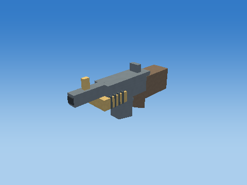

## Cube assembly order

Each image adds one real component, preserving builder order and world transforms.

### Add 1: BODY

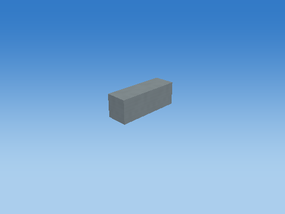

### Add 2: BARREL

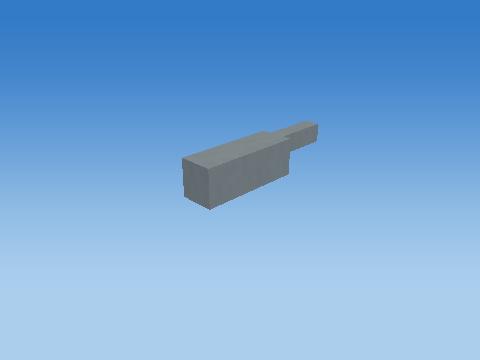

### Add 3: STOCK

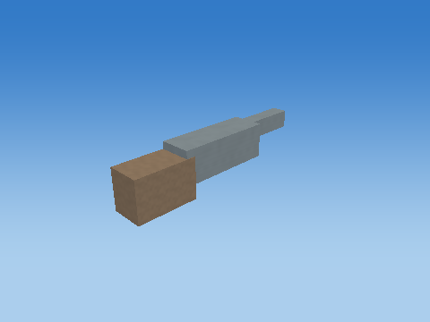

### Add 4: GRIP

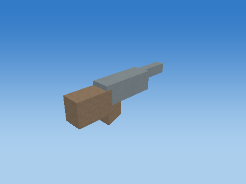

### Add 5: FORE_END

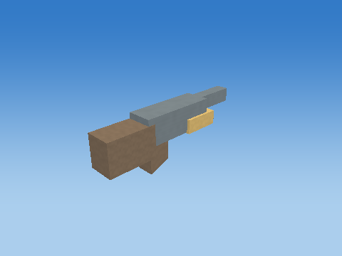

### Add 6: MAGAZINE

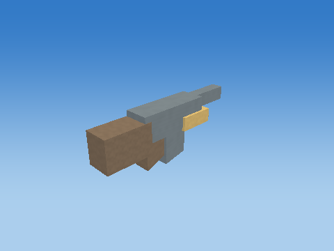

### Add 7: FRONT_SIGHT

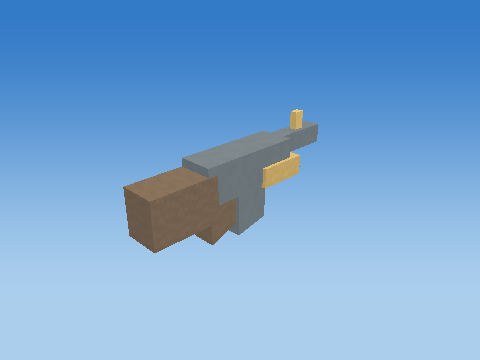

### Add 8: REAR_SIGHT


### Add 9: MUZZLE_INSET


### Add 10: TRIGGER_GUARD

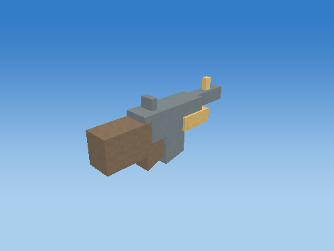

### Add 11: GUARD_FRONT


### Add 12: DETAIL_0


### Add 13: DETAIL_1

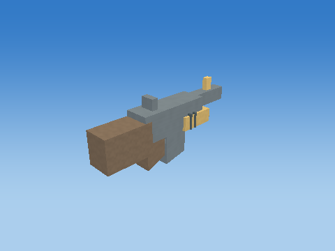

### Add 14: DETAIL_2


### Add 15: DETAIL_3


## Every component transformation

### BODY — `DISPLAY_RIFLE_BODY`

Stationary equipment exhibit near spawn; actual rendered weapon assembled by createWeapon

Position T = (-4.67999983, 1.37, -8.78999996) m; scale S = (0.230000004, 0.25, 0.699999988); rotation (Rx,Ry,Rz) = (0, 0, 0) degrees.

Shear (xy,xz,yx,yz,zx,zy) = (0, 0, 0, 0, 0, 0). Color = (0.219999999, 0.270000011, 0.310000002); specular = 0.75; shininess = 80; emission = 0; flash = 0; material layer = 5; texture scale = 3. Pattern enabled = 0, pattern scale = (1, 1, 1), offset = (0, 0, 0).

| Step | Actual renderer image |
| --- | --- |
| Unit cube |  |
| Scale |  |
| Shear |  |
| Rotate X |  |
| Rotate Y |  |
| Rotate Z |  |
| Translate to world | 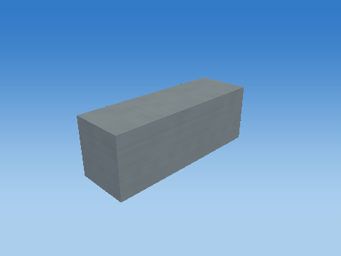 |

Steps 1–5 share one camera; the unit cube has its own close view, and step 6 is reframed at the actual world location to keep small objects visible. Reframing changes the view, never the model coordinates. Identity steps deliberately remain visible. Intermediate shapes are instructional states, while step 6 uses the unmodified game object.

Each stage below gives its exact numeric matrix and all eight corner multiplications. For each output row r: p'[r] = A[r,0]p.x + A[r,1]p.y + A[r,2]p.z + A[r,3]p.w.

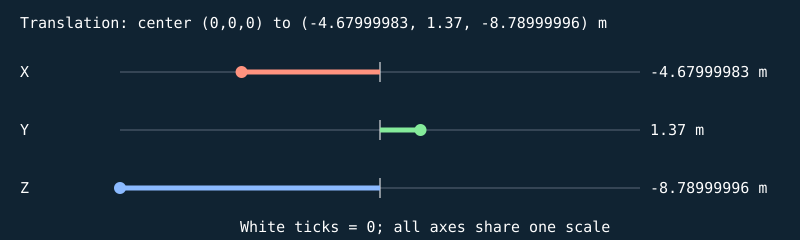


#### S

```text
[ 0.230000004 0 0 0 ]
[ 0 0.25 0 0 ]
[ 0 0 0.699999988 0 ]
[ 0 0 0 1 ]
```

| Input corner (w=1) | Output corner (w=1) |
| --- | --- |
| (-0.5, -0.5, -0.5) | (-0.115000002, -0.125, -0.349999994) |
| (-0.5, -0.5, 0.5) | (-0.115000002, -0.125, 0.349999994) |
| (-0.5, 0.5, -0.5) | (-0.115000002, 0.125, -0.349999994) |
| (-0.5, 0.5, 0.5) | (-0.115000002, 0.125, 0.349999994) |
| (0.5, -0.5, -0.5) | (0.115000002, -0.125, -0.349999994) |
| (0.5, -0.5, 0.5) | (0.115000002, -0.125, 0.349999994) |
| (0.5, 0.5, -0.5) | (0.115000002, 0.125, -0.349999994) |
| (0.5, 0.5, 0.5) | (0.115000002, 0.125, 0.349999994) |

#### H

```text
[ 1 0 0 0 ]
[ 0 1 0 0 ]
[ 0 0 1 0 ]
[ 0 0 0 1 ]
```

| Input corner (w=1) | Output corner (w=1) |
| --- | --- |
| (-0.115000002, -0.125, -0.349999994) | (-0.115000002, -0.125, -0.349999994) |
| (-0.115000002, -0.125, 0.349999994) | (-0.115000002, -0.125, 0.349999994) |
| (-0.115000002, 0.125, -0.349999994) | (-0.115000002, 0.125, -0.349999994) |
| (-0.115000002, 0.125, 0.349999994) | (-0.115000002, 0.125, 0.349999994) |
| (0.115000002, -0.125, -0.349999994) | (0.115000002, -0.125, -0.349999994) |
| (0.115000002, -0.125, 0.349999994) | (0.115000002, -0.125, 0.349999994) |
| (0.115000002, 0.125, -0.349999994) | (0.115000002, 0.125, -0.349999994) |
| (0.115000002, 0.125, 0.349999994) | (0.115000002, 0.125, 0.349999994) |

#### Rx

```text
[ 1 0 0 0 ]
[ 0 1 -0 0 ]
[ 0 0 1 0 ]
[ 0 0 0 1 ]
```

| Input corner (w=1) | Output corner (w=1) |
| --- | --- |
| (-0.115000002, -0.125, -0.349999994) | (-0.115000002, -0.125, -0.349999994) |
| (-0.115000002, -0.125, 0.349999994) | (-0.115000002, -0.125, 0.349999994) |
| (-0.115000002, 0.125, -0.349999994) | (-0.115000002, 0.125, -0.349999994) |
| (-0.115000002, 0.125, 0.349999994) | (-0.115000002, 0.125, 0.349999994) |
| (0.115000002, -0.125, -0.349999994) | (0.115000002, -0.125, -0.349999994) |
| (0.115000002, -0.125, 0.349999994) | (0.115000002, -0.125, 0.349999994) |
| (0.115000002, 0.125, -0.349999994) | (0.115000002, 0.125, -0.349999994) |
| (0.115000002, 0.125, 0.349999994) | (0.115000002, 0.125, 0.349999994) |

#### Ry

```text
[ 1 0 0 0 ]
[ 0 1 0 0 ]
[ -0 0 1 0 ]
[ 0 0 0 1 ]
```

| Input corner (w=1) | Output corner (w=1) |
| --- | --- |
| (-0.115000002, -0.125, -0.349999994) | (-0.115000002, -0.125, -0.349999994) |
| (-0.115000002, -0.125, 0.349999994) | (-0.115000002, -0.125, 0.349999994) |
| (-0.115000002, 0.125, -0.349999994) | (-0.115000002, 0.125, -0.349999994) |
| (-0.115000002, 0.125, 0.349999994) | (-0.115000002, 0.125, 0.349999994) |
| (0.115000002, -0.125, -0.349999994) | (0.115000002, -0.125, -0.349999994) |
| (0.115000002, -0.125, 0.349999994) | (0.115000002, -0.125, 0.349999994) |
| (0.115000002, 0.125, -0.349999994) | (0.115000002, 0.125, -0.349999994) |
| (0.115000002, 0.125, 0.349999994) | (0.115000002, 0.125, 0.349999994) |

#### Rz

```text
[ 1 -0 0 0 ]
[ 0 1 0 0 ]
[ 0 0 1 0 ]
[ 0 0 0 1 ]
```

| Input corner (w=1) | Output corner (w=1) |
| --- | --- |
| (-0.115000002, -0.125, -0.349999994) | (-0.115000002, -0.125, -0.349999994) |
| (-0.115000002, -0.125, 0.349999994) | (-0.115000002, -0.125, 0.349999994) |
| (-0.115000002, 0.125, -0.349999994) | (-0.115000002, 0.125, -0.349999994) |
| (-0.115000002, 0.125, 0.349999994) | (-0.115000002, 0.125, 0.349999994) |
| (0.115000002, -0.125, -0.349999994) | (0.115000002, -0.125, -0.349999994) |
| (0.115000002, -0.125, 0.349999994) | (0.115000002, -0.125, 0.349999994) |
| (0.115000002, 0.125, -0.349999994) | (0.115000002, 0.125, -0.349999994) |
| (0.115000002, 0.125, 0.349999994) | (0.115000002, 0.125, 0.349999994) |

#### T

```text
[ 1 0 0 -4.67999983 ]
[ 0 1 0 1.37 ]
[ 0 0 1 -8.78999996 ]
[ 0 0 0 1 ]
```

| Input corner (w=1) | Output corner (w=1) |
| --- | --- |
| (-0.115000002, -0.125, -0.349999994) | (-4.7949996, 1.245, -9.14000034) |
| (-0.115000002, -0.125, 0.349999994) | (-4.7949996, 1.245, -8.43999958) |
| (-0.115000002, 0.125, -0.349999994) | (-4.7949996, 1.495, -9.14000034) |
| (-0.115000002, 0.125, 0.349999994) | (-4.7949996, 1.495, -8.43999958) |
| (0.115000002, -0.125, -0.349999994) | (-4.56500006, 1.245, -9.14000034) |
| (0.115000002, -0.125, 0.349999994) | (-4.56500006, 1.245, -8.43999958) |
| (0.115000002, 0.125, -0.349999994) | (-4.56500006, 1.495, -9.14000034) |
| (0.115000002, 0.125, 0.349999994) | (-4.56500006, 1.495, -8.43999958) |

Final M = T Rz Ry Rx H S:

```text
[ 0.230000004 0 0 -4.67999983 ]
[ 0 0.25 0 1.37 ]
[ 0 0 0.699999988 -8.78999996 ]
[ 0 0 0 1 ]
```

### BARREL — `DISPLAY_RIFLE_BARREL`

Stationary equipment exhibit near spawn; actual rendered weapon assembled by createWeapon

Position T = (-4.67999983, 1.42999995, -9.30999947) m; scale S = (0.109999999, 0.129999995, 0.430000007); rotation (Rx,Ry,Rz) = (0, 0, 0) degrees.

Shear (xy,xz,yx,yz,zx,zy) = (0, 0, 0, 0, 0, 0). Color = (0.219999999, 0.270000011, 0.310000002); specular = 0.75; shininess = 80; emission = 0; flash = 0; material layer = 5; texture scale = 3. Pattern enabled = 0, pattern scale = (1, 1, 1), offset = (0, 0, 0).

| Step | Actual renderer image |
| --- | --- |
| Unit cube |  |
| Scale |  |
| Shear |  |
| Rotate X | 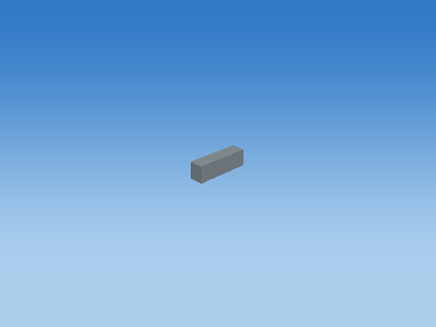 |
| Rotate Y |  |
| Rotate Z |  |
| Translate to world | 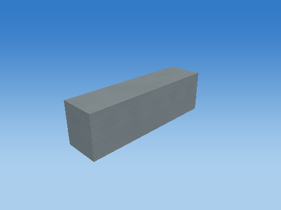 |

Steps 1–5 share one camera; the unit cube has its own close view, and step 6 is reframed at the actual world location to keep small objects visible. Reframing changes the view, never the model coordinates. Identity steps deliberately remain visible. Intermediate shapes are instructional states, while step 6 uses the unmodified game object.

Each stage below gives its exact numeric matrix and all eight corner multiplications. For each output row r: p'[r] = A[r,0]p.x + A[r,1]p.y + A[r,2]p.z + A[r,3]p.w.


#### S

```text
[ 0.109999999 0 0 0 ]
[ 0 0.129999995 0 0 ]
[ 0 0 0.430000007 0 ]
[ 0 0 0 1 ]
```

| Input corner (w=1) | Output corner (w=1) |
| --- | --- |
| (-0.5, -0.5, -0.5) | (-0.0549999997, -0.0649999976, -0.215000004) |
| (-0.5, -0.5, 0.5) | (-0.0549999997, -0.0649999976, 0.215000004) |
| (-0.5, 0.5, -0.5) | (-0.0549999997, 0.0649999976, -0.215000004) |
| (-0.5, 0.5, 0.5) | (-0.0549999997, 0.0649999976, 0.215000004) |
| (0.5, -0.5, -0.5) | (0.0549999997, -0.0649999976, -0.215000004) |
| (0.5, -0.5, 0.5) | (0.0549999997, -0.0649999976, 0.215000004) |
| (0.5, 0.5, -0.5) | (0.0549999997, 0.0649999976, -0.215000004) |
| (0.5, 0.5, 0.5) | (0.0549999997, 0.0649999976, 0.215000004) |

#### H

```text
[ 1 0 0 0 ]
[ 0 1 0 0 ]
[ 0 0 1 0 ]
[ 0 0 0 1 ]
```

| Input corner (w=1) | Output corner (w=1) |
| --- | --- |
| (-0.0549999997, -0.0649999976, -0.215000004) | (-0.0549999997, -0.0649999976, -0.215000004) |
| (-0.0549999997, -0.0649999976, 0.215000004) | (-0.0549999997, -0.0649999976, 0.215000004) |
| (-0.0549999997, 0.0649999976, -0.215000004) | (-0.0549999997, 0.0649999976, -0.215000004) |
| (-0.0549999997, 0.0649999976, 0.215000004) | (-0.0549999997, 0.0649999976, 0.215000004) |
| (0.0549999997, -0.0649999976, -0.215000004) | (0.0549999997, -0.0649999976, -0.215000004) |
| (0.0549999997, -0.0649999976, 0.215000004) | (0.0549999997, -0.0649999976, 0.215000004) |
| (0.0549999997, 0.0649999976, -0.215000004) | (0.0549999997, 0.0649999976, -0.215000004) |
| (0.0549999997, 0.0649999976, 0.215000004) | (0.0549999997, 0.0649999976, 0.215000004) |

#### Rx

```text
[ 1 0 0 0 ]
[ 0 1 -0 0 ]
[ 0 0 1 0 ]
[ 0 0 0 1 ]
```

| Input corner (w=1) | Output corner (w=1) |
| --- | --- |
| (-0.0549999997, -0.0649999976, -0.215000004) | (-0.0549999997, -0.0649999976, -0.215000004) |
| (-0.0549999997, -0.0649999976, 0.215000004) | (-0.0549999997, -0.0649999976, 0.215000004) |
| (-0.0549999997, 0.0649999976, -0.215000004) | (-0.0549999997, 0.0649999976, -0.215000004) |
| (-0.0549999997, 0.0649999976, 0.215000004) | (-0.0549999997, 0.0649999976, 0.215000004) |
| (0.0549999997, -0.0649999976, -0.215000004) | (0.0549999997, -0.0649999976, -0.215000004) |
| (0.0549999997, -0.0649999976, 0.215000004) | (0.0549999997, -0.0649999976, 0.215000004) |
| (0.0549999997, 0.0649999976, -0.215000004) | (0.0549999997, 0.0649999976, -0.215000004) |
| (0.0549999997, 0.0649999976, 0.215000004) | (0.0549999997, 0.0649999976, 0.215000004) |

#### Ry

```text
[ 1 0 0 0 ]
[ 0 1 0 0 ]
[ -0 0 1 0 ]
[ 0 0 0 1 ]
```

| Input corner (w=1) | Output corner (w=1) |
| --- | --- |
| (-0.0549999997, -0.0649999976, -0.215000004) | (-0.0549999997, -0.0649999976, -0.215000004) |
| (-0.0549999997, -0.0649999976, 0.215000004) | (-0.0549999997, -0.0649999976, 0.215000004) |
| (-0.0549999997, 0.0649999976, -0.215000004) | (-0.0549999997, 0.0649999976, -0.215000004) |
| (-0.0549999997, 0.0649999976, 0.215000004) | (-0.0549999997, 0.0649999976, 0.215000004) |
| (0.0549999997, -0.0649999976, -0.215000004) | (0.0549999997, -0.0649999976, -0.215000004) |
| (0.0549999997, -0.0649999976, 0.215000004) | (0.0549999997, -0.0649999976, 0.215000004) |
| (0.0549999997, 0.0649999976, -0.215000004) | (0.0549999997, 0.0649999976, -0.215000004) |
| (0.0549999997, 0.0649999976, 0.215000004) | (0.0549999997, 0.0649999976, 0.215000004) |

#### Rz

```text
[ 1 -0 0 0 ]
[ 0 1 0 0 ]
[ 0 0 1 0 ]
[ 0 0 0 1 ]
```

| Input corner (w=1) | Output corner (w=1) |
| --- | --- |
| (-0.0549999997, -0.0649999976, -0.215000004) | (-0.0549999997, -0.0649999976, -0.215000004) |
| (-0.0549999997, -0.0649999976, 0.215000004) | (-0.0549999997, -0.0649999976, 0.215000004) |
| (-0.0549999997, 0.0649999976, -0.215000004) | (-0.0549999997, 0.0649999976, -0.215000004) |
| (-0.0549999997, 0.0649999976, 0.215000004) | (-0.0549999997, 0.0649999976, 0.215000004) |
| (0.0549999997, -0.0649999976, -0.215000004) | (0.0549999997, -0.0649999976, -0.215000004) |
| (0.0549999997, -0.0649999976, 0.215000004) | (0.0549999997, -0.0649999976, 0.215000004) |
| (0.0549999997, 0.0649999976, -0.215000004) | (0.0549999997, 0.0649999976, -0.215000004) |
| (0.0549999997, 0.0649999976, 0.215000004) | (0.0549999997, 0.0649999976, 0.215000004) |

#### T

```text
[ 1 0 0 -4.67999983 ]
[ 0 1 0 1.42999995 ]
[ 0 0 1 -9.30999947 ]
[ 0 0 0 1 ]
```

| Input corner (w=1) | Output corner (w=1) |
| --- | --- |
| (-0.0549999997, -0.0649999976, -0.215000004) | (-4.73499966, 1.36500001, -9.52499962) |
| (-0.0549999997, -0.0649999976, 0.215000004) | (-4.73499966, 1.36500001, -9.09499931) |
| (-0.0549999997, 0.0649999976, -0.215000004) | (-4.73499966, 1.49499989, -9.52499962) |
| (-0.0549999997, 0.0649999976, 0.215000004) | (-4.73499966, 1.49499989, -9.09499931) |
| (0.0549999997, -0.0649999976, -0.215000004) | (-4.625, 1.36500001, -9.52499962) |
| (0.0549999997, -0.0649999976, 0.215000004) | (-4.625, 1.36500001, -9.09499931) |
| (0.0549999997, 0.0649999976, -0.215000004) | (-4.625, 1.49499989, -9.52499962) |
| (0.0549999997, 0.0649999976, 0.215000004) | (-4.625, 1.49499989, -9.09499931) |

Final M = T Rz Ry Rx H S:

```text
[ 0.109999999 0 0 -4.67999983 ]
[ 0 0.129999995 0 1.42999995 ]
[ 0 0 0.430000007 -9.30999947 ]
[ 0 0 0 1 ]
```

### STOCK — `DISPLAY_RIFLE_STOCK`

Stationary equipment exhibit near spawn; actual rendered weapon assembled by createWeapon

Position T = (-4.67999983, 1.28999996, -8.27999973) m; scale S = (0.239999995, 0.300000012, 0.449999988); rotation (Rx,Ry,Rz) = (0, 0, 0) degrees.

Shear (xy,xz,yx,yz,zx,zy) = (0, 0, 0, 0, 0, 0). Color = (0.300000012, 0.209999993, 0.140000001); specular = 0.75; shininess = 80; emission = 0; flash = 0; material layer = 8; texture scale = 8. Pattern enabled = 0, pattern scale = (1, 1, 1), offset = (0, 0, 0).

| Step | Actual renderer image |
| --- | --- |
| Unit cube | 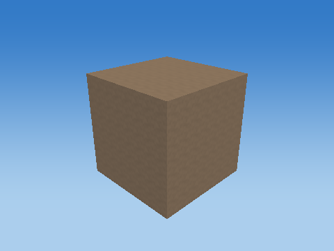 |
| Scale |  |
| Shear |  |
| Rotate X |  |
| Rotate Y |  |
| Rotate Z |  |
| Translate to world | 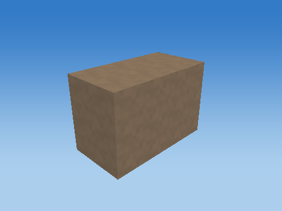 |

Steps 1–5 share one camera; the unit cube has its own close view, and step 6 is reframed at the actual world location to keep small objects visible. Reframing changes the view, never the model coordinates. Identity steps deliberately remain visible. Intermediate shapes are instructional states, while step 6 uses the unmodified game object.

Each stage below gives its exact numeric matrix and all eight corner multiplications. For each output row r: p'[r] = A[r,0]p.x + A[r,1]p.y + A[r,2]p.z + A[r,3]p.w.

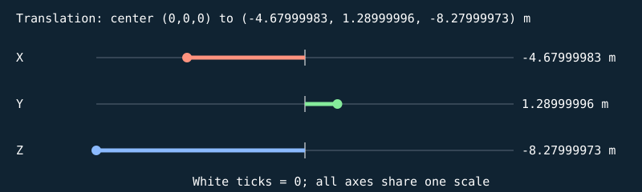


#### S

```text
[ 0.239999995 0 0 0 ]
[ 0 0.300000012 0 0 ]
[ 0 0 0.449999988 0 ]
[ 0 0 0 1 ]
```

| Input corner (w=1) | Output corner (w=1) |
| --- | --- |
| (-0.5, -0.5, -0.5) | (-0.119999997, -0.150000006, -0.224999994) |
| (-0.5, -0.5, 0.5) | (-0.119999997, -0.150000006, 0.224999994) |
| (-0.5, 0.5, -0.5) | (-0.119999997, 0.150000006, -0.224999994) |
| (-0.5, 0.5, 0.5) | (-0.119999997, 0.150000006, 0.224999994) |
| (0.5, -0.5, -0.5) | (0.119999997, -0.150000006, -0.224999994) |
| (0.5, -0.5, 0.5) | (0.119999997, -0.150000006, 0.224999994) |
| (0.5, 0.5, -0.5) | (0.119999997, 0.150000006, -0.224999994) |
| (0.5, 0.5, 0.5) | (0.119999997, 0.150000006, 0.224999994) |

#### H

```text
[ 1 0 0 0 ]
[ 0 1 0 0 ]
[ 0 0 1 0 ]
[ 0 0 0 1 ]
```

| Input corner (w=1) | Output corner (w=1) |
| --- | --- |
| (-0.119999997, -0.150000006, -0.224999994) | (-0.119999997, -0.150000006, -0.224999994) |
| (-0.119999997, -0.150000006, 0.224999994) | (-0.119999997, -0.150000006, 0.224999994) |
| (-0.119999997, 0.150000006, -0.224999994) | (-0.119999997, 0.150000006, -0.224999994) |
| (-0.119999997, 0.150000006, 0.224999994) | (-0.119999997, 0.150000006, 0.224999994) |
| (0.119999997, -0.150000006, -0.224999994) | (0.119999997, -0.150000006, -0.224999994) |
| (0.119999997, -0.150000006, 0.224999994) | (0.119999997, -0.150000006, 0.224999994) |
| (0.119999997, 0.150000006, -0.224999994) | (0.119999997, 0.150000006, -0.224999994) |
| (0.119999997, 0.150000006, 0.224999994) | (0.119999997, 0.150000006, 0.224999994) |

#### Rx

```text
[ 1 0 0 0 ]
[ 0 1 -0 0 ]
[ 0 0 1 0 ]
[ 0 0 0 1 ]
```

| Input corner (w=1) | Output corner (w=1) |
| --- | --- |
| (-0.119999997, -0.150000006, -0.224999994) | (-0.119999997, -0.150000006, -0.224999994) |
| (-0.119999997, -0.150000006, 0.224999994) | (-0.119999997, -0.150000006, 0.224999994) |
| (-0.119999997, 0.150000006, -0.224999994) | (-0.119999997, 0.150000006, -0.224999994) |
| (-0.119999997, 0.150000006, 0.224999994) | (-0.119999997, 0.150000006, 0.224999994) |
| (0.119999997, -0.150000006, -0.224999994) | (0.119999997, -0.150000006, -0.224999994) |
| (0.119999997, -0.150000006, 0.224999994) | (0.119999997, -0.150000006, 0.224999994) |
| (0.119999997, 0.150000006, -0.224999994) | (0.119999997, 0.150000006, -0.224999994) |
| (0.119999997, 0.150000006, 0.224999994) | (0.119999997, 0.150000006, 0.224999994) |

#### Ry

```text
[ 1 0 0 0 ]
[ 0 1 0 0 ]
[ -0 0 1 0 ]
[ 0 0 0 1 ]
```

| Input corner (w=1) | Output corner (w=1) |
| --- | --- |
| (-0.119999997, -0.150000006, -0.224999994) | (-0.119999997, -0.150000006, -0.224999994) |
| (-0.119999997, -0.150000006, 0.224999994) | (-0.119999997, -0.150000006, 0.224999994) |
| (-0.119999997, 0.150000006, -0.224999994) | (-0.119999997, 0.150000006, -0.224999994) |
| (-0.119999997, 0.150000006, 0.224999994) | (-0.119999997, 0.150000006, 0.224999994) |
| (0.119999997, -0.150000006, -0.224999994) | (0.119999997, -0.150000006, -0.224999994) |
| (0.119999997, -0.150000006, 0.224999994) | (0.119999997, -0.150000006, 0.224999994) |
| (0.119999997, 0.150000006, -0.224999994) | (0.119999997, 0.150000006, -0.224999994) |
| (0.119999997, 0.150000006, 0.224999994) | (0.119999997, 0.150000006, 0.224999994) |

#### Rz

```text
[ 1 -0 0 0 ]
[ 0 1 0 0 ]
[ 0 0 1 0 ]
[ 0 0 0 1 ]
```

| Input corner (w=1) | Output corner (w=1) |
| --- | --- |
| (-0.119999997, -0.150000006, -0.224999994) | (-0.119999997, -0.150000006, -0.224999994) |
| (-0.119999997, -0.150000006, 0.224999994) | (-0.119999997, -0.150000006, 0.224999994) |
| (-0.119999997, 0.150000006, -0.224999994) | (-0.119999997, 0.150000006, -0.224999994) |
| (-0.119999997, 0.150000006, 0.224999994) | (-0.119999997, 0.150000006, 0.224999994) |
| (0.119999997, -0.150000006, -0.224999994) | (0.119999997, -0.150000006, -0.224999994) |
| (0.119999997, -0.150000006, 0.224999994) | (0.119999997, -0.150000006, 0.224999994) |
| (0.119999997, 0.150000006, -0.224999994) | (0.119999997, 0.150000006, -0.224999994) |
| (0.119999997, 0.150000006, 0.224999994) | (0.119999997, 0.150000006, 0.224999994) |

#### T

```text
[ 1 0 0 -4.67999983 ]
[ 0 1 0 1.28999996 ]
[ 0 0 1 -8.27999973 ]
[ 0 0 0 1 ]
```

| Input corner (w=1) | Output corner (w=1) |
| --- | --- |
| (-0.119999997, -0.150000006, -0.224999994) | (-4.79999971, 1.13999999, -8.50500011) |
| (-0.119999997, -0.150000006, 0.224999994) | (-4.79999971, 1.13999999, -8.05499935) |
| (-0.119999997, 0.150000006, -0.224999994) | (-4.79999971, 1.43999994, -8.50500011) |
| (-0.119999997, 0.150000006, 0.224999994) | (-4.79999971, 1.43999994, -8.05499935) |
| (0.119999997, -0.150000006, -0.224999994) | (-4.55999994, 1.13999999, -8.50500011) |
| (0.119999997, -0.150000006, 0.224999994) | (-4.55999994, 1.13999999, -8.05499935) |
| (0.119999997, 0.150000006, -0.224999994) | (-4.55999994, 1.43999994, -8.50500011) |
| (0.119999997, 0.150000006, 0.224999994) | (-4.55999994, 1.43999994, -8.05499935) |

Final M = T Rz Ry Rx H S:

```text
[ 0.239999995 0 0 -4.67999983 ]
[ 0 0.300000012 0 1.28999996 ]
[ 0 0 0.449999988 -8.27999973 ]
[ 0 0 0 1 ]
```

### GRIP — `DISPLAY_RIFLE_GRIP`

Stationary equipment exhibit near spawn; actual rendered weapon assembled by createWeapon

Position T = (-4.67999983, 1.14999998, -8.57999992) m; scale S = (0.170000002, 0.270000011, 0.200000003); rotation (Rx,Ry,Rz) = (0, 0, 0) degrees.

Shear (xy,xz,yx,yz,zx,zy) = (0, 0, 0, -0.400000006, 0, 0). Color = (0.300000012, 0.209999993, 0.140000001); specular = 0.75; shininess = 80; emission = 0; flash = 0; material layer = 8; texture scale = 8. Pattern enabled = 0, pattern scale = (1, 1, 1), offset = (0, 0, 0).

| Step | Actual renderer image |
| --- | --- |
| Unit cube |  |
| Scale |  |
| Shear |  |
| Rotate X |  |
| Rotate Y | 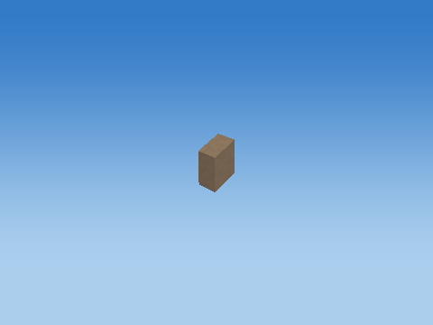 |
| Rotate Z |  |
| Translate to world | 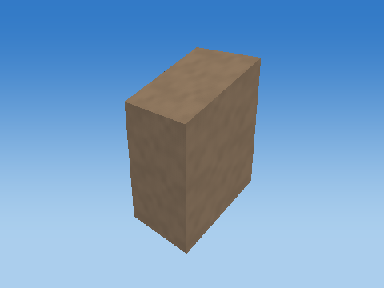 |

Steps 1–5 share one camera; the unit cube has its own close view, and step 6 is reframed at the actual world location to keep small objects visible. Reframing changes the view, never the model coordinates. Identity steps deliberately remain visible. Intermediate shapes are instructional states, while step 6 uses the unmodified game object.

Each stage below gives its exact numeric matrix and all eight corner multiplications. For each output row r: p'[r] = A[r,0]p.x + A[r,1]p.y + A[r,2]p.z + A[r,3]p.w.


#### S

```text
[ 0.170000002 0 0 0 ]
[ 0 0.270000011 0 0 ]
[ 0 0 0.200000003 0 ]
[ 0 0 0 1 ]
```

| Input corner (w=1) | Output corner (w=1) |
| --- | --- |
| (-0.5, -0.5, -0.5) | (-0.0850000009, -0.135000005, -0.100000001) |
| (-0.5, -0.5, 0.5) | (-0.0850000009, -0.135000005, 0.100000001) |
| (-0.5, 0.5, -0.5) | (-0.0850000009, 0.135000005, -0.100000001) |
| (-0.5, 0.5, 0.5) | (-0.0850000009, 0.135000005, 0.100000001) |
| (0.5, -0.5, -0.5) | (0.0850000009, -0.135000005, -0.100000001) |
| (0.5, -0.5, 0.5) | (0.0850000009, -0.135000005, 0.100000001) |
| (0.5, 0.5, -0.5) | (0.0850000009, 0.135000005, -0.100000001) |
| (0.5, 0.5, 0.5) | (0.0850000009, 0.135000005, 0.100000001) |

#### H

```text
[ 1 0 0 0 ]
[ 0 1 -0.400000006 0 ]
[ 0 0 1 0 ]
[ 0 0 0 1 ]
```

| Input corner (w=1) | Output corner (w=1) |
| --- | --- |
| (-0.0850000009, -0.135000005, -0.100000001) | (-0.0850000009, -0.0949999988, -0.100000001) |
| (-0.0850000009, -0.135000005, 0.100000001) | (-0.0850000009, -0.175000012, 0.100000001) |
| (-0.0850000009, 0.135000005, -0.100000001) | (-0.0850000009, 0.175000012, -0.100000001) |
| (-0.0850000009, 0.135000005, 0.100000001) | (-0.0850000009, 0.0949999988, 0.100000001) |
| (0.0850000009, -0.135000005, -0.100000001) | (0.0850000009, -0.0949999988, -0.100000001) |
| (0.0850000009, -0.135000005, 0.100000001) | (0.0850000009, -0.175000012, 0.100000001) |
| (0.0850000009, 0.135000005, -0.100000001) | (0.0850000009, 0.175000012, -0.100000001) |
| (0.0850000009, 0.135000005, 0.100000001) | (0.0850000009, 0.0949999988, 0.100000001) |

#### Rx

```text
[ 1 0 0 0 ]
[ 0 1 -0 0 ]
[ 0 0 1 0 ]
[ 0 0 0 1 ]
```

| Input corner (w=1) | Output corner (w=1) |
| --- | --- |
| (-0.0850000009, -0.0949999988, -0.100000001) | (-0.0850000009, -0.0949999988, -0.100000001) |
| (-0.0850000009, -0.175000012, 0.100000001) | (-0.0850000009, -0.175000012, 0.100000001) |
| (-0.0850000009, 0.175000012, -0.100000001) | (-0.0850000009, 0.175000012, -0.100000001) |
| (-0.0850000009, 0.0949999988, 0.100000001) | (-0.0850000009, 0.0949999988, 0.100000001) |
| (0.0850000009, -0.0949999988, -0.100000001) | (0.0850000009, -0.0949999988, -0.100000001) |
| (0.0850000009, -0.175000012, 0.100000001) | (0.0850000009, -0.175000012, 0.100000001) |
| (0.0850000009, 0.175000012, -0.100000001) | (0.0850000009, 0.175000012, -0.100000001) |
| (0.0850000009, 0.0949999988, 0.100000001) | (0.0850000009, 0.0949999988, 0.100000001) |

#### Ry

```text
[ 1 0 0 0 ]
[ 0 1 0 0 ]
[ -0 0 1 0 ]
[ 0 0 0 1 ]
```

| Input corner (w=1) | Output corner (w=1) |
| --- | --- |
| (-0.0850000009, -0.0949999988, -0.100000001) | (-0.0850000009, -0.0949999988, -0.100000001) |
| (-0.0850000009, -0.175000012, 0.100000001) | (-0.0850000009, -0.175000012, 0.100000001) |
| (-0.0850000009, 0.175000012, -0.100000001) | (-0.0850000009, 0.175000012, -0.100000001) |
| (-0.0850000009, 0.0949999988, 0.100000001) | (-0.0850000009, 0.0949999988, 0.100000001) |
| (0.0850000009, -0.0949999988, -0.100000001) | (0.0850000009, -0.0949999988, -0.100000001) |
| (0.0850000009, -0.175000012, 0.100000001) | (0.0850000009, -0.175000012, 0.100000001) |
| (0.0850000009, 0.175000012, -0.100000001) | (0.0850000009, 0.175000012, -0.100000001) |
| (0.0850000009, 0.0949999988, 0.100000001) | (0.0850000009, 0.0949999988, 0.100000001) |

#### Rz

```text
[ 1 -0 0 0 ]
[ 0 1 0 0 ]
[ 0 0 1 0 ]
[ 0 0 0 1 ]
```

| Input corner (w=1) | Output corner (w=1) |
| --- | --- |
| (-0.0850000009, -0.0949999988, -0.100000001) | (-0.0850000009, -0.0949999988, -0.100000001) |
| (-0.0850000009, -0.175000012, 0.100000001) | (-0.0850000009, -0.175000012, 0.100000001) |
| (-0.0850000009, 0.175000012, -0.100000001) | (-0.0850000009, 0.175000012, -0.100000001) |
| (-0.0850000009, 0.0949999988, 0.100000001) | (-0.0850000009, 0.0949999988, 0.100000001) |
| (0.0850000009, -0.0949999988, -0.100000001) | (0.0850000009, -0.0949999988, -0.100000001) |
| (0.0850000009, -0.175000012, 0.100000001) | (0.0850000009, -0.175000012, 0.100000001) |
| (0.0850000009, 0.175000012, -0.100000001) | (0.0850000009, 0.175000012, -0.100000001) |
| (0.0850000009, 0.0949999988, 0.100000001) | (0.0850000009, 0.0949999988, 0.100000001) |

#### T

```text
[ 1 0 0 -4.67999983 ]
[ 0 1 0 1.14999998 ]
[ 0 0 1 -8.57999992 ]
[ 0 0 0 1 ]
```

| Input corner (w=1) | Output corner (w=1) |
| --- | --- |
| (-0.0850000009, -0.0949999988, -0.100000001) | (-4.76499987, 1.05499995, -8.68000031) |
| (-0.0850000009, -0.175000012, 0.100000001) | (-4.76499987, 0.974999964, -8.47999954) |
| (-0.0850000009, 0.175000012, -0.100000001) | (-4.76499987, 1.32500005, -8.68000031) |
| (-0.0850000009, 0.0949999988, 0.100000001) | (-4.76499987, 1.245, -8.47999954) |
| (0.0850000009, -0.0949999988, -0.100000001) | (-4.59499979, 1.05499995, -8.68000031) |
| (0.0850000009, -0.175000012, 0.100000001) | (-4.59499979, 0.974999964, -8.47999954) |
| (0.0850000009, 0.175000012, -0.100000001) | (-4.59499979, 1.32500005, -8.68000031) |
| (0.0850000009, 0.0949999988, 0.100000001) | (-4.59499979, 1.245, -8.47999954) |

Final M = T Rz Ry Rx H S:

```text
[ 0.170000002 0 0 -4.67999983 ]
[ 0 0.270000011 -0.0800000057 1.14999998 ]
[ 0 0 0.200000003 -8.57999992 ]
[ 0 0 0 1 ]
```

### FORE_END — `DISPLAY_RIFLE_FORE_END`

Stationary equipment exhibit near spawn; actual rendered weapon assembled by createWeapon

Position T = (-4.67999983, 1.29999995, -9.05000019) m; scale S = (0.280000001, 0.129999995, 0.340000004); rotation (Rx,Ry,Rz) = (0, 0, 0) degrees.

Shear (xy,xz,yx,yz,zx,zy) = (0, 0, 0, 0, 0, 0). Color = (0.910000026, 0.639999986, 0.230000004); specular = 0.75; shininess = 80; emission = 0; flash = 0; material layer = 8; texture scale = 8. Pattern enabled = 0, pattern scale = (1, 1, 1), offset = (0, 0, 0).

| Step | Actual renderer image |
| --- | --- |
| Unit cube | 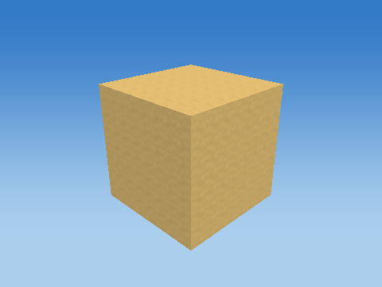 |
| Scale |  |
| Shear |  |
| Rotate X |  |
| Rotate Y |  |
| Rotate Z |  |
| Translate to world | 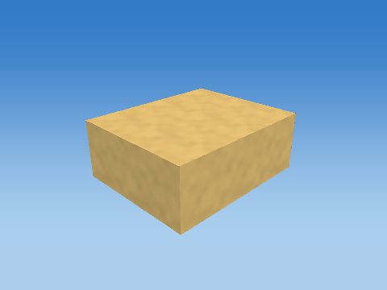 |

Steps 1–5 share one camera; the unit cube has its own close view, and step 6 is reframed at the actual world location to keep small objects visible. Reframing changes the view, never the model coordinates. Identity steps deliberately remain visible. Intermediate shapes are instructional states, while step 6 uses the unmodified game object.

Each stage below gives its exact numeric matrix and all eight corner multiplications. For each output row r: p'[r] = A[r,0]p.x + A[r,1]p.y + A[r,2]p.z + A[r,3]p.w.


#### S

```text
[ 0.280000001 0 0 0 ]
[ 0 0.129999995 0 0 ]
[ 0 0 0.340000004 0 ]
[ 0 0 0 1 ]
```

| Input corner (w=1) | Output corner (w=1) |
| --- | --- |
| (-0.5, -0.5, -0.5) | (-0.140000001, -0.0649999976, -0.170000002) |
| (-0.5, -0.5, 0.5) | (-0.140000001, -0.0649999976, 0.170000002) |
| (-0.5, 0.5, -0.5) | (-0.140000001, 0.0649999976, -0.170000002) |
| (-0.5, 0.5, 0.5) | (-0.140000001, 0.0649999976, 0.170000002) |
| (0.5, -0.5, -0.5) | (0.140000001, -0.0649999976, -0.170000002) |
| (0.5, -0.5, 0.5) | (0.140000001, -0.0649999976, 0.170000002) |
| (0.5, 0.5, -0.5) | (0.140000001, 0.0649999976, -0.170000002) |
| (0.5, 0.5, 0.5) | (0.140000001, 0.0649999976, 0.170000002) |

#### H

```text
[ 1 0 0 0 ]
[ 0 1 0 0 ]
[ 0 0 1 0 ]
[ 0 0 0 1 ]
```

| Input corner (w=1) | Output corner (w=1) |
| --- | --- |
| (-0.140000001, -0.0649999976, -0.170000002) | (-0.140000001, -0.0649999976, -0.170000002) |
| (-0.140000001, -0.0649999976, 0.170000002) | (-0.140000001, -0.0649999976, 0.170000002) |
| (-0.140000001, 0.0649999976, -0.170000002) | (-0.140000001, 0.0649999976, -0.170000002) |
| (-0.140000001, 0.0649999976, 0.170000002) | (-0.140000001, 0.0649999976, 0.170000002) |
| (0.140000001, -0.0649999976, -0.170000002) | (0.140000001, -0.0649999976, -0.170000002) |
| (0.140000001, -0.0649999976, 0.170000002) | (0.140000001, -0.0649999976, 0.170000002) |
| (0.140000001, 0.0649999976, -0.170000002) | (0.140000001, 0.0649999976, -0.170000002) |
| (0.140000001, 0.0649999976, 0.170000002) | (0.140000001, 0.0649999976, 0.170000002) |

#### Rx

```text
[ 1 0 0 0 ]
[ 0 1 -0 0 ]
[ 0 0 1 0 ]
[ 0 0 0 1 ]
```

| Input corner (w=1) | Output corner (w=1) |
| --- | --- |
| (-0.140000001, -0.0649999976, -0.170000002) | (-0.140000001, -0.0649999976, -0.170000002) |
| (-0.140000001, -0.0649999976, 0.170000002) | (-0.140000001, -0.0649999976, 0.170000002) |
| (-0.140000001, 0.0649999976, -0.170000002) | (-0.140000001, 0.0649999976, -0.170000002) |
| (-0.140000001, 0.0649999976, 0.170000002) | (-0.140000001, 0.0649999976, 0.170000002) |
| (0.140000001, -0.0649999976, -0.170000002) | (0.140000001, -0.0649999976, -0.170000002) |
| (0.140000001, -0.0649999976, 0.170000002) | (0.140000001, -0.0649999976, 0.170000002) |
| (0.140000001, 0.0649999976, -0.170000002) | (0.140000001, 0.0649999976, -0.170000002) |
| (0.140000001, 0.0649999976, 0.170000002) | (0.140000001, 0.0649999976, 0.170000002) |

#### Ry

```text
[ 1 0 0 0 ]
[ 0 1 0 0 ]
[ -0 0 1 0 ]
[ 0 0 0 1 ]
```

| Input corner (w=1) | Output corner (w=1) |
| --- | --- |
| (-0.140000001, -0.0649999976, -0.170000002) | (-0.140000001, -0.0649999976, -0.170000002) |
| (-0.140000001, -0.0649999976, 0.170000002) | (-0.140000001, -0.0649999976, 0.170000002) |
| (-0.140000001, 0.0649999976, -0.170000002) | (-0.140000001, 0.0649999976, -0.170000002) |
| (-0.140000001, 0.0649999976, 0.170000002) | (-0.140000001, 0.0649999976, 0.170000002) |
| (0.140000001, -0.0649999976, -0.170000002) | (0.140000001, -0.0649999976, -0.170000002) |
| (0.140000001, -0.0649999976, 0.170000002) | (0.140000001, -0.0649999976, 0.170000002) |
| (0.140000001, 0.0649999976, -0.170000002) | (0.140000001, 0.0649999976, -0.170000002) |
| (0.140000001, 0.0649999976, 0.170000002) | (0.140000001, 0.0649999976, 0.170000002) |

#### Rz

```text
[ 1 -0 0 0 ]
[ 0 1 0 0 ]
[ 0 0 1 0 ]
[ 0 0 0 1 ]
```

| Input corner (w=1) | Output corner (w=1) |
| --- | --- |
| (-0.140000001, -0.0649999976, -0.170000002) | (-0.140000001, -0.0649999976, -0.170000002) |
| (-0.140000001, -0.0649999976, 0.170000002) | (-0.140000001, -0.0649999976, 0.170000002) |
| (-0.140000001, 0.0649999976, -0.170000002) | (-0.140000001, 0.0649999976, -0.170000002) |
| (-0.140000001, 0.0649999976, 0.170000002) | (-0.140000001, 0.0649999976, 0.170000002) |
| (0.140000001, -0.0649999976, -0.170000002) | (0.140000001, -0.0649999976, -0.170000002) |
| (0.140000001, -0.0649999976, 0.170000002) | (0.140000001, -0.0649999976, 0.170000002) |
| (0.140000001, 0.0649999976, -0.170000002) | (0.140000001, 0.0649999976, -0.170000002) |
| (0.140000001, 0.0649999976, 0.170000002) | (0.140000001, 0.0649999976, 0.170000002) |

#### T

```text
[ 1 0 0 -4.67999983 ]
[ 0 1 0 1.29999995 ]
[ 0 0 1 -9.05000019 ]
[ 0 0 0 1 ]
```

| Input corner (w=1) | Output corner (w=1) |
| --- | --- |
| (-0.140000001, -0.0649999976, -0.170000002) | (-4.81999969, 1.2349999, -9.22000027) |
| (-0.140000001, -0.0649999976, 0.170000002) | (-4.81999969, 1.2349999, -8.88000011) |
| (-0.140000001, 0.0649999976, -0.170000002) | (-4.81999969, 1.36500001, -9.22000027) |
| (-0.140000001, 0.0649999976, 0.170000002) | (-4.81999969, 1.36500001, -8.88000011) |
| (0.140000001, -0.0649999976, -0.170000002) | (-4.53999996, 1.2349999, -9.22000027) |
| (0.140000001, -0.0649999976, 0.170000002) | (-4.53999996, 1.2349999, -8.88000011) |
| (0.140000001, 0.0649999976, -0.170000002) | (-4.53999996, 1.36500001, -9.22000027) |
| (0.140000001, 0.0649999976, 0.170000002) | (-4.53999996, 1.36500001, -8.88000011) |

Final M = T Rz Ry Rx H S:

```text
[ 0.280000001 0 0 -4.67999983 ]
[ 0 0.129999995 0 1.29999995 ]
[ 0 0 0.340000004 -9.05000019 ]
[ 0 0 0 1 ]
```

### MAGAZINE — `DISPLAY_RIFLE_MAGAZINE`

Stationary equipment exhibit near spawn; actual rendered weapon assembled by createWeapon

Position T = (-4.67999983, 1.13999999, -8.82999992) m; scale S = (0.150000006, 0.349999994, 0.239999995); rotation (Rx,Ry,Rz) = (0, 0, 0) degrees.

Shear (xy,xz,yx,yz,zx,zy) = (0, 0, 0, -0.219999999, 0, 0). Color = (0.219999999, 0.270000011, 0.310000002); specular = 0.75; shininess = 80; emission = 0; flash = 0; material layer = 5; texture scale = 3. Pattern enabled = 0, pattern scale = (1, 1, 1), offset = (0, 0, 0).

| Step | Actual renderer image |
| --- | --- |
| Unit cube |  |
| Scale | 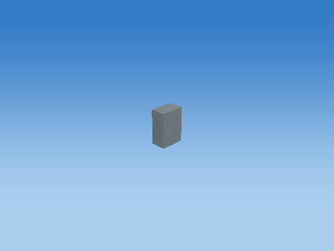 |
| Shear |  |
| Rotate X | 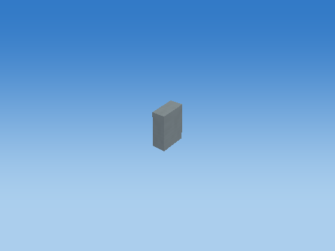 |
| Rotate Y |  |
| Rotate Z |  |
| Translate to world | 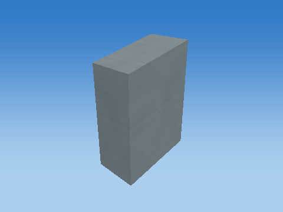 |

Steps 1–5 share one camera; the unit cube has its own close view, and step 6 is reframed at the actual world location to keep small objects visible. Reframing changes the view, never the model coordinates. Identity steps deliberately remain visible. Intermediate shapes are instructional states, while step 6 uses the unmodified game object.

Each stage below gives its exact numeric matrix and all eight corner multiplications. For each output row r: p'[r] = A[r,0]p.x + A[r,1]p.y + A[r,2]p.z + A[r,3]p.w.


#### S

```text
[ 0.150000006 0 0 0 ]
[ 0 0.349999994 0 0 ]
[ 0 0 0.239999995 0 ]
[ 0 0 0 1 ]
```

| Input corner (w=1) | Output corner (w=1) |
| --- | --- |
| (-0.5, -0.5, -0.5) | (-0.075000003, -0.174999997, -0.119999997) |
| (-0.5, -0.5, 0.5) | (-0.075000003, -0.174999997, 0.119999997) |
| (-0.5, 0.5, -0.5) | (-0.075000003, 0.174999997, -0.119999997) |
| (-0.5, 0.5, 0.5) | (-0.075000003, 0.174999997, 0.119999997) |
| (0.5, -0.5, -0.5) | (0.075000003, -0.174999997, -0.119999997) |
| (0.5, -0.5, 0.5) | (0.075000003, -0.174999997, 0.119999997) |
| (0.5, 0.5, -0.5) | (0.075000003, 0.174999997, -0.119999997) |
| (0.5, 0.5, 0.5) | (0.075000003, 0.174999997, 0.119999997) |

#### H

```text
[ 1 0 0 0 ]
[ 0 1 -0.219999999 0 ]
[ 0 0 1 0 ]
[ 0 0 0 1 ]
```

| Input corner (w=1) | Output corner (w=1) |
| --- | --- |
| (-0.075000003, -0.174999997, -0.119999997) | (-0.075000003, -0.148599997, -0.119999997) |
| (-0.075000003, -0.174999997, 0.119999997) | (-0.075000003, -0.201399997, 0.119999997) |
| (-0.075000003, 0.174999997, -0.119999997) | (-0.075000003, 0.201399997, -0.119999997) |
| (-0.075000003, 0.174999997, 0.119999997) | (-0.075000003, 0.148599997, 0.119999997) |
| (0.075000003, -0.174999997, -0.119999997) | (0.075000003, -0.148599997, -0.119999997) |
| (0.075000003, -0.174999997, 0.119999997) | (0.075000003, -0.201399997, 0.119999997) |
| (0.075000003, 0.174999997, -0.119999997) | (0.075000003, 0.201399997, -0.119999997) |
| (0.075000003, 0.174999997, 0.119999997) | (0.075000003, 0.148599997, 0.119999997) |

#### Rx

```text
[ 1 0 0 0 ]
[ 0 1 -0 0 ]
[ 0 0 1 0 ]
[ 0 0 0 1 ]
```

| Input corner (w=1) | Output corner (w=1) |
| --- | --- |
| (-0.075000003, -0.148599997, -0.119999997) | (-0.075000003, -0.148599997, -0.119999997) |
| (-0.075000003, -0.201399997, 0.119999997) | (-0.075000003, -0.201399997, 0.119999997) |
| (-0.075000003, 0.201399997, -0.119999997) | (-0.075000003, 0.201399997, -0.119999997) |
| (-0.075000003, 0.148599997, 0.119999997) | (-0.075000003, 0.148599997, 0.119999997) |
| (0.075000003, -0.148599997, -0.119999997) | (0.075000003, -0.148599997, -0.119999997) |
| (0.075000003, -0.201399997, 0.119999997) | (0.075000003, -0.201399997, 0.119999997) |
| (0.075000003, 0.201399997, -0.119999997) | (0.075000003, 0.201399997, -0.119999997) |
| (0.075000003, 0.148599997, 0.119999997) | (0.075000003, 0.148599997, 0.119999997) |

#### Ry

```text
[ 1 0 0 0 ]
[ 0 1 0 0 ]
[ -0 0 1 0 ]
[ 0 0 0 1 ]
```

| Input corner (w=1) | Output corner (w=1) |
| --- | --- |
| (-0.075000003, -0.148599997, -0.119999997) | (-0.075000003, -0.148599997, -0.119999997) |
| (-0.075000003, -0.201399997, 0.119999997) | (-0.075000003, -0.201399997, 0.119999997) |
| (-0.075000003, 0.201399997, -0.119999997) | (-0.075000003, 0.201399997, -0.119999997) |
| (-0.075000003, 0.148599997, 0.119999997) | (-0.075000003, 0.148599997, 0.119999997) |
| (0.075000003, -0.148599997, -0.119999997) | (0.075000003, -0.148599997, -0.119999997) |
| (0.075000003, -0.201399997, 0.119999997) | (0.075000003, -0.201399997, 0.119999997) |
| (0.075000003, 0.201399997, -0.119999997) | (0.075000003, 0.201399997, -0.119999997) |
| (0.075000003, 0.148599997, 0.119999997) | (0.075000003, 0.148599997, 0.119999997) |

#### Rz

```text
[ 1 -0 0 0 ]
[ 0 1 0 0 ]
[ 0 0 1 0 ]
[ 0 0 0 1 ]
```

| Input corner (w=1) | Output corner (w=1) |
| --- | --- |
| (-0.075000003, -0.148599997, -0.119999997) | (-0.075000003, -0.148599997, -0.119999997) |
| (-0.075000003, -0.201399997, 0.119999997) | (-0.075000003, -0.201399997, 0.119999997) |
| (-0.075000003, 0.201399997, -0.119999997) | (-0.075000003, 0.201399997, -0.119999997) |
| (-0.075000003, 0.148599997, 0.119999997) | (-0.075000003, 0.148599997, 0.119999997) |
| (0.075000003, -0.148599997, -0.119999997) | (0.075000003, -0.148599997, -0.119999997) |
| (0.075000003, -0.201399997, 0.119999997) | (0.075000003, -0.201399997, 0.119999997) |
| (0.075000003, 0.201399997, -0.119999997) | (0.075000003, 0.201399997, -0.119999997) |
| (0.075000003, 0.148599997, 0.119999997) | (0.075000003, 0.148599997, 0.119999997) |

#### T

```text
[ 1 0 0 -4.67999983 ]
[ 0 1 0 1.13999999 ]
[ 0 0 1 -8.82999992 ]
[ 0 0 0 1 ]
```

| Input corner (w=1) | Output corner (w=1) |
| --- | --- |
| (-0.075000003, -0.148599997, -0.119999997) | (-4.75499964, 0.991400003, -8.94999981) |
| (-0.075000003, -0.201399997, 0.119999997) | (-4.75499964, 0.938600004, -8.71000004) |
| (-0.075000003, 0.201399997, -0.119999997) | (-4.75499964, 1.34140003, -8.94999981) |
| (-0.075000003, 0.148599997, 0.119999997) | (-4.75499964, 1.28859997, -8.71000004) |
| (0.075000003, -0.148599997, -0.119999997) | (-4.60500002, 0.991400003, -8.94999981) |
| (0.075000003, -0.201399997, 0.119999997) | (-4.60500002, 0.938600004, -8.71000004) |
| (0.075000003, 0.201399997, -0.119999997) | (-4.60500002, 1.34140003, -8.94999981) |
| (0.075000003, 0.148599997, 0.119999997) | (-4.60500002, 1.28859997, -8.71000004) |

Final M = T Rz Ry Rx H S:

```text
[ 0.150000006 0 0 -4.67999983 ]
[ 0 0.349999994 -0.0527999997 1.13999999 ]
[ 0 0 0.239999995 -8.82999992 ]
[ 0 0 0 1 ]
```

### FRONT_SIGHT — `DISPLAY_RIFLE_FRONT_SIGHT`

Stationary equipment exhibit near spawn; actual rendered weapon assembled by createWeapon

Position T = (-4.67999983, 1.54999995, -9.34000015) m; scale S = (0.0500000007, 0.129999995, 0.0700000003); rotation (Rx,Ry,Rz) = (0, 0, 0) degrees.

Shear (xy,xz,yx,yz,zx,zy) = (0, 0, 0, 0, 0, 0). Color = (0.910000026, 0.639999986, 0.230000004); specular = 0.75; shininess = 80; emission = 0; flash = 0; material layer = 5; texture scale = 3. Pattern enabled = 0, pattern scale = (1, 1, 1), offset = (0, 0, 0).

| Step | Actual renderer image |
| --- | --- |
| Unit cube |  |
| Scale |  |
| Shear | 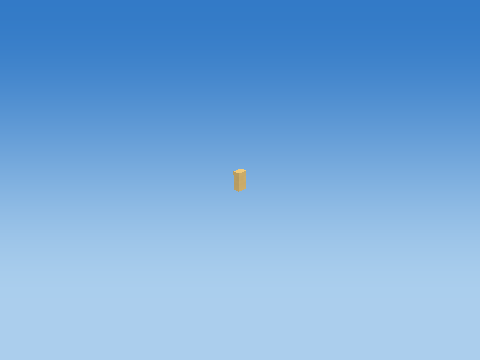 |
| Rotate X |  |
| Rotate Y |  |
| Rotate Z |  |
| Translate to world | 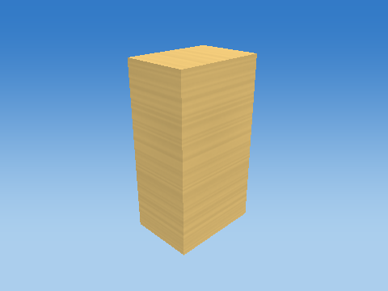 |

Steps 1–5 share one camera; the unit cube has its own close view, and step 6 is reframed at the actual world location to keep small objects visible. Reframing changes the view, never the model coordinates. Identity steps deliberately remain visible. Intermediate shapes are instructional states, while step 6 uses the unmodified game object.

Each stage below gives its exact numeric matrix and all eight corner multiplications. For each output row r: p'[r] = A[r,0]p.x + A[r,1]p.y + A[r,2]p.z + A[r,3]p.w.


#### S

```text
[ 0.0500000007 0 0 0 ]
[ 0 0.129999995 0 0 ]
[ 0 0 0.0700000003 0 ]
[ 0 0 0 1 ]
```

| Input corner (w=1) | Output corner (w=1) |
| --- | --- |
| (-0.5, -0.5, -0.5) | (-0.0250000004, -0.0649999976, -0.0350000001) |
| (-0.5, -0.5, 0.5) | (-0.0250000004, -0.0649999976, 0.0350000001) |
| (-0.5, 0.5, -0.5) | (-0.0250000004, 0.0649999976, -0.0350000001) |
| (-0.5, 0.5, 0.5) | (-0.0250000004, 0.0649999976, 0.0350000001) |
| (0.5, -0.5, -0.5) | (0.0250000004, -0.0649999976, -0.0350000001) |
| (0.5, -0.5, 0.5) | (0.0250000004, -0.0649999976, 0.0350000001) |
| (0.5, 0.5, -0.5) | (0.0250000004, 0.0649999976, -0.0350000001) |
| (0.5, 0.5, 0.5) | (0.0250000004, 0.0649999976, 0.0350000001) |

#### H

```text
[ 1 0 0 0 ]
[ 0 1 0 0 ]
[ 0 0 1 0 ]
[ 0 0 0 1 ]
```

| Input corner (w=1) | Output corner (w=1) |
| --- | --- |
| (-0.0250000004, -0.0649999976, -0.0350000001) | (-0.0250000004, -0.0649999976, -0.0350000001) |
| (-0.0250000004, -0.0649999976, 0.0350000001) | (-0.0250000004, -0.0649999976, 0.0350000001) |
| (-0.0250000004, 0.0649999976, -0.0350000001) | (-0.0250000004, 0.0649999976, -0.0350000001) |
| (-0.0250000004, 0.0649999976, 0.0350000001) | (-0.0250000004, 0.0649999976, 0.0350000001) |
| (0.0250000004, -0.0649999976, -0.0350000001) | (0.0250000004, -0.0649999976, -0.0350000001) |
| (0.0250000004, -0.0649999976, 0.0350000001) | (0.0250000004, -0.0649999976, 0.0350000001) |
| (0.0250000004, 0.0649999976, -0.0350000001) | (0.0250000004, 0.0649999976, -0.0350000001) |
| (0.0250000004, 0.0649999976, 0.0350000001) | (0.0250000004, 0.0649999976, 0.0350000001) |

#### Rx

```text
[ 1 0 0 0 ]
[ 0 1 -0 0 ]
[ 0 0 1 0 ]
[ 0 0 0 1 ]
```

| Input corner (w=1) | Output corner (w=1) |
| --- | --- |
| (-0.0250000004, -0.0649999976, -0.0350000001) | (-0.0250000004, -0.0649999976, -0.0350000001) |
| (-0.0250000004, -0.0649999976, 0.0350000001) | (-0.0250000004, -0.0649999976, 0.0350000001) |
| (-0.0250000004, 0.0649999976, -0.0350000001) | (-0.0250000004, 0.0649999976, -0.0350000001) |
| (-0.0250000004, 0.0649999976, 0.0350000001) | (-0.0250000004, 0.0649999976, 0.0350000001) |
| (0.0250000004, -0.0649999976, -0.0350000001) | (0.0250000004, -0.0649999976, -0.0350000001) |
| (0.0250000004, -0.0649999976, 0.0350000001) | (0.0250000004, -0.0649999976, 0.0350000001) |
| (0.0250000004, 0.0649999976, -0.0350000001) | (0.0250000004, 0.0649999976, -0.0350000001) |
| (0.0250000004, 0.0649999976, 0.0350000001) | (0.0250000004, 0.0649999976, 0.0350000001) |

#### Ry

```text
[ 1 0 0 0 ]
[ 0 1 0 0 ]
[ -0 0 1 0 ]
[ 0 0 0 1 ]
```

| Input corner (w=1) | Output corner (w=1) |
| --- | --- |
| (-0.0250000004, -0.0649999976, -0.0350000001) | (-0.0250000004, -0.0649999976, -0.0350000001) |
| (-0.0250000004, -0.0649999976, 0.0350000001) | (-0.0250000004, -0.0649999976, 0.0350000001) |
| (-0.0250000004, 0.0649999976, -0.0350000001) | (-0.0250000004, 0.0649999976, -0.0350000001) |
| (-0.0250000004, 0.0649999976, 0.0350000001) | (-0.0250000004, 0.0649999976, 0.0350000001) |
| (0.0250000004, -0.0649999976, -0.0350000001) | (0.0250000004, -0.0649999976, -0.0350000001) |
| (0.0250000004, -0.0649999976, 0.0350000001) | (0.0250000004, -0.0649999976, 0.0350000001) |
| (0.0250000004, 0.0649999976, -0.0350000001) | (0.0250000004, 0.0649999976, -0.0350000001) |
| (0.0250000004, 0.0649999976, 0.0350000001) | (0.0250000004, 0.0649999976, 0.0350000001) |

#### Rz

```text
[ 1 -0 0 0 ]
[ 0 1 0 0 ]
[ 0 0 1 0 ]
[ 0 0 0 1 ]
```

| Input corner (w=1) | Output corner (w=1) |
| --- | --- |
| (-0.0250000004, -0.0649999976, -0.0350000001) | (-0.0250000004, -0.0649999976, -0.0350000001) |
| (-0.0250000004, -0.0649999976, 0.0350000001) | (-0.0250000004, -0.0649999976, 0.0350000001) |
| (-0.0250000004, 0.0649999976, -0.0350000001) | (-0.0250000004, 0.0649999976, -0.0350000001) |
| (-0.0250000004, 0.0649999976, 0.0350000001) | (-0.0250000004, 0.0649999976, 0.0350000001) |
| (0.0250000004, -0.0649999976, -0.0350000001) | (0.0250000004, -0.0649999976, -0.0350000001) |
| (0.0250000004, -0.0649999976, 0.0350000001) | (0.0250000004, -0.0649999976, 0.0350000001) |
| (0.0250000004, 0.0649999976, -0.0350000001) | (0.0250000004, 0.0649999976, -0.0350000001) |
| (0.0250000004, 0.0649999976, 0.0350000001) | (0.0250000004, 0.0649999976, 0.0350000001) |

#### T

```text
[ 1 0 0 -4.67999983 ]
[ 0 1 0 1.54999995 ]
[ 0 0 1 -9.34000015 ]
[ 0 0 0 1 ]
```

| Input corner (w=1) | Output corner (w=1) |
| --- | --- |
| (-0.0250000004, -0.0649999976, -0.0350000001) | (-4.70499992, 1.4849999, -9.375) |
| (-0.0250000004, -0.0649999976, 0.0350000001) | (-4.70499992, 1.4849999, -9.30500031) |
| (-0.0250000004, 0.0649999976, -0.0350000001) | (-4.70499992, 1.61500001, -9.375) |
| (-0.0250000004, 0.0649999976, 0.0350000001) | (-4.70499992, 1.61500001, -9.30500031) |
| (0.0250000004, -0.0649999976, -0.0350000001) | (-4.65499973, 1.4849999, -9.375) |
| (0.0250000004, -0.0649999976, 0.0350000001) | (-4.65499973, 1.4849999, -9.30500031) |
| (0.0250000004, 0.0649999976, -0.0350000001) | (-4.65499973, 1.61500001, -9.375) |
| (0.0250000004, 0.0649999976, 0.0350000001) | (-4.65499973, 1.61500001, -9.30500031) |

Final M = T Rz Ry Rx H S:

```text
[ 0.0500000007 0 0 -4.67999983 ]
[ 0 0.129999995 0 1.54999995 ]
[ 0 0 0.0700000003 -9.34000015 ]
[ 0 0 0 1 ]
```

### REAR_SIGHT — `DISPLAY_RIFLE_REAR_SIGHT`

Stationary equipment exhibit near spawn; actual rendered weapon assembled by createWeapon

Position T = (-4.67999983, 1.54999995, -8.59000015) m; scale S = (0.129999995, 0.100000001, 0.0599999987); rotation (Rx,Ry,Rz) = (0, 0, 0) degrees.

Shear (xy,xz,yx,yz,zx,zy) = (0, 0, 0, 0, 0, 0). Color = (0.219999999, 0.270000011, 0.310000002); specular = 0.75; shininess = 80; emission = 0; flash = 0; material layer = 5; texture scale = 3. Pattern enabled = 0, pattern scale = (1, 1, 1), offset = (0, 0, 0).

| Step | Actual renderer image |
| --- | --- |
| Unit cube |  |
| Scale |  |
| Shear |  |
| Rotate X |  |
| Rotate Y |  |
| Rotate Z | 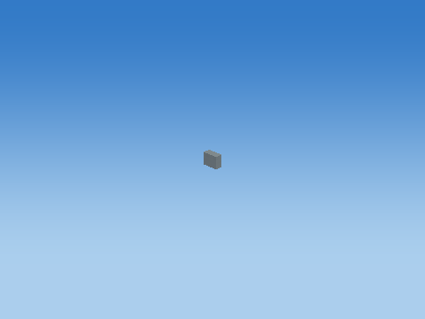 |
| Translate to world | 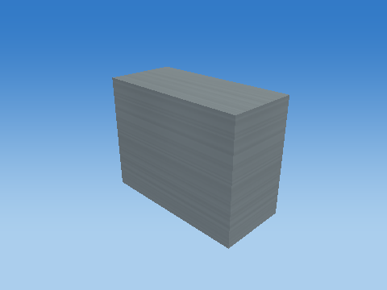 |

Steps 1–5 share one camera; the unit cube has its own close view, and step 6 is reframed at the actual world location to keep small objects visible. Reframing changes the view, never the model coordinates. Identity steps deliberately remain visible. Intermediate shapes are instructional states, while step 6 uses the unmodified game object.

Each stage below gives its exact numeric matrix and all eight corner multiplications. For each output row r: p'[r] = A[r,0]p.x + A[r,1]p.y + A[r,2]p.z + A[r,3]p.w.


#### S

```text
[ 0.129999995 0 0 0 ]
[ 0 0.100000001 0 0 ]
[ 0 0 0.0599999987 0 ]
[ 0 0 0 1 ]
```

| Input corner (w=1) | Output corner (w=1) |
| --- | --- |
| (-0.5, -0.5, -0.5) | (-0.0649999976, -0.0500000007, -0.0299999993) |
| (-0.5, -0.5, 0.5) | (-0.0649999976, -0.0500000007, 0.0299999993) |
| (-0.5, 0.5, -0.5) | (-0.0649999976, 0.0500000007, -0.0299999993) |
| (-0.5, 0.5, 0.5) | (-0.0649999976, 0.0500000007, 0.0299999993) |
| (0.5, -0.5, -0.5) | (0.0649999976, -0.0500000007, -0.0299999993) |
| (0.5, -0.5, 0.5) | (0.0649999976, -0.0500000007, 0.0299999993) |
| (0.5, 0.5, -0.5) | (0.0649999976, 0.0500000007, -0.0299999993) |
| (0.5, 0.5, 0.5) | (0.0649999976, 0.0500000007, 0.0299999993) |

#### H

```text
[ 1 0 0 0 ]
[ 0 1 0 0 ]
[ 0 0 1 0 ]
[ 0 0 0 1 ]
```

| Input corner (w=1) | Output corner (w=1) |
| --- | --- |
| (-0.0649999976, -0.0500000007, -0.0299999993) | (-0.0649999976, -0.0500000007, -0.0299999993) |
| (-0.0649999976, -0.0500000007, 0.0299999993) | (-0.0649999976, -0.0500000007, 0.0299999993) |
| (-0.0649999976, 0.0500000007, -0.0299999993) | (-0.0649999976, 0.0500000007, -0.0299999993) |
| (-0.0649999976, 0.0500000007, 0.0299999993) | (-0.0649999976, 0.0500000007, 0.0299999993) |
| (0.0649999976, -0.0500000007, -0.0299999993) | (0.0649999976, -0.0500000007, -0.0299999993) |
| (0.0649999976, -0.0500000007, 0.0299999993) | (0.0649999976, -0.0500000007, 0.0299999993) |
| (0.0649999976, 0.0500000007, -0.0299999993) | (0.0649999976, 0.0500000007, -0.0299999993) |
| (0.0649999976, 0.0500000007, 0.0299999993) | (0.0649999976, 0.0500000007, 0.0299999993) |

#### Rx

```text
[ 1 0 0 0 ]
[ 0 1 -0 0 ]
[ 0 0 1 0 ]
[ 0 0 0 1 ]
```

| Input corner (w=1) | Output corner (w=1) |
| --- | --- |
| (-0.0649999976, -0.0500000007, -0.0299999993) | (-0.0649999976, -0.0500000007, -0.0299999993) |
| (-0.0649999976, -0.0500000007, 0.0299999993) | (-0.0649999976, -0.0500000007, 0.0299999993) |
| (-0.0649999976, 0.0500000007, -0.0299999993) | (-0.0649999976, 0.0500000007, -0.0299999993) |
| (-0.0649999976, 0.0500000007, 0.0299999993) | (-0.0649999976, 0.0500000007, 0.0299999993) |
| (0.0649999976, -0.0500000007, -0.0299999993) | (0.0649999976, -0.0500000007, -0.0299999993) |
| (0.0649999976, -0.0500000007, 0.0299999993) | (0.0649999976, -0.0500000007, 0.0299999993) |
| (0.0649999976, 0.0500000007, -0.0299999993) | (0.0649999976, 0.0500000007, -0.0299999993) |
| (0.0649999976, 0.0500000007, 0.0299999993) | (0.0649999976, 0.0500000007, 0.0299999993) |

#### Ry

```text
[ 1 0 0 0 ]
[ 0 1 0 0 ]
[ -0 0 1 0 ]
[ 0 0 0 1 ]
```

| Input corner (w=1) | Output corner (w=1) |
| --- | --- |
| (-0.0649999976, -0.0500000007, -0.0299999993) | (-0.0649999976, -0.0500000007, -0.0299999993) |
| (-0.0649999976, -0.0500000007, 0.0299999993) | (-0.0649999976, -0.0500000007, 0.0299999993) |
| (-0.0649999976, 0.0500000007, -0.0299999993) | (-0.0649999976, 0.0500000007, -0.0299999993) |
| (-0.0649999976, 0.0500000007, 0.0299999993) | (-0.0649999976, 0.0500000007, 0.0299999993) |
| (0.0649999976, -0.0500000007, -0.0299999993) | (0.0649999976, -0.0500000007, -0.0299999993) |
| (0.0649999976, -0.0500000007, 0.0299999993) | (0.0649999976, -0.0500000007, 0.0299999993) |
| (0.0649999976, 0.0500000007, -0.0299999993) | (0.0649999976, 0.0500000007, -0.0299999993) |
| (0.0649999976, 0.0500000007, 0.0299999993) | (0.0649999976, 0.0500000007, 0.0299999993) |

#### Rz

```text
[ 1 -0 0 0 ]
[ 0 1 0 0 ]
[ 0 0 1 0 ]
[ 0 0 0 1 ]
```

| Input corner (w=1) | Output corner (w=1) |
| --- | --- |
| (-0.0649999976, -0.0500000007, -0.0299999993) | (-0.0649999976, -0.0500000007, -0.0299999993) |
| (-0.0649999976, -0.0500000007, 0.0299999993) | (-0.0649999976, -0.0500000007, 0.0299999993) |
| (-0.0649999976, 0.0500000007, -0.0299999993) | (-0.0649999976, 0.0500000007, -0.0299999993) |
| (-0.0649999976, 0.0500000007, 0.0299999993) | (-0.0649999976, 0.0500000007, 0.0299999993) |
| (0.0649999976, -0.0500000007, -0.0299999993) | (0.0649999976, -0.0500000007, -0.0299999993) |
| (0.0649999976, -0.0500000007, 0.0299999993) | (0.0649999976, -0.0500000007, 0.0299999993) |
| (0.0649999976, 0.0500000007, -0.0299999993) | (0.0649999976, 0.0500000007, -0.0299999993) |
| (0.0649999976, 0.0500000007, 0.0299999993) | (0.0649999976, 0.0500000007, 0.0299999993) |

#### T

```text
[ 1 0 0 -4.67999983 ]
[ 0 1 0 1.54999995 ]
[ 0 0 1 -8.59000015 ]
[ 0 0 0 1 ]
```

| Input corner (w=1) | Output corner (w=1) |
| --- | --- |
| (-0.0649999976, -0.0500000007, -0.0299999993) | (-4.74499989, 1.5, -8.61999989) |
| (-0.0649999976, -0.0500000007, 0.0299999993) | (-4.74499989, 1.5, -8.56000042) |
| (-0.0649999976, 0.0500000007, -0.0299999993) | (-4.74499989, 1.5999999, -8.61999989) |
| (-0.0649999976, 0.0500000007, 0.0299999993) | (-4.74499989, 1.5999999, -8.56000042) |
| (0.0649999976, -0.0500000007, -0.0299999993) | (-4.61499977, 1.5, -8.61999989) |
| (0.0649999976, -0.0500000007, 0.0299999993) | (-4.61499977, 1.5, -8.56000042) |
| (0.0649999976, 0.0500000007, -0.0299999993) | (-4.61499977, 1.5999999, -8.61999989) |
| (0.0649999976, 0.0500000007, 0.0299999993) | (-4.61499977, 1.5999999, -8.56000042) |

Final M = T Rz Ry Rx H S:

```text
[ 0.129999995 0 0 -4.67999983 ]
[ 0 0.100000001 0 1.54999995 ]
[ 0 0 0.0599999987 -8.59000015 ]
[ 0 0 0 1 ]
```

### MUZZLE_INSET — `DISPLAY_RIFLE_MUZZLE_INSET`

Stationary equipment exhibit near spawn; actual rendered weapon assembled by createWeapon

Position T = (-4.67999983, 1.42999995, -9.53100014) m; scale S = (0.0900000036, 0.075000003, 0.0120000001); rotation (Rx,Ry,Rz) = (0, 0, 0) degrees.

Shear (xy,xz,yx,yz,zx,zy) = (0, 0, 0, 0, 0, 0). Color = (0.0450000018, 0.0549999997, 0.0649999976); specular = 0.75; shininess = 80; emission = 0; flash = 0; material layer = 5; texture scale = 3. Pattern enabled = 0, pattern scale = (1, 1, 1), offset = (0, 0, 0).

| Step | Actual renderer image |
| --- | --- |
| Unit cube | 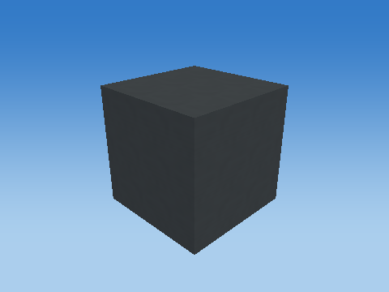 |
| Scale |  |
| Shear |  |
| Rotate X | 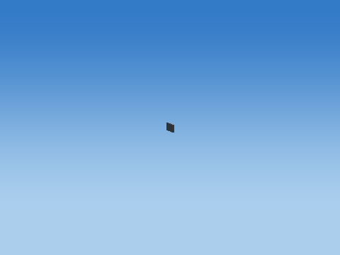 |
| Rotate Y |  |
| Rotate Z |  |
| Translate to world | 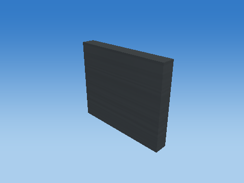 |

Steps 1–5 share one camera; the unit cube has its own close view, and step 6 is reframed at the actual world location to keep small objects visible. Reframing changes the view, never the model coordinates. Identity steps deliberately remain visible. Intermediate shapes are instructional states, while step 6 uses the unmodified game object.

Each stage below gives its exact numeric matrix and all eight corner multiplications. For each output row r: p'[r] = A[r,0]p.x + A[r,1]p.y + A[r,2]p.z + A[r,3]p.w.

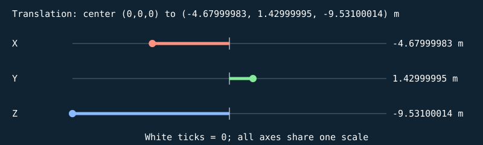


#### S

```text
[ 0.0900000036 0 0 0 ]
[ 0 0.075000003 0 0 ]
[ 0 0 0.0120000001 0 ]
[ 0 0 0 1 ]
```

| Input corner (w=1) | Output corner (w=1) |
| --- | --- |
| (-0.5, -0.5, -0.5) | (-0.0450000018, -0.0375000015, -0.00600000005) |
| (-0.5, -0.5, 0.5) | (-0.0450000018, -0.0375000015, 0.00600000005) |
| (-0.5, 0.5, -0.5) | (-0.0450000018, 0.0375000015, -0.00600000005) |
| (-0.5, 0.5, 0.5) | (-0.0450000018, 0.0375000015, 0.00600000005) |
| (0.5, -0.5, -0.5) | (0.0450000018, -0.0375000015, -0.00600000005) |
| (0.5, -0.5, 0.5) | (0.0450000018, -0.0375000015, 0.00600000005) |
| (0.5, 0.5, -0.5) | (0.0450000018, 0.0375000015, -0.00600000005) |
| (0.5, 0.5, 0.5) | (0.0450000018, 0.0375000015, 0.00600000005) |

#### H

```text
[ 1 0 0 0 ]
[ 0 1 0 0 ]
[ 0 0 1 0 ]
[ 0 0 0 1 ]
```

| Input corner (w=1) | Output corner (w=1) |
| --- | --- |
| (-0.0450000018, -0.0375000015, -0.00600000005) | (-0.0450000018, -0.0375000015, -0.00600000005) |
| (-0.0450000018, -0.0375000015, 0.00600000005) | (-0.0450000018, -0.0375000015, 0.00600000005) |
| (-0.0450000018, 0.0375000015, -0.00600000005) | (-0.0450000018, 0.0375000015, -0.00600000005) |
| (-0.0450000018, 0.0375000015, 0.00600000005) | (-0.0450000018, 0.0375000015, 0.00600000005) |
| (0.0450000018, -0.0375000015, -0.00600000005) | (0.0450000018, -0.0375000015, -0.00600000005) |
| (0.0450000018, -0.0375000015, 0.00600000005) | (0.0450000018, -0.0375000015, 0.00600000005) |
| (0.0450000018, 0.0375000015, -0.00600000005) | (0.0450000018, 0.0375000015, -0.00600000005) |
| (0.0450000018, 0.0375000015, 0.00600000005) | (0.0450000018, 0.0375000015, 0.00600000005) |

#### Rx

```text
[ 1 0 0 0 ]
[ 0 1 -0 0 ]
[ 0 0 1 0 ]
[ 0 0 0 1 ]
```

| Input corner (w=1) | Output corner (w=1) |
| --- | --- |
| (-0.0450000018, -0.0375000015, -0.00600000005) | (-0.0450000018, -0.0375000015, -0.00600000005) |
| (-0.0450000018, -0.0375000015, 0.00600000005) | (-0.0450000018, -0.0375000015, 0.00600000005) |
| (-0.0450000018, 0.0375000015, -0.00600000005) | (-0.0450000018, 0.0375000015, -0.00600000005) |
| (-0.0450000018, 0.0375000015, 0.00600000005) | (-0.0450000018, 0.0375000015, 0.00600000005) |
| (0.0450000018, -0.0375000015, -0.00600000005) | (0.0450000018, -0.0375000015, -0.00600000005) |
| (0.0450000018, -0.0375000015, 0.00600000005) | (0.0450000018, -0.0375000015, 0.00600000005) |
| (0.0450000018, 0.0375000015, -0.00600000005) | (0.0450000018, 0.0375000015, -0.00600000005) |
| (0.0450000018, 0.0375000015, 0.00600000005) | (0.0450000018, 0.0375000015, 0.00600000005) |

#### Ry

```text
[ 1 0 0 0 ]
[ 0 1 0 0 ]
[ -0 0 1 0 ]
[ 0 0 0 1 ]
```

| Input corner (w=1) | Output corner (w=1) |
| --- | --- |
| (-0.0450000018, -0.0375000015, -0.00600000005) | (-0.0450000018, -0.0375000015, -0.00600000005) |
| (-0.0450000018, -0.0375000015, 0.00600000005) | (-0.0450000018, -0.0375000015, 0.00600000005) |
| (-0.0450000018, 0.0375000015, -0.00600000005) | (-0.0450000018, 0.0375000015, -0.00600000005) |
| (-0.0450000018, 0.0375000015, 0.00600000005) | (-0.0450000018, 0.0375000015, 0.00600000005) |
| (0.0450000018, -0.0375000015, -0.00600000005) | (0.0450000018, -0.0375000015, -0.00600000005) |
| (0.0450000018, -0.0375000015, 0.00600000005) | (0.0450000018, -0.0375000015, 0.00600000005) |
| (0.0450000018, 0.0375000015, -0.00600000005) | (0.0450000018, 0.0375000015, -0.00600000005) |
| (0.0450000018, 0.0375000015, 0.00600000005) | (0.0450000018, 0.0375000015, 0.00600000005) |

#### Rz

```text
[ 1 -0 0 0 ]
[ 0 1 0 0 ]
[ 0 0 1 0 ]
[ 0 0 0 1 ]
```

| Input corner (w=1) | Output corner (w=1) |
| --- | --- |
| (-0.0450000018, -0.0375000015, -0.00600000005) | (-0.0450000018, -0.0375000015, -0.00600000005) |
| (-0.0450000018, -0.0375000015, 0.00600000005) | (-0.0450000018, -0.0375000015, 0.00600000005) |
| (-0.0450000018, 0.0375000015, -0.00600000005) | (-0.0450000018, 0.0375000015, -0.00600000005) |
| (-0.0450000018, 0.0375000015, 0.00600000005) | (-0.0450000018, 0.0375000015, 0.00600000005) |
| (0.0450000018, -0.0375000015, -0.00600000005) | (0.0450000018, -0.0375000015, -0.00600000005) |
| (0.0450000018, -0.0375000015, 0.00600000005) | (0.0450000018, -0.0375000015, 0.00600000005) |
| (0.0450000018, 0.0375000015, -0.00600000005) | (0.0450000018, 0.0375000015, -0.00600000005) |
| (0.0450000018, 0.0375000015, 0.00600000005) | (0.0450000018, 0.0375000015, 0.00600000005) |

#### T

```text
[ 1 0 0 -4.67999983 ]
[ 0 1 0 1.42999995 ]
[ 0 0 1 -9.53100014 ]
[ 0 0 0 1 ]
```

| Input corner (w=1) | Output corner (w=1) |
| --- | --- |
| (-0.0450000018, -0.0375000015, -0.00600000005) | (-4.7249999, 1.39249992, -9.5369997) |
| (-0.0450000018, -0.0375000015, 0.00600000005) | (-4.7249999, 1.39249992, -9.52500057) |
| (-0.0450000018, 0.0375000015, -0.00600000005) | (-4.7249999, 1.46749997, -9.5369997) |
| (-0.0450000018, 0.0375000015, 0.00600000005) | (-4.7249999, 1.46749997, -9.52500057) |
| (0.0450000018, -0.0375000015, -0.00600000005) | (-4.63499975, 1.39249992, -9.5369997) |
| (0.0450000018, -0.0375000015, 0.00600000005) | (-4.63499975, 1.39249992, -9.52500057) |
| (0.0450000018, 0.0375000015, -0.00600000005) | (-4.63499975, 1.46749997, -9.5369997) |
| (0.0450000018, 0.0375000015, 0.00600000005) | (-4.63499975, 1.46749997, -9.52500057) |

Final M = T Rz Ry Rx H S:

```text
[ 0.0900000036 0 0 -4.67999983 ]
[ 0 0.075000003 0 1.42999995 ]
[ 0 0 0.0120000001 -9.53100014 ]
[ 0 0 0 1 ]
```

### TRIGGER_GUARD — `DISPLAY_RIFLE_TRIGGER_GUARD`

Stationary equipment exhibit near spawn; actual rendered weapon assembled by createWeapon

Position T = (-4.67999983, 1.16999996, -8.76000023) m; scale S = (0.129999995, 0.0350000001, 0.189999998); rotation (Rx,Ry,Rz) = (0, 0, 0) degrees.

Shear (xy,xz,yx,yz,zx,zy) = (0, 0, 0, 0, 0, 0). Color = (0.219999999, 0.270000011, 0.310000002); specular = 0.75; shininess = 80; emission = 0; flash = 0; material layer = 5; texture scale = 3. Pattern enabled = 0, pattern scale = (1, 1, 1), offset = (0, 0, 0).

| Step | Actual renderer image |
| --- | --- |
| Unit cube |  |
| Scale |  |
| Shear |  |
| Rotate X |  |
| Rotate Y |  |
| Rotate Z |  |
| Translate to world | 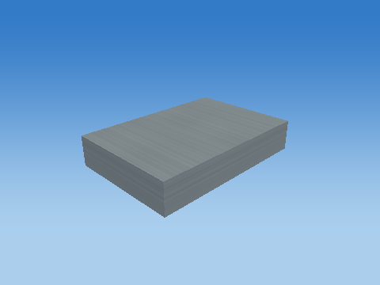 |

Steps 1–5 share one camera; the unit cube has its own close view, and step 6 is reframed at the actual world location to keep small objects visible. Reframing changes the view, never the model coordinates. Identity steps deliberately remain visible. Intermediate shapes are instructional states, while step 6 uses the unmodified game object.

Each stage below gives its exact numeric matrix and all eight corner multiplications. For each output row r: p'[r] = A[r,0]p.x + A[r,1]p.y + A[r,2]p.z + A[r,3]p.w.

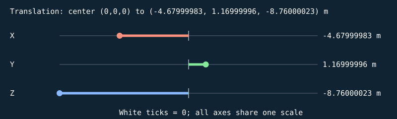


#### S

```text
[ 0.129999995 0 0 0 ]
[ 0 0.0350000001 0 0 ]
[ 0 0 0.189999998 0 ]
[ 0 0 0 1 ]
```

| Input corner (w=1) | Output corner (w=1) |
| --- | --- |
| (-0.5, -0.5, -0.5) | (-0.0649999976, -0.0175000001, -0.0949999988) |
| (-0.5, -0.5, 0.5) | (-0.0649999976, -0.0175000001, 0.0949999988) |
| (-0.5, 0.5, -0.5) | (-0.0649999976, 0.0175000001, -0.0949999988) |
| (-0.5, 0.5, 0.5) | (-0.0649999976, 0.0175000001, 0.0949999988) |
| (0.5, -0.5, -0.5) | (0.0649999976, -0.0175000001, -0.0949999988) |
| (0.5, -0.5, 0.5) | (0.0649999976, -0.0175000001, 0.0949999988) |
| (0.5, 0.5, -0.5) | (0.0649999976, 0.0175000001, -0.0949999988) |
| (0.5, 0.5, 0.5) | (0.0649999976, 0.0175000001, 0.0949999988) |

#### H

```text
[ 1 0 0 0 ]
[ 0 1 0 0 ]
[ 0 0 1 0 ]
[ 0 0 0 1 ]
```

| Input corner (w=1) | Output corner (w=1) |
| --- | --- |
| (-0.0649999976, -0.0175000001, -0.0949999988) | (-0.0649999976, -0.0175000001, -0.0949999988) |
| (-0.0649999976, -0.0175000001, 0.0949999988) | (-0.0649999976, -0.0175000001, 0.0949999988) |
| (-0.0649999976, 0.0175000001, -0.0949999988) | (-0.0649999976, 0.0175000001, -0.0949999988) |
| (-0.0649999976, 0.0175000001, 0.0949999988) | (-0.0649999976, 0.0175000001, 0.0949999988) |
| (0.0649999976, -0.0175000001, -0.0949999988) | (0.0649999976, -0.0175000001, -0.0949999988) |
| (0.0649999976, -0.0175000001, 0.0949999988) | (0.0649999976, -0.0175000001, 0.0949999988) |
| (0.0649999976, 0.0175000001, -0.0949999988) | (0.0649999976, 0.0175000001, -0.0949999988) |
| (0.0649999976, 0.0175000001, 0.0949999988) | (0.0649999976, 0.0175000001, 0.0949999988) |

#### Rx

```text
[ 1 0 0 0 ]
[ 0 1 -0 0 ]
[ 0 0 1 0 ]
[ 0 0 0 1 ]
```

| Input corner (w=1) | Output corner (w=1) |
| --- | --- |
| (-0.0649999976, -0.0175000001, -0.0949999988) | (-0.0649999976, -0.0175000001, -0.0949999988) |
| (-0.0649999976, -0.0175000001, 0.0949999988) | (-0.0649999976, -0.0175000001, 0.0949999988) |
| (-0.0649999976, 0.0175000001, -0.0949999988) | (-0.0649999976, 0.0175000001, -0.0949999988) |
| (-0.0649999976, 0.0175000001, 0.0949999988) | (-0.0649999976, 0.0175000001, 0.0949999988) |
| (0.0649999976, -0.0175000001, -0.0949999988) | (0.0649999976, -0.0175000001, -0.0949999988) |
| (0.0649999976, -0.0175000001, 0.0949999988) | (0.0649999976, -0.0175000001, 0.0949999988) |
| (0.0649999976, 0.0175000001, -0.0949999988) | (0.0649999976, 0.0175000001, -0.0949999988) |
| (0.0649999976, 0.0175000001, 0.0949999988) | (0.0649999976, 0.0175000001, 0.0949999988) |

#### Ry

```text
[ 1 0 0 0 ]
[ 0 1 0 0 ]
[ -0 0 1 0 ]
[ 0 0 0 1 ]
```

| Input corner (w=1) | Output corner (w=1) |
| --- | --- |
| (-0.0649999976, -0.0175000001, -0.0949999988) | (-0.0649999976, -0.0175000001, -0.0949999988) |
| (-0.0649999976, -0.0175000001, 0.0949999988) | (-0.0649999976, -0.0175000001, 0.0949999988) |
| (-0.0649999976, 0.0175000001, -0.0949999988) | (-0.0649999976, 0.0175000001, -0.0949999988) |
| (-0.0649999976, 0.0175000001, 0.0949999988) | (-0.0649999976, 0.0175000001, 0.0949999988) |
| (0.0649999976, -0.0175000001, -0.0949999988) | (0.0649999976, -0.0175000001, -0.0949999988) |
| (0.0649999976, -0.0175000001, 0.0949999988) | (0.0649999976, -0.0175000001, 0.0949999988) |
| (0.0649999976, 0.0175000001, -0.0949999988) | (0.0649999976, 0.0175000001, -0.0949999988) |
| (0.0649999976, 0.0175000001, 0.0949999988) | (0.0649999976, 0.0175000001, 0.0949999988) |

#### Rz

```text
[ 1 -0 0 0 ]
[ 0 1 0 0 ]
[ 0 0 1 0 ]
[ 0 0 0 1 ]
```

| Input corner (w=1) | Output corner (w=1) |
| --- | --- |
| (-0.0649999976, -0.0175000001, -0.0949999988) | (-0.0649999976, -0.0175000001, -0.0949999988) |
| (-0.0649999976, -0.0175000001, 0.0949999988) | (-0.0649999976, -0.0175000001, 0.0949999988) |
| (-0.0649999976, 0.0175000001, -0.0949999988) | (-0.0649999976, 0.0175000001, -0.0949999988) |
| (-0.0649999976, 0.0175000001, 0.0949999988) | (-0.0649999976, 0.0175000001, 0.0949999988) |
| (0.0649999976, -0.0175000001, -0.0949999988) | (0.0649999976, -0.0175000001, -0.0949999988) |
| (0.0649999976, -0.0175000001, 0.0949999988) | (0.0649999976, -0.0175000001, 0.0949999988) |
| (0.0649999976, 0.0175000001, -0.0949999988) | (0.0649999976, 0.0175000001, -0.0949999988) |
| (0.0649999976, 0.0175000001, 0.0949999988) | (0.0649999976, 0.0175000001, 0.0949999988) |

#### T

```text
[ 1 0 0 -4.67999983 ]
[ 0 1 0 1.16999996 ]
[ 0 0 1 -8.76000023 ]
[ 0 0 0 1 ]
```

| Input corner (w=1) | Output corner (w=1) |
| --- | --- |
| (-0.0649999976, -0.0175000001, -0.0949999988) | (-4.74499989, 1.15249991, -8.8550005) |
| (-0.0649999976, -0.0175000001, 0.0949999988) | (-4.74499989, 1.15249991, -8.66499996) |
| (-0.0649999976, 0.0175000001, -0.0949999988) | (-4.74499989, 1.1875, -8.8550005) |
| (-0.0649999976, 0.0175000001, 0.0949999988) | (-4.74499989, 1.1875, -8.66499996) |
| (0.0649999976, -0.0175000001, -0.0949999988) | (-4.61499977, 1.15249991, -8.8550005) |
| (0.0649999976, -0.0175000001, 0.0949999988) | (-4.61499977, 1.15249991, -8.66499996) |
| (0.0649999976, 0.0175000001, -0.0949999988) | (-4.61499977, 1.1875, -8.8550005) |
| (0.0649999976, 0.0175000001, 0.0949999988) | (-4.61499977, 1.1875, -8.66499996) |

Final M = T Rz Ry Rx H S:

```text
[ 0.129999995 0 0 -4.67999983 ]
[ 0 0.0350000001 0 1.16999996 ]
[ 0 0 0.189999998 -8.76000023 ]
[ 0 0 0 1 ]
```

### GUARD_FRONT — `DISPLAY_RIFLE_GUARD_FRONT`

Stationary equipment exhibit near spawn; actual rendered weapon assembled by createWeapon

Position T = (-4.67999983, 1.25, -8.84000015) m; scale S = (0.129999995, 0.159999996, 0.0350000001); rotation (Rx,Ry,Rz) = (0, 0, 0) degrees.

Shear (xy,xz,yx,yz,zx,zy) = (0, 0, 0, 0, 0, 0). Color = (0.219999999, 0.270000011, 0.310000002); specular = 0.75; shininess = 80; emission = 0; flash = 0; material layer = 5; texture scale = 3. Pattern enabled = 0, pattern scale = (1, 1, 1), offset = (0, 0, 0).

| Step | Actual renderer image |
| --- | --- |
| Unit cube |  |
| Scale | 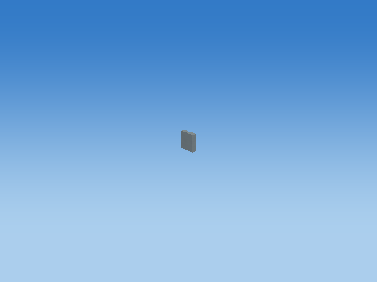 |
| Shear |  |
| Rotate X |  |
| Rotate Y |  |
| Rotate Z |  |
| Translate to world | 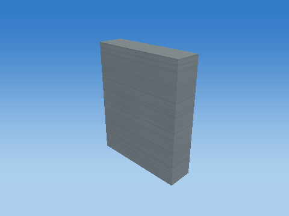 |

Steps 1–5 share one camera; the unit cube has its own close view, and step 6 is reframed at the actual world location to keep small objects visible. Reframing changes the view, never the model coordinates. Identity steps deliberately remain visible. Intermediate shapes are instructional states, while step 6 uses the unmodified game object.

Each stage below gives its exact numeric matrix and all eight corner multiplications. For each output row r: p'[r] = A[r,0]p.x + A[r,1]p.y + A[r,2]p.z + A[r,3]p.w.

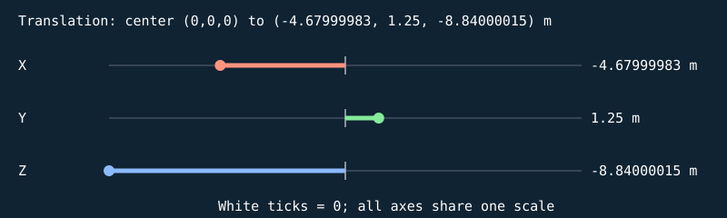


#### S

```text
[ 0.129999995 0 0 0 ]
[ 0 0.159999996 0 0 ]
[ 0 0 0.0350000001 0 ]
[ 0 0 0 1 ]
```

| Input corner (w=1) | Output corner (w=1) |
| --- | --- |
| (-0.5, -0.5, -0.5) | (-0.0649999976, -0.0799999982, -0.0175000001) |
| (-0.5, -0.5, 0.5) | (-0.0649999976, -0.0799999982, 0.0175000001) |
| (-0.5, 0.5, -0.5) | (-0.0649999976, 0.0799999982, -0.0175000001) |
| (-0.5, 0.5, 0.5) | (-0.0649999976, 0.0799999982, 0.0175000001) |
| (0.5, -0.5, -0.5) | (0.0649999976, -0.0799999982, -0.0175000001) |
| (0.5, -0.5, 0.5) | (0.0649999976, -0.0799999982, 0.0175000001) |
| (0.5, 0.5, -0.5) | (0.0649999976, 0.0799999982, -0.0175000001) |
| (0.5, 0.5, 0.5) | (0.0649999976, 0.0799999982, 0.0175000001) |

#### H

```text
[ 1 0 0 0 ]
[ 0 1 0 0 ]
[ 0 0 1 0 ]
[ 0 0 0 1 ]
```

| Input corner (w=1) | Output corner (w=1) |
| --- | --- |
| (-0.0649999976, -0.0799999982, -0.0175000001) | (-0.0649999976, -0.0799999982, -0.0175000001) |
| (-0.0649999976, -0.0799999982, 0.0175000001) | (-0.0649999976, -0.0799999982, 0.0175000001) |
| (-0.0649999976, 0.0799999982, -0.0175000001) | (-0.0649999976, 0.0799999982, -0.0175000001) |
| (-0.0649999976, 0.0799999982, 0.0175000001) | (-0.0649999976, 0.0799999982, 0.0175000001) |
| (0.0649999976, -0.0799999982, -0.0175000001) | (0.0649999976, -0.0799999982, -0.0175000001) |
| (0.0649999976, -0.0799999982, 0.0175000001) | (0.0649999976, -0.0799999982, 0.0175000001) |
| (0.0649999976, 0.0799999982, -0.0175000001) | (0.0649999976, 0.0799999982, -0.0175000001) |
| (0.0649999976, 0.0799999982, 0.0175000001) | (0.0649999976, 0.0799999982, 0.0175000001) |

#### Rx

```text
[ 1 0 0 0 ]
[ 0 1 -0 0 ]
[ 0 0 1 0 ]
[ 0 0 0 1 ]
```

| Input corner (w=1) | Output corner (w=1) |
| --- | --- |
| (-0.0649999976, -0.0799999982, -0.0175000001) | (-0.0649999976, -0.0799999982, -0.0175000001) |
| (-0.0649999976, -0.0799999982, 0.0175000001) | (-0.0649999976, -0.0799999982, 0.0175000001) |
| (-0.0649999976, 0.0799999982, -0.0175000001) | (-0.0649999976, 0.0799999982, -0.0175000001) |
| (-0.0649999976, 0.0799999982, 0.0175000001) | (-0.0649999976, 0.0799999982, 0.0175000001) |
| (0.0649999976, -0.0799999982, -0.0175000001) | (0.0649999976, -0.0799999982, -0.0175000001) |
| (0.0649999976, -0.0799999982, 0.0175000001) | (0.0649999976, -0.0799999982, 0.0175000001) |
| (0.0649999976, 0.0799999982, -0.0175000001) | (0.0649999976, 0.0799999982, -0.0175000001) |
| (0.0649999976, 0.0799999982, 0.0175000001) | (0.0649999976, 0.0799999982, 0.0175000001) |

#### Ry

```text
[ 1 0 0 0 ]
[ 0 1 0 0 ]
[ -0 0 1 0 ]
[ 0 0 0 1 ]
```

| Input corner (w=1) | Output corner (w=1) |
| --- | --- |
| (-0.0649999976, -0.0799999982, -0.0175000001) | (-0.0649999976, -0.0799999982, -0.0175000001) |
| (-0.0649999976, -0.0799999982, 0.0175000001) | (-0.0649999976, -0.0799999982, 0.0175000001) |
| (-0.0649999976, 0.0799999982, -0.0175000001) | (-0.0649999976, 0.0799999982, -0.0175000001) |
| (-0.0649999976, 0.0799999982, 0.0175000001) | (-0.0649999976, 0.0799999982, 0.0175000001) |
| (0.0649999976, -0.0799999982, -0.0175000001) | (0.0649999976, -0.0799999982, -0.0175000001) |
| (0.0649999976, -0.0799999982, 0.0175000001) | (0.0649999976, -0.0799999982, 0.0175000001) |
| (0.0649999976, 0.0799999982, -0.0175000001) | (0.0649999976, 0.0799999982, -0.0175000001) |
| (0.0649999976, 0.0799999982, 0.0175000001) | (0.0649999976, 0.0799999982, 0.0175000001) |

#### Rz

```text
[ 1 -0 0 0 ]
[ 0 1 0 0 ]
[ 0 0 1 0 ]
[ 0 0 0 1 ]
```

| Input corner (w=1) | Output corner (w=1) |
| --- | --- |
| (-0.0649999976, -0.0799999982, -0.0175000001) | (-0.0649999976, -0.0799999982, -0.0175000001) |
| (-0.0649999976, -0.0799999982, 0.0175000001) | (-0.0649999976, -0.0799999982, 0.0175000001) |
| (-0.0649999976, 0.0799999982, -0.0175000001) | (-0.0649999976, 0.0799999982, -0.0175000001) |
| (-0.0649999976, 0.0799999982, 0.0175000001) | (-0.0649999976, 0.0799999982, 0.0175000001) |
| (0.0649999976, -0.0799999982, -0.0175000001) | (0.0649999976, -0.0799999982, -0.0175000001) |
| (0.0649999976, -0.0799999982, 0.0175000001) | (0.0649999976, -0.0799999982, 0.0175000001) |
| (0.0649999976, 0.0799999982, -0.0175000001) | (0.0649999976, 0.0799999982, -0.0175000001) |
| (0.0649999976, 0.0799999982, 0.0175000001) | (0.0649999976, 0.0799999982, 0.0175000001) |

#### T

```text
[ 1 0 0 -4.67999983 ]
[ 0 1 0 1.25 ]
[ 0 0 1 -8.84000015 ]
[ 0 0 0 1 ]
```

| Input corner (w=1) | Output corner (w=1) |
| --- | --- |
| (-0.0649999976, -0.0799999982, -0.0175000001) | (-4.74499989, 1.16999996, -8.85750008) |
| (-0.0649999976, -0.0799999982, 0.0175000001) | (-4.74499989, 1.16999996, -8.82250023) |
| (-0.0649999976, 0.0799999982, -0.0175000001) | (-4.74499989, 1.33000004, -8.85750008) |
| (-0.0649999976, 0.0799999982, 0.0175000001) | (-4.74499989, 1.33000004, -8.82250023) |
| (0.0649999976, -0.0799999982, -0.0175000001) | (-4.61499977, 1.16999996, -8.85750008) |
| (0.0649999976, -0.0799999982, 0.0175000001) | (-4.61499977, 1.16999996, -8.82250023) |
| (0.0649999976, 0.0799999982, -0.0175000001) | (-4.61499977, 1.33000004, -8.85750008) |
| (0.0649999976, 0.0799999982, 0.0175000001) | (-4.61499977, 1.33000004, -8.82250023) |

Final M = T Rz Ry Rx H S:

```text
[ 0.129999995 0 0 -4.67999983 ]
[ 0 0.159999996 0 1.25 ]
[ 0 0 0.0350000001 -8.84000015 ]
[ 0 0 0 1 ]
```

### DETAIL_0 — `DISPLAY_RIFLE_DETAIL_0`

Stationary equipment exhibit near spawn; actual rendered weapon assembled by createWeapon

Position T = (-4.67999983, 1.30999994, -8.94999981) m; scale S = (0.300000012, 0.150000006, 0.0179999992); rotation (Rx,Ry,Rz) = (0, 0, 0) degrees.

Shear (xy,xz,yx,yz,zx,zy) = (0, 0, 0, 0, 0, 0). Color = (0.100000001, 0.140000001, 0.159999996); specular = 0.75; shininess = 80; emission = 0; flash = 0; material layer = 5; texture scale = 3. Pattern enabled = 0, pattern scale = (1, 1, 1), offset = (0, 0, 0).

| Step | Actual renderer image |
| --- | --- |
| Unit cube |  |
| Scale |  |
| Shear |  |
| Rotate X |  |
| Rotate Y |  |
| Rotate Z |  |
| Translate to world | 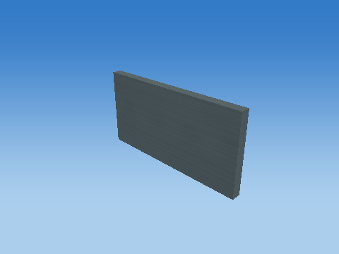 |

Steps 1–5 share one camera; the unit cube has its own close view, and step 6 is reframed at the actual world location to keep small objects visible. Reframing changes the view, never the model coordinates. Identity steps deliberately remain visible. Intermediate shapes are instructional states, while step 6 uses the unmodified game object.

Each stage below gives its exact numeric matrix and all eight corner multiplications. For each output row r: p'[r] = A[r,0]p.x + A[r,1]p.y + A[r,2]p.z + A[r,3]p.w.


#### S

```text
[ 0.300000012 0 0 0 ]
[ 0 0.150000006 0 0 ]
[ 0 0 0.0179999992 0 ]
[ 0 0 0 1 ]
```

| Input corner (w=1) | Output corner (w=1) |
| --- | --- |
| (-0.5, -0.5, -0.5) | (-0.150000006, -0.075000003, -0.00899999961) |
| (-0.5, -0.5, 0.5) | (-0.150000006, -0.075000003, 0.00899999961) |
| (-0.5, 0.5, -0.5) | (-0.150000006, 0.075000003, -0.00899999961) |
| (-0.5, 0.5, 0.5) | (-0.150000006, 0.075000003, 0.00899999961) |
| (0.5, -0.5, -0.5) | (0.150000006, -0.075000003, -0.00899999961) |
| (0.5, -0.5, 0.5) | (0.150000006, -0.075000003, 0.00899999961) |
| (0.5, 0.5, -0.5) | (0.150000006, 0.075000003, -0.00899999961) |
| (0.5, 0.5, 0.5) | (0.150000006, 0.075000003, 0.00899999961) |

#### H

```text
[ 1 0 0 0 ]
[ 0 1 0 0 ]
[ 0 0 1 0 ]
[ 0 0 0 1 ]
```

| Input corner (w=1) | Output corner (w=1) |
| --- | --- |
| (-0.150000006, -0.075000003, -0.00899999961) | (-0.150000006, -0.075000003, -0.00899999961) |
| (-0.150000006, -0.075000003, 0.00899999961) | (-0.150000006, -0.075000003, 0.00899999961) |
| (-0.150000006, 0.075000003, -0.00899999961) | (-0.150000006, 0.075000003, -0.00899999961) |
| (-0.150000006, 0.075000003, 0.00899999961) | (-0.150000006, 0.075000003, 0.00899999961) |
| (0.150000006, -0.075000003, -0.00899999961) | (0.150000006, -0.075000003, -0.00899999961) |
| (0.150000006, -0.075000003, 0.00899999961) | (0.150000006, -0.075000003, 0.00899999961) |
| (0.150000006, 0.075000003, -0.00899999961) | (0.150000006, 0.075000003, -0.00899999961) |
| (0.150000006, 0.075000003, 0.00899999961) | (0.150000006, 0.075000003, 0.00899999961) |

#### Rx

```text
[ 1 0 0 0 ]
[ 0 1 -0 0 ]
[ 0 0 1 0 ]
[ 0 0 0 1 ]
```

| Input corner (w=1) | Output corner (w=1) |
| --- | --- |
| (-0.150000006, -0.075000003, -0.00899999961) | (-0.150000006, -0.075000003, -0.00899999961) |
| (-0.150000006, -0.075000003, 0.00899999961) | (-0.150000006, -0.075000003, 0.00899999961) |
| (-0.150000006, 0.075000003, -0.00899999961) | (-0.150000006, 0.075000003, -0.00899999961) |
| (-0.150000006, 0.075000003, 0.00899999961) | (-0.150000006, 0.075000003, 0.00899999961) |
| (0.150000006, -0.075000003, -0.00899999961) | (0.150000006, -0.075000003, -0.00899999961) |
| (0.150000006, -0.075000003, 0.00899999961) | (0.150000006, -0.075000003, 0.00899999961) |
| (0.150000006, 0.075000003, -0.00899999961) | (0.150000006, 0.075000003, -0.00899999961) |
| (0.150000006, 0.075000003, 0.00899999961) | (0.150000006, 0.075000003, 0.00899999961) |

#### Ry

```text
[ 1 0 0 0 ]
[ 0 1 0 0 ]
[ -0 0 1 0 ]
[ 0 0 0 1 ]
```

| Input corner (w=1) | Output corner (w=1) |
| --- | --- |
| (-0.150000006, -0.075000003, -0.00899999961) | (-0.150000006, -0.075000003, -0.00899999961) |
| (-0.150000006, -0.075000003, 0.00899999961) | (-0.150000006, -0.075000003, 0.00899999961) |
| (-0.150000006, 0.075000003, -0.00899999961) | (-0.150000006, 0.075000003, -0.00899999961) |
| (-0.150000006, 0.075000003, 0.00899999961) | (-0.150000006, 0.075000003, 0.00899999961) |
| (0.150000006, -0.075000003, -0.00899999961) | (0.150000006, -0.075000003, -0.00899999961) |
| (0.150000006, -0.075000003, 0.00899999961) | (0.150000006, -0.075000003, 0.00899999961) |
| (0.150000006, 0.075000003, -0.00899999961) | (0.150000006, 0.075000003, -0.00899999961) |
| (0.150000006, 0.075000003, 0.00899999961) | (0.150000006, 0.075000003, 0.00899999961) |

#### Rz

```text
[ 1 -0 0 0 ]
[ 0 1 0 0 ]
[ 0 0 1 0 ]
[ 0 0 0 1 ]
```

| Input corner (w=1) | Output corner (w=1) |
| --- | --- |
| (-0.150000006, -0.075000003, -0.00899999961) | (-0.150000006, -0.075000003, -0.00899999961) |
| (-0.150000006, -0.075000003, 0.00899999961) | (-0.150000006, -0.075000003, 0.00899999961) |
| (-0.150000006, 0.075000003, -0.00899999961) | (-0.150000006, 0.075000003, -0.00899999961) |
| (-0.150000006, 0.075000003, 0.00899999961) | (-0.150000006, 0.075000003, 0.00899999961) |
| (0.150000006, -0.075000003, -0.00899999961) | (0.150000006, -0.075000003, -0.00899999961) |
| (0.150000006, -0.075000003, 0.00899999961) | (0.150000006, -0.075000003, 0.00899999961) |
| (0.150000006, 0.075000003, -0.00899999961) | (0.150000006, 0.075000003, -0.00899999961) |
| (0.150000006, 0.075000003, 0.00899999961) | (0.150000006, 0.075000003, 0.00899999961) |

#### T

```text
[ 1 0 0 -4.67999983 ]
[ 0 1 0 1.30999994 ]
[ 0 0 1 -8.94999981 ]
[ 0 0 0 1 ]
```

| Input corner (w=1) | Output corner (w=1) |
| --- | --- |
| (-0.150000006, -0.075000003, -0.00899999961) | (-4.82999992, 1.2349999, -8.95899963) |
| (-0.150000006, -0.075000003, 0.00899999961) | (-4.82999992, 1.2349999, -8.94099998) |
| (-0.150000006, 0.075000003, -0.00899999961) | (-4.82999992, 1.38499999, -8.95899963) |
| (-0.150000006, 0.075000003, 0.00899999961) | (-4.82999992, 1.38499999, -8.94099998) |
| (0.150000006, -0.075000003, -0.00899999961) | (-4.52999973, 1.2349999, -8.95899963) |
| (0.150000006, -0.075000003, 0.00899999961) | (-4.52999973, 1.2349999, -8.94099998) |
| (0.150000006, 0.075000003, -0.00899999961) | (-4.52999973, 1.38499999, -8.95899963) |
| (0.150000006, 0.075000003, 0.00899999961) | (-4.52999973, 1.38499999, -8.94099998) |

Final M = T Rz Ry Rx H S:

```text
[ 0.300000012 0 0 -4.67999983 ]
[ 0 0.150000006 0 1.30999994 ]
[ 0 0 0.0179999992 -8.94999981 ]
[ 0 0 0 1 ]
```

### DETAIL_1 — `DISPLAY_RIFLE_DETAIL_1`

Stationary equipment exhibit near spawn; actual rendered weapon assembled by createWeapon

Position T = (-4.67999983, 1.30999994, -9.00800037) m; scale S = (0.300000012, 0.150000006, 0.0179999992); rotation (Rx,Ry,Rz) = (0, 0, 0) degrees.

Shear (xy,xz,yx,yz,zx,zy) = (0, 0, 0, 0, 0, 0). Color = (0.100000001, 0.140000001, 0.159999996); specular = 0.75; shininess = 80; emission = 0; flash = 0; material layer = 5; texture scale = 3. Pattern enabled = 0, pattern scale = (1, 1, 1), offset = (0, 0, 0).

| Step | Actual renderer image |
| --- | --- |
| Unit cube |  |
| Scale |  |
| Shear |  |
| Rotate X |  |
| Rotate Y |  |
| Rotate Z |  |
| Translate to world |  |

Steps 1–5 share one camera; the unit cube has its own close view, and step 6 is reframed at the actual world location to keep small objects visible. Reframing changes the view, never the model coordinates. Identity steps deliberately remain visible. Intermediate shapes are instructional states, while step 6 uses the unmodified game object.

Each stage below gives its exact numeric matrix and all eight corner multiplications. For each output row r: p'[r] = A[r,0]p.x + A[r,1]p.y + A[r,2]p.z + A[r,3]p.w.


#### S

```text
[ 0.300000012 0 0 0 ]
[ 0 0.150000006 0 0 ]
[ 0 0 0.0179999992 0 ]
[ 0 0 0 1 ]
```

| Input corner (w=1) | Output corner (w=1) |
| --- | --- |
| (-0.5, -0.5, -0.5) | (-0.150000006, -0.075000003, -0.00899999961) |
| (-0.5, -0.5, 0.5) | (-0.150000006, -0.075000003, 0.00899999961) |
| (-0.5, 0.5, -0.5) | (-0.150000006, 0.075000003, -0.00899999961) |
| (-0.5, 0.5, 0.5) | (-0.150000006, 0.075000003, 0.00899999961) |
| (0.5, -0.5, -0.5) | (0.150000006, -0.075000003, -0.00899999961) |
| (0.5, -0.5, 0.5) | (0.150000006, -0.075000003, 0.00899999961) |
| (0.5, 0.5, -0.5) | (0.150000006, 0.075000003, -0.00899999961) |
| (0.5, 0.5, 0.5) | (0.150000006, 0.075000003, 0.00899999961) |

#### H

```text
[ 1 0 0 0 ]
[ 0 1 0 0 ]
[ 0 0 1 0 ]
[ 0 0 0 1 ]
```

| Input corner (w=1) | Output corner (w=1) |
| --- | --- |
| (-0.150000006, -0.075000003, -0.00899999961) | (-0.150000006, -0.075000003, -0.00899999961) |
| (-0.150000006, -0.075000003, 0.00899999961) | (-0.150000006, -0.075000003, 0.00899999961) |
| (-0.150000006, 0.075000003, -0.00899999961) | (-0.150000006, 0.075000003, -0.00899999961) |
| (-0.150000006, 0.075000003, 0.00899999961) | (-0.150000006, 0.075000003, 0.00899999961) |
| (0.150000006, -0.075000003, -0.00899999961) | (0.150000006, -0.075000003, -0.00899999961) |
| (0.150000006, -0.075000003, 0.00899999961) | (0.150000006, -0.075000003, 0.00899999961) |
| (0.150000006, 0.075000003, -0.00899999961) | (0.150000006, 0.075000003, -0.00899999961) |
| (0.150000006, 0.075000003, 0.00899999961) | (0.150000006, 0.075000003, 0.00899999961) |

#### Rx

```text
[ 1 0 0 0 ]
[ 0 1 -0 0 ]
[ 0 0 1 0 ]
[ 0 0 0 1 ]
```

| Input corner (w=1) | Output corner (w=1) |
| --- | --- |
| (-0.150000006, -0.075000003, -0.00899999961) | (-0.150000006, -0.075000003, -0.00899999961) |
| (-0.150000006, -0.075000003, 0.00899999961) | (-0.150000006, -0.075000003, 0.00899999961) |
| (-0.150000006, 0.075000003, -0.00899999961) | (-0.150000006, 0.075000003, -0.00899999961) |
| (-0.150000006, 0.075000003, 0.00899999961) | (-0.150000006, 0.075000003, 0.00899999961) |
| (0.150000006, -0.075000003, -0.00899999961) | (0.150000006, -0.075000003, -0.00899999961) |
| (0.150000006, -0.075000003, 0.00899999961) | (0.150000006, -0.075000003, 0.00899999961) |
| (0.150000006, 0.075000003, -0.00899999961) | (0.150000006, 0.075000003, -0.00899999961) |
| (0.150000006, 0.075000003, 0.00899999961) | (0.150000006, 0.075000003, 0.00899999961) |

#### Ry

```text
[ 1 0 0 0 ]
[ 0 1 0 0 ]
[ -0 0 1 0 ]
[ 0 0 0 1 ]
```

| Input corner (w=1) | Output corner (w=1) |
| --- | --- |
| (-0.150000006, -0.075000003, -0.00899999961) | (-0.150000006, -0.075000003, -0.00899999961) |
| (-0.150000006, -0.075000003, 0.00899999961) | (-0.150000006, -0.075000003, 0.00899999961) |
| (-0.150000006, 0.075000003, -0.00899999961) | (-0.150000006, 0.075000003, -0.00899999961) |
| (-0.150000006, 0.075000003, 0.00899999961) | (-0.150000006, 0.075000003, 0.00899999961) |
| (0.150000006, -0.075000003, -0.00899999961) | (0.150000006, -0.075000003, -0.00899999961) |
| (0.150000006, -0.075000003, 0.00899999961) | (0.150000006, -0.075000003, 0.00899999961) |
| (0.150000006, 0.075000003, -0.00899999961) | (0.150000006, 0.075000003, -0.00899999961) |
| (0.150000006, 0.075000003, 0.00899999961) | (0.150000006, 0.075000003, 0.00899999961) |

#### Rz

```text
[ 1 -0 0 0 ]
[ 0 1 0 0 ]
[ 0 0 1 0 ]
[ 0 0 0 1 ]
```

| Input corner (w=1) | Output corner (w=1) |
| --- | --- |
| (-0.150000006, -0.075000003, -0.00899999961) | (-0.150000006, -0.075000003, -0.00899999961) |
| (-0.150000006, -0.075000003, 0.00899999961) | (-0.150000006, -0.075000003, 0.00899999961) |
| (-0.150000006, 0.075000003, -0.00899999961) | (-0.150000006, 0.075000003, -0.00899999961) |
| (-0.150000006, 0.075000003, 0.00899999961) | (-0.150000006, 0.075000003, 0.00899999961) |
| (0.150000006, -0.075000003, -0.00899999961) | (0.150000006, -0.075000003, -0.00899999961) |
| (0.150000006, -0.075000003, 0.00899999961) | (0.150000006, -0.075000003, 0.00899999961) |
| (0.150000006, 0.075000003, -0.00899999961) | (0.150000006, 0.075000003, -0.00899999961) |
| (0.150000006, 0.075000003, 0.00899999961) | (0.150000006, 0.075000003, 0.00899999961) |

#### T

```text
[ 1 0 0 -4.67999983 ]
[ 0 1 0 1.30999994 ]
[ 0 0 1 -9.00800037 ]
[ 0 0 0 1 ]
```

| Input corner (w=1) | Output corner (w=1) |
| --- | --- |
| (-0.150000006, -0.075000003, -0.00899999961) | (-4.82999992, 1.2349999, -9.0170002) |
| (-0.150000006, -0.075000003, 0.00899999961) | (-4.82999992, 1.2349999, -8.99900055) |
| (-0.150000006, 0.075000003, -0.00899999961) | (-4.82999992, 1.38499999, -9.0170002) |
| (-0.150000006, 0.075000003, 0.00899999961) | (-4.82999992, 1.38499999, -8.99900055) |
| (0.150000006, -0.075000003, -0.00899999961) | (-4.52999973, 1.2349999, -9.0170002) |
| (0.150000006, -0.075000003, 0.00899999961) | (-4.52999973, 1.2349999, -8.99900055) |
| (0.150000006, 0.075000003, -0.00899999961) | (-4.52999973, 1.38499999, -9.0170002) |
| (0.150000006, 0.075000003, 0.00899999961) | (-4.52999973, 1.38499999, -8.99900055) |

Final M = T Rz Ry Rx H S:

```text
[ 0.300000012 0 0 -4.67999983 ]
[ 0 0.150000006 0 1.30999994 ]
[ 0 0 0.0179999992 -9.00800037 ]
[ 0 0 0 1 ]
```

### DETAIL_2 — `DISPLAY_RIFLE_DETAIL_2`

Stationary equipment exhibit near spawn; actual rendered weapon assembled by createWeapon

Position T = (-4.67999983, 1.30999994, -9.06599998) m; scale S = (0.300000012, 0.150000006, 0.0179999992); rotation (Rx,Ry,Rz) = (0, 0, 0) degrees.

Shear (xy,xz,yx,yz,zx,zy) = (0, 0, 0, 0, 0, 0). Color = (0.100000001, 0.140000001, 0.159999996); specular = 0.75; shininess = 80; emission = 0; flash = 0; material layer = 5; texture scale = 3. Pattern enabled = 0, pattern scale = (1, 1, 1), offset = (0, 0, 0).

| Step | Actual renderer image |
| --- | --- |
| Unit cube |  |
| Scale |  |
| Shear |  |
| Rotate X |  |
| Rotate Y |  |
| Rotate Z |  |
| Translate to world |  |

Steps 1–5 share one camera; the unit cube has its own close view, and step 6 is reframed at the actual world location to keep small objects visible. Reframing changes the view, never the model coordinates. Identity steps deliberately remain visible. Intermediate shapes are instructional states, while step 6 uses the unmodified game object.

Each stage below gives its exact numeric matrix and all eight corner multiplications. For each output row r: p'[r] = A[r,0]p.x + A[r,1]p.y + A[r,2]p.z + A[r,3]p.w.


#### S

```text
[ 0.300000012 0 0 0 ]
[ 0 0.150000006 0 0 ]
[ 0 0 0.0179999992 0 ]
[ 0 0 0 1 ]
```

| Input corner (w=1) | Output corner (w=1) |
| --- | --- |
| (-0.5, -0.5, -0.5) | (-0.150000006, -0.075000003, -0.00899999961) |
| (-0.5, -0.5, 0.5) | (-0.150000006, -0.075000003, 0.00899999961) |
| (-0.5, 0.5, -0.5) | (-0.150000006, 0.075000003, -0.00899999961) |
| (-0.5, 0.5, 0.5) | (-0.150000006, 0.075000003, 0.00899999961) |
| (0.5, -0.5, -0.5) | (0.150000006, -0.075000003, -0.00899999961) |
| (0.5, -0.5, 0.5) | (0.150000006, -0.075000003, 0.00899999961) |
| (0.5, 0.5, -0.5) | (0.150000006, 0.075000003, -0.00899999961) |
| (0.5, 0.5, 0.5) | (0.150000006, 0.075000003, 0.00899999961) |

#### H

```text
[ 1 0 0 0 ]
[ 0 1 0 0 ]
[ 0 0 1 0 ]
[ 0 0 0 1 ]
```

| Input corner (w=1) | Output corner (w=1) |
| --- | --- |
| (-0.150000006, -0.075000003, -0.00899999961) | (-0.150000006, -0.075000003, -0.00899999961) |
| (-0.150000006, -0.075000003, 0.00899999961) | (-0.150000006, -0.075000003, 0.00899999961) |
| (-0.150000006, 0.075000003, -0.00899999961) | (-0.150000006, 0.075000003, -0.00899999961) |
| (-0.150000006, 0.075000003, 0.00899999961) | (-0.150000006, 0.075000003, 0.00899999961) |
| (0.150000006, -0.075000003, -0.00899999961) | (0.150000006, -0.075000003, -0.00899999961) |
| (0.150000006, -0.075000003, 0.00899999961) | (0.150000006, -0.075000003, 0.00899999961) |
| (0.150000006, 0.075000003, -0.00899999961) | (0.150000006, 0.075000003, -0.00899999961) |
| (0.150000006, 0.075000003, 0.00899999961) | (0.150000006, 0.075000003, 0.00899999961) |

#### Rx

```text
[ 1 0 0 0 ]
[ 0 1 -0 0 ]
[ 0 0 1 0 ]
[ 0 0 0 1 ]
```

| Input corner (w=1) | Output corner (w=1) |
| --- | --- |
| (-0.150000006, -0.075000003, -0.00899999961) | (-0.150000006, -0.075000003, -0.00899999961) |
| (-0.150000006, -0.075000003, 0.00899999961) | (-0.150000006, -0.075000003, 0.00899999961) |
| (-0.150000006, 0.075000003, -0.00899999961) | (-0.150000006, 0.075000003, -0.00899999961) |
| (-0.150000006, 0.075000003, 0.00899999961) | (-0.150000006, 0.075000003, 0.00899999961) |
| (0.150000006, -0.075000003, -0.00899999961) | (0.150000006, -0.075000003, -0.00899999961) |
| (0.150000006, -0.075000003, 0.00899999961) | (0.150000006, -0.075000003, 0.00899999961) |
| (0.150000006, 0.075000003, -0.00899999961) | (0.150000006, 0.075000003, -0.00899999961) |
| (0.150000006, 0.075000003, 0.00899999961) | (0.150000006, 0.075000003, 0.00899999961) |

#### Ry

```text
[ 1 0 0 0 ]
[ 0 1 0 0 ]
[ -0 0 1 0 ]
[ 0 0 0 1 ]
```

| Input corner (w=1) | Output corner (w=1) |
| --- | --- |
| (-0.150000006, -0.075000003, -0.00899999961) | (-0.150000006, -0.075000003, -0.00899999961) |
| (-0.150000006, -0.075000003, 0.00899999961) | (-0.150000006, -0.075000003, 0.00899999961) |
| (-0.150000006, 0.075000003, -0.00899999961) | (-0.150000006, 0.075000003, -0.00899999961) |
| (-0.150000006, 0.075000003, 0.00899999961) | (-0.150000006, 0.075000003, 0.00899999961) |
| (0.150000006, -0.075000003, -0.00899999961) | (0.150000006, -0.075000003, -0.00899999961) |
| (0.150000006, -0.075000003, 0.00899999961) | (0.150000006, -0.075000003, 0.00899999961) |
| (0.150000006, 0.075000003, -0.00899999961) | (0.150000006, 0.075000003, -0.00899999961) |
| (0.150000006, 0.075000003, 0.00899999961) | (0.150000006, 0.075000003, 0.00899999961) |

#### Rz

```text
[ 1 -0 0 0 ]
[ 0 1 0 0 ]
[ 0 0 1 0 ]
[ 0 0 0 1 ]
```

| Input corner (w=1) | Output corner (w=1) |
| --- | --- |
| (-0.150000006, -0.075000003, -0.00899999961) | (-0.150000006, -0.075000003, -0.00899999961) |
| (-0.150000006, -0.075000003, 0.00899999961) | (-0.150000006, -0.075000003, 0.00899999961) |
| (-0.150000006, 0.075000003, -0.00899999961) | (-0.150000006, 0.075000003, -0.00899999961) |
| (-0.150000006, 0.075000003, 0.00899999961) | (-0.150000006, 0.075000003, 0.00899999961) |
| (0.150000006, -0.075000003, -0.00899999961) | (0.150000006, -0.075000003, -0.00899999961) |
| (0.150000006, -0.075000003, 0.00899999961) | (0.150000006, -0.075000003, 0.00899999961) |
| (0.150000006, 0.075000003, -0.00899999961) | (0.150000006, 0.075000003, -0.00899999961) |
| (0.150000006, 0.075000003, 0.00899999961) | (0.150000006, 0.075000003, 0.00899999961) |

#### T

```text
[ 1 0 0 -4.67999983 ]
[ 0 1 0 1.30999994 ]
[ 0 0 1 -9.06599998 ]
[ 0 0 0 1 ]
```

| Input corner (w=1) | Output corner (w=1) |
| --- | --- |
| (-0.150000006, -0.075000003, -0.00899999961) | (-4.82999992, 1.2349999, -9.07499981) |
| (-0.150000006, -0.075000003, 0.00899999961) | (-4.82999992, 1.2349999, -9.05700016) |
| (-0.150000006, 0.075000003, -0.00899999961) | (-4.82999992, 1.38499999, -9.07499981) |
| (-0.150000006, 0.075000003, 0.00899999961) | (-4.82999992, 1.38499999, -9.05700016) |
| (0.150000006, -0.075000003, -0.00899999961) | (-4.52999973, 1.2349999, -9.07499981) |
| (0.150000006, -0.075000003, 0.00899999961) | (-4.52999973, 1.2349999, -9.05700016) |
| (0.150000006, 0.075000003, -0.00899999961) | (-4.52999973, 1.38499999, -9.07499981) |
| (0.150000006, 0.075000003, 0.00899999961) | (-4.52999973, 1.38499999, -9.05700016) |

Final M = T Rz Ry Rx H S:

```text
[ 0.300000012 0 0 -4.67999983 ]
[ 0 0.150000006 0 1.30999994 ]
[ 0 0 0.0179999992 -9.06599998 ]
[ 0 0 0 1 ]
```

### DETAIL_3 — `DISPLAY_RIFLE_DETAIL_3`

Stationary equipment exhibit near spawn; actual rendered weapon assembled by createWeapon

Position T = (-4.67999983, 1.30999994, -9.1239996) m; scale S = (0.300000012, 0.150000006, 0.0179999992); rotation (Rx,Ry,Rz) = (0, 0, 0) degrees.

Shear (xy,xz,yx,yz,zx,zy) = (0, 0, 0, 0, 0, 0). Color = (0.100000001, 0.140000001, 0.159999996); specular = 0.75; shininess = 80; emission = 0; flash = 0; material layer = 5; texture scale = 3. Pattern enabled = 0, pattern scale = (1, 1, 1), offset = (0, 0, 0).

| Step | Actual renderer image |
| --- | --- |
| Unit cube |  |
| Scale |  |
| Shear |  |
| Rotate X |  |
| Rotate Y |  |
| Rotate Z |  |
| Translate to world |  |

Steps 1–5 share one camera; the unit cube has its own close view, and step 6 is reframed at the actual world location to keep small objects visible. Reframing changes the view, never the model coordinates. Identity steps deliberately remain visible. Intermediate shapes are instructional states, while step 6 uses the unmodified game object.

Each stage below gives its exact numeric matrix and all eight corner multiplications. For each output row r: p'[r] = A[r,0]p.x + A[r,1]p.y + A[r,2]p.z + A[r,3]p.w.


#### S

```text
[ 0.300000012 0 0 0 ]
[ 0 0.150000006 0 0 ]
[ 0 0 0.0179999992 0 ]
[ 0 0 0 1 ]
```

| Input corner (w=1) | Output corner (w=1) |
| --- | --- |
| (-0.5, -0.5, -0.5) | (-0.150000006, -0.075000003, -0.00899999961) |
| (-0.5, -0.5, 0.5) | (-0.150000006, -0.075000003, 0.00899999961) |
| (-0.5, 0.5, -0.5) | (-0.150000006, 0.075000003, -0.00899999961) |
| (-0.5, 0.5, 0.5) | (-0.150000006, 0.075000003, 0.00899999961) |
| (0.5, -0.5, -0.5) | (0.150000006, -0.075000003, -0.00899999961) |
| (0.5, -0.5, 0.5) | (0.150000006, -0.075000003, 0.00899999961) |
| (0.5, 0.5, -0.5) | (0.150000006, 0.075000003, -0.00899999961) |
| (0.5, 0.5, 0.5) | (0.150000006, 0.075000003, 0.00899999961) |

#### H

```text
[ 1 0 0 0 ]
[ 0 1 0 0 ]
[ 0 0 1 0 ]
[ 0 0 0 1 ]
```

| Input corner (w=1) | Output corner (w=1) |
| --- | --- |
| (-0.150000006, -0.075000003, -0.00899999961) | (-0.150000006, -0.075000003, -0.00899999961) |
| (-0.150000006, -0.075000003, 0.00899999961) | (-0.150000006, -0.075000003, 0.00899999961) |
| (-0.150000006, 0.075000003, -0.00899999961) | (-0.150000006, 0.075000003, -0.00899999961) |
| (-0.150000006, 0.075000003, 0.00899999961) | (-0.150000006, 0.075000003, 0.00899999961) |
| (0.150000006, -0.075000003, -0.00899999961) | (0.150000006, -0.075000003, -0.00899999961) |
| (0.150000006, -0.075000003, 0.00899999961) | (0.150000006, -0.075000003, 0.00899999961) |
| (0.150000006, 0.075000003, -0.00899999961) | (0.150000006, 0.075000003, -0.00899999961) |
| (0.150000006, 0.075000003, 0.00899999961) | (0.150000006, 0.075000003, 0.00899999961) |

#### Rx

```text
[ 1 0 0 0 ]
[ 0 1 -0 0 ]
[ 0 0 1 0 ]
[ 0 0 0 1 ]
```

| Input corner (w=1) | Output corner (w=1) |
| --- | --- |
| (-0.150000006, -0.075000003, -0.00899999961) | (-0.150000006, -0.075000003, -0.00899999961) |
| (-0.150000006, -0.075000003, 0.00899999961) | (-0.150000006, -0.075000003, 0.00899999961) |
| (-0.150000006, 0.075000003, -0.00899999961) | (-0.150000006, 0.075000003, -0.00899999961) |
| (-0.150000006, 0.075000003, 0.00899999961) | (-0.150000006, 0.075000003, 0.00899999961) |
| (0.150000006, -0.075000003, -0.00899999961) | (0.150000006, -0.075000003, -0.00899999961) |
| (0.150000006, -0.075000003, 0.00899999961) | (0.150000006, -0.075000003, 0.00899999961) |
| (0.150000006, 0.075000003, -0.00899999961) | (0.150000006, 0.075000003, -0.00899999961) |
| (0.150000006, 0.075000003, 0.00899999961) | (0.150000006, 0.075000003, 0.00899999961) |

#### Ry

```text
[ 1 0 0 0 ]
[ 0 1 0 0 ]
[ -0 0 1 0 ]
[ 0 0 0 1 ]
```

| Input corner (w=1) | Output corner (w=1) |
| --- | --- |
| (-0.150000006, -0.075000003, -0.00899999961) | (-0.150000006, -0.075000003, -0.00899999961) |
| (-0.150000006, -0.075000003, 0.00899999961) | (-0.150000006, -0.075000003, 0.00899999961) |
| (-0.150000006, 0.075000003, -0.00899999961) | (-0.150000006, 0.075000003, -0.00899999961) |
| (-0.150000006, 0.075000003, 0.00899999961) | (-0.150000006, 0.075000003, 0.00899999961) |
| (0.150000006, -0.075000003, -0.00899999961) | (0.150000006, -0.075000003, -0.00899999961) |
| (0.150000006, -0.075000003, 0.00899999961) | (0.150000006, -0.075000003, 0.00899999961) |
| (0.150000006, 0.075000003, -0.00899999961) | (0.150000006, 0.075000003, -0.00899999961) |
| (0.150000006, 0.075000003, 0.00899999961) | (0.150000006, 0.075000003, 0.00899999961) |

#### Rz

```text
[ 1 -0 0 0 ]
[ 0 1 0 0 ]
[ 0 0 1 0 ]
[ 0 0 0 1 ]
```

| Input corner (w=1) | Output corner (w=1) |
| --- | --- |
| (-0.150000006, -0.075000003, -0.00899999961) | (-0.150000006, -0.075000003, -0.00899999961) |
| (-0.150000006, -0.075000003, 0.00899999961) | (-0.150000006, -0.075000003, 0.00899999961) |
| (-0.150000006, 0.075000003, -0.00899999961) | (-0.150000006, 0.075000003, -0.00899999961) |
| (-0.150000006, 0.075000003, 0.00899999961) | (-0.150000006, 0.075000003, 0.00899999961) |
| (0.150000006, -0.075000003, -0.00899999961) | (0.150000006, -0.075000003, -0.00899999961) |
| (0.150000006, -0.075000003, 0.00899999961) | (0.150000006, -0.075000003, 0.00899999961) |
| (0.150000006, 0.075000003, -0.00899999961) | (0.150000006, 0.075000003, -0.00899999961) |
| (0.150000006, 0.075000003, 0.00899999961) | (0.150000006, 0.075000003, 0.00899999961) |

#### T

```text
[ 1 0 0 -4.67999983 ]
[ 0 1 0 1.30999994 ]
[ 0 0 1 -9.1239996 ]
[ 0 0 0 1 ]
```

| Input corner (w=1) | Output corner (w=1) |
| --- | --- |
| (-0.150000006, -0.075000003, -0.00899999961) | (-4.82999992, 1.2349999, -9.13299942) |
| (-0.150000006, -0.075000003, 0.00899999961) | (-4.82999992, 1.2349999, -9.11499977) |
| (-0.150000006, 0.075000003, -0.00899999961) | (-4.82999992, 1.38499999, -9.13299942) |
| (-0.150000006, 0.075000003, 0.00899999961) | (-4.82999992, 1.38499999, -9.11499977) |
| (0.150000006, -0.075000003, -0.00899999961) | (-4.52999973, 1.2349999, -9.13299942) |
| (0.150000006, -0.075000003, 0.00899999961) | (-4.52999973, 1.2349999, -9.11499977) |
| (0.150000006, 0.075000003, -0.00899999961) | (-4.52999973, 1.38499999, -9.13299942) |
| (0.150000006, 0.075000003, 0.00899999961) | (-4.52999973, 1.38499999, -9.11499977) |

Final M = T Rz Ry Rx H S:

```text
[ 0.300000012 0 0 -4.67999983 ]
[ 0 0.150000006 0 1.30999994 ]
[ 0 0 0.0179999992 -9.1239996 ]
[ 0 0 0 1 ]
```

## Alternate state: fired-recoil-1

Generated with the shared game builder at the named fixed time/condition. These are separate snapshots, not additional parts attached to the representative.


### BODY — `RIFLE_BODY`

Game model; 70 m range; follows player aim

Position T = (0.319999993, 1.45971727, -5.60725975) m; scale S = (0.230000004, 0.25, 0.699999988); rotation (Rx,Ry,Rz) = (3.79999995, 0, 0) degrees.

Shear (xy,xz,yx,yz,zx,zy) = (0, 0, 0, 0, 0, 0). Color = (0.219999999, 0.270000011, 0.310000002); specular = 0.75; shininess = 80; emission = 0; flash = 0; material layer = 5; texture scale = 3. Pattern enabled = 0, pattern scale = (1, 1, 1), offset = (0, 0, 0).

| Step | Actual renderer image |
| --- | --- |
| Unit cube |  |
| Scale |  |
| Shear | 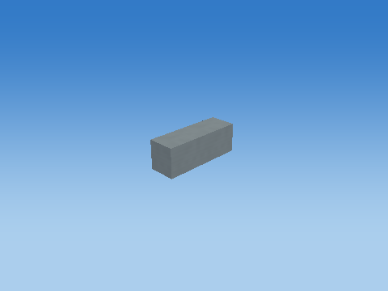 |
| Rotate X |  |
| Rotate Y |  |
| Rotate Z |  |
| Translate to world |  |

Steps 1–5 share one camera; the unit cube has its own close view, and step 6 is reframed at the actual world location to keep small objects visible. Reframing changes the view, never the model coordinates. Identity steps deliberately remain visible. Intermediate shapes are instructional states, while step 6 uses the unmodified game object.

Each stage below gives its exact numeric matrix and all eight corner multiplications. For each output row r: p'[r] = A[r,0]p.x + A[r,1]p.y + A[r,2]p.z + A[r,3]p.w.


#### S

```text
[ 0.230000004 0 0 0 ]
[ 0 0.25 0 0 ]
[ 0 0 0.699999988 0 ]
[ 0 0 0 1 ]
```

| Input corner (w=1) | Output corner (w=1) |
| --- | --- |
| (-0.5, -0.5, -0.5) | (-0.115000002, -0.125, -0.349999994) |
| (-0.5, -0.5, 0.5) | (-0.115000002, -0.125, 0.349999994) |
| (-0.5, 0.5, -0.5) | (-0.115000002, 0.125, -0.349999994) |
| (-0.5, 0.5, 0.5) | (-0.115000002, 0.125, 0.349999994) |
| (0.5, -0.5, -0.5) | (0.115000002, -0.125, -0.349999994) |
| (0.5, -0.5, 0.5) | (0.115000002, -0.125, 0.349999994) |
| (0.5, 0.5, -0.5) | (0.115000002, 0.125, -0.349999994) |
| (0.5, 0.5, 0.5) | (0.115000002, 0.125, 0.349999994) |

#### H

```text
[ 1 0 0 0 ]
[ 0 1 0 0 ]
[ 0 0 1 0 ]
[ 0 0 0 1 ]
```

| Input corner (w=1) | Output corner (w=1) |
| --- | --- |
| (-0.115000002, -0.125, -0.349999994) | (-0.115000002, -0.125, -0.349999994) |
| (-0.115000002, -0.125, 0.349999994) | (-0.115000002, -0.125, 0.349999994) |
| (-0.115000002, 0.125, -0.349999994) | (-0.115000002, 0.125, -0.349999994) |
| (-0.115000002, 0.125, 0.349999994) | (-0.115000002, 0.125, 0.349999994) |
| (0.115000002, -0.125, -0.349999994) | (0.115000002, -0.125, -0.349999994) |
| (0.115000002, -0.125, 0.349999994) | (0.115000002, -0.125, 0.349999994) |
| (0.115000002, 0.125, -0.349999994) | (0.115000002, 0.125, -0.349999994) |
| (0.115000002, 0.125, 0.349999994) | (0.115000002, 0.125, 0.349999994) |

#### Rx

```text
[ 1 0 0 0 ]
[ 0 0.997801483 -0.0662739053 0 ]
[ 0 0.0662739053 0.997801483 0 ]
[ 0 0 0 1 ]
```

| Input corner (w=1) | Output corner (w=1) |
| --- | --- |
| (-0.115000002, -0.125, -0.349999994) | (-0.115000002, -0.101529315, -0.357514769) |
| (-0.115000002, -0.125, 0.349999994) | (-0.115000002, -0.147921056, 0.340946287) |
| (-0.115000002, 0.125, -0.349999994) | (-0.115000002, 0.147921056, -0.340946287) |
| (-0.115000002, 0.125, 0.349999994) | (-0.115000002, 0.101529315, 0.357514769) |
| (0.115000002, -0.125, -0.349999994) | (0.115000002, -0.101529315, -0.357514769) |
| (0.115000002, -0.125, 0.349999994) | (0.115000002, -0.147921056, 0.340946287) |
| (0.115000002, 0.125, -0.349999994) | (0.115000002, 0.147921056, -0.340946287) |
| (0.115000002, 0.125, 0.349999994) | (0.115000002, 0.101529315, 0.357514769) |

#### Ry

```text
[ 1 0 0 0 ]
[ 0 1 0 0 ]
[ -0 0 1 0 ]
[ 0 0 0 1 ]
```

| Input corner (w=1) | Output corner (w=1) |
| --- | --- |
| (-0.115000002, -0.101529315, -0.357514769) | (-0.115000002, -0.101529315, -0.357514769) |
| (-0.115000002, -0.147921056, 0.340946287) | (-0.115000002, -0.147921056, 0.340946287) |
| (-0.115000002, 0.147921056, -0.340946287) | (-0.115000002, 0.147921056, -0.340946287) |
| (-0.115000002, 0.101529315, 0.357514769) | (-0.115000002, 0.101529315, 0.357514769) |
| (0.115000002, -0.101529315, -0.357514769) | (0.115000002, -0.101529315, -0.357514769) |
| (0.115000002, -0.147921056, 0.340946287) | (0.115000002, -0.147921056, 0.340946287) |
| (0.115000002, 0.147921056, -0.340946287) | (0.115000002, 0.147921056, -0.340946287) |
| (0.115000002, 0.101529315, 0.357514769) | (0.115000002, 0.101529315, 0.357514769) |

#### Rz

```text
[ 1 -0 0 0 ]
[ 0 1 0 0 ]
[ 0 0 1 0 ]
[ 0 0 0 1 ]
```

| Input corner (w=1) | Output corner (w=1) |
| --- | --- |
| (-0.115000002, -0.101529315, -0.357514769) | (-0.115000002, -0.101529315, -0.357514769) |
| (-0.115000002, -0.147921056, 0.340946287) | (-0.115000002, -0.147921056, 0.340946287) |
| (-0.115000002, 0.147921056, -0.340946287) | (-0.115000002, 0.147921056, -0.340946287) |
| (-0.115000002, 0.101529315, 0.357514769) | (-0.115000002, 0.101529315, 0.357514769) |
| (0.115000002, -0.101529315, -0.357514769) | (0.115000002, -0.101529315, -0.357514769) |
| (0.115000002, -0.147921056, 0.340946287) | (0.115000002, -0.147921056, 0.340946287) |
| (0.115000002, 0.147921056, -0.340946287) | (0.115000002, 0.147921056, -0.340946287) |
| (0.115000002, 0.101529315, 0.357514769) | (0.115000002, 0.101529315, 0.357514769) |

#### T

```text
[ 1 0 0 0.319999993 ]
[ 0 1 0 1.45971727 ]
[ 0 0 1 -5.60725975 ]
[ 0 0 0 1 ]
```

| Input corner (w=1) | Output corner (w=1) |
| --- | --- |
| (-0.115000002, -0.101529315, -0.357514769) | (0.204999983, 1.35818791, -5.96477461) |
| (-0.115000002, -0.147921056, 0.340946287) | (0.204999983, 1.31179619, -5.26631355) |
| (-0.115000002, 0.147921056, -0.340946287) | (0.204999983, 1.60763836, -5.94820595) |
| (-0.115000002, 0.101529315, 0.357514769) | (0.204999983, 1.56124663, -5.24974489) |
| (0.115000002, -0.101529315, -0.357514769) | (0.435000002, 1.35818791, -5.96477461) |
| (0.115000002, -0.147921056, 0.340946287) | (0.435000002, 1.31179619, -5.26631355) |
| (0.115000002, 0.147921056, -0.340946287) | (0.435000002, 1.60763836, -5.94820595) |
| (0.115000002, 0.101529315, 0.357514769) | (0.435000002, 1.56124663, -5.24974489) |

Final M = T Rz Ry Rx H S:

```text
[ 0.230000004 0 0 0.319999993 ]
[ 0 0.249450371 -0.046391733 1.45971727 ]
[ 0 0.0165684763 0.698461056 -5.60725975 ]
[ 0 0 0 1 ]
```

### BARREL — `RIFLE_BARREL`

Game model; 70 m range; follows player aim

Position T = (0.319999993, 1.55404782, -6.12213993) m; scale S = (0.109999999, 0.129999995, 0.430000007); rotation (Rx,Ry,Rz) = (3.79999995, 0, 0) degrees.

Shear (xy,xz,yx,yz,zx,zy) = (0, 0, 0, 0, 0, 0). Color = (0.219999999, 0.270000011, 0.310000002); specular = 0.75; shininess = 80; emission = 0; flash = 0; material layer = 5; texture scale = 3. Pattern enabled = 0, pattern scale = (1, 1, 1), offset = (0, 0, 0).

| Step | Actual renderer image |
| --- | --- |
| Unit cube |  |
| Scale |  |
| Shear |  |
| Rotate X | 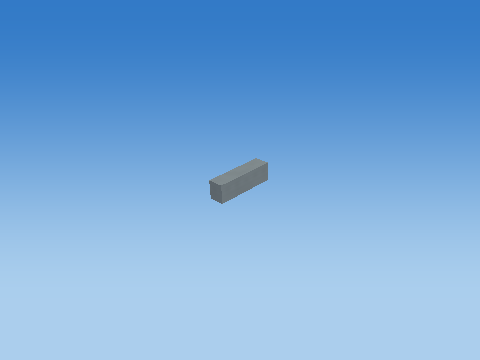 |
| Rotate Y |  |
| Rotate Z |  |
| Translate to world | 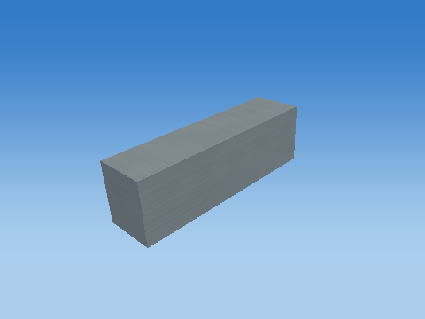 |

Steps 1–5 share one camera; the unit cube has its own close view, and step 6 is reframed at the actual world location to keep small objects visible. Reframing changes the view, never the model coordinates. Identity steps deliberately remain visible. Intermediate shapes are instructional states, while step 6 uses the unmodified game object.

Each stage below gives its exact numeric matrix and all eight corner multiplications. For each output row r: p'[r] = A[r,0]p.x + A[r,1]p.y + A[r,2]p.z + A[r,3]p.w.


#### S

```text
[ 0.109999999 0 0 0 ]
[ 0 0.129999995 0 0 ]
[ 0 0 0.430000007 0 ]
[ 0 0 0 1 ]
```

| Input corner (w=1) | Output corner (w=1) |
| --- | --- |
| (-0.5, -0.5, -0.5) | (-0.0549999997, -0.0649999976, -0.215000004) |
| (-0.5, -0.5, 0.5) | (-0.0549999997, -0.0649999976, 0.215000004) |
| (-0.5, 0.5, -0.5) | (-0.0549999997, 0.0649999976, -0.215000004) |
| (-0.5, 0.5, 0.5) | (-0.0549999997, 0.0649999976, 0.215000004) |
| (0.5, -0.5, -0.5) | (0.0549999997, -0.0649999976, -0.215000004) |
| (0.5, -0.5, 0.5) | (0.0549999997, -0.0649999976, 0.215000004) |
| (0.5, 0.5, -0.5) | (0.0549999997, 0.0649999976, -0.215000004) |
| (0.5, 0.5, 0.5) | (0.0549999997, 0.0649999976, 0.215000004) |

#### H

```text
[ 1 0 0 0 ]
[ 0 1 0 0 ]
[ 0 0 1 0 ]
[ 0 0 0 1 ]
```

| Input corner (w=1) | Output corner (w=1) |
| --- | --- |
| (-0.0549999997, -0.0649999976, -0.215000004) | (-0.0549999997, -0.0649999976, -0.215000004) |
| (-0.0549999997, -0.0649999976, 0.215000004) | (-0.0549999997, -0.0649999976, 0.215000004) |
| (-0.0549999997, 0.0649999976, -0.215000004) | (-0.0549999997, 0.0649999976, -0.215000004) |
| (-0.0549999997, 0.0649999976, 0.215000004) | (-0.0549999997, 0.0649999976, 0.215000004) |
| (0.0549999997, -0.0649999976, -0.215000004) | (0.0549999997, -0.0649999976, -0.215000004) |
| (0.0549999997, -0.0649999976, 0.215000004) | (0.0549999997, -0.0649999976, 0.215000004) |
| (0.0549999997, 0.0649999976, -0.215000004) | (0.0549999997, 0.0649999976, -0.215000004) |
| (0.0549999997, 0.0649999976, 0.215000004) | (0.0549999997, 0.0649999976, 0.215000004) |

#### Rx

```text
[ 1 0 0 0 ]
[ 0 0.997801483 -0.0662739053 0 ]
[ 0 0.0662739053 0.997801483 0 ]
[ 0 0 0 1 ]
```

| Input corner (w=1) | Output corner (w=1) |
| --- | --- |
| (-0.0549999997, -0.0649999976, -0.215000004) | (-0.0549999997, -0.0506082065, -0.21883513) |
| (-0.0549999997, -0.0649999976, 0.215000004) | (-0.0549999997, -0.0791059881, 0.210219517) |
| (-0.0549999997, 0.0649999976, -0.215000004) | (-0.0549999997, 0.0791059881, -0.210219517) |
| (-0.0549999997, 0.0649999976, 0.215000004) | (-0.0549999997, 0.0506082065, 0.21883513) |
| (0.0549999997, -0.0649999976, -0.215000004) | (0.0549999997, -0.0506082065, -0.21883513) |
| (0.0549999997, -0.0649999976, 0.215000004) | (0.0549999997, -0.0791059881, 0.210219517) |
| (0.0549999997, 0.0649999976, -0.215000004) | (0.0549999997, 0.0791059881, -0.210219517) |
| (0.0549999997, 0.0649999976, 0.215000004) | (0.0549999997, 0.0506082065, 0.21883513) |

#### Ry

```text
[ 1 0 0 0 ]
[ 0 1 0 0 ]
[ -0 0 1 0 ]
[ 0 0 0 1 ]
```

| Input corner (w=1) | Output corner (w=1) |
| --- | --- |
| (-0.0549999997, -0.0506082065, -0.21883513) | (-0.0549999997, -0.0506082065, -0.21883513) |
| (-0.0549999997, -0.0791059881, 0.210219517) | (-0.0549999997, -0.0791059881, 0.210219517) |
| (-0.0549999997, 0.0791059881, -0.210219517) | (-0.0549999997, 0.0791059881, -0.210219517) |
| (-0.0549999997, 0.0506082065, 0.21883513) | (-0.0549999997, 0.0506082065, 0.21883513) |
| (0.0549999997, -0.0506082065, -0.21883513) | (0.0549999997, -0.0506082065, -0.21883513) |
| (0.0549999997, -0.0791059881, 0.210219517) | (0.0549999997, -0.0791059881, 0.210219517) |
| (0.0549999997, 0.0791059881, -0.210219517) | (0.0549999997, 0.0791059881, -0.210219517) |
| (0.0549999997, 0.0506082065, 0.21883513) | (0.0549999997, 0.0506082065, 0.21883513) |

#### Rz

```text
[ 1 -0 0 0 ]
[ 0 1 0 0 ]
[ 0 0 1 0 ]
[ 0 0 0 1 ]
```

| Input corner (w=1) | Output corner (w=1) |
| --- | --- |
| (-0.0549999997, -0.0506082065, -0.21883513) | (-0.0549999997, -0.0506082065, -0.21883513) |
| (-0.0549999997, -0.0791059881, 0.210219517) | (-0.0549999997, -0.0791059881, 0.210219517) |
| (-0.0549999997, 0.0791059881, -0.210219517) | (-0.0549999997, 0.0791059881, -0.210219517) |
| (-0.0549999997, 0.0506082065, 0.21883513) | (-0.0549999997, 0.0506082065, 0.21883513) |
| (0.0549999997, -0.0506082065, -0.21883513) | (0.0549999997, -0.0506082065, -0.21883513) |
| (0.0549999997, -0.0791059881, 0.210219517) | (0.0549999997, -0.0791059881, 0.210219517) |
| (0.0549999997, 0.0791059881, -0.210219517) | (0.0549999997, 0.0791059881, -0.210219517) |
| (0.0549999997, 0.0506082065, 0.21883513) | (0.0549999997, 0.0506082065, 0.21883513) |

#### T

```text
[ 1 0 0 0.319999993 ]
[ 0 1 0 1.55404782 ]
[ 0 0 1 -6.12213993 ]
[ 0 0 0 1 ]
```

| Input corner (w=1) | Output corner (w=1) |
| --- | --- |
| (-0.0549999997, -0.0506082065, -0.21883513) | (0.264999986, 1.50343966, -6.34097528) |
| (-0.0549999997, -0.0791059881, 0.210219517) | (0.264999986, 1.47494185, -5.91192055) |
| (-0.0549999997, 0.0791059881, -0.210219517) | (0.264999986, 1.6331538, -6.33235931) |
| (-0.0549999997, 0.0506082065, 0.21883513) | (0.264999986, 1.60465598, -5.90330458) |
| (0.0549999997, -0.0506082065, -0.21883513) | (0.375, 1.50343966, -6.34097528) |
| (0.0549999997, -0.0791059881, 0.210219517) | (0.375, 1.47494185, -5.91192055) |
| (0.0549999997, 0.0791059881, -0.210219517) | (0.375, 1.6331538, -6.33235931) |
| (0.0549999997, 0.0506082065, 0.21883513) | (0.375, 1.60465598, -5.90330458) |

Final M = T Rz Ry Rx H S:

```text
[ 0.109999999 0 0 0.319999993 ]
[ 0 0.129714191 -0.0284977797 1.55404782 ]
[ 0 0.0086156074 0.429054648 -6.12213993 ]
[ 0 0 0 1 ]
```

### STOCK — `RIFLE_STOCK`

Game model; 70 m range; follows player aim

Position T = (0.319999993, 1.34609342, -5.10368252) m; scale S = (0.239999995, 0.300000012, 0.449999988); rotation (Rx,Ry,Rz) = (3.79999995, 0, 0) degrees.

Shear (xy,xz,yx,yz,zx,zy) = (0, 0, 0, 0, 0, 0). Color = (0.300000012, 0.209999993, 0.140000001); specular = 0.75; shininess = 80; emission = 0; flash = 0; material layer = 8; texture scale = 8. Pattern enabled = 0, pattern scale = (1, 1, 1), offset = (0, 0, 0).

| Step | Actual renderer image |
| --- | --- |
| Unit cube |  |
| Scale |  |
| Shear | 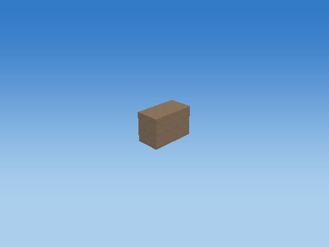 |
| Rotate X |  |
| Rotate Y |  |
| Rotate Z |  |
| Translate to world |  |

Steps 1–5 share one camera; the unit cube has its own close view, and step 6 is reframed at the actual world location to keep small objects visible. Reframing changes the view, never the model coordinates. Identity steps deliberately remain visible. Intermediate shapes are instructional states, while step 6 uses the unmodified game object.

Each stage below gives its exact numeric matrix and all eight corner multiplications. For each output row r: p'[r] = A[r,0]p.x + A[r,1]p.y + A[r,2]p.z + A[r,3]p.w.


#### S

```text
[ 0.239999995 0 0 0 ]
[ 0 0.300000012 0 0 ]
[ 0 0 0.449999988 0 ]
[ 0 0 0 1 ]
```

| Input corner (w=1) | Output corner (w=1) |
| --- | --- |
| (-0.5, -0.5, -0.5) | (-0.119999997, -0.150000006, -0.224999994) |
| (-0.5, -0.5, 0.5) | (-0.119999997, -0.150000006, 0.224999994) |
| (-0.5, 0.5, -0.5) | (-0.119999997, 0.150000006, -0.224999994) |
| (-0.5, 0.5, 0.5) | (-0.119999997, 0.150000006, 0.224999994) |
| (0.5, -0.5, -0.5) | (0.119999997, -0.150000006, -0.224999994) |
| (0.5, -0.5, 0.5) | (0.119999997, -0.150000006, 0.224999994) |
| (0.5, 0.5, -0.5) | (0.119999997, 0.150000006, -0.224999994) |
| (0.5, 0.5, 0.5) | (0.119999997, 0.150000006, 0.224999994) |

#### H

```text
[ 1 0 0 0 ]
[ 0 1 0 0 ]
[ 0 0 1 0 ]
[ 0 0 0 1 ]
```

| Input corner (w=1) | Output corner (w=1) |
| --- | --- |
| (-0.119999997, -0.150000006, -0.224999994) | (-0.119999997, -0.150000006, -0.224999994) |
| (-0.119999997, -0.150000006, 0.224999994) | (-0.119999997, -0.150000006, 0.224999994) |
| (-0.119999997, 0.150000006, -0.224999994) | (-0.119999997, 0.150000006, -0.224999994) |
| (-0.119999997, 0.150000006, 0.224999994) | (-0.119999997, 0.150000006, 0.224999994) |
| (0.119999997, -0.150000006, -0.224999994) | (0.119999997, -0.150000006, -0.224999994) |
| (0.119999997, -0.150000006, 0.224999994) | (0.119999997, -0.150000006, 0.224999994) |
| (0.119999997, 0.150000006, -0.224999994) | (0.119999997, 0.150000006, -0.224999994) |
| (0.119999997, 0.150000006, 0.224999994) | (0.119999997, 0.150000006, 0.224999994) |

#### Rx

```text
[ 1 0 0 0 ]
[ 0 0.997801483 -0.0662739053 0 ]
[ 0 0.0662739053 0.997801483 0 ]
[ 0 0 0 1 ]
```

| Input corner (w=1) | Output corner (w=1) |
| --- | --- |
| (-0.119999997, -0.150000006, -0.224999994) | (-0.119999997, -0.134758607, -0.234446421) |
| (-0.119999997, -0.150000006, 0.224999994) | (-0.119999997, -0.16458185, 0.214564249) |
| (-0.119999997, 0.150000006, -0.224999994) | (-0.119999997, 0.16458185, -0.214564249) |
| (-0.119999997, 0.150000006, 0.224999994) | (-0.119999997, 0.134758607, 0.234446421) |
| (0.119999997, -0.150000006, -0.224999994) | (0.119999997, -0.134758607, -0.234446421) |
| (0.119999997, -0.150000006, 0.224999994) | (0.119999997, -0.16458185, 0.214564249) |
| (0.119999997, 0.150000006, -0.224999994) | (0.119999997, 0.16458185, -0.214564249) |
| (0.119999997, 0.150000006, 0.224999994) | (0.119999997, 0.134758607, 0.234446421) |

#### Ry

```text
[ 1 0 0 0 ]
[ 0 1 0 0 ]
[ -0 0 1 0 ]
[ 0 0 0 1 ]
```

| Input corner (w=1) | Output corner (w=1) |
| --- | --- |
| (-0.119999997, -0.134758607, -0.234446421) | (-0.119999997, -0.134758607, -0.234446421) |
| (-0.119999997, -0.16458185, 0.214564249) | (-0.119999997, -0.16458185, 0.214564249) |
| (-0.119999997, 0.16458185, -0.214564249) | (-0.119999997, 0.16458185, -0.214564249) |
| (-0.119999997, 0.134758607, 0.234446421) | (-0.119999997, 0.134758607, 0.234446421) |
| (0.119999997, -0.134758607, -0.234446421) | (0.119999997, -0.134758607, -0.234446421) |
| (0.119999997, -0.16458185, 0.214564249) | (0.119999997, -0.16458185, 0.214564249) |
| (0.119999997, 0.16458185, -0.214564249) | (0.119999997, 0.16458185, -0.214564249) |
| (0.119999997, 0.134758607, 0.234446421) | (0.119999997, 0.134758607, 0.234446421) |

#### Rz

```text
[ 1 -0 0 0 ]
[ 0 1 0 0 ]
[ 0 0 1 0 ]
[ 0 0 0 1 ]
```

| Input corner (w=1) | Output corner (w=1) |
| --- | --- |
| (-0.119999997, -0.134758607, -0.234446421) | (-0.119999997, -0.134758607, -0.234446421) |
| (-0.119999997, -0.16458185, 0.214564249) | (-0.119999997, -0.16458185, 0.214564249) |
| (-0.119999997, 0.16458185, -0.214564249) | (-0.119999997, 0.16458185, -0.214564249) |
| (-0.119999997, 0.134758607, 0.234446421) | (-0.119999997, 0.134758607, 0.234446421) |
| (0.119999997, -0.134758607, -0.234446421) | (0.119999997, -0.134758607, -0.234446421) |
| (0.119999997, -0.16458185, 0.214564249) | (0.119999997, -0.16458185, 0.214564249) |
| (0.119999997, 0.16458185, -0.214564249) | (0.119999997, 0.16458185, -0.214564249) |
| (0.119999997, 0.134758607, 0.234446421) | (0.119999997, 0.134758607, 0.234446421) |

#### T

```text
[ 1 0 0 0.319999993 ]
[ 0 1 0 1.34609342 ]
[ 0 0 1 -5.10368252 ]
[ 0 0 0 1 ]
```

| Input corner (w=1) | Output corner (w=1) |
| --- | --- |
| (-0.119999997, -0.134758607, -0.234446421) | (0.199999988, 1.21133482, -5.33812904) |
| (-0.119999997, -0.16458185, 0.214564249) | (0.199999988, 1.18151152, -4.88911819) |
| (-0.119999997, 0.16458185, -0.214564249) | (0.199999988, 1.51067531, -5.31824684) |
| (-0.119999997, 0.134758607, 0.234446421) | (0.199999988, 1.48085201, -4.86923599) |
| (0.119999997, -0.134758607, -0.234446421) | (0.439999998, 1.21133482, -5.33812904) |
| (0.119999997, -0.16458185, 0.214564249) | (0.439999998, 1.18151152, -4.88911819) |
| (0.119999997, 0.16458185, -0.214564249) | (0.439999998, 1.51067531, -5.31824684) |
| (0.119999997, 0.134758607, 0.234446421) | (0.439999998, 1.48085201, -4.86923599) |

Final M = T Rz Ry Rx H S:

```text
[ 0.239999995 0 0 0.319999993 ]
[ 0 0.299340457 -0.0298232567 1.34609342 ]
[ 0 0.0198821723 0.44901067 -5.10368252 ]
[ 0 0 0 1 ]
```

### GRIP — `RIFLE_GRIP`

Game model; 70 m range; follows player aim

Position T = (0.319999993, 1.22628343, -5.41230154) m; scale S = (0.170000002, 0.270000011, 0.200000003); rotation (Rx,Ry,Rz) = (3.79999995, 0, 0) degrees.

Shear (xy,xz,yx,yz,zx,zy) = (0, 0, 0, -0.400000006, 0, 0). Color = (0.300000012, 0.209999993, 0.140000001); specular = 0.75; shininess = 80; emission = 0; flash = 0; material layer = 8; texture scale = 8. Pattern enabled = 0, pattern scale = (1, 1, 1), offset = (0, 0, 0).

| Step | Actual renderer image |
| --- | --- |
| Unit cube |  |
| Scale | 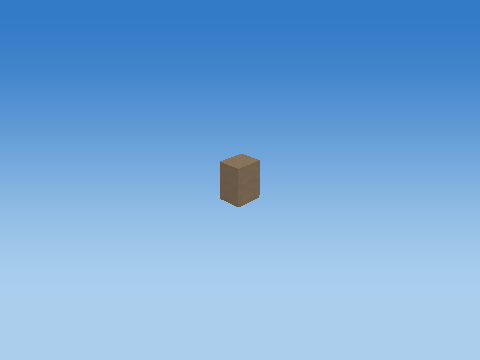 |
| Shear |  |
| Rotate X |  |
| Rotate Y |  |
| Rotate Z |  |
| Translate to world |  |

Steps 1–5 share one camera; the unit cube has its own close view, and step 6 is reframed at the actual world location to keep small objects visible. Reframing changes the view, never the model coordinates. Identity steps deliberately remain visible. Intermediate shapes are instructional states, while step 6 uses the unmodified game object.

Each stage below gives its exact numeric matrix and all eight corner multiplications. For each output row r: p'[r] = A[r,0]p.x + A[r,1]p.y + A[r,2]p.z + A[r,3]p.w.


#### S

```text
[ 0.170000002 0 0 0 ]
[ 0 0.270000011 0 0 ]
[ 0 0 0.200000003 0 ]
[ 0 0 0 1 ]
```

| Input corner (w=1) | Output corner (w=1) |
| --- | --- |
| (-0.5, -0.5, -0.5) | (-0.0850000009, -0.135000005, -0.100000001) |
| (-0.5, -0.5, 0.5) | (-0.0850000009, -0.135000005, 0.100000001) |
| (-0.5, 0.5, -0.5) | (-0.0850000009, 0.135000005, -0.100000001) |
| (-0.5, 0.5, 0.5) | (-0.0850000009, 0.135000005, 0.100000001) |
| (0.5, -0.5, -0.5) | (0.0850000009, -0.135000005, -0.100000001) |
| (0.5, -0.5, 0.5) | (0.0850000009, -0.135000005, 0.100000001) |
| (0.5, 0.5, -0.5) | (0.0850000009, 0.135000005, -0.100000001) |
| (0.5, 0.5, 0.5) | (0.0850000009, 0.135000005, 0.100000001) |

#### H

```text
[ 1 0 0 0 ]
[ 0 1 -0.400000006 0 ]
[ 0 0 1 0 ]
[ 0 0 0 1 ]
```

| Input corner (w=1) | Output corner (w=1) |
| --- | --- |
| (-0.0850000009, -0.135000005, -0.100000001) | (-0.0850000009, -0.0949999988, -0.100000001) |
| (-0.0850000009, -0.135000005, 0.100000001) | (-0.0850000009, -0.175000012, 0.100000001) |
| (-0.0850000009, 0.135000005, -0.100000001) | (-0.0850000009, 0.175000012, -0.100000001) |
| (-0.0850000009, 0.135000005, 0.100000001) | (-0.0850000009, 0.0949999988, 0.100000001) |
| (0.0850000009, -0.135000005, -0.100000001) | (0.0850000009, -0.0949999988, -0.100000001) |
| (0.0850000009, -0.135000005, 0.100000001) | (0.0850000009, -0.175000012, 0.100000001) |
| (0.0850000009, 0.135000005, -0.100000001) | (0.0850000009, 0.175000012, -0.100000001) |
| (0.0850000009, 0.135000005, 0.100000001) | (0.0850000009, 0.0949999988, 0.100000001) |

#### Rx

```text
[ 1 0 0 0 ]
[ 0 0.997801483 -0.0662739053 0 ]
[ 0 0.0662739053 0.997801483 0 ]
[ 0 0 0 1 ]
```

| Input corner (w=1) | Output corner (w=1) |
| --- | --- |
| (-0.0850000009, -0.0949999988, -0.100000001) | (-0.0850000009, -0.0881637484, -0.106076173) |
| (-0.0850000009, -0.175000012, 0.100000001) | (-0.0850000009, -0.18124266, 0.0881822184) |
| (-0.0850000009, 0.175000012, -0.100000001) | (-0.0850000009, 0.18124266, -0.0881822184) |
| (-0.0850000009, 0.0949999988, 0.100000001) | (-0.0850000009, 0.0881637484, 0.106076173) |
| (0.0850000009, -0.0949999988, -0.100000001) | (0.0850000009, -0.0881637484, -0.106076173) |
| (0.0850000009, -0.175000012, 0.100000001) | (0.0850000009, -0.18124266, 0.0881822184) |
| (0.0850000009, 0.175000012, -0.100000001) | (0.0850000009, 0.18124266, -0.0881822184) |
| (0.0850000009, 0.0949999988, 0.100000001) | (0.0850000009, 0.0881637484, 0.106076173) |

#### Ry

```text
[ 1 0 0 0 ]
[ 0 1 0 0 ]
[ -0 0 1 0 ]
[ 0 0 0 1 ]
```

| Input corner (w=1) | Output corner (w=1) |
| --- | --- |
| (-0.0850000009, -0.0881637484, -0.106076173) | (-0.0850000009, -0.0881637484, -0.106076173) |
| (-0.0850000009, -0.18124266, 0.0881822184) | (-0.0850000009, -0.18124266, 0.0881822184) |
| (-0.0850000009, 0.18124266, -0.0881822184) | (-0.0850000009, 0.18124266, -0.0881822184) |
| (-0.0850000009, 0.0881637484, 0.106076173) | (-0.0850000009, 0.0881637484, 0.106076173) |
| (0.0850000009, -0.0881637484, -0.106076173) | (0.0850000009, -0.0881637484, -0.106076173) |
| (0.0850000009, -0.18124266, 0.0881822184) | (0.0850000009, -0.18124266, 0.0881822184) |
| (0.0850000009, 0.18124266, -0.0881822184) | (0.0850000009, 0.18124266, -0.0881822184) |
| (0.0850000009, 0.0881637484, 0.106076173) | (0.0850000009, 0.0881637484, 0.106076173) |

#### Rz

```text
[ 1 -0 0 0 ]
[ 0 1 0 0 ]
[ 0 0 1 0 ]
[ 0 0 0 1 ]
```

| Input corner (w=1) | Output corner (w=1) |
| --- | --- |
| (-0.0850000009, -0.0881637484, -0.106076173) | (-0.0850000009, -0.0881637484, -0.106076173) |
| (-0.0850000009, -0.18124266, 0.0881822184) | (-0.0850000009, -0.18124266, 0.0881822184) |
| (-0.0850000009, 0.18124266, -0.0881822184) | (-0.0850000009, 0.18124266, -0.0881822184) |
| (-0.0850000009, 0.0881637484, 0.106076173) | (-0.0850000009, 0.0881637484, 0.106076173) |
| (0.0850000009, -0.0881637484, -0.106076173) | (0.0850000009, -0.0881637484, -0.106076173) |
| (0.0850000009, -0.18124266, 0.0881822184) | (0.0850000009, -0.18124266, 0.0881822184) |
| (0.0850000009, 0.18124266, -0.0881822184) | (0.0850000009, 0.18124266, -0.0881822184) |
| (0.0850000009, 0.0881637484, 0.106076173) | (0.0850000009, 0.0881637484, 0.106076173) |

#### T

```text
[ 1 0 0 0.319999993 ]
[ 0 1 0 1.22628343 ]
[ 0 0 1 -5.41230154 ]
[ 0 0 0 1 ]
```

| Input corner (w=1) | Output corner (w=1) |
| --- | --- |
| (-0.0850000009, -0.0881637484, -0.106076173) | (0.234999985, 1.1381197, -5.51837778) |
| (-0.0850000009, -0.18124266, 0.0881822184) | (0.234999985, 1.04504073, -5.32411909) |
| (-0.0850000009, 0.18124266, -0.0881822184) | (0.234999985, 1.40752614, -5.50048399) |
| (-0.0850000009, 0.0881637484, 0.106076173) | (0.234999985, 1.31444716, -5.3062253) |
| (0.0850000009, -0.0881637484, -0.106076173) | (0.405000001, 1.1381197, -5.51837778) |
| (0.0850000009, -0.18124266, 0.0881822184) | (0.405000001, 1.04504073, -5.32411909) |
| (0.0850000009, 0.18124266, -0.0881822184) | (0.405000001, 1.40752614, -5.50048399) |
| (0.0850000009, 0.0881637484, 0.106076173) | (0.405000001, 1.31444716, -5.3062253) |

Final M = T Rz Ry Rx H S:

```text
[ 0.170000002 0 0 0.319999993 ]
[ 0 0.269406408 -0.0930789113 1.22628343 ]
[ 0 0.0178939551 0.194258392 -5.41230154 ]
[ 0 0 0 1 ]
```

### FORE_END — `RIFLE_FORE_END`

Game model; 70 m range; follows player aim

Position T = (0.319999993, 1.40710235, -5.87132692) m; scale S = (0.280000001, 0.129999995, 0.340000004); rotation (Rx,Ry,Rz) = (3.79999995, 0, 0) degrees.

Shear (xy,xz,yx,yz,zx,zy) = (0, 0, 0, 0, 0, 0). Color = (0.910000026, 0.639999986, 0.230000004); specular = 0.75; shininess = 80; emission = 0; flash = 0; material layer = 8; texture scale = 8. Pattern enabled = 0, pattern scale = (1, 1, 1), offset = (0, 0, 0).

| Step | Actual renderer image |
| --- | --- |
| Unit cube |  |
| Scale |  |
| Shear |  |
| Rotate X |  |
| Rotate Y |  |
| Rotate Z |  |
| Translate to world |  |

Steps 1–5 share one camera; the unit cube has its own close view, and step 6 is reframed at the actual world location to keep small objects visible. Reframing changes the view, never the model coordinates. Identity steps deliberately remain visible. Intermediate shapes are instructional states, while step 6 uses the unmodified game object.

Each stage below gives its exact numeric matrix and all eight corner multiplications. For each output row r: p'[r] = A[r,0]p.x + A[r,1]p.y + A[r,2]p.z + A[r,3]p.w.


#### S

```text
[ 0.280000001 0 0 0 ]
[ 0 0.129999995 0 0 ]
[ 0 0 0.340000004 0 ]
[ 0 0 0 1 ]
```

| Input corner (w=1) | Output corner (w=1) |
| --- | --- |
| (-0.5, -0.5, -0.5) | (-0.140000001, -0.0649999976, -0.170000002) |
| (-0.5, -0.5, 0.5) | (-0.140000001, -0.0649999976, 0.170000002) |
| (-0.5, 0.5, -0.5) | (-0.140000001, 0.0649999976, -0.170000002) |
| (-0.5, 0.5, 0.5) | (-0.140000001, 0.0649999976, 0.170000002) |
| (0.5, -0.5, -0.5) | (0.140000001, -0.0649999976, -0.170000002) |
| (0.5, -0.5, 0.5) | (0.140000001, -0.0649999976, 0.170000002) |
| (0.5, 0.5, -0.5) | (0.140000001, 0.0649999976, -0.170000002) |
| (0.5, 0.5, 0.5) | (0.140000001, 0.0649999976, 0.170000002) |

#### H

```text
[ 1 0 0 0 ]
[ 0 1 0 0 ]
[ 0 0 1 0 ]
[ 0 0 0 1 ]
```

| Input corner (w=1) | Output corner (w=1) |
| --- | --- |
| (-0.140000001, -0.0649999976, -0.170000002) | (-0.140000001, -0.0649999976, -0.170000002) |
| (-0.140000001, -0.0649999976, 0.170000002) | (-0.140000001, -0.0649999976, 0.170000002) |
| (-0.140000001, 0.0649999976, -0.170000002) | (-0.140000001, 0.0649999976, -0.170000002) |
| (-0.140000001, 0.0649999976, 0.170000002) | (-0.140000001, 0.0649999976, 0.170000002) |
| (0.140000001, -0.0649999976, -0.170000002) | (0.140000001, -0.0649999976, -0.170000002) |
| (0.140000001, -0.0649999976, 0.170000002) | (0.140000001, -0.0649999976, 0.170000002) |
| (0.140000001, 0.0649999976, -0.170000002) | (0.140000001, 0.0649999976, -0.170000002) |
| (0.140000001, 0.0649999976, 0.170000002) | (0.140000001, 0.0649999976, 0.170000002) |

#### Rx

```text
[ 1 0 0 0 ]
[ 0 0.997801483 -0.0662739053 0 ]
[ 0 0.0662739053 0.997801483 0 ]
[ 0 0 0 1 ]
```

| Input corner (w=1) | Output corner (w=1) |
| --- | --- |
| (-0.140000001, -0.0649999976, -0.170000002) | (-0.140000001, -0.0535905324, -0.173934057) |
| (-0.140000001, -0.0649999976, 0.170000002) | (-0.140000001, -0.0761236623, 0.165318444) |
| (-0.140000001, 0.0649999976, -0.170000002) | (-0.140000001, 0.0761236623, -0.165318444) |
| (-0.140000001, 0.0649999976, 0.170000002) | (-0.140000001, 0.0535905324, 0.173934057) |
| (0.140000001, -0.0649999976, -0.170000002) | (0.140000001, -0.0535905324, -0.173934057) |
| (0.140000001, -0.0649999976, 0.170000002) | (0.140000001, -0.0761236623, 0.165318444) |
| (0.140000001, 0.0649999976, -0.170000002) | (0.140000001, 0.0761236623, -0.165318444) |
| (0.140000001, 0.0649999976, 0.170000002) | (0.140000001, 0.0535905324, 0.173934057) |

#### Ry

```text
[ 1 0 0 0 ]
[ 0 1 0 0 ]
[ -0 0 1 0 ]
[ 0 0 0 1 ]
```

| Input corner (w=1) | Output corner (w=1) |
| --- | --- |
| (-0.140000001, -0.0535905324, -0.173934057) | (-0.140000001, -0.0535905324, -0.173934057) |
| (-0.140000001, -0.0761236623, 0.165318444) | (-0.140000001, -0.0761236623, 0.165318444) |
| (-0.140000001, 0.0761236623, -0.165318444) | (-0.140000001, 0.0761236623, -0.165318444) |
| (-0.140000001, 0.0535905324, 0.173934057) | (-0.140000001, 0.0535905324, 0.173934057) |
| (0.140000001, -0.0535905324, -0.173934057) | (0.140000001, -0.0535905324, -0.173934057) |
| (0.140000001, -0.0761236623, 0.165318444) | (0.140000001, -0.0761236623, 0.165318444) |
| (0.140000001, 0.0761236623, -0.165318444) | (0.140000001, 0.0761236623, -0.165318444) |
| (0.140000001, 0.0535905324, 0.173934057) | (0.140000001, 0.0535905324, 0.173934057) |

#### Rz

```text
[ 1 -0 0 0 ]
[ 0 1 0 0 ]
[ 0 0 1 0 ]
[ 0 0 0 1 ]
```

| Input corner (w=1) | Output corner (w=1) |
| --- | --- |
| (-0.140000001, -0.0535905324, -0.173934057) | (-0.140000001, -0.0535905324, -0.173934057) |
| (-0.140000001, -0.0761236623, 0.165318444) | (-0.140000001, -0.0761236623, 0.165318444) |
| (-0.140000001, 0.0761236623, -0.165318444) | (-0.140000001, 0.0761236623, -0.165318444) |
| (-0.140000001, 0.0535905324, 0.173934057) | (-0.140000001, 0.0535905324, 0.173934057) |
| (0.140000001, -0.0535905324, -0.173934057) | (0.140000001, -0.0535905324, -0.173934057) |
| (0.140000001, -0.0761236623, 0.165318444) | (0.140000001, -0.0761236623, 0.165318444) |
| (0.140000001, 0.0761236623, -0.165318444) | (0.140000001, 0.0761236623, -0.165318444) |
| (0.140000001, 0.0535905324, 0.173934057) | (0.140000001, 0.0535905324, 0.173934057) |

#### T

```text
[ 1 0 0 0.319999993 ]
[ 0 1 0 1.40710235 ]
[ 0 0 1 -5.87132692 ]
[ 0 0 0 1 ]
```

| Input corner (w=1) | Output corner (w=1) |
| --- | --- |
| (-0.140000001, -0.0535905324, -0.173934057) | (0.179999992, 1.35351181, -6.04526091) |
| (-0.140000001, -0.0761236623, 0.165318444) | (0.179999992, 1.33097863, -5.70600843) |
| (-0.140000001, 0.0761236623, -0.165318444) | (0.179999992, 1.48322606, -6.03664541) |
| (-0.140000001, 0.0535905324, 0.173934057) | (0.179999992, 1.46069288, -5.69739294) |
| (0.140000001, -0.0535905324, -0.173934057) | (0.459999979, 1.35351181, -6.04526091) |
| (0.140000001, -0.0761236623, 0.165318444) | (0.459999979, 1.33097863, -5.70600843) |
| (0.140000001, 0.0761236623, -0.165318444) | (0.459999979, 1.48322606, -6.03664541) |
| (0.140000001, 0.0535905324, 0.173934057) | (0.459999979, 1.46069288, -5.69739294) |

Final M = T Rz Ry Rx H S:

```text
[ 0.280000001 0 0 0.319999993 ]
[ 0 0.129714191 -0.022533128 1.40710235 ]
[ 0 0.0086156074 0.339252502 -5.87132692 ]
[ 0 0 0 1 ]
```

### MAGAZINE — `RIFLE_MAGAZINE`

Game model; 70 m range; follows player aim

Position T = (0.319999993, 1.2328738, -5.66241455) m; scale S = (0.150000006, 0.349999994, 0.239999995); rotation (Rx,Ry,Rz) = (3.79999995, 0, 0) degrees.

Shear (xy,xz,yx,yz,zx,zy) = (0, 0, 0, -0.219999999, 0, 0). Color = (0.219999999, 0.270000011, 0.310000002); specular = 0.75; shininess = 80; emission = 0; flash = 0; material layer = 5; texture scale = 3. Pattern enabled = 0, pattern scale = (1, 1, 1), offset = (0, 0, 0).

| Step | Actual renderer image |
| --- | --- |
| Unit cube | 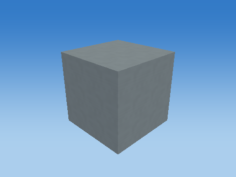 |
| Scale |  |
| Shear |  |
| Rotate X |  |
| Rotate Y |  |
| Rotate Z |  |
| Translate to world | 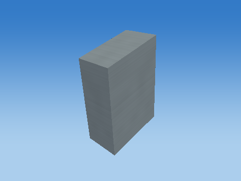 |

Steps 1–5 share one camera; the unit cube has its own close view, and step 6 is reframed at the actual world location to keep small objects visible. Reframing changes the view, never the model coordinates. Identity steps deliberately remain visible. Intermediate shapes are instructional states, while step 6 uses the unmodified game object.

Each stage below gives its exact numeric matrix and all eight corner multiplications. For each output row r: p'[r] = A[r,0]p.x + A[r,1]p.y + A[r,2]p.z + A[r,3]p.w.

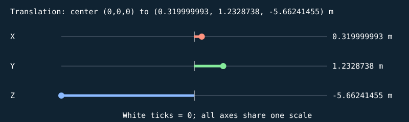


#### S

```text
[ 0.150000006 0 0 0 ]
[ 0 0.349999994 0 0 ]
[ 0 0 0.239999995 0 ]
[ 0 0 0 1 ]
```

| Input corner (w=1) | Output corner (w=1) |
| --- | --- |
| (-0.5, -0.5, -0.5) | (-0.075000003, -0.174999997, -0.119999997) |
| (-0.5, -0.5, 0.5) | (-0.075000003, -0.174999997, 0.119999997) |
| (-0.5, 0.5, -0.5) | (-0.075000003, 0.174999997, -0.119999997) |
| (-0.5, 0.5, 0.5) | (-0.075000003, 0.174999997, 0.119999997) |
| (0.5, -0.5, -0.5) | (0.075000003, -0.174999997, -0.119999997) |
| (0.5, -0.5, 0.5) | (0.075000003, -0.174999997, 0.119999997) |
| (0.5, 0.5, -0.5) | (0.075000003, 0.174999997, -0.119999997) |
| (0.5, 0.5, 0.5) | (0.075000003, 0.174999997, 0.119999997) |

#### H

```text
[ 1 0 0 0 ]
[ 0 1 -0.219999999 0 ]
[ 0 0 1 0 ]
[ 0 0 0 1 ]
```

| Input corner (w=1) | Output corner (w=1) |
| --- | --- |
| (-0.075000003, -0.174999997, -0.119999997) | (-0.075000003, -0.148599997, -0.119999997) |
| (-0.075000003, -0.174999997, 0.119999997) | (-0.075000003, -0.201399997, 0.119999997) |
| (-0.075000003, 0.174999997, -0.119999997) | (-0.075000003, 0.201399997, -0.119999997) |
| (-0.075000003, 0.174999997, 0.119999997) | (-0.075000003, 0.148599997, 0.119999997) |
| (0.075000003, -0.174999997, -0.119999997) | (0.075000003, -0.148599997, -0.119999997) |
| (0.075000003, -0.174999997, 0.119999997) | (0.075000003, -0.201399997, 0.119999997) |
| (0.075000003, 0.174999997, -0.119999997) | (0.075000003, 0.201399997, -0.119999997) |
| (0.075000003, 0.174999997, 0.119999997) | (0.075000003, 0.148599997, 0.119999997) |

#### Rx

```text
[ 1 0 0 0 ]
[ 0 0.997801483 -0.0662739053 0 ]
[ 0 0.0662739053 0.997801483 0 ]
[ 0 0 0 1 ]
```

| Input corner (w=1) | Output corner (w=1) |
| --- | --- |
| (-0.075000003, -0.148599997, -0.119999997) | (-0.075000003, -0.140320435, -0.129584476) |
| (-0.075000003, -0.201399997, 0.119999997) | (-0.075000003, -0.208910078, 0.106388606) |
| (-0.075000003, 0.201399997, -0.119999997) | (-0.075000003, 0.208910078, -0.106388606) |
| (-0.075000003, 0.148599997, 0.119999997) | (-0.075000003, 0.140320435, 0.129584476) |
| (0.075000003, -0.148599997, -0.119999997) | (0.075000003, -0.140320435, -0.129584476) |
| (0.075000003, -0.201399997, 0.119999997) | (0.075000003, -0.208910078, 0.106388606) |
| (0.075000003, 0.201399997, -0.119999997) | (0.075000003, 0.208910078, -0.106388606) |
| (0.075000003, 0.148599997, 0.119999997) | (0.075000003, 0.140320435, 0.129584476) |

#### Ry

```text
[ 1 0 0 0 ]
[ 0 1 0 0 ]
[ -0 0 1 0 ]
[ 0 0 0 1 ]
```

| Input corner (w=1) | Output corner (w=1) |
| --- | --- |
| (-0.075000003, -0.140320435, -0.129584476) | (-0.075000003, -0.140320435, -0.129584476) |
| (-0.075000003, -0.208910078, 0.106388606) | (-0.075000003, -0.208910078, 0.106388606) |
| (-0.075000003, 0.208910078, -0.106388606) | (-0.075000003, 0.208910078, -0.106388606) |
| (-0.075000003, 0.140320435, 0.129584476) | (-0.075000003, 0.140320435, 0.129584476) |
| (0.075000003, -0.140320435, -0.129584476) | (0.075000003, -0.140320435, -0.129584476) |
| (0.075000003, -0.208910078, 0.106388606) | (0.075000003, -0.208910078, 0.106388606) |
| (0.075000003, 0.208910078, -0.106388606) | (0.075000003, 0.208910078, -0.106388606) |
| (0.075000003, 0.140320435, 0.129584476) | (0.075000003, 0.140320435, 0.129584476) |

#### Rz

```text
[ 1 -0 0 0 ]
[ 0 1 0 0 ]
[ 0 0 1 0 ]
[ 0 0 0 1 ]
```

| Input corner (w=1) | Output corner (w=1) |
| --- | --- |
| (-0.075000003, -0.140320435, -0.129584476) | (-0.075000003, -0.140320435, -0.129584476) |
| (-0.075000003, -0.208910078, 0.106388606) | (-0.075000003, -0.208910078, 0.106388606) |
| (-0.075000003, 0.208910078, -0.106388606) | (-0.075000003, 0.208910078, -0.106388606) |
| (-0.075000003, 0.140320435, 0.129584476) | (-0.075000003, 0.140320435, 0.129584476) |
| (0.075000003, -0.140320435, -0.129584476) | (0.075000003, -0.140320435, -0.129584476) |
| (0.075000003, -0.208910078, 0.106388606) | (0.075000003, -0.208910078, 0.106388606) |
| (0.075000003, 0.208910078, -0.106388606) | (0.075000003, 0.208910078, -0.106388606) |
| (0.075000003, 0.140320435, 0.129584476) | (0.075000003, 0.140320435, 0.129584476) |

#### T

```text
[ 1 0 0 0.319999993 ]
[ 0 1 0 1.2328738 ]
[ 0 0 1 -5.66241455 ]
[ 0 0 0 1 ]
```

| Input corner (w=1) | Output corner (w=1) |
| --- | --- |
| (-0.075000003, -0.140320435, -0.129584476) | (0.24499999, 1.09255338, -5.79199886) |
| (-0.075000003, -0.208910078, 0.106388606) | (0.24499999, 1.02396369, -5.55602598) |
| (-0.075000003, 0.208910078, -0.106388606) | (0.24499999, 1.44178391, -5.76880312) |
| (-0.075000003, 0.140320435, 0.129584476) | (0.24499999, 1.37319422, -5.53283024) |
| (0.075000003, -0.140320435, -0.129584476) | (0.394999981, 1.09255338, -5.79199886) |
| (0.075000003, -0.208910078, 0.106388606) | (0.394999981, 1.02396369, -5.55602598) |
| (0.075000003, 0.208910078, -0.106388606) | (0.394999981, 1.44178391, -5.76880312) |
| (0.075000003, 0.140320435, 0.129584476) | (0.394999981, 1.37319422, -5.53283024) |

Final M = T Rz Ry Rx H S:

```text
[ 0.150000006 0 0 0.319999993 ]
[ 0 0.349230528 -0.0685896575 1.2328738 ]
[ 0 0.0231958665 0.235973075 -5.66241455 ]
[ 0 0 0 1 ]
```

### FRONT_SIGHT — `RIFLE_FRONT_SIGHT`

Game model; 70 m range; follows player aim

Position T = (0.319999993, 1.67577219, -6.14412117) m; scale S = (0.0500000007, 0.129999995, 0.0700000003); rotation (Rx,Ry,Rz) = (3.79999995, 0, 0) degrees.

Shear (xy,xz,yx,yz,zx,zy) = (0, 0, 0, 0, 0, 0). Color = (0.910000026, 0.639999986, 0.230000004); specular = 0.75; shininess = 80; emission = 0; flash = 0; material layer = 5; texture scale = 3. Pattern enabled = 0, pattern scale = (1, 1, 1), offset = (0, 0, 0).

| Step | Actual renderer image |
| --- | --- |
| Unit cube |  |
| Scale |  |
| Shear |  |
| Rotate X |  |
| Rotate Y |  |
| Rotate Z |  |
| Translate to world |  |

Steps 1–5 share one camera; the unit cube has its own close view, and step 6 is reframed at the actual world location to keep small objects visible. Reframing changes the view, never the model coordinates. Identity steps deliberately remain visible. Intermediate shapes are instructional states, while step 6 uses the unmodified game object.

Each stage below gives its exact numeric matrix and all eight corner multiplications. For each output row r: p'[r] = A[r,0]p.x + A[r,1]p.y + A[r,2]p.z + A[r,3]p.w.


#### S

```text
[ 0.0500000007 0 0 0 ]
[ 0 0.129999995 0 0 ]
[ 0 0 0.0700000003 0 ]
[ 0 0 0 1 ]
```

| Input corner (w=1) | Output corner (w=1) |
| --- | --- |
| (-0.5, -0.5, -0.5) | (-0.0250000004, -0.0649999976, -0.0350000001) |
| (-0.5, -0.5, 0.5) | (-0.0250000004, -0.0649999976, 0.0350000001) |
| (-0.5, 0.5, -0.5) | (-0.0250000004, 0.0649999976, -0.0350000001) |
| (-0.5, 0.5, 0.5) | (-0.0250000004, 0.0649999976, 0.0350000001) |
| (0.5, -0.5, -0.5) | (0.0250000004, -0.0649999976, -0.0350000001) |
| (0.5, -0.5, 0.5) | (0.0250000004, -0.0649999976, 0.0350000001) |
| (0.5, 0.5, -0.5) | (0.0250000004, 0.0649999976, -0.0350000001) |
| (0.5, 0.5, 0.5) | (0.0250000004, 0.0649999976, 0.0350000001) |

#### H

```text
[ 1 0 0 0 ]
[ 0 1 0 0 ]
[ 0 0 1 0 ]
[ 0 0 0 1 ]
```

| Input corner (w=1) | Output corner (w=1) |
| --- | --- |
| (-0.0250000004, -0.0649999976, -0.0350000001) | (-0.0250000004, -0.0649999976, -0.0350000001) |
| (-0.0250000004, -0.0649999976, 0.0350000001) | (-0.0250000004, -0.0649999976, 0.0350000001) |
| (-0.0250000004, 0.0649999976, -0.0350000001) | (-0.0250000004, 0.0649999976, -0.0350000001) |
| (-0.0250000004, 0.0649999976, 0.0350000001) | (-0.0250000004, 0.0649999976, 0.0350000001) |
| (0.0250000004, -0.0649999976, -0.0350000001) | (0.0250000004, -0.0649999976, -0.0350000001) |
| (0.0250000004, -0.0649999976, 0.0350000001) | (0.0250000004, -0.0649999976, 0.0350000001) |
| (0.0250000004, 0.0649999976, -0.0350000001) | (0.0250000004, 0.0649999976, -0.0350000001) |
| (0.0250000004, 0.0649999976, 0.0350000001) | (0.0250000004, 0.0649999976, 0.0350000001) |

#### Rx

```text
[ 1 0 0 0 ]
[ 0 0.997801483 -0.0662739053 0 ]
[ 0 0.0662739053 0.997801483 0 ]
[ 0 0 0 1 ]
```

| Input corner (w=1) | Output corner (w=1) |
| --- | --- |
| (-0.0250000004, -0.0649999976, -0.0350000001) | (-0.0250000004, -0.0625375062, -0.0392308533) |
| (-0.0250000004, -0.0649999976, 0.0350000001) | (-0.0250000004, -0.0671766847, 0.0306152478) |
| (-0.0250000004, 0.0649999976, -0.0350000001) | (-0.0250000004, 0.0671766847, -0.0306152478) |
| (-0.0250000004, 0.0649999976, 0.0350000001) | (-0.0250000004, 0.0625375062, 0.0392308533) |
| (0.0250000004, -0.0649999976, -0.0350000001) | (0.0250000004, -0.0625375062, -0.0392308533) |
| (0.0250000004, -0.0649999976, 0.0350000001) | (0.0250000004, -0.0671766847, 0.0306152478) |
| (0.0250000004, 0.0649999976, -0.0350000001) | (0.0250000004, 0.0671766847, -0.0306152478) |
| (0.0250000004, 0.0649999976, 0.0350000001) | (0.0250000004, 0.0625375062, 0.0392308533) |

#### Ry

```text
[ 1 0 0 0 ]
[ 0 1 0 0 ]
[ -0 0 1 0 ]
[ 0 0 0 1 ]
```

| Input corner (w=1) | Output corner (w=1) |
| --- | --- |
| (-0.0250000004, -0.0625375062, -0.0392308533) | (-0.0250000004, -0.0625375062, -0.0392308533) |
| (-0.0250000004, -0.0671766847, 0.0306152478) | (-0.0250000004, -0.0671766847, 0.0306152478) |
| (-0.0250000004, 0.0671766847, -0.0306152478) | (-0.0250000004, 0.0671766847, -0.0306152478) |
| (-0.0250000004, 0.0625375062, 0.0392308533) | (-0.0250000004, 0.0625375062, 0.0392308533) |
| (0.0250000004, -0.0625375062, -0.0392308533) | (0.0250000004, -0.0625375062, -0.0392308533) |
| (0.0250000004, -0.0671766847, 0.0306152478) | (0.0250000004, -0.0671766847, 0.0306152478) |
| (0.0250000004, 0.0671766847, -0.0306152478) | (0.0250000004, 0.0671766847, -0.0306152478) |
| (0.0250000004, 0.0625375062, 0.0392308533) | (0.0250000004, 0.0625375062, 0.0392308533) |

#### Rz

```text
[ 1 -0 0 0 ]
[ 0 1 0 0 ]
[ 0 0 1 0 ]
[ 0 0 0 1 ]
```

| Input corner (w=1) | Output corner (w=1) |
| --- | --- |
| (-0.0250000004, -0.0625375062, -0.0392308533) | (-0.0250000004, -0.0625375062, -0.0392308533) |
| (-0.0250000004, -0.0671766847, 0.0306152478) | (-0.0250000004, -0.0671766847, 0.0306152478) |
| (-0.0250000004, 0.0671766847, -0.0306152478) | (-0.0250000004, 0.0671766847, -0.0306152478) |
| (-0.0250000004, 0.0625375062, 0.0392308533) | (-0.0250000004, 0.0625375062, 0.0392308533) |
| (0.0250000004, -0.0625375062, -0.0392308533) | (0.0250000004, -0.0625375062, -0.0392308533) |
| (0.0250000004, -0.0671766847, 0.0306152478) | (0.0250000004, -0.0671766847, 0.0306152478) |
| (0.0250000004, 0.0671766847, -0.0306152478) | (0.0250000004, 0.0671766847, -0.0306152478) |
| (0.0250000004, 0.0625375062, 0.0392308533) | (0.0250000004, 0.0625375062, 0.0392308533) |

#### T

```text
[ 1 0 0 0.319999993 ]
[ 0 1 0 1.67577219 ]
[ 0 0 1 -6.14412117 ]
[ 0 0 0 1 ]
```

| Input corner (w=1) | Output corner (w=1) |
| --- | --- |
| (-0.0250000004, -0.0625375062, -0.0392308533) | (0.294999987, 1.61323464, -6.18335199) |
| (-0.0250000004, -0.0671766847, 0.0306152478) | (0.294999987, 1.60859549, -6.11350584) |
| (-0.0250000004, 0.0671766847, -0.0306152478) | (0.294999987, 1.74294889, -6.1747365) |
| (-0.0250000004, 0.0625375062, 0.0392308533) | (0.294999987, 1.73830974, -6.10489035) |
| (0.0250000004, -0.0625375062, -0.0392308533) | (0.344999999, 1.61323464, -6.18335199) |
| (0.0250000004, -0.0671766847, 0.0306152478) | (0.344999999, 1.60859549, -6.11350584) |
| (0.0250000004, 0.0671766847, -0.0306152478) | (0.344999999, 1.74294889, -6.1747365) |
| (0.0250000004, 0.0625375062, 0.0392308533) | (0.344999999, 1.73830974, -6.10489035) |

Final M = T Rz Ry Rx H S:

```text
[ 0.0500000007 0 0 0.319999993 ]
[ 0 0.129714191 -0.00463917339 1.67577219 ]
[ 0 0.0086156074 0.0698461011 -6.14412117 ]
[ 0 0 0 1 ]
```

### REAR_SIGHT — `RIFLE_REAR_SIGHT`

Game model; 70 m range; follows player aim

Position T = (0.319999993, 1.62606668, -5.39577007) m; scale S = (0.129999995, 0.100000001, 0.0599999987); rotation (Rx,Ry,Rz) = (3.79999995, 0, 0) degrees.

Shear (xy,xz,yx,yz,zx,zy) = (0, 0, 0, 0, 0, 0). Color = (0.219999999, 0.270000011, 0.310000002); specular = 0.75; shininess = 80; emission = 0; flash = 0; material layer = 5; texture scale = 3. Pattern enabled = 0, pattern scale = (1, 1, 1), offset = (0, 0, 0).

| Step | Actual renderer image |
| --- | --- |
| Unit cube |  |
| Scale |  |
| Shear |  |
| Rotate X |  |
| Rotate Y |  |
| Rotate Z | 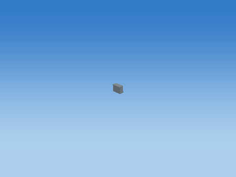 |
| Translate to world | 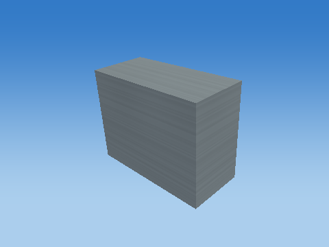 |

Steps 1–5 share one camera; the unit cube has its own close view, and step 6 is reframed at the actual world location to keep small objects visible. Reframing changes the view, never the model coordinates. Identity steps deliberately remain visible. Intermediate shapes are instructional states, while step 6 uses the unmodified game object.

Each stage below gives its exact numeric matrix and all eight corner multiplications. For each output row r: p'[r] = A[r,0]p.x + A[r,1]p.y + A[r,2]p.z + A[r,3]p.w.

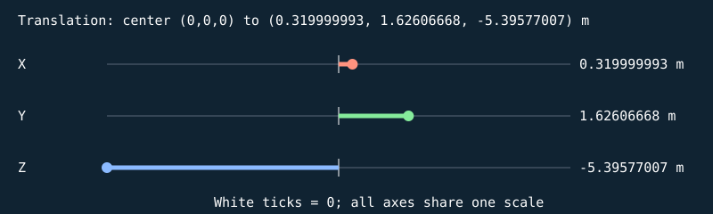


#### S

```text
[ 0.129999995 0 0 0 ]
[ 0 0.100000001 0 0 ]
[ 0 0 0.0599999987 0 ]
[ 0 0 0 1 ]
```

| Input corner (w=1) | Output corner (w=1) |
| --- | --- |
| (-0.5, -0.5, -0.5) | (-0.0649999976, -0.0500000007, -0.0299999993) |
| (-0.5, -0.5, 0.5) | (-0.0649999976, -0.0500000007, 0.0299999993) |
| (-0.5, 0.5, -0.5) | (-0.0649999976, 0.0500000007, -0.0299999993) |
| (-0.5, 0.5, 0.5) | (-0.0649999976, 0.0500000007, 0.0299999993) |
| (0.5, -0.5, -0.5) | (0.0649999976, -0.0500000007, -0.0299999993) |
| (0.5, -0.5, 0.5) | (0.0649999976, -0.0500000007, 0.0299999993) |
| (0.5, 0.5, -0.5) | (0.0649999976, 0.0500000007, -0.0299999993) |
| (0.5, 0.5, 0.5) | (0.0649999976, 0.0500000007, 0.0299999993) |

#### H

```text
[ 1 0 0 0 ]
[ 0 1 0 0 ]
[ 0 0 1 0 ]
[ 0 0 0 1 ]
```

| Input corner (w=1) | Output corner (w=1) |
| --- | --- |
| (-0.0649999976, -0.0500000007, -0.0299999993) | (-0.0649999976, -0.0500000007, -0.0299999993) |
| (-0.0649999976, -0.0500000007, 0.0299999993) | (-0.0649999976, -0.0500000007, 0.0299999993) |
| (-0.0649999976, 0.0500000007, -0.0299999993) | (-0.0649999976, 0.0500000007, -0.0299999993) |
| (-0.0649999976, 0.0500000007, 0.0299999993) | (-0.0649999976, 0.0500000007, 0.0299999993) |
| (0.0649999976, -0.0500000007, -0.0299999993) | (0.0649999976, -0.0500000007, -0.0299999993) |
| (0.0649999976, -0.0500000007, 0.0299999993) | (0.0649999976, -0.0500000007, 0.0299999993) |
| (0.0649999976, 0.0500000007, -0.0299999993) | (0.0649999976, 0.0500000007, -0.0299999993) |
| (0.0649999976, 0.0500000007, 0.0299999993) | (0.0649999976, 0.0500000007, 0.0299999993) |

#### Rx

```text
[ 1 0 0 0 ]
[ 0 0.997801483 -0.0662739053 0 ]
[ 0 0.0662739053 0.997801483 0 ]
[ 0 0 0 1 ]
```

| Input corner (w=1) | Output corner (w=1) |
| --- | --- |
| (-0.0649999976, -0.0500000007, -0.0299999993) | (-0.0649999976, -0.0479018576, -0.0332477391) |
| (-0.0649999976, -0.0500000007, 0.0299999993) | (-0.0649999976, -0.0518782921, 0.0266203471) |
| (-0.0649999976, 0.0500000007, -0.0299999993) | (-0.0649999976, 0.0518782921, -0.0266203471) |
| (-0.0649999976, 0.0500000007, 0.0299999993) | (-0.0649999976, 0.0479018576, 0.0332477391) |
| (0.0649999976, -0.0500000007, -0.0299999993) | (0.0649999976, -0.0479018576, -0.0332477391) |
| (0.0649999976, -0.0500000007, 0.0299999993) | (0.0649999976, -0.0518782921, 0.0266203471) |
| (0.0649999976, 0.0500000007, -0.0299999993) | (0.0649999976, 0.0518782921, -0.0266203471) |
| (0.0649999976, 0.0500000007, 0.0299999993) | (0.0649999976, 0.0479018576, 0.0332477391) |

#### Ry

```text
[ 1 0 0 0 ]
[ 0 1 0 0 ]
[ -0 0 1 0 ]
[ 0 0 0 1 ]
```

| Input corner (w=1) | Output corner (w=1) |
| --- | --- |
| (-0.0649999976, -0.0479018576, -0.0332477391) | (-0.0649999976, -0.0479018576, -0.0332477391) |
| (-0.0649999976, -0.0518782921, 0.0266203471) | (-0.0649999976, -0.0518782921, 0.0266203471) |
| (-0.0649999976, 0.0518782921, -0.0266203471) | (-0.0649999976, 0.0518782921, -0.0266203471) |
| (-0.0649999976, 0.0479018576, 0.0332477391) | (-0.0649999976, 0.0479018576, 0.0332477391) |
| (0.0649999976, -0.0479018576, -0.0332477391) | (0.0649999976, -0.0479018576, -0.0332477391) |
| (0.0649999976, -0.0518782921, 0.0266203471) | (0.0649999976, -0.0518782921, 0.0266203471) |
| (0.0649999976, 0.0518782921, -0.0266203471) | (0.0649999976, 0.0518782921, -0.0266203471) |
| (0.0649999976, 0.0479018576, 0.0332477391) | (0.0649999976, 0.0479018576, 0.0332477391) |

#### Rz

```text
[ 1 -0 0 0 ]
[ 0 1 0 0 ]
[ 0 0 1 0 ]
[ 0 0 0 1 ]
```

| Input corner (w=1) | Output corner (w=1) |
| --- | --- |
| (-0.0649999976, -0.0479018576, -0.0332477391) | (-0.0649999976, -0.0479018576, -0.0332477391) |
| (-0.0649999976, -0.0518782921, 0.0266203471) | (-0.0649999976, -0.0518782921, 0.0266203471) |
| (-0.0649999976, 0.0518782921, -0.0266203471) | (-0.0649999976, 0.0518782921, -0.0266203471) |
| (-0.0649999976, 0.0479018576, 0.0332477391) | (-0.0649999976, 0.0479018576, 0.0332477391) |
| (0.0649999976, -0.0479018576, -0.0332477391) | (0.0649999976, -0.0479018576, -0.0332477391) |
| (0.0649999976, -0.0518782921, 0.0266203471) | (0.0649999976, -0.0518782921, 0.0266203471) |
| (0.0649999976, 0.0518782921, -0.0266203471) | (0.0649999976, 0.0518782921, -0.0266203471) |
| (0.0649999976, 0.0479018576, 0.0332477391) | (0.0649999976, 0.0479018576, 0.0332477391) |

#### T

```text
[ 1 0 0 0.319999993 ]
[ 0 1 0 1.62606668 ]
[ 0 0 1 -5.39577007 ]
[ 0 0 0 1 ]
```

| Input corner (w=1) | Output corner (w=1) |
| --- | --- |
| (-0.0649999976, -0.0479018576, -0.0332477391) | (0.254999995, 1.57816482, -5.42901802) |
| (-0.0649999976, -0.0518782921, 0.0266203471) | (0.254999995, 1.57418835, -5.36914968) |
| (-0.0649999976, 0.0518782921, -0.0266203471) | (0.254999995, 1.67794502, -5.42239046) |
| (-0.0649999976, 0.0479018576, 0.0332477391) | (0.254999995, 1.67396855, -5.36252213) |
| (0.0649999976, -0.0479018576, -0.0332477391) | (0.38499999, 1.57816482, -5.42901802) |
| (0.0649999976, -0.0518782921, 0.0266203471) | (0.38499999, 1.57418835, -5.36914968) |
| (0.0649999976, 0.0518782921, -0.0266203471) | (0.38499999, 1.67794502, -5.42239046) |
| (0.0649999976, 0.0479018576, 0.0332477391) | (0.38499999, 1.67396855, -5.36252213) |

Final M = T Rz Ry Rx H S:

```text
[ 0.129999995 0 0 0.319999993 ]
[ 0 0.0997801498 -0.003976434 1.62606668 ]
[ 0 0.00662739063 0.0598680861 -5.39577007 ]
[ 0 0 0 1 ]
```

### MUZZLE_INSET — `RIFLE_MUZZLE_INSET`

Game model; 70 m range; follows player aim

Position T = (0.319999993, 1.56869435, -6.34265423) m; scale S = (0.0900000036, 0.075000003, 0.0120000001); rotation (Rx,Ry,Rz) = (3.79999995, 0, 0) degrees.

Shear (xy,xz,yx,yz,zx,zy) = (0, 0, 0, 0, 0, 0). Color = (0.0450000018, 0.0549999997, 0.0649999976); specular = 0.75; shininess = 80; emission = 0; flash = 0; material layer = 5; texture scale = 3. Pattern enabled = 0, pattern scale = (1, 1, 1), offset = (0, 0, 0).

| Step | Actual renderer image |
| --- | --- |
| Unit cube |  |
| Scale |  |
| Shear |  |
| Rotate X |  |
| Rotate Y | 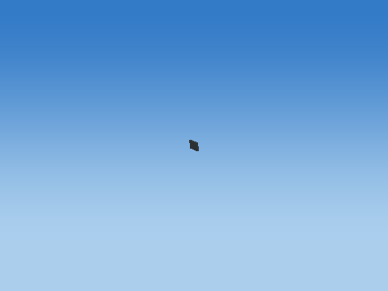 |
| Rotate Z |  |
| Translate to world |  |

Steps 1–5 share one camera; the unit cube has its own close view, and step 6 is reframed at the actual world location to keep small objects visible. Reframing changes the view, never the model coordinates. Identity steps deliberately remain visible. Intermediate shapes are instructional states, while step 6 uses the unmodified game object.

Each stage below gives its exact numeric matrix and all eight corner multiplications. For each output row r: p'[r] = A[r,0]p.x + A[r,1]p.y + A[r,2]p.z + A[r,3]p.w.


#### S

```text
[ 0.0900000036 0 0 0 ]
[ 0 0.075000003 0 0 ]
[ 0 0 0.0120000001 0 ]
[ 0 0 0 1 ]
```

| Input corner (w=1) | Output corner (w=1) |
| --- | --- |
| (-0.5, -0.5, -0.5) | (-0.0450000018, -0.0375000015, -0.00600000005) |
| (-0.5, -0.5, 0.5) | (-0.0450000018, -0.0375000015, 0.00600000005) |
| (-0.5, 0.5, -0.5) | (-0.0450000018, 0.0375000015, -0.00600000005) |
| (-0.5, 0.5, 0.5) | (-0.0450000018, 0.0375000015, 0.00600000005) |
| (0.5, -0.5, -0.5) | (0.0450000018, -0.0375000015, -0.00600000005) |
| (0.5, -0.5, 0.5) | (0.0450000018, -0.0375000015, 0.00600000005) |
| (0.5, 0.5, -0.5) | (0.0450000018, 0.0375000015, -0.00600000005) |
| (0.5, 0.5, 0.5) | (0.0450000018, 0.0375000015, 0.00600000005) |

#### H

```text
[ 1 0 0 0 ]
[ 0 1 0 0 ]
[ 0 0 1 0 ]
[ 0 0 0 1 ]
```

| Input corner (w=1) | Output corner (w=1) |
| --- | --- |
| (-0.0450000018, -0.0375000015, -0.00600000005) | (-0.0450000018, -0.0375000015, -0.00600000005) |
| (-0.0450000018, -0.0375000015, 0.00600000005) | (-0.0450000018, -0.0375000015, 0.00600000005) |
| (-0.0450000018, 0.0375000015, -0.00600000005) | (-0.0450000018, 0.0375000015, -0.00600000005) |
| (-0.0450000018, 0.0375000015, 0.00600000005) | (-0.0450000018, 0.0375000015, 0.00600000005) |
| (0.0450000018, -0.0375000015, -0.00600000005) | (0.0450000018, -0.0375000015, -0.00600000005) |
| (0.0450000018, -0.0375000015, 0.00600000005) | (0.0450000018, -0.0375000015, 0.00600000005) |
| (0.0450000018, 0.0375000015, -0.00600000005) | (0.0450000018, 0.0375000015, -0.00600000005) |
| (0.0450000018, 0.0375000015, 0.00600000005) | (0.0450000018, 0.0375000015, 0.00600000005) |

#### Rx

```text
[ 1 0 0 0 ]
[ 0 0.997801483 -0.0662739053 0 ]
[ 0 0.0662739053 0.997801483 0 ]
[ 0 0 0 1 ]
```

| Input corner (w=1) | Output corner (w=1) |
| --- | --- |
| (-0.0450000018, -0.0375000015, -0.00600000005) | (-0.0450000018, -0.0370199122, -0.00847208034) |
| (-0.0450000018, -0.0375000015, 0.00600000005) | (-0.0450000018, -0.037815202, 0.00350153726) |
| (-0.0450000018, 0.0375000015, -0.00600000005) | (-0.0450000018, 0.037815202, -0.00350153726) |
| (-0.0450000018, 0.0375000015, 0.00600000005) | (-0.0450000018, 0.0370199122, 0.00847208034) |
| (0.0450000018, -0.0375000015, -0.00600000005) | (0.0450000018, -0.0370199122, -0.00847208034) |
| (0.0450000018, -0.0375000015, 0.00600000005) | (0.0450000018, -0.037815202, 0.00350153726) |
| (0.0450000018, 0.0375000015, -0.00600000005) | (0.0450000018, 0.037815202, -0.00350153726) |
| (0.0450000018, 0.0375000015, 0.00600000005) | (0.0450000018, 0.0370199122, 0.00847208034) |

#### Ry

```text
[ 1 0 0 0 ]
[ 0 1 0 0 ]
[ -0 0 1 0 ]
[ 0 0 0 1 ]
```

| Input corner (w=1) | Output corner (w=1) |
| --- | --- |
| (-0.0450000018, -0.0370199122, -0.00847208034) | (-0.0450000018, -0.0370199122, -0.00847208034) |
| (-0.0450000018, -0.037815202, 0.00350153726) | (-0.0450000018, -0.037815202, 0.00350153726) |
| (-0.0450000018, 0.037815202, -0.00350153726) | (-0.0450000018, 0.037815202, -0.00350153726) |
| (-0.0450000018, 0.0370199122, 0.00847208034) | (-0.0450000018, 0.0370199122, 0.00847208034) |
| (0.0450000018, -0.0370199122, -0.00847208034) | (0.0450000018, -0.0370199122, -0.00847208034) |
| (0.0450000018, -0.037815202, 0.00350153726) | (0.0450000018, -0.037815202, 0.00350153726) |
| (0.0450000018, 0.037815202, -0.00350153726) | (0.0450000018, 0.037815202, -0.00350153726) |
| (0.0450000018, 0.0370199122, 0.00847208034) | (0.0450000018, 0.0370199122, 0.00847208034) |

#### Rz

```text
[ 1 -0 0 0 ]
[ 0 1 0 0 ]
[ 0 0 1 0 ]
[ 0 0 0 1 ]
```

| Input corner (w=1) | Output corner (w=1) |
| --- | --- |
| (-0.0450000018, -0.0370199122, -0.00847208034) | (-0.0450000018, -0.0370199122, -0.00847208034) |
| (-0.0450000018, -0.037815202, 0.00350153726) | (-0.0450000018, -0.037815202, 0.00350153726) |
| (-0.0450000018, 0.037815202, -0.00350153726) | (-0.0450000018, 0.037815202, -0.00350153726) |
| (-0.0450000018, 0.0370199122, 0.00847208034) | (-0.0450000018, 0.0370199122, 0.00847208034) |
| (0.0450000018, -0.0370199122, -0.00847208034) | (0.0450000018, -0.0370199122, -0.00847208034) |
| (0.0450000018, -0.037815202, 0.00350153726) | (0.0450000018, -0.037815202, 0.00350153726) |
| (0.0450000018, 0.037815202, -0.00350153726) | (0.0450000018, 0.037815202, -0.00350153726) |
| (0.0450000018, 0.0370199122, 0.00847208034) | (0.0450000018, 0.0370199122, 0.00847208034) |

#### T

```text
[ 1 0 0 0.319999993 ]
[ 0 1 0 1.56869435 ]
[ 0 0 1 -6.34265423 ]
[ 0 0 0 1 ]
```

| Input corner (w=1) | Output corner (w=1) |
| --- | --- |
| (-0.0450000018, -0.0370199122, -0.00847208034) | (0.274999976, 1.53167439, -6.35112619) |
| (-0.0450000018, -0.037815202, 0.00350153726) | (0.274999976, 1.53087914, -6.33915281) |
| (-0.0450000018, 0.037815202, -0.00350153726) | (0.274999976, 1.60650957, -6.34615564) |
| (-0.0450000018, 0.0370199122, 0.00847208034) | (0.274999976, 1.60571432, -6.33418226) |
| (0.0450000018, -0.0370199122, -0.00847208034) | (0.36500001, 1.53167439, -6.35112619) |
| (0.0450000018, -0.037815202, 0.00350153726) | (0.36500001, 1.53087914, -6.33915281) |
| (0.0450000018, 0.037815202, -0.00350153726) | (0.36500001, 1.60650957, -6.34615564) |
| (0.0450000018, 0.0370199122, 0.00847208034) | (0.36500001, 1.60571432, -6.33418226) |

Final M = T Rz Ry Rx H S:

```text
[ 0.0900000036 0 0 0.319999993 ]
[ 0 0.0748351142 -0.000795286847 1.56869435 ]
[ 0 0.00497054309 0.0119736176 -6.34265423 ]
[ 0 0 0 1 ]
```

### TRIGGER_GUARD — `RIFLE_TRIGGER_GUARD`

Game model; 70 m range; follows player aim

Position T = (0.319999993, 1.2581687, -5.59058046) m; scale S = (0.129999995, 0.0350000001, 0.189999998); rotation (Rx,Ry,Rz) = (3.79999995, 0, 0) degrees.

Shear (xy,xz,yx,yz,zx,zy) = (0, 0, 0, 0, 0, 0). Color = (0.219999999, 0.270000011, 0.310000002); specular = 0.75; shininess = 80; emission = 0; flash = 0; material layer = 5; texture scale = 3. Pattern enabled = 0, pattern scale = (1, 1, 1), offset = (0, 0, 0).

| Step | Actual renderer image |
| --- | --- |
| Unit cube |  |
| Scale |  |
| Shear |  |
| Rotate X |  |
| Rotate Y |  |
| Rotate Z |  |
| Translate to world |  |

Steps 1–5 share one camera; the unit cube has its own close view, and step 6 is reframed at the actual world location to keep small objects visible. Reframing changes the view, never the model coordinates. Identity steps deliberately remain visible. Intermediate shapes are instructional states, while step 6 uses the unmodified game object.

Each stage below gives its exact numeric matrix and all eight corner multiplications. For each output row r: p'[r] = A[r,0]p.x + A[r,1]p.y + A[r,2]p.z + A[r,3]p.w.


#### S

```text
[ 0.129999995 0 0 0 ]
[ 0 0.0350000001 0 0 ]
[ 0 0 0.189999998 0 ]
[ 0 0 0 1 ]
```

| Input corner (w=1) | Output corner (w=1) |
| --- | --- |
| (-0.5, -0.5, -0.5) | (-0.0649999976, -0.0175000001, -0.0949999988) |
| (-0.5, -0.5, 0.5) | (-0.0649999976, -0.0175000001, 0.0949999988) |
| (-0.5, 0.5, -0.5) | (-0.0649999976, 0.0175000001, -0.0949999988) |
| (-0.5, 0.5, 0.5) | (-0.0649999976, 0.0175000001, 0.0949999988) |
| (0.5, -0.5, -0.5) | (0.0649999976, -0.0175000001, -0.0949999988) |
| (0.5, -0.5, 0.5) | (0.0649999976, -0.0175000001, 0.0949999988) |
| (0.5, 0.5, -0.5) | (0.0649999976, 0.0175000001, -0.0949999988) |
| (0.5, 0.5, 0.5) | (0.0649999976, 0.0175000001, 0.0949999988) |

#### H

```text
[ 1 0 0 0 ]
[ 0 1 0 0 ]
[ 0 0 1 0 ]
[ 0 0 0 1 ]
```

| Input corner (w=1) | Output corner (w=1) |
| --- | --- |
| (-0.0649999976, -0.0175000001, -0.0949999988) | (-0.0649999976, -0.0175000001, -0.0949999988) |
| (-0.0649999976, -0.0175000001, 0.0949999988) | (-0.0649999976, -0.0175000001, 0.0949999988) |
| (-0.0649999976, 0.0175000001, -0.0949999988) | (-0.0649999976, 0.0175000001, -0.0949999988) |
| (-0.0649999976, 0.0175000001, 0.0949999988) | (-0.0649999976, 0.0175000001, 0.0949999988) |
| (0.0649999976, -0.0175000001, -0.0949999988) | (0.0649999976, -0.0175000001, -0.0949999988) |
| (0.0649999976, -0.0175000001, 0.0949999988) | (0.0649999976, -0.0175000001, 0.0949999988) |
| (0.0649999976, 0.0175000001, -0.0949999988) | (0.0649999976, 0.0175000001, -0.0949999988) |
| (0.0649999976, 0.0175000001, 0.0949999988) | (0.0649999976, 0.0175000001, 0.0949999988) |

#### Rx

```text
[ 1 0 0 0 ]
[ 0 0.997801483 -0.0662739053 0 ]
[ 0 0.0662739053 0.997801483 0 ]
[ 0 0 0 1 ]
```

| Input corner (w=1) | Output corner (w=1) |
| --- | --- |
| (-0.0649999976, -0.0175000001, -0.0949999988) | (-0.0649999976, -0.0111655043, -0.0959509313) |
| (-0.0649999976, -0.0175000001, 0.0949999988) | (-0.0649999976, -0.0237575471, 0.0936313421) |
| (-0.0649999976, 0.0175000001, -0.0949999988) | (-0.0649999976, 0.0237575471, -0.0936313421) |
| (-0.0649999976, 0.0175000001, 0.0949999988) | (-0.0649999976, 0.0111655043, 0.0959509313) |
| (0.0649999976, -0.0175000001, -0.0949999988) | (0.0649999976, -0.0111655043, -0.0959509313) |
| (0.0649999976, -0.0175000001, 0.0949999988) | (0.0649999976, -0.0237575471, 0.0936313421) |
| (0.0649999976, 0.0175000001, -0.0949999988) | (0.0649999976, 0.0237575471, -0.0936313421) |
| (0.0649999976, 0.0175000001, 0.0949999988) | (0.0649999976, 0.0111655043, 0.0959509313) |

#### Ry

```text
[ 1 0 0 0 ]
[ 0 1 0 0 ]
[ -0 0 1 0 ]
[ 0 0 0 1 ]
```

| Input corner (w=1) | Output corner (w=1) |
| --- | --- |
| (-0.0649999976, -0.0111655043, -0.0959509313) | (-0.0649999976, -0.0111655043, -0.0959509313) |
| (-0.0649999976, -0.0237575471, 0.0936313421) | (-0.0649999976, -0.0237575471, 0.0936313421) |
| (-0.0649999976, 0.0237575471, -0.0936313421) | (-0.0649999976, 0.0237575471, -0.0936313421) |
| (-0.0649999976, 0.0111655043, 0.0959509313) | (-0.0649999976, 0.0111655043, 0.0959509313) |
| (0.0649999976, -0.0111655043, -0.0959509313) | (0.0649999976, -0.0111655043, -0.0959509313) |
| (0.0649999976, -0.0237575471, 0.0936313421) | (0.0649999976, -0.0237575471, 0.0936313421) |
| (0.0649999976, 0.0237575471, -0.0936313421) | (0.0649999976, 0.0237575471, -0.0936313421) |
| (0.0649999976, 0.0111655043, 0.0959509313) | (0.0649999976, 0.0111655043, 0.0959509313) |

#### Rz

```text
[ 1 -0 0 0 ]
[ 0 1 0 0 ]
[ 0 0 1 0 ]
[ 0 0 0 1 ]
```

| Input corner (w=1) | Output corner (w=1) |
| --- | --- |
| (-0.0649999976, -0.0111655043, -0.0959509313) | (-0.0649999976, -0.0111655043, -0.0959509313) |
| (-0.0649999976, -0.0237575471, 0.0936313421) | (-0.0649999976, -0.0237575471, 0.0936313421) |
| (-0.0649999976, 0.0237575471, -0.0936313421) | (-0.0649999976, 0.0237575471, -0.0936313421) |
| (-0.0649999976, 0.0111655043, 0.0959509313) | (-0.0649999976, 0.0111655043, 0.0959509313) |
| (0.0649999976, -0.0111655043, -0.0959509313) | (0.0649999976, -0.0111655043, -0.0959509313) |
| (0.0649999976, -0.0237575471, 0.0936313421) | (0.0649999976, -0.0237575471, 0.0936313421) |
| (0.0649999976, 0.0237575471, -0.0936313421) | (0.0649999976, 0.0237575471, -0.0936313421) |
| (0.0649999976, 0.0111655043, 0.0959509313) | (0.0649999976, 0.0111655043, 0.0959509313) |

#### T

```text
[ 1 0 0 0.319999993 ]
[ 0 1 0 1.2581687 ]
[ 0 0 1 -5.59058046 ]
[ 0 0 0 1 ]
```

| Input corner (w=1) | Output corner (w=1) |
| --- | --- |
| (-0.0649999976, -0.0111655043, -0.0959509313) | (0.254999995, 1.2470032, -5.68653154) |
| (-0.0649999976, -0.0237575471, 0.0936313421) | (0.254999995, 1.23441112, -5.4969492) |
| (-0.0649999976, 0.0237575471, -0.0936313421) | (0.254999995, 1.28192627, -5.68421173) |
| (-0.0649999976, 0.0111655043, 0.0959509313) | (0.254999995, 1.2693342, -5.49462938) |
| (0.0649999976, -0.0111655043, -0.0959509313) | (0.38499999, 1.2470032, -5.68653154) |
| (0.0649999976, -0.0237575471, 0.0936313421) | (0.38499999, 1.23441112, -5.4969492) |
| (0.0649999976, 0.0237575471, -0.0936313421) | (0.38499999, 1.28192627, -5.68421173) |
| (0.0649999976, 0.0111655043, 0.0959509313) | (0.38499999, 1.2693342, -5.49462938) |

Final M = T Rz Ry Rx H S:

```text
[ 0.129999995 0 0 0.319999993 ]
[ 0 0.0349230506 -0.0125920419 1.2581687 ]
[ 0 0.0023195867 0.189582273 -5.59058046 ]
[ 0 0 0 1 ]
```

### GUARD_FRONT — `RIFLE_GUARD_FRONT`

Game model; 70 m range; follows player aim

Position T = (0.319999993, 1.34329474, -5.66510248) m; scale S = (0.129999995, 0.159999996, 0.0350000001); rotation (Rx,Ry,Rz) = (3.79999995, 0, 0) degrees.

Shear (xy,xz,yx,yz,zx,zy) = (0, 0, 0, 0, 0, 0). Color = (0.219999999, 0.270000011, 0.310000002); specular = 0.75; shininess = 80; emission = 0; flash = 0; material layer = 5; texture scale = 3. Pattern enabled = 0, pattern scale = (1, 1, 1), offset = (0, 0, 0).

| Step | Actual renderer image |
| --- | --- |
| Unit cube |  |
| Scale |  |
| Shear |  |
| Rotate X |  |
| Rotate Y |  |
| Rotate Z |  |
| Translate to world |  |

Steps 1–5 share one camera; the unit cube has its own close view, and step 6 is reframed at the actual world location to keep small objects visible. Reframing changes the view, never the model coordinates. Identity steps deliberately remain visible. Intermediate shapes are instructional states, while step 6 uses the unmodified game object.

Each stage below gives its exact numeric matrix and all eight corner multiplications. For each output row r: p'[r] = A[r,0]p.x + A[r,1]p.y + A[r,2]p.z + A[r,3]p.w.


#### S

```text
[ 0.129999995 0 0 0 ]
[ 0 0.159999996 0 0 ]
[ 0 0 0.0350000001 0 ]
[ 0 0 0 1 ]
```

| Input corner (w=1) | Output corner (w=1) |
| --- | --- |
| (-0.5, -0.5, -0.5) | (-0.0649999976, -0.0799999982, -0.0175000001) |
| (-0.5, -0.5, 0.5) | (-0.0649999976, -0.0799999982, 0.0175000001) |
| (-0.5, 0.5, -0.5) | (-0.0649999976, 0.0799999982, -0.0175000001) |
| (-0.5, 0.5, 0.5) | (-0.0649999976, 0.0799999982, 0.0175000001) |
| (0.5, -0.5, -0.5) | (0.0649999976, -0.0799999982, -0.0175000001) |
| (0.5, -0.5, 0.5) | (0.0649999976, -0.0799999982, 0.0175000001) |
| (0.5, 0.5, -0.5) | (0.0649999976, 0.0799999982, -0.0175000001) |
| (0.5, 0.5, 0.5) | (0.0649999976, 0.0799999982, 0.0175000001) |

#### H

```text
[ 1 0 0 0 ]
[ 0 1 0 0 ]
[ 0 0 1 0 ]
[ 0 0 0 1 ]
```

| Input corner (w=1) | Output corner (w=1) |
| --- | --- |
| (-0.0649999976, -0.0799999982, -0.0175000001) | (-0.0649999976, -0.0799999982, -0.0175000001) |
| (-0.0649999976, -0.0799999982, 0.0175000001) | (-0.0649999976, -0.0799999982, 0.0175000001) |
| (-0.0649999976, 0.0799999982, -0.0175000001) | (-0.0649999976, 0.0799999982, -0.0175000001) |
| (-0.0649999976, 0.0799999982, 0.0175000001) | (-0.0649999976, 0.0799999982, 0.0175000001) |
| (0.0649999976, -0.0799999982, -0.0175000001) | (0.0649999976, -0.0799999982, -0.0175000001) |
| (0.0649999976, -0.0799999982, 0.0175000001) | (0.0649999976, -0.0799999982, 0.0175000001) |
| (0.0649999976, 0.0799999982, -0.0175000001) | (0.0649999976, 0.0799999982, -0.0175000001) |
| (0.0649999976, 0.0799999982, 0.0175000001) | (0.0649999976, 0.0799999982, 0.0175000001) |

#### Rx

```text
[ 1 0 0 0 ]
[ 0 0.997801483 -0.0662739053 0 ]
[ 0 0.0662739053 0.997801483 0 ]
[ 0 0 0 1 ]
```

| Input corner (w=1) | Output corner (w=1) |
| --- | --- |
| (-0.0649999976, -0.0799999982, -0.0175000001) | (-0.0649999976, -0.0786643252, -0.0227634385) |
| (-0.0649999976, -0.0799999982, 0.0175000001) | (-0.0649999976, -0.0809839144, 0.012159613) |
| (-0.0649999976, 0.0799999982, -0.0175000001) | (-0.0649999976, 0.0809839144, -0.012159613) |
| (-0.0649999976, 0.0799999982, 0.0175000001) | (-0.0649999976, 0.0786643252, 0.0227634385) |
| (0.0649999976, -0.0799999982, -0.0175000001) | (0.0649999976, -0.0786643252, -0.0227634385) |
| (0.0649999976, -0.0799999982, 0.0175000001) | (0.0649999976, -0.0809839144, 0.012159613) |
| (0.0649999976, 0.0799999982, -0.0175000001) | (0.0649999976, 0.0809839144, -0.012159613) |
| (0.0649999976, 0.0799999982, 0.0175000001) | (0.0649999976, 0.0786643252, 0.0227634385) |

#### Ry

```text
[ 1 0 0 0 ]
[ 0 1 0 0 ]
[ -0 0 1 0 ]
[ 0 0 0 1 ]
```

| Input corner (w=1) | Output corner (w=1) |
| --- | --- |
| (-0.0649999976, -0.0786643252, -0.0227634385) | (-0.0649999976, -0.0786643252, -0.0227634385) |
| (-0.0649999976, -0.0809839144, 0.012159613) | (-0.0649999976, -0.0809839144, 0.012159613) |
| (-0.0649999976, 0.0809839144, -0.012159613) | (-0.0649999976, 0.0809839144, -0.012159613) |
| (-0.0649999976, 0.0786643252, 0.0227634385) | (-0.0649999976, 0.0786643252, 0.0227634385) |
| (0.0649999976, -0.0786643252, -0.0227634385) | (0.0649999976, -0.0786643252, -0.0227634385) |
| (0.0649999976, -0.0809839144, 0.012159613) | (0.0649999976, -0.0809839144, 0.012159613) |
| (0.0649999976, 0.0809839144, -0.012159613) | (0.0649999976, 0.0809839144, -0.012159613) |
| (0.0649999976, 0.0786643252, 0.0227634385) | (0.0649999976, 0.0786643252, 0.0227634385) |

#### Rz

```text
[ 1 -0 0 0 ]
[ 0 1 0 0 ]
[ 0 0 1 0 ]
[ 0 0 0 1 ]
```

| Input corner (w=1) | Output corner (w=1) |
| --- | --- |
| (-0.0649999976, -0.0786643252, -0.0227634385) | (-0.0649999976, -0.0786643252, -0.0227634385) |
| (-0.0649999976, -0.0809839144, 0.012159613) | (-0.0649999976, -0.0809839144, 0.012159613) |
| (-0.0649999976, 0.0809839144, -0.012159613) | (-0.0649999976, 0.0809839144, -0.012159613) |
| (-0.0649999976, 0.0786643252, 0.0227634385) | (-0.0649999976, 0.0786643252, 0.0227634385) |
| (0.0649999976, -0.0786643252, -0.0227634385) | (0.0649999976, -0.0786643252, -0.0227634385) |
| (0.0649999976, -0.0809839144, 0.012159613) | (0.0649999976, -0.0809839144, 0.012159613) |
| (0.0649999976, 0.0809839144, -0.012159613) | (0.0649999976, 0.0809839144, -0.012159613) |
| (0.0649999976, 0.0786643252, 0.0227634385) | (0.0649999976, 0.0786643252, 0.0227634385) |

#### T

```text
[ 1 0 0 0.319999993 ]
[ 0 1 0 1.34329474 ]
[ 0 0 1 -5.66510248 ]
[ 0 0 0 1 ]
```

| Input corner (w=1) | Output corner (w=1) |
| --- | --- |
| (-0.0649999976, -0.0786643252, -0.0227634385) | (0.254999995, 1.26463044, -5.68786573) |
| (-0.0649999976, -0.0809839144, 0.012159613) | (0.254999995, 1.26231086, -5.65294266) |
| (-0.0649999976, 0.0809839144, -0.012159613) | (0.254999995, 1.42427862, -5.67726231) |
| (-0.0649999976, 0.0786643252, 0.0227634385) | (0.254999995, 1.42195904, -5.64233923) |
| (0.0649999976, -0.0786643252, -0.0227634385) | (0.38499999, 1.26463044, -5.68786573) |
| (0.0649999976, -0.0809839144, 0.012159613) | (0.38499999, 1.26231086, -5.65294266) |
| (0.0649999976, 0.0809839144, -0.012159613) | (0.38499999, 1.42427862, -5.67726231) |
| (0.0649999976, 0.0786643252, 0.0227634385) | (0.38499999, 1.42195904, -5.64233923) |

Final M = T Rz Ry Rx H S:

```text
[ 0.129999995 0 0 0.319999993 ]
[ 0 0.15964824 -0.0023195867 1.34329474 ]
[ 0 0.0106038246 0.0349230506 -5.66510248 ]
[ 0 0 0 1 ]
```

### DETAIL_0 — `RIFLE_DETAIL_0`

Game model; 70 m range; follows player aim

Position T = (0.319999993, 1.41045296, -5.77088404) m; scale S = (0.300000012, 0.150000006, 0.0179999992); rotation (Rx,Ry,Rz) = (3.79999995, 0, 0) degrees.

Shear (xy,xz,yx,yz,zx,zy) = (0, 0, 0, 0, 0, 0). Color = (0.100000001, 0.140000001, 0.159999996); specular = 0.75; shininess = 80; emission = 0; flash = 0; material layer = 5; texture scale = 3. Pattern enabled = 0, pattern scale = (1, 1, 1), offset = (0, 0, 0).

| Step | Actual renderer image |
| --- | --- |
| Unit cube |  |
| Scale |  |
| Shear |  |
| Rotate X |  |
| Rotate Y |  |
| Rotate Z |  |
| Translate to world |  |

Steps 1–5 share one camera; the unit cube has its own close view, and step 6 is reframed at the actual world location to keep small objects visible. Reframing changes the view, never the model coordinates. Identity steps deliberately remain visible. Intermediate shapes are instructional states, while step 6 uses the unmodified game object.

Each stage below gives its exact numeric matrix and all eight corner multiplications. For each output row r: p'[r] = A[r,0]p.x + A[r,1]p.y + A[r,2]p.z + A[r,3]p.w.


#### S

```text
[ 0.300000012 0 0 0 ]
[ 0 0.150000006 0 0 ]
[ 0 0 0.0179999992 0 ]
[ 0 0 0 1 ]
```

| Input corner (w=1) | Output corner (w=1) |
| --- | --- |
| (-0.5, -0.5, -0.5) | (-0.150000006, -0.075000003, -0.00899999961) |
| (-0.5, -0.5, 0.5) | (-0.150000006, -0.075000003, 0.00899999961) |
| (-0.5, 0.5, -0.5) | (-0.150000006, 0.075000003, -0.00899999961) |
| (-0.5, 0.5, 0.5) | (-0.150000006, 0.075000003, 0.00899999961) |
| (0.5, -0.5, -0.5) | (0.150000006, -0.075000003, -0.00899999961) |
| (0.5, -0.5, 0.5) | (0.150000006, -0.075000003, 0.00899999961) |
| (0.5, 0.5, -0.5) | (0.150000006, 0.075000003, -0.00899999961) |
| (0.5, 0.5, 0.5) | (0.150000006, 0.075000003, 0.00899999961) |

#### H

```text
[ 1 0 0 0 ]
[ 0 1 0 0 ]
[ 0 0 1 0 ]
[ 0 0 0 1 ]
```

| Input corner (w=1) | Output corner (w=1) |
| --- | --- |
| (-0.150000006, -0.075000003, -0.00899999961) | (-0.150000006, -0.075000003, -0.00899999961) |
| (-0.150000006, -0.075000003, 0.00899999961) | (-0.150000006, -0.075000003, 0.00899999961) |
| (-0.150000006, 0.075000003, -0.00899999961) | (-0.150000006, 0.075000003, -0.00899999961) |
| (-0.150000006, 0.075000003, 0.00899999961) | (-0.150000006, 0.075000003, 0.00899999961) |
| (0.150000006, -0.075000003, -0.00899999961) | (0.150000006, -0.075000003, -0.00899999961) |
| (0.150000006, -0.075000003, 0.00899999961) | (0.150000006, -0.075000003, 0.00899999961) |
| (0.150000006, 0.075000003, -0.00899999961) | (0.150000006, 0.075000003, -0.00899999961) |
| (0.150000006, 0.075000003, 0.00899999961) | (0.150000006, 0.075000003, 0.00899999961) |

#### Rx

```text
[ 1 0 0 0 ]
[ 0 0.997801483 -0.0662739053 0 ]
[ 0 0.0662739053 0.997801483 0 ]
[ 0 0 0 1 ]
```

| Input corner (w=1) | Output corner (w=1) |
| --- | --- |
| (-0.150000006, -0.075000003, -0.00899999961) | (-0.150000006, -0.0742386505, -0.0139507558) |
| (-0.150000006, -0.075000003, 0.00899999961) | (-0.150000006, -0.0754315779, 0.00400966965) |
| (-0.150000006, 0.075000003, -0.00899999961) | (-0.150000006, 0.0754315779, -0.00400966965) |
| (-0.150000006, 0.075000003, 0.00899999961) | (-0.150000006, 0.0742386505, 0.0139507558) |
| (0.150000006, -0.075000003, -0.00899999961) | (0.150000006, -0.0742386505, -0.0139507558) |
| (0.150000006, -0.075000003, 0.00899999961) | (0.150000006, -0.0754315779, 0.00400966965) |
| (0.150000006, 0.075000003, -0.00899999961) | (0.150000006, 0.0754315779, -0.00400966965) |
| (0.150000006, 0.075000003, 0.00899999961) | (0.150000006, 0.0742386505, 0.0139507558) |

#### Ry

```text
[ 1 0 0 0 ]
[ 0 1 0 0 ]
[ -0 0 1 0 ]
[ 0 0 0 1 ]
```

| Input corner (w=1) | Output corner (w=1) |
| --- | --- |
| (-0.150000006, -0.0742386505, -0.0139507558) | (-0.150000006, -0.0742386505, -0.0139507558) |
| (-0.150000006, -0.0754315779, 0.00400966965) | (-0.150000006, -0.0754315779, 0.00400966965) |
| (-0.150000006, 0.0754315779, -0.00400966965) | (-0.150000006, 0.0754315779, -0.00400966965) |
| (-0.150000006, 0.0742386505, 0.0139507558) | (-0.150000006, 0.0742386505, 0.0139507558) |
| (0.150000006, -0.0742386505, -0.0139507558) | (0.150000006, -0.0742386505, -0.0139507558) |
| (0.150000006, -0.0754315779, 0.00400966965) | (0.150000006, -0.0754315779, 0.00400966965) |
| (0.150000006, 0.0754315779, -0.00400966965) | (0.150000006, 0.0754315779, -0.00400966965) |
| (0.150000006, 0.0742386505, 0.0139507558) | (0.150000006, 0.0742386505, 0.0139507558) |

#### Rz

```text
[ 1 -0 0 0 ]
[ 0 1 0 0 ]
[ 0 0 1 0 ]
[ 0 0 0 1 ]
```

| Input corner (w=1) | Output corner (w=1) |
| --- | --- |
| (-0.150000006, -0.0742386505, -0.0139507558) | (-0.150000006, -0.0742386505, -0.0139507558) |
| (-0.150000006, -0.0754315779, 0.00400966965) | (-0.150000006, -0.0754315779, 0.00400966965) |
| (-0.150000006, 0.0754315779, -0.00400966965) | (-0.150000006, 0.0754315779, -0.00400966965) |
| (-0.150000006, 0.0742386505, 0.0139507558) | (-0.150000006, 0.0742386505, 0.0139507558) |
| (0.150000006, -0.0742386505, -0.0139507558) | (0.150000006, -0.0742386505, -0.0139507558) |
| (0.150000006, -0.0754315779, 0.00400966965) | (0.150000006, -0.0754315779, 0.00400966965) |
| (0.150000006, 0.0754315779, -0.00400966965) | (0.150000006, 0.0754315779, -0.00400966965) |
| (0.150000006, 0.0742386505, 0.0139507558) | (0.150000006, 0.0742386505, 0.0139507558) |

#### T

```text
[ 1 0 0 0.319999993 ]
[ 0 1 0 1.41045296 ]
[ 0 0 1 -5.77088404 ]
[ 0 0 0 1 ]
```

| Input corner (w=1) | Output corner (w=1) |
| --- | --- |
| (-0.150000006, -0.0742386505, -0.0139507558) | (0.169999987, 1.3362143, -5.78483486) |
| (-0.150000006, -0.0754315779, 0.00400966965) | (0.169999987, 1.33502138, -5.76687431) |
| (-0.150000006, 0.0754315779, -0.00400966965) | (0.169999987, 1.48588455, -5.77489376) |
| (-0.150000006, 0.0742386505, 0.0139507558) | (0.169999987, 1.48469162, -5.75693321) |
| (0.150000006, -0.0742386505, -0.0139507558) | (0.469999999, 1.3362143, -5.78483486) |
| (0.150000006, -0.0754315779, 0.00400966965) | (0.469999999, 1.33502138, -5.76687431) |
| (0.150000006, 0.0754315779, -0.00400966965) | (0.469999999, 1.48588455, -5.77489376) |
| (0.150000006, 0.0742386505, 0.0139507558) | (0.469999999, 1.48469162, -5.75693321) |

Final M = T Rz Ry Rx H S:

```text
[ 0.300000012 0 0 0.319999993 ]
[ 0 0.149670228 -0.00119293027 1.41045296 ]
[ 0 0.00994108617 0.0179604255 -5.77088404 ]
[ 0 0 0 1 ]
```

### DETAIL_1 — `RIFLE_DETAIL_1`

Game model; 70 m range; follows player aim

Position T = (0.319999993, 1.41429687, -5.82875681) m; scale S = (0.300000012, 0.150000006, 0.0179999992); rotation (Rx,Ry,Rz) = (3.79999995, 0, 0) degrees.

Shear (xy,xz,yx,yz,zx,zy) = (0, 0, 0, 0, 0, 0). Color = (0.100000001, 0.140000001, 0.159999996); specular = 0.75; shininess = 80; emission = 0; flash = 0; material layer = 5; texture scale = 3. Pattern enabled = 0, pattern scale = (1, 1, 1), offset = (0, 0, 0).

| Step | Actual renderer image |
| --- | --- |
| Unit cube |  |
| Scale |  |
| Shear |  |
| Rotate X |  |
| Rotate Y |  |
| Rotate Z |  |
| Translate to world |  |

Steps 1–5 share one camera; the unit cube has its own close view, and step 6 is reframed at the actual world location to keep small objects visible. Reframing changes the view, never the model coordinates. Identity steps deliberately remain visible. Intermediate shapes are instructional states, while step 6 uses the unmodified game object.

Each stage below gives its exact numeric matrix and all eight corner multiplications. For each output row r: p'[r] = A[r,0]p.x + A[r,1]p.y + A[r,2]p.z + A[r,3]p.w.


#### S

```text
[ 0.300000012 0 0 0 ]
[ 0 0.150000006 0 0 ]
[ 0 0 0.0179999992 0 ]
[ 0 0 0 1 ]
```

| Input corner (w=1) | Output corner (w=1) |
| --- | --- |
| (-0.5, -0.5, -0.5) | (-0.150000006, -0.075000003, -0.00899999961) |
| (-0.5, -0.5, 0.5) | (-0.150000006, -0.075000003, 0.00899999961) |
| (-0.5, 0.5, -0.5) | (-0.150000006, 0.075000003, -0.00899999961) |
| (-0.5, 0.5, 0.5) | (-0.150000006, 0.075000003, 0.00899999961) |
| (0.5, -0.5, -0.5) | (0.150000006, -0.075000003, -0.00899999961) |
| (0.5, -0.5, 0.5) | (0.150000006, -0.075000003, 0.00899999961) |
| (0.5, 0.5, -0.5) | (0.150000006, 0.075000003, -0.00899999961) |
| (0.5, 0.5, 0.5) | (0.150000006, 0.075000003, 0.00899999961) |

#### H

```text
[ 1 0 0 0 ]
[ 0 1 0 0 ]
[ 0 0 1 0 ]
[ 0 0 0 1 ]
```

| Input corner (w=1) | Output corner (w=1) |
| --- | --- |
| (-0.150000006, -0.075000003, -0.00899999961) | (-0.150000006, -0.075000003, -0.00899999961) |
| (-0.150000006, -0.075000003, 0.00899999961) | (-0.150000006, -0.075000003, 0.00899999961) |
| (-0.150000006, 0.075000003, -0.00899999961) | (-0.150000006, 0.075000003, -0.00899999961) |
| (-0.150000006, 0.075000003, 0.00899999961) | (-0.150000006, 0.075000003, 0.00899999961) |
| (0.150000006, -0.075000003, -0.00899999961) | (0.150000006, -0.075000003, -0.00899999961) |
| (0.150000006, -0.075000003, 0.00899999961) | (0.150000006, -0.075000003, 0.00899999961) |
| (0.150000006, 0.075000003, -0.00899999961) | (0.150000006, 0.075000003, -0.00899999961) |
| (0.150000006, 0.075000003, 0.00899999961) | (0.150000006, 0.075000003, 0.00899999961) |

#### Rx

```text
[ 1 0 0 0 ]
[ 0 0.997801483 -0.0662739053 0 ]
[ 0 0.0662739053 0.997801483 0 ]
[ 0 0 0 1 ]
```

| Input corner (w=1) | Output corner (w=1) |
| --- | --- |
| (-0.150000006, -0.075000003, -0.00899999961) | (-0.150000006, -0.0742386505, -0.0139507558) |
| (-0.150000006, -0.075000003, 0.00899999961) | (-0.150000006, -0.0754315779, 0.00400966965) |
| (-0.150000006, 0.075000003, -0.00899999961) | (-0.150000006, 0.0754315779, -0.00400966965) |
| (-0.150000006, 0.075000003, 0.00899999961) | (-0.150000006, 0.0742386505, 0.0139507558) |
| (0.150000006, -0.075000003, -0.00899999961) | (0.150000006, -0.0742386505, -0.0139507558) |
| (0.150000006, -0.075000003, 0.00899999961) | (0.150000006, -0.0754315779, 0.00400966965) |
| (0.150000006, 0.075000003, -0.00899999961) | (0.150000006, 0.0754315779, -0.00400966965) |
| (0.150000006, 0.075000003, 0.00899999961) | (0.150000006, 0.0742386505, 0.0139507558) |

#### Ry

```text
[ 1 0 0 0 ]
[ 0 1 0 0 ]
[ -0 0 1 0 ]
[ 0 0 0 1 ]
```

| Input corner (w=1) | Output corner (w=1) |
| --- | --- |
| (-0.150000006, -0.0742386505, -0.0139507558) | (-0.150000006, -0.0742386505, -0.0139507558) |
| (-0.150000006, -0.0754315779, 0.00400966965) | (-0.150000006, -0.0754315779, 0.00400966965) |
| (-0.150000006, 0.0754315779, -0.00400966965) | (-0.150000006, 0.0754315779, -0.00400966965) |
| (-0.150000006, 0.0742386505, 0.0139507558) | (-0.150000006, 0.0742386505, 0.0139507558) |
| (0.150000006, -0.0742386505, -0.0139507558) | (0.150000006, -0.0742386505, -0.0139507558) |
| (0.150000006, -0.0754315779, 0.00400966965) | (0.150000006, -0.0754315779, 0.00400966965) |
| (0.150000006, 0.0754315779, -0.00400966965) | (0.150000006, 0.0754315779, -0.00400966965) |
| (0.150000006, 0.0742386505, 0.0139507558) | (0.150000006, 0.0742386505, 0.0139507558) |

#### Rz

```text
[ 1 -0 0 0 ]
[ 0 1 0 0 ]
[ 0 0 1 0 ]
[ 0 0 0 1 ]
```

| Input corner (w=1) | Output corner (w=1) |
| --- | --- |
| (-0.150000006, -0.0742386505, -0.0139507558) | (-0.150000006, -0.0742386505, -0.0139507558) |
| (-0.150000006, -0.0754315779, 0.00400966965) | (-0.150000006, -0.0754315779, 0.00400966965) |
| (-0.150000006, 0.0754315779, -0.00400966965) | (-0.150000006, 0.0754315779, -0.00400966965) |
| (-0.150000006, 0.0742386505, 0.0139507558) | (-0.150000006, 0.0742386505, 0.0139507558) |
| (0.150000006, -0.0742386505, -0.0139507558) | (0.150000006, -0.0742386505, -0.0139507558) |
| (0.150000006, -0.0754315779, 0.00400966965) | (0.150000006, -0.0754315779, 0.00400966965) |
| (0.150000006, 0.0754315779, -0.00400966965) | (0.150000006, 0.0754315779, -0.00400966965) |
| (0.150000006, 0.0742386505, 0.0139507558) | (0.150000006, 0.0742386505, 0.0139507558) |

#### T

```text
[ 1 0 0 0.319999993 ]
[ 0 1 0 1.41429687 ]
[ 0 0 1 -5.82875681 ]
[ 0 0 0 1 ]
```

| Input corner (w=1) | Output corner (w=1) |
| --- | --- |
| (-0.150000006, -0.0742386505, -0.0139507558) | (0.169999987, 1.34005821, -5.84270763) |
| (-0.150000006, -0.0754315779, 0.00400966965) | (0.169999987, 1.33886528, -5.82474709) |
| (-0.150000006, 0.0754315779, -0.00400966965) | (0.169999987, 1.48972845, -5.83276653) |
| (-0.150000006, 0.0742386505, 0.0139507558) | (0.169999987, 1.48853552, -5.81480598) |
| (0.150000006, -0.0742386505, -0.0139507558) | (0.469999999, 1.34005821, -5.84270763) |
| (0.150000006, -0.0754315779, 0.00400966965) | (0.469999999, 1.33886528, -5.82474709) |
| (0.150000006, 0.0754315779, -0.00400966965) | (0.469999999, 1.48972845, -5.83276653) |
| (0.150000006, 0.0742386505, 0.0139507558) | (0.469999999, 1.48853552, -5.81480598) |

Final M = T Rz Ry Rx H S:

```text
[ 0.300000012 0 0 0.319999993 ]
[ 0 0.149670228 -0.00119293027 1.41429687 ]
[ 0 0.00994108617 0.0179604255 -5.82875681 ]
[ 0 0 0 1 ]
```

### DETAIL_2 — `RIFLE_DETAIL_2`

Game model; 70 m range; follows player aim

Position T = (0.319999993, 1.41814077, -5.8866291) m; scale S = (0.300000012, 0.150000006, 0.0179999992); rotation (Rx,Ry,Rz) = (3.79999995, 0, 0) degrees.

Shear (xy,xz,yx,yz,zx,zy) = (0, 0, 0, 0, 0, 0). Color = (0.100000001, 0.140000001, 0.159999996); specular = 0.75; shininess = 80; emission = 0; flash = 0; material layer = 5; texture scale = 3. Pattern enabled = 0, pattern scale = (1, 1, 1), offset = (0, 0, 0).

| Step | Actual renderer image |
| --- | --- |
| Unit cube |  |
| Scale |  |
| Shear |  |
| Rotate X |  |
| Rotate Y |  |
| Rotate Z |  |
| Translate to world |  |

Steps 1–5 share one camera; the unit cube has its own close view, and step 6 is reframed at the actual world location to keep small objects visible. Reframing changes the view, never the model coordinates. Identity steps deliberately remain visible. Intermediate shapes are instructional states, while step 6 uses the unmodified game object.

Each stage below gives its exact numeric matrix and all eight corner multiplications. For each output row r: p'[r] = A[r,0]p.x + A[r,1]p.y + A[r,2]p.z + A[r,3]p.w.


#### S

```text
[ 0.300000012 0 0 0 ]
[ 0 0.150000006 0 0 ]
[ 0 0 0.0179999992 0 ]
[ 0 0 0 1 ]
```

| Input corner (w=1) | Output corner (w=1) |
| --- | --- |
| (-0.5, -0.5, -0.5) | (-0.150000006, -0.075000003, -0.00899999961) |
| (-0.5, -0.5, 0.5) | (-0.150000006, -0.075000003, 0.00899999961) |
| (-0.5, 0.5, -0.5) | (-0.150000006, 0.075000003, -0.00899999961) |
| (-0.5, 0.5, 0.5) | (-0.150000006, 0.075000003, 0.00899999961) |
| (0.5, -0.5, -0.5) | (0.150000006, -0.075000003, -0.00899999961) |
| (0.5, -0.5, 0.5) | (0.150000006, -0.075000003, 0.00899999961) |
| (0.5, 0.5, -0.5) | (0.150000006, 0.075000003, -0.00899999961) |
| (0.5, 0.5, 0.5) | (0.150000006, 0.075000003, 0.00899999961) |

#### H

```text
[ 1 0 0 0 ]
[ 0 1 0 0 ]
[ 0 0 1 0 ]
[ 0 0 0 1 ]
```

| Input corner (w=1) | Output corner (w=1) |
| --- | --- |
| (-0.150000006, -0.075000003, -0.00899999961) | (-0.150000006, -0.075000003, -0.00899999961) |
| (-0.150000006, -0.075000003, 0.00899999961) | (-0.150000006, -0.075000003, 0.00899999961) |
| (-0.150000006, 0.075000003, -0.00899999961) | (-0.150000006, 0.075000003, -0.00899999961) |
| (-0.150000006, 0.075000003, 0.00899999961) | (-0.150000006, 0.075000003, 0.00899999961) |
| (0.150000006, -0.075000003, -0.00899999961) | (0.150000006, -0.075000003, -0.00899999961) |
| (0.150000006, -0.075000003, 0.00899999961) | (0.150000006, -0.075000003, 0.00899999961) |
| (0.150000006, 0.075000003, -0.00899999961) | (0.150000006, 0.075000003, -0.00899999961) |
| (0.150000006, 0.075000003, 0.00899999961) | (0.150000006, 0.075000003, 0.00899999961) |

#### Rx

```text
[ 1 0 0 0 ]
[ 0 0.997801483 -0.0662739053 0 ]
[ 0 0.0662739053 0.997801483 0 ]
[ 0 0 0 1 ]
```

| Input corner (w=1) | Output corner (w=1) |
| --- | --- |
| (-0.150000006, -0.075000003, -0.00899999961) | (-0.150000006, -0.0742386505, -0.0139507558) |
| (-0.150000006, -0.075000003, 0.00899999961) | (-0.150000006, -0.0754315779, 0.00400966965) |
| (-0.150000006, 0.075000003, -0.00899999961) | (-0.150000006, 0.0754315779, -0.00400966965) |
| (-0.150000006, 0.075000003, 0.00899999961) | (-0.150000006, 0.0742386505, 0.0139507558) |
| (0.150000006, -0.075000003, -0.00899999961) | (0.150000006, -0.0742386505, -0.0139507558) |
| (0.150000006, -0.075000003, 0.00899999961) | (0.150000006, -0.0754315779, 0.00400966965) |
| (0.150000006, 0.075000003, -0.00899999961) | (0.150000006, 0.0754315779, -0.00400966965) |
| (0.150000006, 0.075000003, 0.00899999961) | (0.150000006, 0.0742386505, 0.0139507558) |

#### Ry

```text
[ 1 0 0 0 ]
[ 0 1 0 0 ]
[ -0 0 1 0 ]
[ 0 0 0 1 ]
```

| Input corner (w=1) | Output corner (w=1) |
| --- | --- |
| (-0.150000006, -0.0742386505, -0.0139507558) | (-0.150000006, -0.0742386505, -0.0139507558) |
| (-0.150000006, -0.0754315779, 0.00400966965) | (-0.150000006, -0.0754315779, 0.00400966965) |
| (-0.150000006, 0.0754315779, -0.00400966965) | (-0.150000006, 0.0754315779, -0.00400966965) |
| (-0.150000006, 0.0742386505, 0.0139507558) | (-0.150000006, 0.0742386505, 0.0139507558) |
| (0.150000006, -0.0742386505, -0.0139507558) | (0.150000006, -0.0742386505, -0.0139507558) |
| (0.150000006, -0.0754315779, 0.00400966965) | (0.150000006, -0.0754315779, 0.00400966965) |
| (0.150000006, 0.0754315779, -0.00400966965) | (0.150000006, 0.0754315779, -0.00400966965) |
| (0.150000006, 0.0742386505, 0.0139507558) | (0.150000006, 0.0742386505, 0.0139507558) |

#### Rz

```text
[ 1 -0 0 0 ]
[ 0 1 0 0 ]
[ 0 0 1 0 ]
[ 0 0 0 1 ]
```

| Input corner (w=1) | Output corner (w=1) |
| --- | --- |
| (-0.150000006, -0.0742386505, -0.0139507558) | (-0.150000006, -0.0742386505, -0.0139507558) |
| (-0.150000006, -0.0754315779, 0.00400966965) | (-0.150000006, -0.0754315779, 0.00400966965) |
| (-0.150000006, 0.0754315779, -0.00400966965) | (-0.150000006, 0.0754315779, -0.00400966965) |
| (-0.150000006, 0.0742386505, 0.0139507558) | (-0.150000006, 0.0742386505, 0.0139507558) |
| (0.150000006, -0.0742386505, -0.0139507558) | (0.150000006, -0.0742386505, -0.0139507558) |
| (0.150000006, -0.0754315779, 0.00400966965) | (0.150000006, -0.0754315779, 0.00400966965) |
| (0.150000006, 0.0754315779, -0.00400966965) | (0.150000006, 0.0754315779, -0.00400966965) |
| (0.150000006, 0.0742386505, 0.0139507558) | (0.150000006, 0.0742386505, 0.0139507558) |

#### T

```text
[ 1 0 0 0.319999993 ]
[ 0 1 0 1.41814077 ]
[ 0 0 1 -5.8866291 ]
[ 0 0 0 1 ]
```

| Input corner (w=1) | Output corner (w=1) |
| --- | --- |
| (-0.150000006, -0.0742386505, -0.0139507558) | (0.169999987, 1.34390211, -5.90057993) |
| (-0.150000006, -0.0754315779, 0.00400966965) | (0.169999987, 1.34270918, -5.88261938) |
| (-0.150000006, 0.0754315779, -0.00400966965) | (0.169999987, 1.49357235, -5.89063883) |
| (-0.150000006, 0.0742386505, 0.0139507558) | (0.169999987, 1.49237943, -5.87267828) |
| (0.150000006, -0.0742386505, -0.0139507558) | (0.469999999, 1.34390211, -5.90057993) |
| (0.150000006, -0.0754315779, 0.00400966965) | (0.469999999, 1.34270918, -5.88261938) |
| (0.150000006, 0.0754315779, -0.00400966965) | (0.469999999, 1.49357235, -5.89063883) |
| (0.150000006, 0.0742386505, 0.0139507558) | (0.469999999, 1.49237943, -5.87267828) |

Final M = T Rz Ry Rx H S:

```text
[ 0.300000012 0 0 0.319999993 ]
[ 0 0.149670228 -0.00119293027 1.41814077 ]
[ 0 0.00994108617 0.0179604255 -5.8866291 ]
[ 0 0 0 1 ]
```

### DETAIL_3 — `RIFLE_DETAIL_3`

Game model; 70 m range; follows player aim

Position T = (0.319999993, 1.42198467, -5.94450188) m; scale S = (0.300000012, 0.150000006, 0.0179999992); rotation (Rx,Ry,Rz) = (3.79999995, 0, 0) degrees.

Shear (xy,xz,yx,yz,zx,zy) = (0, 0, 0, 0, 0, 0). Color = (0.100000001, 0.140000001, 0.159999996); specular = 0.75; shininess = 80; emission = 0; flash = 0; material layer = 5; texture scale = 3. Pattern enabled = 0, pattern scale = (1, 1, 1), offset = (0, 0, 0).

| Step | Actual renderer image |
| --- | --- |
| Unit cube |  |
| Scale |  |
| Shear |  |
| Rotate X |  |
| Rotate Y |  |
| Rotate Z |  |
| Translate to world |  |

Steps 1–5 share one camera; the unit cube has its own close view, and step 6 is reframed at the actual world location to keep small objects visible. Reframing changes the view, never the model coordinates. Identity steps deliberately remain visible. Intermediate shapes are instructional states, while step 6 uses the unmodified game object.

Each stage below gives its exact numeric matrix and all eight corner multiplications. For each output row r: p'[r] = A[r,0]p.x + A[r,1]p.y + A[r,2]p.z + A[r,3]p.w.


#### S

```text
[ 0.300000012 0 0 0 ]
[ 0 0.150000006 0 0 ]
[ 0 0 0.0179999992 0 ]
[ 0 0 0 1 ]
```

| Input corner (w=1) | Output corner (w=1) |
| --- | --- |
| (-0.5, -0.5, -0.5) | (-0.150000006, -0.075000003, -0.00899999961) |
| (-0.5, -0.5, 0.5) | (-0.150000006, -0.075000003, 0.00899999961) |
| (-0.5, 0.5, -0.5) | (-0.150000006, 0.075000003, -0.00899999961) |
| (-0.5, 0.5, 0.5) | (-0.150000006, 0.075000003, 0.00899999961) |
| (0.5, -0.5, -0.5) | (0.150000006, -0.075000003, -0.00899999961) |
| (0.5, -0.5, 0.5) | (0.150000006, -0.075000003, 0.00899999961) |
| (0.5, 0.5, -0.5) | (0.150000006, 0.075000003, -0.00899999961) |
| (0.5, 0.5, 0.5) | (0.150000006, 0.075000003, 0.00899999961) |

#### H

```text
[ 1 0 0 0 ]
[ 0 1 0 0 ]
[ 0 0 1 0 ]
[ 0 0 0 1 ]
```

| Input corner (w=1) | Output corner (w=1) |
| --- | --- |
| (-0.150000006, -0.075000003, -0.00899999961) | (-0.150000006, -0.075000003, -0.00899999961) |
| (-0.150000006, -0.075000003, 0.00899999961) | (-0.150000006, -0.075000003, 0.00899999961) |
| (-0.150000006, 0.075000003, -0.00899999961) | (-0.150000006, 0.075000003, -0.00899999961) |
| (-0.150000006, 0.075000003, 0.00899999961) | (-0.150000006, 0.075000003, 0.00899999961) |
| (0.150000006, -0.075000003, -0.00899999961) | (0.150000006, -0.075000003, -0.00899999961) |
| (0.150000006, -0.075000003, 0.00899999961) | (0.150000006, -0.075000003, 0.00899999961) |
| (0.150000006, 0.075000003, -0.00899999961) | (0.150000006, 0.075000003, -0.00899999961) |
| (0.150000006, 0.075000003, 0.00899999961) | (0.150000006, 0.075000003, 0.00899999961) |

#### Rx

```text
[ 1 0 0 0 ]
[ 0 0.997801483 -0.0662739053 0 ]
[ 0 0.0662739053 0.997801483 0 ]
[ 0 0 0 1 ]
```

| Input corner (w=1) | Output corner (w=1) |
| --- | --- |
| (-0.150000006, -0.075000003, -0.00899999961) | (-0.150000006, -0.0742386505, -0.0139507558) |
| (-0.150000006, -0.075000003, 0.00899999961) | (-0.150000006, -0.0754315779, 0.00400966965) |
| (-0.150000006, 0.075000003, -0.00899999961) | (-0.150000006, 0.0754315779, -0.00400966965) |
| (-0.150000006, 0.075000003, 0.00899999961) | (-0.150000006, 0.0742386505, 0.0139507558) |
| (0.150000006, -0.075000003, -0.00899999961) | (0.150000006, -0.0742386505, -0.0139507558) |
| (0.150000006, -0.075000003, 0.00899999961) | (0.150000006, -0.0754315779, 0.00400966965) |
| (0.150000006, 0.075000003, -0.00899999961) | (0.150000006, 0.0754315779, -0.00400966965) |
| (0.150000006, 0.075000003, 0.00899999961) | (0.150000006, 0.0742386505, 0.0139507558) |

#### Ry

```text
[ 1 0 0 0 ]
[ 0 1 0 0 ]
[ -0 0 1 0 ]
[ 0 0 0 1 ]
```

| Input corner (w=1) | Output corner (w=1) |
| --- | --- |
| (-0.150000006, -0.0742386505, -0.0139507558) | (-0.150000006, -0.0742386505, -0.0139507558) |
| (-0.150000006, -0.0754315779, 0.00400966965) | (-0.150000006, -0.0754315779, 0.00400966965) |
| (-0.150000006, 0.0754315779, -0.00400966965) | (-0.150000006, 0.0754315779, -0.00400966965) |
| (-0.150000006, 0.0742386505, 0.0139507558) | (-0.150000006, 0.0742386505, 0.0139507558) |
| (0.150000006, -0.0742386505, -0.0139507558) | (0.150000006, -0.0742386505, -0.0139507558) |
| (0.150000006, -0.0754315779, 0.00400966965) | (0.150000006, -0.0754315779, 0.00400966965) |
| (0.150000006, 0.0754315779, -0.00400966965) | (0.150000006, 0.0754315779, -0.00400966965) |
| (0.150000006, 0.0742386505, 0.0139507558) | (0.150000006, 0.0742386505, 0.0139507558) |

#### Rz

```text
[ 1 -0 0 0 ]
[ 0 1 0 0 ]
[ 0 0 1 0 ]
[ 0 0 0 1 ]
```

| Input corner (w=1) | Output corner (w=1) |
| --- | --- |
| (-0.150000006, -0.0742386505, -0.0139507558) | (-0.150000006, -0.0742386505, -0.0139507558) |
| (-0.150000006, -0.0754315779, 0.00400966965) | (-0.150000006, -0.0754315779, 0.00400966965) |
| (-0.150000006, 0.0754315779, -0.00400966965) | (-0.150000006, 0.0754315779, -0.00400966965) |
| (-0.150000006, 0.0742386505, 0.0139507558) | (-0.150000006, 0.0742386505, 0.0139507558) |
| (0.150000006, -0.0742386505, -0.0139507558) | (0.150000006, -0.0742386505, -0.0139507558) |
| (0.150000006, -0.0754315779, 0.00400966965) | (0.150000006, -0.0754315779, 0.00400966965) |
| (0.150000006, 0.0754315779, -0.00400966965) | (0.150000006, 0.0754315779, -0.00400966965) |
| (0.150000006, 0.0742386505, 0.0139507558) | (0.150000006, 0.0742386505, 0.0139507558) |

#### T

```text
[ 1 0 0 0.319999993 ]
[ 0 1 0 1.42198467 ]
[ 0 0 1 -5.94450188 ]
[ 0 0 0 1 ]
```

| Input corner (w=1) | Output corner (w=1) |
| --- | --- |
| (-0.150000006, -0.0742386505, -0.0139507558) | (0.169999987, 1.34774601, -5.9584527) |
| (-0.150000006, -0.0754315779, 0.00400966965) | (0.169999987, 1.34655309, -5.94049215) |
| (-0.150000006, 0.0754315779, -0.00400966965) | (0.169999987, 1.49741626, -5.9485116) |
| (-0.150000006, 0.0742386505, 0.0139507558) | (0.169999987, 1.49622333, -5.93055105) |
| (0.150000006, -0.0742386505, -0.0139507558) | (0.469999999, 1.34774601, -5.9584527) |
| (0.150000006, -0.0754315779, 0.00400966965) | (0.469999999, 1.34655309, -5.94049215) |
| (0.150000006, 0.0754315779, -0.00400966965) | (0.469999999, 1.49741626, -5.9485116) |
| (0.150000006, 0.0742386505, 0.0139507558) | (0.469999999, 1.49622333, -5.93055105) |

Final M = T Rz Ry Rx H S:

```text
[ 0.300000012 0 0 0.319999993 ]
[ 0 0.149670228 -0.00119293027 1.42198467 ]
[ 0 0.00994108617 0.0179604255 -5.94450188 ]
[ 0 0 0 1 ]
```

### MUZZLE_FLASH — `RIFLE_MUZZLE_FLASH`

Game model; 70 m range; follows player aim

Position T = (0.319999993, 1.57459271, -6.43145847) m; scale S = (0.180000007, 0.180000007, 0.230000004); rotation (Rx,Ry,Rz) = (3.79999995, 0, 0) degrees.

Shear (xy,xz,yx,yz,zx,zy) = (0, 0, 0, 0, 0, 0). Color = (1, 0.829999983, 0.300000012); specular = 0.75; shininess = 80; emission = 1; flash = 0; material layer = 5; texture scale = 3. Pattern enabled = 0, pattern scale = (1, 1, 1), offset = (0, 0, 0).

| Step | Actual renderer image |
| --- | --- |
| Unit cube |  |
| Scale |  |
| Shear |  |
| Rotate X |  |
| Rotate Y |  |
| Rotate Z |  |
| Translate to world |  |

Steps 1–5 share one camera; the unit cube has its own close view, and step 6 is reframed at the actual world location to keep small objects visible. Reframing changes the view, never the model coordinates. Identity steps deliberately remain visible. Intermediate shapes are instructional states, while step 6 uses the unmodified game object.

Each stage below gives its exact numeric matrix and all eight corner multiplications. For each output row r: p'[r] = A[r,0]p.x + A[r,1]p.y + A[r,2]p.z + A[r,3]p.w.


#### S

```text
[ 0.180000007 0 0 0 ]
[ 0 0.180000007 0 0 ]
[ 0 0 0.230000004 0 ]
[ 0 0 0 1 ]
```

| Input corner (w=1) | Output corner (w=1) |
| --- | --- |
| (-0.5, -0.5, -0.5) | (-0.0900000036, -0.0900000036, -0.115000002) |
| (-0.5, -0.5, 0.5) | (-0.0900000036, -0.0900000036, 0.115000002) |
| (-0.5, 0.5, -0.5) | (-0.0900000036, 0.0900000036, -0.115000002) |
| (-0.5, 0.5, 0.5) | (-0.0900000036, 0.0900000036, 0.115000002) |
| (0.5, -0.5, -0.5) | (0.0900000036, -0.0900000036, -0.115000002) |
| (0.5, -0.5, 0.5) | (0.0900000036, -0.0900000036, 0.115000002) |
| (0.5, 0.5, -0.5) | (0.0900000036, 0.0900000036, -0.115000002) |
| (0.5, 0.5, 0.5) | (0.0900000036, 0.0900000036, 0.115000002) |

#### H

```text
[ 1 0 0 0 ]
[ 0 1 0 0 ]
[ 0 0 1 0 ]
[ 0 0 0 1 ]
```

| Input corner (w=1) | Output corner (w=1) |
| --- | --- |
| (-0.0900000036, -0.0900000036, -0.115000002) | (-0.0900000036, -0.0900000036, -0.115000002) |
| (-0.0900000036, -0.0900000036, 0.115000002) | (-0.0900000036, -0.0900000036, 0.115000002) |
| (-0.0900000036, 0.0900000036, -0.115000002) | (-0.0900000036, 0.0900000036, -0.115000002) |
| (-0.0900000036, 0.0900000036, 0.115000002) | (-0.0900000036, 0.0900000036, 0.115000002) |
| (0.0900000036, -0.0900000036, -0.115000002) | (0.0900000036, -0.0900000036, -0.115000002) |
| (0.0900000036, -0.0900000036, 0.115000002) | (0.0900000036, -0.0900000036, 0.115000002) |
| (0.0900000036, 0.0900000036, -0.115000002) | (0.0900000036, 0.0900000036, -0.115000002) |
| (0.0900000036, 0.0900000036, 0.115000002) | (0.0900000036, 0.0900000036, 0.115000002) |

#### Rx

```text
[ 1 0 0 0 ]
[ 0 0.997801483 -0.0662739053 0 ]
[ 0 0.0662739053 0.997801483 0 ]
[ 0 0 0 1 ]
```

| Input corner (w=1) | Output corner (w=1) |
| --- | --- |
| (-0.0900000036, -0.0900000036, -0.115000002) | (-0.0900000036, -0.0821806416, -0.120711826) |
| (-0.0900000036, -0.0900000036, 0.115000002) | (-0.0900000036, -0.0974236354, 0.108782522) |
| (-0.0900000036, 0.0900000036, -0.115000002) | (-0.0900000036, 0.0974236354, -0.108782522) |
| (-0.0900000036, 0.0900000036, 0.115000002) | (-0.0900000036, 0.0821806416, 0.120711826) |
| (0.0900000036, -0.0900000036, -0.115000002) | (0.0900000036, -0.0821806416, -0.120711826) |
| (0.0900000036, -0.0900000036, 0.115000002) | (0.0900000036, -0.0974236354, 0.108782522) |
| (0.0900000036, 0.0900000036, -0.115000002) | (0.0900000036, 0.0974236354, -0.108782522) |
| (0.0900000036, 0.0900000036, 0.115000002) | (0.0900000036, 0.0821806416, 0.120711826) |

#### Ry

```text
[ 1 0 0 0 ]
[ 0 1 0 0 ]
[ -0 0 1 0 ]
[ 0 0 0 1 ]
```

| Input corner (w=1) | Output corner (w=1) |
| --- | --- |
| (-0.0900000036, -0.0821806416, -0.120711826) | (-0.0900000036, -0.0821806416, -0.120711826) |
| (-0.0900000036, -0.0974236354, 0.108782522) | (-0.0900000036, -0.0974236354, 0.108782522) |
| (-0.0900000036, 0.0974236354, -0.108782522) | (-0.0900000036, 0.0974236354, -0.108782522) |
| (-0.0900000036, 0.0821806416, 0.120711826) | (-0.0900000036, 0.0821806416, 0.120711826) |
| (0.0900000036, -0.0821806416, -0.120711826) | (0.0900000036, -0.0821806416, -0.120711826) |
| (0.0900000036, -0.0974236354, 0.108782522) | (0.0900000036, -0.0974236354, 0.108782522) |
| (0.0900000036, 0.0974236354, -0.108782522) | (0.0900000036, 0.0974236354, -0.108782522) |
| (0.0900000036, 0.0821806416, 0.120711826) | (0.0900000036, 0.0821806416, 0.120711826) |

#### Rz

```text
[ 1 -0 0 0 ]
[ 0 1 0 0 ]
[ 0 0 1 0 ]
[ 0 0 0 1 ]
```

| Input corner (w=1) | Output corner (w=1) |
| --- | --- |
| (-0.0900000036, -0.0821806416, -0.120711826) | (-0.0900000036, -0.0821806416, -0.120711826) |
| (-0.0900000036, -0.0974236354, 0.108782522) | (-0.0900000036, -0.0974236354, 0.108782522) |
| (-0.0900000036, 0.0974236354, -0.108782522) | (-0.0900000036, 0.0974236354, -0.108782522) |
| (-0.0900000036, 0.0821806416, 0.120711826) | (-0.0900000036, 0.0821806416, 0.120711826) |
| (0.0900000036, -0.0821806416, -0.120711826) | (0.0900000036, -0.0821806416, -0.120711826) |
| (0.0900000036, -0.0974236354, 0.108782522) | (0.0900000036, -0.0974236354, 0.108782522) |
| (0.0900000036, 0.0974236354, -0.108782522) | (0.0900000036, 0.0974236354, -0.108782522) |
| (0.0900000036, 0.0821806416, 0.120711826) | (0.0900000036, 0.0821806416, 0.120711826) |

#### T

```text
[ 1 0 0 0.319999993 ]
[ 0 1 0 1.57459271 ]
[ 0 0 1 -6.43145847 ]
[ 0 0 0 1 ]
```

| Input corner (w=1) | Output corner (w=1) |
| --- | --- |
| (-0.0900000036, -0.0821806416, -0.120711826) | (0.229999989, 1.49241209, -6.55217028) |
| (-0.0900000036, -0.0974236354, 0.108782522) | (0.229999989, 1.47716904, -6.32267618) |
| (-0.0900000036, 0.0974236354, -0.108782522) | (0.229999989, 1.67201638, -6.54024076) |
| (-0.0900000036, 0.0821806416, 0.120711826) | (0.229999989, 1.65677333, -6.31074667) |
| (0.0900000036, -0.0821806416, -0.120711826) | (0.409999996, 1.49241209, -6.55217028) |
| (0.0900000036, -0.0974236354, 0.108782522) | (0.409999996, 1.47716904, -6.32267618) |
| (0.0900000036, 0.0974236354, -0.108782522) | (0.409999996, 1.67201638, -6.54024076) |
| (0.0900000036, 0.0821806416, 0.120711826) | (0.409999996, 1.65677333, -6.31074667) |

Final M = T Rz Ry Rx H S:

```text
[ 0.180000007 0 0 0.319999993 ]
[ 0 0.179604277 -0.0152429985 1.57459271 ]
[ 0 0.0119293034 0.229494348 -6.43145847 ]
[ 0 0 0 1 ]
```

## Alternate state: held-startup

Generated with the shared game builder at the named fixed time/condition. These are separate snapshots, not additional parts attached to the representative.


### BODY — `RIFLE_BODY`

Game model; 70 m range; follows player aim

Position T = (0.319999993, 1.47297204, -5.80681992) m; scale S = (0.230000004, 0.25, 0.699999988); rotation (Rx,Ry,Rz) = (3.79999995, 0, 0) degrees.

Shear (xy,xz,yx,yz,zx,zy) = (0, 0, 0, 0, 0, 0). Color = (0.219999999, 0.270000011, 0.310000002); specular = 0.75; shininess = 80; emission = 0; flash = 0; material layer = 5; texture scale = 3. Pattern enabled = 0, pattern scale = (1, 1, 1), offset = (0, 0, 0).

| Step | Actual renderer image |
| --- | --- |
| Unit cube |  |
| Scale |  |
| Shear |  |
| Rotate X |  |
| Rotate Y |  |
| Rotate Z |  |
| Translate to world |  |

Steps 1–5 share one camera; the unit cube has its own close view, and step 6 is reframed at the actual world location to keep small objects visible. Reframing changes the view, never the model coordinates. Identity steps deliberately remain visible. Intermediate shapes are instructional states, while step 6 uses the unmodified game object.

Each stage below gives its exact numeric matrix and all eight corner multiplications. For each output row r: p'[r] = A[r,0]p.x + A[r,1]p.y + A[r,2]p.z + A[r,3]p.w.


#### S

```text
[ 0.230000004 0 0 0 ]
[ 0 0.25 0 0 ]
[ 0 0 0.699999988 0 ]
[ 0 0 0 1 ]
```

| Input corner (w=1) | Output corner (w=1) |
| --- | --- |
| (-0.5, -0.5, -0.5) | (-0.115000002, -0.125, -0.349999994) |
| (-0.5, -0.5, 0.5) | (-0.115000002, -0.125, 0.349999994) |
| (-0.5, 0.5, -0.5) | (-0.115000002, 0.125, -0.349999994) |
| (-0.5, 0.5, 0.5) | (-0.115000002, 0.125, 0.349999994) |
| (0.5, -0.5, -0.5) | (0.115000002, -0.125, -0.349999994) |
| (0.5, -0.5, 0.5) | (0.115000002, -0.125, 0.349999994) |
| (0.5, 0.5, -0.5) | (0.115000002, 0.125, -0.349999994) |
| (0.5, 0.5, 0.5) | (0.115000002, 0.125, 0.349999994) |

#### H

```text
[ 1 0 0 0 ]
[ 0 1 0 0 ]
[ 0 0 1 0 ]
[ 0 0 0 1 ]
```

| Input corner (w=1) | Output corner (w=1) |
| --- | --- |
| (-0.115000002, -0.125, -0.349999994) | (-0.115000002, -0.125, -0.349999994) |
| (-0.115000002, -0.125, 0.349999994) | (-0.115000002, -0.125, 0.349999994) |
| (-0.115000002, 0.125, -0.349999994) | (-0.115000002, 0.125, -0.349999994) |
| (-0.115000002, 0.125, 0.349999994) | (-0.115000002, 0.125, 0.349999994) |
| (0.115000002, -0.125, -0.349999994) | (0.115000002, -0.125, -0.349999994) |
| (0.115000002, -0.125, 0.349999994) | (0.115000002, -0.125, 0.349999994) |
| (0.115000002, 0.125, -0.349999994) | (0.115000002, 0.125, -0.349999994) |
| (0.115000002, 0.125, 0.349999994) | (0.115000002, 0.125, 0.349999994) |

#### Rx

```text
[ 1 0 0 0 ]
[ 0 0.997801483 -0.0662739053 0 ]
[ 0 0.0662739053 0.997801483 0 ]
[ 0 0 0 1 ]
```

| Input corner (w=1) | Output corner (w=1) |
| --- | --- |
| (-0.115000002, -0.125, -0.349999994) | (-0.115000002, -0.101529315, -0.357514769) |
| (-0.115000002, -0.125, 0.349999994) | (-0.115000002, -0.147921056, 0.340946287) |
| (-0.115000002, 0.125, -0.349999994) | (-0.115000002, 0.147921056, -0.340946287) |
| (-0.115000002, 0.125, 0.349999994) | (-0.115000002, 0.101529315, 0.357514769) |
| (0.115000002, -0.125, -0.349999994) | (0.115000002, -0.101529315, -0.357514769) |
| (0.115000002, -0.125, 0.349999994) | (0.115000002, -0.147921056, 0.340946287) |
| (0.115000002, 0.125, -0.349999994) | (0.115000002, 0.147921056, -0.340946287) |
| (0.115000002, 0.125, 0.349999994) | (0.115000002, 0.101529315, 0.357514769) |

#### Ry

```text
[ 1 0 0 0 ]
[ 0 1 0 0 ]
[ -0 0 1 0 ]
[ 0 0 0 1 ]
```

| Input corner (w=1) | Output corner (w=1) |
| --- | --- |
| (-0.115000002, -0.101529315, -0.357514769) | (-0.115000002, -0.101529315, -0.357514769) |
| (-0.115000002, -0.147921056, 0.340946287) | (-0.115000002, -0.147921056, 0.340946287) |
| (-0.115000002, 0.147921056, -0.340946287) | (-0.115000002, 0.147921056, -0.340946287) |
| (-0.115000002, 0.101529315, 0.357514769) | (-0.115000002, 0.101529315, 0.357514769) |
| (0.115000002, -0.101529315, -0.357514769) | (0.115000002, -0.101529315, -0.357514769) |
| (0.115000002, -0.147921056, 0.340946287) | (0.115000002, -0.147921056, 0.340946287) |
| (0.115000002, 0.147921056, -0.340946287) | (0.115000002, 0.147921056, -0.340946287) |
| (0.115000002, 0.101529315, 0.357514769) | (0.115000002, 0.101529315, 0.357514769) |

#### Rz

```text
[ 1 -0 0 0 ]
[ 0 1 0 0 ]
[ 0 0 1 0 ]
[ 0 0 0 1 ]
```

| Input corner (w=1) | Output corner (w=1) |
| --- | --- |
| (-0.115000002, -0.101529315, -0.357514769) | (-0.115000002, -0.101529315, -0.357514769) |
| (-0.115000002, -0.147921056, 0.340946287) | (-0.115000002, -0.147921056, 0.340946287) |
| (-0.115000002, 0.147921056, -0.340946287) | (-0.115000002, 0.147921056, -0.340946287) |
| (-0.115000002, 0.101529315, 0.357514769) | (-0.115000002, 0.101529315, 0.357514769) |
| (0.115000002, -0.101529315, -0.357514769) | (0.115000002, -0.101529315, -0.357514769) |
| (0.115000002, -0.147921056, 0.340946287) | (0.115000002, -0.147921056, 0.340946287) |
| (0.115000002, 0.147921056, -0.340946287) | (0.115000002, 0.147921056, -0.340946287) |
| (0.115000002, 0.101529315, 0.357514769) | (0.115000002, 0.101529315, 0.357514769) |

#### T

```text
[ 1 0 0 0.319999993 ]
[ 0 1 0 1.47297204 ]
[ 0 0 1 -5.80681992 ]
[ 0 0 0 1 ]
```

| Input corner (w=1) | Output corner (w=1) |
| --- | --- |
| (-0.115000002, -0.101529315, -0.357514769) | (0.204999983, 1.37144268, -6.16433477) |
| (-0.115000002, -0.147921056, 0.340946287) | (0.204999983, 1.32505095, -5.46587372) |
| (-0.115000002, 0.147921056, -0.340946287) | (0.204999983, 1.62089312, -6.14776611) |
| (-0.115000002, 0.101529315, 0.357514769) | (0.204999983, 1.5745014, -5.44930506) |
| (0.115000002, -0.101529315, -0.357514769) | (0.435000002, 1.37144268, -6.16433477) |
| (0.115000002, -0.147921056, 0.340946287) | (0.435000002, 1.32505095, -5.46587372) |
| (0.115000002, 0.147921056, -0.340946287) | (0.435000002, 1.62089312, -6.14776611) |
| (0.115000002, 0.101529315, 0.357514769) | (0.435000002, 1.5745014, -5.44930506) |

Final M = T Rz Ry Rx H S:

```text
[ 0.230000004 0 0 0.319999993 ]
[ 0 0.249450371 -0.046391733 1.47297204 ]
[ 0 0.0165684763 0.698461056 -5.80681992 ]
[ 0 0 0 1 ]
```

### BARREL — `RIFLE_BARREL`

Game model; 70 m range; follows player aim

Position T = (0.319999993, 1.56730258, -6.3217001) m; scale S = (0.109999999, 0.129999995, 0.430000007); rotation (Rx,Ry,Rz) = (3.79999995, 0, 0) degrees.

Shear (xy,xz,yx,yz,zx,zy) = (0, 0, 0, 0, 0, 0). Color = (0.219999999, 0.270000011, 0.310000002); specular = 0.75; shininess = 80; emission = 0; flash = 0; material layer = 5; texture scale = 3. Pattern enabled = 0, pattern scale = (1, 1, 1), offset = (0, 0, 0).

| Step | Actual renderer image |
| --- | --- |
| Unit cube |  |
| Scale |  |
| Shear |  |
| Rotate X |  |
| Rotate Y |  |
| Rotate Z |  |
| Translate to world |  |

Steps 1–5 share one camera; the unit cube has its own close view, and step 6 is reframed at the actual world location to keep small objects visible. Reframing changes the view, never the model coordinates. Identity steps deliberately remain visible. Intermediate shapes are instructional states, while step 6 uses the unmodified game object.

Each stage below gives its exact numeric matrix and all eight corner multiplications. For each output row r: p'[r] = A[r,0]p.x + A[r,1]p.y + A[r,2]p.z + A[r,3]p.w.


#### S

```text
[ 0.109999999 0 0 0 ]
[ 0 0.129999995 0 0 ]
[ 0 0 0.430000007 0 ]
[ 0 0 0 1 ]
```

| Input corner (w=1) | Output corner (w=1) |
| --- | --- |
| (-0.5, -0.5, -0.5) | (-0.0549999997, -0.0649999976, -0.215000004) |
| (-0.5, -0.5, 0.5) | (-0.0549999997, -0.0649999976, 0.215000004) |
| (-0.5, 0.5, -0.5) | (-0.0549999997, 0.0649999976, -0.215000004) |
| (-0.5, 0.5, 0.5) | (-0.0549999997, 0.0649999976, 0.215000004) |
| (0.5, -0.5, -0.5) | (0.0549999997, -0.0649999976, -0.215000004) |
| (0.5, -0.5, 0.5) | (0.0549999997, -0.0649999976, 0.215000004) |
| (0.5, 0.5, -0.5) | (0.0549999997, 0.0649999976, -0.215000004) |
| (0.5, 0.5, 0.5) | (0.0549999997, 0.0649999976, 0.215000004) |

#### H

```text
[ 1 0 0 0 ]
[ 0 1 0 0 ]
[ 0 0 1 0 ]
[ 0 0 0 1 ]
```

| Input corner (w=1) | Output corner (w=1) |
| --- | --- |
| (-0.0549999997, -0.0649999976, -0.215000004) | (-0.0549999997, -0.0649999976, -0.215000004) |
| (-0.0549999997, -0.0649999976, 0.215000004) | (-0.0549999997, -0.0649999976, 0.215000004) |
| (-0.0549999997, 0.0649999976, -0.215000004) | (-0.0549999997, 0.0649999976, -0.215000004) |
| (-0.0549999997, 0.0649999976, 0.215000004) | (-0.0549999997, 0.0649999976, 0.215000004) |
| (0.0549999997, -0.0649999976, -0.215000004) | (0.0549999997, -0.0649999976, -0.215000004) |
| (0.0549999997, -0.0649999976, 0.215000004) | (0.0549999997, -0.0649999976, 0.215000004) |
| (0.0549999997, 0.0649999976, -0.215000004) | (0.0549999997, 0.0649999976, -0.215000004) |
| (0.0549999997, 0.0649999976, 0.215000004) | (0.0549999997, 0.0649999976, 0.215000004) |

#### Rx

```text
[ 1 0 0 0 ]
[ 0 0.997801483 -0.0662739053 0 ]
[ 0 0.0662739053 0.997801483 0 ]
[ 0 0 0 1 ]
```

| Input corner (w=1) | Output corner (w=1) |
| --- | --- |
| (-0.0549999997, -0.0649999976, -0.215000004) | (-0.0549999997, -0.0506082065, -0.21883513) |
| (-0.0549999997, -0.0649999976, 0.215000004) | (-0.0549999997, -0.0791059881, 0.210219517) |
| (-0.0549999997, 0.0649999976, -0.215000004) | (-0.0549999997, 0.0791059881, -0.210219517) |
| (-0.0549999997, 0.0649999976, 0.215000004) | (-0.0549999997, 0.0506082065, 0.21883513) |
| (0.0549999997, -0.0649999976, -0.215000004) | (0.0549999997, -0.0506082065, -0.21883513) |
| (0.0549999997, -0.0649999976, 0.215000004) | (0.0549999997, -0.0791059881, 0.210219517) |
| (0.0549999997, 0.0649999976, -0.215000004) | (0.0549999997, 0.0791059881, -0.210219517) |
| (0.0549999997, 0.0649999976, 0.215000004) | (0.0549999997, 0.0506082065, 0.21883513) |

#### Ry

```text
[ 1 0 0 0 ]
[ 0 1 0 0 ]
[ -0 0 1 0 ]
[ 0 0 0 1 ]
```

| Input corner (w=1) | Output corner (w=1) |
| --- | --- |
| (-0.0549999997, -0.0506082065, -0.21883513) | (-0.0549999997, -0.0506082065, -0.21883513) |
| (-0.0549999997, -0.0791059881, 0.210219517) | (-0.0549999997, -0.0791059881, 0.210219517) |
| (-0.0549999997, 0.0791059881, -0.210219517) | (-0.0549999997, 0.0791059881, -0.210219517) |
| (-0.0549999997, 0.0506082065, 0.21883513) | (-0.0549999997, 0.0506082065, 0.21883513) |
| (0.0549999997, -0.0506082065, -0.21883513) | (0.0549999997, -0.0506082065, -0.21883513) |
| (0.0549999997, -0.0791059881, 0.210219517) | (0.0549999997, -0.0791059881, 0.210219517) |
| (0.0549999997, 0.0791059881, -0.210219517) | (0.0549999997, 0.0791059881, -0.210219517) |
| (0.0549999997, 0.0506082065, 0.21883513) | (0.0549999997, 0.0506082065, 0.21883513) |

#### Rz

```text
[ 1 -0 0 0 ]
[ 0 1 0 0 ]
[ 0 0 1 0 ]
[ 0 0 0 1 ]
```

| Input corner (w=1) | Output corner (w=1) |
| --- | --- |
| (-0.0549999997, -0.0506082065, -0.21883513) | (-0.0549999997, -0.0506082065, -0.21883513) |
| (-0.0549999997, -0.0791059881, 0.210219517) | (-0.0549999997, -0.0791059881, 0.210219517) |
| (-0.0549999997, 0.0791059881, -0.210219517) | (-0.0549999997, 0.0791059881, -0.210219517) |
| (-0.0549999997, 0.0506082065, 0.21883513) | (-0.0549999997, 0.0506082065, 0.21883513) |
| (0.0549999997, -0.0506082065, -0.21883513) | (0.0549999997, -0.0506082065, -0.21883513) |
| (0.0549999997, -0.0791059881, 0.210219517) | (0.0549999997, -0.0791059881, 0.210219517) |
| (0.0549999997, 0.0791059881, -0.210219517) | (0.0549999997, 0.0791059881, -0.210219517) |
| (0.0549999997, 0.0506082065, 0.21883513) | (0.0549999997, 0.0506082065, 0.21883513) |

#### T

```text
[ 1 0 0 0.319999993 ]
[ 0 1 0 1.56730258 ]
[ 0 0 1 -6.3217001 ]
[ 0 0 0 1 ]
```

| Input corner (w=1) | Output corner (w=1) |
| --- | --- |
| (-0.0549999997, -0.0506082065, -0.21883513) | (0.264999986, 1.51669443, -6.54053545) |
| (-0.0549999997, -0.0791059881, 0.210219517) | (0.264999986, 1.48819661, -6.11148071) |
| (-0.0549999997, 0.0791059881, -0.210219517) | (0.264999986, 1.64640856, -6.53191948) |
| (-0.0549999997, 0.0506082065, 0.21883513) | (0.264999986, 1.61791074, -6.10286474) |
| (0.0549999997, -0.0506082065, -0.21883513) | (0.375, 1.51669443, -6.54053545) |
| (0.0549999997, -0.0791059881, 0.210219517) | (0.375, 1.48819661, -6.11148071) |
| (0.0549999997, 0.0791059881, -0.210219517) | (0.375, 1.64640856, -6.53191948) |
| (0.0549999997, 0.0506082065, 0.21883513) | (0.375, 1.61791074, -6.10286474) |

Final M = T Rz Ry Rx H S:

```text
[ 0.109999999 0 0 0.319999993 ]
[ 0 0.129714191 -0.0284977797 1.56730258 ]
[ 0 0.0086156074 0.429054648 -6.3217001 ]
[ 0 0 0 1 ]
```

### STOCK — `RIFLE_STOCK`

Game model; 70 m range; follows player aim

Position T = (0.319999993, 1.35934818, -5.30324316) m; scale S = (0.239999995, 0.300000012, 0.449999988); rotation (Rx,Ry,Rz) = (3.79999995, 0, 0) degrees.

Shear (xy,xz,yx,yz,zx,zy) = (0, 0, 0, 0, 0, 0). Color = (0.300000012, 0.209999993, 0.140000001); specular = 0.75; shininess = 80; emission = 0; flash = 0; material layer = 8; texture scale = 8. Pattern enabled = 0, pattern scale = (1, 1, 1), offset = (0, 0, 0).

| Step | Actual renderer image |
| --- | --- |
| Unit cube |  |
| Scale |  |
| Shear |  |
| Rotate X |  |
| Rotate Y |  |
| Rotate Z |  |
| Translate to world |  |

Steps 1–5 share one camera; the unit cube has its own close view, and step 6 is reframed at the actual world location to keep small objects visible. Reframing changes the view, never the model coordinates. Identity steps deliberately remain visible. Intermediate shapes are instructional states, while step 6 uses the unmodified game object.

Each stage below gives its exact numeric matrix and all eight corner multiplications. For each output row r: p'[r] = A[r,0]p.x + A[r,1]p.y + A[r,2]p.z + A[r,3]p.w.


#### S

```text
[ 0.239999995 0 0 0 ]
[ 0 0.300000012 0 0 ]
[ 0 0 0.449999988 0 ]
[ 0 0 0 1 ]
```

| Input corner (w=1) | Output corner (w=1) |
| --- | --- |
| (-0.5, -0.5, -0.5) | (-0.119999997, -0.150000006, -0.224999994) |
| (-0.5, -0.5, 0.5) | (-0.119999997, -0.150000006, 0.224999994) |
| (-0.5, 0.5, -0.5) | (-0.119999997, 0.150000006, -0.224999994) |
| (-0.5, 0.5, 0.5) | (-0.119999997, 0.150000006, 0.224999994) |
| (0.5, -0.5, -0.5) | (0.119999997, -0.150000006, -0.224999994) |
| (0.5, -0.5, 0.5) | (0.119999997, -0.150000006, 0.224999994) |
| (0.5, 0.5, -0.5) | (0.119999997, 0.150000006, -0.224999994) |
| (0.5, 0.5, 0.5) | (0.119999997, 0.150000006, 0.224999994) |

#### H

```text
[ 1 0 0 0 ]
[ 0 1 0 0 ]
[ 0 0 1 0 ]
[ 0 0 0 1 ]
```

| Input corner (w=1) | Output corner (w=1) |
| --- | --- |
| (-0.119999997, -0.150000006, -0.224999994) | (-0.119999997, -0.150000006, -0.224999994) |
| (-0.119999997, -0.150000006, 0.224999994) | (-0.119999997, -0.150000006, 0.224999994) |
| (-0.119999997, 0.150000006, -0.224999994) | (-0.119999997, 0.150000006, -0.224999994) |
| (-0.119999997, 0.150000006, 0.224999994) | (-0.119999997, 0.150000006, 0.224999994) |
| (0.119999997, -0.150000006, -0.224999994) | (0.119999997, -0.150000006, -0.224999994) |
| (0.119999997, -0.150000006, 0.224999994) | (0.119999997, -0.150000006, 0.224999994) |
| (0.119999997, 0.150000006, -0.224999994) | (0.119999997, 0.150000006, -0.224999994) |
| (0.119999997, 0.150000006, 0.224999994) | (0.119999997, 0.150000006, 0.224999994) |

#### Rx

```text
[ 1 0 0 0 ]
[ 0 0.997801483 -0.0662739053 0 ]
[ 0 0.0662739053 0.997801483 0 ]
[ 0 0 0 1 ]
```

| Input corner (w=1) | Output corner (w=1) |
| --- | --- |
| (-0.119999997, -0.150000006, -0.224999994) | (-0.119999997, -0.134758607, -0.234446421) |
| (-0.119999997, -0.150000006, 0.224999994) | (-0.119999997, -0.16458185, 0.214564249) |
| (-0.119999997, 0.150000006, -0.224999994) | (-0.119999997, 0.16458185, -0.214564249) |
| (-0.119999997, 0.150000006, 0.224999994) | (-0.119999997, 0.134758607, 0.234446421) |
| (0.119999997, -0.150000006, -0.224999994) | (0.119999997, -0.134758607, -0.234446421) |
| (0.119999997, -0.150000006, 0.224999994) | (0.119999997, -0.16458185, 0.214564249) |
| (0.119999997, 0.150000006, -0.224999994) | (0.119999997, 0.16458185, -0.214564249) |
| (0.119999997, 0.150000006, 0.224999994) | (0.119999997, 0.134758607, 0.234446421) |

#### Ry

```text
[ 1 0 0 0 ]
[ 0 1 0 0 ]
[ -0 0 1 0 ]
[ 0 0 0 1 ]
```

| Input corner (w=1) | Output corner (w=1) |
| --- | --- |
| (-0.119999997, -0.134758607, -0.234446421) | (-0.119999997, -0.134758607, -0.234446421) |
| (-0.119999997, -0.16458185, 0.214564249) | (-0.119999997, -0.16458185, 0.214564249) |
| (-0.119999997, 0.16458185, -0.214564249) | (-0.119999997, 0.16458185, -0.214564249) |
| (-0.119999997, 0.134758607, 0.234446421) | (-0.119999997, 0.134758607, 0.234446421) |
| (0.119999997, -0.134758607, -0.234446421) | (0.119999997, -0.134758607, -0.234446421) |
| (0.119999997, -0.16458185, 0.214564249) | (0.119999997, -0.16458185, 0.214564249) |
| (0.119999997, 0.16458185, -0.214564249) | (0.119999997, 0.16458185, -0.214564249) |
| (0.119999997, 0.134758607, 0.234446421) | (0.119999997, 0.134758607, 0.234446421) |

#### Rz

```text
[ 1 -0 0 0 ]
[ 0 1 0 0 ]
[ 0 0 1 0 ]
[ 0 0 0 1 ]
```

| Input corner (w=1) | Output corner (w=1) |
| --- | --- |
| (-0.119999997, -0.134758607, -0.234446421) | (-0.119999997, -0.134758607, -0.234446421) |
| (-0.119999997, -0.16458185, 0.214564249) | (-0.119999997, -0.16458185, 0.214564249) |
| (-0.119999997, 0.16458185, -0.214564249) | (-0.119999997, 0.16458185, -0.214564249) |
| (-0.119999997, 0.134758607, 0.234446421) | (-0.119999997, 0.134758607, 0.234446421) |
| (0.119999997, -0.134758607, -0.234446421) | (0.119999997, -0.134758607, -0.234446421) |
| (0.119999997, -0.16458185, 0.214564249) | (0.119999997, -0.16458185, 0.214564249) |
| (0.119999997, 0.16458185, -0.214564249) | (0.119999997, 0.16458185, -0.214564249) |
| (0.119999997, 0.134758607, 0.234446421) | (0.119999997, 0.134758607, 0.234446421) |

#### T

```text
[ 1 0 0 0.319999993 ]
[ 0 1 0 1.35934818 ]
[ 0 0 1 -5.30324316 ]
[ 0 0 0 1 ]
```

| Input corner (w=1) | Output corner (w=1) |
| --- | --- |
| (-0.119999997, -0.134758607, -0.234446421) | (0.199999988, 1.22458959, -5.53768969) |
| (-0.119999997, -0.16458185, 0.214564249) | (0.199999988, 1.19476628, -5.08867884) |
| (-0.119999997, 0.16458185, -0.214564249) | (0.199999988, 1.52393007, -5.51780748) |
| (-0.119999997, 0.134758607, 0.234446421) | (0.199999988, 1.49410677, -5.06879663) |
| (0.119999997, -0.134758607, -0.234446421) | (0.439999998, 1.22458959, -5.53768969) |
| (0.119999997, -0.16458185, 0.214564249) | (0.439999998, 1.19476628, -5.08867884) |
| (0.119999997, 0.16458185, -0.214564249) | (0.439999998, 1.52393007, -5.51780748) |
| (0.119999997, 0.134758607, 0.234446421) | (0.439999998, 1.49410677, -5.06879663) |

Final M = T Rz Ry Rx H S:

```text
[ 0.239999995 0 0 0.319999993 ]
[ 0 0.299340457 -0.0298232567 1.35934818 ]
[ 0 0.0198821723 0.44901067 -5.30324316 ]
[ 0 0 0 1 ]
```

### GRIP — `RIFLE_GRIP`

Game model; 70 m range; follows player aim

Position T = (0.319999993, 1.23953819, -5.61186171) m; scale S = (0.170000002, 0.270000011, 0.200000003); rotation (Rx,Ry,Rz) = (3.79999995, 0, 0) degrees.

Shear (xy,xz,yx,yz,zx,zy) = (0, 0, 0, -0.400000006, 0, 0). Color = (0.300000012, 0.209999993, 0.140000001); specular = 0.75; shininess = 80; emission = 0; flash = 0; material layer = 8; texture scale = 8. Pattern enabled = 0, pattern scale = (1, 1, 1), offset = (0, 0, 0).

| Step | Actual renderer image |
| --- | --- |
| Unit cube |  |
| Scale |  |
| Shear |  |
| Rotate X |  |
| Rotate Y |  |
| Rotate Z |  |
| Translate to world |  |

Steps 1–5 share one camera; the unit cube has its own close view, and step 6 is reframed at the actual world location to keep small objects visible. Reframing changes the view, never the model coordinates. Identity steps deliberately remain visible. Intermediate shapes are instructional states, while step 6 uses the unmodified game object.

Each stage below gives its exact numeric matrix and all eight corner multiplications. For each output row r: p'[r] = A[r,0]p.x + A[r,1]p.y + A[r,2]p.z + A[r,3]p.w.


#### S

```text
[ 0.170000002 0 0 0 ]
[ 0 0.270000011 0 0 ]
[ 0 0 0.200000003 0 ]
[ 0 0 0 1 ]
```

| Input corner (w=1) | Output corner (w=1) |
| --- | --- |
| (-0.5, -0.5, -0.5) | (-0.0850000009, -0.135000005, -0.100000001) |
| (-0.5, -0.5, 0.5) | (-0.0850000009, -0.135000005, 0.100000001) |
| (-0.5, 0.5, -0.5) | (-0.0850000009, 0.135000005, -0.100000001) |
| (-0.5, 0.5, 0.5) | (-0.0850000009, 0.135000005, 0.100000001) |
| (0.5, -0.5, -0.5) | (0.0850000009, -0.135000005, -0.100000001) |
| (0.5, -0.5, 0.5) | (0.0850000009, -0.135000005, 0.100000001) |
| (0.5, 0.5, -0.5) | (0.0850000009, 0.135000005, -0.100000001) |
| (0.5, 0.5, 0.5) | (0.0850000009, 0.135000005, 0.100000001) |

#### H

```text
[ 1 0 0 0 ]
[ 0 1 -0.400000006 0 ]
[ 0 0 1 0 ]
[ 0 0 0 1 ]
```

| Input corner (w=1) | Output corner (w=1) |
| --- | --- |
| (-0.0850000009, -0.135000005, -0.100000001) | (-0.0850000009, -0.0949999988, -0.100000001) |
| (-0.0850000009, -0.135000005, 0.100000001) | (-0.0850000009, -0.175000012, 0.100000001) |
| (-0.0850000009, 0.135000005, -0.100000001) | (-0.0850000009, 0.175000012, -0.100000001) |
| (-0.0850000009, 0.135000005, 0.100000001) | (-0.0850000009, 0.0949999988, 0.100000001) |
| (0.0850000009, -0.135000005, -0.100000001) | (0.0850000009, -0.0949999988, -0.100000001) |
| (0.0850000009, -0.135000005, 0.100000001) | (0.0850000009, -0.175000012, 0.100000001) |
| (0.0850000009, 0.135000005, -0.100000001) | (0.0850000009, 0.175000012, -0.100000001) |
| (0.0850000009, 0.135000005, 0.100000001) | (0.0850000009, 0.0949999988, 0.100000001) |

#### Rx

```text
[ 1 0 0 0 ]
[ 0 0.997801483 -0.0662739053 0 ]
[ 0 0.0662739053 0.997801483 0 ]
[ 0 0 0 1 ]
```

| Input corner (w=1) | Output corner (w=1) |
| --- | --- |
| (-0.0850000009, -0.0949999988, -0.100000001) | (-0.0850000009, -0.0881637484, -0.106076173) |
| (-0.0850000009, -0.175000012, 0.100000001) | (-0.0850000009, -0.18124266, 0.0881822184) |
| (-0.0850000009, 0.175000012, -0.100000001) | (-0.0850000009, 0.18124266, -0.0881822184) |
| (-0.0850000009, 0.0949999988, 0.100000001) | (-0.0850000009, 0.0881637484, 0.106076173) |
| (0.0850000009, -0.0949999988, -0.100000001) | (0.0850000009, -0.0881637484, -0.106076173) |
| (0.0850000009, -0.175000012, 0.100000001) | (0.0850000009, -0.18124266, 0.0881822184) |
| (0.0850000009, 0.175000012, -0.100000001) | (0.0850000009, 0.18124266, -0.0881822184) |
| (0.0850000009, 0.0949999988, 0.100000001) | (0.0850000009, 0.0881637484, 0.106076173) |

#### Ry

```text
[ 1 0 0 0 ]
[ 0 1 0 0 ]
[ -0 0 1 0 ]
[ 0 0 0 1 ]
```

| Input corner (w=1) | Output corner (w=1) |
| --- | --- |
| (-0.0850000009, -0.0881637484, -0.106076173) | (-0.0850000009, -0.0881637484, -0.106076173) |
| (-0.0850000009, -0.18124266, 0.0881822184) | (-0.0850000009, -0.18124266, 0.0881822184) |
| (-0.0850000009, 0.18124266, -0.0881822184) | (-0.0850000009, 0.18124266, -0.0881822184) |
| (-0.0850000009, 0.0881637484, 0.106076173) | (-0.0850000009, 0.0881637484, 0.106076173) |
| (0.0850000009, -0.0881637484, -0.106076173) | (0.0850000009, -0.0881637484, -0.106076173) |
| (0.0850000009, -0.18124266, 0.0881822184) | (0.0850000009, -0.18124266, 0.0881822184) |
| (0.0850000009, 0.18124266, -0.0881822184) | (0.0850000009, 0.18124266, -0.0881822184) |
| (0.0850000009, 0.0881637484, 0.106076173) | (0.0850000009, 0.0881637484, 0.106076173) |

#### Rz

```text
[ 1 -0 0 0 ]
[ 0 1 0 0 ]
[ 0 0 1 0 ]
[ 0 0 0 1 ]
```

| Input corner (w=1) | Output corner (w=1) |
| --- | --- |
| (-0.0850000009, -0.0881637484, -0.106076173) | (-0.0850000009, -0.0881637484, -0.106076173) |
| (-0.0850000009, -0.18124266, 0.0881822184) | (-0.0850000009, -0.18124266, 0.0881822184) |
| (-0.0850000009, 0.18124266, -0.0881822184) | (-0.0850000009, 0.18124266, -0.0881822184) |
| (-0.0850000009, 0.0881637484, 0.106076173) | (-0.0850000009, 0.0881637484, 0.106076173) |
| (0.0850000009, -0.0881637484, -0.106076173) | (0.0850000009, -0.0881637484, -0.106076173) |
| (0.0850000009, -0.18124266, 0.0881822184) | (0.0850000009, -0.18124266, 0.0881822184) |
| (0.0850000009, 0.18124266, -0.0881822184) | (0.0850000009, 0.18124266, -0.0881822184) |
| (0.0850000009, 0.0881637484, 0.106076173) | (0.0850000009, 0.0881637484, 0.106076173) |

#### T

```text
[ 1 0 0 0.319999993 ]
[ 0 1 0 1.23953819 ]
[ 0 0 1 -5.61186171 ]
[ 0 0 0 1 ]
```

| Input corner (w=1) | Output corner (w=1) |
| --- | --- |
| (-0.0850000009, -0.0881637484, -0.106076173) | (0.234999985, 1.15137446, -5.71793795) |
| (-0.0850000009, -0.18124266, 0.0881822184) | (0.234999985, 1.05829549, -5.52367926) |
| (-0.0850000009, 0.18124266, -0.0881822184) | (0.234999985, 1.4207809, -5.70004416) |
| (-0.0850000009, 0.0881637484, 0.106076173) | (0.234999985, 1.32770193, -5.50578547) |
| (0.0850000009, -0.0881637484, -0.106076173) | (0.405000001, 1.15137446, -5.71793795) |
| (0.0850000009, -0.18124266, 0.0881822184) | (0.405000001, 1.05829549, -5.52367926) |
| (0.0850000009, 0.18124266, -0.0881822184) | (0.405000001, 1.4207809, -5.70004416) |
| (0.0850000009, 0.0881637484, 0.106076173) | (0.405000001, 1.32770193, -5.50578547) |

Final M = T Rz Ry Rx H S:

```text
[ 0.170000002 0 0 0.319999993 ]
[ 0 0.269406408 -0.0930789113 1.23953819 ]
[ 0 0.0178939551 0.194258392 -5.61186171 ]
[ 0 0 0 1 ]
```

### FORE_END — `RIFLE_FORE_END`

Game model; 70 m range; follows player aim

Position T = (0.319999993, 1.42035711, -6.07088757) m; scale S = (0.280000001, 0.129999995, 0.340000004); rotation (Rx,Ry,Rz) = (3.79999995, 0, 0) degrees.

Shear (xy,xz,yx,yz,zx,zy) = (0, 0, 0, 0, 0, 0). Color = (0.910000026, 0.639999986, 0.230000004); specular = 0.75; shininess = 80; emission = 0; flash = 0; material layer = 8; texture scale = 8. Pattern enabled = 0, pattern scale = (1, 1, 1), offset = (0, 0, 0).

| Step | Actual renderer image |
| --- | --- |
| Unit cube |  |
| Scale |  |
| Shear |  |
| Rotate X |  |
| Rotate Y |  |
| Rotate Z |  |
| Translate to world |  |

Steps 1–5 share one camera; the unit cube has its own close view, and step 6 is reframed at the actual world location to keep small objects visible. Reframing changes the view, never the model coordinates. Identity steps deliberately remain visible. Intermediate shapes are instructional states, while step 6 uses the unmodified game object.

Each stage below gives its exact numeric matrix and all eight corner multiplications. For each output row r: p'[r] = A[r,0]p.x + A[r,1]p.y + A[r,2]p.z + A[r,3]p.w.


#### S

```text
[ 0.280000001 0 0 0 ]
[ 0 0.129999995 0 0 ]
[ 0 0 0.340000004 0 ]
[ 0 0 0 1 ]
```

| Input corner (w=1) | Output corner (w=1) |
| --- | --- |
| (-0.5, -0.5, -0.5) | (-0.140000001, -0.0649999976, -0.170000002) |
| (-0.5, -0.5, 0.5) | (-0.140000001, -0.0649999976, 0.170000002) |
| (-0.5, 0.5, -0.5) | (-0.140000001, 0.0649999976, -0.170000002) |
| (-0.5, 0.5, 0.5) | (-0.140000001, 0.0649999976, 0.170000002) |
| (0.5, -0.5, -0.5) | (0.140000001, -0.0649999976, -0.170000002) |
| (0.5, -0.5, 0.5) | (0.140000001, -0.0649999976, 0.170000002) |
| (0.5, 0.5, -0.5) | (0.140000001, 0.0649999976, -0.170000002) |
| (0.5, 0.5, 0.5) | (0.140000001, 0.0649999976, 0.170000002) |

#### H

```text
[ 1 0 0 0 ]
[ 0 1 0 0 ]
[ 0 0 1 0 ]
[ 0 0 0 1 ]
```

| Input corner (w=1) | Output corner (w=1) |
| --- | --- |
| (-0.140000001, -0.0649999976, -0.170000002) | (-0.140000001, -0.0649999976, -0.170000002) |
| (-0.140000001, -0.0649999976, 0.170000002) | (-0.140000001, -0.0649999976, 0.170000002) |
| (-0.140000001, 0.0649999976, -0.170000002) | (-0.140000001, 0.0649999976, -0.170000002) |
| (-0.140000001, 0.0649999976, 0.170000002) | (-0.140000001, 0.0649999976, 0.170000002) |
| (0.140000001, -0.0649999976, -0.170000002) | (0.140000001, -0.0649999976, -0.170000002) |
| (0.140000001, -0.0649999976, 0.170000002) | (0.140000001, -0.0649999976, 0.170000002) |
| (0.140000001, 0.0649999976, -0.170000002) | (0.140000001, 0.0649999976, -0.170000002) |
| (0.140000001, 0.0649999976, 0.170000002) | (0.140000001, 0.0649999976, 0.170000002) |

#### Rx

```text
[ 1 0 0 0 ]
[ 0 0.997801483 -0.0662739053 0 ]
[ 0 0.0662739053 0.997801483 0 ]
[ 0 0 0 1 ]
```

| Input corner (w=1) | Output corner (w=1) |
| --- | --- |
| (-0.140000001, -0.0649999976, -0.170000002) | (-0.140000001, -0.0535905324, -0.173934057) |
| (-0.140000001, -0.0649999976, 0.170000002) | (-0.140000001, -0.0761236623, 0.165318444) |
| (-0.140000001, 0.0649999976, -0.170000002) | (-0.140000001, 0.0761236623, -0.165318444) |
| (-0.140000001, 0.0649999976, 0.170000002) | (-0.140000001, 0.0535905324, 0.173934057) |
| (0.140000001, -0.0649999976, -0.170000002) | (0.140000001, -0.0535905324, -0.173934057) |
| (0.140000001, -0.0649999976, 0.170000002) | (0.140000001, -0.0761236623, 0.165318444) |
| (0.140000001, 0.0649999976, -0.170000002) | (0.140000001, 0.0761236623, -0.165318444) |
| (0.140000001, 0.0649999976, 0.170000002) | (0.140000001, 0.0535905324, 0.173934057) |

#### Ry

```text
[ 1 0 0 0 ]
[ 0 1 0 0 ]
[ -0 0 1 0 ]
[ 0 0 0 1 ]
```

| Input corner (w=1) | Output corner (w=1) |
| --- | --- |
| (-0.140000001, -0.0535905324, -0.173934057) | (-0.140000001, -0.0535905324, -0.173934057) |
| (-0.140000001, -0.0761236623, 0.165318444) | (-0.140000001, -0.0761236623, 0.165318444) |
| (-0.140000001, 0.0761236623, -0.165318444) | (-0.140000001, 0.0761236623, -0.165318444) |
| (-0.140000001, 0.0535905324, 0.173934057) | (-0.140000001, 0.0535905324, 0.173934057) |
| (0.140000001, -0.0535905324, -0.173934057) | (0.140000001, -0.0535905324, -0.173934057) |
| (0.140000001, -0.0761236623, 0.165318444) | (0.140000001, -0.0761236623, 0.165318444) |
| (0.140000001, 0.0761236623, -0.165318444) | (0.140000001, 0.0761236623, -0.165318444) |
| (0.140000001, 0.0535905324, 0.173934057) | (0.140000001, 0.0535905324, 0.173934057) |

#### Rz

```text
[ 1 -0 0 0 ]
[ 0 1 0 0 ]
[ 0 0 1 0 ]
[ 0 0 0 1 ]
```

| Input corner (w=1) | Output corner (w=1) |
| --- | --- |
| (-0.140000001, -0.0535905324, -0.173934057) | (-0.140000001, -0.0535905324, -0.173934057) |
| (-0.140000001, -0.0761236623, 0.165318444) | (-0.140000001, -0.0761236623, 0.165318444) |
| (-0.140000001, 0.0761236623, -0.165318444) | (-0.140000001, 0.0761236623, -0.165318444) |
| (-0.140000001, 0.0535905324, 0.173934057) | (-0.140000001, 0.0535905324, 0.173934057) |
| (0.140000001, -0.0535905324, -0.173934057) | (0.140000001, -0.0535905324, -0.173934057) |
| (0.140000001, -0.0761236623, 0.165318444) | (0.140000001, -0.0761236623, 0.165318444) |
| (0.140000001, 0.0761236623, -0.165318444) | (0.140000001, 0.0761236623, -0.165318444) |
| (0.140000001, 0.0535905324, 0.173934057) | (0.140000001, 0.0535905324, 0.173934057) |

#### T

```text
[ 1 0 0 0.319999993 ]
[ 0 1 0 1.42035711 ]
[ 0 0 1 -6.07088757 ]
[ 0 0 0 1 ]
```

| Input corner (w=1) | Output corner (w=1) |
| --- | --- |
| (-0.140000001, -0.0535905324, -0.173934057) | (0.179999992, 1.36676657, -6.24482155) |
| (-0.140000001, -0.0761236623, 0.165318444) | (0.179999992, 1.34423339, -5.90556908) |
| (-0.140000001, 0.0761236623, -0.165318444) | (0.179999992, 1.49648082, -6.23620605) |
| (-0.140000001, 0.0535905324, 0.173934057) | (0.179999992, 1.47394764, -5.89695358) |
| (0.140000001, -0.0535905324, -0.173934057) | (0.459999979, 1.36676657, -6.24482155) |
| (0.140000001, -0.0761236623, 0.165318444) | (0.459999979, 1.34423339, -5.90556908) |
| (0.140000001, 0.0761236623, -0.165318444) | (0.459999979, 1.49648082, -6.23620605) |
| (0.140000001, 0.0535905324, 0.173934057) | (0.459999979, 1.47394764, -5.89695358) |

Final M = T Rz Ry Rx H S:

```text
[ 0.280000001 0 0 0.319999993 ]
[ 0 0.129714191 -0.022533128 1.42035711 ]
[ 0 0.0086156074 0.339252502 -6.07088757 ]
[ 0 0 0 1 ]
```

### MAGAZINE — `RIFLE_MAGAZINE`

Game model; 70 m range; follows player aim

Position T = (0.319999993, 1.24612856, -5.86197472) m; scale S = (0.150000006, 0.349999994, 0.239999995); rotation (Rx,Ry,Rz) = (3.79999995, 0, 0) degrees.

Shear (xy,xz,yx,yz,zx,zy) = (0, 0, 0, -0.219999999, 0, 0). Color = (0.219999999, 0.270000011, 0.310000002); specular = 0.75; shininess = 80; emission = 0; flash = 0; material layer = 5; texture scale = 3. Pattern enabled = 0, pattern scale = (1, 1, 1), offset = (0, 0, 0).

| Step | Actual renderer image |
| --- | --- |
| Unit cube |  |
| Scale |  |
| Shear |  |
| Rotate X |  |
| Rotate Y |  |
| Rotate Z |  |
| Translate to world |  |

Steps 1–5 share one camera; the unit cube has its own close view, and step 6 is reframed at the actual world location to keep small objects visible. Reframing changes the view, never the model coordinates. Identity steps deliberately remain visible. Intermediate shapes are instructional states, while step 6 uses the unmodified game object.

Each stage below gives its exact numeric matrix and all eight corner multiplications. For each output row r: p'[r] = A[r,0]p.x + A[r,1]p.y + A[r,2]p.z + A[r,3]p.w.


#### S

```text
[ 0.150000006 0 0 0 ]
[ 0 0.349999994 0 0 ]
[ 0 0 0.239999995 0 ]
[ 0 0 0 1 ]
```

| Input corner (w=1) | Output corner (w=1) |
| --- | --- |
| (-0.5, -0.5, -0.5) | (-0.075000003, -0.174999997, -0.119999997) |
| (-0.5, -0.5, 0.5) | (-0.075000003, -0.174999997, 0.119999997) |
| (-0.5, 0.5, -0.5) | (-0.075000003, 0.174999997, -0.119999997) |
| (-0.5, 0.5, 0.5) | (-0.075000003, 0.174999997, 0.119999997) |
| (0.5, -0.5, -0.5) | (0.075000003, -0.174999997, -0.119999997) |
| (0.5, -0.5, 0.5) | (0.075000003, -0.174999997, 0.119999997) |
| (0.5, 0.5, -0.5) | (0.075000003, 0.174999997, -0.119999997) |
| (0.5, 0.5, 0.5) | (0.075000003, 0.174999997, 0.119999997) |

#### H

```text
[ 1 0 0 0 ]
[ 0 1 -0.219999999 0 ]
[ 0 0 1 0 ]
[ 0 0 0 1 ]
```

| Input corner (w=1) | Output corner (w=1) |
| --- | --- |
| (-0.075000003, -0.174999997, -0.119999997) | (-0.075000003, -0.148599997, -0.119999997) |
| (-0.075000003, -0.174999997, 0.119999997) | (-0.075000003, -0.201399997, 0.119999997) |
| (-0.075000003, 0.174999997, -0.119999997) | (-0.075000003, 0.201399997, -0.119999997) |
| (-0.075000003, 0.174999997, 0.119999997) | (-0.075000003, 0.148599997, 0.119999997) |
| (0.075000003, -0.174999997, -0.119999997) | (0.075000003, -0.148599997, -0.119999997) |
| (0.075000003, -0.174999997, 0.119999997) | (0.075000003, -0.201399997, 0.119999997) |
| (0.075000003, 0.174999997, -0.119999997) | (0.075000003, 0.201399997, -0.119999997) |
| (0.075000003, 0.174999997, 0.119999997) | (0.075000003, 0.148599997, 0.119999997) |

#### Rx

```text
[ 1 0 0 0 ]
[ 0 0.997801483 -0.0662739053 0 ]
[ 0 0.0662739053 0.997801483 0 ]
[ 0 0 0 1 ]
```

| Input corner (w=1) | Output corner (w=1) |
| --- | --- |
| (-0.075000003, -0.148599997, -0.119999997) | (-0.075000003, -0.140320435, -0.129584476) |
| (-0.075000003, -0.201399997, 0.119999997) | (-0.075000003, -0.208910078, 0.106388606) |
| (-0.075000003, 0.201399997, -0.119999997) | (-0.075000003, 0.208910078, -0.106388606) |
| (-0.075000003, 0.148599997, 0.119999997) | (-0.075000003, 0.140320435, 0.129584476) |
| (0.075000003, -0.148599997, -0.119999997) | (0.075000003, -0.140320435, -0.129584476) |
| (0.075000003, -0.201399997, 0.119999997) | (0.075000003, -0.208910078, 0.106388606) |
| (0.075000003, 0.201399997, -0.119999997) | (0.075000003, 0.208910078, -0.106388606) |
| (0.075000003, 0.148599997, 0.119999997) | (0.075000003, 0.140320435, 0.129584476) |

#### Ry

```text
[ 1 0 0 0 ]
[ 0 1 0 0 ]
[ -0 0 1 0 ]
[ 0 0 0 1 ]
```

| Input corner (w=1) | Output corner (w=1) |
| --- | --- |
| (-0.075000003, -0.140320435, -0.129584476) | (-0.075000003, -0.140320435, -0.129584476) |
| (-0.075000003, -0.208910078, 0.106388606) | (-0.075000003, -0.208910078, 0.106388606) |
| (-0.075000003, 0.208910078, -0.106388606) | (-0.075000003, 0.208910078, -0.106388606) |
| (-0.075000003, 0.140320435, 0.129584476) | (-0.075000003, 0.140320435, 0.129584476) |
| (0.075000003, -0.140320435, -0.129584476) | (0.075000003, -0.140320435, -0.129584476) |
| (0.075000003, -0.208910078, 0.106388606) | (0.075000003, -0.208910078, 0.106388606) |
| (0.075000003, 0.208910078, -0.106388606) | (0.075000003, 0.208910078, -0.106388606) |
| (0.075000003, 0.140320435, 0.129584476) | (0.075000003, 0.140320435, 0.129584476) |

#### Rz

```text
[ 1 -0 0 0 ]
[ 0 1 0 0 ]
[ 0 0 1 0 ]
[ 0 0 0 1 ]
```

| Input corner (w=1) | Output corner (w=1) |
| --- | --- |
| (-0.075000003, -0.140320435, -0.129584476) | (-0.075000003, -0.140320435, -0.129584476) |
| (-0.075000003, -0.208910078, 0.106388606) | (-0.075000003, -0.208910078, 0.106388606) |
| (-0.075000003, 0.208910078, -0.106388606) | (-0.075000003, 0.208910078, -0.106388606) |
| (-0.075000003, 0.140320435, 0.129584476) | (-0.075000003, 0.140320435, 0.129584476) |
| (0.075000003, -0.140320435, -0.129584476) | (0.075000003, -0.140320435, -0.129584476) |
| (0.075000003, -0.208910078, 0.106388606) | (0.075000003, -0.208910078, 0.106388606) |
| (0.075000003, 0.208910078, -0.106388606) | (0.075000003, 0.208910078, -0.106388606) |
| (0.075000003, 0.140320435, 0.129584476) | (0.075000003, 0.140320435, 0.129584476) |

#### T

```text
[ 1 0 0 0.319999993 ]
[ 0 1 0 1.24612856 ]
[ 0 0 1 -5.86197472 ]
[ 0 0 0 1 ]
```

| Input corner (w=1) | Output corner (w=1) |
| --- | --- |
| (-0.075000003, -0.140320435, -0.129584476) | (0.24499999, 1.10580814, -5.99155903) |
| (-0.075000003, -0.208910078, 0.106388606) | (0.24499999, 1.03721845, -5.75558615) |
| (-0.075000003, 0.208910078, -0.106388606) | (0.24499999, 1.45503867, -5.96836329) |
| (-0.075000003, 0.140320435, 0.129584476) | (0.24499999, 1.38644898, -5.7323904) |
| (0.075000003, -0.140320435, -0.129584476) | (0.394999981, 1.10580814, -5.99155903) |
| (0.075000003, -0.208910078, 0.106388606) | (0.394999981, 1.03721845, -5.75558615) |
| (0.075000003, 0.208910078, -0.106388606) | (0.394999981, 1.45503867, -5.96836329) |
| (0.075000003, 0.140320435, 0.129584476) | (0.394999981, 1.38644898, -5.7323904) |

Final M = T Rz Ry Rx H S:

```text
[ 0.150000006 0 0 0.319999993 ]
[ 0 0.349230528 -0.0685896575 1.24612856 ]
[ 0 0.0231958665 0.235973075 -5.86197472 ]
[ 0 0 0 1 ]
```

### FRONT_SIGHT — `RIFLE_FRONT_SIGHT`

Game model; 70 m range; follows player aim

Position T = (0.319999993, 1.68902695, -6.34368134) m; scale S = (0.0500000007, 0.129999995, 0.0700000003); rotation (Rx,Ry,Rz) = (3.79999995, 0, 0) degrees.

Shear (xy,xz,yx,yz,zx,zy) = (0, 0, 0, 0, 0, 0). Color = (0.910000026, 0.639999986, 0.230000004); specular = 0.75; shininess = 80; emission = 0; flash = 0; material layer = 5; texture scale = 3. Pattern enabled = 0, pattern scale = (1, 1, 1), offset = (0, 0, 0).

| Step | Actual renderer image |
| --- | --- |
| Unit cube |  |
| Scale |  |
| Shear |  |
| Rotate X |  |
| Rotate Y |  |
| Rotate Z |  |
| Translate to world |  |

Steps 1–5 share one camera; the unit cube has its own close view, and step 6 is reframed at the actual world location to keep small objects visible. Reframing changes the view, never the model coordinates. Identity steps deliberately remain visible. Intermediate shapes are instructional states, while step 6 uses the unmodified game object.

Each stage below gives its exact numeric matrix and all eight corner multiplications. For each output row r: p'[r] = A[r,0]p.x + A[r,1]p.y + A[r,2]p.z + A[r,3]p.w.


#### S

```text
[ 0.0500000007 0 0 0 ]
[ 0 0.129999995 0 0 ]
[ 0 0 0.0700000003 0 ]
[ 0 0 0 1 ]
```

| Input corner (w=1) | Output corner (w=1) |
| --- | --- |
| (-0.5, -0.5, -0.5) | (-0.0250000004, -0.0649999976, -0.0350000001) |
| (-0.5, -0.5, 0.5) | (-0.0250000004, -0.0649999976, 0.0350000001) |
| (-0.5, 0.5, -0.5) | (-0.0250000004, 0.0649999976, -0.0350000001) |
| (-0.5, 0.5, 0.5) | (-0.0250000004, 0.0649999976, 0.0350000001) |
| (0.5, -0.5, -0.5) | (0.0250000004, -0.0649999976, -0.0350000001) |
| (0.5, -0.5, 0.5) | (0.0250000004, -0.0649999976, 0.0350000001) |
| (0.5, 0.5, -0.5) | (0.0250000004, 0.0649999976, -0.0350000001) |
| (0.5, 0.5, 0.5) | (0.0250000004, 0.0649999976, 0.0350000001) |

#### H

```text
[ 1 0 0 0 ]
[ 0 1 0 0 ]
[ 0 0 1 0 ]
[ 0 0 0 1 ]
```

| Input corner (w=1) | Output corner (w=1) |
| --- | --- |
| (-0.0250000004, -0.0649999976, -0.0350000001) | (-0.0250000004, -0.0649999976, -0.0350000001) |
| (-0.0250000004, -0.0649999976, 0.0350000001) | (-0.0250000004, -0.0649999976, 0.0350000001) |
| (-0.0250000004, 0.0649999976, -0.0350000001) | (-0.0250000004, 0.0649999976, -0.0350000001) |
| (-0.0250000004, 0.0649999976, 0.0350000001) | (-0.0250000004, 0.0649999976, 0.0350000001) |
| (0.0250000004, -0.0649999976, -0.0350000001) | (0.0250000004, -0.0649999976, -0.0350000001) |
| (0.0250000004, -0.0649999976, 0.0350000001) | (0.0250000004, -0.0649999976, 0.0350000001) |
| (0.0250000004, 0.0649999976, -0.0350000001) | (0.0250000004, 0.0649999976, -0.0350000001) |
| (0.0250000004, 0.0649999976, 0.0350000001) | (0.0250000004, 0.0649999976, 0.0350000001) |

#### Rx

```text
[ 1 0 0 0 ]
[ 0 0.997801483 -0.0662739053 0 ]
[ 0 0.0662739053 0.997801483 0 ]
[ 0 0 0 1 ]
```

| Input corner (w=1) | Output corner (w=1) |
| --- | --- |
| (-0.0250000004, -0.0649999976, -0.0350000001) | (-0.0250000004, -0.0625375062, -0.0392308533) |
| (-0.0250000004, -0.0649999976, 0.0350000001) | (-0.0250000004, -0.0671766847, 0.0306152478) |
| (-0.0250000004, 0.0649999976, -0.0350000001) | (-0.0250000004, 0.0671766847, -0.0306152478) |
| (-0.0250000004, 0.0649999976, 0.0350000001) | (-0.0250000004, 0.0625375062, 0.0392308533) |
| (0.0250000004, -0.0649999976, -0.0350000001) | (0.0250000004, -0.0625375062, -0.0392308533) |
| (0.0250000004, -0.0649999976, 0.0350000001) | (0.0250000004, -0.0671766847, 0.0306152478) |
| (0.0250000004, 0.0649999976, -0.0350000001) | (0.0250000004, 0.0671766847, -0.0306152478) |
| (0.0250000004, 0.0649999976, 0.0350000001) | (0.0250000004, 0.0625375062, 0.0392308533) |

#### Ry

```text
[ 1 0 0 0 ]
[ 0 1 0 0 ]
[ -0 0 1 0 ]
[ 0 0 0 1 ]
```

| Input corner (w=1) | Output corner (w=1) |
| --- | --- |
| (-0.0250000004, -0.0625375062, -0.0392308533) | (-0.0250000004, -0.0625375062, -0.0392308533) |
| (-0.0250000004, -0.0671766847, 0.0306152478) | (-0.0250000004, -0.0671766847, 0.0306152478) |
| (-0.0250000004, 0.0671766847, -0.0306152478) | (-0.0250000004, 0.0671766847, -0.0306152478) |
| (-0.0250000004, 0.0625375062, 0.0392308533) | (-0.0250000004, 0.0625375062, 0.0392308533) |
| (0.0250000004, -0.0625375062, -0.0392308533) | (0.0250000004, -0.0625375062, -0.0392308533) |
| (0.0250000004, -0.0671766847, 0.0306152478) | (0.0250000004, -0.0671766847, 0.0306152478) |
| (0.0250000004, 0.0671766847, -0.0306152478) | (0.0250000004, 0.0671766847, -0.0306152478) |
| (0.0250000004, 0.0625375062, 0.0392308533) | (0.0250000004, 0.0625375062, 0.0392308533) |

#### Rz

```text
[ 1 -0 0 0 ]
[ 0 1 0 0 ]
[ 0 0 1 0 ]
[ 0 0 0 1 ]
```

| Input corner (w=1) | Output corner (w=1) |
| --- | --- |
| (-0.0250000004, -0.0625375062, -0.0392308533) | (-0.0250000004, -0.0625375062, -0.0392308533) |
| (-0.0250000004, -0.0671766847, 0.0306152478) | (-0.0250000004, -0.0671766847, 0.0306152478) |
| (-0.0250000004, 0.0671766847, -0.0306152478) | (-0.0250000004, 0.0671766847, -0.0306152478) |
| (-0.0250000004, 0.0625375062, 0.0392308533) | (-0.0250000004, 0.0625375062, 0.0392308533) |
| (0.0250000004, -0.0625375062, -0.0392308533) | (0.0250000004, -0.0625375062, -0.0392308533) |
| (0.0250000004, -0.0671766847, 0.0306152478) | (0.0250000004, -0.0671766847, 0.0306152478) |
| (0.0250000004, 0.0671766847, -0.0306152478) | (0.0250000004, 0.0671766847, -0.0306152478) |
| (0.0250000004, 0.0625375062, 0.0392308533) | (0.0250000004, 0.0625375062, 0.0392308533) |

#### T

```text
[ 1 0 0 0.319999993 ]
[ 0 1 0 1.68902695 ]
[ 0 0 1 -6.34368134 ]
[ 0 0 0 1 ]
```

| Input corner (w=1) | Output corner (w=1) |
| --- | --- |
| (-0.0250000004, -0.0625375062, -0.0392308533) | (0.294999987, 1.6264894, -6.38291216) |
| (-0.0250000004, -0.0671766847, 0.0306152478) | (0.294999987, 1.62185025, -6.31306601) |
| (-0.0250000004, 0.0671766847, -0.0306152478) | (0.294999987, 1.75620365, -6.37429667) |
| (-0.0250000004, 0.0625375062, 0.0392308533) | (0.294999987, 1.7515645, -6.30445051) |
| (0.0250000004, -0.0625375062, -0.0392308533) | (0.344999999, 1.6264894, -6.38291216) |
| (0.0250000004, -0.0671766847, 0.0306152478) | (0.344999999, 1.62185025, -6.31306601) |
| (0.0250000004, 0.0671766847, -0.0306152478) | (0.344999999, 1.75620365, -6.37429667) |
| (0.0250000004, 0.0625375062, 0.0392308533) | (0.344999999, 1.7515645, -6.30445051) |

Final M = T Rz Ry Rx H S:

```text
[ 0.0500000007 0 0 0.319999993 ]
[ 0 0.129714191 -0.00463917339 1.68902695 ]
[ 0 0.0086156074 0.0698461011 -6.34368134 ]
[ 0 0 0 1 ]
```

### REAR_SIGHT — `RIFLE_REAR_SIGHT`

Game model; 70 m range; follows player aim

Position T = (0.319999993, 1.63932145, -5.59533024) m; scale S = (0.129999995, 0.100000001, 0.0599999987); rotation (Rx,Ry,Rz) = (3.79999995, 0, 0) degrees.

Shear (xy,xz,yx,yz,zx,zy) = (0, 0, 0, 0, 0, 0). Color = (0.219999999, 0.270000011, 0.310000002); specular = 0.75; shininess = 80; emission = 0; flash = 0; material layer = 5; texture scale = 3. Pattern enabled = 0, pattern scale = (1, 1, 1), offset = (0, 0, 0).

| Step | Actual renderer image |
| --- | --- |
| Unit cube |  |
| Scale |  |
| Shear |  |
| Rotate X |  |
| Rotate Y |  |
| Rotate Z |  |
| Translate to world |  |

Steps 1–5 share one camera; the unit cube has its own close view, and step 6 is reframed at the actual world location to keep small objects visible. Reframing changes the view, never the model coordinates. Identity steps deliberately remain visible. Intermediate shapes are instructional states, while step 6 uses the unmodified game object.

Each stage below gives its exact numeric matrix and all eight corner multiplications. For each output row r: p'[r] = A[r,0]p.x + A[r,1]p.y + A[r,2]p.z + A[r,3]p.w.


#### S

```text
[ 0.129999995 0 0 0 ]
[ 0 0.100000001 0 0 ]
[ 0 0 0.0599999987 0 ]
[ 0 0 0 1 ]
```

| Input corner (w=1) | Output corner (w=1) |
| --- | --- |
| (-0.5, -0.5, -0.5) | (-0.0649999976, -0.0500000007, -0.0299999993) |
| (-0.5, -0.5, 0.5) | (-0.0649999976, -0.0500000007, 0.0299999993) |
| (-0.5, 0.5, -0.5) | (-0.0649999976, 0.0500000007, -0.0299999993) |
| (-0.5, 0.5, 0.5) | (-0.0649999976, 0.0500000007, 0.0299999993) |
| (0.5, -0.5, -0.5) | (0.0649999976, -0.0500000007, -0.0299999993) |
| (0.5, -0.5, 0.5) | (0.0649999976, -0.0500000007, 0.0299999993) |
| (0.5, 0.5, -0.5) | (0.0649999976, 0.0500000007, -0.0299999993) |
| (0.5, 0.5, 0.5) | (0.0649999976, 0.0500000007, 0.0299999993) |

#### H

```text
[ 1 0 0 0 ]
[ 0 1 0 0 ]
[ 0 0 1 0 ]
[ 0 0 0 1 ]
```

| Input corner (w=1) | Output corner (w=1) |
| --- | --- |
| (-0.0649999976, -0.0500000007, -0.0299999993) | (-0.0649999976, -0.0500000007, -0.0299999993) |
| (-0.0649999976, -0.0500000007, 0.0299999993) | (-0.0649999976, -0.0500000007, 0.0299999993) |
| (-0.0649999976, 0.0500000007, -0.0299999993) | (-0.0649999976, 0.0500000007, -0.0299999993) |
| (-0.0649999976, 0.0500000007, 0.0299999993) | (-0.0649999976, 0.0500000007, 0.0299999993) |
| (0.0649999976, -0.0500000007, -0.0299999993) | (0.0649999976, -0.0500000007, -0.0299999993) |
| (0.0649999976, -0.0500000007, 0.0299999993) | (0.0649999976, -0.0500000007, 0.0299999993) |
| (0.0649999976, 0.0500000007, -0.0299999993) | (0.0649999976, 0.0500000007, -0.0299999993) |
| (0.0649999976, 0.0500000007, 0.0299999993) | (0.0649999976, 0.0500000007, 0.0299999993) |

#### Rx

```text
[ 1 0 0 0 ]
[ 0 0.997801483 -0.0662739053 0 ]
[ 0 0.0662739053 0.997801483 0 ]
[ 0 0 0 1 ]
```

| Input corner (w=1) | Output corner (w=1) |
| --- | --- |
| (-0.0649999976, -0.0500000007, -0.0299999993) | (-0.0649999976, -0.0479018576, -0.0332477391) |
| (-0.0649999976, -0.0500000007, 0.0299999993) | (-0.0649999976, -0.0518782921, 0.0266203471) |
| (-0.0649999976, 0.0500000007, -0.0299999993) | (-0.0649999976, 0.0518782921, -0.0266203471) |
| (-0.0649999976, 0.0500000007, 0.0299999993) | (-0.0649999976, 0.0479018576, 0.0332477391) |
| (0.0649999976, -0.0500000007, -0.0299999993) | (0.0649999976, -0.0479018576, -0.0332477391) |
| (0.0649999976, -0.0500000007, 0.0299999993) | (0.0649999976, -0.0518782921, 0.0266203471) |
| (0.0649999976, 0.0500000007, -0.0299999993) | (0.0649999976, 0.0518782921, -0.0266203471) |
| (0.0649999976, 0.0500000007, 0.0299999993) | (0.0649999976, 0.0479018576, 0.0332477391) |

#### Ry

```text
[ 1 0 0 0 ]
[ 0 1 0 0 ]
[ -0 0 1 0 ]
[ 0 0 0 1 ]
```

| Input corner (w=1) | Output corner (w=1) |
| --- | --- |
| (-0.0649999976, -0.0479018576, -0.0332477391) | (-0.0649999976, -0.0479018576, -0.0332477391) |
| (-0.0649999976, -0.0518782921, 0.0266203471) | (-0.0649999976, -0.0518782921, 0.0266203471) |
| (-0.0649999976, 0.0518782921, -0.0266203471) | (-0.0649999976, 0.0518782921, -0.0266203471) |
| (-0.0649999976, 0.0479018576, 0.0332477391) | (-0.0649999976, 0.0479018576, 0.0332477391) |
| (0.0649999976, -0.0479018576, -0.0332477391) | (0.0649999976, -0.0479018576, -0.0332477391) |
| (0.0649999976, -0.0518782921, 0.0266203471) | (0.0649999976, -0.0518782921, 0.0266203471) |
| (0.0649999976, 0.0518782921, -0.0266203471) | (0.0649999976, 0.0518782921, -0.0266203471) |
| (0.0649999976, 0.0479018576, 0.0332477391) | (0.0649999976, 0.0479018576, 0.0332477391) |

#### Rz

```text
[ 1 -0 0 0 ]
[ 0 1 0 0 ]
[ 0 0 1 0 ]
[ 0 0 0 1 ]
```

| Input corner (w=1) | Output corner (w=1) |
| --- | --- |
| (-0.0649999976, -0.0479018576, -0.0332477391) | (-0.0649999976, -0.0479018576, -0.0332477391) |
| (-0.0649999976, -0.0518782921, 0.0266203471) | (-0.0649999976, -0.0518782921, 0.0266203471) |
| (-0.0649999976, 0.0518782921, -0.0266203471) | (-0.0649999976, 0.0518782921, -0.0266203471) |
| (-0.0649999976, 0.0479018576, 0.0332477391) | (-0.0649999976, 0.0479018576, 0.0332477391) |
| (0.0649999976, -0.0479018576, -0.0332477391) | (0.0649999976, -0.0479018576, -0.0332477391) |
| (0.0649999976, -0.0518782921, 0.0266203471) | (0.0649999976, -0.0518782921, 0.0266203471) |
| (0.0649999976, 0.0518782921, -0.0266203471) | (0.0649999976, 0.0518782921, -0.0266203471) |
| (0.0649999976, 0.0479018576, 0.0332477391) | (0.0649999976, 0.0479018576, 0.0332477391) |

#### T

```text
[ 1 0 0 0.319999993 ]
[ 0 1 0 1.63932145 ]
[ 0 0 1 -5.59533024 ]
[ 0 0 0 1 ]
```

| Input corner (w=1) | Output corner (w=1) |
| --- | --- |
| (-0.0649999976, -0.0479018576, -0.0332477391) | (0.254999995, 1.59141958, -5.62857819) |
| (-0.0649999976, -0.0518782921, 0.0266203471) | (0.254999995, 1.58744311, -5.56870985) |
| (-0.0649999976, 0.0518782921, -0.0266203471) | (0.254999995, 1.69119978, -5.62195063) |
| (-0.0649999976, 0.0479018576, 0.0332477391) | (0.254999995, 1.68722332, -5.56208229) |
| (0.0649999976, -0.0479018576, -0.0332477391) | (0.38499999, 1.59141958, -5.62857819) |
| (0.0649999976, -0.0518782921, 0.0266203471) | (0.38499999, 1.58744311, -5.56870985) |
| (0.0649999976, 0.0518782921, -0.0266203471) | (0.38499999, 1.69119978, -5.62195063) |
| (0.0649999976, 0.0479018576, 0.0332477391) | (0.38499999, 1.68722332, -5.56208229) |

Final M = T Rz Ry Rx H S:

```text
[ 0.129999995 0 0 0.319999993 ]
[ 0 0.0997801498 -0.003976434 1.63932145 ]
[ 0 0.00662739063 0.0598680861 -5.59533024 ]
[ 0 0 0 1 ]
```

### MUZZLE_INSET — `RIFLE_MUZZLE_INSET`

Game model; 70 m range; follows player aim

Position T = (0.319999993, 1.58194911, -6.54221439) m; scale S = (0.0900000036, 0.075000003, 0.0120000001); rotation (Rx,Ry,Rz) = (3.79999995, 0, 0) degrees.

Shear (xy,xz,yx,yz,zx,zy) = (0, 0, 0, 0, 0, 0). Color = (0.0450000018, 0.0549999997, 0.0649999976); specular = 0.75; shininess = 80; emission = 0; flash = 0; material layer = 5; texture scale = 3. Pattern enabled = 0, pattern scale = (1, 1, 1), offset = (0, 0, 0).

| Step | Actual renderer image |
| --- | --- |
| Unit cube |  |
| Scale |  |
| Shear |  |
| Rotate X |  |
| Rotate Y |  |
| Rotate Z |  |
| Translate to world |  |

Steps 1–5 share one camera; the unit cube has its own close view, and step 6 is reframed at the actual world location to keep small objects visible. Reframing changes the view, never the model coordinates. Identity steps deliberately remain visible. Intermediate shapes are instructional states, while step 6 uses the unmodified game object.

Each stage below gives its exact numeric matrix and all eight corner multiplications. For each output row r: p'[r] = A[r,0]p.x + A[r,1]p.y + A[r,2]p.z + A[r,3]p.w.


#### S

```text
[ 0.0900000036 0 0 0 ]
[ 0 0.075000003 0 0 ]
[ 0 0 0.0120000001 0 ]
[ 0 0 0 1 ]
```

| Input corner (w=1) | Output corner (w=1) |
| --- | --- |
| (-0.5, -0.5, -0.5) | (-0.0450000018, -0.0375000015, -0.00600000005) |
| (-0.5, -0.5, 0.5) | (-0.0450000018, -0.0375000015, 0.00600000005) |
| (-0.5, 0.5, -0.5) | (-0.0450000018, 0.0375000015, -0.00600000005) |
| (-0.5, 0.5, 0.5) | (-0.0450000018, 0.0375000015, 0.00600000005) |
| (0.5, -0.5, -0.5) | (0.0450000018, -0.0375000015, -0.00600000005) |
| (0.5, -0.5, 0.5) | (0.0450000018, -0.0375000015, 0.00600000005) |
| (0.5, 0.5, -0.5) | (0.0450000018, 0.0375000015, -0.00600000005) |
| (0.5, 0.5, 0.5) | (0.0450000018, 0.0375000015, 0.00600000005) |

#### H

```text
[ 1 0 0 0 ]
[ 0 1 0 0 ]
[ 0 0 1 0 ]
[ 0 0 0 1 ]
```

| Input corner (w=1) | Output corner (w=1) |
| --- | --- |
| (-0.0450000018, -0.0375000015, -0.00600000005) | (-0.0450000018, -0.0375000015, -0.00600000005) |
| (-0.0450000018, -0.0375000015, 0.00600000005) | (-0.0450000018, -0.0375000015, 0.00600000005) |
| (-0.0450000018, 0.0375000015, -0.00600000005) | (-0.0450000018, 0.0375000015, -0.00600000005) |
| (-0.0450000018, 0.0375000015, 0.00600000005) | (-0.0450000018, 0.0375000015, 0.00600000005) |
| (0.0450000018, -0.0375000015, -0.00600000005) | (0.0450000018, -0.0375000015, -0.00600000005) |
| (0.0450000018, -0.0375000015, 0.00600000005) | (0.0450000018, -0.0375000015, 0.00600000005) |
| (0.0450000018, 0.0375000015, -0.00600000005) | (0.0450000018, 0.0375000015, -0.00600000005) |
| (0.0450000018, 0.0375000015, 0.00600000005) | (0.0450000018, 0.0375000015, 0.00600000005) |

#### Rx

```text
[ 1 0 0 0 ]
[ 0 0.997801483 -0.0662739053 0 ]
[ 0 0.0662739053 0.997801483 0 ]
[ 0 0 0 1 ]
```

| Input corner (w=1) | Output corner (w=1) |
| --- | --- |
| (-0.0450000018, -0.0375000015, -0.00600000005) | (-0.0450000018, -0.0370199122, -0.00847208034) |
| (-0.0450000018, -0.0375000015, 0.00600000005) | (-0.0450000018, -0.037815202, 0.00350153726) |
| (-0.0450000018, 0.0375000015, -0.00600000005) | (-0.0450000018, 0.037815202, -0.00350153726) |
| (-0.0450000018, 0.0375000015, 0.00600000005) | (-0.0450000018, 0.0370199122, 0.00847208034) |
| (0.0450000018, -0.0375000015, -0.00600000005) | (0.0450000018, -0.0370199122, -0.00847208034) |
| (0.0450000018, -0.0375000015, 0.00600000005) | (0.0450000018, -0.037815202, 0.00350153726) |
| (0.0450000018, 0.0375000015, -0.00600000005) | (0.0450000018, 0.037815202, -0.00350153726) |
| (0.0450000018, 0.0375000015, 0.00600000005) | (0.0450000018, 0.0370199122, 0.00847208034) |

#### Ry

```text
[ 1 0 0 0 ]
[ 0 1 0 0 ]
[ -0 0 1 0 ]
[ 0 0 0 1 ]
```

| Input corner (w=1) | Output corner (w=1) |
| --- | --- |
| (-0.0450000018, -0.0370199122, -0.00847208034) | (-0.0450000018, -0.0370199122, -0.00847208034) |
| (-0.0450000018, -0.037815202, 0.00350153726) | (-0.0450000018, -0.037815202, 0.00350153726) |
| (-0.0450000018, 0.037815202, -0.00350153726) | (-0.0450000018, 0.037815202, -0.00350153726) |
| (-0.0450000018, 0.0370199122, 0.00847208034) | (-0.0450000018, 0.0370199122, 0.00847208034) |
| (0.0450000018, -0.0370199122, -0.00847208034) | (0.0450000018, -0.0370199122, -0.00847208034) |
| (0.0450000018, -0.037815202, 0.00350153726) | (0.0450000018, -0.037815202, 0.00350153726) |
| (0.0450000018, 0.037815202, -0.00350153726) | (0.0450000018, 0.037815202, -0.00350153726) |
| (0.0450000018, 0.0370199122, 0.00847208034) | (0.0450000018, 0.0370199122, 0.00847208034) |

#### Rz

```text
[ 1 -0 0 0 ]
[ 0 1 0 0 ]
[ 0 0 1 0 ]
[ 0 0 0 1 ]
```

| Input corner (w=1) | Output corner (w=1) |
| --- | --- |
| (-0.0450000018, -0.0370199122, -0.00847208034) | (-0.0450000018, -0.0370199122, -0.00847208034) |
| (-0.0450000018, -0.037815202, 0.00350153726) | (-0.0450000018, -0.037815202, 0.00350153726) |
| (-0.0450000018, 0.037815202, -0.00350153726) | (-0.0450000018, 0.037815202, -0.00350153726) |
| (-0.0450000018, 0.0370199122, 0.00847208034) | (-0.0450000018, 0.0370199122, 0.00847208034) |
| (0.0450000018, -0.0370199122, -0.00847208034) | (0.0450000018, -0.0370199122, -0.00847208034) |
| (0.0450000018, -0.037815202, 0.00350153726) | (0.0450000018, -0.037815202, 0.00350153726) |
| (0.0450000018, 0.037815202, -0.00350153726) | (0.0450000018, 0.037815202, -0.00350153726) |
| (0.0450000018, 0.0370199122, 0.00847208034) | (0.0450000018, 0.0370199122, 0.00847208034) |

#### T

```text
[ 1 0 0 0.319999993 ]
[ 0 1 0 1.58194911 ]
[ 0 0 1 -6.54221439 ]
[ 0 0 0 1 ]
```

| Input corner (w=1) | Output corner (w=1) |
| --- | --- |
| (-0.0450000018, -0.0370199122, -0.00847208034) | (0.274999976, 1.54492915, -6.55068636) |
| (-0.0450000018, -0.037815202, 0.00350153726) | (0.274999976, 1.5441339, -6.53871298) |
| (-0.0450000018, 0.037815202, -0.00350153726) | (0.274999976, 1.61976433, -6.54571581) |
| (-0.0450000018, 0.0370199122, 0.00847208034) | (0.274999976, 1.61896908, -6.53374243) |
| (0.0450000018, -0.0370199122, -0.00847208034) | (0.36500001, 1.54492915, -6.55068636) |
| (0.0450000018, -0.037815202, 0.00350153726) | (0.36500001, 1.5441339, -6.53871298) |
| (0.0450000018, 0.037815202, -0.00350153726) | (0.36500001, 1.61976433, -6.54571581) |
| (0.0450000018, 0.0370199122, 0.00847208034) | (0.36500001, 1.61896908, -6.53374243) |

Final M = T Rz Ry Rx H S:

```text
[ 0.0900000036 0 0 0.319999993 ]
[ 0 0.0748351142 -0.000795286847 1.58194911 ]
[ 0 0.00497054309 0.0119736176 -6.54221439 ]
[ 0 0 0 1 ]
```

### TRIGGER_GUARD — `RIFLE_TRIGGER_GUARD`

Game model; 70 m range; follows player aim

Position T = (0.319999993, 1.27142358, -5.79014063) m; scale S = (0.129999995, 0.0350000001, 0.189999998); rotation (Rx,Ry,Rz) = (3.79999995, 0, 0) degrees.

Shear (xy,xz,yx,yz,zx,zy) = (0, 0, 0, 0, 0, 0). Color = (0.219999999, 0.270000011, 0.310000002); specular = 0.75; shininess = 80; emission = 0; flash = 0; material layer = 5; texture scale = 3. Pattern enabled = 0, pattern scale = (1, 1, 1), offset = (0, 0, 0).

| Step | Actual renderer image |
| --- | --- |
| Unit cube |  |
| Scale |  |
| Shear |  |
| Rotate X |  |
| Rotate Y |  |
| Rotate Z |  |
| Translate to world |  |

Steps 1–5 share one camera; the unit cube has its own close view, and step 6 is reframed at the actual world location to keep small objects visible. Reframing changes the view, never the model coordinates. Identity steps deliberately remain visible. Intermediate shapes are instructional states, while step 6 uses the unmodified game object.

Each stage below gives its exact numeric matrix and all eight corner multiplications. For each output row r: p'[r] = A[r,0]p.x + A[r,1]p.y + A[r,2]p.z + A[r,3]p.w.


#### S

```text
[ 0.129999995 0 0 0 ]
[ 0 0.0350000001 0 0 ]
[ 0 0 0.189999998 0 ]
[ 0 0 0 1 ]
```

| Input corner (w=1) | Output corner (w=1) |
| --- | --- |
| (-0.5, -0.5, -0.5) | (-0.0649999976, -0.0175000001, -0.0949999988) |
| (-0.5, -0.5, 0.5) | (-0.0649999976, -0.0175000001, 0.0949999988) |
| (-0.5, 0.5, -0.5) | (-0.0649999976, 0.0175000001, -0.0949999988) |
| (-0.5, 0.5, 0.5) | (-0.0649999976, 0.0175000001, 0.0949999988) |
| (0.5, -0.5, -0.5) | (0.0649999976, -0.0175000001, -0.0949999988) |
| (0.5, -0.5, 0.5) | (0.0649999976, -0.0175000001, 0.0949999988) |
| (0.5, 0.5, -0.5) | (0.0649999976, 0.0175000001, -0.0949999988) |
| (0.5, 0.5, 0.5) | (0.0649999976, 0.0175000001, 0.0949999988) |

#### H

```text
[ 1 0 0 0 ]
[ 0 1 0 0 ]
[ 0 0 1 0 ]
[ 0 0 0 1 ]
```

| Input corner (w=1) | Output corner (w=1) |
| --- | --- |
| (-0.0649999976, -0.0175000001, -0.0949999988) | (-0.0649999976, -0.0175000001, -0.0949999988) |
| (-0.0649999976, -0.0175000001, 0.0949999988) | (-0.0649999976, -0.0175000001, 0.0949999988) |
| (-0.0649999976, 0.0175000001, -0.0949999988) | (-0.0649999976, 0.0175000001, -0.0949999988) |
| (-0.0649999976, 0.0175000001, 0.0949999988) | (-0.0649999976, 0.0175000001, 0.0949999988) |
| (0.0649999976, -0.0175000001, -0.0949999988) | (0.0649999976, -0.0175000001, -0.0949999988) |
| (0.0649999976, -0.0175000001, 0.0949999988) | (0.0649999976, -0.0175000001, 0.0949999988) |
| (0.0649999976, 0.0175000001, -0.0949999988) | (0.0649999976, 0.0175000001, -0.0949999988) |
| (0.0649999976, 0.0175000001, 0.0949999988) | (0.0649999976, 0.0175000001, 0.0949999988) |

#### Rx

```text
[ 1 0 0 0 ]
[ 0 0.997801483 -0.0662739053 0 ]
[ 0 0.0662739053 0.997801483 0 ]
[ 0 0 0 1 ]
```

| Input corner (w=1) | Output corner (w=1) |
| --- | --- |
| (-0.0649999976, -0.0175000001, -0.0949999988) | (-0.0649999976, -0.0111655043, -0.0959509313) |
| (-0.0649999976, -0.0175000001, 0.0949999988) | (-0.0649999976, -0.0237575471, 0.0936313421) |
| (-0.0649999976, 0.0175000001, -0.0949999988) | (-0.0649999976, 0.0237575471, -0.0936313421) |
| (-0.0649999976, 0.0175000001, 0.0949999988) | (-0.0649999976, 0.0111655043, 0.0959509313) |
| (0.0649999976, -0.0175000001, -0.0949999988) | (0.0649999976, -0.0111655043, -0.0959509313) |
| (0.0649999976, -0.0175000001, 0.0949999988) | (0.0649999976, -0.0237575471, 0.0936313421) |
| (0.0649999976, 0.0175000001, -0.0949999988) | (0.0649999976, 0.0237575471, -0.0936313421) |
| (0.0649999976, 0.0175000001, 0.0949999988) | (0.0649999976, 0.0111655043, 0.0959509313) |

#### Ry

```text
[ 1 0 0 0 ]
[ 0 1 0 0 ]
[ -0 0 1 0 ]
[ 0 0 0 1 ]
```

| Input corner (w=1) | Output corner (w=1) |
| --- | --- |
| (-0.0649999976, -0.0111655043, -0.0959509313) | (-0.0649999976, -0.0111655043, -0.0959509313) |
| (-0.0649999976, -0.0237575471, 0.0936313421) | (-0.0649999976, -0.0237575471, 0.0936313421) |
| (-0.0649999976, 0.0237575471, -0.0936313421) | (-0.0649999976, 0.0237575471, -0.0936313421) |
| (-0.0649999976, 0.0111655043, 0.0959509313) | (-0.0649999976, 0.0111655043, 0.0959509313) |
| (0.0649999976, -0.0111655043, -0.0959509313) | (0.0649999976, -0.0111655043, -0.0959509313) |
| (0.0649999976, -0.0237575471, 0.0936313421) | (0.0649999976, -0.0237575471, 0.0936313421) |
| (0.0649999976, 0.0237575471, -0.0936313421) | (0.0649999976, 0.0237575471, -0.0936313421) |
| (0.0649999976, 0.0111655043, 0.0959509313) | (0.0649999976, 0.0111655043, 0.0959509313) |

#### Rz

```text
[ 1 -0 0 0 ]
[ 0 1 0 0 ]
[ 0 0 1 0 ]
[ 0 0 0 1 ]
```

| Input corner (w=1) | Output corner (w=1) |
| --- | --- |
| (-0.0649999976, -0.0111655043, -0.0959509313) | (-0.0649999976, -0.0111655043, -0.0959509313) |
| (-0.0649999976, -0.0237575471, 0.0936313421) | (-0.0649999976, -0.0237575471, 0.0936313421) |
| (-0.0649999976, 0.0237575471, -0.0936313421) | (-0.0649999976, 0.0237575471, -0.0936313421) |
| (-0.0649999976, 0.0111655043, 0.0959509313) | (-0.0649999976, 0.0111655043, 0.0959509313) |
| (0.0649999976, -0.0111655043, -0.0959509313) | (0.0649999976, -0.0111655043, -0.0959509313) |
| (0.0649999976, -0.0237575471, 0.0936313421) | (0.0649999976, -0.0237575471, 0.0936313421) |
| (0.0649999976, 0.0237575471, -0.0936313421) | (0.0649999976, 0.0237575471, -0.0936313421) |
| (0.0649999976, 0.0111655043, 0.0959509313) | (0.0649999976, 0.0111655043, 0.0959509313) |

#### T

```text
[ 1 0 0 0.319999993 ]
[ 0 1 0 1.27142358 ]
[ 0 0 1 -5.79014063 ]
[ 0 0 0 1 ]
```

| Input corner (w=1) | Output corner (w=1) |
| --- | --- |
| (-0.0649999976, -0.0111655043, -0.0959509313) | (0.254999995, 1.26025808, -5.88609171) |
| (-0.0649999976, -0.0237575471, 0.0936313421) | (0.254999995, 1.247666, -5.69650936) |
| (-0.0649999976, 0.0237575471, -0.0936313421) | (0.254999995, 1.29518116, -5.8837719) |
| (-0.0649999976, 0.0111655043, 0.0959509313) | (0.254999995, 1.28258908, -5.69418955) |
| (0.0649999976, -0.0111655043, -0.0959509313) | (0.38499999, 1.26025808, -5.88609171) |
| (0.0649999976, -0.0237575471, 0.0936313421) | (0.38499999, 1.247666, -5.69650936) |
| (0.0649999976, 0.0237575471, -0.0936313421) | (0.38499999, 1.29518116, -5.8837719) |
| (0.0649999976, 0.0111655043, 0.0959509313) | (0.38499999, 1.28258908, -5.69418955) |

Final M = T Rz Ry Rx H S:

```text
[ 0.129999995 0 0 0.319999993 ]
[ 0 0.0349230506 -0.0125920419 1.27142358 ]
[ 0 0.0023195867 0.189582273 -5.79014063 ]
[ 0 0 0 1 ]
```

### GUARD_FRONT — `RIFLE_GUARD_FRONT`

Game model; 70 m range; follows player aim

Position T = (0.319999993, 1.3565495, -5.86466265) m; scale S = (0.129999995, 0.159999996, 0.0350000001); rotation (Rx,Ry,Rz) = (3.79999995, 0, 0) degrees.

Shear (xy,xz,yx,yz,zx,zy) = (0, 0, 0, 0, 0, 0). Color = (0.219999999, 0.270000011, 0.310000002); specular = 0.75; shininess = 80; emission = 0; flash = 0; material layer = 5; texture scale = 3. Pattern enabled = 0, pattern scale = (1, 1, 1), offset = (0, 0, 0).

| Step | Actual renderer image |
| --- | --- |
| Unit cube |  |
| Scale |  |
| Shear |  |
| Rotate X |  |
| Rotate Y |  |
| Rotate Z |  |
| Translate to world |  |

Steps 1–5 share one camera; the unit cube has its own close view, and step 6 is reframed at the actual world location to keep small objects visible. Reframing changes the view, never the model coordinates. Identity steps deliberately remain visible. Intermediate shapes are instructional states, while step 6 uses the unmodified game object.

Each stage below gives its exact numeric matrix and all eight corner multiplications. For each output row r: p'[r] = A[r,0]p.x + A[r,1]p.y + A[r,2]p.z + A[r,3]p.w.


#### S

```text
[ 0.129999995 0 0 0 ]
[ 0 0.159999996 0 0 ]
[ 0 0 0.0350000001 0 ]
[ 0 0 0 1 ]
```

| Input corner (w=1) | Output corner (w=1) |
| --- | --- |
| (-0.5, -0.5, -0.5) | (-0.0649999976, -0.0799999982, -0.0175000001) |
| (-0.5, -0.5, 0.5) | (-0.0649999976, -0.0799999982, 0.0175000001) |
| (-0.5, 0.5, -0.5) | (-0.0649999976, 0.0799999982, -0.0175000001) |
| (-0.5, 0.5, 0.5) | (-0.0649999976, 0.0799999982, 0.0175000001) |
| (0.5, -0.5, -0.5) | (0.0649999976, -0.0799999982, -0.0175000001) |
| (0.5, -0.5, 0.5) | (0.0649999976, -0.0799999982, 0.0175000001) |
| (0.5, 0.5, -0.5) | (0.0649999976, 0.0799999982, -0.0175000001) |
| (0.5, 0.5, 0.5) | (0.0649999976, 0.0799999982, 0.0175000001) |

#### H

```text
[ 1 0 0 0 ]
[ 0 1 0 0 ]
[ 0 0 1 0 ]
[ 0 0 0 1 ]
```

| Input corner (w=1) | Output corner (w=1) |
| --- | --- |
| (-0.0649999976, -0.0799999982, -0.0175000001) | (-0.0649999976, -0.0799999982, -0.0175000001) |
| (-0.0649999976, -0.0799999982, 0.0175000001) | (-0.0649999976, -0.0799999982, 0.0175000001) |
| (-0.0649999976, 0.0799999982, -0.0175000001) | (-0.0649999976, 0.0799999982, -0.0175000001) |
| (-0.0649999976, 0.0799999982, 0.0175000001) | (-0.0649999976, 0.0799999982, 0.0175000001) |
| (0.0649999976, -0.0799999982, -0.0175000001) | (0.0649999976, -0.0799999982, -0.0175000001) |
| (0.0649999976, -0.0799999982, 0.0175000001) | (0.0649999976, -0.0799999982, 0.0175000001) |
| (0.0649999976, 0.0799999982, -0.0175000001) | (0.0649999976, 0.0799999982, -0.0175000001) |
| (0.0649999976, 0.0799999982, 0.0175000001) | (0.0649999976, 0.0799999982, 0.0175000001) |

#### Rx

```text
[ 1 0 0 0 ]
[ 0 0.997801483 -0.0662739053 0 ]
[ 0 0.0662739053 0.997801483 0 ]
[ 0 0 0 1 ]
```

| Input corner (w=1) | Output corner (w=1) |
| --- | --- |
| (-0.0649999976, -0.0799999982, -0.0175000001) | (-0.0649999976, -0.0786643252, -0.0227634385) |
| (-0.0649999976, -0.0799999982, 0.0175000001) | (-0.0649999976, -0.0809839144, 0.012159613) |
| (-0.0649999976, 0.0799999982, -0.0175000001) | (-0.0649999976, 0.0809839144, -0.012159613) |
| (-0.0649999976, 0.0799999982, 0.0175000001) | (-0.0649999976, 0.0786643252, 0.0227634385) |
| (0.0649999976, -0.0799999982, -0.0175000001) | (0.0649999976, -0.0786643252, -0.0227634385) |
| (0.0649999976, -0.0799999982, 0.0175000001) | (0.0649999976, -0.0809839144, 0.012159613) |
| (0.0649999976, 0.0799999982, -0.0175000001) | (0.0649999976, 0.0809839144, -0.012159613) |
| (0.0649999976, 0.0799999982, 0.0175000001) | (0.0649999976, 0.0786643252, 0.0227634385) |

#### Ry

```text
[ 1 0 0 0 ]
[ 0 1 0 0 ]
[ -0 0 1 0 ]
[ 0 0 0 1 ]
```

| Input corner (w=1) | Output corner (w=1) |
| --- | --- |
| (-0.0649999976, -0.0786643252, -0.0227634385) | (-0.0649999976, -0.0786643252, -0.0227634385) |
| (-0.0649999976, -0.0809839144, 0.012159613) | (-0.0649999976, -0.0809839144, 0.012159613) |
| (-0.0649999976, 0.0809839144, -0.012159613) | (-0.0649999976, 0.0809839144, -0.012159613) |
| (-0.0649999976, 0.0786643252, 0.0227634385) | (-0.0649999976, 0.0786643252, 0.0227634385) |
| (0.0649999976, -0.0786643252, -0.0227634385) | (0.0649999976, -0.0786643252, -0.0227634385) |
| (0.0649999976, -0.0809839144, 0.012159613) | (0.0649999976, -0.0809839144, 0.012159613) |
| (0.0649999976, 0.0809839144, -0.012159613) | (0.0649999976, 0.0809839144, -0.012159613) |
| (0.0649999976, 0.0786643252, 0.0227634385) | (0.0649999976, 0.0786643252, 0.0227634385) |

#### Rz

```text
[ 1 -0 0 0 ]
[ 0 1 0 0 ]
[ 0 0 1 0 ]
[ 0 0 0 1 ]
```

| Input corner (w=1) | Output corner (w=1) |
| --- | --- |
| (-0.0649999976, -0.0786643252, -0.0227634385) | (-0.0649999976, -0.0786643252, -0.0227634385) |
| (-0.0649999976, -0.0809839144, 0.012159613) | (-0.0649999976, -0.0809839144, 0.012159613) |
| (-0.0649999976, 0.0809839144, -0.012159613) | (-0.0649999976, 0.0809839144, -0.012159613) |
| (-0.0649999976, 0.0786643252, 0.0227634385) | (-0.0649999976, 0.0786643252, 0.0227634385) |
| (0.0649999976, -0.0786643252, -0.0227634385) | (0.0649999976, -0.0786643252, -0.0227634385) |
| (0.0649999976, -0.0809839144, 0.012159613) | (0.0649999976, -0.0809839144, 0.012159613) |
| (0.0649999976, 0.0809839144, -0.012159613) | (0.0649999976, 0.0809839144, -0.012159613) |
| (0.0649999976, 0.0786643252, 0.0227634385) | (0.0649999976, 0.0786643252, 0.0227634385) |

#### T

```text
[ 1 0 0 0.319999993 ]
[ 0 1 0 1.3565495 ]
[ 0 0 1 -5.86466265 ]
[ 0 0 0 1 ]
```

| Input corner (w=1) | Output corner (w=1) |
| --- | --- |
| (-0.0649999976, -0.0786643252, -0.0227634385) | (0.254999995, 1.2778852, -5.8874259) |
| (-0.0649999976, -0.0809839144, 0.012159613) | (0.254999995, 1.27556562, -5.85250282) |
| (-0.0649999976, 0.0809839144, -0.012159613) | (0.254999995, 1.43753338, -5.87682247) |
| (-0.0649999976, 0.0786643252, 0.0227634385) | (0.254999995, 1.4352138, -5.84189939) |
| (0.0649999976, -0.0786643252, -0.0227634385) | (0.38499999, 1.2778852, -5.8874259) |
| (0.0649999976, -0.0809839144, 0.012159613) | (0.38499999, 1.27556562, -5.85250282) |
| (0.0649999976, 0.0809839144, -0.012159613) | (0.38499999, 1.43753338, -5.87682247) |
| (0.0649999976, 0.0786643252, 0.0227634385) | (0.38499999, 1.4352138, -5.84189939) |

Final M = T Rz Ry Rx H S:

```text
[ 0.129999995 0 0 0.319999993 ]
[ 0 0.15964824 -0.0023195867 1.3565495 ]
[ 0 0.0106038246 0.0349230506 -5.86466265 ]
[ 0 0 0 1 ]
```

### DETAIL_0 — `RIFLE_DETAIL_0`

Game model; 70 m range; follows player aim

Position T = (0.319999993, 1.42370772, -5.97044468) m; scale S = (0.300000012, 0.150000006, 0.0179999992); rotation (Rx,Ry,Rz) = (3.79999995, 0, 0) degrees.

Shear (xy,xz,yx,yz,zx,zy) = (0, 0, 0, 0, 0, 0). Color = (0.100000001, 0.140000001, 0.159999996); specular = 0.75; shininess = 80; emission = 0; flash = 0; material layer = 5; texture scale = 3. Pattern enabled = 0, pattern scale = (1, 1, 1), offset = (0, 0, 0).

| Step | Actual renderer image |
| --- | --- |
| Unit cube |  |
| Scale |  |
| Shear |  |
| Rotate X |  |
| Rotate Y |  |
| Rotate Z |  |
| Translate to world |  |

Steps 1–5 share one camera; the unit cube has its own close view, and step 6 is reframed at the actual world location to keep small objects visible. Reframing changes the view, never the model coordinates. Identity steps deliberately remain visible. Intermediate shapes are instructional states, while step 6 uses the unmodified game object.

Each stage below gives its exact numeric matrix and all eight corner multiplications. For each output row r: p'[r] = A[r,0]p.x + A[r,1]p.y + A[r,2]p.z + A[r,3]p.w.


#### S

```text
[ 0.300000012 0 0 0 ]
[ 0 0.150000006 0 0 ]
[ 0 0 0.0179999992 0 ]
[ 0 0 0 1 ]
```

| Input corner (w=1) | Output corner (w=1) |
| --- | --- |
| (-0.5, -0.5, -0.5) | (-0.150000006, -0.075000003, -0.00899999961) |
| (-0.5, -0.5, 0.5) | (-0.150000006, -0.075000003, 0.00899999961) |
| (-0.5, 0.5, -0.5) | (-0.150000006, 0.075000003, -0.00899999961) |
| (-0.5, 0.5, 0.5) | (-0.150000006, 0.075000003, 0.00899999961) |
| (0.5, -0.5, -0.5) | (0.150000006, -0.075000003, -0.00899999961) |
| (0.5, -0.5, 0.5) | (0.150000006, -0.075000003, 0.00899999961) |
| (0.5, 0.5, -0.5) | (0.150000006, 0.075000003, -0.00899999961) |
| (0.5, 0.5, 0.5) | (0.150000006, 0.075000003, 0.00899999961) |

#### H

```text
[ 1 0 0 0 ]
[ 0 1 0 0 ]
[ 0 0 1 0 ]
[ 0 0 0 1 ]
```

| Input corner (w=1) | Output corner (w=1) |
| --- | --- |
| (-0.150000006, -0.075000003, -0.00899999961) | (-0.150000006, -0.075000003, -0.00899999961) |
| (-0.150000006, -0.075000003, 0.00899999961) | (-0.150000006, -0.075000003, 0.00899999961) |
| (-0.150000006, 0.075000003, -0.00899999961) | (-0.150000006, 0.075000003, -0.00899999961) |
| (-0.150000006, 0.075000003, 0.00899999961) | (-0.150000006, 0.075000003, 0.00899999961) |
| (0.150000006, -0.075000003, -0.00899999961) | (0.150000006, -0.075000003, -0.00899999961) |
| (0.150000006, -0.075000003, 0.00899999961) | (0.150000006, -0.075000003, 0.00899999961) |
| (0.150000006, 0.075000003, -0.00899999961) | (0.150000006, 0.075000003, -0.00899999961) |
| (0.150000006, 0.075000003, 0.00899999961) | (0.150000006, 0.075000003, 0.00899999961) |

#### Rx

```text
[ 1 0 0 0 ]
[ 0 0.997801483 -0.0662739053 0 ]
[ 0 0.0662739053 0.997801483 0 ]
[ 0 0 0 1 ]
```

| Input corner (w=1) | Output corner (w=1) |
| --- | --- |
| (-0.150000006, -0.075000003, -0.00899999961) | (-0.150000006, -0.0742386505, -0.0139507558) |
| (-0.150000006, -0.075000003, 0.00899999961) | (-0.150000006, -0.0754315779, 0.00400966965) |
| (-0.150000006, 0.075000003, -0.00899999961) | (-0.150000006, 0.0754315779, -0.00400966965) |
| (-0.150000006, 0.075000003, 0.00899999961) | (-0.150000006, 0.0742386505, 0.0139507558) |
| (0.150000006, -0.075000003, -0.00899999961) | (0.150000006, -0.0742386505, -0.0139507558) |
| (0.150000006, -0.075000003, 0.00899999961) | (0.150000006, -0.0754315779, 0.00400966965) |
| (0.150000006, 0.075000003, -0.00899999961) | (0.150000006, 0.0754315779, -0.00400966965) |
| (0.150000006, 0.075000003, 0.00899999961) | (0.150000006, 0.0742386505, 0.0139507558) |

#### Ry

```text
[ 1 0 0 0 ]
[ 0 1 0 0 ]
[ -0 0 1 0 ]
[ 0 0 0 1 ]
```

| Input corner (w=1) | Output corner (w=1) |
| --- | --- |
| (-0.150000006, -0.0742386505, -0.0139507558) | (-0.150000006, -0.0742386505, -0.0139507558) |
| (-0.150000006, -0.0754315779, 0.00400966965) | (-0.150000006, -0.0754315779, 0.00400966965) |
| (-0.150000006, 0.0754315779, -0.00400966965) | (-0.150000006, 0.0754315779, -0.00400966965) |
| (-0.150000006, 0.0742386505, 0.0139507558) | (-0.150000006, 0.0742386505, 0.0139507558) |
| (0.150000006, -0.0742386505, -0.0139507558) | (0.150000006, -0.0742386505, -0.0139507558) |
| (0.150000006, -0.0754315779, 0.00400966965) | (0.150000006, -0.0754315779, 0.00400966965) |
| (0.150000006, 0.0754315779, -0.00400966965) | (0.150000006, 0.0754315779, -0.00400966965) |
| (0.150000006, 0.0742386505, 0.0139507558) | (0.150000006, 0.0742386505, 0.0139507558) |

#### Rz

```text
[ 1 -0 0 0 ]
[ 0 1 0 0 ]
[ 0 0 1 0 ]
[ 0 0 0 1 ]
```

| Input corner (w=1) | Output corner (w=1) |
| --- | --- |
| (-0.150000006, -0.0742386505, -0.0139507558) | (-0.150000006, -0.0742386505, -0.0139507558) |
| (-0.150000006, -0.0754315779, 0.00400966965) | (-0.150000006, -0.0754315779, 0.00400966965) |
| (-0.150000006, 0.0754315779, -0.00400966965) | (-0.150000006, 0.0754315779, -0.00400966965) |
| (-0.150000006, 0.0742386505, 0.0139507558) | (-0.150000006, 0.0742386505, 0.0139507558) |
| (0.150000006, -0.0742386505, -0.0139507558) | (0.150000006, -0.0742386505, -0.0139507558) |
| (0.150000006, -0.0754315779, 0.00400966965) | (0.150000006, -0.0754315779, 0.00400966965) |
| (0.150000006, 0.0754315779, -0.00400966965) | (0.150000006, 0.0754315779, -0.00400966965) |
| (0.150000006, 0.0742386505, 0.0139507558) | (0.150000006, 0.0742386505, 0.0139507558) |

#### T

```text
[ 1 0 0 0.319999993 ]
[ 0 1 0 1.42370772 ]
[ 0 0 1 -5.97044468 ]
[ 0 0 0 1 ]
```

| Input corner (w=1) | Output corner (w=1) |
| --- | --- |
| (-0.150000006, -0.0742386505, -0.0139507558) | (0.169999987, 1.34946907, -5.9843955) |
| (-0.150000006, -0.0754315779, 0.00400966965) | (0.169999987, 1.34827614, -5.96643496) |
| (-0.150000006, 0.0754315779, -0.00400966965) | (0.169999987, 1.49913931, -5.9744544) |
| (-0.150000006, 0.0742386505, 0.0139507558) | (0.169999987, 1.49794638, -5.95649385) |
| (0.150000006, -0.0742386505, -0.0139507558) | (0.469999999, 1.34946907, -5.9843955) |
| (0.150000006, -0.0754315779, 0.00400966965) | (0.469999999, 1.34827614, -5.96643496) |
| (0.150000006, 0.0754315779, -0.00400966965) | (0.469999999, 1.49913931, -5.9744544) |
| (0.150000006, 0.0742386505, 0.0139507558) | (0.469999999, 1.49794638, -5.95649385) |

Final M = T Rz Ry Rx H S:

```text
[ 0.300000012 0 0 0.319999993 ]
[ 0 0.149670228 -0.00119293027 1.42370772 ]
[ 0 0.00994108617 0.0179604255 -5.97044468 ]
[ 0 0 0 1 ]
```

### DETAIL_1 — `RIFLE_DETAIL_1`

Game model; 70 m range; follows player aim

Position T = (0.319999993, 1.42755163, -6.02831697) m; scale S = (0.300000012, 0.150000006, 0.0179999992); rotation (Rx,Ry,Rz) = (3.79999995, 0, 0) degrees.

Shear (xy,xz,yx,yz,zx,zy) = (0, 0, 0, 0, 0, 0). Color = (0.100000001, 0.140000001, 0.159999996); specular = 0.75; shininess = 80; emission = 0; flash = 0; material layer = 5; texture scale = 3. Pattern enabled = 0, pattern scale = (1, 1, 1), offset = (0, 0, 0).

| Step | Actual renderer image |
| --- | --- |
| Unit cube |  |
| Scale |  |
| Shear |  |
| Rotate X |  |
| Rotate Y |  |
| Rotate Z |  |
| Translate to world |  |

Steps 1–5 share one camera; the unit cube has its own close view, and step 6 is reframed at the actual world location to keep small objects visible. Reframing changes the view, never the model coordinates. Identity steps deliberately remain visible. Intermediate shapes are instructional states, while step 6 uses the unmodified game object.

Each stage below gives its exact numeric matrix and all eight corner multiplications. For each output row r: p'[r] = A[r,0]p.x + A[r,1]p.y + A[r,2]p.z + A[r,3]p.w.


#### S

```text
[ 0.300000012 0 0 0 ]
[ 0 0.150000006 0 0 ]
[ 0 0 0.0179999992 0 ]
[ 0 0 0 1 ]
```

| Input corner (w=1) | Output corner (w=1) |
| --- | --- |
| (-0.5, -0.5, -0.5) | (-0.150000006, -0.075000003, -0.00899999961) |
| (-0.5, -0.5, 0.5) | (-0.150000006, -0.075000003, 0.00899999961) |
| (-0.5, 0.5, -0.5) | (-0.150000006, 0.075000003, -0.00899999961) |
| (-0.5, 0.5, 0.5) | (-0.150000006, 0.075000003, 0.00899999961) |
| (0.5, -0.5, -0.5) | (0.150000006, -0.075000003, -0.00899999961) |
| (0.5, -0.5, 0.5) | (0.150000006, -0.075000003, 0.00899999961) |
| (0.5, 0.5, -0.5) | (0.150000006, 0.075000003, -0.00899999961) |
| (0.5, 0.5, 0.5) | (0.150000006, 0.075000003, 0.00899999961) |

#### H

```text
[ 1 0 0 0 ]
[ 0 1 0 0 ]
[ 0 0 1 0 ]
[ 0 0 0 1 ]
```

| Input corner (w=1) | Output corner (w=1) |
| --- | --- |
| (-0.150000006, -0.075000003, -0.00899999961) | (-0.150000006, -0.075000003, -0.00899999961) |
| (-0.150000006, -0.075000003, 0.00899999961) | (-0.150000006, -0.075000003, 0.00899999961) |
| (-0.150000006, 0.075000003, -0.00899999961) | (-0.150000006, 0.075000003, -0.00899999961) |
| (-0.150000006, 0.075000003, 0.00899999961) | (-0.150000006, 0.075000003, 0.00899999961) |
| (0.150000006, -0.075000003, -0.00899999961) | (0.150000006, -0.075000003, -0.00899999961) |
| (0.150000006, -0.075000003, 0.00899999961) | (0.150000006, -0.075000003, 0.00899999961) |
| (0.150000006, 0.075000003, -0.00899999961) | (0.150000006, 0.075000003, -0.00899999961) |
| (0.150000006, 0.075000003, 0.00899999961) | (0.150000006, 0.075000003, 0.00899999961) |

#### Rx

```text
[ 1 0 0 0 ]
[ 0 0.997801483 -0.0662739053 0 ]
[ 0 0.0662739053 0.997801483 0 ]
[ 0 0 0 1 ]
```

| Input corner (w=1) | Output corner (w=1) |
| --- | --- |
| (-0.150000006, -0.075000003, -0.00899999961) | (-0.150000006, -0.0742386505, -0.0139507558) |
| (-0.150000006, -0.075000003, 0.00899999961) | (-0.150000006, -0.0754315779, 0.00400966965) |
| (-0.150000006, 0.075000003, -0.00899999961) | (-0.150000006, 0.0754315779, -0.00400966965) |
| (-0.150000006, 0.075000003, 0.00899999961) | (-0.150000006, 0.0742386505, 0.0139507558) |
| (0.150000006, -0.075000003, -0.00899999961) | (0.150000006, -0.0742386505, -0.0139507558) |
| (0.150000006, -0.075000003, 0.00899999961) | (0.150000006, -0.0754315779, 0.00400966965) |
| (0.150000006, 0.075000003, -0.00899999961) | (0.150000006, 0.0754315779, -0.00400966965) |
| (0.150000006, 0.075000003, 0.00899999961) | (0.150000006, 0.0742386505, 0.0139507558) |

#### Ry

```text
[ 1 0 0 0 ]
[ 0 1 0 0 ]
[ -0 0 1 0 ]
[ 0 0 0 1 ]
```

| Input corner (w=1) | Output corner (w=1) |
| --- | --- |
| (-0.150000006, -0.0742386505, -0.0139507558) | (-0.150000006, -0.0742386505, -0.0139507558) |
| (-0.150000006, -0.0754315779, 0.00400966965) | (-0.150000006, -0.0754315779, 0.00400966965) |
| (-0.150000006, 0.0754315779, -0.00400966965) | (-0.150000006, 0.0754315779, -0.00400966965) |
| (-0.150000006, 0.0742386505, 0.0139507558) | (-0.150000006, 0.0742386505, 0.0139507558) |
| (0.150000006, -0.0742386505, -0.0139507558) | (0.150000006, -0.0742386505, -0.0139507558) |
| (0.150000006, -0.0754315779, 0.00400966965) | (0.150000006, -0.0754315779, 0.00400966965) |
| (0.150000006, 0.0754315779, -0.00400966965) | (0.150000006, 0.0754315779, -0.00400966965) |
| (0.150000006, 0.0742386505, 0.0139507558) | (0.150000006, 0.0742386505, 0.0139507558) |

#### Rz

```text
[ 1 -0 0 0 ]
[ 0 1 0 0 ]
[ 0 0 1 0 ]
[ 0 0 0 1 ]
```

| Input corner (w=1) | Output corner (w=1) |
| --- | --- |
| (-0.150000006, -0.0742386505, -0.0139507558) | (-0.150000006, -0.0742386505, -0.0139507558) |
| (-0.150000006, -0.0754315779, 0.00400966965) | (-0.150000006, -0.0754315779, 0.00400966965) |
| (-0.150000006, 0.0754315779, -0.00400966965) | (-0.150000006, 0.0754315779, -0.00400966965) |
| (-0.150000006, 0.0742386505, 0.0139507558) | (-0.150000006, 0.0742386505, 0.0139507558) |
| (0.150000006, -0.0742386505, -0.0139507558) | (0.150000006, -0.0742386505, -0.0139507558) |
| (0.150000006, -0.0754315779, 0.00400966965) | (0.150000006, -0.0754315779, 0.00400966965) |
| (0.150000006, 0.0754315779, -0.00400966965) | (0.150000006, 0.0754315779, -0.00400966965) |
| (0.150000006, 0.0742386505, 0.0139507558) | (0.150000006, 0.0742386505, 0.0139507558) |

#### T

```text
[ 1 0 0 0.319999993 ]
[ 0 1 0 1.42755163 ]
[ 0 0 1 -6.02831697 ]
[ 0 0 0 1 ]
```

| Input corner (w=1) | Output corner (w=1) |
| --- | --- |
| (-0.150000006, -0.0742386505, -0.0139507558) | (0.169999987, 1.35331297, -6.0422678) |
| (-0.150000006, -0.0754315779, 0.00400966965) | (0.169999987, 1.35212004, -6.02430725) |
| (-0.150000006, 0.0754315779, -0.00400966965) | (0.169999987, 1.50298321, -6.0323267) |
| (-0.150000006, 0.0742386505, 0.0139507558) | (0.169999987, 1.50179029, -6.01436615) |
| (0.150000006, -0.0742386505, -0.0139507558) | (0.469999999, 1.35331297, -6.0422678) |
| (0.150000006, -0.0754315779, 0.00400966965) | (0.469999999, 1.35212004, -6.02430725) |
| (0.150000006, 0.0754315779, -0.00400966965) | (0.469999999, 1.50298321, -6.0323267) |
| (0.150000006, 0.0742386505, 0.0139507558) | (0.469999999, 1.50179029, -6.01436615) |

Final M = T Rz Ry Rx H S:

```text
[ 0.300000012 0 0 0.319999993 ]
[ 0 0.149670228 -0.00119293027 1.42755163 ]
[ 0 0.00994108617 0.0179604255 -6.02831697 ]
[ 0 0 0 1 ]
```

### DETAIL_2 — `RIFLE_DETAIL_2`

Game model; 70 m range; follows player aim

Position T = (0.319999993, 1.43139553, -6.08618927) m; scale S = (0.300000012, 0.150000006, 0.0179999992); rotation (Rx,Ry,Rz) = (3.79999995, 0, 0) degrees.

Shear (xy,xz,yx,yz,zx,zy) = (0, 0, 0, 0, 0, 0). Color = (0.100000001, 0.140000001, 0.159999996); specular = 0.75; shininess = 80; emission = 0; flash = 0; material layer = 5; texture scale = 3. Pattern enabled = 0, pattern scale = (1, 1, 1), offset = (0, 0, 0).

| Step | Actual renderer image |
| --- | --- |
| Unit cube |  |
| Scale |  |
| Shear |  |
| Rotate X |  |
| Rotate Y |  |
| Rotate Z |  |
| Translate to world |  |

Steps 1–5 share one camera; the unit cube has its own close view, and step 6 is reframed at the actual world location to keep small objects visible. Reframing changes the view, never the model coordinates. Identity steps deliberately remain visible. Intermediate shapes are instructional states, while step 6 uses the unmodified game object.

Each stage below gives its exact numeric matrix and all eight corner multiplications. For each output row r: p'[r] = A[r,0]p.x + A[r,1]p.y + A[r,2]p.z + A[r,3]p.w.


#### S

```text
[ 0.300000012 0 0 0 ]
[ 0 0.150000006 0 0 ]
[ 0 0 0.0179999992 0 ]
[ 0 0 0 1 ]
```

| Input corner (w=1) | Output corner (w=1) |
| --- | --- |
| (-0.5, -0.5, -0.5) | (-0.150000006, -0.075000003, -0.00899999961) |
| (-0.5, -0.5, 0.5) | (-0.150000006, -0.075000003, 0.00899999961) |
| (-0.5, 0.5, -0.5) | (-0.150000006, 0.075000003, -0.00899999961) |
| (-0.5, 0.5, 0.5) | (-0.150000006, 0.075000003, 0.00899999961) |
| (0.5, -0.5, -0.5) | (0.150000006, -0.075000003, -0.00899999961) |
| (0.5, -0.5, 0.5) | (0.150000006, -0.075000003, 0.00899999961) |
| (0.5, 0.5, -0.5) | (0.150000006, 0.075000003, -0.00899999961) |
| (0.5, 0.5, 0.5) | (0.150000006, 0.075000003, 0.00899999961) |

#### H

```text
[ 1 0 0 0 ]
[ 0 1 0 0 ]
[ 0 0 1 0 ]
[ 0 0 0 1 ]
```

| Input corner (w=1) | Output corner (w=1) |
| --- | --- |
| (-0.150000006, -0.075000003, -0.00899999961) | (-0.150000006, -0.075000003, -0.00899999961) |
| (-0.150000006, -0.075000003, 0.00899999961) | (-0.150000006, -0.075000003, 0.00899999961) |
| (-0.150000006, 0.075000003, -0.00899999961) | (-0.150000006, 0.075000003, -0.00899999961) |
| (-0.150000006, 0.075000003, 0.00899999961) | (-0.150000006, 0.075000003, 0.00899999961) |
| (0.150000006, -0.075000003, -0.00899999961) | (0.150000006, -0.075000003, -0.00899999961) |
| (0.150000006, -0.075000003, 0.00899999961) | (0.150000006, -0.075000003, 0.00899999961) |
| (0.150000006, 0.075000003, -0.00899999961) | (0.150000006, 0.075000003, -0.00899999961) |
| (0.150000006, 0.075000003, 0.00899999961) | (0.150000006, 0.075000003, 0.00899999961) |

#### Rx

```text
[ 1 0 0 0 ]
[ 0 0.997801483 -0.0662739053 0 ]
[ 0 0.0662739053 0.997801483 0 ]
[ 0 0 0 1 ]
```

| Input corner (w=1) | Output corner (w=1) |
| --- | --- |
| (-0.150000006, -0.075000003, -0.00899999961) | (-0.150000006, -0.0742386505, -0.0139507558) |
| (-0.150000006, -0.075000003, 0.00899999961) | (-0.150000006, -0.0754315779, 0.00400966965) |
| (-0.150000006, 0.075000003, -0.00899999961) | (-0.150000006, 0.0754315779, -0.00400966965) |
| (-0.150000006, 0.075000003, 0.00899999961) | (-0.150000006, 0.0742386505, 0.0139507558) |
| (0.150000006, -0.075000003, -0.00899999961) | (0.150000006, -0.0742386505, -0.0139507558) |
| (0.150000006, -0.075000003, 0.00899999961) | (0.150000006, -0.0754315779, 0.00400966965) |
| (0.150000006, 0.075000003, -0.00899999961) | (0.150000006, 0.0754315779, -0.00400966965) |
| (0.150000006, 0.075000003, 0.00899999961) | (0.150000006, 0.0742386505, 0.0139507558) |

#### Ry

```text
[ 1 0 0 0 ]
[ 0 1 0 0 ]
[ -0 0 1 0 ]
[ 0 0 0 1 ]
```

| Input corner (w=1) | Output corner (w=1) |
| --- | --- |
| (-0.150000006, -0.0742386505, -0.0139507558) | (-0.150000006, -0.0742386505, -0.0139507558) |
| (-0.150000006, -0.0754315779, 0.00400966965) | (-0.150000006, -0.0754315779, 0.00400966965) |
| (-0.150000006, 0.0754315779, -0.00400966965) | (-0.150000006, 0.0754315779, -0.00400966965) |
| (-0.150000006, 0.0742386505, 0.0139507558) | (-0.150000006, 0.0742386505, 0.0139507558) |
| (0.150000006, -0.0742386505, -0.0139507558) | (0.150000006, -0.0742386505, -0.0139507558) |
| (0.150000006, -0.0754315779, 0.00400966965) | (0.150000006, -0.0754315779, 0.00400966965) |
| (0.150000006, 0.0754315779, -0.00400966965) | (0.150000006, 0.0754315779, -0.00400966965) |
| (0.150000006, 0.0742386505, 0.0139507558) | (0.150000006, 0.0742386505, 0.0139507558) |

#### Rz

```text
[ 1 -0 0 0 ]
[ 0 1 0 0 ]
[ 0 0 1 0 ]
[ 0 0 0 1 ]
```

| Input corner (w=1) | Output corner (w=1) |
| --- | --- |
| (-0.150000006, -0.0742386505, -0.0139507558) | (-0.150000006, -0.0742386505, -0.0139507558) |
| (-0.150000006, -0.0754315779, 0.00400966965) | (-0.150000006, -0.0754315779, 0.00400966965) |
| (-0.150000006, 0.0754315779, -0.00400966965) | (-0.150000006, 0.0754315779, -0.00400966965) |
| (-0.150000006, 0.0742386505, 0.0139507558) | (-0.150000006, 0.0742386505, 0.0139507558) |
| (0.150000006, -0.0742386505, -0.0139507558) | (0.150000006, -0.0742386505, -0.0139507558) |
| (0.150000006, -0.0754315779, 0.00400966965) | (0.150000006, -0.0754315779, 0.00400966965) |
| (0.150000006, 0.0754315779, -0.00400966965) | (0.150000006, 0.0754315779, -0.00400966965) |
| (0.150000006, 0.0742386505, 0.0139507558) | (0.150000006, 0.0742386505, 0.0139507558) |

#### T

```text
[ 1 0 0 0.319999993 ]
[ 0 1 0 1.43139553 ]
[ 0 0 1 -6.08618927 ]
[ 0 0 0 1 ]
```

| Input corner (w=1) | Output corner (w=1) |
| --- | --- |
| (-0.150000006, -0.0742386505, -0.0139507558) | (0.169999987, 1.35715687, -6.10014009) |
| (-0.150000006, -0.0754315779, 0.00400966965) | (0.169999987, 1.35596395, -6.08217955) |
| (-0.150000006, 0.0754315779, -0.00400966965) | (0.169999987, 1.50682712, -6.09019899) |
| (-0.150000006, 0.0742386505, 0.0139507558) | (0.169999987, 1.50563419, -6.07223845) |
| (0.150000006, -0.0742386505, -0.0139507558) | (0.469999999, 1.35715687, -6.10014009) |
| (0.150000006, -0.0754315779, 0.00400966965) | (0.469999999, 1.35596395, -6.08217955) |
| (0.150000006, 0.0754315779, -0.00400966965) | (0.469999999, 1.50682712, -6.09019899) |
| (0.150000006, 0.0742386505, 0.0139507558) | (0.469999999, 1.50563419, -6.07223845) |

Final M = T Rz Ry Rx H S:

```text
[ 0.300000012 0 0 0.319999993 ]
[ 0 0.149670228 -0.00119293027 1.43139553 ]
[ 0 0.00994108617 0.0179604255 -6.08618927 ]
[ 0 0 0 1 ]
```

### DETAIL_3 — `RIFLE_DETAIL_3`

Game model; 70 m range; follows player aim

Position T = (0.319999993, 1.43523943, -6.14406204) m; scale S = (0.300000012, 0.150000006, 0.0179999992); rotation (Rx,Ry,Rz) = (3.79999995, 0, 0) degrees.

Shear (xy,xz,yx,yz,zx,zy) = (0, 0, 0, 0, 0, 0). Color = (0.100000001, 0.140000001, 0.159999996); specular = 0.75; shininess = 80; emission = 0; flash = 0; material layer = 5; texture scale = 3. Pattern enabled = 0, pattern scale = (1, 1, 1), offset = (0, 0, 0).

| Step | Actual renderer image |
| --- | --- |
| Unit cube |  |
| Scale |  |
| Shear |  |
| Rotate X |  |
| Rotate Y |  |
| Rotate Z |  |
| Translate to world |  |

Steps 1–5 share one camera; the unit cube has its own close view, and step 6 is reframed at the actual world location to keep small objects visible. Reframing changes the view, never the model coordinates. Identity steps deliberately remain visible. Intermediate shapes are instructional states, while step 6 uses the unmodified game object.

Each stage below gives its exact numeric matrix and all eight corner multiplications. For each output row r: p'[r] = A[r,0]p.x + A[r,1]p.y + A[r,2]p.z + A[r,3]p.w.


#### S

```text
[ 0.300000012 0 0 0 ]
[ 0 0.150000006 0 0 ]
[ 0 0 0.0179999992 0 ]
[ 0 0 0 1 ]
```

| Input corner (w=1) | Output corner (w=1) |
| --- | --- |
| (-0.5, -0.5, -0.5) | (-0.150000006, -0.075000003, -0.00899999961) |
| (-0.5, -0.5, 0.5) | (-0.150000006, -0.075000003, 0.00899999961) |
| (-0.5, 0.5, -0.5) | (-0.150000006, 0.075000003, -0.00899999961) |
| (-0.5, 0.5, 0.5) | (-0.150000006, 0.075000003, 0.00899999961) |
| (0.5, -0.5, -0.5) | (0.150000006, -0.075000003, -0.00899999961) |
| (0.5, -0.5, 0.5) | (0.150000006, -0.075000003, 0.00899999961) |
| (0.5, 0.5, -0.5) | (0.150000006, 0.075000003, -0.00899999961) |
| (0.5, 0.5, 0.5) | (0.150000006, 0.075000003, 0.00899999961) |

#### H

```text
[ 1 0 0 0 ]
[ 0 1 0 0 ]
[ 0 0 1 0 ]
[ 0 0 0 1 ]
```

| Input corner (w=1) | Output corner (w=1) |
| --- | --- |
| (-0.150000006, -0.075000003, -0.00899999961) | (-0.150000006, -0.075000003, -0.00899999961) |
| (-0.150000006, -0.075000003, 0.00899999961) | (-0.150000006, -0.075000003, 0.00899999961) |
| (-0.150000006, 0.075000003, -0.00899999961) | (-0.150000006, 0.075000003, -0.00899999961) |
| (-0.150000006, 0.075000003, 0.00899999961) | (-0.150000006, 0.075000003, 0.00899999961) |
| (0.150000006, -0.075000003, -0.00899999961) | (0.150000006, -0.075000003, -0.00899999961) |
| (0.150000006, -0.075000003, 0.00899999961) | (0.150000006, -0.075000003, 0.00899999961) |
| (0.150000006, 0.075000003, -0.00899999961) | (0.150000006, 0.075000003, -0.00899999961) |
| (0.150000006, 0.075000003, 0.00899999961) | (0.150000006, 0.075000003, 0.00899999961) |

#### Rx

```text
[ 1 0 0 0 ]
[ 0 0.997801483 -0.0662739053 0 ]
[ 0 0.0662739053 0.997801483 0 ]
[ 0 0 0 1 ]
```

| Input corner (w=1) | Output corner (w=1) |
| --- | --- |
| (-0.150000006, -0.075000003, -0.00899999961) | (-0.150000006, -0.0742386505, -0.0139507558) |
| (-0.150000006, -0.075000003, 0.00899999961) | (-0.150000006, -0.0754315779, 0.00400966965) |
| (-0.150000006, 0.075000003, -0.00899999961) | (-0.150000006, 0.0754315779, -0.00400966965) |
| (-0.150000006, 0.075000003, 0.00899999961) | (-0.150000006, 0.0742386505, 0.0139507558) |
| (0.150000006, -0.075000003, -0.00899999961) | (0.150000006, -0.0742386505, -0.0139507558) |
| (0.150000006, -0.075000003, 0.00899999961) | (0.150000006, -0.0754315779, 0.00400966965) |
| (0.150000006, 0.075000003, -0.00899999961) | (0.150000006, 0.0754315779, -0.00400966965) |
| (0.150000006, 0.075000003, 0.00899999961) | (0.150000006, 0.0742386505, 0.0139507558) |

#### Ry

```text
[ 1 0 0 0 ]
[ 0 1 0 0 ]
[ -0 0 1 0 ]
[ 0 0 0 1 ]
```

| Input corner (w=1) | Output corner (w=1) |
| --- | --- |
| (-0.150000006, -0.0742386505, -0.0139507558) | (-0.150000006, -0.0742386505, -0.0139507558) |
| (-0.150000006, -0.0754315779, 0.00400966965) | (-0.150000006, -0.0754315779, 0.00400966965) |
| (-0.150000006, 0.0754315779, -0.00400966965) | (-0.150000006, 0.0754315779, -0.00400966965) |
| (-0.150000006, 0.0742386505, 0.0139507558) | (-0.150000006, 0.0742386505, 0.0139507558) |
| (0.150000006, -0.0742386505, -0.0139507558) | (0.150000006, -0.0742386505, -0.0139507558) |
| (0.150000006, -0.0754315779, 0.00400966965) | (0.150000006, -0.0754315779, 0.00400966965) |
| (0.150000006, 0.0754315779, -0.00400966965) | (0.150000006, 0.0754315779, -0.00400966965) |
| (0.150000006, 0.0742386505, 0.0139507558) | (0.150000006, 0.0742386505, 0.0139507558) |

#### Rz

```text
[ 1 -0 0 0 ]
[ 0 1 0 0 ]
[ 0 0 1 0 ]
[ 0 0 0 1 ]
```

| Input corner (w=1) | Output corner (w=1) |
| --- | --- |
| (-0.150000006, -0.0742386505, -0.0139507558) | (-0.150000006, -0.0742386505, -0.0139507558) |
| (-0.150000006, -0.0754315779, 0.00400966965) | (-0.150000006, -0.0754315779, 0.00400966965) |
| (-0.150000006, 0.0754315779, -0.00400966965) | (-0.150000006, 0.0754315779, -0.00400966965) |
| (-0.150000006, 0.0742386505, 0.0139507558) | (-0.150000006, 0.0742386505, 0.0139507558) |
| (0.150000006, -0.0742386505, -0.0139507558) | (0.150000006, -0.0742386505, -0.0139507558) |
| (0.150000006, -0.0754315779, 0.00400966965) | (0.150000006, -0.0754315779, 0.00400966965) |
| (0.150000006, 0.0754315779, -0.00400966965) | (0.150000006, 0.0754315779, -0.00400966965) |
| (0.150000006, 0.0742386505, 0.0139507558) | (0.150000006, 0.0742386505, 0.0139507558) |

#### T

```text
[ 1 0 0 0.319999993 ]
[ 0 1 0 1.43523943 ]
[ 0 0 1 -6.14406204 ]
[ 0 0 0 1 ]
```

| Input corner (w=1) | Output corner (w=1) |
| --- | --- |
| (-0.150000006, -0.0742386505, -0.0139507558) | (0.169999987, 1.36100078, -6.15801287) |
| (-0.150000006, -0.0754315779, 0.00400966965) | (0.169999987, 1.35980785, -6.14005232) |
| (-0.150000006, 0.0754315779, -0.00400966965) | (0.169999987, 1.51067102, -6.14807177) |
| (-0.150000006, 0.0742386505, 0.0139507558) | (0.169999987, 1.50947809, -6.13011122) |
| (0.150000006, -0.0742386505, -0.0139507558) | (0.469999999, 1.36100078, -6.15801287) |
| (0.150000006, -0.0754315779, 0.00400966965) | (0.469999999, 1.35980785, -6.14005232) |
| (0.150000006, 0.0754315779, -0.00400966965) | (0.469999999, 1.51067102, -6.14807177) |
| (0.150000006, 0.0742386505, 0.0139507558) | (0.469999999, 1.50947809, -6.13011122) |

Final M = T Rz Ry Rx H S:

```text
[ 0.300000012 0 0 0.319999993 ]
[ 0 0.149670228 -0.00119293027 1.43523943 ]
[ 0 0.00994108617 0.0179604255 -6.14406204 ]
[ 0 0 0 1 ]
```

## Exact construction implementation

The following files are copied from this build's source, not hand-maintained snippets.

### Exact source: `src/gameplay/Weapon.cpp`

```cpp
#include "gameplay/Weapon.h"

namespace shooter {
const WeaponSpec& weaponSpec(WeaponType type) {
    static const WeaponSpec specs[]={
        {"PISTOL",25,42,.28f,0,1,{.10f,.10f,.25f}},
        {"SHOTGUN",18,36,.8f,.075f,9,{.08f,.08f,.18f}},
        {"ASSAULT RIFLE",70,65,.11f,.009f,1,{.13f,.13f,.30f}}
    };
    return specs[static_cast<int>(type)];
}
namespace {
Mat4 orientation(const Camera& player) {
    return makeRotationY(-player.yaw-90)*makeRotationX(player.pitch);
}
Vec3 worldOffset(const Camera& player, Vec3 offset) {
    const auto p=transformPoint(orientation(player),{offset.x,offset.y,offset.z,0});
    return player.position+Vec3{p.x,p.y,p.z};
}
}
Vec3 weaponMuzzle(WeaponType type, const Camera& player) {
    return worldOffset(player,{.32f,-.22f,type==WeaponType::Pistol?-1.02f:-1.52f});
}
std::vector<SceneObject> createWeapon(WeaponType type, const Camera& player, float recoil) {
    std::vector<SceneObject> result;
    const std::string prefix=type==WeaponType::Pistol?"PISTOL":type==WeaponType::Shotgun?"SHOTGUN":"RIFLE";
    const Vec3 metal{.22f,.27f,.31f}, grip{.30f,.21f,.14f}, accent{.91f,.64f,.23f};
    auto part=[&](const char* name, Vec3 offset, Vec3 size, Vec3 color, float shear=0) {
        Transform t;
        offset.z+=recoil*.20f;
        t.position=worldOffset(player,offset);
        t.rotation={player.pitch,-player.yaw-90,0}; t.scale=size; t.shear[3]=shear;
        result.push_back({prefix+"_"+name,"Weapon",name,t,color,
            "Game model; "+std::to_string(int(weaponSpec(type).range))+" m range; follows player aim"});
        result.back().parent=prefix;
        result.back().specular=.75f; result.back().shininess=80;
        if (std::string(name)=="MUZZLE_FLASH") result.back().emission=1;
    };
    if (type==WeaponType::Pistol) {
        part("BODY",{.32f,-.25f,-.68f},{.22f,.22f,.56f},metal);
        part("GRIP",{.32f,-.46f,-.50f},{.18f,.37f,.20f},grip,-.3f);
        part("BARREL",{.32f,-.22f,-.96f},{.13f,.12f,.16f},accent);
        part("SIGHT",{.32f,-.10f,-.89f},{.045f,.07f,.07f},accent);
    } else {
        const bool shotgun=type==WeaponType::Shotgun;
        part("BODY",{.32f,-.28f,-.79f},{shotgun?.29f:.23f,.25f,.70f},metal);
        part("BARREL",{.32f,-.22f,-1.31f},{shotgun?.21f:.11f,.13f,.43f},metal);
        part("STOCK",{.32f,-.36f,-.28f},{.24f,.30f,.45f},grip);
        part("GRIP",{.32f,-.50f,-.58f},{.17f,.27f,.20f},grip,-.4f);
        part("FORE_END",{.32f,-.35f,-1.05f},{.28f,.13f,.34f},shotgun?grip:accent);
        if (!shotgun) part("MAGAZINE",{.32f,-.51f,-.83f},{.15f,.35f,.24f},metal,-.22f);
        part("FRONT_SIGHT",{.32f,-.10f,-1.34f},{.05f,.13f,.07f},accent);
        part("REAR_SIGHT",{.32f,-.10f,-.59f},{.13f,.10f,.06f},metal);
    }
    const bool pistol=type==WeaponType::Pistol;
    part("MUZZLE_INSET",{.32f,-.22f,pistol?-1.043f:-1.531f},{pistol?.085f:.09f,.075f,.012f},{.045f,.055f,.065f});
    part("TRIGGER_GUARD",{.32f,-.48f,pistol?-.68f:-.76f},{.13f,.035f,.19f},metal);
    part("GUARD_FRONT",{.32f,-.40f,pistol?-.76f:-.84f},{.13f,.16f,.035f},metal);
    for (int i=0;i<4;++i) {
        const std::string name="DETAIL_"+std::to_string(i);
        if(pistol) part(name.c_str(),{.433f,-.23f,-.49f-i*.045f},{.015f,.13f,.013f},{.10f,.13f,.16f});
        else part(name.c_str(),{.32f,-.34f,-.95f-i*.058f},{.30f,.15f,.018f},type==WeaponType::Shotgun?Vec3{.16f,.11f,.075f}:Vec3{.10f,.14f,.16f});
    }
    if (recoil>.65f) part("MUZZLE_FLASH",{.32f,-.22f,type==WeaponType::Pistol?-1.1f:-1.62f},
                          {.18f,.18f,.23f},{1,.83f,.30f});
    return result;
}
}

```

### Exact source: `src/core/Transform.h`

```cpp
#pragma once

#include <array>
#include <cmath>

namespace shooter {
constexpr float pi = 3.14159265358979323846f;
inline float radians(float degrees) { return degrees * pi / 180.0f; }

struct Vec3 { float x = 0, y = 0, z = 0; };
struct Vec4 { float x, y, z, w; };
inline Vec3 operator+(Vec3 a, Vec3 b) { return {a.x+b.x, a.y+b.y, a.z+b.z}; }
inline Vec3 operator-(Vec3 a, Vec3 b) { return {a.x-b.x, a.y-b.y, a.z-b.z}; }
inline Vec3 operator*(Vec3 a, float s) { return {a.x*s, a.y*s, a.z*s}; }
inline float dot(Vec3 a, Vec3 b) { return a.x*b.x + a.y*b.y + a.z*b.z; }
inline Vec3 cross(Vec3 a, Vec3 b) {
    return {a.y*b.z-a.z*b.y, a.z*b.x-a.x*b.z, a.x*b.y-a.y*b.x};
}
inline Vec3 normalize(Vec3 v) {
    const float length = std::sqrt(dot(v, v));
    return length > 0 ? v * (1.0f / length) : Vec3{};
}

// Column-major storage, column vectors: upload directly with GL_FALSE.
struct Mat4 {
    std::array<float, 16> data{};
    float& at(int row, int col) { return data[col*4+row]; }
    float at(int row, int col) const { return data[col*4+row]; }
    static Mat4 identity() {
        Mat4 result;
        for (int i = 0; i < 4; ++i) result.at(i, i) = 1;
        return result;
    }
};
inline Mat4 operator*(const Mat4& a, const Mat4& b) {
    Mat4 result;
    for (int row = 0; row < 4; ++row)
        for (int col = 0; col < 4; ++col)
            for (int k = 0; k < 4; ++k)
                result.at(row, col) += a.at(row, k) * b.at(k, col);
    return result;
}
inline Vec4 transformPoint(const Mat4& m, const Vec4& p) {
    return {
        m.at(0,0)*p.x + m.at(0,1)*p.y + m.at(0,2)*p.z + m.at(0,3)*p.w,
        m.at(1,0)*p.x + m.at(1,1)*p.y + m.at(1,2)*p.z + m.at(1,3)*p.w,
        m.at(2,0)*p.x + m.at(2,1)*p.y + m.at(2,2)*p.z + m.at(2,3)*p.w,
        m.at(3,0)*p.x + m.at(3,1)*p.y + m.at(3,2)*p.z + m.at(3,3)*p.w
    };
}
inline Mat4 makeTranslation(float x, float y, float z) {
    Mat4 m = Mat4::identity();
    m.at(0,3)=x; m.at(1,3)=y; m.at(2,3)=z;
    return m;
}
inline Mat4 makeScale(float x, float y, float z) {
    Mat4 m = Mat4::identity();
    m.at(0,0)=x; m.at(1,1)=y; m.at(2,2)=z;
    return m;
}
inline Mat4 makeRotationX(float degrees) {
    Mat4 m = Mat4::identity();
    const float c=std::cos(radians(degrees)), s=std::sin(radians(degrees));
    m.at(1,1)=c; m.at(1,2)=-s; m.at(2,1)=s; m.at(2,2)=c;
    return m;
}
inline Mat4 makeRotationY(float degrees) {
    Mat4 m = Mat4::identity();
    const float c=std::cos(radians(degrees)), s=std::sin(radians(degrees));
    m.at(0,0)=c; m.at(0,2)=s; m.at(2,0)=-s; m.at(2,2)=c;
    return m;
}
inline Mat4 makeRotationZ(float degrees) {
    Mat4 m = Mat4::identity();
    const float c=std::cos(radians(degrees)), s=std::sin(radians(degrees));
    m.at(0,0)=c; m.at(0,1)=-s; m.at(1,0)=s; m.at(1,1)=c;
    return m;
}
inline Mat4 makeShear(float xy, float xz, float yx, float yz, float zx, float zy) {
    Mat4 m = Mat4::identity();
    m.at(0,1)=xy; m.at(0,2)=xz; m.at(1,0)=yx;
    m.at(1,2)=yz; m.at(2,0)=zx; m.at(2,1)=zy;
    return m;
}
struct Transform {
    Vec3 position{};
    Vec3 rotation{}; // Degrees about X, Y, Z.
    Vec3 scale{1,1,1};
    std::array<float, 6> shear{}; // xy, xz, yx, yz, zx, zy.
};
inline constexpr const char* modelMatrixOrder = "T*Rz*Ry*Rx*H*S";
struct TransformStage {
    const char* name;
    Mat4 matrix;
};
inline std::array<TransformStage, 6> modelTransformStages(const Transform& t) {
    const auto& h = t.shear;
    // Application order; identity operations remain explicit for every object.
    return {{{"S", makeScale(t.scale.x,t.scale.y,t.scale.z)},
             {"H", makeShear(h[0],h[1],h[2],h[3],h[4],h[5])},
             {"Rx", makeRotationX(t.rotation.x)},
             {"Ry", makeRotationY(t.rotation.y)},
             {"Rz", makeRotationZ(t.rotation.z)},
             {"T", makeTranslation(t.position.x,t.position.y,t.position.z)}}};
}
inline Mat4 composeModelMatrix(const Transform& t) {
    Mat4 model = Mat4::identity();
    // Left-multiply each stage: the resulting matrix is T * Rz * Ry * Rx * H * S.
    for (const auto& stage : modelTransformStages(t)) model = stage.matrix * model;
    return model;
}
inline std::array<Vec4, 7> traceTransformPoint(const Transform& t, Vec4 localPoint) {
    std::array<Vec4, 7> points{};
    points[0] = localPoint;
    const auto stages = modelTransformStages(t);
    for (std::size_t i = 0; i < stages.size(); ++i)
        points[i+1] = transformPoint(stages[i].matrix, points[i]);
    return points; // local, scaled, sheared, rotated X/Y/Z, world.
}
inline Mat4 makePerspective(float fovDegrees, float aspect, float nearPlane, float farPlane) {
    Mat4 m;
    const float f = 1.0f / std::tan(radians(fovDegrees) / 2);
    m.at(0,0)=f/aspect; m.at(1,1)=f;
    m.at(2,2)=(farPlane+nearPlane)/(nearPlane-farPlane);
    m.at(2,3)=2*farPlane*nearPlane/(nearPlane-farPlane);
    m.at(3,2)=-1;
    return m;
}
inline Mat4 makeLookAt(Vec3 eye, Vec3 center, Vec3 up) {
    const Vec3 f=normalize(center-eye), s=normalize(cross(f,up)), u=cross(s,f);
    Mat4 m = Mat4::identity();
    m.at(0,0)=s.x; m.at(0,1)=s.y; m.at(0,2)=s.z; m.at(0,3)=-dot(s,eye);
    m.at(1,0)=u.x; m.at(1,1)=u.y; m.at(1,2)=u.z; m.at(1,3)=-dot(u,eye);
    m.at(2,0)=-f.x; m.at(2,1)=-f.y; m.at(2,2)=-f.z; m.at(2,3)=dot(f,eye);
    return m;
}
} // namespace shooter

```
